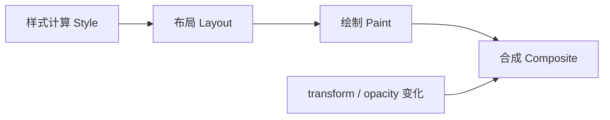
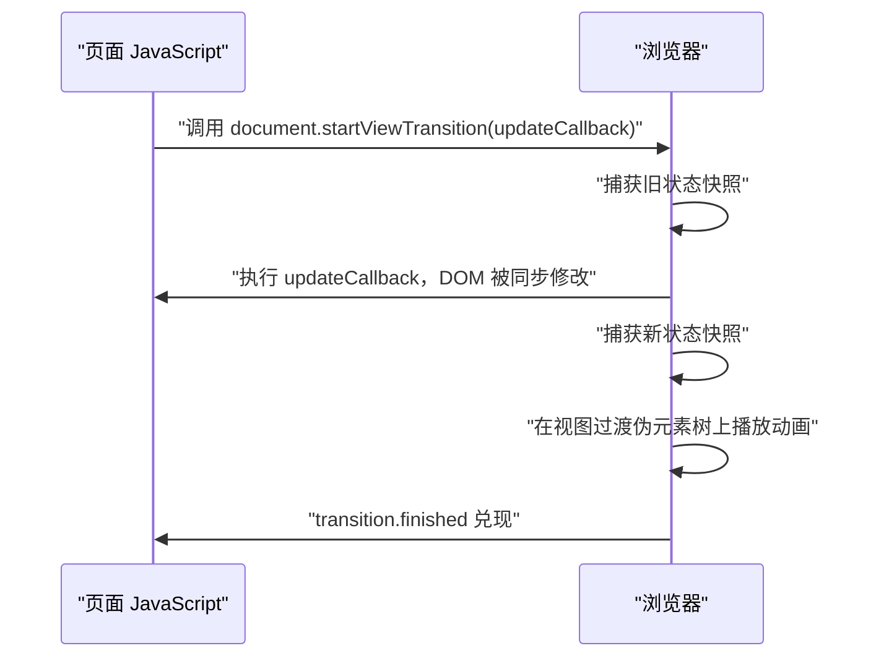

# 动画、滚动驱动动画与 View Transitions：MDN 精读

!!! abstract "核心结论"
    - transition 是**隐式**过渡（两端状态由浏览器插值），animation 是**显式**关键帧；两者最终都归结为「按时间线求值 → 插值 → 提交合成」。
    - 只有 transform / opacity 这类可以在合成线程上推进的属性，才能做到不触发布局与绘制；触发布局或绘制的属性会把工作拉回主线程，掉帧就发生在这里。
    - cubic-bezier 求值的本质是「已知 x 反解参数 t，再求 y」；三次贝塞尔曲线没有闭式反函数，引擎必须用数值方法（牛顿迭代 + 二分兜底）逼近。
    - scroll-driven animations 把动画的时间线从 document timeline 换成 scroll / view progress timeline，进度由滚动位置而非时间驱动，连接点是 `animation-timeline`。
    - View Transitions 的机制是「旧状态快照 + 新状态快照 + 伪元素树上的动画」；同文档用 `document.startViewTransition()`，跨文档用 `@view-transition { navigation: auto }`。

## 1. 渲染管线与合成：动画性能的物理基础

### 1.1 一次样式变化要走多远

浏览器把「属性变了」这件事转成屏幕像素，通常要经过 5 个阶段：样式计算（Style / Recalc）、布局（Layout）、绘制（Paint）、合成（Composite）。关键点是：**越靠后的阶段越便宜，而且后面的阶段可以不在主线程上执行**。



如果一次动画只改变 transform 或 opacity，浏览器可以在已经提升为独立合成层的元素上直接更新变换矩阵或透明度，跳过 Style / Layout / Paint 三个阶段。这就是「只走合成」的含义，也是「动画要快就用 transform / opacity」这句面试口头禅背后的真实原因。

### 1.2 属性与管线阶段对照

| 属性 | 触发的管线阶段 | 可否只走合成 | 备注 |
| --- | --- | --- | --- |
| `transform` | Composite | 是 | 位移/旋转/缩放的推荐载体 |
| `opacity` | Composite | 是 | 配合 `transform` 做淡入淡出 |
| `background-color` | Paint + Composite | 否 | 需要重绘，但不需要重排版 |
| `color` | Paint + Composite | 否 | 同上 |
| `width` / `height` | Layout + Paint + Composite | 否 | 会引发兄弟节点重排 |
| `top` / `left` | Layout + Paint + Composite | 否 | 对定位元素生效；等价效果可用 transform 替代 |
| `margin` / `padding` | Layout + Paint + Composite | 否 | 影响盒模型 |
| `will-change` | 无直接视觉变化 | 不适用 | 只是给引擎的优化提示 |

这张表是「实现相关」的工程结论：不同浏览器、不同版本的合成策略并不完全一致，最终以 DevTools 的 Layers / Rendering 面板实测为准（具体分类需核对官方文档与目标浏览器的实现）。

## 2. transition 与 animation：隐式与显式两套模型

### 2.1 两者的语义差异

MDN 把 transition 描述为「**implicit transitions**」：中间的中间态由浏览器隐式生成。而 animation 通过 `@keyframes` 显式声明每个时间点的渲染状态，并能控制 duration、iteration count、delay 等。

| 维度 | transition | animation |
| --- | --- | --- |
| 触发条件 | 属性值发生变化（含 `:hover`、类名切换） | 元素匹配到带 `animation-name` 的规则即生效 |
| 关键帧 | 只有 from / to 两端 | `@keyframes` 可定义任意多个 `<keyframe-selector>` |
| 循环 | 不支持 | `animation-iteration-count` 支持重复与 `infinite` |
| 方向 | 不支持 | `animation-direction` 支持 normal / reverse / alternate / alternate-reverse |
| 起始样式 | 属性已存在的旧值；元素新插入 DOM 时可用 `@starting-style` 补充 | `@keyframes` 的 `from` 或 `0%` |
| 离散属性 | 可对离散属性做过渡（如 `display` 的 `none` 与显示值之间） | 同样支持离散可动画属性 |

### 2.2 手写一个关键帧求值器与动画驱动器

这段代码要解决的是：把「关键帧 + duration + delay + iterations + direction + easing」这套声明式描述，变成一个可以在任意时刻被查询的纯函数，从而准确复现 animation 的插值语义。运行环境：Node.js 18+，CommonJS，保存为 `animation-model.js` 后执行 `node animation-model.js`。

```js
// 运行环境：Node.js 18+（CommonJS）
const assert = require('node:assert/strict');

// 第 1 段：关键帧归一化
// 目标：把可能缺省 offset 的关键帧补齐成单调不减的 [0,1] 序列
function normalizeKeyframes(frames) {
  if (!Array.isArray(frames) || frames.length === 0) throw new Error('keyframes 不能为空');
  const list = frames.map((f) => ({ offset: f.offset ?? null, value: f.value, easing: f.easing }));

  // 首尾缺省时补 0 和 1，这是 CSS 的默认行为
  if (list[0].offset === null) list[0].offset = 0;
  if (list[list.length - 1].offset === null) list[list.length - 1].offset = 1;

  // 中间缺省：在最近的左右已定义 offset 之间线性均分
  let i = 0;
  while (i < list.length) {
    if (list[i].offset !== null) { i += 1; continue; }
    let j = i;
    while (j < list.length && list[j].offset === null) j += 1;
    const from = list[i - 1].offset;
    const to = list[j].offset;
    const span = j - (i - 1);
    for (let k = i; k < j; k += 1) {
      list[k].offset = from + ((to - from) * (k - (i - 1))) / span;
    }
    i = j;
  }

  for (let k = 1; k < list.length; k += 1) {
    if (list[k].offset < list[k - 1].offset) throw new Error('keyframe offset 必须单调不减');
  }
  return list;
}

// 第 2 段：单点求值
// 目标：给定全局进度 p ∈ [0,1]，定位所在区间并做局部插值
function evaluateKeyframes(list, progress, baseEasing) {
  const p = Math.min(1, Math.max(0, progress));
  if (p <= list[0].offset) return list[0].value;
  const last = list[list.length - 1];
  if (p >= last.offset) return last.value;

  let i = 0;
  while (i < list.length - 1 && list[i + 1].offset <= p) i += 1;
  const a = list[i];
  const b = list[i + 1];
  const span = b.offset - a.offset;
  const local = span === 0 ? 1 : (p - a.offset) / span;
  // 分段 easing：关键帧自身带的 easing 优先，否则回落到整体 easing
  const eased = (a.easing ?? baseEasing)(local);
  return a.value + (b.value - a.value) * eased;
}

// 第 3 段：动画驱动器
// 目标：把「已过去多少毫秒」映射成 phase + progress + value
function createAnimationSpec(options) {
  const {
    keyframes,
    duration = 1000,
    delay = 0,
    iterations = 1,
    direction = 'normal', // normal | reverse | alternate | alternate-reverse
    easing = (t) => t,
  } = options;

  if (!(duration > 0)) throw new RangeError('duration 必须 > 0');
  const list = normalizeKeyframes(keyframes);

  // 把「第几轮的第几分之几」映射成实际进度，处理正反向
  function progressAt(index, frac) {
    let reversed = false;
    if (direction === 'reverse') reversed = true;
    else if (direction === 'alternate') reversed = index % 2 === 1;
    else if (direction === 'alternate-reverse') reversed = index % 2 === 0;
    return reversed ? 1 - frac : frac;
  }

  function iterationProgress(rawIteration) {
    const index = Math.floor(rawIteration);
    return progressAt(index, rawIteration - index);
  }

  const startProgress = iterationProgress(0);
  // 终点：整数轮次时，动画停在「最后一轮的末尾」（第 iterations-1 轮、frac=1），
  // 而不是「第 iterations 轮的开头」——后者的 frac=0，会让 normal 方向的终点值错成起点值
  const endProgress = iterations === Infinity
    ? null
    : Number.isInteger(iterations)
      ? progressAt(iterations - 1, 1)
      : iterationProgress(iterations);

  function at(elapsedMs) {
    const active = elapsedMs - delay;
    if (active < 0) {
      return { phase: 'before', progress: startProgress, value: evaluateKeyframes(list, startProgress, easing) };
    }
    if (iterations !== Infinity && active >= duration * iterations) {
      return { phase: 'after', progress: endProgress, value: evaluateKeyframes(list, endProgress, easing) };
    }
    const raw = active / duration;
    const progress = iterationProgress(raw);
    return { phase: 'active', progress, value: evaluateKeyframes(list, progress, easing) };
  }

  return { at, keyframes: list, startProgress, endProgress };
}
```

逐段解析：

1. **归一化**：CSS 允许省略 `offset`，此时要在已定义的关键帧之间均分。注意 `span = j - (i - 1)` 而不是 `j - i`，因为区间是从「左边用过的那个关键帧」开始的。
2. **单点求值**：定位区间用的是「最后一个 `offset <= p` 的下标」，这样恰好落在关键帧上时取到的是该帧本身而不是前一段的终点。分段 easing 放在这里实现，才能支持每个关键帧段配置不同的 `animation-timing-function`。
3. **驱动器**：`iterationProgress(0)` 和 `iterationProgress(iterations)` 同时给出了「动画起点值」和「动画终点值」，这正是 `animation-fill-mode` 里 `backwards` / `forwards` 需要的两端。本实现只负责插值核心，`fill-mode` 的完整应用语义需核对官方文档。

验证标准（紧跟同一文件）：

```js
// 第 4 段：验证
// 归一化：缺省 offset 均分
assert.deepEqual(
  normalizeKeyframes([{ value: 0 }, { value: 10 }, { value: 20 }]).map((k) => k.offset),
  [0, 0.5, 1],
);

// 基础插值
const spec = createAnimationSpec({
  keyframes: [{ offset: 0, value: 0 }, { offset: 1, value: 100 }],
  duration: 1000,
  easing: (t) => t,
});
assert.equal(spec.at(0).value, 0);
assert.equal(spec.at(500).value, 50);
assert.equal(spec.at(1000).phase, 'after');
assert.equal(spec.at(1000).value, 100);
assert.equal(spec.at(-1).phase, 'before');
assert.equal(spec.at(-1).value, 0);

// delay：0 到 500ms 之间处于 before，1000ms 时等于 500ms 的插值
const delayed = createAnimationSpec({
  keyframes: [{ offset: 0, value: 0 }, { offset: 1, value: 10 }],
  duration: 1000,
  delay: 500,
  easing: (t) => t,
});
assert.equal(delayed.at(0).phase, 'before');
assert.equal(delayed.at(500).value, 0);
assert.equal(delayed.at(1000).value, 5);

// easing 生效：t => t*t 时，中点应是 25 而不是 50
const eased = createAnimationSpec({
  keyframes: [{ offset: 0, value: 0 }, { offset: 1, value: 100 }],
  duration: 1000,
  easing: (t) => t * t,
});
assert.equal(eased.at(500).value, 25);

// alternate：第二轮反向，1750ms 落在第二轮的 0.75 处，反向成 0.25
const alt = createAnimationSpec({
  keyframes: [{ offset: 0, value: 0 }, { offset: 1, value: 10 }],
  duration: 1000,
  iterations: 2,
  direction: 'alternate',
  easing: (t) => t,
});
assert.equal(alt.at(500).value, 5);
assert.equal(alt.at(1750).value, 2.5);
assert.equal(alt.at(2000).phase, 'after');
assert.equal(alt.at(2000).value, 0);

// 单调 offset 校验
assert.throws(
  () => normalizeKeyframes([{ offset: 0.8, value: 1 }, { offset: 0.2, value: 2 }]),
  /单调不减/,
);

console.log('animation-model.js 全部断言通过');
```

预期输出：

```
animation-model.js 全部断言通过
```

## 3. 缓动函数：从 cubic-bezier 到 step 与 linear()

### 3.1 为什么必须数值求解

CSS 的 `<cubic-bezier-easing-function>` 描述的是从 (0,0) 到 (1,1) 的三次贝塞尔曲线，控制点为 (x1,y1)、(x2,y2)。曲线以参数 t 表示：

- x(t) = 3(1-t)^2·t·x1 + 3(1-t)·t^2·x2 + t^3
- y(t) = 3(1-t)^2·t·y1 + 3(1-t)·t^2·y2 + t^3

动画在时刻给出的是**横坐标进度 x**，我们需要的是**纵坐标 y**。要得到 y 必须先知道对应的 t，而三次方程没有通用闭式解，因此只能数值逼近。工程上主流做法是牛顿迭代求根，失败时退化为二分法。

| 缓动类型 | CSS 写法 | 数学性质 | 适用场景 |
| --- | --- | --- | --- |
| linear | `linear`，内部等价于 `cubic-bezier(0, 0, 1, 1)` | 恒等映射，一阶导恒为 1 | 滚动条、进度条等不应有加速度感知的场合 |
| cubic-bezier | `cubic-bezier(x1, y1, x2, y2)` | 参数曲线，x1/x2 必须落在 [0,1] | 大部分 UI 动效 |
| step | `steps(n, end)` 等 | 分段常量函数 | 逐帧动画、机械/仪表盘式的跳变 |
| linear() | `linear(...)` | 自定义分段线性 | 需要精确复刻一段采样曲线时 |

### 3.2 完整实现：cubic-bezier 求解器

这段代码要解决的是：给定 CSS 形式的控制点，生成一个把进度 x 映射为进度 y 的函数，且精度足以驱动动画。运行环境：Node.js 18+，CommonJS，保存为 `bezier.js`。

```js
// 运行环境：Node.js 18+（CommonJS）
const assert = require('node:assert/strict');

// 第 1 段：把三次贝塞尔展开成多项式系数形式
// ((A*t + B)*t + C)*t 比直接算 Bernstein 形式更少乘法
function coefficientA(a1, a2) { return 1 - 3 * a2 + 3 * a1; }
function coefficientB(a1, a2) { return 3 * a2 - 6 * a1; }
function coefficientC(a1) { return 3 * a1; }

function calcBezier(t, a1, a2) {
  return ((coefficientA(a1, a2) * t + coefficientB(a1, a2)) * t + coefficientC(a1)) * t;
}

// 多项式对 t 求导，即曲线在 t 处的斜率
function getSlope(t, a1, a2) {
  return 3 * coefficientA(a1, a2) * t * t + 2 * coefficientB(a1, a2) * t + coefficientC(a1);
}

// 第 2 段：已知 x 反解 t
const NEWTON_ITERATIONS = 8;   // 牛顿迭代次数上限
const NEWTON_MIN_SLOPE = 0.001; // 斜率过小则牛顿法不稳定，直接放弃
const BISECTION_ITERATIONS = 60; // 二分 60 次后区间宽度约为 2^-60

function solveTForX(x, x1, x2) {
  if (x <= 0) return 0;
  if (x >= 1) return 1;

  // 先牛顿迭代：收敛快，通常 3 到 4 次就够
  let t = x;
  for (let i = 0; i < NEWTON_ITERATIONS; i += 1) {
    const slope = getSlope(t, x1, x2);
    if (Math.abs(slope) < NEWTON_MIN_SLOPE) break;
    const next = t - (calcBezier(t, x1, x2) - x) / slope;
    if (next <= 0 || next >= 1) break; // 跑出定义域就放弃，交给二分
    t = next;
  }

  // 再用二分兜底，保证一定收敛到足够精度
  let lo = 0;
  let hi = 1;
  t = x;
  for (let i = 0; i < BISECTION_ITERATIONS; i += 1) {
    const current = calcBezier(t, x1, x2);
    if (current < x) lo = t;
    else hi = t;
    t = (lo + hi) / 2;
  }
  return t;
}

// 第 3 段：对外工厂函数
function cubicBezier(x1, y1, x2, y2) {
  if (!(x1 >= 0 && x1 <= 1) || !(x2 >= 0 && x2 <= 1)) {
    throw new RangeError('x1 与 x2 必须落在 [0, 1] 区间内');
  }
  // 控制点落在对角线上时曲线退化为直线，直接走恒等映射
  if (x1 === y1 && x2 === y2) return (x) => x;

  return (x) => {
    if (x <= 0) return 0;
    if (x >= 1) return 1;
    return calcBezier(solveTForX(x, x1, x2), y1, y2);
  };
}

// 第 4 段：step 缓动，按 CSS 语义简化实现（step-end 行为）
function stepEnd(n) {
  if (!Number.isInteger(n) || n < 1) throw new RangeError('steps 数量必须是 >= 1 的整数');
  return (x) => {
    const p = Math.min(1, Math.max(0, x));
    if (p >= 1) return 1;
    return Math.floor(p * n) / n;
  };
}
```

逐段解析：

1. **多项式化**：Bernstein 形式每次求值要做 3 次幂运算，展开成 `A/B/C` 形式后只需 3 次乘法。注意 `A`、`B` 同时依赖 a1 和 a2，而 `C` 只依赖 a1。
2. **反解 t**：牛顿法的迭代式是 `t ← t - f(t)/f'(t)`，其中 `f(t) = x(t) - x`。斜率接近 0 时牛顿法会数值爆炸，所以先检测 `NEWTON_MIN_SLOPE`；迭代结果跑出 `(0,1)` 也要放弃，因为贝塞尔曲线只在 t ∈ [0,1] 上有意义。二分法每轮把区间砍半，60 轮后精度远超任何屏幕能分辨的差异。
3. **工厂函数**：`x1`、`x2` 是横坐标，超界会导致曲线在 x 方向非单调，规范上不合法，所以直接抛错。`x1 === y1 && x2 === y2` 时曲线退化为恒等映射，短路可以省掉整个数值流程。
4. **step**：`Math.floor(p * n) / n` 实现的是在每个 1/n 区间内保持常量，到达下一个台阶才跳变，等价于 `steps(n, end)` 的直觉行为。`p >= 1` 单独处理是因为 `floor(n)/n` 恰好等于 1，不特判也不会错，但显式写出更易读。

验证标准：

```js
// 第 5 段：验证
// linear 退化分支：应精确等于恒等映射
const linear = cubicBezier(0, 0, 1, 1);
assert.equal(linear(0), 0);
assert.equal(linear(1), 1);
assert.equal(linear(0.37), 0.37);

// ease-in-out 关于 (0.5, 0.5) 中心对称
const easeInOut = cubicBezier(0.42, 0, 0.58, 1);
assert.ok(Math.abs(easeInOut(0.5) - 0.5) < 1e-6, `期望 0.5，实际 ${easeInOut(0.5)}`);
for (const x of [0.1, 0.3, 0.7, 0.9]) {
  assert.ok(Math.abs(easeInOut(x) + easeInOut(1 - x) - 1) < 1e-6, `对称性在 x=${x} 处不成立`);
}

// CSS 的 ease 曲线，在中点约为 0.8029
const ease = cubicBezier(0.25, 0.1, 0.25, 1);
assert.ok(Math.abs(ease(0.5) - 0.8029) < 0.001, `期望约 0.8029，实际 ${ease(0.5)}`);

// 单调性：x1、x2 在 [0,1] 内时曲线在 x 方向单调，y 也应单调不减
let previous = -Infinity;
for (let i = 0; i <= 100; i += 1) {
  const y = easeInOut(i / 100);
  assert.ok(y >= previous - 1e-9, `在 x=${i / 100} 处出现回退`);
  previous = y;
}

// 越界控制点必须抛错
assert.throws(() => cubicBezier(1.5, 0, 0.5, 1), /\[0, 1\]/);

// step 缓动
const s4 = stepEnd(4);
assert.equal(s4(0), 0);
assert.equal(s4(0.24), 0);
assert.equal(s4(0.26), 0.25);
assert.equal(s4(0.99), 0.75);
assert.equal(s4(1), 1);

console.log('bezier.js 全部断言通过');
```

预期输出：

```
bezier.js 全部断言通过
```

## 4. Spring 动画：从物理积分到可运行的数值实现

### 4.1 为什么需要它

cubic-bezier 是「时间到进度」的静态映射，它**不知道当前速度**。一旦动画中途被打断（用户又点了一次、列表被插入新项），从当前值重新起一条 cubic-bezier 曲线会产生速度突变。Spring 动画的模型是阻尼谐振子，状态是 (位置, 速度) 二元组，因此天然支持中断续跑。

物理模型：`a = (-k·(x - target) - c·v) / m`，其中 k 是刚度、c 是阻尼、m 是质量。阻尼比 `ζ = c / (2·√(k·m))`：ζ < 1 欠阻尼（会过冲），ζ = 1 临界阻尼，ζ > 1 过阻尼。

### 4.2 完整实现：定步长半隐式欧拉积分器

这段代码要解决的是：用**固定步长**积分保证结果可复现（同样的输入必然得到同样的输出），同时用累加器吸收可变帧间隔。运行环境：Node.js 18+，CommonJS，保存为 `spring.js`。

```js
// 运行环境：Node.js 18+（CommonJS）
const assert = require('node:assert/strict');

// 第 1 段：固定步长
// 定步长 + 累加器是游戏循环的标准做法：物理结果与帧率解耦，便于测试
const FIXED_DT = 1 / 240;   // 240Hz 子步
const MAX_FRAME = 0.1;      // 单帧最多推进 100ms，避免后台标签页恢复后数值爆炸

function createSpring(options = {}) {
  const stiffness = options.stiffness ?? 170;
  const damping = options.damping ?? 26;
  const mass = options.mass ?? 1;
  const restThreshold = options.restThreshold ?? 0.001;   // 位置静止阈值
  const restVelocity = options.restVelocity ?? 0.001;     // 速度静止阈值

  if (stiffness <= 0) throw new RangeError('stiffness 必须 > 0');
  if (damping < 0) throw new RangeError('damping 必须 >= 0');
  if (mass <= 0) throw new RangeError('mass 必须 > 0');

  let position = 0;
  let velocity = 0;
  let target = 0;
  let accumulator = 0;

  // 第 2 段：积分核心
  // 半隐式欧拉：先更新速度，再用「新速度」更新位置。
  // 相比显式欧拉，它在振动系统上是辛积分器，能量不会单调发散。
  function integrate(steps) {
    for (let i = 0; i < steps; i += 1) {
      const displacement = position - target;
      const acceleration = (-stiffness * displacement - damping * velocity) / mass;
      velocity += acceleration * FIXED_DT;
      position += velocity * FIXED_DT;
    }
  }

  return {
    setTarget(next) { target = next; },
    setPosition(value) { position = value; velocity = 0; accumulator = 0; },
    setVelocity(value) { velocity = value; },

    // 第 3 段：把真实流逝时间切成整数个固定步长
    advance(deltaSeconds) {
      const clamped = Math.min(Math.max(deltaSeconds, 0), MAX_FRAME);
      accumulator += clamped;
      const steps = Math.floor(accumulator / FIXED_DT);
      accumulator -= steps * FIXED_DT;
      integrate(steps);
      return position;
    },

    get position() { return position; },
    get velocity() { return velocity; },
    get target() { return target; },
    get isAtRest() {
      return Math.abs(position - target) < restThreshold && Math.abs(velocity) < restVelocity;
    },
  };
}
```

逐段解析：

1. **定步长**：如果直接用可变 `deltaSeconds` 做欧拉积分，当 stiffness 高、帧间隔大时，`velocity` 会一步跨过平衡点并持续放大，最终数值发散。固定 1/240 秒的子步把每步的位移增量控制在安全范围内。
2. **积分顺序**：先算加速度、再更新速度、最后用新速度更新位置，这就是半隐式（symplectic）欧拉。如果反过来先更新位置再用旧速度算加速度，就是显式欧拉，长时间积分会持续注入能量。
3. **累加器**：把不足一个子步的余量存起来，下一帧继续用，因此不会丢失时间，也不会因为帧率变化产生抖动。`MAX_FRAME` 是必要的防御：标签页切回来时 `deltaSeconds` 可能是几秒，直接积分会算出爆炸值。

验证标准：

```js
// 第 4 段：验证
// 临界阻尼附近的参数：zeta = c / (2*sqrt(k*m)) = 26 / (2*sqrt(170)) ≈ 1.0，不应过冲
const settled = createSpring({ stiffness: 170, damping: 26, mass: 1 });
settled.setTarget(1);
let maxPosition = -Infinity;
for (let i = 0; i < 20; i += 1) {
  settled.advance(0.05); // 每次推进 50ms，共 1s
  maxPosition = Math.max(maxPosition, settled.position);
}
assert.ok(Number.isFinite(settled.position), '位置出现 NaN 或 Infinity');
assert.ok(Math.abs(settled.position - 1) < 0.01, `1s 后应接近 1，实际 ${settled.position}`);
assert.ok(maxPosition < 1.001, `临界阻尼不应过冲，实际峰值 ${maxPosition}`);

// 欠阻尼参数：zeta = 12 / (2*sqrt(180)) ≈ 0.447，必须出现过冲
const bouncy = createSpring({ stiffness: 180, damping: 12, mass: 1 });
bouncy.setTarget(1);
let overshoot = -Infinity;
for (let i = 0; i < 20; i += 1) {
  bouncy.advance(0.05);
  overshoot = Math.max(overshoot, bouncy.position);
}
assert.ok(overshoot > 1.1, `欠阻尼应明显过冲，实际峰值 ${overshoot}`);
assert.ok(Math.abs(bouncy.position - 1) < 0.02, `1s 后应收敛到 1 附近，实际 ${bouncy.position}`);

// 静止判定：继续推进后应进入静止
for (let i = 0; i < 40; i += 1) bouncy.advance(0.05);
assert.ok(bouncy.isAtRest, '长时间推进后应判定为静止');

// 中断续跑：中途改目标，状态连续（位置不跳变）
const interrupted = createSpring({ stiffness: 120, damping: 14, mass: 1 });
interrupted.setTarget(1);
interrupted.advance(0.1);
const midway = interrupted.position;
assert.ok(midway > 0 && midway < 1);
interrupted.setTarget(0.5);
assert.equal(interrupted.position, midway, '改目标不应让位置跳变');
interrupted.advance(0.05);
assert.ok(interrupted.position > midway, '新目标仍在前进方向时应继续前进');

// 参数校验
assert.throws(() => createSpring({ stiffness: 0 }), /stiffness/);
assert.throws(() => createSpring({ mass: 0 }), /mass/);

console.log('spring.js 全部断言通过');
```

预期输出：

```
spring.js 全部断言通过
```

对比一下两种实现的核心差异：

| 维度 | cubic-bezier | Spring |
| --- | --- | --- |
| 状态 | 只有时间 → 进度 | 位置 + 速度 |
| 中断续跑 | 需要重新算起点，速度不连续 | 天然连续，保留速度 |
| 结束条件 | 固定 duration | 由阈值判定，未知总时长 |
| 过冲 | 只能靠 y1/y2 > 1 人为构造 | 由阻尼比自然产生 |
| 可测试性 | 纯函数，确定性强 | 依赖积分步长，需定步长才可复现 |

## 5. 滚动驱动动画：scroll() 与 view() 时间线

### 5.1 时间线的替换

MDN 的描述是：scroll-driven animations 建立在 CSS animations 与 Web Animations API 之上，允许沿「基于滚动的动画时间线」而不是默认的时间驱动 document timeline 来动画属性值。你可以滚动元素本身、它的滚动容器或根元素来驱动动画。

连接点是 `animation-timeline`。可以显式命名时间线，也可以直接用 `scroll()` / `view()` 函数：

```css
/* 示例：滚动驱动的背景色与形状动画 */
main {
  /* 第 1 段：给滚动容器命名一条时间线，供后代引用 */
  scroll-timeline: --main-timeline;
  height: 90vh;
  overflow: scroll;
}

div {
  /* 第 2 段：用 scroll() 直接引用最近的滚动容器 */
  animation: background-animation linear;
  animation-timeline: scroll(nearest inline);
  height: 400vh;
}

div::after {
  /* 第 3 段：用命名时间线引用祖先的元素 */
  animation: shape-animation linear;
  animation-timeline: --main-timeline;
}

@keyframes background-animation {
  0% { background-color: palegoldenrod; }
  100% { background-color: magenta; }
}
```

| 维度 | `scroll()` | `view()` |
| --- | --- | --- |
| 驱动量 | 滚动容器的滚动位置 | 目标元素在滚动视口中的可见进度 |
| 典型用途 | 进度条、视差背景、随滚动改色 | 元素进入视口时的淡入/上滑 |
| 关键参数 | 滚动容器与轴向（如 `nearest inline`） | 目标元素与轴向 |
| 是否依赖元素自身尺寸 | 否 | 是，元素未进入视口时进度为 0 |

### 5.2 手写一个进度映射模型

这段代码要解决的是：把「滚动位移」映射成 `[0,1]` 的进度，并支持自定义区间起点与终点（对应时间线范围与 inset 的概念）。运行环境：Node.js 18+，CommonJS，保存为 `scroll-progress.js`。

```js
// 运行环境：Node.js 18+（CommonJS）
const assert = require('node:assert/strict');

// 第 1 段：把滚动偏移映射为进度
// start / end 表示动画绑定区间的起止滚动偏移；缺省时覆盖整个可滚动区间
function scrollProgress(input) {
  const { scrollTop, scrollHeight, clientHeight } = input;
  if (clientHeight < 0 || scrollHeight < clientHeight) throw new RangeError('滚动尺寸不合法');

  const maxScroll = scrollHeight - clientHeight;
  const start = input.start ?? 0;
  const end = input.end ?? maxScroll;

  // 区间退化为一个点时，只能取 0 或 1，避免除零
  if (end === start) return scrollTop >= end ? 1 : 0;

  const raw = (scrollTop - start) / (end - start);
  return Math.min(1, Math.max(0, raw));
}

// 第 2 段：基于元素与视口几何的可见度进度
// 说明：这是「元素从视口下沿进入、从上沿离开」这一种常见映射的独立建模，
// 不等于 view() 的 range-name 定义。cover / contain / entry / exit 等具体取值需核对官方文档。
function viewProgress(input) {
  const { elementTop, elementHeight, scrollTop, clientHeight } = input;
  const viewportTop = scrollTop;
  const viewportBottom = scrollTop + clientHeight;
  const elementBottom = elementTop + elementHeight;

  const travel = clientHeight + elementHeight;
  if (travel === 0) return 0;

  // 元素下沿刚接触视口上沿时为 0，元素上沿刚离开视口下沿时为 1
  const passed = viewportBottom - elementTop;
  return Math.min(1, Math.max(0, passed / travel));
}

// 第 3 段：按进度采样关键帧（只支持数值属性，用于验证时间线是否正确）
function sampleAt(progress, stops) {
  const p = Math.min(1, Math.max(0, progress));
  for (let i = 0; i < stops.length - 1; i += 1) {
    const a = stops[i];
    const b = stops[i + 1];
    if (p >= a.at && p <= b.at) {
      const span = b.at - a.at;
      const local = span === 0 ? 0 : (p - a.at) / span;
      return a.value + (b.value - a.value) * local;
    }
  }
  return stops[stops.length - 1].value;
}
```

逐段解析：

1. **滚动进度**：`scrollHeight - clientHeight` 就是最大可滚动距离，这是滚动进度的分母。`start` / `end` 对应时间线范围与 inset 调整后的实际绑定区间，把这两个值参数化之后，同一段代码就能表达「只在整个滚动区间的中段做动画」。
2. **可见度进度**：总行程是 `clientHeight + elementHeight`，因为元素要完整穿过视口。这个函数是独立建模，用于说明「进度由几何关系决定」这一点，不是对 `view()` 规范的精确定义。
3. **采样**：把进度再喂给关键帧表，得到的值就是动画在该滚动位置应该呈现的样式值，这整条链路和「时间 → 进度 → 值」是同构的。

验证标准：

```js
// 第 4 段：验证
// 满区间：0 到 1000 的滚动，容器可视高 200
const full = { scrollHeight: 1200, clientHeight: 200 }; // maxScroll = 1000
assert.equal(scrollProgress({ ...full, scrollTop: 0 }), 0);
assert.equal(scrollProgress({ ...full, scrollTop: 500 }), 0.5);
assert.equal(scrollProgress({ ...full, scrollTop: 1000 }), 1);
// 越界夹紧
assert.equal(scrollProgress({ ...full, scrollTop: 5000 }), 1);
assert.equal(scrollProgress({ ...full, scrollTop: -50 }), 0);

// 自定义区间：只在 200 到 400 之间做动画
assert.equal(scrollProgress({ ...full, scrollTop: 200, start: 200, end: 400 }), 0);
assert.equal(scrollProgress({ ...full, scrollTop: 300, start: 200, end: 400 }), 0.5);
assert.equal(scrollProgress({ ...full, scrollTop: 400, start: 200, end: 400 }), 1);
assert.equal(scrollProgress({ ...full, scrollTop: 399, start: 200, end: 400 }) < 1, true);

// 退化区间
assert.equal(scrollProgress({ ...full, scrollTop: 999, start: 1000, end: 1000 }), 0);
assert.equal(scrollProgress({ ...full, scrollTop: 1000, start: 1000, end: 1000 }), 1);

// view 进度：元素高 100，视口高 200，元素顶端在文档坐标 0
const view = { elementTop: 0, elementHeight: 100, clientHeight: 200 };
assert.equal(viewProgress({ ...view, scrollTop: 200 }), 0);   // 元素下沿恰好接触视口上沿
assert.equal(viewProgress({ ...view, scrollTop: -100 }), 1);  // 元素上沿恰好离开视口下沿
assert.equal(viewProgress({ ...view, scrollTop: 50 }), 0.5);  // 居中行程

// 采样
const stops = [{ at: 0, value: 0 }, { at: 0.5, value: 100 }, { at: 1, value: 0 }];
assert.equal(sampleAt(0, stops), 0);
assert.equal(sampleAt(0.25, stops), 50);
assert.equal(sampleAt(0.5, stops), 100);
assert.equal(sampleAt(0.75, stops), 50);
assert.equal(sampleAt(1, stops), 0);

console.log('scroll-progress.js 全部断言通过');
```

预期输出：

```
scroll-progress.js 全部断言通过
```

注意 `viewProgress` 的三个断言：`scrollTop = 200` 时视口下沿在 200，元素顶端在 0，元素尚未进入，进度 0；`scrollTop = -100` 时视口下沿在 100，恰好等于元素下沿，元素刚离开，进度 1；`scrollTop = 50` 时行程过半。

## 6. View Transitions：同文档与跨文档

### 6.1 快照式过渡的执行顺序



同文档过渡的关键约束是：`updateCallback` 中的 DOM 修改必须在浏览器下一次渲染前完成，因此它是一个**同步**修改 + 一次渲染的组合。

| 维度 | 同文档 View Transition | 跨文档 View Transition |
| --- | --- | --- |
| 触发方式 | `document.startViewTransition(cb)` | `@view-transition { navigation: auto }` |
| 作用范围 | 同一 document 内的 DOM 状态切换 | 导航到另一个 document |
| 是否有 JS 参与 | 必须提供回调 | 不需要额外 JS |
| 命名方式 | 元素的 `view-transition-name` | 同样依赖 `view-transition-name` |
| 主要风险 | 回调同步阻塞；快照带来内存与合成开销 | 需要浏览器支持该导航类型（具体支持范围需核对官方文档） |

### 6.2 手写一个快照 diff 模型

这段代码要解决的是：把「旧状态 → 新状态」的差异分类成 morph（两边都有，需要形变）、exit（只有旧的，需要淡出）、enter（只有新的，需要淡入），这正是视图过渡伪元素树的组织逻辑。运行环境：Node.js 18+，CommonJS，保存为 `view-transition-model.js`。

```js
// 运行环境：Node.js 18+（CommonJS）
const assert = require('node:assert/strict');

// 第 1 段：用一个 Map 模拟「带 view-transition-name 的元素」及其几何信息
function createViewTransitionModel() {
  const named = new Map();
  return {
    set(name, box) { named.set(name, { ...box }); },
    remove(name) { named.delete(name); },
    snapshot() { return new Map([...named].map(([k, v]) => [k, { ...v }])); },
  };
}

// 第 2 段：新旧快照求差
function diffSnapshots(oldSnapshot, newSnapshot) {
  const plan = { morph: [], exit: [], enter: [] };

  for (const [name, from] of oldSnapshot) {
    if (newSnapshot.has(name)) {
      plan.morph.push({ name, from, to: newSnapshot.get(name) });
    } else {
      plan.exit.push({ name, from });
    }
  }

  for (const [name, to] of newSnapshot) {
    if (!oldSnapshot.has(name)) plan.enter.push({ name, to });
  }

  return plan;
}

// 第 3 段：建模 startViewTransition 的执行顺序
// 注意：这是对执行时序的简化建模，不是 polyfill，也未实现伪元素树本身
function runViewTransition(model, updateCallback) {
  const oldSnapshot = model.snapshot();  // 捕获旧状态
  const updateResult = updateCallback(); // 同步修改 DOM（对应规范中的 update 回调阶段）
  const newSnapshot = model.snapshot();  // 捕获新状态
  const plan = diffSnapshots(oldSnapshot, newSnapshot);

  return {
    plan,
    updateCallbackDone: Promise.resolve(updateResult),
    finished: Promise.resolve(plan),
  };
}
```

逐段解析：

1. **命名模型**：只有带 `view-transition-name` 的元素才会参与过渡，其余元素随旧页面一起被快照或直接消失。用 `Map` 而不是数组，是为了让同名的旧、新元素能被直接配对。
2. **求差**：先遍历旧快照判断 morph / exit，再遍历新快照找出 enter。两轮遍历的顺序很重要：如果先遍历新的，morph 会被重复计入 enter。
3. **时序**：真实实现中 `ready` 在伪元素树构建完成后兑现、`finished` 在所有动画结束后兑现，两者时序不同。这里用两个 Promise 分别对应 `updateCallbackDone` 与 `finished`，表达的是「回调完成」与「过渡完成」是两件事。

验证标准：

```js
// 第 4 段：验证
const model = createViewTransitionModel();
model.set('card', { x: 0, y: 0, width: 100, height: 100 });
model.set('title', { x: 10, y: 10, width: 200, height: 30 });

const transition = runViewTransition(model, () => {
  // 卡片的 view-transition-name 不变，但位置变化 → morph
  model.set('card', { x: 300, y: 200, width: 160, height: 160 });
  // 标题消失 → exit
  model.remove('title');
  // 新增一个角标 → enter
  model.set('badge', { x: 400, y: 360, width: 24, height: 24 });
  return 'updated';
});

assert.equal(transition.plan.morph.length, 1);
assert.equal(transition.plan.morph[0].name, 'card');
assert.deepEqual(transition.plan.morph[0].from, { x: 0, y: 0, width: 100, height: 100 });
assert.deepEqual(transition.plan.morph[0].to, { x: 300, y: 200, width: 160, height: 160 });

assert.deepEqual(transition.plan.exit.map((e) => e.name), ['title']);
assert.deepEqual(transition.plan.enter.map((e) => e.name), ['badge']);

// 空快照对照：全部是 enter
const empty = createViewTransitionModel();
const fresh = createViewTransitionModel();
const onlyEnter = runViewTransition(empty, () => {
  fresh.set('a', { x: 0, y: 0, width: 1, height: 1 });
  // 注意：这里改的是另一个模型，所以旧快照仍然为空
});
assert.equal(onlyEnter.plan.morph.length, 0);
assert.equal(onlyEnter.plan.enter.length, 0); // 旧模型未被修改，新快照也为空

// 两个 Promise 都可用
Promise.all([transition.updateCallbackDone, transition.finished]).then(([u, p]) => {
  assert.equal(u, 'updated');
  assert.equal(p.morph.length, 1);
  console.log('view-transition-model.js 全部断言通过');
});
```

预期输出：

```
view-transition-model.js 全部断言通过
```

第三个断言块有意暴露一个易错点：`runViewTransition` 的快照来源是传入的 `model`，如果 `updateCallback` 修改的是另一个对象，diff 结果自然为空。真实代码里必须保证「捕获旧状态、改同一个 DOM、捕获新状态」这三步作用在同一个目标上。

## 7. will-change 与合成层预算

### 7.1 它到底做了什么

MDN 对 will-change 的定位是：向浏览器提供一个提示，让它**提前完成**可能开销较大的准备工作。典型用途是提前把元素提升为独立合成层，避免动画开始时才触发图层创建。

代价同样明确：每个合成层都要占用显存，必须单独合成、单独上传纹理。把 `will-change: transform` 加在上百个列表项上，结果通常是显存吃紧、合成变慢，反而更卡。因此正确用法是「动画开始前加上，动画结束后移除」。

### 7.2 手写一个带淘汰策略的提示管理器

这段代码要解决的是：给一个固定的并发预算，超预算时按 LRU 淘汰，并在淘汰时返回需要清除的 `will-change` 列表。运行环境：Node.js 18+，CommonJS，保存为 `will-change-budget.js`。

```js
// 运行环境：Node.js 18+（CommonJS）
const assert = require('node:assert/strict');

class WillChangeBudget {
  // 第 1 段：构造时限制并发提升层数
  constructor(limit = 4) {
    if (!Number.isInteger(limit) || limit < 1) throw new RangeError('limit 必须是 >= 1 的整数');
    this.limit = limit;
    this.holds = new Map();     // id -> { value, lastUsed }
    this.released = new Set();  // 本帧需要清除 hint 的 id
    this.clock = 0;             // 逻辑时钟，用于 LRU
  }

  // 第 2 段：申请提升，必要时淘汰最久未使用的
  acquire(id, value) {
    this.clock += 1;

    if (this.holds.has(id)) {
      // 已经提升：只刷新使用时间，避免重复创建图层
      this.holds.get(id).lastUsed = this.clock;
      return [];
    }

    const evicted = [];
    while (this.holds.size >= this.limit) {
      let victim = null;
      let oldest = Infinity;
      for (const [key, hold] of this.holds) {
        if (hold.lastUsed < oldest) { oldest = hold.lastUsed; victim = key; }
      }
      this.holds.delete(victim);
      this.released.add(victim);
      evicted.push(victim);
    }

    this.holds.set(id, { value, lastUsed: this.clock });
    return evicted;
  }

  // 第 3 段：动画结束时主动释放
  release(id) {
    if (!this.holds.has(id)) return false;
    this.holds.delete(id);
    this.released.add(id);
    return true;
  }

  drainReleased() {
    const out = [...this.released];
    this.released.clear();
    return out;
  }

  styleFor(id) {
    const hold = this.holds.get(id);
    return hold ? hold.value : null;
  }

  get activeCount() { return this.holds.size; }
}
```

逐段解析：

1. **并发上限**：`limit` 是工程经验值，不是规范常量。真实项目里应该根据设备能力（内存、GPU）和设备像素比动态调整，桌面端可以给到 8 到 16，移动端通常更保守。
2. **LRU 淘汰**：遍历找 `lastUsed` 最小的条目。这里用 O(n) 扫描而不是维护双向链表，因为 n 很小（等于 `limit`），常数足够低。淘汰的 id 必须记入 `released`，否则调用方无法知道该清除哪个元素的样式。
3. **主动释放**：`transitionend` / `animationend` 触发后立刻调用 `release`，这是避免「动画早结束了但图层还挂着」的关键。

验证标准：

```js
// 第 4 段：验证
const budget = new WillChangeBudget(2);

assert.deepEqual(budget.acquire('a', 'transform'), []);
assert.deepEqual(budget.acquire('b', 'transform'), []);
assert.equal(budget.activeCount, 2);

// 第三次申请会淘汰 a
assert.deepEqual(budget.acquire('c', 'transform'), ['a']);
assert.equal(budget.activeCount, 2);
assert.equal(budget.styleFor('a'), null);
assert.equal(budget.styleFor('c'), 'transform');

// 重复申请同一个 id 不产生淘汰，只刷新使用时间
assert.deepEqual(budget.acquire('b', 'opacity'), []);
assert.equal(budget.styleFor('b'), 'transform'); // value 不被覆盖

// 此时 b 是最新的，c 最旧；再申请会淘汰 c
assert.deepEqual(budget.acquire('d', 'transform'), ['c']);
assert.deepEqual(budget.drainReleased().sort(), ['a', 'c']);

// 释放
assert.equal(budget.release('b'), true);
assert.equal(budget.release('b'), false);
assert.deepEqual(budget.drainReleased(), ['b']);
assert.equal(budget.activeCount, 1);

// 参数校验
assert.throws(() => new WillChangeBudget(0), /limit/);

console.log('will-change-budget.js 全部断言通过');
```

预期输出：

```
will-change-budget.js 全部断言通过
```

## 8. transforms 与 motion path

### 8.1 变换矩阵的合成顺序

2D 仿射变换可以用六个分量 `[a, b, c, d, e, f]` 表示：

```
| a  c  e |
| b  d  f |
| 0  0  1 |
```

点 `(x, y)` 变换后为 `(a·x + c·y + e, b·x + d·y + f)`。CSS 的 `transform: A B` 表示矩阵 `A × B`，即**先应用 B，再应用 A**。这是很多人算错顺序的根源。

### 8.2 手写矩阵合成与基于弧长的 motion path 采样

这段代码要解决两个问题：一是把 `translate` / `rotate` / `scale` 正确合成成单个矩阵，二是把一条折线路径按**弧长等分**采样，从而支持 `offset-distance` 那样的匀速运动。运行环境：Node.js 18+，CommonJS，保存为 `transform-motion.js`。

```js
// 运行环境：Node.js 18+（CommonJS）
const assert = require('node:assert/strict');

// 第 1 段：基础矩阵
function identity() { return [1, 0, 0, 1, 0, 0]; }
function translation(tx, ty) { return [1, 0, 0, 1, tx, ty]; }
function scaling(sx, sy = sx) { return [sx, 0, 0, sy, 0, 0]; }
function rotation(deg) {
  const rad = (deg * Math.PI) / 180;
  const cos = Math.cos(rad);
  const sin = Math.sin(rad);
  return [cos, sin, -sin, cos, 0, 0];
}

// 第 2 段：矩阵乘法，m = A × B 表示先 B 后 A
function multiply(A, B) {
  const [a1, b1, c1, d1, e1, f1] = A;
  const [a2, b2, c2, d2, e2, f2] = B;
  return [
    a1 * a2 + c1 * b2,
    b1 * a2 + d1 * b2,
    a1 * c2 + c1 * d2,
    b1 * c2 + d1 * d2,
    a1 * e2 + c1 * f2 + e1,
    b1 * e2 + d1 * f2 + f1,
  ];
}

function applyToPoint(m, point) {
  const [a, b, c, d, e, f] = m;
  return { x: a * point.x + c * point.y + e, y: b * point.x + d * point.y + f };
}

// 第 3 段：折线路径的弧长参数化
function buildArcLengthTable(points) {
  const cumulative = [0];
  for (let i = 1; i < points.length; i += 1) {
    const dx = points[i].x - points[i - 1].x;
    const dy = points[i].y - points[i - 1].y;
    cumulative.push(cumulative[i - 1] + Math.hypot(dx, dy));
  }
  return cumulative;
}

// 按总弧长的比例 t 采样，保证匀速前进（这正是 offset-distance 的语义）
function samplePolyline(points, t) {
  if (points.length === 0) throw new Error('路径至少需要一个点');
  if (points.length === 1) return { x: points[0].x, y: points[0].y, angle: 0 };

  const cumulative = buildArcLengthTable(points);
  const total = cumulative[cumulative.length - 1];
  if (total === 0) return { x: points[0].x, y: points[0].y, angle: 0 };

  const clamped = Math.min(1, Math.max(0, t));
  const distance = clamped * total;

  let i = 1;
  while (i < cumulative.length - 1 && cumulative[i] < distance) i += 1;

  const segmentStart = cumulative[i - 1];
  const segmentLength = cumulative[i] - segmentStart;
  const local = segmentLength === 0 ? 0 : (distance - segmentStart) / segmentLength;

  const from = points[i - 1];
  const to = points[i];
  return {
    x: from.x + (to.x - from.x) * local,
    y: from.y + (to.y - from.y) * local,
    // offset-rotate 需要的切线方向（角度制）
    angle: (Math.atan2(to.y - from.y, to.x - from.x) * 180) / Math.PI,
  };
}
```

逐段解析：

1. **基础矩阵**：`rotation` 用的是屏幕坐标系（y 轴向下），所以旋转矩阵的第二行是 `[sin, cos]`。这与数学教材里 y 轴向上的写法符号相反，实现时必须以浏览器坐标为准。
2. **乘法**：`multiply(A, B)` 的返回值对应 `transform: A B`。`e` / `f` 两个分量的计算 `a1*e2 + c1*f2 + e1` 说明：B 的平移量先被 A 的线性部分变换，再加上 A 自己的平移量。
3. **弧长参数化**：先累积每段长度，再把 `t * total` 换算成距离，最后定位到具体线段并线性插值。若直接按「点索引」均匀采样，长段走得快、短段走得慢，视觉上会一顿一顿。`angle` 是切线方向，对应 `offset-rotate` 的效果。

验证标准：

```js
// 第 4 段：验证
// transform: translate(10px, 20px) scale(2) 作用于 (1, 1)
const m1 = multiply(translation(10, 20), scaling(2));
assert.deepEqual(applyToPoint(m1, { x: 1, y: 1 }), { x: 12, y: 22 });

// 顺序相反会得到不同结果（scale 先，translate 也会被放大）
const m2 = multiply(scaling(2), translation(10, 20));
assert.deepEqual(applyToPoint(m2, { x: 1, y: 1 }), { x: 22, y: 42 });

// 旋转 90 度：(1, 0) 应变为 (0, 1)
const r90 = rotation(90);
const rotated = applyToPoint(r90, { x: 1, y: 0 });
assert.ok(Math.abs(rotated.x - 0) < 1e-12);
assert.ok(Math.abs(rotated.y - 1) < 1e-12);

// 旋转 180 度等价于 scale(-1)
const r180 = rotation(180);
const flipped = applyToPoint(r180, { x: 3, y: -4 });
assert.ok(Math.abs(flipped.x + 3) < 1e-12);
assert.ok(Math.abs(flipped.y - 4) < 1e-12);

// 弧长参数化：L 形路径 (0,0) -> (100,0) -> (100,100)，总长 200
const path = [{ x: 0, y: 0 }, { x: 100, y: 0 }, { x: 100, y: 100 }];
assert.deepEqual(buildArcLengthTable(path), [0, 100, 200]);

const half = samplePolyline(path, 0.5);
assert.ok(Math.abs(half.x - 100) < 1e-9);
assert.ok(Math.abs(half.y - 0) < 1e-9);
assert.ok(Math.abs(half.angle - 0) < 1e-9);

const threeQuarters = samplePolyline(path, 0.75);
assert.ok(Math.abs(threeQuarters.x - 100) < 1e-9);
assert.ok(Math.abs(threeQuarters.y - 50) < 1e-9);
assert.ok(Math.abs(threeQuarters.angle - 90) < 1e-9);

// 端点夹紧
assert.deepEqual(samplePolyline(path, -1), { x: 0, y: 0, angle: 0 });
assert.deepEqual(samplePolyline(path, 2), { x: 100, y: 100, angle: 90 });

console.log('transform-motion.js 全部断言通过');
```

预期输出：

```
transform-motion.js 全部断言通过
```

`samplePolyline(path, 2)` 返回的 `angle` 是最后一段的方向（90 度），因为夹紧后落在路径终点所在的线段上。

## 9. 性能清单

| 检查项 | 好的做法 | 坏的做法 | 怎么验证 |
| --- | --- | --- | --- |
| 动画属性 | 只动 `transform` / `opacity` | 动 `width` / `height` / `top` / `left` | DevTools Performance 录制，看每帧是否有 Layout 块 |
| 图层数量 | 按需提升，动画结束即移除 | 全列表常驻 `will-change: transform` | DevTools Layers 面板看层数与显存占用 |
| 缓动函数 | 用 transform 上的 cubic-bezier | 用 JS 每帧改样式 | 对比 Performance 里主线程是否有长任务 |
| 滚动动画 | `animation-timeline: scroll()` / `view()` | 监听 `scroll` 事件再手动算进度 | 看滚动时是否出现主线程繁忙 |
| 状态切换 | View Transitions 交给浏览器做快照动画 | 手动维护两套 DOM 再逐帧改样式 | 看是否新增了持续的主线程工作 |
| 离散属性 | 需要时用 `@starting-style` 补起始值 | 强行过渡 `auto` 值 | 多浏览器对比，`auto` 的行为差异需核对官方文档 |
| 中断处理 | spring 保留速度续跑 | 中断后从当前值重起 cubic-bezier | 观察中断瞬间有无速度突跳 |

## 10. 常见陷阱

1. **过渡 `auto` 值**。MDN 明确提醒：`auto` 是复杂特例，规范建议不要从 `auto` 和到 `auto` 做动画；不同浏览器的宽松程度不同，Gecko 系实现较严格，WebKit 系实现较宽松。结论是避免依赖它。
2. **把 `will-change` 当性能开关**。它的语义是「提前做昂贵准备」，不是「让动画变快」。滥用会制造大量合成层。
3. **用 `left` / `top` 做位移动画**。这两个属性走 Layout 阶段，即使视觉上只在移动，代价也是重排版。改用 `transform: translate()`。
4. **在 `scroll` 事件里直接改样式**。滚动事件回调与合成线程不同步，容易出现「滚动已经发生、内容还没跟上」的抖动。优先用 `animation-timeline`。
5. **View Transition 的回调里做异步等待**。回调阶段必须在渲染前完成 DOM 修改，在里面 `await` 一个网络请求会让过渡无从捕获快照。需要先取数据、再启动过渡。
6. **transform 顺序写反**。`translate(10px) scale(2)` 与 `scale(2) translate(10px)` 在平移量上差 2 倍，因为没有交换律。
7. **`animation-fill-mode` 造成的「样式卡住」**。`forwards` 会让动画结束后保持终态并覆盖普通声明，后续用类名切换样式时可能不生效。
8. **数值积分步长不固定**。同一份 spring 参数在不同刷新率设备上得到不同轨迹，测试无法复现。
9. **忘记 `view-transition-name` 的唯一性**。同一时刻两个元素拥有同名会导致过渡不生效，具体报错行为需核对官方文档。

## 11. 面试题与答题要点

**1. transition 和 animation 的本质区别是什么？什么时候必须用 animation？**

要点：transition 是隐式过渡，只有 from / to 两端，且必须由属性值变化触发；animation 是显式关键帧，元素匹配规则即生效，支持 `infinite` 循环与 `direction`。必须用 animation 的场景：需要多于两个关键帧、需要无限循环、需要在没有状态变化的情况下自动播放、需要多组关键帧交替。

**2. 为什么 transform / opacity 动画性能更好？合成层是什么？**

要点：这两个属性可以只走 Composite 阶段，跳过 Style / Layout / Paint。合成层是浏览器为元素分配的独立位图，合成器线程可以直接对其做变换和透明度混合，不必回主线程。代价是显存占用与图层管理开销。`will-change` 的作用是提前触发层提升，动画结束后必须移除。

**3. cubic-bezier 是怎么求值的？为什么不能直接解方程？**

要点：曲线以参数 t 给出 x(t) 和 y(t)，调用方给的是 x，需要先反解 t。三次方程没有通用闭式解，所以用数值方法。工程实现通常是牛顿迭代加二分兜底：牛顿法收敛快但对斜率接近 0 的情况不稳定，二分法保证收敛但慢。先牛顿若干次，失败或跑出定义域就退回二分。

**4. 手写 spring 动画时，和 cubic-bezier 的核心差异在哪？**

要点：spring 的状态是 (位置, 速度)，cubic-bezier 只有时间到进度的静态映射。因此 spring 天然支持中断续跑、无需预设 duration、过冲由阻尼比自然产生。实现上必须用固定步长积分（半隐式欧拉），并限制单帧最大推进量。

**5. scroll-driven animation 与「scroll 事件 + requestAnimationFrame」有什么不同？**

要点：前者把时间线换成滚动进度时间线，进度与滚动的计算都在渲染管线内部，天然与合成同步；后者在主线程上手动算进度再写样式，滚动期间容易掉帧，且需要自己处理被动监听、`requestAnimationFrame` 节流、进度夹紧等细节。

**6. `scroll()` 和 `view()` 分别适合什么场景？**

要点：`scroll()` 的驱动量是滚动容器的滚动位置，适合进度条、视差背景、随滚动改色这类与「滚了多远」强相关的效果。`view()` 的驱动量是目标元素在视口中的可见进度，适合元素进入视口时的淡入、上滑。`view()` 依赖元素几何，元素不在视口内时进度为 0。

**7. View Transitions 同文档与跨文档的实现差异与代价是什么？**

要点：同文档必须通过 `document.startViewTransition()` 提供同步修改 DOM 的回调；跨文档只需 `@view-transition { navigation: auto }`，由导航本身触发。两者都依赖 `view-transition-name` 配对旧新元素。代价是快照本身的内存与合成开销，且回调阶段是同步阻塞的。跨文档的支持范围需要核对官方文档。

**8. 动画掉帧怎么定位？**

要点：先用 Performance 面板录一段，看掉帧帧里有没有 Layout 或 Paint 块，有就说明动的属性不对；没有就看主线程有没有长任务，通常是 JS 在每帧改样式或做计算；再看 Layers 面板确认图层数量与显存；最后用 Rendering 面板的 Paint flashing 与 Layer borders 目视确认。

## 12. 小结

把这一页收敛成一条主线：动画的性能上限由「这次变化要走多远」决定，而走多远由属性决定；平滑度由缓动或物理模型决定；触发方式在三代 API 上依次演进，从「属性变化触发」的 transition，到「关键帧驱动」的 animation，再到「滚动位置驱动」的 scroll-driven animations 与「状态快照驱动」的 View Transitions。理解后两者，关键在于意识到它们的驱动量已经不再是时间。

手写实现的四个模块（关键帧求值器、cubic-bezier 求解器、spring 积分器、滚动进度模型）覆盖了这条主线上的全部数值环节，可以直接作为面试白板题与项目工具函数的起点。涉及具体浏览器支持范围、`@view-transition` 的取值细节、时间线范围名与 inset 的精确定义时，请以目标浏览器与官方文档为准。

## 深入阅读与参考

!!! tip "怎么用这些资料"
    先读「官方文档与规范」建立准确的概念，再读「源码与示例」核对细节，最后用「教程、书籍与视频」换一种讲法加深理解。每条都写明了读哪一节、带着什么问题读。

### 官方文档与规范

| 资源 | 为什么读 | 怎么读 |
|---|---|---|
| [Scroll-driven animation timelines](https://developer.mozilla.org/en-US/docs/Web/CSS/Guides/Scroll-driven_animations/Timelines) | scroll() 与 view() 时间线的权威定义，页面核心概念的出处 | 读 Timelines 一章的 scroll()、view() 两节，改写页内示例并验证 |
| [CSS transitions](https://developer.mozilla.org/en-US/docs/Web/CSS/Guides/Transitions) | transition 的官方指南，可过渡属性与事件都在这 | 读可过渡属性与 transitionend 两节，带着'为什么没动画'的问题读 |
| [`cubic-bezier()` CSS function](https://developer.mozilla.org/en-US/docs/Web/CSS/Reference/Values/easing-function/cubic-bezier) | 搞清 cubic-bezier 控制点与缓动曲线的对应关系 | 读参数说明与示例图，用贝塞尔编辑器复现三条曲线 |
| [`linear()` CSS function](https://developer.mozilla.org/en-US/docs/Web/CSS/Reference/Values/easing-function/linear) | linear() 用折线近似任意曲线，是弹簧缓动的落地手段 | 读语法与示例，把一条弹簧曲线写成 linear() 并对比效果 |
| [View Transition API](https://developer.mozilla.org/en-US/docs/Web/API/View_Transition_API) | View Transition API 总览：伪元素树、生命周期与跨文档限制 | 读接口与生命周期一节，画出同文档切换的伪元素树 |
| [Using the View Transition API](https://developer.mozilla.org/en-US/docs/Web/API/View_Transition_API/Using) | 同文档过渡的完整步骤与快照、命名元素等要点 | 按示例手写一次 startViewTransition，再回读限制一节 |
| [CSS will-change](https://developer.mozilla.org/en-US/docs/Web/CSS/Guides/Will_change) | will-change 的正确用法与滥用代价，合成层预算必读 | 读提示与注意事项，用 Layers 面板验证一次图层提升 |
| [CSS motion path](https://developer.mozilla.org/en-US/docs/Web/CSS/Guides/Motion_path) | motion path 官方指南，offset-path 与动画如何配合 | 读概览与示例，给一个元素加路径动画并调 offset-distance |

### 源码与示例

| 资源 | 为什么读 | 怎么读 |
|---|---|---|
| [MDN CSS 过渡](https://developer.mozilla.org/en-US/docs/Web/CSS/CSS_transitions) | 最小可跑的过渡示例，顺手观察是否只触发合成 | 照做按钮 hover 过渡，用 Performance 面板确认只走合成 |
| [View Transitions](https://developer.chrome.com/docs/web-platform/view-transitions) | 页面切换过渡实战，并测量过渡对 INP 的影响 | 按步骤实现切换过渡，记录 INP 前后差异并解释原因 |
| [Motion 文档](https://motion.dev/docs) | 声明式弹簧参数与布局动画的可运行示例 | 读 spring 参数与 layout 两节，动手做一个列表进出场动画 |

### 教程、书籍与视频

| 资源 | 为什么读 | 怎么读 |
|---|---|---|
| [Josh Comeau：CSS 过渡](https://www.joshwcomeau.com/animation/css-transitions/) | 用交互示例讲清缓动曲线，比规范更好上手 | 读缓动与性能两节，把文中曲线抄进自己页面调参 |
| [web.dev：仅合成器属性与图层数量](https://web.dev/articles/stick-to-compositor-only-properties-and-manage-layer-count) | 合成器属性与图层数量的实测，解释 will-change 的代价 | 用 Layers 面板对照文中示例，数一数自己页面的图层数 |
| [MDN Web 性能](https://developer.mozilla.org/zh-CN/docs/Web/Performance) | 性能概念与优化手段的中文梳理，便于整理清单 | 按目录快速过一遍，逐条对照本页性能清单勾选自己项目 |

## 应用与行业实践

### 应用场景地图

| 场景 | 用到本页哪个知识点 | 典型技术选型 | 注意事项 |
| --- | --- | --- | --- |
| 后台管理的万行表格，删除选中行后整表重排 | transforms、transition 的隐式插值 | FLIP：先记录旧位置，再用 transform 反向补偿 | 过渡 height/top/left 会触发布局，动画区间掉帧集中在这里 |
| 低端安卓的首屏加载，长图文信息流滚动 | will-change 与合成层预算 | `content-visibility: auto` 配 `contain-intrinsic-size` | 无法给出占位高度时滚动条长度会跳变 |
| 移动端商品列表跳详情页 | View Transitions 快照与伪元素树 | `document.startViewTransition()` 配 `view-transition-name` | 两端元素长宽比差异大时快照会拉伸失真 |
| 多人协作白板的光标与图形拖拽 | Spring 动画的数值积分 | 每帧积分速度与阻尼，结果写到 transform | 网络位置更新与本地动画是两回事，远端位置要做插值收敛 |
| 长文档页面的阅读进度条 | 滚动驱动动画的 scroll 时间线 | `animation-timeline: scroll(root block)` | 需要给不支持的浏览器准备 IntersectionObserver 降级 |
| 单页应用路由切换的整页过渡 | 跨文档 View Transitions | `@view-transition { navigation: auto }` | 两个页面都要声明且同源，快照会占用内存 |
| 表单校验错误提示的出现与消失 | transition 的两端状态由浏览器插值 | opacity 配 transform，辅以 `aria-live` | 只做颜色变化对屏幕阅读器不可见 |
| 数据看板切筛选条件后的图表刷新 | 关键帧 animation 与 linear() 缓动 | 用 `linear()` 逼近手写的入场曲线 | 数据点数量大时先降采样再动画 |
| 视频播放器上的弹幕与字幕横向滚动 | 合成线程属性动画 | `transform: translateX` 配线性缓动 | 与视频时间轴对齐要用 `requestVideoFrameCallback` |

### 三个场景拆解

#### 场景 1：后台管理的万行表格，删除选中行后保持视觉连续

**业务背景**：表格单页渲染行数在千行量级，用户常在滚动到中段后批量删除。删完剩余行瞬间上跳，用户丢失原来盯住的那一行在哪儿。

**怎么用本页知识解决**：思路是 FLIP。删除前记下每一行的旧位置，改完 DOM 后用 transform 把元素按回旧位置，下一帧再撤掉 transform，浏览器只做合成层上的插值，不重排。

```js
// 删除前记录每一行的旧位置，用于稍后算位移量
const before = new Map();
for (const row of tbody.rows) before.set(row.dataset.id, row.getBoundingClientRect().top);

removeSelected(); // 改 DOM：删掉选中行，交给框架渲染也可以

// 删除后逐行比较新旧位置，用 transform 做反向补偿
for (const row of tbody.rows) {
  const dy = before.get(row.dataset.id) - row.getBoundingClientRect().top;
  if (!dy) continue; // 没动过的行不参与，新增行单独处理
  row.style.transition = 'none';              // 先关掉过渡，避免和下面的位移合并成一步
  row.style.transform = `translateY(${dy}px)`; // 视觉上先停回旧位置
  requestAnimationFrame(() => {
    row.style.transition = 'transform 200ms cubic-bezier(.2,.8,.2,1)';
    row.style.transform = '';                 // 撤掉位移，插值从旧位置走到新位置
  });
  row.addEventListener('transitionend', () => row.style.transition = '', { once: true });
}
```

- 两次 `getBoundingClientRect()` 会强制同步布局，必须放在循环外或成批读取，否则每行一次回流。
- `transition: none` 那一步是关键：不先关掉过渡，浏览器会把位移和撤销合并，看不到动画。
- 只有 transform 与 opacity 在合成线程推进，行高变化仍会回到主线程。
- `dataset.id` 是前后对比的钥匙，列表用索引当键会在删除后错位。
- 新增行不走这条路径，用入场关键帧单独处理。

**怎么度量收益**：DevTools Performance 面板录制「选中 50 行后删除」，在动画区间内搜索 Layout 与 Paint 条目，改造前有、改造后应只剩 Composite。Animations 面板看过渡起止时间是否与设定一致。线上用 PerformanceObserver 订阅 long-animation-frame，记录该交互是否产生脚本归属的长帧。

**什么时候不该用**：删除行数占可视区一半以上时，逐行补位会让用户看不清结果，直接重排并高亮更清楚。行数据每秒多次推送到前端时，过渡互相打断，改成合并到最终状态再播一次。列表处于打印或导出流程时跳过动画。

#### 场景 2：低端安卓的首屏加载，长图文信息流滚动

**业务背景**：首屏要渲染的卡片数量多，样式计算与绘制占满主线程。在实验室机型上把 CPU 降速 4 倍后滚动，帧间隔出现超过 16.7ms 的尖峰。

**怎么用本页知识解决**：把视口外的卡片从渲染工作中摘出去，把提升合成层的时机压缩到手势进行中，两者都指向同一件事：让每一帧的主线程工作量降下来。

```css
/* 首屏内容正常渲染，保证 LCP 元素尽早出现 */
.hero { min-height: 320px; }

/* 视口外的卡片跳过样式计算与绘制，滚动接近时自动恢复 */
.card {
  content-visibility: auto;           /* 跳过渲染工作，不改 DOM 结构 */
  contain-intrinsic-size: auto 240px; /* 给出占位高度，稳住滚动条长度 */
}

/* 只在手指拖动抽屉的过程中提升合成层，松手立刻撤掉 */
.sheet.is-dragging { will-change: transform; }

/* 跟随系统设置关闭位移类动效 */
@media (prefers-reduced-motion: reduce) {
  .sheet, .card { transition: none; animation: none; }
}
```

- `content-visibility: auto` 减少的是渲染工作量，不减少 DOM 节点数与内存占用。
- `contain-intrinsic-size` 写错会让滚动条长度抖动，用 `auto` 关键字让浏览器记住上次渲染的高度。
- `will-change` 常驻会让层一直占着显存，只在拖动期间挂类，`pointerup` 时移除。
- 动画属性选 transform 与 opacity 之外的值，主线程会重新参与布局或绘制。
- 不支持 `content-visibility` 的浏览器按普通渲染处理，功能不受影响。

**怎么度量收益**：DevTools Performance 面板开启 CPU 降速录制滚动，对比 Rendering 主线程条目的总时长。Rendering 面板勾选 Paint flashing 与 Layer borders，确认滚动中重绘区域缩小、层数没有随卡片数量线性增长。Layers 面板查看手势前后的合成层清单。

**什么时候不该用**：页面需要 Ctrl+F 查找全文或打印完整内容时，要先实测 `content-visibility: auto` 的行为再上线。卡片高度完全由内容决定且波动极大时，不要用估算值硬顶占位高度。内容只有一两屏的页面收益接近零，别加。

#### 场景 3：移动端商品列表到详情页的过渡

**业务背景**：列表跳详情时先白屏一帧再出内容，用户失去「我点的是哪一张」的空间关系。列表首屏卡片数量在几十个量级。

**怎么用本页知识解决**：思路是让列表缩略图与详情大图建立起配对关系，浏览器给旧状态和新状态各拍一张快照，在伪元素树上插值。同文档用 `document.startViewTransition()`，跨文档交给 `@view-transition`。

```js
let current = null; // 保存上一次未完成的过渡

// 连续点击时先中断上一次，避免快照叠加
if (current) current.skipTransition();
// 列表项与详情页大图共用同一个 view-transition-name，浏览器据此配对
item.style.viewTransitionName = 'product-hero';
// 不支持时直接更新 DOM，功能不受影响
if (!document.startViewTransition) { renderDetail(item.dataset.id); return; }
// 旧快照在回调执行前拍下，回调里只做 DOM 更新
current = document.startViewTransition(() => renderDetail(item.dataset.id));
// 过渡结束或被打断后清掉名字，避免影响下一次过渡
current.finished.finally(() => { item.style.viewTransitionName = ''; });
```

- `view-transition-name` 在同一时刻必须唯一，重复会导致该组降级为整页交叉淡入。
- 回调函数要短，回调里的渲染工作会推迟快照与动画的开始时间。
- 跨文档场景在列表页与详情页都写 `@view-transition { navigation: auto }`，两个文档需同源。
- `finished` 返回的 Promise 用来清理状态，无论过渡成功还是被打断都会走到。
- 检测到 `prefers-reduced-motion: reduce` 时跳过过渡，直接切换 DOM。

**怎么度量收益**：Performance 面板录制从点击到详情首屏可交互，看合成动画区间与主线程渲染区间的重叠程度。用 PerformanceObserver 观察详情页 LCP 是否被过渡推迟。Rendering 面板的 Paint flashing 确认过渡期间是否出现重绘。

**什么时候不该用**：缩略图与详情大图长宽比差异大时快照会被拉伸，改用交叉淡入或直接切换。卡片上还有轮播、视频这类自己在动的元素时，快照会冻结画面，先在该元素上设置 `view-transition-name: none` 排除。列表项数量与详情内容差异过大时，过渡的阅读成本高于收益。

### 行业先进实践

**content-visibility 配 contain-intrinsic-size（出处：web.dev 的 Content-visibility 文章与 MDN 的 CSS containment 文档）**
把视口外元素从渲染工作中摘出，再用占位尺寸稳住滚动条，两者必须成对出现。借鉴方式：先只在信息流卡片上开，滚动到底部核对滚动条长度与 Ctrl+F 查找结果。

**FLIP 先测量再补偿（出处：Paul Lewis 的 aerotwist 博客 FLIP 系列文章）**
先记录旧位置，改完 DOM 后用 transform 反向位移，下一帧撤掉位移交给浏览器插值。删除、排序、拖拽落位这三类操作都能套这套流程。借鉴方式：把测量与补偿封装成一个函数，禁止在过渡里改布局属性。

**prefers-reduced-motion 作为默认分支（出处：MDN 的 prefers-reduced-motion 页面与 WCAG 2.3.3）**
把位移、视差、快照过渡放进媒体查询里关掉，保留状态切换本身。借鉴方式：先写无动画版本，再叠一层动效，验证关闭动效后功能完整。

**滚动驱动动画的兼容性降级（出处：需核对官方文档：MDN 的 CSS scroll-driven animations 页面与 Chrome Developers 的相关文章，核对项是 `animation-timeline` 的支持范围与降级建议）**
用 `animation-timeline: scroll()` 替代滚动事件里读 `scrollTop`，能省掉每次滚动的主线程回调。借鉴方式：先用 IntersectionObserver 实现一版可用效果，再渐进增强为时间线驱动。

**跨文档 View Transitions（出处：MDN 的 View Transition API 文档）**
在两个同源文档里声明 `@view-transition { navigation: auto }`，浏览器自动为导航生成快照过渡。借鉴方式：先把导航栏这类结构稳定的区域纳入过渡，核对快照带来的内存增量。

**用 Animations 面板调试时间线（出处：Chrome DevTools 文档）**
Animations 面板能列出当前页面正在跑的过渡与关键帧，并用滑块拖动进度。借鉴方式：把动画时长临时放大到 2 秒观察缓动形状，确认后再改回实际值。

### 从学到用：落地路线

1. **试点**：选一个交互路径短、可独立回滚的模块，例如列表删除或抽屉展开。
   验收标准：改动只涉及该模块的 CSS 与一处 JS，其他模块的行为在回归测试里没有变化。
2. **验证**：用 DevTools Performance 面板录制交互，逐条标注帧时间落在哪条流水线。
   验收标准：改造前后的 trace 文件都留存，动画区间的 Layout 与 Paint 条目数量下降可指认。
3. **推广**：把试点里稳定下来的写法整理成两份可复制的片段，一份是动画属性写法，一份是降级写法。
   验收标准：第二个模块接入时不再改动公共样式，代码评审只需要核对动画属性白名单。
4. **防回退**：在 CI 里加一条检查，扫描样式文件里出现在过渡或关键帧中的布局属性。
   验收标准：新增的过渡若包含 width、height、top、left、margin，构建阶段直接失败并给出替代写法。

### 动手作业

**目标**：做一个单页 Demo，包含 300 行任务列表、顶部滚动进度条、列表项打开的详情面板，三种动效各自落在正确的流水线上。

**步骤**

1. 用静态 JSON 生成 300 行列表，关掉框架自带的过渡与动画。
2. 给多选删除接上 FLIP：先记录旧位置，改完 DOM 后用 transform 补偿，下一帧撤销。
3. 用 `animation-timeline: scroll(root block)` 给进度条写 0% 到 100% 的关键帧，再补一版 IntersectionObserver 降级。
4. 给详情面板加 `view-transition-name`，用 `document.startViewTransition()` 包裹 DOM 更新。
5. 增加 `prefers-reduced-motion: reduce` 分支，跳过位移与快照过渡，保留功能切换。
6. 用 Performance 面板分别录制删除、滚动、打开详情三次操作，在 trace 上标出掉帧位置。
7. 写一段 200 字以内的结论，说明每条动画跑在合成线程还是主线程，依据是哪条 trace 记录。

**验收标准**

1. 录制「删除 50 行」，动画帧区间内 Performance 面板不再出现 Layout 与 Paint 条目。
2. 滚动进度条跟随滚动位置更新，快速来回滚动后不停留在错误位置。
3. 模拟 `prefers-reduced-motion: reduce` 时，删除与详情切换仍可完成，只是没有位移与快照过渡。
4. 开启 CPU 降速并连续点击多个列表项，控制台没有未捕获异常与 Promise rejection。
5. 提交 trace 文件与结论，结论里每条判断都能指到 trace 中对应的一条记录。

