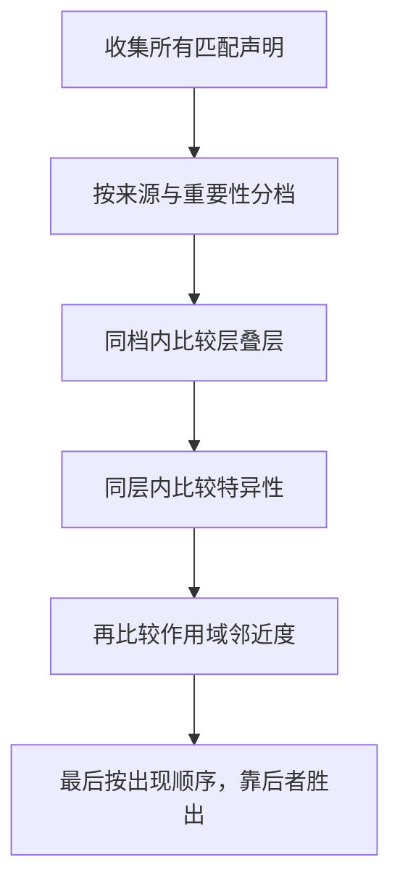

# 层叠、@layer、嵌套与容器查询：MDN 精读

!!! abstract "核心结论"

    - 层叠不是"后来者居上"这么简单：引擎对每个元素、每个属性收集全部声明，按 `来源/重要性 → 上下文 → 元素附加样式 → 层叠层 → 特异性 → 作用域邻近度 → 出现顺序` 的字典序排序，胜出者成为 specified value。
    - `@layer` 的层顺序由"首次出现"决定，一旦确定不可回退；普通声明中未分层样式视作最后一个隐式层（最强），而 `!important` 会把层顺序整体反转（未分层变成最弱）。
    - 原生嵌套由浏览器解析，`&` 代表父选择器；`&` 的特异性按其所在选择器列表中的最大值计算（与 `:is()` 同规则），因此 `.a, #b { & .c {} }` 会给 `.a` 分支也带上 ID 权重。
    - 容器查询把"响应式参照系"从视口换成元素的祖先容器，必须由 `container-type`（`size` 或 `inline-size`）建立查询容器，且查询只针对最近的合格容器，不会向更远祖先回退。
    - `:has()`、`@property`、逻辑属性分别解决"父级反向选择""自定义属性的类型与插值""书写方向无关的布局"，它们的共同点是都在层叠之后、在计算值阶段之前或之中生效。

## 1. 层叠算法：引擎如何给声明排序

### 1.1 从声明到计算值：排序发生在哪一步

浏览器渲染一个元素时，对它的每一个属性（包括未显式书写的属性）都要确定最终的 [computed value]。流程大致是：

1. 收集所有可能命中该元素的声明（作者样式表、用户样式表、UA 样式表、`style` 属性、动画、过渡），并先做"相关性"过滤：媒体查询不成立、`@supports` 不成立的规则直接出局。
2. 把所有声明按层叠排序键排序，取第一名作为 cascaded value。
3. cascaded value 经过 `inherit` / `initial` / `unset` / `revert` 等显式关键字和继承规则，得到 specified value。
4. specified value 经过计算（相对单位转绝对、`em` 折算、`currentColor` 解析等）得到 computed value，再经布局得到 used value，最终得到 actual value。

第 2 步就是本页的主战场。排序键是一个**字典序**：先比第一关键字，相等才比第二关键字，以此类推。



### 1.2 层叠决胜顺序表

下表是来源与重要性组成的最高优先级排序键（数字越小优先级越高）：

| 优先级 | 档位 | 说明 |
|---|---|---|
| 1 | Transition 声明 | 由 `transition` 产生的值，压过同一属性上的其他所有声明 |
| 2 | Important User-Agent | UA 样式表中的 `!important` |
| 3 | Important User | 用户样式表中的 `!important` |
| 4 | Important Author | 作者样式表中的 `!important` |
| 5 | Animation 声明 | 由动画产生的值 |
| 6 | Normal Author | 作者普通声明，页面 CSS 的绝大多数 |
| 7 | Normal User | 用户普通声明 |
| 8 | Normal User-Agent | 浏览器默认样式 |

两个关键观察：**重要声明与普通声明的来源顺序是相反的**（普通声明里作者最强，重要声明里作者最弱，这是为了保护用户和无障碍设置）；**过渡声明高居榜首**，所以 `transition` 过程中你无法用普通声明"压住"它，只能等过渡结束。

### 1.3 @layer 如何插入排序键

`@layer` 引入一个位于"来源/重要性"之下、"特异性"之上的排序层级：

- 层顺序由名字**首次出现**决定，无论是 `@layer a, b;` 这样的声明语句，还是带样式体的 `@layer a { ... }`。之后再写 `@layer b { }`、`@layer a { }` 也不会改变顺序。
- 用点号嵌套创建子层，例如 `@layer base.support`，子层在父层内部再排一次序。
- 未分层的样式被当作一个**隐式的最后声明的层**。所以普通声明中未分层样式最强；`!important` 反转顺序后，未分层样式变成最弱。
- 匿名层（`@layer { ... }`）每次出现都是一个新层，叠加在已有匿名层之后。

| 场景（层声明顺序为 base, theme, utilities） | 谁胜出（Normal） | 谁胜出（Important） |
|---|---|---|
| 未分层样式参与比较 | 未分层样式最强 | 未分层样式最弱 |
| base 与 utilities 冲突（特异性相同） | utilities | base |
| base 用 `#id`、utilities 用 `.class` | utilities（层先于特异性） | base |

### 1.4 完整可运行示例：@layer 的胜负

这段 HTML 要解决的是：把"层顺序高于特异性""important 反转层顺序""未分层最强"三件事一次验证完。把文件保存为 `layer.html` 用浏览器打开即可。

```html
<!doctype html>
<html lang="zh-CN">
<head>
<meta charset="utf-8">
<title>@layer 最小示例</title>
<style>
  /* 第 1 段：先用声明语句固定层顺序。层顺序由首次出现决定，后面重复声明不会改变它 */
  @layer base, theme, utilities;

  /* 第 2 段：base 层里故意用高特异性选择器（一个 ID） */
  @layer base {
    #box { color: red; }
  }

  /* 第 3 段：utilities 层里用低特异性选择器（一个类），但层更靠后 */
  @layer utilities {
    .box { color: blue; }
  }

  /* 第 4 段：未分层样式。普通声明中未分层视作最后一个隐式层，优先级最高 */
  .box { color: green; }

  /* 第 5 段：important 会反转层顺序。base 比 utilities 先声明，所以 important 场景下 base 赢 */
  @layer base {
    #box { background: pink !important; }
  }
  @layer utilities {
    .box { background: khaki !important; }
  }
</style>
</head>
<body>
  <p id="box" class="box">color 应为 green，background 应为 pink</p>
</body>
</html>
```

1. 第 1 段的 `@layer base, theme, utilities;` 只声明顺序、不带样式体，这是控制层顺序最稳妥的写法，能避免"样式分散在多处导致顺序不可预测"。
2. 第 2、3 段构成经典对比：`#box` 的特异性是 `(1,0,0)`，`.box` 是 `(0,1,0)`，但 utilities 层更靠后，所以 `.box` 的 `color: blue` 胜出——层比较发生在特异性比较之前。
3. 第 4 段把"未分层最强"补上：未分层视作隐式最后层，直接压过 utilities 的蓝，所以最终是绿色。
4. 第 5 段是易错点：两个 `!important` 声明里，`background` 的胜者是 `base` 层而不是更靠后的 `utilities` 层，因为重要声明的层顺序被反转。
5. 注意第 4、5 段互不干扰：`color` 与 `background` 是两个不同属性，层叠是**逐属性**进行的，不要把一个属性上的结论套到另一个属性上。

### 1.5 手写实现一：层叠裁决器

这段代码用纯 JS 复现层叠排序键，目标是把"来源/重要性 → 层 → 特异性 → 顺序"的字典序写成可测试的比较器。运行环境：Node.js 18 及以上，保存为 `cascade.cjs`，执行 `node cascade.cjs`。

```js
'use strict';
// 运行环境：Node.js 18+
// 运行方式：node cascade.cjs

const assert = require('node:assert');

// 第 1 段：把"来源 + 重要性 + 特殊来源"压缩成一个整数档位。
// 数字越大越强，顺序依据 CSS Cascade 的 origin/importance 表。
const TIER = {
  transition: 18,
  'ua-important': 16,
  'user-important': 14,
  'author-important': 12,
  animation: 11,
  'author-normal': 10,
  'user-normal': 8,
  'ua-normal': 6,
};

function tierOf({ origin, important = false, kind = 'style' }) {
  if (kind === 'transition') return TIER.transition;
  if (kind === 'animation') return TIER.animation;
  if (important) {
    if (origin === 'user-agent') return TIER['ua-important'];
    if (origin === 'user') return TIER['user-important'];
    return TIER['author-important'];
  }
  if (origin === 'user-agent') return TIER['ua-normal'];
  if (origin === 'user') return TIER['user-normal'];
  return TIER['author-normal'];
}

// 第 2 段：未分层样式被视作"最后一个隐式层"，用极大值表示。
// important 声明反转层顺序，所以对层号取负号。
const UNLAYERED = Number.MAX_SAFE_INTEGER;

function layerScore({ layer, important = false }) {
  const index = layer === undefined ? UNLAYERED : layer;
  return important ? -index : index;
}

// 第 3 段：特异性是三元组，按 (ID, 类/属性/伪类, 类型/伪元素) 字典序比较。
function compareSpecificity(a, b) {
  for (let i = 0; i < 3; i += 1) {
    if (a[i] !== b[i]) return a[i] - b[i];
  }
  return 0;
}

// 第 4 段：完整比较器。返回正数表示 a 胜 b。
function compareDeclarations(a, b) {
  if (a.tier !== b.tier) return a.tier - b.tier;
  if (a.layerScore !== b.layerScore) return a.layerScore - b.layerScore;
  const bySpecificity = compareSpecificity(a.specificity, b.specificity);
  if (bySpecificity !== 0) return bySpecificity;
  return a.order - b.order;
}

// 第 5 段：从一组声明里挑出胜出者。
// 说明：本实现不建模内联样式、作用域邻近度、上下文等更细的排序步骤，
// 这些细节请核对 CSS Cascade 官方规范。
function resolve(declarations) {
  const prepared = declarations.map((d) => ({
    ...d,
    tier: tierOf(d),
    layerScore: layerScore(d),
  }));
  return prepared.reduce((best, cur) =>
    (compareDeclarations(cur, best) > 0 ? cur : best));
}

// 第 6 段：验证标准。全部断言应通过。
function d(patch) {
  return {
    origin: 'author',
    important: false,
    specificity: [0, 0, 1],
    order: 0,
    value: 'x',
    ...patch,
  };
}

const base = d({ layer: 0, specificity: [1, 0, 0], order: 0, value: 'base' });
const theme = d({ layer: 1, specificity: [1, 0, 0], order: 1, value: 'theme' });
const utilities = d({ layer: 2, specificity: [0, 0, 1], order: 2, value: 'utilities' });
const unlayered = d({ specificity: [0, 1, 0], order: 3, value: 'unlayered' });

assert.strictEqual(resolve([base, theme]).value, 'theme');
assert.strictEqual(resolve([base, theme, utilities]).value, 'utilities');
assert.strictEqual(resolve([base, theme, utilities, unlayered]).value, 'unlayered');

const baseImp = d({ ...base, important: true, value: 'base!' });
const utilitiesImp = d({ ...utilities, important: true, value: 'utilities!' });
assert.strictEqual(resolve([baseImp, utilitiesImp]).value, 'base!');
assert.strictEqual(resolve([unlayered, baseImp]).value, 'base!');

const userImp = d({ origin: 'user', important: true, value: 'user!' });
assert.strictEqual(resolve([baseImp, userImp]).value, 'user!');

const transition = d({ kind: 'transition', value: 'transition' });
assert.strictEqual(resolve([baseImp, transition]).value, 'transition');

const later = d({ ...unlayered, order: 9, value: 'later' });
assert.strictEqual(resolve([unlayered, later]).value, 'later');

console.log('cascade: 8 项断言全部通过');
```

预期输出：

```
cascade: 8 项断言全部通过
```

1. 第 1 段的 `TIER` 把复杂规则压成一个整数，代价是可读性下降；好处是后续比较退化成纯数值比较，不需要写多层 `if`。
2. 第 2 段是全篇最容易写错的地方。用 `Number.MAX_SAFE_INTEGER` 表示未分层，再对 important 取负，就自动得到"普通声明未分层最强、重要声明未分层最弱"两个结论，不需要分支判断。
3. 第 3 段的字典序比较必须逐位进行，`[1,0,0]` 与 `[0,99,99]` 相比，前者更大——这正是"一个 ID 顶一万个类"的数值体现。
4. 第 4 段体现字典序：只有前面所有关键字都相等，才会轮到"出现顺序"这一级；`order` 用递增整数模拟样式表中的书写顺序。
5. 第 6 段断言覆盖四类结论：层顺序优先于特异性、未分层在普通声明中最强、important 反转层顺序、important 跨来源比较。`transition` 那条断言说明过渡值压过 `!important` 作者声明。
6. 易错点：`resolve` 里没有做 `.filter(d => d.property === target)`，因为真实层叠是逐属性进行的；如果你要扩展成多属性版本，务必把比较器套在"同一属性的声明数组"上。

## 2. 特异性：算法级拆解

### 2.1 三元组与特殊函数

特异性的形式是三元组 `(A, B, C)`：`A` 是 ID 选择器个数，`B` 是类选择器、属性选择器、伪类个数，`C` 是类型选择器和伪元素个数。通用选择器 `*` 和组合器 `>`、`+`、`~`、空格不计分。

四个函数会改变规则：

- `:where()` 的特异性恒为 `(0,0,0)`，参数里的东西完全不计分，这是它唯一的存在理由（做一个可被轻易覆盖的默认样式）。
- `:is()`、`:not()`、`:has()` 的特异性取**参数列表中最高**的那个复杂选择器，而不是所有参数相加。
- `:nth-child(An+B of S)`：伪类本身算一个 `B`，再加上列表 `S` 中最高的特异性。
- `&` 嵌套选择器同理，按 MDN 的说法"其特异性的计算方式与使用 `:is()` 函数时完全相同"，即取关联选择器列表中的最大值。

### 2.2 手写实现二：简化特异性计算器

这段代码要解决的是：给定一段选择器文本，输出它的特异性三元组，并覆盖 `:is()`、`:where()`、`:not()`、`:has()`、`:nth-child(... of ...)` 与 `&` 的特殊规则。运行环境：Node.js 18+，保存为 `specificity.cjs`，执行 `node specificity.cjs`。

```js
'use strict';
// 运行环境：Node.js 18+
// 运行方式：node specificity.cjs

const assert = require('node:assert');

const ZERO = [0, 0, 0];

function compare(a, b) {
  for (let i = 0; i < 3; i += 1) if (a[i] !== b[i]) return a[i] - b[i];
  return 0;
}
function add(a, b) {
  return [a[0] + b[0], a[1] + b[1], a[2] + b[2]];
}
function maxOf(list) {
  return list.reduce((best, cur) => (compare(cur, best) > 0 ? cur : best), ZERO);
}

// 第 1 段：括号/方括号配对，跳过字符串字面量与转义字符。
// 这是所有解析逻辑的地基：`:is(.a, #b)` 里的逗号不能被当成选择器列表分隔符。
function findMatching(text, openIndex) {
  const open = text[openIndex];
  const close = open === '(' ? ')' : ']';
  let depth = 0;
  let quote = null;
  for (let i = openIndex; i < text.length; i += 1) {
    const ch = text[i];
    if (quote) {
      if (ch === quote) quote = null;
      continue;
    }
    if (ch === '"' || ch === "'") { quote = ch; continue; }
    if (ch === '\\') { i += 1; continue; }
    if (ch === open) depth += 1;
    else if (ch === close) {
      depth -= 1;
      if (depth === 0) return i;
    }
  }
  return -1;
}

// 第 2 段：按顶层逗号切分选择器列表。
function splitTopLevel(text) {
  const parts = [];
  let start = 0;
  let i = 0;
  while (i < text.length) {
    const ch = text[i];
    if (ch === '"' || ch === "'") {
      const end = text.indexOf(ch, i + 1);
      i = end === -1 ? text.length : end + 1;
      continue;
    }
    if (ch === '(' || ch === '[') {
      const end = findMatching(text, i);
      i = end === -1 ? text.length : end + 1;
      continue;
    }
    if (ch === ',') {
      parts.push(text.slice(start, i));
      start = i + 1;
    }
    i += 1;
  }
  parts.push(text.slice(start));
  return parts.map((s) => s.trim()).filter(Boolean);
}

// 第 3 段：单个复杂选择器的计分。parent 用于把 & 代入父选择器的最大特异性。
function scoreSelector(selector, parent = ZERO) {
  let triple = [0, 0, 0];
  let i = 0;
  while (i < selector.length) {
    const ch = selector[i];

    // 第 3.1 段：组合器与空白不计分
    if (ch === ' ' || ch === '\t' || ch === '\n' || ch === '>' || ch === '+' || ch === '~') {
      i += 1;
      continue;
    }
    if (ch === '*') { i += 1; continue; }

    // 第 3.2 段：& 代入父选择器的最大特异性（MDN：与 :is() 同规则）
    if (ch === '&') { triple = add(triple, parent); i += 1; continue; }

    // 第 3.3 段：ID
    if (ch === '#') {
      const m = /^#[\w-]+/.exec(selector.slice(i));
      triple[0] += 1;
      i += m[0].length;
      continue;
    }

    // 第 3.4 段：类
    if (ch === '.') {
      const m = /^\.[\w-]+/.exec(selector.slice(i));
      triple[1] += 1;
      i += m[0].length;
      continue;
    }

    // 第 3.5 段：属性选择器整块算一个 B
    if (ch === '[') {
      const end = findMatching(selector, i);
      triple[1] += 1;
      i = end + 1;
      continue;
    }

    // 第 3.6 段：伪类与伪元素，区分 :x 与 ::x
    if (ch === ':') {
      const isElement = selector[i + 1] === ':';
      const nameStart = i + (isElement ? 2 : 1);
      const nameMatch = /^[-a-zA-Z]+/.exec(selector.slice(nameStart));
      const name = nameMatch[0];
      let cursor = nameStart + name.length;

      if (selector[cursor] === '(') {
        const end = findMatching(selector, cursor);
        const args = selector.slice(cursor + 1, end);
        if (!isElement && name === 'where') {
          // 零特异性：不做任何加法
        } else if (!isElement && (name === 'is' || name === 'not' || name === 'has')) {
          triple = add(triple, maxOf(splitTopLevel(args).map((s) => scoreSelector(s))));
        } else if (!isElement && (name === 'nth-child' || name === 'nth-last-child')) {
          triple[1] += 1; // 伪类本身
          const ofMatch = /(?:^|\s)of\s+([\s\S]+)$/.exec(args);
          if (ofMatch) {
            triple = add(triple, maxOf(splitTopLevel(ofMatch[1]).map((s) => scoreSelector(s))));
          }
        } else {
          triple[isElement ? 2 : 1] += 1;
        }
        i = end + 1;
        continue;
      }

      triple[isElement ? 2 : 1] += 1;
      i = cursor;
      continue;
    }

    // 第 3.7 段：类型选择器
    const typeMatch = /^[-a-zA-Z][-_a-zA-Z0-9]*/.exec(selector.slice(i));
    if (typeMatch) {
      triple[2] += 1;
      i += typeMatch[0].length;
      continue;
    }

    // 未知字符直接跳过：这是简化实现的取舍，见下文分析
    i += 1;
  }
  return triple;
}

// 第 4 段：选择器列表按逗号拆分，逐个返回三元组（不是取最大值）。
function scoreSelectorList(selectorText, parent = ZERO) {
  return splitTopLevel(selectorText).map((s) => scoreSelector(s, parent));
}

// 第 5 段：验证标准。全部断言应通过。
assert.deepStrictEqual(scoreSelector('*'), [0, 0, 0]);
assert.deepStrictEqual(scoreSelector('li'), [0, 0, 1]);
assert.deepStrictEqual(scoreSelector('ul li'), [0, 0, 2]);
assert.deepStrictEqual(scoreSelector('ul ol+li'), [0, 0, 3]);
assert.deepStrictEqual(scoreSelector('h1 + *[rel=up]'), [0, 1, 1]);
assert.deepStrictEqual(scoreSelector('ul ol li.red'), [0, 1, 3]);
assert.deepStrictEqual(scoreSelector('li.red.level'), [0, 2, 1]);
assert.deepStrictEqual(scoreSelector('#x34y'), [1, 0, 0]);
assert.deepStrictEqual(scoreSelector('#s12:not(FOO)'), [1, 0, 1]);

assert.deepStrictEqual(scoreSelector(':where(.a, #b)'), [0, 0, 0]);
assert.deepStrictEqual(scoreSelector(':is(.a, #b)'), [1, 0, 0]);
assert.deepStrictEqual(scoreSelector(':has(> #b)'), [1, 0, 0]);
assert.deepStrictEqual(scoreSelector('::before'), [0, 0, 1]);
assert.deepStrictEqual(scoreSelector('a::before:hover'), [0, 1, 2]);
assert.deepStrictEqual(scoreSelector(':nth-child(2n of .a, #b)'), [1, 1, 0]);

const parentMax = maxOf(scoreSelectorList('.foo, #bar')); // [1,0,0]
assert.deepStrictEqual(scoreSelector('& .baz', parentMax), [1, 1, 0]);

assert.deepStrictEqual(scoreSelectorList('.a, #b'), [[0, 1, 0], [1, 0, 0]]);

console.log('specificity: 17 项断言全部通过');
```

预期输出：

```
specificity: 17 项断言全部通过
```

1. 第 1 段先解决括号配对，否则 `:is(.a, #b)`、`[href="a,b"]` 这类带括号或引号的内容会把解析器彻底带偏。跳过字符串字面量是为了让属性值里的括号、逗号不被误判。
2. 第 2 段的顶层切分依赖第 1 段：遇到 `(` 或 `[` 就整块跳过，只有真正的顶层逗号才切分。
3. 第 3.2 段是嵌套特异性的核心：`&` 不是"当前元素"这种空洞概念，它在计分上等价于父选择器列表中最高特异性的那一项。由此推出 `.a, #b { & .c {} }` 展开后 `.a .c` 也会拿到 `(1,1,0)` 的特异性，这是原生嵌套最常见的"权重污染"。
4. 第 3.6 段把 `:where()` 单独拿出来做零加法的分支，是因为它不是"取最大"，而是"完全不计"，两者语义不同。
5. 第 4 段特意**不**对选择器列表取最大值。规则 `.a, #b { color: red }` 命中 `.a` 元素时用的是 `(0,1,0)`，只有命中 `#b` 元素时才用 `(1,0,0)`；如果你把整个列表压成一个最大值，就会得到错误结论。
6. 易错点：本实现用正则匹配类名与 ID 名，不支持转义字符（如 `.foo\:bar`）、命名空间（如 `svg|circle`）、`:host` 与 `::slotted()`。这些是刻意的简化，生产级实现需要完整的 CSS tokenizer，具体规则需核对 Selectors 官方规范。
7. 第 5 段的前 9 条断言脱胎于经典的 specificity 示例集；`#s12:not(FOO)` 得到 `(1,0,1)`，说明 `:not()` 计的是参数的特异性，而不是"否定掉就不算"。

## 3. 原生嵌套

### 3.1 语法与 & 的语义

原生嵌套与 Sass 的嵌套最本质的差别是**解析者不同**：原生嵌套由浏览器解析，属于 CSS 语法的一部分，所以规则更严格。

- `.card { .title { } }` 等价于 `.card .title`，即省略 `&` 时隐含一个后代组合器。
- `.card { &.is-open { } }` 等价于 `.card.is-open`；`&` 可以出现在任意位置，也可以出现多次，例如 `.a { & + & { } }` 等价于 `.a + .a`。
- `&` 不能做字符串拼接。`.card { &__item { } }` 在原生嵌套里不成立（这是 Sass 的 `&__item` 惯用法与原生语法最著名的断裂点）。
- 任何"体内含样式规则"的 at-rule 都可以嵌套在样式规则里，例如 `@media`、`@supports`、`@layer`、`@container`。嵌套 at-rule 里的属性声明等价于写在 `& { ... }` 里。
- 嵌套的 `@layer` 会创建子层：`.foo { @layer base { ... @layer support { & .bar { } } } }` 等价于 `@layer base.support { .foo .bar { } }`。

### 3.2 完整可运行示例：嵌套与 at-rule

这段 HTML 要解决的是：一次展示省略 `&` 的后代语义、`&` 的复合与多次出现、嵌套 `@media`、嵌套 `@layer` 四种形态。

```html
<!doctype html>
<html lang="zh-CN">
<head>
<meta charset="utf-8">
<title>原生嵌套最小示例</title>
<style>
  .card {
    padding: 1rem;
    border: 1px solid #888;

    /* 第 1 段：不带 & 的嵌套选择器，隐含后代组合器，等价于 .card .title */
    .title { font-weight: 700; }

    /* 第 2 段：& 与类名组成复合选择器，等价于 .card.is-open */
    &.is-open { border-color: #06c; }

    /* 第 3 段：& 可以出现在任意位置，可以用在选择器列表里 */
    &:hover, &:focus-visible { outline: 2px solid #06c; }

    /* 第 4 段：嵌套 at-rule。里面的声明等价于写在 & { ... } 中 */
    @media (width >= 480px) {
      padding: 2rem;
    }

    /* 第 5 段：嵌套 @layer 会创建子层 base.support（此处用 card.base 命名） */
    @layer card.base {
      .body { color: #333; }   /* 等价于 .card .body，但位于 card.base 层 */
    }
  }
</style>
</head>
<body>
  <article class="card is-open">
    <h2 class="title">标题</h2>
    <p class="body">正文</p>
  </article>
</body>
</html>
```

1. 第 1 段的 `.title` 是原生嵌套里最常见的写法，但必须记住它隐含后代组合器；如果只想匹配"和 .card 同一元素且类名是 title"的元素，必须写 `&.title`。
2. 第 2 段展示 `&` 的复合能力，这是原生嵌套里最像 Sass 的用法，也是 `.is-open` 这类状态类最实用的写法。
3. 第 3 段把 `&` 放进选择器列表，浏览器会为列表里每个分支分别代入父选择器。注意 MDN 的提醒：`&` 的特异性按整个列表中的最大值计算，所以父规则的选择器列表越长越"杂"，嵌套规则的权重越可能被抬高。
4. 第 4 段的 `@media (width >= 480px)` 使用的是 range 语法，属于较新的媒体查询写法；旧浏览器可能不支持，需要时请核对官方兼容性表。
5. 第 5 段的 `@layer card.base` 用点号创建子层。层顺序仍然遵守"首次出现"规则，所以这段嵌套会真实影响层叠结果，不只是语法糖。
6. 易错点：`@layer` 嵌套在样式规则里时，层名是**独立**的路径（`card.base`），并不会自动带上父选择器名。若你写 `@layer card.base` 与在别处写 `@layer card { @layer base { } }`，得到的是同一批层。

### 3.3 手写实现三：嵌套展开器

这段代码要解决的是：把一棵嵌套规则树按原生嵌套的语义展开成扁平选择器列表，从而验证 `&` 的代入规则与"省略 `&` 即后代"的规则。运行环境：Node.js 18+，保存为 `nesting.cjs`，执行 `node nesting.cjs`。

```js
'use strict';
// 运行环境：Node.js 18+
// 运行方式：node nesting.cjs

const assert = require('node:assert');

// 第 1 段：展开单个嵌套选择器。
// 规则一：含 & 时，把每个 & 替换为父选择器（同一个父选择器代入所有 &）。
// 规则二：不含 & 时，按后代组合器拼接。
// 规则三：& 后紧跟标识符字符属于 Sass 的拼接用法，原生嵌套不支持，直接抛错。
function resolveNestedSelector(nested, parents) {
  if (/&[\w-]/.test(nested)) {
    throw new SyntaxError(`原生嵌套不支持 & 与标识符拼接：${nested}`);
  }
  if (parents.length === 0) return [nested];
  if (nested.includes('&')) {
    return parents.map((parent) => nested.split('&').join(parent));
  }
  return parents.map((parent) => `${parent} ${nested}`);
}

// 第 2 段：深度优先展开整棵树。
// 节点形如 { selectorList: string[], declarations?: string[], children?: Node[] }。
function flatten(rule, parents = []) {
  const selectors = rule.selectorList.flatMap((s) => resolveNestedSelector(s, parents));
  const out = [];
  if (rule.declarations) {
    out.push({ selectors, declarations: rule.declarations });
  }
  for (const child of rule.children ?? []) {
    out.push(...flatten(child, selectors));
  }
  return out;
}

// 第 3 段：验证标准。全部断言应通过。
const tree = {
  selectorList: ['.card'],
  declarations: ['padding: 1rem'],
  children: [
    { selectorList: ['.title'], declarations: ['font-weight: 700'] },
    { selectorList: ['&.is-open'], declarations: ['border-color: #06c'] },
    { selectorList: ['& > .body', '& > .footer'], declarations: ['color: #333'] },
    { selectorList: [':hover &'], declarations: ['outline: 2px solid'] },
    {
      selectorList: ['&.is-open'],
      declarations: ['display: block'],
      children: [{ selectorList: ['.title'], declarations: ['color: #06c'] }],
    },
  ],
};

const flat = flatten(tree);
assert.deepStrictEqual(flat.map((r) => r.selectors), [
  ['.card'],
  ['.card .title'],
  ['.card.is-open'],
  ['.card > .body', '.card > .footer'],
  [':hover .card'],
  ['.card.is-open'],
  ['.card.is-open .title'],
]);

// 多个父选择器：& 会被逐一代入
assert.deepStrictEqual(
  resolveNestedSelector('& .baz', ['.foo', '#bar']),
  ['.foo .baz', '#bar .baz'],
);

// 多个 &：代入的是同一个父选择器
assert.deepStrictEqual(resolveNestedSelector('& + &', ['.a']), ['.a + .a']);

// 原生嵌套不支持字符串拼接
assert.throws(() => resolveNestedSelector('&__item', ['.card']), SyntaxError);

console.log('nesting: 4 项断言全部通过');
```

预期输出：

```
nesting: 4 项断言全部通过
```

1. 第 1 段把三条语义规则放在同一个函数里，顺序很重要：先做 `&` 拼接的非法性检查，再做 `&` 代入，最后才是隐式后代拼接。如果顺序颠倒，`&__item` 会被"代入"成一个看起来合法但实际不存在的选择器。
2. `nested.split('&').join(parent)` 而不是 `replace('&', parent)`，因为 `& + &` 这类写法里每个 `&` 都要被替换，用 `replace` 只换第一个会静默产生错误结果。
3. 第 2 段的 `flatMap` 处理选择器列表，`for...of` 处理子节点。展开结果里每个节点都可能带多个选择器，这是列表语义，不要在这里取最大值。
4. 第 3 段的第一条断言把整棵树的展开结果一次性比对，其中 `':hover .card'` 说明 `&` 可以出现在选择器末尾——它是"父选择器占位符"，不是"必须写在最前面"的语法。
5. 第二条断言是特异性陷阱的原料：`.foo .baz` 与 `#bar .baz` 看起来特异性不同，但原生嵌套里 `& .baz` 的特异性统一按 `:is(.foo, #bar) .baz` 计算，也就是 `(1,1,0)` 对两个分支都成立。
6. 易错点：这份展开器只做选择器层面的事，不处理 at-rule 嵌套与层叠层的归属。真实场景中 `@media` 嵌套会生成独立的规则块，`@layer` 嵌套会把声明搬到另一个层，两者都会影响层叠结果。

## 4. @scope

`@scope` 解决的是"作用域内选择"：`@scope (A) to (B)` 把规则限制在"祖先匹配 A、且不在 B 的子树内"的元素集合中，也就是所谓 donut scope（甜甜圈作用域）。它和 Shadow DOM 的封装不同，作用域根仍属于同一个全局文档。

这段 HTML 要解决的是：让作用域内的样式只命中"范围内且不在下界内"的元素。注意示例中刻意把全局回退规则写成 `:where(p)`，以保证它零特异性，从而不依赖 `@scope` 内部规则的具体特异性数值（该细节请核对官方规范）。

```html
<!doctype html>
<html lang="zh-CN">
<head>
<meta charset="utf-8">
<title>@scope 最小示例</title>
<style>
  /* 第 1 段：全局回退，用 :where() 把特异性压到 0，
     这样作用域规则只要命中就一定赢，示例结论不依赖 @scope 的特异性细节 */
  :where(p) { color: #999; }

  /* 第 2 段：@scope(作用域根) to (下界)。规则只作用于 .panel 子树中、
     且不在 .widget 子树内的元素 */
  @scope (.panel) to (.widget) {
    p { color: #c00; }
  }
</style>
</head>
<body>
  <section class="panel">
    <p>红色：在作用域内，且不在 .widget 内</p>
    <div class="widget">
      <p>灰色：位于下界 .widget 的子树内，被排除出作用域</p>
    </div>
  </section>
</body>
</html>
```

1. 第 1 段的 `:where(p)` 是关键设计：如果这里写成 `.panel p`，它的特异性 `(0,1,1)` 很可能高于作用域内的 `p`，示例结论就会变成"全局规则赢"，与直觉相反。
2. 第 2 段的 `.panel` 是作用域根（scope root），`.widget` 是作用域下界（scope limit）。下界本身及其子树内的元素都不受该作用域规则约束。
3. `@scope` 只影响匹配范围，不影响声明所属的层与来源。你可以把 `@scope` 写在 `@layer` 里面，此时作用域规则仍然归属那一层。
4. 层叠排序中，特异性之后还有一个"作用域邻近度"比较步骤：当两条规则特异性相同时，作用域根离元素更近的那条胜出。该步骤的精确定义需核对官方规范。
5. 易错点：不要用 `@scope` 兼任"封装"。它不会阻止选择器反向穿透，也不会创建新的样式树；真正的封装来自 Shadow DOM。

## 5. 容器查询

### 5.1 container-type、container-name 与 cq 单位

容器查询把条件从"视口尺寸"换成"某个祖先容器的尺寸"。建立查询容器需要显式声明：

- `container-type: size` 同时建立 inline 轴与 block 轴的尺寸查询能力，代价是元素获得尺寸 containment，它的尺寸不再由内容撑开。
- `container-type: inline-size` 只建立 inline 轴查询能力，相对安全，是最常用的选择。
- `container-type: normal` 不参与尺寸查询，但仍可作为容器样式查询（style query）的容器。
- `container-name` 给容器命名；`container: card / inline-size` 是 `container-name` 与 `container-type` 的简写。
- `@container <name>? <condition>`：带名字时只考虑 `container-name` 匹配的祖先，不带名字时匹配最近的一个合格容器。**关键语义：查询只针对选中的那一个容器求值，条件不成立时不会向更远的祖先回退。**

| 单位 | 含义 |
|---|---|
| `cqw` | 查询容器宽度的 1% |
| `cqh` | 查询容器高度的 1% |
| `cqi` | 查询容器 inline 尺寸的 1% |
| `cqb` | 查询容器 block 尺寸的 1% |
| `cqmin` | `cqi` 与 `cqb` 中较小者 |
| `cqmax` | `cqi` 与 `cqb` 中较大者 |

### 5.2 完整可运行示例：容器查询

这段 HTML 要解决的是：用 `container-type: inline-size` 建立查询容器，并在容器变宽时改变标题字号与内边距。拖动页面右下角改变容器宽度即可观察效果。

```html
<!doctype html>
<html lang="zh-CN">
<head>
<meta charset="utf-8">
<title>容器查询最小示例</title>
<style>
  /* 第 1 段：建立查询容器。inline-size 只允许 inline 轴查询，代价最小 */
  .wrapper {
    container-type: inline-size;
    container-name: card;
    resize: horizontal;      /* 便于手动拖动观察；resize 需要 overflow 不为 visible */
    overflow: auto;
    border: 1px dashed #888;
    inline-size: 320px;      /* 初始宽度，配合 resize 使用 */
  }

  /* 第 2 段：默认样式。注意不要写成 .wrapper .title，
     否则它特异性更高，会永远压过容器查询里的 .title */
  .title { font-size: 1rem; }

  /* 第 3 段：具名容器查询。容器 inline 尺寸达到 480px 时放大标题 */
  @container card (min-width: 480px) {
    .title { font-size: 2rem; }
  }

  /* 第 4 段：容器查询长度单位 cqw，等于容器宽度的 1% */
  @container card (min-width: 320px) {
    .box { padding: 2cqw; }
  }
</style>
</head>
<body>
  <div class="wrapper">
    <h2 class="title">标题</h2>
    <div class="box">内边距随容器宽度变化</div>
  </div>
</body>
</html>
```

1. 第 1 段的三行声明缺一不可：`container-type` 建立查询能力，`container-name` 让查询能用名字定向，`resize` + `overflow` 只是为了让示例可交互。
2. 第 2 段特意不写祖先选择器。若默认样式写成 `.wrapper .title`，它的特异性是 `(0,2,0)`，而容器查询里的 `.title` 只有 `(0,1,0)`，层叠结果会让容器查询永远失效——这是容器查询落地时最常见的"写了不生效"。
3. 第 3 段的 `card (min-width: 480px)` 是"具名 + 条件"的完整形式。具名查询会跳过所有 `container-name` 不匹配的祖先，即使它们尺寸更大。
4. 第 4 段的 `2cqw` 是相对查询容器的长度单位。使用 cq 单位的前提是该元素确实处在某个查询容器内，否则无法解析。
5. 易错点：`container-type: size` 会引入尺寸 containment，元素高度不再由内容决定，可能直接塌陷成 0；如果你的容器高度依赖内容，请用 `inline-size`。
6. 关于容器样式查询（`@container style(--x: y)`）与滚动状态查询，浏览器支持情况需核对官方兼容性表，本页不展开。

### 5.3 手写实现四：尺寸查询求值器

这段代码要解决的是：给定一条祖先链和一个容器查询条件串，判断查询是否成立，并复现"只针对最近合格容器求值、不回退"的语义。运行环境：Node.js 18+，保存为 `container.cjs`，执行 `node container.cjs`。

```js
'use strict';
// 运行环境：Node.js 18+
// 运行方式：node container.cjs

const assert = require('node:assert');

// 第 1 段：轴名到容器尺寸的映射。
// 说明：inline/block 轴与实际宽高的对应关系取决于 writing-mode，
// 这里按 horizontal-tb 简化处理。
function axisLength(axis, container) {
  if (axis === 'width' || axis === 'inline-size') return container.width;
  if (axis === 'height' || axis === 'block-size') return container.height;
  throw new Error(`未知轴：${axis}`);
}

// 第 2 段：两种条件语法。冒号形式支持 min-/max- 前缀，比较形式支持四个运算符。
const COLON_RE = /^\(\s*(min-|max-)?(width|height|inline-size|block-size)\s*:\s*([\d.]+)px\s*\)$/i;
const COMPARE_RE = /^\(\s*(width|height|inline-size|block-size)\s*(<=|>=|<|>)\s*([\d.]+)px\s*\)$/i;

function evaluateCondition(condition, container) {
  const colon = COLON_RE.exec(condition);
  if (colon) {
    const [, bound, axis, valueText] = colon;
    const actual = axisLength(axis.toLowerCase(), container);
    const target = Number.parseFloat(valueText);
    if (bound === 'min-') return actual >= target;
    if (bound === 'max-') return actual <= target;
    return actual === target; // 无前后缀时是等值比较
  }
  const cmp = COMPARE_RE.exec(condition);
  if (cmp) {
    const [, axis, op, valueText] = cmp;
    const actual = axisLength(axis.toLowerCase(), container);
    const target = Number.parseFloat(valueText);
    if (op === '<') return actual < target;
    if (op === '<=') return actual <= target;
    if (op === '>') return actual > target;
    return actual >= target;
  }
  throw new Error(`无法解析的条件：${condition}`);
}

// 第 3 段：沿祖先链（从内到外）找最近的可查询容器。
// container-type 决定该容器能支持哪些轴：size 支持两轴，inline-size 只支持 inline 轴。
function findQueryContainer(ancestors, requiredName, axis) {
  for (const node of ancestors) {
    const type = node.containerType ?? 'normal';
    const supportsWidth = type === 'size' || type === 'inline-size';
    const supportsHeight = type === 'size';
    const axisOk = (axis === 'height' || axis === 'block-size')
      ? supportsHeight
      : supportsWidth;
    if (!axisOk) continue;
    if (requiredName && node.containerName !== requiredName) continue;
    return node;
  }
  return null;
}

// 第 4 段：解析查询串并求值。
// 查询串形如 "card (min-width: 480px) and (max-width: 900px)"。
function resolveContainerQuery(ancestors, queryText) {
  const trimmed = queryText.trim();
  const nameMatch = /^([-_a-zA-Z][-_a-zA-Z0-9]*)\s+(?=\()/.exec(trimmed);
  const requiredName = nameMatch ? nameMatch[1] : null;
  const conditionText = requiredName
    ? trimmed.slice(nameMatch[0].length).trim()
    : trimmed;

  const conditions = conditionText.split(/\s+and\s+/i).map((s) => s.trim());
  const axisMatch = /(width|height|inline-size|block-size)/i.exec(conditionText);
  if (!axisMatch) throw new Error(`查询缺少可识别的轴：${queryText}`);
  const axis = axisMatch[1].toLowerCase();

  // 关键语义：先选出唯一的目标容器，再对条件求值；条件不成立时不回退到更远祖先
  const container = findQueryContainer(ancestors, requiredName, axis);
  if (!container) return false;
  return conditions.every((c) => evaluateCondition(c, container));
}

// 第 5 段：cq 长度单位换算，cqw 等于查询容器宽度的 1%
function cqwToPx(container, value) {
  return (value * container.width) / 100;
}

// 第 6 段：验证标准。全部断言应通过。
const root = { id: 'root', containerType: 'inline-size', containerName: 'root', width: 900, height: 200 };
const card = { id: 'card', containerType: 'inline-size', containerName: 'card', width: 400, height: 150 };
const ancestors = [card, root]; // 从内到外

// 匿名查询只命中最近容器 card（400px），即使 root 更宽也不回退
assert.strictEqual(resolveContainerQuery(ancestors, '(min-width: 500px)'), false);
assert.strictEqual(resolveContainerQuery(ancestors, '(min-width: 320px)'), true);

// 具名查询只看 container-name 匹配的容器
assert.strictEqual(resolveContainerQuery(ancestors, 'root (min-width: 500px)'), true);
assert.strictEqual(resolveContainerQuery(ancestors, 'card (min-width: 500px)'), false);

// 组合条件与比较语法
assert.strictEqual(resolveContainerQuery(ancestors, '(width >= 400px) and (width < 800px)'), true);
assert.strictEqual(resolveContainerQuery(ancestors, '(width >= 400px) and (width < 300px)'), false);

// block 轴查询需要 container-type: size
assert.strictEqual(resolveContainerQuery(ancestors, '(min-height: 100px)'), false);
const cardSize = { ...card, containerType: 'size' };
assert.strictEqual(resolveContainerQuery([cardSize, root], '(min-height: 100px)'), true);

// cq 单位换算
assert.strictEqual(cqwToPx(card, 25), 100);

console.log('container: 9 项断言全部通过');
```

预期输出：

```
container: 9 项断言全部通过
```

1. 第 1 段把轴名映射集中在一处。真实的 inline/block 与 width/height 对应关系随 `writing-mode` 变化，这里的简化在竖直书写模式下会给出错误结果，属于刻意的取舍。
2. 第 2 段拆成两条正则，是因为 `(min-width: 480px)` 与 `(width >= 480px)` 的语法结构差异较大，用一条正则混合处理可读性会很差。
3. 第 3 段是语义核心：`inline-size` 容器只支持 inline 轴查询，因此 `(min-height: 100px)` 会一路跳过所有容器并返回 `false`，这个结果容易被误读成"高度不够"，实际是"没有合格的查询容器"。
4. 第 4 段先解析出可选的名字，再统一按 `and` 切分条件。`requiredName ? trimmed.slice(nameMatch[0].length) : trimmed` 这一步要注意 `nameMatch[0]` 已经包含了名字后面的空白，直接拼接会留下多余空格导致正则失配。
5. 第 4 段末尾的注释是这段实现最重要的知识点：`@container` 的求值对象是**唯一选出的容器**，不是"从内到外沿途任一个满足即可"。第一条断言正是为它准备的。
6. 第 5 段只实现了 `cqw`，其余 cq 单位的换算规则同构；若扩展，请同时考虑 `cqi`/`cqb` 与 `cqmin`/`cqmax` 的组合定义。
7. 易错点：本例把同一条查询里的所有条件都归到同一个轴上，真实语法允许在一条查询里同时约束宽高，此时需要为每个条件单独解析轴。

## 6. :has、@property 与逻辑属性

### 6.1 :has() 关系型伪类

`:has()` 让选择器具备"根据后代或兄弟反向选择祖先"的能力。它的参数是相对选择器列表，特异性按参数列表中最高者计算（与 `:is()` 同规则）。规范明确禁止在 `:has()` 内部再嵌套 `:has()`。

这段 HTML 要解决的是：根据表单控件的状态反向给包裹它的容器加样式。

```html
<!doctype html>
<html lang="zh-CN">
<head>
<meta charset="utf-8">
<title>:has 最小示例</title>
<style>
  .field {
    display: block;
    padding: .5rem;
    border: 1px solid #888;
    margin-block-end: .5rem;
  }

  /* 第 1 段：容器包含校验失败的表单控件时高亮。
     参数里用相对选择器，:has() 的特异性取参数列表中的最高值 */
  .field:has(input:invalid) { border-color: #c00; }

  /* 第 2 段：参数以 > 开头表示只匹配直接子元素 */
  .field:has(> input[type="checkbox"]:checked) { background: #eef; }

  /* 第 3 段：以下写法无效，:has() 不允许嵌套在 :has() 内部，故只作注释保留
     .field:has(:has(input:invalid)) { ... } */
</style>
</head>
<body>
  <label class="field"><input type="text" required value=""> 姓名</label>
  <label class="field"><input type="checkbox" checked> 同意条款</label>
</body>
</html>
```

1. 第 1 段用 `input:invalid` 做条件：`required` 且值为空的文本框处于 `:invalid` 状态，容器边框变红。`:has()` 在这里扮演"父级选择器"的角色。
2. 第 2 段用 `>` 开头的相对选择器，把匹配范围限制在直接子元素。`:has(> input)` 与 `:has(input)` 的区别在嵌套结构下会立刻体现。
3. 第 3 段以注释形式记录限制：`:has()` 不能嵌套在 `:has()` 内部，这是规范层面的约束，不是浏览器未实现。
4. 易错点：`:has()` 的参数里不应包含伪元素；`:has()` 追加在复合选择器末尾时，特异性会随参数变化，容易造成"看起来同级的两条规则实际权重不同"。

### 6.2 @property：给自定义属性加类型

未注册的自定义属性（`--x`）在层叠与继承中更像字符串替换：浏览器不知道它的类型，因此无法在两个值之间插值，也无法可靠地校验。`@property` 通过 `syntax`、`inherits`、`initial-value` 三个描述符注册它。规范要求：当 `syntax` 不是 `"*"` 时，`initial-value` 是必填的。

这段 HTML 要解决的是：让一个自定义颜色属性可以参与过渡。

```html
<!doctype html>
<html lang="zh-CN">
<head>
<meta charset="utf-8">
<title>@property 最小示例</title>
<style>
  /* 第 1 段：注册自定义属性。syntax 不是 "*" 时 initial-value 必填 */
  @property --stop-color {
    syntax: "<color>";
    inherits: false;
    initial-value: cornflowerblue;
  }

  .box {
    block-size: 4rem;
    border-radius: .5rem;
    background: linear-gradient(to right, var(--stop-color), lavenderblush);
    /* 第 2 段：注册过的属性带有类型，因此可以参与过渡插值 */
    transition: --stop-color 2s;
  }

  /* 第 3 段：悬停时改变自定义属性的值，浏览器在 <color> 空间里做插值 */
  .box:hover { --stop-color: aquamarine; }
</style>
</head>
<body>
  <div class="box"></div>
</body>
</html>
```

1. 第 1 段的三个描述符各司其职：`syntax` 声明类型（`<color>`），`inherits` 决定是否沿 DOM 继承，`initial-value` 提供缺省值。缺少 `initial-value` 会整条 `@property` 失效。
2. 第 2 段的 `transition: --stop-color 2s` 是注册带来的直接收益：知道类型之后，渐变里的颜色可以平滑插值，而不是瞬间跳变。
3. 第 3 段把状态写在 `:hover` 里，插值发生在悬停进入与离开两个方向。
4. 也可以用 JavaScript 的 `CSS.registerProperty({ name, syntax, inherits, initialValue })` 注册，注意 JS 里参数名是驼峰的 `initialValue`，而 CSS 描述符是 `initial-value`。
5. 易错点：`syntax: "<color>"` 与 `syntax: "<color>+"`、`"<length>#"` 是不同语法，`+` 表示空格分隔的列表，`#` 表示逗号分隔的列表，`|` 用于并列可选类型。写错语法会让注册静默失败，值退化成普通字符串，相关断言与兼容性需核对官方文档。

### 6.3 逻辑属性：与书写方向解耦

逻辑属性用 block/inline 两个抽象轴替代 top/bottom/left/right。block 轴垂直于行内文字流向，inline 轴平行于文字流向；在 `horizontal-tb` 下 block 轴是竖直方向、inline 轴是水平方向，在 `vertical-rl` 下两者互换。

| 物理属性或值 | 逻辑等价物 |
|---|---|
| `width` / `height` | `inline-size` / `block-size` |
| `margin-top` | `margin-block-start` |
| `margin-left` | `margin-inline-start` |
| `padding-top` + `padding-bottom` | `padding-block` |
| `border-left` | `border-inline-start` |
| `top` / `left`（inset） | `inset-block-start` / `inset-inline-start` |
| `text-align: left` | `text-align: start` |
| `float: left` | `float: inline-start` |

这段 HTML 要解决的是：用逻辑属性写一套跟随书写方向自动重排的样式。把 `writing-mode` 改成 `vertical-rl` 即可看到边框与内边距跑到不同侧。

```html
<!doctype html>
<html lang="zh-CN">
<head>
<meta charset="utf-8">
<title>逻辑属性最小示例</title>
<style>
  .box {
    writing-mode: horizontal-tb;   /* 改成 vertical-rl 观察逻辑属性跟随书写方向 */
    inline-size: 12rem;            /* 在 horizontal-tb 下对应 width */
    block-size: 6rem;              /* 在 horizontal-tb 下对应 height */
    margin-inline-start: 1rem;     /* 在 ltr 下对应 margin-left */
    padding-block: .5rem;          /* 对应 padding-top 与 padding-bottom */

    /* 先写物理简写，再写逻辑属性覆盖，
       顺序反了会被 border 简写整体重置 */
    border: 1px solid #888;
    border-inline-start: 4px solid #06c;

    text-align: start;             /* 在 ltr 下对应 text-align: left */
  }
</style>
</head>
<body>
  <div class="box">切换 writing-mode 观察边框与内边距的移动</div>
</body>
</html>
```

1. 第 1 段用 `inline-size` / `block-size` 替代宽高。在 `horizontal-tb` 下它们与宽高等价，一旦改为 `vertical-rl`，`inline-size` 就变成竖直方向的尺寸。
2. `margin-inline-start` 与 `padding-block` 是逻辑简写：`padding-block` 同时设置 block 两端的 padding，语义上对应"纵向上下"。
3. `border: 1px solid #888` 必须写在 `border-inline-start` 之前。简写属性会重置同一元素上所有 border 子属性，顺序颠倒会让那 4px 的起始边框被抹掉——这是逻辑属性与物理属性混用时的经典顺序陷阱。
4. `text-align: start` 依赖书写方向解析，在 RTL 环境下自动变成右侧对齐，无需额外的 `direction` 判断。
5. 易错点：物理属性与逻辑属性如果同时出现在不同层或不同规则里，层叠胜出者可能只覆盖其中一个，造成"改了逻辑属性但物理属性仍在生效"的错觉。实际项目中应逐步统一到逻辑属性，而不是长期混写。

## 7. 常见陷阱

1. **层顺序不可回退**。`@layer a, b;` 之后再写 `@layer b { }` 与 `@layer a { }` 不会交换顺序。层顺序由首次出现决定，所以跨文件引入的层一定要在最前面用声明语句固定。
2. **未分层样式在普通声明中最强，在重要声明中最弱**。把第三方库放进 `@layer` 之后，你自己的未分层样式依然能压住它；反过来，如果你把自己的样式也分层了，就可能被本来很弱的库样式反超。
3. **`!important` 反转一切**：来源顺序反转、层顺序反转。写 `!important` 之前先想清楚它在相反方向上的副作用。
4. **层比较先于特异性比较**。`@layer utilities { .box { color: blue } }` 能压过 `@layer base { #box { color: red } }`，不要再用"特异性高就赢"的心智模型推理。
5. **`:where()` 是唯一能提供零特异性的选择器**。写默认样式时用它，可以保证后续规则永远能覆盖。
6. **`&` 让父选择器列表的最大特异性渗透到嵌套规则**。`.a, #b { & .c {} }` 会给 `.a .c` 也带上 `(1,1,0)`，这是原生嵌套最容易产生"莫名覆盖不过去"的原因。
7. **原生嵌套不支持 `&__item` 拼接**。这类 Sass 惯用法在浏览器里直接失效，必须改写为独立的类名。
8. **嵌套规则的特异性按 `&` 的规则计算，而不是按展开后的文本计算**。手工"拍平"重写嵌套时，务必同步检查特异性是否变化。
9. **容器查询必须显式声明 `container-type`**，否则 `@container` 永远不会命中。同时 `container-type: size` 会带来尺寸 containment，可能让容器高度塌陷为 0。
10. **容器查询不回退**。条件不成立时不会去问更远的祖先容器，选中的容器只有一个。
11. **默认样式特异性写高了会让容器查询失效**。`.wrapper .title` 与容器查询里的 `.title` 是同一场比赛，特异性高的一方永远赢。
12. **`:has()` 不能嵌套 `:has()`**，并且它的特异性随参数变化。
13. **`@property` 的 `initial-value` 在 `syntax` 非 `"*"` 时必填**；写错 `syntax` 会静默失效，退化成无类型的字符串替换。
14. **物理属性与逻辑属性的简写顺序会互相覆盖**，`border` 简写写在 `border-inline-start` 之后会把后者重置。
15. **`@scope` 不是封装机制**，它只改变匹配范围，不阻止全局选择器继续影响同一元素。

## 8. 面试题与答题要点

**第 1 题：请完整描述 CSS 层叠的排序键。**

要点：按字典序回答——来源与重要性（含 transition、四种 important、animation、三种 normal 共八档）、上下文、元素附加样式（内联）、层叠层、特异性、作用域邻近度、出现顺序。强调"字典序、逐级比较"，并指出重要声明与普通声明的来源顺序相反。能主动提到"过渡声明最强""未分层在普通声明中是最强的隐式层"是加分项；涉及作用域邻近度与上下文等较新步骤时，说明细节需核对官方规范。

**第 2 题：`@layer` 与 `!important` 如何相互作用？**

要点：普通声明按层声明顺序，后声明的层更强，未分层最强；important 声明把层顺序整体反转，先声明的层更强，未分层变成最弱。再补一句重要声明的来源顺序也是反的（important 用户 > important 作者），所以 `!important` 不是"万能升级"，它会同时改变两个维度的比较方向。给出 `@layer base, utilities;` 的具名反例可以显著加分。

**第 3 题：未分层样式与分层样式的优先级关系是什么？**

要点：未分层被当作最后一个隐式层。普通声明中它最强，重要声明中它最弱。实践含义是：把第三方 CSS 放入 `@layer` 后，自己的未分层样式仍然能覆盖它；但如果自己也分层，覆盖关系就取决于层顺序而非特异性。

**第 4 题：`:is()`、`:where()`、`:not()`、`:has()` 的特异性如何计算？**

要点：`:is()`、`:not()`、`:has()` 取参数列表中最高特异性，不是相加；`:where()` 恒为 `(0,0,0)`。补充 `:nth-child(An+B of S)` 是"伪类本身 + S 中最高特异性"。再补一条实践结论：`:where()` 是写可覆盖默认样式的唯一零特异性工具。

**第 5 题：原生嵌套与 Sass 嵌套的关键差异有哪些？**

要点：解析时机不同（浏览器 vs 预编译器）；`&` 不支持字符串拼接，`&__item` 无效；省略 `&` 隐含后代组合器；`&` 的特异性按父选择器列表最大值计算（与 `:is()` 同规则），而 Sass 的展开是纯文本替换，特异性可能与原生嵌套不同；原生嵌套可以直接嵌套 `@media`、`@supports`、`@layer`、`@container` 等 at-rule。

**第 6 题：容器查询与媒体查询的本质差异是什么？为什么它改变了组件设计？**

要点：媒体查询参照视口，容器查询参照最近的合格祖先容器；组件因此可以在不同容器宽度下自适应，而不需要知道自己在页面里被放多宽。使用条件：必须由 `container-type` 建立查询容器，`inline-size` 只支持 inline 轴，`size` 支持两轴但有尺寸 containment 代价；查询只针对唯一选中的容器求值，不回退；`cqw` 等 cq 单位相对查询容器计算。

**第 7 题：`@property` 相比普通自定义属性解决了什么问题？**

要点：普通 `--x` 是字符串替换，浏览器不知道类型，无法插值、无法校验、无法给出合理的初始值语义。`@property` 通过 `syntax`、`inherits`、`initial-value` 注册类型与继承行为，使属性可以参与过渡与动画插值，并让无效值被正确处理。注意 `syntax` 非 `"*"` 时 `initial-value` 必填，且 `syntax` 支持 `+`（空格列表）、`#`（逗号列表）、`|`（并列）等描述符语法。

**第 8 题：逻辑属性的价值是什么？落地时的坑在哪里？**

要点：价值在于与书写方向和文字流向解耦，同一套 CSS 可以适配 LTR、RTL 与竖排文字，减少为 RTL 单独维护样式表的成本。坑在于：物理属性与逻辑属性可以落到同一个计算属性上，混用时层叠结果可能只覆盖一半；简写属性（如 `border`、`margin`）会重置逻辑子属性，顺序敏感；`inline`/`block` 与实际宽高的对应关系随 `writing-mode` 变化，调试时需要先确认书写模式。

## 深入阅读与参考

!!! tip "怎么用这些资料"
    先读「官方文档与规范」建立准确的概念，再读「源码与示例」核对细节，最后用「教程、书籍与视频」换一种讲法加深理解。每条都写明了读哪一节、带着什么问题读。

### 官方文档与规范

| 资源 | 为什么读 | 怎么读 |
|---|---|---|
| [`@layer` CSS at-rule](https://developer.mozilla.org/en-US/docs/Web/CSS/Reference/At-rules/@layer) | @layer 官方参考，讲清层顺序、嵌套与匿名层的语法 | 读语法与层叠顺序示例，回答未分层样式排在哪层，再手写三层重置 |
| [CSS property value processing](https://developer.mozilla.org/en-US/docs/Web/CSS/Guides/Cascade/Property_value_processing) | 讲清声明从解析到计算值的每一步，是层叠算法的前置知识 | 带着「层叠发生在哪一步」读流程，读完复述指定值到计算值的链路 |
| [Selectors Level 4](https://www.w3.org/TR/selectors-4/) | 规范原文定义 :is/:where/:has 的匹配与特异性算法 | 读 :is 与 :has 的特异性小节，确认是否取最具体参数 |
| [`@scope` CSS at-rule](https://developer.mozilla.org/en-US/docs/Web/CSS/Reference/At-rules/@scope) | @scope 参考，含作用域根、邻近关系与边界写法 | 读语法与示例节，写一个带 to 边界的样式块并验证优先级 |
| [`@property` CSS at-rule](https://developer.mozilla.org/en-US/docs/Web/CSS/Reference/At-rules/@property) | @property 参考，注册自定义属性以获得类型与动画能力 | 读描述符与回退行为，注册一个 color 类型属性并做过渡动画 |
| [`syntax` CSS at-rule descriptor](https://developer.mozilla.org/en-US/docs/Web/CSS/Reference/At-rules/@property/syntax) | syntax 描述符决定类型校验与插值方式，最易踩坑 | 对照取值表试写 length 与 percentage 组合，观察无效值如何回退 |
| [Stacking without the z-index property](https://developer.mozilla.org/en-US/docs/Web/CSS/Guides/Positioned_layout/Stacking_without_z-index) | 不写 z-index 也能产生层叠顺序，揭示层叠上下文的来源 | 跟着示例逐个删属性，找出让元素换序的那条规则并记进笔记 |

### 源码与示例

| 资源 | 为什么读 | 怎么读 |
|---|---|---|
| [MDN @layer](https://developer.mozilla.org/en-US/docs/Web/CSS/@layer) | 用分层组织重置、组件与工具类，直观看层序优先于特异性 | 按示例建三层并制造冲突规则，用 DevTools 层叠面板确认胜出来源 |
| [MDN 特异性](https://developer.mozilla.org/en-US/docs/Web/CSS/Specificity) | 特异性参考页，含三元组算法与 :is/:where 的例外 | 手算十个选择器权重，再用 DevTools 逐个验证，错的记下原因 |
| [MDN CSS 嵌套](https://developer.mozilla.org/en-US/docs/Web/CSS/CSS_nesting) | 原生嵌套语法与 & 规则，附与预处理器的语义差异 | 把一段 SCSS 嵌套改写成原生，留意 & 与元素选择器的限制 |
| [MDN 容器查询](https://developer.mozilla.org/en-US/docs/Web/CSS/CSS_containment/Container_queries) | 容器查询官方指南，含容器类型、命名与容器单位 | 给卡片加 container-type，改容器宽度看断点生效，对比媒体查询 |
| [MDN 逻辑属性](https://developer.mozilla.org/en-US/docs/Web/CSS/CSS_logical_properties_and_values) | 逻辑属性中文指南，解释 block/inline 与书写模式的关系 | 把 margin-left 换成 margin-inline-start，切 dir=rtl 看镜像效果 |

### 教程、书籍与视频

| 资源 | 为什么读 | 怎么读 |
|---|---|---|
| [MDN 层叠与继承](https://developer.mozilla.org/en-US/docs/Web/CSS/CSS_cascade) | 中文层叠与继承三篇，冲突胜出规则讲得最系统 | 先读层叠再读继承，拿一个真实样式冲突，逐条指出胜出的规则 |
| [MDN 选择器模块](https://developer.mozilla.org/en-US/docs/Web/CSS/CSS_selectors) | 选择器模块练习页，:is/:where/:has 与属性选择器集中演练 | 按提示为每个伪类写三个真实用例，重点体会 :where 的零特异性 |

## 应用与行业实践

### 应用场景地图

| 场景 | 用到本页哪个知识点 | 典型技术选型 | 注意事项 |
| --- | --- | --- | --- |
| 后台管理的万行表格 | 级联层、:has()、容器查询 | @layer 三层定序 + 外层包裹元素做查询容器 | 层名要在一处提前声明，避免文件加载顺序改变优先级 |
| 低端安卓机的首屏加载 | 级联层、@property、容器查询 | 首屏与非首屏分层 + Coverage 面板复测 | 未分层声明优先级最高，别把关键样式留在层外 |
| 多人协作白板的画布外壳 | 容器查询、逻辑属性 | container-type: inline-size + padding-inline-start | 查询只命中最近的合格容器，不向更外层祖先回退 |
| 跨品牌设计系统的组件库 | 级联层、@property、:has() | 令牌层 + 主题层 + 组件层 | 层顺序由首次出现决定，主题层必须写在组件层之后 |
| 嵌入式 SDK 注入宿主页面 | 级联层、:where()、容器查询 | SDK 样式表首行声明层名 | 宿主未分层声明会压过 SDK 的全部层 |
| 路由器与摄像头的本地配置页 | 逻辑属性、@property、级联层 | 单文件内联样式 + 原生层叠层 | 没有构建链时要手工维护层声明顺序 |
| 营销专题页按渠道换肤 | 级联层、@property | 渠道层叠加在基础层之上，令牌用自定义属性 | !important 会把层顺序整体反转，换肤层不要使用 |
| 富文本编辑器输出的正文 | @scope、:has()、逻辑属性 | @scope 限定输出区域 + :where() 降权 | 元素上的 style 属性在层叠层之前排序，压不住就只能改输出 |

### 三个场景拆解

#### 场景 1：后台管理的万行表格

**业务背景**：运营后台把列表分页改成一次渲染，筛选命中上千行时滚动开始掉帧。表格同时加载第三方组件库样式、产品线覆盖样式和主题样式，调一处内边距要人工回归三份页面清单。
规模量级用可复现测量来定：录制 3 秒连续滚动，记录 Performance 面板里 `Recalculate Style` 的出现次数与 longtask 条数。

**怎么用本页知识解决**：先用层叠层把第三方样式、产品线样式、业务样式固定成从弱到强的顺序，改样式时只往对应层里加规则，不靠提高选择器权重。再用容器查询让列显隐跟随表格容器宽度，用 `:has()` 让工具栏直接响应选中行。

```css
/* 层顺序在入口首行一次性声明，从弱到强依次为 reset -> vendor -> app */
@layer reset, vendor, app;

/* 外层包裹元素做查询容器，避免 inline-size 约束影响表格自身布局 */
.table-wrap { container-type: inline-size; container-name: table; }

@layer app {
  /* :has() 由选中行反向决定工具栏状态，不用给每行绑 JS 类名 */
  .table-wrap:has(.row[aria-selected="true"]) .toolbar {
    position: sticky;
    inset-block-start: 0;
  }
  /* 查询命中最近的 table 容器，列显隐跟随容器宽度而非视口宽度 */
  @container table (max-width: 720px) {
    .col-secondary { display: none; }
  }
}
```

- `@layer reset, vendor, app;` 只声明顺序不产生规则，之后任何文件往 app 里追加都保持最强。
- `container-type: inline-size` 放在包裹元素上，表格自身不参与容器尺寸计算，不会形成循环依赖。
- `@container table (max-width: 720px)` 只命中最近的、名字为 table 的容器，侧边栏折叠会直接触发布局切换。
- `:has()` 在层叠之后、计算值阶段之前生效，工具栏粘顶不需要监听选中事件。
- 隐藏列用 `display: none`，节点仍在 DOM 里，导出逻辑不受影响。

**怎么度量收益**：用 Chrome DevTools Performance 面板录制同一段滚动，对比 `Recalculate Style` 与 `Layout` 的耗时条长度。用 PerformanceObserver 订阅 `longtask`，统计滚动 10 秒内的条数。用 Coverage 面板看表格页 CSS 的未使用字节。

**什么时候不该用**：表格依赖 JS 读取单元格实际宽度做虚拟滚动时，容器查询给不出单元格级别的宽度反馈。只渲染 20 行且不做列显隐的列表页，引入容器与层叠层只增加维护面。导出要求与屏幕列显隐一致时，`display: none` 的列会被导出逻辑漏掉。

#### 场景 2：低端安卓机的首屏加载

**业务背景**：活动落地页在低端安卓机上白屏时间偏长，页面只有一份打包后的 CSS，首屏模块与折叠以下的模块一起下载和解析。规模按相对说法衡量：用 Coverage 面板分别统计"首屏必需"与"折叠以下"两块样式的未使用字节占比。

**怎么用本页知识解决**：把 CSS 按用途切成令牌、基础、首屏、非首屏四层，用一条层名单固定顺序，让非首屏补丁文件永远排在后面。折叠以下的卡片改用容器查询判断换行，不再在 JS 里读窗口宽度。

```css
/* 顺序一次性声明：令牌 -> 基础 -> 首屏 -> 非首屏 */
@layer tokens, base, first-screen, below-fold;

@layer tokens {
  /* 注册类型后值在解析期被校验，继承到非法值会回退到 initial-value */
  @property --brand {
    syntax: "<color>";
    inherits: true;
    initial-value: #0b57d0;
  }
}

@layer below-fold {
  /* 折叠以下的卡片按自身宽度换行，不依赖 JS 读 window.innerWidth */
  .card { container-type: inline-size; }
  @container (min-width: 480px) {
    .card__body { display: grid; grid-template-columns: 1fr 1fr; }
  }
}
```

- 层名单写在同一行，浏览器按首次出现固定层顺序，后加载的补丁文件无法把非首屏层提到首屏层之前。
- `@property` 的 `syntax: "<color>"` 让自定义属性在解析期就被校验，做颜色过渡时有确定的插值起点。
- 首屏样式全部写在层内的普通声明里，未分层的 `<style>` 与行内声明仍最强，调试时不要用它们盖样式。
- 换行判断交给布局引擎后，主线程不需要在 resize 回调里读 `window.innerWidth`。
- `container-type` 只建立行内轴约束，卡片高度仍由内容决定。

**怎么度量收益**：用 Lighthouse 移动端模式取 FCP、LCP、TBT 三项。用 Coverage 面板记录未使用 CSS 字节与占比。用 Performance 面板看 `Parse Stylesheet` 与 `Recalculate Style` 的耗时。用 PerformanceObserver 订阅 `largest-contentful-paint` 与 `longtask`。

**什么时候不该用**：服务端已按设备下发不同 CSS，首屏与非首屏本来就分开时，再套层叠层只多一份层名要维护。样式靠多个 `<link>` 手工拼接、层声明分散在各文件时，首次出现顺序容易写错。用特性检测确认目标内核不支持 `@property` 时，令牌不能依赖类型插值。

#### 场景 3：嵌入式 SDK 组件注入宿主页面

**业务背景**：白板 SDK 以脚本形式注入客户的运营后台，宿主自带全局 reset 和按钮样式，SDK 工具栏放进侧边栏后会溢出成一行。接入方数量按客户数增长，每次 SDK 升级都要人工核对宿主样式有没有被压住。

**怎么用本页知识解决**：SDK 样式表首行声明自己的层名，让宿主未分层的声明天然压过 SDK 全部层。组件内部用 `:where()` 把选择器权重降到 0，用逻辑属性处理多语言方向，用容器查询适配侧边栏与全宽弹窗两种落位。

```css
/* SDK 样式表首行声明层：宿主未分层声明优先级高于这两层 */
@layer sdk, sdk.theme;

@layer sdk {
  /* :where() 权重为 0，宿主用单个类名就能覆盖 */
  :where(.wb-root) { color: var(--wb-fg, #1f1f1f); }

  .wb-toolbar {
    container-type: inline-size;
    /* 逻辑属性随 dir 翻转，RTL 语种不需要单独的镜像样式表 */
    padding-inline-start: 8px;
    inset-inline-start: 0;
  }

  /* 侧边栏宽度小于 320px 时收起按钮文字，只留图标 */
  @container (max-width: 320px) { .wb-toolbar__label { display: none; } }
}
```

- `@layer sdk, sdk.theme;` 先声明层名，宿主页面里未分层的声明会压过 SDK 的所有层，接入方不需要写 `!important`。
- `:where(.wb-root)` 的权重为 (0,0,0)，宿主写一个类名选择器就能接管文字颜色。
- `padding-inline-start` 与 `inset-inline-start` 跟随 `dir` 属性翻转，阿拉伯语与希伯来语站点不用额外样式表。
- 工具栏形态由自身容器宽度决定，客户把它放进侧边栏或全宽弹窗时不需要传宽度参数。

**怎么度量收益**：写一段 `getComputedStyle` 断言脚本，跑在接入方页面上，统计关键属性的回归通过率。用 Elements 面板的 Styles 标签查看规则属于哪个 `@layer`，统计接入方仍需 `!important` 的站点数。用 PerformanceObserver 订阅 `layout-shift` 与 CLS，看工具栏换行是否引发偏移。

**什么时候不该用**：宿主只有单个页面且允许 SDK 直接改全局样式时，加层只会让排查路径变长。宿主自身也用了层叠层，且层名声明晚于 SDK 时，SDK 的层会排到宿主层之后拿到更高优先级，上线前要和接入方核对层名顺序。组件需要按视口而非容器宽度切换成整屏抽屉时，媒体查询更直接。

### 行业先进实践

用层叠层把重置、第三方、业务样式固定成三层（出处：MDN Web Docs 的 "CSS cascade layers" 文档）。做法是在样式表顶部写一条 `@layer` 名单，后续文件只往对应层里追加规则。因为层顺序由首次出现决定，团队不需要再靠提高选择器权重来覆盖。借鉴方式是把层名单抽成一个共享声明文件，其余文件只引用。

组件级响应式用容器查询而不是视口媒体查询（出处：MDN Web Docs 的 "CSS container queries" 文档）。组件自己声明 `container-type` 并查询最近的容器宽度，落位到侧边栏或主区域时不需要额外参数。借鉴方式是先把卡片、表格、工具栏三类组件改成容器查询。

父级状态用 `:has()` 表达（出处：MDN Web Docs 的 `:has()` 文档）。它按"祖先能否匹配后代条件"来选择元素，替代在 JS 里切类名。借鉴时约定 `:has()` 只用于父子状态联动，不用于整页布局分支。

书写方向无关的间距用逻辑属性（出处：MDN Web Docs 的 "CSS logical properties and values" 文档）。`margin-inline-start`、`padding-block` 这类属性随 `dir` 与 `writing-mode` 变化。借鉴方式是先在新组件里使用，旧代码在下次改动时顺带替换。

需核对官方文档：Tailwind CSS 的 `@layer` 指令与原生 CSS 级联层的对应关系（核对 Tailwind CSS 官方文档的 `@layer` 条目与升级指南）。核对点有两个，一是旧指令是否会把规则移动到指定位置，二是改用原生 `@layer` 后工具类与业务样式的先后顺序是否变化。

### 从学到用：落地路线

第 1 步：选一个组件页面试点 @layer 三层定序，并改一个容器查询组件。验收标准是该页面新增样式中不出现 `!important`。

第 2 步：用 DevTools 与 PerformanceObserver 采集改造前后的数据。验收标准是同一段操作步骤、同一台设备上能重复采到两组数据。

第 3 步：把层名名单抽成团队共享声明文件，其余样式表只引用。验收标准是全仓库 `@layer` 名单只出现一次。

第 4 步：在 CI 加静态检查，拦截未分层的新样式与新增 `!important`。验收标准是违规提交构建失败，且规则文档写清每条禁止项对应的层叠顺序。

### 动手作业

**目标**：把现有的卡片列表页改成"层叠层定序 + 容器查询换行 + `:has()` 状态"的组件，并用工具量化改动。

**步骤**

1. 用 Coverage 面板记录当前 CSS 的未使用字节与占比，保存截图。
2. 在样式入口顶部写 `@layer reset, vendor, tokens, components, pages;`，把现有样式按归属搬进对应层，只加包裹不改选择器。
3. 给卡片列表的外层包裹元素设 `container-type: inline-size`，把基于视口的 `@media` 断点改写成 `@container` 查询。
4. 用 `:has()` 把"选中卡片时高亮工具栏"从 JS 切类名改为 CSS 选择器。
5. 用 PerformanceObserver 订阅 `longtask` 与 `layout-shift`，采集滚动 10 秒的条数。
6. 写一段 `getComputedStyle` 断言脚本，检查卡片在窄容器与宽容器下的 `display` 值。
7. 提交时附测量步骤、结果与层名顺位表。

**验收标准**

- 全仓库 `@layer` 名单只出现一次，顺序为 reset、vendor、tokens、components、pages。
- 把窗口拉宽、把列表容器固定在 400px 时，卡片仍保持单列。
- 工具栏高亮由 `:has()` 触发，代码里没有对应的 JS 事件监听。
- Coverage 面板的未使用字节与改造前记录能按同一份步骤复现。
- `getComputedStyle` 断言脚本在两种容器宽度下都通过。

