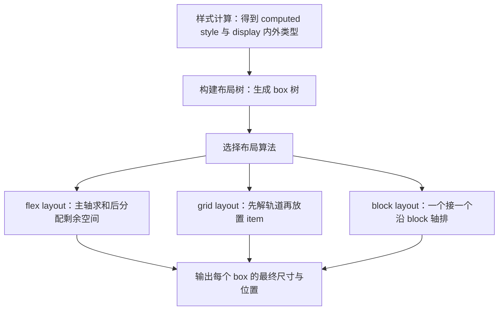
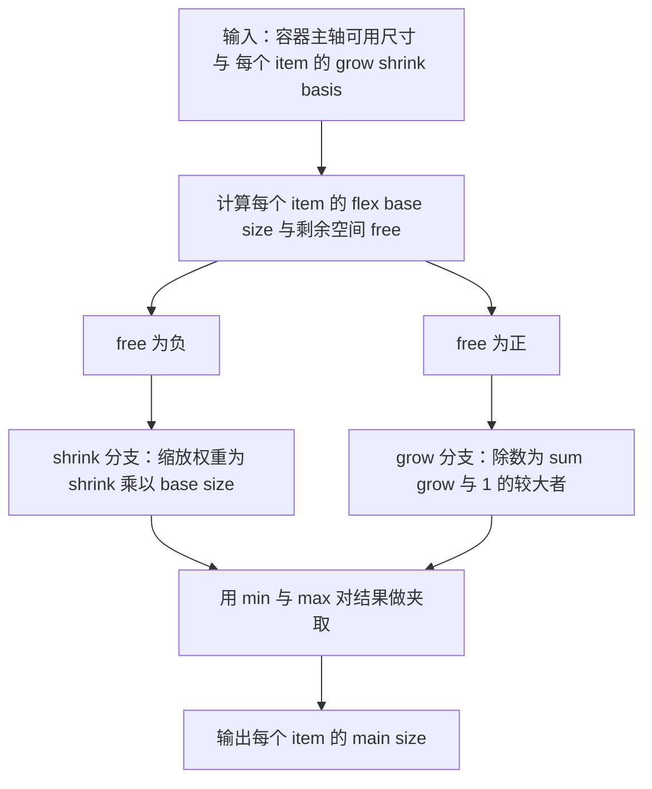

# Grid 与 Flexbox：MDN 精读

!!! abstract "核心结论"

    - Flexbox 是**一维**布局：先在一条主轴（main axis）上分配空间，再处理交叉轴；Grid 是**二维**布局：列与行的轨道尺寸在同一个算法里解出来。
    - Flex 的尺寸分配是三段式：先算 flex base size，再看剩余空间正负，走 grow 或 shrink 分支，最后用 min/max 夹取；grow 的除数取 `max(sum, 1)` 是理解 `flex: 0.2` 的关键。
    - Grid 的轨道是"先定基础尺寸、再扩展弹性轨道"：`fr` 只在 leftover space 上分配，`minmax()` 决定轨道的伸缩上下限，`repeat(auto-fill/auto-fit, ...)` 决定轨道条数。
    - 对齐属性是 CSS Box Alignment 模块统一提供的：在 Flexbox 里 `justify-*` 映射主轴、`align-*` 映射交叉轴；在 Grid 里 `justify-*` 映射 inline 轴、`align-*` 映射 block 轴。
    - 视觉重排（`order`、grid 放置、`dense`）不改变非视觉媒体与顺序导航的阅读顺序，这是无障碍上的硬约束。

## 1. 一维与二维：先建心智模型

### 1.1 `display` 的两段式语义

`display` 现在可以理解为"外部显示类型 + 内部显示类型"两段：`display: flex` 等价于 `display: block flex`，即盒子对外表现为 block-level，对内建立 flex formatting context。MDN 另有《Using the multi-keyword syntax with CSS display》专门讲这套语法。这个模型解释了两件事：

1. 为什么 flex/grid 容器的子元素会从普通流里"脱轨"，被容器的布局算法接管；
2. 为什么 `display: inline-flex` 与 `display: flex` 的差别只在容器自身如何参与外部流，内部的 flex 布局算法完全一致。

### 1.2 引擎侧：布局阶段发生了什么

浏览器渲染管线大致为：HTML 解析构建 DOM → 样式计算（层叠、继承、计算值）→ 构建布局树（layout tree）→ 布局（layout/reflow）→ 绘制（paint）→ 合成（composite）。Flexbox 与 Grid 都属于"布局"阶段里可选的布局算法分支，与 block layout、inline layout、table layout 并列。

两者的算法形态差异很大：

- Flex 布局是**单遍贪心**的：把每个 item 的 flex base size 求和，与容器可用主轴空间比较，得到正或负的剩余空间，然后按 grow/shrink 一套规则分发，不做全局最优搜索。这解释了为什么 flex item 的尺寸会出现"某个 item 被冻结后其他 item 拿到更多空间"这类迭代行为——规范里用冻结（freeze）循环来处理越界项。
- Grid 布局是**多阶段**的：先解每条轨道的 base size（含固有尺寸贡献），再最大化轨道，再扩展弹性轨道（`fr`），最后拉伸 `auto` 轨道。列与行会相互影响，这正是"二维"在算法层面的体现。



### 1.3 逻辑轴与物理轴

Box Alignment 的取值用 `start` / `end` 而不是 top/left，是为了配合 writing mode：对齐永远相对于"当前书写模式下的 start/end"。`flex-direction: row` 时主轴沿 inline 轴，在水平书写模式下看起来是水平的；换成 `writing-mode: vertical-rl` 后同一份 CSS 的"主轴"就变成垂直的。写布局代码时把 `flex-start` 当成"物理左对齐"是常见误判来源。

### 1.4 表 1：Grid 与 Flexbox 选型对照

| 维度 | Flexbox | Grid |
| --- | --- | --- |
| 布局维度 | 一维（主轴 + 交叉轴） | 二维（列轨道 + 行轨道同时求解） |
| 尺寸分配对象 | item 的 main size | 轨道（track）尺寸 |
| 谁决定尺寸 | 内容 + grow/shrink/basis 分配 | 轨道定义 + 内容贡献 + `fr` 扩展 |
| 主轴/交叉轴 | 由 `flex-direction` 决定，可随书写模式旋转 | 无主轴概念，固定为 inline 轴 / block 轴 |
| 重叠与层叠 | 需要负 margin 或绝对定位 | 同一个 cell 可以放多个 item，天然重叠 |
| 自动放置 | 单行或换行后按顺序填 | `grid-auto-flow` 控制，`dense` 可回填空洞 |
| 典型场景 | 导航条、按钮组、表单行、卡片内布局 | 页面骨架、卡片列表、看板、表格式对齐 |
| 对齐属性轴映射 | `justify-*` = 主轴，`align-*` = 交叉轴 | `justify-*` = inline 轴，`align-*` = block 轴 |
| 间距 | `gap` / `row-gap` / `column-gap` | 同左 |
| 子网格 | 无 | 有 `subgrid`，可继承父网格轨道 |

选型口诀（经验，不是规范条文）：**只在一个方向上分配空间，用 Flex；需要在两个方向同时对齐、或要按行列"占位"时，用 Grid**。二者可以嵌套，Grid 容器里的 item 也可以是 flex 容器。

## 2. Flexbox：grow / shrink / basis 的分配算法

### 2.1 三个属性在算法里的位置

- `flex-basis`：决定 **flex base size**。`flex-basis: auto` 时回退到 `width`（未设置则按内容）。它是分配算法的输入，不是结果。
- `flex-grow`：当剩余空间为正时，按比例分给各 item。
- `flex-shrink`：当剩余空间为负时，按比例从各 item 扣减；扣减权重是 `flex-shrink` 乘以 **flex base size**（不是乘以 `flex-basis` 的属性值，两者在 `box-sizing: border-box`、`auto` 等情况下可能不同，精确表述需核对官方文档）。

主流程如下：



### 2.2 表 2：`flex` 简写的展开

| 写法 | 展开（grow / shrink / basis） | 说明 |
| --- | --- | --- |
| `flex: initial` | `0 1 auto` | 初始值，可缩不可长 |
| `flex: auto` | `1 1 auto` | 以内容为基准，可长可缩 |
| `flex: none` | `0 0 auto` | 完全不伸缩，按内容尺寸 |
| `flex: 1` | `1 1 0%` | 忽略内容尺寸，按比例等分剩余空间 |
| `flex: 2` | `2 1 0%` | 数字写法一律把 basis 置为 0% |
| `flex: 200px` | `1 1 200px` | 单值若带单位则被当作 basis |

精确的简写展开规则请以官方文档为准（需核对官方文档）。

### 2.3 手写实现：Node.js 版简化 flex 解析器

这段代码要解决的是"把 flex 的剩余空间分配算法写成可断言的纯函数"，从而脱离浏览器也能推演尺寸。

```js
// 运行环境：Node.js 18+，保存为 flex-resolve.cjs，执行 node flex-resolve.cjs
'use strict';
const assert = require('node:assert/strict');

// ===== 第 1 段：断言辅助（浮点比较必须有容差） =====
function assertCloseAll(actual, expected, eps = 1e-9) {
  assert.equal(actual.length, expected.length, 'item 数量不一致');
  expected.forEach((e, i) => {
    assert.ok(
      Math.abs(actual[i] - e) <= eps,
      `第 ${i} 个 item 期望 ${e} 实测 ${actual[i]}`
    );
  });
}

// ===== 第 2 段：输入归一化 =====
function normalize(item) {
  const grow = typeof item.grow === 'number' ? item.grow : 0;
  const shrink = typeof item.shrink === 'number' ? item.shrink : 1;
  // flex-basis 为 auto 时需要真实内容测量，本模型只接受数值型 basis
  const basis = typeof item.basis === 'number' ? item.basis : (item.width || 0);
  const min = typeof item.min === 'number' ? item.min : 0;
  const max = typeof item.max === 'number' ? item.max : Infinity;
  return { grow, shrink, basis, min, max };
}

// ===== 第 3 段：主算法 =====
function resolveFlex(containerSize, rawItems) {
  const items = rawItems.map(normalize);
  const sizes = items.map((it) => it.basis);
  const baseSum = sizes.reduce((a, b) => a + b, 0);
  const free = containerSize - baseSum; // 正数代表剩余空间，负数代表溢出

  if (free > 0) {
    // 3.1 grow：grow 总和小于 1 时，剩余空间不会被分完，所以除数取 max(sum, 1)
    const sumGrow = items.reduce((a, it) => a + it.grow, 0);
    if (sumGrow > 0) {
      const divisor = Math.max(sumGrow, 1);
      items.forEach((it, i) => {
        sizes[i] += (free * it.grow) / divisor;
      });
    }
  } else if (free < 0) {
    // 3.2 shrink：权重 = shrink * flex base size，而不是 shrink 本身
    const scaled = items.map((it, i) => it.shrink * sizes[i]);
    const sumScaled = scaled.reduce((a, b) => a + b, 0);
    if (sumScaled > 0) {
      const deficit = -free;
      if (sumScaled >= 1) {
        items.forEach((it, i) => {
          sizes[i] -= (deficit * scaled[i]) / sumScaled;
        });
      } else {
        // sumScaled 小于 1 时的精确规则需核对官方文档，这里按与 grow 同构处理
        items.forEach((it, i) => {
          sizes[i] -= deficit * scaled[i];
        });
      }
    }
    // 3.3 自动最小尺寸：真实浏览器中 flex item 的 min-width 初始值为 auto，
    // 会按内容最小尺寸夹取，这是 "加了 flex-shrink 也不缩" 的主因之一
    items.forEach((it, i) => {
      sizes[i] = Math.max(sizes[i], it.min);
    });
  }

  // 3.4 max 夹取：真实规范里夹取会触发冻结与重分配，本模型只做单遍夹取
  items.forEach((it, i) => {
    sizes[i] = Math.min(sizes[i], it.max);
  });
  return sizes;
}

// ===== 第 4 段：验证标准 =====
const round = (arr) => '[' + arr.map((n) => Math.round(n * 1000) / 1000).join(', ') + ']';

// 用例 1：三份等权，剩余空间被均分
const r1 = resolveFlex(600, [
  { basis: 100, grow: 1, shrink: 1 },
  { basis: 100, grow: 1, shrink: 1 },
  { basis: 100, grow: 1, shrink: 1 },
]);
assertCloseAll(r1, [200, 200, 200]);
console.log('用例 1 grow 等权  ', round(r1), 'PASS');

// 用例 2：grow 权重不同，按权重分
const r2 = resolveFlex(600, [
  { basis: 100, grow: 1 },
  { basis: 100, grow: 1 },
  { basis: 100, grow: 2 },
]);
assertCloseAll(r2, [175, 175, 250]);
console.log('用例 2 grow 1:1:2 ', round(r2), 'PASS');

// 用例 3：溢出，按 shrink * base 扣减
const r3 = resolveFlex(300, [
  { basis: 200, grow: 0, shrink: 1 },
  { basis: 200, grow: 0, shrink: 1 },
  { basis: 200, grow: 0, shrink: 1 },
]);
assertCloseAll(r3, [100, 100, 100]);
console.log('用例 3 shrink 等权 ', round(r3), 'PASS');

// 用例 4：grow 总和为 0.6，小于 1，剩余空间分不完
const r4 = resolveFlex(600, [
  { basis: 100, grow: 0.2 },
  { basis: 100, grow: 0.2 },
  { basis: 100, grow: 0.2 },
]);
assertCloseAll(r4, [160, 160, 160]);
const r4Sum = r4.reduce((a, b) => a + b, 0);
assert.ok(Math.abs(r4Sum - 480) < 1e-9, '应剩余 120 未分配');
console.log('用例 4 grow 总和 0.6', round(r4), 'PASS，未分配剩余', 600 - r4Sum);

// 用例 5：min 夹取，单遍实现会溢出，用于说明规范需要冻结循环
const r5 = resolveFlex(300, [
  { basis: 200, shrink: 1, min: 150 },
  { basis: 200, shrink: 1, min: 150 },
  { basis: 200, shrink: 1, min: 150 },
]);
assertCloseAll(r5, [150, 150, 150]);
console.log('用例 5 min 夹取     ', round(r5), 'PASS，合计', r5.reduce((a, b) => a + b, 0), '大于容器 300');

// 用例 6：max 夹取
const r6 = resolveFlex(600, [
  { basis: 100, grow: 1, max: 150 },
  { basis: 100, grow: 1, max: 150 },
  { basis: 100, grow: 1, max: 150 },
]);
assertCloseAll(r6, [150, 150, 150]);
console.log('用例 6 max 夹取     ', round(r6), 'PASS');
```

预期输出（每行对应一个用例，数值由上面的断言校验）：

```text
用例 1 grow 等权   [200, 200, 200] PASS
用例 2 grow 1:1:2  [175, 175, 250] PASS
用例 3 shrink 等权 [100, 100, 100] PASS
用例 4 grow 总和 0.6 [160, 160, 160] PASS，未分配剩余 120
用例 5 min 夹取     [150, 150, 150] PASS，合计 450 大于容器 300
用例 6 max 夹取     [150, 150, 150] PASS
```

分段解析：

1. 第 1 段是浮点比较的地基。grow 权重一旦出现小数（例如 0.2），直接 `deepEqual` 会因为浮点误差失败，必须用容差。
2. 第 2 段把"可缺省的属性"补成确定值。`shrink` 缺省为 1、`grow` 缺省为 0，这与 CSS 初始值一致，因此调用方可以只写关心的字段。
3. 第 3 段中，`divisor = Math.max(sumGrow, 1)` 是整个实现里最容易写错的一行。很多人会写成 `sumGrow / free` 的直觉版本，结果 `grow` 总和小于 1 时会把剩余空间全分光，与浏览器行为不符（用例 4）。
4. 3.2 里用 `sizes[i]`（即 flex base size）而不是 `it.basis` 参与权重计算，是为了贴近规范的"缩放收缩因子"。虽然在本模型里两者相同，但真实 DOM 中 `flex-basis: auto` 会让它们分叉。
5. 3.3 与 3.4 的夹取顺序与规范中的"冻结—重分配"不同。用例 5 刻意展示了单遍实现的破绽：三条轨道都被夹到 150，合计 450 超过容器 300。规范通过把已越界的 item 冻结、用剩余 item 继续分摊来解决，因此真实结果不会在 min 处溢出（具体迭代次数与终止条件需核对官方文档）。
6. 用例 6 同理：`max` 夹取后腾出的空间，规范会继续分给未被冻结的 item，本模型不做这一步。

### 2.4 浏览器对拍：与 `getComputedStyle` / `getBoundingClientRect` 实测比对

这段代码要解决的是"验证模型和真实排版引擎是否给出一致的数字"。它把上面的解析器复制进页面，创建真实 DOM，再用 `getBoundingClientRect()` 读取实际宽度。

```html
<!doctype html>
<html lang="zh-CN">
<head>
<meta charset="utf-8">
<title>flex 分辨率对拍</title>
<style>
  /* 关键点 1：容器宽度固定，把"可用主轴空间"变成确定值 */
  .probe {
    display: flex;
    width: 600px;
    gap: 0;
    margin: 0 0 8px;
    padding: 0;
    border: 0;
  }
  /* 关键点 2：min-width: 0 关掉 flex item 的自动最小尺寸，排除内容干扰 */
  .probe > div {
    min-width: 0;
    height: 10px;
    padding: 0;
    border: 0;
    box-sizing: border-box;
    background: #ccc;
  }
</style>
</head>
<body>
<pre id="out"></pre>
<script>
'use strict';

// 第 1 段：与 Node 版同构的简化解析器
function resolveFlexMain(container, items) {
  const bases = items.map(function (it) { return it.basis; });
  const free = container - bases.reduce(function (a, b) { return a + b; }, 0);
  const sizes = bases.slice();

  if (free > 0) {
    const sumGrow = items.reduce(function (a, it) { return a + it.grow; }, 0);
    if (sumGrow > 0) {
      // 除数为 sumGrow 与 1 的较大者：小于 1 时剩余空间分不完
      const divisor = Math.max(sumGrow, 1);
      items.forEach(function (it, i) { sizes[i] += free * it.grow / divisor; });
    }
  } else if (free < 0) {
    const scaled = items.map(function (it, i) { return it.shrink * bases[i]; });
    const sumScaled = scaled.reduce(function (a, b) { return a + b; }, 0);
    if (sumScaled > 0) {
      const deficit = -free;
      const divisor = Math.max(sumScaled, 1);
      items.forEach(function (it, i) { sizes[i] -= deficit * scaled[i] / divisor; });
    }
  }
  return sizes;
}

// 第 2 段：把 flex 简写字符串解析成算法输入
function parseShorthand(shorthand) {
  const parts = shorthand.trim().split(/\s+/);
  return { grow: Number(parts[0]), shrink: Number(parts[1]), basis: parseFloat(parts[2]) };
}

// 第 3 段：创建真实 DOM，测量后移除
const out = document.getElementById('out');
function log(text) { out.textContent += text + '\n'; }
function close(a, b, eps) { return Math.abs(a - b) <= eps; }
const EPS = 0.5; // 子像素与舍入容差

function runCase(label, containerWidth, shorthands) {
  const box = document.createElement('div');
  box.className = 'probe';
  box.style.width = containerWidth + 'px';

  const nodes = shorthands.map(function (s) {
    const el = document.createElement('div');
    el.style.flex = s;      // 简写一次性设置 grow / shrink / basis
    el.textContent = '';    // 空内容，避免内容最小尺寸影响
    box.appendChild(el);
    return el;
  });
  document.body.appendChild(box);

  // getBoundingClientRect 会强制完成一次布局，读到的即最终尺寸
  const actual = nodes.map(function (el) { return el.getBoundingClientRect().width; });
  const expected = resolveFlexMain(containerWidth, shorthands.map(parseShorthand));
  const ok = actual.every(function (w, i) { return close(w, expected[i], EPS); });

  const fmt = function (arr) { return '[' + arr.map(function (n) { return n.toFixed(2); }).join(', ') + ']'; };
  log(label + ' 期望 ' + fmt(expected) + ' 实测 ' + fmt(actual) + ' ' + (ok ? 'PASS' : 'FAIL'));

  box.remove();
}

// 第 4 段：验证标准（在浏览器控制台或页面上直接看到结果）
runCase('A', 600, ['1 1 100px', '1 1 100px', '1 1 100px']);
runCase('B', 600, ['1 1 100px', '1 1 100px', '2 1 100px']);
runCase('C', 300, ['0 1 200px', '0 1 200px', '0 1 200px']);
runCase('D', 600, ['0.2 1 100px', '0.2 1 100px', '0.2 1 100px']);
runCase('E', 600, ['0 0 250px', '0 0 250px', '0 0 250px']);
</script>
</body>
</html>
```

预期输出（页面内 `<pre>` 文本，与控制台一致）：

```text
A 期望 [200.00, 200.00, 200.00] 实测 [200.00, 200.00, 200.00] PASS
B 期望 [175.00, 175.00, 250.00] 实测 [175.00, 175.00, 250.00] PASS
C 期望 [100.00, 100.00, 100.00] 实测 [100.00, 100.00, 100.00] PASS
D 期望 [160.00, 160.00, 160.00] 实测 [160.00, 160.00, 160.00] PASS
E 期望 [250.00, 250.00, 250.00] 实测 [250.00, 250.00, 250.00] PASS
```

分段解析：

1. 第 1 段刻意与 Node 版保持同构，方便对照调试。真实项目里应把这个函数抽成一个模块，Node 端用 `require`、浏览器端用 `<script type="module">`，避免两份实现漂移。
2. 第 2 段只支持 `grow shrink basis` 三值形式。真实场景还会遇到 `flex: 1`、`flex: auto`、`flex: none`，需要按表 2 先做展开再解析（此处省略，属实现取舍）。
3. 第 3 段中两个细节决定对拍能不能成功：容器宽度必须显式给定，否则 `display: flex` 的宽度依赖父级与内容；item 必须 `min-width: 0`，否则 flex item 的自动最小尺寸会把宽度撑在内容最小尺寸之上，导致用例 C、D 对不上。
4. 使用 `getBoundingClientRect().width` 而不是 `getComputedStyle(el).width`，原因是对拍关心的是**布局后的实际盒宽**。`getComputedStyle` 返回的是 used value 的字符串（通常带 `px`），并且对 `auto`、百分比等情况的语义与边界盒不完全一致，做数值对拍时更容易踩坑。
5. 容差 0.5px 覆盖子像素舍入。若出现 `FAIL`，第一步应检查是否有全局 CSS（reset、字体、`box-sizing`）影响了探针元素，第二步再检查浏览器对 `flex-basis` 小数与 `min-width: auto` 的处理。
6. 用例 E 用来演示 `flex-shrink: 0` 的后果：三条 250px 在 600px 容器里合计 750px，容器不换行，内容直接溢出。

## 3. 对齐属性：全表与算法化描述

### 3.1 手写实现：主轴剩余空间分配器

这段代码要解决的是"把 `justify-content` 的语义还原成 offset 与 gap 两个数"，从而在需要自绘、虚拟滚动或 canvas 布局时复用同一套计算。

```js
// 运行环境：Node.js 18+，保存为 main-axis-distribute.cjs
'use strict';
const assert = require('node:assert/strict');

function distributeMain(container, itemSizes, mode = 'flex-start') {
  const n = itemSizes.length;
  const used = itemSizes.reduce((a, b) => a + b, 0);
  const free = container - used;

  if (n === 0) return { offset: 0, gap: 0, free };

  switch (mode) {
    case 'flex-start':
      return { offset: 0, gap: 0, free };
    case 'flex-end':
      return { offset: free, gap: 0, free };
    case 'center':
      return { offset: free / 2, gap: 0, free };
    case 'space-between':
      // 只有 1 个 item 时没有"之间"，gap 取 0，剩余空间留在末尾
      return { offset: 0, gap: n > 1 ? free / (n - 1) : 0, free };
    case 'space-around':
      // 每个 item 两侧各 free / n 的一半
      return { offset: free / (2 * n), gap: free / n, free };
    case 'space-evenly':
      // n 个 item 之间有 n + 1 段空隙
      return { offset: free / (n + 1), gap: free / (n + 1), free };
    default:
      throw new Error('未知模式: ' + mode);
  }
}

// 验证标准
function assertClose(a, b, eps = 1e-9, label = '') {
  assert.ok(Math.abs(a - b) <= eps, `${label} 期望 ${b} 实测 ${a}`);
}

const sizes = [100, 100, 100];
const modes = ['flex-start', 'flex-end', 'center', 'space-between', 'space-around', 'space-evenly'];
const expectTable = {
  'flex-start': { offset: 0, gap: 0 },
  'flex-end': { offset: 200, gap: 0 },
  'center': { offset: 100, gap: 0 },
  'space-between': { offset: 0, gap: 100 },
  'space-around': { offset: 200 / 6, gap: 200 / 3 },
  'space-evenly': { offset: 50, gap: 50 },
};

modes.forEach((m) => {
  const r = distributeMain(500, sizes, m);
  assertClose(r.offset, expectTable[m].offset, 1e-9, m + ' offset');
  assertClose(r.gap, expectTable[m].gap, 1e-9, m + ' gap');
  console.log(
    m.padEnd(14),
    'offset=' + r.offset.toFixed(3),
    'gap=' + r.gap.toFixed(3),
    'free=' + r.free
  );
});

// 边界 1：负剩余空间（真实浏览器对 space-* 会有回退行为，需核对官方文档）
const neg = distributeMain(200, sizes, 'flex-start');
assertClose(neg.offset, 0);
assertClose(neg.gap, 0);
assertClose(neg.free, -100);
console.log('负剩余 flex-start offset=0 gap=0 free=-100 PASS');

// 边界 2：单个 item 的 space-between 不应除以 0
const one = distributeMain(500, [100], 'space-between');
assertClose(one.gap, 0);
assertClose(one.offset, 0);
console.log('单 item space-between gap=0 PASS');
```

预期输出：

```text
flex-start     offset=0.000 gap=0.000 free=200
flex-end       offset=200.000 gap=0.000 free=200
center         offset=100.000 gap=0.000 free=200
space-between  offset=0.000 gap=100.000 free=200
space-around   offset=33.333 gap=66.667 free=200
space-evenly   offset=50.000 gap=50.000 free=200
负剩余 flex-start offset=0 gap=0 free=-100 PASS
单 item space-between gap=0 PASS
```

分段解析：

1. `free = container - sum(sizes)` 是三个分支共用的量。注意这里的 `container` 是**扣除 gap 属性之后的可用主轴空间**，如果把 `gap` 也算进 `itemSizes` 之外，就会算重。
2. `space-around` 的 offset 是 `free / (2n)`、gap 是 `free / n`，这样首尾各留 `free / (2n)`，两个 item 之间留 `free / n`，视觉上"每侧半份"。这是它和 `space-evenly` 最容易被记混的地方。
3. `space-evenly` 的分母是 `n + 1` 而不是 `n - 1`，因为它把首尾也当作空隙段平等对待。
4. `space-between` 在 `n === 1` 时没有"之间"，实现里显式返回 0，避免除零得到 `Infinity`。
5. 负剩余空间的回退（例如 `space-between` 在溢出时表现得更接近 `flex-start`，`space-around` / `space-evenly` 更接近 `center`）属规范细节，本模型未实现，需核对官方文档。
6. 这套计算只覆盖 `justify-content` 的分布语义，不处理 `justify-content: start / end / left / right` 等与书写模式或物理方向绑定的取值。

### 3.2 表 3：对齐属性全表

| 属性 | 作用对象 | 在 Flexbox 中的轴 | 在 Grid 中的轴 | 常见取值 |
| --- | --- | --- | --- | --- |
| `justify-content` | 容器内所有 item / 轨道的整体分布 | 主轴 | inline 轴 | `flex-start` `flex-end` `center` `space-between` `space-around` `space-evenly` |
| `align-content` | 多行/多轨道的整体分布 | 交叉轴（仅多行 flex 容器生效） | block 轴 | 同上，另有 `stretch` |
| `align-items` | 容器内所有 item 的单项对齐 | 交叉轴 | block 轴 | `stretch` `flex-start` `flex-end` `center` `baseline` `start` `end` |
| `align-self` | 单个 item，覆盖 `align-items` | 交叉轴 | block 轴 | 同 `align-items`，另有 `auto` |
| `justify-items` | 容器内所有 item 的 inline 轴对齐 | 不适用（flex 无此项） | inline 轴 | `stretch` `start` `end` `center` |
| `justify-self` | 单个 item 的 inline 轴对齐 | 不适用 | inline 轴 | `auto` `stretch` `start` `end` `center` |
| `gap` | 相邻 item / 轨道之间的间距 | 主轴与交叉轴 | inline 轴与 block 轴 | `gap: <row-gap> <column-gap>` |
| `row-gap` / `column-gap` | 单方向的间距 | 交叉轴 / 主轴 | block 轴 / inline 轴 | 长度值 |

补充事实（来自 MDN Box Alignment 指南）：`align-content` 不适用于 block 容器与表格单元格；`justify-self` 不适用于浮动元素与表格单元格；`align-self` 不适用于 block-level box 与表格单元格。`align-items` 的初始值是 `stretch`，这是"flex item 默认等高"的直接原因。

### 3.3 auto margin 的"抢空间"性质

在用 `justify-content` 之外，还有一条常用手法：给某个 flex item 设置 `margin-left: auto`。auto margin 会吃掉该方向上的全部剩余空间，因此它比任何 `justify-*` 都更"强势"——同一方向上如果 auto margin 已经吃掉了剩余空间，对齐属性就没有空间可分了。这也是"把最后一个按钮推到右边"最省事的写法：

```css
.toolbar {
  display: flex;
  gap: 8px;
}
.toolbar .push-right {
  margin-left: auto; /* 吸收剩余空间，等效于把该项推到最右 */
}
```

注意 `gap` 提供的是"相邻盒之间"的间距，而 auto margin 是作用在单个盒子周围的边距，两者语义不同（MDN 的 CSS gaps 指南明确指出 gap 与 margin 的区别在于 gap 描述的是相邻盒之间的间距）。间距类需求优先用 `gap`，因为它不会像 margin 那样在折行后于行首行尾留下不对称的边距。

## 4. Grid：轨道尺寸算法

### 4.1 `fr` / `minmax()` / `auto-fill` / `auto-fit`

MDN 的 Grid 示例里出现了三个关键写法：`grid-template-columns: repeat(3, 1fr)`、`gap: 10px`、`grid-auto-rows: minmax(100px, auto)`。把它们拆开：

- `1fr` 表示"一份剩余空间"。剩余空间是**扣掉固定轨道与本行 gap 之后**的量，不是容器宽度的直接比例。这与 flex 的 grow 分配思路相似，但作用对象是轨道而不是 item。
- `minmax(min, max)` 给轨道设定尺寸区间。`minmax(100px, auto)` 表示至少 100px、最多按内容自适应，常用在 `grid-auto-rows` 上让自动生成的行有最小高度。
- `repeat(auto-fill, ...)` 表示"按能放下的数量铺尽可能多的轨道"，轨道条数由容器与轨道最小宽度共同决定；`repeat(auto-fit, ...)` 与之类似，但会把没有 item 占用的轨道折叠掉，让剩下的轨道分到更多空间。三者的对照见表 4。

`1fr` 与 `minmax(0, 1fr)` 的区别是实战中的高频考点：`1fr` 的最小值取自 `auto`，而 `auto` 的最小尺寸与内容最小尺寸相关，所以一段不换行的长文本可以把轨道撑得比"等分"更宽；`minmax(0, 1fr)` 把最小值压到 0，轨道才能真正等分（该等价关系需核对官方文档）。

### 4.2 表 4：轨道尺寸相关写法对照

| 写法 | 语义 | 易错点 |
| --- | --- | --- |
| `1fr` | 一份剩余空间，最小值取 `auto` | 内容不可压缩时轨道会被撑宽 |
| `minmax(0, 1fr)` | 最小 0、最大一份剩余空间 | 常用来阻断内容撑宽轨道 |
| `minmax(200px, 1fr)` | 至少 200px，剩余空间按份数分 | 容器太窄时会出现横向溢出 |
| `repeat(3, 1fr)` | 固定 3 条等分轨道 | 与 `repeat(auto-fill, ...)` 目的大不相同 |
| `repeat(auto-fill, minmax(200px, 1fr))` | 按能放下的条数铺满，空轨道保留占位 | 最后一行的空格数固定，不会拉伸 |
| `repeat(auto-fit, minmax(200px, 1fr))` | 同上，但空轨道折叠 | 卡片少时卡片更宽，视觉上"更居中" |
| `minmax(100px, auto)` | 至少 100px，可随内容增长 | 常用于 `grid-auto-rows` |
| `gap: 10px 20px` | 行间距 10px、列间距 20px | 顺序是 row 在前、column 在后 |

（MDN 的 Grid 参考里还列出了其它轨道函数，本页不展开，需核对官方文档。）

### 4.3 手写实现：Grid 轨道解析器

这段代码要解决的是"在没有浏览器的环境里预估 `repeat(auto-fill/auto-fit, minmax(...))` 会生成几条轨道、每条多宽"。

```js
// 运行环境：Node.js 18+，保存为 grid-tracks.cjs，执行 node grid-tracks.cjs
'use strict';
const assert = require('node:assert/strict');

// ===== 第 1 段：断言辅助 =====
function assertCloseAll(actual, expected, eps = 1e-6) {
  assert.equal(actual.length, expected.length, '轨道数量不一致');
  expected.forEach((e, i) => {
    assert.ok(Math.abs(actual[i] - e) <= eps,
      `第 ${i} 条轨道期望 ${e} 实测 ${actual[i]}`);
  });
}

// ===== 第 2 段：repeat(auto-fill / auto-fit, ...) 展开 =====
function expandAutoRepeat(container, gap, track, itemCount) {
  // 能容纳的轨道数：容器加一个 gap，除以轨道最小宽度加一个 gap，向下取整
  const count = Math.max(1, Math.floor((container + gap) / (track.minPx + gap)));
  if (track.mode === 'auto-fill') {
    // auto-fill：无论有没有 item，先铺满 count 条
    return { tracks: Array.from({ length: count }, () => ({ kind: 'fr', factor: 1 })), collapsed: 0 };
  }
  // auto-fit：只保留被 item 占用的轨道，其余折叠
  const used = Math.min(count, Math.max(itemCount, 1));
  return {
    tracks: Array.from({ length: used }, () => ({ kind: 'fr', factor: 1 })),
    collapsed: count - used,
  };
}

// ===== 第 3 段：把轨道列表分配成具体宽度 =====
function distribute(container, gap, tracks) {
  const n = tracks.length;
  const gutters = gap * Math.max(n - 1, 0);
  const fixedSum = tracks
    .filter((t) => t.kind === 'fixed')
    .reduce((a, t) => a + t.px, 0);
  const frSum = tracks
    .filter((t) => t.kind === 'fr')
    .reduce((a, t) => a + t.factor, 0);
  const leftover = container - gutters - fixedSum;
  // fr 的除数取 max(frSum, 1)：fr 总和小于 1 时剩余空间分不完
  // 该规则的规范条款措辞需核对官方文档
  const divisor = Math.max(frSum, 1);
  return tracks.map((t) => (t.kind === 'fixed' ? t.px : (leftover * t.factor) / divisor));
}

function resolveTracks(options) {
  const container = options.container;
  const gap = options.gap || 0;
  const itemCount = options.itemCount || 0;
  const auto = options.tracks.find((t) => t.kind === 'repeatAuto');

  if (auto) {
    // 简化：只支持 repeat 作为唯一的轨道定义
    if (options.tracks.length !== 1) {
      throw new Error('本模型只支持 repeat 作为唯一轨道定义');
    }
    const expanded = expandAutoRepeat(container, gap, auto, itemCount);
    return {
      widths: distribute(container, gap, expanded.tracks),
      collapsed: expanded.collapsed,
    };
  }
  return { widths: distribute(container, gap, options.tracks), collapsed: 0 };
}

// ===== 第 4 段：验证标准 =====
// A：repeat(3, 1fr)，960 容器，gap 10
const A = resolveTracks({
  container: 960, gap: 10,
  tracks: [{ kind: 'fr', factor: 1 }, { kind: 'fr', factor: 1 }, { kind: 'fr', factor: 1 }],
});
assertCloseAll(A.widths, [940 / 3, 940 / 3, 940 / 3]);
console.log('A repeat(3, 1fr) @960 gap 10 =>', A.widths.map((n) => n.toFixed(3)).join(' / '));

// B：auto-fill minmax(200px, 1fr)，960 容器，gap 20
const B = resolveTracks({
  container: 960, gap: 20,
  tracks: [{ kind: 'repeatAuto', mode: 'auto-fill', minPx: 200 }],
});
assert.equal(B.widths.length, 4);
assertCloseAll(B.widths, [225, 225, 225, 225]);
assertCloseAll(B.widths, [225, 225, 225, 225]);
console.log('B auto-fill minmax(200px, 1fr) @960 gap 20 =>', B.widths.map((n) => n.toFixed(3)).join(' / '));

// C：auto-fill minmax(200px, 1fr)，700 容器，gap 20
const C = resolveTracks({
  container: 700, gap: 20,
  tracks: [{ kind: 'repeatAuto', mode: 'auto-fill', minPx: 200 }],
});
assert.equal(C.widths.length, 3);
assertCloseAll(C.widths, [220, 220, 220]);
console.log('C auto-fill minmax(200px, 1fr) @700 gap 20 =>', C.widths.map((n) => n.toFixed(3)).join(' / '));

// D：auto-fit minmax(200px, 1fr)，960 容器，gap 20，只有 2 个 item
const D = resolveTracks({
  container: 960, gap: 20, itemCount: 2,
  tracks: [{ kind: 'repeatAuto', mode: 'auto-fit', minPx: 200 }],
});
assert.equal(D.widths.length, 2);
assert.equal(D.collapsed, 2);
assertCloseAll(D.widths, [470, 470]);
console.log('D auto-fit minmax(200px, 1fr) @960 gap 20, 2 个 item =>',
  D.widths.map((n) => n.toFixed(3)).join(' / '), '(折叠', D.collapsed, '条)');

// E：fr 总和小于 1
const E = resolveTracks({
  container: 900, gap: 0,
  tracks: [{ kind: 'fixed', px: 150 }, { kind: 'fr', factor: 0.2 }, { kind: 'fr', factor: 0.2 }],
});
assertCloseAll(E.widths, [150, 150, 150]);
console.log('E 150px + 0.2fr + 0.2fr @900 gap 0 =>', E.widths.map((n) => n.toFixed(3)).join(' / '));

// F：固定轨道 + 一份剩余空间
const F = resolveTracks({
  container: 900, gap: 0,
  tracks: [{ kind: 'fixed', px: 200 }, { kind: 'fr', factor: 1 }],
});
assertCloseAll(F.widths, [200, 700]);
console.log('F 200px + 1fr @900 gap 0 =>', F.widths.map((n) => n.toFixed(3)).join(' / '));
```

预期输出：

```text
A repeat(3, 1fr) @960 gap 10 => 313.333 / 313.333 / 313.333
B auto-fill minmax(200px, 1fr) @960 gap 20 => 225.000 / 225.000 / 225.000 / 225.000
C auto-fill minmax(200px, 1fr) @700 gap 20 => 220.000 / 220.000 / 220.000
D auto-fit minmax(200px, 1fr) @960 gap 20, 2 个 item => 470.000 / 470.000 (折叠 2 条)
E 150px + 0.2fr + 0.2fr @900 gap 0 => 150.000 / 150.000 / 150.000
F 200px + 1fr @900 gap 0 => 200.000 / 700.000
```

分段解析：

1. 第 2 段的行数公式 `floor((container + gap) / (minPx + gap))` 之所以要在分子分母各加一个 gap，是因为 n 条轨道之间有 n-1 个空隙：解 `n * minPx + (n - 1) * gap <= container` 得到 `n <= (container + gap) / (minPx + gap)`。用例 B 的 980/220 = 4.45 取下整为 4，用例 C 的 720/220 = 3.27 取下整为 3。
2. 第 2 段的 auto-fit 分支把 `used = min(count, itemCount)` 作为实际轨道数，折叠数为 `count - used`。用例 D 里 count 为 4、itemCount 为 2，于是两条轨道各得到 `(960 - 20) / 2 = 470`。被折叠轨道相邻的 gutter 是否一并折叠，属规范细节，需核对官方文档。
3. 第 3 段的 gutters 用 `gap * (n - 1)`，这是"相邻盒之间"的定义——首尾不加间距，与 MDN 对 gap 的描述一致。
4. `divisor = Math.max(frSum, 1)` 与 flex grow 同构：用例 E 中 `0.2fr + 0.2fr` 只分到 900 中的 300，剩下的 150px 保持空白。把 `fr` 当作"填满"的同义词是常见误解。
5. 第 4 段用 `assertCloseAll` 而非 `deepEqual`，因为 `940 / 3` 是无限小数，任何固定精度的输出都可能引发假失败。
6. 模型的已知局限：不支持 `minmax(min, max)` 的完整语义（尤其空间不足时轨道可以向 min 回退）、不支持 §11 里的"冻结—重分配"迭代、不支持 `min-content` / `max-content` / `fit-content()` / `subgrid`。这些都需要在真实浏览器里验证。

### 4.4 命名线、命名区域与 subgrid

**命名线。** 轨道定义里可以用方括号给线起名，之后再按名字放置 item：

```css
.layout {
  display: grid;
  grid-template-columns: [main-start] 1fr [main-end] 240px;
  gap: 16px;
}

.layout .sidebar {
  grid-column: main-end; /* 用线名代替数字，更抗重构 */
}
```

线名与数字可以混用，负数是"从末端往回数"（MDN 的 line-based placement 指南明确提到负线号）。同一个线名可以出现在多个位置，此时放置会解析成对应的轨道集合。

**命名区域。** `grid-template-areas` 用一副 ASCII 画布描述布局，比逐条写 `grid-column` / `grid-row` 更直观：

```css
.layout {
  display: grid;
  grid-template-columns: 1fr 240px;
  grid-template-rows: auto 1fr auto;
  grid-template-areas:
    "header header"
    "main   sidebar"
    "footer footer";
  gap: 16px;
}

.layout .header  { grid-area: header; }
.layout .main    { grid-area: main; }
.layout .sidebar { grid-area: sidebar; }
.layout .footer  { grid-area: footer; }
```

区域名必须由连续的同名单元格组成矩形，否则整条声明无效。命名区域会隐式生成同名线（`header-start` / `header-end` 等），这也是 `grid-area: header` 能直接定位的原因。

**subgrid。** 当一个 grid item 本身也是 grid 容器时，可以让它的轨道直接继承父网格轨道，从而让内部元素与外部列对齐：

```css
.card {
  display: grid;
  grid-column: 2 / 5;              /* 先跨父网格的若干列 */
  grid-template-columns: subgrid;  /* 再让内部轨道与父列对齐 */
}

.card .meta,
.card .body,
.card .actions {
  grid-column: 1 / -1;             /* 在子网格坐标系里跨满所有继承的列 */
}
```

这个能力解决的是"卡片内部的标题与描述必须和相邻卡片的列对齐"这类问题。可用性随浏览器版本变化，需核对官方文档。

### 4.5 Grid 里的对齐映射

在 Grid 中，`justify-*` 系列映射到 inline 轴（水平书写模式下即列方向），`align-*` 系列映射到 block 轴（行方向）。与 Flexbox 的关键差异：

- Flexbox 的 `justify-content` 作用于主轴，主轴方向随 `flex-direction` 改变；Grid 的 `justify-content` 永远作用于 inline 轴。
- Grid 多了 `justify-items` / `justify-self` 这两个 Flexbox 不提供的属性（Flexbox 指南中的对齐属性列表只包含 `justify-content`、`align-items`、`align-self`、`align-content` 以及 gap 相关属性）。
- Flexbox 的 `align-content` 只在多行（`flex-wrap` 产生多行）时才有意义；Grid 的 `align-content` 作用于多行轨道。

## 5. 常见陷阱

1. **`flex-shrink: 1` 却不收缩。** flex item 的最小尺寸初始值来自 `min-width: auto`（自动最小尺寸），内容最小尺寸会顶住收缩。把 `min-width: 0`（或 `overflow: hidden`）加上才让收缩真正生效。这是"省略号文本在 flex 里不出现"的第一大原因。
2. **把 `gap` 当成 `margin`。** `gap` 只出现在相邻盒之间，容器边缘不会产生间距；而 `margin` 会在首尾也留出空间，且在折行后会在行首行尾形成不对称边距。
3. **`space-between` 在最后一行"缺一个"。** `justify-content` 作用于每一条 flex line，多行 flex 容器中最后一行不满时，`space-between` 依然会把它拉伸铺满整行，视觉上"最后一个卡片被拉开了"。要控制行内分布通常得靠 `flex-basis` 配合子元素数量整除。
4. **`flex-basis: 0` 与 `flex-basis: auto` 的差异被忽略。** `flex: 1` 的 basis 是 `0%`，因此内容不参与初始分配；`flex: auto` 的 basis 是 `auto`，内容长度会先进入 base size。这就是"两个都写了 `flex: 1` 的 item 却不等宽"的一种成因（内容参与分配后又被 min-size 夹取）。
5. **`1fr` 撑爆容器。** `1fr` 的最小值是 `auto`，内容最小尺寸更大的时候轨道会超出等分结果，进而导致横向溢出。写 `minmax(0, 1fr)` 是常用解法。
6. **Grid 子项超出单元格。** grid item 默认 `min-width: auto`、`min-height: auto`，一个不可换行的大图或长字符串会把轨道顶大。对这类 item 显式设置 `min-width: 0` / `overflow: hidden` 或改轨道定义为 `minmax(0, 1fr)`。
7. **`align-content` 用在单行 flex 容器上没反应。** 只有 `flex-wrap` 产生多于一行时它才有效；单行容器里应使用 `align-items`。
8. **视觉重排破坏无障碍顺序。** MDN 的 Grid 无障碍指南引用了 CSS Grid 规范的 Reordering and Accessibility 小节：`order` 属性与 grid 放置方式**不影响**非视觉媒体（如语音）中的顺序，也不改变顺序导航（例如 Tab 键遍历链接）的默认顺序。`grid-auto-flow: dense` 会把 item 视觉上拉出 DOM 顺序，进一步放大这个风险。需要视觉重排时，优先考虑调整 DOM 顺序，或在键盘操作路径上做补偿设计。
9. **对 `auto-fit` 与 `auto-fill` 的预期错位。** `auto-fill` 会保留空轨道占位，因此卡片少时最后一行的对齐看起来"没铺满"；`auto-fit` 折叠空轨道后剩余卡片被拉宽。两者在"卡片数量是列数整数倍"以外的情况下视觉差异明显。
10. **用 `getComputedStyle().width` 做尺寸断言。** 它返回的是 used value 的字符串，遇到 `auto`、百分比、`box-sizing` 时语义与直觉不符。做对拍应用 `getBoundingClientRect().width` 并保留子像素容差。

## 6. 面试题与答题要点

**Q1：`flex: 1` 和 `flex: auto` 的区别是什么？**
要点：前者展开为 `1 1 0%`，flex base size 为 0，内容不参与初始分配，因此多个 `flex: 1` 的 item 会等分；后者展开为 `1 1 auto`，basis 为 `auto` 时以内容尺寸为基准，内容多的 item 起点更大，剩余空间再按 grow 分配。两者都可能被 `min-width: auto` 的自动最小尺寸夹取，从而和"理论等分"不一致（简写展开细节需核对官方文档）。

**Q2：为什么设置了 `flex-shrink: 1`，item 还是不收缩？**
要点：shrink 是"可以缩"，但收缩结果会被最小尺寸夹取；flex item 的 `min-width` 初始值是 `auto`，按内容最小尺寸计算，长文本、图片、`white-space: nowrap` 都会顶住。解法是 `min-width: 0`、`overflow: hidden` 或改用 `flex-shrink` 配合换行。

**Q3：手写描述 flex 剩余空间分配算法。**
要点：先算 flex base size，求和后与容器可用主轴空间比较；为正走 grow，按 grow 权重分，权重总和小于 1 时用 1 作除数（分不完）；为负走 shrink，权重是 `shrink × base size`；每一步都要用 min/max 夹取，并在越界时冻结该项继续分配。能说出"冻结循环"这个关键词说明真的读过规范。

**Q4：`flex-basis` 和 `width` 谁优先？**
要点：flex 布局里进入分配算法的是 flex base size，`flex-basis` 非 `auto` 时它直接决定 base size，`width` 被忽略；`flex-basis: auto` 时才回退到 `width`，`width` 也是 `auto` 时按内容。注意 `min-width` / `max-width` 始终参与夹取，`flex-basis` 不豁免它们。

**Q5：`1fr` 与 `minmax(0, 1fr)` 的差别，以及为什么 grid 子项会撑破轨道？**
要点：`1fr` 的最小值取自 `auto`，与内容最小尺寸相关，内容不可压缩时轨道被顶宽；`minmax(0, 1fr)` 把下限压到 0，才能真正等分。子项撑破的另一个来源是 grid item 的 `min-width: auto` 自动最小尺寸。解法是改轨道定义或给 item 加 `min-width: 0` / `overflow: hidden`（等价关系需核对官方文档）。

**Q6：`repeat(auto-fill, ...)` 与 `repeat(auto-fit, ...)` 有什么区别，各自适合什么场景？**
要点：轨道条数公式相同，都由容器尺寸与轨道最小宽度决定；`auto-fill` 保留空轨道占位，`auto-fit` 折叠空轨道并把空间分给剩余轨道。前者适合需要稳定列数、卡片按固定列网格对齐的场景，后者适合卡片数量不定、希望内容铺满宽度的场景。

**Q7：Grid 与 Flexbox 如何选型？对齐属性在两者中分别映射到哪个轴？**
要点：一维分配用 Flex，二维对齐或需要行列占位用 Grid；两者可嵌套。Flexbox 中 `justify-*` 映射主轴（随 `flex-direction` 变化）、`align-*` 映射交叉轴；Grid 中 `justify-*` 固定映射 inline 轴、`align-*` 固定映射 block 轴，且 Grid 额外提供 `justify-items` / `justify-self`。`align-content` 不适用于 block 容器与表格单元格，`align-self` 不适用于 block-level box。

**Q8：用 `order` 或 grid 放置改变视觉顺序，会有什么风险？**
要点：MDN 的 Grid 无障碍指南引用规范指出，`order` 与 grid 放置不影响非视觉媒体中的顺序，也不改变顺序导航的默认遍历顺序，结果是键盘/读屏用户按 DOM 顺序走，而视觉用户按 CSS 顺序看，两者错位。`grid-auto-flow: dense` 还会让 item 视觉上离开 DOM 顺序。缓解方式：优先改 DOM 顺序，或在 Tab 顺序与视觉顺序冲突处显式管理 `tabindex`，并做键盘测试。

**Q9（加分）：`gap` 和 `margin` 的区别，以及 `gap` 在 flex 中的适用性。**
要点：`gap` 描述相邻盒之间的间距，容器首尾不留空；`margin` 是单个盒子的外边距，首尾同样生效，并且会影响盒的可用空间与折行行为。MDN 的 CSS gaps 模块把 gap 统一到 multi-column、flexbox、grid 三种布局上，`gap` 是 `row-gap` 与 `column-gap` 的简写，顺序为先行后列。

**Q10（加分）：subgrid 解决什么问题？**
要点：让"本身是 grid item 的容器"直接继承父网格轨道，使卡片内部元素与其他卡片的列对齐。使用时需要先跨父网格的若干轨道（`grid-column: 2 / 5`），再声明 `grid-template-columns: subgrid`。可用性随浏览器版本变化，需核对官方文档。

## 深入阅读与参考

!!! tip "怎么用这些资料"
    先读「官方文档与规范」建立准确的概念，再读「源码与示例」核对细节，最后用「教程、书籍与视频」换一种讲法加深理解。每条都写明了读哪一节、带着什么问题读。

### 官方文档与规范

| 资源 | 为什么读 | 怎么读 |
|---|---|---|
| [Relationship of grid layout to other layout methods](https://developer.mozilla.org/en-US/docs/Web/CSS/Guides/Grid_layout/Relationship_with_other_layout_methods) | 官方对比一维与二维布局，正是本页心智模型的规范依据。 | 读开头的布局方法对比节，写下 Grid 与 Flexbox 各三条适用场景。 |
| [Relationship of flexbox to other layout methods](https://developer.mozilla.org/en-US/docs/Web/CSS/Guides/Flexible_box_layout/Relationship_with_other_layout_methods) | 从规范角度说明 flex 何时该用、何时应换 Grid。 | 读与 Grid 对比段落，列出三个只能用 Grid 解决的布局例子。 |
| [MDN Flexbox 基本概念（中文）](https://developer.mozilla.org/zh-CN/docs/Web/CSS/CSS_flexible_box_layout/Basic_concepts_of_flexbox) | 权威中文解释 flex 三属性如何分配剩余空间。 | 读「控制子项比例」节，带 flex:1 与 flex:auto 差异的问题手算一遍。 |
| [Box alignment in flexbox](https://developer.mozilla.org/en-US/docs/Web/CSS/Guides/Box_alignment/In_flexbox) | 讲清 flex 对齐属性在主轴与交叉轴上的生效算法。 | 读对齐属性全表，带 align-content 何时生效的问题逐项验证。 |
| [Box alignment in grid layout](https://developer.mozilla.org/en-US/docs/Web/CSS/Guides/Box_alignment/In_grid_layout) | Grid 对齐属性的算法化说明，宜与 flex 版对照读。 | 对照 flex 版列出两套属性异同，各写一个最小示例验证。 |
| [CSS Grid Layout Level 1](https://www.w3.org/TR/css-grid-1/) | 轨道尺寸算法是理解 fr 与 auto 差异的规范源头。 | 读 track sizing 概述，解释 fr 与 auto 分配差异并与浏览器实测对照。 |

### 源码与示例

| 资源 | 为什么读 | 怎么读 |
|---|---|---|
| [Grid layout using line-based placement](https://developer.mozilla.org/en-US/docs/Web/CSS/Guides/Grid_layout/Line-based_placement) | 线号定位是理解 Grid 二维坐标与跨行跨列的基础。 | 读完手写跨行跨列相册，再用 grid-area 简写重写一遍。 |
| [Realizing common layouts using grids](https://developer.mozilla.org/en-US/docs/Web/CSS/Guides/Grid_layout/Common_grid_layouts) | 用 Grid 实现常见页面布局的完整可抄示例。 | 跟着实现三种布局，改窄屏观察自动换行与轨道塌陷。 |
| [Grid wrapper](https://developer.mozilla.org/en-US/docs/Web/CSS/How_to/Layout_cookbook/Grid_wrapper) | 现成代码骨架，示范 Grid 包裹容器的常规写法。 | 抄一遍代码，改动轨道数，观察 max-width 与 auto-fit 的作用。 |

### 教程、书籍与视频

| 资源 | 为什么读 | 怎么读 |
|---|---|---|
| [Josh Comeau：交互式 Flexbox 指南](https://www.joshwcomeau.com/css/interactive-guide-to-flexbox/) | 边调参数边看尺寸变化，最适合建立 flex 直觉。 | 操作页内交互，复述 grow/shrink 计算，再手推 basis 为 0 的场景。 |
| [Josh Comeau：交互式 Grid 指南](https://www.joshwcomeau.com/css/interactive-guide-to-grid/) | 交互演示让二维轨道与线号定位变得可视化。 | 完成页内交互后，用 Grid 重做 Flexbox 难以实现的经典布局。 |
| [CSS-Tricks Flexbox 完全指南](https://css-tricks.com/snippets/css/a-guide-to-flexbox/) | 图解每个 flex 属性，适合与 MDN 交叉查漏。 | 对着图改值观察主轴变化，重点看 flex、align-content、order。 |
| [CSS-Tricks Grid 完全指南](https://css-tricks.com/snippets/css/complete-guide-grid/) | Grid 属性速查表，卡壳时能快速定位到对应属性。 | 先自己写布局，卡住再查对应属性小节并与 MDN 交叉验证。 |

## 应用与行业实践

### 应用场景地图

| 场景 | 用到本页哪个知识点 | 典型技术选型 | 注意事项 |
| --- | --- | --- | --- |
| 后台管理的万行表格 | Grid 轨道尺寸算法、`minmax()`、伸缩项的自动最小尺寸 | CSS Grid 表头 + 虚拟滚动 | 列顺序不要用 `order` 改，键盘与读屏按 DOM 顺序走 |
| 低端安卓的首屏加载 | Flex 三段式分配、`flex-basis`、grow 除数 `max(sum, 1)` | Flexbox 布局 + 骨架屏 | 搜索框给足 `flex-basis`，窄屏走折行而不是压扁 |
| 多人协作白板 | `grid-template-areas`、Grid 放置、`minmax(0, 1fr)` | CSS Grid 容器 + Canvas 绘制 | 上千图元交给 Canvas，不要逐个塞进 DOM |
| 电商列表页的响应式卡片网格 | `repeat(auto-fill, minmax())` 决定轨道条数 | CSS Grid 加原子类工具 | 列数由容器宽度决定，不用媒体查询写三套断点 |
| 移动端表单行 | `justify-*` 映射主轴、`align-*` 映射交叉轴 | Flexbox + `gap` | 用 `gap` 代替外边距抵消，避免负 margin 叠加 |
| 数据看板 | `fr` 只在 leftover space 上分配、轨道上下限 | CSS Grid 加图表库 | 图表容器要给 `min-height`，否则空数据时轨道塌陷 |
| 阿拉伯语后台（RTL） | Box Alignment 的 inline 轴与 block 轴映射 | 逻辑属性 + Grid | 用 `justify-*` 描述 inline 轴，不要写死在左右方向 |
| 需要复制粘贴到表格软件的数据区 | flex base size 与内容尺寸的关系 | 语义 `table` 而不是 Grid | Grid 复制出去只剩文本，行列结构会丢 |

### 三个场景拆解

#### 场景 1：后台管理的万行表格

**业务背景**：数据列表要一次展示几千到几万行，运营横向滚动到操作列再点按钮。列宽对齐稍有偏差，滚动时表头与单元格就会错位。

**怎么用本页知识解决**：把表头与每一行放进同一个 Grid 轨道定义，固定列给死宽度，正文列允许压缩，操作列按内容宽度。`min-width: 0` 覆盖伸缩项的自动最小尺寸，长文本才能触发省略。

```css
.grid-table {
  display: grid;
  /* 固定列给死宽度，正文列可压缩，操作列按内容宽度 */
  grid-template-columns: 160px minmax(0, 2fr) minmax(0, 1fr) max-content;
}
.grid-table__cell {
  min-width: 0;          /* 覆盖 auto 最小尺寸，长英文串才能省略 */
  overflow: hidden;
  text-overflow: ellipsis;
  white-space: nowrap;
}
```

- 表头与数据行共用一份轨道定义，列宽不会各算各的。
- `minmax(0, 2fr)` 的下限写 0，正文列才有被压缩的余地。
- 操作列用 `max-content`，按钮宽度变化时列宽自动跟随，不必手写像素。
- `min-width: 0` 是必要条件，缺了它轨道会被最长的那段文本撑住。

**怎么度量收益**：用 Chrome DevTools Performance 面板录制 10 秒滚动，读 Rendering 分类里 Recalculate Style 与 Layout 的合计时长。用 PerformanceObserver 订阅 `longtask`，统计超过 50ms 的任务数。实验可复现：固定 5000 行，同一台机器同一浏览器前后各测三次取中位数。

**什么时候不该用**：需要列宽拖拽并与表头同步时，用 `table` 加 `colgroup` 少写一层同步逻辑。整块数据要复制进表格软件并保留行列时，用语义 `table`，Grid 复制出去只剩文本。

#### 场景 2：低端安卓的首屏加载

**业务背景**：低端安卓机上首屏要等网络加渲染，用户先看到骨架再看到内容。骨架换成真实内容那一刻若发生位移，用户会点错按钮，也拉高 CLS。

**怎么用本页知识解决**：把工具栏这类一行排列交给 Flexbox，所有可能被压缩的项显式给 `flex-basis` 与 `min-width`，让宽度变化走折行分支，而不是把内容反复压扁再回弹。

```css
.toolbar {
  display: flex;
  flex-wrap: wrap;
  gap: 8px 12px;         /* 行列间距一次写清，不用外边距抵消 */
}
.toolbar__search {
  flex: 1 1 16rem;       /* 基础尺寸 16rem，窄屏从容折行而不是压扁 */
  min-width: 0;
}
.toolbar__action {
  flex: 0 0 auto;        /* 按钮组不参与 grow，也不被 shrink 压小 */
}
```

- `flex-basis` 给 16rem，工具栏宽度不足时直接换行，不会出现逐像素挤压。
- `min-width: 0` 让搜索框内部的输入元素能缩到容器宽度以内。
- 按钮组写 `flex: 0 0 auto`，收缩因子为 0，点击目标尺寸在窄屏保持稳定。
- 骨架屏占位与真实内容用同一套 Flex 参数，替换时尺寸不跳。

**怎么度量收益**：Lighthouse 移动端模式跑一次，看 First Contentful Paint 与 Cumulative Layout Shift。DevTools Performance 面板勾选 4x CPU 降速、Network 选 Slow 4G，读 Layout 事件时长。

**什么时候不该用**：只有一个子元素的一行，用块级元素加 margin 即可，套 Flex 容器没有收益。等宽文本的日志区用 `pre` 加等宽字体，字体与间距由字符网格决定。

#### 场景 3：多人协作白板

**业务背景**：白板应用里工具面板、图层列表、画布三块要同时可见，窗口缩放时画布要吃掉剩余空间。成员会用键盘切换工具，也会用读屏软件核对控件顺序。

**怎么用本页知识解决**：用 `grid-template-areas` 把区域名写进模板，HTML 里靠 `grid-area` 认领。视觉布局改版只动模板，DOM 顺序保持工具面板在前、画布在后。

```css
.board {
  display: grid;
  grid-template-areas:
    "toolbar toolbar"
    "layers  canvas";
  grid-template-columns: 240px minmax(0, 1fr);
  grid-template-rows: 48px minmax(0, 1fr);
}
.board__toolbar { grid-area: toolbar; }
.board__layers { grid-area: layers; }
.board__canvas { grid-area: canvas; }  /* 画布只做容器，像素绘制交给 Canvas */
```

- 区域名写在 CSS 里，DOM 顺序可以按阅读顺序排，两件事解耦。
- 画布列的下限写 0，窗口收窄时画布跟着收，不把整个页面顶出横向滚动。
- 行轨道同样用 `minmax(0, 1fr)`，画布高度跟随窗口，工具栏保持 48px。
- 画布内部图元由 Canvas 绘制，DOM 里只留一个容器节点。

**怎么度量收益**：DevTools Rendering 面板打开 Layout Shift Regions 与 Paint flashing，缩放窗口观察重绘范围是否只落在画布。键盘按 Tab 走一遍，把焦点序号与 DOM 顺序逐条对照并记录。

**什么时候不该用**：布局只有一条轴的顺序排列时，用 Flexbox 就够，`grid-template-areas` 会多出一处要同步维护的模板。画布内有上万图元时交给 Canvas 或 WebGL，逐个建 DOM 节点会让布局与绘制成本失控。

### 行业先进实践

`auto-fill` 搭配 `minmax()` 做卡片网格（出处：MDN CSS Grid Layout 文档 / W3C CSS Grid Layout Module Level 1）。它把轨道条数交给容器宽度决定，一套规则覆盖从手机到宽屏。借鉴方式是把列表页的三套媒体查询断点替换成一条 `repeat(auto-fill, minmax(16rem, 1fr))`。

给伸缩项补 `min-width: 0`（出处：MDN 的 CSS 弹性盒子布局指南）。指南里说明伸缩项存在自动最小尺寸，内容不换行时会拒绝收缩。项目里可以在样式审查清单中加一条：凡是 `flex-grow` 或 `fr` 容器里的文本项，逐条确认是否写了 `min-width: 0`。

统一使用 CSS Box Alignment 的对齐属性（出处：W3C CSS Box Alignment Module Level 3 / MDN CSS Box Alignment 文档）。`justify-*` 与 `align-*` 在 Flexbox 与 Grid 中语义一致，`gap` 也在两套布局中通用。组件库可以按这套命名暴露对齐参数，减少两套设置的切换成本。

用 Grid Inspector 与 Flexbox Inspector 读实际结果（出处：MDN 的 Firefox 开发者工具文档）。这两个检查器会把轨道线与伸缩分配结果叠加在页面上，直接读出行列尺寸与间隙。调试轨道算法与 `fr` 分配时，先在检查器里核对数值，再改 CSS。

视觉重排前先核对 DOM 顺序（出处：W3C WCAG 2.1 成功准则 1.3.2 有意义顺序与 2.4.3 焦点顺序 / MDN 的 `order` 属性页面）。`order`、grid 放置与 `dense` 只改绘制顺序，Tab 与读屏仍按 DOM 顺序走。项目里可以在代码评审清单中要求：用到这些属性时附一次 Tab 走查记录。

### 从学到用：落地路线

第 1 步，在一个改动频繁的列表页试点，把表头与行改为共用 Grid 轨道，验收标准是 320px 到 1440px 区间内表头与单元格不错位。

第 2 步，用 DevTools Performance 与 Lighthouse 做前后对照，验收标准是同一台设备上三次测量的 Layout 时长中位数可比较，CLS 有具体读数。

第 3 步，把 `repeat(auto-fill, minmax())`、`min-width: 0`、`gap` 写进团队样式规范并给出替换前后示例，验收标准是新增页面默认使用这三条规则。

第 4 步，在代码评审清单里加入 `order`、`dense`、固定像素轨道的检查项，要求附 Tab 走查记录，验收标准是清单生效后的提交里这些属性都有说明。

### 动手作业

**目标**：做一个"工具栏 + 卡片列表 + 详情面板"的页面，用 Flexbox 与 Grid 各负责一层，并交出一份测量记录。

**步骤**：

1. 先写不含 CSS 的 HTML，按工具栏、卡片列表、详情面板的顺序排列 DOM。
2. 工具栏用 Flexbox：搜索框写 `flex: 1 1 16rem` 加 `min-width: 0`，按钮组写 `flex: 0 0 auto`。
3. 页面骨架用 Grid：`grid-template-areas` 定义区域，详情列写 `minmax(0, 1fr)`。
4. 卡片列表用 `repeat(auto-fill, minmax(16rem, 1fr))` 排列。
5. 给所有含长文本的伸缩项补 `min-width: 0`，配 `overflow: hidden` 与 `text-overflow: ellipsis`。
6. 分别在 320px 与 1440px 宽度截图，记录是否出现横向滚动条。
7. 用 Tab 从第一个可聚焦元素走到最后一个，把焦点顺序与 DOM 顺序写进记录。

**验收标准**：

1. 320px 宽度下页面无横向滚动条，工具栏内元素不重叠。
2. 1440px 下的卡片轨道数多于 320px 下的轨道数，卡片宽度不超过容器。
3. Tab 焦点顺序与 DOM 顺序一致，两处不一致的地方在记录里写明原因。
4. 记录里含工具名、面板名、指标名，以及三次测量的结果。
5. 代码中未使用 `order` 或 `dense` 改变阅读顺序。

