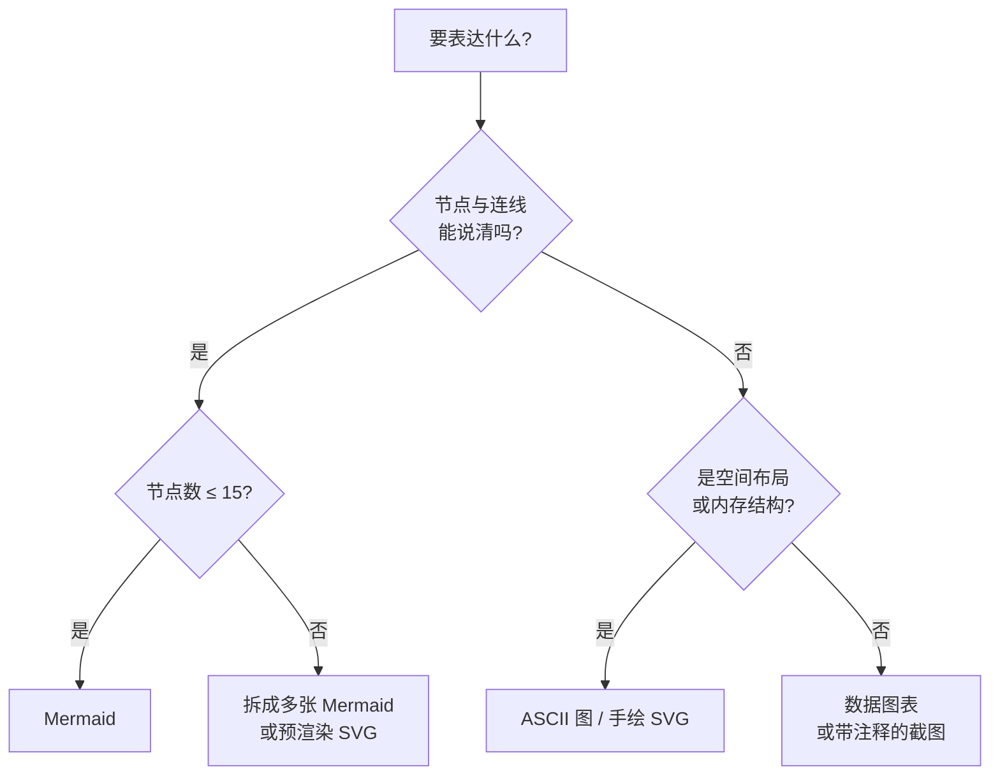

# 图标与图表工具箱

## 图标

本站不使用系统 emoji 作为装饰，图标一律是矢量 SVG，随主题颜色变化。MkDocs Material 内置四套图标库，通过 `:库-路径:` 语法引用。

| 库 | 前缀 | 数量级 | 擅长 |
|---|---|---|---|
| Material Design Icons | `:material-` | 7000+ | 通用界面、文件、操作 |
| FontAwesome（Free） | `:fontawesome-solid-` `:fontawesome-regular-` `:fontawesome-brands-` | 2000+ | 通用符号与品牌 |
| Octicons | `:octicons-` | 300+ | 代码、Git、协作 |
| Simple Icons | `:simple-` | 3000+ | 技术栈与产品商标 |

写法示例：:material-source-branch: 分支，:octicons-git-pull-request-16: 合并请求，:simple-react: React，:simple-typescript: TypeScript。

使用规则：

1. 图标只出现在标题旁、表格首列、卡片角标，不插进正文句子中间。
2. 同一页面只使用一套图标库，保证线条粗细一致。
3. 技术栈标识用 Simple Icons，不手绘商标。
4. 图标不单独承载含义，旁边必须有文字。

## 图表选型



### Mermaid 能画什么

| 类型 | 适合 | 不适合 |
|---|---|---|
| `flowchart` | 流程、依赖、架构分层 | 超过 15 个节点 |
| `sequenceDiagram` | 多方时序、请求往返 | 并行分支很多的流程 |
| `stateDiagram-v2` | 状态机、生命周期 | 状态名含引号时需用别名 |
| `classDiagram` | 类型关系 | 运行时数据流 |
| `gantt` / `timeline` | 阶段与演进 | 精确时间轴 |

Mermaid 的限制要提前知道：布局由引擎自动计算，无法精确摆位；节点超过十几个后线条交叉严重；`graph`、`call`、`end`、`click` 等词是保留字，不能作节点 id。

### ASCII 图

本站代码字体保证汉字恰好占两个字符宽，因此含中文的 ASCII 图可以严格对齐。内存布局、字节排列、调用栈、树结构用 ASCII 图更直接：

```text
栈（向下增长）            堆
┌──────────────┐        ┌──────────────┐
│ main 的帧     │        │ { name: "A" }│ ◀─ 对象
├──────────────┤        ├──────────────┤
│ user ───────────────▶ │ 0x7f3a…      │
└──────────────┘        └──────────────┘
```

### 手绘 SVG 与预渲染图

当 Mermaid 表达不了（例如坐标图、时间线叠加、协议报文布局），按以下流程处理：

1. 用 D2、Graphviz 或手写 SVG 画图，导出 SVG。
2. 存放到 `docs/assets/diagrams/`，文件名使用 `主题-图意.svg`。
3. 在正文中用 `{ loading=lazy }` 引用，替代文本写清图的结论。
4. SVG 中的颜色引用令牌对应的 CSS 变量或固定取自本站色板，文字使用 Inter 或 Noto Sans SC。

## 书籍中的图表自动处理

书籍构建时，每张 Mermaid 图经过同一条流水线：

1. 以书籍字号渲染，字体取自令牌，颜色取自语义色。
2. 超出版心宽度的图按比例缩小；缩小后文字低于可读下限的，记录到构建日志，由作者拆图。
3. 图高限制在版心之内，图与其引导句、解释列表绑定，避免图与标题分处两页。
4. 渲染失败的图在日志中输出章节位置、报错首行与图源前两行，构建不静默吞错。
