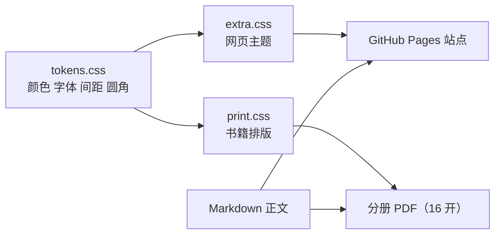

# 设计系统与写作规范

这一栏回答两个问题：**这个站点和它生成的 PDF 书为什么长成现在这样**，以及**新增一篇教程时必须遵守什么标准**。网页与书籍使用同一份设计令牌，改一个取值，两个媒介同时变化。

## 一套令牌，两种媒介

正文只有一份 Markdown。网页由 MkDocs Material 渲染；书籍由 `book/build.mjs` 读取已构建的站点页面，按 `book-manifest.json` 的导航树拼装，经 Chrome 与 Paged.js 分页输出。

## 本栏目内容

| 页面 | 解决什么问题 |
|---|---|
| [设计令牌与字体](tokens-and-typography.md) | 颜色、字号阶梯、间距栅格、三套字体与选择理由 |
| [组件与版式](components.md) | 提示块、代码块、表格、图的使用规则与反例 |
| [图标与图表工具箱](icons-and-diagrams.md) | 图标库来源、Mermaid 的适用边界、何时改用手绘 SVG |
| [书籍排版规范](print-spec.md) | 开本、版心、页眉页脚、分册规则、PDF 校验项 |
| [教程写作规范](writing-standard.md) | 一篇教程的结构、渐进顺序、配图密度、禁用写法与自检清单 |

## 三条总原则

1. **组件只引用令牌。** 样式里不出现裸色值、裸字号、裸间距。
2. **图先于字。** 能用一张图说清的结构、流程、状态变化，先画图再写解释。
3. **每一段只做一件事。** 一段讲一个概念，用一个例子验证，再用一个问题收束。
