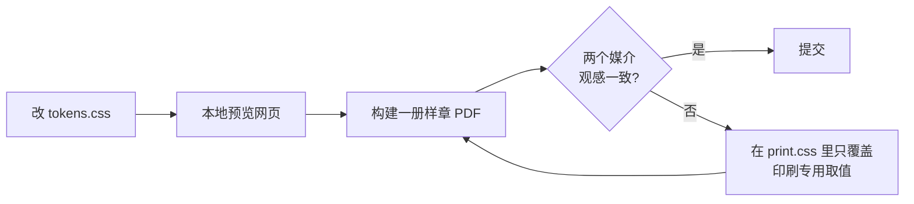

# 设计令牌与字体

令牌定义在 `docs/stylesheets/tokens.css`，是网页与书籍的唯一取值来源。

## 颜色

颜色分三层：中性色阶承担 90% 的界面，一个强调色承担"可点击与重点"，六个语义色承担"提示的含义"。

### 中性色阶（亮色）

| 令牌 | 取值 | 用途 |
|---|---|---|
| `--ink-900` | `#1d1d1f` | 标题、正文 |
| `--ink-700` | `#424245` | 次级正文、表头 |
| `--ink-500` | `#6e6e73` | 说明文字、页码 |
| `--ink-400` | `#86868b` | 占位、弱提示 |
| `--ink-300` | `#c7c7cc` | 边框、点线 |
| `--ink-200` | `#e5e5ea` | 分隔、表格线 |
| `--ink-100` | `#f2f2f5` | 浅底 |
| `--ink-50` | `#fafafc` | 页面底 |

暗色模式使用同名令牌换一组取值，组件无需改动。

### 强调色与语义色

强调色 `--accent: #0071e3`，暗色下提亮为 `#2997ff` 以保证对比度。语义色以 RGB 三元组形式存放，便于叠加透明度生成底色与边线。

| 语义 | 令牌 | 用在哪里 |
|---|---|---|
| 信息 | `--c-info` | 补充说明、概念定义 |
| 成功 | `--c-success` | 正确做法、验证通过 |
| 警告 | `--c-warning` | 易错点、兼容性陷阱 |
| 危险 | `--c-danger` | 安全风险、破坏性操作 |
| 洞察 | `--c-insight` | 心智模型、底层原理 |
| 实践 | `--c-practice` | 动手步骤、练习 |

!!! tip "用色规则"
    一屏之内最多出现两种语义色。语义色只表达含义，不用来装饰。

## 字号与行高

字号采用 1.2 的小三度比例，网页基准 16px，书籍正文 10.5pt。

| 阶梯 | 倍率 | 用途 |
|---|---|---|
| `--step--2` | 0.694 | 图注、页脚 |
| `--step--1` | 0.833 | 表格、代码 |
| `--step-0` | 1 | 正文 |
| `--step-1` | 1.2 | 小标题 |
| `--step-2` | 1.44 | 二级标题 |
| `--step-3` | 1.728 | 一级标题 |

中文正文行高取 `1.8`，代码行高取 `1.65`，标题行高取 `1.25`。

## 间距与圆角

间距使用 4px 栅格：`--space-1` 为 4px，向上依次为 8、12、16、24、32、48、72px。圆角分四档：`4 / 8 / 12 / 18px`，嵌套元素的内圆角比外圆角小一档。

## 字体

三套字体各司其职，全部采用 SIL OFL 1.1 许可，可自由嵌入网页与 PDF。

| 角色 | 字体 | 选择理由 |
|---|---|---|
| 书籍正文 | Noto Serif SC | 宋体风格，长篇阅读疲劳度低，字重齐全 |
| 标题与界面 | Inter + Noto Sans SC | 拉丁字母与汉字灰度接近，数字清晰 |
| 代码 | Maple Mono CN | 见下文 |

### 代码字体：为什么是 Maple Mono CN

教程里大量使用中英混排注释，字体必须满足三点。

1. **汉字恰好占两个英文字符宽。** 这样含中文的 ASCII 框线图在等宽排版下严格对齐，其他等宽字体加中文回退通常对不齐。
2. **斜体注释。** 注释使用设计过的斜体，与代码形成层次，不靠颜色单独区分。
3. **连字默认关闭。** 教程要让读者看清每个字符，`<!--` 被连字画成箭头会误导初学者，所以代码里一律不用连字。

网页端按 `unicode-range` 切片加载，只下载页面用到的字符。PDF 端把切片合并为每个字重一个文件，原因是分页引擎在数百个字体面前会卡死或把内容排两遍。

## 令牌的修改流程

