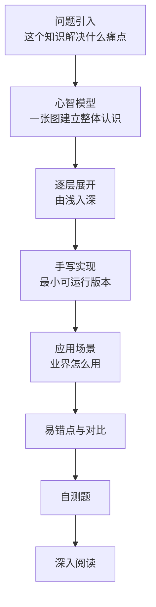

# 教程写作规范

这是一个教程仓库，读者的目标是学会、能复述、能动手、能面试。一篇合格的教程让读者在不查其他资料的前提下读懂它。

## 标准结构

| 部分 | 篇幅占比 | 必须包含 |
|---|---|---|
| 问题引入 | 5% | 一个具体场景，说明没有它会发生什么 |
| 心智模型 | 10% | 至少一张概览图，加一段"怎么读这张图" |
| 逐层展开 | 40% | 按下节"五层递进"组织 |
| 手写实现 | 20% | 可运行代码，带预期输出 |
| 应用场景 | 10% | 至少两个真实项目或产品的做法，附链接 |
| 易错点与对比 | 10% | 错误现象、原因、修正 |
| 自测题 | 5% | 3 到 5 题，答案折叠 |

## 五层递进

同一个概念按下面五层讲，每一层只回答一个问题，下一层建立在上一层之上。

| 层 | 回答的问题 | 手段 |
|---|---|---|
| 1 现象 | 看得见的行为是什么 | 最小例子加输出 |
| 2 规则 | 行为遵循什么规则 | 规则列表，每条配一个例子 |
| 3 机制 | 规则为什么成立 | 流程图或数据结构图 |
| 4 实现 | 自己怎么写出来 | 手写简化实现 |
| 5 边界 | 什么时候不成立 | 对比表、反例 |

示例：讲"闭包"。第一层给出计数器函数与输出；第二层写出"函数能访问其定义时所在的作用域"；第三层画作用域链与变量环境；第四层手写一个带私有状态的模块；第五层讲循环中 `var` 的陷阱与内存泄漏的条件。

## 配图规则

1. **密度：每 400 到 600 字至少一张图、表或代码块。** 连续超过 800 字纯文字的段落必须拆开或配图。
2. **图先于解释。** 图的上方一句话说"看什么"，下方编号列表逐步解释。
3. **一图一事。** 一张图只表达一个结构或一个流程。节点超过 15 个就拆。
4. **图中文字就是正文的一部分**，措辞与正文一致，不引入正文没有的术语。
5. **选型见** [图标与图表工具箱](icons-and-diagrams.md)。

## 段落与句子

1. 一段只讲一个概念，三到六句。
2. 第一句给结论，后面的句子给依据。
3. 术语第一次出现时给出定义和英文原名，之后保持写法一致。
4. 每个断言能被验证：给出数字、版本号、规范条目、源码位置或可运行的代码。
5. 列表项是完整的判断，不是名词堆。

## 代码规则

1. 能运行的代码必须运行过，输出写在注释里或紧随其后的代码块中。
2. 超过 15 行的代码分段，每段前一句话说明这一段的职责，段后解释关键行。
3. 注释解释"为什么这样写"。对每个陌生 API，第一次出现时说明参数与返回值。
4. 示例用真实的业务命名，如 `fetchOrders`，不用 `foo` `bar`。
5. 未验证的示意代码在代码块前明确标注。

## 禁用表述

读者无法据此做任何判断的句子不得出现。

| 不允许 | 改成 |
|---|---|
| "性能更好" | "首屏脚本体积从 240 KB 降到 90 KB" |
| "很容易出问题" | "并发两个请求时，后返回的旧响应会覆盖新响应" |
| "业界普遍使用" | "Next.js、Remix 默认采用该做法（附链接）" |
| "可以适当优化" | 写出具体手段与适用阈值 |
| "原理比较复杂，这里略过" | 讲到能手写简化版为止，或给出源码位置与阅读指引 |

## 引用与外链

1. 事实性断言附来源：规范、官方文档、源码仓库、论文。
2. 链接指向稳定地址，优先使用带版本或提交号的链接。
3. 文末"深入阅读"每条写明读什么、读完能得到什么。
4. 不复制受版权保护的长段原文，用自己的话概括并给出链接。

## 提交前自检

!!! tip "逐条核对"
    - [ ] 开头有具体的问题场景
    - [ ] 有一张概览图，且图上下各有一句引导与解释
    - [ ] 五层递进每一层都出现过
    - [ ] 没有连续 800 字的纯文字
    - [ ] 所有代码块带语言标记，长代码已分段解释
    - [ ] 代码已运行，输出已核对
    - [ ] 没有"禁用表述"表中的句子
    - [ ] 至少两个真实应用案例，附链接
    - [ ] 有易错点与对比
    - [ ] 有自测题与答案
    - [ ] 有"深入阅读"
    - [ ] `description` 在 60 到 160 字之间
    - [ ] Mermaid 本地渲染无报错
