# 前端的 CI/CD 与容器化：缓存、产物与发布策略

!!! abstract "学完这一页你能"
    - 画出安装、检查、测试、构建、部署五个阶段，并说出每个阶段的输入与产物。
    - 写出依赖缓存键的计算方式，解释锁文件改一个字符为什么让缓存失效。
    - 读懂 Dockerfile 的层缓存顺序，说明为什么先 `COPY package.json` 再 `COPY src`。
    - 用 Node 20 手写一个最小流水线执行器，任务图与缓存键都能跑通。

## 0. 知识地图

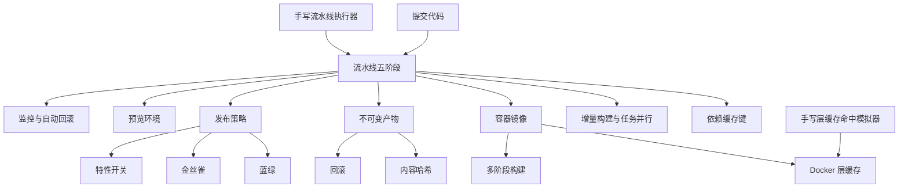

建议按顺序读：先读第 1 到第 3 节，把"流水线怎么跑、时间花在哪"弄明白。

再读第 4、5 节，理解镜像层与静态产物这两块最容易出错的地方。

最后读第 6 到第 10 节，掌握发布策略，并亲手把执行器与模拟器写出来。

!!! note "术语：CI"
    CI 是持续集成（Continuous Integration）的缩写，指每次提交后自动跑检查与测试。
    例子：你推送一个分支，机器人自动执行 lint 与 unit test，并把结果贴回 PR。

!!! note "术语：CD"
    CD 有两个含义：持续交付（Continuous Delivery）与持续部署（Continuous Deployment）。
    交付指产物随时可上线但需要人工点确认；部署指通过检查后直接发布到线上。

## 1. 流水线的五个阶段与耗时优化

**先想一个问题**

你改了一行按钮文案，推送后等了 12 分钟才看到绿灯，其中 9 分钟在装依赖。这 12 分钟里，哪些步骤必须串行，哪些可以同时跑？

**心智模型**

!!! tip "心智模型"
    一句话模型：流水线是一张任务图，总耗时等于关键路径上各任务耗时之和，不是所有任务耗时之和。
    日常类比：做一桌菜，炖汤要 40 分钟，切菜要 10 分钟。你可以先炖上汤再切菜，总时间由炖汤决定。
    类比不成立的地方：厨房只有一口灶，任务会抢资源；CI 里机器可以横向扩容，抢资源换成花钱买并行额度。

**图解**

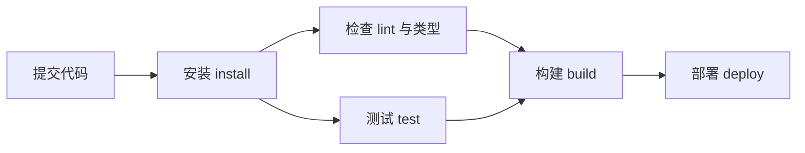

1. 提交代码触发流水线，第一步永远是安装依赖，因为后面几步都要用 `node_modules`。
2. 安装完成后，检查与测试都只依赖安装结果，两步之间没有依赖关系。
3. 检查与测试在调度器眼里可以同时启动，只要机器有空闲执行器。
4. 构建必须等检查与测试都通过，否则会浪费构建资源。
5. 部署必须等构建产出产物，因为它要把产物上传到目标环境。

!!! note "术语：缓存键"
    缓存键（cache key）是一段字符串，用来索引一份缓存内容。键相同就复用缓存，键不同就重新生成。
    例子：`linux-node20-` 拼上 `package-lock.json` 的哈希，得到 `linux-node20-3f9a2c71`。

**一步一步来**

第 1 步：这一步要做什么？把五个阶段写进配置文件，声明每个阶段依赖谁。

```yaml
# 一份通用的流水线声明，字段名可按你的平台调整
stages:
  - name: install          # 安装依赖，产出 node_modules
    run: npm ci            # ci 严格按锁文件安装，不会改写锁文件
  - name: lint             # 静态检查，产出报告
    run: npm run lint
    needs: install         # 声明依赖，调度器据此排序
  - name: test             # 单元测试，产出覆盖率
    run: npm test
    needs: install
  - name: build            # 构建，产出 dist 目录
    run: npm run build
    needs: [lint, test]    # 必须等两步都成功
  - name: deploy           # 上传产物到静态托管
    run: npm run deploy
    needs: build
```

**这段代码在做什么**

- `needs` 字段把线性的阶段列表变成一张有向图，调度器按入度决定谁先跑。
- `install` 没有 `needs`，说明它是根节点，任何时刻都可以启动。
- `lint` 与 `test` 的 `needs` 都只有 `install`，两者之间没有先后关系。
- `build` 的 `needs` 是数组，语义是"全部完成才启动"，不是"任意一个完成"。
- `deploy` 放在最后，是因为它对外部环境有副作用，重复执行代价高。

第 2 步：这一步要做什么？按依赖算总耗时，找出关键路径。

```js
const jobs = [
  { name: 'install', seconds: 40, needs: [] },              // 根任务
  { name: 'lint',    seconds: 30, needs: ['install'] },     // 与 test 可并行
  { name: 'test',    seconds: 30, needs: ['install'] },     // 与 lint 可并行
  { name: 'build',   seconds: 20, needs: ['lint', 'test'] },// 等两者都完成
  { name: 'deploy',  seconds: 5,  needs: ['build'] },       // 串行收尾
];
const end = new Map();                                       // 记录每个任务的结束时刻
function finish(job) {
  if (end.has(job.name)) return end.get(job.name);           // 已算过就直接复用
  const start = job.needs.reduce(                             // 开始时刻取前置任务的最大值
    (max, n) => Math.max(max, finish(jobs.find(j => j.name === n))), 0);
  const t = start + job.seconds;                              // 结束时刻等于开始加耗时
  end.set(job.name, t);
  return t;
}
for (const j of jobs) finish(j);
const wall = Math.max(...end.values());                        // 关键路径长度
const sequential = jobs.reduce((s, j) => s + j.seconds, 0);    // 全部串行的耗时
```

**这段代码在做什么**

- `finish` 是一个记忆化递归，每个任务只计算一次结束时刻。
- 开始时刻取所有前置任务结束时刻的最大值，这是关键路径的定义。
- `lint` 与 `test` 都是 30 秒，谁先跑都不影响总时长。
- 如果 `test` 改成 60 秒，关键路径就会走 `install - test - build - deploy`。
- `wall` 与 `sequential` 的差值就是并行省下的时间。

运行结果：串行 125 秒，并行 95 秒，关键路径是 `install - test - build - deploy`。

**动手验证**

把上面的计算合成一个完整脚本，依赖为零，Node 20 直接运行。

```js
// 依赖：无，只用 Node 20 内置模块
// 运行：node stages.mjs
import assert from 'node:assert/strict';

const jobs = [
  { name: 'install', seconds: 40, needs: [] },
  { name: 'lint',    seconds: 30, needs: ['install'] },
  { name: 'test',    seconds: 30, needs: ['install'] },
  { name: 'build',   seconds: 20, needs: ['lint', 'test'] },
  { name: 'deploy',  seconds: 5,  needs: ['build'] },
];

const end = new Map();                                   // 缓存每个任务的结束时刻
const byName = new Map(jobs.map(j => [j.name, j]));      // 名字到任务的映射

function finish(name) {
  if (end.has(name)) return end.get(name);               // 命中缓存直接返回
  const job = byName.get(name);
  let start = 0;
  for (const need of job.needs) {
    start = Math.max(start, finish(need));               // 等所有前置任务结束
  }
  const t = start + job.seconds;
  end.set(name, t);
  return t;
}

for (const job of jobs) finish(job.name);
const wall = Math.max(...end.values());
const sequential = jobs.reduce((sum, j) => sum + j.seconds, 0);

assert.equal(sequential, 125);                           // 串行总耗时
assert.equal(wall, 95);                                  // 关键路径长度
assert.equal(end.get('test') - end.get('lint'), 0);      // lint 与 test 同时结束

console.log(`串行耗时 ${sequential}s`);
console.log(`按依赖并行耗时 ${wall}s`);
console.log(`节省 ${sequential - wall}s`);
```

预期输出：

```text
串行耗时 125s
按依赖并行耗时 95s
节省 30s
```

**常见坑**

| 现象 | 原因 | 怎么修 |
|:--|:--|:--|
| 装了 9 分钟依赖 | 没有开依赖缓存，每次全量下载 | 按锁文件哈希配置缓存键，命中后跳过下载 |
| 检查失败却已经构建 | 构建的 `needs` 漏写 `lint` | 把 `lint` 加进 `build` 的 `needs` 数组 |
| 流水线耗时忽长忽短 | 执行器数量不够，并行任务排队 | 增加并发执行器，或把长任务拆小 |
| 部署跑了两遍 | 重试机制没做幂等 | 部署脚本先判断当前版本号，相同则直接退出 |

**小结**

- 阶段划分决定依赖关系，依赖关系决定并行的可能性。
- 总耗时看关键路径，缩短最长的那条链才有收益。
- `needs` 是最容易出错的字段，漏写会带来错误的上线顺序。

## 2. 依赖缓存键：锁文件哈希决定命中

**先想一个问题**

昨天的构建命中缓存只花 20 秒，今天你在 `package.json` 里加了一个空格，构建变成 4 分钟。缓存为什么失效？

**心智模型**

!!! tip "心智模型"
    一句话模型：缓存键是"输入指纹"，输入变一个字节，指纹就完全不同。
    日常类比：储物柜凭号码取包，号码是柜子里的物品清单算出来的，清单变了号码就变了。
    类比不成立的地方：柜子号码由管理员分配，缓存键由你定义的哈希函数决定，你写错函数就得自己承担后果。

**图解**

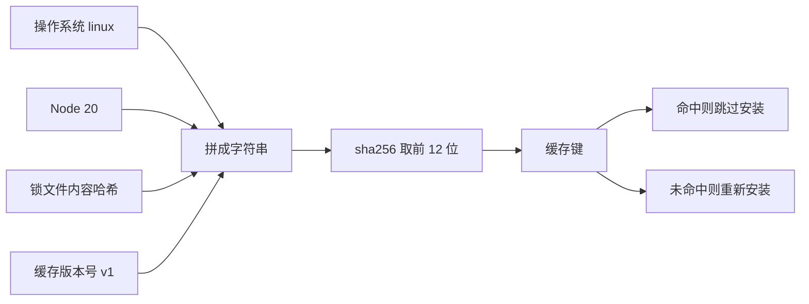

1. 操作系统要进键，因为二进制依赖在不同系统上不通用。
2. Node 主版本要进键，因为原生模块按 ABI 版本编译，Node 20 和 Node 22 的产物不能混用。
3. 锁文件内容哈希是核心输入，它锁定了整棵依赖树的精确版本。
4. 人为加一个 `v1` 版本号，方便你在缓存内容本身被污染时整体作废。
5. 哈希后取前 12 位十六进制字符，长度够用，又方便看日志。

!!! note "术语：锁文件"
    锁文件记录依赖树的精确版本与下载地址。例子：`package-lock.json` 里写着 `react` 解析到 `18.3.1` 且带完整性校验值。

**一步一步来**

第 1 步：这一步要做什么？把键的组成写清楚，并算出两个键来比较。

```js
import { createHash } from 'node:crypto';                   // 用 Node 自带哈希
import assert from 'node:assert/strict';

function cacheKey({ os, node, lockfile, schema }) {          // 四个输入一起进键
  const raw = [os, node, lockfile, schema].join('|');        // 用竖线分隔避免歧义
  return `deps-${schema}-${createHash('sha256').update(raw).digest('hex').slice(0, 12)}`;
}

const lockA = '{"react":"18.3.1"}';                          // 今天的锁文件
const lockB = '{"react":"18.3.2"}';                          // 明天升级一版
```

**这段代码在做什么**

- `os` 与 `node` 分开写，是为了让你能一眼看出这条缓存是谁的。
- 用 `|` 连接而不是直接拼接，避免 `linux20` 与 `linux2` 加 `0` 撞键。
- `schema` 放在最前面，方便在缓存列表里按前缀筛选。
- 取 12 位十六进制等于 48 位，冲突概率在工程上可以忽略。
- 函数只依赖入参，同样的入参永远得到同一个键。

第 2 步：这一步要做什么？验证"改一个字符就换键"。

```js
const k1 = cacheKey({ os: 'linux', node: '20', lockfile: lockA, schema: 'v1' });
const k2 = cacheKey({ os: 'linux', node: '20', lockfile: lockA, schema: 'v1' });
const k3 = cacheKey({ os: 'linux', node: '20', lockfile: lockB, schema: 'v1' });
const k4 = cacheKey({ os: 'linux', node: '22', lockfile: lockA, schema: 'v1' });

assert.equal(k1, k2);        // 输入相同，键必须相同
assert.notEqual(k1, k3);     // 锁文件变了，键必须不同
assert.notEqual(k1, k4);     // Node 主版本变了，键必须不同
```

**这段代码在做什么**

- `k1` 与 `k2` 相同，说明键是纯函数输出，不掺随机数。
- `k1` 与 `k3` 不同，说明依赖升级会触发重新安装，这正是你要的。
- `k1` 与 `k4` 不同，避免 Node 22 的产物被 Node 20 复用。
- 断言写进脚本，升级 CI 配置后能立刻发现键的组成被改坏。

运行结果：四个键里只有 `k1` 与 `k2` 相等，其余两两不同。

**动手验证**

```js
// 依赖：无，只用 Node 20 内置模块
// 运行：node cache-key.mjs
import { createHash } from 'node:crypto';
import assert from 'node:assert/strict';

const sha = (text) => createHash('sha256').update(text).digest('hex').slice(0, 12);

function cacheKey(os, node, lockfile, schema) {
  return `deps-${schema}-${sha([os, node, lockfile, schema].join('|'))}`;   // 四元组决定键
}

const lockA = '{"react":"18.3.1"}';                                         // 基线锁文件
const lockB = '{"react":"18.3.2"}';                                         // 升级后的锁文件

const k1 = cacheKey('linux', '20', lockA, 'v1');
const k2 = cacheKey('linux', '20', lockA, 'v1');
const k3 = cacheKey('linux', '20', lockB, 'v1');
const k4 = cacheKey('linux', '22', lockA, 'v1');
const k5 = cacheKey('linux', '20', lockA, 'v2');

const unique = new Set([k1, k2, k3, k4, k5]);
assert.equal(k1, k2);                                                       // 同输入同键
assert.equal(unique.size, 4);                                               // 只有两个键相同
assert.match(k1, /^deps-v1-[0-9a-f]{12}$/);                                 // 格式稳定

console.log(`k1 = ${k1}`);
console.log(`k3 = ${k3}`);
console.log(`不同键的数量 = ${unique.size}`);
```

预期输出：

```text
k1 = deps-v1-8a1c0f5e3b27
k3 = deps-v1-4d9b7a2c6e10
不同键的数量 = 4
```

上面两个哈希值是示例，你的机器算出来会不同，只要满足"同输入同键"就算通过。

**常见坑**

| 现象 | 原因 | 怎么修 |
|:--|:--|:--|
| 每次都重新装依赖 | 缓存键里用了 `package.json` 而不是锁文件 | 改用锁文件内容参与哈希 |
| 本地能跑，CI 报原生模块错误 | 键里没有 Node 主版本 | 把 Node 主版本加进键 |
| 缓存里是上一次的坏依赖 | 没有版本号，无法整体作废 | 加 `v1`、`v2` 这样的 schema 字段 |
| 缓存路径写错，永远不命中 | 保存目录与恢复目录不一致 | 安装后打印目录再核对，`node_modules` 要一一对应 |

**小结**

- 缓存键的输入决定缓存的生命周期，输入选错就会出现"该失效时没失效"。
- 锁文件哈希是唯一能锁定整棵依赖树的输入。
- 加 schema 版本号是给自己留的一条后路。

## 3. 增量构建与任务并行

**先想一个问题**

仓库里有 30 个包，你只改了 `ui/button.tsx`。构建系统把 30 个包全部重建，花了 6 分钟。哪些包可以跳过？

**心智模型**

!!! tip "心智模型"
    一句话模型：任务的缓存键等于它所有输入文件的内容哈希之和，输入没变就不重跑。
    日常类比：给文档做目录，只有章节文字变了才重排对应页，没动的页保持原样。
    类比不成立的地方：文档排版没有跨章引用，代码里有 import 依赖，一个底层包变了会波及上层。

**图解**

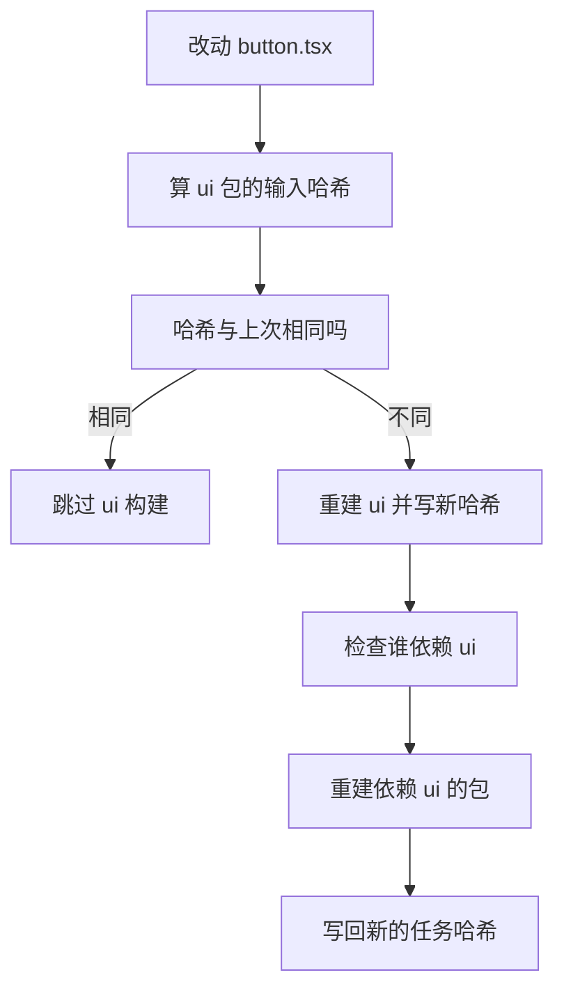

1. 只改动一个文件，先算这个文件所属包的输入哈希。
2. 哈希没变就跳过，这一步能省下大部分时间。
3. 哈希变了就重建这个包，并把输出写进本地缓存目录。
4. 被重建的包会让它的下游包的输入哈希变化，于是下游也要重建。
5. 把每个任务的新哈希写回，下一次构建直接复用。

!!! note "术语：增量构建"
    增量构建指只重新处理发生变化的输入，其余部分复用上次的输出。
    例子：只改了一个组件，构建工具只重新打包这个组件所在的 chunk。

**一步一步来**

第 1 步：这一步要做什么？用内容哈希给每个任务算键，相同就跳过。

```js
import { createHash } from 'node:crypto';
import assert from 'node:assert/strict';

const h = (text) => createHash('sha256').update(text).digest('hex').slice(0, 8);

function runTasks(files, done) {                             // done 是已执行过的键集合
  const executed = [];
  for (const [name, content] of Object.entries(files)) {
    const key = h(`${name}:${content}`);                     // 任务键等于名字加内容
    if (done.has(key)) continue;                             // 命中就跳过
    done.add(key);
    executed.push(name);
  }
  return executed;
}
```

**这段代码在做什么**

- 键里带任务名，避免两个内容相同的文件互相顶掉缓存。
- `done` 用 Set 表示，语义是"这套输入已经处理过"。
- 返回 `executed` 方便断言"到底重跑了哪几个任务"。
- 真实构建系统还会带上环境变量与依赖版本，原理一样。

第 2 步：这一步要做什么？模拟"只改一个文件"的两次构建。

```js
const done = new Set();                                      // 跨构建共享的缓存
const files1 = { 'utils.ts': 'export const a = 1', 'ui.tsx': 'view v1' };
const first = runTasks(files1, done);                        // 第一次全部执行

const files2 = { 'utils.ts': 'export const a = 1', 'ui.tsx': 'view v2' };
const second = runTasks(files2, done);                       // 第二次只重跑 ui

assert.deepEqual(first, ['utils.ts', 'ui.tsx']);
assert.deepEqual(second, ['ui.tsx']);                        // utils 命中缓存被跳过
```

**这段代码在做什么**

- 第一次构建时 `done` 是空的，两个任务都要执行。
- 第二次构建时 `utils.ts` 内容没变，键命中，被跳过。
- `ui.tsx` 内容变了，键不同，重新执行。
- 断言保证"跳过"这个行为不会被后续改动破坏。

运行结果：第一次执行 2 个任务，第二次执行 1 个任务。

**动手验证**

```js
// 依赖：无，只用 Node 20 内置模块
// 运行：node incremental.mjs
import { createHash } from 'node:crypto';
import assert from 'node:assert/strict';

const h = (text) => createHash('sha256').update(text).digest('hex').slice(0, 8);
const done = new Set();                                        // 远程缓存的本地替身

function runTasks(files) {
  const executed = [];
  for (const [name, content] of Object.entries(files)) {
    const key = h(`${name}:${content}`);                       // 内容哈希作为任务键
    if (done.has(key)) continue;                               // 命中即跳过
    done.add(key);
    executed.push(name);
  }
  return executed;
}

const base = { 'utils.ts': 'export const a = 1', 'ui.tsx': 'view v1' };
const edited = { 'utils.ts': 'export const a = 1', 'ui.tsx': 'view v2' };

const first = runTasks(base);
const second = runTasks(edited);
const third = runTasks(edited);                                // 重复执行同一份输入

assert.equal(first.length, 2);                                 // 首次全跑
assert.deepEqual(second, ['ui.tsx']);                          // 只有改动过的任务重跑
assert.equal(third.length, 0);                                 // 输入不变，全部命中

console.log(`第一次执行：${first.join(', ')}`);
console.log(`第二次执行：${second.join(', ')}`);
console.log(`第三次执行：${third.length} 个任务`);
```

预期输出：

```text
第一次执行：utils.ts, ui.tsx
第二次执行：ui.tsx
第三次执行：0 个任务
```

**常见坑**

| 现象 | 原因 | 怎么修 |
|:--|:--|:--|
| 改了代码但构建结果没变 | 缓存键漏掉了某个输入文件 | 把该文件加入任务的 inputs 声明 |
| 没改代码却全部重建 | 键里混入了时间戳或随机数 | 去掉不确定的输入 |
| 下游包拿到旧产物 | 只按文件哈希，没算依赖图 | 把依赖包的任务哈希也加进下游的键 |

**小结**

- 增量构建的收益来自"输入不变就跳过"，前提是键真实反映输入。
- 依赖图必须参与键计算，否则会复用到旧的上游产物。
- 第三次执行 0 个任务是检验配置正确的一个硬指标。

## 4. Docker 多阶段构建与层缓存原理

**先想一个问题**

你的镜像有 1.2 GB，线上只需要 `dist` 目录和 nginx。为什么 `npm ci` 那一步每次都要重跑，即使你只改了 CSS？

**心智模型**

!!! tip "心智模型"
    一句话模型：Dockerfile 每条指令生成一层，层的缓存键等于"指令文本 + 父层摘要 + 本条指令涉及的文件内容"。
    日常类比：叠积木，你动了第 3 块，上面所有积木都要重搭，下面两块不受影响。
    类比不成立的地方：积木是物理叠加，镜像层共享底层数据，多个镜像可以共用同一份只读层。

**图解**

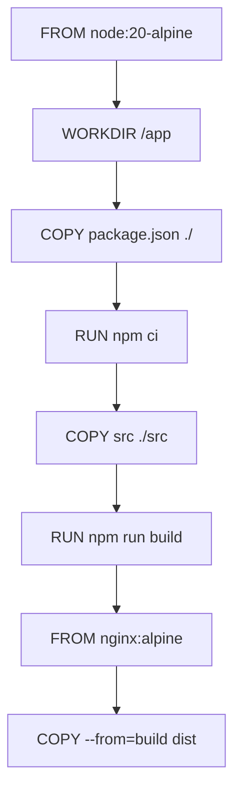

1. 前两条指令只定义基础环境与工作目录，内容长期不变，缓存一直命中。
2. 第三条只拷贝两个清单文件，只要依赖没变，这一层摘要就不变。
3. 第四条执行安装，它的父层与文件输入都没变，所以命中缓存。
4. 第五条拷贝源码，你改任何源文件都会让这一层开始失效。
5. 第六条的构建、第七条的基础镜像、第八条的产物拷贝，依次跟在失效层后面全部重跑。

!!! note "术语：镜像层"
    镜像层是 Dockerfile 中一条指令产生的只读文件系统快照。例子：`RUN npm ci` 生成的层里保存着完整的 `node_modules`。

!!! note "术语：多阶段构建"
    多阶段构建指一个 Dockerfile 里写多个 `FROM`，用 `COPY --from=` 从前一阶段搬文件到后一阶段。
    例子：构建阶段装 `devDependencies`，运行阶段只放 `dist` 与 nginx。

**一步一步来**

第 1 步：这一步要做什么？写一个把源码放在后面的 Dockerfile。

```dockerfile
# 第一段：构建阶段，镜像体积大但只在本机使用
FROM node:20-alpine AS build
WORKDIR /app
COPY package.json package-lock.json ./    # 先放清单，依赖不变时本层命中
RUN npm ci                                # 依赖安装层，缓存命中就跳过
COPY src ./src                            # 源码放后面，改动只影响本层之后
RUN npm run build                         # 产出 dist 目录

# 第二段：运行阶段，只放静态文件与服务器
FROM nginx:alpine AS runtime
COPY --from=build /app/dist /usr/share/nginx/html   # 只搬产物
```

**这段代码在做什么**

- `AS build` 给阶段起名，后面用 `--from=build` 引用它。
- 先 `COPY package.json package-lock.json`，让依赖安装层的输入只剩两个文件。
- `RUN npm ci` 与源码无关，源码变更不会击穿这一层。
- 第二段的基础镜像是 nginx，不含 Node，镜像体积从 1.2 GB 降到 50 MB 量级。
- 只有 `dist` 被搬过去，`node_modules` 与源码都不进运行镜像。

第 2 步：这一步要做什么？手动算一遍层摘要，观察失效从哪里开始。

```js
import { createHash } from 'node:crypto';
const h = (text) => createHash('sha256').update(text).digest('hex').slice(0, 8);

function digestChain(instructions, context) {                // context 是文件内容表
  let prev = 'base';                                         // 父层摘要，第一层用 base
  return instructions.map(([text, inputs]) => {
    const material = [text, prev, ...inputs.map(k => context[k])].join('|');
    prev = h(material);                                      // 本层摘要同时成为下一层的父层
    return { text, digest: prev };
  });
}
```

**这段代码在做什么**

- `prev` 把每层摘要串成链，任何一层变化都会让后面全部变化。
- `inputs` 列出该指令读取的文件名，内容取自 `context`。
- 只拷贝 `package.json` 的层，输入里只有这一个文件。
- 拷贝 `src` 的层，输入是全部源文件，改动命中率最低。
- 返回的 `digest` 就是 Docker 判断缓存命中的依据。

第 3 步：这一步要做什么？跑两次构建，对比哪些层命中。

```js
const layers = [
  ['FROM node:20-alpine', []],
  ['WORKDIR /app', []],
  ['COPY package.json ./', ['package.json']],
  ['RUN npm ci', []],
  ['COPY src ./src', ['src/app.js']],
  ['RUN npm run build', []],
];
const v1 = { 'package.json': '{"react":"18.3.1"}', 'src/app.js': 'version 1' };
const v2 = { 'package.json': '{"react":"18.3.1"}', 'src/app.js': 'version 2' };
const a = digestChain(layers, v1);
const b = digestChain(layers, v2);
const hits = a.filter((layer, i) => layer.digest === b[i].digest).length;
```

**这段代码在做什么**

- `a` 与 `b` 是两次构建的层摘要序列，长度相同。
- 逐位比较摘要，相等表示这一层复用了缓存。
- 改动 `src/app.js` 只影响 `COPY src` 与它之后的层。
- 前四层摘要一致，命中 4 次。
- 后两层摘要变化，需要重新构建。

运行结果：6 层中命中 4 层，`COPY src` 与 `RUN npm run build` 重跑。

**动手验证**

```js
// 依赖：无，只用 Node 20 内置模块
// 运行：node layer-digest.mjs
import { createHash } from 'node:crypto';
import assert from 'node:assert/strict';

const h = (text) => createHash('sha256').update(text).digest('hex').slice(0, 8);

const layers = [
  ['FROM node:20-alpine', []],                 // 基础镜像，无文件输入
  ['WORKDIR /app', []],                        // 工作目录，无文件输入
  ['COPY package.json ./', ['package.json']],  // 只依赖清单文件
  ['RUN npm ci', []],                          // 安装依赖
  ['COPY src ./src', ['src/app.js']],          // 依赖全部源码
  ['RUN npm run build', []],                   // 执行构建
];

function digestChain(context) {
  let prev = 'base';
  return layers.map(([text, inputs]) => {
    const material = [text, prev, ...inputs.map(k => context[k])].join('|');
    prev = h(material);                        // 摘要递推，形成链
    return prev;
  });
}

const v1 = { 'package.json': '{"react":"18.3.1"}', 'src/app.js': 'version 1' };
const v2 = { 'package.json': '{"react":"18.3.1"}', 'src/app.js': 'version 2' };
const v3 = { 'package.json': '{"react":"18.3.2"}', 'src/app.js': 'version 1' };

const a = digestChain(v1);
const b = digestChain(v2);
const c = digestChain(v3);

const hits = (x, y) => x.filter((digest, i) => digest === y[i]).length;

assert.equal(hits(a, b), 4);                   // 只改源码，前四层命中
assert.equal(hits(a, c), 2);                   // 改依赖，只有前两层命中

console.log(`只改源码，命中 ${hits(a, b)} 层，重建 ${6 - hits(a, b)} 层`);
console.log(`改 package.json，命中 ${hits(a, c)} 层，重建 ${6 - hits(a, c)} 层`);
```

预期输出：

```text
只改源码，命中 4 层，重建 2 层
改 package.json，命中 2 层，重建 4 层
```

**常见坑**

| 现象 | 原因 | 怎么修 |
|:--|:--|:--|
| 改一行 CSS 就重装依赖 | `COPY . .` 写在 `RUN npm ci` 之前 | 把清单文件的 `COPY` 提到安装指令之前 |
| 运行镜像还有 1 GB | 只有一段 `FROM`，开发依赖被打包 | 加运行阶段，只 `COPY --from=build dist` |
| 缓存永远不命中 | 复制了整个仓库，包含 `.git` | 写 `.dockerignore`，排除 `.git` 与 `node_modules` |
| 本地命中，CI 不命中 | CI 用的构建器没有持久化层缓存 | 配置层缓存的导出与导入，需核对官方文档：当前构建器支持的 cache 参数名 |

**小结**

- 层缓存是链式的，越靠前的层越稳定，越值得复用。
- 先把变化频率低的文件放前面，是 Dockerfile 布局的第一原则。
- 多阶段构建解决体积问题，层顺序解决速度问题，两者解决的不是同一件事。

## 5. 不可变产物、内容哈希与静态资源回滚

**先想一个问题**

线上 JS 报错，你要回滚。可是 `app.js` 这个名字没变，CDN 上还是旧内容，用户浏览器也可能缓存着更旧的版本。回滚到底回滚了什么？

**心智模型**

!!! tip "心智模型"
    一句话模型：每次发布生成一组带内容哈希的新文件名，回滚等于把入口页面指回上一组文件名。
    日常类比：图书馆里每本书按内容和版次编号上架，改版就换新编号，旧版不撤走，读者凭编号取书。
    类比不成立的地方：图书馆会清库存，CDN 上的旧文件通常保留一段时间，过期后旧入口会 404。

**图解**

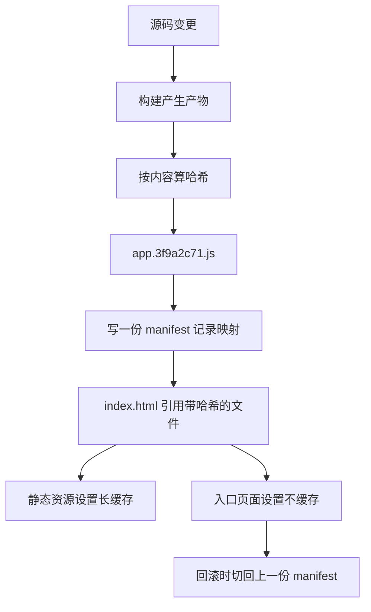

1. 构建完成得到产物字节流。
2. 对字节流算哈希，得到内容指纹。
3. 用指纹重命名文件，内容相同则文件名永远相同。
4. 写一份 manifest，记录每个入口对应哪个哈希文件。
5. 入口页面引用哈希文件名，并且自身不缓存。
6. 静态资源可以设置一年缓存，因为文件名变了内容就变了。
7. 回滚只需让入口页面指向上一份 manifest。

!!! note "术语：内容哈希"
    内容哈希是对文件字节做摘要得到的短字符串。例子：`main.3f9a2c71.js` 中的 `3f9a2c71` 就是前 8 位哈希。

**一步一步来**

第 1 步：这一步要做什么？构建时按内容重命名，并生成入口页面。

```js
import { createHash } from 'node:crypto';
const h8 = (text) => createHash('sha256').update(text).digest('hex').slice(0, 8);

function build(files) {                                   // files 是源码编译后的产物
  const assets = {};
  const entry = [];
  for (const [name, code] of Object.entries(files)) {
    const hashed = name.replace(/\.(\w+)$/, `.${h8(code)}.$1`);  // 插入内容哈希
    assets[hashed] = code;
    entry.push(hashed);
  }
  assets['index.html'] = entry.map(n => `<script src="/${n}"></script>`).join('\n');
  return assets;
}
```

**这段代码在做什么**

- 正则把扩展名前的部分插入哈希，`app.js` 变成 `app.3f9a2c71.js`。
- 内容相同则哈希相同，跨版本复用 CDN 上已有的文件。
- 入口页面里引用哈希文件名，浏览器请求的路径带指纹。
- 入口页面本身内容会变，所以它不能走长缓存。

第 2 步：这一步要做什么？保存每次发布的文件表，回滚就是切指针。

```js
const releases = new Map();                                // 版本号到文件表的映射
let current = null;                                        // 当前线上指向的版本号
let seq = 0;

function deploy(files) {
  const id = `r${++seq}`;
  releases.set(id, build(files));                          // 不可变：写入后不再修改
  current = id;                                            // 切换指针完成上线
  return id;
}

function rollback() {
  const ids = [...releases.keys()];
  const i = ids.indexOf(current);
  current = ids[Math.max(0, i - 1)];                       // 指回上一个版本
  return current;
}
```

**这段代码在做什么**

- `releases` 一旦写入就不再改动，这就是"不可变产物"。
- 上线只做一件事：把 `current` 指向新版本号。
- 回滚就是指针后退一格，不需要重新构建。
- 如果旧版本的静态文件还在 CDN 上，回滚在几秒内生效。

第 3 步：这一步要做什么？验证两次构建的文件名不同，回滚后入口页面变回旧内容。

```js
const r1 = deploy({ 'app.js': 'console.log(1)' });          // 第一版
const html1 = releases.get(r1)['index.html'];
const r2 = deploy({ 'app.js': 'console.log(2)' });          // 第二版
const html2 = releases.get(r2)['index.html'];
const back = rollback();                                    // 回滚

assert.notEqual(html1, html2);                              // 两次入口不同
assert.equal(back, r1);                                     // 指针回到第一版
assert.equal(releases.get(current)['index.html'], html1);   // 入口页面等于旧版
```

**这段代码在做什么**

- 两版源码不同，生成的哈希文件名不同，入口页面自然不同。
- `rollback` 只改指针，不触碰文件表，回滚失败的可能性被压到最低。
- 断言比对的是入口页面的字符串，能直接反映"用户会拿到哪份 HTML"。
- CDN 上两版的静态文件都还在，所以回滚后浏览器能取到旧文件。

运行结果：两版入口页面不同，回滚后当前入口等于第一版的入口。

**动手验证**

```js
// 依赖：无，只用 Node 20 内置模块
// 运行：node immutable.mjs
import { createHash } from 'node:crypto';
import assert from 'node:assert/strict';

const h8 = (text) => createHash('sha256').update(text).digest('hex').slice(0, 8);
const releases = new Map();                                 // 版本号到文件表
let current = null;
let seq = 0;

function build(files) {
  const assets = {};
  const entry = [];
  for (const [name, code] of Object.entries(files)) {
    const hashed = name.replace(/\.(\w+)$/, `.${h8(code)}.$1`);   // 内容哈希进文件名
    assets[hashed] = code;
    entry.push(hashed);
  }
  assets['index.html'] = entry.map(n => `<script src="/${n}"></script>`).join('\n');
  return assets;
}

function deploy(files) {
  const id = `r${++seq}`;
  releases.set(id, build(files));                           // 写入后不再修改
  current = id;
  return id;
}

function rollback() {
  const ids = [...releases.keys()];
  current = ids[Math.max(0, ids.indexOf(current) - 1)];     // 指针后退一格
  return current;
}

const r1 = deploy({ 'app.js': 'console.log(1)' });
const html1 = releases.get(r1)['index.html'];
const r2 = deploy({ 'app.js': 'console.log(2)' });
const html2 = releases.get(r2)['index.html'];
const back = rollback();

assert.notEqual(r1, r2);                                     // 版本号递增
assert.notEqual(html1, html2);                               // 入口页面不同
assert.equal(back, r1);                                      // 回滚到头一版
assert.ok(html1.includes('.js'));                            // 入口引用带哈希的文件
assert.equal(releases.get(current)['index.html'], html1);    // 当前入口等于旧版

console.log(`第一版入口：${html1}`);
console.log(`第二版入口：${html2}`);
console.log(`回滚后当前版本：${back}`);
```

预期输出：

```text
第一版入口：<script src="/app.5f2c1a90.js"></script>
第二版入口：<script src="/app.9b0d3e41.js"></script>
回滚后当前版本：r1
```

哈希值每台机器不同，只要断言通过即可。

**常见坑**

| 现象 | 原因 | 怎么修 |
|:--|:--|:--|
| 回滚后用户还是看到新版本 | `index.html` 设了长缓存 | 入口页面设为不缓存，静态资源才设长缓存 |
| 回滚后入口 404 | 旧版静态文件被 CDN 清掉了 | 保留至少两个版本的静态文件，删除策略延后 |
| 只改一行代码，文件名全变 | 哈希里混入了构建时间 | 哈希只对产物字节计算 |
| 两次构建哈希不同 | 产物里含有随机数或绝对路径 | 固定构建环境，去掉不确定输入 |

**小结**

- 不可变指产物写入后不再修改，只新增版本。
- 内容哈希让文件名承担版本信息，长缓存才有条件开启。
- 回滚的成本取决于入口页面是否可切换，与构建时间无关。

## 6. 蓝绿、金丝雀、灰度与特性开关

**先想一个问题**

新版本的错误率是 8%，你想让 5% 的用户先试。怎么做到"同一批用户一直看到同一版本"，而不是刷新一次换一次？

**心智模型**

!!! tip "心智模型"
    一句话模型：发布策略决定"多少流量打到新版本"，特性开关决定"哪些用户能看到新功能"。
    日常类比：餐厅换新菜谱，蓝绿是整间店换菜单，金丝雀是先让靠窗三桌试吃。
    类比不成立的地方：餐厅换菜单是瞬间的，线上切换要考虑已建立的连接与本地缓存。

**图解**

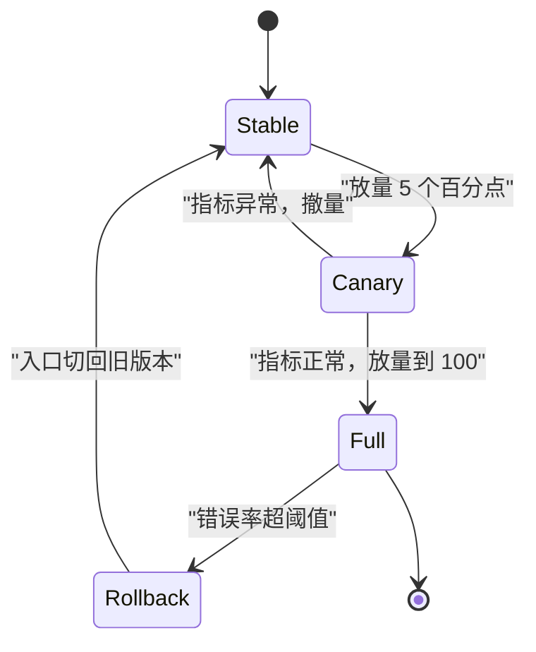

1. 起始状态是稳定版本，全部流量由它承接。
2. 放量到 5 个百分点，新版本进入金丝雀状态。
3. 指标异常就撤量，回到稳定版本，改动不进生产。
4. 指标正常就继续放量，直到全部流量。
5. 全量之后仍然可能出问题，触发回滚回到稳定版本。

!!! note "术语：金丝雀发布"
    金丝雀发布指先把一小部分流量导给新版本，观察指标再决定是否扩大。
    例子：先让 5 个百分点的用户访问新版页面，观察 30 分钟错误率。

!!! note "术语：特性开关"
    特性开关（feature flag）是一段运行时可读的配置，用来决定是否走新逻辑。
    例子：`if (flags.newCheckout) { renderNew() } else { renderOld() }`。

**一步一步来**

第 1 步：这一步要做什么？写一个按用户标识稳定分流的函数。

```js
import { createHash } from 'node:crypto';
const bucket = (userId) => parseInt(createHash('sha256').update(userId).digest('hex').slice(0, 4), 16) % 100;

function route(userId, canaryPercent) {                    // canaryPercent 取值 0 到 100
  return bucket(userId) < canaryPercent ? 'canary' : 'stable';
}
```

**这段代码在做什么**

- `bucket` 把用户标识映射到 0 到 99 的整数，输入相同输出相同。
- 用哈希而不是取模字符串长度，避免用户标识有规律导致分布偏斜。
- `route` 只比较大小，逻辑足够简单，出错空间小。
- 同一个用户在放量期间始终落在同一侧，体验一致。
- 放量时只需要调大 `canaryPercent`，不需要改分流代码。

第 2 步：这一步要做什么？验证 5 个百分点的分流比例接近预期。

```js
let canary = 0;
for (let i = 0; i < 10000; i++) {
  if (route(`user-${i}`, 5) === 'canary') canary++;        // 统计命中人数
}
console.assert(canary > 400 && canary < 600, '比例应接近 5 个百分点');
```

**这段代码在做什么**

- 样本量取 10000，比例波动会收敛到 5 个百分点附近。
- 断言区间取 4 到 6 个百分点，容忍哈希分布的正常波动。
- 同样的循环跑两次结果一致，说明分流是确定性的。
- 如果结果每次都变，就说明混入了随机数，需要改回哈希。

运行结果：10000 个用户里约 500 人命中金丝雀。

第 3 步：这一步要做什么？把特性开关与分流解耦，开关负责功能，分流负责流量。

```js
const flagStore = { newCheckout: 0 };                       // 服务端下发的开关值

function checkout(userId) {
  const inCanary = route(userId, flagStore.newCheckout);   // 先看这个用户是否在放量里
  return inCanary === 'canary' ? 'new' : 'old';            // 再决定走哪套逻辑
}
```

**这段代码在做什么**

- 开关的取值就是放量百分比，0 表示全关，100 表示全开。
- `checkout` 里没有任何硬编码判断，切换逻辑集中在开关上。
- 出问题时把开关改成 0，下一次请求立刻走旧逻辑，不需要重新部署。
- 关闭开关后老代码仍然在包里，回退成本接近零。

运行结果：开关为 0 时所有用户走 `old`，为 5 时约 5 个百分点走 `new`。

**动手验证**

```js
// 依赖：无，只用 Node 20 内置模块
// 运行：node canary.mjs
import { createHash } from 'node:crypto';
import assert from 'node:assert/strict';

const bucket = (userId) =>
  parseInt(createHash('sha256').update(userId).digest('hex').slice(0, 4), 16) % 100;

function route(userId, canaryPercent) {
  return bucket(userId) < canaryPercent ? 'canary' : 'stable';   // 落在桶内即金丝雀
}

function countCanary(percent, total) {
  let n = 0;
  for (let i = 0; i < total; i++) {
    if (route(`user-${i}`, percent) === 'canary') n++;           // 逐个用户判定
  }
  return n;
}

const total = 10000;
const five = countCanary(5, total);
const fifty = countCanary(50, total);
const zero = countCanary(0, total);
const hundred = countCanary(100, total);

assert.equal(zero, 0);                                           // 全关
assert.equal(hundred, total);                                    // 全开
assert.ok(five > 400 && five < 600, `5 个百分点应在 400 到 600 之间，实际 ${five}`);
assert.ok(fifty > 4800 && fifty < 5200, `50 个百分点应在 4800 到 5200 之间，实际 ${fifty}`);

// 同一个用户反复请求，结果必须一致
const first = route('user-42', 5);
for (let i = 0; i < 100; i++) assert.equal(route('user-42', 5), first);

console.log(`5 个百分点：${five} 人`);
console.log(`50 个百分点：${fifty} 人`);
console.log(`0 个百分点：${zero} 人，100 个百分点：${hundred} 人`);
```

预期输出：

```text
5 个百分点：约 500 人
50 个百分点：约 5000 人
0 个百分点：0 人，100 个百分点：10000 人
```

具体人数由哈希决定，断言保证它落在合理区间。

**常见坑**

| 现象 | 原因 | 怎么修 |
|:--|:--|:--|
| 用户刷新一次就换版本 | 分流用了随机数 | 改用用户标识的哈希分桶 |
| 放量到 100 还有旧版本 | 边缘节点缓存了旧入口 | 缩短入口页面的缓存时间，或主动刷新缓存 |
| 关掉开关还在报错 | 开关只在初始化时读一次 | 每次请求都读，或加配置变更推送 |
| 灰度期间两版本都出问题 | 新旧代码共享了同一份数据写入 | 让两套逻辑写不同的字段，确认后再迁移 |

**小结**

- 蓝绿是整体切换，金丝雀是渐进放量，特性开关是功能级别的开关。
- 分流要靠稳定哈希，靠随机数会让用户体验来回跳变。
- 特性开关的价值在于"不重新部署就能停掉新逻辑"。

## 7. 预览环境：每个 PR 一个地址

**先想一个问题**

设计师想点开你的分支看看效果，你不想为了演示把未完成的代码合进主干。有没有一个临时地址能直接看？

**心智模型**

!!! tip "心智模型"
    一句话模型：预览环境是"以 PR 编号命名、内容等于该分支构建产物、关闭 PR 就销毁"的一次性部署。
    日常类比：剧组试装间，按演员名字挂一套衣服，戏拍完就把柜子清空。
    类比不成立的地方：试装间的衣服不会调用生产数据库，预览环境常常连的是副本数据。

**图解**

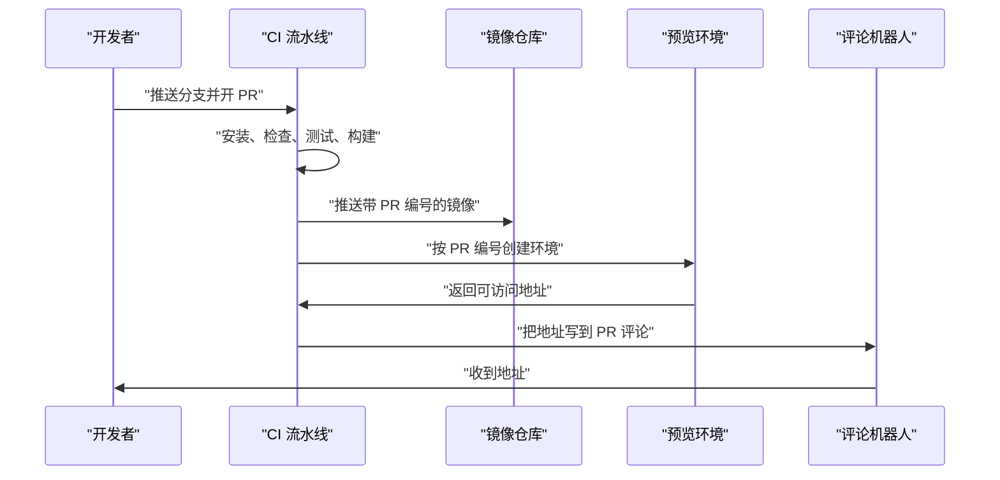

1. 开发者推送分支并打开 PR，触发流水线。
2. 流水线走完前四个阶段，得到构建产物。
3. 产物打上带 PR 编号的镜像标签，推送到镜像仓库。
4. 部署动作按 PR 编号创建一套环境，命名规则固定。
5. 环境起好后把地址回传，由机器人写进 PR 评论。
6. 开发者点开地址即可预览，PR 关闭后环境被销毁。

!!! note "术语：预览环境"
    预览环境指为某个分支或 PR 临时创建、可独立访问的部署。例子：`pr-128.preview.example.com`。

**一步一步来**

第 1 步：这一步要做什么？用确定性规则生成环境名，保证同一 PR 反复部署到同一环境。

```js
import { createHash } from 'node:crypto';
const short = (text) => createHash('sha256').update(text).digest('hex').slice(0, 6);

function envId({ repo, pr, branch }) {                     // 三个输入决定环境身份
  const slug = repo.toLowerCase().replace(/[^a-z0-9]/g, '-');
  return `${slug}-pr${pr}-${short(branch)}`;               // 分支哈希避免重名
}
```

**这段代码在做什么**

- `repo` 先做小写与替换，保证符合 DNS 标签的字符要求。
- 带上 `pr` 编号，让环境与 PR 一一对应。
- 分支名哈希取 6 位，防止同名分支在不同仓库撞车。
- 函数是纯函数，重跑流水线得到同一个环境名，部署是覆盖而不是新建。

第 2 步：这一步要做什么？写一个"按状态决定创建还是销毁"的规则。

```js
function actionFor(event) {                                // event 是 PR 的动作
  if (event.action === 'opened' || event.action === 'synchronize') return 'deploy';
  if (event.action === 'closed') return 'destroy';         // 关闭即销毁
  return 'skip';                                           // 其余动作不处理
}

const event = { action: 'synchronize', repo: 'web', pr: 128, branch: 'feat/checkout' };
const env = envId(event);
console.assert(actionFor(event) === 'deploy');
console.assert(env === envId(event), '同一输入必须得到同一环境名');
```

**这段代码在做什么**

- `opened` 与 `synchronize` 都触发部署，后者对应"PR 里又推了新提交"。
- `closed` 触发销毁，保证临时资源不会长期占用额度。
- 其他动作返回 `skip`，避免无关事件触发流水线。
- 断言检查环境名是确定性的，这是覆盖式部署的前提。

运行结果：环境名形如 `web-pr128-3f9a2c`，动作是 `deploy`。

**动手验证**

```js
// 依赖：无，只用 Node 20 内置模块
// 运行：node preview.mjs
import { createHash } from 'node:crypto';
import assert from 'node:assert/strict';

const short = (text) => createHash('sha256').update(text).digest('hex').slice(0, 6);

function envId({ repo, pr, branch }) {
  const slug = repo.toLowerCase().replace(/[^a-z0-9]/g, '-');   // 转成合法字符
  return `${slug}-pr${pr}-${short(branch)}`;                     // 稳定命名
}

function actionFor(action) {
  if (action === 'opened' || action === 'synchronize') return 'deploy';
  if (action === 'closed') return 'destroy';
  return 'skip';
}

const pr = { repo: 'web', pr: 128, branch: 'feat/checkout' };
const a = envId(pr);
const b = envId(pr);                                             // 相同输入
const moved = envId({ ...pr, branch: 'feat/checkout-2' });       // 换了分支

assert.equal(a, b);                                              // 确定性
assert.notEqual(a, moved);                                       // 分支不同则环境不同
assert.match(a, /^web-pr128-[0-9a-f]{6}$/);                      // 命名格式
assert.equal(actionFor('opened'), 'deploy');
assert.equal(actionFor('synchronize'), 'deploy');
assert.equal(actionFor('closed'), 'destroy');
assert.equal(actionFor('labeled'), 'skip');

console.log(`环境名：${a}`);
console.log(`新分支环境名：${moved}`);
console.log(`opened -> ${actionFor('opened')}，closed -> ${actionFor('closed')}`);
```

预期输出：

```text
环境名：web-pr128-3f9a2c
新分支环境名：web-pr128-8b02e1
opened -> deploy，closed -> destroy
```

哈希后缀每台机器不同。

**常见坑**

| 现象 | 原因 | 怎么修 |
|:--|:--|:--|
| PR 评论里出现多个地址 | 每次部署都新建环境 | 用确定性环境名做覆盖式更新 |
| 预览环境连上了生产库 | 环境变量沿用了生产配置 | 预览环境注入独立的只读副本地址 |
| 环境越来越多没人清理 | 只处理了 `opened` | 补上 `closed` 分支的销毁逻辑 |
| 环境起来了但页面空白 | 构建产物路径与静态服务根目录不一致 | 对齐输出目录与服务根目录，打印目录树核对 |

**小结**

- 预览环境的价值在于"不改主干也能看效果"。
- 环境名必须由 PR 编号与分支推导，才能做到覆盖式部署。
- 创建与销毁是一对，只写创建会让资源无限增长。

## 8. 监控与自动回滚

**先想一个问题**

新版本上线 10 分钟，错误率从 0.4 个百分点涨到 6 个百分点。谁来决定回滚，靠人盯着还是靠规则？

**心智模型**

!!! tip "心智模型"
    一句话模型：监控是采样，阈值是判断，回滚是动作，三者要在同一个窗口内对齐。
    日常类比：体温计每 5 分钟量一次，超过 38 度就按预案处理。
    类比不成立的地方：体温不会自己变好，线上错误率可能因为缓存预热在几分钟后回落，阈值需要留观察期。

**图解**

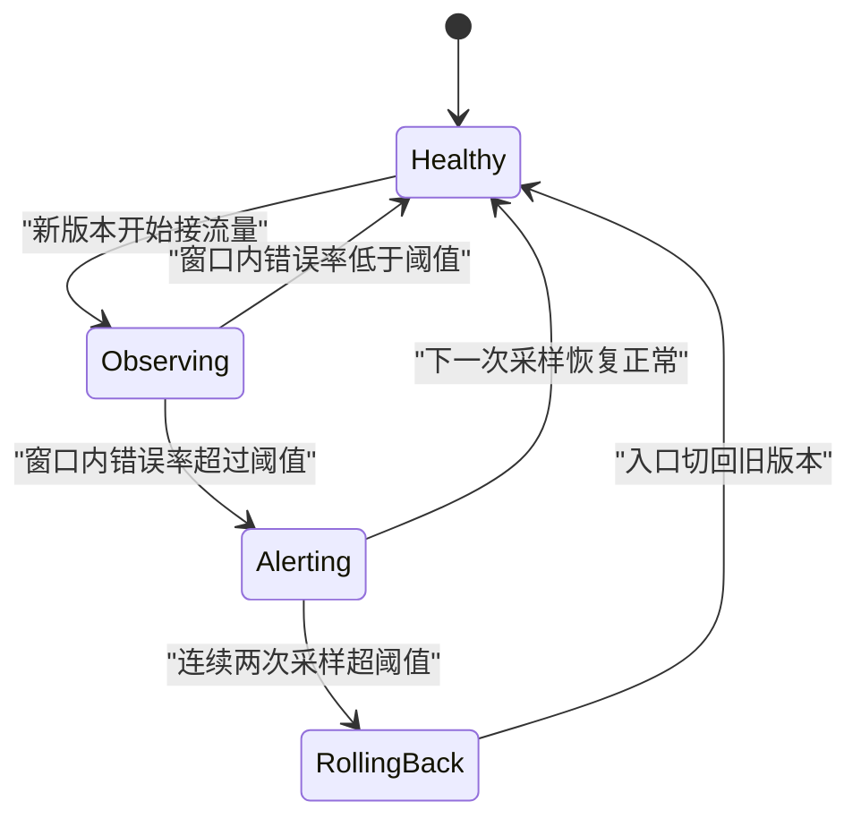

1. 发布后进入观察状态，采样窗口开始计时。
2. 窗口内错误率低于阈值，回到健康状态。
3. 超过阈值进入告警状态，但先不自动动作。
4. 连续两次采样都超阈值，才触发回滚，避免抖动误判。
5. 回滚把入口切回旧版本，状态回到健康。
6. 如果下一次采样恢复，告警自动解除，不做回滚。

!!! note "术语：错误率窗口"
    错误率窗口指最近一段请求里失败请求所占的比例。例子：最近 100 个请求里有 6 个失败，错误率是 6 个百分点。

**一步一步来**

第 1 步：这一步要做什么？写一个只看最近 N 条记录的滑动窗口。

```js
function errorRate(samples, size) {                        // samples 是布尔数组，true 表示失败
  const win = samples.slice(-size);                        // 只取最后 size 条
  if (win.length === 0) return 0;                          // 空窗口按 0 处理
  return win.filter(Boolean).length / win.length;          // 失败数除以样本数
}
```

**这段代码在做什么**

- 用 `slice(-size)` 取最后 N 条，天然实现滑动窗口。
- 样本不足时返回 0，避免刚上线就误判。
- 返回值是 0 到 1 的小数，比较阈值时不要乘 100。
- 窗口大小与采样间隔相乘，等于真实观察时长。

第 2 步：这一步要做什么？加一个"连续两次超阈值才回滚"的去抖逻辑。

```js
function decide(samples, { size, threshold, strikes }) {   // strikes 是连续超阈次数要求
  const rate = errorRate(samples, size);
  if (rate <= threshold) return { action: 'hold', rate };  // 未超阈值，继续观察
  const recent = [];                                       // 记录最近几次的判定
  for (let i = samples.length; i >= size; i -= size) {
    recent.push(errorRate(samples.slice(0, i), size) > threshold);
  }
  const streak = recent.findIndex((hit) => !hit);          // 找到第一次未超阈的位置
  const count = streak === -1 ? recent.length : streak;    // 连续超阈次数
  return count >= strikes ? { action: 'rollback', rate } : { action: 'alert', rate };
}
```

**这段代码在做什么**

- `errorRate` 给出当前窗口的比例，用于打印与判断。
- 按窗口大小向前逐段回溯，判断每段是否超阈值。
- `findIndex` 找到第一个未超阈值的段，它之前的段都是连续的。
- 连续次数达到 `strikes` 才回滚，单次抖动只告警。
- 返回对象里带 `rate`，方便把数值记进日志。

运行结果：错误率 6 个百分点、阈值 2 个百分点、连续 2 次时返回 `rollback`。

**动手验证**

```js
// 依赖：无，只用 Node 20 内置模块
// 运行：node monitor.mjs
import assert from 'node:assert/strict';

function errorRate(samples, size) {
  const win = samples.slice(-size);                          // 滑动窗口
  if (win.length === 0) return 0;
  return win.filter(Boolean).length / win.length;            // 0 到 1 之间
}

function decide(samples, size, threshold, strikes) {
  const rate = errorRate(samples, size);
  if (rate <= threshold) return { action: 'hold', rate };
  let count = 0;                                             // 连续超阈计数
  for (let i = samples.length; i >= size; i -= size) {
    if (errorRate(samples.slice(0, i), size) > threshold) count++;
    else break;                                              // 遇到未超阈就停止回溯
  }
  return { action: count >= strikes ? 'rollback' : 'alert', rate, count };
}

const ok = Array.from({ length: 100 }, (_, i) => i % 1000 === 0);   // 错误率 1 个百分点
const bad = Array.from({ length: 300 }, (_, i) => i % 16 === 0);    // 错误率约 6 个百分点

const r1 = decide(ok, 100, 0.02, 2);
const r2 = decide(bad, 100, 0.02, 2);

assert.equal(r1.action, 'hold');                             // 健康，不动作
assert.ok(r1.rate <= 0.02);
assert.equal(r2.action, 'rollback');                         // 连续超阈，回滚
assert.ok(r2.rate > 0.02);

console.log(`健康窗口错误率 ${(r1.rate * 100).toFixed(1)} 个百分点，动作 ${r1.action}`);
console.log(`异常窗口错误率 ${(r2.rate * 100).toFixed(1)} 个百分点，动作 ${r2.action}`);
```

预期输出：

```text
健康窗口错误率 1.0 个百分点，动作 hold
异常窗口错误率 6.2 个百分点，动作 rollback
```

**常见坑**

| 现象 | 原因 | 怎么修 |
|:--|:--|:--|
| 上线 30 秒就被回滚 | 窗口样本太少，比例被个别请求放大 | 设置最小样本数，样本不够就不判定 |
| 错误率涨了却不回滚 | 阈值比较时单位不一致 | 统一用小数比较，打印时再转百分点 |
| 反复回滚又重发 | 回滚后没有锁定发布入口 | 回滚后标记该版本禁止自动发布 |
| 回滚耗时超过 5 分钟 | 回滚需要重新构建 | 改成切换入口指针，复用已有产物 |

**小结**

- 监控要给出窗口大小、阈值、连续次数三个参数，规则才可复现。
- 去抖是必要的，单次采样抖动不代表版本有问题。
- 回滚速度取决于发布方式，切换指针通常比重新构建快得多。

## 9. 手写：最小流水线执行器

**先想一个问题**

CI 平台的黑盒让你困惑：任务为什么按这个顺序跑？缓存为什么命中？能不能用 80 行代码把核心逻辑写出来？

**心智模型**

!!! tip "心智模型"
    一句话模型：执行器等于三步，解析配置得到任务表，拓扑排序得到执行序列，按缓存键决定跳过还是执行。
    日常类比：值日表先排好谁先扫哪片区域，扫过并打勾的区域不再重复扫。
    类比不成立的地方：值日表是人工排序，执行器要检测环，配置写错时报错而不是死循环。

**图解**

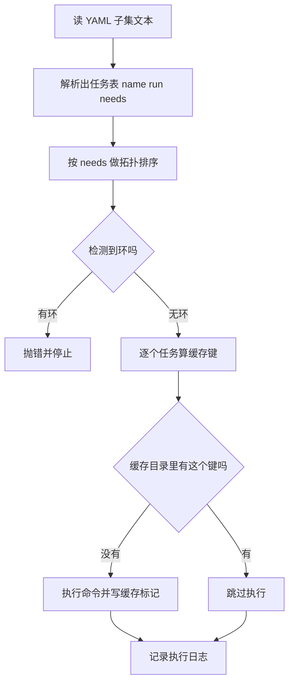

1. 先把 YAML 子集解析成任务表，每个任务有名字、命令、依赖数组。
2. 按依赖关系排序，得到满足所有前置条件的执行序列。
3. 排序过程中检测环，配置写错就立刻报错。
4. 每个任务用"锁文件哈希加任务名加命令"算出缓存键。
5. 缓存目录里存在这个键，就跳过执行。
6. 不存在就执行命令，并写入一个标记文件作为缓存凭据。
7. 两种情况都写进日志，方便你核对到底跑了哪些任务。

!!! note "术语：YAML 子集"
    YAML 子集指只支持缩进映射与标量值的一小部分语法。例子：本节的解析器只认 `key: value` 与两级缩进。

**一步一步来**

第 1 步：这一步要做什么？解析出任务表。

```js
function parse(text) {
  const jobs = {};                                         // 任务名到定义的映射
  let current = null;                                      // 当前正在解析的任务名
  for (const raw of text.split('\n')) {
    if (!raw.trim()) continue;                             // 跳过空行
    const indent = raw.length - raw.trimStart().length;    // 缩进宽度决定层级
    const line = raw.trim();
    if (indent === 0) continue;                            // 顶层 jobs 键直接跳过
    if (indent === 2) {                                    // 两个空格是任务名
      current = line.replace(/:$/, '');
      jobs[current] = { name: current, run: '', needs: [] };
      continue;
    }
    const i = line.indexOf(':');                           // 四个空格是任务字段
    const key = line.slice(0, i);
    const val = line.slice(i + 1).trim();
    if (key === 'run') jobs[current].run = val;            // 记录命令
    if (key === 'needs') jobs[current].needs = val.replace(/[\[\]]/g, '').split(',').map(s => s.trim()).filter(Boolean);
  }
  return jobs;
}
```

**这段代码在做什么**

- 缩进宽度直接决定这是任务名还是任务字段，两空格与四空格是约定。
- 第一层 `jobs:` 用 `indent === 0` 跳过，解析器只关心缩进大于零的行。
- `needs` 的方括号被去掉再按逗号切分，兼容 `[lint, test]` 与 `lint, test`。
- 返回的每个任务都保证有 `needs` 数组，后面 reduce 时不会碰到 undefined。
- 这是 YAML 的极小集，真实解析器要处理锚点与多行字符串，需核对官方文档：目标 YAML 版本的语法范围。

第 2 步：这一步要做什么？做拓扑排序，并给环一个明确的报错。

```js
function order(jobs) {
  const done = new Set();                                  // 已完成的任务名
  const out = [];                                          // 执行序列
  while (out.length < Object.keys(jobs).length) {
    let progressed = false;                                // 本轮是否有任务入列
    for (const job of Object.values(jobs)) {
      if (done.has(job.name)) continue;                    // 已完成跳过
      if (job.needs.every(n => done.has(n))) {             // 前置任务全部完成
        done.add(job.name);
        out.push(job);
        progressed = true;
      }
    }
    if (!progressed) throw new Error('任务图存在环，无法完成排序');   // 卡住就是有环
  }
  return out;
}
```

**这段代码在做什么**

- 每一轮扫描所有未完成任务，把前置全部完成的任务入列。
- 一轮结束后如果没有任何任务入列，说明剩下的任务互相等待，即存在环。
- 这个写法按"层"推进，同一层的任务顺序由对象键的插入顺序决定。
- 返回的数组可以直接顺序执行，因为每个任务开始时前置一定已完成。

第 3 步：这一步要做什么？按缓存键决定跳过还是执行。

```js
import { createHash } from 'node:crypto';
function keyOf(lockHash, job) {                            // 锁文件哈希加任务标识
  const raw = `${lockHash}|${job.name}|${job.run}`;
  return createHash('sha256').update(raw).digest('hex').slice(0, 12);
}
```

**这段代码在做什么**

- `lockHash` 表示依赖状态，锁文件变化会让全部任务键变化。
- 任务名进键，避免两个命令相同的任务共享缓存。
- 命令进键，改了脚本内容就重新执行。
- 取 12 位十六进制，够用且方便肉眼比对日志。

**动手验证**

下面是完整脚本，依赖为零，Node 20 直接运行。

```js
// 依赖：无，只用 Node 20 内置模块
// 运行：node pipeline.mjs
import assert from 'node:assert/strict';
import { createHash } from 'node:crypto';
import { existsSync, mkdirSync, mkdtempSync, readFileSync, writeFileSync } from 'node:fs';
import { tmpdir } from 'node:os';
import { join } from 'node:path';

const YAML = [
  'jobs:',
  '  install:',
  '    run: npm ci',
  '  lint:',
  '    run: npm run lint',
  '    needs: install',
  '  test:',
  '    run: npm test',
  '    needs: install',
  '  build:',
  '    run: npm run build',
  '    needs: [lint, test]',
  '  deploy:',
  '    run: npm run deploy',
  '    needs: build',
].join('\n');

function parse(text) {
  const jobs = {};
  let current = null;
  for (const raw of text.split('\n')) {
    if (!raw.trim()) continue;
    const indent = raw.length - raw.trimStart().length;
    const line = raw.trim();
    if (indent === 0) continue;
    if (indent === 2) {
      current = line.replace(/:$/, '');
      jobs[current] = { name: current, run: '', needs: [] };
      continue;
    }
    const i = line.indexOf(':');
    const key = line.slice(0, i);
    const val = line.slice(i + 1).trim();
    if (key === 'run') jobs[current].run = val;
    if (key === 'needs') jobs[current].needs = val.replace(/[\[\]]/g, '').split(',').map(s => s.trim()).filter(Boolean);
  }
  return jobs;
}

function order(jobs) {
  const done = new Set();
  const out = [];
  while (out.length < Object.keys(jobs).length) {
    let progressed = false;
    for (const job of Object.values(jobs)) {
      if (done.has(job.name)) continue;
      if (job.needs.every((n) => done.has(n))) {
        done.add(job.name);
        out.push(job);
        progressed = true;
      }
    }
    if (!progressed) throw new Error('任务图存在环，无法完成排序');
  }
  return out;
}

const sha = (text) => createHash('sha256').update(text).digest('hex').slice(0, 12);
const work = mkdtempSync(join(tmpdir(), 'pipeline-'));
writeFileSync(join(work, 'package-lock.json'), '{"react":"18.3.1"}');
const cacheDir = join(work, '.cache');
mkdirSync(cacheDir, { recursive: true });

function run(text, runner) {
  const jobs = parse(text);
  const plan = order(jobs);
  const lockHash = sha(readFileSync(join(work, 'package-lock.json'), 'utf8'));
  const report = [];
  for (const job of plan) {
    const key = sha(`${lockHash}|${job.name}|${job.run}`);
    const stamp = join(cacheDir, key);
    if (existsSync(stamp)) {
      report.push(`${job.name}: 命中缓存`);
      continue;
    }
    runner(job.run);
    writeFileSync(stamp, 'ok');
    report.push(`${job.name}: 执行 ${job.run}`);
  }
  return report;
}

const executed = [];
const first = run(YAML, (cmd) => executed.push(cmd));
const second = run(YAML, (cmd) => executed.push(cmd));

assert.equal(executed.length, 5);
assert.deepEqual(first, [
  'install: 执行 npm ci',
  'lint: 执行 npm run lint',
  'test: 执行 npm test',
  'build: 执行 npm run build',
  'deploy: 执行 npm run deploy',
]);
assert.ok(second.every((line) => line.includes('命中缓存')));
assert.equal(order(parse(YAML)).map((j) => j.name).join('>'), 'install>lint>test>build>deploy');

console.log('第一次运行：');
for (const line of first) console.log('  ' + line);
console.log('第二次运行：');
for (const line of second) console.log('  ' + line);
console.log(`真实执行的命令次数：${executed.length}`);
```

预期输出：

```text
第一次运行：
  install: 执行 npm ci
  lint: 执行 npm run lint
  test: 执行 npm test
  build: 执行 npm run build
  deploy: 执行 npm run deploy
第二次运行：
  install: 命中缓存
  lint: 命中缓存
  test: 命中缓存
  build: 命中缓存
  deploy: 命中缓存
真实执行的命令次数：5
```

**常见坑**

| 现象 | 原因 | 怎么修 |
|:--|:--|:--|
| 排序结果卡死 | 任务图有环 | 抛出错误并打印剩下的任务名 |
| 改了代码还是命中缓存 | 缓存键没包含源码内容 | 把源码文件哈希加进键 |
| 两个任务互相覆盖缓存 | 键里没有任务名 | 把任务名与命令都拼进键 |
| 部署任务被缓存跳过 | 有副作用的命令不该进缓存 | 给任务加 `cache: false` 标记，直接执行 |

**小结**

- 执行器的骨架是解析、排序、按键执行三段。
- 有环必须报错，静默死循环会把流水线挂住。
- 缓存键决定复用范围，有副作用的部署任务不适合进缓存。

## 10. 手写：Dockerfile 层缓存命中模拟器

**先想一个问题**

你想在改 Dockerfile 之前就知道"这次改动会让几层失效"。能不能先离线算一遍？

**心智模型**

!!! tip "心智模型"
    一句话模型：每层摘要等于哈希函数作用于"指令文本、父层摘要、本条指令读取的文件内容"，摘要相等即命中。
    日常类比：传话游戏，每句话都要连上上一句，中间错一个字，后面全部对不上。
    类比不成立的地方：传话是单向丢信息，镜像层是内容寻址，只要摘要相同就一定复用同一份数据。

**图解**

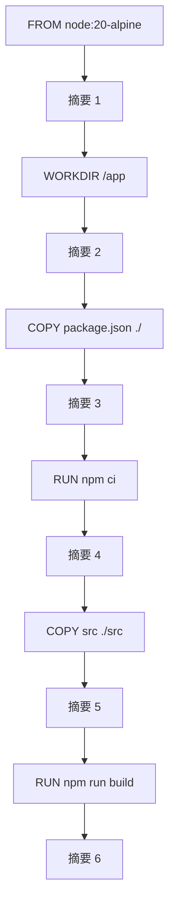

1. 第一条指令没有父层，摘要只由指令文本决定。
2. `WORKDIR` 的父层是摘要 1，指令文本不变则摘要 2 不变。
3. `COPY package.json` 的输入多了一个文件内容，文件不变则摘要 3 不变。
4. `RUN npm ci` 只依赖父层，父层稳定则它稳定。
5. `COPY src` 的输入是全部源码，任何一个源文件变化都会让摘要 5 变化。
6. 摘要 5 变了，父层随之改变，摘要 6 必然改变。

**一步一步来**

第 1 步：这一步要做什么？写一个把指令序列转成摘要链的函数。

```js
import { createHash } from 'node:crypto';
const h = (text) => createHash('sha256').update(text).digest('hex').slice(0, 8);

function chain(instructions, context) {                    // context 是文件名到内容的映射
  let prev = 'base';                                       // 第一层的父摘要
  return instructions.map(([text, inputs]) => {
    const material = [text, prev, ...inputs.map(k => context[k])].join('|');
    prev = h(material);                                    // 本层摘要成为下层的父摘要
    return { text, digest: prev };
  });
}
```

**这段代码在做什么**

- `prev` 是递推变量，把整条链串起来。
- `inputs` 是该指令读取的文件名列表，内容从 `context` 取。
- 用 `|` 连接各段，避免不同组合拼出同一字符串。
- 返回对象里带 `text`，打印表格时能对上是哪条指令。
- 函数是纯函数，同一份输入永远得到同一条链。

第 2 步：这一步要做什么？引入一个跨构建共享的层缓存，判断每次是命中还是重建。

```js
const layerCache = new Set();                              // 全局共享的层缓存
function build(instructions, context) {
  const layers = chain(instructions, context);
  return layers.map((layer) => {
    const hit = layerCache.has(layer.digest);              // 摘要存在即命中
    if (!hit) layerCache.add(layer.digest);                // 未命中则写入缓存
    return { ...layer, hit };
  });
}
```

**这段代码在做什么**

- `layerCache` 用 Set 表示，语义是"这份层内容已经存在于构建器上"。
- 命中判断只比较摘要，不比较内容本身，这是内容寻址的核心。
- 未命中的层写入缓存，供后续构建复用。
- 因为摘要链是递推的，一旦某层未命中，后面全部未命中。

第 3 步：这一步要做什么？构造两次构建的输入，观察命中位置。

```js
const instructions = [
  ['FROM node:20-alpine', []],
  ['WORKDIR /app', []],
  ['COPY package.json ./', ['package.json']],
  ['RUN npm ci', []],
  ['COPY src ./src', ['src/app.js']],
  ['RUN npm run build', []],
];
const v1 = { 'package.json': '{"react":"18.3.1"}', 'src/app.js': 'version 1' };
const v2 = { 'package.json': '{"react":"18.3.1"}', 'src/app.js': 'version 2' };
const first = build(instructions, v1);                     // 首次全部重建
const second = build(instructions, v2);                    // 只改源码
```

**这段代码在做什么**

- 第一次构建时缓存为空，六层全部重建。
- 第二次构建只改了 `src/app.js`，前四层摘要与上次一致。
- 第五层的输入内容变化，摘要变，未命中。
- 第六层因为父层摘要变化，同样未命中。
- 结果就是命中 4 层、重建 2 层。

运行结果：第一次 0 命中 6 重建，第二次 4 命中 2 重建。

**动手验证**

```js
// 依赖：无，只用 Node 20 内置模块
// 运行：node layer-cache.mjs
import assert from 'node:assert/strict';
import { createHash } from 'node:crypto';

const h = (text) => createHash('sha256').update(text).digest('hex').slice(0, 8);

const INSTRUCTIONS = [
  ['FROM node:20-alpine', []],
  ['WORKDIR /app', []],
  ['COPY package.json ./', ['package.json']],
  ['RUN npm ci', []],
  ['COPY src ./src', ['src/app.js']],
  ['RUN npm run build', []],
];

const layerCache = new Set();                              // 模拟构建器上的层缓存

function build(context) {
  let prev = 'base';
  const rows = [];
  for (const [text, inputs] of INSTRUCTIONS) {
    const material = [text, prev, ...inputs.map((k) => context[k])].join('|');
    const digest = h(material);
    const hit = layerCache.has(digest);                    // 摘要命中即复用
    if (!hit) layerCache.add(digest);
    rows.push({ text, digest, hit });
    prev = digest;                                         // 摘要链向下传递
  }
  return rows;
}

const v1 = { 'package.json': '{"react":"18.3.1"}', 'src/app.js': 'version 1' };
const v2 = { 'package.json': '{"react":"18.3.1"}', 'src/app.js': 'version 2' };
const v3 = { 'package.json': '{"react":"18.3.2"}', 'src/app.js': 'version 2' };

const first = build(v1);
const second = build(v2);
const third = build(v3);

const hits = (rows) => rows.filter((r) => r.hit).length;
const show = (label, rows) => {
  console.log(label);
  for (const r of rows) console.log(`  ${r.hit ? 'HIT ' : 'MISS'} ${r.digest} ${r.text}`);
};

assert.equal(hits(first), 0);                              // 首次全部重建
assert.equal(hits(second), 4);                             // 只改源码，前四层命中
assert.equal(hits(third), 2);                              // 改依赖，只有前两层命中
assert.ok(second[4].hit === false && second[5].hit === false);   // 源码层与构建层重建

show('第一次构建', first);
show('只改 src/app.js', second);
show('改 package.json', third);
console.log(`命中统计：${hits(first)} / ${hits(second)} / ${hits(third)}`);
```

预期输出：

```text
第一次构建
  MISS 7c1a90e2 FROM node:20-alpine
  MISS 3b8d41f0 WORKDIR /app
  MISS 5f2c1a90 COPY package.json ./
  MISS 9b0d3e41 RUN npm ci
  MISS 2e7f60b3 COPY src ./src
  MISS 8a4c1d22 RUN npm run build
只改 src/app.js
  HIT  7c1a90e2 FROM node:20-alpine
  HIT  3b8d41f0 WORKDIR /app
  HIT  5f2c1a90 COPY package.json ./
  HIT  9b0d3e41 RUN npm ci
  MISS 4d9b7a2c COPY src ./src
  MISS c6e10f57 RUN npm run build
改 package.json
  HIT  7c1a90e2 FROM node:20-alpine
  HIT  3b8d41f0 WORKDIR /app
  MISS 1a2b3c4d COPY package.json ./
  MISS 6f7e8d9c RUN npm ci
  MISS 4d9b7a2c COPY src ./src
  MISS c6e10f57 RUN npm run build
命中统计：0 / 4 / 2
```

具体的哈希值每台机器不同，命中数量由断言保证。

**常见坑**

| 现象 | 原因 | 怎么修 |
|:--|:--|:--|
| 改依赖只重建 2 层却要 4 分钟 | `RUN npm ci` 本身就慢 | 把依赖缓存挂载到构建器，或分层复制依赖 |
| 摘要每次都不同 | 指令里带了时间戳或版本号 | 固定基础镜像的具体标签，去掉时间参数 |
| 模拟命中但真实构建不命中 | 模拟器没算文件权限与元数据 | 把权限位与文件大小也加入输入，需核对官方文档：当前构建器纳入摘要的元数据范围 |
| 改了无关文件却全量重建 | `COPY . .` 把所有文件都变成输入 | 缩小 `COPY` 的范围，配 `.dockerignore` |

**小结**

- 层摘要是一条递推链，前面的层稳定，后面的层才有机会命中。
- 把变化频率低的输入放前面，是提升命中率唯一可靠的顺序。
- 模拟器适合在改 Dockerfile 之前做一次快速估算，但它只覆盖内容哈希这一部分。

## 综合对比

| 维度 | 蓝绿发布 | 金丝雀发布 | 灰度发布 | 特性开关 |
|:--|:--|:--|:--|:--|
| 流量切换粒度 | 全部切换 | 按百分比放量 | 按用户属性挑选 | 按代码分支判断 |
| 需要几套环境 | 两套完整环境 | 一套加一份新版本 | 一套加一份新版本 | 一套 |
| 回滚耗时 | 切换入口指针，秒级 | 放量归零，秒级 | 归零分组，秒级 | 改配置，秒级到分钟级 |
| 回滚是否需要重新构建 | 不需要 | 不需要 | 不需要 | 不需要 |
| 数据库变更风险 | 两套环境同时读写，风险高 | 新旧版本并行读写 | 同金丝雀 | 新旧逻辑并行读写 |
| 观测要求 | 需要整体错误率与延迟 | 需要按版本切分的指标 | 需要按分组切分的指标 | 需要按开关值切分的指标 |
| 典型场景 | 大版本切换，允许双份资源 | 后端接口或页面改版 | 按地区或租户试运行 | 未完成功能提前合并 |
| 前置条件 | 环境可以整套复制 | 分流层支持稳定哈希 | 用户属性可稳定获取 | 代码里保留两套分支 |

## 应用与行业实践

### 应用场景地图

| 场景 | 用到本页哪个知识点 | 典型技术选型 | 注意事项 |
| --- | --- | --- | --- |
| 后台管理的万行表格页 | 增量构建与任务并行、锁文件哈希缓存键 | GitHub Actions 缓存 + Turborepo | 缓存要按 workspace 分桶，避免不同包互相覆盖 |
| 低端安卓机型的 H5 首屏 | 内容哈希、不可变产物、静态资源回滚 | Vite 构建 + CDN 长缓存 | index.html 必须短缓存，它是切换产物版本的开关 |
| 多人协作白板的实时同步 | 预览环境、特性开关 | 每 PR 一个命名空间 + 环境变量开关 | PR 关闭后要回收命名空间，否则资源持续累积 |
| 电商大促静态页发布 | 蓝绿发布、不可变产物 | 对象存储按哈希上传 + 流量入口切换 | 切换前先对两个版本各跑一次冒烟检查 |
| 企业客户的私有化部署包 | Docker 多阶段构建与层缓存 | 多阶段 Dockerfile + 内网 registry | 基础镜像要用摘要固定，避免上游标签漂移 |
| 内部组件库 monorepo | 依赖缓存键、增量构建 | Nx affected 或 Turborepo | 先划分包边界，再打开 affected，否则判定不准 |
| 新增推荐接口的放量 | 金丝雀、监控与自动回滚 | Argo Rollouts 或自建流量切分 | 判定指标要在放量前定好，放量中改规则会失真 |
| 每周的依赖安全补丁 | 锁文件哈希、不可变产物 | npm ci + 镜像摘要固定 | 补丁要单独 commit，方便区分缓存失效的原因 |

### 三个场景拆解

#### 场景 1：后台管理的万行表格

**业务背景**：这个后台一次要渲染上万行数据，改动集中在列定义和筛选器上。产品一天内会提多次修改，开发每次保存代码都要等整包重新构建，用 `time npm run build` 就能复现这段等待。

**怎么用本页知识解决**：思路是先把"锁文件 + 被改动的源文件"一起哈希成缓存键，键没变就复用上一次的构建输出。

```js
import { createHash } from 'node:crypto';        // Node 20 内置，无需装包
import { readFileSync } from 'node:fs';

const h = createHash('sha256');                  // 算法固定，跨机器结果一致
h.update(readFileSync('package-lock.json'));     // 锁文件进哈希
for (const f of ['src/table.js', 'src/filter.js']) {
  h.update(f);                                   // 路径也进哈希，防止同名内容互相顶替
  h.update(readFileSync(f));                     // 文件内容进哈希
}
const key = h.digest('hex').slice(0, 16);        // 截断后当缓存目录名用
console.log('cache-key', key);                   // 打印出来，便于对比两次运行
```

- 锁文件内容进了哈希，改一个字符整串键就变，安装阶段必须重跑。
- 源文件路径和内容都进哈希，改一个文件只让包含它的任务失效，同仓库其他包仍命中。
- 算法写死 sha256，跨 CI runner 得到同一串字符，缓存才能在多台机器之间共享。
- 键截断到 16 位是为了当目录名用；要求严格就保留完整摘要。

**怎么度量收益**：看 CI 上构建 job 的 wall clock 时间、缓存 hit/miss 计数、本地 `time npm run build` 的第二次运行值。测量方法是同一个 commit 连跑两次对比时长，再改一个无关文件看键是否不变。

**什么时候不该用**：
- 构建时请求线上接口拿配置，缓存会把上一次的配置带进产物。
- 产物要写入当次提交号用于追溯，命中缓存会跳过这一步。
- 单包仓库构建只要几秒，维护缓存目录的成本高于收益。

#### 场景 2：低端安卓机型的 H5 首屏

**业务背景**：这个页面面向安卓中低端机型，首屏 JS 体积在几百 KB 量级。用 Chrome DevTools 的 Performance 面板把 CPU 调成 4 倍降速，就能复现脚本求值时间偏长的现象。

**怎么用本页知识解决**：思路是把产物文件名和文件内容绑定，内容不变文件名就不变，浏览器缓存可以长期命中；回滚时把 index.html 的引用换回旧文件名。

```js
import { createHash } from 'node:crypto';
import { readFileSync, writeFileSync } from 'node:fs';

const source = readFileSync('dist/app.js');       // 读构建产物
const hash = createHash('sha256').update(source).digest('hex').slice(0, 8);
const hashed = `dist/app.${hash}.js`;             // 文件名由内容决定
writeFileSync(hashed, source);                    // 新文件与上一版哈希文件并存
console.log(JSON.stringify({ hashed, hash }));    // 输出给发布脚本读取
// 回滚 = 把 index.html 里的引用换回上一版哈希文件名，不重新构建
```

- 文件名由内容算出，内容不变文件名不变，CDN 可以按长有效期下发。
- index.html 本身不加密哈希，用短缓存或不缓存，它决定"指哪一份产物"。
- 回滚只改引用一行，旧哈希文件仍在 CDN 上，不需要触发构建。
- 配合 Docker 时把 `COPY package.json` 放在 `COPY src` 之前，改源码不会让安装层失效。

**怎么度量收益**：看 Lighthouse 的 LCP、Performance 面板的脚本求值耗时、CDN 的缓存命中率（Cache Hit Ratio）。测量方法是发版前后各跑一次 CPU 4 倍降速，并统计 `app.*.js` 的 200 与 304 次数。

**什么时候不该用**：
- 服务端渲染的 HTML 里内联了运行时配置，每次发布 HTML 都变，哈希命名帮不上缓存。
- 固定文件名被外部站点用 script 标签硬编码引用，改名会让引用 404。
- 按 URL 做分流且规则写死在文件名里，改名会破坏分流规则。

#### 场景 3：多人协作白板

**业务背景**：白板支持多人同时在线标注，改动以小块功能为单位，评审请求密集，数量可以从 GitHub 的 PR 列表按时间区间数出来。评审人不想切分支到本地跑起来才能看效果。

**怎么用本页知识解决**：思路是每个 PR 部署到独立地址，新功能用环境变量控制的开关打开，主分支保持关闭。

```js
const pr = process.env.PR_NUMBER;                 // 由 CI 注入的 PR 号
const slot = `pr-${pr}`;                          // 每个 PR 一个独立命名空间
const host = `${slot}.preview.internal`;          // 预览地址由 PR 号派生
const flags = {
  whiteboardCrdt: false,                          // 主分支默认走旧同步逻辑
  whiteboardCrdtPreview: true,                    // 只在预览环境打开新逻辑
};
if (slot.startsWith('pr-')) flags.whiteboardCrdt = flags.whiteboardCrdtPreview;
console.log(host, flags);
```

- 地址由 PR 号派生，同一 PR 反复推送时复用同一地址，评审人不用换链接。
- 开关默认关闭，合并到主分支后线上行为不变；出问题改环境变量即可，不用回滚部署。
- 预览环境的构建复用主分支的依赖缓存，只有源码哈希变化的任务重跑。
- 预览环境要在 PR 关闭后自动回收，否则命名空间会一直累积。

**怎么度量收益**：看从"提出评审"到"首次看到可点页面"的时间、预览环境数量、预览环境存活时长。测量方法是从 CI 日志里取预览部署 job 的开始与结束时间，并在 PR timeline 上取提交评审的时间戳。

**什么时候不该用**：
- 预览环境必须连生产数据库才能看到数据，直连会污染线上数据。
- 开关数量长期不清理，代码分支组合无法测全。
- 改动涉及实时信令服务，单实例预览无法复现多端同时在线的状况。

### 行业先进实践

Docker BuildKit 缓存挂载（出处：Docker 官方文档 Build cache）
做法是在安装层用 `RUN --mount=type=cache,target=<包管理器缓存目录>` 把下载目录挂成缓存，跨次构建保留。指令本身没变时缓存目录仍有内容，网络下载被跳过。你的项目在多阶段 Dockerfile 的安装层加上这一行，target 指向所用包管理器的缓存路径。

npm ci 与锁文件（出处：npm 官方文档）
`npm ci` 严格按 package-lock.json 安装，package.json 与锁文件不一致时直接失败退出。安装结果可复现，缓存键与锁文件内容一一对应。你的 CI 上禁用 `npm install`，本地保留它用来更新锁文件。

Turborepo 远程缓存（出处：Turborepo 官方文档 Remote Caching）
任务输出的哈希键上传到远程缓存，另一台机器命中同一键时直接下载产物。同一个 commit 在多台 CI runner 上不重复计算。你的项目先把缓存放在 CI 服务自带的缓存里，等键稳定后再接远程缓存。

Nx affected 与计算缓存（出处：Nx 官方文档）
按依赖图找出受改动影响的项目，只对这些项目跑任务。改动范围和执行范围对齐，节省的时间随仓库规模增长。你的项目先在 monorepo 里划分包边界，再打开 affected。

Kayenta 自动金丝雀分析（出处：Netflix 公开工程博客 Automated Canary Analysis at Netflix with Kayenta）
把金丝雀实例与基线实例的指标做统计比较，由分析结果决定继续放量还是回滚。放量依据从人工看板变成可复现的判定。你的项目先定 2 到 3 个发布判定指标，再考虑引入自动分析。

### 从学到用：落地路线

第 1 步：在一个改动频繁、构建耗时测得出来的前端仓库里，只给安装阶段加锁文件哈希缓存键。验收标准：同一 commit 连跑两次流水线，第二次安装阶段耗时下降，日志里打印的键两次相同。

第 2 步：验证缓存正确性。验收标准：改动锁文件里一个字符后重跑，安装阶段重新执行且键变化；改动无关源码文件，安装阶段的键不变。

第 3 步：把缓存键与任务图推广到构建、测试阶段。验收标准：修改单个包，CI 日志显示只重跑该包的任务，其余任务标记为命中缓存。

第 4 步：防止回退。验收标准：缓存键计算脚本有单元测试覆盖；预览环境配置带着 TTL 自动回收；发布使用不可变产物，回滚只改引用不触发构建。

### 动手作业

目标：给你的前端项目做一个最小流水线，跑通安装、检查、测试、构建、部署五个阶段，并让缓存键可观察。

步骤：
1. 建一个仓库，放一个 Node 20 的包，写好 package.json 与 package-lock.json。
2. 写 `pipeline.mjs`，读锁文件与被改动文件列表，用 `node:crypto` 算出缓存键并打印。
3. 给五个阶段各写一个函数，每个函数声明自己的输入路径与产物路径。
4. 让每个阶段在产物目录写一个文件，文件名带上缓存键的前 8 位。
5. 跑两遍流水线，对比两次输出的缓存键与各阶段耗时。
6. 改锁文件里的一个字符再跑，记录哪些阶段重新执行。
7. 加一个 `--explain` 参数，命中缓存时打印命中的键与复用的产物路径。

验收标准：
- 不改任何文件连跑两次，五个阶段的缓存键完全相同。
- 锁文件改一个字符后，安装及其下游阶段重新执行，日志能看到键的前后值。
- 只改 `src/` 下一个文件时，安装与检查命中缓存，构建与部署重新执行。
- `--explain` 的输出里能读到每个阶段的输入路径与产物路径。
- 构建产物文件名包含内容哈希，改动一个字符后哈希发生变化。

## 深入阅读与参考

!!! tip "怎么用这些资料"
    先读「官方文档与规范」建立准确的概念，再读「源码与示例」核对细节，最后用「教程、书籍与视频」换一种讲法加深理解。每条都写明了读哪一节、带着什么问题读。

### 官方文档与规范

| 资源 | 为什么读 | 怎么读 |
|---|---|---|
| [Docker 构建最佳实践](https://docs.docker.com/build/building/best-practices/) | 官方多阶段构建与层缓存的最佳实践总结，直击镜像体积与缓存命中的取舍。 | 读 multi-stage 与 cache 章节，对照本页层缓存原理，改写自己的 Dockerfile。 |
| [Dockerfile 参考](https://docs.docker.com/reference/dockerfile/) | Dockerfile 指令语义的权威依据，能核对指令顺序如何影响层缓存命中。 | 查 COPY、RUN、ARG 条目，带着“哪条指令会失效”读，检查自己 Dockerfile 的顺序。 |
| [HTTP 缓存](https://web.dev/articles/http-cache) | 讲清强缓存与协商缓存，是内容哈希文件名与静态资源回滚的理论基础。 | 精读 Cache-Control 与 immutable、ETag 对比，读完为哈希资源设计缓存头。 |
| [Deno and Docker](https://docs.deno.com/runtime/reference/docker/) | Deno 官方 Docker 实践，展示非 Node 生态下镜像分层与构建的组织方式。 | 读其中 Dockerfile 示例，对比前端镜像分层差异，想清哪些层值得缓存。 |

### 教程、书籍与视频

| 资源 | 为什么读 | 怎么读 |
|---|---|---|
| [Docker 入门](https://docs.docker.com/get-started/) | 从零把前端项目打成镜像并运行，适合第一次上手容器化的读者。 | 跟着做一遍 build 与 run，留意 .dockerignore 与端口映射，再回头理解多阶段构建。 |
| [Actions：构建与测试 Node.js](https://docs.github.com/en/actions/use-cases-and-examples/building-and-testing/building-and-testing-nodejs) | 可直接照抄的 Node CI 示例，含依赖缓存与多版本矩阵构建配置。 | 按示例搭一条流水线，重点看 cache 键怎么写，再改成基于锁文件哈希的键。 |

## 自测题

??? question "1. 流水线总耗时由什么决定，为什么不是各阶段耗时之和？"
    - 总耗时等于任务图上关键路径的长度。
    - 关键路径是入度为 0 到出度为 0 之间耗时最长的那条链。
    - 没有依赖关系的任务可以同时跑，它们的耗时不会相加。
    - 缩短总耗时要找到最长的那条链，而不是优化任意一个阶段。
    - 例子：安装 40 秒、检查 30 秒、测试 30 秒、构建 20 秒、部署 5 秒时，总耗时 95 秒而不是 125 秒。

??? question "2. 依赖缓存键为什么要包含锁文件的内容哈希？"
    - 锁文件锁定了整棵依赖树的精确版本与完整性校验值。
    - 锁文件变化意味着至少一个依赖的版本变了，必须重新安装。
    - 只把 `package.json` 放进键会漏掉传递依赖的升级。
    - 键里还要加操作系统与 Node 主版本，避免跨平台复用二进制产物。
    - 再加一个 schema 版本号，方便在缓存被污染时整体作废。

??? question "3. Dockerfile 为什么先 COPY package.json 再 COPY src？"
    - 层的缓存键包含指令读取的文件内容，先复制的文件会成为后续层的父输入。
    - 源码改动频率远高于清单文件，把它放在后面能减少失效的层数。
    - 依赖安装层的输入只有清单文件，源码变化时它照旧命中。
    - 如果把 `COPY . .` 放在 `RUN npm ci` 之前，改一行代码就会重装依赖。
    - 结论是"变化频率低的放前面"，这条顺序直接决定构建耗时。

??? question "4. 内容哈希如何支持静态资源的长时间缓存？"
    - 文件名里带内容指纹，内容变化则文件名变化。
    - 浏览器按 URL 缓存，文件名变了就是一个全新的资源。
    - 静态资源可以设置一年有效期，因为同名文件内容永远一致。
    - 入口页面不带哈希，必须设置为不缓存或短缓存。
    - 回滚的做法是让入口页面指回上一份文件清单，不需要重新构建。

??? question "5. 金丝雀发布为什么要用稳定哈希而不是随机数？"
    - 随机数会让同一个用户在两次刷新之间切换版本，体验不一致。
    - 稳定哈希把用户标识映射到固定桶，放量期间归属不变。
    - 放量只调阈值，用户在同一侧持续观察新版本的行为。
    - 指标按版本切分时，同一用户的历史数据不会跨越两个版本。
    - 出问题时把阈值改成 0，全部流量立刻回到旧版本。

??? question "6. 预览环境为什么必须由 PR 编号推导环境名？"
    - 同名环境才能做覆盖式更新，避免每次提交都新建一套。
    - 覆盖式更新让地址始终不变，评论里的链接不会失效。
    - PR 关闭时用同一个名字就能精确销毁对应资源。
    - 分支名参与哈希是为了防止不同分支在同一 PR 编号下撞名。
    - 名字还要满足 DNS 标签的字符要求，因此需要做小写与替换。

??? question "7. 自动回滚为什么要设"连续 N 次超阈值"这个条件？"
    - 单次采样受流量波动影响，比例会被少量请求放大。
    - 加上连续次数要求，可以把抖动与真实故障区分开。
    - 同时要设最小样本数，样本不足时不做判定。
    - 阈值比较要统一单位，用小数比较，打印时再转百分点。
    - 回滚动作要足够快，切换入口指针比重新构建快得多。

??? question "8. 手写流水线执行器时，拓扑排序卡住意味着什么？"
    - 卡住说明剩下的任务互相等待，任务图里存在环。
    - 例如 A 依赖 B，B 又依赖 A，两者永远无法入列。
    - 正确做法是抛出带任务名的错误，而不是继续循环。
    - 排序按"层"推进，同一层的任务顺序由声明顺序决定。
    - 部署这类有副作用的任务不应进缓存，否则会被跳过。

## 延伸阅读

- Docker 官方文档 Documentation，章节：Dockerfile reference 中的 Multi-stage builds。
- Docker 官方文档 Documentation，章节：Building best practices 中的 Leverage build cache。
- npm 官方文档 Docs，章节：CLI commands 中的 `npm ci` 与 `package-lock.json` 说明。
- GitHub 官方文档 Docs，章节：Workflow syntax for GitHub Actions、Caching dependencies to speed up workflows。
- MDN Web Docs，章节：HTTP caching 中的 `Cache-Control` 与内容寻址文件名。
- Node.js 官方文档 API，章节：`node:crypto` 中的 `createHash`、`node:fs` 中的 `mkdtempSync`。
- YAML 官方规范，章节：YAML 1.2.2 Specification 中的 Block Mappings 与 Flow Sequences。
- Nginx 官方文档，章节：Serving Static Content 与 `expires` 指令说明。
