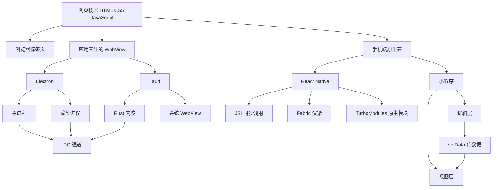
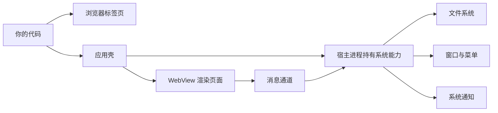
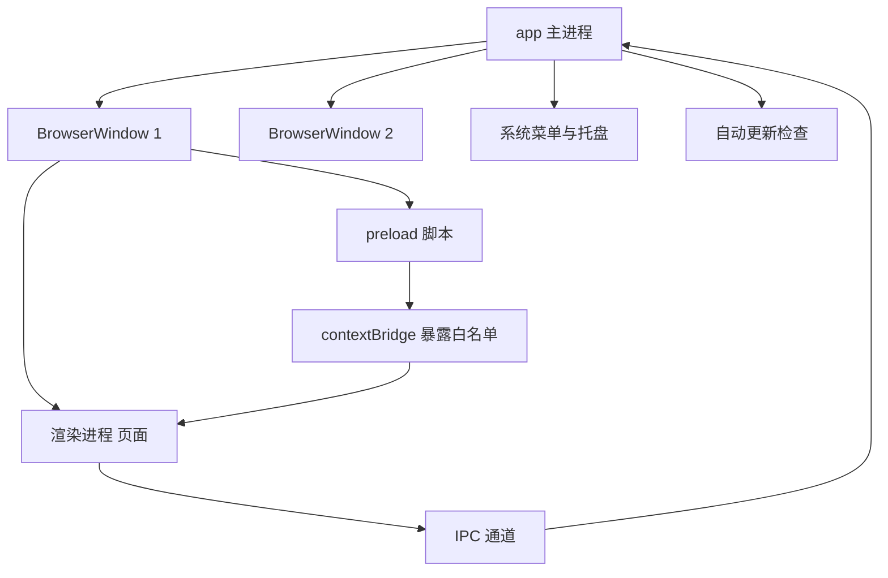
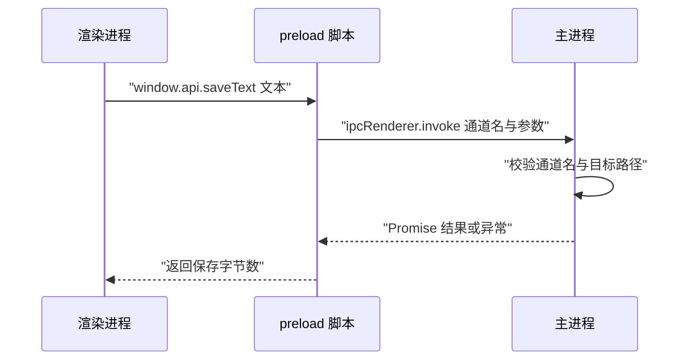
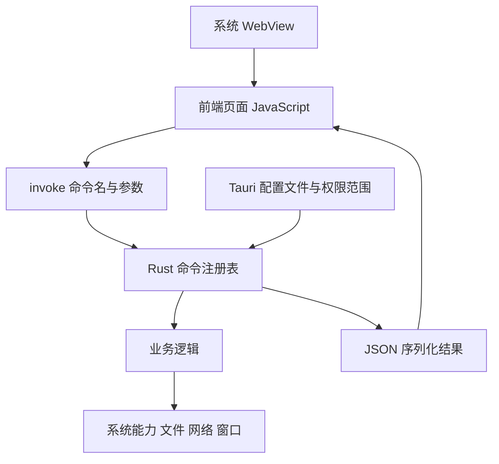
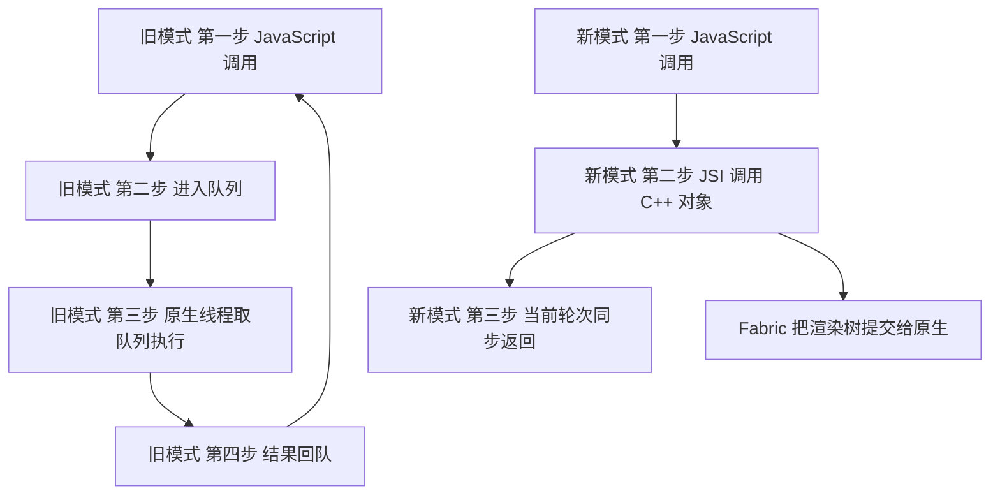
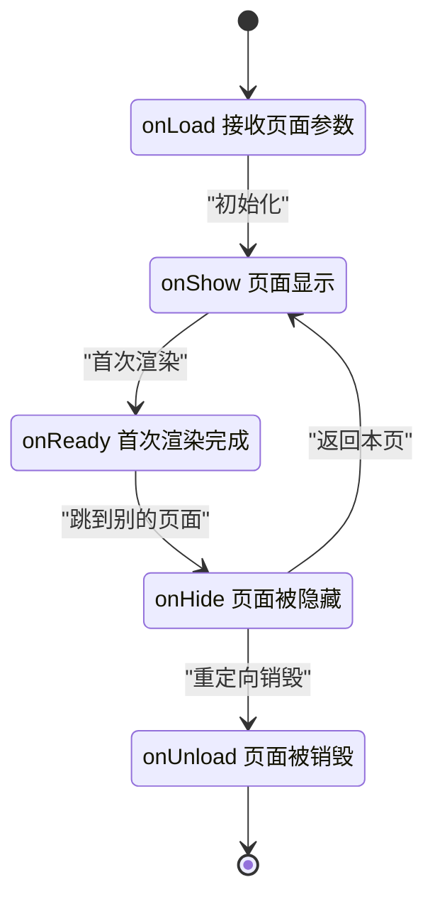

# 桌面与跨端：Electron、Tauri、React Native 与小程序的原理

!!! abstract "学完这一页你能"
    - 说出 Electron 里主进程与渲染进程各自负责什么，并手写一次 IPC 往返调用。
    - 解释 Tauri 为什么把页面渲染交给操作系统自带的 WebView，Rust 命令层做了什么。
    - 画出 React Native 新架构里 JavaScript 到原生代码的三条通道，并区分同步调用与队列调用。
    - 说出小程序双线程模型下 setData 的数据流向，并算出增量传输的字节数。

## 0. 知识地图



建议按顺序读：先读第 1 节，理解为什么应用要多一个壳；再读第 2、3 节拿到 Electron 的进程与通道；第 4 节换成 Tauri 看同一问题的另一种解法。
第 5、6 节把视角移到手机端，看 JavaScript 与原生代码之间到底怎么说话。最后用综合对比表回看全页。

## 1. 从浏览器到应用壳：多出来的一层

**先想一个问题**

你在浏览器里写 `document.querySelector`，它拿到的是页面里的元素。
同一段代码放进桌面应用，为什么它还能读写磁盘上的文件？是谁给了它这个能力？

**心智模型**

!!! tip "心智模型"
    一句话模型：页面只负责画，系统能力由另一个进程提供，两者之间只能传值。
    打个比方：页面是餐厅前台，系统能力是后厨，顾客只能通过服务员点单，不能自己进后厨翻冰箱。
    类比不成立的地方：后厨和前台的员工是同一个生物，而进程是两个独立内存空间，翻冰箱这件事在技术上根本做不到。

!!! note "术语：WebView"
    定义：一个把网页渲染能力打包成控件、可以嵌进原生应用里的浏览器内核。
    例子：macOS 上的 WKWebView、Windows 上的 WebView2、Linux 上的 WebKitGTK，都是系统提供的 WebView 实现。

**图解**



1. 你的代码进入浏览器时，宿主是浏览器标签页，标签页只拿到浏览器愿意给的接口。
2. 你的代码进入应用壳时，宿主是自己写的程序，这个程序拿到了操作系统给的完整权限。
3. 页面被放进 WebView，WebView 本身不带文件系统权限。
4. 想读文件，页面必须把请求发给宿主进程。
5. 请求通过消息通道传递，能传的只有可序列化的值，函数和对象的引用传不过去。

**一步一步来**

**步骤 1：先看清同一进程内的变量是直接可读的**

同一进程里的两个函数共享同一块内存，读变量不需要拷贝。

```js
// same-process.mjs —— Node 20+，无第三方依赖
const shared = { count: 1 };        // 一个普通对象，放在当前进程的内存里

function readDirect(obj) {
  obj.count += 1;                   // 直接改，不需要序列化
  return obj.count;                 // 返回新的数字
}

console.log(readDirect(shared));    // 2
console.log(shared.count);          // 2，外面的对象真的被改了
```

**这段代码在做什么**

- `shared` 是当前进程堆上的一个对象，函数拿到的是一份内存地址。
- 函数内部把 `count` 加一，进程里所有持有这个地址的地方都看得到变化。
- 输出两次都是 `2`，说明"改内部变量会影响外部"这件事只在同一内存空间内成立。
- 这一步是后面所有讨论的对照组：只要跨进程，这种行为就会消失。

运行结果：

```text
2
2
```

**步骤 2：跨线程只能靠消息传值**

换成两条独立执行线之后，共享变量这条路走不通了，只能用消息。

```js
// cross-thread.mjs —— Node 20+，无第三方依赖
import { Worker } from "node:worker_threads";

// 工作线程的代码写成一个字符串，避免额外文件
const workerCode = `
  const { parentPort } = require("node:worker_threads");
  parentPort.on("message", (msg) => {
    const total = msg.nums.reduce((a, b) => a + b, 0);
    parentPort.postMessage({ total });   // 只能回传可克隆的值
  });
`;

const worker = new Worker(workerCode, { eval: true });
worker.on("message", (msg) => console.log("主线程收到", msg.total));
worker.postMessage({ nums: [1, 2, 3] }); // 传过去的是数据副本
```

**这段代码在做什么**

- `new Worker` 起了一条独立的执行线，它有自己的内存空间。
- `postMessage` 把 `{ nums: [1, 2, 3] }` 结构化克隆一份送过去，两边不再共享地址。
- 工作线程算完总和，再用 `postMessage` 把结果送回来。
- 主线程通过 `on("message")` 收到结果，回调里打印。
- 注意传的是纯数据：函数、类实例的方法都进不了这条通道。

运行结果：

```text
主线程收到 6
```

**动手验证**

下面这份脚本把"同一进程直接读"和"跨执行线传值"两件事放在一起跑，用断言固定行为。

```js
// demo1.mjs —— 运行：node demo1.mjs
// 依赖：无，Node 20 及以上内置 worker_threads 与 assert
import assert from "node:assert/strict";
import { Worker } from "node:worker_threads";

// 1. 同一进程内，改内部会反映到外部
const shared = { count: 1 };
function bump(obj) { obj.count += 1; return obj.count; }
assert.equal(bump(shared), 2);
assert.equal(shared.count, 2);           // 外部确实看到了变化

// 2. 跨执行线，只能靠消息传值
const workerCode = `
  const { parentPort } = require("node:worker_threads");
  parentPort.on("message", (msg) => {
    parentPort.postMessage({ total: msg.nums.reduce((a, b) => a + b, 0) });
  });
`;
const worker = new Worker(workerCode, { eval: true });

const result = await new Promise((resolve) => {
  worker.once("message", resolve);        // 先挂监听，再发消息
  worker.postMessage({ nums: [1, 2, 3] });
});

assert.equal(result.total, 6);            // 断言跨线计算正确
console.log("同进程内共享 count =", shared.count);
console.log("跨执行线结果 total =", result.total);

await worker.terminate();                 // 收尾，让进程能正常退出
// 预期输出：
// 同进程内共享 count = 2
// 跨执行线结果 total = 6
```

**常见坑**

| 现象 | 原因 | 怎么修 |
| :-- | :-- | :-- |
| 传过去的对象在对端是 undefined | 消息通道只做结构化克隆，函数与类原型过不去 | 只传纯数据，把行为留在接收方实现 |
| 监听与发送顺序写反，结果丢一次 | 消息在监听挂上之前就发出去了 | 先 `on` 再 `postMessage` |
| 脚本跑完不退出 | 工作线程还活着 | 结束时调用 `worker.terminate()` |

**小结**

1. 浏览器与应用壳的差别不在渲染，而在宿主进程手里有没有系统权限。
2. 进程之间不共享内存，只有消息通道，能传的是可序列化的值。
3. 后面的 Electron、Tauri、React Native、小程序都在回答同一个问题：这条通道怎么设计。

## 2. Electron：主进程与渲染进程

**先想一个问题**

你关掉 Electron 应用的最后一个窗口，在 macOS 上应用图标还留在程序坞里。
窗口都没了，应用到底还在不在运行？

**心智模型**

!!! tip "心智模型"
    一句话模型：Electron 应用等于一个 Node.js 进程管理若干 Chromium 页面，页面只是它的一部分。
    打个比方：主进程是公司总部，负责开门关灯、签合同；渲染进程是各个门店，只负责接待顾客。
    类比不成立的地方：门店之间不共享账本，而 Electron 的多窗口共享主进程的一份内存，主进程崩溃全部窗口一起消失。

!!! note "术语：主进程"
    定义：Electron 应用启动时创建的第一个进程，负责管理窗口、菜单、托盘和所有系统调用。
    例子：调用 `app.whenReady()` 等待系统就绪、调用 `new BrowserWindow()` 建窗口的代码都跑在主进程里。

!!! note "术语：渲染进程"
    定义：每个 `BrowserWindow` 内部的一个 Chromium 页面进程，负责跑页面里的 JavaScript、CSS 与 DOM。
    例子：页面里执行 `document.body.innerHTML = "hi"` 的地方就是渲染进程。

**图解**



1. 应用启动时先跑主进程，它在这里等待系统就绪。
2. 就绪后主进程创建一个或多个 `BrowserWindow`，每个窗口带一个渲染进程。
3. 菜单、托盘、自动更新只属于主进程，页面里拿不到这些对象的引用。
4. 每个窗口在启动时加载一个 preload 脚本，它比页面代码先执行，权限介于两者之间。
5. preload 通过 `contextBridge` 把挑选过的方法挂到页面全局对象上。
6. 页面调用这些方法，请求沿 IPC 通道回到主进程。

!!! note "术语：IPC"
    定义：Inter-Process Communication，进程间通信，指两个进程按照约定格式互相发送消息。
    例子：渲染进程说"帮我保存这段文本"，主进程做完后把结果发回去，这一来一回就是一次 IPC。

!!! note "术语：preload 脚本"
    定义：在页面脚本之前、在渲染进程里执行的一段脚本，能访问部分 Node.js API 与渲染进程的全局对象。
    例子：用它把 `window.api.saveText` 挂到页面上，页面就不需要知道主进程的存在。

**一步一步来**

**步骤 1：在主进程里创建窗口**

主进程先等系统就绪，再建窗口。

```js
// main.js —— 跑在 Electron 主进程里
const { app, BrowserWindow } = require("electron");

function createWindow() {
  const win = new BrowserWindow({
    width: 900,                                   // 窗口宽度，单位像素
    height: 600,                                  // 窗口高度，单位像素
    webPreferences: {
      preload: __dirname + "/preload.js",         // 指定 preload 脚本
      contextIsolation: true,                     // 页面与 preload 的全局对象隔离
      nodeIntegration: false                      // 页面里拿不到 require
    }
  });
  win.loadFile("index.html");                     // 让渲染进程加载页面
}

app.whenReady().then(createWindow);               // 系统就绪后再建窗口

app.on("window-all-closed", () => {
  if (process.platform !== "darwin") app.quit();  // macOS 上保留应用不退出
});
```

**这段代码在做什么**

- `app.whenReady()` 返回一个 Promise，系统能建窗口了才继续往下走。
- `new BrowserWindow` 在主进程里创建窗口对象，同时在内部拉起一个渲染进程。
- `preload` 指定页面启动前要执行的脚本路径。
- `contextIsolation: true` 让页面代码与 preload 代码各自有独立的全局对象。
- `nodeIntegration: false` 让页面里的 `require` 不存在，页面只能走白名单方法。
- `window-all-closed` 事件里判断平台，是为了对齐 macOS 的应用习惯。

!!! note "术语：contextBridge"
    定义：Electron 提供的 API，作用是把 preload 里挑选过的对象安全地挂到页面的全局对象上。
    例子：`contextBridge.exposeInMainWorld("api", { saveText })` 之后，页面里就能写 `window.api.saveText(...)`。

需核对官方文档：确认你所用版本里 `nodeIntegration`、`contextIsolation`、`sandbox` 三者的默认值与相互关系，不同版本改过默认值。

**步骤 2：用 preload 把能力挑出来给页面**

页面不该拿到整个 Node.js，只该拿到几个函数。

```js
// preload.js —— 随窗口启动执行
const { contextBridge, ipcRenderer } = require("electron");

contextBridge.exposeInMainWorld("api", {
  // 只暴露一个具名方法，页面传进来的参数原样转交给主进程
  saveText: (text) => ipcRenderer.invoke("save-text", { text }),
  // 读回上次保存的内容
  loadText: () => ipcRenderer.invoke("load-text")
});
```

**这段代码在做什么**

- `contextBridge.exposeInMainWorld` 在页面全局挂一个名为 `api` 的对象。
- `saveText` 内部调用 `ipcRenderer.invoke`，把通道名 `save-text` 和参数一起发出。
- `invoke` 返回 Promise，主进程的返回值会作为 Promise 结果解析出来。
- 页面看到的是两个普通函数，看不到 `ipcRenderer`，也拿不到别的通道。
- 这里暴露的通道名是硬编码的，页面无法自己拼通道名。

**步骤 3：在主进程注册通道的真实实现**

主进程才是真正碰文件系统的一侧。

```js
// main.js 里追加 —— 注册渲染进程可以调用的通道
const { ipcMain } = require("electron");
const fs = require("node:fs");
const path = require("node:path");

const dataFile = path.join(app.getPath("userData"), "note.txt"); // 固定目录

ipcMain.handle("save-text", async (event, payload) => {
  await fs.promises.writeFile(dataFile, payload.text, "utf8");
  return { bytes: Buffer.byteLength(payload.text, "utf8") };      // 回传字节数
});

ipcMain.handle("load-text", async () => {
  try {
    return await fs.promises.readFile(dataFile, "utf8");
  } catch {
    return "";                                                     // 文件不存在时给空串
  }
});
```

**这段代码在做什么**

- `ipcMain.handle` 把通道名和一个处理函数绑定，同一个通道名只能注册一次。
- 处理函数的第一个参数是事件对象，可以从中取到发起请求的窗口。
- 文件路径由主进程用 `app.getPath("userData")` 决定，页面无法指定任意路径。
- 写入完成后返回 `{ bytes }`，这个值会跨通道回到渲染进程。
- `load-text` 读取失败时返回空串，避免把异常直接抛给页面。

**动手验证**

Electron 本体需要安装依赖，这里用 Node.js 内置模块复刻窗口生命周期，断言"窗口数归零时发出关闭事件"。

```js
// demo2.mjs —— 运行：node demo2.mjs
// 依赖：无，只使用 node:events 与 node:assert
import assert from "node:assert/strict";
import { EventEmitter } from "node:events";

// 1. 用一个最小类模拟 Electron 的 app 对象
class FakeApp extends EventEmitter {
  constructor() {
    super();
    this.windows = [];        // 当前存活的窗口列表
    this.ready = false;       // 系统是否就绪
  }
  whenReady() {               // 模拟 Promise 版就绪等待
    return new Promise((resolve) => {
      queueMicrotask(() => { this.ready = true; resolve(); });
    });
  }
  createWindow() {            // 模拟 new BrowserWindow
    const win = new EventEmitter();
    win.destroy = () => {
      this.windows = this.windows.filter((w) => w !== win);
      if (this.windows.length === 0) this.emit("window-all-closed");
    };
    this.windows.push(win);
    return win;
  }
}

const app = new FakeApp();
let closedCount = 0;
app.on("window-all-closed", () => { closedCount += 1; });

await app.whenReady();                       // 先等等系统就绪
assert.equal(app.ready, true);

const win = app.createWindow();              // 建一个窗口
assert.equal(app.windows.length, 1);

win.destroy();                               // 关掉它
assert.equal(app.windows.length, 0);
assert.equal(closedCount, 1);                // 关闭事件只发一次

console.log("窗口数量", app.windows.length);
console.log("window-all-closed 次数", closedCount);
// 预期输出：
// 窗口数量 0
// window-all-closed 次数 1
```

**常见坑**

| 现象 | 原因 | 怎么修 |
| :-- | :-- | :-- |
| 页面里 `require` 未定义 | `nodeIntegration` 关掉了 | 把能力写进 preload，通过 `contextBridge` 暴露 |
| 同一个通道名注册两次，只有最后一个生效 | `ipcMain.handle` 不允许重复注册 | 每个通道注册一次，把逻辑拆成不同通道 |
| macOS 上点红叉后进程还在 | 应用没有退出，只是窗口关闭了 | 判断 `process.platform`，或加菜单项手动退出 |

**小结**

1. 主进程管窗口与系统能力，渲染进程管页面，两者内存不共享。
2. preload 加 contextBridge 是给页面开权限的唯一出口，页面不该直接拿到 ipcRenderer。
3. `invoke` 与 `handle` 成对出现，返回值走 Promise，异常走 Promise 的 reject。

## 3. Electron IPC 与安全边界

**先想一个问题**

页面要保存一段文本到磁盘。如果 preload 直接暴露 `ipcRenderer.invoke`，页面就能调任何通道。
为什么把整个 `ipcRenderer` 暴露出去是危险的？

**心智模型**

!!! tip "心智模型"
    一句话模型：IPC 是一条只有白名单的走廊，通道名和参数都要在门卫处被检查。
    打个比方：前台递单子给后厨，单子上只能写菜单里有的菜名，写别的直接退回。
    类比不成立的地方：菜单是固定的一张纸，而通道的校验规则要写在代码里，权限判断的复杂度取决于参数形态。

!!! note "术语：命令注入"
    定义：调用方把本应是数据的字符串拼进命令或路径里，导致执行了调用方没被允许的动作。
    例子：参数写成 `../../etc/passwd`，如果主进程直接拼接路径去读，就读到了授权目录以外的文件。

**图解**



1. 页面只认识 `window.api` 上的方法，通道名藏在 preload 里面。
2. preload 调用 `ipcRenderer.invoke`，把通道名与参数一起发到主进程。
3. 主进程在处理函数里校验通道是否被注册，再校验参数的合法范围。
4. 校验通过才执行真正的文件写入。
5. 结果或异常沿 Promise 回到 preload，再回到页面。

**一步一步来**

**步骤 1：把通道名收敛成常量表**

白名单写在 preload 里，页面无法构造新的通道名。

```js
// channels.js —— 主进程与 preload 共用的一份常量
exports.CHANNELS = {
  SAVE_TEXT: "save-text",     // 保存文本
  LOAD_TEXT: "load-text"      // 读取文本
};
```

**这段代码在做什么**

- 通道名只在这一个文件里出现，改名时不会漏改某处。
- preload 只从这张表里取值，页面拿不到表本身。
- 主进程注册时同样用这张表，两边名字永远一致。
- 表里没有的通道名，主进程根本没注册，调用必然失败。

**步骤 2：在主进程校验参数范围**

通道合法不代表参数合法，路径要单独收口。

```js
// main.js 片段
const path = require("node:path");

function resolveInside(baseDir, relativePath) {
  const full = path.resolve(baseDir, relativePath);           // 拼成绝对路径
  if (!full.startsWith(baseDir + path.sep)) {                 // 必须留在 baseDir 内
    throw new Error("path outside base directory");            // 越界直接抛错
  }
  return full;
}
```

**这段代码在做什么**

- `path.resolve` 把相对路径拼成绝对路径，`..` 会被展开。
- `startsWith(baseDir + path.sep)` 检查结果是否仍在允许目录里。
- 拼接 `path.sep` 是为了避免 `/data-extra` 被误判为 `/data` 的子路径。
- 越界时抛出错误，页面收到的是 Promise 的 reject。
- 这段校验放在主进程，页面没有绕过的机会。

**步骤 3：页面侧只调用具名方法**

页面侧代码看起来像普通函数调用。

```js
// renderer.js —— 跑在页面里
async function onSaveClick() {
  const text = document.querySelector("#note").value;   // 取输入框内容
  const { bytes } = await window.api.saveText(text);     // 走白名单方法
  document.querySelector("#status").textContent = `已保存 ${bytes} 字节`;
}

document.querySelector("#save").addEventListener("click", onSaveClick);
```

**这段代码在做什么**

- 页面读 DOM 拿输入内容，这部分是常规前端代码。
- 保存动作只调用 `window.api.saveText`，不需要知道通道名。
- `await` 拿到主进程返回的字节数，用于更新界面状态。
- 页面里没有任何 `require`，也没有 `fs`。

**动手验证**

下面这份脚本用 Node 复刻白名单总线，断言未授权通道与越界路径都被拒绝。

```js
// demo3.mjs —— 运行：node demo3.mjs
// 依赖：无，只使用 node:path 与 node:assert
import assert from "node:assert/strict";
import path from "node:path";

// 1. 主进程侧：注册允许渲染进程调用的通道
const handlers = new Map();
function ipcMainHandle(channel, fn) { handlers.set(channel, fn); }

// 2. preload 侧：只放行白名单里的通道
const ALLOWED = new Set(["save-file", "read-file"]);
function createApi() {
  return {
    invoke(channel, payload) {
      if (!ALLOWED.has(channel)) throw new Error(`channel not allowed: ${channel}`);
      return handlers.get(channel)(payload);
    }
  };
}

// 3. 主进程注册真实实现，并限定写入目录
const BASE = "/tmp/app-data";
ipcMainHandle("save-file", ({ relativePath, text }) => {
  const full = path.resolve(BASE, relativePath);
  if (!full.startsWith(BASE + path.sep)) throw new Error("path outside base dir");
  return { full, bytes: Buffer.byteLength(text, "utf8") };
});

const api = createApi();

// 4. 三条断言：正常调用、通道未授权、路径越界
assert.equal(api.invoke("save-file", { relativePath: "note.txt", text: "你好" }).bytes, 6);
assert.throws(() => api.invoke("delete-file", {}), /not allowed/);
assert.throws(() => api.invoke("save-file", { relativePath: "../secret", text: "x" }), /outside base dir/);

console.log("授权通道调用成功");
console.log("未授权通道被拒绝");
console.log("越界路径被拒绝");
// 预期输出：
// 授权通道调用成功
// 未授权通道被拒绝
// 越界路径被拒绝
```

**常见坑**

| 现象 | 原因 | 怎么修 |
| :-- | :-- | :-- |
| 页面能调用任意通道 | preload 直接把 `ipcRenderer` 挂了上去 | 逐个方法暴露，通道名写死在 preload 里 |
| 参数带 `..` 读到了别的目录 | 主进程直接拼接路径，没有归一化 | 用 `path.resolve` 加 `startsWith` 双重校验 |
| 主进程抛错后页面没有反应 | 页面没有 `catch`，Promise 的 reject 无人处理 | 在调用处 `try/catch` 并更新界面状态 |

**小结**

1. 白名单要在 preload 里收口，页面只拿到具名方法。
2. 通道名合法不等于参数合法，路径、长度、类型都要在主进程再校验一遍。
3. 主进程抛错会变成 Promise 的 reject，页面必须处理它。

## 4. Tauri：Rust 内核与系统 WebView

**先想一个问题**

同一台电脑上已经装了系统浏览器内核。为什么有的桌面应用还要把整个浏览器内核打包进安装包？
如果把内核换成系统自带的，省下的是哪一部分体积？

**心智模型**

!!! tip "心智模型"
    一句话模型：Tauri 应用把界面交给系统 WebView，把系统能力交给一个 Rust 进程，两者用命令调用连接。
    打个比方：页面是租来的店面，装修风格由房东决定；你只负责收银和后厨，也就是 Rust 那一侧。
    类比不成立的地方：房东也就是系统会升级 WebView 版本，同一份前端代码在不同系统上的渲染结果需要分别验证。

!!! note "术语：Tauri"
    定义：一个用 Rust 写宿主进程、用系统 WebView 渲染界面的桌面应用框架。
    例子：打包出来的可执行文件里包含 Rust 编译产物与前端静态资源，不含浏览器内核。

!!! note "术语：命令"
    定义：Tauri 里由 Rust 侧定义、前端按名字调用的函数，参数与返回值经由 JSON 序列化传递。
    例子：`add` 命令接收两个整数返回一个整数，前端用 `invoke("add", { a: 1, b: 2 })` 调用它。

**图解**



1. 前端页面运行在系统 WebView 里，不用打包内核。
2. 页面调用 `invoke`，参数先被序列化成 JSON。
3. 命令名在 Rust 侧的命令注册表里查找，找不到就返回错误。
4. 找到的处理函数执行真正的业务逻辑，可以访问文件、网络、窗口。
5. 返回值序列化成 JSON 回到页面。
6. Rust 进程启动时读配置文件与权限范围，决定哪些命令可以被页面调用。

**一步一步来**

**步骤 1：在 Rust 侧定义并注册命令**

命令函数用属性宏标记，注册在应用构建器上。

```rust
// src-tauri/src/lib.rs
#[tauri::command]                    // 标记为前端可调用的命令
fn add(a: i32, b: i32) -> i32 {      // 参数与返回值需要能序列化
    a + b                            // 纯计算，不碰系统能力
}

pub fn run() {
    tauri::Builder::default()
        .invoke_handler(tauri::generate_handler![add])   // 注册命令表
        .run(tauri::generate_context!())
        .expect("failed to run app");                    // 启动失败时给出信息
}
```

**这段代码在做什么**

- `#[tauri::command]` 让编译器生成参数解析与返回值序列化的胶水代码。
- `add` 接收两个 `i32`，返回 `i32`，类型信息用于校验前端传来的 JSON。
- `generate_handler!` 把命令名与函数绑定成一张表。
- `run` 启动事件循环，窗口与 WebView 由框架创建。
- `expect` 在启动失败时直接结束进程，避免挂着一个半启动的应用。

需核对官方文档：确认你所用 Tauri 版本里应用入口的文件路径、`generate_context!` 的用法，以及移动端入口属性是否必须。

**步骤 2：前端按名字调用命令**

前端只需要命令名和参数对象。

```js
// 前端调用 Rust 命令
import { invoke } from "@tauri-apps/api/core";   // 导入路径需核对官方文档

// 参数名必须与 Rust 函数参数名一致
const sum = await invoke("add", { a: 1, b: 2 });
console.log(sum);                                // 3
```

**这段代码在做什么**

- `invoke` 的第一个参数是字符串形式的命令名，必须和 `generate_handler!` 里注册的一致。
- 第二个参数是普通对象，键名与 Rust 函数参数名逐一对应。
- 返回的是 Promise，Rust 返回的 `3` 被解析成 JavaScript 的数字。
- 如果命令不存在或参数类型不匹配，Promise 会变成 reject。
- 导入路径在 Tauri 1 与 Tauri 2 里不同，需核对官方文档。

**步骤 3：理解 JSON 边界的两条限制**

跨语言传值要过 JSON，这条边界决定哪些类型可以传。

- 数字：超出 `Number.MAX_SAFE_INTEGER` 的整数在 JavaScript 侧无法精确表示，需要改成字符串传。
- 二进制：大块二进制走 JSON 会产生额外编码开销，需查看官方文档里关于二进制传输的接口说明。

**动手验证**

下面这份脚本用 Node 复刻 Rust 命令表与 JSON 边界，断言调用、类型转换与未知命令的行为。

```js
// demo4.mjs —— 运行：node demo4.mjs
// 依赖：无，只使用 node:assert
import assert from "node:assert/strict";

// 1. 命令注册表：名字到处理函数
const registry = new Map();
function registerCommand(name, fn) { registry.set(name, fn); }

// 2. 模拟 invoke：参数与返回值都过一遍 JSON
function invoke(name, args) {
  if (!registry.has(name)) throw new Error(`unknown command: ${name}`);
  const clonedArgs = JSON.parse(JSON.stringify(args ?? {}));   // 入参边界
  const out = registry.get(name)(clonedArgs);
  return JSON.parse(JSON.stringify(out));                      // 出参边界
}

// 3. 注册两个演示命令
registerCommand("add", ({ a, b }) => a + b);
registerCommand("greet", ({ name }) => ({ message: `hello ${name}` }));

// 4. 断言正常调用、对象返回与未知命令
assert.equal(invoke("add", { a: 1, b: 2 }), 3);
assert.deepEqual(invoke("greet", { name: "Ada" }), { message: "hello Ada" });
assert.throws(() => invoke("rm", {}), /unknown command/);

// 5. 安全整数范围内往返不受影响
assert.equal(invoke("add", { a: Number.MAX_SAFE_INTEGER, b: 0 }), Number.MAX_SAFE_INTEGER);

console.log("add 返回", invoke("add", { a: 1, b: 2 }));
console.log("greet 返回", JSON.stringify(invoke("greet", { name: "Ada" })));
console.log("未知命令被拒绝");
// 预期输出：
// add 返回 3
// greet 返回 {"message":"hello Ada"}
// 未知命令被拒绝
```

**常见坑**

| 现象 | 原因 | 怎么修 |
| :-- | :-- | :-- |
| 命令名对但报参数错误 | Rust 参数名与前端对象键名不一致 | 两边名字逐字对齐，改完重新编译 |
| 大整数传过去末尾几位变了 | JSON 数字在 JavaScript 侧精度有限 | 用字符串传大整数，在 Rust 侧再解析 |
| 换了 Tauri 版本后 `invoke` 导入报错 | 导入路径在版本之间调整过 | 核对官方文档里当前版本的模块路径 |

**小结**

1. Tauri 不打包浏览器内核，页面渲染交给系统 WebView。
2. 前端与 Rust 之间是命令调用，参数与返回值都走 JSON。
3. 命令注册表与权限配置共同决定页面能调用什么。

## 5. React Native 与新架构

**先想一个问题**

在 React Native 里，JavaScript 要触发一段系统动画。
如果每次调用都要排队等一个事件循环轮次才能执行，手指滑动时会发生什么？

**心智模型**

!!! tip "心智模型"
    一句话模型：新架构把"排队等对方来取"换成"直接拿着对方的引用调用"。
    打个比方：旧流程是写纸条放进信箱等邮差，新流程是拿着对方的电话号码直接拨过去。
    类比不成立的地方：电话会占线，而 JSI 的调用发生在 JavaScript 线程内，调用方和被调用方仍然不能同时操作同一份 UI 状态。

!!! note "术语：JSI"
    定义：JavaScript Interface，一套让 JavaScript 引擎能直接持有并调用 C++ 对象的接口层。
    例子：JavaScript 里拿到一个宿主对象后直接调用它的方法，调用在当前轮次内返回，不需要排队。

!!! note "术语：TurboModules"
    定义：React Native 新架构里对原生模块的调用方式，模块按需加载并通过 JSI 暴露给 JavaScript。
    例子：电池、剪贴板这类原生能力封装成模块，JavaScript 侧通过类型化接口调用。

!!! note "术语：Fabric"
    定义：React Native 新架构里的渲染系统，负责把 React 的渲染结果交给原生平台绘制。
    例子：`View` 与 `Text` 的布局结果由 Fabric 提交给原生视图树。

!!! note "术语：Hermes"
    定义：为 React Native 优化过的 JavaScript 引擎，支持在构建阶段把 JavaScript 编译成字节码。
    例子：应用启动时加载的是字节码，省掉了解析源码这一步。

**图解**



1. 旧模式下，JavaScript 发起调用后先把任务放进队列，当前位置拿不到结果。
2. 原生线程在下一个轮次取出任务执行，返回值再排队送回来。
3. 一次往返至少要跨两个轮次，动画这类高频调用会积压。
4. 新模式下，JavaScript 通过 JSI 直接持有 C++ 对象并调用。
5. 调用在当前轮次返回，值类型与对象引用可以直接传递。
6. 渲染这条路交给 Fabric，把 React 的渲染结果提交给原生视图树。

**一步一步来**

**步骤 1：看清旧模式多出的那一次排队**

旧模式的关键是"调用"与"执行"不在同一轮次。

```js
// queue-model.mjs —— 旧桥接的调用节奏
const queue = [];

function callLater(fn) {
  queue.push(fn);                       // 先入队
  setImmediate(() => fn());             // 下一个轮次才执行
}

let done = false;
callLater(() => { done = true; });
console.log("调用后立刻读取:", done);    // 还是 false
```

**这段代码在做什么**

- `callLater` 把任务放进数组，而不是立刻执行。
- `setImmediate` 把执行推迟到下一个事件循环轮次。
- 调用点之后立刻读 `done`，拿到的是 `false`。
- 这段延迟就是旧桥接在动画场景里积压任务的原因。

运行结果：

```text
调用后立刻读取: false
```

**步骤 2：新模式让调用当场返回**

直接调用没有中间队列。

```js
// direct-model.mjs —— JSI 风格的直接调用
let done = false;
function callNow(fn) {
  fn();                                  // 立刻执行，没有队列
}

callNow(() => { done = true; });
console.log("调用后立刻读取:", done);    // true
```

**这段代码在做什么**

- `callNow` 直接执行传入的函数，不安排任何延迟。
- 调用点之后立刻读 `done`，拿到 `true`。
- 同步返回意味着可以在同一轮次里连续发起多次调用。
- 代价是重活会阻塞 JavaScript 线程，需要自己拆分任务。

运行结果：

```text
调用后立刻读取: true
```

**步骤 3：认识新架构下的原生模块调用形态**

新架构下原生模块由代码生成工具产出类型信息，调用形态接近普通对象方法。

```js
// 新架构的类型化原生模块，文件由代码生成工具产出
import NativeBattery from "./NativeBattery";        // 路径需核对官方文档

const level = NativeBattery.getBatteryLevel();       // 同步调用，直接返回数字
console.log("电量", level);                          // 例如 0.82
```

**这段代码在做什么**

- 导入的是一个类型化对象，方法直接映射到原生实现。
- 调用形态是同步的，返回值当前就能读到。
- 返回值的类型由代码生成阶段的类型声明约束。
- 旧接口里同样的能力返回 Promise，需要 `await`。

需核对官方文档：确认当前版本里原生模块的注册宏名称、代码生成目录与类型声明文件的产出位置。

**动手验证**

下面这份脚本把两种模型放在一起跑，断言"直接调用后立即可读"与"入队调用后当轮不可读"。

```js
// demo5.mjs —— 运行：node demo5.mjs
// 依赖：无，只使用 node:assert
import assert from "node:assert/strict";

// 1. 队列模型：调用先入队，等到下一个轮次统一执行
class Bridge {
  constructor() { this.queue = []; }
  call(fn) {
    this.queue.push(fn);
    setImmediate(() => {
      const jobs = this.queue.splice(0);       // 取出这一轮要跑的任务
      jobs.forEach((job) => job());
    });
  }
}

// 2. 直接模型：调用立刻执行
const direct = { call: (fn) => fn() };

// 3. 直接模型：调用后当轮就可读
let directReadable = false;
direct.call(() => { directReadable = true; });
assert.equal(directReadable, true);

// 4. 队列模型：调用后当轮不可读
const bridge = new Bridge();
let bridgeReadable = false;
bridge.call(() => { bridgeReadable = true; });
assert.equal(bridgeReadable, false);           // 此刻还没轮到它执行

console.log("直接调用后当轮可读", directReadable);
console.log("入队调用后当轮可读", bridgeReadable);

await new Promise((resolve) => setTimeout(resolve, 20));  // 等一个轮次过去

assert.equal(bridgeReadable, true);            // 现在结果可读了
console.log("等待一个轮次后可读", bridgeReadable);
// 预期输出：
// 直接调用后当轮可读 true
// 入队调用后当轮可读 false
// 等待一个轮次后可读 true
```

**常见坑**

| 现象 | 原因 | 怎么修 |
| :-- | :-- | :-- |
| 手势动画掉帧，日志显示调用堆在一起 | 高频调用走队列模型，每帧都要等一个轮次 | 把动画交给原生驱动，减少每帧的跨层调用 |
| 新模块写好了但 JavaScript 侧取到 undefined | 模块没有注册进新架构的模块表 | 按官方文档补上模块注册与类型声明 |
| 同步调用返回大对象导致界面卡住 | 同步调用会占用 JavaScript 线程 | 只同步取小数据，重活放到异步接口 |

**小结**

1. 旧桥接的核心代价是"调用"与"执行"分处两个轮次。
2. JSI 让 JavaScript 直接持有并调用 C++ 对象，调用能在当前轮次返回。
3. TurboModules 管原生能力，Fabric 管渲染，两者都建立在 JSI 之上。

## 6. 小程序：双线程模型与 setData

**先想一个问题**

在小程序的页面代码里写 `document.getElementById`，运行时会报错找不到 `document`。
页面明明画出来了，为什么这段代码拿不到页面节点？

**心智模型**

!!! tip "心智模型"
    一句话模型：小程序把逻辑和渲染放进两条执行线，两边只有一份数据是共享的，就是 data。
    打个比方：一个人在后台记账，另一个人在前面翻牌子，账本每改一次就抄一张纸条递到前面。
    类比不成立的地方：纸条递过去要序列化，抄写有成本，所以改账本的方式会直接影响性能。

!!! note "术语：逻辑层"
    定义：小程序里运行页面 JavaScript、处理业务逻辑与数据的那条执行线。
    例子：`Page({ data, onLoad })` 里的代码都跑在逻辑层，它没有 DOM。

!!! note "术语：视图层"
    定义：小程序里负责解析模板并渲染页面的那条执行线。
    例子：`wx:for` 列表的展开与绘制发生在视图层，逻辑层看不到渲染后的节点。

**图解**


1. 逻辑层持有 `data`，业务代码只改这份数据。
2. 调用 `setData` 时，框架先算出这次要传哪些字段。
3. 需要传的字段被序列化，跨线程送到视图层。
4. 视图层把新数据套进模板，重新渲染页面。
5. 用户点击先在视图层被捕捉。
6. 事件被转发到逻辑层，触发对应的处理函数，回到第 1 步。



**一步一步来**

**步骤 1：逻辑层只维护一份数据**

页面代码里没有 DOM 操作，只有数据。

```js
// page.js —— 逻辑层代码
Page({
  data: { items: [], count: 0 },        // data 是逻辑层与视图层的唯一约定
  addItem() {
    const next = this.data.items.concat({ id: this.data.items.length + 1, text: "新条目" });
    this.setData({
      items: next,                      // 更新列表
      count: next.length                // 同步更新计数
    });
  }
});
```

**这段代码在做什么**

- `data` 里的字段就是模板能读到的字段。
- `this.data.items.concat(...)` 生成一个新数组，没有直接改原数组。
- `setData` 接收一个对象，对象里的键就是这次要更新的字段。
- `count` 与 `items` 在同一次 `setData` 里更新，避免渲染两次。
- 代码里没有出现任何节点选择器。

**步骤 2：视图层只读数据渲染模板**

模板语法负责把数据变成界面。

```xml
<!-- page.wxml —— 视图层模板 -->
<view wx:for="{{items}}" wx:key="id">{{item.text}}</view>
<view>共 {{count}} 条</view>
```

**这段代码在做什么**

- `wx:for` 遍历 `items`，每项在模板里叫 `item`。
- `wx:key="id"` 告诉渲染器用 `id` 判断列表项是否复用了旧节点。
- `{{count}}` 直接插值，数据变了模板重算。
- 模板里不能写复杂逻辑，逻辑层负责把数据整理好。

**步骤 3：只把变化的字段送过去**

跨线程要序列化，传的字段越少，序列化与渲染的工作越少。

```js
// 只更新一个字段
this.setData({ "items[0].text": "改好的标题" });   // 路径写法只传一个字段
```

**这段代码在做什么**

- 字符串形式的路径 `"items[0].text"` 表示只更新这一处。
- 框架只序列化这个字段，不用把整个 `items` 数组传过去。
- 视图层只重算受影响的那部分模板。
- 路径写错时会静默失败，需要配合开发工具的渲染日志排查。

**动手验证**

下面这份脚本复刻 setData 的序列化与合并过程，断言视图层数据被正确更新，并比较两种传法的字节数。

```js
// demo6.mjs —— 运行：node demo6.mjs
// 依赖：无，只使用 node:assert
import assert from "node:assert/strict";

// 1. 逻辑层的数据
let logicData = { items: [], count: 0 };

// 2. 视图层的渲染副本，初始与逻辑层一致
let viewData = JSON.parse(JSON.stringify(logicData));

// 3. setData 模拟：patch 先序列化再合并到视图副本
function setData(patch) {
  const json = JSON.stringify(patch);            // 跨执行线要序列化
  const cloned = JSON.parse(json);
  Object.assign(viewData, cloned);               // 合并到视图层数据
  return Buffer.byteLength(json, "utf8");        // 返回本次传输字节数
}

// 4. 增量传法：只传发生变化的两个字段
const incrementalBytes = setData({ items: [{ id: 1, text: "甲" }], count: 1 });
assert.equal(viewData.count, 1);
assert.deepEqual(viewData.items, [{ id: 1, text: "甲" }]);

// 5. 全量传法：把整份 data 当成一个字段传过去
const fullBytes = Buffer.byteLength(JSON.stringify({ data: viewData }), "utf8");

// 6. 增量传输不会比全量传输更费字节
assert.ok(incrementalBytes <= fullBytes);

console.log("增量传输字节", incrementalBytes);
console.log("全量传输字节", fullBytes);
console.log("视图层 count", viewData.count);
// 预期输出：
// 增量传输字节 39
// 全量传输字节 50
// 视图层 count 1
```

**常见坑**

| 现象 | 原因 | 怎么修 |
| :-- | :-- | :-- |
| 列表滑动明显卡顿 | 每次 `setData` 都传整个大数组 | 用路径写法只传变化的项，或分页加载 |
| 界面数据没变 | 直接改了 `this.data` 而没调用 `setData` | 所有要影响界面的改动都走 `setData` |
| `wx:key` 缺失导致输入框内容错位 | 渲染器按位置复用节点 | 给每个列表项一个稳定且唯一的 `key` |

**小结**

1. 逻辑层与视图层是两条执行线，只有 `data` 是两边约定好的共享数据。
2. `setData` 会序列化并跨线程传输，传的字段越少，开销越小。
3. 视图层负责渲染与捕捉事件，事件再转发回逻辑层处理。

## 综合对比

| 维度 | Electron | Tauri | React Native | 小程序 |
| :-- | :-- | :-- | :-- | :-- |
| 页面由谁渲染 | 随应用分发的 Chromium | 操作系统自带 WebView | 原生视图树 | 宿主容器里的 WebView |
| 宿主语言 | Node.js 与 C++ | Rust | 平台原生语言 | 平台原生语言 |
| 前端调系统能力的方式 | preload 白名单加 `ipcRenderer.invoke` | Rust 命令加 `invoke` | JSI 上的 TurboModules | 平台提供的 JavaScript 接口 |
| 跨层通道的形态 | 异步消息，返回 Promise | 命令调用，参数与返回值走 JSON | 旧模式排队，新模式同步调用 | `setData` 传数据，事件反向转发 |
| 安装包体积由什么决定 | 前端资源加上 Chromium 与 Node.js 运行时分发产物 | 前端资源加上 Rust 编译产物，内核由系统提供 | 前端 JavaScript 加上原生模块 | 由宿主平台决定 |
| 体积怎么自己量 | 构建发布版后对产物目录执行 `du -sh` | 构建发布版后对产物目录执行 `du -sh` | 构建发布版后查看包体积报告 | 用平台的打包分析工具查看分包体积 |
| 页面里能否直接读文件 | 不能，必须走主进程 | 不能，必须走 Rust 命令 | 不能，必须走原生模块 | 不能，必须走平台接口 |
| 跨层调用能否当轮返回 | 不能，返回 Promise | 不能，返回 Promise | 新架构可以 | 不能，`setData` 之后等渲染完成事件 |
| 代码复用范围 | 页面代码在浏览器里也能跑 | 页面代码在浏览器里也能跑 | 组件代码在 Web 与原生间复用需适配层 | 只在宿主平台内运行 |

三个可以自己动手的对比实验：

1. 各建一个空白项目，构建发布版，对产物目录执行 `du -sh`，记录体积并标注操作系统与框架版本。
2. 在四种环境里各写一次"读一个文本文件并显示"，记录从点击到界面出现经过的跨层调用次数。
3. 在四种环境里各写一个 60 帧的列表滚动，用各自的性能面板记录掉帧数。

## 应用与行业实践

### 应用场景地图

| 场景 | 用到本页哪个知识点 | 典型技术选型 | 注意事项 |
|---|---|---|---|
| 后台管理导出万行日志表格 | Electron IPC 与安全边界 | Electron + preload contextBridge + 虚拟列表 | 不整表跨进程传输，按窗口分页取 |
| 低端安卓机的首屏白屏 | React Native 新架构的三条通道 | React Native + Hermes + TurboModule | 同步调用会占用 JS 线程 |
| 多人协作白板的笔迹同步 | 小程序双线程模型与 setData | 小程序 + Canvas 2D | 高频笔迹不回写 data |
| 桌面端本地文件批量重命名 | Tauri Rust 命令层 | Tauri + 系统 WebView | 目录遍历放 Rust 侧，页面只收进度 |
| 小程序商品长列表滚动 | 小程序 setData 的数据流向 | 小程序 + 虚拟列表 + 路径更新 | 用路径 key，不整对象覆盖 |
| 内网 IM 客户端读本地聊天记录 | Electron 主进程与渲染进程分工 | Electron + 独立工具进程 | 数据库读写放主进程或工具进程 |
| 跨端报表导出 PDF | React Native 队列调用 | React Native + 原生模块 | 大文件写盘走异步队列 |
| 门店收银客户端的打印小票 | Electron 主进程与渲染进程分工 | Electron + 主进程调用系统打印 | 打印任务在主进程排队，避免重复提交 |

### 三个场景拆解

#### 场景 1：后台管理的万行日志表格

**业务背景**：运营后台要在一个桌面客户端里打开本地日志文件，单次打开的行数从千级涨到万级。行数上万后，滚动时输入框回显出现用户能察觉的延迟。

**怎么用本页知识解决**：把文件读取与切片放进主进程，渲染进程只持有当前窗口内的行。跨进程调用走 invoke 与 handle 这一对请求响应接口，返回值按页给，不给整表。

```js
// preload.js：在隔离上下文里只挂一个入口，页面拿不到 Node 能力
const { contextBridge, ipcRenderer } = require('electron');
contextBridge.exposeInMainWorld('logAPI', {
  // 渲染进程调用分页查询，返回 Promise
  page: (offset, limit) => ipcRenderer.invoke('log:page', { offset, limit }),
});

// main.js：主进程负责读取与切片
const { ipcMain } = require('electron');
ipcMain.handle('log:page', async (_event, { offset, limit }) => {
  // 只返回窗口内的行，返回值走结构化克隆
  return readSlice(offset, limit);
});
// readSlice 为项目内实现，可用文件流加行偏移索引
```

- `contextBridge.exposeInMainWorld` 只暴露白名单方法，页面代码看不到 `fs`。
- `ipcRenderer.invoke` 与 `ipcMain.handle` 成对使用，一请求一响应，天然是 Promise。
- `log:page` 每次返回的行数由 `limit` 决定，跨进程复制的数据量随之受控。
- 读取与切片的耗时落在主进程，渲染线程不再承担这部分的排队。
- `readSlice` 是项目自定义函数，用文件流加行偏移索引，避免整文件读入内存。

**怎么度量收益**：用 Chrome DevTools 的 Performance 面板录一次滚动，看 Main 线程的 Long Task 数量与最长任务时长。再用 `performance.mark` 与 `performance.measure` 给"滚动一次到表格可见更新"打点，对比改造前后同一段操作的记录。

**什么时候不该用**：

- 单文件行数小于两屏时，分页 IPC 的往返开销高于一次性返回。
- 排序、去重、统计需要跨全量数据时，必须先把这些下推到主进程，否则页面看不到全貌。
- 渲染进程要与文件内容逐行高频交互（例如正则高亮编辑器）时，每行都走 IPC 会让延迟累加。

#### 场景 2：多人协作白板的笔迹同步

**业务背景**：协作白板要同步多人笔迹与光标，同屏元素数百个，笔迹采样点每秒产生数十个。每次 setData 都传整份 strokes 数组时，逻辑层到渲染层的序列化开销随数组长度增长。

**怎么用本页知识解决**：把数据分成两类，高频笔迹走 Canvas 2D 直接绘制，低频结构变化才走 setData。setData 的 key 写成数据路径，只提交本次变化的字段。

```js
Page({
  onLoad() {
    this.pending = []; // 攒点缓冲区，必须先初始化
  },
  onTouchMove(e) {
    const p = { x: e.touches[0].x, y: e.touches[0].y };
    ctx.lineTo(p.x, p.y);   // 高频笔迹先落在画布，不回写 data
    ctx.stroke();
    this.pending.push(p);   // 攒点，等节流窗口统一提交
  },
  flush(id) {
    if (!this.pending.length) return;
    // 路径更新：只传变化的字段，传输量随增量走
    this.setData({ [`strokes[${id}].points`]: this.pending });
    this.pending = [];
  },
});
```

- Canvas 2D 的绘制指令直接进入渲染层，笔迹这一段不经过 data。
- `pending` 按节流窗口攒点，setData 的调用次数由窗口时长决定。
- `strokes[3].points` 这类 key 只更新指定路径，未提及的字段不参与传输。
- 画布内容与 data 是两份状态，页面重建或分享时要显式把画布重放出来。
- `this.pending` 在 onLoad 里初始化，避免首次调用取到 undefined。

**怎么度量收益**：用微信开发者工具的性能面板，看 setData 的调用次数与单次传输数据量两项指标，压测脚本用同一段模拟触摸轨迹回放。需核对官方文档：性能面板中 setData 相关字段的准确名称与导出方式。

**什么时候不该用**：

- 白板需要服务端做冲突合并、以 data 为唯一数据源时，绕过 data 的笔迹无法参与合并。
- 同屏元素少且更新频率低于每秒一次时，路径更新带来的收益不足以抵消代码复杂度。
- 需要把画布导出为可回放的操作序列时，只留在画布上的笔迹不在 data 里。

#### 场景 3：低端安卓机的首屏加载

**业务背景**：面向中低端安卓机的 App，首屏要读本地配置与图片清单，项数从十级涨到百级。启动阶段 JS 线程被同步初始化占满，骨架屏出现前有一段白屏。

**怎么用本页知识解决**：按调用是否阻塞 JS 线程分成两类，首屏必需的字段用同步调用取回，解码与预取用队列调用。首屏先渲染占位，数据到位后再切换状态。

```js
import { TurboModuleRegistry } from 'react-native';

// 同步调用：TurboModule 经 JSI 暴露，返回值当场可用，代价是占用 JS 线程
const DeviceInfo = TurboModuleRegistry.getEnforcing('DeviceInfo');
const locale = DeviceInfo.getLocaleSync(); // getLocaleSync 为项目自定义方法名

// 队列调用：返回 Promise，任务在原生线程池执行，不占 JS 线程
const ImageCache = TurboModuleRegistry.getEnforcing('ImageCache');
const path = await ImageCache.prefetch(url); // 需写在 async 函数内
```

- `TurboModuleRegistry.getEnforcing` 按名字取原生模块，取不到会直接报错。
- 同步调用在 JS 线程上等结果，调用次数与单次耗时都要设上限。
- 队列调用返回 Promise，任务在原生线程池执行，JS 线程可以继续渲染首屏。
- `getLocaleSync` 与 `ImageCache` 是项目自定义名，实际以模块定义为参照。
- 首屏先渲染占位，把等待换成骨架，切换时机用状态位控制。

**怎么度量收益**：用 Android Studio Profiler 的 CPU 时间线看 JS 线程占用区间；用 `adb shell dumpsys gfxinfo <包名> framestats` 统计掉帧；用 Perfetto 抓系统级 trace 看启动阶段线程调度。首屏可交互时刻用 `performance.now()` 打点后上报。

**什么时候不该用**：

- 首屏数据依赖网络返回时，同步调用只是把等待搬进 JS 线程。
- 只在高端机型上分发时，骨架屏会多出一次布局切换。
- 原生模块方法本身耗时长（例如大图解码）时，同步调用会直接卡住启动。

### 行业先进实践

**进程隔离与上下文隔离（出处：Electron 官方文档的 Process Model 与 Security 页面）**
官方文档要求渲染进程默认开启 `contextIsolation`、关闭 `nodeIntegration`，Node 能力只通过 preload 白名单暴露。这样页面即使被注入脚本，也拿不到文件系统。借鉴方式是把全部 IPC 通道写进一份通道清单，评审时逐条对照。

**能力显式声明（出处：Tauri 官方文档的 Capabilities 相关页面）**
Tauri v2 用 capabilities 文件声明某个窗口能调用哪些命令与插件权限，越权调用会被拒绝。把权限从默认放开改为按窗口声明，缩小了单个窗口被攻破后的影响面。借鉴方式是按功能把命令分组，一个窗口只挂它需要的那组。需核对官方文档：capabilities 文件的字段名与作用域写法。

**新架构的调用通道划分（出处：React Native 官方文档的 New Architecture 相关页面）**
官方文档区分 JSI、TurboModules、Fabric 三层，并说明同步调用与异步队列的差别。按此把首屏同步调用压到最少，是控制启动耗时的手段。借鉴方式是为每个 TurboModule 方法标注同步或异步，同步方法在代码评审里必须给出理由。

**setData 的传输量与调用频率（出处：微信小程序官方文档的 setData 相关页面）**
官方文档建议只传变化的数据、避免频繁调用 setData，因为它影响逻辑层到渲染层的序列化与通信开销。借鉴方式是把 setData 的 key 写成数据路径，并与节流窗口配合。

**多进程拆分扩展宿主（出处：VS Code 开源项目 / 官方文档 Extension Host 相关页面）**
VS Code 把扩展运行在独立的扩展宿主进程里，扩展崩溃不会拖垮主窗口。这条做法把不稳定代码与界面进程隔开。借鉴方式是把耗时解析与第三方 SDK 放进独立进程或 Worker，主进程只做调度。

### 从学到用：落地路线

1. 试点：选一个代码量最小、又能跑通 IPC 往返的窗口（例如设置页）改造成 contextIsolation 加 preload 白名单。验收标准：渲染进程代码里不存在直接的 Node 模块引用，跨进程调用全部出现在通道清单里。
2. 验证：用 DevTools Performance 与小程序开发者工具性能面板，对同一段操作脚本记录改造前后的长任务与 setData 次数。验收标准：两个版本各录三次，指标可复现且差异方向一致。
3. 推广：把通道清单与命令权限表做成新窗口模板，新页面从模板创建。验收标准：新增窗口只需在清单里加条目，preload 由模板生成。
4. 防回退：把清单校验写进 CI，扫描代码里是否出现绕过 preload 的调用。验收标准：CI 在发现越界调用时失败，报错信息指出文件与行号。

### 动手作业

**目标**：做一个本地日志查看器桌面应用，主进程按页返回文件内容，渲染进程只渲染窗口内的行；再用小程序复刻同一个列表，用路径 setData 更新单行状态。

**步骤**：

1. 新建 Electron 项目，preload 里暴露 `log:page` 与 `log:count` 两个通道。
2. 主进程实现分页读取，用文件流按行读取并维护行偏移索引。
3. 渲染进程实现固定行高的虚拟列表，滚动到边界时请求相邻页。
4. 打开 contextIsolation、关闭 nodeIntegration，确认渲染进程代码里没有 `fs` 与 `path`。
5. 用 DevTools Performance 录制一段 30 秒的滚动，导出 trace 并统计 Long Task。
6. 在小程序里复刻该列表，把单行状态更新写成 `list[3].checked` 这类路径 key。
7. 记录两次测量的环境与操作脚本，写成一页对比说明。

**验收标准**：

- 通道清单里只有 2 个条目，渲染进程代码里没有对 `fs`、`path` 的直接引用。
- 拖动滚动条到文件末尾，DevTools 录制的 trace 中没有超过 50ms 的长任务。
- 小程序侧单行状态更新时，开发者工具显示的 setData 数据量不随列表总行数增长。
- 同一份日志文件在同一台机器上跑两次，分页接口返回的行号区间一致。

## 深入阅读与参考

!!! tip "怎么用这些资料"
    先读「官方文档与规范」建立准确的概念，再读「源码与示例」核对细节，最后用「教程、书籍与视频」换一种讲法加深理解。每条都写明了读哪一节、带着什么问题读。

### 官方文档与规范

| 资源 | 为什么读 | 怎么读 |
|---|---|---|
| [React 官方文档](https://react.dev/) | React Native 与小程序都借用了 React 的组件与 state 心智模型。 | 读 Quick Start 与状态管理章节，理解重渲染时机，再对照 RN 与小程序的数据更新差异。 |
| [React 官方中文文档](https://zh-hans.react.dev/) | 英文吃力时用中文版对齐术语，再回英文核对细节。 | 重点读组件、state 与渲染相关章节，把不确定的术语回英文原版确认。 |
| [Trunk 文档](https://trunk-rs.github.io/trunk/) | 展示 Rust + Wasm 前端打包链路，可与 Tauri 的构建方式对照。 | 跟着 quick start 打包一个纯 Rust 前端应用，记录产物结构与 JS 工具链的差别。 |
| [Yew 文档](https://yew.rs/docs/getting-started/introduction) | 另一个 Rust 前端框架，可对比其组件模型与 React 的异同。 | 读组件与状态管理章节，写一个计数器，比较它与 React 的 state 更新方式。 |

### 教程、书籍与视频

| 资源 | 为什么读 | 怎么读 |
|---|---|---|
| [Rust and WebAssembly 书](https://rustwasm.github.io/docs/book/) | 用 Game of Life 讲清 JS 与 Wasm 的内存边界，是跨端性能的基础。 | 做完 Game of Life 教程，画出 JS 与 Wasm 的内存交互图，标注数据拷贝开销。 |
| [MDN：从 Rust 编译到 Wasm](https://developer.mozilla.org/en-US/docs/WebAssembly/Guides/Rust_to_Wasm) | 最短路径跑通 Rust 到浏览器的编译链路，建立工具链直觉。 | 照教程编译出第一个 wasm 模块并在页面调用，逐步记录生成物与加载方式。 |
| [TkDodo 博客](https://tkdodo.eu/blog) | React Query 与渲染实践讲得透彻，跨端数据层常直接复用。 | 读 React Query 系列中缓存与重渲染文章，思考在 RN 中如何复用同一套模式。 |
| [React Learn 教程入口](https://react.dev/learn) | 系统补齐 React 基本功，才能理解 RN 与小程序为何这样设计。 | 按目录顺序学，每章做完 Challenges 再进下一章，重点吃透渲染与状态章节。 |

## 自测题

??? question "主进程和渲染进程各自负责什么，为什么不能合并成一个进程？"
    - 主进程负责窗口、菜单、托盘、自动更新以及所有系统调用。
    - 渲染进程负责页面里的 DOM、CSS 和页面 JavaScript。
    - 页面代码经常来自外部内容，给它文件系统权限等于把整台机器交出去。
    - 分开之后，页面崩溃只影响一个窗口，主进程还能重建窗口。
    - 代价是所有系统调用都要多走一次 IPC，返回值只能是可序列化的值。

??? question "为什么不该把整个 ipcRenderer 通过 contextBridge 暴露给页面？"
    - 暴露之后页面可以自己拼任意通道名，白名单形同失效。
    - 通道背后可能有删文件、执行命令这类高权限操作。
    - 正确做法是 preload 里逐个写具名方法，通道名硬编码。
    - 参数还要在主进程再校验一次，例如路径必须先归一化再判断前缀。
    - 校验放在主进程，页面没有绕过的机会。

??? question "Tauri 省掉的体积主要来自哪一部分？"
    - Tauri 不把浏览器内核打包进安装包，界面交给系统 WebView。
    - 安装包里主要是 Rust 编译产物与前端静态资源。
    - Electron 的安装包里含 Chromium 与 Node.js 运行时的分发产物。
    - 省下体积的代价是渲染结果依赖系统 WebView 版本。
    - 同一份前端代码需要在目标系统上分别验证渲染效果。

??? question "JSI 与旧的桥接模型在调用时机上的区别是什么？"
    - 旧桥接把调用放进队列，等下一个事件循环轮次才执行。
    - 结果同样要排队回来，一次往返至少跨两个轮次。
    - JSI 让 JavaScript 直接持有并调用 C++ 对象，调用在当前轮次返回。
    - 同步调用意味着重活会阻塞 JavaScript 线程，需要自己拆任务。
    - TurboModules 与 Fabric 都建立在 JSI 之上，分别管原生能力和渲染。

??? question "小程序里为什么没有 document？"
    - 逻辑层只跑 JavaScript，不加载页面，也没有 DOM。
    - 页面渲染发生在视图层，由模板语法驱动。
    - 两层之间只有 data 是约定好的共享数据。
    - 逻辑层改数据后必须调用 setData，视图层才会重新渲染。
    - 直接改 this.data 不会触发渲染。

??? question "setData 的性能开销来自哪几步？"
    - 第一步是算出这次要传哪些字段。
    - 第二步是把字段序列化，跨线程传过去。
    - 第三步是视图层用新数据重算模板并渲染。
    - 传的字段越多，第二步和第三步的工作量越大。
    - 用路径写法只传变化的键，能减少前两步的工作量。

??? question "在 Electron 里点击按钮保存文本，一次调用经过哪些环节？"
    - 页面调用 preload 暴露的具名方法。
    - preload 用 ipcRenderer.invoke 把通道名与参数发给主进程。
    - 主进程的处理函数校验参数，再执行文件写入。
    - 返回值或异常沿 Promise 回到 preload，再回到页面。
    - 页面用 try/catch 处理失败并更新界面状态。

??? question "要在四个平台间选型，你会先收集哪些事实？"
    - 目标操作系统与它们的 WebView 版本分布。
    - 必须调用的系统能力清单，逐项确认平台是否提供。
    - 构建发布版后的产物体积，用 du -sh 记录并标注版本。
    - 关键交互路径上的跨层调用次数与掉帧数。
    - 团队对 Rust、原生语言与平台工程工具的熟悉程度。

## 延伸阅读

- Electron 官方文档：Process Model、Inter-Process Communication、Context Isolation、contextBridge、BrowserWindow、app 模块
- Electron 官方文档：Security 章节里的 Checklist 与 IPC 安全建议
- Tauri 官方文档：Architecture、Calling Rust from the Frontend、Commands、Permissions 与 Capabilities
- Tauri 官方文档：Configuration 参考里的窗口与安全相关字段
- React Native 官方文档：Architecture 章节里的 Fabric、TurboModules、JSI 与 Codegen
- React Native 官方文档：Hermes 引擎说明与 Performance 章节
- 微信开放文档：小程序运行环境、框架里逻辑层与视图层的说明、setData 使用指引、性能与体验优化
- 支付宝开放文档：小程序运行环境与自定义组件数据更新说明
