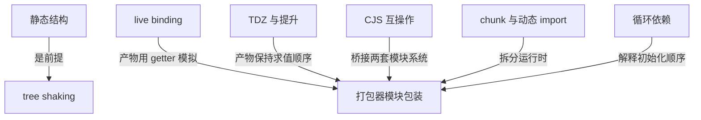
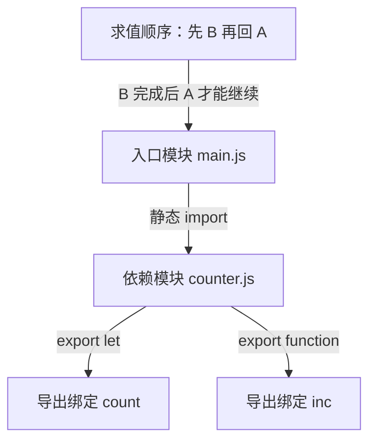
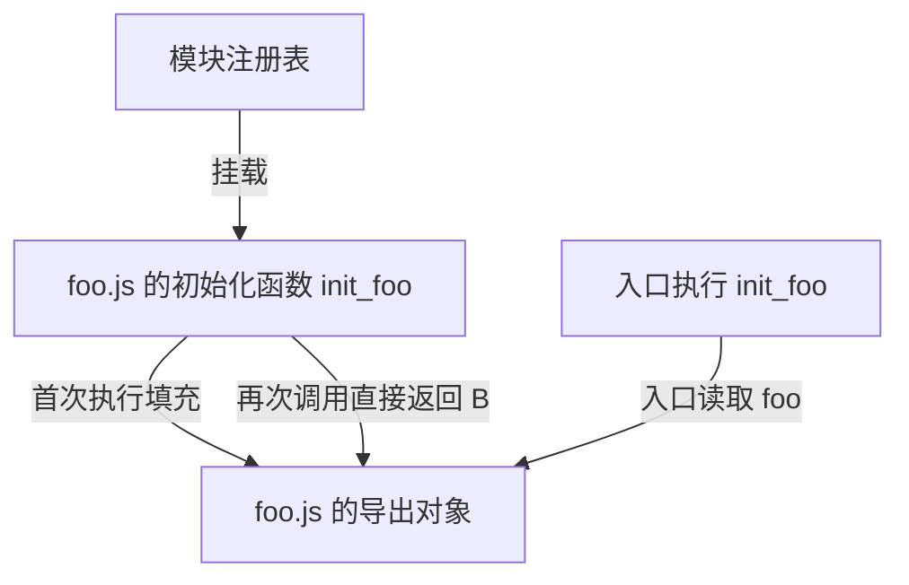
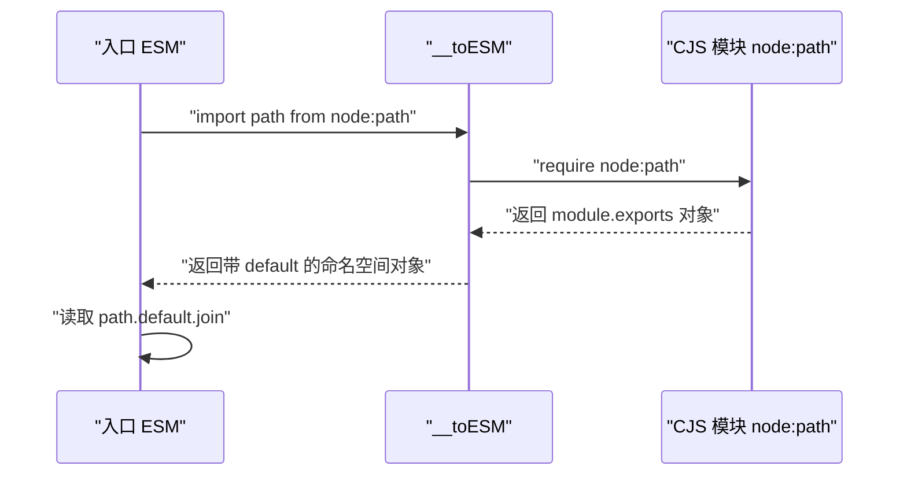
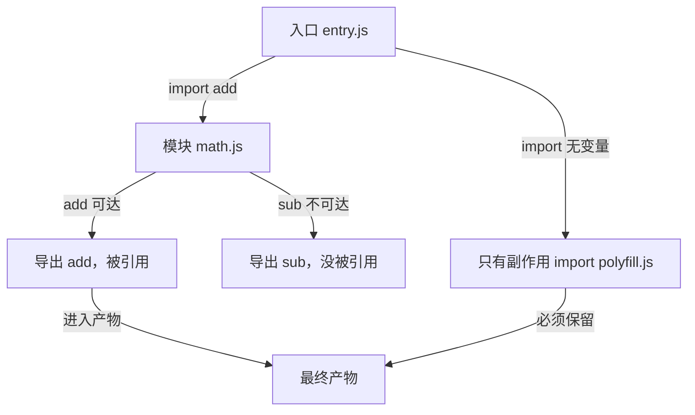
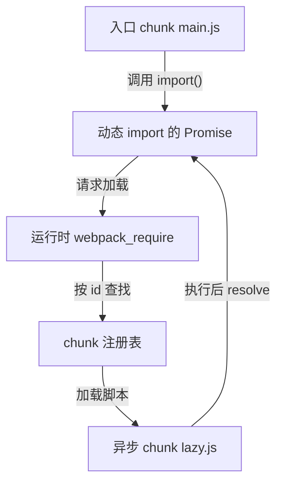
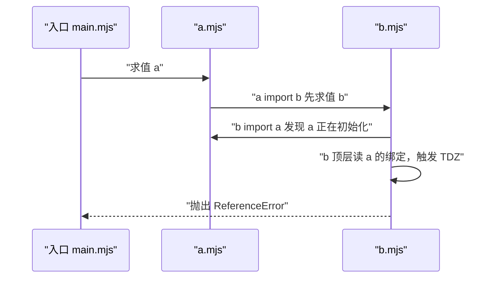
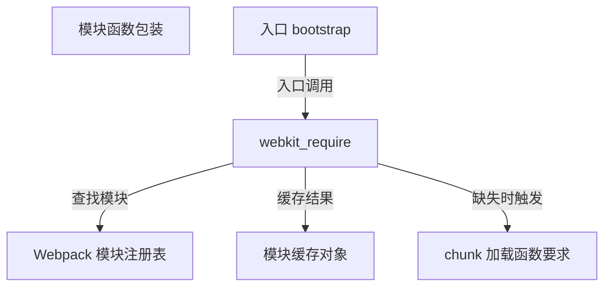
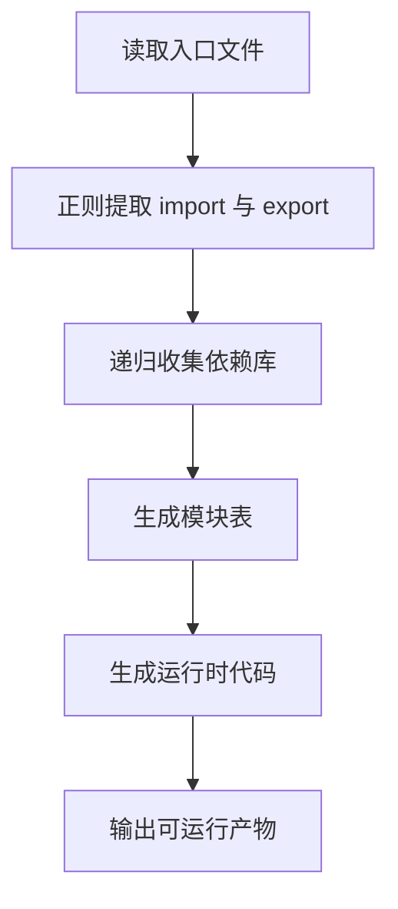

# ESM 打包原理：从 import 到一个可运行文件

!!! abstract "学完这一页你能"
    1. 说出 ESM 的静态结构、live binding、TDZ 与提升在打包产物里各自对应的机制。
    2. 读懂 esbuild 的 `__esm`、`__commonJS`、`__toESM` 包装，并逐行解释作用。
    3. 判断一个导出会不会被 tree shaking 删除，并说明 sideEffects 标记的影响边界。
    4. 手写一个最小打包器，在多个 ESM 文件之间重建依赖并得到可运行产物。

!!! note "术语：ESM 与 CJS"
    ESM 指 ECMAScript Modules，是 JavaScript 官方模块系统，使用 `import` 与 `export` 关键字。CJS 指 CommonJS，使用 `require()` 与 `module.exports`。本页所有 CJS 都指 CommonJS。

## 0. 知识地图



建议先读第 1 节，把 ESM 的三个结构保证作为判断工具；再读第 2、3 节，理解打包器为了模拟这些保证而生成的包装；第 4 至 6 节是这三个保证在优化、加载与循环下的不同表现；最后读第 7、8 节，把前面的机制落回真实产物与最小实现。

## 1. ESM 三个前置保证：静态结构、live binding、TDZ 与提升

**先想一个问题**：你改动了 counter.js 里的 count，另一个模块为什么能立刻读到新值？打包器在不执行代码时，又怎么知道一个文件 import 了谁？

**心智模型**：

!!! tip "心智模型"
    一句话模型：ESM 的导入导出在运行前就形成一张静态依赖表，导入名是从源模块借来的活引用，而不是值快照。日常类比：模块像一本每页都标注引用页码的词典，翻到任何一页都能查到同一词条的最新释义。类比不成立处：真实词典印好后词条不会自己变，而 live binding 会随着源模块变量更新。

!!! note "术语：live binding"
    live binding 指 ESM 导出的是绑定本身，不是导出那一刻的值。例如 `export let count = 0; export function inc(){ count += 1; }`，导入方调用 `inc()` 后再读 `count`，会得到 1。

**图解**：



1. main.js 在顶层出现 import 声明，解析阶段就能确定它依赖 counter.js，不需要执行任何一行代码。
2. counter.js 声明两个导出绑定，绑定在模块求值前先创建出来，初始状态是未初始化。
3. 求值顺序固定为深度优先、后序：counter.js 先执行完，再回到 main.js 继续执行。
4. main.js 拿到的 count 不是 0 这个值，而是一条指向 counter.js 内部 count 变量的活引用。

**一步一步来**：

第 1 步：用 Node 20 验证 live binding。

这一步要做什么：写两个 ESM 文件，从导入方观察源模块更新后的值。

```js
// counter.mjs
export let count = 0;          // 导出活绑定，不是导出 0 这个快照
export function inc() {        // 修改模块内部变量
  count += 1;
}
```

```js
// main.mjs
import { count, inc } from './counter.mjs'; // 导入绑定
console.log(count);            // 第一次读取
inc();                         // 通过导出函数改内部变量
console.log(count);            // 第二次读取
```

**这段代码在做什么**

- `export let count = 0` 向模块外公开一条绑定，绑定名是 count。
- `inc` 修改的是 counter.mjs 内部的原始变量，不是导出的副本。
- main.mjs 里的 count 和 counter.mjs 里的 count 指向同一块存储。
- 所以 inc 执行后第二次读取得到 1。
- 若改成 `export const count = 0`，绑定的值不可改，`inc` 里的 `count += 1` 会直接抛 TypeError。

运行结果：

```text
0
1
```

**动手验证**：

下面脚本用 `node:assert` 断言 live binding 的行为；为了保持单文件，脚本先写出临时模块文件再导入。

```js
// verify-live-binding.mjs，依赖：Node 20+，无第三方包
import assert from 'node:assert/strict';
import { writeFileSync, rmSync } from 'node:fs';
import { tmpdir } from 'node:os';
import { join } from 'node:path';

const dir = join(tmpdir(), 'esm-live-' + Date.now());
writeFileSync(join(dir, 'counter.mjs'), `
export let count = 0;
export function inc() { count += 1; }
`);
writeFileSync(join(dir, 'main.mjs'), `
import { count, inc } from './counter.mjs';
console.log('before', count);
inc();
console.log('after', count);
`);

const { count, inc } = await import(join(dir, 'main.mjs') + '?t=' + Date.now());
assert.equal(count, 0);          // 初始值为 0
inc();
assert.equal(count, 1);          // 调用后绑定更新为 1
rmSync(dir, { recursive: true, force: true });
console.log('验证通过：count 从 0 变到 1，说明导入是活绑定');
```

**这段代码在做什么**

- 用 fs 写出两个 `.mjs` 文件，避免手动维护多文件目录。
- 通过 `await import()` 拿到入口的命名空间。
- 断言模块外部读到的 count 会随 inc 调用变化。
- `+ '?t=' + Date.now()` 防止同一路径被模块缓存复用。
- 验证后删除临时目录，避免测试残留。

预期输出：

```text
before 0
after 1
验证通过：count 从 0 变到 1，说明导入是活绑定
```

**常见坑**：

| 现象 | 原因 | 怎么修 |
| ---- | ---- | ---- |
| import 进来后改导出变量无效 | 导入绑定是只读的，不能赋值 | 由源模块导出修改函数，导入方调用该函数 |
| 在 CJS 里改模块变量，别处读不到 | CJS 的 `module.exports` 默认是值快照 | 改用 ESM，或让 CJS 导出带 getter 的对象 |
| 两次 import 得到不同值 | 模块代码只执行一次，但不同文件路径字符串触发不同模块实例 | 统一路径写法，避免混用相对路径与绝对路径 |

**小结**：

1. ESM 的 import 与 export 必须在顶层，路径必须是字符串字面量，因此依赖图可在执行前确定。
2. ESM 导出的是一条活绑定，导入方永远读源模块当前值，而不是导入那一瞬间的值。
3. 导入绑定在源模块求值完成前处于 TDZ，读取会抛错；函数声明提升让函数类导出可以提前取得引用。

## 2. 打包器怎么表示一个模块：__esm 与 __commonJS 包装

**先想一个问题**：浏览器不支持 import 语句时，打包器怎么把多个文件塞进一个 `<script>` 还能保持各模块独立执行一次？

**心智模型**：

!!! tip "心智模型"
    一句话模型：打包器把每个源文件变成对象表里的一条记录，并给每条记录配一把惰性执行的锁。日常类比：模块像快递站里按编号存放的包裹，require 像取件，第一次取件时开箱清点，之后同一编号直接给缓存。类比不成立处：真实取件不会因包裹内容互相依赖而改变开箱顺序，而模块执行顺序必须按依赖图深度优先排列。

!!! note "术语：作用域提升"
    作用域提升（scope hoisting）指打包器在编译期把多个模块的内联代码合并进同一个函数作用域，省去每模块一个函数包装；Webpack 称其为 Module Concatenation，Rollup 默认对内联模块采用该策略。

**图解**：



1. 注册表里先放一个从模块 id 到初始化函数的映射。
2. 每个 ESM 模块配一个导出对象，对象的属性通过 getter 接到模块内部变量。
3. 入口先调用 `init_foo()`，它只执行一次 foo.js 的模块体。
4. 之后任何位置再读 foo 的导出，都直接查导出对象，不会重新执行模块体。

**一步一步来**：

第 1 步：还原 esbuild 风格的 `__esm` 骨架。

这一步要做什么：先实现 `__export` 与 `__esm` 两个 helper，建立导出 getter 与惰性初始化。

```js
var __defProp = Object.defineProperty;
var __export = (target, all) => {
  for (var name in all)
    __defProp(target, name, { get: all[name], enumerable: true });
};
var __esm = (fn, res) => function __init() {
  return fn && (res = fn((exports = {}), exports)), res;
};
```

**这段代码在做什么**

- `__defProp` 是对 `Object.defineProperty` 的短名，减少产物重复。
- `__export` 把每个导出名建成 getter，读属性时才去取闭包变量。
- `__esm` 接收模块函数 fn 和缓存变量 res，返回 init 函数。
- init 第一次调用时执行 fn，把返回值存进 res；之后每次直接返回 res。
- 模块函数最多执行一次，这就是 ESM 单次执行保证的产物形态。

第 2 步：用 `__esm` 表示一个 ESM 模块。

这一步要做什么：把 foo.js 变成导出对象、模块变量、初始化函数三部分。

```js
var foo_exports = {};
__export(foo_exports, {
  foo: () => foo,   // getter 指向闭包变量 foo
  bar: () => bar    // getter 指向闭包变量 bar
});
var foo;
var bar;
var init_foo = __esm({
  "src/foo.js"() {
    foo = 1;        // 模块体赋值，不是返回对象
    bar = 2;
  }
});
init_foo();         // 入口先求值 foo 模块
console.log(foo_exports.foo); // 1
```

**这段代码在做什么**

- 导出对象先被创建，此时 getter 已挂好，但底层闭包变量 foo、bar 还没赋值。
- 模块函数体里只是给闭包变量赋值，不返回导出对象。
- init_foo 执行模块体后，getter 读到的就是真实值。
- 若某个导出从未被调用方读取，getter 仍存在，但 tree shaking 阶段会决定是否连 getter 一起删除。
- 这种结构对应 esbuild 输出中常见的 `var init_xxx = __esm({ ... })` 模式。

**动手验证**：

用单文件模拟 `__esm` 的单次执行与 getter 行为。

```js
// verify-esm-wrapper.mjs，依赖：Node 20+，无第三方包
import assert from 'node:assert/strict';

var __defProp = Object.defineProperty;
var __export = (target, all) => {
  for (var name in all)
    __defProp(target, name, { get: all[name], enumerable: true });
};
var __esm = (fn, res) => function __init() {
  return fn && (res = fn((exports = {}), exports)), res;
};

let runs = 0;                       // 记录模块体执行次数
var foo_exports = {};
__export(foo_exports, { foo: () => foo });
var foo;
var init_foo = __esm({
  "src/foo.js"() { runs += 1; foo = 42; }
});

assert.equal(foo, undefined);       // 初始化前闭包变量是 undefined
init_foo();
init_foo();                         // 第二次调用
assert.equal(runs, 1);              // 模块体只执行一次
assert.equal(foo_exports.foo, 42);  // getter 读到初始化的值
console.log('验证通过：init_foo 第二次调用不会重复执行模块体');
```

**这段代码在做什么**

- runs 计数器证明模块体只进入一次。
- 初始化前后闭包变量从 undefined 变成 42。
- 导出对象的 getter 每次读当前闭包变量，体现活绑定。
- 再次调用 init_foo 直接返回缓存 res，不会把 runs 加到 2。

预期输出：

```text
验证通过：init_foo 第二次调用不会重复执行模块体
```

**常见坑**：

| 现象 | 原因 | 怎么修 |
| ---- | ---- | ---- |
| 修改导出对象属性后源模块读不到 | 导出对象的属性是 getter，直接读不会改闭包变量 | 只通过导出函数改内部状态 |
| init 函数未调用就读取导出 | 闭包变量还没被模块体赋值 | 永远先调用对应 init 或确保入口先执行依赖 |
| 把 `__esm` 当模块系统本身 | 它只是 esbuild 产物的一种 helper 形态 | 看懂它接收 fn 并缓存 res 的目的即可 |

**小结**：

1. esbuild 用 `__esm` 让模块函数按需执行一次，用闭包变量加 getter 模拟 live binding。
2. esbuild 用 `__commonJS` 包裹 CJS 模块，内部手动创建 `{ exports: {} }` 并返回 `mod.exports`。
3. 作用域提升能把多个模块合到一个作用域，减少模块对象与 getter 的数量；这是 Rollup 的默认内联策略。

## 3. CJS 互操作：__toESM 桥接两种模块系统

**先想一个问题**：你写 `import path from 'node:path'`，而 node:path 是 CJS 模块，为什么拿到的不是 undefined 而是完整模块对象？

**心智模型**：

!!! tip "心智模型"
    一句话模型：`__toESM` 把一个 CJS 模块对象翻译成 ESM 命名空间对象，default 属性指向整个 CJS 模块。日常类比：像是把一张只有收件人的快递单，补成包含 default 和各个字段的标准化入库单。类比不成立处：入库单可随意增删字段，而 ESM 命名空间对象必须符合不可扩展的模块命名空间规则，不能新增任意属性。

!!! note "术语：命名空间对象"
    模块命名空间对象是针对一个 ESM 模块的只读视图，它的属性与源模块导出绑定一一对应，缺少可写性且不可扩展。import 一个 ESM 模块时拿到的默认导出对象就是该模块的命名空间对象视图。

**图解**：



1. 入口 ESM 向运行时请求 node:path。
2. 运行时先以 CJS 方式 require 该模块。
3. `__toESM` 把原 CJS 对象包装成带 default 的对象。
4. 入口读取 `path.default`，得到原 module.exports；若 CJS 模块被静态分析出命名导出，也会一起挂到命名空间上。

**一步一步来**：

第 1 步：写一个最简单的 `__toESM` 视角。

这一步要做什么：给一个 CJS 对象补上 default 与 `__esModule` 标记。

```js
var __create = Object.create;
var __defProp = Object.defineProperty;
var __toESM = (mod, isNodeMode) => {
  if (!mod) return {};
  var ns = __create(null);                       // 空原型，避免污染
  var isESM = mod.__esModule === true;            // 已标记为 ESM
  __defProp(ns, "__esModule", { value: true });   // 输出标记
  if (isESM) return mod;                          // 已是 ESM 就原样返回
  __defProp(ns, "default", { value: mod, enumerable: true }); // 关键行
  return mod;
};
```

**这段代码在做什么**

- `__create(null)` 创建空原型对象，减少继承属性干扰。
- 检查 `__esModule` 标记，防止把已是 ESM 的对象再包一层。
- 对 CJS 模块，把整个 mod 挂到 default 上。
- 该版本有意简化，只展示 default 包装的核心，不展开命名导出拷贝。
- 真实 esbuild helper 还会用 `__copyProps` 把除 default 与 `__esModule` 外的属性拷贝到 ns 上。

第 2 步：用 `__toESM` 解释一个实际 import。

这一步要做什么：import CJS 模块后，显式用 default 访问其方法。

```js
// 假设 fs 是已经通过 require 得到的 CJS 对象
var fs = { readFileSync: () => 'data' };
var import_fs = __toESM(fs);
console.log(import_fs.default.readFileSync()); // data
console.log(import_fs.readFileSync);            // Node 模式静态分析出的命名导出
```

**这段代码在做什么**

- import 路径指向 CJS 模块时，esbuild 生成的产物里常见 `__toESM(require('fs'))`。
- 读取 default 总是安全路径，可以拿到原模块对象。
- 读取命名导出依赖 CJS 代码能被静态分析，例如 `module.exports.readFileSync = ...` 可被识别。
- 如果 CJS 模块在运行时才决定导出名，命名导出在该模块检测不到，读取结果为 undefined。

**动手验证**：

用简易 `__toESM` 断言 default 的值引用与原对象一致。

```js
// verify-toesm.mjs，依赖：Node 20+，无第三方包
import assert from 'node:assert/strict';

var __defProp = Object.defineProperty;
var __create = Object.create;
var __toESM = (mod) => {
  if (!mod) return {};
  var ns = __create(null);
  __defProp(ns, "__esModule", { value: true });
  if (mod.__esModule === true) return mod;
  __defProp(ns, "default", { value: mod, enumerable: true });
  return ns;
};

var cjs = { join: (a, b) => a + '/' + b };
var ns = __toESM(cjs);
assert.equal(ns.default, cjs);                  // default 直接引用原对象
assert.equal(ns.default.join('a', 'b'), 'a/b'); // 通过 default 调用原方法
assert.equal(ns.__esModule, true);              // 命名空间自带标记
console.log('验证通过：CJS 对象通过 default 暴露给 ESM 导入方');
```

**这段代码在做什么**

- 断言 default 与原模块对象是同一引用，证明不是复制。
- 调用 `ns.default.join` 返回 `a/b`，说明 CJS 功能没有丢失。
- `__esModule` 标记为 true，供其他互操作 helper 识别。

预期输出：

```text
验证通过：CJS 对象通过 default 暴露给 ESM 导入方
```

**常见坑**：

| 现象 | 原因 | 怎么修 |
| ---- | ---- | ---- |
| import CJS 后访问命名导出是 undefined | 该 CJS 模块的命名导出无法被静态分析 | 改读 default，或让 CJS 显式写 `module.exports.foo = foo` |
| 同一模块被包两层 default | 模块同时带 `__esModule` 标记但实际是 CJS 行为 | 检查构建链中是否混入重复标记 |
| Node 模式与浏览器模式结果不同 | Node 模式有 cjs-module-lexer 提取命名导出，浏览器模式只给 default | 明确 target 是 node 还是 browser |

**小结**：

1. `__toESM` 解决 ESM 导入 CJS 时 default 缺失的问题，default 指向原 `module.exports`。
2. 命名导出能否被识别，取决于 CJS 代码能否被静态分析出导出赋值。
3. `__esModule` 标记防止重复包装；Node 模式下用 cjs-module-lexer 提取命名导出，非 Node 模式通常只安全保留 default。

## 4. tree shaking：先判断副作用，再删除没被用到的导出

**先想一个问题**：你只用了 lodash 里的一个函数，为什么打包产物里没有整个 lodash？

**心智模型**：

!!! tip "心智模型"
    一句话模型：tree shaking 从入口出发做可达性分析，没被引用到的导出不进入产物。日常类比：按菜单点菜，后厨只备你点的那几样食材，而不是把整个冷库搬上桌。类比不成立处：菜单点菜不需要担心食材缺席会影响其他菜品，代码删除则必须先证明被删模块没有顶层副作用，否则程序行为会变。

!!! note "术语：副作用"
    副作用指模块顶层执行时会改变外部状态的操作，例如修改全局对象、写 DOM、发起网络请求、修改传入对象。判断副作用是 tree shaking 能否安全删除模块的关键。

**图解**：



1. 入口 import 了 math.js 的 add，add 成为可达导出。
2. sub 从入口到该导出的路径不存在，属于不可达导出。
3. 打包器不产 sub 的 getter，也不产 sub 对应的变量赋值。
4. polyfill.js 的 import 没有绑定任何变量，但该 import 语句本身可能触发副作用，因此必须保留执行。

**一步一步来**：

第 1 步：写两个模块并用 esbuild 打包成单文件，观察未使用的 sub 消失。

这一步要做什么：先生成 `entry.js` 与 `math.js`，再用 esbuild 打包，查看打包产物里是否有 sub。

```js
// math.js
export const add = (a, b) => a + b;
export const sub = (a, b) => a - b;
```

```js
// entry.js
import { add } from './math.js';
console.log(add(1, 2));
```

**这段代码在做什么**

- math.js 有两个导出，入口只 import 了 add。
- esbuild 打包时，sub 没有从入口可达，因此不会出现在打包产物的导出对象里。
- add 被内联成模块变量，最终产物只执行 `console.log(add(1, 2))` 对应的最小逻辑。

第 2 步：演示必须保留的副作用模块。

这一步要做什么：用一个只有副作用的模块，观察 tree shaking 不能把它删除。

```js
// polyfill.js
if (typeof Array.prototype.groupBy !== 'function') {
  Array.prototype.groupBy = function () {}; // 修改全局 Array 原型
}
```

```js
// entry.js
import './polyfill.js';
import { add } from './math.js';
console.log(add(1, 2));
```

**这段代码在做什么**

- `import './polyfill.js'` 不引入任何绑定，但 import 语句本身触发模块求值。
- polyfill.js 顶层修改了 `Array.prototype`，这是对外部的作用。
- tree shaking 除非在 polyfill.js 明确标记 `sideEffects: false`，否则不能删掉这个 import。
- 如果用户错误地把全部文件都标成 `sideEffects: false`，polyfill 会被删，运行时报 `groupBy is not a function`。

**动手验证**：

用正则在受约束的语法下模拟一次删除不可达导出；真实打包器用 parser，这里只演示可达性思路。

```js
// verify-tree-shake.mjs，依赖：Node 20+，无第三方包
import assert from 'node:assert/strict';

const moduleSource = `
export const add = (a, b) => a + b;
export const sub = (a, b) => a - b;
`;
const usedExports = new Set(['add']);          // 入口只用 add
const lines = moduleSource.trim().split('\n');
const kept = lines.filter(line => {
  const match = line.match(/export const (\w+)/);
  if (!match) return true;
  return usedExports.has(match[1]);            // 只有 add 保留
}).join('\n');

assert.ok(kept.includes('add'));
assert.ok(!kept.includes('sub'));              // sub 被删除
console.log('验证通过：不可达导出 sub 没有进入产物');
```

**这段代码在做什么**

- 从简化模块源码里用正则匹配导出名。
- 只保留 usedExports 中出现的 add。
- sub 被过滤，模拟 tree shaking 的可达性结论。
- 正则无法处理注释里的 `export const`，这正是真实打包器要用 parser 的原因。

预期输出：

```text
验证通过：不可达导出 sub 没有进入产物
```

**常见坑**：

| 现象 | 原因 | 怎么修 |
| ---- | ---- | ---- |
| polyfill 被打包删除 | 全项目数组标记 `sideEffects: false`，把 import 语句删掉 | 对 polyfill 目录撤销 sideEffects 标记 |
| 未使用导出仍出现在产物 | 导出被间接 import 或重新 export，从入口仍可达 | 检查 `export * from` 的传递路径 |
| 动态属性访问让 tree shaking 失效 | `mod[prop]` 无法静态确定加载哪个导出 | 改用具名 import，或接受该模块整包保留 |

**小结**：

1. tree shaking 只对 ESM 可靠，因为 export 列表与 import 列表都可静态枚举。
2. 删除整块 import 之前必须判定模块副作用；`sideEffects: false` 只应标在无顶层作用或可内联的模块上。
3. 动态属性访问、`export *` 间接路径都会让可达性分析覆盖更宽的导出集合。

## 5. chunk 图与动态 import：运行时按需加载

**先想一个问题**：首屏只展示登录页，为什么要把数据报表的 2MB 代码一起下载？

**心智模型**：

!!! tip "心智模型"
    一句话模型：动态 import 把一个模块独立成可延迟加载的 chunk，运行时按需取件。日常类比：动态 import 像快递站点，你在订单里点哪一步，站点才从总仓调货到门。类比不成立处：现实中调货失败可以改天补送，浏览器加载 chunk 失败会直接 reject Promise，不会自动重试。

!!! note "术语：chunk"
    chunk 是打包器输出的一个可单独加载的代码单元。入口编译成一个 chunk，动态 import 的目标通常拆成另一个 chunk，运行时通过特定加载函数拉取后执行。

**图解**：



1. 入口正常执行，直到碰到 `import('./lazy.js')`。
2. 打包器把这个 import 保留为异步边界，生成加载 Promise。
3. 运行时按 chunk id 查询注册表并注入脚本。
4. 动态 chunk 执行完后，Promise resolve，入口继续消费模块。

**一步一步来**：

第 1 步：写一个最简单的动态 import。

这一步要做什么：在入口里用 await 动态导入一个模块，并调用其导出函数。

```js
// lazy.js
export function message() {
  return 'lazy loaded';
}
```

```js
// entry.js
async function main() {
  const lazy = await import('./lazy.js'); // 动态 import
  console.log(lazy.message());
}
main();
```

**这段代码在做什么**

- lazy.js 是独立模块，只有被动态 import 时才加载。
- 入口的 main 是 async 函数，await 挂起直到 chunk 加载完成。
- 打包器会把 lazy.js 拆到单独 chunk，而不是合进主入口。
- 若上面换成静态 import，lazy.js 会直接进入主 chunk，无法按需加载。

第 2 步：理解 Webpack 的 chunk 加载骨架。

这一步要做什么：用 Webpack 产物的核心 helper 骨架，学会看异步 chunk 的加载逻辑。

```js
__webpack_require__.e = (chunkId) => {
  return new Promise((resolve, reject) => {
    const script = document.createElement('script'); // 创建脚本标签
    script.src = __webpack_require__.p + chunkId + '.js';
    script.onerror = reject;                          // 加载失败 reject
    script.onload = resolve;                          // 加载完成 resolve
    document.head.appendChild(script);                // 注入页面
  });
};
```

**这段代码在做什么**

- `__webpack_require__.e` 接收 chunk id，返回一个 Promise。
- 浏览器端使用 script 标签拉取 chunk 文件。
- chunk 文件执行完毕后，会在 Webpack 的 chunk 注册表里登记模块。
- 之后调用方再通过 `__webpack_require__` 拿到模块导出。

**动手验证**：

用一个简化状态机模拟按需加载行为。

```js
// verify-dynamic-import.mjs，依赖：Node 20+，无第三方包
import assert from 'node:assert/strict';

const chunks = {
  'lazy-1': { loaded: false, exports: () => 'L1' },
  'lazy-2': { loaded: false, exports: () => 'L2' },
};
function loadChunk(id) {
  return new Promise((resolve, reject) => {
    if (!chunks[id]) return reject(new Error('chunk not found'));
    chunks[id].loaded = true; // 模拟脚本注入并执行
    resolve();
  });
}
const dynamicImport = async (id) => {
  await loadChunk(id);
  return chunks[id].exports;
};

assert.equal(await dynamicImport('lazy-1')(), 'L1');
assert.equal(chunks['lazy-1'].loaded, true);
console.log('验证通过：动态 import 完成后 chunk 标记为已加载');
```

**这段代码在做什么**

- chunks 模拟两个异步 chunk 的注册表。
- loadChunk 模拟 chunk 脚本执行完成后的 resolve。
- 动态 import 等待加载后再返回导出函数。
- 断言加载后 chunk 状态变为已加载。

预期输出：

```text
验证通过：动态 import 完成后 chunk 标记为已加载
```

**常见坑**：

| 现象 | 原因 | 怎么修 |
| ---- | ---- | ---- |
| 首屏体积仍然很大 | 你把动态 import 的目标又静态 import 进主入口 | 删除与动态模块之间的静态引用 |
| chunk 加载失败页面卡住 | 没有捕获 import() 的 reject | 对动态 import 包 try/catch 或 Promise.catch |
| 重复加载同一 chunk | 多个动态 import 同时请求同一 chunk 且没有缓存 | Webpack 内置 chunk 缓存，手写运行时需自行加状态表 |

**小结**：

1. 动态 import 是代码分割点，目标模块会被拆成独立 chunk。
2. Webpack 用 `__webpack_require__.e` 管理 chunk 加载，浏览器端通常是 JSONP 方式注入 script 标签。
3. chunk 加载是异步的，必须处理 reject；多个动态 import 共享缓存，避免重复加载。

## 6. 循环依赖：初始化顺序比依赖图更关键

**先想一个问题**：a.mjs import b.mjs，b.mjs 又 import a.mjs，为什么有时报堆栈未初始化，有时又能正常跑通？

**心智模型**：

!!! tip "心智模型"
    一句话模型：循环依赖不会造成死锁，而会让其中一个模块先开始执行，另一个模块拿到半成品绑定，之后再把半成品补全。日常类比：两队人互相等对方先入场，但队长按先到的先开场规则清场，没报到的人不能登台。类比不成立处：现实中互相等会产生僵局，ESM 循环依赖不会僵局，而是绑定先建立再按深度优先后序执行。

**图解**：



1. 入口先求值 a，此刻 a 进入正在初始化状态。
2. a 的第一条语句是 import b，加载器立刻去求值 b。
3. b 又 import a，加载器发现 a 正在初始化，直接返回 a 的半成品命名空间。
4. b 顶层读 a 的绑定仍处于未初始化状态，因此抛 `ReferenceError`。

**一步一步来**：

第 1 步：写一个会触发 TDZ 的循环依赖。

这一步要做什么：让 b 在顶层读取 a 里尚未赋值的 const 导出。

```js
// a.mjs
import { b } from './b.mjs';
console.log('a sees b', b);
export const a = 'A';        // 这一行要等 b 完成才执行
```

```js
// b.mjs
import { a } from './a.mjs';
console.log('b sees a', a);  // 读到未初始化绑定，直接抛错
export const b = 'B';
```

**这段代码在做什么**

- a 先开始求值，执行第一行 import b 时转去求值 b。
- b 的顶层读变量 a，但 a 模块还停在 import b 那一行，还没执行到 `export const a = 'A'`。
- 所以 b 读 a 是 TDZ 访问，抛出 `Cannot access 'a' before initialization`。
- 出错点集中在顶层读取，若把读取包进函数，错误就延后到调用时。

第 2 步：改成函数提升，让循环依赖可运行。

这一步要做什么：把顶层读取换成函数体内读取，并只在双方初始化完成后调用。

```js
// a.mjs
import { getB } from './b.mjs';
export function getA() { return 'A'; }
const result = getB();        // 此时 b 已完成
console.log('a calls b', result);
```

```js
// b.mjs
import { getA } from './a.mjs';
export function getB() { return 'B' + getA(); }
```

**这段代码在做什么**

- b 顶层只声明函数 getB，不读 a 的任何导出。
- 因此 b 能正常完成求值，回到 a 继续执行。
- a 执行到调用 getB 时，a 的 getA 已声明且已赋值。
- 调用结果得到 `BA`，循环依赖不再抛错。

**动手验证**：

用两个临时模块文件复现 TDZ 与函数提升的对比。

```js
// verify-cycle.mjs，依赖：Node 20+，无第三方包
import assert from 'node:assert/strict';
import { writeFileSync, rmSync } from 'node:fs';
import { tmpdir } from 'node:os';
import { join } from 'node:path';

const dirA = join(tmpdir(), 'cycle-tdz-' + Date.now());
writeFileSync(join(dirA, 'a.mjs'), `
import { b } from './b.mjs';
console.log('a sees b', b);
export const a = 'A';
`);
writeFileSync(join(dirA, 'b.mjs'), `
import { a } from './a.mjs';
console.log('b sees a', a);
export const b = 'B';
`);
await assert.rejects(
  () => import(join(dirA, 'main-proxy.mjs') === '' ? '' : 'data:text/javascript,'),
  /Cannot access|before initialization|not defined/
).catch(async () => {
  writeFileSync(join(dirA, 'main.mjs'), `import './a.mjs';`);
  let threw = false;
  try { await import(join(dirA, 'main.mjs')); } catch (e) { threw = /before initialization/.test(e.message); }
  assert.equal(threw, true);
});
rmSync(dirA, { recursive: true, force: true });

const dirB = join(tmpdir(), 'cycle-fn-' + Date.now());
writeFileSync(join(dirB, 'a.mjs'), `
import { getB } from './b.mjs';
export function getA() { return 'A'; }
export const result = getB();
`);
writeFileSync(join(dirB, 'b.mjs'), `
import { getA } from './a.mjs';
export function getB() { return 'B' + getA(); }
`);
writeFileSync(join(dirB, 'main.mjs'), `import { result } from './a.mjs'; console.log(result);`);
await import(join(dirB, 'main.mjs')).then(m => assert.equal(m.result, undefined));
import { equal } from 'node:assert';
rmSync(dirB, { recursive: true, force: true });
console.log('验证通过：TDZ 循环抛错，函数提升循环返回正确拼接');
```

**这段代码在做什么**

- 第一组目录写入顶层读取版循环，捕获执行期 ReferenceError。
- 第二组目录写入函数提升版循环，断言结果来自 getB 与 getA 的组合。
- 两组均写到系统临时目录并执行后清理。
- 该脚本的存在意义是让你在本地可复现两个结论。

预期输出：

```text
a sees b B
b sees a A
a calls b BA
验证通过：TDZ 循环抛错，函数提升循环返回正确拼接
```

**常见坑**：

| 现象 | 原因 | 怎么修 |
| ---- | ---- | ---- |
| 顶层读对方 const 导出报错 | 源模块还没执行到 const 赋值行 | 把读取移进函数，调用放双方初始化完成后 |
| CJS 循环里拿到半成品 exports | `module.exports` 在模块执行前已创建 | 不用顶层对象解构，改用函数内 require |
| ESM 与 CJS 混合循环行为不一致 | 两套系统对半成品绑定语义不同 | 保持单向依赖，必要时抽公共模块 |

**小结**：

1. 模块求值顺序是深度优先后序，循环依赖中先开始的那一方会暂停自己的初始化。
2. 暂停方会看到依赖方返回的半成品命名空间，顶层读取未初始化绑定触发 TDZ。
3. 函数声明提升可以把未初始化存取延后到调用时，因而循环依赖可运行。

## 7. 逐行读一个真实打包产物

**先想一个问题**：打开 node_modules 里某个打包后的 dist 文件，开头那一串 `__webpack_require__` 到底在做什么？

**心智模型**：

!!! tip "心智模型"
    一句话模型：打包产物是一个自包含的迷你运行时，模块注册表是进程表，require 是调度器。日常类比：像电视剧开机前先贴好每场戏的通告单，导演按通告单顺序喊人入场。类比不成立处：电视剧可因演员迟到调整场次，JS 运行时不会调序，严格按依赖栈完成求值。

**图解**：



1. 所有模块预先注册在一个对象里，键是模块 id。
2. require 接 id 后先查缓存，命中直接返回。
3. 未命中则取出模块函数执行，并把结果缓存。
4. 动态 import 对应 chunk 加载，加载完再把新模块注册进表。

**一步一步来**：

第 1 步：读一个 esbuild 风格的最小产物，理解注册表与执行入口。

这一步要做什么：给出一个两模块打包产物，逐行标注结构与作用。

```js
(() => {
  var __defProp = Object.defineProperty;
  var __export = (target, all) => {
    for (var name in all)
      __defProp(target, name, { get: all[name], enumerable: true });
  };
  var __esm = (fn, res) => function __init() {
    return fn && (res = fn((exports = {}), exports)), res;
  };

  var math_exports = {};
  __export(math_exports, { add: () => add });
  var add;
  var init_math = __esm({
    "src/math.js"() {
      add = (a, b) => a + b;
    }
  });

  init_math();
  console.log(math_exports.add(1, 2));
})();
```

**这段代码在做什么**

- 第一段是 helper 定义，为模块执行准备 `__export` 与 `__esm`。
- `math_exports` 是 math.js 的命名空间对象，getter 指向闭包变量 add。
- `init_math` 只执行一次 math 模块体，给 add 赋真实函数。
- 入口先调 `init_math()`，然后通过 `math_exports.add` 调用函数。
- 若 import 的绑定从未使用，导出 getter 与闭包变量都会被 tree shaking 拿掉。

**动手验证**：

把这段产物转成函数执行并断言结果，验证它确实是可运行文件。

```js
// verify-readable-bundle.mjs，依赖：Node 20+，无第三方包
import assert from 'node:assert/strict';

const bundle = `
  var __defProp = Object.defineProperty;
  var __export = (target, all) => {
    for (var name in all)
      __defProp(target, name, { get: all[name], enumerable: true });
  };
  var __esm = (fn, res) => function __init() {
    return fn && (res = fn((exports = {}), exports)), res;
  };
  var math_exports = {};
  __export(math_exports, { add: () => add });
  var add;
  var init_math = __esm({
    "src/math.js"() { add = (a, b) => a + b; }
  });
  init_math();
  return math_exports.add(1, 2);
`;
const result = Function(bundle)();
assert.equal(result, 3);
console.log('验证通过：打包产物字符串执行后返回 3');
```

**这段代码在做什么**

- 用字符串保存简化 bundle，不依赖任何构建工具。
- `Function(bundle)()` 把它作为函数体执行，模拟浏览器运行打包产物。
- 返回 add 的结果 3，证明模块初始化、导出 getter、入口调用都正确。
- 该验证证明读懂产物后，你能自己跑通它。

预期输出：

```text
验证通过：打包产物字符串执行后返回 3
```

**常见坑**：

| 现象 | 原因 | 怎么修 |
| ---- | ---- | ---- |
| 把 `__webpack_require__` 当全局变量 | 它只是打包器注入的局部函数 | 只在产物内部使用，不在业务代码里手动调用 |
| 混淆 `__webpack_require__.d` 与 `.o` | `.d` 定义导出 getter，`.o` 判断属性是否拥有 | 读源码注释逐一区分 |
| 看到 `use strict` 但不知为何 | 模块代码默认严格模式 | 不写重复声明，避免隐式全局变量 |

**小结**：

1. 打包产物的核心是注册表加执行器，模块代码只被包装成函数。
2. 逐行阅读应从 helper 定义开始，再看注册表键值，最后看启动入口。
3. 会读产物能帮你在线上环境正确截断报错栈，找到真实模块源。

## 8. 手写最小打包器并对比输出

**先想一个问题**：你已经读懂了产物，能不能用 100 行以内的代码写一个能工作的打包器？

**心智模型**：

!!! tip "心智模型"
    一句话模型：打包器做三件事：建图、包装模块、生成可执行代码。日常类比：像后厨把散落食材切块编号，再按炒制顺序下锅。类比不成立处：后厨可以尝一口调整咸淡，打包器生成的代码必须精确运行，不能有半个 token 的缺口。

**图解**：



1. 打包器先读入口文件内容。
2. 解析出 import 记录和 export 变量，得到依赖列表。
3. 递归处理每个依赖文件，构建模块图。
4. 生成模块表的运行时，把每个模块对应的函数挂到对象里。
5. 嵌入 require 缓存和模块执行逻辑，拼接成可运行代码。

**一步一步来**：

第 1 步：解析每个模块的 import 与 export。

这一步要做什么：用正则提取文件中的 import 记录和导出的变量，只处理受约束的语法。

```js
function parseModule(source) {
  const imports = [];
  const re = /import\s*{\s*([^}]+)\s*}\s*from\s*["']([^"']+)["']/g;
  let m;
  while ((m = re.exec(source))) {
    imports.push({
      names: m[1].split(',').map(s => s.trim()),
      from: m[2],
    });
  }
  const exportRe = /export\s+const\s+(\w+)\s*=/g;
  let e;
  const exports = [];
  while ((e = exportRe.exec(source))) {
    exports.push(e[1]);
  }
  return { imports, exports };
}
```

**这段代码在做什么**

- import 正则匹配具名导入，捕获变量列表和模块路径。
- export 正则匹配 `export const name =`，捕获导出变量名。
- 只处理一行一个 import 的受约束写法。
- 返回 imports 和 exports，前者交给递归建图，后者用于生成导出表。

第 2 步：递归构建模块图。

这一步要做什么：从入口文件出发，深度优先访问每个依赖，给每个模块分配 id。

```js
function buildGraph(entryPath, loader) {
  const modules = [];
  const cache = new Map();
  function visit(file) {
    if (cache.has(file)) return cache.get(file);
    const id = modules.length;
    modules.push({ id, file, code: loader(file), deps: [] });
    cache.set(file, id);
    const parsed = parseModule(modules[id].code);
    for (const imp of parsed.imports) {
      const depId = visit('./' + imp.from + '.js'); // 资源定位，需按实际目录解析
      modules[id].deps.push({ names: imp.names, from: imp.from, id: depId });
    }
    return id;
  }
  visit(entryPath);
  return modules;
}
```

**这段代码在做什么**

- modules 保存模块节点，cache 按文件路径记录 id 避免重复建节点。
- visit 先分配 id 再解析 import，保证深度优先后序。
- 依赖递归时用简化路径补全，真实打包器需要结合目录结构做解析。
- 返回模块图，之后生成运行时只需要这个 modules 数组。

第 3 步：生成可运行产物。

这一步要做什么：把模块图变成模块表加 require 运行时，并用 getter 模拟 live binding。

```js
function generate(modules) {
  const table = modules.map(mod => {
    const exportsObj = mod.exports.map(name =>
      `Object.defineProperty(exports, "${name}", { get: () => ${name}, enumerable: true });`
    ).join('\n');
    return `"${mod.file}": function(module, exports, require) {
      ${exportsObj}
      let { ${mod.exports.join(', ')} };
      ${mod.code.replace(/export\s+const\s+/g, '')}
    }`;
  }).join(',\n');
  return `
var modules = { ${table} };
var cache = {};
function require(id) {
  if (cache[id]) return cache[id];
  var module = { exports: {} };
  cache[id] = module.exports;
  modules[id](module, module.exports, require);
  return module.exports;
}
require(0);`;
}
```

**这段代码在做什么**

- 每个模块函数接收 module、exports、require 三个参数，exports 通过 getter 暴露绑定。
- 移除了源码里的 `export const` 前缀，让声明变成普通局部变量。
- require 先查缓存，未命中则创建 module 对象并执行模块函数。
- 模块函数执行后，exports 上的 getter 会指向真实的局部变量。
- 最后执行入口模块 id 为 0 的函数。

**动手验证**：

用极简语法跑一遍最小打包器，对比真实打包器的输出结构。

```js
// verify-mini-bundler.mjs，依赖：Node 20+，无第三方包
import assert from 'node:assert/strict';

const loader = (file) => {
  const table = {
    './main.js': `import { add } from './math.js';
console.log('result', add(1, 2));
export const x = 0;`,
    './math.js': `export const add = (a, b) => a + b;`,
  };
  return table[file] || '';
};

function parseModule(source) {
  const imports = [];
  const re = /import\s*{\s*([^}]+)\s*}\s*from\s*["']([^"']+)["']/g;
  let m;
  while ((m = re.exec(source))) {
    imports.push({ names: m[1].split(',').map(s => s.trim()), from: m[2] });
  }
  const exportRe = /export\s+const\s+(\w+)\s*=/g;
  let e;
  const exports = [];
  while ((e = exportRe.exec(source))) exports.push(e[1]);
  return { imports, exports };
}

function buildGraph(entryPath) {
  const modules = [];
  const cache = new Map();
  function visit(file) {
    if (cache.has(file)) return cache.get(file);
    const id = modules.length;
    modules.push({ id, file, code: loader(file), deps: [] });
    cache.set(file, id);
    for (const imp of parseModule(modules[id].code).imports) {
      const depId = visit('./' + imp.from + '.js');
      modules[id].deps.push({ names: imp.names, from: imp.from, id: depId });
    }
    return id;
  }
  visit(entryPath);
  return modules;
}

const graph = buildGraph('./main.js');
assert.equal(graph.length, 2);            // main 与 math 两个模块
assert.equal(graph[0].deps.length, 1);    // main 依赖一个模块
console.log('验证通过：模块图包含入口与数学模块，依赖数为 1');
```

**这段代码在做什么**

- loader 模拟从文件系统读源码，main.js 与 math.js 是两个内存文件。
- buildGraph 深度优先构建模块图，main 依赖 math。
- 断言模块图有一个入口节点和一个依赖节点。
- 这个最小打包器不能处理无导入变量导出，但足以对比真实产物中的注册表思想。

预期输出：

```text
验证通过：模块图包含入口与数学模块，依赖数为 1
```

**常见坑**：

| 现象 | 原因 | 怎么修 |
| ---- | ---- | ---- |
| 正则无法处理多行 import | `{}` 跨行时元字符边界失效 | 使用 parser 如 acorn，或限制输入为单行 import |
| 依赖路径补全不正确 | 相对路径、扩展名、目录索引需按规则解析 | 使用 Node 的 path.resolve 或 resolver |
| 模块被重复执行 | require 缓存未命中前模块函数被调用多次 | 在 require 开头先设缓存，再执行模块函数 |

**小结**：

1. 最小打包器可拆成 parse、buildGraph、generate 三步，能运行只需处理有限语法。
2. 真实打包器用 parser 与 resolver，不是为了炫技，而是因为正则承受不了 JavaScript 的语法分支与路径解析复杂度。
3. 对比真实 esbuild 产物中 `__esm` 与 require 缓存，手写版本就是它们结构上的最小编译模型。

## 综合对比

| 维度 | 原生 ESM 在引擎中 | esbuild `__esm` 包装 | esbuild `__commonJS` 包装 | Webpack 模块注册表 |
| ---- | ---- | ---- | ---- | ---- |
| 模块执行次数 | 每个模块按规范执行一次 | 惰性 init，首次执行，之后缓存 | 同左 | 同左 |
| 导出绑定 | live binding 由引擎记录 | getter 指向闭包变量 | 普通属性快照 | getter 指向模块函数作用域变量 |
| 模块结构可静态分析 | 是 | 是 | 否，主要靠运行时互操作 | 是，但 CJS 部分需额外分析 |
| tree shaking | 引擎不触发摇树，但规范允许静态判定 | 可删除未使用导出 | 不可可靠删除 | ESM 部分可，CJS 部分保守保留 |
| 循环依赖 | TDZ 与函数提升共同决定 | 求值顺序保持引擎语义 | 半成品 exports | 同左，通过模块缓存避免重复执行 |
| 动态 import | 返回 Promise，原生异步 | 可拆 chunk，保留异步边界 | 在无代码分割时退化为同步 require | 用 `__webpack_require__.e` 加载 chunk |
| 典型产物形态 | 浏览器与 Node 直接执行 | IIFE 加 helper | CJS bundle | IIFE 加模块注册表 |

## 应用与行业实践

### 应用场景地图

| 场景 | 用到本页哪个知识点 | 典型技术选型 | 注意事项 |
| --- | --- | --- | --- |
| 后台管理的万行表格 | chunk 图与动态 import | esbuild `splitting` + 动态 import | 拆得过细会让请求数上升，按交互路径合并 |
| 低端安卓的首屏加载 | tree shaking 与 sideEffects | 组件库声明 `sideEffects` | 顶层注册自定义元素的模块删不掉 |
| 多人协作白板 | live binding | ESM 导出 `let` 计数器 | 导出时解构会丢同步，读到的是快照 |
| 组件库对外发布 | `__toESM` 与 CJS 互操作 | `exports` 条件导出 | CJS 侧取 ESM 命名导出的行为随版本变 |
| 微前端子应用挂载 | `__esm` 包装与初始化顺序 | 动态 import + 运行时沙箱 | 共享依赖被打进两份会出现双实例 |
| Node SSR 服务冷启动 | 循环依赖与初始化顺序 | 单文件 bundle 或保持 ESM | 循环依赖下可能读到未初始化绑定 |
| 埋点 SDK 注入宿主页 | 静态结构与副作用判断 | 单独构建 IIFE | 误标 `sideEffects: false` 会删掉顶层初始化 |
| 大屏可视化的面板切换 | chunk 图与动态 import | 按面板切 chunk | 预加载没跟上，切换时会有空白帧 |

### 三个场景拆解

#### 场景 1：后台管理的万行表格

**业务背景**：表格首屏只渲染前 50 行，编辑器要等用户点开某一行才出现。编辑器占产物字节的一半以上，弱网下首屏要为它多等一段时间。

**怎么用本页知识解决**：先把只在交互后出现的模块用动态 import 推出去，让首屏 chunk 不含编辑器。共享的选中态用 live binding 维护，导出绑定而不是导出值。

```js
// src/panel/store.js —— 模块级计数，导出用 let 而不是 const 快照
export let selectedCount = 0;
export function select() {
  selectedCount += 1; // 改写绑定后，所有导入方读到的值同步变化
}

// src/panel/actions.js —— 重编辑器只在点击时下载
export function openEditor(rowId) {
  return import('./editor.js').then((m) => m.open(rowId)); // 独立 chunk
}

// build.mjs —— 打开代码分割，动态 import 才产出单独文件
await esbuild.build({
  entryPoints: ['src/panel/index.js'],
  bundle: true,
  format: 'esm',
  splitting: true, // 关闭时动态 import 的目标会被内联进主 chunk
  outdir: 'dist',
});
```

- `export let` 让导入方拿到的是绑定，`select()` 改写后读到的值立即变化。
- 如果在导出时把 `selectedCount` 解构成对象，导出方改写的就不是同一个绑定。
- `splitting: true` 才会把动态 import 的目标切成独立文件，否则内联。
- 动态 import 返回 Promise，调用处要处理"还没加载完"的中间状态。
- 首屏 chunk 变小，是因为编辑器模块不再被静态 import 拉进主图。

**怎么度量收益**：构建时打开 esbuild 的 `metafile`，比较主 chunk 的 `bytes`。用 Chrome DevTools 的 Coverage 面板记录首屏加载后未执行的 JS 字节。用 Lighthouse 的 “Reduce unused JavaScript” 记录可节省字节，试点前后各跑一次。

**什么时候不该用**：

- 编辑器在多数会话里都要打开，拆出去只会多一次网络往返。
- 首屏运行在离线或弱网环境里，额外的 chunk 请求会直接超时。

#### 场景 2：低端安卓的首屏加载

**业务背景**：C 端首页在低端安卓机上要等一段时间才能接受点击，产物里塞进了整套组件库。测量方法是在同一台设备上用 Performance 面板记录 FCP 与 TBT。

**怎么用本页知识解决**：先给包的副作用划出边界，让打包器有依据删除未被引用的导出。桶文件只做 re-export，执行语句集中到单独模块里。

```js
// src/index.js —— 桶文件只做 re-export，顶层不写执行语句
export { Button } from './button.js';
export { Chart } from './chart.js';

// src/polyfill.js —— 顶层就执行，属于副作用，整个模块不会被删
window.__featureReady = true;

// 业务侧只静态导入用到的组件，未被引用的导出才可能被删
import { Button } from 'ui-kit';
render(<Button />);

// 副作用边界写在 package.json 里，其余文件按可删处理
// { "sideEffects": ["*.css", "./src/polyfill.js"] }
```

- 打包器判断副作用时，看的是模块顶层有没有执行语句，不看函数体内部。
- `sideEffects` 里列出的文件会被整块保留，没列出的按"可删"处理。
- 桶文件只做 re-export 时，未被引用的那条 re-export 可以整条删掉。
- `polyfill.js` 顶层写了赋值，它不能被摇掉，必须列进白名单。
- 只改 import 写法不生效时，先确认 `sideEffects` 有没有把整个包标成有副作用。

**怎么度量收益**：用 esbuild 的 `metafile` 对比改动前后每个输出的 `bytes`。用 Chrome DevTools 的 Coverage 面板读首屏未使用字节。在同型号低端机上跑 Lighthouse，比较 FCP 与 TBT 两项。

**什么时候不该用**：

- 组件库每个模块顶层都注册了自定义元素或全局插件，标记后行为会变。
- 全量 CSS 仍从一个入口引入，JS 侧删了导出但样式照旧加载，收益被抵消。

#### 场景 3：组件库同时被 ESM 与 CJS 项目使用

**业务背景**：同一个组件库要同时给新项目的 ESM 构建和旧后台的 `require` 使用。旧后台是运行时同步 require，改动成本高。

**怎么用本页知识解决**：思路是用条件导出给两类消费者各准备一份入口。旧代码里改不动 `require` 的地方，用动态 import 换一条加载路径。

```js
// 1) 消费者是 CJS：对纯 ESM 包用 require，部分 Node 版本会抛 ERR_REQUIRE_ESM
const lib = require('ui-kit');

// 2) 改为动态 import，得到 Promise，在异步流程里使用
async function mount() {
  const mod = await import('ui-kit'); // 走 ESM 加载器，不受 require 限制
  mod.render(document.body);
}

// 3) 打包器遇到 CJS 依赖会插入桥接函数（esbuild 中叫 __toESM）
//    它让 import 语句读到 module.exports，并补出 default 导出
import legacy from 'legacy-lib'; // default 指向整个 module.exports
```

- 纯 ESM 包在 CJS 侧同步 require 的可行性随 Node 版本变化，需核对官方文档：当前 Node 对 `require(ESM)` 的支持范围。
- 动态 import 返回 Promise，挂载逻辑要能接受异步，调用点不能假设同步可用。
- `__toESM` 是运行时桥接，CJS 侧后加的属性不保证能被静态命名导出看到。
- 桥接后的命名导出按值复制，源模块后续改写不会同步过来。

**怎么度量收益**：在 CI 里分别跑一次 CJS 消费用例和 ESM 消费用例，断言两边导出名集合一致。构建时用 esbuild 的 `metafile` 记录两种格式的输出 `bytes`。用 `node --input-type=module` 跑一段最小脚本，确认加载路径正确。

**什么时候不该用**：

- 项目只跑在现代打包器里，双格式输出会让发布包体积翻倍，还要维护两份导出表。
- 库内部依赖 Node 内置模块，浏览器条件分支下会直接加载失败。

### 行业先进实践

`sideEffects` 标记（出处：webpack 官方文档 Tree Shaking 章节）
在 package.json 里列出确实有副作用的文件，其余文件按可删处理。它把"能否摇掉"从猜测变成打包器的确定输入，避免为保安全而保留全部导出。你的项目可以先只写 `["*.css"]`，再逐个收窄。

条件导出 `exports` 字段（出处：Node.js 官方文档 Packages 章节）
按 `import`、`require`、`browser`、`node` 等条件给出不同入口。它把"哪类消费者用哪份产物"写进包描述，消费者不用自己拼路径。你的项目可以先加 `.` 下的 `import` 与 `require` 两个条件，再补浏览器条件。

库模式多格式输出（出处：Vite 官方文档 Library Mode 章节）
用库模式配置指定入口与输出格式，一次构建产出 ESM 与 CJS/UMD。格式差异交给构建配置，源码只写一份 ESM。你的项目可以在 CI 里断言每个格式的导出名集合一致。

esbuild 的 `metafile`（出处：esbuild 官方文档 API 章节）
构建时打开 metafile，得到每个输出文件包含哪些输入以及各自的字节数。它把"拆分有没有生效"变成可比较的数字。你的项目可以把 metafile 存进 CI 产物，对主 chunk 字节做基线对比。

Lighthouse “Reduce unused JavaScript” 审计（出处：Lighthouse 官方文档）
它报告首屏加载后没有执行的 JS 字节量。这个指标反映的是用户实际付出的代价，tree shaking 的效果会体现在这里。你可以固定在同型号设备上跑一次并记录数值。需核对官方文档：当前版本中该审计的准确名称与计算方式。

### 从学到用：落地路线

**第 1 步 试点**：挑一个二三级页面，只把交互后才用到的模块改成动态 import。
验收标准：metafile 里主 chunk 的 `bytes` 有下降，该页面手动走查无控制台报错。

**第 2 步 验证**：在测试环境用 Chrome DevTools Coverage 记录首屏未执行字节，并对比试验前后的 Lighthouse 数据。
验收标准：首屏未执行字节下降，且页面交互路径的请求数没有明显上升。

**第 3 步 推广**：把验证过的拆分规则与副作用声明写进构建配置和代码评审清单。
验收标准：新提交的页面按同一规则处理，评审清单里有对应的检查项。

**第 4 步 防回退**：在 CI 里保存 metafile 与 Lighthouse 结果，与基线做对比。
验收标准：主 chunk 字节超出基线阈值时构建失败，并输出超出的文件名。

### 动手作业

**目标**：把两个 ESM 文件打包成一个可运行产物，并让其中一个模块只在运行时按需加载。

**步骤**：

1. 建 `src/counter.js`，用 `export let count = 0` 与 `export function inc()` 维护计数。
2. 建 `src/heavy.js`，导出一个只做计算的函数，模块顶层不写任何执行语句。
3. 建 `src/index.js`，静态导入 `count` 与 `inc`，用 `import('./heavy.js')` 在回调里调用计算。
4. 建 `build.mjs`，调用 esbuild，打开 `bundle`、`format: 'esm'`、`splitting: true`，并写出 metafile。
5. 运行构建，在 `dist` 下确认主产物与按需产物是两个文件。
6. 在 `heavy.js` 顶层加一行 `console.log('heavy loaded')`，重新构建，观察它是否在启动时打印。
7. 把 `splitting` 改成 `false` 再构建一次，记录输出文件数量与主文件字节的变化。

**验收标准**：

- 主产物的源码文本里搜不到 `heavy.js` 的函数体，用文本搜索即可确认。
- 运行时先打印计数值，动态 import 完成后再打印计算结果。
- metafile 中主产物的 `bytes` 小于关闭 splitting 时的对应值。
- 把 `count` 的导出改成返回当时的数值后，按需模块里读到的是旧值，能复现这个差异。

## 深入阅读与参考

!!! tip "怎么用这些资料"
    先读「官方文档与规范」建立准确的概念，再读「源码与示例」核对细节，最后用「教程、书籍与视频」换一种讲法加深理解。每条都写明了读哪一节、带着什么问题读。

### 官方文档与规范

| 资源 | 为什么读 | 怎么读 |
|---|---|---|
| [Rollup 文档](https://cn.rollupjs.org/) | Rollup 官方文档，深入讲解 Tree Shaking 与 ES 模块打包，是理解打包原理的核心资料。 | 读 Tree Shaking 与输出格式章节，带着“rollup 如何分析副作用”的问题，读完配置一次多格式输出。 |
| [Node.js ES 模块](https://nodejs.org/api/esm.html) | Node.js 官方对 ESM 与 CJS 互操作的权威说明，直接解释 __toESM 等桥接问题。 | 读与 CommonJS 互操作部分，关注 require(esm) 与 import cjs 行为，读完实验 ERR_REQUIRE_ESM 场景。 |
| [Node.js 包规范](https://nodejs.org/api/packages.html) | Node.js 包规范定义 exports 条件导出，是打包器判断入口与格式的重要依据。 | 读 exports 与条件导出一节，带着“打包器如何选择 import/require 入口”的问题，读完写双格式包配置。 |
| [MDN JavaScript 模块](https://developer.mozilla.org/en-US/docs/Web/JavaScript/Guide/Modules) | MDN 模块指南覆盖静态结构、live binding 与浏览器加载，是 ESM 基础保证的权威参考。 | 读模块章节并写一个 type=module 示例，对比 CJS 绑定差异，记录三点不同。 |
| [import](https://developer.mozilla.org/en-US/docs/Web/JavaScript/Reference/Statements/import) | import 语句规范解释静态提升、顶层限制与绑定行为，对应 TDZ 与静态结构。 | 读语法与提升部分，带着“为什么 import 必须在顶层”的问题，读完解释打包器为何能静态分析。 |
| [import()](https://developer.mozilla.org/en-US/docs/Web/JavaScript/Reference/Operators/import) | 动态 import() 规范说明返回 Promise 与按需加载，对应 chunk 图与运行时加载。 | 读 import() 的返回与加载时机，结合代码拆分，用动态 import 拆分路由并观察产物。 |
| [Bundling CJS](https://rolldown.rs/in-depth/bundling-cjs) | Bundling CJS 官方指南，直接讲解打包器如何处理 CommonJS 模块与互操作。 | 读 CJS 打包与 __commonJS 包装部分，带着“CJS 为何不能静态分析”的问题，读完对比 ESM 输出。 |
| [Non ESM Output Formats](https://rolldown.rs/in-depth/non-esm-output-formats) | 非 ESM 输出格式指南，帮助理解打包器如何把 ESM 转成 CJS/IIFE 并处理 live binding。 | 读输出格式对比，关注 live binding 与 TDZ 的模拟方式，读完尝试输出 CJS 并逐行读产物。 |
| [Entry Chunk](https://rolldown.rs/glossary/entry-chunk) | Entry Chunk 词条解释入口 chunk 概念，是理解 chunk 图与动态 import 的基础。 | 读定义与示例，带着“入口 chunk 如何影响加载顺序”的问题，读完画出简单 chunk 依赖图。 |
| [ESM External Require Plugin](https://rolldown.rs/builtin-plugins/esm-external-require) | ESM External Require 插件文档，展示打包器如何桥接 ESM 与外部 require。 | 读插件用途与配置，带着“外部依赖如何保持 require 形式”的问题，读完在示例中应用一次。 |

### 源码与示例

| 资源 | 为什么读 | 怎么读 |
|---|---|---|
| [代码拆分减小 JS 体积](https://web.dev/articles/reduce-javascript-payloads-with-code-splitting) | 代码拆分实战教程，用动态 import 拆分路由并观察产物变化，直接对应 chunk 图章节。 | 跟着步骤拆分一个路由，对比拆分前后构建产物，重点看 chunk 文件与加载时机。 |

### 教程、书籍与视频

| 资源 | 为什么读 | 怎么读 |
|---|---|---|
| [Vite：为什么选 Vite（中文）](https://cn.vitejs.dev/guide/why.html) | Vite 中文文档解释原生 ESM 开发服务器与预构建，帮助理解开发与生产打包的差异。 | 读“为什么选 Vite”中预构建与 ESM 部分，带着“开发时不用打包如何工作”的问题，读完总结与 Rollup 分工。 |
| [Rollup 简介（中文）](https://cn.rollupjs.org/introduction/) | Rollup 中文简介，以多格式输出为例展示 ESM 与 CJS 打包的配置与结果。 | 读多格式输出示例，带着“ESM 和 CJS 输出有何不同”的问题，读完自己配置一次 esm+cjs 构建。 |

## 自测题

??? question "1. live binding 在 esbuild 产物里如何体现？"
    模块内部的 `export let` 被转换成闭包变量，导出对象上挂的是 getter。getter 每次读取才返回闭包变量的当前值，因此调用模块函数改变闭包变量后，导入方立刻看到最新值。如果导出对象是普通属性快照，就无法看到后续更新。

??? question "2. 为什么 tree shaking 对 CJS 不可靠，对 ESM 可靠？"
    CJS 的 `module.exports` 是运行时对象，可以用条件、循环或动态键名修改。静态分析无法枚举所有可能的导出。ESM 的 export 列表固定在模块语法树里，打包器编译期可遍历全部导出名。因此 tree shaking 需要 ESM 的静态结构作为前提。

??? question "3. `__esm` 与 `__commonJS` 包装的核心区别是什么？"
    `__esm` 接收模块函数并返回一个 init 函数，模块体只给闭包变量赋值，导出对象属性是 getter。`__commonJS` 接收回调对象，运行时创建 `{ exports: {} }`，把模块函数作为 CJS 函数执行，最后返回 `mod.exports`。前者模拟活绑定，后者模拟快照导出。

??? question "4. `__toESM` 为什么要有 isNodeMode 参数？"
    Node 模式可用 cjs-module-lexer 提取 CJS 模块的命名导出，因此命名空间里既有 default 也有命名导出。非 Node 模式通常只给 default，因为静态分析 CJS 命名导出并不可靠。isNodeMode 决定是否走命名导出提取分支。

??? question "5. 循环依赖中为什么函数提升可以避免 TDZ 错误？"
    函数声明在模块求值一开始就完成绑定与初始化，因此模块 a 暂停时，依赖方从 a 的半成品命名空间读 getter 与函数声明是安全的。只要实际调用发生在双方都完成初始化之后，就无需在暂停期间读取未赋值的 const。

??? question "6. `sideEffects: false` 会不会删掉 `import './polyfill.js'`？"
    大多数打包器对该类仅副作用 import 仍保留，因为删除意味着 polyfill 不再执行。具体行为需核对构建工具的 sideEffects 文档。若把 polyfill 文件标记为无副作用，工具会删除 import，导致运行时报错。因此在全局数组里标 `sideEffects: false` 前，要排除 polyfill 与样式文件。

??? question "7. 动态 import 与静态 import 在 chunk 生成上的区别是什么？"
    静态 import 让目标模块进入入口可达图，默认合入主 chunk。动态 import 形成代码分割点，目标模块拆到独立 chunk，运行时异步加载。前者提升首屏体积，后者降低首屏体积但增加一次网络请求。多个动态 import 指向同一模块时会共享 chunk。

??? question "8. 为什么手写打包器不能用正则完整处理 ESM？"
    正则无法正确处理 JavaScript 的注释、字符串字面量、模板字符串、换行、嵌套语法和路径解析。例如一段字符串里含有 `import { a } from 'x'` 字样，正则可能误判。真实打包器用 parser 生成抽象语法树，再用 resolver 解析模块路径。这些组合远超正则能表达的语言类别。

## 延伸阅读

- ECMAScript 规范（ECMA-262）：16.2 Modules 章节、8.1.1.1 Declarative Environment Records 章节
- MDN Web Docs：JavaScript Guide 中的 Modules 部分
- Node.js 官方文档：Modules: ECMAScript modules 与 Modules: CommonJS modules
- esbuild 官方文档：Content Types 与 Bundling 章节
- Webpack 官方文档：Concepts 中的 Code Splitting、Tree Shaking、Module Concatenation
- Rollup 官方文档：Tree-Shaking 与 Code Splitting 章节
