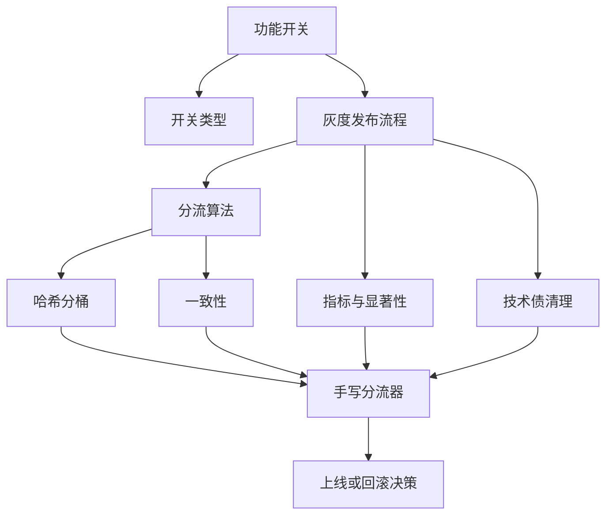
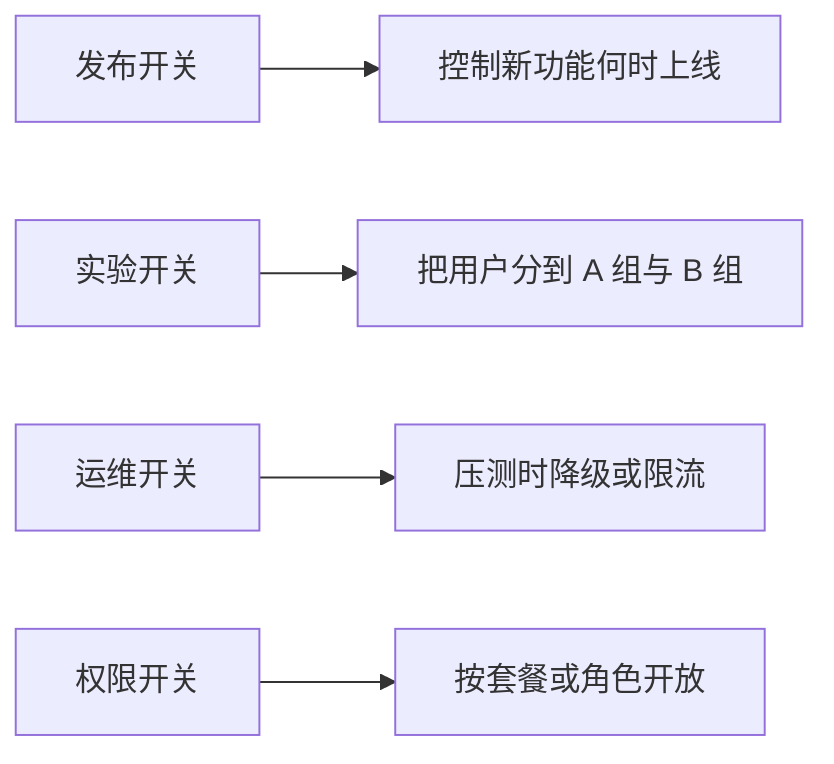
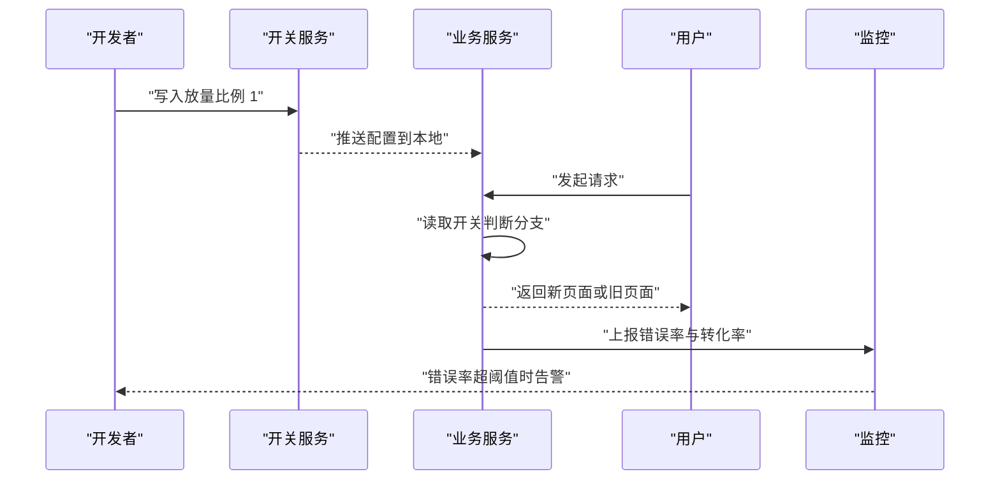
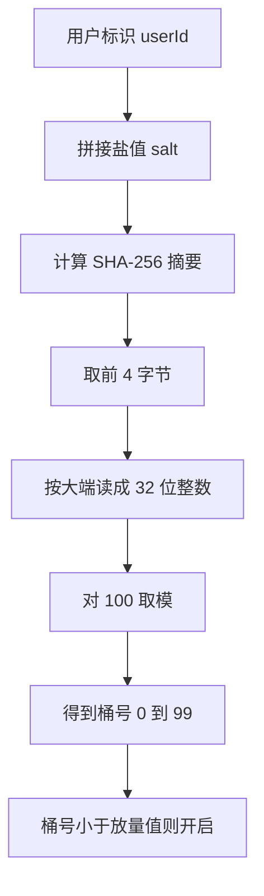
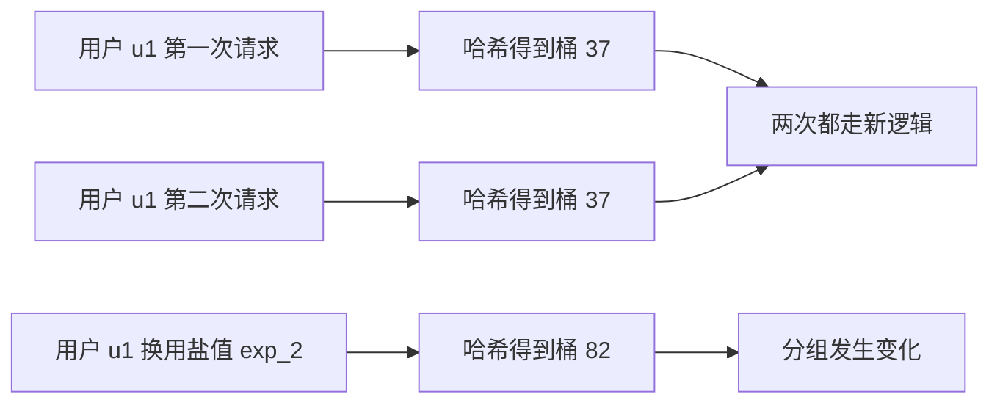
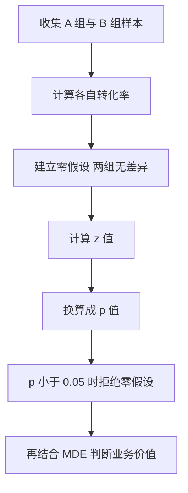
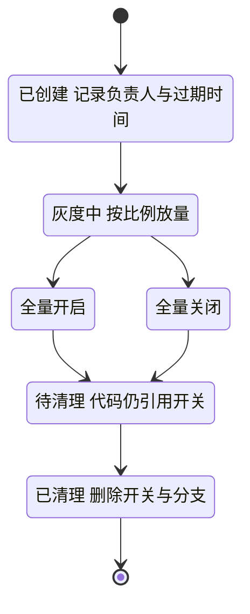
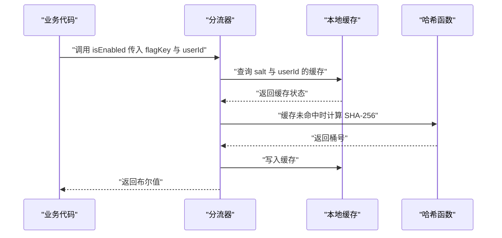

# 功能开关与 A/B 测试

!!! abstract "学完这一页你能"
    - 说出四种功能开关的用途，并为每种写出配置字段
    - 用 SHA-256 与取模实现一个哈希分桶函数
    - 解释同一用户反复请求为什么必须落在同一个桶
    - 用两比例 z 检验判断一次 A/B 实验的差异能否上线

## 0. 知识地图



建议先读第 1 节与第 2 节，把发布流程和分桶机制对上号。再读第 3 节到第 5 节，掌握一致性与统计判断。最后读第 6 节，把前面的零件拼成一个可运行的分流器。

## 1. 功能开关与灰度发布流程

**先想一个问题**
线上结算页改了版，产品想先放 1% 流量试跑。你手里只有一份代码和一批用户 ID。怎么让 1% 的人看到新版，其余人看到旧版？还要能随时一键关掉。

**心智模型**
!!! tip "心智模型"
    一句话模型：功能开关把代码部署和功能上线拆成两件独立的事。
    日常类比：大楼总闸已经合上，每个房间的灯还有自己的开关。
    类比不成立：软件开关可以按用户比例放量，房间灯只能全开或全关。

!!! note "术语：功能开关"
    功能开关（Feature Flag）是代码运行时读取的一份配置，用布尔值或百分比决定某段逻辑是否执行。例子：结算页开关 rollout 为 1，表示 1% 的用户走新逻辑。

**图解**


1. 发布开关服务于新功能上线，上线完成后应当删除。
2. 实验开关服务于指标对比，需要随机分组和统计检验。
3. 运维开关服务于线上稳定，例如关闭推荐算法走缓存。
4. 权限开关服务于商业规则，例如只有付费用户看到导出按钮。



1. 开发者在开关服务写入放量比例，例如 1。
2. 开关服务把配置推送到业务服务的本地内存。
3. 用户请求到达业务服务，服务读取配置决定走哪个分支。
4. 业务服务把指标上报到监控，错误率超阈值时通知开发者。

**一步一步来**

第 1 步：定义一份开关配置。
```js
const flagConfig = {
  // 开关名，全局唯一
  key: 'checkout_page_v2',
  // 总闸，关闭时任何人都走旧逻辑
  enabled: true,
  // 放量比例，取值 0 到 100
  rollout: 1,
  // 白名单用户始终放行
  allowList: ['user_0'],
  // 盐值，用于把用户打散到不同桶
  salt: 'checkout_page_v2',
};
```
**这段代码在做什么**

- key 是开关的唯一标识，日志与配置平台都靠它定位。
- enabled 是总闸，为 false 时后面的比例判断不再执行。
- rollout 表示放量百分比，1 表示 1% 的用户。
- allowList 用于白名单测试，名单内用户绕过比例判断。
- salt 参与哈希计算，换一个 salt 会得到另一套分组。

第 2 步：写一个判断函数。
```js
function isEnabled(config, userId) {
  // 总闸关闭时直接返回 false
  if (!config.enabled) return false;
  // 白名单用户始终放行
  if (config.allowList.includes(userId)) return true;
  // 放量为 0 时谁都不放行
  if (config.rollout <= 0) return false;
  // 放量为 100 时全部放行
  if (config.rollout >= 100) return true;
  // 其余情况比较桶号与放量值
  return bucketOf(userId, config.salt) < config.rollout;
}
```
**这段代码在做什么**

- 第 2 行是短路判断，总闸关闭时不再计算哈希。
- 第 4 行让白名单用户优先通过，方便内测。
- 第 6 行与第 8 行处理两个边界值，避免全量误判。
- 第 10 行把桶号与放量值比较，桶号小于放量值才放行。
- bucketOf 是第 2 节要实现的哈希分桶函数。

运行结果：bucketOf 尚未定义，这段代码单独运行会报 ReferenceError。完整版本见下面的动手验证。

**动手验证**
依赖：Node 20 及以上，只用内置模块 node:crypto 与 node:assert。
```js
import { createHash } from 'node:crypto';
import assert from 'node:assert/strict';

// 计算用户落在哪个桶，返回 0 到 99 的整数
function bucketOf(userId, salt) {
  const raw = `${salt}:${userId}`;
  const digest = createHash('sha256').update(raw).digest();
  return digest.readUInt32BE(0) % 100;
}

// 判断某个用户是否开启该功能
function isEnabled(config, userId) {
  if (!config.enabled) return false;
  if (config.allowList.includes(userId)) return true;
  if (config.rollout <= 0) return false;
  if (config.rollout >= 100) return true;
  return bucketOf(userId, config.salt) < config.rollout;
}

const base = {
  key: 'checkout_page_v2',
  enabled: true,
  rollout: 1,
  allowList: [],
  salt: 'checkout_page_v2',
};

// 总闸关闭时，白名单用户也返回 false
assert.equal(isEnabled({ ...base, enabled: false, allowList: ['user_0'] }, 'user_0'), false);
// 白名单用户在放量为 0 时仍然放行
assert.equal(isEnabled({ ...base, rollout: 0, allowList: ['user_0'] }, 'user_0'), true);
// 放量为 100 时所有用户放行
assert.equal(isEnabled({ ...base, rollout: 100 }, 'user_999'), true);
// 未开启的开关对普通用户返回 false
assert.equal(isEnabled(base, 'user_1'), false);

// 放量 10 时，1000 个用户里命中数应当在 60 到 140 之间
let hit = 0;
for (let i = 0; i < 1000; i += 1) {
  if (isEnabled({ ...base, rollout: 10 }, `user_${i}`)) hit += 1;
}
assert.ok(hit >= 60 && hit <= 140, `hit=${hit}`);

// 同一用户重复判断结果相同
const first = isEnabled(base, 'user_42');
for (let i = 0; i < 100; i += 1) {
  assert.equal(isEnabled(base, 'user_42'), first);
}

console.log('section 1 passed', { hit });
```
运行结果形如：
```text
section 1 passed { hit: 103 }
```
hit 的具体数值由 SHA-256 决定，断言要求它落在 60 到 140 之间。

**常见坑**
| 现象 | 原因 | 怎么修 |
|---|---|---|
| 白名单用户也没看到新功能 | 总闸 enabled 为 false，白名单判断在其后 | 先确认总闸，再检查白名单顺序 |
| 放量为 1 但没人命中 | 桶号范围是 0 到 99，1 只覆盖桶号 0 | 接受桶号 0 的约 1% 用户，或把 rollout 设成 2 |
| 想回滚却找不到开关 | 开关名只写在代码字面量里，配置平台没有 | 开关名统一注册到配置平台并记录负责人 |

**小结**

- 功能开关把部署与上线拆开，放量比例用百分比表达。
- 发布开关、实验开关、运维开关、权限开关的用途不同，生命周期也不同。
- 判断顺序是总闸、白名单、边界值、分桶比较。

## 2. 分流算法：哈希分桶

**先想一个问题**
后台有 100 万用户 ID，你要挑出 1% 的人。用随机数每次结果不同，用用户 ID 的末位数字又会集中在少数尾号。怎么分才稳定且均匀？

**心智模型**
!!! tip "心智模型"
    一句话模型：哈希把任意长度的标识压成一个固定范围内的整数。
    日常类比：把写着名字的纸条按姓氏笔画分进 100 个抽屉。
    类比不成立：哈希会碰撞，不同的名字可能进同一个抽屉；姓氏分法不会。

!!! note "术语：哈希函数"
    哈希函数把任意长度的输入映射成固定长度的输出，同一个输入永远得到同一个输出。例子：SHA-256 把 user_42 映射成 32 字节摘要。

**图解**


1. 把用户标识与盐值拼成一个字符串，盐值决定分组方案。
2. 计算 SHA-256，得到一个 32 字节的摘要。
3. 取摘要的前 4 字节，按大端顺序读成 32 位无符号整数。
4. 对 100 取模，把整数压缩到 0 到 99 的桶号。
5. 桶号小于放量值时走新逻辑，否则走旧逻辑。

**一步一步来**

第 1 步：拼接输入并计算摘要。
```js
import { createHash } from 'node:crypto';
import assert from 'node:assert/strict';

// 盐值与用户标识用冒号分隔
const raw = 'checkout_page_v2:user_42';
// 计算 SHA-256 摘要，结果为 32 字节
const digest = createHash('sha256').update(raw).digest();
// 断言摘要长度固定
assert.equal(digest.length, 32);
console.log('digest bytes', digest.length);
```
**这段代码在做什么**

- raw 把盐值放在前面，换盐值等于换一套分组。
- update 接收字符串，默认按 UTF-8 编码。
- digest 返回 Buffer，长度固定为 32 字节。
- 输出长度而不是十六进制值，便于跨环境核对。

运行结果：
```text
digest bytes 32
```

第 2 步：取前 4 字节转成整数。
```js
import { createHash } from 'node:crypto';
import assert from 'node:assert/strict';

const digest = createHash('sha256').update('salt:user_42').digest();
// 读取前 4 字节，按无符号大端整数解析
const num = digest.readUInt32BE(0);
// 32 位无符号整数上限是 4294967295
assert.ok(num >= 0 && num <= 4294967295);
console.log('num ok', Number.isInteger(num));
```
**这段代码在做什么**

- readUInt32BE(0) 从第 0 字节开始读 4 个字节。
- BE 表示大端，高位字节排在前面。
- 读出的整数范围是 0 到 4294967295。
- 这个整数在区间内接近均匀，适合做分桶输入。

运行结果：
```text
num ok true
```

第 3 步：取模得到桶号。
```js
import { createHash } from 'node:crypto';
import assert from 'node:assert/strict';

export function bucketOf(userId, salt) {
  // 拼接盐值与用户标识
  const raw = `${salt}:${userId}`;
  // 计算 SHA-256 摘要
  const digest = createHash('sha256').update(raw).digest();
  // 取前 4 字节转 32 位无符号整数
  const num = digest.readUInt32BE(0);
  // 对 100 取模得到 0 到 99 的桶号
  return num % 100;
}

const b = bucketOf('user_42', 'checkout_exp');
assert.ok(b >= 0 && b < 100);
console.log('bucket in range', true);
```
**这段代码在做什么**

- 函数接收用户标识与盐值两个参数。
- 哈希输入包含盐值，改变盐值会改变分桶结果。
- 取前 4 字节而不是全部 32 字节，减少计算量。
- 取模基数 100 与百分比放量对应，桶号即百分位。
- 返回值是整数，可直接与 rollout 比较。

运行结果：
```text
bucket in range true
```

**动手验证**
依赖：Node 20 及以上，只用内置模块 node:crypto 与 node:assert。
```js
import { createHash } from 'node:crypto';
import assert from 'node:assert/strict';

function bucketOf(userId, salt) {
  const digest = createHash('sha256').update(`${salt}:${userId}`).digest();
  return digest.readUInt32BE(0) % 100;
}

const counts = new Array(100).fill(0);
const total = 10000;
for (let i = 0; i < total; i += 1) {
  counts[bucketOf(`user_${i}`, 'exp_2024')] += 1;
}

// 每个桶的期望值是 100
const expected = total / 100;
// 最大偏差不超过期望值的 50%
const maxDeviation = Math.max(...counts.map((c) => Math.abs(c - expected)));
assert.ok(maxDeviation <= expected * 0.5, `maxDeviation=${maxDeviation}`);

// 所有桶的计数之和等于样本总数
assert.equal(counts.reduce((a, b) => a + b, 0), total);

// 同一输入重复计算结果一致
assert.equal(bucketOf('user_7', 'exp_2024'), bucketOf('user_7', 'exp_2024'));

console.log('section 2 passed', { maxDeviation });
```
运行结果形如：
```text
section 2 passed { maxDeviation: 28 }
```
28 是最大桶偏差的示例值，由哈希决定，断言要求它不超过 50。

**常见坑**
| 现象 | 原因 | 怎么修 |
|---|---|---|
| 放量比例偏离预期 | 直接对用户 ID 取模，尾号分布不均 | 改用 SHA-256 摘要取模 |
| 每次请求分组都在变 | 用了 Math.random 决定分支 | 改为哈希分桶并缓存结果 |
| 多个实验互相干扰 | 不同实验共用一个盐值 | 每个实验分配独立盐值 |

**小结**

- 哈希把用户标识映射成固定范围的整数，输入相同输出相同。
- 取前 4 字节转整数再对 100 取模，得到 0 到 99 的桶号。
- 桶号小于放量值表示放行，比例由取模基数决定。

## 3. 一致性：同一用户始终同一组

**先想一个问题**
用户第一次刷新看到了新版结算页，第二次刷新又回到旧版。客服收到投诉，说页面在变。问题出在哪？

**心智模型**
!!! tip "心智模型"
    一句话模型：一致性指同一个输入经过同一套规则，永远得到同一个输出。
    日常类比：同一份试卷重复批改，分数应当相同。
    类比不成立：用户换了设备或换了账号，输入的身份标识变了，结果可以不同。

!!! note "术语：分桶一致性"
    分桶一致性指给定用户标识与盐值，分桶函数每次都返回同一个桶号。例子：user_42 在盐值 exp_1 下永远落在同一个桶。

**图解**


1. 用户 u1 第一次请求经过哈希函数，落到桶 37。
2. 用户 u1 第二次请求经过同一个函数，仍然落到桶 37。
3. 两次结果相同，用户看到的分支不变。
4. 如果盐值从 exp_1 换成 exp_2，桶号可能变成 82。
5. 换盐值等于换一套实验，分组会重新洗牌。

**一步一步来**

第 1 步：把分桶结果写进缓存。
```js
export function makeBucketCache(bucketFn) {
  // 用 Map 保存键到桶号的映射
  const cache = new Map();
  return function cachedBucket(userId, salt) {
    // 缓存键同时包含盐值与用户标识
    const key = `${salt}:${userId}`;
    // 命中缓存时直接返回上次的桶号
    if (cache.has(key)) return cache.get(key);
    // 未命中时计算并写入缓存
    const bucket = bucketFn(userId, salt);
    cache.set(key, bucket);
    return bucket;
  };
}
```
**这段代码在做什么**

- 闭包让 cache 在多次调用之间保持存活。
- 缓存键包含 salt，换盐值不会读到旧结果。
- 命中缓存时跳过哈希计算。
- 未命中时计算一次，之后复用。
- 缓存大小随用户数增长，生产环境要设上限或换成外部缓存。

第 2 步：给开关加版本号。
```js
function isEnabled(config, userId, options) {
  // 配置版本与运行时版本不一致时拒绝使用旧结果
  if (config.version !== options.runtimeVersion) {
    throw new Error('config version mismatch');
  }
  if (!config.enabled) return false;
  if (config.allowList.includes(userId)) return true;
  return bucketOf(userId, config.salt) < config.rollout;
}
```
**这段代码在做什么**

- version 用来标记配置的修订号。
- runtimeVersion 由配置推送方维护。
- 版本不一致说明本地配置过期，抛错比返回旧结果安全。
- 生产环境通常改为拉取最新配置。
- 抛错会打断请求，需要配合重试或兜底分支。

第 3 步：登录前后使用同一个稳定标识。
```js
function stableId(user) {
  // 已登录用户用服务端用户 ID
  if (user.id) return `u:${user.id}`;
  // 未登录用户用浏览器生成的匿名 ID
  return `a:${user.anonymousId}`;
}
```
**这段代码在做什么**

- 已登录用户以用户 ID 为身份，跨设备保持一致。
- 未登录用户以匿名 ID 为身份，存在本地存储里。
- 前缀 u 与 a 避免两类 ID 撞车。
- 登录后身份变化会导致分组变化，需要业务侧接受这个跳变。

**动手验证**
依赖：Node 20 及以上，只用内置模块 node:crypto 与 node:assert。
```js
import { createHash } from 'node:crypto';
import assert from 'node:assert/strict';

function bucketOf(userId, salt) {
  const digest = createHash('sha256').update(`${salt}:${userId}`).digest();
  return digest.readUInt32BE(0) % 100;
}

// 同一用户同一盐值调用 1000 次，结果必须完全一致
const first = bucketOf('user_42', 'exp_1');
for (let i = 0; i < 1000; i += 1) {
  assert.equal(bucketOf('user_42', 'exp_1'), first);
}

// 不同用户在同一盐值下的桶号是 0 到 99 的整数
const other = bucketOf('user_43', 'exp_1');
assert.ok(Number.isInteger(other) && other >= 0 && other < 100);

// 缓存层返回的结果与直接计算一致
const cache = new Map();
function cachedBucket(userId, salt) {
  const key = `${salt}:${userId}`;
  if (!cache.has(key)) cache.set(key, bucketOf(userId, salt));
  return cache.get(key);
}
for (let i = 0; i < 10; i += 1) {
  assert.equal(cachedBucket('user_42', 'exp_1'), first);
}

console.log('section 3 passed', { consistent: true, first });
```
运行结果形如：
```text
section 3 passed { consistent: true, first: 37 }
```
37 是示例桶号，由哈希决定，断言保证 1000 次调用结果一致。

**常见坑**
| 现象 | 原因 | 怎么修 |
|---|---|---|
| 用户刷新后分组变化 | 登录前后身份标识从匿名 ID 换成用户 ID | 统一使用稳定标识，或接受登录后的一次跳变 |
| 同一用户读到旧配置 | 本地缓存未随配置版本失效 | 缓存键加入配置版本号 |
| 换盐值后仍是旧桶号 | 缓存键只用了用户标识 | 缓存键包含盐值 |

**小结**

- 一致性来自确定性哈希：同样的输入得到同样的桶号。
- 缓存要带上盐值或版本号，否则换实验后读到旧结果。
- 身份标识变化是分组跳变的主要原因，需要业务侧确认。

## 4. 指标与显著性基础

**先想一个问题**
实验跑了 3 天，A 组转化率 10.0%，B 组 10.5%。运营问能不能全量 B 组。你该怎么回答？

**心智模型**
!!! tip "心智模型"
    一句话模型：显著性回答的问题是，如果两组真的没差别，观察到当前差异的概率是多少。
    日常类比：抛 10 次硬币出现 7 次正面，不能据此判定硬币被做了手脚。
    类比不成立：统计显著只说明差异不像随机波动，不说明差异有业务价值。

!!! note "术语：p 值"
    p 值是在零假设成立时，观察到当前或偏差更大的结果的概率。例子：p 等于 0.03 表示两组无差异时，出现当前差异的概率是 3%。

!!! note "术语：最小可检测效应"
    最小可检测效应（Minimum Detectable Effect，MDE）是实验能稳定检出的最小相对提升。例子：MDE 为 0.5% 时，真实提升 0.1% 的实验很难被判为显著。

**图解**


1. 收集两组样本量与转化数。
2. 分别计算两组转化率，得到观测差值。
3. 建立零假设：两组真实转化率相同。
4. 用两比例 z 检验算出 z 值。
5. 把 z 值换算成 p 值。
6. p 值小于 0.05 时认为差异不像随机波动。
7. 最后看差值是否超过 MDE，决定是否上线。

**一步一步来**

第 1 步：准备样本数据。
```js
const experiment = {
  // A 组样本量
  nA: 6000,
  // A 组转化数
  xA: 600,
  // B 组样本量
  nB: 6000,
  // B 组转化数
  xB: 630,
};
```
**这段代码在做什么**

- nA 与 nB 是两组各自进入实验的用户数。
- xA 与 xB 是完成目标行为的用户数。
- 两组样本量相同，便于直接比较。
- 真实系统中两组比例可能不同，公式仍然适用。

第 2 步：计算两比例 z 值。
```js
function twoProportionZ(xA, nA, xB, nB) {
  // 各组观测转化率
  const pA = xA / nA;
  const pB = xB / nB;
  // 合并转化率用于计算标准误
  const pPool = (xA + xB) / (nA + nB);
  // 两比例差的标准误
  const se = Math.sqrt(pPool * (1 - pPool) * (1 / nA + 1 / nB));
  // z 等于率差除以标准误
  return (pA - pB) / se;
}
```
**这段代码在做什么**

- pA 与 pB 是两组观测转化率。
- pPool 把两组数据合并，作为零假设下的共同转化率。
- se 是差值的标准误，样本量越大 se 越小。
- z 值越大，说明观测差异偏离零假设越远。
- 返回值为负数表示 B 组高于 A 组。

第 3 步：把 z 值与临界值比较。
```js
// 双侧检验在 0.05 显著水平下的临界值
const Z_CRITICAL = 1.96;

function isSignificant(z) {
  // 取绝对值后与临界值比较
  return Math.abs(z) > Z_CRITICAL;
}

// 按 MDE 预估每组所需样本量
function requiredSampleSize(p, delta) {
  return Math.ceil((16 * p * (1 - p)) / (delta * delta));
}
```
**这段代码在做什么**

- 双侧检验关心两个方向的差异，所以取绝对值。
- 1.96 对应正态分布两侧各 0.025 的分位点。
- z 的绝对值大于 1.96 时，p 值小于 0.05。
- requiredSampleSize 用 16 这个常数近似 80% 把握度下的样本量。
- 公式假设两组样本量相同，且目标指标是比例。

**动手验证**
依赖：Node 20 及以上，只用内置模块 node:assert。
```js
import assert from 'node:assert/strict';

function twoProportionZ(xA, nA, xB, nB) {
  const pA = xA / nA;
  const pB = xB / nB;
  const pPool = (xA + xB) / (nA + nB);
  const se = Math.sqrt(pPool * (1 - pPool) * (1 / nA + 1 / nB));
  return (pA - pB) / se;
}

function requiredSampleSize(p, delta) {
  return Math.ceil((16 * p * (1 - p)) / (delta * delta));
}

const Z = 1.96;

// 两组完全相同，z 应当为 0
assert.equal(twoProportionZ(1000, 10000, 1000, 10000), 0);

// 率差同样是 0.5 个百分点，每组 6000 人时不显著
const zSmall = twoProportionZ(600, 6000, 630, 6000);
assert.ok(Math.abs(zSmall) < Z, `zSmall=${zSmall}`);

// 样本量放大十倍后，同样的率差显著
const zLarge = twoProportionZ(6000, 60000, 6300, 60000);
assert.ok(Math.abs(zLarge) > Z, `zLarge=${zLarge}`);

// 10% 基线、0.5 个百分点 MDE 需要每组约 57600 人
const n = requiredSampleSize(0.1, 0.005);
assert.equal(n, 57600);

console.log('section 4 passed', { zSmall, zLarge, n });
```
运行结果：
```text
section 4 passed { zSmall: -0.9029..., zLarge: -2.8553..., n: 57600 }
```

**常见坑**
| 现象 | 原因 | 怎么修 |
|---|---|---|
| 差异很大却判不显著 | 样本量不足，标准误偏大 | 按 MDE 公式预估样本量再开实验 |
| 实验跑了一天就下结论 | 提前偷看数据并反复检验 | 预先设定样本量与停止规则 |
| 统计显著但业务无感 | 只看了 p 值没看绝对差值 | 同时报告率差与置信区间 |

**小结**

- 两比例 z 检验把率差除以标准误，得到 z 值。
- 双侧检验用 1.96 作为 0.05 水平的临界值。
- 样本量按 MDE 公式预估，避免实验做到一半才发现检不出。

## 5. 技术债清理：开关生命周期

**先想一个问题**
半年后代码里有 40 个开关，其中 12 个已经全量，8 个已经关闭。没人记得它们属于谁。删掉怕出问题，留着又拖慢每次上线。怎么办？

**心智模型**
!!! tip "心智模型"
    一句话模型：功能开关是临时的脚手架，功能稳定后要拆掉。
    日常类比：装修用的脚手架，刷完墙就要拆，不能留在楼外。
    类比不成立：开关拆除前要确认它不再承担回滚职责，脚手架拆错不会让房子塌。

!!! note "术语：开关技术债"
    开关技术债指长期保留的开关带来的维护成本，包括分支覆盖、测试组合和配置理解成本。例子：一个开关让测试矩阵从 2 种变成 4 种。

**图解**


1. 开关创建时记录负责人与过期时间。
2. 灰度中按比例放量，同时观察指标。
3. 决策完成后进入全量开启或全量关闭。
4. 两个状态都要进入待清理，此时代码仍引用开关。
5. 清理阶段删除开关判断与配置，进入已清理。
6. 已清理是终态，代码中不再有该开关。

**一步一步来**

第 1 步：给开关补上元数据。
```js
const flags = [
  {
    key: 'checkout_page_v2',
    // 负责人，清理时能找到人确认
    owner: 'team-checkout',
    // 过期时间，到期进入清理提醒
    expireAt: '2024-06-01',
    // 生命周期状态
    status: 'full_on',
  },
];
```
**这段代码在做什么**

- owner 是团队名，便于清理时找到决策人。
- expireAt 是提醒日期，不是自动删除日期。
- status 记录生命周期阶段，供扫描脚本使用。
- 配置平台通常把这些字段与开关值一起存储。

第 2 步：扫描过期且未清理的开关。
```js
function findExpiredFlags(list, now) {
  return list.filter((flag) => {
    // 没有过期时间的开关不参与扫描
    if (!flag.expireAt) return false;
    // 已清理的开关跳过
    if (flag.status === 'cleaned') return false;
    // 当前时间超过过期时间才算过期
    return new Date(flag.expireAt).getTime() <= now;
  });
}
```
**这段代码在做什么**

- filter 保留满足条件的开关。
- 没有过期时间的开关被排除，避免误报。
- 已清理的开关被排除，避免重复提醒。
- 时间比较统一转成毫秒时间戳。
- 返回结果是数组，交给通知脚本处理。

第 3 步：按状态决定清理动作。
```js
function cleanupAction(flag) {
  // 全量开启表示新逻辑成为唯一分支
  if (flag.status === 'full_on') return 'remove_old_branch';
  // 全量关闭表示旧逻辑保留，删除新分支
  if (flag.status === 'full_off') return 'remove_new_branch';
  // 其余状态先推动决策
  return 'drive_decision';
}
```
**这段代码在做什么**

- full_on 的开关要删除旧分支，保留新分支。
- full_off 的开关要删除新分支，保留旧分支。
- 还在灰度中的开关先推动团队做决策。
- 删除动作要放在独立提交里，便于回滚。
- 删除前先确认没有其他代码读取该开关。

**动手验证**
依赖：Node 20 及以上，只用内置模块 node:assert。
```js
import assert from 'node:assert/strict';

const flags = [
  { key: 'a', owner: 't1', expireAt: '2024-01-01', status: 'full_on' },
  { key: 'b', owner: 't2', expireAt: '2024-01-01', status: 'cleaned' },
  { key: 'c', owner: 't3', expireAt: '2099-01-01', status: 'rolling_out' },
  { key: 'd', owner: 't4', status: 'full_off' },
];

function findExpiredFlags(list, now) {
  return list.filter((flag) => {
    if (!flag.expireAt) return false;
    if (flag.status === 'cleaned') return false;
    return new Date(flag.expireAt).getTime() <= now;
  });
}

const now = new Date('2024-07-01').getTime();
const expired = findExpiredFlags(flags, now);
// 只有 a 同时满足已过期且未清理
assert.deepEqual(expired.map((f) => f.key), ['a']);

function cleanupAction(flag) {
  if (flag.status === 'full_on') return 'remove_old_branch';
  if (flag.status === 'full_off') return 'remove_new_branch';
  return 'drive_decision';
}

assert.equal(cleanupAction(flags[0]), 'remove_old_branch');
assert.equal(cleanupAction(flags[3]), 'remove_new_branch');
assert.equal(cleanupAction(flags[2]), 'drive_decision');

// 清理后状态变化，不再被扫描到
const afterClean = flags.map((f) => (f.key === 'a' ? { ...f, status: 'cleaned' } : f));
assert.deepEqual(findExpiredFlags(afterClean, now), []);

console.log('section 5 passed', { expiredKeys: expired.map((f) => f.key) });
```
运行结果：
```text
section 5 passed { expiredKeys: [ 'a' ] }
```

**常见坑**
| 现象 | 原因 | 怎么修 |
|---|---|---|
| 开关过期无人处理 | 没有 owner 与过期时间 | 创建时强制填写两个字段 |
| 删除分支后线上出错 | 其他代码仍读取该开关 | 先搜索引用再删除，分多次提交 |
| 测试组合爆炸 | 多个开关在同一模块叠加 | 限制同一模块内并行开关的数量 |

**小结**

- 开关一创建就要有负责人和过期时间。
- 扫描脚本找出过期且未清理的开关并通知负责人。
- 全量后删除旧分支，关闭后删除新分支，删除要可回滚。

## 6. 手写一个分流器

**先想一个问题**
你已经会算桶号、做缓存、读指标。现在把它们组装成一个能在业务代码里调用的对象。这个对象需要哪些方法？

**心智模型**
!!! tip "心智模型"
    一句话模型：分流器是一个把开关配置和用户身份翻译成布尔值的函数集合。
    日常类比：前台查表，先看访客在不在贵宾名单，再看编号落在哪个区间。
    类比不成立：分流器还要处理配置热更新和缓存失效，前台查表不处理这些。

!!! note "术语：正交实验"
    正交实验指多个实验使用不同的盐值，让同一个用户在不同实验里落在互不相关的桶。例子：按钮颜色实验与文案实验各用一个盐值。

**图解**


1. 业务代码调用 isEnabled，传入开关名与用户标识。
2. 分流器从配置里取出该开关的盐值。
3. 分流器查询缓存，缓存键由盐值与用户标识组成。
4. 缓存命中时直接拿到桶号，跳过哈希计算。
5. 缓存未命中时计算哈希并写回缓存。
6. 分流器把桶号与放量值比较，返回布尔值。

**一步一步来**

第 1 步：定义配置结构。
```js
const flags = {
  checkout_page_v2: {
    key: 'checkout_page_v2',
    enabled: true,
    rollout: 10,
    salt: 'checkout_exp',
    allowList: ['user_0'],
    version: 3,
  },
  button_color: {
    key: 'button_color',
    enabled: true,
    rollout: 50,
    salt: 'button_exp',
    allowList: [],
    version: 1,
  },
};
```
**这段代码在做什么**

- 两个开关使用不同的盐值，分组互相独立。
- version 用于判断本地配置是否过期。
- allowList 为空数组时表示没有白名单。
- rollout 为 10 表示放量 10%。

第 2 步：实现带缓存的分桶方法。
```js
import { createHash } from 'node:crypto';

function bucketOf(userId, salt) {
  const digest = createHash('sha256').update(`${salt}:${userId}`).digest();
  return digest.readUInt32BE(0) % 100;
}

export class FlagClient {
  constructor(flags) {
    // 保存开关配置
    this.flags = flags;
    // 保存分桶结果的缓存
    this.cache = new Map();
  }
  bucket(flagKey, userId) {
    const salt = this.flags[flagKey].salt;
    // 缓存键由盐值与用户标识组成
    const key = `${salt}:${userId}`;
    if (!this.cache.has(key)) {
      this.cache.set(key, bucketOf(userId, salt));
    }
    return this.cache.get(key);
  }
}
```
**这段代码在做什么**

- bucketOf 是前面实现的哈希分桶函数。
- constructor 保存配置与缓存两个字段。
- bucket 方法先取盐值再拼缓存键。
- 命中缓存时直接返回，跳过哈希计算。
- 缓存让同一用户在同一进程内只计算一次。

第 3 步：实现 isEnabled 与配置更新。
```js
  isEnabled(flagKey, userId) {
    const flag = this.flags[flagKey];
    // 未配置的开关返回 false
    if (!flag) return false;
    if (!flag.enabled) return false;
    // 白名单优先放行
    if (flag.allowList.includes(userId)) return true;
    return this.bucket(flagKey, userId) < flag.rollout;
  }
  updateFlag(flagKey, patch) {
    // 合并新配置
    this.flags[flagKey] = { ...this.flags[flagKey], ...patch };
    // 删除该盐值下的缓存
    const prefix = `${this.flags[flagKey].salt}:`;
    for (const key of [...this.cache.keys()]) {
      if (key.startsWith(prefix)) this.cache.delete(key);
    }
  }
```
**这段代码在做什么**

- isEnabled 依次检查配置存在、总闸、白名单、分桶。
- 未配置的开关返回 false，避免抛错。
- updateFlag 合并新配置，支持热更新。
- 更新后按盐值前缀删除缓存，避免读到旧桶号。
- 复制键集合再删除，避免遍历时修改 Map。

**动手验证**
依赖：Node 20 及以上，只用内置模块 node:crypto 与 node:assert。
```js
import { createHash } from 'node:crypto';
import assert from 'node:assert/strict';

function bucketOf(userId, salt) {
  const digest = createHash('sha256').update(`${salt}:${userId}`).digest();
  return digest.readUInt32BE(0) % 100;
}

class FlagClient {
  constructor(flags) {
    this.flags = flags;
    this.cache = new Map();
  }
  bucket(flagKey, userId) {
    const salt = this.flags[flagKey].salt;
    const key = `${salt}:${userId}`;
    if (!this.cache.has(key)) this.cache.set(key, bucketOf(userId, salt));
    return this.cache.get(key);
  }
  isEnabled(flagKey, userId) {
    const flag = this.flags[flagKey];
    if (!flag) return false;
    if (!flag.enabled) return false;
    if (flag.allowList.includes(userId)) return true;
    return this.bucket(flagKey, userId) < flag.rollout;
  }
  updateFlag(flagKey, patch) {
    this.flags[flagKey] = { ...this.flags[flagKey], ...patch };
    const prefix = `${this.flags[flagKey].salt}:`;
    for (const key of [...this.cache.keys()]) {
      if (key.startsWith(prefix)) this.cache.delete(key);
    }
  }
}

const flags = {
  checkout_page_v2: { enabled: true, rollout: 10, salt: 'checkout_exp', allowList: ['user_0'] },
  button_color: { enabled: true, rollout: 50, salt: 'button_exp', allowList: [] },
};

const client = new FlagClient(flags);

// 未配置的开关返回 false
assert.equal(client.isEnabled('missing_flag', 'user_1'), false);
// 白名单用户放行
assert.equal(client.isEnabled('checkout_page_v2', 'user_0'), true);
// 总闸关闭后白名单也失效
client.updateFlag('checkout_page_v2', { enabled: false });
assert.equal(client.isEnabled('checkout_page_v2', 'user_0'), false);
client.updateFlag('checkout_page_v2', { enabled: true });

// 同一用户重复调用结果一致
const once = client.isEnabled('checkout_page_v2', 'user_42');
for (let i = 0; i < 100; i += 1) {
  assert.equal(client.isEnabled('checkout_page_v2', 'user_42'), once);
}

// 两个实验使用不同盐值，各自都能算出桶号
assert.ok(client.bucket('checkout_page_v2', 'user_42') >= 0);
assert.ok(client.bucket('button_color', 'user_42') >= 0);

// 放量全开
client.updateFlag('checkout_page_v2', { rollout: 100 });
assert.equal(client.isEnabled('checkout_page_v2', 'user_999'), true);

console.log('section 6 passed', { cacheSize: client.cache.size });
```
运行结果：
```text
section 6 passed { cacheSize: 3 }
```
三个缓存键分别是 checkout_exp:user_42、button_exp:user_42、checkout_exp:user_999。

**常见坑**
| 现象 | 原因 | 怎么修 |
|---|---|---|
| 配置更新后仍走旧分支 | 缓存未按盐值前缀清理 | 更新时删除对应前缀的缓存 |
| 开关不存在时抛错 | isEnabled 未处理 undefined 配置 | 返回 false 并记录告警 |
| 白名单失效 | allowList 字段缺失 | 配置里默认写空数组 |

**小结**

- 分流器把配置、哈希、缓存、白名单组装成一个类。
- 缓存键要包含盐值，配置更新后要按前缀清理。
- 未配置的开关返回 false，比抛错更适合线上调用。

## 综合对比

开关类型对比：

| 维度 | 发布开关 | 实验开关 | 运维开关 | 权限开关 |
|---|---|---|---|---|
| 主要目的 | 新功能安全上线 | 比较两个方案 | 降级与限流 | 按套餐开放 |
| 放量方式 | 按用户百分比 | 随机对半或按比例 | 全量切换 | 按用户属性判断 |
| 典型时长 | 几天到几周 | 一到四周 | 长期保留 | 长期保留 |
| 关键指标 | 错误率与延迟 | 转化率与留存 | 可用性与容量 | 付费转化 |
| 清理时机 | 全量后删除 | 决策后删除 | 通常不删 | 通常不删 |

分流算法对比：

| 算法 | 一致性 | 均匀性 | 换盐值影响 | 实现成本 |
|---|---|---|---|---|
| 随机数 | 无 | 好 | 无 | 低 |
| 用户 ID 取模 | 强 | 差 | 无 | 低 |
| SHA-256 取模 | 强 | 好 | 分组重排 | 中 |
| 一致性哈希 | 强 | 好 | 只影响部分用户 | 高 |

## 应用与行业实践

### 应用场景地图

| 场景 | 用到本页哪个知识点 | 典型技术选型 | 注意事项 |
| --- | --- | --- | --- |
| 后台管理页的万行表格改虚拟滚动 | 开关生命周期、灰度发布流程 | 服务端配置中心下发 + 前端读开关 | 管理员账号强制走新版本，避免管理者只看到半成品 |
| 低端安卓机的首屏图片格式切换 | 哈希分桶、指标与显著性基础 | 客户端开关 + 远端默认值（Firebase Remote Config） | 按设备 ID 分桶，未登录时没有用户 ID 可用 |
| 多人协作白板的协同算法替换 | 一致性：同一用户始终同一组 | 服务端开关（Unleash） | 按房间分桶，同一房间的成员必须同组 |
| 收银台支付渠道排序 | 分流算法、两比例 z 检验 | 服务端实验平台 + 统一求值接口 | 按用户分桶，不按订单，避免同一用户来回切换 |
| 搜索排序模型上线 | 一致性、指标与显著性基础 | 服务端开关 + 实验分层 | 同一用户不要同时进两个会互相影响的实验 |
| 新用户注册欢迎语文案 | A/B 测试流程、显著性判断 | 前端开关 + 曝光埋点 | 样本量不足时看 p 值会得出错误结论 |
| 邮件推送服务商切换 | 运维开关（kill switch） | 服务端开关 + 队列重试 | 送达率指标有延迟，关开关不能撤回已发出的邮件 |
| 计费页价格位数展示调整 | 开关配置字段、生命周期审计 | 配置中心 + 变更审计日志 | 涉及金额，开关值变更必须留痕 |

### 三个场景拆解

#### 场景 1：低端安卓机的首屏图片格式切换

**业务背景**：首屏要加载几十张商品图，低端机上解码耗时占了启动时间的一大块。用同一台设备在开发者工具里把 CPU 降速 4 倍，就能稳定复现卡顿。

**怎么用本页知识解决**：先做一个总开关，出问题一键关闭；再按设备 ID 做哈希分桶，先放 5% 流量。

```kotlin
// 开关配置由服务端下发，客户端保留一份本地默认值
data class Flag(val key: String, val enabled: Boolean, val rollout: Int, val salt: String)

fun bucket(id: String, salt: String, buckets: Int = 100): Int {
    // SHA-256 保证同样输入得到同样结果
    val digest = MessageDigest.getInstance("SHA-256")
        .digest("$salt:$id".toByteArray(Charsets.UTF_8))
    var v = 0
    for (i in 0 until 4) v = (v shl 8) or (digest[i].toInt() and 0xFF)
    // 取模落到 0..99 的桶号
    return (v and 0x7FFFFFFF) % buckets
}

fun isOn(flag: Flag, deviceId: String): Boolean {
    if (!flag.enabled) return false                     // 总开关关闭，全部走旧逻辑
    return bucket(deviceId, flag.salt) < flag.rollout    // 桶号小于灰度百分比才开
}
```

- `enabled` 与 `rollout` 分开：前者是开关，后者是放量旋钮，回退时只改前者。
- 分桶键用设备 ID，没用进程内随机数，重装前同一台设备始终同组。
- `salt` 参与哈希，换一次 salt 就重新洗牌，用于第二轮独立实验。
- 取模前清掉符号位，避免负数桶号导致判断结果反转。

**怎么度量收益**：用 Android Macrobenchmark 的 `timeToInitialDisplayMs` 与 `timeToFullDisplayMs` 对比两组，再用自定义埋点上报首屏可交互时间与图片解码失败率。同时核对两组样本比例是否接近 5% 与 95%。

**什么时候不该用**：

- 首屏只有一张几十 KB 的图标图，改动收益低于埋点和开关本身的维护成本。
- 启动路径不允许等待网络，配置服务不可用时必须直接返回本地默认值，而不是阻塞求值。

#### 场景 2：多人协作白板的协同算法替换

**业务背景**：多人同时拖动同一批元素时，旧算法会产生需要人工修复的冲突。用一个固定脚本让 5 个客户端同时操作同一份文档，就能复现冲突。

**怎么用本页知识解决**：分桶键从用户换成房间号，让同一房间的所有人始终走同一种算法。

```python
import hashlib

def room_bucket(room_id: str, salt: str, buckets: int = 100) -> int:
    # 分桶键是房间号，不是用户号
    digest = hashlib.sha256(f"{salt}:{room_id}".encode("utf-8")).hexdigest()
    return int(digest[:8], 16) % buckets

def use_new_algo(room_id: str) -> bool:
    if room_id in FORCE_ON:      # 内部测试房间强制走新算法
        return True
    if room_id in FORCE_OFF:     # 出问题的房间立即回退
        return False
    return room_bucket(room_id, "collab-algo") < 10   # 先放 10% 的房间
```

- 一个房间里两个人用不同算法，同一份文档会被两种规则改写，冲突反而变多。
- 强制名单放在分桶之前，回退时不用等配置下发，改内存名单即可生效。
- 灰度比例按房间算，房间人数差异大，所以业务指标要按房间汇总而不是按人汇总。
- 开关求值结果在房间创建时确定并缓存，房间存续期间不因配置变化而切换。

**怎么度量收益**：服务端统计冲突修复次数、同步失败率、文档快照体积，客户端上报单次操作的往返时延。对照方式是按房间维度分组，10% 房间跑新算法，其余跑旧算法。

**什么时候不该用**：

- 个人笔记类文档同时只有一个人编辑，协同算法不生效，分桶只增加一层判断。
- 新旧算法的数据格式不能双向转换，关掉开关后旧算法读不了新数据，这种情况靠开关回退会丢数据。

#### 场景 3：后台管理页的万行表格改虚拟滚动

**业务背景**：运营后台的单张表格要渲染两万行，滚动时掉帧，筛选一次会卡住几秒。用浏览器 Performance 面板录制 10 秒滚动，统计长任务数量即可复现。

**怎么用本页知识解决**：用服务端开关按员工号分桶，再用两比例 z 检验判断筛选完成率差异是不是噪声。

```python
from math import sqrt
from scipy.stats import norm

def two_proportion_z(n_a: int, c_a: int, n_b: int, c_b: int):
    p_a, p_b = c_a / n_a, c_b / n_b                 # 两组各自的完成率
    p = (c_a + c_b) / (n_a + n_b)                   # 合并完成率，用于算标准误
    se = sqrt(p * (1 - p) * (1 / n_a + 1 / n_b))    # 两比例差的标准误
    z = (p_b - p_a) / se                            # z 统计量
    p_value = 2 * (1 - norm.cdf(abs(z)))            # 双侧 p 值
    return round(p_b - p_a, 4), round(z, 3), round(p_value, 4)
```

- 先算合并完成率再算标准误，两组样本量不同时这种写法仍然成立。
- 双侧 p 值用于判断差异方向未定的情形，只有明确"新版不低于旧版"才考虑单侧。
- 内部后台样本量小，放量前要先估样本量，否则跑一周也未必能判定。
- 关开关的动作要和新前端资源解耦，避免回退时还要重新发版。

**怎么度量收益**：用 Chrome DevTools Performance 面板或 `PerformanceObserver` 的 longtask 条目统计总阻塞时长，业务侧看筛选完成率与 p95 耗时。判定用上面的 z 检验，α 取 0.05。

**什么时候不该用**：

- 表格只是导出后的静态报表，没有滚动和筛选交互，改造对象不存在。
- 使用者只有几十个内部账号，样本量撑不起统计检验，直接白名单放量或全量上。

### 行业先进实践

**统一的开关求值接口（出处：OpenFeature 官方规范文档，CNCF 项目）**
OpenFeature 把开关读取抽象成标准的求值接口，业务代码只依赖接口，具体服务由 Provider 对接。换服务商时改动集中在 Provider 层，业务代码不动。借鉴方式：先在项目里定义一层读开关的接口，参数只留开关 key 和求值上下文。

**灰度按 stickiness 字段分桶（出处：Unleash 开源项目文档）**
Unleash 的渐进放量策略允许指定分桶主体，可以按用户、按会话或随机，保证同一主体落点稳定。借鉴方式：把"分桶键"做成开关配置字段，而不是写死在代码常量里。

**配置走流式下发，并用代理收敛连接（出处：LaunchDarkly 官方文档）**
SDK 与服务端保持长连接，配置变更即时下发；Relay Proxy 让多个服务实例共用一个代理连接。借鉴方式：客户端启动读本地缓存，运行中订阅变更，不要每次请求都拉全量配置。

**线上并行跑新旧实现做对比（出处：GitHub Scientist 开源项目）**
Scientist 在线上同时执行旧路径和新路径，比较返回值并记录差异，对外只返回旧路径结果。重构类改动可以先用它跑影子流量，把差异率作为放量依据。借鉴方式：开关切流前先接一段对照运行，差异率归零后再切。

**远端参数必须有本地默认值（出处：Firebase Remote Config 官方文档）**
Remote Config 要求客户端内置默认值，取不到远端配置时用默认值继续运行，A/B 测试直接建立在同一批参数上。借鉴方式：开关求值失败时返回旧行为，不能让配置服务故障传导成启动失败。

### 从学到用：落地路线

**第 1 步：单页面试点。** 选一个前端或后台页面，给新实现加一个只对白名单开放的布尔开关。
验收标准：开关为 false 时页面行为与改造前一致，切换开关不需要发版。

**第 2 步：接分桶并放量。** 把开关接进哈希分桶函数，按 1%、5%、25% 逐步放开，同时埋点记录两组数据。
验收标准：同一用户连续请求 100 次落桶结果完全一致；两组样本比例与配置的放量比例偏差在 1 个百分点以内。

**第 3 步：抽公共层并推广。** 把分桶、本地默认值、配置订阅抽成公共库，接入统一配置中心，规定开关命名规范与必填字段。
验收标准：新增开关只改配置不改业务代码；每个开关都登记了负责人和计划清理日期。

**第 4 步：防回退。** 建开关台账，到期未清理的开关按周告警，全量稳定后一个发布周期内删掉旧分支。
验收标准：存量开关数量不增长；任取一个开关，能在 1 分钟内关闭并验证生效。

### 动手作业

**目标**：给一个本地页面加一个实验开关，跑通分桶、灰度、显著性判断和回退四件事。

**步骤**：

1. 写 `hashBucket(userId, salt, buckets)`，用 SHA-256 十六进制串前 8 位转整数后取模。
2. 造 10000 个用户 ID 分到 100 个桶，打印每桶人数与占比。
3. 取其中一个 ID 连续调用 100 次，打印所有返回值，确认只有一个取值。
4. 写开关配置：`key`、`enabled`、`rollout`、`salt`，并实现读取失败时返回旧行为的默认值。
5. 按 5% 放量把用户分两组，记录曝光数和转化数，写进 CSV。
6. 用两比例 z 检验算 p 值，按 α 取 0.05 给出能否上线的结论。
7. 写回退清单：关闭开关时要同步清理的缓存、队列消息和派发数据。

**验收标准**：

- 10000 个 ID 分入 100 桶后，任一桶占比与 1% 的偏差不超过 0.2 个百分点。
- 同一 ID 调用 100 次返回值只有一个，重复运行脚本结果相同。
- 把 `enabled` 改成 false 后所有用户走旧分支，业务代码不做改动。
- z 检验函数在 `n_a=1000, c_a=100, n_b=1000, c_b=130` 时返回的 p 值小于 0.05。
- 回退清单里每一项都写明了负责人和验证方法。

## 自测题

??? question "功能开关解决的核心问题是什么"
    - 把代码部署和功能上线拆成两件独立的事。
    - 允许按百分比放量，先让小部分用户使用。
    - 出问题时可以关闭开关快速回滚。
    - 上线完成后要清理开关，避免技术债。

??? question "为什么不能用用户 ID 对 100 取模来分桶"
    - 用户 ID 末位数字的分布由业务规则决定，可能集中在少数尾号。
    - 分布不均会让实际放量比例偏离配置值。
    - 同一批用户可能长期集中在同一个桶。
    - 改用哈希摘要取模后，尾号规则不再影响结果。

??? question "哈希分桶中 salt 的作用是什么"
    - salt 参与哈希输入，改变 salt 会改变整套分组。
    - 不同实验使用不同 salt，分组互相独立。
    - 缓存键必须包含 salt，否则会读到旧桶号。
    - 轮换 salt 等于重新洗牌，已放量用户可能掉出实验。

??? question "同一用户在两次请求中被分到不同组，可能有哪些原因"
    - 身份标识变化，例如登录前后匿名 ID 换成用户 ID。
    - 配置里的 salt 被修改或轮换。
    - 代码使用了随机数而不是哈希分桶。
    - 缓存与直接计算的结果不一致，例如缓存键漏了 salt。

??? question "p 值等于 0.03 代表什么"
    - 含义是零假设成立时，观察到当前或偏差更大的结果的概率是 3%。
    - 它不是两组差异为真的概率。
    - 显著性水平需要在实验开始前设定，常见为 0.05。
    - 判定上线还要看绝对差值是否超过 MDE。

??? question "样本量翻倍对显著性判断有什么影响"
    - 标准误按根号二分之一缩小。
    - 同样的率差更容易被判定为显著。
    - 统计显著不代表业务价值变大。
    - 实验开始前应估算所需样本量并设定停止规则。

??? question "开关技术债从哪些地方产生"
    - 分支组合随开关数量增长，测试矩阵跟着膨胀。
    - 过期开关无人清理，新成员读不懂配置含义。
    - 开关没有负责人，出问题时找不到决策人。
    - 删除分支前要搜索引用，遗漏会导致线上出错。

??? question "正交实验怎么实现"
    - 每个实验使用独立的 salt。
    - 同一个用户在不同实验里得到互相独立的桶号。
    - 配置平台记录每个实验的 salt 与版本。
    - 避免两个实验共用 salt 导致分组重叠。

## 延伸阅读

- Node.js 官方文档：Crypto 模块的 createHash、hash.update、hash.digest 章节
- MDN Web Docs：Web Crypto API 的 SubtleCrypto.digest 章节
- MDN Web Docs：HTTP 缓存与 Cache-Control 章节
- 各云厂商功能开关服务官方文档：需核对官方文档，确认开源 SDK 支持的分桶算法与配置版本字段
- 需核对官方文档：最小可检测效应与样本量公式在你们使用的实验平台中的章节名与默认参数
