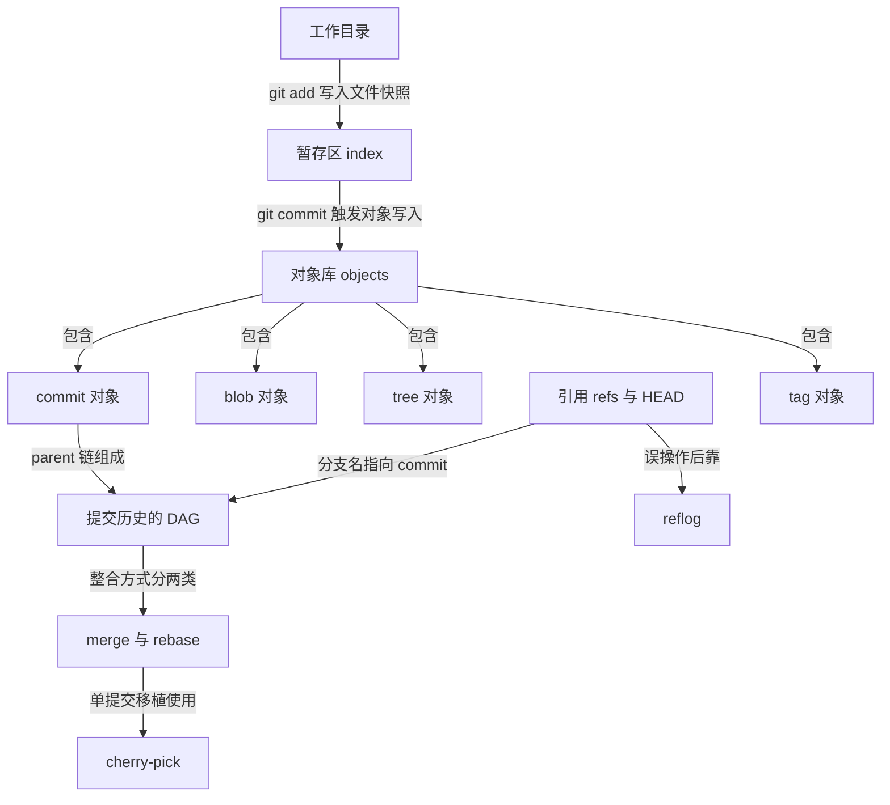
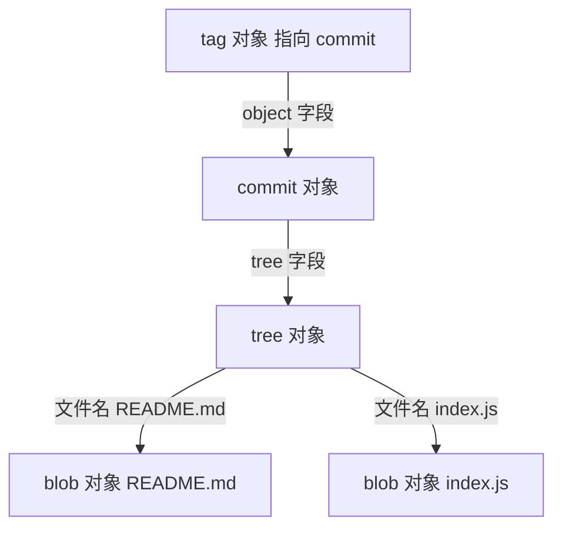
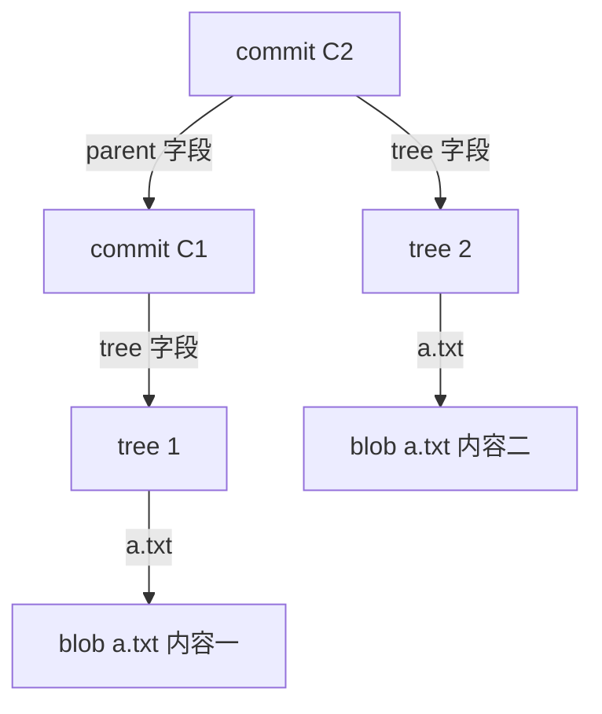
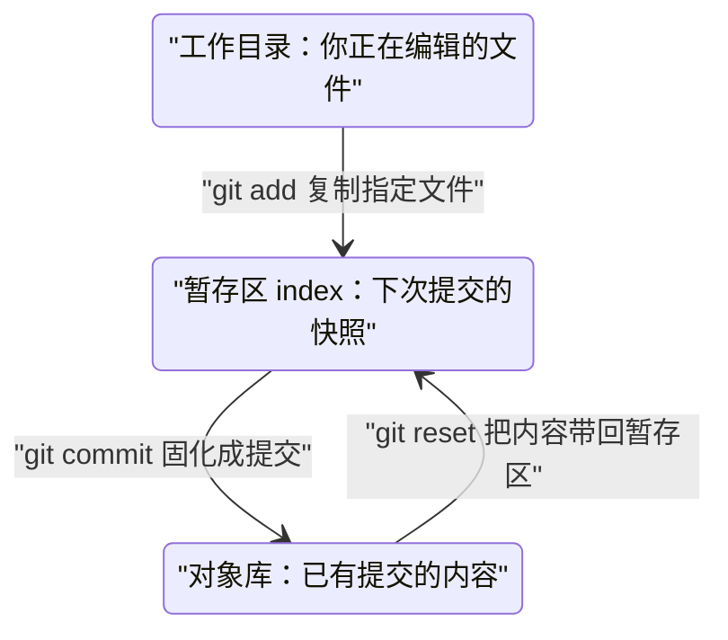
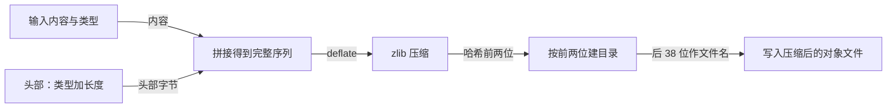
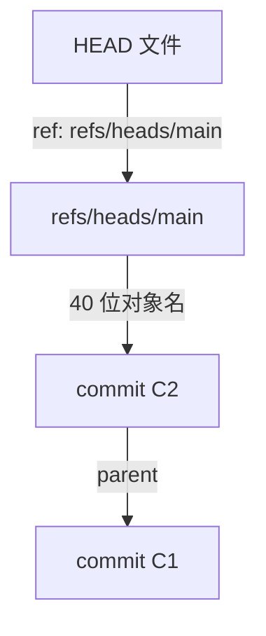
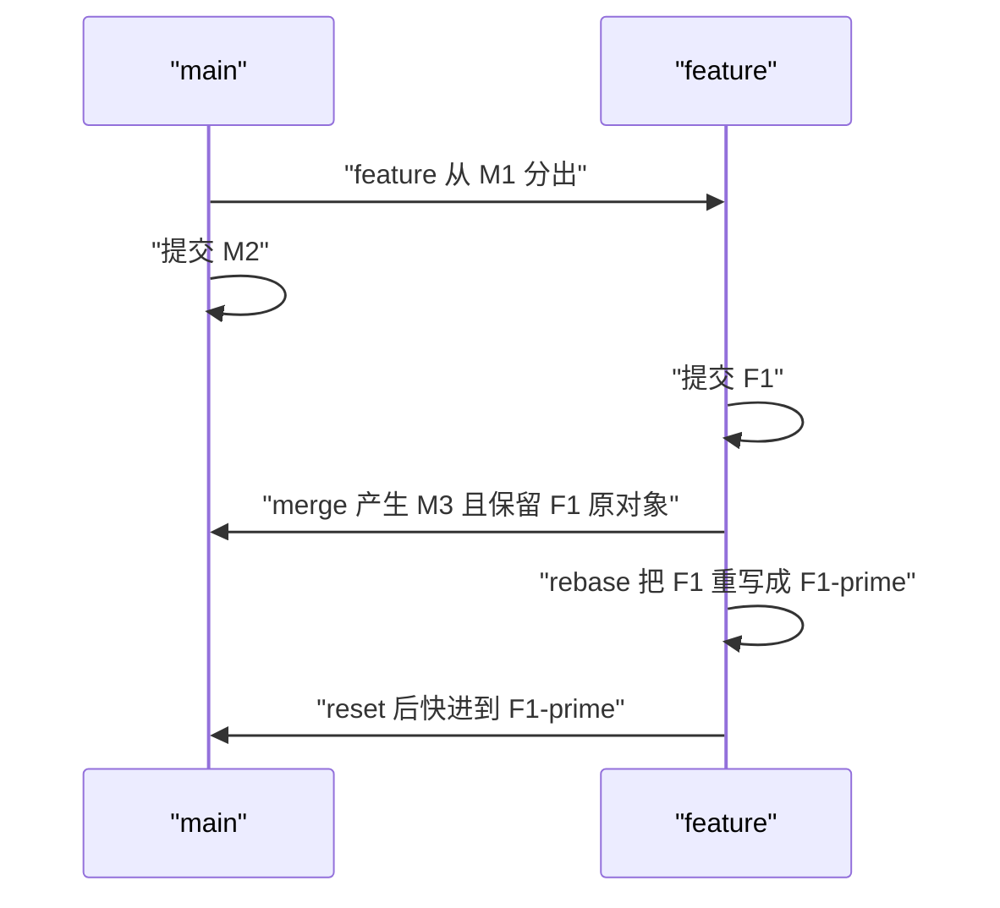
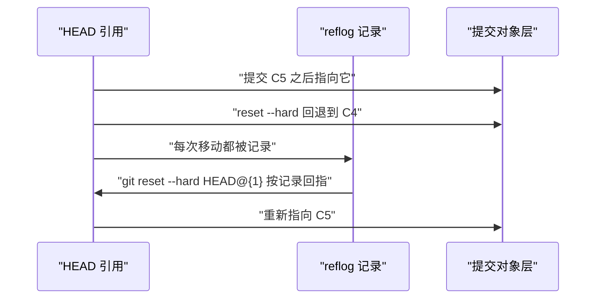

# Git 内部原理与协作流程

!!! abstract "学完这一页你能"
    - 说出 blob、tree、commit、tag 四类对象分别存什么，并画出一次提交里对象之间的指向链。
    - 区分工作目录、暂存区、对象库三个区域，说出 git add 与 git commit 各自写入哪个区域。
    - 用 Node 20 独立实现迷你 Git：计算内容哈希、写入对象文件、再生成一个 commit 对象。
    - 按场景在 merge、rebase、cherry-pick 之间做选择，并用 reflog 找回丢失的提交、脱离 detached HEAD 状态。

## 0. 知识地图



建议这样读：先按 1 到 3 节建立「对象、提交链、暂存区」的底层认知，再读第 4 节自己动手写一遍，最后才读 5 到 7 节的引用与协作命令。第 5 节之前不必纠结 merge 和 rebase，它们都建立在对象模型之上。

## 1. 对象模型：blob、tree、commit、tag

**先想一个问题**：你同事在 Git 历史里看到文件只改了 3 行，却多出 200 个 commit。他问你：Git 每次提交是只存差异，还是存整份快照？如果每次存一整份文件，仓库会不会很快占满硬盘？

**心智模型**

!!! tip "心智模型"
    一句话模型：Git 的对象库是一个按内容寻址的文件仓库，内容不变则地址不变。日常类比：把 Git 对象库想成一家快递仓库，每个包裹的唯一编号由里面的东西本身算出，东西一样编号就一样。类比在哪里不成立：快递仓库会堆满重复货物，而 Git 对相同内容只存一份，多个 commit 可以共同指向同一个 blob。

!!! note "术语：按内容寻址（content-addressed）"
    指用「内容本身计算出的哈希值」作为内容在仓库里的唯一地址。例子：字符串 `hello` 的 blob 对象名是它经过 SHA-1 计算再按对象格式封装后得到的 40 位十六进制数，内容不变则这个名字不变。

**图解**

Git 内部有四大对象，它们像俄罗斯套娃一样层层指向：



1. 最顶层是 commit 对象，它保存作者、提交信息、时间，以及一个指向根 tree 的字段。
2. tree 对象保存一个目录的快照，每条记录是「文件名 + 指向该文件 blob 的哈希」。
3. blob 对象只保存文件字节内容，不保存文件名。
4. tag 对象保存标签名和指向某个 commit 的引用，用于给发布版本打标记。

**一步一步来**

第 1 步：创建一个 blob 对象并查看它的类型。

这一步要做什么：把一段文本存入 Git 对象库，验证 blob 只存内容不存文件名。

```bash
# 把文本写入一个新文件
echo "hello git" > note.txt
# 计算并存储 blob 对象，返回 40 位对象名
git hash-object -w note.txt
# 查看这个对象的真实类型
git cat-file -t <上一步输出的对象名>
```

**这段代码在做什么**

- `git hash-object -w` 读取 note.txt 内容，写入对象库，输出对象名。
- `git cat-file -t` 读取对象头部，打印该对象的类型。
- 输出结果是 `blob`，说明这个阶段文件内容已进库，但文件名还没进库。

运行结果（对象名以你本机实际输出为准）：

```text
ce013625030ba8dba906f756967f9e9ca394464a
blob
```

**这段输出表示**

- 第一行是 40 位十六进制对象名。
- 第二行确认这是一个 blob 对象。

第 2 步：查看 blob 里到底存了什么。

这一步要做什么：反查对象内容，验证 blob 不存文件名。

```bash
# 查看 blob 对象的原始内容
git cat-file -p <同一个对象名>
```

**这段代码在做什么**

- `git cat-file -p` 把对象的内容按类型友好地展开。
- 输出只有 `hello git` 加一个换行，没有文件名 note.txt。
- 这证明文件名由上层 tree 对象保存，blob 只保存字节。

运行结果：

```text
hello git
```

**动手验证**

把上述对象模型验证合成一个 Node 脚本。

```javascript
// 验证脚本：verify-objects.mjs
// 依赖：Node 20+ 内置模块；本机需要安装 git 命令行工具
import { execSync } from 'node:child_process';
import { mkdtempSync, writeFileSync } from 'node:fs';
import { tmpdir } from 'node:os';
import { join } from 'node:path';
import assert from 'node:assert/strict';

const dir = mkdtempSync(join(tmpdir(), 'git-obj-'));
execSync('git init -q', { cwd: dir });
execSync('git config user.email t@example.com', { cwd: dir });
execSync('git config user.name t', { cwd: dir });
writeFileSync(join(dir, 'note.txt'), 'hello git\n');
execSync('git add note.txt', { cwd: dir });
execSync('git commit -q -m first', { cwd: dir });

// 根 tree 对象的类型必须是 tree
const rootTree = execSync('git rev-parse HEAD^{tree}', { cwd: dir }).toString().trim();
assert.equal(execSync(`git cat-file -t ${rootTree}`, { cwd: dir }).toString().trim(), 'tree');

// blob 对象的内容必须等于原始文件内容
const blobHash = execSync(`git rev-parse HEAD:note.txt`, { cwd: dir }).toString().trim();
assert.equal(execSync(`git cat-file -p ${blobHash}`, { cwd: dir }).toString(), 'hello git\n');

console.log('rootTree=%s blobHash=%s', rootTree, blobHash);
```

预期输出：两行 `rootTree=40位哈希 blobHash=40位哈希`，且脚本以退出码 0 结束，说明三条断言全部通过。

**常见坑**

| 现象 | 原因 | 怎么修 |
| --- | --- | --- |
| `git cat-file -t` 报错找不到对象 | 对象名输入不完整或拼错 | 复制 `git hash-object -w` 返回的完整 40 位对象名 |
| 往 blob 里写内容后找不到文件名 | blob 只存字节，不存路径 | 用 tree 对象或 `git ls-tree` 查看文件名与哈希的映射 |
| 同一份内容 `hash-object` 结果每次相同 | 按内容寻址：内容不变则哈希不变 | 这是 Git 去重的基础，不必修改 |

**小结**

- blob、tree、commit、tag 四类对象分工不同：内容、目录、提交、标签。
- blob 不保存文件名，文件名由 tree 对象的记录保存。
- 内容不变则对象名不变，这是 Git 去重和校验的基础。

## 2. 提交历史是 DAG：parent 链与一次完整提交

**先想一个问题**：小明在 main 分支提交了 A，又切出 feature 分支提交了 B，随后 main 分支也提交了 C。现在 git log 画出的图不再是直线。Git 是怎么描述这种分叉关系的？

**心智模型**

!!! tip "心智模型"
    一句话模型：每个 commit 都记录自己的父 commit，分叉和合并靠 parent 链表达。日常类比：把提交历史想成家谱树，每个 commit 记录自己的父辈，合并时一个新 commit 同时记录两个父辈。类比在哪里不成立：家谱无法删改，Git 历史可以被 rebase 重写，重写后旧节点仍靠 reflog 存活一段时间。

!!! note "术语：DAG（有向无环图）"
    一种每条边都有方向、且沿边无法走回原点的图结构。例子：commit 图的每条边从子 commit 指向父 commit，因此只能向过去回溯，不会形成循环，这就是 DAG。

**图解**

一次完整提交包含三类对象，同时每个 commit 都沿 parent 指向上一个 commit：



1. C1 是 C2 的父提交，二者通过 parent 字段形成向过去延伸的链。
2. 每个 commit 指向一个 tree，tree 里的每条记录指向对应 blob。
3. 若 a.txt 内容变了，T1 指向旧 blob，T2 指向新 blob，旧 blob 仍留在对象库。
4. 未变化的文件会继续指向同一个 blob，Git 不会重复存储。

**一步一步来**

第 1 步：创建一个仓库并制造两个有父子关系的提交。

这一步要做什么：用两次提交建立一条双节点的提交链，供后续查看 parent 字段。

```bash
# 初始化一个临时仓库并配置最小签名
git init demo-commit
cd demo-commit
git config user.email t@example.com
git config user.name t

# 建立第一个提交
echo one > a.txt
git add a.txt
git commit -m "first"

# 建立第二个提交，它是第一个提交的子提交
echo two > a.txt
git add a.txt
git commit -m "second"
```

**这段代码在做什么**

- 第一次 commit 生成 C1，它的 parent 为空或不存在，因为这是首个提交。
- 修改 a.txt 后再 commit 生成 C2，它的 parent 字段指向 C1 的对象名。
- 两次 commit 各自对应不同的 tree 和不同的 blob，旧 blob 仍被保留。

第 2 步：查看 C2 的 parent 字段，确认链式关系。

这一步要做什么：读取 C2 的原始内容，验证 parent 字段确实指向 C1。

```bash
# 打印 C2 的完整对象内容
git cat-file -p HEAD
# 打印 C1 的父提交行，验证第一个提交没有 parent
git cat-file -p HEAD^ | grep parent || echo "这个提交没有父提交"
```

**这段代码在做什么**

- `git cat-file -p HEAD` 展开 C2 原始内容，会显示一行 `parent <C1对象名>`。
- `HEAD^` 表示 HEAD 的父提交，也就是 C1。
- 第二个命令对 C1 查找 parent 行，找不到时打印「这个提交没有父提交」。

运行结果（C1 对象名以本机为准）：

```text
tree 8b4e...
parent 28a1...
author t <t@example.com> 1700000000 +0800
committer t <t@example.com> 1700000000 +0800

second
```

**动手验证**

合成一个脚本，验证 parent 链确实是一条 DAG 的边。

```javascript
// 验证脚本：verify-dag.mjs
// 依赖：Node 20+ 内置模块；本机需要 git
import { execSync } from 'node:child_process';
import { mkdtempSync, writeFileSync, appendFileSync } from 'node:fs';
import { tmpdir } from 'node:os';
import { join } from 'node:path';
import assert from 'node:assert/strict';

const dir = mkdtempSync(join(tmpdir(), 'git-dag-'));
execSync('git init -q', { cwd: dir });
execSync('git config user.email t@example.com', { cwd: dir });
execSync('git config user.name t', { cwd: dir });
writeFileSync(join(dir, 'a.txt'), 'one\n');
execSync('git add a.txt && git commit -q -m first', { cwd: dir });
appendFileSync(join(dir, 'a.txt'), 'two\n');
execSync('git add a.txt && git commit -q -m second', { cwd: dir });

const c2 = execSync('git rev-parse HEAD', { cwd: dir }).toString().trim();
const c1 = execSync('git rev-parse HEAD^', { cwd: dir }).toString().trim();
const c2Body = execSync(`git cat-file -p ${c2}`, { cwd: dir }).toString();
assert.ok(c2Body.includes(`parent ${c1}`), 'C2 的 parent 应指向 C1');
assert.notEqual(c1, c2);
console.log('C1=%s C2=%s', c1, c2);
```

预期输出：两行对象名，且断言通过退出码 0。

**常见坑**

| 现象 | 原因 | 怎么修 |
| --- | --- | --- |
| `HEAD^` 报错 | 仓库只有一个提交，没有父节点 | 先在仓库里提交两次 |
| C2 的 parent 行提到的对象名与 `rev-parse HEAD^` 不同 | 读错对象，或 HEAD 状态不对 | 用 `git rev-parse HEAD HEAD^` 同时查看两个对象名核对 |
| 改了一行后仓库没有变大多少 | 只新增一个 blob，tree 与 commit 都很小 | 观察 `git count-objects -v` 的结果验证对象增量 |

**小结**

- commit 通过 parent 字段形成单向链，合并提交有多个 parent 字段。
- 每个 commit 指向一个 tree，tree 的完整内容就是当时的工作区快照。
- 这种链式结构画出的是 DAG，而不是线性数组。

## 3. 暂存区：index

**先想一个问题**：琳琳运行 `git add a.py` 后，又改动了 a.py，然后直接 `git commit -m "..."`。她以为刚才的改动会一起提交，结果 Git 只提交了第一次 `git add` 时的那版。为什么会这样？

**心智模型**

!!! tip "心智模型"
    一句话模型：暂存区是「下一次提交的预演区」，git add 是在向这份预演区复制快照。日常类比：把暂存区想成舞台候场区，演员是否上场取决于他有没有站进候场区，而不是他人在不在剧场。类比在哪里不成立：剧场里同一演员只有一个身体，而 Git 对同一文件可在工作目录和暂存区各存一份不同版本。

!!! note "术语：暂存区（index / staging area）"
    保存「下一次 commit 该包含哪些文件版本」的中间区域。例子：`git add a.txt` 后，a.txt 当前版本进入暂存区，之后修改 a.txt 再提交，提交内容仍是 add 时刻的版本。

**图解**

三个区域之间的关系用一个状态图表示：



1. 编辑发生在工作目录，此时提交不会包含这些变化。
2. `git add` 把当前文件内容复制进暂存区，形成下次提交候选。
3. `git commit` 把暂存区整体固化成新 commit。
4. 若 add 之后又改动文件，工作目录与暂存区就不再一致，提交只会带走暂存区版本。

**一步一步来**

第 1 步：制造「工作目录与暂存区不一致」的状态。

这一步要做什么：在同一文件上先 add，再修改，观察 status 同时出现两条记录。

```bash
git init demo-index
cd demo-index
git config user.email t@example.com
git config user.name t

# 第一版写入并暂存
printf "version 1\n" > a.txt
git add a.txt
# add 之后再改，制造工作目录与暂存区不一致
printf "version 2\n" > a.txt

# 查看两个区域的差异
git status --short
```

**这段代码在做什么**

- `git add a.txt` 把 version 1 写入暂存区。
- 随后 `printf` 把工作目录内容改成 version 2，但没有再次 add。
- `git status --short` 会输出 `M a.txt` 与 `MM a.txt` 相关形式，展示两个区域的差异。

运行结果（不同 Git 版本的简写形式略有差异）：

```text
MM a.txt
```

**这段输出表示**

- 左侧 M 表示暂存区相对 HEAD 有修改，已经暂存的是 version 1。
- 右侧 M 表示工作目录相对暂存区有修改，未暂存的是 version 2。
- 两条变化记录来自同一个文件，说明 add 时刻与当前文件内容不同。

第 2 步：验证提交只会带走暂存区版本。

这一步要做什么：直接提交，不再次 add，验证提交里保存的是 version 1。

```bash
git commit -m "stage only"
# 查看提交里保存的内容
git show HEAD:a.txt
# 再看工作目录当前内容
cat a.txt
```

**这段代码在做什么**

- 提交时 Git 读取暂存区版本，即 version 1。
- `git show HEAD:a.txt` 输出的应是 version 1。
- `cat a.txt` 输出的应是 version 2，两者不同，说明未暂存的改动没有进入提交。

运行结果：

```text
version 1
version 2
```

**动手验证**

合成一个脚本，断言提交内容与工作目录内容不同。

```javascript
// 验证脚本：verify-index.mjs
// 依赖：Node 20+ 内置模块；本机需要 git
import { execSync } from 'node:child_process';
import { mkdtempSync, writeFileSync } from 'node:fs';
import { tmpdir } from 'node:os';
import { join } from 'node:path';
import assert from 'node:assert/strict';

const dir = mkdtempSync(join(tmpdir(), 'git-idx-'));
execSync('git init -q', { cwd: dir });
execSync('git config user.email t@example.com', { cwd: dir });
execSync('git config user.name t', { cwd: dir });
writeFileSync(join(dir, 'a.txt'), 'version 1\n');
execSync('git add a.txt', { cwd: dir });
writeFileSync(join(dir, 'a.txt'), 'version 2\n');
execSync('git commit -q -m staged', { cwd: dir });

const committed = execSync('git show HEAD:a.txt', { cwd: dir }).toString();
const working = execSync('cat a.txt', { cwd: dir }).toString();
assert.equal(committed, 'version 1\n');
assert.equal(working, 'version 2\n');
console.log('committed=%s working=%s', committed.trim(), working.trim());
```

预期输出：`committed=version 1 working=version 2`，脚本退出码 0。

**常见坑**

| 现象 | 原因 | 怎么修 |
| --- | --- | --- |
| 提交后发现少了一个文件的改动 | 改动之后没有重新 `git add` | 提交前用 `git status` 检查未暂存区域 |
| 想撤销 add 又不想丢文件 | `git reset` 不带参数可把暂存区重置到 HEAD | 使用 `git reset HEAD a.txt` 把文件从暂存区移出 |
| 用 `git commit -a` 提交仍漏掉新文件 | `-a` 只更新已跟踪文件，不包含未跟踪文件 | 先用 `git add` 显式加入新文件 |

**小结**

- 暂存区是下一次提交的预演区，`git add` 决定下一版快照内容。
- 提交只读取暂存区，不读取工作目录。
- 用 `git status` 检查两个区域差异，是提交前的必要动作。

## 4. 手写迷你 Git：对象存储与提交

**先想一个问题**：小李说不读源码就不会真正理解 Git。于是你想：能不能只借助 Node 20 的标准库，自己实现一个能存对象、能生成 commit 的迷你 Git？

**心智模型**

!!! tip "心智模型"
    一句话模型：写迷你 Git 就是实现三件事：算哈希、压缩、按头两位建目录。日常类比：把写入对象库想成邮局分拣，先算包裹编号，再按编号前两位放进对应小袋，最后压缩封存。类比在哪里不成立：邮局分拣通常只看目的地，Git 的编号完全由包裹内容本身决定，改一个字节编号就全变。

!!! note "术语：对象封装格式（object serialization）"
    一个对象在落盘前被编码成「类型 + 空格 + 内容字节长度 + NUL + 内容」的字节序列。例子：类型为 blob、内容为 `hi` 的封装序列是 `blob 2\0hi`，其中 2 是内容的字节长度。

**图解**

迷你 Git 从输入到落盘的完整数据流：



1. 输入是「对象类型 + 原始内容字节」。
2. 先拼接头部：`类型 + 空格 + 长度 + 空字节`。
3. 把「头部 + 内容」作为整体做 SHA-1 得到对象名。
4. 再对完整序列做 zlib 压缩。
5. 压缩结果写到 `.git/objects/<前两字符>/<后38字符>`。

**一步一步来**

第 1 步：实现 hashObject，完成哈希计算与压缩落盘。

这一步要做什么：写一个 `writeObject` 函数，输入类型与内容，输出 40 位对象名并写入对象文件。

```javascript
// 文件名：mini-git-lib.mjs 的 writeObject 部分
import { createHash } from 'node:crypto';
import { deflateSync } from 'node:zlib';
import { mkdirSync, writeFileSync, existsSync } from 'node:fs';
import { join } from 'node:path';

export function writeObject(objectsDir, type, content) {
  // 封装头部：type + 空格 + 内容字节数 + NUL
  const header = Buffer.from(`${type} ${content.length}\0`, 'utf8');
  const full = Buffer.concat([header, Buffer.from(content)]);
  // 用 SHA-1 计算对象名
  const hash = createHash('sha1').update(full).digest('hex');
  const dir = join(objectsDir, hash.slice(0, 2));
  const file = join(dir, hash.slice(2));
  if (!existsSync(file)) {
    mkdirSync(dir, { recursive: true });
    // 压缩后落盘
    writeFileSync(file, deflateSync(full));
  }
  return hash;
}
```

**这段代码在做什么**

- 对象名必须先算，因为目录名与文件名都来自它。
- `full` 是「头部 + 内容」的完整字节序列，哈希与压缩都基于它。
- 写入前判断文件存在，是为了避免重复写，模拟内容寻址去重。
- 目录用哈希前两位，文件名用后 38 位，总计 40 字符。

第 2 步：实现简化版 tree 与 commit 对象。

这一步要做什么：用文本行代替真实 tree 二进制编码，再实现 commit 对象组装。

```javascript
// 生成本文的「教学简化 tree」，内容按行保存 git ls-tree 简式
export function writeTree(objectsDir, entries) {
  const lines = entries.map(([name, hash]) => `100644 blob ${hash}\t${name}`);
  return writeObject(objectsDir, 'tree', lines.join('\n'));
}

// 生成 commit 对象
export function createCommit(objectsDir, treeHash, parentHash, message) {
  const lines = [`tree ${treeHash}`];
  if (parentHash) lines.push(`parent ${parentHash}`);
  const now = Math.floor(Date.now() / 1000);
  lines.push(`author t <t@example.com> ${now} +0800`);
  lines.push(`committer t <t@example.com> ${now} +0800`);
  lines.push('', message, '');
  return writeObject(objectsDir, 'commit', lines.join('\n'));
}
```

**这段代码在做什么**

- tree 的每条记录一行：`模式 + 对象类型 + 哈希 + TAB + 文件名`，这接近 `git ls-tree` 的输出形态，不是磁盘上的二进制原始编码。
- commit 先写 `tree` 行，有父提交再写 `parent` 行。
- author 与 committer 行各包含时间戳，真实 Git 会写更完整的时区与签名信息。

**动手验证**

把两个函数合成为一个可运行的单文件脚本。

```javascript
// 验证脚本：mini-git.mjs
// 依赖：仅 Node 20+ 内置模块，无第三方包
import { createHash } from 'node:crypto';
import { deflateSync, inflateSync } from 'node:zlib';
import { mkdtempSync, mkdirSync, writeFileSync, readFileSync, existsSync } from 'node:fs';
import { tmpdir } from 'node:os';
import { join } from 'node:path';
import assert from 'node:assert/strict';

function writeObject(objectsDir, type, content) {
  const header = Buffer.from(`${type} ${content.length}\0`, 'utf8');
  const full = Buffer.concat([header, Buffer.from(content)]);
  const hash = createHash('sha1').update(full).digest('hex');
  const dir = join(objectsDir, hash.slice(0, 2));
  const file = join(dir, hash.slice(2));
  if (!existsSync(file)) {
    mkdirSync(dir, { recursive: true });
    writeFileSync(file, deflateSync(full));
  }
  return hash;
}

function writeTree(objectsDir, entries) {
  const lines = entries.map(([name, hash]) => `100644 blob ${hash}\t${name}`);
  return writeObject(objectsDir, 'tree', lines.join('\n'));
}

function createCommit(objectsDir, treeHash, parentHash, message) {
  const lines = [`tree ${treeHash}`];
  if (parentHash) lines.push(`parent ${parentHash}`);
  const now = Math.floor(Date.now() / 1000);
  lines.push(`author t <t@example.com> ${now} +0800`);
  lines.push(`committer t <t@example.com> ${now} +0800`);
  lines.push('', message, '');
  return writeObject(objectsDir, 'commit', lines.join('\n'));
}

const objectsDir = join(mkdtempSync(join(tmpdir(), 'mini-git-')), '.git', 'objects');
const blob = writeObject(objectsDir, 'blob', 'hello mini git\n');
const tree = writeTree(objectsDir, [['note.txt', blob]]);
const c1 = createCommit(objectsDir, tree, null, 'first');
const c2 = createCommit(objectsDir, tree, c1, 'second');

// 解压后验证 blob 内容完整
const blobPath = join(objectsDir, blob.slice(0, 2), blob.slice(2));
const decompressed = inflateSync(readFileSync(blobPath)).toString('utf8');
assert.equal(decompressed, 'blob 15\0hello mini git\n');
assert.notEqual(c1, c2);
assert.match(c1, /^[0-9a-f]{40}$/);
console.log('blob=%s tree=%s c1=%s c2=%s', blob, tree, c1, c2);
```

预期输出：四行 40 位十六进制对象名，脚本通过 3 条断言并以退出码 0 结束。

**常见坑**

| 现象 | 原因 | 怎么修 |
| --- | --- | --- |
| 解压后类型或内容对不上 | 头部长度用了字符数而不是字节数 | 以 `Buffer.byteLength` 或 `content.length` 对 ASCII 文本一致，多字节内容需改用字节长度 |
| 对象文件重复写入 | 写入前没有判断文件存在 | 保持 `existsSync` 判断，这也体现内容寻址去重 |
| commit 之后找不回 tree 内容 | 只存了 commit 名字，没有保存 tree 对象 | 写完 tree 再写 commit，并保留两个对象名 |

**小结**

- 对象落盘的完整链路是：头部拼接、SHA-1 哈希、zlib 压缩、按前两位建目录。
- 真实 Git 的 tree 是二进制编码，本节使用了文本行形式的简化版本，二者都服务于「文件名到 blob」的映射。
- 自己实现一次写入后，`git cat-file` 所展示的对象内容就不再神秘。

## 5. 引用与 HEAD

**先想一个问题**：小航看到 `git log` 第一行写着某个 40 位对象名，但分支名 `main` 却不变。他想知道：每次提交后，Git 是怎么记住「main 现在指向哪个 commit」的？

**心智模型**

!!! tip "心智模型"
    一句话模型：引用是「有名字的指针」，分支名指向某个 commit，HEAD 再指向当前分支名。日常类比：把分支名想成书签，HEAD 是你正在翻开的书签，对象名是书页编号。类比在哪里不成立：书签移动后旧位置通常没人记得，而 Git 会留下 reflog 记录指针的历史位置。

!!! note "术语：引用（reference）"
    一个保存在 `.git/refs` 下、内容为 40 位对象名的文件，给对象一个可读名字。例子：`refs/heads/main` 文件里写的内容就是 main 分支当前指向的 commit 对象名。

**图解**

HEAD 与分支、提交之间是一层层的间接指向：



1. HEAD 通常是一个符号引用，文件内容为 `ref: refs/heads/main`。
2. `refs/heads/main` 是一个普通引用，内容直接写 commit 对象名。
3. 创建新提交时，Git 把新对象名写进 `refs/heads/main`，HEAD 本身不动。
4. detached HEAD 状态下，HEAD 文件直接写 commit 对象名，不指向分支名。

**一步一步来**

第 1 步：查看 HEAD 和 main 引用分别保存什么。

这一步要做什么：读取 `.git/HEAD` 与 `.git/refs/heads/main` 两个文件，观察二者的不同。

```bash
# 在已有提交的仓库里执行
git cat-file -t HEAD
# 查看 HEAD 文件内容
cat .git/HEAD
# 查看 main 引用文件内容
cat .git/refs/heads/main
```

**这段代码在做什么**

- `git cat-file -t HEAD` 输出 `commit`，表示 HEAD 最终指向一个 commit，这叫解引用。
- `cat .git/HEAD` 输出 `ref: refs/heads/main`，这是符号引用，间接指向真正文件。
- `cat .git/refs/heads/main` 输出 40 位对象名，这是 main 分支的直接引用。

运行结果（对象名以本机为准）：

```text
commit
ref: refs/heads/main
9f1a...40位对象名
```

第 2 步：进入 detached HEAD 并观察文件变化。

这一步要做什么：让 HEAD 直接指向某个 commit，观察 `.git/HEAD` 不再包含 `ref:` 前缀。

```bash
# 先切到某个 commit，进入 detached HEAD 状态
git checkout <某个commit对象名>
# 再看 HEAD 文件的内容
cat .git/HEAD
```

**这段代码在做什么**

- `git checkout <对象名>` 后，HEAD 直接指向该 commit，不经过分支名。
- `.git/HEAD` 文件里会直接出现 40 位对象名，而不是 `ref: refs/heads/...`。
- 此时工作目录内容与指定 commit 一致，分支名 main 却仍停留在原位置。

**动手验证**

合成一个脚本，断言语义：分支是直接引用，HEAD 是符号引用。

```javascript
// 验证脚本：verify-refs.mjs
// 依赖：Node 20+ 内置模块；本机需要 git
import { execSync } from 'node:child_process';
import { mkdtempSync, readFileSync, writeFileSync } from 'node:fs';
import { tmpdir } from 'node:os';
import { join } from 'node:path';
import assert from 'node:assert/strict';

const dir = mkdtempSync(join(tmpdir(), 'git-refs-'));
writeFileSync(join(dir, 'a.txt'), 'r1\n');
execSync('git init -q', { cwd: dir });
execSync('git config user.email t@example.com', { cwd: dir });
execSync('git config user.name t', { cwd: dir });
execSync('git add a.txt && git commit -q -m first', { cwd: dir });

const commit = execSync('git rev-parse HEAD', { cwd: dir }).toString().trim();
const head = readFileSync(join(dir, '.git', 'HEAD'), 'utf8').trim();
const mainRef = readFileSync(join(dir, '.git', 'refs', 'heads', 'main'), 'utf8').trim();

assert.equal(head, 'ref: refs/heads/main');
assert.equal(mainRef, commit);
console.log('HEAD=%s main=%s', head, mainRef);
```

预期输出：`HEAD=ref: refs/heads/main main=<40位对象名>`，退出码 0。

**常见坑**

| 现象 | 原因 | 怎么修 |
| --- | --- | --- |
| detached HEAD 状态下提交后找不到提交 | HEAD 直接指向提交对象，分支名没跟着走 | 先 `git checkout -b tmp` 建分支，或提交后用 reflog 找回 |
| `.git/refs/heads/main` 不存在 | 仓库可能没有 main 分支，或有 packed-refs 收纳引用 | 用 `git branch --show-current` 或 `git rev-parse --symbolic-full-name HEAD` 查看当前分支 |
| 修改 `.git/HEAD` 文件想切分支失败 | HEAD 有语法规则，不能随便写 | 用 `git checkout <分支>` 或 `git switch <分支>` 切换 |

**小结**

- 分支名是引用文件里的别名，内容直接指向一个 commit 对象名。
- HEAD 通常是符号引用，指向当前分支；detached 状态下直接指向某 commit。
- 提交后自动更新的是分支引用，不是 HEAD 文件本体。

## 6. merge 与 rebase 的区别

**先想一个问题**：团队里 main 已经走了两次提交，你的 feature 分支也走了两次提交。现在要把 feature 合回 main。产品经理问：历史里想看到一条合并记录还是保持直线？两名同事给出不同做法，到底差在哪里？

**心智模型**

!!! tip "心智模型"
    一句话模型：merge 保留分叉真相，rebase 把提交搬到新基座重做一遍。日常类比：把合并想成把两条手写笔记粘成一张，上面保留拼接痕迹；把 rebase 想成撕下你的那页重抄到对方最新那页之后，字迹内容相近但纸张编号全变。类比在哪里不成立：纸上的重抄看不出作者和时间，rebase 重放时会保留原提交的作者时间，但会生成新的提交哈希。

!!! note "术语：变基（rebase）"
    将一串提交的「基点」从旧提交切到新提交，逐个把差异重放到新基点上，生成新哈希。例子：feature 从 main 的 A 提交出发做了 B1，若 main 新增 A2，rebase 后 B1 变为 B1-prime，其 parent 指向 A2。

**图解**

用一张序列图表现 merge 与 rebase 两种做法的差别：



1. 两个分支各自推进到 M2 与 F1。
2. merge 会产生新提交 M3，它的 parent 同时写 M2 与 F1。
3. rebase 先在 M2 上重放 F1 的差异，得到 F1-prime。
4. main 快进到 F1-prime；F1 原对象在图中被替代，历史呈直线。

**一步一步来**

第 1 步：演示 merge 产生合并提交。

这一步要做什么：在仓库里制造分叉，再用 merge 把 feature 合入 main，观察 log 形状。

```bash
git init demo-merge-rebase
cd demo-merge-rebase
git config user.email t@example.com
git config user.name t

printf "a\n" > f.txt && git add f.txt && git commit -m M1
git checkout -b feature
printf "b\n" >> f.txt && git commit -am F1
git checkout main
printf "c\n" >> f.txt && git commit -am M2
git merge feature -m "merge feature"
git log --oneline --graph --all
```

**这段代码在做什么**

- M1 之后创建 feature 分支，在 feature 上提交 F1。
- 回到 main 提交 M2，形成真实分叉。
- 执行 merge，提醒 Git 生成合并提交。
- `git log --graph` 会显出两条线汇聚到一个 M 开头的合并提交。

第 2 步：演示 rebase 让历史成直线。

这一步要做什么：重建同样分叉，改用 rebase 重放 feature 提交，再快进 main。

```bash
# 回到 main 并让仓库回到 merge 之前：用 reset 回退 M2
git checkout main
git reset --hard HEAD~1
# 在 feature 上以 main 为新基座重放 F1
git checkout feature
git rebase main
git checkout main
git merge feature --ff-only
git log --oneline --graph --all
```

**这段代码在做什么**

- `git reset --hard HEAD~1` 把 main 退回到 M1，模拟合并前状态。
- `git rebase main` 把 feature 的 F1 重放到 main 的 M2 之后，产生 F1-prime。
- `git merge --ff-only` 让 main 快进到 F1-prime，不产生合并提交。
- 最终图形是一条直线：M1 到 M2 到 F1-prime。

**动手验证**

合成一个脚本，分别验证 merge 的 parent 数量与 rebase 的直线结构。

```javascript
// 验证脚本：verify-merge-rebase.mjs
// 依赖：Node 20+ 内置模块；本机需要 git
import { execSync } from 'node:child_process';
import { mkdtempSync, writeFileSync, appendFileSync } from 'node:fs';
import { tmpdir } from 'node:os';
import { join } from 'node:path';
import assert from 'node:assert/strict';

const dir = mkdtempSync(join(tmpdir(), 'git-mr-'));
const run = (cmd) => execSync(cmd, { cwd: dir });
run('git init -q');
run('git config user.email t@example.com');
run('git config user.name t');
writeFileSync(join(dir, 'f.txt'), 'a\n');
run('git add f.txt && git commit -q -m M1');
run('git checkout -qb feature');
appendFileSync(join(dir, 'f.txt'), 'b\n');
run('git commit -qam F1');
run('git checkout -q main');
appendFileSync(join(dir, 'f.txt'), 'c\n');
run('git commit -qam M2');
run('git merge -q feature -m merge');

// merge 提交应有两个父提交
const parents = run('git rev-list --parents -n 1 HEAD').toString().trim().split(/\s+/);
assert.equal(parents.length, 3, '合并提交应有 2 个 parent');
console.log('merge parents=%d', parents.length - 1);
```

预期输出：`merge parents=2`，退出码 0。

**常见坑**

| 现象 | 原因 | 怎么修 |
| --- | --- | --- |
| merge 后图形分叉成两条线 | merge 默认保留分叉历史 | 若团队要求直线历史，改用 rebase 后快进合并 |
| rebase 过程中冲突 | 两次提交改动区域重叠 | 按提示解决冲突后执行 `git rebase --continue` |
| rebase 后分支名没变但哈希变了 | 重放会新建 commit 对象 | 推送前确认团队是否允许改公共历史，必要时用 `--force-with-lease` |

**小结**

- merge 保留真实分叉，产物是一个多 parent 的合并提交。
- rebase 把提交重放到新基座，哈希变更，历史呈直线。
- 公共分支上通常选 merge；自己的 feature 分支整理历史可选 rebase。

## 7. cherry-pick 与 reflog 救命

**先想一个问题**：feature 分支里的 F2 修复了一个线上 bug，但整个 feature 还没到合并时机。同事说「只把 F2 这一个提交搬到 main」。搬完后，他不小心 `git reset --hard` 误删了新的提交，还能找回来吗？

**心智模型**

!!! tip "心智模型"
    一句话模型：cherry-pick 是「指定一个提交照抄其差异」，reflog 是「指针位置的流水账」。日常类比：把 cherry-pick 想成只摘抄读笔记里的某一页贴到自己的本子上；把 reflog 想成银行流水，每一笔指针移动都有记录。类比在哪里不成立：读笔记可以无限复制同一页，cherry-pick 每次重放也会产生新的哈希，而不是复用原提交对象。

!!! note "术语：reflog（reference log）"
    Git 记录引用每次移动的位置——包括提交、reset、checkout——形成本地时间线。例子：`git reflog` 输出的第一列是 `HEAD@{数量}`，它表示 HEAD 在最近的若干次位置变化。

**图解**

误删与找回的过程用序列图表示：



1. 提交 C5 后，HEAD 指向 C5。
2. `reset --hard` 把 HEAD 拉回 C4，C5 仍在对象库但分支引用不再指向它。
3. reflog 记录了这次位置变化，`HEAD@{1}` 对应最近的上一个位置。
4. 用 `reset --hard HEAD@{1}` 可让 HEAD 重新指向 C5。

**一步一步来**

第 1 步：用 cherry-pick 单提一个提交到 main。

这一步要做什么：制造 main 和 feature 分叉，把 feature 的 F2 提交单独复制到 main。

```bash
git init demo-cp-reflog
cd demo-cp-reflog
git config user.email t@example.com
git config user.name t

printf "base\n" > code.txt && git add code.txt && git commit -m M1
git checkout -b feature
printf "fix one\n" >> code.txt && git commit -am F1
printf "fix two\n" >> code.txt && git commit -am F2

git checkout main
printf "work\n" >> code.txt && git commit -am M2
# 只摘取 feature 上的 F2 提交
git cherry-pick F2的对象名
git log --oneline --all
```

**这段代码在做什么**

- feature 上有 F1 与 F2 两个提交，main 上新增 M2。
- `git cherry-pick <对象名>` 对照 F2 的差异应用到 main 顶端，创建新提交。
- main 顶端新提交的哈希与 F2 不同，但改动内容相同。

第 2 步：用 reflog 找回误删的提交。

这一步要做什么：模拟 reset 误删新提交，通过 reflog 定位并恢复到该提交。

```bash
# 先打印 reflog，找到最近的几个 HEAD 位置
git reflog
# 假设误删：回退到 M1
git reset --hard M1的对象名
# 再次查看 reflog，HEAD@{0} 已被记录为这次 reset
git reflog
# 恢复到上一个位置（即误删前的那个 commit）
git reset --hard HEAD@{1}
git log --oneline -1
```

**这段代码在做什么**

- 每次会让 HEAD 位置改变的命令都会被 reflog 记录。
- `HEAD@{1}` 表示相对当前 HEAD 往前数第 1 个历史位置。
- 恢复到该位置后，顶部 commit 恢复为误删前的那一个。

**动手验证**

合成一个脚本，验证 cherry-pick 产生新哈希、误删后 reflog 能找回提交。

```javascript
// 验证脚本：verify-reflog.mjs
// 依赖：Node 20+ 内置模块；本机需要 git
import { execSync } from 'node:child_process';
import { mkdtempSync, writeFileSync, appendFileSync } from 'node:fs';
import { tmpdir } from 'node:os';
import { join } from 'node:path';
import assert from 'node:assert/strict';

const dir = mkdtempSync(join(tmpdir(), 'git-rl-'));
const run = (cmd) => execSync(cmd, { cwd: dir });
run('git init -q');
run('git config user.email t@example.com');
run('git config user.name t');
writeFileSync(join(dir, 'code.txt'), 'base\n');
run('git add code.txt && git commit -q -m M1');
run('git checkout -qb feature');
appendFileSync(join(dir, 'code.txt'), 'fix one\n');
run('git commit -qam F1');
appendFileSync(join(dir, 'code.txt'), 'fix two\n');
run('git commit -qam F2');
const f2 = run('git rev-parse HEAD').toString().trim();

run('git checkout -q main');
appendFileSync(join(dir, 'code.txt'), 'work\n');
run('git commit -qam M2');
run(`git cherry-pick ${f2}`);
const picked = run('git rev-parse HEAD').toString().trim();

assert.notEqual(picked, f2, 'cherry-pick 应生成新对象名');
assert.equal(run('git cat-file -p HEAD | tail -n 1').toString().trim(), 'fix two');

// 记住当前位置，再 reset 到 M1，再用 reflog 找回
run('git reset -q --hard HEAD~2');
assert.equal(run('cat code.txt').toString().split('\n').filter(x => x === 'fix two').length, 0);
run('git reset -q --hard HEAD@{1}');
assert.equal(run('cat code.txt').toString().split('\n').filter(x => x === 'fix two').length, 1);
console.log('picked=%s f2=%s recovered=%s', picked.slice(0, 7), f2.slice(0, 7), run('git rev-parse --short HEAD').toString().trim());
```

预期输出：一行包含 picked 与 f2 的两个 7 位哈希以及 recovered 的 7 位哈希，退出码 0。

**常见坑**

| 现象 | 原因 | 怎么修 |
| --- | --- | --- |
| cherry-pick 后改动内容一样但哈希不同 | 重放产生新提交，父提交也不一样 | 接受新哈希，后续合并以分支引用为准 |
| `git reset --hard` 后 `git log` 看不到提交 | 引用回退，但对象仍在对象库 | 用 `git reflog` 找 `HEAD@{n}` 直接恢复 |
| reflog 里条目很多看不清 | 大量 checkout 与 reset 混在一起 | 用 `git reflog --date=iso` 或用 `git log -g` 按提交信息过滤 |

**小结**

- cherry-pick 提取并重放单个提交的差异，新提交拥有新的父提交与新哈希。
- 分支引用回退不等于对象被删除，reflog 记录了引用位置的历史。
- 误操作后的标准恢复路径是：`git reflog` 定位、`git reset --hard HEAD@{n}` 或 `git checkout -b 新分支 HEAD@{n}` 恢复。

## 综合对比

| 维度 | merge | rebase | cherry-pick |
| --- | --- | --- | --- |
| 操作对象 | 两个分支的最新提交 | 一串提交与一个新基座 | 单个提交 |
| 产物 | 一个多 parent 的合并提交 | 重放产生的新提交串 | 一个新提交 |
| 历史形状 | 保留分支分叉记录 | 拉成直线，原分叉被替换 | 只多一个提交点 |
| 适用场景 | 公共分支合入、保留历史真相 | 整理本地 feature 分支历史 | 从任意分支救单个修复提交 |
| 冲突处理次数 | 合并时只处理一次，全部 diff 汇总 | 每个被重放的提交可能各处理一次 | 与 cherry-pick 相同，一次 diff 一次冲突 |
| 可追溯性 | 高，分叉源头与合并点都在 | 低，原提交哈希被新哈希替换 | 中，单个改动内容可追溯但提交对象是新的 |
| 命令示例 | `git merge feature` | `git rebase main`，再 `git merge --ff-only` | `git cherry-pick <对象名>` |
| 风险 | 低，不改现有提交 | 中，重写哈希，公共分支需团队同意 | 低到中，视目标分支上下文而定 |

## 应用与行业实践

### 应用场景地图

| 场景 | 用到本页哪个知识点 | 典型技术选型 | 注意事项 |
| --- | --- | --- | --- |
| 后台管理的万行表格导出 | blob 的内容寻址：内容相同则哈希相同 | 任务队列 + Redis 缓存查询结果 | 缓存键要带 schema 版本，否则改列不刷新 |
| 低端安卓的首屏加载 | tree 按目录聚合，目录内容变则哈希变 | Gradle 资源分包 + CDN 上传 | 图片与安装包交给 Git LFS，避免对象库膨胀 |
| 多人协作白板 | commit 的 parent 链构成 DAG | 本地优先数据结构 + 服务端合并 | 冲突判定要落到字段级，不能整份快照覆盖 |
| 双端热修复发布 | cherry-pick 复制单个提交 | release 分支 + 保护分支规则 | 复制后哈希改变，核对时看改动不看哈希 |
| 线上事故回滚 | tag 固定发布点，reflog 记录 HEAD 移动 | 发布流水线 + 制品仓库 | tag 不要复用，回滚前先记下当前 HEAD |
| 单体仓库拆微服务 | tree 的目录层级就是拆分边界 | git subtree + 多仓库同步 | 先用 `git log -- <目录>` 统计目录热度再切 |
| 模型与 Notebook 的版本管理 | blob 只存字节，不理解内容语义 | Git LFS 或 DVC | 权重文件直接 commit 会让克隆时间失控 |
| CI 的增量构建 | tree 哈希判断目录有没有变 | Bazel 远程缓存、Turborepo | 哈希输入要含编译参数与环境变量 |
| 代码评审的历史整理 | rebase 改写本地提交，merge 保留分叉 | 保护主干 + 短生命周期分支 | 已推送的公共分支不要 rebase |

### 三个场景拆解

#### 场景 1：后台管理的万行表格导出

- **业务背景**：运营后台的导出任务按筛选条件跑 SQL，同一组条件被不同同事反复触发，数据库排队。规模用相对说法：先统计一小时内的导出请求数，再看其中筛选条件规范化后完全相同的比例。
- **怎么用本页知识解决**：思路是把筛选条件与列定义序列化成规范字符串，算出内容哈希当缓存键，这就是 blob 的内容寻址。

```js
import { createHash } from 'node:crypto';
// 把筛选项按字段名排序后拼接，字段书写顺序不影响结果
function canonical(query) {
  return Object.keys(query).sort()
    .map((k) => `${k}=${JSON.stringify(query[k])}`).join('&');
}
// 内容寻址：同样的字节得到同样的键，与写入时间无关
function blobKey(payload) {
  const body = Buffer.from(payload, 'utf8');
  const header = Buffer.from(`blob ${body.length}\0`, 'utf8'); // 模拟 Git 对象头
  return createHash('sha1').update(Buffer.concat([header, body])).digest('hex');
}
const key = blobKey(canonical({ table: 'orders', status: 'paid', page: 1 }));
console.log(key); // 同一组条件重复执行会打印同一个键
```

- 字段先排序再拼接，书写顺序变化不会产生新键。
- 对象头里写类型与长度，不同类型但内容相同也不会撞键。
- 键只由内容决定，进程重启、换机器后仍能命中。
- 键里不含用户 ID，两个用户用同一条件只跑一次 SQL。

- **怎么度量收益**：看导出任务实际执行次数、缓存命中率、数据库查询 P95 耗时。测量方法是任务入口打点 `export_job_total` 与 `export_cache_hit_total`，用 Prometheus 抓取后在 Grafana 画按小时比值。
- **什么时候不该用**：筛选条件里含"当前时间"或随机抽样时，哈希每次都不同，命中率为 0。结果按用户做行级权限过滤时，键相同但返回值不同，会把 A 的数据发给 B。

#### 场景 2：低端安卓的首屏加载

- **业务背景**：首屏资源包在弱网下加载慢，每次发版把全部资源重新上传 CDN，上传队列排很久。规模用测量法：统计一次发版上传的总字节数，以及其中内容真正变化的目录占比。
- **怎么用本页知识解决**：思路是先给每个文件算 blob 哈希，再把"路径 + 文件哈希"排序拼起来算目录哈希，目录哈希没变就跳过上传。

```js
import { createHash } from 'node:crypto';
import { readdir, readFile } from 'node:fs/promises';
import { join } from 'node:path';
const blobHash = async (f) => // 单文件内容哈希，等于 Git 的 blob 键
  createHash('sha1').update(await readFile(f)).digest('hex');
async function treeHash(dir, key = '') { // 目录哈希，等于 Git 的 tree 对象
  const entries = (await readdir(dir, { withFileTypes: true }))
    .sort((a, b) => a.name.localeCompare(b.name)); // 固定顺序，遍历顺序不影响结果
  const parts = [];
  for (const e of entries) {
    const full = join(dir, e.name);
    const path = key + e.name;
    parts.push(e.isDirectory()
      ? `${path}/${await treeHash(full, path + '/')}` // 子目录哈希嵌进父目录
      : `${path}:${await blobHash(full)}`);
  }
  return createHash('sha1').update(parts.join('\n')).digest('hex');
}
console.log(await treeHash('./assets')); // 内容不变，结果不变
```

- 文件名与哈希一起参与计算，改名和改内容都会让父目录哈希变。
- 子目录哈希是父目录的输入，改动会沿路径向上传播到根哈希。
- 上传前比对远端的目录哈希，只推送哈希不同的子目录。
- 哈希只描述内容，不含时间戳，同一份产物在不同机器上得到同一个值。

- **怎么度量收益**：看单次发版上传的字节数、CDN 回源次数、冷启动到首屏渲染的耗时。测量工具用 AndroidX Macrobenchmark 的 `StartupTimingMetric` 取冷启动时间，上传字节数由流水线脚本累加打印。
- **什么时候不该用**：资源目录里有构建时间戳或随机文件名时，哈希每次都变，比对失去意义。单个文件体积远大于目录其余部分时，逐字节算哈希的耗时可能超过直接上传。

#### 场景 3：双端热修复补丁的分支流转

- **业务背景**：同一处崩溃同时出现在移动端与 Web 端的发布分支，主干已经往前走了几十个提交。发布分支要尽快出新版本，而主干上还有未验证的功能提交。
- **怎么用本页知识解决**：思路是用 cherry-pick 把修复那一个提交复制到两条发布分支，本地整理历史才用 rebase，动手前先记下 HEAD 以便用 reflog 找回。

```bash
git log --oneline -5 main          # 在主干上找到修复提交，记下完整哈希
fix=9f2c1ab                        # 假设这就是修复提交
git reflog -1                      # 记下当前 HEAD，出错后可按这条回到原点
git switch release-app
git cherry-pick "$fix"             # 只复制这一个提交，新提交哈希与原提交不同
git switch release-web
git cherry-pick "$fix"             # Web 端同理，两条分支各得一份改动
git switch fix-branch
git rebase main                    # rebase 只改写本地未推送的提交
git reflog                         # 操作失误时按记录切回旧提交
```

- cherry-pick 复制的是改动内容，新提交哈希与原提交不同，核对时看 diff。
- rebase 只在自己的未推送分支上做，改写公共历史会让别人的分支对不上。
- reflog 记录 HEAD 的每次移动，含 reset 与 switch，默认只存在本地。
- 发布分支只挑单个修复，未验证的功能提交留在主干。

- **怎么度量收益**：看热修复从合入到两条发布分支各自打 tag 的时长，以及每个发布 tag 上不属于主干该 tag 祖先的提交数。测量方法是流水线里跑 `git log --oneline <tag> ^main` 数行数，并记录两次时间戳。
- **什么时候不该用**：修复依赖主干上新增的重构代码时，cherry-pick 过去编译不过，应连依赖一起挑或在发布分支上单独改。分支已经公开且多人基于它开发时，不要对它 rebase。reflog 只在本地保留有限时间，不随 push 传到远端，不能当唯一备份。

### 行业先进实践

- **大文件走 Git LFS（出处：Git LFS 官方文档 / GitHub 官方文档 "About Git LFS"）**：仓库里存的是指针文件，真正的二进制放在 LFS 服务端，检出时按需拉取。blob 层只保存指针，克隆传输的字节随之下降。借鉴方式是把设计稿、模型权重、安装包后缀写进 `.gitattributes`。
- **内容寻址做远程缓存（出处：Bazel 官方文档 Remote Caching / Nix 官方文档 Nix store）**：构建动作的输入集合算出哈希，结果按哈希存到远端，命中即跳过执行。输入不变则键不变，跨机器、跨 CI 运行时都能命中。借鉴方式是 CI 里按目录树的哈希缓存依赖目录。
- **短分支加保护主干（出处：GitHub 官方文档 "GitHub flow"）**：主干随时可发布，功能在短分支做完就提 PR 合并，合并后删分支。历史保持线性，出问题用 revert 生成反向提交。借鉴方式是把发布动作与合并动作分开，用 tag 固定发布点。
- **部分克隆与稀疏检出（出处：Git 官方文档 git-clone 的 `--filter` 选项、git-sparse-checkout）**：克隆时过滤掉 blob，只下载当前工作目录要用的文件，其余按需回源取。它把首次克隆要过的对象数量降下来。借鉴方式是让新同事开局只检出自己负责的目录。
- **提交信息规范化（出处：Conventional Commits 规范）**：提交标题带 `feat:`、`fix:` 前缀，工具据此推算版本号并生成变更日志。标题可被程序解析，发布流程就能自动判断是补丁版本还是次版本。借鉴方式是 CI 里加一道 commitlint 校验。

### 从学到用：落地路线

1. 在一个前端项目的静态资源目录上试点 tree 哈希比对，发版前只上传哈希变化的子目录。验收标准：同一份资源在本地与 CI 上算出的根哈希字符完全一致。
2. 把比对脚本接进发版流水线，记录每次上传的字节数与命中的子目录数。验收标准：连续两次无代码改动的发版，上传字节数为 0。
3. 把同一份脚本推广到移动端与服务端的制品分发，统一哈希算法与输入范围。验收标准：三个项目共用一份脚本，重复发版都不产生上传。
4. 用保护分支加 tag 固定发布点，把手工上传收进流水线。验收标准：主干上的强制推送被平台拒绝，发布只能由流水线打 tag 产生。

### 动手作业

目标：用 Node 20 写一个命令 `mini-objects`，把文件写进内容寻址的对象库，并生成一次带 parent 的提交。

步骤：

1. 建目录 `.mini/objects`，写 `hashBlob(bytes)` 返回 `sha1("blob " + 长度 + "\0" + 内容)` 的十六进制串。
2. 写 `writeObject(bytes)`，用哈希前两位作子目录名、其余位作文件名落盘；文件已存在就直接跳过。
3. 写 `readObject(hash)`，读回文件内容，并重算哈希与传入值比对。
4. 写 `writeTree(files)`，把每行"模式 文件名 blob哈希"排序后拼成文本落盘，返回 tree 哈希。
5. 写 `commit(treeHash, parents, message)`，生成含 `tree`、`parent`、`author` 行的文本落盘，返回 commit 哈希。
6. 用 `MINI_DIR` 环境变量指定对象库位置，依次跑 `add` 与 `commit` 两条子命令。
7. 改一个文件再提交一次，比较两次 commit 的 `parent` 字段，在 README 里画出指向链。

验收标准：

- 同一份内容连续写两次，`objects` 目录下的文件数量不增加。
- 对任一落盘对象文件执行 `sha1sum`，输出与文件名一致。
- 第二次提交的 `parent` 字段等于第一次提交的哈希。
- 从工作目录删掉源文件后，用 `readObject` 仍能还原出原内容。
- README 中画出的链上，每个 commit 指向一个 tree，tree 指向一个或多个 blob。

## 深入阅读与参考

!!! tip "怎么用这些资料"
    先读「官方文档与规范」建立准确的概念，再读「源码与示例」核对细节，最后用「教程、书籍与视频」换一种讲法加深理解。每条都写明了读哪一节、带着什么问题读。

### 官方文档与规范

| 资源 | 为什么读 | 怎么读 |
|---|---|---|
| [Pro Git 中文版](https://git-scm.com/book/zh/v2) | Git 官方推荐，第 10 章深入对象模型、引用与 reflog。 | 精读“Git 内部原理”一章，边读边用 git cat-file 和 git hash-object 实验。 |
| [Render and Commit](https://react.dev/learn/render-and-commit) | 理解“提交”作为原子操作的含义，类比 Git commit 的持久化。 | 读时对比 React commit 阶段与 Git commit 快照，思考原子性与不可变性。 |

### 教程、书籍与视频

| 资源 | 为什么读 | 怎么读 |
|---|---|---|
| [Learn Git Branching 中文](https://learngitbranching.js.org/?locale=zh_CN) | 可视化交互练习分支、rebase、cherry-pick，直观理解 DAG 操作。 | 通关 rebase 和 cherry-pick 关卡，每步观察提交图变化，再在命令行复现。 |
| [Atlassian Git 教程](https://www.atlassian.com/git/tutorials) | 对比 Git Flow 与主干开发，理解协作流程与分支策略。 | 读工作流对比文章，画出两种流程的分支图，思考团队适用场景。 |
| [Parent-Child Communication](https://book.leptos.dev/view/08_parent_child.html) | 理解父子关系链，类比 commit 的 parent 指针如何串联历史。 | 读时关注父子数据流，类比 Git 提交如何通过 parent 指向父提交。 |

## 自测题

??? question "1. blob、tree、commit 三者的上下级关系是什么？"
    - commit 包含一棵根 tree，靠 tree 字段指向它。
    - tree 里每条记录保存文件名，并指向对应 blob。
    - blob 只保存文件字节内容，不保存文件名。

??? question "2. HEAD 与分支名有什么区别？"
    - HEAD 通常是符号引用，文件内容是 `ref: refs/heads/main`。
    - 分支名是普通引用，文件内容直接写 commit 对象名。
    - detached HEAD 状态的文件内容会变成对象名，而不是符号引用。

??? question "3. git add 与 git commit 分别写入哪一个区域？"
    - git add 把工作目录文件复制进暂存区 index。
    - git commit 把暂存区快照固化成一个新 commit 对象。
    - add 之后对工作目录再做的修改不会被本次 commit 带走。

??? question "4. 迷你 Git 的 writeObject 需要按什么顺序完成？"
    - 拼接头部：类型、空格、内容字节长度、NUL。
    - 用 SHA-1 对「头部 + 内容」求哈希得到对象名。
    - 用 zlib 压缩完整序列，再按哈希前两位建目录、后 38 字节作文件名。

??? question "5. merge 合并提交与 rebase 重放提交的关键差异是什么？"
    - merge 产生一个多 parent 新提交，保留分叉。
    - rebase 逐个重放提交，产生全新哈希。
    - rebase 得到直线历史，但原提交对象进入不可达状态，仍可由 reflog 临时访问。

??? question "6. 公共分支上可以随意使用 rebase 吗？"
    - 重放会替换已有提交哈希。
    - 其他人本地已基于旧提交继续开发，会引起额外合并与分支混乱。
    - 建议公共分支用 merge，个人未推送的 feature 分支才安全 rebase。

??? question "7. cherry-pick 之后，原提交和新提交的哈希为什么不同？"
    - cherry-pick 只取差异，再应用到目标分支顶端。
    - 新提交的 parent 是目标分支的当前提交，而非原提交的 parent。
    - 提交哈希至少依赖 parent 与 tree，因而必然不同。

??? question "8. 误删分支或 reset 错位后，为什么还能找回提交？"
    - 分支引用回退只改变引用文件，不删除对象。
    - 对象库中的 commit 对象仍在，只等引用指向它。
    - `git reflog` 记录每次引用移动，给出 `HEAD@{n}` 历史位置，用 `git reset --hard HEAD@{n}` 或新建分支即可恢复。

## 延伸阅读

- 《Pro Git》第二版，第 10 章「Git 内部原理」，子章节：底层命令（plumbing）与上层命令（porcelain）、Git 对象、Git 引用、包文件。
- Git 官方参考手册，`git-hash-object`、`git-cat-file`、`git-mktree`、`git-commit-tree` 的「Description」与「Examples」章节。
- Git 官方参考手册，`git-reflog`、`git-reset`、`git-checkout` 的「Discussion」与「Examples」章节。
- Git 官方参考手册，`git-merge`、`git-rebase`、`git-cherry-pick` 的「Description」与「Discussion」章节。
- Git 官方文档站点，「gitglossary」章节，适合查「index」「HEAD」「ref」等术语的精确定义。
