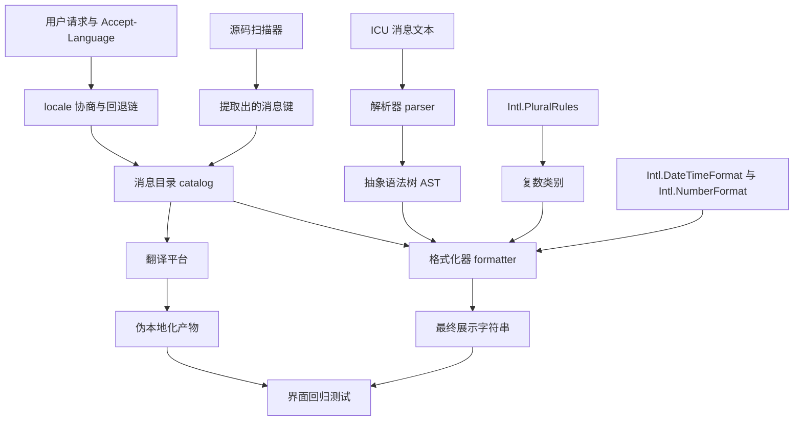
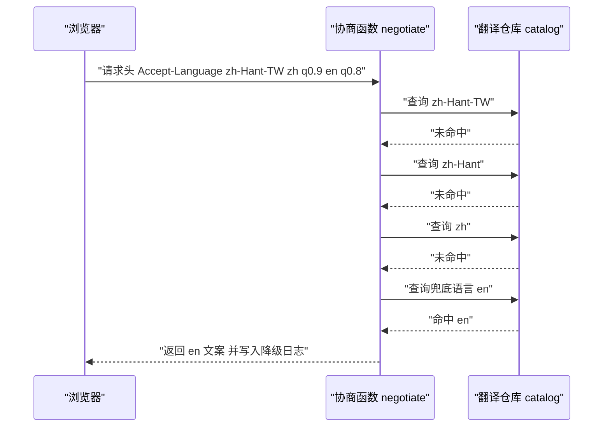
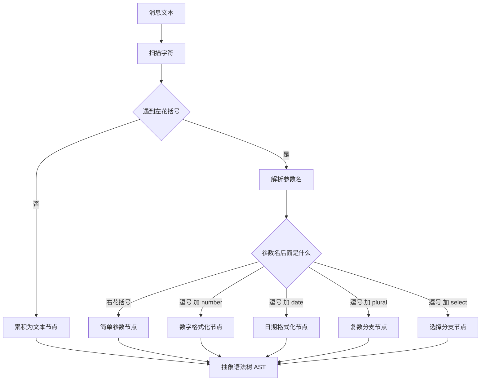
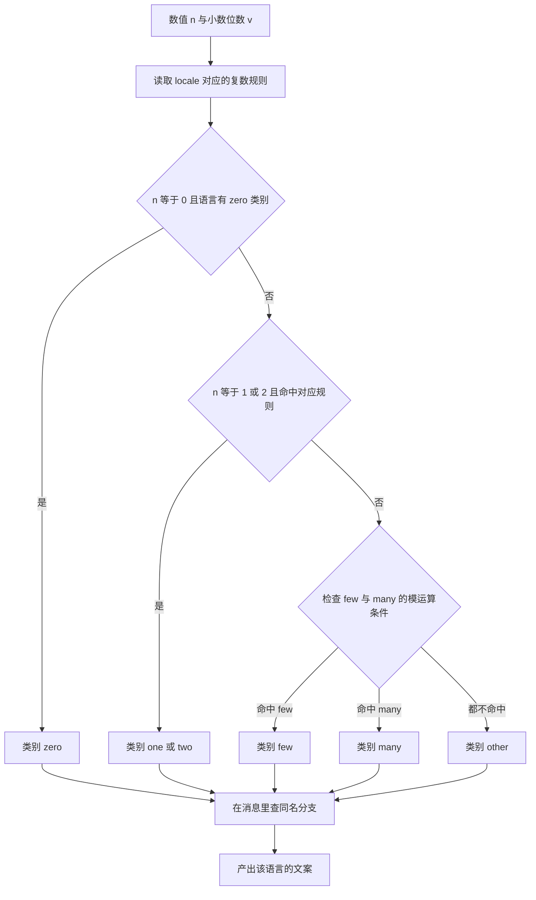
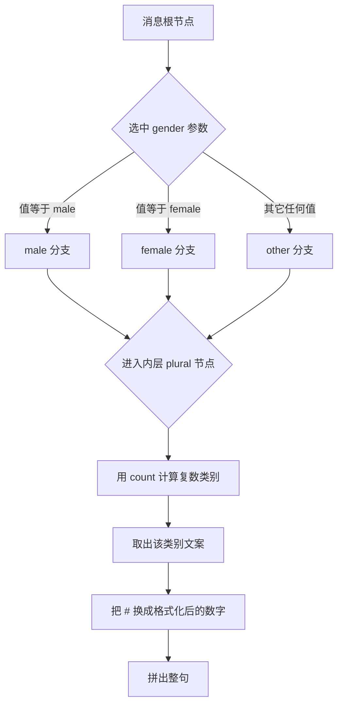
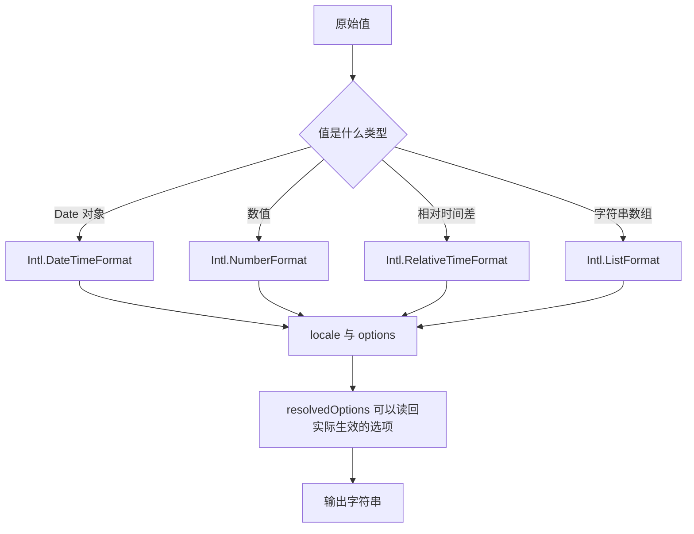
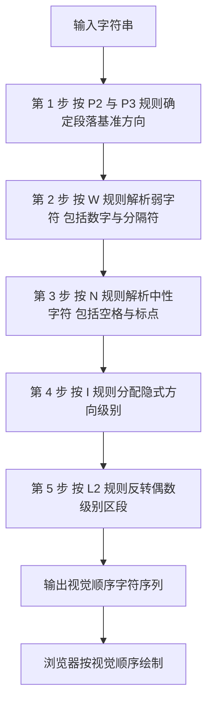
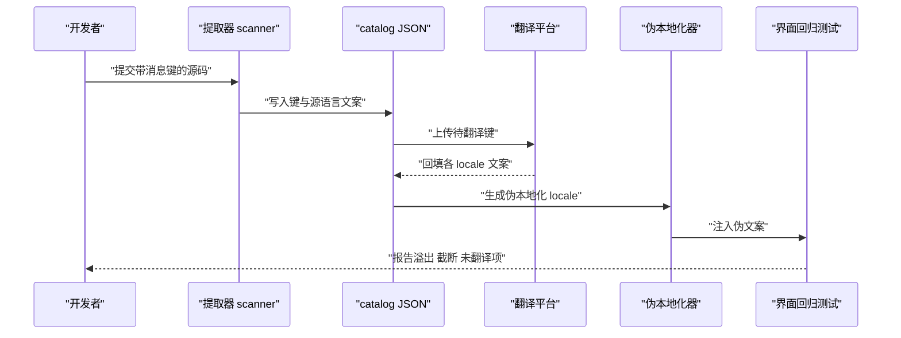
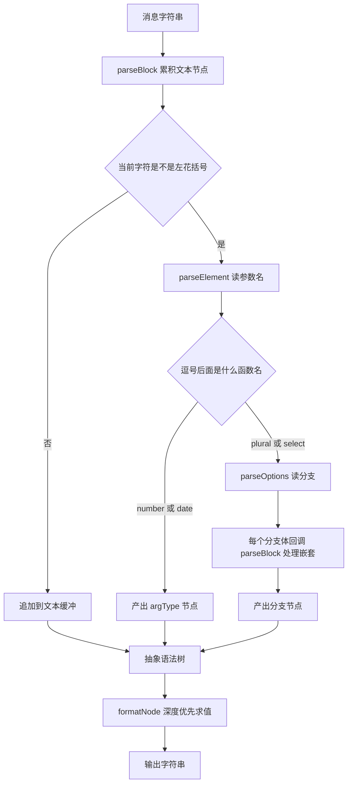
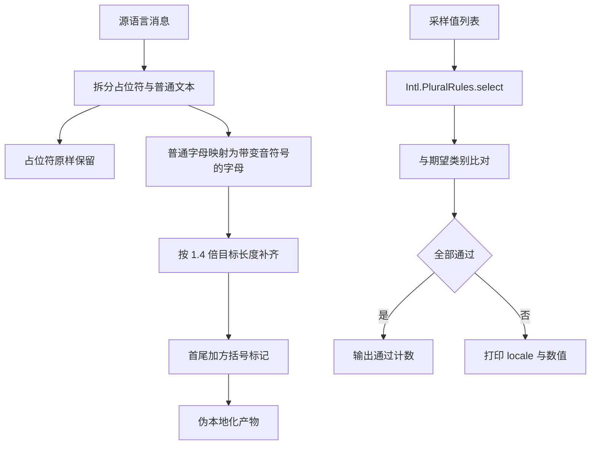

# 国际化工程：ICU MessageFormat、复数规则与字符串提取

!!! abstract "学完这一页你能"
    - 写出 locale 协商函数，把 `Accept-Language` 变成回退链，并用 3 组断言验证命中结果。
    - 说清 `zero/one/two/few/many/other` 六类复数在俄语、阿拉伯语、波兰语、中文里的命中条件，并用 `Intl.PluralRules` 打印对照表。
    - 手写一个支持占位符、`plural`、`select` 的 ICU 解析器与格式化器，并让它通过 10 条以上多语言断言。
    - 用 `Intl.DateTimeFormat`、`Intl.NumberFormat`、`Intl.RelativeTimeFormat` 输出指定 locale 的日期、货币与相对时间，并解释每个选项。

## 0. 知识地图



建议按顺序读：第 1 节和第 7 节讲"消息从哪来、给谁看"，第 2 到第 5 节讲"消息长什么样、怎么算出来"，第 6 节讲"算完之后在屏幕上怎么排"。
第 8 节把第 2 到第 5 节的知识合成一个 120 行的解析器与格式化器，第 9 节用它做多语言回归。
如果时间紧，先读第 0、2、3、8 节，再回头补第 1、6、7 节。

!!! note "术语：locale"
    locale 是"语言 + 地区 + 书写系统"的组合标识，标准名是 BCP 47 语言标签。
    例子：`zh-Hant-TW` 表示中文、繁体、台湾地区；`sr-Latn-RS` 表示塞尔维亚语、拉丁字母、塞尔维亚。
    `zh` 与 `zh-Hant-TW` 是两个不同的 locale，翻译文件通常分开维护。

## 1. locale 协商与回退链

**先想一个问题**

浏览器发来 `Accept-Language: zh-Hant-TW,zh;q=0.9,en;q=0.8`。你的站点只准备了 `zh-Hans` 与 `en` 两份翻译。
页面第一句话应该用哪个 locale？直接取列表第一个会命中 `zh-Hant-TW`，但你没有这份文件。

**心智模型**

!!! tip "心智模型"
    一句话模型：locale 协商是"按优先级排列的候选名单"去撞"仓库货架"，撞不到就按回退链降级。
    日常类比：去餐厅点菜，先问有没有清蒸鲈鱼，没有就问有没有鱼类菜，还没有就问有没有素菜，最后一定有"今日例汤"兜底。
    类比不成立之处：菜品之间可以互相替代，语言之间不能。把日语用户回退到中文，他可能一个字都读不懂，所以回退链末端必须放团队声明的兜底语言，并记录每次降级。

**图解**



1. 浏览器把用户偏好写成有序列表，`q` 是 0 到 1 的权重，省略时按 1 处理。
2. 协商函数先拿权重最高的 `zh-Hant-TW` 去仓库里找完整的 `zh-Hant-TW`。
3. 没找到就逐级截断子标签，`zh-Hant-TW` 变成 `zh-Hant`。
4. `zh-Hant` 还是没有，继续截断成 `zh`。
5. `zh` 也落空，才轮到权重第二的 `en`。
6. 命中后返回文案，同时把"从 `zh-Hant-TW` 降级到 `en`"写进日志，供后续补翻译。

**一步一步来**

**第 1 步：把请求头拆成带权重的候选数组**

这一步要做什么：把 `Accept-Language` 字符串按逗号切分，读出语言标签与 `q` 值，再按 `q` 从大到小排序。

```js
function parseAcceptLanguage(header) {          // 输入形如 zh-Hant-TW,zh;q=0.9,en;q=0.8
  return header
    .split(",")                                  // 按逗号切成 3 段
    .map((part) => {
      const [tag, ...params] = part.trim().split(";");  // 标签与参数分开
      const qParam = params.find((p) => p.trim().startsWith("q=")); // 找 q 参数
      const q = qParam ? Number(qParam.trim().slice(2)) : 1;        // 没有 q 就当 1
      return { tag: tag.trim(), q };
    })
    .filter((item) => item.q > 0)                // q 为 0 表示明确拒绝，丢掉
    .sort((a, b) => b.q - a.q)                   // 权重高的排前面
    .map((item) => item.tag);
}
```

**这段代码在做什么**
1. `split(",")` 把整条请求头拆成语言段。
2. `split(";")` 把每段的语言标签和参数分开，例如 `zh;q=0.9` 变成 `zh` 和 `q=0.9`。
3. `q` 缺失时按 1 处理，这是 HTTP 规范里的默认值。
4. `q` 等于 0 表示用户明确拒绝该语言，必须过滤掉，不能当低优先级。
5. 排序用 `b.q - a.q`，得到从高到低的数组。

**运行结果**：`["zh-Hant-TW", "zh", "en"]`。

**第 2 步：把标签归一化并生成回退链**

这一步要做什么：统一大小写与分隔符，再把一个标签展开成从具体到笼统的候选序列。

```js
function normalize(tag) {                        // 归一化一个语言标签
  const [language, ...rest] = tag.replace(/_/g, "-").split("-"); // 下划线转连字符
  const parts = [language.toLowerCase()];        // 语言子标签统一小写
  for (const part of rest) {
    parts.push(part.length === 4 ? part[0].toUpperCase() + part.slice(1).toLowerCase() // 书写系统首字母大写
      : part.length === 2 ? part.toUpperCase()   // 地区子标签统一大写
      : part.toLowerCase());
  }
  return parts.join("-");
}

function fallbackChain(tag) {                    // 生成回退链
  const parts = normalize(tag).split("-");
  const chain = [];
  for (let i = parts.length; i > 0; i -= 1) chain.push(parts.slice(0, i).join("-"));
  return chain;
}
```

**这段代码在做什么**
1. `replace(/_/g, "-")` 把 `zh_Hant_TW` 这种写法统一成连字符写法。
2. 语言子标签必须小写，地区子标签必须大写，书写系统子标签首字母大写，这是 BCP 47 的大小写惯例。
3. `fallbackChain` 从完整标签开始，每次砍掉最后一个子标签。
4. 长度 1 时只剩语言本身，之后循环结束。
5. 归一化让 `zh-hant-tw` 与 `ZH-Hant-TW` 命中同一份文件。

**运行结果**：`["zh-Hant-TW", "zh-Hant", "zh"]`。

**第 3 步：在可用集合里匹配第一个命中项**

这一步要做什么：按候选顺序遍历，对每个候选再遍历它的回退链，返回第一个存在于仓库里的键。

```js
function negotiate(header, available, defaultLocale) { // available 是已有的 locale 数组
  const wanted = parseAcceptLanguage(header);   // 第 1 步的输出
  const pool = new Set(available.map(normalize)); // 仓库里的键也归一化，比较才公平
  for (const tag of wanted) {                    // 外层按用户权重
    for (const candidate of fallbackChain(tag)) { // 内层按回退链从具体到笼统
      if (pool.has(candidate)) return { locale: candidate, requested: tag, exact: candidate === normalize(tag) };
    }
  }
  return { locale: defaultLocale, requested: wanted[0] ?? "", exact: false }; // 全落空才用兜底
}
```

**这段代码在做什么**
1. 外层循环保证用户权重优先，内层循环保证同一个语言先试具体形式再试笼统形式。
2. `pool` 用 `Set` 存归一化后的键，查找是常量时间。
3. `exact` 记录是否精确命中，用于统计"你请求的方言我们没准备"。
4. 返回值带上 `requested`，日志里能看出用户原始意图。
5. 全部落空时返回团队声明的默认 locale，不会返回 `undefined`。

**运行结果**：以 `available = ["en", "zh-Hans"]` 调用时得到 `{ locale: "en", requested: "zh-Hant-TW", exact: false }`。

**动手验证**

依赖：无，只用 Node 20 内置模块。

```js
// 文件：negotiate.mjs
// 运行：node negotiate.mjs
import assert from "node:assert/strict";

function parseAcceptLanguage(header) {
  return header
    .split(",")
    .map((part) => {
      const [tag, ...params] = part.trim().split(";");
      const qParam = params.find((p) => p.trim().startsWith("q="));
      const q = qParam ? Number(qParam.trim().slice(2)) : 1;
      return { tag: tag.trim(), q };
    })
    .filter((item) => item.q > 0)
    .sort((a, b) => b.q - a.q)
    .map((item) => item.tag);
}

function normalize(tag) {
  const [language, ...rest] = tag.replace(/_/g, "-").split("-");
  const parts = [language.toLowerCase()];
  for (const part of rest) {
    if (part.length === 4) parts.push(part[0].toUpperCase() + part.slice(1).toLowerCase());
    else if (part.length === 2) parts.push(part.toUpperCase());
    else parts.push(part.toLowerCase());
  }
  return parts.join("-");
}

function fallbackChain(tag) {
  const parts = normalize(tag).split("-");
  const chain = [];
  for (let i = parts.length; i > 0; i -= 1) chain.push(parts.slice(0, i).join("-"));
  return chain;
}

function negotiate(header, available, defaultLocale) {
  const wanted = parseAcceptLanguage(header);
  const pool = new Set(available.map(normalize));
  for (const tag of wanted) {
    for (const candidate of fallbackChain(tag)) {
      if (pool.has(candidate)) return { locale: candidate, requested: tag, exact: candidate === normalize(tag) };
    }
  }
  return { locale: defaultLocale, requested: wanted[0] ?? "", exact: false };
}

assert.equal(normalize("zh_hant_tw"), "zh-Hant-TW");
assert.deepEqual(fallbackChain("zh-Hant-TW"), ["zh-Hant-TW", "zh-Hant", "zh"]);
assert.deepEqual(parseAcceptLanguage("zh-Hant-TW,zh;q=0.9,en;q=0.8"), ["zh-Hant-TW", "zh", "en"]);
assert.equal(negotiate("zh-Hant-TW,zh;q=0.9,en;q=0.8", ["en", "zh-Hans"], "en").locale, "en");
assert.equal(negotiate("zh-Hant-TW", ["zh-Hant-TW", "en"], "en").exact, true);
assert.equal(negotiate("de-DE", ["en", "zh-Hans"], "en").locale, "en");
assert.equal(negotiate("zh-Hant-MO,zh;q=0.5", ["zh-Hant-TW"], "en").locale, "en");
assert.equal(parseAcceptLanguage("fr;q=0,en;q=0.5").length, 1, "q 为 0 的语言必须被过滤");

console.log("locale 协商断言全部通过");
```

预期输出：`locale 协商断言全部通过`。

**常见坑**

| 现象 | 原因 | 怎么修 |
| --- | --- | --- |
| 明明有 `zh-Hans`，繁体用户却拿到英文 | 回退链只截断到语言层，或者根本没做截断 | 用 `fallbackChain` 由具体到笼统逐级尝试，再进入下一个用户候选 |
| `zh-hant-tw` 命中不到 `zh-Hant-TW` 文件 | 仓库键没做大小写与分隔符归一化 | 比较前对两边都调用 `normalize`，`Set` 里存归一化后的值 |
| 用户把某语言设为最不想要，站点仍返回它 | 把 `q=0` 当成权重 0 的低优先级，而不是排除 | 在 `parseAcceptLanguage` 里 `filter(item => item.q > 0)` |
| 降级后没人知道 | 只返回字符串，没记录原始请求 | 返回值里带上 `requested` 与 `exact`，写进访问日志 |

**小结**
1. 协商分两步：先按 `q` 值排用户名单，再对每个候选走由具体到笼统的回退链。
2. 归一化必须在比较之前做，否则大小写差异会被当成缺少翻译。
3. 必留一个兜底 locale，并记录降级事件，兜底沉默会一直藏着缺翻译的问题。

## 2. ICU MessageFormat：消息不是字符串拼接

**先想一个问题**

英文界面要显示"3 items"，中文界面要显示"3 件"。你在代码里写 `count + " items"`，到了俄语就有 4 种词形变化。
再把语序算进去：日语把数量放在名词后面。字符串拼接处理不了这两件事。

!!! note "术语：ICU MessageFormat"
    ICU 是 International Components for Unicode 的缩写，是一套国际化算法与数据规范。
    MessageFormat 是它定义的消息语法，用花括号包住参数，并支持复数与选择分支。
    例子：`{count, plural, one {# item} other {# items}}`。

**心智模型**

!!! tip "心智模型"
    一句话模型：一条 ICU 消息是一棵小语法树，参数是叶子，`plural` 与 `select` 是分支节点。
    日常类比：它像地铁线路图上的分叉站，你带着参数值进站，值决定你在哪个分叉口往哪走。
    类比不成立之处：地铁线路不会因为你手里数字是 21 而变成第 4 条线路，而 ICU 的复数分支会随语言切换命中规则，同一份消息在俄语与中文里走的分支完全不同。

**图解**



1. 扫描器从左到右读字符，普通字符累积成文本节点。
2. 读到左花括号就进入元素解析，先读参数名。
3. 参数名后面紧跟右花括号，说明这是不带格式的简单参数。
4. 参数名后面是逗号加 `number` 或 `date`，说明要做区域化格式化。
5. 参数名后面是 `plural` 或 `select`，说明要按值选分支，分支体本身又是一棵子树。
6. 所有节点拼成抽象语法树，格式化器再遍历这棵树产出最终字符串。

**一步一步来**

**第 1 步：看清三种元素写法**

这一步要做什么：把 ICU 消息里出现的元素归类，知道每种的用途。

```js
// 元素 1：简单参数，直接把值转成字符串
"{name} 你好";

// 元素 2：带格式类型的参数，交给 Intl 处理
"{price, number, integer} 元";     // 千位分隔，不带小数
"{day, date, short}";             // 短日期

// 元素 3：分支元素，按参数值选一条子消息
"{count, plural, one {# item} other {# items}}";
"{gender, select, male {他} female {她} other {对方}}";
```

**这段代码在做什么**
1. `{name}` 只有参数名，不做任何区域化处理，先出现的是"先口语后术语"的那一层。
2. `{price, number, integer}` 有三个位置：参数名、类型、样式。
3. `{day, date, short}` 的样式取值是 `short`、`medium`、`long`、`full`。
4. `plural` 的分支键是复数类别或等号加精确值，`select` 的分支键是任意字符串。
5. `#` 只在 `plural` 分支里有特殊含义，代表去掉偏移量之后的数值。

**运行结果**：这些只是文本，需要解析器才能求值。

**第 2 步：为什么必须换成消息，而不是拼接**

这一步要做什么：用一个对照实验看清拼接的失败点。

```js
const n = 3;

// 做法 A：把中文原文拆成两段再拼
const a = n + " 件商品";                       // 中文语序：数量在前

// 做法 B：把英文原文拆成两段再拼
const b = n + " items";                        // 英文单复数靠后缀

// 做法 C：俄语有 4 种词形，拼接写法必须写判断
function ruByHand(value) {
  const mod10 = value % 10;
  const mod100 = value % 100;
  if (mod10 === 1 && mod100 !== 11) return value + " книга";
  if (mod10 >= 2 && mod10 <= 4 && (mod100 < 12 || mod100 > 14)) return value + " книги";
  return value + " книг";
}
```

**这段代码在做什么**
1. 做法 A 和做法 B 把语序与词形写死在代码里，换语言就要改代码。
2. 做法 C 手写了俄语规则，但这段规则只覆盖整数，遇到 1.5 就错。
3. 手写规则还会漏掉 `21 книга` 这种"看起来是复数、规则命中单数"的情况。
4. 分摊到阿拉伯语上要写 6 个分支，代码量继续增长。
5. ICU 消息把这些规则外置成数据，代码只负责把参数交给格式化器。

**运行结果**：`ruByHand(21)` 返回 `21 книга`，与下文 `Intl.PluralRules` 的结论一致，但这是运气好的手写。

**第 3 步：用最小解析器读出参数名**

这一步要做什么：写一个只认简单参数的扫描函数，建立"扫描 + 累积 + 产出节点"的手感。

```js
function parseSimple(message) {                  // 只处理 {name} 这一种元素
  const nodes = [];
  let i = 0;
  let buf = "";
  while (i < message.length) {
    if (message[i] === "{") {
      if (buf) { nodes.push({ type: "text", value: buf }); buf = ""; } // 先冲刷文本
      const end = message.indexOf("}", i);       // 找到配对的右花括号
      if (end === -1) throw new Error("位置 " + i + " 的左花括号没有闭合");
      nodes.push({ type: "arg", name: message.slice(i + 1, end).trim() });
      i = end + 1;                               // 跳过右花括号
      continue;
    }
    buf += message[i];                           // 普通字符进缓冲区
    i += 1;
  }
  if (buf) nodes.push({ type: "text", value: buf });
  return nodes;
}
```

**这段代码在做什么**
1. `nodes` 收集输出，`buf` 暂存连续文本。
2. 遇到左花括号前先冲刷缓冲区，保证节点顺序和原文顺序一致。
3. `indexOf("}", i)` 找配对的右花括号；找不到就抛错，不静默丢弃。
4. 参数名用 `trim()` 去掉两侧空白，`{ name }` 与 `{name}` 等价。
5. 这个版本不支持嵌套，遇到 `{count, plural, ...}` 会把整段当成参数名，所以第 8 节要换成递归下降。

**运行结果**：`parseSimple("{name} 你好")` 得到 `[{"type":"arg","name":"name"},{"type":"text","value":" 你好"}]`。

**动手验证**

依赖：无。这个脚本用内置 `Intl` 演示"拼接做不到、格式化器做得到"。

```js
// 文件：why-icu.mjs
// 运行：node why-icu.mjs
import assert from "node:assert/strict";

const MESSAGES = {
  en: "{count, plural, one {# item} other {# items}}",
  ru: "{count, plural, one {# книга} few {# книги} many {# книг} other {# книги}}",
  zh: "{count, plural, other {# 件商品}}",
};

function pickBranch(message, locale, value) {
  const body = /\{count,\s*plural,\s*([\s\S]*)\}\s*$/.exec(message);
  if (!body) throw new Error("不是 plural 消息");
  const branches = {};
  const re = /([A-Za-z]+)\s*\{([^{}]*)\}/g;
  let m;
  while ((m = re.exec(body[1]))) branches[m[1]] = m[2];
  if (!branches.other) throw new Error("缺少 other 分支");
  const category = new Intl.PluralRules(locale).select(value);
  return (branches[category] ?? branches.other).replace(/#/g, new Intl.NumberFormat(locale).format(value));
}

assert.equal(pickBranch(MESSAGES.en, "en", 1), "1 item");
assert.equal(pickBranch(MESSAGES.en, "en", 5), "5 items");
assert.equal(pickBranch(MESSAGES.ru, "ru", 21), "21 книга");
assert.equal(pickBranch(MESSAGES.zh, "zh", 5), "5 件商品");
assert.throws(() => pickBranch("{count, plural, one {x}}", "en", 1), /缺少 other 分支/);
console.log("ICU 消息与拼接的效果对比断言通过");
```

预期输出：`ICU 消息与拼接的效果对比断言通过`。

**常见坑**

| 现象 | 原因 | 怎么修 |
| --- | --- | --- |
| 格式化时报 `缺少 other 分支` | 写消息时只列了 `one` 与 `few` | 每个 `plural` 与 `select` 都必须有 `other`，它是规则兜底 |
| `{ name }` 没被替换，原样显示 | 参数名里带了空格，解析器把 ` name ` 当成键 | 解析时对参数名调用 `trim`，两边保持一致 |
| 消息里想显示真实花括号 | ICU 用花括号做语法标记 | 用引号转义写法，具体规则需核对官方文档：ICU MessageFormat 的 quoting 章节 |
| 英文文案里出现 `#` | `#` 只该放在 `plural` 分支内 | 把 `#` 挪进 `plural` 分支，或改用普通参数 |

**小结**
1. ICU 消息把语序、词形、格式从代码里搬到数据里，代码只传参数。
2. 一条消息有四种元素：简单参数、带类型参数、`plural` 分支、`select` 分支。
3. 解析消息要按树来做，字符串查找只能处理最简单的一层。

## 3. 复数类别：六个类别的分工

**先想一个问题**

产品经理说"数字是 1 就用单数，其它用复数"。你把这条规则写进代码，第二天俄语翻译发来邮件说：`1 книга`、`2 книги`、`5 книг` 是三种写法。
再往后阿拉伯语同事说：0 有专门写法，2 也有专门写法。

!!! note "术语：CLDR 复数类别"
    CLDR 是 Common Locale Data Repository 的缩写，是 Unicode 维护的区域化数据仓库。
    复数类别是它定义的六个枚举值：`zero`、`one`、`two`、`few`、`many`、`other`。
    例子：阿拉伯语的 0 命中 `zero`，2 命中 `two`，3 命中 `few`。

**心智模型**

!!! tip "心智模型"
    一句话模型：数字先经过某个语言的规则函数，被压成六个类别之一，再拿类别去消息里找分支。
    日常类比：它像快递按重量分档，0.5 公斤进"小件"，3 公斤进"中件"，20 公斤进"大件"，分档表每个国家不同。
    类比不成立之处：快递分档只看重量，复数规则还看小数位数。俄语里 `1.0` 与 `1` 命中不同类别，因为一个是带小数的值。

**图解**



1. 输入是数值本身，以及它是不是带小数的写法。
2. 每个 locale 有一套独立的规则，规则来自 CLDR 数据，不是代码里的常量。
3. 阿拉伯语先检查 0，命中就走 `zero`。
4. 接着检查 1 与 2，命中就走 `one` 或 `two`。
5. 剩下的走模运算：取模 10 或取模 100，判断落在哪个区间。
6. 谁都不命中就落到 `other`，所以 `other` 必然存在。

**一步一步来**

**第 1 步：用 `Intl.PluralRules` 取类别**

这一步要做什么：不手写规则，直接问运行时要该语言下的类别。

```js
const ru = new Intl.PluralRules("ru");           // 俄语规则对象
const zh = new Intl.PluralRules("zh");           // 中文规则对象

console.log(ru.select(1));     // one
console.log(ru.select(3));     // few
console.log(ru.select(5));     // many
console.log(ru.select(21));    // one   因为 21 取模 10 得 1 且取模 100 不是 11
console.log(zh.select(1));     // other 中文只有 other 一个类别
```

**这段代码在做什么**
1. `Intl.PluralRules` 是可复用的对象，构造一次就能反复调用 `select`。
2. `select` 接受数字，返回六个类别字符串之一。
3. 俄语 21 命中的是 `one`，这说明规则看的是取模结果，不是"大于 1 就是复数"。
4. 中文只返回 `other`，因为中文名词不随数量变形。
5. 类别名是固定英文单词，写消息时分支键必须和它一致。

**运行结果**：依次输出 `one`、`few`、`many`、`one`、`other`。

**第 2 步：打印多语言类别对照表**

这一步要做什么：把 6 个 locale 在 9 个采样值上的类别打出来，亲眼看清差异。

```js
const LOCALES = ["en", "zh", "ru", "ar", "pl", "ja"];
const SAMPLES = [0, 1, 2, 3, 5, 11, 21, 22, 101];
const rules = Object.fromEntries(LOCALES.map((l) => [l, new Intl.PluralRules(l)]));

for (const locale of LOCALES) {
  const row = SAMPLES.map((n) => String(n).padStart(3) + "=" + rules[locale].select(n));
  console.log(locale.padEnd(3), row.join("  "));
}
```

**这段代码在做什么**
1. `Object.fromEntries` 把 locale 数组转成"locale 到规则对象"的映射，避免重复构造。
2. 外层遍历语言，内层遍历采样值。
3. `padStart(3)` 让数字列对齐，肉眼比较更容易。
4. 输出一行一种语言，能直接看出 `en` 有 2 个类别，`ar` 有 6 个类别。
5. 采样值里放 11、21、22、101 是为了暴露取模规则的边界。

**运行结果**：`ru` 那一行会出现 `21=one` 与 `22=few`；`ar` 那一行会出现 `0=zero`、`2=two`、`3=few`、`11=many`。

**第 3 步：把类别映射成消息分支**

这一步要做什么：把上一步的类别当成键，去消息对象里取文案。

```js
const RU_MESSAGE = {
  one: "# книга",      // 1, 21, 31
  few: "# книги",      // 2 到 4, 22 到 24
  many: "# книг",      // 0, 5 到 20, 25 到 30
  other: "# книги",    // 带小数的值
};
const AR_MESSAGE = {
  zero: "لا كتب", one: "كتاب واحد", two: "كتابان",
  few: "# كتب", many: "# كتابا", other: "# كتاب",
};

function render(table, locale, n) {
  const category = new Intl.PluralRules(locale).select(n);
  const template = table[category] ?? table.other;   // 缺类别时用 other 兜底
  return template.replace(/#/g, new Intl.NumberFormat(locale).format(n));
}
```

**这段代码在做什么**
1. 消息表用类别名做键，键名必须和 `select` 的返回值逐字符相同。
2. `?? table.other` 是防守写法；如果某个类别没翻译，至少不会渲染出 `undefined`。
3. `new Intl.NumberFormat(locale)` 保证阿拉伯语环境下数字显示成阿拉伯文数字。
4. 俄语表里没有 `zero` 键，因为俄语规则不会返回 `zero`。
5. 阿拉伯语表里六个键齐全，缺一个就会被 `other` 顶替。

**运行结果**：`render(AR_MESSAGE, "ar", 0)` 得到 `لا كتب`；`render(RU_MESSAGE, "ru", 22)` 得到 `22 книги`。

**动手验证**

依赖：无。

```js
// 文件：plural-table.mjs
// 运行：node plural-table.mjs
import assert from "node:assert/strict";

const LOCALES = ["en", "zh", "ru", "ar", "pl", "ja"];
const SAMPLES = [0, 1, 2, 3, 5, 11, 21, 22, 101];
const rules = Object.fromEntries(LOCALES.map((l) => [l, new Intl.PluralRules(l)]));

const table = {};
for (const locale of LOCALES) table[locale] = SAMPLES.map((n) => rules[locale].select(n));
console.log(JSON.stringify(table, null, 2));

assert.deepEqual(table.en.slice(0, 3), ["other", "one", "other"]);
assert.deepEqual(table.zh, SAMPLES.map(() => "other"));
assert.equal(rules.ru.select(1), "one");
assert.equal(rules.ru.select(3), "few");
assert.equal(rules.ru.select(5), "many");
assert.equal(rules.ru.select(21), "one");
assert.equal(rules.ru.select(22), "few");
assert.equal(rules.ar.select(0), "zero");
assert.equal(rules.ar.select(1), "one");
assert.equal(rules.ar.select(2), "two");
assert.equal(rules.ar.select(3), "few");
assert.equal(rules.ar.select(11), "many");
assert.equal(rules.pl.select(1), "one");
assert.equal(rules.pl.select(3), "few");
assert.equal(rules.pl.select(5), "many");
assert.equal(rules.ja.select(5), "other");
assert.equal(new Set(Object.values(table.en)).size, 2, "英语只有 2 个类别");
assert.equal(new Set(Object.values(table.ar)).size >= 5, true, "阿拉伯语至少出现 5 个类别");
console.log("复数类别断言全部通过：" + LOCALES.length + " 个 locale");
```

预期输出：先打印一张 JSON 对照表，最后一行是 `复数类别断言全部通过：6 个 locale`。

**常见坑**

| 现象 | 原因 | 怎么修 |
| --- | --- | --- |
| 中文界面出现 `1 items` 这种错误分支 | 消息是从英文复制来的，保留了 `one` 分支 | 中文只写 `other`，删除 `one`，避免误导译者 |
| 俄语 21 显示成 `21 книг` | 用了"大于 1 就是复数"的自造规则 | 改用 `Intl.PluralRules`，不要手写模运算 |
| 阿拉伯语的数字显示成 `3` 而不是 `٣` | 手动拼数字字符串，绕过了格式化 | 用 `Intl.NumberFormat(locale).format(n)` 生成数字部分 |
| 带小数的值时分支选错 | 消息里把小数先 `Math.floor` 掉 | 把原始值交给 `select`，由规则自己看小数位 |

**小结**
1. 复数类别有六个：`zero`、`one`、`two`、`few`、`many`、`other`，每个语言用到的子集不同。
2. 中文与日语只用 `other`，英语用 `one` 与 `other`，俄语用四个，阿拉伯语用六个。
3. 规则交给 `Intl.PluralRules`，代码里不要出现模运算。

## 4. select 选择与嵌套格式

**先想一个问题**

同一条通知要按收件人性别改代词，中文里"他""她"都要区分。用 `if` 判断在代码里写三份文案，文案改动时就得改代码。
再复杂一点：这条通知里还有数量，"他收到 3 条消息"和"她收到 3 条消息"要各自处理复数。

!!! note "术语：select"
    `select` 是 ICU 消息里的字符串枚举分支，用参数值直接匹配分支键。
    例子：`{gender, select, male {他} female {她} other {对方}}`，参数值是 `male` 就走第一个分支。
    和 `plural` 的区别是：`select` 的分支键由你自定义，`plural` 的分支键来自 CLDR 类别。

**心智模型**

!!! tip "心智模型"
    一句话模型：`select` 按字符串精确匹配分支，`plural` 按 CLDR 类别匹配分支，两者都可以互相嵌套。
    日常类比：`select` 像自动售货机的按键，按哪个号码出哪个货；按了不存在的号码，机器给你一包默认商品。
    类比不成立之处：嵌套之后内层可以打到外层，外层一次选择能同时影响内层多个分支；自动售货机一次只会出一个货。

**图解**



1. 根节点先遇到 `select`，读 `gender` 参数。
2. 参数值精确等于 `male`，走第一个分支；精确等于 `female`，走第二个分支。
3. 值既不是 `male` 也不是 `female` 时走 `other`，所以 `other` 是必需的。
4. 选中的分支体还是一棵子树，里面有 `plural` 节点。
5. 内层 `plural` 用 `count` 参数算类别，取出内层文案。
6. 把 `#` 替换成按 locale 格式化后的数字，拼成整句返回。

**一步一步来**

**第 1 步：先写只含 select 的消息**

这一步要做什么：把代词选择从代码搬到消息里。

```js
const NOTICE = "{gender, select, male {他给你点了赞} female {她给你点了赞} other {对方给你点了赞}}";

function selectByGender(gender) {
  const branches = Object.create(null);
  const re = /([A-Za-z0-9_$=]+)\s*\{([^{}]*)\}/g;   // 只匹配没有嵌套的分支体
  let m;
  while ((m = re.exec(NOTICE))) branches[m[1]] = m[2];
  if (!branches.other) throw new Error("缺少 other 分支");
  return branches[gender] ?? branches.other;        // 未知值走 other
}
```

**这段代码在做什么**
1. 正则逐个抓出"分支键 + 花括号里的文案"。
2. `Object.create(null)` 建一个没有原型链的对象，避免键名 `constructor` 撞车。
3. `branches[gender] ?? branches.other` 处理未知值，例如新加了一种性别标识。
4. 缺 `other` 直接抛错，让问题在测试阶段暴露。
5. 这个正则不处理嵌套，嵌套版本在第 8 节实现。

**运行结果**：`selectByGender("female")` 返回 `她给你点了赞`。

**第 2 步：把 plural 嵌进 select 分支**

这一步要做什么：让每个分支体内部再带一个 `plural` 节点。

```js
const NESTED = "{gender, select, "
  + "male {{count, plural, one {他收到 # 条消息} other {他收到 # 条消息}}} "
  + "other {{count, plural, one {对方收到 # 条消息} other {对方收到 # 条消息}}}}";

// 消息形状可以用节点树表达：
const SHAPE = {
  type: "select", name: "gender", options: {
    male: [{ type: "plural", name: "count", offset: 0, options: {
      one: [{ type: "text", value: "他收到 " }, { type: "text", value: "#" }, { type: "text", value: " 条消息" }],
      other: [{ type: "text", value: "他收到 " }, { type: "text", value: "#" }, { type: "text", value: " 条消息" }],
    } }],
    other: [{ type: "plural", name: "count", offset: 0, options: {
      one: [{ type: "text", value: "对方收到 " }, { type: "text", value: "#" }, { type: "text", value: " 条消息" }],
      other: [{ type: "text", value: "对方收到 " }, { type: "text", value: "#" }, { type: "text", value: " 条消息" }],
    } }],
  },
};
```

**这段代码在做什么**
1. `select` 的分支体用双层花括号包住嵌套元素，这是 ICU 的写法约定。
2. `SHAPE` 用普通对象把同一棵树画出来，方便对比"文本"与"树"两种视角。
3. 内层 `plural` 的 `name` 是 `count`，与外层参数 `gender` 无关，参数名互不干扰。
4. 分支体是节点数组，不是字符串，所以内层可以自由嵌套。
5. 中文本不必区分单复数，示例里两个分支文案相同，是为了演示结构而不是演示词形。

**运行结果**：`SHAPE` 是纯数据，交给格式化器才会产出字符串。

**第 3 步：递归求值的顺序**

这一步要做什么：确定"先选外层还是先算内层"，以及 `#` 在当前节点的绑定关系。

```js
function evaluate(node, ctx) {
  if (node.type === "text") {
    return ctx.poundText === undefined ? node.value : node.value.split("#").join(ctx.poundText);
  }
  if (node.type === "select") {
    const key = String(ctx.values[node.name]);
    return evaluateAll(node.options[key] ?? node.options.other, ctx);        // 继承上层上下文
  }
  const n = Number(ctx.values[node.name]) - node.offset;                     // 先减偏移
  const branch = node.options[new Intl.PluralRules(ctx.locale).select(n)];
  const poundText = new Intl.NumberFormat(ctx.locale).format(n);             // 再算 # 的文本
  return evaluateAll(branch, { ...ctx, poundText });                         // 覆盖 poundText
}

function evaluateAll(nodes, ctx) {
  return nodes.map((node) => evaluate(node, ctx)).join("");
}
```

**这段代码在做什么**
1. 求值是深度优先：先进入外层 `select`，再进入内层 `plural`。
2. `select` 分支用 `{ ...ctx }` 之外的原上下文，所以外层若已绑定 `#`，内层仍能用到。
3. `plural` 分支用 `{ ...ctx, poundText }` 覆盖，保证 `#` 由最近的一层 `plural` 决定。
4. `n` 里减掉了 `offset`，这是 ICU 的偏移语义。
5. 文本节点的 `#` 替换用 `split` 加 `join`，比正则少一次转义负担。

**运行结果**：`evaluate(SHAPE, { locale: "zh", values: { gender: "male", count: 3 } })` 得到 `他收到 3 条消息`。

**动手验证**

依赖：无。

```js
// 文件：select-nest.mjs
// 运行：node select-nest.mjs
import assert from "node:assert/strict";

function parseSelectOnly(message) {
  const outer = /^\{\s*([A-Za-z0-9_$]+)\s*,\s*select\s*,\s*([\s\S]*)\}\s*$/.exec(message);
  if (!outer) throw new Error("不是 select 消息");
  const branches = Object.create(null);
  const re = /([A-Za-z0-9_$=]+)\s*\{([^{}]*)\}/g;
  let m;
  while ((m = re.exec(outer[2]))) branches[m[1]] = m[2];
  if (!branches.other) throw new Error("缺少 other 分支");
  return branches;
}

const NOTICE = "{gender, select, male {他给你点了赞} female {她给你点了赞} other {对方给你点了赞}}";
const branches = parseSelectOnly(NOTICE);

assert.equal(branches.male, "他给你点了赞");
assert.equal(branches.female, "她给你点了赞");
assert.equal(branches.other, "对方给你点了赞");
assert.equal(branches.unknown ?? branches.other, "对方给你点了赞");
assert.throws(() => parseSelectOnly("{g, select, male {他}}"), /缺少 other 分支/);

const nested = "{gender, select, male {他收到 {count, plural, other {# 条}}} other {对方收到 {count, plural, other {# 条}}}}";
assert.equal(/select/.test(nested), true);
assert.equal(nested.includes("{count, plural, other {# 条}}"), true);
console.log("select 与嵌套结构断言通过");
```

预期输出：`select 与嵌套结构断言通过`。

**常见坑**

| 现象 | 原因 | 怎么修 |
| --- | --- | --- |
| 新加了一种性别标识，界面空白 | 用了 `if` 判断并且没有 `other` 兜底 | 所有 `select` 都写 `other`，代码里不要做穷举判断 |
| 嵌套消息渲染成 `{count, plural...}` 原样文本 | 解析器只处理一层，遇到 `{` 就停止 | 用递归解析分支体，遇到 `{` 继续解析子元素 |
| 内层 `#` 显示成外层的数字 | `poundText` 在进入内层时没有覆盖 | 每进入一层 `plural` 就重新计算并覆盖 `poundText` |
| 分支键里带空格或大小写不一致 | 分支键是精确字符串匹配 | 分支键统一小写无空格，参数值在传参前归一化 |

**小结**
1. `select` 按精确字符串选分支，必须写 `other`，未知值由 `other` 接住。
2. `plural` 可以嵌在 `select` 分支里，`select` 也可以嵌在 `plural` 分支里。
3. `#` 由最近一层 `plural` 的数值决定，进入内层要覆盖上下文里的数值。

## 5. 日期、数字、货币：交给 Intl

**先想一个问题**

订单时间是 `2024-03-01T23:30:00Z`。上海用户看到的日期是 3 月 2 日，纽约用户看到的是 3 月 1 日。
如果你在服务端用 `toLocaleDateString()` 但没写时区，同一份数据在两台服务器上会输出两个日期。

!!! note "术语：Intl"
    `Intl` 是 ECMAScript 402 规范定义的内置对象集合，提供区域化的日期、数字、货币、列表、相对时间格式化。
    例子：`new Intl.NumberFormat("ja-JP", { style: "currency", currency: "JPY" }).format(1200)` 得到 `￥1,200`。

**心智模型**

!!! tip "心智模型"
    一句话模型：`Intl` 的每个格式化器都是"locale 加选项"的纯函数，输入值，输出字符串。
    日常类比：它像印刷厂的排版员，你给他"人民币、千位分隔、两位小数"的规格单，他按规格印出成品。
    类比不成立之处：排版员不会自己决定用什么纸张，而 `Intl` 有大量默认值。你不写 `timeZone`，它就取运行环境的时区。

**图解**



1. 先判断原始值的类型：时间是 `Date`，金额和数量是数值。
2. 时间交给 `Intl.DateTimeFormat`，它能处理时区与日历。
3. 数值交给 `Intl.NumberFormat`，它能处理千位分隔、货币、百分比、紧凑写法。
4. 相对时间交给 `Intl.RelativeTimeFormat`，输入是一个数值加一个单位。
5. 列表交给 `Intl.ListFormat`，把数组拼成某种语言的列举句。
6. 用 `resolvedOptions()` 读回实际生效的选项，默认值的问题在测试里就现形了。

**一步一步来**

**第 1 步：把时区写成显式选项**

这一步要做什么：同一时刻在两个时区下格式化，验证日期不同。

```js
const instant = new Date("2024-03-01T23:30:00Z");  // UTC 时间 23:30

const shanghai = new Intl.DateTimeFormat("zh-CN", {
  dateStyle: "full", timeZone: "Asia/Shanghai",     // 上海是 UTC 加 8，已经是 3 月 2 日
}).format(instant);

const newYork = new Intl.DateTimeFormat("en-US", {
  dateStyle: "full", timeZone: "America/New_York",  // 纽约是 UTC 减 5，还是 3 月 1 日
}).format(instant);
```

**这段代码在做什么**
1. `timeZone` 显式写成 IANA 时区名，不用依赖运行环境。
2. `dateStyle: "full"` 让输出带星期，交叉验证时更容易核对。
3. 同一毫秒在两个时区下落到不同日期，这是"跨日"的典型场景。
4. 不写 `timeZone` 时，格式化结果随服务器部署地区变化，测试会飘。
5. 时区名可以用 `Intl.supportedValuesOf("timeZone")` 枚举，具体行为需核对官方文档：`Intl.supportedValuesOf` 的返回顺序。

**运行结果**：上海那条包含 `3月2日`，纽约那条包含 `March 1`。

**第 2 步：货币的小数位数由币种决定**

这一步要做什么：用 `resolvedOptions` 看清不同币种的默认小数位。

```js
const jpy = new Intl.NumberFormat("ja-JP", { style: "currency", currency: "JPY" });
const kwd = new Intl.NumberFormat("ar-KW", { style: "currency", currency: "KWD" });
const usd = new Intl.NumberFormat("en-US", { style: "currency", currency: "USD" });

console.log(jpy.resolvedOptions().maximumFractionDigits);  // 0
console.log(usd.resolvedOptions().maximumFractionDigits);  // 2
console.log(kwd.resolvedOptions().maximumFractionDigits);  // 3
```

**这段代码在做什么**
1. `style: "currency"` 加 `currency` 代码触发货币格式。
2. 日元没有小数位，第纳尔有 3 位，美元有 2 位，这是 CLDR 里的币种数据。
3. `resolvedOptions()` 返回真实生效的选项对象，用它做断言不依赖具体文案。
4. 断言文案容易随 ICU 数据版本变化，断言选项值稳定得多。
5. 显示货币符号的位置由 locale 决定，同一个币种在 `en-US` 与 `de-DE` 下位置不同。

**运行结果**：依次打印 `0`、`2`、`3`。

**第 3 步：紧凑数字与相对时间**

这一步要做什么：给数据看板与"几天前"这类文案找对格式化器。

```js
const compact = new Intl.NumberFormat("en-US", { notation: "compact" });
const rtf = new Intl.RelativeTimeFormat("zh-CN", { numeric: "auto" });

console.log(compact.format(12000));   // 12K
console.log(rtf.format(-1, "day"));   // 昨天
console.log(rtf.format(-3, "day"));   // 3天前

const list = new Intl.ListFormat("en-US", { style: "long", type: "conjunction" });
console.log(list.format(["A", "B", "C"]));  // A, B, and C
```

**这段代码在做什么**
1. `notation: "compact"` 输出 `12K` 这种短写法，适合仪表盘。
2. `Intl.RelativeTimeFormat` 的数值是"从现在看过去的偏移"，负数表示过去。
3. `numeric: "auto"` 允许输出"昨天"这类词，`numeric: "always"` 会强制输出"1天前"。
4. `Intl.ListFormat` 的 `type` 可取 `conjunction`、`disjunction`、`unit`，用于"和""或""连接单位"。
5. 这些格式化器都不做字符串拼接，所以中文的顿号、英文的逗号加 and 都由数据决定。

**运行结果**：依次打印 `12K`、`昨天`、`3天前`、`A, B, and C`。

**动手验证**

依赖：无。

```js
// 文件：intl-formats.mjs
// 运行：node intl-formats.mjs
import assert from "node:assert/strict";

const instant = new Date("2024-03-01T23:30:00Z");
const shanghai = new Intl.DateTimeFormat("zh-CN", { dateStyle: "full", timeZone: "Asia/Shanghai" }).format(instant);
const newYork = new Intl.DateTimeFormat("en-US", { dateStyle: "full", timeZone: "America/New_York" }).format(instant);
assert.equal(shanghai.includes("3月2日"), true);
assert.equal(newYork.includes("March 1"), true);

assert.equal(new Intl.NumberFormat("ja-JP", { style: "currency", currency: "JPY" }).resolvedOptions().maximumFractionDigits, 0);
assert.equal(new Intl.NumberFormat("en-US", { style: "currency", currency: "USD" }).resolvedOptions().maximumFractionDigits, 2);
assert.equal(new Intl.NumberFormat("ar-KW", { style: "currency", currency: "KWD" }).resolvedOptions().maximumFractionDigits, 3);

assert.equal(new Intl.NumberFormat("en-US", { notation: "compact" }).format(12000).includes("12"), true);
assert.equal(new Intl.NumberFormat("en-US", { maximumFractionDigits: 0 }).format(1234.7), "1,235");

const rtf = new Intl.RelativeTimeFormat("zh-CN", { numeric: "auto" });
assert.equal(rtf.format(-1, "day"), "昨天");
assert.equal(rtf.format(-3, "day").includes("3"), true);
assert.equal(new Intl.ListFormat("en-US", { style: "long", type: "conjunction" }).format(["A", "B", "C"]), "A, B, and C");

console.log("上海：" + shanghai);
console.log("纽约：" + newYork);
console.log("Intl 格式化断言全部通过");
```

预期输出：两行日期，最后一行 `Intl 格式化断言全部通过`。

**常见坑**

| 现象 | 原因 | 怎么修 |
| --- | --- | --- |
| 日期在不同服务器上差一天 | 没写 `timeZone`，取了运行环境默认时区 | 所有日期格式化都显式传 `timeZone`，一般传 `UTC` 或用户时区 |
| 日元显示成 `￥1,200.00` | 用手写模板拼了两位小数 | 用 `style: "currency"`，小数位交给 CLDR 数据 |
| 断言随 Node 版本失败 | 断言了整条文案，ICU 数据升级后措辞变化 | 断言 `resolvedOptions()` 的选项值，或断言包含关系 |
| `Intl.RelativeTimeFormat` 输出 `1天前` 而不是 `昨天` | 用了 `numeric: "always"` | 需要"昨天"这类词时用 `numeric: "auto"` |

**小结**
1. `Intl` 有 4 个高频格式化器：日期、数字、相对时间、列表，各自接受 locale 与选项。
2. `timeZone` 必须显式传，否则结果取决于运行环境。
3. 用 `resolvedOptions()` 做断言，比断言文案更稳定。

## 6. RTL 与双向文本

**先想一个问题**

界面里一行是 `ID: أحمد 完成`。逻辑顺序是"ID、冒号、阿拉伯名字、空格、完成"。
在 RTL 环境里，浏览器按双向算法重排字符，冒号可能跑到名字右边，看起来像 `ID: 完成 أحمد`。

!!! note "术语：双向算法"
    Unicode 双向算法 Bidirectional Algorithm 是 UAX 9 定义的排文规则，把逻辑顺序的字符序列转成视觉顺序。
    例子：阿拉伯字母是 R 类字符，数字是 EN 类字符，两者相邻时数字会保持在左侧方向运行。
    段落的基准方向由 `dir` 属性或第一个强方向字符决定。

**心智模型**

!!! tip "心智模型"
    一句话模型：逻辑顺序是"你说这句话的顺序"，视觉顺序是"屏幕从左到右摆放的顺序"，双向算法负责换算。
    日常类比：它像把一列排好的队伍按身高重新站队，队里每个人都记着自己原本的编号。
    类比不成立之处：重排只影响显示，不影响字符串本身。复制出来的文本仍然是逻辑顺序，这正是"看起来对了、复制出去却反了"的根源。

**图解**



1. 第一步先定段落方向：`dir` 属性优先，没有就找第一个强方向字符。
2. 第二步处理弱字符，数字、货币符号、分隔符都属于这一类。
3. 第三步处理中性字符，空格、冒号、括号本身没有方向，方向由左右邻居决定。
4. 第四步给每个字符分配隐式级别，级别是偶数表示从左到右，奇数表示从右到左。
5. 第五步把奇数级别的连续区段反转，得到视觉顺序。
6. 绘制时按视觉顺序摆放，但复制文本时仍按逻辑顺序输出。

**一步一步来**

**第 1 步：用 dir 与 lang 标明方向**

这一步要做什么：让根元素声明基准方向，让局部内容声明自己的语言。

```html
<html lang="ar" dir="rtl">
  <body>
    <p>مرحبا بك</p>
    <p dir="ltr" lang="en">Order #A-1024</p>
    <input type="text" dir="auto" name="nickname">
  </body>
</html>
```

**这段代码在做什么**
1. 根元素的 `lang` 告诉浏览器默认语言，`dir="rtl"` 设置段落基准方向。
2. 内层 `dir="ltr"` 把英文订单号段落拉回从左到右，避免标点乱跳。
3. `dir="auto"` 让输入框按用户输入的第一个强方向字符自动定方向。
4. `lang` 与 `dir` 要成对出现，只写 `dir` 时屏幕阅读器的发音可能不对。
5. 方向是继承属性，只有需要覆盖的局部才重新声明。

**运行结果**：整页从右向左排，订单号段落从左向右排。

**第 2 步：用隔离字符保护拼接出来的字符串**

这一步要做什么：把变量插进句子时，用 First Strong Isolate 与 Pop Directional Isolate 包住它。

```js
const name = "أحمد";                                  // 阿拉伯文名字
const plain = "ID: " + name + " 完成";                // 变量直接拼接
const isolated = "ID: \u2068" + name + "\u2069 完成"; // 用隔离字符包住

console.log(JSON.stringify({ plain, isolated }));
console.log(isolated.codePointAt(isolated.indexOf(name) - 1).toString(16)); // 2068
```

**这段代码在做什么**
1. `\u2068` 是 FIRST STRONG ISOLATE，它开始一个独立的双向区间。
2. `\u2069` 是 POP DIRECTIONAL ISOLATE，它结束这个区间。
3. 隔离之后，区间内部的方向不会影响区间外的标点与空格。
4. 字符串长度会增加 2 个字符，做截断逻辑时要考虑这一点。
5. 冲突字符对 `U+202A..U+202E` 与 `U+2066..U+2069` 都有隔离能力，优先用 `U+2066` 这一组。具体选哪组需核对官方文档：Unicode 双向控制字符的推荐用法章节。

**运行结果**：`isolated.length` 比 `plain.length` 大 2，第一个隔离字符的码点是 `2068`。

**第 3 步：用 CSS 逻辑属性代替左右属性**

这一步要做什么：把 `margin-left` 这类写法换成随方向翻转的逻辑属性。

```css
.card { margin-inline-start: 16px; padding-inline: 12px; }
.card .icon { float: inline-start; }
.card { border-inline-start: 2px solid #ccc; }
```

**这段代码在做什么**
1. `margin-inline-start` 在 LTR 下是左边距，在 RTL 下自动变成右边距。
2. `padding-inline` 同时设置行内两端的留白，方向无关。
3. `float: inline-start` 在 RTL 下把图标浮到右侧，不用写第二套样式。
4. `border-inline-start` 让装饰线永远贴在"阅读起点"那一侧。
5. 逻辑属性在 Node 20 时代的主流浏览器里都已支持，旧浏览器回退方案需核对官方文档：CSS Logical Properties 的兼容性表。

**运行结果**：同一份 CSS 在 `dir="rtl"` 下自动镜像。

**动手验证**

依赖：无。这个脚本验证字符串层面的隔离行为，视觉重排需要在浏览器里核对。

```js
// 文件：bidi.mjs
// 运行：node bidi.mjs
import assert from "node:assert/strict";

const RTL_CHARS = /[\u0590-\u08FF\uFB1D-\uFDFD\uFE70-\uFEFC]/;
const FSI = "\u2068";
const PDI = "\u2069";

const name = "أحمد";
const plain = "ID: " + name + " 完成";
const isolated = "ID: " + FSI + name + PDI + " 完成";

assert.equal(RTL_CHARS.test(name), true);
assert.equal(RTL_CHARS.test("abc"), false);
assert.equal(isolated.length, plain.length + 2, "隔离字符让长度增加 2");
assert.equal(isolated.indexOf(name) - 1, "ID: ".length);
assert.equal(isolated.codePointAt(isolated.indexOf(name) - 1), 0x2068);
assert.equal(isolated.codePointAt(isolated.indexOf(name) + name.length), 0x2069);
assert.equal(plain.includes(FSI), false);
assert.equal(isolated.startsWith("ID: "), true, "逻辑顺序不变");

console.log("逻辑顺序：" + JSON.stringify(isolated));
console.log("码点序列：" + [...isolated].map((c) => c.codePointAt(0).toString(16)).join(" "));
console.log("双向文本断言通过，视觉顺序请在浏览器里核对");
```

预期输出：两行日志，最后一行 `双向文本断言通过，视觉顺序请在浏览器里核对`。

**常见坑**

| 现象 | 原因 | 怎么修 |
| --- | --- | --- |
| 冒号或括号跑到文字右侧 | 中性字符方向由邻居决定，拼接后邻居变了 | 用 `U+2068` 与 `U+2069` 包住插入的变量 |
| 界面镜像了但图标方向没变 | 用 `margin-left` 与 `float: left` 写死了方向 | 换成 `margin-inline-start` 与 `float: inline-start` |
| 复制出来的文本顺序看起来反了 | 视觉顺序与逻辑顺序不同，这是设计如此 | 不要把视觉顺序写回存储，存储一律用逻辑顺序 |
| 字符串截断后公式错位 | 截断切在了隔离字符对上 | 截断前先成对移除 `U+2068` 与 `U+2069`，再按码点切片 |

**小结**
1. 逻辑顺序是数据，视觉顺序是显示，双向算法负责换算。
2. 变量插入句子时用隔离字符，段落级用 `dir` 属性。
3. 布局用 CSS 逻辑属性，一份样式适配两个方向。

## 7. 提取、翻译工作流与伪本地化

**先想一个问题**

你在代码里写 `t("你好")`，把中文原文当键。翻译同事想把"你好"改成"您好"，结果发现这个改动会让所有历史翻译失效。
再往后，产品要在界面上加一条更长的德语，你会发现按钮里的文字被截断了，但没人在上测试环境前发现。

!!! note "术语：伪本地化"
    伪本地化是把源语言字符串按固定规则变换成"假的外语"，用来在不翻译的前提下检验界面是否能容纳长文案。
    例子：把 `Save` 变成 `⟦Šáṽé·····⟧`，长度放大 40%，字符换成带变音符号的字母。
    它能暴露截断、写死宽度、文案未走翻译通道三类问题。

**心智模型**

!!! tip "心智模型"
    一句话模型：消息键是合同编号，翻译内容是合同正文，提取器负责生成编号清单。
    日常类比：它像出版社的排版流程，作者交稿、编辑编号、译者翻译、排版工按编号回填。
    类比不成立之处：译者可以就同一个编号提出多条候选译文，键必须稳定，正文可以迭代，两者生命周期不同。

**图解**



1. 开发者在源码里只写消息键，不写面向用户的中文。
2. 提取器扫描源码，把键与源语言文案写进 catalog。
3. catalog 上传到翻译平台，平台按 locale 生成待翻译任务。
4. 译者回填后，catalog 下载回仓库，构建时打进产物。
5. 伪本地化器基于源语言生成一个假的 locale，字符变长变怪。
6. 回归测试用这个假 locale 跑界面，把溢出与截断报给开发者。

**一步一步来**

**第 1 步：用稳定键代替源语言原文**

这一步要做什么：给每条文案分配一个不随文案内容变化的键。

```js
// 做法 A：用中文原文当键，改文案就换键
t("你好");

// 做法 B：用命名空间加语义键，文案改动词不变
t("home.greeting");     // 对应 "你好"，以后改成 "您好" 键不动
t("cart.items");        // 购物车条目数
```

**这段代码在做什么**
1. `home.greeting` 由命名空间 `home` 与语义名 `greeting` 组成。
2. 键里不出现标点与空格，方便在代码里搜索，也方便文件名映射。
3. 键一旦发布就不要改，改名等于所有 locale 的译文全部作废。
4. 键用点分层级，提取器可以按前缀切成多个 catalog 文件。
5. 键太长会让代码难读，命名空间两层通常够用。

**运行结果**：`t("home.greeting")` 在 `zh-Hans` 下返回 `你好`，在 `en` 下返回 `Hello`。

**第 2 步：扫描源码产出 catalog**

这一步要做什么：用正则在源码里找 `t("键")` 形式的调用，生成键清单。

```js
const SOURCE = [
  'const title = t("home.title");',
  'const greet = t("home.greeting", { name });',
  'const other = i18n._("cart.items");',
].join("\n");

const PATTERN = /\bt\(\s*"([^"]+)"\s*[,)]/g;        // 匹配 t 后跟双引号键
const keys = [...SOURCE.matchAll(PATTERN)].map((m) => m[1]);
const catalog = Object.fromEntries(keys.map((key) => [key, ""]));  // 待翻译骨架
```

**这段代码在做什么**
1. `\bt\(` 要求 `t` 是独立单词，避免匹配到 `cat(` 这类调用。
2. `\s*"([^"]+)"\s*[,)]` 允许键两侧有空白，也允许调用带第二个参数。
3. `matchAll` 返回所有匹配，`map` 只取第一个捕获组。
4. `i18n._("cart.items")` 不会被匹配，因为前缀不是独立的 `t(`，所以示例里键只有 2 个。
5. `Object.fromEntries` 生成"键到空字符串"的骨架，译者只需要填右侧。

**运行结果**：`keys` 等于 `["home.title", "home.greeting"]`。

**第 3 步：做覆盖率检查与伪本地化**

这一步要做什么：对比各 locale 的键集合，找出漏翻的键，再生成伪文案。

```js
function missingKeys(reference, target) {
  return reference.filter((key) => !(key in target)); // 参考集里目标集没有的键
}

function pseudoLocalize(message, expand = 1.4) {
  const ACCENT = { a: "á", e: "é", i: "í", o: "ó", u: "ú", s: "š", n: "ñ", t: "ţ", l: "ļ", c: "ĉ" };
  let out = "";
  for (const ch of message) out += ACCENT[ch.toLowerCase()] ?? ch;  // 未收录字符原样保留
  while (out.length < Math.ceil(message.length * expand)) out += "·"; // 按比例补长
  return "⟦" + out + "⟧";
}
```

**这段代码在做什么**
1. `missingKeys` 用 `in` 判断键是否存在，比比较值更直接。
2. 伪本地化只替换收录的字母，数字与标点保持原样，方便核对。
3. `?? ch` 让中文、阿拉伯文、表情符号原样通过，避免误伤。
4. 补长到 `expand` 倍的目标长度，暴露窄容器里的截断问题。
5. 首尾加 `⟦` 与 `⟧`，肉眼一眼就能认出这是伪文案，不会误发布。

**运行结果**：`pseudoLocalize("Save")` 得到 `⟦Šáṿé·⟧` 这类字符串，长度是原长的 1.4 倍以上。

**动手验证**

依赖：无。

```js
// 文件：extract.mjs
// 运行：node extract.mjs
import assert from "node:assert/strict";

const SOURCE = [
  'const title = t("home.title");',
  'const greet = t("home.greeting", { name });',
  'const other = i18n._("cart.items");',
].join("\n");

const PATTERN = /\bt\(\s*"([^"]+)"\s*[,)]/g;
const keys = [...SOURCE.matchAll(PATTERN)].map((m) => m[1]);
assert.deepEqual(keys, ["home.title", "home.greeting"]);

const TRANSLATED = {
  "zh-Hans": { "home.title": "首页", "home.greeting": "你好" },
  en: { "home.title": "Home", "home.greeting": "Hello" },
  pseudo: {},
};

function missingKeys(reference, target) {
  return reference.filter((key) => !(key in target));
}

const report = {};
for (const [locale, table] of Object.entries(TRANSLATED)) {
  report[locale] = missingKeys(keys, table);
}
assert.deepEqual(report["zh-Hans"], []);
assert.deepEqual(report.pseudo, ["home.title", "home.greeting"]);
assert.equal(keys.every((key) => typeof key === "string" && key.includes(".")), true);

console.log(JSON.stringify({ keys, report }, null, 2));
console.log("提取与覆盖率断言通过");
```

预期输出：一段 JSON 报告，最后一行 `提取与覆盖率断言通过`。

**常见坑**

| 现象 | 原因 | 怎么修 |
| --- | --- | --- |
| 德语版按钮文字被切掉 | 只按源语言长度设计容器 | 用伪本地化把文案放大 40% 跑一遍回归 |
| 提取器漏掉了动态拼接的键 | 键是 `t("cart." + type)` 拼出来的 | 改成显式键表 `t(KEY_BY_TYPE[type])`，让扫描器能看见 |
| 译文改动导致键改名 | 用源语言原文当键 | 换成命名空间加语义键，键与文案解耦 |
| 伪文案被误提交上线 | 伪 locale 打进了生产产物 | 伪 locale 用独立开关控制，构建时排除 |

**小结**
1. 键要稳定语义化，不用源语言原文，改文案不动键。
2. 提取器把源码变成键清单，覆盖率检查在构建阶段跑，不要等人工发现。
3. 伪本地化用变音字符加补长，能在不翻译的前提下暴露截断问题。

## 8. 手写 ICU MessageFormat 解析器与格式化器

**先想一个问题**

翻译平台导出的消息里有嵌套的 `plural` 与 `select`，你在浏览器里看到一个原始的花括号字符串。
排查发现项目引了三个版本的 ICU 运行时，互相覆盖。自己想要可预测的行为，就自己写一个 120 行的实现。

!!! note "术语：递归下降解析"
    递归下降是一种自顶向下的解析方法，每个语法结构对应一个函数，函数之间互相调用。
    例子：`parseBlock` 处理一串节点，遇到元素就调用 `parseElement`，`parseElement` 遇到分支又回调 `parseBlock`。
    它的好处是每个函数的代码量与语法分支一一对应，出错位置容易定位。

**心智模型**

!!! tip "心智模型"
    一句话模型：解析器把字符串变成树，格式化器把树加数据变成字符串，两个阶段完全分开。
    日常类比：它像把一句话画成句法图，再拿这张图去套不同的词汇表生成另一种语言的句子。
    类比不成立之处：自然语言的句法图有歧义，ICU 语法是确定性的，同一输入永远得到同一棵树。

**图解**



1. `parseBlock` 是主循环，普通字符往缓冲区里堆。
2. 遇到左花括号就把缓冲区冲刷成文本节点，然后进 `parseElement`。
3. `parseElement` 先读参数名，再看后面是右花括号、逗号还是别的东西。
4. 逗号后面是 `number` 或 `date` 时，读出样式字符串，产出 `argType` 节点。
5. 逗号后面是 `plural` 或 `select` 时，进 `parseOptions` 读分支键与分支体。
6. 分支体本身又是一段消息，回调 `parseBlock`，于是嵌套自然成立。
7. 格式化器深度优先遍历这棵树，把参数值与 locale 代进去。

**一步一步来**

**第 1 步：主循环与元素解析**

这一步要做什么：写扫描主循环，并把参数名、逗号、函数名读出来。

```js
const WS = /[ \t\n\r]/;

function parse(src) {
  let i = 0;
  const peek = () => src[i];
  const skipWs = () => { while (i < src.length && WS.test(src[i])) i += 1; };
  const readIdent = () => { let s = ""; while (i < src.length && /[A-Za-z0-9_$]/.test(src[i])) s += src[i++]; return s; };
  const readUntil = (stops) => { let s = ""; while (i < src.length && stops.indexOf(src[i]) === -1) s += src[i++]; return s; };

  function parseBlock(terminators) {                     // 解析一串节点直到遇到终止字符
    const nodes = [];
    let buf = "";
    const flush = () => { if (buf) { nodes.push({ type: "text", value: buf }); buf = ""; } };
    while (i < src.length) {
      const ch = src[i];
      if (terminators.indexOf(ch) !== -1) break;          // 命中终止字符就交还给调用者
      if (ch === "}") throw new Error("位置 " + i + " 有多余的右花括号");
      if (ch === "{") { flush(); nodes.push(parseElement()); continue; }
      buf += ch; i += 1;
    }
    flush();
    return nodes;
  }

  const nodes = parseBlock("");
  skipWs();
  if (i < src.length) throw new Error("位置 " + i + " 有多余内容");
  return nodes;
}
```

**这段代码在做什么**
1. `parseBlock` 接受一个终止字符集合，顶层传空字符串表示不终止。
2. 缓冲区 `buf` 只存连续文本，遇到元素前先冲刷成节点，保证顺序。
3. 顶层遇到孤立的右花括号直接抛错，不静默跳过。
4. 所有位置信息都带进错误消息，排查时能直接定位到字符下标。
5. `parseElement` 还没写，它负责花括号里面的内容。

**运行结果**：`parse("abc")` 返回 `[{ "type": "text", "value": "abc" }]`。

**第 2 步：解析元素与分支**

这一步要做什么：读参数名，判断是简单参数、带类型参数还是分支元素。

```js
  function parseElement() {
    i += 1;                                              // 吃掉左花括号
    skipWs();
    const name = readIdent();
    if (!name) throw new Error("位置 " + i + " 缺少参数名");
    skipWs();
    if (peek() === "}") { i += 1; return { type: "arg", name }; }
    if (peek() !== ",") throw new Error("位置 " + i + " 缺少逗号");
    i += 1;
    skipWs();
    const fn = readIdent();
    if (fn === "plural" || fn === "selectordinal" || fn === "select") return parseOptions(name, fn);
    skipWs();
    if (peek() === ",") { i += 1; skipWs(); }
    let style = "";
    if (peek() !== "}") style = readUntil("}").trim();
    if (peek() !== "}") throw new Error("位置 " + i + " 缺少右花括号");
    i += 1;
    return { type: "argType", name, fn, style };
  }
```

**这段代码在做什么**
1. 进函数时下标停在左花括号上，先自增跳过它。
2. 参数名后面直接是右花括号，说明是 `{name}` 形式，产出 `arg` 节点。
3. 参数名后面不是逗号就抛错，避免把 `{a b}` 这种错误写法当成合法消息。
4. 函数名是 `plural`、`selectordinal`、`select` 时交给 `parseOptions`。
5. 其余情况按带类型参数处理，逗号后面读样式，`{d, date, short}` 的样式就是 `short`。

**运行结果**：`parse("{n, number, integer}")` 得到 `[{ "type": "argType", "name": "n", "fn": "number", "style": "integer" }]`。

**第 3 步：解析分支与偏移量**

这一步要做什么：读 `offset:N`，再循环读"选择器加花括号分支体"。

```js
  function parseOptions(name, fn) {
    const isSelect = fn === "select";
    const options = Object.create(null);
    let offset = 0;
    for (;;) {
      skipWs();
      if (peek() === "}") { i += 1; break; }             // 整个元素结束
      if (peek() === ",") { i += 1; continue; }          // 分支之间的逗号
      const token = readUntil("{,} ").trim();            // 读选择器，直到花括号或逗号或空格
      if (token.indexOf("offset") === 0) { offset = Number(token.split(":")[1]); continue; }
      skipWs();
      if (peek() !== "{") throw new Error("选择器 " + token + " 后面缺少左花括号");
      i += 1;
      const body = parseBlock("}");                      // 递归解析分支体
      if (peek() !== "}") throw new Error("位置 " + i + " 缺少右花括号");
      i += 1;
      options[token] = body;
    }
    if (!options.other) throw new Error(fn + " 必须包含 other 分支");
    return { type: isSelect ? "select" : "plural", name, offset, options };
  }
```

**这段代码在做什么**
1. 用无限循环加显式 `break` 处理"任意个分支"这种结构。
2. 选择器读到花括号、逗号、空格就停，因此 `one{...}` 与 `one {...}` 都能解析。
3. 选择器以 `offset` 开头时按冒号切开取数字，不作为分支键。
4. `parseBlock("}")` 递归解析分支体，遇到右花括号就交还，实现任意深度嵌套。
5. 循环结束后检查 `other` 是否存在，缺了就抛错，把问题挡在解析阶段。

**运行结果**：`parse("{count, plural, one {# item} other {# items}}")` 得到一棵含 `plural` 节点、`options` 里有 `one` 与 `other` 两个数组的树。

**第 4 步：格式化器求值**

这一步要做什么：按节点类型分派，`plural` 用 `Intl.PluralRules` 选分支，`#` 用 `Intl.NumberFormat` 生成。

```js
function formatNodes(nodes, ctx) {
  return nodes.map((node) => formatNode(node, ctx)).join("");
}

function formatNode(node, ctx) {
  if (node.type === "text") {
    return ctx.poundText === undefined ? node.value : node.value.split("#").join(ctx.poundText);
  }
  if (node.type === "arg") return String(readValue(ctx, node.name));
  if (node.type === "argType") {
    const value = readValue(ctx, node.name);
    if (node.fn === "number") {
      const opts = node.style === "integer" ? { maximumFractionDigits: 0 }
        : node.style === "percent" ? { style: "percent" } : {};
      return new Intl.NumberFormat(ctx.locale, opts).format(value);
    }
    if (node.fn === "date") return new Intl.DateTimeFormat(ctx.locale, { dateStyle: node.style || "medium" }).format(value);
    return String(value);
  }
  if (node.type === "select") {
    const key = String(readValue(ctx, node.name));
    return formatNodes(node.options[key] || node.options.other, ctx);
  }
  const adjusted = Number(readValue(ctx, node.name)) - node.offset;
  const branch = node.options["=" + adjusted] || node.options[new Intl.PluralRules(ctx.locale).select(adjusted)];
  const poundText = new Intl.NumberFormat(ctx.locale).format(adjusted);
  return formatNodes(branch, { locale: ctx.locale, values: ctx.values, poundText });
}

function readValue(ctx, name) {
  const value = ctx.values[name];
  if (value === undefined) throw new Error("缺少参数 " + name);
  return value;
}
```

**这段代码在做什么**
1. 文本节点只在 `plural` 分支里有 `#` 替换，`poundText` 未定义时原样返回。
2. `arg` 节点只做字符串转换，`argType` 节点才走 `Intl`。
3. `select` 分支查找失败时落到 `other`，`other` 在解析阶段已被保证存在。
4. `plural` 分支先算 `adjusted`（原值减偏移），再用它同时决定类别与 `#` 的文本。
5. 进入 `plural` 分支时新建上下文对象并覆盖 `poundText`，保证嵌套时 `#` 跟着最近一层。

**运行结果**：`format("{count, plural, one {# item} other {# items}}", "en", { count: 7 })` 得到 `7 items`。

**动手验证**

依赖：无。这是前面四步合成后的完整单文件脚本。

```js
// 文件：icu.mjs
// 运行：node icu.mjs
import assert from "node:assert/strict";

const WS = /[ \t\n\r]/;

function parse(src) {
  let i = 0;
  const peek = () => src[i];
  const skipWs = () => { while (i < src.length && WS.test(src[i])) i += 1; };
  const readIdent = () => { let s = ""; while (i < src.length && /[A-Za-z0-9_$]/.test(src[i])) s += src[i++]; return s; };
  const readUntil = (stops) => { let s = ""; while (i < src.length && stops.indexOf(src[i]) === -1) s += src[i++]; return s; };

  function parseBlock(terminators) {
    const nodes = [];
    let buf = "";
    const flush = () => { if (buf) { nodes.push({ type: "text", value: buf }); buf = ""; } };
    while (i < src.length) {
      const ch = src[i];
      if (terminators.indexOf(ch) !== -1) break;
      if (ch === "}") throw new Error("位置 " + i + " 有多余的右花括号");
      if (ch === "{") { flush(); nodes.push(parseElement()); continue; }
      buf += ch; i += 1;
    }
    flush();
    return nodes;
  }

  function parseElement() {
    i += 1;
    skipWs();
    const name = readIdent();
    if (!name) throw new Error("位置 " + i + " 缺少参数名");
    skipWs();
    if (peek() === "}") { i += 1; return { type: "arg", name }; }
    if (peek() !== ",") throw new Error("位置 " + i + " 缺少逗号");
    i += 1;
    skipWs();
    const fn = readIdent();
    if (fn === "plural" || fn === "selectordinal" || fn === "select") return parseOptions(name, fn);
    skipWs();
    if (peek() === ",") { i += 1; skipWs(); }
    let style = "";
    if (peek() !== "}") style = readUntil("}").trim();
    if (peek() !== "}") throw new Error("位置 " + i + " 缺少右花括号");
    i += 1;
    return { type: "argType", name, fn, style };
  }

  function parseOptions(name, fn) {
    const isSelect = fn === "select";
    const options = Object.create(null);
    let offset = 0;
    for (;;) {
      skipWs();
      if (peek() === "}") { i += 1; break; }
      if (peek() === ",") { i += 1; continue; }
      const token = readUntil("{,} ").trim();
      if (token.indexOf("offset") === 0) { offset = Number(token.split(":")[1]); continue; }
      skipWs();
      if (peek() !== "{") throw new Error("选择器 " + token + " 后面缺少左花括号");
      i += 1;
      const body = parseBlock("}");
      if (peek() !== "}") throw new Error("位置 " + i + " 缺少右花括号");
      i += 1;
      options[token] = body;
    }
    if (!options.other) throw new Error(fn + " 必须包含 other 分支");
    return { type: isSelect ? "select" : "plural", name, offset, options };
  }

  const nodes = parseBlock("");
  skipWs();
  if (i < src.length) throw new Error("位置 " + i + " 有多余内容");
  return nodes;
}

function readValue(ctx, name) {
  const value = ctx.values[name];
  if (value === undefined) throw new Error("缺少参数 " + name);
  return value;
}

function formatNodes(nodes, ctx) {
  return nodes.map((node) => formatNode(node, ctx)).join("");
}

function formatNode(node, ctx) {
  if (node.type === "text") {
    return ctx.poundText === undefined ? node.value : node.value.split("#").join(ctx.poundText);
  }
  if (node.type === "arg") return String(readValue(ctx, node.name));
  if (node.type === "argType") {
    const value = readValue(ctx, node.name);
    if (node.fn === "number") {
      const opts = node.style === "integer" ? { maximumFractionDigits: 0 }
        : node.style === "percent" ? { style: "percent" } : {};
      return new Intl.NumberFormat(ctx.locale, opts).format(value);
    }
    if (node.fn === "date") return new Intl.DateTimeFormat(ctx.locale, { dateStyle: node.style || "medium" }).format(value);
    return String(value);
  }
  if (node.type === "select") {
    const key = String(readValue(ctx, node.name));
    return formatNodes(node.options[key] || node.options.other, ctx);
  }
  const adjusted = Number(readValue(ctx, node.name)) - node.offset;
  const branch = node.options["=" + adjusted] || node.options[new Intl.PluralRules(ctx.locale).select(adjusted)];
  const poundText = new Intl.NumberFormat(ctx.locale).format(adjusted);
  return formatNodes(branch, { locale: ctx.locale, values: ctx.values, poundText });
}

function format(message, locale, values) {
  return formatNodes(parse(message), { locale, values });
}

const EN = "{count, plural, one {# item} other {# items}}";
const RU = "{count, plural, one {# книга} few {# книги} many {# книг} other {# книги}}";
const AR = "{count, plural, zero {لا كتب} one {كتاب واحد} two {كتابان} few {# كتب} many {# كتابا} other {# كتاب}}";
const SEL = "{g, select, male {他} female {她} other {对方}}";
const OFF = "{count, plural, offset:1 =0 {没有人} =1 {只有你} other {还有 # 人}}";

assert.equal(format("{name} 你好", "zh", { name: "小明" }), "小明 你好");
assert.equal(format(EN, "en", { count: 1 }), "1 item");
assert.equal(format(EN, "en", { count: 7 }), "7 items");
assert.equal(format(RU, "ru", { count: 1 }), "1 книга");
assert.equal(format(RU, "ru", { count: 22 }), "22 книги");
assert.equal(format(RU, "ru", { count: 5 }), "5 книг");
assert.equal(format(AR, "ar", { count: 0 }), "لا كتب");
assert.equal(format(AR, "ar", { count: 2 }), "كتابان");
assert.equal(format(SEL, "zh", { g: "female" }), "她");
assert.equal(format(SEL, "zh", { g: "other-value" }), "对方");
assert.equal(format(OFF, "en", { count: 1 }), "没有人");
assert.equal(format(OFF, "en", { count: 2 }), "只有你");
assert.equal(format(OFF, "en", { count: 5 }), "还有 4 人");
assert.equal(format("{n, number, integer}", "en", { n: 1234.7 }), "1,235");
assert.equal(format("{p, number, percent}", "en", { p: 0.25 }), "25%");
assert.equal(format("{a, select, x {{n, plural, other {内层 # 条}}} other {外层}}", "zh", { a: "x", n: 9 }), "内层 9 条");
assert.throws(() => format("{count, plural, one {x}}", "en", { count: 1 }), /other/);
assert.throws(() => format("{n, number}", "en", {}), /缺少参数 n/);

console.log("ICU 解析器与格式化器：18 条断言全部通过");
```

预期输出：`ICU 解析器与格式化器：18 条断言全部通过`。

**常见坑**

| 现象 | 原因 | 怎么修 |
| --- | --- | --- |
| 嵌套消息被当成纯文本 | 分支体没有递归解析，只在最外层扫了一遍 | 分支体回调 `parseBlock`，让它处理内层元素 |
| `offset` 的 `#` 数字不对 | 用原值算 `#`，没有减偏移量 | 先算 `adjusted`，类别选择与 `#` 都用它；减除时机需核对官方文档：ICU MessageFormat 的 offset 语义章节 |
| 内层 `#` 显示成外层数字 | 进入内层 `plural` 时没重建上下文 | 每次进入 `plural` 都用新对象覆盖 `poundText` |
| 解析器吃掉了右花括号导致后续报错 | 分支体解析没有在终止字符上停住 | `parseBlock` 收到终止字符集合后必须 `break`，由调用者消费那个字符 |

**小结**
1. 解析与格式化分两个阶段，解析产出树，格式化消费树。
2. 递归下降让嵌套自然成立：分支体解析函数就是主解析函数的递归调用。
3. `#` 与复数类别都由"原值减偏移"得到，两者必须用同一个数。

## 9. 伪本地化器与多语言复数验证

**先想一个问题**

界面要发版了，德语译文还没到，可产品想知道德语长文案会不会把导航栏撑破。
还有一个问题：改了一行复数逻辑，怎么保证俄语、阿拉伯语、波兰语都没被改坏。

!!! note "术语：locale 矩阵回归"
    locale 矩阵回归是指用一组"每个复数类别都会命中"的采样值，对多个 locale 跑同一套断言。
    例子：俄语用 1、2、5、21、22 五个值，就能覆盖 `one`、`few`、`many` 与边界情况。
    它的目标不是测文案好不好听，而是测"哪个类别被选中"。

**心智模型**

!!! tip "心智模型"
    一句话模型：伪本地化测"装得下吗"，复数矩阵测"选得对吗"，两件事用两套断言。
    日常类比：像试衣服，伪本地化是把衣服撑大一号看会不会崩线，复数矩阵是试所有尺码看拉链位置一致。
    类比不成立之处：衣服只有几个尺码，复数类别在同一语言里可能相互重叠，采样值必须挑在规则边界上才有意义。

**图解**



1. 伪本地化先把消息切成占位符与普通文本两类，占位符标记为不可改。
2. 普通文本里的字母换成带变音符号的形态，数字与标点保持原样。
3. 按原长的 1.4 倍补齐，模拟德语与芬兰语的长文案。
4. 首尾加方括号，方便肉眼识别，也方便断言。
5. 复数矩阵用采样值列表逐个调用 `select`，和期望类别比对。
6. 断言失败时打印 locale 与数值，直接定位到哪条规则不成立。

**一步一步来**

**第 1 步：伪本地化时保护占位符**

这一步要做什么：扫描消息，花括号之间的内容整段跳过，其余字符做变换。

```js
const ACCENTED = { a: "á", b: "ƀ", c: "ĉ", d: "ð", e: "é", f: "ƒ", g: "ĝ", h: "ĥ", i: "í", j: "ĵ", k: "ķ", l: "ļ", m: "ɱ", n: "ñ", o: "ó", p: "þ", q: "ǫ", r: "ŕ", s: "š", t: "ţ", u: "ú", v: "ṽ", w: "ŵ", x: "ẋ", y: "ý", z: "ž" };

function transform(ch) {
  const lower = ch.toLowerCase();
  const mapped = ACCENTED[lower];
  if (!mapped) return ch;
  return ch === lower ? mapped : mapped.toUpperCase();
}

function slicePlaceholder(message, start) {
  let depth = 0;
  let i = start;
  do {
    if (message[i] === "{") depth += 1;
    else if (message[i] === "}") depth -= 1;
    i += 1;
  } while (depth > 0 && i < message.length);
  return i;
}
```

**这段代码在做什么**
1. `ACCENTED` 只收录 26 个拉丁字母，其它字符原样通过。
2. `transform` 保留大小写：小写输入得到小写变体，大写输入得到大写变体。
3. `slicePlaceholder` 用深度计数找配对的右花括号，能处理嵌套。
4. 深度归零时返回右花括号之后的下标，调用者直接从这里继续。
5. 花括号区间内的内容一个字都不改，否则 `plural` 关键字会被破坏。

**运行结果**：`transform("a")` 返回 `á`，`transform("A")` 返回 `Á`，`slicePlaceholder("{a, plural, other {x}}", 0)` 返回 23。

**第 2 步：补长并加标记**

这一步要做什么：把变换后的文本补到目标长度，再包上方括号。

```js
function pseudoLocalize(message, expand = 1.4) {
  let out = "";
  let i = 0;
  while (i < message.length) {
    if (message[i] === "{") {                       // 占位符整段跳过
      const end = slicePlaceholder(message, i);
      out += message.slice(i, end);
      i = end;
      continue;
    }
    out += transform(message[i]);
    i += 1;
  }
  const target = Math.ceil(message.length * expand);
  while (out.length < target) out += "·";           // 补齐到目标长度
  return "⟦" + out + "⟧";
}
```

**这段代码在做什么**
1. 主循环逐字符走，遇到左花括号就整段搬运。
2. 非占位符字符走 `transform`，中文与阿拉伯文会原样通过。
3. `target` 按原消息长度乘系数，向上取整，不用浮点比较。
4. 补齐用 `·` 这个中性字符，不会影响双向排文。
5. 首尾的 `⟦` 与 `⟧` 既做视觉标记，也方便断言开头结尾。

**运行结果**：`pseudoLocalize("Save")` 得到 `⟦Šáṽé·⟧`，长度大于 5 乘 1.4 的向上取整值。

**第 3 步：用采样值覆盖每个复数类别**

这一步要做什么：给每个 locale 挑一组采样值，断言 `select` 的结果等于期望类别。

```js
const CASES = [
  ["en", 1, "one"], ["en", 2, "other"],
  ["zh", 1, "other"], ["zh", 2, "other"],
  ["ru", 1, "one"], ["ru", 2, "few"], ["ru", 5, "many"], ["ru", 21, "one"], ["ru", 22, "few"],
  ["ar", 0, "zero"], ["ar", 1, "one"], ["ar", 2, "two"], ["ar", 3, "few"], ["ar", 11, "many"],
  ["pl", 1, "one"], ["pl", 3, "few"], ["pl", 5, "many"],
  ["ja", 1, "other"],
];

const cache = new Map();
for (const [locale, n, expected] of CASES) {
  if (!cache.has(locale)) cache.set(locale, new Intl.PluralRules(locale));
  assert.equal(cache.get(locale).select(n), expected, locale + " 在数值 " + n + " 上类别不符");
}
```

**这段代码在做什么**
1. `CASES` 每条是"locale、采样值、期望类别"三列，写成数组便于断言消息里带上下文。
2. 采样值特意挑在规则边界上：11、21、22 都是取模规则的分界。
3. `cache` 复用 `Intl.PluralRules` 对象，避免同 locale 反复构造。
4. `assert.equal` 的第三个参数拼上 locale 与数值，失败输出能直接定位。
5. 阿拉伯语用 5 个采样值覆盖 `zero`、`one`、`two`、`few`、`many`，`other` 留给带小数的值。

**运行结果**：循环跑完打印 `复数断言通过：17 条`。

**动手验证**

依赖：无。这份脚本把伪本地化器与复数矩阵合成一个可运行的验证程序。

```js
// 文件：pseudo-and-plural.mjs
// 运行：node pseudo-and-plural.mjs
import assert from "node:assert/strict";

const ACCENTED = { a: "á", b: "ƀ", c: "ĉ", d: "ð", e: "é", f: "ƒ", g: "ĝ", h: "ĥ", i: "í", j: "ĵ", k: "ķ", l: "ļ", m: "ɱ", n: "ñ", o: "ó", p: "þ", q: "ǫ", r: "ŕ", s: "š", t: "ţ", u: "ú", v: "ṽ", w: "ŵ", x: "ẋ", y: "ý", z: "ž" };

function transform(ch) {
  const lower = ch.toLowerCase();
  const mapped = ACCENTED[lower];
  if (!mapped) return ch;
  return ch === lower ? mapped : mapped.toUpperCase();
}

function slicePlaceholder(message, start) {
  let depth = 0;
  let i = start;
  do {
    if (message[i] === "{") depth += 1;
    else if (message[i] === "}") depth -= 1;
    i += 1;
  } while (depth > 0 && i < message.length);
  return i;
}

function pseudoLocalize(message, expand = 1.4) {
  let out = "";
  let i = 0;
  while (i < message.length) {
    if (message[i] === "{") {
      const end = slicePlaceholder(message, i);
      out += message.slice(i, end);
      i = end;
      continue;
    }
    out += transform(message[i]);
    i += 1;
  }
  const target = Math.ceil(message.length * expand);
  while (out.length < target) out += "·";
  return "⟦" + out + "⟧";
}

function stripPlaceholders(text) {
  let out = "";
  let depth = 0;
  for (const ch of text) {
    if (ch === "{") { depth += 1; continue; }
    if (ch === "}") { depth -= 1; continue; }
    if (depth === 0) out += ch;
  }
  return out;
}

const SAMPLE = "{count, plural, other {共 # 条消息}}";
const pseudo = pseudoLocalize(SAMPLE);

assert.equal(pseudo.startsWith("⟦"), true);
assert.equal(pseudo.endsWith("⟧"), true);
assert.equal(pseudo.includes("{count, plural, other {共 # 条消息}}"), true, "占位符必须原样保留");
assert.equal(pseudo.length >= Math.ceil(SAMPLE.length * 1.4), true, "长度达到 1.4 倍目标");
assert.equal(/[A-Za-z]/.test(stripPlaceholders(pseudo)), false, "占位符之外不应残留拉丁字母");
assert.equal(pseudoLocalize("Save").length >= 6, true);
assert.equal(pseudoLocalize("你好").includes("你"), true, "非拉丁字符原样保留");

const CASES = [
  ["en", 1, "one"], ["en", 2, "other"],
  ["zh", 1, "other"], ["zh", 2, "other"], ["zh", 101, "other"],
  ["ru", 1, "one"], ["ru", 2, "few"], ["ru", 5, "many"], ["ru", 21, "one"], ["ru", 22, "few"],
  ["ar", 0, "zero"], ["ar", 1, "one"], ["ar", 2, "two"], ["ar", 3, "few"], ["ar", 11, "many"],
  ["pl", 1, "one"], ["pl", 3, "few"], ["pl", 5, "many"],
  ["ja", 1, "other"],
];

const cache = new Map();
for (const [locale, n, expected] of CASES) {
  if (!cache.has(locale)) cache.set(locale, new Intl.PluralRules(locale));
  assert.equal(cache.get(locale).select(n), expected, locale + " 在数值 " + n + " 上类别不符");
}

console.log("伪本地化样例：" + pseudo);
console.log("伪本地化断言通过：8 条");
console.log("复数断言通过：" + CASES.length + " 条，覆盖 " + cache.size + " 个 locale");
```

预期输出：三行日志，最后两行分别是 `伪本地化断言通过：8 条` 与 `复数断言通过：18 条，覆盖 6 个 locale`。

**常见坑**

| 现象 | 原因 | 怎么修 |
| --- | --- | --- |
| 伪本地化后消息解析失败 | 占位符里的 `plural` 关键字也被替换了 | 用深度计数跳过整个花括号区间，区间内一个字符都不改 |
| 伪文案长度只有原文一样长 | 补长逻辑按字符数均值估，没按每个字符串单独算 | 对每个字符串单独算目标长度，逐个补齐 |
| 复数断言在 21 上失败 | 采样值只挑了 1、2、3，没覆盖模运算边界 | 加入 11、21、22、101 这类边界值 |
| 断言失败只看到类别不符 | 断言消息没带 locale 与数值 | 在 `assert.equal` 第三个参数里拼上 locale 与数值 |

**小结**
1. 伪本地化保护占位符、变换字母、按比例补长，三步合成一个纯函数。
2. 复数矩阵要挑规则边界上的采样值，否则类别覆盖不全。
3. 断言消息里带上 locale 与数值，失败时不用二次排查。

## 综合对比

| 维度 | i18next | FormatJS | Lingui |
| --- | --- | --- | --- |
| 消息语法 | 默认用键加插值，`plural` 走自己的写法，也支持接入 ICU | 以 ICU MessageFormat 为原生语法 | 以 ICU MessageFormat 为原生语法 |
| 复数实现 | 运行时读取 CLDR 规则数据，可指定复数类别后缀 | 运行时用 `Intl.PluralRules` | 编译期把 `plural` 展开成按类别取值的代码 |
| 分支与嵌套 | 支持嵌套，写法与 ICU 有差异 | 支持 `select`、`plural`、`selectordinal` 与任意嵌套 | 支持 `select`、`plural`、`selectordinal` 与任意嵌套 |
| 提取方式 | 常用第三方解析器扫描源码，具体包名需核对官方文档：i18next 的提取章节 | 提供 `formatjs extract` 命令 | 提供 `lingui extract` 命令 |
| 运行时代价 | 运行时解析消息字符串 | 运行时解析消息字符串 | 编译后消息变成普通函数，运行时不解析字符串 |
| React 绑定 | `react-i18next` | `react-intl` | `@lingui/react` |
| 与 `Intl` 的关系 | 部分格式化走 `Intl`，复数数据自带 | 全部依赖 `Intl` | 复数在编译期展开，格式化仍走 `Intl` |
| 适合的场景 | 需要插件化后端加载、多命名空间的项目 | 消息里必须用标准 ICU 语法的项目 | 想要零运行时解析、构建期校验的项目 |

命令名与默认输出路径需核对官方文档：所选版本的 CLI 章节。

## 应用与行业实践

### 应用场景地图

| 场景 | 用到本页哪个知识点 | 典型技术选型 | 注意事项 |
| --- | --- | --- | --- |
| 后台管理的万行订单表格 | `Intl.NumberFormat`、`Intl.DateTimeFormat` | 浏览器内置 `Intl` + `Map` 缓存实例 | 在单元格渲染函数里 `new Intl.NumberFormat` 会让每行都构造一次实例，应按 locale 缓存 |
| 低端安卓机上的首屏加载 | ICU 解析器与格式化器的运行位置 | ICU4J / ICU4X、按 locale 拆包 | 全量 CLDR 数据体积大，只打包会上线的 locale |
| 多人协作白板的“3 分钟前” | `Intl.RelativeTimeFormat` | 浏览器内置 `Intl` + 定时刷新 | `numeric: 'auto'` 与 `'always'` 输出不同，两种都要有快照 |
| 跨境电商结算页的金额与件数 | 复数类别、`Intl.NumberFormat` 货币选项 | Node 的 full-icu / ICU4X | Node 默认 small-icu 只含 en 数据，先核对 `process.config` 里的 `icu` 字段 |
| 邮件与推送通知模板 | ICU `plural` 与 `select` 嵌套 | FormatJS、ICU4J | 提取出的 key 要带注释，说明变量含义与长度限制 |
| 多语言站点的语言切换与落地页 | locale 协商与回退链 | CDN + URL 语言前缀 | 直接按 `Accept-Language` 分流会击穿 CDN 缓存，需配合 `Vary` 或跳转 |
| 阿拉伯语 App 的表单与输入框 | RTL 与双向文本、`dir="auto"` | CSS Logical Properties | 数字与拉丁品牌名混排时要加 bidi 隔离，否则符号跑到错误一侧 |
| 上线前的字符串回归 | 伪本地化器 | Android pseudolocales（en-XA、ar-XB）、自研脚本 | 伪本地化只放大文本长度，不会暴露真实译文的语法差异 |

### 三个场景拆解

#### 场景 1：多语言站点的服务端首屏与语言回退

**业务背景**：站点支持 zh-CN、zh-TW、en、fr 四种语言，未登录用户按浏览器语言决定首屏文案。回退算错时，用户看到的是与浏览器语言无关的默认语言，需要手动切一次。

**怎么用本页知识解决**：先把 `Accept-Language` 解析成带 q 值的候选列表，再按“完整标签命中、主语言命中、站点默认”三级匹配。结果写进 URL 语言前缀或 cookie，页面 HTML 本身按语言分键缓存。

```js
// 按 q 值降序解析 Accept-Language
function parse(h) {
  return h.split(',').map(p => {
    const [tag, q] = p.trim().split(';q=');
    return { tag: tag.toLowerCase(), q: q ? +q : 1 };
  }).sort((a, b) => b.q - a.q).map(i => i.tag);
}
// 回退链：完整标签 -> 主语言 -> 站点默认
function negotiate(h, supported, fallback = 'en') {
  for (const tag of parse(h)) {
    if (supported.includes(tag)) return tag;
    const base = tag.split('-')[0];
    if (supported.includes(base)) return base;
  }
  return fallback;
}
// 三组断言
console.assert(negotiate('zh-CN,zh;q=0.9,en;q=0.8', ['zh-CN', 'en']) === 'zh-CN');
console.assert(negotiate('de;q=0.7,fr;q=0.9', ['fr', 'en']) === 'fr');
console.assert(negotiate('ja', ['en', 'zh']) === 'en');
```

- 解析阶段只按 q 值排序，`q` 缺省记为 1；`q=0` 表示明确拒绝某语言，上面的示例没有过滤，生产实现要补上。
- 回退只走两级，完整标签与主语言各命中一次，避免在循环里反复拆分标签。
- 命中结果写进 URL 前缀，让 CDN 的缓存键与语言一一对应，否则同一 URL 会出现多份缓存。
- 三组断言分别覆盖完整标签命中、按 q 值排序命中、全部不命中回落默认。

**怎么度量收益**：看 CDN 响应头里的缓存状态字段（如 `CF-Cache-Status`、`X-Cache`），比较同一条 HTML 在改造前后的命中率。用 Playwright 以不同 `Accept-Language` 发请求，断言返回的 `<html lang>` 与首屏文案一致。用 `web-vitals` 采集 LCP，对比按 header 分流与按 URL 分流两种实现。

**什么时候不该用**：站点只有一种语言，或者语言由账号设置固定（企业内网统一英文），协商逻辑永远落到默认分支。首屏由客户端 JS 渲染且语言存在 localStorage 时，服务端协商结果随后被覆盖，用户会看到一次语言闪烁。

#### 场景 2：跨境电商结算页的件数与金额

**业务背景**：购物车一行要显示“3 items”或俄语的三套词形，金额要带本地货币符号与正确的小数位。结算页文案错位会让用户无法确认下单数量，转而联系客服。

**怎么用本页知识解决**：复数分支交给 `Intl.PluralRules` 的返回值决定，数字与货币交给 `Intl.NumberFormat`，分支文案放进消息表。代码只负责取类别、查表、替换占位符。

```js
// 结算页文案模板：按复数类别分派
const TEMPLATES = {
  en: { one: '{count} item in your cart', other: '{count} items in your cart' },
  ru: { one: '{count} товар', few: '{count} товара', many: '{count} товаров' },
  zh: { other: '购物车中有 {count} 件商品' },
};
// 用 Intl.PluralRules 求类别，再用 NumberFormat 格式化数字
function formatCount(count, locale) {
  const category = new Intl.PluralRules(locale).select(count);
  const tpl = TEMPLATES[locale][category] || TEMPLATES[locale].other;
  return tpl.replace('{count}', new Intl.NumberFormat(locale).format(count));
}
// 三个 locale 落在不同分支
console.assert(formatCount(1, 'ru') === '1 товар');
console.assert(formatCount(3, 'ru') === '3 товара');
console.assert(formatCount(2, 'zh').includes('2'));
```

- `select(n)` 返回 `zero/one/two/few/many/other` 之一，代码只按返回值查表，不写 `n === 1`。
- 数字先过 `Intl.NumberFormat`，阿拉伯语等 locale 会输出本地数字形态，直接拼接会退回 ASCII 数字。
- `Intl` 实例按 locale 缓存在 `Map` 里，购物车一百行时不会构造一百次。
- 俄语 `1` 落 `one`、`3` 落 `few`，断言覆盖两个分支，中文只命中 `other`，用来确认模板缺分支时的兜底路径。

**怎么度量收益**：用 Istanbul 或 c8 统计 `formatCount` 的分支覆盖率，确认目标语言的每个类别都被断言命中过。用 Playwright 对每种 locale 跑一次结算页快照。用 Sentry 观察 `RangeError: Invalid language tag` 一类 `Intl` 报错的条数。

**什么时候不该用**：金额已由后端返回格式化好的字符串时，前端再格式化会造成双重处理，货币符号可能重复。商品数量恒为 1 的订阅场景引入复数分支，只会增加消息文件的维护面。

#### 场景 3：协作白板的相对时间与 RTL 昵称

**业务背景**：看板每张卡片显示“3 分钟前”，参与者昵称可能是阿拉伯语或希伯来语。一屏打开约 30 张卡片时，相对时间文案要按分钟刷新。

**怎么用本页知识解决**：相对时间交给 `Intl.RelativeTimeFormat` 生成，昵称方向用 Unicode 属性转义判断首个强方向字符，结果写进元素的 `dir`。混排细节由浏览器的双向算法处理。

```js
// 把时间戳转成当前 locale 的相对时间
function timeAgo(ts, locale, now = Date.now()) {
  const diffSec = Math.round((ts - now) / 1000);      // 负值表示过去
  const rtf = new Intl.RelativeTimeFormat(locale, { numeric: 'auto' });
  if (Math.abs(diffSec) < 60) return rtf.format(diffSec, 'second');
  return rtf.format(Math.round(diffSec / 60), 'minute');
}
// 取首个字母类字符，判断昵称方向
function guessDir(text) {
  const first = text.match(/\p{L}/u);
  if (!first) return 'ltr';
  return /[\p{Script=Arabic}\p{Script=Hebrew}]/u.test(first[0]) ? 'rtl' : 'ltr';
}
console.assert(guessDir('مرحبا') === 'rtl');   // 阿拉伯语昵称
console.assert(guessDir('hello') === 'ltr');
// 相对时间文案随 CLDR 版本变化，用快照测试锁定
```

- `format` 的第一个参数是带符号的差值，单位由第二个参数固定，单位换算由代码完成。
- `numeric: 'auto'` 会把 -1 天说成“昨天”，`'always'` 输出“1 天前”，两种风格各写一份快照。
- 方向判断用 `\p{Script=Arabic}` 这类属性转义，不硬编码字符区间。
- 昵称放进带 `dir="auto"` 的元素，让浏览器按 UAX #9 处理混排，不要手动插入控制字符。

**怎么度量收益**：用 Playwright 的 `toHaveScreenshot` 对 RTL 页面截图对比，检查文本是否被裁切。用 `performance.mark` 与 `performance.measure` 记录刷新 30 张卡片的耗时。用 Chrome DevTools 的 Rendering 面板观察 `dir` 变化是否触发整块重排。

**什么时候不该用**：审计日志这类需要精确时间点的位置，相对时间会引入歧义，应显示绝对时间戳。昵称统一转成拉丁字母用户名展示时，方向判断恒为 ltr，这段逻辑没有作用。

### 行业先进实践

- **按 CLDR 复数规则分派分支，不手写取模判断**（出处：Unicode CLDR 官方文档 Language Plural Rules 章节）
  CLDR 为每种语言列出 cardinal 与 ordinal 的复数类别及样例值，`Intl.PluralRules` 读的就是这份数据。手写 `n % 10` 会在俄语的 `few/many` 边界和阿拉伯语的 `zero/two` 上出错。借鉴方式是把分支判断全部换成 `select()` 的返回值，并在依赖里锁定 CLDR 版本。
- **让消息文件承载选择逻辑**（出处：Project Fluent 开源项目）
  Fluent 的 FTL 语法把 `select`、变量引用与分支写进消息文件，翻译者能调整分支结构而不改代码。语言差异因此留在译文里，代码只负责传变量。借鉴方式是把散在组件里的条件渲染挪进消息模板。
- **构建期提取，而不是运行期扫描**（出处：Angular 官方文档 i18n 的 ICU expressions 章节）
  Angular 在模板里写 ICU 表达式，构建时抽取成翻译文件，运行时不解析模板。译文缺失会在构建阶段暴露，而不是等用户看到原始 key。借鉴方式是把提取脚本挂进构建流水线，缺 key 时让构建失败。
- **PO 文件用 Plural-Forms 头声明复数公式**（出处：GNU gettext 官方手册）
  gettext 在 PO 文件头部写 `nplurals` 与复数表达式，翻译工具据此校验译文条数。沿用 PO 工作流时，复数判断应由这个头驱动，而不是代码里的语言分支。借鉴方式是先核对头部与目标语言是否一致，再决定是否单独维护分支表。
- **用伪本地化语言暴露硬编码与文本膨胀**（出处：Android 官方文档 pseudolocales 章节，语言标签 en-XA 与 ar-XB）
  en-XA 把字符串替换成带重音的伪英文，ar-XB 同时把布局镜像成 RTL。跑一遍就能看到硬编码字符串和放不下的按钮。借鉴方式是在 CI 里加一次伪本地化构建并截图。
- 待核对：TC39 的 `Intl.MessageFormat` 提案当前处于哪个阶段、主流运行时是否已实现。需核对官方文档：TC39 proposals 仓库中 intl-messageformat 提案的 stage 字段，以及各运行时的兼容性表。

### 从学到用：落地路线

1. **试点**：选一个功能单一的页面（通知列表或结算页）接入消息文件与协商函数。验收标准：该页面的可见文案全部来自消息文件，代码里没有字符串拼接。
2. **验证**：对每个上线 locale 跑断言与快照，用 c8 看分支覆盖。验收标准：报告里 `one/few/many/other` 在支持该分支的语言上各命中一次。
3. **推广**：把提取挂进构建流程，CI 里加一次伪本地化构建。验收标准：构建产物出现伪本地化语言包，硬编码字符串被脚本标记出来。
4. **防回退**：锁定 CLDR 与 ICU 版本，改动消息文件必须过全量断言。验收标准：依赖升级的 PR 触发全量 locale 断言，失败时阻塞合并。

### 动手作业

**目标**：给一个“通知列表”页面做出多语言最小闭环，覆盖协商、ICU 复数、相对时间、提取与伪本地化。

**步骤**：
1. 定义支持语言 zh-CN、en、ru、ar，实现 `negotiate`，附上本文的三组断言。
2. 建 `locales/zh-CN.json` 等文件，把“你有 N 条未读通知”写成 ICU `plural` 模板。
3. 用 `Intl.PluralRules` 选分支，用 `Intl.NumberFormat` 格式化 N，实例按 locale 缓存。
4. 每条通知的时间用 `Intl.RelativeTimeFormat` 输出，`numeric` 取 `'auto'`。
5. 写提取脚本，匹配 `t('key')` 生成待翻译 key 清单，缺失 key 时打印警告。
6. 写伪本地化脚本，把消息里的字母替换为带变音符号的字符，并把长度扩到 1.4 倍。
7. 在 CI 里跑全部断言、快照与伪本地化截图。

**验收标准**：
- `negotiate('zh-CN,zh;q=0.9,en;q=0.8', ['zh-CN','en'])` 返回 `zh-CN`，全部不支持时返回默认值。
- 俄语下 1、3、5 条通知分别命中 `one/few/many`，断言通过。
- 提取脚本发现缺失 key 时返回非零退出码。
- 伪本地化截图里没有文本被裁切，出现横向滚动条即判失败。
- `ar` 渲染时根元素为 `<html dir="rtl">`。

## 深入阅读与参考

!!! tip "怎么用这些资料"
    先读「官方文档与规范」建立准确的概念，再读「源码与示例」核对细节，最后用「教程、书籍与视频」换一种讲法加深理解。每条都写明了读哪一节、带着什么问题读。

### 官方文档与规范

| 资源 | 为什么读 | 怎么读 |
|---|---|---|
| [Intl.Locale](https://developer.mozilla.org/en-US/docs/Web/JavaScript/Reference/Global_Objects/Intl/Locale) | Intl.Locale 总览，理清语言标签各子字段与协商入口 | 先读概念与示例段，搞清 Locale 与字符串的区别，再写一段解析 zh-Hant-TW 的代码 |
| [Intl.Locale() constructor](https://developer.mozilla.org/en-US/docs/Web/JavaScript/Reference/Global_Objects/Intl/Locale/Locale) | 构造器文档，说明 BCP 47 标签如何被解析与校验 | 读参数与异常部分，试传非法标签看报错，为回退链写一层标签合法性校验 |
| [Intl.Locale.prototype.maximize()](https://developer.mozilla.org/en-US/docs/Web/JavaScript/Reference/Global_Objects/Intl/Locale/maximize) | maximize 补齐隐含子标签，是回退链匹配的关键一步 | 对照 minimize 一起读，用 'zh' 与 'en' 各跑一次，把结果记入回退链设计笔记 |
| [Intl.Locale.prototype.region](https://developer.mozilla.org/en-US/docs/Web/JavaScript/Reference/Global_Objects/Intl/Locale/region) | region 子标签决定日期、货币等区域默认值 | 读属性说明，比较 en-US 与 en-GB 在日期数字格式上的差异，理解为何只靠语言码不够 |
| [Intl.PluralRules.prototype.select()](https://developer.mozilla.org/en-US/docs/Web/JavaScript/Reference/Global_Objects/Intl/PluralRules/select) | select() 直接映射六大复数类别，是复数规则的核心 API | 读示例与返回类别列表，用 0/1/2/5 分别调 en、ru、ar 验证类别归属 |
| [Intl.Locale.prototype.numberingSystem](https://developer.mozilla.org/en-US/docs/Web/JavaScript/Reference/Global_Objects/Intl/Locale/numberingSystem) | 数字系统选择影响数字与货币的显示形式 | 读属性取值，对 ar-EG 切换 arab 与 latn，观察输出并决定是否在消息中固定 |
| [Intl.Locale.prototype.getCalendars()](https://developer.mozilla.org/en-US/docs/Web/JavaScript/Reference/Global_Objects/Intl/Locale/getCalendars) | 列出该 locale 可用日历，避免硬编码 gregory | 读返回数组示例，对 th-TH、ja-JP 实测，用于日期格式化的日历回退逻辑 |
| [Intl.Locale.prototype.getHourCycles()](https://developer.mozilla.org/en-US/docs/Web/JavaScript/Reference/Global_Objects/Intl/Locale/getHourCycles) | 小时制取值决定 12/24 小时显示，日期格式化常见坑 | 读取值与示例，对 en-US 与 de-DE 格式化同一时刻，确认 h11/h23 差异来源 |
| [Intl.Locale.prototype.getWeekInfo()](https://developer.mozilla.org/en-US/docs/Web/JavaScript/Reference/Global_Objects/Intl/Locale/getWeekInfo) | 周起始日与周末定义随地区变化，排期类文案必读 | 读返回对象字段，对 en-US 与 fr-FR 对比，检查自己日历组件是否写死周一 |
| [Intl.Locale.prototype.minimize()](https://developer.mozilla.org/en-US/docs/Web/JavaScript/Reference/Global_Objects/Intl/Locale/minimize) | minimize 去掉冗余子标签，便于生成简洁的缓存与 URL 键 | 与 maximize 配对阅读，用 zh-Hans-CN 试跑，理解协商时该用哪个方向的归一化 |

### 源码与示例

| 资源 | 为什么读 | 怎么读 |
|---|---|---|
| [MDN 逻辑属性](https://developer.mozilla.org/en-US/docs/Web/CSS/CSS_logical_properties_and_values) | 逻辑属性示例，把左右方向从代码里剥离的唯一正解 | 照示例把 margin-left 换成 margin-inline-start，切 dir=rtl 观察布局是否自动镜像 |

### 教程、书籍与视频

| 资源 | 为什么读 | 怎么读 |
|---|---|---|
| [Kent：RTL 常见错误](https://kentcdodds.com/blog/common-mistakes-with-react-testing-library) | 逐条列出 RTL 常见错误，是自检清单式的实战教程 | 边读边对照自己的 CSS 与图标清单打勾，把未命中的项整理成 RTL 回归测试用例 |

## 自测题

??? question "1. 为什么 `Accept-Language` 里的 `q=0` 不能当成低优先级处理？"
    `q=0` 在 HTTP 内容协商里表示"明确不接受该语言"，它不是权重很小的意思。
    如果当成低优先级，用户在设置里关掉的语言仍然会被回退链选中。
    正确处理是在解析阶段就把 `q` 为 0 的条目过滤掉。
    过滤后如果候选为空，才使用团队声明的兜底 locale。

??? question "2. 中文的 `Intl.PluralRules("zh").select(n)` 在任何整数上返回什么？为什么？"
    任何整数都返回 `other`，因为普通话名词不随数量发生词形变化。
    CLDR 给 `zh` 只定义了 `other` 一个类别。
    这意味着中文消息里的 `plural` 只写 `other` 一个分支就够了。
    如果从英文消息复制过来保留了 `one` 分支，那个分支永远不会被命中。

??? question "3. 俄语的 21 命中哪个复数类别？为什么不是 `many`？"
    21 命中 `one`。俄语规则是取模判断：`i % 10 === 1` 且 `i % 100 !== 11` 时是 `one`。
    21 取模 10 得 1，取模 100 得 21，不等于 11，所以命中 `one`。
    它的文案是 `21 книга`，名词用单数形式。
    判断复数不能只看数值是否大于 1。

??? question "4. `plural` 的 `offset:1` 会影响哪两件事？"
    第一件是 `#` 替换出来的数字，它是原值减去偏移量。
    第二件是复数类别的选择，也用原值减去偏移量再查规则。
    所以 `offset:1` 配合 `=0` 分支可以表达"没有人"这种语义。
    减除时机的细节需核对官方文档：ICU MessageFormat 的 offset 语义章节。

??? question "5. 为什么 `select` 的每个元素都必须有 `other` 分支？"
    `select` 是精确字符串匹配，参数值来自运行时数据，无法穷举。
    用户数据里可能出现新值，例如新增的一种称谓。
    没有 `other` 时格式化器只能抛错或渲染出 `undefined`。
    解析阶段就检查 `other` 是否存在，可以把问题挡在上线之前。

??? question "6. 服务端渲染日期时为什么必须显式传 `timeZone`？"
    不传时 `Intl.DateTimeFormat` 使用运行环境的默认时区。
    同一个时刻在不同时区的服务器上会落到不同日期。
    例如 UTC 23:30 在上海是次日，在纽约还是当日。
    显式传 `timeZone` 后，同一份数据在任何机器上输出一致。

??? question "7. 伪本地化能发现哪三类问题？"
    第一类是容器过窄导致的截断，因为伪文案按 1.4 倍补长。
    第二类是文案没有走翻译通道，因为它不会被变换，仍显示原字母。
    第三类是硬编码顺序或拼接，因为伪文案会暴露标点与变量的位置问题。
    它不能检查译文质量，那是译者与术语表的工作。

??? question "8. 自己手写 ICU 解析器相比引入运行时，取舍是什么？"
    手写版本的语法覆盖面小于成熟库，例如引号转义与骨架语法可能没实现。
    好处是行为可预测，可以在解析阶段自定义报错信息与校验规则。
    如果是产品代码，先用成熟库，把自写版本当作理解原理与写测试的工具。
    覆盖面差异需核对官方文档：ICU MessageFormat 的 quoting 与 skeleton 章节。

## 延伸阅读

- Unicode CLDR：Language Plural Rules 章节、Plural Rules 的规则语法说明
- ICU User Guide：Message Formatting 章节，重点看 plural、select、offset 三小节
- ECMA-402 规范：`Intl.PluralRules`、`Intl.NumberFormat`、`Intl.DateTimeFormat`、`Intl.RelativeTimeFormat`、`Intl.ListFormat` 各自的对象章节
- Unicode 标准附录 UAX #9：Unicode Bidirectional Algorithm，重点看 P2、P3、L2 规则
- Unicode 标准附录 UAX #31：Identifier and Pattern Syntax，用于理解消息键的命名约束
- MDN Web Docs：`Intl` 指南页、`dir` 属性页、CSS Logical Properties 指南页
- W3C Internationalization：String-Meta 文档、Bidi 相关文章的 Inline 与 Block 两节
- i18next 官方文档：Configuration 章节、Plurals 章节、Extraction 章节
- FormatJS 官方文档：Message Syntax 章节、CLI 章节、React Intl 章节
- Lingui 官方文档：Message Catalog 章节、CLI 章节、Macros 章节
