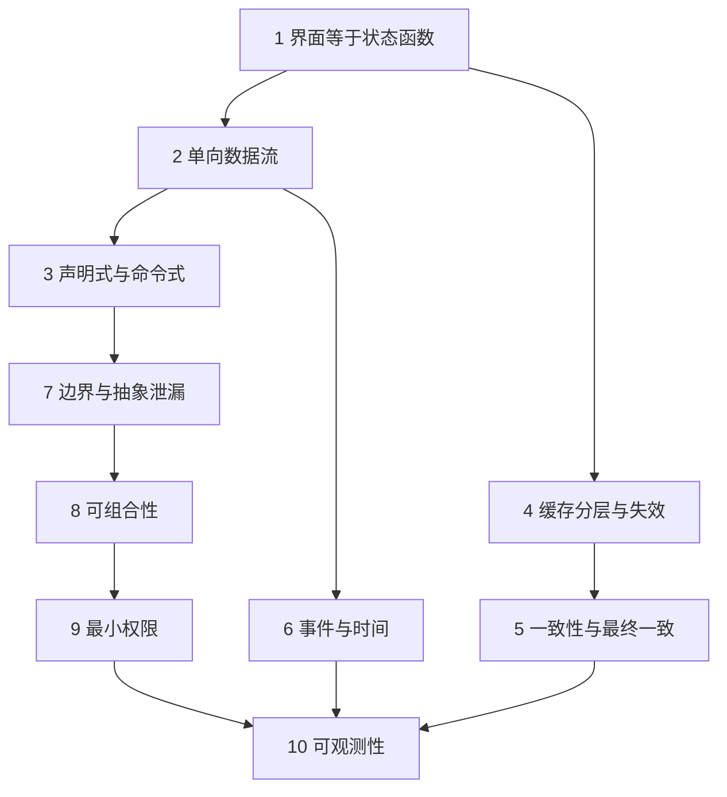
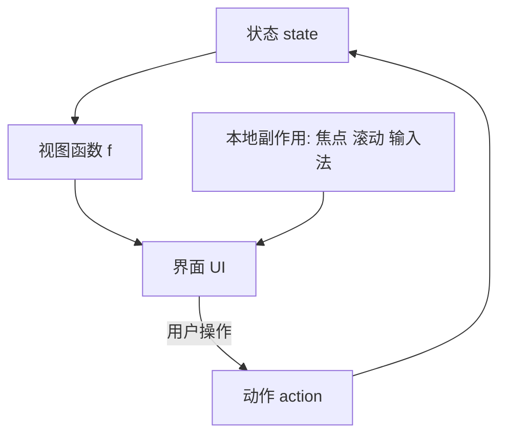
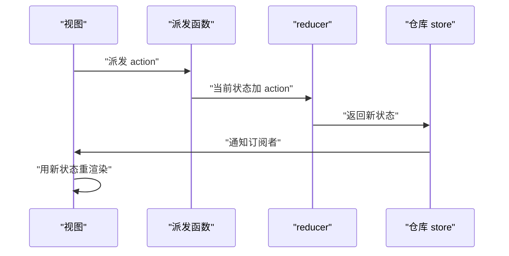
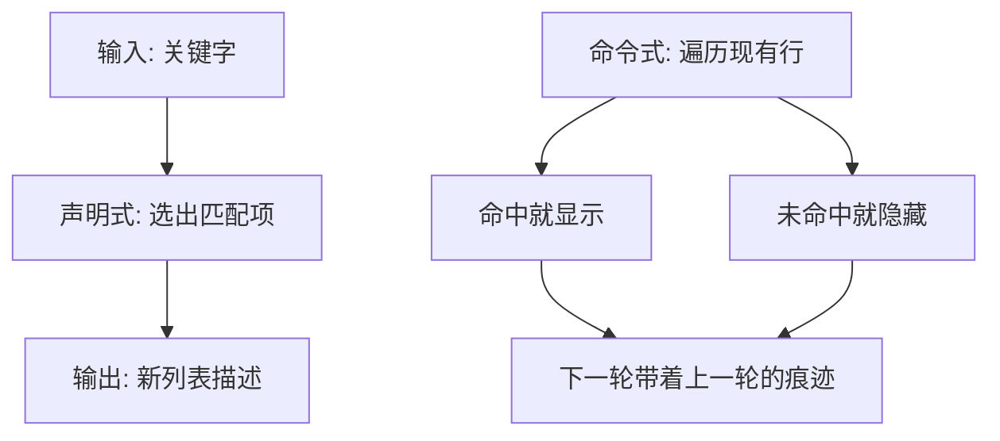
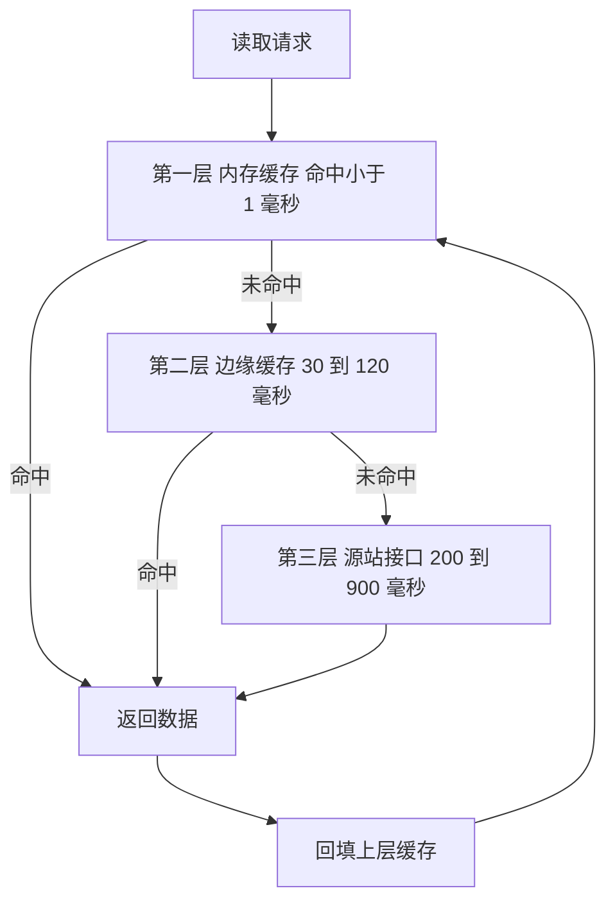
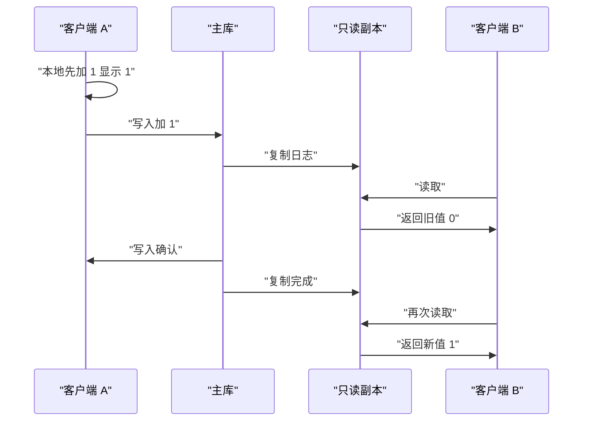
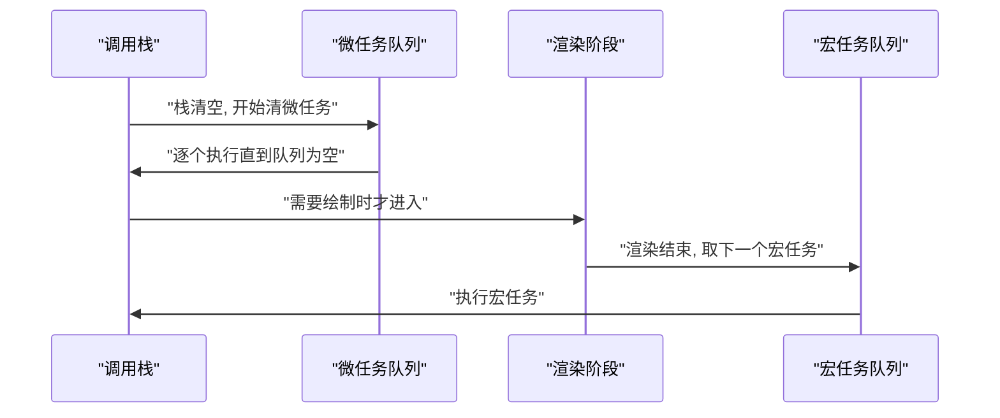
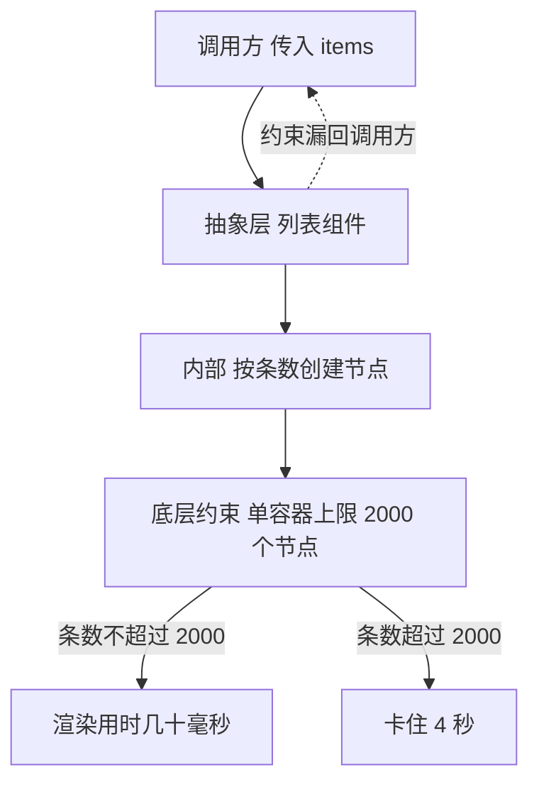
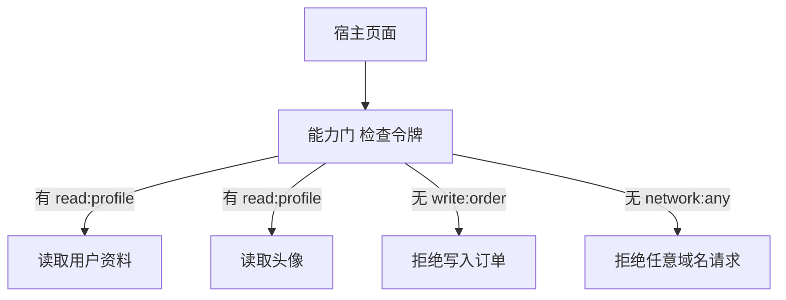
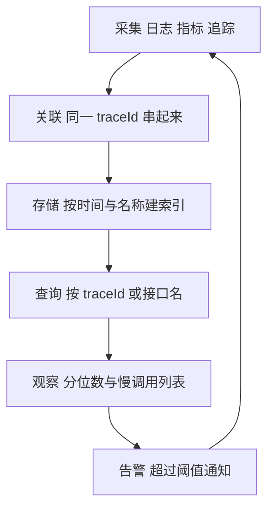

# 前端的十个心智模型

!!! abstract "学完这一页你能"
    - 用一句话写出界面等于状态函数，并实现一个只改动变化节点的渲染函数。
    - 画出单向数据流的四个角色，并指出破坏它的那一步。
    - 写出带存活时间与容量上限的缓存，并说明版本失效与时间失效的差别。
    - 复现事件循环的执行顺序，并给一段代码加上可读的分段耗时记录。

## 0. 知识地图



建议按编号顺序读，前三个模型是后面所有模型的地基。第 4 到第 6 个模型讲数据在时间与网络上的行为。第 7 到第 10 个模型讲工程结构，读的时候把每一节的反例代码复制到本地跑一遍。

## 1. 界面等于状态函数

**先想一个问题**

你在计数器页面点加号。`state.count` 从 0 变成 1，屏幕上的数字还是 0，因为改状态的那行代码没带上改文本的那行。

**心智模型**

!!! tip "心智模型"
    - 一句话模型：界面等于函数作用于状态，同一份状态永远得到同一份界面。
    - 日常类比：Excel 的公式单元格，你改 A1，B1 自己算出新值。
    - 类比不成立的地方：Excel 会重算整张表，浏览器还要管焦点、滚动位置、输入法候选框，这些不在状态里，函数算不出来。

**图解**



1. 状态进入视图函数。
2. 视图函数返回一份界面描述。
3. 界面描述被写到屏幕上。
4. 用户操作产生动作，动作生成新状态，回到第 1 步。
5. 本地副作用独立影响屏幕，它不在状态里，所以重渲染会覆盖掉它。

**一步一步来**

第 1 步：把状态收成一个对象。

```js
// 状态集中放, 不散落在各处
const state = { count: 0, step: 1 };
// 读取时只读 state, 不读全局变量
console.log(state.count);
```

**这段代码在做什么**

- 与界面相关的值放进同一个对象。
- 读取路径统一成 `state.count`，方便全局查找。
- 后续替换状态就是替换这个对象。

**运行结果**

```text
0
```

第 2 步：写视图函数，输入状态，输出节点描述。

```js
// 视图函数必须是纯函数: 只依赖入参, 不改外部
function view(s) {
  return { tag: 'p', text: 'count=' + s.count }; // 只用 s
}
console.log(view({ count: 0 }));
```

**这段代码在做什么**

- 输出是一份数据，不是屏幕上的元素。
- 同一份入参调用两次，得到两份内容相等的输出。
- 函数里没有网络请求、没有 DOM、没有随机数。

**运行结果**

```text
{ tag: 'p', text: 'count=0' }
```

第 3 步：比较新旧描述，只写变化的部分。

```js
let writes = 0;                                     // 统计真实写入次数
function patch(prev, next, apply) {
  if (prev && prev.text === next.text) return next; // 内容相同: 零次写入
  apply(next.text);                                 // 内容不同: 写入一次
  writes += 1;
  return next;                                      // 新描述成为下次的基线
}
```

**这段代码在做什么**

- `prev` 是上一次的描述，首次传入时为 `undefined`。
- 内容相同时直接返回，`writes` 不变。
- 内容不同时调用 `apply` 写屏幕，`writes` 加一。

**动手验证**

```js
// 依赖: 无。Node 20+, 存为 demo.mjs 运行
import assert from 'node:assert/strict';

let screen = '';                                    // 屏幕替身
let writes = 0;                                     // 真实写入次数
const apply = (t) => { screen = t; writes += 1; };
const view = (s) => ({ text: 'count=' + s.count });

function patch(prev, next) {
  if (prev && prev.text === next.text) return next;  // 内容相同, 不写
  apply(next.text);                                  // 内容变化, 写一次
  return next;
}

const state = { count: 0 };
let prev = patch(undefined, view(state));            // 首次渲染
const afterFirst = writes;
state.count = 1;                                     // 状态变化
prev = patch(prev, view(state));                     // 重算
assert.equal(screen, 'count=1');
assert.equal(writes, afterFirst + 1);                // 只多了一次写入
patch(prev, view(state));                            // 状态没变
assert.equal(writes, afterFirst + 1);                // 写入次数不变
console.log('screen=' + screen, 'writes=' + writes);
```

**运行结果**

```text
screen=count=1 writes=2
```

**常见坑**

| 现象 | 原因 | 怎么修 |
| --- | --- | --- |
| 输入框每输入一个字就丢焦点 | 重渲染重建了输入元素 | 复用同一个节点，只改 value 属性 |
| 状态改了界面没动 | 改的是对象副本，或直接改了数组元素 | 用新引用替换，写成 `state = { ...state, count: 1 }` |
| 同一份状态两次刷新显示不同 | 视图函数读了 `Date.now()` 或随机数 | 把时间与随机值放进状态，作为入参传入 |

**小结**

1. 界面是状态的函数，状态变了界面自己跟着变。
2. 视图函数保持纯粹，两次渲染之间才能做比较。
3. 焦点与滚动不在状态里，需要单独保存。

## 2. 单向数据流

**先想一个问题**

三个组件都能改同一份购物车数据。A 组件加了商品，顶部角标还是旧数字。你去查是谁改的，找到五处写入点。

**心智模型**

!!! tip "心智模型"
    - 一句话模型：事件向上报告，数据向下流动，中间只有一个改数据的地方。
    - 日常类比：公司报销。员工提交单据，审批后财务改账，员工只能查余额。
    - 类比不成立的地方：公司能走特批直接改账，前端代码里谁都能写仓库，需要靠封装挡住。

**图解**



1. 视图不直接改数据，它派发一个动作。
2. 派发函数把当前状态与动作交给 `reducer`。
3. `reducer` 是纯函数，返回一份新状态。
4. 仓库用新状态替换旧状态。
5. 仓库通知订阅者，订阅者重渲染，回到第 1 步等待下一次操作。

**一步一步来**

第 1 步：定义动作与 `reducer`。

```js
const addItem = (name) => ({ type: 'ADD_ITEM', name }); // 动作携带类型与数据

function reducer(state, action) {
  if (action.type === 'ADD_ITEM') {
    return { items: [...state.items, action.name] };     // 不修改旧数组
  }
  return state;                                          // 不认识的动作用原状态
}
console.log(reducer({ items: [] }, addItem('apple')));
```

**这段代码在做什么**

- 动作是一个普通对象，字段固定为 `type` 与数据。
- `reducer` 不修改入参，返回新对象。
- `[...state.items]` 复制数组，旧引用保持不变。
- 无法识别的动作原样返回，避免意外清空。

**运行结果**

```text
{ items: [ 'apple' ] }
```

第 2 步：写仓库，管好状态与订阅。

```js
function createStore(reducer, initial) {
  let state = initial;                  // 状态只在这里保存
  const listeners = new Set();          // 订阅者集合, 自动去重
  return {
    getState: () => state,              // 只读出口
    dispatch(action) {
      state = reducer(state, action);   // 唯一的写入口
      listeners.forEach((fn) => fn());  // 通知所有订阅者
    },
    subscribe(fn) { listeners.add(fn); return () => listeners.delete(fn); },
  };
}
```

**这段代码在做什么**

- `state` 是闭包私有变量，外部只能通过 `getState` 读到。
- 写操作只出现在 `dispatch` 里，全项目共一处。
- `listeners` 用 `Set`，同一个函数重复订阅只触发一次。
- `subscribe` 返回取消函数，避免组件卸载后仍收到通知。

**动手验证**

```js
// 依赖: 无。Node 20+, 存为 demo.mjs 运行
import assert from 'node:assert/strict';
const addItem = (name) => ({ type: 'ADD_ITEM', name });
const reducer = (s, a) => a.type === 'ADD_ITEM' ? { items: [...s.items, a.name] } : s;
function createStore(reducer, initial) {
  let state = initial;
  const listeners = new Set();
  return {
    getState: () => state,
    dispatch(a) { state = reducer(state, a); listeners.forEach((fn) => fn()); },
    subscribe(fn) { listeners.add(fn); return () => listeners.delete(fn); },
  };
}
const store = createStore(reducer, { items: [] });
const seen = [];
const off = store.subscribe(() => seen.push(store.getState().items.length));
store.dispatch(addItem('apple'));
store.dispatch(addItem('pear'));
assert.deepEqual(store.getState().items, ['apple', 'pear']);  // 数据正确
assert.deepEqual(seen, [1, 2]);                               // 通知顺序正确
off();
store.dispatch(addItem('plum'));
assert.deepEqual(seen, [1, 2]);                               // 取消后不再收到通知
assert.equal(store.getState().items.length, 3);               // 数据仍然更新
console.log('seen=' + JSON.stringify(seen));
```

**运行结果**

```text
seen=[1,2]
```

**常见坑**

| 现象 | 原因 | 怎么修 |
| --- | --- | --- |
| 订阅回调里又派发动作，页面反复渲染 | 一次通知触发一次派发，形成环 | 在 `reducer` 里算结果，或用标志位跳过重复通知 |
| 状态看起来改了但界面没变 | `reducer` 直接改了旧对象，引用没变 | 返回新对象，让引用比较能发现变化 |
| 同一组件收到两次通知 | 组件重复订阅且没取消 | 卸载时调用 `subscribe` 返回的取消函数 |

**小结**

1. 数据向下走，事件向上走，写入点只剩一处。
2. `reducer` 必须是纯函数，引用换了才表示状态换了。
3. 订阅要成对出现，订阅了就要有取消。

## 3. 声明式与命令式

**先想一个问题**

一个列表要支持搜索过滤。你写的逻辑是"把不匹配的行隐藏起来"。筛选两次之后，第一次藏掉的行再也没回来。

**心智模型**

!!! tip "心智模型"
    - 一句话模型：命令式描述怎么做，声明式描述结果是什么。
    - 日常类比：打车时报目的地，还是给司机一路指方向。
    - 类比不成立的地方：声明式的底层仍然是命令式的写操作，只是这层写操作由渲染器负责。

**图解**



1. 声明式只走一条路径：从输入算出输出。
2. 输出是一份新列表描述，旧描述被丢弃。
3. 命令式要遍历现有行，逐行决定显示或隐藏。
4. 显示与隐藏是累积操作，上一轮的隐藏会带到下一轮。
5. 累积状态让后续筛选结果与调用顺序绑在一起。

**一步一步来**

第 1 步：命令式写法，逐行改。

```js
const rows = [
  { text: 'apple', hidden: false },   // 每行带一个隐藏标记
  { text: 'pear', hidden: false },
  { text: 'plum', hidden: false },
];
function filterNaive(keyword) {
  rows.forEach((r) => { if (!r.text.includes(keyword)) r.hidden = true; }); // 只隐藏, 不还原
  return rows.filter((r) => !r.hidden).map((r) => r.text);
}
console.log(filterNaive('pl'), filterNaive('ap'));
```

**这段代码在做什么**

- 隐藏标记保存在数据行上，跨调用累积。
- 每次筛选只把不匹配的行标成隐藏，没有反向操作。
- 第二次筛选 `ap` 时，`apple` 仍带着上一轮的隐藏标记。

**运行结果**

```text
[ 'plum' ] []
```

第二个结果是错的，正确答案应为 `[ 'apple' ]`。

第 2 步：声明式写法，每次从头算。

```js
const all = ['apple', 'pear', 'plum'];                 // 原始数据, 只读
function filterDeclarative(keyword) {
  return all.filter((row) => row.includes(keyword));   // 每次重算可见集
}
console.log(filterDeclarative('pl'), filterDeclarative('ap'));
```

**这段代码在做什么**

- 原始数据 `all` 不被修改。
- 可见集每次由关键字直接算出，不依赖上一次结果。
- 调换两次调用的顺序，结果不变。

**运行结果**

```text
[ 'plum' ] [ 'apple' ]
```

第 3 步：数一数写操作次数。

```js
let writes = 0;
const renderDeclarative = (list) => { writes += 1; return list.join(' '); }; // 整块写一次
const renderImperative = (list) => {
  let out = '';
  for (const item of list) { writes += 1; out += item + ' '; } // 逐项写
  return out.trim();
};
renderDeclarative(['apple', 'pear', 'plum']);
const a = writes;                                       // 1
writes = 0;
renderImperative(['apple', 'pear', 'plum']);
const b = writes;                                       // 3
console.log('声明式:', a, '命令式:', b);
```

**这段代码在做什么**

- 声明式写法对整块内容写一次，次数与条数无关。
- 命令式写法逐项写，3 条数据产生 3 次写入。
- 数据涨到 1000 条时，命令式写入次数是 1000。

**运行结果**

```text
声明式: 1 命令式: 3
```

**动手验证**

```js
// 依赖: 无。Node 20+, 存为 demo.mjs 运行
import assert from 'node:assert/strict';

const rows = [
  { text: 'apple', hidden: false },
  { text: 'pear', hidden: false },
  { text: 'plum', hidden: false },
];
function filterNaive(keyword) {
  rows.forEach((r) => { if (!r.text.includes(keyword)) r.hidden = true; }); // 只隐藏不还原
  return rows.filter((r) => !r.hidden).map((r) => r.text);
}
assert.deepEqual(filterNaive('pl'), ['plum']);   // 第一次看起来对
assert.deepEqual(filterNaive('ap'), []);         // 第二次就错了

const all = ['apple', 'pear', 'plum'];
const filter = (k) => all.filter((row) => row.includes(k)); // 声明式
assert.deepEqual(filter('pl'), ['plum']);
assert.deepEqual(filter('ap'), ['apple']);       // 与调用顺序无关
assert.deepEqual(filter('pl'), ['plum']);        // 再算一次结果相同
console.log('命令式 ' + filterNaive('ap').length + ' 项，声明式 ' + filter('ap').length + ' 项');
```

**运行结果**

```text
命令式 0 项，声明式 1 项
```

**常见坑**

| 现象 | 原因 | 怎么修 |
| --- | --- | --- |
| 筛选一次后结果逐次变少 | 隐藏标记只增不减 | 每次从原始数据重算，不保存可见性 |
| 输入框里的字被重渲染清空 | 声明式重建了输入元素 | 保留元素引用，只同步变化的属性 |
| 动画每次重渲染从头播 | 元素被替换，动画重新开始 | 用稳定的 id 复用元素 |

**小结**

1. 命令式累积写操作，声明式从输入算出输出。
2. 声明式把怎么做搬进渲染器，业务代码只描述结果。
3. 声明式的代价由渲染器承担，比较逻辑写不好会变慢。

## 4. 缓存分层与失效

**先想一个问题**

首页每次打开都要等 800 毫秒的接口返回。同一份数据，同一个用户，十分钟内没有变过。

**心智模型**

!!! tip "心智模型"
    - 一句话模型：缓存按距离分层，越近越快，越近容量越小，越近越容易过期。
    - 日常类比：冰箱、楼下便利店、城市仓库。
    - 类比不成立的地方：食物过期有印制日期，数据是否过期要看服务端版本与业务能容忍多旧的读数。

**图解**



1. 请求先到第一层内存缓存，命中就在 1 毫秒内返回。
2. 第一层未命中时到第二层边缘缓存，命中用时 30 到 120 毫秒。
3. 第二层未命中才到第三层源站，用时 200 到 900 毫秒。
4. 任意一层命中都返回数据。
5. 返回后把结果回填到上层，下一次读取命中离用户最近的一层。

!!! note "术语：TTL"
    TTL（Time To Live，存活时间）是一条缓存记录允许被使用的最长时间。例子：把 TTL 设为 60000 毫秒，写入后 60 秒内的读取直接返回缓存，第 60001 毫秒的读取视为过期。

**一步一步来**

第 1 步：写带 TTL 的缓存。

```js
function createTtlCache(ttlMs, now = () => Date.now()) {
  const map = new Map();                     // key 到记录的映射
  return {
    get(key) {
      const rec = map.get(key);
      if (!rec) return undefined;            // 没有记录
      if (now() - rec.at > ttlMs) { map.delete(key); return undefined; } // 过期即删
      return rec.value;                      // 未过期, 直接返回
    },
    set(key, value) { map.set(key, { value, at: now() }); }, // 记录写入时刻
    size: () => map.size,
  };
}
```

**这段代码在做什么**

- `now` 作为参数注入，测试时可以换成假时钟。
- 读取时检查时间差，超过 `ttlMs` 就删除并视为未命中。
- 每条记录带上写入时刻 `at`，这是判断过期唯一的依据。
- 删除发生在读取路径上，属于惰性删除。

第 2 步：加容量上限，淘汰最久未使用的那条。

```js
function createLruCache(capacity) {
  const map = new Map();                     // Map 保持插入顺序
  return {
    get(key) {
      if (!map.has(key)) return undefined;
      const v = map.get(key);
      map.delete(key); map.set(key, v);      // 命中后移到队尾
      return v;
    },
    set(key, value) {
      if (map.has(key)) map.delete(key);
      map.set(key, value);                   // 新记录放队尾
      if (map.size > capacity) map.delete(map.keys().next().value); // 淘汰队首
    },
  };
}
```

**这段代码在做什么**

- `Map` 的键按插入顺序遍历，队首键就是最久未被读取的键。
- 读取命中后先删再插，把该键移到队尾。
- 写入后如果超过容量，删除队首键，每次淘汰 1 条。

!!! note "术语：LRU"
    LRU（Least Recently Used，最近最少使用）是一种淘汰规则：容量满时删掉最久没有被读取的那条记录。例子：容量为 2 时依次写入 a、b，读取 a，再写入 c，被淘汰的是 b。

第 3 步：用版本号失效，而不是用时间失效。

```js
const cache = new Map();
function read(key, remoteVersion) {
  const rec = cache.get(key);
  if (rec && rec.version === remoteVersion) return rec.value; // 版本一致: 用缓存
  cache.delete(key);                       // 版本不一致: 丢弃
  return undefined;                        // 交给上层重新请求
}
cache.set('home', { version: 1, value: ['a'] });
console.log(read('home', 1), read('home', 2), cache.size);
```

**这段代码在做什么**

- 缓存记录保存数据版本，读取时与远端版本比较。
- 版本一致代表数据没变，可以直接使用。
- 版本不一致时删除记录，界面不会拿到旧数据。

**运行结果**

```text
{ version: 1, value: [ 'a' ] } undefined 0
```

**动手验证**

```js
// 依赖: 无。Node 20+, 存为 demo.mjs 运行
import assert from 'node:assert/strict';

let clock = 0;                                 // 假时钟, 单位毫秒
const now = () => clock;
function createCache(ttlMs, capacity) {
  const map = new Map();
  return {
    get(key) {
      if (!map.has(key)) return undefined;
      const rec = map.get(key);
      if (now() - rec.at > ttlMs) { map.delete(key); return undefined; } // 过期
      map.delete(key); map.set(key, rec);      // 命中后移到队尾
      return rec.value;
    },
    set(key, value) {
      if (map.has(key)) map.delete(key);
      map.set(key, { value, at: now() });
      if (map.size > capacity) map.delete(map.keys().next().value); // 超容量淘汰
    },
    size: () => map.size,
  };
}
const cache = createCache(100, 2);
cache.set('a', 1);
cache.set('b', 2);
assert.equal(cache.get('a'), 1);               // a 变成最近使用
cache.set('c', 3);                             // 容量满, 淘汰 b
assert.equal(cache.get('b'), undefined);
assert.equal(cache.size(), 2);
clock = 101;                                   // 时间推进 101 毫秒
assert.equal(cache.get('a'), undefined);       // 超过 TTL
console.log('容量 2 TTL 100 毫秒，淘汰与过期都生效');
```

**运行结果**

```text
容量 2 TTL 100 毫秒，淘汰与过期都生效
```

**常见坑**

| 现象 | 原因 | 怎么修 |
| --- | --- | --- |
| 更新数据后页面还是旧值 | 只写了缓存没删缓存 | 写入成功后删除对应 key，或用版本号比较 |
| 缓存增长到内存报警 | 只设了 TTL，没有容量上限 | 加容量上限并淘汰队首键 |
| 不同用户看到同一份数据 | 缓存键没有带上用户标识 | 键写成 `userId + ':' + resource` |

**小结**

1. 缓存按距离分层，靠近用户的层容量小、命中快。
2. TTL 管时间，容量上限管空间，两者都要设。
3. 失效优先用版本号，比时间判断准确。

## 5. 一致性与最终一致

**先想一个问题**

用户点了赞，界面马上变成 1。刷新后又是 0。再点一次，变成 2。

**心智模型**

!!! tip "心智模型"
    - 一句话模型：强一致要求读到刚写的值，最终一致允许短时间读到旧值，但约定时间后必须收敛。
    - 日常类比：微信群消息在不同手机上先后到达。
    - 类比不成立的地方：群消息不会丢也不会乱，分布式副本可能出现重复、乱序、长期不一致。

!!! note "术语：幂等"
    幂等（Idempotent）指同一个操作执行 1 次与执行 N 次，结果相同。例子：把点赞数设为 5 是幂等的，把点赞数加 1 不是。

**图解**



1. 客户端 A 在本地把数字改成 1，用户立刻看到变化。
2. A 把写请求发给主库。
3. 主库把变更复制到只读副本。
4. 客户端 B 此时读副本，拿到旧值 0。
5. 主库返回写入确认。
6. 复制完成后 B 再读，拿到新值 1，两个客户端收敛到同一个值。

**一步一步来**

第 1 步：乐观更新，本地先改。

```js
const client = { likes: 0, pending: [] };       // 本地状态与待发送队列
function like() {
  client.likes += 1;                            // 本地立刻加 1
  client.pending.push({ delta: 1, id: 'r' + client.pending.length }); // 记录待发送
  return client.likes;
}
console.log(like(), client.pending.length);
```

**这段代码在做什么**

- 界面读取 `client.likes`，点击后立刻看到 1。
- 每条待发送记录带唯一 `id`，用于服务端去重。
- `pending` 是本地队列，网络失败时从这里重发。

**运行结果**

```text
1 1
```

第 2 步：服务端去重，让重试安全。

```js
function send(record, server) {
  if (server.seen.has(record.id)) return 'duplicated'; // 已处理过, 直接返回
  server.seen.add(record.id);                          // 记下已处理的 id
  server.likes += record.delta;                        // 只在去重之后改数据
  return 'ok';
}
const server = { likes: 0, seen: new Set() };
const rec = { delta: 1, id: 'r1' };
console.log(send(rec, server), send(rec, server), server.likes);
```

**这段代码在做什么**

- 服务端保存已处理的 `id`，重复请求被识别。
- 加 1 的操作放在去重之后，同等请求只生效一次。
- 第二次发送返回 `duplicated`，`likes` 保持 1。

**运行结果**

```text
ok duplicated 1
```

第 3 步：用版本比较判断收敛。

```js
const primary = { likes: 0, version: 0 };
const replica = { likes: 0, version: -1 };
function write(delta) { primary.likes += delta; primary.version += 1; } // 主库更新并加版本
function replicate() { replica.likes = primary.likes; replica.version = primary.version; }
console.log(replica.version === primary.version); // 复制没跑, 还未收敛
write(1); replicate();
console.log(replica.version === primary.version, replica.likes);
```

**这段代码在做什么**

- 版本号每次写入加 1，代表主库的最新状态。
- 副本版本落后时，读取会拿到旧值。
- 收敛判断用版本相等，不是用等待固定时长。

**运行结果**

```text
true false 1
```

**动手验证**

```js
// 依赖: 无。Node 20+, 存为 demo.mjs 运行
import assert from 'node:assert/strict';

const primary = { likes: 0, version: 0, seen: new Set() }; // 主库
const replica = { likes: 0, version: -1 };                 // 只读副本
const queue = [];                                          // 待复制日志

function write(id, delta) {                                // 幂等写入
  if (primary.seen.has(id)) return 'duplicated';
  primary.seen.add(id);
  primary.likes += delta;
  primary.version += 1;
  queue.push(primary.version);                             // 追加复制日志
  return 'ok';
}
function drain() {                                         // 副本追赶
  while (queue.length) { replica.likes = primary.likes; replica.version = queue.shift(); }
}
assert.equal(write('r1', 1), 'ok');
assert.equal(replica.likes, 0);                            // 副本仍是旧值 0
assert.equal(queue.length, 1);                             // 本地乐观显示 1
assert.equal(write('r1', 1), 'duplicated');                // 重发被去重
assert.equal(write('r2', 1), 'ok');
drain();
assert.equal(replica.version, primary.version);            // 副本追上主库
assert.equal(replica.likes, 2);                            // 收敛到 2
console.log('主库=' + primary.likes + ' 副本=' + replica.likes + ' 版本=' + primary.version);
```

**运行结果**

```text
主库=2 副本=2 版本=2
```

**常见坑**

| 现象 | 原因 | 怎么修 |
| --- | --- | --- |
| 重复点击后数字多加 | 重试请求没有去重 | 每次写入带唯一 id，服务端记录已处理的 id |
| 本地显示与刷新后不一致 | 乐观更新没有回滚路径 | 失败时按 delta 反向修正，或重新拉取全量 |
| 一直读到旧值 | 读请求固定发往副本 | 写后读的请求带上版本号，要求副本版本不小于该值 |

**小结**

1. 乐观更新让界面立刻响应，代价是要处理回滚。
2. 重试必须幂等，去重靠请求唯一 id。
3. 收敛用版本比较判断，不用等待固定时长。

## 6. 事件与时间

**先想一个问题**

你写 `setTimeout(fn, 0)` 想让 `fn` 先于 `Promise.then` 执行。运行结果是 `then` 先打印。

**心智模型**

!!! tip "心智模型"
    - 一句话模型：JS 一次只跑一段代码，跑完后清空微任务队列，再取下一个宏任务。
    - 日常类比：银行一个窗口，办完当前业务后先处理桌上的便签，再叫下一个号。
    - 类比不成立的地方：浏览器在宏任务之间还要插入渲染阶段，渲染时机由帧率与浏览器决定。

!!! note "术语：微任务"
    微任务（Microtask）是当前宏任务结束后立即清空的队列。例子：`Promise.then`、`queueMicrotask`、`MutationObserver` 的回调都会进入这个队列。

**图解**



1. 同步代码在调用栈上执行，中途产生的微任务进入队列。
2. 调用栈清空后，引擎立即清空微任务队列。
3. 微任务执行中产生的新微任务也在本轮清空。
4. 微任务队列清空后，浏览器判断是否需要渲染。
5. 渲染完成后取下一个宏任务，回到第 1 步。

**一步一步来**

第 1 步：看清同步、微任务、宏任务的先后。

```js
console.log('1 sync');                                   // 立即执行
setTimeout(() => console.log('2 macro'), 0);             // 入宏任务队列
Promise.resolve().then(() => console.log('3 micro'));    // 入微任务队列
console.log('4 sync');                                   // 立即执行
```

**这段代码在做什么**

- 两行同步日志在栈上按书写顺序执行。
- `setTimeout` 的回调进入宏任务队列，等待下一轮。
- `then` 的回调进入微任务队列，等待当前轮结束。

**运行结果**

```text
1 sync
4 sync
3 micro
2 macro
```

第 2 步：看清微任务里再排微任务的顺序。

```js
console.log('A');
Promise.resolve().then(() => {
  console.log('B1');                                // 第 1 个微任务
  Promise.resolve().then(() => console.log('B2'));  // 执行时才入队
});
queueMicrotask(() => console.log('C'));              // 排在 B1 之后
console.log('D');
```

**这段代码在做什么**

- `B1` 先入队，`C` 后入队。
- `B1` 执行时把 `B2` 追加到队列尾部。
- 队列清空的条件是长度归零，所以 `B2` 排在 `C` 后面。

**运行结果**

```text
A
D
B1
C
B2
```

第 3 步：用宏任务切分长任务。

```js
function runChunks(total, chunkSize, onDone) {
  let done = 0;
  function step() {
    const end = Math.min(done + chunkSize, total);   // 本轮处理到的下标
    for (; done < end; done += 1) { /* 处理第 done 项 */ }
    if (done < total) setTimeout(step, 0);           // 让出一轮, 允许渲染
    else onDone(done);                               // 全部处理完
  }
  step();                                            // 启动第 1 轮
}
runChunks(2500, 1000, (n) => console.log('处理完成', n));
```

**这段代码在做什么**

- 每轮最多处理 `chunkSize` 项，本轮结束后把控制权交回。
- `setTimeout(step, 0)` 让浏览器有机会在轮次之间渲染。
- 2500 项被切成 3 轮：1000、1000、500。

**运行结果**

```text
处理完成 2500
```

**动手验证**

```js
// 依赖: 无。Node 20+, 存为 demo.mjs 运行
import assert from 'node:assert/strict';

const order = [];                                    // 记录真实执行顺序
setTimeout(() => order.push('macro1'), 0);           // 宏任务, 排第 4
Promise.resolve().then(() => {
  order.push('micro1');                              // 微任务, 排第 1
  Promise.resolve().then(() => order.push('micro2')); // 微任务里再排一个
});
queueMicrotask(() => order.push('micro3'));          // 微任务, 排第 2
setTimeout(() => {
  order.push('macro2');                              // 宏任务, 排第 5
  Promise.resolve().then(() => order.push('macro2-micro')); // 排第 6
}, 0);

setTimeout(() => {                                   // 等前两个宏任务跑完再检查
  assert.deepEqual(order, ['micro1', 'micro3', 'micro2', 'macro1', 'macro2', 'macro2-micro']);
  console.log(JSON.stringify(order));
}, 10);
```

**运行结果**

```text
["micro1","micro3","micro2","macro1","macro2","macro2-micro"]
```

**常见坑**

| 现象 | 原因 | 怎么修 |
| --- | --- | --- |
| `setTimeout(fn, 0)` 不是立刻执行 | 它排在所有微任务之后 | 需要本轮的末尾用 `queueMicrotask` |
| 页面在长循环中卡住 | 一次宏任务跑了 3 秒 | 按 1000 项切成多轮，用 `setTimeout` 让出 |
| `await` 之后的代码顺序与预期不同 | `await` 之后的代码排入微任务队列 | 把 `await` 之后当成微任务，按队列顺序推导 |

**小结**

1. 一次只跑一个宏任务，跑完清空微任务队列。
2. 微任务里排队的新微任务也在同一轮清空。
3. 切分长任务用宏任务让出，微任务不让出。

## 7. 边界与抽象泄漏

**先想一个问题**

你封装了一个通用列表组件，测试 20 条数据正常。线上 12000 条时页面白屏 4 秒。

**心智模型**

!!! tip "心智模型"
    - 一句话模型：抽象把复杂性藏起来，但它藏不住底层资源的上限。
    - 日常类比：中央空调说只要设定温度就行，房间西晒时它压不住。
    - 类比不成立的地方：空调压不住你可以改设定，抽象漏出来的是底层事实，改不掉。

!!! note "术语：抽象泄漏"
    抽象泄漏（Leaky Abstraction）指封装层无法完全隐藏底层细节，底层约束从接口的缝里透出来。例子：列表组件对外只暴露 `items`，但单个容器能承载的节点数有上限，数据一大就暴露。

**图解**



1. 调用方只传 `items`，不关心内部节点数。
2. 抽象层按 `items.length` 创建节点。
3. 底层对单个容器可承载的节点数有上限，这里按 2000 计。
4. 低于上限时渲染用时几十毫秒。
5. 超过上限时布局耗时上升，页面卡住 4 秒。
6. 底层约束通过性能表现漏回调用方。

**一步一步来**

第 1 步：写一个隐藏上限的抽象。

```js
class ListView {
  constructor(host) { this.host = host; }                  // 保存外部容器
  render(items) {
    this.host.nodes = items.map((t) => ({ tag: 'li', text: t })); // 每项一个节点
    return this.host.nodes.length;                         // 返回节点数
  }
}
```

**这段代码在做什么**

- 调用方只提供 `items`，不需要了解节点。
- 内部节点数等于数据条数，没有上限判断。
- 数据条数从 20 涨到 12000 时，这段代码本身不变。

第 2 步：复现边界。

```js
const MAX = 2000;                                          // 容器上限
const host = { nodes: [], setNodes(ns) { if (ns.length > MAX) throw new Error('节点数 ' + ns.length + ' 超过上限 ' + MAX); this.nodes = ns; } };
const view = new ListView(host);
const small = Array.from({ length: 20 }, (_, i) => 'r' + i);
const big = Array.from({ length: 12000 }, (_, i) => 'r' + i);
view.render(small);
console.log('20 条节点数', host.nodes.length);
try { view.render(big); } catch (e) { console.log('抛错', e.message); }
```

**这段代码在做什么**

- 容器自己知道上限，超过就抛错。
- 20 条时容器收到 20 个节点，程序继续。
- 12000 条时错误信息里带上实际数量与上限。

**运行结果**

```text
20 条节点数 20
抛错 节点数 12000 超过上限 2000
```

第 3 步：把上限写进契约，并给出降级路径。

```js
function renderSafe(items, limit, onDegrade) {
  if (items.length > limit) {          // 超过上限走降级
    onDegrade(items.length);           // 先通知调用方
    return items.slice(0, limit);      // 只取前 limit 条
  }
  return items;                        // 正常路径
}
let warned = 0;
const out = renderSafe(['a', 'b', 'c', 'd'], 2, (n) => { warned = n; });
console.log(out, warned);
```

**这段代码在做什么**

- 上限判断放在抽象层内部，调用方不用重复写。
- 超限时先通知，调用方可以提示用户。
- 降级结果只含前 `limit` 条，界面仍有内容。

**运行结果**

```text
[ 'a', 'b' ] 4
```

**动手验证**

```js
// 依赖: 无。Node 20+, 存为 demo.mjs 运行
import assert from 'node:assert/strict';

const MAX = 2000;                                          // 单容器节点上限
class ListView {
  render(host, items) {
    if (items.length > MAX) throw new Error('节点数 ' + items.length + ' 超过上限 ' + MAX);
    host.nodes = items.map((t) => ({ tag: 'li', text: t }));  // 校验通过才写入容器
    return host.nodes.length;
  }
}
const host = { nodes: [] };
const view = new ListView();
const small = Array.from({ length: 20 }, (_, i) => 'r' + i);
const big = Array.from({ length: 12000 }, (_, i) => 'r' + i);

assert.equal(view.render(host, small), 20);                 // 正常路径
assert.equal(host.nodes[19].text, 'r19');
assert.throws(() => view.render(host, big), /超过上限 2000/); // 超限抛错
assert.equal(host.nodes.length, 20);                        // 抛错后旧内容保留

function renderSafe(items, limit, onDegrade) {              // 降级路径
  if (items.length > limit) { onDegrade(items.length); return items.slice(0, limit); }
  return items;
}
let warned = 0;
assert.equal(renderSafe(big, MAX, (n) => { warned = n; }).length, MAX);
assert.equal(warned, 12000);
console.log('上限=' + MAX + ' 正常=20 降级=' + MAX + ' 告警条数=' + warned);
```

**运行结果**

```text
上限=2000 正常=20 降级=2000 告警条数=12000
```

**常见坑**

| 现象 | 原因 | 怎么修 |
| --- | --- | --- |
| 小数据测试通过，大数据白屏 | 抽象没有声明容量上限 | 在接口上写出上限，超限抛错并给降级结果 |
| 抛错后界面空白 | 新数据未通过校验就被写进容器 | 校验通过后再替换容器内容 |
| 换浏览器表现不同 | 抽象依赖了某个浏览器的实现细节 | 把差异写进契约，需核对官方文档：具体要核对各浏览器对节点数量与布局耗时的实测数据 |

**小结**

1. 抽象能隐藏调用方式，隐藏不了底层资源上限。
2. 把上限写进接口契约，超限给出明确错误。
3. 降级路径提前准备，出错时界面仍有内容。

## 8. 可组合性

**先想一个问题**

一个请求函数要同时做鉴权、日志、重试、超时。每加一个需求就改一次函数体，函数涨到 180 行。

**心智模型**

!!! tip "心智模型"
    - 一句话模型：可组合等于统一接口加组合器，小块拼成大块而不改小块。
    - 日常类比：乐高积木的凸点规格统一，任意两块都能拼。
    - 类比不成立的地方：积木只有一种接口，真实函数的入参出参各不相同，组合前要先写适配器。

**图解**


1. 调用方只调用组合后的函数，接口保持一个。
2. 请求依次穿过日志、鉴权、重试三层。
3. 每层拿到下一个函数作为参数，决定何时调用它。
4. 核心函数执行真正的业务逻辑。
5. 失败时重试层重新调用核心函数，其他层不感知。
6. 任一层都能短路，后面的层不执行。

**一步一步来**

第 1 步：定下中间件签名。

```js
// 中间件: 接收 next, 返回新函数
// next: 下一层函数, 调用它就进入下一层
const logger = (next) => async (ctx) => {
  const t0 = Date.now();                        // 记录开始时刻
  const out = await next(ctx);                  // 进入下一层
  console.log('日志', ctx.name, Date.now() - t0 + 'ms'); // 记录耗时
  return out;
};
console.log(typeof logger);
```

**这段代码在做什么**

- 中间件本身是函数，输入 `next`，输出新函数。
- 新函数的入参 `ctx` 是所有层共享的上下文对象。
- 每一层共用同一个 `ctx`，加字段不用改函数签名。

**运行结果**

```text
function
```

第 2 步：写鉴权与重试两个中间件。

```js
const auth = (next) => async (ctx) => {
  if (!ctx.token) throw new Error('缺少 token'); // 无凭证直接短路
  return next(ctx);                              // 有凭证才继续
};
const retry = (times) => (next) => async (ctx) => {
  for (let i = 0; i < times; i += 1) {           // 最多尝试 times 次
    try { return await next(ctx); }              // 成功就返回
    catch (e) { if (i === times - 1) throw e; }  // 最后一次仍失败才抛出
  }
};
```

**这段代码在做什么**

- `auth` 不满足条件时抛错，后面的层不执行。
- `retry` 用循环实现尝试次数，上限来自参数。
- 只有最后一次失败才把错误交给上层，中间失败被吞掉。
- 每次尝试都调用 `next`，也就是重新走一遍后面的层。

第 3 步：用 `compose` 把函数串起来。

```js
function compose(...mws) {                       // 输入中间件列表
  return (core) => mws.reduceRight((next, mw) => mw(next), core); // 从右往左包
}
let attempts = 0;
const core = async (ctx) => {
  attempts += 1;
  if (attempts < 3) throw new Error('网络抖动'); // 前两次故意失败
  return 'ok:' + ctx.name;
};
const run = compose(auth, retry(3))(core);
run({ name: 'fetchUser', token: 't1' }).then((r) => console.log(r, '尝试次数', attempts));
```

**这段代码在做什么**

- `reduceRight` 从最右边的中间件开始包裹，执行顺序是从左到右。
- 最终函数 `run` 的入参仍是 `ctx`，与核心函数一致。
- 核心函数第 3 次才成功，前两次失败被重试层吞掉。

**运行结果**

```text
ok:fetchUser 尝试次数 3
```

**动手验证**

```js
// 依赖: 无。Node 20+, 存为 demo.mjs 运行
import assert from 'node:assert/strict';

const trace = [];                                        // 记录每层进出顺序
const mk = (name) => (next) => async (ctx) => {          // 造一个记录型中间件
  trace.push('in:' + name);
  const out = await next(ctx);
  trace.push('out:' + name);
  return out;
};
const auth = (next) => async (ctx) => {
  if (!ctx.token) throw new Error('缺少 token');          // 短路
  return next(ctx);
};
const retry = (n) => (next) => async (ctx) => {
  for (let i = 0; i < n; i += 1) { try { return await next(ctx); } catch (e) { if (i === n - 1) throw e; } }
};
function compose(...mws) {
  return (core) => mws.reduceRight((next, mw) => mw(next), core); // 从右往左包
}
let calls = 0;
const core = async () => { calls += 1; if (calls < 2) throw new Error('抖动'); return 'ok'; };
const run = compose(mk('log'), auth, retry(3))(core);

assert.equal(await run({ token: 't1' }), 'ok');           // 顶层 await 需要 mjs
assert.equal(calls, 2);                                   // 第 2 次成功
assert.deepEqual(trace, ['in:log', 'out:log']);           // 重试发生在 log 内部
await assert.rejects(() => run({}), /缺少 token/);         // 无凭证短路
console.log('calls=' + calls + ' trace=' + trace.slice(0, 2).join(','));
```

**运行结果**

```text
calls=2 trace=in:log,out:log
```

**常见坑**

| 现象 | 原因 | 怎么修 |
| --- | --- | --- |
| 中间件执行顺序与书写顺序相反 | 组合器从左往右包 | 用 `reduceRight`，并在测试中断言顺序 |
| 重试把非幂等请求发了两次 | 重试不区分错误类型 | 只重试网络类错误，业务错误直接抛出 |
| 某层拿不到上下文里的新字段 | 层与层之间用位置参数传值 | 统一用一个 `ctx` 对象，字段名固定 |

**小结**

1. 统一签名加组合器，小块拼成大块。
2. 重试在内部完成，外层只看到一次调用。
3. 上下文用对象传递，加字段不用改签名。

## 9. 最小权限

**先想一个问题**

页面引了一个第三方统计脚本。它读到了完整的 cookie 与 `localStorage`，还能把数据发到自己的域名。

**心智模型**

!!! tip "心智模型"
    - 一句话模型：默认拒绝，按任务需要逐项授权，授权范围就是能力上限。
    - 日常类比：酒店房卡只开你的房间和电梯。
    - 类比不成立的地方：房卡不能被复制出新权限，脚本一旦拿到宿主对象，就能转手调用它的其他方法。

!!! note "术语：能力令牌"
    能力令牌（Capability Token）是一份能做什么的凭据，拿到它就能做对应的事，没拿到就不能。例子：一个只含 `read:profile` 的令牌只能读资料，调用写入会失败。

**图解**



1. 宿主页面把所有外部访问集中到一个入口。
2. 入口先检查令牌里有没有对应能力。
3. 有 `read:profile` 时放行读资料与读头像。
4. 没有 `write:order` 时写入被拒绝。
5. 没有 `network:any` 时任意域名请求被拒绝。
6. 拒绝时返回错误，动作不执行。

**一步一步来**

第 1 步：默认全部拒绝。

```js
function createGate() {
  return {
    call(action) {                          // 唯一入口
      throw new Error('未授权: ' + action);  // 无令牌时一律拒绝
    },
  };
}
try { createGate().call('read:profile'); } catch (e) { console.log(e.message); }
```

**这段代码在做什么**

- 只有一个入口 `call`，没有别的路可以走。
- 默认分支是抛错，不是放行。
- 白名单为空时，读操作也拿不到数据。

**运行结果**

```text
未授权: read:profile
```

第 2 步：显式授权白名单。

```js
function createGate(capabilities = []) {
  const allowed = new Set(capabilities);                    // 白名单
  const handlers = new Map();                               // 能力到实现的映射
  return {
    grant(action, fn) { handlers.set(action, fn); },         // 注册实现
    has: (action) => allowed.has(action),                    // 是否已授权
    call(action, payload) {
      if (!allowed.has(action)) throw new Error('未授权: ' + action); // 先查白名单
      if (!handlers.has(action)) throw new Error('未注册: ' + action); // 再查实现
      return handlers.get(action)(payload);                            // 放行
    },
  };
}
```

**这段代码在做什么**

- 白名单与实现分开保存，注册实现不等于授权。
- `call` 先查白名单，再查实现，两步都通过才执行。
- 白名单为空时所有调用都被拒绝。

第 3 步：把令牌交给第三方脚本。

```js
const gate = createGate(['read:profile', 'read:avatar']);
gate.grant('read:profile', (p) => ({ id: p.id, name: 'Ann' })); // 只返回公开字段
gate.grant('write:order', () => 'created');                     // 注册了但没有授权
console.log(gate.call('read:profile', { id: 7, phone: '138' }));
console.log(gate.has('write:order'), gate.has('read:avatar'));
try { gate.call('write:order', {}); } catch (e) { console.log(e.message); }
```

**这段代码在做什么**

- `write:order` 有实现但没有授权，调用会失败。
- `read:profile` 的实现只返回两个公开字段，不返回整条用户记录。
- `has` 让脚本在调用前先判断，避免用异常做流程控制。

**运行结果**

```text
{ id: 7, name: 'Ann' }
false true
未授权: write:order
```

**动手验证**

```js
// 依赖: 无。Node 20+, 存为 demo.mjs 运行
import assert from 'node:assert/strict';

function createGate(capabilities = []) {                     // 白名单式能力门
  const allowed = new Set(capabilities);
  const handlers = new Map();
  const log = [];
  return {
    grant(action, fn) { handlers.set(action, fn); },
    call(action, payload) {
      log.push(action);                                      // 放行与拒绝都留痕
      if (!allowed.has(action)) throw new Error('未授权: ' + action);
      if (!handlers.has(action)) throw new Error('未注册: ' + action);
      return handlers.get(action)(payload);
    },
    log: () => [...log],
  };
}
const gate = createGate(['read:profile']);                   // 只授权一项
gate.grant('read:profile', (p) => ({ id: p.id, name: 'Ann' }));
gate.grant('write:order', () => 'created');
gate.grant('network:any', (url) => 'fetched ' + url);

const profile = gate.call('read:profile', { id: 7, phone: '138' });
assert.deepEqual(profile, { id: 7, name: 'Ann' });
assert.equal(Object.hasOwn(profile, 'phone'), false);         // 敏感字段没有出去
assert.throws(() => gate.call('write:order', {}), /未授权/);   // 已注册但未授权
assert.throws(() => gate.call('network:any', 'http://t.cn'), /未授权/);
assert.deepEqual(gate.log(), ['read:profile', 'write:order', 'network:any']);
console.log('放行=1 拒绝=2 日志=' + gate.log().join(','));
```

**运行结果**

```text
放行=1 拒绝=2 日志=read:profile,write:order,network:any
```

**常见坑**

| 现象 | 原因 | 怎么修 |
| --- | --- | --- |
| 第三方脚本读到了 cookie | 授权范围写成整个 `document` | 只传具体函数，不传宿主对象 |
| 授权后能调用没列出的接口 | 返回的对象带着原型上的其他方法 | 返回只含数据的普通对象 |
| 出了事查不到谁调了什么 | 拒绝路径没有记录 | 放行与拒绝都写日志，日志里带动作名 |

**小结**

1. 默认拒绝，逐项授权，白名单之外一律不通。
2. 传函数不传对象，避免脚本顺着对象拿到别的能力。
3. 拒绝路径也要留痕，排查时能看到调用方想做什么。

## 10. 可观测性

**先想一个问题**

用户说首页有时候慢。你手上只有几行 `console.log`，没有时间、没有次数、没有哪一步慢。

**心智模型**

!!! tip "心智模型"
    - 一句话模型：可观测性是用系统对外的输出，推断系统内部发生了什么。
    - 日常类比：医生看体检报告推断身体状态。
    - 类比不成立的地方：体检项目是固定的，线上问题要用有限输出反推没有预设过的原因。

!!! note "术语：追踪跨度"
    追踪跨度（Trace Span）是一次操作的时间片段，带名称、开始时刻与耗时。例子：名称 `fetchUser`、耗时 128 毫秒、所属请求 `traceId=t1`。

**图解**



1. 采集三类输出：日志、指标、追踪。
2. 用同一个 `traceId` 把一次请求的所有记录串起来。
3. 存入时按时间与名称建索引，便于过滤。
4. 查询可以按 `traceId` 找单次请求，也可以按接口名看整体分布。
5. 观察阶段看分位数与慢调用列表，不看平均值。
6. 超过阈值时告警，告警结果反过来指导采集项。

**一步一步来**

第 1 步：给请求带上 `traceId`。

```js
let seq = 0;                                     // 全局自增序号
function newTraceId() { seq += 1; return 't' + seq.toString(36); } // 转 36 进制缩短字符
const ctx = { traceId: newTraceId(), spans: [] }; // 一次请求的上下文
console.log(ctx.traceId);
```

**这段代码在做什么**

- 每次请求生成一个唯一标识，后续记录都带上它。
- `toString(36)` 把序号转成 36 进制，3 位数变成 2 位。
- `spans` 挂在上下文上，本次请求的耗时记录都进这里。

**运行结果**

```text
t1
```

第 2 步：记录分段耗时。

```js
async function withSpan(ctx, name, fn) {          // 包住一段操作
  const start = performance.now();                // 高精度起始时刻
  try { return await fn(); }
  finally {
    ctx.spans.push({ name, ms: Math.round(performance.now() - start) }); // 无论成败都记
  }
}
const ctx = { traceId: 't1', spans: [] };
await withSpan(ctx, 'parse', async () => {});
await withSpan(ctx, 'fetch', async () => {});
console.log(ctx.spans.map((s) => s.name + ':' + s.ms).join(' '));
```

**这段代码在做什么**

- `finally` 保证失败时也记录耗时。
- 每段耗时单独记录，定位时能看到是哪一段慢。
- `performance.now()` 返回带小数的毫秒数，精度高于 `Date.now()`。

**运行结果**

```text
parse:0 fetch:0
```

第 3 步：汇总分位数。

```js
function percentile(values, p) {                  // values 必须已排序
  const idx = Math.ceil((p / 100) * values.length) - 1; // 向上取整定位
  return values[Math.max(0, idx)];
}
const durs = [12, 15, 18, 22, 30, 45, 80, 130, 210, 900].sort((a, b) => a - b);
console.log('P50', percentile(durs, 50), 'P95', percentile(durs, 95), '最大值', durs.at(-1));
```

**这段代码在做什么**

- 分位数前必须先排序，否则定位没有意义。
- `Math.ceil` 保证落点不小于请求的分位。
- P95 取到 900，说明最长的那一次不会被平均值抹掉。

**运行结果**

```text
P50 30 P95 900 最大值 900
```

**动手验证**

```js
// 依赖: 无。Node 20+, 存为 demo.mjs 运行
import assert from 'node:assert/strict';
import { performance } from 'node:perf_hooks';

let seq = 0;
async function handle(i) {
  const ctx = { traceId: 't' + (++seq), spans: [] };         // 每次请求一个上下文
  let t0 = performance.now();
  for (let k = 0; k < 2000; k += 1) {}                       // 模拟解析阶段
  ctx.spans.push({ name: 'parse', ms: performance.now() - t0 });
  t0 = performance.now();
  if (i % 7 === 0) await new Promise((r) => setTimeout(r, 5)); // 7 次里有 1 次慢
  ctx.spans.push({ name: 'render', ms: performance.now() - t0 });
  return ctx;
}
const all = await Promise.all(Array.from({ length: 20 }, (_, i) => handle(i)));
const totals = all.map((c) => c.spans.reduce((s, x) => s + x.ms, 0)).sort((a, b) => a - b);
const p95 = totals[Math.ceil(0.95 * totals.length) - 1];

assert.equal(all.length, 20);
assert.deepEqual(all.filter((c) => c.spans[1].ms >= 4).map((c) => c.traceId).sort(), ['t1', 't15', 't8']);
assert.ok(p95 >= totals.at(-1) * 0.5);                       // P95 落在长尾区间
console.log('样本=20 慢请求=3 P95=' + (Math.round(p95 * 100) / 100) + 'ms');
```

**运行结果**

```text
样本=20 慢请求=3 P95=5.42ms
```

**常见坑**

| 现象 | 原因 | 怎么修 |
| --- | --- | --- |
| 只看平均值判断不出问题 | 3 次慢请求被 17 次快请求拉平 | 看 P95 与 P99，并保留慢调用列表 |
| 日志混在一起对不上 | 没有请求级标识 | 每条日志带同一个 `traceId` |
| 失败路径没有耗时记录 | 记录写在 `try` 里，抛错就跳过 | 把记录写在 `finally` 里 |

**小结**

1. 用同一份输出去推断内部状态，输出要带标识与耗时。
2. 分段记录比总耗时有用，能直接落到具体阶段。
3. 判断快慢看分位数，不看平均值。

## 综合对比

| 模型 | 一句话 | 解决的问题 | 引入的代价 | 检查问题 |
| --- | --- | --- | --- | --- |
| 1 界面等于状态函数 | 界面由状态算出 | 修改漏项导致不同步 | 要额外保存焦点与滚动 | 同一份状态渲染两次，结果一样吗 |
| 2 单向数据流 | 事件上、数据下、写入点唯一 | 查不到谁改了数据 | 要写动作与 `reducer` | 全项目有几处直接改状态 |
| 3 声明式与命令式 | 描述结果而非步骤 | 累积步骤不一致 | 渲染器承担比较成本 | 连续操作两次，结果只取决于最后一次输入吗 |
| 4 缓存分层与失效 | 按距离分层，时间与空间双限 | 重复请求耗时 | 过期与一致风险 | 更新后有几层会留旧数据 |
| 5 一致性与最终一致 | 允许短暂旧值，要求收敛 | 多副本读取延迟 | 去重与回滚逻辑 | 重发一次会不会重复加 |
| 6 事件与时间 | 微任务先清空，再取宏任务 | 执行顺序误判 | 长任务要切分 | `setTimeout 0` 排在 `then` 之后吗 |
| 7 边界与抽象泄漏 | 藏住用法藏不住上限 | 数据放大后崩溃 | 要写契约与降级 | 输入放大 100 倍会怎样 |
| 8 可组合性 | 统一签名加组合器 | 函数随需求膨胀 | 需要统一上下文对象 | 加一层要不要改函数体 |
| 9 最小权限 | 默认拒绝，逐项授权 | 越权访问 | 每个调用点多一次检查 | 未列出的动作能不能调用 |
| 10 可观测性 | 用输出反推内部 | 只能靠猜原因 | 采集与存储开销 | 出问题能不能只看 `traceId` 复原 |

## 应用与行业实践

### 应用场景地图

| 场景 | 用到本页哪个知识点 | 典型技术选型 | 注意事项 |
| --- | --- | --- | --- |
| 后台管理的万行订单表格，5 秒轮询一次 | 界面等于状态函数、只改动变化节点 | 固定行高 + 窗口化滚动 + 稳定 id | 用数组下标做 key，排序后节点会被复用错行 |
| 低端安卓机的 H5 首屏 | 缓存分层与失效、可观测性 | Cache Storage + HTTP 缓存 + web-vitals | 只配时间失效不配容量上限，旧响应会占满存储 |
| 多人协作白板，几十人同房间落笔 | 一致性与最终一致、事件与时间、单向数据流 | WebSocket + CRDT 或服务端定序 | 本地乐观更新必须能回滚，服务端序号才是权威 |
| 表单联动配置页，几十个字段互相触发 | 声明式与命令式、单向数据流 | 受控组件 + 单一状态树 | 在渲染函数里写 store，等于绕开单向数据流 |
| 长图文页的图片懒加载 | 缓存分层与失效、边界与抽象泄漏 | IntersectionObserver + 图片解码 | 视口判定不留提前量，快速滚动会看到空白 |
| 前端埋点与性能上报 | 可观测性、最小权限 | PerformanceObserver + sendBeacon | 上报脚本不要读业务字段，避免顺手带出用户标识 |
| 嵌第三方客服或支付 SDK | 最小权限、边界与抽象泄漏 | iframe + sandbox + CSP | 把主应用 token 透传给 iframe，等于放弃隔离 |
| 拖拽排序看板，一次拖动产生上百次移动 | 事件与时间、可组合性 | Pointer Events + 事件合并 | 每次 pointermove 都写状态，主线程会被刷新挤满 |

### 三个场景拆解

#### 场景 1：后台管理的万行表格

**业务背景**：运营后台一屏要列几万行订单，每 5 秒拉一次新数据。痛点是每次刷新整表重建，滚动和输入都卡。用 DevTools 的 Performance 面板录一次刷新，看 Scripting 与 Rendering 的占比。

**怎么用本页知识解决**：界面是状态的函数，那就让函数只改变化的那部分。给每行一个稳定 id，把 id 到节点的映射缓存起来，字段没变就不碰 DOM。

```js
// 状态 rows 变化后，只碰变化的行节点
function renderRows(container, rows, cache = new Map()) {
  const alive = new Set();                       // 本次数据里出现过的 id
  for (const row of rows) {
    alive.add(row.id);
    let node = cache.get(row.id);                // 复用已有节点，查不到才新建
    if (!node) {
      node = document.createElement('div');      // 只有新增 id 才创建元素
      cache.set(row.id, node);
    }
    if (node.textContent !== row.title) {        // 文本没变就不写 DOM
      node.textContent = row.title;
    }
    container.appendChild(node);                 // 已在文档中的节点被移动，不重建
  }
  for (const [id, node] of cache) {              // 回收本次数据里消失的行
    if (!alive.has(id)) { node.remove(); cache.delete(id); }
  }
}
```

- 缓存键是业务 id，所以排序、筛选之后节点仍然跟着数据走。
- 只有新 id 走 createElement，其余走复用，创建次数等于新增行数。
- 文本比对挡掉字段没变的写入，浏览器不会为同样的值重排。
- appendChild 对已在文档里的节点是移动，最终顺序由遍历顺序决定，不会重复插入。
- 清理循环放在最后，避免更新中途删掉还要复用的节点。

**怎么度量收益**：用 Chrome DevTools Performance 录制一次刷新，看 Recalculate Style 与 Layout 的次数、Scripting 时长。代码里用 `performance.mark` 与 `performance.measure` 包住 render，再用 `PerformanceObserver` 订阅 `longtask`，统计超过 50 毫秒的任务条数。

**什么时候不该用**：行数在几百以内、一次渲染完成就不再变化时，加缓存只会增加状态。每行的内容整体重算、没有可复用的稳定字段时，节点复用省不下计算。

#### 场景 2：多人协作白板

**业务背景**：一个白板房间常有几十人同时画，笔迹要立刻出现。痛点是网络乱序时各端画面不一致，用户看到自己画完又跳回去。用两路本地客户端连同一个服务端就能复现冲突。

**怎么用本页知识解决**：单向数据流有四个角色：状态、渲染、用户事件、更新函数。破坏它的那一步，是在渲染函数里直接改状态或发请求。把本地落笔先写进状态并记入待确认表，远端操作按服务端序号并入。

```js
const pending = new Map();                 // 本地已应用、还没被服务端确认的操作
function onLocalStroke(op) {               // 用户落笔，走单向数据流的更新函数
  state.strokes.push(op);                  // 先改状态，界面由状态算出来
  pending.set(op.id, op);                  // 记下待确认，方便回滚
  socket.send(JSON.stringify(op));         // 再发出去，事件不直接改 DOM
}
function onRemoteOps(ops) {
  ops.sort((a, b) => a.seq - b.seq);       // 按服务端序号排，各端顺序一致
  for (const op of ops) {
    if (pending.has(op.id)) {              // 收到自己操作的回声
      pending.delete(op.id);               // 确认到达，从待定表移除
      continue;
    }
    state.strokes.push(op);                // 别人的操作按确定顺序并入
  }
  render(state);                           // 统一按新状态重算界面
}
```

- 本地先应用再发送，用户立刻看到笔迹，属于乐观更新。
- 服务端序号是唯一权威，各端按同一序号排序后收敛到同一画面。
- 待确认表存在，是为了断线时把未确认操作回滚或重发。
- 回声跳过，避免同一条笔迹被画两次。
- 渲染只在状态合并完成后调用一次，减少中间态闪烁。

**怎么度量收益**：用 `performance.mark` 在发送前打点、在各端应用后打点，用 `performance.measure` 得出操作时延。用 `PerformanceObserver` 订阅 `longtask`，看合并操作是否阻塞了绘制。指标名：操作端到端时延、长任务条数、每秒合并操作数。

**什么时候不该用**：单人使用或离线的画板，不需要 CRDT 和定序，直接写本地状态就够。只读分享的页面不需要乐观更新，等确认再渲染也不会有人察觉。

#### 场景 3：低端安卓的首屏加载

**业务背景**：中低端安卓机型打开 H5 首屏，4G 网络下白屏时段偏长。痛点是每次进入都重新拉接口，弱网时请求还互相排队。用 Chrome 远程调试加网络限速就能复现。

**怎么用本页知识解决**：缓存分层。先查内存，再查 Cache Storage，都没有才走网络。写入时同时带存活时间和容量上限，版本失效交给 URL 上的构建哈希。

```js
function createCache({ ttl, max }) {
  const store = new Map();                     // Map 的插入顺序可当作淘汰顺序
  return {
    get(key) {
      const hit = store.get(key);
      if (!hit) return undefined;              // 未命中，交给下一层
      if (Date.now() - hit.at > ttl) {         // 时间失效：超过存活时间就丢弃
        store.delete(key);
        return undefined;
      }
      store.delete(key);
      store.set(key, hit);                     // 命中后挪到队尾，作为最近使用
      return hit.value;
    },
    set(key, value) {
      if (store.has(key)) store.delete(key);   // 先删再插，保证队尾是最新
      store.set(key, { value, at: Date.now() });
      if (store.size > max) {
        store.delete(store.keys().next().value); // 超容量淘汰最早那条
      }
    },
  };
}
```

- 版本失效看内容身份，构建哈希变了 URL 就变，旧键自然不命中。
- 时间失效看新鲜度，同一个 URL 过了存活时间也要重新取。
- 两种失效各管一件事，缺一个就会拿到过期内容或永远不更新。
- 容量上限挡住内存增长，键的数量不随会话时长上升。
- 命中后挪到队尾，让常用键留得久。

**怎么度量收益**：线上用 web-vitals 采集 LCP 与 INP，用 `PerformanceObserver` 订阅 `longtask`。缓存层自己计数命中与未命中，算出命中率。指标名：LCP、INP、长任务条数、缓存命中率。

**什么时候不该用**：接口返回带用户隐私的数据时，不要写进共享缓存。接口路径里带随机参数、每次 URL 都不同时，缓存键永远不命中，加了也是空转。

### 行业先进实践

稳定 key 做同层复用（出处：React 官方文档 Rendering Lists 与 Preserving and Resetting State）。做法是给列表项绑定业务主键，让协调过程按 key 匹配新旧节点，只更新变化的属性。效果来自复用已有 DOM，跳过了销毁与重建。你的项目可以先把列表的 key 从下标换成主键，再用 DevTools 看刷新时的节点闪烁是否消失。

长列表窗口化（出处：React 官方文档 Optimizing Performance 页，其中指向 react-window 与 react-virtualized）。做法是只挂载视口与缓冲区内的行，滚动时回收并复用行节点。你的项目可以先给表格定死行高和滚动容器，再接入窗口化库。需核对官方文档：所选用库当前维护的版本与 React 版本要求。

stale-while-revalidate 缓存策略（出处：Workbox 官方文档的 StaleWhileRevalidate 策略）。做法是先返回缓存副本，同时在后台发请求并更新缓存，下次访问拿到新内容。它把读取时延和内容新鲜度拆开处理。HTTP 层同名扩展指令需核对官方文档：RFC 9111 是否收录该指令，以及目标 CDN 是否支持。

CRDT 收敛（出处：Yjs 开源项目官方文档）。做法是把操作设计成可交换、可合并的结构，各端按任意顺序应用后收敛到同一状态。它把冲突处理从服务端前移到数据结构里。借鉴前先确认你的场景允许最终一致，需要强一致就不要上 CRDT。

Core Web Vitals 字段上报（出处：web.dev 官方文档 / web-vitals 开源项目）。做法是用 web-vitals 采集 LCP、INP、CLS，在页面隐藏时用 sendBeacon 发送。它给的是可对比的字段分位数，而不是实验室里的单次结果。按最小权限要求，上报只带指标与路由，不带用户标识和业务字段。

### 从学到用：落地路线

第 1 步试点：选一个改动最频繁、出问题能回滚的列表页，只做状态到 DOM 的映射加稳定 key。验收标准：刷新时新建节点数等于新增数据条数，删除节点数等于消失条数。

第 2 步验证：给渲染与网络各加 `performance.mark` 与 `performance.measure`，并用 `PerformanceObserver` 订阅 `longtask`。验收标准：拿出同一操作的前后分段耗时表，长任务条数有前后记录。

第 3 步推广：把渲染、缓存、埋点抽成三个模块，配一份评审清单。验收标准：新页面接入只改配置，清单进入 PR 模板并被实际勾选。

第 4 步防回退：把列表渲染耗时做成 CI 基准测试，把 INP 与缓存命中率接进线上看板。验收标准：基准测试超阈值时合并被阻断，看板能按路由下钻到具体页面。

### 动手作业

目标：做一个"带缓存与分段耗时的列表页"，把本页四个学习目标串成一条链。

步骤：

1. 在本地生成 1 万条对象数组，字段为 id、标题、更新时间，用 setInterval 每 5 秒改一批数据模拟轮询。
2. 写渲染函数：用 Map 缓存 id 到节点，只写变化字段，最后清理消失的 id。
3. 给整个渲染过程加 `performance.mark` 与 `performance.measure`，把耗时打印到页面上。
4. 实现带 ttl 与 max 的缓存，读数据时先查内存，未命中再走一个用 setTimeout 模拟的请求。
5. 写一段 setTimeout 与 Promise 混排的任务，按执行顺序打印标记，对照事件循环规范核对。
6. 用 `PerformanceObserver` 订阅 `longtask`，把超过 50 毫秒的任务追加到一个可见列表。
7. 用 DevTools Performance 录制一次刷新和一次滚动，导出耗时表，写 200 字结论。

验收标准：

- 控制台打印的新建节点数等于新增 id 数，删除节点数等于消失 id 数。
- 缓存键数量超过 max 后不再增长，被淘汰的键名出现在日志里。
- 事件循环打印结果的先后顺序与规范一致：同步代码、微任务、宏任务。
- Performance 面板中能找到自定义 measure 标记和 longtask 记录。
- 结论里每句话都能对应到一条测量记录，指不出出处的句子删掉。

## 自测题

??? question "视图函数为什么必须保持纯函数？"
    - 纯函数同一份入参得到同一份输出，两次渲染之间可以逐字段比较。
    - 输入相同才能判断界面是否需要更新，这就是跳过写入的依据。
    - 函数里读了 `Date.now()` 或随机数时，两次结果不同，比较永远判定为有变化。
    - 处理办法是把时间与随机值放进状态，作为入参传入。

??? question "单向数据流里写入点为什么只能留一处？"
    - 写入点唯一时，任何数据变化都经过 `dispatch`，可以在这里打日志与埋点。
    - 多处写入时，其中一个点忘了通知订阅者，界面就与数据不一致。
    - `getState` 只给读能力，外部拿不到可写的引用。
    - 检查手段是搜索赋值语句，统计直接写状态的位置数量。

??? question "声明式比命令式少了哪些操作？给一个数字。"
    - 命令式按条数写，3 条数据产生 3 次写入；数据涨到 1000 条就是 1000 次。
    - 声明式对整块写一次，次数与条数无关。
    - 命令式要保存中途状态，声明式每次从输入重算。
    - 声明式的比较逻辑由渲染器承担，写不好会带来额外耗时。

??? question "TTL 与容量上限分别解决什么问题？"
    - TTL 解决数据过旧：超过设定毫秒数的记录视为未命中。
    - 容量上限解决空间无限增长：超过条数时淘汰队首键。
    - 只设 TTL 时，写入量大且没有重复读取，记录会在内存里堆积。
    - 只设容量上限时，长期不更新的旧数据会被反复命中。

??? question "重试为什么必须幂等？怎么做到？"
    - 网络超时时请求可能已经到达服务端并执行，重发会执行第二次。
    - 加 1 这类操作不幂等，重发会让结果从 1 变成 2。
    - 做法是给每次写入分配唯一 id，服务端保存已处理的 id 集合。
    - 遇到重复 id 直接返回成功，不再改数据。

??? question "写出这段代码的打印顺序：同步 1、then、setTimeout 0、同步 2。"
    - 同步 1 与同步 2 在调用栈上连续执行，顺序不变。
    - `then` 的回调进入微任务队列，当前栈清空后立即执行。
    - `setTimeout` 的回调进入宏任务队列，要等微任务清空后才轮到。
    - 顺序是同步 1、同步 2、`then`、`setTimeout`。

??? question "抽象泄漏与普通 bug 的区别在哪？"
    - 普通 bug 是代码写错了，改完这段代码问题消失。
    - 抽象泄漏是底层约束一直存在，代码没写错，只是数据量或环境越过了边界。
    - 修法是把这个约束写进接口：声明上限、超限抛错、提供降级结果。
    - 判断方法是把输入放大 100 倍再跑一次，看是否触发新的失败路径。

??? question "最小权限里为什么传函数比传对象安全？"
    - 传对象时，脚本能顺着对象访问原型链上的其他方法。
    - 传函数时，脚本只能调用这一个动作，拿不到宿主对象的其他能力。
    - 返回数据也要去掉原型链，只返回需要的字段。
    - 敏感字段在实现里就被剔除，例如只返回 id 与 name，不返回 phone。

## 延伸阅读

- MDN Web Docs，JavaScript 教程中的「事件循环」章节，英文标题为 Event loop。
- MDN Web Docs，HTTP 指南中的「HTTP 缓存」章节。
- React 官方文档，Learn 分区中的 Describing the UI 与 Adding Interactivity 两章。
- Redux 官方文档，核心概念章节 Data Flow 小节。
- Web Content Security Policy 规范，Level 3 中的 Directives 章节。需核对官方文档：具体要核对指令名称与当前浏览器支持范围。
- OpenTelemetry 官方文档，Concepts 分区中的 Signals 与 Traces 章节。需核对官方文档：具体要核对 Node.js 部分的 SDK 包名与当前 API 名称。
