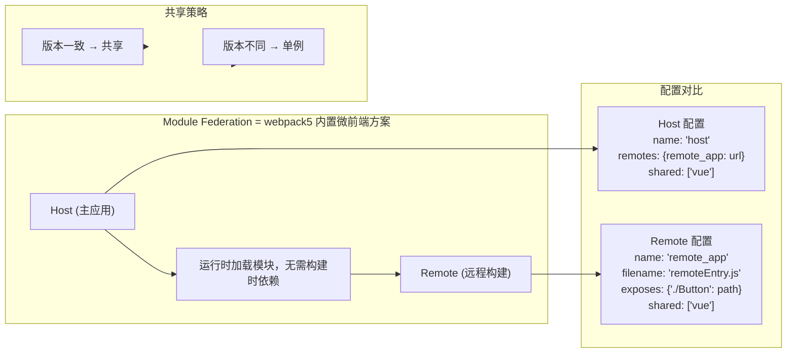
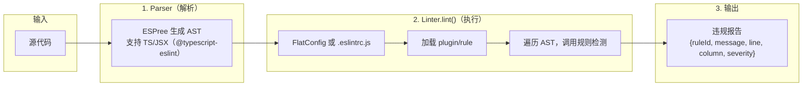
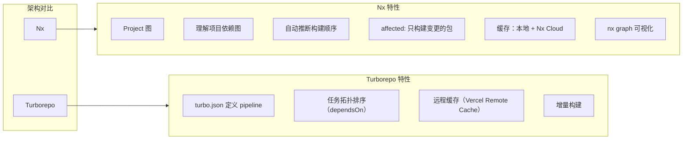

# 微前端与代码质量

> 本页按「概念、原理、代码」逐题展开相关面试专题。

## 1. 微前端是什么 + qiankun 原理

```
微前端 = 将微服务架构思想应用到前端
  → 多个独立的前端应用（子应用）→ 组合为一个完整应用

解决的问题：
  1. 大型项目的团队自治（各团队独立开发/部署）
  2. 技术栈无关（React/Vue/Angular 混用）
  3. 增量升级（逐步迁移 legacy 代码）
  4. 独立部署
```

### 1.1 qiankun 架构

**主应用 (Main App) 支持多种子应用：**

| 子应用 | 技术栈 |
|--------|--------|
| 子应用 1 | Vue 3 |
| 子应用 2 | Vue 2 |
| 子应用 3 | React |

**隔离机制：**

- qiankun 沙箱（JS 隔离）
- Shadow DOM（样式隔离）

### 1.2 沙箱机制

```javascript
// 快照沙箱（子应用修改 window，切换时快照/恢复）
class SnapshotSandbox {
  constructor() {
    this.modifyMap = {}
  }
  mount() {
    Object.keys(this.modifyMap).forEach(key => {
      window[key] = this.modifyMap[key]
    })
  }
  unmount() {
    this.modifyMap = { ...window }
  }
}

// 代理沙箱（ES Proxy，每个子应用有独立的 proxy window）
class ProxySandbox {
  constructor() {
    const proxyWindow = new Proxy({}, {
      get(target, key) { /* 优先取 proxy */ },
      set(target, key, value) { /* 写到自己 */ }
    })
  }
}

// 样式隔离：
// 1. Shadow DOM（attachShadow({ mode: 'open' })）
// 2. CSS Modules（类名加 hash）
// 3. BEM 规范前缀
```

### 1.3 主应用注册子应用

```javascript
import { registerMicroApps, start } from 'qiankun'

registerMicroApps([
  {
    name: 'react-app',
    entry: '//localhost:3000',
    container: '#subapp',
    activeRule: '/react',
    props: { name: 'main app' }
  },
  {
    name: 'vue-app',
    entry: '//localhost:8080',
    container: '#subapp',
    activeRule: '/vue'
  }
])

start({ prefetch: 'all', singular: true })
```

## 2. Module Federation 原理（webpack5）



**Module Federation 核心概念：**
| 概念 | 说明 |
|------|------|
| Host | 主应用，引用远程模块 |
| Remote | 远程构建，暴露模块 |
| exposes | 远程模块的导出路径 |
| shared | 共享依赖（vue、react等） |
| 单例模式 | 版本一致时共享，版本不一致时单例 |

**vs qiankun：**

- qiankun：运行在主应用框架内，需要注册子应用，框架无关但需要适配
- MF：webpack 原生支持，无需框架适配，直接 import 远程模块
- qiankun：运行在主应用框架内，需要注册子应用，框架无关但需要适配
- MF：webpack 原生支持，无需框架适配，直接 import 远程模块

## 3. ESLint 原理（AST遍历 + 规则检测）



```javascript
// 自定义 ESLint 规则
module.exports = {
  // 第 1 段：规则的元信息（meta）——ESLint 靠它认识这条规则的能力与用途
  meta: {
    // description 会出现在 `eslint --print-config`、编辑器悬停提示和规则列表中，是规则的自述
    docs: { description: '禁止使用 console' },
    // fixable: 'code' 是开启自动修复的开关：没有它，report 里的 fix 函数会被静默忽略，
    // 而这正是本规则只做“提示 + 一键替换”而不是纯报错的前提
    fixable: 'code'
  },
  // 第 2 段：create 入口——ESLint 在遍历前调用一次，返回的访问器对象决定“在哪些 AST 节点上检查”
  create(context) {
    // 这里只注册 CallExpression，即所有“调用表达式”，覆盖 console.log(...)、console.error(...) 等
    return {
      // 第 3 段：命中函数调用，判断它是不是 console 上的方法调用
      CallExpression(node) {
        // 同时看两层：callee 必须是成员访问（排除 foo() 这种普通函数），
        // 且被访问对象的名字必须恰好是 'console'
        if (
          node.callee.type === 'MemberExpression' &&
          // 易错点：若 callee.object 不是 Identifier（如 window.console.log() 或 a.b.console.log()），
          // .name 为 undefined，此处不报错，属于本简化实现的漏报边界
          node.callee.object.name === 'console'
        ) {
          // 第 4 段：上报问题并给出修复方案
          context.report({
            node,
            message: '禁止使用 console，请使用 logger',
            // fix 必须返回一次文本替换；ESLint 会做多次遍历修复并检测冲突，
            // 因此替换范围要一次性覆盖整个调用节点（含参数与括号），否则会残留碎片
            fix(fixer) {
              // 注意：这里把整段调用（包括原有参数）替换成固定的 'logger.log()'，
              // 是为了教学演示而做的简化——真实规则通常应保留参数文本并选择对应级别（info/error 等）
              return fixer.replaceText(node, 'logger.log()')
            }
          })
        }
      }
    }
  }
}
```

ESLint 使用 visitor 模式遍历 AST，规则对象中声明的每个 key 对应一种 AST 节点类型，遍历到该类型节点时调用对应函数。

## 4. husky / lint-staged

```
Git Hooks = Git 操作触发自定义脚本（pre-commit, commit-msg, pre-push等）

husky = 在项目中自动配置 Git Hooks
lint-staged = 只对暂存区（staged）文件执行检查

流程：
  git commit → pre-commit hook 触发
              → lint-staged 读取 staged 文件列表
              → 对每个文件执行: eslint --fix
              → 若失败 → commit 被阻止
              → 若成功 → commit 完成
```

```bash
# 安装（v8+）
npm install -D husky lint-staged
npx husky install
npx husky add .husky/pre-commit "npx lint-staged"
```

```json
{
  "lint-staged": {
    "*.{js,vue,ts}": ["eslint --fix", "prettier --write"],
    "*.{css,scss}": ["stylelint --fix"],
    "*.md": ["markdownlint --fix"]
  }
}
```

## 5. Turborepo / Nx（任务编排 + 增量构建 + 缓存）

```
问题背景：
  大型 monorepo 中有数十个包
  每次构建都需要重新构建所有包 → 慢

解决方案：任务编排 + 智能缓存
```

### 5.1 Turborepo（Vercel 出品）

```
Turborepo = 任务管道编排器 + 智能缓存

核心思想：
  1. 定义任务依赖图（哪些任务先执行，哪些可并行）
  2. 缓存构建结果（基于文件hash）
  3. 增量构建（只重新构建受影响的包）
```

```json
// turbo.json
{
  "pipeline": {
    "build": {
      "dependsOn": ["^build"],
      "outputs": ["dist/**", ".next/**"]
    },
    "test": {
      "dependsOn": ["build"]
    },
    "lint": {
      "cache": true
    }
  }
}
```

缓存命中时：git push → GitHub Actions → Turbo 从远端缓存拉取 → 秒级完成。

### 5.2 Nx（Nrwl 出品）

```
Nx = 更强大的任务编排 + 依赖分析 + 可视化

与 Turborepo 的区别：
  1. 内置图形化 dashboard（nx graph）：可视化项目依赖图
  2. 更细粒度的受影响分析（affected:build, affected:test）
  3. 内置 ESLint/Prettier/Storybook/cypress 集成
  4. 分布式缓存（Nx Cloud，支持团队共享）

affected 流程（只构建测试受git变更影响的包）：
  git diff HEAD~10 → 分析受影响的包
  nx affected:build → 只构建/测试受影响的包
```



**共同目标：大型 monorepo 的"全量构建"变为"增量构建"，从分钟级降至秒级。**

## 深入阅读与参考

!!! tip "怎么用这些资料"
    先读「官方文档与规范」建立准确的概念，再读「源码与示例」核对细节，最后用「教程、书籍与视频」换一种讲法加深理解。每条都写明了读哪一节、带着什么问题读。

### 官方文档与规范

| 资源 | 为什么读 | 怎么读 |
|---|---|---|
| [Turborepo 文档](https://turbo.build/repo/docs) | Turborepo 官方文档，任务编排与增量缓存的第一手说明。 | 读 Running Tasks 与 Caching 两节，带着「何时命中缓存」的问题，给自己的 pipeline 补 inputs/outputs。 |
| [Turborepo：仓库组织](https://turborepo.com/docs/crafting-your-repository) | 仓库组织与任务依赖配置示例，可直接对照自己的 workspace。 | 重点看 task dependencies 与 cache 配置示例，照改 turbo.json 后跑一次 dry run 看执行图。 |
| [ESTree 规范](https://github.com/estree/estree) | JavaScript AST 节点的权威定义，写规则时可当字典查。 | 写自定义规则时按名查字段，确认 callee、arguments 等属性的实际形状再动手。 |
| [ESLint 文档](https://eslint.org/docs/latest/) | ESLint 官方文档，规则、配置与插件体系的权威参考。 | 读 Configure 与 Custom Rules 章节，带着「规则如何拿到 AST」的问题跑通一条规则。 |
| [husky](https://typicode.github.io/husky/) | husky 官方文档，配置 pre-commit 钩子的标准做法。 | 按 Getting Started 装好 pre-commit，写一条简单命令，提交一次验证钩子确实触发。 |
| [lint-staged](https://github.com/lint-staged/lint-staged) | lint-staged 官方文档，解决全量 lint 太慢的核心工具。 | 把 eslint --fix 与格式化绑定到暂存文件，提交一次确认只对改动文件运行。 |
| [MDN JavaScript 模块](https://developer.mozilla.org/en-US/docs/Web/JavaScript/Guide/Modules) | MDN 模块文档，理解 ESM 静态结构，为 Module Federation 打底。 | 读 import/export 与动态 import 两节，在浏览器写 type=module 示例验证加载行为。 |

### 源码与示例

| 资源 | 为什么读 | 怎么读 |
|---|---|---|
| [AST Explorer](https://astexplorer.net/) | 在线可视化 AST，把 ESLint 规则里的节点类型具象化。 | 贴一段含 console 的代码，对照 ESTree 观察 CallExpression 结构，再回读规则源码。 |
| [ESLint 配置文件](https://eslint.org/docs/latest/use/configure/configuration-files) | flat config 配置示例，解决按文件类型分别设规则的常见需求。 | 照示例写出 JS/TS 分文件的配置，跑 npx eslint 验证 override 是否真的生效。 |

### 教程、书籍与视频

| 资源 | 为什么读 | 怎么读 |
|---|---|---|
| [Babel Handbook](https://github.com/jamiebuilds/babel-handbook) | 讲透 Babel 的访问者模式与 AST 遍历，是理解 lint 工具的基础。 | 通读 Plugin Handbook，边读边在 AST Explorer 看节点，再写一个删除 console.log 的插件。 |
| [ESLint 自定义规则教程](https://eslint.org/docs/latest/extend/custom-rule-tutorial) | 手把手自定义规则教程，把 AST 遍历与规则检测串成一条线。 | 跟着写一条规则并补测试用例，用 RuleTester 跑通后再想报错定位信息怎么写。 |
| [ESLint 快速开始](https://eslint.org/docs/latest/use/getting-started) | 快速上手 ESLint，先让项目跑起来再回头谈原理。 | 按步骤初始化 flat config，修复首批报错，并记录哪几类规则最常被触发。 |

## 应用与行业实践

### 应用场景地图

| 场景 | 用到本页哪个知识点 | 典型技术选型 | 注意事项 |
| --- | --- | --- | --- |
| 后台管理的万行表格页 | 微前端注册 + 模块联邦共享依赖 | qiankun 子应用 + 远程表格组件 | react 要设 singleton，重复实例会让 hooks 报错 |
| 低端安卓机的电商首屏 | Module Federation 的 shared 与路由懒加载 | 主应用壳 + 按 activeRule 加载子应用 | 首屏必须用的大依赖别异步拆，会多一次串行请求 |
| 多人协作白板的提交卡口 | husky + lint-staged + ESLint AST 规则 | pre-commit 跑 eslint --fix，CI 跑全量 | 钩子只查暂存文件，测试留给 CI |
| 多团队共用的组件库升级 | 子应用独立发布 + 共享依赖版本协商 | 远程模块或 npm 包 | 升级前先确认共享依赖的版本要求字段 |
| 老 jQuery 页面渐进迁移 | qiankun 子应用接入 | 主应用壳 + 逐路由替换 | 子应用要处理 window 与全局样式污染 |
| 单仓库多包的 CI | Turborepo / Nx 任务编排与缓存 | affected + 计算缓存 | base 分支取错，受影响范围就算错 |
| 图表看板的按需加载 | Module Federation 异步共享依赖 | 图表库单独成 chunk | 首屏就是图表页时，异步带来的收益消失 |
| 灰度发布单个业务路由 | 微前端独立构建与发布 | 子应用地址指向灰度入口 | 回滚方式要提前定，通常是改回 entry |

### 三个场景拆解

#### 场景 1：后台管理的万行表格页

**业务背景**：表格页一次展示万行级数据，运营按列筛选并导出 CSV，点击筛选后长时间没有反馈。页面由 3 个小组维护，发布节奏互不相同。

**怎么用本页知识解决**：思路是把表格与导出拆成可独立发布的子应用，框架依赖只保留一份，改动范围用任务编排裁剪。

```
// 主应用：只注册入口，表格模块由子应用自己构建发布
registerMicroApps([
  { name: 'table-page', entry: '//host:8081', container: '#sub', activeRule: '/table' },
  { name: 'export-center', entry: '//host:8082', container: '#sub', activeRule: '/export' },
]);
// 子应用：暴露远程组件，框架依赖只留一份
new ModuleFederationPlugin({
  name: 'tablePage',
  filename: 'remoteEntry.js',
  exposes: { './Table': './src/Table.tsx' },
  shared: { react: { singleton: true }, 'react-dom': { singleton: true } },
});
```

- `activeRule` 决定子应用在哪个路由挂载，表格页与导出中心互不影响发布。
- `exposes` 只暴露表格入口，主应用拿到的是组件而不是整站。
- `shared` 开 `singleton` 后，主应用与子应用共用同一份 react 运行时。
- 表格内部再做虚拟滚动与分页，模块拆分不解决渲染量本身的问题。
- 仓库层用 affected 只跑改动包的任务，缩短等待时间。

**怎么度量收益**：用 Chrome DevTools Performance 面板记录筛选到首行渲染的时长与 Long Task 数量，用 Performance 面板的 Bottom-Up 视图定位耗时函数。构建侧记录 affected 任务的执行时长与缓存命中日志。

**什么时候不该用**：表格页只有一个小组维护、发布节奏一致时，拆子应用会引入跨应用状态同步成本，直接在单应用内做虚拟滚动即可。首屏只加载一张表且没有独立发布需求时，远程入口文件会多出一次网络往返。

#### 场景 2：低端安卓机的首屏加载

**业务背景**：商品列表页要在低端安卓机与弱网下可用，白屏时间随包体积增长。规模用可复现方法界定：在 DevTools 里设 Slow 4G 加 4x CPU 降速，记录 FCP 与 TBT。

**怎么用本页知识解决**：思路是把非首屏路由移出主包，非关键依赖走异步 chunk，框架依赖固定在主包。

```
// 主应用：只保留壳，子应用按路由懒加载
start({ prefetch: 'all', sandbox: { strictStyleIsolation: true } });
// 子应用：图表库留在异步 chunk，框架依赖随主包
new ModuleFederationPlugin({
  exposes: { './OrderDetail': './src/OrderDetail.tsx' },
  shared: {
    react: { singleton: true, eager: true },   // 框架先加载，避免运行时空缺
    echarts: { singleton: true, eager: false } // 图表库等订单页用到再下载
  },
});
```

- `eager: true` 让框架依赖随主包同步就绪，子应用加载时不会缺依赖。
- `eager: false` 的图表库只在订单详情页触发下载，首屏不背这部分体积。
- `prefetch` 在首屏空闲后拉取子应用资源，点击跳转时命中缓存。
- 样式隔离降低子应用改动全局样式后影响首屏的风险。
- 大依赖的引入要评审，拆包只能推迟下载，不能消除下载。

**怎么度量收益**：Lighthouse 在 Slow 4G 加 4x CPU 下的 FCP、LCP、TBT；DevTools Coverage 面板看未使用 JS 占比；Network 面板确认框架 chunk 只请求一次。同一命令连跑两次，记录值差异要能解释。

**什么时候不该用**：首屏本身就是图表看板时，异步拆包让渲染多一次串行请求，应改为首屏内联必要代码。子应用之间共享画布对象等运行时状态时，沙箱隔离会让状态同步变复杂，这类模块放回主应用。

#### 场景 3：多人协作白板的提交卡口

**业务背景**：白板前端拆成渲染、工具栏、协作协议三个包，同仓库并行开发，每次推送触发全量 lint 与全量构建。包数量在 3 到 10 之间，提交频率高。

**怎么用本页知识解决**：思路是提交前只检查暂存文件，CI 只跑受影响包的任务，规则用 AST 检测而不是口头约定。

```
// package.json：提交前只检查本次暂存的文件
"lint-staged": {
  "*.{ts,tsx}": ["eslint --fix --max-warnings=0"]  // 有 error 时退出码非 0，提交中断
}
# CI 里按改动范围裁剪任务
npx nx affected --target=lint --base=origin/main   # 只 lint 受影响包
npx nx affected --target=test --base=origin/main   # 测试同样按受影响范围裁剪
```

- husky 负责把 lint-staged 挂到 pre-commit 钩子上，钩子失败就中断提交。
- lint-staged 只把暂存文件路径传给 eslint，检查范围与本次改动一致。
- `--max-warnings=0` 把警告也当成失败，避免规则被逐渐绕过。
- `--base=origin/main` 决定 diff 的对比基准，取错会让受影响范围算错。
- 缓存命中时任务直接读输出，日志里会打印缓存读取记录。

**怎么度量收益**：钩子耗时用 `time git commit` 记录；错误数用 `eslint --format json` 统计 errorCount 与 warningCount；CI 任务范围与耗时看 Nx 运行日志里的任务列表与缓存命中行。

**什么时候不该用**：IDE 已保存即格式化、CI 又有全量 lint 门禁时，pre-commit 只增加本地等待，可以不装。仓库只有一个包且包内文件互相引用时，受影响范围会回到全量，affected 只省下无关项目的开销。

### 行业先进实践

**共享依赖单例与版本协商（出处：webpack 官方文档 Module Federation 页面）**。做法是在 shared 里给框架依赖开 singleton，让主应用与远程模块共用一份运行时。多份框架实例会让 hooks 与 context 失效，单例是远程组件能正常工作的前提。你的项目可以先给 react、react-dom 开 singleton，再逐条补版本要求。需核对官方文档：singleton 与 requiredVersion 同时设置时的判定顺序，以及版本不满足时的处理方式。

**微前端沙箱与样式隔离（出处：qiankun 官方文档 API 页面）**。registerMicroApps 与 start 提供 sandbox、strictStyleIsolation 等选项，用来限制子应用对 window 和全局样式的改动。多团队并行开发时，隔离降低互相踩踏的概率，代价是部分依赖 window 的第三方脚本需要改造。借鉴方式是在非核心子应用先打开隔离，观察控制台报错再决定是否推广。

**把评审意见写成自定义 ESLint 规则（出处：ESLint 官方文档 Working with Custom Rules）**。自定义规则基于 AST 节点选择器与监听器实现，可以随共享配置发布到各个包。评审里反复出现的同类意见适合固化成规则，减少重复沟通。借鉴方式是每周挑一条高频意见写成规则，先以 warning 级别跑一段时间。

**暂存文件级检查（出处：lint-staged 开源项目 README）**。lint-staged 只把本次暂存的文件路径传给配置的命令，并提供并发控制开关。它和 husky 的 pre-commit 钩子配合，把检查范围缩到本次改动。借鉴方式是钩子里只跑 eslint --fix 与格式化，测试与构建留在 CI。

**按受影响范围跑任务并复用缓存（出处：Nx 官方文档 affected 与 computation caching；Turborepo 官方文档 caching）**。affected 依据项目依赖图与 git diff 计算要执行哪些包的任务，缓存按输入哈希复用已产出的结果。CI 里把 base 指向主干分支，未受影响包的任务会被跳过。借鉴方式是本地与 CI 共用同一套 base 约定，并在日志里确认缓存命中。

### 从学到用：落地路线

**第 1 步 试点**：选一个发布节奏独立、团队边界清晰的子应用接入微前端。验收标准：该子应用能独立构建部署，主应用改 entry 地址即可切换版本并完成回滚。

**第 2 步 验证**：在试点范围内补充测量脚本，用固定降速条件跑前后对照。验收标准：Lighthouse 报告与 CI 日志存进仓库，同一命令连跑两次的结果差异可解释。

**第 3 步 推广**：把试点跑通的构建配置抽成共享 preset，并加上 lint-staged 与 affected 门禁。验收标准：新子应用接入只需改三处配置，CI 日志里能看到被跳过的任务与缓存命中记录。

**第 4 步 防回退**：把关键指标写进 CI 门禁与代码评审规则，共享依赖版本由 preset 统一升级。验收标准：让 TBT 或包体积超阈值的合并请求在 CI 上失败，并输出与基准的对照数据。

### 动手作业

**目标**：在一个两包仓库里完成"子应用独立发布 + 提交前卡口 + 按改动范围跑任务"，并用同一套测量方法记录前后数据。

**步骤**：

1. 用 workspace 建 apps/shell 与 apps/report 两个包，report 暴露一个报表组件。
2. 在 shell 里注册子应用或加载远程模块，字段按官方文档填写，并留一个切换子应用版本的入口。
3. 配置 husky 与 lint-staged，pre-commit 只对暂存的 ts、tsx 跑 eslint --fix。
4. 跑 affected 命令，base 指向主干分支，记录被选中的任务列表与耗时。
5. 用 DevTools 设 Slow 4G 加 4x CPU 降速，记录首屏 FCP 与 TBT，导出报告存档。
6. 在 report 包里引入一个未使用的大依赖并提交，观察门禁与体积报告是否标出。
7. 写一份 200 字以内的 README，记录测量命令、阈值与回滚方式。

**验收标准**：

- 只改 report 包版本并重新构建后，shell 不重新构建即可加载新版本；entry 改回旧值可回滚。
- 提交含 lint 错误的暂存文件时 commit 被中断，终端出现 eslint 报告，退出码非 0。
- 只修改 report 包时，affected 输出里不含 shell 的 test 任务；换一个 base 后任务列表随之变化。
- 首屏测量连跑两次，记录值差异可解释，报告文件已提交到仓库。
- 浏览器 Network 面板里框架 chunk 只出现一次请求。

