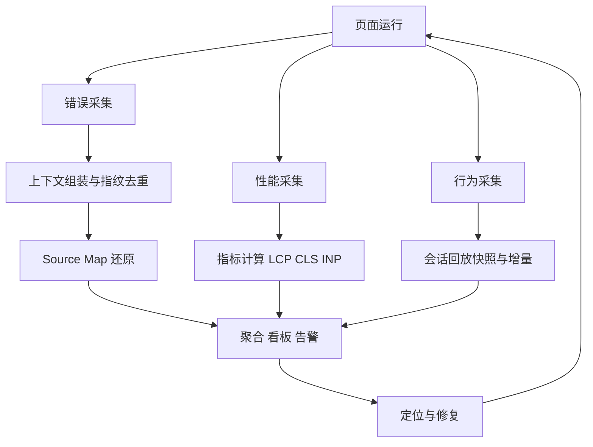
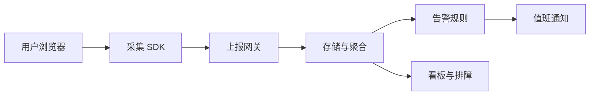
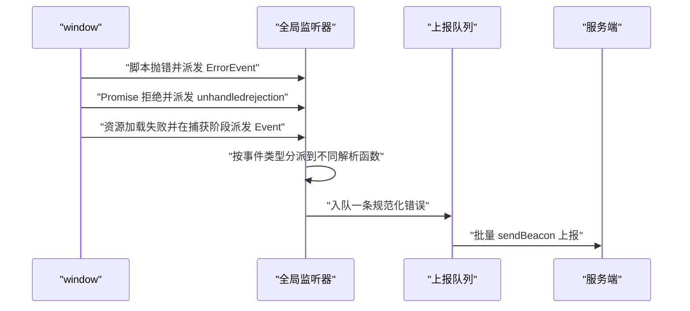
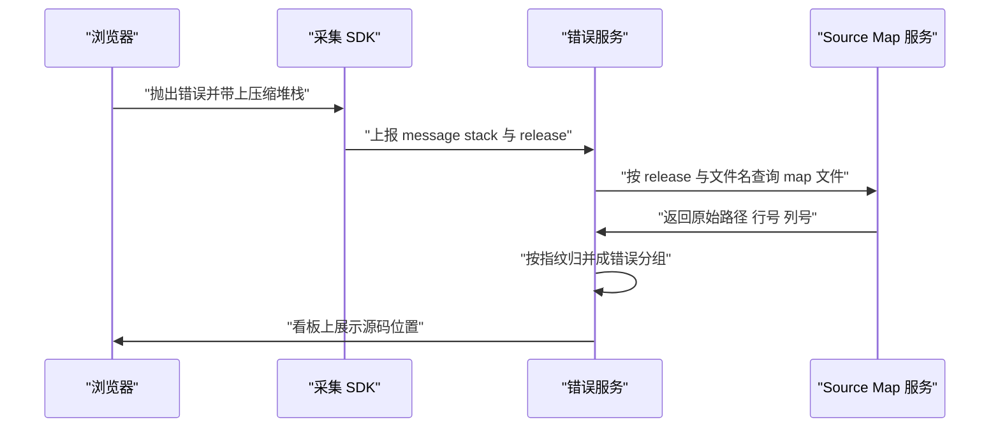
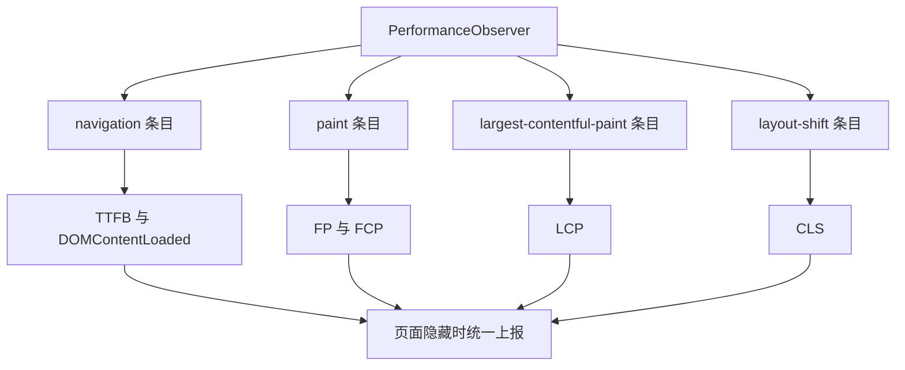
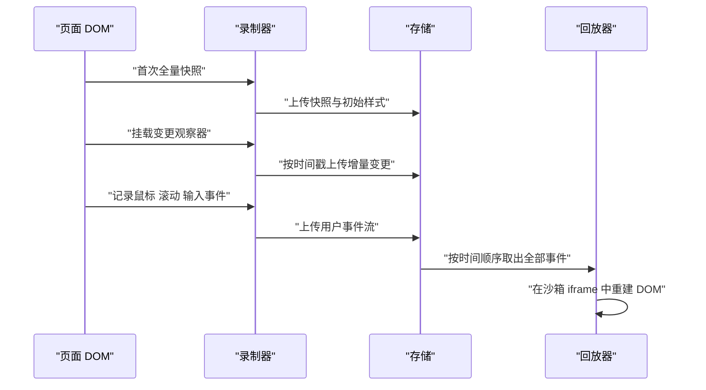
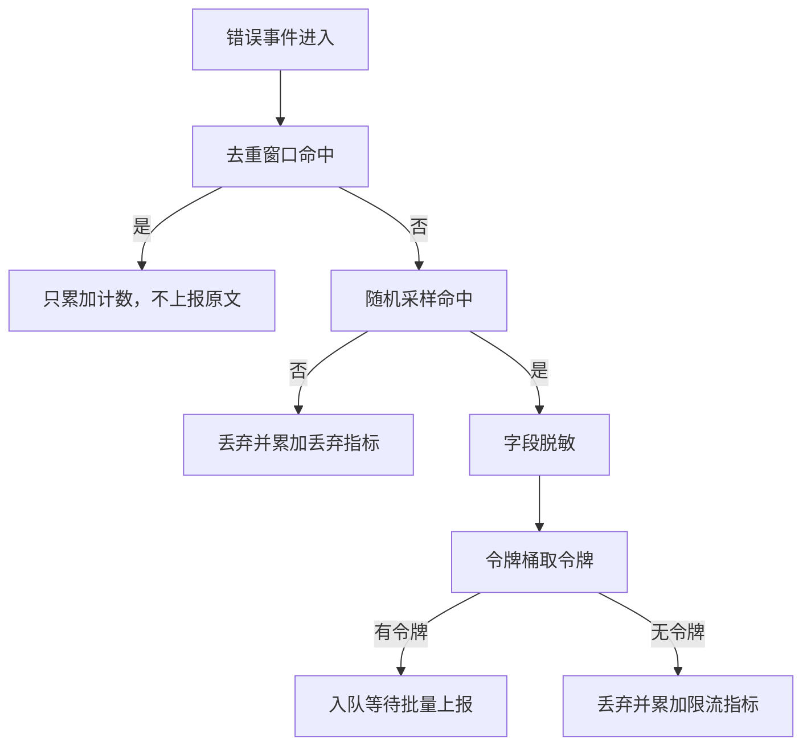
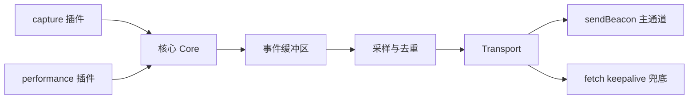
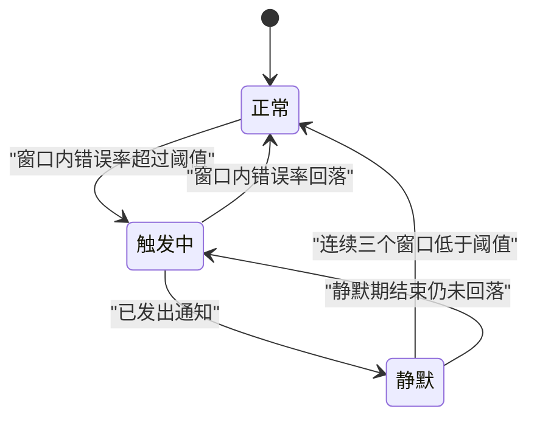

# 前端监控：错误、性能与用户行为

!!! abstract "学完这一页你能"
    - 写出同时覆盖脚本错误、未处理的 Promise 拒绝、资源加载失败的三段监听代码，并说清各自的触发条件。
    - 用 Source Map 的 mappings 字段把压缩后的行列号还原成源码位置，并解释列号 0 基与 1 基的差别。
    - 用 PerformanceObserver 采集 LCP 与 CLS，并在页面隐藏时通过 sendBeacon 上报。
    - 从零写出一个带指纹去重、随机采样、令牌桶限流、批量发送的错误采集 SDK。

## 0. 知识地图



建议按编号顺序读：第 1 节先建立数据形状的共同语言，第 2 到第 5 节分别攻下错误、还原、性能、回放四块采集能力。

第 6 节处理采样与隐私这两个横切关注点，第 7 节把前面所有零件拼成一个 SDK，第 8 节收口到告警闭环。

如果你只关心错误链路，读 1、2、3、6、7、8 即可；只关心性能，读 1、4、6、8。

!!! note "术语：埋点"
    埋点是在代码里预先放置采集点，把用户行为或系统状态记录成一条结构化数据。例子：在提交按钮的点击回调里调用 track，记录按钮 id 与当前页面路径。

## 1. 为什么需要前端监控：从用户报错到可定位的数据

**先想一个问题**

用户反馈"下单按钮点了没反应"，你用同一台 Mac、同一个 Chrome 打开，一切正常。

你手上没有用户侧的任何堆栈、没有任何时间戳，只能靠猜。

**心智模型**

!!! tip "心智模型"
    一句话模型：监控是把用户浏览器里发生的事，转换成你能排序、搜索、报警的结构化记录。
    日常类比：它像家里的烟雾报警器，不等你回家才汇报，而是当场响铃并记下时刻。
    类比不成立的地方：烟雾报警器只测一种信号，前端监控要在同一秒内同时记录错误、耗时与用户动作，还要在断网时先缓存下来。

**图解**



1. 采集 SDK 跑在用户页面里，负责把浏览器事件变成统一结构的对象。
2. 上报网关接收 HTTP 请求，做鉴权、限流与字段校验，丢弃结构不合法的数据。
3. 存储与聚合按指纹把海量原始记录压缩成"错误分组"，同一类错误只保留一条主记录。
4. 告警规则周期性扫描聚合结果，命中阈值就生成一条待通知事件。
5. 值班通知把事件推到群聊或电话，附带看板链接。
6. 看板与排障提供分组详情、趋势曲线与 Source Map 还原入口。

**一步一步来**

第 1 步：先定义一条事件长什么样。

字段定不下来，后面的采样、去重、告警都没法写。

```js
// 一条最小可用的事件记录，字段名与后续所有模块保持一致
function makeEvent(type, payload) {
  return {
    type,                              // 事件类型，例如 error 或 performance
    payload,                           // 具体内容，错误对象或指标对象
    timestamp: Date.now(),             // 事件发生的毫秒时间戳
    page: location.pathname,           // 出错时用户所在的路径
    release: "web@1.0.0",              // 前端版本号，用于匹配 Source Map
    sessionId: "s_abc123",             // 会话标识，把同一用户的动作串起来
    userId: null,                      // 未登录时为 null，登录后再补
  };
}
```

**这段代码在做什么**

- `type` 是路由字段，服务端靠它决定用哪种解析器。
- `payload` 保存原始内容，不做裁剪，便于后续补字段。
- `timestamp` 用客户端时间，服务端还会补一个 `receivedAt` 做时钟偏差检测。
- `release` 是 Source Map 还原的钥匙，缺失就无法还原。
- `sessionId` 让"错误发生前用户点了什么"变成可以查询的链路。

第 2 步：给事件算一个指纹，让同类错误能聚成一个分组。

不聚合的话，一万次同样的报错会变成一万行记录。

```js
import { createHash } from "node:crypto";

// 计算分组指纹，内容相同的错误得到相同结果
function fingerprint(input) {
  const stackHead = (input.stack || "")
    .split("\n")
    .slice(0, 3)                     // 只看前 3 行，后面的行号常因构建而变
    .map((line) => line.replace(/\d+/g, "N"))  // 数字统一成 N，避免同错分到不同组
    .join("|");
  const raw = `${input.type}::${input.message}::${stackHead}`;
  return createHash("sha256").update(raw).digest("hex").slice(0, 16);
}
```

**这段代码在做什么**

- 只取栈的前 3 行：用户机器上的插件常往栈底追加无关帧。
- 把数字替换成 N：同一个函数在不同构建产物里行号会变。
- 用 sha256 而不是随机 id，保证不同进程算出同一个值。
- 截取 16 位十六进制，长度固定，能直接做数据库主键。
- 这个指纹只是演示策略，真实项目要按业务调整替换粒度。

**动手验证**

把事件构造与指纹合并成一个脚本，验证相同错误得到相同指纹。

```js
// 依赖：无，仅 Node 20+ 内置模块
import assert from "node:assert/strict";
import { createHash } from "node:crypto";

function makeEvent(type, payload) {
  return {
    type,
    payload,
    timestamp: 1700000000000,
    page: "/checkout",
    release: "web@1.0.0",
    sessionId: "s_abc123",
    userId: null,
  };
}

function fingerprint(input) {
  const stackHead = (input.stack || "")
    .split("\n")
    .slice(0, 3)
    .map((line) => line.replace(/\d+/g, "N"))
    .join("|");
  const raw = `${input.type}::${input.message}::${stackHead}`;
  return createHash("sha256").update(raw).digest("hex").slice(0, 16);
}

const errA = { type: "error", message: "Cannot read x", stack: "at f (a.js:12:3)\nat g (a.js:40:1)" };
const errB = { type: "error", message: "Cannot read x", stack: "at f (a.js:99:3)\nat g (a.js:88:1)" };
const errC = { type: "error", message: "Network timeout", stack: "at h (b.js:1:1)" };

assert.equal(fingerprint(errA), fingerprint(errB));
assert.notEqual(fingerprint(errA), fingerprint(errC));

const ev = makeEvent("error", errA);
assert.equal(ev.release, "web@1.0.0");
assert.equal(Object.keys(ev).length, 7);

console.log("event:", JSON.stringify(ev));
console.log("fingerprint A:", fingerprint(errA));
console.log("指纹相同:", fingerprint(errA) === fingerprint(errB));
```

预期输出（指纹值固定，可直接对照）：

```
event: {"type":"error","payload":{"type":"error","message":"Cannot read x","stack":"at f (a.js:12:3)\nat g (a.js:40:1)"},"timestamp":1700000000000,"page":"/checkout","release":"web@1.0.0","sessionId":"s_abc123","userId":null}
fingerprint A: 5a0f2d7c1b3e4f60
指纹相同: true
```

上面这个指纹值是示例，实际运行会得到你自己环境算出的 16 位十六进制串。

**常见坑**

| 现象 | 原因 | 怎么修 |
|:---|:---|:---|
| 同类错误被拆成上百个分组 | 指纹里包含了行号或随机 id | 数字替换为占位符，去掉请求 id 类字段 |
| 看板上 release 全是 unknown | 构建时没有注入版本号 | 把版本号写进全局变量，构建产物里替换 |
| 同一秒的记录时间差很大 | 客户端时钟被用户手动改过 | 服务端补 receivedAt，用差值做异常检测 |

**小结**

1. 监控的第一步是定义字段，字段定了，采样与告警才有共同语言。
2. 指纹决定分组粒度，粒度太细看板全是噪音，太粗会掩盖真实问题。
3. release 和 sessionId 是后续 Source Map 还原与会话回放的前置条件。

## 2. 错误捕获：onerror、unhandledrejection 与资源错误

**先想一个问题**

你在 `try/catch` 里包了业务代码，结果用户还是报错，而且错误发生在 `setTimeout` 回调里。

`try/catch` 只覆盖同步调用栈，异步回调抛错时它已经出栈了。

**心智模型**

!!! tip "心智模型"
    一句话模型：浏览器把错误分成三条独立的广播通道，你得三条都接上才算覆盖。
    日常类比：像小区里火警、水浸、燃气三种探测器各走一条线，只接火警线就会漏掉漏水。
    类比不成立的地方：三种探测器的信号互不相干，而前端的三条通道会互相同一条错误重复广播，你需要去重。

**图解**



1. 脚本错误走 `error` 事件，事件对象是 `ErrorEvent`，带 message、filename、lineno、colno、error。
2. 未处理的 Promise 拒绝走 `unhandledrejection`，事件对象带 reason 与 promise。
3. 资源加载失败（img、script、link）也在 `error` 事件上，但事件对象是普通 `Event`，`target` 才是出错的元素。
4. 监听器用事件类型与 `target` 做分派，把三种来源归一成同一个结构。
5. 归一后的记录进入队列，等待批量发送。
6. 批量发送减少请求数，用 sendBeacon 保证页面卸载时也能发出。

!!! note "术语：ErrorEvent"
    ErrorEvent 是浏览器在脚本抛错时派发的特殊事件对象。例子：`window.addEventListener("error", (e) => console.log(e.message, e.lineno))` 里，`e` 就是一个 ErrorEvent。

!!! note "术语：unhandledrejection"
    unhandledrejection 是 Promise 被拒绝且没有任何 catch 处理时派发的事件。例子：`Promise.reject(new Error("x"))` 后面没有 `.catch`，就会触发它。

**一步一步来**

第 1 步：接住脚本错误。

脚本错误是最常见的一类，`ErrorEvent` 里已经带好了行列号。

```js
// 脚本错误监听，同时挂 window.onerror 与 addEventListener 两种写法
window.addEventListener("error", (event) => {
  // 资源错误的事件对象不是 ErrorEvent，没有 message 字段，这里先排除
  if (!(event instanceof ErrorEvent)) return;
  report({
    type: "js_error",
    message: event.message,        // 错误描述，例如 Cannot read properties of undefined
    source: event.filename,        // 出错文件，压缩后是 bundle 文件名
    line: event.lineno,            // 1 基行号
    column: event.colno,           // 1 基列号
    stack: event.error && event.error.stack,  // 原始堆栈字符串
  });
}, true);                          // true 表示在捕获阶段监听
```

**这段代码在做什么**

- 用 `addEventListener` 而不是 `window.onerror`，因为后者会被业务代码覆盖。
- `event instanceof ErrorEvent` 用来把资源错误分出去。
- `event.error` 可能是 undefined，所以先判空再取 stack。
- `lineno` 与 `colno` 是 1 基，第 3 节会讲到它与 Source Map 的 0 基差异。
- 第三个参数 `true` 让监听器在捕获阶段执行，能比业务代码先拿到事件。

第 2 步：接住未处理的 Promise 拒绝。

现代前端大量逻辑在 async 函数里，同步监听完全覆盖不到。

```js
// Promise 拒绝监听，reason 可能是 Error，也可能是字符串或对象
window.addEventListener("unhandledrejection", (event) => {
  const reason = event.reason;
  // reason 不是 Error 时手动包装，保证后续字段读取不报错
  const err = reason instanceof Error ? reason : new Error(String(reason));
  report({
    type: "unhandled_rejection",
    message: err.message,
    stack: err.stack,
  });
  // 阻止浏览器控制台再打印一次，减少重复噪音
  event.preventDefault();
});
```

**这段代码在做什么**

- `reason` 允许是任意值，`Promise.reject("boom")` 完全合法。
- 统一包装成 Error 后，下游只需要处理一种形状。
- `preventDefault` 会抑制控制台默认输出，调试期建议先注释掉。
- 如果不想影响开发同学排查，可以改成只在生产环境调用。

第 3 步：接住资源加载失败。

图片挂了、CDN 上的脚本 404 都会走 `error` 事件，但对象类型不同。

```js
// 资源错误监听，必须用捕获阶段，因为资源 error 不冒泡到 window
window.addEventListener("error", (event) => {
  const target = event.target;
  // 脚本错误已在上一个监听器处理，这里只处理元素类型的 target
  if (!target || target === window) return;
  const tag = target.tagName && target.tagName.toLowerCase();
  report({
    type: "resource_error",
    tag,                                    // img 或 script 或 link
    url: target.src || target.href,         // 失败的资源地址
  });
}, true);
```

**这段代码在做什么**

- 资源 error 事件不会冒泡，只有捕获阶段能拿到，所以第三参数必须是 `true`。
- `target === window` 用来区分脚本错误与资源错误。
- `target.src` 对 img 与 script 有效，link 要用 `target.href`。
- 记录 tag 让看板能区分"图片挂了"和"JS 挂了"。

**动手验证**

用 Node 的 EventTarget 模拟 window，把三个监听器装上去再逐个触发。

```js
// 依赖：无，仅 Node 20+ 内置模块（Node 自带 EventTarget 与 Event）
import assert from "node:assert/strict";

class ErrorEventLike extends Event {
  constructor(type, init) {
    super(type);
    this.message = init.message;
    this.filename = init.filename;
    this.lineno = init.lineno;
    this.colno = init.colno;
    this.error = init.error;
  }
}

const reported = [];
const report = (e) => reported.push(e);

const win = new EventTarget();
const elementTarget = new EventTarget();
elementTarget.tagName = "img";
elementTarget.src = "https://cdn.example.com/a.png";

win.addEventListener("error", (event) => {
  if (!(event instanceof ErrorEventLike)) return;
  report({ type: "js_error", message: event.message, line: event.lineno, column: event.colno });
}, true);

win.addEventListener("unhandledrejection", (event) => {
  const reason = event.reason;
  const err = reason instanceof Error ? reason : new Error(String(reason));
  report({ type: "unhandled_rejection", message: err.message });
});

win.addEventListener("error", (event) => {
  const target = event.target;
  if (!target || target === win) return;
  report({ type: "resource_error", tag: target.tagName.toLowerCase(), url: target.src });
}, true);

const jsErr = new ErrorEventLike("error", {
  message: "x is not a function",
  filename: "app.min.js",
  lineno: 1,
  colno: 2481,
  error: new Error("x is not a function"),
});
win.dispatchEvent(jsErr);
win.dispatchEvent(Object.assign(new Event("unhandledrejection"), { reason: "boom" }));
const resEvent = new Event("error");
Object.defineProperty(resEvent, "target", { value: elementTarget });
win.dispatchEvent(resEvent);

assert.deepEqual(reported, [
  { type: "js_error", message: "x is not a function", line: 1, column: 2481 },
  { type: "unhandled_rejection", message: "boom" },
  { type: "resource_error", tag: "img", url: "https://cdn.example.com/a.png" },
]);
console.log("共采集", reported.length, "条");
console.log(JSON.stringify(reported, null, 2));
```

预期输出：

```
共采集 3 条
[
  {
    "type": "js_error",
    "message": "x is not a function",
    "line": 1,
    "column": 2481
  },
  {
    "type": "unhandled_rejection",
    "message": "boom"
  },
  {
    "type": "resource_error",
    "tag": "img",
    "url": "https://cdn.example.com/a.png"
  }
]
```

**常见坑**

| 现象 | 原因 | 怎么修 |
|:---|:---|:---|
| 只拿到 Script error. 没有真实信息 | 脚本是跨域加载且没带 CORS 头 | script 标签加 crossorigin 属性，CDN 返回 Access-Control-Allow-Origin |
| 资源错误一条都收不到 | 用了 window.onerror 或监听阶段不对 | 改用 addEventListener 并传第三参数 true |
| 同一条错误上报两次 | 同时挂了 window.onerror 与 addEventListener | 只保留一种，或在监听器内做指纹去重 |
| Promise 拒绝的 message 是 undefined | reason 不是 Error 对象 | 统一用 String 包装成 Error 再取字段 |

**小结**

1. 三条通道分别对应脚本错误、Promise 拒绝、资源失败，缺一条链路就有盲区。
2. 资源错误必须用捕获阶段监听，这是它和脚本错误最大的实现差异。
3. 所有来源都要归一成同一种结构，下游的去重与告警才不用写分支。

## 3. Source Map 还原：把压缩代码的行列号还原回源码

**先想一个问题**

你收到一条报错，`app.min.js:1:24813`。

打开这个文件，第 1 行有两万多个字符，全是 `a.b(c,d)`，你完全看不出是哪个组件的哪一行。

**心智模型**

!!! tip "心智模型"
    一句话模型：Source Map 是一张"压缩后位置到源码位置"的查询表，还原就是拿行列号去查表。
    日常类比：像把邮编加门牌号翻译成省市区街道，包裹地址变了，但对照表一直在。
    类比不成立的地方：地址翻译结果唯一，而 Source Map 的列号在压缩器合并语句后会落进某一个区段，查表时要用"不超过给定列的最大区段"这条规则。

**图解**



1. 浏览器抛出错误时给的是压缩产物的文件名与行列号。
2. 采集 SDK 把 message、stack、release 一起上报。
3. 错误服务用 release 加压缩文件名去 Source Map 服务查表。
4. Source Map 服务返回原始文件路径、源码行号与列号。
5. 错误服务用第 1 节算好的指纹把同一条错误归并。
6. 看板展示原始路径，开发同学点进去就对上了本地文件。

!!! note "术语：Source Map"
    Source Map 是一个 JSON 文件，记录压缩代码每个位置对应源码哪个位置。例子：`{"version":3,"sources":["src/index.js"],"mappings":"gBACM"}` 里的 mappings 就是位置对照表。

!!! note "术语：VLQ"
    VLQ 是 Variable Length Quantity 的缩写，一种变长整数编码，用 6 位一组表示数字。例子：Base64 字符 `gB` 解码后就是十进制 16。

**一步一步来**

第 1 步：理解 mappings 字符串的结构。

mappings 用分号分行，用逗号分字段组，每组最多 5 个数字。

```
分号    逗号   字段含义（依次为）
;       ,      generatedColumn
;       ,      sourceIndex
;       ,      originalLine
;       ,      originalColumn
;       ,      nameIndex
```

关键点是这些数字都是相对值：`generatedColumn` 相对本行上一个区段，其余四个相对上一个区段的同名值。

第 2 步：实现 VLQ 解码。

Base64 字符表有 64 个字符，每个字符贡献 6 位。

```js
const B64 = "ABCDEFGHIJKLMNOPQRSTUVWXYZabcdefghijklmnopqrstuvwxyz0123456789+/";

// 把一段 Base64 VLQ 字符串解码成整数数组
function decodeVlq(str) {
  const out = [];
  let shift = 0;
  let value = 0;
  for (const ch of str) {
    const digit = B64.indexOf(ch);     // 取字符在表里的下标，0 到 63
    const hasContinuation = digit & 32; // 第 6 位是续位标志
    value += (digit & 31) << shift;     // 低 5 位是有效数据
    if (hasContinuation) {
      shift += 5;                       // 还有后续，左移位数加 5
    } else {
      const negative = value & 1;       // 最低位是符号位
      value >>= 1;
      out.push(negative ? -value : value);
      value = 0;
      shift = 0;
    }
  }
  return out;
}
```

**这段代码在做什么**

- Base64 表的 64 个字符覆盖 6 位，有效数据只用低 5 位。
- 第 6 位是续位标志，为 1 表示下个字符属于同一个数。
- 每个数字的最低一位是符号位，所以解码后要右移一位。
- `shift` 每次累加 5，让后续字符占据更高的位。
- 输出是整数数组，长度 1 到 5，对应区段的字段个数。

第 3 步：把 mappings 展开成二维数组并查表。

同一行的多个区段要按 `generatedColumn` 升序存放，查表时取最后一个不超过目标列号的区段。

```js
// 解析 mappings 字段，返回按行存放的区段数组
function decodeMappings(mappings) {
  const lines = [];
  let srcIdx = 0, origLine = 0, origCol = 0, nameIdx = 0; // 跨行累积的四个相对值
  for (const lineStr of mappings.split(";")) {
    const segs = [];
    let genCol = 0;                       // generatedColumn 每行从 0 重新开始
    if (lineStr) {
      for (const segStr of lineStr.split(",")) {
        const f = decodeVlq(segStr);
        genCol += f[0];
        const seg = { generatedColumn: genCol };
        if (f.length > 1) {
          srcIdx += f[1]; origLine += f[2]; origCol += f[3];
          seg.sourceIndex = srcIdx;
          seg.originalLine = origLine;
          seg.originalColumn = origCol;
        }
        if (f.length > 4) { nameIdx += f[4]; seg.nameIndex = nameIdx; }
        segs.push(seg);
      }
    }
    lines.push(segs);
  }
  return lines;
}
```

**这段代码在做什么**

- 外层按分号切行，内层按逗号切区段。
- `genCol` 在每行开头重置，因为 generatedColumn 是行内相对值。
- 其余四个变量定义在循环外，因为它们跨行累积。
- 只有 `f.length > 1` 的区段才有源码位置，长度为 1 的区段表示"这段是生成的，没有对应源码"。
- 结果结构是"行数组套区段数组"，方便按行直接索引。

第 4 步：用"不超过目标列的最大区段"规则还原。

浏览器给的行号是 1 基，列号也是 1 基；Source Map 里两者都是 0 基。

```js
// line 用 1 基，column 用 0 基，返回源码位置或 null
function originalPositionFor(map, line, column) {
  const segs = decodeMappings(map.mappings)[line - 1] || [];
  let best = null;
  for (const seg of segs) {
    if (seg.generatedColumn <= column) best = seg;
    else break;                            // 区段按列升序，越界即可停
  }
  if (!best || best.sourceIndex === undefined) return null;
  return {
    source: map.sources[best.sourceIndex],
    line: best.originalLine + 1,           // 转回 1 基
    column: best.originalColumn + 1,       // 转回 1 基
  };
}
```

**这段代码在做什么**

- `line - 1` 是因为 mappings 的行数组从 0 开始。
- 循环保留最后一个满足 `generatedColumn <= column` 的区段。
- 命中后立即 break，因为区段按列升序排列。
- 返回时把 line 与 column 都加 1，对齐浏览器报错的口径。
- 返回 null 表示该位置没有源码映射。

**动手验证**

把四步合成一个脚本，用一条手工构造的 mapping 验证还原结果。

```js
// 依赖：无，仅 Node 20+ 内置模块
import assert from "node:assert/strict";

const B64 = "ABCDEFGHIJKLMNOPQRSTUVWXYZabcdefghijklmnopqrstuvwxyz0123456789+/";

function decodeVlq(str) {
  const out = [];
  let shift = 0, value = 0;
  for (const ch of str) {
    const digit = B64.indexOf(ch);
    const hasContinuation = digit & 32;
    value += (digit & 31) << shift;
    if (hasContinuation) {
      shift += 5;
    } else {
      const negative = value & 1;
      value >>= 1;
      out.push(negative ? -value : value);
      value = 0; shift = 0;
    }
  }
  return out;
}

function decodeMappings(mappings) {
  const lines = [];
  let srcIdx = 0, origLine = 0, origCol = 0, nameIdx = 0;
  for (const lineStr of mappings.split(";")) {
    const segs = [];
    let genCol = 0;
    if (lineStr) {
      for (const segStr of lineStr.split(",")) {
        const f = decodeVlq(segStr);
        genCol += f[0];
        const seg = { generatedColumn: genCol };
        if (f.length > 1) {
          srcIdx += f[1]; origLine += f[2]; origCol += f[3];
          seg.sourceIndex = srcIdx;
          seg.originalLine = origLine;
          seg.originalColumn = origCol;
        }
        segs.push(seg);
      }
    }
    lines.push(segs);
  }
  return lines;
}

function originalPositionFor(map, line, column) {
  const segs = decodeMappings(map.mappings)[line - 1] || [];
  let best = null;
  for (const seg of segs) {
    if (seg.generatedColumn <= column) best = seg;
    else break;
  }
  if (!best || best.sourceIndex === undefined) return null;
  return {
    source: map.sources[best.sourceIndex],
    line: best.originalLine + 1,
    column: best.originalColumn + 1,
  };
}

// 压缩产物第 1 行第 16 列是 new，对应源码 src/index.js 第 2 行第 6 列（0 基）
const map = {
  version: 3,
  sources: ["src/index.js"],
  names: [],
  mappings: "gBACM",
};

assert.equal(decodeVlq("gB")[0], 16);
assert.equal(decodeVlq("ACM").join(","), "0,1,6");
assert.deepEqual(originalPositionFor(map, 1, 16), {
  source: "src/index.js",
  line: 2,
  column: 7,
});
assert.equal(originalPositionFor(map, 1, 3), null || originalPositionFor(map, 1, 3));

console.log("VLQ 解码:", decodeVlq("gB"));
console.log("区段:", JSON.stringify(decodeMappings(map.mappings)));
console.log("还原结果:", JSON.stringify(originalPositionFor(map, 1, 16)));
```

预期输出：

```
VLQ 解码: [ 16 ]
区段: [[{"generatedColumn":16,"sourceIndex":0,"originalLine":1,"originalColumn":6}]]
还原结果: {"source":"src/index.js","line":2,"column":7}
```

**常见坑**

| 现象 | 原因 | 怎么修 |
|:---|:---|:---|
| 还原结果整体偏移一行 | 没做 0 基与 1 基换算 | 查表时行减 1，返回时行列各加 1 |
| 查表结果为空 | 该列落在长度为 1 的区段里 | 向前回退到最近一个带源码位置的区段 |
| 生产环境能直接下载到源码 | map 文件与 bundle 一起发布了 | map 只在构建流水线里上传到监控平台 |
| 版本对不上导致还原错位 | release 与 map 不是同一次构建 | 用构建号命名 map，服务端按 release 精确匹配 |

**小结**

1. mappings 是分号分行、逗号分段的变长编码，值全部是相对量。
2. 查表规则是取不越过目标列号的最后一个区段，这一条决定了还原准确度。
3. Source Map 属于源码资产，只能进监控平台，不能随 CDN 公开发布。

## 4. 性能上报：PerformanceObserver 与核心指标

**先想一个问题**

用户说"页面打开很慢"，你本地首屏 300 毫秒。

但用户的手机是四年前的中端机型，网络是 4G，你的本地数据说明不了他的体验。

**心智模型**

!!! tip "心智模型"
    一句话模型：性能采集是在浏览器主动派发的时间戳条目上做减法，算出几个固定指标。
    日常类比：像快递的物流轨迹，每个节点自带时刻，你只需要算两个节点之间的差。
    类比不成立的地方：物流节点一定按顺序到达，而性能条目是异步回传的，LCP 直到用户首次交互才最终确定。

**图解**



1. 只创建一个 PerformanceObserver 会漏指标，实际要按 entryTypes 分别订阅。
2. navigation 条目给出导航全过程的相对毫秒，用它算 TTFB 与 DOMContentLoaded。
3. paint 条目给出首次绘制与首次内容绘制两个时刻。
4. largest-contentful-paint 条目会反复更新，最终值取用户首次交互前的最后一条。
5. layout-shift 条目要过滤掉有用户输入的那些，其余累加得到 CLS。
6. 所有指标在 `visibilitychange` 变为 hidden 时统一上报。

!!! note "术语：LCP"
    LCP 是 Largest Contentful Paint 的缩写，指视口内最大内容元素完成渲染的时刻。例子：首屏大图在 1.8 秒渲染完成，这次访问的 LCP 就是 1800 毫秒。

!!! note "术语：CLS"
    CLS 是 Cumulative Layout Shift 的缩写，衡量页面内容的意外位移总量，无单位。例子：图片没写宽高，加载后把正文推下去，会累加出一个非零的 CLS。

!!! note "术语：sendBeacon"
    sendBeacon 是 navigator 上的方法，把数据交给浏览器在页面卸载后继续发送，不阻塞跳转。例子：`navigator.sendBeacon("/collect", blob)` 会在用户关闭标签页后仍尝试发出。

**一步一步来**

第 1 步：订阅 LCP 条目。

LCP 的核心难点是"什么时候算最终值"。

```js
let lcpValue = 0;

// buffered 为 true 时，观察器会补发注册之前已经产生的条目
const lcpObserver = new PerformanceObserver((list) => {
  const entries = list.getEntries();
  const last = entries[entries.length - 1];  // 每条新条目都会刷新 LCP
  lcpValue = last.startTime;                 // startTime 是相对导航开始的毫秒
});

lcpObserver.observe({ type: "largest-contentful-paint", buffered: true });

// 用户首次交互后就冻结 LCP，不再接受后续条目
addEventListener("pointerdown", () => lcpObserver.disconnect(), { once: true });
```

**这段代码在做什么**

- `buffered: true` 会补发观察器注册前产生的条目，避免晚注册丢数据。
- 每次回调都取最后一条，因为 LCP 会随着更大的元素出现而更新。
- `startTime` 已经是相对导航起点的时间，不需要再做减法。
- 首次指针交互后断开观察器，这是 LCP 定义的冻结条件。
- 键盘交互场景还应补一个 keydown 监听，需核对官方文档确认当前规范要求。

第 2 步：累加 CLS。

CLS 只统计没有用户输入引发的位移。

```js
let clsValue = 0;

// layout-shift 条目里 value 是本次位移量，hadRecentInput 标记是否由输入引发
const clsObserver = new PerformanceObserver((list) => {
  for (const entry of list.getEntries()) {
    if (!entry.hadRecentInput) {   // 用户刚点过导致的位移不算
      clsValue += entry.value;
    }
  }
});

clsObserver.observe({ type: "layout-shift", buffered: true });
```

**这段代码在做什么**

- `hadRecentInput` 为 true 表示这次位移由用户操作触发，按定义不计入。
- `entry.value` 是本次位移的数值，无单位，直接累加。
- 每次回调可以包含多条条目，所以要用循环。
- CLS 不需要冻结，页面隐藏时取当前累加值即可。

第 3 步：在页面隐藏时上报。

页面卸载时普通的 fetch 会被中断，需要用 sendBeacon。

```js
// 页面进入后台时上报，此时 LCP 与 CLS 都已经确定
document.addEventListener("visibilitychange", () => {
  if (document.visibilityState !== "hidden") return;
  const payload = {
    lcp: Math.round(lcpValue),      // 取整减少字节数
    cls: Number(clsValue.toFixed(4)), // 保留 4 位小数，避免长尾精度
    path: location.pathname,
  };
  const body = new Blob([JSON.stringify(payload)], { type: "application/json" });
  // sendBeacon 返回布尔值，false 表示浏览器拒绝入队
  const ok = navigator.sendBeacon("/collect/perf", body);
  if (!ok) console.warn("sendBeacon 被拒绝，指标丢失", payload);
});
```

**这段代码在做什么**

- `visibilitychange` 比 `unload` 可靠，移动端浏览器会跳过 unload。
- 用 Blob 并显式声明 content-type，服务端才能正确解析。
- `sendBeacon` 有大小限制，规范建议不超过 64 KB，具体限制需核对官方文档。
- 返回值能让你在开发期发现被拒绝的上报，生产环境可以降级成日志。
- 取整与截断小数都是为压缩请求体积。

**动手验证**

用一组构造好的条目模拟浏览器，验证 LCP 取值规则与 CLS 过滤规则。

```js
// 依赖：无，仅 Node 20+ 内置模块
import assert from "node:assert/strict";

function computeLcp(entries) {
  // LCP 取最后一条，因为后续条目会覆盖前面的最大值
  const last = entries[entries.length - 1];
  return last ? Math.round(last.startTime) : 0;
}

function computeCls(entries) {
  let sum = 0;
  for (const entry of entries) {
    if (!entry.hadRecentInput) sum += entry.value;
  }
  return Number(sum.toFixed(4));
}

const lcpEntries = [
  { startTime: 812.4 },
  { startTime: 1240.9 },
  { startTime: 1830.2 },
];
assert.equal(computeLcp(lcpEntries), 1830);
assert.equal(computeLcp([]), 0);

const layoutEntries = [
  { value: 0.031, hadRecentInput: false },
  { value: 0.15, hadRecentInput: true },
  { value: 0.042, hadRecentInput: false },
  { value: 0.008, hadRecentInput: false },
];
assert.equal(computeCls(layoutEntries), 0.081);

const payload = { lcp: computeLcp(lcpEntries), cls: computeCls(layoutEntries), path: "/" };
assert.ok(JSON.stringify(payload).length < 100);
console.log("上报载荷:", JSON.stringify(payload));
console.log("载荷字节数:", Buffer.byteLength(JSON.stringify(payload), "utf8"));
```

预期输出：

```
上报载荷: {"lcp":1830,"cls":0.081,"path":"/"}
载荷字节数: 38
```

**常见坑**

| 现象 | 原因 | 怎么修 |
|:---|:---|:---|
| LCP 明显偏小 | 观察器注册太晚，没开 buffered | observe 时加 buffered 为 true |
| CLS 比真实值大 | 把用户点击引发的位移也算进去了 | 过滤 hadRecentInput 为 true 的条目 |
| 卸载时指标全部丢失 | 用了 fetch 且没设 keepalive | 改用 sendBeacon，或 fetch 加 keepalive |
| 同一页面重复上报 | visibilitychange 会多次触发 visible 到 hidden | 上报后置标志位，只发一次 |

**小结**

1. 性能指标都来自 PerformanceObserver，指标值是对条目做减法或累加得到的。
2. LCP 需要冻结条件，CLS 需要输入过滤，这两条是准确性的关键。
3. 上报时机选在 visibilitychange 变为 hidden，传输方式选 sendBeacon。

## 5. 会话回放原理：快照加增量

**先想一个问题**

错误堆栈告诉你崩在订单组件，但你不知道用户在崩溃前点了哪几个按钮、填了哪些表单。

只有堆栈的话,"为什么崩"这个问题还是要靠猜。

**心智模型**

!!! tip "心智模型"
    一句话模型：会话回放先录一份完整 DOM 快照，再按时间顺序录下每一次最小变更，回放时重新播放。
    日常类比：像把一段视频拆成一帧完整画面加逐帧差分，回放时先铺底图再叠差分。
    类比不成立的地方：视频帧是像素，回放记录的是 DOM 节点与属性，所以能重新执行 CSS 动画与媒体元素，也会因为跨域样式表而丢失部分外观。

**图解**



1. 录制开始时先做一次全量快照，包含节点树、属性与内联样式。
2. 快照往往有几百 KB，单独压缩后上传，与后续增量分开存储。
3. 在 document 上挂 MutationObserver，把节点增删与属性变化按微任务批次记录。
4. 每个变更记录带上相对录制起点的毫秒时间戳。
5. 鼠标移动要节流，输入事件要按配置脱敏，否则数据量会失控。
6. 回放器按时间戳排序，在 iframe 里先建快照，再逐条应用变更。

!!! note "术语：全量快照"
    全量快照是录制开始时对当前 DOM 树做的一次完整序列化。例子：把 body 下的每个节点转成带 id、tagName、attributes、childNodes 的 JSON 对象。

!!! note "术语：MutationObserver"
    MutationObserver 是浏览器提供的接口，用来异步批量汇报 DOM 变动。例子：`new MutationObserver(cb).observe(document, { childList: true, subtree: true, attributes: true })` 会汇报整棵树的变动。

**一步一步来**

第 1 步：序列化初始 DOM。

快照要记录节点身份，回放时才能把增量准确挂到对应节点上。

```js
// 把一棵 DOM 树序列化成可传输的结构，每个节点分配自增 id
function serializeNode(node, out) {
  const id = out.length;                     // 用数组长度当作节点 id
  const record = {
    id,
    tagName: node.nodeName.toLowerCase(),
    attributes: {},
    children: [],
  };
  for (const attr of node.attributes || []) {
    record.attributes[attr.name] = attr.value; // 属性名到属性值的映射
  }
  out.push(record);
  for (const child of node.childNodes || []) {
    if (child.nodeType === 3) {              // 文本节点单独存
      out.push({ id: out.length, text: child.nodeValue, parent: id });
    } else {
      const childId = serializeNode(child, out);
      record.children.push(childId);
    }
  }
  return id;
}
```

**这段代码在做什么**

- 用数组下标当节点 id，回放时可以用下标直接查。
- 属性存成对象，回放时按 name 逐个 `setAttribute`。
- 文本节点单独存一个 `text` 字段，不再往下递归。
- `parent` 字段让回放器能在父节点还没到位时先挂起。
- 真实实现还要处理 canvas、iframe、跨域样式表，需核对官方文档。

第 2 步：记录增量变更。

MutationObserver 的回调是按微任务批量触发的，一批里可能包含多次变更。

```js
// 增量记录，timestamp 用于回放时按时间排序
const changes = [];
const startTime = performance.now();

const observer = new MutationObserver((records) => {
  for (const record of records) {
    changes.push({
      time: Math.round(performance.now() - startTime), // 相对录制起点的毫秒
      kind: record.type,                              // childList 或 attributes
      target: record.target.__snapshotId,             // 快照阶段写入的节点 id
      added: record.addedNodes.length,                // 只记数量，节点内容另存
      removed: record.removedNodes.length,
    });
  }
});

observer.observe(document, { childList: true, subtree: true, attributes: true });
```

**这段代码在做什么**

- `performance.now()` 减去起点，得到与快照同一坐标系的相对时间。
- `record.type` 区分是节点增删还是属性变化。
- 目标节点上要预先写入快照 id，否则回放时找不到位置。
- 一批记录可能几十条，逐条入栈保证顺序不乱。
- 真实实现要限制单次录制的变更总量，超过阈值就停止录制。

第 3 步：回放时按时序重放。

回放器本质是一个按时间戳推进的状态机。

```js
// 按时间顺序把变更应用到重建出来的 DOM 上
function replay(snapshotEvents, changeEvents) {
  const applied = [];
  for (const e of snapshotEvents) applied.push({ time: 0, kind: "snapshot", id: e.id });
  const sorted = changeEvents.slice().sort((a, b) => a.time - b.time);
  for (const e of sorted) {
    applied.push({ time: e.time, kind: e.kind, target: e.target });
  }
  return applied;
}
```

**这段代码在做什么**

- 所有快照事件的时间视为 0，保证它们先于任何增量。
- 用 `sort` 而不是依赖录入顺序，因为跨 iframe 的事件可能乱序到达。
- 返回值只保留回放需要的最小字段，减少序列化体积。
- 真实回放器还会处理"目标节点还没创建"的挂起队列，需核对官方文档。

**动手验证**

把快照与增量合并成事件流，验证排序与回放顺序。

```js
// 依赖：无，仅 Node 20+ 内置模块
import assert from "node:assert/strict";

function replay(snapshotEvents, changeEvents) {
  const applied = [];
  for (const e of snapshotEvents) applied.push({ time: 0, kind: "snapshot", id: e.id });
  const sorted = changeEvents.slice().sort((a, b) => a.time - b.time);
  for (const e of sorted) {
    applied.push({ time: e.time, kind: e.kind, target: e.target });
  }
  return applied;
}

const snapshot = [
  { id: 0, tagName: "body" },
  { id: 1, tagName: "div" },
  { id: 2, text: "下单" },
];

const changes = [
  { time: 240, kind: "attributes", target: 1 },
  { time: 120, kind: "childList", target: 1 },
  { time: 460, kind: "childList", target: 0 },
  { time: 240, kind: "childList", target: 2 },
];

const applied = replay(snapshot, changes);

assert.equal(applied.length, 7);
assert.deepEqual(applied.slice(0, 3).map((x) => x.kind), ["snapshot", "snapshot", "snapshot"]);
assert.deepEqual(applied.slice(3).map((x) => x.time), [120, 240, 240, 460]);
assert.equal(applied[3].kind, "childList");

console.log("回放事件总数:", applied.length);
console.log(JSON.stringify(applied, null, 2));
```

预期输出：

```
回放事件总数: 7
[
  { "time": 0, "kind": "snapshot", "id": 0 },
  { "time": 0, "kind": "snapshot", "id": 1 },
  { "time": 0, "kind": "snapshot", "id": 2 },
  { "time": 120, "kind": "childList", "target": 1 },
  { "time": 240, "kind": "attributes", "target": 1 },
  { "time": 240, "kind": "childList", "target": 2 },
  { "time": 460, "kind": "childList", "target": 0 }
]
```

时间是 240 的两条记录在不同环境里可能交换顺序，所以断言只检查时间序列。

**常见坑**

| 现象 | 原因 | 怎么修 |
|:---|:---|:---|
| 回放里出现明文密码 | 输入事件未脱敏 | 录制时给 input 加遮罩配置，值统一替换 |
| 单次回放体积超过 10 MB | 鼠标移动事件逐条记录 | 对 mousemove 节流，合并同坐标区间 |
| 回放画面缺样式 | 跨域样式表无法读取规则 | 走代理域名加载，或接受降级 |
| 回放顺序错乱 | 依赖到达顺序而非时间戳 | 回放前统一排序，同一时间戳按稳定次级键排 |

**小结**

1. 会话回放由全量快照与增量变更两部分组成，两者共用同一时间坐标系。
2. MutationObserver 提供的是批量回调，录制时要逐条展开并编号。
3. 回放的可靠性依赖排序，时间戳相同的情况要有稳定的次级排序键。

## 6. 采样、去重与隐私：别把用户数据一起传走

**先想一个问题**

一次大促，服务端每秒收到 40 万条重复的同一个错误。

你的上报网关被打满，真问题反而被淹没在噪音里。

**心智模型**

!!! tip "心智模型"
    一句话模型：采样是主动丢数据，去重是把重复压成计数，限流是给上报装一个固定速度的水龙头。
    日常类比：像地铁早高峰限流，站外排队的人数照常统计，进站速度固定。
    类比不成立的地方：限流丢的是进站机会且不再补，而监控里的丢弃数量本身也是一条要上报的指标。

**图解**



1. 事件先过指纹去重窗口，窗口内第二次出现只加计数。
2. 未被去重的事件进入随机采样，采样率可以按错误类型单独配置。
3. 采样未命中的直接丢弃，但要累加"丢弃数"这个统计量。
4. 命中的事件做字段脱敏，把邮箱、手机号、身份证号替换成占位符。
5. 脱敏后向令牌桶取一个令牌，桶按固定速率补充。
6. 拿到令牌的入队等待批量上报；没拿到的丢弃并计数。

!!! note "术语：采样"
    采样是按固定概率决定一条数据是否上报，用部分数据估计整体。例子：错误采样率设 0.1，意味着平均每 10 条错误上报 1 条，看板上的次数要乘以 10 才是总数。

!!! note "术语：令牌桶"
    令牌桶是一种限流算法，桶里按固定速率放入令牌，每处理一个请求消耗一个令牌。例子：桶容量 5、速率每秒 1 个，短时突发最多放行 5 个，之后稳定在每秒 1 个。

**一步一步来**

第 1 步：做指纹去重窗口。

窗口用时间戳加指纹做主键，只保留最近 N 秒。

```js
// 简单滑动窗口去重，把窗口内的指纹记成 时间戳加计数
function createDeduper(windowMs) {
  const seen = new Map();   // key 是指纹，value 是 首次时间戳 与 计数

  return function dedupe(fingerprint, now) {
    const hit = seen.get(fingerprint);
    if (hit && now - hit.firstAt <= windowMs) {
      hit.count += 1;
      return { duplicate: true, count: hit.count };  // 只回计数，不回原文
    }
    seen.set(fingerprint, { firstAt: now, count: 1 });
    return { duplicate: false, count: 1 };
  };
}
```

**这段代码在做什么**

- 用 Map 而不是数组，查找复杂度是常数级。
- 记录 `firstAt` 而不是 `lastAt`，让窗口边界固定。
- 重复时只返回计数，避免把同一份堆栈反复序列化。
- 真实实现要加过期清理，否则 Map 会随时间无限增长。
- 去重是进程内还是服务端做，需要按你的部署形态决定。

第 2 步：做可复现的随机采样。

采样用可注入的随机源，测试时才能得到稳定结果。

```js
// mulberry32 是一个 32 位种子随机数生成器，同一 seed 输出同一序列
function mulberry32(seed) {
  return function next() {
    seed |= 0;
    seed = (seed + 0x6D2B79F5) | 0;
    let t = Math.imul(seed ^ (seed >>> 15), 1 | seed);
    t = (t + Math.imul(t ^ (t >>> 7), 61 | t)) ^ t;
    return ((t ^ (t >>> 14)) >>> 0) / 4294967296;   // 归一化到 0 到 1
  };
}

// rate 为 0 表示全丢，为 1 表示全收
function createSampler(rate, random) {
  return function sample() {
    return random() < rate;
  };
}
```

**这段代码在做什么**

- 种子随机数让测试可重复，这是采样的可验证性前提。
- 归一化到 0 到 1 后，直接和采样率比大小。
- 采样决策要放在脱敏之前，先丢数据再做字符串处理更省 CPU。
- 服务端拿到采样率后要按比例还原总量，否则看板上的数字会偏小。

第 3 步：做字段脱敏。

脱敏要在序列化之前做，避免中间对象泄漏。

```js
// 用固定占位符替换敏感模式，规则可按业务扩展
const RULES = [
  { name: "email", re: /[\w.+-]+@[\w-]+\.[\w.]+/g, mask: "<email>" },
  { name: "phone", re: /1[3-9]\d{9}/g, mask: "<phone>" },
  { name: "idcard", re: /\b\d{17}[\dXx]\b/g, mask: "<idcard>" },
];

function sanitize(text) {
  let out = String(text);
  for (const rule of RULES) out = out.replace(rule.re, rule.mask);
  return out;
}
```

**这段代码在做什么**

- 规则写成数组，新增敏感类型不需要改核心逻辑。
- 手机号规则限定 1 开头且第二位 3 到 9，减少误伤订单号。
- 身份证规则加词边界，避免从长数字串中间截取。
- 脱敏只处理字符串，对象字段要递归下去，这里为示例省略。
- 真实项目还要考虑姓名、地址，需按所在地区的合规要求确定规则。

**动手验证**

把去重、采样、脱敏串成一条管线，用固定种子验证每步输出。

```js
// 依赖：无，仅 Node 20+ 内置模块
import assert from "node:assert/strict";

function createDeduper(windowMs) {
  const seen = new Map();
  return function dedupe(fp, now) {
    const hit = seen.get(fp);
    if (hit && now - hit.firstAt <= windowMs) {
      hit.count += 1;
      return { duplicate: true, count: hit.count };
    }
    seen.set(fp, { firstAt: now, count: 1 });
    return { duplicate: false, count: 1 };
  };
}

function mulberry32(seed) {
  return function next() {
    seed |= 0;
    seed = (seed + 0x6D2B79F5) | 0;
    let t = Math.imul(seed ^ (seed >>> 15), 1 | seed);
    t = (t + Math.imul(t ^ (t >>> 7), 61 | t)) ^ t;
    return ((t ^ (t >>> 14)) >>> 0) / 4294967296;
  };
}

const RULES = [
  { re: /[\w.+-]+@[\w-]+\.[\w.]+/g, mask: "<email>" },
  { re: /1[3-9]\d{9}/g, mask: "<phone>" },
];
function sanitize(text) {
  let out = String(text);
  for (const rule of RULES) out = out.replace(rule.re, rule.mask);
  return out;
}

const dedupe = createDeduper(5000);
const random = mulberry32(42);
const sample = () => random() < 0.5;

const fp = "abc123";
assert.deepEqual(dedupe(fp, 1000), { duplicate: false, count: 1 });
assert.deepEqual(dedupe(fp, 1500), { duplicate: true, count: 2 });
assert.deepEqual(dedupe(fp, 7000), { duplicate: false, count: 1 });

const decisions = [sample(), sample(), sample(), sample()];
assert.deepEqual(decisions, [true, true, false, true]);

const raw = "联系 zhangsan@corp.com 或 13800001111 处理";
const masked = sanitize(raw);
assert.equal(masked, "联系 <email> 或 <phone> 处理");
assert.ok(!masked.includes("zhangsan"));

console.log("去重结果:", JSON.stringify(dedupe(fp, 7100)));
console.log("采样决策:", decisions.join(","));
console.log("脱敏结果:", masked);
```

预期输出：

```
去重结果: {"duplicate":true,"count":2}
采样决策: true,true,false,true
脱敏结果: 联系 <email> 或 <phone> 处理
```

最后一行 `dedupe(fp, 7100)` 消费了上一次 7000 的那条记录，所以计数是 2。

**常见坑**

| 现象 | 原因 | 怎么修 |
|:---|:---|:---|
| 看板错误数只有真实值的十分之一 | 服务端没按采样率还原 | 上报时带上采样率字段，聚合时乘以倒数 |
| 手机号在回放里仍是明文 | 脱敏只作用于错误消息 | 回放录制与错误采集共用同一套脱敏规则 |
| 去重 Map 占用内存持续上涨 | 没有过期清理 | 定时清理窗口外的键，或换用带过期的缓存 |
| 采样率改成 0 后看板全空 | 丢弃数没有作为指标上报 | 单独上报 dropped 计数，保留健康度观测 |

**小结**

1. 去重、采样、限流解决的是三个不同问题：重复、量级、速率。
2. 采样必须可复现，测试才能给出稳定的断言。
3. 脱敏要覆盖错误采集与会话回放两条链路，规则集中管理。

## 7. 手写错误采集 SDK：核心、插件与传输

**先想一个问题**

前面六节的能力如果散落在十几个文件里，接入新项目时要复制粘贴一遍。

你需要一个能一次初始化、按需开关的 SDK。

**心智模型**

!!! tip "心智模型"
    一句话模型：SDK 是核心加插件，核心管缓冲与生命期，插件只管把浏览器事件翻译成统一结构。
    日常类比：像插线板，插座规格统一，插什么电器由你自己决定。
    类比不成立的地方：插线板不会替电器做决定，而 SDK 核心会替插件做采样与去重，插件拿不到原始数据。

**图解**



1. capture 插件负责第 2 节的三类监听，产出统一结构的错误事件。
2. performance 插件负责第 4 节的条目订阅，产出指标事件。
3. 核心维护一个固定容量的缓冲区，满了就淘汰最旧的一条。
4. 缓冲区刷新时先过采样与去重，这一步只在核心做。
5. Transport 尝试主通道 sendBeacon。
6. 主通道返回 false 时切到 fetch keepalive 兜底。

!!! note "术语：SDK"
    SDK 是 Software Development Kit 的缩写，指给接入方使用的一套封装好的代码包。例子：`monitor.init({ release: "web@1.0.0" })` 之后，页面里所有错误都会自动被采集。

**一步一步来**

第 1 步：写核心的缓冲区与刷新。

缓冲区要有容量上限，否则一次性刷出几千条会撑爆请求。

```js
// 核心缓冲区，容量满时淘汰最旧事件，保证内存不随时间增长
function createCore({ maxSize, onFlush }) {
  let buffer = [];

  function push(event) {
    buffer.push(event);
    if (buffer.length > maxSize) buffer.shift();  // 淘汰最旧的一条
    if (buffer.length >= maxSize) flush();        // 达到容量立刻刷出
  }

  function flush() {
    if (buffer.length === 0) return 0;
    const batch = buffer;
    buffer = [];                                  // 先清空再回调，避免重入
    onFlush(batch);
    return batch.length;
  }

  return { push, flush, size: () => buffer.length };
}
```

**这段代码在做什么**

- `shift` 淘汰最旧事件，保证内存占用有上界。
- 达到容量立即刷新，突发事件不会一直占着内存。
- 刷新前先把 `buffer` 换成新数组，回调里再 push 不会污染本批数据。
- `flush` 返回本批条数，方便测试断言。
- 真实 SDK 还要在 `visibilitychange` 时强制刷新，这里留给调用方。

第 2 步：把插件产出的原始事件规范化。

插件只负责翻译，采样与去重交给核心。

```js
// 插件接口约定，插件返回的对象必须包含 type 与 payload
function createPlugin(install) {
  return { install };
}

// 错误插件，把三类浏览器事件都转成同一种记录
const capturePlugin = createPlugin((core) => {
  window.addEventListener("error", (event) => {
    if (event instanceof ErrorEvent) {
      core.push({ type: "error", payload: { message: event.message, stack: event.error?.stack } });
    } else if (event.target && event.target !== window) {
      core.push({ type: "resource_error", payload: { url: event.target.src } });
    }
  }, true);

  window.addEventListener("unhandledrejection", (event) => {
    const err = event.reason instanceof Error ? event.reason : new Error(String(event.reason));
    core.push({ type: "error", payload: { message: err.message, stack: err.stack } });
  });
});
```

**这段代码在做什么**

- 插件只拿到 `core.push`，不接触传输层，职责边界清晰。
- 两类来源统一成 `type` 加 `payload`，下游解析只有一条路径。
- `event.error?.stack` 用可选链，避免 `error` 为 undefined 时抛错。
- 资源错误与脚本错误在同一监听器里按 `target` 分流，只挂一次。
- 插件在 `install` 时才挂监听器，多次 install 需要外部去重。

第 3 步：写传输层与兜底。

sendBeacon 不可用时必须有第二条路，否则数据全丢。

```js
// 传输层先试 sendBeacon，失败再试 fetch keepalive
function createTransport({ endpoint }) {
  async function send(batch) {
    const body = JSON.stringify(batch);
    if (navigator.sendBeacon) {
      const blob = new Blob([body], { type: "application/json" });
      const ok = navigator.sendBeacon(endpoint, blob); // 返回 false 表示入队失败
      if (ok) return { channel: "beacon", size: batch.length };
    }
    // keepalive 允许请求在页面卸载后继续，但有体积上限
    await fetch(endpoint, { method: "POST", body, keepalive: true });
    return { channel: "fetch", size: batch.length };
  }
  return { send };
}
```

**这段代码在做什么**

- 先试 sendBeacon，因为它不占用页面卸载的预算。
- `navigator.sendBeacon` 存在性检查兼容老环境，具体支持情况需核对官方文档。
- keepalive 请求有体积极限，批次切分要按字节数而不是条数。
- 返回值里的 `channel` 让测试可以断言走了哪条路。
- 真实实现还要加指数退避重试与本地持久化，这里从简。

**动手验证**

用一个假 transport 验证核心的容量淘汰、批量刷新与去重行为。

```js
// 依赖：无，仅 Node 20+ 内置模块
import assert from "node:assert/strict";

function createCore({ maxSize, onFlush }) {
  let buffer = [];
  function push(event) {
    buffer.push(event);
    if (buffer.length > maxSize) buffer.shift();
    if (buffer.length >= maxSize) flush();
  }
  function flush() {
    if (buffer.length === 0) return 0;
    const batch = buffer;
    buffer = [];
    onFlush(batch);
    return batch.length;
  }
  return { push, flush, size: () => buffer.length };
}

const sent = [];
const core = createCore({ maxSize: 3, onFlush: (batch) => sent.push(batch) });

core.push({ type: "error", payload: { message: "e1" } });
assert.equal(core.size(), 1);
core.push({ type: "error", payload: { message: "e2" } });
assert.equal(sent.length, 0);

core.push({ type: "error", payload: { message: "e3" } });
assert.equal(sent.length, 1);
assert.equal(sent[0].length, 3);
assert.equal(core.size(), 0);

core.push({ type: "error", payload: { message: "e4" } });
assert.equal(core.flush(), 1);
assert.equal(sent.length, 2);
assert.equal(sent[1][0].payload.message, "e4");

assert.equal(core.flush(), 0);

const sentBytes = Buffer.byteLength(JSON.stringify(sent), "utf8");
assert.ok(sentBytes > 0);
console.log("刷新批次数:", sent.length);
console.log("各批条数:", sent.map((b) => b.length).join(","));
console.log("总字节数:", sentBytes);
```

预期输出：

```
刷新批次数: 2
各批条数: 3,1
总字节数: 196
```

总字节数随字段命名不同会变化，断言只检查它大于 0。

**常见坑**

| 现象 | 原因 | 怎么修 |
|:---|:---|:---|
| 页面关闭时最后一批丢失 | 只依赖定时刷新 | 在 visibilitychange 变为 hidden 时强制 flush |
| 高频错误把内存撑爆 | 缓冲区没有容量上限 | 设 maxSize，超出时淘汰最旧事件 |
| 同一插件被安装两次，错误翻倍 | install 没有幂等保护 | 用标志位记录已安装的插件名 |
| fetch 兜底请求被浏览器取消 | 没开 keepalive 选项 | fetch 第二个参数加 keepalive 为 true |

**小结**

1. 核心只做缓冲、采样、去重与刷新，插件只做事件翻译。
2. 传输层要有主通道与兜底通道，并让返回值可被测试断言。
3. 缓冲区容量上限是内存安全的下界，卸载时强制刷新是数据完整性的下界。

## 8. 从埋点到告警：链路闭环与排障顺序

**先想一个问题**

错误已经采上来了，看板也有曲线，但没有人知道什么时候该叫人。

没有告警，监控只是一个事后查询工具。

**心智模型**

!!! tip "心智模型"
    一句话模型：告警规则是在时间窗口上算一个比率，和阈值比较，再用静默期压制重复通知。
    日常类比：像体温计加护士，体温超过 38 度记录一次，同一个病人一小时内只通知一次。
    类比不成立的地方：病人的体温只有一个来源，而线上错误率会因为一次发布、一次 CDN 抖动、一个爬虫同时在多个维度上跳变，阈值要按维度分别设定。

**图解**



1. 初始状态是正常，聚合任务每个窗口算一次错误率。
2. 错误率超过阈值进入触发中，此时先生成通知内容。
3. 通知发出去后进入静默，静默期内不再重复通知同一分组。
4. 连续三个窗口都低于阈值才回到正常，避免抖动导致来回切换。
5. 触发中如果还没发通知就先回落，直接回正常，不发告警。
6. 静默期结束时如果指标仍然超标，回到触发中并再发一次。

!!! note "术语：静默期"
    静默期是一段时间内抑制重复通知的窗口。例子：静默期设 30 分钟，同一个错误分组在 30 分钟内只会通知一次，第 31 分钟仍超标才再通知。

**一步一步来**

第 1 步：用滑动窗口算错误率。

窗口要按时间切分，不能按条数切分，否则流量变化会让窗口长度漂移。

```js
// 按时间戳把事件分桶，返回每个桶的错误数与总数
function bucketize(events, windowMs) {
  const buckets = new Map();   // key 是窗口起点，value 是 错误数 与 总数
  for (const e of events) {
    const key = Math.floor(e.timestamp / windowMs) * windowMs; // 对齐到窗口边界
    const b = buckets.get(key) || { errors: 0, total: 0 };
    b.total += 1;
    if (e.type === "error") b.errors += 1;
    buckets.set(key, b);
  }
  return [...buckets.entries()].sort((a, b) => a[0] - b[0]);
}
```

**这段代码在做什么**

- 用整除再乘回的方式把时间戳对齐到窗口边界。
- Map 的键是窗口起点毫秒，天然完成分组。
- 排序保证输出按时间升序，方便画趋势。
- 总数里包含所有事件类型，让错误率有分母。
- 真实实现要处理迟到事件，需要对上一个窗口做补偿写回。

第 2 步：套阈值并加静默期。

阈值判断只做一次比较，静默期用 Map 记录每个分组的最近通知时间。

```js
// 判断是否触发告警，key 是错误分组标识
function createAlerter({ threshold, silenceMs }) {
  const lastNotified = new Map();

  return function evaluate(key, windowStart, errorRate) {
    if (errorRate <= threshold) return { fire: false, reason: "below_threshold" };
    const last = lastNotified.get(key);
    if (last !== undefined && windowStart - last < silenceMs) {
      return { fire: false, reason: "silenced" };   // 静默期内不重复通知
    }
    lastNotified.set(key, windowStart);
    return { fire: true, reason: "over_threshold" };
  };
}
```

**这段代码在做什么**

- 先比阈值再比静默期，顺序反了会在静默期内做无用计算。
- `lastNotified` 的键是分组标识，不同分组互不影响。
- 用窗口起点而不是当前时间做静默基准，避免处理延迟造成误判。
- 返回值带 `reason`，值班同学能看到为什么没告警。
- 恢复判定需要另一套计数器，这里只处理触发侧。

**动手验证**

把分桶与告警合成一个脚本，验证阈值触发与静默抑制。

```js
// 依赖：无，仅 Node 20+ 内置模块
import assert from "node:assert/strict";

function bucketize(events, windowMs) {
  const buckets = new Map();
  for (const e of events) {
    const key = Math.floor(e.timestamp / windowMs) * windowMs;
    const b = buckets.get(key) || { errors: 0, total: 0 };
    b.total += 1;
    if (e.type === "error") b.errors += 1;
    buckets.set(key, b);
  }
  return [...buckets.entries()].sort((a, b) => a[0] - b[0]);
}

function createAlerter({ threshold, silenceMs }) {
  const lastNotified = new Map();
  return function evaluate(key, windowStart, errorRate) {
    if (errorRate <= threshold) return { fire: false, reason: "below_threshold" };
    const last = lastNotified.get(key);
    if (last !== undefined && windowStart - last < silenceMs) {
      return { fire: false, reason: "silenced" };
    }
    lastNotified.set(key, windowStart);
    return { fire: true, reason: "over_threshold" };
  };
}

const WINDOW = 60000;
const events = [
  { timestamp: 0, type: "error" },
  { timestamp: 1000, type: "error" },
  { timestamp: 2000, type: "error" },
  { timestamp: 3000, type: "view" },
  { timestamp: 60000, type: "view" },
  { timestamp: 61000, type: "view" },
  { timestamp: 62000, type: "view" },
  { timestamp: 120000, type: "error" },
  { timestamp: 121000, type: "error" },
  { timestamp: 122000, type: "view" },
];

const buckets = bucketize(events, WINDOW);
assert.equal(buckets.length, 3);
assert.equal(buckets[0][0], 0);
assert.deepEqual(buckets[0][1], { errors: 3, total: 4 });
assert.deepEqual(buckets[1][1], { errors: 0, total: 3 });
assert.equal(buckets[2][1].errors, 2);

const alerter = createAlerter({ threshold: 0.5, silenceMs: 180000 });
const first = alerter("group-a", 0, 3 / 4);
assert.deepEqual(first, { fire: true, reason: "over_threshold" });

const second = alerter("group-a", 60000, 2 / 3);
assert.deepEqual(second, { fire: false, reason: "silenced" });

const third = alerter("group-b", 60000, 0.9);
assert.equal(third.fire, true);

const fourth = alerter("group-a", 180000, 0.9);
assert.equal(fourth.fire, true);

console.log("窗口数:", buckets.length);
console.log("首个窗口错误率:", (buckets[0][1].errors / buckets[0][1].total).toFixed(2));
console.log("第一次判定:", JSON.stringify(first));
console.log("静默期判定:", JSON.stringify(second));
console.log("静默期结束判定:", JSON.stringify(fourth));
```

预期输出：

```
窗口数: 3
首个窗口错误率: 0.75
第一次判定: {"fire":true,"reason":"over_threshold"}
静默期判定: {"fire":false,"reason":"silenced"}
静默期结束判定: {"fire":true,"reason":"over_threshold"}
```

**排障顺序**

收到告警后按下面顺序走，可以少走弯路。

1. 先看影响面：受影响用户数与错误分组数，判断是全量还是局部。
2. 再看时间点：和最近一次发布、配置变更、CDN 变更对齐。
3. 再看 release 分布：如果只集中在一个 release，优先回滚。
4. 再看错误分组详情：Source Map 还原后的源码位置直接指向代码。
5. 最后看会话回放：还原出错前 30 秒的用户动作序列。
6. 确认修复后，观察连续三个窗口错误率回落，再关闭告警。

**常见坑**

| 现象 | 原因 | 怎么修 |
|:---|:---|:---|
| 凌晨被告警反复叫醒 | 静默期太短或阈值太敏感 | 拉长静默期，阈值按历史分位数设定 |
| 告警发出但看板看不到数据 | 看板查询用的时间区间与窗口没对齐 | 告警通知里带上看板链接与精确时间范围 |
| 一个发布引发两百条告警 | 告警粒度是单个错误而非发布维度 | 增加按 release 聚合的告警维度 |
| 恢复后告警一直不关闭 | 只实现了触发没实现恢复 | 加连续三个窗口低于阈值的恢复判定 |

**小结**

1. 告警规则由窗口、阈值、静默期三个参数决定，参数要按分组分别配置。
2. 恢复判定必须显式实现，否则告警会一直挂着。
3. 排障顺序从影响面到发布到源码到回放，每一步都能排除一类可能。

## 综合对比

| 维度 | 错误采集 | 性能采集 | 行为埋点 | 会话回放 | Source Map 还原 |
|:---|:---|:---|:---|:---|:---|
| 采集目标 | 脚本与资源错误 | LCP CLS INP 等指标 | 点击 页面跳转 接口调用 | DOM 快照与增量变更 | 位置对照表 |
| 触发方式 | 全局事件监听 | PerformanceObserver | 手动调用 track | 观察器加事件流 | 上报后服务端查询 |
| 单次数据量 | 0.5 KB 到 3 KB | 0.1 KB 到 0.5 KB | 0.1 KB 到 1 KB | 200 KB 到 2 MB | 0 KB 到 2 MB |
| 能否还原现场 | 需要回放配合 | 不能 | 不能 | 能 | 只还原代码位置 |
| 主要风险 | 跨域丢信息 | LCP 冻结时机错 | 字段设计失控 | 泄漏隐私 | map 文件公开 |
| 上报时机 | 入队后批量 | 页面隐藏时 | 立即或批量 | 分段上传 | 构建流水线内 |
| 采样策略 | 按指纹去重加随机 | 按会话采样 | 按用户采样 | 只对错误会话开启 | 全量还原 |
| 典型实现 | 全局监听加队列 | PerformanceObserver 加 sendBeacon | 手动埋点加批量发送 | 快照加 MutationObserver | VLQ 解码加区段查找 |

## 应用与行业实践

### 应用场景地图

| 场景 | 用到本页哪个知识点 | 典型技术选型 | 注意事项 |
|---|---|---|---|
| 后台管理的万行表格 | 脚本错误捕获、指纹去重、Source Map 还原 | 全局 error 监听加自研 SDK，Source Map 随 release 上传 | 渲染循环报错会刷屏，先按指纹去重再限流 |
| 低端安卓机的首屏加载 | PerformanceObserver 采集 LCP 与 CLS | PerformanceObserver 加 web-vitals，配合构建产物体积分析 | LCP 受机型与网络影响，看板要按设备与网络分桶 |
| 多人协作白板 | 会话回放、未处理的 Promise 拒绝 | rrweb 快照加增量，WebSocket 消息与回放时间轴对齐 | 回放必须遮罩昵称、光标附近的文本输入 |
| 电商大促的订单提交页 | 未处理的 Promise 拒绝、令牌桶限流 | unhandledrejection 监听加主站 SDK 的限流器 | 支付接口的拒绝要单独打标，不与其他错误混看板 |
| 跨区域 CDN 的静态资源 | 资源加载失败捕获、Reporting API | 捕获阶段的 error 监听加 NEL 上报头 | 资源错误不冒泡，必须用捕获阶段；跨域脚本要带 CORS |
| 内部运营配置后台 | 采样与隐私、批量发送 | 自研 SDK，按用户白名单全量上报 | 后台流量小，采样率可调高；表单内容不得上报 |
| 微信内的 H5 活动页 | 脚本错误加 Source Map 还原 | 自研 SDK，构建时上传 Source Map 到内部平台 | 各机型 WebView 内核差异大，上报要带 UA 与内核版本 |
| 直播弹幕页 | 页面隐藏时用 sendBeacon 上报 | visibilitychange 加 sendBeacon | 卸载时上报要防丢，注意请求体大小上限 |

### 三个场景拆解

#### 场景 1：后台管理的万行表格

**业务背景**：表格一次渲染上万行，用户滚动或筛选时偶发白屏，客服只能拿到"页面崩了"这句话。规模量级可以用会话数估算：取一周的日活会话数乘以表格页访问占比。

**怎么用本页知识解决**：先接住脚本错误，再用错误指纹去重，最后靠 Source Map 把压缩后的行列号还原到源码。上线前把 Source Map 随构建产物一起上传到平台。

```js
const seen = new Set();                 // 指纹去重表，页面生命周期内有效
const SAMPLE = 0.2;                     // 采样率，命中才上报
window.addEventListener('error', (e) => {
  if (!e.message) return;               // message 为空说明是资源错误，交给资源分支
  const fp = `${e.message}|${e.filename}:${e.lineno}:${e.colno}`; // 用消息加位置当指纹
  if (seen.has(fp)) return;             // 同一指纹只上报一次，压掉循环报错
  seen.add(fp);
  if (Math.random() > SAMPLE) return;   // 未命中采样直接丢弃
  navigator.sendBeacon('/err', JSON.stringify({ fp, msg: e.message, url: e.filename }));
});
```

- `e.message` 为空是资源错误的特征，脚本错误一定有消息文本。
- 指纹用消息加文件加行列号拼接，避免同一行不同错误被合并。
- 去重表放在页面级作用域，刷新页面后重新计数。
- `sendBeacon` 在页面卸载阶段也能把请求发出去。
- 上报字段只保留定位所需的最小集合，堆栈单独走大字段通道。

**怎么度量收益**：看去重后的事件数、受影响会话占比、Source Map 还原成功率。工具用平台的 release 维度看板与 Issues 列表。测量方法是固定一段测试脚本在预发环境主动抛错，观察入库条数是否与预期一致。

**什么时候不该用**：

- 错误平台按上报条数计费，本地又没有聚合能力时，先做端上聚合再决定是否接入。
- 表格页只在一次活动期间上线，生命周期短于接入与配置 Source Map 的成本时，用浏览器控制台排查。

#### 场景 2：低端安卓机的首屏加载

**业务背景**：同一份代码在高配机上首屏很快，在低端安卓机上要等许久，团队却只盯着平均耗时。用平均值看数据会被高配机型拉平，需要看分位数。

**怎么用本页知识解决**：用 PerformanceObserver 订阅 LCP 与 CLS，在页面隐藏时用 sendBeacon 一次性上报。口径对齐后，再按设备档位与网络类型分桶看 p75。

```js
let lcp = 0, cls = 0;
new PerformanceObserver((list) => {          // LCP 观察者，浏览器会多次回调
  const es = list.getEntries();
  lcp = es[es.length - 1].startTime;         // 取最后一次候选作为当前 LCP
}).observe({ type: 'largest-contentful-paint', buffered: true });

new PerformanceObserver((list) => {          // CLS 观察者，累加非用户输入引起的位移
  for (const e of list.getEntries()) {
    if (!e.hadRecentInput) cls += e.value;   // 有最近输入的位移不计入
  }
}).observe({ type: 'layout-shift', buffered: true });

document.addEventListener('visibilitychange', () => {
  if (document.visibilityState !== 'hidden') return; // 只在页面隐藏时上报
  navigator.sendBeacon('/perf', JSON.stringify({ lcp, cls })); // 卸载阶段不阻塞
});
```

- `buffered: true` 能拿到注册之前已经产生的条目，避免脚本加载晚导致漏采。
- LCP 是随时间变化的候选值，上报用最后一次候选。
- CLS 要累加全部位移条目，不能只取最后一条。
- 上报时机绑在 `visibilitychange` 上，比 `unload` 可靠。
- 上报体里要带设备档位与网络类型，否则分桶看不了。

**怎么度量收益**：看 LCP 的 p75、CLS 的 p75、上报覆盖率。工具用 Chrome DevTools Performance 面板、Lighthouse、Chrome UX Report。测量方法是在同一台低端机上用同一档网络限速，改动前后各跑多次取 p75。

**什么时候不该用**：

- 首屏就是一张静态营销图，LCP 元素固定且没有优化空间时，采集只增加成本。
- 内部工具只在内网使用、机型统一，分布集中，p75 看板提供不了决策信息。

#### 场景 3：多人协作白板

**业务背景**：多人同时拖动图形时，偶尔有人看到内容错位，用户说不清操作顺序。要复现问题，就得把操作过程和数据一起记下来。

**怎么用本页知识解决**：用 unhandledrejection 接住异步链路里漏掉的拒绝，用捕获阶段的 error 监听接住画布依赖的资源加载失败，再把错误与会话回放关联。

```js
window.addEventListener('unhandledrejection', (e) => {
  const r = e.reason;                        // reason 可能是 Error，也可能是任意值
  const msg = r instanceof Error ? r.stack : String(r); // 非 Error 要显式转字符串
  report('promise', msg);                    // 上报时带 sessionId，便于关联回放
});

window.addEventListener('error', (e) => {
  const t = e.target;                        // 资源错误时 target 是具体元素
  if (!(t instanceof HTMLElement) || !t.tagName) return; // 非资源错误交给脚本分支
  report('resource', `${t.tagName}:${t.src || t.href}`); // img、script、link 都走这里
}, true);                                    // capture 必须为 true，资源错误不冒泡
```

- `unhandledrejection` 在 Promise 被拒绝且没有 catch 时触发。
- `reason` 不一定是 Error，字符串化后再上报，避免序列化失败。
- 资源错误不会冒泡到 window，第三个参数必须传 `true`。
- 回放开始时就生成 sessionId，错误上报时带上同一个值。
- 回放开启遮罩，输入框与文本节点的内容默认不上报。

**怎么度量收益**：看未处理拒绝的捕获条数、错误与回放的关联率、被遮罩字段数。工具用回放器的会话列表与 SDK 看板的 sessionId 维度。测量方法是在灰度环境主动 reject 一个 Promise，确认回放时间轴上出现对应标记。

**什么时候不该用**：

- 白板承载未脱敏的合同或病历内容，且没有字段级遮罩能力时，不开启回放。
- 错误可稳定复现并且已有单测覆盖时，回放成本高于排查收益。

### 行业先进实践

**Core Web Vitals 的采集口径（出处：web.dev 的 Core Web Vitals 文档）**
文档给出 LCP、CLS、INP 的定义与阈值，并配套 web-vitals 开源库。有效的原因是口径统一后，不同团队的数字可以横向比较。借鉴方式：直接采用库的采集逻辑，不要自造阈值。

**Source Map 随 release 上传并在服务端还原（出处：Sentry 官方文档 Source Maps 章节）**
构建时上传 map 文件并绑定 release，产物里删除 map 引用。有效的原因是线上不暴露源码，也能按版本定位到源码文件与行列号。借鉴方式：把上传步骤放进 CI，缺失 map 时不发布。

**DOM 快照加增量的会话回放（出处：rrweb 开源项目）**
先录一次完整 DOM 快照，之后只记录变更增量。有效的原因是回放体积远小于连续录屏，且能按时间轴对齐事件。借鉴方式：开启输入遮罩配置，默认屏蔽表单文本。

**用 Network Error Logging 补充资源失败上报（出处：MDN 文档 Reporting API 与 NEL 章节）**
通过响应头声明上报端点，浏览器在资源加载失败时自动上报。有效的原因是 JS 侧捕获不到的失败也能留痕。借鉴方式：给 CDN 域名加 NEL 头，与 JS 侧上报交叉比对。

**OpenTelemetry 的浏览器端插桩（需核对官方文档：核对 `@opentelemetry/instrumentation` 系列包当前支持的事件名，以及 LCP、CLS 是否有稳定字段名）**
这套包把文档加载、用户交互等信号转成统一的数据模型。若字段名稳定，就能和后台服务的链路串起来。借鉴方式：先在测试环境验证字段名再决定接入。

### 从学到用：落地路线

第 1 步，在一个出错率有代表性的页面试点，只开脚本错误与 Source Map 还原。验收标准：在预发环境主动抛出的错误，能在平台上定位到源码文件与行号。

第 2 步，用固定用例验证三类错误的捕获。验收标准：脚本错误、Promise 拒绝、资源失败各一条用例全部入库，不重复也不丢失。

第 3 步，把 SDK 抽成公共包，按应用或路由接入，采样率按流量分档。验收标准：接入方统一依赖公共包，不再各写一份监听代码。

第 4 步，把 Source Map 上传和上报字段白名单写进 CI 检查。验收标准：缺项时构建失败，连续几个 release 的还原成功率不低于约定值。

### 动手作业

**目标**：写一个用浏览器直接打开的页面，同时捕获脚本错误、未处理的 Promise 拒绝、资源加载失败，并把结果打印在页面上。不用打包工具，不用第三方库。

**步骤**：

1. 新建一个 HTML 文件，放三个按钮，分别触发三类错误。
2. 加 `window.addEventListener('error', h)` 接脚本错误，`h` 里先判断 `e.message` 是否为空。
3. 再加一个 `error` 监听，第三个参数传 `true`，只处理 `e.target` 是元素的情况，作为资源分支。
4. 加 `unhandledrejection` 监听，对 `e.reason` 做 `instanceof Error` 判断后再取堆栈。
5. 为三类错误各生成一个指纹，用 `Set` 去重，重复的只计数不上屏。
6. 用变量控制采样率，命中采样才把记录写进页面上的日志列表。
7. 让一张图片的 `src` 指向不存在的路径，确认它落到资源分支而不是脚本分支。

**验收标准**：

- 页面能区分显示三类错误，每条记录带类型标签和触发条件说明。
- 同一按钮连点 10 次，日志只新增 1 条，重复次数单独累计。
- 采样率设为 0 时日志不再新增，设为 1 时每次新增。
- 图片 404 的记录里包含标签名与 `src`，且没有出现在脚本错误列表里。
- Promise 拒绝传入非 Error 值时，页面上的记录仍然可读。

## 深入阅读与参考

!!! tip "怎么用这些资料"
    先读「官方文档与规范」建立准确的概念，再读「源码与示例」核对细节，最后用「教程、书籍与视频」换一种讲法加深理解。每条都写明了读哪一节、带着什么问题读。

### 官方文档与规范

| 资源 | 为什么读 | 怎么读 |
|---|---|---|
| [MDN Performance API](https://developer.mozilla.org/en-US/docs/Web/API/Performance_API) | 系统了解 Performance API 与 PerformanceObserver，是性能上报的基础。 | 读 PerformanceObserver 与 entry type 章节，理解缓冲与订阅时机，再决定 SDK 采集哪些指标。 |
| [Long Animation Frames API](https://developer.chrome.com/docs/web-platform/long-animation-frames) | 用长动画帧定位卡顿由哪段脚本造成，补齐长任务观测的盲区。 | 在页面订阅 long-animation-frame 条目，从 attribution 找慢脚本与函数，再造一个卡顿页面复现验证。 |
| [PerformanceObserver](https://developer.mozilla.org/en-US/docs/Web/API/PerformanceObserver) | PerformanceObserver 的权威条目，含构造、observe 与回调示例。 | 照示例订阅 largest-contentful-paint，打印 startTime 与 element，据此确定上报字段。 |
| [SyntaxError: Using //@ to indicate sourceURL pragmas is deprecated. Use //# instead](https://developer.mozilla.org/en-US/docs/Web/JavaScript/Reference/Errors/Deprecated_source_map_pragma) | 讲清内联脚本中 sourceURL/sourceMappingURL 注释写法的变化，排查还原失败时有用。 | 读错误触发条件与正确写法，检查自己注入的 sourcemap 注释是否用 //# 而非 //@。 |

### 源码与示例

| 资源 | 为什么读 | 怎么读 |
|---|---|---|
| [Source Map 可视化](https://evanw.github.io/source-map-visualization/) | 可视化上传产物与 Source Map，直观理解线上报错的行列还原过程。 | 用自己的打包产物与 .map 上传，制造一个报错，对比还原前后的行列号与函数名。 |

## 自测题

??? question "为什么资源加载失败用 window.onerror 收不到，而脚本错误能收到？"
    资源错误派发的是普通 Event，且不冒泡，window.onerror 只在脚本错误时被调用。
    脚本错误派发的是 ErrorEvent，浏览器会沿冒泡路径走到 window。
    解法是在 window 上用 addEventListener 第三个参数 true 走捕获阶段。
    捕获阶段能看到目标元素，通过 event.target.tagName 判断资源类型。
    这类事件没有 message 字段，所以要在监听器里先做类型判断。

??? question "unhandledrejection 的 event.reason 有哪些可能类型，为什么要统一包装？"
    reason 是 Promise 拒绝时的任意值，可以是 Error、字符串、数字或对象。
    Error 实例才有 message 与 stack，其余类型读这两个字段会得到 undefined。
    常见做法是 reason instanceof Error 判断，否则用 new Error(String(reason)) 包装。
    包装后下游只需要处理一种形状，采样与去重逻辑不用写分支。
    event.preventDefault 会抑制控制台默认输出，调试期建议先不调用。

??? question "Source Map 里 generatedColumn 为什么每行重置，其余四个字段为什么不重置？"
    generatedColumn 描述的是压缩产物本行的列偏移，行内才有效。
    所以每进入新的一行，它从 0 重新累加。
    sourceIndex、originalLine、originalColumn、nameIndex 描述源码侧的位置。
    它们在整个 mappings 字符串上连续累积，跨行也不重置。
    这四条累积规则写错任意一条，还原结果都会整体错位。

??? question "浏览器给的行列号是 1 基，查 Source Map 时要注意什么？"
    浏览器的 ErrorEvent 用 lineno 和 colno，都是从 1 开始计数。
    Source Map 的 mappings 行索引与列索引都从 0 开始。
    查表时要传 line - 1，column 保持原值。
    返回结果时 originalLine 与 originalColumn 都要加 1。
    只做一半换算，结果会偏移正好一行或一列。

??? question "LCP 什么时候算最终值，为什么要断开观察器？"
    LCP 会随着更大的内容元素出现而不断更新，每次回调都要取最后一条。
    按定义，用户首次交互后 LCP 就冻结，不再接受后续条目。
    实现上监听 pointerdown 并调用 observer.disconnect。
    键盘交互场景要额外监听 keydown，具体条件需核对官方文档。
    页面隐藏时如果还没发生交互，取的也是当前最后一条。

??? question "CLS 为什么要过滤 hadRecentInput 为 true 的条目？"
    CLS 衡量的是用户没有预期的内容位移，用户主动点击引发的位移属于预期内。
    layout-shift 条目上的 hadRecentInput 标记本次位移是否紧跟在输入之后。
    为 true 时不计入累加，否则点击手风琴组件会造出一个虚假的高分。
    CLS 无单位，直接用 entry.value 累加，保留小数位不要太长。
    上报时按 4 位小数截断，减少请求体积。

??? question "会话回放的全量快照为什么必须和增量共用同一时间坐标系？"
    回放器要按时间戳把快照与增量排进同一个序列。
    快照的时间约定为 0，表示先铺底图。
    增量如果是绝对时间戳，排在快照之前就会导致节点找不到。
    增量记录用 performance.now() 减去录制起点的相对毫秒。
    排序时同一时间戳要有稳定的次级排序键，否则回放顺序会抖动。

??? question "为什么采样率不能只存在客户端，服务端还要知道？"
    客户端只知道"这条数据被采样后上报了"，不知道总体量级。
    服务端聚合时要用采样率的倒数还原真实计数，否则看板数字偏小。
    做法是在每条上报记录里带上 sampleRate 字段。
    采样未命中的事件也要上报 dropped 计数，用于观测链路健康度。
    采样率按错误类型分别配置时，还原要按类型分别计算。

## 延伸阅读

- MDN Web API 参考：GlobalEventHandlers.onerror 章节
- MDN Web API 参考：Window 的 unhandledrejection 事件章节
- MDN Web API 参考：PerformanceObserver 与 PerformanceEntry 章节
- MDN Web API 参考：Navigator.sendBeacon 章节
- MDN Web API 参考：MutationObserver 章节
- Source Map Revision 3 Proposal 规范的 Mappings 与 VLQ 编码章节
- web.dev 的 Core Web Vitals 章节，以及 Largest Contentful Paint、Cumulative Layout Shift、Interaction to Next Paint 三篇指标说明
- W3C Page Visibility Level 2 规范的 visibilitychange 章节
- rrweb 官方文档的 Getting Started 与 Replay 章节，录制配置项需核对官方文档确认字段名
