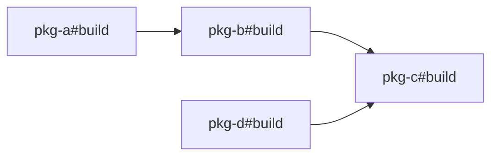

# Monorepo 任务编排：Turborepo、Nx 与缓存原理

!!! abstract "核心结论"

- Monorepo 任务编排的本质是：先把 packages 之间的依赖关系建模为 DAG，再做拓扑分层并行调度。
- 正确性来自依赖拓扑：只有上游构建成功并产出 output hash 后，下游才能开始。
- 缓存键通常包含：输入文件内容哈希、环境变量子集哈希、依赖任务 output 哈希、任务脚本本身。
- affected 计算 = git diff 得到变更文件，再映射到 package 依赖闭包，避免全量重建。
- 工程上的主要风险是隐式依赖、非确定性构建、outputs 配置错误与远程缓存安全问题。

## 1. 为什么需要任务编排

### 1.1 npm workspaces 与 yarn workspaces 的局限

`npm workspaces` 和 `yarn workspaces` 主要解决的是依赖安装与依赖提升问题。它们会让 `node_modules` 中出现指向 workspace package 的软链接，从而让本地包之间可以互相引用。

但它们在构建层面有明显不足：

- `npm run build -ws` 这类命令本质上是遍历 workspace 执行 script，不保证严格的依赖拓扑顺序。
- 没有跨 package 的缓存模型。即便只改了一个底层包，也会触发全量构建。
- 不会自动根据产物内容判断依赖任务是否值得重新执行。
- 无法可靠地区分“需要重新构建”与“可以复用上次产物”。

因此，大型 monorepo 通常引入 task runner，常见的有 Turborepo、Nx、Rush 等。

### 1.2 任务编排解决的核心问题

Monorepo 任务编排主要解决三类问题。

第一是**依赖顺序问题**。假设 `pkg-b` 依赖 `pkg-a`，`pkg-b` 的构建需要消费 `pkg-a` 的 `dist` 产物。如果任务并行执行，必须保证 `pkg-a` 先完成。

第二是**缓存复用问题**。如果 `pkg-a` 的源码没有变化，环境变量没有变化，依赖任务产物没有变化，那么 `pkg-a` 的产物理论上可以被复用，不需要重新执行脚本。

第三是**增量构建问题**。当一次提交只修改了某些文件时，只需要重建受影响的 package 及其下游，不需要重建整个仓库。

## 2. 任务图：拓扑排序与并行度

### 2.1 把依赖关系建模为 DAG

在 monorepo 中，package 依赖可以抽象为一张有向无环图 DAG。

图中的节点是 task，而不是单纯 package。更精确地说，节点是 `package + task`，例如 `pkg-a#build`、`pkg-a#test`。任务节点之间可能存在依赖：

- `pkg-b#build` 依赖 `pkg-a#build`，因为 `pkg-b` 在 package.json 中声明了 `pkg-a` workspace 依赖。
- `pkg-b#test` 可能依赖 `pkg-b#build`，因为测试前需要先构建。

为了简化，下面的手写实现只讨论 `build` 任务。

下面是一个简单依赖图：



如果存在依赖环，例如 `pkg-a` 依赖 `pkg-b`，`pkg-b` 又依赖 `pkg-a`，则图不再是 DAG，任务编排器应直接报错。

### 2.2 拓扑分层与并行调度

拓扑排序不只有一种输出。任务编排器通常采用 Kahn 算法进行分层：

1. 统计每个节点的入度，即它有多少个尚未完成的依赖任务。
2. 每次将入度为 0 的节点放入当前层。
3. 当前层内的节点可以并行执行。
4. 执行完后，将依赖这些节点的下游节点入度减 1。
5. 重复上述过程，直到所有节点处理完毕。

对于上面的图：

- 第 0 层：`pkg-a#build`、`pkg-d#build`
- 第 1 层：`pkg-b#build`
- 第 2 层：`pkg-c#build`

同一层可以并行，但层与层之间必须顺序等待。真实工具还会做并发度限制。例如最多同时运行 5 个任务，避免机器资源被瞬间打满。

## 3. 内容哈希缓存、outputs 恢复与远程缓存

### 3.1 缓存键的组成

任务编排器的缓存不能用“文件时间戳”作为依据，时间戳不可靠、不可迁移、不可复现。工程上通常使用内容哈希。

一个常见缓存键公式如下：

```text
cacheKey = H(
  packageName,
  taskName,
  script,
  inputContentHash,
  envSubsetHash,
  dependencyOutputHashes
)
```

其中：

- `inputContentHash`：根据 `inputs` 配置选择的文件内容计算哈希，文件路径也会参与哈希。
- `envSubsetHash`：不哈希整个 `process.env`，只哈希该任务声明的环境变量子集。全量哈希会导致缓存频繁失效。
- `dependencyOutputHashes`：依赖任务的输出内容哈希。这是关键点。即使当前包源码没有变化，只要上游依赖产物发生变化，当前包也要重新构建。
- `script`：任务命令本身参与哈希。改命令会改变构建行为，必须失效。

公式的直觉是：输入没变、环境没变、依赖产物没变、命令没变，那么构建产物就应该可以复用。

### 3.2 outputs 恢复

只有缓存键还不够。任务执行完以后，编排器需要知道哪些目录是“可缓存产物”。

Turborepo 中通过 `outputs` 配置声明，例如：

```json
{
  "pipeline": {
    "build": {
      "outputs": ["dist/**"]
    }
  }
}
```

Nx 中通常在 `targetDefaults` 或 project configuration 中配置，不同版本配置形态有差异，需核对官方文档。

手写实现中可以简化为 `outputs: ["dist"]`。

输出恢复流程：

1. 任务执行成功后，计算输出目录的内容哈希。
2. 将输出目录复制到本地缓存目录，通常以 `cacheKey` 命名。
3. 后续再次运行时，如果 `cacheKey` 命中，则从缓存目录恢复输出文件。
4. 恢复后重新计算 output hash，供下游任务使用。

如果 outputs 漏配，任务执行结束后 output hash 可能始终为空，缓存键中依赖任务产物这一项就失效了。

### 3.3 远程缓存

本地缓存只能命中同一台机器上的历史构建。远程缓存则把缓存目录上传到对象存储或专用缓存服务，让 CI、不同开发者机器共享缓存。

常见价值场景：

- 新克隆仓库的开发者无需从零构建。
- CI 和本地可以共享同一份产物缓存。
- 多分支之间可以复用未受影响的构建结果。

远程缓存需要关注网络延迟、缓存体积、淘汰策略和访问控制。不同工具的远程缓存配置与命令不同，具体命令应以官方文档为准。

## 4. 手写迷你 Task Runner

### 4.1 运行环境与设计边界

下面实现一个可运行的迷你 task runner，使用 Node.js 18 及以上版本，CommonJS 模块，不依赖第三方包。

为了保持实现短小且正确，做以下简化：

- 只支持 `packages/*` 这种 workspace 展开形式。
- 只处理 `build` 任务。
- `inputs` 支持精确文件与 `src/**` 这类目录前缀。
- `outputs` 简化为目录列表，例如 `["dist"]`。
- 使用 `fs.cpSync` 保存与恢复产物。
- 并行执行基于 Promise 与 `child_process.exec`。

### 4.2 核心实现

```javascript
'use strict';

const fs = require('node:fs');
const path = require('node:path');
const crypto = require('node:crypto');
const { promisify } = require('node:util');
const { exec } = require('node:child_process');

const execAsync = promisify(exec);

const DEFAULTS = {
  inputs: ['src/**', 'package.json'],
  outputs: ['dist'],
  env: ['NODE_ENV'],
  task: 'build'
};

function sha256(data) {
  return crypto.createHash('sha256').update(data).digest('hex');
}

function stableStringify(value) {
  if (value === null || typeof value !== 'object') {
    return JSON.stringify(value);
  }
  if (Array.isArray(value)) {
    return '[' + value.map(stableStringify).join(',') + ']';
  }
  const keys = Object.keys(value).sort();
  return '{' + keys.map((key) => {
    return JSON.stringify(key) + ':' + stableStringify(value[key]);
  }).join(',') + '}';
}

function createMatcher(pattern) {
  const normalized = pattern.replace(/\\/g, '/');

  if (normalized.endsWith('/**')) {
    const prefix = normalized.slice(0, -3);
    return function (fileRel) {
      return fileRel.startsWith(prefix);
    };
  }

  if (normalized.includes('*')) {
    const regexStr = normalized
      .split('*')
      .map((part) => part.replace(/[.*+?^${}()|[\]\\]/g, '\\$&'))
      .join('.*');
    const re = new RegExp('^' + regexStr + '$');
    return function (fileRel) {
      return re.test(fileRel);
    };
  }

  return function (fileRel) {
    return fileRel === normalized;
  };
}

function walkFiles(dir, baseDir = dir) {
  const result = [];
  let entries;

  try {
    entries = fs.readdirSync(dir, { withFileTypes: true });
  } catch {
    return result;
  }

  for (const entry of entries) {
    if (
      entry.name === 'node_modules' ||
      entry.name === '.git' ||
      entry.name === '.task-cache' ||
      entry.name === 'dist'
    ) {
      continue;
    }

    const full = path.join(dir, entry.name);

    if (entry.isDirectory()) {
      result.push(...walkFiles(full, baseDir));
    } else {
      result.push(path.relative(baseDir, full).replace(/\\/g, '/'));
    }
  }

  return result;
}

function collectInputFiles(pkgDir, patterns) {
  const matchers = patterns.map(createMatcher);
  const allFiles = walkFiles(pkgDir);
  return allFiles
    .filter((rel) => matchers.some((matcher) => matcher(rel)))
    .sort();
}

function hashFiles(pkgDir, patterns) {
  const digest = crypto.createHash('sha256');

  for (const rel of collectInputFiles(pkgDir, patterns)) {
    const filePath = path.join(pkgDir, rel);
    digest.update(rel);
    digest.update('\0');
    digest.update(fs.readFileSync(filePath));
    digest.update('\0');
  }

  return digest.digest('hex') || sha256('');
}

function hashOutputs(pkgDir, outputDirs) {
  const digest = crypto.createHash('sha256');

  for (const out of outputDirs) {
    const outAbs = path.resolve(pkgDir, out);

    if (!fs.existsSync(outAbs)) {
      continue;
    }

    const files = walkFiles(outAbs).sort();

    for (const rel of files) {
      const filePath = path.join(outAbs, rel);
      digest.update(out + '/' + rel);
      digest.update('\0');
      digest.update(fs.readFileSync(filePath));
      digest.update('\0');
    }
  }

  return digest.digest('hex') || sha256('');
}

function hashEnv(envNames) {
  const envHashInput = {};

  for (const name of envNames) {
    envHashInput[name] = process.env[name] ?? null;
  }

  return sha256(stableStringify(envHashInput));
}

function expandWorkspaces(root, patterns) {
  const dirs = [];

  for (const pattern of patterns) {
    const normalized = pattern.replace(/\\/g, '/');
    const parts = normalized.split('/');

    if (parts.length === 2 && parts[1] === '*') {
      const baseDir = path.join(root, parts[0]);

      if (!fs.existsSync(baseDir)) {
        continue;
      }

      for (const entry of fs.readdirSync(baseDir, { withFileTypes: true })) {
        if (
          entry.isDirectory() &&
          fs.existsSync(path.join(baseDir, entry.name, 'package.json'))
        ) {
          dirs.push(path.join(baseDir, entry.name));
        }
      }
    } else {
      const abs = path.join(root, normalized);

      if (fs.existsSync(path.join(abs, 'package.json'))) {
        dirs.push(abs);
      }
    }
  }

  return [...new Set(dirs)];
}

function readPackage(dir) {
  const raw = JSON.parse(fs.readFileSync(path.join(dir, 'package.json'), 'utf8'));
  const depsRaw = {
    ...(raw.dependencies ?? {}),
    ...(raw.devDependencies ?? {})
  };

  const taskConfig = raw.monorepo?.build ?? {
    inputs: DEFAULTS.inputs,
    outputs: DEFAULTS.outputs
  };

  return {
    name: raw.name,
    version: raw.version || '0.0.0',
    dir,
    scripts: raw.scripts || {},
    depsRaw,
    deps: [],
    inputs: taskConfig.inputs || DEFAULTS.inputs,
    outputs: taskConfig.outputs || DEFAULTS.outputs,
    task: taskConfig.task || DEFAULTS.task
  };
}

function buildGraph(packages) {
  const byName = new Map(packages.map((pkg) => [pkg.name, pkg]));

  for (const pkg of packages) {
    pkg.deps = Object.keys(pkg.depsRaw)
      .filter((dep) => byName.has(dep))
      .sort();
  }

  return byName;
}

function readWorkspace(root) {
  const rootPkgPath = path.join(root, 'package.json');
  const rootPkg = JSON.parse(fs.readFileSync(rootPkgPath, 'utf8'));
  const workspaces = rootPkg.workspaces || ['packages/*'];
  const dirs = expandWorkspaces(root, workspaces);
  const packages = dirs.map(readPackage);

  buildGraph(packages);

  return packages;
}

function readRootConfig(root) {
  const rootPkg = JSON.parse(fs.readFileSync(path.join(root, 'package.json'), 'utf8'));
  return rootPkg.monorepo || {};
}

function topoSortLayers(packages) {
  const indegree = new Map(packages.map((pkg) => [pkg.name, pkg.deps.length]));
  const dependents = new Map();

  for (const pkg of packages) {
    for (const dep of pkg.deps) {
      if (!dependents.has(dep)) {
        dependents.set(dep, []);
      }
      dependents.get(dep).push(pkg.name);
    }
  }

  const queue = [];

  for (const pkg of packages) {
    if (indegree.get(pkg.name) === 0) {
      queue.push(pkg.name);
    }
  }

  const layers = [];
  const visited = new Set();

  while (queue.length > 0) {
    const layer = [...queue];
    queue.length = 0;
    layers.push(layer);

    for (const name of layer) {
      visited.add(name);

      for (const next of dependents.get(name) || []) {
        indegree.set(next, indegree.get(next) - 1);

        if (indegree.get(next) === 0) {
          queue.push(next);
        }
      }
    }
  }

  if (visited.size !== packages.length) {
    throw new Error('检测到依赖环或缺失 workspace 依赖');
  }

  return layers;
}

function affectedByFiles(changedFiles, packages, root) {
  const direct = new Set();

  for (const pkg of packages) {
    const pkgRel = path.relative(root, pkg.dir).replace(/\\/g, '/');
    const prefix = pkgRel + '/';

    for (const file of changedFiles) {
      const rel = file.replace(/\\/g, '/');

      if (rel === pkgRel || rel.startsWith(prefix)) {
        direct.add(pkg.name);
      }
    }
  }

  const dependents = new Map();

  for (const pkg of packages) {
    for (const dep of pkg.deps) {
      if (!dependents.has(dep)) {
        dependents.set(dep, []);
      }
      dependents.get(dep).push(pkg.name);
    }
  }

  const affected = new Set(direct);
  const queue = [...direct];

  while (queue.length > 0) {
    const current = queue.shift();

    for (const next of dependents.get(current) || []) {
      if (!affected.has(next)) {
        affected.add(next);
        queue.push(next);
      }
    }
  }

  return affected;
}

function sanitizeOutputName(out) {
  return out.replace(/[\\/:*?"<>|]/g, '_');
}

function clearDir(dir) {
  fs.rmSync(dir, { recursive: true, force: true });
  fs.mkdirSync(dir, { recursive: true });
}

function cacheExists(cacheDir) {
  return fs.existsSync(path.join(cacheDir, 'meta.json'));
}

function saveCache(cacheDir, pkg, meta) {
  clearDir(cacheDir);

  const outputsRoot = path.join(cacheDir, 'outputs');
  fs.mkdirSync(outputsRoot, { recursive: true });

  for (const out of pkg.outputs) {
    const src = path.resolve(pkg.dir, out);

    if (fs.existsSync(src)) {
      const dest = path.join(outputsRoot, sanitizeOutputName(out));
      fs.cpSync(src, dest, { recursive: true });
    }
  }

  fs.writeFileSync(path.join(cacheDir, 'meta.json'), JSON.stringify(meta, null, 2));
}

function restoreCache(cacheDir, pkg) {
  const outputsRoot = path.join(cacheDir, 'outputs');

  for (const out of pkg.outputs) {
    const src = path.join(outputsRoot, sanitizeOutputName(out));
    const dest = path.resolve(pkg.dir, out);

    if (fs.existsSync(src)) {
      fs.rmSync(dest, { recursive: true, force: true });
      fs.cpSync(src, dest, { recursive: true });
    } else if (fs.existsSync(dest)) {
      fs.rmSync(dest, { recursive: true, force: true });
    }
  }
}

function computeCacheKey(pkg, inputHash, envHash, depsOutputHashes) {
  const script = pkg.scripts[pkg.task] || pkg.scripts.build || '';
  return sha256(
    [pkg.name, pkg.task, script, inputHash, envHash, ...depsOutputHashes].join('\n')
  );
}

async function runPackage({ pkg, depsOutputHashes, root, envNames, skipCache }) {
  const inputHash = hashFiles(pkg.dir, pkg.inputs);
  const envHash = hashEnv(envNames);
  const key = computeCacheKey(pkg, inputHash, envHash, depsOutputHashes);
  const cacheDir = path.join(root, '.task-cache', key);

  if (!skipCache && cacheExists(cacheDir)) {
    restoreCache(cacheDir, pkg);
    const outputHash = hashOutputs(pkg.dir, pkg.outputs);

    return {
      name: pkg.name,
      executed: false,
      cacheHit: true,
      outputHash,
      key
    };
  }

  const script = pkg.scripts[pkg.task] || pkg.scripts.build;

  if (!script) {
    throw new Error(`${pkg.name} 没有可执行的 ${pkg.task} script`);
  }

  await execAsync(script, {
    cwd: pkg.dir,
    env: { ...process.env, PKG_NAME: pkg.name },
    maxBuffer: 10 * 1024 * 1024,
    encoding: 'utf8'
  });

  const outputHash = hashOutputs(pkg.dir, pkg.outputs);

  saveCache(cacheDir, pkg, {
    key,
    inputHash,
    envHash,
    depsOutputHashes,
    outputHash
  });

  return {
    name: pkg.name,
    executed: true,
    cacheHit: false,
    outputHash,
    key
  };
}

async function runAll(root, options = {}) {
  const { changedFiles = null, skipCache = false } = options;

  const packages = readWorkspace(root);
  const byName = buildGraph(packages);
  const layers = topoSortLayers(packages);
  const rootConfig = readRootConfig(root);
  const envNames = rootConfig.env || DEFAULTS.env;

  const affected = changedFiles && changedFiles.length > 0
    ? affectedByFiles(changedFiles, packages, root)
    : null;

  const results = new Map();

  for (const layer of layers) {
    await Promise.all(layer.map(async (name) => {
      const pkg = byName.get(name);

      const depsOutputHashes = pkg.deps.map((dep) => {
        const depResult = results.get(dep);

        if (!depResult) {
          throw new Error(`依赖 ${dep} 尚无构建结果`);
        }

        return depResult.outputHash;
      });

      const shouldSkipCache = skipCache || (affected && affected.has(name));

      const result = await runPackage({
        pkg,
        depsOutputHashes,
        root,
        envNames,
        skipCache: shouldSkipCache
      });

      results.set(name, result);
    }));
  }

  return results;
}

module.exports = {
  readWorkspace,
  affectedByFiles,
  runAll,
  topoSortLayers,
  DEFAULTS
};
```

### 4.3 验证标准

下面使用 Node.js 内置的 `node:assert` 编写验证脚本。验证目标：

1. 首次构建三个 package 全部执行。
2. 第二次构建全部命中缓存。
3. 修改 `pkg-b` 的源码后，affected 集合只包含 `pkg-b` 与下游 `pkg-c`。
4. 重新构建时，上游 `pkg-a` 命中缓存，`pkg-b` 与 `pkg-c` 重新执行。

```javascript
'use strict';

const assert = require('node:assert');
const fs = require('node:fs');
const os = require('node:os');
const path = require('node:path');
const { runAll, readWorkspace, affectedByFiles } = require('./task-runner.cjs');

async function main() {
  const root = fs.mkdtempSync(path.join(os.tmpdir(), 'mini-mono-'));
  const packagesDir = path.join(root, 'packages');

  const buildScript = "node -e \"const fs=require('fs'); fs.mkdirSync('dist',{recursive:true}); fs.writeFileSync('dist/index.txt', process.env.PKG_NAME + '-built')\"";

  fs.writeFileSync(path.join(root, 'package.json'), JSON.stringify({
    name: 'mini-root',
    private: true,
    workspaces: ['packages/*'],
    monorepo: {
      env: ['NODE_ENV']
    }
  }, null, 2));

  const fixture = {
    'pkg-a': { deps: {} },
    'pkg-b': { deps: { 'pkg-a': 'workspace:*' } },
    'pkg-c': { deps: { 'pkg-b': 'workspace:*' } }
  };

  for (const [name, info] of Object.entries(fixture)) {
    const pkgDir = path.join(packagesDir, name);

    fs.mkdirSync(path.join(pkgDir, 'src'), { recursive: true });
    fs.writeFileSync(
      path.join(pkgDir, 'src/index.js'),
      `module.exports = '${name}-v1';\n`
    );

    fs.writeFileSync(path.join(pkgDir, 'package.json'), JSON.stringify({
      name,
      version: '1.0.0',
      scripts: {
        build: buildScript
      },
      dependencies: info.deps,
      monorepo: {
        build: {
          task: 'build',
          inputs: ['src/**', 'package.json'],
          outputs: ['dist']
        }
      }
    }, null, 2));
  }

  const first = await runAll(root, {});

  assert.equal(first.get('pkg-a').executed, true);
  assert.equal(first.get('pkg-b').executed, true);
  assert.equal(first.get('pkg-c').executed, true);
  console.log('首次构建: pkg-a, pkg-b, pkg-c 全部执行');

  const second = await runAll(root, {});

  assert.equal(second.get('pkg-a').cacheHit, true);
  assert.equal(second.get('pkg-b').cacheHit, true);
  assert.equal(second.get('pkg-c').cacheHit, true);
  console.log('第二次构建: 全部命中缓存，0 个任务重新执行');

  const changedFiles = ['packages/pkg-b/src/index.js'];
  fs.writeFileSync(
    path.join(root, 'packages/pkg-b/src/index.js'),
    "module.exports = 'pkg-b-v2';\n"
  );

  const packages = readWorkspace(root);
  const affected = affectedByFiles(changedFiles, packages, root);

  assert.deepEqual([...affected].sort(), ['pkg-b', 'pkg-c']);
  console.log('affected 集合: pkg-b, pkg-c');

  const third = await runAll(root, { changedFiles });

  assert.equal(third.get('pkg-a').executed, false);
  assert.equal(third.get('pkg-a').cacheHit, true);
  assert.equal(third.get('pkg-b').executed, true);
  assert.equal(third.get('pkg-c').executed, true);
  console.log('修改 pkg-b 后: 仅 pkg-b 与下游 pkg-c 重新构建，上游 pkg-a 命中缓存');
  console.log('所有断言通过');
}

main().catch((err) => {
  console.error(err);
  process.exit(1);
});
```

预期输出：

```text
首次构建: pkg-a, pkg-b, pkg-c 全部执行
第二次构建: 全部命中缓存，0 个任务重新执行
affected 集合: pkg-b, pkg-c
修改 pkg-b 后: 仅 pkg-b 与下游 pkg-c 重新构建，上游 pkg-a 命中缓存
所有断言通过
```

运行方式：

```bash
node task-runner.cjs
node validate-task-runner.cjs
```

实际试验时，`task-runner.cjs` 只导出函数，不会自行执行；验证脚本会调用这些函数并完成断言。

## 5. affected 计算：git diff 与依赖闭包

### 5.1 affected 算法

affected 的目标是回答一个问题：给定一组变更文件，哪些 package 需要重新构建？

主要步骤：

1. 获取变更文件列表，例如 `git diff --name-only origin/main...HEAD`。
2. 将每个变更文件映射到所属 package。
3. 被直接命中的 package 进入 affected 集合。
4. 对每个直接命中的 package，沿着依赖反图查找所有下游依赖。
5. 返回完整闭包。

第 2 步通常使用路径前缀匹配。例如 `packages/pkg-b/src/index.js` 属于 `packages/pkg-b`。某些工具还会处理根目录公共配置变更。例如根 `tsconfig.json` 变更可能影响所有 package，这类规则需要工具内置或通过配置扩展。

第 4 步是容易被忽视的部分。即使只改了 `pkg-b`，`pkg-c` 也可能需要重新构建，因为 `pkg-c` 依赖 `pkg-b` 的产物。

手写实现中的 `affectedByFiles` 就是该算法的简化版本：

```javascript
function affectedByFiles(changedFiles, packages, root) {
  const direct = new Set();

  for (const pkg of packages) {
    const pkgRel = path.relative(root, pkg.dir).replace(/\\/g, '/');
    const prefix = pkgRel + '/';

    for (const file of changedFiles) {
      const rel = file.replace(/\\/g, '/');

      if (rel === pkgRel || rel.startsWith(prefix)) {
        direct.add(pkg.name);
      }
    }
  }

  const dependents = new Map();

  for (const pkg of packages) {
    for (const dep of pkg.deps) {
      if (!dependents.has(dep)) {
        dependents.set(dep, []);
      }
      dependents.get(dep).push(pkg.name);
    }
  }

  const affected = new Set(direct);
  const queue = [...direct];

  while (queue.length > 0) {
    const current = queue.shift();

    for (const next of dependents.get(current) || []) {
      if (!affected.has(next)) {
        affected.add(next);
        queue.push(next);
      }
    }
  }

  return affected;
}
```

### 5.2 与 git diff 的配合

真实工具的 affected 通常需要选择一个 base commit。常见形式为：

```bash
git diff --name-only origin/main...HEAD
```

或者：

```bash
git diff --name-only HEAD~1 HEAD
```

不同工具对 base 的选择方式不同。Nx 和 Turborepo 都支持通过参数指定 base，具体命令与版本相关，面试时应说明原理，避免背诵不确定的命令。

关键点：affected 的计算依赖 git 历史。如果 CI 中只做了浅克隆，可能拿不到足够的历史提交，导致 base 解析失败。这是 CI 配置中的常见问题。

## 6. Turborepo、Nx、Lerna、Rush、Bazel 对比

### 6.1 工具定位对比

| 工具 | 主要定位 | 任务图 | 本地缓存 | 远程缓存 | affected | 生态特点 |
|------|----------|--------|----------|----------|----------|----------|
| Turborepo | Vercel 出品，专注前端/Node monorepo 任务编排 | 有 | 有 | 有 | 有 | 配置简单，与 Vercel 集成良好 |
| Nx | Nrwl 出品，插件化 monorepo 开发工具 | 有 | 有 | 有 | 有 | 插件体系成熟，支持代码生成、依赖图可视化 |
| Lerna | 历史悠久的 monorepo 管理工具，偏向版本管理与发布 | 早期较弱，现可复用 Nx | 可配合 Nx | 可配合 Nx | 可配合 Nx | 单独使用适合做版本和发布管理 |
| Rush | 微软出品，面向大型企业 monorepo | 有 | 有 | 有 | 有 | 强调大规模场景与发布管理 |
| Bazel | Google 开源构建系统，语言无关 | 有 | 有 | 有 | 有 | 强大但学习成本高，生态偏向大型仓库 |

### 6.2 核心能力对比

| 维度 | Turborepo | Nx | Lerna | Rush | Bazel |
|------|-----------|-----|-------|------|-------|
| 调度模型 | 任务 DAG 分层并行 | 任务 DAG 分层并行，支持分布式执行 | 继承所用执行器 | 阶段式依赖与并行 | Action Graph，支持远程执行 |
| 缓存键 | 输入哈希 + 环境哈希 + 依赖输出哈希 | 输入哈希 + 环境哈希 + 依赖输出哈希 | 取决于 Nx | 内容哈希 + 构建参数 | Action 输入哈希，强 hermetic |
| 配置方式 | turbo.json | project.json/nx.json | lerna.json | rush.json | BUILD 文件 |
| 增量构建 | 支持 | 支持 | 间接支持 | 支持 | 支持 |
| 学习成本 | 低 | 中 | 低 | 中高 | 高 |
| 适用规模 | 中小到大型前端仓库 | 中大型仓库 | 小型到中型仓库 | 大型企业仓库 | 超大型多语言仓库 |

需要注意的是，表格中的能力描述是方向性对比，具体能力边界可能随版本变化。面试时应强调“理解原理”，而不是记住某个工具的最新参数。

## 7. 常见陷阱

### 7.1 隐式依赖

隐式依赖是最危险的一类问题。

例如 `pkg-b` 在代码中直接 `import` 了 `pkg-c` 的产物，但 `package.json` 中没有声明 `pkg-c` 为 workspace 依赖。此时任务图缺少 `pkg-c -> pkg-b` 这条边。可能造成两种后果：

- 拓扑顺序错误，`pkg-b` 可能先于 `pkg-c` 构建。
- 缓存键不包含 `pkg-c` 的 output hash，`pkg-c` 变化后 `pkg-b` 仍可能命中旧缓存。

因此，monorepo 必须严格校验 workspace 依赖声明，并在 CI 中配合 lint 规则或类型检查发现未声明依赖。

### 7.2 非确定性构建

非确定性构建会让缓存命中率降低，甚至产生错误的缓存恢复。

常见非确定因素包括：

- 产物中写入当前时间戳。
- 产物中写入随机数或机器名。
- 产物中包含开发机绝对路径。
- 产物中的文件顺序依赖文件系统读取顺序。
- 构建依赖了未声明的环境变量。

任务编排工具无法自动修复非确定性构建。开发者需要让构建尽量 hermetic。

### 7.3 outputs 配置错误

如果构建脚本输出了 `dist`，但 `outputs` 中没有声明 `dist`，则：

- 工具不会保存 `dist` 到缓存。
- 下游任务拿到的 output hash 可能为空。
- 缓存命中后也无法恢复产物。

反过来，如果 `outputs` 声明了源码目录，可能把源码副本写入缓存，造成体积膨胀，甚至覆盖工作区文件。输出路径必须精确约束。

### 7.4 远程缓存安全

远程缓存常用于团队共享，但要注意：

- 缓存内容可能被恶意 PR 污染。例如 PR 中的构建任务上传恶意代码，后续主分支恢复缓存时执行了恶意产物。
- 需要限制只有可信分支才能写入远程缓存。
- 访问远程缓存的 token 不能提交到仓库。
- 跨平台缓存可能存在路径兼容问题，例如 Windows 与 macOS/Linux 生成的路径不一致。

### 7.5 依赖环与错误的版本声明

任务图一旦出现环，编排器应该立即报错。但有些场景下环不是显式的，而是通过 `peerDependencies`、`optionalDependencies` 或过度宽松的 workspace 协议间接产生。

另外，workspace 依赖应统一使用 workspace 协议，例如 `workspace:*`，否则包管理器可能尝试从 registry 下载同名包，而不是链接本地包。不同包管理器的 workspace 协议行为略有差异，应结合项目所使用的包管理器核对。

## 8. 面试题与答题要点

### 8.1 为什么 monorepo 需要专门的任务编排器，而不是直接使用 npm scripts？

答题要点：

- npm workspaces 可以管理依赖安装和包间软链接，但不解决严格的拓扑顺序。
- 原生 scripts 缺少跨包缓存，容易全量重建。
- 无法自动计算 affected 集合。
- 大型仓库需要并行度控制和产物缓存恢复。
- 任务编排器把“构建调度”从“包管理”中分离出来。

### 8.2 任务图是如何构建的？

答题要点：

- 解析 workspace 中每个 package 的依赖声明。
- 只保留指向 workspace 内部 package 的依赖作为任务依赖。
- 将 `package + task` 建为节点，例如 `pkg-b#build` 依赖 `pkg-a#build`。
- 使用拓扑排序检测依赖环，并生成可并行执行的层。
- 同一层内任务互相独立，可以并行执行。

### 8.3 缓存键包含哪些部分？为什么依赖任务输出哈希也要包含？

答题要点：

- 包含任务标识、脚本、输入文件内容哈希、环境变量子集哈希、依赖任务输出哈希。
- 输入文件内容变化必须重建。
- 环境变量影响构建行为，必须参与哈希。
- 依赖任务输出变化时，当前任务即使源码没变，也可能产生不同产物，因此必须重建。
- 只哈希声明过的环境变量，避免环境噪声导致缓存全部失效。

### 8.4 affected 是如何计算的？

答题要点：

- 从 git diff 获取变更文件列表。
- 通过路径前缀将文件映射到直接变更的 package。
- 再根据依赖反图，求出所有下游受影响 package。
- 最终集合是直接变更集的传递闭包。
- 只运行 affected 集合中的任务，可以减少全量构建时间。

### 8.5 远程缓存的原理是什么？有哪些安全风险？

答题要点：

- 本地计算缓存键，命中后从远端对象存储或缓存服务下载产物。
- 未命中则本地执行，执行完成后上传缓存。
- 可以让 CI、不同开发者机器共享构建结果。
- 安全风险包括缓存投毒、token 泄露、跨平台兼容性问题。
- 应限制写入权限，只有可信来源可以上传缓存。

### 8.6 为什么内容哈希比文件时间戳更适合做缓存依据？

答题要点：

- 内容哈希只依赖文件内容，不受复制、解压、git checkout 影响。
- 时间戳可能因为 touch 或文件系统精度导致误判。
- 内容哈希可以跨机器一致，支持远程缓存。
- 缺点是计算哈希本身有成本，真实工具会做文件扫描和增量优化。

### 8.7 如何避免缓存错误命中？

答题要点：

- 精确配置 inputs 和 outputs。
- 构建过程尽量 hermetic，不依赖未声明环境变量。
- 不使用时间戳、随机数、绝对路径等非确定性内容。
- 严格声明 workspace 依赖，避免隐式依赖。
- 远程缓存只允许可信分支写入。

### 8.8 Turborepo 和 Nx 应该怎么选？什么场景下考虑 Bazel？

答题要点：

- Turborepo 上手简单，适合前端/Node 为主的仓库。
- Nx 插件体系成熟，适合需要代码生成、可视化、复杂项目结构的仓库。
- Lerna 更偏向版本和发布管理，可以配合 Nx 使用。
- 大型企业仓库可以使用 Rush，对发布流程有较强约束。
- Bazel 学习成本高，但支持多语言、远程执行和极强 hermetic 构建，适合超大型多语言 monorepo。

## 深入阅读与参考

!!! tip "怎么用这些资料"
    先读「官方文档与规范」建立准确的概念，再读「源码与示例」核对细节，最后用「教程、书籍与视频」换一种讲法加深理解。每条都写明了读哪一节、带着什么问题读。

### 官方文档与规范

| 资源 | 为什么读 | 怎么读 |
|---|---|---|
| [Turborepo 文档](https://turbo.build/repo/docs) | 任务图、内容哈希与远程缓存的官方定义，概念最准。 | 先读缓存与 pipeline 两节，带着哈希输入含什么的问题读，再跑一遍 turbo build。 |
| [Turborepo：仓库组织](https://turborepo.com/docs/crafting-your-repository) | 实操指南：任务依赖与缓存配置如何落到 workspace。 | 按仓库组织一节配出自己的 pipeline，标注每个 task 的 inputs 与 outputs。 |
| [deno task](https://docs.deno.com/runtime/reference/cli/task/) | 最小任务运行器的官方语义，可对照手写 mini runner。 | 读 task.md 的任务定义与依赖写法，列出与 Turborepo 的异同。 |
| [Lerna 文档](https://lerna.js.org/docs/introduction) | Lerna 定位的一手说明，让对比章节有据可依。 | 读它与 Nx 关系的段落，写三条：适用场景、局限、是否选它。 |
| [Git 官方命令文档](https://git-scm.com/docs) | affected 计算依赖 git diff，先弄准命令语义。 | 读 git diff 的 DESCRIPTION 与 EXAMPLES，试 --name-only 与三点写法。 |
| [Cargo 手册](https://doc.rust-lang.org/cargo/) | 工作区与特性机制可类比 monorepo 依赖图与缓存输入。 | 读工作区一节，画出成员依赖图，比较与前端 workspace 的差别。 |

### 源码与示例

| 资源 | 为什么读 | 怎么读 |
|---|---|---|
| [Changesets](https://github.com/changesets/changesets) | monorepo 中按依赖驱动发布的实例，可对照任务图。 | 走一遍 add、version、publish，观察包改动顺序如何被依赖决定。 |

### 教程、书籍与视频

| 资源 | 为什么读 | 怎么读 |
|---|---|---|
| [MIT The Missing Semester](https://missing.csail.mit.edu/) | 补齐 shell、构建与调试基础，写迷你 runner 更顺。 | 重点看 shell 与构建两讲，做完练习再动手写迷你 runner。 |
| [Atlassian Git 教程](https://www.atlassian.com/git/tutorials) | 分支策略决定 affected 计算选哪个基准分支。 | 读工作流对比，判断自己仓库适合主干开发还是 Git Flow。 |
| [Learn Git Branching 中文](https://learngitbranching.js.org/?locale=zh_CN) | 可视化练分支操作，弄懂 diff 比较的是哪两个提交。 | 通关 rebase 与 cherry-pick，回仓库验证 git diff 的输出。 |
| [理解 GitHub Actions](https://docs.github.com/en/actions/get-started/understand-github-actions) | 远程缓存通常落在 CI，需先懂 job 与 runner。 | 读 workflow、job、step、runner 的关系，标出缓存在哪一层。 |

## 应用与行业实践

### 应用场景地图

| 场景 | 用到本页哪个知识点 | 典型技术选型 | 注意事项 |
| --- | --- | --- | --- |
| 后台管理系统的万行表格页 | 内容哈希缓存、outputs 声明 | Turborepo | inputs 漏掉构建配置文件，改了文件却不重建 |
| 低端安卓机的首屏体积预算校验 | 依赖任务 output 哈希的传导 | Nx 任务图 | 上游产物变大要传导到下游预算任务 |
| 多人协作白板的同步协议层 | DAG 拓扑分层并行 | Nx、Turborepo | 协议包必须写进 package.json 依赖 |
| 电商大促前的 API 网关压测 | affected 依赖闭包 | Nx affected、git diff 脚本 | 基线取 merge-base，不取分支名 |
| 跨端组件库的三套产物 | 手写拓扑调度 | 自研脚本、Turborepo | 先修非确定性构建，再开缓存 |
| 图表微前端与主题包 | 环境变量子集哈希 | Turborepo env 字段 | 只把影响产物的变量放进哈希 |
| 桌面端应用的自动更新包 | 远程缓存 | Turborepo Remote Cache、Nx Cloud | 归档不要放公开可读的存储桶 |
| 内部 CLI 与共享配置包 | outputs 恢复 | 任务运行器自带缓存 | 恢复后校验文件摘要，防止半份产物 |

### 三个场景拆解

#### 场景 1：后台管理系统的万行表格页

**业务背景**：仓库里有几十个前端包，表格页依赖三个内部 UI 包。改动只落在表格页时，CI 仍把全部包重跑构建与测试。

**怎么用本页知识解决**：先给每个任务声明 inputs 与 outputs，让内容哈希能算准，再用 affected 过滤掉无关包。

```jsonc
{
  "tasks": {
    "build": {
      "dependsOn": ["^build"],   // 先构建依赖包，产出 d.ts 与 dist
      "inputs": ["src/**", "tsconfig.json", "package.json"],  // 决定内容哈希
      "outputs": ["dist/**"]     // 命中缓存时按此路径恢复产物
    },
    "test": {
      "dependsOn": ["build"],    // 同包内先构建再测试
      "inputs": ["src/**", "test/**", "vitest.config.ts"]
    }
  }
}
```

- `dependsOn: ["^build"]` 让上游先完成，下游读到的上游 dist 与本次哈希一致。
- inputs 少写一个配置文件，改它不会触发重建，这是缓存错命中来源之一。
- 声明 outputs 后，命中缓存的任务不执行，产物从缓存目录恢复到工作区。
- 构建读取环境变量时要把变量名写进 env，否则两个环境共用一份缓存。
- CI 用 `--filter=...[origin/main]` 只跑变更包与其下游，配合远程缓存复用产物。

**怎么度量收益**：看 CI 墙钟时间与缓存命中任务数。时间取 CI 平台上单次运行开始到结束的差值，命中数取运行结束时终端输出的 cached 任务条数，改动前连跑两次同一提交即可对比。

**什么时候不该用**：
- 仓库只有一个包，每次提交都触及该包全部源码，过滤没有可省的任务。
- 单包构建只有几秒，产物归档上传下载的耗时接近甚至超过重建耗时。

#### 场景 2：跨端组件库的三套产物构建

**业务背景**：组件库有 React、Vue、小程序三套实现，共享一个 token 包。token 一改，三套产物与文档站都要重建，本地全量构建要跑完三层依赖。

**怎么用本页知识解决**：把包依赖建模为 DAG，做拓扑分层，层内并行执行，命中缓存的层直接恢复产物。

```js
const layers = topoLayers(graph);   // 按依赖关系分层，第 0 层无内部依赖
for (const layer of layers) {       // 逐层推进，层内可并行
  await Promise.all(layer.map(async (pkg) => {
    const key = hashTask(pkg);      // 输入文件 + 依赖任务的 output hash
    if (await cache.has(key)) {
      await restoreOutputs(pkg, key); // 从缓存恢复 dist，供下游读取
      return;
    }
    await run(pkg);                 // 执行构建
    await cache.put(key, outputsOf(pkg)); // 写入产物与其摘要
  }));
}
```

- 分层保证上游构建成功并写出产物后，下游才开始。
- 层内并行把多核机器的空闲算力用起来，层数决定串行等待轮次。
- 缓存键必须含依赖任务的 output hash，否则上游改了、下游还会命中旧产物。
- 恢复产物后要能读出与缓存写入时一致的摘要，否则下游会读到半份文件。

**怎么度量收益**：用 hyperfine 对同一命令连跑多次取中位数，对比改造前后的本地耗时；用任务运行器的 dry-run 输出统计计划执行的任务数与命中数。

**什么时候不该用**：
- 各包之间没有内部依赖，分层退化成一层，收益只剩缓存。
- 构建脚本写入当前时间戳或随机 ID，缓存几乎不命中，应先修确定性。

#### 场景 3：契约包变更后的微服务重建

**业务背景**：仓库里有一个共享契约包与若干 Node 服务，契约包定义请求与响应结构。契约包一改，依赖它的服务都要重建镜像，未依赖的服务不该被牵连。

**怎么用本页知识解决**：用 git diff 得到变更文件，映射到包，再沿依赖图取反向闭包，只把闭包内的项目交给任务运行器。

```bash
BASE=$(git merge-base HEAD origin/main)   # 共同祖先做基线，排除主干无关提交
npx nx affected -t build --base="$BASE" --head=HEAD --parallel=3
npx nx affected -t test  --base="$BASE" --head=HEAD
```

- merge-base 保证比较基准是共同祖先，主干上别人的提交不会被算成本次变更。
- affected 先把变更文件映射到项目，再沿依赖图取反向闭包，被依赖方改了就把依赖方纳入。
- 契约包被三个服务依赖时，只有这三个服务与其自身下游会重建。
- 运行时读取仓库内文件却没写进 package.json 的隐式依赖会让 affected 漏项，要补成显式依赖。

**怎么度量收益**：看本次运行的计划任务数与全量任务数之比，以及 CI 各 job 的时长。计划任务数从 dry-run 输出读取，时长从 CI 平台的任务详情页读取。

**什么时候不该用**：
- 每次合并都触及契约包，闭包等于全量，过滤没有收益。
- 服务间通过运行时注入共享配置，依赖关系没有写进清单，此时 affected 结果不可信。

### 行业先进实践

远程缓存与本地缓存分层（出处：Turborepo 官方文档 Remote Caching）
Turborepo 把任务输出按内容哈希存入本地缓存目录，也能把同一份归档推到远程缓存供其他机器读取。它的价值在于新机器与 CI 复用同一份产物，代价是归档传输时间要计入测量。可以先只开本地缓存，用 dry-run 确认任务图与 outputs 声明无误，再接远程缓存。

affected 子图裁剪（出处：Nx 官方文档 nx affected）
Nx 用项目图加 git 变更算出受影响项目，命令支持指定 base 与 head。它把"改了哪些文件"和"谁依赖这些项目"合到一条命令里。可借鉴的是把基线固定为 merge-base，并在 CI 里显式传入，而不是依赖默认比较对象。

action cache 与 Remote Execution API（出处：Bazel 官方文档 Remote Caching、bazelbuild/remote-apis 规范）
Bazel 的动作缓存把输出摘要与动作定义、输入摘要绑定，规范还把缓存服务与执行服务拆成两个接口。好处是缓存实现可替换，团队能按自己的存储与权限体系接入。借鉴顺序是先定义缓存键包含哪些内容，再讨论远程执行。

按 lockfile 哈希缓存依赖目录（出处：actions/cache 开源项目）
该 action 的 key 里放 lockfile 的内容哈希，命中失败时用 restore-keys 做前缀回退。它把"依赖清单变了就重装"变成可检查的规则。借鉴前先测出安装步骤在 CI 总时长里的占比，占比低时先不动。

按 git 变更过滤工作区（出处：pnpm 官方文档 Filtering）
pnpm 支持用 `...[origin/main]` 这类过滤语法，把变更集与依赖闭包交给包管理器解析。适合包管理器已统一、任务运行器尚未引入的阶段。需核对官方文档：过滤语法中 `[since]` 与 `...` 组合在你们使用的 pnpm 版本里的行为。

### 从学到用：落地路线

1. 选一个包数量为两位数、构建耗时占 CI 大头的子目录试点，只给 build 任务补 inputs、outputs 与 dependsOn。验收标准：dry-run 输出中每个任务都能列出这三项。
2. 在 CI 上对同一提交连跑两次，记录两次的墙钟时间与缓存命中任务数。验收标准：第二次命中数大于零，总时长低于第一次，两次产物摘要一致。
3. 把同一份配置复制到其余包，再打开 affected 过滤，只跑变更包与其下游。验收标准：主干上只改一个包时，计划任务数等于该包与下游包之和。
4. 加 CI 检查项防回退：缺 inputs 或 outputs 的新包直接失败，远程缓存令牌只注入 CI 环境。验收标准：故意删掉一个 outputs 字段的提交会被检查拦下。

### 动手作业

**目标**：在含四个包的仓库里，让构建任务的缓存命中可复现，并能解释每次命中与失效的原因。

**步骤**：
1. 建包 core、ui、web、docs，让 web 依赖 ui，ui 依赖 core。
2. 每个包的 build 脚本读取自身 src 目录，把各文件 SHA-256 拼起来写进 dist/out.txt。
3. 用任务运行器声明 `dependsOn: ["^build"]`、inputs 与 outputs。
4. 第一次运行，记录墙钟时间与四个包的 out.txt 摘要。
5. 不改任何文件再跑一次，确认任务被跳过且 out.txt 与上次一致。
6. 改 core 的一个源文件，确认 core、ui、web 重建，docs 不重建。
7. 让 core 的构建读取 config.json 但先不写进 inputs，观察缓存仍命中，再补上 inputs 复现失效。

**验收标准**：
- 第二次运行中 core、ui、web 显示缓存命中，耗时低于第一次。
- 改 core 后 docs 不重建，web 的 out.txt 摘要包含新 core 的摘要。
- 未声明 config.json 时改它缓存命中，补声明后缓存失效，两次结果可对比。
- 删掉全部 dist 后重跑，文件能被缓存恢复，摘要与删除前一致。
- CI 日志里能看到每个任务的命中或未命中状态。

