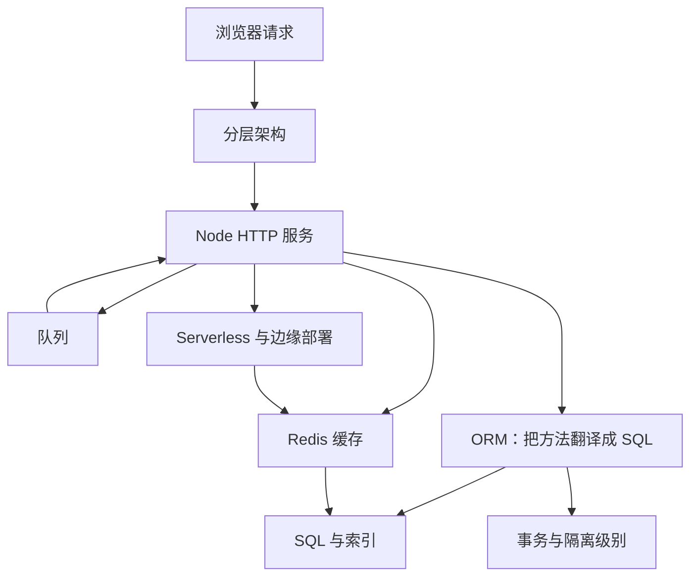
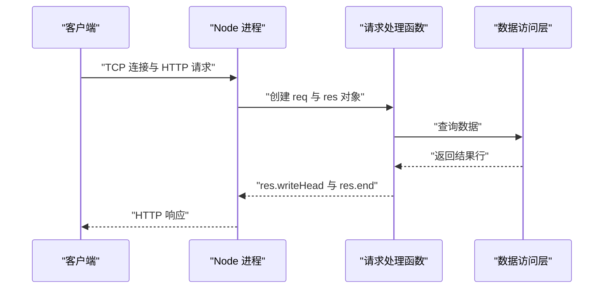
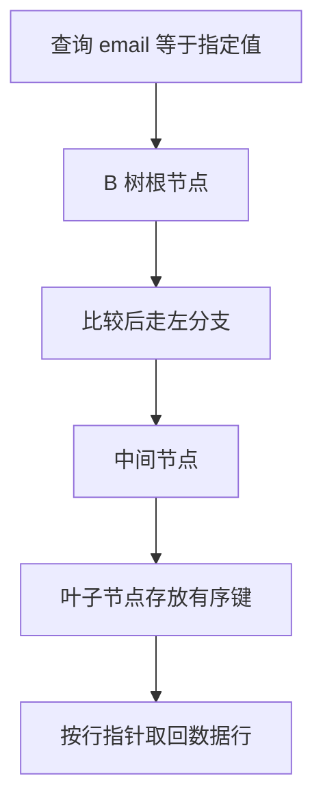
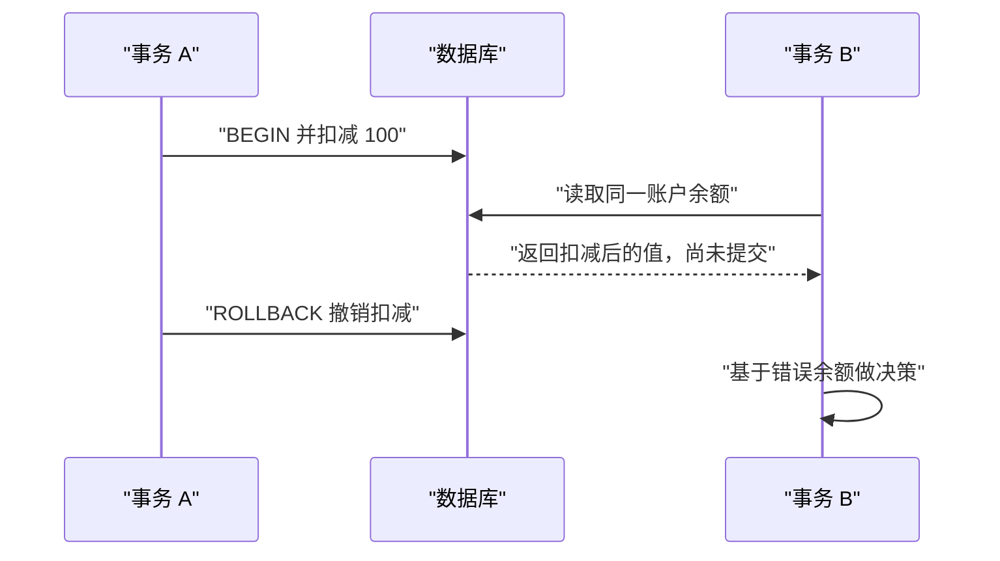
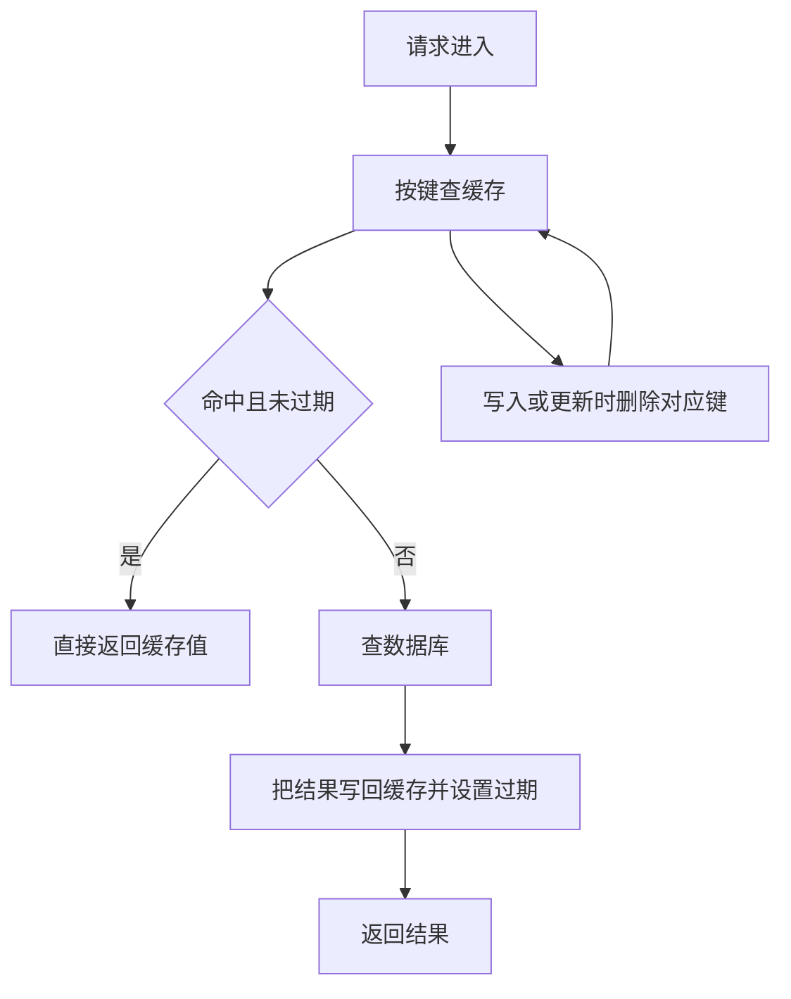
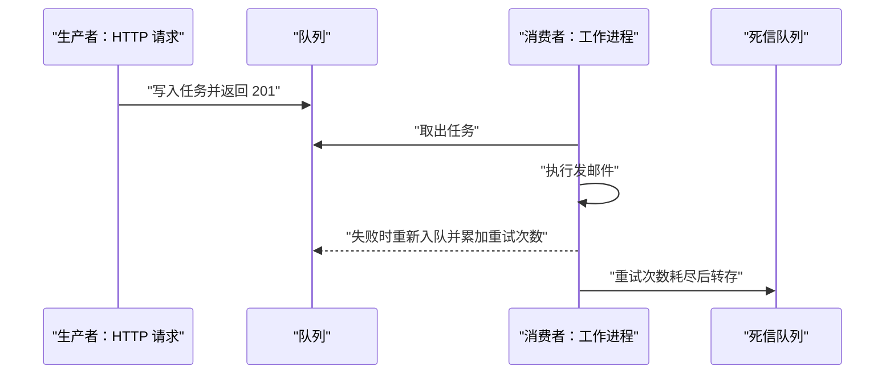
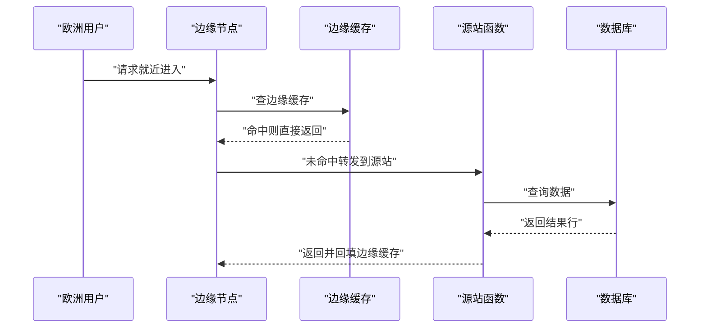

# 前端工程师的后端基础：Node 服务、数据库与缓存

!!! abstract "学完这一页你能"
    - 说出一次请求在分层架构里经过哪四层，并写出每层的职责边界与禁止事项。
    - 用 Node 20 内置模块起一个 HTTP 服务，正确解析路径、查询参数与 JSON 请求体。
    - 读懂索引的最左前缀规则，并判断哪种写法会让复合索引被跳过。
    - 用 Cache-Aside 与队列拆开慢操作，并说清同一套代码迁到 Serverless 或边缘运行时要注意什么。

!!! note "术语：分层架构"
    把一次请求的处理按职责切成若干层，每层只调用下一层、不跨层回跳。例：路由层解析请求，服务层放业务规则，数据访问层读写数据。

## 0. 知识地图



建议按 1 到 8 的顺序读。第 1 到 3 节解决"请求怎么进到数据库"，第 4 到 5 节解决"数据怎么存得对"，第 6 到 8 节解决"流量来了怎么扛"。每一节的代码都能单独跑，跑完再读下一节。

## 1. 分层架构：把请求拆成四层

**先想一个问题**

一个注册接口，同时要做参数校验、密码加密、写库、发欢迎邮件。全部写进一个处理函数，改动一处要读完 200 行才能确认影响面。怎么切？

!!! tip "心智模型"
    一句话模型：把请求处理按职责切成四层，每层只依赖下一层。

    日常类比：餐厅里点单员、厨师、采购、仓库各管一段，点单员不会自己去仓库拿菜。

    类比不成立的地方：餐厅的层级靠物理位置隔开，代码里的层在同一进程内。边界只靠约定和评审维持，编译期不会拦住跨层调用。

**图解**


1. 客户端发来 HTTP 请求，落到路由层。
2. 路由层读出路径、方法、请求体，转成普通 JavaScript 对象。
3. 服务层收到对象，执行校验、加密、状态变更这些业务规则。
4. 数据访问层收到字段值，执行插入或查询，它不知道请求长什么样。
5. 结果沿原路返回，路由层负责把结果翻译成状态码与 JSON。

**一步一步来**

第 1 步要做什么：写数据访问层，它只碰数据，拿到的参数是普通字段。

```js
// 数据访问层：只负责读写数据，不关心 HTTP
const users = new Map();                 // 用 Map 代替数据库表

function insertUser(user) {
  users.set(user.id, { ...user });       // 复制一份，外部改动不会污染内部
  return { ...user };                    // 返回副本
}

function findUserById(id) {
  const row = users.get(id);
  return row ? { ...row } : null;        // null 表示没有这一行
}

module.exports = { insertUser, findUserById };
```

**这段代码在做什么**

- `users` 是进程内的一张"表"，键是主键 `id`。
- `insertUser` 写入时复制对象，避免调用方后续改到这条记录。
- `findUserById` 用主键查找，找不到返回 `null`，而不是 `undefined`。
- 这一层没有 `req`、`res`，也没有状态码。
- 这一层可以整体换成真的数据库驱动，上层不需要改。

第 2 步要做什么：写服务层，它放业务规则，不做 IO 之外的事情。

```js
// 服务层：只放业务规则，不碰 req 和 res
const db = require('./db');
const crypto = require('node:crypto');

function hashPassword(plain) {
  return crypto.createHash('sha256').update(plain).digest('hex');
}

function registerUser({ email, password }) {
  if (!email || !email.includes('@')) {              // 业务规则：邮箱必须含 @
    throw new Error('INVALID_EMAIL');
  }
  if (typeof password !== 'string' || password.length < 8) {
    throw new Error('WEAK_PASSWORD');                // 业务规则：密码至少 8 位
  }
  const id = crypto.randomUUID();                    // 生成主键
  return db.insertUser({ id, email, passwordHash: hashPassword(password) });
}

module.exports = { registerUser };
```

**这段代码在做什么**

- 服务层抛的是业务错误码字符串，不是 HTTP 状态码。
- `hashPassword` 用 `node:crypto` 的 `sha256`，真实项目应当用带盐的慢哈希，需核对官方文档：`crypto.scrypt` 或 `crypto.pbkdf2` 的参数推荐值。
- 明文密码不进数据访问层，只传 `passwordHash`。
- `crypto.randomUUID()` 由 Node 内置，不需要第三方库。

第 3 步要做什么：写路由层，它负责 HTTP 与业务之间的翻译。

```js
// 路由层：解析请求、调用服务、组装响应
const { registerUser } = require('./service');

async function handleRegister(req) {
  const body = await readJson(req);                        // 读取并解析 JSON
  try {
    const user = registerUser(body);                       // 调用服务层
    return { status: 201, body: { id: user.id, email: user.email } };
  } catch (err) {
    return { status: 400, body: { error: err.message } };  // 业务错误转成 400
  }
}

function readJson(req) {
  return new Promise((resolve, reject) => {
    let raw = '';
    req.on('data', (chunk) => { raw += chunk; });           // 累积请求体
    req.on('end', () => {
      try { resolve(raw ? JSON.parse(raw) : {}); }          // 空体当空对象
      catch { reject(new Error('INVALID_JSON')); }
    });
  });
}

module.exports = { handleRegister };
```

**这段代码在做什么**

- 路由层返回 `{ status, body }`，不直接调用 `res.end`，方便单元测试。
- `readJson` 把流式的请求体拼成完整字符串再解析。
- 解析失败抛出 `INVALID_JSON`，同样走 400 分支。
- 状态码 201 表示资源已创建，400 表示客户端输入有问题。
- 换成真实驱动时，`await db.insertUser(...)` 需要服务层补上 `await`。

**动手验证**

依赖：仅 Node 20 内置模块。把三层写进一个文件，用 `node:assert` 断言。

```js
const assert = require('node:assert');

const users = new Map();
function insertUser(user) { users.set(user.id, { ...user }); return { ...user }; }
function findUserById(id) { const row = users.get(id); return row ? { ...row } : null; }

const crypto = require('node:crypto');
function registerUser({ email, password }) {
  if (!email || !email.includes('@')) throw new Error('INVALID_EMAIL');
  if (typeof password !== 'string' || password.length < 8) throw new Error('WEAK_PASSWORD');
  const id = crypto.randomUUID();
  return insertUser({ id, email, passwordHash: crypto.createHash('sha256').update(password).digest('hex') });
}

const created = registerUser({ email: 'ada@example.com', password: 'secret123' });
assert.ok(created.id, '应当分配主键');
assert.strictEqual(created.passwordHash.length, 64, 'sha256 十六进制长度为 64');
assert.strictEqual(findUserById(created.id).email, 'ada@example.com');
assert.throws(() => registerUser({ email: 'bad', password: 'secret123' }), /INVALID_EMAIL/);
assert.throws(() => registerUser({ email: 'a@b.com', password: 'short' }), /WEAK_PASSWORD/);
assert.strictEqual(users.get(created.id).password, undefined, '明文密码不落库');

console.log('分层注册流程断言通过');
```

运行结果：

```
分层注册流程断言通过
```

**常见坑**

| 现象 | 原因 | 怎么修 |
| --- | --- | --- |
| 单元测试写不出来 | 业务规则里直接调用了 `res.end` | 服务层只返回值或抛错误，HTTP 细节留在路由层 |
| 换数据库要改几十个文件 | 路由层直接写了 SQL | SQL 只出现在数据访问层 |
| 报错信息泄露内部结构 | 把原始异常直接返回给客户端 | 路由层把未知异常映射成 500 与固定文案 |

**小结**

1. 路由层管 HTTP，服务层管规则，数据访问层管数据。
2. 层与层之间只传普通对象，不传 `req`、`res`。
3. 边界靠约定维持，需要测试和评审兜住。

## 2. 用 Node 起一个 HTTP 服务

**先想一个问题**

前端要在本地调接口，后端同学还没写好。你手上有 Node 20，怎么在 10 行内起一个能返回 JSON 的服务？

!!! tip "心智模型"
    一句话模型：HTTP 服务就是一个函数，输入是请求对象，输出是响应对象。

    Node 的 `http.createServer` 每收到一个请求就调用一次这个函数。

    日常类比：前台窗口，来一个人就处理一次，处理完窗口继续开着。

    类比不成立的地方：前台是一个人排队，Node 是单线程事件循环。请求处理里的同步耗时操作会挡住整个窗口。

!!! note "术语：事件循环"
    Node 用来调度任务的机制：把非阻塞 IO 交给系统内核，自己只执行就绪的回调。例：读取请求体时注册 `end` 事件，主线程先去处理别的请求。

**图解**



1. 客户端建立 TCP 连接，发送 HTTP 文本。
2. Node 解析出请求行、请求头，创建 `req` 与 `res` 对象。
3. 事件循环调用你注册的处理函数。
4. 处理函数里可以查库、读文件，这些操作不阻塞事件循环。
5. 处理函数调用 `res.end` 时，Node 把响应写回连接。
6. 如果没有调用 `res.end`，这个请求会一直挂到超时。

**一步一步来**

第 1 步要做什么：起一个最小服务，只处理一个固定路径。

```js
// 用 node:http 起服务，零依赖
const http = require('node:http');

const server = http.createServer((req, res) => {
  if (req.method === 'GET' && req.url === '/health') {
    res.writeHead(200, { 'Content-Type': 'application/json' }); // 先写状态码与响应头
    res.end(JSON.stringify({ ok: true }));                      // 再写响应体并结束
    return;
  }
  res.writeHead(404, { 'Content-Type': 'application/json' });
  res.end(JSON.stringify({ error: 'NOT_FOUND' }));
});

server.listen(3000, () => console.log('http://127.0.0.1:3000'));
```

**这段代码在做什么**

- `http.createServer` 接收一个 `(req, res) => void` 回调。
- `req.url` 这里是原始字符串 `/health`，不含协议与域名。
- `res.writeHead` 一次写状态码和响应头。
- `res.end` 写响应体并结束本次响应。
- 最后一个 `return` 防止继续执行到 404 分支。

运行结果（浏览器访问 `http://127.0.0.1:3000/health`）：

```
{"ok":true}
```

第 2 步要做什么：把原始 URL 解析成路径和查询参数。

```js
// 用 URL 类解析，避免手写 split 出错
const http = require('node:http');

const server = http.createServer((req, res) => {
  const host = req.headers.host ?? 'localhost';       // 请求头里的 Host
  const url = new URL(req.url, `http://${host}`);     // 第二个参数是 base，必须给
  const page = Number(url.searchParams.get('page') ?? '1'); // 缺省为第 1 页
  res.writeHead(200, { 'Content-Type': 'application/json' });
  res.end(JSON.stringify({ path: url.pathname, page }));
});

server.listen(3000);
```

**这段代码在做什么**

- `new URL(path, base)` 必须给 base，因为 `req.url` 是相对路径。
- `url.pathname` 已经去掉查询串，`/list?page=2` 得到 `/list`。
- `url.searchParams.get` 返回字符串或 `null`，这里用 `??` 给默认值。
- `Number()` 把字符串转成数字，非法输入得到 `NaN`，需要另外校验。
- 路径里的百分号编码会被自动解码。

运行结果（访问 `/list?page=2`）：

```
{"path":"/list","page":2}
```

第 3 步要做什么：读取 POST 请求体并解析 JSON。

```js
// 请求体是流，必须累积完再解析
function readJson(req, limitBytes = 1_000_000) {
  return new Promise((resolve, reject) => {
    let raw = '';
    let size = 0;
    req.on('data', (chunk) => {
      size += chunk.length;
      if (size > limitBytes) {                       // 超过上限就拒绝
        reject(new Error('BODY_TOO_LARGE'));
        req.destroy();                               // 关掉连接，停止接收
        return;
      }
      raw += chunk;                                  // 累积为字符串
    });
    req.on('end', () => {
      if (!raw) { resolve({}); return; }             // 空体当空对象
      try { resolve(JSON.parse(raw)); }              // 解析失败走 catch
      catch { reject(new Error('INVALID_JSON')); }
    });
    req.on('error', reject);                         // 网络层错误也要冒出来
  });
}

module.exports = { readJson };
```

**这段代码在做什么**

- 请求体可能分成多个 `data` 事件到达，所以要累积。
- `limitBytes` 限制体积，避免超大请求占满内存。
- 超限时调用 `req.destroy()` 停止继续接收。
- 必须监听 `error` 事件，否则连接中断会变成未处理拒绝。
- 解析成功的对象交给服务层，解析失败抛出可识别的错误码。

**动手验证**

依赖：仅 Node 20 内置模块。脚本自己启动服务、发请求、断言、关闭。

```js
const http = require('node:http');
const assert = require('node:assert');

function readJson(req) {
  return new Promise((resolve, reject) => {
    let raw = '';
    req.on('data', (chunk) => { raw += chunk; });
    req.on('end', () => { try { resolve(raw ? JSON.parse(raw) : {}); } catch { reject(new Error('INVALID_JSON')); } });
    req.on('error', reject);
  });
}

const server = http.createServer(async (req, res) => {
  const url = new URL(req.url, 'http://localhost');
  if (req.method === 'GET' && url.pathname === '/health') {
    res.writeHead(200, { 'Content-Type': 'application/json' });
    res.end(JSON.stringify({ ok: true }));
    return;
  }
  if (req.method === 'POST' && url.pathname === '/echo') {
    try {
      const body = await readJson(req);
      res.writeHead(200, { 'Content-Type': 'application/json' });
      res.end(JSON.stringify({ got: body }));
    } catch (err) {
      res.writeHead(400, { 'Content-Type': 'application/json' });
      res.end(JSON.stringify({ error: err.message }));
    }
    return;
  }
  res.writeHead(404, { 'Content-Type': 'application/json' });
  res.end(JSON.stringify({ error: 'NOT_FOUND' }));
});

server.listen(0, async () => {
  const port = server.address().port;
  const base = `http://127.0.0.1:${port}`;

  const health = await fetch(`${base}/health`);
  assert.strictEqual(health.status, 200);
  assert.deepStrictEqual(await health.json(), { ok: true });

  const echo = await fetch(`${base}/echo`, {
    method: 'POST',
    headers: { 'Content-Type': 'application/json' },
    body: JSON.stringify({ name: 'ada' }),
  });
  assert.deepStrictEqual(await echo.json(), { got: { name: 'ada' } });

  const bad = await fetch(`${base}/echo`, { method: 'POST', body: '{' });
  assert.strictEqual(bad.status, 400);
  assert.deepStrictEqual(await bad.json(), { error: 'INVALID_JSON' });

  const missing = await fetch(`${base}/nope`);
  assert.strictEqual(missing.status, 404);

  server.close(() => console.log('HTTP 服务断言通过'));
});
```

运行结果：

```
HTTP 服务断言通过
```

**常见坑**

| 现象 | 原因 | 怎么修 |
| --- | --- | --- |
| 请求一直转圈直到超时 | 某个分支没有调用 `res.end` | 每个分支都要以 `res.end` 结束，或者用统一的包装函数 |
| 前端 `res.json()` 报解析错误 | 响应头 `Content-Type` 写成了 `text/plain` | 返回 JSON 时显式设置 `application/json` |
| 脚本跑完不退出 | 服务还在监听，事件循环非空 | 断言完成后调用 `server.close` |
| `new URL(req.url)` 抛错 | 没有传 base 参数 | 传 `http://` 加上 `req.headers.host` |

**小结**

1. 处理函数就是输入 `req`、输出 `res` 的普通函数。
2. 请求体是流，先累积、再解析、记得限体积。
3. 每个分支都必须结束响应，否则请求挂起。

## 3. ORM：把方法调用翻译成 SQL

**先想一个问题**

表里的 `email` 列改名为 `email_address`。手写 SQL 字符串的项目，要到线上接口报错才发现。有没有办法让编译期或启动期就报出来？

!!! tip "心智模型"
    一句话模型：ORM 是一台翻译机，把方法调用翻成 SQL 文本，再把结果行翻成对象。

    日常类比：点餐时说"一份牛肉面"，后厨把它翻成配料单和工序。

    类比不成立的地方：服务员会理解你说的模糊话，ORM 只会按规则生成 SQL。写错字段名它不一定报错，可能生成一条查不到数据的语句。

!!! note "术语：ORM"
    Object Relational Mapping，对象关系映射。把数据库表映射成编程语言里的对象与方法的工具层。例：`prisma.user.findMany()` 最终会生成一条 `SELECT` 语句。

!!! note "术语：N+1 查询"
    先查 1 次拿到 N 条主记录，再为每条记录各查 1 次关联数据，总共发出 N+1 条 SQL。例：查 10 篇文章再逐篇查作者，会发出 11 条 SQL。

**图解**


1. 数据库里的表有列名与类型。
2. 代码里定义模型，声明每个字段对应的列名。
3. 调用模型方法时传入条件对象。
4. ORM 把条件对象翻成带占位符的 SQL 文本，参数单独放进数组。
5. 数据库执行 SQL，返回结果行。
6. ORM 按模型定义把结果行转成对象。

**一步一步来**

第 1 步要做什么：写一个最小查询构造器，看清 ORM 的翻译职责。

```js
// 最小查询构造器：只做翻译，不连数据库
const table = { name: 'users', columns: ['id', 'email', 'age'] };

function buildSelect(table, where) {
  const keys = Object.keys(where).filter((k) => table.columns.includes(k)); // 过滤未知字段
  if (keys.length === 0) throw new Error('EMPTY_WHERE_REFUSED');            // 拒绝全表条件
  const clause = keys.map((k) => `${k} = ?`).join(' AND ');                 // 用占位符，不拼值
  return {
    text: `SELECT ${table.columns.join(', ')} FROM ${table.name} WHERE ${clause}`,
    params: keys.map((k) => where[k]),                                      // 值单独放在参数数组
  };
}

module.exports = { buildSelect, table };
```

**这段代码在做什么**

- `filter` 把不在表结构里的字段丢掉，等于编译期校验。
- 未知字段全部被过滤后，构造器拒绝生成 SQL。
- SQL 文本里只有 `?` 占位符，用户输入永远不会进入文本。
- 参数数组与占位符顺序一一对应。
- 人为拒绝空条件，避免误写出一条改全表的语句。

运行结果：

```js
console.log(buildSelect(table, { id: 1, age: 31 }));
// { text: 'SELECT id, email, age FROM users WHERE id = ? AND age = ?', params: [1, 31] }
```

第 2 步要做什么：把结果行映射成对象，并处理列名与字段名不同。

```js
// 行到对象的映射，列名与字段名可以不同
const mapping = { id: 'id', email: 'emailAddress', age: 'age' };
const reverse = Object.fromEntries(Object.entries(mapping).map(([f, c]) => [c, f]));

function toModel(row) {
  const out = {};
  for (const [column, value] of Object.entries(row)) {
    const field = reverse[column] ?? column;   // 没登记的列按原列名保留
    out[field] = value;
  }
  return out;
}

function toRow(model) {
  const out = {};
  for (const [field, value] of Object.entries(model)) {
    const column = mapping[field] ?? field;    // 没登记的字段按原字段名写入
    out[column] = value;
  }
  return out;
}

module.exports = { toModel, toRow };
```

**这段代码在做什么**

- `mapping` 记录字段名到列名的对应关系。
- `reverse` 是反向表，用 `Object.fromEntries` 从映射生成。
- `toModel` 把数据库行转成业务对象。
- `toRow` 把业务对象转成待写入的列值。
- 未登记的键保持原名，方便逐步迁移。

运行结果：

```js
console.log(toModel({ id: 1, email_address: 'ada@example.com', age: 31 }));
// { id: 1, email: 'ada@example.com', age: 31 }
```

第 3 步要做什么：认识真实 ORM 的对应写法，并知道哪些细节要查文档。

```js
// 伪代码对照：真实 ORM 的形状，不是可直接运行的脚本
const users = [
  { id: 1, email: 'ada@example.com', age: 31 },
];

// Prisma 的形状：先在 schema 里声明 model User，再调用
// const rows = await prisma.user.findMany({ where: { age: { gte: 18 } } });

// Drizzle 的形状：先用 pgTable 声明表，再用查询构造器
// const rows = await db.select().from(users).where(gte(users.age, 18));

const adults = users.filter((u) => u.age >= 18);   // 上面两条语句在内存里的等价结果
console.log(adults.length);
```

**这段代码在做什么**

- 这里只展示调用形状，注释掉的行需要安装依赖并连库才能跑。
- Prisma 的模型定义写在 `schema.prisma`，客户端由生成命令产出。
- Drizzle 的表定义写在 TypeScript 代码里，查询用 `select().from().where()` 拼装。
- 两者都会把条件对象翻成参数化 SQL，不手动拼字符串。
- 需核对官方文档：Prisma 的生成命令与 schema 语法版本，Drizzle 的驱动适配包与迁移工具名称。

运行结果：

```
1
```

**动手验证**

依赖：仅 Node 20 内置模块。把构造器与映射合起来，用内存数组当数据库。

```js
const assert = require('node:assert');

const table = { name: 'users', columns: ['id', 'email', 'age'] };
const mapping = { id: 'id', email: 'email_address', age: 'age' };
const reverse = Object.fromEntries(Object.entries(mapping).map(([f, c]) => [c, f]));

function buildSelect(t, where) {
  const keys = Object.keys(where).filter((k) => t.columns.includes(k));
  if (keys.length === 0) throw new Error('EMPTY_WHERE_REFUSED');
  const clause = keys.map((k) => `${k} = ?`).join(' AND ');
  return { text: `SELECT ${t.columns.join(', ')} FROM ${t.name} WHERE ${clause}`, params: keys.map((k) => where[k]) };
}

const rows = [
  { id: 1, email_address: 'ada@example.com', age: 31 },
  { id: 2, email_address: 'bob@example.com', age: 17 },
  { id: 3, email_address: 'cyn@example.com', age: 24 },
];

function execute(query) {
  return rows.filter((row) => {
    const keys = query.text.split(' WHERE ')[1].split(' AND ').map((s) => s.split(' = ')[0]);
    return keys.every((k, i) => row[k] === query.params[i]);
  });
}

function toModel(row) {
  return Object.fromEntries(Object.entries(row).map(([c, v]) => [reverse[c] ?? c, v]));
}

const q = buildSelect(table, { age: 24, unknownField: 'x' });
assert.strictEqual(q.text, 'SELECT id, email, age FROM users WHERE age = ?');
assert.deepStrictEqual(q.params, [24]);
assert.deepStrictEqual(execute(q).map(toModel), [{ id: 3, email: 'cyn@example.com', age: 24 }]);
assert.throws(() => buildSelect(table, { unknownField: 1 }), /EMPTY_WHERE_REFUSED/);
console.log('ORM 翻译与映射断言通过');
```

运行结果：

```
ORM 翻译与映射断言通过
```

**常见坑**

| 现象 | 原因 | 怎么修 |
| --- | --- | --- |
| 页面变慢但 SQL 日志刷屏 | 列表接口里逐条查关联数据，形成 N+1 查询 | 用一次 `WHERE id IN (...)` 批量取，或使用 ORM 的关联预加载 |
| 事务里的写入没被回滚 | 事务内的操作没有把事务客户端传给 ORM 调用 | 把事务对象显式传给每次查询，需核对官方文档：该 ORM 的事务参数名 |
| 查不到数据也不报错 | 字段名写错被 ORM 当成未知键忽略 | 开启严格模式或运行时校验，未知字段直接抛错 |

**小结**

1. ORM 做两件事：把条件翻成参数化 SQL，把结果行翻成对象。
2. 参数与 SQL 文本分离，是防注入的关键。
3. N+1 是 ORM 最常见的性能问题，靠批量查询或预加载解决。

## 4. SQL 与索引基础

**先想一个问题**

`users` 表有 1000000 行，按 `email` 查一行。没有索引时数据库要逐行比对，怎么让它变成十几次比对？

!!! tip "心智模型"
    一句话模型：索引是为某些列额外维护的一份有序结构，查数据时先查它定位位置。

    日常类比：查词典先看侧边的字母索引，再翻到那一页，不用从第一页读起。

    类比不成立的地方：词典的索引不用维护，数据库索引在每次写入时都要更新，写多读少的表加上索引会让写入变慢。

!!! note "术语：索引"
    数据库为某一列或多列维护的有序数据结构，用来把全表扫描换成按序定位。例：`CREATE INDEX idx_users_email ON users (email)`。

!!! note "术语：最左前缀"
    复合索引按声明的列顺序排序，查询条件必须从第一列开始连续匹配才能用上索引。例：索引 `(a, b)` 能服务 `WHERE a = 1` 与 `WHERE a = 1 AND b = 2`，不能服务 `WHERE b = 2`。

**图解**



1. 查询到达，优化器判断 `email` 上有可用索引。
2. 从根节点开始，比较目标值与节点里的分隔键。
3. 每比较一次就排除掉一半子树。
4. 走到叶子节点，拿到有序键与行指针。
5. 用行指针回表取回完整数据行，返回给客户端。
6. 整个路径长度与树高同阶，与总行数是对数关系。

**一步一步来**

第 1 步要做什么：用数组模拟全表扫描，数出比较次数。

```js
// 全表扫描：逐个比较，直到命中
function linearFind(rows, targetId) {
  let comparisons = 0;
  for (const row of rows) {
    comparisons += 1;                 // 每比较一行记一次
    if (row.id === targetId) return { row, comparisons };
  }
  return { row: null, comparisons };
}

const rows = Array.from({ length: 10000 }, (_, i) => ({ id: i, email: `u${i}@x.com` }));
console.log(linearFind(rows, 9876));
```

**这段代码在做什么**

- `rows` 按下标顺序排列，主键正好等于下标。
- 每个元素都比较一次，命中位置越靠后次数越多。
- 目标 `id` 为 9876，所以比较次数接近 9877。
- 这里的比较是内存里的整数比较，真实数据库还要加上磁盘读页的开销。
- 返回对象里带上计数，便于后面断言比较。

运行结果：

```
{ row: { id: 9876, email: 'u9876@x.com' }, comparisons: 9877 }
```

第 2 步要做什么：用二分查找模拟有序索引，把比较次数压到对数级。

```js
// 二分查找：每一步排除一半区间
function binaryFind(rows, targetId) {
  let lo = 0;
  let hi = rows.length - 1;
  let comparisons = 0;
  while (lo <= hi) {
    comparisons += 1;
    const mid = (lo + hi) >> 1;                  // 取中间下标
    const value = rows[mid].id;
    if (value === targetId) return { row: rows[mid], comparisons };
    if (value < targetId) lo = mid + 1;          // 目标在右半边
    else hi = mid - 1;                           // 目标在左半边
  }
  return { row: null, comparisons };
}

console.log(binaryFind(rows, 9876).comparisons);
```

**这段代码在做什么**

- 前提是数组按 `id` 有序，对应索引本身的有序性。
- 每轮把搜索区间砍半，区间长度按 2 的幂次下降。
- 10000 个元素最多比较 14 次左右。
- 返回的比较次数与命中位置无关，只与总数有关。
- 找不到时返回 `null`，比较次数同样是树高量级。

运行结果（形如）：

```
14
```

第 3 步要做什么：观察复合索引的最左前缀规则。

```js
// 复合索引 (a, b)：先按 a 排序，a 相同的再按 b 排序
const idx = [
  { a: 1, b: 5 }, { a: 1, b: 9 },
  { a: 2, b: 3 }, { a: 2, b: 7 },
  { a: 3, b: 1 }, { a: 3, b: 8 },
];

function canUseIndex(where) {
  return Object.keys(where)[0] === 'a';   // 条件必须以第一列开头才算用得上
}

console.log(canUseIndex({ a: 2 }));           // true：只给第一列
console.log(canUseIndex({ a: 2, b: 7 }));     // true：两列连续
console.log(canUseIndex({ b: 7 }));           // false：跳过第一列
```

**这段代码在做什么**

- 索引里的记录先按 `a` 排，`a` 相同再按 `b` 排。
- 只给 `b` 时，符合条件的记录分散在各个 `a` 分组里。
- 分散就意味着不能只扫一段连续区间，数据库多半退化成全表扫描。
- `a` 与 `b` 都给时，可以定位到唯一一段连续区间。
- 真实优化器还会考虑选择性，需核对官方文档：你所用的数据库对索引选择的统计信息与代价模型说明。

运行结果：

```
true
true
false
```

**动手验证**

依赖：仅 Node 20 内置模块。脚本对比两种查找的比较次数并断言。

```js
const assert = require('node:assert');

const rows = Array.from({ length: 10000 }, (_, i) => ({ id: i, email: `u${i}@x.com` }));

function linearFind(list, targetId) {
  let comparisons = 0;
  for (const row of list) {
    comparisons += 1;
    if (row.id === targetId) return { row, comparisons };
  }
  return { row: null, comparisons };
}

function binaryFind(list, targetId) {
  let lo = 0, hi = list.length - 1, comparisons = 0;
  while (lo <= hi) {
    comparisons += 1;
    const mid = (lo + hi) >> 1;
    const value = list[mid].id;
    if (value === targetId) return { row: list[mid], comparisons };
    if (value < targetId) lo = mid + 1; else hi = mid - 1;
  }
  return { row: null, comparisons };
}

const linear = linearFind(rows, 9876);
const binary = binaryFind(rows, 9876);
assert.strictEqual(linear.row.email, 'u9876@x.com');
assert.strictEqual(binary.row.email, 'u9876@x.com');
assert.ok(binary.comparisons < linear.comparisons, '有序查找的比较次数应当少于全表扫描');
assert.strictEqual(binaryFind(rows, 999999).row, null);

const canUseIndex = (where) => Object.keys(where)[0] === 'a';
assert.strictEqual(canUseIndex({ a: 2 }), true);
assert.strictEqual(canUseIndex({ b: 7 }), false);

console.log(`linear=${linear.comparisons} binary=${binary.comparisons} 索引断言通过`);
```

运行结果（形如）：

```
linear=9877 binary=14 索引断言通过
```

**常见坑**

| 现象 | 原因 | 怎么修 |
| --- | --- | --- |
| 索引建了但查询仍然慢 | 条件里对索引列用了函数或类型转换，如 `WHERE lower(email) = ...` | 把函数移到参数侧，或为表达式建函数索引，需核对官方文档：函数索引语法 |
| 前模糊匹配走全表扫描 | 条件写成 `LIKE '%abc'`，前缀不确定就无法定位区间 | 改成 `LIKE 'abc%'`，或使用全文检索能力 |
| 复合索引只用上了第一列 | 查询条件跳过了索引第一列 | 按最左前缀调整条件，或另建以该列为第一位的索引 |

**小结**

1. 索引把逐行比较换成按序定位，比较次数从线性降到对数。
2. 复合索引按声明顺序排序，条件必须从第一列开始连续。
3. 索引要占空间、要在写入时维护，写多的表要控制数量。

## 5. 事务与隔离级别入门

**先想一个问题**

转账：A 账户扣 100，B 账户加 100。扣款成功后进程崩溃，钱去哪了？

!!! tip "心智模型"
    一句话模型：事务是一组要么全部生效、要么全部撤销的操作，提交是唯一的分界线。

    日常类比：游戏里打完一关才存档，没存档就断电，进度回到上一个存档点。

    类比不成立的地方：存档只影响你自己的进度。并发事务之间会互相看到对方的中间状态，看到多少由隔离级别决定。

!!! note "术语：事务"
    一组被当作整体执行的数据库操作，提交前可以整体撤销。例：`BEGIN` 到 `COMMIT` 之间的两条 `UPDATE`。

!!! note "术语：隔离级别"
    并发事务之间可见性的约定，等级越高越难出现异常读，代价是并发度下降。例：读已提交级别下，另一个事务提交后的数据你才能看到。

!!! note "术语：脏读"
    一个事务读到了另一个事务尚未提交的数据，而后者随后回滚。例：A 转账中途的扣款被 B 读到，A 回滚后 B 依据了不存在的余额。

**图解**



1. 事务 A 开始，执行扣减，此时改动只在 A 的上下文里。
2. 事务 B 读取同一行。
3. 如果隔离级别允许脏读，B 会看到未提交的扣减结果。
4. 事务 A 回滚，扣减从未真正生效。
5. 事务 B 已经依据一个不存在的余额做完了后续逻辑。
6. 把隔离级别提到读已提交，第 3 步就会返回提交前的值，这个序列被阻断。

**一步一步来**

第 1 步要做什么：用写时复制实现一个内存事务管理器。

```js
// 内存事务：快照 + 提交或丢弃
function createStore(initial) {
  let committed = { ...initial };   // 已提交的数据
  let active = null;                // 当前事务的副本，null 表示没有事务

  return {
    begin() {
      if (active) throw new Error('TX_ALREADY_OPEN');  // 不支持嵌套
      active = { ...committed };                       // 复制一份作为工作区
    },
    read(key) {
      return (active ?? committed)[key];               // 有事务读工作区
    },
    write(key, value) {
      if (!active) throw new Error('NO_ACTIVE_TX');    // 必须先开事务
      active[key] = value;
    },
    commit() {
      if (!active) throw new Error('NO_ACTIVE_TX');
      committed = active;                              // 一次性替换
      active = null;
    },
    rollback() {
      active = null;                                   // 直接丢弃工作区
    },
    snapshot() {
      return { ...committed };                         // 便于断言已提交状态
    },
  };
}

module.exports = { createStore };
```

**这段代码在做什么**

- `committed` 保存已提交状态，`active` 保存本次事务的工作区。
- `begin` 复制一份当前状态作为工作区，后续写入只改副本。
- `read` 在事务内读副本，事务外读已提交状态。
- `commit` 用一次性替换把工作区变成正式状态。
- `rollback` 只把工作区置空，已提交状态没有任何改动。
- 抛出 `TX_ALREADY_OPEN` 是为了拒绝嵌套事务，真实数据库有保存点机制，需核对官方文档：保存点语法。

第 2 步要做什么：跑一次转账，并验证回滚不留痕迹。

```js
// 转账：两个账户的改动必须在同一个事务里
const { createStore } = require('./store');
const store = createStore({ alice: 100, bob: 100 });

function transfer(store, from, to, amount) {
  store.begin();
  try {
    const fromBalance = store.read(from);
    if (fromBalance < amount) throw new Error('INSUFFICIENT_FUNDS');  // 余额不足
    store.write(from, fromBalance - amount);                          // 扣款
    store.write(to, store.read(to) + amount);                         // 入账
    store.commit();                                                   // 全部成功才提交
    return true;
  } catch (err) {
    store.rollback();                                                 // 任一步失败就撤销
    throw err;
  }
}

transfer(store, 'alice', 'bob', 30);
console.log(store.snapshot());
```

**这段代码在做什么**

- `begin` 与 `commit` 之间只包含两条写入。
- 余额检查放在事务内，读到的是工作区里的最新值。
- 抛出错误后一定走 `rollback`，两条写入一起被丢弃。
- 提交是唯一让改动生效的出口。
- 真实数据库还要考虑锁与并发写冲突，这里单线程内存模型没有覆盖。

运行结果：

```
{ alice: 70, bob: 130 }
```

第 3 步要做什么：对照四个隔离级别能挡住哪几类读现象。

```js
// 隔离级别与读现象对照，纯数据表，不含执行逻辑
const matrix = [
  { level: '读未提交', dirtyRead: true,  nonRepeatableRead: true,  phantomRead: true  },
  { level: '读已提交', dirtyRead: false, nonRepeatableRead: true,  phantomRead: true  },
  { level: '可重复读', dirtyRead: false, nonRepeatableRead: false, phantomRead: true  },
  { level: '串行化',   dirtyRead: false, nonRepeatableRead: false, phantomRead: false },
];

for (const row of matrix) {
  console.log(row.level, '脏读', row.dirtyRead ? '可能' : '不会');
}
```

**这段代码在做什么**

- `dirtyRead` 表示能否读到未提交数据。
- `nonRepeatableRead` 表示同一事务内两次读同一行是否可能不同。
- `phantomRead` 表示同一事务内两次范围查询的行数是否可能不同。
- 表里给出的是各标准级别的定义，具体实现的默认级别不同，需核对官方文档：你所用的数据库的默认隔离级别。
- 这一段只是把对照关系放进代码，方便直接读到结论。

运行结果：

```
读未提交 脏读 可能
读已提交 脏读 不会
可重复读 脏读 不会
串行化 脏读 不会
```

**动手验证**

依赖：仅 Node 20 内置模块。脚本验证提交、回滚、余额不足三条路径。

```js
const assert = require('node:assert');

function createStore(initial) {
  let committed = { ...initial };
  let active = null;
  return {
    begin() { if (active) throw new Error('TX_ALREADY_OPEN'); active = { ...committed }; },
    read(key) { return (active ?? committed)[key]; },
    write(key, value) { if (!active) throw new Error('NO_ACTIVE_TX'); active[key] = value; },
    commit() { if (!active) throw new Error('NO_ACTIVE_TX'); committed = active; active = null; },
    rollback() { if (!active) throw new Error('NO_ACTIVE_TX'); active = null; },
    snapshot() { return { ...committed }; },
  };
}

function transfer(store, from, to, amount) {
  store.begin();
  try {
    const balance = store.read(from);
    if (balance < amount) throw new Error('INSUFFICIENT_FUNDS');
    store.write(from, balance - amount);
    store.write(to, store.read(to) + amount);
    store.commit();
  } catch (err) {
    store.rollback();
    throw err;
  }
}

const store = createStore({ alice: 100, bob: 100 });

transfer(store, 'alice', 'bob', 30);
assert.deepStrictEqual(store.snapshot(), { alice: 70, bob: 130 });

assert.throws(() => transfer(store, 'alice', 'bob', 1000), /INSUFFICIENT_FUNDS/);
assert.deepStrictEqual(store.snapshot(), { alice: 70, bob: 130 }, '失败后余额不变');

store.rollback === undefined;   // 占位，避免误用
assert.throws(() => store.rollback(), /NO_ACTIVE_TX/, '没有事务时回滚要报错');

store.begin();
store.write('alice', 1);
store.rollback();
assert.strictEqual(store.snapshot().alice, 70, '回滚丢弃工作区改动');

console.log('事务断言通过');
```

运行结果：

```
事务断言通过
```

**常见坑**

| 现象 | 原因 | 怎么修 |
| --- | --- | --- |
| 事务看起来没生效 | 查询调用漏了 `await`，提交先于写入返回 | 事务块的每一步都加 `await`，并把结果串起来 |
| 连接池被占满 | 事务里夹带了网络调用，事务持续数秒 | 把发邮件、调外部接口移到事务提交之后 |
| 部分写入进了库 | 事务外的操作没有传入事务客户端 | 事务内的每次查询都显式传入事务对象 |

**小结**

1. 事务的边界由 `begin` 与 `commit` 划定，中间出错就整体撤销。
2. 隔离级别越高，能挡住的读现象越多，并发度越低。
3. 事务里不要放慢操作，事务越长，占用的锁与连接越久。

## 6. Redis 缓存模式

**先想一个问题**

首页要读一张聚合表，每次请求都查库。同一秒有 1000 个请求，数据库连接池被打满。怎么把重复的读挡在数据库前面？

!!! tip "心智模型"
    一句话模型：缓存是一层容量小、访问快的存储，读数据时先问它，没有再回源并顺手存一份。

    日常类比：常用号码写在手边便签上，先看便签，没有再去翻通讯录。

    类比不成立的地方：便签不会过期，也不会被挤掉。缓存有过期时间与容量上限，超时或满了会丢数据。

!!! note "术语：缓存"
    把计算结果或数据库行存到访问路径短的存储里，后续读取优先命中它。例：把首页聚合结果按城市存入 Redis，键为 `home:beijing`。

!!! note "术语：缓存命中率"
    命中次数除以总读取次数。例：1000 次读取里 960 次命中缓存，命中率为 0.96。

**图解**



1. 请求带着一个业务键进来，例如 `home:beijing`。
2. 先向缓存发一次读取。
3. 命中且未过期就直接返回，不碰数据库。
4. 未命中或已过期，转向数据库查询。
5. 把查询结果写回缓存，并设置过期时间。
6. 数据被修改时，删除对应键，让下一次读取重新回源。

**一步一步来**

第 1 步要做什么：实现一个带过期时间的缓存，接口形状对齐 Redis 的常用命令。

```js
// 最小缓存：get 与 set 带过期，形状参考 Redis 的 GET 与 SET
function createCache(now = () => Date.now()) {
  const store = new Map();                   // key 到 { value, expireAt } 的映射
  return {
    get(key) {
      const item = store.get(key);
      if (!item) return undefined;           // 未命中
      if (now() >= item.expireAt) {           // 已过期
        store.delete(key);
        return undefined;
      }
      return item.value;
    },
    set(key, value, ttlMs) {
      store.set(key, { value, expireAt: now() + ttlMs });   // 写入时计算到期时刻
      return 'OK';
    },
    del(key) {
      return store.delete(key) ? 1 : 0;       // 返回删除条数
    },
    size() { return store.size; },
  };
}

module.exports = { createCache };
```

**这段代码在做什么**

- `now` 是注入的时间函数，测试时可以手动推进时间。
- `get` 命中过期键时先删再返回未命中，避免返回旧数据。
- `set` 的第三个参数是存活时长，写入时算出到期时刻。
- `del` 返回 `0` 或 `1`，与 Redis 的删除计数语义对齐。
- 需核对官方文档：Redis 的 `SET` 命令关于 `EX` 与 `NX` 选项的具体语义。

第 2 步要做什么：写 Cache-Aside 读取流程，回源时只让一个请求去查库。

```js
// Cache-Aside：读缓存、未命中回源、回填；同一个键只放一个请求去回源
function createLoader({ cache, loadFromDb }) {
  const inflight = new Map();                 // 键到进行中的 Promise

  async function get(key) {
    const cached = cache.get(key);
    if (cached !== undefined) return { value: cached, source: 'cache' };

    if (inflight.has(key)) {                  // 已有同键请求在飞，直接复用
      return { value: await inflight.get(key), source: 'shared' };
    }

    const task = loadFromDb(key)
      .then((value) => {
        cache.set(key, value, 30000);         // 回填，过期时间 30 秒
        return value;
      })
      .finally(() => inflight.delete(key));   // 完成后一定要清理

    inflight.set(key, task);
    return { value: await task, source: 'db' };
  }

  function invalidate(key) { cache.del(key); }  // 写入数据后删除键
  return { get, invalidate };
}

module.exports = { createLoader };
```

**这段代码在做什么**

- 命中缓存时不进入回源流程，直接返回。
- `inflight` 记录进行中的回源任务，后来的同键请求复用它。
- 回填和清理都挂在同一个 Promise 上，避免遗漏。
- `finally` 保证无论成功失败都清掉在飞记录。
- `invalidate` 在数据变更后调用，让缓存回到未命中状态。

第 3 步要做什么：处理三种失效场景：穿透、击穿、雪崩。

```js
// 三种失效场景的最小对策
function withJitter(ttlMs, ratio = 0.1) {
  const jitter = (Math.random() * 2 - 1) * ttlMs * ratio;  // 上下浮动 10 个百分点
  return Math.round(ttlMs + jitter);
}

function setNullMarker(cache, key) {
  cache.set(key, null, 5000);   // 查不到的键也存一个短过期标记，挡住连续穿透
}

function invalidateGroup(cache, keys) {
  for (const key of keys) cache.del(key);   // 批量失效用逐条删除，避免一次清空全部
}
```

**这段代码在做什么**

- `withJitter` 让过期时刻分散，避免同一秒全部失效造成雪崩。
- `setNullMarker` 用短过期标记挡住反复查不存在键的穿透请求。
- `invalidateGroup` 逐条删除，控制影响范围。
- 这三个函数只改策略，不改读取流程。
- 生产环境在集群里删除大批键要用扫描加删除，需核对官方文档：`SCAN` 命令与集群模式下的键分布。

**动手验证**

依赖：仅 Node 20 内置模块。脚本验证命中、过期、并发合并、空值标记。

```js
const assert = require('node:assert');

function createCache(now) {
  const store = new Map();
  return {
    get(key) {
      const item = store.get(key);
      if (!item) return undefined;
      if (now() >= item.expireAt) { store.delete(key); return undefined; }
      return item.value;
    },
    set(key, value, ttlMs) { store.set(key, { value, expireAt: now() + ttlMs }); },
    del(key) { return store.delete(key) ? 1 : 0; },
    size() { return store.size; },
  };
}

let clock = 0;
const cache = createCache(() => clock);
let dbCalls = 0;
const loadFromDb = async () => { dbCalls += 1; return { hits: dbCalls }; };

const inflight = new Map();
async function get(key) {
  const cached = cache.get(key);
  if (cached !== undefined) return { value: cached, source: 'cache' };
  if (inflight.has(key)) return { value: await inflight.get(key), source: 'shared' };
  const task = loadFromDb().then((v) => { cache.set(key, v, 30); return v; }).finally(() => inflight.delete(key));
  inflight.set(key, task);
  return { value: await task, source: 'db' };
}

(async () => {
  const [a, b, c] = await Promise.all([get('home'), get('home'), get('home')]);
  assert.strictEqual(dbCalls, 1, '三个并发请求只应触发一次回源');
  assert.ok([a, b, c].every((r) => r.value.hits === 1));

  const d = await get('home');
  assert.strictEqual(d.source, 'cache');
  assert.strictEqual(dbCalls, 1);

  clock = 31;
  assert.strictEqual(cache.get('home'), undefined, '超过存活时长后应视为未命中');

  cache.set('missing:1', null, 5);
  assert.strictEqual(cache.get('missing:1'), null, '空值标记可以被读到，因此不会再穿透');
  clock = 36;
  assert.strictEqual(cache.get('missing:1'), undefined);

  console.log(`缓存断言通过 dbCalls=${dbCalls}`);
})();
```

运行结果：

```
缓存断言通过 dbCalls=1
```

**常见坑**

| 现象 | 原因 | 怎么修 |
| --- | --- | --- |
| 更新数据后页面仍是旧值 | 只更新了数据库，没有删除对应缓存键 | 写入后调用 `del`，并设置合理的存活时长作为兜底 |
| 缓存与数据库内容长期不一致 | 先删缓存再写库，写库失败后缓存被删空 | 先写库，成功后再删缓存，并给键加过期时间 |
| 数据库在某一秒被打满 | 大批键在同一时刻过期，请求同时回源 | 给过期时间加随机抖动，并按业务分组错峰预热 |

**小结**

1. Cache-Aside 的读取顺序是先缓存、未命中回源、回填。
2. 同一键的并发回源要合并，否则缓存挡不住突发流量。
3. 写入后删除键，并用存活时长兜住删除失败的场景。

## 7. 队列：把慢操作挪出请求

**先想一个问题**

注册接口里同步发欢迎邮件。邮件服务响应慢，用户要等好几秒才看到注册成功。能不能先返回成功，邮件稍后再发？

!!! tip "心智模型"
    一句话模型：队列是一张持久化的待办清单，请求只负责登记任务，独立进程按顺序取出执行。

    日常类比：餐厅的出单夹，点单员把单子夹上去就回去接客，厨师按顺序取单。

    类比不成立的地方：出单夹不会丢单，进程重启时队列里的任务也不会凭空消失，但需要队列本身持久化。内存队列重启就丢了。

!!! note "术语：队列"
    把任务写进一个可持久化的列表，由独立的工作进程取出执行的结构。例：注册成功后写入一条 `send-welcome-email` 任务。

!!! note "术语：幂等"
    同一个操作执行一次和执行多次，对最终状态的影响相同。例：用任务编号去重，重复消费同一任务不会重复扣款。

!!! note "术语：死信队列"
    存放重试次数耗尽仍失败的任务的队列，供人工排查。例：投递 5 次仍失败的邮件任务转存到 `email:dead`。

**图解**



1. 请求处理流程只做入库和写队列，然后立刻返回 201。
2. 工作进程从队列取出任务，此时请求早已返回。
3. 执行任务，成功就确认并从队列删除。
4. 失败时把任务重新入队，并把重试次数加一。
5. 重试次数超过上限，任务转存到死信队列。
6. 死信队列只做存放，不自动重试，等人工处理。

**一步一步来**

第 1 步要做什么：实现一个最小队列，包含入队、出队、计数。

```js
// 最小队列：数组加游标，记录待处理任务
function createQueue() {
  const items = [];                       // 待处理任务
  const dead = [];                        // 死信任务
  return {
    enqueue(job) {
      items.push({ ...job, attempts: 0 });  // 入队时把重试次数清零
      return items.length;
    },
    dequeue() {
      return items.shift() ?? null;         // 没有任务返回 null
    },
    requeue(job) {
      items.push({ ...job, attempts: job.attempts + 1 });  // 重新入队并累加次数
    },
    toDead(job) { dead.push(job); },
    stats() { return { pending: items.length, dead: dead.length }; },
  };
}

module.exports = { createQueue };
```

**这段代码在做什么**

- `items` 用数组模拟队列，`shift` 从头部取出。
- 每条任务带上 `attempts` 字段记录已尝试次数。
- `requeue` 在重新入队时把次数加一。
- `toDead` 把放弃的任务挪到另一个列表。
- 内存队列在进程重启后丢失，生产环境要换成持久化队列，需核对官方文档：你所选队列的投递语义与确认机制。

第 2 步要做什么：写消费循环，处理失败与重试上限。

```js
// 消费者：取出任务、执行、按结果决定重试或转死信
async function runOnce(queue, handler, maxAttempts = 3) {
  const job = queue.dequeue();
  if (!job) return { status: 'idle' };
  try {
    await handler(job);                          // 执行任务
    return { status: 'done', id: job.id };
  } catch (err) {
    if (job.attempts + 1 >= maxAttempts) {       // 达到上限，不再重试
      queue.toDead({ ...job, error: err.message });
      return { status: 'dead', id: job.id };
    }
    queue.requeue(job);                          // 未达上限，重新入队
    return { status: 'retry', id: job.id, attempts: job.attempts + 1 };
  }
}

module.exports = { runOnce };
```

**这段代码在做什么**

- 一次 `runOnce` 只处理一条任务，便于逐条断言。
- `handler` 抛错误即视为失败，正常返回即视为成功。
- 判定上限时用 `job.attempts + 1`，因为本次已经尝试过。
- 达到上限的任务带上错误信息转存死信。
- 真实消费者通常并发处理多条，并按可见性超时把未确认任务放回，需核对官方文档：可见性超时与确认命令。

第 3 步要做什么：加幂等表，避免同一任务被执行两次造成重复副作用。

```js
// 幂等表：记录已成功处理的任务编号
function createIdempotency() {
  const done = new Set();                 // 已成功处理的任务编号
  return {
    has(id) { return done.has(id); },
    mark(id) { done.add(id); },
  };
}

async function handleWithIdempotency(job, table, handler) {
  if (table.has(job.id)) return 'skipped';   // 已经处理过，直接跳过
  await handler(job);                        // 先执行副作用
  table.mark(job.id);                        // 成功后才登记，失败留给重试
  return 'processed';
}

module.exports = { createIdempotency, handleWithIdempotency };
```

**这段代码在做什么**

- `done` 集合记录已成功处理的任务编号。
- `has` 检查是否处理过，命中就直接返回。
- 登记发生在副作用成功之后，失败的任务仍可重试。
- 真实系统的幂等表要持久化，常用唯一索引来保证并发下只登记一次。
- 需核对官方文档：你所用的队列是否自带去重键，以及去重窗口的时长上限。

**动手验证**

依赖：仅 Node 20 内置模块。脚本让处理器前两次失败，验证重试与死信。

```js
const assert = require('node:assert');

function createQueue() {
  const items = [], dead = [];
  return {
    enqueue(job) { items.push({ ...job, attempts: 0 }); },
    dequeue() { return items.shift() ?? null; },
    requeue(job) { items.push({ ...job, attempts: job.attempts + 1 }); },
    toDead(job) { dead.push(job); },
    stats() { return { pending: items.length, dead: dead.length }; },
  };
}

async function runOnce(queue, handler, maxAttempts = 3) {
  const job = queue.dequeue();
  if (!job) return { status: 'idle' };
  try {
    await handler(job);
    return { status: 'done', id: job.id };
  } catch (err) {
    if (job.attempts + 1 >= maxAttempts) { queue.toDead({ ...job, error: err.message }); return { status: 'dead', id: job.id }; }
    queue.requeue(job);
    return { status: 'retry', id: job.id };
  }
}

(async () => {
  const queue = createQueue();
  queue.enqueue({ id: 'job-1' });
  assert.strictEqual(queue.stats().pending, 1);

  let calls = 0;
  const flaky = async () => { calls += 1; if (calls < 3) throw new Error('SMTP_TIMEOUT'); };

  assert.strictEqual((await runOnce(queue, flaky)).status, 'retry');
  assert.strictEqual((await runOnce(queue, flaky)).status, 'retry');
  assert.strictEqual((await runOnce(queue, flaky)).status, 'done');
  assert.strictEqual(calls, 3);
  assert.deepStrictEqual(queue.stats(), { pending: 0, dead: 0 });

  queue.enqueue({ id: 'job-2' });
  const alwaysFail = async () => { throw new Error('SMTP_TIMEOUT'); };
  assert.strictEqual((await runOnce(queue, alwaysFail)).status, 'retry');
  assert.strictEqual((await runOnce(queue, alwaysFail)).status, 'retry');
  assert.strictEqual((await runOnce(queue, alwaysFail)).status, 'dead');
  assert.deepStrictEqual(queue.stats(), { pending: 0, dead: 1 });

  const done = new Set();
  const handle = async (job) => { if (done.has(job.id)) return 'skipped'; done.add(job.id); return 'processed'; };
  assert.strictEqual(await handle({ id: 'job-1' }), 'processed');
  assert.strictEqual(await handle({ id: 'job-1' }), 'skipped');

  console.log(`队列断言通过 calls=${calls} dead=${queue.stats().dead}`);
})();
```

运行结果：

```
队列断言通过 calls=3 dead=1
```

**常见坑**

| 现象 | 原因 | 怎么修 |
| --- | --- | --- |
| 用户收到两封欢迎邮件 | 消费者超时重投，任务被执行两次 | 用任务编号加唯一索引做幂等，重复消费直接跳过 |
| 某个任务反复失败占满队列 | 没有重试上限，失败任务一直重新入队 | 设上限，超过后转存死信队列 |
| 任务入库后消失 | 先删队列记录再执行任务，执行前进程退出 | 先执行并确认，再删除；或使用至少一次投递并按幂等兜底 |

**小结**

1. 队列把慢操作从请求路径里挪走，请求只登记任务。
2. 重试要设上限，超过上限转死信并报警。
3. 投递语义多为至少一次，消费端必须幂等。

## 8. Serverless 与边缘部署

**先想一个问题**

服务部署在一个机房，欧洲用户每次请求要多走一次跨洲往返。流量每天只有两小时高峰，其余时间机器空转。这两件事怎么一起解决？

!!! tip "心智模型"
    一句话模型：Serverless 让平台按请求启动和回收运行实例，边缘部署把代码分发到离用户近的节点执行。

    日常类比：声控灯，有人走动才亮；边缘部署是把灯装到每层楼，而不是只在一楼装一盏。

    类比不成立的地方：灯不需要预热，函数实例启动前要加载代码和建立连接，这段等待时间叫冷启动。

!!! note "术语：Serverless"
    由平台按请求创建与回收运行实例、按调用次数与执行时长计费的运行方式。例：把单个 HTTP 处理器上传为函数，无请求时实例数降到 0。

!!! note "术语：冷启动"
    请求到达时没有可用实例，平台需要新建实例并执行初始化代码所产生的等待。例：首次请求要加载依赖并建立数据库连接。

!!! note "术语：连接池"
    进程内复用若干数据库连接的容器，避免每次查询都新建连接。例：进程启动时建立 10 条连接循环使用。

**图解**



1. 用户的请求进入距离最近的边缘节点，节省跨洲往返。
2. 边缘节点先查本地缓存，命中就直接返回。
3. 未命中时转发到源站函数。
4. 源站函数按需启动实例，执行初始化代码。
5. 函数查询数据库并把结果返回。
6. 结果写回边缘缓存，后续同一区域的请求在边缘命中。

**一步一步来**

第 1 步要做什么：把请求处理写成无状态函数，不依赖进程内变量保存业务状态。

```js
// 有状态版本：把计数存进进程变量
let hits = 0;
function statefulHandler() {
  hits += 1;                     // 只在同一个实例内累加
  return { hits };
}

// 无状态版本：每次从外部存储读取
async function statelessHandler(store) {
  const current = await store.incr('pageviews');   // 计数放在外部存储
  return { hits: current };
}

module.exports = { statefulHandler, statelessHandler };
```

**这段代码在做什么**

- `statefulHandler` 的结果取决于本次请求落在哪个实例上。
- 同一实例连续处理两次请求，计数会变成 2。
- 换一个实例处理，计数从头开始，用户看到的结果不稳定。
- `statelessHandler` 把计数放到外部存储，任何实例的结果一致。
- 会话、限流计数、上传进度都属于这类必须外置的状态。

第 2 步要做什么：认识冷启动的来源，并把初始化工作拆开。

```js
// 初始化耗时来源：依赖加载与连接建立
async function createDbClient(connectFn) {
  const started = performance.now();
  const conn = await connectFn();                       // 建立连接的耗时
  return { conn, initMs: Math.round(performance.now() - started) };
}

function createHandler({ db }) {
  return async function handler(id) {
    if (!db.conn) await db.reconnect();                 // 连接失效时才重连
    return db.conn.query(id);                           // 复用已有连接
  };
}

module.exports = { createDbClient, createHandler };
```

**这段代码在做什么**

- `performance.now()` 记录从开始到连接完成的耗时。
- 实例复用期间这段耗时只发生一次，冷启动时才付出。
- `createHandler` 闭包持有 `db`，实例存活期内共享连接。
- 连接失效时补一次重连，避免请求失败。
- Serverless 下实例数随并发增长，每实例一个连接池会把总连接数放大，需要连接代理，需核对官方文档：平台对单函数并发上限与出站连接数的限制。

第 3 步要做什么：把适合放在边缘的逻辑和必须放在源站的逻辑分开。

```js
// 边缘适合：读多、无强一致要求；源站适合：写与强一致
function edgeHandler({ pathname, region, cache }) {
  if (pathname === '/redirect') return { status: 308, headers: { Location: '/new-path' } };
  const cached = cache.get(`${region}:${pathname}`);   // 按区域分键，就近读
  if (cached) return { status: 200, body: cached };
  return { status: 404 };                              // 边缘没有的就交给源站
}

function originHandler({ method }) {
  if (method !== 'POST') return { status: 405 };
  return { status: 201 };                              // 写入统一走源站
}
```

**这段代码在做什么**

- 重定向与静态内容在边缘直接返回，不经过源站。
- 缓存键带上区域，避免跨区域读到不匹配内容。
- 边缘找不到的内容返回 404，由平台配置回源。
- 写入请求只在源站处理，减少一致性处理的复杂度。
- 需核对官方文档：你所用的边缘平台支持的运行时 API 与回源规则配置方式。

**动手验证**

依赖：仅 Node 20 内置模块。脚本对比有状态与无状态处理，并测量一次模拟初始化耗时。

```js
const assert = require('node:assert');

function createCounter() {
  let hits = 0;
  return () => { hits += 1; return hits; };
}

const instanceA = createCounter();
const instanceB = createCounter();
assert.strictEqual(instanceA(), 1);
assert.strictEqual(instanceA(), 2);
assert.strictEqual(instanceB(), 1, '另一个实例的计数从 1 开始，状态不共享');

function createExternalStore() {
  let value = 0;
  return { incr: async () => { value += 1; return value; } };
}
const store = createExternalStore();
const stateless = async () => (await store.incr());
assert.strictEqual(await stateless(), 1);
assert.strictEqual(await stateless(), 2);

async function initDependency(delayMs) {
  const started = performance.now();
  await new Promise((r) => setTimeout(r, delayMs));
  return Math.round(performance.now() - started);
}

function createHandler(init) {
  let ready = false;
  return async (id) => {
    if (!ready) { init.initMs = await init.load(); ready = true; }  // 只初始化一次
    return { id, initMs: init.initMs };
  };
}

(async () => {
  const cache = new Map();
  const handler = createHandler({
    initMs: null,
    load: async () => {
      const ms = await initDependency(20);
      cache.set('db', { query: async (v) => `row:${v}` });
      return ms;
    },
  });

  const first = await handler(1);
  const second = await handler(2);
  assert.ok(first.initMs >= 15, '冷启动那次包含初始化耗时');
  assert.strictEqual(second.initMs, first.initMs, '热请求复用已完成的初始化');
  assert.strictEqual(await cache.get('db').query(2), 'row:2');

  console.log(`Serverless 断言通过 coldInitMs=${first.initMs} warmInitMs=${second.initMs}`);
})();
```

运行结果（形如）：

```
Serverless 断言通过 coldInitMs=20 warmInitMs=20
```

**常见坑**

| 现象 | 原因 | 怎么修 |
| --- | --- | --- |
| 用户登录状态时有时无 | 会话存在某个实例的内存里 | 会话外置到 Redis 或签名 Cookie |
| 数据库报连接数超限 | 每个函数实例各建一个连接池，实例数随并发增长 | 接入连接代理，或把连接数上限设为 1 到 2 |
| 边缘返回的区域内容不对 | 缓存键没有包含区域或语言维度 | 把区域与语言拼进缓存键，并设置较短的存活时长 |

**小结**

1. Serverless 的实例由平台管理，业务状态必须外置。
2. 冷启动的耗时来自依赖加载与连接建立，能在初始化阶段做的不要放进请求路径。
3. 边缘跑读多写少、无强一致要求的逻辑，写入统一回到源站。

## 综合对比

| 维度 | 单进程 Node 服务 | 容器部署 | Serverless 函数 | 边缘运行时 |
| --- | --- | --- | --- | --- |
| 启动方式 | 执行 `node server.js` 后常驻 | 拉取镜像后常驻 | 平台按请求拉起实例 | 平台把代码分发到多个节点 |
| 进程内状态 | 可长期保留 | 可长期保留 | 不保证保留 | 不保证保留 |
| 冷启动 | 无 | 有，具体时长需核对平台 | 有，从毫秒到秒级需核对平台 | 有，需核对平台 |
| 数据库连接 | 一个固定大小的连接池 | 一个固定大小的连接池 | 每实例一个池，总连接数随并发增长 | 与 Serverless 相同，通常经过代理 |
| 适合的任务 | 长连接、定时任务、单机调试 | 需要自定义系统依赖的常驻服务 | 流量波动大的短请求接口 | 就近响应、读多写少、鉴权与重定向 |
| 不适合的任务 | 需要自动弹性扩缩容 | 对冷启动有严格要求 | 单次执行超过平台时长上限的任务 | 强一致写入与跨区域事务 |
| 本地复现难度 | 直接运行脚本 | 需要容器运行时 | 需要本地模拟运行环境 | 需要平台提供的本地调试工具 |

## 应用与行业实践

### 应用场景地图

| 场景 | 用到本页哪个知识点 | 典型技术选型 | 注意事项 |
| --- | --- | --- | --- |
| 后台管理的万行表格导出 CSV | 队列：把慢操作挪出请求 | Node 20 + BullMQ + Redis + 对象存储 | 接口只返回任务 id，文件写到对象存储 |
| 低端安卓的首屏信息流加载 | Redis 缓存模式：Cache-Aside | ioredis + PostgreSQL + CDN | 同一缓存键只放一个请求回源 |
| 多人协作白板的落笔事件 | 事务与隔离级别入门 | WebSocket 网关 + PostgreSQL | 事件批量落库，用版本号做乐观锁 |
| 订单列表按状态与时间分页 | SQL 与索引基础：最左前缀 | MySQL 8 + 复合索引 | 查询必须带最左列，范围列放最后 |
| 直播弹幕的写入洪峰 | 队列 + 批量落库 | Kafka 或 Redis Stream + 时序库 | 限制单连接写入速率，积压要告警 |
| Serverless 图片处理接口 | Serverless 与边缘部署 | 函数计算 + 对象存储事件触发 | 注意冷启动与数据库连接复用 |
| 运营后台的登录会话 | 用 Node 起 HTTP 服务 + 外部会话存储 | node:http + Redis | 会话不放进程内存，否则扩容即掉线 |
| 商品详情页的读多写少 | Redis 缓存模式 + 事务 | Redis + 关系型数据库 | 先提交数据库，再删除缓存键 |

### 三个场景拆解

#### 场景 1：后台管理的万行表格导出

**业务背景**：运营点一次“导出全部订单”，要拉几十万行拼成 CSV，接口在请求内同步生成会顶到网关超时。本地造 20 万行数据、用 k6 打到真实网关超时阈值，就能复现这个瓶颈。

**怎么用本页知识解决**：思路是把请求拆成两段，接口只做参数校验和入队，返回 202 与任务 id；worker 生成文件写入对象存储，前端轮询任务状态。

```js
// POST /exports：只入队，不同步导出
app.post('/exports', async (req, res) => {
  const { tenantId, filters } = req.body;        // 解析 JSON 请求体
  if (!tenantId) return res.status(400).end();   // 参数校验失败直接返回
  const job = await queue.add('export', {        // 把慢操作交给队列
    tenantId,
    filters,
  });
  res.status(202).json({ jobId: job.id });       // 202 表示已接受未完成
});
```

- 请求线程只做一次入队，耗时与导出行数解耦。
- 202 状态码告诉客户端任务已接收，前端据此启动轮询。
- worker 可以水平扩容，导出高峰只加 worker 不加接口实例。
- 队列要配死信处理，失败任务进可查询的失败列表。

**怎么度量收益**：用 k6 压 `POST /exports`，看 p95 与 p99 响应时间；用 BullMQ 的等待任务数与任务完成时长观察积压；用 OpenTelemetry 把入队和 worker 各打一个 span，看两段耗时占比。

**什么时候不该用**：
- 导出结果必须锁定请求时刻的数据版本，队列重试会读到新写入的行。
- 团队没有 worker 部署环境，也没有死信队列监控，失败任务会静默消失。

#### 场景 2：低端安卓的首屏信息流加载

**业务背景**：低端安卓机上首屏接口要冷查数据库并做排序，白屏时间明显变长。用 Chrome DevTools 的 Performance 面板配合 4 倍 CPU 降速，就能在本地复现这类首屏等待。

**怎么用本页知识解决**：思路是读路径统一走 Cache-Aside，先查 Redis，未命中回源数据库，写回时设过期时间；同一缓存键用锁只放一个请求回源，其余请求短暂等待后重试。

```js
async function getFeed(userId) {                     // 读路径统一入口
  const key = `feed:${userId}`;                      // 键带业务前缀与用户维度
  const hit = await redis.get(key);                  // 第一步查缓存
  if (hit) return JSON.parse(hit);                   // 命中直接返回，不碰数据库
  const lock = await redis.set(key + ':lock', '1', 'EX', 10, 'NX');
  if (!lock) {                                       // 没抢到锁说明别人在回源
    await sleep(50);                                 // 短暂等待后重试一次
    const again = await redis.get(key);
    return again ? JSON.parse(again) : queryDb(userId);
  }
  const rows = await queryDb(userId);                // 回源查询
  await redis.set(key, JSON.stringify(rows), 'EX', 60); // 写回并设 60 秒过期
  await redis.del(key + ':lock');                    // 释放回源锁
  return rows;
}
```

- `queryDb` 与 `sleep` 是本文件内的辅助函数，前者封装备份查询语句。
- 未命中才回源，命中路径只有一次网络往返。
- 过期时间让数据在可接受窗口内自动刷新，避免手工清理。
- 回源锁把并发回源压到一次，防止数据库被打穿。
- 锁要设过期时间，防止 worker 崩溃后死锁。

**怎么度量收益**：前端用 Lighthouse 看 LCP 与 TTFB，用 Performance 面板看接口耗时；服务端用 Redis `INFO stats` 里的 `keyspace_hits` 与 `keyspace_misses` 算命中率；用 OpenTelemetry 的 span 时长区分缓存耗时与数据库耗时。

**什么时候不该用**：
- 数据要求强一致，例如余额与库存扣减结果，过期窗口会返回旧值。
- 用户维度的键数量远超内存容量，且每个键只被访问一次，缓存只多一次网络往返。

#### 场景 3：多人协作白板的落笔事件

**业务背景**：白板房间里每人每秒产生几十次落笔事件，每条事件直接写库会让数据库写入次数放大。用 WebSocket 压测脚本模拟 20 个连接持续发送事件，即可复现写放大。

**怎么用本页知识解决**：思路是事件先入队，worker 按批取任务，在一个事务里批量更新，用版本号做乐观锁避免互相覆盖。

```js
queue.process('board-op', 200, async (jobs) => {   // 一次取 200 条任务
  const client = await pool.connect();             // 从连接池取连接
  try {
    await client.query('BEGIN');                   // 开启事务
    for (const job of jobs) {
      await client.query(                          // 参数化查询复用执行计划
        'update board set version = version + 1 where id = $1 and version = $2',
        [job.data.boardId, job.data.version],
      );
    }
    await client.query('COMMIT');                  // 全部成功再提交
  } catch (e) {
    await client.query('ROLLBACK');                // 任一步失败整体回滚
    throw e;
  } finally {
    client.release();                              // 归还连接
  }
});
```

- 批大小 200 是起点，按 pg_stat_statements 的均值耗时调整。
- 参数化查询让数据库复用执行计划，也避免拼接 SQL。
- 版本号条件让冲突的更新影响行数为 0，业务层据此重试。
- 事务把一批更新收成一次提交，减少 WAL 刷盘次数。
- `finally` 里归还连接，防止连接池耗尽。

**怎么度量收益**：用 `pg_stat_statements` 看 update 的 `calls` 与 `mean_exec_time`；用 `EXPLAIN ANALYZE` 检查是否走主键索引；用队列积压数看消费是否跟得上生产。

**什么时候不该用**：
- 单房间并发低于几十次每秒且连接池有余量时，批处理只增加端到端延迟。
- 事件需要毫秒级可查，例如审计留痕要立刻可见，队列会引入等待。

### 行业先进实践

Cache-Aside 模式（出处：Microsoft Azure 架构中心 Cloud Design Patterns 文档）。做法是应用先读缓存，未命中读数据库再写回缓存，过期与失效逻辑留在应用侧。这样数据库仍可独立演进，缓存层可以随时替换。借鉴方式是把读路径收成一个函数，所有读取都走它。

复合索引最左前缀（出处：MySQL 官方文档 Multiple-Column Indexes 章节）。文档说明索引按列顺序排列，查询条件跳过最左列就无法用该索引做范围扫描。落地时把等值条件列放前面，范围条件列放最后，并用 `EXPLAIN` 验证 key 列。

连接池与参数化查询（出处：node-postgres 官方文档 Pool 与 Parameterized Query 章节）。`Pool` 复用 TCP 连接，参数化查询把 SQL 文本与参数分开发送。借鉴方式是在服务启动时建一个池，请求内只借还连接，不新建连接。

边缘运行时使用 Web 标准 API（出处：Cloudflare Workers 官方文档 Runtime APIs）。运行时提供 `fetch`、`Request`、`Response`、`caches` 等接口，代码在靠近用户的节点执行。从 Node 迁移时要替换 `node:http`、`node:fs` 这类模块，并确认依赖不依赖长连接。

跨服务追踪（出处：OpenTelemetry 官方文档）。用统一的 trace 与 span 模型给入队、worker、数据库调用打点，一次请求的耗时能按层拆开。借鉴方式是先在一个接口上接入 SDK，确认 span 能串起来，再推到全部写接口。

### 从学到用：落地路线

第 1 步：在后台导出这类慢接口上先试点队列，只改这一个入口。验收标准是接口 p99 降到网关超时阈值以内，任务可查询状态。

第 2 步：用压测和慢查询日志验证读写路径。验收标准是 k6 报告与 `EXPLAIN ANALYZE` 输出能指出每条 SQL 走哪个索引。

第 3 步：把缓存读写封装成公共函数，在全部读接口推广。验收标准是缓存命中率与回源次数能从 Redis `INFO stats` 中读出。

第 4 步：把队列积压数、缓存命中率、慢查询数做成告警，写进发布检查单。验收标准是每次发布后这 3 个指标都有记录，回退时能定位到具体提交。

### 动手作业

**目标**：做一个带缓存与异步导出的订单查询服务，用 Node 20 内置模块起服务，数据存关系型数据库，缓存用 Redis。

**步骤**：
1. 建 `orders` 表，插入 10 万行测试数据，字段含 `tenant_id`、`status`、`created_at`。
2. 建复合索引 `(tenant_id, status, created_at)`，用 `EXPLAIN` 记录带最左列和不带最左列的执行计划。
3. 用 `node:http` 实现 `GET /orders`，解析路径与查询参数，按租户和状态分页。
4. 给单条订单详情加 Cache-Aside，未命中回源，写回设 60 秒过期。
5. 实现 `POST /exports`，只入队并返回 202 与任务 id。
6. 写 worker 消费导出任务，生成 CSV 写入本地目录，记录完成时间。
7. 用 k6 打这两个接口，保存报告与 Redis `INFO stats` 输出。

**验收标准**：
- `EXPLAIN` 输出显示带最左列的查询命中复合索引，不带的走全表扫描。
- 缓存命中时单条详情接口不产生数据库查询，可从数据库日志确认。
- `POST /exports` 在 10 万行数据下 p99 低于网关超时阈值。
- worker 失败任务能在失败列表中查到，并能手动重跑。
- k6 报告、执行计划、命中率输出三份文件齐全。

## 深入阅读与参考

!!! tip "怎么用这些资料"
    先读「官方文档与规范」建立准确的概念，再读「源码与示例」核对细节，最后用「教程、书籍与视频」换一种讲法加深理解。每条都写明了读哪一节、带着什么问题读。

### 官方文档与规范

| 资源 | 为什么读 | 怎么读 |
|---|---|---|
| [Writing an HTTP Server](https://docs.deno.com/runtime/fundamentals/http_server/) | 最贴近本章「用 Node 起一个 HTTP 服务」的官方示例，路径与路由写法可直接照搬 | 先抄一个最小 server，再用 curl 发四种方法请求，观察路由与状态码如何返回 |
| [Redis](https://bun.sh/docs/runtime/redis) | Redis 数据类型与过期语义的权威说明，是理解缓存模式的前提 | 读键过期与常用数据结构两节，读完给一个查询接口加缓存并测过期行为 |
| [RFC 9110 HTTP Semantics](https://www.rfc-editor.org/rfc/rfc9110) | 方法安全性、幂等性与状态码的规范定义，决定接口设计是否正确 | 读方法与状态码章节，列出自己项目每个路由的幂等性，再用 curl 验证 |
| [RFC 9111 HTTP Caching](https://www.rfc-editor.org/rfc/rfc9111) | 缓存新鲜度与校验的正式算法，读懂后才能解释 Redis 与 HTTP 缓存的分工 | 读新鲜度计算一节，手算一个带 max-age 响应还剩多少可用时间 |

### 源码与示例

| 资源 | 为什么读 | 怎么读 |
|---|---|---|
| [Mock Service Worker](https://mswjs.io/) | 可读的请求拦截示例，帮助理解中间件式处理与前后端契约 | 写一个拦截处理器模拟后端返回，用它给分层架构中的控制器层写测试 |

### 教程、书籍与视频

| 资源 | 为什么读 | 怎么读 |
|---|---|---|
| [廖雪峰 SQL 教程](https://liaoxuefeng.com/books/sql/introduction/) | 中文 SQL 教程，索引与多表查询讲得通俗，适合后端入门 | 跟做索引与查询优化两章，在本地建表后用 EXPLAIN 对比有无索引的差别 |
| [MDN HTTP 缓存（中文）](https://developer.mozilla.org/zh-CN/docs/Web/HTTP/Caching) | 中文缓存文档，用 Cache-Control 取值做实验最容易建立缓存直觉 | 逐个试不同 Cache-Control，看 Network 面板命中情况，再迁移到 CDN 配置 |
| [Everything curl](https://everything.curl.dev/) | curl 实战书，能把浏览器黑盒请求变成可复现、可脚本化的命令 | 读 HTTP 章节，用 curl -v 复现浏览器请求，再写进接口冒烟测试脚本 |
| [Cloudflare 博客](https://blog.cloudflare.com/) | 边缘部署与性能的工程文章，补足 Serverless 与边缘节点这一节 | 挑 HTTP/3 与边缘计算相关文章读，重点看测量数据与冷启动取舍 |
| [Philip Roberts：What the heck is the event loop anyway?（JSConf EU）](https://www.youtube.com/watch?v=8aGhZQkoFbQ) | 事件循环经典演讲，解释 Node 单线程为何能扛并发、何时会阻塞 | 配合可视化工具跑一遍，读完给一个 CPU 密集接口设计改造方案 |

## 自测题

??? question "1. 分层架构里，服务层为什么不能直接调用 res.end？"
    - 服务层一旦拿到 `res`，它就和 HTTP 协议绑定了。
    - 单元测试要构造假的请求与响应对象，成本升高。
    - 同一个业务规则无法被定时任务或其他入口复用。
    - 正确做法是服务层返回数据或抛错误，由路由层翻译成状态码。

??? question "2. 解析请求地址时为什么推荐 new URL(req.url, base)？"
    - `req.url` 是相对路径，缺少协议与主机名，必须提供 base。
    - 手写 `split('?')` 无法处理百分号编码与重复参数。
    - `URL` 会给出 `pathname` 与 `searchParams`，查询参数取值不需要再解码。
    - 需要额外校验的是 `searchParams.get` 返回的字符串转成数字后是否为 `NaN`。

??? question "3. ORM 生成的 SQL 和手写 SQL 在性能上的差别从哪里来？"
    - 差别不在 SQL 文本本身，同一条件生成的语句结构相同。
    - 差别来自调用方式：逐条查关联数据会产生 N+1 查询。
    - 部分 ORM 默认选出全部列，表宽时增加传输量。
    - 排查手段是打开 SQL 日志，数一次请求里发出了多少条语句。

??? question "4. 复合索引 (a, b) 为什么服务不了 WHERE b = 1？"
    - 索引记录先按 `a` 排序，`a` 相同的部分才按 `b` 排序。
    - 只给 `b` 时，匹配记录分散在每个 `a` 分组里。
    - 分散的记录不是一段连续区间，无法只扫一段。
    - 解决办法是另建以 `b` 为第一列的索引，或把条件补上 `a`。

??? question "5. 读已提交与可重复读各挡住哪类读现象？"
    - 读已提交挡住脏读：只能读到其他事务已提交的数据。
    - 读已提交挡不住不可重复读：同一事务内两次读同一行可能不同。
    - 可重复读挡住不可重复读：同一事务内两次读同一行结果一致。
    - 两者的默认设置与幻读行为依赖具体实现，需核对官方文档。

??? question "6. Cache-Aside 为什么先更新数据库再删除缓存？"
    - 先删缓存时，删成功而写库失败，缓存里就什么都没有了。
    - 先写库再删缓存，写失败时缓存仍是旧值，读取会命中旧值但数据未被破坏。
    - 两种顺序都存在短暂的读写竞争窗口，靠键的过期时间做兜底。
    - 更稳的组合是把删除操作放进消息队列重试，直到成功为止。

??? question "7. 队列消费为什么必须做幂等？"
    - 队列通常提供至少一次投递，网络抖动可能造成重复投递。
    - 消费者处理成功但确认失败时，任务会被重新投递给另一个消费者。
    - 不幂等时，发邮件、扣库存这类副作用会执行两次。
    - 常规做法是用任务编号加唯一索引，重复消费直接返回成功。

??? question "8. Serverless 下数据库连接数为什么会放大？"
    - 每个函数实例各自维护一个连接池。
    - 并发请求数增长时，平台会拉起新实例，实例数大致等于并发数。
    - 总连接数等于实例数乘每实例连接数，很快触到数据库上限。
    - 常见对策是接入连接代理，或把每实例连接数压到 1 到 2，具体上限需核对官方文档。

## 延伸阅读

- Node.js 官方文档：HTTP 模块、URL 类、`node:test` 测试运行器、`node:assert` 断言。
- Node.js 官方文档：`crypto` 模块的 `scrypt` 与 `pbkdf2` 章节。
- PostgreSQL 官方文档：索引章节、事务隔离章节、`EXPLAIN` 命令。
- MySQL 官方文档：InnoDB 索引与事务隔离级别章节。
- Redis 官方文档：键过期、内存淘汰策略、`SCAN` 与 `SET` 命令。
- Prisma 官方文档：Schema 定义、Prisma Client 查询、事务。
- Drizzle ORM 官方文档：表定义、查询构造器、迁移。
- MDN Web 文档：HTTP 概述、响应状态码、`Fetch` API。
