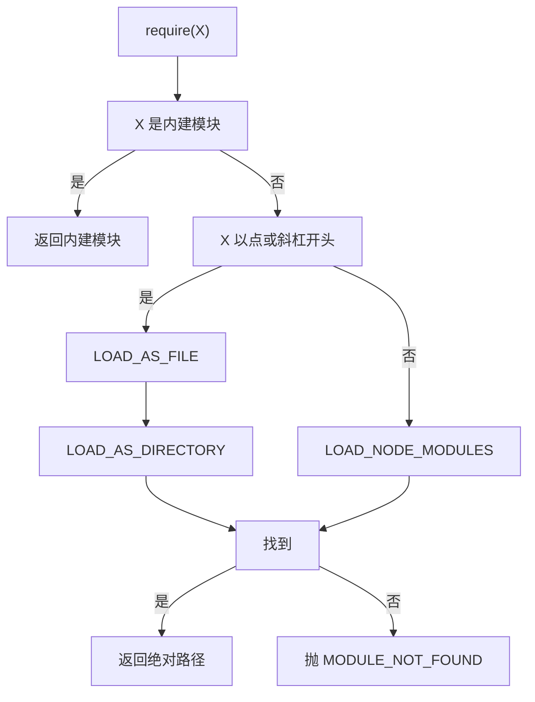

# Node 模块解析算法与依赖提升原理

!!! abstract "核心结论"
    - `require(X)` 的解析是一套确定性算法：内建模块 -> 路径加载（LOAD_AS_FILE / LOAD_AS_DIRECTORY）-> node_modules 逐级向上（NODE_MODULES_PATHS）-> package.json 的 exports 条件匹配；`exports` 一旦声明即成为封装边界，未列出的子路径抛 ERR_PACKAGE_PATH_NOT_EXPORTED。
    - ESM 用的不是同一个解析器：必须写全扩展名、不支持目录 index、默认条件集合含 `import` 而不是 `require`，解析结果是 URL。
    - node_modules 的扁平形态是 hoisting + dedupe 的结果，代价是幻影依赖（phantom dependency）与"树形依赖遍历顺序"的不确定性。
    - lockfile 记录精确解析结果（包名到唯一版本与 resolved URL）与 integrity 完整性哈希，保证同一 lockfile 下树可复现。
    - Yarn PnP 用 .pnp.cjs 里的 locator 依赖表把"文件系统查找"换成"查表"，未声明的依赖直接报错，从根上消除幻影依赖。

## 1. 运行时视角：require 到底做了什么

`require` 不是语言关键字，而是 Node 在编译模块时注入的函数参数。Node 内部把模块源码包成一个函数（实现上是 `wrapSafe` + `vm.compileFunction`），形如：

```js
function (exports, require, module, __filename, __dirname) { /* 你的模块源码 */ }
```

一次 `require('./a')` 在 CJS 加载器中大致经过：

1. `Module._load(request, parent, isMain)`；
2. 检查 `Module._cache`（键是解析后的绝对路径），命中直接返回 `module.exports`；
3. `Module._resolveFilename(request, parent, isMain, options)` 得到绝对路径，内部会走 `trySelf`、`_resolveLookupPaths`、`_nodeModulePaths`；
4. `new Module(filename, parent)`、`module.load(filename)`、按扩展名选 loader、`module._compile()`；
5. 写回 `Module._cache`，返回 `module.exports`。

`module.paths` 就是 `Module._nodeModulePaths(path.dirname(filename))` 的结果，是排查"找不到模块"的第一现场。

```js
// paths-demo.js  运行环境：Node 18+，运行方式：node paths-demo.js
'use strict';
const assert = require('node:assert/strict');
console.log(module.paths);
if (process.platform !== 'win32') {
  // POSIX 下向上查找的终点一定是文件系统根目录下的 node_modules
  assert.equal(module.paths.at(-1), '/node_modules');
}
console.log('paths-demo: 通过');
```

预期输出（在本页目录下）：先打印一组从当前目录逐级向上的 `node_modules` 路径，末行为 `paths-demo: 通过`。

## 2. CommonJS 解析算法：路径与目录

### 2.1 官方伪代码的直接翻译

```text
require(X) from module at path Y
1. If X is a core module, return the core module
2. If X begins with '/' set Y = root
3. If X begins with './' or '/' or '../'
   a. LOAD_AS_FILE(Y + X)
   b. LOAD_AS_DIRECTORY(Y + X)
   c. THROW "not found"
4. If X begins with '#' -> LOAD_PACKAGE_IMPORTS(X, dirname(Y))
5. LOAD_PACKAGE_SELF(X, dirname(Y))
6. LOAD_NODE_MODULES(X, dirname(Y))
7. THROW "not found"

LOAD_AS_FILE(X)
1. If X is a file, load X
2. If X.js is a file, load X.js
3. If X.json is a file, load X.json
4. If X.node is a file, load X.node

LOAD_INDEX(X)
1. If X/index.js / X/index.json / X/index.node is a file, load it

LOAD_AS_DIRECTORY(X)
1. If X/package.json is a file and has "main": M = X + main
   a. LOAD_AS_FILE(M)
   b. LOAD_INDEX(M)
2. LOAD_INDEX(X)

NODE_MODULES_PATHS(START)
1. parts = split(START)
2. for i from len(parts)-1 downto 0:
     DIR = join(parts[0..i], "node_modules")
```

注意第 1 步 `If X is a file`：**先精确命中，再补扩展名**。这意味着 `require('./a.txt')` 会把 `a.txt` 当 JavaScript 加载（Node 没有注册 `.txt` loader 时回退到 `.js` loader），扩展名白名单只用于"补全"，不用于"过滤"。



### 2.2 手写实现：LOAD_AS_FILE / LOAD_AS_DIRECTORY

```js
// path-resolver.js
// 运行环境：Node.js 18 及以上（只用 node:assert、path.posix，无第三方依赖）
// 运行方式：node path-resolver.js
'use strict';

const assert = require('node:assert/strict');
const path = require('node:path').posix;

// ---------- 1. 内存文件系统：值可以是字符串（源码）或对象（已解析 JSON） ----------
function createMemoryFS(entries) {
  const files = new Map();
  for (const [key, value] of Object.entries(entries)) {
    files.set(path.normalize(key), value);
  }
  const hasChild = (normalized) => {
    const prefix = normalized.endsWith('/') ? normalized : normalized + '/';
    for (const key of files.keys()) {
      if (key !== normalized && key.startsWith(prefix)) return true;
    }
    return false;
  };
  return {
    isFile: (p) => files.has(path.normalize(p)),
    isDirectory: (p) => hasChild(path.normalize(p)),
    readJSON(p) {
      const raw = files.get(path.normalize(p));
      if (raw === undefined) return null;
      return typeof raw === 'string' ? JSON.parse(raw) : raw;
    },
  };
}

// ---------- 2. 官方伪代码的直接翻译 ----------
const EXTENSIONS = ['.js', '.json', '.node'];

// LOAD_AS_FILE(X)
function loadAsFile(fs, absolutePath) {
  if (fs.isFile(absolutePath)) return absolutePath; // 精确命中优先
  for (const ext of EXTENSIONS) {
    if (fs.isFile(absolutePath + ext)) return absolutePath + ext;
  }
  return null;
}

// LOAD_INDEX(X)
function loadIndex(fs, directory) {
  for (const ext of EXTENSIONS) {
    const candidate = path.join(directory, 'index' + ext);
    if (fs.isFile(candidate)) return candidate;
  }
  return null;
}

// LOAD_AS_DIRECTORY(X)
function loadAsDirectory(fs, directory) {
  const manifestPath = path.join(directory, 'package.json');
  if (fs.isFile(manifestPath)) {
    const manifest = fs.readJSON(manifestPath) || {};
    if (typeof manifest.main === 'string' && manifest.main.length > 0) {
      const target = path.resolve(directory, manifest.main);
      const asFile = loadAsFile(fs, target);
      if (asFile) return asFile;
      const asIndex = loadIndex(fs, target);
      if (asIndex) return asIndex;
      // main 指向的文件不存在时，继续走下面的 LOAD_INDEX(X)
    }
  }
  return loadIndex(fs, directory);
}

// 伪代码第 3 步：以 ./ ../ / 开头的请求
function resolvePathRequest(fs, fromDir, request) {
  const target = path.resolve(fromDir, request);
  return loadAsFile(fs, target) || loadAsDirectory(fs, target);
}
```

### 2.3 验证标准

```js
// 接上文，运行方式：node path-resolver.js
const fs = createMemoryFS({
  '/app/index.js': '',
  '/app/package.json': { main: './lib/main.js' },
  '/app/lib/main.js': '',
  '/app/lib/util.js': '',
  '/app/dir/index.json': '{}',
  '/app/legacy/package.json': { main: './missing.js' },
  '/app/legacy/index.js': '',
  '/app/plain.txt': '',
});

assert.equal(resolvePathRequest(fs, '/app', './lib/util'), '/app/lib/util.js');      // 补全 .js
assert.equal(resolvePathRequest(fs, '/app', './lib/util.js'), '/app/lib/util.js');   // 精确命中优先
assert.equal(resolvePathRequest(fs, '/app', './lib'), '/app/lib/main.js');           // 目录 -> package.json main
assert.equal(resolvePathRequest(fs, '/app', '.'), '/app/lib/main.js');               // 解析自身目录
assert.equal(resolvePathRequest(fs, '/app', './dir'), '/app/dir/index.json');        // 目录 -> index.json
assert.equal(resolvePathRequest(fs, '/app', './legacy'), '/app/legacy/index.js');    // main 失效 -> 回退 index
assert.equal(resolvePathRequest(fs, '/app', '../app/lib/util'), '/app/lib/util.js'); // ../ 归一化
assert.equal(resolvePathRequest(fs, '/app', './plain.txt'), '/app/plain.txt');       // 精确文件不看扩展名
assert.equal(resolvePathRequest(fs, '/app', './missing'), null);

console.log('path-resolver: 9 项断言全部通过');
```

预期输出：`path-resolver: 9 项断言全部通过`。

## 3. exports / imports 与条件导出

### 3.1 条件键语义

| 条件键 | 生效场景 | 备注 |
| --- | --- | --- |
| `import` | 通过 ESM `import` / `import()` 加载 | CJS `require` 不匹配 |
| `require` | 通过 `require()` / `createRequire()` 加载 | 包括 ESM 中 `createRequire` 的 require |
| `node` | Node 运行时 | 与打包器的 `browser` 互斥的运行时标记 |
| `node-addons` | 允许原生 addon 时 | 细节与版本相关，需核对官方文档 |
| `browser` | webpack / esbuild 等打包器 | Node 运行时本身不识别该条件 |
| `types` | TypeScript 类型解析 | 习惯上放在最前，否则会被运行时条件截胡 |
| `default` | 兜底 | 永远匹配，必须放在最后 |

匹配规则要点：条件对象的键**按书写顺序**检查，命中第一个条件就返回其结果，不会继续尝试后面的条件，所以 `default` 提前写会导致后面的条件永不生效。数组是"回退链"，单个目标不可用时继续尝试下一项。

### 3.2 手写实现：exports 条件匹配与完整 resolver

```js
// exports-resolver.js
// 运行环境：Node.js 18 及以上
// 运行方式：node exports-resolver.js
'use strict';

const assert = require('node:assert/strict');
const path = require('node:path').posix;

const EXTENSIONS = ['.js', '.json', '.node'];
const NOT_EXPORTED = Symbol('not-exported');

// ---------- 与第 2 节相同的内存 FS 与文件加载，紧凑重写 ----------
function createMemoryFS(entries) {
  const files = new Map(Object.entries(entries).map(([k, v]) => [path.normalize(k), v]));
  const isDirectory = (p) => {
    const n = path.normalize(p);
    const prefix = n.endsWith('/') ? n : n + '/';
    for (const k of files.keys()) if (k !== n && k.startsWith(prefix)) return true;
    return false;
  };
  return {
    isFile: (p) => files.has(path.normalize(p)),
    isDirectory,
    readJSON: (p) => {
      const raw = files.get(path.normalize(p));
      return raw === undefined ? null : (typeof raw === 'string' ? JSON.parse(raw) : raw);
    },
  };
}
const loadAsFile = (fs, p) => (fs.isFile(p) ? p : EXTENSIONS.map((e) => p + e).find((c) => fs.isFile(c)) ?? null);
const loadIndex = (fs, dir) => EXTENSIONS.map((e) => path.join(dir, 'index' + e)).find((c) => fs.isFile(c)) ?? null;
function loadAsDirectory(fs, dir) {
  const manifestPath = path.join(dir, 'package.json');
  if (fs.isFile(manifestPath)) {
    const main = (fs.readJSON(manifestPath) || {}).main;
    if (typeof main === 'string' && main.length > 0) {
      const target = path.resolve(dir, main);
      const file = loadAsFile(fs, target) || loadIndex(fs, target);
      if (file) return file;
    }
  }
  return loadIndex(fs, dir);
}

// ---------- 条件匹配 ----------
function matchConditional(target, conditions) {
  if (typeof target === 'string') return target;
  if (Array.isArray(target)) {
    for (const item of target) {
      try {
        const resolved = matchConditional(item, conditions);
        if (resolved !== null) return resolved;
      } catch {
        // 数组是回退链：单个目标不可用则继续
      }
    }
    return null;
  }
  if (target !== null && typeof target === 'object') {
    for (const key of Object.keys(target)) {
      if (key === 'default' || conditions.has(key)) {
        // 命中即返回；后面的条件不再尝试，所以 default 必须写在最后
        return matchConditional(target[key], conditions);
      }
    }
    return null;
  }
  return null;
}

// ---------- exports 字段 ----------
function isSubpathMap(field) {
  const keys = Object.keys(field);
  const hasDot = keys.some((k) => k.startsWith('.'));
  const hasOther = keys.some((k) => !k.startsWith('.'));
  if (hasDot && hasOther) throw new Error('ERR_INVALID_PACKAGE_CONFIG: exports 混用了子路径键与条件键');
  return hasDot;
}

function matchPatternKey(map, subpath) {
  return Object.keys(map)
    .filter((k) => k.includes('*'))
    .filter((k) => {
      const star = k.indexOf('*');
      const prefix = k.slice(0, star);
      const suffix = k.slice(star + 1);
      return subpath.startsWith(prefix) && subpath.endsWith(suffix) && subpath.length >= prefix.length + suffix.length;
    })
    .sort((a, b) => b.length - a.length)[0] ?? null; // 近似"具体优先"，完整规则需核对官方文档
}

function applyPattern(key, subpath, target) {
  const star = key.indexOf('*');
  const prefix = key.slice(0, star);
  const suffix = key.slice(star + 1);
  const tail = subpath.slice(prefix.length, subpath.length - suffix.length);
  return target.split('*').join(tail);
}

function resolveExportsField(manifest, subpath, conditions) {
  const field = manifest.exports;
  if (field === undefined) return NOT_EXPORTED;
  const map = isSubpathMap(field) ? field : { '.': field }; // 条件主入口的语法糖
  if (Object.prototype.hasOwnProperty.call(map, subpath)) {
    const target = matchConditional(map[subpath], conditions);
    return typeof target === 'string' ? target : NOT_EXPORTED;
  }
  const patternKey = matchPatternKey(map, subpath);
  if (patternKey === null) return NOT_EXPORTED;
  const target = matchConditional(map[patternKey], conditions);
  return typeof target === 'string' ? applyPattern(patternKey, subpath, target) : NOT_EXPORTED;
}

// ---------- 包名拆分与向上查找 ----------
function parsePackageSpecifier(specifier) {
  const parts = specifier.split('/');
  const scoped = specifier.startsWith('@');
  const name = scoped ? parts.slice(0, 2).join('/') : parts[0];
  const rest = scoped ? parts.slice(2) : parts.slice(1);
  return { name, subpath: rest.length === 0 ? '.' : './' + rest.join('/') };
}

function nodeModulesPaths(fromDir) {
  const result = [];
  let current = fromDir;
  for (;;) {
    if (path.basename(current) !== 'node_modules') result.push(path.join(current, 'node_modules'));
    const parent = path.dirname(current);
    if (parent === current) break;
    current = parent;
  }
  return result;
}

function findEnclosingPackage(fromDir, fs) {
  let current = fromDir;
  for (;;) {
    const manifestPath = path.join(current, 'package.json');
    if (fs.isFile(manifestPath)) return { root: current, manifest: fs.readJSON(manifestPath) || {} };
    const parent = path.dirname(current);
    if (parent === current) return null;
    current = parent;
  }
}

// ---------- 完整 resolver：内建 / imports / 路径 / 自引用 / node_modules ----------
const BUILTINS = new Set(require('node:module').builtinModules);

function resolveImports(request, fromDir, fs, conditions) {
  const enclosing = findEnclosingPackage(fromDir, fs);
  if (!enclosing || enclosing.manifest.imports === undefined) return null;
  const map = enclosing.manifest.imports;
  let target = null;
  if (Object.prototype.hasOwnProperty.call(map, request)) {
    const matched = matchConditional(map[request], conditions);
    if (typeof matched === 'string') target = matched;
  } else {
    const patternKey = matchPatternKey(map, request);
    if (patternKey !== null) {
      const matched = matchConditional(map[patternKey], conditions);
      if (typeof matched === 'string') target = applyPattern(patternKey, request, matched);
    }
  }
  if (target === null) return null;
  if (target.startsWith('./')) return path.join(enclosing.root, target);
  return resolve(target, enclosing.root, fs, conditions).file; // imports 允许映射到外部包
}

function resolve(request, fromDir, fs, conditions) {
  const bare = request.startsWith('node:') ? request.slice(5) : request;
  if (BUILTINS.has(bare)) return { kind: 'builtin', file: 'node:' + bare };

  if (request.startsWith('#')) {
    const file = resolveImports(request, fromDir, fs, conditions);
    if (file) return { kind: 'file', file };
    throw new Error(`ERR_PACKAGE_IMPORT_NOT_DEFINED: ${request} from ${fromDir}`);
  }

  if (request.startsWith('/') || request.startsWith('./') || request.startsWith('../') || request === '.' || request === '..') {
    const target = path.resolve(fromDir, request);
    const file = loadAsFile(fs, target) || loadAsDirectory(fs, target);
    if (file) return { kind: 'file', file };
    throw new Error(`MODULE_NOT_FOUND: ${request} from ${fromDir}`);
  }

  const { name, subpath } = parsePackageSpecifier(request);

  // 自引用：请求名等于当前所在包的 name，且该包声明了 exports
  const enclosing = findEnclosingPackage(fromDir, fs);
  if (enclosing && enclosing.manifest.exports !== undefined && enclosing.manifest.name === name) {
    const target = resolveExportsField(enclosing.manifest, subpath, conditions);
    if (target === NOT_EXPORTED) throw new Error(`ERR_PACKAGE_PATH_NOT_EXPORTED: ${request}`);
    return { kind: 'file', file: path.join(enclosing.root, target) };
  }

  for (const modulesDir of nodeModulesPaths(fromDir)) {
    const pkgRoot = path.join(modulesDir, name);
    if (!fs.isDirectory(pkgRoot)) continue;
    const manifestPath = path.join(pkgRoot, 'package.json');
    const manifest = fs.isFile(manifestPath) ? fs.readJSON(manifestPath) || {} : {};
    if (manifest.exports !== undefined) {
      const target = resolveExportsField(manifest, subpath, conditions);
      if (target === NOT_EXPORTED) throw new Error(`ERR_PACKAGE_PATH_NOT_EXPORTED: ${request}`);
      const file = path.join(pkgRoot, target);
      if (!fs.isFile(file)) throw new Error(`MODULE_NOT_FOUND: exports 目标不存在 ${file}`);
      return { kind: 'file', file };
    }
    const target = subpath === '.' ? pkgRoot : path.join(pkgRoot, subpath.slice(2));
    const file = loadAsFile(fs, target) || loadAsDirectory(fs, target);
    if (file) return { kind: 'file', file };
  }

  throw new Error(`MODULE_NOT_FOUND: ${request} from ${fromDir}`);
}
```

### 3.3 验证标准

```js
// 接上文，运行方式：node exports-resolver.js
const fs = createMemoryFS({
  '/repo/package.json': {
    name: 'app',
    imports: { '#internal': './src/internal.js', '#dep': 'lib', '#utils/*': './src/utils/*.js' },
    exports: { '.': './src/main.js', './feature': './src/feature.js' },
  },
  '/repo/src/main.js': '',
  '/repo/src/feature.js': '',
  '/repo/src/internal.js': '',
  '/repo/src/utils/math.js': '',
  '/repo/node_modules/lib/package.json': {
    name: 'lib',
    version: '1.0.0',
    main: './legacy.js',
    exports: {
      '.': { import: './esm/index.mjs', require: './cjs/index.cjs', default: './cjs/index.cjs' },
      './feature': { node: './node/feature.js', default: './browser/feature.js' },
      './utils/*': './src/utils/*.js',
    },
  },
  '/repo/node_modules/lib/legacy.js': '',
  '/repo/node_modules/lib/cjs/index.cjs': '',
  '/repo/node_modules/lib/esm/index.mjs': '',
  '/repo/node_modules/lib/node/feature.js': '',
  '/repo/node_modules/lib/browser/feature.js': '',
  '/repo/node_modules/lib/src/utils/math.js': '',
  '/repo/node_modules/lib/secret.js': '',
  '/repo/node_modules/bad/package.json': { name: 'bad', exports: { '.': { default: './default.js', node: './node.js' } } },
  '/repo/node_modules/bad/default.js': '',
  '/repo/node_modules/bad/node.js': '',
});

const CJS = new Set(['node', 'require']);
const ESM = new Set(['node', 'import']);

assert.equal(resolve('lib', '/repo/src', fs, CJS).file, '/repo/node_modules/lib/cjs/index.cjs');
assert.equal(resolve('lib', '/repo/src', fs, ESM).file, '/repo/node_modules/lib/esm/index.mjs');
assert.equal(resolve('lib/feature', '/repo/src', fs, CJS).file, '/repo/node_modules/lib/node/feature.js');
assert.equal(resolve('lib/utils/math', '/repo/src', fs, CJS).file, '/repo/node_modules/lib/src/utils/math.js');
assert.throws(() => resolve('lib/secret.js', '/repo/src', fs, CJS), /ERR_PACKAGE_PATH_NOT_EXPORTED/);
assert.equal(resolve('#internal', '/repo/src', fs, CJS).file, '/repo/src/internal.js');
assert.equal(resolve('#utils/math', '/repo/src', fs, CJS).file, '/repo/src/utils/math.js');
assert.equal(resolve('#dep', '/repo/src', fs, CJS).file, '/repo/node_modules/lib/cjs/index.cjs');
assert.equal(resolve('app/feature', '/repo/src', fs, CJS).file, '/repo/src/feature.js'); // 自引用
assert.equal(resolve('bad', '/repo/src', fs, CJS).file, '/repo/node_modules/bad/default.js'); // default 放太前

console.log('exports-resolver: 10 项断言全部通过');
```

预期输出：`exports-resolver: 10 项断言全部通过`。注意 `lib` 的 `main` 是 `./legacy.js`，但因为声明了 `exports`，`legacy.js` 永远不可达；最后一条断言说明 `default` 写在 `node` 之前会永远命中 `default.js`。

## 4. ESM 解析算法与 CJS 的差异

ESM 加载分四阶段：resolution（解析，得到 URL）、loading（读源码并确定格式）、linking（绑定导入导出）、evaluation（求值）。解析阶段的核心步骤是 `ESM_RESOLVE(specifier, parentURL)`，其中裸包名走 `PACKAGE_RESOLVE`，同样逐级向上找 node_modules，但最终产物是 URL（默认 `file:`）。

| 维度 | CommonJS require | ESM import |
| --- | --- | --- |
| 解析输入输出 | 字符串 -> 文件路径 | 字符串 -> URL |
| 扩展名 | 自动补全 .js/.json/.node | 必须写全，不补全 |
| 目录导入 | 支持 package.json main 与 index | 不支持，必须指向文件 |
| 默认条件 | `require` | `import` |
| 循环依赖 | 返回"已完成部分"的 exports | 变量提升 + TDZ，可能 ReferenceError |
| 顶层 this | `module.exports` | `undefined` |
| 动态加载 | `require()` 同步 | `import()` 异步返回 Promise |
| 缓存键 | 解析后的绝对路径 | 模块 URL |

格式判定与扩展名相关：`.mjs` 永远是 ESM，`.cjs` 永远是 CJS，`.js` 由最近的 package.json 中 `type` 字段决定（`"module"` 为 ESM，缺省或 `"commonjs"` 为 CJS）。`import.meta.resolve` 在较新的 Node 中可同步使用，早期版本需要实验性 flag，具体版本边界需核对官方文档。

## 5. node_modules 向上查找与代价

`NODE_MODULES_PATHS` 生成的候选数与目录深度线性相关，一次失败的解析要 stat 大量路径。排查时可直接打印候选：

```js
// node -e "console.log(require.resolve.paths('lodash'))"
```

几个容易被忽略的点：

- `NODE_PATH` 环境变量仍会影响 CJS 的查找路径，但 ESM 解析不使用它（具体行为需核对官方文档）。
- 默认情况下解析完成后会做 realpath，因此 `npm link` 指向的包与"真实路径"共享同一个模块实例；`--preserve-symlinks` / `--preserve-symlinks-main` 会改变这一行为，同时也会影响 peer 依赖能否被正确解析。
- macOS 与 Windows 文件系统通常大小写不敏感，Linux 敏感，同一个 `require('./Foo')` 可能只在 CI 上失败。

## 6. npm 的依赖树：arborist、hoisting 与 dedupe

npm 从 v7 起使用 `@npmcli/arborist` 构建依赖树，核心是两棵树：**ideal tree**（由 package.json 与 registry 元数据推导出的逻辑树）与 **actual tree**（lockfile + 现有 node_modules 反映的磁盘状态）。`reify` 负责把两者对齐，写入 node_modules 并更新 lockfile。

arborist 的放置策略可以概括为：

1. 对每条依赖边，先从依赖方所在位置向上找已存在且满足 range 的实例，命中则复用（dedupe）；
2. 否则从**最浅**的可用位置开始尝试放置（hoist），冲突就往下沉一层；
3. 全部冲突时只能嵌套复制。

| 策略 | 代表 | node_modules 形态 | 幻影依赖 | 磁盘占用 |
| --- | --- | --- | --- | --- |
| 完全嵌套 | npm 2 | 依赖各自嵌套 | 无 | 大量重复 |
| 提升扁平 | npm 3+、Yarn classic | 尽量提到上层 | 有 | 重复较少 |
| 符号链接 | pnpm | `.pnpm` 存储 + symlink | 无 | 硬链接去重 |
| 查表 | Yarn PnP | 无 node_modules | 无 | 无重复 |

### 6.1 手写实现：迷你依赖树构建器

```js
// mini-npm.js
// 运行环境：Node.js 18 及以上
// 运行方式：node mini-npm.js
'use strict';

const assert = require('node:assert/strict');

// ---------- 1. 极简 semver：只支持 ^ ~ >= 精确版本与 * ----------
function parseVersion(input) {
  const m = /^(\d+)\.(\d+)\.(\d+)$/.exec(String(input).trim());
  if (!m) throw new Error(`不支持的版本号: ${input}`);
  return { major: Number(m[1]), minor: Number(m[2]), patch: Number(m[3]) };
}
const cmp = (a, b) => a.major - b.major || a.minor - b.minor || a.patch - b.patch;
const compareVersions = (a, b) => cmp(parseVersion(a), parseVersion(b));

function satisfies(version, range) {
  const spec = String(range).trim();
  if (spec === '' || spec === '*' || spec === 'latest') return true;
  const v = parseVersion(version);
  if (spec.startsWith('^')) {
    const low = parseVersion(spec.slice(1));
    if (cmp(v, low) < 0) return false;
    if (low.major > 0) return v.major === low.major;
    if (low.minor > 0) return v.major === 0 && v.minor === low.minor;
    return v.major === 0 && v.minor === 0 && v.patch === low.patch;
  }
  if (spec.startsWith('~')) {
    const low = parseVersion(spec.slice(1));
    return cmp(v, low) >= 0 && v.major === low.major && v.minor === low.minor;
  }
  if (spec.startsWith('>=')) return cmp(v, parseVersion(spec.slice(2))) >= 0;
  return cmp(v, parseVersion(spec)) === 0;
}

function pickVersion(registry, name, range) {
  const versions = Object.keys(registry[name] ?? {});
  return versions.filter((v) => satisfies(v, range)).sort((a, b) => compareVersions(b, a))[0] ?? null;
}

// ---------- 2. 依赖方到根的所有 node_modules 目录，最近的在前 ----------
function nodeModulesChain(fromPath) {
  const chain = [];
  let current = fromPath;
  for (;;) {
    chain.push(current === '' ? 'node_modules' : `${current}/node_modules`);
    if (current === '') break;
    const idx = current.lastIndexOf('/node_modules/');
    current = idx === -1 ? '' : current.slice(0, idx);
  }
  return chain;
}

// ---------- 3. 放置一条依赖边：dedupe 优先，其次尽可能 hoist ----------
function placeDependency(tree, dependent, depName, range) {
  const chain = nodeModulesChain(dependent.path);
  for (const modulesDir of chain) {
    const existing = tree.byPath.get(`${modulesDir}/${depName}`);
    if (existing && satisfies(existing.version, range)) return { node: existing, deduped: true };
  }
  const version = pickVersion(tree.registry, depName, range);
  if (version === null) throw new Error(`ERESOLVE: 无法满足 ${depName}@${range}（依赖方 ${dependent.path || 'root'}）`);
  for (const modulesDir of [...chain].reverse()) {
    const slot = `${modulesDir}/${depName}`;
    if (tree.byPath.has(slot)) continue; // 该位置已被冲突版本占用，往下沉一层
    const node = { name: depName, version, path: slot, manifest: tree.registry[depName][version] };
    tree.byPath.set(slot, node);
    return { node, deduped: false };
  }
  throw new Error(`ERESOLVE: ${depName}@${range} 所有候选位置均冲突（真实 arborist 会重新平衡整棵树）`);
}

function buildIdealTree(rootManifest, registry) {
  const byPath = new Map();
  const root = { name: rootManifest.name, version: rootManifest.version, path: '', manifest: rootManifest };
  byPath.set('', root);
  const queue = [root]; // 广度优先：层级越浅的依赖越先占位，决定了 hoist 的结果
  while (queue.length > 0) {
    const node = queue.shift();
    for (const [depName, range] of Object.entries(node.manifest.dependencies ?? {})) {
      const placed = placeDependency({ byPath, registry }, node, depName, range);
      if (!placed.deduped) queue.push(placed.node);
    }
  }
  return { root, byPath, registry };
}

// ---------- 4. 模拟 require 查找 + peer 校验 ----------
function lookup(tree, fromPath, name) {
  for (const modulesDir of nodeModulesChain(fromPath)) {
    const node = tree.byPath.get(`${modulesDir}/${name}`);
    if (node) return node;
  }
  return null;
}

function checkPeerConflicts(tree) {
  const conflicts = [];
  for (const node of tree.byPath.values()) {
    for (const [name, range] of Object.entries(node.manifest.peerDependencies ?? {})) {
      const found = lookup(tree, node.path, name);
      if (!found) conflicts.push({ from: node.path || 'root', name, range, found: null });
      else if (!satisfies(found.version, range)) conflicts.push({ from: node.path, name, range, found: found.version });
    }
  }
  return conflicts;
}

function formatTree(tree) {
  const lines = [];
  const dump = (dirPath, indent) => {
    const prefix = dirPath === '' ? 'node_modules' : `${dirPath}/node_modules`;
    const children = [...tree.byPath.values()]
      .filter((n) => n.path.startsWith(prefix + '/') && !n.path.slice(prefix.length + 1).includes('/node_modules/'))
      .sort((a, b) => a.name.localeCompare(b.name));
    if (children.length === 0) return;
    lines.push('  '.repeat(indent) + prefix);
    for (const child of children) {
      lines.push('  '.repeat(indent + 1) + `${child.name}@${child.version}`);
      dump(child.path, indent + 2);
    }
  };
  dump('', 0);
  return lines.join('\n');
}
```

### 6.2 验证标准

```js
// 接上文，运行方式：node mini-npm.js
const registry = {
  a: {
    '1.0.0': { dependencies: { c: '^1.0.0', d: '^1.0.0' } },
    '1.1.0': { dependencies: { c: '^1.0.0', d: '^1.0.0' } },
  },
  b: { '1.0.0': { dependencies: { c: '^2.0.0', d: '^1.0.0' } } },
  c: { '1.0.0': {}, '1.2.0': {}, '2.0.0': {}, '2.1.0': {} },
  d: { '1.0.0': {}, '1.1.0': {} },
  plugin: { '1.0.0': { peerDependencies: { c: '^1.0.0' } } },
  tool: { '1.0.0': { peerDependencies: { c: '^2.0.0' } } },
};
const rootManifest = {
  name: 'root',
  version: '1.0.0',
  dependencies: { a: '^1.0.0', b: '^1.0.0', plugin: '^1.0.0', tool: '^1.0.0' },
};

const tree = buildIdealTree(rootManifest, registry);
assert.equal(lookup(tree, 'node_modules/a', 'c').version, '1.2.0');        // ^1.0.0 取最高
assert.equal(lookup(tree, 'node_modules/b', 'c').version, '2.1.0');        // ^2.0.0 取最高
assert.equal(lookup(tree, 'node_modules/b', 'c').path, 'node_modules/b/node_modules/c'); // 冲突下沉
assert.equal(lookup(tree, 'node_modules/b', 'd').path, 'node_modules/d'); // dedupe 复用
assert.equal(tree.byPath.get('node_modules/d').version, '1.1.0');
assert.equal(tree.byPath.size, 8);                                          // root + 6 个顶层 + 1 个嵌套
const conflicts = checkPeerConflicts(tree);
assert.equal(conflicts.length, 1);
assert.deepEqual(conflicts[0], { from: 'node_modules/tool', name: 'c', range: '^2.0.0', found: '1.2.0' });

console.log(formatTree(tree));
console.log(`peer 冲突: ${conflicts[0].from} 需要 ${conflicts[0].name}@${conflicts[0].range}，实际解析到 ${conflicts[0].found}`);
console.log('mini-npm: 8 项断言全部通过');
```

预期输出：

```text
node_modules
  a@1.1.0
  b@1.0.0
    node_modules/b/node_modules
      c@2.1.0
  c@1.2.0
  d@1.1.0
  plugin@1.0.0
  tool@1.0.0
peer 冲突: node_modules/tool 需要 c@^2.0.0，实际解析到 1.2.0
mini-npm: 8 项断言全部通过
```

## 7. 版本冲突与 peer 冲突

版本冲突（同一包需要两个不兼容版本）由嵌套复制解决：`node_modules/b/node_modules/c` 就是下沉的结果。peer 冲突不同，peer 语义上要求"宿主提供同一个实例"，不能靠嵌套复制解决——复制出两个 React 会让 Context 与 Hooks 立刻失效。

npm 6 对未满足的 peer 只警告；npm 7 起会把 peer 当成普通依赖自动安装，并且更容易在冲突时抛 ERESOLVE。常用开关 `--legacy-peer-deps`（退回 npm 6 的宽松行为）与 `--strict-peer-deps`（把冲突升级为失败），具体默认值随版本变化，需核对官方文档。

## 8. lockfile：精确树与完整性哈希

package.json 里的 range 是"可接受集合"，lockfile 记录的是"最终选中的那一个"：包名到唯一版本、resolved 下载 URL、integrity 完整性哈希（SRI，形如 `sha512-...`）。有了它，`rm -rf node_modules && npm ci` 才能装出与 CI 完全一致的树。npm 7 引入 lockfileVersion 2（同时有 `packages` 与 `dependencies` 两段），npm 9 起的默认值变为 3（去掉冗余的 `dependencies` 段），版本对应关系需核对官方文档。

| 对比项 | package-lock.json | yarn.lock | pnpm-lock.yaml |
| --- | --- | --- | --- |
| 组织方式 | 树形 packages 映射 | 扁平的 selector 到 resolution 映射 | importers + packages |
| 版本与地址 | version + resolved | resolution + resolved | resolution 对象 |
| 完整性 | integrity（SRI） | integrity / checksum | resolution.integrity |
| 关键作用 | 复现精确树 | 复现精确树 | 复现精确树 |

integrity 不匹配时安装会失败，这既是安全防线（防篡改），也是"私有 registry 与公共 registry 元数据不一致"类故障的常见来源。

## 9. Yarn PnP：把查找换成查表

PnP 模式下不再创建 node_modules。Yarn 生成 `.pnp.cjs`（ESM 场景下还有 `.pnp.loader.mjs`），并在运行时向 Node 注入 `pnpapi` 对象，暴露 `resolveToUnqualified`、`resolveRequest`、`getPackageInformation`、`findPackageLocator` 等接口。`resolveToUnqualified` 只负责把请求映射到路径，扩展名补全由 Node 的解析流程继续完成——这与 `resolveRequest` 的区别是理解 PnP 的关键。

`.pnp.cjs` 内部是序列化的数据表：locator（形如 `lib@npm:1.0.0`）到 packageLocation 的映射，以及每个 locator 的依赖名到 reference 的映射。字段命名随 Yarn 大版本变化（Yarn 2/3 用 packageInformationStores，较新的 Yarn 4 使用 packageRegistry 等），需核对官方文档。

### 9.1 手写实现：迷你 PnP 解析器

```js
// mini-pnp.js
// 运行环境：Node.js 18 及以上
// 运行方式：node mini-pnp.js
'use strict';

const assert = require('node:assert/strict');
const path = require('node:path').posix;

// 模拟 .pnp.cjs 中序列化的两张表：locator -> packageLocation，locator -> { 依赖名: reference }
const locators = {
  'app@workspace:.': { name: 'app', reference: 'workspace:.', packageLocation: '/' },
  'lib@npm:1.0.0': { name: 'lib', reference: 'npm:1.0.0', packageLocation: '/.yarn/cache/lib-npm-1.0.0.zip/node_modules/lib/' },
  'util@npm:1.0.0': { name: 'util', reference: 'npm:1.0.0', packageLocation: '/.yarn/cache/util-npm-1.0.0.zip/node_modules/util/' },
};
const dependencyMap = {
  'app@workspace:.': { lib: 'npm:1.0.0', util: 'npm:1.0.0' },
  'lib@npm:1.0.0': { util: 'npm:1.0.0' },
};

function createPnpApi({ locators, dependencyMap, fallbackPool = null }) {
  // 长的 packageLocation 优先匹配，否则根包的 "/" 会吞掉所有文件
  const entries = Object.entries(locators).sort((a, b) => b[1].packageLocation.length - a[1].packageLocation.length);

  function findLocator(location) {
    for (const [locator, info] of entries) {
      if (location.startsWith(info.packageLocation)) return locator;
    }
    return null;
  }

  const joinLocation = (info, subpath) => (subpath === '' ? info.packageLocation : info.packageLocation + subpath);

  function resolveToUnqualified(request, issuer) {
    if (request.startsWith('./') || request.startsWith('../') || request.startsWith('/')) {
      return path.resolve(path.dirname(issuer), request);
    }
    const issuerLocator = findLocator(issuer);
    if (issuerLocator === null) throw new Error(`PNP_ISSUER_NOT_FOUND: ${issuer}`);
    const parts = request.split('/');
    const scoped = request.startsWith('@');
    const name = scoped ? parts.slice(0, 2).join('/') : parts[0];
    const subpath = parts.slice(scoped ? 2 : 1).join('/');
    const reference = (dependencyMap[issuerLocator] ?? {})[name];
    if (reference === undefined) {
      if (fallbackPool && fallbackPool[name]) return joinLocation(locators[`${name}@${fallbackPool[name]}`], subpath);
      throw new Error(`MODULE_NOT_FOUND: ${issuerLocator} 未声明依赖 ${name}`);
    }
    const target = locators[`${name}@${reference}`];
    if (!target) throw new Error(`PNP_MISSING_PACKAGE: ${name}@${reference}`);
    return joinLocation(target, subpath);
  }

  return { resolveToUnqualified, findLocator, getPackageInformation: (locator) => locators[locator] ?? null };
}
```

### 9.2 验证标准

```js
// 接上文，运行方式：node mini-pnp.js
const pnp = createPnpApi({ locators, dependencyMap });

assert.equal(pnp.resolveToUnqualified('lib', '/src/index.js'), '/.yarn/cache/lib-npm-1.0.0.zip/node_modules/lib/');
assert.equal(pnp.resolveToUnqualified('lib/sub.js', '/src/index.js'), '/.yarn/cache/lib-npm-1.0.0.zip/node_modules/lib/sub.js');
assert.equal(
  pnp.resolveToUnqualified('util', '/.yarn/cache/lib-npm-1.0.0.zip/node_modules/lib/index.js'),
  '/.yarn/cache/util-npm-1.0.0.zip/node_modules/util/',
);
assert.throws(() => pnp.resolveToUnqualified('lodash', '/src/index.js'), /未声明依赖 lodash/); // 幻影依赖被拦截
assert.equal(pnp.findLocator('/.yarn/cache/lib-npm-1.0.0.zip/node_modules/lib/index.js'), 'lib@npm:1.0.0');

console.log('mini-pnp: 5 项断言全部通过');
```

预期输出：`mini-pnp: 5 项断言全部通过`。

## 10. 常见陷阱

- **exports 与 main 同时存在**：`exports` 优先，`main` 只在没有 `exports` 时生效；声明 `exports` 后包内深路径 import 全部失效。
- **default 写在前面**：条件对象命中即返回，`{"default": "./a.js", "node": "./b.js"}` 永远返回 `a.js`。
- **CJS 与 ESM 条件写反**：只用 `require` 写库，`import` 该包时会因为找不到匹配条件而报 ERR_PACKAGE_PATH_NOT_EXPORTED。
- **`browser` 当成 Node 支持的条件**：`browser` 是打包器约定，Node 运行时不会匹配它。
- **幻影依赖**：代码里 `require('lodash')` 能跑，仅仅因为它是别的包的依赖被 hoist 到顶层；一旦依赖树变化就崩。
- **精确文件不看扩展名**：`require('./a.txt')` 会成功并当成 JS 加载，构建工具与 Node 行为可能不一致。
- **符号链接与 realpath**：`npm link` 后依赖实例可能与预期不同，`--preserve-symlinks` 会连带影响 peer 解析。
- **Dual package hazard**：同一包同时被 `require`（CJS 入口）和 `import`（ESM 入口）加载，产生两个互不相识的实例，单例状态与 instanceof 全部失效。
- **`require` 与 `import()` 混用同一份 CJS 包**：CJS 包的命名导出由静态分析（cjs-module-lexer）推导，动态挂载的导出在 ESM 侧看不到。
- **`require(ESM)` 的支持情况**：较新的 Node 已支持同步 require ESM 模块，早期版本需要 flag，具体从哪个版本默认开启需核对官方文档。

## 11. 面试题与答题要点

### 11.1 `require('x')` 的完整解析顺序是什么？

要点：先判内建模块（含 `node:` 前缀）；再判相对/绝对路径，走 LOAD_AS_FILE（精确文件 -> `.js`/`.json`/`.node`）与 LOAD_AS_DIRECTORY（package.json `main` 的 LOAD_AS_FILE / LOAD_INDEX，最后 `index.js/index.json/index.node`）；再判 `#` 开头的 imports、包自引用；最后按 NODE_MODULES_PATHS 逐级向上找 node_modules；都失败抛 MODULE_NOT_FOUND。补充缓存机制：`Module._cache` 以解析后的绝对路径为键。

### 11.2 exports 条件对象的匹配规则是什么？为什么 default 必须最后？

要点：键按书写顺序检查，`default` 视为永远匹配，命中第一个条件即返回其结果（不会继续尝试后续条件）。所以 `default` 提前会让后面的 `node`、`import` 等条件失效。数组形式是回退链，单个目标不可用时继续下一项。`types` 条件通常要放最前，否则会被运行时条件抢先匹配。

### 11.3 为什么 ESM 必须写扩展名、不能 import 目录？

要点：ESM 的解析面向 URL，不做文件系统探测式补全，避免出现"同一 specifier 在不同工具里解析到不同文件"的不确定行为；因此没有扩展名补全、没有 `index.js` 兜底、也没有 package.json `main` 的目录语义（裸包名仍由 `exports`/`main` 决定入口）。这也是 ESM 能在浏览器与 Node 之间共享解析语义的前提。

### 11.4 什么是幻影依赖？hoisting 为什么会造成它？

要点：幻影依赖指代码实际 import 了并未在自身 package.json 中声明的包，只是因为 hoisting 把它提升到了上层 node_modules 而恰好能解析。根本原因是 Node 的查找算法只认"文件系统位置"，不校验"依赖声明"。后果是依赖树一变就构建失败，或本地正常、CI 失败。Yarn PnP 与 pnpm 通过"依赖表校验"与"符号链接拓扑"来消除它。

### 11.5 dependencies 与 peerDependencies 的区别？

要点：dependencies 由本包负责安装并可以嵌套私有一份；peerDependencies 表达"我与宿主共享同一个实例"的约束，不会被本包私有嵌套。npm 6 对未满足 peer 只警告，npm 7 起默认自动安装 peer 并在冲突时可能报 ERESOLVE。React 插件、Babel 插件这类必须共享实例的包用 peer，并通常配合 `peerDependenciesMeta.optional` 标记可选 peer。

### 11.6 lockfile 里的 resolved 与 integrity 分别解决什么问题？

要点：resolved 固定下载地址（registry + tarball 路径），避免同一版本在不同镜像上的歧义；integrity 是 SRI 哈希，校验下载内容与发布时一致，既是防篡改也是防中间人。lockfile 固定整棵树的精确版本，`npm ci` 严格按 lockfile 安装且不改写它，从而实现可复现构建。注意 lockfile 只在"同一包管理器"内保证一致，跨 npm/yarn/pnpm 不复现。

### 11.7 Yarn PnP 是怎么工作的？代价是什么？

要点：不再安装 node_modules，改为在 `.pnp.cjs` 里存 locator 到 packageLocation 的表和每个 locator 的依赖表，运行时通过 `pnpapi` 的 `resolveToUnqualified` / `resolveRequest` 做映射；pnpapi 的解析结果接着交给 Node 做扩展名与格式处理。收益是消除幻影依赖、安装更快、磁盘占用更低；代价是与依赖 node_modules 布局的工具链（某些 CLI、`require.resolve` 假设、隐式读取 node_modules 的脚本）不兼容，也需要注意 `pnpMode: loose` 这类宽松模式的存在（各版本行为需核对官方文档）。

### 11.8 什么是 dual package hazard？如何规避？

要点：同一个包同时提供 CJS 与 ESM 入口，如果两套入口各自包含可变的模块级状态（单例、缓存、类），就会出现两个实例，导致 `instanceof` 失败、状态不同步。规避方式：把状态收敛到 CJS 一侧并由 ESM 包装（ESM wrapper 模式）、只提供一种格式、或使用 `exports` 条件让两套入口指向同一份实现文件（需注意 Node 对 ESM/CJS 互操作的约束）。

## 深入阅读与参考

!!! tip "怎么用这些资料"
    先读「官方文档与规范」建立准确的概念，再读「源码与示例」核对细节，最后用「教程、书籍与视频」换一种讲法加深理解。每条都写明了读哪一节、带着什么问题读。

### 官方文档与规范

| 资源 | 为什么读 | 怎么读 |
|---|---|---|
| [Node.js 包规范](https://nodejs.org/api/packages.html) | exports 与条件导出的权威定义，是理解解析规则的地基。 | 读 exports/imports 字段与条件匹配顺序，写出同时支持 ESM 与 CJS 的包配置。 |
| [Node.js ES 模块](https://nodejs.org/api/esm.html) | 官方界定 ESM 与 CJS 互操作边界，解释 require 的限制。 | 读互操作与 require(esm) 部分，带着 ERR_REQUIRE_ESM 报错去对号入座。 |
| [Modules](https://docs.deno.com/runtime/fundamentals/modules/) | 从运行时视角讲清模块加载、解析与缓存行为。 | 按 CJS/ESM 两节对照读，画出从入口到目标文件命中的流程图。 |
| [Peer dependencies](https://docs.deno.com/runtime/packages/peer_dependencies/) | peer 依赖的判定与 npm 7+ 安装规则官方说明。 | 读 peer 冲突如何被解析，复盘一次 ERESOLVE 报错的成因。 |
| [npm 文档](https://docs.npmjs.com/) | package.json、版本语义与 scripts 的官方定义，便于查证。 | 查 dependencies 与 semver 章节，核对项目中 ^ 与 ~ 的实际含义。 |
| [package.json 字段说明](https://docs.npmjs.com/cli/v10/configuring-npm/package-json) | 逐字段说明 main/exports/types/files，做包时的对照清单。 | 重点读 exports、main、types 与 files，对照自己的包逐项修正。 |
| [Bundling CJS](https://rolldown.rs/in-depth/bundling-cjs) | 说明把 CJS 依赖打进 ESM 输出时的限制与处理方式。 | 读互操作限制一节，检查自己库中 CJS 外部依赖该如何处理。 |

### 源码与示例

| 资源 | 为什么读 | 怎么读 |
|---|---|---|
| [Node.js 贡献文档](https://github.com/nodejs/node/blob/main/doc/contributing) | 读 Node 源码前的入口，了解目录结构与模块加载器位置。 | 先看目录与构建说明，再定位 internal/modules 下的 CJS 加载器实现。 |
| [发布 npm 包](https://nodejs.org/en/learn/modules/publishing-a-package) | 亲手发布并检查 exports 配置，用真实安装验证解析结果。 | 发布一个测试包，用不同入口 require/import 验证条件导出是否生效。 |

### 教程、书籍与视频

| 资源 | 为什么读 | 怎么读 |
|---|---|---|
| [publint](https://publint.dev/) | 自动检查导出配置与类型入口的常见错误，省去手工试错。 | 对本地库跑 publint，按提示修正 exports 条件与文件扩展名问题。 |
| [TypeScript 模块解析](https://www.typescriptlang.org/docs/handbook/modules/introduction.html) | 讲清 moduleResolution 各取值，衔接打包器与 Node 的解析差异。 | 对照 node16、bundler 的区别读，检查项目 tsconfig 是否匹配运行时。 |
| [Yarn 入门](https://yarnpkg.com/getting-started) | 入门材料，快速理解 PnP 与 pnpm 查找方式的取舍。 | 读 PnP 与对比部分，尝试回答 PnP 为何可以不要 node_modules。 |

## 应用与行业实践

前面几章讲的是解析器怎么走、锁文件怎么记。这一章看这些规则在真实项目里落在哪一行代码、哪一条流水线命令上。

### 应用场景地图

| 场景 | 用到本页哪个知识点 | 典型技术选型 | 注意事项 |
| --- | --- | --- | --- |
| 后台管理的万行表格，只用到虚拟滚动组件 | exports 是封装边界、子路径导入 | 组件库 exports 字段 + 打包器 tree-shaking | 只放出稳定子路径，子路径写进对外文档 |
| 低端安卓机上的首屏加载 | 条件导出、按需入口 | exports 的 browser 条件 + bundler | browser 条件只在打包器里生效，Node 直接跑会命中 node 分支 |
| 文档站的服务端渲染加浏览器同构 | ESM 解析规则：扩展名、URL、import 条件 | exports 的 import/require 双条件 | 双形态并存时模块级可变状态会被复制成两份 |
| 组件库发版与 semver 判定 | ERR_PACKAGE_PATH_NOT_EXPORTED | exports 映射 + package.json 的 files | 删改子路径属于破坏性变更，要走 major |
| 多人协作白板的 monorepo 装依赖 | node_modules 向上查找、hoisting | npm workspaces / pnpm / Yarn PnP | 本地能跑不代表 CI 能跑，hoisting 会掩盖未声明依赖 |
| CI 上的可复现构建 | lockfile 精确树与 integrity | npm ci / yarn install --immutable | package.json 与 lockfile 不一致时安装必须直接失败 |
| 排查“本地能跑、CI 报 MODULE_NOT_FOUND” | 幻影依赖、NODE_MODULES_PATHS | pnpm 或 PnP 的严格布局 | 先看解析路径落在哪一层 node_modules |
| 私有 registry 依赖审计 | lockfile 的 resolved 与 integrity | npm audit 加 lockfile 人工 review | resolved 指向内网地址时换源会失效 |

### 三个场景拆解

#### 场景 1：后台管理系统的万行表格

**业务背景**：运维后台要在一个页面里渲染上万行日志，首屏 JS 体积决定低配办公机的可交互时间。这个表格组件库被 20 个以上的业务包共用，任何一次全量引入都会把整包拖进产物。

**怎么用本页知识解决**：先给组件库划定公开子路径，再要求业务方只从这些子路径引入。exports 一旦声明，未列出的路径直接报错，内部实现从此不被外部引用。

```js
// 组件库 package.json 的 exports 字段，写成 JSON 时去掉注释
const pkg = {
  name: '@acme/table',
  exports: {
    '.': './dist/index.cjs',           // 主入口，业务默认引入
    './virtual': './dist/virtual.cjs', // 虚拟滚动实现，按需引入
    './package.json': './package.json' // 放行元信息，供工具读取版本号
  },
  main: './dist/index.cjs' // 兼容不认识 exports 的旧工具链
};
```

- 声明 exports 后，`require('@acme/table/src/row.js')` 抛 ERR_PACKAGE_PATH_NOT_EXPORTED，内部文件不再被业务方直连。
- `./package.json` 常被构建工具和依赖检查脚本读取，不放行会导致这些工具报错。
- 入口越少，打包器能确定的模块集合越小，产物里出现的文件越可控。
- 子路径的新增是向后兼容，删除或改名属于破坏性变更，需要升 major。

**怎么度量收益**：看两个指标，打包器 stats 里 initial chunk 的字节数，以及 web-vitals 的 INP。测量方法：固定 Chrome DevTools 的 CPU 4x 节流，对比改动前后同一页面的产物统计与性能面板记录。

**什么时候不该用**：

- 组件几乎总是一起出现，例如固定工具栏加弹窗加表格同时渲染，拆子路径只增加引入语句，不减产物。
- 组件库只被单个业务包引用，维护多入口的成本高于封装边界带来的收益。

#### 场景 2：SSR 与浏览器同构的 Markdown 渲染包

**业务背景**：同一份文档渲染逻辑要跑在 Node 服务端和浏览器两端，两端各写一份实现时输出会漂移。ESM 与 CJS 的解析规则不同，构建配置稍有偏差就出现服务端能渲染、客户端报错的局面。

**怎么用本页知识解决**：用 exports 的条件导出，让同一句 `import` 在两端落到不同产物。源码侧遵守 ESM 的显式扩展名规则，构建时不做隐式补全。

```js
// 写进 package.json 的 exports：条件键按书写顺序匹配
const pkg = {
  exports: {
    '.': {
      browser: './dist/browser.mjs', // 打包器带 browser 条件时命中
      node: './dist/node.mjs',       // Node 运行时命中
      default: './dist/node.mjs'     // 兜底分支，必须放在最后
    }
  }
};
```

- 条件键按书写顺序匹配，`browser` 要写在 `default` 之前，否则永远命中兜底分支。
- ESM 的解析结果是 URL，CJS 返回文件路径，日志里两种格式共存属于正常现象。
- ESM 不补全扩展名、也不解析目录下的 index，`./renderer` 这种写法在 ESM 侧直接报 ERR_MODULE_NOT_FOUND，在 CJS 侧被 LOAD_AS_DIRECTORY 接住。
- 同构包同时发 CJS 与 ESM 时，两份产物各持一份模块级状态，计数器和缓存要放进函数内或由调用方注入。

**怎么度量收益**：指标是两端渲染结果的差异次数和水合报错条数。方法：在 CI 里对同一组 fixture 分别在 Node 和浏览器渲染，比对 HTML 快照，并统计控制台里 hydration 相关错误。

**什么时候不该用**：

- 只有一端运行，例如纯 Node 的定时任务，加 browser 条件只会让条件表变长。
- 两端行为本就不同，例如一端要读文件系统，合并成同一入口会把平台代码拖进另一端的产物。

#### 场景 3：CI 里排查“本地能跑、CI 报 MODULE_NOT_FOUND”

**业务背景**：monorepo 的 hoisting 把间接依赖抬到根 node_modules，本地 require 一个没写进 dependencies 的包不会报错。CI 换成干净安装后同一行代码失败，问题在构建的最后阶段才暴露。

**怎么用本页知识解决**：先用解析结果定位这个包来自哪一层 node_modules，再决定补声明还是删引用。

```js
// 打印包最终解析到的文件路径，看它落在哪一层 node_modules
console.log(require.resolve('lodash'));
// 打印解析时按顺序搜索的目录链，就是 NODE_MODULES_PATHS 的顺序
console.log(require.resolve.paths('lodash'));
```

- 输出落在根级 node_modules，而该包不在当前 workspace 的 dependencies 里，这就是幻影依赖。
- `require.resolve.paths` 返回的数组体现逐级向上的查找顺序，末尾的层级越深，查找代价越大。
- 修法有两个方向：把包写进本 workspace 的 dependencies，或删掉这行引用。
- CI 上用 `npm ci` 才能复现干净安装，`npm install` 会按当时的树重新求解，掩盖差异。
- 想让未声明依赖直接报错，可以换 pnpm 的符号链接布局或 Yarn PnP。

**怎么度量收益**：指标是 CI 构建失败率、从提交到发现依赖错误的时长、安装阶段耗时。方法：在 CI 日志里统计 MODULE_NOT_FOUND 出现的阶段与次数，按流水线分段时间对比。

**什么时候不该用**：

- 项目是单包且依赖声明完整，切 PnP 的迁移成本高于它挡住的错误量。
- 老仓库存在大量未声明却被 hoisting 兜住的引用，一次切严格模式会让构建全面失败，需要先分批补声明。

### 行业先进实践

条件导出与键顺序（出处：Node.js 官方文档 Packages 章节的 Conditional exports）：exports 提供 import、require、node、browser、default 等条件，键的顺序决定匹配结果，default 要收尾。这个顺序规则能避免双端包永远落到兜底分支；借鉴方式是给条件表加一条单元测试，断言两种条件下解析出的文件路径。

规避双包危害（出处：Node.js 官方文档 Packages 章节的 Dual CommonJS/ESM packages）：同时提供 CJS 与 ESM 时，同一个包可能被加载两次，模块级状态被复制。文档给出的方向是优先单一形态，必须双发时把状态集中管理；借鉴方式是新库直接发 ESM，存量库把状态从模块顶层挪进实例。

Yarn PnP 的查表解析（出处：Yarn 官方文档 Plug'n'Play）：`.pnp.cjs` 记录每个 locator 的依赖表，解析不再遍历 node_modules，未声明的依赖直接抛错。这让幻影依赖在安装或首次运行就暴露；借鉴方式是先在 CI 开启 PnP 或 strict 模式，本地保留原有安装方式。

npm ci 与 lockfile 校验（出处：npm 官方文档 npm ci 与 package-lock.json）：`npm ci` 从 lockfile 安装，检查 package.json 与 lockfile 是否同步，并校验 integrity 哈希。它保证同一 lockfile 下解析结果一致；借鉴方式是 CI 固定使用 `npm ci`，把 lockfile 变更纳入 code review。

pnpm 的符号链接布局（出处：pnpm 官方文档 Symlinked node_modules structure）：包实体放进 `.pnpm` 目录，根 node_modules 只软链直接依赖，未声明的依赖无法解析。它把幻影依赖从“能跑但错误”变成“立刻报错”；借鉴方式是 monorepo 先迁移一个新 workspace 验证，再批量跟进。

### 从学到用：落地路线

第 1 步：挑一个被多处引用的内部包加 exports，只放出公开子路径。验收标准是引用未列出子路径时报 ERR_PACKAGE_PATH_NOT_EXPORTED，业务方按新入口构建通过。

第 2 步：在 CI 用干净环境安装并记录解析结果。验收标准是同一 lockfile 下两次 `npm ci` 后，`require.resolve` 输出的路径一致。

第 3 步：把依赖声明检查写进 PR 流水线，并在贡献文档里说明入口规则。验收标准是新提交若引用未声明的包，流水线失败并打印缺失包名。

第 4 步：加防回退守卫。验收标准是删除 exports 条目、把 CI 命令改回 `npm install`、lockfile 与 package.json 不同步这三类改动都在 review 中被拦下。

### 动手作业

目标：在一个含两个 workspace 的 monorepo 里复现幻影依赖，用 exports 收紧入口，并让 CI 脚本挡住问题。

步骤：

1. 建根 package.json，用 workspaces 声明 `packages/a` 与 `packages/b`。
2. 让 a 声明一个第三方依赖，b 不声明它，却在 b 里写一行 require 这个包。
3. 运行 `npm install`，记录 `require.resolve('包名')` 的输出，确认它被提升到根 node_modules。
4. 提交 lockfile，删掉 node_modules，改用 `npm ci` 安装，再看同一行代码的报错信息与错误码。
5. 给 a 加 exports，只放出 `.` 与 `./package.json`，在 b 里引用 a 的内部子路径，记录错误码。
6. 修正 b 的依赖声明或删掉那行引用，让检查脚本通过。
7. 把 `require.resolve.paths('包名')` 的输出和复现步骤写进 README。

验收标准：

- 本地 `npm install` 通过而 `npm ci` 报 MODULE_NOT_FOUND，两份日志都留档。
- 引用未列出的子路径时错误码为 ERR_PACKAGE_PATH_NOT_EXPORTED。
- `require.resolve.paths` 的输出里能看到逐级向上的 node_modules 路径。
- 换一个人按 README 步骤操作，能复现同样的两条报错。
- package.json 与 lockfile 保持同步，CI 命令固定为 `npm ci`。

