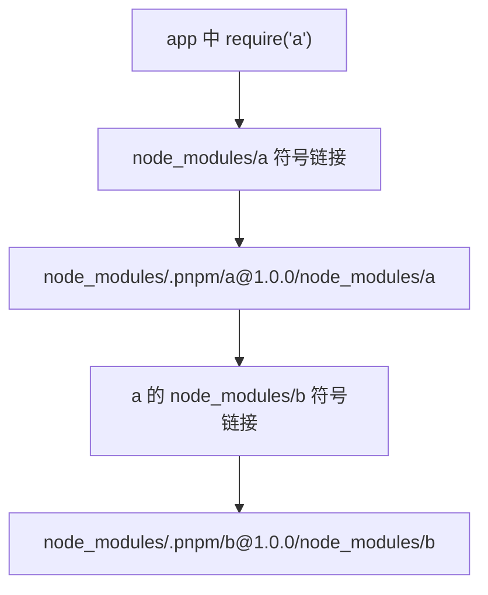

# pnpm 与 Workspace Monorepo：幽灵依赖与依赖隔离

!!! abstract "核心结论"
- npm/yarn 的扁平化 `node_modules` 通过 hoisting 减少嵌套，但会把未声明依赖暴露到根目录，形成幽灵依赖。
- 幽灵依赖让代码依赖声明失真；分身依赖则产生多个版本副本，带来 bundle 膨胀与 `instanceof` 跨副本失效。
- pnpm 使用 content-addressable store 加硬链接节省磁盘，再用 `node_modules/.pnpm` 虚拟存储和符号链接构造严格依赖图。
- `workspace:`、`catalog:`、`overrides`、`patchedDependencies` 解决 monorepo 内部版本、补丁与发版问题，但 `shamefully-hoist` 会重新打开幽灵依赖口子。
- 验证 pnpm 隔离的关键不是看目录，而是断言：应用只声明了 `a`，那么 `require("a")` 成功，`require("b")` 必须失败。

## 1. 从 npm 扁平化到幽灵依赖

### 1.1 npm 为什么做 hoisting

Node.js 的 CommonJS 解析规则是：从当前文件所在目录开始，逐级向上查找 `node_modules/<specifier>`。npm 2 采用嵌套布局，每个包的依赖都放在自己目录下，冲突容易处理，但路径非常深，Windows 上还会触发路径长度限制。npm 3 与 Yarn Classic 改为将大部分依赖提升到项目根 `node_modules`，这就是 hoisting。

提升的原则可以简化描述为：安装某个依赖时，如果根目录还没有同名包，就放到根目录；如果根目录已有同名包且版本兼容，则复用根目录版本；如果版本冲突，就把冲突版本放回父包的局部 `node_modules`。真实 npm 还会考虑安装顺序、`peerDependencies`、optional 与 dedupe 策略，因此最终布局并非所有用户完全一致。这个"简化但可运行"的实现如下，运行环境为 Node.js 18+ CommonJS。

### 1.2 幽灵依赖与分身依赖

假设应用 `app` 只声明了依赖 `a` 和 `x`，而 `a` 依赖 `b`。npm hoisting 后，`b` 出现在根 `node_modules` 下。于是应用可以在没有声明 `b` 的情况下直接 `require("b")`，这就是 ghost/phantom dependency。它绕过 `package.json` 的依赖契约，导致重构、更新 `a`、搬迁环境时突然出现 `MODULE_NOT_FOUND`。

Doppelganger 是同一个包的不同版本以多个实体存在，通常以嵌套目录形式分布在若干父包下。危害包括：重复安装增加磁盘与 bundle；两个副本拥有独立模块状态，导致 `instanceof` 判断失败；插件系统、React 上下文、Symbol 注册表等对"单例"敏感的机制被破坏。

### 1.3 手写简化提升器：hoist-layout.cjs

```cjs
'use strict';
const assert = require('node:assert/strict');

const registry = {
  'a@1.0.0': { name: 'a', version: '1.0.0', dependencies: { b: '^1.0.0' } },
  'b@1.0.0': { name: 'b', version: '1.0.0', dependencies: { c: '^2.0.0' } },
  'c@2.0.0': { name: 'c', version: '2.0.0', dependencies: {} },
  'x@1.0.0': { name: 'x', version: '1.0.0', dependencies: { c: '^1.0.0' } },
  'c@1.0.0': { name: 'c', version: '1.0.0', dependencies: {} },
};

function satisfies(version, range) {
  if (range === '*' || range === 'latest') return true;
  const match = /^\^(\d+)\./.exec(range);
  if (match) return version.startsWith(`${match[1]}.`);
  return version === range;
}

function resolve(name, range) {
  const candidates = Object.values(registry).filter(
    (pkg) => pkg.name === name && satisfies(pkg.version, range)
  );
  if (candidates.length === 0) throw new Error(`no match for ${name}@${range}`);
  return candidates.sort((a, b) =>
    b.version.localeCompare(a.version, undefined, { numeric: true })
  )[0];
}

function buildFlatLayout(rootDependencies) {
  const rootNM = {};
  const byKey = new Map();

  function install(name, range, localNM) {
    const pkg = resolve(name, range);
    const key = `${name}@${pkg.version}`;
    const rootExisting = rootNM[name];
    const destination =
      rootExisting && rootExisting.version !== pkg.version ? localNM : rootNM;

    if (destination[name] && destination[name].version === pkg.version) {
      return destination[name];
    }

    if (byKey.has(key)) {
      destination[name] = byKey.get(key);
      return destination[name];
    }

    const node = { name: pkg.name, version: pkg.version, node_modules: {} };
    destination[name] = node;
    byKey.set(key, node);

    for (const [depName, depRange] of Object.entries(pkg.dependencies || {})) {
      install(depName, depRange, node.node_modules);
    }
    return node;
  }

  for (const [name, range] of Object.entries(rootDependencies)) {
    install(name, range, rootNM);
  }
  return rootNM;
}

const layout = buildFlatLayout({ a: '^1.0.0', x: '^1.0.0' });

assert.ok(layout.a, 'a 应被提升到根目录');
assert.ok(layout.b, 'b 应被提升到根目录，虽然 app 没有直接声明它');
assert.equal(layout.c.version, '2.0.0', 'c@2 应位于根目录');
assert.equal(
  layout.x.node_modules.c.version,
  '1.0.0',
  '与根目录冲突的 c@1 应嵌套在 x/node_modules 下'
);

console.log('验证通过：根目录暴露了 app 未声明的 b，幽灵依赖由此产生。');
console.log('根目录 keys:', Object.keys(layout));
console.log('x 的局部 keys:', Object.keys(layout.x.node_modules));
```

验证标准：运行 `node hoist-layout.cjs`，预期输出包含 `验证通过`，且打印根目录 keys 为 `a, b, c, x`，`x` 的局部 keys 为 `c`。这里 `b` 和 `c@2` 被提升，但 `app` 只声明了 `a`、`x`，因此 `b` 与 `c` 都是幽灵依赖候选。

## 2. pnpm 核心：内容寻址存储、硬链接与严格 node_modules

### 2.1 内容寻址存储与硬链接

pnpm 不把 tar 包直接复制进每个项目，而是先解压进全局 content-addressable store。内容相同即地址相同，典型设计以文件内容哈希为 key。项目安装时，从 store 硬链接到项目内的虚拟存储目录。硬链接共享同一 inode，删除一个链接不会删除文件数据，磁盘上同一份文件只需存一次。

这层设计解决的是"磁盘与安装速度"问题，而不是依赖隔离问题。真正阻止幽灵依赖的是 `.pnpm` 虚拟目录与项目根 `node_modules` 之间的符号链接结构。

### 2.2 .pnpm 虚拟存储与符号链接解析

pnpm 的项目根 `node_modules` 只存在直接依赖的符号链接，例如：

```
node_modules/a -> .pnpm/a@1.0.0/node_modules/a
node_modules/.pnpm/a@1.0.0/node_modules/a
node_modules/.pnpm/a@1.0.0/node_modules/b -> ../../../../b@1.0.0/node_modules/b
node_modules/.pnpm/b@1.0.0/node_modules/b
```

`a` 内部依赖的 `b` 被链接在 `a` 的虚拟包 `node_modules` 内，而不是提升到应用根。因此应用可以 `require("a")`，但不能 `require("b")`。Node.js 默认解析模块时使用 realpath，所以 `a` 内部的 `require("b")` 会从其真实路径 `.pnpm/a@...` 向上查找，自然只能命中它自己的符号链接依赖图。



### 2.3 手写简化 pnpm 链接器

下面实现读取一个简化 lockfile，在临时目录中生成 `.pnpm` 虚拟存储、内部依赖符号链接和根目录直接依赖符号链接。运行环境为 Node.js 18+，POSIX 文件系统，Windows 需启用开发者模式或改用 junction 逻辑。

```cjs
'use strict';
const assert = require('node:assert/strict');
const fs = require('node:fs');
const os = require('node:os');
const path = require('node:path');
const { execFileSync } = require('node:child_process');

const lockfile = {
  lockfileVersion: 'simplified/1',
  root: { dependencies: { a: '1.0.0' } },
  packages: {
    '/a@1.0.0': { name: 'a', version: '1.0.0', dependencies: { b: '1.0.0' } },
    '/b@1.0.0': { name: 'b', version: '1.0.0', dependencies: {} },
    '/c@1.0.0': { name: 'c', version: '1.0.0', dependencies: {} },
  },
};

function entryId(entryKey) {
  return entryKey.replace(/^\//, '');
}

function writeVirtualPackage(pkgDir, meta) {
  fs.mkdirSync(pkgDir, { recursive: true });
  fs.writeFileSync(
    path.join(pkgDir, 'package.json'),
    JSON.stringify({ name: meta.name, version: meta.version, main: 'index.js' }, null, 2)
  );

  const deps = Object.entries(meta.dependencies || {});
  const prelude = deps
    .map(([name]) => `require(${JSON.stringify(name)});`)
    .join('\n');
  const loaded = JSON.stringify(deps.map(([name]) => name));

  fs.writeFileSync(
    path.join(pkgDir, 'index.js'),
    `'use strict';\n${prelude}\nmodule.exports = { name: ${JSON.stringify(meta.name)}, loadedDeps: ${loaded} };\n`
  );
}

function linkDir(linkPath, target) {
  fs.mkdirSync(path.dirname(linkPath), { recursive: true });
  try {
    fs.unlinkSync(linkPath);
  } catch (_) {
    // 首次创建时不存在，忽略
  }
  fs.symlinkSync(path.relative(path.dirname(linkPath), target), linkPath, 'dir');
}

function buildLinkLayout(lockfile, projectDir) {
  const rootNM = path.join(projectDir, 'node_modules');
  const storeNM = path.join(rootNM, '.pnpm');
  fs.mkdirSync(storeNM, { recursive: true });

  const instances = new Map();

  for (const [entryKey, meta] of Object.entries(lockfile.packages)) {
    if (entryKey === '/app' || entryKey === 'app') continue;
    const id = entryId(entryKey);
    const virtualNodeModules = path.join(storeNM, id, 'node_modules');
    const pkgDir = path.join(virtualNodeModules, meta.name);
    writeVirtualPackage(pkgDir, meta);
    instances.set(entryKey, { meta, virtualNodeModules, pkgDir });
  }

  for (const [entryKey, inst] of instances) {
    for (const [depName, depVersion] of Object.entries(inst.meta.dependencies || {})) {
      const depEntryKey = `/${depName}@${depVersion}`;
      const depInst = instances.get(depEntryKey);
      assert.ok(depInst, `lockfile 缺少 ${depEntryKey}，被 ${entryKey} 依赖`);
      const linkPath = path.join(inst.virtualNodeModules, 'node_modules', depName);
      linkDir(linkPath, depInst.pkgDir);
    }
  }

  for (const [name, version] of Object.entries(lockfile.root.dependencies || {})) {
    const rootEntryKey = `/${name}@${version}`;
    const inst = instances.get(rootEntryKey);
    assert.ok(inst, `lockfile 缺少根依赖 ${rootEntryKey}`);
    const linkPath = path.join(rootNM, name);
    linkDir(linkPath, inst.pkgDir);
  }

  return rootNM;
}

const tmp = fs.mkdtempSync(path.join(os.tmpdir(), 'pnpm-linker-'));
buildLinkLayout(lockfile, tmp);
fs.writeFileSync(
  path.join(tmp, 'package.json'),
  JSON.stringify({ name: 'app', dependencies: { a: '1.0.0' } }, null, 2)
);
fs.writeFileSync(
  path.join(tmp, 'check.cjs'),
  `'use strict';
const a = require('a');
console.log('A_NAME=' + a.name);
console.log('A_DEPS=' + a.loadedDeps.join(','));

try {
  require('b');
  console.log('PHANTOM_B_REQUIRED');
} catch (err) {
  console.log('BLOCK_B=' + err.code);
}

try {
  require('c');
  console.log('PHANTOM_C_REQUIRED');
} catch (err) {
  console.log('BLOCK_C=' + err.code);
}
`
);

const out = execFileSync(process.execPath, ['check.cjs'], {
  cwd: tmp,
  encoding: 'utf8',
}).trim();

assert.match(out, /A_NAME=a/);
assert.match(out, /A_DEPS=b/);
assert.match(out, /BLOCK_B=MODULE_NOT_FOUND/);
assert.match(out, /BLOCK_C=MODULE_NOT_FOUND/);
assert.doesNotMatch(out, /PHANTOM/);
console.log('验证通过：直接依赖 a 可解析；未声明依赖 b/c 在应用根解析失败。');
```

验证标准：运行该文件，预期输出 `A_NAME=a`、`A_DEPS=b`、`BLOCK_B=MODULE_NOT_FOUND`、`BLOCK_C=MODULE_NOT_FOUND`，最后一行打印验证通过，且不会出现 `PHANTOM_*`。这说明链接器保住了严格边界。

### 2.4 提升配置的取舍

| 配置 | 作用 | 典型代价 |
| --- | --- | --- |
| `public-hoist-pattern` | 将匹配 pattern 的传递依赖提升到项目根 `node_modules` | 暴露根目录依赖，破坏严格隔离 |
| `shamefully-hoist=true` | 近似把一切尽可能提升到根 `node_modules` | 兼容旧工具，但幽灵依赖基本复辟 |
| `hoist-pattern` | 将匹配包提升到 `node_modules/.pnpm/node_modules` 内共享 | 减少虚拟目录重复，但仍处于局部共享层 |

默认 pattern 因 pnpm 版本而异，应以 `pnpm config get public-hoist-pattern` 或官方文档为准。不要为了兼容 Electron、老式 webpack loader 或某些 C++ addon 而长期开启 `shamefully-hoist`；它非常适合快速恢复构建，但会掩盖依赖声明问题。

## 3. peerDependencies 与 peer 后缀

### 3.1 为什么 peer 在 pnpm 中特殊

`peerDependencies` 表达"宿主环境需要提供的东西"，例如 `react-dom` 要求宿主只存在一份 `react`。普通依赖会被安装到依赖方自己的作用域，而 peer 必须解析到宿主包的那一份实例。pnpm 采用严格模型：同一个包版本如果面对不同的 peer 组合，会生成不同的虚拟存储目录。

例如 `react-redux` 依赖 `react` 和 `react-dom`，两个不同项目的 peer 版本不同，则可能产生：

```
node_modules/.pnpm/react-redux@8.0.5_react-dom@18.2.0_react@18.2.0/node_modules/react-redux
node_modules/.pnpm/react-redux@8.0.5_react-dom@19.0.0_react@19.0.0/node_modules/react-redux
```

不同 pnpm 版本对目录名中 peer 后缀的分隔格式可能有差异，较老形式使用下划线，新版本可出现括号形式；应用代码不应依赖目录名字符串，而应读取 lockfile。

### 3.2 手写虚拟目录 ID 生成

```cjs
'use strict';
const assert = require('node:assert/strict');

function virtualStoreId(pkg, resolvedPeers = {}) {
  const base = `${pkg.name}@${pkg.version}`;
  const peerEntries = Object.entries(resolvedPeers)
    .sort(([a], [b]) => a.localeCompare(b))
    .map(([name, version]) => `${name}@${version}`);

  if (peerEntries.length === 0) return base;
  return `${base}_${peerEntries.join('_')}`;
}

assert.equal(
  virtualStoreId({ name: 'react-dom', version: '18.2.0' }, { react: '18.2.0' }),
  'react-dom@18.2.0_react@18.2.0'
);
assert.equal(
  virtualStoreId({ name: 'react-redux', version: '8.0.5' }, { react: '18.2.0', 'react-dom': '18.2.0' }),
  'react-redux@8.0.5_react@18.2.0_react-dom@18.2.0'
);
assert.equal(
  virtualStoreId({ name: 'is-even', version: '1.0.0' }),
  'is-even@1.0.0'
);
console.log('验证通过：无 peer 不追加后缀；有 peer 时按排序追加。');
```

验证标准：运行该文件无断言错误。注意真实 pnpm 的排序由 lockfile 解析结果决定，这里只演示 peer 后缀的核心思想。

## 4. Monorepo 的 Workspace 协议

### 4.1 pnpm-workspace.yaml

根目录使用 `pnpm-workspace.yaml` 声明工作区：

```yaml
packages:
  - 'packages/*'
  - 'apps/*'
  - 'tools'
```

pnpm 会把匹配目录识别为 workspace package。安装时，工作区内部包优先成为链接候选，而不是从远端 registry 下载。

### 4.2 workspace: 与 catalog:

包内声明内部依赖时使用 `workspace:` 协议：

```json
{
  "dependencies": {
    "@acme/ui": "workspace:^",
    "@acme/logger": "workspace:*"
  }
}
```

`workspace:*` 表示使用 workspace 包当前版本，`workspace:^`、`workspace:~` 在 publish 时会被转换成对应的 semver range。发布时 pnpm 会把 `workspace:` 前缀替换为发布包实际 version，因此发布后的包不应继续包含 `workspace:`。

`catalog:` 用于集中管理版本。在 `pnpm-workspace.yaml` 中声明：

```yaml
catalog:
  react: ^18.2.0
  typescript: ^5.0.0
```

包中使用：

```json
{
  "dependencies": {
    "react": "catalog:",
    "typescript": "catalog:"
  }
}
```

也可以使用 `catalog:<name>` 指向命名 catalog。具体支持版本需核对当前 pnpm 文档。

### 4.3 filter 语法与拓扑执行

常用命令：

```bash
# 只运行 ui 包
pnpm --filter "@acme/ui" build

# ui 及其依赖，--sort 让依赖先执行
pnpm --filter "@acme/ui..." --sort run build

# ui 及其依赖者，例如所有引用 ui 的应用
pnpm --filter "@acme/ui^..." --sort run build

# 输出交错日志，便于 CI 观察哪个包正在执行
pnpm --filter "@acme/ui..." --sort --stream run build
```

`--sort` 按依赖拓扑排序。filter 的 `...` 与 `^...` 语义在不同版本中可能存在扩展，面试或脚本前建议用 `pnpm filter --help` 核对当前 CLI 的合法 selector。

### 4.4 overrides 与 patchedDependencies

`overrides` 主要用于强制统一依赖版本。例如某个旧依赖固定了有漏洞的 `glob`：

```json
{
  "pnpm": {
    "overrides": {
      "glob": "^10.0.0",
      "old-parser@1.0.0>minimist": "^1.2.8"
    }
  }
}
```

`patchedDependencies` 用于对 npm 包打本地补丁：

```json
{
  "pnpm": {
    "patchedDependencies": {
      "is-even@1.0.0": "patches/is-even@1.0.0.patch"
    }
  }
}
```

工作流是 `pnpm patch is-even@1.0.0`，编辑生成目录后执行 `pnpm patch-commit <dir>`。补丁以精确版本为 key，升级依赖后必须重新生成或调整补丁路径。

### 4.5 changesets 发版

changesets 解决 monorepo 中"哪些包应该发版、如何批量生成 changelog"的问题。典型流程：

```bash
pnpm add -Dw @changesets/cli
pnpm changeset init
pnpm changeset
pnpm changeset version
pnpm changeset publish
```

`pnpm changeset` 会询问 bump 类型并生成 `.changeset/*.md` 标记文件；`pnpm changeset version` 汇总标记、计算 semver、更新各包 `package.json` 与 `CHANGELOG.md`；`pnpm changeset publish` 发布有版本变化的包并打 tag。

## 5. 幽灵依赖检测器

下面实现一个静态扫描器：遍历源码，提取裸 import/require，再与 `package.json` 中直接声明的依赖集合比较。未声明且不是内置模块、相对路径的包名会被报告为幽灵依赖候选。运行环境为 Node.js 18+。

```cjs
'use strict';
const assert = require('node:assert/strict');
const fs = require('node:fs');
const os = require('node:os');
const path = require('node:path');

const BUILTINS = new Set([
  'fs', 'path', 'os', 'assert', 'module', 'process',
  'child_process', 'util', 'events', 'stream', 'buffer',
  'crypto', 'http', 'https', 'url', 'querystring', 'readline', 'zlib',
]);

function parsePackageName(spec) {
  if (!spec) return null;
  if (spec.startsWith('.') || spec.startsWith('/') || spec.startsWith('node:')) return null;
  if (spec.startsWith('@')) {
    const parts = spec.split('/');
    return parts.length >= 2 ? `${parts[0]}/${parts[1]}` : spec;
  }
  return spec.split('/')[0];
}

function extractBareSpecifiers(code) {
  const out = new Set();
  const push = (spec) => {
    const name = parsePackageName(spec);
    if (name && !BUILTINS.has(name)) out.add(name);
  };

  const patterns = [
    /require\s*\(\s*["']([^"']+)["']\s*\)/g,
    /import\s+[^"'`]*?from\s*["']([^"']+)["']/g,
    /import\s+["']([^"']+)["']/g,
    /import\s*\(\s*["']([^"']+)["']\s*\)/g,
    /export\s+[^"'`]*?from\s*["']([^"']+)["']/g,
  ];

  for (const re of patterns) {
    for (let match; (match = re.exec(code));) {
      push(match[1]);
    }
  }
  return [...out];
}

function collectSourceFiles(root) {
  const files = [];
  const ignored = new Set(['node_modules', '.git', 'dist', 'build']);

  function walk(dir) {
    let entries;
    try {
      entries = fs.readdirSync(dir, { withFileTypes: true });
    } catch (_) {
      return;
    }
    for (const entry of entries) {
      if (ignored.has(entry.name)) continue;
      const full = path.join(dir, entry.name);
      if (entry.isDirectory()) walk(full);
      else if (/\.(?:[cm]?js|jsx|ts|tsx)$/.test(entry.name)) files.push(full);
    }
  }

  walk(root);
  return files;
}

function detectPhantomImports(root) {
  const pkgPath = path.join(root, 'package.json');
  const pkg = JSON.parse(fs.readFileSync(pkgPath, 'utf8'));
  const declared = new Set([
    ...Object.keys(pkg.dependencies || {}),
    ...Object.keys(pkg.devDependencies || {}),
    ...Object.keys(pkg.optionalDependencies || {}),
    ...Object.keys(pkg.peerDependencies || {}),
  ]);

  const reports = [];
  for (const file of collectSourceFiles(root)) {
    const code = fs.readFileSync(file, 'utf8');
    for (const spec of extractBareSpecifiers(code)) {
      if (!declared.has(spec)) {
        reports.push({ file: path.relative(root, file), spec });
      }
    }
  }

  reports.sort((a, b) => a.spec.localeCompare(b.spec) || a.file.localeCompare(b.file));
  return reports;
}

const tmp = fs.mkdtempSync(path.join(os.tmpdir(), 'phantom-detect-'));
fs.mkdirSync(path.join(tmp, 'src'), { recursive: true });
fs.writeFileSync(
  path.join(tmp, 'package.json'),
  JSON.stringify({ dependencies: { react: '18.2.0' } }, null, 2)
);
fs.writeFileSync(
  path.join(tmp, 'src/a.tsx'),
  "import React from 'react';\nimport lodash from 'lodash';\n"
);
fs.writeFileSync(
  path.join(tmp, 'src/b.js'),
  "const fs = require('node:fs');\nrequire('./local');\nrequire('axios');\n"
);

const reports = detectPhantomImports(tmp);
assert.deepEqual(reports, [
  { file: 'src/b.js', spec: 'axios' },
  { file: 'src/a.tsx', spec: 'lodash' },
]);
console.log('验证通过：仅报出未声明裸导入 axios 与 lodash。');
```

验证标准：运行该文件，预期输出 `验证通过`，断言结果只包含 `axios` 与 `lodash`，不包含 `react`、`node:fs`、`./local`。该检测器是静态近似，动态拼接 require、为测试注入的 alias 等场景需要额外规则或 AST 方案补充。

## 6. npm workspaces、pnpm 与 Yarn PnP 对比

| 维度 | npm workspaces | pnpm | Yarn Berry PnP |
| --- | --- | --- | --- |
| node_modules 布局 | 扁平 hoisting | 严格 `.pnpm` 虚拟存储加符号链接 | 默认不生成完整 node_modules，使用 `.pnp.cjs` |
| 幽灵依赖 | 默认可能大量出现 | 默认被严格阻断 | 默认阻断 |
| 磁盘复用 | 每项目复制为主，较费空间 | store 硬链接，去重强 | 全局 zip cache，去重强 |
| 内部 workspace 协议 | 通过 workspaces 与版本或本地路径链接 | `workspace:`、`catalog:` | `workspace:` |
| 兼容性 | 高，最接近传统 Node 解析 | 高；必要时可 `shamefully-hoist` | 部分工具需 PnP 兼容层或 `nodeLinker: node-modules` |
| 适合场景 | 传统生态、零额外协议心智 | 大型 monorepo、隔离优先 | 强一致、非 node_modules 环境 |

## 7. 常见陷阱

1. **把传递依赖当直接依赖使用**：pnpm 下 `require("b")` 会失败，这是特性不是 bug。修复方式是显式 `pnpm add b`，而不是开启 hoist。

2. **误用 `shamefully-hoist` 作为长期方案**：它能让旧构建工具立即恢复，但会重新引入幽灵依赖，并让团队失去静态检测能力。应在 CI 中同时运行幽灵依赖检测器，逐步收窄 hoist pattern。

3. **依赖补丁以精确版本为 key**：`patchedDependencies` 中版本变化后补丁不会自动跟随。升级依赖时要确认补丁是否仍需要，并重新生成。

4. **把 `workspace:*` 发布到 registry**：发布前必须由 pnpm 转换。如果在非 pnpm 构建链路中把原始 `package.json` 打包发布，会留下 `workspace:` 字面量，导致下游安装失败。

5. **混淆 `--filter a...` 与 `--filter a^...`**：前者通常包含依赖，后者通常包含依赖者。CI 中建议加 `--stream` 确认实际执行集合，避免构建顺序错误。

6. **直接解析 `.pnpm` 目录名字符串**：目录名中的 peer 后缀格式可能随 pnpm 版本变化。工具应读取 lockfile 或调用 pnpm 提供的数据接口，而不是字符串切割。

7. **误以为 pnpm 没有 hoisting**：pnpm 的 `.pnpm` 虚拟层内部有依赖图组织，且可配置 `hoist-pattern`/`public-hoist-pattern`。严格性来自"默认不做危险暴露"，而不是"完全不存在提升"。

## 8. 面试题与答题要点

### 8.1 什么是幽灵依赖，pnpm 如何解决？

要点：未声明依赖因为 node_modules 扁平提升而可被解析；pnpm 用根目录只放直接依赖符号链接、传递依赖放入 `.pnpm` 虚拟存储，Node realpath 解析后只看到该包的局部依赖图。

### 8.2 pnpm 的硬链接和符号链接分别解决什么问题？

要点：硬链接解决 store 到虚拟存储的磁盘去重；符号链接解决"项目根只暴露直接依赖、虚拟包内暴露精确依赖"的边界问题。两者层次不同。

### 8.3 为什么 peerDependencies 会产生多个 `.pnpm` 目录？

要点：同一包版本面对不同 host 的 peer 组合，如果只生成一个实例，就无法同时链接两个不同 `react` 版本；因此虚拟目录 ID 必须纳入 peer 版本，以区分不同 peer 环境。

### 8.4 `public-hoist-pattern`、`shamefully-hoist`、`hoist-pattern` 区别？

要点：`public-hoist-pattern` 提升到项目根；`shamefully-hoist` 是尽可能向根提升的兼容开关；`hoist-pattern` 将匹配包提升到 `.pnpm/node_modules` 内部共享层。前者更接近恢复幽灵依赖，后者隔离边界保留得更多。

### 8.5 `workspace:*`、`workspace:^` 在 publish 时如何处理？

要点：发布时 workspace 前缀会被替换为实际版本或对应 range；`workspace:*` 表示 workspace 当前版本，`workspace:^` 表示以当前版本为底的 caret range。发布流程应确认真实转换，避免字面量泄漏。

### 8.6 `--filter a...` 与 `--filter a^...` 的差异？

要点：要区分"依赖图方向"。`a...` 通常沿依赖边向外选择 a 的依赖集合，`a^...` 选择 a 的依赖者集合。配合 `--sort` 做拓扑执行，配合 `--stream` 观察实际命中的包。

### 8.7 如何静态检测幽灵依赖？

要点：收集源码裸导入，提取包名；合并 `dependencies`、`devDependencies`、`peerDependencies`、`optionalDependencies` 作为合法集合；未命中的裸包名即为候选幽灵依赖。需要排除相对路径、Node 内置模块，并注意动态 import、require 拼接与 alias。

### 8.8 pnpm 与 Yarn PnP 的核心差异？

要点：pnpm 保留 node_modules 兼容性，通过符号链接实现隔离；Yarn PnP 移除 node_modules，通过 `.pnp.cjs` 映射直接暴露依赖，并由 zip cache 提供磁盘复用。PnP 的强一致性更高，但对生态兼容性要求也更高。

掌握上述内容后，面试中应把"pnpm 禁掉幽灵依赖"从口号推进到三个可验证层次：根目录符号链接边界、`.pnpm` 虚拟实例目录、以及未声明依赖在运行时必须得到 `MODULE_NOT_FOUND`。

## 深入阅读与参考

!!! tip "怎么用这些资料"
    先读「官方文档与规范」建立准确的概念，再读「源码与示例」核对细节，最后用「教程、书籍与视频」换一种讲法加深理解。每条都写明了读哪一节、带着什么问题读。

### 官方文档与规范

| 资源 | 为什么读 | 怎么读 |
|---|---|---|
| [pnpm 文档](https://pnpm.io/zh/motivation) | pnpm 官方原理说明，内容寻址存储与硬链接是本章与面试的核心。 | 读「扁平 node_modules 的问题」与「符号链接结构」两节，手绘依赖图后在本机跑 pnpm install 验证。 |
| [Peer dependencies](https://docs.deno.com/runtime/packages/peer_dependencies/) | 权威说明 peerDependencies 解析规则，解释 peer 后缀从何而来。 | 读冲突检测与版本后缀一节，带着「为何装出 _react@18 这类目录」的问题读，再复现一次。 |
| [Workspaces and monorepos](https://docs.deno.com/runtime/fundamentals/workspaces/) | 官方 workspace 规范，明确包间引用与依赖提升的边界。 | 读 workspace 配置与依赖解析章节，对照本项目 pnpm-workspace.yaml 逐项核对设置。 |
| [npm 文档](https://docs.npmjs.com/) | package.json 与语义化版本的官方定义，是理解依赖声明的基准。 | 读 dependencies、版本范围两节，用其中的规则校验各子包 dependencies 写法。 |
| [Migrate from npm](https://docs.deno.com/runtime/migrate/migrate_from_npm/) | 迁移指南以清单形式呈现 npm 依赖布局与目标工具的差异。 | 通读差异对照表，重点看待办项中关于依赖提升与幽灵依赖的条目，整理成检查清单。 |

### 源码与示例

| 资源 | 为什么读 | 怎么读 |
|---|---|---|
| [vite](https://github.com/vitejs/vite) | 真实 pnpm monorepo 的包入口源码，可参考依赖声明与导出写法。 | 打开 packages 下某包的 server/index.ts，看它如何引用同仓其他包与外部依赖。 |
| [Node.js 内置测试运行器](https://nodejs.org/api/test.html) | 用零依赖的 node:test 给幽灵依赖检测脚本写测试，示例完整。 | 按文档写一个扫描 import 与 package.json 差异的脚本，再补两条 node:test 断言。 |

### 教程、书籍与视频

| 资源 | 为什么读 | 怎么读 |
|---|---|---|
| [pnpm 工作区（中文）](https://pnpm.io/zh/workspaces) | 中文实操教程，两个包用 workspace 协议互引，最贴近动手场景。 | 照着建 packages/a、b，用 workspace:* 互引，安装后 ls node_modules 观察符号链接。 |
| [Yarn 入门](https://yarnpkg.com/getting-started) | 讲清 Yarn PnP 与 pnpm 的取舍，支撑方案对比章节。 | 读 PnP 原理一节，想清零 node_modules 与严格软链的差异，写一段对比笔记。 |
| [pnpm 目录 catalogs](https://pnpm.io/catalogs) | catalogs 统一多包依赖版本，避免 workspace 内的版本漂移。 | 读 catalog 定义与引用语法，把仓库里重复声明的依赖抽成 catalog 条目。 |
| [Turborepo 文档](https://turbo.build/repo/docs) | Monorepo 任务编排与缓存说明，补齐 workspace 的构建环节。 | 读 pipeline 与缓存一节，为 build/test 配一条依赖任务，跑两次观察缓存命中。 |
| [Changesets](https://github.com/changesets/changesets) | 走通 monorepo 版本与发布流程，理解包间版本联动。 | 依次执行 add、version、publish（可 dry-run），观察依赖包版本如何被同步提升。 |

## 应用与行业实践

可以先按应用场景地图定位问题，再把三个典型场景拆开看策略、度量与反例。

### 应用场景地图

| 场景 | 用到本页哪个知识点 | 典型技术选型 | 注意事项 |
|---|---|---|---|
| 后台管理的万行表格 | 严格 `node_modules`、幽灵依赖检测、`pnpm why` | pnpm + Vite + React + Ant Design；CI 跑隔离检查 | 不开 `shamefully-hoist`；升级 UI 库后重跑未声明包解析 |
| 低端安卓的首屏加载 | 分身依赖、Bundle 膨胀、`overrides` | pnpm + Vite + `rollup-plugin-visualizer` | 先测量再收敛；不要跨主版本强行 override |
| 多人协作白板 | `peerDependencies`、peer 后缀、`workspace:*` | pnpm workspace + React + 插件目录 | 插件 peer 范围必须可满足；发布前把 `workspace:*` 替换为 semver |
| CLI 工具发布 | `dependencies` 与 `devDependencies` 边界、严格隔离 | pnpm + tsup + publint | 产物的 `require` 目标不能落在 devDependencies |
| 微前端宿主与子应用 | 共享单例、peer 后缀、统一版本 | pnpm workspace + Module Federation | 把 `react` 等共享库写入 `shared` 并显式声明版本 |
| 内部数据流水线包 | `catalog:`、统一内部版本 | pnpm + Changesets + 内部包 | 新增内部包时先走 catalog，不直接散写版本 |
| Docker 镜像构建 | 依赖图 prune、content-addressable store 缓存 | Turborepo prune + pnpm fetch / store prune | 只复制生产依赖，别把根 store 打进镜像 |

### 三个场景拆解

#### 场景 1：后台管理的万行表格

**业务背景**：一个后台管理项目有 50 个页面，主表页一次渲染 1 万行。开发时直接 `import { Table } from 'rc-table'`，但 `package.json` 只声明了 `antd`，升级一次 `antd` 后构建失败。

**怎么用本页知识解决**：先关闭提升并启用严格 peer，再在 CI 用 `require.resolve` 断言未声明包不可解析。

```
// .npmrc 增加：shamefully-hoist=false、strict-peer-dependencies=true
import { createRequire } from 'node:module' // 从脚本文件向上查找
const require = createRequire(import.meta.url)
const mustFail = ['rc-table', '@ant-design/icons'] // pnpm why 查出的间接依赖
for (const name of mustFail) {
  try {
    require.resolve(name)
    console.error(`幽灵依赖暴露: ${name}`)
    process.exitCode = 1 // 失败退出
  } catch {
    console.log(`隔离正常: ${name}`)
  }
}
```

- `shamefully-hoist=false` 阻止 pnpm 把间接依赖提升到根 `node_modules`。
- `strict-peer-dependencies=true` 把 peer 缺失与冲突变成安装失败。
- `require.resolve` 从脚本目录向上查找，可复现 Node 的 CommonJS 解析规则。
- `mustFail` 清单来自 `pnpm why rc-table` 的实际引用路径，不靠记忆维护。

**怎么度量收益**：看未声明包暴露数、构建失败次数、依赖修复时间。工具用 `verify-isolation.mjs`、`pnpm why`、`pnpm list --depth 0`。每 PR 跑一次检查，统计 10 次发布中“代码 import 未声明包”的数量是否降到 0。

**什么时候不该用**：旧项目里已有大量错误导入时，直接启用严格模式会让安装失败，应先批量补声明。如果团队同时允许 npm 或 yarn 安装，pnpm 的 `.npmrc` 配置不会生效，不能作为唯一防线。

#### 场景 2：低端安卓的首屏加载

**业务背景**：一个 H5 活动页在低端安卓上用 4G 打开首屏耗时明显超目标线。分析产物时发现 `lodash` 被两个内部包复制成 4.x 和 3.x 两份，重复 gzip 体积约 100 KB。

**怎么用本页知识解决**：先用 `pnpm why lodash` 定位两条版本线，再用 `overrides` 把解析收敛到一个 semver。

```
// package.json 增加 pnpm.overrides
{
  "pnpm": {
    "overrides": {
      "lodash": "^4.17.21" // 将分身版本统一到一个 semver
    }
  }
}
```

- `pnpm why lodash` 列出每个引用路径，可区分直接依赖与间接依赖。
- `overrides` 在 pnpm 解析阶段强制替换版本，不依赖手工改锁文件。
- 收敛后仍要跑 bundle 分析，确认重复模块已从产物移除。
- 跨主版本收敛前要评估破坏性 API 变更，不能只比较体积。

**怎么度量收益**：看首屏 JS gzip 体积、重复模块数量、Time to Interactive。工具用 `vite build` 产物清单、`source-map-explorer` 或 `rollup-plugin-visualizer`、Lighthouse 或 WebPageTest 的 TTI。固定同一低端机型与 4G 限速，对比 `overrides` 前后两次构建结果。

**什么时候不该用**：两个版本存在破坏性 API 差异时，强制单版本会让一部分调用在运行时异常。如果首屏瓶颈不在重复依赖，而在未按路由拆包，先做 code splitting。

#### 场景 3：多人协作白板

**业务背景**：白板编辑器由核心包、React 绑定包和 8 个插件包组成。插件把 `react` 写进 `dependencies`，宿主和插件各加载一个 React 实例，选区同步时 `instanceof` 判断失效。

**怎么用本页知识解决**：把插件里的 `react` 改到 `peerDependencies`，让宿主提供唯一实例；用 `workspace:*` 链接开发期核心包。

```
// plugins/selection/package.json
{
  "name": "@board/selection",
  "peerDependencies": {
    "@board/core": "workspace:*", // 宿主提供核心包
    "react": ">=18.0.0" // 宿主提供 React
  },
  "devDependencies": {
    "@board/core": "workspace:*", // 开发链接到本地核心
    "react": "18.2.0"
  }
}

# pnpm-workspace.yaml
packages:
  - "packages/*" # 纳入核心包和绑定包
  - "plugins/*" # 将插件目录纳入 workspace
```

- `peerDependencies` 表达“由宿主提供”，插件打包时不会带自己的 React。
- `workspace:*` 在开发期链接本地源码，发版时由包管理器替换为实际版本。
- pnpm 的 peer 后缀按 peer 组合生成独立路径，出现多实例时可从路径直接看出版本组合。
- CI 开启 `strict-peer-dependencies=true`，peer 缺失不再默默安装成功。

**怎么度量收益**：看 React 实例数、选区同步失败率、发布前 peer 检查失败数。工具用 `pnpm list react --depth 1`、`pnpm pack` 或 `pnpm publish --dry-run`、插件单测套件。运行 `pnpm list react` 应只出现一个版本；在全部插件目录执行 `pnpm exec vitest run`，统计状态同步用例失败数是否从 N 降到 0。

**什么时候不该用**：插件要上传到外部插件市场独立分发时，`workspace:*` 不能直接发布，应先替换为固定 semver。宿主不锁定 React 版本时，`>=18.0.0` 仍可能出现多版本，需要更窄范围或宿主级 `overrides`。

### 行业先进实践

- **符号链接式严格布局（出处：pnpm 官方文档《Symlinked node_modules structure》）**：用 `.pnpm` 虚拟存储和符号链接构造每个包的依赖视图，未声明依赖不会进入根 `node_modules`。它把依赖图从目录提升变成显式链接；新项目可直接采用默认布局，旧项目逐个迁移。
- **严格 peer 解析（出处：pnpm 官方文档《strict-peer-dependencies》）**：开启后 peer 版本冲突或缺省会中止安装，不让坏声明进入锁文件。这在插件型仓库里较有效；CI 中写死该配置，可拦截插件修改 peer 后降级通过。
- **`patchedDependencies` 打补丁（出处：pnpm 官方文档《Patching dependencies》）**：对第三方包或内部包的临时缺陷做版本化补丁，补丁文件跟随仓库提交。适用于 monorepo 中一次性修复上游问题，避免 fork 整个包。
- **Changesets 处理 pnpm workspace 发版（出处：Changesets 官方文档《Using Changesets with pnpm》）**：用 changeset 记录变更，执行 `changeset version` 时把 `workspace:*` 替换为实际 semver。内部包之间的 `workspace:` 不会泄漏到发布产物。
- **Turborepo 依赖图 prune（出处：Turborepo 官方文档《Pruning a monorepo》）**：`turbo prune --scope=app --docker` 按依赖图只保留目标应用的生产依赖。Docker 镜像构建可避免复制整个 workspace 和 devDependencies。

### 从学到用：落地路线

1. 在单个新插件或内部工具包上试点严格模式。验收：`pnpm install` 成功，且未声明包 `require.resolve` 抛 `MODULE_NOT_FOUND`。
2. 在根目录增加 CI 隔离检查脚本。验收：任何新增幽灵依赖的合并请求被阻断。
3. 按包逐个迁移并统一锁文件。验收：全部包跑通测试，`pnpm list --depth 0` 无意外提升。
4. 固定 pnpm 版本和 `packageManager` 字段。验收：使用 npm 或 yarn 安装会直接失败，回退被阻止。

### 动手作业

**目标**：搭一个 3 包 workspace，让 `@lab/app` 只声明 `@lab/ui`，并验证 `@lab/icons` 对应用不可见。

**步骤**：

1. 初始化根 `package.json`、`pnpm-workspace.yaml`，包含 `packages/*`；加 `.npmrc` 写 `shamefully-hoist=false`。
2. 创建 `packages/icons`，导出 `Icon`。
3. 创建 `packages/ui`，声明 `@lab/icons: workspace:*`，从 `@lab/icons` 导入并导出 `Button`。
4. 创建 `packages/app`，只声明 `@lab/ui: workspace:*`，先写一行 `import { Icon } from '@lab/icons'`。
5. 在根目录执行 `pnpm install`，再在 `packages/app` 目录运行 `require.resolve('@lab/icons')`，观察是否抛错。
6. 移除幽灵导入，改为从 `@lab/ui` 重新导出 `Icon`，再跑同一检查。
7. 加一个 `check-isolation.mjs`，断言 `@lab/icons` 在 `packages/app` 中不可解析，并接入 `prepublishOnly`。

**验收标准**：

- `pnpm install --frozen-lockfile` 成功。
- 在 `packages/app` 目录运行 `require.resolve('@lab/icons')` 必须抛 `MODULE_NOT_FOUND`。
- 修复后 `packages/app` 的 `dependencies` 只列 `@lab/ui`。
- `pnpm why @lab/icons` 显示只有 `@lab/ui` 引用它，应用不直接引用。
- `check-isolation.mjs` 退出码为 0。

