# Rolldown 的行为与原理：Rust 打包器的三个阶段

!!! abstract "学完这一页你能"
    - 说出 Vite 开发期与构建期各用哪个引擎，并指出双引擎带来的两类不一致问题。
    - 画出 scan、link、generate 三阶段的输入与输出，并说明 Oxc 三个组件各负责哪一段。
    - 写一个 Rolldown 脚本，验证 tree shaking 在「未使用且无副作用」两个条件同时成立时才删除代码。
    - 复现自动 chunk 拆分中 initial、dynamic、common 三类 chunk 的生成规律并断言产物数量。

## 0. 知识地图

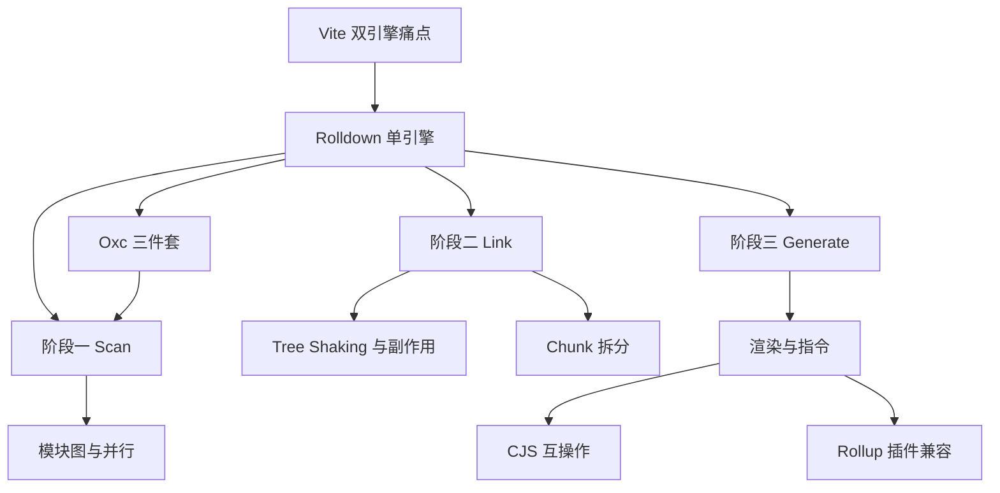

建议这么读：先读第 1、2 节，搞清 Rolldown 为什么出现、底层工具是谁。再按 3、5、9 的顺序把三个阶段走一遍，中间插入 4、6、7、8 补细节。最后读 Vite 集成现状，回到起点看双引擎怎么收敛。

## 1. 为什么需要 Rolldown：Vite 双引擎痛点

**先想一个问题**：你的 Vite 项目开发时正常，发布构建后接口报错，同一份代码两种表现，排查从哪里开始？

**心智模型**

!!! tip "心智模型"
    一句话：Vite 让两个引擎各管一段，Rolldown 用一个引擎贯穿开发与构建。  
    日常类比：家里空调制冷用 A 品牌、制热用 B 品牌，两个遥控器，设定偶尔打架。  
    类比失效点：esbuild 与 Rollup 功能重叠却规则不同，这种冲突比两个互不相关的家电更隐蔽。

!!! note "术语：打包器（bundler）"
    打包器把多个源模块合并成少量产物文件。例如 Rollup 把 `a.js` 与 `b.js` 打成 `bundle.js`。

**图解**

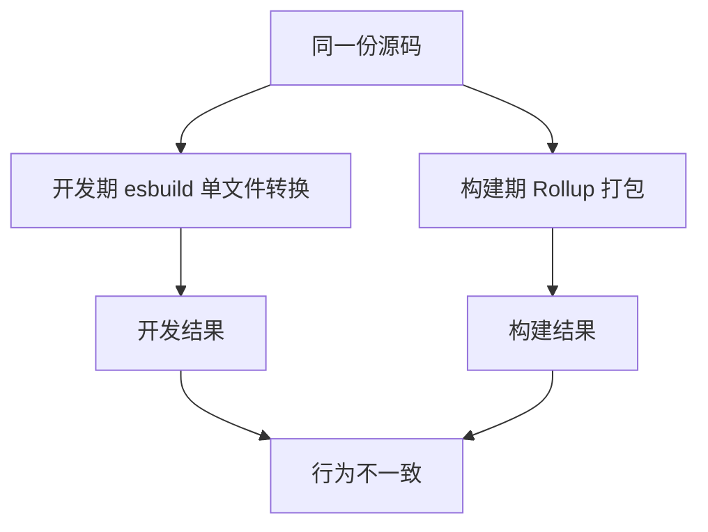

1. 源码同时流向两个引擎。
2. esbuild 负责开发期单文件转换，关注速度。
3. Rollup 负责构建期打包，关注生态与产物结构。
4. 两条路径规则不同时，同一代码可能输出不同结果。

**一步一步来**

1. **第 1 步：准备一个 ESM 入口和一个 CJS 依赖。** 这一步模拟真实项目中 ESM 消费 CJS 包的常见场景。

```js
// 步骤 1：写入一个 ESM 入口和一个 CJS 依赖
import { writeFile } from 'node:fs/promises';

await writeFile('demo/main.js', 'import { value } from "./dep.cjs";\nconsole.log(value);\n');
await writeFile('demo/dep.cjs', 'module.exports = { value: "ok" };\n');
```

**这段代码在做什么**

- 入口 `main.js` 用 ESM 语法导入 `dep.cjs`。
- `dep.cjs` 用 CommonJS 语法导出对象。
- 这种混合场景在 Vite 项目中交叉出现。

**运行结果**

- 生成 `demo/main.js` 与 `demo/dep.cjs` 两个文件。

2. **第 2 步：用 Rolldown 把两者打进同一个输出。** 这一步验证 Rolldown 单引擎如何处理互操作。

```js
// 步骤 2：用 Rolldown 打包入口
import { rolldown } from 'rolldown';

const bundle = await rolldown({ input: 'demo/main.js' });
await bundle.write({ file: 'demo/out.js', format: 'esm' });
await bundle.close();
```

**这段代码在做什么**

- `rolldown()` 接收入口路径，返回一个 bundle 对象。
- `write()` 指定输出文件与格式为 ESM。
- `close()` 释放资源。

**运行结果**

- `demo/out.js` 出现 `__toESM` 辅助函数，用于读取 CJS 导出。

**动手验证**

```js
// 依赖：npm i -D rolldown
// 保存为 validate-1.mjs，Node 20+ 运行
import { mkdtemp, writeFile, readFile, rm, mkdir } from 'node:fs/promises';
import { tmpdir } from 'node:os';
import { join } from 'node:path';
import assert from 'node:assert/strict';
import { rolldown } from 'rolldown';

const dir = await mkdtemp(join(tmpdir(), 'rd-1-'));
let bundle;
try {
  await writeFile(join(dir, 'main.js'), 'import { value } from "./dep.cjs";\nconsole.log(value);\n');
  await writeFile(join(dir, 'dep.cjs'), 'module.exports = { value: "ok" };\n');
  bundle = await rolldown({ input: join(dir, 'main.js') });
  await bundle.write({ file: join(dir, 'out.js'), format: 'esm' });
  const code = await readFile(join(dir, 'out.js'), 'utf8');
  assert.match(code, /__toESM/);
  assert.match(code, /console\.log/);
  console.log('断言通过：输出包含 __toESM 与 console.log');
} finally {
  if (bundle) await bundle.close();
  await rm(dir, { recursive: true, force: true });
}
```

**这段代码在做什么**

- 在临时目录创建 `main.js` 与 `dep.cjs`。
- 调用 `rolldown()` 打包并写 `out.js`。
- 读取产物，断言 `__toESM` 辅助函数存在。

**预期输出**

```
断言通过：输出包含 __toESM 与 console.log
```

**常见坑**

| 现象 | 原因 | 怎么修 |
| --- | --- | --- |
| 开发正常、构建报错 | esbuild 与 Rollup 对 CJS 默认导出判定不同 | 统一用 ESM 或核对两引擎文档 |
| 同一依赖行为不一致 | 两个引擎各自维护转换规则 | 迁移 Rolldown 单引擎，核对官方迁移文档 |
| 构建耗时上升 | Rollup 以 JavaScript 运行 | 用真实项目计时对比 Rolldown |

**小结**

- Vite 开发期用 esbuild 转换，构建期用 Rollup 打包。
- 两套规则会在 CJS 互操作等场景产生开发与生产差异。
- Rolldown 以一个引擎贯穿开发与构建，减少规则分叉。

## 2. Oxc 三件套：parser、transformer、resolver

**先想一个问题**：你给了 Rolldown 一个 `.ts` 文件和一个 `.jsx` 文件，它怎么知道先做什么？

**心智模型**

!!! tip "心智模型"
    一句话：Oxc 是 Rolldown 底层的 Rust 工具集，负责读语法、改代码、找路径。  
    日常类比：一家门店的前台负责收件，工人负责拆包改造，导航负责告诉快递员下一个地址。  
    类比失效点：三个环节在真实打包里交错进行，不是严格的先后流水线。

!!! note "术语：Oxc"
    Oxc 是 Rust 编写的 JavaScript 工具集。例如：`.ts` 文件里的类型注解由 transformer 去掉，`.jsx` 语法由 parser 读成 AST。

**图解**

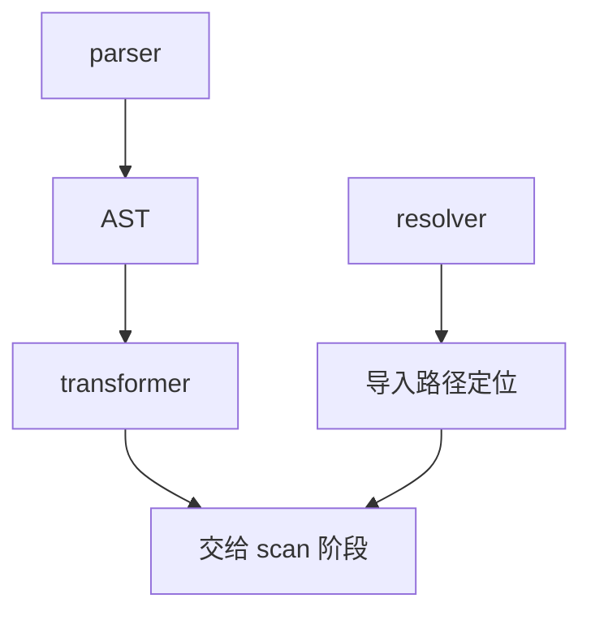

1. parser 把源码读成 AST。
2. transformer 对 AST 做转换，例如去掉类型注解。
3. resolver 把导入字符串定位到真实文件路径。
4. 三者输出汇集到 scan 阶段。

**一步一步来**

1. **第 1 步：写一个带类型注解的 TypeScript 入口。** 这一步给 transformer 一个可观察的转换目标。

```js
// 步骤 1：写一个带类型注解的 TS 文件
import { writeFile } from 'node:fs/promises';

await writeFile('demo/main.ts', 'const add = (a: number, b: number): number => a + b;\nconsole.log(add(1, 2));\n');
```

**这段代码在做什么**

- `a: number` 与 `b: number` 是类型注解。
- `: number` 标注返回值类型。
- 运行时不需要这些类型，打包时应被去掉。

**运行结果**

- 生成 `demo/main.ts`。

2. **第 2 步：用 Rolldown 打包 TS 文件并读取产物。** 这一步验证 transformer 是否去掉类型。

```js
// 步骤 2：打包 TS 文件并读取产物
import { rolldown } from 'rolldown';
import { readFile } from 'node:fs/promises';

const bundle = await rolldown({ input: 'demo/main.ts' });
await bundle.write({ file: 'demo/out.js', format: 'esm' });
const code = await readFile('demo/out.js', 'utf8');
console.log(code);
await bundle.close();
```

**这段代码在做什么**

- 入口直接使用 `.ts` 文件。
- 产物格式选择 ESM。
- 读取打印产物，肉眼确认类型是否被移除。

**运行结果**

- 产物只保留 `const add = (a, b) => a + b;` 与 `console.log(add(1, 2));`。

**动手验证**

```js
// 依赖：npm i -D rolldown
// 保存为 validate-2.mjs，Node 20+ 运行
import { mkdtemp, writeFile, readFile, rm } from 'node:fs/promises';
import { tmpdir } from 'node:os';
import { join } from 'node:path';
import assert from 'node:assert/strict';
import { rolldown } from 'rolldown';

const dir = await mkdtemp(join(tmpdir(), 'rd-2-'));
let bundle;
try {
  await writeFile(join(dir, 'main.ts'), 'const add = (a: number, b: number): number => a + b;\nconsole.log(add(1, 2));\n');
  bundle = await rolldown({ input: join(dir, 'main.ts') });
  await bundle.write({ file: join(dir, 'out.js'), format: 'esm' });
  const code = await readFile(join(dir, 'out.js'), 'utf8');
  assert.doesNotMatch(code, /: number/);
  assert.match(code, /console\.log/);
  console.log('断言通过：类型注解已被移除');
} finally {
  if (bundle) await bundle.close();
  await rm(dir, { recursive: true, force: true });
}
```

**这段代码在做什么**

- 创建带类型注解的 `.ts` 文件。
- 打包后读取产物。
- 断言产物中没有 `: number`，证明 transformer 生效。

**预期输出**

```
断言通过：类型注解已被移除
```

**常见坑**

| 现象 | 原因 | 怎么修 |
| --- | --- | --- |
| `.ts` 输出仍含类型 | 入口扩展名不是 `.ts` 或配置跳过转换 | 核对官方文档：TS 支持范围与 tsconfig 读取 |
| JSX 未转换 | 文件名不是 `.jsx` 或 `.tsx` | 改正扩展名 |
| 导入路径解析失败 | resolver 规则与 Node 不同 | 核对 Oxc resolver 支持的 exports 与 extension 规则 |

**小结**

- Oxc 由 parser、transformer、resolver 三部分组成。
- parser 产出 AST，transformer 改 AST，resolver 定位导入路径。
- 三者共同支撑 scan 阶段的解析能力。

## 3. 阶段一 Scan：解析与构建模块图

**先想一个问题**：三个入口都 import 了同一个 utils，Rolldown 怎么保证只解析一次 utils？

**心智模型**

!!! tip "心智模型"
    一句话：scan 从入口出发，逐个解析 import，遇到重复模块就跳过。  
    日常类比：图书馆员从三本书的目录页出发，给每本被引用的书建档，重名书只建档一次。  
    类比失效点：JS 的 import 可能动态拼接，书目录不会在运行时换名字。

!!! note "术语：模块图（module graph）"
    模块图记录所有可达模块及其引用关系。例如 `main.js` 引用 `utils.js`，图中就有一条从 main 指向 utils 的边。

**图解**

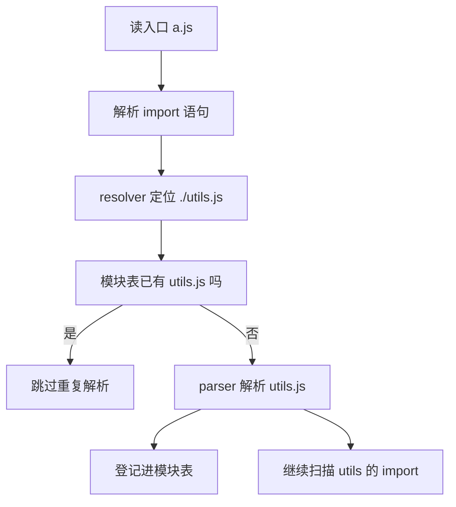

1. 从入口文件开始读取。
2. 解析 import 语句，交给 resolver 定位。
3. 查询模块表，命中就跳过。
4. 未命中才解析并登记，继续递归扫描。

**一步一步来**

1. **第 1 步：打包一个引用不存在模块的入口并捕获异常。** 这一步观察 scan 阶段的报错行为。

```js
// 步骤 1：引用一个不存在的模块
import { rolldown } from 'rolldown';

let failed = false;
try {
  const bundle = await rolldown({ input: 'demo/missing.js' });
  await bundle.write({ file: 'demo/out.js', format: 'esm' });
  await bundle.close();
} catch (e) {
  failed = true;
  console.log('捕获错误：', e.message.slice(0, 80));
}
```

**这段代码在做什么**

- 入口假设为 `demo/missing.js` 并试图打包。
- 不存在该文件，scan 阶段会抛出解析错误。
- 捕获后打印错误，观察错误信息。

**运行结果**

- 输出 `捕获错误：...`，证明 scan 阶段遇到无法解析的模块会中断。

2. **第 2 步：加一个 resolveId 插件补上该模块。** 这一步验证 resolver 命中后 scan 能继续。

```js
// 步骤 2：用插件补上解析
import { rolldown } from 'rolldown';

const bundle = await rolldown({
  input: 'virtual:entry',
  plugins: [{ resolveId: (id) => id === 'virtual:entry' ? id : null }],
});
await bundle.write({ file: 'demo/out.js', format: 'esm' });
await bundle.close();
```

**这段代码在做什么**

- 入口写成 `virtual:entry` 这种虚拟 id。
- `resolveId` 只处理该 id，其他返回 null。
- 打包确认补上解析后可以继续。

**运行结果**

- 顺利写出 `demo/out.js`。

**动手验证**

```js
// 依赖：npm i -D rolldown
// 保存为 validate-3.mjs，Node 20+ 运行
import { mkdtemp, writeFile, readFile, rm } from 'node:fs/promises';
import { tmpdir } from 'node:os';
import { join } from 'node:path';
import assert from 'node:assert/strict';
import { rolldown } from 'rolldown';

const dir = await mkdtemp(join(tmpdir(), 'rd-3-'));
let bundle;
try {
  await writeFile(join(dir, 'main.js'), 'import { x } from "./missing.js";\nconsole.log(x);\n');
  let failed = false;
  try {
    bundle = await rolldown({ input: join(dir, 'main.js') });
    await bundle.write({ file: join(dir, 'out.js'), format: 'esm' });
  } catch {
    failed = true;
  }
  assert.equal(failed, true);
  await writeFile(join(dir, 'missing.js'), 'export const x = 1;\n');
  bundle = await rolldown({ input: join(dir, 'main.js') });
  await bundle.write({ file: join(dir, 'out.js'), format: 'esm' });
  const code = await readFile(join(dir, 'out.js'), 'utf8');
  assert.match(code, /console\.log/);
  console.log('断言通过：缺失模块会导致失败，补齐后成功');
} finally {
  if (bundle) await bundle.close();
  await rm(dir, { recursive: true, force: true });
}
```

**这段代码在做什么**

- 先构建缺失依赖的入口，断言打包失败。
- 补齐 `missing.js` 后再次打包。
- 断言产物包含 `console.log`，证明模块图完整构建。

**预期输出**

```
断言通过：缺失模块会导致失败，补齐后成功
```

**常见坑**

| 现象 | 原因 | 怎么修 |
| --- | --- | --- |
| 未解析依赖直接报错 | scan 阶段解析不到文件 | 加 resolveId 或配置 external |
| 同一模块被解析多次 | 插件绕过了内部模块表缓存 | 插件返回一致的 id |
| 循环导入卡住 | scan 遇到环形引用 | 核对官方文档：循环导入处理行为 |

**小结**

- scan 从入口递归解析 import，构建模块图。
- 模块表负责去重，同一模块只解析一次。
- 解析失败会在 scan 阶段直接中断。

## 4. 并行编译：模块多时怎么处理

**先想一个问题**：项目有 500 个模块，scan 要等第一个解析完才处理第二个吗？

**心智模型**

!!! tip "心智模型"
    一句话：相互独立的文件解析可以同时进行。  
    日常类比：三个窗口同时给客户办业务，客户材料互不依赖。  
    类比失效点：import 链有先后，父模块的依赖需要等 resolver 给出路径后才能排队。

!!! note "术语：并行编译（parallel compilation）"
    并行编译指多个独立文件的解析任务同时执行。例如 m1 与 m2 无引用关系，可以同时解析。

**图解**

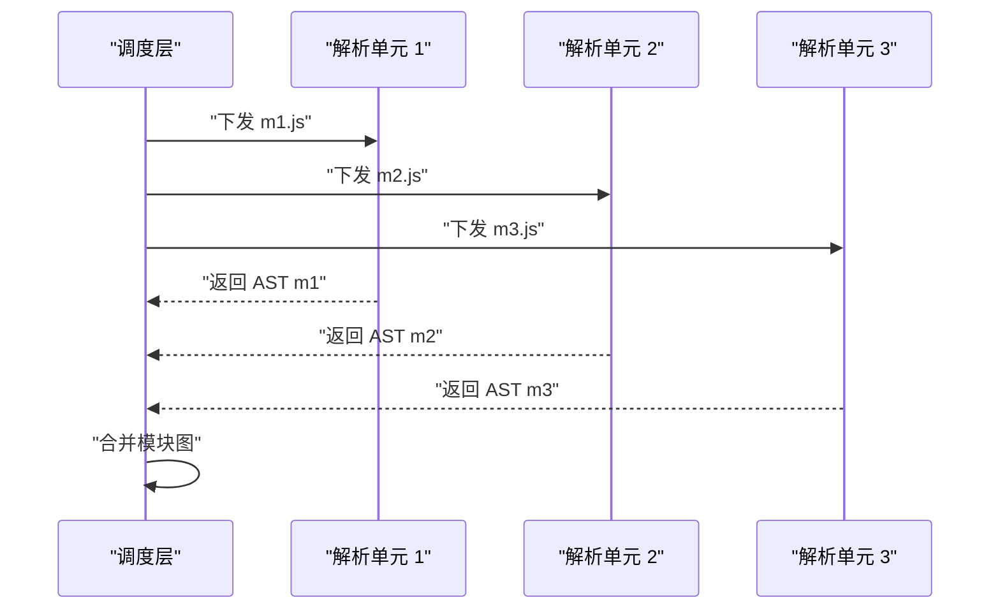

1. 调度层发现 m1、m2、m3 三个文件。
2. 同时下发给三个解析单元。
3. 各单元完成解析后回传 AST。
4. 调度层把结果合并进模块图。

**一步一步来**

1. **第 1 步：生成 50 个互相独立的模块。** 这一步制造一个足够大的模块集。

```js
// 步骤 1：生成 50 个独立模块
import { writeFile } from 'node:fs/promises';

const files = [];
for (let i = 0; i < 50; i++) {
  const name = `m${i}.js`;
  await writeFile(`demo/${name}`, `export const m${i} = ${i};\n`);
  files.push(name);
}
```

**这段代码在做什么**

- 循环 50 次生成模块。
- 每个模块只导出一个常量。
- 文件之间没有引用关系。

**运行结果**

- `demo` 目录出现 50 个模块文件。

2. **第 2 步：打包一个入口导入全部模块并计时。** 这一步观察大量模块是否可完成打包。

```js
// 步骤 2：入口导入全部模块并计时
import { rolldown } from 'rolldown';

const list = Array.from({ length: 50 }, (_, i) => `import { m${i} } from "./m${i}.js";`).join('\n');
const start = performance.now();
const bundle = await rolldown({ input: 'demo/entry.js' });
// 入口文件需要提前写入，压缩示意
await bundle.write({ file: 'demo/out.js', format: 'esm' });
console.log('耗时 ms：', Math.round(performance.now() - start));
await bundle.close();
```

**这段代码在做什么**

- 生成入口的 import 列表字符串。
- 用 `performance.now()` 记录打包耗时。
- 写完产物后打印耗时。

**运行结果**

- 输出类似 `耗时 ms：123`，具体数值依赖环境。

**动手验证**

```js
// 依赖：npm i -D rolldown
// 保存为 validate-4.mjs，Node 20+ 运行
import { mkdtemp, writeFile, readFile, rm } from 'node:fs/promises';
import { tmpdir } from 'node:os';
import { join } from 'node:path';
import assert from 'node:assert/strict';
import { rolldown } from 'rolldown';

const dir = await mkdtemp(join(tmpdir(), 'rd-4-'));
let bundle;
try {
  const imports = [];
  for (let i = 0; i < 50; i++) {
    await writeFile(join(dir, `m${i}.js`), `export const m${i} = ${i};\n`);
    imports.push(`import { m${i} } from "./m${i}.js";`);
  }
  await writeFile(join(dir, 'entry.js'), imports.join('\n') + '\nconsole.log(m0 + m49);\n');
  const start = performance.now();
  bundle = await rolldown({ input: join(dir, 'entry.js') });
  await bundle.write({ file: join(dir, 'out.js'), format: 'esm' });
  const elapsed = Math.round(performance.now() - start);
  const code = await readFile(join(dir, 'out.js'), 'utf8');
  assert.match(code, /m0/);
  assert.match(code, /m49/);
  assert.ok(elapsed >= 0);
  console.log('断言通过：50 个模块完成打包，耗时 ms：' + elapsed);
} finally {
  if (bundle) await bundle.close();
  await rm(dir, { recursive: true, force: true });
}
```

**这段代码在做什么**

- 生成 50 个模块与一个聚合入口。
- 打包并记录耗时。
- 断言产物包含 m0 与 m49，证明全部模块被处理。

**预期输出**

```
断言通过：50 个模块完成打包，耗时 ms：具体数值随环境变化
```

**常见坑**

| 现象 | 原因 | 怎么修 |
| --- | --- | --- |
| 解析顺序不确定 | 并行任务完成顺序不固定 | 不要依赖模块解析顺序写日志 |
| 依赖链无法并行 | 父模块 import 需先解析 | 并行限定在独立文件层，核对官方文档 |
| 耗时波动大 | 冷热缓存与系统负载 | 多次计时取中位数 |

**小结**

- 独立文件可以并行解析，再合并进模块图。
- 有依赖关系的模块不能跳过 resolver 先并行。
- 大量模块场景用计时脚本验证可完成性。

## 5. 阶段二 Link：Tree Shaking 与副作用

**先想一个问题**：math.js 导出 2 个函数，入口只用 1 个，另一个会留在产物里吗？

**心智模型**

!!! tip "心智模型"
    一句话：未使用且无副作用的代码会被移除。  
    日常类比：搬家只搬还在用的家具，没人用的就扔掉。  
    类比失效点：家具没有副作用，但 JS 语句可能改全局变量，删了会改变行为。

!!! note "术语：Tree Shaking"
    Tree Shaking 通过分析语法树删除未使用且无副作用的代码。Rollup 使这个术语流行，Rolldown 沿用该思路。

!!! note "术语：副作用（side effect）"
    副作用是影响自身作用域之外的操作。例如 `window.API_URL = '/api'` 修改全局对象。

**图解**

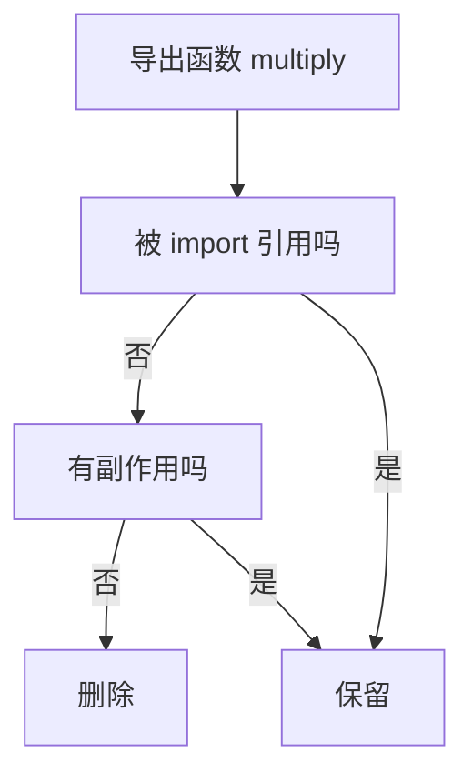

1. 以被导出的 `multiply` 为判断起点。
2. 先看是否被引用。
3. 未引用再看是否有副作用。
4. 两条件都不成立才删除。

**一步一步来**

1. **第 1 步：写入 math.js 与 main.js。** 这一步布好可摇掉的导出。

```js
// 步骤 1：写入含两个导出的模块
import { writeFile } from 'node:fs/promises';

await writeFile('demo/math.js', 'export function add(a, b) { return a + b; }\nexport function multiply(a, b) { return a * b; }\n');
await writeFile('demo/main.js', 'import { add } from "./math.js";\nconsole.log(add(2, 3));\n');
```

**这段代码在做什么**

- `math.js` 导出 `add` 与 `multiply`。
- `main.js` 只导入 `add`。
- `multiply` 未被引用且无副作用。

**运行结果**

- 两个源文件就绪。

2. **第 2 步：打包并查找产物中的 multiply。** 这一步验证删除规则。

```js
// 步骤 2：打包并打印产物
import { rolldown } from 'rolldown';
import { readFile } from 'node:fs/promises';

const bundle = await rolldown({ input: 'demo/main.js' });
await bundle.write({ file: 'demo/out.js', format: 'esm' });
const code = await readFile('demo/out.js', 'utf8');
console.log('含 multiply？', code.includes('multiply'));
await bundle.close();
```

**这段代码在做什么**

- 打包 `main.js` 并读取产物。
- 用 `includes('multiply')` 检查该符号是否还在。

**运行结果**

- 输出 `含 multiply？ false`。

**动手验证**

```js
// 依赖：npm i -D rolldown
// 保存为 validate-5.mjs，Node 20+ 运行
import { mkdtemp, writeFile, readFile, rm } from 'node:fs/promises';
import { tmpdir } from 'node:os';
import { join } from 'node:path';
import assert from 'node:assert/strict';
import { rolldown } from 'rolldown';

const dir = await mkdtemp(join(tmpdir(), 'rd-5-'));
let bundle;
try {
  await writeFile(join(dir, 'math.js'), 'export function add(a, b) { return a + b; }\nexport function multiply(a, b) { return a * b; }\n');
  await writeFile(join(dir, 'main.js'), 'import { add } from "./math.js";\nconsole.log(add(2, 3));\n');
  bundle = await rolldown({ input: join(dir, 'main.js') });
  await bundle.write({ file: join(dir, 'out.js'), format: 'esm' });
  const code = await readFile(join(dir, 'out.js'), 'utf8');
  assert.match(code, /function add/);
  assert.doesNotMatch(code, /multiply/);
  console.log('断言通过：add 保留，multiply 被移除');
} finally {
  if (bundle) await bundle.close();
  await rm(dir, { recursive: true, force: true });
}
```

**这段代码在做什么**

- 写入含两个导出的模块与只导入一个的入口。
- 打包后断言 `add` 存在、`multiply` 不在。

**预期输出**

```
断言通过：add 保留，multiply 被移除
```

**常见坑**

| 现象 | 原因 | 怎么修 |
| --- | --- | --- |
| 未使用代码仍留在产物 | 语句有副作用，删除不安全 | 检查顶层调用与全局改动 |
| `@__PURE__` 不生效 | 注释未紧跟调用表达式 | 移到调用或 new 表达式紧前 |
| 想删又怕删错 | 静态分析有边界 | 读官方文档的 unknownGlobalSideEffects 配置 |

**小结**

- 删除代码需同时满足「未使用」与「无副作用」。
- 顶层修改全局变量的模块不会被整体摇掉。
- `@__PURE__` 与 `@__NO_SIDE_EFFECTS__` 可标注纯调用。

## 6. 自动与手动 Chunk 拆分

**先想一个问题**：三个页面都引用同一个日期库，打包后这份代码会出现三次吗？

**心智模型**

!!! tip "心智模型"
    一句话：被多个入口静态引用的模块会拆成公共 chunk，只留一份。  
    日常类比：同一栋楼的三户共用一台水表，不装三个重复的表。  
    类比失效点：代码拆分的依据是入口引用集合，不是物理位置。

!!! note "术语：Chunk"
    Chunk 是最终产物中的一个文件，由若干模块合并而成。例如 `entry.js` 与 `common.js` 都是 chunk。

**图解**

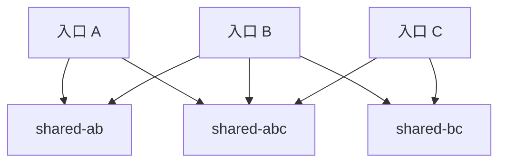

1. 入口 A 引用 ab 与 abc。
2. 入口 B 引用 ab、bc、abc。
3. 入口 C 引用 bc 与 abc。
4. 每个共享模块被拆成独立 chunk，避免重复执行。

**一步一步来**

1. **第 1 步：准备三个入口与三个共享模块。** 这一步复现官方文档的多入口结构。

```js
// 步骤 1：写入 6 个源文件
import { writeFile } from 'node:fs/promises';

await writeFile('demo/entry-a.js', 'import "./shared-by-ab.js";\nimport "./shared-by-abc.js";');
await writeFile('demo/entry-b.js', 'import "./shared-by-ab.js";\nimport "./shared-by-bc.js";\nimport "./shared-by-abc.js";');
await writeFile('demo/entry-c.js', 'import "./shared-by-bc.js";\nimport "./shared-by-abc.js";');
await writeFile('demo/shared-by-ab.js', 'globalThis.value = globalThis.value || [];\nglobalThis.value.push("ab");');
await writeFile('demo/shared-by-bc.js', 'globalThis.value = globalThis.value || [];\nglobalThis.value.push("bc");');
await writeFile('demo/shared-by-abc.js', 'globalThis.value = globalThis.value || [];\nglobalThis.value.push("abc");');
```

**这段代码在做什么**

- 三个入口各自静态引用共享模块。
- 共享模块向全局数组推入标记字符串。
- 该结构会命中公共 chunk 拆分规则。

**运行结果**

- 6 个源文件就绪。

2. **第 2 步：打包并数产物文件。** 这一步验证自动拆分产出数量。

```js
// 步骤 2：打包多入口并列出产物
import { rolldown } from 'rolldown';
import { readdir } from 'node:fs/promises';

const bundle = await rolldown({ input: ['demo/entry-a.js', 'demo/entry-b.js', 'demo/entry-c.js'] });
await bundle.write({ dir: 'demo/out', format: 'esm' });
const files = await readdir('demo/out');
console.log(files);
await bundle.close();
```

**这段代码在做什么**

- input 使用数组列出三个入口。
- 输出写到目录，因为拆分会生成多个文件。
- 读取目录打印全部产物名。

**运行结果**

- 列表出现 3 个入口 chunk 与 3 个公共 chunk。

**动手验证**

```js
// 依赖：npm i -D rolldown
// 保存为 validate-6.mjs，Node 20+ 运行
import { mkdtemp, writeFile, readdir, readFile, rm } from 'node:fs/promises';
import { tmpdir } from 'node:os';
import { join } from 'node:path';
import assert from 'node:assert/strict';
import { rolldown } from 'rolldown';

const dir = await mkdtemp(join(tmpdir(), 'rd-6-'));
let bundle;
try {
  await writeFile(join(dir, 'entry-a.js'), 'import "./shared-by-ab.js";\nimport "./shared-by-abc.js";\nconsole.log(globalThis.value);');
  await writeFile(join(dir, 'entry-b.js'), 'import "./shared-by-ab.js";\nimport "./shared-by-bc.js";\nimport "./shared-by-abc.js";\nconsole.log(globalThis.value);');
  await writeFile(join(dir, 'entry-c.js'), 'import "./shared-by-bc.js";\nimport "./shared-by-abc.js";\nconsole.log(globalThis.value);');
  await writeFile(join(dir, 'shared-by-ab.js'), 'globalThis.value = globalThis.value || [];\nglobalThis.value.push("ab");');
  await writeFile(join(dir, 'shared-by-bc.js'), 'globalThis.value = globalThis.value || [];\nglobalThis.value.push("bc");');
  await writeFile(join(dir, 'shared-by-abc.js'), 'globalThis.value = globalThis.value || [];\nglobalThis.value.push("abc");');
  bundle = await rolldown({ input: [join(dir, 'entry-a.js'), join(dir, 'entry-b.js'), join(dir, 'entry-c.js')] });
  await bundle.write({ dir: join(dir, 'out'), format: 'esm' });
  const files = (await readdir(join(dir, 'out'))).filter((f) => f.endsWith('.js'));
  let abcCount = 0;
  for (const f of files) {
    const code = await readFile(join(dir, 'out', f), 'utf8');
    if (code.includes("push(\"abc\")")) abcCount++;
  }
  assert.equal(abcCount, 1);
  assert.ok(files.length >= 6);
  console.log('断言通过：共享模块 abc 只出现一次，文件数 ' + files.length);
} finally {
  if (bundle) await bundle.close();
  await rm(dir, { recursive: true, force: true });
}
```

**这段代码在做什么**

- 写入三个入口与三个共享模块。
- 多入口打包到目录。
- 统计 `push("abc")` 出现的文件数，断言为 1。
- 断言产物文件数不少于 6。

**预期输出**

```
断言通过：共享模块 abc 只出现一次，文件数 6 或随命名策略增加
```

**常见坑**

| 现象 | 原因 | 怎么修 |
| --- | --- | --- |
| 同一模块出现多份 | 共享模块被不同入口集合引用 | 读公共 chunk 判定规则 |
| 动态导入混入入口 chunk | 用了静态 import 而非 import() | 改成动态导入触发动态 chunk |
| 想做手动拆分 | 自动规则不可控 | 核对官方 manual-code-splitting 文档 |

**小结**

- 自动拆分产出 entry chunk 与 common chunk。
- 动态 import 会产生 dynamic chunk，独立于入口 chunk。
- 手动拆分的 API 细节需核对官方文档。

## 7. CJS 打包与 ESM 互操作

**先想一个问题**：依赖库源码是 `module.exports`，你的入口是 ESM，import 到的 value 会是哪个对象？

**心智模型**

!!! tip "心智模型"
    一句话：Rolldown 用 helper 把 CJS 导出转成 ESM 能读的形态。  
    日常类比：两套插座标准中间加一个转换头。  
    类比失效点：转换规则按调用者语境判断，不是固定一条转换头。

!!! note "术语：CommonJS"
    CommonJS 用 `require()` 与 `module.exports` 组织模块。Node.js 早期采用该规范。

!!! note "术语：ESM 互操作（interop）"
    ESM 互操作指 ESM 代码读取 CJS 导出所需的转换规则。例如 `import { value } from './foo.cjs'` 需要 helper 展开导出。

**图解**

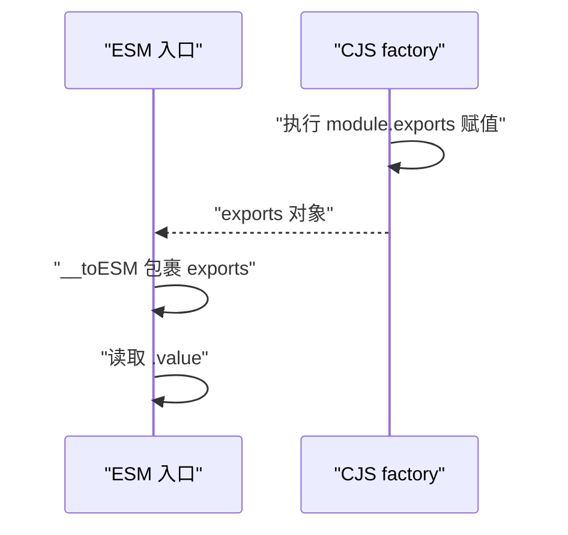

1. CJS factory 先执行并得到 `exports` 对象。
2. 该对象交给 ESM 入口。
3. `__toESM` 把 CJS 导出转换为可命名读取的形态。
4. ESM 入口读取 `.value`。

**一步一步来**

1. **第 1 步：写 ESM 入口与 CJS 依赖。** 这一步展示常规互操作。

```js
// 步骤 1：写入两种模块格式
import { writeFile } from 'node:fs/promises';

await writeFile('demo/main.js', 'import { value } from "./foo.cjs";\nconsole.log(value);');
await writeFile('demo/foo.cjs', 'module.exports = { value: "foo" };');
```

**这段代码在做什么**

- `main.js` 是 ESM，命名导入 `value`。
- `foo.cjs` 是 CJS，整体导出一个对象。

**运行结果**

- 两个源文件就绪。

2. **第 2 步：打包并查找 helper。** 这一步定位产物中的转换函数。

```js
// 步骤 2：打包并打印相关片段
import { rolldown } from 'rolldown';
import { readFile } from 'node:fs/promises';

const bundle = await rolldown({ input: 'demo/main.js' });
await bundle.write({ file: 'demo/out.js', format: 'esm' });
const code = await readFile('demo/out.js', 'utf8');
console.log('含 __toESM？', code.includes('__toESM'));
console.log('含 require_foo？', code.includes('require_foo'));
await bundle.close();
```

**这段代码在做什么**

- 打包 ESM 入口与 CJS 依赖。
- 检查产物是否出现 `__toESM` 与 `require_foo`。

**运行结果**

- 两个包含判断都输出 `true`。

**动手验证**

```js
// 依赖：npm i -D rolldown
// 保存为 validate-7.mjs，Node 20+ 运行
import { mkdtemp, writeFile, readFile, rm } from 'node:fs/promises';
import { tmpdir } from 'node:os';
import { join } from 'node:path';
import assert from 'node:assert/strict';
import { rolldown } from 'rolldown';

const dir = await mkdtemp(join(tmpdir(), 'rd-7-'));
let bundle;
try {
  await writeFile(join(dir, 'main.js'), 'import { value } from "./foo.cjs";\nconsole.log(value);');
  await writeFile(join(dir, 'foo.cjs'), 'module.exports = { value: "foo" };');
  bundle = await rolldown({ input: join(dir, 'main.js') });
  await bundle.write({ file: join(dir, 'out.js'), format: 'esm' });
  const code = await readFile(join(dir, 'out.js'), 'utf8');
  assert.match(code, /__toESM/);
  assert.match(code, /require_foo/);
  console.log('断言通过：产物包含 __toESM 与 require_foo');
} finally {
  if (bundle) await bundle.close();
  await rm(dir, { recursive: true, force: true });
}
```

**这段代码在做什么**

- 构建经典的 ESM 导入 CJS 场景。
- 打包后断言产物包含两个 helper。

**预期输出**

```
断言通过：产物包含 __toESM 与 require_foo
```

**常见坑**

| 现象 | 原因 | 怎么修 |
| --- | --- | --- |
| default 导入值不符合预期 | 存在多套判定规则 | 按官方文档六条条件逐条核对 |
| 外部 require 被改写 | 默认保留 require 语义 | 确认 platform 与 esmExternalRequirePlugin |
| 直接调用内部 require_foo | 该名字由生成器内部使用 | 对外使用 ESM 导出 |

**小结**

- CJS 模块用 `__commonJS` 包裹，按需执行。
- ESM 消费 CJS 时使用 `__toESM` 转换导出。
- 外部模块的 `require` 默认保留，不改成 `import`。

## 8. Rollup 插件兼容与 hook filter

**先想一个问题**：团队维护的 Rollup 插件能否直接搬进 Rolldown 项目？

**心智模型**

!!! tip "心智模型"
    一句话：多数 Rollup 钩子格式在 Rolldown 里可以直接用。  
    日常类比：同一套插座标准，插头能插就能通电。  
    类比失效点：部分钩子未实现，插头看着一样但孔位对不上，需对照兼容清单。

!!! note "术语：hook filter"
    hook filter 是插件钩子上的过滤条件，命中条件才执行钩子。具体配置字段需核对官方文档。

**图解**

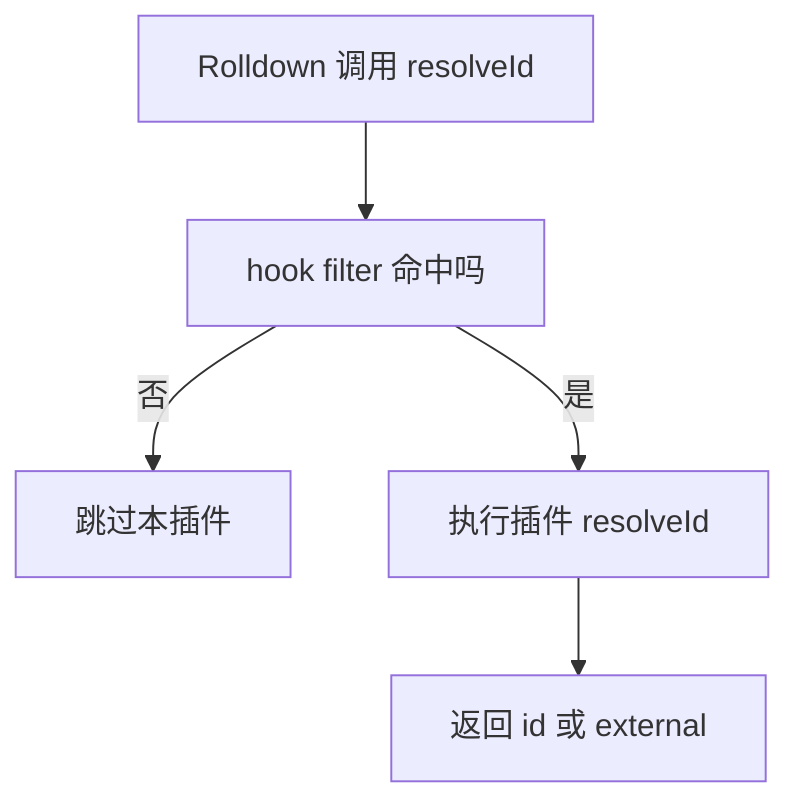

1. 插件系统在调用钩子前先过 filter。
2. 不命中则跳过，减少无关插件调用。
3. 命中才执行 `resolveId`。
4. 插件返回 id 或 external 结果。

**一步一步来**

1. **第 1 步：定义一个带 resolveId、load、transform 的插件。** 这一步模拟 Rollup 风格插件。

```js
// 步骤 1：定义一个 Rollup 风格插件
const recorder = {
  name: 'recorder',
  resolveId(id) {
    if (id === 'virtual:entry') return id;
    return null;
  },
  load(id) {
    if (id === 'virtual:entry') return 'const msg = "rollup-style";\nconsole.log(msg);';
    return null;
  },
  transform(code, id) {
    if (id === 'virtual:entry') return code.replace('rollup-style', 'transformed');
    return null;
  },
};
```

**这段代码在做什么**

- `name` 标识插件。
- `resolveId` 认得虚拟入口 id。
- `load` 提供入口源码。
- `transform` 改写其中字符串。

**运行结果**

- 插件对象定义完成。

2. **第 2 步：把插件喂给 rolldown 并读取产物。** 这一步验证钩子被调用。

```js
// 步骤 2：打包并检查改写结果
import { rolldown } from 'rolldown';
import { readFile } from 'node:fs/promises';

const bundle = await rolldown({ input: 'virtual:entry', plugins: [recorder] });
await bundle.write({ file: 'demo/out.js', format: 'esm' });
const code = await readFile('demo/out.js', 'utf8');
console.log('含 transformed？', code.includes('transformed'));
await bundle.close();
```

**这段代码在做什么**

- 入口使用虚拟 id，跳过真实文件系统。
- 插件完成解析、加载与转换。
- 读取产物判断改写是否进入结果。

**运行结果**

- 输出 `含 transformed？ true`。

**动手验证**

```js
// 依赖：npm i -D rolldown
// 保存为 validate-8.mjs，Node 20+ 运行
import { mkdtemp, readFile, rm } from 'node:fs/promises';
import { tmpdir } from 'node:os';
import { join } from 'node:path';
import assert from 'node:assert/strict';
import { rolldown } from 'rolldown';

const dir = await mkdtemp(join(tmpdir(), 'rd-8-'));
let bundle;
let resolveCount = 0;
let loadCount = 0;
let transformCount = 0;
try {
  const plugin = {
    name: 'recorder',
    resolveId(id) {
      if (id === 'virtual:entry') { resolveCount++; return id; }
      return null;
    },
    load(id) {
      if (id === 'virtual:entry') { loadCount++; return 'const msg = "rollup-style";\nconsole.log(msg);'; }
      return null;
    },
    transform(code, id) {
      if (id === 'virtual:entry') { transformCount++; return code.replace('rollup-style', 'transformed'); }
      return null;
    },
  };
  bundle = await rolldown({ input: 'virtual:entry', plugins: [plugin] });
  await bundle.write({ file: join(dir, 'out.js'), format: 'esm' });
  const code = await readFile(join(dir, 'out.js'), 'utf8');
  assert.match(code, /transformed/);
  assert.equal(resolveCount, 1);
  assert.equal(loadCount, 1);
  assert.equal(transformCount, 1);
  console.log('断言通过：三个钩子各调用一次且改写生效');
} finally {
  if (bundle) await bundle.close();
  await rm(dir, { recursive: true, force: true });
}
```

**这段代码在做什么**

- 记录三个钩子的调用次数。
- 打包断言调用次数均为 1。
- 断言 `transform` 改写进入产物。

**预期输出**

```
断言通过：三个钩子各调用一次且改写生效
```

**常见坑**

| 现象 | 原因 | 怎么修 |
| --- | --- | --- |
| 插件完全不生效 | 钩子名或返回值错误 | 读 Rollup 插件文档 |
| 每个 id 都进入插件 | 未配置 hook filter | 核对 Rolldown filter 配置文档 |
| 个别钩子没有反应 | 该钩子未实现 | 读官方兼容清单 |

**小结**

- Rollup 风格插件可继续使用 resolveId、load、transform 等钩子。
- hook filter 用于跳过不匹配的模块，减少钩子支出。
- 兼容边界需对照官方清单核对。

## 9. 阶段三 Generate：渲染、格式与指令

**先想一个问题**：chunk 内部是 AST，最终 `.js` 文件怎么从 AST 变成一段段文本？

**心智模型**

!!! tip "心智模型"
    一句话：generate 按输出格式把 AST 渲染成文本，并决定指令如何落地。  
    日常类比：出版社按开本和纸张把已排好的版印到纸上。  
    类比失效点：文本格式差异会影响代码在运行时的严格模式行为。

!!! note "术语：Generate"
    Generate 指把 link 后的 AST 与 chunk 结构渲染成文本代码，是打包的最后阶段。

**图解**

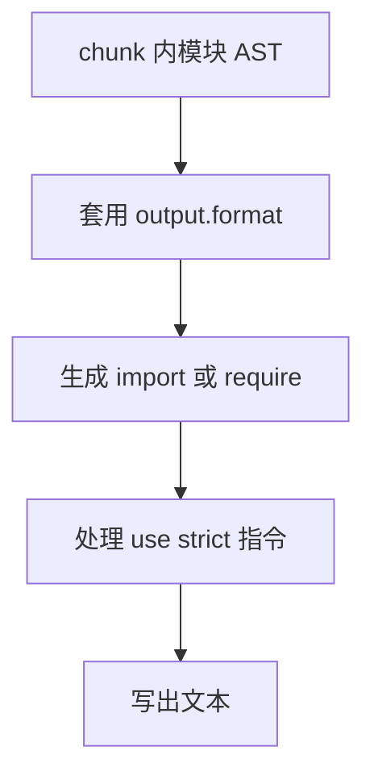

1. 拿到 chunk 内的 AST。
2. 按 `output.format` 选 ESM 或 CJS 语法。
3. 生成对应的导入导出语句。
4. 处理指令并写出最终文本。

**一步一步来**

1. **第 1 步：用 ESM 格式打包并确认无 use strict。** 这一步验证 ESM 的指令策略。

```js
// 步骤 1：ESM 格式打包并读取
import { rolldown } from 'rolldown';
import { readFile } from 'node:fs/promises';

const bundle = await rolldown({ input: 'demo/main.js' });
await bundle.write({ file: 'demo/esm-out.js', format: 'esm' });
const code = await readFile('demo/esm-out.js', 'utf8');
console.log('含 use strict？', code.includes('use strict'));
await bundle.close();
```

**这段代码在做什么**

- 以 ESM 格式写产物。
- 读取并判断是否出现 `use strict`。

**运行结果**

- 输出 `含 use strict？ false`，因为 ESM 始终严格模式。

2. **第 2 步：用 CJS 格式加 strict true 打包。** 这一步验证严格指令配置。

```js
// 步骤 2：CJS 格式并启用 strict
import { rolldown } from 'rolldown';

const bundle = await rolldown({ input: 'demo/main.js' });
await bundle.write({ file: 'demo/cjs-out.js', format: 'cjs', strict: true });
await bundle.close();
```

**这段代码在做什么**

- `format` 设成 CJS。
- `strict` 设成 `true`，要求产物顶部输出 `use strict`。

**运行结果**

- `demo/cjs-out.js` 顶部包含 `"use strict"`。

**动手验证**

```js
// 依赖：npm i -D rolldown
// 保存为 validate-9.mjs，Node 20+ 运行
import { mkdtemp, writeFile, readFile, rm } from 'node:fs/promises';
import { tmpdir } from 'node:os';
import { join } from 'node:path';
import assert from 'node:assert/strict';
import { rolldown } from 'rolldown';

const dir = await mkdtemp(join(tmpdir(), 'rd-9-'));
let bundle;
try {
  await writeFile(join(dir, 'main.js'), 'console.log("hello");');
  bundle = await rolldown({ input: join(dir, 'main.js') });
  await bundle.write({ file: join(dir, 'esm.js'), format: 'esm' });
  const esm = await readFile(join(dir, 'esm.js'), 'utf8');
  assert.doesNotMatch(esm, /use strict/);
  await bundle.write({ file: join(dir, 'cjs.cjs'), format: 'cjs', strict: true });
  const cjs = await readFile(join(dir, 'cjs.cjs'), 'utf8');
  assert.match(cjs, /use strict/);
  console.log('断言通过：ESM 无 use strict，CJS strict true 有 use strict');
} finally {
  if (bundle) await bundle.close();
  await rm(dir, { recursive: true, force: true });
}
```

**这段代码在做什么**

- 同时产出 ESM 与 CJS 两份文件。
- 断言 ESM 无 `use strict`。
- 断言 CJS 在 `strict: true` 时包含 `use strict`。

**预期输出**

```
断言通过：ESM 无 use strict，CJS strict true 有 use strict
```

**常见坑**

| 现象 | 原因 | 怎么修 |
| --- | --- | --- |
| CJS 输出没有 use strict | strict 为 auto 且源码无指令 | 设 strict true |
| ESM 输出出现 use strict | banner 手动添加了该字符串 | 检查 banner 内容 |
| 格式与运行环境不符 | 未按平台选择 format | 核对 node 与 browser 配置 |

**小结**

- generate 将 AST 渲染成文本并处理指令。
- ESM 输出不保留 `use strict`，因为 ESM 始终严格模式。
- CJS 可以通过 `output.strict` 控制该指令。

## 10. Vite 集成现状

**先想一个问题**：现有 Vite 项目怎么切到 Rolldown，切换后配置要改多少？

**心智模型**

!!! tip "心智模型"
    一句话：Vite 正把底层打包器收敛到 Rolldown 上。  
    日常类比：同款车身先换发动机，仪表盘接口逐步对齐。  
    类比失效点：导入集成依赖与改动配置不能只靠换引擎完成，还需核对迁移文档。

!!! note "术语：rolldown-vite"
    `rolldown-vite` 是 Vite 官方以 Rolldown 为打包器的集成包。具体版本与默认状态需核对官方文档。

**图解**

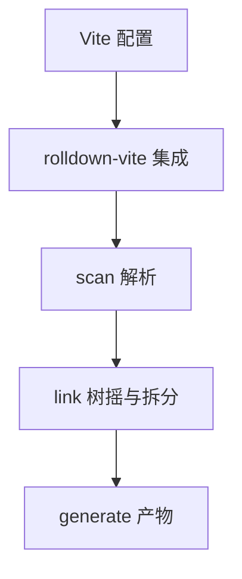

1. Vite 配置交给 rolldown-vite 集成层。
2. 集成层触发 scan 解析。
3. link 完成树摇与拆分。
4. generate 输出最终产物。

**一步一步来**

1. **第 1 步：写一个简单入口文件。** 这一步准备实验性 build API 的输入。

```js
// 步骤 1：写入口
import { writeFile } from 'node:fs/promises';

await writeFile('demo/entry.js', 'console.log("vite path");');
```

**这段代码在做什么**

- 创建入口文件。
- 内容为一行可验证的输出。

**运行结果**

- `demo/entry.js` 就绪。

2. **第 2 步：用 build API 一次打包。** 这一步体验集成层倾向的单次调用入口。

```js
// 步骤 2：使用实验性 build API
import { build } from 'rolldown';

const result = await build({ input: 'demo/entry.js', output: { file: 'demo/bundle.js' } });
console.log(result);
```

**这段代码在做什么**

- `build()` 打包并写文件，一步完成。
- 打印 result 对象，观察集成返回。

**运行结果**

- 写入 `demo/bundle.js` 并打印 result，具体字段需核对官方文档。

**动手验证**

```js
// 依赖：npm i -D rolldown
// 保存为 validate-10.mjs，Node 20+ 运行
import { mkdtemp, writeFile, stat, rm } from 'node:fs/promises';
import { tmpdir } from 'node:os';
import { join } from 'node:path';
import assert from 'node:assert/strict';
import { build } from 'rolldown';

const dir = await mkdtemp(join(tmpdir(), 'rd-10-'));
try {
  await writeFile(join(dir, 'entry.js'), 'console.log("vite path");');
  const result = await build({ input: join(dir, 'entry.js'), output: { file: join(dir, 'bundle.js') } });
  const info = await stat(join(dir, 'bundle.js'));
  assert.ok(info.size > 0);
  assert.ok(result);
  console.log('断言通过：build 单次打包产出非空文件');
} finally {
  await rm(dir, { recursive: true, force: true });
}
```

**这段代码在做什么**

- 使用 `build()` 打包入口并输出到临时目录。
- 检查产物文件存在且大小大于 0。
- 断言 result 存在。

**预期输出**

```
断言通过：build 单次打包产出非空文件
```

**常见坑**

| 现象 | 原因 | 怎么修 |
| --- | --- | --- |
| 把 build 当稳定 API | 官方标注实验性 | 读 Bundler API 实验性标注 |
| 不确定迁移命令 | 版本更新快 | 核对官方迁移文档 |
| Vite 插件行为差异 | 兼容边界有限 | 读 rolldown 插件兼容清单 |

**小结**

- `rolldown-vite` 是 Vite 集成 Rolldown 的官方包。
- `build()` 提供一次调用打包入口，但仍标为实验性。
- 具体迁移步骤与默认状态需核对 Vite 官方文档。

## 综合对比

| 维度 | Rolldown | Rollup | esbuild |
| --- | --- | --- | --- |
| 实现语言 | Rust | JavaScript | Go |
| 单文件转换 | Oxc transformer 内建 | 需插件或 acorn 工具链 | 内建 |
| 打包流程 | scan、link、generate 三阶段 | build、output 两阶段 | 自身扫描管线 |
| TS 支持 | 内建转换 | 需插件 | 内建 |
| CJS 互操作 | 内建 __toESM | 需 @rollup/plugin-commonjs | 内建 |
| Tree Shaking | 与 Rollup 语义对齐 | 原实现 | 支持 |
| 插件 API | 兼容 Rollup 钩子（有边界） | 原生 | 独立插件接口 |
| 版本状态 | 部分 API 仍实验性 | 稳定 | 稳定 |

## 应用与行业实践

原理要落到项目里才有价值。下面把 scan、link、generate 三阶段的知识接回具体场景，给出可复现的验证办法。

### 应用场景地图

| 场景 | 用到本页哪个知识点 | 典型技术选型 | 注意事项 |
| --- | --- | --- | --- |
| 后台管理系统的万行表格 | 阶段二 chunk 拆分、阶段三渲染 | Rolldown + 手动 chunk 分组 | 表格与导出库体积大，拆成 dynamic chunk 再懒加载 |
| 低端安卓机的首屏加载 | 阶段一模块图规模、并行编译 | Rolldown + Lighthouse 预算 | 先数首屏可达模块数，再谈压缩 |
| 多人协作白板 | 自动 chunk 拆分的三类产物 | Rolldown 自动拆分 + 动态 import | 白板内核走 dynamic，几何工具落 common |
| 组件库发 npm 包 | CJS 与 ESM 互操作、副作用判定 | Rolldown 双格式输出 + exports 字段 | CJS 入口标错副作用，使用方摇不掉代码 |
| 营销活动落地页 | 阶段二 Tree Shaking 与副作用 | Rolldown + 体积预算脚本 | 统计脚本常带副作用，先确认再删 |
| 微前端子应用按需加载 | 自动与手动拆分的取舍 | Rolldown + 运行时远程加载 | 子应用的 common chunk 会与主应用重复 |
| Electron 渲染层 | 阶段三格式与指令 | Rolldown 输出 CJS 或 ESM | 主进程与渲染进程 target 不同，分开配置 |
| SSR 服务端首屏 | ESM 互操作、外部依赖处理 | Rolldown + external 声明依赖 | 服务端不必压到最小，先把 external 列对 |

### 三个场景拆解

#### 场景 1：后台管理系统的图表库体积失控

**业务背景**：管理后台只画一条折线，引入的图表库却整包进了产物。用 `du -sh dist` 对比改动前后，就能看出规模量级。

**怎么用本页知识解决**：先确认「未使用」与「无副作用」两个条件同时成立，再看实现代码是否真的被删掉。写一个脚本跑两次构建，只改入口里的引用。

```js
// verify-treeshake.mjs：两次构建只改引用，比较产物内容
import { rolldown } from 'rolldown' // 导出名以官方文档为准

async function buildWith(entryCode) {
  const bundle = await rolldown({
    input: 'entry.js',
    plugins: [{
      name: 'virtual-entry',
      resolveId: (id) => (id === 'entry.js' ? id : null), // 拦下虚拟入口
      load: (id) => (id === 'entry.js' ? entryCode : null), // 返回入口源码
    }],
  })
  const { output } = await bundle.generate({ format: 'esm' }) // 只生成不落盘
  return output.filter((o) => o.type === 'chunk').map((c) => c.code).join('')
}

const used = await buildWith(`import { line } from './chart.js'; line()`) // 调用
const unused = await buildWith(`import { line } from './chart.js'; void 0`) // 不调用
console.log(used.includes('LINE_IMPL'), unused.includes('LINE_IMPL')) // true false
```

- `rolldown()` 做扫描与链接，`generate()` 才产代码，所以它能当断言工具。
- `resolveId` 加 `load` 组成虚拟入口，不用为实验建真实文件。
- 两次构建只差入口里的一行引用，产物差异就是 tree shaking 的结果。
- 若 `unused` 里仍出现 `LINE_IMPL`，说明模块被判有副作用，回到副作用标记那节排查。
- 统计体积时只看 `type === 'chunk'` 的条目，`asset` 是静态资源，不进这个口径。

**怎么度量收益**：看 dist 总体积与首屏 chunk 体积，命令是 `du -sh dist` 与 `ls -l dist/*.js`；再开 Chrome DevTools 的 Coverage 面板，读未使用字节占比。

**什么时候不该用**：
- 图表库自带副作用，比如自动注册组件、写全局变量，删不掉，此时要换按需引入的产物。
- 只跑一次的脚本工程，写构建配置的成本高于省下的体积。
- 图表已经在 dynamic chunk 里且首屏不引用，不必再追这条。

#### 场景 2：低端安卓机的首屏加载

**业务背景**：首屏要等模块图跑完才出内容，低端机上这段等待被放大。用中端机加 CPU 降频复现，规模看首屏可达模块数与产物体积。

**怎么用本页知识解决**：先用 scan 阶段的模块图划出首屏可达集，把非首屏模块改成动态 import，再按目标浏览器定输出格式。

```js
// rolldown.config.mjs：把首屏与报表页分成两张图
export default {
  input: { home: 'src/home.js', report: 'src/report.js' }, // 多入口，各自成图
  output: {
    dir: 'dist',
    format: 'esm', // 格式取值以官方文档为准
    sourcemap: true, // 便于把体积回溯到源文件
  },
  resolve: { alias: { '@': './src' } }, // 字段名以官方文档为准，与 tsconfig 对齐
  treeshake: true, // 默认开启，显式写出便于评审
}
```

- 多入口让报表页单独成图，它不会拖累首屏的扫描与链接。
- `treeshake: true` 写在配置里，评审时能看到这条策略是否被改掉。
- `sourcemap` 把产物体积回溯到源文件，用来找重模块。
- `resolve.alias` 与 tsconfig 对齐，避免同一模块被解析成两份。
- 动态 import 的模块不进初始 chunk，这是下一步拆分的抓手。

**怎么度量收益**：用 Lighthouse 读 LCP 与 TBT，用 Chrome DevTools Performance 面板录制首屏过程，用 `du -sh dist` 看初始 chunk 体积。

**什么时候不该用**：
- 首屏本来就是静态 HTML 且体积不大，改多入口看不出差别。
- 目标浏览器不支持 ESM 时，只出 esm 会让低端机直接报错，要留降级产物。

#### 场景 3：多人协作白板

**业务背景**：白板内核体积大，多个页面又共用同一份几何工具模块。判断拆分是否生效，看内核是否进了首屏 chunk 即可。

**怎么用本页知识解决**：用动态 import 触发 dynamic chunk，让被入口与动态模块共用的工具提升为 common chunk，再把产物数量写成断言。

```js
// assert-chunks.mjs：打印每个 chunk 的身份与内容
import { rolldown } from 'rolldown'

const bundle = await rolldown({ input: 'src/main.js' }) // 入口构成 initial chunk
const { output } = await bundle.generate({ format: 'esm' })
const chunks = output.filter((o) => o.type === 'chunk')

console.log(chunks.map((c) => c.fileName)) // 先看实际文件名
console.log(chunks.map((c) => c.isEntry)) // 标识字段以官方文档为准
console.log(chunks.map((c) => c.isDynamicEntry)) // 动态入口是否存在
console.log(chunks.map((c) => Object.keys(c.modules))) // 每个 chunk 装了谁
```

- 入口直接引用的模块进 initial chunk，跟首屏一起加载。
- 被动态 import 的文件成为 dynamic chunk，名字出现在 `output` 里。
- 入口与动态模块都要用的工具模块提升为 common chunk，两边从它导入。
- 打印 `modules` 能核对每个 chunk 的实际内容，不靠猜。
- 观测稳定后把文件名与数量写成断言，改配置时能立刻发现拆分失效。

**怎么度量收益**：看 `output` 里的 chunk 数量与文件名；用浏览器 Network 面板数首屏请求数与传输体积；用 Lighthouse 的 LCP 与 TBT 看用户侧感受。

**什么时候不该用**：
- 白板是单页应用且内核必须首屏就绪，拆出去会多一次请求往返。
- 模块总量很少时，拆分的请求开销大于并行收益。
- 服务端渲染首屏要内核直接产出 HTML，动态加载会让内容闪一下。

### 行业先进实践

`treeshake.moduleSideEffects` 声明（出处：Rollup 官方文档）
官方文档在 treeshake 选项下给出该字段，可按模块或按包声明副作用。声明准确后，打包器才敢删未使用的分支。借鉴办法是先给自研工具包逐文件声明，再用场景 1 的脚本核对删除结果。

`sideEffects` 字段（出处：webpack 官方文档）
package.json 的 `sideEffects` 字段告诉打包器哪些文件有副作用，标错会让使用方摇不掉代码。发布组件库时，纯计算模块标 `false`，样式与注册类文件保留。需核对官方文档：Rolldown 读取该字段的范围与优先级。

`build.rollupOptions.output.manualChunks` 与 `optimizeDeps.include`（出处：Vite 官方文档）
manualChunks 把一个包固定进某个 chunk，避免自动拆分把它切碎；optimizeDeps 控制预构建的依赖范围。迁移到 Rolldown 前，先核对分组配置的对应关系再替换。

高级 chunk 分组（出处：Rolldown 官方文档）
需核对官方文档：分组字段名、匹配优先级，以及它与 Rollup `manualChunks` 的对应关系。核对之后再改配置，能避免 chunk 文件名变化导致缓存全部失效。

覆盖率与性能预算审计（出处：Chrome DevTools 官方文档、web.dev）
DevTools 的 Coverage 面板给出未使用字节占比，Lighthouse 给出 LCP 与 TBT。把这两项和 `du -sh dist` 一起放进 CI，体积回退会在合并前暴露。

### 从学到用：落地路线

1. 试点：挑首屏压力最大的一个页面，只做只读测量，不改任何构建配置。验收标准：拿到该页初始 chunk 体积、首屏模块数、LCP、TBT 四个基线值。
2. 验证：在试点分支上打开 tree shaking 与 chunk 拆分，用脚本对比前后产物。验收标准：能说清每个变化的 chunk 由哪条配置引起，并备好一条回滚命令。
3. 推广：把验证过的配置抽成共享 preset，按业务线逐个接入。验收标准：接入方的构建耗时与首屏指标不低于基线，且 CI 能打印 chunk 清单。
4. 防回退：把 chunk 数量上限与初始 chunk 体积上限写成 CI 断言。验收标准：超限时流水线失败，调整阈值需要一次带说明的提交。

### 动手作业

**目标**：建一个最小仓库，用 Rolldown 验证 tree shaking 的两个条件，并复现 initial、dynamic、common 三类 chunk。

**步骤**：
1. 建仓库，写 `src/main.js`，它引用 `src/geometry.js`，并在按钮回调里 `import('./board.js')`。
2. 让 `src/board.js` 也引用 `src/geometry.js`，使它与入口形成共用关系。
3. 写 `src/chart.js`，导出一个函数，函数体里放一段可搜索的字符串，另加一句写全局变量的副作用语句。
4. 写 `verify-treeshake.mjs`：分别在「调用该函数」与「不调用」两种入口下构建，打印产物是否含那段字符串。
5. 写 `assert-chunks.mjs`：打印每个 chunk 的 `fileName`、`isEntry`、`isDynamicEntry` 与模块列表。
6. 把观测到的数量与文件名写成断言，交给 CI 运行。
7. 在 README 记一次基线：初始 chunk 体积、chunk 数量、构建耗时。

**验收标准**：
- 不调用函数且模块无副作用时，产物里搜不到那段字符串。
- 保留副作用语句后重新构建，该模块被保留，脚本能打印出前后差异。
- `assert-chunks.mjs` 打印的 chunk 数量与断言一致，文件名在两次运行间稳定。
- `du -sh dist` 的结果与 README 基线一致，脚本可重复运行。
- 删掉动态 import 后断言失败，说明拆分被破坏时能被发现。

## 深入阅读与参考

!!! tip "怎么用这些资料"
    先读「官方文档与规范」建立准确的概念，再读「源码与示例」核对细节，最后用「教程、书籍与视频」换一种讲法加深理解。每条都写明了读哪一节、带着什么问题读。

### 官方文档与规范

| 资源 | 为什么读 | 怎么读 |
|---|---|---|
| [Rollup 文档](https://cn.rollupjs.org/) | Rollup 是 Rolldown 的兼容基准，Tree Shaking 与模块打包权威说明。 | 重点读 Tree Shaking 与 output 章节，对照 Rolldown 行为。 |
| [Vite：为什么选 Vite（中文）](https://cn.vitejs.dev/guide/why.html) | 解释 Vite 为何用原生 ESM 与预构建，理解双引擎痛点前提。 | 读 why 部分，列出开发服务器与生产构建的差异。 |
| [Vite：Rolldown 集成](https://vite.dev/guide/rolldown.html) | 官方给出 Vite 接入 Rolldown 的迁移路径与现状。 | 读迁移步骤，在测试分支试跑并记录构建时间。 |
| [Node.js 包规范](https://nodejs.org/api/packages.html) | exports 与条件导出是 ESM/CJS 互操作和双格式包的基础。 | 读 exports 字段与条件导出，写一个同时支持 ESM/CJS 的包。 |
| [Node.js ES 模块](https://nodejs.org/api/esm.html) | 官方解释 ESM 与 CommonJS 互操作，解决打包中的 require 问题。 | 读互操作部分，遇到 ERR_REQUIRE_ESM 时对照排查。 |
| [Vite：构建生产版本（中文）](https://cn.vitejs.dev/guide/build.html) | 讲 manualChunks 配置，帮助理解自动与手动拆 chunk。 | 配置 manualChunks 并查看产物体积与 chunk 变化。 |
| [Plugin Hook Filters](https://rolldown.rs/apis/plugin-api/hook-filters) | Rolldown 对 Rollup 插件 hook filter 的官方说明与用法。 | 读 filter 语法与示例，给现有插件加一条过滤规则。 |
| [Bundling CJS](https://rolldown.rs/in-depth/bundling-cjs) | 专门讲 CJS 打包策略与限制，对应 CJS 与 ESM 互操作章节。 | 读打包 CJS 的注意事项，结合项目中的 require 调用验证。 |
| [Why Plugin Hook Filters?](https://rolldown.rs/in-depth/why-plugin-hook-filter) | 解释为何引入 hook filter，理解插件兼容与性能取舍。 | 读设计动机，对比无 filter 时的插件执行开销。 |
| [Non ESM Output Formats](https://rolldown.rs/in-depth/non-esm-output-formats) | 说明非 ESM 输出格式的生成细节，对应 Generate 阶段。 | 读格式转换与指令处理，观察 iife/cjs 产物差异。 |

### 源码与示例

| 资源 | 为什么读 | 怎么读 |
|---|---|---|
| [Rolldown 入门](https://rolldown.rs/guide/getting-started) | 最小示例展示 Rolldown 配置与产物，先建立可运行直觉。 | 跑通示例后，改 entry 与 output 观察 chunk 变化。 |
| [AST Explorer](https://astexplorer.net/) | 可视化对比不同 parser 的 AST，加深对 Scan 阶段解析的理解。 | 输入一段 ESM 代码，切换 parser 看 AST 结构差异。 |

### 教程、书籍与视频

| 资源 | 为什么读 | 怎么读 |
|---|---|---|
| [Oxc 博客](https://oxc.rs/blog/) | Oxc 团队讲性能优化与架构，适合理解并行与 Rust 工具设计。 | 挑性能与架构文章，读后总结可迁移到打包器的优化。 |

## 自测题

??? question "1. Vite 双引擎痛点是什么？"
    - 开发期用 esbuild 做单文件转换，构建期用 Rollup 做打包。
    - 两套引擎规则不一致，同一代码可能开发与生产行为不同。
    - 维护两套依赖与配置，排查问题要先确定命中的引擎。

??? question "2. Oxc 三个组件各负责什么？"
    - parser 把源码读成 AST。
    - transformer 对 AST 做转换，例如去掉类型注解。
    - resolver 把 import 字符串定位到文件路径。

??? question "3. scan 阶段做了哪几件事？"
    - 从入口出发读取文件并解析 import。
    - resolver 定位依赖路径，parser 解析依赖为 AST。
    - 模块表去重，重复模块跳过解析，最终构建模块图。

??? question "4. tree shaking 删除代码需要哪两个条件？"
    - 未使用：该值没有被引用。
    - 无副作用：删除代码不改变程序行为。
    - 两个条件同时成立才删除。

??? question "5. @__PURE__ 与 @__NO_SIDE_EFFECTS__ 区别是什么？"
    - @__PURE__ 标注单个调用或 new 表达式无副作用。
    - @__NO_SIDE_EFFECTS__ 标注整个函数声明的所有调用无副作用。
    - 前者加在调用点，后者加在函数声明上。

??? question "6. common chunk 什么时候生成？"
    - 一个模块被至少两个不同入口静态引用。
    - 该模块被放进单独的公共 chunk。
    - 是否能进同一 common chunk 取决于被哪些入口集合引用。

??? question "7. CJS 默认导入的判定思路是什么？"
    - 存在多套规则，默认导入可能是 module.exports 也可能是 module.exports.default。
    - 判定依据包括导入文件扩展名、最近的 package.json type、__esModule 标记、有无 own default 属性。
    - 需按官方文档的完整条件逐条核对。

??? question "8. Rolldown 对 require 外部模块的默认行为是什么？"
    - 默认保留 require 语义，不转换成 import。
    - 在 platform node 下会用 module.createRequire 生成 require 函数。
    - 想强制转换需使用 esmExternalRequirePlugin 并正确配置 external。

## 延伸阅读

- Rolldown 官方文档《Automatic Code Splitting》：entry chunk 与 common chunk 规则
- Rolldown 官方文档《Manual Code Splitting》：手动拆分与自动拆分的边界
- Rolldown 官方文档《Bundling CJS》：CJS 互操作与 require external 行为
- Rolldown 官方文档《Dead Code Elimination》：副作用检测与注释标注
- Rolldown 官方文档《External Modules》：external 判定完整流程
- Rolldown 官方文档《Bundler API》：rolldown、watch、build 三个入口
- Rolldown 官方文档《Directive》：use strict 与其他指令的输出策略
- Vite 官方文档：Rolldown 集成与迁移章节，核对当前默认状态
- Oxc 官方文档：parser、transformer、resolver 章节，核对组件能力范围
