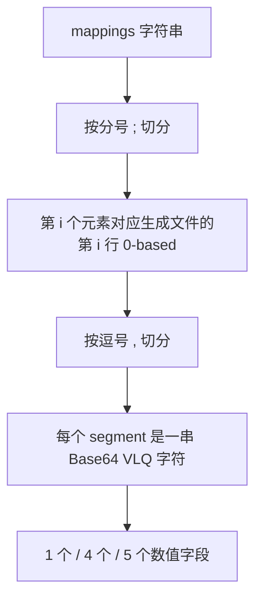
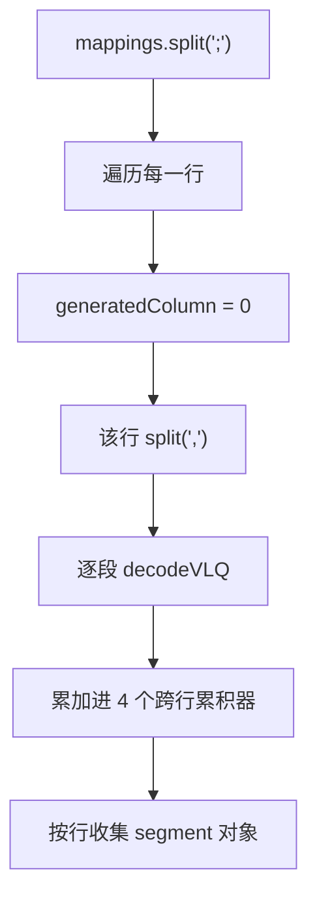
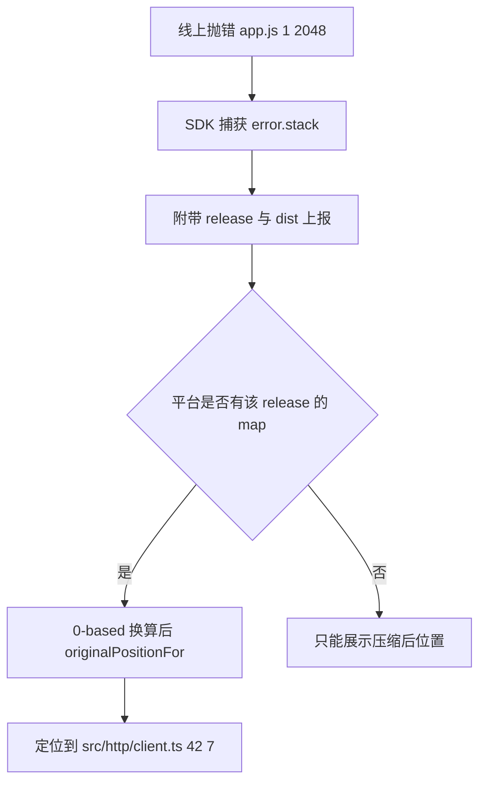
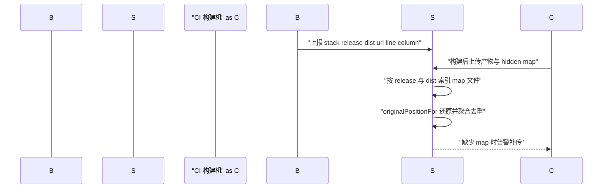

# Source Map 原理：VLQ 编码与手写解析器

!!! abstract "核心结论"
- Source Map v3 是"生成位置到原始位置"的稀疏映射表，核心只有 7 个字段，其中 `mappings` 是一个用分号分行、逗号分段、Base64 VLQ 编码的字符串。
- 每个 segment 的字段是**差分编码**：`generatedColumn` 以同一行上一个 segment 为基准，且**每行重置为 0**；`sourceIndex/originalLine/originalColumn/nameIndex` 以"上一个出现该字段的 segment"为基准，**跨行累积、永不重置**。
- VLQ 把一个整数拆成若干 5 bit 数据位，用第 6 bit 做 continuation 标志；**符号位放在整个数字的最低有效位**，所以 `0→A`、`1→C`、`-1→D`。
- `originalPositionFor` 之所以能二分，是因为同一行内的 segment 按 `generatedColumn` 严格升序；语义是"取最近左邻"（GREATEST_LOWER_BOUND），列号落在两个 segment 之间时归属左边那个。
- 所有位置在 map 里都是 **0-based**，而 V8 堆栈、`source-map` 库的 `originalPositionFor` 入参都是 **1-based line**，差一即错。

## 1. Source Map v3 字段与数据模型

Source Map 由 2011 年的 Source Map Revision 3 提案（sourcemaps.info/spec.html）定义，至今浏览器、Node、打包器都按这一版实现。它是一份 JSON（也允许作为 data URI 内联）。

### 1.1 顶层字段

| 字段 | 类型 | 必填 | 语义 |
| --- | --- | --- | --- |
| `version` | number | 是 | 固定为 `3`。解析器必须显式校验，不能假设 |
| `file` | string | 否 | 生成的产物文件名，如 `app.a1b2c3.js`。仅作展示提示 |
| `sourceRoot` | string | 否 | `sources` 的公共前缀（URL 或路径），解析时需要拼接 |
| `sources` | string[] | 是 | 原始文件路径数组，索引即 segment 里的 `sourceIndex` |
| `sourcesContent` | (string\|null)[] | 否 | 与 `sources` **按下标一一对应**的原始源码，缺失位置用 `null` 占位 |
| `names` | string[] | 是 | 标识符名字数组，索引即 segment 里的 `nameIndex`；无名字信息时为 `[]` |
| `mappings` | string | 是 | 全部映射数据，本文主角 |
| `ignoreList` | number[] | 否 | 下标数组，指向 `sources` 中"应被调试器忽略"的第三方源码。Chrome DevTools 历史上使用前缀字段 `x_google_ignoreList`，两者的最终标准化状态与浏览器支持需核对官方文档 |

### 1.2 sources 的路径解析

`sourceRoot` 拼接是最容易写错的一环。它本质上是 URL 解析，不是字符串相加：

```js
// resolve-source.js —— Node.js >= 16 可直接运行
'use strict';

/**
 * 简化的 source 解析：
 * - 无 sourceRoot 时直接用 source
 * - 有 sourceRoot 时按"目录前缀"拼接
 * 说明：真实场景要用 URL 语义处理绝对路径、协议相对路径（//host/x）
 * 和自定义协议（webpack://）。这里只覆盖最常见的相对路径情况。
 */
function resolveSource(sourceRoot, source) {
  if (!sourceRoot) return source;
  if (sourceRoot.endsWith('/')) return sourceRoot + source;
  if (source.startsWith('/')) return sourceRoot + source;
  return sourceRoot + '/' + source;
}

module.exports = { resolveSource };
```

```js
// resolve-source.test.js
'use strict';
const assert = require('node:assert/strict');
const { resolveSource } = require('./resolve-source.js');

assert.equal(resolveSource('', 'src/a.ts'), 'src/a.ts');
assert.equal(resolveSource('webpack:///', 'src/a.ts'), 'webpack:///src/a.ts');
assert.equal(resolveSource('webpack://', 'src/a.ts'), 'webpack:///src/a.ts');
assert.equal(resolveSource('https://cdn.x.com/src', '/a.ts'), 'https://cdn.x.com/src/a.ts');

console.log('resolve-source.test.js 全部通过');
```

预期输出：

```
resolve-source.test.js 全部通过
```

### 1.3 Sectioned Source Map（分段 map）

当产物由多个互不相关的 chunk 合成时，出现了 `sections` 形态：顶层没有 `mappings`，而是 `sections: [{ offset: { line, column }, map: {...} }]`。每个 `map` 自身是完整的 v3。查询时必须先按 `offset` 定位到子 map，再把生成位置减去 `offset` 后交给子 map。这属于扩展形态，浏览器支持有限，需核对官方文档再用。

## 2. mappings 的文本结构：分号、逗号、段

### 2.1 三层结构



关键约束：**分号的数量等于生成文件的行数**。如果产物末尾有换行，`mappings` 末尾通常也会多一个分号（产生一个空行）。行数错位会让所有后续行的映射整体偏移。

### 2.2 segment 的字段与差分基准

| 段长度 | 字段顺序 | 差分基准 | 说明 |
| --- | --- | --- | --- |
| 1 | generatedColumn | 同一行上一个 segment | 只表示"生成代码的某段不对应任何源码"，如打包器插入的 runtime |
| 4 | generatedColumn, sourceIndex, originalLine, originalColumn | 上三项见下 | 最常见的"位置映射" |
| 5 | 在 4 的基础上追加 nameIndex | 同上 | 额外携带原始标识符名，用于反混淆显示 |

| 字段 | 含义 | 基准 | 是否每行重置 |
| --- | --- | --- | --- |
| generatedColumn | 生成代码列号（0-based） | 同一行上一个 segment 的 generatedColumn | **是，重置为 0** |
| sourceIndex | `sources` 下标 | 上一个含该字段的 segment | 否 |
| originalLine | 原始文件行号（0-based） | 上一个含该字段的 segment | 否 |
| originalColumn | 原始文件列号（0-based） | 上一个含该字段的 segment | 否 |
| nameIndex | `names` 下标 | 上一个含该字段的 segment | 否 |

### 2.3 手工解码一个小例子

给定 `mappings: "AAAA,IAAQC"`，逐字段还原（初始累积器全为 0）：

1. 第 0 行，第 1 段 `AAAA`：`0,0,0,0`，即生成 `(0,0)` 对应 `sources[0]` 的 `(0,0)`。
2. 第 0 行，第 2 段 `IAAQC`：`I`=8→有效载荷 8→右移 1 位得 `4`，故 generatedColumn = 0+4 = 4；`A`→sourceIndex 不变；`A`→originalLine 不变；`Q`=16→载荷 16→值 `8`，originalColumn = 0+8 = 8；`C`=2→值 `1`，nameIndex = 0+1 = 1。
3. 结果：生成 `(0,4)` 对应 `sources[0]` 的 `(0,8)`，名字是 `names[1]`。

注意第 2 段里 originalColumn 的增量是相对**第 1 段的 originalColumn**（0），不是相对生成列。

## 3. Base64 VLQ 编解码手写实现

### 3.1 VLQ 的位布局

VLQ（Variable Length Quantity）用变长字节表示任意整数，每个字符承载 6 bit：

```
bit:   5        4 3 2 1 0
      [cont]   [  payload  ]
```

- `cont`（值为 32）为 1 表示后面还有字节，为 0 表示结束。
- payload 是 5 bit 无符号数据，**低位在前**（little-endian）。
- 符号处理在数字层面，不在位层面：`toVLQ(value) = value < 0 ? (-value) * 2 + 1 : value * 2`。因此负数的最低位一定是 1。把符号位放在最低位而不是最高位，是因为没有固定字长，最高位必须让给 continuation 标志。
- 5 bit 的 payload 映射到 Base64 字母表 `A-Za-z0-9+/`。

| 十进制 | 符号编码后 | 二进制 | 输出 |
| --- | --- | --- | --- |
| 0 | 0 | `0` | `A` |
| 1 | 2 | `10` | `C` |
| -1 | 3 | `11` | `D` |
| 15 | 30 | `11110` | `e` |
| 16 | 32 | `100000` | `gB`（低位 0 加 continuation，高位 1） |

### 3.2 完整实现

```js
// vlq.js —— Node.js >= 16 可直接运行
'use strict';

// 标准 Base64 字母表。Source Map v3 用的是这个标准表，
// 不是 URL-safe 变体（- 和 _）。
const BASE64_CHARS = 'ABCDEFGHIJKLMNOPQRSTUVWXYZabcdefghijklmnopqrstuvwxyz0123456789+/';

// 反向查表：用 Int8Array 做 O(1) 字符到 6 bit 值的映射，-1 表示非法字符。
const BASE64_LOOKUP = new Int8Array(128).fill(-1);
for (let i = 0; i < BASE64_CHARS.length; i++) {
  BASE64_LOOKUP[BASE64_CHARS.charCodeAt(i)] = i;
}

/**
 * 把一个整数编码成 Base64 VLQ 字符串。
 * 用 % 和 Math.floor 而不是 << / >>，避免 32 位位运算在超过 2^31 时溢出。
 */
function encodeVLQ(value) {
  // 步骤 1：符号编码，负数 -> 偶数位取反 + 1，保证最低位是符号位
  let vlq = value < 0 ? -value * 2 + 1 : value * 2;

  let out = '';
  do {
    const digit = vlq % 32;             // 取低 5 bit
    vlq = Math.floor(vlq / 32);         // 剩余高位
    const base64Value = vlq > 0 ? digit + 32 : digit; // 还有剩余就置 continuation 位
    out += BASE64_CHARS[base64Value];
  } while (vlq > 0);
  return out;
}

/**
 * 从 str[index] 开始解码一个 Base64 VLQ，返回 [value, nextIndex]。
 * 遇到非法字符或字符串提前结束时抛 SyntaxError。
 */
function decodeVLQ(str, index) {
  let result = 0;
  let shift = 1;            // 当前字节的权重：1, 32, 1024, ...
  let continuation = true;

  while (continuation) {
    const charCode = str.charCodeAt(index);
    if (Number.isNaN(charCode)) {
      throw new SyntaxError('VLQ 字符串意外结束，index=' + index);
    }
    const digit = charCode < 128 ? BASE64_LOOKUP[charCode] : -1;
    if (digit === -1) {
      throw new SyntaxError('非法 Base64 VLQ 字符: ' + JSON.stringify(str[index]));
    }
    index++;

    continuation = (digit & 32) !== 0;  // 第 6 bit 是 continuation 标志
    result += (digit & 31) * shift;     // 低 5 bit 是有效载荷
    shift *= 32;
  }

  // 最低位是符号位。用 % 2 而不是 & 1，避免大数被截断成 32 位。
  const isNegative = result % 2 === 1;
  const magnitude = (result - (isNegative ? 1 : 0)) / 2;
  return [isNegative ? -magnitude : magnitude, index];
}

module.exports = { BASE64_CHARS, encodeVLQ, decodeVLQ };
```

### 3.3 验证标准

```js
// vlq.test.js —— 运行：node vlq.test.js
'use strict';
const assert = require('node:assert/strict');
const { encodeVLQ, decodeVLQ } = require('./vlq.js');

// 1. 单字符编码：直接对照 Base64 字母表
assert.equal(encodeVLQ(0), 'A');    // 0 -> 0 -> 第 0 个字符
assert.equal(encodeVLQ(1), 'C');    // 1 -> 2 -> 第 2 个字符
assert.equal(encodeVLQ(-1), 'D');   // -1 -> 3 -> 第 3 个字符
assert.equal(encodeVLQ(15), 'e');   // 15 -> 30 -> 第 30 个字符
assert.equal(encodeVLQ(-15), 'f');  // -15 -> 31

// 2. 多字符编码：低位先出，第 6 bit 标记"还有后续"
assert.equal(encodeVLQ(16), 'gB');  // 16 -> 32 -> 低 5 bit=0 加 cont，高位 1
assert.equal(encodeVLQ(-16), 'hB'); // -16 -> 33 -> 低 5 bit=1 加 cont，高位 1

// 3. 解码
assert.deepEqual(decodeVLQ('A', 0), [0, 1]);
assert.deepEqual(decodeVLQ('D', 0), [-1, 1]);
assert.deepEqual(decodeVLQ('e', 0), [15, 1]);
assert.deepEqual(decodeVLQ('gB', 0), [16, 2]);
assert.deepEqual(decodeVLQ('hB', 0), [-16, 2]);

// 4. 从任意偏移开始解码，且返回正确的 nextIndex
assert.deepEqual(decodeVLQ('xxDo', 2), [-1, 3]);

// 5. 往返一致性：包含跨 3 个字节的大数
const values = [0, 1, -1, 2, -2, 15, 16, 17, -16, -17, 31, 32, 1000, -1000, 123456, -123456];
for (const value of values) {
  const encoded = encodeVLQ(value);
  const [decoded, nextIndex] = decodeVLQ(encoded, 0);
  assert.equal(decoded, value, `往返失败: ${value} -> ${encoded}`);
  assert.equal(nextIndex, encoded.length);
}

// 6. 非法输入必须抛错，而不是静默返回 0
assert.throws(() => decodeVLQ('A', 5), SyntaxError);
assert.throws(() => decodeVLQ('=', 0), SyntaxError);

console.log('vlq.test.js 全部通过');
```

预期输出：

```
vlq.test.js 全部通过
```

## 4. 手写 mappings 解析器

### 4.1 状态机

解析器只需要维护 4 个跨行累积器，再加一个每行重置的 `generatedColumn`：



### 4.2 完整实现

```js
// mappings.js —— Node.js >= 16，依赖 ./vlq.js
'use strict';

const { decodeVLQ } = require('./vlq.js');

/** 构造一个"不对应任何源码"的空位置对象 */
function emptyPosition(generatedLine, generatedColumn) {
  return {
    generatedLine,
    generatedColumn,
    sourceIndex: null,
    originalLine: null,
    originalColumn: null,
    nameIndex: null,
  };
}

/**
 * 把 mappings 字符串解码成 Array<Array<segment>>。
 * 外层下标 = generatedLine（0-based），内层按 generatedColumn 升序。
 *
 * 四个累积器 sourceIndex / originalLine / originalColumn / nameIndex
 * 的生命周期是整个 mappings 字符串，绝对不能在换行时重置。
 */
function decodeMappings(mappings) {
  const rawLines = mappings.split(';');
  const decoded = new Array(rawLines.length);

  let sourceIndex = 0;
  let originalLine = 0;
  let originalColumn = 0;
  let nameIndex = 0;

  for (let lineIndex = 0; lineIndex < rawLines.length; lineIndex++) {
    const segments = [];
    const rawLine = rawLines[lineIndex];

    if (rawLine !== '') {
      // 生成列号每行从 0 重新开始
      let generatedColumn = 0;

      for (const rawSegment of rawLine.split(',')) {
        if (rawSegment === '') continue;

        let cursor = 0;

        // 字段 1：generatedColumn（相对同一行上一个 segment）
        let value;
        [value, cursor] = decodeVLQ(rawSegment, cursor);
        generatedColumn += value;

        if (cursor >= rawSegment.length) {
          // 1 字段段：只推进生成位置，不映射到源码
          segments.push(emptyPosition(lineIndex, generatedColumn));
          continue;
        }

        // 字段 2/3/4：sourceIndex、originalLine、originalColumn
        [value, cursor] = decodeVLQ(rawSegment, cursor);
        sourceIndex += value;

        [value, cursor] = decodeVLQ(rawSegment, cursor);
        originalLine += value;

        [value, cursor] = decodeVLQ(rawSegment, cursor);
        originalColumn += value;

        // 字段 5：nameIndex（可选）
        let name = null;
        if (cursor < rawSegment.length) {
          [value, cursor] = decodeVLQ(rawSegment, cursor);
          nameIndex += value;
          name = nameIndex;
        }

        if (cursor !== rawSegment.length) {
          throw new SyntaxError(
            `第 ${lineIndex} 行的 segment 字段数非法（只允许 1、4、5 个）: ${rawSegment}`
          );
        }

        segments.push({
          generatedLine: lineIndex,
          generatedColumn,
          sourceIndex,
          originalLine,
          originalColumn,
          nameIndex: name,
        });
      }
    }

    decoded[lineIndex] = segments;
  }

  return decoded;
}

module.exports = { decodeMappings, emptyPosition };
```

### 4.3 验证标准

```js
// mappings.test.js —— 运行：node mappings.test.js
'use strict';
const assert = require('node:assert/strict');
const { decodeMappings } = require('./mappings.js');

// 1. 单段：生成 (0,0) -> sources[0] (0,0)，无 name
assert.deepEqual(decodeMappings('AAAA'), [
  [{ generatedLine: 0, generatedColumn: 0, sourceIndex: 0, originalLine: 0, originalColumn: 0, nameIndex: null }],
]);

// 2. 四字段 + 名字：AAAA,IAAQC
const two = decodeMappings('AAAA,IAAQC');
assert.equal(two.length, 1);
assert.equal(two[0].length, 2);
assert.deepEqual(two[0][1], {
  generatedLine: 0, generatedColumn: 4,
  sourceIndex: 0, originalLine: 0, originalColumn: 8, nameIndex: 1,
});

// 3. 跨行时不重置：第 2 行 originalLine 增量 1、originalColumn 增量 0
const multi = decodeMappings('AAAA;AACA');
assert.equal(multi.length, 2);
assert.deepEqual(multi[1][0], {
  generatedLine: 1, generatedColumn: 0,
  sourceIndex: 0, originalLine: 1, originalColumn: 0, nameIndex: null,
});

// 4. 空行必须保留成空数组，不能塌缩（否则后续行号全部错位）
const withEmpty = decodeMappings('AAAA;;AACA');
assert.equal(withEmpty.length, 3);
assert.deepEqual(withEmpty[1], []);
assert.equal(withEmpty[2][0].originalLine, 1);

// 5. 1 字段段：只推进生成列，不产生源码映射
const oneField = decodeMappings('AAAA,I');
assert.equal(oneField[0][1].generatedColumn, 4);
assert.equal(oneField[0][1].sourceIndex, null);

// 6. 空字符串是合法输入
assert.deepEqual(decodeMappings(''), [[]]);

// 7. negative delta 能正确回退 originalColumn（跨行时 originalColumn 是全局累积）
const back = decodeMappings('AAAA;AACJ');
assert.equal(back[1][0].originalColumn, -4);

console.log('mappings.test.js 全部通过');
```

预期输出：

```
mappings.test.js 全部通过
```

## 5. originalPositionFor：二分查找

### 5.1 查找语义

给定 `{ line, column }`（生成位置，均 0-based），要找**同一行内 `generatedColumn <= column` 的最后一个 segment**。这就是 GREATEST_LOWER_BOUND：

- 列号落在 segment A 和 segment B 之间时，归属 A。因为 A 表示"从这一列开始，源码位置是 A 记录的那个"，直到下一个 segment 才切换。
- 列号小于该行第一个 segment 时返回空（生成代码的前导部分不对应源码）。
- 命中 1 字段段时返回空（该段显式声明"无源码映射"）。

因为同一行内 segment 天然按 `generatedColumn` 升序排列，可以直接二分，复杂度 `O(log n)`。

### 5.2 完整实现

```js
// consumer.js —— Node.js >= 16，依赖 ./mappings.js
'use strict';

const { decodeMappings } = require('./mappings.js');

class SourceMapConsumerLite {
  /**
   * @param {object|string} rawSourceMap Source Map v3 对象或 JSON 字符串
   */
  constructor(rawSourceMap) {
    const map = typeof rawSourceMap === 'string'
      ? JSON.parse(rawSourceMap)
      : rawSourceMap;

    if (map.version !== 3) {
      throw new Error('仅支持 Source Map v3，实际收到 version=' + map.version);
    }

    this.file = map.file || null;
    this.sourceRoot = map.sourceRoot || '';
    this.sources = Array.isArray(map.sources) ? map.sources.slice() : [];
    this.sourcesContent = Array.isArray(map.sourcesContent) ? map.sourcesContent.slice() : [];
    this.names = Array.isArray(map.names) ? map.names.slice() : [];
    this.mappings = typeof map.mappings === 'string' ? map.mappings : '';
    this.decodedMappings = decodeMappings(this.mappings);
  }

  /** 取 sources 下标对应的展示路径，带上 sourceRoot */
  sourceFor(sourceIndex) {
    const source = this.sources[sourceIndex];
    if (source === undefined) return null;
    return this.sourceRoot ? this.sourceRoot + source : source;
  }

  /** 取原始源码内容；没有 embeded 源码时返回 null */
  sourceContentFor(sourceIndex) {
    const content = this.sourcesContent[sourceIndex];
    return typeof content === 'string' ? content : null;
  }

  /**
   * 生成位置 -> 原始位置。
   * @param {{line: number, column: number}} position 均为 0-based
   * @returns {{source: string|null, line: number|null, column: number|null, name: string|null}}
   */
  originalPositionFor({ line, column }) {
    const miss = { source: null, line: null, column: null, name: null };

    if (!Number.isInteger(line) || !Number.isInteger(column)) {
      throw new TypeError('line 与 column 必须是整数');
    }
    if (line < 0 || column < 0) return miss;

    const segments = this.decodedMappings[line];
    if (!segments || segments.length === 0) return miss;

    // 二分：找最后一个 generatedColumn <= column 的下标
    let low = 0;
    let high = segments.length - 1;
    let found = -1;
    while (low <= high) {
      const mid = (low + high) >> 1;
      if (segments[mid].generatedColumn <= column) {
        found = mid;
        low = mid + 1;
      } else {
        high = mid - 1;
      }
    }

    if (found === -1) return miss; // 落在该行第一个 segment 之前

    const segment = segments[found];
    if (segment.sourceIndex === null) return miss; // 1 字段段

    return {
      source: this.sourceFor(segment.sourceIndex),
      line: segment.originalLine,
      column: segment.originalColumn,
      name: segment.nameIndex === null ? null : this.names[segment.nameIndex] ?? null,
    };
  }

  /**
   * 反向查询：原始位置 -> 生成位置。
   * 语义：在 source 匹配、originalLine 匹配、originalColumn >= column 的 segment 中，
   * 取生成位置最小的那个。线性扫描，真实实现可以建倒排索引。
   */
  generatedPositionFor({ source, line, column }) {
    const miss = { line: null, column: null };
    let best = null;

    for (const segments of this.decodedMappings) {
      for (const segment of segments) {
        if (segment.sourceIndex === null) continue;
        if (this.sourceFor(segment.sourceIndex) !== source) continue;
        if (segment.originalLine !== line) continue;
        if (segment.originalColumn < column) continue;

        if (
          best === null ||
          segment.generatedLine < best.generatedLine ||
          (segment.generatedLine === best.generatedLine && segment.generatedColumn < best.generatedColumn)
        ) {
          best = segment;
        }
      }
    }

    if (best === null) return miss;
    return { line: best.generatedLine, column: best.generatedColumn };
  }
}

module.exports = { SourceMapConsumerLite };
```

### 5.3 验证标准

```js
// consumer.test.js —— 运行：node consumer.test.js
'use strict';
const assert = require('node:assert/strict');
const { SourceMapConsumerLite } = require('./consumer.js');

// 构造：生成文件 out.js 有两行
// 第 0 行：gen(0,0)->(0,0) name const | gen(0,6)->(0,6) name alpha
//          gen(0,10)->(0,14) name beta | gen(0,14)->(0,21) name gamma
// 第 1 行：gen(1,0)->(1,0) name console | gen(1,8)->(1,8) name log
//          gen(1,12)->(1,12) name alpha   （originalColumn 从 21 回退到 12，增量 -4）
const rawMap = {
  version: 3,
  file: 'out.js',
  sources: ['in.js'],
  sourcesContent: ['const alpha = beta + gamma;\nconsole.log(alpha);\n'],
  names: ['const', 'alpha', 'beta', 'gamma', 'console', 'log'],
  mappings: 'AAAAA,MAAMC,IAAQC,IAAOC;AACrBC,QAAQC,IAAIJ',
};
const consumer = new SourceMapConsumerLite(rawMap);

// 1. 精确命中
assert.deepEqual(consumer.originalPositionFor({ line: 0, column: 0 }),
  { source: 'in.js', line: 0, column: 0, name: 'const' });

// 2. 列号落在两个 segment 之间 -> 归属左邻
assert.deepEqual(consumer.originalPositionFor({ line: 0, column: 13 }),
  { source: 'in.js', line: 0, column: 14, name: 'beta' });

// 3. 列号超出最后一个 segment -> 仍归属最后一个
assert.deepEqual(consumer.originalPositionFor({ line: 0, column: 999 }),
  { source: 'in.js', line: 0, column: 21, name: 'gamma' });

// 4. 跨行时 originalColumn 全局累积，负增量必须被还原
assert.deepEqual(consumer.originalPositionFor({ line: 1, column: 12 }),
  { source: 'in.js', line: 1, column: 12, name: 'alpha' });

// 5. 不存在的行 -> 空结果
assert.deepEqual(consumer.originalPositionFor({ line: 5, column: 0 }),
  { source: null, line: null, column: null, name: null });

// 6. 1 字段段不提供源码映射
const oneFieldConsumer = new SourceMapConsumerLite({
  version: 3, sources: ['a.js'], names: [], mappings: 'AAAA,I',
});
assert.deepEqual(oneFieldConsumer.originalPositionFor({ line: 0, column: 4 }),
  { source: null, line: null, column: null, name: null });
assert.equal(oneFieldConsumer.originalPositionFor({ line: 0, column: 3 }).source, 'a.js');

// 7. 反向查询
assert.deepEqual(consumer.generatedPositionFor({ source: 'in.js', line: 0, column: 14 }),
  { line: 0, column: 10 });
assert.deepEqual(consumer.generatedPositionFor({ source: 'in.js', line: 1, column: 9 }),
  { line: 1, column: 12 });
assert.deepEqual(consumer.generatedPositionFor({ source: 'in.js', line: 0, column: 999 }),
  { line: null, column: null });

// 8. 版本校验
assert.throws(() => new SourceMapConsumerLite({ version: 2, sources: [], names: [], mappings: '' }), /v3/);

// 9. sourceContentFor
assert.equal(consumer.sourceContentFor(0).startsWith('const alpha'), true);
assert.equal(consumer.sourceContentFor(9), null);

console.log('consumer.test.js 全部通过');
```

预期输出：

```
consumer.test.js 全部通过
```

## 6. 手写 Source Map 生成器

生成器要做的事和解析器镜像：按 `(generatedLine, generatedColumn)` 排序收集 mapping，然后在编码阶段维护 4 个跨行累积器，把绝对位置算成差值。

### 6.1 完整实现

```js
// generator.js —— Node.js >= 16，依赖 ./vlq.js
'use strict';

const { encodeVLQ } = require('./vlq.js');

class SourceMapGeneratorLite {
  constructor({ file = null, sourceRoot = '' } = {}) {
    this.file = file;
    this.sourceRoot = sourceRoot;
    this.sources = [];
    this.sourcesContent = [];
    this.names = [];
    this.lines = new Map();   // Map<generatedLine, segment[]>

    // 内部索引，避免 sources/names 出现重复项
    this.sourceIndexMap = new Map();
    this.nameIndexMap = new Map();
  }

  intern(list, indexMap, value) {
    if (indexMap.has(value)) return indexMap.get(value);
    const index = list.length;
    list.push(value);
    indexMap.set(value, index);
    return index;
  }

  /** 记录某个源文件的完整内容，会写入 sourcesContent */
  setSourceContent(source, content) {
    const index = this.intern(this.sources, this.sourceIndexMap, source);
    this.sourcesContent[index] = content;
  }

  /**
   * 添加一条映射。
   * @param {{generated: {line, column}, original: {line, column}, source: string, name?: string}} mapping
   * 所有 line/column 都是 0-based。
   */
  addMapping({ generated, original, source, name = null }) {
    const sourceIndex = this.intern(this.sources, this.sourceIndexMap, source);
    if (this.sourcesContent[sourceIndex] === undefined) {
      this.sourcesContent[sourceIndex] = null;
    }

    const nameIndex = name === null ? null : this.intern(this.names, this.nameIndexMap, name);

    let segments = this.lines.get(generated.line);
    if (!segments) {
      segments = [];
      this.lines.set(generated.line, segments);
    }
    segments.push({
      generatedColumn: generated.column,
      sourceIndex,
      originalLine: original.line,
      originalColumn: original.column,
      nameIndex,
    });
  }

  toJSON() {
    let maxLine = -1;
    for (const line of this.lines.keys()) {
      if (line > maxLine) maxLine = line;
    }

    // 4 个累积器跨行保持，绝对不能在换行时归零
    let prevSourceIndex = 0;
    let prevOriginalLine = 0;
    let prevOriginalColumn = 0;
    let prevNameIndex = 0;

    const parts = [];
    for (let lineIndex = 0; lineIndex <= maxLine; lineIndex++) {
      const segments = this.lines.get(lineIndex);
      if (!segments || segments.length === 0) {
        parts.push('');
        continue;
      }

      const sorted = segments.slice().sort((a, b) => a.generatedColumn - b.generatedColumn);
      let prevGeneratedColumn = 0;   // 每行重置
      const encoded = [];

      for (const segment of sorted) {
        let chunk = encodeVLQ(segment.generatedColumn - prevGeneratedColumn);
        prevGeneratedColumn = segment.generatedColumn;

        chunk += encodeVLQ(segment.sourceIndex - prevSourceIndex);
        prevSourceIndex = segment.sourceIndex;

        chunk += encodeVLQ(segment.originalLine - prevOriginalLine);
        prevOriginalLine = segment.originalLine;

        chunk += encodeVLQ(segment.originalColumn - prevOriginalColumn);
        prevOriginalColumn = segment.originalColumn;

        if (segment.nameIndex !== null) {
          chunk += encodeVLQ(segment.nameIndex - prevNameIndex);
          prevNameIndex = segment.nameIndex;
        }

        encoded.push(chunk);
      }

      parts.push(encoded.join(','));
    }

    return {
      version: 3,
      file: this.file,
      sourceRoot: this.sourceRoot,
      sources: this.sources.slice(),
      sourcesContent: this.sourcesContent.slice(),
      names: this.names.slice(),
      mappings: parts.join(';'),
    };
  }

  toString() {
    return JSON.stringify(this.toJSON());
  }
}

module.exports = { SourceMapGeneratorLite };
```

### 6.2 接一个玩具"重命名编译器"

下面这个转换把标识符按映射表改名（`alpha`→`a`），并在每次输出标识符时登记一条映射。这是所有压缩器/转译器的核心套路：**输出时知道自己在输出文件里的位置，也知道这个 token 来自输入的哪个位置**。

```js
// rename-compiler.js —— Node.js >= 16，依赖 ./generator.js
'use strict';

const { SourceMapGeneratorLite } = require('./generator.js');

/** 计算每一行的起始 offset，用于 offset -> {line, column} 的二分转换 */
function computeLineStarts(text) {
  const starts = [0];
  for (let i = 0; i < text.length; i++) {
    if (text.charCodeAt(i) === 10) starts.push(i + 1);
  }
  return starts;
}

function positionAt(lineStarts, offset) {
  let low = 0;
  let high = lineStarts.length - 1;
  let line = 0;
  while (low <= high) {
    const mid = (low + high) >> 1;
    if (lineStarts[mid] <= offset) {
      line = mid;
      low = mid + 1;
    } else {
      high = mid - 1;
    }
  }
  return { line, column: offset - lineStarts[line] };
}

/**
 * 把 input 里的标识符按 renameMap 改名，并生成 Source Map。
 * 分词粒度：标识符 / 空白 / 其他符号。
 */
function transformAndMap(input, renameMap, sourceName, outputFile) {
  const generator = new SourceMapGeneratorLite({ file: outputFile });
  generator.setSourceContent(sourceName, input);

  const lineStarts = computeLineStarts(input);
  const tokenRe = /[A-Za-z_$][A-Za-z0-9_$]*|\s+|[^\sA-Za-z_$]+/g;

  let output = '';
  let outLine = 0;
  let outColumn = 0;
  let match;

  while ((match = tokenRe.exec(input)) !== null) {
    const chunk = match[0];
    const isIdentifier = /^[A-Za-z_$]/.test(chunk);

    if (isIdentifier) {
      generator.addMapping({
        generated: { line: outLine, column: outColumn },
        original: positionAt(lineStarts, match.index),
        source: sourceName,
        name: chunk,
      });
    }

    const emitted = isIdentifier && renameMap[chunk] !== undefined
      ? renameMap[chunk]
      : chunk;
    output += emitted;

    // 输出位置推进：emitted 里可能带换行
    for (let i = 0; i < emitted.length; i++) {
      if (emitted.charCodeAt(i) === 10) {
        outLine++;
        outColumn = 0;
      } else {
        outColumn++;
      }
    }
  }

  return { code: output, map: generator.toJSON() };
}

module.exports = { transformAndMap, computeLineStarts, positionAt };
```

### 6.3 验证标准

```js
// generator.test.js —— 运行：node generator.test.js
'use strict';
const assert = require('node:assert/strict');
const { transformAndMap } = require('./rename-compiler.js');
const { SourceMapConsumerLite } = require('./consumer.js');

const input = 'const alpha = beta + gamma;\nconsole.log(alpha);\n';
const { code, map } = transformAndMap(input, { alpha: 'a', beta: 'b', gamma: 'c' }, 'in.js', 'out.js');

// 1. 产物正确
assert.equal(code, 'const a = b + c;\nconsole.log(a);\n');

// 2. 编码结果精确匹配（本用例由第 3 节的 VLQ 编码器推出）
//    第 0 行：AAAAA | MAAMC | IAAQC | IAAOC
//    第 1 行：AACrBC | QAAQC | IAAIJ
assert.equal(map.mappings, 'AAAAA,MAAMC,IAAQC,IAAOC;AACrBC,QAAQC,IAAIJ');

// 3. 字段完整性
assert.equal(map.version, 3);
assert.equal(map.file, 'out.js');
assert.deepEqual(map.sources, ['in.js']);
assert.deepEqual(map.sourcesContent, [input]);
assert.deepEqual(map.names, ['const', 'alpha', 'beta', 'gamma', 'console', 'log']);

// 4. 往返：用自己写的解析器读自己写的生成器
const consumer = new SourceMapConsumerLite(map);
assert.deepEqual(consumer.originalPositionFor({ line: 0, column: 6 }),
  { source: 'in.js', line: 0, column: 6, name: 'alpha' });
assert.deepEqual(consumer.originalPositionFor({ line: 0, column: 10 }),
  { source: 'in.js', line: 0, column: 14, name: 'beta' });
assert.deepEqual(consumer.originalPositionFor({ line: 0, column: 14 }),
  { source: 'in.js', line: 0, column: 21, name: 'gamma' });
assert.deepEqual(consumer.originalPositionFor({ line: 1, column: 12 }),
  { source: 'in.js', line: 1, column: 12, name: 'alpha' });

// 5. 还原出的名字仍然是原始名字，而不是压缩后的名字
assert.equal(consumer.originalPositionFor({ line: 0, column: 6 }).name, 'alpha');
assert.notEqual(consumer.originalPositionFor({ line: 0, column: 6 }).name, 'a');

// 6. 空输入不产生 mappings
const empty = transformAndMap('', {}, 'in.js', 'out.js');
assert.equal(empty.code, '');
assert.equal(empty.map.mappings, '');

console.log('generator.test.js 全部通过');
```

预期输出：

```
generator.test.js 全部通过
```

## 7. 线上错误还原流程

### 7.1 为什么必须做

线上 JS 是压缩混淆后的产物，堆栈长这样：

```
TypeError: Cannot read properties of undefined (reading 'x')
    at foo (https://cdn.example.com/app.a1b2c3.js:1:2048)
```

`1:2048` 是 **1-based 行、1-based 列**（V8 的约定）。而 Source Map 里是 **0-based**，所以送进 `originalPositionFor` 之前必须 `line - 1`、`column - 1`。

### 7.2 从上报到还原





### 7.3 堆栈解析工具函数

```js
// parse-stack.js —— Node.js >= 16，依赖 ./consumer.js
'use strict';

/**
 * 从 V8 风格的一行堆栈里取出文件名、行、列。
 * 例：'    at foo (https://cdn.x.com/app.js:1:2048)' -> { url, line: 1, column: 2048 }
 * 例：'    at https://cdn.x.com/app.js:1:2048'      -> 同上（无函数名形式）
 * 解析失败返回 null。
 */
function parseStackLine(stackLine) {
  const match = /\(?((?:https?:|file:|webpack:|blob:)[^\s()]+?):(\d+):(\d+)\)?\s*$/.exec(stackLine.trim());
  if (!match) return null;
  return { url: match[1], line: Number(match[2]), column: Number(match[3]) };
}

/**
 * 把一条堆栈映射到原始位置。
 * 注意：这里做 1-based -> 0-based 的换算，并剥掉 query/hash。
 */
function mapStackLine(consumer, stackLine) {
  const parsed = parseStackLine(stackLine);
  if (!parsed) return null;

  const generatedLineIndex = parsed.line - 1;
  const generatedColumnIndex = parsed.column - 1;

  const original = consumer.originalPositionFor({
    line: generatedLineIndex,
    column: generatedColumnIndex,
  });
  if (original.source === null) return null;

  return {
    url: parsed.url,
    generatedLine: parsed.line,
    generatedColumn: parsed.column,
    source: original.source,
    // 还原后的人类可读位置按 1-based 展示
    line: original.line + 1,
    column: original.column + 1,
    name: original.name,
  };
}

module.exports = { parseStackLine, mapStackLine };
```

```js
// parse-stack.test.js —— 运行：node parse-stack.test.js
'use strict';
const assert = require('node:assert/strict');
const { parseStackLine, mapStackLine } = require('./parse-stack.js');
const { SourceMapConsumerLite } = require('./consumer.js');
const { transformAndMap } = require('./rename-compiler.js');

assert.deepEqual(
  parseStackLine('    at foo (https://cdn.x.com/app.a1b2c3.js:1:2048)'),
  { url: 'https://cdn.x.com/app.a1b2c3.js', line: 1, column: 2048 }
);
assert.deepEqual(
  parseStackLine('    at https://cdn.x.com/app.a1b2c3.js:1:2048'),
  { url: 'https://cdn.x.com/app.a1b2c3.js', line: 1, column: 2048 }
);
assert.equal(parseStackLine('    at Object.<anonymous> (/x/y.js)'), null);

// 端到端：产物第 1 行第 13 列（1-based）-> 源码第 2 行第 13 列
const input = 'const alpha = beta + gamma;\nconsole.log(alpha);\n';
const { map } = transformAndMap(input, { alpha: 'a', beta: 'b', gamma: 'c' }, 'in.js', 'out.js');
const consumer = new SourceMapConsumerLite(map);
assert.deepEqual(mapStackLine(consumer, '    at foo (https://cdn.x.com/out.js:2:13)'), {
  url: 'https://cdn.x.com/out.js',
  generatedLine: 2,
  generatedColumn: 13,
  source: 'in.js',
  line: 2,
  column: 13,
  name: 'alpha',
});

console.log('parse-stack.test.js 全部通过');
```

预期输出：

```
parse-stack.test.js 全部通过
```

### 7.4 两种典型的线上方案

| 维度 | hidden-source-map + 平台上传 | inline-source-map 公开分发 |
| --- | --- | --- |
| 产物是否带 `sourceMappingURL` | 不带 | 带（data URI） |
| 用户浏览器能否拿到源码 | 不能 | 能 |
| 产物体积 | 不变 | 显著增大（map 以 base64 内联，约放大 33%） |
| 还原责任方 | 错误监控平台（构建时上传 map） | 浏览器 DevTools |
| 适用场景 | 商业产品 | 开源库 / 内部后台 |
| 风险 | 需要管好上传凭证与 map 生命周期 | 源码对所有人可见 |

Sentry 侧的两条常见路径：构建期用 `@sentry/webpack-plugin` 自动上传，或 CI 里用 `sentry-cli sourcemaps upload` 手动上传；关键是产物里的 release / dist 与上报时的 release / dist 必须一致。较新版本的工具会在产物和 map 中注入 debug ID，从而弱化对 release 匹配的依赖，具体字段名与行为需核对官方文档。

## 8. devtool 选项对比（webpack / Vite）

webpack 的 `devtool` 是一个"质量-速度-体积"的三方权衡，命名规则：前缀 `eval`（用 `eval()` 包裹模块）、`cheap`（只做行级映射，忽略列）、`module`（映射到 loader 处理前的源码，而不是中间产物）、`inline`（map 内联进产物）、`hidden`（生成 map 但不在产物里写引用）、`nosources`（生成 map 但不含 `sourcesContent`）。

| devtool | map 存放 | 粒度 | 构建速度 | 生产可用 | 说明 |
| --- | --- | --- | --- | --- | --- |
| `false` | 无 | 无 | 最快 | 不适用 | 无调试能力 |
| `eval` | 无 map，只有 `//# sourceURL` | 文件级 | 极快 | 否 | 只帮你把 eval 出来的代码归到某个文件 |
| `eval-cheap-source-map` | 内联 | 行级 | 快 | 否 | 无列映射，且不映射 loader 前的源码 |
| `eval-cheap-module-source-map` | 内联 | 行级 | 中 | 否 | 上面 + 保留 loader 前的源码 |
| `eval-source-map` | 内联 | 行+列 | 慢 | 否 | 开发期质量最好，体积最大 |
| `source-map` | 独立 `.map` | 行+列 | 最慢 | 是 | 完整映射，含 `sourcesContent` |
| `hidden-source-map` | 独立 `.map`，产物无引用 | 行+列 | 慢 | 是 | 专供监控平台上传 |
| `nosources-source-map` | 独立 `.map`，`sourcesContent` 为空 | 行+列 | 慢 | 是 | 有位置无源码的折中 |
| `inline-source-map` | 内联 data URI | 行+列 | 慢 | 通常否 | 产物膨胀 |
| `cheap-source-map` | 独立 `.map` | 行级 | 较快 | 视情况 | 无列映射 |

补充说明：

- webpack 4 起把命名顺序改成 `eval-cheap-module-source-map` 这类形式，旧写法（`cheap-eval-source-map`）只是别名且可能产生告警；具体别名与弃用状态需核对你所使用的 webpack 版本官方文档。
- Vite 用 `build.sourcemap: true | 'inline' | 'hidden'`，另有三档更细的控制需核对官方文档。
- TypeScript 用 `tsconfig.json` 的 `sourceMap` / `inlineSourceMap` / `inlineSources` / `declarationMap`，各有独立语义。

## 9. 安全注意

1. `.map` 里的 `sourcesContent` 就是完整源码，包括注释、内部接口路径、灰度开关常量。生产环境公开 `.map` 等于公开源码。
2. `sources` 路径常带构建机信息（`/Users/xxx/project/...`、内网包名、私有 npm scope），即使不用 `sourcesContent` 也是信息泄露。
3. `nosources-source-map` 是"能定位、不给源码"的折中，适合既要线上还原又不想暴露实现的场景。
4. 上传用的 token（如平台侧的 auth token）必须放在 CI secret 中，禁止提交进仓库。
5. 上传完成后可以选择把 `.map` 从 CDN 删除，只保留在监控平台；但要注意后续报错需要旧版本 map 时仍能取到，所以平台侧要做版本归档，不能只留最新一份。
6. 不要通过"给 `.map` 加鉴权"来解决泄露问题：DevTools 与监控平台都需要匿名可读，鉴权往往只能挡住自己人。
7. `.map` 可能被用于近似逆向。如果你的产品有明确的反逆向诉求，需要配混淆（identifier mangling / control flow flattening），但要知道混淆只提高成本，不构成安全边界。
8. 响应头建议对 `.map` 也保持 `X-Content-Type-Options: nosniff`，避免被当作脚本解析。

## 10. 常见陷阱

### 10.1 行列基数

- Source Map 规范里全部是 0-based。
- V8 堆栈是 1-based 行、1-based 列。
- mozilla `source-map` 的 `SourceMapConsumer#originalPositionFor` 入参是 **1-based line、0-based column**，与规范不一致。本文实现的 `originalPositionFor` 统一用 0-based，所以调用方要自己减一，这个差异必须写进注释或封装成 `mapStackLine`。

### 10.2 累积器重置

`generatedColumn` 每行重置为 0，另外 4 个累积器**跨行不重置**，且是相对"上一个含该字段的 segment"。把 4 个累积器写成每行重置，会让第二行开始的所有 `sourceIndex/originalLine` 全错。

### 10.3 分号数量

`mappings` 里分号的数量必须等于生成文件的行数。很多手写实现用 `split(';').filter(Boolean)` 把空行过滤掉，导致后续行号整体前移。

### 10.4 1 字段 segment

规范允许只有 `generatedColumn` 的 segment，表示"这段不对应源码"（典型是打包器注入的 helper）。只处理 4/5 字段的解析器会在遇到 1 字段段时抛错或产生越界读取。

### 10.5 `sourcesContent` 对齐

`sourcesContent` 是按 `sources` 下标对齐的，缺失项用 `null`。用 `sourcesContent.find(...)` 或不检查 `null` 直接当字符串用都会炸。

### 10.6 `sourceRoot` 拼接

不要用字符串相加代替 URL 解析。`webpack://` 这类协议下，多一个或少一个斜杠会导致 DevTools 无法在 Sources 面板归组文件。

### 10.7 多层构建丢失映射

`ts-loader` → `babel-loader` → `terser` 每一层都可能重新生成或丢弃 map。要保证每层都开启 sourcemap，并在需要时用合并工具（例如 `SourceMapGenerator#applySourceMap` 一类 API）链式叠加。中途任何一步产出 `null` map，最终就只能定位到中间产物。

### 10.8 map 与产物版本错配

CDN 缓存、灰度发布、回滚都会造成"线上跑的是 A 版本，平台存的是 B 版本的 map"。一旦错配，还原出的位置会偏移甚至指向完全不相干的行。工程上要把 `release` 与产物 hash 绑定，并在还原时校验。

### 10.9 追加 banner / 拼接产物

在构建后给产物头部追加版权注释、或把多个 chunk 直接 `cat` 拼接，会让所有原有映射的 `generatedLine` 偏移。必须同步修正 map 或使用能生成合并 map 的工具。

### 10.10 二分查找到的必须是左邻

如果不做"最后一个 `<= column`"，而是做任意最近匹配，会偶尔命中右边的 segment，表现为"断点位置偶尔差一行"。

### 10.11 CRLF

`\r\n` 会让列号多算一个字符。生成端与解析端对换行的理解必须一致，否则列级映射会持续漂移。

## 11. 面试题与答题要点

### 11.1 `mappings: "AAAA"` 表示什么？

要点：四个 `A` 各自解码为 0，所以是"生成文件第 0 行第 0 列，映射到 `sources[0]` 的第 0 行第 0 列"。没有第 5 字段，说明不含 name 信息。所有位置都是 0-based。可以顺带说明：这是"最短合法 mappings"，解析器不能假设一定有 5 个字段。

### 11.2 为什么 VLQ 的符号位放在最低位，而不是像 int32 那样放在最高位？

要点：VLQ 没有固定字长，第 6 bit 已经被 continuation 标志占用，没有"最高位"可用。把符号位放在整个数字的最低位后，解码流程变成"先完整读出一个非负整数，再判奇偶决定符号"，实现极简；同时 `0` 与负数的编码长度不会因为符号多出额外字节。代价是负数需要一次"乘 2 加 1"的变换，可用 `value < 0 ? -value * 2 + 1 : value * 2` 表达。

### 11.3 `mappings` 里哪些量每行重置，哪些跨行累积？

要点：只有 `generatedColumn` 每行重置为 0；`sourceIndex`、`originalLine`、`originalColumn`、`nameIndex` 四个累积器贯穿整个 `mappings` 字符串，且各自相对"上一个含该字段的 segment"。这正是跨行时能出现负 `originalColumn` 增量的原因（新行的原始列可能小于上一行末尾的原始列）。

### 11.4 `originalPositionFor` 为什么能二分？前提是什么？

要点：前提是同一生成行内的 segment 按 `generatedColumn` 严格升序，这是生成器排序保证的不变量。语义是 GREATEST_LOWER_BOUND——取最后一个 `generatedColumn <= target` 的 segment，因为一个 segment 的映射覆盖区间是 `[它的列, 下一个 segment 的列)`。复杂度 `O(log n)`。边界：目标列小于第一个 segment 时返回空；命中 1 字段段也返回空。

### 11.5 生产环境为什么用 `hidden-source-map` 而不是 `source-map` 或 `inline-source-map`？

要点：`source-map` 会在产物末尾写 `//# sourceMappingURL=...`，任何访问者都能顺藤摸瓜下载到 `sourcesContent` 全文；`inline-source-map` 更糟，源码直接 base64 内联进产物。`hidden-source-map` 依然生成完整 map，但不在产物中写引用，用户无法自然发现，构建期把 map 上传到监控平台即可完成线上还原。若要进一步降风险，用 `nosources-source-map` 去掉源码正文。

### 11.6 线上堆栈 `app.js:1:2048` 该怎么换算？

要点：V8 堆栈的行与列都是 1-based，Source Map 是 0-based，所以先 `line - 1`、`column - 1` 再查表。注意 `source-map` 库的 `originalPositionFor` 入参是 1-based line，不要自己再减一次。另外 URL 上的 query/hash、`blob:`、`eval` 场景下的行号偏移、以及 Firefox 与 V8 在列号上的差异都需要处理，跨浏览器一致性建议核对官方文档并用真实样本验证。

### 11.7 Node 里能直接用 source map 还原错误堆栈吗？

要点：Node 提供 `--enable-source-maps` 启动参数来让运行时自动还原堆栈（具体起始版本与行为需核对目标 Node 版本的官方文档）。在应用层也可以自己做：捕获 `error.stack`，按行正则取出 `url:line:column`，用 `SourceMapConsumer` 逐行还原；`Error.prepareStackTrace`（V8 的 Stack Trace API）可以拿到结构化的调用点信息，比正则更稳。前提是进程内能访问到 map 文件或 `sourcesContent`。

### 11.8 多层构建（TS → Babel → Terser）如何得到正确的最终 map？

要点：每一层都要产出 map，并且不能中途丢弃；跨层要用 source map 合成能力把上一层的 map 应用到下一层的结果上（例如 `SourceMapGenerator#applySourceMap` 一类 API），形成链式还原。工程检查点：每个 loader/plugin 的 `sourceMap` 选项是否开启、是否被 `devtool` 覆盖、是否有工具产出了空 map、最终产物是否被追加过内容。调试手法是先用 `originalPositionFor` 查一个已知位置，确认能定位到最上游的 `.ts` 而不是中间的 `.js`。

### 11.9 手写解析器最容易踩的坑有哪些？

要点：行列基数（0-based vs 1-based）；四个累积器跨行不重置；`split(';')` 不能过滤空行；1 字段 segment 的处理；`sourcesContent` 的 `null` 占位与下标对齐；`sourceRoot` 的 URL 式拼接；同一行 segment 必须升序否则二分失效；二分必须取左邻；以及 map 与产物版本错配导致的整体偏移。

## 深入阅读与参考

!!! tip "怎么用这些资料"
    先读「官方文档与规范」建立准确的概念，再读「源码与示例」核对细节，最后用「教程、书籍与视频」换一种讲法加深理解。每条都写明了读哪一节、带着什么问题读。

### 官方文档与规范

| 资源 | 为什么读 | 怎么读 |
|---|---|---|
| [SyntaxError: Using //@ to indicate sourceURL pragmas is deprecated. Use //# instead](https://developer.mozilla.org/en-US/docs/Web/JavaScript/Reference/Errors/Deprecated_source_map_pragma) | MDN 官方说明 //@ 已废弃，应改用 //# 写 sourceMappingURL。 | 只读该告示，记住正确注释格式，再检查构建产物里的 pragma 写法。 |
| [Source Code Transformations](https://rolldown.rs/apis/plugin-api/transformations) | 官方讲插件 transform 钩子如何返回 sourcemap 并链式合并。 | 读 Returning Source Maps 一节，想清手写生成器该产出哪些字段。 |
| [Configuring Vite](https://vite.dev/config) | Vite 配置中 build.sourcemap 各取值的确切语义与默认值。 | 查 build.sourcemap 与 css.devSourcemap，对照 webpack devtool 做映射。 |
| [Vite：配置参考](https://vite.dev/config/) | 中文配置手册，快速核对 sourcemap 相关开关的默认值。 | 按 sourcemap 关键字检索，记录默认值与生产环境建议。 |
| [webpack 文档](https://webpack.js.org/concepts/) | webpack官方 devtool 选项说明，取值多且质量差异大。 | 读 devtool 一节，按构建速度与映射质量两列整理成表。 |
| [webpack 中文文档](https://webpack.docschina.org/concepts/) | webpack 配置中文版，devtool 段落阅读更省力。 | 与英文 devtool 表互相对照，整理一张项目选型速查表。 |
| [Vite：插件 API（中文）](https://cn.vitejs.dev/guide/api-plugin.html) | 插件 API 中文文档，讲清 transform 钩子的 map 参数怎么传。 | 读 transform 钩子签名，写一个改写代码并回传 map 的最小插件。 |

### 源码与示例

| 资源 | 为什么读 | 怎么读 |
|---|---|---|
| [Source Map 可视化](https://evanw.github.io/source-map-visualization/) | 上传产物与 map，直观看到 mappings 段如何对应源码位置。 | 先加载自己的 dist 与 map，点开若干映射，再回看 VLQ 段数值含义。 |

### 教程、书籍与视频

| 资源 | 为什么读 | 怎么读 |
|---|---|---|
| [webpack 入门指南](https://webpack.js.org/guides/getting-started/) | 从零手配项目，亲眼看 devtool 变化如何影响产物。 | 依次切换三档 devtool，比较产物文件与报错还原效果。 |
| [Vite：构建生产版本（中文）](https://cn.vitejs.dev/guide/build.html) | 生产构建文档，确认上线是否该带 map 及体积代价。 | 开启 sourcemap 构建一次，记录体积增量并翻看 map 内容。 |
| [Vite：性能](https://vite.dev/guide/performance.html) | 性能清单，理解 sourcemap 对构建与启动的拖累。 | 按清单排查自己项目，验证关闭 sourcemap 后耗时变化。 |

## 应用与行业实践

### 应用场景地图

| 场景 | 用到本页哪个知识点 | 典型技术选型 | 注意事项 |
| --- | --- | --- | --- |
| 后台管理系统的万行表格 | 同一行 segment 二分，取最近左邻 | `source-map` 库的 `originalPositionFor` | 列号落在两段之间时归左段 |
| 低端安卓机的首屏加载 | `mappings` 的体积与解析开销 | webpack `hidden-source-map`、Vite `build.sourcemap: 'hidden'` | map 不进浏览器，只走 CI 上传 |
| 多人协作白板的画笔轨迹渲染 | 段内差分编码，`nameIndex` 跨行累积 | esbuild `--sourcemap=external` | 跨行累积的字段不能按行重置 |
| Node SSR 首屏 HTML 渲染 | 0-based 位置与 1-based 堆栈换算 | Node `--enable-source-maps` | 行号减 1、列号减 1，两步都要做 |
| 弱网下的离线 H5 活动页 | Base64 VLQ 解码 | 手写解析器加自建上报服务 | 上报只带行列号，map 留在服务端 |
| 混合 App 的 WebView 页面 | segment 按 `generatedColumn` 升序 | 自研还原服务 | 先校准列号起点，再进二分 |
| CI 中的构建门禁 | `mappings` 的分号与逗号结构 | 自研脚本读 `sources` 与段数 | 段数为 0 的 chunk 视为漏配 |
| 第三方 SDK 嵌入宿主页面 | `sources`、`sourceRoot` | 按版本归档 map | map 用版本号加产物名做索引键 |

### 三个场景拆解

#### 场景 1：后台管理的万行表格

**业务背景**

表格首屏要渲染上万行，虚拟滚动只挂载可视区的三十行。单元格格式化函数被压缩后，线上报错只剩产物行列号，开发看不出对应哪段源码。

**怎么用本页知识解决**

思路是把浏览器上报的堆栈逐帧查表。表已经在内存里按行分组，每帧只做一次二分，不需要扫描整行。

```js
// 本页解析器已产出 decoded.lines[行下标] = [段, ...]
function mapFrame(decoded, frame) {
  const line = frame.line - 1;      // V8 堆栈行号从 1 起，map 从 0 起
  const col = frame.column - 1;     // V8 列号同样从 1 起，先减 1 再查
  const segs = decoded.lines[line] || [];
  const seg = greatestLowerBound(segs, col); // 行内二分，取最近左邻
  if (!seg) return null;            // 该行无段，说明是打包器插入的代码
  return {
    source: decoded.sources[seg.sourceIndex],
    line: seg.originalLine + 1,     // 展示给开发者时换回 1-based
    column: seg.originalColumn,     // 列号保持 0-based，直接喂给编辑器
    name: seg.nameIndex >= 0 ? decoded.names[seg.nameIndex] : null
  };
}
```

- 行号与列号各减 1 是必需的，漏掉任何一步都会偏移到相邻段。
- `greatestLowerBound` 的要求是段数组严格升序，而同一行内 `generatedColumn` 恰好满足。
- 返回的 `originalColumn` 是 0-based，编辑器跳转接口接受的也是 0-based。
- `seg` 为空说明这一帧由打包器注入，没有对应源码行，上报时保留原始行列号。

**怎么度量收益**

要看"可还原错误占比"和"从上报到定位的耗时"。上报链路里对 `source` 非空打点并统计比例；耗时用 `performance.now()` 在解析前后取差，或看 Chrome DevTools Performance 面板里的长任务。

**什么时候不该用**

- 表格只渲染两百行以内、单页只有两个模块时，读 map 与维护上传链路的成本超过收益。
- 业务代码里含用户隐私字段时，把完整 map 下发到浏览器再本地还原，等于把源码交给终端用户。

#### 场景 2：低端安卓机的首屏加载

**业务背景**

低端安卓机首屏 JS 的下载耗时占用户等待的大头，地图文件体积与源码规模同阶，不能随包下发。团队又要保住线上的错误可还原能力。

**怎么用本页知识解决**

思路是把"生成 map"与"把 map 交给浏览器"拆成两件事。构建时生成 map 但不写注释，map 由 CI 上传到还原平台，浏览器只上报行列号。

```js
// scripts/check-and-upload-map.mjs，在 CI 构建后执行
import { readFile } from 'node:fs/promises';
const map = JSON.parse(await readFile(process.argv[2], 'utf8'));
const segs = map.mappings
  .split(';')                     // 分号分行，下标即生成文件的行号
  .reduce((n, line) => n + (line ? line.split(',').length : 0), 0); // 逗号分段
console.log(map.file, map.sources.length, segs); // 先看规模，再决定上传策略
// 上传时带上 map.file 与 map.sources，平台按这两项匹配堆栈里的文件名
```

- `mappings` 里的空行 split 后是空串，计数前要判空，否则段数会偏大。
- 段数直接决定平台还原时的解析开销，上传前记录便于做容量评估。
- 上传放在 CI，产物里的 `sourceMappingURL` 注释保持缺省，终端拿不到源码。
- 平台匹配堆栈靠 `file` 字段与产物文件名，改哈希命名规则后要同步更新。

**怎么度量收益**

指标是首屏 JS 的传输字节数（Chrome DevTools Network 面板的 transferred 列）、LCP（Lighthouse），以及平台侧"还原成功条数 / 总上报条数"。测量方法：同一份代码分别用 `sourcemap: true` 与 `'hidden'` 各构建一次，比较两次的网络请求列表，确认 `.map` 请求数。

**什么时候不该用**

- 内网后台、用户范围可控时，用 `sourcemap: true` 让 DevTools 直接加载，省掉上传链路与平台成本。
- 本地开发阶段用 `'hidden'` 会丢掉 Sources 面板的源码映射，断点只能打在产物上。

#### 场景 3：Node SSR 渲染首屏 HTML

**业务背景**

SSR 服务把压缩后的服务端 bundle 跑在 Node 进程里，报错堆栈指向 bundle 的行列，运维读不懂。服务端 bundle 由数百个模块打成，报错可能出现在任意一次请求上。

**怎么用本页知识解决**

思路是先看 Node 自带能力是否够用，再用本页解析器补上自定义输出。自研的用处在于把堆栈改成团队日志系统要的字段格式。

```js
// src/parse-node-stack.js
import { readFileSync } from 'node:fs';
export function mapStack(stack, mapPath) {
  const map = JSON.parse(readFileSync(mapPath, 'utf8')); // 进程启动时读一次并缓存
  const decoded = decodeMappings(map);                    // 本页手写解析器
  return stack.split('\n').map((l) => l.replace(/\((.+):(\d+):(\d+)\)/, (_, f, ln, col) => {
    const seg = greatestLowerBound(decoded.lines[+ln - 1] || [], +col - 1);
    if (!seg) return `(${f}:${ln}:${col})`;              // 查不到段就保留原位置
    return `(${map.sources[seg.sourceIndex]}:${seg.originalLine + 1}:${seg.originalColumn})`;
  })).join('\n');
}
```

- map 在进程启动时读一次，后续每个请求复用同一份解码结果。
- 正则同时抓行号与列号，两者都减 1 后再查段。
- 查不到段表示该帧来自 Node 内部或未参与映射的代码，保留原始位置便于排查。
- 输出时把 `originalLine` 加 1，与 Node 堆栈的 1-based 风格对齐。
- 需要分段计时时用 `process.hrtime.bigint()`，避免 `Date.now()` 的精度不足。

**怎么度量收益**

指标是"日志里被还原的帧占比"和"5xx 排查时长"。测量方法：同一份错误日志分别用 `--enable-source-maps` 与本页解析器跑一遍，对比输出；排查时长用日志系统里 issue 首次定位操作的时间戳相减。

**什么时候不该用**

- 服务端 bundle 只有几百行、团队能直接读打包结果时，不必引入还原链路。
- 内存吃紧的常驻进程里把整份 map 常驻解码结果，会按源码规模放大内存，改成只在上报链路按需还原。

### 行业先进实践

**生成与暴露分离（出处：webpack 官方文档 devtool 页面）**

webpack 把 `devtool` 拆成"用什么形式生成"和"是否暴露"两类，`hidden-source-map` 生成 map 但不向产物追加注释。没有注释，浏览器就不会请求 map 文件。借鉴方式：把"生成 map"和"暴露 map"当成构建配置里的两个独立开关。

**Node 内置源映射（出处：Node.js 官方文档 CLI 选项页面）**

`--enable-source-maps` 让 `Error.stack` 按同目录的 map 还原，并缓存已解析的 map。自研解析器的价值在于定制日志字段格式，而不是重复这件事。借鉴方式：先在 Node 服务上开这个标志，再判断是否仍需自研。

**map 与 release 绑定上传（出处：Sentry 官方文档 Source Maps 页面）**

Sentry 要求上传 map 时提供 release 与 dist，查询时按 release 匹配。版本错配与上传时序颠倒，是还原失败的主要来源。借鉴方式：map 的存储键用 release 加产物文件名，不用时间戳。

**构建期 sourcemap 取值（出处：Vite 官方文档 build options 页面）**

`build.sourcemap` 支持关闭、内联、外链、生成但不暴露几种取值。生产用生成但不暴露，预发用外链供 DevTools 直接加载。借鉴方式：把取值写进环境变量，避免两套配置分叉。

**忽略列表与源码映射的叠加（出处：需核对官方文档：核对 Chrome DevTools 的 Ignore List 或 Just My Code 当前开关名，以及它作用在原始源码还是生成代码上）**

DevTools 的忽略列表会影响断点落在哪个文件上。它和 source map 叠加时的具体行为，需要自己打开面板验证一次再写进团队文档。

### 从学到用：落地路线

1. 选一个前端工程，在预发环境把 sourcemap 打开，只用 DevTools 看。验收标准：预发页面报错时，Sources 面板能直接定位到原始 `.ts` 文件的行。
2. 把 map 上传接进错误监控，用一条已知报错验证。验收标准：该错误的详情里 `source` 文件名与源码行号非空。
3. 生产切到生成但不暴露的模式，CI 归档 map 并标注 release。验收标准：产物目录搜不到 `sourceMappingURL` 注释，平台按 release 能查到 map。
4. 加构建门禁与告警：缺 map、段数为 0 的 chunk 直接让流水线失败。验收标准：人为删掉一个 `.map` 提交后，预发流水线被拦住。

### 动手作业

**目标**

写一个命令行工具，输入一份 `.js.map` 与一行 V8 堆栈，输出源码文件名、行号、列号、函数名。

**步骤**

1. 取一份自己项目的构建产物与同名 `.map`，先确认两者都存在。
2. 用本页 `decodeMappings` 把 `mappings` 解成按行分组的段数组。
3. 实现 `greatestLowerBound`，在段数组上按 `generatedColumn` 二分。
4. 解析堆栈行，取出文件名、行号、列号，把行号减 1、列号减 1。
5. 命中段后用 `sourceIndex` 取 `sources`，用 `nameIndex` 取 `names`。
6. 未命中段的帧原样输出，并打印 `sourcesContent` 是否存在。
7. 把结果与 DevTools 里的定位位置对照一次。

**验收标准**

- 输入 `0`、`1`、`-1` 三个整数，编码结果是 `A`、`C`、`D`。
- 传入同一行两个段之间的列号，返回左段的 `originalLine` 与 `originalColumn`。
- 传入行末之后的列号，返回该行最后一个段。
- 传入空行或超出 `mappings` 行数的行号，返回空并原样输出堆栈帧。
- 输出里的行号是 1-based，能直接粘贴到编辑器跳转。

