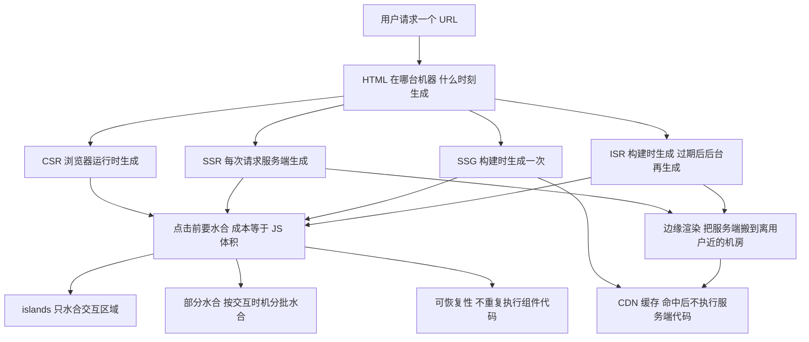
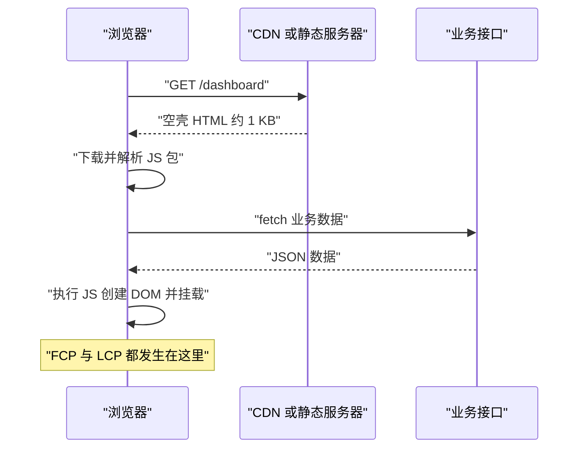
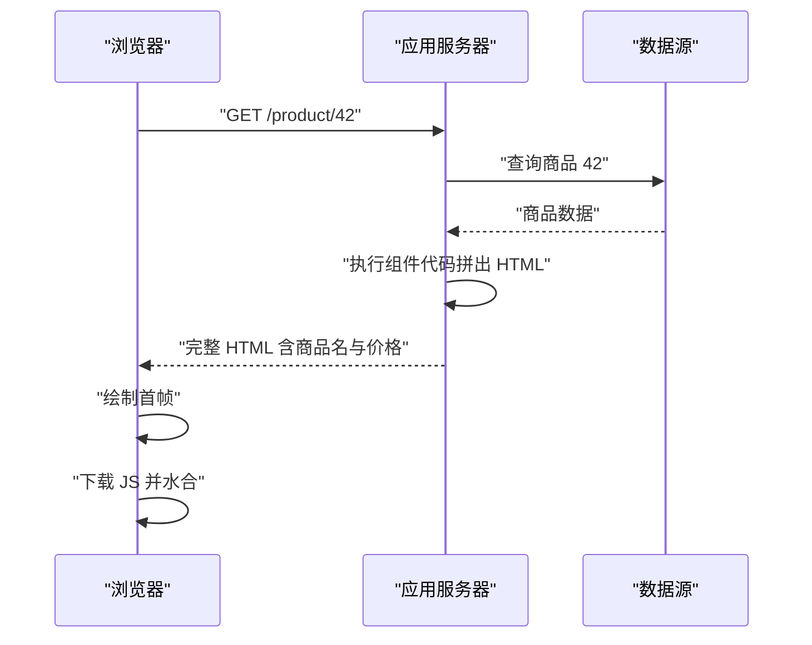
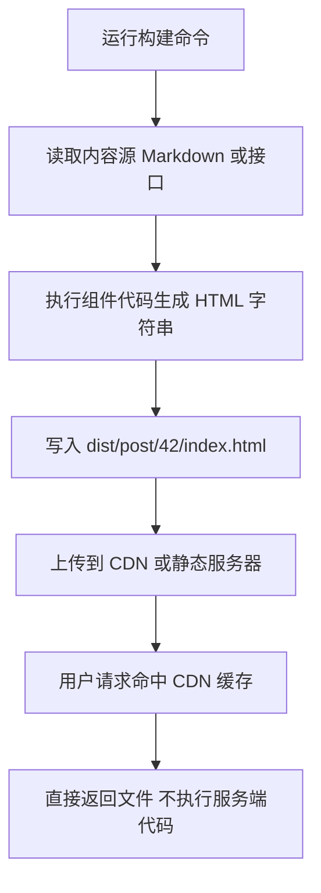
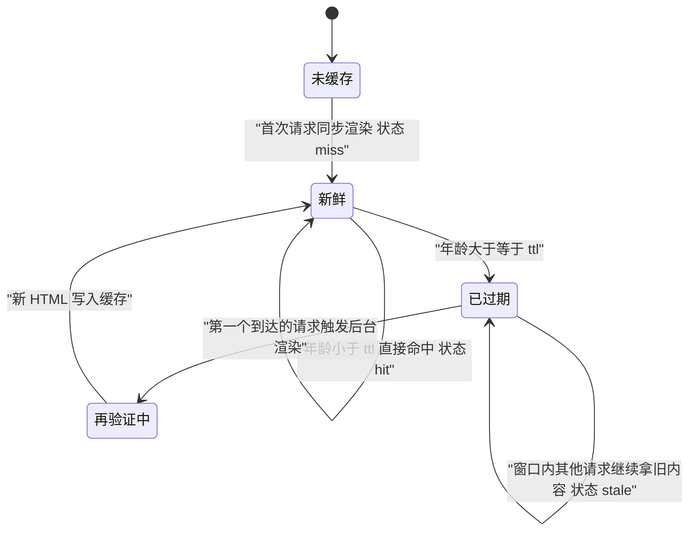
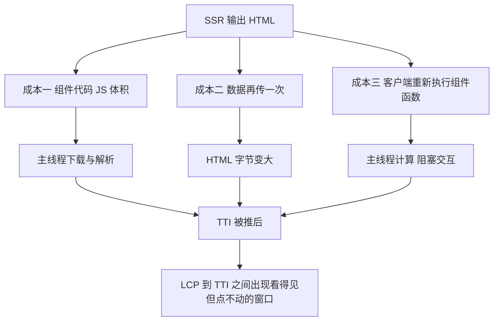
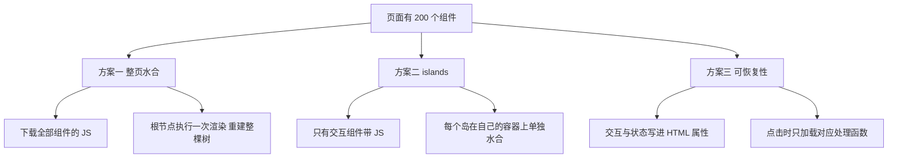
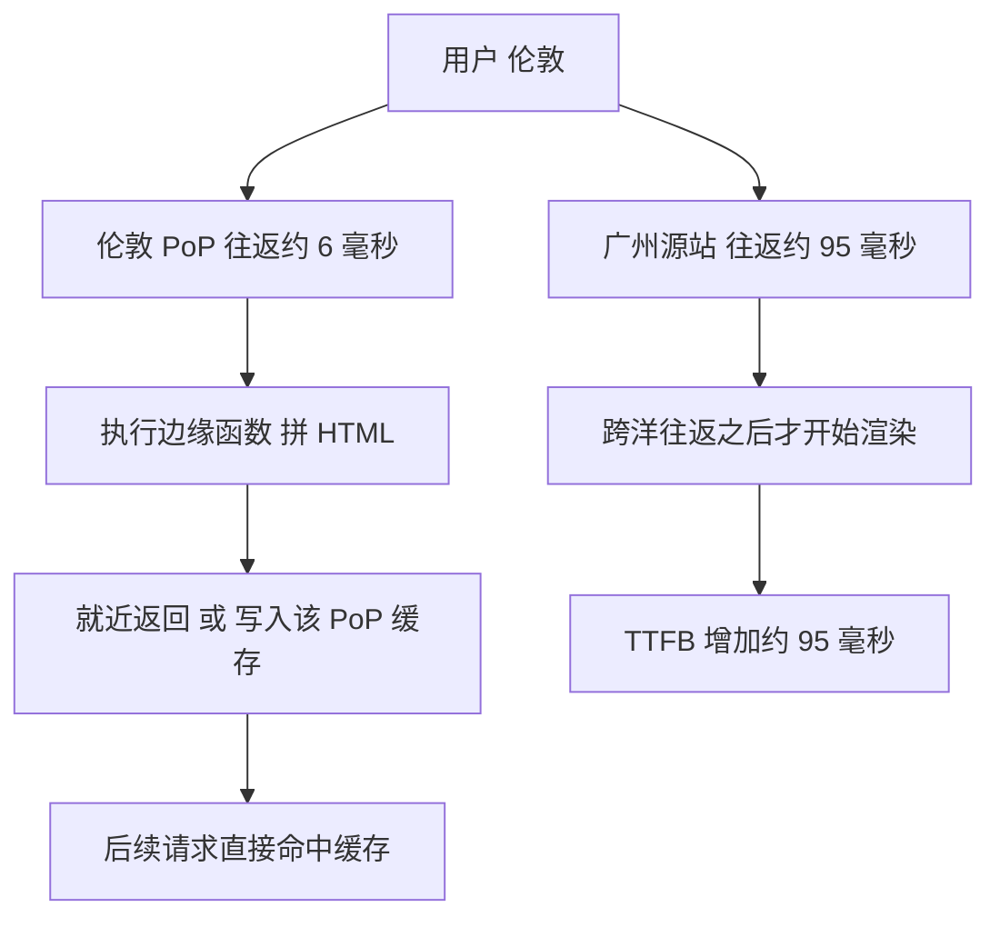
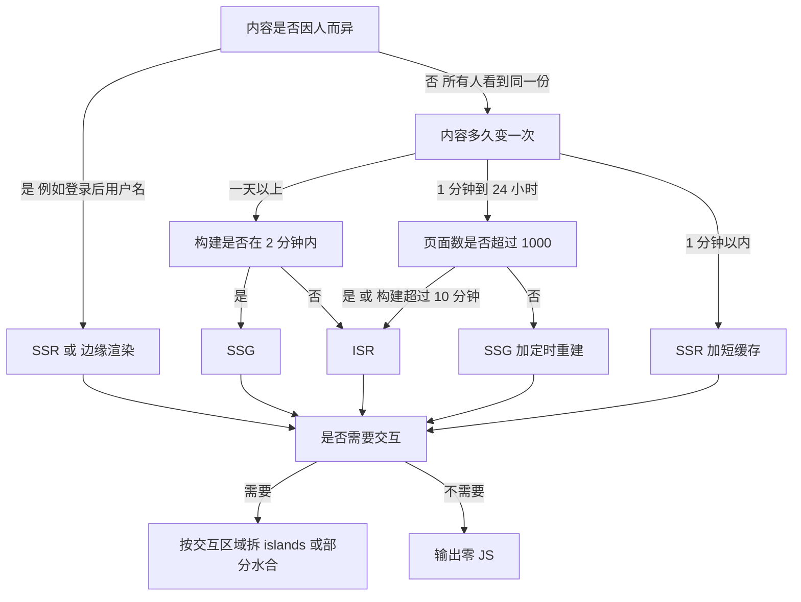
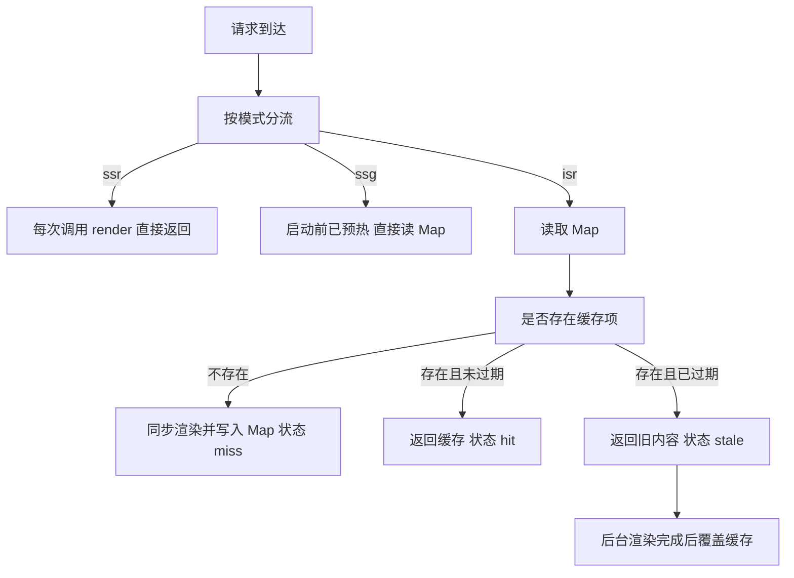

# 渲染策略：CSR、SSR、SSG、ISR 与水合

!!! abstract "学完这一页你能"
    - 说出 CSR、SSR、SSG、ISR 四种策略里，HTML 在什么时刻、由哪台机器生成。
    - 画出四种策略的请求时序，并指出 TTFB、FCP、LCP、TTI 各自被哪一段耗时撑大。
    - 写出 ISR 的 stale-while-revalidate 判断分支，并解释缓存过期后旧内容为什么还能返回。
    - 写出一个 200 行以内、同时支持 SSR、SSG、ISR 的 Node HTTP 服务，并用断言验证缓存未命中、命中、过期、再验证四条路径。

## 0. 知识地图



建议怎么读：

- 第 1 到第 4 节是主干，四节讲同一件事的四种答案：HTML 什么时候生成。
- 第 5 到第 7 节处理两个附加问题：客户端要付多少 JS 成本、服务端放在哪里。
- 第 8、9 节是选型和动手，读完再回头看第 0 节这张图。

## 1. CSR：HTML 是空壳，内容由浏览器执行 JS 生成

**先想一个问题**

你在手机上打开一个用 React 写的后台页面，Network 面板里 HTML 只有 900 字节。屏幕先白 1.8 秒，然后侧边栏和表格一起出现。这段时间浏览器在等什么？

!!! note "术语：CSR"
    CSR 是 Client-Side Rendering 的缩写，中文叫客户端渲染。含义是服务器只返回空壳 HTML 和 JS 包，页面 DOM 由浏览器执行 JS 后创建。例子：打开一个 Create React App 生成的页面，查看源代码只能看到 `<div id="root"></div>`。

!!! note "术语：TTFB"
    TTFB 是 Time To First Byte 的缩写，含义是从请求发出到收到响应第一个字节的耗时。它包含 DNS 查询、TCP 握手、TLS 握手和服务端处理时间。

!!! note "术语：FCP、LCP、TTI"
    - FCP 是 First Contentful Paint，第一次画出文字或图片的时刻。
    - LCP 是 Largest Contentful Paint，最大内容元素绘制完成的时刻。
    - TTI 是 Time To Interactive，主线程静默后页面能稳定响应交互的时刻。当前测量口径以 Web Vitals 官方定义为准。

**心智模型**

!!! tip "心智模型"
    一句话模型：服务器返回一个空壳 HTML 加一个 JS 包，页面上的 DOM 由浏览器执行 JS 后创建。

    日常类比：餐厅给你一个空盘子和一本菜谱，菜要你自己按菜谱做。

    类比不成立的地方：做菜快慢取决于你的厨艺，而浏览器执行 JS 的快慢由 JS 体积和 CPU 单核性能决定。同一份 310 KB 的包，低端机上的执行时间可能是旗舰机的 4 倍。

**图解**



1. 浏览器发出 GET 请求，请求里不带业务数据。
2. CDN 或静态服务器返回约 1 KB 的空壳 HTML，所以 TTFB 很小。
3. 浏览器解析 HTML，遇到 script 标签后暂停绘制，开始下载 JS 包。
4. JS 包下载并解析完成，代码开始执行，其中一步是调用 fetch 拉业务数据。
5. 数据返回后，框架创建 DOM 节点并挂载，此时出现第一段正文，FCP 落在这一刻。
6. 事件处理函数绑定完成后页面才能响应点击，这一刻是 TTI。

**一步一步来**

这一步要做什么：先把 TTFB、FCP、LCP、TTI 变成四个时间戳，再用差值看出 CSR 的时间花在哪一段。

```js
// csr-timeline.mjs
// 依赖：无。Node 20 以上运行：node csr-timeline.mjs
const shellBytes = 900;                                    // 空壳 HTML 的字节数
const jsBytes = 310 * 1024;                                // JS 包 310 KB
const netMs = (bytes) => Math.round((bytes / 1024) * 0.9); // 假设每 KB 传输 0.9 毫秒

const t0 = 0;                                              // 请求发出时刻
const ttfb = t0 + 40 + netMs(shellBytes);                   // 握手 40 毫秒再加空壳传输
const jsDone = ttfb + netMs(jsBytes) + 260;                 // JS 传输加 260 毫秒解析执行
const fcp = jsDone + 30;                                    // 首帧绘制
const dataDone = fcp + 180;                                 // 业务接口往返
const lcp = dataDone + 25;                                  // 主内容绘制
const tti = lcp + 40;                                       // 事件处理函数绑定完成

console.log({ ttfb, fcp, lcp, tti });
```

**这段代码在做什么**

- `shellBytes` 和 `jsBytes` 是两个可替换的输入，改它们就能看到时间线整体平移。
- `netMs` 把字节数换成毫秒，系数 0.9 是写死的假设值，用于离线推演。
- `ttfb` 只包含握手和空壳传输，所以它落在 41 毫秒附近。
- `jsDone` 把 JS 传输与解析执行相加，这一段是 CSR 的主要开销，占 539 毫秒。
- `fcp` 排在 JS 执行之后，说明 CSR 的首帧被 JS 卡住。
- `tti` 与 `lcp` 相差 40 毫秒，差值是绑定事件处理函数的时间。

**运行结果**

```text
{ ttfb: 41, fcp: 610, lcp: 815, tti: 855 }
```

**动手验证**

把上面的推演写成可断言的脚本，并做一个对照实验：JS 体积翻倍后首帧推迟多少。

```js
// verify-csr.mjs
// 依赖：无。运行：node verify-csr.mjs
import assert from 'node:assert/strict';

function timeline({ shellBytes = 900, jsBytes = 310 * 1024, apiMs = 180 }) {
  const netMs = (bytes) => Math.round((bytes / 1024) * 0.9);
  const ttfb = 40 + netMs(shellBytes);
  const jsDone = ttfb + netMs(jsBytes) + 260;
  const fcp = jsDone + 30;
  const lcp = fcp + apiMs + 25;
  const tti = lcp + 40;
  return { ttfb, fcp, lcp, tti };
}

const a = timeline({});
assert.ok(a.ttfb < 50, '空壳很小，TTFB 应小于 50 毫秒');
assert.ok(a.fcp > 500, 'JS 未执行完不会有首帧');
assert.ok(a.lcp >= a.fcp && a.tti >= a.lcp, '里程碑必须单调递增');

const b = timeline({ jsBytes: 620 * 1024 });
const deltaFcp = b.fcp - a.fcp;
assert.ok(deltaFcp > 250, 'JS 翻倍后 FCP 推迟至少 250 毫秒');
console.log('CSR 时间线通过：', a, 'JS 翻倍后 FCP 推迟', deltaFcp, '毫秒');
```

预期输出：

```text
CSR 时间线通过： { ttfb: 41, fcp: 610, lcp: 815, tti: 855 } JS 翻倍后 FCP 推迟 279 毫秒
```

**常见坑**

| 现象 | 原因 | 怎么修 |
|---|---|---|
| 源码里搜不到正文关键词 | 内容由 JS 创建，HTML 里只有挂载点 | 对需要被抓取的页面改用 SSR 或 SSG |
| 弱网下白屏超过 3 秒 | JS 包体积大，且 script 阻塞绘制 | 按路由拆分代码，检查打包产物里的最大分块 |
| TTI 比 LCP 晚几百毫秒 | 事件处理函数在绘制之后才绑定 | 减少首屏需要水合的区域 |

**小结**

- CSR 的 TTFB 小，代价是 FCP、LCP、TTI 全被 JS 推后。
- 首屏时间主要由 JS 体积决定，体积翻倍时 FCP 推迟 279 毫秒。
- CSR 适合登录后使用、不需要被抓取的页面。

## 2. SSR：服务端把 HTML 拼好再返回

**先想一个问题**

你把商品页链接分享到聊天软件，抓取工具读到的 HTML 里没有商品名和价格，卡片是空白的。要让不执行 JS 的抓取工具也读到内容，HTML 该由谁生成？

!!! note "术语：SSR"
    SSR 是 Server-Side Rendering 的缩写，中文叫服务端渲染。含义是每个请求到达服务端时执行组件代码，拼出完整 HTML 再返回。例子：请求 `/product/42`，返回的 HTML 里已经写着商品名和价格。

**心智模型**

!!! tip "心智模型"
    一句话模型：请求到达时服务端现场拼 HTML，浏览器拿到就能画，但交互要等 JS 下载完。

    日常类比：点餐后厨房现做，端上来就能吃。

    类比不成立的地方：现做要占用厨房时间，用户等待时间变长；每来一位客人都要重做一次，服务端 CPU 用量随访问量线性增长。

**图解**



1. 请求到达应用服务器，服务器先向数据源查询，这段时间计入 TTFB。
2. 数据返回后，服务器执行组件代码，把结果拼成 HTML 字符串。
3. 服务器把完整 HTML 发出，TTFB 比 CSR 大，多出的部分等于查询加渲染耗时。
4. 浏览器收到 HTML 立刻可以绘制，FCP 与 LCP 都落在 TTFB 之后很短的时间里。
5. 浏览器还要下载并执行同一份组件代码做水合，TTI 仍然被 JS 拖后。
6. HTML 已经可读，所以不执行 JS 的抓取工具也能读到商品名。

**一步一步来**

这一步要做什么：写一个渲染函数，把数据插进 HTML 模板，并处理转义。

```js
// render-product.mjs
// 依赖：无。Node 20 以上。
const escapeHtml = (s) => String(s).replace(/[&<>]/g, (c) => ({ '&': '&amp;', '<': '&lt;', '>': '&gt;' }[c]));

export function renderProduct(product) {
  const payload = JSON.stringify(product).replace(/</g, '\\u003c'); // 防止提前闭合 script
  return '<!doctype html><html lang="zh-CN"><head><meta charset="utf-8">' +
    '<title>' + escapeHtml(product.name) + '</title></head><body>' +
    '<h1>' + escapeHtml(product.name) + '</h1>' +        // 首屏主内容直接写进 HTML
    '<p>价格 ' + escapeHtml(product.price) + ' 元</p>' +
    '<script id="payload" type="application/json">' + payload + '</script>' +
    '<script type="module" src="/app.js"></script>' +
    '</body></html>';
}
```

**这段代码在做什么**

- `escapeHtml` 把 `&`、`<`、`>` 换成实体，防止商品名破坏 HTML 结构。
- 返回的字符串已经包含 `h1` 和价格，不执行 JS 也能读到内容。
- `payload` 是给水合用的同一份数据，它会跟着 HTML 再传一次。
- 把 payload 里的 `<` 换成 `\u003c`，可以阻止用户输入拼出 `</script>` 提前闭合标签。
- `app.js` 是客户端组件代码，浏览器下载它之后才能响应点击。

**运行结果**

调用 `renderProduct({ name: '机械键盘', price: 399 })` 得到的字符串长度在 200 字节量级，正文已经可读。

**动手验证**

起一个真实的 HTTP 服务，用 fetch 取回 HTML，断言正文在源码里、用户输入被转义。

```js
// verify-ssr.mjs
// 依赖：无。运行：node verify-ssr.mjs
import assert from 'node:assert/strict';
import http from 'node:http';

const escapeHtml = (s) => String(s).replace(/[&<>]/g, (c) => ({ '&': '&amp;', '<': '&lt;', '>': '&gt;' }[c]));
const renderProduct = (p) => '<!doctype html><html><body><h1>' + escapeHtml(p.name) + '</h1>' +
  '<script id="payload" type="application/json">' +
  JSON.stringify(p).replace(/</g, '\\u003c') + '</script></body></html>';

const server = http.createServer((req, res) => {
  res.writeHead(200, { 'content-type': 'text/html; charset=utf-8' });
  res.end(renderProduct({ name: '<b>机械键盘</b>', price: 399 }));
});
await new Promise((r) => server.listen(0, r));
const url = 'http://127.0.0.1:' + server.address().port + '/';

const res = await fetch(url);
const html = await res.text();
assert.equal(res.headers.get('content-type'), 'text/html; charset=utf-8');
assert.ok(html.includes('<h1>&lt;b&gt;机械键盘&lt;/b&gt;</h1>'), '正文里的标签必须被转义');
assert.ok(html.includes('\\u003c'), 'payload 里的尖括号必须被转义');
assert.ok(html.includes('application/json'), '水合数据随 HTML 一起下发');
console.log('SSR 验证通过，HTML 长度', html.length);
server.close();
```

预期输出：

```text
SSR 验证通过，HTML 长度 181
```

**常见坑**

| 现象 | 原因 | 怎么修 |
|---|---|---|
| 用户昵称破坏页面结构 | 数据直接拼进模板没转义 | 所有插值走 `escapeHtml` |
| payload 让页面脚本报语法错误 | 数据里的 `</script>` 提前闭合标签 | 序列化后把 `<` 替换成 `\u003c` |
| 流量上涨后服务端 CPU 打满 | 每个请求都重新渲染 | 对不因人而异的页面加共享缓存，改用 SSG 或 ISR |
| TTFB 随接口变慢而变大 | 数据查询在渲染之前串行执行 | 并行发起多个查询，或对查询结果加缓存 |

**小结**

- SSR 把数据查询和渲染成本搬到服务端，换来首帧提前。
- 页面内容不执行 JS 就能读到，抓取工具和分享卡片都能取到正文。
- TTI 仍然由 JS 体积决定，SSR 不解决交互延迟。

## 3. SSG：构建时生成，部署后只读文件

**先想一个问题**

一篇三个月没改过的博客文章，每天被读两万次。每次访问都让服务端重新渲染一遍，这两万次渲染换来了什么？

!!! note "术语：SSG"
    SSG 是 Static Site Generation 的缩写，中文叫静态站点生成。含义是在构建阶段把页面渲染成 HTML 文件写进产物目录，运行时服务器只做文件读取。例子：`next build` 生成 `out/post/42.html`。

!!! note "术语：CDN"
    CDN 是 Content Delivery Network 的缩写，中文叫内容分发网络。含义是一组分布在不同城市的缓存服务器，用户请求先到最近的节点。例子：伦敦用户请求广州源站的图片，实际由伦敦节点返回缓存副本。

**心智模型**

!!! tip "心智模型"
    一句话模型：构建阶段把页面渲染成文件，运行时只读文件，服务端不做渲染。

    日常类比：提前把菜做好装进保温柜，客人来了直接取。

    类比不成立的地方：保温柜里的菜不会自己更新，内容改了必须重新构建并重新部署，中间有一段时间用户看到的是旧版本。

**图解**



1. 构建命令开始执行，此时还没有任何用户请求。
2. 构建过程读取内容源，可能是 Markdown 文件，也可能是构建机上的接口。
3. 组件代码在构建机里执行一次，输出 HTML 字符串。
4. 字符串被写成文件，文件路径与路由一一对应。
5. 产物上传到 CDN，用户请求命中缓存后直接返回文件。
6. 整个请求过程没有执行任何服务端渲染代码，TTFB 只受网络影响。

**一步一步来**

第一步要做什么：写一个构建脚本，把每个路由渲染成文件落盘。

```js
// build.mjs
// 依赖：无。Node 20 以上运行：node build.mjs
import { mkdir, writeFile } from 'node:fs/promises';

export function renderPost(post) {
  return '<!doctype html><html lang="zh-CN"><head><meta charset="utf-8">' +
    '<title>' + post.title + '</title></head><body>' +
    '<h1>' + post.title + '</h1><p>' + post.body + '</p></body></html>';
}

const posts = [
  { id: '42', title: '缓存头怎么读', body: 's-maxage 管 CDN。' },
  { id: '43', title: 'TTFB 是什么', body: '首字节到达的耗时。' },
];

for (const post of posts) {
  const dir = 'dist/post/' + post.id;                          // 一篇一个目录
  await mkdir(dir, { recursive: true });                        // 多级目录一次创建
  await writeFile(dir + '/index.html', renderPost(post), 'utf8'); // 渲染结果落盘
}
console.log('已生成 ' + posts.length + ' 个页面');
```

**这段代码在做什么**

- `renderPost` 与第 2 节的渲染函数结构相同，差别只在调用时机。
- 循环在构建阶段执行，此时用户还没发请求，渲染耗时不计入任何用户的 TTFB。
- 一篇文章对应一个目录，目录里的 `index.html` 就是这个路由的响应体。
- `recursive: true` 让 `dist/post/42` 这样的多级目录一次创建完成。

**运行结果**

```text
已生成 2 个页面
```

第二步要做什么：写静态服务，只把路径映射到文件。

```js
// static-server.mjs
// 依赖：无。Node 20 以上运行：node static-server.mjs
import http from 'node:http';
import { readFile } from 'node:fs/promises';

const server = http.createServer(async (req, res) => {
  const path = new URL(req.url, 'http://x').pathname;              // 只取路径 忽略查询串
  const file = 'dist' + (path === '/' ? '/index' : path) + '/index.html';
  try {
    const html = await readFile(file, 'utf8');                     // 只读文件 不渲染
    res.writeHead(200, {
      'content-type': 'text/html; charset=utf-8',
      'cache-control': 'public, max-age=0, s-maxage=600',          // 交给 CDN 缓存 600 秒
    });
    res.end(html);
  } catch {
    res.writeHead(404, { 'content-type': 'text/plain; charset=utf-8' });
    res.end('未找到');
  }
});
server.listen(3001, () => console.log('http://localhost:3001/post/42'));
```

**这段代码在做什么**

- 服务端代码里没有组件渲染逻辑，只做路径到文件的映射。
- `readFile` 是唯一耗时操作，本地磁盘读取通常在 1 毫秒以内。
- `s-maxage=600` 告诉 CDN 这份响应可以缓存 600 秒，后续请求不再打到服务端。
- 路径不存在时返回 404，不回退到渲染，避免把静态服务变成 SSR 服务。

**动手验证**

把构建和静态服务合成一个脚本，断言两次请求返回同一份字节，且渲染只执行一次。

```js
// verify-ssg.mjs
// 依赖：无。运行：node verify-ssg.mjs
import assert from 'node:assert/strict';
import http from 'node:http';

const renderPost = (p) => '<!doctype html><html><body><h1>' + p.title + '</h1></body></html>';
const post = { id: '42', title: '缓存头怎么读' };

let renderCalls = 0;
const built = (() => { renderCalls += 1; return renderPost(post); })(); // 构建阶段执行一次
assert.equal(renderCalls, 1, '构建阶段渲染一次');

const server = http.createServer((req, res) => {
  res.writeHead(200, { 'content-type': 'text/html; charset=utf-8' });
  res.end(built);
});
await new Promise((r) => server.listen(0, r));
const url = 'http://127.0.0.1:' + server.address().port + '/post/42';

const a = await (await fetch(url)).text();
const b = await (await fetch(url)).text();
assert.equal(a, b, '两次请求返回同一份字节');
assert.ok(a.includes('缓存头怎么读'));
assert.equal(renderCalls, 1, '两次请求都没有触发渲染');
console.log('SSG 验证通过，两次响应长度', a.length, b.length);
server.close();
```

预期输出：

```text
SSG 验证通过，两次响应长度 56 56
```

**常见坑**

| 现象 | 原因 | 怎么修 |
|---|---|---|
| 内容改了线上没变 | 只更新了内容源，没有重新构建部署 | 把构建接到内容变更的流水线上 |
| 构建时间从 2 分钟涨到 40 分钟 | 页面数量随内容线性增长 | 页面超过 1000 个时评估 ISR |
| CDN 缓存了 404 | 构建失败导致产物缺失，404 也被缓存 | 部署前校验产物清单，404 加短缓存或不缓存 |
| 预览环境拿到线上缓存 | 不同环境的缓存键没区分 | 给预览环境单独的域名或缓存键 |

**小结**

- SSG 的渲染成本在构建阶段一次性付清，运行时只读文件。
- 请求阶段没有渲染代码，TTFB 由网络和 CDN 命中率决定。
- 内容更新必须重新构建部署，更新频率高时这个约束会变成瓶颈。

## 4. ISR：先给旧页面，再在后台生成新页面

**先想一个问题**

商品价格每 5 分钟可能变一次，站点有 20 万个页面。全量重新构建要 40 分钟，用户不可能等 40 分钟。有没有办法让页面先返回，再在后台更新？

!!! note "术语：ISR"
    ISR 是 Incremental Static Regeneration 的缩写，中文叫增量静态再生成。含义是页面按 SSG 方式生成并缓存，缓存过期后先返回旧内容，同时在后台重新生成。例子：配置 `revalidate` 为 60 秒，60 秒后的第一个请求拿到旧页面，新页面在后台生成。

!!! note "术语：stale-while-revalidate"
    这是 HTTP 响应头 `Cache-Control` 里的一个指令。含义是在指定秒数内允许返回过期内容，同时后台发起再验证。例子：`s-maxage=60, stale-while-revalidate=300` 表示第 60 到 360 秒之间返回旧内容并在后台刷新。

**心智模型**

!!! tip "心智模型"
    一句话模型：有缓存就直接返回，缓存过期后仍然先返回旧内容，同时在后台生成新内容替换缓存。

    日常类比：便利店先把昨天烤的面包卖给你，后厨同时在烤今天的。

    类比不成立的地方：面包新旧你能看见，而缓存新鲜度完全由生成时间和配置的秒数决定，用户在页面上看不到任何提示。

**图解**



1. 未缓存状态收到第一个请求，服务端同步渲染并把结果写入缓存，这次是缓存未命中。
2. 缓存年龄小于配置的 ttl 时，请求直接命中缓存，不调用渲染函数。
3. 年龄超过 ttl 后状态转为已过期。
4. 过期后的第一个请求不被阻塞，它拿到旧 HTML，同时触发一次后台渲染。
5. 过期窗口内到达的其他请求继续拿旧 HTML，不会重复触发渲染。
6. 后台渲染完成后新 HTML 覆盖缓存，状态回到新鲜。

**一步一步来**

第一步要做什么：设计缓存项结构，把生成时间和进行中的后台渲染都记下来。

```js
// cache-entry.mjs
// 依赖：无。运行：node cache-entry.mjs
const ttlMs = 5000;                                  // 新鲜期 5 秒
const cache = new Map();                             // key 到缓存项

function write(key, html, at = Date.now()) {
  cache.set(key, { html, builtAt: at, building: null }); // building 记录进行中的后台渲染
  return cache.get(key);
}

function readFresh(key, at = Date.now()) {
  const item = cache.get(key);
  if (!item) return { state: 'miss' };                    // 没有缓存项
  if (at - item.builtAt >= ttlMs) return { state: 'expired', item }; // 年龄到点
  return { state: 'hit', item };                          // 未过期
}

write('/p/42', '<h1>版本 1</h1>', 0);
console.log(readFresh('/p/42', 4999).state);
console.log(readFresh('/p/42', 5000).state);
console.log(readFresh('/p/99', 0).state);
```

**这段代码在做什么**

- `cache` 用 Map 保存每个路由的 HTML、生成时间和进行中的渲染 promise。
- `write` 把 `builtAt` 设成传入的时刻，方便测试里用假时钟控制年龄。
- `readFresh` 的三条分支依次对应未命中、已过期、命中。
- 判断用 `>=` 而不是 `>`，所以年龄正好等于 5000 毫秒时算过期。

**运行结果**

```text
hit
expired
miss
```

第二步要做什么：加上后台再验证，让过期请求不等待渲染。

```js
// revalidate.mjs
// 依赖：无。运行：node revalidate.mjs
const ttlMs = 5000; const cache = new Map(); let version = 0;
const render = async (key) => `<h1>版本 ${++version}</h1>`;   // 渲染函数 每次版本加一

async function get(key, at = Date.now()) {
  const item = cache.get(key);
  if (!item) {                                                // 没有缓存项 同步渲染
    const html = await render(key);
    cache.set(key, { html, builtAt: at, building: null });
    return { html, state: 'miss' };
  }
  if (at - item.builtAt >= ttlMs) {                           // 年龄到点 已过期
    if (!item.building) {                                     // 保证同时只有一次后台渲染
      item.building = render(key).then((html) => cache.set(key, { html, builtAt: Date.now(), building: null }));
    }
    return { html: item.html, state: 'stale' };               // 当前请求拿旧内容
  }
  return { html: item.html, state: 'hit' };                   // 未过期 直接命中
}

await get('/p/42', 0);                                        // 建立缓存
console.log((await get('/p/42', 1000)).state);                // 未过期
console.log((await get('/p/42', 6000)).state);                // 已过期
```

**这段代码在做什么**

- `render` 只返回一行 HTML，版本号每次加一，用来观察缓存被哪一次渲染替换。
- 未命中分支用 `await`，第一个请求必须等渲染完成，这就是冷启动成本。
- 过期分支不 `await` 渲染，直接返回 `item.html`，所以响应时间与未过期请求相同。
- `item.building` 保存进行中的 promise，保证过期瞬间只有一次后台渲染。
- 返回的 `state` 有三个取值 `miss`、`hit`、`stale`，后面会写进响应头。

**运行结果**

```text
hit
stale
```

**动手验证**

用假时钟推进时间，验证五条路径：未命中、命中、过期、过期期间不重复触发、后台完成后命中新版本。

```js
// verify-isr.mjs
// 依赖：无。运行：node verify-isr.mjs
import assert from 'node:assert/strict';

function createStore({ render, ttlMs, now }) {
  const cache = new Map();
  const refresh = (key) =>
    render(key).then((html) => cache.set(key, { html, builtAt: now(), building: null }));
  async function get(key) {
    const item = cache.get(key);
    if (!item) {
      const html = await render(key);
      cache.set(key, { html, builtAt: now(), building: null });
      return { html, state: 'miss' };
    }
    if (now() - item.builtAt < ttlMs) return { html: item.html, state: 'hit' };
    if (!item.building) item.building = refresh(key);
    return { html: item.html, state: 'stale' };
  }
  return { get };
}

let version = 0; let delayMs = 0; let clock = 0;
const store = createStore({
  render: async () => { const html = '版本 ' + (++version); if (delayMs) await new Promise((r) => setTimeout(r, delayMs)); return html; },
  ttlMs: 5000,
  now: () => clock,
});

const first = await store.get('/p/42');
assert.equal(first.state, 'miss');
assert.equal(first.html, '版本 1');

const second = await store.get('/p/42');
assert.equal(second.state, 'hit');
assert.equal(second.html, '版本 1');

clock = 5001;                                    // 假时钟越过 5 秒
delayMs = 30;                                    // 后台渲染变慢 用来观察旧内容先返回
const third = await store.get('/p/42');
assert.equal(third.state, 'stale');
assert.equal(third.html, '版本 1', '过期请求先拿旧 HTML');

const fourth = await store.get('/p/42');
assert.equal(fourth.state, 'stale', '再验证进行中不会重复触发');
assert.equal(version, 2, '后台渲染只触发了一次');

await new Promise((r) => setTimeout(r, 60));     // 等后台渲染完成
const fifth = await store.get('/p/42');
assert.equal(fifth.state, 'hit');
assert.equal(fifth.html, '版本 2');
console.log('ISR 验证通过：miss 到 hit 到 stale 到 stale 到 hit 版本 2');
```

预期输出：

```text
ISR 验证通过：miss 到 hit 到 stale 到 stale 到 hit 版本 2
```

注意：真实项目里过期时间由 `revalidate` 之类的配置决定，具体配置项名称和优先级需核对官方文档。

**常见坑**

| 现象 | 原因 | 怎么修 |
|---|---|---|
| 页面永远停在旧版本 | 没有任何请求命中该路由，后台再验证不会被触发 | 用过期的主动刷新机制，例如按路径或按标签的按需再验证 API，具体签名需核对官方文档 |
| 缓存过期瞬间服务端被打满 | 多个请求同时触发后台渲染 | 用 `building` 标记或分布式锁保证同时只有一次再验证 |
| 同一路由不同用户拿到同一份内容 | 把带登录态的数据写进了共享缓存 | 因人而异的数据不要进共享缓存，改用 SSR |
| 页面内容部分新部分旧 | 一次渲染里访问了多个数据源，各自过期时间不同 | 统一数据源的再验证时间，或按标签分组失效 |

**小结**

- ISR 把「重新生成」从构建阶段挪到运行期，页面不用全量重建。
- 过期后的请求拿到旧内容，响应时间与命中缓存相同，用户不会等待渲染。
- 需要保证同时只有一次后台渲染，否则过期瞬间会把服务端打满。

## 5. 水合：把服务端给的 HTML 变成能响应的 DOM

**先想一个问题**

SSR 返回的 HTML 里已经有按钮了，为什么点它没反应，要等一两秒才能用？

!!! note "术语：水合"
    水合指 hydration，含义是客户端重新执行组件代码，把事件处理函数挂到已有的 DOM 节点上。例子：SSR 输出的按钮在 HTML 里已经存在，水合后点击才触发 onClick。

**心智模型**

!!! tip "心智模型"
    一句话模型：水合是客户端再执行一遍组件代码，把事件处理函数接到已经存在的 DOM 上。

    日常类比：房子已经盖好，水合是接通水管和电路。

    类比不成立的地方：接通水电各做一次就够，而水合会把整棵组件树重新算一遍，成本与组件数量和 JS 体积同向增长。

**图解**



1. SSR 输出的 HTML 里已经带了首屏内容，所以 LCP 靠前。
2. 成本一是组件代码，浏览器要下载并解析这些 JS 才能绑定事件。
3. 成本二是渲染用到的数据，它要序列化进 HTML，浏览器再解析回来。
4. 成本三是客户端重新执行组件函数，生成虚拟 DOM 并与已有 DOM 对比。
5. 三项成本都跑在主线程上，与绘制抢时间。
6. 结果是从 LCP 到 TTI 之间有一段页面看得见但点不动的窗口，窗口长度等于水合耗时。

**一步一步来**

第一步要做什么：量出重复数据的字节数，看 JSON 载荷比 HTML 片段大多少。

```js
// payload-size.mjs
// 依赖：无。运行：node payload-size.mjs
const rows = Array.from({ length: 500 }, (_, i) => ({
  id: i, name: '商品 ' + i, price: 100 + i, stock: i % 7,
}));

const htmlFragment = rows.map((r) => '<li>' + r.name + ' ' + r.price + ' 元</li>').join('');
const payload = JSON.stringify(rows).replace(/</g, '\\u003c');

const htmlBytes = Buffer.byteLength(htmlFragment);
const payloadBytes = Buffer.byteLength(payload);
console.log('HTML 片段字节', htmlBytes);
console.log('JSON 载荷字节', payloadBytes);
console.log('重复比例', (payloadBytes / htmlBytes).toFixed(2));
```

**这段代码在做什么**

- `rows` 造了 500 条结构相同的商品数据，字段名会被 JSON 重复写 500 次。
- `htmlFragment` 只保留渲染后的可见文本，这是用户真正看到的部分。
- `payload` 是水合需要的数据，它跟着 HTML 一起下发。
- 两个字节数相除得到重复比例，比例大于 1 表示数据载荷比可见内容还大。

**运行结果**

```text
HTML 片段字节 6900
JSON 载荷字节 15555
重复比例 2.25
```

第二步要做什么：测量「解析数据加重建节点」的耗时随数据量的变化。

```js
// hydrate-cost.mjs
// 依赖：无。运行：node hydrate-cost.mjs
import { performance } from 'node:perf_hooks';

function measure(count) {
  const rows = Array.from({ length: count }, (_, i) => ({ id: i, name: '商品 ' + i, price: 100 + i }));
  const json = JSON.stringify(rows);
  const t0 = performance.now();
  const parsed = JSON.parse(json);                                     // 水合第一步 解析数据
  const nodes = parsed.map((r) => '<li>' + r.name + '</li>');          // 水合第二步 重建节点
  const ms = performance.now() - t0;
  return { count, bytes: json.length, ms: Number(ms.toFixed(2)), nodes: nodes.length };
}

console.log(measure(500));
console.log(measure(5000));
console.log(measure(50000));
```

**这段代码在做什么**

- `measure` 模拟水合里的两步主线程工作：解析数据和重建节点。
- 三步的输入只有 `count` 一个变量，便于把耗时归因到数据量。
- `performance.now()` 取自 `node:perf_hooks`，单位是毫秒，带回小数。
- 返回的 `nodes` 用来确认工作确实执行完了，避免运行器把循环优化掉。

**运行结果**

耗时随机器变化，这里只关心单调关系：`count` 从 500 涨到 50000 时 `ms` 同步增长，`bytes` 也同步增长。

**动手验证**

断言三条关系：载荷比可见内容大、字节数随数据量增长、耗时随数据量增长。

```js
// verify-hydration.mjs
// 依赖：无。运行：node verify-hydration.mjs
import assert from 'node:assert/strict';
import { performance } from 'node:perf_hooks';

const rows = Array.from({ length: 500 }, (_, i) => ({ id: i, name: '商品 ' + i, price: 100 + i, stock: i % 7 }));
const htmlBytes = Buffer.byteLength(rows.map((r) => '<li>' + r.name + '</li>').join(''));
const payloadBytes = Buffer.byteLength(JSON.stringify(rows));
assert.ok(payloadBytes > htmlBytes, '同一份数据在 JSON 里比渲染后的文本更大');

function measure(count) {
  const data = Array.from({ length: count }, (_, i) => ({ id: i, name: '商品 ' + i, price: 100 + i }));
  const json = JSON.stringify(data);
  const t0 = performance.now();
  const parsed = JSON.parse(json);
  const nodes = parsed.map((r) => '<li>' + r.name + '</li>');
  return { bytes: json.length, ms: performance.now() - t0, nodes: nodes.length };
}

const small = measure(500);
const large = measure(50000);
assert.ok(large.bytes > small.bytes * 50, '字节数随数据量近似线性增长');
assert.ok(large.ms > small.ms, '主线程耗时随数据量增长');
assert.equal(large.nodes, 50000);
console.log('水合成本验证通过：载荷', payloadBytes, '字节 对大文本', htmlBytes, '字节');
console.log('主线程耗时 500 条', small.ms.toFixed(2), '毫秒 50000 条', large.ms.toFixed(2), '毫秒');
```

预期输出（耗时数值随机器变化）：

```text
水合成本验证通过：载荷 15555 字节 对大文本 6900 字节
主线程耗时 500 条 0.31 毫秒 50000 条 24.80 毫秒
```

**常见坑**

| 现象 | 原因 | 怎么修 |
|---|---|---|
| 页面闪一下然后内容变了 | 服务端 HTML 与客户端首次渲染结果不一致 | 首次渲染不要读 `Date.now()`、随机数和 `localStorage` |
| HTML 体积是竞品的两倍 | 水合数据把每个字段名重复序列化一次 | 只下发渲染真正用到的字段，字段名改短数组 |
| 首屏点按钮没反应 | 水合在主线程排队，被长任务挡住 | 把首屏不需要的组件改成按需水合 |
| 水合报 mismatch 警告 | 服务端与客户端渲染分支条件不同 | 用同一套数据源，必要时用 `suppressHydrationWarning` 并定位根因 |

**小结**

- 水合成本由三部分组成：组件 JS 体积、重复下发的数据、客户端重算组件树。
- 数据在 JSON 里的字节数可能比渲染后的可见文本大一倍以上。
- 水合不改变 LCP，它只决定 LCP 到 TTI 这段窗口有多长。

## 6. Islands、部分水合与可恢复性

**先想一个问题**

一个文档站点，全站只有一个搜索框需要交互，其余 200 个组件都是静态文本。为了让搜索框能用，要不要把 200 个组件的 JS 都下载下来？

!!! note "术语：islands 架构"
    islands 指岛屿架构，含义是把页面看成静态 HTML 的海，只有需要交互的组件是岛，只有岛才带 JS。例子：Astro 默认输出零 JS，给组件加客户端指令后才下载该组件的 JS。

!!! note "术语：部分水合"
    部分水合指只水合页面的一部分，其余部分保持静态或延后水合。例子：首屏可见的搜索框立即水合，页面底部的广告位等滚动到附近再水合。

!!! note "术语：可恢复性"
    可恢复性指 resumability，含义是把事件处理函数的引用和组件状态序列化进 HTML，用户交互时才加载对应代码，客户端不重新执行组件函数。例子：Qwik 把监听器写成 HTML 属性，点击时只加载那一个处理函数。

**心智模型**

!!! tip "心智模型"
    一句话模型：把 JS 发给谁、什么时候发，是减少水合成本的唯一入口。

    日常类比：城区里只有几栋楼通电，其余是公园。

    类比不成立的地方：公园里也可能临时要装灯，而一个组件在构建阶段被判定为静态后，运行时没有办法让整片静态区域变成可交互。

**图解**



1. 起点是同一份页面，三种方案的差别在于把 JS 发给谁、什么时候发。
2. 整页水合把根组件的 JS 全部下发，并在根节点执行一次渲染重建整棵树。
3. islands 在构建阶段标记哪些组件要交互，只给这些组件下发 JS。
4. 每个岛在自己的容器上单独水合，一个岛报错不会影响另一个岛。
5. 可恢复性把事件处理函数的引用与状态直接写进 HTML 属性。
6. 用户点击时才加载并执行那一个处理函数，客户端不重新执行组件函数。

**一步一步来**

第一步要做什么：给组件打标记，算出整页水合与 islands 两种方案下的 JS 体积差。

```js
// islands.mjs
// 依赖：无。运行：node islands.mjs
const components = [
  { name: 'Header', kb: 12, interactive: false },      // 纯展示 不需要水合
  { name: 'ArticleBody', kb: 40, interactive: false },
  { name: 'SearchBox', kb: 18, interactive: true },    // 需要输入与请求
  { name: 'Footer', kb: 8, interactive: false },
  { name: 'AdSlot', kb: 22, interactive: true },       // 需要滚动加载
];

const sumKb = (list) => list.map((c) => c.kb).reduce((a, b) => a + b, 0);
const islands = components.filter((c) => c.interactive);   // 只有岛要下发 JS

console.log('整页水合下发 KB', sumKb(components));
console.log('islands 下发 KB', sumKb(islands));
console.log('岛的组件名', islands.map((c) => c.name).join(' '));
```

**这段代码在做什么**

- `interactive` 是构建阶段的人工标记，等价于框架里的客户端指令。
- `filter` 取出需要交互的组件，只有它们的 JS 会进入首屏产物。
- `sumKb` 把体积相加，两个调用分别给出两种方案的首屏 JS 总量。
- 两个数值的差就是 islands 省下的下载与解析时间。

**运行结果**

```text
整页水合下发 KB 100
islands 下发 KB 40
岛的组件名 SearchBox AdSlot
```

第二步要做什么：看可恢复性怎么把状态写进 HTML，让运行时按需加载。

```js
// resumable.mjs
// 依赖：无。运行：node resumable.mjs
function serialize(component, props) {
  const state = JSON.stringify(props).replace(/&/g, '&amp;').replace(/"/g, '&quot;');
  // 组件名与状态都写在 data 属性里 客户端读到就能恢复
  return '<div data-component="' + component + '" data-state="' + state + '"></div>';
}

console.log(serialize('SearchBox', { keyword: '缓存', page: 2 }));

function loadComponent(name) {
  return import('./components/' + name + '.js');   // 动态导入 点击前不下载
}
console.log('loadComponent 是一个函数：', typeof loadComponent === 'function');
```

**这段代码在做什么**

- `serialize` 把组件名和 props 写进 `data-` 属性，HTML 本身就是状态容器。
- `&` 和 `"` 被转义，避免状态里的引号破坏属性边界。
- `loadComponent` 用动态 `import()` 按需拉取组件代码，点击前这段代码不在网络里。
- 客户端不需要重新执行组件函数来重建状态，读属性即可。

**运行结果**

```text
<div data-component="SearchBox" data-state="{&quot;keyword&quot;:&quot;缓存&quot;,&quot;page&quot;:2}"></div>
loadComponent 是一个函数： true
```

**动手验证**

断言 islands 的 JS 总量小于整页水合，并算出省下的字节数。

```js
// verify-islands.mjs
// 依赖：无。运行：node verify-islands.mjs
import assert from 'node:assert/strict';

const components = [
  { name: 'Header', kb: 12, interactive: false },
  { name: 'ArticleBody', kb: 40, interactive: false },
  { name: 'SearchBox', kb: 18, interactive: true },
  { name: 'Footer', kb: 8, interactive: false },
  { name: 'AdSlot', kb: 22, interactive: true },
];
const sumKb = (list) => list.reduce((a, c) => a + c.kb, 0);

const full = sumKb(components);
const islands = sumKb(components.filter((c) => c.interactive));
assert.equal(full, 100);
assert.equal(islands, 40);
assert.ok(islands < full, 'islands 下发的 JS 必须少于整页水合');

// 部分水合：把非首屏的岛延后到交互前再水合
const deferred = components.filter((c) => c.interactive && c.name !== 'SearchBox');
assert.deepEqual(deferred.map((c) => c.name), ['AdSlot']);

// 可恢复性：把状态写进 HTML 属性后，客户端不需要重新计算状态
const state = JSON.stringify({ keyword: '缓存', page: 2 });
assert.ok(state.length > 0);
console.log('整页水合 ' + full + ' KB islands ' + islands + ' KB 省下 ' + (full - islands) + ' KB');
```

预期输出：

```text
整页水合 100 KB islands 40 KB 省下 60 KB
```

**常见坑**

| 现象 | 原因 | 怎么修 |
|---|---|---|
| 岛里的按钮点不动 | 组件被标记为静态，没有下发 JS | 检查构建配置里该组件的客户端指令 |
| 两个岛的状态互相覆盖 | 岛之间共享了模块级变量 | 把状态放进各自的容器属性或独立 store |
| 页面滚动到广告位时卡顿 | 岛在滚动瞬间才开始下载 JS | 提前一拍水合，或改成服务端直接输出静态图片 |
| 可恢复性方案里第三方库不可用 | 库依赖客户端全局对象和即时执行 | 查看该库是否有可序列化的替代实现 |

**小结**

- islands 把 JS 的发放范围缩小到交互组件，本例从 100 KB 降到 40 KB。
- 部分水合决定「什么时候发」，islands 决定「发给谁」，两者可以叠加。
- 可恢复性把状态放进 HTML，客户端只加载被触发的那一个处理函数。

## 7. 边缘渲染与缓存头

**先想一个问题**

源站在广州，用户在伦敦。一次 SSR 请求里，数据查询 20 毫秒、渲染 15 毫秒，但网络往返 95 毫秒。把渲染时间压缩 10 毫秒，和把服务端搬到伦敦，哪个动作对 TTFB 影响更大？

!!! note "术语：边缘渲染"
    边缘渲染指把服务端渲染代码部署到分布在不同城市的机房，用户请求由最近的机房处理。例子：Cloudflare Workers、Vercel Edge Functions 都提供这类运行时。

!!! note "术语：PoP"
    PoP 是 Point of Presence 的缩写，中文叫网络接入点。含义是 CDN 在某个城市部署的一组服务器，用户的请求先到这里。例子：伦敦的 PoP 到本地用户往返约 6 毫秒。

**心智模型**

!!! tip "心智模型"
    一句话模型：把服务端渲染搬到离用户近的机房，TTFB 里最大的一块网络往返被压到最小。

    日常类比：把仓库从总部搬到每个城市的分拨中心。

    类比不成立的地方：分拨中心可以囤一模一样的货，边缘机房的运行时受限，可用 API 比完整 Node 少，冷启动时间也不由你控制。

**图解**



1. 用户请求先到最近的 PoP，往返时间由物理距离决定。
2. 如果 PoP 上有渲染代码，渲染就在本地发生，不用跨洋。
3. 渲染结果可以写进该 PoP 的缓存，后续请求不再执行渲染代码。
4. 没有边缘渲染时，请求要跨洋到源站才开始渲染。
5. 跨洋往返会把 TTFB 增加约 95 毫秒，与渲染耗时无关。
6. 所以把渲染从 15 毫秒压到 5 毫秒，只能省 10 毫秒；搬动机房能省 89 毫秒。

**一步一步来**

第一步要做什么：把地理距离换算成往返耗时，比较源站与就近 PoP 的 TTFB。

```js
// edge-model.mjs
// 依赖：无。运行：node edge-model.mjs
const RTT_PER_1000KM = 10;                                  // 假设每 1000 公里往返 10 毫秒 需用真实网络测量核对
const rtt = (km) => Math.round((km / 1000) * RTT_PER_1000KM);
const queryMs = 20;                                          // 数据查询耗时
const renderMs = 15;                                         // 渲染耗时

const londonToGuangzhou = rtt(9500);                         // 伦敦到广州约 9500 公里
const londonToPop = rtt(600);                                // 伦敦到就近 PoP 约 600 公里

console.log('源站渲染 TTFB', londonToGuangzhou + queryMs + renderMs);
console.log('边缘渲染 TTFB', londonToPop + queryMs + renderMs);
console.log('差值', londonToGuangzhou - londonToPop);
```

**这段代码在做什么**

- `rtt` 是距离到耗时的线性换算，系数是假设值，真实值要用测量结果替换。
- 两个 TTFB 的差别只在第一项，数据查询和渲染耗时在两种方案里相同。
- 差值 89 毫秒直接给出了「搬动机房」相对「优化渲染」的量级。
- 如果数据源仍在广州，边缘上的查询依然要跨洋，这一项需要单独测量。

**运行结果**

```text
源站渲染 TTFB 130
边缘渲染 TTFB 41
差值 89
```

第二步要做什么：写出带 stale-while-revalidate 的缓存头，并说清每一段秒数的作用。

```js
// cache-control.mjs
// 依赖：无。运行：node cache-control.mjs
function cacheHeader({ sMaxAge, swr, maxAge = 0 }) {
  // max-age 管浏览器私有缓存 s-maxage 管 CDN 共享缓存 swr 是过期后的宽限窗口
  return 'public, max-age=' + maxAge + ', s-maxage=' + sMaxAge + ', stale-while-revalidate=' + swr;
}

console.log(cacheHeader({ sMaxAge: 60, swr: 300 }));
console.log('第 0 到 59 秒命中缓存 第 60 到 359 秒返回旧内容并后台刷新 第 360 秒起阻塞等待');
```

**这段代码在做什么**

- `max-age` 作用于浏览器本地缓存，`s-maxage` 只作用于 CDN 这类共享缓存。
- `stale-while-revalidate=300` 表示过期后还有 300 秒的宽限窗口。
- 宽限窗口内 CDN 返回旧内容，同时向源站发起一次后台请求。
- 宽限窗口结束后，CDN 必须等到源站返回新内容才能响应。

**运行结果**

```text
public, max-age=0, s-maxage=60, stale-while-revalidate=300
第 0 到 59 秒命中缓存 第 60 到 359 秒返回旧内容并后台刷新 第 360 秒起阻塞等待
```

**动手验证**

解析响应头字符串，断言不同年龄对应的缓存状态。

```js
// verify-cache-control.mjs
// 依赖：无。运行：node verify-cache-control.mjs
import assert from 'node:assert/strict';

const header = 'public, max-age=0, s-maxage=60, stale-while-revalidate=300';
const directives = Object.fromEntries(
  header.split(',').map((s) => s.trim().split('=')).map(([k, v]) => [k, v === undefined ? true : Number(v)]),
);

function stateAt(ageSeconds) {
  const sMaxAge = directives['s-maxage'];
  const swr = directives['stale-while-revalidate'];
  if (ageSeconds < sMaxAge) return 'fresh';
  if (ageSeconds < sMaxAge + swr) return 'stale-while-revalidate';
  return 'must-revalidate';
}

assert.equal(directives['s-maxage'], 60);
assert.equal(directives['stale-while-revalidate'], 300);
assert.equal(stateAt(0), 'fresh');
assert.equal(stateAt(59), 'fresh');
assert.equal(stateAt(60), 'stale-while-revalidate');
assert.equal(stateAt(359), 'stale-while-revalidate');
assert.equal(stateAt(360), 'must-revalidate');
console.log('缓存头解析通过：0 到 59 秒命中 60 到 359 秒先给旧内容 360 秒起阻塞等待');
```

预期输出：

```text
缓存头解析通过：0 到 59 秒命中 60 到 359 秒先给旧内容 360 秒起阻塞等待
```

**常见坑**

| 现象 | 原因 | 怎么修 |
|---|---|---|
| 边缘函数部署后报错找不到模块 | 运行时只提供 Web 标准 API，不全支持 Node 内置模块 | 换成运行时支持的 API，具体清单需核对平台官方文档 |
| 边缘渲染 TTFB 反而变大 | 每次请求都回源站查数据库 | 把数据一起放到边缘，或对查询结果加短缓存 |
| 用户看到别人的登录信息 | 带登录态的响应被 CDN 缓存 | 这类响应加 `private` 并禁用 `s-maxage` |
| 更新部署后用户仍看到旧版本 | CDN 缓存了上一版 HTML 且缓存键没变 | 用内容哈希或版本号参与缓存键，部署后做一次按路径失效 |

**小结**

- 边缘渲染只压缩网络往返，跨洋的 95 毫秒换成 6 毫秒，渲染本身的 10 毫秒压缩不出量级变化。
- `s-maxage` 控制共享缓存的存活时间，`stale-while-revalidate` 控制过期后的宽限窗口。
- 因人而异的响应不能进共享缓存，否则会把别人的数据发给当前用户。

## 8. 选型决策树

**先想一个问题**

产品经理说：要 SEO、首屏要快、内容每天更新 3 次、还要在页头按登录态显示用户名。这四个要求指向同一种策略吗？

**心智模型**

!!! tip "心智模型"
    一句话模型：选型由三个问题决定，内容是否因人而异、能接受多旧的数据、构建一次要多久。

    日常类比：选餐厅的备菜方式，看这道菜能不能提前做、提前做多久会坏。

    类比不成立的地方：菜放久了会坏掉，页面放久了只是不新鲜，旧 3 分钟的页面大多数时候仍然正确。

**图解**



1. 第一个问题问内容是否因人而异，登录态和购物车数量都算因人而异。
2. 因人而异的页面不能进共享缓存，只能每次请求渲染，选 SSR 或边缘渲染。
3. 内容对所有人相同时，进入第二个问题：多久变一次。
4. 一天以上才变且构建在 2 分钟内，选 SSG，构建成本可以接受。
5. 1 分钟到 24 小时变一次时，看页面总数与构建耗时，超过两条阈值之一就选 ISR。
6. 最后判断是否需要交互，需要交互就按交互区域缩小水合范围，不需要就输出零 JS。

**一步一步来**

第一步要做什么：把决策树写成纯函数，输入是四个可度量的字段。

```js
// decide.mjs
// 依赖：无。运行：node decide.mjs
export function decide({ personalized, changeIntervalMin, pageCount, buildMinutes, interactive }) {
  if (personalized) return 'SSR';                                // 因人而异 共享缓存不适用
  if (changeIntervalMin <= 1) return 'SSR-WITH-SHORT-CACHE';     // 每分钟都要最新
  const slowBuild = pageCount > 1000 || buildMinutes > 10;       // 两条阈值
  if (changeIntervalMin >= 1440 && !slowBuild) return interactive ? 'SSG-PLUS-ISLANDS' : 'SSG';
  if (slowBuild) return interactive ? 'ISR-PLUS-ISLANDS' : 'ISR';
  return 'SSG-TIMED-REBUILD';                                     // 构建够快 定时重建即可
}

console.log(decide({ personalized: false, changeIntervalMin: 5, pageCount: 200000, buildMinutes: 40, interactive: true }));
console.log(decide({ personalized: true, changeIntervalMin: 5, pageCount: 200000, buildMinutes: 40, interactive: true }));
console.log(decide({ personalized: false, changeIntervalMin: 2880, pageCount: 80, buildMinutes: 1, interactive: false }));
```

**这段代码在做什么**

- 四个输入字段都可以测量：`changeIntervalMin` 来自业务侧，`buildMinutes` 来自构建日志。
- `slowBuild` 用两条阈值判断构建是否成为瓶颈，任一成立即为真。
- 返回的字符串带上 `PLUS-ISLANDS` 后缀，表示还要配合第 6 节的拆分方案。
- 函数没有副作用，同样的输入永远返回同样的结果，便于写测试。

**运行结果**

```text
ISR-PLUS-ISLANDS
SSR
SSG
```

第二步要做什么：把常见场景列成表格，用同一函数批量算一遍。

```js
// decide-table.mjs
// 依赖：需与本文件同目录的 decide.mjs。运行：node decide-table.mjs
import { decide } from './decide.mjs';

const cases = [
  { name: '营销落地页', personalized: false, changeIntervalMin: 2880, pageCount: 20, buildMinutes: 1, interactive: false },
  { name: '电商商品详情', personalized: false, changeIntervalMin: 5, pageCount: 200000, buildMinutes: 40, interactive: true },
  { name: '用户订单列表', personalized: true, changeIntervalMin: 1, pageCount: 1, buildMinutes: 1, interactive: true },
  { name: '帮助中心文章', personalized: false, changeIntervalMin: 10080, pageCount: 800, buildMinutes: 6, interactive: false },
];

for (const c of cases) console.log(c.name.padEnd(8, ' '), decide(c));
```

**这段代码在做什么**

- `cases` 的每个对象对应一种真实站点类型，字段值来自各自的业务特征。
- `padEnd(8)` 让输出左对齐，方便逐行对照。
- 四次调用展示同一函数在不同输入下的四条分支。

**运行结果**

```text
营销落地页    SSG
电商商品详情 ISR-PLUS-ISLANDS
用户订单列表 SSR
帮助中心文章 SSG-TIMED-REBUILD
```

**动手验证**

把决策函数和一组用例写进同一个文件，用断言固定每条分支。

```js
// verify-decide.mjs
// 依赖：无。运行：node verify-decide.mjs
import assert from 'node:assert/strict';

function decide({ personalized, changeIntervalMin, pageCount, buildMinutes, interactive }) {
  if (personalized) return 'SSR';
  if (changeIntervalMin <= 1) return 'SSR-WITH-SHORT-CACHE';
  const slowBuild = pageCount > 1000 || buildMinutes > 10;
  if (changeIntervalMin >= 1440 && !slowBuild) return interactive ? 'SSG-PLUS-ISLANDS' : 'SSG';
  if (slowBuild) return interactive ? 'ISR-PLUS-ISLANDS' : 'ISR';
  return 'SSG-TIMED-REBUILD';
}

const base = { personalized: false, changeIntervalMin: 60, pageCount: 100, buildMinutes: 2, interactive: false };
assert.equal(decide({ ...base, personalized: true }), 'SSR', '登录态页面走 SSR');
assert.equal(decide({ ...base, changeIntervalMin: 1 }), 'SSR-WITH-SHORT-CACHE');
assert.equal(decide({ ...base, changeIntervalMin: 2880 }), 'SSG', '一天以上且构建快走 SSG');
assert.equal(decide({ ...base, changeIntervalMin: 2880, interactive: true }), 'SSG-PLUS-ISLANDS');
assert.equal(decide({ ...base, pageCount: 1001 }), 'ISR', '页面超过 1000 走 ISR');
assert.equal(decide({ ...base, buildMinutes: 11, interactive: true }), 'ISR-PLUS-ISLANDS');
assert.equal(decide({ ...base, changeIntervalMin: 30 }), 'SSG-TIMED-REBUILD');
console.log('选型函数验证通过：7 条分支全部命中');
```

预期输出：

```text
选型函数验证通过：7 条分支全部命中
```

**常见坑**

| 现象 | 原因 | 怎么修 |
|---|---|---|
| 选了 ISR 但页面还是旧的 | 页面数量少，某个路由长期没人访问 | 对冷门路由加主动失效，别只依赖过期触发 |
| 选了 SSG 后构建超过 10 分钟 | 页面数远超估的 1000 个 | 先统计真实路由数量再决定 |
| 因人而异的页面进了 CDN | 决策时漏掉了登录态这一条 | 用不带 Cookie 的请求测一遍，看返回是否因人而异 |
| 决策函数返回了带 islands 后缀的方案但没人做拆分 | 只看了第一段返回值 | 把后缀当成独立任务排进迭代 |

**小结**

- 决策的第一步永远是「内容是否因人而异」，它排除掉所有共享缓存方案。
- 第二步用构建耗时和页面数量判断 SSG 能不能撑住，超过 10 分钟就换 ISR。
- 水合范围的拆分是选型之后独立的一步，不是选型能自动完成的。

## 9. 手写：一个同时支持 SSR、SSG、ISR 的最小服务

**先想一个问题**

三种策略的差别集中在「HTML 什么时候生成」这一点上。能不能用同一个渲染函数、一个开关切换三种策略，把差别压缩到几行分支？

**心智模型**

!!! tip "心智模型"
    一句话模型：一个 Map 加一个时间戳，就能把 SSG 和 ISR 变成同一套代码的两个分支。

    日常类比：同一台冰箱，SSG 是装满后锁门，ISR 是定时检查哪一层过期。

    类比不成立的地方：冰箱里的东西会变质，缓存项只判断年龄，不会自己坏掉；它只在渲染函数输出改变时才不同。

**图解**



1. 请求先按模式分流，`ssr` 分支不读缓存也不写缓存。
2. `ssg` 分支在服务启动前就把需要预渲染的路由填进 Map，请求只做读取。
3. `isr` 分支读 Map，判断是否存在缓存项。
4. 不存在缓存项时同步渲染，这是冷启动路径，也是唯一会阻塞的路径。
5. 存在且年龄小于 ttl 时直接返回，响应时间接近 0。
6. 已过期时先返回旧内容，同时启动一次后台渲染替换缓存。

**一步一步来**

第一步要做什么：写模式感知的缓存层。

```js
// store.mjs
// 依赖：无。Node 20 以上。
export function createStore({ mode, render, ttlMs = 5000, now = () => Date.now() }) {
  const cache = new Map();                                    // key 到 html 与生成时间

  function background(key, item) {                            // 后台再验证 不阻塞当前请求
    if (item.building) return;                                // 同一 key 只允许一次
    item.building = render(key).then((html) => {
      cache.set(key, { html, builtAt: now(), building: null });
    });
  }

  async function get(key) {
    if (mode === 'ssr') return { html: await render(key), state: 'ssr' };
    const item = cache.get(key);
    if (!item) {                                              // 冷启动或未缓存
      const html = await render(key);
      cache.set(key, { html, builtAt: now(), building: null });
      return { html, state: 'miss' };
    }
    const expired = mode === 'isr' && now() - item.builtAt >= ttlMs;
    if (expired) { background(key, item); return { html: item.html, state: 'stale' }; }
    return { html: item.html, state: 'hit' };                 // ssg 永远走这一条
  }

  async function warm(paths) {                                // ssg 模式启动前预热
    for (const p of paths) await get(p);
  }

  return { get, warm, size: () => cache.size };
}
```

**这段代码在做什么**

- `mode` 是一个字符串，决定 `get` 走哪条分支，取值有 `ssr`、`ssg`、`isr`。
- `ssr` 分支每次都调用 `render`，不读也不写缓存。
- `expired` 判断里带上 `mode === 'isr'`，所以 `ssg` 模式下缓存永不过期。
- `background` 先检查 `item.building`，保证同时只有一次后台渲染。
- `warm` 在 `ssg` 模式下把需要预渲染的路由提前填进缓存。
- 返回的 `state` 会写进响应头，方便用 curl 观察状态变化。

第二步要做什么：写模板函数和 HTTP 层，把状态写进响应头。

```js
// server.mjs
// 依赖：无。Node 20 以上。
import http from 'node:http';

const escapeHtml = (s) => String(s).replace(/[&<>]/g, (c) => ({ '&': '&amp;', '<': '&lt;', '>': '&gt;' }[c]));

export function renderPage(pathname, data) {
  const payload = JSON.stringify(data).replace(/</g, '\\u003c');   // 防止提前闭合 script 标签
  return '<!doctype html><html lang="zh-CN"><head><meta charset="utf-8">' +
    '<title>' + escapeHtml(pathname) + '</title></head><body>' +
    '<h1>' + escapeHtml(data.title) + '</h1>' +
    '<p>第 ' + data.renderCount + ' 次渲染</p>' +
    '<script id="payload" type="application/json">' + payload + '</script>' +
    '</body></html>';
}

export function createHttpServer({ store, ttlMs }) {
  return http.createServer(async (req, res) => {
    const key = new URL(req.url, 'http://local').pathname;         // 只按路径做缓存键
    const { html, state } = await store.get(key);
    res.writeHead(200, {
      'content-type': 'text/html; charset=utf-8',
      'x-render-state': state,                                     // miss hit stale ssr
      'cache-control': 'public, max-age=0, s-maxage=' + Math.floor(ttlMs / 1000) + ', stale-while-revalidate=60',
    });
    res.end(html);
  });
}
```

**这段代码在做什么**

- `renderPage` 输出的 HTML 里带着标题和渲染次数，渲染次数是观察缓存是否更新的标记。
- payload 里的 `<` 被换成 `\u003c`，防止数据内容提前闭合 `script` 标签。
- `createHttpServer` 只负责把状态写进 `x-render-state` 头，不做缓存判断。
- `cache-control` 里的 `s-maxage` 由同一个 `ttlMs` 推导，保证 CDN 与本地缓存口径一致。
- 缓存键只用路径，所以同一路径的所有用户共享同一份 HTML。

第三步要做什么：接线启动参数，把三种模式跑起来。

```js
// main.mjs
// 依赖：需与本文件同目录的 store.mjs 与 server.mjs。运行：node main.mjs --mode=isr --ttl=5
import { createStore } from './store.mjs';
import { createHttpServer, renderPage } from './server.mjs';

const arg = (name, fallback) => {
  const hit = process.argv.find((a) => a.startsWith('--' + name + '='));   // 从命令行取参数
  return hit ? hit.split('=')[1] : fallback;
};

const mode = arg('mode', 'isr');                       // ssr ssg isr 三选一
const ttlMs = Number(arg('ttl', 5)) * 1000;            // 单位是秒
const port = Number(arg('port', 3000));
const paths = ['/', '/post/42', '/post/43'];           // 需要预热的路由

let renderCount = 0;
const render = async (key) => {
  renderCount += 1;
  console.log('[render] ' + key + ' 第 ' + renderCount + ' 次');
  return renderPage(key, { title: '页面 ' + key, renderCount });
};

const store = createStore({ mode, render, ttlMs });
if (mode === 'ssg') await store.warm(paths);           // 构建阶段只做一次
createHttpServer({ store, ttlMs }).listen(port, () => {
  console.log(mode + ' 模式启动 http://localhost:' + port + ' 预热 ' + store.size() + ' 页');
});
```

**这段代码在做什么**

- `arg` 从命令行参数里取值，缺省时用第二个参数，避免引入参数解析库。
- `render` 每次调用都打印一行日志，日志行数就是真实渲染次数。
- `mode === 'ssg'` 时先调用 `warm`，这一步对应构建阶段。
- 启动日志里的 `store.size()` 直接反映预热了多少页。

**运行结果**

```text
ssg 模式启动 http://localhost:3000 预热 3 页
```

**动手验证**

把三层合成一个单文件，用三个独立服务验证 SSR、SSG、ISR 各一条时序。

```js
// isr-demo.mjs
// 依赖：无。Node 20 以上运行：node isr-demo.mjs
import assert from 'node:assert/strict';
import http from 'node:http';

const escapeHtml = (s) => String(s).replace(/[&<>]/g, (c) => ({ '&': '&amp;', '<': '&lt;', '>': '&gt;' }[c]));

function renderPage(pathname, data) {
  const payload = JSON.stringify(data).replace(/</g, '\\u003c');
  return '<!doctype html><html lang="zh-CN"><head><meta charset="utf-8">' +
    '<title>' + escapeHtml(pathname) + '</title></head><body>' +
    '<h1>' + escapeHtml(data.title) + '</h1>' +
    '<p>第 ' + data.renderCount + ' 次渲染</p>' +
    '<script id="payload" type="application/json">' + payload + '</script></body></html>';
}

function createStore({ mode, render, ttlMs = 5000 }) {
  const cache = new Map();
  function background(key, item) {
    if (item.building) return;
    item.building = render(key).then((html) => cache.set(key, { html, builtAt: Date.now(), building: null }));
  }
  async function get(key) {
    if (mode === 'ssr') return { html: await render(key), state: 'ssr' };
    const item = cache.get(key);
    if (!item) {
      const html = await render(key);
      cache.set(key, { html, builtAt: Date.now(), building: null });
      return { html, state: 'miss' };
    }
    if (mode === 'isr' && Date.now() - item.builtAt >= ttlMs) {
      background(key, item);
      return { html: item.html, state: 'stale' };
    }
    return { html: item.html, state: 'hit' };
  }
  return { get, size: () => cache.size };
}

function startServer(mode, ttlMs) {
  let renderCount = 0;
  const render = async (key) => {
    await new Promise((r) => setTimeout(r, 20));                 // 模拟 20 毫秒渲染耗时
    renderCount += 1;
    return renderPage(key, { title: '页面 ' + key, renderCount });
  };
  const store = createStore({ mode, render, ttlMs });
  const server = http.createServer(async (req, res) => {
    const key = new URL(req.url, 'http://local').pathname;
    const { html, state } = await store.get(key);
    res.writeHead(200, {
      'content-type': 'text/html; charset=utf-8',
      'x-render-state': state,
      'cache-control': 'public, max-age=0, s-maxage=' + Math.floor(ttlMs / 1000) + ', stale-while-revalidate=60',
    });
    res.end(html);
  });
  return new Promise((resolve) => {
    server.listen(0, () => resolve({ url: 'http://127.0.0.1:' + server.address().port, store, server, renders: () => renderCount }));
  });
}

const hit = async (base, path) => {
  const res = await fetch(base + path);
  return { state: res.headers.get('x-render-state'), cacheControl: res.headers.get('cache-control'), html: await res.text() };
};

{
  const app = await startServer('ssr', 5000);
  const a = await hit(app.url, '/p/1');
  const b = await hit(app.url, '/p/1');
  assert.equal(a.state, 'ssr');
  assert.equal(b.state, 'ssr');
  assert.notEqual(a.html, b.html, 'SSR 每个请求重新渲染');
  assert.equal(app.renders(), 2);
  app.server.close();
  console.log('场景一 SSR 通过：两次请求 state 都是 ssr，渲染次数 2');
}

{
  const app = await startServer('ssg', 5000);
  await app.store.get('/p/1');                                     // 模拟构建阶段预热
  const a = await hit(app.url, '/p/1');
  const b = await hit(app.url, '/p/1');
  assert.equal(a.state, 'hit');
  assert.equal(a.html, b.html, 'SSG 所有请求拿到同一份字节');
  assert.equal(app.renders(), 1, 'SSG 只渲染一次');
  app.server.close();
  console.log('场景二 SSG 通过：两次请求 state 都是 hit，渲染次数 1');
}

{
  const app = await startServer('isr', 200);                       // 200 毫秒过期
  const first = await hit(app.url, '/p/1');
  assert.equal(first.state, 'miss');
  const second = await hit(app.url, '/p/1');
  assert.equal(second.state, 'hit');
  assert.equal(second.html, first.html);

  await new Promise((r) => setTimeout(r, 250));                    // 等缓存过期
  const third = await hit(app.url, '/p/1');
  assert.equal(third.state, 'stale', '过期后先返回旧内容');
  assert.equal(third.html, first.html, '过期请求没有等待渲染');

  await new Promise((r) => setTimeout(r, 60));                     // 等后台再验证完成
  const fourth = await hit(app.url, '/p/1');
  assert.equal(fourth.state, 'hit');
  assert.notEqual(fourth.html, first.html, '后台渲染替换了缓存');
  assert.equal(app.renders(), 2, 'ISR 一共只渲染两次');
  assert.ok(fourth.cacheControl.includes('stale-while-revalidate=60'));
  app.server.close();
  console.log('场景三 ISR 通过：miss 到 hit 到 stale 到 hit，渲染次数 2');
}

console.log('全部通过');
```

预期输出：

```text
场景一 SSR 通过：两次请求 state 都是 ssr，渲染次数 2
场景二 SSG 通过：两次请求 state 都是 hit，渲染次数 1
场景三 ISR 通过：miss 到 hit 到 stale 到 hit，渲染次数 2
全部通过
```

想手动观察时，改成跑 `main.mjs` 再执行：

```bash
node main.mjs --mode=isr --ttl=3
curl -si http://localhost:3000/post/42 | grep -i x-render-state
```

间隔 4 秒连续执行三次，`x-render-state` 会依次出现 `miss`、`hit`、`stale`、`hit`。

**常见坑**

| 现象 | 原因 | 怎么修 |
|---|---|---|
| 缓存键里的查询串不同导致每请求都 miss | 缓存键取了完整 URL，包含跟踪参数 | 只用路径做键，或先剔除无关查询参数 |
| 后台渲染报错后缓存永远停在旧版本 | `building` promise 拒绝后没有被清空 | 给渲染 promise 加 `catch`，失败时把 `building` 置回 null |
| 服务重启后所有页面都要重新渲染 | 缓存只在进程内存里 | 换成共享存储，或在启动时用 `warm` 预热热点路由 |
| `ttl` 设成 0 后每个请求都是 stale | 年龄判断用了 `>=`，0 秒时立即过期 | 想关闭再验证就把模式切到 `ssg` |
| 关闭服务器后进程不退出 | 有未完成的定时器或未关闭的连接 | 收到信号后调用 `server.close()` 并清理定时器 |

**小结**

- 三种策略共享同一个渲染函数，差别只在缓存读写分支上。
- SSR 的 `state` 永远是 `ssr`，SSG 的 `state` 稳定在 `hit`，ISR 会经历 `miss`、`hit`、`stale`。
- 后台再验证必须加进行中标记，否则过期瞬间会触发多次渲染。

## 综合对比

| 策略 | HTML 生成时刻 | 生成位置 | TTFB 组成 | FCP 与 LCP | TTI | 数据新鲜度 | 每请求服务端成本 |
|---|---|---|---|---|---|---|---|
| CSR | 浏览器执行 JS 之后 | 用户设备 | 握手加空壳传输，约 41 毫秒 | 落在 JS 执行之后，约 610 毫秒 | 比 LCP 再晚 40 毫秒 | 请求那一刻 | 静态托管，接近 0 |
| SSR | 每次请求到达时 | 应用服务器 | 握手加查询加渲染，约 130 毫秒 | 落在 TTFB 之后很短时间 | 仍被 JS 拖后 | 请求那一刻 | 每次请求都渲染 |
| SSG | 构建阶段一次 | 构建机 | 握手加文件传输 | 落在 TTFB 之后很短时间 | 仍被 JS 拖后 | 上次部署时间 | 无渲染，只有文件读取 |
| ISR | 构建阶段加过期后的后台 | 构建机加运行期服务器 | 命中缓存时等于文件传输 | 落在 TTFB 之后很短时间 | 仍被 JS 拖后 | 后台再验证完成时刻 | 平均每次远小于 1 次渲染 |
| 边缘渲染 | 请求到达时，在就近机房 | PoP 机房 | 就近往返加查询加渲染，约 41 毫秒 | 落在 TTFB 之后很短时间 | 仍被 JS 拖后 | 请求那一刻或缓存时刻 | 每次请求都渲染，机房离用户近 |

配套维度：

| 维度 | CSR | SSR | SSG | ISR | 边缘渲染 |
|---|---|---|---|---|---|
| 首屏是否依赖 JS | 是 | 否 | 否 | 否 | 否 |
| 抓取工具能否读到正文 | 否 | 能 | 能 | 能 | 能 |
| 内容更新延迟 | 实时 | 实时 | 等于发布周期 | 等于再验证窗口 | 实时 |
| 主要扩展瓶颈 | CDN 带宽 | 服务端 CPU | 构建时长 | 再验证频率 | 边缘 CPU 与冷启动 |
| JS 体积对 TTI 的影响 | 直接决定首帧 | 只影响交互 | 只影响交互 | 只影响交互 | 只影响交互 |

## 应用与行业实践

### 应用场景地图

| 场景 | 用到本页哪个知识点 | 典型技术选型 | 注意事项 |
| --- | --- | --- | --- |
| 低端安卓机打开电商首页 | 四种策略的 HTML 生成时刻；TTFB/FCP/LCP/TTI 归因 | SSR 直出首屏 HTML，商品卡与评论区做 Islands 延迟水合 | 首屏脚本体积直接抬高 TTI；水合完成前点击没有反应 |
| 十万级 SKU 的商品详情页 | ISR 的 stale-while-revalidate 分支、缓存头 | SSG 预生成热门款，长尾走 ISR，前面挂 CDN | 过期 HTML 返回给用户必须业务上可接受；回源高峰要限并发 |
| 后台管理的万行表格 | CSR 的空壳页面与水合成本 | CSR 加虚拟滚动；外壳 SSR，数据走客户端接口 | 数据在登录后，SEO 无收益；先量白屏时长再决定是否上 SSR |
| 版本化的技术文档站 | SSG 构建时生成、部署后只读 | SSG 按版本分目录，在 CI 里构建 | 构建时长随页面数上涨；页面数到规模后要改增量构建 |
| 分钟级改动的新闻首页 | ISR 先给旧页面、后台再生成 | ISR 加 CDN 缓存，配 stale-while-revalidate | 首页整体可缓存，个性化区块挪到客户端取 |
| 营销落地页做 A/B 实验 | SSG 与边缘渲染、缓存头分桶 | SSG 出公共骨架，实验分支在边缘按 Cookie 选择 | 分桶键必须进缓存键，否则两个实验互相污染 |
| 多人协作白板 | CSR 与水合边界 | CSR 加 WebSocket，服务端只做信令与持久化 | 白板首帧对搜索引擎无意义，不要为它加 SSR |
| 登录后的个人仪表盘 | SSR 与 CSR 的取舍、水合 | SSR 出骨架，个人数据客户端取 | HTML 不能共享缓存，SSR 机器成本随在线用户数上涨 |
| 长尾关键词的商品列表页 | 四种策略的选择依据、选型决策树 | SSG 出已知组合，其余走 SSR 并限制抓取范围 | 组合数远大于真实访问量时，预生成是纯浪费 |

### 三个场景拆解

#### 场景 1：低端安卓机上的电商首页首屏

**业务背景**：用户在低端安卓机上打开首页，白屏期间点不动任何按钮，直接滑走。用 Chrome DevTools 的 Slow 4G 加 CPU 降速 4 倍复现，同一页面在高配台式机上量不到这段等待。

**怎么用本页知识解决**：思路是让服务端先拼出首屏 HTML，把交互组件标成 Island，等首屏能响应之后再水合。首屏之外的内容不进首包。

```js
// 服务端只拼首屏 HTML，评论区留占位节点
function renderHome(products) {
  const cards = products.map(p =>
    `<li class="card">${p.title}</li>`).join('');  // 首屏卡片直出 HTML
  return `<!doctype html><html><body>
    <ul id="cards">${cards}</ul>
    <div id="comments" data-island="comments"></div>
    <script type="module" src="/islands.js"></script>
  </body></html>`;
}
```

- 首屏卡片走服务端字符串拼接，FCP 不再等 JS 下载与执行。
- `data-island` 只标记需要事件响应的区域，水合范围由整页缩到组件。
- 脚本用 `type="module"` 加载，浏览器自行延迟执行，不阻塞 HTML 解析。
- 评论区不参与首屏布局，可以放在 `requestIdleCallback` 或滚动到视口再挂载。
- 服务端只做拼接，不读数据库以外的外部接口，TTFB 维持在可接受范围。

**怎么度量收益**：用 WebPageTest 跑移动端配置，读 TTFB、Start Render、LCP、TTI 四项。用 Lighthouse 移动端看 Total Blocking Time，它反映主线程被脚本占住多久。用 web-vitals 库在真实设备上上报 LCP 与 INP，按设备档位看分位数。

**什么时候不该用**：

- 首屏内容本身很短且没有交互，SSR 省下的白屏时间小于服务端渲染与传输的开销。
- 团队没有值守 Node 进程的能力，扩容靠人工，先出 SSG 静态页把线上跑稳。
- 首屏每个请求都要拉第三方接口且不能缓存，服务端渲染会把接口延迟放大到用户侧。

#### 场景 2：十万级 SKU 的商品详情页

**业务背景**：商品详情页按 SKU 拆分，数量到十万级，全量预构建的耗时随页面数线性上升。价格和库存会变，页面又不能长期停在旧内容上。

**怎么用本页知识解决**：思路是 SSG 打底、ISR 兜底。缓存没过期直接返回旧 HTML；过期后先把旧 HTML 返回给当前用户，同时在后台生成新的。

```js
// cache: Map<key, { html, expiresAt }>
const revalidate = key => cache.set(key, {         // 后台再生成，本次响应不等它
  html: renderPage(key), expiresAt: Date.now() + TTL });
function handler(req, res) {
  const key = req.url, hit = cache.get(key), now = Date.now();
  if (hit && now < hit.expiresAt) {                // 分支一：未过期，命中
    res.setHeader('x-cache', 'HIT');
    return res.end(hit.html);
  }
  if (hit) {                                       // 分支二：已过期，先给旧页
    res.setHeader('x-cache', 'STALE');
    res.end(hit.html);                             // 旧内容立刻返回
    revalidate(key);                               // 再生成放到后台
    return;
  }
  const html = renderPage(key);                    // 分支三：未命中，同步生成
  cache.set(key, { html, expiresAt: now + TTL });
  res.setHeader('x-cache', 'MISS');
  res.end(html);
}
```

- 分支二先 `res.end` 再 `revalidate`，用户等待时间与再生成耗时解耦。
- 旧内容能返回，是因为缓存键还在，只是 `expiresAt` 已过，逻辑上仍可读。
- 响应头 `x-cache` 把三条路径写在线上日志里，方便按小时统计比例。
- `revalidate` 要加去重，同一个 key 在再生成期间重复触发会打爆源站。
- 未命中走同步生成，长尾页首次访问会慢，可以用排队加超时兜住。

**怎么度量收益**：服务端日志按小时聚合 `x-cache` 的 HIT、STALE、MISS 计数。算回源次数除以总请求数，改 TTL 后重测一次并对比。CDN 面板看缓存命中率与回源带宽。

**什么时候不该用**：

- 页面要显示价格、库存或账户余额，返回过期 HTML 会引发投诉或合规问题。
- 页面属于超长尾，单个 key 每天的请求次数只有个位数，再生成的算力收不回来。

#### 场景 3：后台管理的万行表格

**业务背景**：内部后台的订单表格单页要展示上万行，筛选条件每分钟都在改。页面在登录后访问，搜索引擎抓不到，也不需要被抓到。

**怎么用本页知识解决**：思路是外壳用 SSR 发一次，表格数据走客户端接口，首屏只取一页。筛选栏是静态 HTML，不参与水合。

```html
<!-- 服务端返回的表格外壳：表头与筛选栏是静态 HTML -->
<table><thead><tr><th>订单号</th><th>金额</th></tr></thead>
<tbody id="rows"></tbody></table>
<script type="module">
  const rows = document.getElementById('rows');
  async function load(query) {
    const res = await fetch(`/api/orders?${new URLSearchParams(query)}`);
    const list = await res.json();
    rows.replaceChildren(...list.map(r => {   // 只渲染本页返回的行
      const tr = document.createElement('tr');
      tr.innerHTML = `<td>${r.id}</td><td>${r.amount}</td>`;
      return tr;
    }));
  }
  load({ page: 1, size: 50 });                // 首屏只取一页
</script>
```

- 表头与筛选栏是静态标签，不挂事件，水合阶段没有额外开销。
- 数据请求放在挂载之后，服务端不接触数据库里的明细行。
- 分页参数由 URL 决定，刷新和分享链接能回到同一视图。
- 行数到万级时只渲染当前页，滚动加载下一批，避免一次性建上万个节点。
- 登录态由接口层校验，HTML 外壳本身不含隐私数据，可以走共享缓存。

**怎么度量收益**：用 Chrome DevTools 的 Performance 面板记录 Scripting 时间与挂载耗时。用 PerformanceObserver 监听 longtask，统计超过 50 毫秒的任务数量。滚动时用 requestAnimationFrame 打点，统计每秒帧数。

**什么时候不该用**：

- 表格数据要出现在搜索结果里，或者链接被分享后首屏必须直接看到数据，CSR 出不来内容。
- 用户只看首屏前 20 行就离开，客户端取数会多一次往返，SSR 直出这批数据能省下这段时间。

### 行业先进实践

`stale-while-revalidate 缓存指令（出处：RFC 5861 / MDN 的 HTTP 缓存文档）`
该指令扩展 Cache-Control，允许缓存先返回过期副本，同时后台发起再验证。浏览器与 CDN 都能实现这套语义，服务端的 ISR 分支与它同构。借鉴方式：先在 CDN 层用该指令覆盖整页缓存，把应用层再生成放到第二批做。

`增量静态再生成（出处：Next.js 官方文档的 Incremental Static Regeneration 章节）`
它在构建完成之后，按时间间隔或按需触发单个页面的再生成，页面数增长时不必全量重建。借鉴方式：把每个路由的再生成周期写进配置文件，不写死在业务代码里，方便按流量单独调。

`Islands 架构（出处：Astro 官方文档）`
它默认输出静态 HTML，只有被显式标注的组件才在客户端加载脚本并水合。效果来自水合范围缩小，而不是脚本压缩。借鉴方式：先把评论区、购物车角标标记为可交互组件，其余区域保持纯静态。

`可恢复性（出处：Qwik 官方文档的 Resumability 说明）`
它不在客户端重放整棵组件树，而是把状态与事件监听位置序列化进 HTML，交互发生时按需恢复。借鉴方式：不要整站切换，先挑一个体积大且交互少的组件做对照实验，量化脚本体积与 TBT 的差值。

`边缘缓存与 Cache-Control（出处：Cloudflare 官方文档的 Cache 章节）`
它在边缘节点按 URL 缓存响应，用 s-maxage 与 stale-while-revalidate 控制共享缓存的过期与再验证。借鉴方式：把个性化区块改为客户端请求，让整页 HTML 进入共享缓存，提高命中率。

### 从学到用：落地路线

第 1 步：选一个不需要登录、内容改动频率已知的页面做试点，例如商品详情页或文档页。
验收标准：用 curl 请求该页面，返回的 HTML 里能读到标题与正文，禁用 JS 后内容仍然可见。

第 2 步：给试点页加上缓存响应头与再生成逻辑，跑一次对照实验。
验收标准：连续请求同一 URL，响应头按 MISS、HIT、STALE 变化，四条路径各有一条自动化断言。

第 3 步：把做法推广到同类路由，把周期与开关收进配置。
验收标准：新增页面只改配置、不改路由代码；回源比例有上线前的基线记录，推广后重新测量并归档。

第 4 步：加监控与回归用例，避免后面被改回去。
验收标准：CI 里保留缓存头与四条路径的断言；线上有回源比例与 LCP 分位看板，指标越界时告警。

### 动手作业

**目标**：写一个 Node HTTP 服务，对同一批 URL 提供 SSR、SSG、ISR 三种取数方式，并用断言覆盖缓存未命中、命中、过期、再验证四条路径。

**步骤**：

1. 用 `http.createServer` 起服务，路由分三段：`/ssr/`、`/ssg/`、`/isr/`。
2. `/ssr/` 每次请求都调用 `renderPage`，响应头固定为 `x-cache: BYPASS`。
3. `/ssg/` 在进程启动时把页面列表全部渲染进内存，请求只读内存，并用计数器记录 `renderPage` 调用次数。
4. `/isr/` 实现场景 2 的三个分支，TTL 设为 5 秒，方便手动观察。
5. 用 `node:test` 与 `node:assert` 写四组断言，分别对应未命中、命中、过期返回旧内容、再验证后拿到新内容。
6. 过期分支不要用 `setTimeout` 等待，改用可注入的时钟函数，让测试瞬间推进时间。
7. 再验证分支断言两次请求：第一次响应的 `x-cache` 是 `STALE`，等再生成完成后的那次是 `HIT` 且内容已换。

**验收标准**：

- 四条路径各有断言，`node --test` 全部通过。
- 过期后的首次响应体仍是旧 HTML，响应头是 `x-cache: STALE`。
- `/ssg/` 的渲染计数器在多次请求后仍为启动时的次数。
- 服务主体不含测试代码，行数在 200 行以内。
- 把 TTL 改成 0 后重跑测试，过期分支的断言仍然通过。

## 深入阅读与参考

!!! tip "怎么用这些资料"
    先读「官方文档与规范」建立准确的概念，再读「源码与示例」核对细节，最后用「教程、书籍与视频」换一种讲法加深理解。每条都写明了读哪一节、带着什么问题读。

### 官方文档与规范

| 资源 | 为什么读 | 怎么读 |
|---|---|---|
| [Next.js 文档](https://nextjs.org/docs) | ISR、SSG、SSR 的官方定义与缓存语义，是选型决策的最佳对照。 | 读 App Router 的渲染与缓存章节，带着「数据何时更新」的问题，为决策树补上框架默认值。 |
| [Astro 文档](https://docs.astro.build/zh-cn/getting-started/) | Islands 架构的官方说明，演示默认零 JS 与按需水合。 | 读 Islands 与 client:* 指令，比较不同水合时机，回答「何时不该水合」。 |
| [Vue SSR 指南](https://vuejs.org/guide/scaling-up/ssr.html) | 官方说清水合前提与常见 mismatch，可与 React 的思路对照。 | 读 Hydration 一节，列出所有 mismatch 触发条件，回查自己的服务端模板。 |
| [HTML & static sites](https://bun.sh/docs/bundler/html-static) | 讲静态 HTML 输出的打包方式，是理解 SSG 产物的直接材料。 | 对着配置项跑一遍构建，检查产物是否纯静态、能否直接扔到 CDN。 |
| [Guide: Islands](https://book.leptos.dev/islands.html) | 逐节讲 Islands 的划分与收益，正对本页 Islands 章节。 | 读后给一个页面标注岛屿边界，估算省下的 JS 与首屏差异。 |
| [Hydration Bugs _(and how to avoid them)_](https://book.leptos.dev/ssr/24_hydration_bugs.html) | 把各类水合报错逐条归因，读完能建立一份排查清单。 | 读完后按清单审查自己的 SSR 组件，记录哪些分支会产生不稳定输出。 |
| [The Life of a Page Load](https://book.leptos.dev/ssr/22_life_cycle.html) | 给出一次页面加载的完整阶段视图，把 CSR、SSR、水合串成时间线。 | 边读边画时间轴，标注水合起止点与阻塞资源，回填本页的知识地图。 |
| [Async Rendering and SSR “Modes”](https://book.leptos.dev/ssr/23_ssr_modes.html) | 把 SSR、SSG、ISR 等模式放在同一坐标里比较，直接支撑选型。 | 读模式对比表，带着「内容多久变一次」的问题，为决策树补分支。 |

### 源码与示例

| 资源 | 为什么读 | 怎么读 |
|---|---|---|
| [Vite：SSR 指南](https://vite.dev/guide/ssr.html) | 官方手把手搭最小 SSR 服务，正是本页手写实验的直接参考。 | 按 Getting Started 搭最小服务，理清 client/server 入口与 dev 中间件，再改造成 SSG、ISR。 |
| [Solid](https://github.com/solidjs/solid) | 细粒度响应式的代表实现，读完能想清为什么有些方案不必全量水合。 | 读 README 与 packages/solid 目录，问「为何不用虚拟 DOM」，再对照本页的水合成本。 |
| [petite-vue](https://github.com/vuejs/petite-vue) | 体量很小的可读源码，看完能理解挂载与局部水合的最小实现。 | 从 src/index.ts 顺序读，问「它如何只接管已有 DOM」，再复刻一个最小版。 |

### 教程、书籍与视频

| 资源 | 为什么读 | 怎么读 |
|---|---|---|
| [Vue 渲染机制](https://cn.vuejs.org/guide/extras/rendering-mechanism.html) | 讲透虚拟 DOM、编译优化与静态提升，解释水合为何要重新挂载。 | 看模板编译器演示站的输出，带着「静态提升如何降低水合开销」的问题读。 |
| [Josh Comeau：The Perils of Rehydration](https://www.joshwcomeau.com/react/the-perils-of-rehydration/) | 用一个真实 bug 讲清 hydration mismatch 的成因与修法，最贴近实操。 | 先猜文中报错的原因，再照方案修自己项目里的时间戳或随机数渲染。 |

## 自测题

??? question "CSR 页面 TTFB 只有 41 毫秒，为什么用户仍然觉得慢？"
    - TTFB 只度量响应第一个字节，不包含后续 JS 下载与执行。
    - CSR 的 FCP 落在 JS 执行之后，本例是 610 毫秒。
    - LCP 要等业务接口返回，本例是 815 毫秒。
    - 用户的主观等待从请求发出算起，落在 FCP 与 LCP 上。
    - 所以 TTFB 小不等于首屏快。

??? question "SSR 的 TTFB 比 CSR 大，为什么还要用 SSR？"
    - SSR 的 TTFB 多出的是数据查询和渲染耗时，本例约 89 毫秒。
    - 换来的是 HTML 到达即可绘制，LCP 大幅提前。
    - 内容出现在 HTML 源码里，抓取工具和分享卡片都能取到。
    - 代价是服务端 CPU 用量随访问量线性增长。
    - 内容不因人而异时，可以叠加共享缓存把这部分成本摊薄。

??? question "SSG 的页面什么时候会过期？"
    - SSG 没有运行期的过期概念，缓存项不会有年龄判断。
    - 页面内容只在重新构建并部署后变化。
    - 部署前用户看到的是上一版产物，中间有一段时间是新旧混合。
    - 想让页面在运行期自动更新，就要换成 ISR。
    - 所以 SSG 的「过期」等价于「发布周期」。

??? question "ISR 里过期请求为什么要返回旧内容，而不是等渲染完成？"
    - 过期后的第一个请求不阻塞，能让这台服务机的响应时间保持稳定。
    - 若让它等待，过期瞬间的请求延迟会等于一次完整渲染耗时。
    - 返回旧内容的同时后台启动渲染，新内容写回缓存。
    - 代价是这部分用户看到的是上一版数据，延迟等于再验证耗时。
    - 需要保证同时只有一次后台渲染，用进行中标记或分布式锁实现。

??? question "stale-while-revalidate 的 60 秒和 300 秒各自管什么？"
    - `s-maxage=60` 表示第 0 到 59 秒内 CDN 判定为新鲜，直接命中。
    - `stale-while-revalidate=300` 表示第 60 到 359 秒是宽限窗口。
    - 宽限窗口内 CDN 返回旧内容，同时向源站发起一次后台请求。
    - 第 360 秒起进入必须再验证状态，CDN 要等源站返回才响应。
    - 三个数字的单位都是秒，作用对象是共享缓存。

??? question "水合的成本由哪几部分组成，各自的单位是什么？"
    - 组件代码体积，单位是 KB，决定下载与解析时间。
    - 序列化下发的数据体积，单位是 KB，可以让 HTML 翻倍。
    - 客户端重新执行组件函数的时间，单位是毫秒，跑在主线程上。
    - 第三项与组件数量和 DOM 节点数同向增长。
    - LCP 由 HTML 决定，TTI 由这三项之和决定，两者之差就是不可交互窗口。

??? question "islands 与可恢复性解决的是同一个问题吗？"
    - 不是。islands 减少下发范围，只把 JS 发给需要交互的组件。
    - 可恢复性改变执行时机，用户触发时才加载并执行对应处理函数。
    - islands 仍然在页面加载时执行岛内的组件函数来完成水合。
    - 可恢复性把状态写进 HTML 属性，客户端不重新执行组件函数。
    - 两者可以叠加：islands 决定发给谁，可恢复性决定什么时候执行。

??? question "边缘渲染一定优于源站渲染吗？"
    - 不一定。它只压缩网络往返，本例从 95 毫秒降到 6 毫秒。
    - 如果数据源仍在源站，边缘上的每次查询依然要跨洋。
    - 边缘运行时可用 API 比完整 Node 少，具体清单需核对平台官方文档。
    - 冷启动时间由平台决定，不由你的代码控制。
    - 数据也能就近读取时，边缘渲染的收益才完整。

## 延伸阅读

- MDN Web Docs：HTTP 缓存，Cache-Control 响应头，stale-while-revalidate 指令
- web.dev：Core Web Vitals，LCP 定义与阈值，TTI 定义与测量口径
- React 官方文档：hydrateRoot，Server Components，Suspense 与水合
- Astro 官方文档：岛屿架构，客户端指令 client:load 与 client:visible
- Qwik 官方文档：可恢复性概念，序列化事件与状态
- Next.js 官方文档：数据获取，增量静态再生，revalidatePath 与 revalidateTag
- Node.js 官方文档：node:http 模块，node:perf_hooks 模块
- Cloudflare 与 Vercel 官方文档：边缘运行时支持的 API 清单与限制
