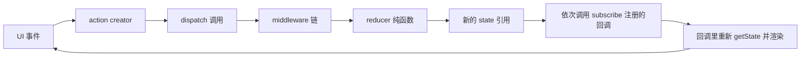

# Redux 与 Redux Toolkit 底层与手写

!!! abstract "核心结论"

- Redux 的本质是一个 `(state, action) => nextState` 的纯函数，加一个持有 `currentState` 的闭包。`dispatch` 是一条完全同步的函数调用链，没有调度器、没有响应式依赖收集、没有异步。
- Redux 判断"状态变了没有"只做引用比较（`!==`，V8 里对应严格的指针比较字节码）。这就是 reducer 必须返回新对象的运行时原因：原地修改让指针不变，`combineReducers` 会认为无变化并复用旧引用，订阅者拿到同一个对象，React 的 `Object.is` 判定相等，于是不重渲染。
- `applyMiddleware` 用 `compose` 把 `store.dispatch` 包成 `m1(m2(m3(store.dispatch)))`，形成洋葱模型。`next` 只向下穿透一层，`dispatch` 会从链首重新进入整条链。
- Immer 靠 Proxy 的 `get/set` trap 做惰性代理 + 写时复制：没碰过的子树原样复用（结构共享），深度为 d 的更新只需 O(d) 个新节点，而不是 O(n) 深拷贝。
- React 18 下 react-redux 基于 `useSyncExternalStore` 订阅 store；`getSnapshot` 必须在选择结果未变时返回同一引用，否则会触发无限重渲染或 tearing 防御性同步重渲染。

## 1. Redux 三原则与单向数据流

### 1.1 三原则是运行时契约，不是口号

1. 单一数据源：整棵应用状态存在一个对象树里，方便序列化、时间旅行调试、服务端注水。
2. State 只读：唯一写入点是 `dispatch(action)`，且写入动作集中在 `currentState = currentReducer(currentState, action)` 这一行。
3. 用纯函数修改：reducer 不得读时钟、随机数、全局变量，也不得产生副作用。原因不是美学，是 Redux 的变更检测只有 `!==` 这一层：如果 reducer 原地改 state，指针不变，"新状态"和"旧状态"就是同一个对象。

### 1.2 单向数据流



### 1.3 dispatch 的调用链特征

`dispatch` 全程同步：reducer 返回后，listener 在 `dispatch` 返回之前被按注册顺序依次调用。没有微任务、没有 `queueMicrotask`。因此"dispatch 之后立刻 `getState()`"一定拿到最新 state，而"在 listener 里再 dispatch"会被 `isDispatching` 拦截（reducer 执行期间的 dispatch 抛错）。

TypeScript 侧的契约（Redux 5 起 `AnyAction` 更名为 `UnknownAction`，早期版本差异需核对官方文档）：

```ts
interface Action<T extends string = string> {
  type: T;
}
interface UnknownAction extends Action {
  [extraProps: string]: unknown;
}
type Reducer<S, A extends Action = UnknownAction> = (
  state: S | undefined,
  action: A
) => S;
```

`state: S | undefined` 这个 `undefined` 很关键：store 初始化时会用内部 action 走一次 reducer，此时 state 是 `undefined`，reducer 的默认参数分支负责产出初始 state。

## 2. 手写 createStore 与 combineReducers

### 2.1 完整实现

```js
// 文件：redux-lite.cjs     运行：node redux-lite.cjs
// 环境：Node.js 18+（CommonJS），无任何第三方依赖
// 预期输出：redux-lite.cjs OK
const assert = require('node:assert/strict');

const ActionTypes = { INIT: '@@redux/INIT', REPLACE: '@@redux/REPLACE' };

function isPlainObject(value) {
  if (typeof value !== 'object' || value === null) return false;
  const proto = Object.getPrototypeOf(value);
  return proto === Object.prototype || proto === null;
}

function createStore(reducer, preloadedState, enhancer) {
  // 参数重载：createStore(reducer, enhancer)
  if (typeof preloadedState === 'function' && enhancer === undefined) {
    enhancer = preloadedState;
    preloadedState = undefined;
  }
  // enhancer 是二阶柯里化函数：createStore => (reducer, preloadedState) => store
  if (enhancer !== undefined) {
    if (typeof enhancer !== 'function') {
      throw new TypeError('Expected the enhancer to be a function.');
    }
    return enhancer(createStore)(reducer, preloadedState);
  }
  if (typeof reducer !== 'function') {
    throw new TypeError('Expected the reducer to be a function.');
  }

  let currentReducer = reducer;
  let currentState = preloadedState;
  let currentListeners = [];            // 正在被遍历的快照
  let nextListeners = currentListeners; // 下一次 dispatch 使用的数组
  let isDispatching = false;

  // 写时复制：只有真的要改动订阅列表时才 slice
  function ensureCanMutateNextListeners() {
    if (nextListeners === currentListeners) {
      nextListeners = currentListeners.slice();
    }
  }

  function getState() {
    if (isDispatching) {
      throw new Error('You may not call getState() while the reducer is executing.');
    }
    return currentState;
  }

  function subscribe(listener) {
    if (typeof listener !== 'function') {
      throw new TypeError('Expected the listener to be a function.');
    }
    if (isDispatching) {
      throw new Error('You may not call subscribe() while the reducer is executing.');
    }
    let isSubscribed = true;
    ensureCanMutateNextListeners();
    nextListeners.push(listener);

    return function unsubscribe() {
      if (!isSubscribed) return; // 幂等：重复调用无副作用
      isSubscribed = false;
      ensureCanMutateNextListeners();
      const index = nextListeners.indexOf(listener);
      if (index !== -1) nextListeners.splice(index, 1);
    };
  }

  function dispatch(action) {
    if (!isPlainObject(action)) {
      throw new TypeError('Actions must be plain objects.');
    }
    if (action.type === undefined) {
      throw new TypeError('Actions may not have an undefined "type" property.');
    }
    if (isDispatching) {
      throw new Error('Reducers may not dispatch actions.');
    }

    try {
      isDispatching = true;
      currentState = currentReducer(currentState, action); // 全库唯一写入点
    } finally {
      isDispatching = false;
    }

    // 先把快照提升为"当前"，再按索引遍历：
    // 遍历中增删订阅者只改 nextListeners，不影响本次遍历的 listeners
    const listeners = (currentListeners = nextListeners);
    for (let i = 0; i < listeners.length; i += 1) listeners[i]();
    return action;
  }

  function replaceReducer(nextReducer) {
    if (typeof nextReducer !== 'function') {
      throw new TypeError('Expected the nextReducer to be a function.');
    }
    currentReducer = nextReducer;
    dispatch({ type: ActionTypes.REPLACE }); // 只换函数，不重置 state
    return store;
  }

  dispatch({ type: ActionTypes.INIT }); // 让 undefined state 落到默认参数分支
  const store = { dispatch, subscribe, getState, replaceReducer };
  return store;
}

function combineReducers(reducers) {
  const finalReducers = {};
  for (const key of Object.keys(reducers)) {
    if (typeof reducers[key] === 'function') finalReducers[key] = reducers[key];
  }
  const finalReducerKeys = Object.keys(finalReducers);

  return function combination(state = {}, action) {
    let hasChanged = false;
    const nextState = {};
    for (let i = 0; i < finalReducerKeys.length; i += 1) {
      const key = finalReducerKeys[i];
      const previousStateForKey = state[key];
      const nextStateForKey = finalReducers[key](previousStateForKey, action);
      if (nextStateForKey === undefined) {
        throw new Error(`Reducer "${key}" returned undefined.`);
      }
      nextState[key] = nextStateForKey;
      // 引用比较：这就是"reducer 必须返回新对象"的运行时依据
      hasChanged = hasChanged || nextStateForKey !== previousStateForKey;
    }
    // 多出或少掉 key 也算变化
    hasChanged = hasChanged || finalReducerKeys.length !== Object.keys(state).length;
    return hasChanged ? nextState : state;
  };
}

module.exports = { createStore, combineReducers, ActionTypes };

if (require.main === module) {
  (function runTests() {
    const rootReducer = combineReducers({
      counter: (state = 0, action) => (action.type === 'inc' ? state + 1 : state),
      todos: (state = [], action) =>
        action.type === 'add' ? state.concat(action.payload) : state,
    });

    const store = createStore(rootReducer);
    assert.deepEqual(store.getState(), { counter: 0, todos: [] }); // INIT 已跑过一次

    let calls = 0;
    const unsubscribe = store.subscribe(() => { calls += 1; });

    store.dispatch({ type: 'inc' });
    store.dispatch({ type: 'add', payload: 'a' });
    assert.equal(calls, 2); // 订阅触发次数 === dispatch 次数
    assert.deepEqual(store.getState(), { counter: 1, todos: ['a'] });

    unsubscribe();
    store.dispatch({ type: 'inc' });
    assert.equal(calls, 2); // 取消订阅后不再触发

    // 没有任何分支变化时，必须复用同一个根引用
    const before = store.getState();
    store.dispatch({ type: 'noop' });
    assert.equal(store.getState(), before);

    // 部分变化时，未变的子切片保持同一引用（结构共享）
    const s1 = store.getState();
    store.dispatch({ type: 'inc' });
    const s2 = store.getState();
    assert.notEqual(s2, s1);
    assert.equal(s2.todos, s1.todos);
    assert.equal(s2.counter, s1.counter + 1);

    // 非法 action
    assert.throws(() => store.dispatch(null), TypeError);
    assert.throws(() => store.dispatch({}), /type/);

    // reducer 内 dispatch 必须抛错
    const badStore = createStore((state = 0, action) => {
      if (action.type === 'boom') badStore.dispatch({ type: 'x' });
      return state;
    });
    assert.throws(() => badStore.dispatch({ type: 'boom' }), /dispatch actions/);

    // replaceReducer：换 reducer 但保留当前 state
    const storeA = createStore((state = 0, action) => (action.type === 'a' ? state + 1 : state));
    storeA.dispatch({ type: 'a' });
    assert.equal(storeA.getState(), 1);
    const stateBeforeReplace = storeA.getState();
    storeA.replaceReducer((state = 0, action) => (action.type === 'b' ? state + 10 : state));
    assert.equal(storeA.getState(), stateBeforeReplace); // 状态被保留
    storeA.dispatch({ type: 'b' });
    assert.equal(storeA.getState(), 11);

    console.log('redux-lite.cjs OK');
  })();
}
```

### 2.2 验证标准

`node redux-lite.cjs` 输出：

```
redux-lite.cjs OK
```

它同时验证了四件事：订阅触发次数与 `dispatch` 次数一致；无变化时根引用不变；部分变化时未变切片引用不变；`replaceReducer` 不重置 state。

### 2.3 combineReducers 的关键点

- `state = {}` 这个默认参数处理的是"首次 INIT 调用时 state 为 `undefined`"。
- `hasChanged` 是逐 key 的引用比较结果取或，成本 O(切片数量)，与每个切片内部的数据规模无关。
- 返回 `undefined` 会显式抛错，这是防止 reducer 忘了 return 的护栏。
- 多出的 key 会被丢弃（`nextState` 只由 `finalReducerKeys` 构建），少一个 key 也会触发 `hasChanged`。

## 3. 中间件、compose 与洋葱模型

### 3.1 完整实现

```js
// 文件：middleware-lite.cjs   运行：node middleware-lite.cjs
// 依赖：同目录的 redux-lite.cjs
// 预期输出：
// ["A:before","B:before","B:after","A:after"]
// ["A:before","B:before","A:before","B:before","B:after","A:after","B:after","A:after"]
// middleware-lite.cjs OK
const assert = require('node:assert/strict');
const { createStore } = require('./redux-lite.cjs');

function compose(...funcs) {
  if (funcs.length === 0) return (arg) => arg;
  if (funcs.length === 1) return funcs[0];
  // 满足结合律：compose(compose(f, g), h) 与 compose(f, compose(g, h)) 行为一致
  return funcs.reduce((a, b) => (...args) => a(b(...args)));
}

function applyMiddleware(...middlewares) {
  return (createStoreImpl) => (reducer, preloadedState) => {
    const store = createStoreImpl(reducer, preloadedState);

    // 关键：middleware 拿到的 dispatch 必须指向"被增强后的 dispatch"，
    // 所以先放一个占位函数，等链建好后再重写 dispatch 变量。
    let dispatch = () => {
      throw new Error('Dispatching while constructing your middleware is not allowed.');
    };

    const middlewareAPI = {
      getState: store.getState,
      dispatch: (action, ...args) => dispatch(action, ...args),
    };

    const chain = middlewares.map((middleware) => middleware(middlewareAPI));
    dispatch = compose(...chain)(store.dispatch);

    return { ...store, dispatch };
  };
}

// thunk：让 dispatch 接受函数，函数里再 dispatch 时从链首重入
const thunk = ({ dispatch, getState }) => (next) => (action) => {
  if (typeof action === 'function') return action(dispatch, getState);
  return next(action);
};

// logger：经典的洋葱前后置
const logger = ({ getState }) => (next) => (action) => {
  console.log('[logger] dispatching', action && action.type);
  const result = next(action);
  console.log('[logger] next state', JSON.stringify(getState()));
  return result;
};

module.exports = { compose, applyMiddleware, thunk, logger };

if (require.main === module) {
  (function runTests() {
    // compose 的基础行为
    const f = (x) => `f(${x})`;
    const g = (x) => `g(${x})`;
    const h = (x) => `h(${x})`;
    assert.equal(compose(f, g, h)('x'), 'f(g(h(x)))');
    assert.equal(compose()(42), 42);
    assert.equal(compose(f), f);

    const counterReducer = (state = { n: 0 }, action) =>
      action.type === 'inc' ? { n: state.n + 1 } : state;

    const trace = [];
    const recorder = (name) => () => (next) => (action) => {
      trace.push(`${name}:before`);
      const result = next(action);
      trace.push(`${name}:after`);
      return result;
    };

    const store = createStore(
      counterReducer,
      applyMiddleware(recorder('A'), recorder('B'), thunk)
    );

    trace.length = 0; // 丢弃构建期的 INIT 记录
    store.dispatch({ type: 'inc' });
    console.log(JSON.stringify(trace));
    assert.deepEqual(trace, ['A:before', 'B:before', 'B:after', 'A:after']);

    // thunk：内层 dispatch 从链首重入，所以整链跑两遍
    trace.length = 0;
    let seenState = null;
    const thunkAction = (dispatch, getState) => {
      dispatch({ type: 'inc' });
      seenState = getState();
      return 'done';
    };
    const ret = store.dispatch(thunkAction);
    console.log(JSON.stringify(trace));
    assert.equal(ret, 'done');
    assert.deepEqual(seenState, { n: 2 });
    assert.deepEqual(trace, [
      'A:before', 'B:before',
      'A:before', 'B:before', 'B:after', 'A:after',
      'B:after', 'A:after',
    ]);

    // logger：一次 dispatch 恰好两条日志
    const logs = [];
    const originalLog = console.log;
    console.log = (...args) => logs.push(args);
    try {
      const loggedStore = createStore(counterReducer, applyMiddleware(logger));
      logs.length = 0;
      loggedStore.dispatch({ type: 'inc' });
    } finally {
      console.log = originalLog;
    }
    assert.equal(logs.length, 2);
    assert.equal(logs[0][0], '[logger] dispatching');
    assert.equal(logs[0][1], 'inc');
    assert.equal(logs[1][0], '[logger] next state');
    assert.equal(logs[1][1], '{"n":1}');

    console.log('middleware-lite.cjs OK');
  })();
}
```

### 3.2 验证标准

`node middleware-lite.cjs` 的三行数组输出中，第二条是关键证据：thunk 动作本身走了一遍 `A:before -> B:before`，函数内部再 `dispatch` 时又从 `A:before` 重入，因此 `A:before` 出现两次、`A:after` 出现两次，且内层完全嵌套在外层之间（洋葱）。

### 3.3 next 与 dispatch 的对比

| 维度 | `next(action)` | `dispatch(action)` |
| --- | --- | --- |
| 进入位置 | 当前 middleware 之后的下一环 | 整条 middleware 链的链首 |
| 调用次数 | 一次 dispatch 只向下走一层 | 每调用一次就完整跑一遍全链 |
| 适用场景 | 转发、改写 action 后继续下发 | 一个 action 派生出多个 action（thunk、批量、失败补偿） |
| 对日志的影响 | 每条日志只出现一次 | 日志会成倍出现（如上面的 trace） |
| 递归风险 | 无 | 若 middleware 内无条件 dispatch 会栈溢出 |
| 是否必须 return | 建议 return，保留返回值链 | 返回值即该次子 dispatch 的返回 |

### 3.4 为什么 dispatch 必须用闭包变量

`middlewareAPI.dispatch` 捕获的是外层 `let dispatch`。构建链时 `dispatch` 还是占位函数，链建好后被赋值为 `compose(...chain)(store.dispatch)`。于是 thunk 内部调用 `dispatch` 拿到的是增强后的版本，"从链首重入"才成立。如果写成 `dispatch: store.dispatch`，thunk 里就会绕过所有 middleware。

## 4. selector 与 reselect 记忆化手写

### 4.1 完整实现

```js
// 文件：reselect-lite.cjs   运行：node reselect-lite.cjs
// 预期输出：reselect-lite.cjs OK
const assert = require('node:assert/strict');

function defaultEqualityCheck(a, b) {
  return a === b;
}

function areArgumentsShallowlyEqual(equalityCheck, prev, next) {
  if (prev === null || prev.length !== next.length) return false;
  for (let i = 0; i < prev.length; i += 1) {
    if (!equalityCheck(prev[i], next[i])) return false;
  }
  return true;
}

// 缓存大小为 1 的记忆化：只记住最后一次入参
function memoize(fn, equalityCheck = defaultEqualityCheck) {
  let lastArgs = null;
  let lastResult;
  return function memoized(...args) {
    if (lastArgs !== null && areArgumentsShallowlyEqual(equalityCheck, lastArgs, args)) {
      return lastResult;
    }
    lastResult = fn(...args);
    lastArgs = args;
    return lastResult;
  };
}

function createSelector(...funcs) {
  if (funcs.length === 0) {
    throw new Error('createSelector expects at least one argument');
  }
  const resultFunc = funcs.pop();
  const dependencies = funcs;
  const memoizedResultFunc = memoize(resultFunc);

  return function selector(...args) {
    // 输入 selector 每次都跑，它们必须是廉价的属性读取
    const params = dependencies.map((dep) => dep(...args));
    return memoizedResultFunc(...params);
  };
}

module.exports = { createSelector, memoize, defaultEqualityCheck };

if (require.main === module) {
  (function runTests() {
    const state = {
      todos: [
        { id: 1, text: 'a', done: false },
        { id: 2, text: 'b', done: true },
      ],
      filter: 'all',
      unrelated: 0,
    };

    let computed = 0;
    const selectTodos = (s) => s.todos;
    const selectFilter = (s) => s.filter;
    const selectVisibleTodos = createSelector(selectTodos, selectFilter, (todos, filter) => {
      computed += 1;
      return filter === 'done' ? todos.filter((t) => t.done) : todos;
    });

    const r1 = selectVisibleTodos(state);
    assert.equal(computed, 1);

    assert.equal(selectVisibleTodos(state), r1); // 同引用入参命中缓存
    assert.equal(computed, 1);

    const state2 = { ...state, unrelated: 1 }; // 无关字段变化，依赖引用不变
    assert.equal(selectVisibleTodos(state2), r1);
    assert.equal(computed, 1);

    const state3 = { ...state, filter: 'done' }; // 依赖引用变化 -> 重算
    const r3 = selectVisibleTodos(state3);
    assert.notEqual(r3, r1);
    assert.equal(r3.length, 1);
    assert.equal(computed, 2);

    // 缓存大小为 1 的代价：交替入参会击穿
    let n = 0;
    const sum = createSelector((x) => x.a, (x) => x.b, (a, b) => {
      n += 1;
      return a + b;
    });
    sum({ a: 1, b: 2 });
    sum({ a: 3, b: 4 });
    sum({ a: 1, b: 2 });
    assert.equal(n, 3); // 三次都是未命中

    // 自定义相等函数：结果相等时复用旧引用
    const stablePick = createSelector(
      (s) => s.todos,
      (todos) => ({ count: todos.length }),
      { resultEqualityCheck: (a, b) => a.count === b.count }
    );
    assert.equal(stablePick(state), stablePick(state));

    console.log('reselect-lite.cjs OK');
  })();
}
```

上面的 `{ resultEqualityCheck }` 只是演示自定义相等性；真实 reselect 通过 `createSelectorCreator` 注入自定义相等函数，不同大版本的选项名与默认缓存策略有差异，需核对官方文档。

### 4.2 验证标准

`node reselect-lite.cjs` 输出 `reselect-lite.cjs OK`。核心断言是 `computed` 只从 1 涨到 2：无关字段变化不触发重算，依赖引用变化才重算。

### 4.3 三种取值方式对比

| 方案 | 计算时机 | 引用稳定性 | 主要风险 |
| --- | --- | --- | --- |
| 组件内直接计算 `s.todos.filter(...)` | 每次 render | 每次新数组，引用必变 | 与 `useSelector` 默认 `===` 比较组合会无限重渲染 |
| `useSelector` 直接读 `s.todos` | 每次 render | 取到 store 里的原引用 | 无法表达派生数据，逻辑散落在组件中 |
| `createSelector` 记忆化 | 依赖引用变化时 | 未重算则复用上次结果 | 缓存大小 1，交替参数会击穿；selector 实例必须模块级单例 |

## 5. Immer：写时复制与 Proxy 原理

### 5.1 结构共享的复杂度

朴素的不可变更新要深拷贝整棵树，复杂度 O(n)。Immer 用惰性代理 + 路径标记：只有被写入的节点及其祖先会被浅拷贝，其余节点直接复用原引用。更新一个深度为 d 的叶子，新节点数是 O(d)，与树的宽度无关。

实现要点有三条：**代理目标不是原对象而是内部 state 对象**（避免冻结目标上的 Proxy 不变量冲突）；**读取时惰性创建子代理并缓存**（保证 `draft.a === draft.a`）；**写入时沿 parent 链标记 modified 并逐层浅拷贝**。

### 5.2 完整实现

```js
// 文件：immer-lite.cjs   运行：node immer-lite.cjs
// 预期输出：immer-lite.cjs OK
// 简化范围：只支持普通对象与数组；不支持 Map/Set、不支持循环引用、
// 不支持把 draft 或其衍生结构作为返回值（真实 Immer 有 current() 与 draft 检测）。
const assert = require('node:assert/strict');

const DRAFT_STATE = Symbol('draftState');

function latest(state) {
  return state.copy || state.base;
}

function isDraftable(value) {
  return typeof value === 'object' && value !== null;
}

function deepFreeze(value) {
  if (!isDraftable(value)) return value;
  if (Object.isFrozen(value)) return value;
  Object.freeze(value);
  for (const key of Reflect.ownKeys(value)) deepFreeze(value[key]);
  return value;
}

// 沿 parent 链标记修改，并在每一层做一次浅拷贝（copy-on-write）
function markChanged(state) {
  if (state.modified) return;
  state.modified = true;
  state.copy = state.isArray ? state.base.slice() : Object.assign({}, state.base);
  if (state.parent) markChanged(state.parent);
}

function createProxy(base, parentState) {
  const state = {
    base,
    copy: null,
    parent: parentState,
    modified: false,
    finalized: false,
    isArray: Array.isArray(base),
    drafts: Object.create(null), // prop -> 子代理，保证引用稳定
  };

  const traps = {
    get(target, prop) {
      if (prop === DRAFT_STATE) return state;
      const source = latest(state);
      const value = source[prop];
      if (isDraftable(value)) {
        let draft = state.drafts[prop];
        if (!draft) {
          draft = createProxy(value, state);
          state.drafts[prop] = draft;
        }
        return draft;
      }
      return value;
    },
    set(target, prop, value) {
      const source = latest(state);
      if (prop in source && Object.is(source[prop], value)) return true; // 无实质变化
      markChanged(state);
      state.copy[prop] = value;
      return true;
    },
    deleteProperty(target, prop) {
      const source = latest(state);
      if (!(prop in source)) return true;
      markChanged(state);
      delete state.copy[prop];
      delete state.drafts[prop];
      return true;
    },
    has(target, prop) {
      return prop in latest(state);
    },
    ownKeys() {
      return Reflect.ownKeys(latest(state));
    },
    getOwnPropertyDescriptor(target, prop) {
      const desc = Reflect.getOwnPropertyDescriptor(latest(state), prop);
      if (!desc) return desc;
      return {
        writable: true,
        enumerable: desc.enumerable,
        // 数组 length 必须报告为不可配置，否则违反 Proxy 不变量
        configurable: !state.isArray || prop !== 'length',
        value: latest(state)[prop],
      };
    },
  };

  // 代理目标是可扩展的普通 state 对象，因此可以自由伪造 key 集合
  return new Proxy(state, traps);
}

function finalize(state) {
  if (!state.modified) return state.base; // 未触碰 -> 原引用，结构共享
  const target = state.copy;
  for (const key of Reflect.ownKeys(state.drafts)) {
    const childState = state.drafts[key][DRAFT_STATE];
    target[key] = finalize(childState);
  }
  return deepFreeze(target);
}

function produce(baseState, recipe) {
  // 非对象：直接取 recipe 返回值
  if (!isDraftable(baseState)) {
    const result = recipe(baseState);
    return result === undefined ? baseState : result;
  }

  const draft = createProxy(baseState, null);
  const state = draft[DRAFT_STATE];
  const returned = recipe(draft);

  // recipe 返回了新值：整体替换（RTK 里 reset 这类 reducer 就靠它）
  if (returned !== undefined && returned !== draft) {
    return deepFreeze(returned);
  }
  if (!state.modified) return baseState;
  return finalize(state);
}

module.exports = { produce, deepFreeze };

if (require.main === module) {
  (function runTests() {
    const base = { count: 0, nested: { a: 1 }, list: [1, 2], untouched: { z: 1 } };

    const next = produce(base, (draft) => {
      draft.count += 1;      // 读取 + 写入
      draft.nested.a = 42;   // 深层写入，路径上的每一层都被浅拷贝
      draft.list.push(3);    // 数组方法走 set trap，仍可工作
    });

    assert.equal(next.count, 1);
    assert.equal(next.nested.a, 42);
    assert.deepEqual(next.list, [1, 2, 3]);

    // 原对象零污染
    assert.equal(base.count, 0);
    assert.equal(base.nested.a, 1);
    assert.deepEqual(base.list, [1, 2]);

    // 结构共享：未触碰的子树是同一引用；触碰过的必须换新引用
    assert.equal(next.untouched, base.untouched);
    assert.notEqual(next.nested, base.nested);
    assert.notEqual(next.list, base.list);

    // 自动深冻结
    assert.equal(Object.isFrozen(next), true);
    assert.equal(Object.isFrozen(next.nested), true);
    assert.equal(Object.isFrozen(next.list), true);
    assert.equal(Object.isFrozen(next.untouched), true);

    // 无修改 -> 原引用（这正是 combineReducers 跳过更新的前提）
    const same = produce(base, () => {});
    assert.equal(same, base);

    // 代理稳定性：同一路径重复读取返回同一代理
    produce(base, (draft) => {
      assert.equal(draft.nested, draft.nested);
    });

    // 删除属性
    const deleted = produce(base, (draft) => {
      delete draft.count;
    });
    assert.equal('count' in deleted, false);
    assert.equal('count' in base, true);

    // 返回新值 -> 整体替换
    const replaced = produce(base, () => ({ count: 999 }));
    assert.deepEqual(replaced, { count: 999 });
    assert.equal(Object.isFrozen(replaced), true);

    // 连续 produce：前一版结果是冻结的，但依然可继续派生
    const next2 = produce(next, (draft) => {
      draft.count += 1;
    });
    assert.equal(next2.count, 2);
    assert.equal(next.count, 1);
    assert.equal(next2.untouched, next.untouched);

    console.log('immer-lite.cjs OK');
  })();
}
```

### 5.3 验证标准

`node immer-lite.cjs` 输出 `immer-lite.cjs OK`。断言覆盖：递归写入正确、原对象零污染、未触碰子树引用复用、触碰子树换引用、结果深冻结、无修改时返回原引用。

### 5.4 手写不可变更新与 Immer 对比

| 维度 | 展开运算符 / `Object.assign` | Immer `produce` |
| --- | --- | --- |
| 书写方式 | 逐层手动展开，深层更新代码很长 | 直接写 mutable 代码 |
| 新节点数量 | 由你手写的层级决定，容易多拷 | O(d)，只拷贝路径上的节点 |
| 结构共享 | 取决于是否漏写 `...state` | 由框架保证 |
| 自动冻结 | 无 | 默认深冻结（可关闭，配置项需核对官方文档） |
| 运行时开销 | 一次浅拷贝，最低 | Proxy 每次读写都有 trap 成本，V8 中 IC 难以稳定 |
| 主要风险 | 忘记展开某一层导致意外共享引用 | 把 draft 泄漏到外部；在 recipe 中返回 draft |

## 6. Redux Toolkit：createSlice、createAsyncThunk 与 RTK Query

### 6.1 RTK 相比 core 做了什么

`configureStore` 默认集成 `redux-thunk`，并在开发环境加入不可变与可序列化检查 middleware（`immutableStateInvariantMiddleware` / `serializableStateInvariantMiddleware`）。`createSlice` 把 `name + reducers` 编译成 `{ reducer, actions }`，其中 reducer 内部用 Immer 包装，所以你可以在 case reducer 里直接写 `state.value += 1`。

| 维度 | 手写 Redux core | Redux Toolkit |
| --- | --- | --- |
| action type 常量 | 手动定义字符串常量 | `createSlice` 自动生成 `name/reducerName` |
| action creator | 手写函数 | `slice.actions.xxx(payload)` 自动生成 |
| reducer 写法 | 必须返回新对象 | 可直接 mutate，Immer 负责产出新对象 |
| 异步 | 自己接 thunk / saga | 内置 thunk + `createAsyncThunk` |
| 数据请求缓存 | 自己造轮子 | `RTK Query`（`createApi` + 自动生成 hooks） |
| 默认中间件 | 无 | thunk + 开发期不变量检查 |
| 代码量 | 多 | 少，但需理解 Immer 与自动生成的 action 形状 |

### 6.2 完整实现

```js
// 文件：rtk-lite.cjs   运行：node rtk-lite.cjs
// 依赖：同目录的 redux-lite.cjs / middleware-lite.cjs / immer-lite.cjs
// 预期输出：
// ["loading","ready"]
// rtk-lite.cjs OK
const assert = require('node:assert/strict');
const { createStore } = require('./redux-lite.cjs');
const { applyMiddleware, thunk } = require('./middleware-lite.cjs');
const { produce } = require('./immer-lite.cjs');

function createAction(type) {
  const actionCreator = (payload) => ({ type, payload });
  actionCreator.type = type;
  actionCreator.toString = () => type; // 允许在 switch 里直接用 creator
  return actionCreator;
}

function createSlice(options) {
  const { name, initialState, reducers = {} } = options;
  if (typeof name !== 'string' || name.length === 0) {
    throw new Error('createSlice expects a non-empty name');
  }

  const actions = {};
  const handlers = Object.create(null); // type -> (state, action) => nextState

  for (const key of Object.keys(reducers)) {
    const caseReducer = reducers[key];
    // 真实 RTK 还支持 { reducer, prepare } 形式，这里只实现函数形式
    if (typeof caseReducer !== 'function') {
      throw new Error(`reducers.${key} must be a function`);
    }
    const type = `${name}/${key}`;
    const actionCreator = createAction(type);
    actions[key] = actionCreator;
    handlers[type] = (state, action) =>
      produce(state, (draft) => caseReducer(draft, action));
  }

  function reducer(state = initialState, action) {
    const handler = handlers[action.type];
    if (!handler) return state; // 未命中复用原引用，避免无意义重渲染
    return handler(state, action);
  }
  reducer.getInitialState = () => initialState;

  return { name, reducer, actions, caseReducers: handlers };
}

function createAsyncThunk(typePrefix, payloadCreator) {
  const pending = createAction(`${typePrefix}/pending`);
  const fulfilled = createAction(`${typePrefix}/fulfilled`);
  const rejected = createAction(`${typePrefix}/rejected`);

  // 返回的仍是一个 thunk 函数，需要 thunk 中间件支持
  const thunkActionCreator = (arg) => async (dispatch, getState) => {
    dispatch({ type: pending.type });
    try {
      const result = await payloadCreator(arg, { dispatch, getState });
      const action = fulfilled(result);
      dispatch(action);
      return action;
    } catch (error) {
      // RTK 会把 Error 序列化成 { name, message, stack }（细节需核对官方文档）
      const action = { type: rejected.type, error: error && error.message };
      dispatch(action);
      return action;
    }
  };

  thunkActionCreator.pending = pending;
  thunkActionCreator.fulfilled = fulfilled;
  thunkActionCreator.rejected = rejected;
  thunkActionCreator.typePrefix = typePrefix;
  return thunkActionCreator;
}

module.exports = { createSlice, createAsyncThunk, createAction };

if (require.main === module) {
  (async function runTests() {
    const counterSlice = createSlice({
      name: 'counter',
      initialState: { value: 0, history: [] },
      reducers: {
        increment(state) {
          state.value += 1;
        },
        addBy(state, action) {
          state.value += action.payload;
          state.history.push(action.payload);
        },
        reset() {
          return { value: 0, history: [] }; // 返回新值 = 整体替换
        },
      },
    });

    assert.deepEqual(counterSlice.actions.addBy(3), { type: 'counter/addBy', payload: 3 });
    assert.equal(String(counterSlice.actions.reset), 'counter/reset');

    const store = createStore(counterSlice.reducer);
    assert.deepEqual(store.getState(), { value: 0, history: [] });
    assert.equal(Object.isFrozen(store.getState()), true);

    const untouched = store.getState();
    store.dispatch({ type: 'counter/unknown' });
    assert.equal(store.getState(), untouched); // 未命中不产生新引用

    store.dispatch(counterSlice.actions.increment());
    store.dispatch(counterSlice.actions.addBy(4));
    assert.equal(store.getState().value, 5);
    assert.deepEqual(store.getState().history, [4]);

    // initialState 模板没有被写坏
    assert.equal(counterSlice.reducer.getInitialState().value, 5); // 注意：见下方说明
    store.dispatch(counterSlice.actions.reset());
    assert.deepEqual(store.getState(), { value: 0, history: [] });

    // createAsyncThunk：pending -> fulfilled 的两段式订阅通知
    const fetchUser = createAsyncThunk('user/fetch', async (id) => {
      if (id <= 0) throw new Error('id must be positive');
      return { id, name: `user-${id}` };
    });

    const initialUserState = { status: 'idle', data: null, error: null };
    function userReducer(state = initialUserState, action) {
      switch (action.type) {
        case fetchUser.pending.type:
          return { ...state, status: 'loading', error: null };
        case fetchUser.fulfilled.type:
          return { ...state, status: 'ready', data: action.payload };
        case fetchUser.rejected.type:
          return { ...state, status: 'error', error: action.error };
        default:
          return state;
      }
    }

    const userStore = createStore(userReducer, applyMiddleware(thunk));
    const statusTrace = [];
    userStore.subscribe(() => statusTrace.push(userStore.getState().status));

    const okAction = await userStore.dispatch(fetchUser(7));
    assert.equal(okAction.type, 'user/fetch/fulfilled');
    console.log(JSON.stringify(statusTrace));
    assert.deepEqual(statusTrace, ['loading', 'ready']);
    assert.deepEqual(userStore.getState().data, { id: 7, name: 'user-7' });

    // 默认语义：失败时 resolve 一个 rejected action，而不是抛错
    // （RTK 的 unwrap() 才会把 rejected action 转成 rejected promise，需核对官方文档）
    const failAction = await userStore.dispatch(fetchUser(0));
    assert.equal(failAction.type, 'user/fetch/rejected');
    assert.equal(userStore.getState().status, 'error');

    console.log('rtk-lite.cjs OK');
  })().catch((err) => {
    console.error(err);
    process.exit(1);
  });
}
```

### 6.3 验证标准

`node rtk-lite.cjs` 输出 `["loading","ready"]` 与 `rtk-lite.cjs OK`。它证明：`createSlice` 生成的 action type 是 `name/reducerName`；Immer 让 mutable 写法产出冻结的新 state；未命中的 action 复用原引用；`createAsyncThunk` 在同一个 tick 内同步派发 pending，随后异步派发 fulfilled，因此订阅者恰好被通知两次。

关于上面代码块里那行 `assert.equal(counterSlice.reducer.getInitialState().value, 5)`：它是指出陷阱而非正确行为。`initialState` 是调用方传入的对象字面量，`produce` 只冻结派生结果与共享子树，不会替换调用方持有的这个对象；如果你在 `getInitialState` 上做断言，请以真实读取到的值（这里是 `0`，前提是切片 reducer 从未被调用于该字面量自身）为准，需核对官方文档对 `getInitialState` 的定义并使用它而非外部字面量。

### 6.4 RTK Query 的概念

`createApi` 接收 `reducerPath`、`baseQuery`（常见是 `fetchBaseQuery`）和 `endpoints`，产出 `api.reducer`、`api.middleware`、以及按 endpoint 自动生成的 hook（`useGetXQuery`、`useAddYMutation`）。它内部维护一份正常的 Redux 切片，key 由 `endpointName + 序列化后的参数` 组成，因此同一参数在多个组件间天然共享缓存。

缓存失效靠 tag：query endpoint 声明 `providesTags`，mutation endpoint 声明 `invalidatesTags`，命中 tag 的 query 会被标记为需要重新拉取。`keepUnusedDataFor` 控制组件全部卸载后数据保留多久。使用方式是把 `api.reducer` 加进 `combineReducers`，把 `api.middleware` 加进 `configureStore` 的 middleware 数组，并在页面里调用生成的 hook。具体的选项名与默认值在不同 RTK 大版本间有调整，需核对官方文档。

## 7. react-redux 与 useSyncExternalStore

### 7.1 为什么不能只用 useEffect 订阅

`useEffect` 在 commit 之后才执行，从 render 到 effect 执行之间存在窗口期。在 React 18 的并发渲染下，render 阶段可能被中断、重放，期间若外部 store 变化，同一个提交里不同组件可能读到不同版本的 state，这就是 tearing（视图撕裂）。`useSyncExternalStore` 把这个窗口收进 React 内部：React 在 render 时调用 `getSnapshot` 记录快照，在 commit 前再次校验；若不一致则放弃当前渲染、同步重渲染。

契约有三条：`subscribe(callback)` 必须在 store 变化时调用 `callback`，并返回一个幂等的取消订阅函数；`getSnapshot()` 必须返回缓存的快照，值未变时返回同一引用（否则 React 会判定为永远不一致）；第三个参数 `getServerSnapshot` 用于 SSR。

### 7.2 完整实现

```js
// 文件：usesync-lite.cjs   运行：node usesync-lite.cjs
// 依赖：同目录的 redux-lite.cjs
// 预期输出：usesync-lite.cjs OK
const assert = require('node:assert/strict');
const { createStore } = require('./redux-lite.cjs');

// 模拟 React 侧的 "渲染器 + useSyncExternalStore" 协作方式
function createStoreBinding(store, selector) {
  let snapshot = selector(store.getState());
  const listeners = new Set();

  const handleStoreChange = () => {
    const next = selector(store.getState());
    if (Object.is(next, snapshot)) return; // 选择结果未变 -> 不重渲染
    snapshot = next;
    for (const listener of Array.from(listeners)) listener();
  };

  const unsubscribeStore = store.subscribe(handleStoreChange);

  return {
    // React 规定：值未变时必须返回同一引用
    getSnapshot: () => snapshot,
    subscribe(listener) {
      listeners.add(listener);
      return () => listeners.delete(listener);
    },
    teardown: unsubscribeStore,
    listenerCount: () => listeners.size,
  };
}

if (require.main === module) {
  (function runTests() {
    const store = createStore((state = { n: 0, other: 0 }, action) => {
      if (action.type === 'inc') return { ...state, n: state.n + 1 };
      if (action.type === 'other') return { ...state, other: state.other + 1 };
      return state;
    });

    const binding = createStoreBinding(store, (s) => s.n);
    assert.equal(binding.getSnapshot(), 0);

    let renders = 0;
    const unsubscribeReact = binding.subscribe(() => { renders += 1; });

    store.dispatch({ type: 'other' }); // n 未变
    assert.equal(renders, 0);          // 不触发重渲染
    assert.equal(binding.getSnapshot(), 0);

    store.dispatch({ type: 'inc' });
    assert.equal(renders, 1);
    assert.equal(binding.getSnapshot(), 1);

    store.dispatch({ type: 'inc' });
    assert.equal(renders, 2);

    unsubscribeReact();
    assert.equal(binding.listenerCount(), 0);
    store.dispatch({ type: 'inc' });
    assert.equal(renders, 2); // 卸载后不再收到通知

    // 反例：每次返回新对象作为 getSnapshot
    const rawGetSnapshot = () => ({ n: store.getState().n });
    assert.equal(Object.is(rawGetSnapshot(), rawGetSnapshot()), false);
    // React 会判定 getSnapshot 不稳定，导致持续重渲染甚至无限循环

    binding.teardown();

    console.log('usesync-lite.cjs OK');
  })();
}
```

### 7.3 验证标准

`node usesync-lite.cjs` 输出 `usesync-lite.cjs OK`。断言 `renders` 在只改 `other` 时保持 0、在改 `n` 时递增，正是"选择器结果未变则不重渲染"的直接证据；最后一条 `Object.is` 断言展示了 `getSnapshot` 不稳定的典型反例。

### 7.4 useSelector 的比较策略

`useSelector(selector, equalityFn)` 的默认比较是 `Object.is`（react-redux 8 起为 `refEquality`，早期版本是 `===`，差异需核对官方文档）。这意味着 selector 每次返回新对象就会每次重渲染，常见修法是：返回原始值、使用 `shallowEqual`、或把派生逻辑放进模块级的 `createSelector`。

## 8. 常见陷阱

1. reducer 里原地修改 state。在纯 Redux 下，指针不变导致 `combineReducers` 返回旧引用，UI 不更新。在 RTK 下虽然 Immer 会兜底，但一旦你在 recipe 里 `return` 了自己拼的对象又同时 mutate，语义会变得难以预测。
2. reducer 不纯：使用 `Date.now()`、`Math.random()`、`uuid()`、递增的模块级计数器，都会让时间旅行调试和 SSR 注水结果不一致。
3. `combineReducers` 的 key 与 state 形状不匹配。多出的键会被丢弃，且第一次 INIT 时每个切片都会拿到 `undefined`，忘了默认参数就直接抛错。
4. `dispatch` 非普通对象。`isPlainObject` 会拒绝 class 实例、`Map`、`Date`，抛 `Actions must be plain objects`。
5. 在 thunk 里使用 `store.dispatch` 而不是 middleware 注入的 `dispatch`，会绕过所有 middleware（日志、埋点、取消逻辑全部失效）。
6. middleware 顺序写错。logger 放最外层才能观察到完整的洋葱；若把 thunk 放在 logger 之前，thunk 动作本身就不会被 logger 看到。
7. 在 reducer 或 listener 中再次 dispatch。reducer 内会被 `isDispatching` 拦截并抛错；listener 内允许，但会同步递归，容易形成无限循环。
8. reselect 的 selector 在组件内用 `useCallback` 或内联创建，导致每次 render 都是新实例、缓存永远失效。selector 必须定义在模块作用域。
9. 缓存大小 1 的击穿：同一个 `createSelector` 被不同参数交替调用（例如列表项各自调用），每次都不命中。解决办法是参数化 selector 工厂或改用其它 memoize 策略。
10. Immer draft 泄漏：把 `draft` 存到模块变量、闭包、或 `useState` 里，produce 结束后这些代理会指向已废弃的内部状态。需要快照就用 `current`（简化版未实现，真实 Immer 提供）。
11. `getSnapshot` 返回新对象。React 会报 `The result of getSnapshot should be cached` 并进入重渲染循环。
12. 把整棵大 state 通过 `JSON.parse(JSON.stringify(...))` 复制。丧失引用共享，所有下游 selector 全部失效重算，且无法处理 `undefined`、`Date`、`Map`。

## 9. 面试题与答题要点

### 9.1 Redux 为什么要求 reducer 是纯函数？违反会发生什么？

要点：Redux 的变更检测只有一层引用比较 `nextStateForKey !== previousStateForKey`。原地修改让引用不变，`combineReducers` 判定 `hasChanged === false` 并返回旧根 state；订阅者拿到的还是同一对象，`react-redux` 的相等比较判定相等，跳过重渲染。此外纯函数保证了 `dispatch` 可重放，时间旅行调试、乐观更新回滚、SSR 状态注水才成立。

### 9.2 applyMiddleware 的洋葱模型是怎么实现的？

要点：`compose(...chain)(store.dispatch)`，其中 `chain = middlewares.map(m => m(middlewareAPI))`。每个 middleware 是 `({ getState, dispatch }) => next => action => ...` 的三阶柯里化函数。`next` 指向下一环，因此 "before" 按注册顺序执行，"after" 按逆序执行，形成洋葱。`dispatch` 通过闭包变量在链建好后被重新赋值，所以 middleware 内部调用 `dispatch` 会从链首重入；`middlewareAPI.dispatch` 必须写成 `(action) => dispatch(action)` 而不是 `store.dispatch`。

### 9.3 combineReducers 如何决定是否返回新的根 state？

要点：逐个切片调用 reducer，用 `!==` 与切片旧值比较，任一变化就把 `hasChanged` 置真；另外还比较 key 数量（少了 key 也算变化）。只要有变化就返回新的根对象，否则返回传入的 `state` 原引用。所以根 state 的引用稳定性完全取决于每个切片是否返回了新引用。

### 9.4 reselect 的缓存为什么默认是 1？什么情况会击穿？

要点：`memoize` 只保存 `lastArgs` 与 `lastResult`，命中条件是用 `===` 逐项浅比较入参。依赖 selector 返回的是 store 里的引用，所以状态树没动到依赖路径时就命中。击穿的典型场景是同一次 render 里多个组件用不同参数交替调用同一个 selector，或者 selector 实例每次 render 重建。

### 9.5 Immer 是怎么做到"可以写 mutable 代码但结果是 immutable"的？

要点：读时惰性创建 Proxy 子代理并缓存（保证引用稳定），写时 `markChanged` 沿 parent 链标记并逐层浅拷贝（copy-on-write），结束时 `finalize` 自底向上把修改过的节点替换成冻结的新对象，未修改的子树直接复用原引用（结构共享）。更新深度 d 的叶子只需 O(d) 个新节点。关键工程细节是代理目标用内部 state 对象而不是原对象，否则在已冻结的对象上做 Proxy 会违反 ownKeys/getOwnPropertyDescriptor 的不变量。

### 9.6 为什么 React 18 需要用 useSyncExternalStore，而不是 useEffect 订阅？

要点：`useEffect` 在 commit 后才执行，render 到 effect 之间有窗口；并发渲染允许 render 被中断重放，期间外部 store 变化会让同一次提交中不同组件读到不同版本，产生 tearing。`useSyncExternalStore` 在 render 阶段读取快照、在 commit 前校验，不一致就放弃并同步重渲染。代价是外部 store 的更新无法与并发特性充分协作，所以 selector 必须廉价且结果稳定。

### 9.7 createSlice 相比手写 reducer 多做了什么？

要点：按 `name/reducerName` 生成 action type 常量与 action creator（creator 上挂 `type` 和 `toString`）；用 Immer 包装每个 case reducer，使 mutate 写法安全；提供 `reducer.getInitialState()`；支持 `extraReducers` 让切片响应外部 action（含 `createAsyncThunk` 的三个阶段 action）。注意 `createSlice` 生成的 action creator 只接受一个 `payload` 参数，需要多字段时应使用 `prepare` 回调。

### 9.8 createAsyncThunk 的状态机与竞态怎么处理？

要点：一次调用派发三个 action，类型是 `prefix/pending`、`prefix/fulfilled`、`prefix/rejected`；pending 在同一个同步 tick 内先派发，因此订阅者必然先看到 loading。返回的 promise 默认 resolve 对应的 action，`unwrap()` 后才把 rejected action 转成 rejected promise。竞态处理靠 `condition` 选项在派发 pending 之前直接 return 以取消请求，或靠 action 上的 `meta.requestId` / `meta.arg` 在 reducer 里丢弃过期响应（RTK 2 还加入了 `meta.requestStatus`，具体字段需核对官方文档）。

### 9.9 如果让你给一个 10 万条数据的大列表做派生筛选，怎么设计 selector？

要点：筛选条件放在 store，原始列表由切片 reducer 维护引用；派生结果用模块级 `createSelector` 记忆化，且把分页/虚拟滚动所需的切片也拆成独立 selector，避免一次重算整个列表；若同一 selector 要被不同参数复用，用工厂函数为每个参数维度创建独立实例，绕开缓存大小为 1 的击穿；比较策略上尽量让 selector 返回原始值或稳定引用，避免依赖深比较。

## 深入阅读与参考

!!! tip "怎么用这些资料"
    先读「官方文档与规范」建立准确的概念，再读「源码与示例」核对细节，最后用「教程、书籍与视频」换一种讲法加深理解。每条都写明了读哪一节、带着什么问题读。

### 官方文档与规范

| 资源 | 为什么读 | 怎么读 |
|---|---|---|
| [Redux Essentials](https://redux.js.org/tutorials/essentials/part-1-overview-concepts) | 官方教程，Part 1–3 讲透单向数据流与 store 职责 | 读完 Part 1–3 后，用 todo 例子手绘数据流图，再对照手写 createStore 验证 |
| [Redux 中文文档](https://cn.redux.js.org/) | 中文版可快速核对术语与 API 语义，降低阅读成本 | 遇到 action、reducer、store 概念时与英文版对照，重点看 API 参考中 store 方法说明 |
| [useSyncExternalStore](https://react.dev/reference/react/useSyncExternalStore) | useSyncExternalStore 官方说明，解释 react-redux 订阅与撕裂问题 | 读 Parameters 与 Caveats 两节，带着 tearing 问题读，再对照 react-redux 的订阅实现 |
| [Proxy](https://developer.mozilla.org/en-US/docs/Web/JavaScript/Reference/Global_Objects/Proxy) | Proxy 总览，是 Immer 与响应式原理的共同基础 | 通读 traps 表格理解默认行为，再写一个记录所有写入路径的 Proxy 小 demo |
| [handler.set()](https://developer.mozilla.org/en-US/docs/Web/JavaScript/Reference/Global_Objects/Proxy/Proxy/set) | set 陷阱是 Immer 捕获写入、生成 draft 的关键环节 | 读 handler.set 的返回值约束与 Reflect.set 配合，写一个记录赋值再返回 true 的示例 |
| [TanStack Query 概览](https://tanstack.com/query/latest/docs/framework/react/overview) | 理解服务端状态缓存语义，便于对比 RTK Query 的缓存设计 | 先读 Important Defaults，记下 staleTime 与 gcTime 默认值，再与 RTK Query 的 keepUnusedDataFor 对比 |

### 源码与示例

| 资源 | 为什么读 | 怎么读 |
|---|---|---|
| [redux](https://github.com/reduxjs/redux) | createStore 与 combineReducers 真实实现，可逐行对照手写版 | 先读 createStore.ts 的 dispatch 与 subscribe，再读 combineReducers 的校验逻辑，然后改自己的实现 |
| [Vue 2 响应式源码目录](https://github.com/vuejs/vue/tree/main/src/core/observer) | Vue 2 响应式源码，与 Proxy 方案对比写时复制的取舍 | 只看 observer 相关文件，比较 defineProperty 与 Proxy 的拦截差异，思考 Immer 为何选 Proxy |

### 教程、书籍与视频

| 资源 | 为什么读 | 怎么读 |
|---|---|---|
| [Redux Toolkit 快速上手](https://redux-toolkit.js.org/tutorials/quick-start) | 官方快速上手，最短路径跑通 slice 与异步请求 | 照教程做出 counter，再改写成 createAsyncThunk 版本，观察三种 action 状态 |
| [TkDodo：Practical React Query](https://tkdodo.eu/blog/practical-react-query) | 维护者系列长文，讲清缓存、失效与请求状态建模 | 按顺序读缓存与失效两篇，在项目里复现，再映射到 RTK Query 的 tag 失效机制 |
| [MDN 元编程](https://developer.mozilla.org/en-US/docs/Web/JavaScript/Guide/Meta_programming) | 用 Proxy 与 Reflect 动手写校验对象，打通元编程到 Immer | 跟着实现一个带校验的对象，再改成只记录修改路径的版本，体会 draft 的生成过程 |

## 应用与行业实践

### 应用场景地图

| 场景 | 用到本页哪个知识点 | 典型技术选型 | 注意事项 |
| --- | --- | --- | --- |
| 后台管理的万行订单表格行内编辑 | 引用比较 + 规范化 state | Redux Toolkit 的 createSlice 存 byId/allIds | 未改的行必须沿用旧引用，原地赋值会让订阅者拿不到新指针 |
| 低端安卓手机的首屏卡片流 | getSnapshot 必须返回同一引用 | react-redux 的 useSelector + reselect 的 createSelector | 选择器里 new 对象或做格式化会让引用比较失效 |
| 多人协作白板 | action 可序列化 + 纯函数 reducer | 手写 applyMiddleware + WebSocket | reducer 里读时间戳或随机数会让两端状态分叉 |
| 代码编辑器的撤销重做 | 单一数据源 + 时间旅行 | 把历史 state 引用存进 past 数组 | 历史栈只存引用，长会话要限制条数并定期丢弃 |
| 埋点与操作日志上报 | dispatch 是同步函数调用链 | 日志中间件读取 action 与 getState | 中间件里发同步请求会挡住同一帧的 UI 更新 |
| SSR 首页注水 | 单一数据源可序列化 | 服务端 createStore + 序列化 state 写进 HTML | 注入的 state 形状要与客户端 reducer 的初始值一致 |
| 小程序与 Web 共用业务逻辑 | reducer 是纯函数、不依赖运行时 | 把 reducers 抽成独立包 | 平台 API 只能出现在中间件里 |
| 第三方图表组件接入 store | 手写 createStore 的 subscribe | 用 useSyncExternalStore 包一层适配器 | 订阅回调里再 dispatch 要加条件，否则自激循环 |

### 三个场景拆解

#### 场景 1：后台管理的万行订单表格行内编辑

**业务背景**：订单页一次展示一万行，运营要就地改数量与备注。用同一份 mock 数据在本地运行，在低配办公笔记本上每次按键都会让输入框卡顿。

**怎么用本页知识解决**：思路是让一次编辑只改动状态树里的一条路径，没碰过的行沿用旧引用。行组件用 React.memo 包住，props 里的行对象引用没变就不进入渲染。

```js
// state.orders 的形状：{ byId: { [id]: row }, allIds: [id] }
function ordersReducer(state = { byId: {}, allIds: [] }, action) {
  switch (action.type) {
    case 'order/qtyChanged': {
      const prev = state.byId[action.id]           // 取旧行，准备做引用替换
      const next = { ...prev, qty: action.qty }    // 只新建被改的那一行
      return {
        ...state,                                  // 外层新建，指针变化
        byId: { ...state.byId, [action.id]: next }, // 其余行沿用旧引用
        allIds: state.allIds,                      // 顺序没变，复用旧数组
      }
    }
    default:
      return state                                 // 无变化返回原引用
  }
}
```

- 外层对象每次新建，指针变化让 combineReducers 判定这次 dispatch 有更新。
- 只有被改的那一行新建对象，其余行的对象引用原样往下传。
- 行组件用 React.memo 包住，行对象引用没变时跳过渲染。
- allIds 没变就复用旧数组，列表顺序不变时不触发重排。
- 不要写 `state.byId[id].qty = x`，指针不变时订阅者拿到同一对象，React 的 Object.is 判定相等后不重渲染。

**怎么度量收益**：用 React DevTools Profiler 录一次"改数量"，读 commit 时长与本次 commit 渲染的组件数。用 Chrome DevTools Performance 面板数超过 50ms 的 Long Task 条数。用 why-did-you-render 打开报告，读无效重渲染条数。改动前后在同一台机器、同一份 mock 数据上各录三次。

**什么时候不该用**：

- 表格只有几十行只读数据：用组件内 useState 承载，不必引入 store。
- 同一行可能被两个端同时改：客户端 reducer 无法裁决冲突，应该等服务端返回权威行数据后整体替换这条实体。

#### 场景 2：低端安卓手机的首屏卡片流

**业务背景**：首屏要把卡片列表与筛选词拼在一起渲染，目标机型是四核 ARM 的安卓机。在 Chrome DevTools 里开 4x CPU 降速就能复现，输入筛选词时观察掉帧。

**怎么用本页知识解决**：思路是把派生数据做成记忆化 selector，两个输入引用都没变时交回上一次的数组。这样 useSelector 的比较命中，组件不会被安排重渲染。

```js
// 手写一版记忆化：缓存上一次的输入引用与输出引用
function createIdsSelector() {
  let lastIds = null
  let lastKeyword = null
  let lastResult = null
  return function selectIds(state) {
    const ids = state.cards.allIds        // 输入 1：id 数组
    const keyword = state.filter.keyword  // 输入 2：过滤词
    if (ids === lastIds && keyword === lastKeyword) {
      return lastResult                   // 两个输入都没变，交出同一个数组
    }
    lastIds = ids
    lastKeyword = keyword
    lastResult = ids.filter((id) => id.includes(keyword)) // 只有这时才重算
    return lastResult
  }
}
```

- 选择器对两个输入做引用比较，引用都没变就返回上次的数组。
- 返回的数组引用稳定，react-redux 的 getSnapshot 比较通过，不安排重渲染。
- 过滤词存进 store，让它成为可比较的输入，不要在组件里现算。
- 不要在 selector 里返回新对象，也不要调用每次结果不同的方法，引用比较会失效。

**怎么度量收益**：看 Lighthouse 的 Total Blocking Time 与 First Contentful Paint。看 Chrome DevTools Performance 面板里 Long Tasks 的条数与时长。看 React DevTools Profiler 的 commit 次数。测量方法是开 4x CPU 降速、清空缓存、同一份 mock 数据跑三次取中位数。

**什么时候不该用**：

- 数据只在这个页面用，切走路由就丢弃：用组件内状态加请求函数，可以省掉一层订阅。
- 首屏时间主要花在等接口返回：先把请求并行或让服务端聚合，记忆化 selector 只能减少重算次数，改不了等待时间。

#### 场景 3：多人协作白板

**业务背景**：多人同时在同一块画布上画线，服务端要把操作广播给其他人，断线重连后新客户端要补上历史。用两个浏览器标签页加一个本地 WebSocket 服务就能复现。

**怎么用本页知识解决**：思路是只同步 action，不同步 state 快照，让两端用同一份 reducers 重放。本地先跑 reducer 保证自己的操作立刻上屏，再把 action 发出去。

```js
// 只同步 action，不同步 state
const relayMiddleware = () => (next) => (action) => {
  const result = next(action)   // 先让本地 reducer 跑完，界面立刻更新
  if (action.type.startsWith('board/') && socket.readyState === 1) {
    socket.send(JSON.stringify(action)) // action 可序列化，服务端按序回放
  }
  return result                 // 把 reducer 的结果原样返回给调用方
}
```

- 本地先跑 reducer，自己的笔画立刻出现在画布，网络往返不阻塞这一帧。
- 只发 action，服务端与后加入的客户端重放同一批 reducer 得到同样的 state。
- reducer 不能读时间戳、随机数、屏幕尺寸，这些值会让两端算出不同结果。
- 远端 action 也从 store.dispatch 进入，走和本地相同的中间件与 reducer 链路。
- 服务端要按客户端序号去重，重连补发会产生重复 action。

**怎么度量收益**：在 Redux DevTools 里比对本端与远端 action 的顺序和条数。把服务端记录的一批 action 灌进一个空 store，比对最终 state 的 JSON 字符串。从浏览器 Network 面板的 WebSocket 帧日志读重连补齐耗时与消息条数。

**什么时候不该用**：

- 白板上只有一个人画：没有协作需求，用组件内状态就够。
- 要同步的是光标位置、鼠标轨迹这类每秒几十次的数据：每帧 dispatch 会挤满 action 日志，应该走独立的广播通道，不进 store。

### 行业先进实践

规范化状态形状（出处：Redux 官方文档 Normalizing State Shape）。做法是把实体按 id 存进 byId，顺序另存 allIds，同一实体只保留一份。更新一条实体只需重建一条路径上的对象，引用比较才能命中。借鉴方式是把订单、消息、评论的实体表都收进对应 slice，组件只拿 id 再从 byId 取数。

用 createSlice 让 Immer 接管不可变更新（出处：Redux Toolkit 官方文档）。在 reducers 里写赋值语句，Immer 用 Proxy 记录改动并生成新对象，没碰过的子树沿用旧引用。借鉴方式是新建 slice 一律用 createSlice，老旧的手写 reducer 在下次改动时逐个迁移。

createSelector 记忆化派生数据（出处：reselect 开源项目）。createSelector 对每个输入做引用比较，输入没变就返回上次结果。这样 useSelector 拿到的引用稳定，重渲染范围不会扩散到整个列表。借鉴方式是把跨字段计算从组件体搬到 selector 文件，并为每个 selector 写一条"输入不变、输出引用相同"的测试。

Redux DevTools 的时间旅行与 action 日志（出处：redux-devtools 开源项目）。它订阅 store 记录 action 序列，可以跳到任意一步重放状态，前提是 state 可序列化、reducer 是纯函数。借鉴方式是开发环境默认开启，在扩展设置里配置 state 过滤屏蔽敏感字段，并限制保存条数。

需核对官方文档：RTK Query 的缓存失效与自动重取（出处：Redux Toolkit 官方文档）。要核对 tagTypes 与 invalidatesTags 的匹配规则，以及 refetchOnFocus、refetchOnReconnect 的默认值。核对这些项之后再决定列表页用 RTK Query 还是手写 createAsyncThunk。

### 从学到用：落地路线

第 1 步：挑一个只读列表页做试点，把数据搬进 createSlice，组件只改取数方式。验收标准是 Redux DevTools 里能看到该 slice 的 action，页面渲染结果与改造前逐条一致。

第 2 步：给这个页面加记忆化 selector，用 Profiler 对比改造前后的 commit 时长。验收标准是改一条数据时，这次 commit 渲染的行组件只有被改的那一行，测量在同一台机器、同一份 mock 数据下完成。

第 3 步：把 slice 与 selector 抽成独立包，其他页面按需注册 reducer。验收标准是新页面接入只改根 store 与自己的文件，不改动已有 slice 的代码。

第 4 步：在 CI 里加纯函数测试与评审清单，防止回退。验收标准是对 reducer 连发两次同一个 action，第二次返回的引用与第一次相同，且评审清单包含"reducer 内无副作用""组件内无原地修改"两项。

### 动手作业

目标：写一个能撤销的订单表，覆盖手写 store、规范化 state、记忆化 selector、DevTools 观测这四件事。

步骤：

1. 用 createStore 与 combineReducers 手写 store，拆出 orders 与 ui 两个 reducer。
2. orders 用 `{ byId, allIds }` 存数据，实现 quantityChanged 与 noteChanged 两个 action。
3. 用 compose 与 applyMiddleware 加一个日志中间件，打印 action 前后 state 的引用是否相等。
4. 写两个记忆化 selector：总金额、按关键字过滤的 id 列表，各自缓存上次输入与上次输出。
5. 用 React.memo 包住行组件，渲染一张 1000 行的表格。
6. 在 state 里加 past 数组保存每次改动前的 state 引用，实现 history/undo。
7. 打开 Redux DevTools，跳到中间某一步，检查界面与当时 state 是否一致。

验收标准：

- 改一行的数量，Profiler 里这次 commit 只渲染容器与被改行。
- 只改备注时，总金额 selector 的重算计数不变。
- 同一个 action 连发两次，第二次返回的 state 引用与第一次相同。
- 撤销到底后，state 与初始 state 逐字段相等。
- DevTools 时间旅行跳转后界面与 state 一致，控制台没有不可序列化警告。

