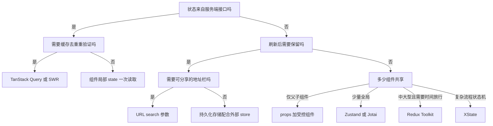

# 前端状态管理选型指南

!!! abstract "核心结论"
    - 先分类再选型：UI 状态、服务端缓存、URL 状态的权威来源与失效模型不同，混用同一个全局 store 是多数性能与正确性问题的根源。
    - 客户端全局状态以 Zustand、Jotai 等外部 store 为默认选择；需要时间旅行调试与强约束的中大型团队选 Redux Toolkit；复杂流程状态机选 XState。
    - 服务端数据优先交给 TanStack Query 或 SWR，不手写缓存、去重、重验证与失败回退。
    - 能被刷新恢复、收藏与分享的状态放进 URL search 参数；派生状态用 selector 计算，不要冗余存储。
    - 面试中能讲清 useSyncExternalStore 快照一致性、不可变结构共享、Signal 依赖收集、SWR 失效模型，比背 API 更重要。

## 1. 状态分类：先回答“这真的是全局状态吗”

很多“全局状态”其实是局部状态被错误提升了作用域。先分类，才能决定它应该住在哪里。

### 1.1 六类状态与权威来源

| 类别 | 典型例子 | 权威来源 | 推荐归属 | 常见反模式 |
| --- | --- | --- | --- | --- |
| UI 本地状态 | 折叠面板、弹窗显隐、输入框中间值 | 组件自身 | 组件内 useState 或 useReducer | 为了共享而强行提升到全局 |
| 表单状态 | 受控输入、校验错误、提交中标记 | 用户输入 | React Hook Form 或组件局部 | 每次按键 dispatch 全局 action |
| 服务端缓存 | 用户列表、文章详情、接口返回 | 服务端 | TanStack Query 或 SWR | 把响应手工写进 Redux 并手工失效 |
| URL 状态 | 搜索词、筛选器、分页、tab | 地址栏 | URL search 参数 | UI 里存一份、URL 再存一份，双源不同步 |
| 全局共享 | 登录用户、主题、权限、语言 | 应用会话 | Zustand 等外部 store | 高频状态放 Context 触发全树渲染 |
| 派生状态 | 总价、未读计数、过滤后列表 | 由其他状态计算 | selector 或 computed | 把派生结果存进 store 并手工同步 |

### 1.2 客户端、服务端、URL 三类状态的失效模型对比

| 维度 | 客户端状态 | 服务端缓存状态 | URL 状态 |
| --- | --- | --- | --- |
| 数据权威 | 本地内存，进程或会话级别 | 服务端数据库 | 地址栏 |
| 生命周期 | 随页面或会话存在 | 受 staleTime、gcTime、重验证约束 | 随浏览器历史记录存在 |
| 刷新后 | 通常丢失 | 可以重新拉取 | 不丢失，可恢复 |
| 失败处理 | 不需要网络 | 需要错误、重试、回退旧数据 | 不需要网络，但需要序列化安全 |
| 推荐工具 | Zustand、Jotai | TanStack Query、SWR | URLSearchParams、router |
| 典型错误 | 把用户列表放进 Redux | 把接口响应手工写进 Redux | 只是筛选却放全局 store |

### 1.3 URL 状态手写实现与验证

下面实现一个不依赖任何框架的 URL 状态适配器，可注入 mock 的 location 与 history 进行 Node 测试。核心思想：URL 是应用状态的一部分，尤其适合“可分享、可刷新恢复”的筛选条件。

```javascript
// 运行环境：Node.js >= 18，保存为 06-url-state.js
// 极简 URL 状态：JSON 序列化写入 search 参数，读取时解析
function createURLState({ location, history, key }) {
  function read(defaultValue) {
    const params = new URLSearchParams(location.search);
    const raw = params.get(key);
    if (raw === null) return defaultValue;
    try {
      return JSON.parse(raw);
    } catch {
      return defaultValue;
    }
  }

  function write(value) {
    const params = new URLSearchParams(location.search);
    if (value === undefined) {
      params.delete(key);
    } else {
      params.set(key, JSON.stringify(value));
    }
    const query = params.toString();
    history.pushState(null, '', query ? `${location.pathname}?${query}` : location.pathname);
  }

  return { read, write };
}
```

**验证标准**（`node 06-url-state.js`，预期输出：`PASS: URL 状态序列化、回读、删除均符合预期`）

```javascript
const assert = require('node:assert');

const location = { pathname: '/list', search: '' };
const history = {
  pushState(_state, _title, url) {
    location.search = url.includes('?') ? url.slice(url.indexOf('?')) : '';
  },
};

const url = createURLState({ location, history, key: 'filter' });

assert.deepStrictEqual(url.read({ status: 'all' }), { status: 'all' }); // 无参数时回退默认值

url.write({ status: 'done', q: 'a' });
assert.strictEqual(
  location.search,
  '?filter=%7B%22status%22%3A%22done%22%2C%22q%22%3A%22a%22%7D'
);
assert.deepStrictEqual(url.read(null), { status: 'done', q: 'a' }); // 回读正确

url.write(undefined); // 删除参数
assert.strictEqual(location.search, '');
assert.deepStrictEqual(url.read({ z: 1 }), { z: 1 });

console.log('PASS: URL 状态序列化、回读、删除均符合预期');
```

真实浏览器里还需要监听 `popstate` 事件，把浏览器前进后退的变化同步回 UI 层，否则会出现 URL 变了但页面筛选没变的不一致。

## 2. 底层原理：从发布订阅到细粒度响应

### 2.1 外部 Store 与 React 桥接：useSyncExternalStore 为什么存在

React 并发渲染会中断并重放组件渲染。如果组件在渲染过程中从可变的外部 store 读取状态，可能出现一次渲染里一半是旧值一半是新值，也就是 tearing（撕裂）。`useSyncExternalStore` 通过强制外部 store 的更新走同步一致性路径，并要求 `getSnapshot` 返回稳定引用，来避免这个问题。

先实现一个与 React 无关的最小外部 store：`getState`、`setState`、`subscribe` 三件套。

```javascript
// 运行环境：Node.js >= 18，保存为 01-store.js
function createStore(initialState) {
  let state = initialState;
  const listeners = new Set();

  return {
    getState() {
      return state;
    },
    setState(updater) {
      const next = typeof updater === 'function' ? updater(state) : updater;
      // 引用不变就不通知，这是 useSyncExternalStore 能跳过重渲染的前提
      if (!Object.is(next, state)) {
        state = next;
        // 快照一份再遍历，防止通知期间有人订阅或退订导致迭代异常
        for (const listener of [...listeners]) listener();
      }
    },
    subscribe(listener) {
      listeners.add(listener);
      return () => listeners.delete(listener);
    },
  };
}
```

**验证标准**（`node 01-store.js`，预期输出第一行：`PASS: createStore 订阅、通知、引用相等跳过、退订均符合预期`）

```javascript
const assert = require('node:assert');

const store = createStore({ count: 0 });
const seen = [];
const unsubscribe = store.subscribe(() => seen.push(store.getState().count));

store.setState((s) => ({ count: s.count + 1 }));
store.setState((s) => ({ count: s.count + 1 }));
store.setState((s) => s); // 引用相同，不通知

assert.deepStrictEqual(seen, [1, 2]);
assert.strictEqual(store.getState().count, 2);

unsubscribe();
store.setState((s) => ({ count: s.count + 1 }));
assert.strictEqual(seen.length, 2); // 退订后不再收到

console.log('PASS: createStore 订阅、通知、引用相等跳过、退订均符合预期');
```

React 侧桥接如下，核心是 `getSnapshot` 必须返回稳定引用，否则 React 会在每次渲染后都认为快照变化，从而进入无限渲染循环。

```tsx
// 运行环境：React 18，需自行创建 React 项目；这里展示核心用法
import { useSyncExternalStore } from 'react';

export function useStoreSelector(store, selector = (s) => s) {
  // selector 必须稳定：要么模块级声明，要么用 useCallback 包裹
  const getSnapshot = () => selector(store.getState());
  return useSyncExternalStore(store.subscribe, getSnapshot, getSnapshot);
}
```

在同一文件追加 selector 缓存验证，展示“稳定引用”的精确含义。

```javascript
// 同文件追加（预期输出第二行：PASS: selector 稳定引用跳过重渲染，不稳定引用导致循环）
function createCachedSelector(store) {
  return function useCachedSelector(selector) {
    let snapshot = selector(store.getState());
    const getSnapshot = () => {
      const next = selector(store.getState());
      if (!Object.is(snapshot, next)) snapshot = next;
      return snapshot;
    };
    return { getSnapshot, subscribe: store.subscribe };
  };
}

const store2 = createStore({ count: 0, user: { name: 'lin' } });
const useUser = createCachedSelector(store2)((s) => s.user);

const snap1 = useUser.getSnapshot();
// setState 是整体替换而不是合并，更新函数必须展开旧状态，否则 user 字段会丢失
store2.setState((s) => ({ ...s, count: s.count + 1 })); // count 变了，user 引用未变
assert.strictEqual(useUser.getSnapshot(), snap1); // 引用相同，React 判定无需重渲染

const useBad = createCachedSelector(store2)((s) => ({ user: s.user }));
assert.notStrictEqual(useBad.getSnapshot(), useBad.getSnapshot()); // 每次新对象

console.log('PASS: selector 稳定引用跳过重渲染，不稳定引用导致循环');
```

### 2.2 Redux 内核：reducer 与不可变更新的结构共享

Redux 的确定性来自“纯函数 reducer”：相同 state 与 action 必然得到相同 next，这让时间旅行回放成为可能。不可变更新配合浅比较，让引用相等检测成为 O(1) 的变更判断依据。

下面的手写实现包含 reducer 组合、不可变更新和结构共享验证。结构共享是指只复制变更路径上的节点，未变更的子树继续保持原引用。

```javascript
// 运行环境：Node.js >= 18，保存为 03-reducer.js
function createReducerStore(reducer, initialState) {
  let state = initialState;
  const listeners = new Set();

  return {
    getState() {
      return state;
    },
    dispatch(action) {
      if (!action || typeof action.type !== 'string') {
        throw new TypeError('action 必须包含 string 类型的 type');
      }
      const next = reducer(state, action);
      if (!Object.is(next, state)) {
        state = next;
        for (const fn of [...listeners]) fn();
      }
      return action;
    },
    subscribe(fn) {
      listeners.add(fn);
      return () => listeners.delete(fn);
    },
  };
}

const initTodos = { items: [], filter: 'all' };

function todosReducer(state = initTodos, action) {
  switch (action.type) {
    case 'todo/add':
      return {
        ...state,
        items: [...state.items, { id: action.id, text: action.text, done: false }],
      };
    case 'todo/toggle':
      return {
        ...state,
        items: state.items.map((item) =>
          item.id === action.id ? { ...item, done: !item.done } : item
        ),
      };
    case 'todo/setFilter':
      return { ...state, filter: action.filter };
    default:
      return state;
  }
}
```

**验证标准**（`node 03-reducer.js`，预期输出：`PASS: reducer 派发与结构共享符合预期`）

```javascript
const assert = require('node:assert');

const store = createReducerStore(todosReducer, initTodos);
const snapshots = [];
store.subscribe(() => snapshots.push(store.getState()));

store.dispatch({ type: 'todo/add', id: 1, text: '写测试' });
store.dispatch({ type: 'todo/add', id: 2, text: '跑测试' });
store.dispatch({ type: 'todo/toggle', id: 1 });
store.dispatch({ type: 'todo/setFilter', filter: 'active' });

assert.strictEqual(snapshots.length, 4);
const [afterAdd1, afterAdd2, afterToggle, afterSetFilter] = snapshots;

assert.ok(afterAdd1.items !== initTodos.items); // add 产生新数组
assert.strictEqual(afterAdd1.items[0].id, 1);

assert.notStrictEqual(afterToggle.items[0], afterAdd2.items[0]); // toggle 生成新对象
assert.strictEqual(afterToggle.items[1], afterAdd2.items[1]); // 未修改项共享引用
assert.notStrictEqual(afterToggle.items, afterAdd2.items); // 数组是新引用
assert.strictEqual(afterSetFilter.items, afterToggle.items); // setFilter 不复制 items

const stateBeforeUnknown = store.getState();
store.dispatch({ type: 'todo/unknown' }); // 未知 action 返回原引用
assert.strictEqual(store.getState(), stateBeforeUnknown);

assert.throws(() => store.dispatch({}), TypeError);

console.log('PASS: reducer 派发与结构共享符合预期');
```

Immer 的 `produce` 用 Proxy 创建草稿对象，把你写的“可变”代码转换成提交时的一次不可变复制，这是 Redux Toolkit 样板代码大幅减少的底层原因。

### 2.3 细粒度响应：Signal 与 Proxy 两种依赖收集

React 的渲染边界是组件，Signal 的响应边界是语句。Solid 与 Preact Signals 通过“读时收集依赖、写时通知”的运行时依赖图，做到只重跑读取了该信号的 effect，跳过虚拟 DOM 直接更新对应 DOM 位置。

```javascript
// 运行环境：Node.js >= 18，保存为 04-signal.js
// 极简 Signal：依赖收集 + 通知 + 同值跳过
let currentEffect = null;

function createSignal(initialValue) {
  let value = initialValue;
  const subscribers = new Set();

  return {
    get value() {
      if (currentEffect) subscribers.add(currentEffect);
      return value;
    },
    set value(next) {
      if (!Object.is(next, value)) {
        value = next;
        for (const fn of [...subscribers]) fn();
      }
    },
  };
}

function createEffect(fn) {
  const run = () => {
    const prev = currentEffect;
    currentEffect = run;
    try {
      fn();
    } finally {
      currentEffect = prev;
    }
  };
  run();
  return run;
}
```

**验证标准**（`node 04-signal.js`，预期输出：`PASS: Signal 依赖收集、变更通知、同值跳过均符合预期`）

```javascript
const assert = require('node:assert');

const count = createSignal(0);
const doubled = createSignal(0);
let runs = 0;

createEffect(() => {
  runs += 1;
  doubled.value = count.value * 2; // 读 count 建立依赖，写 doubled 传播
});

assert.strictEqual(runs, 1);
assert.strictEqual(doubled.value, 0);

count.value = 1;
assert.strictEqual(runs, 2);
assert.strictEqual(doubled.value, 2);

count.value = 1; // 同值不触发
assert.strictEqual(runs, 2);

console.log('PASS: Signal 依赖收集、变更通知、同值跳过均符合预期');
```

该教学版没有处理分支依赖清理、effect 嵌套与自增死循环防护，生产实现会为每个 effect 维护依赖版本号，每次运行前清除旧依赖，这些机制以 Preact Signals 与 Solid 源码为准。

Vue 3 与 MobX、Valtio 走的是 Proxy 代理路线。下面实现一个极简 `reactive`，说明 WeakMap 依赖表如何让嵌套对象也能被追踪。

```javascript
// 运行环境：Node.js >= 18，保存为 07-reactive.js
let activeEffect = null;
const targetMap = new WeakMap(); // target -> Map(key -> Set(effect))

function reactive(target) {
  if (typeof target !== 'object' || target === null) return target;
  return new Proxy(target, {
    get(obj, key, receiver) {
      const res = Reflect.get(obj, key, receiver);
      if (activeEffect) {
        let depsMap = targetMap.get(obj);
        if (!depsMap) {
          depsMap = new Map();
          targetMap.set(obj, depsMap);
        }
        let deps = depsMap.get(key);
        if (!deps) {
          deps = new Set();
          depsMap.set(key, deps);
        }
        deps.add(activeEffect);
      }
      if (typeof res === 'object' && res !== null) return reactive(res);
      return res;
    },
    set(obj, key, value, receiver) {
      const old = obj[key];
      const result = Reflect.set(obj, key, value, receiver);
      if (!Object.is(old, value)) {
        const deps = targetMap.get(obj)?.get(key);
        if (deps) for (const fn of [...deps]) fn();
      }
      return result;
    },
  });
}

function effect(fn) {
  const run = () => {
    const prev = activeEffect;
    activeEffect = run;
    try {
      fn();
    } finally {
      activeEffect = prev;
    }
  };
  run();
  return run;
}
```

**验证标准**（`node 07-reactive.js`，预期输出：`PASS: Proxy 响应式依赖跟踪与嵌套对象追踪符合预期`）

```javascript
const assert = require('node:assert');

const state = reactive({ count: 0, nested: { x: 1 } });
let total = 0;
let effectRuns = 0;

effect(() => {
  effectRuns += 1;
  total = state.count + state.nested.x; // 同时依赖 count 与嵌套的 x
});

assert.strictEqual(effectRuns, 1);
assert.strictEqual(total, 1);

state.count = 5;
assert.strictEqual(effectRuns, 2);
assert.strictEqual(total, 6);

state.count = 5; // 同值不触发
assert.strictEqual(effectRuns, 2);

state.nested.x = 10; // 嵌套属性依赖也能触发
assert.strictEqual(effectRuns, 3);
assert.strictEqual(total, 15);

console.log('PASS: Proxy 响应式依赖跟踪与嵌套对象追踪符合预期');
```

需要注意的是，这个教学版每次读取嵌套对象都会创建新 Proxy；Vue 3 真实实现会缓存 target 到 Proxy 的映射，避免同一原始对象对应多个代理，细节以 Vue 源码为准。

### 2.4 服务端缓存的三个核心机制：stale-while-revalidate、去重、失效

stale-while-revalidate 源自 HTTP 缓存指令：先立刻返回过期缓存，再在后台更新。SWR 与 TanStack Query 把它搬到数据请求层，并加上 in-flight 请求去重和失效标记。下面实现核心逻辑。

```javascript
// 运行环境：Node.js >= 18，保存为 05-swr.js
function createSWR(fetcher, { freshForMs = 60000 } = {}) {
  const cache = new Map();

  function read(key) {
    const now = Date.now();
    const entry = cache.get(key);

    if (entry && now - entry.updatedAt < freshForMs) {
      return entry.data; // 新鲜：同步返回缓存
    }
    if (entry && entry.promise) {
      return entry.promise; // 过期但正在重验证：复用同一个 Promise 去重
    }

    const promise = fetcher(key)
      .then((data) => {
        cache.set(key, { data, updatedAt: Date.now(), promise: null });
        return data;
      })
      .catch((err) => {
        if (entry) entry.promise = null; // 失败不污染缓存
        throw err;
      });

    cache.set(key, {
      data: entry ? entry.data : undefined,
      updatedAt: entry ? entry.updatedAt : 0,
      promise,
    });
    return promise;
  }

  function invalidate(key) {
    const entry = cache.get(key);
    if (entry) entry.updatedAt = 0; // 标记过期，下次 read 触发重验证
  }

  function peek(key) {
    const entry = cache.get(key);
    return entry ? entry.data : undefined;
  }

  return { read, invalidate, peek };
}
```

**验证标准**（`node 05-swr.js`，预期输出两行：`PASS: SWR 去重、缓存、失效符合预期` 与 `PASS: SWR 失败保留旧缓存、恢复后重验证符合预期`）

```javascript
const assert = require('node:assert');

(async () => {
  let requestCount = 0;
  const swr = createSWR(async (key) => {
    requestCount += 1;
    await new Promise((resolve) => setTimeout(resolve, 10));
    return `result-${key}-${requestCount}`;
  });

  const p1 = swr.read('a');
  const p2 = swr.read('a');
  assert.strictEqual(p1, p2); // 并发读去重，同一个 Promise
  assert.strictEqual(await p1, 'result-a-1');
  assert.strictEqual(requestCount, 1);

  assert.strictEqual(swr.read('a'), 'result-a-1'); // 新鲜缓存同步返回
  assert.strictEqual(requestCount, 1);

  swr.invalidate('a'); // 标记过期
  const p3 = swr.read('a');
  assert.ok(p3 instanceof Promise);
  assert.strictEqual(await p3, 'result-a-2');
  assert.strictEqual(requestCount, 2);

  let failNext = false;
  const swr2 = createSWR(async () => {
    if (failNext) throw new Error('network down');
    return 'b-old';
  });

  await swr2.read('b');
  assert.strictEqual(swr2.peek('b'), 'b-old');

  failNext = true;
  swr2.invalidate('b');
  await assert.rejects(swr2.read('b'), /network down/);
  assert.strictEqual(swr2.peek('b'), 'b-old'); // 失败后旧缓存仍在

  failNext = false;
  swr2.invalidate('b');
  assert.strictEqual(await swr2.read('b'), 'b-old'); // 恢复后可重新验证

  console.log('PASS: SWR 去重、缓存、失效符合预期');
  console.log('PASS: SWR 失败保留旧缓存、恢复后重验证符合预期');
})();
```

请求竞争是服务端状态独有的难题：先发出的请求后返回，会覆盖新数据。TanStack Query 与 SWR 通过 queryKey 作为缓存身份标识来隔离不同参数的请求，生产使用还应结合 AbortController、乐观更新与重试策略。

## 3. 方案选型：全景对比与决策树

### 3.1 方案全景对比表

包体积为社区常引用的 gzip 量级，随版本与 tree-shaking 变化，选型前请以 bundlephobia 实测为准；标注“需核对”处以官方仓库为准。

| 方案 | 心智模型 | 样板代码 | 性能与订阅粒度 | DevTools | SSR | 包体积（gzip 量级） | 适配团队 |
| --- | --- | --- | --- | --- | --- | --- | --- |
| React Context | 依赖注入，组件树传递 | 低 | 无细粒度订阅，value 变更全消费者重渲染 | 无专用工具 | 原生支持 | 0（内置） | 小团队、低频全局 |
| Redux Toolkit | 单向数据流，slice 加 thunk | 中，RTK 已大幅降样板 | 组件级 selector 加引用相等 | 强，时间旅行 | 需按请求创建 store | 约 12-14 kB（需核对） | 中大型、强约束 |
| Zustand | 单 store 多 hook，可变 set | 低 | selector 默认 Object.is，可在 React 外读写 | 官方中间件可用 | 需服务端缓存初始态 | 约 1 kB | 中小团队快速迭代 |
| Jotai | 原子加派生 selector | 低 | 原子级订阅，天然细粒度 | 官方扩展 | 支持 | 约 3-4 kB（需核对） | 需要原子粒度的场景 |
| Valtio | Proxy 可变代理 | 低 | 属性级订阅 | 官方中间件 | 需注意 hydration | 约 4-5 kB（需核对） | 偏爱可变风格 |
| MobX | observable 加 action 加 computed | 中 | 依赖收集，属性级 | 官方工具 | 可 | 约 16-18 kB（需核对） | 已有 OOP 领域模型 |
| Recoil | 原子图加派生 | 中 | 组件级订阅 | 扩展 | 支持 | 已归档不再评估 | 新项目不建议 |
| XState | 有限状态机加事件迁移 | 中 | 事件驱动，状态机级 | 官方可视化 | 可 | 约 13-19 kB（需核对） | 复杂流程、多步骤表单 |
| TanStack Query | 服务端缓存加 SWR | 低 | queryKey 级订阅 | 官方 DevTools | 支持且 hydration 完善 | core 约 4-6 kB（需核对） | 服务端状态必选 |
| SWR | 同 Query 但更简 | 低 | key 级订阅 | 无官方，第三方 | 支持 | 约 5-6 kB（需核对） | 轻量服务端状态 |
| Pinia | store 加 state/getters/actions | 低 | Vue 响应式逐属性 | Vue DevTools | 官配 | 约 1-2 kB（需核对） | Vue 3 首选 |
| Vue 响应式 | reactive/ref/computed/watch | 低 | Proxy 依赖收集逐属性 | Vue DevTools | 原生 | 0（内置） | Vue 全场景 |
| Signals（Solid/Preact Signals） | Signal 加 computed 加 effect | 低 | 依赖收集，语句级 | Solid/Preact DevTools | 各框架 SSR 可 | 约 1-4 kB（需核对） | 框架绑定、细粒度场景 |
| Nanostores | 原子 store 加框架适配 | 低 | store 级订阅 | 无官方 | 框架无关，SSR 可 | 约 1-2 kB（需核对） | 多框架复用、微前端 |

### 3.2 决策树



### 3.3 反模式清单

| 反模式 | 后果 | 替代方案 |
| --- | --- | --- |
| 所有状态都提升到全局 | store 爆炸，难以追踪变更 | 从组件局部开始，逐步提升 |
| 服务端数据写进客户端 store | 需要手工缓存、失效、去重，极易出错 | TanStack Query 或 SWR |
| 派生状态冗余存储 | 双源不一致，需要手工同步 | selector 计算或 computed |
| selector 返回新引用 | 无限渲染循环或性能下降 | 使用稳定 selector 或用 reselect 缓存 |
| 可序列化到 URL 的状态放全局 | 刷新丢失、无法分享 | 写入 URL search 参数 |
| reducer 里做副作用或异步 | 破坏纯函数确定性，回放失效 | 副作用放 thunk、saga 或事件处理 |
| Context 承接高频更新 | 全树重渲染 | 外部 store 加 selector |
| SSR 中模块级单例 store | 多用户共享同一状态，串台 | 按请求创建 store 或使用 provider |

## 4. 迁移案例：Context 加 useReducer 到 Zustand

### 4.1 旧代码与痛点

```tsx
// 运行环境：React 18 + TypeScript，需在 React 项目编译
import { createContext, useContext, useReducer, type ReactNode, type Dispatch } from 'react';

type State = { count: number };
type Action = { type: 'increment' } | { type: 'decrement' };

interface CtxValue {
  state: State;
  dispatch: Dispatch<Action>;
}

const CounterCtx = createContext<CtxValue | null>(null);

function reducer(state: State, action: Action): State {
  switch (action.type) {
    case 'increment':
      return { count: state.count + 1 };
    case 'decrement':
      return { count: state.count - 1 };
    default:
      return state;
  }
}

export function CounterProvider({ children }: { children: ReactNode }) {
  const [state, dispatch] = useReducer(reducer, { count: 0 });
  // 痛点一：value 每次渲染都是新对象，所有消费者都重渲染
  // 痛点二：无法在 React 之外读取或修改，例如拦截器、路由守卫
  return <CounterCtx.Provider value={{ state, dispatch }}>{children}</CounterCtx.Provider>;
}

export function useCounter() {
  const ctx = useContext(CounterCtx);
  if (!ctx) throw new Error('useCounter 必须在 CounterProvider 内使用');
  return ctx;
}
```

### 4.2 迁移后的代码与验证

```tsx
// 运行环境：React 18 + TypeScript + zustand
import { create } from 'zustand';

interface CounterState {
  count: number;
  increment: () => void;
  decrement: () => void;
}

export const useCounterStore = create<CounterState>((set) => ({
  count: 0,
  increment: () => set((s) => ({ count: s.count + 1 })),
  decrement: () => set((s) => ({ count: s.count - 1 })),
}));

// 组件按需选择单个字段，不再依赖 Provider
export function CountLabel() {
  const count = useCounterStore((s) => s.count);
  return <span>{count}</span>;
}

// React 之外读写
export function incrementFromAnywhere() {
  useCounterStore.getState().increment();
}

// 派生状态用 selector 计算，不写入 store
export const selectDouble = (s: CounterState) => s.count * 2;
```

迁移验证（可直接在 Node 或测试环境运行，预期输出：`PASS: 迁移后 store 逻辑正确`）：

```typescript
useCounterStore.setState({ count: 0 });
incrementFromAnywhere();
useCounterStore.getState().increment();
console.assert(useCounterStore.getState().count === 2, 'count 应为 2');
console.assert(selectDouble(useCounterStore.getState()) === 4, 'double 应为 4');
console.log('PASS: 迁移后 store 逻辑正确');
```

迁移步骤：先保持 Provider 不变，在内部调 Zustand 验证接口等价；再把组件逐个替换为 selector 读取；删除 Context 与 Provider；最后为 React 外用到的订阅补测试。

## 5. 常见陷阱

以下陷阱在真实项目中高发，面试也常考具体场景。

**陷阱一：模块级单例 store 在 SSR 中串台**

```typescript
// 反例：模块顶层创建 store，多用户共享同一份内存
const store = createStore({ user: null });

// 正例：按请求创建，或用 Provider 作用域隔离
function createAppStore() {
  return createStore({ user: null });
}
```

**陷阱二：selector 返回新数组或新对象**

```typescript
// 反例：每次调用都生成新数组，重渲染永不停止
useStore((s) => ({ count: s.count }));

// 正例：选择原始稳定引用，或使用 reselect 缓存多字段派生
useStore((s) => s.count);
```

**陷阱三：直接 mutate store 对象绕过通知**

```typescript
const state = store.getState();
state.count += 1; // 反例：只改了副本，订阅者不通知

store.setState((s) => ({ count: s.count + 1 })); // 正例：走更新入口
```

**陷阱四：URL 与 UI 状态双源不同步**

```typescript
// 反例：筛选条件同时存在于红框的状态和 URL 里
const [filter, setFilter] = useState('all');

// 正例：单一数据源，用 URL search 参数，监听 popstate 保持同步
```

**陷阱五：在 reducer 中做副作用**

```typescript
// 反例：reducer 内发起请求或写 localStorage，破坏纯函数
function reducer(state, action) {
  fetch('/api/items'); // 不允许
  return state;
}

// 正例：副作用放在事件处理、thunk 或 effect 中
```

**陷阱六：把服务端列表放进客户端 store 后手工失效**

```typescript
// 反例：自己维护 loading、error、缓存失效，边界条件极多
// 正例：交给 TanStack Query，由 queryKey 加 staleTime 管控
```

**陷阱七：长期订阅忘记清理导致内存泄漏**

```typescript
// 反例：effect 中订阅后不返回清理函数
useEffect(() => {
  const unsub = store.subscribe(handleStoreChange);
  return unsub; // 正例：必须返回清理函数
}, []);
```

## 6. 面试题与答题要点

### 6.1 为什么不能用 Context 替代 Redux 或 Zustand

Context 本质是依赖注入，不是状态管理。它没有细粒度订阅、没有 React 外读写能力、没有时间旅行 DevTools。Provider value 一变，所有消费者都重渲染，除非配合 memo 与稳定的 value 拆分。高频变化的状态放 Context 会拖垮性能。

### 6.2 useSyncExternalStore 的 getSnapshot 为什么必须返回稳定引用

React 用 Object.is 比较前后快照决定是否触发订阅更新；getSnapshot 若每次返回新对象，React 会永远认为快照变化，造成无限渲染循环。并发渲染下，外部 store 必须在一次渲染中读到一致快照，否则出现撕裂（tearing）。getServerSnapshot 保证服务端渲染与 hydration 的确定性。

### 6.3 Redux 的不可变更新到底解决了什么

不可变快照让 React 并发渲染的时序切片有稳定的输入；结构共享让未变子树保持引用，浅比较 O(1) 判定变更；完整的历史快照让时间旅行调试成为可能。Immer 用 Proxy 草稿把“可变写法”编译为不可变提交，解决了嵌套更新的样板问题。

### 6.4 Zustand 和 Redux Toolkit 怎么选

Zustand 极简、无 Provider、无 action type、支持 selector 与 React 外读取，适合中小团队快速交付。Redux Toolkit 提供强约束、中间件生态、时间旅行与团队规范，适合中大型项目或多人协作需要统一范式时。两者不冲突，可以并存于同一项目。

### 6.5 服务端状态为什么要单独管理，不能放 Redux 或 Zustand

服务端数据有缓存新鲜度、失效、去重、重验证、错误重试、竞态与乐观更新等正交问题，手工实现成本高且易错。TanStack Query 与 SWR 以 queryKey 为缓存身份，把这些问题收敛为可配置策略，与客户端状态工具职责不同。

### 6.6 Signal 与 React Hooks 的响应式差异

React 的依赖收集以组件为边界，状态变化触发组件重渲染，再由 VDOM 计算差异。Signal 的依赖是在语句级别收集的，变化只重跑读取该信号的 effect，Solid 甚至由编译器把 JSX 转成 DOM 指令，直接更新对应 DOM 节点而不经过 VDOM 全量计算。React 也能通过 useSyncExternalStore 桥接外部 Signal 系统。

### 6.7 MobX 与 Redux 的哲学差异

Redux 坚持单向不可变数据流，action 派发与 reducer 更新，历史可回放。MobX 允许可变可观察对象，依赖收集自动追踪，缺点是隐藏了数据流方向。Immer 的出现让 Redux 生态在不可变约束下获得可变写法，但两者心智模型仍在：显式快照与隐式依赖。

### 6.8 XState 适合什么，不适合什么

状态机显式建模所有状态与迁移，适合多步骤表单、审批流、播放器、支付流程等具有明确状态约束的场景，可视化工具能直接审查边界。不适合简单 CRUD、高频数据流，样板相对高，团队需要理解状态机语义。

### 6.9 如何定位一个组件为什么重渲染

先用 React DevTools Profiler 找出渲染原因，再沿 props 引用、Context value、selector 返回值排查。根治手段是让订阅粒度变细：组件只选择其真正读取的字段，派生结果用稳定 selector 或 reselect 缓存，memo 只是最后的补丁。

### 6.10 URL 状态的边界在哪里

适合可分享、可刷新恢复、可收藏的 UI 状态，如筛选、分页、搜索词。不适合敏感信息、超长结构、需要频繁更新且不关心分享的数据。必须序列化安全，并监听 popstate 处理浏览器前进后退，否则会出现 URL 与 UI 不一致。

### 6.11 为什么说缓存失效是计算机科学里最难的问题之一

命名与失效是两难：缓存需要知道何时失效，而失效依赖对数据变更的完整了解。前端服务端缓存的答案是 stale-while-revalidate 加 queryKey 身份加失效标记，把问题从“何时无效”转化为“何时重验证”。SWR 的去重与失败保留旧缓存验证了这一模型。

### 6.12 Recoil 的原子模型与归档启示

Recoil 提供原子图加派生 selector 的模型，组件按原子订阅，理念有启发性。但其官方仓库已归档，停止维护，新项目不应采用。这提醒选型必须评估长期维护与社区活跃度，类似能力的现代替代是 Jotai。

## 7. 结语与选型清单

- 先分类：客户端、服务端缓存、URL、派生状态分别处理。
- 客户端全局状态用外部 store，低频共享才考虑 Context。
- 服务端数据交给 TanStack Query 或 SWR，不手写缓存。
- 派生状态用 selector 或 computed 计算，不冗余存储。
- 代码审查时优先检查 selector 稳定性、订阅清理、SSR 单例隔离。

## 深入阅读与参考

!!! tip "怎么用这些资料"
    先读「官方文档与规范」建立准确的概念，再读「源码与示例」核对细节，最后用「教程、书籍与视频」换一种讲法加深理解。每条都写明了读哪一节、带着什么问题读。

### 官方文档与规范

| 资源 | 为什么读 | 怎么读 |
|---|---|---|
| [Zustand 文档](https://zustand.docs.pmnd.rs/) | 选型对比的基准：API 极简、无需 Provider，用选择器控制订阅粒度。 | 读 Getting Started 与 selectors、middleware 章节；问“为什么可以不套 Provider”；用单 store 写购物车并接 persist。 |
| [useReducer](https://react.dev/reference/react/useReducer) | useReducer 语义与惰性初始化，是理解状态上移与迁移起点的前提。 | 读 API 参考中 dispatch、惰性初始化与 bailout 部分；写一个 reducer 购物车，对照 useState 版数代码量。 |
| [Passing Data Deeply with Context](https://react.dev/learn/passing-data-deeply-with-context) | 讲清 Context 解决的是逐层透传，而不是高频更新的性能方案。 | 读“Before you use Context”一节；带着“这份状态更新频率多高”的问题读；记下不合适用 Context 的场景。 |
| [Scaling Up with Reducer and Context](https://react.dev/learn/scaling-up-with-reducer-and-context) | 迁移案例的原型：官方版 Context + useReducer 的职责划分与样板成本。 | 通读实现；问每次 dispatch 会让哪些组件重渲染；数出跨文件样板代码行数，作为迁移前基线。 |

### 源码与示例

| 资源 | 为什么读 | 怎么读 |
|---|---|---|
| [zustand](https://github.com/pmndrs/zustand) | 几十行看懂发布订阅式 store 的最小实现与订阅粒度控制。 | 读 vanilla.ts 的 setState、subscribe 与选择器相等性判断；读完自己手写一个 50 行迷你 store。 |
| [Solid](https://github.com/solidjs/solid) | 细粒度响应式范式对照：信号驱动、无虚拟 DOM 的更新路径。 | 读 README 与 packages/solid 中 signal/createMemo 源码；追问依赖如何被追踪，再对比 Zustand 的订阅粒度。 |

### 教程、书籍与视频

| 资源 | 为什么读 | 怎么读 |
|---|---|---|
| [Leptos Book](https://book.leptos.dev/) | 用另一个框架印证细粒度响应式的写法与取舍，便于举一反三。 | 读响应式章节并做一个计数器；与 Solid 的 signal 写法逐点对比，记录差异写进选型笔记。 |

## 应用与行业实践

前面几节讲了分类、原理与选型。这一节把知识落到具体页面上：同一个页面里，不同状态该去不同的地方。

### 应用场景地图

| 场景 | 用到本页哪个知识点 | 典型技术选型 | 注意事项 |
| --- | --- | --- | --- |
| 后台管理的万行表格，按状态筛选、按时间排序、行内编辑 | 先分类再选型；派生状态用 selector 计算 | URL search 参数 + TanStack Query + Zustand | 选中行 id 才进 store，行数据不进；汇总结算不要写回 store |
| 低端安卓的首屏加载，主线程被 JS 解析占满 | 服务端数据交给缓存层；外部 store 按字段订阅 | React.lazy + TanStack Query + 独立 UI store | 首屏只取摘要；主题这类偏好放小 store，别和服务端数据混住 |
| 多人协作白板，多人光标、离线编辑、断网重连 | 失效模型不同不能混用同一个 store | CRDT 库 + 服务端缓存 + 局部 UI store | 冲突合并交给 CRDT，store 只存本地视角与连接状态 |
| 电商详情页的价格、库存、促销标签 | 服务端缓存不手写去重与重验证 | TanStack Query 或 SWR | 价格类数据设短 staleTime，加购前强制重取 |
| 仪表盘的多维筛选，链接要能发给同事 | 能被分享的状态放进 URL | useSearchParams + 缓存层 | 筛选条件序列化成稳定字符串，别把整个对象塞进 URL |
| 表单向导式的多步开户或下单流程 | 复杂流程状态机选 XState | XState + URL 当前步骤 | 用状态机枚举合法转移，别用布尔标志位拼组合 |
| 移动端消息列表的未读数与红点 | 派生状态用 selector 计算 | Zustand selector 或 Jotai atom | 未读数由列表推出，不要单独存一份再手动同步 |
| 编辑器里的撤销重做与时间旅行调试 | 需要时间旅行调试选 Redux Toolkit | Redux Toolkit + Redux DevTools | 中间件里别放不可序列化的对象，否则回放会断 |
| 国际化语言与深浅色主题 | UI 状态与持久化边界 | 小 store + 持久化中间件 | 首屏要能读到偏好，避免服务端渲染与客户端不一致 |

### 三个场景拆解

#### 场景 1：后台管理的万行表格

**业务背景**：运营后台的订单表格要展示上万行，并且支持按状态筛选、按时间排序。筛选条件需要能复制成链接发给同事，打开后看到同一批数据。

**怎么用本页知识解决**：先把状态分成三类，筛选条件进 URL，行数据交给缓存层，选中行留在客户端 store。三类状态各有各的权威来源，谁也不去复制谁。

```tsx
// 筛选条件进 URL，谁打开这个链接看到的数据都一样
const [params, setParams] = useSearchParams();

// 行数据来自接口，交给缓存层去重与重验证，不进全局 store
const { data } = useQuery({
  queryKey: ['orders', params.toString()], // 参数进 key，参数变才重新取数
  queryFn: () => fetchOrders(params),
  staleTime: 30_000,                       // 30 秒内重复进入直接读缓存
});

// 选中行是纯客户端 UI 状态，用外部 store 的 selector 订阅
const selectedId = useOrderStore((s) => s.selectedId);
const setSelectedId = useOrderStore((s) => s.setSelectedId);

// 汇总值在渲染时算，不写回 store
const total = data?.reduce((sum, o) => sum + o.amount, 0) ?? 0;
```

- URL 是筛选条件的唯一权威来源，刷新、前进后退、复制链接三种行为自动一致。
- queryKey 里带上参数，参数一变缓存自然失效，不需要手写清理逻辑。
- 选中行走 selector 订阅，改动时只有读这个字段的组件重渲染。
- 汇总值属于派生数据，存两份就一定会出现对不上的时刻。
- 列宽、展开行这类偏好没有分享需求，放 store 或本地持久化都可以。

**怎么度量收益**：打开 React DevTools Profiler，记录一次筛选提交，看 commit 的渲染组件数量与耗时；打开 Chrome DevTools 的 Network 面板，统计一次筛选触发的列表请求条数；用 web-vitals 记录 INP，看点击筛选到界面更新的延迟。

**什么时候不该用**：

- 表格只有几十行、筛选条件不需要分享时，URL 与缓存层只增加间接层，直接用 useState 与一次 fetch 就够。
- 需要离线逐字符合并编辑时，Zustand 不承担冲突合并，应该交给 CRDT 库，store 只存本地视角。

#### 场景 2：低端安卓的首屏加载

**业务背景**：首屏在一个中低端安卓机上打开时，用户要等主线程把 JS 解析完才有响应。测量方法：在 Chrome DevTools 把 CPU 降速 4 倍录制冷启动，读 LCP 与主线程最长任务时长。

**怎么用本页知识解决**：首屏只承担渲染和一次摘要请求，重组件按需加载，服务端数据由缓存层负责去重与重验证。

```tsx
// 1. 非首屏模块按需加载，不进主包
const Chart = lazy(() => import('./Chart'));

// 2. 首屏只取摘要，去重与重验证交给缓存层
const { data } = useQuery({
  queryKey: ['dashboard-summary'],
  queryFn: fetchSummary,
  staleTime: 60_000,          // 一分钟内重复进入直接读缓存
});

// 3. UI 偏好放独立小 store，订阅精确到 theme 字段
const theme = useUIStore((s) => s.theme);

// 4. 用 Suspense 兜住按需加载的等待，先出骨架
return (
  <Suspense fallback={<Skeleton />}>
    {data ? <Chart theme={theme} /> : null}
  </Suspense>
);
```

- 按需加载把图表库从首屏路径上移走，主线程要解析的代码量下降。
- 摘要接口返回的数据结构小，序列化与渲染成本都在可控范围内。
- staleTime 让重复进入不再重复请求，窗口聚焦重取由缓存层接管。
- 主题这类偏好单独放小 store，改主题不会波及订阅了服务端数据的组件。
- Suspense 的 fallback 保证加载期间界面有反馈，不出现整屏空白。

**怎么度量收益**：Lighthouse 读 LCP 与 TBT；web-vitals 读 INP；PerformanceObserver 监听 longtask 统计主线程长任务总时长；用打包分析工具看首屏 chunk 的体积变化。

**什么时候不该用**：

- 首屏本身就是一张静态表单、没有重依赖时，拆包与缓存层只增加构建配置，直接用 useState 与一次 fetch。
- 数据要求强一致时，例如支付前读取余额，staleTime 不会主动重取，应把 staleTime 设为 0 并在提交前强制刷新。

#### 场景 3：多步开户表单流程

**业务背景**：开户流程有 5 到 7 步，每步都有校验，用户可能中途刷新页面，也可能在审核被拒后回到某一步重填。用几个布尔标志位表示进度时，会出现“既在审核中又能编辑地址”这种非法组合。

**怎么用本页知识解决**：把流程写成状态机，显式列出每个状态和允许的事件，非法转移在定义层面就不存在。当前步骤同步到 URL，刷新与分享都能落回同一步。

```ts
import { createMachine } from 'xstate'; // 状态机描述流程的合法转移

const openAccount = createMachine({
  id: 'openAccount',
  initial: '填写身份',
  states: {
    填写身份: { on: { 下一步: '校验身份' } },
    校验身份: {
      on: { 通过: '填写地址', 失败: '填写身份' }, // 失败只能退回，不能跳步
    },
    填写地址: { on: { 下一步: '确认提交' } },
    确认提交: { on: { 提交: '审核中' } },
    审核中: { on: { 通过: '完成', 拒绝: '填写身份' } },
    完成: { type: 'final' },
  },
});
```

- 状态机把“当前在哪一步”和“能做哪些操作”合成一份定义，界面按状态渲染，不靠布尔组合判断。
- 拒绝后只能回到填写身份，这条约束写在定义里，界面不需要重复校验。
- 服务端返回的状态映射成机器事件，前端状态与后端状态保持同向，不各说各话。
- 当前步骤同步到 URL，刷新后落到同一步，客服也能拿到链接复现用户看到的内容。
- 每步的表单字段仍可用受控组件管理，机器只负责流程推进。

**怎么度量收益**：埋点统计每一步的到达率、回退率与刷新率；用单元测试穷举事件组合，断言非法转移不改变状态；用 XState 官方工具导出状态图，人工核对路径数量与产品文档是否一致。

**什么时候不该用**：

- 只有一屏、两个字段的登录表单，引入状态机只增加间接层，useState 足够。
- 流程步骤完全由后端接口返回且随时变化、前端不做跳转约束时，状态机与后端状态容易不同步。

### 行业先进实践

`useSyncExternalStore` 接入外部 store（出处：React 官方文档 Hooks 参考的 useSyncExternalStore 一节）。它要求订阅函数返回快照，React 在渲染时比较快照是否变化，避免同一次渲染里读到不一致的值。项目借鉴：自研 store 或接入第三方 store 时走这个 Hook，不要在 useEffect 里手动订阅再 setState。

服务端状态用 stale-while-revalidate（出处：TanStack Query 官方文档）。数据先返回缓存副本，同时在后台重新验证，窗口重新聚焦与网络重连会触发重取。项目借鉴：把 queryKey 设计成参数的可序列化表达，让失效范围可预测，而不是靠手动 invalidate 满天飞。

Redux 官方风格指南（出处：Redux 官方文档 Style Guide）。指南推荐用 Redux Toolkit 的 createSlice 写不可变更新，用 selector 读取最小字段，把副作用放在 listener middleware 或 thunk 里。项目借鉴：代码评审时检查 reducer 是否原地修改、组件是否整体订阅 store。

原子化状态按字段订阅（出处：Jotai 官方文档）。每个 atom 是独立的可订阅单元，组件只订阅自己读取的 atom，一个字段变化不会波及其他字段。项目借鉴：把大表单里互不相关的字段拆成独立 atom，避免一次输入触发整表单重渲染。

时间旅行调试（出处：Redux DevTools 官方仓库 reduxjs/redux-devtools）。因为状态是不可变对象，每次 dispatch 都留下前后快照，可以回放动作序列定位问题。项目借鉴：即使不用 Redux，也让 store 更新走纯函数化的 action，便于记录与回放。

需核对官方文档：核对 Solid 与 Preact Signals 文档里关于依赖收集时机与批量更新的说明，确认在组件外读取 signal 是否会丢失订阅。

### 从学到用：落地路线

第 1 步，选一个新页面或改动集中的页面做试点，按分类把状态拆到 URL、服务端缓存、客户端 store 三处。验收标准：这个页面的 store 里不再存放接口返回的列表数据。

第 2 步，用 Profiler 与 Network 面板对比改造前后，记录一次筛选提交的渲染组件数量与请求条数。验收标准：相同筛选条件重复进入页面不发重复请求，且只有订阅了筛选项的组件重渲染。

第 3 步，把分类约定写进项目代码规范与评审清单，新页面按同一套模板起步。验收标准：接下来两个迭代内新增的页面都遵循该约定，评审记录里能找到对应检查项。

第 4 步，在 CI 里加自动检查，拦截把接口数据写进全局 store、把派生值存进 store 这两类改动。验收标准：规则触发时构建失败，且规则本身有说明文档和豁免流程。

### 动手作业

目标：做一个订单列表页，展示 1 万条本地 mock 数据，支持按状态筛选与按金额排序，筛选条件能从 URL 恢复。

步骤：

1. 写一个返回 1 万条订单的函数，用 setTimeout 模拟延迟，并在函数里累加调用次数。
2. 把筛选与排序写进 URL search 参数，把选中行 id 放进 Zustand store，列表数据交给查询缓存层。
3. 给列表行组件用 selector 订阅自己需要的字段，不要整体订阅 store。
4. 总金额、按状态的计数在渲染时或 selector 里计算，不写进 store。
5. 用 React DevTools Profiler 记录一次筛选提交，数出本次 commit 重渲染的组件数量。
6. 复制地址栏链接，在新标签页打开两次，看网络面板里列表请求发了几条。
7. 写一份改造记录：改造前的状态分布、改造后的分布、两次测量的数字。

验收标准：

- 复制地址栏链接到新标签页打开，筛选与排序状态与原来一致。
- 相同筛选条件在缓存窗口内重复进入页面时，网络面板里没有重复的列表请求。
- 只改选中行时，列表行组件的重渲染次数不随行数增长。
- store 里不存在订单列表数组，也不存在任何汇总统计值。
- 去掉任一 selector 后，能观察到与该字段无关的组件重渲染。

