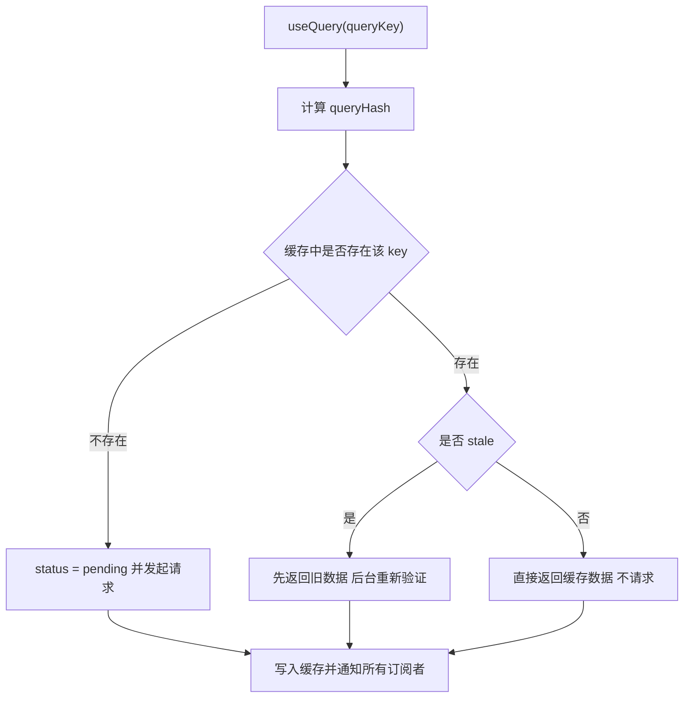

# 服务端状态：TanStack Query、SWR 与缓存手写

!!! abstract "核心结论"

    - server state 的所有权在远端，本地只能持有"某一时刻的快照"，因此它的本质是**缓存**而不是**状态**，需要显式的过期、去重、失效策略。
    - stale-while-revalidate 的算法内核只有三条：命中即返回（哪怕是旧值）、同一 key 的 in-flight Promise 复用、后台重取成功后通知订阅者。
    - 缓存键必须是**稳定序列化**的结果（对象键排序），否则 `{a:1,b:2}` 与 `{b:2,a:1}` 会被当成两个 key，直接导致重复请求与内存膨胀。
    - `staleTime` 决定"多久后需要重新验证"，`gcTime` 决定"没有订阅者后多久回收内存"，两者语义正交，混用是最高频的生产事故来源。
    - 乐观更新的正确形态是"快照 → 乐观写入 → 失败整体回滚 → 成功失效重取"，只回滚 data 而不回滚 `updatedAt` 会让错误数据看起来是新鲜的。

## 1. 为什么需要单独的服务端状态层

### 1.1 client state 与 server state 的不变量差异

client state 的真相源在本地内存：你写入什么，读出来就是什么，读写是同步的、可靠的。server state 的真相源在远端数据库：本地内存里只有一份可能已经过期的副本，读写是异步的、可能失败的、可能被第三方修改的。

这个差异决定了二者的工程手段完全不同：

| 维度 | client state | server state |
| --- | --- | --- |
| 真相源 | 当前进程内存 | 远端服务与数据库 |
| 读写特性 | 同步、确定、无失败 | 异步、可能超时/竞态/失败 |
| 一致性 | 单进程内强一致 | 最终一致，存在窗口期 |
| 过期概念 | 无 | 必须显式建模（staleTime） |
| 多来源修改 | 少见 | 常态（其他用户、其他标签页） |
| 典型工具 | useState、useReducer、Zustand、Redux | TanStack Query、SWR、RTK Query、Apollo |
| 关键操作 | set / dispatch | fetch、dedupe、invalidate、refetch、rollback |

把 server state 塞进 Redux 的典型后果是：你需要手写 loading / error / dedupe / cache invalidation / gc 这一整套机制，而这些正是查询库存在的意义。

### 1.2 一个缓存层必须回答的六个问题

1. 这份数据对应哪个资源的哪个参数组合（缓存键）？
2. 这份数据还能用多久（过期策略）？
3. 同一时刻有十个组件要这份数据，发几次请求（去重）？
4. 没人用这份数据之后，多久释放内存（回收）？
5. 写操作之后，哪些缓存需要作废（失效传播）？
6. 写操作还没返回时 UI 显示什么（乐观更新）？

## 2. stale-while-revalidate 的算法本质

### 2.1 从 HTTP 的 stale-while-revalidate 说起

HTTP 响应头 `Cache-Control: max-age=60, stale-while-revalidate=300` 的语义是：60 秒内是 fresh，60 到 360 秒之间是 stale 但**仍然可用**，共享缓存可以先把这份 stale 响应返回给客户端，同时在后台异步地向源服务器验证。TanStack Query 与 SWR 把同一套语义搬到了应用层。

关键点是"stale 不等于不可用"。绝大多数 UI 在切回标签页时，先用旧数据渲染再悄悄更新，体验远好于白屏 loading。

### 2.2 读取路径的决策树



### 2.3 手写最小 SWR 缓存

运行环境：Node.js 18+，仅依赖标准库。

```js
// 文件：mini-swr-cache.mjs
export function createSwrCache({ now = () => Date.now(), staleTime = 0 } = {}) {
  /** key -> { data, error, updatedAt, inflight } */
  const store = new Map();

  function status(key) {
    const entry = store.get(key);
    if (!entry) return 'miss';
    if (entry.inflight) return 'inflight';       // 请求进行中，优先级最高
    if (entry.updatedAt === undefined) return 'miss';
    return now() - entry.updatedAt < staleTime ? 'fresh' : 'stale';
  }

  function read(key) {
    const entry = store.get(key);
    return {
      status: status(key),
      data: entry ? entry.data : undefined,
      error: entry ? entry.error : undefined,
    };
  }

  function revalidate(key, fetcher) {
    const entry = store.get(key);
    if (entry && entry.inflight) return entry.inflight; // 去重：复用同一个 Promise

    const inflight = (async () => {
      try {
        const data = await fetcher(key);
        store.set(key, { data, error: undefined, updatedAt: now(), inflight: null });
        return data;
      } catch (error) {
        const prev = store.get(key) || {};
        // 失败时保留旧数据，只记录错误，避免 UI 从"有数据"退化到"空"
        store.set(key, { ...prev, error, inflight: null });
        throw error;
      }
    })();

    store.set(key, { ...(entry || {}), inflight });
    return inflight;
  }

  function setData(key, data) {
    store.set(key, {
      ...(store.get(key) || {}),
      data,
      error: undefined,
      updatedAt: now(),
      inflight: null,
    });
  }

  return { read, revalidate, setData, status };
}
```

**验证标准**

```js
// 文件：mini-swr-cache.test.mjs  运行：node mini-swr-cache.test.mjs
import assert from 'node:assert/strict';
import { createSwrCache } from './mini-swr-cache.mjs';

let clock = 1_000;
const now = () => clock;

const calls = [];
const fetcher = async (key) => {
  calls.push(key);
  return `value:${key}:${calls.length}`;
};

const cache = createSwrCache({ now, staleTime: 100 });

// 1. 冷启动为 miss
assert.equal(cache.status('a'), 'miss');
assert.equal(cache.read('a').data, undefined);

// 2. 并发去重：两个调用必须拿到同一个 Promise
const p1 = cache.revalidate('a', fetcher);
assert.equal(p1, cache.revalidate('a', fetcher), '并发请求必须复用同一个 Promise');
assert.equal(cache.status('a'), 'inflight');
assert.equal(await p1, 'value:a:1');
assert.equal(calls.length, 1, '只允许一次网络请求');

// 3. staleTime 内为 fresh
assert.equal(cache.status('a'), 'fresh');
assert.equal(cache.read('a').data, 'value:a:1');

// 4. 超过 staleTime 变成 stale，但旧数据仍然可读
clock += 150;
assert.equal(cache.status('a'), 'stale');
assert.equal(cache.read('a').data, 'value:a:1', 'stale 不等于不可用');

// 5. 重新验证后替换为新值
await cache.revalidate('a', fetcher);
assert.equal(calls.length, 2);
assert.equal(cache.read('a').data, 'value:a:2');

// 6. 失败保留旧数据
const failing = async () => { throw new Error('boom'); };
await assert.rejects(cache.revalidate('a', failing), /boom/);
assert.equal(cache.read('a').data, 'value:a:2', '失败不应清空旧数据');
assert.equal(cache.read('a').error.message, 'boom');

console.log('mini-swr-cache: all assertions passed');
```

预期输出：`mini-swr-cache: all assertions passed`

## 3. 缓存键：queryKey 的稳定哈希

### 3.1 为什么不能直接拿数组当 Map 键

`new Map().set(['todos'], v)` 用的是引用相等。每次渲染重新构造的 `['todos']` 是新数组，永远命中不了同一条缓存。所以必须把结构化 key 转成字符串哈希，而且这个哈希必须满足：

- 对象键顺序无关：`{a:1,b:2}` 与 `{b:2,a:1}` 得到相同哈希。
- 类型敏感：数字 `2` 与字符串 `'2'` 必须区分。
- 位置敏感：`['todos']` 与 `['todos', undefined]` 必须区分（后者表示"带一个 undefined 参数"）。

TanStack Query 内部就是用一个自定义的稳定序列化函数生成 `queryHash`。具体实现细节随版本演进，需要核对官方文档；但"对象键排序 + JSON 序列化"这一核心思路是稳定的。

### 3.2 手写稳定哈希

```js
// 文件：query-key.mjs
export function isPlainObject(value) {
  if (typeof value !== 'object' || value === null) return false;
  const proto = Object.getPrototypeOf(value);
  return proto === Object.prototype || proto === null;
}

export function stableStringify(value) {
  if (typeof value === 'function' || typeof value === 'symbol') {
    throw new TypeError('queryKey 不允许包含函数或 Symbol');
  }
  if (value === undefined) return '"__undefined__"';   // 占位，保证位置敏感
  if (value === null || typeof value !== 'object') return JSON.stringify(value);
  if (Array.isArray(value)) return `[${value.map(stableStringify).join(',')}]`;
  if (value instanceof Date) return `"${value.toISOString()}"`;
  if (!isPlainObject(value)) {
    throw new TypeError('queryKey 只允许包含数组、纯对象、Date 与 JSON 基本类型');
  }
  const keys = Object.keys(value).sort();              // 排序是稳定性的关键
  const body = keys.map((k) => `${JSON.stringify(k)}:${stableStringify(value[k])}`).join(',');
  return `{${body}}`;
}

export const hashKey = stableStringify;
```

**验证标准**

```js
// 文件：query-key.test.mjs  运行：node query-key.test.mjs
import assert from 'node:assert/strict';
import { hashKey } from './query-key.mjs';

// 1. 对象键顺序不影响哈希
assert.equal(
  hashKey(['todos', { page: 2, filter: 'open' }]),
  hashKey(['todos', { filter: 'open', page: 2 }]),
);

// 2. 精确输出
assert.equal(hashKey(['todos']), '["todos"]');
assert.equal(hashKey(['todos', { page: 2 }]), '["todos",{"page":2}]');

// 3. 类型敏感
assert.notEqual(hashKey(['todos', { page: 2 }]), hashKey(['todos', { page: '2' }]));

// 4. 位置敏感
assert.notEqual(hashKey(['todos']), hashKey(['todos', undefined]));

// 5. 拒绝不可序列化的值（queryKey 里放函数是 bug，不是特性）
assert.throws(() => hashKey(['todos', () => {}]), /不允许包含函数/);

// 6. 嵌套对象同样稳定
assert.equal(
  hashKey(['a', { x: { b: 1, a: 2 } }]),
  hashKey(['a', { x: { a: 2, b: 1 } }]),
);

console.log('query-key: all assertions passed');
```

预期输出：`query-key: all assertions passed`

## 4. 去重、重试与窗口聚焦

### 4.1 去重的唯一实现方式：共享 in-flight Promise

去重不是"加一个防抖"，而是"同一个 queryHash 在请求未落地前只允许存在一个 Promise，后续调用者直接拿到这个 Promise"。因此去重表必须存在 Query 实例上（而不是组件里），否则组件重新挂载就丢了去重信息。

### 4.2 指数退避与可重试判定

```js
// 文件：retry.mjs
export function exponentialDelay(attemptIndex, { base = 1000, max = 30000, jitter = 0 } = {}) {
  const raw = Math.min(base * 2 ** attemptIndex, max);
  if (jitter <= 0) return raw;
  const spread = raw * jitter;
  return raw - spread / 2 + Math.random() * spread;   // 抖动，避免惊群
}

export function shouldRetry(failureCount, error, retry) {
  if (failureCount >= retry) return false;
  if (typeof retry === 'function') return retry(failureCount, error);
  return true;
}

export async function withRetry(task, {
  retry = 3,
  retryDelay = (index) => exponentialDelay(index),
  sleep = (ms) => new Promise((resolve) => setTimeout(resolve, ms)),
  onRetry = () => {},
} = {}) {
  let failureCount = 0;
  for (;;) {
    try {
      return await task({ attempt: failureCount });
    } catch (error) {
      if (!shouldRetry(failureCount, error, retry)) throw error;
      const delay = typeof retryDelay === 'function' ? retryDelay(failureCount, error) : retryDelay;
      failureCount += 1;
      onRetry(failureCount, error);
      await sleep(delay);
    }
  }
}
```

**验证标准**

```js
// 文件：retry.test.mjs  运行：node retry.test.mjs
import assert from 'node:assert/strict';
import { withRetry, exponentialDelay } from './retry.mjs';

// 1. 退避公式（本次运行的确定性部分）
assert.equal(exponentialDelay(0), 1000);
assert.equal(exponentialDelay(1), 2000);
assert.equal(exponentialDelay(2), 4000);
assert.equal(exponentialDelay(10), 30000, '必须被 max 截断');

// 2. retry: 3 意味着总计 4 次调用，延迟序列为 1000 / 2000 / 4000
const delays = [];
let calls = 0;
const flaky = async () => {
  calls += 1;
  if (calls < 4) throw new Error(`fail-${calls}`);
  return 'ok';
};

const result = await withRetry(flaky, {
  retry: 3,
  sleep: async (ms) => { delays.push(ms); },
});

assert.equal(result, 'ok');
assert.equal(calls, 4);
assert.deepEqual(delays, [1000, 2000, 4000]);

// 3. 超过次数后抛出最后一次错误
let attempts = 0;
await assert.rejects(
  withRetry(async () => { attempts += 1; throw new Error('always'); },
    { retry: 2, sleep: async () => {} }),
  /always/,
);
assert.equal(attempts, 3, 'retry: 2 表示总计 3 次尝试');

// 4. retry: false 不重试
let once = 0;
await assert.rejects(
  withRetry(async () => { once += 1; throw new Error('no-retry'); },
    { retry: false, sleep: async () => {} }),
  /no-retry/,
);
assert.equal(once, 1);

console.log('retry: all assertions passed');
```

预期输出：`retry: all assertions passed`

### 4.3 窗口聚焦与网络恢复重取的调度要点

- 事件源：`document.visibilitychange`（比 `focus` 更可靠，移动端 Safari 上 `focus` 经常不触发）与 `window.online`。
- 必须做节流：连续切换标签页不应该每次都打请求，实践中会加一个最小间隔（如 1 秒）。
- 必须检查 `staleTime`：如果数据仍然 fresh，聚焦不应该触发请求。
- `refetchOnWindowFocus` 类选项的默认值随库与版本变化，使用前需核对官方文档。

## 5. 手写迷你 TanStack Query

本实现保留理解 TanStack Query 所必需的最小内核：Query 实例与状态机、稳定缓存键、in-flight 去重、重试、staleTime/gcTime、观察者订阅、前缀失效。省略了 structuralSharing、placeholderData、无限查询等高级能力。

### 5.1 数据模型

一个 Query 实例持有四类信息：

| 字段 | 含义 | 变更时机 |
| --- | --- | --- |
| `queryKey` / `queryHash` | 结构化键与哈希 | 创建后不变 |
| `state.status` | pending / success / error | 首次请求、成功、最终失败 |
| `state.fetchStatus` | idle / fetching | 每次请求开始与结束 |
| `state.updatedAt` | 最近一次成功写入的时间戳 | 成功写入与 `setQueryData` |
| `state.isInvalidated` | 是否被显式失效 | `invalidateQueries` 置位，成功后复位 |
| `observers` | 订阅者集合 | mount / unmount |

`status` 与 `fetchStatus` 必须分开：`status: 'success'` + `fetchStatus: 'fetching'` 就表示"有旧数据且正在后台刷新"，这正是 SWR 的 UI 状态。

### 5.2 完整实现

```js
// 文件：mini-query.mjs
// 运行环境：Node.js 18+（依赖 query-key.mjs）
import { hashKey, isPlainObject } from './query-key.mjs';

const defaultRetryDelay = (attemptIndex) => Math.min(1000 * 2 ** attemptIndex, 30000);

function shallowEqualObject(a, b) {
  if (a === b) return true;
  const keysA = Object.keys(a);
  if (keysA.length !== Object.keys(b).length) return false;
  for (const key of keysA) {
    if (!Object.is(a[key], b[key])) return false;
  }
  return true;
}

/** 前缀匹配：filter 是 queryKey 的"部分模式" */
export function partialMatchKey(queryKey, filterKey) {
  if (filterKey === undefined) return true;
  if (Array.isArray(filterKey) && Array.isArray(queryKey)) {
    if (filterKey.length > queryKey.length) return false;
    return filterKey.every((item, index) => partialMatchKey(queryKey[index], item));
  }
  if (isPlainObject(filterKey)) {
    if (!isPlainObject(queryKey)) return false;
    return Object.keys(filterKey).every(
      (key) => key in queryKey && partialMatchKey(queryKey[key], filterKey[key]),
    );
  }
  return Object.is(queryKey, filterKey);
}

export class Query {
  constructor({ client, queryKey, queryHash, queryFn, options }) {
    this.client = client;
    this.queryKey = queryKey;
    this.queryHash = queryHash;
    this.queryFn = queryFn;
    this.options = options;
    this.observers = new Set();
    this.promise = null;
    this.gcTimer = null;
    this.abortController = null;
    this.state = {
      data: undefined,
      error: null,
      status: 'pending',    // pending | success | error
      fetchStatus: 'idle',  // idle | fetching
      updatedAt: 0,
      isInvalidated: false,
    };
  }

  isStale(staleTime = this.options.staleTime ?? 0) {
    if (this.state.status !== 'success') return true;      // 没有数据一定需要请求
    if (this.state.isInvalidated) return true;             // 被显式失效
    if (staleTime === Infinity) return false;
    return this.client.now() - this.state.updatedAt >= staleTime;
  }

  setState(updater) {
    const next = typeof updater === 'function' ? updater(this.state) : { ...this.state, ...updater };
    const changed = !shallowEqualObject(this.state, next);
    this.state = next;
    if (changed) this.notify();
    return changed;
  }

  addObserver(observer) {
    this.observers.add(observer);
    if (this.gcTimer) {                 // 重新有人订阅，取消待执行的回收
      this.client.cancelGc(this.gcTimer);
      this.gcTimer = null;
    }
  }

  removeObserver(observer) {
    this.observers.delete(observer);
    if (this.observers.size > 0) return;
    const gcTime = this.options.gcTime ?? 5 * 60 * 1000;
    if (gcTime === Infinity) return;
    this.gcTimer = this.client.scheduleGc(() => {
      this.gcTimer = null;
      if (this.observers.size === 0) this.client.removeQuery(this);
    }, gcTime);
  }

  notify() {
    for (const observer of this.observers) observer.notify();
  }

  fetch() {
    if (this.promise) return this.promise;          // 去重核心：复用 in-flight Promise
    this.promise = this.execute().finally(() => { this.promise = null; });
    return this.promise;
  }

  cancel() {
    if (this.abortController) this.abortController.abort();
  }

  async execute() {
    if (typeof this.queryFn !== 'function') {
      throw new Error(`queryHash=${this.queryHash} 没有可用的 queryFn`);
    }
    const { retry = 3, retryDelay = defaultRetryDelay } = this.options;
    this.abortController = new AbortController();
    this.setState((s) => ({ ...s, fetchStatus: 'fetching' }));

    let failureCount = 0;
    for (;;) {
      try {
        const data = await this.queryFn({
          queryKey: this.queryKey,
          signal: this.abortController.signal,
        });
        this.setState((s) => ({
          ...s,
          data,
          error: null,
          status: 'success',
          fetchStatus: 'idle',
          updatedAt: this.client.now(),
          isInvalidated: false,
        }));
        return data;
      } catch (error) {
        const canRetry = typeof retry === 'function'
          ? retry(failureCount, error)
          : failureCount < retry;
        if (!canRetry) {
          this.setState((s) => ({ ...s, error, status: 'error', fetchStatus: 'idle' }));
          throw error;
        }
        const delay = typeof retryDelay === 'function' ? retryDelay(failureCount) : retryDelay;
        failureCount += 1;
        await this.client.sleep(delay);
      }
    }
  }
}

export class QueryObserver {
  constructor(client, options) {
    this.client = client;
    this.options = { ...client.defaultQueryOptions, ...options };
    this.query = client.ensureQuery({ queryKey: options.queryKey, queryFn: options.queryFn });
    this.query.options = { ...this.query.options, ...this.options };
    this.listeners = new Set();
    this.result = this.createResult();
    this.mount();
    this.dispatch();
  }

  mount() { this.query.addObserver(this); }     // 幂等，兼容 React 18 StrictMode
  destroy() { this.query.removeObserver(this); }

  subscribe(listener) {
    this.listeners.add(listener);
    return () => { this.listeners.delete(listener); };
  }

  getCurrentResult() { return this.result; }
  refetch() { return this.query.fetch(); }

  notify() {
    const next = this.createResult();
    if (shallowEqualObject(next, this.result)) return;   // 引用稳定的快照
    this.result = next;
    for (const listener of this.listeners) listener();
  }

  createResult() {
    const { state } = this.query;
    return {
      data: state.data,
      error: state.error,
      status: state.status,
      fetchStatus: state.fetchStatus,
      isPending: state.status === 'pending',
      isSuccess: state.status === 'success',
      isError: state.status === 'error',
      isFetching: state.fetchStatus === 'fetching',
      isLoading: state.status === 'pending' && state.fetchStatus === 'fetching',
      isStale: this.query.isStale(this.options.staleTime),
    };
  }

  dispatch() {
    if (this.options.enabled === false) return;
    if (!this.query.isStale(this.options.staleTime)) return;
    this.query.fetch().catch(() => {});       // 后台失败不冒泡，错误已在 state 中
  }
}

export class QueryClient {
  constructor(config = {}) {
    this.defaultQueryOptions = config.defaultOptions?.queries ?? {};
    this.queries = new Map();                 // queryHash -> Query
    this.now = config.now ?? (() => Date.now());
    this.sleep = config.sleep ?? ((ms) => new Promise((resolve) => setTimeout(resolve, ms)));
    this.setGcTimeout = config.setGcTimeout ?? ((fn, ms) => setTimeout(fn, ms));
    this.clearGcTimeout = config.clearGcTimeout ?? ((timer) => clearTimeout(timer));
  }

  scheduleGc(fn, ms) { return this.setGcTimeout(fn, ms); }
  cancelGc(timer) { this.clearGcTimeout(timer); }

  removeQuery(query) {
    if (query.observers.size === 0 && this.queries.get(query.queryHash) === query) {
      this.queries.delete(query.queryHash);
    }
  }

  getQuery(queryKey) { return this.queries.get(hashKey(queryKey)); }
  getQueryData(queryKey) { return this.getQuery(queryKey)?.state.data; }

  ensureQuery({ queryKey, queryFn }) {
    const queryHash = hashKey(queryKey);
    let query = this.queries.get(queryHash);
    if (!query) {
      query = new Query({
        client: this,
        queryKey,
        queryHash,
        queryFn,
        options: { ...this.defaultQueryOptions },
      });
      this.queries.set(queryHash, query);
    }
    if (queryFn) query.queryFn = queryFn;    // 总是使用最新传入的 queryFn
    return query;
  }

  setQueryData(queryKey, updater) {
    const query = this.getQuery(queryKey);
    if (!query) return undefined;
    const previous = query.state.data;
    const next = typeof updater === 'function' ? updater(previous) : updater;
    query.setState((s) => ({
      ...s, data: next, status: 'success', error: null, updatedAt: this.now(),
    }));
    return next;
  }

  restoreQueryState(queryKey, snapshot) {
    const query = this.getQuery(queryKey);
    if (!query || !snapshot) return;
    query.setState(() => ({ ...snapshot }));   // 连 updatedAt 一起恢复
  }

  invalidateQueries(filters = {}, { refetchType = 'active' } = {}) {
    const matched = [];
    for (const query of this.queries.values()) {
      if (!partialMatchKey(query.queryKey, filters.queryKey)) continue;
      if (filters.predicate && !filters.predicate(query)) continue;
      matched.push(query);
    }
    const refetches = [];
    for (const query of matched) {
      query.state = { ...query.state, isInvalidated: true };
      query.notify();
      const isActive = query.observers.size > 0;
      const shouldRefetch = refetchType === 'all'
        || (refetchType === 'active' && isActive)
        || (refetchType === 'inactive' && !isActive);
      if (shouldRefetch && isActive) refetches.push(query.fetch().catch(() => {}));
    }
    return Promise.all(refetches);
  }

  prefetchQuery({ queryKey, queryFn, staleTime, ...rest }) {
    const query = this.ensureQuery({ queryKey, queryFn });
    query.options = { ...query.options, staleTime, ...rest };
    if (!query.isStale(staleTime)) return Promise.resolve(query.state.data);
    return query.fetch().then((data) => data, () => undefined);
  }

  createObserver(options) { return new QueryObserver(this, options); }
}
```

### 5.3 验证标准

```js
// 文件：mini-query.test.mjs  运行：node mini-query.test.mjs
import assert from 'node:assert/strict';
import { QueryClient, partialMatchKey } from './mini-query.mjs';

// 可控时钟 + 可控 GC 调度器，让测试完全确定
let clock = 1_000;
const timers = [];
function createClient() {
  return new QueryClient({
    now: () => clock,
    sleep: async () => {},
    setGcTimeout: (fn, ms) => { const t = { fn, ms, cancelled: false }; timers.push(t); return t; },
    clearGcTimeout: (t) => { t.cancelled = true; },
  });
}
const runGcTimers = () => { for (const t of timers.splice(0)) if (!t.cancelled) t.fn(); };

// ---- 1. 前缀匹配算法 ----
assert.equal(partialMatchKey(['todos', 1], ['todos']), true);
assert.equal(partialMatchKey(['todos'], ['todos', 1]), false);
assert.equal(partialMatchKey(['todos', { page: 1, status: 'open' }], ['todos', { status: 'open' }]), true);
assert.equal(partialMatchKey(['todos', { page: 1 }], ['todos', { page: 2 }]), false);
assert.equal(partialMatchKey(['users'], ['todos']), false);

// ---- 2. 请求去重：两个 observer 共享同一个 in-flight Promise ----
{
  const client = createClient();
  let calls = 0;
  const queryFn = async () => { calls += 1; await Promise.resolve(); return { n: calls }; };
  const a = client.createObserver({ queryKey: ['todos'], queryFn });
  const b = client.createObserver({ queryKey: ['todos'], queryFn });
  assert.equal(calls, 1, '两个订阅者只允许触发一次请求');
  await a.refetch();
  assert.equal(calls, 1, '进行中的请求必须被复用');
  assert.equal(b.getCurrentResult().data, a.getCurrentResult().data, '共享同一份缓存对象');
  a.destroy();
  b.destroy();
}

// ---- 3. staleTime 内命中缓存，超过后自动重新验证 ----
{
  const client = createClient();
  let calls = 0;
  const queryFn = async () => { calls += 1; return calls; };

  const o1 = client.createObserver({ queryKey: ['counter'], queryFn, staleTime: 1000 });
  await o1.refetch();
  assert.equal(calls, 1);
  o1.destroy();

  clock += 500;
  const o2 = client.createObserver({ queryKey: ['counter'], queryFn, staleTime: 1000 });
  assert.equal(o2.getCurrentResult().data, 1, 'staleTime 内直接命中缓存');
  assert.equal(o2.getCurrentResult().isStale, false);
  assert.equal(calls, 1, 'fresh 状态不应发起新请求');
  o2.destroy();

  clock += 1000;                              // 累计超过 staleTime
  const o3 = client.createObserver({ queryKey: ['counter'], queryFn, staleTime: 1000 });
  assert.equal(o3.getCurrentResult().data, 1, 'stale 时先返回旧数据');
  assert.equal(o3.getCurrentResult().isFetching, true, '同时处于后台刷新中');
  assert.equal(calls, 2, 'stale 后必须自动重新验证');
  await o3.refetch();
  assert.equal(o3.getCurrentResult().data, 2, '重取成功后替换');
  assert.equal(o3.getCurrentResult().isStale, false);
  o3.destroy();
}

// ---- 4. 失效：前缀匹配 + 只重取活跃查询 ----
{
  const client = createClient();
  const calls = new Map();
  const queryFn = async ({ queryKey }) => {
    const key = JSON.stringify(queryKey);
    calls.set(key, (calls.get(key) ?? 0) + 1);
    return { key, count: calls.get(key) };
  };
  const todos = client.createObserver({ queryKey: ['todos'], queryFn, staleTime: Infinity });
  const todo1 = client.createObserver({ queryKey: ['todos', 1], queryFn, staleTime: Infinity });
  const users = client.createObserver({ queryKey: ['users'], queryFn, staleTime: Infinity });

  await Promise.all([todos.refetch(), todo1.refetch(), users.refetch()]);
  assert.equal(calls.get('["todos"]'), 1);
  assert.equal(calls.get('["todos",1]'), 1);
  assert.equal(calls.get('["users"]'), 1);

  await client.invalidateQueries({ queryKey: ['todos'] });
  assert.equal(calls.get('["todos"]'), 2, '前缀匹配命中 todos');
  assert.equal(calls.get('["todos",1]'), 2, '前缀匹配命中 todos/1');
  assert.equal(calls.get('["users"]'), 1, '不相关 key 不受影响');

  // 失效后的查询会重新变为 stale 标记，但重取成功后复位
  assert.equal(todos.getCurrentResult().isStale, false);

  todos.destroy(); todo1.destroy(); users.destroy();
}

// ---- 5. gcTime：最后一个订阅者离开后延迟回收 ----
{
  const client = createClient();
  const observer = client.createObserver({
    queryKey: ['gc-me'],
    queryFn: async () => 'v',
    staleTime: Infinity,
    gcTime: 1000,
  });
  await observer.refetch();
  assert.ok(client.getQuery(['gc-me']));
  observer.destroy();
  assert.ok(client.getQuery(['gc-me']), '卸载后立刻不应回收');
  runGcTimers();
  assert.equal(client.getQuery(['gc-me']), undefined, 'gcTime 到期后回收');

  // 回收前重新订阅应取消回收
  const keep = client.createObserver({ queryKey: ['keep'], queryFn: async () => 1, gcTime: 1000 });
  await keep.refetch();
  keep.destroy();
  keep.mount();
  runGcTimers();
  assert.ok(client.getQuery(['keep']), '重新订阅后不应被回收');
  keep.destroy();
}

console.log('mini-query: all assertions passed');
```

预期输出：`mini-query: all assertions passed`

### 5.4 React 18 绑定：useSyncExternalStore

运行环境：React 18+、TypeScript 5+，需要构建工具（Vite / Next.js 等）。

```tsx
// 文件：useQuery.tsx
import {
  createContext,
  useCallback,
  useContext,
  useEffect,
  useMemo,
  useRef,
  useSyncExternalStore,
} from 'react';
import type { ReactNode } from 'react';
import { QueryClient, QueryObserver, hashKey } from './mini-query';

const QueryClientContext = createContext<QueryClient | null>(null);

export function QueryClientProvider({ client, children }: { client: QueryClient; children: ReactNode }) {
  return <QueryClientContext.Provider value={client}>{children}</QueryClientContext.Provider>;
}

export function useQueryClient(): QueryClient {
  const client = useContext(QueryClientContext);
  if (!client) throw new Error('useQueryClient 必须在 QueryClientProvider 内使用');
  return client;
}

export interface UseQueryOptions<TData> {
  queryKey: readonly unknown[];
  queryFn: (ctx: { queryKey: readonly unknown[]; signal: AbortSignal }) => Promise<TData>;
  staleTime?: number;
  gcTime?: number;
  enabled?: boolean;
  retry?: number | ((failureCount: number, error: unknown) => boolean);
  retryDelay?: number | ((attemptIndex: number) => number);
}

export function useQuery<TData>(options: UseQueryOptions<TData>) {
  const client = useQueryClient();
  // 用哈希字符串做依赖：queryKey 每次渲染都是新数组，直接放进依赖会死循环
  const queryHash = hashKey(options.queryKey);

  // 始终保持最新的 queryFn / options，避免闭包捕获旧值
  const optionsRef = useRef(options);
  optionsRef.current = options;

  const observer = useMemo(
    () =>
      client.createObserver({
        ...optionsRef.current,
        queryKey: optionsRef.current.queryKey,
        // 稳定包装：内部永远调用最新的 queryFn
        queryFn: (ctx: { queryKey: readonly unknown[]; signal: AbortSignal }) =>
          optionsRef.current.queryFn(ctx),
      }) as QueryObserver,
    // eslint-disable-next-line react-hooks/exhaustive-deps
    [client, queryHash],
  );

  // React 18 StrictMode 会在开发环境执行 mount -> unmount -> mount，
  // 因此 mount 必须幂等，destroy 之后还能重新挂上
  useEffect(() => {
    observer.mount();
    return () => observer.destroy();
  }, [observer]);

  const subscribe = useCallback(
    (onStoreChange: () => void) => observer.subscribe(onStoreChange),
    [observer],
  );
  // getSnapshot 必须返回引用稳定的值，否则会触发无限重渲染
  const getSnapshot = useCallback(() => observer.getCurrentResult(), [observer]);

  const result = useSyncExternalStore(subscribe, getSnapshot, getSnapshot);

  const refetch = useCallback(() => observer.refetch(), [observer]);

  return { ...result, refetch };
}
```

## 6. 失效、预取与乐观更新

### 6.1 失效的匹配算法要写对

`invalidateQueries({ queryKey: ['todos'] })` 的语义是"所有以 `['todos']` 为前缀的查询"，而不是精确匹配。前缀过宽会引发雪崩式重取，过窄会漏掉需要刷新的列表。判断规则：

- 过滤器是数组时，`filterKey.length > queryKey.length` 直接不匹配。
- 过滤器是对象时，只有过滤器里出现的键参与比较（部分匹配）。
- 建议把实体名放数组首位（`['todos', ...]`），保证前缀匹配天然按资源分组。

### 6.2 乐观更新与回滚

```js
// 文件：optimistic.mjs
export async function optimisticMutate({
  client,
  queryKey,
  mutationFn,
  applyOptimistic,
}) {
  const snapshot = client.getQuery(queryKey)?.state;   // 完整快照，不只是 data
  const previous = snapshot ? snapshot.data : undefined;

  const optimistic = applyOptimistic(previous);
  if (optimistic !== undefined) client.setQueryData(queryKey, optimistic);

  try {
    const result = await mutationFn();
    // 成功后失效并重取，用服务端真相覆盖乐观值
    await client.invalidateQueries({ queryKey });
    return result;
  } catch (error) {
    // 失败整体回滚：data 与 updatedAt 一起恢复，
    // 否则错误数据会带着"刚刚更新"的时间戳，看起来是新鲜的
    client.restoreQueryState(queryKey, snapshot);
    throw error;
  }
}
```

**验证标准**

```js
// 文件：optimistic.test.mjs  运行：node optimistic.test.mjs
import assert from 'node:assert/strict';
import { QueryClient } from './mini-query.mjs';
import { optimisticMutate } from './optimistic.mjs';

const client = new QueryClient({ now: () => 1_000, sleep: async () => {} });

let calls = 0;
const queryFn = async () => {
  calls += 1;
  return [{ id: 1, done: false }];
};

const observer = client.createObserver({ queryKey: ['todos'], queryFn, staleTime: 5000 });
await observer.refetch();
assert.equal(calls, 1);

// 1. 成功路径：乐观写入后在 onSettled 阶段重取，回到服务端真相
const optimisticCallCount = [];
const result = await optimisticMutate({
  client,
  queryKey: ['todos'],
  mutationFn: async () => 'ok',
  applyOptimistic: (old) => {
    optimisticCallCount.push(old.length);
    return old.map((item) => ({ ...item, done: true }));
  },
});
assert.equal(result, 'ok');
assert.deepEqual(optimisticCallCount, [1], 'applyOptimistic 应拿到旧数据');
assert.equal(calls, 2, '成功后必须 invalidate 并重取');
assert.deepEqual(client.getQueryData(['todos']), [{ id: 1, done: false }]);

// 2. 失败路径：必须回滚到快照
await assert.rejects(
  optimisticMutate({
    client,
    queryKey: ['todos'],
    mutationFn: async () => { throw new Error('409 Conflict'); },
    applyOptimistic: (old) => old.map((item) => ({ ...item, done: true })),
  }),
  /409 Conflict/,
);
assert.deepEqual(client.getQueryData(['todos']), [{ id: 1, done: false }], '失败必须回滚');
assert.equal(calls, 2, '失败不应触发重取');

// 3. 回滚必须恢复 updatedAt，否则数据会"看起来是新鲜的"
const stateAfterRollback = client.getQuery(['todos']).state;
assert.equal(stateAfterRollback.updatedAt, 1_000, 'updatedAt 应回到快照值');

observer.destroy();
console.log('optimistic: all assertions passed');
```

预期输出：`optimistic: all assertions passed`

### 6.3 预取

预取的实现只有一句：`ensureQuery` + 判断 `isStale` + `fetch`，请求结果写入同一个缓存，用户真正导航过去时直接命中。典型触发点是路由 hover、列表项进入视口、搜索输入防抖之后。

## 7. 分页与无限列表

### 7.1 游标模型与累加器

分页的正确模型是"服务端返回下一页的游标"，而不是"页码自增"（页码模型在数据插入时会重复或跳漏）。核心状态是 `pages`、`pageParams`、`nextPageParam`、`hasNextPage`。

```js
// 文件：infinite.mjs
export function createInfiniteQuery({ fetchPage, getNextPageParam, initialPageParam = undefined }) {
  let state = {
    pages: [],
    pageParams: [],
    status: 'pending',
    fetchStatus: 'idle',
    error: null,
    nextPageParam: undefined,
    hasNextPage: false,
  };
  const listeners = new Set();
  let inflight = null;

  const notify = () => { for (const listener of listeners) listener(); };
  const setState = (patch) => {
    state = typeof patch === 'function' ? patch(state) : { ...state, ...patch };
    notify();
  };

  // 非 async，保证并发调用能拿到同一个 Promise 引用
  function fetchNextPage() {
    if (inflight) return inflight;
    if (state.status === 'success' && !state.hasNextPage) return Promise.resolve(state.pages);

    const pageParam = state.pageParams.length === 0 ? initialPageParam : state.nextPageParam;
    setState((s) => ({ ...s, fetchStatus: 'fetching' }));

    inflight = (async () => {
      try {
        const page = await fetchPage({ pageParam });
        const next = getNextPageParam(page, state.pages, pageParam, state.pageParams);
        const hasNextPage = next !== undefined && next !== null;
        setState((s) => ({
          ...s,
          pages: [...s.pages, page],
          pageParams: [...s.pageParams, pageParam],
          nextPageParam: next,
          hasNextPage,
          status: 'success',
          fetchStatus: 'idle',
          error: null,
        }));
        return state.pages;
      } catch (error) {
        setState((s) => ({ ...s, error, status: 'error', fetchStatus: 'idle' }));
        throw error;
      } finally {
        inflight = null;
      }
    })();

    return inflight;
  }

  return {
    fetchNextPage,
    getSnapshot: () => state,
    subscribe: (listener) => {
      listeners.add(listener);
      return () => listeners.delete(listener);
    },
  };
}

/** 按 id 去重后展平，避免服务端插队导致重复渲染 */
export function flattenPages(pages) {
  const seen = new Set();
  const items = [];
  for (const page of pages) {
    for (const item of page.items) {
      if (item && item.id !== undefined) {
        if (seen.has(item.id)) continue;
        seen.add(item.id);
      }
      items.push(item);
    }
  }
  return items;
}
```

**验证标准**

```js
// 文件：infinite.test.mjs  运行：node infinite.test.mjs
import assert from 'node:assert/strict';
import { createInfiniteQuery, flattenPages } from './infinite.mjs';

const TOTAL = 5;
const db = Array.from({ length: TOTAL }, (_, i) => ({ id: i + 1, title: `第 ${i + 1} 条` }));

async function fetchPage({ pageParam = 0 }) {
  const pageSize = 2;
  const start = pageParam * pageSize;
  const items = db.slice(start, start + pageSize);
  return { items, nextPage: start + pageSize < TOTAL ? pageParam + 1 : undefined };
}

const q = createInfiniteQuery({
  fetchPage,
  initialPageParam: 0,
  getNextPageParam: (lastPage) => lastPage.nextPage,
});

assert.equal(q.getSnapshot().status, 'pending');

await q.fetchNextPage();
assert.equal(q.getSnapshot().pages.length, 1);
assert.deepEqual(q.getSnapshot().pages[0].items.map((i) => i.id), [1, 2]);
assert.equal(q.getSnapshot().hasNextPage, true);

// 并发触发只发一次请求
const p1 = q.fetchNextPage();
const p2 = q.fetchNextPage();
assert.equal(p1, p2, '并发分页请求必须复用同一个 Promise');
await p1;
assert.deepEqual(q.getSnapshot().pages[1].items.map((i) => i.id), [3, 4]);

await q.fetchNextPage();
assert.equal(q.getSnapshot().pages.length, 3);
assert.deepEqual(q.getSnapshot().pages[2].items.map((i) => i.id), [5]);
assert.equal(q.getSnapshot().hasNextPage, false);

// 没有下一页时不再请求
const before = q.getSnapshot().pages.length;
await q.fetchNextPage();
assert.equal(q.getSnapshot().pages.length, before);

// 展平：全量 5 条
assert.deepEqual(flattenPages(q.getSnapshot().pages).map((i) => i.id), [1, 2, 3, 4, 5]);

// 去重：模拟服务端插队导致的重复 id
const duplicated = [
  { items: [{ id: 1 }, { id: 2 }] },
  { items: [{ id: 2 }, { id: 3 }] },
];
assert.deepEqual(flattenPages(duplicated).map((i) => i.id), [1, 2, 3]);

console.log('infinite: all assertions passed');
```

预期输出：`infinite: all assertions passed`

## 8. SSR 水合

### 8.1 水合的边界

SSR 场景下，服务端在渲染前把数据取好放进 QueryClient，序列化成 JSON 注入 HTML，客户端在首次渲染前把这份数据灌回自己的 QueryClient。这样首屏 HTML 已经是完整内容，客户端首次渲染也能直接命中缓存，不会因为"没有数据"而闪烁或重复请求。

三条必须守住的边界：

1. 服务端**每个请求**都要新建 QueryClient，绝不能跨请求共用单例，否则会串数据（用户 A 的数据渲染进用户 B 的页面）。这是最严重的一类漏洞。
2. 只有 `status === 'success'` 的查询才值得脱水，pending/error 的序列化没有意义。
3. `updatedAt` 是否原样恢复直接决定客户端会不会立刻重取。如果希望水合后不重取，服务端与客户端的 `staleTime` 必须一致且足够大。具体行为与默认值需核对官方文档。

```js
// 文件：hydration.mjs
export function dehydrate(client) {
  const queries = [];
  for (const query of client.queries.values()) {
    if (query.state.status !== 'success') continue;
    queries.push({
      queryKey: query.queryKey,
      queryHash: query.queryHash,
      state: {
        data: query.state.data,
        status: query.state.status,
        updatedAt: query.state.updatedAt,
      },
    });
  }
  return { queries };
}

export function hydrate(client, dehydrated) {
  for (const item of dehydrated.queries) {
    const query = client.ensureQuery({ queryKey: item.queryKey });
    query.setState((s) => ({
      ...s,
      ...item.state,
      error: null,
      fetchStatus: 'idle',
      isInvalidated: false,
    }));
  }
  return client;
}
```

**验证标准**

```js
// 文件：hydration.test.mjs  运行：node hydration.test.mjs
import assert from 'node:assert/strict';
import { QueryClient } from './mini-query.mjs';
import { dehydrate, hydrate } from './hydration.mjs';

// 服务端
const serverClient = new QueryClient({ now: () => 1_000, sleep: async () => {} });
const serverObserver = serverClient.createObserver({
  queryKey: ['todos'],
  queryFn: async () => [{ id: 1 }],
  staleTime: 1_000,
});
await serverObserver.refetch();

const payload = dehydrate(serverClient);
assert.deepEqual(Object.keys(payload), ['queries']);
assert.equal(payload.queries.length, 1, '只有成功状态才会被脱水');
assert.deepEqual(payload.queries[0].state.data, [{ id: 1 }]);
assert.equal(payload.queries[0].state.updatedAt, 1_000);

// 客户端水合
let clientClock = 1_200;
const client = new QueryClient({ now: () => clientClock, sleep: async () => {} });
hydrate(client, payload);
assert.deepEqual(client.getQueryData(['todos']), [{ id: 1 }], '水合后立刻可读');

// 仍在 staleTime 内，挂载不应重取
let calls = 0;
const o1 = client.createObserver({
  queryKey: ['todos'],
  queryFn: async () => { calls += 1; return [{ id: 2 }]; },
  staleTime: 1_000,
});
assert.equal(calls, 0, '水合数据仍新鲜，不应重取');
assert.deepEqual(o1.getCurrentResult().data, [{ id: 1 }]);
o1.destroy();

// 超过 staleTime 后自动重取
clientClock = 2_500;
let calls2 = 0;
const o2 = client.createObserver({
  queryKey: ['todos'],
  queryFn: async () => { calls2 += 1; return [{ id: 3 }]; },
  staleTime: 1_000,
});
assert.equal(calls2, 1, '超过 staleTime 后应当重取');
await o2.refetch();
assert.deepEqual(o2.getCurrentResult().data, [{ id: 3 }]);
o2.destroy();

console.log('hydration: all assertions passed');
```

预期输出：`hydration: all assertions passed`

## 9. 四个库的横向对比

以下默认值以撰写时的常见版本为准，升级或切换前需核对官方文档。

| 维度 | TanStack Query | SWR | RTK Query | Apollo Client |
| --- | --- | --- | --- | --- |
| 定位 | 框架无关的异步状态缓存层 | 轻量数据请求 hook | Redux 生态的数据层 | GraphQL 专用客户端 |
| 缓存模型 | `queryHash` 到查询状态的映射，不做实体归一化 | key 到数据的映射 | 按 endpoint 与参数生成 cacheKey，数据存在 Redux store | 归一化缓存，按 `__typename` + `id` 存储实体 |
| 缓存键 | 结构化 queryKey，内部稳定序列化 | 字符串或数组，序列化后作 key | endpoint 名 + 参数对象 | GraphQL 文档 + variables |
| 去重 | 同一 queryHash 的 in-flight Promise 复用 | `dedupingInterval` 时间窗内去重 | 同一 cacheKey 的 in-flight 复用 | 同一查询的 in-flight 复用 |
| 失效方式 | `invalidateQueries` 前缀匹配 | `mutate` 触发重新验证 | tag 机制，`providesTags` / `invalidatesTags` | `refetchQueries`、`cache.evict`、手动写缓存 |
| 乐观更新 | `onMutate` 快照、`onError` 回滚、`onSettled` 失效 | `mutate` 的 `optimisticData` / `rollbackOnError` / `populateCache` | `onQueryStarted` + `updateQueryData` + `patchResult.undo()` | `optimisticResponse` + 缓存更新函数 |
| 分页/无限列表 | `useInfiniteQuery` + `getNextPageParam` | `useSWRInfinite` + `getKey` | 需要自行 merge | `fetchMore` + `typePolicies` 中的 merge |
| SSR | `dehydrate` / `hydrate` 配对 | `fallback` 数据 + `SWRConfig` | 需自行实现 | 有独立的 SSR 入口，需核对版本 |
| 类型推导 | TypeScript 优先，类型从 queryKey 与 queryFn 推导 | 一般 | 强，从 endpoint 定义推导 | 强，从 GraphQL 代码生成推导 |
| 适用场景 | 任意 HTTP 数据源，需要精细缓存控制 | 轻量项目、快速接入 | 已使用 Redux Toolkit 的中大型应用 | 使用 GraphQL 且需要归一化缓存 |

概念对照表：

| 概念 | TanStack Query v5 | SWR 2.x | RTK Query | Apollo Client 3.x |
| --- | --- | --- | --- | --- |
| 新鲜期 | `staleTime`，默认 0 | 无 `staleTime` 概念，靠 `revalidateIfStale` 与 `dedupingInterval` 控制 | 无独立概念，靠 tag 失效驱动 | `fetchPolicy: 'cache-first'` 为默认策略 |
| 回收期 | `gcTime`，默认 5 分钟 | 无直接对应，随组件生命周期与 key 变化回收 | `keepUnusedDataFor`，默认 60 秒 | 默认不自动回收，需手动调用缓存 GC |
| 重试 | `retry` 默认 3，`retryDelay` 默认指数退避、上限 30 秒 | `errorRetryCount` / `onErrorRetry` 可配 | 无内置重试，需自行封装 baseQuery | 默认不重试，可加 Retry Link |
| 聚焦重取 | `refetchOnWindowFocus` 默认开启 | `revalidateOnFocus` 默认开启 | `refetchOnFocus` 默认关闭，需手动开启 | 默认无此能力 |

## 10. 常见陷阱

1. **queryKey 里放不稳定引用。** 每次渲染都新建的对象或数组如果直接进依赖，会无限重取。正确做法是用 `hashKey(queryKey)` 的字符串结果做依赖，或者把参数拆成基本类型。本页 5.4 的 `useMemo` 依赖就是 `[client, queryHash]`。

2. **在 queryKey 里放函数、类实例、Map。** 序列化不稳定或者直接抛错，缓存永远命中不了。queryKey 只能是可序列化的纯数据。

3. **混淆 `staleTime` 与 `gcTime`。** `staleTime` 控制"多久之后需要重新验证"，`gcTime` 控制"没人用之后多久释放内存"。把 `gcTime` 设成 0 会让每次卸载都清缓存，页面来回切换就是无限请求风暴。

4. **`gcTime` 小于组件卸载到重新挂载的间隔。** 例如列表页和详情页之间来回跳，如果 `gcTime` 只有几秒，缓存每次都被回收，失去缓存意义。默认 5 分钟是有道理的。

5. **queryFn 不返回 Promise 或吞掉错误。** 查询库靠 Promise 的 reject 驱动错误状态与重试。如果在 queryFn 里 `try/catch` 后返回 `undefined`，错误状态永远不会触发，UI 会一直显示"成功但没有数据"。

6. **乐观更新只回滚 data，不回滚时间戳。** 用 `setQueryData` 恢复旧 data 时，`updatedAt` 会被刷新成当前时间，导致这份错误的旧数据在 `staleTime` 内看起来是新鲜的，不会触发重新验证。本页的 `restoreQueryState` 整体恢复快照就是为了避开这一点。

7. **失效范围过宽。** `invalidateQueries()` 不传参数会失效全部缓存，紧接着所有活跃查询一起重取，容易把后端打挂。始终提供尽可能精确的 queryKey 前缀。

8. **无限列表只追加不去重。** 服务端在翻页期间插入新数据会导致同一实体出现两次，React 的 key 冲突、列表闪烁。展平时按 id 去重是标准做法。

9. **SSR 时跨请求共用 QueryClient。** 单例会被多个请求并发读写，造成用户 A 看到用户 B 数据的越权问题。每个请求新建实例。

10. **忽略 `AbortSignal`。** 组件卸载或 key 变化时正在进行的请求不会自动取消，会产生"旧请求晚于新请求返回并覆盖新数据"的竞态。queryFn 必须把 `signal` 透传给 `fetch`，并让取消错误（AbortError）不进入重试逻辑。

11. **把 `enabled: false` 当成惰性初始化。** `enabled: false` 仍然会创建 Query 实体并进入缓存，如果父组件传的参数每次都变，会堆积大量永远不会被请求的空查询。

12. **忘记 `structuralSharing` 的作用。** 服务端返回结构相同但引用不同的新对象时，如果没有结构性共享，所有依赖该数据的 `useMemo` / `React.memo` 都会失效重算。TanStack Query 默认开启此优化，具体行为需核对官方文档。

## 11. 面试题与答题要点

### 11.1 server state 与 client state 的本质区别是什么？为什么不能都用 Redux 管？

要点：

- 真相源不同：client state 在本地内存，server state 在远端，本地只是快照。
- 读写语义不同：client state 同步可靠，server state 异步、可能失败、可能被他人修改。
- 因此 server state 必须显式建模过期时间、去重、失效传播、回滚，这些机制的维护成本很高。
- Redux 可以承载 server state，但你得自己实现上述全部机制；查询库把这些机制内建了，正确率和开发效率都更高。
- 实践结论：client state 用 Redux / Zustand，server state 用查询库，不要把两者混在一个 store 里。

### 11.2 精确描述 stale-while-revalidate，并说明实现它的三个必要机制。

要点：

- 语义：数据超过新鲜期后仍然可用，读取时立即返回旧值，同时后台发起重新验证，验证成功后通知订阅者更新。
- 机制一：每条缓存记录必须有 `updatedAt` 与 `staleTime`，用于判定 fresh / stale。
- 机制二：读取路径必须先返回缓存再加后台请求，绝不能 `await` 到请求结束才渲染，否则就退化成普通缓存。
- 机制三：订阅通知通道，让数据落地后能驱动 UI 更新，并且通知前要做结果浅比较，避免无效渲染。
- 补充：stale 数据在后台验证失败时应保留而不是清空，这样 UI 不会从"有数据"退化到"空状态"。

### 11.3 请求去重是怎么实现的？粒度是什么？

要点：

- 实现：Query 实例上持有 `promise` 字段，`fetch()` 进来先看 `this.promise` 是否存在，存在就直接返回同一个 Promise。这就是去重的全部。
- 粒度是"同一个 queryHash"，不是"同一个组件"。因此去重表必须挂在 QueryClient 的缓存上，而不是组件局部变量，否则组件重挂载就失去了去重能力。
- 请求结束（无论成功失败）必须清空 `promise`，否则后续永远拿到旧的已结算 Promise。
- 注意点：`async` 函数每次调用都返回新 Promise，所以 `fetch` 本身不能是 `async`，否则 `p1 === p2` 不成立。正确写法是用普通函数返回内部缓存的 Promise。

### 11.4 staleTime 与 gcTime 的区别？各举一个配置错误导致的故障。

要点：

- `staleTime`：数据从写入到被认为需要重新验证的时间。它影响"要不要发请求"。
- `gcTime`：Query 的订阅者数量归零后，到真正从缓存 Map 中删除的时间。它影响"内存里还留不留"。
- 两者正交：`staleTime` 可以远大于 `gcTime`（数据还没过期但内存已释放），也可以远小于（数据已过期但内存还留着等复用）。
- 错误一：把 `gcTime` 设成 0，列表页与详情页来回切换每次都重新请求，请求量爆炸。
- 错误二：把 `staleTime` 设成 `Infinity` 而没有任何失效逻辑，用户提交表单后列表永远不更新。
- 记忆口诀：`staleTime` 管新鲜度，`gcTime` 管寿命。

### 11.5 乐观更新的完整流程是什么？失败回滚时只恢复 data 有什么问题？

要点：

- 流程：`onMutate` 阶段先取快照 → 写入乐观值 → 发起请求 → 成功则失效并重取（用服务端真相覆盖）→ 失败则用快照回滚 → `onSettled` 阶段统一收尾（例如关闭 loading）。
- 回滚必须恢复的是**整个查询状态的快照**，而不是只恢复 `data`。只恢复 data 会让 `updatedAt` 停留在失败时刻，导致这份错误的旧数据在 `staleTime` 窗口内被视为新鲜，不会触发重新验证。
- 竞态：连续两次乐观更新时，第二次的快照可能已经包含第一次的乐观值。可以通过在 mutation 上携带序列号、或者失败时直接 `invalidateQueries` 从服务端拉取真相来兜底。
- 成功路径的"失效 + 重取"不可省略，乐观值只是猜测，最终必须由服务端数据覆盖。

### 11.6 invalidateQueries 的匹配规则是什么？什么情况下用 refetchType 的哪个取值？

要点：

- 匹配是**前缀/部分匹配**：过滤器数组长度大于查询键长度直接不匹配；过滤器对象只比较其中出现的键。
- 因此 queryKey 的设计应该把资源名放首位（`['todos']`、`['todos', id]`），让前缀天然形成资源分组。
- `refetchType` 取值：`'active'` 只重取有订阅者的查询（默认，最省流量）；`'inactive'` 只标记不重取、等下次挂载时再取；`'all'` 全部立即重取；`'none'` 只标记不重取。
- 失效标记本身也必须通知订阅者，否则 `isStale` 这类派生状态不会更新。
- 重取成功的查询必须清除 `isInvalidated` 标记，否则它会永远处于 stale。

### 11.7 SSR 水合的原理是什么？最容易犯的错是什么？

要点：

- 原理：服务端用同一个 QueryClient 实例渲染并取数 → 序列化 `{queryKey, state}` 列表注入 HTML → 客户端在首次渲染前把这些状态灌回 QueryClient → 首次渲染直接命中缓存，不闪烁也不重复请求。
- 最容易犯的错：在服务端把 QueryClient 做成模块级单例。Node 服务进程是长期存活的，多个用户请求会共享同一份缓存，直接造成越权数据泄漏。必须每个请求新建实例。
- 第二个易错点：只脱水成功状态，pending / error 没有序列化的意义。
- 第三个易错点：`updatedAt` 与 `staleTime` 的配合。如果客户端 `staleTime` 比服务端小，水合数据会立刻被判为 stale 并触发重取，水合就白做了。具体行为需核对官方文档与你使用的版本。

### 11.8 无限列表的核心状态有哪些？为什么不能用自增页码分页？

要点：

- 核心状态：`pages`（已加载页数组）、`pageParams`（每页对应的参数）、`nextPageParam`（下一页游标）、`hasNextPage`、`isFetchingNextPage`。
- 自增页码的问题：在翻页过程中如果有新数据插入，第 2 页会包含第 1 页尾部的重复元素；如果有删除，则会漏掉元素。游标（cursor）指向一条稳定记录，不受插入删除影响。
- 展平时必须按实体 id 去重，否则重复项会导致 React key 冲突和列表闪烁。
- `fetchNextPage` 同样需要 in-flight 去重，否则滚动到底部时 IntersectionObserver 连续触发会打出多次请求。
- 没有下一页时必须短路返回，不能继续用 `undefined` 游标发请求。

### 11.9 如果让你从零实现一个 useQuery，核心数据流是什么？

要点：

- 三步：`hashKey(queryKey)` 得到缓存键 → 从 QueryClient 取或建 Query → 挂载 observer 并判断是否 stale，stale 则触发 fetch。
- 状态机：`status`（pending / success / error）与 `fetchStatus`（idle / fetching）必须分开，前者描述数据，后者描述动作，`success + fetching` 就是后台刷新态。
- 订阅：Query 持有 observer 集合，observer 持有 listener 集合。数据变化 → Query 通知 observer → observer 重建结果快照并做浅比较 → 有变化才通知 listener。
- React 绑定必须用 `useSyncExternalStore`，它要求 `getSnapshot` 返回引用稳定的值，所以结果对象要做浅比较后再替换，否则会无限重渲染。
- 卸载时从 observer 集合移除并启动 `gcTime` 计时；重新订阅要取消计时。
- 缓存键用哈希字符串做 `useMemo` 依赖，queryFn 用 ref 保持最新，避免闭包陷阱与无限重取。

## 深入阅读与参考

!!! tip "怎么用这些资料"
    先读「官方文档与规范」建立准确的概念，再读「源码与示例」核对细节，最后用「教程、书籍与视频」换一种讲法加深理解。每条都写明了读哪一节、带着什么问题读。

### 官方文档与规范

| 资源 | 为什么读 | 怎么读 |
|---|---|---|
| [TanStack Query 文档](https://tanstack.com/query/latest) | 服务端状态层的权威参考，缓存、失效、去重等概念都以它为准。 | 精读 Caching、Query Invalidation 与 Infinite Queries 三节，对照本文手写实现逐条核对默认行为。 |
| [TanStack Query 概览](https://tanstack.com/query/latest/docs/framework/react/overview) | Important Defaults 解释 staleTime 与 gcTime，是理解 SWR 默认策略的入口。 | 先读 Important Defaults，边读边改 staleTime 观察请求次数变化，再回看本文的去重与重试章节。 |
| [MDN HTTP 缓存（English）](https://developer.mozilla.org/en-US/docs/Web/HTTP/Caching) | 从 HTTP 层说明 stale-while-revalidate 的语义与缓存失效规则。 | 读 Cache-Control 指令与新缓存章节，回答“SWR 在浏览器缓存里如何生效”，再对照库实现。 |
| [Workbox 文档](https://developer.chrome.com/docs/workbox) | Workbox 给出 stale-while-revalidate 的生产级实现，可对比手写 Service Worke | 读 runtime caching 的 StaleWhileRevalidate 策略，写出等价手写版本并列出两者的差异点。 |
| [Next.js 文档](https://nextjs.org/docs) | App Router 的 SSR、流式渲染与 Server Actions 是 SSR 水合章节的现实背景。 | 读 Data Fetching 与 Rendering 两节，重点看服务端预取后如何在客户端接管缓存。 |
| [Vite：SSR 指南](https://vite.dev/guide/ssr.html) | 最小 SSR 服务可让水合过程从概念变成可调试的代码。 | 按指南搭一个最小 SSR 项目，打印服务端与客户端入口执行顺序，理解预取数据如何注入。 |
| [Vue SSR 指南](https://vuejs.org/guide/scaling-up/ssr.html) | 系统说明 hydration 的前提条件，与 React 侧的经验可以互相印证。 | 读 hydration 一节并记录 mismatch 的成因清单，回到自己项目逐条自查。 |
| [Hydration Bugs _(and how to avoid them)_](https://book.leptos.dev/ssr/24_hydration_bugs.html) | 集中列出 hydration 崩溃的典型类别，可整理成排查清单。 | 读完后把每类错误对应到本文“常见陷阱”章节，补充几条你实际遇到过的例子。 |
| [The Life of a Page Load](https://book.leptos.dev/ssr/22_life_cycle.html) | 按时间顺序拆解一次页面加载，帮助理解 SSR 预取与水合的先后关系。 | 通读一遍并画出时序图，标出查询缓存被填充与水合发生的两个时刻。 |

### 源码与示例

| 资源 | 为什么读 | 怎么读 |
|---|---|---|
| [TanStack 博客](https://tanstack.com/blog) | 官方博客谈数据获取与路由的取舍，能看到 API 设计背后的权衡。 | 挑数据获取相关文章读，带着“为什么用 queryKey 而不是 URL 字符串”这一问题做笔记。 |

### 教程、书籍与视频

| 资源 | 为什么读 | 怎么读 |
|---|---|---|
| [TkDodo：Practical React Query](https://tkdodo.eu/blog/practical-react-query) | TanStack Query 维护者写的系列教程，把缓存策略讲得比文档更透。 | 按顺序读，重点读失效、乐观更新与无限查询几篇，读完立刻在示例项目里复现一次。 |
| [Josh Comeau：The Perils of Rehydration](https://www.joshwcomeau.com/react/the-perils-of-rehydration/) | 具体剖析 rehydration 出错的原因，是排查水合不匹配的入门好文。 | 在自己的 SSR 项目里复现一个 mismatch，按文中方案修复并写下根因，用于回答常见陷阱题。 |

## 应用与行业实践

### 应用场景地图

| 场景 | 用到本页哪个知识点 | 典型技术选型 | 注意事项 |
|---|---|---|---|
| 后台管理万行订单表格，按状态筛选并翻页 | 稳定 queryKey、staleTime、分页预取 | TanStack Query + 自写稳定序列化函数 | 筛选条件必须先排序再入 key，否则缓存条目按参数书写顺序裂开 |
| 低端安卓弱网打开商品详情首屏 | SSR 水合、staleTime 与 gcTime 分离 | Next.js App Router + dehydrate/hydrate | 服务端与客户端 staleTime 取值不一致，水合后立刻重取 |
| 多人协作白板里改画板标题 | 乐观更新的快照与整体回滚 | TanStack Query 的 useMutation | 回滚要连 updatedAt 一起还原，否则旧数据被当成新鲜数据 |
| 移动端消息列表下拉刷新与上翻加载 | 无限列表、in-flight 请求复用 | TanStack Query 的 useInfiniteQuery | 分页 key 里放游标，不要用可变数组下标当 key |
| 运营后台开关类配置的即时保存 | 乐观更新、成功后失效重取 | TanStack Query 或 RTK Query 的 tag 失效 | 失败要有可见反馈，静默回滚会让运营重复点击 |
| 监控大盘每分钟自动刷新 | staleTime 置 0、后台重取 | TanStack Query 的 refetchInterval | 关掉窗口聚焦重取，两条刷新链路叠加会让请求数翻倍 |
| 表单页依赖的省市字典下拉 | 长 staleTime、gcTime 回收 | SWR 或 TanStack Query | 字典可以设长 staleTime，但要留手动失效入口 |
| 商品列表页 SSR 首屏加水合 | 缓存键稳定、水合、gcTime | Next.js + TanStack Query | 只水合首屏可见的 key，别把整份列表塞进初始状态 |
| 跨端复用的用户资料卡片 | 稳定 key、失效传播 | TanStack Query 的 invalidateQueries | 列表与详情存了两份同源实体，失效时要一起失效 |

### 三个场景拆解

#### 场景 1：后台管理的万行订单表格

**业务背景**：运营按状态筛选订单，翻页动作快，单次网络往返在几百毫秒量级，筛选条件组合到两位数。重复请求会让页面出现"点了没反应"，运营只能反复点。

**怎么用本页知识解决**：先让同一组筛选条件只对应一个缓存条目，再让翻页只用缓存里的数据；行 hover 时预取下一页，点下去就命中。

```ts
// 稳定序列化：键名排序后再拼字符串，保证 {a,b} 与 {b,a} 得到同一个 key
const stableKey = (o: Record<string, unknown>) =>
  JSON.stringify(Object.keys(o).sort().map((k) => [k, o[k]]));
const orderKey = (f: Filters) => ['orders', stableKey(f)] as const;

function useOrders(f: Filters) {
  return useQuery({
    queryKey: orderKey(f),
    queryFn: () => fetchOrders(f),     // 只写取数逻辑，去重交给查询库
    staleTime: 30_000,                 // 30 秒内翻回上一页不发请求
    placeholderData: (prev) => prev,   // 翻页先显示上一页，整表不闪空
  });
}

// 行 hover 预取下一页：命中缓存后点击才不发请求
const prefetchNext = (next: Filters) =>
  queryClient.prefetchQuery({ queryKey: orderKey(next), queryFn: () => fetchOrders(next) });
```

- 排序序列化只在这一个函数里实现，全站改动集中在这一点。
- queryFn 只管取数，组件里不再手写 loading 布尔和手工去重。
- staleTime 30 秒覆盖"翻回去看一眼"的操作，超出后走后台重取，界面先给旧值。
- placeholderData 保留上一页数据，翻页时表格不闪空，行高不跳。
- 预取只挂在 hover 上，不做全量预取，避免一次点开打出十条请求。

**怎么度量收益**：在 Chrome DevTools 的 Network 面板记录"进列表 → 翻到第 5 页 → 翻回第 1 页"这条路径的请求数；在 TanStack Query Devtools 里看每个 key 的 fresh/stale 标记与缓存条目数；在 Performance 面板看翻页交互的 INP。

**什么时候不该用**：

- 财务对账列表要求每次打开都拿最新值，staleTime 30 秒会给出过期余额，对账页面要把 staleTime 设为 0。
- 导出全量 Excel 的一次性请求不进缓存，一份几十兆的响应会长期占着内存。

#### 场景 2：低端安卓弱网的商品详情首屏

**业务背景**：入口流量集中在低端安卓机与弱网上，页面先白屏再跳内容，用户在看到价格前就退出。可复现的测法：DevTools 设 CPU 4x 降速加 Slow 4G 节流，测首屏 LCP。

**怎么用本页知识解决**：服务端先把详情数据取好，随 HTML 一起下发，客户端水合后直接用，不再重复请求。

```tsx
// 服务端组件：先取数据，再随 HTML 一起下发
const qc = new QueryClient();
await qc.prefetchQuery({
  queryKey: ['product', id],
  queryFn: () => getProduct(id),
  staleTime: 60_000,       // 与客户端写同一个值，否则水合后立刻重取
});
const state = dehydrate(qc);   // 页面用 <HydrationBoundary state={state}> 包住客户端组件
// 客户端组件：key 与 staleTime 与预取处一致，水合命中后不再发请求
function ProductDetail({ id }: { id: string }) {
  const { data } = useQuery({
    queryKey: ['product', id],
    queryFn: () => getProduct(id),
    staleTime: 60_000,
  });
  return <Price value={data.price} />;
}
```

- 预取只放首屏要用的 key，推荐位和评价列表留给可见时再取。
- 两处 staleTime 写同一个值，这是水合后不重复请求的前提。
- gcTime 决定无人订阅后数据留多久，详情页要覆盖"返回列表再点进来"的间隔。
- 价格、库存这些会变的字段，把失效入口挂在支付成功后的 invalidateQueries 上。
- 首屏直接用缓存值渲染，不再写一遍骨架屏判断。

**怎么度量收益**：Performance 面板记录 LCP；Network 面板看首屏请求数，以及水合后一段时间内是否出现对详情接口的重复请求；Lighthouse 在移动端节流下的报告做前后对照。

**什么时候不该用**：

- 纯静态营销页没有客户端交互，直出即可，引入水合只增加 JS 体积。
- 秒杀倒计时、库存余量这类字段秒级变化，不能靠 60 秒 staleTime，得单独走短周期重取或推送。

#### 场景 3：多人协作白板里改画板标题

**业务背景**：多人同时编辑同一块白板，标题改完要立刻看到，而服务端可能因权限或版本冲突拒绝。同一白板同时在线的编辑者在个位到十位，标题修改频率高于其他字段。

**怎么用本页知识解决**：先在本地写入让界面立刻响应，失败时整体回滚，成功后再向服务端对齐一次。

```ts
useMutation({
  mutationFn: (next: Frame) => patchFrame(next.id, { title: next.title }),
  onMutate: async (next) => {
    await queryClient.cancelQueries({ queryKey: ['frame', next.id] }); // 挡住会覆盖乐观值的在途响应
    const snapshot = queryClient.getQueryData<Frame>(['frame', next.id]); // 快照整条记录
    queryClient.setQueryData<Frame>(['frame', next.id], (old) => ({
      ...old,
      title: next.title,
      updatedAt: Date.now(),   // updatedAt 一起改，回滚时也要一起还原
    }));
    return { snapshot };       // 交给 onError 使用
  },
  onError: (_err, next, ctx) => {
    queryClient.setQueryData(['frame', next.id], ctx.snapshot); // 整体回滚，不是只改回 title
  },
  onSettled: (_d, _e, next) => {
    queryClient.invalidateQueries({ queryKey: ['frame', next.id] }); // 成功也重取，以服务端为准
  },
});
```

- cancelQueries 先停掉在途请求，否则旧响应回来会盖掉乐观值。
- 快照存整条记录，回滚才能同时还原 title 与 updatedAt，界面不会出现旧标题配新时间。
- onError 只负责回滚，提示与重试放在 UI 层，回滚路径里不再发请求。
- onSettled 统一失效重取，服务端可能补全字段或返回别人的新值。
- 冲突一律以服务端返回为准，前端不做合并，减少两端状态分歧。

**怎么度量收益**：用 Performance 面板的 User Timing 打点，记录"松开输入框到界面出现新标题"的耗时；后端日志统计 patch 接口失败率；写对账脚本比较本地缓存与服务端返回值，统计不一致条数。

**什么时候不该用**：

- 涉及金额、权限、审批结论的写操作不能先乐观显示，必须先等服务端确认。
- 服务端会补全大量字段的场景（生成版本号、签名），乐观中间态与服务端返回差异大，回滚成本高于等待。

### 行业先进实践

**HTTP 层的 stale-while-revalidate 指令（出处：RFC 5861 / MDN Web Docs 的 Cache-Control 文档）**：响应头写成 `Cache-Control: max-age=60, stale-while-revalidate=300`，CDN 与浏览器在 60 秒后先返回旧副本，后台再取新副本。这套语义与页面讲的 SWR 算法内核一致，只是落点在 HTTP 层。借鉴方式：把类别字典与公开商品列表放在 CDN 层做 SWR，应用层只对个性化数据做缓存。

**TanStack Query 的 staleTime 与 gcTime 默认值（出处：TanStack Query 官方文档）**：文档写明默认 staleTime 为 0、gcTime 为 5 分钟，并单独解释两者的区别。把这两个默认值写进团队规范，能减少"以为有缓存其实每次都在请求"的误判；框架级缓存的默认值不要照抄二手文章，需核对官方文档：Next.js 客户端路由缓存相关配置项在目标版本里的默认值与稳定性标记。借鉴方式：评审时要求每个查询显式写出这两个值。

**SWR 的 dedupingInterval 与聚焦重取（出处：SWR 官方文档）**：SWR 默认在 2 秒窗口内合并同 key 请求，窗口聚焦与网络重连会触发重取。这两条默认行为解释了"切回标签页突然多出一批请求"的现象。借鉴方式：为页面显式设置去重窗口，并在不需要聚焦重取的页面关掉该行为。

**RTK Query 的 tag 失效机制（出处：Redux Toolkit 官方文档）**：查询用 providesTags 声明自己提供哪些标签，变更用 invalidatesTags 声明让哪些标签失效，失效关系写在接口定义里。这比在组件里散落 invalidate 调用更容易审查。借鉴方式：把标签契约整理成一张表，谁提供、谁失效各写一列。

**Apollo Client 的归一化缓存与 fetchPolicy（出处：Apollo Client 官方文档）**：InMemoryCache 按对象 id 归一化存储，cache-first、cache-and-network、network-only 决定读缓存的策略。归一化的收益是同一条实体只存一份，列表与详情不会各存一份。借鉴方式：实体结构清晰的项目可以上归一化缓存，否则至少把失效入口集中管理。

### 从学到用：落地路线

1. 试点：挑一个读多写少、可回退的展示页，只替换数据读取路径，不动 UI 结构。验收标准：该页所有请求都经查询库发出，同一条操作路径在 Network 面板里没有重复请求。
2. 验证：在 CPU 4x 加 Slow 4G 节流下，用 DevTools 的 Network、Performance 与查询库 Devtools 记录改造前后的请求数、LCP、INP，写进对比表。验收标准：同 key 重复请求为 0，LCP 与 INP 的对照数据不退步。
3. 推广：把稳定序列化函数、staleTime/gcTime 取值表、乐观更新模板抽成团队共用模块，新页面只引这套模块。验收标准：新增页面必须显式声明 queryKey 与两个时间参数，评审清单可逐条勾选。
4. 防回退：在 CI 里加键稳定性单测与静态检查，在线上按 key 维度记录请求数与失败率。验收标准：CI 能拦住把对象直接塞进 key 数组的写法，线上有缓存命中与 mutation 失败率看板。

### 动手作业

**目标**：给一个本地订单列表页装上缓存层，留下可对比的前后数据，并实现一次可回滚的乐观更新。

**步骤**：

1. 用 mock 接口模拟 `/orders?status=&page=`，给每个响应加 300 毫秒固定延迟。
2. 先跑基准：DevTools 开 CPU 4x 加 Slow 4G，记录"进列表 → 翻到第 5 页 → 翻回第 1 页"的请求数与 LCP。
3. 写稳定序列化函数，并写单测断言 `{a:1,b:2}` 与 `{b:2,a:1}` 得到同一个 key。
4. 给列表接上查询库，设置 staleTime 与 gcTime，翻页用 placeholderData 保留上一页，行 hover 预取下一页。
5. 给"改备注"加乐观更新：onMutate 快照整条记录并写入新值，onError 整体回滚，onSettled 失效重取。
6. 把接口改成返回 500，检查回滚后 title 与 updatedAt 是否都回到操作前。
7. 复测第 2 步的同一条路径，把两份数据并排记录。

**验收标准**：

- 键稳定性单测通过，Query Devtools 里 `{a:1,b:2}` 与 `{b:2,a:1}` 只对应一条缓存条目。
- 连翻 5 页再翻回第 1 页，Network 面板新增订单请求数为 0。
- 停止订阅超过 gcTime 后，该 key 从 Devtools 的缓存列表里消失。
- 强制 mutation 失败后，界面字段与 updatedAt 都回到操作前，随后一次重取拿到服务端值。
- 复测的请求数与 LCP 与基准数据一起留存（截图或 HAR 文件）。

