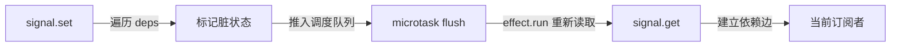
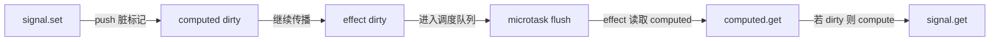

# Signals 与细粒度响应式手写

!!! abstract "核心结论"

- Signals 的本质是「状态单元 + 订阅图」：读取时建立依赖边，写入时沿边失效，计算在读取时惰性求值。
- `effect` 负责把副作用函数注册为订阅者，并在每次运行前清理旧依赖，解决动态依赖泄漏。
- `computed` 使用 `dirty` 标记 + 拉取求值，天然避免 glitch 与无效重复计算。
- 批处理通过把失效 `effect` 放入 `Set`，在 microtask 中合并 flush，避免同一轮多次更新。
- Vue、Solid、Angular、TC39 Signals 共用这套依赖追踪内核，差异主要在 API 形态、调度器与框架集成层。

## 1. 发布订阅到依赖追踪

发布订阅的核心问题是：谁依赖谁必须手动声明。一个 `state.count` 变化后，需要手动 `emit('count-changed')`，然后所有关心 `count` 的地方都要记得 `subscribe`。应用变大后，发布端和订阅端脱节，容易漏订阅、错订阅、重复订阅。

依赖追踪的核心机制是一个全局的「当前订阅者栈」：

```js
const EFFECT_STACK = [];
function currentSubscriber() {
  return EFFECT_STACK[EFFECT_STACK.length - 1] ?? null;
}
```

任何响应式状态在 `get` 时，如果存在当前订阅者，就把「状态 -> 订阅者」这条边写入依赖图；任何状态在 `set` 时，遍历自己的出边，标记订阅者脏并调度执行。于是依赖关系不再需要手动声明，而是在副作用的当前同步执行过程中自然产生。



这形成一个反馈闭环：状态变更只把「脏」推出去，真正的计算在工作被调度时才发生。后面的完整实现会同时体现推送失效与拉取求值。

## 2. 手写 signal / computed / effect

### 2.1 完整内核：signal-core.mjs

运行环境：Node.js 18+，ESM，无第三方依赖。

```javascript
// signal-core.mjs
// 运行环境：Node.js 18+（ESM）。只使用 queueMicrotask、Set，无第三方依赖。
//
// 核心模型：
//   Signal  —— 保存 value；get 时把 currentSubscriber 加入自己的 deps
//   Computed —— 惰性派生；有 observers（下游）与 deps（上游）两个方向
//   Effect —— 副作用函数；run 前清空旧依赖，run 中重新收集依赖
//   batch —— 把多次 set 合并成一次 microtask flush

const EFFECT_STACK = [];
let BATCH_DEPTH = 0;
let MICROTASK_QUEUED = false;
const PENDING_EFFECTS = new Set();

function currentSubscriber() {
  return EFFECT_STACK[EFFECT_STACK.length - 1] ?? null;
}

function flushPending() {
  while (PENDING_EFFECTS.size > 0) {
    const effects = [...PENDING_EFFECTS];
    PENDING_EFFECTS.clear();
    for (const e of effects) {
      if (e.dirty) e.run();
    }
  }
}

function scheduleFlush() {
  if (MICROTASK_QUEUED) return;
  MICROTASK_QUEUED = true;
  queueMicrotask(() => {
    MICROTASK_QUEUED = false;
    flushPending();
  });
}

function startBatch() {
  BATCH_DEPTH += 1;
}

function endBatch() {
  BATCH_DEPTH -= 1;
  if (BATCH_DEPTH === 0) scheduleFlush();
}

function markSubscriberDirty(sub) {
  if (sub instanceof Effect) {
    sub.dirty = true;
    PENDING_EFFECTS.add(sub);
    if (BATCH_DEPTH === 0) scheduleFlush();
  } else {
    sub.markDirty();
  }
}

class Signal {
  constructor(value) {
    this.value = value;
    this.deps = new Set();
  }

  get() {
    const sub = currentSubscriber();
    if (sub) {
      this.deps.add(sub);
      sub.deps.push(this);
    }
    return this.value;
  }

  set(next) {
    if (Object.is(this.value, next)) return;
    this.value = next;
    for (const sub of [...this.deps]) {
      markSubscriberDirty(sub);
    }
  }
}

export class Effect {
  constructor(fn) {
    this.fn = fn;
    this.deps = [];
    this.dirty = true;
    this.state = 'clean'; // clean | running
  }

  run() {
    if (this.state === 'running') {
      throw new Error('Circular effect dependency');
    }
    this.cleanup();
    this.dirty = false;
    this.state = 'running';
    EFFECT_STACK.push(this);
    try {
      this.fn();
    } finally {
      EFFECT_STACK.pop();
      this.state = 'clean';
    }
  }

  cleanup() {
    for (const dep of this.deps) {
      if (dep.deps) dep.deps.delete(this);
      if (dep.observers) dep.observers.delete(this);
    }
    this.deps.length = 0;
  }

  stop() {
    this.cleanup();
    this.dirty = false;
    PENDING_EFFECTS.delete(this);
  }
}

export class Computed {
  constructor(fn) {
    this.fn = fn;
    this.deps = [];
    this.observers = new Set();
    this.state = 'dirty'; // dirty | clean | running
    this.value = undefined;
  }

  get() {
    if (this.state === 'running') {
      throw new Error('Circular computed dependency');
    }
    const sub = currentSubscriber();
    if (sub) {
      this.observers.add(sub);
      sub.deps.push(this);
    }
    if (this.state === 'dirty') {
      this.compute();
    }
    return this.value;
  }

  compute() {
    if (this.state === 'running') {
      throw new Error('Circular computed dependency');
    }
    this.cleanup();
    this.state = 'running';
    EFFECT_STACK.push(this);
    try {
      this.value = this.fn();
      this.state = 'clean';
    } finally {
      EFFECT_STACK.pop();
    }
  }

  markDirty() {
    if (this.state === 'dirty') return;
    this.state = 'dirty';
    for (const obs of [...this.observers]) {
      markSubscriberDirty(obs);
    }
  }

  cleanup() {
    for (const dep of this.deps) {
      if (dep.deps) dep.deps.delete(this);
      if (dep.observers) dep.observers.delete(this);
    }
    this.deps.length = 0;
  }
}

export function signal(value) {
  return new Signal(value);
}

export function computed(fn) {
  return new Computed(fn);
}

export function effect(fn) {
  const e = new Effect(fn);
  e.run();
  return () => e.stop();
}

export function batch(fn) {
  startBatch();
  try {
    return fn();
  } finally {
    endBatch();
  }
}
```

### 2.2 验证标准

运行：`node test-signal-core.mjs`。预期输出：`signal-core: all passed`。

```javascript
// test-signal-core.mjs
// 运行：node test-signal-core.mjs
import { signal, computed, effect, batch } from './signal-core.mjs';
import assert from 'node:assert/strict';

const flush = () => new Promise((resolve) => setTimeout(resolve, 0));

// 1. 基本 effect：初始运行一次，set 后再次运行，stop 后不再运行
{
  const count = signal(1);
  let seen;
  const stop = effect(() => {
    seen = count.get() * 2;
  });
  assert.equal(seen, 2);
  count.set(2);
  await flush();
  assert.equal(seen, 4);
  stop();
  count.set(3);
  await flush();
  assert.equal(seen, 4);
}

// 2. 动态依赖清理：旧分支的 signal 变化不应再触发 effect
{
  const useA = signal(true);
  const a = signal('A');
  const b = signal('B');
  let runs = 0;
  let value;
  const stop = effect(() => {
    runs += 1;
    value = useA.get() ? a.get() : b.get();
  });

  assert.equal(runs, 1);
  assert.equal(value, 'A');

  b.set('B2');
  await flush();
  assert.equal(runs, 1);

  useA.set(false);
  await flush();
  assert.equal(runs, 2);
  assert.equal(value, 'B2');

  b.set('B3');
  await flush();
  assert.equal(runs, 3);
  assert.equal(value, 'B3');

  a.set('A2');
  await flush();
  assert.equal(runs, 3);

  stop();
}

// 3. 批处理：多次 set 只触发一次 effect
{
  const count = signal(0);
  let runs = 0;
  effect(() => {
    void count.get();
    runs += 1;
  });
  assert.equal(runs, 1);

  batch(() => {
    count.set(1);
    count.set(2);
    count.set(2);
  });
  await flush();
  assert.equal(runs, 2);
  assert.equal(count.get(), 2);
}

// 4. computed 惰性求值
{
  const n = signal(1);
  let computeCalls = 0;
  const doubled = computed(() => {
    computeCalls += 1;
    return n.get() * 2;
  });

  assert.equal(computeCalls, 0);
  assert.equal(doubled.get(), 2);
  assert.equal(computeCalls, 1);

  n.set(2);
  assert.equal(computeCalls, 1);
  assert.equal(doubled.get(), 4);
  assert.equal(computeCalls, 2);
}

// 5. 菱形依赖：只执行一次 effect，且无 glitch
{
  const root = signal(1);
  const left = computed(() => root.get() + 1);
  const right = computed(() => root.get() * 2);
  const frames = [];

  effect(() => {
    frames.push([left.get(), right.get()]);
  });

  assert.deepEqual(frames, [[2, 2]]);

  root.set(2);
  await flush();
  assert.deepEqual(frames, [[2, 2], [3, 4]]);
}

// 6. 循环检测：computed 直接或间接读取自己必须抛错
{
  const n = signal(1);
  const loop = computed(() => n.get() + loop.get());
  assert.throws(() => loop.get(), /Circular computed dependency/);
}

console.log('signal-core: all passed');
```

上面的测试覆盖了动态依赖清理、批处理、惰性 `computed`、菱形依赖只执行一次、无 glitch、循环检测六个关键标准。

## 3. Vue 3 reactive / ref 与 effectScope

### 3.1 完整内核：vue-like-simplified.mjs

这是一个教学级简化实现，省略了真实 Vue 3 源码中的数组增强、Map/Set 处理、`reactiveMap` 缓存、调度器队列、watch/computed API 等边界处理。

```javascript
// vue-like-simplified.mjs
// 运行环境：Node.js 18+（ESM）。使用 Proxy 实现响应式对象，使用 effectScope 管理副作用生命周期。
//
// 省略内容：数组方法增强、Map/Set 响应式、reactiveMap 原始对象到 Proxy 的缓存、
// scheduler 任务队列、watch/computed API 等。真实实现需核对 Vue 3 源码。

let activeScope = null;

export class EffectScope {
  constructor() {
    this.active = true;
    this.cleanups = [];
  }

  run(fn) {
    if (!this.active) return undefined;
    const prev = activeScope;
    activeScope = this;
    try {
      return fn();
    } finally {
      activeScope = prev;
    }
  }

  onDispose(fn) {
    if (this.active) this.cleanups.push(fn);
  }

  stop() {
    if (!this.active) return;
    this.active = false;
    for (const fn of [...this.cleanups].reverse()) {
      fn();
    }
    this.cleanups.length = 0;
  }
}

const targetMap = new WeakMap();
let activeEffect = null;
const effectStack = [];

class ReactiveEffect {
  constructor(fn, scheduler) {
    this.fn = fn;
    this.scheduler = scheduler;
    this.deps = [];
    this.active = true;
  }

  run() {
    if (!this.active) return this.fn();
    this.cleanup();
    effectStack.push(this);
    activeEffect = this;
    try {
      return this.fn();
    } finally {
      effectStack.pop();
      activeEffect = effectStack[effectStack.length - 1] ?? null;
    }
  }

  cleanup() {
    for (const dep of this.deps) {
      dep.delete(this);
    }
    this.deps.length = 0;
  }

  stop() {
    if (!this.active) return;
    this.cleanup();
    this.active = false;
  }
}

function track(target, key) {
  if (!activeEffect) return;
  let depsMap = targetMap.get(target);
  if (!depsMap) targetMap.set(target, (depsMap = new Map()));
  let deps = depsMap.get(key);
  if (!deps) depsMap.set(key, (deps = new Set()));
  deps.add(activeEffect);
  activeEffect.deps.push(deps);
}

function trigger(target, key) {
  const depsMap = targetMap.get(target);
  const deps = depsMap?.get(key);
  if (!deps) return;
  for (const e of [...deps]) {
    if (e.scheduler) {
      e.scheduler();
    } else {
      e.run();
    }
  }
}

export function reactive(obj) {
  return new Proxy(obj, {
    get(target, key, receiver) {
      track(target, key);
      const value = Reflect.get(target, key, receiver);
      return typeof value === 'object' && value !== null ? reactive(value) : value;
    },
    set(target, key, value, receiver) {
      const oldValue = target[key];
      const result = Reflect.set(target, key, value, receiver);
      if (!Object.is(oldValue, value)) {
        trigger(target, key);
      }
      return result;
    },
  });
}

export function ref(value) {
  const holder = { value };
  return new Proxy(holder, {
    get(target, key, receiver) {
      track(target, 'value');
      return Reflect.get(target, key, receiver);
    },
    set(target, key, next, receiver) {
      const oldValue = target.value;
      const result = Reflect.set(target, key, next, receiver);
      if (!Object.is(oldValue, next)) {
        trigger(target, 'value');
      }
      return result;
    },
  });
}

export function effect(fn, options = {}) {
  const e = new ReactiveEffect(fn, options.scheduler);
  if (activeScope) {
    activeScope.cleanups.push(() => e.stop());
  }
  e.run();
  return e.stop.bind(e);
}

export function getCurrentScope() {
  return activeScope;
}
```

### 3.2 验证标准

运行：`node test-vue-like-simplified.mjs`。预期输出：`vue-like-simplified: all passed`。

```javascript
// test-vue-like-simplified.mjs
// 运行：node test-vue-like-simplified.mjs
import { reactive, ref, effect, EffectScope } from './vue-like-simplified.mjs';
import assert from 'node:assert/strict';

// 1. reactive 基本响应式与 stop
{
  const state = reactive({ count: 0 });
  let doubled;
  let calls = 0;

  const stop = effect(() => {
    calls += 1;
    doubled = state.count * 2;
  });

  assert.equal(calls, 1);
  assert.equal(doubled, 0);

  state.count = 2;
  assert.equal(doubled, 4);
  assert.equal(calls, 2);

  state.count = 2;
  assert.equal(calls, 2);

  stop();
  state.count = 3;
  assert.equal(calls, 2);
}

// 2. 嵌套对象懒代理
{
  const state = reactive({ user: { name: 'A' } });
  let text;
  effect(() => {
    text = state.user.name;
  });
  assert.equal(text, 'A');
  state.user.name = 'B';
  assert.equal(text, 'B');
}

// 3. ref 的 .value 依赖
{
  const count = ref(1);
  let value;
  const stop = effect(() => {
    value = count.value * 10;
  });
  assert.equal(value, 10);
  count.value = 2;
  assert.equal(value, 20);
  stop();
  count.value = 3;
  assert.equal(value, 20);
}

// 4. effectScope 停止作用域内全部 effect
{
  const state = reactive({ count: 0 });
  let calls = 0;
  const scope = new EffectScope();

  scope.run(() => {
    effect(() => {
      calls += 1;
      void state.count;
    });
    scope.onDispose(() => {
      // 模拟组件卸载时的其他清理工作
    });
  });

  assert.equal(calls, 1);
  state.count = 1;
  assert.equal(calls, 2);
  assert.equal(scope.active, true);

  scope.stop();
  state.count = 2;
  assert.equal(calls, 2);
  assert.equal(scope.active, false);
}

console.log('vue-like-simplified: all passed');
```

`effectScope` 的价值在于：组件级、模块级或请求级的一批 `effect` 可以被统一停止，而不需要逐个保存 `stop` 函数。真实 Vue 3 的 `effectScope` 还支持嵌套作用域与显式 `detached` 模式，细节需核对官方文档。

## 4. Solid 细粒度更新与 React 虚拟 DOM 对比

React 的状态变量本身不具有可追踪性。`setState` 后，组件函数重新运行，生成新 VDOM，再通过 diff 找出变化节点。这个过程中，即使只有一个文本节点变化，组件函数也要完整重跑。

Solid 的编译器会把 JSX 中的动态表达式拆成多个细粒度 `effect`。例如 `<div>{count()}</div>` 编译后接近：

```javascript
// 教学化示意：Solid 将动态 DOM 更新收敛到单个 effect
const [count, setCount] = createSignal(0);

createEffect(() => {
  setText(divNode, count());
});
```

这样 `count()` 变化后，只有这个 `effect` 重新运行，DOM 更新直接落在对应文本节点上，不再生成 VDOM，也不需要组件重跑。

| 维度 | React 虚拟 DOM | Solid 细粒度信号 |
| --- | --- | --- |
| 更新粒度 | 组件函数重运行，生成新 VDOM | 单个 DOM 闭包或指令更新 |
| 状态定位 | hook 返回不可追踪快照 | signal 是运行时响应式对象 |
| 依赖收集 | 无自动依赖，依赖组件重跑 | `createEffect`、`computed` 自动收集 |
| Diff 成本 | 两棵 VDOM 树 diff | 无 VDOM diff，只有依赖图失效 |
| 编译器作用 | 优化 JSX 生成与组件重渲染 | 把 JSX 拆成细粒度 effect 与 DOM 更新 |
| 内存形态 | VDOM 树 + Fiber 节点 | 依赖图 + 节点闭包 |

这两种模型并非严格互斥：React 中局部状态与大量列表项更新时，VDOM 仍可保持可预测性；Solid 在大量高频交互场景下，更新成本与受影响的图规模成正比，而不是与组件树规模成正比。

## 5. TC39 Signals 提案现状与 Angular Signals

### 5.1 TC39 Signals 提案现状

截至本文写作时，TC39 Signals 提案处于 Stage 1（需核对官方仓库 `tc39/proposal-signals` 的最新进展）。Stage 1 意味着该提案仍处于问题探索阶段，API 名称、类设计、调度语义都可能发生较大变化，不能直接用于生产。

该提案的目标并不是取代某个框架的响应式系统，而是提供一套可由框架共享的底层 Signals 原语，减少不同框架之间响应式状态的互操作成本。提案中通常讨论的抽象包括：可变状态 signal、派生状态 computed、观察副作用 check/watch 等，但最终形态应以官方提案为准。

### 5.2 Angular Signals 与本页实现的差异

Angular 从 16 开始引入 Signals 相关 API（初始阶段存在 developer preview，具体版本状态需核对 Angular 官方更新说明）。其核心 API 形态为 `signal()`、`computed()`、`effect()`，读取方式不是 Vue 的 `.value`，而是把 signal 本身当作 getter 函数调用，例如 `count()`。

Angular Signals 与本页实现的共同部分是依赖追踪、惰性 computed、脏标记与 effect 调度。主要差异在于 Angular 还结合了组件变更检测、模板绑定与 Zone.js 之外的新调度机制。

| 特性 | Vue 3 | Solid | Angular Signals | TC39 Signals |
| --- | --- | --- | --- | --- |
| 状态创建 | `ref` / `reactive` | `createSignal` | `signal()` | 标准化中，API 待定 |
| 读取方式 | `.value` 或属性 | getter 函数 | getter 函数 | 待定 |
| 依赖收集 | Proxy + `track` | getter 自动收集 | getter 自动收集 | 自动收集 |
| 调度方式 | 微任务队列 | 同步 effect 为主 | Angular 调度与变更检测结合 | 待定 |
| 成熟度 | 稳定 | 稳定 | 已发布但 API 随版本演进 | Stage 1，极早期 |

## 6. 推拉（push-pull）混合算法

本页实现采用 push-pull 混合调度：

- push 阶段只传播「脏」，不直接计算。`signal.set` 会标记直接依赖它的 `computed` 为 dirty，`computed.markDirty` 继续把脏传播给下游 `effect`。
- pull 阶段才真正计算。调度器 flush `effect` 时，`effect` 主动读取 `computed`，`computed` 发现自己是 dirty 才执行 `compute`，并递归读取上游 `signal`。



这样可以同时获得两个好处：

- 不重复计算：菱形依赖中，两个 `computed` 各自标脏一次，只有一个 `effect` 入队一次。
- 不产生 glitch：`effect` 不会在 `signal.set` 的中间状态运行，而是在 flush 时读取已经一致的 `computed` 值。

因此成本可以被拆成两部分：写操作时沿图标记脏图，读操作时按实际读取路径重新计算。没有被读取的 dirty computed 不会执行。

## 7. 常见陷阱

1. 在 `effect` 中无条件写同一个 signal，会形成无限循环。

```javascript
const count = signal(0);
effect(() => {
  count.set(count.get() + 1); // 每次 flush 都重新排队
});
```

2. 在异步回调中读取 signal 不会建立依赖。依赖收集只发生在 `effect.fn` 的同步执行阶段。

```javascript
const state = signal(1);
effect(() => {
  setTimeout(() => {
    console.log(state.get()); // 不是当前 effect 的依赖
  }, 0);
});
```

3. 动态分支里旧依赖必须清理。如果 effect 第一次读取 `a`，条件切换后读取 `b`，但不清掉 `a`，后续 `a` 变化仍会触发 effect，造成陈旧闭包和内存泄漏。

4. 判断变更应使用 `Object.is`，而不是 `===`。`NaN` 与 `-0` 在响应式系统中通常应视为相同或需要明确处理，随便使用 `===` 会导致边界值处理错误。

5. `computed` 应保持纯函数。在 computed 内部写 signal 或触发副作用，会破坏 dirty 状态机，可能发生漏更新或循环检测误判。

6. 批处理依赖 microtask，测试时不能同步断言。`batch` 返回后效果还没有 flush，必须等到 microtask 或 `setTimeout` 之后才能验证最终值。

7. 忘记调用 `effect` 返回的 `stop` 函数，会让 signal 持有已经卸载的组件的引用。组件级清理应统一使用 `effectScope.stop` 或框架提供的卸载钩子。

8. `effectScope.stop` 默认会停止后续在同一个 scope 中创建的 effect，因此不同生命周期的 effect 不要混在同一个 scope。

## 8. 面试题与答题要点

### 8.1 为什么需要依赖收集，而不是手动发布订阅？

要点：手动发布订阅要求开发者显式维护发布方与订阅方的映射，容易出现漏通知、重复通知和无法追踪的订阅。依赖收集通过「当前 effect 栈 + getter 记录」自动在图里建立边，保证关系与代码读取路径一致。

### 8.2 手写 effect 时如何实现动态依赖清理？

要点：每个 effect 在执行前调用 `cleanup`，从上一轮收集到的所有 `deps` 中把自己删除；然后清空 `deps` 数组；执行 `fn` 时遇到新的 `get` 再重新添加。这样分支条件变化后，旧分支的响应式对象不再触发该 effect。

### 8.3 什么是 glitch？菱形依赖为什么只执行一次？

要点：glitch 指同一轮更新中，effect 读到了新旧混合的 computed 值。菱形依赖中，根 signal 变化后两个 computed 先标脏，effect 只入队一次；flush 时 effect 按顺序拉取 computed，computed 在此时一致地重新计算，所以不会出现中间状态，也不会重复执行。

### 8.4 批处理如何实现？为什么用 microtask 而不是宏任务？

要点：用 `BATCH_DEPTH` 记录嵌套层级，非 0 时只把 effect 加入 `Set`，不立即 flush；最外层 `batch` 结束后调度一次 microtask。用 `Set` 去重保证同一 effect 只执行一次。microtask 能在本轮任务与渲染前完成，避免宏任务引入额外跳帧和顺序不确定性。

### 8.5 Vue 3 的 reactive 和 ref 底层差异是什么？

要点：`reactive` 基于 Proxy，拦截对象的属性读取和写入，并通过 `targetMap` 做 `target -> key -> deps` 三级依赖映射；`ref` 可以通过类对象 + `getter/setter` 或 Proxy 实现，统一在 `.value` 上做依赖收集。`reactive` 适合结构化对象，`ref` 适合原始值或需要重新赋值的值。

### 8.6 为什么 Solid 的细粒度更新比 React 虚拟 DOM 更新成本更可控？

要点：React 组件函数重跑产生 VDOM，再 diff；Solid 在编译器、运行时的配合下，把 JSX 动态表达式拆成独立 effect。状态变化时只触发读取该状态的 effect，直接更新对应 DOM 节点，不生成 VDOM，也不重跑组件函数。成本取决于依赖图的局部子图规模。

### 8.7 effectScope 解决什么问题？

要点：它把一组 effect 和清理函数放到同一个作用域，组件、请求或模块销毁时统一停止，避免手动保存每个 `stop` 函数。面试中需要说明它通常是「初始化时收集，销毁时逆序执行」的生命周期容器。

### 8.8 TC39 Signals 提案目前处于什么阶段？能否直接用于生产？

要点：Stage 1，仍在演进，API 和语义可能改变，不能直接生产使用。该提案的价值是标准化底层 Signals 原语，促进框架间响应式状态互操作，而不是替代某个框架。

以上简化实现覆盖了 Signals 响应式系统的核心骨架：自动依赖收集、动态依赖清理、批处理、惰性 computed、循环检测和 effectScope。它们可以作为面试手写题的基线版本，也可以在此基础上扩展 scheduler 优先级、深度响应式缓存和纯对象代理等生产级细节。

## 深入阅读与参考

!!! tip "怎么用这些资料"
    先读「官方文档与规范」建立准确的概念，再读「源码与示例」核对细节，最后用「教程、书籍与视频」换一种讲法加深理解。每条都写明了读哪一节、带着什么问题读。

### 官方文档与规范

| 资源 | 为什么读 | 怎么读 |
|---|---|---|
| [SolidJS 文档](https://docs.solidjs.com/) | 官方定义的 signal 语义与更新时机，术语最准确。 | 精读 Concepts 响应式章节，带着“何时同步、何时批量”的问题读完写个最小 demo。 |
| [Vue 渲染机制](https://cn.vuejs.org/guide/extras/rendering-mechanism.html) | 讲清虚拟 DOM 与编译优化，才能对比细粒度更新的收益。 | 读虚拟 DOM 与静态提升两节，在模板编译演示站对照编译输出，整理对比笔记。 |
| [MDN 元编程](https://developer.mozilla.org/en-US/docs/Web/JavaScript/Guide/Meta_programming) | Proxy/Reflect 是手写 reactive 的基础，语义讲得最准。 | 读 Proxy 陷阱与 Reflect 两节，动手写校验对象与简易 reactive，验证陷阱触发时机。 |
| [Angular 概览](https://angular.dev/overview) | Angular Signals 是提案的重要落地样本，可看官方 API 语义。 | 读 Essentials 中 signal、computed、effect 三节，记录命名与语义，与手写实现对照。 |
| [TC39 流程文档](https://tc39.es/process-document/) | 判断 Signals 提案离标准化还有多远，必须看阶段定义。 | 读 Stage 0-4 定义，再去 proposal-signals 仓库核对当前阶段与开放问题。 |

### 源码与示例

| 资源 | 为什么读 | 怎么读 |
|---|---|---|
| [Solid](https://github.com/solidjs/solid) | 直接读 signal 与 memo 的实现，比二手解读更可靠。 | 读 packages/solid 的响应式源码，追 createSignal、createMemo 的依赖收集与调度路径。 |
| [Vue 核心源码仓库](https://github.com/vuejs/core) | 官方实现是推拉式依赖追踪的工业级参考范本。 | 从 packages/reactivity 读起，先 effect 再 computed，注意脏标记与惰性求值。 |
| [Vue 2 响应式源码目录](https://github.com/vuejs/vue/tree/main/src/core/observer) | 对比 Vue 2 实现，才看清 Proxy 解决了哪些追踪盲区。 | 读 observer 与 dep 目录，列出数组、新增属性等失效场景，思考 Proxy 如何解决。 |
| [petite-vue](https://github.com/vuejs/petite-vue) | 几百行读完整套响应式，适合作为源码入门第一站。 | 从 src/index.ts 顺 reactive、effect 读下去，画出“读时收集、写时触发”流程图。 |

### 教程、书籍与视频

| 资源 | 为什么读 | 怎么读 |
|---|---|---|
| [Vue 响应式深入](https://cn.vuejs.org/guide/extras/reactivity-in-depth.html) | 从零手写 reactive/computed，正对本页主题，面试也常问。 | 跟着实现一遍，重点读依赖收集与触发章节，写完与 Vue 3 源码对照差异。 |
| [Solid 交互式教程](https://www.solidjs.com/tutorial/introduction_basics) | 边做边写 signal/effect，快速建立细粒度更新直觉。 | 做完 Reactivity 全部小节，再改写成手写版本，记录与 React state 更新差异。 |
| [Leptos Book](https://book.leptos.dev/) | Rust 版同一套 signal 模型，帮你提炼框架无关的内核。 | 做细粒度响应式计数器，重点看 signal 与派生值写法，对比 Solid 的 API 差异。 |
| [Build Your Own React](https://pomb.us/build-your-own-react/) | 手写 Fiber 协调，直观感受虚拟 DOM 更新的成本。 | 跟做核心几节，重点读 reconcile 与 commit，统计一次更新要遍历多少节点。 |

## 应用与行业实践

这一节把「状态单元 + 订阅图」放回真实工程里：在哪些界面结构上用它、怎么量收益、什么情况下回到手写发布订阅或干脆不用响应式。

### 应用场景地图

| 场景 | 用到本页哪个知识点 | 典型技术选型 | 注意事项 |
| --- | --- | --- | --- |
| 后台管理的万行表格，含排序、筛选、行内编辑 | 读取建边、写入失效、computed 派生可见行 | Vue 3 `ref` / `computed` 加虚拟滚动 | 对全量行做 filter 会建出与行数同阶的依赖边，先分页再订阅 |
| 低端安卓上的首屏加载，图表与侧栏延后出现 | computed 惰性求值、effect 延迟注册 | Solid `createSignal` / `createMemo`，或 Vue `shallowRef` | 首屏注册大量 effect 会把长任务摊到第一帧 |
| 多人协作白板，远端 patch 回流 | 批处理 + microtask 合并 flush | 自研 signal 加 WebSocket | 本地操作与远端 patch 走同一个 flush 入口，顺序由队列决定 |
| 实时监控看板，推送频率高于刷新频率 | dirty 标记加拉取求值，避免 glitch | Angular Signals 或 Preact Signals | 高频写入要用 untracked 把低频读取隔开 |
| 表单联动校验，字段依赖字段 | 动态依赖清理，effect 运行前先清旧边 | Vue `watchEffect` 或 React `useSyncExternalStore` | 条件分支里的边会被清掉，别把它当成常驻依赖 |
| 地图与图表的联动筛选 | computed 去重、同轮更新合并 | Vue computed 加调度器 `flush: 'post'` | 需要读 DOM 尺寸的 effect 要放到 post flush |
| 编辑器插件面板，频繁打开与关闭 | effectScope 归组与 stop | Vue `effectScope` 或自研 Scope | 关闭后必须 stop，否则订阅图持续持有引用 |
| 同进程 SSR 渲染多个请求 | 订阅图与请求作用域隔离 | Vue SSR / Solid SSR | 跨请求共享 signal 会把上一个用户的状态带到下一个用户 |
| 埋点与日志上报 | effect 清理、批处理合并上报 | 自研 effect 加 `queueMicrotask` | 重试逻辑不要塞进 effect 同步执行，会拖长 flush |

### 三个场景拆解

#### 场景 1：后台管理的万行表格

**业务背景**：列表页把筛选、排序、行内编辑放在同一个视图，行数从千级涨到万级后，每改一次筛选条件就重建整张表。量级判断方法：在 DevTools Performance 里录制 5 秒的滚动加输入，数 Long Task 条数与每帧 Scripting 时长。

**怎么用本页知识解决**：把筛选条件与每行数据都做成状态单元，写入端只管写，读取端在 effect 里建立订阅边。

```js
const keyword = signal('')                 // 筛选条件，写入端不必知道谁在听
const rows = createRowSignals(10000)       // 每行一个 signal，行内编辑只动那一行

const visible = computed(() =>             // 派生可见行，没有订阅者时不执行
  rows.filter(r => r.value.name.includes(keyword.value))
)

effect(() => {                             // 只有这里读 visible，才算真正订阅
  renderRows(visible.value)                // 可见行变化时才重排 DOM
})
```

- 写入端只执行 `keyword.value = 'x'`，订阅边由读取动作建立，不必手动 emit 事件名。
- 行内编辑只改那一行的 signal，读该行的单元格 effect 重跑，其余行不进入调度。
- `visible` 的依赖是 keyword 与 filter 过程中读到的每一行，行数上升时依赖边数量同比上升。
- 所以 filter 要放到分页层或索引层，只在当前页范围内读行 signal。
- 排序同理：排序列做成 computed，读它之前不排序。

**怎么度量收益**：用 DevTools Performance 的 Long Task 条数与每帧 Scripting 时长；用 `performance.mark` / `measure` 包住 flush 记录单次耗时；用 `MutationObserver` 统计同一轮操作产生的 DOM 变更条数，改动前后各测三次取中位。

**什么时候不该用**：一次性渲染后不再变化的静态列表，直接模板渲染，加 signal 只多一层间接。依赖关系跨 iframe 或 Web Worker 边界时，订阅图不跨线程，需要显式消息传递。

#### 场景 2：多人协作白板

**业务背景**：多人同时绘制，一次拖拽会生成连续多帧 patch，远端回放与本地操作叠加，逐条应用会触发逐条重算。量级判断方法：在消息回调里打点，统计每秒 flush 次数与单次 flush 耗时的分布。

**怎么用本页知识解决**：把同一轮到达的 patch 收进队列，用 microtask 合并成一次 flush，批内写入不产生中间态渲染。

```js
let queued = false
const pending = []

socket.onmessage = (e) => {
  pending.push(JSON.parse(e.data))   // 先入队，不立刻写 signal
  scheduleFlush()                    // 每轮只登记一次 flush
}

function scheduleFlush() {
  if (queued) return                 // 已有登记就返回，避免排队多个 microtask
  queued = true
  queueMicrotask(flush)              // microtask 结束时合并执行
}

function flush() {
  queued = false
  batch(() => {                      // 批内写入不触发中间态 effect
    for (const msg of pending.splice(0)) applyPatch(msg)
  })
}
```

- `queued` 标志防止消息风暴排入多个 microtask，保证一轮只有一次 flush。
- `batch` 让批内写入不触发中间态的 effect，避免读到只应用了一半的状态。
- 本地操作也走 `applyPatch` 加 `scheduleFlush`，本地与远端的顺序由同一个队列决定。
- 队列消费完立即清空，长连接断开时不会留下待应用的脏数据。

**怎么度量收益**：用 `PerformanceObserver` 统计 `longtask` 条目数；用 `performance.now()` 记录每次 flush 耗时并算分位；用 `performance.mark` 打点「本地输入到笔画上屏」的间隔；DevTools Performance 面板看帧率曲线。

**什么时候不该用**：协同协议要求逐条确认、带版本向量的冲突解决需要保留中间确认点，合批会丢掉这些点。远端 patch 必须立刻落盘的持久化路径，microtask 合并会引入一帧以内的写入延迟。

#### 场景 3：低端安卓的首屏加载

**业务背景**：首屏只展示标题栏与卡片，图表和侧栏等用户点击后才出现，主线程被脚本占满时首屏绘制被推到后面。量级判断方法：用 Lighthouse 移动端模拟测 TBT，或录一次加载过程数主线程长任务条数。

**怎么用本页知识解决**：首屏只创建 signal，把 effect 注册推迟到面板展开的那一刻，并把整组 effect 交给一个 scope 管理。

```js
const scope = effectScope()                // 一组 effect 的生命周期容器

function openPanel() {
  scope.run(() => {                        // 展开时才建立依赖边
    effect(() => paintChart(chartCfg.value))  // 写 chartCfg 只唤醒这个 effect
    effect(() => syncLegend(legendState.value))
  })
}

function closePanel() {
  scope.stop()                             // 一次性断开这组边，释放引用
}
```

- 首屏只创建 signal 与 computed，不注册 effect，主线程不执行订阅初始化。
- computed 在没有 effect 读取时不求值，未展示区域的计算不发生。
- 关闭时 `scope.stop()` 一次断开整组边，不必逐个保存 unsubscribe 函数。
- 再次展开时重新 `run`，依赖边按当次读取路径重建，不残留上一次的分支。

**怎么度量收益**：Lighthouse 移动端报告的 TBT；`PerformanceObserver` 监听 `longtask` 与 `paint` 条目；面板从点击到图表上屏的间隔用 `performance.mark` 成对打点。

**什么时候不该用**：首屏只展示静态文本的营销页，引入 signal 只增加运行时开销。用户停留在页面几秒内大概率展开面板时，延迟注册会把计算挪到点击那一刻，点击反而卡顿。

### 行业先进实践

**effectScope 归组订阅（出处：Vue 3 官方文档 Reactivity API: Advanced）**：官方文档给出 `effectScope()`、`scope.run()`、`scope.stop()` 与 `onScopeDispose`，把一组 effect 交给一个对象管理。有效的原因是「谁订阅了」的清单由框架维护，卸载时一次断开，不依赖开发者手写清理。你的项目可以把每个可关闭面板、每个路由页面各自包进一个 scope。

**createMemo 与 untrack（出处：Solid 官方文档）**：文档说明 memo 只在依赖变化时重算，读取时返回缓存值；`untrack` 读取不建立依赖边。有效的原因是高频写入与低频读取被隔开，读取不再反向放大订阅图。你的项目可以把只用于日志、埋点、调试快照的读取放进 untrack。

**渲染期自动订阅（出处：Preact Signals 开源仓库 preactjs/signals）**：适配层在组件渲染中读 signal 时自动登记订阅，组件卸载时自动清理，调用方不写 subscribe。有效的原因是漏更新往往来自忘记订阅，而自动登记把这件事从人手里拿走。你的自研实现可以把订阅登记挂在渲染上下文的执行期上。

**Angular effect 的注入上下文与 untracked（出处：Angular 官方文档 Signals 章节）**：effect 在注入上下文内创建并随组件销毁，`untracked` 用于读取不建边。有效的原因是生命周期与依赖声明交给框架，业务代码只表达「我要读什么」。需核对官方文档：effect 的默认调度时机与刷新行为在不同主版本间的差异。

**TC39 Signals 提案与 polyfill（出处：tc39/proposal-signals 开源仓库、signal-polyfill 开源仓库）**：提案描述 signal 与 computed 的自动追踪语义和惰性求值约定，polyfill 提供可运行实现。有效的原因是跨框架互操作有了共同基线，库作者不必为每个框架各写一份适配。需核对官方文档：提案当前阶段、API 命名与 watcher 的设计是否已定稿。

### 从学到用：落地路线

第 1 步，试点：挑一个可关闭的面板或一个独立路由页，只把这部分状态改写成 signal 加 effect，其余代码不动。验收标准：该模块里不再出现手写 subscribe / unsubscribe，关闭后订阅计数回到打开前的值。

第 2 步，验证：在试点模块上重复打开关闭 20 次，记录监听器数量与 flush 耗时。验收标准：监听器数量不随开关次数增长，flush 耗时与首次打开同量级，同一台设备测三次取中位。

第 3 步，推广：把「一个模块一个 scope、写入只走 setter、读依赖只在 effect 内」写成模板与评审清单。验收标准：新增模块全部通过清单检查，评审中不再出现 effect 外的手写订阅。

第 4 步，防回退：在 CI 里跑开关流程脚本，断言订阅计数与渲染次数。验收标准：计数或断言失败直接让构建失败，脚本输出留存在构建日志里。

### 动手作业

**目标**：用自己的 signal / computed / effect / batch / effectScope 搭一个可开关的数据面板，并证明依赖边能随开关建立与断开。

**步骤**：

1. 在单文件里实现 `signal`、`computed`、`effect`、`batch`、`effectScope` 五个 API。
2. 给 signal 与 computed 各加一个执行计数器，页面可见，用于观测。
3. 用这五个 API 搭面板：一个筛选输入框、一个行列表、一个只在展开时显示的统计区。
4. 统计区用 scope 包裹，展开时 `run`，收起时 `stop`。
5. 连续展开收起 20 次，把订阅计数与 flush 耗时打印到页面上。
6. 写断言：无订阅者时 computed 执行次数为 0；同一轮写三次筛选条件只 flush 一次；stop 之后再写 signal 渲染次数为 0。
7. 把测量命令、设备信息和原始输出写进 README。

**验收标准**：

- 无订阅者时 computed 的执行计数为 0，计数器有页面输出为证。
- 同一轮内连续写三次筛选条件，flush 次数为 1。
- 展开收起 20 次后，订阅计数与初始值相同。
- `scope.stop()` 之后再写 signal，渲染函数执行次数为 0。
- README 里的命令与输出在另一台设备上能复现同一组断言结果。

