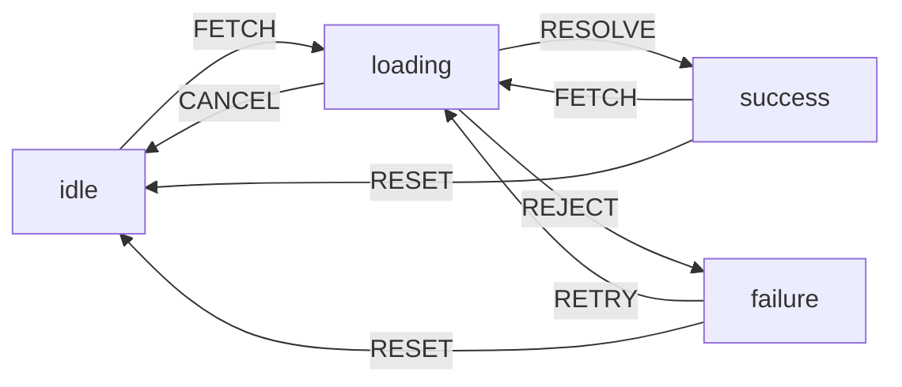
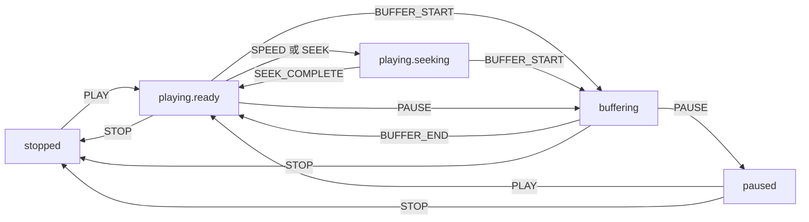
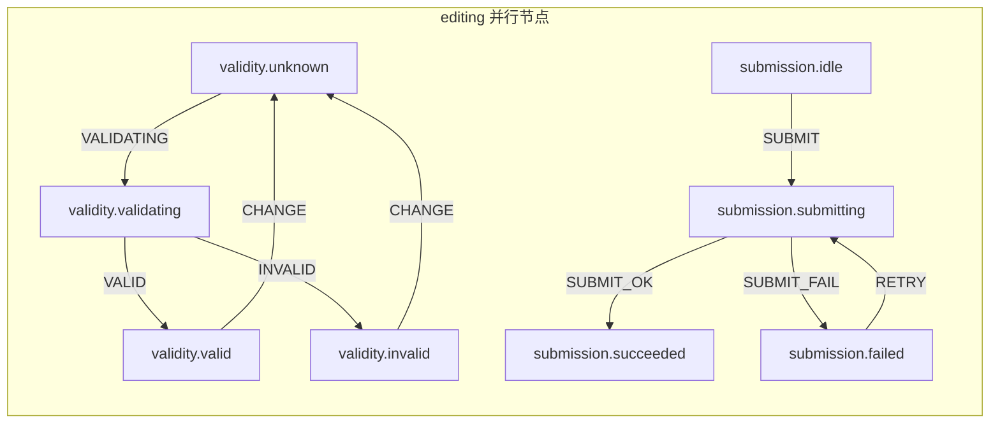
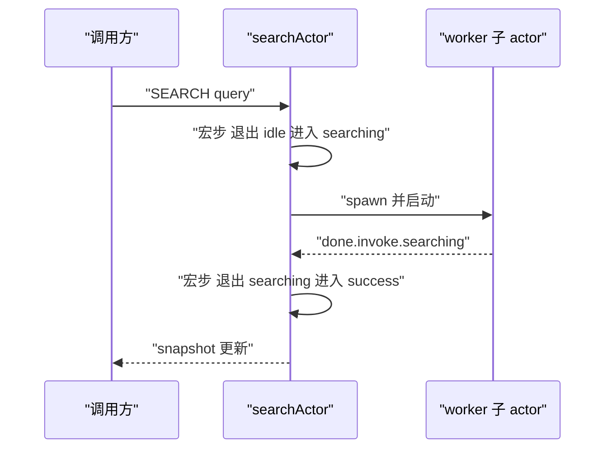

# 状态机与 XState：把流程建模为有限状态

!!! abstract "核心结论"
    1. 有限状态机（FSM）的本质是**把"状态"从多个布尔标志的笛卡尔积提升为一等公民**：状态集合有限、转移由事件显式触发、非法状态在建模阶段就不可表达。
    2. 经典 FSM 只回答"当前在哪个状态"，statechart 在此之上加了层级（父子状态）、正交（并行区域）、守卫（guard）、动作（action）、进入/退出语义与历史状态，这才是前端复杂流程真正需要的表达力。
    3. 运行时语义的核心是"事件队列 + 宏步（macrostep）"：一次事件在**不被打断**的前提下完成"选转移 → 退出 → 执行动作 → 进入"，保证 run-to-completion，避免中间态被观察到。
    4. 层级状态机的关键算法是 **LCA（最近公共祖先）退出/进入**；并行状态机的关键是**正交区域各自独立选转移 + 事件广播**。
    5. XState 把状态机包装成 Actor：machine 是蓝图，actor 是运行实例（有 mailbox、有生命周期、可 invoke 子 actor）；它能替换的往往不是 Redux 本身，而是"用 reducer + 布尔标志模拟流程"的那部分代码。

## 1. 问题起点：布尔爆炸与非法状态

### 1.1 布尔标志的组合爆炸

一个普通的数据请求 UI，直觉写法通常是四个布尔加两个可空字段：

```js
// 反面示例：Node.js 18+，纯数据，不涉及 DOM
const ui = {
  isLoading: false,
  isRefreshing: false,
  isError: false,
  isSuccess: false,
  data: null,
  error: null,
};
```

4 个布尔 = 16 种组合。真正合法的组合只有少数几个（`idle`、`loading`、`refreshing`、`success`、`failure`），其余全是"很难解释"的状态：

| 布尔组合 | 语义 | 现实中的后果 |
| --- | --- | --- |
| `isLoading && isError` | 同时加载中和出错 | 加载动画和错误弹窗同时出现 |
| `isSuccess && data === null` | 成功但没有数据 | 渲染 `data.map` 直接抛 TypeError |
| `isRefreshing && !isLoading` | 刷新但不加载 | 骨架屏不显示，界面看起来卡死 |
| `isError && error === null` | 出错但没有错误对象 | 错误文案渲染出 `undefined` |

这些组合不是"边界情况"，而是**模型本身允许了它们存在**。真正的问题在于：状态被拆成了多个彼此独立的变量，变量之间的一致性靠开发者手工维护，一旦某个异步回调只更新了其中一个，就产生了非法状态。

### 1.2 状态机的修正方式

FSM 的定义非常朴素：状态集合有限，任一时刻只处于一个状态；事件触发转移；转移可以有条件和副作用。

```js
// fsm-idea.js —— Node.js 18+
// 状态是一个"和类型"（sum type）：任一时刻恰好命中一个分支
const requestState = 'idle'; // 'idle' | 'loading' | 'success' | 'failure'

const transitions = {
  idle: { FETCH: 'loading' },
  loading: { RESOLVE: 'success', REJECT: 'failure', CANCEL: 'idle' },
  success: { RESET: 'idle' },
  failure: { RETRY: 'loading', RESET: 'idle' },
};
```

有了这张表，"成功但没有数据"这种状态在结构上就写不出来：数据只能作为 `RESOLVE` 事件的载荷在 `loading → success` 的转移中一次性写入。**非法状态被消除，而不是被防御。**

### 1.3 FSM 与 statechart 的分工

David Harel 提出的 statecharts 是 FSM 的超集，也是 XState 建模语汇的来源（XState 与 W3C SCXML 规范的关系请核对官方文档）。

| 维度 | 经典 FSM | Statechart（Harel / XState） |
| --- | --- | --- |
| 状态组织 | 扁平集合 | 层级：状态可以嵌套子状态 |
| 并发 | 无 | 正交：并行区域同时活跃 |
| 事件处理 | 每个状态自己定义转移 | 子状态未处理时冒泡给祖先 |
| 条件 | 通常靠多个事件类型区分 | guard 谓词在同一事件上做分支 |
| 副作用 | 转移上挂动作 | 进入/退出/转移动作分离，语义明确 |
| 历史 | 需要手工记录 | 历史状态（浅/深）语义内建 |
| 表达力边界 | 状态数 × 事件数的显式表 | 状态树 + 转移，可复用父级转移 |

## 2. 底层原理：从转移函数到运行时宏步

### 2.1 有限自动机与转移函数

确定有限自动机（DFA）是一个五元组 `(Q, Σ, δ, q0, F)`：状态集合 `Q`、输入字母表 `Σ`、转移函数 `δ: Q × Σ → Q`、初始状态 `q0`、接受状态集合 `F`。前端状态机几乎都工作在 DFA 的形态上：任一 `(状态, 事件)` 最多对应一条被选中的转移。

`δ` 的实现方式决定了引擎的类型：

| 实现方式 | 数据结构 | 查找开销 | 典型代表 |
| --- | --- | --- | --- |
| 转移表 | `Map<"state#event", Transition[]>` | 哈希查找 O(1) | 本文的手写引擎、Akka FSM 风格 |
| 状态树遍历 | 树节点 + 祖先链冒泡 | O(深度) 每叶子 | XState 的 `StateNode` 树 |
| 编译为代码 | 生成 switch/跳转表 | 接近 0（生成后） | 部分嵌入式工具链 |

### 2.2 状态配置与 "当前状态" 的重新定义

一旦引入层级和并行，"当前状态"不再是一个标量，而是一个**状态配置（configuration）**：处于活跃状态的节点集合，满足两条不变式：

1. 若节点 `n` 活跃，则 `n` 的所有祖先都活跃。
2. 若复合节点 `n` 活跃，则它恰好有一个直接子节点活跃（并行节点则是全部子节点都活跃）。

XState 把配置投影成 `snapshot.value`：单叶子时是状态 id 字符串，并行时是叶子 id 的数组或嵌套对象（具体形状需核对官方文档）。判断"是否处于某状态"要用 `snapshot.matches(id)`，而不是直接比较字符串。

### 2.3 宏步：一次事件的处理过程

事件不是"立刻生效"的，而是进入 actor 的 mailbox，由一个宏步原子地处理完：


关键约束是 **run-to-completion**：宏步之内产生的内部事件（动作里 `raise` 的事件、`invoke` 回填的 `done`）只能排队，必须等本次宏步结束后才处理。没有这条约束，就可能在"退出 A 但还没进入 B"的瞬间被另一个事件插入，观察到不存在的中间状态。

外层队列的伪代码：

```text
send(event):
  queue.push(event)
  if draining: return            // 已在宏步中，只入队
  draining = true
  while queue 非空:
    e = queue.shift()
    macrostep(e)                 // 原子地完成退出/动作/进入
    notifyAllSubscribers(snapshot())
  draining = false
```

### 2.4 层级状态机的退出/进入算法

给定源状态 `S`（声明 `on` 的那个节点）和目标状态 `T`，令 `L = LCA(S, T)` 为二者在状态树上的最近公共祖先：

1. 退出集 = 当前配置中 `L` 的所有严格后代，按"进入顺序的逆序"退出（子节点先于父节点，兄弟节点按文档顺序逆序）。
2. 执行转移自身定义的动作。
3. 进入集 = 从 `L` 的直接子节点到 `T` 的路径，自上而下进入；进入 `T` 后再递归补齐 `T` 的初始子状态（复合节点取 `initial`，并行节点取全部子节点）。

LCA 的存在解释了状态机的"作用域"语义：转移只影响两个状态共同祖先以下的部分，共同祖先以上的状态保持活跃。这也正是"父状态可以兜底处理子状态未处理的事件"能成立的原因。

### 2.5 并行状态与冲突消解

并行节点的每个正交区域独立执行第 2.3 节的宏步：事件被**广播**给所有区域，一个区域接受转移不影响其他区域。冲突消解大致遵循两条规则：

1. 同一事件、同一区域内有多个候选转移时，按定义顺序（文档顺序）取第一个守卫通过的。
2. 跨区域若退出集相交（例如某个区域转移到并行节点之外），需要"优先级 + 文档顺序"的确定规则，具体算法请核对 SCXML 与 XState 官方文档。

### 2.6 Actor 模型：把状态机变成进程

Actor 模型的要素：每个 actor 有私有状态、有 mailbox（消息队列）、只能通过消息通信、可以创建子 actor。把状态机套进 Actor：

| Actor 概念 | 状态机中的对应物 |
| --- | --- |
| actor 的私有状态 | 当前状态配置 + context |
| 消息 | 事件对象 `{ type, ...payload }` |
| mailbox | 事件队列（保证 run-to-completion） |
| 子 actor | `invoke` / `spawn` 出来的 Promise、回调、子状态机 |
| 监督 | 子 actor 失败时向父 actor 发 `error.platform.*` 事件，由父状态机决定恢复策略 |
| 不可变快照 | `snapshot`（value + context + status），用于持久化与时间旅行 |

理解了这一层，`invoke` 就不再神秘：它只是"进入某状态时 spawn 一个子 actor，退出该状态时 stop 它，子 actor 的结果以事件形式回填给父 actor"。

## 3. 手写迷你状态机库（转移表版）

运行环境：Node.js 18+，CommonJS，无第三方依赖。文件：`mini-fsm.js`。

```js
// mini-fsm.js —— Node.js 18+ (CommonJS)
'use strict';

const toArray = (x) => (x == null ? [] : Array.isArray(x) ? x : [x]);

// 把 "target" / { target, guard, actions } / 数组 统一成转移候选数组
function normalize(def) {
  return toArray(def).map((t) =>
    typeof t === 'string'
      ? { target: t }
      : { target: t.target, guard: t.guard, actions: toArray(t.actions) }
  );
}

function createMachine(config) {
  const table = new Map();   // "state#eventType" -> Transition[]
  const entry = new Map();
  const exit = new Map();

  for (const [value, node] of Object.entries(config.states)) {
    entry.set(value, toArray(node.entry));
    exit.set(value, toArray(node.exit));
    for (const [type, def] of Object.entries(node.on || {})) {
      table.set(value + '#' + type, normalize(def));
    }
  }

  return { id: config.id, initial: config.initial, context: config.context, table, entry, exit };
}

function interpret(machine, options = {}) {
  const strict = options.strict !== false; // 默认：未定义的转移直接抛错
  let value = machine.initial;
  let context = options.context === undefined ? machine.context : options.context;

  const listeners = new Set();
  const queue = [];
  let draining = false;

  const asEvent = (e) => (typeof e === 'string' ? { type: e } : e);

  // 守卫求值：同一事件下按定义顺序找到第一条 guard 通过的转移
  function resolve(event) {
    const list = machine.table.get(value + '#' + event.type) || [];
    for (const t of list) {
      if (!t.guard || t.guard(context, event)) return t;
    }
    return null;
  }

  // 动作签名：(context, event) => newContext | undefined
  function runActions(actions, event) {
    for (const a of toArray(actions)) {
      const next = a(context, event);
      if (next !== undefined) context = next;
    }
  }

  function macrostep(event) {
    const t = resolve(event);
    if (!t) {
      if (strict) throw new Error('不受支持的转换: ' + value + ' + ' + event.type);
      return false; // 非严格模式：静默忽略，状态不变
    }
    if (t.target !== undefined) {
      // 外部转移语义：exit -> 转移动作 -> entry（target 与当前相同也会重跑，便于重启副作用）
      runActions(machine.exit.get(value), event);
      runActions(t.actions, event);
      value = t.target;
      runActions(machine.entry.get(value), event);
    } else {
      // 无目标：内部转移，只跑动作，不退出也不进入
      runActions(t.actions, event);
    }
    return true;
  }

  function flush() {
    if (draining) return; // run-to-completion：宏步中产生的发送只入队
    draining = true;
    try {
      while (queue.length > 0) {
        const event = queue.shift();
        macrostep(event);
        for (const l of listeners) l(getSnapshot());
      }
    } finally {
      draining = false;
    }
  }

  function getSnapshot() {
    return {
      value,
      context,
      matches: (v) => v === value,
      can: (e) => resolve(asEvent(e)) !== null,
    };
  }

  function send(raw) {
    queue.push(asEvent(raw));
    flush();
    return getSnapshot();
  }

  return {
    send,
    getSnapshot,
    can: (e) => resolve(asEvent(e)) !== null,
    subscribe(listener) {
      listeners.add(listener);
      return () => listeners.delete(listener);
    },
  };
}

module.exports = { createMachine, interpret };
```

### 3.1 验证标准

运行环境：Node.js 18+。文件：`test-mini-fsm.js`，与 `mini-fsm.js` 同目录。

```js
// test-mini-fsm.js —— Node.js 18+
'use strict';
const assert = require('node:assert/strict');
const { createMachine, interpret } = require('./mini-fsm');

const request = createMachine({
  id: 'request',
  initial: 'idle',
  context: { attempts: 0, data: null },
  states: {
    idle: {
      on: {
        FETCH: { target: 'loading', actions: [(ctx) => ({ ...ctx, attempts: ctx.attempts + 1 })] },
      },
    },
    loading: {
      on: {
        RESOLVE: { target: 'success', actions: [(ctx, e) => ({ ...ctx, data: e.data })] },
        REJECT: 'failure',
        CANCEL: 'idle',
      },
    },
    success: { on: { RESET: 'idle' } },
    failure: { on: { RETRY: 'loading' } },
  },
});

const service = interpret(request);

// 1) 初始状态
assert.equal(service.getSnapshot().value, 'idle');
assert.equal(service.getSnapshot().context.attempts, 0);

// 2) 合法转换 + 动作更新 context
service.send('FETCH');
assert.equal(service.getSnapshot().value, 'loading');
assert.equal(service.getSnapshot().context.attempts, 1);

// 3) 事件携带数据
service.send({ type: 'RESOLVE', data: [1, 2, 3] });
assert.equal(service.getSnapshot().value, 'success');
assert.deepEqual(service.getSnapshot().context.data, [1, 2, 3]);

// 4) 非法转换被拒绝：严格模式抛错，且状态完全不变
assert.throws(() => service.send('UNKNOWN'), /不受支持的转换/);
assert.equal(service.getSnapshot().value, 'success');
assert.equal(service.getSnapshot().context.data.length, 3);

// 5) 非严格模式 + can()：非法转换被静默拒绝
const lenient = interpret(request, { strict: false });
assert.equal(lenient.can('FETCH'), true);
assert.equal(lenient.can('UNKNOWN'), false);
lenient.send('UNKNOWN');
assert.equal(lenient.getSnapshot().value, 'idle');

// 6) 守卫：同一事件下按定义顺序取第一条通过 guard 的转移
const gate = createMachine({
  id: 'gate',
  initial: 'checking',
  context: { score: 0 },
  states: {
    checking: {
      on: {
        SUBMIT: [
          { target: 'passed', guard: (ctx) => ctx.score >= 60 },
          { target: 'failed' },
        ],
      },
    },
    passed: {},
    failed: {},
  },
});
assert.equal(interpret(gate).send('SUBMIT').value, 'failed');
assert.equal(interpret(gate, { context: { score: 60 } }).send('SUBMIT').value, 'passed');

// 7) run-to-completion：宏步内再 send 的事件排队，宏步结束后才处理
const log = [];
const toggle = createMachine({
  id: 'toggle',
  initial: 'a',
  states: { a: { on: { GO: 'b' } }, b: { on: { GO: 'a' } } },
});
const t = interpret(toggle);
t.subscribe((snap) => {
  log.push(snap.value);
  if (log.length === 1) t.send('GO'); // 在订阅回调里再次发送
});
t.send('GO');
assert.deepEqual(log, ['b', 'a']); // 不是 ['b'] 后立刻被覆盖，而是两次独立宏步

console.log('mini-fsm: 全部断言通过');
```

预期输出（stdout）：

```text
mini-fsm: 全部断言通过
```

## 4. 手写迷你状态机库（层级 + 并行版）

运行环境：Node.js 18+，CommonJS，无第三方依赖，自包含。文件：`mini-statechart.js`。这是一个完整重写：状态组织成树，事件从叶子向根冒泡，并行节点把事件广播给所有区域。

```js
// mini-statechart.js —— Node.js 18+ (CommonJS)
// 能力：层级状态、并行状态、守卫、进入/退出动作、事件冒泡、宏步队列
'use strict';

const toArray = (x) => (x == null ? [] : Array.isArray(x) ? x : [x]);

let ORDER = 0; // 文档顺序计数器（前序），用于确定退出/进入顺序与叶子排序

class StateNode {
  constructor(key, config, parent) {
    this.key = key;
    // 根节点 id 为空串，因此状态 id 就是点分路径，例如 playing.normal
    this.id = parent && parent.id !== '' ? parent.id + '.' + key : key;
    this.parent = parent;
    this.on = (config && config.on) || {};
    this.entry = toArray(config && config.entry);
    this.exit = toArray(config && config.exit);
    this.order = ORDER++;
    this.states = {};

    const children = Object.entries((config && config.states) || {});
    for (const [k, c] of children) this.states[k] = new StateNode(k, c, this);

    this.type = children.length === 0
      ? 'atomic'
      : (config.type === 'parallel' ? 'parallel' : 'compound');
    this.initial = this.type === 'compound' ? (config.initial || children[0][0]) : undefined;
  }

  // [自身, 父, ..., 根]
  ancestors() {
    const out = [];
    for (let n = this; n !== null; n = n.parent) out.push(n);
    return out;
  }
}

function createMachine(config) {
  ORDER = 0;
  const root = new StateNode('', config, null);
  return { id: config.id, root, context: config.context };
}

function interpret(machine, options = {}) {
  const strict = options.strict !== false;
  const root = machine.root;
  let context = options.context === undefined ? machine.context : options.context;

  const active = new Set();    // 状态配置：所有活跃节点的 id
  const listeners = new Set();
  const queue = [];
  let draining = false;

  const byId = new Map();
  (function walk(n) {
    byId.set(n.id, n);
    for (const c of Object.values(n.states)) walk(c);
  })(root);

  const childrenOf = (n) => Object.values(n.states).sort((a, b) => a.order - b.order);
  const isDesc = (n, anc) => n.id !== anc.id && n.ancestors().some((a) => a.id === anc.id);
  const activeNodes = () => [...byId.values()].filter((n) => active.has(n.id)).sort((a, b) => a.order - b.order);
  const activeLeaves = () => activeNodes().filter((n) => !childrenOf(n).some((c) => active.has(c.id)));

  const asEvent = (e) => (typeof e === 'string' ? { type: e } : e);

  function runActions(actions, event) {
    for (const a of toArray(actions)) {
      const next = a(context, event);
      if (next !== undefined) context = next;
    }
  }

  function enterNode(node, event) {
    active.add(node.id);
    runActions(node.entry, event);
  }

  // 幂等：只进入尚未激活的子状态；复合节点取 initial，并行节点取全部子节点
  function enterInitial(node, event) {
    if (node.type === 'compound') {
      const child = node.states[node.initial];
      if (!active.has(child.id)) {
        enterNode(child, event);
        enterInitial(child, event);
      }
    } else if (node.type === 'parallel') {
      for (const child of childrenOf(node)) {
        if (!active.has(child.id)) {
          enterNode(child, event);
          enterInitial(child, event);
        }
      }
    }
  }

  // 事件冒泡：从叶到根，最近的祖先优先
  function findTransition(leaf, event) {
    for (const node of leaf.ancestors()) {
      const def = node.on[event.type];
      if (!def) continue;
      const candidates = toArray(def).map((t) => (typeof t === 'string' ? { target: t } : t));
      for (const t of candidates) {
        if (!t.guard || t.guard(context, event)) return { leaf, source: node, transition: t };
      }
    }
    return null;
  }

  function targetOf(t) {
    if (t.target === undefined || t.target === null) return null;
    const node = byId.get(t.target);
    if (!node) throw new Error('未知状态 id: ' + t.target);
    return node;
  }

  function lca(a, b) {
    const onB = new Set(b.ancestors().map((n) => n.id));
    for (const n of a.ancestors()) if (onB.has(n.id)) return n;
    return root;
  }

  function applyTransition(sel, event) {
    const target = targetOf(sel.transition);
    if (target === null) {
      runActions(sel.transition.actions, event); // 无目标：内部转移
      return;
    }

    const l = lca(sel.source, target);

    // 1) 退出：L 的所有严格后代，按进入顺序的逆序（子先于父）
    const exiting = activeNodes().filter((n) => isDesc(n, l)).reverse();
    for (const n of exiting) {
      runActions(n.exit, event);
      active.delete(n.id);
    }

    // 2) 转移自身的动作
    runActions(sel.transition.actions, event);

    // 3) 进入：L 到 target 的路径自上而下，再补齐 target 的初始子状态
    const path = [];
    for (let n = target; n && n.id !== l.id; n = n.parent) path.push(n);
    path.reverse();
    for (const n of path) if (!active.has(n.id)) enterNode(n, event);
    enterInitial(target, event);
  }

  function macrostep(event) {
    const leaves = activeLeaves();
    const selected = [];
    const fired = new Set();

    for (const leaf of leaves) {
      const t = findTransition(leaf, event);
      if (!t) continue;
      // 同一条定义在共同祖先上的转移被多个并行区域命中时只执行一次
      const key = t.source.id + '::' + String(t.transition.target);
      if (fired.has(key)) continue;
      fired.add(key);
      selected.push(t);
    }

    if (selected.length === 0) {
      if (strict) throw new Error('不受支持的转换: ' + JSON.stringify(getSnapshot().value) + ' + ' + event.type);
      return false;
    }

    for (const sel of selected) {
      if (!active.has(sel.leaf.id)) continue; // 已被前一个转移退出，按冲突丢弃
      applyTransition(sel, event);
    }
    return true;
  }

  function getSnapshot() {
    const leaves = activeLeaves().map((n) => n.id);
    return {
      value: leaves.length === 1 ? leaves[0] : leaves,
      context,
      status: 'active',
      matches: (id) => leaves.includes(id),
      can: (raw) => {
        const e = asEvent(raw);
        return activeLeaves().some((leaf) => findTransition(leaf, e) !== null);
      },
    };
  }

  function flush() {
    if (draining) return;
    draining = true;
    try {
      while (queue.length > 0) {
        const event = queue.shift();
        macrostep(event);
        for (const l of listeners) l(getSnapshot());
      }
    } finally {
      draining = false;
    }
  }

  function send(raw) {
    queue.push(asEvent(raw));
    flush();
    return getSnapshot();
  }

  // 初始宏步：进入根，并递归补齐初始配置
  enterNode(root, { type: '@init' });
  enterInitial(root, { type: '@init' });

  return {
    send,
    getSnapshot,
    can: (e) => getSnapshot().can(e),
    subscribe(listener) {
      listeners.add(listener);
      return () => listeners.delete(listener);
    },
  };
}

module.exports = { createMachine, interpret };
```

### 4.1 验证标准

运行环境：Node.js 18+。文件：`test-mini-statechart.js`，与 `mini-statechart.js` 同目录。测试覆盖：层级冒泡、进入/退出顺序、并行区域、守卫回退到父级、非法转换被拒绝。

```js
// test-mini-statechart.js —— Node.js 18+
'use strict';
const assert = require('node:assert/strict');
const { createMachine, interpret } = require('./mini-statechart');

// ---------- 用例 A：层级 + 冒泡 + 进入/退出顺序 ----------
const log = [];
const rec = (label) => (ctx, event) => { log.push(label + ':' + event.type); };

const player = createMachine({
  id: 'player',
  initial: 'idle',
  states: {
    idle: { entry: [rec('enter:idle')], exit: [rec('exit:idle')], on: { PLAY: 'playing' } },
    playing: {
      entry: [rec('enter:playing')],
      exit: [rec('exit:playing')],
      on: { STOP: 'idle' },          // 父级兜底
      initial: 'normal',
      states: {
        normal: { entry: [rec('enter:normal')], exit: [rec('exit:normal')], on: { SPEED: 'playing.fast' } },
        fast: { entry: [rec('enter:fast')], exit: [rec('exit:fast')], on: { SPEED: 'playing.normal' } },
      },
    },
  },
});

const p = interpret(player);
assert.deepEqual(log, ['enter:idle:@init']);

p.send('PLAY');
assert.equal(p.getSnapshot().value, 'playing.normal');
assert.equal(p.getSnapshot().matches('playing.normal'), true);

p.send('SPEED'); // 由叶子 normal 自己处理
assert.equal(p.getSnapshot().value, 'playing.fast');

p.send('SPEED');
assert.equal(p.getSnapshot().value, 'playing.normal');

p.send('STOP'); // normal 没有 STOP，冒泡到 playing
assert.equal(p.getSnapshot().value, 'idle');

// 退出顺序：自内向外；进入顺序：自外向内
assert.deepEqual(log, [
  'enter:idle:@init',
  'exit:idle:PLAY', 'enter:playing:PLAY', 'enter:normal:PLAY',
  'exit:normal:SPEED', 'enter:fast:SPEED',
  'exit:fast:SPEED', 'enter:normal:SPEED',
  'exit:normal:STOP', 'exit:playing:STOP', 'enter:idle:STOP',
]);

// ---------- 用例 B：并行状态 ----------
const form = createMachine({
  id: 'form',
  initial: 'editing',
  states: {
    editing: {
      type: 'parallel',
      states: {
        validity: {
          initial: 'invalid',
          states: {
            invalid: { on: { MARK_VALID: 'editing.validity.valid' } },
            valid: { on: { MARK_INVALID: 'editing.validity.invalid' } },
          },
        },
        submission: {
          initial: 'idle',
          states: {
            idle: { on: { SUBMIT: 'editing.submission.submitting' } },
            submitting: { on: { SUBMIT_OK: 'editing.submission.done' } },
            done: {},
          },
        },
      },
    },
  },
});

const f = interpret(form);
assert.deepEqual(f.getSnapshot().value, ['editing.validity.invalid', 'editing.submission.idle']);

f.send('MARK_VALID'); // 只影响 validity 区域，submission 区域收到事件但无候选
assert.deepEqual(f.getSnapshot().value, ['editing.validity.valid', 'editing.submission.idle']);
assert.equal(f.getSnapshot().matches('editing.validity.valid'), true);

f.send('SUBMIT');
assert.deepEqual(f.getSnapshot().value, ['editing.validity.valid', 'editing.submission.submitting']);

f.send('SUBMIT_OK');
assert.deepEqual(f.getSnapshot().value, ['editing.validity.valid', 'editing.submission.done']);

// 非法转换被拒绝（严格模式抛错，配置不变）
assert.throws(() => f.send('NOPE'), /不受支持的转换/);
assert.deepEqual(f.getSnapshot().value, ['editing.validity.valid', 'editing.submission.done']);

// 非严格模式：静默拒绝
const f2 = interpret(form, { strict: false });
f2.send('NOPE');
assert.deepEqual(f2.getSnapshot().value, ['editing.validity.invalid', 'editing.submission.idle']);

// ---------- 用例 C：叶子守卫失败后回退到父级转移 ----------
const guarded = createMachine({
  id: 'guarded',
  initial: 'idle',
  context: { score: 0 },
  states: {
    idle: {
      initial: 'typing',
      on: { SUBMIT: 'idle.rejected' }, // 父级兜底
      states: {
        typing: { on: { SUBMIT: { target: 'idle.passed', guard: (ctx) => ctx.score >= 60 } } },
        passed: {},
        rejected: {},
      },
    },
  },
});

assert.equal(interpret(guarded).send('SUBMIT').value, 'idle.rejected');
assert.equal(interpret(guarded, { context: { score: 60 } }).send('SUBMIT').value, 'idle.passed');

console.log('mini-statechart: 全部断言通过');
```

预期输出（stdout）：

```text
mini-statechart: 全部断言通过
```

## 5. 用状态机消除布尔爆炸：三个实战建模

### 5.1 请求流程

```js
// request-machine.js —— Node.js 18+，配置对象（可直接喂给上一节的 createMachine）
const requestMachine = {
  id: 'request',
  initial: 'idle',
  context: { data: null, error: null, attempts: 0 },
  states: {
    idle: { on: { FETCH: { target: 'loading', actions: [incAttempts] } } },
    loading: {
      on: {
        RESOLVE: { target: 'success', actions: [setData] },
        REJECT: { target: 'failure', actions: [setError] },
        CANCEL: 'idle',
      },
    },
    success: { on: { FETCH: { target: 'loading', actions: [incAttempts] }, RESET: 'idle' } },
    failure: { on: { RETRY: { target: 'loading', actions: [incAttempts] }, RESET: 'idle' } },
  },
};
```

`data` 和 `error` 不再是并列的"是否存在"标志，而是被状态"拥有"的数据：`success` 状态下的 `context.data` 必然由 `RESOLVE` 写入。

### 5.2 表单流程

```js
// form-machine.js —— Node.js 18+
// 关键点：validating 与 submitting 是两个不同的状态，而不是 isValidating 两个布尔
const formMachine = {
  id: 'form',
  initial: 'editing',
  context: { values: {}, errors: null },
  states: {
    editing: {
      type: 'parallel',
      states: {
        validity: {
          initial: 'unknown',
          states: {
            unknown: { on: { VALIDATING: 'validating' } },
            validating: { on: { VALID: 'valid', INVALID: { target: 'invalid', actions: [setErrors] } } },
            invalid: { on: { CHANGE: 'unknown' } },
            valid: { on: { CHANGE: 'unknown' } },
          },
        },
        submission: {
          initial: 'idle',
          states: {
            idle: { on: { SUBMIT: 'submitting' } },
            submitting: { on: { SUBMIT_OK: 'succeeded', SUBMIT_FAIL: 'failed' } },
            succeeded: {},
            failed: { on: { RETRY: 'submitting' } },
          },
        },
      },
    },
  },
};
```

并行建模的价值在这里最明显：**"能不能提交"（validity.valid）与"提交到哪一步了"（submission.*）是两个正交的关注点**。用布尔标志表达就是 `isValid × isSubmitting × isSubmitted × hasError`，而状态机让它们自动保持互不干扰。

### 5.3 播放器流程

```js
// player-machine.js —— Node.js 18+
// 经典陷阱：缓冲中暂停、播放中 seek 时该不该继续播，用布尔几乎无法表达
const playerMachine = {
  id: 'player',
  initial: 'stopped',
  context: { position: 0, duration: 0 },
  states: {
    stopped: { on: { PLAY: 'playing' } },
    playing: {
      on: { PAUSE: 'paused', STOP: 'stopped', BUFFER_START: 'buffering' },
      initial: 'ready',
      states: {
        ready: { on: { SEEK: { actions: [seek] } } },
        seeking: { on: { SEEK_COMPLETE: 'ready', BUFFER_START: '#player.buffering' } },
      },
    },
    paused: { on: { PLAY: 'playing', STOP: 'stopped' } },
    buffering: { on: { BUFFER_END: 'playing', PAUSE: 'paused', STOP: 'stopped' } },
    ended: { on: { REPLAY: 'playing', STOP: 'stopped' } },
  },
};
```

### 5.4 布尔标志与状态机对比

| 维度 | 布尔标志组合 | 状态机 |
| --- | --- | --- |
| 状态数量 | 2^n 种组合，合法子集通常不超过 n+2 个 | 显式列出，数量就等于业务状态数 |
| 非法状态 | 可表达，运行时才暴露 | 建模阶段不可表达 |
| 转移合法性 | 无约束，任何 setter 都能改 | 未定义的事件被拒绝（严格模式抛错） |
| 渲染分支 | 多个布尔组合判断，容易出现漏判 | `matches(id)` 单点判断 |
| 副作用位置 | 分散在各异步回调 | 集中在 enter/exit/transition actions |
| 测试 | 需要为组合写用例，容易漏 | 按事件序列写用例，覆盖等于图上的路径 |
| 可枚举性 | 无法穷举 | 状态集合有限、可枚举、可穷举路径 |

### 5.5 验证标准

运行环境：Node.js 18+。下面用断言证明"布尔版会出现非法组合，而状态机版不会"。

```js
// test-boolean-explosion.js —— Node.js 18+
'use strict';
const assert = require('node:assert/strict');

// 布尔版：直接构造出非法组合，没有任何机制阻止
const illegal = { isLoading: true, isError: true, isSuccess: false, data: null, error: new Error('x') };
const isContradictory = (u) => (u.isLoading && u.isError) || (u.isSuccess && u.data === null);
assert.equal(isContradictory(illegal), true); // 布尔版允许矛盾状态存在

// 状态机版：状态与数据由转移绑定，无法构造矛盾
const { createMachine, interpret } = require('./mini-fsm');
const request = createMachine({
  id: 'request',
  initial: 'idle',
  context: { data: null, error: null },
  states: {
    idle: { on: { FETCH: 'loading' } },
    loading: {
      on: {
        RESOLVE: { target: 'success', actions: [(ctx, e) => ({ ...ctx, data: e.data, error: null })] },
        REJECT: { target: 'failure', actions: [(ctx, e) => ({ ...ctx, error: e.error, data: null })] },
      },
    },
    success: { on: { RESET: 'idle' } },
    failure: { on: { RESET: 'idle' } },
  },
});

const s = interpret(request, { strict: false });
s.send({ type: 'RESOLVE', data: 1 });        // idle 状态没有 RESOLVE，被拒绝
assert.equal(s.getSnapshot().value, 'idle');
s.send('FETCH');
s.send({ type: 'RESOLVE', data: [1, 2] });
assert.equal(s.getSnapshot().value, 'success');
assert.equal(s.getSnapshot().context.error, null); // success 状态下不可能同时持有 error
assert.deepEqual(s.getSnapshot().context.data, [1, 2]);

console.log('boolean-explosion: 全部断言通过');
```

预期输出（stdout）：

```text
boolean-explosion: 全部断言通过
```

## 6. 可视化

可视化不是装饰：状态图是"这个流程到底有多少状态、哪些转移没写"的唯一可靠答案。下面用 mermaid 的 `flowchart` 表达（全站图示统一用 flowchart/sequenceDiagram；mermaid 的 `stateDiagram-v2` 语法也能表达同一张图，具体语法以 mermaid 官方文档为准）。

请求流程：



播放器（层级 + 冒泡）：



表单（并行区域）：



Actor 与 invoke 的通信顺序：



## 7. React 封装：useMachine hook

React 18 引入了 `useSyncExternalStore`，它正好匹配 actor 的"外部可变数据源 + 订阅 + 快照"模型（`useSyncExternalStore` 的可用版本请核对官方文档）。

这里有一个必须处理的细节：`useSyncExternalStore` 要求 `getSnapshot` **返回缓存过的引用**，否则每次读取都返回新对象会导致无限重渲染。actor 的快照因此必须缓存，只在状态真正变化时失效。

运行环境：Node.js 18+ 用于逻辑验证；真实项目需要 React 18+ 与 `react` / `react-dom`。

```js
// mini-fsm-store.js —— Node.js 18+ (CommonJS)
'use strict';
const { interpret } = require('./mini-fsm');

// 把 interpreter 包装成符合 useSyncExternalStore 契约的 store
function createMachineStore(machine, options = {}) {
  const service = interpret(machine, { strict: false, ...options }); // UI 场景默认不因非法事件抛错
  let cached = null;                // 快照缓存：保证引用稳定
  const listeners = new Set();

  service.subscribe(() => {
    cached = null;                  // 状态变化才让缓存失效
    for (const l of listeners) l();
  });

  return {
    getSnapshot() {
      if (cached === null) cached = service.getSnapshot();
      return cached;
    },
    // 用箭头属性保证 subscribe 引用稳定，避免每次渲染重新订阅
    subscribe: (listener) => {
      listeners.add(listener);
      return () => { listeners.delete(listener); };
    },
    send: (event) => service.send(event),
    service,
  };
}

// 工厂形式：把 React 依赖注入进来，使 hook 能在 Node 中用极简 hooks 运行时验证
function createUseMachine(React) {
  return function useMachine(machine, options) {
    const ref = React.useRef(null);
    if (ref.current === null) ref.current = createMachineStore(machine, options);
    const store = ref.current;
    const snapshot = React.useSyncExternalStore(store.subscribe, store.getSnapshot, store.getSnapshot);
    return [snapshot, store.send, store];
  };
}

module.exports = { createMachineStore, createUseMachine };
```

真实项目里的等价绑定（React 18+）：

```js
// useMachine.js —— React 18+（与上面的工厂函数是同一段逻辑）
import { useRef, useSyncExternalStore } from 'react';
import { createMachineStore } from './mini-fsm-store.js';

export function useMachine(machine, options) {
  const ref = useRef(null);
  if (ref.current === null) ref.current = createMachineStore(machine, options);
  const store = ref.current;
  const snapshot = useSyncExternalStore(store.subscribe, store.getSnapshot, store.getSnapshot);
  return [snapshot, store.send, store];
}
```

注意：`machine` 与 `options` 只在首次渲染被使用（`useRef` 初始化）。如果需要随 props 更换 machine，必须显式重建 store 并 `stop` 旧 actor，否则会出现两个 actor 同时存在。

### 7.1 验证标准

运行环境：Node.js 18+，无需安装 React。用一个只实现 `useRef` 与 `useSyncExternalStore` 的极简 hooks 运行时，验证 hook 的渲染逻辑、store 复用与快照缓存。真实项目的 hook 行为建议用 `@testing-library/react` 在 jsdom 下再验一遍。

```js
// test-mini-fsm-store.js —— Node.js 18+
'use strict';
const assert = require('node:assert/strict');
const { createMachine } = require('./mini-fsm');
const { createUseMachine } = require('./mini-fsm-store');

// 极简 hooks 运行时：只支持 useRef 与 useSyncExternalStore
function createFakeReact() {
  const hooks = [];
  let cursor = 0;
  return {
    beginRender() { cursor = 0; },
    useRef(initial) {
      if (!(cursor in hooks)) hooks[cursor] = { current: initial };
      return hooks[cursor++];
    },
    useSyncExternalStore(subscribe, getSnapshot) {
      const slot = hooks[cursor] || (hooks[cursor] = {});
      cursor += 1;
      slot.subscribe = subscribe;
      slot.getSnapshot = getSnapshot;
      return getSnapshot(); // 真实 React 会订阅并在外部变化时重渲染
    },
  };
}

const React = createFakeReact();
const useMachine = createUseMachine(React);

const machine = createMachine({
  id: 'req',
  initial: 'idle',
  context: { data: null },
  states: {
    idle: { on: { FETCH: 'loading' } },
    loading: {
      on: { RESOLVE: { target: 'success', actions: [(ctx, e) => ({ ...ctx, data: e.data })] } },
    },
    success: { on: { RESET: 'idle' } },
  },
});

const renders = [];
let latestStore = null;

function Component() {
  const [snapshot, send, store] = useMachine(machine);
  renders.push(snapshot.value);
  latestStore = store;
  return store;
}

const render = () => { React.beginRender(); return Component(); };

const store1 = render();
assert.deepEqual(renders, ['idle']);

// 订阅通知
let notifications = 0;
store1.subscribe(() => { notifications += 1; });
store1.send('FETCH');
assert.equal(notifications, 1);
assert.deepEqual(renders, ['idle']); // fake React 不自动重渲染

const store2 = render();
assert.equal(store1, store2);          // 同一个 store 跨渲染复用
assert.deepEqual(renders, ['idle', 'loading']);

// 快照缓存：未发生变化时返回同一引用（useSyncExternalStore 的硬性要求）
const a = store1.getSnapshot();
assert.equal(a, store1.getSnapshot());

store1.send({ type: 'RESOLVE', data: 42 });
const b = store1.getSnapshot();
assert.notEqual(a, b);                 // 变化后缓存失效，产生新引用
assert.equal(b.value, 'success');
assert.equal(b.context.data, 42);

const store3 = render();
assert.equal(store3, store1);
assert.deepEqual(renders, ['idle', 'loading', 'loading', 'success']);

console.log('mini-fsm-store: 全部断言通过');
```

预期输出（stdout）：

```text
mini-fsm-store: 全部断言通过
```

## 8. invoke：把异步副作用建模为子状态机

`invoke` 的语义：进入某状态时启动一个子 actor，退出该状态时停止它，子 actor 的结果以事件回填给父状态机。竞态问题在这里被结构性解决——**旧请求的取消不是"检查一下 flag"，而是"状态退出了，子 actor 被销毁"**。

运行环境：Node.js 18+，CommonJS，无第三方依赖。文件：`mini-async-machine.js`。

```js
// mini-async-machine.js —— Node.js 18+ (CommonJS)
// 在扁平状态机基础上增加：invoke（Promise）、onDone / onError、退出时取消
'use strict';

const toArray = (x) => (x == null ? [] : Array.isArray(x) ? x : [x]);

function normalize(def) {
  return toArray(def).map((t) =>
    typeof t === 'string'
      ? { target: t }
      : { target: t.target, guard: t.guard, actions: toArray(t.actions) }
  );
}

// 本实现用自定义事件名 done.invoke.<stateId> / error.platform.<stateId> 表示子 actor 回填。
// XState 的 onDone / onError 语义与之对应，但内部事件名属于实现细节，请勿依赖（需核对官方文档）。
function createMachine(config) {
  const table = new Map();
  for (const [value, node] of Object.entries(config.states)) {
    const on = Object.assign({}, node.on);
    if (node.onDone) on['done.invoke.' + value] = node.onDone;
    if (node.onError) on['error.platform.' + value] = node.onError;
    for (const [type, def] of Object.entries(on)) {
      table.set(value + '#' + type, normalize(def));
    }
  }
  return { id: config.id, initial: config.initial, context: config.context, states: config.states, table };
}

function interpret(machine, options = {}) {
  const strict = options.strict !== false;
  let value = machine.initial;
  let context = options.context === undefined ? machine.context : options.context;

  const listeners = new Set();
  const queue = [];
  let draining = false;
  let token = null; // 当前 invoke 的取消令牌

  const asEvent = (e) => (typeof e === 'string' ? { type: e } : e);
  const snapshot = () => ({ value, context, matches: (v) => v === value });

  function resolve(event) {
    const list = machine.table.get(value + '#' + event.type) || [];
    for (const t of list) if (!t.guard || t.guard(context, event)) return t;
    return null;
  }

  function runActions(actions, event) {
    for (const a of toArray(actions)) {
      const next = a(context, event);
      if (next !== undefined) context = next;
    }
  }

  function cancelInvoke() {
    if (token) {
      token.cancelled = true; // 迟到的结果会被丢弃
      token = null;
    }
  }

  function startInvoke(stateId, event) {
    const node = machine.states[stateId];
    if (!node || typeof node.invoke !== 'function') return;
    const local = { cancelled: false };
    token = local;
    Promise.resolve()
      .then(() => node.invoke(context, event))
      .then(
        (data) => { if (!local.cancelled) send({ type: 'done.invoke.' + stateId, data }); },
        (error) => { if (!local.cancelled) send({ type: 'error.platform.' + stateId, error }); }
      );
  }

  function macrostep(event) {
    const t = resolve(event);
    if (!t) {
      if (strict) throw new Error('不受支持的转换: ' + value + ' + ' + event.type);
      return false;
    }
    if (t.target !== undefined) {
      // 外部转移：退出（取消 invoke）-> 转移动作 -> 进入（启动新的 invoke）
      const fromNode = machine.states[value];
      runActions(fromNode && fromNode.exit, event);
      cancelInvoke();
      runActions(t.actions, event);
      value = t.target;
      const toNode = machine.states[value];
      runActions(toNode && toNode.entry, event);
      startInvoke(value, event);
    } else {
      runActions(t.actions, event); // 内部转移：不取消、不重启
    }
    return true;
  }

  function flush() {
    if (draining) return;
    draining = true;
    try {
      while (queue.length > 0) {
        const event = queue.shift();
        macrostep(event);
        for (const l of listeners) l(snapshot());
      }
    } finally {
      draining = false;
    }
  }

  function send(raw) {
    queue.push(asEvent(raw));
    flush();
    return snapshot();
  }

  // 初始宏步
  runActions(machine.states[machine.initial] && machine.states[machine.initial].entry, { type: '@init' });
  startInvoke(machine.initial, { type: '@init' });

  return {
    send,
    getSnapshot: snapshot,
    subscribe(listener) {
      listeners.add(listener);
      return () => listeners.delete(listener);
    },
  };
}

module.exports = { createMachine, interpret };
```

### 8.1 验证标准

运行环境：Node.js 18+。异步断言需要 `async` 入口，用轮询式 `waitFor` 等待快照变化（比固定 `setTimeout` 更稳）。

```js
// test-mini-async-machine.js —— Node.js 18+
'use strict';
const assert = require('node:assert/strict');
const { createMachine, interpret } = require('./mini-async-machine');

const delay = (ms, v) => new Promise((resolve) => setTimeout(() => resolve(v), ms));

// 假的搜索服务：'slow' 慢、'fail' 抛错、其余快
function fakeSearch(query) {
  if (query === 'fail') return delay(5).then(() => { throw new Error('网络错误'); });
  const ms = query === 'slow' ? 40 : 5;
  return delay(ms, ['result:' + query]);
}

async function waitFor(predicate, timeout = 1000) {
  const start = Date.now();
  while (!predicate()) {
    if (Date.now() - start > timeout) throw new Error('waitFor 超时');
    await new Promise((r) => setTimeout(r, 5));
  }
}

const machine = createMachine({
  id: 'search',
  initial: 'idle',
  context: { query: '', results: [], error: null },
  states: {
    idle: {
      on: { SEARCH: { target: 'searching', actions: [(ctx, e) => ({ ...ctx, query: e.query, error: null })] } },
    },
    searching: {
      invoke: (ctx) => fakeSearch(ctx.query),
      onDone: { target: 'success', actions: [(ctx, e) => ({ ...ctx, results: e.data })] },
      onError: { target: 'failure', actions: [(ctx, e) => ({ ...ctx, error: e.error })] },
      // 自转移：外部转移语义，会先取消旧 invoke 再启动新的
      on: { SEARCH: { target: 'searching', actions: [(ctx, e) => ({ ...ctx, query: e.query, error: null })] } },
    },
    success: {
      on: { SEARCH: { target: 'searching', actions: [(ctx, e) => ({ ...ctx, query: e.query })] } },
    },
    failure: {
      on: { SEARCH: { target: 'searching', actions: [(ctx, e) => ({ ...ctx, query: e.query, error: null })] } },
    },
  },
});

const service = interpret(machine);

async function main() {
  // 1) 初始状态
  assert.equal(service.getSnapshot().value, 'idle');

  // 2) 正常路径：searching -> success
  service.send({ type: 'SEARCH', query: 'fast' });
  assert.equal(service.getSnapshot().value, 'searching');
  await waitFor(() => service.getSnapshot().value === 'success');
  assert.deepEqual(service.getSnapshot().context.results, ['result:fast']);

  // 3) 竞态：先发慢请求再发快请求，慢请求的结果必须被丢弃
  service.send({ type: 'SEARCH', query: 'slow' });
  service.send({ type: 'SEARCH', query: 'fast' });
  await waitFor(() => service.getSnapshot().value === 'success'
    && service.getSnapshot().context.results[0] === 'result:fast');
  await delay(60); // 等慢请求真正 resolve，确认它没有覆盖结果
  assert.deepEqual(service.getSnapshot().context.results, ['result:fast']);
  assert.equal(service.getSnapshot().context.query, 'fast');

  // 4) 失败路径：onError -> failure，错误对象进入 context
  service.send({ type: 'SEARCH', query: 'fail' });
  assert.equal(service.getSnapshot().value, 'searching');
  await waitFor(() => service.getSnapshot().value === 'failure');
  assert.equal(service.getSnapshot().context.error.message, '网络错误');

  console.log('mini-async-machine: 全部断言通过');
}

main().catch((err) => {
  console.error(err);
  process.exitCode = 1;
});
```

预期输出（stdout）：

```text
mini-async-machine: 全部断言通过
```

## 9. XState v5 的 actor 模型

以下内容涉及具体 API，v5 与 v4 存在破坏性差异，**运行前请核对官方文档与你安装的版本**。下面的示例代码是示意性的，未在本机执行。

### 9.1 核心概念映射

| 概念 | 说明 | 与本文手写实现的对应物 |
| --- | --- | --- |
| machine | 状态机蓝图，描述状态、转移、invoke | `createMachine(config)` 返回的配置对象 |
| actor | 由 machine 创建的运行实例，有 mailbox 与生命周期 | `interpret(machine)` 返回的 service |
| snapshot | 不可变快照：`value`、`context`、`status` | `getSnapshot()` 返回值 |
| input | 创建 actor 时传入的初始参数 | `interpret(machine, { context })` |
| context | 可变的扩展数据，只能通过 assign 更新 | 手写实现里的 `context` 变量 |
| invoke | 进入状态时启动子 actor，退出时停止 | `startInvoke` / `cancelInvoke` |
| onDone / onError | 子 actor 完成/失败时回填的事件 | `done.invoke.*` / `error.platform.*` |
| fromPromise 等 | 把 Promise、回调、Observable 包装成 actor 的工厂 | 手写实现里直接的 Promise + 回填事件 |

### 9.2 示意代码

```js
// search-machine.js —— XState v5 风格示意，未在本机运行，请核对官方文档
import { createMachine, createActor, assign, fromPromise, setup } from 'xstate';

const searchMachine = setup({
  actors: {
    search: fromPromise(async ({ input }) => {
      const res = await fetch('/api/search?q=' + encodeURIComponent(input.query));
      if (!res.ok) throw new Error('HTTP ' + res.status);
      return res.json();
    }),
  },
  actions: {
    setQuery: assign({ query: ({ event }) => event.query }),
    setResults: assign({ results: ({ event }) => event.output }),
  },
}).createMachine({
  id: 'search',
  initial: 'idle',
  context: { query: '', results: [] },
  states: {
    idle: { on: { SEARCH: { target: 'searching', actions: 'setQuery' } } },
    searching: {
      invoke: {
        src: 'search',
        input: ({ context }) => ({ query: context.query }),
        onDone: { target: 'success', actions: 'setResults' },
        onError: 'failure',
      },
      // 自转移重启搜索；reenter 语义请核对官方文档
      on: { SEARCH: { target: 'searching', reenter: true, actions: 'setQuery' } },
    },
    success: { on: { SEARCH: { target: 'searching', actions: 'setQuery' } } },
    failure: { on: { SEARCH: { target: 'searching', actions: 'setQuery' } } },
  },
});

const actor = createActor(searchMachine);
actor.subscribe((snapshot) => {
  console.log(snapshot.value, snapshot.context.results);
});
actor.start();
actor.send({ type: 'SEARCH', query: 'state machine' });
```

需要注意的版本相关点（均需核对官方文档）：`setup()` 的存在与用法、`assign` 在 v5 中的对象式写法与执行顺序、`fromPromise` 等 actor 工厂的导出名、`reenter` 的语义、`actor.subscribe` 接受函数式还是 observer 对象、`snapshot.status` 的枚举值、持久化 API（`getPersistedSnapshot` 一类）。

### 9.3 与手写实现的差异

| 能力 | 本文手写实现 | XState（v5，需核对） |
| --- | --- | --- |
| 层级与并行 | 支持（绝对 id、简化冲突消解） | 支持（相对 id、完整优先级规则） |
| 事件冒泡 | 支持 | 支持 |
| 守卫与动作 | 支持（函数式） | 支持（声明式 + `assign`） |
| 无事件转移 | 不支持 | 支持 |
| 延时转移（after） | 不支持 | 支持 |
| 历史状态 | 不支持 | 支持浅/深历史 |
| 异步副作用 | 仅 Promise + 取消令牌 | `fromPromise` / `fromCallback` / `fromObservable` 等多种 actor |
| actor 间通信 | 无（只有父子回填） | actor 引用、跨 actor 发送事件 |
| 持久化与恢复 | 无 | 快照持久化 API |
| 可视化 | 需自己做（mermaid 手绘） | 官方提供检查与图相关工具包 |
| 类型推导 | 无 | TypeScript 类型推导（v5 有专门机制） |
| 体积与学习成本 | 约 200 行，容易审计 | 依赖体积与概念量都更大 |

## 10. 与 Redux / useReducer 的对比

`useReducer` 与状态机看起来都是 `(state, event) => state`，但它们的建模单位完全不同：reducer 的 state 是**数据结构**，状态机的 state 是**流程位置**。

| 维度 | Redux / useReducer | 状态机（XState 或手写） |
| --- | --- | --- |
| state 的含义 | 一个可任意组合的数据对象 | 状态配置 + context，流程位置是一等公民 |
| 非法状态 | 可以构造，靠约定避免 | 不可表达 |
| 事件语义 | action 既描述"发生了什么"也常描述"要做什么" | 事件只描述"发生了什么"，做什么由转移决定 |
| 未处理事件 | 通常仍会 dispatch 成功，状态可能被意外修改 | 未定义的转移被拒绝（或显式忽略） |
| 副作用位置 | middleware / thunk / saga 里手工编排 | enter / exit / transition actions / invoke |
| 异步竞态 | 需要手工写 token 或取消逻辑 | 退出状态即取消子 actor |
| 组合方式 | combineReducers 横向切分数据 | 层级与并行状态纵向 + 正交组合 |
| 可视化 | 需要额外工具，流程散落在 reducer 里 | 状态图就是代码的形态 |
| 状态爆炸 | 字段多了之后组合难以枚举 | 状态数等于业务状态数 |
| 持久化/重放 | 事件日志天然可重放（需纯 reducer） | 快照 + 事件日志（需纯动作） |
| 学习曲线 | 低（概念少） | 中到高（层级、并行、actor） |
| 最适合 | 缓存、实体列表、跨页面共享数据 | 表单、播放器、上传、向导、连接状态、订单流程 |

结论不是"状态机取代 Redux"，而是：**用 Redux 存数据，用状态机存流程**。一个页面里两者并存完全正常，全局 store 保存实体数据，局部 actor 管理这个页面的交互流程。

## 11. 常见陷阱

1. **把流程位置塞进 context。** `context.phase = 'loading'` 加上 `context.isLoading`，等于把状态机又改回了布尔标志。流程位置必须体现在 `value` 上，`context` 只放数据（重试次数、输入值、服务返回）。
2. **事件名描述"要做什么"。** `SUBMIT_FORM` 这种名字把事件和动作耦合了。事件的正确写法是描述"发生了什么"：`SUBMIT`、`VALIDATION_FAILED`、`TIMEOUT`、`CANCEL`。同一事件在不同状态下可以有完全不同的后果。
3. **守卫里写副作用。** guard 是纯谓词，会被反复求值，也可能因为冲突消解被跳过。任何写操作都必须放进 action。
4. **混淆内部转移与外部转移。** 未声明 `target` 的转移是内部的：不执行 entry/exit，因此不会重启 `invoke`。声明了 `target`（哪怕等于当前状态）通常是外部的：会退出并重新进入。这直接决定了"重新搜索"是取消旧请求还是叠加新请求。XState 中与自转移重入相关的配置项请核对官方文档。
5. **不取消过期的异步。** 发送 A 请求后立刻发送 B 请求，如果 A 的回调仍然直接写 context，就会出现"结果后到覆盖先到"的经典 bug。正确做法是让请求成为状态的子 actor，退出状态时自动停止。
6. **并行状态下用字符串比较状态。** 并行时 `value` 是多个叶子，直接 `value === 'valid'` 永远不成立。请使用 `matches(id)`。
7. **在 React 渲染体内创建 machine 或 actor。** 每次渲染都会生成新 actor，订阅会被反复重建。机器定义放模块顶层（或 `useMemo`），actor 放 `useRef`。
8. **忽略 actor 的停止状态。** actor 停止后再 `send` 不会生效，但很多封装不会报错，调试时表现为"事件丢了"。渲染层应当依赖 `snapshot.status`。
9. **忘记并行区域的事件广播副作用。** 一个事件会送给所有并行区域，如果两个区域都对该事件有副作用，就会执行两次。要么给事件加上区域语义上的区分，要么显式限定哪个区域处理。
10. **过度设计。** 两个状态、一次转移，用布尔完全够用。状态机的收益来自"状态多、转移多、非法组合危险"的场景；只有两三个标志时引入状态机会增加阅读成本。

## 12. 面试题与答题要点

### 12.1 什么是有限状态机？它相比布尔标志解决了什么问题？

要点：给出五元组 `(Q, Σ, δ, q0, F)`，强调 `Q` 有限且任一时刻只处于一个状态；转移由事件显式触发。核心收益是"非法状态不可表达"：布尔标志的组合空间是 2^n，合法子集远小于组合空间，非法组合会在运行时以 UI 矛盾或空指针的形式暴露。补充：状态机还让转移合法性成为可检查的对象（未定义的事件被拒绝），并把副作用固定在 enter/exit/transition 三个位置。

### 12.2 Statechart 相比经典 FSM 增加了什么？分别解决什么问题？

要点：层级状态（子状态共享父状态的事件处理，避免在 N 个状态里重复写同一条转移）；正交/并行状态（把"能不能提交"与"提交到哪一步"解耦，状态数从乘积变加法）；守卫（同一事件按条件分支，而不是给事件造很多近义名字）；进入/退出动作（副作用作用域明确）；历史状态（返回时恢复上次的子状态）；宏步与事件队列（语义确定）。注意：动作不是 statechart 独有的，经典 FSM 也能挂动作，真正的分水岭是层级与正交。

### 12.3 说明一次事件的宏步处理过程，以及为什么要 run-to-completion。

要点：入队 → 取出一个事件 → 计算可启用转移集（含守卫求值）→ 冲突消解（每区域一条，文档顺序）→ 按 LCA 计算退出集并执行退出动作（自内向外）→ 执行转移动作 → 执行进入动作（自外向内）→ 补齐初始子状态 → 处理无事件转移直到稳定 → 广播快照。宏步内产生的内部事件只入队。run-to-completion 的意义：保证外部观察者永远看不到"已退出 A 但未进入 B"的中间配置，也保证 action 之间不会被执行顺序不可预测的事件插入。

### 12.4 层级状态机里，状态转移的退出集与进入集如何计算？

要点：设源节点为声明 `on` 的节点 `S`、目标节点为 `T`，取 `L = LCA(S, T)`。退出集是当前配置中 `L` 的所有严格后代，按进入顺序的逆序退出（子先于父）；进入集是从 `L` 的直接子节点到 `T` 的路径自上而下进入，进入 `T` 后递归补齐初始子状态。要能解释为什么"父状态兜底"成立：子状态对某事件没有转移时，事件沿祖先链向上查找，不会改变 LCA 以上的状态。

### 12.5 并行状态下的冲突如何消解？

要点：并行节点的事件会广播给所有正交区域，每个区域独立选转移，一个区域接受转移不影响其他区域。同一区域内多个候选按定义顺序取第一条守卫通过的。跨区域转移若退出集相交，需要确定性的优先级规则；SCXML 与 XState 的具体规则有差异，需核对官方文档。实践建议：并行区域之间的交互尽量通过共享 context + 显式事件完成，避免依赖隐式的冲突规则。本文手写实现采用简化策略（同一条定义在共同祖先上的转移只执行一次），这也是与生产级实现的主要差距之一。

### 12.6 守卫和动作的区别？为什么守卫必须是纯函数？

要点：守卫是谓词，只决定"这条转移是否可启用"；动作是副作用，只在选定的转移上执行。守卫必须纯，因为：同一事件下守卫可能按顺序被多次求值（前一个不通过就试下一个）；并行区域会把同一事件交给多个区域，守卫可能被重复调用；宏步重入或重放时守卫会再跑一遍。副作用放进守卫会导致难以复现的状态污染。另外，`assign` 这类修改 context 的操作属于动作，不是守卫。

### 12.7 在 React 中如何正确接入状态机？

要点：机器定义放模块顶层或 `useMemo`；actor 用 `useRef` 懒创建，避免每次渲染新建；订阅用 `useSyncExternalStore`，并保证 `getSnapshot` 返回缓存引用（否则无限重渲染）；`subscribe` 的引用必须稳定；组件里用 `snapshot.matches(id)` 而不是比较字符串；卸载时停止 actor（或至少解绑订阅）；并行状态下 `value` 可能是数组或对象，不要假设它是字符串。可以在答题时给出第 7 节的三行 hook 核心。

### 12.8 invoke 是怎么工作的？它怎样解决异步竞态？

要点：进入声明了 `invoke` 的状态时启动一个子 actor（Promise、回调、Observable 或子状态机），退出该状态时停止它；子 actor 的结果以事件回填给父状态机（`onDone` / `onError`）。竞态因此被结构性解决：搜索框连续输入时，第二次 SEARCH 触发自转移，旧状态的 invoke 被取消，迟到结果被丢弃。手写实现的关键是"取消令牌 + 退出时置为 cancelled"，同时要注意自转移是内部还是外部语义——只有外部转移才会重启 invoke。

### 12.9 Redux 和状态机的本质区别是什么？

要点：Redux 的 state 是可任意组合的数据结构，reducer 是纯函数，非法状态靠约定避免；状态机的 state 是流程位置（配置）+ 数据（context），非法位置不可表达。副作用位置不同：Redux 靠 middleware/thunk/saga 手工编排，状态机用 enter/exit/invoke 声明。事件语义不同：Redux 的 action 常混合"发生了什么"和"要做什么"，状态机的事件只描述事实。结论是互补而非替代：全局数据用 store，局部流程用 actor。

### 12.10 什么时候不该用状态机？

要点：状态数少（两三个）且没有非法组合风险时，布尔更直观；纯数据变换、列表过滤排序、缓存同步这类没有流程语义的场景不需要；团队不熟悉层级/并行概念时，维护成本可能高于收益；性能极敏感的热路径（每帧数百次事件）需要评估每次宏步分配快照的开销。判断标准：如果状态转移图能画出来且需要被讨论、被评审、被测试，就值得用状态机。

## 深入阅读与参考

!!! tip "怎么用这些资料"
    先读「官方文档与规范」建立准确的概念，再读「源码与示例」核对细节，最后用「教程、书籍与视频」换一种讲法加深理解。每条都写明了读哪一节、带着什么问题读。

### 官方文档与规范

| 资源 | 为什么读 | 怎么读 |
|---|---|---|
| [XState 文档](https://stately.ai/docs) | 状态机与 XState 的核心权威资料，覆盖本页全部关键概念。 | 读「状态机」入门与 actors 章节，带着「多步骤表单如何建模」的问题，跟着把示例改成自己的流程。 |
| [useReducer](https://react.dev/reference/react/useReducer) | useReducer 是 Redux 与状态机对比的基准，理解其边界。 | 重点读 reducer 必须是纯函数的说明与 Caveats，读完写一个含非法状态组合的 reducer 再改成状态机。 |
| [useState](https://react.dev/reference/react/useState) | 布尔爆炸问题的起点，看清多个 useState 如何失控。 | 读 useState 的陷阱与批处理说明，用三四个布尔量写出一个必然出现非法组合的组件。 |
| [useContext](https://react.dev/reference/react/useContext) | 把 actor 注入组件树时绕不开的机制。 | 读用法与 Caveats，思考如何用 Provider 共享 machine actor，再动手包一层。 |

### 源码与示例

| 资源 | 为什么读 | 怎么读 |
|---|---|---|
| [redux](https://github.com/reduxjs/redux) | 从 createStore 源码看清 reducer 模型与状态机转移的差异。 | 读 createStore.ts 的 dispatch 与 subscribe 部分，画出数据流，对比状态机的显式转移表。 |
| [Build Your Own React](https://pomb.us/build-your-own-react/) | 手写运行时的方法论与本页手写迷你状态机库同构。 | 跟做调度与协调两章，注意作者如何用最小内核解释复杂 API，再照此思路写转移表。 |

### 教程、书籍与视频

| 资源 | 为什么读 | 怎么读 |
|---|---|---|
| [Thinking in React](https://react.dev/learn/thinking-in-react) | 状态划分的经典方法论，直接对应建模这一步。 | 按五步走一遍待办清单需求，把划分出的 state 再改写成状态机节点，对比哪种更少歧义。 |
| [Overreacted：React as a UI Runtime](https://overreacted.io/react-as-a-ui-runtime/) | 讲透运行时抽象分层，有助于理解宏步与 actor 设计。 | 分段读，每节用一句话复述该层的职责，读完后解释状态机运行时多了哪一层。 |
| [Josh Comeau：常见初学者错误](https://www.joshwcomeau.com/react/common-beginner-mistakes/) | 清单式罗列状态建模常见错误，对照检查成本低。 | 逐条核对自己代码里有没有同类写法，把命中的两三条改写成显式状态转移。 |
| [Josh Comeau：React 专题](https://www.joshwcomeau.com/react/) | 交互演示多，适合把抽象的状态变化看得见。 | 挑状态与副作用相关篇目，改参数观察行为，再回到本页可视化章节对照理解。 |

## 应用与行业实践

### 应用场景地图

| 场景 | 用到本页哪个知识点 | 典型技术选型 | 注意事项 |
| --- | --- | --- | --- |
| 后台管理的万行表格（筛选 + 排序 + 分页 + 批量勾选） | 布尔爆炸与非法状态 | XState + React 封装 useMachine | 把"请求中"提成一级状态，不要与筛选条件并列成布尔 |
| 低端安卓的首屏加载（弱网、超时降级） | 并行区域 + 宏步 | XState parallel + web-vitals | 每个区域各自选转移，父级用 onDone 汇合 |
| 多人协作白板（本地绘制 + 远端同步 + 重连） | 正交区域 + 事件广播 | XState + WebSocket | 连接抖动不能让本地绘制区域退出 |
| 电商下单多步表单（地址 → 支付 → 确认） | 层级状态 + 历史状态 | XState + 前端路由 | 用 history 回到中断前的子步骤 |
| 音视频通话（呼叫 / 响铃 / 通话 / 重连） | invoke 子状态机 + 延迟转移 | XState + WebRTC | 挂断事件放父状态，避免每个子状态重复声明 |
| IoT 设备配网（扫描 / 配网 / 校验 / 重试） | 守卫 guard | XState + 蓝牙 SDK | 配网结果由设备回调驱动，不要轮询布尔推断 |
| 文件分片上传（上传 / 暂停 / 续传 / 取消） | 与 useReducer 的对比 + invoke | XState + fetch 分片 | 取消走 exit 动作清理已发分片 |
| 前端路由鉴权（游客 / 登录中 / 已登录 / 无权限） | 守卫 + 层级 | XState + React Router | 鉴权放根机器，路由机器当子 actor |
| OTA 固件升级（下载 / 校验 / 写入 / 重启） | 宏步 run-to-completion | XState + 设备 SDK | 断电恢复必须落在明确状态 |

### 三个场景拆解

#### 场景 1：后台管理的万行表格

**业务背景**：页面同时存在筛选条件、排序字段、分页游标、批量勾选、请求中五个标志。任意两个标志的组合都能让界面渲染出自相矛盾的结果。

**怎么用本页知识解决**：把"请求中"提升为一级状态，筛选与排序只是触发它的事件。勾选集合放进上下文，因为它不改变合法状态集合。

```js
export const tableMachine = setup({
  actions: { setRows: assign({ rows: ({ event }) => event.output }) }, // 整批写入，替代逐列布尔同步
  actors: { load: fromPromise(() => fetchRows()) }, // 请求作为子 actor，可单独取消
}).createMachine({
  initial: 'idle',
  states: {
    idle: { on: { FILTER: 'loading', SORT: 'loading' } }, // 筛选与排序收敛到同一个加载态
    loading: {
      invoke: {
        src: 'load',
        onDone: { target: 'ready', actions: 'setRows' }, // 完成才进 ready
        onError: 'failed',
      },
      on: { FILTER: { target: 'loading', reenter: true } }, // 加载中改条件：重入触发新请求
    },
    ready: { on: { FILTER: 'loading', SORT: 'loading' } },
    failed: { on: { RETRY: 'loading' } },
  },
});
```

- `loading` 是唯一能发起请求的状态，重复点击不会叠加请求。
- `FILTER` 在 `idle` 与 `ready` 下都指向 `loading`，两条路径共用同一份加载逻辑。
- `reenter: true` 让加载中的重复筛选退出再进入，旧请求随 invoke 一起停止。
- 勾选只派发 `PICK` 事件改上下文，不产生新状态，界面不会闪。
- `failed` 与 `ready` 平级，失败后必须显式 `RETRY`，不会自动重试。

**怎么度量收益**：
- 非法组合计数：在渲染层对"loading 为真且已有 rows"打点，用 Playwright 跑主流程，期望计数为 0。
- 状态覆盖：E2E 中订阅 actor 收集 `state.value`，统计访问过的状态占机器节点总数的比例。
- 交互耗时：Chrome DevTools Performance 面板录制一次筛选操作，看长任务分布与首行渲染时刻。

**什么时候不该用**：
- 表格只有服务端分页、没有筛选与勾选，一个 loading 布尔就够。
- 列表状态完全由 URL query 驱动，路由已是唯一真相，再叠机器会出现两处写入。
- 使用的表格组件库自带状态管理，改造成本高于它带来的确定性。

#### 场景 2：低端安卓的首屏加载

**业务背景**：入口页要拉配置、拉首页数据、渲染骨架屏，三件事并行推进。低端机上主线程被占满，任一环节超时都会让用户看到空白。

**怎么用本页知识解决**：用并行区域表达三件互不阻塞的事，每个区域自己选转移。父状态用 `onDone` 汇合，替代"三个布尔都为真才渲染"的判断。

```js
createMachine({
  initial: 'booting',
  states: {
    booting: {
      type: 'parallel', // 并行区：事件广播到全部分区，各自选转移
      states: {
        config: { initial: 'loading', states: {
          loading: { on: { CONFIG_OK: 'done' }, after: { 1200: 'slow' } }, // 1.2s 未回切降级
          slow: { on: { CONFIG_OK: 'done' } }, // 降级文案下仍接受迟到结果
          done: { type: 'final' },
        } },
        feed: { initial: 'loading', states: { loading: { on: { FEED_OK: 'done' } }, done: { type: 'final' } } },
      },
      onDone: 'ready', // 两个分区都 final 才进入 ready
    },
    ready: {},
  },
});
```

- `type: 'parallel'` 让 config 与 feed 同时存在，两者的事件互不覆盖。
- `after: { 1200: 'slow' }` 把超时写成显式转移，降级界面由状态决定，不由计时器布尔决定。
- 区域到达 `done`（`type: 'final'`）才计入汇合，未完成的分区会一直保持。
- `onDone` 在最后一个分区完成时触发一次，进入 `ready` 的过程不会被中间态打断。

**怎么度量收益**：
- Lighthouse 移动端预设下看 `largest-contentful-paint` 与 `total-blocking-time`，配合 CDP 的 `Emulation.setCPUThrottlingRate` 降速。
- web-vitals 采集 `onLCP`、`onINP`，按机型档位分桶后比较改造前后的分位数。
- 降级占比：订阅 actor 统计进入 `slow` 的次数占总启动次数的比例。

**什么时候不该用**：
- 页面只有一个请求且失败就整页报错，没有降级分支与并行环节。
- 首屏数据全部来自服务端渲染，客户端不存在独立加载阶段。
- 加载流程必须在服务端串行拼装，客户端拿到的已经是终态。

#### 场景 3：多人协作白板

**业务背景**：一块白板同时跑本地绘制、远端笔迹合并、连接重连三条流程。用布尔拼装时，一次重连会把用户正在画的笔迹一起清掉。

**怎么用本页知识解决**：把连接与工具拆成两个正交区域，事件广播到两边。两个区域不共享状态，只在笔迹完成时发同步事件。

```js
createMachine({
  type: 'parallel', // 正交区域：连接抖动不影响本地绘制
  states: {
    conn: {
      initial: 'connecting',
      states: {
        connecting: { on: { OPEN: 'online', FAIL: 'offline' } },
        online: { on: { CLOSE: 'reconnecting' } },
        reconnecting: { after: { 2000: 'offline' }, on: { OPEN: 'online' } }, // 退避窗口
        offline: { on: { RETRY: 'connecting' } },
      },
    },
    tool: {
      initial: 'idle',
      // 落笔期间收到 CLOSE 不会离开 drawing，笔迹不被清掉
      states: { idle: { on: { POINTER_DOWN: 'drawing' } }, drawing: { on: { POINTER_UP: 'idle' } } },
    },
  },
});
```

- `CLOSE` 事件同时广播给两个区域，只有 `conn` 有对应转移，`tool` 不受影响。
- `reconnecting` 的退避窗口结束后进入 `offline`，避免无上限重试。
- `offline` 必须收到显式 `RETRY` 才回到 `connecting`，重试节奏由业务决定。
- 笔迹同步在绘制完成时单独派发事件，不与连接状态耦合。

**怎么度量收益**：
- 断线期间笔迹丢失条数：用 CDP 的 `Network.emulateNetworkConditions` 断网，比对本地笔迹集合与重连后画布内容。
- `offline` 驻留时长：订阅 actor 记录进入与离开 `offline` 的时间戳，看是否存在长时间不动的会话。
- 同步延迟：用 `performance.mark` 标记笔迹发送与确认回执两个时刻，统计差值分布。

**什么时候不该用**：
- 白板是单人的，没有远端同步与重连分支。
- 协同层交给现成的同步 provider 全托管，本地不必再建连接状态机。
- 绘制只是只读预览，用户不能改内容，也就不存在绘制中的中间态。

### 行业先进实践

**用 actor 隔离副作用**（出处：XState 官方文档的 Actor 与 Invoke 章节）。文档把 machine 当蓝图、actor 当运行实例，invoke 出的子 actor 有独立生命周期，父 actor 可随时停止它。这样异步请求不会在状态切换后继续回写。借鉴方式：请求一律通过 invoke 或 createActor 发出，组件里不直接调用 fetch。

**用 SCXML 作为机器定义的交换格式**（出处：W3C SCXML 规范）。规范定义了状态、转移、进入与退出动作的 XML 表达。XState 提供导出到该格式的能力（需核对官方文档：v5 对应的导出 API 名称与支持的特性范围）。借鉴方式：把机器定义当成可 diff 的产物纳入评审，而不是只活在组件代码里。

**用 JSON 声明长流程**（出处：AWS Step Functions 开发者指南中的 Amazon States Language）。ASL 为每个状态声明类型、下一步与错误分支，状态执行完才推进下一步。跨服务的流程因此可以画成一张图。借鉴方式：客户端流程与后端流程共用同一套状态命名，联调时对着同一张表沟通。

**对外暴露生命周期状态**（出处：Stripe 官方 API 文档中的 PaymentIntent 生命周期）。文档列出 requires_payment_method、requires_confirmation、processing、succeeded 等状态，并说明哪些转移合法。调用方按状态分支，不靠返回字段推断。借鉴方式：接口文档写出状态表与合法转移，前端直接照此建模，非法转移在联调阶段就能暴露。

**用调谐循环对齐期望与实际**（出处：Kubernetes 官方文档的 Controllers 章节）。控制器反复比较期望状态与实际状态，再驱动系统向期望收敛。借鉴方式：前端把"服务端期望"与"本地实际"分开存放，渲染只做两者求差，避免双向覆盖。

### 从学到用：落地路线

1. **选点试点**：挑一个状态数不超过 6、且出过线上 bug 的组件，把它改成单台机器。验收标准：机器定义文件通过评审，状态图能画出全部节点与事件。
2. **验证行为**：为这台机器补单元测试，覆盖每条转移与每个守卫分支，再跑现有 E2E 回归。验收标准：转移覆盖率 100%，E2E 无新增失败。
3. **提炼约定**：把状态命名、事件命名、上下文放什么写成项目规范，在其他流程模块复用。验收标准：至少 3 个模块遵循同一套约定，评审清单里包含机器检查项。
4. **防止回退**：在 CI 中加入两条检查，组件内不允许出现两个以上互斥布尔，新流程模块必须提交状态图。验收标准：CI 能拦住违规提交，且告警有明确跟进人。

### 动手作业

**目标**：把"文件分片上传"写成一台可测试的状态机，并接入界面渲染。

**步骤**：
1. 列出全部状态与事件，做一张表，标出哪些是状态、哪些只属于上下文数据。
2. 用 `setup` 与 `createMachine` 定义机器：`idle`、`uploading`、`paused`、`verifying`、`failed`、`done`。
3. 用 `fromPromise` 把分片上传封装成可取消的 actor，处理 `PAUSE`、`RESUME`、`CANCEL` 事件。
4. 在 React 中用 actor 订阅渲染，组件内不再保留任何上传相关的布尔标志。
5. 写测试：模拟 `NETWORK_ERROR`、`PAUSE`、`RESUME`、`CANCEL`，断言每个事件后的状态与上下文。
6. 断网跑一遍：用 CDP 的 `Network.emulateNetworkConditions` 断网，确认停在 `paused` 而不是留在 `uploading`。
7. 记录每个状态的驻留时长，找出停留超过 10 秒却没有任何出边的状态。

**验收标准**：
- 机器定义中不存在两个同级的互斥布尔字段。
- 每个状态至少有一条入边和一条出边，终态除外。
- 测试覆盖全部事件在全部状态下的行为，未定义的事件显式声明为不处理。
- 断网、暂停、取消三种操作后，界面显示与 `actor.getSnapshot().value` 一致。
- 状态图能被可视化工具渲染，图上节点数与代码里 `states` 的数量一致。

