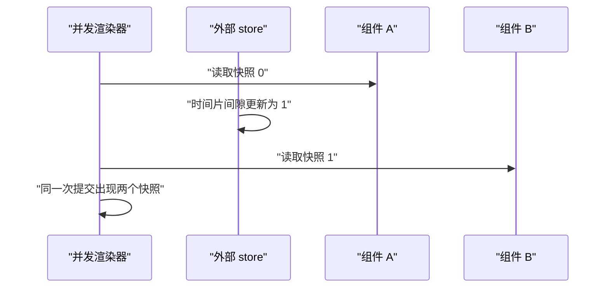
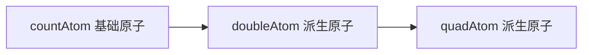

# Zustand、Jotai 与 useSyncExternalStore 手写

!!! abstract "核心结论"
- `useSyncExternalStore` 解决的核心问题是并发渲染下的 tearing：外部 store 在一次渲染提交里必须对整棵组件树呈现同一个快照。
- zustand 的本质是一个带 `set/get/subscribe` 的外部 store，再接一层 selector 加浅比较的 React 绑定；订阅粒度精确到组件自己选中的 slice。
- jotai 的状态单元是 atom：基础 atom 存值，派生 atom 靠 `get` 收集依赖并按版本号惰性重算，写操作沿反向依赖图推送失效。
- valtio 用 Proxy 把可变对象变成可追踪对象：get 时记录访问路径（track），set 时通知订阅者（trigger），订阅者按自己读过的 key 判断是否重渲染。
- Context 换值会重渲染所有 consumer，而外部 store 加 selector 只重渲染订阅了变化 slice 的组件；两者差异可用渲染计数断言直接证明。

## 1. useSyncExternalStore 的语义与撕裂问题

### 1.1 撕裂从何而来

React 18 开启并发特性后，一次渲染可能被切成多个时间片：渲染器执行到某个 fiber 时可以 `yield` 把主线程让给更高优先级任务，稍后再从断点继续。如果此时组件树读取的是一个 React 之外的外部 store（Redux、zustand、jotai、浏览器的 `navigator.onLine` 等），可能出现：组件 A 在同一帧的上半段读到快照 0，而 store 在时间片间隙被更新成 1，组件 B 在下半段读到快照 1。同一次提交里 A 和 B 展示了不同的状态，这就是 tearing。



React 的内部 store 不会撕裂，因为 `useState/useReducer` 的值都存自己的 fiber 里。撕裂只针对外部可变数据源。React 给出的官方边界就是 `useSyncExternalStore(subscribe, getSnapshot, getServerSnapshot)`。它的语义契约有三条：

1. `subscribe(callback)` 注册变更通知，并返回取消订阅函数；callback 本身不携带新值，触发后由 React 重新调用 `getSnapshot` 取值。
2. `getSnapshot()` 必须返回缓存值：store 不变时，连续两次调用必须返回同一个引用（React 用 `Object.is` 比较）。如果每次都返回新对象，会触发无限重渲染。
3. `getServerSnapshot` 只用于服务端渲染与 hydration，防止客户端首帧与 SSR 输出不一致。

实现层面的机制：React 在 commit 之后用 passive effect 订阅 store；订阅回调里重新读 `getSnapshot()`，用 `Object.is` 与上一次渲染的快照比较，变了就发起一次同步重渲染（外部 store 更新被当作同步优先级处理，避免被时间切片打断）。同时在渲染过程中 React 还会做"渲染期一致性检查"：如果在一次渲染中途检测到快照发生了变化，就丢弃本次部分渲染的结果并同步重来，保证提交时全树一致。

### 1.2 mini-react 与手写 useSyncExternalStore

这段代码要解决两件事：第一，提供一个足够小的组件运行时（render、useState、useRef、useEffect），让本文所有 store 代码都能在 Node 里直接跑；第二，手写 `useSyncExternalStore` 的核心算法，展示"渲染时读快照、订阅回调里比较、不一致就 forceUpdate"的完整数据流。

```js
// 运行环境：Node.js >= 18（无第三方依赖）。保存为 mini-react.js。

let currentInstance = null;   // 当前正在渲染的组件实例
let pendingEffects = [];      // 本次渲染收集的 effect

// 第 1 段：渲染循环。组件函数的执行结果靠副作用（渲染计数、返回值）观察，
// forceUpdate 就是"重新执行组件函数"。
function render(componentFn) {
  const instance = { hooks: [], hookIndex: 0, cleanups: [] };

  function flushEffects() {
    // React passive effect 语义：先清上一轮 cleanup，再跑新一轮 effect
    for (const cleanup of instance.cleanups) {
      if (typeof cleanup === 'function') cleanup();
    }
    instance.cleanups = [];
    for (const effect of pendingEffects) {
      const cleanup = effect();
      if (typeof cleanup === 'function') instance.cleanups.push(cleanup);
    }
    pendingEffects = [];
  }

  function rerender() {
    instance.hookIndex = 0;
    currentInstance = instance;
    pendingEffects = [];
    componentFn();
    flushEffects();
    currentInstance = null;
  }

  instance.forceUpdate = rerender;
  currentInstance = instance;
  pendingEffects = [];
  componentFn();
  flushEffects();
  currentInstance = null;
  return instance;
}

// 第 2 段：useState 与 useRef。hooks 按索引顺序存在 instance.hooks 上，
// 与 React fiber 的 memoizedState 链表思路一致，只是这里用数组简化。
function useState(initial) {
  const instance = currentInstance;
  const i = instance.hookIndex++;
  const hook = instance.hooks[i] ?? (instance.hooks[i] = { value: initial });
  const setState = (next) => {
    const value = typeof next === 'function' ? next(hook.value) : next;
    if (!Object.is(value, hook.value)) {
      hook.value = value;
      instance.forceUpdate();
    }
  };
  return [hook.value, setState];
}

function useRef(initial) {
  const instance = currentInstance;
  const i = instance.hookIndex++;
  return instance.hooks[i] ?? (instance.hooks[i] = { current: initial });
}

function useEffect(effect) {
  pendingEffects.push(effect);
}

// 第 3 段：useSyncExternalStore 的简化实现。
// 关键点：订阅回调里"不传值"，只负责把变更翻译成一次 forceUpdate；
// 组件重渲染时会重新调用 getSnapshot，拿到的就是最新缓存值。
function useSyncExternalStore(subscribe, getSnapshot, getServerSnapshot) {
  const instance = currentInstance;
  const i = instance.hookIndex++;
  const hook = instance.hooks[i] ?? (instance.hooks[i] = {});

  const snapshot = getSnapshot();       // 渲染期间读取一次快照
  hook.snapshot = snapshot;             // 记录本次渲染使用的快照

  useEffect(() => {
    return subscribe(() => {
      const next = getSnapshot();
      if (!Object.is(hook.snapshot, next)) {
        hook.snapshot = next;
        instance.forceUpdate();         // 同步重渲染，避免时间切片撕裂
      }
    });
  });

  return snapshot;
}

// 第 4 段：Context 对照实验用的最小实现（第 5 节会用到）
function createContext(initialValue) {
  const ctx = {
    value: initialValue,
    consumers: new Set(),
    setValue(next) {
      if (Object.is(ctx.value, next)) return;
      ctx.value = next;
      [...ctx.consumers].forEach((inst) => inst.forceUpdate());
    },
  };
  return ctx;
}

function useContext(ctx) {
  ctx.consumers.add(currentInstance);
  return ctx.value;
}

// 第 5 段：撕裂演示——"渲染期一致性检查"的简化实现。
// React 内部等价做法：渲染前后各检查一次快照，不一致就丢弃结果同步重来。
function consistentRender(renderFns, store) {
  let before = store.getSnapshot();
  while (true) {
    const results = renderFns.map((fn) => fn());
    const after = store.getSnapshot();
    if (Object.is(before, after)) return results;
    before = after; // 渲染中途 store 变了，重试
  }
}

module.exports = {
  render, useState, useRef, useEffect,
  useSyncExternalStore, createContext, useContext,
  consistentRender,
};
```

**验证标准**（预期输出：控制台打印两条"验证通过"，无断言失败）

```js
// 运行：node 01-useSyncExternalStore.test.js（与 mini-react.js 同目录）
const assert = require('node:assert');
const { render, useSyncExternalStore, consistentRender } = require('./mini-react');

const store = (() => {
  let value = 0;
  const listeners = new Set();
  return {
    getSnapshot: () => value,
    set: (v) => { value = v; [...listeners].forEach((l) => l()); },
    subscribe: (cb) => { listeners.add(cb); return () => listeners.delete(cb); },
  };
})();

let renders = 0;
function Counter() {
  renders++;
  return useSyncExternalStore(store.subscribe, store.getSnapshot);
}

const instance = render(Counter);
assert.equal(renders, 1);                    // 首次渲染一次
assert.equal(instance.hooks[0].snapshot, 0); // 初始快照 0

store.set(1);                                 // 外部更新：触发订阅回调
assert.equal(renders, 2);                     // 0 -> 1，重渲染一次

store.set(1);                                 // Object.is 相等：不重渲染
assert.equal(renders, 2);
console.log('useSyncExternalStore 验证通过');

// 撕裂演示：朴素读取会读到两个快照
const tearStore = (() => {
  let value = 0;
  const listeners = new Set();
  return {
    getSnapshot: () => value,
    set: (v) => { value = v; [...listeners].forEach((l) => l()); },
    subscribe: (cb) => { listeners.add(cb); return () => listeners.delete(cb); },
  };
})();

function naiveReads() {
  const a = tearStore.getSnapshot(); // 组件 A 读
  tearStore.set(1);                   // 时间片间隙更新
  const b = tearStore.getSnapshot(); // 组件 B 读
  return [a, b];
}
assert.deepStrictEqual(naiveReads(), [0, 1]); // 同帧两个快照：撕裂

let readCalls = 0;
const result = consistentRender([
  () => {
    readCalls++;
    const v = tearStore.getSnapshot();
    if (readCalls === 1) tearStore.set(1); // 第一次渲染中途更新 store
    return v;
  },
  () => tearStore.getSnapshot(),
], tearStore);

assert.deepStrictEqual(result, [1, 1]); // 重试后全帧一致
assert.equal(readCalls, 2);             // 第一轮被丢弃，第二轮提交
console.log('撕裂演示与一致性检查验证通过');
```

逐段解析：

1. 第 1 段的数据流：`render` 把组件函数执行当作一次渲染，`hooks` 数组按调用顺序复用，`forceUpdate` 就是清空 hookIndex 再执行一遍。这个极简模型足以演示后续所有订阅行为，不需要真实 React。
2. 第 3 段的取舍：真实 React 在 rendering 阶段就检测快照变化，我这里把"渲染期一致性"放到独立的 `consistentRender` 演示，让 hook 本体聚焦订阅语义。易错点：`useEffect` 每轮渲染后都会先 cleanup 旧订阅再挂新订阅，React 真实的 `useSyncExternalStore` 也是每次都重订阅（`subscribe` 或 `getSnapshot` 变化时内部有优化，语义上等价）。
3. 第 5 段的取舍：`consistentRender` 是整棵树级别的检查；React 是 per-fiber 的检查，但"前后快照不一致就丢弃重试"这个核心思路相同。
4. 易错点：`getSnapshot` 如果每次返回新引用（例如 `() => ({...state})`），每次检查都认为"变了"，会无限重渲染。这是面试必考点。

## 2. 手写 zustand：create、selector、浅比较、middleware

### 2.1 createStore：外部 store 引擎

这段代码要解决 zustand 最底层的问题：一个不依赖 React 的、支持函数式更新和浅合并的外部 store。zustand 的 `create` 最终就是把这个 store 暴露成 `getState/setState/subscribe` 三个稳定引用。

```js
// 运行环境：Node.js >= 18（无依赖）。本文件保存为 zustand.js。
const { useSyncExternalStore, useRef } = require('./mini-react');

// 第 1 段：createStore。注意 setState 支持函数式更新，默认浅合并（merge）。
function createStore(createState) {
  let state;
  const listeners = new Set();

  const getState = () => state;

  const setState = (partial, replace = false) => {
    const nextState = typeof partial === 'function' ? partial(state) : partial;
    if (Object.is(nextState, state)) return;          // 引用不变则跳过
    const prevState = state;
    state = replace ? nextState : Object.assign({}, state, nextState);
    // 用快照遍历，防止订阅回调里取消订阅/新增订阅影响本轮遍历
    [...listeners].forEach((listener) => listener(state, prevState));
  };

  const subscribe = (listener) => {
    listeners.add(listener);
    return () => listeners.delete(listener);           // 返回取消订阅函数
  };

  const api = { getState, setState, subscribe };
  state = createState(setState, getState, api);
  return api;
}

module.exports = { createStore };
```

**验证标准**（预期输出：控制台打印"2.1 验证通过"，无断言失败）

```js
const assert = require('node:assert');
const { createStore } = require('./zustand');

const api = createStore((set) => ({
  count: 0,
  name: 'a',
  inc: () => set((s) => ({ count: s.count + 1 })),
}));

const changes = [];
api.subscribe((state, prev) => changes.push([state.count, prev.count]));

assert.equal(api.getState().count, 0);
api.getState().inc();
api.getState().inc();
assert.equal(api.getState().count, 2);
assert.deepStrictEqual(changes, [[1, 0], [2, 1]]); // 每次变更都拿到新旧 state

api.setState({ name: 'b' }); // merge 语义：不覆盖 count
assert.equal(api.getState().count, 2);
assert.equal(api.getState().name, 'b');
console.log('2.1 验证通过');
```

逐段解析：

1. 第 1 段的 `Object.assign({}, state, nextState)` 是 zustand 默认的浅合并语义：未在 `partial` 中出现的 key 保留旧值，对应 Redux 需要手写 spread 的繁琐。
2. 数据流：`set` 函数在创建 state 时作为第一参数传给 `createState`，所以 action 可以闭包引用 `set`；`getState` 返回的永远是同一个引用，避免订阅者读到旧快照。
3. 易错点：`nextState` 与 `state` 用 `Object.is` 比较，这是第一层去重；后续 selector + 浅比较是第二层去重，两层都不可省。

### 2.2 selector、浅比较与 create

这段代码要解决"如何让组件只订阅自己需要的 slice"。如果组件直接订阅整个 store，任何 key 变化都会触发它的 `useSyncExternalStore` 检查；引入 selector 和比较函数后，可以把重渲染范围压缩到选中值真正变化的组件。

```js
// 继续写入 zustand.js。运行环境：Node.js >= 18 + mini-react。

// 第 2 段：浅比较。第一层比较引用，第二层逐 key 用 Object.is。
function shallow(objA, objB) {
  if (Object.is(objA, objB)) return true;
  if (typeof objA !== 'object' || objA === null || typeof objB !== 'object' || objB === null) return false;
  const keysA = Object.keys(objA);
  const keysB = Object.keys(objB);
  if (keysA.length !== keysB.length) return false;
  for (const key of keysA) {
    if (!Object.prototype.hasOwnProperty.call(objB, key) || !Object.is(objA[key], objB[key])) return false;
  }
  return true;
}

// 第 3 段：带 selector 的 useSyncExternalStore。
// 关键技巧：selector 产出新对象时，如果与缓存值浅比较相等，
// 就返回缓存引用，让 useSyncExternalStore 的 Object.is 判断保持稳定。
function useSyncExternalStoreWithSelector(subscribe, getSnapshot, selector, equalityFn) {
  const instRef = useRef({ hasValue: false, value: null });
  const inst = instRef.current;

  return useSyncExternalStore(
    subscribe,
    () => {
      const next = selector(getSnapshot());
      if (inst.hasValue && equalityFn(inst.value, next)) {
        return inst.value; // 返回旧引用，避免对象 selector 造成死循环
      }
      inst.value = next;
      inst.hasValue = true;
      return next;
    },
  );
}

// 第 4 段：create 等于"createStore + 把 hook 与 api 方法合并返回"。
function create(createState) {
  const api = createStore(createState);
  const useBoundStore = (selector = (s) => s, equalityFn = Object.is) =>
    useSyncExternalStoreWithSelector(api.subscribe, () => api.getState(), selector, equalityFn);
  Object.assign(useBoundStore, api); // useStore.getState() 等静态方法
  return useBoundStore;
}

module.exports = { createStore, shallow, useSyncExternalStoreWithSelector, create };
```

**验证标准**（预期输出：控制台打印"2.2 验证通过"，无断言失败）

```js
const assert = require('node:assert');
const { render } = require('./mini-react');
const { createStore, useSyncExternalStoreWithSelector, shallow } = require('./zustand');

const renderLog = [];
const store = createStore((set) => ({
  count: 0,
  name: 'Alice',
  inc: () => set((s) => ({ count: s.count + 1 })),
  rename: (n) => set({ name: n }),
}));

function CountLabel() {
  renderLog.push('count');
  return useSyncExternalStoreWithSelector(
    store.subscribe, () => store.getState(), (s) => s.count, Object.is,
  );
}
function NameLabel() {
  renderLog.push('name');
  return useSyncExternalStoreWithSelector(
    store.subscribe, () => store.getState(), (s) => s.name, Object.is,
  );
}

render(CountLabel);
render(NameLabel);
renderLog.length = 0;

store.getState().inc();                 // 只有 count 变化
assert.deepStrictEqual(renderLog, ['count']); // NameLabel 未重渲染

renderLog.length = 0;
store.getState().rename('Bob');        // 只有 name 变化
assert.deepStrictEqual(renderLog, ['name']); // CountLabel 未重渲染

assert.equal(shallow({ a: 1, b: 2 }, { a: 1, b: 2 }), true);
assert.equal(shallow({ a: 1, b: 2 }, { a: 1, b: 3 }), false);
console.log('2.2 验证通过');
```

逐段解析：

1. 第 3 段的数据流：`getSnapshot` wrapper 每次执行 selector；若浅比较判定与缓存值相同，就返回缓存引用。这样即使 selector 每次返回新对象，`useSyncExternalStore` 拿到的还是上次的引用，`Object.is` 判定稳定。
2. 设计取舍：zustand 早期 v3 用 `useReducer + useEffect` 自己实现订阅；现代 zustand（React 18 兼容版本）直接基于 `useSyncExternalStore`，官方还提供 `useShallow` 作为 `shallow` 的 selector 配套（具体版本差异以官方 changelog 为准）。
3. 易错点：selector 返回对象/数组却用默认的 `Object.is` 比较，会因为每次返回新引用而无限重渲染。这是 zustand 使用中最常见的事故，官方文档因此明确建议对象切片配 `useShallow`。

### 2.3 极简 immer：produce 的 clone-on-write

这段代码要解决 immer middleware 的核心问题：让用户用可变写法 `draft.user.age = 2` 修改状态，内部通过 Proxy 的 clone-on-write 生成结构共享的不可变新对象，原对象不被改动。

```js
// 继续写入 zustand.js。运行环境：Node.js >= 18（无依赖）。

// 第 5 段：produce 的简化实现。
const DRAFT = Symbol('produce-draft');

function isDraftable(value) {
  return value !== null && typeof value === 'object';
}

function produce(base, recipe) {
  const states = new Map();  // target -> { modified, copy, parent, key }
  const proxies = new Map(); // target -> Proxy

  function getState(target) {
    let st = states.get(target);
    if (!st) {
      st = {
        modified: false,
        copy: Array.isArray(target) ? target.slice() : { ...target },
        parent: null,
        key: null,
      };
      states.set(target, st);
    }
    return st;
  }

  // 写入发生时，把新 copy 沿父链挂回，实现结构共享
  function markChanged(target) {
    const st = states.get(target);
    if (!st) return;
    st.modified = true;
    let parent = st.parent;
    let child = st;
    while (parent) {
      const parentSt = states.get(parent);
      if (!parentSt) break;
      parentSt.copy[child.key] = child.copy;
      parentSt.modified = true;
      child = parentSt;
      parent = parentSt.parent;
    }
  }

  function createProxy(target, parent, key) {
    const st = getState(target);
    st.parent = parent;
    st.key = key;
    const proxy = new Proxy(target, {
      get(t, prop, receiver) {
        if (prop === DRAFT) return states.get(t);
        const st = states.get(t);
        const value = st ? st.copy[prop] : Reflect.get(t, prop, receiver);
        if (isDraftable(value)) {
          let childProxy = proxies.get(value);
          if (!childProxy) {
            childProxy = createProxy(value, t, prop);
          } else {
            const childSt = states.get(value);
            childSt.parent = t;
            childSt.key = prop;
          }
          return childProxy;
        }
        return value;
      },
      set(t, prop, value) {
        const st = states.get(t) ?? getState(t);
        st.copy[prop] = value;
        markChanged(t);
        return true;
      },
      deleteProperty(t, prop) {
        const st = states.get(t) ?? getState(t);
        delete st.copy[prop];
        markChanged(t);
        return true;
      },
      ownKeys(t) {
        const st = states.get(t);
        return st ? Reflect.ownKeys(st.copy) : Reflect.ownKeys(t);
      },
      getOwnPropertyDescriptor(t, prop) {
        const st = states.get(t);
        if (st) return Reflect.getOwnPropertyDescriptor(st.copy, prop);
        return Reflect.getOwnPropertyDescriptor(t, prop);
      },
    });
    proxies.set(target, proxy);
    return proxy;
  }

  const draft = createProxy(base, null, null);
  const maybeNext = recipe(draft);
  const baseState = states.get(base);
  if (maybeNext === draft || maybeNext === undefined) {
    return baseState.modified ? baseState.copy : base;
  }
  return maybeNext;
}

module.exports = { createStore, shallow, useSyncExternalStoreWithSelector, create, produce };
```

**验证标准**（预期输出：控制台打印"2.3 produce 验证通过"，无断言失败）

```js
const assert = require('node:assert');
const { produce } = require('./zustand');

const base = { count: 0, user: { name: 'a', profile: { age: 1 } }, tags: [1, 2] };
const next = produce(base, (draft) => {
  draft.count = 1;
  draft.user.name = 'b';
  draft.user.profile.age = 2;
  draft.tags[0] = 9; // 数组索引写入（copy 已 slice）
});

// 原对象完全不变
assert.equal(base.count, 0);
assert.equal(base.user.name, 'a');
assert.equal(base.user.profile.age, 1);
assert.equal(base.tags[0], 1);

// 新对象反映全部改动，且被修改的路径换新引用
assert.equal(next.count, 1);
assert.equal(next.user.name, 'b');
assert.equal(next.user.profile.age, 2);
assert.equal(next.tags[0], 9);
assert.notStrictEqual(next, base);
assert.notStrictEqual(next.user, base.user);
assert.notStrictEqual(next.user.profile, base.user.profile);
assert.notStrictEqual(next.tags, base.tags);
console.log('2.3 produce 验证通过');
```

逐段解析：

1. 第 5 段只实现 clone-on-write 主路径：对象和数组的浅拷贝、嵌套访问的懒代理、写时沿 parent 链回挂。真实 immer 还处理 Map/Set、自动冻结、异步 recipe 等，实际项目直接使用 immer 包即可。
2. 数据流：读 `draft.user` 时 get trap 从 `copy` 取值并返回子代理；写 `draft.user.name` 时只拷贝 `user` 这一层，`base` 的浅拷贝再回挂新 `user` 引用，这就是结构共享。
3. 易错点：把 draft 逃逸到 `produce` 回调之外继续读写是未定义行为；本实现中 `recipe` 返回 `draft` 或 `undefined` 都返回修改后的 copy，返回其他对象则原样返回。

### 2.4 persist 与 devtools middleware

这段代码要解决 middleware 的组合方式：每个 middleware 都是 `(config) => (set, get, api) => ...` 的高阶函数，它包装 `set` 后把控制权交给下一层 config，最终 `createStore` 拿到的是一层层包裹后的 `setState`。

```js
// 继续写入 zustand.js。运行环境：Node.js >= 18。

// 第 6 段：persist。每次提交后把状态序列化到 storage；
// 初始化时把持久化内容浅合并回初始 state（保留函数）。
function createMemoryStorage() {
  const map = new Map();
  return {
    getItem: (k) => (map.has(k) ? map.get(k) : null),
    setItem: (k, v) => { map.set(k, String(v)); },
    removeItem: (k) => { map.delete(k); },
  };
}

const persist = (config, options) => (set, get, api) => {
  const name = options?.name ?? 'zustand';
  const storage = options?.storage ?? createMemoryStorage();
  const saved = storage.getItem(name);
  let parsed = null;
  try { parsed = saved ? JSON.parse(saved) : null; } catch { parsed = null; }

  const wrappedSet = (partial, replace) => {
    set(partial, replace);
    storage.setItem(name, JSON.stringify(get())); // 提交后落盘
  };

  const initialState = config(wrappedSet, get, api);
  // 浅合并恢复：持久化值覆盖初始值，初始值里的函数保留
  return parsed ? Object.assign({}, initialState, parsed) : initialState;
};

// 第 7 段：devtools。核心是包一层 setState，每次更新时把 action 和
// 新状态发给 Redux DevTools（window.__REDUX_DEVTOOLS_EXTENSION__ 为
// 浏览器扩展注入的全局，API 以官方文档为准）。
const devtools = (config) => (set, get, api) => {
  let ext = null;
  if (typeof window !== 'undefined' && window.__REDUX_DEVTOOLS_EXTENSION__) {
    ext = window.__REDUX_DEVTOOLS_EXTENSION__.connect({ name: 'my-store' });
  }
  const wrappedSet = (partial, replace, action) => {
    set(partial, replace);
    ext?.send(action?.type ?? 'setState', get());
  };
  return config(wrappedSet, get, api);
};

// 第 8 段：immer middleware。函数式 set 变成 produce 调用。
const immer = (config) => (set, get, api) => {
  const draftSet = (partial, replace) => {
    if (typeof partial === 'function') {
      set(produce(get(), partial), replace);
    } else {
      set(partial, replace);
    }
  };
  return config(draftSet, get, api);
};

module.exports = {
  createStore, shallow, useSyncExternalStoreWithSelector, create,
  produce, createMemoryStorage, persist, devtools, immer,
};
```

**验证标准**（预期输出：控制台打印"2.4 persist 验证通过"与"2.4 immer 验证通过"，无断言失败）

```js
const assert = require('node:assert');
const { createStore, createMemoryStorage, persist, immer } = require('./zustand');

// persist 验证
const storage = createMemoryStorage();
const storeA = createStore(persist((set) => ({
  count: 0,
  inc: () => set((s) => ({ count: s.count + 1 })),
}), { name: 'demo', storage }));

storeA.getState().inc();
assert.equal(storage.getItem('demo'), '{"count":1}'); // 函数被 JSON 序列化丢弃

// 模拟重新加载：从同一 storage 恢复
const storeB = createStore(persist((set) => ({
  count: 99,
  inc: () => set((s) => ({ count: s.count + 1 })),
}), { name: 'demo', storage }));
assert.equal(storeB.getState().count, 1); // 恢复持久化的 1，不是 99
storeB.getState().inc();
assert.equal(storeB.getState().count, 2); // 恢复后的函数仍可用
console.log('2.4 persist 验证通过');

// immer 验证
const storeC = createStore(immer((set) => ({
  nested: { a: { b: 0 } },
  bump: () => set((draft) => { draft.nested.a.b += 1; }),
})));
storeC.getState().bump();
storeC.getState().bump();
assert.equal(storeC.getState().nested.a.b, 2);
console.log('2.4 immer 验证通过');
```

逐段解析：

1. 第 6 段与真实 zustand persist 的差异：真实版支持异步 storage、自定义 merge、版本迁移与部分持久化；这里只演示"提交落盘 + 初始化恢复"的主链路。
2. 第 7 段的重要约束：devtools 的完成实现会在 store 创建后调用 `init` 并把 action 回放接入 `subscribe`，这里为控制篇幅只保留 `send` 主路径；`__REDUX_DEVTOOLS_EXTENSION__` 的具体方法签名需核对 Redux DevTools 官方文档。
3. 第 8 段的数据流：用户写 `set(draft => { ... })`，immer middleware 把当前 state 交给 `produce`，recipe 改的是 draft，产出的是下一个不可变对象，再调用原始 `set`，链路闭环。

## 3. 手写 Jotai：原子模型与依赖图

### 3.1 atom 与 store

这段代码要解决 jotai 的数据模型：atom 是状态的最小单元，基础 atom 存初始值，派生 atom 存一个 `read(get)` 计算函数；store 用 WeakMap 管理每个 atom 的值、版本号、依赖集和监听器。核心是一个 pull 模型：读 atom 时如果它是派生的，就递归读取依赖并检查版本号决定是否重算。

```js
// 运行环境：Node.js >= 18（无依赖）。保存为 jotai.js。
const { useSyncExternalStore } = require('./mini-react');

// 第 1 段：atom 工厂。read 为函数表示派生 atom，否则为基础 atom。
function atom(readOrInitial, write) {
  return {
    read: typeof readOrInitial === 'function' ? readOrInitial : null,
    initialValue: typeof readOrInitial === 'function' ? undefined : readOrInitial,
    write: typeof write === 'function' ? write : null,
  };
}

// 第 2 段：store。
function createJotaiStore() {
  const states = new WeakMap(); // atom -> 状态对象

  function ensure(a) {
    let st = states.get(a);
    if (!st) {
      st = {
        value: undefined,
        version: 0,
        deps: new Map(),       // 依赖 atom -> 读取时的版本号
        dependents: new Set(), // 反向依赖：依赖当前 atom 的派生 atom
        listeners: new Set(),  // React 订阅回调
        dirty: true,
      };
      states.set(a, st);
      if (!a.read) {
        st.value = a.initialValue;
        st.dirty = false;
      }
    }
    return st;
  }

  // 第 3 段：读。基础 atom 直接返回值；派生 atom 检查
  // "从未计算 / 被标脏 / 依赖版本变化" 三个条件决定是否重算。
  function readAtom(a) {
    const st = ensure(a);
    if (!a.read) return st.value;

    let depsChanged = false;
    const nextDeps = new Map();
    const get = (dep) => {
      const depSt = readAtom(dep); // 递归读依赖
      nextDeps.set(dep, depSt.version);
      depSt.dependents.add(a);     // 建立反向依赖
      if (st.deps.get(dep) !== depSt.version) depsChanged = true;
      return depSt.value;
    };

    if (st.dirty || depsChanged || nextDeps.size !== st.deps.size) {
      st.value = a.read(get);
      st.deps = nextDeps;
      st.dirty = false;
      st.version += 1;
    }
    return st.value;
  }

  // 第 4 段：通知。写操作沿反向依赖图推送失效，但派生原子是惰性重算的。
  function notify(st) {
    [...st.listeners].forEach((listener) => listener());
    [...st.dependents].forEach((depAtom) => {
      const depSt = ensure(depAtom);
      depSt.dirty = true; // 只标脏，等下次 read 时再算
      notify(depSt);
    });
  }

  // 第 5 段：写。支持普通赋值与 write 函数两种形式。
  function writeAtom(a, ...args) {
    const st = ensure(a);
    if (a.write) {
      const api = {
        get: (dep) => readAtom(dep),
        set: (target, v) => {
          const targetSt = ensure(target);
          if (Object.is(targetSt.value, v)) return;
          targetSt.value = v;
          targetSt.version += 1;
          notify(targetSt);
        },
      };
      a.write(api, ...args);
      return;
    }
    const [nextValue] = args;
    if (Object.is(st.value, nextValue)) return;
    st.value = nextValue;
    st.version += 1;
    notify(st);
  }

  function subscribeAtom(a, listener) {
    const st = ensure(a);
    st.listeners.add(listener);
    return () => st.listeners.delete(listener);
  }

  return { readAtom, writeAtom, subscribeAtom };
}

const defaultStore = createJotaiStore();

// 第 6 段：React 绑定。现代 jotai 的 useAtom 就是
// useSyncExternalStore(subscribe, () => store.readAtom(atom))。
function useAtom(a, store = defaultStore) {
  return useSyncExternalStore(
    (cb) => store.subscribeAtom(a, cb),
    () => store.readAtom(a),
  );
}

module.exports = { atom, createJotaiStore, defaultStore, useAtom };
```

**验证标准**（预期输出：控制台打印"3.1 验证通过"，无断言失败）

```js
const assert = require('node:assert');
const { atom, createJotaiStore } = require('./jotai');

const countAtom = atom(0);
const doubleAtom = atom((get) => get(countAtom) * 2);
const quadAtom = atom((get) => get(doubleAtom) * 2);

const store = createJotaiStore();
assert.equal(store.readAtom(countAtom), 0);
assert.equal(store.readAtom(doubleAtom), 0);
assert.equal(store.readAtom(quadAtom), 0);

const calls = [];
store.subscribeAtom(doubleAtom, () => calls.push(store.readAtom(doubleAtom)));
store.writeAtom(countAtom, 3);
assert.deepStrictEqual(calls, [6]); // double 被标脏后懒重算

// write 函数形式：封装一组 get/set 的复合写
const addTen = atom(null, (ops) => ops.set(countAtom, ops.get(countAtom) + 10));
store.writeAtom(addTen);
assert.equal(store.readAtom(countAtom), 13);
assert.equal(store.readAtom(doubleAtom), 26);
console.log('3.1 验证通过');
```

### 3.2 依赖图与订阅粒度

依赖图在读写之间自然建立：读派生 atom 时通过 `get` 访问依赖并把 `depSt.dependents.add(atom)` 写入反向依赖；写基础 atom 时沿反向依赖递归标脏并通知监听器。依赖方向与数据流方向相反。



**验证标准**（预期输出：控制台打印"3.2 验证通过"，无断言失败）

```js
const assert = require('node:assert');
const { render } = require('./mini-react');
const { atom, createJotaiStore, useAtom } = require('./jotai');

const countAtom = atom(0);
const doubleAtom = atom((get) => get(countAtom) * 2);
const nameAtom = atom('x');
const store = createJotaiStore();

const renderLog = [];
function CountView() { renderLog.push('count'); useAtom(countAtom, store); }
function DoubleView() { renderLog.push('double'); useAtom(doubleAtom, store); }
function NameView() { renderLog.push('name'); useAtom(nameAtom, store); }

render(CountView);
render(DoubleView);
render(NameView);
renderLog.length = 0;

store.writeAtom(countAtom, 14);
// countAtom 与 doubleAtom 在依赖路径上，nameAtom 不在
assert.equal(renderLog.includes('count'), true);
assert.equal(renderLog.includes('double'), true);
assert.equal(renderLog.includes('name'), false);
console.log('3.2 验证通过');
```

逐段解析：

1. 第 3 段采用版本号比较而不是依赖数组全量比较：每个派生 atom 记录 `deps: Map<depAtom, version>`，重算时只要有一个依赖版本变化就重算；这是 O(deps) 的增量检查。
2. 第 4 段的取舍：真实 jotai 在通知时会对派生 atom 做更精细的判断（例如派生值没变化就不继续通知），这里简化为"标脏 + 无条件向上通知"，读者拿到的值在下次读时一定是正确的，但可能多触发几次订阅回调。
3. 易错点：依赖图必须无环，否则 `readAtom` 递归会爆栈；真实 jotai 依赖在读取时建立，环会在首次读时触发无限递归，实际应用中需避免 A 依赖 B 且 B 依赖 A。

## 4. Valtio 的 Proxy 追踪

这段代码要解决 valtio 可变风格的核心问题：状态是普通可变对象，写起来像 `state.count = 10`，但每次属性写要通知订阅者；同时每次属性读要能被"追踪"，让订阅者知道自己在渲染期间读了哪些 key。

```js
// 运行环境：Node.js >= 18（无依赖）。保存为 valtio.js。

// 第 1 段：proxyState。一个 Proxy 同时完成 track（get）与 trigger（set）。
function proxyState(initial) {
  const listeners = new Set();
  let activeTracker = null; // 当前正在收集的 key 集合
  const cache = new WeakMap(); // 嵌套对象 -> 同一个代理

  function proxyOf(target) {
    if (cache.has(target)) return cache.get(target);
    const handler = {
      get(t, key, receiver) {
        activeTracker?.add(key); // 记录本次读取访问了哪个 key
        const value = Reflect.get(t, key, receiver);
        if (value !== null && typeof value === 'object') {
          return proxyOf(value); // 懒代理嵌套对象
        }
        return value;
      },
      set(t, key, value, receiver) {
        const prev = Reflect.get(t, key, receiver);
        Reflect.set(t, key, value, receiver);
        if (!Object.is(prev, value)) {
          [...listeners].forEach((listener) => listener()); // 触发所有订阅者
        }
        return true;
      },
    };
    const proxy = new Proxy(target, handler);
    cache.set(target, proxy);
    return proxy;
  }

  const state = proxyOf(initial);

  function track(fn) {
    const tracked = new Set();
    const prev = activeTracker;
    activeTracker = tracked;
    try { fn(); } finally { activeTracker = prev; }
    return tracked;
  }

  function subscribe(listener) {
    listeners.add(listener);
    return () => listeners.delete(listener);
  }

  return { state, track, subscribe };
}

// 第 2 段：按 key 订阅。订阅者自己记录"我读过哪个值"，触发时比较新旧值，
// 只有真的变了才调用 onChange。真实 valtio 的 useSnapshot 在此基础上
// 还做结构共享的快照对象和 proxy-compare，这里只演示追踪主链路。
function subscribeKeyed(api, readFn, onChange) {
  let lastValue = null;
  const check = () => {
    let value;
    api.track(() => { value = readFn(); });
    if (lastValue === null) { lastValue = value; return; }
    if (!Object.is(lastValue, value)) {
      lastValue = value;
      onChange();
    }
  };
  check(); // 注册时先建立基线
  return api.subscribe(check);
}

module.exports = { proxyState, subscribeKeyed };
```

**验证标准**（预期输出：控制台打印"Valtio 验证通过"，无断言失败）

```js
const assert = require('node:assert');
const { proxyState, subscribeKeyed } = require('./valtio');

const api = proxyState({ count: 0, name: 'a' });

const keys = api.track(() => { void api.state.count; void api.state.name; });
assert.deepStrictEqual([...keys].sort(), ['count', 'name']); // track 记录读取路径

const log = [];
subscribeKeyed(api, () => api.state.count, () => log.push('count'));
subscribeKeyed(api, () => api.state.name, () => log.push('name'));

api.state.count = 10;                  // 只有 count 变化
assert.deepStrictEqual(log, ['count']);

log.length = 0;
api.state.name = 'b';                  // 只有 name 变化
assert.deepStrictEqual(log, ['name']);

log.length = 0;
api.state.count = 10;                  // 相同值不触发
assert.deepStrictEqual(log, []);
console.log('Valtio 验证通过');
```

逐段解析：

1. 第 1 段中 `activeTracker` 是模块级的"当前追踪上下文"：`track` 把它替换成新 Set，执行读取函数，get trap 把 key 写进去，`finally` 恢复。嵌套对象的代理共享同一份 `listeners`，所以深层写也会通知根订阅者。
2. 数据流：`set` 触发所有订阅者的 `check`；每个 `check` 重新执行自己的 readFn 并比较新旧值，只有自己关心的 key 值变了才 `onChange`。这就是 valtio 订阅粒度的简化版本。
3. 设计取舍：真实 valtio 的 `useSnapshot` 返回一个不可变快照对象并用 proxy-compare 做结构比较，支持对象 selector；本实现 readFn 只支持返回原始值。另外直接改原对象（绕过 Proxy）不会触发通知，这是 valtio 使用中最常见的陷阱。

## 5. 与 Context 的重渲染对比实验

这个实验要量化验证一个面试高频结论：单个 Context 的 value 对象每次变化都会让所有 consumer 重渲染，而外部 store 加 selector 只重渲染订阅了变化 slice 的组件。两端用完全相同的组件结构，靠渲染计数断言。

```js
// 运行环境：Node.js >= 18。文件 05-context-compare.js，
// 依赖前面保存的 mini-react.js 与 zustand.js。
const assert = require('node:assert');
const { render, useContext, createContext } = require('./mini-react');
const { createStore, useSyncExternalStoreWithSelector } = require('./zustand');

// 第 1 段：Context 版本。count 与 name 放在同一个 context value 里。
const ctx = createContext({ count: 0, name: 'a' });
const ctxLog = [];
function CtxCounter() { ctxLog.push('counter'); return useContext(ctx).count; }
function CtxName() { ctxLog.push('name'); return useContext(ctx).name; }

render(CtxCounter);
render(CtxName);
ctxLog.length = 0;

ctx.setValue({ count: 1, name: 'a' }); // 任意字段变化都换新对象
assert.deepStrictEqual(ctxLog.sort(), ['counter', 'name']); // 两个 consumer 全跑

// 第 2 段：外部 store 版本。相同状态形状，selector 精确选片。
const store = createStore((set) => ({
  count: 0,
  name: 'a',
  setCount: (n) => set({ count: n }),
  setName: (n) => set({ name: n }),
}));
const storeLog = [];
function StoreCounter() {
  storeLog.push('counter');
  return useSyncExternalStoreWithSelector(
    store.subscribe, () => store.getState(), (s) => s.count, Object.is,
  );
}
function StoreName() {
  storeLog.push('name');
  return useSyncExternalStoreWithSelector(
    store.subscribe, () => store.getState(), (s) => s.name, Object.is,
  );
}

render(StoreCounter);
render(StoreName);
storeLog.length = 0;

store.getState().setCount(1);               // count 变化
assert.deepStrictEqual(storeLog, ['counter']); // 只有 Counter 重渲染

storeLog.length = 0;
store.getState().setName('b');              // name 变化
assert.deepStrictEqual(storeLog, ['name']); // 只有 Name 重渲染
console.log('5.x Context 对比实验验证通过');
```

实验结论：Context 的 `setValue({ count: 1, name: 'a' })` 产生新对象，`useContext` 按 Context value 的引用变化重渲染所有 consumer；外部 store 的 `set({ count: n })` 虽然也让整个 state 换了新引用，但每个组件用 `useSyncExternalStoreWithSelector` 检查后，只有 `selector` 结果真正变化的组件才触发 `forceUpdate`。这正是"Context 适合低频全局配置，高频局部状态用外部 store"的定量依据。真实 React 中 Context 的实验结论相同，对照实验通常用 `React.memo` 包裹 consumer 后用 `renderCount` 计数断言（本实验为保证可运行用 mini-react 模拟了同样的引用比较逻辑）。

## 6. 三张对比表

### 6.1 zustand / jotai / valtio 核心差异

| 维度 | zustand | jotai | valtio |
| --- | --- | --- | --- |
| 状态单元 | 单个 store 对象 + 切片 selector | 单个 atom（基础或派生） | 一个 Proxy 包裹的可变对象 |
| 更新方式 | `set(fn)` 返回部分新状态，不可变 | `writeAtom` 或 atom 的 write 函数 | 直接赋值 `state.x = 1`，可变 |
| 订阅粒度 | selector 选中值变化才重渲染 | 订阅一个 atom 及其依赖路径 | 组件读取过的 key 值变化才重渲染 |
| 依赖追踪 | 无自动依赖，靠 selector | `get` 运行时收集依赖，版本号比对 | Proxy get 运行时收集 key |
| 适合场景 | 全局业务状态、跨组件共享 | 细粒度派生状态、状态组合 | 渲染数据流、表单类可变模型 |

### 6.2 Context 与外部 store 重渲染行为

| 行为 | Context | useSyncExternalStore + selector |
| --- | --- | --- |
| 更新传播 | value 引用变化，所有 consumer 重渲染 | 订阅回调按快照变化重渲染 |
| 选择器 | 无内置 selector，拆 Context 或用三方库 | selector + 浅比较，切片级订阅 |
| tearing | 不涉及外部快照，无撕裂 | React 18 起由 useSyncExternalStore 保证一致 |
| 服务端渲染 | 天然支持 | 需要 getServerSnapshot 对齐 hydration |
| 跨组件树通信 | 需要 Provider 树 | 模块级 store，无 Provider 也可用 |

### 6.3 本文手写实现的运行边界

| 实现 | 完成度 | 真实包的额外能力 |
| --- | --- | --- |
| mini useSyncExternalStore | 订阅 + Object.is 检查 | 渲染期检测、SyncLane 调度、getServerSnapshot |
| zustand core | set/get/subscribe、selector、浅比较 | useShallow、中间件生态、TypeScript 类型 |
| produce | 对象/数组 clone-on-write | Map/Set、冻结、自动柯里化、严格模式 |
| jotai store | 基础/派生 atom、版本号、反向依赖 | 原子组合、Provider 多 store、异步 atom |
| valtio 追踪 | track keys + 值比较订阅 | snapshot 结构共享、proxy-compare、watch |

## 7. 常见陷阱

1. `getSnapshot` 返回新引用：`useSyncExternalStore(subscribe, () => ({...store.getState()}))` 每次调用都是新对象，React 认为快照一直在变，报 "Maximum update depth exceeded" 或无限循环。
2. selector 返回新对象且用 `Object.is`：`useStore(s => ({ count: s.count, name: s.name }))` 每次渲染产生新对象，与陷阱 1 同源；解法是浅比较或 `useShallow`。
3. Context value 用对象字面量：`<Ctx.Provider value={{ count, name }}>` 每次父组件渲染都产生新引用，所有 consumer 跟着重渲染；用 `useMemo` 包 value 或换外部 store。
4. Immer draft 逃逸：把 `draft` 存到外部变量，在 `produce` 返回后继续读写 draft，结果不可预测；draft 的生命周期只在 recipe 内。
5. Jotai 依赖环：A 依赖 B 且 B 依赖 A，首次 `readAtom` 就递归爆栈；真实 jotai 也没有运行时成环检测的兜底（需核对官方文档确认当前版本行为），建模时保证无环。
6. Valtio 绕过 Proxy：持有原始对象的引用直接改，不经过 set trap，订阅者收不到通知；所有修改必须从代理入口走。
7. persist 直接 `JSON.stringify`：函数、Date、Map、Set 会被丢弃或变形；真实 persist 需要自定义 serializer/partialize，并且恢复时要 merge 而不是 replace，否则函数会被持久化值覆盖。
8. 手动 `subscribe` 后忘记取消订阅：`useEffect(() => store.subscribe(cb), [])` 不返回 unsubscribe 会在组件卸载后继续触发回调；`useSyncExternalStore` 内部自动处理了 cleanup。

## 8. 面试题与答题要点

**题 1：React 18 为什么要推出 useSyncExternalStore？**

要点：并发渲染允许时间切片，外部 store 在一次提交中可能被读到不同快照，称为 tearing；`useSyncExternalStore` 把外部 store 更新提升为同步优先级，并在渲染过程中做快照一致性检查，不一致就丢弃重渲染，保证全树一致。不要只说"订阅外部状态"，要落到 tearing 和并发渲染这个根因。

**题 2：useSyncExternalStore 的三个参数分别解决什么问题？**

要点：`subscribe` 注册通知并返回 cleanup，React 用它做被动订阅；`getSnapshot` 返回当前快照，必须缓存，React 用 `Object.is` 判断是否变化；`getServerSnapshot` 对齐 SSR 首帧与 hydration，防止水合不一致。可以补充：订阅回调刻意不传新值，因为组件重渲染时会自己再读。

**题 3：zustand 的 selector 为什么需要比较函数？浅比较怎么写？**

要点：selector 可能返回对象/数组，新引用会骗过默认的 `Object.is`；对策是在 `useSyncExternalStore` 的 getSnapshot 包装层做"与缓存值比较、相等就返回旧引用"。浅比较：先 `Object.is`，再比 key 数量，最后逐 key `Object.is`。追问：什么时候用 `useShallow`——selector 返回组合对象切片时。

**题 4：zustand 与 Context 的重渲染行为差异是怎么造成的？**

要点：Context value 引用一变，所有 consumer 按引用比较重渲染，无内置选择器；zustand 的 state 虽然也整体换引用，但每个组件在订阅回调里用自己的 selector 比较后再决定是否 forceUpdate，所以粒度更细。可以用渲染计数实验证明：更新 count 时 name 组件不被执行。可补充 zustand 无需 Provider、跨组件树直接用。

**题 5：jotai 的派生 atom 如何做到按需重算？**

要点：读派生 atom 时用 `get` 收集依赖并记录版本号；store 维护 `deps: Map<depAtom, version>`，下次读时比较版本，变了才重算；写基础 atom 沿反向依赖 `dependents` 只标脏、不立即算，真正读取时才计算，这是 pull 模型与惰性求值。

**题 6：jotai 与 zustand 怎么选型？**

要点：zustand 适合"一个 store 多切片"的全局状态，API 少、心智负担低；jotai 适合状态之间大量派生组合、组件级细粒度共享的场景，自动依赖追踪更强。两者都用 `useSyncExternalStore`，不冲突；复杂度上 jotai 的依赖图概念成本更高。

**题 7：valtio 是可变写法，为什么在 React 里不会丢响应性？**

要点：用户改的从来不是普通对象，而是 Proxy；set trap 捕获写操作并通知订阅者，get trap 记录访问路径；订阅者用 track 过的 key 做新旧值比较，按需重渲染。局限：绕过 Proxy 直接改原始引用不触发通知，序列化/结构化共享也比不可变模型复杂。

**题 8：手写 useSyncExternalStore 时，订阅回调里为什么不能直接把新值 setState 进去？**

要点：React 的订阅回调与渲染是解耦的，真正的组件重渲染要由 React 调度；回调把新值存到组件外或直接 forceUpdate 即可，组件重渲染时会重新调用 getSnapshot 获取最新值。直接 setState 传值会遇到闭包过期问题，也会绕过 React 的批量更新与优先级机制。

## 深入阅读与参考

!!! tip "怎么用这些资料"
    先读「官方文档与规范」建立准确的概念，再读「源码与示例」核对细节，最后用「教程、书籍与视频」换一种讲法加深理解。每条都写明了读哪一节、带着什么问题读。

### 官方文档与规范

| 资源 | 为什么读 | 怎么读 |
|---|---|---|
| [useSyncExternalStore](https://react.dev/reference/react/useSyncExternalStore) | React 官方对撕裂与 getSnapshot 契约的权威定义，本页语义基础。 | 精读 tearing 与缓存快照两节，按签名手写一版订阅 hook，再回读校验行为。 |
| [Zustand 文档](https://zustand.docs.pmnd.rs/) | 官方 API 与中间件文档，可与手写版的 create、selector 逐项对照。 | 读 create 与 middleware 两节，实现购物车并接 persist，比较自写浅比较差异。 |
| [Jotai 文档](https://jotai.org/docs/introduction) | 官方原子模型说明，理解派生 atom 与依赖图的最短路径。 | 读 atom 与派生 atom 章节，画出依赖图后对照手写 Jotai 的读写流程。 |
| [Proxy](https://developer.mozilla.org/en-US/docs/Web/JavaScript/Reference/Global_Objects/Proxy) | Proxy 陷阱与不变量的规范总览，Valtio 追踪的底层依据。 | 读 handler 列表与 invariant 段，思考为何依赖追踪必须落在 get 陷阱上。 |
| [Passing Data Deeply with Context](https://react.dev/learn/passing-data-deeply-with-context) | 讲清 Context 值变化会重渲染全部消费者的原因，对比实验基线。 | 读使用前须知与注意事项，写一个 Context 计数器并统计每次更新的渲染次数。 |
| [Scaling Up with Reducer and Context](https://react.dev/learn/scaling-up-with-reducer-and-context) | 展示拆分 state 与 dispatch 的优化思路，与 selector 方案形成对照。 | 读拆两个 Context 的写法，与 zustand 按字段订阅做粒度对比并记录结论。 |

### 源码与示例

| 资源 | 为什么读 | 怎么读 |
|---|---|---|
| [zustand](https://github.com/pmndrs/zustand) | 手写 zustand 的最佳参照，看 create 与 setState 的最小实现。 | 读 createStore、setState 与订阅通知逻辑，再对照自己的浅比较实现补齐差异。 |
| [jotai](https://github.com/pmndrs/jotai) | 原子读写与依赖收集的核心实现，理解 Jotai 模型本质。 | 顺 read、write 与 store.get 读一遍，先画依赖图再动手写最小 atom。 |
| [Vue 2 响应式源码目录](https://github.com/vuejs/vue/tree/main/src/core/observer) | 通过 defineProperty 与 Proxy 的对比，看清 Valtio 选择 Proxy 的动机。 | 读依赖收集目录，列出旧方案难以覆盖的两种场景并写成笔记。 |

### 教程、书籍与视频

| 资源 | 为什么读 | 怎么读 |
|---|---|---|
| [MDN 元编程](https://developer.mozilla.org/en-US/docs/Web/JavaScript/Guide/Meta_programming) | 给出手写 Proxy 的实践路径，可迁移到 Valtio 追踪原理。 | 按示例做带校验对象，再把陷阱改写成记录属性访问的调试工具。 |
| [handler.get()](https://developer.mozilla.org/en-US/docs/Web/JavaScript/Reference/Global_Objects/Proxy/Proxy/get) | get 陷阱的完整语义，Valtio 与依赖收集都建立在这上面。 | 读参数、返回值与约束，写一个只读包裹层并打印全部属性访问。 |

## 应用与行业实践

### 应用场景地图

| 场景 | 用到本页哪个知识点 | 典型技术选型 | 注意事项 |
| --- | --- | --- | --- |
| 后台管理的万行表格 | selector 精确订阅、浅比较 | zustand + 虚拟滚动 | 行按 id 存，改一行不换整表引用 |
| 低端安卓的首屏加载 | getServerSnapshot、水合一致 | useSyncExternalStore + SSR | 服务端快照与首屏 HTML 必须相同 |
| 多人协作白板的笔迹 | subscribe 旁路更新 | zustand subscribeWithSelector + canvas | 采样点不进 React state |
| 实时行情看板 | 外部 store 快照一致性、撕裂 | useSyncExternalStore 或 zustand | 推送速率高于帧率时先在 store 内合并 |
| 低代码拖拽设计器 | Proxy 的 track 与 trigger | valtio | 深层嵌套对象要确认订阅者的比较粒度 |
| 编辑器撤销重做 | 派生 atom 与版本号惰性重算 | jotai | 历史栈用引用共享，避免整棵对象树复制 |
| 全局主题与语言切换 | Context 与外部 store 的重渲染差异 | React Context | 切换频率低，不必引入外部 store |
| 跨页购物车角标 | selector 只订阅 count | zustand | 角标订阅整个 cart 会跟着条目变化重渲染 |

### 三个场景拆解

#### 场景 1：后台管理里的万行表格

**业务背景**

页面要一次展示上千行数据，还要支持列筛选、单行勾选、批量操作。默认把整个列表放进一个 Context 或一个 store 字段时，勾选一行会让整页重渲染，在中端笔记本上按勾选框能感到停顿。

**怎么用本页知识解决**

思路是拆开两类状态：行数据按 id 存在 store 里，选中集合单独存一份，组件只订阅自己需要的那一小块。用术语说，把订阅粒度压到单个行 id 和一个布尔值。

```jsx
import { create } from 'zustand'

const useTable = create((set) => ({
  rows: {},                 // 按 id 存行，改一行不动其它行引用
  selected: new Set(),      // 选中集合，改动时换新引用
  toggle: (id) => set((s) => {
    const next = new Set(s.selected)
    if (next.has(id)) next.delete(id)   // 取消选中
    else next.add(id)                   // 加入选中
    return { selected: next }
  }),
}))

function Row({ id }) {
  // 只订阅这一行；选中集变化不会触发本组件渲染
  const row = useTable((s) => s.rows[id])
  // 勾选态单独订阅成一个布尔值，Object.is 比较稳定
  const on = useTable((s) => s.selected.has(id))
  return <tr><td>{on ? '已选' : ''}</td><td>{row.name}</td></tr>
}
```

- 选择器返回布尔值或行对象，比较用的是 `Object.is`，原始值稳定。
- 选中集合每次改动新建 `Set`，订阅了 `selected` 引用的组件会收到通知。
- 行对象存在 `rows` 里按 id 取，更新单行时只替换那个键。
- 订阅整个 store 的容器组件只保留布局职责，不读业务字段。

**怎么度量收益**

用 React DevTools Profiler 的火焰图看单次操作的 commit 次数与被渲染组件数。用 Chrome DevTools Performance 面板记录操作，看 Long Task 数量与 INP（Interaction to Next Paint）。断言测试里给行组件加一个自增计数器，导出后直接读数字。

**什么时候不该用**

- 表格只有几十行、每次筛选都要换整份数据，拆 id 的收益低于维护成本。
- 需要跨行聚合排序，且排序结果随每次勾选变化，此时把派生值放在一个 selector 里算完再下发，比逐行订阅好排查。

#### 场景 2：多人协作白板的笔迹与光标

**业务背景**

白板上同时有几个人画线，指针每次移动都要画出新点，一秒能产生几十次更新。这些点如果每次都走 `setState`，React 会持续调度渲染，画布上出现掉帧。

**怎么用本页知识解决**

把高频量从 React 渲染里拿出来：store 里只保留线条数量这类结构信息，最新坐标通过订阅回调直接画到 canvas 上。

```js
import { useEffect, useRef } from 'react'
import { create } from 'zustand'
import { subscribeWithSelector } from 'zustand/middleware'

const useBoard = create(subscribeWithSelector((set) => ({
  strokeCount: 0,           // 结构信息进 store，供 React 渲染
  point: null,              // 最新点，供旁路订阅
  push: (p) => set((s) => ({
    strokeCount: s.strokeCount + (p.first ? 1 : 0),
    point: p,
  })),
})))

function Canvas() {
  const ref = useRef(null)
  useEffect(() => (
    // 回调里直接画到 canvas，不触发 React 渲染
    useBoard.subscribe((s) => s.point, (p) => drawPoint(ref.current, p))
  ), [])
  return <canvas ref={ref} />
}
```

- `subscribeWithSelector` 让订阅时可以传选择器，只有选中的切片变化才回调。
- `useEffect` 返回 `subscribe` 给出的退订函数，组件卸载时自动清理。
- 回调里调用绘图函数，不调用 `set`，这条路径完全不进入 React 调度。
- 线条提交时再走一次 `set`，让工具栏上的计数重新渲染。
- 历史回放只需重放采样点，不依赖 React 状态。

**怎么度量收益**

用 Chrome DevTools Performance 面板录制绘制过程，看帧率曲线上的长帧数，以及 Frames 轨道里的丢弃帧。用 `requestAnimationFrame` 回调间隔自己打点，算 95 分位间隔。用 INP 看一次落笔到画面出现的时间。

**什么时候不该用**

- 画布内容需要参与 React 树布局，例如线条要作为可点击的子组件，旁路更新对不上结构。
- 更新频率低于每秒几次时，直接 `setState` 的代码路径短，旁路订阅增加调试成本。

#### 场景 3：低端安卓的首屏水合

**业务背景**

首屏要在服务端渲染出 HTML，客户端接管后不能闪一下再变。主题、语言、登录态这类偏好如果在服务端和客户端算出不同结果，React 会报水合不匹配，页面重新渲染一遍。

**怎么用本页知识解决**

外部 store 必须同时提供客户端快照和服务端快照，两个函数返回的值要能对上首屏 HTML。用术语说，就是给 `useSyncExternalStore` 传第三个参数。

```js
import { useSyncExternalStore } from 'react'

const listeners = new Set()
let theme = 'light'
function subscribe(cb) {               // 引用稳定，避免每次渲染重新订阅
  listeners.add(cb)
  return () => listeners.delete(cb)    // 返回退订函数
}
function setTheme(next) {
  theme = next                         // 先写快照
  listeners.forEach((cb) => cb())      // 再通知订阅者
}
const getSnapshot = () => theme        // 返回字符串，Object.is 比较稳定
const getServerSnapshot = () => 'light' // 与首屏 HTML 一致，避免水合不匹配

export function useTheme() {
  return useSyncExternalStore(subscribe, getSnapshot, getServerSnapshot)
}
```

- `subscribe` 定义在模块级，引用不变，React 不会每次渲染都重新订阅。
- `getSnapshot` 返回字符串，`Object.is` 比较稳定，不会触发无限重渲染。
- 快照返回对象时必须在 store 内缓存引用，否则 React 会提示快照未缓存。
- `getServerSnapshot` 在第一帧和客户端首屏渲染时都会用到，值要一致。
- 服务端渲染时写入的真实主题，要等水合完成后再同步给客户端。

**怎么度量收益**

用 Lighthouse 或 Chrome DevTools 的 Performance 面板看 LCP、TBT、CLS。在控制台统计水合不匹配的报错条数。用 Web Vitals 扩展在低端真机上跑一遍，对比服务端渲染开关两种配置。

**什么时候不该用**

- 纯客户端渲染的页面没有服务端快照，传第三个参数只会掩盖首屏闪烁的成因。
- 首屏数据依赖用户身份且服务端拿不到，此时应把这块 UI 推迟到水合后再渲染，而不是让服务端快照返回猜测值。

### 行业先进实践

用 useSyncExternalStore 作为 React 绑定的入口（出处：React-Redux 官方文档的 React-Redux v8 Migration Guide）。该指南说明 v8 用 React 18 的 useSyncExternalStore 替换自研订阅逻辑，并为 React 16、17 提供 shim，目的是在并发渲染下拿到一致快照。自研绑定时把订阅与快照读取收进一个 hook，其余代码只调用这个 hook。

高频更新绕开 React 渲染（出处：zustand 官方 README 的 Transient updates 一节）。文档给的写法是在组件外调用 store 的 subscribe，回调里直接改 DOM 或画布，不调用 setState。光标、拖拽预览、音频电平这类每秒几十次的量适合这样处理。

用访问追踪加快照比较决定谁更新（出处：valtio 官方文档与 proxy-compare 开源仓库）。valtio 在 get 时记录访问路径，在 set 时比较前后快照，只有被读过的字段变化才唤醒订阅者。自研 store 时可以在订阅回调前加一层已访问键过滤。

把派生数据拆成独立单元（出处：jotai 官方文档中 jotai/utils 的 selectAtom，以及 atom 与 useAtomValue 的说明）。派生单元只依赖自己用到的上游值，上游变化时按版本号判断是否需要重算。列表页的统计数字、过滤后的结果集都适合做成派生单元，而不是在组件里现算。

需核对官方文档：React 官方文档 useSyncExternalStore 参考页中关于 getSnapshot 返回缓存值的注意事项，以及 getServerSnapshot 在水合阶段被调用的时机。接入前把这两段说明对照自己的 store 实现逐条验证。

### 从学到用：落地路线

1. 试点选一个订阅高频、重渲染能感知的列表页，把整 store 订阅改成 selector 订阅。
   验收标准：用 Profiler 录一段筛选操作，未命中数据的行组件渲染次数为 0。
2. 用断言测试固定住订阅粒度，给关键组件加渲染计数器，把数字写进测试用例。
   验收标准：勾选单行时，只有该行和容器组件的计数增加，测试能在本地和 CI 上跑通。
3. 把写法写进代码规范：新增 store 必须声明订阅切片，review 时检查是否订阅了整个 store。
   验收标准：仓库里新增的 store 使用点全部带选择器函数。
4. 加一条静态检查或单测拦住回退，例如禁止在组件里直接读取 store 全量状态。
   验收标准：故意写一个整 store 订阅的提交，CI 报错并阻止合并。

### 动手作业

**目标**：做一个项目看板，含两百张任务卡、列筛选、卡片勾选、协作光标四块功能，分别用 Context、zustand、jotai、valtio 各实现或重写一部分。

**步骤**

1. 先用 Context 放筛选条件和勾选集合，给每张卡片加渲染计数器，记录一次筛选的渲染次数。
2. 换成 zustand，卡片按 id 存进 store，卡片组件用选择器订阅自己那张卡和勾选布尔值。
3. 加一条光标通道，用 subscribeWithSelector 在组件外订阅坐标，回调里直接移动一个绝对定位的元素。
4. 用 valtio 重写筛选面板，观察改动筛选条件时哪些组件被唤醒。
5. 用 jotai 把「已完成数量」和「按标签统计」做成派生单元，检查上游变化时是否重算。
6. 写三个断言测试：切换筛选、勾选单卡、移动光标，各断言一次操作的渲染计数。
7. 用 React DevTools Profiler 录一段完整操作，把 commit 次数截图存档，与第 1 步的数字对比。

**验收标准**

- 勾选单张卡时，只有该卡与所在列容器的渲染计数增加，其余卡片计数保持不变。
- 连续移动光标 60 次，React 的 commit 次数为 0，画面跟着指针移动。
- 切换筛选条件时，不在结果集中的卡片组件渲染次数为 0。
- 三个断言测试在 CI 上运行，任一失败即构建失败。
- 服务端渲染版本首屏加载后，控制台没有水合不匹配的报错。

