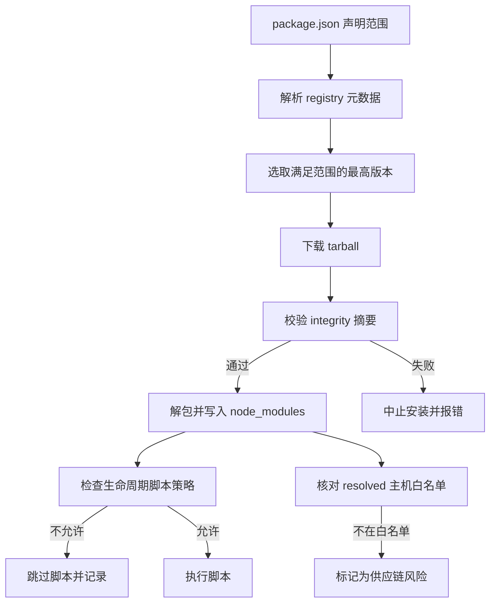

# 依赖管理与供应链安全

!!! abstract "核心结论"
    - semver 范围不是"版本号集合"，而是一个**布尔谓词**：node-semver 把 `^1.2.0 || ~2.1` 编译成 DNF（`||` 是组间析取，空格是组内合取），再加上一条特有的 **prerelease 门控规则**——带 `-beta` 的版本只有在同一个 comparator 组里存在"同 `[major,minor,patch]` 且自身带 prerelease"的 comparator 时才可能满足。
    - lockfile 的作用不是"存版本号"，而是把**解析结果（版本 + resolved URL + integrity 摘要 + 完整依赖图）**冻结成可复现的字节级快照；`npm ci` 是"按快照还原"，`npm install` 是"重新求解 + 改写快照"，两者语义完全不同。
    - integrity 是 Subresource Integrity（SRI）字符串（如 `sha512-<base64>`），下载 tarball 后必须重算摘要并比对；多个摘要共存时，**取最强算法**判定，而不是"任一匹配即通过"。
    - 供应链攻击的主流入口不是漏洞利用，而是**安装期代码执行**（`postinstall` 等生命周期脚本）、**同名仿冒**（typosquatting / combosquatting）、**私有包名被公共 registry 抢注**（dependency confusion）。防线的核心是：锁死来源、关闭脚本、限制发布权限、可验证构建来源。
    - provenance / SLSA / 2FA / 最小权限发布解决的是"**这个包是谁、用什么构建出来的、能不能被冒名发布**"；它们不能替代 integrity，二者是不同层面的信任锚。

## 1. semver：从范围字符串到可判定集合

### 1.1 版本号语法与比较算法

semver 版本号的形式是：

```
MAJOR.MINOR.PATCH[-PRERELEASE][+BUILD]
```

比较算法（由 semver 规范定义，node-semver 实现）：

1. 依次比较 `major`、`minor`、`patch`，数值大的更大。
2. 三个数值都相同时，**有 prerelease 的版本小于没有 prerelease 的版本**（`1.0.0-alpha < 1.0.0`）。
3. 双方都有 prerelease 时，按 `.` 分段从左到右比较：
   - 两段都是数字 → 按数值比较（`beta.11 > beta.2`，不是字符串比较）；
   - 一段数字、一段字母 → **数字段更小**（`alpha.1 < alpha.beta`）；
   - 两段都是字母 → 按 ASCII 字典序；
   - 所有已比较段都相等时，**段数少的更小**（`alpha < alpha.1`）。
4. **build metadata（`+` 之后）完全不参与比较**。这意味着 `1.2.3+a` 与 `1.2.3+b` 在 semver 语义下是同一个版本——这也是为什么不能用它来区分构建产物。

第 4 点在实践中非常容易被误解：包管理器判断"是否同一个版本"时会忽略 build 段，但 lockfile 里可能出现 `1.2.3+sha.abc` 这类形式（git 依赖或特殊发布流程会产生），此时"版本字符串相同"并不等于"内容相同"。

### 1.2 范围的编译：DNF 与 prerelease 门控

node-semver 处理一个范围字符串的流程可以概括为三个动作：

**第一步，拆析取。** 以 `||` 切分，得到若干"comparator 组"。`^1.0.0 || ^3.0.0` 得到两组。

**第二步，组内展开合取。** 空格分隔的每个 token 会被翻译成一到两个 atomic comparator（`>=`、`>`、`<`、`<=`、`=`）。典型展开规则：

| 书写形式 | 等价 comparator 集合 | 说明 |
| --- | --- | --- |
| `^1.2.3` | `>=1.2.3 <2.0.0` | major 非 0 时锁 major |
| `^0.2.3` | `>=0.2.3 <0.3.0` | major 为 0 时锁 minor |
| `^0.0.3` | `>=0.0.3 <0.0.4` | major/minor 都为 0 时锁 patch |
| `^0.0.x` | `>=0.0.0 <0.1.0` | patch 为通配时回退到锁 minor |
| `^1.2.x` | `>=1.2.0 <2.0.0` | 缺省位补 0 |
| `~1.2.3` | `>=1.2.3 <1.3.0` | 锁 minor |
| `~1.2` | `>=1.2.0 <1.3.0` | 同上 |
| `~1` | `>=1.0.0 <2.0.0` | 缺 minor 时锁 major |
| `1.2.x` | `>=1.2.0 <1.3.0` | 纯 x-range |
| `1.x` | `>=1.0.0 <2.0.0` | 同上 |
| `*` / `x` / 空 | `>=0.0.0` | 全集（但受 prerelease 门控约束） |
| `1.2.3 - 2.3.4` | `>=1.2.3 <=2.3.4` | hyphen range；右端缺位时按"段上界"处理 |
| `1.2 - 2` | `>=1.2.0 <3.0.0` | 右端 `2` 视为 `<3.0.0` |
| `>1` | `>=2.0.0` | `>` 遇到通配位时进位 |
| `>1.2` | `>=1.3.0` | 同上 |
| `<=1` | `<2.0.0` | `<=` 遇到通配位时进位 |

**第三步，判定。** 对某个具体版本 `v`：存在至少一个组，使组内**所有** comparator 为真；并且如果 `v` 带 prerelease，该组还必须满足门控规则。

门控规则的形式化表述（node-semver 的 `Comparator.test` 与此一致）：设 `v` 带 prerelease，若该组中**没有任何** comparator 的 `[major,minor,patch]` 与 `v` 相同且自身带 prerelease，则 `v` 不满足该组。这条规则的目的是防止 `^1.0.0` 意外匹配到 `2.0.0-beta.1` 这类预发布版本，同时又允许 `>=1.2.3-beta.0 <2.0.0` 这类显式预发布区间正常工作。

### 1.3 手写实现：semver-lite.mjs

运行环境：Node.js >= 18，ESM 模块（保存为 `semver-lite.mjs`）。

以下实现覆盖 `^ ~ - || * x` 与五种比较运算符，并实现 prerelease 门控。它**刻意省略**了 node-semver 的部分严格校验（如数字段前导零的合法性检查）和极少数边界处理。生产环境请直接使用官方 `semver` 包。

```js
// semver-lite.mjs
// 运行环境: Node.js >= 18 (ESM)

const RE_VERSION = /^v?(\d+)\.(\d+)\.(\d+)(?:-([0-9A-Za-z.-]+))?(?:\+([0-9A-Za-z.-]+))?$/;
const RE_PARTIAL = /^v?(\d+|[xX*])(?:\.(\d+|[xX*]))?(?:\.(\d+|[xX*]))?(?:-([0-9A-Za-z.-]+))?(?:\+([0-9A-Za-z.-]+))?$/;

function isWildcard(token) {
  return token === undefined || token === null || token === 'x' || token === 'X' || token === '*';
}

// 解析完整版本号;非法返回 null
export function parseVersion(input) {
  if (typeof input !== 'string') return null;
  const raw = input.trim();
  const m = RE_VERSION.exec(raw);
  if (!m) return null;
  return {
    major: Number(m[1]),
    minor: Number(m[2]),
    patch: Number(m[3]),
    prerelease: m[4] ? m[4].split('.') : [],
    build: m[5] ? m[5].split('.') : [],
    raw,
  };
}

// 解析"部分版本"(允许通配与缺位)。null 表示该段是通配。
export function parsePartial(input) {
  if (typeof input !== 'string') return null;
  const raw = input.trim();
  if (raw === '' || isWildcard(raw)) {
    return { major: null, minor: null, patch: null, prerelease: [], build: [] };
  }
  const m = RE_PARTIAL.exec(raw);
  if (!m) return null;
  if (isWildcard(m[1])) {
    return { major: null, minor: null, patch: null, prerelease: [], build: [] };
  }
  const major = Number(m[1]);
  const minor = isWildcard(m[2]) ? null : Number(m[2]);
  // 通配向下传播: 1.x.3 视为 1.x
  const patch = minor === null || isWildcard(m[3]) ? null : Number(m[3]);
  return {
    major,
    minor,
    patch,
    prerelease: m[4] ? m[4].split('.') : [],
    build: m[5] ? m[5].split('.') : [],
    raw,
  };
}

// prerelease 段比较。返回 -1 / 0 / 1
function comparePrerelease(a, b) {
  if (a.length === 0 && b.length === 0) return 0;
  if (a.length === 0) return 1;   // 无 prerelease 的更大
  if (b.length === 0) return -1;
  const len = Math.max(a.length, b.length);
  for (let i = 0; i < len; i += 1) {
    const x = a[i];
    const y = b[i];
    if (x === undefined) return -1;  // 段数少的更小
    if (y === undefined) return 1;
    const xNumeric = /^\d+$/.test(x);
    const yNumeric = /^\d+$/.test(y);
    if (xNumeric && yNumeric) {
      const d = Number(x) - Number(y);
      if (d !== 0) return d < 0 ? -1 : 1;
    } else if (xNumeric) {
      return -1;                     // 数字段 < 字母段
    } else if (yNumeric) {
      return 1;
    } else if (x !== y) {
      return x < y ? -1 : 1;         // ASCII 字典序
    }
  }
  return 0;
}

// 比较版本;build metadata 被忽略。参数可以是字符串或 parseVersion 的结果
export function compareVersions(a, b) {
  const va = typeof a === 'string' ? parseVersion(a) : a;
  const vb = typeof b === 'string' ? parseVersion(b) : b;
  if (!va || !vb) throw new TypeError(`无效版本: ${a} / ${b}`);
  if (va.major !== vb.major) return va.major < vb.major ? -1 : 1;
  if (va.minor !== vb.minor) return va.minor < vb.minor ? -1 : 1;
  if (va.patch !== vb.patch) return va.patch < vb.patch ? -1 : 1;
  return comparePrerelease(va.prerelease, vb.prerelease);
}

function comparator(op, major, minor, patch, prerelease = []) {
  return { op, version: { major, minor, patch, prerelease, build: [] } };
}

// ^ 展开
function expandCaret(part) {
  const { major, minor, patch, prerelease } = part;
  if (major === null) return [comparator('>=', 0, 0, 0)];
  if (minor === null) return [comparator('>=', major, 0, 0), comparator('<', major + 1, 0, 0)];
  if (patch === null) {
    const hi = major === 0 ? [0, minor + 1, 0] : [major + 1, 0, 0];
    return [comparator('>=', major, minor, 0), comparator('<', hi[0], hi[1], hi[2])];
  }
  let hi;
  if (major !== 0) hi = [major + 1, 0, 0];
  else if (minor !== 0) hi = [0, minor + 1, 0];
  else hi = [0, 0, patch + 1];
  return [comparator('>=', major, minor, patch, prerelease), comparator('<', hi[0], hi[1], hi[2])];
}

// ~ 展开
function expandTilde(part) {
  const { major, minor, patch, prerelease } = part;
  if (major === null) return [comparator('>=', 0, 0, 0)];
  if (minor === null) return [comparator('>=', major, 0, 0), comparator('<', major + 1, 0, 0)];
  if (patch === null) return [comparator('>=', major, minor, 0), comparator('<', major, minor + 1, 0)];
  return [comparator('>=', major, minor, patch, prerelease), comparator('<', major, minor + 1, 0)];
}

// 无运算符的 x-range / 精确版本
function expandPlain(part) {
  const { major, minor, patch, prerelease } = part;
  if (major === null) return [comparator('>=', 0, 0, 0)];
  if (minor === null) return [comparator('>=', major, 0, 0), comparator('<', major + 1, 0, 0)];
  if (patch === null) return [comparator('>=', major, minor, 0), comparator('<', major, minor + 1, 0)];
  return [comparator('=', major, minor, patch, prerelease)];
}

// 带比较运算符的部分版本
function expandOperator(op, part) {
  const { major, minor, patch, prerelease } = part;
  if (major === null) return [comparator('>=', 0, 0, 0)];
  switch (op) {
    case '':
    case '=':
      return expandPlain(part);
    case '>=':
      return [comparator('>=', major, minor ?? 0, patch ?? 0, prerelease)];
    case '>':
      if (minor === null) return [comparator('>=', major + 1, 0, 0)];
      if (patch === null) return [comparator('>=', major, minor + 1, 0)];
      return [comparator('>', major, minor, patch, prerelease)];
    case '<=':
      if (minor === null) return [comparator('<', major + 1, 0, 0)];
      if (patch === null) return [comparator('<', major, minor + 1, 0)];
      return [comparator('<=', major, minor, patch, prerelease)];
    case '<':
      return [comparator('<', major, minor ?? 0, patch ?? 0, prerelease)];
    default:
      return null;
  }
}

// 把范围字符串编译成 DNF: 数组的每个元素是一个 comparator 组(组内 AND,组间 OR)
export function parseRange(rangeStr) {
  const raw = String(rangeStr).trim();
  const orParts = raw.split('||').map((s) => s.trim());
  const sets = [];
  for (const part of orParts) {
    const set = [];
    if (part === '') {
      set.push(comparator('>=', 0, 0, 0));
      sets.push(set);
      continue;
    }
    // hyphen range: "A - B"
    const hyphen = /^(\S+)\s+-\s+(\S+)$/.exec(part);
    if (hyphen) {
      const lo = parsePartial(hyphen[1]);
      const hi = parsePartial(hyphen[2]);
      if (!lo || !hi) return null;
      if (lo.major !== null) {
        set.push(comparator('>=', lo.major, lo.minor ?? 0, lo.patch ?? 0, lo.prerelease));
      }
      if (hi.major !== null) {
        if (hi.minor === null) set.push(comparator('<', hi.major + 1, 0, 0));
        else if (hi.patch === null) set.push(comparator('<', hi.major, hi.minor + 1, 0));
        else set.push(comparator('<=', hi.major, hi.minor, hi.patch, hi.prerelease));
      }
      sets.push(set.length ? set : [comparator('>=', 0, 0, 0)]);
      continue;
    }
    const tokens = part.split(/\s+/).filter(Boolean);
    for (const token of tokens) {
      const m = /^(\^|~|>=|<=|>|<|=)?\s*(\S+)$/.exec(token);
      if (!m) return null;
      const op = m[1] || '';
      const partial = parsePartial(m[2]);
      if (!partial) return null;
      let expanded;
      if (op === '^') expanded = expandCaret(partial);
      else if (op === '~') expanded = expandTilde(partial);
      else expanded = expandOperator(op, partial);
      if (!expanded) return null;
      set.push(...expanded);
    }
    sets.push(set.length ? set : [comparator('>=', 0, 0, 0)]);
  }
  return sets;
}

function testComparator(version, c) {
  const cmp = compareVersions(version, c.version);
  switch (c.op) {
    case '>=': return cmp >= 0;
    case '>': return cmp > 0;
    case '<': return cmp < 0;
    case '<=': return cmp <= 0;
    case '=': return cmp === 0;
    default: return false;
  }
}

// prerelease 门控: 组内必须存在"同 [major,minor,patch] 且自身带 prerelease"的 comparator
function allowsPrerelease(set, version) {
  return set.some((c) => c.version.prerelease.length > 0
    && c.version.major === version.major
    && c.version.minor === version.minor
    && c.version.patch === version.patch);
}

// 核心判定函数
export function satisfies(versionInput, rangeStr) {
  const version = typeof versionInput === 'string' ? parseVersion(versionInput) : versionInput;
  if (!version) return false;
  const sets = parseRange(rangeStr === undefined || rangeStr === null ? '*' : rangeStr);
  if (!sets) return false;
  for (const set of sets) {
    const allPass = set.every((c) => testComparator(version, c));
    if (!allPass) continue;
    if (version.prerelease.length > 0 && !allowsPrerelease(set, version)) continue;
    return true;
  }
  return false;
}

// 从候选版本列表里取满足范围的最高版本;常用于模拟 registry 解析
export function maxSatisfying(versions, rangeStr) {
  let best = null;
  for (const raw of versions) {
    const v = parseVersion(raw);
    if (!v) continue;
    if (!satisfies(v, rangeStr)) continue;
    if (best === null || compareVersions(v, best) > 0) best = v;
  }
  return best ? best.raw : null;
}
```

### 1.4 验证标准

保存为 `semver-lite.test.mjs`，与 `semver-lite.mjs` 同目录。

```js
// semver-lite.test.mjs
// 运行: node semver-lite.test.mjs
// 预期输出: semver-lite: all assertions passed
import assert from 'node:assert/strict';
import {
  parseVersion, compareVersions, satisfies, maxSatisfying, parseRange,
} from './semver-lite.mjs';

// ---- 1. 版本解析 ----
assert.deepEqual(parseVersion('v1.2.3'), {
  major: 1, minor: 2, patch: 3, prerelease: [], build: [], raw: 'v1.2.3',
});
assert.equal(parseVersion('1.2'), null);            // 不完整版本不是合法版本
assert.equal(parseVersion('abc'), null);
assert.deepEqual(parseVersion('1.2.3-rc.1+build.9').prerelease, ['rc', '1']);
assert.deepEqual(parseVersion('1.2.3-rc.1+build.9').build, ['build', '9']);

// ---- 2. 比较算法 ----
assert.equal(compareVersions('1.2.3', '1.2.4'), -1);
assert.equal(compareVersions('1.2.3', '1.2.3'), 0);
assert.equal(compareVersions('1.2.3+build.1', '1.2.3+build.2'), 0);   // build 不参与
assert.equal(compareVersions('1.0.0-alpha', '1.0.0'), -1);
assert.equal(compareVersions('1.0.0-alpha', '1.0.0-alpha.1'), -1);     // 段少者更小
assert.equal(compareVersions('1.0.0-alpha.1', '1.0.0-alpha.beta'), -1); // 数字段 < 字母段
assert.equal(compareVersions('1.0.0-beta.11', '1.0.0-beta.2'), 1);      // 数字段按数值比

// ---- 3. ^ 展开 ----
assert.equal(satisfies('1.2.3', '^1.2.3'), true);
assert.equal(satisfies('1.9.9', '^1.2.3'), true);
assert.equal(satisfies('2.0.0', '^1.2.3'), false);
assert.equal(satisfies('0.2.9', '^0.2.3'), true);
assert.equal(satisfies('0.3.0', '^0.2.3'), false);
assert.equal(satisfies('0.0.3', '^0.0.3'), true);
assert.equal(satisfies('0.0.4', '^0.0.3'), false);
assert.equal(satisfies('1.5.0', '^1.x'), true);
assert.equal(satisfies('2.0.0', '^1.x'), false);
assert.equal(satisfies('0.9.0', '^0.x'), true);   // ^0.x 等价于 >=0.0.0 <1.0.0
assert.equal(satisfies('1.0.0', '^0.x'), false);

// ---- 4. ~ 展开 ----
assert.equal(satisfies('1.2.9', '~1.2.3'), true);
assert.equal(satisfies('1.3.0', '~1.2.3'), false);
assert.equal(satisfies('1.2.0', '~1.2'), true);
assert.equal(satisfies('1.2.9', '~1.2'), true);
assert.equal(satisfies('1.3.0', '~1.2'), false);
assert.equal(satisfies('1.9.0', '~1'), true);
assert.equal(satisfies('2.0.0', '~1'), false);

// ---- 5. x-range 与通配 ----
assert.equal(satisfies('1.2.3', '1.2.x'), true);
assert.equal(satisfies('1.3.0', '1.2.x'), false);
assert.equal(satisfies('1.9.9', '1.x'), true);
assert.equal(satisfies('2.0.0', '1.x'), false);
assert.equal(satisfies('0.0.1', '*'), true);
assert.equal(satisfies('1.0.0', ''), true);

// ---- 6. hyphen range ----
assert.equal(satisfies('1.2.3', '1.2.3 - 2.3.4'), true);
assert.equal(satisfies('2.3.4', '1.2.3 - 2.3.4'), true);
assert.equal(satisfies('2.3.5', '1.2.3 - 2.3.4'), false);
assert.equal(satisfies('1.5.0', '1.2 - 2.3.4'), true);
assert.equal(satisfies('2.9.9', '1.2 - 2'), true);
assert.equal(satisfies('3.0.0', '1.2 - 2'), false);

// ---- 7. 比较运算符与通配进位 ----
assert.equal(satisfies('2.0.0', '>1'), true);
assert.equal(satisfies('1.9.9', '>1'), false);
assert.equal(satisfies('1.3.0', '>1.2'), true);
assert.equal(satisfies('1.2.9', '>1.2'), false);
assert.equal(satisfies('1.9.9', '<=1'), true);
assert.equal(satisfies('2.0.0', '<=1'), false);

// ---- 8. AND / OR ----
assert.equal(satisfies('1.5.0', '>=1.0.0 <2.0.0'), true);
assert.equal(satisfies('2.0.0', '>=1.0.0 <2.0.0'), false);
assert.equal(satisfies('3.1.0', '^1.0.0 || ^3.0.0'), true);
assert.equal(satisfies('2.5.0', '^1.0.0 || ^3.0.0'), false);

// ---- 9. prerelease 门控 ----
assert.equal(satisfies('1.0.0-beta', '^1.0.0'), false);          // 门控拦住
assert.equal(satisfies('1.0.0-beta', '>=1.0.0-beta'), true);     // 显式预发布,放行
assert.equal(satisfies('2.0.0-beta', '>=1.0.0 <3.0.0'), false);  // 组内无同 tuple 预发布
assert.equal(satisfies('1.2.3-beta.1', '>=1.2.3-beta.0 <2.0.0'), true);

// ---- 10. maxSatisfying ----
assert.equal(maxSatisfying(['1.0.0', '1.2.0', '1.2.5', '1.3.0', '2.0.0'], '~1.2.0'), '1.2.5');
assert.equal(maxSatisfying(['1.0.0'], '^2.0.0'), null);

// ---- 11. DNF 结构 ----
const dnf = parseRange('^1.0.0 || ~2.1');
assert.equal(dnf.length, 2);
assert.equal(dnf[0].length, 2);
assert.equal(dnf[1].length, 2);

console.log('semver-lite: all assertions passed');
```

若某个断言失败，`node:assert/strict` 会抛出 `AssertionError` 并让进程以非 0 退出码结束，便于直接接入 CI。

### 1.5 解析算法：为什么"重新安装"会换版本

包管理器做依赖解析时，本质上是"在 registry 提供的版本集合上求满足约束的最大版本"（npm 的 Arborist 会做更复杂的 hoisting 决策，但单个 range 的候选选择就是这个）。这带来一个必然结论：**范围约束是不确定的，解析结果是时间的函数**。

```js
// resolve-drift.mjs  (运行: node resolve-drift.mjs)
// 预期输出:
//   首次解析: 1.2.0
//   上游新增 1.9.9 后解析: 1.9.9
//   lockfile 钉住的版本仍然可用: true
import { maxSatisfying, satisfies } from './semver-lite.mjs';

const registryIndex = { leftpad: ['1.0.0', '1.1.0', '1.2.0'] };
const RANGE = '^1.0.0';

const first = maxSatisfying(registryIndex.leftpad, RANGE);
console.log('首次解析:', first);

registryIndex.leftpad.push('1.9.9');   // 上游发布新版本,可能是恶意的
const second = maxSatisfying(registryIndex.leftpad, RANGE);
console.log('上游新增 1.9.9 后解析:', second);

const LOCKED = '1.2.0';                // lockfile 冻结的结果
console.log('lockfile 钉住的版本仍然可用:', satisfies(LOCKED, RANGE));
```

这就是 lockfile 存在的第一条理由：**把"求解结果"变成"输入"**。

## 2. lockfile：确定性安装与冲突处理

### 2.1 lockfile 到底锁住了什么

以 npm 的 `package-lock.json` 为例，`packages` 字段里的每个条目至少包含：

- `version`：解析出的确切版本；
- `resolved`：tarball 的绝对 URL（也可能是 `git+ssh:`、`file:` 等）；
- `integrity`：SRI 摘要；
- `dependencies` / `peerDependencies` / `optional` / `dev` 等拓扑元数据；
- `hasInstallScript`：该包是否声明了安装期生命周期脚本（用于让包管理器提前知道"要不要执行脚本"）。

关键认识：**lockfile 描述的是整棵物理依赖树（按 `node_modules` 路径组织），而 `package.json` 描述的只是一层的逻辑约束。** 这解释了为什么 lockfile 必须整体提交、必须随代码一起 code review——它等同于一串"我们将从这些域名下载这些字节"的声明。

### 2.2 lockfileVersion 对比

| `lockfileVersion` | 主要产生方 | 结构 | 兼容性 | 说明 |
| --- | --- | --- | --- | --- |
| `1` | 较早的 npm 大版本 | 只有 `dependencies` 嵌套树 | 新版可读 | 嵌套结构冗余，同一版本会重复出现 |
| `2` | 中间的 npm 大版本 | `packages`（扁平路径映射）+ 保留 `dependencies` | 向后兼容 v1 读取方 | 两种视图冗余存储 |
| `3` | 较新的 npm 大版本 | 只有 `packages` | 不保证旧工具可读 | 体积更小，语义更清晰 |

以上版本与"哪个 npm 大版本默认产生哪个 lockfileVersion"的对应关系，请以 npm 官方文档为准核对，不同大版本之间有过变化。

### 2.3 冲突处理策略

lockfile 冲突的根源是：它是**大规模 JSON 文本**，自动生成的键顺序、缩进、以及每次安装都可能变化的 `resolved`/`integrity`，导致两个分支各自重排后产生海量冲突。

处理原则：

1. **不要手工合并 tarball URL 与 integrity 字段。** 手改容易产生"URL 与摘要不匹配"或"URL 指向旧版本"的静默错误。
2. **优先"重新生成"而不是"解决冲突"**：在合并后的 `package.json` 基础上跑一次仅更新 lockfile 的安装，再提交。
3. **CI 必须校验同步性**：`npm ci` 会在 `package.json` 与 lockfile 不一致时直接失败，这是最便宜的护栏。务必在 CI 里使用它，而不是 `npm install`。
4. **禁止在 CI 里跑会改写 lockfile 的命令**，否则"CI 通过"就失去了对提交内容的担保。
5. **如果 lockfile 冲突频繁**，说明依赖树抖动大，应从减少依赖数量、约束范围入手，而不是加长合并流程。

`package.json` 的 `dependencies` 顺序变化、锁文件格式差异、以及不同 npm 版本对同一棵树的排序差异，都会放大冲突。把 lockfile 视为"生成产物"（而非"手写源文件"）是团队共识的基础。

### 2.4 包管理器差异对比

| 维度 | npm | pnpm | Yarn（Berry） |
| --- | --- | --- | --- |
| `node_modules` 布局 | 扁平提升（hoisting），允许访问未声明的包 | 内容寻址全局 store + `node_modules/.pnpm` 虚拟 store + 符号链接，严格隔离 | 可选 PnP（无 `node_modules`，通过 `.pnp.cjs` 拦截解析）或 node-modules linker |
| lockfile | `package-lock.json` | `pnpm-lock.yaml` | `yarn.lock` |
| 依赖脚本默认行为 | 执行 | 较新版本默认限制依赖构建脚本，需显式允许（**需核对官方文档与版本**） | 可通过 `enableScripts: false` 关闭 |
| 完整性校验 | SRI `integrity` + 本地缓存内容寻址 | 基于内容寻址 store | 校验 checksum |
| 冻结安装 | `npm ci` | `--frozen-lockfile` | `--immutable` |
| 审计入口 | `npm audit` | `pnpm audit` | `yarn npm audit` |

pnpm 的"严格隔离"在安全上价值很高：它让"未在 `package.json` 声明的依赖"直接无法被 `require`/`import`，从而消除"幽灵依赖"（phantom dependency）带来的隐式供应链面。代价是某些依赖了提升行为的包可能无法直接工作。

## 3. integrity：SRI 哈希与内容寻址

### 3.1 SRI 的语法与算法选择

integrity 字段是 Subresource Integrity 字符串，形如：

```
sha512-<base64 摘要>
sha512-<摘要A> sha256-<摘要B>
sha512-<摘要>?<options>
```

判定规则（与 ssri 的语义一致）：

1. 解析出所有 `<算法>-<base64>` 条目；
2. 在受支持算法（`sha256`/`sha384`/`sha512`）中选出**最强**的算法；
3. 只对该算法的所有摘要做比对，**任一匹配即通过**；
4. 若存在 `?options` 参数，本实现视为不可用（保守策略），并如实报告原因。

注意第 2 条与"任一匹配即通过"的常见误解正好相反：如果 integrity 里同时给了正确的 `sha256` 和一个错误的 `sha512`，判定应当**失败**，因为强者优先。这条设计是为了防止攻击者通过附加弱摘要来降级校验强度。

### 3.2 手写实现：integrity-verifier.mjs

运行环境：Node.js >= 18（`node:crypto` 的 `createHash` 支持 `sha256`/`sha384`/`sha512`）。

```js
// integrity-verifier.mjs
// 运行环境: Node.js >= 18 (ESM)
import { createHash } from 'node:crypto';

const SUPPORTED = new Set(['sha256', 'sha384', 'sha512']);
const STRENGTH = { sha256: 1, sha384: 2, sha512: 3 };

// 解析 SRI 字符串,返回 [{ algorithm, digestBase64, options }];无法解析的片段被丢弃
export function parseSri(sri) {
  if (typeof sri !== 'string') return [];
  const out = [];
  for (const token of sri.trim().split(/\s+/)) {
    if (!token) continue;
    const m = /^([a-z0-9]+)-([A-Za-z0-9+/=]+)(\?[!-~]*)?$/.exec(token);
    if (!m) continue;
    out.push({ algorithm: m[1], digestBase64: m[2], options: m[3] || '' });
  }
  return out;
}

// 计算某个 buffer 的 SRI 字符串
export function computeSri(buffer, algorithm = 'sha512') {
  if (!SUPPORTED.has(algorithm)) throw new TypeError(`不支持的算法: ${algorithm}`);
  return `${algorithm}-${createHash(algorithm).update(buffer).digest('base64')}`;
}

// 校验 buffer 与 integrity 是否匹配
// 返回 { ok: true, algorithm } 或 { ok: false, reason, algorithm?, actual? }
export function verifyIntegrity(buffer, sri) {
  const entries = parseSri(sri);
  if (entries.length === 0) return { ok: false, reason: 'integrity 字段无法解析' };

  const usable = entries.filter((e) => SUPPORTED.has(e.algorithm) && e.options === '');
  if (usable.length === 0) return { ok: false, reason: '没有受支持且无选项的摘要' };

  const bestAlgorithm = usable
    .map((e) => e.algorithm)
    .reduce((a, b) => (STRENGTH[b] > STRENGTH[a] ? b : a));

  const actual = createHash(bestAlgorithm).update(buffer).digest('base64');
  const matched = usable.some((e) => e.algorithm === bestAlgorithm && e.digestBase64 === actual);

  if (matched) return { ok: true, algorithm: bestAlgorithm };
  return {
    ok: false,
    reason: `摘要不匹配 (${bestAlgorithm})`,
    algorithm: bestAlgorithm,
    actual,
  };
}

// 从 node_modules 路径推出包名: "node_modules/@s/util" -> "@s/util"
export function packageNameFromPath(path) {
  const marker = 'node_modules/';
  const idx = path.lastIndexOf(marker);
  return idx === -1 ? path : path.slice(idx + marker.length);
}

// 收集 lockfile 中需要校验的条目
// 兼容 packages 视图(v2/v3)与 dependencies 嵌套视图(v1)
export function collectLockEntries(lockfile) {
  const entries = [];
  if (lockfile && typeof lockfile.packages === 'object' && lockfile.packages !== null) {
    for (const [path, meta] of Object.entries(lockfile.packages)) {
      if (path === '') continue;                 // 根项目自身没有 tarball
      if (!meta || typeof meta !== 'object') continue;
      if (meta.link === true) continue;          // workspace 软链,无 tarball
      entries.push({
        path,
        version: meta.version,
        resolved: meta.resolved,
        integrity: meta.integrity,
        incomplete: !(meta.resolved && meta.integrity),
      });
    }
    return entries;
  }
  walkV1(lockfile ? lockfile.dependencies : null, '', entries);
  return entries;
}

function walkV1(deps, prefix, out) {
  for (const [name, meta] of Object.entries(deps || {})) {
    if (!meta || typeof meta !== 'object') continue;
    const path = prefix ? `${prefix}/node_modules/${name}` : `node_modules/${name}`;
    if (!meta.version) continue;
    out.push({
      path,
      version: meta.version,
      resolved: meta.resolved,
      integrity: meta.integrity,
      incomplete: !(meta.resolved && meta.integrity),
    });
    walkV1(meta.dependencies, path, out);
  }
}

// 校验整棵 lockfile
// tarballProvider(key, entry) -> Buffer | null,key 形如 "leftpad@1.2.3"
export function verifyLockfile(lockfile, tarballProvider) {
  const entries = collectLockEntries(lockfile);
  const report = { total: entries.length, checked: 0, skipped: [], failures: [], ok: true };
  for (const entry of entries) {
    if (entry.incomplete) {
      report.skipped.push({ path: entry.path, reason: '缺少 resolved 或 integrity' });
      continue;
    }
    const name = packageNameFromPath(entry.path);
    const key = `${name}@${entry.version}`;
    const buffer = tarballProvider(key, entry);
    if (!buffer) {
      report.skipped.push({ path: entry.path, reason: `没有提供 ${key} 的 tarball` });
      continue;
    }
    report.checked += 1;
    const result = verifyIntegrity(buffer, entry.integrity);
    if (!result.ok) {
      report.ok = false;
      report.failures.push({ path: entry.path, key, reason: result.reason });
    }
  }
  return report;
}

// 校验 package.json 声明的范围是否被 lockfile 中锁定的版本满足
export function verifyRootRanges(lockfile, declaredRanges) {
  const errors = [];
  for (const [name, range] of Object.entries(declaredRanges || {})) {
    const meta = lockfile && lockfile.packages ? lockfile.packages[`node_modules/${name}`] : undefined;
    if (!meta) {
      errors.push({ name, range, reason: 'lockfile 中缺少该包' });
      continue;
    }
    if (!satisfiesVersion(meta.version, range)) {
      errors.push({ name, range, locked: meta.version, reason: '锁定版本不满足声明的范围' });
    }
  }
  return errors;
}

// 单独抽出以便本文件在没有 semver-lite 时也能自洽运行
function satisfiesVersion(version, range) {
  // 仅为演示: 这里直接委托给 semver-lite,避免重复实现
  throw new Error('请在集成环境中替换为 semver-lite 的 satisfies');
}
```

上面对 `satisfiesVersion` 的处理是刻意为之：本模块不该重复实现 semver。实际集成时直接引入：

```js
// 集成写法(替换上面那个抛错的占位实现)
import { satisfies } from './semver-lite.mjs';

export function verifyRootRanges(lockfile, declaredRanges) {
  const errors = [];
  for (const [name, range] of Object.entries(declaredRanges || {})) {
    const meta = lockfile && lockfile.packages ? lockfile.packages[`node_modules/${name}`] : undefined;
    if (!meta) {
      errors.push({ name, range, reason: 'lockfile 中缺少该包' });
      continue;
    }
    if (!satisfies(meta.version, range)) {
      errors.push({ name, range, locked: meta.version, reason: '锁定版本不满足声明的范围' });
    }
  }
  return errors;
}
```

### 3.3 验证标准

下面用两个**外部可验证的密码学测试向量**作为锚点，避免"用实现验证实现"的循环论证：

- SHA-256 空输入的 hex 为 `e3b0c44298fc1c149afbf4c8996fb92427ae41e4649b934ca495991b7852b855`，对应 base64 为 `47DEQpj8HBSa+/TImW+5JCeuQeRkm5NMpJWZG3hSuFU=`；
- MD5 空输入的 base64 为 `1B2M2Y8AsgTpgAmY7PhCfg==`（此处仅用于验证"不支持的算法"分支）。

```js
// integrity-verifier.test.mjs
// 运行: node integrity-verifier.test.mjs
// 预期输出: integrity-verifier: all assertions passed
import assert from 'node:assert/strict';
import { createHash } from 'node:crypto';
import {
  parseSri, computeSri, verifyIntegrity, collectLockEntries,
  verifyLockfile, packageNameFromPath,
} from './integrity-verifier.mjs';

const EMPTY_SHA256 = '47DEQpj8HBSa+/TImW+5JCeuQeRkm5NMpJWZG3hSuFU=';
const EMPTY_SRI = `sha256-${EMPTY_SHA256}`;

// ---- 1. SRI 解析 ----
assert.deepEqual(parseSri(EMPTY_SRI), [
  { algorithm: 'sha256', digestBase64: EMPTY_SHA256, options: '' },
]);
assert.deepEqual(parseSri('垃圾数据'), []);
assert.deepEqual(parseSri('sha512-abc?foo=x'), [
  { algorithm: 'sha512', digestBase64: 'abc', options: '?foo=x' },
]);

// ---- 2. 摘要匹配 ----
assert.deepEqual(verifyIntegrity(Buffer.alloc(0), EMPTY_SRI), { ok: true, algorithm: 'sha256' });
assert.equal(
  computeSri(Buffer.alloc(0), 'sha256'),
  EMPTY_SRI,
);

// ---- 3. 篡改检测 ----
const tampered = verifyIntegrity(Buffer.from('evil-payload'), EMPTY_SRI);
assert.equal(tampered.ok, false);
assert.equal(tampered.algorithm, 'sha256');
assert.equal(tampered.reason, '摘要不匹配 (sha256)');

// ---- 4. 最强算法优先: 正确的 sha256 也不能救回错误的 sha512 ----
const bogusSha512 = `sha512-${Buffer.alloc(64).toString('base64')}`;
const stronger = verifyIntegrity(Buffer.alloc(0), `${EMPTY_SRI} ${bogusSha512}`);
assert.equal(stronger.ok, false);
assert.equal(stronger.algorithm, 'sha512');

// ---- 5. 异常输入 ----
assert.deepEqual(verifyIntegrity(Buffer.alloc(0), 'not-an-sri'), {
  ok: false, reason: 'integrity 字段无法解析',
});
assert.deepEqual(verifyIntegrity(Buffer.alloc(0), 'md5-1B2M2Y8AsgTpgAmY7PhCfg=='), {
  ok: false, reason: '没有受支持且无选项的摘要',
});
assert.deepEqual(verifyIntegrity(Buffer.alloc(0), `${EMPTY_SRI}?opt`), {
  ok: false, reason: '没有受支持且无选项的摘要',
});

// ---- 6. 从路径推导包名 ----
assert.equal(packageNameFromPath('node_modules/leftpad'), 'leftpad');
assert.equal(packageNameFromPath('node_modules/@scope/util'), '@scope/util');
assert.equal(packageNameFromPath('node_modules/a/node_modules/b'), 'b');

// ---- 7. lockfile 遍历 ----
const lockfile = {
  name: 'demo',
  lockfileVersion: 3,
  packages: {
    '': { name: 'demo', version: '1.0.0', dependencies: { leftpad: '^1.2.0' } },
    'node_modules/leftpad': {
      version: '1.2.3',
      resolved: 'https://registry.npmjs.org/leftpad/-/leftpad-1.2.3.tgz',
      integrity: EMPTY_SRI,
    },
    'node_modules/@scope/util': {
      version: '0.3.0',
      resolved: 'https://registry.npmjs.org/@scope/util/-/util-0.3.0.tgz',
      integrity: EMPTY_SRI,
    },
    'node_modules/link-only': { link: true, version: '0.0.0' },
  },
};

const entries = collectLockEntries(lockfile);
assert.equal(entries.length, 2);
assert.deepEqual(entries.map((e) => e.path), [
  'node_modules/leftpad',
  'node_modules/@scope/util',
]);

// ---- 8. 全量校验: 全部命中 ----
const okReport = verifyLockfile(lockfile, (key) => (
  key === 'leftpad@1.2.3' || key === '@scope/util@0.3.0' ? Buffer.alloc(0) : null
));
assert.deepEqual(okReport, { total: 2, checked: 2, skipped: [], failures: [], ok: true });

// ---- 9. 全量校验: 单个包被篡改 ----
const badReport = verifyLockfile(lockfile, (key) => (
  key === 'leftpad@1.2.3' ? Buffer.from('tampered') : Buffer.alloc(0)
));
assert.equal(badReport.ok, false);
assert.equal(badReport.checked, 2);
assert.equal(badReport.failures.length, 1);
assert.equal(badReport.failures[0].path, 'node_modules/leftpad');
assert.equal(badReport.failures[0].reason, '摘要不匹配 (sha256)');

// ---- 10. 全量校验: 没有 tarball 时必须显式查看 skipped ----
const skippedReport = verifyLockfile(lockfile, () => null);
assert.equal(skippedReport.checked, 0);
assert.equal(skippedReport.skipped.length, 2);
// 注意: ok 仍为 true,因为"未校验"不等于"校验失败"
assert.equal(skippedReport.ok, true);

// ---- 11. lockfile v1 嵌套视图 ----
const v1Lockfile = {
  name: 'demo',
  lockfileVersion: 1,
  dependencies: {
    leftpad: {
      version: '1.2.3',
      resolved: 'https://registry.npmjs.org/leftpad/-/leftpad-1.2.3.tgz',
      integrity: EMPTY_SRI,
      dependencies: {
        inner: {
          version: '0.1.0',
          resolved: 'https://registry.npmjs.org/inner/-/inner-0.1.0.tgz',
          integrity: EMPTY_SRI,
        },
      },
    },
  },
};
const v1Entries = collectLockEntries(v1Lockfile);
assert.equal(v1Entries.length, 2);
assert.equal(v1Entries[1].path, 'node_modules/leftpad/node_modules/inner');

// ---- 12. 用真实 hash 生成 integrity 再自校验(不依赖硬编码常量) ----
const payload = Buffer.from('a-real-tarball-like-payload');
const generated = computeSri(payload, 'sha512');
assert.equal(createHash('sha512').update(payload).digest('base64'),
  generated.slice('sha512-'.length));
assert.deepEqual(verifyIntegrity(payload, generated), { ok: true, algorithm: 'sha512' });

console.log('integrity-verifier: all assertions passed');
```

第 10 条断言值得单独强调：`ok === true` **只表示"已校验的部分没有失败"**。一个成熟的门禁脚本必须额外断言 `checked === total`，否则"全部跳过"会被误判为"全部通过"。

## 4. 供应链攻击面

### 4.1 postinstall 类生命周期脚本

npm 在安装依赖时会执行被安装包 `package.json` 中的生命周期脚本，至少包括 `preinstall`、`install`、`postinstall`、`prepare` 等。这些脚本以**当前用户权限**运行，可以读写文件系统、发起网络请求、读取环境变量（包括 `NPM_TOKEN`、CI secrets、云凭据）。这意味着：**安装一个包 = 执行一段你不曾审计过的代码**。

典型攻击手法：

- 在 `postinstall` 里读取 `process.env` 并外发；
- 读取 `~/.npmrc`、`~/.aws/credentials`、SSH 私钥；
- 在 `postinstall` 阶段按环境判断是否处于 CI，从而规避本地测试；
- 用 `prepare` 在 git 依赖安装路径上执行代码。

防御手段（按代价从低到高）：

1. 全局或项目级 `ignore-scripts=true`（`.npmrc`）；
2. 在 CI 中跑安装时加 `--ignore-scripts`，只有明确需要的包才单独放行；
3. 使用支持"默认阻止依赖构建脚本"的包管理器，并显式白名单；
4. 在容器/沙箱里做安装，限制网络出口；
5. 对白名单包做人工审计并记录理由。

需要提醒：`--ignore-scripts` 会同时影响你自己的项目脚本，某些包（原生模块需要编译）在关闭后会工作异常，必须逐个评估。

### 4.2 typosquatting / combosquatting

- **typosquatting**：注册与流行包编辑距离极小（1 个字符）的名字，如把 `leftpad` 写成 `leftpadd`、把 `lodash` 写成 `1odash`。
- **combosquatting**：拼接品牌词，如 `react-native-<随机后缀>`、`@某公司/util`。
- **brandjacking**：抢注与知名项目同名的 scope。

检测思路是启发式，不可能完备：把依赖名与"流行包名清单"做低编辑距离比对，并对 `-js`、`-node`、`-cli` 等高频后缀变化单独打分。误报不可避免，所以只能作为 **review 提示**，不能作为自动阻断的唯一依据。

### 4.3 依赖混淆（dependency confusion）

当组织同时使用私有 registry 和公共 registry 时，如果解析顺序配置不当，一个只在私有 registry 存在的内部包名（例如 `@company/internal-utils` 或未加 scope 的 `internal-utils`）可能被攻击者在公共 registry 抢注同名包。包管理器一旦从公共源解析到它，就会拉取并执行攻击者的代码。

防御要点：

- **scope 绑定 registry**：在 `.npmrc` 中为私有 scope 指定 `@company:registry=<私有源>`，避免回落到公共源；
- **无 scope 的内部包名一律加 scope**，因为无 scope 的名字在全球命名空间里是唯一且可被任何人申请；
- **在 lockfile 审计中检查 `resolved` 的主机名**是否与预期一致，这是最直接的检测手段；
- 在 CI 中对比"本次 lockfile 的 `resolved` 主机集合"与白名单。

### 4.4 手写实现：supply-chain-audit.mjs

运行环境：Node.js >= 18。依赖 `semver-lite.mjs`（用于范围校验）。

```js
// supply-chain-audit.mjs
// 运行环境: Node.js >= 18 (ESM)
import { satisfies } from './semver-lite.mjs';

export const LIFECYCLE_SCRIPTS = ['preinstall', 'install', 'postinstall', 'prepare', 'prepublishOnly'];

// Levenshtein 编辑距离(经典 DP,O(n*m) 时间,O(n*m) 空间,依赖数量少时完全够用)
export function editDistance(a, b) {
  const dp = Array.from({ length: a.length + 1 }, () => new Array(b.length + 1).fill(0));
  for (let i = 0; i <= a.length; i += 1) dp[i][0] = i;
  for (let j = 0; j <= b.length; j += 1) dp[0][j] = j;
  for (let i = 1; i <= a.length; i += 1) {
    for (let j = 1; j <= b.length; j += 1) {
      const cost = a[i - 1] === b[j - 1] ? 0 : 1;
      dp[i][j] = Math.min(
        dp[i - 1][j] + 1,      // 删除
        dp[i][j - 1] + 1,      // 插入
        dp[i - 1][j - 1] + cost, // 替换
      );
    }
  }
  return dp[a.length][b.length];
}

export function packageNameFromPath(path) {
  const marker = 'node_modules/';
  const idx = path.lastIndexOf(marker);
  return idx === -1 ? path : path.slice(idx + marker.length);
}

function eachPackage(lockfile, visit) {
  const packages = lockfile && lockfile.packages;
  if (!packages || typeof packages !== 'object') return;
  for (const [path, meta] of Object.entries(packages)) {
    if (path === '') continue;
    if (!meta || typeof meta !== 'object') continue;
    visit(path, meta);
  }
}

// 规则 1: 安装期生命周期脚本
export function findScriptRisk(lockfile) {
  const findings = [];
  eachPackage(lockfile, (path, meta) => {
    const declared = meta.scripts
      && LIFECYCLE_SCRIPTS.some((name) => typeof meta.scripts[name] === 'string');
    // npm lockfile 会用 hasInstallScript 标记该包带安装脚本
    if (meta.hasInstallScript === true || declared) {
      findings.push({
        level: 'high',
        package: packageNameFromPath(path),
        path,
        reason: '包含安装期生命周期脚本,安装时会执行任意代码',
      });
    }
  });
  return findings;
}

// 规则 2: 疑似 typosquatting(编辑距离启发式)
export function findTyposquatting(lockfile, popularNames, maxDistance = 1) {
  const findings = [];
  const popular = popularNames.map((n) => n.toLowerCase());
  eachPackage(lockfile, (path, meta) => {
    const full = packageNameFromPath(path).toLowerCase();
    const bare = full.includes('/') ? full.slice(full.indexOf('/') + 1) : full;
    for (const target of popular) {
      if (bare === target) return;
      const d = editDistance(bare, target);
      if (d > 0 && d <= maxDistance) {
        findings.push({
          level: 'high',
          package: full,
          path,
          reason: `疑似 typosquatting: 与 "${target}" 的编辑距离为 ${d}`,
        });
        return;
      }
    }
  });
  return findings;
}

// 规则 3: tarball 来源主机异常(覆盖 dependency confusion 与镜像漂移)
export function findRegistryAnomalies(lockfile, expectedHost) {
  const findings = [];
  eachPackage(lockfile, (path, meta) => {
    if (!meta.resolved || typeof meta.resolved !== 'string') return;
    if (!/^https?:/.test(meta.resolved)) return;   // git/file/link 交给别的规则
    let host;
    try {
      host = new URL(meta.resolved).host;
    } catch {
      return;
    }
    if (host !== expectedHost) {
      findings.push({
        level: 'medium',
        package: packageNameFromPath(path),
        path,
        reason: `下载地址来自非预期 registry: ${host}`,
      });
    }
  });
  return findings;
}

// 规则 4: lockfile 锁定版本不满足 package.json 声明的范围
export function findRangeMismatch(lockfile, declaredRanges) {
  const findings = [];
  for (const [name, range] of Object.entries(declaredRanges || {})) {
    const meta = lockfile && lockfile.packages
      ? lockfile.packages[`node_modules/${name}`]
      : undefined;
    if (!meta) {
      findings.push({ level: 'high', package: name, reason: 'lockfile 中缺少该包' });
      continue;
    }
    if (!satisfies(meta.version, range)) {
      findings.push({
        level: 'high',
        package: name,
        reason: `锁定版本 ${meta.version} 不满足声明范围 ${range}`,
      });
    }
  }
  return findings;
}

export function auditDependencies({
  lockfile,
  declaredRanges = {},
  popularNames = [],
  expectedRegistryHost = 'registry.npmjs.org',
}) {
  return [
    ...findScriptRisk(lockfile),
    ...findTyposquatting(lockfile, popularNames),
    ...findRegistryAnomalies(lockfile, expectedRegistryHost),
    ...findRangeMismatch(lockfile, declaredRanges),
  ];
}
```

### 4.5 验证标准

```js
// supply-chain-audit.test.mjs
// 运行: node supply-chain-audit.test.mjs
// 预期输出: supply-chain-audit: all assertions passed
import assert from 'node:assert/strict';
import {
  editDistance, auditDependencies, findScriptRisk,
  findTyposquatting, findRegistryAnomalies, findRangeMismatch,
} from './supply-chain-audit.mjs';

// ---- 1. 编辑距离 ----
assert.equal(editDistance('left-pad', 'left-padd'), 1);
assert.equal(editDistance('lodash', '1odash'), 1);
assert.equal(editDistance('react', 'react'), 0);
assert.equal(editDistance('react', 'vue'), 4);

// ---- 2. 构造一份"有问题"的 lockfile ----
const lockfile = {
  packages: {
    '': { name: 'demo', version: '1.0.0' },
    'node_modules/left-pad': {
      version: '1.3.0',
      resolved: 'https://registry.npmjs.org/left-pad/-/left-pad-1.3.0.tgz',
      integrity: 'sha512-x',
    },
    'node_modules/left-padd': {
      version: '1.0.0',
      resolved: 'https://registry.npmjs.org/left-padd/-/left-padd-1.0.0.tgz',
      integrity: 'sha512-y',
      hasInstallScript: true,
    },
    'node_modules/react': {
      version: '18.2.0',
      resolved: 'https://evil.example.com/react/-/react-18.2.0.tgz',
      integrity: 'sha512-z',
    },
  },
};

// ---- 3. 脚本规则: 只有 left-padd 命中 ----
const scriptFindings = findScriptRisk(lockfile);
assert.equal(scriptFindings.length, 1);
assert.equal(scriptFindings[0].package, 'left-padd');
assert.equal(scriptFindings[0].level, 'high');

// ---- 4. typosquatting 规则: left-padd 与 left-pad 距离为 1 ----
const typoFindings = findTyposquatting(lockfile, ['left-pad', 'react', 'lodash']);
assert.equal(typoFindings.length, 1);
assert.equal(typoFindings[0].package, 'left-padd');
assert.match(typoFindings[0].reason, /left-pad/);

// ---- 5. registry 规则: react 来自非预期主机 ----
const registryFindings = findRegistryAnomalies(lockfile, 'registry.npmjs.org');
assert.equal(registryFindings.length, 1);
assert.equal(registryFindings[0].package, 'react');
assert.match(registryFindings[0].reason, /evil\.example\.com/);

// ---- 6. 范围一致性 ----
const mismatch = findRangeMismatch(lockfile, { 'left-pad': '^1.2.0', react: '^17.0.0' });
assert.equal(mismatch.length, 1);
assert.equal(mismatch[0].package, 'react');

// ---- 7. 汇总 ----
const all = auditDependencies({
  lockfile,
  declaredRanges: { 'left-pad': '^1.2.0', react: '^18.0.0' },
  popularNames: ['left-pad', 'react', 'lodash'],
});
assert.equal(all.length, 3);   // left-padd 命中 2 条,react 命中 1 条
assert.equal(all.filter((f) => f.package === 'left-padd').length, 2);
assert.equal(all.filter((f) => f.package === 'react').length, 1);

// ---- 8. 干净依赖树不产生任何 finding ----
const clean = {
  packages: {
    '': {},
    'node_modules/left-pad': {
      version: '1.3.0',
      resolved: 'https://registry.npmjs.org/left-pad/-/left-pad-1.3.0.tgz',
      integrity: 'sha512-x',
    },
  },
};
assert.deepEqual(auditDependencies({
  lockfile: clean,
  declaredRanges: { 'left-pad': '^1.0.0' },
  popularNames: ['left-pad'],
}), []);

console.log('supply-chain-audit: all assertions passed');
```

### 4.6 攻击类型与检测手段对比

| 攻击类型 | 入口 | 是否能被 `npm audit` 发现 | 有效检测手段 | 关键缓解 |
| --- | --- | --- | --- | --- |
| 生命周期脚本注入 | `postinstall` / `prepare` | 不能（无 CVE 也能恶意） | lockfile 的 `hasInstallScript`、脚本白名单、沙箱 | `ignore-scripts`、显式放行 |
| typosquatting | 开发者手写错包名 | 不能 | 编辑距离启发式、code review、依赖数量控制 | 内部包清单、scope 绑定 |
| dependency confusion | 私有包名被公共源抢注 | 不能 | `resolved` 主机白名单、scope 与 registry 绑定 | `.npmrc` scope 定向 |
| 已知漏洞依赖 | 直接/传递依赖的 CVE | 能（依赖 advisory 数据库） | `npm audit`、SCA 工具 | 升级、override、移除 |
| 维护者账号被盗发布恶意版本 | 合法包名 + 合法版本号 | 不能（发布即合法） | provenance、registry 签名、发布时机异常检测 | 2FA、最小权限 token、`minimumReleaseAge` |
| lockfile 被篡改 | PR 中静默改动 `resolved`/`integrity` | 不能 | lockfile diff review、CI 校验 | 分支保护、必需 review |

这张表最重要的信息是：**`npm audit` 只覆盖其中一行。** 把 `npm audit` 当成供应链安全的全部，是最常见的认知错误。

## 5. 审计、provenance 与发布权限

### 5.1 npm audit 的原理与局限

`npm audit` 的工作方式大致是：收集当前依赖树的包名与版本，向上游 advisory 数据源查询已知漏洞，输出受影响的依赖路径与建议的修复动作。`npm audit fix` 会在 semver 兼容范围内尝试升级。

它的局限必须清楚：

- **只能发现"已收录的公开漏洞"**。恶意包在暴露前没有任何 advisory。
- **传递依赖的修复常常不可行**，`npm audit fix --force` 可能跨越 major 版本，引入破坏性变更。
- **advisory 数据有延迟**，从漏洞披露到数据库更新之间有时间窗。
- 审计的是"已知的坏"，而供应链攻击大多利用"未知的坏"。它应作为**合规与收尾**手段，而非第一道防线。

若需要把审计接入 CI，务必先核对当前 npm 版本支持的确切参数（如按 dev/prod 过滤的选项名称在不同大版本间有过变化）。

### 5.2 provenance 与 SLSA

**provenance** 的目标是回答："这个包的文件是由哪个源码仓库、哪个 commit、哪一个构建流水线产出的？"

npm 的 provenance 机制基于 **Sigstore** 生态：

- **Fulcio**：签发短期证书，把签名身份绑定到 OIDC 身份（如 GitHub Actions 的 workflow 身份）；
- **Rekor**：公开的透明日志，签名后的 attestation 会被记录，任何人可审计"某个包在某个时间点被谁发布"；
- **密钥不落盘**：签名使用短生命周期证书，避免长期私钥泄露。

实践中：发布方在 CI 中以 `npm publish --provenance`（需要流水线具备 OIDC token 权限，例如 GitHub Actions 的 `id-token: write`）发布，attestation 被上传到 registry；消费方可用 `npm audit signatures` 之类的命令验证。**具体命令、所需 npm 版本与 CI 配置请以官方文档为准。**

**SLSA**（Supply-chain Levels for Software Artifacts）是一个分级框架。在 SLSA v1.0 的表述里，Build track 分为 L1/L2/L3，L3 要求构建过程具备强隔离、不可伪造的 provenance 等性质。社区常把 npm provenance 描述为对应 SLSA Build Level 2 的实践，具体级别归属请以官方文档核对。

一个关键理解：**provenance 证明的是"来源与构建过程"，integrity 证明的是"字节内容"。** 二者互补：

- provenance 告诉你"这个 tarball 确实是 `github.com/org/repo@commit` 由官方流水线构建的"；
- integrity 告诉你"我下载到的字节与 registry 记录的一致"。

如果攻击者拿到了发布权限（例如账号被盗），provenance 仍然会被正确生成——所以 provenance 不能替代发布侧的最小权限。

### 5.3 2FA 与最小权限发布

发布侧的控制点：

1. **账号 2FA**：对所有有发布权的账号强制开启。这是阻止"密码泄露即发包"的最低要求。
2. **token 粒度**：避免使用拥有全部包读写权限的长期 token。更细粒度的访问 token（可按包/scope/有效期/IP 限制）请以官方文档核对命名与能力。
3. **CI 里不使用长期 token**：优先使用 OIDC 信任发布（trusted publishing）把发布权限绑定到工作流身份，避免在 secrets 里长期存放可发布的凭证。该能力的具体支持范围请以官方文档核对。
4. **CI 环境隔离**：发布作业不应与拉取外部 PR 的作业共享同一凭据作用域；`pull_request` 触发的作业默认没有 secrets。
5. **发布审批**：对核心包引入人工审批或受保护环境，避免自动化流程被上游污染后直接发布。
6. **`minimumReleaseAge` 类延迟策略**：让新发布的版本在一段时间内不被安装，从而给社区留出发现恶意版本的时间窗。这类配置在部分包管理器里存在，**具体键名、配置文件位置与版本支持请以官方文档核对**。

### 5.4 npm / pnpm / Yarn 的安全配置项

下表列出常见的加固开关。凡涉及具体键名与版本支持的，均需以各自官方文档核对。

| 目标 | npm | pnpm | Yarn（Berry） |
| --- | --- | --- | --- |
| 关闭依赖脚本 | `.npmrc` 中 `ignore-scripts=true` 或 `--ignore-scripts` | 默认限制依赖构建脚本，通过白名单机制放行（**核对 `onlyBuiltDependencies` 等键名与所在配置文件**） | `.yarnrc.yml` 中 `enableScripts: false` |
| 冻结 lockfile | `npm ci` | `--frozen-lockfile` | `--immutable` |
| 指定 registry / scope 绑定 | `.npmrc` 中 `registry=` 与 `@scope:registry=` | `.npmrc` 中同名字段 | `.yarnrc.yml` 中 `npmRegistryServer` 与 `npmScopes` |
| 审计 | `npm audit`（参数随版本变化，需核对） | `pnpm audit` | `yarn npm audit` |
| 签名/provenance 验证 | `npm audit signatures`（**核对版本**） | 见官方文档 | 见官方文档 |
| 延迟安装新版本 | 见官方文档 | 存在"最小发布时长"类配置（**核对 `minimumReleaseAge` 等键名与版本**） | 见官方文档 |
| 精确版本 | `save-exact=true` | 同族配置 | 官方默认即精确锁定 |

关于 pnpm 需要特别提醒：**pnpm 在较新的大版本中对"依赖的构建脚本"默认为受限/不允许，需要显式批准或白名单授予。** 这类机制的名称与配置位置（`package.json` 内嵌字段还是独立配置文件）在不同大版本之间发生过调整，务必以你实际使用的版本的官方文档为准，不要照搬博客里的旧写法。同理，`minimumReleaseAge` 这类"推迟安装新包"的功能也请核对当前版本的配置键名与单位。

## 6. 常见陷阱

1. **把 `npm install` 当 CI 安装命令。** `npm install` 会在 lockfile 与 `package.json` 不一致时静默改写 lockfile，等于在 CI 里放宽了提交约束。CI 必须用 `npm ci`（或其他包管理器的冻结模式）。

2. **只校验 lockfile 的"版本"，不校验 `resolved` 与 `integrity`。** 版本号相同但 tarball 被替换的攻击完全不会被版本号检查发现。三者必须一起校验。

3. **`verifyLockfile` 报告 `ok: true` 就以为通过。** 如 3.3 节第 10 条断言所示，"全部跳过"也会返回 `ok: true`。门禁脚本必须断言 `checked === total - skippedAllowed`，并显式列出 `skipped` 的原因。

4. **手工合并 lockfile 冲突。** 手改 `integrity` 或 `resolved` 极易造成"URL 指向 A 版本、摘要来自 B 版本"的静默错误。正确做法是合并 `package.json` 后重新生成。

5. **`^0.x` 的语义反直觉。** `^0.x` 等价于 `>=0.0.0 <1.0.0`，而 `^0.2.3` 才是 `>=0.2.3 <0.3.0`。用 `^` 约束 0 版本号的库时，语义取决于通配位在哪一层，必须逐个确认。

6. **以为 `*` 会匹配 prerelease。** 不会。prerelease 门控会让 `*`、`>=0.0.0` 之类的"全集"范围排除掉 `1.0.0-beta`。这是设计而非 bug，但经常导致"为什么测试版本装不上"的困惑。

7. **用 build metadata 区分构建。** semver 比较忽略 `+` 之后的内容，`1.2.3+a` 与 `1.2.3+b` 被视为同一版本。需要区分构建产物时应使用其他机制（内容摘要、独立的版本号、或 registry 上的不同包）。

8. **`--ignore-scripts` 用得过于彻底。** 它会一并影响项目自身脚本。原生模块需要编译时，关闭脚本会导致构建产物缺失，表现为"安装成功但运行时报找不到二进制"。白名单机制比一刀切更实际。

9. **把 `npm audit` 的输出当成安全基线。** 它只覆盖已知 CVE。零 advisory 不等于干净。

10. **以为 provenance 能防止账号被盗后发包。** 被盗账号发出的包同样会有合法的 provenance。发布侧权限控制（2FA、细粒度 token、OIDC、人工审批）才是那一层。

11. **忽略 devDependencies 的攻击面。** 开发依赖在开发者机器和 CI 上同样会执行 `postinstall`。CI 常常持有最敏感的生产凭据，dev 依赖的风险不低于生产依赖。

12. **依赖数越多，攻击面越大且不可线性度量。** 每增加一个直接依赖，通常带来十几到上百个传递依赖。绝大多数供应链事件都是通过传递依赖引入的。

## 7. 面试题与答题要点

**Q1：`^1.2.3`、`~1.2.3`、`1.2.x` 分别展开成什么？`^0.2.3` 和 `^0.0.3` 呢？**

要点：分别展开为 `>=1.2.3 <2.0.0`、`>=1.2.3 <1.3.0`、`>=1.2.0 <1.3.0`。`^0.2.3` → `>=0.2.3 <0.3.0`，`^0.0.3` → `>=0.0.3 <0.0.4`。核心规则是 `^` 在 major 为 0 时逐级降为锁 minor/patch。补一句 `^0.0.x` → `>=0.0.0 <0.1.0`（通配位导致的回退），这个细节能显著加分。若不确定具体边界，说明"以 node-semver 的 README 与实现为准"。

**Q2：为什么 `1.0.0-beta` 不满足 `^1.0.0`？如何让它匹配？**

要点：prerelease 门控规则——带 prerelease 的版本只有当同一 comparator 组内存在"同 `[major,minor,patch]` 且自身带 prerelease"的 comparator 时才可能满足。`^1.0.0` 展开后两个 comparator 的 tuple 是 `1.0.0`（无 prerelease）和 `2.0.0`，所以被拦。要匹配需显式写 `>=1.0.0-beta` 或 `^1.0.0-beta`。再补充：`*` 同样不匹配 prerelease。

**Q3：lockfile 里 `version`、`resolved`、`integrity` 三个字段分别防什么？只校验哪个不够？**

要点：`version` 防"解析漂移"（同一范围在不同时间解析出不同版本）；`resolved` 防"来源漂移"（dependency confusion、镜像被劫持）；`integrity` 防"内容被替换"（同版本号不同字节）。三者都不可省略：只校验版本号时，攻击者可以替换 registry 上的 tarball；只校验 integrity 而把它当成唯一信任源时，如果 integrity 本身也被改（lockfile 被篡改），校验会"正确地验证错误的期望值"。所以还需要 code review + 分支保护。

**Q4：integrity 里有多个摘要（sha256 和 sha512）时如何判定？**

要点：解析所有条目，选最强算法（sha512 > sha384 > sha256），只对该算法的摘要集合判定，任一匹配即通过。因此"正确的 sha256 + 错误的 sha512"应判定为**失败**，这是防止降级的刻意设计。可提一句 `?options` 参数的存在会影响可用性判断，具体语义需核对 ssri 文档。

**Q5：dependency confusion 是什么？如何配置才能避免？**

要点：组织内部包名被攻击者在公共 registry 抢注，包管理器从公共源解析到恶意包。避免手段：所有内部包加 scope；在 `.npmrc` 中用 `@scope:registry=<私有源>` 绑定 scope 到私有 registry，阻止回落；无 scope 的内部名一律改名加 scope；在 lockfile 审计中把 `resolved` 的主机名与白名单比对；CI 中禁止出现非预期 registry 主机。可补充 pnpm 的严格隔离能减少幽灵依赖带来的隐式面。

**Q6：`postinstall` 脚本为什么危险？工程上怎么处置？**

要点：以当前用户权限执行任意代码，可读取环境变量（CI token、云凭据）、`~/.npmrc`、SSH 私钥，并可外发数据；devDependencies 同样执行。处置顺序：先做"只读审计"（列出所有 `hasInstallScript === true` 的包）；再在 CI 用 `--ignore-scripts` 安装并单独放行必要的原生模块包；包管理器层面的脚本白名单机制（如 pnpm 的依赖构建许可）能提供更细的控制；最后用容器 + 网络出口限制兜底。要说明"关闭脚本可能导致原生模块无法构建"这一代价。

**Q7：`npm audit` 能防住供应链攻击吗？**

要点：不能。它只覆盖已收录的公开漏洞。typosquatting、恶意 `postinstall`、合法的被盗账号发布、lockfile 篡改都不产生 advisory。它的定位是"已知漏洞的合规收尾"。真正需要的是多层：lockfile 冻结 + integrity 校验 + 脚本控制 + 来源白名单 + provenance 验证 + 发布侧最小权限。可以点出 `npm audit fix --force` 的破坏性风险。

**Q8：provenance 和 SLSA 各解决什么问题？它们和 integrity 的关系是什么？**

要点：provenance 是"构建来源声明"，通过 Sigstore（Fulcio 短期证书 + Rekor 透明日志）把签名身份绑定到 OIDC 身份，回答"谁、从哪个 commit、用哪个流水线构建"。SLSA 是分级框架，用于描述构建链的完整性等级（v1.0 的 Build track 分 L1–L3，具体级别归属需核对官方文档）。integrity 解决"字节内容一致性"，provenance 解决"来源可追溯"。两者互补而非替代：integrity 无法判断"这个包是不是官方发的"，provenance 无法阻止账号被盗后发出合法签名的恶意包。因此还需要发布侧权限控制。

**Q9：lockfile 冲突的正确处理流程是什么？**

要点：第一步不是解决冲突，而是先合并 `package.json`；第二步在合并后的 manifest 上重新生成 lockfile（仅更新锁文件）；第三步在 CI 中用冻结模式验证同步性；第四步在 PR 中人工 review `resolved`/`integrity` 的差异，确认没有引入新的 registry 主机或来源变更。要明确说"不要手工合并 tarball URL 与 integrity"。补充：lockfile 冲突频繁说明依赖范围过宽或依赖数过多，应从源头减少。

**Q10：pnpm 的严格 node_modules 布局在安全上有什么收益？代价是什么？**

要点：pnpm 用全局内容寻址 store + `.pnpm` 虚拟 store + 符号链接，使代码只能解析到 `package.json` 显式声明的依赖，消除"幽灵依赖"（依赖了未声明但被提升到顶层的包）。收益是显式化依赖边界、减少隐式供应链面、安装更快（硬链接复用）。代价是某些依赖了提升行为的包会解析失败，需要显式声明或调整配置；工具链（打包器、IDE）对符号链接的处理需要确认。涉及 pnpm 具体配置键名与版本行为时，标注需核对官方文档。

## 8. 工程治理清单

**仓库层**

- [ ] `package.json` 的依赖范围策略明确：生产依赖偏保守，dev 依赖可适度放宽，且策略写入 CONTRIBUTING。
- [ ] 无 scope 的内部包全部改为带 scope 的名字。
- [ ] 已提交 lockfile，且分支保护要求 lockfile 变更必须经过 review。
- [ ] 定期清理未使用的依赖，控制依赖总数与传递依赖规模。

**CI 层**

- [ ] 使用冻结安装（`npm ci` / `--frozen-lockfile` / `--immutable`），禁止 CI 改写 lockfile。
- [ ] 冻结安装失败即视为门禁失败，不允许 `|| npm install` 之类的兜底。
- [ ] 运行 lockfile 完整性校验脚本，并断言 `checked` 覆盖所有应当校验的条目。
- [ ] 运行来源审计：`resolved` 主机白名单、`hasInstallScript` 清单、疑似 typosquatting 报告。
- [ ] 对生产依赖与 dev 依赖分别出具审计结果，二者都不放过。
- [ ] 发布作业使用 OIDC/信任发布而非长期 token；启用 provenance 上传。

**开发者机器层**

- [ ] 提供推荐的 `.npmrc`（registry、scope 绑定、必要的 `ignore-scripts` 策略）。
- [ ] 对需要执行安装脚本的包维护白名单，并记录放行理由与审计日期。
- [ ] 不在本地环境里持有生产发布凭据。

**发布与账号层**

- [ ] 所有有发布权的账号强制 2FA。
- [ ] 使用细粒度 token（按包/scope/有效期限制），定期轮换，禁止在 CI secrets 中长期存放可发布的长期 token。
- [ ] 核心包启用额外审批或受保护环境。
- [ ] 关注新版本发布的异常时间与异常频率，必要时配置"最小发布时长"策略（键名与版本支持需核对官方文档）。

**响应层**

- [ ] 有明确的恶意依赖处置流程：定位影响范围、锁定受影响的 lockfile、回滚、轮换可能泄露的凭据。
- [ ] 记录并演练一次"依赖被投毒"的应急流程，包括如何在没有网络的情况下从缓存恢复。
- [ ] 建立依赖变更的通知机制，使新增的 `resolved` 主机、新增的 `hasInstallScript` 包能被及时看到。



全篇的核心可以压缩成一句话：**供应链安全的本质是把"隐式的信任"变成"显式的、可校验的声明"——范围解析要显式、来源要显式、内容摘要要显式、发布权限与构建来源同样要显式。** 任何一处停留在"默认信任"，都是一个可以被利用的缺口。

## 深入阅读与参考

!!! tip "怎么用这些资料"
    先读「官方文档与规范」建立准确的概念，再读「源码与示例」核对细节，最后用「教程、书籍与视频」换一种讲法加深理解。每条都写明了读哪一节、带着什么问题读。

### 官方文档与规范

| 资源 | 为什么读 | 怎么读 |
|---|---|---|
| [Subresource integrity (SRI) implementation](https://developer.mozilla.org/en-US/docs/Web/Security/Practical_implementation_guides/SRI) | 讲清 SRI 哈希生成与跨源校验的完整实现步骤。 | 读 Practical implementation 一节，带着哈希怎么算、跨源脚本如何配 CORS 的问题读，再给页面加一条 integrity 验证。 |
| [语义化版本 SemVer](https://semver.org/lang/zh-CN/) | 版本号语义的权威定义，是理解范围字符串的前提。 | 先读优先级与范围语法两节，重点看预发布版本比较，再对照 npm 的 ^ 与 ~ 行为逐条验证。 |
| [Subresource Integrity](https://developer.mozilla.org/en-US/docs/Web/Security/Defenses/Subresource_Integrity) | 系统梳理 SRI 的防御原理、适用场景与已知局限。 | 读浏览器如何处理失败与局限一节，回答内联脚本能否用 SRI，再决定哪些资源必须加。 |
| [`integrity` HTML attribute](https://developer.mozilla.org/en-US/docs/Web/HTML/Reference/Attributes/integrity) | 属性级参考，明确哈希算法选择、多值回退与报错语义。 | 查属性语法与 sha384/sha512 多值写法，读完后给关键 script 标签补上多重哈希。 |
| [Semver](https://bun.sh/docs/runtime/semver) | 官方 SemVer 文档，给出范围语法与比较的实现细节。 | 读 range 与 comparator 小节，用其模块跑几条范围匹配，核对与 npm 解析结果的差异。 |

### 源码与示例

| 资源 | 为什么读 | 怎么读 |
|---|---|---|
| [Data Structure Visualizations](https://www.cs.usfca.edu/~galles/visualization/Algorithms.html) | 可视化再平衡与哈希冲突，帮助理解依赖图索引与解算。 | 在红黑树与哈希表页面插入同一序列，观察再平衡与冲突处理，思考其与依赖图解析的对应关系。 |

### 教程、书籍与视频

| 资源 | 为什么读 | 怎么读 |
|---|---|---|
| [MDN：子资源完整性](https://developer.mozilla.org/en-US/docs/Web/Security/Subresource_Integrity) | 动手给 CDN 脚本加 integrity，直观看到哈希不匹配的报错。 | 按示例给一个 CDN script 加 integrity，故意改错哈希一个字符，看控制台报错并记录失败行为。 |
| [npm 来源证明 provenance](https://docs.npmjs.com/generating-provenance-statements) | 展示 provenance 如何绑定构建来源与产物，遏制发布环节投毒。 | 在 CI 里发布一个带 provenance 的测试包，再打开 npm 页面核对源码仓库与构建路径是否一致。 |

## 应用与行业实践

### 应用场景地图

| 场景 | 用到本页哪个知识点 | 典型技术选型 | 注意事项 |
| --- | --- | --- | --- |
| 后台管理的万行表格 | semver 范围是布尔谓词，prerelease 门控 | 表格组件包 + pnpm | `^` 范围跨 minor 会带进新渲染行为，beta 版本默认被门控挡掉 |
| 低端安卓的首屏加载 | lockfile 冻结解析结果 | npm ci + 锁定的构建工具链 | 构建机与开发机必须用同一份 lockfile，否则产物摘要不同 |
| 多人协作白板 | integrity 是 SRI 摘要 | 自托管 tarball 缓存 + SRI | 多个摘要共存时按最强算法判定，不是任一匹配即通过 |
| 内部私有包与公共源混用 | dependency confusion 攻击面 | scope 绑定 registry 的 `.npmrc` | 私有包必须带 scope，禁止用裸名引用内部包 |
| 离线内网构建机 | lockfile 的 resolved 与 integrity | npm ci --offline + 本地镜像 | 镜像重新打包会改字节，摘要随之失效 |
| 支付回调的 Node 服务 | 安装期代码执行 | ignore-scripts + 生产依赖裁剪 | 关脚本后要逐包确认是否存在依赖 postinstall 的编译步骤 |
| 对外发布的设计系统组件库 | provenance 与发布权限 | npm publish --provenance + 2FA | 构建平台需支持 OIDC，否则拿不到来源证明 |
| Electron 桌面端打包 | lockfile + 原生模块 | npm ci + 平台矩阵构建 | 原生模块按平台重编译，脚本开关要分平台评估 |
| 数据分析脚本仓库 | 谓词的可满足性 | semver 包的 minVersion 与 satisfies | 范围写成 `*` 后谓词恒真，约束力归零 |

### 三个场景拆解

#### 场景 N：后台管理的万行表格

**业务背景**：表格组件在主版本内声称兼容，实际在 minor 版本里调整了滚动时的行复用行为。团队用 `^` 范围，每次都按当天的 registry 状态求解，本地与线上装的不是同一份代码。规模用可复现方式描述：把表格数据行数调到一万行，滚动到底部再回到顶部，观察首列索引是否错位。

**怎么用本页知识解决**：思路分两步。先把范围当谓词看，确认它表达了什么约束；再把实际解析结果交给 lockfile 冻结，让安装不再求解。

```bash
# 1. 只按 lockfile 还原，不做重新求解，也不改写快照
npm ci

# 2. 打印实际解析到的版本与依赖树，确认与快照一致
npm ls @your-org/table --depth=0

# 3. 想试 beta：范围里必须显式写出带 prerelease 的 comparator
#    "^1.3.0" 不含 prerelease comparator，1.3.0-beta.1 会被门控挡掉
npm install @your-org/table@"^1.3.0-beta.1"
```

- `npm ci` 在 lockfile 与 package.json 不一致时直接报错退出，不会边装边改快照，这一步把"今天装到什么"变成确定值。
- 第 2 步的 `npm ls` 输出里每个包都有 `resolved` 与版本，把这份输出与 lockfile 比对，就能确认线上跑的是快照里的版本。
- `^1.2.0` 编译成组内合取后，comparator 的 `[major,minor,patch]` 是 `[1,2,0]`，`1.3.0-beta.1` 的元组对不上，所以被门控挡掉。
- 要让 `1.3.0-beta.1` 进入候选，范围里必须出现同一元组且自带 prerelease 的 comparator，`^1.3.0-beta.1` 满足这个条件。

**怎么度量收益**：看三个指标。lockfile 漂移次数，用 `git diff --exit-code package-lock.json` 的退出码统计，退出码为 0 记为一次无漂移安装。安装后依赖树一致性，用 `npm ls --all --json` 的输出做文本比较。线上错位复现率，按前述滚动脚本跑固定次数，记录错位发生的次数。

**什么时候不该用**：仓库处在原型阶段，依赖每天替换，`npm ci` 会因为 lockfile 与 package.json 脱节而直接失败，拖慢验证节奏。依赖里有包必须靠 postinstall 编译原生模块，直接全局关脚本会让安装产物缺文件。

#### 场景 N：低端安卓的首屏加载

**业务背景**：首屏脚本由构建工具链产出，本地能跑通，CI 产物在低端机上出现白屏时间上的可见差异。痛点在于无法判断差异来自源码还是来自构建期装的依赖。规模用可复现方式描述：在 Chrome DevTools 把 CPU 降速 4 倍，取 5 次首屏时间的位数。

**怎么用本页知识解决**：思路是把构建工具链本身也纳入 lockfile 冻结范围，并让 CI 安装只做还原、不执行包内脚本。这样构建产物的输入集合固定下来。

```yaml
# .github/workflows/build.yml
jobs:
  build:
    runs-on: ubuntu-latest
    steps:
      - uses: actions/checkout@<pinned-sha>      # 钉到完整 commit SHA，tag 可被移动
      - uses: actions/setup-node@<pinned-sha>
        with:
          node-version-file: .nvmrc               # 版本来自仓库文件，不靠 runner 默认
          cache: npm
      - run: npm ci --ignore-scripts               # 按快照还原，跳过生命周期脚本
      - run: sha256sum dist/*.js                   # 记录产物摘要，便于跨机器比对
```

- `checkout` 与 `setup-node` 钉到 commit SHA，避免同一份 workflow 在不同时间拉到不同代码。
- `node-version-file` 让 Node 版本进入仓库版本控制，runner 默认值变化不影响结果。
- `npm ci --ignore-scripts` 同时做到两件事：不重新求解版本，也不在构建机上执行包内的 postinstall。
- 最后一步记录产物摘要，让"本地产物与 CI 产物是否一致"变成可比对的字符串。

**怎么度量收益**：用 Lighthouse CI 的 `total-blocking-time` 作为首屏阻塞指标，同一份配置跑 5 次取中位数。产物一致性用 `sha256sum dist/*.js` 的输出比对本地与 CI。依赖树一致性用 `npm ls --all --json` 的输出与快照比对。

**什么时候不该用**：依赖里有包靠 postinstall 下载平台二进制，全局关闭脚本会让 CI 直接失败，需要先列出带脚本的包再逐包放行。构建机没有外网而 lockfile 的 resolved 指向公共 registry 时，`npm ci` 会失败，此时要先搭镜像并保证摘要不变。

#### 场景 N：内部私有包被公共 registry 抢注

**业务背景**：内部服务用裸名引用私有包，公共 registry 上存在同名包。一旦解析落到公共源，安装期脚本就在构建机上执行。规模用相对说法描述：内部包数量进入几十个之后，靠人工核对名字与来源不再可靠。

**怎么用本页知识解决**：思路是先切断解析路径，再限制安装行为，最后用来源证明判断对外包的身份。

```ini
# .npmrc（提交进仓库，团队共用）
@your-org:registry=https://npm.internal.example.com/   # 该 scope 只走内部源
registry=https://registry.npmjs.org/                    # 其余走公共源
ignore-scripts=true                                     # 默认不执行安装期脚本
save-exact=true                                          # 新装依赖写入精确版本
```

- scope 绑定 registry 后，`@your-org/*` 的解析不会落到公共源，dependency confusion 的第一步被切断。
- `save-exact=true` 让 package.json 写入精确版本，范围谓词从主要约束降级为快照缺失时的兜底。
- `ignore-scripts=true` 覆盖 preinstall、postinstall 等生命周期脚本入口，需要编译的包用 `npm rebuild <pkg>` 显式放行。
- 对外发布的包追加 `--provenance`，让 registry 侧记录这次发布由哪次构建产生。

**怎么度量收益**：查配置生效，用 `npm config get @your-org:registry` 的输出。查解析去向，对 `npm ls --all --json` 里所有 `resolved` 字段做域名统计，内部包出现在公共域名的条数应为 0。查签名，用 `npm audit signatures` 的退出码。

**什么时候不该用**：团队没有私有 registry，只用公共源，scope 绑定无处可指，应先把内部包迁到可控源再谈这一步。依赖里存在靠 postinstall 拉取二进制的包，全局关脚本会让它缺文件，需按包白名单处理。

### 行业先进实践

`npm ci` 与 `ignore-scripts`（出处：npm 官方文档）
官方文档说明 `npm ci` 按 lockfile 安装，lockfile 与 package.json 不一致时报错退出；`ignore-scripts` 配置项可关闭生命周期脚本。这一点有效，因为安装既不重新求解也不执行包内代码。借鉴方式是把 `npm ci` 与 `ignore-scripts=true` 写进仓库配置和 CI 模板，让还原成为默认动作。

npm provenance（出处：npm 官方文档）
`npm publish --provenance` 在支持 OIDC 的 CI 环境中把构建来源写入随包发布的签名证明。有效原因是来源与具体构建环境绑定，冒名发布缺少同一条构建路径。借鉴方式是对外发布的包只在 CI 里发布，本地手动发布作为例外并记录原因。

SLSA 分级（出处：SLSA 官方规范）
规范按构建来源的可验证程度分级，级别越高对构建过程的不可篡改性和来源追溯要求越强。有效原因是把"谁构建的"从人工声明变成平台证据。借鉴方式是先对自家流水线做一次自评，找出"开发者本机发布"这类缺口。

OpenSSF Scorecard（出处：OpenSSF Scorecard 项目）
项目提供一组自动化检查，覆盖分支保护、依赖更新、CI 权限等治理项并输出分数。有效原因是把治理条目变成可重复执行的检查，而不是靠清单记忆。借鉴方式是把 scorecard 跑在自己依赖的仓库上，作为选型时的参考项之一。

GitHub Actions 固定到 commit SHA（出处：GitHub 官方文档的安全加固指南）
文档建议把第三方 action 引用钉到完整 commit SHA，因为 tag 可以被移动。有效原因是消除同一 workflow 在不同时间拉到不同代码的可能。借鉴方式是在仓库加一条规则：第三方 action 只允许 SHA 引用，升级走评审合并。

### 从学到用：落地路线

1. 试点：选一个依赖数量可控的前端仓库，把 CI 安装从 `npm install` 换成 `npm ci`。验收标准是连续多次流水线的 `git diff --exit-code package-lock.json` 退出码为 0。
2. 验证：在同一仓库打开 `ignore-scripts`，跑完整测试套件。验收标准是列出所有被跳过的生命周期脚本，并逐个给出放行或替换方案。
3. 推广：把这两项配置写进组织模板仓库与 CI 模板。验收标准是新建仓库开箱即带 `.npmrc` 与 `npm ci` 步骤。
4. 防回退：加一条 CI 检查，出现 `npm install` 或未固定的 action 引用就让流水线失败。验收标准是故意提交一次违规能触发失败。

### 动手作业

**目标**：用可复现实验验证三件事——semver 范围是布尔谓词、lockfile 冻结解析结果、integrity 缺失或不匹配会中断安装。

**步骤**

1. 新建空仓库，`npm init -y`，安装 `semver` 作为开发依赖。
2. 写脚本枚举 `1.2.0`、`2.1.3`、`1.3.0-beta.1`、`2.1.0-beta.2` 在 `^1.2.0 || ~2.1` 下的 `satisfies` 结果，记录哪几个被 prerelease 门控挡掉。
3. 手动把 lockfile 里某个包的 integrity 字段改掉一个字符，跑 `npm ci`，记录完整的报错信息。
4. 用 `file:` 依赖加一个带 postinstall 的本地包，该脚本打印一行日志。
5. 分别在 `ignore-scripts=true` 与默认配置下跑 `npm ci`，对比日志是否出现。
6. 把仓库接进 CI，执行 `npm ci --ignore-scripts` 与 `git diff --exit-code package-lock.json`。
7. 写 `report.md`，记录每条命令、观察到的输出与结论。

**验收标准**

- `report.md` 给出范围字符串的真值表，并指出被 prerelease 门控挡掉的版本及其元组。
- 改过 integrity 后 `npm ci` 失败，报错信息里出现摘要校验相关的提示。
- 关闭脚本时 postinstall 日志不出现，默认配置下该日志出现。
- CI 中 `git diff --exit-code package-lock.json` 返回 0。
- report 中的每条结论都能对应到一条命令及其输出。

