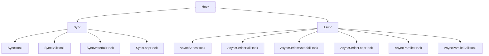
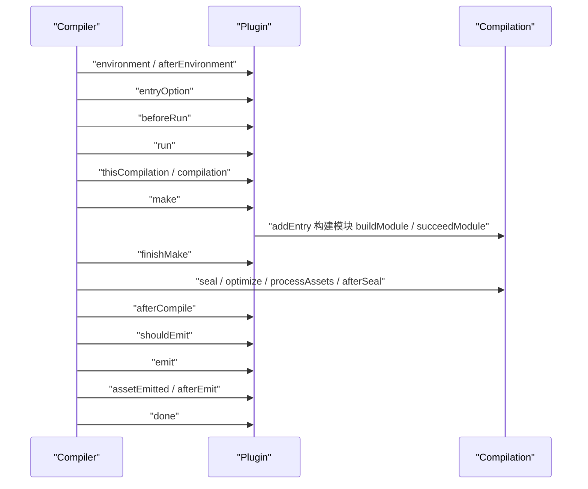

# Tapable 与 Webpack 插件体系手写

!!! abstract "核心结论"
- Tapable 是 webpack 的事件总线，但不是 EventEmitter：它需要返回值语义（Bail/Waterfall/Loop）、串并行编排、stage/before 排序与拦截器，且用 `HookCodeFactory` + `new Function` 在首次调用时生成并缓存调用体，把「遍历 taps」变成一串直呼函数。
- 十种 Hook 的差异只有三个维度：同步/异步、串行/并行、是否消费返回值（Bail/Waterfall/Loop）。同步 Hook 只能 `tap`，异步 Hook 可以 `tap/tapAsync/tapPromise`。
- webpack 生命周期分两层：`Compiler` 管一次完整编译的启动、make、emit、done；`Compilation` 管本次编译的模块图与产物（seal、optimize、processAssets）。`afterCompile` 在 seal 之后触发，因此 processAssets 里产出的 asset 在 afterCompile 已可见。
- loader 是双阶段链：pitch 从前往后（左到右），normal 从后往前（右到左）；任一 pitch 返回非 undefined 会跳过后续 loader（含自身 normal），并把返回值作为上一个 loader 的输入。
- 写 plugin 改产物必须走 `compilation.hooks.processAssets` + `compilation.emitAsset/updateAsset`，并选择正确的 `PROCESS_ASSETS_STAGE_*`，直接改 `compilation.assets` 在 webpack 5 已被废弃。

## 1. Tapable 的定位与底层原理

### 1.1 为什么不是 EventEmitter

Node 的 `EventEmitter` 只有「触发即广播」，它无法表达 webpack 真正需要的东西：

| 需求 | EventEmitter | Tapable |
|:--|:--|:--|
| 获取监听器返回值 | 不支持（忽略返回值） | Bail / Waterfall / Loop 三种返回值协议 |
| 串行异步编排 | 不支持 | AsyncSeries* |
| 并行异步编排并等待全部完成 | 手动计数 | AsyncParallel* |
| 执行顺序控制 | 只有注册顺序 | `stage`（升序）+ `before`（命名插队） |
| 拦截与改写注册信息 | 不支持 | `intercept` 的 register/call/tap 等拦截点 |
| 调用性能 | 每次遍历 listeners 数组 | 首次调用编译成展开的普通函数并缓存 |

webpack 里 `shouldEmit` 是 `SyncBailHook`（任一插件返回非 undefined 就阻止输出），`make` 是 `AsyncParallelHook`（所有 EntryPlugin 并行加模块），`renderManifest` 走瀑布流（前一个插件的结果作为后一个的输入）。这些语义 EventEmitter 一个都给不了。

### 1.2 编译期代码生成：HookCodeFactory

tapable 2.x 的做法是「延迟编译」：Hook 实例在第一次调用时，根据 `this.taps` 与 `this.args` 拼出一段源码字符串，用 `new Function(...)` 编译，缓存到 `_call` / `_callAsync` / `_promise`。之后 `hook.call(...)` 就是直接调用那个生成函数。

以一个声明了 2 个参数、注册了 3 个 tap 的 `SyncBailHook` 为例，生成代码的形态等价于：

```js
function compiledSyncBail(arg0, arg1) {
  "use strict";
  var _x = this._x;                 // taps 的函数数组
  var _fn0 = _x[0];
  var _r0 = _fn0(arg0, arg1);
  if (_r0 !== undefined) return _r0;
  var _fn1 = _x[1];
  var _r1 = _fn1(arg0, arg1);
  if (_r1 !== undefined) return _r1;
  var _fn2 = _x[2];
  var _r2 = _fn2(arg0, arg1);
  if (_r2 !== undefined) return _r2;
}
```

关键推论（这些是理解 tapable 行为的钥匙）：

1. 没有循环、没有闭包捕获、没有 `arguments` 处理，只有直线调用，所以比「每次都遍历数组」快。
2. 新增 tap 会使编译缓存失效并重新编译，因此**不要在热路径里反复 tap**。
3. 形参列表来自 `this.args`，是固定 arity。调用时多传的参数不会被转发给 tap（细节建议以 tapable 源码 `HookCodeFactory.js` 核对）。
4. 同步和异步是注册期就分开的：`Sync*` 只有 `call`；`Async*` 才有 `callAsync` / `promise`。



### 1.3 十种 Hook 的语义矩阵

| Hook | 调用方式 | 返回值语义 | 并行 | 可提前结束 |
|:--|:--|:--|:--|:--|
| SyncHook | call | 忽略返回值 | 否 | 否 |
| SyncBailHook | call | 第一个非 undefined 即为返回值 | 否 | 是 |
| SyncWaterfallHook | call | 返回值作为下一个 tap 的第一个参数，undefined 不覆盖 | 否 | 否 |
| SyncLoopHook | call | 返回值非 undefined 时从第一个 tap 重跑 | 否 | 返回 undefined |
| AsyncSeriesHook | callAsync/promise | 忽略 | 否 | 否 |
| AsyncSeriesBailHook | callAsync/promise | 第一个非 undefined | 否 | 是 |
| AsyncSeriesWaterfallHook | callAsync/promise | 瀑布传递 | 否 | 否 |
| AsyncSeriesLoopHook | callAsync/promise | 非 undefined 则重跑 | 否 | 返回 undefined |
| AsyncParallelHook | callAsync/promise | 忽略 | 是 | 否 |
| AsyncParallelBailHook | callAsync/promise | 最先到达的非 undefined 结果胜出 | 是 | 是 |

注意 `Async*` 的 `promise()` 返回值：`Waterfall` 与 `Bail` 会 resolve 出那个值，其余 resolve `undefined`。

### 1.4 tap 的排序：stage 与 before

`_insert` 的算法是从数组尾部向前扫描，把元素整体右移一格，找到第一个「stage 不大于新 tap，且不在 before 名单里」的位置插入。伪代码：

```
i = taps.length
while i > 0:
    i -= 1
    x = taps[i]; taps[i+1] = x
    if before 集合非空:
        if before 含 x.name: 从集合删除, continue     # 继续左移，保证插在它前面
        if 集合仍非空: continue
    if x.stage > 新 stage: continue                   # x 更靠后，继续左移
    i += 1; break
taps[i] = 新 tap
```

由此得到两条实用规则：`before` 的优先级高于 `stage`；同名 tap 后注册的会被插到前面（因为扫描时先遇到已存在的同名项并 continue 继续左移）。

## 2. 手写 Tapable：tapable-lite

### 2.1 tapable-lite.js

运行环境：Node.js 16+（CommonJS），零依赖。为便于阅读，用「运行时解释」代替官方的「代码生成」，两者语义一致。

```js
// tapable-lite.js
// 运行环境：Node.js 16+（CommonJS），零依赖
"use strict";

class Hook {
  constructor(args = [], name = undefined) {
    this.args = args;
    this.name = name;
    this.taps = [];
    this.interceptors = [];
  }

  tap(options, fn) { this._tap("sync", options, fn); }
  tapAsync(options, fn) { this._tap("async", options, fn); }
  tapPromise(options, fn) { this._tap("promise", options, fn); }

  _tap(type, options, fn) {
    if (typeof fn !== "function") throw new Error("tapable-lite: tap 需要函数");
    let tap = typeof options === "string" ? { name: options } : Object.assign({}, options);
    if (typeof tap.name !== "string" || tap.name.length === 0) {
      throw new Error("tapable-lite: tap 需要非空 name");
    }
    tap.type = type;
    tap.fn = fn;
    tap = this._runRegisterInterceptors(tap);
    this._insert(tap);
    return this;
  }

  // 官方 tapable 中 register 拦截器可返回新的 tapInfo；本实现只在新 tap 注册时调用
  _runRegisterInterceptors(tap) {
    for (let i = 0; i < this.interceptors.length; i++) {
      const interceptor = this.interceptors[i];
      if (interceptor.register) {
        const next = interceptor.register(tap);
        if (next !== undefined) tap = next;
      }
    }
    return tap;
  }

  _insert(item) {
    let before = undefined;
    if (typeof item.before === "string") before = new Set([item.before]);
    else if (Array.isArray(item.before)) before = new Set(item.before);
    const stage = typeof item.stage === "number" ? item.stage : 0;
    let i = this.taps.length;
    while (i > 0) {
      i--;
      const x = this.taps[i];
      this.taps[i + 1] = x;
      const xStage = typeof x.stage === "number" ? x.stage : 0;
      if (before) {
        if (before.has(x.name)) { before.delete(x.name); continue; }
        if (before.size > 0) continue;
      }
      if (xStage > stage) continue;
      i++;
      break;
    }
    this.taps[i] = item;
  }

  intercept(interceptor) {
    if (this.interceptors.includes(interceptor)) {
      throw new Error("tapable-lite: 同一个 interceptor 不能重复注册");
    }
    this.interceptors.push(interceptor);
    return this;
  }

  _callInterceptors(args) {
    for (let i = 0; i < this.interceptors.length; i++) {
      const interceptor = this.interceptors[i];
      if (interceptor.call) interceptor.call(...args);
    }
  }

  isUsed() { return this.taps.length > 0 || this.interceptors.length > 0; }
}

class SyncHook extends Hook {
  tapAsync() { throw new Error("tapable-lite: SyncHook 不支持 tapAsync"); }
  tapPromise() { throw new Error("tapable-lite: SyncHook 不支持 tapPromise"); }
  call(...args) {
    this._callInterceptors(args);
    const taps = this.taps;
    for (let i = 0; i < taps.length; i++) taps[i].fn(...args);
  }
}

class SyncBailHook extends Hook {
  tapAsync() { throw new Error("tapable-lite: SyncBailHook 不支持 tapAsync"); }
  tapPromise() { throw new Error("tapable-lite: SyncBailHook 不支持 tapPromise"); }
  call(...args) {
    this._callInterceptors(args);
    const taps = this.taps;
    for (let i = 0; i < taps.length; i++) {
      const result = taps[i].fn(...args);
      if (result !== undefined) return result;
    }
    return undefined;
  }
}

class SyncWaterfallHook extends Hook {
  constructor(args, name) {
    super(args, name);
    if (args.length < 1) throw new Error("tapable-lite: SyncWaterfallHook 至少需要 1 个参数");
  }
  tapAsync() { throw new Error("tapable-lite: SyncWaterfallHook 不支持 tapAsync"); }
  tapPromise() { throw new Error("tapable-lite: SyncWaterfallHook 不支持 tapPromise"); }
  call(...args) {
    this._callInterceptors(args);
    let value = args[0];
    const rest = args.slice(1);
    const taps = this.taps;
    for (let i = 0; i < taps.length; i++) {
      const result = taps[i].fn(value, ...rest);
      if (result !== undefined) value = result;   // undefined 不覆盖
    }
    return value;
  }
}

class SyncLoopHook extends Hook {
  tapAsync() { throw new Error("tapable-lite: SyncLoopHook 不支持 tapAsync"); }
  tapPromise() { throw new Error("tapable-lite: SyncLoopHook 不支持 tapPromise"); }
  call(...args) {
    this._callInterceptors(args);
    const taps = this.taps;
    let i = 0;
    while (i < taps.length) {
      const result = taps[i].fn(...args);
      if (result === undefined) i++;
      else i = 0;                                  // 重跑
    }
  }
}

// 统一执行一个 tap，回调签名 (err, value)
function runTap(tap, args, callback) {
  if (tap.type === "sync") {
    let result;
    try { result = tap.fn(...args); } catch (err) { return callback(err); }
    return callback(null, result);
  }
  if (tap.type === "async") {
    let called = false;
    const done = (err, value) => {
      if (called) throw new Error(`tapable-lite: ${tap.name} 的 callback 被重复调用`);
      called = true;
      callback(err, value);
    };
    let thrown = null;
    try { tap.fn(...args, done); } catch (err) { thrown = err; }
    if (thrown && !called) { called = true; callback(thrown); }
    return;
  }
  if (tap.type === "promise") {
    let promise;
    try { promise = tap.fn(...args); } catch (err) { return callback(err); }
    Promise.resolve(promise).then((value) => callback(null, value), (err) => callback(err));
    return;
  }
  throw new Error(`tapable-lite: 未知 tap 类型 ${tap.type}`);
}

class AsyncHook extends Hook {
  promise(...args) {
    return new Promise((resolve, reject) => {
      this.callAsync(...args, (err, result) => (err ? reject(err) : resolve(result)));
    });
  }
}

class AsyncSeriesHook extends AsyncHook {
  callAsync(...args) {
    const callback = args.pop();
    this._callInterceptors(args);
    const taps = this.taps;
    let index = 0;
    const next = (err) => {
      if (err) return callback(err);
      if (index >= taps.length) return callback();
      runTap(taps[index++], args, next);
    };
    next();
  }
}

class AsyncSeriesBailHook extends AsyncHook {
  callAsync(...args) {
    const callback = args.pop();
    this._callInterceptors(args);
    const taps = this.taps;
    let index = 0;
    const next = () => {
      if (index >= taps.length) return callback();
      runTap(taps[index++], args, (err, result) => {
        if (err) return callback(err);
        if (result !== undefined) return callback(null, result);
        next();
      });
    };
    next();
  }
}

class AsyncSeriesWaterfallHook extends AsyncHook {
  constructor(args, name) {
    super(args, name);
    if (args.length < 1) throw new Error("tapable-lite: AsyncSeriesWaterfallHook 至少需要 1 个参数");
  }
  callAsync(...args) {
    const callback = args.pop();
    this._callInterceptors(args);
    const taps = this.taps;
    let value = args[0];
    const rest = args.slice(1);
    let index = 0;
    const next = () => {
      if (index >= taps.length) return callback(null, value);
      runTap(taps[index++], [value, ...rest], (err, result) => {
        if (err) return callback(err);
        if (result !== undefined) value = result;
        next();
      });
    };
    next();
  }
}

class AsyncSeriesLoopHook extends AsyncHook {
  callAsync(...args) {
    const callback = args.pop();
    this._callInterceptors(args);
    const taps = this.taps;
    let index = 0;
    const next = () => {
      if (index >= taps.length) return callback();
      runTap(taps[index], args, (err, result) => {
        if (err) return callback(err);
        if (result === undefined) index++;   // 前进
        else index = 0;                      // 重跑
        next();
      });
    };
    next();
  }
}

class AsyncParallelHook extends AsyncHook {
  callAsync(...args) {
    const callback = args.pop();
    this._callInterceptors(args);
    const taps = this.taps;
    if (taps.length === 0) return callback();
    let remaining = taps.length;
    let finished = false;
    for (let i = 0; i < taps.length; i++) {
      runTap(taps[i], args, (err) => {
        if (finished) return;
        if (err) { finished = true; return callback(err); }
        remaining--;
        if (remaining === 0) { finished = true; callback(); }
      });
    }
  }
}

class AsyncParallelBailHook extends AsyncHook {
  callAsync(...args) {
    const callback = args.pop();
    this._callInterceptors(args);
    const taps = this.taps;
    if (taps.length === 0) return callback();
    let remaining = taps.length;
    let finished = false;
    for (let i = 0; i < taps.length; i++) {
      runTap(taps[i], args, (err, result) => {
        if (finished) return;
        if (err) { finished = true; return callback(err); }
        if (result !== undefined) { finished = true; return callback(null, result); }
        remaining--;
        if (remaining === 0) { finished = true; callback(); }
      });
    }
  }
}

class HookMap {
  constructor(factory, name = undefined) {
    this._factory = factory;
    this._map = new Map();
    this._interceptors = [];
    this.name = name;
  }
  get(key) { return this._map.get(key); }
  for(key) {
    const existing = this.get(key);
    if (existing !== undefined) return existing;
    const hook = this._factory(key);
    for (let i = 0; i < this._interceptors.length; i++) hook.intercept(this._interceptors[i]);
    this._map.set(key, hook);
    return hook;
  }
  tap(key, options, fn) { return this.for(key).tap(options, fn); }
  tapAsync(key, options, fn) { return this.for(key).tapAsync(options, fn); }
  tapPromise(key, options, fn) { return this.for(key).tapPromise(options, fn); }
  intercept(interceptor) { this._interceptors.push(interceptor); return this; }
  isUsed() { return this._map.size > 0 || this._interceptors.length > 0; }
}

module.exports = {
  Hook, SyncHook, SyncBailHook, SyncWaterfallHook, SyncLoopHook,
  AsyncHook, AsyncSeriesHook, AsyncSeriesBailHook, AsyncSeriesWaterfallHook,
  AsyncSeriesLoopHook, AsyncParallelHook, AsyncParallelBailHook,
  HookMap,
};
```

### 2.2 验证标准：tapable-lite.test.js

```js
// tapable-lite.test.js
// 运行环境：Node.js 16+，执行 node tapable-lite.test.js
"use strict";
const assert = require("node:assert/strict");
const {
  SyncHook, SyncBailHook, SyncWaterfallHook, SyncLoopHook,
  AsyncSeriesHook, AsyncSeriesBailHook, AsyncSeriesWaterfallHook,
  AsyncSeriesLoopHook, AsyncParallelHook, AsyncParallelBailHook, HookMap,
} = require("./tapable-lite");

(async () => {
  // 1. stage 升序
  {
    const order = [];
    const hook = new SyncHook(["arg"]);
    hook.tap({ name: "c", stage: 10 }, (a) => order.push("c:" + a));
    hook.tap({ name: "a", stage: -10 }, (a) => order.push("a:" + a));
    hook.tap({ name: "b" }, (a) => order.push("b:" + a));
    hook.call(1);
    assert.deepEqual(order, ["a:1", "b:1", "c:1"]);
  }

  // 2. before 插队
  {
    const order = [];
    const hook = new SyncHook([]);
    hook.tap("base", () => order.push("base"));
    hook.tap({ name: "pre", before: "base" }, () => order.push("pre"));
    hook.tap("after", () => order.push("after"));
    hook.call();
    assert.deepEqual(order, ["pre", "base", "after"]);
  }

  // 3. SyncBailHook：第一个非 undefined 短路
  {
    let runs = 0;
    const hook = new SyncBailHook(["x"]);
    hook.tap("first", (x) => (x > 0 ? x * 2 : undefined));
    hook.tap("second", () => { runs++; return "second"; });
    assert.equal(hook.call(0), "second");
    assert.equal(runs, 1);
    assert.equal(hook.call(3), 6);
    assert.equal(runs, 1);
  }

  // 4. SyncWaterfallHook：undefined 不覆盖
  {
    const hook = new SyncWaterfallHook(["value"]);
    hook.tap("a", (v) => v + 1);
    hook.tap("b", () => undefined);
    hook.tap("c", (v) => v * 10);
    assert.equal(hook.call(1), 20);
  }

  // 5. SyncLoopHook
  {
    let count = 0;
    const hook = new SyncLoopHook([]);
    hook.tap("loop", () => { count++; return count < 3 ? count : undefined; });
    hook.call();
    assert.equal(count, 3);
  }

  // 6. SyncHook 拒绝 tapAsync
  {
    const hook = new SyncHook([]);
    assert.throws(() => hook.tapAsync("x", (cb) => cb()), /不支持 tapAsync/);
  }

  // 7. AsyncSeriesHook：串行，异步 tap 先跑完
  {
    const order = [];
    const hook = new AsyncSeriesHook(["v"]);
    hook.tapPromise("slow", async (v) => {
      await new Promise((r) => setTimeout(r, 10));
      order.push("slow:" + v);
    });
    hook.tap("sync", (v) => { order.push("sync:" + v); });
    await hook.promise(7);
    assert.deepEqual(order, ["slow:7", "sync:7"]);
  }

  // 8. AsyncSeriesBailHook
  {
    const hook = new AsyncSeriesBailHook([]);
    hook.tapAsync("a", (cb) => cb(null, undefined));
    hook.tapAsync("b", (cb) => cb(null, "bail"));
    hook.tapPromise("c", async () => "c");
    assert.equal(await hook.promise(), "bail");
  }

  // 9. AsyncSeriesWaterfallHook：同步 tap 也参与瀑布
  {
    const hook = new AsyncSeriesWaterfallHook(["value"]);
    hook.tapPromise("a", async (v) => v + "a");
    hook.tapAsync("b", (v, cb) => cb(null, v + "b"));
    hook.tap("c", (v) => v + "c");
    assert.equal(await hook.promise(">"), ">abc");
  }

  // 10. AsyncSeriesLoopHook
  {
    let n = 0;
    const hook = new AsyncSeriesLoopHook([]);
    hook.tapPromise("loop", async () => { n++; return n < 2 ? n : undefined; });
    await hook.promise();
    assert.equal(n, 2);
  }

  // 11. AsyncParallelHook：先启动后完成，回调等全部
  {
    const finished = [];
    const hook = new AsyncParallelHook([]);
    hook.tapPromise("slow", () => new Promise((r) => setTimeout(() => { finished.push("slow"); r(); }, 20)));
    hook.tapPromise("fast", () => new Promise((r) => setTimeout(() => { finished.push("fast"); r(); }, 5)));
    await hook.promise();
    assert.deepEqual(finished, ["fast", "slow"]);
  }

  // 12. AsyncParallelBailHook：最快的非 undefined 结果胜出
  {
    const hook = new AsyncParallelBailHook([]);
    hook.tapPromise("slow", () => new Promise((r) => setTimeout(() => r("slow"), 20)));
    hook.tapPromise("fast", () => new Promise((r) => setTimeout(() => r("fast"), 5)));
    assert.equal(await hook.promise(), "fast");
  }

  // 13. HookMap：同 key 复用同一个 Hook 实例
  {
    const map = new HookMap(() => new SyncHook(["v"]));
    const a1 = map.for("a");
    const a2 = map.for("a");
    assert.equal(a1, a2);
    map.tap("b", "t", () => {});
    assert.equal(map.get("b").taps.length, 1);
  }

  // 14. 拦截器：register 在 tap 时触发，call 在每次调用前触发
  {
    const calls = [];
    const hook = new SyncHook(["v"]);
    hook.intercept({
      register(tap) { calls.push("register:" + tap.name); },
      call(v) { calls.push("call:" + v); },
    });
    hook.tap("t1", () => {});
    hook.call(9);
    assert.deepEqual(calls, ["register:t1", "call:9"]);
  }

  console.log("tapable-lite: 14 组断言全部通过");
})().catch((err) => { console.error(err); process.exit(1); });
```

预期输出（仅这一行，无其它输出）：

```
tapable-lite: 14 组断言全部通过
```

### 2.3 手写实现与官方 tapable 的差异对照

| 维度 | 官方 tapable 2.x | 本实现 tapable-lite |
|:--|:--|:--|
| 调用体生成 | `HookCodeFactory` 拼字符串 + `new Function`，缓存到 `_call/_callAsync/_promise` | 每次调用遍历 taps，运行时解释 |
| 参数 arity | 按 `this.args` 生成固定形参，多余实参不转发 | rest 参数全量转发 |
| 性能特征 | 首次调用有编译成本，之后接近直调 | 每次调用有循环与数组分配开销 |
| 拦截器 | register/tap/call/loop/context/done/result/error | 只实现 register 与 call |
| HookMap / MultiHook | 均导出 | 实现 HookMap，未实现 MultiHook |
| 语义（Bail/Waterfall/Loop/串并行） | 完整 | 完整，与官方一致 |

## 3. webpack 编译生命周期：Compiler 与 Compilation

### 3.1 职责边界

| 维度 | Compiler | Compilation |
|:--|:--|:--|
| 生命周期 | 从 `webpack(options)` 创建到进程结束，可多次 run/watch | 一次编译（每次 run 或每次文件变更重建） |
| 持有 | 配置、resolver、文件系统、插件集合 | 模块图、chunk 图、assets、errors/warnings |
| 关键钩子 | environment、entryOption、beforeRun、run、thisCompilation、compilation、make、afterCompile、emit、done | buildModule、succeedModule、finishModules、seal、optimize*、processAssets、afterSeal |
| 典型用途 | 改配置、挂生命周期、决定是否 emit | 改模块内容、改 chunk、生成/修改资源 |
| 插件应挂哪个 | 需要跨多次编译的状态挂 Compiler | 与本次产物相关的一律挂 Compilation |

`thisCompilation` 与 `compilation` 的区别：前者只在本 compiler 上触发，后者在 child compiler 上也会触发（例如 HtmlWebpackPlugin 的 child compilation）。只想处理主编译时用 `thisCompilation`。

### 3.2 钩子时序



需要记住的三点：`make` 是并行钩子；`processAssets` 属于 Compilation 且在 seal 内部；`afterCompile` 在 seal 之后、emit 之前。

### 3.3 钩子类型对照（节选）

Compiler（节选，完整清单以 webpack 源码 `lib/Compiler.js` 为准）：

| 钩子 | 类型 | 参数 |
|:--|:--|:--|
| environment / afterEnvironment | SyncHook | 无 |
| entryOption | SyncBailHook | context, entry |
| afterPlugins / afterResolvers | SyncHook | compiler |
| beforeRun / run / watchRun | AsyncSeriesHook | compiler |
| thisCompilation / compilation | SyncHook | compilation, params |
| make | AsyncParallelHook | compilation |
| finishMake | AsyncSeriesHook | compilation |
| afterCompile | AsyncSeriesHook | compilation |
| shouldEmit | SyncBailHook | compilation |
| emit / afterEmit | AsyncSeriesHook | compilation |
| assetEmitted | AsyncSeriesHook | file, info |
| done | AsyncSeriesHook | stats |
| failed | SyncHook | error |

Compilation（节选）：

| 钩子 | 类型 | 参数 |
|:--|:--|:--|
| buildModule / succeedModule | SyncHook | module |
| finishModules | AsyncSeriesHook | modules |
| seal / unseal | SyncHook | 无 |
| optimizeDependencies | SyncBailHook | modules |
| optimizeChunkModules | AsyncSeriesBailHook | chunks, modules |
| processAssets | AsyncSeriesHook | assets |
| afterProcessAssets | SyncHook | assets |
| afterSeal | AsyncSeriesHook | 无 |

`processAssets` 的阶段常量（数值以 webpack 源码 `lib/Compilation.js` 为准）：

| 常量 | 值 | 用途 |
|:--|:--|:--|
| PROCESS_ASSETS_STAGE_ADDITIONAL | -2000 | 追加额外资源 |
| PROCESS_ASSETS_STAGE_ADDITIONS | -100 | 增加资源 |
| PROCESS_ASSETS_STAGE_OPTIMIZE | 100 | 通用优化 |
| PROCESS_ASSETS_STAGE_OPTIMIZE_SIZE | 400 | 体积优化（压缩） |
| PROCESS_ASSETS_STAGE_SUMMARIZE | 1000 | 汇总类产物（manifest 常用） |
| PROCESS_ASSETS_STAGE_REPORT | 5000 | 报告类产物 |

### 3.4 手写最小 Compiler

```js
// mini-compiler.js
// 运行环境：Node.js 16+（CommonJS），依赖 ./tapable-lite
"use strict";
const { SyncHook, SyncBailHook, AsyncSeriesHook, AsyncParallelHook } = require("./tapable-lite");

class RawSource {
  constructor(value) { this._value = value; }
  source() { return this._value; }
  size() { return Buffer.byteLength(this._value); }
}

class Compilation {
  constructor(compiler) {
    this.compiler = compiler;
    this.assets = Object.create(null);
    this.errors = [];
    this.warnings = [];
    this.hooks = {
      buildModule: new SyncHook(["module"]),
      succeedModule: new SyncHook(["module"]),
      finishModules: new AsyncSeriesHook(["modules"]),
      seal: new SyncHook([]),
      optimizeAssets: new SyncHook(["assets"]),
      processAssets: new AsyncSeriesHook(["assets"]),
      afterProcessAssets: new SyncHook(["assets"]),
      afterSeal: new AsyncSeriesHook([]),
    };
  }
  emitAsset(name, source) {
    if (this.assets[name]) throw new Error("mini-compiler: asset 已存在 " + name);
    this.assets[name] = source;
  }
  updateAsset(name, source) { this.assets[name] = source; }
  getAsset(name) { return this.assets[name] ? { name, source: this.assets[name] } : undefined; }
  getAssets() { return Object.keys(this.assets).map((name) => ({ name, source: this.assets[name] })); }
  deleteAsset(name) { delete this.assets[name]; }
  async seal() {
    this.hooks.seal.call();
    this.hooks.optimizeAssets.call(this.assets);
    await this.hooks.processAssets.promise(this.assets);   // 与 webpack 5 同名
    this.hooks.afterProcessAssets.call(this.assets);
    await this.hooks.afterSeal.promise();
  }
}
Compilation.PROCESS_ASSETS_STAGE_ADDITIONAL = -2000;
Compilation.PROCESS_ASSETS_STAGE_ADDITIONS = -100;
Compilation.PROCESS_ASSETS_STAGE_OPTIMIZE = 100;
Compilation.PROCESS_ASSETS_STAGE_SUMMARIZE = 1000;
Compilation.PROCESS_ASSETS_STAGE_REPORT = 5000;

class Compiler {
  constructor(options = {}) {
    this.options = options;
    this.hooks = {
      environment: new SyncHook([]),
      afterEnvironment: new SyncHook([]),
      entryOption: new SyncBailHook(["context", "entry"]),
      beforeRun: new AsyncSeriesHook(["compiler"]),
      run: new AsyncSeriesHook(["compiler"]),
      thisCompilation: new SyncHook(["compilation", "params"]),
      compilation: new SyncHook(["compilation", "params"]),
      make: new AsyncParallelHook(["compilation"]),
      afterCompile: new AsyncSeriesHook(["compilation"]),
      emit: new AsyncSeriesHook(["compilation"]),
      afterEmit: new AsyncSeriesHook(["compilation"]),
      done: new AsyncSeriesHook(["stats"]),
      failed: new SyncHook(["error"]),
    };
    // webpack 5 的 compiler.webpack 提供 Compilation / sources 等，插件靠它拿到 RawSource
    this.webpack = { Compilation, sources: { RawSource } };
  }

  async run() {
    try {
      await this.hooks.beforeRun.promise(this);
      await this.hooks.run.promise(this);
      const compilation = new Compilation(this);
      this.hooks.thisCompilation.call(compilation, {});
      this.hooks.compilation.call(compilation, {});
      await this.hooks.make.promise(compilation);
      await compilation.seal();                              // seal 内部触发 processAssets
      await this.hooks.afterCompile.promise(compilation);    // 在 seal 之后
      await this.hooks.emit.promise(compilation);
      await this.hooks.afterEmit.promise(compilation);
      const stats = { compilation, assets: Object.keys(compilation.assets).sort() };
      await this.hooks.done.promise(stats);
      return stats;
    } catch (err) {
      this.hooks.failed.call(err);
      throw err;
    }
  }
}

// 对应 webpack() 创建 compiler 的流程：应用插件 -> environment -> afterEnvironment -> entryOption
function createCompiler(options = {}) {
  const compiler = new Compiler(options);
  const plugins = options.plugins || [];
  for (const plugin of plugins) {
    if (typeof plugin === "function") plugin.call(compiler, compiler);
    else plugin.apply(compiler);
  }
  compiler.hooks.environment.call();
  compiler.hooks.afterEnvironment.call();
  compiler.hooks.entryOption.call(options.context || process.cwd(), options.entry);
  return compiler;
}

module.exports = { createCompiler, Compiler, Compilation, RawSource };
```

验证标准：

```js
// mini-compiler.test.js
"use strict";
const assert = require("node:assert/strict");
const { createCompiler } = require("./mini-compiler");

(async () => {
  const order = [];
  const compiler = createCompiler({
    entry: "./src/index.js",
    plugins: [
      {
        apply(c) {
          c.hooks.environment.tap("p", () => order.push("environment"));
          c.hooks.afterEnvironment.tap("p", () => order.push("afterEnvironment"));
          c.hooks.entryOption.tap("p", () => order.push("entryOption"));
          c.hooks.beforeRun.tapPromise("p", async () => { order.push("beforeRun"); });
          c.hooks.run.tapPromise("p", async () => { order.push("run"); });
          c.hooks.thisCompilation.tap("p", () => order.push("thisCompilation"));
          c.hooks.compilation.tap("p", () => order.push("compilation"));
          c.hooks.make.tapPromise("p", async () => { order.push("make"); });
          c.hooks.afterCompile.tapPromise("p", async () => { order.push("afterCompile"); });
          c.hooks.emit.tapPromise("p", async () => { order.push("emit"); });
          c.hooks.done.tapPromise("p", async () => { order.push("done"); });
        },
      },
    ],
  });

  await compiler.run();

  assert.deepEqual(order, [
    "environment", "afterEnvironment", "entryOption",
    "beforeRun", "run", "thisCompilation", "compilation",
    "make", "afterCompile", "emit", "done",
  ]);
  console.log("mini-compiler: 生命周期顺序断言通过");
})().catch((err) => { console.error(err); process.exit(1); });
```

预期输出：

```
mini-compiler: 生命周期顺序断言通过
```

## 4. loader 链：pitch 与 normal 双阶段

### 4.1 执行算法

loader 链的执行可以精确拆成四步（loader-runner 的核心逻辑）：

1. `loaderIndex = 0`，进入 **pitch 阶段**：从左到右依次调用 `loader.pitch(remainingRequest, previousRequest, data)`。`data` 是该 loader 私有的，normal 阶段可通过 `this.data` 拿到。
2. 若某个 pitch 返回了非 undefined 值（多返回值时任一非 undefined 即视为短路），则 `loaderIndex -= 1` 并转入 **normal 阶段**。这等价于「该 loader 及其之后的所有 loader（含其自身 normal）全部跳过」。
3. 若所有 pitch 都没返回值，则 `loaderIndex = loaders.length - 1`，读取资源文件，进入 **normal 阶段**：从右到左调用 `loader.normal(source, map, meta)`，前一个 loader 的输出是后一个 loader 的输入。
4. `loaderIndex < 0` 时结束，返回最终 `[source, map, meta]`。

`convertArgs` 决定了字符串/Buffer 的边界：非 `raw` 的 loader 拿到字符串，`raw` 的 loader 拿到 Buffer；转换在调用前与调用后各做一次，所以返回值也会被转换。

| 阶段 | 方向 | 签名 | 返回值作用 |
|:--|:--|:--|:--|
| pitch | 左到右 | `(remainingRequest, previousRequest, data)` | 非 undefined 则短路，成为上游 normal 的输入 |
| normal | 右到左 | `(source, map, meta)` | 传给下一个（左侧）loader |

### 4.2 手写 loader-runner-lite

```js
// loader-runner-lite.js
// 运行环境：Node.js 16+（CommonJS），零依赖
"use strict";

function convertArgs(args, raw) {
  if (!raw && Buffer.isBuffer(args[0])) args[0] = args[0].toString("utf8");
  else if (raw && typeof args[0] === "string") args[0] = Buffer.from(args[0], "utf8");
}

// 兼容同步返回、this.callback、this.async() 三种写法
function runSyncOrAsync(fn, context, args, callback) {
  let isSync = true;
  let isDone = false;
  let reportedError = false;

  const innerCallback = (context.callback = function () {
    if (isDone) throw new Error("loader-runner-lite: callback() 被重复调用");
    isDone = true;
    isSync = false;
    const values = Array.prototype.slice.call(arguments);
    const err = values.shift();
    if (err) { reportedError = true; return callback(err); }
    return callback(null, values);
  });

  context.async = function () {
    if (isDone) throw new Error("loader-runner-lite: async() 被重复调用");
    if (reportedError) return innerCallback;
    isSync = false;
    return innerCallback;
  };

  let result;
  try {
    result = fn.apply(context, args);
  } catch (err) {
    reportedError = true;
    return callback(err);
  }

  if (isSync) {
    isDone = true;
    if (result === undefined) return callback(null, []);
    if (result && typeof result.then === "function") {
      return result.then(
        (value) => callback(null, [value]),
        (err) => { reportedError = true; callback(err); }
      );
    }
    return callback(null, [result]);
  }
  return undefined;
}

function createContext(options) {
  const loaders = options.loaders.map((loader, index) => ({
    request: loader.request || "loader-" + index,
    normal: loader.normal,
    pitch: loader.pitch,
    raw: Boolean(loader.raw),
    data: undefined,
    pitchExecuted: false,
    normalExecuted: false,
    index,
  }));
  const context = {
    version: 2,
    loaders,
    loaderIndex: 0,
    resourcePath: options.resourcePath,
    resource: options.resourcePath,
    data: undefined,
    async: null,
    callback: null,
    _dependencies: [],
    addDependency(file) { this._dependencies.push(file); },
  };
  Object.defineProperty(context, "remainingRequest", {
    get() {
      return this.loaders.slice(this.loaderIndex + 1)
        .map((l) => l.request).concat([this.resourcePath]).join("!");
    },
  });
  Object.defineProperty(context, "previousRequest", {
    get() {
      return this.loaders.slice(0, this.loaderIndex).map((l) => l.request).join("!");
    },
  });
  return context;
}

function iteratePitchingLoaders(context, readResource, callback) {
  if (context.loaderIndex >= context.loaders.length) {
    return processResource(context, readResource, callback);
  }
  const current = context.loaders[context.loaderIndex];
  if (current.pitchExecuted) {
    context.loaderIndex += 1;
    return iteratePitchingLoaders(context, readResource, callback);
  }
  current.pitchExecuted = true;
  if (typeof current.pitch !== "function") {
    return iteratePitchingLoaders(context, readResource, callback);
  }
  current.data = {};
  runSyncOrAsync(
    current.pitch,
    context,
    [context.remainingRequest, context.previousRequest, current.data],
    (err, values) => {
      if (err) return callback(err);
      const hasValue = values.some((value) => value !== undefined);
      if (hasValue) {
        context.loaderIndex -= 1;      // 跳过当前 loader 及其之后的 normal
        return iterateNormalLoaders(context, values, callback);
      }
      return iteratePitchingLoaders(context, readResource, callback);
    }
  );
}

function processResource(context, readResource, callback) {
  context.loaderIndex = context.loaders.length - 1;
  context.addDependency(context.resourcePath);
  readResource(context.resourcePath, (err, buffer) => {
    if (err) return callback(err);
    if (buffer === undefined || buffer === null) {
      return iterateNormalLoaders(context, [null], callback);
    }
    return iterateNormalLoaders(context, [buffer], callback);
  });
}

function iterateNormalLoaders(context, args, callback) {
  if (context.loaderIndex < 0) return callback(null, args);
  const current = context.loaders[context.loaderIndex];
  if (current.normalExecuted) {
    context.loaderIndex -= 1;
    return iterateNormalLoaders(context, args, callback);
  }
  current.normalExecuted = true;
  context.data = current.data;                 // pitch 里写的数据在这里读
  if (typeof current.normal !== "function") {
    context.loaderIndex -= 1;
    return iterateNormalLoaders(context, args, callback);
  }
  convertArgs(args, current.raw);
  runSyncOrAsync(current.normal, context, args, (err, values) => {
    if (err) return callback(err);
    convertArgs(values, current.raw);
    context.loaderIndex -= 1;
    return iterateNormalLoaders(context, values, callback);
  });
}

function runLoaders(options, callback) {
  const context = createContext(options);
  iteratePitchingLoaders(context, options.readResource, (err, result) => {
    if (err) return callback(err);
    return callback(null, {
      result,
      cacheable: true,
      fileDependencies: context._dependencies,
    });
  });
}

module.exports = { runLoaders, runSyncOrAsync, convertArgs };
```

### 4.3 验证标准：loader-runner-lite.test.js

```js
// loader-runner-lite.test.js
// 运行环境：Node.js 16+，执行 node loader-runner-lite.test.js
"use strict";
const assert = require("node:assert/strict");
const { runLoaders } = require("./loader-runner-lite");

const readResource = (file, cb) => cb(null, Buffer.from("body", "utf8"));

const run = (loaders) => new Promise((resolve, reject) => {
  runLoaders({ resourcePath: "/virtual/app.txt", loaders, readResource }, (err, result) => {
    if (err) reject(err);
    else resolve(result);
  });
});

(async () => {
  // 1. 无 pitch 短路：pitch 正序，normal 逆序
  {
    const trace = [];
    const loaders = ["a", "b", "c"].map((name) => ({
      request: "loader-" + name,
      pitch() { trace.push(name + ".pitch"); },
      normal(source) { trace.push(name + ".normal"); return source + "|" + name; },
    }));
    const out = await run(loaders);
    assert.deepEqual(trace, ["a.pitch", "b.pitch", "c.pitch", "c.normal", "b.normal", "a.normal"]);
    assert.equal(out.result[0], "body|c|b|a");
  }

  // 2. b.pitch 返回非 undefined：跳过 b.normal 与 c，返回值给 a.normal
  {
    const trace = [];
    const loaders = [
      {
        request: "loader-a",
        pitch() { trace.push("a.pitch"); },
        normal(source) { trace.push("a.normal"); return source + "|a"; },
      },
      {
        request: "loader-b",
        pitch() { trace.push("b.pitch"); return "from-b-pitch"; },
        normal(source) { trace.push("b.normal"); return source + "|b"; },
      },
      {
        request: "loader-c",
        pitch() { trace.push("c.pitch"); },
        normal(source) { trace.push("c.normal"); return source + "|c"; },
      },
    ];
    const out = await run(loaders);
    assert.deepEqual(trace, ["a.pitch", "b.pitch", "a.normal"]);
    assert.equal(out.result[0], "from-b-pitch|a");
  }

  // 3. this.async() 异步 loader
  {
    const trace = [];
    const loaders = [
      {
        request: "async-a",
        normal(source) {
          const done = this.async();
          setTimeout(() => { trace.push("async-a"); done(null, source.toUpperCase()); }, 5);
        },
      },
      {
        request: "async-b",
        normal(source) { trace.push("async-b"); return source + "!"; },
      },
    ];
    const out = await run(loaders);
    assert.deepEqual(trace, ["async-b", "async-a"]);
    assert.equal(out.result[0], "BODY!");
  }

  // 4. raw loader 收到 Buffer，返回 Buffer 不会被转字符串
  {
    const loaders = [{
      request: "raw",
      raw: true,
      normal(source) {
        assert.ok(Buffer.isBuffer(source));
        return Buffer.from(source.toString("utf8").toUpperCase(), "utf8");
      },
    }];
    const out = await run(loaders);
    assert.ok(Buffer.isBuffer(out.result[0]));
    assert.equal(out.result[0].toString("utf8"), "BODY");
  }

  // 5. pitch 写入的 data 在同一个 loader 的 normal 里可读
  {
    const loaders = [{
      request: "data-loader",
      pitch(remainingRequest, previousRequest, data) { data.fromPitch = "hello"; },
      normal(source) { return source + "|" + this.data.fromPitch; },
    }];
    const out = await run(loaders);
    assert.equal(out.result[0], "body|hello");
  }

  console.log("loader-runner-lite: 5 组断言全部通过");
})().catch((err) => { console.error(err); process.exit(1); });
```

预期输出：

```
loader-runner-lite: 5 组断言全部通过
```

### 4.4 pitch 的实战意义

`style-loader` 是 pitch 最经典的用法：它在 pitch 阶段返回一段 JS 代码，代码里 `require` 了 `remainingRequest`（也就是 css-loader 与文件本身）。这样就把「CSS 变成 JS 模块」这件事从 loader 链的返回值变成了「重新发起一次模块请求」，`css-loader` 的 normal 阶段由那次新请求负责执行。

```js
// 简化后的 style-loader pitch 思路
module.exports = function () {};       // normal 阶段不会被调用
module.exports.pitch = function (remainingRequest) {
  // remainingRequest 形如 "/abs/css-loader/index.js!/abs/app.css"
  return [
    'var content = require("!!' + remainingRequest + '");',
    'var style = document.createElement("style");',
    'style.innerHTML = content.toString();',
    'document.head.appendChild(style);',
  ].join("\n");
};
```

这段代码在真实 webpack 中依赖 `style-loader` 的 `esModule` 等选项，此处只展示 pitch 的短路机制，具体产物格式需核对官方文档。

另外，request 前缀会改变 loader 链的解析方式：`!` 跳过 `normal` 配置里的 loaders，`!!` 跳过全部配置 loader（只剩 inline），`-!` 跳过 `pre` 与 `normal`（只剩 `post` 与 inline）。这部分属于 webpack 的 `RuleSet` 语义，规则细节建议核对官方文档。

## 5. 自定义 plugin：生成资源清单

### 5.1 原理

一个 plugin 就是一个带 `apply(compiler)` 的对象。生成清单需要三件事：

1. 挂 `compiler.hooks.thisCompilation`（不要用 `compilation`，避免 child compiler 干扰）。
2. 在 `compilation.hooks.processAssets` 上以合适的 `stage` 注册（清单属于汇总类，用 `PROCESS_ASSETS_STAGE_SUMMARIZE`）。此时 `assets` 已包含所有前置阶段产出的资源。
3. 用 `compilation.emitAsset(name, new sources.RawSource(json))` 写入，而不是直接给 `compilation.assets[name]` 赋值（webpack 5 中后者已废弃）。

`compiler.webpack` 是 webpack 5 提供的入口，可以拿到 `Compilation` 常量与 `sources`（`RawSource` / `ConcatSource` / `ReplaceSource` 等）。

### 5.2 ManifestPlugin.js

```js
// ManifestPlugin.js
// 运行环境：Node.js 16+，可同时用于真实 webpack 5 与本页 mini-compiler
"use strict";

const PLUGIN_NAME = "ManifestPlugin";

class ManifestPlugin {
  constructor(options = {}) {
    this.filename = options.filename || "manifest.json";
  }

  apply(compiler) {
    const { Compilation, sources } = compiler.webpack;

    compiler.hooks.thisCompilation.tap(PLUGIN_NAME, (compilation) => {
      compilation.hooks.processAssets.tap(
        {
          name: PLUGIN_NAME,
          stage: Compilation.PROCESS_ASSETS_STAGE_SUMMARIZE,
        },
        (assets) => {
          const manifest = {};
          for (const name of Object.keys(assets).sort()) {
            const item = compilation.getAsset(name);
            manifest[name] = { size: item.source.size() };
          }
          const json = JSON.stringify(manifest, null, 2);
          compilation.emitAsset(this.filename, new sources.RawSource(json));
        }
      );
    });
  }
}

module.exports = ManifestPlugin;
module.exports.PLUGIN_NAME = PLUGIN_NAME;
```

### 5.3 mini-webpack 与验证标准

```js
// mini-webpack.demo.js
// 运行环境：Node.js 16+，依赖 ./tapable-lite ./mini-compiler ./ManifestPlugin
"use strict";
const assert = require("node:assert/strict");
const { createCompiler, RawSource } = require("./mini-compiler");
const ManifestPlugin = require("./ManifestPlugin");

class BannerPlugin {
  constructor(banner) { this.banner = banner; }
  apply(compiler) {
    const { Compilation, sources } = compiler.webpack;
    compiler.hooks.thisCompilation.tap("BannerPlugin", (compilation) => {
      compilation.hooks.processAssets.tap(
        { name: "BannerPlugin", stage: Compilation.PROCESS_ASSETS_STAGE_OPTIMIZE },
        () => {
          const item = compilation.getAsset("main.js");
          compilation.updateAsset("main.js", new sources.RawSource(this.banner + item.source.source()));
        }
      );
    });
  }
}

(async () => {
  const compiler = createCompiler({
    context: process.cwd(),
    entry: "./src/index.js",
    plugins: [new BannerPlugin("/*banner*/\n"), new ManifestPlugin()],
  });

  // 模拟 EntryPlugin：make 阶段产出资源
  compiler.hooks.make.tapPromise("EntryPlugin", async (compilation) => {
    compilation.emitAsset("main.js", new RawSource("console.log(1);\n"));
    compilation.emitAsset("main.css", new RawSource("body{}\n"));
    await compilation.hooks.finishModules.promise([]);
  });

  let captured = null;
  compiler.hooks.emit.tapPromise("CaptureEmit", async (compilation) => { captured = compilation; });

  const stats = await compiler.run();

  const manifest = JSON.parse(captured.assets["manifest.json"].source());
  assert.deepEqual(manifest, { "main.css": { size: 7 }, "main.js": { size: 27 } });
  assert.equal(captured.assets["main.js"].source(), "/*banner*/\nconsole.log(1);\n");
  assert.deepEqual(stats.assets, ["main.css", "main.js", "manifest.json"]);

  console.log("assets:", stats.assets.join(" "));
  console.log("manifest.json:");
  console.log(captured.assets["manifest.json"].source());
})().catch((err) => { console.error(err); process.exit(1); });
```

预期输出（字节数说明：`console.log(1);\n` 为 16 字节，`/*banner*/\n` 为 11 字节，合计 27；`body{}\n` 为 7 字节）：

```
assets: main.css main.js manifest.json
manifest.json:
{
  "main.css": {
    "size": 7
  },
  "main.js": {
    "size": 27
  }
}
```

真实 webpack 5 中只需把 `ManifestPlugin` 放进配置即可，代码无需改动：

```js
// webpack.config.js
const ManifestPlugin = require("./ManifestPlugin");
module.exports = {
  mode: "production",
  plugins: [new ManifestPlugin({ filename: "manifest.json" })],
};
```

## 6. 与 Rollup / Vite 插件钩子对比

| 维度 | webpack 5 | Rollup | Vite |
|:--|:--|:--|:--|
| 插件形态 | 对象 + `apply(compiler)` | 对象或返回对象的函数，必须有 `name` | Rollup 兼容插件 + Vite 专有钩子 |
| 钩子基座 | Tapable（Hook + 拦截器 + stage） | 自研插件容器，按数组顺序逐个 await | 同 Rollup，另加 Vite 插件容器与专有钩子 |
| 配置阶段 | `entryOption`、插件改 `compiler.options` | `options` | `config`、`configResolved` |
| 构建开始 | `beforeRun` / `run` / `make` | `buildStart` | `buildStart` |
| 模块定位 | resolver + `normalModuleFactory` | `resolveId` | `resolveId` |
| 模块加载 | `NormalModuleFactory` + loader 链 | `load` | `load` |
| 内容转换 | loader 的 pitch/normal | `transform` | `transform` |
| 产物生成 | `compilation.hooks.processAssets` | `generateBundle` | `generateBundle`（SSR 场景另有差异） |
| 写盘后 | `afterEmit` | `writeBundle`、`closeBundle` | `writeBundle`、`closeBundle` |
| 顺序控制 | `stage` + `before` | 插件数组顺序 | 数组顺序 + `enforce: "pre" \| "post"` + `apply: "build" \| "serve"` |
| 异步 | `tapAsync` / `tapPromise` / `promise()` | 钩子返回 Promise | 同 Rollup |

差异的根源：webpack 的钩子是「有类型、有返回值语义的事件」，Rollup 的钩子是「有明确返回协议的 async 函数」，所以 Rollup 不需要 Bail/Waterfall 这类机制，它直接用返回值表达（例如 `resolveId` 返回 string 表示解析结果）。Vite 的钩子集合与语义随版本演进较快，具体清单与参数请以官方文档为准。

loader 与 plugin 的分工对比：

| 维度 | loader | plugin |
|:--|:--|:--|
| 关注点 | 单个模块内容的转换 | 整个编译流程与产物 |
| 注册 | `module.rules` | `plugins` 数组 |
| 触发时机 | 模块被构建时，逐个文件 | 生命周期各阶段 |
| 数据形态 | 字符串或 Buffer + sourcemap | Hook 参数上的任意对象 |
| 能力边界 | 只能改内容与 sourcemap | 可改配置、加资源、改 chunk、干预 emit |
| 执行顺序 | pitch 正序 + normal 逆序 | tap 的 stage 与 before |

## 7. 常见陷阱

1. 同步 Hook 上调用 `tapAsync` / `tapPromise` 会直接抛错。反过来，异步 Hook 上 `tap` 同步函数是允许的，其返回值仍参与 Bail / Waterfall 判定。
2. `SyncBailHook` 的判定是「返回值 !== undefined」，返回 `null`、`false`、`0` 都会短路；只想放行就必须返回 `undefined`。
3. `Waterfall` 系钩子里返回 `undefined` 不会覆盖当前值。若你的 tap 本意是「清空上游结果」，需要显式返回 `null` 之类的值。
4. `AsyncParallelBailHook` 的语义是「最先到达的非 undefined 结果胜出」，不是「最后一个」。因为并行，结果顺序与注册顺序无关。
5. `stage` 是升序执行，默认 0。`before` 的优先级高于 `stage`，混用时容易得到反直觉顺序（例如 `stage: -100` 的 tap 仍可能被 `before` 插到前面）。
6. 插件里应挂 `thisCompilation` 而不是 `compilation`，否则 child compiler 也会触发你的逻辑，产生重复资源或重复报错。
7. 在 `processAssets` 里直接写 `compilation.assets[name] = source` 是 webpack 5 的废弃用法，应使用 `emitAsset` / `updateAsset`，并用 `getAsset` 读取旧值。
8. `processAssets` 的 stage 选错会读到不完整或已被压缩的产物。生成清单建议 `SUMMARIZE`，压缩之后才需要读产物的逻辑要用更大的 stage。
9. `afterCompile` 在 `seal` 之后触发，所以 processAssets 里新增的 asset 在 afterCompile 中已经能看到；反过来，在 `afterCompile` 里改 asset 已经太晚（emit 之后才生效的钩子只有 `assetEmitted`）。
10. loader 中 `return` 与 `this.callback(...)` 混用会导致 callback 被重复调用（loader-runner 会抛错）；`this.async()` 与 `this.callback` 也只能选一条路径。
11. pitch 返回非 undefined 会跳过「当前 loader 的 normal」及之后所有 loader。很多人误以为当前 loader 的 normal 还会执行。
12. `this.data` 只在自己这个 loader 的 pitch 与 normal 之间共享，其它 loader 看不到；跨 loader 传值要靠 pitch 返回值或最终 source。
13. loader 里读文件必须 `this.addDependency(file)`，否则该文件变更不会触发重新编译。
14. tapable 2.x 的调用体按 `this.args` 生成固定形参，调用时多传的参数不会传给 tap。声明钩子时参数列表要与实际调用一致（细节建议核对 tapable 源码 `HookCodeFactory.js`）。
15. `compiler.webpack` 是 webpack 5 的能力，webpack 4 没有；跨版本插件需要做能力检测或声明 peerDependencies。

## 8. 面试题与答题要点

**1. Tapable 的 Hook 为什么比 EventEmitter 快？**
要点：不是「数据结构更好」，而是把解释执行换成了编译执行。首次调用时 HookCodeFactory 依据 `taps` 和 `args` 生成一段直线代码，`new Function` 编译后缓存；后续调用没有数组遍历、没有 `arguments` 处理、没有闭包分配，等价于手写的连续函数调用。同时它把同步/异步、串并行、返回值语义在注册期就确定下来，避免了运行期分支。代价是每次新增 tap 都要重新编译，所以不要在热路径频繁 tap。

**2. `SyncBailHook` 与 `SyncWaterfallHook` 的返回值语义差在哪？webpack 里各自用在哪？**
要点：Bail 是「短路」——第一个非 undefined 的返回值直接成为 hook 的返回值并终止后续 tap（`shouldEmit` 用它来决定是否输出）。Waterfall 是「传递」——每个 tap 的返回值作为下一个 tap 的第一个参数，返回 undefined 表示不修改（`renderManifest` 这类需要渐进式加工结果的场景用它）。两者都不允许 `tapAsync`。

**3. `AsyncParallelHook` 与 `AsyncSeriesHook` 的实现差异是什么？**
要点：Series 用递归的 `next` 推进，前一个 tap 的 callback 触发才启动下一个，任一错误立即中断；Parallel 一次性启动所有 tap，用计数器统计完成数，全部完成才调用最终 callback，错误也是「第一个到达的 error 生效」。webpack 的 `make` 用 Parallel（多个 EntryPlugin 互不依赖），`emit`/`done` 用 Series（有顺序依赖）。

**4. `Compiler` 与 `Compilation` 的区别？插件该挂哪个？**
要点：Compiler 是全局单例、生命周期跨多次编译，持有配置与 resolver；Compilation 是一次编译的产物与模块图的容器，每次 run / 每次 watch 重建都会新建。只关心「本次产物」的逻辑挂 Compilation（`thisCompilation` 里注册），关心「跨编译状态、改配置、控制是否编译」的逻辑挂 Compiler。还要答出 `thisCompilation` 与 `compilation` 的区别（child compiler 会不会触发）。

**5. `processAssets` 与 `emit` 有什么区别？为什么不能直接改 `compilation.assets`？**
要点：`processAssets` 在 seal 内部、产物已经被优化（含压缩），是修改/新增资源的推荐入口，靠 stage 决定执行点；`emit` 在 seal 之后、写盘之前，适合做与文件系统相关的准备。webpack 5 把 assets 的写入收敛到 `emitAsset`/`updateAsset`/`deleteAsset`，直接赋值会绕过 conflict 校验与后续钩子的追踪，官方已标记为废弃。

**6. loader 的 pitch 有什么用？举一个真实场景。**
要点：pitch 让 loader 有机会在「读取资源之前」介入，返回非 undefined 就短路整条链。style-loader 用它把 `remainingRequest` 包成 `require("!!...")`，把 CSS 流转换为一次新的模块请求；另一类用法是 pitch 阶段做纯文本预处理、提前读取配置、注入依赖（`this.addDependency`）。

**7. loader 链为什么 normal 是逆序执行？**
要点：normal 阶段是「函数复合」，`a(b(c(source)))` 的求值顺序必然是 c→b→a，所以数组里靠右的 loader 先执行。pitch 阶段是「准备阶段」，按声明顺序从前往后走，符合「先声明者先有机会拦截」的直觉。二者合起来就是「pitch 正序 + normal 逆序」的洋葱模型。

**8. 写一个在 `processAssets` 生成 manifest.json 的插件，需要把哪些点说清楚？**
要点：用 `compiler.hooks.thisCompilation` 而不是 `compilation`；在 `processAssets` 上声明 `name` 与 `stage`（汇总类用 `PROCESS_ASSETS_STAGE_SUMMARIZE`）；用 `compilation.getAsset(name).source.size()` 读取已有资源；用 `compilation.emitAsset(name, new compiler.webpack.sources.RawSource(json))` 写入；注意重名资源会抛错；注意清单里是否要包含自己；避免在 stage 太早的位置读取尚未生成的产物。

**9. webpack 的 plugin 和 Rollup / Vite 的 plugin 思路差在哪？**
要点：webpack 是「事件 + 返回值协议」，钩子有类型（Bail/Waterfall/Parallel），顺序靠 stage/before；Rollup 是「async 钩子链 + 返回值表达语义」，顺序只有数组顺序，`resolveId`/`load`/`transform` 用返回值决定是否接管；Vite 复用 Rollup 插件接口并加了 `config`/`configResolved`/`transformIndexHtml`/`handleHotUpdate` 等专有钩子，以及 `enforce`、`apply` 两个排序/生效开关。回答时要说明「为什么 webpack 需要 Bail/Waterfall 而 Rollup 不需要」。

## 深入阅读与参考

!!! tip "怎么用这些资料"
    先读「官方文档与规范」建立准确的概念，再读「源码与示例」核对细节，最后用「教程、书籍与视频」换一种讲法加深理解。每条都写明了读哪一节、带着什么问题读。

### 官方文档与规范

| 资源 | 为什么读 | 怎么读 |
|---|---|---|
| [webpack 文档](https://webpack.js.org/concepts/) | webpack 官方对 Compiler/Compilation 与 loader/plugin 钩子的权威定义，面试高 | 读 plugin 与 loader 两章，画出 Compiler 钩子触发顺序表，再去源码里找对应 tap 调用。 |
| [Vite：插件 API（中文）](https://cn.vitejs.dev/guide/api-plugin.html) | Vite 官方中文插件 API，给出 transform 等 Rollup 兼容钩子的写法。 | 写一个 transform 钩子插件打印执行顺序，与 webpack 的 tap 写法逐条对照。 |
| [Rspack 文档](https://rspack.rs/) | Rspack 兼容 webpack 插件 API，可对比同一插件在不同实现下的钩子行为。 | 迁移一个小 webpack 项目，记录哪些 Tapable 钩子不可用及兼容处理方式。 |
| [Plugin API](https://vite.dev/guide/api-plugin) | Vite/Rollup 插件接口指南，解释钩子约定与插件间协作顺序。 | 读钩子顺序与 enforce 一节，问：与 Tapable 的 tap/before/after 有何异同。 |
| [Plugin API](https://rolldown.rs/apis/plugin-api) | 完整钩子参考表，含各阶段签名与调用时机，便于与 webpack 逐项对照。 | 当手册查，重点看钩子顺序与 emitFile，对照 webpack 的 emit 类钩子。 |
| [Plugin Hook Filters](https://rolldown.rs/apis/plugin-api/hook-filters) | 介绍插件钩子的编译期过滤，揭示现代打包器如何减少无用钩子调用。 | 读动机与语法，思考 Tapable 的 hook 类型与过滤机制能否类比。 |

### 源码与示例

| 资源 | 为什么读 | 怎么读 |
|---|---|---|
| [rollup](https://github.com/rollup/rollup) | Rollup 图构建核心源码，可直接看到插件钩子如何被调度并保证顺序。 | 从 Graph.ts 找 hook 调用点，记录 pluginDriver 的调用顺序与返回值处理。 |
| [vite](https://github.com/vitejs/vite) | Vite 开发服务器入口源码，可见插件容器与钩子的串接方式。 | 读 server/index.ts 中 pluginContainer 相关段落，画出一次请求经过的钩子链。 |

### 教程、书籍与视频

| 资源 | 为什么读 | 怎么读 |
|---|---|---|
| [webpack 入门指南](https://webpack.js.org/guides/getting-started/) | 从空项目手配 loader 与 plugin，把钩子从概念落到可运行代码。 | 跟着配一遍，每加一个 plugin 就打印钩子名与顺序，验证对生命周期的理解。 |
| [Rolldown 入门](https://rolldown.rs/guide/getting-started) | Rust 版 Rollup 兼容打包器入门，快速跑通插件钩子以对比生态差异。 | 跑最小示例并加载一个自定义 plugin，记录钩子名与 Rollup 文档的对应关系。 |
| [Babel Handbook](https://github.com/jamiebuilds/babel-handbook) | 访问者模式与 AST 遍历的经典教程，理解钩子式扩展的另一种形态。 | 通读 Plugin Handbook，写一个删除 console.log 的插件，比较 visitor 与 tap。 |

## 应用与行业实践

### 应用场景地图

| 场景 | 用到本页哪个知识点 | 典型技术选型 | 注意事项 |
| --- | --- | --- | --- |
| 后台管理的万行表格 | processAssets 阶段 + emitAsset 写资源清单 | webpack 5 自定义插件 + 后端模板注入 | 清单要在 seal 之后取，别在 make 阶段读文件名 |
| 低端安卓的首屏加载 | loader 双阶段，pitch 提前返回跳过后续 loader | 自写 pitch loader + 体积预算插件 | 返回值必须是合法模块源码，否则解析报错 |
| 多人协作白板 | Compilation 生命周期与 stage 排序 | processAssets + deleteAsset/emitAsset | 改文件名后要同步改模板引用，否则 404 |
| 微前端子应用独立构建 | Compiler 与 Compilation 两层职责分开 | webpack 5 Module Federation + 自研插件 | 子应用各自 emit，不要在父应用里改子应用产物 |
| 组件库按需产出类型声明 | 十种 Hook 的三个维度差异 | 自定义插件 + SyncWaterfallHook 改写导出 | 需要消费返回值就选 Waterfall，别用 SyncHook |
| 静态站点多语言构建 | Compiler 的 make 与 emit 分支 | 多 Compiler 实例 + 共享插件 | 每个语言一个 Compiler，缓存要按语言隔离 |
| 产物上传对象存储与回滚 | afterCompile 之后 asset 已可见 | emit 钩子 + 对象存储命令行工具 | 上传失败要中断构建，不要只打日志继续 |
| Node BFF 构建期注入配置 | tapAsync/tapPromise 与拦截器 | processAssets + 拦截器打点 | 异步钩子漏调 callback 会让构建挂住 |

### 三个场景拆解

#### 场景 1：后台管理的万行表格

- **业务背景**：表格页只想加载当前视图要用的列和筛选器代码，入口产物的文件名必须让后端模板读得到。入口会随迭代增加，靠人工维护 script 标签会漏文件，也会写错顺序。
- **怎么用本页知识解决**：思路是做插件，在 seal 之后的 processAssets 阶段读出每个入口产出的文件名，写成 manifest.json，模板只认这一份文件。

```js
class ManifestPlugin {
  apply(compiler) {
    compiler.hooks.thisCompilation.tap('ManifestPlugin', (compilation) => {
      compilation.hooks.processAssets.tap(
        // ADDITIONAL 阶段：入口产物已确定，其他插件还没改写文件
        { name: 'ManifestPlugin',
          stage: compiler.webpack.Compilation.PROCESS_ASSETS_STAGE_ADDITIONAL },
        () => {
          const manifest = {}; // 入口名 -> 产物文件名数组
          for (const [name, entrypoint] of compilation.entrypoints) {
            manifest[name] = entrypoint.getFiles(); // 该入口关联的产物
          }
          compilation.emitAsset('manifest.json', // 写新文件，不直接改 assets
            new compiler.webpack.sources.RawSource(JSON.stringify(manifest)));
        }
      );
    });
  }
}
module.exports = ManifestPlugin;
```

- `thisCompilation` 每次编译都触发，拿到的是本次编译的 Compilation 对象。
- `entrypoint.getFiles()` 返回该入口关联的文件名，包含运行时 chunk 与拆分出的 chunk。
- 用 `emitAsset` 追加文件，不要给 `compilation.assets` 直接赋值，后者在 webpack 5 已废弃。
- 选 `PROCESS_ASSETS_STAGE_ADDITIONAL`，此时文件名已定，压缩与改名插件还没动手。
- 阶段常量写成对象里的 `stage` 字段，插件互相之间的先后顺序才可预测。

- **怎么度量收益**：用 `webpack --json > stats.json` 比对 `assets` 列表与 manifest.json 的条目数；用 webpack-bundle-analyzer 看每条路由 chunk 的模块构成；用 DevTools Network 面板量首屏 JS 的传输字节与请求条数。
- **什么时候不该用**：只有一个入口且模板由 html-webpack-plugin 生成时，手写清单没有收益。产物由服务端运行时直接 require 时，清单会随进程重启失效。

#### 场景 2：低端安卓的首屏加载

- **业务背景**：低端安卓机上脚本求值耗时占首屏时间的大头，而首屏包混进了只在桌面端用的图表与编辑器代码。团队需要一条机器可判定的体积红线，而不是发布前手动点点看。
- **怎么用本页知识解决**：分两步。先用 loader 的 pitch 阶段在解析前把命中名单的模块换成空模块，再用 processAssets 阶段统计 gzip 体积，超预算就让构建失败。

```js
// heavy-ui-skip-loader.js：命中名单的模块不再进入后续 loader
module.exports = function (source) {
  return source; // normal 阶段只在 pitch 返回 undefined 时执行
};
module.exports.pitch = function (remainingRequest) {
  const target = this.resourcePath; // 当前正在处理的文件绝对路径
  if (process.env.TARGET === 'mobile' && /charts|editor/.test(target)) {
    // 返回非 undefined：后续 loader 链与本 loader 的 normal 都被跳过
    // 返回值必须是合法模块源码，这里导出一个空对象
    return 'export default {};';
  }
  return undefined; // 返回 undefined 才继续往后走
};
```

- pitch 从最左侧的 loader 开始执行，顺序与 normal 阶段相反，且先于所有 normal。
- pitch 返回非 undefined 时，它右侧的 loader 与本 loader 的 normal 阶段都不执行。
- 返回值会成为左侧 loader 的输入，所以要写成完整可解析的模块源码。
- 判断用 `this.resourcePath`，`this.request` 里混着 loader 路径，容易误判。
- 体积红线下在 processAssets 阶段读 `compilation.getAssets()`，用 `node:zlib` 的 gzipSync 后比阈值。

- **怎么度量收益**：用 `webpack --profile --json` 统计目标 chunk 的 size；用 Lighthouse 移动端模式看 LCP 与总阻塞时间；用 DevTools Performance 面板量 script evaluation 时长，低端机可开启 CPU 降速模拟。
- **什么时候不该用**：模块有副作用（注册全局样式、注册自定义元素）时，替换成空模块会让功能缺失。依赖 ESM tree-shaking 已能删掉未引用导出时，loader 替换会绕过依赖分析，收益需要实测确认。

#### 场景 3：多人协作白板

- **业务背景**：白板按周发布，需要灰度给一部分用户，出问题能回滚到上一份产物。产物路径不带版本时，CDN 会继续命中旧缓存。
- **怎么用本页知识解决**：在 processAssets 阶段把 js 产物搬到带版本号的目录，并同步写版本清单，网关按清单路由。

```js
class VersionDirPlugin {
  apply(compiler) {
    const version = process.env.BUILD_VERSION || 'dev'; // CI 注入的构建号
    compiler.hooks.thisCompilation.tap('VersionDirPlugin', (compilation) => {
      // OPTIMIZE_TRANSFER 阶段：压缩类插件通常已经执行完
      const stage = compiler.webpack.Compilation.PROCESS_ASSETS_STAGE_OPTIMIZE_TRANSFER;
      compilation.hooks.processAssets.tap({ name: 'VersionDirPlugin', stage }, () => {
        for (const name of Object.keys(compilation.assets)) {
          if (!name.endsWith('.js')) continue; // 只搬 js 产物
          const source = compilation.assets[name].source(); // 读出内容
          compilation.deleteAsset(name); // 先删原路径
          compilation.emitAsset(`v${version}/${name}`, // 再写带版本路径
            new compiler.webpack.sources.RawSource(source));
        }
      });
    });
  }
}
module.exports = VersionDirPlugin;
```

- 用 `Object.keys` 先取快照，边遍历边增删 assets 才不会漏项或重复处理。
- `deleteAsset` 与 `emitAsset` 配对使用，避免同一份代码在产物里出现两次。
- 阶段选在压缩之后，搬动的是最终字节，不需要重新压缩。
- 版本号从环境变量传入，构建本身不猜版本，回滚只需改网关指向。
- 改写文件名后，HTML 与运行时 publicPath 必须同步，否则请求打到旧路径。

- **怎么度量收益**：用 stats.json 里的 `assets[].name` 校验版本前缀覆盖率；用 CDN 控制台看缓存命中率（指标名需在所用厂商控制台确认）；用网关访问日志统计灰度版本请求占比；回滚耗时看发布流水线记录。
- **什么时候不该用**：产物已带 contenthash 时，再套一层版本目录是重复设计。模块在运行时按名字拼接 chunk 路径时，改目录会让请求 404。

### 行业先进实践

`processAssets 与 stage 常量（出处：webpack 官方文档 Writing a Plugin）`
官方示例演示在 `compilation.hooks.processAssets` 中遍历产物，再用 `emitAsset` 写入新文件，阶段常量决定与其他插件的先后。这样写的好处是插件之间不靠加载顺序碰运气。借鉴方式：团队插件固定写一个 stage 常量，并在注释里写清依赖谁先执行。

`loader 的 pitch 与 remainingRequest（出处：webpack 官方文档 Loader Interface）`
官方说明了 pitch 阶段能拿到 remainingRequest 与 previousRequest，以及 pitch 返回非 undefined 时右侧 loader 被跳过。理解这两点才能写出可控的短路 loader。借鉴方式：把"跳过重模块"的逻辑放进 pitch，并配一个断言右侧 loader 未被调用的测试。

`构建期与输出期钩子分段（出处：Rollup 官方文档 Plugin Development，Vite 官方文档 Plugin API）`
Rollup 把钩子分成 buildStart、renderChunk 这类构建期与输出期两段，Vite 在此之上补了 configResolved 等钩子。分段的结果是同一份逻辑能在不同阶段被单独测试。借鉴方式：自研插件拆成"收集信息"与"改写产物"两个函数，各自可单测。

`stats.json 驱动的体积审计（出处：webpack-bundle-analyzer 开源项目）`
该项目读取 webpack 生成的 stats.json，把模块体积渲染成可交互的树图。它把"体积变化"变成可对比的数据。借鉴方式：CI 中保留每次构建的 stats.json，用脚本比对两次构建的模块体积差异。

`HTML 注入放在 processAssets 阶段（出处：html-webpack-plugin 开源项目）`
该插件在编译后期把 script 与 link 标签写进 HTML。自研注入插件若与它选不同阶段，容易出现标签里引用的文件名还没定稿的情况。具体使用的 stage 常量需核对官方文档：html-webpack-plugin 源码中 processAssets 的 stage 配置。

### 从学到用：落地路线

1. 试点：挑一个改动频繁的构建产物（例如某条路由的 chunk 清单），写一个只读插件，先只打印不修改。验收标准：CI 日志能看到插件输出，产物字节与接入前一致。
2. 验证：把插件挪到 processAssets 的 ADDITIONAL 阶段并写入新文件，用 stats.json 比对接入前后的 asset 列表。验收标准：差异逐条可解释，阶段选择有单测覆盖。
3. 推广：把 stage 常量、插件 name 字段、日志格式写进团队插件模板，新插件从模板复制。验收标准：仓库里每个自研插件都有 name 字段与 stage 注释。
4. 防回退：CI 增加一条检查，发现直接给 `compilation.assets` 赋值的代码就失败，同时锁定 webpack 主版本。验收标准：故意提交一段直接改 assets 的代码能被拦下，锁文件里 webpack 主版本固定。

### 动手作业

项目：写一个"体积预算 + 资源清单"插件包，装到两入口的示例项目上。

目标：产物里出现 manifest.json，且任一入口 gzip 后超过阈值时构建以非零码退出。

步骤：

1. 建一个 webpack 5 项目，配 app 与 admin 两个入口，各自引一个自行生成的几百行模块。
2. 写清单插件，在 `PROCESS_ASSETS_STAGE_ADDITIONAL` 阶段遍历 `compilation.entrypoints`，用 `emitAsset` 写出 manifest.json。
3. 写预算插件，在 `PROCESS_ASSETS_STAGE_REPORT` 阶段读 `compilation.getAssets()`，用 `node:zlib` 的 gzipSync 量体积。
4. 超阈值时把 Error 推进 `compilation.errors`，让构建退出码非零，错误信息里带上入口名与实际字节数。
5. 写一个 pitch loader，对 `*.mock.js` 返回 `export default {};`，并在一个会被跳过的 loader 里加 console.log 验证未被调用。
6. 跑一次 `webpack --json > stats.json`，用脚本校验 manifest.json 覆盖两个入口。
7. 三个文件放进 plugins/ 目录，写 README 说明每个 hook 的选择理由。

验收标准：

- 产物中存在 manifest.json，键为 app 与 admin，值与 stats.json 的 assets 文件名对应。
- 阈值调到 1 字节时构建退出码非零，输出里有入口名与超出字节数。
- `.mock.js` 模块构建后导出空对象，被跳过 loader 的日志不出现。
- 三个插件都提供 name 字段与 stage 常量，代码里没有直接给 `compilation.assets` 赋值。
- README 里每个 hook 都写了选择理由，且与代码中的阶段常量一致。

