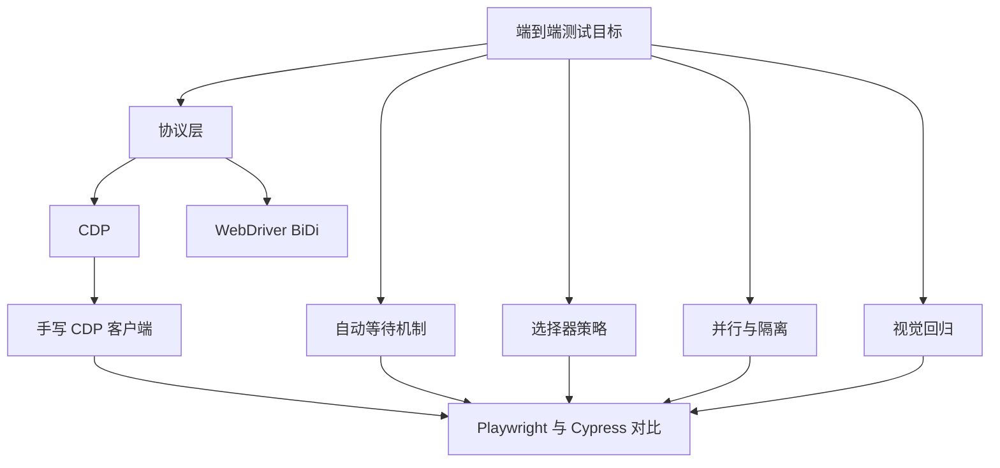
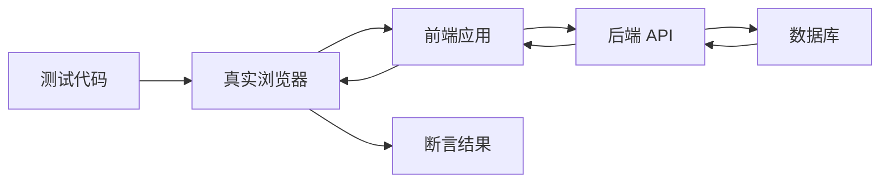
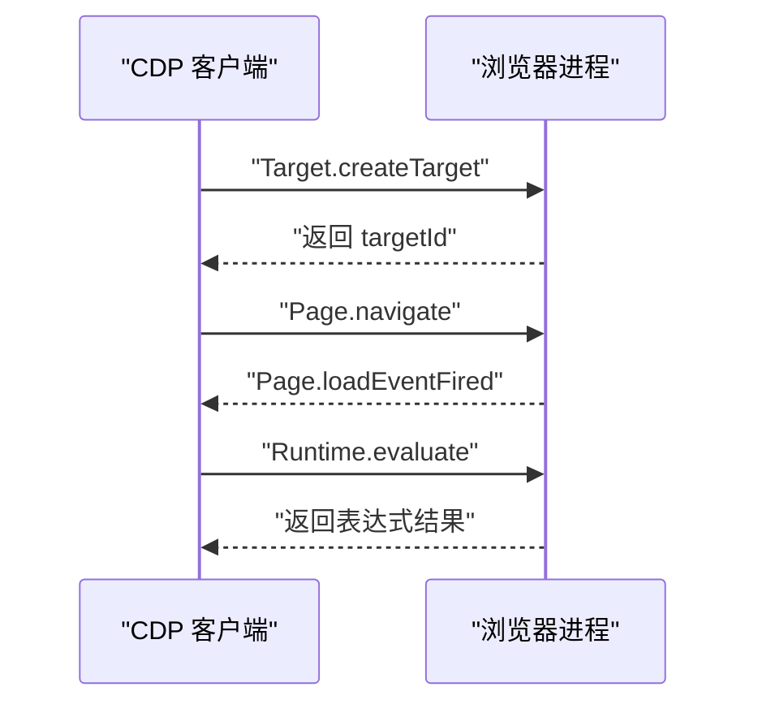
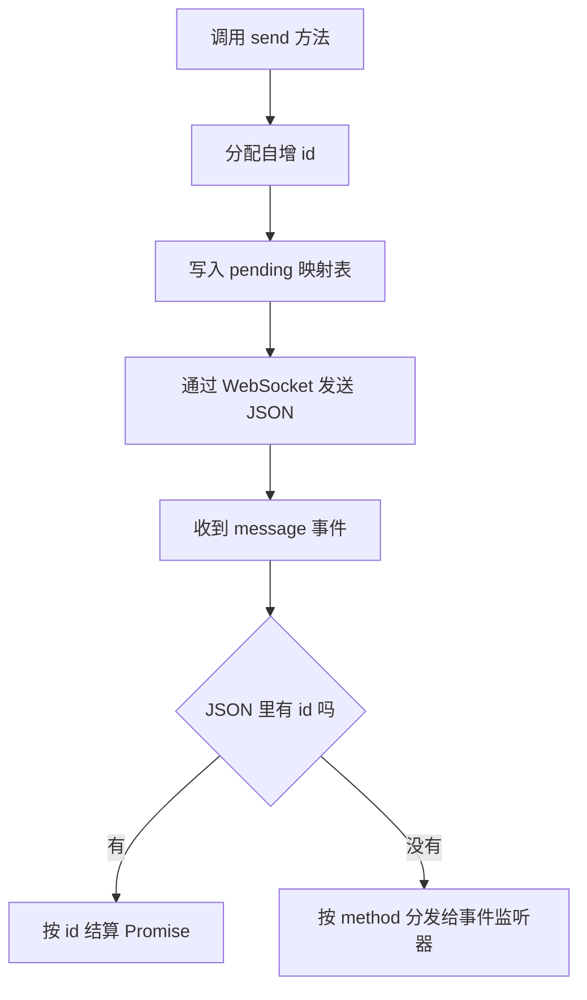
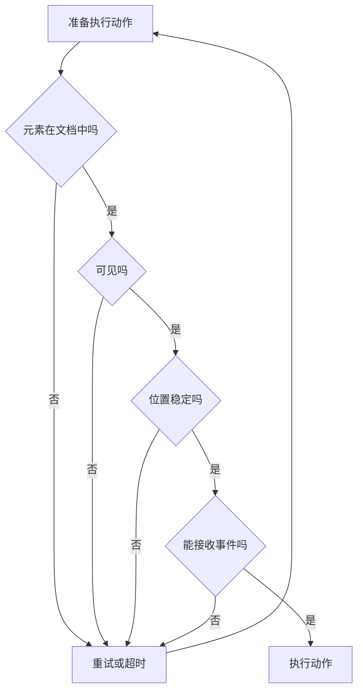
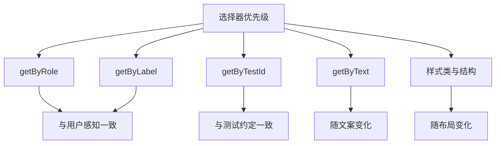
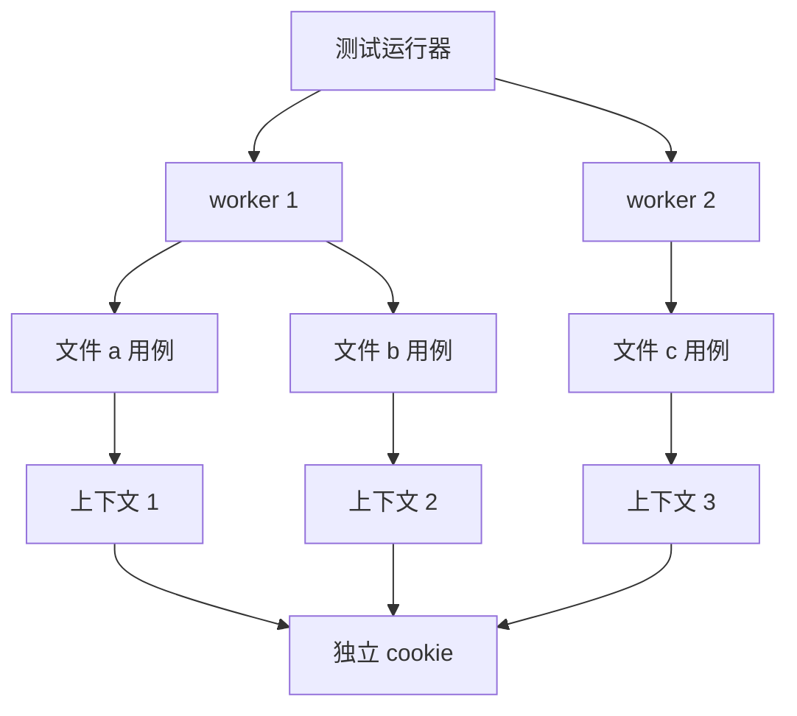
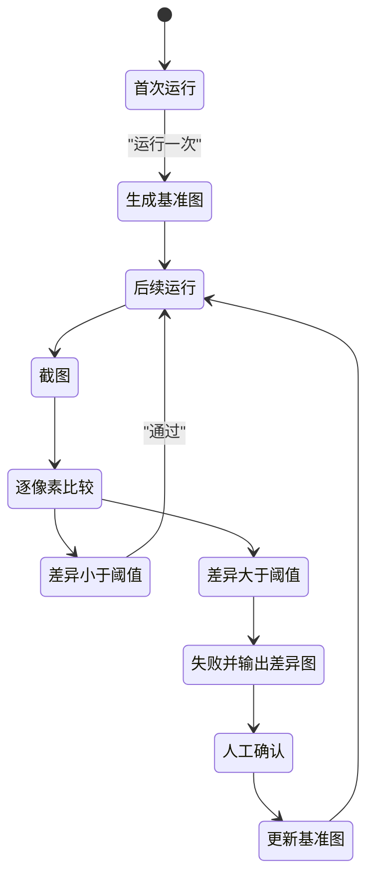
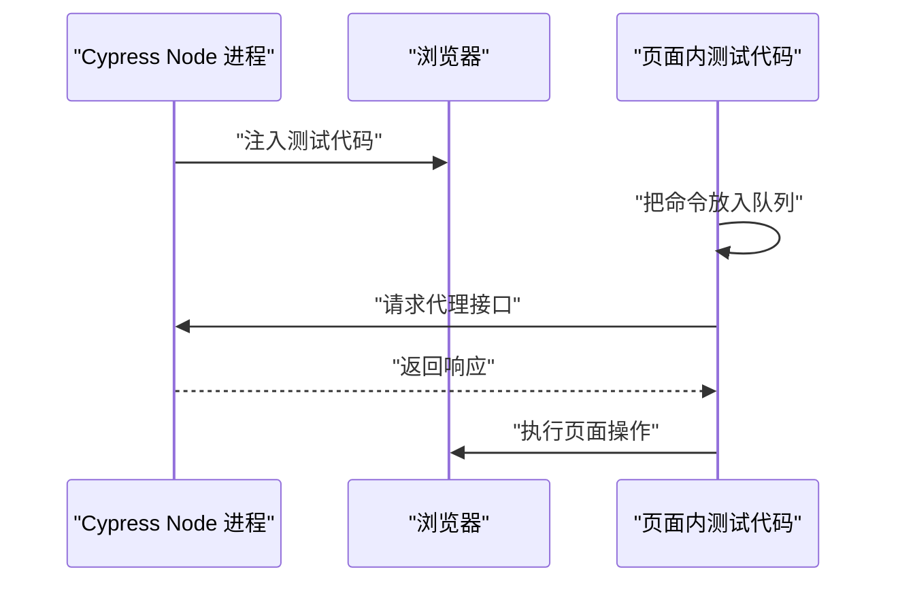

# 端到端与视觉回归：Playwright 与 Cypress

!!! abstract "学完这一页你能"
    - 说清 CDP 与 WebDriver BiDi 各自解决什么问题，并手写一个能跑通导航与取值的 CDP 客户端。
    - 解释自动等待在动作前检查哪些条件，并用轮询函数复现这套检查。
    - 按稳定度排序选择器策略，写出不依赖样式类名的定位代码。
    - 说明并行与隔离的配套关系，并实现一次 localStorage 隔离验证。
    - 讲清视觉回归的基准图、阈值、像素差异图三者关系。
    - 从运行架构角度对比 Playwright 与 Cypress，并知道何时保留 Cypress。

## 0. 知识地图



建议先读第 1 节建立整体目标，再读第 2 与第 3 节理解协议与驱动。  
随后按第 4 到第 7 节逐块补齐等待、选择器、隔离、视觉四类工程问题。  
最后用第 8 节与综合对比把两套工具放进同一张坐标里。

!!! note "术语：端到端测试"
    端到端测试从用户可见界面出发，驱动真实浏览器，穿过前端、后端、数据库，验证一条完整业务链路。例子：登录后创建订单并看到订单号。

## 1. 端到端测试解决什么问题

**先想一个问题**

登录流程的单元测试全部通过，上线后用户点“登录”没有反应。  
原因是浏览器在 SameSite 策略下拒绝了跨站 Cookie。  
单元测试没有浏览器，也就看不到这个问题。

**心智模型**

!!! tip "心智模型"
    一句话模型：端到端测试把浏览器、前端、后端、数据库连成一条链路，只从用户可见的界面输入和观察。  
    日常类比：像试驾整辆车，从打火、挂挡到刹车都走一遍，而不是只把发动机拆下来测台架。  
    哪里不成立：试驾会受路况与天气影响，端到端测试要主动固定这些条件，例如时区、网络延迟、随机种子。

**图解**



1. 测试代码发出动作，例如打开地址、点击按钮、填写输入框。
2. 真实浏览器加载前端应用，执行页面脚本并渲染界面。
3. 前端应用调用后端 API，后端读写数据库。
4. 数据沿原路返回，浏览器更新界面。
5. 测试代码读取界面状态并断言，例如标题、地址、可见文本。

**一步一步来**

这一步要做什么：初始化项目并安装测试运行器，让浏览器二进制到位。

```bash
npm init -y                       # 生成 package.json
npm i -D @playwright/test         # 安装测试运行器
npx playwright install chromium   # 下载 Chromium 二进制
```

**这段代码在做什么**

- `npm init -y` 创建最小项目描述文件，后续依赖都记录在里面。
- `npm i -D @playwright/test` 安装运行器，同时带入 `playwright` 库。
- `npx playwright install chromium` 把 Chromium 下载到用户缓存目录，避免每次运行重复下载。
- 这三条命令只做一次，团队其他成员拉取仓库后再执行第三条。

这一步要做什么：写第一条测试，验证页面标题。

```js
// tests/title.spec.js
const { test, expect } = require('@playwright/test');

test('首页标题正确', async ({ page }) => {              // page 由运行器注入
  await page.goto('data:text/html,<title>登录</title>'); // 打开内联页面
  await expect(page).toHaveTitle('登录');                // 断言标题文本
});
```

**这段代码在做什么**

- `test` 定义一个用例，第一个参数是用例名称。
- `{ page }` 是运行器注入的 fixture，每条用例拿到独立的页面。
- `page.goto` 打开地址，内联 data 地址省去启动本地服务器。
- `expect(page).toHaveTitle` 是带重试的断言，会在超时前反复检查。
- 用例失败时运行器会打印实际值与期望值。

这一步要做什么：运行并读取结果。

```bash
npx playwright test --reporter=list   # 用列表报告输出每条用例
```

运行结果：

```text
Running 1 test using 1 worker
1 passed
```

**动手验证**

把前面的步骤合成一个单文件脚本，直接用库启动浏览器并断言。

```js
// verify-title.mjs
// 依赖：npm i -D @playwright/test && npx playwright install chromium
import { chromium } from '@playwright/test';
import assert from 'node:assert/strict';

const browser = await chromium.launch();                 // 启动 Chromium
const page = await browser.newPage();                    // 新建独立页面
await page.goto('data:text/html,<title>登录</title><h1>欢迎</h1>'); // 打开内联页面
const title = await page.title();                        // 读取文档标题
const heading = await page.locator('h1').innerText();    // 读取一级标题文本
assert.equal(title, '登录');                              // 断言标题
assert.equal(heading, '欢迎');                            // 断言正文
await page.close();                                      // 关闭页面
await browser.close();                                   // 关闭浏览器
console.log('PASS title=', title, 'heading=', heading);  // 输出结果
```

预期输出：

```text
PASS title= 登录 heading= 欢迎
```

**常见坑**

| 现象 | 原因 | 怎么修 |
| --- | --- | --- |
| 第一次运行报找不到浏览器 | 只装了运行器，没有下载二进制 | 执行 `npx playwright install chromium` |
| 本机通过、CI 失败 | CI 镜像缺少系统依赖库 | 在 CI 里执行 `npx playwright install --with-deps chromium` |
| 用例偶发失败 | 断言用了固定等待或真实网络 | 改用带重试的断言，并固定测试数据 |

**小结**

- 端到端测试的价值在链路覆盖，代价是运行时间与稳定性维护。
- 它补的是单元测试看不到的浏览器策略、渲染、跨服务问题。
- 先从一条最短链路开始，跑通后再扩到核心业务路径。

## 2. 协议层：CDP 与 WebDriver BiDi

**先想一个问题**

你写下 `page.click`，这条命令怎么到达浏览器。  
如果每个工具都自己发明通信格式，换一个浏览器就要重写一遍驱动。  
协议层就是让工具与浏览器按同一份约定收发消息。

**心智模型**

!!! tip "心智模型"
    一句话模型：协议规定命令名、参数格式、返回值格式与事件推送格式，工具与浏览器按同一份约定收发消息。  
    日常类比：像寄快递填统一面单，收件人、电话、地址都有固定栏位，快递公司才能分拣。  
    哪里不成立：面单只走单程，CDP 与 WebDriver BiDi 都支持浏览器主动推送事件，客户端要一直监听。

!!! note "术语：CDP"
    CDP 全称 Chrome DevTools Protocol，是 Chromium 提供的基于 WebSocket 的调试协议。例子：`Page.navigate` 是其中一条命令。

!!! note "术语：WebDriver BiDi"
    WebDriver BiDi 全称 WebDriver BiDirectional，是 W3C 在标准化的跨浏览器双向协议。例子：`browsingContext.navigate` 是其中一条命令。

**图解**



1. 客户端发送 `Target.createTarget`，要求新建一个标签页。
2. 浏览器创建目标后返回 `targetId`，客户端凭这个编号继续操作。
3. 客户端发送 `Page.navigate`，把目标导航到指定地址。
4. 页面加载完成时，浏览器主动推送 `Page.loadEventFired` 事件。
5. 客户端发送 `Runtime.evaluate`，在页面里执行表达式并拿到返回值。

**一步一步来**

这一步要做什么：用命令行启动一个开了调试端口的 Chrome。

```bash
# 启动 Chrome 并打开 CDP 端口
CHROME="/Applications/Google Chrome.app/Contents/MacOS/Google Chrome"
"$CHROME" --headless=new --remote-debugging-port=9222 --user-data-dir=/tmp/cdp-demo
```

**这段代码在做什么**

- `--headless=new` 让 Chrome 不显示窗口，适合在服务器运行。
- `--remote-debugging-port=9222` 打开 HTTP 与 WebSocket 调试端点。
- `--user-data-dir=/tmp/cdp-demo` 使用独立用户目录，避免与本机已在运行的 Chrome 冲突。
- 没有这个独立目录时，新进程会把启动参数交给已有实例，端口不会打开。

这一步要做什么：用 HTTP 端点读取版本信息，确认端口可用。

```js
// 查询 http://127.0.0.1:9222/json/version
const res = await fetch('http://127.0.0.1:9222/json/version'); // 内置 fetch
const info = await res.json();                                  // 解析 JSON
console.log(info.Browser);                                      // 浏览器版本字符串
console.log(info.webSocketDebuggerUrl);                         // 浏览器级 WS 地址
```

运行结果：

```text
Chrome/1xx.0.xxxx.xx
ws://127.0.0.1:9222/devtools/browser/xxxxxxxx-xxxx-xxxx-xxxx-xxxxxxxxxxxx
```

版本号随本机安装变化，上面用 x 占位。

**这段代码在做什么**

- `/json/version` 返回浏览器级信息，包括版本字符串与 WebSocket 地址。
- `info.Browser` 用来确认连到的是哪一种浏览器。
- `info.webSocketDebuggerUrl` 是后续发命令的入口。
- 另有 `/json/list` 返回所有页面目标，包含每个页面的独立地址。

这一步要做什么：建立 WebSocket 并发送第一条 CDP 命令。

```js
// 依赖：npm i ws
import WebSocket from 'ws';

const ws = new WebSocket(info.webSocketDebuggerUrl); // 连接浏览器级地址
await new Promise((resolve) => ws.once('open', resolve)); // 等待连接打开
ws.send(JSON.stringify({                              // 发送命令
  id: 1,                                              // 命令编号
  method: 'Browser.getVersion',                       // 命令名
  params: {},                                         // 命令参数
}));
ws.on('message', (raw) => {                           // 监听回包
  const msg = JSON.parse(raw);                        // 解析 JSON
  console.log(msg.id, msg.result?.product);           // 打印编号与产品名
});
```

**这段代码在做什么**

- `id` 是命令编号，回包会带同一个编号，用来把响应与请求对上。
- `method` 是要执行的动作名称，格式为大写域名加点加动作名。
- `params` 是参数对象，没有参数时传空对象。
- `ws.on('message')` 同时接收命令回包与事件推送，需要靠 `id` 字段区分。

**动手验证**

这个脚本启动 Chrome，轮询调试端点，并断言拿到了 WebSocket 地址。

```js
// verify-cdp-endpoint.mjs
// 依赖：本地安装 Chrome，可用环境变量 CHROME_PATH 指定路径
import { spawn } from 'node:child_process';
import assert from 'node:assert/strict';

const candidates = [
  process.env.CHROME_PATH,                                      // 环境变量优先
  '/Applications/Google Chrome.app/Contents/MacOS/Google Chrome',
  '/usr/bin/google-chrome',
];
const chromePath = candidates.find(Boolean);                    // 取第一个可用值
assert.ok(chromePath, '请设置 CHROME_PATH 指向 Chrome 可执行文件');

const port = 9333;                                              // 选一个不常用端口
const child = spawn(chromePath, [
  '--headless=new',
  '--disable-gpu',
  `--remote-debugging-port=${port}`,
  '--user-data-dir=/tmp/cdp-verify',                            // 独立目录避免冲突
], { stdio: 'ignore' });

const sleep = (ms) => new Promise((r) => setTimeout(r, ms));    // 延时函数
let info;
for (let i = 0; i < 30; i += 1) {                               // 最多轮询 30 次
  await sleep(300);
  try {
    const res = await fetch(`http://127.0.0.1:${port}/json/version`);
    if (res.ok) { info = await res.json(); break; }              // 成功就退出
  } catch {
    // 端口尚未就绪，继续下一次轮询
  }
}
assert.ok(info?.Browser, '未拿到 CDP 版本信息');                  // 断言版本字段
assert.match(info.webSocketDebuggerUrl, /^ws:\/\//);             // 断言地址协议
console.log('PASS Browser=', info.Browser);
child.kill('SIGKILL');                                          // 结束时关闭 Chrome
```

预期输出：

```text
PASS Browser= Chrome/1xx.0.xxxx.xx
```

**常见坑**

| 现象 | 原因 | 怎么修 |
| --- | --- | --- |
| 连不上 9222 | 本机已有 Chrome 实例，参数被吞掉 | 加 `--user-data-dir` 指定独立目录 |
| `/json/version` 返回 404 | 请求路径写成 `/json` | 改用 `/json/version` 或 `/json/list` |
| WebSocket 刚连上就断开 | 连接了页面级地址却发浏览器级命令 | 按命令所属域选择对应地址 |

**小结**

- CDP 是 Chromium 的私有协议，WebDriver BiDi 是跨浏览器的标准方向。
- 命令靠自增编号配对回包，事件靠方法名分发。
- 调试端口的启动参数与用户目录是排查连接问题的第一站。

## 3. 手写一个最小 CDP 客户端

**先想一个问题**

你想知道 Playwright 的点击背后发了哪些命令。  
最直接的办法是自己发一条 `Page.navigate`，看浏览器回什么。  
下面从零实现一个只做导航与取值的客户端。

**心智模型**

!!! tip "心智模型"
    一句话模型：客户端维护一张编号到 Promise 的映射表，每条命令带自增编号，回包用同一个编号找到 Promise 并结算。  
    日常类比：像餐厅取餐，点单时拿到号码牌，叫号时凭号码取餐。  
    哪里不成立：号码牌只用一次，CDP 事件没有编号，要按 method 字段分发给事件监听器。

!!! note "术语：target"
    target 是浏览器里的一个可调试对象，一个标签页、一个 Service Worker 都算一个 target。例子：`Target.createTarget` 新建的就是标签页 target。

!!! note "术语：session"
    session 是附加到某个 target 上的会话，命令带上 sessionId 才会在该 target 内执行。例子：在页面 target 上执行 `Page.navigate` 需要先附加得到 sessionId。

**图解**



1. 调用 `send` 时先分配自增编号，保证同一连接内编号不重复。
2. 把编号与 Promise 的结算函数放进映射表，等待回包。
3. 把命令序列化成 JSON，通过 WebSocket 发给浏览器。
4. 收到消息后先判断有没有 `id` 字段。
5. 有 `id` 的是命令回包，按编号结算 Promise。
6. 没有 `id` 的是事件，按 `method` 字段交给对应监听器。

**一步一步来**

这一步要做什么：实现连接、发送、回包结算三件事。

```js
import WebSocket from 'ws';

class Cdp {
  constructor(ws) {
    this.ws = ws;                  // WebSocket 实例
    this.id = 0;                   // 自增命令编号
    this.pending = new Map();      // 编号到 Promise 的映射
    ws.on('message', (raw) => this.onMessage(raw)); // 绑定收包
  }
  send(method, params = {}, sessionId) {
    const id = ++this.id;          // 先分配编号
    const body = { id, method, params }; // 基础消息体
    if (sessionId) body.sessionId = sessionId; // 会话命令补字段
    this.ws.send(JSON.stringify(body));  // 发送 JSON
    return new Promise((resolve) => this.pending.set(id, resolve)); // 存起来
  }
  onMessage(raw) {
    const msg = JSON.parse(raw);   // 解析回包
    if (msg.id && this.pending.has(msg.id)) { // 有编号才是命令回包
      this.pending.get(msg.id)(msg.result);   // 结算 Promise
      this.pending.delete(msg.id);            // 清理映射
    }
  }
}
```

**这段代码在做什么**

- 构造函数保存 WebSocket 实例，并把收包处理挂到 message 事件。
- `send` 先自增编号，再把编号、方法名、参数组成消息体。
- `sessionId` 存在时写入消息体，命令才会在目标会话内执行。
- 每次发送都返回一个 Promise，结算函数按编号存在映射表里。
- `onMessage` 只处理带编号的消息，纯事件留给其他监听器。

这一步要做什么：新建标签页并附加会话。

```js
const { targetId } = await cdp.send('Target.createTarget', { // 新建标签页
  url: 'about:blank',                                        // 先开空白页
});
const { sessionId } = await cdp.send('Target.attachToTarget', { // 附加到该标签页
  targetId,                                                  // 目标编号
  flatten: true,                                             // 扁平会话模式
});
console.log('sessionId=', sessionId);                         // 打印会话编号
```

**这段代码在做什么**

- `Target.createTarget` 返回新标签页的编号 `targetId`。
- `Target.attachToTarget` 在标签页上建立会话，返回 `sessionId`。
- `flatten: true` 让会话消息与浏览器级消息走同一条连接。
- 之后发往页面的命令都要带上这个 `sessionId`。

运行结果：

```text
sessionId= xxxxxxxx-xxxx-xxxx-xxxx-xxxxxxxxxxxx
```

这一步要做什么：先订阅加载事件，再导航，最后读取标题。

```js
const load = new Promise((resolve) => {                // 先建好事件 Promise
  const onMsg = (raw) => {
    const msg = JSON.parse(raw);
    if (msg.method === 'Page.loadEventFired' && msg.sessionId === sessionId) {
      cdp.ws.off('message', onMsg);                    // 收到就解绑
      resolve();                                       // 结束等待
    }
  };
  cdp.ws.on('message', onMsg);                         // 挂上监听
});
await cdp.send('Page.enable', {}, sessionId);          // 打开页面事件
await cdp.send('Page.navigate', { url: 'data:text/html,<title>CDP</title>' }, sessionId);
await load;                                            // 等加载完成
const { result } = await cdp.send('Runtime.evaluate', { // 页面内执行表达式
  expression: 'document.title',                         // 读取标题
  returnByValue: true,                                  // 结果序列化返回
}, sessionId);
console.log('title=', result.value);                    // 输出 title= CDP
```

**这段代码在做什么**

- 订阅动作要写在导航之前，否则加载事件可能在监听器挂上之前就结束。
- `Page.enable` 打开页面域事件，没有它收不到 `Page.loadEventFired`。
- `Page.navigate` 触发导航，返回的是命令已受理，不代表页面已加载。
- `await load` 把执行顺序卡在加载完成之后。
- `Runtime.evaluate` 在页面上下文执行表达式，`returnByValue` 把结果转成 JSON 可序列化值。

运行结果：

```text
title= CDP
```

**动手验证**

完整脚本：启动 Chrome、连接浏览器级 WebSocket、建标签页、附加会话、导航、读取标题并断言。

```js
// cdp-mini.mjs
// 依赖：npm i ws，本地 Chrome 可用 CHROME_PATH 指定
import { spawn } from 'node:child_process';
import assert from 'node:assert/strict';
import WebSocket from 'ws';

const port = 9334;
const chrome = spawn(
  process.env.CHROME_PATH ?? '/Applications/Google Chrome.app/Contents/MacOS/Google Chrome',
  ['--headless=new', '--disable-gpu', `--remote-debugging-port=${port}`, '--user-data-dir=/tmp/cdp-mini'],
  { stdio: 'ignore' },
);

const sleep = (ms) => new Promise((r) => setTimeout(r, ms));
let version;
for (let i = 0; i < 30 && !version; i += 1) {          // 轮询等待端口就绪
  await sleep(300);
  try {
    version = await (await fetch(`http://127.0.0.1:${port}/json/version`)).json();
  } catch {
    // 端口未就绪
  }
}
assert.ok(version?.webSocketDebuggerUrl, 'CDP 未就绪');

const ws = new WebSocket(version.webSocketDebuggerUrl); // 浏览器级连接
await new Promise((r) => ws.once('open', r));           // 等待连接打开
let seq = 0;                                            // 自增编号
const pending = new Map();                              // 编号到 Promise
ws.on('message', (raw) => {
  const msg = JSON.parse(raw);                          // 解析消息
  if (msg.id && pending.has(msg.id)) {                  // 命令回包
    const { resolve, reject } = pending.get(msg.id);
    pending.delete(msg.id);                             // 清理映射
    if (msg.error) reject(new Error(msg.error.message)); // 有错误就拒绝
    else resolve(msg.result);                           // 否则结算
  }
});
const send = (method, params = {}, sessionId) => {
  const id = ++seq;                                     // 分配编号
  const body = { id, method, params };                  // 基础消息体
  if (sessionId) body.sessionId = sessionId;            // 会话命令补字段
  ws.send(JSON.stringify(body));                        // 发出命令
  return new Promise((resolve, reject) => pending.set(id, { resolve, reject }));
};

const { targetId } = await send('Target.createTarget', { url: 'about:blank' });
const { sessionId } = await send('Target.attachToTarget', { targetId, flatten: true });
const load = new Promise((resolve) => {                 // 先订阅加载事件
  const onMsg = (raw) => {
    const msg = JSON.parse(raw);
    if (msg.method === 'Page.loadEventFired' && msg.sessionId === sessionId) {
      ws.off('message', onMsg);
      resolve();
    }
  };
  ws.on('message', onMsg);
});
await send('Page.enable', {}, sessionId);               // 打开页面事件
await send('Page.navigate', { url: 'data:text/html,<title>CDP</title>' }, sessionId);
await load;                                             // 等加载完成
const { result } = await send('Runtime.evaluate', {
  expression: 'document.title',
  returnByValue: true,
}, sessionId);
assert.equal(result.value, 'CDP');                      // 断言标题
console.log('PASS title=', result.value);
ws.close();                                             // 关闭连接
chrome.kill('SIGKILL');                                 // 关闭 Chrome
```

预期输出：

```text
PASS title= CDP
```

**常见坑**

| 现象 | 原因 | 怎么修 |
| --- | --- | --- |
| 命令一直不返回 | 把事件当命令等 | 命令用 `send`，事件用 message 监听 |
| 加载事件丢失 | 先导航后订阅 | 先建 Promise 订阅，再触发导航 |
| 会话命令报错 | 消息体缺 `sessionId` | 发送时传入附加得到的 sessionId |

**小结**

- CDP 客户端的核心是一张编号到 Promise 的映射表。
- 会话命令要带 sessionId，事件订阅要早于触发动作。
- 自己发过一条命令后，再看 Playwright 的封装就能对上号。

## 4. 自动等待机制

**先想一个问题**

按钮有 200 毫秒的淡入动画，脚本在动画第 50 毫秒点击。  
此时按钮坐标还在移动，点击落在动画中间位置，事件被忽略。  
固定等待 300 毫秒能绕过，但换成慢机器又会失败。

**心智模型**

!!! tip "心智模型"
    一句话模型：自动等待在每次动作前按固定顺序检查元素是否可操作，不满足就重试，直到超时。  
    日常类比：像过安检，证件、行李、人身检查逐项通过才放行。  
    哪里不成立：安检一次通过即可，自动等待在动作执行瞬间还要再检查一次，防止状态回退。

!!! note "术语：自动等待"
    自动等待指动作执行前反复检查元素状态，状态满足才执行动作，不满足则在超时前重试。例子：`click` 会等元素可见且位置稳定。

**图解**



1. 第一步检查元素是否已经在文档里，未挂载就重试。
2. 第二步检查可见性，宽高为零或 `display:none` 都算不可见。
3. 第三步连续两次测量同一元素的包围盒，坐标一致才算稳定。
4. 第四步检查元素是否被遮挡、是否被禁用，能接收指针事件才继续。
5. 四步都通过就执行动作，任何一步失败都回到起点重试。
6. 超过超时时间仍不满足，就抛出带选择器与状态的错误。

**一步一步来**

这一步要做什么：写一个通用轮询函数，作为自动等待的骨架。

```js
async function waitFor(check, timeout = 5000) { // check 返回真假
  const start = Date.now();                      // 记录起始时间
  while (Date.now() - start < timeout) {         // 未超时就继续
    if (await check()) return;                   // 条件满足立即返回
    await new Promise((r) => setTimeout(r, 50)); // 每 50 毫秒重试
  }
  throw new Error('waitFor timeout');            // 超时抛错
}
```

**这段代码在做什么**

- `check` 是一个异步函数，返回真表示条件满足。
- 循环条件是当前时间减去起始时间小于超时值。
- 每次失败后等待 50 毫秒再试，避免占满 CPU。
- 条件满足就提前返回，不做多余等待。
- 超时后抛出错误，让用例失败并保留现场。

这一步要做什么：加入可见与位置稳定两项检查。

```js
async function clickWithWait(page, selector) {   // 模拟带等待的点击
  await waitFor(async () => {                    // 等待元素出现且稳定
    const el = await page.$(selector);           // 查询元素
    if (!el) return false;                       // 不存在就重试
    const box1 = await el.boundingBox();         // 第一次测量
    await new Promise((r) => setTimeout(r, 100)); // 等 100 毫秒
    const box2 = await el.boundingBox();         // 第二次测量
    return Boolean(box1 && box2 && box1.x === box2.x && box1.y === box2.y);
  });
  const el = await page.$(selector);             // 重新取元素
  await el.click();                              // 执行点击
}
```

**这段代码在做什么**

- 每次轮询都重新查询元素，元素被替换后也能拿到新节点。
- 两次测量之间等 100 毫秒，给动画留出变化时间。
- 两次坐标一致才返回真，位置还在动就继续重试。
- 条件满足后重新取一次元素再点击，降低节点失效的概率。

这一步要做什么：给等待加上可读的超时错误。

```js
async function waitForChecked(check, describe, timeout = 5000) {
  const start = Date.now();                       // 起始时间
  while (Date.now() - start < timeout) {          // 未超时
    if (await check()) return;                    // 满足就返回
    await new Promise((r) => setTimeout(r, 50));  // 重试间隔
  }
  const cost = Date.now() - start;                // 实际等待时长
  throw new Error(`等待 ${describe} 超时，耗时 ${cost} 毫秒`); // 带上下文的错误
}
```

**这段代码在做什么**

- 多传入一个 `describe`，用来描述等待的目标。
- 错误信息里带上描述与实际耗时，方便定位。
- 耗时数字能区分“条件没满足”与“超时值设得太小”。
- 抛出错误时用例直接失败，不会继续执行后续动作。

**动手验证**

用纯 Node 模拟元素先出现、后稳定的过程，验证等待函数会等到稳定后才返回。

```js
// verify-wait.mjs
// 依赖：无，Node 20+
import assert from 'node:assert/strict';

const sleep = (ms) => new Promise((r) => setTimeout(r, ms));

async function waitFor(check, timeout = 2000) {  // 通用轮询
  const start = Date.now();
  while (Date.now() - start < timeout) {
    if (await check()) return Date.now() - start; // 返回耗时
    await sleep(20);
  }
  throw new Error('timeout');
}

const startTime = Date.now();                    // 模拟起点
const fake = {
  appearAt: 120,                                 // 120 毫秒后出现
  stableAt: 280,                                 // 280 毫秒后稳定
  async box() {
    const t = Date.now() - startTime;
    if (t < this.appearAt) return null;          // 未出现
    return { x: t < this.stableAt ? t : 40 };    // 稳定前坐标变化
  },
};

let clicks = 0;                                  // 点击计数
const waited = await waitFor(async () => {       // 等待出现且稳定
  const a = await fake.box();                    // 第一次测量
  await sleep(30);                               // 间隔 30 毫秒
  const b = await fake.box();                    // 第二次测量
  return Boolean(a && b && a.x === b.x);         // 两次一致才算稳定
});
clicks += 1;                                     // 稳定后点击一次
assert.equal(clicks, 1);                         // 断言点击了一次
assert.ok(waited >= 240, `等待时间不足: ${waited}`); // 断言等到了稳定之后
console.log('PASS waited=', waited, 'ms clicks=', clicks);
```

预期输出接近：

```text
PASS waited= 2xx ms clicks= 1
```

**常见坑**

| 现象 | 原因 | 怎么修 |
| --- | --- | --- |
| 用固定 sleep 等待 | 等待时长靠猜，慢机器仍失败 | 改用轮询等待 |
| 断言可见后点击仍失败 | 两次检查之间状态回退 | 让动作自带等待，减少手工检查 |
| 等待 networkidle 卡住 | 页面存在长连接轮询 | 改为等待具体界面状态 |

**小结**

- 自动等待把“等多久”换成“等到条件满足”，减少对机器速度的依赖。
- 可操作性包含存在、可见、稳定、可接收事件四类检查。
- 超时错误要带选择器与耗时，否则排查只能靠猜。

## 5. 选择器策略

**先想一个问题**

测试用 `.btn-primary` 定位提交按钮。  
设计师把类名改成 `btn-main`，同一次提交里 40 条测试全部变红。  
问题是选择器绑定在了会随样式重构变化的属性上。

**心智模型**

!!! tip "心智模型"
    一句话模型：选择器是测试与页面之间的接口，稳定度从高到低依次是角色与名称、标签文本、测试标识、普通文本、样式与结构。  
    日常类比：找人先看工牌上的姓名与部门，再看座位号，最后才描述今天穿什么衣服。  
    哪里不成立：工牌姓名可能重名，角色选择器可能匹配多个元素，需要配合过滤缩小范围。

!!! note "术语：test id"
    test id 是为测试添加的稳定属性，常用写法是 `data-testid`，它不参与样式，也不随样式重构改变。例子：`data-testid="submit-order"`。

**图解**



1. `getByRole` 匹配可访问角色，与屏幕阅读器看到的一致。
2. `getByLabel` 匹配表单标签，标签文本通常与业务字段同名。
3. `getByTestId` 匹配团队约定的测试属性，文案与样式变化都不影响。
4. `getByText` 匹配可见文本，文案一改就会失效。
5. 样式类与结构选择器排最后，重构布局时最先失效。

**一步一步来**

这一步要做什么：用角色与名称定位按钮和标题。

```js
await page.getByRole('button', { name: '提交' }).click(); // 按可访问名称定位
await page.getByRole('heading', { level: 1 }).innerText(); // 定位一级标题
const rows = page.getByRole('row');                        // 定位所有表格行
console.log('行数=', await rows.count());                  // 打印数量
```

**这段代码在做什么**

- `getByRole` 的第一个参数是可访问角色，按钮对应 `button`。
- `name` 选项按可访问名称匹配，通常等于按钮可见文本。
- `heading` 配合 `level` 限定标题级别，避免匹配到多个标题。
- `count` 返回匹配数量，可以先确认定位范围再操作。

这一步要做什么：用 label 与 test id 定位表单控件。

```html
<!-- 关联 label 与 input，屏幕阅读器与 getByLabel 都能识别 -->
<label for="email">邮箱</label>
<input id="email" data-testid="email-input" />
```

```js
await page.getByLabel('邮箱').fill('a@b.com'); // 按 label 文本定位
await page.getByTestId('email-input').blur();  // 按 test id 定位并失焦
```

**这段代码在做什么**

- `for` 与 `id` 关联后，`getByLabel` 才能通过标签文本找到输入框。
- `fill` 会先清空再输入，适合覆盖已有值。
- `getByTestId` 默认匹配 `data-testid` 属性，团队可统一约定。
- 两种定位方式并存，文案变化时用 test id 兜底。

这一步要做什么：在重复结构中用过滤与链式定位缩小范围。

```js
const row = page.getByRole('row').filter({ hasText: '张三' }); // 先按行过滤
await row.getByRole('button', { name: '删除' }).click();       // 再取行内按钮
const second = page.getByRole('listitem').nth(1);              // 按序号取第二项
```

**这段代码在做什么**

- `filter` 在已有定位结果中继续筛选，避免写复杂选择器。
- 在过滤后的行内继续定位按钮，范围限定在该行。
- `nth` 按序号取元素，只在确实需要第几个时才用。
- 默认严格模式下匹配到多个元素会抛错，能尽早发现选择器过宽。

**动手验证**

用 Playwright 打开一段内联 HTML，验证角色、标签、测试标识三种定位。

```js
// verify-selector.mjs
// 依赖：npm i -D @playwright/test && npx playwright install chromium
import { chromium } from '@playwright/test';
import assert from 'node:assert/strict';

const html = `<form>
  <label for="email">邮箱</label>
  <input id="email" data-testid="email-input" />
  <button>提交</button>
  <button>取消</button>
</form>`;

const browser = await chromium.launch();
const page = await browser.newPage();
await page.setContent(html);                               // 设置页面内容
const buttons = page.getByRole('button');                  // 定位所有按钮
assert.equal(await buttons.count(), 2);                    // 断言按钮数量
await page.getByRole('button', { name: '提交' }).click();   // 按名称点击
await page.getByLabel('邮箱').fill('a@b.com');              // 按标签填写
const value = await page.getByTestId('email-input').inputValue(); // 按测试标识取值
assert.equal(value, 'a@b.com');                            // 断言取值
console.log('PASS buttons=', await buttons.count(), 'email=', value);
await browser.close();
```

预期输出：

```text
PASS buttons= 2 email= a@b.com
```

**常见坑**

| 现象 | 原因 | 怎么修 |
| --- | --- | --- |
| `getByText` 匹配到父节点 | 文本匹配会拼接子节点文本 | 加 `exact: true` 或改用角色加名称 |
| 样式类改完测试全红 | 选择器绑定样式类名 | 改用角色、标签或 test id |
| 定位到多个元素报错 | 页面存在重复角色 | 用 `filter`、`nth` 或唯一 test id 缩小 |

**小结**

- 选择器是测试与页面之间的接口，优先选用户能感知的属性。
- 角色与标签贴近可访问性，test id 是文案变化时的稳定兜底。
- 严格模式让过宽的选择器尽早暴露，而不是误点第一个元素。

## 6. 并行与隔离

**先想一个问题**

测试文件 A 与 B 同时运行，两者都用 `user@example.com` 登录。  
A 改了密码，B 在下一次请求时被强制登出。  
断言失败的原因是数据冲突，不是代码缺陷。

**心智模型**

!!! tip "心智模型"
    一句话模型：并行提高吞吐，隔离保证测试之间不共享可变状态，两者必须配套使用。  
    日常类比：酒店同时开多个房间接待客人，每间房有独立门卡，客人看不到彼此物品。  
    哪里不成立：酒店房间共享水电网，浏览器上下文共享同一个浏览器二进制与渲染进程池，资源竞争仍会拖慢单条用例。

!!! note "术语：browser context"
    browser context 是浏览器内相互隔离的存储分区，cookie、localStorage、sessionStorage、缓存各自独立，但共享浏览器进程。例子：两个 context 打开同一地址，登录态互不可见。

!!! note "术语：worker"
    worker 是测试运行器里并行执行测试文件的进程，一个 worker 同一时刻只跑一个文件。例子：`workers: 4` 表示最多四个进程同时跑。

**图解**



1. 运行器按测试文件把用例分发给多个 worker。
2. 每个 worker 是独立进程，崩溃不会影响其他 worker。
3. 每条用例默认新建一个 browser context，cookie 从空开始。
4. 三个上下文各自维护存储，互不可见。
5. 并行数过高时，CPU 与内存竞争会让单条用例变慢。

**一步一步来**

这一步要做什么：在配置里设置 worker 数量与重试次数。

```js
// playwright.config.js
import { defineConfig } from '@playwright/test';

export default defineConfig({
  workers: process.env.CI ? 4 : '50%', // CI 固定 4 个，本地用一半 CPU
  fullyParallel: true,                  // 同一文件内的用例也并行
  retries: process.env.CI ? 2 : 0,      // CI 上失败重试两次
});
```

**这段代码在做什么**

- `workers` 控制并行进程数量，`'50%'` 表示使用一半可用 CPU。
- `fullyParallel` 打开后，同一文件内的用例也能并行执行。
- `retries` 只影响失败后的重试次数，不会掩盖持续失败。
- CI 环境 CPU 数量固定，用具体数字能得到可复现的耗时。

这一步要做什么：让每条用例拿到独立存储。

```js
import { test, expect } from '@playwright/test';

test('用户 A 登录', async ({ page }) => {          // page 来自独立上下文
  await page.goto('/login');                        // 打开登录页
  await page.getByLabel('邮箱').fill('a@example.com');
  await page.getByLabel('密码').fill('secret');
  await page.getByRole('button', { name: '登录' }).click();
  await expect(page).toHaveURL(/\/home/);           // 断言跳转成功
});
```

**这段代码在做什么**

- 运行器为每条用例新建 context，测试结束时自动清理。
- 在 A 用例里写入的 cookie 不会被 B 用例读到。
- 断言只检查当前页面的状态，不依赖其他用例的执行结果。
- 用例之间没有顺序依赖，才能安全并行。

这一步要做什么：复用登录态，同时保持数据隔离。

```js
// 全局准备阶段登录一次，把存储写入文件
import { test as setup } from '@playwright/test';

setup('登录一次', async ({ page }) => {
  await page.goto('/login');
  await page.getByLabel('邮箱').fill('a@example.com');
  await page.getByLabel('密码').fill('secret');
  await page.getByRole('button', { name: '登录' }).click();
  await page.context().storageState({ path: 'state.json' }); // 导出存储
});
```

**这段代码在做什么**

- `storageState` 把 cookie 与 localStorage 写入 JSON 文件。
- 其他用例可以用 `test.use({ storageState: 'state.json' })` 读取。
- 复用登录态省去每条用例重复登录的时间。
- 服务端数据仍要按测试隔离，否则复用账号会带来数据冲突。

**动手验证**

用 Playwright 打开同一地址的两个上下文，验证 localStorage 互不可见。

```js
// verify-isolation.mjs
// 依赖：npm i -D @playwright/test && npx playwright install chromium
import { createServer } from 'node:http';
import assert from 'node:assert/strict';
import { chromium } from '@playwright/test';

const server = createServer((req, res) => {              // 极简静态服务器
  res.setHeader('Content-Type', 'text/html; charset=utf-8');
  res.end('<h1>demo</h1>');                              // 返回同一页面
});
await new Promise((r) => server.listen(0, '127.0.0.1', r)); // 随机端口
const url = `http://127.0.0.1:${server.address().port}/`;  // 同源地址

const browser = await chromium.launch();
const ctxA = await browser.newContext();                 // 上下文 A
const pageA = await ctxA.newPage();
await pageA.goto(url);
await pageA.evaluate(() => localStorage.setItem('token', 'A')); // A 写入
assert.equal(await pageA.evaluate(() => localStorage.getItem('token')), 'A');

const ctxB = await browser.newContext();                 // 上下文 B
const pageB = await ctxB.newPage();
await pageB.goto(url);                                   // 同一地址
assert.equal(await pageB.evaluate(() => localStorage.getItem('token')), null);

console.log('PASS A=A B=null');                          // 输出结果
await browser.close();
server.close();
```

预期输出：

```text
PASS A=A B=null
```

**常见坑**

| 现象 | 原因 | 怎么修 |
| --- | --- | --- |
| 两条用例抢同一账号 | 并行写入同一份服务端数据 | 每条用例生成唯一账号或事务回滚 |
| 同一 context 开多个页面 | 页面之间共享 cookie | 每条用例新建 context |
| 复用登录态后仍冲突 | 存储复用了，业务数据没有隔离 | 数据层按用例标识隔离 |

**小结**

- 并行是吞吐手段，隔离是正确性前提，缺一个都会出问题。
- browser context 提供存储隔离，worker 提供进程级隔离。
- 登录态可以复用，业务数据要在服务端按用例隔离。

## 7. 视觉回归

**先想一个问题**

侧边栏宽度从 240 像素改成 250 像素，按钮被挤到遮挡位置。  
所有点击测试仍然通过，因为按钮依然能被脚本点到。  
直到用户投诉，团队才发现界面错位。

**心智模型**

!!! tip "心智模型"
    一句话模型：视觉回归把渲染结果存成图片快照，把当前截图与基准图逐像素比较，差异超过阈值就失败。  
    日常类比：每季度给房间拍一张基准照片，搬家后对比照片找出物品位置变化。  
    哪里不成立：照片对比受相机与光线影响，截图对比受操作系统字体、显卡、浏览器版本影响，需要固定环境并屏蔽动态区域。

!!! note "术语：baseline"
    baseline 是基准图，第一次运行视觉断言时生成并提交到仓库，后续运行都以它作为对比对象。例子：`home.png` 就是首页的基准图。

!!! note "术语：threshold"
    threshold 是阈值，表示允许的像素差异比例，超过阈值才判定失败。例子：`maxDiffPixelRatio: 0.01` 表示允许百分之一的像素不同。

**图解**



1. 首次运行时没有基准图，运行器把当前截图保存为基准。
2. 后续运行重新截图，把当前图与基准图做逐像素比较。
3. 差异比例小于阈值时判定通过，流程回到下一次运行。
4. 差异比例大于阈值时判定失败，并输出差异图。
5. 人工确认差异是预期改动还是缺陷。
6. 预期改动就更新基准图，缺陷就修复代码。

**一步一步来**

这一步要做什么：用截图断言把首页纳入视觉回归。

```js
// tests/home.spec.js
import { test, expect } from '@playwright/test';

test('首页视觉', async ({ page }) => {
  await page.goto('/');                              // 打开首页
  await expect(page).toHaveScreenshot('home.png', {   // 与基准图对比
    maxDiffPixelRatio: 0.01,                          // 允许百分之一差异
    mask: [page.getByTestId('clock')],                // 遮住动态时钟
  });
});
```

**这段代码在做什么**

- `toHaveScreenshot` 首次运行时生成基准图，之后做比较。
- 第一个参数是基准文件名，放在与测试文件同级的快照目录。
- `maxDiffPixelRatio` 用比例控制容差，避免字体抗锯齿导致失败。
- `mask` 把动态区域涂成固定色块，时钟、广告位都适合遮住。

这一步要做什么：固定渲染环境，减少跨机器差异。

```js
// playwright.config.js
export default {
  use: {
    viewport: { width: 1280, height: 720 }, // 固定视口尺寸
    deviceScaleFactor: 1,                    // 固定设备像素比
    colorScheme: 'light',                    // 固定浅色主题
    locale: 'zh-CN',                         // 固定语言
    timezoneId: 'Asia/Shanghai',             // 固定时区
  },
};
```

**这段代码在做什么**

- 视口尺寸决定布局断点，不固定就会截出不同布局。
- `deviceScaleFactor` 影响像素数量，必须固定为同一个值。
- `colorScheme` 固定深浅主题，避免系统主题影响颜色。
- `locale` 与 `timezoneId` 固定日期与数字格式。

这一步要做什么：在 CI 里更新基准并提交。

```bash
npx playwright test --update-snapshots   # 重新生成所有基准图
git status                               # 查看哪些基准图发生变化
git add tests/**/*-snapshots             # 提交基准图，需按实际快照目录调整
```

**这段代码在做什么**

- `--update-snapshots` 把当前渲染结果写回基准图。
- `git status` 让团队看到哪些图片被改动，便于审查。
- 基准图目录名与配置有关，提交路径要以实际输出为准。
- 更新基准前要先确认差异是预期改动。

**动手验证**

用两个 RGBA 数组模拟截图，实现逐像素比较与阈值判断。

```js
// verify-pixel-diff.mjs
// 依赖：无，Node 20+
import assert from 'node:assert/strict';

function diffRatio(a, b) {                    // 两个 RGBA 数组逐像素比较
  assert.equal(a.length, b.length, '尺寸必须一致');
  let diff = 0;
  for (let i = 0; i < a.length; i += 4) {     // 每 4 个字节一个像素
    if (a[i] !== b[i] || a[i + 1] !== b[i + 1] || a[i + 2] !== b[i + 2]) {
      diff += 1;                              // 任一通道不同就计为差异
    }
  }
  return diff / (a.length / 4);               // 差异像素数除以总像素数
}

const white = new Uint8Array([255, 255, 255, 255]); // 一个白色像素
const black = new Uint8Array([0, 0, 0, 255]);       // 一个黑色像素
assert.equal(diffRatio(white, white), 0);           // 完全相同为 0
assert.equal(diffRatio(white, black), 1);           // 完全不同为 1

const base = new Uint8Array(4 * 100).fill(255);     // 100 个白色像素
const shot = Uint8Array.from(base);                 // 复制一份当前截图
shot[0] = 0;                                        // 只改第一个像素
const ratio = diffRatio(base, shot);                // 计算差异比例
assert.equal(ratio, 0.01);                          // 100 个里差 1 个
assert.ok(ratio <= 0.01, '未超过阈值');              // 阈值判断
console.log('PASS ratio=', ratio);                  // 输出结果
```

预期输出：

```text
PASS ratio= 0.01
```

**常见坑**

| 现象 | 原因 | 怎么修 |
| --- | --- | --- |
| CI 上截图全部失败 | 字体渲染与本地不同 | 在容器里生成基准，或关闭字体平滑 |
| 每次运行都有小差异 | 截图包含时间或随机内容 | 用 `mask` 遮住，或固定系统时间 |
| 基准图没人审查 | 更新基准后直接提交 | 把差异图作为 CI 产物，人工确认后再更新 |

**小结**

- 视觉回归用图片快照捕捉布局与样式问题，补功能测试的盲区。
- 基准图要入库，阈值要能吸收抗锯齿，动态区域要遮住。
- 更新基准是人工确认后的动作，不是失败后的默认操作。

## 8. Playwright 与 Cypress 怎么选

**先想一个问题**

团队已有 300 条 Cypress 测试，新项目要不要换成 Playwright。  
迁移成本与收益要从运行架构算起，而不是只看语法喜好。  
先看清两者把测试代码放在哪里执行。

**心智模型**

!!! tip "心智模型"
    一句话模型：Playwright 在浏览器进程外用协议驱动，Cypress 把测试代码注入页面并在页面内排队执行命令。  
    日常类比：Playwright 像在车外用遥控器开车，Cypress 像坐在驾驶座里开车并自己记录仪表。  
    哪里不成立：Cypress 的 Node 进程负责网络代理与文件系统，测试代码不只在页面里。

!!! note "术语：run loop"
    run loop 是 Cypress 在页面里维护的命令队列执行器，测试代码把命令压入队列，队列按顺序执行。例子：`cy.visit` 返回的不是 Promise，而是入队一条命令。

!!! note "术语：代理"
    Cypress 的代理是 Node 进程里转发页面网络请求的中间层，它让测试可以读取与修改请求。例子：`cy.intercept` 通过代理拦截请求。

**图解**



1. Node 进程启动浏览器，并把测试代码注入页面。
2. 页面内测试代码把命令放入队列，队列按顺序执行。
3. 页面发出的网络请求经过 Node 进程的代理。
4. 代理把响应交回页面，测试可以读取或改写。
5. 页面操作完成后，结果记录回 Node 进程并汇总。

**一步一步来**

这一步要做什么：认识 Cypress 的命令队列写法。

```js
// cypress/e2e/login.cy.js
describe('登录', () => {
  it('能进入首页', () => {                 // 用例名称
    cy.visit('/login');                    // 打开登录页
    cy.get('[data-testid=email]').type('a@example.com'); // 输入邮箱
    cy.get('[data-testid=password]').type('secret');     // 输入密码
    cy.contains('button', '登录').click(); // 点击登录按钮
    cy.url().should('include', '/home');   // 断言地址包含
  });
});
```

**这段代码在做什么**

- `describe` 与 `it` 定义用例层级，与常见测试框架一致。
- 每个 `cy` 命令返回可链式对象，并把动作压入队列。
- 命令之间按队列顺序执行，不需要写 `await`。
- `should` 是带重试的断言，会在超时前反复检查条件。

这一步要做什么：写出等价的 Playwright 用例。

```js
// tests/login.spec.js
import { test, expect } from '@playwright/test';

test('能进入首页', async ({ page }) => {    // page 由运行器注入
  await page.goto('/login');                 // 打开登录页
  await page.getByTestId('email').fill('a@example.com'); // 填写邮箱
  await page.getByTestId('password').fill('secret');     // 填写密码
  await page.getByRole('button', { name: '登录' }).click();
  await expect(page).toHaveURL(/\/home/);    // 断言地址匹配
});
```

**这段代码在做什么**

- Playwright 用 `async` 与 `await` 控制顺序，命令返回 Promise。
- 定位用 `getByTestId`、`getByRole` 等方法，不写选择器字符串。
- `expect(page).toHaveURL` 是带重试的断言。
- 会话由运行器注入，测试文件之间默认隔离。

这一步要做什么：用 Cypress 模块 API 在 Node 脚本里控制退出码。

```js
// run-cypress.mjs
import cypress from 'cypress';

const result = await cypress.run({           // 启动 Cypress
  spec: 'cypress/e2e/login.cy.js',           // 指定用例文件
  browser: 'electron',                       // 使用自带 Electron
});
process.exit(result.totalFailed > 0 ? 1 : 0); // 失败返回非零退出码
```

**这段代码在做什么**

- 模块 API 让 Cypress 可以在 Node 脚本里启动，而不是只用命令行。
- `spec` 指定要运行的用例文件路径。
- `browser` 指定运行浏览器，Electron 随 Cypress 一起安装。
- 用失败数量决定进程退出码，便于 CI 判定构建结果。

**动手验证**

脚本在临时目录生成最小配置与用例，通过模块 API 运行并断言通过数量。

```js
// verify-cypress.mjs
// 依赖：npm i cypress，首次运行前执行 npx cypress install
import assert from 'node:assert/strict';
import { mkdtemp, writeFile } from 'node:fs/promises';
import { tmpdir } from 'node:os';
import { join } from 'node:path';
import cypress from 'cypress';

const dir = await mkdtemp(join(tmpdir(), 'cy-'));       // 创建临时项目目录
await writeFile(join(dir, 'cypress.config.js'), `
const { defineConfig } = require('cypress');
module.exports = defineConfig({
  e2e: { supportFile: false, specPattern: '*.cy.js' },
});
`);                                                      // 最小配置
await writeFile(join(dir, 'e2e.cy.js'), `
describe('demo', () => {
  it('passes', () => { cy.wrap(1).should('eq', 1); });
});
`);                                                      // 最小用例

const result = await cypress.run({                       // 启动 Cypress
  project: dir,                                          // 项目目录
  spec: 'e2e.cy.js',                                     // 用例文件
  browser: 'electron',                                   // 内置浏览器
});
assert.equal(result.totalFailed, 0);                     // 断言没有失败
assert.equal(result.totalPassed, 1);                     // 断言通过一条
console.log('PASS passed=', result.totalPassed);         // 输出结果
```

预期输出：

```text
PASS passed= 1
```

**常见坑**

| 现象 | 原因 | 怎么修 |
| --- | --- | --- |
| Cypress 跨域访问报错 | 浏览器同源策略与代理白名单 | 查官方文档确认跨域方案名称与配置 |
| Playwright 固定等待仍失败 | 固定等待没有重试 | 改用 locator 自带的自动等待 |
| 并行数与机器不匹配 | Cypress 默认串行，Playwright 默认按文件并行 | 按 CPU 数量设置 worker，并用分片分摊 |

**小结**

- Playwright 在进程外驱动浏览器，适合多浏览器与多语言团队。
- Cypress 把命令队列放进页面，调试时能看到每一步的页面快照。
- 已有大量 Cypress 用例时，迁移成本要按用例数与自定义命令量估算。

## 综合对比

| 维度 | Playwright | Cypress |
| --- | --- | --- |
| 驱动协议 | CDP 与各浏览器自有协议 | 通过 Node 代理与浏览器内队列 |
| 测试代码位置 | Node 进程内，命令经协议发出 | 注入页面，命令进入 run loop |
| 默认并行 | 按测试文件并行，可开启文件内并行 | 默认串行，需借助分片与并行参数 |
| 浏览器支持 | Chromium、Firefox、WebKit | Chrome 系、Firefox、WebKit 支持范围需核对官方文档 |
| 视觉回归 | 内置 `toHaveScreenshot` 与阈值配置 | 截图与视频能力需核对官方文档的对比方案 |
| 网络控制 | `page.route` 在进程外拦截 | `cy.intercept` 经 Node 代理拦截 |
| 调试方式 | Trace Viewer、断点、录制 | 时间旅行快照、命令日志 |
| 组件测试 | 支持，需核对官方文档的挂载方式 | 支持，需核对官方文档的框架适配 |
| 语言绑定 | JavaScript、TypeScript、Python、Java、.NET | JavaScript、TypeScript |
| CI 分片 | 内置 shard 参数 | 需借助第三方分片或并行参数 |

## 应用与行业实践

### 应用场景地图

| 场景 | 用到本页哪个知识点 | 典型技术选型 | 注意事项 |
|:--|:--|:--|:--|
| 后台管理的万行表格筛选与行内编辑 | 选择器策略、自动等待 | Playwright 的 getByRole 与 getByTestId | 行数据异步刷新，断言要落到具体行的测试 id 上 |
| 低端安卓机上的首屏加载回归 | CDP 客户端、协议层 | Chrome DevTools Protocol 的 Runtime.evaluate | 用真机或限速环境取同一段 JS 的值 |
| 多人协作白板的双人同时编辑 | 并行与隔离 | Playwright context 加 storageState | 每个 worker 用独立账号，禁止共享 localStorage |
| 电商结算页的多步骤表单 | 自动等待 | expect 与 expect.poll | 提交按钮的 disabled 要等到真实可点再点 |
| 组件库暗色主题改版 | 视觉回归 | toHaveScreenshot 加阈值配置 | 基线在固定容器内生成，字体先装好 |
| 内容站点的多语言切换 | 选择器策略 | role 与可访问名称定位 | 切换语言会改文本，断言别绑死文案 |
| 数据大屏的图表渲染 | 视觉回归、自动等待 | toHaveScreenshot 加 expect.poll | 截图前先关动画或遮蔽持续变化的区域 |
| 老项目的 Cypress 存量用例 | Playwright 与 Cypress 怎么选 | 保留 Cypress，另补多浏览器与视觉套件 | 按模块分批评估，不做一次性迁移 |

### 三个场景拆解

#### 场景 1：低端安卓机上的首屏加载回归

- **业务背景**：面向新兴市场的 H5 页面要在千元安卓机上打开，首屏白屏时长决定跳出率。团队每周合并几十次改动，靠人眼看真机截图判断首屏，漏检发生在合并之后。
- **怎么用本页知识解决**：思路是用 CDP 直连浏览器，一条 WebSocket 承载所有命令，导航后用 Runtime.evaluate 在同一段 JS 上取值，把首屏值写进 CI 日志。脚本在支持顶层 await 的 ESM 里运行。

```js
const ws = new WebSocket(process.env.CDP_WS);   // CDP_WS 取自 /json/list 的 webSocketDebuggerUrl
let seq = 0, waiting = new Map();
const send = (method, params = {}) => {         // 发命令并等它自己的响应
  const id = ++seq;                             // id 自增，用来配对响应
  ws.send(JSON.stringify({ id, method, params }));
  return new Promise((r) => waiting.set(id, r));
};
ws.onmessage = (e) => {
  const m = JSON.parse(e.data);
  if (!m.id || !waiting.has(m.id)) return;      // 有 id 是命令响应，没有 id 是事件
  waiting.get(m.id)(m.result);
  waiting.delete(m.id);
};
await new Promise((r) => (ws.onopen = r));      // 连接就绪再发命令
await send('Page.navigate', { url: 'https://example.com/' });
await new Promise((r) => setTimeout(r, 3000));  // 演示用固定等待，生产改等 Page.loadEventFired
const { result } = await send('Runtime.evaluate', {
  expression: "performance.getEntriesByType('navigation')[0].domContentLoadedEventEnd",
  returnByValue: true,                          // 返回可序列化的值，不是远端对象句柄
});
console.log('DCL 毫秒', Math.round(result.value));
```

- CDP 在一个 WebSocket 上多路复用，命令与响应只能靠自增 id 配对，不配对就会把事件当成结果。
- Runtime.evaluate 必须打开 returnByValue，否则拿回的是对象句柄，再取值要多发一轮命令。
- Page.navigate 只表示导航被受理，不表示页面已加载；固定等待只是演示，生产监听 Page.loadEventFired。
- 这段脚本在真机上跑同一段表达式，设备差异才进入回归范围，而不是只反映开发机。

- **怎么度量收益**：看 domContentLoadedEventEnd 与 largest-contentful-paint 两个值。用 CDP 取 navigation timing，用 Lighthouse 在限速下审计 LCP。同一提交连跑 5 次取中位数，与阈值比较，把超阈值次数记进 CI 构建结果。
- **什么时候不该用**：页面主体由原生控件渲染，WebView 只放外壳，CDP 拿不到原生层首帧。只做功能回归、不关心加载时长的项目，接 CDP 只增加维护面。团队没有真机或限速环境时，取到的值不能代表目标设备。

#### 场景 2：后台管理的万行表格筛选与行内编辑

- **业务背景**：运营后台的订单表格一屏 50 行、总量上万，筛选与行内编辑是使用频率最高的操作。每次改样式或列顺序，旧用例就因类名变化失败，维护成本压过收益。
- **怎么用本页知识解决**：定位优先用角色与可访问名称，拿不到就退到 data-testid；断言交给自动等待，让框架在超时前反复读取条件。

```js
// 搜索框有可访问名称，优先用 role 定位
await page.getByRole('searchbox', { name: '订单号' }).fill('A1001');
await page.getByRole('button', { name: '查询' }).click();
// 行内编辑按钮绑业务 id，样式类名改了也不影响
await page.getByTestId('row-A1001-edit').click();
// toHaveText 自带重试，失败前反复读取该节点文本
await expect(page.getByTestId('row-A1001-status')).toHaveText('编辑中');
// 数量这类可重复取值的条件交给 poll，取代 waitForTimeout
await expect.poll(() => page.getByTestId('grid-row').count()).toBe(1);
```

- getByRole 依据可访问性树，角色与可访问名称比类名和 DOM 层级稳定。
- getByTestId 默认读 data-testid，可在配置里改成团队约定的属性名。
- toHaveText 在超时前持续重试，等价于手写的轮询加断言。
- expect.poll 适合数量、文本、属性这类每次调用都能重新求值的条件。
- 行内编辑常有乐观更新，断言要落到目标行，不要断言整张表的状态。

- **怎么度量收益**：看 flaky 用例数与测试文件的改动行数。工具用 Playwright JSON reporter 统计 outcome 为 flaky 的用例，用 git diff 统计测试文件行数。同一提交用 --repeat-each=5 跑两轮，比较改造前后的两个数。
- **什么时候不该用**：表格用 canvas 绘制，DOM 里没有行元素，角色定位取不到单元格。表格在跨域 iframe 内且没有测试钩子，外部拿不到内部 DOM。为一次性脚本写的临时用例，改造成本收不回来。

#### 场景 3：设计系统暗色主题改版

- **业务背景**：组件库要同时维护浅色与暗色主题，颜色、间距、圆角都在改。人眼比对组件截图时，1 像素错位与整块底色错误看起来一样严重。
- **怎么用本页知识解决**：给每个主题固定视口与字体，生成基准图；用阈值吸收渲染噪声，差异图作为人工判断的证据；主题偏好放在独立 context 里，避免互相污染。

```js
const ctx = await browser.newContext({ viewport: { width: 1280, height: 800 } });
const page = await ctx.newPage();
// 首帧前写入主题偏好，避免截到切换中的中间态
await page.addInitScript(() => localStorage.setItem('theme', 'dark'));
await page.goto('/components/table');
await expect(page).toHaveScreenshot('table-dark.png', {
  maxDiffPixelRatio: 0.01,   // 允许 1% 的差异像素占比，吸收字体抗锯齿
  threshold: 0.2,            // 单像素颜色容差，取值 0 到 1
});
await ctx.close();           // 关闭 context，localStorage 不残留到下一个主题
```

- 基准图是期望长什么样的存档，第一次运行生成，之后要进版本库随代码一起评审。
- threshold 管单像素颜色差，maxDiffPixelRatio 管差异像素占比，两者一起决定失败边界。
- 失败输出包含 expected、actual、diff 三张图，diff 用高亮标出不一致的位置。
- 每个主题单独开 context，localStorage 与 cookie 互不可见，暗色偏好不会污染浅色基线。
- 视口与字体在 CI 容器内固定，本地与 CI 用同一镜像，否则基线不可比。

- **怎么度量收益**：看视觉用例通过率与待人工确认的 diff 数量。工具用 Playwright HTML 报告里的失败用例 diff 图，以及 CI 上视觉任务的失败次数。同一提交连跑两次，第二次应全绿；改一处主题色，统计被判失败的组件数量。
- **什么时候不该用**：图表、动画、实时数据面板每秒都在变，截图结果每次不同，除非先关动画或遮蔽该区域。组件样式还在高频探索期，基线维护成本高于收益。团队没有统一渲染环境，同一份代码在两台机器上生成不同基线。

### 行业先进实践

只给失败重试的用例留 trace（出处：Playwright 官方文档 Trace Viewer）。配置里把 trace 设为 on-first-retry，本地不留、CI 重试时保留。trace 记录了 DOM 快照与网络活动，排查时不必先复现。借鉴方式是把 trace 作为失败用例的产物随构建上传。

按角色复用登录态（出处：Playwright 官方文档 Authentication）。做法是设一个 setup 项目完成登录，把 cookie 与 localStorage 存成 storageState，其他项目引用该文件。登录步骤从每条用例里移走，并发登录不再互相顶掉会话。借鉴方式是按角色存多份状态文件，用例声明自己用哪一份。

用 testIsolation 保证用例之间不共享状态（出处：Cypress 官方文档 Test Isolation）。思路是每条用例开始前重置页面与浏览器上下文，数据由用例自己准备，失败用例可以单条重跑。借鉴方式是保留默认隔离，把共享数据放进钩子里显式创建。需核对官方文档：testIsolation 配置项在当前主版本的默认值与可选值。

用事件替代固定等待（出处：W3C WebDriver BiDi 规范 / Chrome DevTools Protocol 官方文档）。BiDi 以事件和订阅的方式推送导航、网络、日志变化，CDP 侧则有 Page.loadEventFired 这类事件。等待由浏览器通知触发，不靠猜时长。借鉴方式是自研客户端时先接事件订阅，再设置兜底超时。需核对官方文档：BiDi 当前稳定的事件模块清单。

组件故事接进测试运行器（出处：Storybook 官方文档 Test Runner）。做法是为 story 批量生成渲染与交互检查，可与视觉快照组合使用。组件用例与文档同源，改组件时两边一起更新。借鉴方式是给设计系统的每个 story 加一条视觉基线。

### 从学到用：落地路线

第 1 步试点：选改动频繁、用例最不稳的模块，把定位换成 role 与测试 id。验收标准是同一提交连续 10 次运行，flaky 用例数为 0。

第 2 步验证：给三个稳定组件加视觉基线，固定视口与字体。验收标准是同一提交两次运行 diff 为 0，改一处主题色后基线稳定失败。

第 3 步推广：把登录态复用、按 worker 分片、事件驱动的等待接入 CI，其余模块分批接入。验收标准是全量套件墙钟时间下降，用例之间无共享账号冲突。

第 4 步防止回退：CI 增加检查项，定位代码出现 CSS 类名或纯 nth-child 就拦截，视觉基线变更必须走评审，失败用例自动上传 trace。验收标准是检查项能拦住一次故意的回退提交。

### 动手作业

目标：在本地 demo 站点上交付一套可重复运行的回归套件，覆盖协议取值、等待、隔离、视觉四项。

步骤：

1. 起一个本地静态站点，页面上放搜索框、5 行表格和主题切换按钮。
2. 用 --remote-debugging-port 启动 Chromium，从 /json/list 取页面 ws 地址，用 WebSocket 手写客户端，导航并取出 document.title 与 navigation timing。
3. 用 Playwright 写一条用例：填搜索框、点查询、断言表格只剩目标行，全程不写 waitForTimeout。
4. 写一个自己的 waitFor(fn, timeout, interval) 轮询函数，用它替换一次对表格行数的等待，并打印每次轮询的结果。
5. 写两个测试文件，各自在 localStorage 写入不同的 theme 值，断言两个 context 互不可见。
6. 为主题切换后的组件生成视觉基线，跑两次确认通过，再改一处颜色确认失败并查看 diff 图。
7. 用 --repeat-each=5 连跑整套用例，收集 flaky 数与总耗时。

验收标准：

- CDP 脚本打印的命令 id 与响应一一配对，取回的是页面真实标题。
- 用例里没有 CSS 类名、没有 nth-child、没有固定 sleep。
- 两个 context 的 localStorage 值互不影响，连续 5 次运行通过。
- 视觉基线在同一环境两次运行 diff 为 0，改色后必失败且能看到差异图。
- 连续 5 次运行的结果中，outcome 为 flaky 的用例数为 0。

## 深入阅读与参考

!!! tip "怎么用这些资料"
    先读「官方文档与规范」建立准确的概念，再读「源码与示例」核对细节，最后用「教程、书籍与视频」换一种讲法加深理解。每条都写明了读哪一节、带着什么问题读。

### 官方文档与规范

| 资源 | 为什么读 | 怎么读 |
|---|---|---|
| [Playwright 文档](https://playwright.dev/docs/intro) | 跨浏览器端到端测试的权威入口，覆盖等待与隔离机制。 | 先读入门与测试隔离章节搭好项目骨架，再按章节查阅 API 细节。 |
| [Playwright：编写测试](https://playwright.dev/docs/writing-tests) | 写测试的实操指南，自动等待与断言讲得最清楚。 | 照文档写首个用例，重点看定位器与 web-first 断言两节。 |
| [WebDriver 规范](https://www.w3.org/TR/webdriver2/) | 协议层标准，理解 WebDriver 与 BiDi 的语义差异。 | 读命令与会话章节及 BiDi 事件订阅部分，对比传统轮询模型。 |
| [Cypress 为什么选](https://docs.cypress.io/app/get-started/why-cypress) | 从架构层面理解 Cypress 与 Playwright 的设计取舍。 | 读架构说明，思考并行与跨域限制的成因及对选型的影响。 |
| [Cypress 最佳实践](https://docs.cypress.io/app/core-concepts/best-practices) | Cypress 侧的选择器与隔离建议，可与 Playwright 对照。 | 读选择器与测试隔离两节，整理成自己的检查清单。 |
| [Playwright 最佳实践](https://playwright.dev/docs/best-practices) | 官方清单，直接对应并行、隔离与选择器策略。 | 逐条对照现有用例，标出不符合项并当场改写一条。 |
| [Playwright UI 模式](https://playwright.dev/docs/test-ui-mode) | 调试选择器与等待问题的可视化入口，所见即所得。 | 用 UI 模式复现不稳定用例，观察动作时间线与定位器匹配。 |
| [Playwright Trace Viewer](https://playwright.dev/docs/trace-viewer-intro) | 失败回放，看清等待、网络与渲染的先后顺序。 | 加 --trace on 跑失败用例，逐步回放定位断言失败时机。 |
| [Playwright Codegen](https://playwright.dev/docs/codegen) | 录制生成脚本，是学习定位器表达式的捷径。 | 录一段流程，再把生成的定位器手工改成角色或文本定位。 |
| [Playwright 网络](https://playwright.dev/docs/network) | 路由拦截与 mock，支撑错误态与视觉回归场景。 | 读 route 与 mock 章节，写一个返回 500 的用例验证错误界面。 |

### 源码与示例

| 资源 | 为什么读 | 怎么读 |
|---|---|---|
| [Playwright 源码仓库](https://github.com/microsoft/playwright) | 看实现与 issue，弄清等待与并行的真实行为。 | 搜 auto-wait 相关实现与发布说明，验证文档中的说法。 |

### 教程、书籍与视频

| 资源 | 为什么读 | 怎么读 |
|---|---|---|
| [WebdriverIO 入门](https://webdriver.io/docs/gettingstarted) | 了解基于 WebDriver 协议的另一种工程化方案。 | 读入门与等待章节，对比它与 Playwright 的同步模型差异。 |
| [Pactflow：什么是契约测试](https://pactflow.io/blog/what-is-contract-testing/) | 厘清契约测试与端到端测试的边界与取舍。 | 读完对比说明，判断哪些场景不该用端到端测试覆盖。 |

## 自测题

??? question "端到端测试补上了单元测试的哪一类盲区"
    - 单元测试不启动浏览器，看不到 Cookie 策略、渲染布局、跨服务链路。
    - 端到端测试穿过前端、后端、数据库，验证完整业务路径。
    - 例子：SameSite 策略下 Cookie 被拒，单元测试无法发现。
    - 代价是运行时间与稳定性维护成本。

??? question "CDP 里命令回包与事件怎么区分"
    - 命令回包带 `id` 字段，与发送时的自增编号一致。
    - 事件没有 `id`，靠 `method` 字段分发给监听器。
    - 会话命令还要带 `sessionId`，否则在错误的 target 上执行。
    - 客户端通常维护编号到 Promise 的映射表来结算回包。

??? question "WebDriver BiDi 与 CDP 的关系"
    - CDP 是 Chromium 提供的协议，覆盖范围随浏览器版本变化。
    - WebDriver BiDi 是 W3C 在标准化的双向协议，目标是跨浏览器一致。
    - 两者都支持命令与事件推送，客户端都要维护连接与监听。
    - 具体命令名与支持范围需核对官方文档与规范。

??? question "自动等待在点击前检查哪些条件"
    - 元素是否已经挂载到文档。
    - 元素是否可见，宽高为零或 `display:none` 都算不可见。
    - 元素位置是否稳定，通常连续两次测量包围盒一致。
    - 元素是否能接收指针事件，是否被遮挡或被禁用。
    - 四步都通过才执行动作，超时后抛出带上下文的错误。

??? question "为什么优先用 getByRole 而不是样式类选择器"
    - 角色与可访问名称贴近用户与屏幕阅读器的感知。
    - 样式类名会随重构变化，改一次可能让大量用例失败。
    - test id 在文案变化时提供稳定兜底。
    - 角色匹配可能命中多个元素，需要配合 filter 或 nth 缩小。

??? question "browser context 隔离了哪些数据"
    - cookie、localStorage、sessionStorage、缓存各自独立。
    - 同一个浏览器进程内的多个上下文互不可见这些存储。
    - 上下文共享浏览器二进制与渲染进程池，资源竞争仍存在。
    - 复用 storageState 只复用存储，业务数据仍要按用例隔离。

??? question "视觉回归里基准图与阈值分别起什么作用"
    - 基准图是首次运行生成并入库的对比对象。
    - 阈值控制允许的像素差异比例，吸收字体抗锯齿差异。
    - 超过阈值输出差异图，供人工确认是改动还是缺陷。
    - 动态区域用 mask 遮住，更新基准是人工确认后的动作。

??? question "什么情况下保留 Cypress 而不迁移"
    - 已有大量用例与自定义命令，迁移工时高于收益。
    - 团队依赖时间旅行快照调试页面状态。
    - 现有用例运行时间与失败率在可接受范围。
    - 迁移前先统计用例数、自定义命令数、平均运行时长与失败率。

## 延伸阅读

- Playwright 官方文档：Getting Started、Locators、Auto-waiting、Test Isolation、Visual comparisons、Trace Viewer
- Cypress 官方文档：Introduction、Writing and Organizing Tests、Retry-ability、Network Requests、Screenshots and Videos、Module API
- Chrome DevTools Protocol 官方文档：Browser Domain、Target Domain、Page Domain、Runtime Domain
- W3C WebDriver BiDi 规范：Browsing Context 模块、Script 模块
- MDN：WebDriver、WebDriver BiDi 条目
- Playwright 官方文档：Parallelism and sharding、Test configuration
