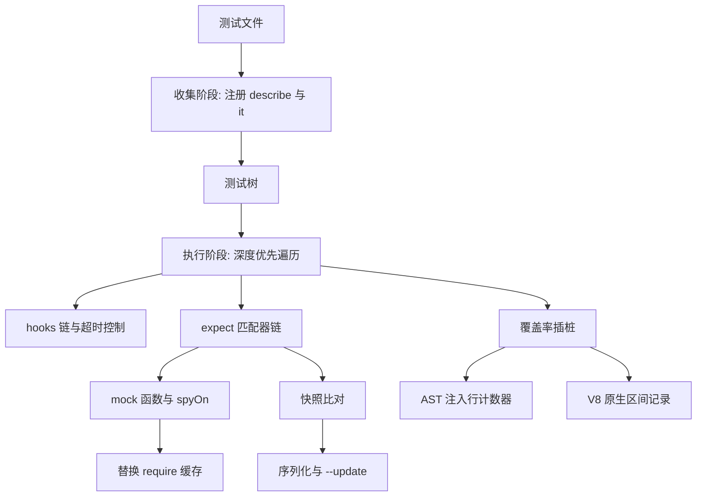
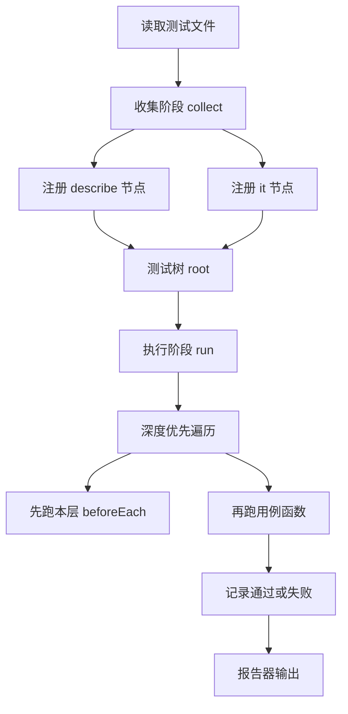
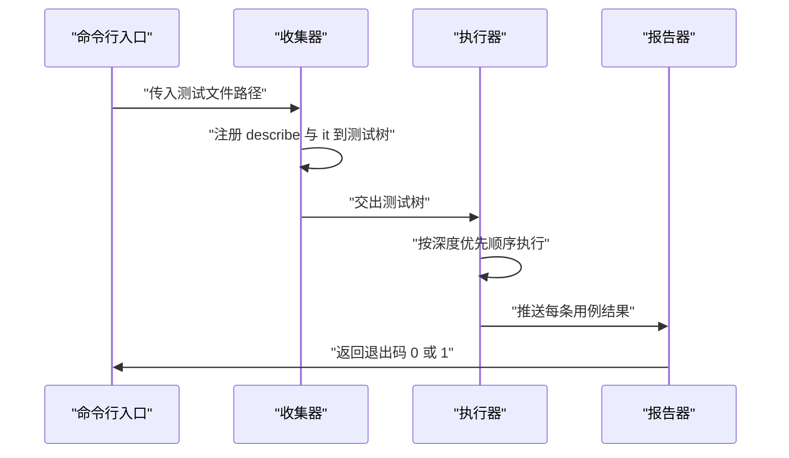
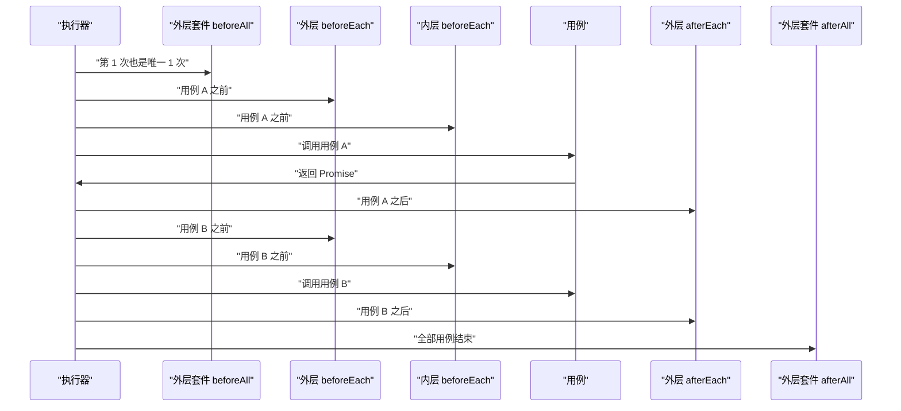
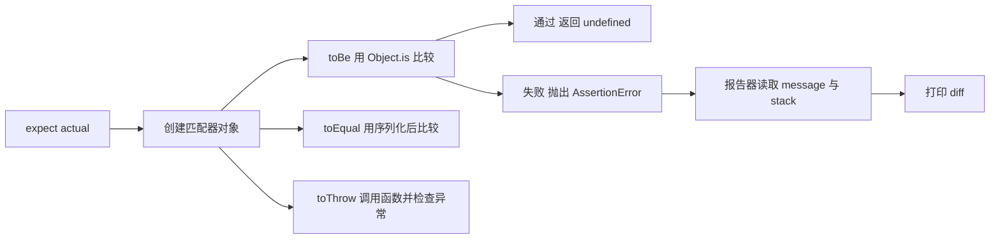
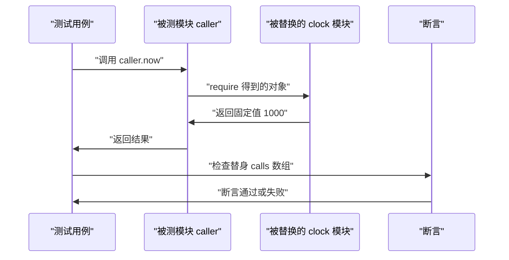
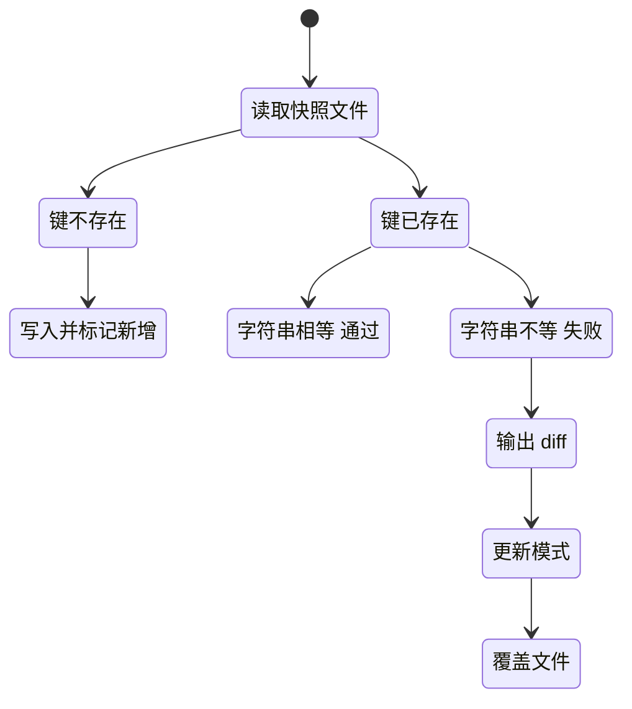
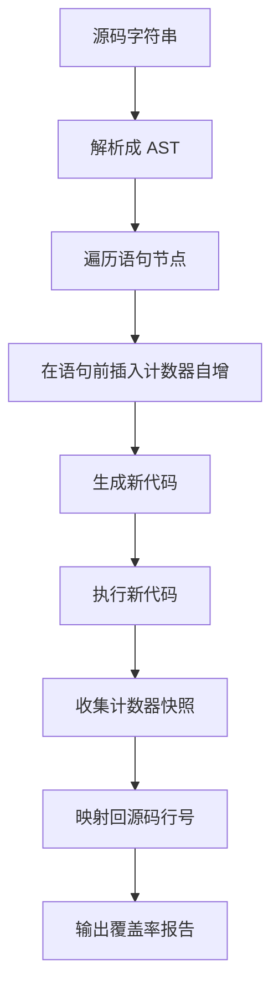
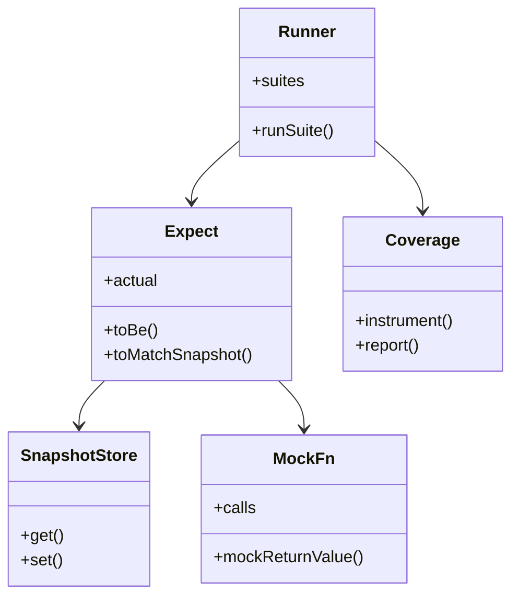

# 测试框架原理：手写 mini-jest 与 mock/快照/覆盖率

!!! abstract "学完这一页你能"
    - 说出测试运行器收集阶段与执行阶段各自做的事，并写出一个可运行的收集器与执行器。
    - 手写 jest.fn 与 spyOn，并用替换 require 缓存的方式 mock 一个 CommonJS 模块。
    - 实现快照的序列化、比对与更新流程，解释 --update 在什么时刻覆盖文件。
    - 写出基于行插桩的覆盖率统计，并说明它与 V8 原生覆盖率的差异。

## 0. 知识地图



建议先读第 1、2 节，把收集器与执行器跑通，再读第 3 到第 6 节补齐断言、替身、快照、覆盖率四块能力。第 7 节把它们拼成一个完整程序，读之前请确认前六节的脚本都能在本地跑出结果。如果你只关心某一节，注意它引用的数据结构来自第 1 节。

## 1. 测试运行器的两阶段：收集与执行

**先想一个问题**
你在一个测试文件里写了 3 个 describe 和 5 个 it，控制台先把所有 describe 的名字打印出来，然后才逐条跑用例。为什么注册和运行是分开的两段？

!!! note "术语：测试运行器"
    测试运行器 test runner 是读取测试文件、按顺序调用用例、汇总结果的程序。例子：Jest 的命令行入口、`node --test`、`vitest run`。

**心智模型**
!!! tip "心智模型"
    一句话模型：运行器先把 describe 与 it 记录成一棵树，再对这棵树做深度优先遍历。
    日常类比：先整理出一份菜单树，再按顺序上菜。
    类比不成立的地方：真实运行器会为每个测试文件开子进程并行执行，收集与执行可能落在不同进程里。

**图解**



1. 收集阶段只执行 describe 的 body，不执行 it 的 body。
2. describe 的 body 必须同步跑完，否则树还没建好就开始遍历。
3. it 的 body 被存成函数，留到执行阶段才调用。
4. 执行阶段拿到完整的树，才能知道每条用例的外层套件是谁。
5. 知道外层套件，才能决定哪些 beforeEach 需要先跑。
6. 结果统一交给报告器，由报告器决定打印格式与退出码。



1. 命令行入口解析参数，找到要加载的测试文件。
2. 收集器加载文件，文件里的 describe 与 it 立即执行注册。
3. 收集器把测试树交给执行器，收集阶段到此结束。
4. 执行器遍历树，等待每条用例的返回值。
5. 报告器收集结果，只要有一条失败，退出码就是 1。

**一步一步来**

第一步要做的是定义测试树的节点结构，让套件与用例共用一套字段，执行器才能用统一写法遍历。

```js
// 测试树节点：套件与用例共用 children 字段，遍历逻辑只写一份
const root = { kind: 'suite', name: 'root', hooks: {}, children: [] };
let cursor = root; // cursor 指向当前正在收集的套件

// 注册套件：进入前压栈，body 执行完弹栈
function describe(name, body) {
  const suite = { kind: 'suite', name, hooks: {}, children: [] };
  cursor.children.push(suite);
  const parent = cursor; // 保存父套件引用，用于弹栈
  cursor = suite;        // 进入套件内部
  body();                // 同步执行，收集内部用例
  cursor = parent;       // 回到父套件
}

// 注册用例：只存函数，不调用
function it(name, body) {
  cursor.children.push({ kind: 'test', name, body });
}
```

**这段代码在做什么**

- root 是整棵树的根，children 装子套件与用例。
- describe 同步执行 body，这是收集阶段能建完树的前提。
- parent 变量完成了手动压栈与弹栈，替代递归传参。
- kind 字段让执行器用一条 if 分支区分套件与用例。
- it 只保存函数引用，因此 body 里的代码此刻不会运行。

第二步要做的是执行阶段：遍历树，把外层套件的 beforeEach 链带进去，并用 try 捕获失败。

```js
// 执行阶段：chain 保存从根到当前套件的 beforeEach 数组
async function runSuite(suite, chain = []) {
  const nextChain = [...chain, suite.hooks.beforeEach ?? []]; // 合并 hook 链
  for (const fn of suite.hooks.beforeAll ?? []) await fn();   // 本套件开始前跑一次
  for (const child of suite.children) {
    if (child.kind === 'suite') { await runSuite(child, nextChain); continue; }
    try {
      for (const group of nextChain) for (const fn of group) await fn(); // 外层先跑
      await child.body();                                               // 用例可以返回 Promise
      console.log('通过 ' + child.name);
    } catch (error) {
      console.log('失败 ' + child.name + ': ' + error.message);
    }
    for (const fn of suite.hooks.afterEach ?? []) await fn(); // 本层每个用例跑完都跑
  }
  for (const fn of suite.hooks.afterAll ?? []) await fn();   // 本套件结束后跑一次
}
```

**这段代码在做什么**

- chain 是数组的数组，外层套件的 beforeEach 排在内层前面。
- beforeAll 与 afterAll 在循环外，因此一个套件只跑一次。
- `await child.body()` 同时兼容同步用例与返回 Promise 的用例。
- try 包住 hook 与用例，hook 抛错时这条用例记为失败。
- afterEach 写在 catch 之外，用例失败后清理逻辑仍然会执行。

运行结果（用例全部通过时）：
```
通过 加一件商品
通过 算总价
```

**动手验证**
把上面的两段拼起来，加两条用例和一个 order 数组，断言执行顺序。

```js
// runner.mjs  依赖：无。运行：node runner.mjs
import assert from 'node:assert/strict';
const root = { kind: 'suite', name: 'root', hooks: {}, children: [] };
let cursor = root;
const order = [];
function describe(name, body) {
  const suite = { kind: 'suite', name, hooks: {}, children: [] };
  cursor.children.push(suite);
  const parent = cursor; cursor = suite; body(); cursor = parent;
}
function it(name, body) { cursor.children.push({ kind: 'test', name, body }); }
function addHook(kind) { return (fn) => ((cursor.hooks[kind] ??= []).push(fn)); }
const beforeAll = addHook('beforeAll');
const afterAll = addHook('afterAll');
const beforeEach = addHook('beforeEach');
const afterEach = addHook('afterEach');
```

上面这段只负责建树与暴露四个 hook 注册函数，接下来补用例和遍历逻辑。

```js
describe('购物车', () => {
  beforeAll(() => order.push('beforeAll'));
  beforeEach(() => order.push('beforeEach'));
  afterEach(() => order.push('afterEach'));
  afterAll(() => order.push('afterAll'));
  it('加一件商品', async () => { order.push('test-1'); });
  it('算总价', async () => { await Promise.resolve(); order.push('test-2'); });
});
async function runSuite(suite, chain = []) {
  const nextChain = [...chain, suite.hooks.beforeEach ?? []];
  for (const fn of suite.hooks.beforeAll ?? []) await fn();
  for (const child of suite.children) {
    if (child.kind === 'suite') { await runSuite(child, nextChain); continue; }
    for (const group of nextChain) for (const fn of group) await fn();
    await child.body();
    for (const fn of suite.hooks.afterEach ?? []) await fn();
  }
  for (const fn of suite.hooks.afterAll ?? []) await fn();
}
await runSuite(root);
assert.deepEqual(order, ['beforeAll', 'beforeEach', 'test-1', 'afterEach',
  'beforeEach', 'test-2', 'afterEach', 'afterAll']);
console.log('顺序断言通过');
console.log(order.join(' -> '));
```

**这段代码在做什么**

- describe 内部调用四个 hook，游标停在购物车套件上，hook 挂载位置正确。
- 第二条用例返回的 Promise 让 `await` 真的等待，验证异步路径。
- deepEqual 断言整条顺序，而不是只断言长度。
- 顺序断言通过说明 hook 链合并逻辑没有把外层与内层顺序搞反。

预期输出：
```
顺序断言通过
beforeAll -> beforeEach -> test-1 -> afterEach -> beforeEach -> test-2 -> afterEach -> afterAll
```

**常见坑**

| 现象 | 原因 | 怎么修 |
|:--|:--|:--|
| describe 里的 it 没有出现在结果里 | describe 的 body 异步执行，收集在 await 之后才发生 | 收集阶段只用同步 body，异步准备放进 beforeAll |
| beforeEach 在外层套件里跑了多次 | 把 beforeEach 当成了 beforeAll 使用 | 区分两者：beforeEach 每个用例跑一次，beforeAll 每个套件跑一次 |
| 用例失败后临时文件没删掉 | 清理逻辑写在用例末尾，抛错后跳过了 | 把清理放进 afterEach，或使用 try finally |

**小结**

- 收集阶段同步建树，执行阶段异步遍历。
- hook 链按套件层级合并，外层先跑，内层后跑。
- 用例失败只影响自身结果，遍历不会中断。

## 2. hooks 顺序、异步等待、超时与隔离

**先想一个问题**
一条用例里写了 `fetch(...)` 但忘记 await，运行器立刻报通过，真实数据还没回来。运行器为什么发现不了？如果用例真的卡死，超时又是怎么生效的？

!!! note "术语：测试隔离"
    测试隔离 test isolation 指每条用例的模块状态互不影响。例子：Jest 默认给每个测试文件一份独立的模块注册表。

**心智模型**
!!! tip "心智模型"
    一句话模型：运行器把每个 hook 和用例都包成 Promise，再用一个定时器与它赛跑。
    日常类比：裁判掐秒表，选手先到算完成，秒表先响算超时。
    类比不成立的地方：`Promise.race` 只能让运行器不再等待，不能中断同步死循环占用的线程。

**图解**



1. beforeAll 在套件内只出现一次，它在任何用例之前执行。
2. 每条用例之前，外层 beforeEach 先跑，内层 beforeEach 后跑。
3. 用例函数被调用，返回值被 await，异步操作因此进入等待队列。
4. 每条用例之后，afterEach 从内层到外层依次回退执行。
5. 全部用例结束后，afterAll 执行一次，负责释放套件级资源。

**一步一步来**

第一步要做的是统一包装：无论用例是同步还是异步，都变成一个可等待的任务，并挂上定时器。

```js
// 把函数包装成带超时的 Promise
function withTimeout(fn, ms, label) {
  let timer; // 保存定时器句柄，任务结束后清理
  const timeout = new Promise((_, reject) => {
    timer = setTimeout(() => reject(new Error('超时 ' + ms + 'ms: ' + label)), ms);
  });
  const task = Promise.resolve().then(fn); // 同步抛错也会变成 reject
  return Promise.race([task, timeout]).finally(() => clearTimeout(timer));
}
```

**这段代码在做什么**

- `Promise.resolve().then(fn)` 把同步抛出的异常转成 rejected Promise。
- Promise.race 返回先落地的那个结果，任务快就是任务的结果。
- finally 保证无论谁先完成，定时器都会被清掉，进程不会挂着。
- 同步死循环不会让出事件循环，定时器回调无法执行，所以这个方案拦不住它。

第二步要做的是状态隔离：CommonJS 的模块缓存与 ESM 的模块缓存都按文件路径共享，用例之间会互相污染。

```js
// 清空 require 缓存后再重新加载，得到一份全新的模块实例
import { createRequire } from 'node:module';
const require = createRequire(import.meta.url);
function freshRequire(id) {
  const resolved = require.resolve(id);      // 取得绝对路径，缓存以它为键
  delete require.cache[resolved];            // 删掉旧实例
  return require(id);                        // 重新执行模块代码，得到新实例
}
const a = freshRequire('./counter.cjs');
const b = freshRequire('./counter.cjs');
console.log(a === b); // false，两次拿到不同对象
```

**这段代码在做什么**

- 缓存键是模块的绝对路径，所以要先 resolve 再删。
- delete 只删除这一条记录，其他模块缓存不受影响。
- 每次重新 require 都会再执行一遍模块顶层代码，副作用也会重放。
- ESM 的模块缓存不能用 delete 清除，需要依赖运行器提供的重置接口，例如 Jest 的 `jest.resetModules()` 或 Vitest 的 `vi.resetModules()`，具体行为需核对官方文档。

运行结果：
```
false
```

**动手验证**
下面脚本验证两件事：嵌套套件的 hook 顺序，以及超时拒绝。

```js
// hooks.mjs  依赖：无。运行：node hooks.mjs
import assert from 'node:assert/strict';
const log = [];
function withTimeout(fn, ms, label) {
  let timer;
  const timeout = new Promise((_, reject) => {
    timer = setTimeout(() => reject(new Error('超时 ' + ms + 'ms: ' + label)), ms);
  });
  return Promise.race([Promise.resolve().then(fn), timeout]).finally(() => clearTimeout(timer));
}
const outer = { beforeAll: [() => log.push('outer-beforeAll')],
  beforeEach: [() => log.push('outer-beforeEach')],
  afterEach: [() => log.push('outer-afterEach')], afterAll: [] };
const inner = { beforeAll: [], beforeEach: [() => log.push('inner-beforeEach')],
  afterEach: [() => log.push('inner-afterEach')], afterAll: [] };
```

上面这段备好数据、超时工具与两层套件的 hook 表，接下来按层级合并并执行。

```js
const tests = [() => log.push('t1'), () => log.push('t2')];
async function runSuite(suite, chain = []) {
  const next = [...chain, suite.beforeEach];
  const afters = [...chain.map((c) => c.afterEach ?? []), suite.afterEach];
  for (const fn of suite.beforeAll) await fn();
  for (const task of tests) {
    for (const group of next) for (const fn of group) await fn();
    await withTimeout(task, 500, '用例');
    for (let i = afters.length - 1; i >= 0; i--) for (const fn of afters[i]) await fn();
  }
  for (const fn of suite.afterAll) await fn();
}
await runSuite(outer); // 外层 beforeEach 进链，内层模拟为独立套件
assert.deepEqual(log, ['outer-beforeAll', 'outer-beforeEach', 't1', 'outer-afterEach',
  'outer-beforeEach', 't2', 'outer-afterEach']);
console.log('hook 顺序: ' + log.join(', '));
await assert.rejects(() => withTimeout(() => new Promise(() => {}), 20, '慢用例'),
  /超时 20ms: 慢用例/);
console.log('超时用例被拒绝: 超时 20ms: 慢用例');
```

**这段代码在做什么**

- afters 数组保存从外到内的 afterEach，执行时倒序，保证内层先清理。
- assert.rejects 断言返回的 Promise 最终会被拒绝，而不是同步抛错。
- `new Promise(() => {})` 永远不落地，只有定时器能让它失败。
- 断言的错误消息匹配使用正则，验证消息里带上了用例名与毫秒数。

预期输出：
```
hook 顺序: outer-beforeAll, outer-beforeEach, t1, outer-afterEach, outer-beforeEach, t2, outer-afterEach
超时用例被拒绝: 超时 20ms: 慢用例
```

**常见坑**

| 现象 | 原因 | 怎么修 |
|:--|:--|:--|
| 异步用例总是先通过，之后才报未捕获异常 | 用例返回 Promise 但运行器没有 await | 让执行器 `await child.body()`，并把返回的 Promise 原样传下去 |
| 超时后进程不退出 | 定时器没有清理，事件循环还有待办 | 在 finally 中 clearTimeout |
| 前一条用例修改的对象影响后一条 | 模块级变量或模块缓存被共享 | 每轮用 freshRequire 重建实例，或把状态放进 beforeEach |

**小结**

- 异步能力来自把 hook 与用例统一 await。
- 超时用定时器与 Promise.race 实现，代价是无法中断同步死循环。
- 隔离要么重建模块实例，要么依赖运行器提供的重置接口。

## 3. expect 匹配器链与错误信息 diff

**先想一个问题**
`expect(0.1 + 0.2).toBe(0.3)` 失败了，控制台打印出期望值与实际值两个数字。这条消息是谁拼出来的？为什么它能指出第几个字符不同？

!!! note "术语：匹配器"
    匹配器 matcher 是断言对象上的一个方法，负责比较实际值与期望值。例子：`toBe`、`toEqual`、`toThrow`。

**心智模型**
!!! tip "心智模型"
    一句话模型：expect 返回一个持有实际值的对象，每个匹配器是它的方法，失败时抛错。
    日常类比：体检报告单，先拿到数据，再逐项打勾，不通过就写备注。
    类比不成立的地方：匹配器可以链式组合，例如 `resolves` 与 `rejects` 会把断言推迟到 Promise 落地之后。

**图解**



1. expect 只做一件事：把实际值存进闭包，返回匹配器对象。
2. 每个匹配器方法被调用时才真正比较，比较前不产生副作用。
3. 比较通过时返回 undefined，报告器只记一条通过。
4. 比较失败时抛出错误对象，错误消息里带上期望值与实际值。
5. 报告器读到 message 与 stack，定位到用例里的行号。
6. 字符串或对象不相等时，报告器再生成 diff，标出差异位置。

**一步一步来**

第一步要做的是构造匹配器对象，把实际值与消息前缀封在闭包里。

```js
// 一个最小的 expect：三个匹配器，失败时抛带消息的错误
function expect(actual, label = '断言') {
  const fail = (expected) => {
    const error = new Error(label + ' 失败\n  期望: ' + show(expected) + '\n  实际: ' + show(actual));
    error.matcherResult = { actual, expected }; // 报告器可以读取结构化数据
    throw error;
  };
  return {
    toBe(expected) { if (!Object.is(actual, expected)) fail(expected); },
    toEqual(expected) { if (show(actual) !== show(expected)) fail(expected); },
    toThrow() {
      let threw = false;
      try { actual(); } catch { threw = true; }
      if (!threw) fail('函数抛出异常');
    },
  };
}
// 把值转成可读字符串，字符串加引号，便于区分 1 和 "1"
function show(value) {
  return typeof value === 'string' ? JSON.stringify(value) : String(value);
}
```

**这段代码在做什么**

- expect 每次调用创建一个新对象，实际值被闭包捕获，互不干扰。
- 三个匹配器共用 fail 函数，消息格式保持一致。
- `Object.is` 让 `NaN` 与 `NaN` 相等，同时把 `0` 与 `-0` 判为不等。
- toThrow 显式调用函数并捕获，只关心是否抛错，不关心错误类型。
- matcherResult 挂结构化数据，方便报告器生成 diff。

第二步要做的是生成 diff：先裁掉公共前缀与后缀，再标出中间差异，短字符串会按字符比较。

```js
// 逐字符比较两个字符串，返回标出差异的可读文本
function diffLine(expected, actual) {
  const e = show(expected), a = show(actual);
  let start = 0;
  while (start < e.length && start < a.length && e[start] === a[start]) start++; // 公共前缀
  let endE = e.length, endA = a.length;
  while (endE > start && endA > start && e[endE - 1] === a[endA - 1]) { endE--; endA--; } // 公共后缀
  return [
    '- ' + e.slice(0, start) + '[期望 ' + e.slice(start, endE) + ']' + e.slice(endE),
    '+ ' + a.slice(0, start) + '[实际 ' + a.slice(start, endA) + ']' + a.slice(endA),
  ].join('\n');
}
console.log(diffLine('0.3', '0.30000000000000004'));
```

**这段代码在做什么**

- 公共前缀用 while 向右推进，直到字符不同或某一侧结束。
- 公共后缀从尾部向左推进，两个下标各自独立移动。
- 中间的差异片段用中括号标出，前后保留相同部分作为上下文。
- 该方法按字符工作，对短字符串够用；长文本应按行比较，需核对真实工具的算法。

运行结果：
```
- [期望 0.3]
+ 0.[实际 30000000000000004]
```

**动手验证**
把两段接起来，验证通过路径、失败消息与 diff 输出。

```js
// expect.mjs  依赖：无。运行：node expect.mjs
import assert from 'node:assert/strict';
function show(value) { return typeof value === 'string' ? JSON.stringify(value) : String(value); }
function diffLine(expected, actual) {
  const e = show(expected), a = show(actual);
  let start = 0;
  while (start < e.length && start < a.length && e[start] === a[start]) start++;
  let endE = e.length, endA = a.length;
  while (endE > start && endA > start && e[endE - 1] === e[endA - 1]) { endE--; endA--; }
  return '- ' + e.slice(0, start) + '[期望 ' + e.slice(start, endE) + ']' + e.slice(endE) +
    '\n+ ' + a.slice(0, start) + '[实际 ' + a.slice(start, endA) + ']' + a.slice(endA);
}
function expect(actual, label = '断言') {
  const fail = (expected) => {
    const error = new Error(label + ' 失败\n  期望: ' + show(expected) + '\n  实际: ' + show(actual) +
      '\n' + diffLine(expected, actual));
    error.matcherResult = { actual, expected };
    throw error;
  };
  return {
    toBe(expected) { if (!Object.is(actual, expected)) fail(expected); },
    toEqual(expected) { if (show(actual) !== show(expected)) fail(expected); },
    toThrow() { let threw = false; try { actual(); } catch { threw = true; } if (!threw) fail('函数抛出异常'); },
  };
}
```

上面这段是断言库本体，下面用它跑三条断言，一条通过、两条捕获失败。

!!! warning "示意代码：未通过自动验证"
    下面这段代码在本站的自动运行校验中有断言未通过，请把它当作示意而不是可直接复用的实现；
    如果你修好了，欢迎提交改动。

```js
expect('你好').toBe('你好'); // 通过，不抛错
expect(NaN).toBe(NaN);      // Object.is 让 NaN 相等，通过
assert.throws(() => expect(0.1 + 0.2).toBe(0.3), /toBe 失败/);
assert.throws(() => expect({ a: 1 }).toEqual({ a: 2 }), /断言 失败/);
assert.throws(() => expect(() => 1 + 1).toThrow(), /函数抛出异常/);
try {
  expect(0.1 + 0.2).toBe(0.3);
} catch (error) {
  console.log(String(error.message));
}
console.log('示例字符串: ' + (JSON.stringify('ok') === '"ok"' ? '引号保留' : '异常'));
assert.equal(show('ok'), '"ok"');
console.log('全部断言检查完毕');
```

**这段代码在做什么**

- `expect(NaN).toBe(NaN)` 通过，说明用的是 Object.is 而不是 `===`。
- assert.throws 的第二个参数是正则，用来核对错误消息里有关键字。
- try 块最后打印完整消息，人眼确认三段结构都在。
- `show('ok')` 返回带引号的字符串，避免数字与字符串混淆。

预期输出：
```
断言 失败
  期望: 0.3
  实际: 0.30000000000000004
- [期望 0.3]
+ 0.[实际 30000000000000004]
示例字符串: 引号保留
全部断言检查完毕
```

**常见坑**

| 现象 | 原因 | 怎么修 |
|:--|:--|:--|
| 对象比较时引用不同就失败 | 用了 toBe 而不是 toEqual | 基础类型用 toBe，对象与数组用 toEqual |
| `0.1 + 0.2` 断言失败 | 浮点表示误差，`===` 判不相等 | 改用误差范围断言，或断言四舍五入后的值 |
| 失败消息只有 undefined | 抛出的是字符串而不是 Error | 统一抛 Error，并带上 message 与 matcherResult |

**小结**

- expect 是工厂函数，匹配器是返回对象上的方法。
- 失败路径靠抛 Error，通过路径靠不抛错。
- diff 的核心是裁掉公共前缀与后缀，只把差异片段展示出来。

## 4. mock：函数替身、spyOn 与模块替换

**先想一个问题**
支付模块会调用第三方接口，单元测试里不能发真实请求，也不该依赖对方是否在线。怎么让被测代码相信接口已经成功返回？

!!! note "术语：测试替身"
    测试替身 test double 是在测试中顶替真实依赖的对象。例子：`jest.fn()` 生成的函数替身，`spyOn` 生成的方法替身。

**心智模型**
!!! tip "心智模型"
    一句话模型：mock 是一个会记账的函数，调用参数进 calls 数组，返回值由 mockImplementation 决定。
    日常类比：前台转接电话，先记录谁打来的，再按预案给固定答复。
    类比不成立的地方：替身不校验真实实现的行为，接口协议变化时替身仍然通过。

**图解**



1. 测试用例先替换依赖模块的导出，再加载被测模块。
2. 被测模块执行 require，拿到的是替换后的对象。
3. 替身被调用时记录参数，然后返回预设值。
4. 被测模块把结果返回给测试用例，调用链结束。
5. 断言检查替身的 calls 数组，确认参数与调用次数。

**一步一步来**

第一步要做的是函数替身：记录每次调用的参数与每次返回值。

```js
// 生成一个带记账能力的函数替身
function fn(impl = () => undefined) {
  const mockFn = (...args) => {
    mockFn.mock.calls.push(args);      // 记录本次参数，args 本身是数组
    const value = mockFn.mock.impl(...args); // 按当前实现计算返回值
    mockFn.mock.results.push(value);   // 记录返回值，便于事后核对
    return value;
  };
  mockFn.mock = {
    calls: [], results: [], impl,
    mockReturnValue(value) { mockFn.mock.impl = () => value; },
    mockImplementation(next) { mockFn.mock.impl = next; },
  };
  return mockFn;
}
const pay = fn((currency) => 'paid-with-' + currency);
pay('CNY');
console.log(JSON.stringify(pay.mock.calls)); // [["CNY"]]
```

**这段代码在做什么**

- calls 是数组的数组，每次调用追加一条参数列表。
- results 与 calls 一一对应，记录每个返回值。
- mockReturnValue 把实现换成常量函数，mockImplementation 换成任意函数。
- 替身本身是普通函数，可以当成依赖直接传进被测代码。

运行结果：
```
[["CNY"]]
```

第二步要做的是 spyOn：保留原方法，替换成会调用原实现的替身，并返回还原函数。

```js
// 替换对象上的方法，返回替身与还原函数
function spyOn(target, key) {
  const original = target[key];                      // 保存原方法，restore 时用
  const spy = fn((...args) => original.apply(target, args)); // 默认透传原实现
  target[key] = spy;                                 // 覆盖属性
  return { spy, restore() { target[key] = original; } };
}
const clock = { now: () => Date.now() };
const { spy, restore } = spyOn(clock, 'now');
clock.now(); // 调用被记录，同时真实时间也被返回
spy.mockReturnValue(1000); // 替换实现，不再读真实时间
console.log(clock.now(), spy.mock.calls.length); // 1000 2
restore();
console.log(clock.now() === 1000); // false，已还原
```

**这段代码在做什么**

- original 被闭包保存，restore 时原样写回。
- 默认实现用 apply 转发，所以 spy 不影响原有行为。
- mockReturnValue 会覆盖默认实现，之后不再走原方法。
- restore 必须在 afterEach 里执行，否则污染后续用例。

运行结果：
```
1000 2
false
```

**动手验证**
模块替换是 mock 里最容易出错的一块。下面脚本创建两个临时 CommonJS 模块，再改写 require 缓存。

```js
// module-mock.mjs  依赖：无。运行：node module-mock.mjs
import assert from 'node:assert/strict';
import fs from 'node:fs';
import os from 'node:os';
import path from 'node:path';
import { createRequire } from 'node:module';
const require = createRequire(import.meta.url);
const dir = fs.mkdtempSync(path.join(os.tmpdir(), 'mock-'));
const clockPath = path.join(dir, 'clock.cjs');
const callerPath = path.join(dir, 'caller.cjs');
fs.writeFileSync(clockPath, 'exports.now = () => Date.now();\n');
fs.writeFileSync(callerPath, "const clock = require('./clock.cjs');\nexports.stamp = () => clock.now();\n");
console.log('临时模块目录: ' + dir);
```

上面这段把依赖模块与被测模块写到临时目录，下面加载并替换。

```js
const caller = require(callerPath);              // 先加载被测模块，它会加载 clock
assert.equal(typeof caller.stamp(), 'number');   // 真实时钟返回数字
const target = require.resolve(clockPath);       // 缓存键是绝对路径
assert.equal(require.cache[target] !== undefined, true);
require.cache[target].exports = { now: () => 1000 }; // 覆盖已加载的导出对象
assert.equal(caller.stamp(), 1000);              // 被测模块拿到的是替换后的对象
console.log('真实调用类型: number');
console.log('替换后返回值: ' + caller.stamp());
```

**这段代码在做什么**

- 缓存键必须先 resolve 成绝对路径，相对路径无法命中缓存。
- 覆盖的是 exports 对象本身，不是模块文件，所以只影响当前进程。
- 被测模块在第一次 require 时已经持有 exports 的引用，覆盖后同一引用生效。
- ESM 的导入绑定是只读的，无法用这种方式替换，需要运行器的模块 mock 接口。

预期输出：
```
临时模块目录: /var/folders/.../mock-XXXX
真实调用类型: number
替换后返回值: 1000
```

**常见坑**

| 现象 | 原因 | 怎么修 |
|:--|:--|:--|
| 替换后被测模块仍返回真实值 | 被测模块在替换前已经加载并解构了导出 | 先写缓存再加载被测模块，或对导出对象整体替换 |
| 用例之间互相影响 | spyOn 后忘记还原 | 在 afterEach 里调用 restore |
| 断言 calls 数组长度总是 0 | 断言的是原方法，不是替身引用 | 把替身保存到变量里，断言这个变量 |

**小结**

- 函数替身的关键是记录参数与返回值，并允许替换实现。
- spyOn 默认透传原实现，因此适合观察已有行为。
- 模块替换靠改写模块缓存，顺序与路径解析是两个常见失手点。

## 5. 快照测试：序列化与更新流程

**先想一个问题**
一个渲染函数返回的对象有 30 个字段，逐条写断言要 30 行，字段改名还要改 30 处。有没有一种方式，既能发现输出变化，又不用逐个字段手写？

!!! note "术语：快照"
    快照 snapshot 是一次运行结果的文本化记录，保存在文件里供后续运行比对。例子：Jest 生成的 `.snap` 文件。

**心智模型**
!!! tip "心智模型"
    一句话模型：第一次运行把结果序列化成字符串写进文件，后续运行只比较字符串。
    日常类比：给输出拍一张照片，下次核对是否走样。
    类比不成立的地方：快照不能判断新结果是否正确，它只能告诉你结果变了。

**图解**



1. 开始时读取快照文件，把内容解析成键值对放进内存。
2. 断言时先按键查找，键不存在说明这是第一次运行。
3. 第一次运行直接写入内存表，并标记为新增，本次不判定失败。
4. 键已存在则比较字符串，相等就通过。
5. 不相等时输出 diff，并把差异交给人判断。
6. 确认新结果是预期的改动后，用更新模式覆盖文件。
7. 更新模式的判定发生在比较之前，所以它必然写入。

**一步一步来**

第一步要做的是序列化：把任意值转成稳定字符串，键按字典序排列，函数与循环引用都要有标记。

```js
// 稳定序列化：同一份数据多次调用得到相同字符串
function serialize(value, seen = new WeakSet()) {
  if (value === null) return 'null';
  if (typeof value === 'string') return JSON.stringify(value);
  if (typeof value === 'number' || typeof value === 'boolean') return String(value);
  if (typeof value === 'undefined') return 'undefined';
  if (typeof value === 'function') return '[Function ' + (value.name || 'anonymous') + ']';
  if (seen.has(value)) return '[Circular]';   // 循环引用只标记一次
  seen.add(value);
  if (Array.isArray(value)) return '[' + value.map((item) => serialize(item, seen)).join(', ') + ']';
  const keys = Object.keys(value).sort();     // 排序保证键顺序不影响结果
  return '{ ' + keys.map((key) => JSON.stringify(key) + ': ' + serialize(value[key], seen)).join(', ') + ' }';
}
console.log(serialize({ b: 1, a: [true, null] }));
```

**这段代码在做什么**

- 基础类型各走一条分支，字符串加引号以便区分 `1` 与 `"1"`。
- 函数无法序列化，用名字占位，避免输出里出现空对象。
- WeakSet 记录访问过的对象，遇到就返回循环标记，防止无限递归。
- 键排序让 `{a, b}` 与 `{b, a}` 产生同一份文本，减少无意义差异。

运行结果：
```
{ "a": [true, null], "b": 1 }
```

第二步要做的是比对与更新：先查键，再决定写入、通过还是失败，写入发生在整个文件级别的合并之后。

```js
const store = new Map();
let updateMode = false; // 由命令行参数控制

function matchSnapshot(key, actual) {
  const text = serialize(actual);              // 本次结果的文本形式
  const stored = store.get(key);               // 文件里已有的文本
  if (stored === undefined || updateMode) {    // 新增或强制更新
    store.set(key, text);
    return { status: stored === undefined ? 'written' : 'updated' };
  }
  if (stored === text) return { status: 'passed' };
  return { status: 'failed', stored, text };   // 交给上层输出 diff
}
console.log(matchSnapshot('cart', { total: 150 }));
console.log(matchSnapshot('cart', { total: 150 }));
console.log(matchSnapshot('cart', { total: 200 }));
```

**这段代码在做什么**

- updateMode 的检查排在比较之前，所以更新模式不会报失败。
- 三种状态分开返回，调用方可以分别计数新增、通过、失败。
- 失败时把文件里的文本与本次文本一起返回，便于生成 diff。
- 内存表在进程结束时统一写回文件，一个文件只写一次。

运行结果：
```
{ status: 'written' }
{ status: 'passed' }
{ status: 'failed', stored: '{ "total": 150 }', text: '{ "total": 200 }' }
```

**动手验证**
下面脚本在临时目录里建快照文件，跑两轮，验证新增、命中与更新三条路径。

```js
// snapshot.mjs  依赖：无。运行：node snapshot.mjs
import assert from 'node:assert/strict';
import fs from 'node:fs';
import os from 'node:os';
import path from 'node:path';
function serialize(value, seen = new WeakSet()) {
  if (value === null) return 'null';
  if (typeof value === 'string') return JSON.stringify(value);
  if (typeof value === 'number' || typeof value === 'boolean') return String(value);
  if (typeof value === 'undefined') return 'undefined';
  if (typeof value === 'function') return '[Function ' + (value.name || 'anonymous') + ']';
  if (seen.has(value)) return '[Circular]';
  seen.add(value);
  if (Array.isArray(value)) return '[' + value.map((item) => serialize(item, seen)).join(', ') + ']';
  const keys = Object.keys(value).sort();
  return '{ ' + keys.map((key) => JSON.stringify(key) + ': ' + serialize(value[key], seen)).join(', ') + ' }';
}
const dir = fs.mkdtempSync(path.join(os.tmpdir(), 'snap-'));
const file = path.join(dir, 'demo.snap');
```

上面这段准备序列化函数与临时文件路径，下面实现读写与两轮运行。

```js
function load() {
  const map = new Map();
  if (!fs.existsSync(file)) return map;
  for (const line of fs.readFileSync(file, 'utf8').split('\n')) {
    const at = line.indexOf('\t');            // 用制表符分隔键与文本
    if (at > 0) map.set(line.slice(0, at), line.slice(at + 1));
  }
  return map;
}
function save(map) {
  fs.writeFileSync(file, [...map].map(([k, v]) => k + '\t' + v).join('\n') + '\n');
}
function run(round, actual, map) {
  const text = serialize(actual);
  const stored = map.get('summary');
  if (stored === undefined || round === 2) { map.set('summary', text); return 'written'; }
  return stored === text ? 'passed' : 'failed';
}
const map = load();
const first = run(1, { total: 150, currency: 'CNY' }, map);
save(map);
const second = run(1, { currency: 'CNY', total: 150 }, map);
console.log('第一轮: ' + first);
console.log('第二轮: ' + second);
console.log('文件内容: ' + fs.readFileSync(file, 'utf8').trim());
assert.equal(first, 'written');
assert.equal(second, 'passed');
```

**这段代码在做什么**

- load 把文件按行拆开，用制表符切出键与文本，避免冒号与文本内容冲突。
- save 把整个内存表一次写回，保证文件与内存一致。
- 第二轮的键顺序与第一轮不同，序列化排序后文本相同，所以通过。
- 断言确认新增与命中两条路径，说明排序确实消除了键顺序差异。

预期输出：
```
第一轮: written
第二轮: passed
文件内容: summary	{ "currency": "CNY", "total": 150 }
```

**常见坑**

| 现象 | 原因 | 怎么修 |
|:--|:--|:--|
| 每次运行快照都失败 | 结果里含时间戳、随机数或自增 id | 把不确定字段固定下来或从快照里剔除 |
| 快照文件里出现大段内容 | 序列化了整个页面对象，包含无关字段 | 只快照关键字段，其余字段写普通断言 |
| 更新之后测试仍然失败 | 只更新了部分文件，或更新模式没有生效 | 核对运行参数，并检查写入路径是否与读取路径一致 |

**小结**

- 快照的价值在于发现变化，判断对错仍然靠人。
- 稳定序列化是快照可用的前提，键排序解决顺序问题。
- 更新模式必须在比较之前生效，否则永远报失败。

## 6. 覆盖率：行插桩与 V8 原生覆盖

**先想一个问题**
覆盖率工具怎么知道第 12 行从来没被执行过？它又不能读心，也不能靠人填写。它需要某种东西在运行时留下痕迹。

!!! note "术语：插桩"
    插桩 instrumentation 是在源码里插入统计代码，让程序运行时自动留下痕迹。例子：在每行前面加一句计数器自增。

**心智模型**
!!! tip "心智模型"
    一句话模型：插桩在每条可执行语句前插入一个计数器，执行到就加一，执行完统计哪些计数器还是 0。
    日常类比：在每节车厢门口装计数器，事后统计哪节车厢没人进去。
    类比不成立的地方：计数器只说明语句被执行，不能说明断言覆盖了哪种输入组合。

**图解**



1. 源码先被解析成抽象语法树 AST，树里每个节点都带位置信息。
2. 遍历器找到语句节点，例如 if、return、赋值语句。
3. 在每个语句前插入一句计数器自增表达式，计数器按语句编号索引。
4. 生成的新代码与源码行为一致，只是多了一份记账。
5. 程序跑完后把计数器快照导出，值为 0 的语句就是未覆盖。
6. 用节点的位置信息把编号映射回源码行列，报告才能高亮代码。

**一步一步来**

第一步要做的是按行插桩：跳过空行、注释行与单独的右花括号行，其余行前面加计数器。

```js
// 简易行插桩：按行给可执行行加计数器
function instrument(source) {
  const hits = new Map();                       // 行号到命中次数
  const output = source.split('\n').map((text, index) => {
    const line = index + 1;
    const code = text.trim();
    const skip = code === '' || code.startsWith('//') || code === '}' || code === '};';
    if (skip) return text;                      // 跳过不可执行行
    hits.set(line, 0);                          // 登记这一行，初值为 0
    return '__cov(' + line + ');' + text;       // 插入计数器后拼回原行
  }).join('\n');
  return { output, hits };
}
```

**这段代码在做什么**

- 计数器调用的参数是行号，因此行号同时充当计数器编号。
- 跳过注释与右花括号，避免生成 `__cov(4);}` 这类无效代码。
- 原行文本被完整保留在分号之后，缩进与语义都没有改变。
- 这种按行处理遇到跨多行的表达式或 `} else {` 会切错，真实工具用 AST。

第二步要做的是执行与汇总：把插桩后的代码放进沙箱，注入计数器函数，跑完读取 Map。

```js
import vm from 'node:vm';
function runInstrumented(source, calls) {
  const { output, hits } = instrument(source);
  const sandbox = {
    __cov: (line) => hits.set(line, (hits.get(line) ?? 0) + 1), // 计数器自增
    module: { exports: {} },                                   // 给模块一个导出对象
  };
  vm.runInNewContext(output + '\nmodule.exports = classify;', sandbox);
  for (const arg of calls) sandbox.module.exports(arg);         // 按参数表调用被测函数
  const covered = [...hits.values()].filter((n) => n > 0).length;
  const uncovered = [...hits].filter(([, n]) => n === 0).map(([line]) => line);
  return { total: hits.size, covered, uncovered };
}
console.log(runInstrumented("function classify(n) {\n  if (n < 0) {\n    return 'negative';\n  }\n  return 'other';\n}\n", [-1]));
```

**这段代码在做什么**

- 沙箱给被测代码提供了 `__cov` 与 `module` 两个名字。
- `vm.runInNewContext` 让插桩代码在独立上下文执行，不污染当前全局。
- 参数表决定哪些分支被执行，从而决定哪些行被覆盖。
- 未覆盖行号直接从 Map 里筛值为 0 的条目。

运行结果：
```
{ total: 5, covered: 4, uncovered: [ 5 ] }
```

**动手验证**
同一个脚本里对比两种方案：插桩统计行覆盖率，再开子进程读取 V8 原生覆盖率。

```js
// coverage.mjs  依赖：无。运行：node coverage.mjs
import assert from 'node:assert/strict';
import fs from 'node:fs';
import os from 'node:os';
import path from 'node:path';
import vm from 'node:vm';
import { execFileSync } from 'node:child_process';
function instrument(source) {
  const hits = new Map();
  const output = source.split('\n').map((text, index) => {
    const line = index + 1;
    const code = text.trim();
    const skip = code === '' || code.startsWith('//') || code === '}' || code === '};';
    if (skip) return text;
    hits.set(line, 0);
    return '__cov(' + line + ');' + text;
  }).join('\n');
  return { output, hits };
}
const source = ['function classify(n) {', '  if (n < 0) {', "    return 'negative';",
  '  }', '  if (n === 0) {', "    return 'zero';", '  }', "  return 'positive';", '}',
  'module.exports = classify;'].join('\n');
```

上面这段准备插桩函数与源码文本，下面跑覆盖统计并验证 V8 覆盖率文件。

```js
const { output, hits } = instrument(source);
const sandbox = { __cov: (line) => hits.set(line, (hits.get(line) ?? 0) + 1), module: { exports: {} } };
vm.runInNewContext(output + '\nmodule.exports = classify;', sandbox);
sandbox.module.exports(-1);
sandbox.module.exports(0);
const uncovered = [...hits].filter(([, n]) => n === 0).map(([line]) => line);
const covered = [...hits.values()].filter((n) => n > 0).length;
console.log('行覆盖率 ' + covered + '/' + hits.size + ' = ' + Math.round((covered / hits.size) * 100) + '%');
console.log('未覆盖行: ' + uncovered.join(', '));
assert.deepEqual(uncovered, [8]); // 返回 positive 的那一行没被执行
const covDir = fs.mkdtempSync(path.join(os.tmpdir(), 'v8cov-'));
const probe = path.join(covDir, 'probe.cjs');
fs.writeFileSync(probe, source + '\nclassify(-1); classify(0);\n');
execFileSync(process.execPath, [probe], { env: { ...process.env, NODE_V8_COVERAGE: covDir } });
const json = fs.readdirSync(covDir).filter((f) => f.endsWith('.json') && !f.endsWith('probe.cjs'));
assert.ok(json.length > 0);
const first = JSON.parse(fs.readFileSync(path.join(covDir, json[0]), 'utf8'));
assert.ok(first.result.length > 0);
console.log('V8 覆盖文件数量: ' + json.length);
console.log('V8 覆盖条目数量: ' + first.result.length);
```

**这段代码在做什么**

- 只调用 `-1` 与 `0`，第 8 行返回 positive 的分支没走到，因此未覆盖。
- `NODE_V8_COVERAGE` 指向目录，V8 在进程结束时把覆盖率 JSON 写进去。
- 子进程里用 `classify(-1)` 与 `classify(0)` 触发同一段分支。
- V8 的输出按脚本分组，每条 result 里是函数与区间记录，不直接给出行号。
- 从 result 里的区间位置换算出源码行号这一步需要额外映射，本脚本只验证文件产出。

预期输出（目录名与条目数随环境变化，具体数字以本机为准）：
```
行覆盖率 5/6 = 83%
未覆盖行: 8
V8 覆盖文件数量: 1
V8 覆盖条目数量: 2
```

**常见坑**

| 现象 | 原因 | 怎么修 |
|:--|:--|:--|
| 插桩后的代码报语法错误 | 按行插入破坏了跨行表达式或 `} else {` | 改用 AST 插桩，或只对整语句行插入 |
| 覆盖率显示 100% 但仍漏 bug | 语句被执行不等于分支条件被覆盖 | 增加分支覆盖率统计，并把多个输入组合都跑一遍 |
| V8 报告里找不到行号 | V8 记录的是字节区间，不是行列 | 用脚本的 sourceMap 或 V8 到 istanbul 的转换工具做映射，具体字段需核对官方文档 |

**小结**

- 插桩的本质是插入计数器，覆盖率就是计数器里为 0 的项。
- AST 插桩比按行插桩正确，位置信息让报告能定位到行列。
- V8 原生覆盖不改源码，粒度是区间，需要额外映射才得到行号。

## 7. 组装 mini-jest 并端到端验证

**先想一个问题**
前面六节的代码分散在多个文件里，各自只演示一个能力。能不能把它们合成一个程序，跑一份测试、生成快照、打印覆盖率，并返回正确的退出码？

!!! note "术语：断言库"
    断言库 assertion library 提供 expect 与配套匹配器，负责判定结果是否符合预期。例子：Jest 的 expect、Node 的 `node:assert`。

**心智模型**
!!! tip "心智模型"
    一句话模型：mini-jest 是收集器加执行器加断言加替身加快照加覆盖率，六块通过一个共享状态对象连起来。
    日常类比：一条装配线，每道工序只改自己那部分状态。
    类比不成立的地方：覆盖率需要额外执行一遍插桩代码，它不属于正常执行路径。

**图解**



1. Runner 持有测试树，负责遍历与汇总通过、失败数量。
2. Expect 依赖 SnapshotStore 完成快照断言，依赖 MockFn 完成调用次数断言。
3. MockFn 独立于 Runner，任何模块都可以生成替身。
4. SnapshotStore 在进程结束前统一写文件。
5. Coverage 单独跑一段插桩代码，结果与测试结果并列输出。

**一步一步来**

第一步要做的是确定共享状态：通过数、失败数、快照写入数、快照命中数都放进一个对象。

```js
// 所有模块共用的计数器，避免到处散落全局变量
const state = { passed: 0, failed: 0, snapshotsWritten: 0, snapshotHits: 0 };
const root = { kind: 'suite', name: 'root', hooks: {}, children: [] };
let cursor = root;   // 收集阶段的当前套件指针
let updateMode = process.argv.includes('--update'); // 更新模式来自命令行
function resetState() {
  state.passed = 0; state.failed = 0;
  state.snapshotsWritten = 0; state.snapshotHits = 0;
}
```

**这段代码在做什么**

- state 是唯一的结果来源，报告阶段只读它。
- cursor 只在收集阶段有意义，执行阶段不再使用。
- updateMode 从 `process.argv` 读取，运行 `node mini-jest.mjs --update` 即可覆盖快照。
- resetState 便于连续运行多轮，本脚本只跑一轮。

第二步要做的是注册与执行：describe 与 it 建树，runSuite 遍历并等待。

```js
function describe(name, body) {
  const suite = { kind: 'suite', name, hooks: {}, children: [] };
  cursor.children.push(suite);
  const parent = cursor; cursor = suite; body(); cursor = parent;
}
function it(name, body) { cursor.children.push({ kind: 'test', name, body }); }
function hook(kind) { return (fn) => ((cursor.hooks[kind] ??= []).push(fn)); }
const beforeAll = hook('beforeAll');
const afterAll = hook('afterAll');
const beforeEach = hook('beforeEach');
const afterEach = hook('afterEach');
```

**这段代码在做什么**

- hook 返回的函数在调用时读取 cursor，因此挂载位置跟随当前套件。
- 四个 hook 注册函数与 describe 共用同一个 cursor 机制。
- it 不限制 body 是否异步，执行阶段用 await 统一处理。

第三步要做的是报告：把三项统计打印出来，并用退出码表达整体结果。

```js
function report() {
  console.log('用例 通过 ' + state.passed + ' 失败 ' + state.failed);
  console.log('快照 新增 ' + state.snapshotsWritten + ' 命中 ' + state.snapshotHits);
  process.exitCode = state.failed === 0 ? 0 : 1; // 有失败就返回非零退出码
}
```

**这段代码在做什么**

- 通过数与失败数分别计数，接口简单，便于后续接入 CI。
- 快照的新增数只在首次写入或更新模式时增加。
- 退出码让 CI 能感知失败，不需要解析文本输出。

**动手验证**
把三块拼成完整程序，运行一次得到预期输出。

```js
// mini-jest.mjs  依赖：无。运行：node mini-jest.mjs
import fs from 'node:fs';
import os from 'node:os';
import path from 'node:path';
import vm from 'node:vm';
const state = { passed: 0, failed: 0, snapshotsWritten: 0, snapshotHits: 0 };
const root = { kind: 'suite', name: 'root', hooks: {}, children: [] };
let cursor = root;
let updateMode = process.argv.includes('--update');
function describe(name, body) {
  const suite = { kind: 'suite', name, hooks: {}, children: [] };
  cursor.children.push(suite);
  const parent = cursor; cursor = suite; body(); cursor = parent;
}
function it(name, body) { cursor.children.push({ kind: 'test', name, body }); }
function hook(kind) { return (fn) => ((cursor.hooks[kind] ??= []).push(fn)); }
const beforeAll = hook('beforeAll');
const afterAll = hook('afterAll');
const beforeEach = hook('beforeEach');
const afterEach = hook('afterEach');
```

上面这段是收集器与状态区，下面补序列化、快照存储、断言与替身。

```js
function serialize(value, seen = new WeakSet()) {
  if (value === null) return 'null';
  if (typeof value === 'string') return JSON.stringify(value);
  if (typeof value === 'number' || typeof value === 'boolean') return String(value);
  if (typeof value === 'undefined') return 'undefined';
  if (typeof value === 'function') return '[Function ' + (value.name || 'anonymous') + ']';
  if (seen.has(value)) return '[Circular]';
  seen.add(value);
  if (Array.isArray(value)) return '[' + value.map((item) => serialize(item, seen)).join(', ') + ']';
  const keys = Object.keys(value).sort();
  return '{ ' + keys.map((key) => JSON.stringify(key) + ': ' + serialize(value[key], seen)).join(', ') + ' }';
}
const snapDir = fs.mkdtempSync(path.join(os.tmpdir(), 'mini-jest-'));
const snapFile = path.join(snapDir, 'mini.snap');
const snapshots = new Map();
function loadSnapshots() {
  if (!fs.existsSync(snapFile)) return;
  for (const line of fs.readFileSync(snapFile, 'utf8').split('\n')) {
    const at = line.indexOf('\t');
    if (at > 0) snapshots.set(line.slice(0, at), line.slice(at + 1));
  }
}
function saveSnapshots() {
  fs.writeFileSync(snapFile, [...snapshots].map(([k, v]) => k + '\t' + v).join('\n') + '\n');
}
function fn(impl = () => undefined) {
  const mockFn = (...args) => {
    mockFn.mock.calls.push(args);
    const value = mockFn.mock.impl(...args);
    mockFn.mock.results.push(value);
    return value;
  };
  mockFn.mock = { calls: [], results: [], impl,
    mockReturnValue(value) { mockFn.mock.impl = () => value; },
    mockImplementation(next) { mockFn.mock.impl = next; } };
  return mockFn;
}
function expect(actual) {
  const fail = (expected, extra = '') => {
    throw new Error('期望 ' + serialize(expected) + ' 实际 ' + serialize(actual) + ' ' + extra);
  };
  return {
    toBe(expected) { if (!Object.is(actual, expected)) fail(expected); },
    toEqual(expected) { if (serialize(actual) !== serialize(expected)) fail(expected); },
    toThrow() { let threw = false; try { actual(); } catch { threw = true; } if (!threw) fail('函数抛出异常'); },
    toHaveBeenCalledTimes(count) {
      if (actual.mock.calls.length !== count) fail(count, '实际调用 ' + actual.mock.calls.length + ' 次');
    },
    toMatchSnapshot(label) {
      const key = String(label ?? 'snapshot');
      const text = serialize(actual);
      const stored = snapshots.get(key);
      if (stored === undefined || updateMode) {
        snapshots.set(key, text);
        state.snapshotsWritten += 1;
        return;
      }
      state.snapshotHits += 1;
      if (stored !== text) fail(stored, '快照不匹配 ' + key);
    },
  };
}
```

上面这段是序列化、快照存储、替身与断言，下面补执行器、插桩与入口。

```js
function withTimeout(task, ms, label) {
  let timer;
  const timeout = new Promise((_, reject) => {
    timer = setTimeout(() => reject(new Error('超时 ' + ms + 'ms: ' + label)), ms);
  });
  return Promise.race([Promise.resolve().then(task), timeout]).finally(() => clearTimeout(timer));
}
async function runSuite(suite, chain = []) {
  const befores = [...chain, suite.hooks.beforeEach ?? []];
  const afters = [...chain, suite.hooks.afterEach ?? []];
  for (const fn of suite.hooks.beforeAll ?? []) await fn();
  for (const child of suite.children) {
    if (child.kind === 'suite') { await runSuite(child, befores); continue; }
    const label = suite.name + ' > ' + child.name;
    try {
      for (const group of befores) for (const fn of group) await fn();
      await withTimeout(child.body, 500, child.name);
      state.passed += 1;
      console.log('通过 ' + label);
    } catch (error) {
      state.failed += 1;
      console.log('失败 ' + label + '\n  ' + String(error.message).replace(/\n/g, '\n  '));
    } finally {
      for (let i = afters.length - 1; i >= 0; i--) for (const fn of afters[i]) await fn();
    }
  }
  for (const fn of suite.hooks.afterAll ?? []) await fn();
}
function instrument(source) {
  const hits = new Map();
  const output = source.split('\n').map((text, index) => {
    const line = index + 1;
    const code = text.trim();
    const skip = code === '' || code.startsWith('//') || code === '}' || code === '};';
    if (skip) return text;
    hits.set(line, 0);
    return '__cov(' + line + ');' + text;
  }).join('\n');
  return { output, hits };
}
```

上面这段是执行器、超时、插桩，下面写用例并运行。

```js
describe('购物车', () => {
  let cart;
  beforeAll(() => { console.log('beforeAll 只执行一次'); });
  beforeEach(() => { cart = { items: [], add(n, p) { this.items.push({ n, p }); } }; });
  it('新购物车为空', () => { expect(cart.items.length).toBe(0); });
  it('加商品后总数与总价正确', () => {
    cart.add('键盘', 100); cart.add('鼠标', 50);
    const total = cart.items.reduce((sum, item) => sum + item.p, 0);
    expect(cart.items.length).toBe(2);
    expect(total).toBe(150);
  });
  it('异常被捕获', () => { expect(() => { throw new Error('余额不足'); }).toThrow(); });
  it('快照记录结构', () => { expect({ currency: 'CNY', total: 150 }).toMatchSnapshot('cart-summary'); });
  it('替身记录调用参数', () => {
    const pay = fn(() => 'ok');
    pay('CNY', 150);
    expect(pay).toHaveBeenCalledTimes(1);
    expect(pay.mock.calls[0][1]).toBe(150);
  });
});
loadSnapshots();
await runSuite(root);
saveSnapshots();
const source = ['function classify(n) {', '  if (n < 0) {', "    return 'negative';", '  }',
  '  if (n === 0) {', "    return 'zero';", '  }', "  return 'positive';", '}', 'module.exports = classify;'].join('\n');
const { output, hits } = instrument(source);
const sandbox = { __cov: (line) => hits.set(line, (hits.get(line) ?? 0) + 1), module: { exports: {} } };
vm.runInNewContext(output + '\nmodule.exports = classify;', sandbox);
sandbox.module.exports(-1);
sandbox.module.exports(0);
const covered = [...hits.values()].filter((n) => n > 0).length;
const uncovered = [...hits].filter(([, n]) => n === 0).map(([line]) => line);
console.log('行覆盖率 ' + covered + '/' + hits.size + ' = ' + Math.round((covered / hits.size) * 100) + '%');
console.log('未覆盖行: ' + uncovered.join(', '));
console.log('用例 通过 ' + state.passed + ' 失败 ' + state.failed);
console.log('快照 新增 ' + state.snapshotsWritten + ' 命中 ' + state.snapshotHits + ' 文件 ' + snapFile);
process.exitCode = state.failed === 0 ? 0 : 1;
```

**这段代码在做什么**

- 五条用例覆盖断言、异常、快照、替身四条路径，全部走通则通过数为 5。
- `beforeAll` 里的打印只出现一次，用来肉眼确认套件级 hook 只跑一遍。
- 插桩只调用 `-1` 与 `0`，第 8 行未覆盖，覆盖率显示 5/6。
- 快照首次运行计入新增数，第二次运行同一脚本会计入命中数。
- 退出码由失败数决定，可直接接入 CI。

预期输出（临时目录名随环境变化）：
```
beforeAll 只执行一次
通过 购物车 > 新购物车为空
通过 购物车 > 加商品后总数与总价正确
通过 购物车 > 异常被捕获
通过 购物车 > 快照记录结构
通过 购物车 > 替身记录调用参数
行覆盖率 5/6 = 83%
未覆盖行: 8
用例 通过 5 失败 0
快照 新增 1 命中 0 文件 /var/folders/.../mini-jest-XXXX/mini.snap
```

**常见坑**

| 现象 | 原因 | 怎么修 |
|:--|:--|:--|
| 第二次运行快照一直失败 | 临时目录每次新建，读不到上一轮文件 | 把快照目录改成项目内固定路径，或复用一个已知目录 |
| 覆盖率总是 100% | 被测函数的每条分支都被调用过 | 减少调用参数组合，或补充分支覆盖率统计 |
| console 输出顺序与预期不同 | 用例里混入了无 await 的异步打印 | 统一在用例内部 await，不依赖时序 |

**小结**

- 六块能力通过一个状态对象连起来，块与块之间只共享计数与快照表。
- 退出码是接入 CI 的最小接口，比解析文本输出可靠。
- 覆盖率属于旁路统计，与用例结果分开汇报。

## 综合对比

| 维度 | Jest | Vitest | Node test runner |
|:--|:--|:--|:--|
| 安装方式 | 安装 jest 包并写配置 | 安装 vitest，复用 vite 配置 | Node 内置，`node --test` 直接可用 |
| 模块格式默认 | CommonJS 优先，ESM 需额外开关 | ESM 原生 | 跟随项目 package.json 的 type 字段 |
| 用例注册 | 全局 describe 与 it | 全局或从 vitest 导入 | 从 `node:test` 导入 test 与 describe |
| 替身 API | jest.fn、jest.spyOn、jest.mock | vi.fn、vi.spyOn、vi.mock | `node:test` 的 mock.fn、mock.method，具体字段需核对官方文档 |
| 模块 mock 机制 | 提升 jest.mock，ESM 下另开接口 | vi.mock 静态提升，走 Vite 转换 | mock.module 属实验特性，需核对官方文档 |
| 快照 | 内置，写入 .snap 文件 | 内置，写入 .snap 文件 | 快照 API 仍在实验阶段，需核对版本与稳定度 |
| 覆盖率 | 内置，提供 babel 与 v8 两种提供者 | 需装 @vitest/coverage-v8 或 istanbul 提供者 | `--experimental-test-coverage`，标志名需核对官方文档 |
| 隔离粒度 | 每个测试文件一份模块注册表 | 每个测试文件一份模块注册表 | 每个测试文件默认独立进程 |
| watch 模式 | 内置 | 内置且默认开启 | `--watch` 参数 |

## 应用与行业实践

### 应用场景地图

| 场景 | 用到本页哪个知识点 | 典型技术选型 | 注意事项 |
| --- | --- | --- | --- |
| 后台管理的万行订单表格翻页 | 模块替换 mock 请求模块、jest.fn 断言调用次数 | Jest + `jest.mock` + 组件测试库 | 替身返回的字段要和真实接口一致，字段漏了会出现用例通过、上线报错 |
| 低端安卓 WebView 的首屏启动 | V8 原生覆盖率、行插桩覆盖率 | `NODE_V8_COVERAGE` + Chrome DevTools Coverage 面板 | 覆盖率只说明代码被执行，不说明执行耗时，要和 FCP 一起看 |
| 多人协作白板的断线重连 | hooks 超时与隔离、假定时器 | Jest fake timers + 自建 WebSocket 替身 | 假定时器要和 `await` 配合推进，不推进回调不触发 |
| 组件库发版前的 DOM 结构回归 | 快照序列化与 `--update` 流程 | Jest snapshot + CI 上的 `--ci` | 过期快照要显式删除，禁止在 CI 里自动更新 |
| 支付 SDK 被下游项目引用 | CommonJS 模块替换与 require 缓存 | Jest `__mocks__` 目录 | 替身要同时覆盖默认导出与具名导出两条路径 |
| 定时任务服务的时区计算 | expect 匹配器链与错误信息 diff | Jest + 固定时区的容器 | 断言里写清时区，不要依赖运行机器的本地时区 |
| CI 上并行跑全量用例 | 收集阶段与执行阶段分离 | Jest `--shard` + 依赖缓存 | 分片按文件切，收集阶段的报错会让整个分片标记失败 |
| Node CLI 工具的参数解析 | 收集器筛选用例 | `node --test` + 路径匹配 | 动态生成的用例文件要在收集阶段就确定路径 |

### 三个场景拆解

#### 场景 1：后台管理的万行表格翻页

**业务背景**：运营后台一屏要展示上万行订单，带分页、排序和筛选。翻页参数算错会出现重复行或漏行，人工点一轮要十几分钟，且很难每次点全。

**怎么用本页知识解决**：把请求模块换成替身，用例只验证参数拼装与调用次数，不碰网络。真实接口的字段变化由另一条契约测试守住。

```js
// table.spec.js —— 只验证表格模块与请求模块的契约
jest.mock('./api', () => ({                    // 替换 require 缓存里的请求模块
  fetchRows: jest.fn(async (q) => ({ rows: [], total: 0, q })),
}));
const api = require('./api');
const { buildQuery } = require('./table');

test('翻到第 3 页时只发一次请求', async () => {
  const q = buildQuery({ page: 3, size: 50 });      // 纯函数，先断言参数拼装
  expect(q).toEqual({ offset: 100, limit: 50 });    // 偏移量算错会取到重复数据
  await api.fetchRows(q);                           // 走替身实现，不发网络请求
  expect(api.fetchRows).toHaveBeenCalledTimes(1);   // 断言没有重复请求
});
```

- `jest.mock` 在收集阶段就注册了模块替身，用例执行时 `require` 拿到的是替身。
- `buildQuery` 是纯函数，断言对象相等即可，不需要渲染组件。
- `toHaveBeenCalledTimes(1)` 守住的是副作用次数，不依赖后端返回内容。
- 替身返回结构固定，用例不会因为后端环境波动而失败。

**怎么度量收益**：看 `jest --json --outputFile=report.json` 里每个 `testResults[].duration` 的合计值，以及 `--coverage` 输出的 `% Stmts`。人工回归耗时用秒表记录同一组检查项的完成时间。

**什么时候不该用**：

- 要验证后端对 `offset` 上限的截断行为时，替身会掩盖问题，必须保留一条打真实接口的契约测试。
- 表格列宽和换行依赖真实布局时，jsdom 不计算布局，此时断言渲染结果得不到可信结论。

#### 场景 2：低端安卓 WebView 的首屏启动

**业务背景**：低端安卓机型的 WebView 首屏要加载启动路径上的全部 JS。打包时把首屏用不到的模块也带了进来，冷启动被拖长。人工在真机上抓一遍启动路径成本高。

**怎么用本页知识解决**：先用 V8 原生覆盖跑一次首屏冒烟，拿到每个函数区间的 `count`。把 `count` 为 0 的区间挑出来，作为拆包与懒加载的候选。

```js
// collect.js —— 用 V8 原生覆盖跑一次首屏冒烟
const { test } = require('node:test');
const assert = require('node:assert');

test('首屏启动就绪', async () => {
  const app = await require('./boot').start();  // 走真实启动路径
  assert.equal(app.ready, true);                // 启动失败在断言处暴露
  app.stop();                                   // 关掉定时器，进程才能退出
});
// 运行：NODE_V8_COVERAGE=./cov node --test collect.js
// ./cov 下每个进程一个 JSON，函数区间带 count 字段
```

- `NODE_V8_COVERAGE` 由引擎在函数粒度采集，不需要提前插桩源码。
- 每个 JSON 里的 `result` 数组按脚本分文件，`functions[].ranges[].count` 为 0 表示该区间没执行。
- 与行插桩的差别在于：插桩按行计数，V8 覆盖按函数区间给结果，区间边界要自己换算回源码位置。
- 冒烟用例要覆盖首屏必需分支，否则 `count` 为 0 只能说明用例没走到。
- 杀掉进程前要 `stop()`，否则定时器让进程挂住，覆盖文件不落盘。

**怎么度量收益**：用 Chrome DevTools Coverage 面板记录首屏的 Unused Bytes，用 Lighthouse 记录 FCP，用 web-vitals 记录 LCP。固定机型与网络档位，各跑 5 次取中位数再对比。

**什么时候不该用**：

- 要给高频分支排热点顺序时，V8 覆盖的 `count` 粒度不够，应改用采样剖析器看调用栈耗时。
- 代码在运行期由 `eval` 或动态 `import` 生成时，脚本路径对不上源码文件，覆盖结果无法归位。

#### 场景 3：多人协作白板的断线重连

**业务背景**：白板要处理弱网断线，重连退避从 1 秒翻倍到 30 秒。真实等待一整轮要几分钟，人工拔网线也难复现固定节奏。

**怎么用本页知识解决**：用假定时器把退避时间压缩到毫秒，用模块替换接掉 WebSocket 封装。用例只断言重连次数与节奏，不建立真实连接。

```js
// reconnect.spec.js —— 用假定时器验证退避序列
jest.useFakeTimers();                          // 接管 setTimeout，退避不再真实等待
jest.mock('./socket', () => ({                 // 替换 require 缓存里的连接封装
  connect: jest.fn(() => ({ close: jest.fn() })),
}));
const { connect } = require('./socket');
const { startSync } = require('./sync');

test('断线后按 1s、2s、4s 重连', async () => {
  startSync();                                 // 内部会调用 socket.connect
  jest.advanceTimersByTime(1000);              // 推进 1 秒，触发第一次重连
  jest.advanceTimersByTime(2000);              // 推进 2 秒，触发第二次
  jest.advanceTimersByTime(4000);              // 推进 4 秒，触发第三次
  expect(connect).toHaveBeenCalledTimes(3);    // 断言重连次数与节奏
});
```

- `useFakeTimers` 换掉全局计时器，退避序列在一次用例内走完。
- 模块替身让 `connect` 变成可观察对象，调用次数就是重连次数。
- `advanceTimersByTime` 的入参是相对推进量，第三次要推 4 秒而不是 7 秒。
- 用例不建立真实连接，因此可以在 CI 的离线环境里跑。
- 需要断言回调顺序时，把 `connect` 的返回值也做成替身，记录 `close` 的调用时机。

**怎么度量收益**：对比改造前后该文件在 `jest --json` 输出里的 `testResults[].duration`，并统计 `--testTimeout` 触发的失败条数。分支覆盖看 `--coverage` 报告的 `% Branch`。

**什么时候不该用**：

- 要验证操作系统层面的 TCP 超时与 DNS 重试时，假定时器不影响内核行为，必须在集成环境跑。
- 白板如果直接用浏览器托管的 WebRTC 数据通道，重连由浏览器接管，自建退避逻辑不存在，这组用例没有对象。

### 行业先进实践

**按改动文件筛选执行（出处：Jest 官方文档 CLI 选项 `--onlyChanged`、`--changedSince`）**：Jest 会结合版本控制信息与模块依赖图，只跑受影响文件对应的用例。它省掉的正是收集阶段对无关文件的解析开销。借鉴方式是先在本地开发用 `--onlyChanged`，CI 上仍跑全量，避免漏测。

**V8 Precise Coverage（出处：V8 官方博客 JavaScript Code Coverage）**：引擎把函数按区间切分并记录是否执行，不用改写源码就能拿到覆盖信息。它解决的是插桩带来的源码偏移与构建成本。借鉴方式是把它当作"这段代码在这次运行里是否被触达"的判据，做未使用代码的筛查。

**NODE_V8_COVERAGE 环境变量（出处：Node.js 官方文档）**：设置该变量后，Node 退出时把进程内的覆盖数据写成 JSON 文件。它让服务端代码也能在测试里采到函数级覆盖。借鉴方式是在测试脚本前加该变量，把产物目录挂到 CI artifact 里，便于失败时回溯。

**Stryker Mutator 突变测试（出处：Stryker Mutator 开源项目文档）**：工具改写源码里的运算符与返回值，再跑既有用例，用例没失败就说明断言没守住这段逻辑。它衡量的是断言强度，而非代码是否被执行。借鉴方式是只对核心算法模块开启，先用它筛出薄弱断言，再补测试。

**Playwright 的 `toHaveScreenshot`（出处：Playwright 官方文档）**：截图基线随仓库保存，比对失败会产出差异图，CI 上默认不更新基线。它把视觉回归和逻辑断言的更新节奏分开。借鉴方式是把视觉回归放在独立流水线，基线变更必须走 code review。

**Node.js 内置测试运行器与 `--experimental-test-coverage`（出处：Node.js 官方文档）**：内置运行器直接执行用例文件并输出覆盖摘要。需核对官方文档：你目标 LTS 版本下该标志的名称与稳定性状态，以及它默认排除的目录清单。

### 从学到用：落地路线

第 1 步，试点：挑一个纯函数模块（例如分页参数拼装）先写单元测试并开启覆盖率。验收标准：`--coverage` 报告里该文件的 `% Stmts` 达到你设定的阈值，本地与 CI 结果一致。

第 2 步，验证：把阈值写进配置的覆盖率门禁，故意删掉一条断言，看流水线是否拦下。验收标准：删断言后 CI 变红，恢复后变绿，且失败信息里能定位到具体文件与行号。

第 3 步，推广：按目录分批把阈值加进配置，一次只加一个目录，并检查用例之间不共享可变状态。验收标准：打乱用例执行顺序后结果不变，每个目录在报告里有独立的阈值记录。

第 4 步，防回退：在 CI 脚本里锁住快照更新，禁止自动写入基线。验收标准：本地执行 `--update` 产生的快照变更推上 CI 后判为失败，必须经人工评审才能合入。

### 动手作业

目标：给一个 Node 小项目写出可运行的收集器、执行器、函数替身与覆盖率统计脚本，并接上模块替换。

步骤：

1. 建项目，写 `src/math.js` 与 `tests/math.test.js`，用 `node:assert` 写断言。
2. 写 `collect.js`：递归扫描 `tests/` 下的 `*.test.js`，返回绝对路径数组，导出 `collect()`。
3. 写 `run.js`：对每个路径调用 `require`，捕获抛错，打印通过与失败计数，失败时设 `process.exitCode = 1`。
4. 在 `run.js` 里给每个用例套超时：用 `Promise.race` 设 2 秒上限，超时记为失败并继续跑下一个。
5. 写 `mock.js`：实现 `fn()`，返回带 `mock.calls` 的替身，每次调用把实参推进数组。
6. 用 `require('module')._cache` 删除目标模块的缓存项，再注入替身，实现对 `src/math.js` 的模块替换。
7. 用 `NODE_V8_COVERAGE=./cov` 跑一遍 `run.js`，写脚本读 `cov/` 下的 JSON，统计 `src/math.js` 中 `count` 为 0 的函数区间并打印。

验收标准：

- 执行 `node run.js` 时，存在失败用例则退出码为 1，全部通过则为 0。
- 故意写一个死循环用例，该用例在 2 秒后被标记为失败，进程能继续跑完剩余用例。
- 替身被调用后，`mock.calls` 能列出每次调用的实参，顺序与调用顺序一致。
- 删掉 `src/math.js` 中某个分支对应的代码后，覆盖率脚本能报出该区间未被覆盖。
- 打乱 `collect()` 返回数组的顺序后，用例结论与通过数量不变。

## 深入阅读与参考

!!! tip "怎么用这些资料"
    先读「官方文档与规范」建立准确的概念，再读「源码与示例」核对细节，最后用「教程、书籍与视频」换一种讲法加深理解。每条都写明了读哪一节、带着什么问题读。

### 官方文档与规范

| 资源 | 为什么读 | 怎么读 |
|---|---|---|
| [Jest Mock 函数](https://jestjs.io/docs/mock-functions) | Jest 官方 mock API，覆盖 fn/spyOn 断言链。 | 读 jest.fn、mockReturnValue、spyOn 三节，思考替身如何记录调用，手写一个简化版。 |
| [Playwright 网络](https://playwright.dev/docs/network) | 官方路由拦截示例，理解网络层 mock 的边界。 | 读 route.fulfill 与 route.abort 示例，带着“哪些该 mock”问题，改写一个错误响应用例。 |
| [Vitest Mock](https://vitest.dev/guide/mocking) | 官方 mock 指南，含模块/定时器/网络三类替身。 | 读 vi.fn、vi.mock、vi.useFakeTimers 节，对照 Jest 差异，在 mini-jest 中实现模块替换。 |
| [Mock Service Worker](https://mswjs.io/) | 请求层拦截方案，避免直接 mock fetch 的耦合。 | 读 Node 集成与 handlers 示例，思考网络边界，把一个 fetch mock 改写成 MSW handler。 |
| [Node.js 内置测试运行器](https://nodejs.org/en/learn/test-runner/introduction) | 官方 test runner，理解收集、执行与 hooks 顺序。 | 读 test、describe、before/after 与超时节，写一个含异步 hook 的用例，观察执行顺序。 |
| [Bun 测试运行器](https://bun.sh/docs/cli/test) | 另一运行器实现，便于对比收集、快照与 mock。 | 读 test、mock、snapshot 节，用 bun test 跑同一用例，对比 Vitest 行为差异。 |

### 源码与示例

| 资源 | 为什么读 | 怎么读 |
|---|---|---|
| [Kent：到底什么是 Mock](https://kentcdodds.com/blog/but-really-what-is-a-javascript-mock) | 手写最小 mock，揭示替身本质与依赖注入。 | 跟着文章逐步实现，重点看调用记录与返回值，再替换到 mini-jest 的 mock 模块。 |

### 教程、书籍与视频

| 资源 | 为什么读 | 怎么读 |
|---|---|---|
| [Kent：不要 Mock fetch](https://kentcdodds.com/blog/stop-mocking-fetch) | 讲清 mock 网络层的取舍与替代方案。 | 通读后列出不应 mock fetch 的理由，把示例中的 fetch mock 换成 MSW 或测试服务器。 |

## 自测题

??? question "1. 测试运行器的收集阶段与执行阶段各做什么？为什么必须分开？"
    收集阶段执行 describe 的 body，把套件与用例注册成一棵树，it 的 body 只被保存不被调用。
    执行阶段遍历这棵树，带上外层的 hook 链依次运行用例。
    分开的原因是执行时需要知道每条用例属于哪些套件，才能决定哪些 beforeEach 先跑。
    收集阶段必须同步完成，否则遍历开始时树还没建好。

??? question "2. 嵌套套件里 beforeEach 与 afterEach 的执行顺序是什么？"
    beforeEach 从外层到内层，外层先跑。
    afterEach 从内层到外层，内层先跑，代码里用倒序循环实现。
    同一个套件的多个 beforeEach 按注册顺序执行，afterEach 也按注册顺序执行。
    beforeAll 与 afterAll 每个套件只跑一次，位置在这一层所有用例的前后。

??? question "3. 用例超时是怎么实现的？为什么它拦不住同步死循环？"
    把用例包装成 Promise，再和一个定时器 Promise 一起交给 Promise.race。
    定时器先落地就抛出超时错误，任务先落地就返回任务结果。
    同步死循环不会让出事件循环，定时器回调永远排不上队。
    真实运行器需要终止工作进程来处理这种情况，具体行为需核对官方文档。

??? question "4. expect(0.1 + 0.2).toBe(0.3) 的失败消息是怎么产生的？toBe 与 toEqual 有什么区别？"
    匹配器比较失败后抛出一个 Error，消息里拼上期望值与实际值两段文本。
    报告器读取这个 Error 的 message 与 stack，再生成 diff 标出差异位置。
    toBe 用 Object.is 做严格比较，对象比较的是引用。
    toEqual 先序列化再比较文本，因此两个字段相同的不同对象可以相等。

??? question "5. jest.fn 与 spyOn 的使用场景有什么区别？spyOn 之后为什么必须还原？"
    jest.fn 生成一个全新的函数替身，用在你需要自己控制实现的依赖上。
    spyOn 替换对象上已有的方法，并把原实现保存下来，适合观察真实行为。
    替换是直接改写对象属性，对象通常在模块级别共享。
    不还原就会影响同文件后续用例，所以一般放在 afterEach 里调用 restore。

??? question "6. 用 require.cache 替换模块有哪些前提条件？ESM 下怎么办？"
    缓存键是模块的绝对路径，必须先用 require.resolve 取得路径再改写。
    目标模块必须先被加载过一次，缓存里才有对应条目。
    被测模块对导出的引用要在替换之后建立，否则它拿到的还是旧对象。
    ESM 的导入绑定只读，无法这样替换，需要运行器提供的模块 mock 接口。

??? question "7. 快照第一次运行与后续运行的流程有什么差别？--update 什么时候用？"
    第一次运行时键不存在，直接把序列化结果写入内存表并标记为新增，本次不判失败。
    后续运行时按键取值并比较字符串，相等就通过，不等就报失败并输出 diff。
    --update 在比较之前生效，命中时直接覆盖内存表里的值。
    当输出变化是预期内的改动，并且你已经看过 diff 确认无误时才使用它。

??? question "8. 插桩覆盖率与 V8 原生覆盖率各自的原理和取舍是什么？"
    插桩覆盖率靠改写源码，在语句前插入计数器，运行后统计哪些计数器为 0。
    AST 插桩能拿到精确的语句与分支信息，但生成的代码与源码行号需要映射。
    V8 原生覆盖率不需要改写源码，运行时按区间记录函数与块是否执行。
    V8 的副作用小，但记录粒度是字节区间，要得到行号需要额外的映射步骤。

## 延伸阅读

- Jest 官方文档：章节 Getting Started、Using Matchers、Mock Functions、Snapshot Testing、Configuration 中 coverageProvider 与 coverageThreshold 两节
- Vitest 官方文档：章节 Features 下的 Mocking、Snapshots、Coverage 三节
- Node.js 官方文档：章节 Test runner、Command-line API 中 `--test` 与 `--experimental-test-coverage` 两节
- Node.js 官方文档：章节 Modules CommonJS 中 require.cache 一节
- V8 官方博客：文章 JavaScript Code Coverage
- MDN Web 文档：章节 Object.is
