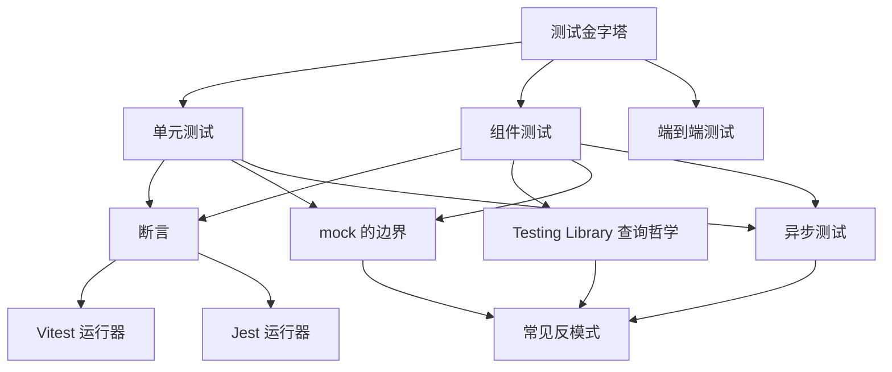
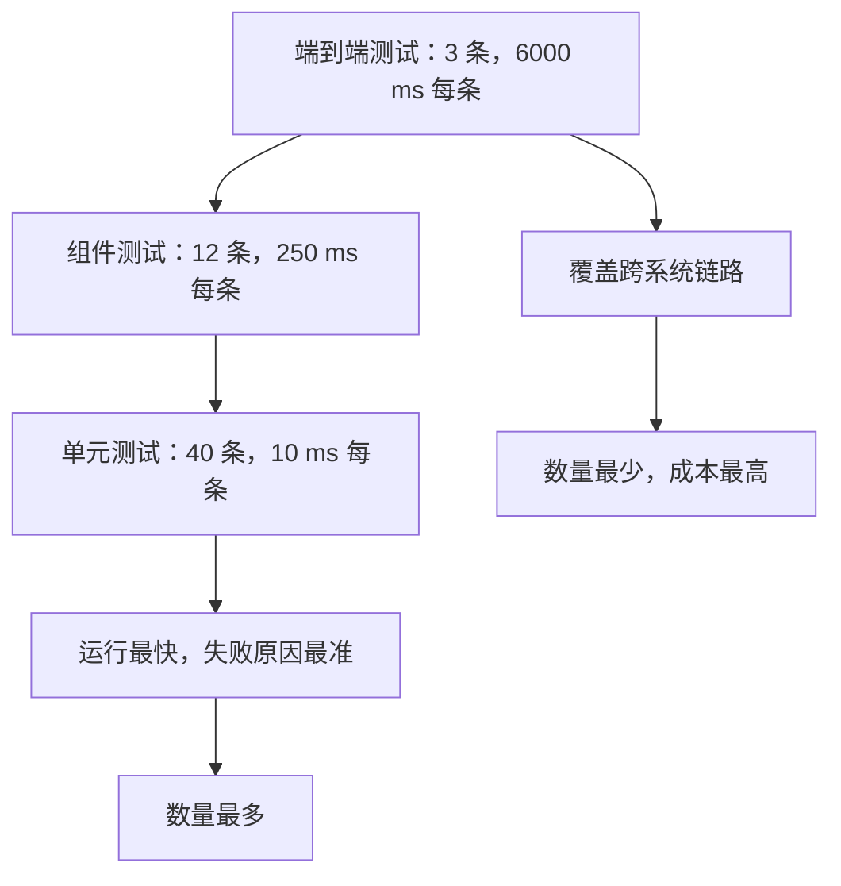
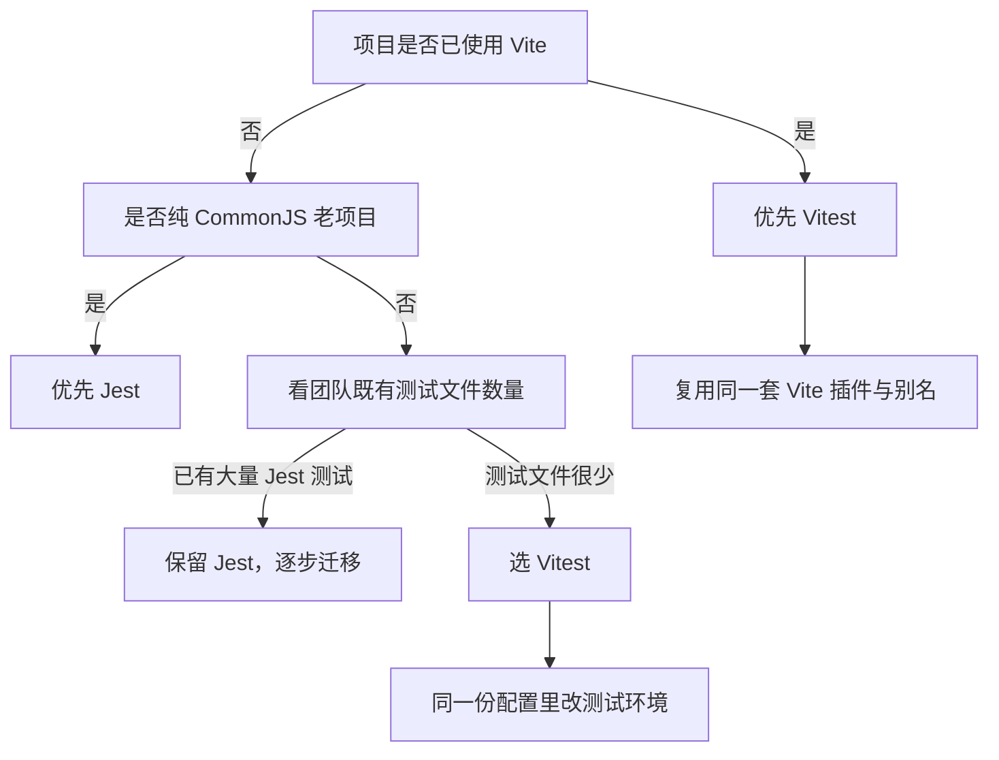
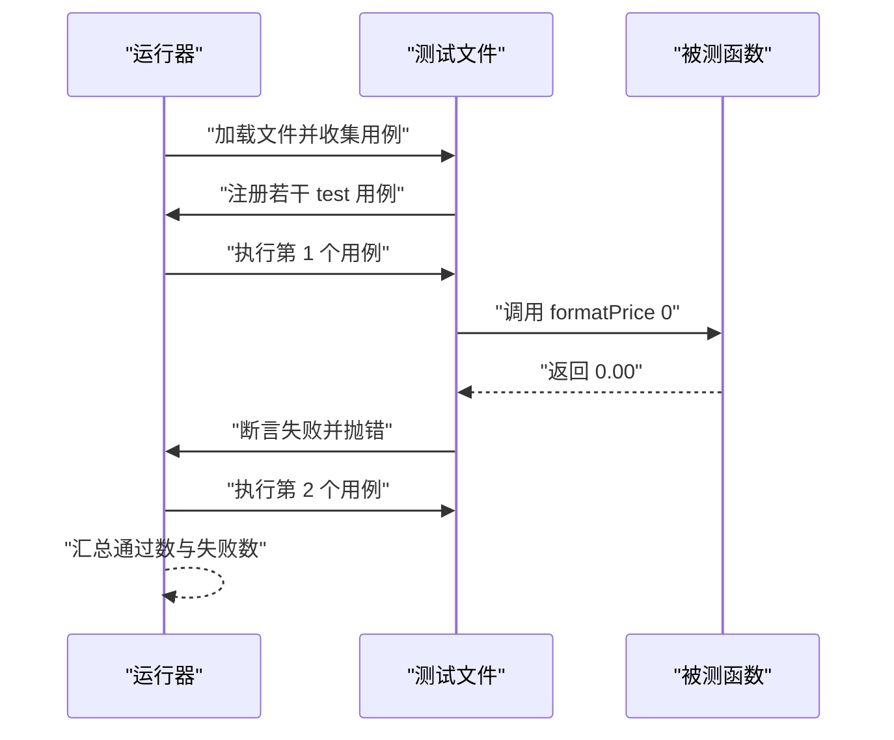
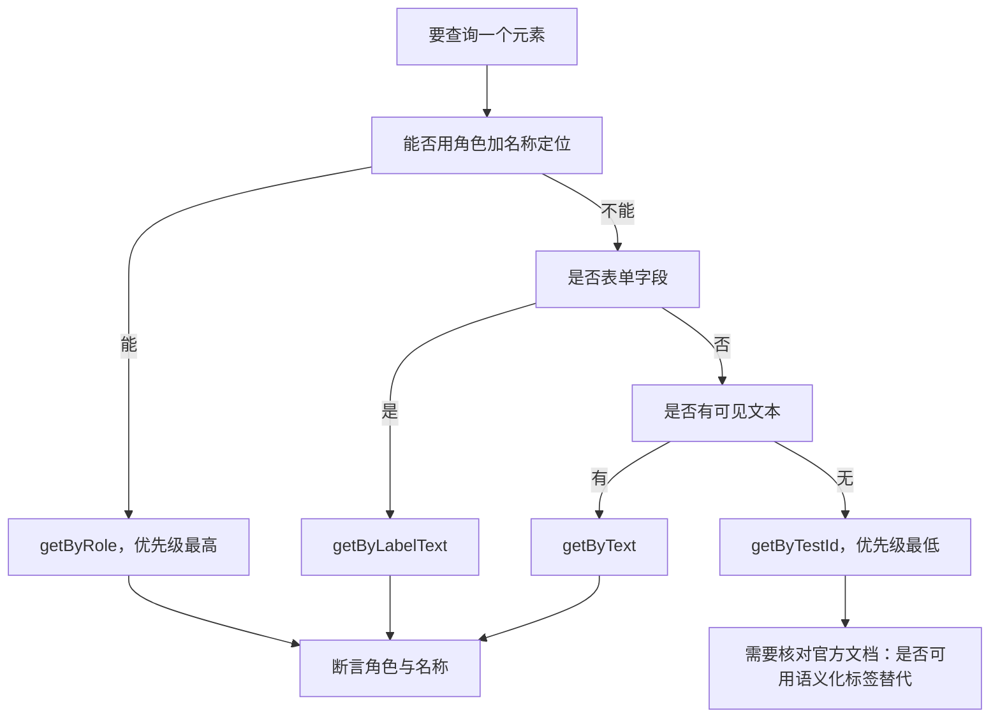
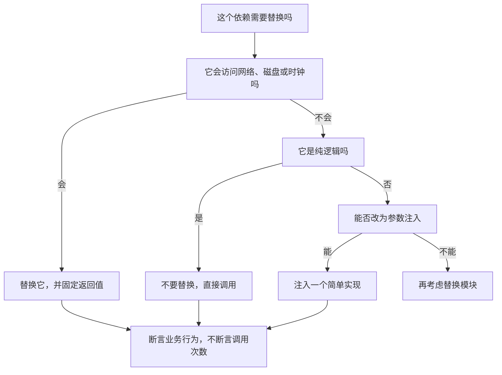
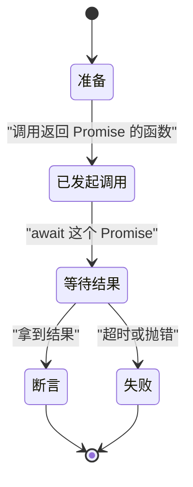
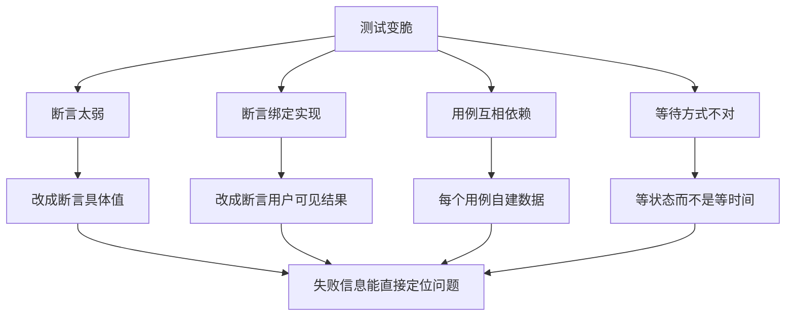

# 单元与组件测试：Vitest、Jest 与 Testing Library

!!! abstract "学完这一页你能"

    - 说出测试金字塔三层各自该放什么测试，并把一个真实模块的测试清单划到对应层。
    - 用 Vitest 或 Jest 写出一个带断言的单元测试文件，同时能跑出通过和失败两种结果。
    - 用 Testing Library 的查询规则定位元素，写出不依赖 class 名的组件测试。
    - 判断一处 mock 该保留还是该拆掉，并写出不会偶发失败的异步测试。

## 0. 知识地图



先读第 1 节，弄清每一层该承担什么，后面的工具才有落点。
第 3 到第 6 节是可以直接照抄的写法，建议边读边在本地跑。
第 7 节放在最后读，它检查你前面写出的测试是不是脆的。

## 1. 测试金字塔：先决定在哪一层测

**先想一个问题**

你接手的项目里，登录、购物车、下单各有一组测试。
CI 跑一次要 26 分钟，其中下单流程占 21 分钟。
要提速，先砍哪一层的测试？

**心智模型**

!!! tip "心智模型"

    一句话模型：越靠底层的测试跑得越快、失败原因越准，所以底层数量要多、顶层数量要少。

    日常类比：体检先做血常规，便宜、快、异常能定位到具体指标；指标异常了再做 CT，贵、慢、信息全。

    类比在哪里不成立：体检不能只做血常规就下结论，测试金字塔也不要求底层全绿就不写端到端。支付、登录这类高风险链路必须有端到端测试兜底。

!!! note "术语：测试金字塔"

    一种按数量与运行成本划分测试的策略，底层是单元测试，中间是组件测试，顶层是端到端测试。

    例子：一个 55 条用例的项目，40 条单元、12 条组件、3 条端到端，就是金字塔形状。

**图解**



1. 顶层是端到端测试，它启动真实浏览器和真实后端，一次跑几十秒。
2. 中间是组件测试，它渲染一个组件并模拟用户点击，一次几百毫秒。
3. 底层是单元测试，它只调用一个函数，一次几十毫秒。
4. 越往下运行越快，所以能写得起的用例数量越多。
5. 越往上覆盖的链路越长，所以它们的价值在兜底，不在数量。

**一步一步来**

**第 1 步**

这一步要做什么：把测试清单按层级归类，累加数量与总耗时，算出成本分布。

```js
// 每个层级的用例数量与单条耗时，单位毫秒
const inventory = [
  { layer: "unit", count: 40, msEach: 10 },
  { layer: "component", count: 12, msEach: 250 },
  { layer: "e2e", count: 3, msEach: 6000 },
];

// 按层级累加数量与总耗时
const summary = {};
for (const item of inventory) {
  // 第一次遇到该层级时初始化计数器
  summary[item.layer] ??= { count: 0, ms: 0 };
  summary[item.layer].count += item.count;
  // 总耗时等于数量乘以单条耗时
  summary[item.layer].ms += item.count * item.msEach;
}
console.log(summary);
```

**这段代码在做什么**

- `inventory` 用三个字段描述一层测试：层级名、用例数、单条耗时。
- `??=` 只在字段为 `undefined` 时赋初值，避免重复计数。
- 总耗时按 `count * msEach` 累加，得到这一层的真实成本。
- 输出对象可以直接看出哪一层拖慢了 CI。

运行结果：

```
{ unit: { count: 40, ms: 400 },
  component: { count: 12, ms: 3000 },
  e2e: { count: 3, ms: 18000 } }
```

**第 2 步**

这一步要做什么：给金字塔形状加两条可执行的规则，让倒置的结构在 CI 里直接报错。

```js
// 当前运行上下文没有全局 assert，需显式引入 Node 内置断言模块；若上下文未暴露 require，则退化为语义等价的本地断言
const assert =
  typeof require === "function"
    ? require("node:assert")
    : { ok(condition, message) { if (!condition) throw new Error(message); } };

// 规则一：单元测试数量不少于组件测试与端到端测试之和
const upper = summary.component.count + summary.e2e.count;
assert.ok(summary.unit.count >= upper, "金字塔倒置：单元测试数量不足");

// 规则二：端到端测试数量占比低于百分之十
const totalCount = Object.values(summary).reduce((s, v) => s + v.count, 0);
const e2eRatio = summary.e2e.count / totalCount;
assert.ok(e2eRatio < 0.1, "端到端测试数量占比过高");

console.log(`总数 ${totalCount}，端到端占比 ${(e2eRatio * 100).toFixed(1)}%`);
```

**这段代码在做什么**

- 第一条规则用数量关系描述形状：底层要多于上两层之和。
- 第二条规则用比例描述形状，阈值百分之十是团队约定，可以按项目调整。
- 规则写在断言里，跑测试时就执行，不依赖人的自觉。
- 计算比例为的是让报错信息带上具体数字，方便定位。

运行结果：

```
总数 55，端到端占比 5.5%
```

**动手验证**

依赖：无，只用 Node 20 内置的 `node:assert`。

```js
// 文件：pyramid.mjs，运行：node pyramid.mjs
import assert from "node:assert/strict";

const inventory = [
  { layer: "unit", count: 40, msEach: 10 },
  { layer: "component", count: 12, msEach: 250 },
  { layer: "e2e", count: 3, msEach: 6000 },
];

const summary = {};
for (const item of inventory) {
  summary[item.layer] ??= { count: 0, ms: 0 };
  summary[item.layer].count += item.count;
  summary[item.layer].ms += item.count * item.msEach;
}

// 形状规则一：底层数量要多于上两层之和
const upper = summary.component.count + summary.e2e.count;
assert.ok(summary.unit.count >= upper, "金字塔倒置：单元测试数量不足");

// 形状规则二：端到端数量占比低于百分之十
const totalCount = Object.values(summary).reduce((s, v) => s + v.count, 0);
const e2eRatio = summary.e2e.count / totalCount;
assert.ok(e2eRatio < 0.1, "端到端测试数量占比过高");

// 成本规则：单元测试总耗时占比低于百分之三十
const totalMs = Object.values(summary).reduce((s, v) => s + v.ms, 0);
const unitMsRatio = summary.unit.ms / totalMs;
assert.ok(unitMsRatio < 0.3, "单元测试总耗时占比异常，检查是否用错了测试环境");

console.log(`总数 ${totalCount}，总耗时 ${totalMs} ms`);
console.log(`端到端占比 ${(e2eRatio * 100).toFixed(1)}%，单元耗时占比 ${(unitMsRatio * 100).toFixed(1)}%`);
console.log("金字塔形状检查通过");
```

预期输出：

```
总数 55，总耗时 21400 ms
端到端占比 5.5%，单元耗时占比 1.9%
金字塔形状检查通过
```

**常见坑**

| 现象 | 原因 | 怎么修 |
| --- | --- | --- |
| CI 每次都跑 20 分钟以上 | 端到端测试承担了纯函数校验 | 把纯逻辑用例下移到单元测试，端到端只留跨系统链路 |
| 单元测试写了 200 条却抓不到缺陷 | 用例只覆盖正常输入 | 每条函数补边界值与异常值用例 |
| 组件测试挂了但页面正常 | 断言绑定了 class 名或 DOM 结构 | 改成按角色与文本查询 |
| 同一份逻辑在三层各测一遍 | 没定义每层的职责边界 | 在仓库里写一份分层说明并放进评审清单 |

**小结**

- 金字塔约束的是数量比例与运行成本，不是禁止写端到端测试。
- 每一层的职责不同：单元测逻辑分支，组件测交互，端到端测链路。
- 形状规则写成断言，才能变成 CI 能执行的门槛。

## 2. Vitest 与 Jest 的差异：先看构建工具

**先想一个问题**

项目用 Vite 加 TypeScript，同事说 Jest 配上 ts-jest 也能跑。
你要不要跟着用 Jest？

**心智模型**

!!! tip "心智模型"

    一句话模型：Vitest 与 Vite 共用一套转换管线，Jest 自带一套转换管线；选谁取决于你的构建工具是谁。

    日常类比：家里已经装好 220V 电路，新电器支持 220V 就直插；不支持就得外接变压器。

    类比在哪里不成立：变压器也能长期稳定工作。纯 CommonJS 的老项目用 Jest 省心，而 Vitest 没有 Vite 时它的优势就不存在了。

!!! note "术语：转换管线"

    把源码从 TypeScript、JSX 等格式转成运行器能执行的 JavaScript 的那一组步骤。

    例子：Jest 常配 babel-jest 或 ts-jest，Vitest 直接复用 Vite 的 esbuild 与插件链。

**图解**



1. 第一个判断点是构建工具：已经在用 Vite 就直接复用它的插件与别名。
2. 第二个判断点是模块格式：纯 CommonJS 老项目在 Jest 下改动最少。
3. 第三个判断点是迁移成本：已有几百个 Jest 测试文件时，重写比重配贵。
4. 最后一步落到收益：Vitest 的主要收益是配置复用，不是语法差异。

**一步一步来**

**第 1 步**

这一步要做什么：先写一份与运行器无关的测试正文，把"测什么"和"用哪个框架"分开。

```js
// 被测函数：判断字符串是否为合法的十六进制颜色
function isHexColor(value) {
  // 井号开头，后接 3 位或 6 位十六进制字符
  return /^#(?:[0-9a-fA-F]{3}|[0-9a-fA-F]{6})$/.test(value);
}

// 测试正文只依赖 test 与 expect 两个全局对象
function specFile({ test, expect }) {
  test("接受三位十六进制", () => {
    expect(isHexColor("#fff")).toEqual(true);
  });
  test("拒绝缺少井号的输入", () => {
    expect(isHexColor("fff")).toEqual(false);
  });
}
```

**这段代码在做什么**

- 被测函数是纯函数，没有副作用，可以放进任何运行器。
- 测试正文只接收 `test` 与 `expect`，不导入具体框架。
- 两个用例分别覆盖接受分支与拒绝分支。
- 这样拆开后，换框架只需要换外层注入，不用重写用例。

**第 2 步**

这一步要做什么：造出 Jest 与 Vitest 两种运行器的全局对象，验证同一份测试正文都能跑。

```js
// Jest 与 Vitest 的用例、断言 API 同名，差异集中在 mock 与定时器入口
const jestApi = { test: null, expect: null, mockEntry: "jest.fn", timerEntry: "jest.useFakeTimers" };
const vitestApi = { test: null, expect: null, mockEntry: "vi.fn", timerEntry: "vi.useFakeTimers" };

// 只有 mock 与定时器的入口名不同，其余键一致
const keysOfJest = ["test", "expect"];
const keysOfVitest = ["test", "expect"];
assert.deepEqual(keysOfJest, keysOfVitest);

console.log("Jest 入口", jestApi.mockEntry, jestApi.timerEntry);
console.log("Vitest 入口", vitestApi.mockEntry, vitestApi.timerEntry);
```

**这段代码在做什么**

- 两个对象描述各自暴露的入口名，差异只有两处。
- 断言比较的是用例与断言的键，证明测试正文能通用。
- 打印入口名，为后面的迁移清单提供依据。
- 未列出的配置项需核对官方文档：具体要核对 `testEnvironment`、别名解析、以及 TypeScript 配置的读取方式。

运行结果：

```
Jest 入口 jest.fn jest.useFakeTimers
Vitest 入口 vi.fn vi.useFakeTimers
```

**动手验证**

依赖：无，只用 Node 20 内置的 `node:assert`。

```js
// 文件：runner-parity.mjs，运行：node runner-parity.mjs
import assert from "node:assert/strict";

function isHexColor(value) {
  return /^#(?:[0-9a-fA-F]{3}|[0-9a-fA-F]{6})$/.test(value);
}

// 极简断言：只实现本页用到的 toEqual
function makeExpect() {
  return (actual) => ({
    toEqual(expected) {
      assert.deepEqual(actual, expected);
    },
  });
}

// 极简运行器：收集用例，逐个执行，统计成败
function makeRunner(label) {
  const cases = [];
  const test = (name, fn) => cases.push({ name, fn });
  const run = () => {
    let pass = 0;
    for (const c of cases) {
      try {
        c.fn();
        pass += 1;
      } catch (e) {
        console.log(`[${label}] 失败：${c.name} 原因 ${e.message}`);
      }
    }
    return { label, total: cases.length, pass };
  };
  return { test, expect: makeExpect(), run };
}

function specFile({ test, expect }) {
  test("接受三位十六进制", () => expect(isHexColor("#fff")).toEqual(true));
  test("接受六位十六进制", () => expect(isHexColor("#A1B2C3")).toEqual(true));
  test("拒绝缺少井号", () => expect(isHexColor("fff")).toEqual(false));
  test("拒绝四位输入", () => expect(isHexColor("#ffff")).toEqual(false));
}

// 同一份 specFile 分别注入两个运行器
const results = ["jest", "vitest"].map((label) => {
  const runner = makeRunner(label);
  specFile(runner);
  return runner.run();
});

for (const r of results) {
  console.log(`[${r.label}] 通过 ${r.pass}/${r.total}`);
}
assert.deepEqual(results[0].pass, results[1].pass);
console.log("两个运行器结果一致");
```

预期输出：

```
[jest] 通过 4/4
[vitest] 通过 4/4
两个运行器结果一致
```

**常见坑**

| 现象 | 原因 | 怎么修 |
| --- | --- | --- |
| Vitest 找不到路径别名 | 测试配置里没同步 Vite 的 `resolve.alias` | 在 `vitest.config` 里复用同一份 Vite 配置 |
| Jest 报无法解析 ES 模块语法 | 默认模块格式与源码不一致 | 按官方文档配置 ESM 支持，或统一为 CommonJS |
| 迁移后 mock 全部失效 | `jest.fn` 没换成 `vi.fn` | 全局替换入口名，并在评审里抽查 |
| 单测里跑出了浏览器 API 报错 | 测试环境选错 | 纯函数用 node 环境，组件用浏览器环境 |

**小结**

- 选型的第一依据是构建工具，第二依据是既有测试文件数量。
- 两个框架的用例与断言 API 形状接近，迁移成本主要在配置与环境。
- 没把握的配置项要查官方文档，不要凭印象改。

## 3. 第一个单元测试：把规格写成可执行的断言

**先想一个问题**

你写了 `formatPrice`，在页面上手动点了十几次都正常。
上线后有人输入 0，页面显示 `￥0.00`，但业务要求显示"免费"。
这种事怎么在提交前发现？

**心智模型**

!!! tip "心智模型"

    一句话模型：单元测试是给函数写的一份可重复执行的规格说明。

    日常类比：菜谱写"加盐 3 克"，下次照着做还能复现；没有克数就只能凭手感。

    类比在哪里不成立：菜谱是给人看的文档，测试是给机器执行的代码。需求变化时测试要跟着改，菜谱不改。

!!! note "术语：断言"

    一句"如果不成立就报错"的判断语句，它是测试的最小单元。

    例子：`assert.equal(add(1, 2), 3)` 在不等于 3 时立刻抛错。

**图解**



1. 运行器先加载测试文件，此阶段只注册用例，不执行函数。
2. 每个 `test` 调用把名字与回调存进队列。
3. 运行器逐个执行回调，回调里调用被测函数。
4. 断言返回结果不符合预期时抛错，运行器把该用例记为失败。
5. 全部执行完后运行器汇总，并决定进程退出码。

**一步一步来**

**第 1 步**

这一步要做什么：写出被测函数，把业务规则明确到可以逐条验证。

```js
// 价格格式化：分转元，保留两位小数，0 显示为免费
function formatPrice(cents) {
  // 参数必须是有限整数，否则抛出可读的错误
  if (!Number.isInteger(cents) || cents < 0) {
    throw new RangeError("金额必须是非负整数分");
  }
  // 业务特例：零元显示中文文案
  if (cents === 0) return "免费";
  // 分转元后固定两位小数
  return `￥${(cents / 100).toFixed(2)}`;
}
```

**这段代码在做什么**

- 先做参数校验，把非法输入挡在函数入口。
- 零元是业务特例，单独一个分支，方便写一条独立用例。
- 正常路径用 `toFixed(2)` 保证输出格式稳定。
- 函数是纯函数：同样的输入永远得到同样的输出。

**第 2 步**

这一步要做什么：把三条规则分别写成断言，覆盖正常值、边界值、异常值。

```js
// 正常值：199 分等于 1.99 元
assert.equal(formatPrice(199), "￥1.99");

// 边界值：1 分不能被四舍五入成 0.00
assert.equal(formatPrice(1), "￥0.01");

// 边界值：0 分走业务特例分支
assert.equal(formatPrice(0), "免费");

// 异常值：负数必须被拒绝
assert.throws(() => formatPrice(-1), RangeError);
```

**这段代码在做什么**

- 第一条断言覆盖最常见的正常输入。
- 第二条断言卡住最小单位的精度，防止有人改成先除以 100 再取整。
- 第三条断言把特例分支单独锁住。
- 第四条用 `assert.throws` 检查异常类型，而不是只检查"抛了错"。

运行结果：

```
4 条断言全部通过
```

**动手验证**

依赖：无，只用 Node 20 内置的 `node:assert`。

```js
// 文件：format-price.test.mjs，运行：node format-price.test.mjs
import assert from "node:assert/strict";

function formatPrice(cents) {
  if (!Number.isInteger(cents) || cents < 0) {
    throw new RangeError("金额必须是非负整数分");
  }
  if (cents === 0) return "免费";
  return `￥${(cents / 100).toFixed(2)}`;
}

// 极简运行器：收集用例，逐条执行，打印结果并设置退出码
const cases = [];
const test = (name, fn) => cases.push({ name, fn });

test("199 分格式化为 1.99 元", () => assert.equal(formatPrice(199), "￥1.99"));
test("1 分不丢失精度", () => assert.equal(formatPrice(1), "￥0.01"));
test("0 分显示免费", () => assert.equal(formatPrice(0), "免费"));
test("负数抛出 RangeError", () => assert.throws(() => formatPrice(-1), RangeError));
test("小数分抛出 RangeError", () => assert.throws(() => formatPrice(1.5), RangeError));

let failed = 0;
for (const c of cases) {
  try {
    c.fn();
    console.log(`通过 ${c.name}`);
  } catch (e) {
    failed += 1;
    console.log(`失败 ${c.name} -> ${e.message}`);
  }
}
console.log(`共 ${cases.length} 条，失败 ${failed} 条`);
process.exitCode = failed === 0 ? 0 : 1;
```

预期输出：

```
通过 199 分格式化为 1.99 元
通过 1 分不丢失精度
通过 0 分显示免费
通过 负数抛出 RangeError
通过 小数分抛出 RangeError
共 5 条，失败 0 条
```

**常见坑**

| 现象 | 原因 | 怎么修 |
| --- | --- | --- |
| 测试通过了但线上仍出错 | 断言只覆盖正常输入 | 每条分支至少补一条边界值与一条异常值 |
| 断言报错信息看不出原因 | 只写 `assert.ok(result)` | 换成带期望值的断言，把期望与实际的差异打印出来 |
| 小数结果比较时偶尔失败 | 浮点数直接用等于比较 | 改成比较字符串，或按官方文档使用近似比较 |
| 测试互相影响 | 用例间共享可变状态 | 每个用例内部重新构造数据 |

**小结**

- 单元测试的价值来自"分支覆盖"，不是用例条数。
- 断言要把期望值写清楚，报错信息才能定位问题。
- 被测函数保持纯函数，测试才能稳定复现。

## 4. Testing Library 的查询哲学：按用户看得见的方式找元素

**先想一个问题**

产品把按钮 class 从 `btn-primary` 改成 `btn-main`，你的测试挂了 37 个。
改 class 不影响任何用户体验，为什么测试要挂？

**心智模型**

!!! tip "心智模型"

    一句话模型：查询要按"用户能找到它的方式"写，用户看的是角色与文字，不是 class 名。

    日常类比：你在超市找酱油，靠的是货架标签上写的"酱油"，不是货架编号 A-13。

    类比在哪里不成立：只有图标的按钮没有文字，用户靠屏幕阅读器听到的可访问名称找它。这时测试要先补上 `aria-label`，测试反过来推动了可访问性改造。

!!! note "术语：可访问名称"

    屏幕阅读器读给用户听的那个名字，通常来自可见文本、`aria-label` 或关联的标签元素。

    例子：`<button aria-label="关闭">×</button>` 的可访问名称是"关闭"，不是"×"。

**图解**



1. 第一优先是角色加名称，因为它和屏幕阅读器的读取方式一致。
2. 表单字段优先用标签文本查询，用户的视线就在标签上。
3. 有可见文本时用文本查询，文本改动用户能感知，所以断言它有意义。
4. 都不行时才用 `getByTestId`，它不反映用户视角，属于兜底手段。
5. 每一步的选择都指向同一件事：断言写什么，就等于声明"这对用户重要"。

**一步一步来**

**第 1 步**

这一步要做什么：用手写的最小 DOM 替身构造一棵元素树，把角色与可访问名称表达出来。

```js
// 最小 DOM 替身：只保留查询用得上的三个字段
function el(tag, attrs = {}, children = []) {
  // 把文本子节点拼成 text，方便计算可访问名称
  const text = children.filter((c) => typeof c === "string").join("");
  return { tag, attrs, children, text };
}

// 可访问名称：优先取 aria-label，其次取可见文本
function accessibleName(node) {
  return node.attrs["aria-label"] ?? node.text;
}

// 构造一个带两个按钮的卡片
const card = el("div", {}, [
  el("button", { role: "button" }, ["关闭"]),
  el("button", { role: "button", "aria-label": "删除" }, ["×"]),
]);
console.log(accessibleName(card.children[0]), accessibleName(card.children[1]));
```

**这段代码在做什么**

- `el` 把标签、属性、子节点收成普通对象，脱离真实浏览器也能跑。
- `text` 只拼接字符串子节点，元素子节点交给递归处理。
- `accessibleName` 复现了"`aria-label` 优先于文本"这条规则。
- 第二个按钮的可见文本是 `×`，但可访问名称是"删除"。

运行结果：

```
关闭 删除
```

**第 2 步**

这一步要做什么：实现按角色与名称查询的函数，并验证 class 变化不会影响查询结果。

```js
// 递归查找：按角色与可访问名称唯一定位元素
function getByRole(root, role, name) {
  const found = [];
  const walk = (node) => {
    if (node.tag && node.attrs.role === role) {
      if (accessibleName(node) === name) found.push(node);
    }
    for (const child of node.children ?? []) {
      if (typeof child === "object") walk(child);
    }
  };
  walk(root);
  // 匹配数量不是 1 就报错，避免测试选到错误的元素
  if (found.length !== 1) throw new Error(`期望 1 个元素，实际 ${found.length}`);
  return found[0];
}

// class 改了，查询照旧命中
card.children[0].attrs.class = "btn-main";
const closeBtn = getByRole(card, "button", "关闭");
console.log("命中按钮文本", closeBtn.text);
```

**这段代码在做什么**

- 深度优先遍历整棵树，把匹配的元素收集起来。
- 匹配条件是两个：角色相等、可访问名称相等。
- 匹配数量必须为 1，多于 1 说明查询条件不够具体，直接报错。
- 给按钮加上新 class 后查询仍然命中，说明查询没有绑定样式细节。

运行结果：

```
命中按钮文本 关闭
```

**动手验证**

依赖：无，只用 Node 20 内置的 `node:assert`。

```js
// 文件：query-philosophy.mjs，运行：node query-philosophy.mjs
import assert from "node:assert/strict";

function el(tag, attrs = {}, children = []) {
  const text = children.filter((c) => typeof c === "string").join("");
  return { tag, attrs, children, text };
}
function accessibleName(node) {
  return node.attrs["aria-label"] ?? node.text;
}
function getByRole(root, role, name) {
  const found = [];
  const walk = (node) => {
    if (node.tag && node.attrs.role === role && accessibleName(node) === name) found.push(node);
    for (const child of node.children ?? []) if (typeof child === "object") walk(child);
  };
  walk(root);
  if (found.length !== 1) throw new Error(`期望 1 个元素，实际 ${found.length}`);
  return found[0];
}

// 构造表单卡片：一个提交按钮、一个带标签的输入框
const form = el("form", {}, [
  el("label", { for: "email" }, ["邮箱"]),
  el("input", { id: "email", role: "textbox", "aria-label": "邮箱" }),
  el("button", { role: "button", type: "submit" }, ["提交"]),
]);

// 查询一：按角色与名称找到提交按钮
const submit = getByRole(form, "button", "提交");
assert.equal(submit.attrs.type, "submit");

// 查询二：按角色与名称找到输入框
const email = getByRole(form, "textbox", "邮箱");
assert.equal(email.attrs.id, "email");

// 查询三：样式改名不影响上面两条查询
submit.attrs.class = "btn-main";
assert.equal(getByRole(form, "button", "提交"), submit);

// 查询四：查不到元素时必须抛错，防止假通过
assert.throws(() => getByRole(form, "button", "取消"), /期望 1 个元素，实际 0/);

console.log("按角色与名称的查询全部通过");
```

预期输出：

```
按角色与名称的查询全部通过
```

**常见坑**

| 现象 | 原因 | 怎么修 |
| --- | --- | --- |
| 改样式导致几十个测试挂掉 | 用 class 选择器查询 | 改成按角色与可访问名称查询 |
| 查询到多个元素报错 | 查询条件太宽，例如只按文本查 | 加角色限定，或用更完整的名称 |
| 图标按钮查不到 | 没有可访问名称 | 给按钮加 `aria-label` |
| 测试里到处是 `getByTestId` | 组件缺语义化标签 | 先补语义标签，`getByTestId` 只作兜底 |

**小结**

- 查询方式是测试与用户之间的一份契约，写什么查询就等于声明什么重要。
- 优先角色加名称，其次标签文本与可见文本，最后才是测试专用标识。
- 查询不到元素应当报错，不能静默返回 `undefined`。

## 5. Mock 的边界：只替换你控制不了的东西

**先想一个问题**

一个测试 mock 了 6 个模块、18 个函数。
你改了一行业务代码，要跟着改 5 处 mock。
这种测试是在保护代码，还是在拖慢开发？

**心智模型**

!!! tip "心智模型"

    一句话模型：只替换你控制不了的边界，也就是网络、时钟、随机数；能直接调用的纯逻辑不要替换。

    日常类比：验收冰箱制冷，你只在插头处接一块电压表；不必把压缩机换成模型。

    类比在哪里不成立：支付网关是外部依赖，但"失败返回码怎么处理"属于你的业务逻辑。这时只替换网络层，保留自己的解析与分支代码。

!!! note "术语：测试替身"

    在测试里替换真实依赖的对象，用来固定返回值或记录调用情况。

    例子：把 `fetch` 换成一个立刻返回固定 JSON 的函数，测试不再访问网络。

**图解**



1. 第一问是副作用：涉及网络、磁盘、时钟的依赖必须被固定，否则测试不可复现。
2. 第二问是纯逻辑：能直接调用的代码不该替换，替换了断言就失去意义。
3. 第三问是注入方式：把依赖做成参数传入，比替换整个模块更容易看清单个测试用了什么。
4. 替换模块放在最后，因为它的影响范围覆盖整个测试文件。
5. 最后一步是关键：断言要落在业务行为上，调用次数只有在"必须只调用一次"时才有意义。

**一步一步来**

**第 1 步**

这一步要做什么：把依赖改成参数注入，让测试不替换任何模块。

```js
// 创建订单：时钟与支付接口都从参数传入
export function createOrder({ now, payApi, amountCents }) {
  // 时钟由外部提供，测试可以固定时间
  const createdAt = now();
  // 支付接口由外部提供，测试可以固定结果
  const result = payApi.charge({ amountCents });
  // 只把业务结果返回，不返回依赖本身
  return { id: `order-${createdAt}`, createdAt, paid: result.ok };
}
```

**这段代码在做什么**

- `now` 是一个函数，调用它得到时间戳，测试传入固定值。
- `payApi.charge` 是唯一的外部调用点，替换它等于替换网络。
- 返回值只包含业务字段，不含依赖对象，断言目标清晰。
- 参数注入把"用哪个依赖"的决定权交给调用方，包括测试。

**第 2 步**

这一步要做什么：写两个测试替身，分别覆盖支付成功与支付失败两条分支。

```js
// 固定时钟：无论调用几次都返回同一个时间戳
const fixedNow = () => 1700000000000;

// 支付成功替身
const okPay = { charge: () => ({ ok: true }) };

// 支付失败替身
const failPay = { charge: () => ({ ok: false, code: "INSUFFICIENT_FUNDS" }) };

const paid = createOrder({ now: fixedNow, payApi: okPay, amountCents: 199 });
assert.equal(paid.id, "order-1700000000000");
assert.equal(paid.paid, true);

const rejected = createOrder({ now: fixedNow, payApi: failPay, amountCents: 199 });
assert.equal(rejected.paid, false);
```

**这段代码在做什么**

- `fixedNow` 让订单编号可预测，断言不用正则匹配。
- 两个替身各返回一种结果，覆盖成功与失败两条分支。
- 断言落在 `paid` 字段上，也就是用户能感知的结果。
- 没有断言"支付接口被调用了 1 次"，避免了实现变化引发的误报。

运行结果：

```
成功分支 paid 为 true，失败分支 paid 为 false
```

**动手验证**

依赖：无，只用 Node 20 内置的 `node:assert`。

```js
// 文件：mock-boundary.mjs，运行：node mock-boundary.mjs
import assert from "node:assert/strict";

function createOrder({ now, payApi, amountCents }) {
  const createdAt = now();
  const result = payApi.charge({ amountCents });
  return { id: `order-${createdAt}`, createdAt, paid: result.ok, code: result.code ?? null };
}

// 替身一：固定时钟
const fixedNow = () => 1700000000000;

// 替身二：记录调用参数的支付接口
const calls = [];
const recordingPay = {
  charge: (payload) => {
    calls.push(payload);
    return { ok: true };
  },
};

// 替身三：直接失败的支付接口
const failingPay = { charge: () => ({ ok: false, code: "INSUFFICIENT_FUNDS" }) };

// 用例一：正常下单
const order = createOrder({ now: fixedNow, payApi: recordingPay, amountCents: 199 });
assert.equal(order.id, "order-1700000000000");
assert.equal(order.paid, true);

// 用例二：金额原样传给支付接口，没有多传也没有少传
assert.deepEqual(calls, [{ amountCents: 199 }]);

// 用例三：支付失败时订单标记为未支付，并带回错误码
const failed = createOrder({ now: fixedNow, payApi: failingPay, amountCents: 199 });
assert.equal(failed.paid, false);
assert.equal(failed.code, "INSUFFICIENT_FUNDS");

// 用例四：两次下单的时间相同，说明时钟被真正固定
assert.equal(order.createdAt, failed.createdAt);

console.log("边界替换的四条用例全部通过");
```

预期输出：

```
边界替换的四条用例全部通过
```

**常见坑**

| 现象 | 原因 | 怎么修 |
| --- | --- | --- |
| 改一行实现要改多处 mock | 替换了本可以直接调用的纯模块 | 改为参数注入，纯逻辑直接调用 |
| 测试通过但线上支付失败 | 替身返回了与真实接口不同的结构 | 用真实响应体做一次样本比对，或补一条契约测试 |
| 断言调用次数后重构就挂 | 断言绑定了实现步骤 | 改成断言业务结果 |
| 时间相关用例隔天就挂 | 用了真实时钟 | 传固定的 `now` 函数，或在运行器里启用假定时器 |

**小结**

- 替换的目标是不可控的外部世界，不是自己的业务代码。
- 参数注入让每个用例显式声明它使用了哪些依赖。
- 断言要落在业务结果上，避免绑定调用步骤。

## 6. 异步测试：等的是同一个事件

**先想一个问题**

测试里写了 `await fetchUser()`，下一行就断言。
结果本地偶尔通过、CI 偶尔失败。
为什么"已经 await 了"还是不稳？

**心智模型**

!!! tip "心智模型"

    一句话模型：异步测试要让测试等待的，和你真正关心的那件事，是同一个事件。

    日常类比：约朋友吃饭，你要等他真的到了再点菜；看表等 5 分钟不能保证他到。

    类比在哪里不成立：真实网络可能永远不返回，所以等待之外还要有超时。等待和超时是两件独立的事。

!!! note "术语：假定时器"

    由测试运行器接管的计时器，它不再跟随真实时间走动，而是由测试代码手动推进。

    例子：启用假定时器后调用延时 3000 毫秒的逻辑，测试可以在一毫秒内把它推进到结束。

**图解**



1. 准备阶段构造参数与替身，此时不发起任何异步调用。
2. 发起调用，得到的是 Promise，也就是一个"将来会有结果"的凭据。
3. `await` 把测试挂起，直到这个 Promise 落地，测试才继续往下走。
4. 落地后进入断言阶段，此时结果已经确定。
5. 如果 Promise 抛错或超过时限，直接进入失败状态，不会继续断言。

**一步一步来**

**第 1 步**

这一步要做什么：写一个返回 Promise 的被测函数，然后用 `await` 断言它的结果。

```js
// 加载用户资料：内部有一次异步请求
export async function loadProfile(fetchJson, userId) {
  // await 在这里把异步结果转成同步可用的值
  const raw = await fetchJson(`/api/users/${userId}`);
  // 只保留页面需要的三个字段
  return { id: raw.id, name: raw.name, isVip: raw.level >= 3 };
}

// 用例：替身立刻返回固定数据，await 后断言
const profile = await loadProfile(async () => ({ id: 7, name: "Ada", level: 4 }), 7);
assert.deepEqual(profile, { id: 7, name: "Ada", isVip: true });
```

**这段代码在做什么**

- `fetchJson` 从参数传入，测试里换成立刻 resolve 的函数。
- 函数内部 `await` 一次，测试外部再 `await` 返回值，两处等待同一件事。
- 返回值只暴露三个业务字段，断言目标明确。
- 用 `deepEqual` 一次比较整个对象，字段缺失或多余都会失败。

运行结果：

```
profile 为 id 7，name Ada，isVip true
```

**第 2 步**

这一步要做什么：构造一个可以手动控制完成时机的 Promise，验证测试确实等到了那一刻。

```js
// 手动控制完成时机的 Promise：resolve 之前调用方会一直等待
function deferred() {
  let resolve;
  const promise = new Promise((r) => {
    resolve = r;
  });
  return { promise, resolve };
}

const d = deferred();
const events = [];

// 不 await，先看执行顺序
loadProfile(d.promise, 7).then((p) => events.push(`拿到 ${p.name}`));
events.push("调用之后");
d.resolve({ id: 7, name: "Ada", level: 4 });
await d.promise;
await new Promise((r) => setImmediate(r));

console.log(events.join(" 然后 "));
```

**这段代码在做什么**

- `deferred` 把 resolve 抽到外部，测试可以决定什么时刻完成。
- 不 `await` 时先记录"调用之后"，说明代码在 Promise 完成前就继续执行了。
- `setImmediate` 把回调队列排空，让 `.then` 里的记录有机会执行。
- 输出顺序证明：没有 `await` 的断言会读到一个还未被写入的状态。

运行结果：

```
调用之后 然后 拿到 Ada
```

**动手验证**

依赖：无，只用 Node 20 内置的 `node:assert`。

```js
// 文件：async-test.mjs，运行：node async-test.mjs
import assert from "node:assert/strict";

async function loadProfile(fetchJson, userId) {
  const raw = await fetchJson(`/api/users/${userId}`);
  return { id: raw.id, name: raw.name, isVip: raw.level >= 3 };
}

// 手动控制完成时机的 Promise
function deferred() {
  let resolve;
  const promise = new Promise((r) => {
    resolve = r;
  });
  return { promise, resolve };
}

// 用例一：替身立刻返回，await 后断言
const profile = await loadProfile(async () => ({ id: 7, name: "Ada", level: 4 }), 7);
assert.deepEqual(profile, { id: 7, name: "Ada", isVip: true });

// 用例二：检查测试确实等到了 Promise 完成的那一刻
const d = deferred();
const order = [];
const task = loadProfile(d.promise, 7).then((p) => order.push(`完成 ${p.name}`));
order.push("已发起");
assert.deepEqual(order, ["已发起"]); // 此刻还没有完成
d.resolve({ id: 7, name: "Ada", level: 4 });
await task;
assert.deepEqual(order, ["已发起", "完成 Ada"]);

// 用例三：被拒绝的 Promise 要用 rejects 断言，避免未捕获拒绝
await assert.rejects(
  () => loadProfile(async () => { throw new Error("网络不可达"); }, 7),
  /网络不可达/,
);

// 用例四：给等待加上时限，超时视为失败
const slow = deferred();
const timed = Promise.race([
  slow.promise,
  new Promise((_, reject) => setTimeout(() => reject(new Error("等待超时")), 50)),
]);
await assert.rejects(() => timed, /等待超时/);

console.log("异步用例四条全部通过");
```

预期输出：

```
异步用例四条全部通过
```

**常见坑**

| 现象 | 原因 | 怎么修 |
| --- | --- | --- |
| 断时快时慢偶尔失败 | 用固定延时代替真正的等待条件 | 等待可观测的状态变化，或返回会被 await 的 Promise |
| 测试报未捕获的 Promise 拒绝 | 只 await 了成功分支 | 用 `assert.rejects` 覆盖失败分支 |
| 用法假定时器后测试卡住 | 只启用了假定时器，没有推进时间 | 在断言前后显式推进时间 |
| CI 上超时但本地通过 | 等待没有上限，或依赖真实网络 | 给等待设上限，并把网络替换成替身 |

**小结**

- `await` 只能保证"这个 Promise 完成了"，不代表你关心的状态已经写好。
- 每条异步分支都要写用例，包括被拒绝的那一条。
- 等待和超时分开处理，等待负责正确，超时负责不卡死。

## 7. 常见反模式：让测试变脆的写法

**先想一个问题**

一位同学写 `expect(result).toBeTruthy()`，另一位写 `expect(result).toBe(3)`。
半年后重构，哪个测试能救你？

**心智模型**

!!! tip "心智模型"

    一句话模型：脆的测试是那种一改实现就红、改完还不知道为什么要红的测试。

    日常类比：烟雾报警器每刮风就响，最后大家都把电池拆了。

    类比在哪里不成立：误报的报警器可以拆电池，脆的测试不能删。删掉之后这块代码就失去了唯一的保护。

**图解**



1. 断言太弱时，测试通过不代表行为正确，它只是没报错。
2. 断言绑定实现时，重构会触发误报，久而久之大家不信任红色。
3. 用例互相依赖时，单独跑某一条就会失败，排查成本上升。
4. 等待方式不对时，测试结果依赖机器速度，出现偶发失败。
5. 四种修法指向同一个结果：失败信息直接告诉你哪条业务规则被破坏了。

**一步一步来**

**第 1 步**

这一步要做什么：先写出脆的版本，看它对一次无关改动有什么反应。

```js
// 被测逻辑：购物车总价
function totalPrice(items) {
  return items.reduce((sum, it) => sum + it.price * it.qty, 0);
}

// 脆的断言一：只看真值，任何非零数字都通过
assert.ok(totalPrice([{ price: 199, qty: 2 }]));

// 脆的断言二：依赖数组下标与对象字段顺序
const items = [{ price: 199, qty: 2 }];
assert.equal(items[0].price * items[0].qty, 398);
```

**这段代码在做什么**

- 第一条断言在总价算成 1 分时也会通过，它测不出计算错误。
- 第二条断言把测试和"数组第 0 项"这个结构绑在一起，加一个筛选逻辑就会挂。
- 两条断言都没有说出业务期望值是多少。
- 这类测试的共同特征是：通过时看不出对，失败时看不出错。

**第 2 步**

这一步要做什么：把它改成行为断言，让期望值写在测试里，并覆盖打折规则。

```js
// 带折扣的结算：满 300 分减 50 分
function checkout(items) {
  const total = totalPrice(items);
  return { total, payable: total >= 300 ? total - 50 : total };
}

// 行为断言一：未达门槛时不减
assert.deepEqual(checkout([{ price: 199, qty: 1 }]), { total: 199, payable: 199 });

// 行为断言二：正好达到门槛时减 50
assert.deepEqual(checkout([{ price: 199, qty: 2 }]), { total: 398, payable: 348 });

// 行为断言三：门槛的边界值，299 不减
assert.equal(checkout([{ price: 299, qty: 1 }]).payable, 299);
assert.equal(checkout([{ price: 300, qty: 1 }]).payable, 250);
```

**这段代码在做什么**

- 断言写的是完整的业务结果对象，字段缺失会立刻失败。
- 门槛的边界被单独覆盖：299 与 300 各一条。
- 期望值直接写在测试正文里，读测试等于读需求。
- 重构内部实现时，只要业务结果不变，这些断言仍然通过。

运行结果：

```
四条行为断言全部通过
```

**动手验证**

依赖：无，只用 Node 20 内置的 `node:assert`。

```js
// 文件：anti-pattern.mjs，运行：node anti-pattern.mjs
import assert from "node:assert/strict";

function totalPrice(items) {
  return items.reduce((sum, it) => sum + it.price * it.qty, 0);
}
function checkout(items) {
  const total = totalPrice(items);
  return { total, payable: total >= 300 ? total - 50 : total };
}

// 第一组：脆的断言在实现改动后误报
const itemsA = [{ price: 199, qty: 2 }];
const weakPass = Boolean(totalPrice(itemsA));
assert.equal(weakPass, true); // 通过了，但 398 被算成 1 也会通过

// 模拟一次无害重构：内部改为先过滤零元商品
function totalPriceRefactored(items) {
  return items.filter((it) => it.price > 0).reduce((sum, it) => sum + it.price * it.qty, 0);
}
// 脆的断言绑定了下标，重构成新结构后直接取字段会出错
const fragileInput = { rows: itemsA };
assert.throws(() => fragileInput[0].price * fragileInput[0].qty, /Cannot read/);

// 第二组：行为断言在两次实现下结果一致
const expected = { total: 398, payable: 348 };
assert.deepEqual(checkout(itemsA), expected);
assert.deepEqual(
  (() => {
    const t = totalPriceRefactored(itemsA);
    return { total: t, payable: t >= 300 ? t - 50 : t };
  })(),
  expected,
);

// 边界：299 不减，300 减 50
assert.equal(checkout([{ price: 299, qty: 1 }]).payable, 299);
assert.equal(checkout([{ price: 300, qty: 1 }]).payable, 250);

console.log("弱断言暴露了脆弱性，行为断言在两次实现下结果一致");
```

预期输出：

```
弱断言暴露了脆弱性，行为断言在两次实现下结果一致
```

**常见坑**

| 现象 | 原因 | 怎么修 |
| --- | --- | --- |
| 测试能通过但缺陷照样上线 | 断言只检查真值或非空 | 断言具体期望值或完整结果对象 |
| 重构后大量用例误报 | 断言绑定了内部结构与调用步骤 | 改成断言用户可见结果 |
| 单跑某条用例必失败 | 用例依赖前一条留下的数据 | 每个用例内部自建数据 |
| 定时任务偶发超时 | 用真实时间等待 | 注入可控时钟，或启用假定时器 |

**小结**

- 断言要写出期望值，否则测试只能在"报错"和"没报错"之间二选一。
- 断言要落在用户可见结果上，重构才不会误报。
- 用例之间的独立性，比用例数量更能决定排查成本。

## 综合对比

| 维度 | Jest | Vitest |
| --- | --- | --- |
| 转换管线 | 自带，常配 babel-jest 或 ts-jest | 复用 Vite 的转换与插件链 |
| 路径别名 | 需在配置里单独声明 | 可直接复用 Vite 的 `resolve.alias` |
| 用例与断言 API | `test`、`expect`、`toEqual` 等 | 名称与形状接近，测试正文大多可原样迁移 |
| 替换入口 | `jest.fn`、`jest.useFakeTimers` | `vi.fn`、`vi.useFakeTimers` |
| 已有测试文件数量多时 | 保留，增量迁移成本低 | 重写成本高，需核对官方文档：迁移指引与兼容层 |
| 项目已用 Vite 时 | 需要额外同步别名与插件 | 配置复用度高 |
| 纯 CommonJS 老项目 | 改动最少 | 需先处理模块格式 |
| 组件测试搭配 | Testing Library 的框架适配包 | Testing Library 的框架适配包 |
| 浏览器模式 | 依赖测试环境配置 | 官方文档提供浏览器模式，具体配置需核对官方文档 |

选型的判断顺序：先看构建工具，再看既有测试文件数量，最后看团队对配置的熟悉程度。

## 应用与行业实践

### 应用场景地图

| 场景 | 用到本页哪个知识点 | 典型技术选型 | 注意事项 |
|---|---|---|---|
| 后台管理系统的万行订单表 | 测试金字塔分层、查询哲学 | Vitest + @testing-library/react + jsdom | 虚拟滚动下 DOM 行数随视口变化，断言可见文本，不要断言节点总数 |
| 低端安卓机型的首屏加载 | 异步测试：等的是同一个事件 | Vitest + MSW + Lighthouse CI | 不要用固定毫秒数等首屏，用 findBy 系列轮询 |
| 多人协作白板的光标同步 | Mock 的边界 | Vitest + 自封装的 socket 模块 | 只替换网络模块，store 与状态合并走真实实现 |
| 支付回调的幂等处理 | 把规格写成可执行的断言 | Vitest + 注入时钟 | 时间和随机数用参数传入，不要改写全局 Date |
| 组件库的输入框 | Testing Library 查询哲学 | Vitest + @testing-library/user-event | 按 role 与可访问名查询，禁用 class 选择器 |
| 从 Jest 迁到 Vite 的中台项目 | Vitest 与 Jest 的差异 | Vitest + vite.config.ts | globals、快照格式、ESM 解析逐项对齐后再切分支 |
| 定时轮询订单状态 | 异步测试、常见反模式 | Vitest + MSW + fake timers | fake timers 会遮住真实调度顺序，保留一条真时钟用例 |
| 表单校验规则集合 | 第一个单元测试 | Vitest + 表驱动用例 | 每条规则配一个失败样例，断言里打印输入值 |

### 三个场景拆解

#### 场景 1：后台管理系统的万行订单表

**业务背景**：运维后台单页要展示十万行级别的操作日志，滚动时靠虚拟列表只渲染视口内的几十行。改动渲染逻辑后，用例常因“页面上一共有多少行”而失败，排查一次要花半天。

**怎么用本页知识解决**：把“算哪几行要渲染”这段纯函数放进单元层，把“渲染出来是什么”放进组件层，端到端只留一条能滚到底的路径。

```ts
// range.ts —— 纯计算，单元层覆盖
export function visibleRange(scrollTop: number, rowHeight: number, viewportH: number, total: number) {
  const start = Math.floor(scrollTop / rowHeight);       // 滚动偏移换算成起始行号
  const count = Math.ceil(viewportH / rowHeight) + 1;    // 视口行数，多渲染一行避免空白
  const end = Math.min(start + count, total);            // 末尾用 total 夹住，防止越界
  return { start, end };
}

// range.test.ts —— 边界值优先
it('滚到底部时 end 等于 total', () => {
  expect(visibleRange(9_999_999, 40, 800, 10_000).end).toBe(10_000); // 越界保护
});
```

- 纯函数不需要 DOM，单元层跑完一条用例在毫秒级。
- 输入取 0、末尾、total 为 0 三种，失败信息直接指向行号。
- 组件层只断言“可见区域内出现订单 A 和订单 B”，不断言总节点数。
- 端到端保留“能滚到底并看到最后一条”，不在慢层重复覆盖。

**怎么度量收益**：看三项。`vitest run --coverage` 输出 `range.ts` 的 % Stmts 与 % Branch。测试文件里 `container.querySelector` 的出现次数用 `grep -rn` 统计。改动前后各跑 20 次，对比该测试文件的 Duration 中位数波动。

**什么时候不该用**：
- 表格高度固定、行数只有几十时，直接写组件测试，硬拆纯函数多出一层间接。
- 虚拟滚动由不可替换的第三方库提供时，别为它写单元测试，改为在集成层验证传进去的 props 与回调。

#### 场景 2：低端安卓机型的首屏加载

**业务背景**：移动端 H5 首屏要等接口返回后渲染标题，超时后支持手动重试。团队原来在测试里用固定 sleep 等接口，低端机型上时快时慢，用例在 CI 上时绿时红。

**怎么用本页知识解决**：把网络放在边界上替换掉，用 findBy 和 waitFor 等“界面上出现目标元素”这件事，而不是等一段固定时间。

```tsx
it('接口第一次失败，点击重试后渲染标题', async () => {
  server.use(http.get('/api/title', () => HttpResponse.error()));                    // 第一次请求返回失败
  render(<Title />);                                                                 // 挂载即发起请求
  await screen.findByRole('alert');                                                  // 等错误态出现，内部轮询
  server.use(http.get('/api/title', () => HttpResponse.json({ title: '订单列表' }))); // 第二次返回成功
  await userEvent.click(screen.getByRole('button', { name: '重试' }));                 // 触发重试
  expect(await screen.findByText('订单列表')).toBeInTheDocument();                    // 等成功态出现
});
```

- `findByRole` 默认轮询，元素一出现就返回，不用猜毫秒数。
- MSW 在 fetch 层拦截，组件代码里没有测试专用分支。
- 断言用的是用户看得见的角色与文本，改 class 不会失败。
- 写成 `await sleep(500)` 时，慢设备上会偶发失败。
- 用例只覆盖“先错后对”，不必模拟真实网络延迟分布。

**怎么度量收益**：两个指标。一是该用例连续 50 次的失败次数，用 shell 循环执行 `npx vitest run` 统计。二是 Lighthouse CI 的 `largest-contentful-paint` 与 `total-blocking-time`，在预发环境对比改动前后的中位数。

**什么时候不该用**：
- 测试环境接口总返回固定假数据，重试分支走不到，不如直接对重试计数逻辑写单元测试。
- 重试由原生页面壳负责时，在 Web 层写这组用例覆盖不到真实行为。

#### 场景 3：多人协作白板的光标同步

**业务背景**：白板把每个成员的光标位置通过 WebSocket 广播出去，断线后要重连并恢复房间状态。团队此前把整个 store mock 成假对象，用例全绿，但线上一断线光标就永久消失。

**怎么用本页知识解决**：只替换控制不了的那一层，也就是网络连接。store、reducer、状态合并全部跑真实实现。

```ts
const socketStub = vi.hoisted(() => ({   // 提升到 mock 工厂之前，避免引用报错
  send: vi.fn(),                         // 记录发出去的消息
  close: vi.fn(),                        // 记录关闭调用
  onMessage: vi.fn(),                    // 保存组件注册的推送回调
}));
vi.mock('./socket-client', () => ({ createSocket: () => socketStub })); // 只替换网络模块
test('收到远端光标后写入 store', () => {
  const store = createBoardStore();      // store 用真实实现，不 mock
  store.connect();
  const cb = socketStub.onMessage.mock.calls[0][0];          // 取出组件注册的回调
  cb(JSON.stringify({ type: 'cursor', userId: 'u1', x: 3 })); // 模拟服务端推送
  expect(store.cursors.get('u1')).toEqual({ x: 3 });         // 断言真实状态变化
});
```

- 只 mock `./socket-client` 一个模块，其余代码走真实路径。
- 状态合并逻辑被真实执行，断线重连的缺陷能被测出来。
- 假对象实现的方法少，新增方法时测试立刻报错，提示补齐。
- 端到端再补一条“两个浏览器上下文互见光标”的用例。

**怎么度量收益**：数两件事。一是 `grep -rn "vi.mock" src --include="*.test.ts"` 的行数。二是 `vitest run --coverage` 里 store 目录的 % Funcs。mock 行数下降、函数覆盖率上升，说明边界收窄了。

**什么时候不该用**：
- 协议细节由第三方 SDK 封装时，用假 socket 会测到 SDK 的私有约定，改用集成环境连真实服务端。
- 这一层只把消息透传给服务端、没有本地状态合并时，补一条协议契约测试即可。

### 行业先进实践

**Testing Trophy 分层投入（出处：Kent C. Dodds 博客 The Testing Trophy and Testing Classifications）**
把测试按“信心”和“成本”摆位置，投入集中在集成层。集成测试能同时覆盖多个模块的协作，改一处实现时失败范围可控。借鉴方式：先统计现有用例在各层的数量，再决定新增用例往哪一层放。

**测试尺寸分级 small / medium / large（出处：Google Testing Blog 的 Test Sizes 与 Google 公开测试文档）**
按进程、网络、文件系统等资源依赖给测试分级，并限制大尺寸测试的比例。尺寸决定稳定性和耗时，只靠“单元 / 集成”命名分不清这两件事。借鉴方式：在测试文件顶部用注释标注尺寸，CI 里分别统计三类的耗时。

**查询优先级（出处：Testing Library 官方文档 About Queries）**
文档给出从 `getByRole` 到 `getByTestId` 的推荐顺序。按可访问性查询时，断言与用户感知一致，重构 DOM 结构不会失败。借鉴方式：在评审清单里写明禁止 `container.querySelector`。

**在网络层拦截代替模块 mock（出处：Mock Service Worker 官方文档）**
MSW 在 fetch 与 XHR 层拦截请求，组件代码里没有测试分支。业务代码不用为测试改结构，同一份 handler 还能被浏览器调试复用。借鉴方式：把所有接口 mock 收敛到 `src/mocks/handlers.ts`，测试文件不再各自造响应。

**交互测试写进 Story（出处：Storybook 官方文档 Interaction Testing）**
用 `play` 函数把用户操作写进 story，story 本身就是用例。同一份描述同时用于开发调试和 CI 断言，减少重复。借鉴方式：把组件库的交互用例从独立测试文件迁到 story 的 play 函数，需核对官方文档：当前版本 `play` 的 API 签名与 test-runner 配置方式。

### 从学到用：落地路线

1. **到哪里试点**：挑一个改动频繁、当前没有测试的纯函数模块，只写单元测试。验收标准：该模块在 `vitest run --coverage` 报告里的 % Branch 不低于 80%。
2. **怎么验证**：给这个模块故意改错一行，确认 CI 变红，再改回来。验收标准：改错后 CI 在 5 分钟内失败，失败信息里出现函数名与输入值。
3. **怎么推广**：把同样的写法用到同目录的另外两个模块，并把查询规则与 mock 边界写进评审清单。验收标准：新增测试文件里 `container.querySelector` 出现次数为 0，`vi.mock` 只出现在网络模块。
4. **怎么防回退**：在 CI 里加覆盖率门槛与单文件耗时上限，超限阻断合并。验收标准：连续两周的合并请求里，覆盖率不低于试点结束时记录的数值。

### 动手作业

**目标**：给一个“带搜索与分页的订单列表”模块补上分层测试，并把测试清单标注到金字塔的对应层。

**步骤**：
1. 建项目：`npm create vite@latest` 选 React + TypeScript，装上 vitest、@testing-library/react、@testing-library/user-event、jsdom、msw。需核对官方文档：各包当前版本号与配置项名称。
2. 写分页纯函数 `pageRange(total, pageSize, current)`，先写测试再写实现，覆盖首页、末页、越界三种输入。
3. 写列表组件，用 fetch 取数，用 MSW 在测试里返回两页数据。
4. 写组件测试：用 `getByRole('searchbox')` 输入关键字，断言表格里出现预期订单号，不写 class 选择器。
5. 写一条异步用例：接口先返回 500，点击重试后渲染出数据，全程用 `findBy*` 等待。
6. 在 README 里画一张三层表格，把每个测试文件填进“单元 / 组件 / 端到端”某一层并写出理由。
7. 故意改坏 `pageRange` 的边界判断，确认对应单元测试变红后改回。

**验收标准**：
- `npx vitest run` 全部通过，且 `--coverage` 报告里 `pageRange` 的 % Branch 达到 100%。
- 测试文件里 `container.querySelector` 出现次数为 0，`vi.mock` 只出现在网络模块。
- 重试用例用 shell 循环执行 20 次，失败次数为 0。
- README 表格覆盖全部测试文件，每行写清分层理由。

## 深入阅读与参考

!!! tip "怎么用这些资料"
    先读「官方文档与规范」建立准确的概念，再读「源码与示例」核对细节，最后用「教程、书籍与视频」换一种讲法加深理解。每条都写明了读哪一节、带着什么问题读。

### 官方文档与规范

| 资源 | 为什么读 | 怎么读 |
|---|---|---|
| [Testing Library 查询优先级](https://testing-library.com/docs/queries/about#priority) | 官方查询优先级，决定用 role 还是 testid 的依据。 | 对照列表检查现有测试，把 testid 查询逐个换成 role 或 label。 |
| [Jest Mock 函数](https://jestjs.io/docs/mock-functions) | Jest 官方 mock 文档，fn 与 spyOn 的断言写得最准。 | 读 mockFn 与 mockReturnValue 两节，给现有单测补上调用断言。 |

### 源码与示例

| 资源 | 为什么读 | 怎么读 |
|---|---|---|
| [React Testing Library 简介](https://testing-library.com/docs/react-testing-library/intro/) | 完整走一遍渲染、交互、断言三步的入门示例。 | 照抄示例写一个按钮组件测试，跑通后再改成自己的组件。 |
| [Kent：到底什么是 Mock](https://kentcdodds.com/blog/but-really-what-is-a-javascript-mock) | 手写最小 mock，从源码层面理解替换原理。 | 先自己写十行 mock 函数，再读原文对照，理解 spy 与恢复机制。 |
| [Mock Service Worker](https://mswjs.io/) | MSW 官方示例，把网络拦截落到可运行的测试里。 | 按 Quick Start 配一个 handler，把手写 fetch mock 换成拦截层。 |

### 教程、书籍与视频

| 资源 | 为什么读 | 怎么读 |
|---|---|---|
| [Kent：不要 Mock fetch](https://kentcdodds.com/blog/stop-mocking-fetch) | 讲清为何不该直接 mock fetch，以及更好的替代方案。 | 读完后挑一个 mock fetch 的用例，改写成网络层拦截并对比稳定性。 |

## 自测题

??? question "测试金字塔约束的是数量还是运行时间？"

    它同时约束两者，但优先约束数量关系。

    - 数量上：底层用例数应不少于上两层之和。
    - 成本上：底层总耗时通常远小于顶层，所以能多写。
    - 具体阈值是团队约定，写成断言放进 CI 才有约束力。

??? question "为什么端到端测试不能只写 3 条就认为够了？"

    数量少不等于够，要看覆盖的链路是不是高风险。

    - 支付、登录、权限校验这类链路出错代价高，必须有端到端兜底。
    - 端到端测试的职责是串联系统，不负责枚举分支。
    - 分支枚举交给单元测试与组件测试完成。

??? question "Vitest 与 Jest 的测试正文为什么大多可以通用？"

    因为两者的用例函数与断言方法同名同形状。

    - `test`、`describe`、`expect`、`toEqual` 在两边含义一致。
    - 差异集中在替换入口名与配置读取方式。
    - 具体差异项要核对官方文档，不要凭印象替换。

??? question "Testing Library 为什么把 getByRole 排在第一位？"

    因为它与屏幕阅读器读取页面的方式一致。

    - 用户和辅助工具都靠角色与名称识别控件。
    - 角色与名称变化属于用户能感知的改动，断言它有意义。
    - class 名变化用户感知不到，断言它只会带来误报。

??? question "一个图标按钮查不到元素，正确做法是什么？"

    先给按钮补一个可访问名称。

    - 加 `aria-label`，例如 `aria-label 为 关闭`。
    - 补完之后 `getByRole` 就能按角色加名称定位。
    - 不要为了省事改用 `getByTestId`，那会跳过可访问性问题。

??? question "什么情况下应该替换依赖，什么情况下不该？"

    看它是否引入了你控制不了的副作用。

    - 网络、磁盘、时钟、随机数必须替换，否则测试不可复现。
    - 纯函数、纯计算模块不要替换，替换后断言失去意义。
    - 介于两者之间时，优先改成参数注入而不是替换整个模块。

??? question "为什么 await 一个 Promise 之后断言仍然可能不稳？"

    因为你 await 的事件可能不是你关心的状态。

    - Promise 完成只代表这一步结束，后续状态更新可能还在队列里。
    - 要把等待对象改成你真正断言的那个状态变化。
    - 等待之外还要设上限，避免网络异常时测试挂死。

??? question "脆的测试最直接的判断标准是什么？"

    改一处实现细节就红，并且红的原因和业务无关。

    - 比如改 class 名、改内部函数名、调整调用顺序后测试失败。
    - 修法是把断言改成用户可见结果或具体期望值。
    - 不要用删除测试来消除误报，那会丢掉这块代码的保护。

## 延伸阅读

- Vitest 官方文档：Guide 中的 Why Vitest、Features、Workspace 章节。
- Vitest 官方文档：Config 中的 test environment 与 resolve.alias 相关条目。
- Vitest 官方文档：API 中的 vi 对象、vi.useFakeTimers、浏览器模式章节。
- Jest 官方文档：Getting Started 与 Configuration 章节。
- Jest 官方文档：Guides 中的 ECMAScript Modules 与 Timer Mocks 章节。
- Jest 官方文档：API 中的 jest.fn、jest.useFakeTimers、expect 章节。
- Testing Library 官方文档：Guides 中的 Priority 章节，说明查询优先级。
- Testing Library 官方文档：API 中的 ByRole、ByLabelText、ByText、ByTestId 章节。
- Testing Library 官方文档：Guides 中的 Appearance and Disappearance 章节，说明异步等待。
- Testing Library 官方文档：About Queries 章节，说明查询不到的报错行为。
- Node.js 官方文档：assert 模块章节，说明 strict 模式下的比较语义。
