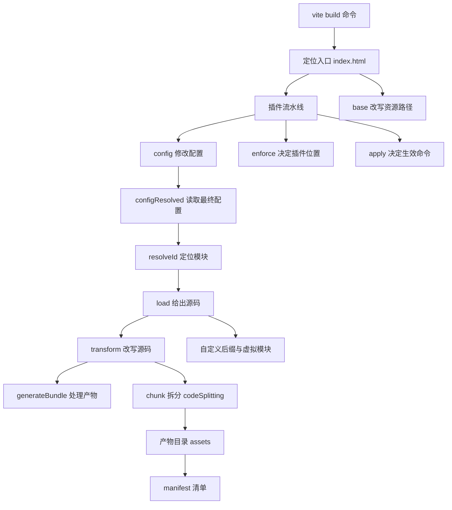
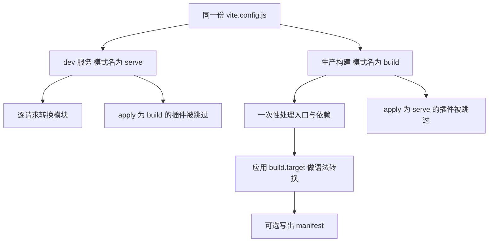
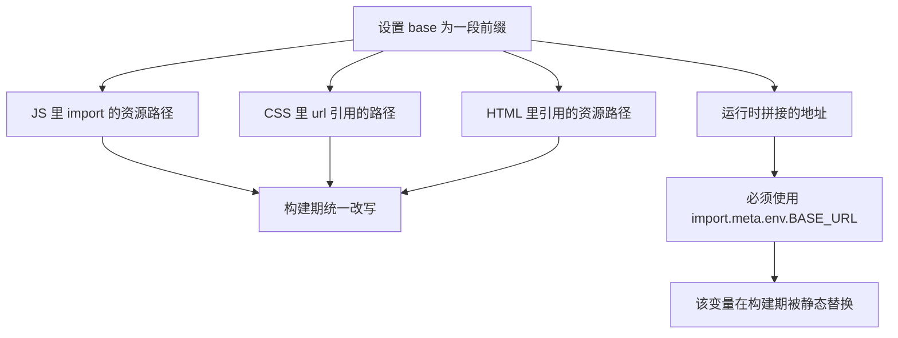
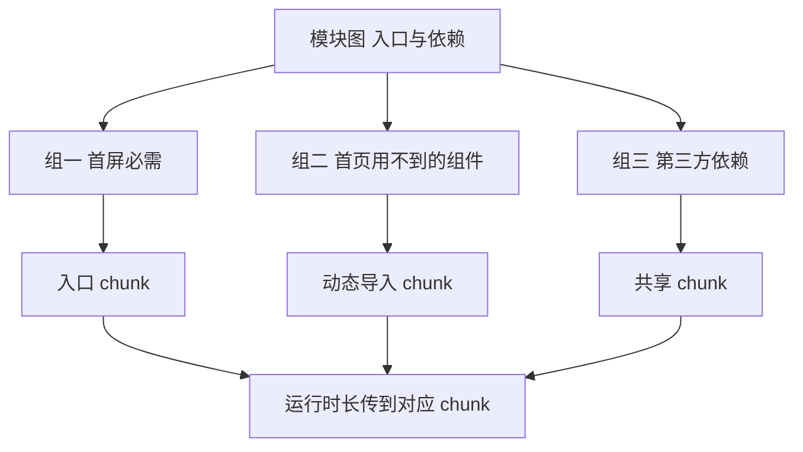
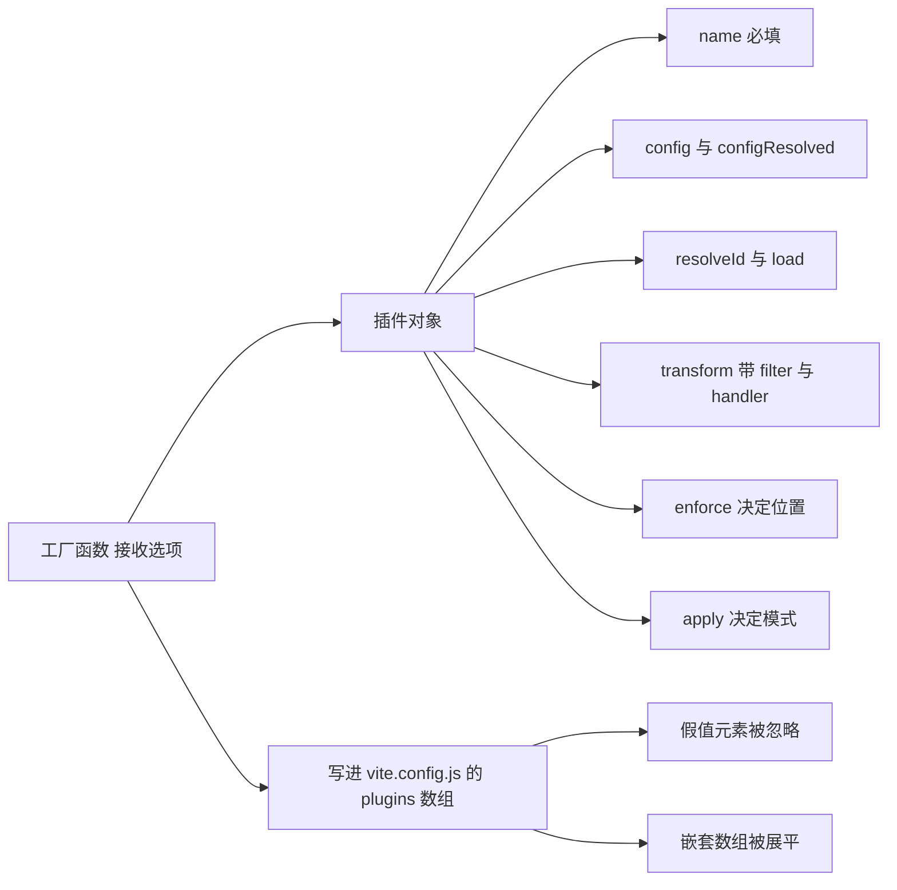
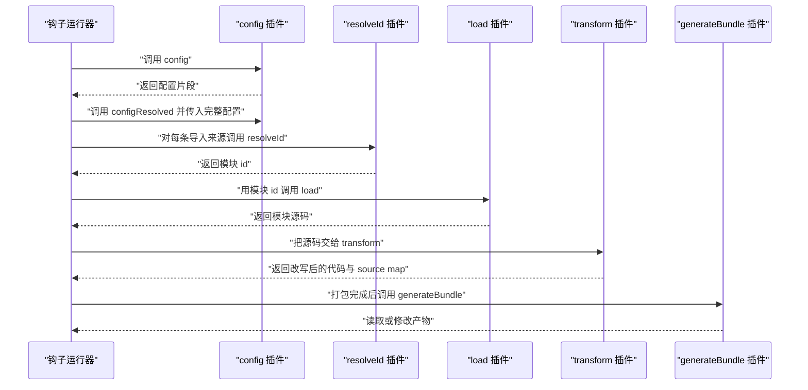
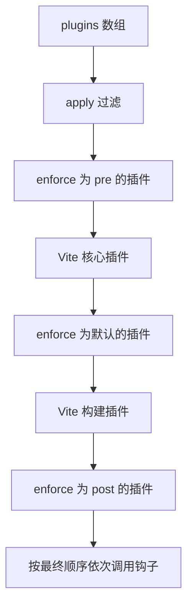
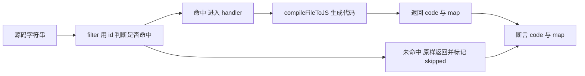
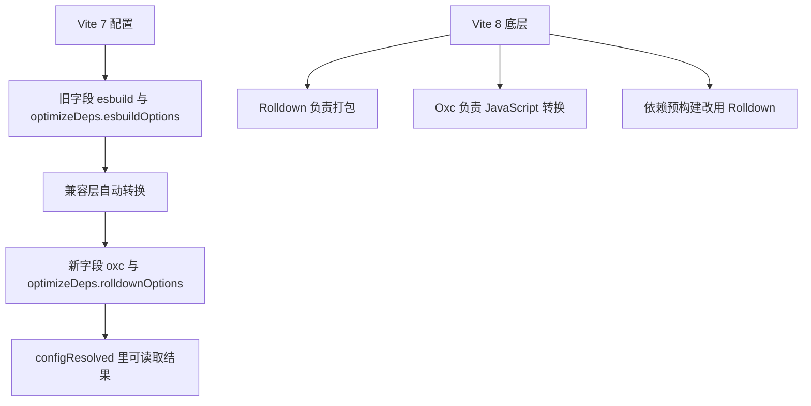

# Vite 构建与插件：生产构建怎么跑、插件钩子的执行顺序

!!! abstract "学完这一页你能"

    - 按顺序说出 `vite build` 从入口到写盘的五个阶段，并指出每个阶段对应哪个钩子。
    - 用 `enforce` 与 `apply` 排出插件的最终执行顺序，并预测一次构建的钩子调用序列。
    - 判断 JS 导入、CSS 引用、HTML 引用三类路径是否被 `base` 改写，指出哪类写法不会被替换。
    - 手写一个处理自定义文件后缀的 Vite 插件，并用 `node:assert` 写出可重复运行的测试。

## 0. 知识地图



建议的读法是先看第 1 到第 3 节，把"构建做什么"和"路径怎么变"打牢。
再看第 4 节，理解模块如何被分到不同 chunk。
最后看第 5 到第 9 节，从插件形状一路走到钩子顺序与手写插件。

## 1. 生产构建怎么跑：五个阶段

**先想一个问题**

你本地 `npm run dev` 打开页面正常。跑完 `vite build`，`dist` 里出现带哈希的文件名。这中间 Vite 到底做了哪几件事？

**心智模型**

!!! tip "心智模型"

    一句话模型：`vite build` 是一条装配线，读入口、定位模块、改写源码、分块、写盘，五步依次走完。
    日常类比：像印刷厂把手稿排版、合页、装订成书。
    类比不成立的地方：书页顺序由编辑决定，分块由引用关系与配置决定；插件能在任意工位插入或替换零件。

**图解**


1. 阶段一定位入口。默认入口是根目录下的 `index.html`。
2. 阶段二把每条 import 变成确定的文件路径，这一步由 `resolveId` 负责。
3. 阶段三读取文件源码并做语法转换，这一步由 `load` 与 `transform` 负责。
4. 阶段四按配置把模块分配到不同 chunk。
5. 阶段五把内存里的结果写进产物目录。
6. 开启 `build.manifest` 时，写盘阶段额外产出 `.vite/manifest.json`。

**一步一步来**

步骤 1：运行一次默认构建，确认入口与产物目录。

```bash
# 执行 package.json 里 build 字段对应的脚本
npm run build

# 也可以直接调用本地依赖里的 vite
npx vite build
```

**这段代码在做什么**

- 第一条命令走 `package.json` 的 `build` 脚本，脚本内容通常在项目初始化时写好。
- 第二条命令跳过脚本，直接执行 `node_modules/.bin/vite`。
- 两条命令的默认入口都是 `<root>/index.html`，这条规则写在官方 Building for Production 一节。
- 命令结束后默认在项目根目录生成 `dist` 目录，用于静态托管。
- 产物里的文件名带有内容哈希，这是后续处理缓存与预加载错误的背景。

运行结果：

```text
终端打印构建开始与结束信息
dist 目录内出现 index.html 与 assets 目录
```

步骤 2：改构建选项，锁定目标浏览器并生成清单。

```js
// vite.config.js
import { defineConfig } from 'vite'

export default defineConfig({
  build: {
    // 语法转换的目标下限，官方说明最低可到 es2015
    target: 'es2015',
    // 开启清单，产物目录里会多出 .vite/manifest.json
    manifest: true,
    // 需要更底层的控制时，直接写 Rolldown 的选项
    rolldownOptions: {
      // https://rolldown.rs/reference/
    },
  },
})
```

**这段代码在做什么**

- `build.target` 控制语法转换的下限，官方写明最低值为 `es2015`。
- 不写 `target` 时，默认目标是某个固定日期下 Baseline Widely Available 的浏览器范围。
- `build.manifest` 设为 true 后，构建写出 `.vite/manifest.json`。
- `build.rolldownOptions` 把配置直接透传给底层 Rolldown。
- 清单把源文件映射到产物文件，并记录该产物引用的 CSS、依赖的 chunk 与是否入口。

!!! note "术语：manifest"

    定义：一份把源文件名映射到产物文件名的 JSON 清单。
    例子：清单里的 `views/foo.js` 记录 `file` 为 `assets/foo-BRBmoGS9.js`，`isEntry` 为 true。

步骤 3：处理新版部署后旧 chunk 拉取失败。

```js
// 入口文件里注册一次即可
window.addEventListener('vite:preloadError', (event) => {
  // payload 里是原始的导入错误对象
  console.log(event.payload)

  // 调用此方法后错误不会再向外抛出
  event.preventDefault()

  // 常见做法是整页刷新，拿到新部署的资源
  window.location.reload()
})
```

**这段代码在做什么**

- 动态导入失败时，Vite 派发 `vite:preloadError` 事件。
- `event.payload` 保存原始的导入错误。
- 调用 `event.preventDefault()` 后，这个错误不会被抛出。
- 事件适合处理"用户停留在旧页面，旧 chunk 已被删除"的情况。
- 官方同时提醒：给 HTML 响应设置 `Cache-Control: no-cache`，避免旧 HTML 继续引用被删资源。

**动手验证**

```js
// build-pipeline.mjs
// 依赖：无，仅 Node 20+ 内置模块
import assert from 'node:assert/strict'

const stages = []

// 用一个数组记录构建阶段，模拟装配线的调用顺序
function runBuild(entry) {
  stages.push('locate-entry')
  stages.push('resolve')
  stages.push('load')
  stages.push('transform')
  stages.push('chunk')
  stages.push('emit')
  return {
    entry,
    outDir: 'dist',
    manifest: `${entry} -> assets/index-abc123.js`,
  }
}

const result = runBuild('index.html')

assert.equal(result.outDir, 'dist')
assert.equal(stages[0], 'locate-entry')
assert.equal(stages.at(-1), 'emit')
assert.deepEqual(stages, [
  'locate-entry',
  'resolve',
  'load',
  'transform',
  'chunk',
  'emit',
])
assert.match(result.manifest, /assets\//)

console.log('阶段顺序:', stages.join(' -> '))
console.log('入口:', result.entry)
console.log('断言通过: 5 项')
```

预期输出：

```text
阶段顺序: locate-entry -> resolve -> load -> transform -> chunk -> emit
入口: index.html
断言通过: 5 项
```

**常见坑**

| 现象 | 原因 | 怎么修 |
| --- | --- | --- |
| `dist` 里没有 `manifest.json` | 没有开启 `build.manifest` | 在 `build` 下把 `manifest` 设为 true |
| 新版本上线后用户点页面报导入错误 | 旧 chunk 被托管服务删除，旧 HTML 仍在引用 | 监听 `vite:preloadError`，并给 HTML 设置 `Cache-Control: no-cache` |
| 把 `target` 调到 `es5` 后构建报错 | 官方说明最低 target 为 `es2015` | 需要老浏览器支持时用 `@vitejs/plugin-legacy` |
| 想改更底层的打包行为却找不到配置项 | 配置不在 Vite 自己的字段上 | 使用 `build.rolldownOptions` 并对照 Rolldown 文档 |

**小结**

- `vite build` 的默认入口是 `<root>/index.html`，默认产出可静态托管的 `dist`。
- 构建分五个阶段，每个阶段都能被插件钩子插进去。
- `build.manifest` 打开后才生成 `.vite/manifest.json`。

## 2. dev 与 build 的差异：一份配置，两套运行方式

**先想一个问题**

你的插件在 `npm run dev` 时打印了三行日志，在 `vite build` 时只打印了一行。同一份配置，为什么行为不同？

**心智模型**

!!! tip "心智模型"

    一句话模型：同一份 `vite.config.js` 喂给两个模式，dev 服务按请求处理模块，构建一次性处理全部入口。
    日常类比：像同一套菜谱，一份给现点现做的档口，一份给提前备餐的中央厨房。
    类比不成立的地方：两个模式共用插件数组，但插件可以通过 `apply` 声明只服务其中一个模式。

**图解**



1. 两个模式读同一份配置文件，插件数组也来自同一个 `plugins` 字段。
2. dev 服务按浏览器请求逐个转换模块，所以插件只看到被访问到的文件。
3. 生产构建从入口出发遍历全部依赖，所以插件看到的是完整模块图。
4. `apply` 为 `build` 的插件在两个模式里只有构建模式生效。
5. 语法转换下限由 `build.target` 决定，官方写明最低 `es2015`。
6. 清单只在构建模式且开启 `build.manifest` 时产出。

!!! note "术语：apply"

    定义：插件对象上的一个字段，取值为 `build` 或 `serve`，用来限定插件只在对应模式下被调用。
    例子：只在构建期做资源压缩的插件，把 `apply` 写成 `'build'`，dev 服务就不会调用它。

**一步一步来**

步骤 1：先确认默认浏览器支持范围。

```text
官方 Building for Production 给出本大版本的默认范围：
Chrome 111 以上
Edge 111 以上
Firefox 114 以上
Safari 16.4 以上
```

**这段代码在做什么**

- 这段文字来自官方文档，不是计算出来的结果。
- 该范围对应某个大版本发布时固定下来的 Baseline Widely Available 日期。
- 想改成别的范围，用 `build.target`。
- 官方强调 `build.target` 的最低值是 `es2015`。

步骤 2：理解"调低 target 也有一条硬底线"。

```js
// vite.config.js
import { defineConfig } from 'vite'

export default defineConfig({
  build: {
    // 把语法转换下限调到 es2015
    target: 'es2015',
  },
})
```

**这段代码在做什么**

- 这段配置把语法转换的下限压到 `es2015`。
- 官方说明：即使设了更低的目标，Vite 仍要求一组最低浏览器范围。
- 这组范围是 Chrome 64 以上、Firefox 67 以上、Safari 11.1 以上、Edge 79 以上。
- 原因写在官方文档里：Vite 依赖原生 ESM 动态 import 与 `import.meta`。
- 所以想让更老的浏览器跑起来，需要额外手段而不是只改 `target`。

步骤 3：用官方插件补齐老浏览器支持与 polyfill。

```js
// vite.config.js
import legacy from '@vitejs/plugin-legacy'
import { defineConfig } from 'vite'

export default defineConfig({
  plugins: [
    // 该插件会额外生成 legacy chunk 与对应的语言特性 polyfill
    legacy({
      targets: ['defaults', 'not IE 11'],
    }),
  ],
})
```

**这段代码在做什么**

- `@vitejs/plugin-legacy` 是官方插件，需要装进 `devDependencies`。
- 它额外生成 legacy chunk 和对应的 ES 语言特性 polyfill。
- 官方说明这些 legacy chunk 只在不支持原生 ESM 的浏览器里条件加载。
- `targets` 字段的取值语法沿用外部工具约定，具体写法需核对官方文档。
- 默认情况下 Vite 只做语法转换，不含任何 polyfill。

**动手验证**

```js
// apply-filter.mjs
// 依赖：无，仅 Node 20+ 内置模块
import assert from 'node:assert/strict'

// 模拟 Vite 在两种模式下对插件的筛选
function activePluginNames(plugins, command) {
  return plugins
    .filter((p) => !p.apply || p.apply === command)
    .map((p) => p.name)
}

const plugins = [
  { name: 'both-modes' },
  { name: 'build-only', apply: 'build' },
  { name: 'serve-only', apply: 'serve' },
  { name: 'also-build', apply: 'build' },
]

assert.deepEqual(activePluginNames(plugins, 'build'), [
  'both-modes',
  'build-only',
  'also-build',
])
assert.deepEqual(activePluginNames(plugins, 'serve'), [
  'both-modes',
  'serve-only',
])

console.log('build 模式:', activePluginNames(plugins, 'build').join(', '))
console.log('serve 模式:', activePluginNames(plugins, 'serve').join(', '))
console.log('断言通过: 2 项')
```

预期输出：

```text
build 模式: both-modes, build-only, also-build
serve 模式: both-modes, serve-only
断言通过: 2 项
```

**常见坑**

| 现象 | 原因 | 怎么修 |
| --- | --- | --- |
| 插件在 dev 里正常，构建时没执行 | 插件设置了 `apply: 'serve'` | 去掉 `apply`，或改成 `'build'` |
| 老浏览器白屏，控制台报语法错误 | 默认只做语法转换，不含 polyfill | 用 `@vitejs/plugin-legacy` 生成 legacy chunk 与 polyfill |
| 把 `target` 写成 `es5` 构建失败 | 官方写明最低 `es2015` | 改用 `es2015` 或更高，老浏览器交给 legacy 插件 |
| 只在构建期跑的插件拖慢了启动 | 插件没有声明 `apply` | 给它加上 `apply: 'build'` |

**小结**

- dev 与 build 共用一份配置与一个插件数组，靠 `apply` 区分。
- 默认浏览器范围固定在本大版本的 Chrome 111 / Edge 111 / Firefox 114 / Safari 16.4。
- 调低 `target` 有一条硬底线，原因是 Vite 依赖原生 ESM 动态 import 与 `import.meta`。

## 3. 资源处理与 base：路径是怎么被改写的

**先想一个问题**

项目要部署到 `https://example.com/my/public/path/`。你改了 `base`，构建后 CSS 里的背景图 404，JS 里拼出来的图片地址也 404。问题出在哪？

**心智模型**

!!! tip "心智模型"

    一句话模型：构建期能看到的引用会被自动改写，运行时才拼出来的地址要靠 `import.meta.env.BASE_URL` 自己拼。
    日常类比：像搬家时把写死门牌号的快递单统一改一遍，临时手写的便条没人帮你改。
    类比不成立的地方：便条也能改，前提是便条上写的是规定的那个变量名，且必须原样出现。

**图解**



1. `base` 可以写在配置里，也可以用命令行参数传入。
2. JS 里通过 import 引入的资源 URL 会在构建期改写。
3. CSS 里 `url()` 引用的资源地址同样会被改写。
4. HTML 里引用的资源地址也会被改写。
5. 运行时动态拼接的地址没人能自动改写，只能用 `import.meta.env.BASE_URL`。
6. 这个变量是静态替换的，写法必须原样，方括号访问不会生效。

!!! note "术语：base"

    定义：部署时应用的公共基础路径，用于重写产物里的资源引用。
    例子：设成 `/my/public/path/` 后，`/assets/logo.svg` 会变成 `/my/public/path/assets/logo.svg`。

**一步一步来**

步骤 1：用配置或命令行指定前缀。

```bash
# 方式一：命令行参数
npx vite build --base=/my/public/path/
```

```js
// 方式二：写进配置文件
import { defineConfig } from 'vite'

export default defineConfig({
  // 所有产物里的资源引用都会带上这个前缀
  base: '/my/public/path/',
})
```

**这段代码在做什么**

- 命令行方式适合临时构建一次、不修改仓库配置的场景。
- 配置方式适合长期固定部署路径的项目，值会随配置进版本库。
- 两种方式都会让 JS 导入、CSS `url()`、HTML 引用三类路径按同一前缀改写。
- 具体优先级的判定规则需核对官方文档 Shared Options 中的 `base` 一节。

步骤 2：处理运行时拼接的地址。

```js
// 需要用完整写法，构建期才会做静态替换
const iconUrl = `${import.meta.env.BASE_URL}icons/logo.svg`

// 下面这种方括号写法不会被替换
const wrong = `${import.meta.env['BASE_URL']}icons/logo.svg`

console.log(iconUrl, wrong)
```

**这段代码在做什么**

- `import.meta.env.BASE_URL` 是全局注入的变量，值就是当前的公共基础路径。
- 官方明确说明它在构建期被静态替换，所以必须原样出现。
- 写成 `import.meta.env['BASE_URL']` 时替换不会发生，运行时拿到的结果与预期不符。
- 这一类地址适合放在需要动态拼路径的代码里。

步骤 3：路径不确定时改用相对路径。

```js
// 让所有生成的 URL 相对于各自文件所在位置
import { defineConfig } from 'vite'

export default defineConfig({
  base: './',
})
```

**这段代码在做什么**

- 把 `base` 设为 `"./"` 或空字符串，生成的所有 URL 会相对于各自文件。
- 官方提醒：相对 base 需要运行环境支持 `import.meta`。
- 如果没有这个支持能力，需要借助 legacy 插件。
- 适合事先不知道部署路径、产物可能被放到任意子目录的场景。

**动手验证**

```js
// base-rewrite.mjs
// 依赖：无，仅 Node 20+ 内置模块
import assert from 'node:assert/strict'

const base = '/my/public/path/'

// 三类引用在构建期都会被加上 base 前缀
const rewriteImport = (url) => base + url.replace(/^\//, '')
const rewriteCssUrl = (url) => `url(${base}${url.replace(/^\//, '')})`
const rewriteHtmlRef = (url) => base + url.replace(/^\//, '')

// 只有原样写出的 import.meta.env.BASE_URL 会被静态替换
function replaceBaseToken(code) {
  return code.replace(/import\.meta\.env\.BASE_URL/g, base)
}

assert.equal(rewriteImport('/assets/logo.svg'), '/my/public/path/assets/logo.svg')
assert.equal(rewriteCssUrl('/assets/bg.png'), 'url(/my/public/path/assets/bg.png)')
assert.equal(rewriteHtmlRef('/assets/app.js'), '/my/public/path/assets/app.js')

assert.equal(
  replaceBaseToken('const p = import.meta.env.BASE_URL'),
  `const p = ${base}`,
)

assert.equal(
  replaceBaseToken("const p = import.meta.env['BASE_URL']"),
  "const p = import.meta.env['BASE_URL']",
)

console.log('三类引用已改写，方括号写法保持原样')
console.log('断言通过: 5 项')
```

预期输出：

```text
三类引用已改写，方括号写法保持原样
断言通过: 5 项
```

**常见坑**

| 现象 | 原因 | 怎么修 |
| --- | --- | --- |
| CSS 背景图 404 | 没设 `base`，部署在子路径下 | 用配置或 `--base` 指定前缀 |
| 运行时拼的图片地址 404 | 地址在运行时拼出，构建期看不见 | 用 `import.meta.env.BASE_URL` 拼 |
| 用了 `import.meta.env['BASE_URL']` 仍然 404 | 静态替换只认原样写法 | 改成点号写法 |
| 相对 base 在老浏览器失效 | 相对 base 需要 `import.meta` 支持 | 配合 legacy 插件处理 |

**小结**

- `base` 会改写 JS 导入、CSS `url()`、HTML 引用三类路径。
- 运行时拼接的地址要用 `import.meta.env.BASE_URL`，写法必须原样。
- 路径未知时可以用 `"./"` 或空字符串得到相对 base，前提是支持 `import.meta`。

## 4. chunk 拆分：codeSplitting 与分块策略

**先想一个问题**

首页只用到按钮组件，构建后却把整个组件库塞进同一个大文件。首屏加载时间被拖长，怎么把模块分开？

**心智模型**

!!! tip "心智模型"

    一句话模型：分块就是把模块图切成几组，每组写成一个文件，运行时按需加载。
    日常类比：像把一整套工具箱按用途分成几个小箱，出门只带当前要用的一箱。
    类比不成立的地方：拆得越细，请求次数越多，拆分方案要按实际访问路径决定。

**图解**



1. 入口与它同步引用的模块会成为入口 chunk。
2. 通过动态导入引入的模块会成为单独的 chunk。
3. 被多处引用的第三方依赖适合放在共享 chunk。
4. 运行时按实际访问路径拉取对应 chunk。
5. 分块结果受配置控制，不配置时按默认策略处理。

!!! note "术语：chunk"

    定义：打包产出的一个 JavaScript 文件，包含一组被判定为适合一起加载的模块。
    例子：入口 chunk 常命名为 `index-xxxx.js`，异步 chunk 常命名为 `baz-xxxx.js`。

**一步一步来**

步骤 1：找到分块配置的位置。

```js
// vite.config.js
import { defineConfig } from 'vite'

export default defineConfig({
  build: {
    // 分块策略写在 Rolldown 的输出选项上
    rolldownOptions: {
      output: {
        // 官方指向 Rolldown 文档的 codeSplitting
        codeSplitting: {},
      },
    },
  },
})
```

**这段代码在做什么**

- 官方 Chunking Strategy 一节把分块配置指向 `build.rolldownOptions.output.codeSplitting`。
- 该字段的完整取值与语义写在 Rolldown 文档的手动代码拆分一节。
- 用框架的项目应参考框架自身文档配置分块方式。
- 上面的空对象只是占位，实际字段需核对官方文档。

!!! note "术语：codeSplitting"

    定义：Rolldown 输出选项里的分块配置字段，用于决定模块如何被分到不同 chunk。
    例子：官方文档把分块配置写成 `build.rolldownOptions.output.codeSplitting`。

步骤 2：理解分块的判断依据。

```text
判断依据来自模块之间的引用关系：
同步 import 的模块可以和入口放在同一个 chunk
动态 import 的模块会被拆成单独的 chunk
被多个 chunk 共同引用的模块适合提取为共享 chunk
```

**这段代码在做什么**

- 这三条是打包器分块的通用判断，用来说明方向。
- 具体阈值与算法由 Rolldown 决定，需核对官方文档。
- Rollup 时代的 `output.manualChunks` 与 Rolldown 的对应关系，需核对官方文档。

步骤 3：做一次可观察的对比实验。

```bash
# 记录分块结果的文件名与顺序
npx vite build
ls dist/assets

# 改动分块配置后重新构建，再对比一次
npx vite build
ls dist/assets
```

**这段代码在做什么**

- 第一次构建给出改动前的 chunk 列表。
- 第二次构建给出改动后的 chunk 列表。
- 两次列表的差异就是配置生效的证据。
- 用文件数量与文件大小对比，能判断拆分是变细还是变粗。

**动手验证**

```js
// chunk-plan.mjs
// 依赖：无，仅 Node 20+ 内置模块
// 用包名前缀分组，模拟分块策略的判断方向
import assert from 'node:assert/strict'

const modules = [
  'node_modules/react/index.js',
  'node_modules/react-dom/index.js',
  'node_modules/lodash-es/lodash.js',
  'src/app.js',
  'src/utils.js',
]

function packageOf(id) {
  const matched = id.match(/^node_modules\/([^/]+)/)
  return matched ? matched[1] : null
}

function groupsOf(ids) {
  const groups = new Map()
  for (const id of ids) {
    const key = packageOf(id) ?? 'app'
    if (!groups.has(key)) groups.set(key, [])
    groups.get(key).push(id)
  }
  return groups
}

const groups = groupsOf(modules)

assert.deepEqual([...groups.keys()], ['react', 'react-dom', 'lodash-es', 'app'])
assert.equal(groups.get('app').length, 2)
assert.equal(groups.get('react').length, 1)
assert.equal(groups.get('lodash-es').length, 1)

console.log('分组:', [...groups.keys()].join(' | '))
console.log('app 组模块数:', groups.get('app').length)
console.log('断言通过: 4 项')
```

预期输出：

```text
分组: react | react-dom | lodash-es | app
app 组模块数: 2
断言通过: 4 项
```

**常见坑**

| 现象 | 原因 | 怎么修 |
| --- | --- | --- |
| 只改 `target` 分块结果没变 | `target` 只管语法转换，不管分块 | 去 `build.rolldownOptions.output` 下配置 |
| 拆得太碎，请求数猛增 | 每个第三方包单独成 chunk | 按实际访问路径合并分组，再构建对比文件数 |
| 按 Rollup 示例写了 `manualChunks` 没效果 | Vite 8 的底层是 Rolldown | 使用 `codeSplitting`，对应关系需核对官方文档 |
| 用框架时配置不生效 | 框架自己接管了分块配置 | 查阅所用框架的构建文档 |

**小结**

- 分块配置的位置是 `build.rolldownOptions.output.codeSplitting`。
- 同步引用、动态导入、跨 chunk 共享三类关系决定模块落到哪个 chunk。
- 判断配置是否生效的办法是构建两次，对比 `dist/assets` 里的文件名与数量。

## 5. 插件长什么样：工厂函数与插件对象

**先想一个问题**

你想让 Vite 认一个 `.my-file-ext` 后缀的文件。写在哪？要不要发一个 npm 包？

**心智模型**

!!! tip "心智模型"

    一句话模型：插件就是一个带 `name` 字段和若干钩子的普通对象，用工厂函数返回它。
    日常类比：像给装配线塞一张工位说明卡，卡片上写清这个工位在什么时候做什么。
    类比不成立的地方：卡片的执行位置由 `enforce` 与 `apply` 决定，不是你写在数组里的顺序说了算。

**图解**



1. 官方给出的常见约定是：用工厂函数接收选项，返回插件对象。
2. 插件对象至少要有一个 `name` 字段，它会出现在警告与错误信息里。
3. `config` 与 `configResolved` 负责配置阶段。
4. `resolveId` 与 `load` 负责找到并给出模块源码。
5. `transform` 负责改写源码，官方示例里带 `filter` 与 `handler` 两个字段。
6. `enforce` 与 `apply` 控制插件的位置与生效模式。

!!! note "术语：插件钩子"

    定义：插件对象上以固定名字命名的函数字段，打包器会在特定阶段调用它们。
    例子：`transform` 在模块源码被读取之后、进入打包之前被调用。

**一步一步来**

步骤 1：先判断需求是否真的需要插件。

```text
官方 Plugin API 开头给出的顺序是：
先看 Features 指南里是否已经覆盖该能力
再看社区已有的兼容 Rollup 插件
再看 Vite 专用插件列表
都没有再自己写
```

**这段代码在做什么**

- 这段是官方给出的排查顺序，不是技术实现。
- 很多在 Rollup 项目里需要插件的场景，Vite 已经内置支持。
- 社区插件分两类：兼容 Rollup 的插件和 Vite 专用插件。
- 按这个顺序走能避免重复造轮子。
- Vite 插件清单可在官方 Vite Plugin Registry 查询。

步骤 2：写出最小插件，先内联在配置里。

```js
// vite.config.js
import { defineConfig } from 'vite'

// 官方说明：插件可以直接内联在配置里，不必单独建包
const myPlugin = () => ({
  name: 'my-plugin',
  // 钩子写在对象里，具体签名见官方示例
  transform: {
    filter: { id: /\.my-file-ext$/ },
    handler(src, id) {
      return { code: src, map: null }
    },
  },
})

export default defineConfig({
  plugins: [myPlugin()],
})
```

**这段代码在做什么**

- 工厂函数 `myPlugin` 返回一个对象，这就是插件本身。
- `name` 是必填字段，会出现在警告和错误里。
- `transform` 用 `filter` 限定处理的文件，用 `handler` 返回改写结果。
- `map` 为 null 表示这个插件不提供 source map。
- 官方示例中 `handler` 的返回值就是 `{ code, map }` 这个形状。

!!! note "术语：source map"

    定义：一份把编译后的代码位置映射回原始源码位置的数据。
    例子：插件返回 `map: null` 时，浏览器调试器只能定位到编译后的位置。

步骤 3：了解命名约定与调试工具。

```text
命名约定（来自官方 Conventions 一节）：
纯 Rolldown 插件用 rolldown-plugin- 前缀
package.json 里加 rolldown-plugin 与 vite-plugin 两个 keywords
Vite 专用插件用 vite-plugin- 前缀，并加 vite-plugin keyword
框架专用插件带框架名，如 vite-plugin-vue-、vite-plugin-react-、vite-plugin-svelte-
```

**这段代码在做什么**

- 约定让插件能被其他项目按名字找到，也方便被纯 Rolldown 或 Rollup 项目复用。
- 只用 Vite 专有钩子的插件，官方要求在文档里说明"为什么只能用 Vite"。
- 调试插件时建议装 `vite-plugin-inspect`。
- 装上后访问本地服务的 `__inspect/` 路径，可以查看模块与转换栈的中间状态。

**动手验证**

```js
// plugin-shape.mjs
// 依赖：无，仅 Node 20+ 内置模块
import assert from 'node:assert/strict'

// 工厂函数返回插件对象，这是官方给出的常见约定
function myPlugin(options = {}) {
  return {
    name: 'my-plugin',
    enforce: options.enforce,
    apply: options.apply,
    transform: {
      filter: { id: /\.my-file-ext$/ },
      handler(src, id) {
        return { code: `${src}\n`, map: null }
      },
    },
  }
}

// plugins 数组会展平，并忽略假值元素
function normalizePlugins(list) {
  return list.flat(Infinity).filter(Boolean)
}

const plugins = normalizePlugins([
  myPlugin({ enforce: 'pre', apply: 'build' }),
  false && myPlugin(),
  [myPlugin(), null],
])

assert.equal(plugins.length, 2)
assert.equal(plugins[0].name, 'my-plugin')
assert.equal(plugins[0].enforce, 'pre')
assert.equal(plugins[0].apply, 'build')
assert.equal(typeof plugins[0].transform.handler, 'function')
assert.equal(plugins[0].transform.filter.id.test('a.my-file-ext'), true)
assert.equal(plugins[0].transform.filter.id.test('a.js'), false)

console.log('展平后插件数量:', plugins.length)
console.log('断言通过: 7 项')
```

预期输出：

```text
展平后插件数量: 2
断言通过: 7 项
```

**常见坑**

| 现象 | 原因 | 怎么修 |
| --- | --- | --- |
| 警告里只显示 `unknown` | 插件没有 `name` | 给插件对象加上唯一 `name` |
| 条件为假时插件仍然挂进数组 | 用了 `if` 之外的写法 | 直接写假值，官方说明假值元素会被忽略 |
| 插件预设只生效一部分 | 数组嵌套没有被展平 | 官方说明插件数组会在内部展平，检查返回值形状 |
| 想排查某个模块被谁改过 | 缺少中间状态观察手段 | 装 `vite-plugin-inspect`，访问 `__inspect/` |

**小结**

- 插件是带 `name` 和钩子的普通对象，用工厂函数返回，可直接内联进配置。
- `plugins` 数组会忽略假值并展平嵌套数组，方便做条件开关与预设。
- 命名前缀区分纯 Rolldown 插件与 Vite 专用插件，调试用 `vite-plugin-inspect`。

## 6. 插件钩子的执行顺序：从 config 到 generateBundle

**先想一个问题**

两个插件都改了同一份配置，最后生效的是哪个？两个插件都转换同一个文件，后一个拿到的是原始源码还是前一个改完的结果？

**心智模型**

!!! tip "心智模型"

    一句话模型：不同阶段的钩子按"每个插件各跑一遍"的方式推进，只有同一阶段内部的钩子才会链式传递结果。
    日常类比：像一条流水线，每道工序都要走过所有工位才能进入下一道工序。
    类比不成立的地方：`config` 阶段的每个插件看到的是前一插件改过的配置片段，而 `transform` 阶段每个插件看到的是前一插件改过的代码。

**图解**



1. `config` 阶段每个插件都能返回一段配置，用来合并进最终配置。
2. `configResolved` 在配置确定后调用，参数是完整的最终配置。
3. `resolveId` 针对每条导入来源调用，负责把来源字符串变成模块 id。
4. `load` 用模块 id 取源码，这一步决定模块的内容从哪里来。
5. `transform` 接收上一步的源码，返回改写后的代码与 source map。
6. `generateBundle` 在产物生成阶段调用，可以读取或修改产物内容。

!!! note "术语：模块 id"

    定义：打包器内部用来唯一标识一个模块的字符串。
    例子：虚拟模块的 id 可以写成 `virtual:my-module`。

**一步一步来**

步骤 1：用 `configResolved` 读出最终配置。

```js
// vite.config.js
// 官方迁移文档给出的示例：在钩子里读取转换后的依赖预构建选项
const plugin = {
  name: 'log-config',
  configResolved(config) {
    // 这里拿到的是合并完成后的配置对象
    console.log('options', config.optimizeDeps.rolldownOptions)
  },
}
```

**这段代码在做什么**

- `configResolved` 的参数是完整的最终配置。
- 官方用它来读取兼容层转换后的 `config.optimizeDeps.rolldownOptions`。
- 这个钩子不能返回配置，适合做校验与读取。
- 想改配置要在 `config` 钩子里返回，而不是在这里。
- 具体钩子签名需核对官方文档 Plugin API 一节。

步骤 2：用 `resolveId` 与 `load` 提供虚拟模块。

```js
// 官方的虚拟模块示例，需依赖 @rolldown/pluginutils
import { exactRegex } from '@rolldown/pluginutils'

export default function myPlugin() {
  const virtualModuleId = 'virtual:my-module'
  // 虚拟 id 统一加反斜杠零前缀，避免和真实文件冲突
  const resolvedVirtualModuleId = '\0' + virtualModuleId

  return {
    name: 'my-plugin',
    resolveId: {
      filter: { id: exactRegex(virtualModuleId) },
      handler() {
        return resolvedVirtualModuleId
      },
    },
    load: {
      filter: { id: exactRegex(resolvedVirtualModuleId) },
      handler() {
        return `export const msg = "from virtual module"`
      },
    },
  }
}
```

**这段代码在做什么**

- `resolveId` 把导入来源 `virtual:my-module` 映射到一个内部 id。
- 内部 id 前面加 `\0` 是虚拟模块的通用约定，用来避免与磁盘文件重名。
- `load` 根据内部 id 返回源码字符串，这一段代码并不存在于磁盘上。
- 业务代码里直接 `import { msg } from 'virtual:my-module'` 即可。
- 官方说明 `\0` 不是合法 URL 字符，在 Vite 里会被编码成 `__x` 开头的形式。

步骤 3：写 `transform` 并注意链式关系。

```js
// 官方 Simple Examples 给出的 transform 形状
const fileRegex = /\.(my-file-ext)$/

export default function myPlugin() {
  return {
    name: 'transform-file',
    transform: {
      filter: {
        id: fileRegex,
      },
      handler(src, id) {
        return {
          // 编译后的代码
          code: compileFileToJS(src),
          // 有 source map 就在这里给出
          map: null,
        }
      },
    },
  }
}
```

**这段代码在做什么**

- `filter.id` 用来限定这个插件只处理匹配的文件。
- `handler` 的第一个参数是当前源码，第二个参数是模块 id。
- 返回值必须是 `{ code, map }` 形状，官方示例就是这样写的。
- 多个插件都命中同一个文件时，后一个拿到的是前一个处理后的代码。
- `compileFileToJS` 是示例里假设存在的编译函数，实现由插件作者提供。

**动手验证**

```js
// hook-order.mjs
// 依赖：无，仅 Node 20+ 内置模块
import assert from 'node:assert/strict'

const log = []

// 最小钩子运行器：按阶段推进，每个阶段走完全部插件
async function runPipeline(plugins) {
  const stages = ['config', 'configResolved', 'resolveId', 'load', 'transform', 'generateBundle']
  for (const stage of stages) {
    for (const plugin of plugins) {
      if (typeof plugin[stage] === 'function') {
        await plugin[stage]()
        log.push(`${plugin.name}:${stage}`)
      }
    }
  }
}

const plugins = [
  { name: 'a', config: async () => {}, configResolved: async () => {} },
  { name: 'b', resolveId: async () => {} },
  { name: 'c', load: async () => {}, transform: async () => {} },
  { name: 'd', generateBundle: async () => {} },
]

await runPipeline(plugins)

// 从日志里抽出阶段名，检查阶段推进顺序
const stageSequence = []
for (const entry of log) {
  const stage = entry.split(':')[1]
  if (stageSequence.at(-1) !== stage) stageSequence.push(stage)
}

assert.deepEqual(stageSequence, [
  'config',
  'configResolved',
  'resolveId',
  'load',
  'transform',
  'generateBundle',
])

assert.equal(log.length, 6)

console.log('调用日志:')
for (const entry of log) console.log(' ', entry)
console.log('阶段顺序:', stageSequence.join(' -> '))
```

预期输出：

```text
调用日志:
  a:config
  a:configResolved
  b:resolveId
  c:load
  c:transform
  d:generateBundle
阶段顺序: config -> configResolved -> resolveId -> load -> transform -> generateBundle
```

**常见坑**

| 现象 | 原因 | 怎么修 |
| --- | --- | --- |
| 虚拟模块导入报找不到文件 | `resolveId` 返回了原始 id，没有加前缀 | 返回 `\0` 开头的内部 id，并让 `load` 匹配它 |
| 插件改过的代码又被自己处理了一遍 | `filter` 范围写得太宽 | 把 `filter.id` 收窄到目标后缀 |
| 在 `configResolved` 里返回配置没有效果 | 该钩子用于读取，不用于改写 | 改配置的逻辑放进 `config` 钩子 |
| `generateBundle` 拿不到期望的产物 | 钩子签名与调用时机需核对 | 需核对官方文档：该钩子的签名与产物参数形状 |

**小结**

- 钩子按阶段推进，同一阶段内每个插件轮流执行。
- `resolveId` 负责定位，`load` 负责给源码，`transform` 负责改写并返回 `{ code, map }`。
- 虚拟模块的 id 加 `\0` 前缀，官方说明该字符在 URL 中会被编码。

## 7. enforce 与 apply：把插件放到正确的位置

**先想一个问题**

你把插件写在 `plugins` 数组第一个，结果它的 `transform` 却比另一个插件的 `transform` 后执行。数组顺序为什么没生效？

**心智模型**

!!! tip "心智模型"

    一句话模型：`enforce` 决定插件相对 Vite 核心插件的位置，`apply` 决定插件在哪个模式里存在。
    日常类比：像排队时区分"优先通道""普通通道""最后通道"，同时还要看今天开不开这个窗口。
    类比不成立的地方：`enforce` 只分三档，同一档内部仍然按数组顺序排列。

**图解**



1. 先按 `apply` 过滤，只留下当前模式生效的插件。
2. `enforce` 为 `pre` 的插件排在 Vite 核心插件之前。
3. 没有写 `enforce` 的插件排在 Vite 核心插件之后，这是默认位置。
4. `enforce` 为 `post` 的插件排在 Vite 构建插件之后。
5. 同一档内部保持数组里原有的相对顺序。
6. 最终顺序确定后，各阶段的钩子按这个顺序调用。

!!! note "术语：enforce"

    定义：插件对象上的字段，取值为 `pre`、`post` 或不写，用来调整插件相对 Vite 核心插件的位置。
    例子：官方示例把 `@rollup/plugin-image` 的返回值展开后加上 `enforce: 'pre'`。

**一步一步来**

步骤 1：把不按默认位置执行的插件往前挪。

```js
// vite.config.js
import image from '@rollup/plugin-image'
import { defineConfig } from 'vite'

export default defineConfig({
  plugins: [
    {
      // 展开原插件对象，保留它的钩子
      ...image(),
      // 让它排在 Vite 核心插件之前
      enforce: 'pre',
    },
  ],
})
```

**这段代码在做什么**

- `...image()` 把原插件对象的字段展开到这个新对象上。
- `enforce: 'pre'` 让它在 Vite 核心插件之前被调用。
- 官方说明这种写法是为了兼容某些 Rollup 插件。
- 官方同时说明：对 Vite 插件本身来说，这类顺序安排属于实现细节。

步骤 2：把只在构建期需要的插件筛掉。

```js
// vite.config.js
import typescript2 from 'rollup-plugin-typescript2'
import { defineConfig } from 'vite'

export default defineConfig({
  plugins: [
    {
      ...typescript2(),
      // 只在 vite build 时调用这个插件
      apply: 'build',
    },
  ],
})
```

**这段代码在做什么**

- `apply` 取值为 `'build'` 或 `'serve'`。
- 不写 `apply` 时，插件在两种模式下都会被调用。
- 只在构建期做的处理放在 `'build'` 里，可以减少 dev 启动时的开销。
- 只在 dev 服务里做的事放在 `'serve'` 里。
- 官方提醒这两类字段是给插件使用者与作者共同使用的开关。

**动手验证**

```js
// plugin-order.mjs
// 依赖：无，仅 Node 20+ 内置模块
import assert from 'node:assert/strict'

const rank = { pre: 0, default: 1, post: 2 }

// 先按 apply 过滤，再按 enforce 分档，档内保持原顺序
function orderPlugins(plugins, command) {
  return plugins
    .filter((p) => !p.apply || p.apply === command)
    .map((p, index) => ({ plugin: p, index }))
    .sort((a, b) => {
      const diff = rank[a.plugin.enforce ?? 'default'] - rank[b.plugin.enforce ?? 'default']
      return diff !== 0 ? diff : a.index - b.index
    })
    .map((item) => item.plugin.name)
}

const plugins = [
  { name: 'post-a', enforce: 'post' },
  { name: 'plain-a' },
  { name: 'pre-a', enforce: 'pre' },
  { name: 'plain-b' },
  { name: 'build-only', apply: 'build' },
]

assert.deepEqual(orderPlugins(plugins, 'build'), [
  'pre-a',
  'plain-a',
  'plain-b',
  'build-only',
  'post-a',
])

assert.deepEqual(orderPlugins(plugins, 'serve'), [
  'pre-a',
  'plain-a',
  'plain-b',
  'post-a',
])

console.log('build 顺序:', orderPlugins(plugins, 'build').join(' -> '))
console.log('serve 顺序:', orderPlugins(plugins, 'serve').join(' -> '))
console.log('断言通过: 2 项')
```

预期输出：

```text
build 顺序: pre-a -> plain-a -> plain-b -> build-only -> post-a
serve 顺序: pre-a -> plain-a -> plain-b -> post-a
断言通过: 2 项
```

**常见坑**

| 现象 | 原因 | 怎么修 |
| --- | --- | --- |
| 插件放在数组第一但最后执行 | 该插件被标成了 `enforce: 'post'` | 改成 `'pre'` 或去掉该字段 |
| 构建期插件在 dev 里也运行，启动变慢 | 缺少 `apply` | 加上 `apply: 'build'` |
| 两个同档插件顺序每台机器不一致 | 依赖了不确定的排序 | 依靠数组内相对顺序，不要依赖未定义行为 |
| 展开插件对象后钩子全丢了 | 展开顺序写反，后面的字段覆盖了前面 | 把 `...source()` 写在前面，自己的字段写在后面 |

**小结**

- `enforce` 只分 `pre`、默认、`post` 三档，档内按数组顺序。
- `apply` 只分 `build` 与 `serve` 两种值，不写则两种模式都生效。
- 官方把顺序安排称为 Vite 插件的实现细节，写插件时不要假设别人会给你特定位置。

## 8. 手写一个插件并写测试

**先想一个问题**

你要让 Vite 认 `.my-file-ext` 后缀的文件。插件写完了，怎么在不启动完整构建的情况下验证它对？

**心智模型**

!!! tip "心智模型"

    一句话模型：把插件当成一个普通对象，直接取出它的 `transform.handler` 调用，再断言返回的 `code`。
    日常类比：像测试一台冲压机，直接把一块料送进模具，看出来的形状对不对。
    类比不成立的地方：真实构建里还有过滤、排序与其他插件参与，这里只测你写的那一段逻辑。

**图解**



1. 先准备一段源码字符串和一个文件 id。
2. `filter.id` 匹配文件 id，决定是否命中。
3. 未命中时直接返回原源码，并记录跳过标记。
4. 命中时进入 `handler`，把源码交给编译函数。
5. `handler` 返回 `{ code, map }`，这是官方示例的形状。
6. 对返回的 `code` 与 `map` 分别断言。

**一步一步来**

步骤 1：写编译函数，把自定义后缀内容转成 JavaScript。

```js
// 把文本内容包成一个 ESM 默认导出
function compileFileToJS(src) {
  const value = src.trim()
  // 用 JSON.stringify 生成安全的字符串字面量
  return `export default ${JSON.stringify(value)}\n`
}
```

**这段代码在做什么**

- 先去掉首尾空白，避免把多余空格写进产物。
- 用 `JSON.stringify` 生成字符串字面量，省去手动处理转义。
- 返回值是一段合法的 ESM 代码。
- 这一步与 Vite 无关，是可单独测试的纯函数。
- 真实插件里这一步通常换成模板编译或转换器调用。

步骤 2：写工厂函数与 `transform` 钩子。

```js
// 工厂函数返回插件对象，符合官方给出的常见约定
export function myFileExtPlugin() {
  return {
    name: 'transform-file',
    transform: {
      filter: { id: /\.(my-file-ext)$/ },
      handler(src, id) {
        // map 为 null 表示这个插件不提供 source map
        return { code: compileFileToJS(src), map: null }
      },
    },
  }
}
```

**这段代码在做什么**

- `name` 会出现在警告与错误信息里。
- `filter.id` 是一个正则，官方示例用同样的方式限定文件类型。
- `handler` 接收源码与模块 id，返回 `{ code, map }`。
- 返回 null 的 `map` 说明插件不做映射。
- 工厂函数没有参数，需要选项时按官方约定让函数接收 options。

步骤 3：写一个只跑 `transform` 的最小运行器。

```js
export function runTransform(plugin, src, id) {
  const { filter, handler } = plugin.transform
  if (!filter.id.test(id)) {
    // 未命中时返回原源码，并标记跳过
    return { code: src, map: undefined, skipped: true }
  }
  const out = handler(src, id)
  return { code: out.code, map: out.map, skipped: false }
}
```

**这段代码在做什么**

- 运行器只做两件事：判断命中，调用处理函数。
- 判断未命中时返回原源码，行为与真实打包器一致。
- 命中时把结果透传出来，方便断言。
- 这样测试不需要启动 Vite，也不依赖构建产物。

步骤 4：把断言写全。

```js
import assert from 'node:assert/strict'

const plugin = myFileExtPlugin()
// 名称要稳定，方便在警告里定位
assert.equal(plugin.name, 'transform-file')

const hit = runTransform(plugin, '  hello vite  ', '/src/a.my-file-ext')
assert.equal(hit.skipped, false)
assert.equal(hit.code, 'export default "hello vite"\n')
assert.equal(hit.map, null)

const miss = runTransform(plugin, 'const a = 1', '/src/a.js')
assert.equal(miss.skipped, true)
assert.equal(miss.code, 'const a = 1')
```

**这段代码在做什么**

- 第一条断言锁住插件名，避免后续被无意改掉。
- 命中用例同时断言跳过标记、生成代码与 source map。
- 生成代码里字符串被 `JSON.stringify` 包成双引号形式。
- 未命中用例断言代码原样返回。
- 需要跑测试框架时，可把这些断言搬进 `node:test` 的用例里。

**动手验证**

```js
// my-file-ext-plugin.mjs
// 依赖：无，仅 Node 20+ 内置模块
import assert from 'node:assert/strict'

function compileFileToJS(src) {
  const value = src.trim()
  return `export default ${JSON.stringify(value)}\n`
}

export function myFileExtPlugin() {
  return {
    name: 'transform-file',
    transform: {
      filter: { id: /\.(my-file-ext)$/ },
      handler(src, id) {
        return { code: compileFileToJS(src), map: null }
      },
    },
  }
}

export function runTransform(plugin, src, id) {
  const { filter, handler } = plugin.transform
  if (!filter.id.test(id)) {
    return { code: src, map: undefined, skipped: true }
  }
  const out = handler(src, id)
  return { code: out.code, map: out.map, skipped: false }
}

const plugin = myFileExtPlugin()
assert.equal(plugin.name, 'transform-file')

const hit = runTransform(plugin, '  hello vite  ', '/src/a.my-file-ext')
assert.equal(hit.skipped, false)
assert.equal(hit.code, 'export default "hello vite"\n')
assert.equal(hit.map, null)

const miss = runTransform(plugin, 'const a = 1', '/src/a.js')
assert.equal(miss.skipped, true)
assert.equal(miss.code, 'const a = 1')

console.log('命中代码:', JSON.stringify(hit.code))
console.log('跳过标记:', miss.skipped)
console.log('断言通过: 6 项')
```

预期输出：

```text
命中代码: "export default \"hello vite\"\n"
跳过标记: true
断言通过: 6 项
```

**常见坑**

| 现象 | 原因 | 怎么修 |
| --- | --- | --- |
| 正则把 `.js` 文件也匹配了 | 正则只写了后缀片段，没有锚定结尾 | 用 `$` 锚定，并在前后加上必要字符 |
| 测试通过但真实构建没生效 | 真实构建里还有别的插件先改掉了源码 | 用 `vite-plugin-inspect` 查看转换栈 |
| 生成代码里出现换行错误 | 直接拼接字符串，没有处理转义 | 用 `JSON.stringify` 生成字面量 |
| 插件在 dev 里不生效 | 插件带着 `apply: 'build'` | 去掉 `apply` 或改成 `'serve'` |

**小结**

- 插件是可独立测试的普通对象，取出 `transform.handler` 就能跑断言。
- 测试要覆盖命中与未命中两条路径，还要锁住插件名。
- 真实构建中插件会互相影响，排查时先看转换栈。

## 9. 库模式与 Vite 8/Rolldown：需要核对的地方

**先想一个问题**

你从别人的文章里抄了一段 `manualChunks` 配置，升级到 Vite 8 后完全没反应。为什么？还有，库模式的配置项该写在哪？

**心智模型**

!!! tip "心智模型"

    一句话模型：Vite 8 把底层从 esbuild 与 Rollup 换成了 Rolldown 与 Oxc，旧字段名保留兼容并自动转换。
    日常类比：像换了发动机，仪表盘上的旧按钮还在，但按下去走的是新线路。
    类比不成立的地方：转换覆盖的范围是官方列出的字段，没列出的字段不保证被转换。

**图解**



1. Vite 8 使用 Rolldown 与 Oxc，替代 esbuild 与 Rollup。
2. 依赖预构建改用 Rolldown，旧的 `optimizeDeps.esbuildOptions` 被标记为弃用。
3. 配置里的旧字段由兼容层自动转换成新字段。
4. JavaScript 转换改用 Oxc，旧的 `esbuild` 选项同样被自动转换。
5. 转换结果可以在 `configResolved` 里通过 `config.optimizeDeps.rolldownOptions` 读取。
6. `rolldown-vite` 是"Vite 7 加 Rolldown"的中间形态，用来分步迁移。

!!! note "术语：Rolldown"

    定义：Vite 8 使用的打包器，替代此前使用的 Rollup。
    例子：官方迁移文档写明 Vite 8 同时使用 Rolldown 与 Oxc 替代 esbuild 与 Rollup。

**一步一步来**

步骤 1：按官方列表核对旧字段的对应关系。

```text
optimizeDeps.esbuildOptions 自动转换（官方列出的部分）：
minify 转到 rolldownOptions.output.minify
treeShaking 转到 rolldownOptions.treeshake
define 转到 rolldownOptions.transform.define
loader 转到 rolldownOptions.moduleTypes
preserveSymlinks 转到 rolldownOptions.resolve.symlinks 的取反
resolveExtensions 转到 rolldownOptions.resolve.extensions
mainFields 转到 rolldownOptions.resolve.mainFields
conditions 转到 rolldownOptions.resolve.conditionNames
keepNames 转到 rolldownOptions.output.keepNames
platform 转到 rolldownOptions.platform
plugins 转到 rolldownOptions.plugins，属于部分支持
```

```text
esbuild 选项自动转换（官方列出的部分）：
jsxInject 转到 oxc.jsxInject
include 转到 oxc.include
exclude 转到 oxc.exclude
jsx 的几种取值分别转到 oxc.jsx 的不同形态
jsxImportSource、jsxFactory、jsxFragment、jsxDev 各有对应字段
```

**这段代码在做什么**

- 这两段是官方迁移文档列出的对应关系，不是推测。
- `optimizeDeps.esbuildOptions` 与新字段都会在未来被移除，官方建议尽早迁移。
- `plugins` 一项官方标注为部分支持，含义需核对官方文档。
- 没出现在列表里的字段不保证被自动转换。

步骤 2：从配置里确认转换后的结果。

```js
// vite.config.js
const plugin = {
  name: 'log-config',
  configResolved(config) {
    // 打印兼容层转换后得到的依赖预构建选项
    console.log('options', config.optimizeDeps.rolldownOptions)
  },
}
```

**这段代码在做什么**

- 这是官方迁移文档给出的示例。
- 它把转换后的结果打印出来，便于核对迁移是否完整。
- 打印出来的字段名可以直接复制到新配置里。
- 只有出现在最终配置里的字段才是真正生效的字段。

步骤 3：确认库模式的资料状态。

```text
库模式的配置方式、产物格式选择、外部依赖处理这三件事，
本页依据的官方节选没有覆盖。

需核对官方文档：Build Options 一节里库模式相关的配置项名称与默认产物格式。
```

**这段代码在做什么**

- 这段是明确的资料缺口说明，不是实现说明。
- 库模式涉及入口声明、产物格式、外部依赖三块内容。
- 这三块的具体字段名需在官方文档里逐个确认。
- 不要照搬社区文章里的字段名，版本不同字段会变。

**动手验证**

```js
// options-map.mjs
// 依赖：无，仅 Node 20+ 内置模块
import assert from 'node:assert/strict'

// 官方迁移文档列出的部分对应关系
const optimizeDepsMap = {
  minify: 'rolldownOptions.output.minify',
  treeShaking: 'rolldownOptions.treeshake',
  define: 'rolldownOptions.transform.define',
  loader: 'rolldownOptions.moduleTypes',
  platform: 'rolldownOptions.platform',
}

const oxcMap = {
  jsxInject: 'oxc.jsxInject',
  include: 'oxc.include',
  exclude: 'oxc.exclude',
}

// 按映射表转换，遇到表里没有的键直接报错
function convert(input, table) {
  const output = {}
  for (const [key, value] of Object.entries(input)) {
    assert.ok(table[key], `缺少映射: ${key}`)
    output[table[key]] = value
  }
  return output
}

assert.deepEqual(convert({ minify: true, platform: 'browser' }, optimizeDepsMap), {
  'rolldownOptions.output.minify': true,
  'rolldownOptions.platform': 'browser',
})

assert.deepEqual(convert({ jsxInject: 'import React' }, oxcMap), {
  'oxc.jsxInject': 'import React',
})

assert.throws(() => convert({ unknownField: 1 }, optimizeDepsMap), /缺少映射/)

console.log('依赖预构建映射项:', Object.keys(optimizeDepsMap).length)
console.log('Oxc 映射项:', Object.keys(oxcMap).length)
console.log('断言通过: 3 项')
```

预期输出：

```text
依赖预构建映射项: 5
Oxc 映射项: 3
断言通过: 3 项
```

**常见坑**

| 现象 | 原因 | 怎么修 |
| --- | --- | --- |
| 旧字段被标注弃用 | 官方写明会被移除 | 按官方列表迁到 `rolldownOptions` 与 `oxc` |
| 配了旧字段却没生效 | 该字段不在自动转换列表里 | 需核对官方文档：确认该字段是否在转换清单中 |
| 库模式照抄网上配置报错 | 字段名随版本变化，资料未覆盖 | 需核对官方文档中库模式相关配置项 |
| 数组插件在预构建里不执行 | 官方标注插件转换是部分支持 | 需核对官方文档：预构建插件的支持范围 |

**小结**

- Vite 8 用 Rolldown 与 Oxc 替代 esbuild 与 Rollup。
- 旧字段按官方列表自动转换，转换结果可在 `configResolved` 里读到。
- 库模式细节与本页未覆盖的钩子签名，需核对官方文档。

## 综合对比

| 维度 | 取值或写法 | 资料给出的说明 |
| --- | --- | --- |
| 构建入口 | 默认 `<root>/index.html` | 由 `vite build` 自动使用 |
| 默认浏览器目标 | Chrome 111、Edge 111、Firefox 114、Safari 16.4 | 本大版本固定的 Baseline Widely Available 范围 |
| `build.target` 下限 | `es2015` | 低于该值不被接受 |
| target 调低后的硬底线 | Chrome 64、Firefox 67、Safari 11.1、Edge 79 | 因为依赖原生 ESM 动态 import 与 `import.meta` |
| polyfill | 默认不包含 | 需要时用 `@vitejs/plugin-legacy` |
| `base` 改写范围 | JS 导入、CSS `url()`、HTML 引用 | 运行时拼接的地址不在范围内 |
| 运行时路径变量 | `import.meta.env.BASE_URL` | 构建期静态替换，方括号写法不生效 |
| 分块配置 | `build.rolldownOptions.output.codeSplitting` | 字段语义见 Rolldown 手动代码拆分文档 |
| 底层打包器 | Rolldown | Vite 8 用它替代 Rollup |
| JS 转换器 | Oxc | Vite 8 用它替代 esbuild |
| 依赖预构建 | `optimizeDeps.rolldownOptions` | `optimizeDeps.esbuildOptions` 已弃用并自动转换 |
| 插件数组 | `plugins` | 假值被忽略，嵌套数组被展平 |
| 插件位置 | `enforce` 取 `pre`、默认、`post` | 分别位于核心插件前、核心插件后、构建插件后 |
| 插件生效模式 | `apply` 取 `build` 或 `serve` | 不写则两种模式都生效 |
| 清单文件 | `.vite/manifest.json` | 仅在开启 `build.manifest` 后生成 |
| 增量构建 | `vite build --watch` | 用 Rolldown 的 watcher |
| 动态导入失败 | `vite:preloadError` 事件 | `preventDefault` 可阻止抛出 |

## 应用与行业实践

### 应用场景地图

| 场景 | 用到本页哪个知识点 | 典型技术选型 | 注意事项 |
| --- | --- | --- | --- |
| 后台管理的万行表格页 | chunk 拆分：codeSplitting 与分块策略 | `build.rollupOptions.output.manualChunks` | 首屏必需的组件不要拆进异步块 |
| 低端安卓机的首屏 | base 与三类路径改写 | `base` + 带哈希的入口文件名 | 运行时字符串拼出的路径不会被替换 |
| 多人协作白板的协同层 | 插件钩子顺序：从 transform 到 generateBundle | 自定义插件 + `enforce` | 按后缀分流，别误伤 CSS 与 JS |
| 组件库发布到 npm | 库模式与 Vite 8/Rolldown | `build.lib` + `rollupOptions.external` | 框架依赖必须标记 external |
| 多页营销站 | HTML 引用如何被 base 改写 | `build.rollupOptions.input` 配多入口 | public 目录的路径规则要核对官方文档 |
| 微前端子应用独立部署 | `enforce` 与 `apply` 排插件顺序 | `apply: 'build'` 的生产插件 | 只在构建期跑的插件不要留在开发期 |
| 自研 `.widget` 配置片段 | 手写插件并写测试 | `transform` 钩子 + `node:assert` | 返回 `null` 表示不接管 |
| 图片走 CDN 的电商详情页 | 资源处理与 base | `base` 指向 CDN + 内容哈希文件名 | 换 CDN 域名要重新构建 |

### 三个场景拆解

#### 场景 1：后台管理的万行表格页

**业务背景**：订单列表要一次渲染上万行，入口包随字段增加而变大。跑一次 `vite build`，看 `dist/assets` 的文件数与体积就能复现这个问题。

**怎么用本页知识解决**：把表格视图、图表库、日期库分到各自的 chunk，首屏只下载入口 chunk 和表格 chunk。不常改的依赖单独成块，改动业务代码时它们的文件名不变。

```ts
// vite.config.ts
import { defineConfig } from 'vite'

export default defineConfig({
  build: {
    rollupOptions: {
      output: {
        manualChunks(id) {                    // 每个模块 id 都会进这里
          if (id.includes('chart.js')) return 'chunk-chart'
          if (id.includes('dayjs')) return 'chunk-dayjs'
          if (id.includes('/views/order/')) return 'chunk-order'
        },
      },
    },
  },
})
```

- 返回字符串即把该模块分进对应 chunk，返回 `undefined` 交给默认策略。
- 表格视图单独成块后，改其它路由不会让它的文件名哈希变化。
- 图表库只在报表页用到，拆开后订单页不下载它。
- 用 Rolldown 驱动的 Vite 版本要核对这个配置项的对应写法。
- 入口 chunk 变小后，浏览器可以并行下载多个 chunk。

**怎么度量收益**：看 `vite build` 终端输出的每个 chunk 体积（含 gzip 一列），再用 `rollup-plugin-visualizer` 生成 treemap 确认占用来源。运行时用 Chrome DevTools 的 Network 面板按 Transfer Size 排序，配合 Lighthouse 记录 LCP。

**什么时候不该用**：
- 应用只有两三个页面时，拆块会增加请求数，串行加载反而拖慢首屏。
- 把表格首屏必需的组件放进异步 chunk，会多一次请求往返。

#### 场景 2：自研 `.widget` 后缀片段

**业务背景**：设计工具导出的 `.widget` 文本要直接 import 进前端代码，文件已经有几十个。手工转成 JSON 会漏改，而且每次导出都要重跑一次转换脚本。

**怎么用本页知识解决**：写一个插件接管 `transform`，把 `.widget` 文本编译成 ESM 默认导出。插件用 `enforce: 'pre'` 排在 Vite 内置转换之前，测试直接调用插件对象的方法，不启动构建。

```js
// plugins/vite-plugin-widget.js
export default function widget() {
  return {
    name: 'widget',
    enforce: 'pre',                              // 先于内置转换执行
    transform(code, id) {
      if (!id.endsWith('.widget')) return null   // 不接管其它后缀
      return { code: `export default ${JSON.stringify(code)}`, map: null }
    },
  }
}
// test/widget.test.js
import assert from 'node:assert/strict'
import widget from '../plugins/vite-plugin-widget.js'
const p = widget()
assert.ok(p.transform('a', '/x/a.widget').code.includes('export default'))
assert.equal(p.transform('a', '/x/a.js'), null)
```

- `transform` 返回 `null` 才是"不接管"，返回对象才算接管。
- 判断条件用 `id` 的后缀，别用文件内容，避免误伤其它后缀。
- 测试只调用插件对象，不启动构建，`node --test` 直接跑完。
- `assert.ok` 失败会抛错，CI 上以非零退出码拦住回归。
- 插件放在 Vite 内置转换之前，才能拿到未经处理的原始文本。

**怎么度量收益**：指标是测试通过数与构建失败次数。测量方法是 `node --test` 的输出，以及 CI 上 `vite build` 的退出码。新增 `.widget` 文件后，构建应当一次通过。

**什么时候不该用**：
- 后缀只有一两个文件时，改成 `.json` 或 `.ts` 的维护成本低于维护一个插件。
- 需要编辑器类型提示时，插件产出的 ESM 拿不到类型，还要额外维护 `.d.ts`。

#### 场景 3：低端安卓机的首屏

**业务背景**：目标机型内存小、网络慢，首屏要等入口 JS 下载完再执行。在 Chrome DevTools 里选 Slow 4G 网络与 4x CPU 降速，就能在本机复现这个等待。

**怎么用本页知识解决**：构建时把静态资源指向 CDN，文件名带内容哈希以命中长缓存。构建后打开 `dist/index.html`，核对资源路径确实带了 base 前缀。

```js
// vite.config.js
import { defineConfig } from 'vite'

export default defineConfig(({ command }) => ({
  // 构建产物指向 CDN，本地开发仍然用根路径
  base: command === 'build' ? process.env.ASSET_BASE : '/',
  build: {
    // 入口文件名带内容哈希，命中 CDN 与浏览器的长缓存
    rollupOptions: { output: { entryFileNames: 'assets/[name]-[hash].js' } },
  },
}))
```

- JS 里的 `import './a.png'` 与 CSS 里的 `url('./a.png')` 会按 base 改写。
- HTML 中指向项目内资源的引用由 Vite 重写，构建后可以直接打开核对。
- 运行时用字符串拼出来的地址不会被替换，要自己把 base 拼进去。
- `public` 目录里写死的绝对路径如何处理，需核对官方文档的说明。
- `[hash]` 由文件内容决定，内容不变则文件名不变，可以设长缓存。

**怎么度量收益**：看 DevTools Network 面板的 Transfer Size 与 Finish 时间，以及 Lighthouse 在节流条件下的 LCP 和 Total Blocking Time。部署后用 `curl -sI` 检查 CDN 返回的 `Cache-Control` 头。

**什么时候不该用**：
- 项目部署在同域且没有 CDN 时，把 base 设成绝对域名会让本地预览和反向代理都出问题。
- 同一份产物要部署到多个域名时，构建期写死的 base 不能满足，要改成运行时注入。

### 行业先进实践

`enforce` 三档排序（出处：Vite 官方文档 Plugin API）
官方把插件分到 pre、normal、post 三档，pre 在 Vite 核心插件之前执行。解析自定义后缀的插件放 pre，才能拿到未经内置转换的原始文本。你的项目里把这类插件统一标上 `enforce`，顺序就不用靠数组位置去猜。

`vite-plugin-inspect` 观察钩子顺序（出处：开源项目 vite-plugin-inspect）
它在浏览器页面里列出每个插件在 config、transform、generateBundle 阶段的耗时与调用顺序。插件"没生效"时先看这张表，能区分是顺序问题还是匹配条件写错。借鉴方式是在本地开发依赖里装上它，只在开发期启用。

`rollup-plugin-visualizer` 看 chunk 体积（出处：开源项目 rollup-plugin-visualizer）
构建后生成 treemap，指出哪个依赖占了哪个 chunk。改 `manualChunks` 前后各跑一次，对比图上色块的变化。借鉴方式是把生成的 HTML 报告接进 CI 产物，方便回溯。

库模式标记 external（出处：Vite 官方文档 Library Mode）
`build.lib` 配合 `rollupOptions.external`，把框架依赖留给使用方安装。否则使用方会拿到框架的第二份副本，出现两套运行时。你的组件库要把 peer 依赖全部写进 external。

需核对官方文档：在 Rolldown 驱动的 Vite 版本里，`output.manualChunks` 是否被新的分块配置项取代，以及 `transform` 钩子返回值的兼容要求。

### 从学到用：落地路线

1. 试点：挑一个体积排在首位的页面，只加 chunk 拆分配置。验收标准：该页入口 chunk 的 gzip 体积下降，其它页面的产物文件名不变。
2. 验证：在同一台测试机、同一网络条件下跑改动前后的 Lighthouse。验收标准：LCP 与 Total Blocking Time 都不回退，至少一项下降。
3. 推广：把配置抽成共享 preset 包，插件按 `enforce` 分档登记到团队文档。验收标准：三个以上项目接入，各环境的产物路径与 base 一致。
4. 防回退：CI 里加产物体积预算检查，插件配单元测试。验收标准：体积超标的 PR 无法合并，`node --test` 在 CI 上通过。

### 动手作业

目标：写一个处理 `.widget` 后缀的 Vite 插件，在一个最小项目里验证它被 `vite build` 正确打进产物，并用 `node:assert` 覆盖它。

步骤：
1. 用 `npm create vite@latest` 建一个 vanilla 模板项目，删掉示例文件。
2. 新建 `plugins/vite-plugin-widget.js`，导出工厂函数，返回带 `name`、`enforce: 'pre'`、`transform` 的插件对象。
3. 约定 `.widget` 内容是一行文本，插件把它转成 `export default <文本>`，其它后缀返回 `null`。
4. 在 `vite.config.js` 里引入插件，新建 `src/hello.widget`，在 `src/main.js` 里 import 并把结果写进页面。
5. 跑 `vite build`，在 `dist/assets` 的 JS 里搜索该文本，确认它进了 JS 而不是被当成资源文件。
6. 新建 `test/widget.test.js`，用 `node:assert/strict` 断言目标后缀返回 `code`、非目标后缀返回 `null`。
7. 跑 `node --test test/widget.test.js`，再启动开发服务器，确认页面同样能显示这段文本。

验收标准：
- `vite build` 退出码为 0，且 `dist/assets` 下的 JS 里能搜到 `.widget` 文件中的文本。
- `node --test` 全部通过；删掉插件里 `return null` 那一行后测试失败。
- 把同一个文件改名为 `.txt` 再 import，构建报错，说明插件只接管约定后缀。
- 开发服务器启动后页面能显示该文本，说明插件在 serve 模式下也按预期工作。

## 深入阅读与参考

!!! tip "怎么用这些资料"
    先读「官方文档与规范」建立准确的概念，再读「源码与示例」核对细节，最后用「教程、书籍与视频」换一种讲法加深理解。每条都写明了读哪一节、带着什么问题读。

### 官方文档与规范

| 资源 | 为什么读 | 怎么读 |
|---|---|---|
| [Vite：插件 API（中文）](https://cn.vitejs.dev/guide/api-plugin.html) | 插件钩子顺序与 enforce、apply 的官方定义，本页核心依据。 | 精读钩子列表与执行顺序图，关注 config、transform、generateBundle 三类钩子的时机，并照着写一个打印日志的插件。 |
| [Configuring Vite](https://vite.dev/config) | 讲清配置文件、条件配置与 mode 的关系，是「一份配置两套运行」的入口。 | 读配置文件的导出形式与 defineConfig 用法，思考如何用 command 区分 dev 与 build 分支。 |
| [Why Vite](https://vite.dev/guide/why) | 解释为何开发不打包、生产才打包，理解 dev 与 build 差异的前提。 | 读原生 ESM 与预构建两部分，读后用自己的话说明同一份源码在两端为何走不同流程。 |
| [Entry Chunk](https://rolldown.rs/glossary/entry-chunk) | 给出 entry chunk 的准确定义，避免分块讨论时概念含糊。 | 通读术语页，带着「哪些代码会进入口 chunk」的问题回看自己的构建产物。 |
| [`<base>` HTML document base URL element](https://developer.mozilla.org/en-US/docs/Web/HTML/Reference/Elements/base) | base 路径改写的底层机制，解释构建后资源路径为何变化。 | 看 href 与文档基准 URL 的解析规则，再对照 Vite 中 base 配置后的 index.html 输出。 |
| [Vite：Rolldown 集成](https://vite.dev/guide/rolldown.html) | Vite 8 与 Rolldown 的关系与迁移注意事项，属需核对的现状。 | 确认插件兼容性与已知差异清单，读完在测试分支跑一次构建并记录问题。 |

### 源码与示例

| 资源 | 为什么读 | 怎么读 |
|---|---|---|
| [Rolldown 入门](https://rolldown.rs/guide/getting-started) | 用最小示例理解 Rolldown 的打包模型与产物结构。 | 跑通入门示例，观察输入输出与 chunk 生成，再对比 Vite 生产构建的产物。 |

### 教程、书籍与视频

| 资源 | 为什么读 | 怎么读 |
|---|---|---|
| [Vite：构建生产版本（中文）](https://cn.vitejs.dev/guide/build.html) | 中文实操向章节，覆盖生产构建与产物检查的完整流程。 | 跟着配置 manualChunks 并查看产物体积变化，做完总结一份自己的分块规则。 |
| [Vite：依赖预构建](https://vite.dev/guide/dep-pre-bundling.html) | 解释预构建缓存与何时重新构建，串起 dev 与 build 的差异。 | 用 optimizeDeps 观察缓存目录，读后记录什么改动会触发重新预构建。 |

## 自测题

??? question "1. `vite build` 的默认入口是什么，产物给谁用"

    - 默认入口是 `<root>/index.html`。
    - 产物是一个可交给静态托管服务的应用包。
    - 默认输出目录是项目根目录下的 `dist`。
    - 这些内容写在官方 Building for Production 一节。

??? question "2. 本大版本默认的浏览器目标是什么，`target` 调到最低后还有什么硬要求"

    - 默认范围是 Chrome 111、Edge 111、Firefox 114、Safari 16.4。
    - `build.target` 的最低值是 `es2015`。
    - 即使设了更低目标，仍要求 Chrome 64、Firefox 67、Safari 11.1、Edge 79 以上。
    - 原因是 Vite 依赖原生 ESM 动态 import 与 `import.meta`。
    - 更老的浏览器需要 `@vitejs/plugin-legacy`。

??? question "3. `base` 会改写哪三类引用，哪种写法不会被静态替换"

    - 会被改写的是 JS 导入的资源 URL、CSS 里的 `url()`、HTML 里的资源引用。
    - 运行时动态拼接的地址不会被自动改写。
    - 这类地址要用 `import.meta.env.BASE_URL` 自己拼。
    - 官方说明该变量构建期被静态替换，必须原样出现。
    - `import.meta.env['BASE_URL']` 这种方括号写法不生效。

??? question "4. 相对 base 怎么设，前提是什么"

    - 把 `base` 设成 `"./"` 或空字符串。
    - 这样生成的 URL 相对于各自文件所在位置。
    - 官方说明相对 base 需要环境支持 `import.meta`。
    - 不支持时需要借助 legacy 插件。
    - 适合事先不知道部署路径的场景。

??? question "5. 分块策略在哪里配置，`manualChunks` 怎么处理"

    - 官方把分块配置指向 `build.rolldownOptions.output.codeSplitting`。
    - 该字段的完整语义见 Rolldown 文档的手动代码拆分一节。
    - 使用框架时要参考框架自身的文档。
    - `manualChunks` 与 `codeSplitting` 的对应关系需核对官方文档。

??? question "6. `enforce` 的三个取值分别把插件放在什么位置"

    - `pre` 表示在 Vite 核心插件之前调用。
    - 不写 `enforce` 表示在 Vite 核心插件之后调用。
    - `post` 表示在 Vite 构建插件之后调用。
    - 同一档内部按数组中的相对顺序排列。
    - 官方把这类顺序安排称为 Vite 插件的实现细节。

??? question "7. 说出 `config` 到 `generateBundle` 的调用顺序，各拿到什么"

    - 顺序是 `config`、`configResolved`、`resolveId`、`load`、`transform`、`generateBundle`。
    - `config` 接收已有配置，可以返回配置片段参与合并。
    - `configResolved` 接收合并完成的最终配置，用于读取与校验。
    - `resolveId` 接收导入来源，返回模块 id。
    - `load` 接收模块 id，返回源码。
    - `transform` 接收源码与模块 id，返回 `{ code, map }`。
    - `generateBundle` 的签名与产物参数形状需核对官方文档。

??? question "8. 虚拟模块 id 为什么加 `\0` 前缀"

    - 加前缀是为了让内部 id 与磁盘上的真实文件区分开。
    - 官方虚拟模块示例把 resolved id 写成 `'\0' + virtualModuleId`。
    - `load` 钩子用这个内部 id 返回源码。
    - 官方说明 `\0` 不是合法 URL 字符。
    - 在 Vite 里它会以 `__x` 开头的编码形式出现。

## 延伸阅读

- Vite 官方文档 Building for Production：Browser Compatibility、Public Base Path、Relative base、Customizing the Build、Chunking Strategy、Load Error Handling、Rebuild on Files Changes。
- Vite 官方文档 Plugin API：Authoring a Plugin、Conventions、Plugins Config、Simple Examples。
- Vite 官方文档 Using Plugins：Adding a Plugin、Finding Plugins、Enforcing Plugin Ordering、Conditional Application、Building Plugins。
- Vite 官方文档 Migration from v7：Default Browser Target Change、Rolldown、Gradual Migration、Dependency Optimizer Now Uses Rolldown、JavaScript Transforms by Oxc。
- Vite 官方文档 Backend Integration：manifest 一节与 ManifestChunk 接口说明。
- Vite 官方文档 Build Options：`build.target`、`build.manifest`、`build.rolldownOptions`，以及库模式相关配置项。
- Rolldown 官方文档 Plugin API：Conventions、Virtual Modules。
- Rolldown 官方文档 Manual Code Splitting 与 OutputOptions 的 `codeSplitting` 字段。
