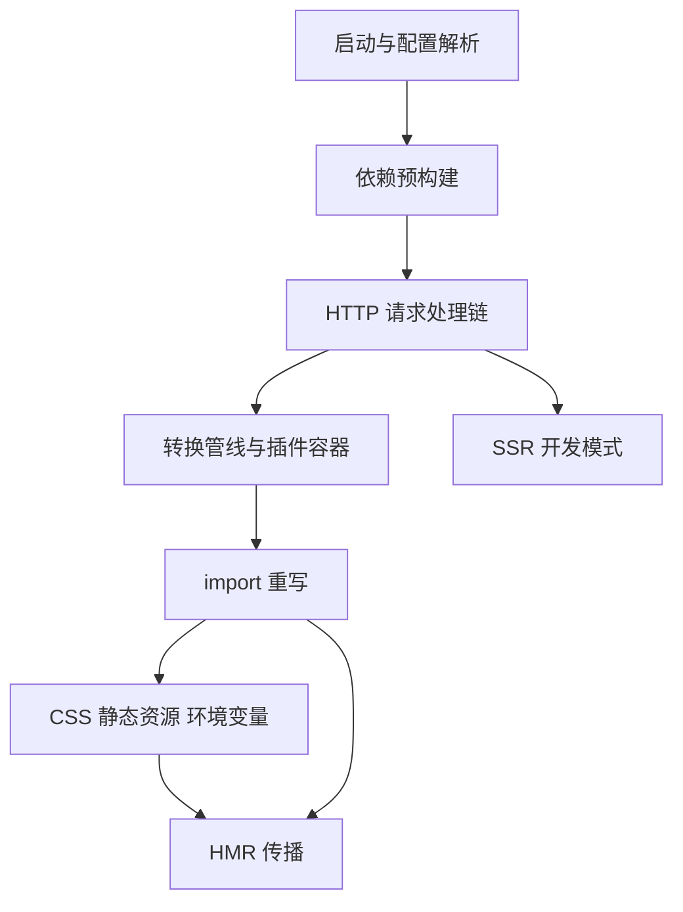
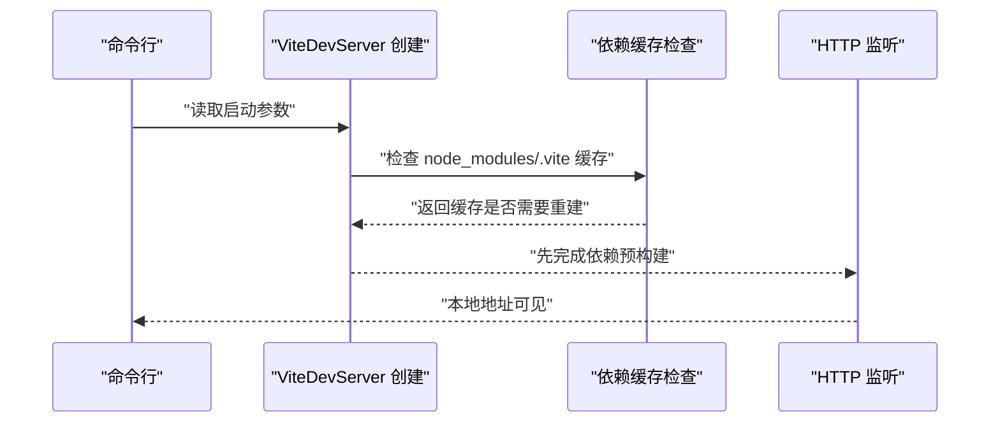
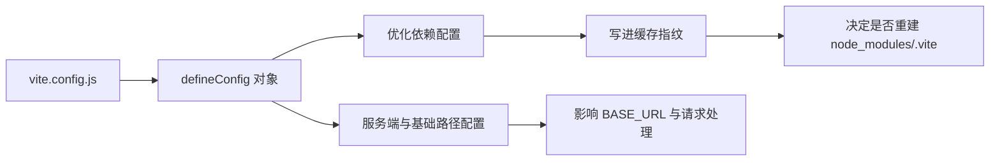
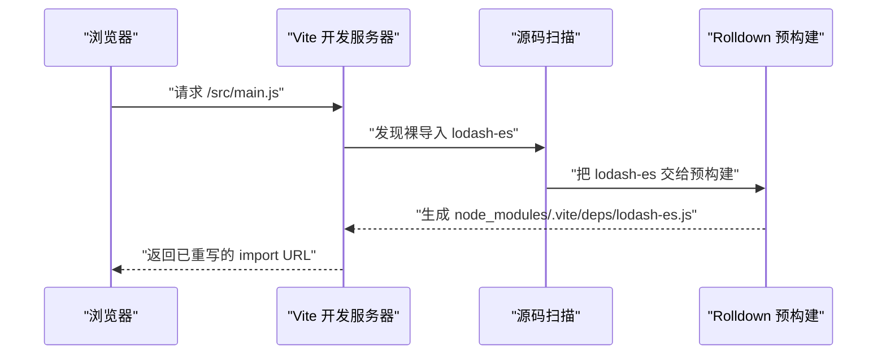
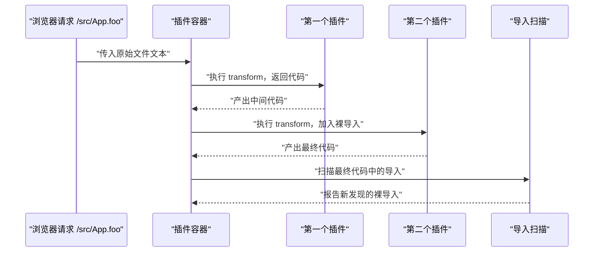
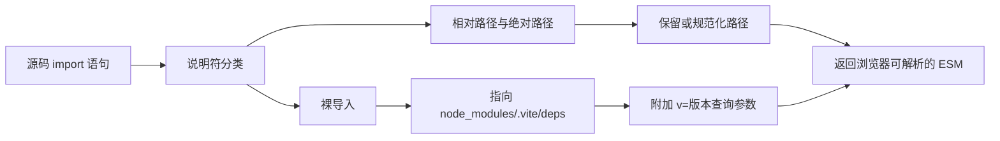
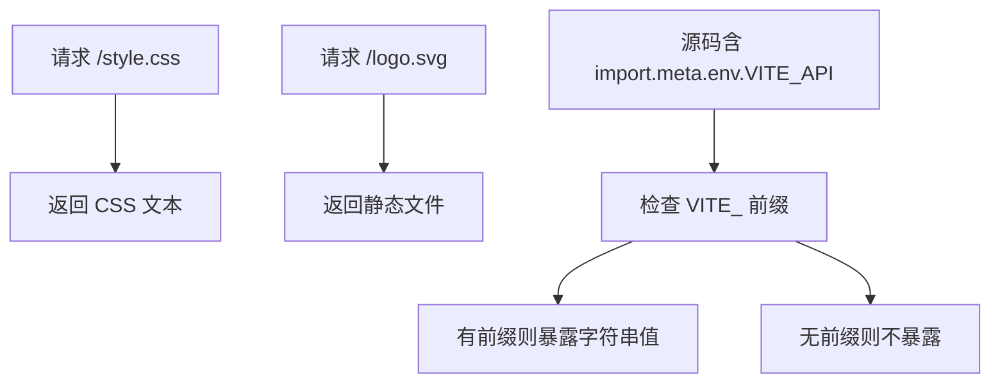
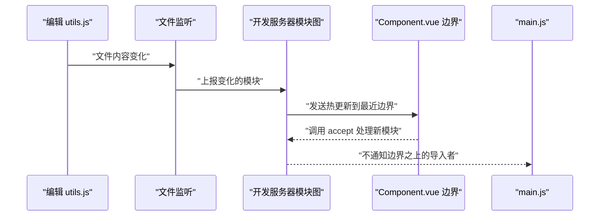
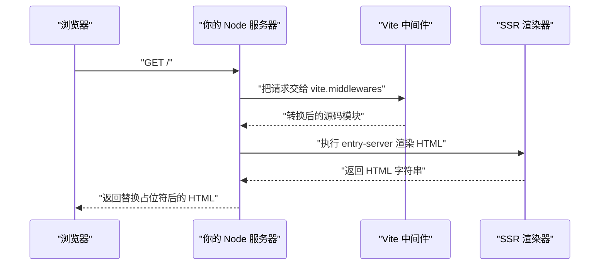

# Vite 开发服务器的真实行为：一个请求从进来到出去

!!! abstract "学完这一页你能"
    - 说出 Vite 启动阶段先做依赖预构建、后监听 HTTP 端口的顺序，并解释预构建的两个目的。
    - 手写一个迷你开发服务器，对裸导入做 `/node_modules/.vite/deps` 形式的路径重写。
    - 描述一个 `.ts` 文件从浏览器请求进来、经过转换管线、到浏览器可执行代码出去的全过程。
    - 用模块依赖图解释 HMR 边界如何避免整页刷新，并说明 `import.meta.env` 的注入与过滤规则。

## 0. 知识地图



建议按请求生命周期阅读：先看第 1、2 节了解启动与配置，第 3 节弄懂依赖预构建，再从第 4 节开始跟踪一个浏览器请求。
第 6 节的 import 重写是理解浏览器为何能加载源码的关键，第 8 节的 HMR 依赖第 6 节的重写结果。

## 1. 启动流程：先备料，后听端口

**先想一个问题**

你敲下 `vite` 后，浏览器还没有发出任何请求。
此时 Vite 进程先做了什么？如果只看终端出现“ready”，你会漏掉一个顺序事实：依赖预构建发生在监听端口之前。

**心智模型**

!!! tip "心智模型"
    一句话模型：启动阶段是“清点酱料并预热厨具”，请求阶段才“按订单炒菜”。
    日常类比：餐厅开门前备好常用酱料，客人点单后现场烹制。
    类比失效处：餐厅可能提前炒好招牌菜，Vite 不会提前转换你的源码模块；源码转换要等浏览器发起具体请求。

**图解**



1. 第 1 步：命令行把启动参数交给 Vite 启动器。
2. 第 2 步：ViteDevServer 创建前，先检查 `node_modules/.vite` 缓存是否最新。
3. 第 3 步：缓存不新时先执行预构建，参数来源是扫描到的裸导入。
4. 第 4 步：预构建完成后才让 HTTP 服务对外可见。

**一步一步来**

**第 1 步：定义缓存检查与预构建动作**
这一步要做什么：用一个布尔值表示缓存是否新鲜，并定义“需要重建”的判断。

```js
// 01-startup-step1.mjs
const cache = {
  dir: 'node_modules/.vite', // 官方文档列出的缓存目录
  fresh: false, // false 表示没有找到可用缓存
};

function shouldRebuild(cacheInfo) {
  // 官方判断依据：lockfile 内容、补丁目录时间、vite.config.js 相关字段、NODE_ENV
  return cacheInfo.fresh === false;
}

console.log(shouldRebuild(cache)); // true，表示需要先预构建
```

**这段代码在做什么**

- `cache.dir` 记录官方文档写明的文件系统缓存位置 `node_modules/.vite`。
- `cache.fresh` 模拟首次启动时没有找到可用缓存。
- `shouldRebuild` 返回是否需要重新预构建，这里只用一个字段做教学演示。
- 真实 Vite 还比较 lockfile 内容、补丁目录修改时间、配置相关字段和 `NODE_ENV`。

运行结果：

```
true
```

**第 2 步：按顺序执行预构建与端口监听**
这一步要做什么：用 async 函数保证预构建完成后再监听端口，模拟启动顺序。

```js
// 01-startup-step2.mjs
import http from 'node:http';

const log = [];

async function prebundle() {
  log.push('依赖预构建完成'); // 先记录预构建
}

await prebundle(); // 先执行预构建

const server = http.createServer((req, res) => {
  res.end('dev server ready');
});

await new Promise((resolve) => server.listen(5173, resolve)); // 然后监听端口
log.push('端口监听就绪');
console.log(log.join(' -> '));
server.close();
```

**这段代码在做什么**

- `prebundle()` 先向日志数组写入预构建完成。
- `http.createServer` 创建一个最小 HTTP 服务，但此时还没有监听。
- `server.listen(5173, resolve)` 在预构建完成后才执行。
- 端口 5173 取自官方 SSR 示例采用的端口。
- `server.close()` 让脚本能正常退出，避免占住端口。

运行结果：

```
依赖预构建完成 -> 端口监听就绪
```

**动手验证**

以下脚本合并上面的步骤，用 `node:assert` 断言启动顺序。无第三方依赖，Node 20+ 运行。

```js
// 01-startup-verify.mjs
import http from 'node:http';
import assert from 'node:assert/strict';

const log = [];
const cache = { fresh: false };

function shouldRebuild(cacheInfo) {
  return cacheInfo.fresh === false;
}

async function prebundle() {
  log.push('prebundle');
}

assert.equal(shouldRebuild(cache), true); // 首次无缓存必须重建
await prebundle();

const server = http.createServer((req, res) => {
  res.end('ok');
});

await new Promise((resolve) => server.listen(0, resolve)); // 端口 0 由系统分配
log.push('listen');

assert.deepEqual(log, ['prebundle', 'listen']);
console.log('预期输出:', log.join(' -> '));
server.close();
```

**常见坑**

| 现象 | 原因 | 怎么修 |
| --- | --- | --- |
| 服务显示已启动，但第一次打开页面等待较久 | 启动时正在执行依赖预构建 | 等预构建完成后再打开页面 |
| 删掉 `node_modules/.vite` 后启动变慢 | 缓存被删除，需要重新预构建 | 保留缓存目录，只在必要时用 `--force` 重建 |
| 更换依赖版本后请求仍命中旧缓存 | 缓存判断依据未变化或浏览器缓存未失效 | 用 `--force` 重启，或确认 lockfile 已更新 |

**小结**

- 启动顺序是先依赖预构建，后监听 HTTP 端口。
- 缓存位置是 `node_modules/.vite`。
- 缓存是否重建由 lockfile、补丁目录时间、配置相关字段和 `NODE_ENV` 共同决定。

## 2. 配置解析：vite.config.js 在请求前做了什么

**先想一个问题**

`vite.config.js` 里写了 `optimizeDeps.include`，它什么时候生效？
答案不是“请求发出后”，而是启动阶段读配置时，同时参与缓存是否重建的判断。

**心智模型**

!!! tip "心智模型"
    一句话模型：配置文件是“菜单备注”，它不改变厨具，但会改变备料清单和口味。
    日常类比：顾客说“不要辣、多加醋”，厨师在掌勺前就记在订单上。
    类比失效处：订单备注每次点单都重新读，Vite 配置文件修改后通常需要重启开发服务器才生效。

**图解**



1. 第 1 步：`vite.config.js` 通过 `defineConfig` 返回一个配置对象。
2. 第 2 步：配置对象中与依赖优化相关的字段进入缓存指纹。
3. 第 3 步：`base` 这类配置影响环境变量 `BASE_URL` 和请求处理。
4. 第 4 步：相关字段变化时，缓存指纹变化，触发依赖重建判断。

!!! note "术语：defineConfig"
    `defineConfig` 是 Vite 导出的配置包装函数。它接收一个配置对象并原样返回，用于组织 `vite.config.js`。
    例子：`export default defineConfig({ optimizeDeps: { include: ['linked-dep'] } })`。

**一步一步来**

**第 1 步：写一个最小配置对象**
这一步要做什么：用 `defineConfig` 组织配置，把 `optimizeDeps.include` 放进去。

```js
// 02-config-step1.mjs
import { defineConfig } from 'vite';

export default defineConfig({
  optimizeDeps: {
    include: ['linked-dep'], // 官方文档给出的显式预构建示例
  },
  base: '/app/', // 影响 import.meta.env.BASE_URL
});
```

**这段代码在做什么**

- `defineConfig` 接收配置对象并返回，用于组织导出。
- `optimizeDeps.include` 强制把 `linked-dep` 加入预构建。
- `base` 决定客户端 `import.meta.env.BASE_URL` 的值。
- 这两个字段都会在启动阶段被读取，不等请求发出。

运行结果：无直接输出，生成一份配置文件。

**第 2 步：用相关字段计算缓存指纹**
这一步要做什么：用 Node 内置 `crypto` 对配置相关字段和 `NODE_ENV` 做哈希，验证配置变化会改变指纹。

```js
// 02-config-step2.mjs
import { createHash } from 'node:crypto';

function fingerprint(config, nodeEnv) {
  const raw = JSON.stringify({
    optimizeDeps: config.optimizeDeps, // 只取官方列出的相关字段
    nodeEnv,
  });
  return createHash('sha256').update(raw).digest('hex').slice(0, 8);
}

const a = { optimizeDeps: { include: ['react'] } };
const b = { optimizeDeps: { include: ['react', 'lodash-es'] } };

console.log(fingerprint(a, 'development'));
console.log(fingerprint(b, 'development'));
```

**这段代码在做什么**

- `fingerprint` 只把 `optimizeDeps` 与 `NODE_ENV` 放进哈希输入。
- 官方文档列出的判断依据还包括 lockfile 内容与补丁目录修改时间。
- 两个配置对象产生不同哈希，说明相关字段改变会让缓存判断结果改变。
- 本段是教学模拟，不代表 Vite 内部哈希算法。

运行结果：

```
a 的指纹与 b 的指纹不同
```

**第 3 步：根据指纹决定是否重建**
这一步要做什么：把上次保存的指纹与当前指纹比较，不同则重建缓存。

```js
// 02-config-step3.mjs
import { createHash } from 'node:crypto';
import assert from 'node:assert/strict';

function fingerprint(config, nodeEnv) {
  const raw = JSON.stringify({ optimizeDeps: config.optimizeDeps, nodeEnv });
  return createHash('sha256').update(raw).digest('hex').slice(0, 8);
}

const lastFingerprint = fingerprint({ optimizeDeps: {} }, 'development');
const currentFingerprint = fingerprint(
  { optimizeDeps: { include: ['react'] } },
  'development',
);

const needRebuild = lastFingerprint !== currentFingerprint;
assert.equal(needRebuild, true);
console.log('需要重建缓存：', needRebuild);
```

**这段代码在做什么**

- 旧指纹来自不含 `include` 的配置。
- 新指纹来自含 `include: ['react']` 的配置。
- 两者不同时 `needRebuild` 为 `true`。
- 这验证了官方事实：`vite.config.js` 相关字段变化会触发重新预构建判断。

运行结果：

```
需要重建缓存： true
```

**动手验证**

以下脚本合并配置对象、指纹计算与重建判断。无第三方依赖，Node 20+ 运行。

```js
// 02-config-verify.mjs
import { createHash } from 'node:crypto';
import assert from 'node:assert/strict';

function fingerprint(config, nodeEnv) {
  const raw = JSON.stringify({ optimizeDeps: config.optimizeDeps, nodeEnv });
  return createHash('sha256').update(raw).digest('hex').slice(0, 8);
}

const before = { optimizeDeps: {} };
const after = { optimizeDeps: { include: ['react'] } };
const nodeEnv = 'development';

const oldHash = fingerprint(before, nodeEnv);
const newHash = fingerprint(after, nodeEnv);

assert.notEqual(oldHash, newHash);
assert.equal(oldHash === newHash, false);
console.log('预期输出：配置相关字段改变后缓存指纹不同');
```

**常见坑**

| 现象 | 原因 | 怎么修 |
| --- | --- | --- |
| 改了 `vite.config.js`，依赖缓存没有重新构建 | 改的不是官方列出的相关字段 | 需要强制重建时启动加 `--force` |
| `include` 里的依赖没有被预构建 | 配置写法不在 `optimizeDeps.include` 数组内 | 检查键名与数组结构 |
| 修改配置后开发服务器行为不变 | 配置文件修改后需要重启进程读取 | 重启开发服务器 |

**小结**

- `vite.config.js` 在请求前被读取，并影响缓存判断。
- `optimizeDeps` 相关字段是缓存指纹的一部分。
- `base` 等配置会影响客户端环境变量与请求处理。

## 3. 依赖预构建：为什么裸导入不能直接给浏览器

**先想一个问题**

你在源码里写 `import { debounce } from 'lodash-es'`。
浏览器原生 ESM 看到 `lodash-es` 没有 `/`、没有 `./`、也没有 `https://`，应该去哪里找文件？

**心智模型**

!!! tip "心智模型"
    一句话模型：裸导入是“只写菜名不写地址”，Vite 需要先把它翻译成带地址的 URL。
    日常类比：外卖单上写“宫保鸡丁”，平台要补全餐厅地址再给骑手。
    类比失效处：骑手不需要把整家餐厅搬进一个文件，Vite 确实要把多模块依赖合并成单文件。

!!! note "术语：裸导入（bare import）"
    裸导入指模块说明符不包含路径前缀，只写包名的导入语句，浏览器原生 ESM 无法直接解析。
    例子：`import { useState } from 'react'` 中的 `'react'` 就是裸导入。

**图解**



1. 第 1 步：浏览器请求源码文件。
2. 第 2 步：Vite 在该源码中发现裸导入。
3. 第 3 步：Vite 用 Rolldown 把裸导入依赖预构建成单文件 ESM。
4. 第 4 步：Vite 把源码里的裸导入重写为带版本号的 URL 后返回。

**一步一步来**

**第 1 步：识别裸导入**
这一步要做什么：写一个函数判断导入说明符是否以路径开头。

```js
// 03-prebundle-step1.mjs
function isBareImport(specifier) {
  // 首字符是 . 或 / 时，浏览器能直接按 URL 解析
  const absoluteOrRelative =
    specifier.startsWith('/') ||
    specifier.startsWith('./') ||
    specifier.startsWith('../');
  return !absoluteOrRelative;
}

console.log(isBareImport('lodash-es')); // true
console.log(isBareImport('./utils.js')); // false
```

**这段代码在做什么**

- `isBareImport` 把以 `/`、`./`、`../` 开头的说明符视为非裸导入。
- 官方文档把期待从 `node_modules` 解析的导入称为裸导入。
- `lodash-es` 返回 `true`，因为浏览器无法从它得到文件地址。
- `./utils.js` 返回 `false`，因为它是相对路径。

运行结果：

```
true
false
```

**第 2 步：把裸导入重写为带版本号的依赖 URL**
这一步要做什么：把包名变成 `/node_modules/.vite/deps/包名.js?v=指纹`。

```js
// 03-prebundle-step2.mjs
import { createHash } from 'node:crypto';

function rewriteBareImport(specifier) {
  const version = createHash('sha256')
    .update(specifier)
    .digest('hex')
    .slice(0, 8);
  // 返回浏览器可请求的 URL，版本号负责让浏览器缓存自动失效
  return `/node_modules/.vite/deps/${specifier}.js?v=${version}`;
}

console.log(rewriteBareImport('lodash-es'));
```

**这段代码在做什么**

- `version` 由包名计算出 8 位哈希，教学模拟官方版本查询参数。
- 返回路径以 `/node_modules/.vite/deps` 开头，与官方文档一致。
- 版本查询在依赖版本变化后变化，让旧的浏览器缓存自动失效。

运行结果（哈希每次可能不同，形式如下）：

```
/node_modules/.vite/deps/lodash-es.js?v=abcd1234
```

**第 3 步：模拟 CommonJS 依赖转 ESM**
这一步要做什么：官方预构建目的之一是把 CommonJS/UMD 转成原生 ESM，这里用一个小函数展示转换方向。

```js
// 03-prebundle-step3.mjs
function cjsToEsm(cjsSource) {
  // CommonJS 使用 module.exports 导出
  const replaced = cjsSource.replace(
    'module.exports = { counter: 1 };',
    'export const counter = 1;',
  );
  return replaced;
}

const cjs = 'module.exports = { counter: 1 };';
console.log(cjsToEsm(cjs));
```

**这段代码在做什么**

- 官方目的之一：开发期所有代码都要以原生 ESM 提供给浏览器。
- 这个函数把 `module.exports` 的固定形式替换为 `export const`。
- 它只演示教学场景，真实预构建由 Rolldown 完成。
- 真实环境还会做命名导入分析，让 React 这类动态赋值的 CJS 包也能用命名导入。

运行结果：

```
export const counter = 1;
```

**动手验证**

以下脚本合并裸导入识别、URL 重写和 CJS 转 ESM 三个功能，并断言输出。无第三方依赖，Node 20+ 运行，不需要安装真实依赖包。

```js
// 03-prebundle-verify.mjs
import { createHash } from 'node:crypto';
import assert from 'node:assert/strict';

function isBareImport(specifier) {
  return !(
    specifier.startsWith('/') ||
    specifier.startsWith('./') ||
    specifier.startsWith('../')
  );
}

function rewriteBareImport(specifier) {
  const version = createHash('sha256')
    .update(specifier)
    .digest('hex')
    .slice(0, 8);
  return `/node_modules/.vite/deps/${specifier}.js?v=${version}`;
}

function cjsToEsm(cjsSource) {
  return cjsSource.replace(
    'module.exports = { counter: 1 };',
    'export const counter = 1;',
  );
}

assert.equal(isBareImport('lodash-es'), true);
assert.equal(isBareImport('./utils.js'), false);
const url = rewriteBareImport('lodash-es');
assert.match(url, /^\/node_modules\/\.vite\/deps\/lodash-es\.js\?v=/);
assert.equal(cjsToEsm('module.exports = { counter: 1 };'), 'export const counter = 1;');
console.log('预期输出：三项断言全部通过');
```

**常见坑**

| 现象 | 原因 | 怎么修 |
| --- | --- | --- |
| 浏览器报 `Failed to resolve module specifier` | 裸导入没有被重写成 URL | 确认依赖由 Vite 预构建或被浏览器直接可解析 |
| `lodash-es` 页面加载发出几百个请求 | 该包内部模块很多，浏览器逐个请求 | 让 Vite 预构建，把它合并成单文件 |
| 新依赖首次被请求时页面突然重载 | 服务已启动后才发现新依赖，触发重新预构建 | 提前把新依赖加入 `optimizeDeps.include` |

**小结**

- 裸导入无法被浏览器直接解析，Vite 会检测并预构建。
- 预构建有两个目的：CJS/UMD 转 ESM，以及把多模块依赖合并成单模块。
- 预构建结果缓存在 `node_modules/.vite`，通过版本查询参数管理浏览器缓存。

## 4. 请求处理链：一个 .ts 文件如何变成 JS 到达浏览器

**先想一个问题**

浏览器地址栏请求 `/src/main.ts`，但浏览器不认识 TypeScript。
Vite 怎么在同一个开发服务器里，把磁盘上的 `.ts` 变成浏览器能执行的 JavaScript？

**心智模型**

!!! tip "心智模型"
    一句话模型：请求处理链是“前厅接单、后厨按菜名分派、出品口统一装盘”。
    日常类比：客人点“宫保鸡丁”，不同厨师分别负责切配、炒制、装盘。
    类比失效处：餐厅多道菜可能并行做，Vite 对单个源码文件通常按请求到来逐文件转换。

**图解**


1. 第 1 步：请求进入开发服务器，先解析路径与查询参数。
2. 第 2 步：检查是否命中 `/node_modules/.vite` 这类依赖缓存请求。
3. 第 3 步：源码请求进入转换管线，把 `.ts` 转成 JS 文本。
4. 第 4 步：服务器设置正确的 Content-Type 后返回给浏览器。

!!! note "术语：转换管线（transform pipeline）"
    转换管线指源码从磁盘原样读出后，到变成浏览器可执行代码之间经过的一系列转换步骤。
    例子：一个 `.ts` 文件会先被 Oxc Transformer 去除类型注解，再经过插件转换和 import 重写。

**一步一步来**

**第 1 步：创建极简请求路由器**
这一步要做什么：按 URL 路径分发到不同处理函数，模拟 Vite 请求处理链的入口。

```js
// 04-request-chain-step1.mjs
import http from 'node:http';

const server = http.createServer((req, res) => {
  const url = req.url ?? '/';
  if (url.startsWith('/node_modules/.vite')) {
    // 依赖缓存请求分支，后面会在这里设置长缓存
    res.end('dep bundle');
  } else {
    res.end('source transform');
  }
});

server.listen(0, () => {
  console.log('请求分发服务器已启动');
  server.close();
});
```

**这段代码在做什么**

- `http.createServer` 创建开发服务器的最小模型。
- `req.url` 是浏览器请求的路径。
- 以 `/node_modules/.vite` 开头的路径走依赖缓存分支。
- 其他路径走源码转换分支。

运行结果：

```
请求分发服务器已启动
```

**第 2 步：做一个只去除类型注解的 TS 转换函数**
这一步要做什么：演示 TS 转 JS 只做转译、不做类型检查。

```js
// 04-request-chain-step2.mjs
function transpileTs(source) {
  // 仅去掉形如 ": string" 的注解，教学演示用
  return source.replace(/:\s*string\b/g, '');
}

const tsSource = 'const title: string = "hello";';
console.log(transpileTs(tsSource));
```

**这段代码在做什么**

- `transpileTs` 只做文本替换，模拟转译过程。
- 它不检查变量类型是否用错，与官方“不执行类型检查”一致。
- 真实 Vite 使用 Oxc Transformer 转译 TypeScript，浏览器并不知道 `.ts` 存在。

运行结果：

```
const title = "hello";
```

**第 3 步：把两种分支合成一个可响应请求的服务器**
这一步要做什么：让同一个服务器既能处理依赖缓存请求，也能把 TS 源码转成 JS。

```js
// 04-request-chain-step3.mjs
import http from 'node:http';

function transpileTs(source) {
  return source.replace(/:\s*string\b/g, '');
}

const server = http.createServer((req, res) => {
  const url = req.url ?? '/';
  if (url.startsWith('/node_modules/.vite')) {
    res.writeHead(200, { 'Content-Type': 'text/javascript' });
    res.end('export const dep = 1;');
    return;
  }
  const js = transpileTs('const title: string = "hello";');
  res.writeHead(200, { 'Content-Type': 'text/javascript' });
  res.end(js);
});

server.listen(0, async () => {
  console.log('两个分支都已就绪');
  server.close();
});
```

**这段代码在做什么**

- 依赖缓存分支返回一个 ESM 导出字符串，并设置 JS Content-Type。
- 源码分支把含类型注解的字符串转成 JS 后返回。
- 两个分支共用同一个 HTTP 服务，体现请求处理链按路径分流的思路。
- 官方文档强调：Vite 只做转译，不做类型检查。

运行结果：

```
两个分支都已就绪
```

**动手验证**

以下脚本验证请求路由器、TS 转译和 Content-Type 设置。无第三方依赖，Node 20+ 运行。

```js
// 04-request-chain-verify.mjs
import http from 'node:http';
import assert from 'node:assert/strict';

function transpileTs(source) {
  return source.replace(/:\s*string\b/g, '');
}

assert.equal(transpileTs('const title: string = "hello";'), 'const title = "hello";');

const server = http.createServer((req, res) => {
  const url = req.url ?? '/';
  res.writeHead(200, { 'Content-Type': 'text/javascript' });
  if (url.startsWith('/node_modules/.vite')) {
    res.end('export const dep = 1;');
  } else {
    res.end(transpileTs('const title: string = "hello";'));
  }
});

await new Promise((resolve) => server.listen(0, resolve));
const { port } = server.address();
const response = await fetch(`http://127.0.0.1:${port}/src/main.ts`);
const body = await response.text();

assert.equal(response.headers.get('content-type'), 'text/javascript');
assert.equal(body, 'const title = "hello";');
console.log('预期输出：请求 /src/main.ts 得到 JS 正文');
server.close();
```

**常见坑**

| 现象 | 原因 | 怎么修 |
| --- | --- | --- |
| 浏览器把 `.ts` 当静态文本返回 | 请求没有进入 TS 转译分支 | 确认路径匹配与 Content-Type 为 JS |
| 开发服务器不做类型检查导致错误漏报 | Vite 只转译，不做类型检查 | 开发期另开 `tsc --noEmit --watch` |
| 依赖缓存请求反复命中开发服务器 | 浏览器缓存头未生效 | 检查依赖 URL 的版本查询与响应头 |

**小结**

- Vite 请求处理链按路径分流依赖缓存与源码转换。
- TS 转译只去类型、不查类型错误。
- 转译后文本以 JS Content-Type 返回给浏览器。

## 5. 转换管线与插件容器：插件在哪一步改变文件

**先想一个问题**

一个插件把 `.foo` 文件变成 JS 模块，并在里面新增了一个裸导入。
这个新导入在启动扫描时还不存在，Vite 什么时候才能发现它？

**心智模型**

!!! tip "心智模型"
    一句话模型：插件容器是“流水线上的加工位”，每个插件只在文件经过自己时做加工。
    日常类比：工厂传送带上有贴标机、喷码机、质检员，产品依次经过。
    类比失效处：工厂流水线产出实物，Vite 插件加工的是字符串形式代码，不占物理空间。

**图解**



1. 第 1 步：浏览器请求一个非 JS 文件，文本进入插件容器。
2. 第 2 步：容器按顺序调用插件的 transform 逻辑。
3. 第 3 步：后续插件能看到前一个插件产出的代码。
4. 第 4 步：最终代码再被扫描，新出现的裸导入在这里被发现。

!!! note "术语：插件容器（plugin container）"
    插件容器是 Vite 内部组织插件钩子调用的执行环境。它负责把插件按顺序应用到文件转换过程。
    例子：一个转换插件先后修改同一段代码，容器保证前一步结果传给后一步。

**一步一步来**

**第 1 步：定义一个可转换源码的插件数组**
这一步要做什么：用带 `name` 和 `transform` 的普通对象模拟插件。

```js
// 05-plugin-container-step1.mjs
const plugins = [
  {
    name: 'to-js', // 插件名用于日志与调试
    transform(source) {
      return source.replace('custom-syntax', 'const value'); // 第一道转换
    },
  },
  {
    name: 'add-import', // 第二个插件负责加入裸导入
    transform(source) {
      return source + '\nimport { helper } from "runtime-helper";'; // 新增导入
    },
  },
];

console.log(plugins.map((plugin) => plugin.name));
```

**这段代码在做什么**

- `plugins` 数组包含两个带 `name` 的插件对象。
- 第一个把自定义语法替换为 JS 变量声明。
- 第二个在代码末尾追加一个裸导入。
- 官方文档指出插件 transform 可能产生启动扫描时看不到的导入。

运行结果：

```
['to-js', 'add-import']
```

**第 2 步：实现容器按顺序执行插件**
这一步要做什么：写一个 `applyPlugins` 函数，把前一个插件输出传给后一个插件。

```js
// 05-plugin-container-step2.mjs
function applyPlugins(source, plugins) {
  let code = source;
  for (const plugin of plugins) {
    code = plugin.transform(code); // 当前插件接收上一次结果
  }
  return code;
}

const source = 'custom-syntax = 1;';
const plugins = [
  { name: 'to-js', transform: (code) => code.replace('custom-syntax', 'const value') },
  { name: 'add-import', transform: (code) => code + "\nimport { helper } from 'runtime-helper';" },
];
console.log(applyPlugins(source, plugins));
```

**这段代码在做什么**

- `applyPlugins` 用变量 `code` 保存当前结果。
- for 循环保证插件按数组顺序执行。
- 每个 `transform` 返回的代码成为下一次调用的输入。
- 最终代码带上了第二个插件新增的裸导入。

运行结果：

```
const value = 1;
import { helper } from 'runtime-helper';
```

**第 3 步：扫描转换后的代码发现新裸导入**
这一步要做什么：用正则从最终代码中提取裸导入包名。

```js
// 05-plugin-container-step3.mjs
function findBareImports(code) {
  const matches = code.matchAll(/from\s+['"]([^./][^'"]*)['"]/g);
  return [...matches].map((match) => match[1]);
}

const code = "import { helper } from 'runtime-helper';";
console.log(findBareImports(code));
```

**这段代码在做什么**

- `findBareImports` 找出 `from 'xxx'` 形式且不以 `.` 或 `/` 开头的说明符。
- 返回数组包含 `runtime-helper`。
- 这模拟官方描述：插件转换后，新导入只在文件被请求并被转换后才可见。
- 如果这个大依赖事先不在缓存，服务会马上重新预构建。

运行结果：

```
['runtime-helper']
```

**动手验证**

以下脚本合并插件容器顺序执行与新导入发现，并断言结果。无第三方依赖，Node 20+ 运行。

```js
// 05-plugin-container-verify.mjs
import assert from 'node:assert/strict';

function applyPlugins(source, plugins) {
  let code = source;
  for (const plugin of plugins) {
    code = plugin.transform(code);
  }
  return code;
}

function findBareImports(code) {
  const matches = code.matchAll(/from\s+['"]([^./][^'"]*)['"]/g);
  return [...matches].map((match) => match[1]);
}

const plugins = [
  { name: 'to-js', transform: (code) => code.replace('custom-syntax', 'const value') },
  { name: 'add-import', transform: (code) => code + "\nimport { helper } from 'runtime-helper';" },
];

const finalCode = applyPlugins('custom-syntax = 1;', plugins);
assert.match(finalCode, /const value/);
assert.match(finalCode, /runtime-helper/);
assert.deepEqual(findBareImports(finalCode), ['runtime-helper']);
console.log('预期输出：插件顺序执行且新裸导入被发现');
```

**常见坑**

| 现象 | 原因 | 怎么修 |
| --- | --- | --- |
| 插件新增的依赖触发服务启动后重新预构建 | 初始扫描看不到插件 transform 后才产生的导入 | 把大依赖或 CJS 依赖加入 `optimizeDeps.include` |
| 修改插件代码后行为不更新 | 插件在启动时注册，开发服务器未重启 | 重启开发服务器 |
| 插件间状态串扰 | 插件对象保存了跨文件可变的共享状态 | 把状态放到模块局部变量并避免跨请求复用 |

**小结**

- 插件容器按顺序调用插件 transform，前一个输出是后一个输入。
- 插件转换后才出现的导入，要等到文件被请求并转换后才能发现。
- 为避免新发现的依赖反复重建，可用 `optimizeDeps.include` 或 `exclude` 控制。

## 6. import 重写：源码路径如何变成浏览器 URL

**先想一个问题**

源码写着 `import { debounce } from 'lodash-es'`。
返回给浏览器的代码为什么变成了 `/node_modules/.vite/deps/lodash-es.js?v=xxxx`？这一步发生在什么时候？

**心智模型**

!!! tip "心智模型"
    一句话模型：import 重写是“把收货人姓名改成可派送的街道地址”。
    日常类比：淘宝上写“送到张三手里”没有用，必须补成“某市某区某路某号”。
    类比失效处：地址一般不随时间变化，Vite 的依赖 URL 带版本查询参数，会随锁文件变化。

**图解**



1. 第 1 步：从源码里取出 import 说明符。
2. 第 2 步：判断说明符是相对路径、绝对路径还是裸导入。
3. 第 3 步：裸导入被重写到 `node_modules/.vite/deps` 目录。
4. 第 4 步：追加 `v=版本` 查询参数，保证缓存可失效。

!!! note "术语：URL 重写（import rewriting）"
    URL 重写指把源码中的模块说明符转换成浏览器能直接发起 HTTP 请求的完整 URL。
    例子：`from 'react'` 被改写为由 Vite 依赖缓存目录提供的 URL，浏览器才能请求到文件。

**一步一步来**

**第 1 步：从代码中提取 import 说明符**
这一步要做什么：用正则捕获 `from` 后面的模块说明符。

```js
// 06-import-rewrite-step1.mjs
function getSpecifiers(code) {
  const matches = code.matchAll(/from\s+['"]([^'"]+)['"]/g);
  return [...matches].map((match) => match[1]);
}

const code = "import { debounce } from 'lodash-es';\nimport './utils.js';";
console.log(getSpecifiers(code));
```

**这段代码在做什么**

- `matchAll` 找出所有 `from 'xxx'` 形式。
- 正则捕获引号内的说明符。
- 返回数组包含 `lodash-es` 和 `./utils.js`。
- 只处理 `from` 写法，教学演示用，真实 Vite 会解析完整模块语法。

运行结果：

```
['lodash-es', './utils.js']
```

**第 2 步：按说明符类型执行重写**
这一步要做什么：裸导入写进依赖缓存 URL，相对路径保持原样。

```js
// 06-import-rewrite-step2.mjs
import { createHash } from 'node:crypto';

function rewriteSpecifier(specifier) {
  const bare =
    !specifier.startsWith('/') &&
    !specifier.startsWith('./') &&
    !specifier.startsWith('../');
  if (!bare) return specifier;
  const version = createHash('sha256')
    .update(specifier)
    .digest('hex')
    .slice(0, 8);
  return `/node_modules/.vite/deps/${specifier}.js?v=${version}`;
}

console.log(rewriteSpecifier('lodash-es'));
console.log(rewriteSpecifier('./utils.js'));
```

**这段代码在做什么**

- `bare` 为 `true` 时说明是裸导入。
- 裸导入生成以 `/node_modules/.vite/deps` 开头的 URL。
- 版本查询参数由包名计算，教学模拟官方版本查询。
- 相对路径 `./utils.js` 原样返回。

运行结果：

```
/node_modules/.vite/deps/lodash-es.js?v=xxxx
./utils.js
```

**第 3 步：把重写后的说明符放回源码**
这一步要做什么：用替换函数把整条 import 语句中的说明符换掉。

```js
// 06-import-rewrite-step3.mjs
import { createHash } from 'node:crypto';

function rewriteSpecifier(specifier) {
  const bare =
    !specifier.startsWith('/') &&
    !specifier.startsWith('./') &&
    !specifier.startsWith('../');
  if (!bare) return specifier;
  const version = createHash('sha256')
    .update(specifier)
    .digest('hex')
    .slice(0, 8);
  return `/node_modules/.vite/deps/${specifier}.js?v=${version}`;
}

function rewriteImports(code) {
  return code.replace(/from\s+['"]([^'"]+)['"]/g, (full, spec) => {
    return `from "${rewriteSpecifier(spec)}"`;
  });
}

const code = "import { debounce } from 'lodash-es';";
console.log(rewriteImports(code));
```

**这段代码在做什么**

- `rewriteImports` 对每条 `from` 语句做替换。
- 回调函数接收完整匹配和说明符。
- 返回的新语句使用重写后的 URL。
- 浏览器拿到这个代码后，可以按 URL 从 Vite 依赖缓存请求。

运行结果：

```
import { debounce } from "/node_modules/.vite/deps/lodash-es.js?v=xxxx";
```

**动手验证**

以下脚本合并提取、重写和替换，并断言相对路径保持不变。无第三方依赖，Node 20+ 运行。运行结果包含哈希，具体字符可能不同。

```js
// 06-import-rewrite-verify.mjs
import { createHash } from 'node:crypto';
import assert from 'node:assert/strict';

function rewriteSpecifier(specifier) {
  const bare =
    !specifier.startsWith('/') &&
    !specifier.startsWith('./') &&
    !specifier.startsWith('../');
  if (!bare) return specifier;
  const version = createHash('sha256')
    .update(specifier)
    .digest('hex')
    .slice(0, 8);
  return `/node_modules/.vite/deps/${specifier}.js?v=${version}`;
}

function rewriteImports(code) {
  return code.replace(/from\s+['"]([^'"]+)['"]/g, (full, spec) => {
    return `from "${rewriteSpecifier(spec)}"`;
  });
}

const code = "import { debounce } from 'lodash-es';\nimport './utils.js';";
const rewritten = rewriteImports(code);
assert.match(rewritten, /node_modules\/\.vite\/deps\/lodash-es\.js\?v=/);
assert.match(rewritten, /import "\.\/utils\.js";/);
console.log('预期输出：裸导入被改写成依赖 URL，相对导入保持原样');
console.log(rewritten);
```

**常见坑**

| 现象 | 原因 | 怎么修 |
| --- | --- | --- |
| 浏览器请求依赖时带有旧版本查询参数 | 旧浏览器缓存没失效 | 更换 lockfile 对应版本，让版本查询变化 |
| 手写重写只处理 `from`，漏掉 `import()` | 教学正则覆盖的语法有限 | 真实项目交给 Vite，不要手写生产转换 |
| 相对路径被错误写进依赖目录 | 说明符判断漏掉 `../` 分支 | 同时判断 `/`、`./`、`../` 三种前缀 |

**小结**

- import 重写把裸导入转成 `/node_modules/.vite/deps/...js?v=...`。
- 相对路径和绝对路径不需要写入依赖目录。
- 版本查询参数让浏览器缓存随依赖版本变化自动失效。

## 7. CSS、静态资源与环境变量：同一服务器的三类分支

**先想一个问题**

浏览器请求 `/style.css`、`/logo.svg` 和读取 `import.meta.env.VITE_API`，它们都从 Vite 开发服务器来。
为什么 `.css`、`.svg` 和有 `VITE_` 前缀的变量走的是不同处理方式？

**心智模型**

!!! tip "心智模型"
    一句话模型：CSS 与静态资源走“按扩展名配餐盒”，环境变量走“带前缀才允许出厨房”。
    日常类比：中餐、西餐用不同餐盒装；后厨里的红酒、白醋不是每样都能端到前厅。
    类比失效处：餐盒只是包装不同，内容不变；CSS 文件返回文本，而 `VITE_` 变量在客户端代码中被替换为字符串值。

**图解**



1. 第 1 步：`.css` 请求返回 CSS 文本。
2. 第 2 步：`.svg` 请求作为静态文件处理。
3. 第 3 步：源码里的 `import.meta.env` 先检查变量前缀。
4. 第 4 步：有 `VITE_` 前缀的变量被暴露给客户端，无前缀的不暴露。

**一步一步来**

**第 1 步：按扩展名返回不同 MIME 类型**
这一步要做什么：写一个 MIME 映射，区分 CSS 与 SVG 静态文件。

```js
// 07-assets-step1.mjs
const mimeTypes = {
  '.css': 'text/css',
  '.svg': 'image/svg+xml',
};

function getMimeType(pathname) {
  const dot = pathname.lastIndexOf('.');
  if (dot === -1) return 'application/octet-stream';
  return mimeTypes[pathname.slice(dot)] ?? 'application/octet-stream';
}

console.log(getMimeType('/style.css'));
console.log(getMimeType('/logo.svg'));
```

**这段代码在做什么**

- `mimeTypes` 定义扩展名到 Content-Type 的映射。
- `getMimeType` 从路径最后一个小数点处截取扩展名。
- `.css` 返回 `text/css`，`.svg` 返回 `image/svg+xml`。
- 未知扩展名返回通用二进制类型。

运行结果：

```
text/css
image/svg+xml
```

**第 2 步：解析环境变量并只暴露 VITE_ 前缀**
这一步要做什么：解析 `.env` 文本，再过滤出有 `VITE_` 前缀的键。

```js
// 07-env-step2.mjs
function parseEnv(text) {
  const result = {};
  for (const line of text.split('\n')) {
    const trimmed = line.trim();
    if (trimmed === '' || trimmed.startsWith('#')) continue;
    const eq = trimmed.indexOf('=');
    if (eq === -1) continue;
    result[trimmed.slice(0, eq)] = trimmed.slice(eq + 1);
  }
  return result;
}

function exposeClientEnv(env) {
  return Object.fromEntries(
    Object.entries(env).filter(([key]) => key.startsWith('VITE_')),
  );
}

const env = parseEnv('VITE_SOME_KEY=123\nDB_PASSWORD=foobar');
console.log(exposeClientEnv(env));
```

**这段代码在做什么**

- `parseEnv` 跳过空行和 `#` 开头行。
- 每行按第一个等号拆成键值。
- `exposeClientEnv` 只留下以 `VITE_` 开头的键。
- 官方文档指出 `VITE_SOME_KEY` 的值 `"123"` 会暴露，`DB_PASSWORD` 不会。

运行结果：

```
{ VITE_SOME_KEY: '123' }
```

**第 3 步：模拟变量展开**
这一步要做什么：官方文档说明 Vite 使用 dotenv-expand 展开环境变量，此处模拟 `$KEY` 引用。

```js
// 07-env-step3.mjs
function expandEnv(env) {
  const result = { ...env };
  for (const [key, value] of Object.entries(result)) {
    result[key] = value.replace(/\$([A-Z_]+)/g, (full, name) => {
      return Object.hasOwn(env, name) ? env[name] : full;
    });
  }
  return result;
}

const env = { KEY: '123', NEW_KEY: 'test$KEY' };
console.log(expandEnv(env));
```

**这段代码在做什么**

- `expandEnv` 复制一份环境变量对象。
- 正则把 `$KEY` 替换成 `env.KEY` 的值。
- Official docs 例子：`KEY=123` 且 `NEW_KEY1=test$KEY` 会得到 `test123`。
- 本段只做单次替换，教学模拟 dotenv-expand 的方向。

运行结果：

```
{ KEY: '123', NEW_KEY: 'test123' }
```

**动手验证**

以下脚本合并 MIME 判断、环境变量过滤和变量展开，并断言结果。无第三方依赖，Node 20+ 运行。

```js
// 07-assets-env-verify.mjs
import assert from 'node:assert/strict';

function parseEnv(text) {
  const result = {};
  for (const line of text.split('\n')) {
    const trimmed = line.trim();
    if (trimmed === '' || trimmed.startsWith('#')) continue;
    const eq = trimmed.indexOf('=');
    if (eq === -1) continue;
    result[trimmed.slice(0, eq)] = trimmed.slice(eq + 1);
  }
  return result;
}

function exposeClientEnv(env) {
  return Object.fromEntries(
    Object.entries(env).filter(([key]) => key.startsWith('VITE_')),
  );
}

function expandEnv(env) {
  const result = { ...env };
  for (const [key, value] of Object.entries(result)) {
    result[key] = value.replace(/\$([A-Z_]+)/g, (full, name) => {
      return Object.hasOwn(env, name) ? env[name] : full;
    });
  }
  return result;
}

const env = parseEnv('VITE_SOME_KEY=123\nDB_PASSWORD=foobar');
assert.deepEqual(exposeClientEnv(env), { VITE_SOME_KEY: '123' });
assert.equal(expandEnv({ KEY: '123', NEW_KEY: 'test$KEY' }).NEW_KEY, 'test123');
console.log('预期输出：变量过滤与展开断言通过');
```

**常见坑**

| 现象 | 原因 | 怎么修 |
| --- | --- | --- |
| `import.meta.env.DB_PASSWORD` 得到 `undefined` | 没有 `VITE_` 前缀，客户端不会暴露 | 不要用无前缀变量传递客户端数据 |
| 数字环境变量读出来是字符串 | Vite 把 `.env` 值解析为字符串 | 使用时做 `Number()` 这类显式转换 |
| 修改 `.env` 文件后变量不更新 | `.env` 文件在启动时加载 | 重启开发服务器 |

**小结**

- CSS 与 SVG 按扩展名返回对应 Content-Type。
- 环境变量只有 `VITE_` 前缀会被客户端代码拿到。
- 所有 `.env` 值都是字符串，使用前需要转换类型。

## 8. HMR 传播：一行修改如何不引发整页刷新

**先想一个问题**

你修改了 `utils.js`，它被 `Component.vue` 和 `main.js` 两个模块导入。
为什么 Vite 只更新边界模块，不会把整棵依赖树全部重新执行一遍？

**心智模型**

!!! tip "心智模型"
    一句话模型：HMR 边界是“防火门”，火焰烧到门就停下，不烧到楼上的邻居。
    日常类比：一个房间发现火情，防火门把烟挡在房内，其他楼层继续办公。
    类比失效处：防火门只能挡火，HMR 边界还要自己负责清理副作用和更新自身状态。

!!! note "术语：HMR 边界（HMR boundary）"
    HMR 边界是调用 `import.meta.hot.accept` 的模块。它自己处理从直接依赖传来的更新，阻止更新继续向上传播。
    例子：`Component.vue` 里写 `import.meta.hot.accept`，编辑它导入的 `utils.js` 就不会刷新 `main.js`。

**图解**



1. 第 1 步：编辑 `utils.js`，文件监听器发现内容变化。
2. 第 2 步：开发服务器从模块依赖图找到受影响模块。
3. 第 3 步：服务器把更新发到最近的 HMR 边界。
4. 第 4 步：边界之上的 `main.js` 不会被通知，因此不会触发整页刷新。

**一步一步来**

**第 1 步：建立一小张模块依赖图**
这一步要做什么：用对象记录每个模块导入了谁。

```js
// 08-hmr-step1.mjs
const moduleGraph = {
  'main.js': { imports: ['./Component.vue'], accepts: false },
  'Component.vue': { imports: ['./utils.js'], accepts: true },
  'utils.js': { imports: [], accepts: false },
};

console.log(moduleGraph['Component.vue'].accepts);
```

**这段代码在做什么**

- 每个模块有两个字段：导入列表和是否自我接受。
- `Component.vue` 的 `accepts` 为 `true`，表示它是 HMR 边界。
- `main.js` 不是边界，只负责导入。
- 教学依赖图中的文件内容被压缩成字段，不保存真实代码。

运行结果：

```
true
```

**第 2 步：从编辑文件向上寻找最近的边界**
这一步要做什么：反向遍历导入关系，找到第一个 `accepts` 为 `true` 的模块。

```js
// 08-hmr-step2.mjs
function findBoundary(graph, changedId) {
  let current = changedId;
  while (current) {
    if (graph[current].accepts) return current;
    current = Object.keys(graph).find((id) => graph[id].imports.includes(current));
  }
  return null;
}

const moduleGraph = {
  'main.js': { imports: ['./Component.vue'], accepts: false },
  'Component.vue': { imports: ['./utils.js'], accepts: true },
  'utils.js': { imports: [], accepts: false },
};

console.log(findBoundary(moduleGraph, 'utils.js'));
```

**这段代码在做什么**

- 循环从变化的模块开始检查。
- 当前模块 `accepts` 为 `true` 就返回。
- 否则沿依赖图向上找到导入当前模块的那个模块。
- 官方文档指出边界之上的导入者不会被通知。

运行结果：

```
Component.vue
```

**第 3 步：执行 accept 并断言根模块不收到更新**
这一步要做什么：边界收到更新后调用自身的 accept，根模块不受影响。

```js
// 08-hmr-step3.mjs
const notified = [];

function accept(moduleId) {
  notified.push(moduleId);
}

const boundary = 'Component.vue';
accept(boundary);
console.log(notified);
```

**这段代码在做什么**

- `notified` 记录收到热更新的模块。
- `accept` 只把边界模块加入列表。
- 根模块 `main.js` 不进入列表。
- 这模拟了官方 HMR 模型：简化实现不为依赖图上游生成代理模块。

运行结果：

```
['Component.vue']
```

**动手验证**

以下脚本合并依赖图构建、边界查找和通知记录，并断言根模块未被通知。无第三方依赖，Node 20+ 运行。

```js
// 08-hmr-verify.mjs
import assert from 'node:assert/strict';

const moduleGraph = {
  'main.js': { imports: ['./Component.vue'], accepts: false },
  'Component.vue': { imports: ['./utils.js'], accepts: true },
  'utils.js': { imports: [], accepts: false },
};

function findBoundary(graph, changedId) {
  let current = changedId;
  while (current) {
    if (graph[current].accepts) return current;
    current = Object.keys(graph).find((id) => graph[id].imports.includes(current));
  }
  return null;
}

const boundary = findBoundary(moduleGraph, 'utils.js');
const notified = [];
if (boundary) {
  notified.push(boundary);
}

assert.equal(boundary, 'Component.vue');
assert.deepEqual(notified, ['Component.vue']);
assert.equal(notified.includes('main.js'), false);
console.log('预期输出：更新停在 Component.vue，main.js 未被通知');
```

**常见坑**

| 现象 | 原因 | 怎么修 |
| --- | --- | --- |
| 改了 `utils.js` 后页面整页刷新 | 依赖链上没有模块调用 `import.meta.hot.accept` | 在合适的边界模块增加 accept 逻辑 |
| 语法错误时 newModule 为 `undefined` | 更新模块编译失败 | 在 accept 回调中判断 newModule 是否存在 |
| 边界重导出导入内容不更新 | 边界模块负责更新导出，官方说明需要 `let` 声明 | 边界里用可重新赋值的局部变量转发更新 |

**小结**

- `import.meta.hot.accept` 把模块变成 HMR 边界。
- 变化只传播到最近边界，边界之上不通知。
- 边界要负责清理副作用并更新自身，父级不会自动感知。

## 9. SSR 开发模式：Vite 怎样变成你的服务器中间件

**先想一个问题**

生产环境里你有自己的 Node 服务器做 SSR。
开发阶段，这个服务器还要享受 Vite 的源码转换、依赖缓存和 HMR，两者如何共存？

**心智模型**

!!! tip "心智模型"
    一句话模型：SSR 开发模式把 Vite 作为“租用厨房”，你的主厨仍掌控上菜节奏。
    日常类比：餐厅租用中央厨房加工酱料，前厅和后厨仍由原班人马管理。
    类比失效处：中央厨房有实体产出，Vite 中间件模式主要提供字节流转换，不直接端出成品页面。

**图解**



1. 第 1 步：浏览器请求首页，进入你自己的 Node 服务器。
2. 第 2 步：你的服务器把请求交给 `vite.middlewares`。
3. 第 3 步：Vite 中间件负责转换源码、处理依赖和 HMR。
4. 第 4 步：你的 SSR 渲染器执行渲染并把 HTML 返回浏览器。

!!! note "术语：middlewareMode（中间件模式）"
    middlewareMode 是 `createViteServer` 的一个 `server` 选项。开启后 Vite 不再自己掌管 HTTP 服务，而是把中间件交给你的服务器。
    例子：`server: { middlewareMode: true }` 让你的服务器调用 `vite.middlewares`。

**一步一步来**

**第 1 步：用中间件模式创建 Vite 服务器**
这一步要做什么：调用 `createViteServer`，开启中间件模式并标记应用类型为自定义。

```js
// 09-ssr-step1.js
import { createServer as createViteServer } from 'vite';

const vite = await createViteServer({
  server: { middlewareMode: true }, // 关闭 Vite 自己的 HTML 服务逻辑
  appType: 'custom', // 标记为自定义服务器
});

// vite.middlewares 是一个 connect 兼容中间件
console.log(typeof vite.middlewares.use);
```

**这段代码在做什么**

- `middlewareMode: true` 让 Vite 不独占 HTTP 服务。
- `appType: 'custom'` 关闭 Vite 自带的 HTML 服务逻辑。
- `vite.middlewares` 可被任何 connect 兼容框架使用。
- 官方文档说明这个字段在服务器重启后引用仍保持不变。

运行结果：需要在真实 Vite 项目中运行，输出为 `function`。

**第 2 步：把你的服务器挂到中间件上**
这一步要做什么：创建 express 应用，把 `vite.middlewares` 挂载到根路径。

```js
// 09-ssr-step2.js
import express from 'express';
import { createServer as createViteServer } from 'vite';

async function createServer() {
  const app = express();
  const vite = await createViteServer({
    server: { middlewareMode: true },
    appType: 'custom',
  });
  app.use(vite.middlewares); // 让 Vite 先处理转换与 HMR
  app.listen(5173);
}

createServer();
```

**这段代码在做什么**

- `express()` 创建你的主服务器。
- `createViteServer` 返回 Vite 开发服务器实例。
- `app.use(vite.middlewares)` 把 Vite 中间件挂到请求链。
- 官方 SSR 示例使用同一写法，端口 5173 来自该示例。

运行结果：需要安装 `express` 与 `vite`，运行后监听 5173。

**第 3 步：用占位符替换生成 SSR HTML**
这一步要做什么：定义替换函数，把服务器渲染出的 HTML 注入到 `index.html` 的占位符。

```js
// 09-ssr-step3.mjs
function injectHtml(template, renderedAppHtml) {
  return template.replace('<!--ssr-outlet-->', renderedAppHtml);
}

const template = '<div id="app"><!--ssr-outlet--></div>';
console.log(injectHtml(template, '<p>server content</p>'));
```

**这段代码在做什么**

- `template` 包含官方文档给出的占位符 `<!--ssr-outlet-->`。
- `injectHtml` 用 SSR 渲染结果替换占位符。
- 官方文档说明可以用任意占位符，只要能精确替换。
- 返回的 HTML 可以交给浏览器水合。

运行结果：

```
<div id="app"><p>server content</p></div>
```

**动手验证**

以下脚本模拟中间件链顺序与 HTML 占位符替换，不需要安装 express。无第三方依赖，Node 20+ 运行。

```js
// 09-ssr-verify.mjs
import assert from 'node:assert/strict';

function createStubViteServer() {
  // 用一个数组保存中间件，模拟 vite.middlewares 的 connect 链
  const middlewares = [];
  return {
    middlewares: {
      use(fn) {
        middlewares.push(fn);
      },
      middlewares,
    },
  };
}

function injectHtml(template, renderedAppHtml) {
  return template.replace('<!--ssr-outlet-->', renderedAppHtml);
}

const vite = createStubViteServer();
const order = [];
vite.middlewares.use(() => order.push('vite')); // 先挂载 Vite 中间件
// 模拟请求进入，中间件按挂载顺序执行
for (const middleware of vite.middlewares.middlewares) {
  middleware();
}
order.push('ssr'); // 请求继续进入 SSR 中间件
assert.deepEqual(order, ['vite', 'ssr']); // 实际挂载后 Vite 先执行，SSR 后执行
assert.equal(
  injectHtml('<div id="app"><!--ssr-outlet--></div>', '<p>server content</p>'),
  '<div id="app"><p>server content</p></div>',
);
console.log('预期输出：中间件挂载与占位符替换断言通过');
```

**常见坑**

| 现象 | 原因 | 怎么修 |
| --- | --- | --- |
| SSR 页面里 Vite 转换不生效 | 服务器没有挂载 `vite.middlewares` | 用 `app.use(vite.middlewares)` 挂载 |
| HTML 占位符替换失败 | SSR 渲染返回内容与占位符不兼容 | 用 `replace` 精确替换你定义的占位符 |
| SSR-only 模块更新不刷新浏览器 | 默认行为，SSR 环境专属模块不触发页面刷新 | 低层自定义 SSR 可添加插件处理 reload |

**小结**

- `middlewareMode: true` 让 Vite 成为中间件，而非独立静态服务器。
- `appType: 'custom'` 关闭 Vite 自己的 HTML 服务逻辑。
- SSR 开发模式下，你的服务器负责渲染，Vite 负责源码转换与 HMR。

## 综合对比

| 维度 | Vite 开发服务器 | 手写迷你开发服务器 |
| --- | --- | --- |
| 启动阶段 | 检查 `node_modules/.vite` 缓存并预构建依赖 | 只模拟日志顺序，不真实处理依赖 |
| 裸导入 | 用 Rolldown 预构建并重写 URL | 用正则重写为依赖 URL，不做真实打包 |
| TS 转译 | Oxc Transformer 去除类型，不做类型检查 | 用字符串替换去掉固定类型注解 |
| 缓存控制 | 依赖请求用 `max-age=31536000,immutable` | 手写响应头，不含真实缓存策略 |
| HMR | 由模块图、HMR 边界与 WebSocket 协作 | 用对象模拟依赖图和边界查找 |
| 插件机制 | 插件容器按顺序调度插件 | 用数组循环模拟顺序执行 transform |
| 环境变量 | `.env` 文件加载、dotenv-expand 展开、`VITE_` 过滤 | 手写解析与正则展开 |

## 应用与行业实践

### 应用场景地图

| 场景 | 用到本页哪个知识点 | 典型技术选型 | 注意事项 |
| --- | --- | --- | --- |
| 后台管理的万行数据表格 | 依赖预构建、裸导入重写 | Vite + React + react-window | 表格库整包引入会把预构建时间拉长，按需引入入口 |
| 低端安卓机上的活动报名页 | 预构建产物缓存、请求链路 | Vite + Vue，`--host` 真机联调 | 用请求数判断首屏代价，不要只看总耗时 |
| 多人协作白板 | HMR 传播与边界 | Vite + Canvas + WebSocket | 画布状态放 `import.meta.hot.data`，连接对象放边界外 |
| 组件库文档站 | 转换管线与插件容器 | Vite + Storybook 的 Vite builder | 文档站与业务共用一份 `vite.config` |
| 微前端子应用独立启动 | 裸导入重写、base 与路径前缀 | Vite + qiankun | 子应用 `base` 与部署路径不一致，重写后的 URL 会 404 |
| SSR 营销页 | SSR 开发模式、`ssrLoadModule` | Vite + Express 中间件模式 | 开发期每次请求都走模块加载与转换，渲染路径别做重复初始化 |
| Monorepo 内的共享包 | 链接包与预构建 | pnpm workspace + Vite | 链接包改动后要 `optimizeDeps.include` 或强制重新预构建 |
| 内网离线开发 | 预构建缓存目录 | Vite + 本地 npm 私服 | 缓存目录不可写时，每次启动都会重新预构建 |

### 三个场景拆解

#### 场景 1：后台管理的万行表格

- **业务背景**：数据表页面一次渲染上万行，改一个单元格组件就要等整页刷新，编辑中的筛选条件全丢。用本机测量：清空 `node_modules/.vite` 后启动，记录第一屏可用前的请求数与耗时。

- **怎么用本页知识解决**：思路是把表格链路必经的重型依赖提前写进 `optimizeDeps.include`，让启动阶段一次性预构建；再用 `server.warmup` 预热入口文件，浏览器发出第一个请求前缓存已就绪。

```js
// vite.config.js
import { defineConfig } from 'vite'

export default defineConfig({
  optimizeDeps: {
    // 显式声明动态引入或间接引入的依赖，避免运行中发现后触发重新预构建
    include: ['react-window', 'dayjs', 'lodash-es'],
  },
  server: {
    // 启动后按文件列表提前转换并预构建，这两个文件是表格页入口
    warmup: {
      clientFiles: ['./src/main.tsx', './src/pages/UserTable.tsx'],
    },
  },
})
```

- 预构建把每个依赖合成一个 ESM 文件，浏览器请求数从按文件数变为按依赖数。
- `include` 针对的是静态分析发现不了的依赖，比如被插件动态引入或来自链接包的模块。
- `server.warmup` 在监听端口之后触发转换，把冷启动成本从用户请求时刻挪到启动时刻。
- 路由级懒加载的页面不会被预构建，只有列进 `clientFiles` 的入口链路上的文件才会预热。
- `server.warmup` 由 Vite 5 起提供，项目版本低于 5 时先核对官方文档的 Server Options。

- **怎么度量收益**：用 Chrome DevTools 的 Network 面板看首屏请求总数与瀑布图深度；用 Performance 面板看 Long Task 数量与主线程占用；命令行加 `DEBUG=vite:deps` 观察依赖发现与重新预构建日志。同一台机器、同一份数据、清空缓存各测一次再对比。

- **什么时候不该用**：表格只在低频的导出页出现，把它列进 `include` 会让每次启动都付预构建成本。项目里只有两三个小依赖时，配置本身带来的维护成本高于收益。

#### 场景 2：低端安卓机上的真机联调

- **业务背景**：报名页要在低端安卓机上验证首屏，局域网真机调试时看不到完整的瀑布结构，凭感觉判断加载慢。可复现测量：手机与电脑接同一 Wi-Fi，`vite --host` 暴露服务，记录首屏可交互耗时。

- **怎么用本页知识解决**：思路是先把开发期实际发生的请求量测出来，再决定预构建范围。给开发服务器挂一个统计插件，记录预构建产物被请求的次数与服务器就绪耗时。

```js
// measure-deps.js：挂到 vite.config.js 的 plugins 数组里
export function measureDeps() {
  return {
    name: 'measure-deps',
    configureServer(server) {
      let depsCount = 0
      // 预构建产物请求数决定弱网下的排队长度，是首要观测指标
      server.middlewares.use((req, res, next) => {
        if (req.url && req.url.includes('/node_modules/.vite/deps/')) depsCount += 1
        next()
      })
      // 进程退出时打印本次会话的累计值，便于多次启动做对比
      process.on('SIGINT', () => {
        console.log('[measure] deps 请求数', depsCount)
        process.exit(0)
      })
    },
  }
}
```

- `configureServer` 是在内置中间件之前插桩的钩子，统计逻辑不改变响应内容。
- 请求计数增长说明浏览器在逐个取模块，弱网下每一步都排队，首屏时间随请求数增长。
- 把计数高的依赖补进 `optimizeDeps.include` 后再跑一遍，用两次日志的差值判断改动是否生效。
- 服务器就绪耗时单独记录，用来区分「启动慢」与「请求多」，两者要采用不同手段处理。
- 插件只用于开发期，构建阶段不参与，排查结束后从配置里移除。

- **怎么度量收益**：DevTools Network 面板切到 Slow 4G 节流，看请求数与首屏可交互时间；Performance 面板看 Long Task；Lighthouse 移动端跑 TBT 与 LCP。每轮测量前清空 `node_modules/.vite`，保证起点一致。

- **什么时候不该用**：只面向桌面浏览器交付的项目，为弱网改配置不会改变实际用户体验。把统计中间件长期留在主干上，会让每个开发请求都多一层函数调用，排查完应移除。

#### 场景 3：多人协作白板的编辑体验

- **业务背景**：画布上有数百个图形和一条长连接，改一处样式就整页刷新，所有人的本地绘制结果和面板折叠状态丢失。可复现测量：编辑一个画布模块，观察 Console 里是否出现整页重载日志。

- **怎么用本页知识解决**：思路是让持有画布状态的模块自己接受更新，让更新在模块内消化，不向上冒泡到入口。跨越更新需要保留的数据写进 `import.meta.hot.data`。

```js
// whiteboard/state.js：画布状态模块
export const state = { strokes: [], selectedId: null }

if (import.meta.hot) {
  // 读上一个模块实例交出的状态，用于跨更新恢复
  const prev = import.meta.hot.data.state
  if (prev) Object.assign(state, prev)

  // 卸载前把状态存进 data，下一个实例读得到
  import.meta.hot.dispose((data) => {
    data.state = state
  })

  // 只接受本模块自身的更新，边界到此为止，不冒泡到入口
  import.meta.hot.accept()
}
```

- HMR 从被改文件向上冒泡，遇到第一个接受更新的模块就停住，整页刷新只在没有边界时发生。
- `accept()` 不带参数表示自接受，模块被替换后由新实例重新执行渲染逻辑。
- `dispose` 回调拿到的 `data` 会传给下一个实例，是跨更新传递状态的官方通道。
- WebSocket 这类有副作用的连接对象不要塞进 `data`，应在 `dispose` 里关闭、在 `accept` 回调里重连。
- 边界粒度越靠近状态，保留下来的现场越完整；边界画在入口处等于每次都整页刷新。

- **怎么度量收益**：在 `accept` 回调里用 `console.count` 统计模块更新次数；Console 里观察是否出现 `[vite] page reload` 日志；Network 面板看 WebSocket 的 101 请求次数是否增长。指标是整页刷新次数、重连次数、状态丢失次数。

- **什么时候不该用**：状态来自服务端且重建成本低，硬保状态会把脏数据留在页面上。改动涉及路由表或全局 store 结构时，边界无法自洽，自接受会掩盖真实的类型或结构错误。

### 行业先进实践

`optimizeDeps.include` 显式声明依赖（出处：Vite 官方文档 Dependency Pre-Bundling）。文档说明动态引入或链接包中的依赖无法被静态发现，需要在配置里列出。做法是在启动阶段一次预构建完成，避免运行中发现新依赖触发重新预构建与整页重载。借鉴方式是把入口可达的重型依赖整理成清单，纳入配置评审。

`server.warmup.clientFiles` 预热入口（出处：Vite 官方文档 Server Options）。该选项在服务器启动后按文件列表提前转换并预构建，浏览器请求时命中缓存。它把冷启动成本前移，代价是启动时间略微增加。借鉴方式是把首屏路由入口与常用布局文件列进 `clientFiles`。

显式 HMR 边界（出处：Vite 官方文档 HMR API）。文档提供 `import.meta.hot.accept`、`dispose`、`data` 三个入口，让模块自行处理更新。长生命周期状态的模块加上边界后，编辑不会打断现场。借鉴方式是先给状态模块和画布类组件加自接受，再逐步扩大范围。

SSR 中间件模式（出处：Vite 官方文档 Server-Side Rendering）。做法是用 `createServer({ server: { middlewareMode: true } })` 把 Vite 挂到自己的 HTTP 服务上，用 `ssrLoadModule` 加载源码，生产环境用 `vite build --ssr` 产出。它让开发期的模板改动免去重启。借鉴方式是先只把 HTML 渲染接入中间件，静态资源仍由 Vite 提供。

Vitest 复用 Vite 配置与转换管线（出处：Vitest 官方文档）。测试与开发走同一套 transform 和插件，配置一处生效，避免两套解析规则产生差异。借鉴方式是把 `resolve.alias`、`plugins`、`define` 抽到共享文件，由 `vite.config` 与测试配置共同引入。

`vite-plugin-inspect` 查看插件转换结果（出处：开源项目 vite-plugin-inspect）。它可视化每个插件对每个模块的处理结果与耗时，用于定位转换管线中变慢的环节。借鉴方式是排查转换耗时前先看这一步，而不是先加缓存。

### 从学到用：落地路线

第 1 步：在一个中等规模的前端应用里试点，只加 `optimizeDeps.include` 与 `server.warmup` 两项配置。验收标准：配置文件通过评审，启动日志无预构建报错。

第 2 步：用 DevTools Network 与 `DEBUG=vite:deps` 记录改动前后的请求数与依赖发现次数。验收标准：同一台机器、同一份数据各测一轮，记录可复现。

第 3 步：把配置模板与测量方法写进团队的前端工程规范，新项目脚手架默认带上。验收标准：新项目初始化后即包含这两项配置，且文档里有测量步骤。

第 4 步：在 CI 或提交钩子里校验配置文件字段名与版本匹配，防止升级后字段失效被悄悄忽略。验收标准：字段名写错或版本不支持时能在流水线上报错。

### 动手作业

目标：写一个最小可用的开发服务器，对裸导入做 `/node_modules/.vite/deps` 形式的路径重写，并加一条可度量的预构建缓存。

步骤：

1. 用 Node 内置 `http` 模块起一个服务，静态目录指向项目的 `src`。
2. 写一个正则匹配源码里的 `import ... from '包名'`，把包名替换成 `/node_modules/.vite/deps/包名.js`。
3. 扫描 `package.json` 的 `dependencies`，用一个真实的打包工具把每个依赖打成单文件 ESM，写入 `node_modules/.vite/deps/`。
4. 记录打包耗时与产物文件名，把耗时写入缓存清单元数据。
5. 第二次启动时先读缓存清单，依赖未变化就跳过打包。
6. 在入口 HTML 里引入改写后的模块，用浏览器打开并确认无解析错误。
7. 改一次某个依赖的版本号，确认缓存失效并重新打包。

验收标准：

- 浏览器 Network 面板里模块请求的 URL 全部以 `/node_modules/.vite/deps/` 开头，无裸包名请求。
- 无缓存时启动的打包耗时大于有缓存时的耗时，两次耗时都打印在终端。
- 修改依赖版本号后，缓存清单里的时间戳更新，且产物内容变化。
- 手动删掉 `node_modules/.vite` 目录后，服务器仍能正常启动并重新生成产物。
- 任意依赖打包失败时，终端报出包名与错误原因，服务不静默返回空白模块。

## 深入阅读与参考

!!! tip "怎么用这些资料"
    先读「官方文档与规范」建立准确的概念，再读「源码与示例」核对细节，最后用「教程、书籍与视频」换一种讲法加深理解。每条都写明了读哪一节、带着什么问题读。

### 官方文档与规范

| 资源 | 为什么读 | 怎么读 |
|---|---|---|
| [Vite 官方文档](https://cn.vitejs.dev/) | 全书总入口，开发服务器行为的第一手依据，可随时查证本页结论。 | 先读 dev server 与 plugins 两节，带着「一个请求经过哪些阶段」的问题，读完对照本页流程图。 |
| [Why Vite](https://vite.dev/guide/why) | 讲清原生 ESM 开发服务器与依赖预构建的动机，是理解请求链的起点。 | 重点读「原生 ESM」与「依赖预构建」两节，读完后自己解释裸导入为何不能直接给浏览器。 |
| [Configuring Vite](https://vite.dev/config) | 配置文件解析、env 与条件配置的官方规则，对应本页配置解析章节。 | 读配置文件解析与 env 一节，带着「配置何时被读取、能否动态」的问题，用 --debug 跑一遍。 |
| [HMR API](https://vite.dev/guide/api-hmr) | 定义 import.meta.hot 的完整接口与传播规则，是 HMR 一章的规范来源。 | 读 accept/dispose 与边界传播部分，给一个模块手写 hot.accept，验证修改后刷新范围。 |
| [Server-Side Rendering (SSR)](https://vite.dev/guide/ssr) | SSR 开发模式与中间件接入的官方说明，对应本页最后一章。 | 读 dev server 搭建与 express 示例，照抄最小服务跑通，再改造它注入自定义中间件。 |
| [MDN URL API](https://developer.mozilla.org/en-US/docs/Web/API/URL_API) | URL 与 URLSearchParams 的权威用法，帮助理解 import 路径如何重写为 URL。 | 读构造函数与 searchParams 部分，用 URL 解析 /src/a.ts?t=123 并重写查询参数。 |

### 源码与示例

| 资源 | 为什么读 | 怎么读 |
|---|---|---|
| [Vite：插件 API（中文）](https://cn.vitejs.dev/guide/api-plugin.html) | transform 钩子与插件执行顺序的示例，直接对应转换管线一章。 | 写一个打印 order 的 transform 插件，观察它在 pre/normal/post 中的位置与顺序。 |
| [PostCSS 文档](https://postcss.org/docs/) | CSS AST 与插件写法的最小示例，可对照 Vite 内部 CSS 转换环节。 | 跟着写一个改写颜色值的最小插件，理解 AST 遍历后再回看 Vite 的 CSS 分支。 |

### 教程、书籍与视频

| 资源 | 为什么读 | 怎么读 |
|---|---|---|
| [Vite：依赖预构建](https://vite.dev/guide/dep-pre-bundling.html) | optimizeDeps 与缓存目录的实操说明，回答裸导入为何需要预构建。 | 清缓存后启动 dev，观察 node_modules/.vite 变化，再改 optimizeDeps 触发重新预构建。 |
| [Vite：为什么选 Vite（中文）](https://cn.vitejs.dev/guide/why.html) | 中文讲述原生 ESM 与预构建的来龙去脉，读起来快、易建立直觉。 | 读完后用三句话说明开发服务器为何不打包，再对照本页启动流程检查理解。 |
| [Vite：功能（中文）](https://cn.vitejs.dev/guide/features.html) | CSS、静态资源、glob 的逐项示例，可动手验证本页的三类分支。 | 按清单各写一个小例子，打开网络面板记录请求 URL 与返回内容，与正文对照。 |

## 自测题

??? question "1. 为什么浏览器不能直接执行 `import { useState } from 'react'`？"
    - 这是裸导入，说明符不包含路径，浏览器无法定位文件。
    - Vite 会在启动或请求时检测裸导入。
    - 预构建后把 `react` 重写为 `/node_modules/.vite/deps/react.js?v=...`。

??? question "2. 依赖预构建的两个目的分别解决什么问题？"
    - 第一个目的：把 CommonJS 或 UMD 依赖转成原生 ESM。
    - 第二个目的：把 `lodash-es` 这类多模块 ESM 合并成单文件，减少浏览器 HTTP 请求。

??? question "3. `node_modules/.vite` 缓存何时需要重建？"
    - 官方列出的依据：lockfile 内容变化。
    - 补丁文件夹修改时间变化。
    - `vite.config.js` 相关字段变化。
    - `NODE_ENV` 值变化。
    - 也可用 `--force` 或手动删除缓存目录强制重建。

??? question "4. Vite 对 `.ts` 文件做了什么，不做什么？"
    - 做转译，用 Oxc Transformer 把 TypeScript 转成 JavaScript。
    - 不做类型检查。
    - 类型检查需要在开发期另开 `tsc --noEmit --watch` 或在构建前运行 `tsc --noEmit`。

??? question "5. import 重写发生在什么阶段，输出什么形态？"
    - 发生在源码经过转换管线之后、返回浏览器之前。
    - 裸导入被改写为 `/node_modules/.vite/deps/包名.js?v=版本`。
    - 相对路径和绝对路径保留或规范化。

??? question "6. `VITE_API=123` 与 `DB_PASSWORD=456` 在客户端有区别吗？"
    - 有区别。只有 `VITE_` 前缀变量会暴露给客户端。
    - `VITE_API` 得到字符串 `"123"`。
    - `DB_PASSWORD` 不暴露给客户端，防止密钥泄漏。

??? question "7. HMR 边界为什么能阻止整页刷新？"
    - 边界模块调用 `import.meta.hot.accept` 表示自己处理更新。
    - 开发服务器从变化模块向上找最近边界。
    - 边界之上的导入者不会收到通知。
    - 如果依赖链上没有边界，才会更彻底刷新。

??? question "8. SSR 开发模式为什么需要 middlewareMode？"
    - SSR 应用有自己的服务器主动控制 HTML 响应。
    - `middlewareMode: true` 让 Vite 把转换与 HMR 作为中间件交给你的服务器。
    - 关闭 `appType: 'custom'` 后，Vite 不接管 HTML 响应逻辑。
    - 你的服务器用 `vite.middlewares` 挂载 Vite 能力，自己执行 SSR 渲染。

## 延伸阅读

- Vite 官方文档 Guide：Features
- Vite 官方文档 Guide：Dependency Pre-Bundling
- Vite 官方文档 Guide：HMR API
- Vite 官方文档 Guide：Env Variables and Modes
- Vite 官方文档 Guide：Server-Side Rendering
- Vite 官方文档 Config：Dep Optimization Options
