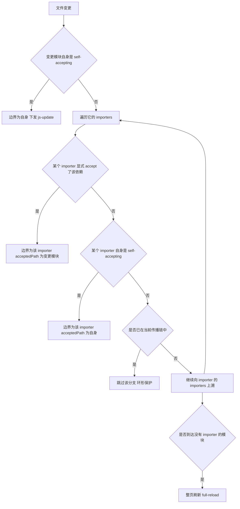

# Vite 底层：预构建、按需编译、HMR 与插件容器

!!! abstract "核心结论"
    - dev 与 build 是两条完全不同的管线：dev 用浏览器原生 ESM 逐个模块按需请求，服务端只做单文件转换；build 才做真正的打包、tree-shaking 与 chunk 拆分。
    - 依赖预构建的真正动机有三个：把 CJS/UMD 转成 ESM、把"一个包内部几百个模块"压成一次请求、统一不同分发格式的 default 导出互操作语义。
    - HMR 的本质是模块图上的边界搜索：从变更模块向上遍历 importers，命中 `self-accepting` 或 `acceptedHmrDeps` 即成为边界；走到没有任何 importer 的模块则降级为整页刷新。
    - 插件容器是把 Rollup 插件钩子搬进 dev 的适配层：`resolveId` 取第一个非空结果，`load` 同理，`transform` 则串行链式传递。
    - Rolldown 的目标是用 Rust 实现的一体化工具链替换"esbuild 预构建 + Rollup 打包"的组合，具体版本行为与插件兼容边界需核对官方文档。

## 1. dev 模式：原生 ESM 与按需编译

### 1.1 请求粒度：O(请求数) 而不是 O(模块数)

bundle-based 的 dev server（webpack 经典模式）在启动时必须把入口能到达的整张模块图解析、编译、组装成 chunk，再交给浏览器。启动耗时的量级是 O(模块数)。Vite 的做法是把"模块图的遍历"交给浏览器：

1. 浏览器请求 `/index.html`，Vite 注入 `/@vite/client`（HMR 运行时）并重写 `<script type="module" src="/src/main.js">`。
2. 浏览器解析 `main.js`，发现 `import`，于是对每个 specifier 再发一次 HTTP 请求。
3. Vite 收到请求时才做单文件转换（TS/JSX 转译、裸导入重写、HMR 注入），返回 HTTP 200 与 `Content-Type: text/javascript`。

因此冷启动耗时主要来自依赖预构建，热启动进一步被 `node_modules/.vite` 缓存吸收。这是"按需编译"的确切含义：编译发生在请求边界上，而不是启动边界上。

代价也很明显：模块越多，浏览器发出的请求越多，HTTP/2 多路复用能缓解但不能消除往返延迟。这也是生产构建依然必须打包的原因之一。

### 1.2 dev server 的中间件栈

Vite 的 dev server 是一个 connect 风格的中间件栈，大致顺序为：CORS、代理（`server.proxy`）、`base` 处理、依赖与源码的静态服务、transform 中间件、SPA fallback、`index.html` 处理。具体顺序随版本变动，需核对官方文档；但"transform 中间件在静态服务之前、index.html 在最后"这一结构性事实是稳定的。

transform 中间件只处理"看起来是模块请求"的 URL：JS/TS/JSX 文件、带 `?import`/`?raw`/`?url` 等查询的请求、被标记为需要转换的请求。它调用插件容器的 `transform` 链，拿到 `{ code, map }` 后返回。

### 1.3 与 bundle-based dev 的对比

| 维度 | bundle-based dev（webpack 经典模式） | Vite dev |
| --- | --- | --- |
| 启动成本 | 构建整张模块图，量级为 O(模块数) | 只做依赖预构建，量级为 O(依赖数) |
| 浏览器请求 | 请求打包后的 chunk | 每个源码模块一次请求 |
| 更新成本 | 重新打包受影响的 chunk 及其依赖 | 单模块转换 + 边界搜索 |
| 模块标识 | 内部模块 id | 浏览器可解析的 URL（文件路径 + 查询串） |
| HMR 边界 | 由 HMR runtime 在 bundle 内查找 | 服务端在模块图上搜索后下发精确边界 |
| 缓存策略 | 依赖内存中的构建产物 | 依赖预构建产物 + HTTP 协商缓存 |

需要说明：新一代 bundle-based 工具（如 Rspack）支持增量编译与 lazy compilation，启动策略与经典 webpack 不同，具体能力需核对官方文档。上表的对比对象是"启动即全量构建"的经典模式。

### 1.4 手写实现：迷你 dev server

运行环境：Node 18+（使用 `node:` 前缀内置模块；若环境没有全局 `fetch`，测试里改用 `node:http` 请求即可）。文件名 `mini-dev-server.mjs`。

```js
// mini-dev-server.mjs
import http from 'node:http';
import fsp from 'node:fs/promises';
import path from 'node:path';
import { pathToFileURL } from 'node:url';

// 极简 import 解析：只覆盖 import/export ... from 与 import() 两类写法。
// 真实 Vite 使用 es-module-lexer，它能正确处理注释、字符串、模板字面量、
// 正则字面量等边界情况；正则做不到这些，这里只是为了演示管线位置。
const STATIC_RE = /(?:^|[\s;{}()])(?:import|export)\s+(?:[^'"`]*?\sfrom\s*)?['"]([^'"\n]+)['"]/gm;
const DYNAMIC_RE = /import\s*\(\s*['"]([^'"\n]+)['"]\s*\)/gm;

export function parseImports(code) {
  const found = [];
  const collect = (re) => {
    re.lastIndex = 0;
    let m;
    while ((m = re.exec(code)) !== null) {
      const specifier = m[1];
      const start = m.index + m[0].indexOf(specifier);
      found.push({ specifier, start, end: start + specifier.length });
    }
  };
  collect(STATIC_RE);
  collect(DYNAMIC_RE);
  found.sort((a, b) => a.start - b.start);
  const out = [];
  for (const item of found) {
    if (out.length > 0 && out[out.length - 1].start === item.start) continue;
    out.push(item);
  }
  return out;
}

// 判定裸导入：既不以 . 也不以 / 开头，且不带 URL scheme。
export function isBareImport(specifier) {
  if (specifier.startsWith('.') || specifier.startsWith('/')) return false;
  if (specifier.startsWith('\0')) return false;
  if (/^[a-zA-Z][a-zA-Z\d+\-.]*:/.test(specifier)) return false;
  return true;
}

// 从后往前替换，避免前面的替换让后面的下标失效。
export function rewriteImports(code, { resolveBare, resolveRelative }) {
  const imports = parseImports(code);
  let out = code;
  for (let i = imports.length - 1; i >= 0; i--) {
    const { specifier, start, end } = imports[i];
    const next = isBareImport(specifier) ? resolveBare(specifier) : resolveRelative(specifier);
    if (next === specifier) continue;
    out = out.slice(0, start) + next + out.slice(end);
  }
  return { code: out, imports };
}

export function createDevServer({ root, deps }) {
  const middlewares = [];
  const use = (mw) => middlewares.push(mw);

  // 中间件 1：预构建产物。真实 Vite 会带 max-age=31536000, immutable。
  use(async (req, res, next) => {
    const pathname = new URL(req.url, 'http://localhost').pathname;
    if (!pathname.startsWith('/@deps/')) return next();
    const name = decodeURIComponent(pathname.slice('/@deps/'.length)).replace(/\.js$/, '');
    const code = deps.get(name);
    if (code == null) {
      res.statusCode = 404;
      res.end(`// dep not found: ${name}`);
      return;
    }
    res.setHeader('Content-Type', 'text/javascript');
    res.setHeader('Cache-Control', 'max-age=31536000,immutable');
    res.end(code);
  });

  // 中间件 2：transform。只处理 JS 类请求，重写裸导入，源码走协商缓存。
  use(async (req, res, next) => {
    const pathname = decodeURIComponent(new URL(req.url, 'http://localhost').pathname);
    if (!['.js', '.mjs', '.ts'].includes(path.extname(pathname))) return next();
    const file = path.join(root, pathname);
    if (!file.startsWith(root + path.sep)) {
      res.statusCode = 403;
      res.end('forbidden');
      return;
    }
    let source;
    try {
      source = await fsp.readFile(file, 'utf8');
    } catch {
      return next();
    }
    const { code } = rewriteImports(source, {
      resolveBare: (s) => `/@deps/${s}.js`,
      resolveRelative: (s) => s,
    });
    res.setHeader('Content-Type', 'text/javascript');
    res.setHeader('Cache-Control', 'no-cache');
    res.end(code);
  });

  // 中间件 3：index.html（真实 Vite 会在这里注入 /@vite/client 并重写 script src）
  use(async (req, res) => {
    try {
      const html = await fsp.readFile(path.join(root, 'index.html'), 'utf8');
      res.setHeader('Content-Type', 'text/html');
      res.end(html);
    } catch {
      res.statusCode = 404;
      res.end('Not Found');
    }
  });

  // connect 风格的 next 链
  const server = http.createServer((req, res) => {
    let i = 0;
    const next = (err) => {
      if (err) {
        res.statusCode = 500;
        res.end(String((err && err.stack) || err));
        return;
      }
      const mw = middlewares[i++];
      if (!mw) {
        res.statusCode = 404;
        res.end('Not Found');
        return;
      }
      Promise.resolve(mw(req, res, next)).catch(next);
    };
    next();
  });

  return { server, use, middlewares };
}

// 直接执行时用当前目录当根，依赖表为空
const isMain = process.argv[1] && pathToFileURL(process.argv[1]).href === import.meta.url;
if (isMain) {
  const { server } = createDevServer({ root: process.cwd(), deps: new Map() });
  server.listen(5174, '127.0.0.1', () => {
    console.log('mini dev server on http://127.0.0.1:5174');
  });
}
```

**验证标准**

```js
// mini-dev-server.test.mjs
import assert from 'node:assert/strict';
import fs from 'node:fs/promises';
import os from 'node:os';
import path from 'node:path';
import { createDevServer, rewriteImports } from './mini-dev-server.mjs';

// 单元 1：裸导入与相对导入的重写
{
  const code = "import { a } from 'demo-lib';\nimport './local.js';\nconst m = await import('other-lib');\n";
  const { imports, code: out } = rewriteImports(code, {
    resolveBare: (s) => `/@deps/${s}.js`,
    resolveRelative: (s) => s,
  });
  assert.deepEqual(imports.map((i) => i.specifier), ['demo-lib', './local.js', 'other-lib']);
  assert.ok(out.includes("from '/@deps/demo-lib.js'"));
  assert.ok(out.includes("import './local.js'"));
  assert.ok(out.includes("import('/@deps/other-lib.js')"));
  console.log('ok 1 重写裸导入与相对导入');
}

// 端到端：起服务，取源码，断言重写结果与依赖中间件
{
  const root = await fs.mkdtemp(path.join(os.tmpdir(), 'mini-vite-'));
  await fs.mkdir(path.join(root, 'src'), { recursive: true });
  await fs.writeFile(path.join(root, 'src/main.js'), "import { msg } from 'demo-lib';\nconsole.log(msg);\n");
  await fs.writeFile(path.join(root, 'index.html'), '<script type="module" src="/src/main.js"></script>');

  const deps = new Map([['demo-lib', 'export const msg = "hello from dep";']]);
  const { server } = createDevServer({ root, deps });
  await new Promise((r) => server.listen(0, '127.0.0.1', r));
  const base = `http://127.0.0.1:${server.address().port}`;

  const main = await (await fetch(`${base}/src/main.js`)).text();
  assert.ok(main.includes("from '/@deps/demo-lib.js'"));
  assert.equal(await (await fetch(`${base}/@deps/demo-lib.js`)).text(), 'export const msg = "hello from dep";');
  assert.ok((await (await fetch(`${base}/`)).text()).includes('/src/main.js'));
  assert.equal((await fetch(`${base}/@deps/nope.js`)).status, 404);

  server.closeAllConnections?.();
  await new Promise((r) => server.close(r));
  console.log('ok 2 dev server 端到端');
}
```

预期输出：

```text
ok 1 重写裸导入与相对导入
ok 2 dev server 端到端
```

## 2. 依赖预构建

### 2.1 三个真实动机

第一，CJS/UMD 互操作。浏览器只认 ESM，`require`/`module.exports` 需要被转换成 `import`/`export`。第二，请求瀑布。很多 npm 包由几百个内部模块组成，若不预构建，浏览器会为这个包的上百个文件各发一次请求；esbuild 把它们合并成一个文件，把上百个请求压成一次。第三，语义一致性。同一个包可能同时存在 `esm`/`cjs` 产物，不同产物的 default 导出形态不同；预构建统一到一个入口，避免 dev 与 prod 行为不一致。

### 2.2 scan 与 optimize 两阶段

预构建分两步。scan 阶段从入口 HTML 出发，跟随相对导入与已知的入口配置，收集所有裸导入的名字；optimize 阶段用 esbuild 以每个依赖为 entry 做一次 bundle，输出到缓存目录，同时把裸导入重写成"预构建产物的 URL"。真实实现中这两步分别由 `vite:dep-scan` 与 `vite:esbuild` 相关逻辑承担，具体插件名与拆分方式随版本变动，需核对官方文档。

预构建产物里，每个依赖通常还有一层"导出拦截"代码，用于解决 default 导出被多次包装的问题；这部分行为与 `optimizeDeps.needsInterop` 相关，属于版本敏感区域。

### 2.3 缓存键与失效

缓存目录默认为 `node_modules/.vite`（可通过 `cacheDir` 配置）。命中判定依赖 `_metadata.json` 里记录的缓存键，通常包含锁文件内容/哈希、相关配置哈希、Vite 版本等。任一变化或显式 `--force` 都会触发重新预构建。锁文件差异检测、浏览器目标（`build.target`）参与缓存键的具体方式属于版本敏感细节，需核对官方文档。

### 2.4 预构建与生产打包的分工对比

| 维度 | 依赖预构建（dev） | 生产构建（build） |
| --- | --- | --- |
| 切入点 | 每个裸依赖一个 entry | 每个 HTML / 入口一个 entry |
| 目标 | 转 ESM、压请求数、不改源码 | tree-shaking、chunk 拆分、压缩、资源 hash |
| 是否处理业务源码 | 否（只做转译，不 bundle） | 是（整图打包） |
| 并行性 | 天生多 entry 并行 | 受 chunk 图依赖约束 |
| 产物位置 | `node_modules/.vite` 缓存 | `dist` |
| 缓存 | 有（metadata 命中即跳过） | 无（每次重新构建，除非外部缓存） |

### 2.5 手写实现：迷你 pre-bundler

运行环境：Node 18+。文件名 `mini-prebundle.mjs`，依赖上一节的 `parseImports`/`isBareImport`。

```js
// mini-prebundle.mjs
import fs from 'node:fs/promises';
import path from 'node:path';
import crypto from 'node:crypto';
import { parseImports, isBareImport } from './mini-dev-server.mjs';

// 阶段一：scan。跟随相对导入，收集裸导入。
// 简化点：不处理 scope 包子路径（@scope/pkg/sub 会被当成一个名字），
// 不处理 exports 字段条件解析、不做别名替换。
export async function scanDeps(entryFile) {
  const deps = new Set();
  const visited = new Set();
  const queue = [entryFile];
  while (queue.length > 0) {
    const file = queue.shift();
    if (visited.has(file)) continue;
    visited.add(file);
    let code;
    try {
      code = await fs.readFile(file, 'utf8');
    } catch {
      continue;
    }
    for (const { specifier } of parseImports(code)) {
      if (isBareImport(specifier)) {
        deps.add(specifier);
      } else if (specifier.startsWith('.')) {
        queue.push(path.resolve(path.dirname(file), specifier));
      }
    }
  }
  return [...deps].sort();
}

export function hashInputs(inputs) {
  const h = crypto.createHash('sha256');
  for (const s of inputs) h.update(s).update('\0');
  return h.digest('hex').slice(0, 12);
}

// 阶段二：optimize。真实实现会调用 esbuild 做 CJS 转 ESM 与 bundle；
// 这里用「依赖源码字符串 + 锁文件内容」模拟缓存键的组成。
export async function prebundle({ root, entry, depsRegistry, outDir }) {
  const depNames = await scanDeps(entry);
  const lockContent = await fs.readFile(path.join(root, 'lock.json'), 'utf8').catch(() => '');
  const metaPath = path.join(outDir, '_metadata.json');

  let prev = null;
  try {
    prev = JSON.parse(await fs.readFile(metaPath, 'utf8'));
  } catch {
    prev = null;
  }

  const fingerprints = [];
  for (const name of depNames) {
    const code = depsRegistry.get(name);
    if (code == null) throw new Error(`无法解析依赖 ${name}`);
    fingerprints.push(`${name}:${code}`);
  }
  const cacheKey = hashInputs([lockContent, ...fingerprints]);

  if (prev && prev.cacheKey === cacheKey) {
    return { cached: true, cacheKey, files: prev.files, depNames };
  }

  await fs.mkdir(outDir, { recursive: true });
  const files = [];
  for (const name of depNames) {
    const file = path.join(outDir, `${name}.js`);
    await fs.writeFile(file, depsRegistry.get(name));
    files.push(file);
  }
  await fs.writeFile(metaPath, JSON.stringify({ cacheKey, depNames, files }, null, 2));
  return { cached: false, cacheKey, files, depNames };
}
```

**验证标准**

```js
// mini-prebundle.test.mjs
import assert from 'node:assert/strict';
import fs from 'node:fs/promises';
import os from 'node:os';
import path from 'node:path';
import { scanDeps, prebundle } from './mini-prebundle.mjs';

const root = await fs.mkdtemp(path.join(os.tmpdir(), 'mini-prebundle-'));
await fs.mkdir(path.join(root, 'src'), { recursive: true });
await fs.writeFile(path.join(root, 'src/main.js'), "import { a } from 'pkg-a';\nimport './util.js';\n");
await fs.writeFile(path.join(root, 'src/util.js'), "import 'pkg-b';\nexport const u = 1;\n");
await fs.writeFile(path.join(root, 'lock.json'), '{"lockfileVersion":3}');

const registry = new Map([
  ['pkg-a', 'export const a = 1;'],
  ['pkg-b', 'export const b = 2;'],
]);
const entry = path.join(root, 'src/main.js');
const outDir = path.join(root, 'node_modules/.vite/deps');

// scan 会穿过相对导入找到 pkg-b
assert.deepEqual(await scanDeps(entry), ['pkg-a', 'pkg-b']);

const r1 = await prebundle({ root, entry, depsRegistry: registry, outDir });
assert.equal(r1.cached, false);
assert.deepEqual(r1.depNames, ['pkg-a', 'pkg-b']);

const r2 = await prebundle({ root, entry, depsRegistry: registry, outDir });
assert.equal(r2.cached, true);
assert.equal(r2.cacheKey, r1.cacheKey);

// 依赖内容变化必须让缓存失效
registry.set('pkg-a', 'export const a = 42;');
const r3 = await prebundle({ root, entry, depsRegistry: registry, outDir });
assert.equal(r3.cached, false);
assert.notEqual(r3.cacheKey, r1.cacheKey);

console.log('ok 预构建：扫描、缓存命中、依赖变更失效');
```

预期输出：

```text
ok 预构建：扫描、缓存命中、依赖变更失效
```

## 3. transform 管线与插件容器

### 3.1 钩子语义

Rollup 的插件契约在 dev 里被复用时，语义要点如下：

- `resolveId(id, importer)`：第一个返回非空结果的插件胜出（Vite 的容器按 `enforce: 'pre' | 'normal' | 'post'` 排序后执行）。返回 `null`/`undefined` 表示"我不处理"，继续问下一个。
- `load(id)`：同样是第一个非空结果胜出，通常用于虚拟模块（如 `virtual:`、`\0` 前缀），一般由一个插件产生、另一个插件消费。
- `transform(code, id)`：不是短路而是链式——每个插件的返回值成为下一个插件的输入，返回 `null` 表示不改动。
- Vite 额外增加了 `configureServer`、`transformIndexHtml`、`handleHotUpdate` 等中间件与 HTML 层面钩子，这些在纯 Rollup 里不存在。

### 3.2 import 分析与重写

dev 下的一次模块请求要完成三件事：

1. 解析 alias 与扩展名（浏览器不会像 Node 那样补全扩展名，所以必须解析成最终路径）。
2. 用 es-module-lexer 定位每个 import 的边界，把裸导入替换成预构建产物的 URL。
3. 注入 `import.meta.hot` 相关的运行时代码（`__vite__createHotContext`、`accept` 回调注册、prune 钩子），并在更新时给 URL 追加 `?t=<timestamp>` 做缓存击穿。

重写过程需要保留 sourcemap，因此实现上通常用 magic-string 这类"带上来源映射的字符串替换"库，而不是直接拼接字符串。

### 3.3 手写实现：插件容器与裸导入重写

运行环境：Node 18+。文件名 `mini-plugin-container.mjs`。

```js
// mini-plugin-container.mjs
// 说明：这些实现使用 JavaScript + JSDoc 风格注释，保证可直接用 node 运行。
// 若要改成 TypeScript，把文件后缀改为 .ts 并补上类型声明即可，逻辑不变。

function normalize(result) {
  if (result == null) return null;
  return typeof result === 'string' ? { code: result, map: null } : result;
}

export function createPluginContainer(plugins) {
  const weight = { pre: 0, normal: 1, post: 2 };
  const sorted = [...plugins].sort((a, b) => {
    const wa = weight[a.enforce ?? 'normal'];
    const wb = weight[b.enforce ?? 'normal'];
    return wa - wb;
  });

  const container = {
    plugins: sorted,

    // 第一个非空结果胜出
    async resolveId(id, importer = null) {
      const ctx = {
        // 插件内可通过 this.resolve 递归调用容器（真实 Vite 也提供该能力）
        resolve: (i, imp) => container.resolveId(i, imp ?? importer),
      };
      for (const p of sorted) {
        if (!p.resolveId) continue;
        const r = await p.resolveId.call(ctx, id, importer);
        if (r != null) return normalize(r);
      }
      return null;
    },

    // 同样第一个非空结果胜出
    async load(id) {
      const ctx = {};
      for (const p of sorted) {
        if (!p.load) continue;
        const r = await p.load.call(ctx, id);
        if (r != null) return normalize(r);
      }
      return null;
    },

    // 链式：上一环的 code 变成下一环的输入
    async transform(code, id) {
      let result = { code, map: null };
      const ctx = {};
      for (const p of sorted) {
        if (!p.transform) continue;
        const r = await p.transform.call(ctx, result.code, id, { ssr: false });
        if (r == null) continue;
        result = normalize(r);
      }
      return result;
    },
  };

  return container;
}

// 裸导入重写：调用容器解析后，把 specifier 换成 /@deps/<id>.js 形式
export async function transformModule(container, code, id) {
  const { parseImports, isBareImport } = await import('./mini-dev-server.mjs');
  const imports = parseImports(code);
  let out = code;
  const rewritten = [];
  for (let i = imports.length - 1; i >= 0; i--) {
    const { specifier, start, end } = imports[i];
    if (!isBareImport(specifier)) continue;
    const resolved = await container.resolveId(specifier, id);
    const finalId = resolved ? resolved.code : specifier;
    const url = `/@deps/${finalId}.js`;
    out = out.slice(0, start) + url + out.slice(end);
    rewritten.push({ specifier, url });
  }
  return { code: out, rewritten };
}
```

**验证标准**

```js
// mini-plugin-container.test.mjs
import assert from 'node:assert/strict';
import { createPluginContainer, transformModule } from './mini-plugin-container.mjs';

const calls = [];
const container = createPluginContainer([
  { name: 'silent-resolver', resolveId() { return null; } },
  {
    name: 'virtual',
    resolveId(id) { return id === 'virtual:config' ? '\0virtual:config' : null; },
    load(id) { return id === '\0virtual:config' ? 'export default { debug: true };' : null; },
  },
  { name: 'post-marker', enforce: 'post', transform(code) { calls.push('post'); return { code: code + '\n// post', map: null }; } },
  { name: 'pre-marker', enforce: 'pre', transform(code) { calls.push('pre'); return code + '\n// pre'; } },
  { name: 'normal', transform(code) { calls.push('normal'); return null; } },
]);

// resolveId：前一个插件返回 null 时继续问下一个
assert.equal(await container.resolveId('virtual:config', '/src/main.js'), '\0virtual:config');
assert.equal(await container.resolveId('fs', '/src/main.js'), null);

// load：虚拟模块
assert.equal((await container.load('\0virtual:config')).code, 'export default { debug: true };');

// transform：enforce 排序 + 链式传递
const out = await container.transform('const x = 1;', '/src/main.js');
assert.deepEqual(calls, ['pre', 'normal', 'post']);
assert.equal(out.code, 'const x = 1;\n// pre\n// post');

// 裸导入重写接到容器上
const rewritten = await transformModule(container, "import cfg from 'virtual:config';\n", '/src/main.js');
assert.deepEqual(rewritten.rewritten, [{ specifier: 'virtual:config', url: '/@deps/\0virtual:config.js' }]);
assert.ok(rewritten.code.includes('/@deps/\0virtual:config.js'));

console.log('ok 插件容器：resolveId 短路、load、transform 顺序与链式传递');
```

预期输出：

```text
ok 插件容器：resolveId 短路、load、transform 顺序与链式传递
```

## 4. HMR

### 4.1 协议与消息

Vite 的 HMR 走 WebSocket，默认与 dev server 同端口，协议标记为 `vite-hmr`（细节需核对官方文档）。消息体是 JSON。下表列出主要类型与语义，字段名以当前实现为准，跨版本可能有增删。

| 方向 | type | 关键字段 | 语义 |
| --- | --- | --- | --- |
| server 到 client | `connected` | 无 | 握手完成，客户端可开始接收更新 |
| server 到 client | `update` | `updates[]` | 一次可携带多条更新，每条为 `js-update` 或 `css-update` |
| server 到 client | `full-reload` | `path`（可选） | 无法找到边界，整页刷新 |
| server 到 client | `prune` | `paths[]` | 模块从图中移除，触发 `hot.prune` |
| server 到 client | `error` | `err` | 编译错误，用于错误覆盖层 |
| server 到 client | `custom` | `event`、`data` | 插件通过 `server.ws.send` 广播的自定义事件 |
| client 到 server | `vite:invalidate` | `path`、`message`、`firstInvalidatedBy` | `hot.invalidate()` 触发，把模块重新塞进更新队列 |
| client 到 server | 保活与自定义 | 视实现 | 心跳与插件自定义消息 |

`js-update` 单条的字段通常是：`path`（边界模块 URL）、`acceptedPath`（真正变更的模块 URL）、`timestamp`（用于 `?t=` 缓存击穿），部分版本还有 `explicitImportRequired` 之类的附加标记。客户端拿到后对 `acceptedPath` 发起带时间戳的动态 import，把新模块对象交给注册的回调。

### 4.2 import.meta.hot API

| API | 语义 |
| --- | --- |
| `hot.accept(cb)` | 自接受：本模块变更时调用 `cb(newModule)`，不向上冒泡 |
| `hot.accept(dep, cb)` | 接受某个依赖的变更，`dep` 可以是字符串或字符串数组 |
| `hot.dispose(cb)` | 本模块被替换前调用，用于清理副作用（定时器、事件监听） |
| `hot.prune(cb)` | 模块被从图中移除时调用 |
| `hot.invalidate()` | 主动声明"我无法处理这次更新"，让更新继续向上冒泡 |
| `hot.decline()` | 声明本模块拒绝更新 |
| `hot.data` | 跨更新持久的对象，`dispose` 与 `accept` 回调共享同一份 |
| `hot.on(event, cb)` / `hot.send(event, data)` | 与 `custom` 消息配套的自定义事件通道 |

注意 `hot.data` 是内存对象，不是序列化持久化；整页刷新后一定丢失。

### 4.3 失效传播算法



几个关键工程点：

- 环形依赖必须防死循环。工程实现通常记录"当前传播链"或一个已访问集合，遇到重复节点就跳过该分支，让其他分支继续判定。
- 边界搜索结果可能有多条，一条 `update` 消息可以携带多个边界，客户端逐个应用。
- 任何一条链路走到根节点（没有 importer，通常是 HTML 入口或虚拟入口），整体就降级为整页刷新；Vite 的实现在这一点的判定顺序与版本有关，需核对官方文档。
- CSS 是特例：Vite 注入的 CSS 模块自带接受逻辑，改动通常直接 `css-update`，不需要用户写 `accept`。

### 4.4 手写实现：服务端传播

运行环境：Node 18+。文件名 `mini-hmr-server.mjs`。

```js
// mini-hmr-server.mjs
// 简化的模块图：只保留传播算法需要的字段。
// 真实 Vite 的 ModuleNode 还包含 url、file、transformResult、
// acceptedHmrExports、isSelfAccepting 等；判定细节需核对官方文档。
export function createModuleGraph() {
  const nodes = new Map();

  const get = (id) => {
    if (!nodes.has(id)) {
      nodes.set(id, { id, importers: new Set(), acceptedDeps: new Set(), selfAccepting: false });
    }
    return nodes.get(id);
  };

  return {
    nodes,
    get,
    addImport(importerId, importedId) {
      get(importerId);
      get(importedId).importers.add(importerId);
    },
    accepts(importerId, depId) {
      get(importerId).acceptedDeps.add(depId);
    },
    selfAccept(id) {
      get(id).selfAccepting = true;
    },
  };
}

// 返回更新数组；需要整页刷新时返回 [{ type: 'full-reload' }]
export function propagateUpdate(graph, changedId, timestamp = Date.now()) {
  const start = graph.get(changedId);

  if (start.selfAccepting) {
    return [{ type: 'js-update', path: changedId, acceptedPath: changedId, timestamp }];
  }

  const updates = [];
  const seen = new Set([changedId]); // 环形保护
  let queue = [...start.importers];
  let hasDeadEnd = false;

  while (queue.length > 0) {
    const nextLevel = [];
    for (const importerId of queue) {
      if (seen.has(importerId)) continue;
      seen.add(importerId);

      const importer = graph.nodes.get(importerId);
      if (!importer) continue;

      // 边界 1：importer 显式接受这个依赖
      if (importer.acceptedDeps.has(changedId)) {
        updates.push({ type: 'js-update', path: importerId, acceptedPath: changedId, timestamp });
        continue;
      }

      // 边界 2：importer 自接受，可以吞掉来自依赖的变更
      if (importer.selfAccepting) {
        updates.push({ type: 'js-update', path: importerId, acceptedPath: importerId, timestamp });
        continue;
      }

      // 死路：没有任何 importer，说明上溯到了入口
      if (importer.importers.size === 0) {
        hasDeadEnd = true;
        continue;
      }

      nextLevel.push(...importer.importers);
    }
    queue = nextLevel;
  }

  if (updates.length === 0 || hasDeadEnd) return [{ type: 'full-reload' }];
  return updates;
}
```

**验证标准**

```js
// mini-hmr-server.test.mjs
import assert from 'node:assert/strict';
import { createModuleGraph, propagateUpdate } from './mini-hmr-server.mjs';

// 场景 1：变更模块自接受
{
  const g = createModuleGraph();
  g.selfAccept('/src/a.js');
  assert.deepEqual(propagateUpdate(g, '/src/a.js', 1), [
    { type: 'js-update', path: '/src/a.js', acceptedPath: '/src/a.js', timestamp: 1 },
  ]);
}

// 场景 2：importer 显式 accept 依赖
{
  const g = createModuleGraph();
  g.addImport('/src/parent.js', '/src/child.js');
  g.accepts('/src/parent.js', '/src/child.js');
  assert.deepEqual(propagateUpdate(g, '/src/child.js', 2), [
    { type: 'js-update', path: '/src/parent.js', acceptedPath: '/src/child.js', timestamp: 2 },
  ]);
}

// 场景 3：无边界，上溯到入口，整页刷新
{
  const g = createModuleGraph();
  g.addImport('/src/entry.js', '/src/mid.js');
  g.addImport('/src/mid.js', '/src/leaf.js');
  assert.deepEqual(propagateUpdate(g, '/src/leaf.js', 3), [{ type: 'full-reload' }]);
}

// 场景 4：环形依赖不死循环
{
  const g = createModuleGraph();
  g.addImport('/src/f.js', '/src/g.js');
  g.addImport('/src/g.js', '/src/f.js');
  assert.deepEqual(propagateUpdate(g, '/src/f.js', 4), [{ type: 'full-reload' }]);
}

// 场景 5：多个边界
{
  const g = createModuleGraph();
  g.addImport('/src/l.js', '/src/k.js');
  g.addImport('/src/m.js', '/src/k.js');
  g.accepts('/src/l.js', '/src/k.js');
  g.accepts('/src/m.js', '/src/k.js');
  const updates = propagateUpdate(g, '/src/k.js', 5);
  assert.deepEqual(updates.map((u) => [u.path, u.acceptedPath]), [
    ['/src/l.js', '/src/k.js'],
    ['/src/m.js', '/src/k.js'],
  ]);
}

// 场景 6：importer 自接受，能截断来自依赖的传播
{
  const g = createModuleGraph();
  g.addImport('/src/self.js', '/src/dep.js');
  g.selfAccept('/src/self.js');
  assert.deepEqual(propagateUpdate(g, '/src/dep.js', 6), [
    { type: 'js-update', path: '/src/self.js', acceptedPath: '/src/self.js', timestamp: 6 },
  ]);
}

// 场景 7：孤立模块变更，无 importer，整页刷新
{
  const g = createModuleGraph();
  assert.deepEqual(propagateUpdate(g, '/src/orphan.js', 7), [{ type: 'full-reload' }]);
}

console.log('ok HMR 服务端：边界搜索、环形保护、整页刷新降级');
```

预期输出：

```text
ok HMR 服务端：边界搜索、环形保护、整页刷新降级
```

### 4.5 手写实现：客户端 hot context

运行环境：Node 18+。文件名 `mini-hmr-client.mjs`。为了可测，把"动态 import 新模块"和"整页刷新"抽象成可注入的函数；真实实现里前者是对 `${acceptedPath}?t=${timestamp}` 的动态 import，后者是 `location.reload()`。

```js
// mini-hmr-client.mjs
export function createHmrClient({
  loadModule,
  send = () => {},
  reload = () => {
    if (typeof location !== 'undefined') location.reload();
  },
}) {
  const hotModules = new Map();

  function createHotContext(ownerPath) {
    let record = hotModules.get(ownerPath);
    if (!record) {
      record = {
        id: ownerPath,
        data: {},
        acceptedPath: ownerPath,
        callback: null,
        deps: new Map(),
        dispose: null,
        prune: null,
      };
      hotModules.set(ownerPath, record);
    }

    return {
      get data() {
        return record.data;
      },
      // accept(cb) 自接受；accept(dep, cb) 接受依赖
      accept(depsOrCb, cb) {
        if (typeof depsOrCb === 'function') {
          record.acceptedPath = ownerPath;
          record.callback = depsOrCb;
          return;
        }
        const list = Array.isArray(depsOrCb) ? depsOrCb : [depsOrCb];
        for (const dep of list) record.deps.set(dep, cb ?? (() => {}));
      },
      dispose(cb) {
        record.dispose = cb;
      },
      prune(cb) {
        record.prune = cb;
      },
      invalidate() {
        send({ type: 'vite:invalidate', path: ownerPath });
      },
    };
  }

  // 应用一条 js-update：先 dispose 清理旧副作用，再把新模块交给回调
  async function applyUpdate({ path: ownerPath, acceptedPath, timestamp }) {
    const record = hotModules.get(ownerPath);
    if (!record) return undefined; // 没有 hot context，上层应降级为整页刷新
    const mod = await loadModule(`${acceptedPath}?t=${timestamp}`);
    if (record.dispose) record.dispose(record.data);
    if (record.acceptedPath === ownerPath && record.callback) {
      record.callback(mod);
    } else {
      const cb = record.deps.get(acceptedPath);
      if (cb) cb(mod);
    }
    return mod;
  }

  async function handleMessage(msg) {
    if (msg.type === 'js-update') {
      await applyUpdate(msg);
      return;
    }
    if (msg.type === 'full-reload') {
      reload();
    }
  }

  return { createHotContext, applyUpdate, handleMessage, hotModules };
}
```

**验证标准**

```js
// mini-hmr-client.test.mjs
import assert from 'node:assert/strict';
import { createHmrClient } from './mini-hmr-client.mjs';

const sent = [];
const reloads = [];
let loadCount = 0;

const client = createHmrClient({
  loadModule: async (url) => ({ url, value: ++loadCount }),
  send: (msg) => sent.push(msg),
  reload: () => reloads.push('reload'),
});

// 自接受模块：hot.data 跨更新保留
const seen = [];
const hot = client.createHotContext('/src/child.js');
hot.data.keep = 'persisted';
hot.accept((mod) => seen.push([mod.value, hot.data.keep]));
await client.handleMessage({ type: 'js-update', path: '/src/child.js', acceptedPath: '/src/child.js', timestamp: 100 });
assert.deepEqual(seen, [[1, 'persisted']]);

// 父模块接受依赖更新，并在替换前 dispose
const parent = client.createHotContext('/src/parent.js');
const got = [];
const disposed = [];
parent.data.stamp = 7;
parent.accept('/src/child.js', (mod) => got.push(mod.value));
parent.dispose((data) => disposed.push(data.stamp));
await client.handleMessage({ type: 'js-update', path: '/src/parent.js', acceptedPath: '/src/child.js', timestamp: 200 });
assert.deepEqual(got, [2]);
assert.deepEqual(disposed, [7]);

// 整页刷新回退
await client.handleMessage({ type: 'full-reload' });
assert.deepEqual(reloads, ['reload']);

// 未注册 hot context 的路径不应抛错，且返回 undefined
const unknown = await client.handleMessage({ type: 'js-update', path: '/src/unknown.js', acceptedPath: '/src/unknown.js', timestamp: 300 });
assert.equal(unknown, undefined);

// invalidate 会向服务端发送消息
hot.invalidate();
assert.deepEqual(sent, [{ type: 'vite:invalidate', path: '/src/child.js' }]);

console.log('ok HMR 客户端：自接受、依赖接受、dispose、整页刷新回退');
```

预期输出：

```text
ok HMR 客户端：自接受、依赖接受、dispose、整页刷新回退
```

### 4.6 局部更新还是整页刷新的判定思路

手工验证 HMR 是否"真正局部"，可以用下面这套断言思路（不需要浏览器自动化）：

1. 在客户端插入探针：记录 `location.reload` 被调用的次数，以及在 `handleMessage` 里记录收到的 `js-update` 的 `path` 与 `acceptedPath`。
2. 修改一个被 `accept` 包裹的叶子模块，断言：收到恰好一条 `js-update`，且 `pageReloadCount === 0`，同时该模块的 `accept` 回调被调用了一次。
3. 修改一个没有任何 `accept` 的模块，断言：收到 `full-reload`（或 `pageReloadCount === 1`），且没有任何 `js-update`。
4. 修改一个被两个不同边界同时接受的模块，断言：收到一条 `update`，其 `updates.length === 2`（或两条独立消息），两个回调各被调用一次。
5. 触发环形依赖下的修改，断言：服务端在有限时间内返回（没有死循环），结果是 `js-update` 或 `full-reload` 之一。

这五条合起来就覆盖了"局部更新"与"整页刷新"的分界。

## 5. 生产构建与 dev/prod 差异

### 5.1 Rollup 与 Rolldown

生产构建在 Vite 中由 bundler 完成，历史上是 Rollup，插件 API 沿用 Rollup 契约。Rolldown 是用 Rust 实现、以 Rollup 插件 API 兼容为目标的打包器；与之配套的是基于 Oxc 的解析与转换。Rolldown 在 Vite 体系中出现的形式（独立包、替换预构建与打包的具体范围、哪些钩子由谁执行）随版本变化，必须核对官方文档，不要凭记忆下结论。

对使用者的直接影响通常是：纯 JS 插件大多可以继续用；依赖原生扩展（`.node`）或特定 Node 内部行为的插件可能受影响；`build.rollupOptions` 中依赖 Rollup 特定行为的配置需要逐个验证。

### 5.2 dev 与 prod 的行为差异

| 维度 | dev | build |
| --- | --- | --- |
| 模块加载 | 浏览器原生 ESM，按需请求 | 静态分析后合并为若干 chunk |
| 依赖处理 | 预构建（转 ESM、合并内部模块） | 与其他模块一起打包并 tree-shaking |
| 转换器 | 单文件转译，不做 bundle | 整图打包，处理 chunk 与循环引用 |
| HMR | WebSocket + `import.meta.hot` | `import.meta.hot` 被替换为 `undefined`，`if (import.meta.hot)` 块被消除 |
| 环境变量 | `import.meta.env` 在转换时替换 | 编译期静态替换，未使用分支被消除 |
| 动态 import | 保留为浏览器原生 `import()` | 拆成独立 chunk，可生成预加载逻辑 |
| CSS | 以 JS 模块注入样式 | 抽取为 CSS 文件（默认行为，可配置） |
| 静态资源 | 按原始 URL 提供 | 文件名带 hash，生成清单 |
| 压缩 | 无 | 由配置的压缩器处理 |

这些差异是 bug 的常见来源。最典型的两类：一是只在 prod 暴露的 CJS/ESM 互操作问题（dev 走预构建的拦截层，prod 走打包器的互操作逻辑）；二是副作用被 tree-shaking 误删（依赖包的 `sideEffects` 声明不正确时）。

### 5.3 需要标注不确定的部分

以下内容属于版本敏感区域，本文不给出具体结论，使用前请核对官方文档：Rolldown 与 Vite 的集成状态与发布渠道；`optimizeDeps` 的默认扫描范围与 `entries` 推断规则；预构建缓存键的精确组成；Environment API 对 dev/prod 管线的抽象方式；各版本对 Node 的最低要求。

## 6. 常见陷阱

- 裸用 `import.meta.hot.accept()`：prod 构建把 `import.meta.hot` 替换为 `undefined`，裸调用会在运行时抛错。必须写成 `if (import.meta.hot) { ... }` 的形式，让打包器能静态消除。
- 忘记 `hot.dispose`：`accept` 回调里重新绑定的事件监听、定时器、全局状态不会自动清理，热更新几次后出现重复监听。
- 顶层副作用模块没有 `accept`：任何改动都会一路冒泡到入口，表现为"改一行就整页刷新"。常见于全局样式初始化、全局 store 注册。
- 环形依赖叠加 HMR：环形会导致边界搜索的不确定性，可能反复整页刷新或状态错乱，优先拆环。
- 修改了 `optimizeDeps` 相关配置却没生效：缓存目录里的 metadata 可能仍然命中，需要显式清缓存或 `--force`；具体命中规则需核对官方文档。
- monorepo 里的 link 依赖：软链依赖经常需要从预构建中排除（`optimizeDeps.exclude`）或做依赖去重，否则会出现同一包被加载两份、单例状态不共享。
- 反向代理没转发升级请求：nginx 缺 `Upgrade`/`Connection` 头会让 WebSocket 握手失败，HMR 静默失效，页面只能靠手动刷新。
- 手工 `import()` 绕过版本查询串：HMR 依赖 `?t=` 击穿浏览器模块缓存，自己拼 URL 时不加时间戳会拿到旧模块实例。
- 相对导入省略扩展名：浏览器不做扩展名解析，服务端必须解析补全；手写插件时容易漏掉这一步。
- dev 与 prod 使用不同的环境判断：直接读 `process.env.NODE_ENV` 在 dev 下未必被替换，应统一用 `import.meta.env` 系列。

## 7. 面试题与答题要点

**1. Vite 的 dev server 为什么比传统打包式 dev server 快？**

要点：不构建整张模块图，启动成本从 O(模块数) 降到 O(依赖数)；浏览器承担模块图的遍历与请求；两次启动之间依赖预构建命中 `node_modules/.vite` 缓存；源码请求走单文件转换 + 协商缓存；预构建使用原生编译的 esbuild（可在多 entry 上并行）。补充代价：请求数与浏览器往返延迟随模块数增长，HTTP/2 只能缓解。

**2. 依赖预构建解决什么问题？**

要点三点必须说全：一是 CJS/UMD 到 ESM 的格式转换，浏览器不认 `require`；二是消除请求瀑布，把一个包内部上百个文件合并为一次请求；三是统一互操作语义，避免 dev 与 prod 对 default 导出的处理不一致。加分项：缓存位置与 metadata 命中机制、`--force` 的用途、`optimizeDeps.exclude` 的适用场景（软链依赖、需要保持单例的包）。

**3. HMR 的失效传播边界是怎么找的？**

要点：以"变更模块"为起点；若它自身自接受则边界为自身；否则沿 importers 向上遍历；某个 importer 显式 `accept` 了该依赖，边界就是该 importer，`acceptedPath` 是变更模块；某个 importer 自接受，则它也构成边界；上溯到没有 importer 的模块就是死路，降级为整页刷新；环形依赖必须记录已访问集合或当前链，避免死循环。再补一句：结果可能有多条边界，一条 `update` 消息可携带多条。

**4. `hot.accept(cb)` 和 `hot.accept(dep, cb)` 的区别？**

要点：前者是自接受，边界就是本模块，回调收到本模块的新命名空间对象；后者表示本模块愿意处理某个依赖的变更，边界是本模块但 `acceptedPath` 是那个依赖。两者都需要配合 `dispose` 做副作用清理；`hot.data` 是同一份对象，`dispose` 与回调共享，用于跨更新保存状态。还要提一句：CSS 不需要用户写 `accept`。

**5. 插件容器是怎么把 Rollup 插件 API 搬到 dev 的？**

要点：dev 端实现 `resolveId`/`load`/`transform` 三个核心钩子的容器，`resolveId` 与 `load` 是第一个非空结果胜出，`transform` 是链式串联；按 `enforce` 排序为 `pre`/`normal`/`post`；虚拟模块用 `\0` 前缀约定；Vite 额外提供 `configureServer`、`transformIndexHtml` 等中间件与 HTML 层钩子，这些在 Rollup 中不存在；build 时同一批插件交给 Rollup 的插件容器执行，因此插件要同时考虑两种运行环境的差异（例如 `apply` 字段控制生效阶段）。加分项：`this.resolve` 的递归语义、sourcemap 需要逐环合并。

**6. dev 与 prod 的差异会引出哪些真实 bug？**

要点：CJS/ESM 互操作路径不同，dev 有预构建拦截层而 prod 依赖打包器逻辑；`import.meta.hot` 在 prod 变成 `undefined`，未包裹的代码会抛错；tree-shaking 可能删掉未声明副作用的模块；动态 import 在 prod 会拆包，加载时序与 dev 不同；CSS 在 dev 注入、在 prod 抽文件，样式优先级与加载时机可能不同；`import.meta.env` 是编译期替换，动态拼接 key 取不到值。答题时每条都配上"怎么验证"，例如用 `vite build && vite preview` 复现。

**7. 为什么 Vite 不直接让 Node 的 ESM loader 来跑 dev？**

要点：浏览器请求的是 HTTP URL，与文件系统路径不是一回事，需要 URL 到文件的重写；裸导入浏览器不认识，必须重写成可解析路径；TS/JSX 等语法需要转译；需要注入 HMR 运行时；需要支持 `?raw`、`?url`、`?inline` 这类查询语义；需要控制缓存策略与并发；Node 的 ESM 有自己的一套 resolve 规则（exports 字段、条件导出），与浏览器语义不完全一致，且 SSR 场景与浏览器场景要分开处理。补充：SSR 场景确实走了另一条链路，与浏览器端不是同一个实现。

**8. Rolldown 迁移的动机与风险是什么？**

要点：动机是统一工具链（预构建与打包由同一套 Rust 实现承担）、利用原生并行与更低的内存开销、减少 esbuild + Rollup 两套 AST/转换语义带来的不一致；目标是保持 Rollup 插件 API 兼容以降低生态迁移成本。风险：原生扩展与依赖 Node/JS 内部行为的插件兼容性、行为差异导致的构建产物差异、生态插件适配进度。答题时需要明确标注"具体状态与版本行为需核对官方文档"，不要编造版本号或性能倍数。

总体而言，理解 Vite 的抓手是三张图：模块图（谁 import 谁）、边界图（谁接受谁的更新）、钩子图（哪个插件在哪个阶段改变了产物）。把这三张图画清楚，dev 的按需编译、预构建的取舍、HMR 的传播与降级、插件容器的执行顺序就都能自己推出来，而不是靠记忆结论。

## 深入阅读与参考

!!! tip "怎么用这些资料"
    先读「官方文档与规范」建立准确的概念，再读「源码与示例」核对细节，最后用「教程、书籍与视频」换一种讲法加深理解。每条都写明了读哪一节、带着什么问题读。

### 官方文档与规范

| 资源 | 为什么读 | 怎么读 |
|---|---|---|
| [Vite：为什么选 Vite（中文）](https://cn.vitejs.dev/guide/why.html) | 官方说明为何用原生 ESM 加预构建，是理解 dev 模式的起点。 | 读“为什么选 Vite”，列出浏览器请求链，再对照自己项目的 Network 面板验证。 |
| [Vite：插件 API（中文）](https://cn.vitejs.dev/guide/api-plugin.html) | 插件容器与 transform 钩子的官方定义，本页核心机制的出处。 | 读 transform 与 handleHotUpdate 钩子，写插件打印执行顺序并记录。 |
| [Vite：依赖预构建](https://vite.dev/guide/dep-pre-bundling.html) | 讲清预构建动机、缓存与失效条件，对应本页依赖预构建章节。 | 读 optimizeDeps 配置与缓存章节，改依赖后观察 .vite 目录变化。 |
| [Vite：构建生产版本（中文）](https://cn.vitejs.dev/guide/build.html) | 官方生产构建流程，用于对比 dev 与 prod 的模块加载差异。 | 读构建选项与产物分析，配置 manualChunks 后构建并查看体积。 |
| [Vite：配置参考](https://vite.dev/config/) | 查阅 optimizeDeps、server.hmr 等选项的权威手册。 | 用到哪项查哪项，重点看 optimizeDeps、server.hmr、rollupOptions。 |
| [esbuild FAQ](https://esbuild.github.io/faq/) | 说明 esbuild 刻意不做什么，理解它在预构建中的角色边界。 | 读限制与“不做”部分，列出预构建能做什么、不能做什么。 |
| [Node.js 包规范](https://nodejs.org/api/packages.html) | exports 与条件导出决定解析与预构建行为，是常见坑来源。 | 读 exports 字段与条件导出，写一个同时支持 ESM/CJS 的包。 |
| [Node.js ES 模块](https://nodejs.org/api/esm.html) | ESM 与 CJS 互操作是预构建和 ERR_REQUIRE_ESM 问题的根因。 | 读互操作章节，复现 ERR_REQUIRE_ESM，记录 Vite 如何处理。 |
| [HMR API](https://vite.dev/guide/api-hmr) | 官方 HMR API 定义，理解 import.meta.hot 与更新边界。 | 读 import.meta.hot 各方法，给模块加 accept 并观察局部更新。 |

### 源码与示例

| 资源 | 为什么读 | 怎么读 |
|---|---|---|
| [vite](https://github.com/vitejs/vite) | Vite 开发服务器入口源码，直击按需编译与插件容器的实现。 | 从 createServer 跟到 transformRequest，带着“请求如何变模块”去读。 |

### 教程、书籍与视频

| 资源 | 为什么读 | 怎么读 |
|---|---|---|
| [Web Dev Simplified](https://www.youtube.com/@WebDevSimplified) | 短视频讲构建工具概念，适合快速补背景并跟练。 | 挑 Vite 或构建主题视频，跟敲一遍并复述 dev 服务器请求流程。 |
| [Rollup 简介（中文）](https://cn.rollupjs.org/introduction/) | 理解生产构建基于 Rollup 的打包模型与 tree-shaking 机制。 | 读打包流程与多格式输出，做一次 esm 与 cjs 双格式库打包。 |

## 应用与行业实践

### 应用场景地图

| 场景 | 用到本页哪个知识点 | 典型技术选型 | 注意事项 |
|:--|:--|:--|:--|
| 后台管理里展开的万行表格 | dev 原生 ESM 与按需编译 | Vite + React/Vue + 虚拟滚动 | 请求条数随路由展开增长，用 Network 面板逐条数 |
| 低端安卓的首屏加载 | build 打包与 chunk 拆分 | Vite build + `output.manualChunks` | 桌面 Lighthouse 分数不代表真机，要开 CPU 节流并上真机 |
| 多人协作白板 | HMR 边界搜索 | Vite + Canvas，手写 `accept` | 整页刷新会清空画布，必须声明边界并清理副作用 |
| monorepo 内组件库联调 | 依赖预构建 | Vite + pnpm workspace | 被 link 的源码包若进了预构建，改源码不触发热更新 |
| 内部工具接入老 CJS 库 | 预构建的 CJS→ESM 转换 | `optimizeDeps.include` | 具名导出缺失时走 default 互操作，先核对包的分发格式 |
| SSR 官网 | dev/build 双管线差异 | `vite build --ssr` + 框架适配 | 两条管线产物结构不同，性能数据必须分开测 |
| Electron 桌面端 | 插件容器与 transform 链 | electron-vite | 用 `apply` 区分 serve/build，主进程与渲染进程分开配置 |
| 微前端子应用 | 预构建缓存 | Vite + 模块联邦类方案 | 依赖升级后要清 `node_modules/.vite`，否则继续用旧产物 |

### 三个场景拆解

#### 场景 1：后台管理里展开一张万行表格

**业务背景**：表格页有成片的列组件，路由一展开就向 dev server 发起请求。开发机每次改动都要等模块图重建，改一个文件要盯几秒控制台。

**怎么用本页知识解决**：思路是让 dev 只编译当前屏幕用到的模块，把第三方依赖交给预构建，再用插件量出模块增长曲线。

```js
// vite.config.js
import { defineConfig } from 'vite'
let count = 0 // 统计 dev 阶段被单独转换的源码模块数
export default defineConfig({
  optimizeDeps: { include: ['lodash-es', 'echarts'] }, // 包内模块压成单次请求
  plugins: [{
    name: 'dev-probe',
    apply: 'serve', // 只作用于 dev，不影响 build
    transform(_code, id) {
      if (id.includes('node_modules')) return null // 预构建产物不走 transform
      if (count++ % 50 === 0) console.log('模块数', count) // 记录增长曲线
      return null
    },
  }],
})
```

- `apply: 'serve'` 让这段观测代码不进生产构建，避免污染产物。
- `optimizeDeps.include` 把已知的大依赖提前预构建，跳过首次请求时的发现与重构建。
- `transform` 只看到源码模块，预构建产物直接走静态文件，所以计数能反映真实编译量。
- 计数按 50 取模打印，日志量可控，同时能看到随展开行数增长的趋势。

**怎么度量收益**：Chrome DevTools Network 面板看该路由的 Request 条数与 Doc 加载时间；Performance 面板看 scripting 时间；`vite --debug`（CLI 的调试日志选项，需核对当前版本行为）看预构建与插件钩子输出；自定义插件打点看模块转换累计耗时；从保存文件到 Console 出现 `[vite] hot updated:` 的时间戳差。

**什么时候不该用**：页面用虚拟滚动、首屏只渲染固定行数时，按需编译省下的解析量有限，配置与排障成本会盖过收益。团队主要靠 CI 跑端到端测试、本地 dev server 少开时，把精力放到 build 与 preview 服务器上。

#### 场景 2：低端安卓机上的首屏

**业务背景**：首屏入口 chunk 里混进了图表库和日期库，中低端机上首次可交互时间被拖后。用户网络在 4G 与弱网之间波动，弱网下白屏时间成倍上升。

**怎么用本页知识解决**：思路是 build 阶段把非首屏依赖移出入口 chunk，用动态 import 配合 `manualChunks` 分组，并按目标机型设置语法下限。

```js
// vite.config.js
import { defineConfig } from 'vite'
export default defineConfig({
  build: {
    target: 'es2018', // 语法下限；默认值随版本变化，需核对文档
    rollupOptions: {
      output: {
        manualChunks(id) {
          if (id.includes('node_modules/echarts')) return 'chart' // 图表单独成块
          if (id.includes('node_modules')) return 'vendor' // 其余依赖合并
        },
      },
    },
  },
})
// src/pages/report.js —— 首屏不 import 图表，点击后再加载
export async function openChart(el) {
  const { init } = await import('echarts/core') // 动态 import 生成独立 chunk
  return init(el)
}
```

- `manualChunks` 决定模块落到哪个 chunk，`import()` 决定它是否进入首屏依赖链，两者要一起看。
- HTML 直接引用的 chunk 体积直接决定首屏解析与下载压力，这是优先压缩的对象。
- `build.target` 控制降级语法，设得过高会让老 WebView 直接报语法错误。
- 异步 chunk 会单独发请求，若用户点击后立刻要图表，需要配合预加载策略。

**怎么度量收益**：`vite build` 输出里每个 chunk 的体积（gzip 前与 gzip 后）；`rollup-plugin-visualizer` 的 treemap 看依赖归属；Chrome DevTools Performance 面板配合 CPU 节流录制；Lighthouse 移动端模式的 LCP 与 TBT；线上用 web-vitals 上报的 LCP 与 INP 分位数。

**什么时候不该用**：报表首屏本身就要画图时，延迟加载会让用户先看到空白区域，体验缺口比体积收益显眼。整站只有单页、依赖体积小于框架运行时时，拆 chunk 多出的请求开销会抵消掉节省。

**验证方法**：在同一个 commit 上先跑一次基线构建并存下输出，改完再跑一次，两次都用相同命令与相同 Node 版本。

#### 场景 3：多人协作白板

**业务背景**：白板用 Canvas 画笔画，本地状态和远端同步数据都放在内存里。开发时保存一次渲染逻辑就整页刷新，画布被清空，复现一次问题要重画一遍。

**怎么用本页知识解决**：思路是把状态与渲染拆开，让渲染模块声明 `accept` 成为 HMR 边界，状态模块不声明边界从而不参与热替换。

```js
// src/board/canvasState.js —— 数据层：不声明 accept，改动向上冒泡
export const state = { strokes: [] }
export function addStroke(s) { state.strokes.push(s) }

// src/board/renderer.js —— 渲染层：声明 accept，成为边界
import { state } from './canvasState.js'
export function render() { /* 只读 state，整块重绘 */ }
render()

if (import.meta.hot) {
  import.meta.hot.accept(() => render()) // 自身接受更新：重绘，保留画布
  import.meta.hot.dispose(() => stopTicker()) // 清掉旧定时器，防止重复绘制
}
function stopTicker() { /* 取消 requestAnimationFrame */ }
```

- 边界搜索从变更模块向上遍历 importer，命中 `self-accepting` 或 `acceptedHmrDeps` 就停在该层。
- 状态模块不声明 `accept`，改它会传到渲染层，由渲染层接住并重绘。
- `dispose` 里必须清掉定时器与事件监听，否则旧实例与新实例会同时跑。
- 一路走到没有 importer 的模块时，Vite 降级为整页刷新，这正是要避开的路径。
- 插件钩子 `handleHotUpdate` 可用来观察传播过程（Vite 6 的环境 API 提供 `hotUpdate`，需核对当前版本）。

**怎么度量收益**：Console 里 `[vite] hot updated:` 的条数与出现的模块名；在保存前后用 `performance.now()` 打点算重绘耗时；自定义插件在 `handleHotUpdate` 里统计触发的边界模块；用 Performance 面板的 Navigations 计数确认整页刷新次数。

**什么时候不该用**：页面本身是无状态表单，整页刷新不丢数据，加 `accept` 只是增加维护面。渲染逻辑与状态耦合在同一个文件里的老代码，要先拆文件再加边界，否则脏状态会被保留下来。

### 行业先进实践

**预构建入口白名单（出处：Vite 官方文档 Dependency Pre-Bundling）**：文档给出 `optimizeDeps.include` 与 `exclude`，用来处理动态 import 引入的依赖和 link 的本地包。把运行时才 import 的库写进 `include`，dev 启动阶段就少一次发现与重构建。`exclude` 留给需要跟随源码改动的包。

**插件按环境分流（出处：Vite 官方文档 Plugin API）**：插件可用 `apply: 'serve'` 或 `'build'` 限定生效环境，用 `enforce` 调整执行顺序。把代码生成、产物分析这类重活限定在 build，dev 启动就少一段等待。给每个自研插件标注 `apply` 并在注释写清服务哪条管线。

**框架插件提供组件级 HMR 边界（出处：开源项目 @vitejs/plugin-vue、@vitejs/plugin-react）**：这两个插件接入各自框架的热更新运行时，把更新的落点收敛到组件这一层。改动停在组件，开发者不用从初始界面点回来。业务侧可借鉴同样思路，对长表单、画布、播放器手写边界。

**测试框架复用 Vite 插件容器（出处：开源项目 Vitest 官方文档）**：Vitest 把 Vite 的 resolve、transform 与插件容器用在测试运行中，配置与 dev 共用。别名、CSS 处理、TS 转换在测试里的表现与 dev 一致，减少两套配置的偏差。落地时把 `test` 配置与 `resolve.alias` 放在同一份配置文件，并核对测试环境的 transform 差异。

**Rolldown 统一预构建与打包（出处：Rolldown 官方文档 / Vite 官方文档，需核对官方文档：当前 Vite 版本是否默认启用、插件钩子兼容范围、`optimizeDeps` 的行为差异）**：目标是用 Rust 实现的一体化工具链替换 esbuild 预构建加 Rollup 打包的组合。迁移前要拿自己的插件清单逐条比对钩子支持情况。

### 从学到用：落地路线

**第 1 步 试点**：选一个中等规模应用，在改动最少的那个路由上接入模块计数插件与构建体积记录脚本。验收标准：能打印出 dev 模块数与 build 各 chunk 体积两份数据。

**第 2 步 验证**：在同一台机器、同一份代码上重复测量，把命令写进仓库脚本。验收标准：两次测量结果落在同一区间，且能说清偏差来源。

**第 3 步 推广**：把 `optimizeDeps`、`manualChunks`、插件 `apply` 固化成团队模板与评审检查项。验收标准：新仓库从模板起步，评审清单里能勾到这三项。

**第 4 步 防回退**：在 CI 加体积预算告警，把 dev 启动耗时纳入本地检查脚本。验收标准：超预算的 PR 会被 job 标红，并要求提交方在描述里给出解释。

### 动手作业

**目标**：在一个小项目上量出 dev 与 build 两条管线的差异，并写出一个可用的 HMR 边界。

**步骤**：

1. 用 `npm create vite@latest` 建一个 TypeScript 项目，装一个体积偏大的依赖（图表库或日期库）。
2. 在 dev 下打开一个路由，用 Network 面板记录 Request 条数，再用 `vite --debug` 保存预构建与插件日志。
3. 在配置里加一个 `apply: 'serve'` 的插件，统计被 `transform` 处理的模块数。
4. 把该依赖改成动态 `import()`，跑一次 `vite build`，对比入口 chunk 与异步 chunk 的体积。
5. 写一个带内存状态的组件（计数器或小画布），给它加 `import.meta.hot.accept` 与 `import.meta.hot.dispose`。
6. 改动该文件，记录 Console 的 HMR 日志与页面状态是否保留；再删掉 `accept`，重复同一次改动。
7. 整理成一张对比表，写清哪些结论只在 dev 成立，哪些只在 build 成立。

**验收标准**：

- 能给出 dev 请求条数与 build 各 chunk 体积两组数字，并附上完整测量命令。
- 加了 `accept` 后改动文件，页面状态保留，Console 出现对应的 hot updated 日志。
- 删掉 `accept` 后同一改动触发整页刷新，并能说明边界搜索走到根的过程。
- 连续改动 3 次，`dispose` 的清理逻辑有效，不出现重复定时器或重复事件监听。
- 对比表里每条结论都标明观测环境与所用工具，没有把 dev 数据当作 build 结论。

