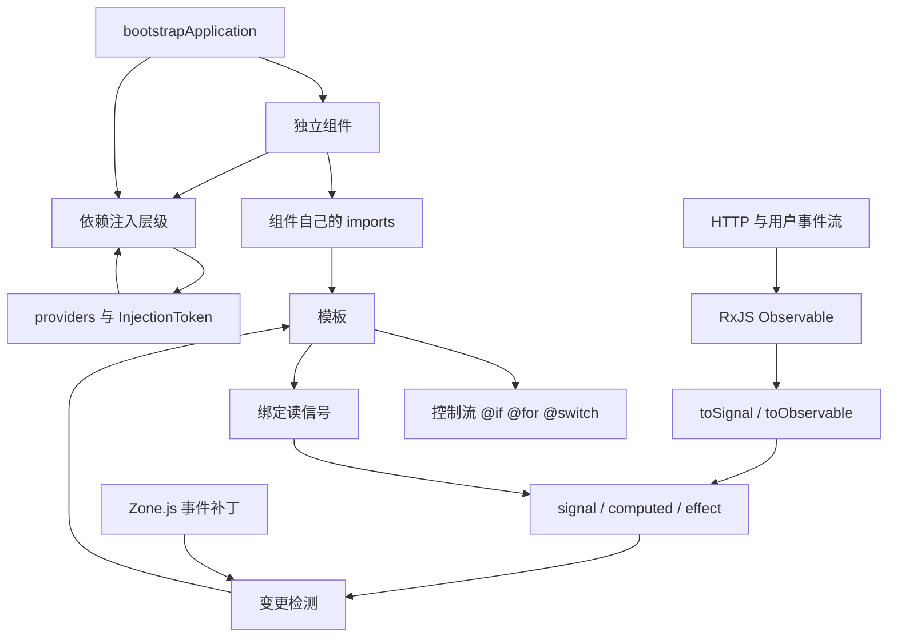
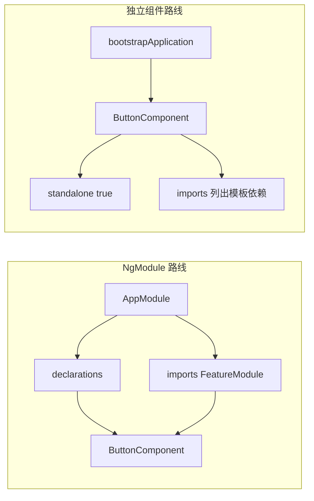
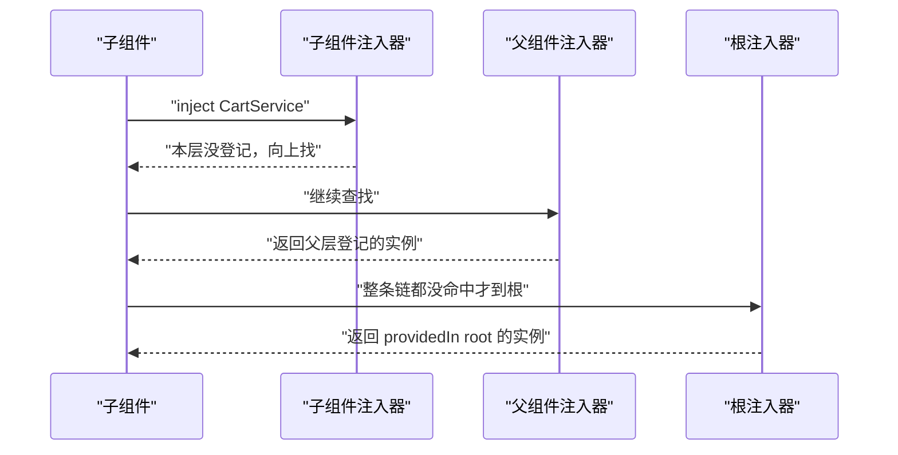
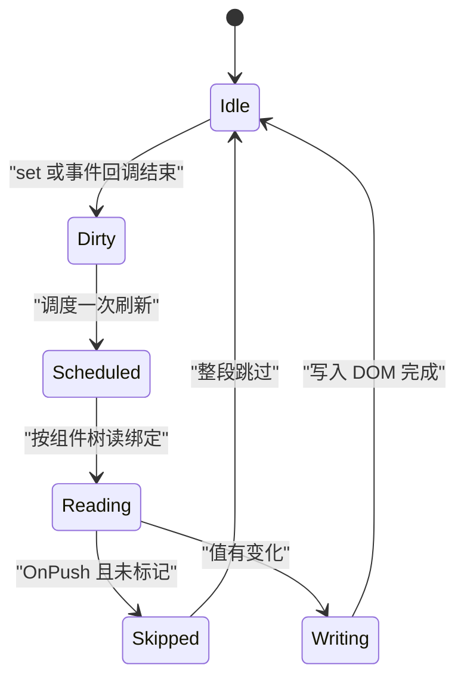
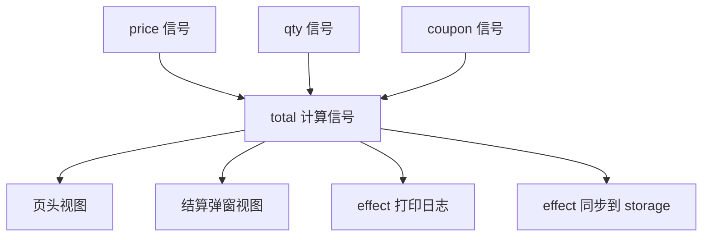
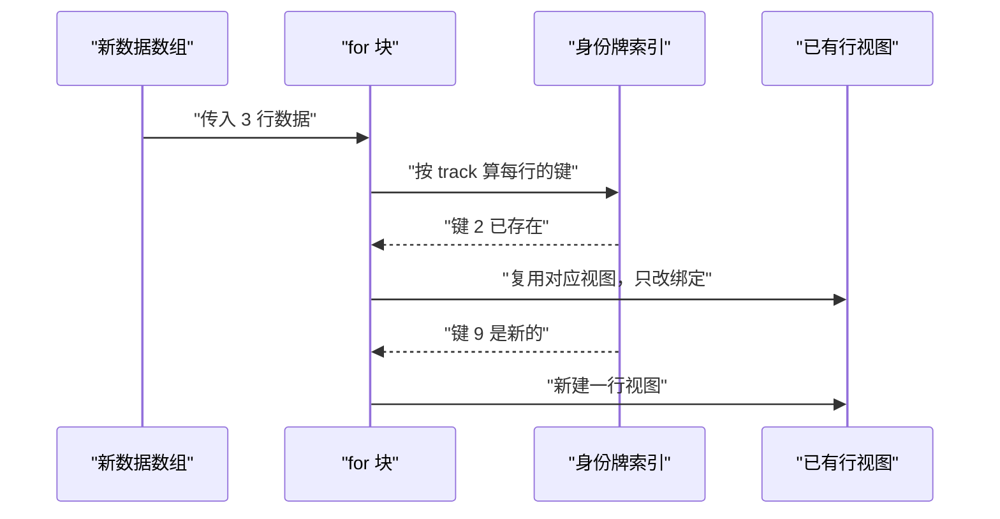
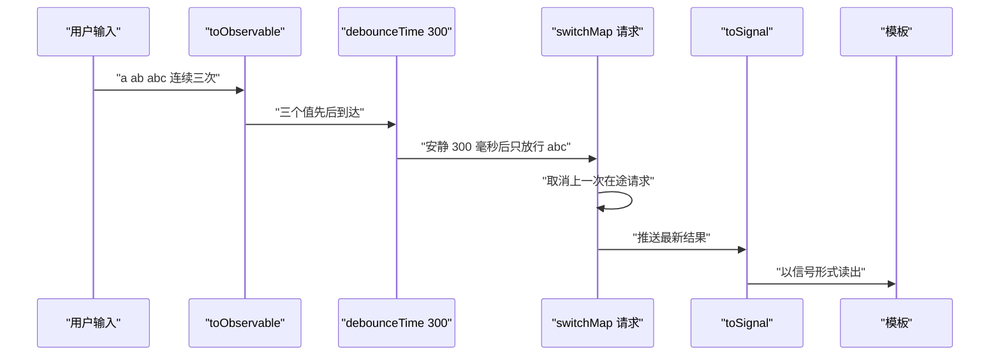

# 现代 Angular：Signals、独立组件与依赖注入

!!! abstract "学完这一页你能"
    - 说出独立组件的 `imports` 与 NgModule 的 `declarations` 各管什么，并把一个组件改造成独立组件。
    - 画出根注入器到组件注入器的查找路径，预测 `inject(X)` 会拿到哪一个实例。
    - 用 `signal`、`computed`、`effect` 写一份状态，并指出界面在哪一步被重新读取。
    - 为 `@for` 选对 `track` 键，并说明选错时哪几行视图会被重建。

## 0. 知识地图



读法建议：先看左上与左下两条支线，它们回答"组件从哪来、依赖从哪来"。
再看右边一列，它回答"界面凭什么更新"，主线是 `bind --> sig --> cd`。
`RxJS` 那条支线不参与每一步，只在第 6 节需要"取消"时接回主线。

## 1. 独立组件：依赖写在组件自己身上

**先想一个问题**
你要给项目加一个删除按钮组件。旧写法要新建 NgModule、写进 `declarations`，再让使用方 import 这个模块。
换一个项目又要重复一次。为什么一个按钮要知道自己属于哪个模块？

**心智模型**

!!! tip "心智模型"
    - 一句话模型：独立组件把"我模板里用到谁"写在自己的 `imports` 里，不再靠外层模块清单。
    - 日常类比：自带插头的电器，插上就能用，不必先买一块转接板。
    - 类比不成立处：电器只管取电；独立组件的 `imports` 是精确清单，漏写不会自动补齐，而是启动时或编译时报错。

!!! note "术语：独立组件"
    `standalone: true` 的组件、指令或管道：它自己声明模板依赖，可被别的独立组件直接 import，也可被 `bootstrapApplication` 或路由直接引用。例：`@Component({ standalone: true, imports: [ChildComponent] })`。

**图解**



1. 左边路线里，`ButtonComponent` 出现在 `declarations` 数组里，它归 `AppModule` 所有。
2. 别的模块想用这个按钮，要 import `AppModule` 或 `FeatureModule`，于是产生模块之间的依赖。
3. 右边路线里，`ButtonComponent` 不被任何模块声明，模板依赖写在它自己的 `imports`。
4. 启动入口从 `platformBrowserDynamic().bootstrapModule` 换成 `bootstrapApplication`。
5. 收益：读一个组件文件就能知道它需要什么，不用再翻模块清单。

**一步一步来**

第一步，把组件标成独立，并列出模板依赖。

```ts
import { Component, signal } from '@angular/core';   // 组件装饰器与信号
import { LikeButton } from './like-button';           // 模板里要用的子组件

@Component({
  selector: 'app-counter',        // 模板里用 app-counter 调用
  standalone: true,               // 关键开关：不靠 NgModule 声明
  imports: [LikeButton],          // 只列模板真正用到的依赖
  template: `<like-button (liked)="bump()" />
             <span>{{ count() }}</span>`,
})
export class CounterComponent {
  count = signal(0);              // 组件状态放进信号
  bump() {                        // 唯一写入口
    this.count.update((v) => v + 1);
  }
}
```

**这段代码在做什么**

- `standalone: true` 告诉编译器：这个组件自己去解析模板依赖，不查 NgModule。
- `imports: [LikeButton]` 是给模板用的清单，与文件顶部的 TypeScript import 语句是两件事。
- `selector` 是模板里出现的标签名，也是别的组件 import 它之后的引用方式。
- `count` 是信号，模板里写成 `count()`，调用括号不能省。
- `bump` 是事件处理函数，写状态的路径只有 `update` 一处。

第二步，用 `bootstrapApplication` 启动，把应用级依赖放进 `providers`。

```ts
import { bootstrapApplication } from '@angular/platform-browser'; // 启动函数
import { provideRouter } from '@angular/router';                   // 路由提供者
import { appRoutes } from './app.routes';                          // 路由表
import { CounterComponent } from './counter.component';            // 根组件

bootstrapApplication(CounterComponent, {
  providers: [provideRouter(appRoutes)],   // 应用级依赖写在这里
}).catch((err) => console.error(err));     // 启动失败要暴露出来
```

**这段代码在做什么**

- `bootstrapApplication` 的第一个参数是根组件类，不需要先建 NgModule。
- 第二个参数是 `ApplicationConfig`，它的 `providers` 数组承担原来 `AppModule.providers` 的角色。
- `provideRouter` 返回一组路由相关的提供者，路由表作为参数传进去。
- `catch` 必须保留：启动期的依赖解析错误会从这里冒出来。
- 若项目仍开着 Zone.js，这里不用改；若走无 Zone 模式，需核对官方文档：当前主版本无 Zone 启动函数的确切名字。

第三步，用 `loadComponent` 做路由级惰性加载。

```ts
export const appRoutes = [
  {
    path: 'detail/:id',
    // 只有导航到这条路由时才下载该文件
    loadComponent: () =>
      import('./detail.component').then((m) => m.DetailComponent),
  },
];
```

**这段代码在做什么**

- `loadComponent` 接收一个返回 Promise 的函数，Promise 解析出组件类。
- `import()` 是动态导入，打包器会把它切成独立的 chunk。
- 独立组件不需要 `loadChildren` 那种"先加载模块再加载组件"的两级结构。
- 注释写明下载时机，方便判断首屏体积里包含哪些代码。

**动手验证**

真实运行需要 Angular CLI 工程与编译器。下面这段用 Node 20 复刻"模板依赖对账"这一步，验证漏写 `imports` 会立刻报错。

```js
// 运行：node standalone.mjs
// 依赖：仅 Node 20+ 内置模块，无需 npm install
import assert from 'node:assert/strict';

// 注册表：每个独立组件在这里登记自己的模板依赖
const registry = new Map();

function defineComponent(meta) {
  registry.set(meta.selector, meta);
  return meta;
}

// 真实 Angular 里 imports 放的是组件类，这里用 selector 字符串代替
const LikeButton = defineComponent({
  selector: 'app-like',
  standalone: true,
  imports: [],
  template: '<button>like</button>',
});

const Counter = defineComponent({
  selector: 'app-counter',
  standalone: true,
  imports: ['app-like'],
  template: '<app-like></app-like><span>{{ count() }}</span>',
});

const Broken = defineComponent({
  selector: 'app-broken',
  standalone: true,
  imports: [],
  template: '<app-like></app-like>',
});

const Legacy = { selector: 'app-legacy', declarations: ['app-legacy'] };

const OPEN_TAG = /<([a-z][a-z-]*)\b/g;

function resolveTemplateDeps(meta) {
  if (!meta.standalone) {
    throw new Error(`${meta.selector} 不是独立组件，仍然需要 NgModule 声明`);
  }
  const used = [...meta.template.matchAll(OPEN_TAG)].map((m) => m[1]);
  const declared = new Set(meta.imports);
  for (const tag of used) {
    if (registry.has(tag) && !declared.has(tag)) {
      throw new Error(`${tag} 未出现在 ${meta.selector} 的 imports 里`);
    }
  }
  return used;
}

assert.deepEqual(resolveTemplateDeps(Counter), ['app-like', 'span']);
assert.throws(() => resolveTemplateDeps(Broken), /app-like 未出现在 app-broken 的 imports 里/);
assert.throws(() => resolveTemplateDeps(Legacy), /不是独立组件/);

console.log('Counter 模板用到的标签:', resolveTemplateDeps(Counter));
console.log('漏写 imports 与未标记 standalone 都会在启动前报错');
```

预期输出：

```text
Counter 模板用到的标签: [ 'app-like', 'span' ]
漏写 imports 与未标记 standalone 都会在启动前报错
```

**常见坑**

| 现象 | 原因 | 怎么修 |
| --- | --- | --- |
| 模板报 `app-like is not a known element` | 子组件没写进使用方的 `imports` | 把子组件类加进使用方的 `imports`，不要塞进别人的 `declarations` |
| 同一个组件既 `standalone: true` 又出现在 `declarations` | 改造只做了一半 | 从所有 NgModule 的 `declarations` 里删掉它 |
| 启动时提示找不到 `bootstrapApplication` | 导入路径写错 | 从 `@angular/platform-browser` 导入；需核对官方文档：当前主版本该函数的导出包名 |

**小结**

- 独立组件把模板依赖放在组件自己的 `imports`，删掉了 NgModule 这一层声明。
- 应用级依赖落到 `bootstrapApplication` 的 `providers`，路由级惰性用 `loadComponent`。
- 漏写 `imports` 是编译期或启动期错误，不会静默降级成空标签。

## 2. 依赖注入：一次查找，从组件爬到根

**先想一个问题**
页面上有两份购物车：结算页的正式购物车，侧边栏的快速下单草稿。
两者都要同一个 `CartService` 类。若全应用只有一份实例，改动会互相串。怎么办？

**心智模型**

!!! tip "心智模型"
    - 一句话模型：`inject(T)` 从当前组件的注入器开始向父级查找，返回第一个登记了 `T` 的实例。
    - 日常类比：进楼找物业电话，先问本层前台，再问大厅，最后问总台。
    - 类比不成立处：你不用记自己问过谁，Angular 在组件创建时就按注入器树算好了查找起点。

!!! note "术语：依赖注入"
    依赖注入（Dependency Injection，缩写 DI）指对象不自己 `new` 依赖，而是向外部容器索取。
    例：构造函数写 `private cart: CartService`，Angular 负责传入实例，测试时传入替身。

**图解**



1. 组件实例创建时，Angular 为它准备一个 ElementInjector。
2. `inject(CartService)` 先查这个 ElementInjector 的登记表。
3. 表里没有，就交给父组件的 ElementInjector，一层层往上。
4. 走到应用根时进入环境注入器（EnvironmentInjector），`providedIn: 'root'` 的实例登记在这里。
5. 全链都没有命中且没写 `optional`，就抛 `NullInjectorError`。

**一步一步来**

第一步，用 `providedIn: 'root'` 建一个应用级单例。

```ts
import { Injectable } from '@angular/core';        // 可注入装饰器

@Injectable({ providedIn: 'root' })                 // 登记在根注入器
export class CartService {
  private items: string[] = [];
  add(id: string) { this.items.push(id); }
  list() { return [...this.items]; }                // 返回副本，外部改不到内部数组
}
```

**这段代码在做什么**

- `providedIn: 'root'` 让这行代码同时完成"定义类"和"登记提供者"两件事。
- 没有 `providedIn` 的类不能被 `inject`，除非有人在某个 `providers` 里登记。
- `CartService` 在根层只有一个实例，任何组件拿到的都是同一个对象。
- `list()` 返回副本，调用方修改结果不会影响内部数组。

第二步，在组件级 `providers` 里覆盖它，让这一层拥有自己的实例。

```ts
import { Component } from '@angular/core';
import { CartService } from './cart.service';

@Component({
  selector: 'app-draft-cart',
  standalone: true,
  providers: [CartService],       // 本组件子树拿到新实例，不再用根的那一份
  template: `<span>{{ cart.list().length }}</span>`,
})
export class DraftCartComponent {
  constructor(public cart: CartService) {}
}
```

**这段代码在做什么**

- `providers: [CartService]` 把 `CartService` 登记在组件的 ElementInjector 上。
- 这个组件以及它模板里的子组件，`inject(CartService)` 都命中这一层。
- 组件销毁时，这一层登记的实例一起释放。
- 父组件与其他兄弟组件不受影响，它们拿到的仍是根层实例。
- 构造函数写法与 `cart = inject(CartService)` 等价，后者能在字段初始化器里用。

第三步，用 `InjectionToken` 提供不是类的配置。

```ts
import { InjectionToken, inject } from '@angular/core';

export const API_BASE = new InjectionToken<string>('API_BASE'); // 带类型的查找键

export class OrderApi {
  private base = inject(API_BASE);        // 按令牌取值
  url(id: string) { return `${this.base}/orders/${id}`; }
}
```

**这段代码在做什么**

- `InjectionToken` 的泛型决定取出值的类型，构造参数只是一段描述文本。
- 令牌是查找键，接口地址、数字开关这类没有类身份的值都要靠它。
- 登记时写成 `{ provide: API_BASE, useValue: '/api' }`，放在哪个注入器就作用到哪一层。
- `inject(API_BASE)` 必须在注入上下文里调用，字段初始化器满足这个条件。

**动手验证**

下面这段用 Node 20 复刻注入器树与三种查找修饰符，验证"最近登记者胜出"。

```js
// 运行：node injector.mjs
// 依赖：仅 Node 20+ 内置模块
import assert from 'node:assert/strict';

// 令牌用 Symbol 代替，真实 Angular 里可以是类或 InjectionToken
const Logger = Symbol('Logger');
const Config = Symbol('Config');

class Injector {
  constructor(providers = [], parent = null) {
    this.records = new Map(providers);  // 本层登记表
    this.parent = parent;               // 父注入器
  }

  get(token, opts = {}) {
    const { self = false, skipSelf = false, optional = false } = opts;
    const local = this.records.get(token);

    if (!skipSelf && local !== undefined) return local;   // 本层命中
    if (self) return this.#fail(token, optional);          // 只准查本层
    if (!this.parent) return this.#fail(token, optional);  // 到根仍未命中
    return this.parent.get(token, { optional });           // 继续向上
  }

  #fail(token, optional) {
    if (optional) return undefined;
    throw new Error(`No provider for ${String(token)}`);
  }
}

const root = new Injector([[Logger, 'root-logger'], [Config, { api: '/v1' }]]);
const feature = new Injector([[Logger, 'feature-logger']], root);
const widget = new Injector([], feature);

assert.equal(widget.get(Logger), 'feature-logger');                    // 冒泡到最近的登记层
assert.equal(widget.get(Config), root.get(Config));                    // feature 没有，继续到根
assert.equal(feature.get(Logger, { skipSelf: true }), 'root-logger');  // 跳过本层
assert.equal(root.get(Logger, { self: true }), 'root-logger');         // 只查本层
assert.equal(widget.get(Symbol('None'), { optional: true }), undefined);
assert.throws(() => widget.get(Symbol('None')), /No provider for/);

console.log('widget 拿到 Logger:', widget.get(Logger));
console.log('widget 拿到 Config:', widget.get(Config));
console.log('skipSelf 拿到 Logger:', feature.get(Logger, { skipSelf: true }));
```

预期输出：

```text
widget 拿到 Logger: feature-logger
widget 拿到 Config: { api: '/v1' }
skipSelf 拿到 Logger: root-logger
```

**常见坑**

| 现象 | 原因 | 怎么修 |
| --- | --- | --- |
| `NullInjectorError: No provider for CartService` | 类上缺 `providedIn`，也没人登记 | 加 `providedIn: 'root'`，或在最近的 `providers` 里登记 |
| 两份视图共享了本该独立的数据 | 服务登记在根层，两份视图拿到同一个实例 | 把服务挪到组件的 `providers`，让它随组件创建 |
| 在 `setTimeout` 回调里调 `inject` 报错 | 调用时已经离开注入上下文 | 把 `inject` 移回字段初始化器或构造函数体 |

**小结**

- 查找路径是"本层注入器到根"，第一个命中者胜出，组件级 `providers` 覆盖根级。
- 没有类身份的值要包成 `InjectionToken`，令牌就是查找键。
- `optional` 决定找不到时返回 `undefined` 还是抛错，不要用它掩盖拼错的令牌。

## 3. 变更检测：谁在什么时候重读模板

**先想一个问题**
你在 `setTimeout` 回调里把 `this.count` 改成 5，界面自己更新了。
Angular 不知道你改了哪个字段，它只能重新读一遍模板绑定再比对。这一遍覆盖多少个节点？

**心智模型**

!!! tip "心智模型"
    - 一句话模型：变更检测就是按组件树读一遍模板绑定，与上次的值比对，不同就写 DOM。
    - 日常类比：宿管每隔一段时间逐层点名，而不是等住户打电话说"我回来了"。
    - 类比不成立处：点名不总是走完全楼，`OnPush` 组件把没被标记为脏的分支整段跳过。

!!! note "术语：变更检测"
    变更检测（Change Detection）是 Angular 把组件数据同步到 DOM 的过程：读绑定、比较旧值、按需更新节点。例：`{{ count }}` 从 0 变 1 时文本节点被改写一次。

**图解**



1. 状态从 `Idle` 开始，此时没有任何待处理的更新。
2. 信号被 `set`，或 Zone.js 捕获到事件回调结束，视图被标记成 `Dirty`。
3. 调度器安排一次刷新，`Dirty` 变成一次遍历任务。
4. 遍历中每个组件的绑定被读一次；`OnPush` 且未被标记的组件直接进 `Skipped`。
5. 值有变化就写 DOM，然后回到 `Idle` 等待下一次标记。

**一步一步来**

第一步，看默认策略下"事件之外的异步回调"也会触发检查。

```ts
import { Component } from '@angular/core';

@Component({
  selector: 'app-zone-demo',
  standalone: true,
  template: `<span>{{ count }}</span>`,   // 普通字段，靠 Zone.js 触发检查
})
export class ZoneDemoComponent {
  count = 0;
  constructor() {
    setTimeout(() => { this.count = 5; }, 0); // Zone.js 补过 setTimeout
  }
}
```

**这段代码在做什么**

- 普通字段 `count` 没有版本信息，Angular 只能靠整轮检查发现它变了。
- `setTimeout` 被 Zone.js 打了补丁，回调结束时通知 Angular 跑一轮检查。
- 界面会更新，代价是这一轮要把可达组件树的绑定读一遍。
- 若项目关掉 Zone.js，这段代码不会更新界面，因为没有东西通知 Angular。

第二步，改成信号加 `OnPush`，让更新有明确的触发源。

```ts
import { Component, ChangeDetectionStrategy, signal } from '@angular/core';

@Component({
  selector: 'app-signal-demo',
  standalone: true,
  changeDetection: ChangeDetectionStrategy.OnPush,  // 只在被标记时检查
  template: `<span>{{ count() }}</span>`,
})
export class SignalDemoComponent {
  count = signal(0);
  constructor() {
    setTimeout(() => this.count.set(5), 0);  // 写信号会把视图标记为脏
  }
}
```

**这段代码在做什么**

- `changeDetection: OnPush` 让这个组件默认被跳过，除非它被标记。
- 模板里 `count()` 读取信号时，Angular 把这个视图登记成信号的消费者。
- `count.set(5)` 把该视图标记为脏，下一轮检查才会走到它。
- 组件树里没依赖这个信号的兄弟组件保持跳过状态。
- 这套机制不依赖 Zone.js，无 Zone 模式下这段代码同样生效。

第三步，启动时关闭 Zone.js。

```ts
import { bootstrapApplication } from '@angular/platform-browser';
import { provideExperimentalZonelessChangeDetection } from '@angular/core'; // 名字需核对

bootstrapApplication(AppComponent, {
  providers: [provideExperimentalZonelessChangeDetection()],
});
```

**这段代码在做什么**

- 无 Zone 模式靠信号、`markForCheck` 与模板事件来触发检查。
- 这个提供者替换掉 Zone.js 的补丁层，`polyfills` 里也不再需要 `zone.js`。
- 名字带 `Experimental` 的 API 会随版本改名，升级前需核对官方文档：当前主版本无 Zone 提供者的准确函数名。
- 关掉之后，仍写普通字段加 `setTimeout` 的旧组件不会再自动更新。

**动手验证**

下面这段给每个视图加脏标记，只重读依赖发生变化的视图，并统计"读绑定的次数"。

```js
// 运行：node change-detection.mjs
// 依赖：仅 Node 20+ 内置模块
import assert from 'node:assert/strict';

let collector = null;   // 当前正在收集依赖的视图

function signal(initial) {
  let value = initial;
  const watchers = new Set();      // 依赖这个信号的视图
  const read = () => {
    if (collector) { watchers.add(collector); }
    return value;
  };
  read.set = (next) => {
    value = next;
    for (const w of watchers) w.dirty = true;   // 只标记，不立刻重读
  };
  return read;
}

function view(name, fn) {
  const v = { name, dirty: true, runs: 0 };
  v.render = () => {
    if (!v.dirty) return v.runs;       // 关键：不脏就不读绑定
    collector = v;
    fn();
    collector = null;
    v.dirty = false;
    v.runs += 1;
    return v.runs;
  };
  v.render();
  return v;
}

const count = signal(0);
const title = signal('cart');

const counter = view('counter', () => `${count()}`);
const header = view('header', () => `${title()}`);

assert.equal(counter.runs, 1);
assert.equal(header.runs, 1);

counter.render();
header.render();
assert.equal(counter.runs, 1, '没有变化时不重读绑定');
assert.equal(header.runs, 1);

count.set(1);
assert.equal(counter.runs, 1, 'set 只标记脏，还没读');
counter.render();
header.render();
assert.equal(counter.runs, 2, '被标记的视图重读一次');
assert.equal(header.runs, 1, '没依赖 count 的视图一次都没重读');

console.log(`counter 读了 ${counter.runs} 次，header 读了 ${header.runs} 次`);
console.log('同一轮里，未变脏的视图读取次数保持不变');
```

预期输出：

```text
counter 读了 2 次，header 读了 1 次
同一轮里，未变脏的视图读取次数保持不变
```

**常见坑**

| 现象 | 原因 | 怎么修 |
| --- | --- | --- |
| `OnPush` 组件里改普通字段，界面不更新 | 普通字段没有版本信息，视图没被标记 | 换成 `signal`，或在改动后调用 `ChangeDetectorRef.markForCheck()` |
| 关掉 Zone.js 后旧组件全部不动 | 更新靠 Zone.js 的补丁回调触发 | 把状态迁到信号，或给这些组件补上显式标记 |
| `inject` 写进 `setTimeout` 回调报错 | 调用时已经离开注入上下文 | 把 `inject` 移回字段初始化器或构造函数体 |

**小结**

- 变更检测是"读绑定、比值、写 DOM"，触发源决定这一轮走多少节点。
- 信号把触发源精确到某个视图，`OnPush` 让没被标记的分支整段跳过。
- 无 Zone 模式不是自动生效的开关，旧代码里的普通字段要一起迁移。

## 4. Signals 三件套：signal、computed、effect

**先想一个问题**
购物车有 3 件商品，总价要显示在小计、页头、结算弹窗三个位置。
你把"价格乘数量再求和"写在三处，改一次折扣规则就要改三处。怎么把这条规则收成一处？

**心智模型**

!!! tip "心智模型"
    - 一句话模型：`signal` 存值，`computed` 从别的信号算出值并缓存，`effect` 在依赖变化后执行一次动作。
    - 日常类比：表格里的原始单元格、公式单元格，以及"单元格一变就发提醒"的规则。
    - 类比不成立处：表格公式可以互相引用成环，Angular 的 `computed` 不允许成环，读取时报错。

!!! note "术语：信号"
    信号（Signal）是带依赖追踪的值容器：读取它的消费者被登记，值被 `set` 或 `update` 后这些消费者被标记。例：`const n = signal(0); n(); n.set(1);`。

!!! note "术语：计算信号"
    计算信号（computed）由函数定义，读取时按需计算并缓存结果，只有依赖变化后第一次读取才重算。例：`const double = computed(() => n() * 2);`。

**图解**



1. `price`、`qty`、`coupon` 是三个原始信号，谁写它们谁负责 `set`。
2. `total` 由函数定义，函数体读了这三个信号，于是它依赖这三个。
3. 两个视图读到 `total`，成为 `total` 的消费者。
4. 任何一个原始信号变化，`total` 被标记脏，下一次被读时才重算。
5. 两个 `effect` 也是消费者，它们做的是动作，不产出值。

**一步一步来**

第一步，`signal` 的读与写。

```ts
import { signal } from '@angular/core';

const price = signal(10);        // 建一个值为 10 的信号
const qty = signal(2);

console.log(price());            // 读：必须加括号
price.set(12);                   // 写：整体替换
qty.update((n) => n + 1);        // 写：基于旧值计算
console.log(qty());              // 3
```

**这段代码在做什么**

- `signal(initial)` 返回一个可调用对象，调用即读值。
- `set(next)` 用新值整体替换旧值。
- `update(fn)` 接收一个函数，参数是当前值，返回值是新值。
- 读的时候漏掉括号，拿到的是函数本身，模板里会显示成一串函数源码。
- 写操作只标记消费者脏，不立即触发界面刷新。

运行结果：

```text
10
3
```

第二步，`computed` 的惰性与缓存，接着上面的 `price` 与 `qty`。

```ts
import { computed } from '@angular/core';

let runs = 0;                      // price 现在是 12，qty 是 3
const total = computed(() => {
  runs += 1;                       // 只用于观察计算次数
  return price() * qty();
});

console.log(total(), runs);        // 第一次读：算一次
console.log(total(), runs);        // 第二次读：走缓存
price.set(20);                     // 只标记脏
console.log(total(), runs);        // 再读时才重算
```

**这段代码在做什么**

- `computed` 的函数体只描述"怎么算"，什么时候算由读取决定。
- 第一次读取执行函数体，结果写入缓存。
- 依赖没变时后续读取直接返回缓存，`runs` 不增加。
- 依赖变化后 `computed` 被标记脏，同时不重算。
- 下一次有人读它时才重算一次，这就是"惰性"。

运行结果：

```text
36 1
36 1
60 2
```

第三步，`effect` 的清理时机。

```ts
import { effect, signal } from '@angular/core';

const count = signal(0);
const log: string[] = [];

effect((onCleanup) => {
  const id = setInterval(() => log.push(`tick ${count()}`), 50);
  onCleanup(() => clearInterval(id));   // 重跑前先清掉上一次的定时器
});

count.set(1);      // 依赖变化，effect 再跑一次，旧定时器被清掉
```

**这段代码在做什么**

- `effect` 的函数体在创建后立刻执行一次，用来建立依赖。
- 函数体里读到的信号成为它的依赖，`count` 变化时它被重新调度。
- `onCleanup` 注册的函数在下次执行前与销毁时各调用一次。
- 真实 Angular 里 effect 的刷新阶段与注入器销毁顺序需核对官方文档：当前主版本 effect 的调度阶段。
- 在 `effect` 里写信号的行为随版本调整过，要写回信号时需核对官方文档：当前版本是否允许写信号以及对应配置项名。

**动手验证**

下面自己实现依赖追踪，把 `computed` 的计算次数与 `effect` 的清理时机都跑一遍并断言。

```js
// 运行：node signals.mjs
// 依赖：仅 Node 20+ 内置模块
import assert from 'node:assert/strict';

let collector = null;   // 正在收集依赖的消费者

function signal(initial) {
  let value = initial;
  const watchers = new Set();
  const read = () => {
    if (collector) { collector.deps.add(read); watchers.add(collector); }
    return value;
  };
  read.set = (next) => { value = next; for (const w of watchers) w.invalidate(); };
  return read;
}

function computed(fn) {
  const node = {
    dirty: true, value: undefined, computes: 0, watchers: new Set(), deps: new Set(),
    invalidate() {
      if (this.dirty) return;                       // 已经脏就不再往上传
      this.dirty = true;
      for (const w of this.watchers) w.invalidate();
    },
    read() {
      if (collector) { collector.deps.add(this); this.watchers.add(collector); }
      if (this.dirty) {
        const prev = collector;
        collector = this;
        this.deps = new Set();
        this.value = fn();
        collector = prev;
        this.dirty = false;
        this.computes += 1;
      }
      return this.value;
    },
  };
  return node;
}

function effect(fn) {
  const runner = { deps: new Set(), cleanups: [], invalidate() { this.run(); } };
  runner.run = () => {
    runner.cleanups.forEach((c) => c());            // 先清理上一次的副作用
    runner.cleanups = [];
    const prev = collector;
    collector = runner;
    const cleanup = fn((cb) => runner.cleanups.push(cb));
    collector = prev;
    if (typeof cleanup === 'function') runner.cleanups.push(cleanup);
  };
  runner.run();
  return runner;
}

const price = signal(10);
const qty = signal(2);
const total = computed(() => price.read() * qty.read());

assert.equal(total.read(), 20);
assert.equal(total.read(), 20);
assert.equal(total.computes, 1, '第二次读取走缓存');

price.set(30);
assert.equal(total.computes, 1, '只是标记脏');
assert.equal(total.read(), 60);
assert.equal(total.computes, 2);
console.log('computed 计算次数:', total.computes);

const seen = [];
const logs = [];
effect((onCleanup) => {
  seen.push(total.read());
  onCleanup(() => logs.push('cleanup'));
});

assert.deepEqual(seen, [60]);
qty.set(3);
assert.deepEqual(seen, [60, 90]);
assert.deepEqual(logs, ['cleanup'], '重跑之前先清理');
console.log('effect 观察到的值:', seen);
```

预期输出：

```text
computed 计算次数: 2
effect 观察到的值: [ 60, 90 ]
```

**常见坑**

| 现象 | 原因 | 怎么修 |
| --- | --- | --- |
| 模板里显示一串函数源码 | 写成 `{{ count }}`，漏了调用括号 | 改成 `{{ count() }}` |
| `computed` 的结果比预期旧 | 在 `computed` 函数体里写了副作用或异步 | 保持纯函数，副作用挪到 `effect` |
| effect 反复触发停不下来 | 在 `effect` 里写了它自己依赖的信号 | 把写信号的动作放到事件处理函数里 |

**小结**

- `signal` 是唯一写入口，`computed` 只读且缓存，`effect` 做动作。
- `computed` 的重算由读取驱动，不是由 `set` 驱动。
- `effect` 的清理函数在重跑前调用一次，定时器与订阅都要在这里回收。

## 5. 模板控制流：@if、@for、@switch 与 track

**先想一个问题**
列表里有 1000 行。你删掉第一行，若界面重建了后 999 行的 DOM，滚动位置和输入框内容都会丢。
怎么让 Angular 认出"哪些行还是原来那些行"？

**心智模型**

!!! tip "心智模型"
    - 一句话模型：`@for` 里的 `track` 给每一行发一张身份牌，重建时按牌子决定复用哪一行视图。
    - 日常类比：图书馆按索书号上架，抽走一本书，其余书不用挪位置。
    - 类比不成立处：索书号必须唯一；`track` 返回的值在同一批数据里重复时，运行时会报错。

!!! note "术语：模板控制流"
    模板控制流是模板里的分支与循环语法：`@if` 做分支，`@for` 做循环，`@switch` 做多路分支。例：`@if (loading()) { ... } @else { ... }`。

**图解**



1. 数据数组变化时，`@for` 得到一份新的行列表。
2. 对每一行求 `track` 表达式的值，得到一个键。
3. 键在上一轮的索引里能找到，就复用那一行的视图与 DOM 节点。
4. 找不到就新建视图，然后插到正确位置。
5. 上一轮有、这一轮没有的键，对应视图被销毁。

**一步一步来**

第一步，用 `@if` 写分支。

```html
@if (items().length > 0) {
  <ul>...</ul>
} @else if (loading()) {
  <p>正在加载</p>
} @else {
  <p>暂无数据</p>
}
```

**这段代码在做什么**

- `@if` 里的表达式每轮变更检测都会读一次，读信号时自动登记依赖。
- `@else if` 可以连写多个，最后一个 `@else` 兜底。
- 旧写法 `*ngIf` 需要同时引入 `NgIf` 指令，新语法不引入任何指令。
- 分支切换是真的把这一块 DOM 加进去或拿出来，不是靠 `hidden` 属性。

第二步，用 `@for` 加 `track`，并处理空数组。

```html
@for (row of rows(); track row.id) {
  <app-row [data]="row" />
} @empty {
  <p>列表为空</p>
}
```

**这段代码在做什么**

- `track row.id` 让每行的键等于该行数据的 `id`。
- 键相同的旧视图被复用，只重新计算绑定值。
- `@empty` 块在数组长度为 0 时渲染，替代旧写法里额外的 `*ngIf`。
- `@for` 提供 `$index`、`$count`、`$first`、`$last`、`$even`、`$odd` 这几个隐式变量。
- 若数据没有稳定主键，需要挑能唯一标识这一行的字段。

!!! note "术语：track"
    `track` 是 `@for` 的身份键表达式，Angular 用它决定复用还是重建视图。
    例：`track row.id` 表示用 `id` 字段做身份键。

第三步，`@switch` 与 `@defer`。

```html
@switch (status()) {
  @case ('draft') { <span>草稿</span> }
  @case ('paid')  { <span>已付款</span> }
  @default       { <span>未知状态</span> }
}

@defer (on viewport) {
  <app-heavy-chart />
} @placeholder {
  <p>图表占位</p>
}
```

**这段代码在做什么**

- `@switch` 按值做全等比较，走第一个匹配的 `@case`。
- `@default` 是可选的兜底分支。
- `@defer` 把块内代码切成分包，`on viewport` 表示进入视口后才下载与渲染。
- `@placeholder` 在延迟块还没渲染时显示。
- 延迟块的触发条件有多个可选值，需核对官方文档：当前主版本 `@defer` 支持的全部触发条件与 `@placeholder` 的选项。

**动手验证**

下面复刻 `track` 的复用判定，用两套表达式对比复用行数与被复用视图里记录的行。

```js
// 运行：node control-flow.mjs
// 依赖：仅 Node 20+ 内置模块
import assert from 'node:assert/strict';

function createRenderer() {
  let cache = new Map();          // 上一轮的键到视图对象
  return function render(rows, trackBy) {
    let reuse = 0;
    let create = 0;
    const next = new Map();
    rows.forEach((row, index) => {
      const key = trackBy(row, index);
      if (cache.has(key)) {
        const view = cache.get(key);   // 复用旧视图对象
        next.set(key, view);
        reuse += 1;
      } else {
        next.set(key, { row });        // 新建视图，记录它绑上的这一行
        create += 1;
      }
    });
    cache = next;
    return { reuse, create, views: next };
  };
}

const byId = createRenderer();
byId([{ id: 1 }, { id: 2 }, { id: 3 }], (r) => r.id);
const idResult = byId([{ id: 2 }, { id: 3 }], (r) => r.id);
assert.equal(idResult.reuse, 2);
assert.equal(idResult.create, 0);
assert.equal(idResult.views.get(2).row.id, 2, '键 2 的视图仍然绑着 id 为 2 的行');

const byIndex = createRenderer();
byIndex([{ id: 1 }, { id: 2 }, { id: 3 }], (r, i) => i);
const indexResult = byIndex([{ id: 2 }, { id: 3 }], (r, i) => i);
assert.equal(indexResult.reuse, 2);
assert.equal(indexResult.create, 0);
assert.equal(indexResult.views.get(0).row.id, 1, '键 0 复用了旧视图，它记的还是 id 为 1 的行');

console.log('按 id track 复用行数:', idResult.reuse, '新建行数:', idResult.create);
console.log('按下标 track 复用行数:', indexResult.reuse, '新建行数:', indexResult.create);
console.log('按下标 track 后，键 0 的视图记录的还是 id:', indexResult.views.get(0).row.id);
```

预期输出：

```text
按 id track 复用行数: 2 新建行数: 0
按下标 track 复用行数: 2 新建行数: 0
按下标 track 后，键 0 的视图记录的还是 id: 1
```

**常见坑**

| 现象 | 原因 | 怎么修 |
| --- | --- | --- |
| 删除中间一行后，输入框内容串到了别的行 | `track` 用了 `$index`，视图按位置复用 | 换成 `track row.id` 这类稳定主键 |
| 运行时报 track 返回了重复的键 | 主键字段在数据里不唯一 | 换成唯一字段，或写成 `track row.type + '-' + row.id` |
| 首次渲染报 `Cannot read properties of undefined` | 表达式在数据到达前就访问了字段 | 先用 `@if` 包住，或把信号初值写成空数组 |

**小结**

- `@if`、`@for`、`@switch` 不需要引入指令，写法和普通语句接近。
- `track` 决定复用粒度，选主键而不是位置，能保住滚动位置与组件内部状态。
- `@empty` 与 `@defer` 分别处理空列表与延迟渲染，这两个块都要写上占位内容。

## 6. RxJS 的位置：需要取消时接回来

**先想一个问题**
搜索框要满足两条规则：停止输入 300 毫秒才发请求，用户继续输入时取消上一次请求。
信号存的是"当前值"，没有"取消"这个动作。这类时间轴上的顺序问题该交给谁？

**心智模型**

!!! tip "心智模型"
    - 一句话模型：信号回答"现在是什么值"，可观察对象回答"按时间顺序来了哪些值，以及怎么取消"。
    - 日常类比：信号像门口的快递柜格口，随时打开看现在有什么；可观察对象像快递单号，包裹在路上。
    - 类比不成立处：快递单号只会送达一次，可观察对象可以发出 0 到无限个值，还能被中途取消。

!!! note "术语：可观察对象"
    可观察对象（Observable）是可以按时间推送 0 到无限个值的对象，订阅时开始，取消订阅时停止。例：`fromEvent(input, 'input')` 每敲一次键推一个事件。

!!! note "术语：互操作函数"
    `@angular/core/rxjs-interop` 里的 `toSignal` 把 Observable 转成信号，`toObservable` 把信号转成 Observable。例：`const users = toSignal(api.users$)`。

**图解**



1. 用户在输入框连续敲键，每次敲击产生一个事件。
2. `toObservable` 把输入信号的每次变化转成一条流。
3. `debounceTime(300)` 在每次新值到达时重置计时器，只有安静满 300 毫秒才放行一个值。
4. `switchMap` 收到放行的值后发起请求，并在新值到来时取消上一次请求。
5. `toSignal` 把最终结果转回信号，模板照常写 `results()` 读取。

**一步一步来**

第一步，把 HTTP 结果直接变成信号读。

```ts
import { Component, inject } from '@angular/core';
import { toSignal } from '@angular/core/rxjs-interop';
import { HttpClient } from '@angular/common/http';

@Component({
  selector: 'app-orders',
  standalone: true,
  template: `@for (o of orders(); track o.id) { <li>{{ o.id }}</li> }`,
})
export class OrdersComponent {
  private http = inject(HttpClient);
  orders = toSignal(this.http.get<{ id: string }[]>('/api/orders'), { initialValue: [] });
}
```

**这段代码在做什么**

- `inject(HttpClient)` 从注入器取客户端，前提是应用里提供了 `provideHttpClient`。
- `toSignal` 必须在有注入上下文的位置调用，字段初始化器满足条件。
- `initialValue: []` 让信号在读到时立刻是数组，模板里不用判空。
- `toSignal` 会替你订阅，组件销毁时自动取消订阅。
- 模板里 `orders()` 读到的是最后一次推送的值，不是流本身。

第二步，把"防抖加取消"写成一条流，再接回信号。

```ts
import { Component, inject, signal } from '@angular/core';
import { toObservable, toSignal } from '@angular/core/rxjs-interop';
import { debounceTime, switchMap } from 'rxjs';
import { SearchService } from './search.service';

@Component({
  selector: 'app-search',
  standalone: true,
  template: `@for (r of results(); track r.id) { <li>{{ r.name }}</li> }`,
})
export class SearchComponent {
  private api = inject(SearchService);
  term = signal('');                        // 输入框通过 (input) 事件写这个信号
  results = toSignal(
    toObservable(this.term).pipe(
      debounceTime(300),                    // 安静 300 毫秒才放行
      switchMap((t) => this.api.search(t)), // 新值到来时取消上一次请求
    ),
    { initialValue: [] },
  );
}
```

**这段代码在做什么**

- `toObservable(this.term)` 把信号变化转成流，同样需要在注入上下文里创建。
- `debounceTime(300)` 是时间轴上的合并规则，属于 RxJS 的职责。
- `switchMap` 在新值到来时取消上一个内层订阅，这是信号给不了的语义。
- `toSignal` 把最终结果交回模板，模板部分只认信号。
- 整个组件里手写订阅的地方是 0 处，取消由两条转换函数负责。

第三步，必须手写订阅时，绑定销毁时机。

```ts
import { Component, DestroyRef, inject, signal } from '@angular/core';
import { takeUntilDestroyed } from '@angular/core/rxjs-interop';
import { interval } from 'rxjs';

@Component({ selector: 'app-ticker', standalone: true, template: `<span>{{ n() }}</span>` })
export class TickerComponent {
  n = signal(0);
  private destroyRef = inject(DestroyRef);
  constructor() {
    interval(1000)
      .pipe(takeUntilDestroyed(this.destroyRef))   // 组件销毁时自动取消
      .subscribe((v) => this.n.set(v));
  }
}
```

**这段代码在做什么**

- `DestroyRef` 由注入器提供，代表当前组件或指令的销毁点。
- `takeUntilDestroyed(this.destroyRef)` 在销毁信号发出时取消上游订阅。
- 与 `toSignal` 相比，这条路径多了一处手动订阅，取消时机仍然自动。
- 在构造之外调用 `takeUntilDestroyed` 时要显式传入 `destroyRef`，无参调用的允许范围需核对官方文档。

**动手验证**

下面实现 `debounceTime` 与 `switchMap` 的取消语义，用假定时器跑一遍输入序列，断言只有最后一次输入产生了结果。

```js
// 运行：node rxjs-boundary.mjs
// 依赖：仅 Node 20+ 内置模块
import assert from 'node:assert/strict';

class Obs {
  constructor(producer) { this.producer = producer; }
  subscribe(next) {
    const state = { closed: false, teardowns: [] };
    const teardown = this.producer(
      (v) => { if (!state.closed) next(v); },
      () => state.closed,
    );
    if (teardown) state.teardowns.push(teardown);
    return { unsubscribe() { state.closed = true; state.teardowns.forEach((fn) => fn()); } };
  }
}

const fromTimers = (events) =>
  new Obs((next, isClosed) => {
    const timers = events.map((e) =>
      setTimeout(() => { if (!isClosed()) next(e.value); }, e.at));
    return () => timers.forEach(clearTimeout);
  });

const debounceTime = (ms) => (source) =>
  new Obs((next, isClosed) => {
    let timer = null;
    const sub = source.subscribe((v) => {
      clearTimeout(timer);                                   // 每次新值重置计时器
      timer = setTimeout(() => { if (!isClosed()) next(v); }, ms);
    });
    return () => { clearTimeout(timer); sub.unsubscribe(); };
  });

const switchMap = (project) => (source) =>
  new Obs((next, isClosed) => {
    let inner = null;
    const outer = source.subscribe((v) => {
      inner?.unsubscribe();                                  // 取消上一次内层订阅
      inner = project(v).subscribe((x) => { if (!isClosed()) next(x); });
    });
    return () => { inner?.unsubscribe(); outer.unsubscribe(); };
  });

let canceled = 0;
const search = (term, delay) =>
  new Obs((next, isClosed) => {
    let done = false;
    const t = setTimeout(() => { done = true; if (!isClosed()) next(`result:${term}`); }, delay);
    return () => { if (!done) canceled += 1; clearTimeout(t); };
  });

const typing = fromTimers([
  { at: 0, value: 'a' },
  { at: 80, value: 'ab' },
  { at: 160, value: 'abc' },
]);

const results = [];
const pipeline = switchMap((t) => search(t, 300))(debounceTime(60)(typing));
const sub = pipeline.subscribe((v) => results.push(v));

await new Promise((resolve) => setTimeout(resolve, 1200));
sub.unsubscribe();

assert.deepEqual(results, ['result:abc']);
assert.equal(canceled, 2, '前两个请求都在新值到来时被取消');
console.log('收到结果:', results);
console.log('被取消的在途请求数:', canceled);
```

预期输出：

```text
收到结果: [ 'result:abc' ]
被取消的在途请求数: 2
```

**常见坑**

| 现象 | 原因 | 怎么修 |
| --- | --- | --- |
| 每次输入都发一个请求，服务器看到一串重复请求 | 缺 `debounceTime` 或去抖时间太短 | 加上 `debounceTime(300)`，把它放在 `switchMap` 之前 |
| 后一个请求先返回，界面显示旧结果 | 用了 `mergeMap` 一类不取消的合并方式 | 换成 `switchMap`，让新值取消在途请求 |
| 组件销毁后控制台提示订阅仍在运行 | 手动 `subscribe` 没绑定销毁时机 | 用 `toSignal` 自动取消，或加 `takeUntilDestroyed` |
| `toSignal` 报注入上下文错误 | 在组件构造之外调用 | 移到字段初始化器或构造函数体内 |

**小结**

- 模板层优先用信号，时间轴上的合并、去抖、取消留在 RxJS。
- 两个方向的转换各只做一次：`toObservable` 进入流，`toSignal` 回到模板。
- 不得不手写订阅时，用 `takeUntilDestroyed` 或 `DestroyRef` 把取消时机钉死。

## 综合对比

| 维度 | NgModule 时代写法 | 现代 Angular 写法 | 迁移判断依据 |
| --- | --- | --- | --- |
| 组件归属 | 写进 NgModule 的 `declarations` | 组件写 `standalone: true`，模板依赖写在自己的 `imports` | 组件被 2 个以上模块使用时，独立组件省掉中间模块 |
| 应用启动 | `platformBrowserDynamic().bootstrapModule` | `bootstrapApplication(RootComponent, { providers })` | 新项目直接用 `bootstrapApplication` |
| 应用级依赖 | `AppModule.providers` | `bootstrapApplication` 的 `providers` 数组 | 路由、HTTP 这类全局依赖放这里 |
| 局部依赖 | 模块 `providers` 或组件 `providers` | 组件 `providers` 或路由 `providers` | 数据要随组件销毁就放组件层 |
| 状态存放 | 组件普通字段 | `signal` | 模板要读的值优先放信号 |
| 派生值 | getter 或手动同步 | `computed` | 同一个算式在 2 处以上出现就抽成 `computed` |
| 更新触发 | Zone.js 补丁加整树检查 | 信号标记脏加 `OnPush` | 想让某个分支不再被检查就上 `OnPush` |
| 时间轴处理 | RxJS 加 `async` 管道 | 边界处 `toSignal`，流内仍用 RxJS | 需要取消或去抖就留在 RxJS |
| 模板循环身份 | `*ngFor` 的 `trackBy` 函数 | `@for` 的 `track` 表达式 | 数据有稳定主键就按主键 track |
| 惰性加载 | `loadChildren` 加模块 | `loadComponent` 加动态 `import` | 组件不再需要配套模块 |

## 应用与行业实践

### 应用场景地图

| 场景 | 用到本页哪个知识点 | 典型技术选型 | 注意事项 |
| :--- | :--- | :--- | :--- |
| 后台管理的万行表格 | `@for` 的 `track` 键、`signal` 与 `computed` | Angular CDK `cdk-virtual-scroll-viewport` | `track` 用行主键，改一行只重建那一行视图 |
| 低端安卓的首屏加载 | 独立组件的 `imports`、路由级懒加载 | Angular Router 的 `loadComponent` | 先看 bundle 分析，再决定拆哪一段 |
| 多人协作白板 | `signal` 存远端状态、RxJS 做取消 | WebSocket 加 RxJS 加 `signal` | 高频指针事件先采样，不逐条发送 |
| 设计系统组件库 | 独立组件的 `imports`、次级入口 | Angular CLI library 加 secondary entry points | 组件自己列依赖，禁用总入口 barrel 全量引入 |
| 多团队拼装的微前端 | 根注入器与组件注入器的查找路径 | 原生 ES module 加 Router | 全局单例放根，随组件销毁的放组件注入器 |
| 审批流表单页 | `computed` 派生校验结果 | Reactive Forms 加 `signal` | 提交时读一次，别在 `effect` 里改别的 `signal` |
| 现场巡检离线 App | `effect` 做持久化、`signal` 存草稿 | IndexedDB 加 `effect` | `effect` 里只写存储，写入要节流 |

### 三个场景拆解

#### 场景 1：后台管理的万行表格

**业务背景**：表格一次渲染上千到上万行，滚动时掉帧，行内编辑还会牵动下方所有行重排。用浏览器 Performance 面板录制 5 秒滚动，看主线程长任务条数就能复现。

**怎么用本页知识解决**：先给每行一个稳定主键，让 `@for` 用主键做 `track`；再把行数据收进 `signal`，编辑只写回那一条记录。

```ts
@Component({
  standalone: true,
  imports: [RowComponent],          // 依赖写在组件自己身上，不经过 NgModule 的 declarations
  template: `
    @for (row of rows(); track row.id) {   // track 用稳定主键，不用 $index
      <app-row [row]="row" (edit)="edit(row.id, $event)" />
    }
  `,
})
export class RowListComponent {
  private store = inject(RowStore);  // 从组件注入器向上找到根注入器里的实例
  rows = this.store.rows;            // signal：读它的模板会登记为消费者
  edit(id: string, v: string) { this.store.patch(id, v); }
}
```

- `track row.id` 让 Angular 按 id 复用视图，改第 3 行时只有第 3 行的视图重建。
- 把 `track` 换成 `$index`，在第 1 行前插入一行后，后续每一行都被当成新项重建。
- `rows()` 在模板里被调用，调用点成为该 `signal` 的消费者，写入时只有它被重新读取。
- `edit` 只写 store 里的数据，不直接改 DOM，界面在这一步之后被重新读取。
- 这里没有取消需求，不需要引入 RxJS。

**怎么度量收益**：用 Chrome DevTools 的 Performance 面板录制 5 秒匀速滚动，看帧耗时与长任务数量；用 Angular DevTools 的 Profiler 录制一次行内编辑，对比编辑前后的组件检查次数。

**什么时候不该用**：行高不固定、必须测量后才知位置时，先不要启用虚拟滚动。数据是一次性静态快照且行数在几十行以内时，不要引入 store 与 `signal`，直接渲染即可。

#### 场景 2：低端安卓的首屏加载

**业务背景**：低端安卓机上首屏白屏时间长，报表页的图表库和首屏被打进同一个包。用 Chrome DevTools 的网络限速 Slow 4G 加 CPU 4 倍降速，就能在本地复现这种等待。

**怎么用本页知识解决**：根组件改成独立组件，不再声明进任何 NgModule；报表页用 `loadComponent` 在跳转时才下载，首屏 chunk 里只剩首页组件。

```ts
// app.routes.ts
export const routes: Routes = [
  { path: '', component: HomeComponent },     // 首屏只加载首页组件
  { path: 'report', loadComponent: () => import('./report.component')
      .then(m => m.ReportComponent) },        // 报表页在跳转时才下载
];

@Component({
  standalone: true,                           // 不写进任何 NgModule 的 declarations
  imports: [RouterOutlet],                    // 模板用到的依赖放在组件自己的 imports
  template: `<router-outlet />`,
})
export class AppComponent {}
```

- 独立组件的 `imports` 管模板里能用哪些组件、指令、管道，作用范围就是这一个组件。
- NgModule 的 `declarations` 管这个模块声明了哪些可编译单元，作用范围是整个模块。
- `loadComponent` 返回动态导入，报表页不会进入首屏 chunk。
- 根组件不在 `declarations` 里，编译器就不为它生成模块级元数据。

**怎么度量收益**：用 Lighthouse 看 Performance 分数与 First Contentful Paint；用 `source-map-explorer` 看首屏 chunk 里有哪些模块；用 Performance 面板看首屏主线程长任务。

**什么时候不该用**：首屏组件与报表组件共用同一份图表库时，拆懒加载不会减少那份依赖的下载量，先看 bundle 分析结果。团队还在用 NgModule 扫描式组织代码且没有迁移计划时，单独改一个独立组件会带来声明归属混乱，先统一约定再动手。

#### 场景 3：多人协作白板

**业务背景**：多人同时拖动图形，服务端持续推送变更；本地指针移动产生的采样频率，高于人手和屏幕能分辨的刷新频率。用 Performance 面板录制一次拖动，就能看到指针事件写主线程的次数。

**怎么用本页知识解决**：远端状态只存一份 `signal`，人数之类的派生值用 `computed`；本地高频指针事件交给 RxJS 做采样和取消，组件销毁即断开。

```ts
export class BoardComponent {
  private ws = inject(BoardSocket);              // 组件注入器里的连接实例
  shapes = signal<Shape[]>([]);                  // 唯一可写数据源
  count = computed(() => this.shapes().length);  // 派生值，不另存变量
  private pointer$ = new Subject<Point>();

  constructor() {
    this.pointer$.pipe(
      throttleTime(16),                          // 高频指针事件先采样，不逐条发
      takeUntilDestroyed(),                      // 组件销毁即取消订阅
    ).subscribe(p => this.ws.sendMove(p));

    this.ws.remote$.pipe(takeUntilDestroyed())
      .subscribe(s => this.shapes.set(s));       // 远端变更一次性写入 signal
  }
}
```

- `shapes` 是唯一可写状态，远端推送只做一次 `set`，避免多处写入互相覆盖。
- `count` 用 `computed` 派生，模板读它时不需要额外维护一份人数变量。
- 指针事件走 RxJS，因为需要节流和取消，这两件事 RxJS 的算子已经覆盖。
- `takeUntilDestroyed` 在组件销毁时断开订阅，防止已销毁视图继续被写入。
- 持久化这类副作用放 `effect`，不要在 `effect` 里再写别的 `signal`。

**怎么度量收益**：用 Performance 面板看单帧主线程耗时；用网络面板数一次拖动发出的消息条数；用 Angular DevTools 的 Profiler 看一次远端 `set` 触发了多少次组件检查。

**什么时候不该用**：同时编辑的人少、操作间隔长时，直接采用最后写入的结果，先不引入合并算法。团队已有稳定的 RxJS 状态层时，为了换 `signal` 而整体重写会把回归风险摊进迭代，先只在新功能里用 `signal`。

### 行业先进实践

**独立组件优先（出处：Angular 官方文档 Standalone Components 指南）**
官方文档把独立组件作为推荐的组织方式，组件用自己的 `imports` 声明模板依赖，不再依赖模块声明。这样依赖关系写在组件文件里，读一个组件就知道它需要什么。借鉴做法：新建组件默认不开 NgModule，把 `declarations` 当成历史遗留项收口。

**注入器层级与 `provideIn: 'root'`（出处：Angular 官方文档 Dependency Injection 指南）**
文档给出从组件注入器向上到根注入器的查找顺序，并说明 `provideIn: 'root'` 提供的是全应用单例。查找规则决定了 `inject(X)` 拿到哪一个实例，也决定了组件级提供者能否覆盖根级同名 token。借鉴做法：写清每个服务的生命周期归属，再决定它放在哪一层。

**`@for` 必须提供 `track`（出处：Angular 官方文档 Control Flow 指南）**
官方文档要求 `@for` 给出 `track` 表达式，并说明这个键用于判断哪条视图可以复用。键选得稳定，插入和更新只影响相关的行。借鉴做法：把「`track` 是否用主键」写进代码评审清单。

**虚拟滚动交给 CDK（出处：Angular CDK 官方文档 Virtual Scrolling）**
CDK 提供 `cdk-virtual-scroll-viewport`，只渲染视口内和缓冲区的项，行高固定时效果可直接测量。官方文档同时说明了固定行高与自定义测量两种模式的差别。借鉴做法：先确认行高是否固定，再决定用哪一种模式。

**信号状态库（出处：NgRx 官方文档 `@ngrx/signals`）**
NgRx 的信号方案用 `signal` 建模 store 状态，用 `computed` 派生视图需要的值，并给出副作用编排的位置。它适合状态点分散、需要统一写入入口的项目。借鉴做法：状态只有两三个字段时先用原生 `signal`，出现多处写入冲突再引入库。需核对官方文档：`@ngrx/signals` 当前主版本与创建 store 的 API 名称。

### 从学到用：落地路线

**第 1 步：选一个叶子页面试点独立组件。**
挑一个不提供全局服务、不被别处复用的页面，改成独立组件并写清 `imports`。验收标准：该组件不出现在任何 NgModule 的 `declarations` 里，构建通过，路由可进入。

**第 2 步：在试点页验证状态与列表行为。**
把该页的局部状态换成 `signal`，给列表的 `@for` 配主键 `track`。验收标准：用 Angular DevTools 的 Profiler 录制一次行内编辑，只有目标行对应的视图被重建。

**第 3 步：把约定推广到新代码。**
更新脚手架模板与评审清单，新组件默认独立、默认带 `imports`。验收标准：连续两周新增的组件里，没有新增 NgModule 声明项。

**第 4 步：用工具防止回退。**
在 CI 里加一条检查，发现新增 `declarations` 或缺少 `track` 就失败。验收标准：构造一个故意违规的提交，CI 报错并阻止合并。需核对官方文档：`@angular-eslint` 是否提供对应规则及其当前规则名。

### 动手作业

**目标**：做一个「任务清单」页面，包含分组、筛选、行内编辑和本地草稿保存，用独立组件与 `signal` 完成。

**步骤**

1. 用 Angular CLI 新建项目，路由里用 `loadComponent` 加载清单页。
2. 把清单页写成独立组件，在 `imports` 里逐项列出模板用到的组件、指令、管道，不写 `declarations`。
3. 用 `signal` 存任务数组，用 `computed` 派生「未完成数量」和「按分组过滤后的行」。
4. 用 `@for` 渲染每一行，`track` 用任务 id，并加 `@empty` 分支处理空列表。
5. 把行内编辑的写回放进组件方法，并在注释里标出这次写入了哪个 `signal`。
6. 用 `effect` 把任务写进 localStorage，`effect` 内只做写入，不读其他 `signal`。
7. 给行组件提供一个组件级的草稿服务，再在另一个组件里 `inject` 同名服务，观察两者是否拿到同一个实例。

**验收标准**

1. 构建产物中，清单页组件没有被任何 NgModule 声明。
2. 在列表中间插入一行后，用 Angular DevTools 的 Profiler 录制这次操作，重建的视图数量为 1。
3. 任务状态变化后，「未完成数量」立即更新，页面不发生整页刷新。
4. 组件销毁后触发一次状态变化，localStorage 里的记录不再被改写。
5. 把该行 `track` 改成 `$index` 后重复第 2 条实验，能观察到重建视图数量上升。

## 深入阅读与参考

!!! tip "怎么用这些资料"
    先读「官方文档与规范」建立准确的概念，再读「源码与示例」核对细节，最后用「教程、书籍与视频」换一种讲法加深理解。每条都写明了读哪一节、带着什么问题读。

### 官方文档与规范

| 资源 | 为什么读 | 怎么读 |
|---|---|---|
| [Angular 概览](https://angular.dev/overview) | 官方入口，先建立组件、信号与依赖注入的整体框架。 | 读概览与 Essentials 章节，带着'依赖在哪里查找'的问题，读完画出组件依赖树。 |
| [SolidJS 文档](https://docs.solidjs.com/) | 细粒度响应式的另一套文档，帮助理解 signal 与 effect 的抽象。 | 先读 Concepts 的响应式部分，比较它与 Angular effect 调度时机的差异。 |

### 源码与示例

| 资源 | 为什么读 | 怎么读 |
|---|---|---|
| [Vue 核心源码仓库](https://github.com/vuejs/core) | 可读的响应式源码，对照 Angular 信号看依赖收集怎么落地。 | 从 packages/reactivity 读 ref 与 effect，回答'依赖何时被收集与触发'。 |

### 教程、书籍与视频

| 资源 | 为什么读 | 怎么读 |
|---|---|---|
| [Vue 响应式深入](https://cn.vuejs.org/guide/extras/reactivity-in-depth.html) | 手写响应式实现，把信号依赖图从黑盒变成可推导的代码。 | 跟做 reactive、effect、computed，写完对比 Angular computed 的惰性求值。 |
| [You Might Not Need an Effect](https://react.dev/learn/you-might-not-need-an-effect) | 反面视角：哪些状态不该用 effect，直接指导 effect 的取舍。 | 读八类场景，回头审查自己组件里的 effect，能删的改成 computed。 |

## 自测题

??? question "独立组件的 imports 与文件顶部的 import 语句有什么区别？"
    - 文件顶部的 `import` 是 TypeScript 语法，让当前文件能引用某个类的名字。
    - 装饰器里的 `imports` 是给模板编译器看的清单，决定模板里哪些标签能被识别。
    - 两个都要写：只写前者，模板编译报未知元素；只写后者，类名在文件里未定义。
    - 管道与指令同样要放进 `imports`，这一点与组件一致。

??? question "什么情况下 inject(CartService) 会抛 NullInjectorError？"
    - 从当前 ElementInjector 一路查到根，没有任何一层登记过 `CartService`。
    - 常见原因是类上缺 `providedIn: 'root'`，也没在任何 `providers` 里登记。
    - 另一个原因是查找起点不在组件内，例如在普通工具函数里调用 `inject`。
    - 用 `{ optional: true }` 可以改成返回 `undefined`，但拼错令牌时会被掩盖。

??? question "组件级 providers: [CartService] 与 providedIn: root 同时存在，子组件拿到哪一份？"
    - 拿到组件层登记的实例，因为查找从当前 ElementInjector 开始，命中即返回。
    - 根层那份实例仍然存在，只有走到根层的组件才会拿到它。
    - 组件销毁时，组件层实例一起释放，根层实例随应用一起结束。
    - 想确认拿的是哪一份，可以在构造函数里打印实例上的随机标记。

??? question "为什么 OnPush 组件里改普通字段不更新，改信号就更新？"
    - 普通字段没有版本信息，视图没有被标记，OnPush 让这一支被跳过。
    - 模板读信号时把视图登记成消费者，`set` 会把这个视图标记为脏。
    - 标记脏之后，下一轮检查才走到这个组件并重读绑定。
    - 若必须用普通字段，就显式调用 `ChangeDetectorRef.markForCheck()`。

??? question "computed 连续读两次会执行几次函数体？为什么？"
    - 通常执行 1 次，第一次读取时计算并把结果写入缓存。
    - 第二次读取时依赖没有变化，直接返回缓存值。
    - 只有依赖被 `set` 或 `update` 之后，第一次读取才重算。
    - 计算次数与你写在函数体里的计数变量可以验证这一点。

??? question "@for 里 track $index 在删除中间一行时会发生什么？"
    - 视图按位置复用，被删行之后的视图依次向前挪，对应的数据却换了。
    - 组件内部状态与 DOM 状态留在原位置的视图上，表现为内容串行。
    - 复用行数与新建行数看起来正常，问题出在键与数据的对应关系。
    - 换成稳定主键后，只有被删的那一行视图被销毁。

??? question "什么场景应该用 RxJS 而不是信号？给出两个判据。"
    - 需要取消在途请求，例如用户继续输入时放弃上一次搜索。
    - 需要按时间窗口处理，例如去抖、节流、缓冲一批事件再统一处理。
    - 需要合并多路来源，例如把输入流与手动刷新流合并后触发同一请求。
    - 若只是"读当前值给模板"，用信号，不要为了统一而绕进流。

??? question "toSignal 与手动 subscribe 相比，取消订阅的时机差在哪里？"
    - `toSignal` 在注入上下文里创建，组件或指令销毁时自动取消。
    - 手动 `subscribe` 不会自动取消，除非加 `takeUntilDestroyed`。
    - `toSignal` 立刻给一个初值，模板首次渲染就能读到有用数据。
    - 手动订阅适合有明确副作用的场景，例如打点，不产出模板要读的值。

## 延伸阅读

- Angular 官方文档《Components》章节中的 Standalone components 小节
- Angular 官方文档《Dependency injection》章节中的 Hierarchical injectors 与 InjectionToken 小节
- Angular 官方文档《Signals》章节中的 Signals、Computed signals、Effects 小节
- Angular 官方文档《Control flow》章节中的 `@if`、`@for`、`@switch`、`@defer` 小节
- Angular 官方文档《RxJS interop》章节中的 `toSignal` 与 `toObservable` 小节
- Angular 官方文档《Change detection》章节中的 OnPush 与 Zoneless 小节
- Angular 官方文档《Bootstrapping》章节中的 `bootstrapApplication` 小节
