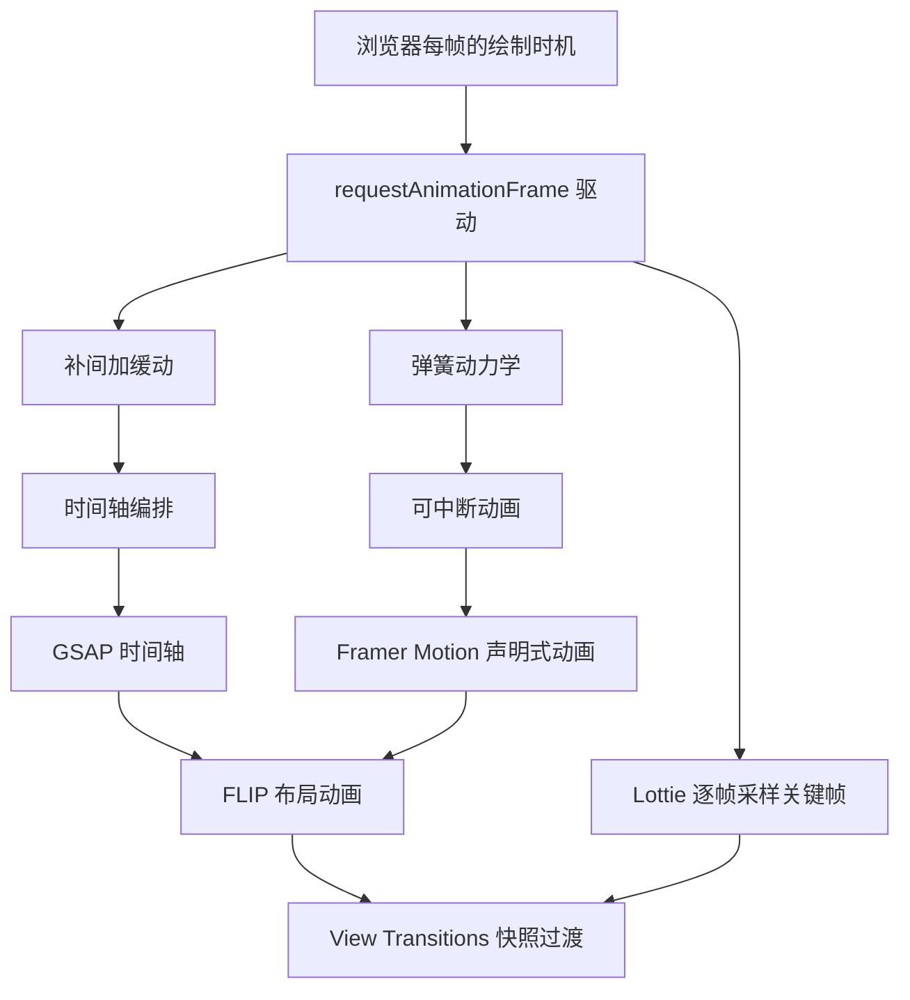
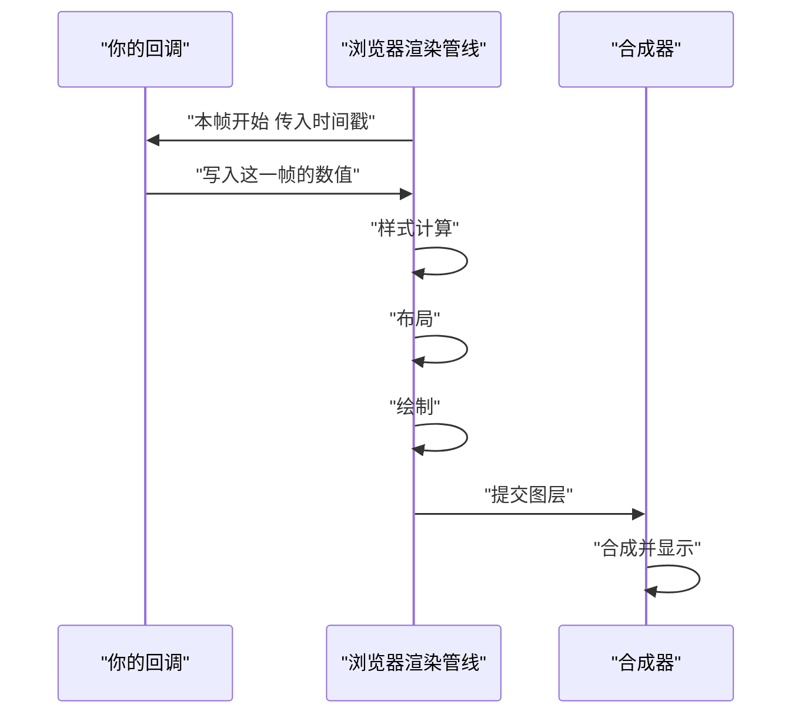
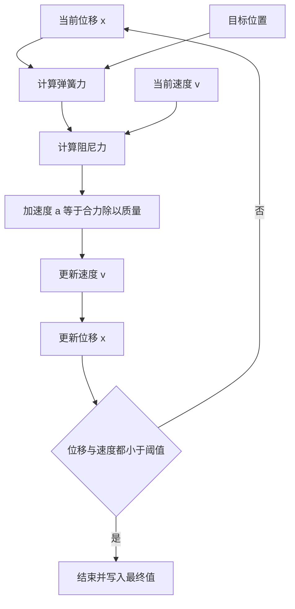
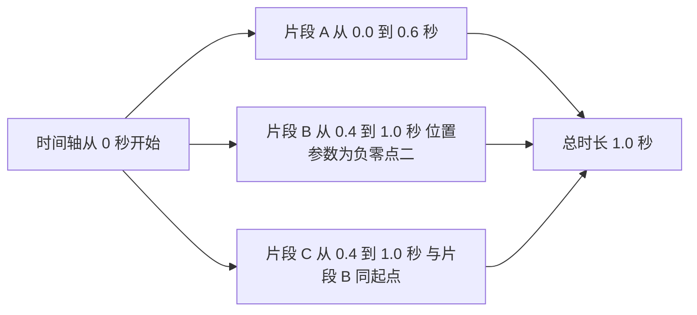
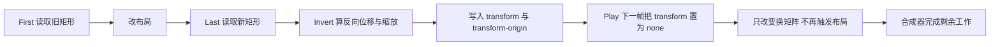
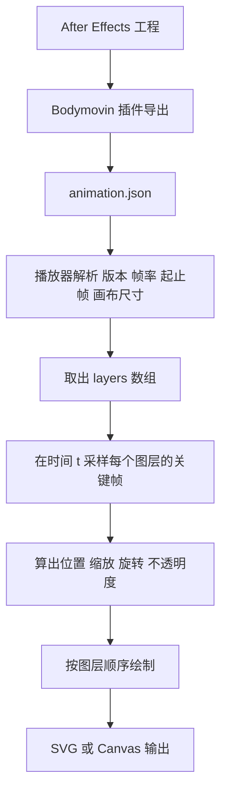
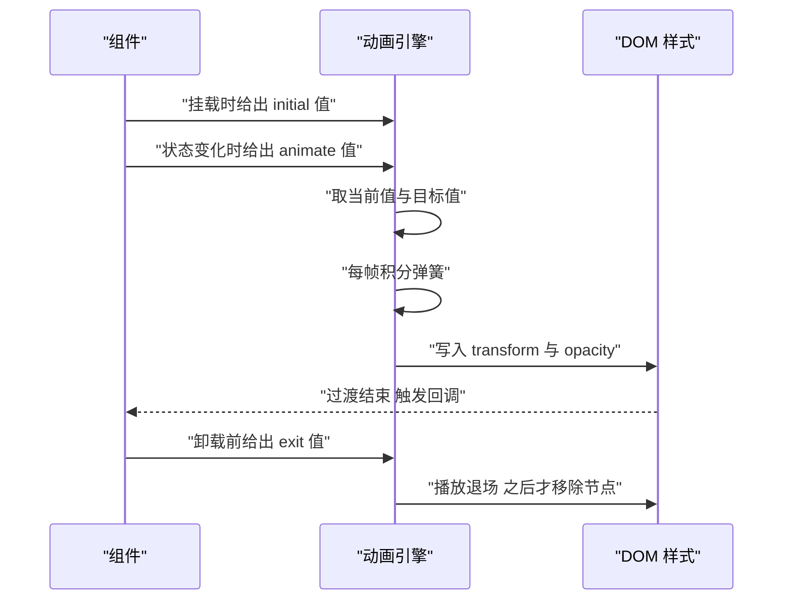
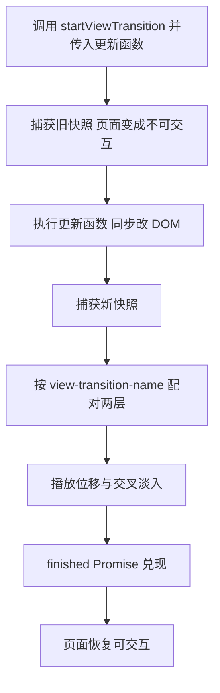

# 动画库：Framer Motion、GSAP、Lottie 与 View Transitions

!!! abstract "学完这一页你能"
    - 手写一个由 requestAnimationFrame 驱动的补间循环，并说清每一帧里回调与渲染管线的先后顺序。
    - 用半隐式欧拉法积分弹簧方程，并解释 stiffness、damping、mass 三个参数各自改变哪一段曲线。
    - 用 First Last Invert Play 四步手写布局位移动画，并说明为什么整个过程只读一次布局。
    - 从 Lottie JSON 里读出关键帧，在给定帧号采样出图层数值，并说出这类文件为何能任意缩放。

## 0. 知识地图



读的顺序建议从第 1 节开始，因为后面六节都建立在同一个循环上。
第 2、3 节讲两类求值器：弹簧补间和时间轴。
第 4 到第 7 节是这套循环在四个产品问题上的落地：布局变化、设计稿动画、框架集成、页面切换。

## 1. 浏览器什么时候重绘：requestAnimationFrame 驱动

**先想一个问题**

你用 `setInterval(tick, 16)` 做进度条动画，静止时流畅，一旦用户开始滚动列表就一卡一卡。
计时器和屏幕刷新没有约定，回调可能落在渲染管线中间，也可能一帧触发两次。
那浏览器到底怎么告诉代码"现在可以画下一帧了"？

**心智模型**

!!! tip "心智模型"
    一句话模型：requestAnimationFrame 让浏览器在下一次绘制前叫你一次，回调参数是这一帧的时间戳。
    日常类比：田径比赛的发令枪。你不看自己的手表起跑，只等枪响。
    类比不成立的地方：枪响只保证对齐一次绘制，不保证你的回调能在这一帧剩余的时间里跑完；跑不完就会挤掉下一帧。

!!! note "术语：requestAnimationFrame"
    浏览器提供的 API，把回调排进下一次"绘制前"的队列，并传入一个 DOMHighResTimeStamp 时间戳，单位是毫秒。
    例子：`requestAnimationFrame((ts) => console.log(ts))` 打印的 `1234.5` 表示页面启动后 1234.5 毫秒。

**图解**



1. 浏览器进入一帧，先取出这一帧注册的 rAF 回调。
2. 回调收到时间戳，你在里面算出这一帧应该显示的数值。
3. 你把数值写进 `style`，此时还没发生布局。
4. 浏览器统一做样式计算、布局、绘制。
5. 绘制结果作为图层提交给合成器。
6. 合成器把图层合到屏幕上，这一帧才算结束。

**一步一步来**

第 1 步，用回调给的时间戳算进度，不要自己用 `Date.now()` 累加。

```js
// 1. start 留空，等第一个时间戳进来再定起点
let start = null;
function tick(now) {
  if (start === null) start = now;
  // 2. 用时间戳之差算进度，600 毫秒走完
  const p = Math.min((now - start) / 600, 1);
  console.log(p.toFixed(3));
  // 3. 没到 1 就再订一帧
  if (p < 1) requestAnimationFrame(tick);
}
requestAnimationFrame(tick);
```

**这段代码在做什么**

- `start` 只在第一次回调里赋值，所以它是渲染管线给出的时刻，不是脚本执行时刻。
- `(now - start) / 600` 把毫秒差换算成 0 到 1 的进度。
- `Math.min(..., 1)` 把最后一帧的溢出截掉，避免进度超过 1。
- 递归调用 `requestAnimationFrame` 而不是 `setInterval`，订阅次数与绘制次数一一对应。

**运行结果**

在 60Hz 屏幕上会打印约 39 行，从 `0.000` 递增到 `1.000`；实际行数随屏幕刷新率变化。

第 2 步，把线性进度换成缓动曲线。

```js
// 1. 三次方缓出：起步快，收尾慢
function easeOutCubic(t) {
  return 1 - Math.pow(1 - t, 3);
}
// 2. 进度先过缓动，再映射到具体数值
const x = easeOutCubic(p) * 200;
// 3. t 为 0.5 时输出 175，而不是线性的 100
console.log(x.toFixed(1));
```

**这段代码在做什么**

- 缓动函数只接收 0 到 1，输出也保证落在 0 到 1。
- `Math.pow(1 - t, 3)` 描述剩余距离的衰减速度。
- 缓动把"时间比例"变成"数值比例"，与具体属性无关。
- `t` 取 0.5 时结果是 `1 - 0.125 = 0.875`，乘 200 得 175。

**运行结果**

```
175.0
```

第 3 步，如果数值靠速度累积，就用时间差做积分，并截断过大的步长。

```js
let last = null;
let x = 0;
const v = 120; // 每秒 120 像素
function tick(now) {
  if (last === null) last = now;
  // 1. 单帧最多按 50 毫秒算，页面切回前台时不会瞬间跳完
  const dt = Math.min(now - last, 50) / 1000;
  last = now;
  // 2. 用秒做单位，60Hz 与 120Hz 得到同一条轨迹
  x += v * dt;
  console.log(x.toFixed(2));
  if (x < 200) requestAnimationFrame(tick);
}
requestAnimationFrame(tick);
```

**这段代码在做什么**

- `dt` 单位换算成秒，与速度单位"像素每秒"对齐。
- `Math.min(now - last, 50)` 防的是标签页被挂起后回来的一跳。
- 累加位移而不是按进度取值，这样中途改速度不会产生跳变。
- 用时间差积分时，帧率不同但轨迹相同，前提是 `dt` 被你截断过。

**运行结果**

按 16 毫秒一帧打印，数值序列形如 `1.92  3.84  5.76`，到 200 附近停止。

**动手验证**

Node 里没有 requestAnimationFrame，所以用假时钟替换它，循环逻辑与浏览器里一致。

```js
// 运行：node raf-demo.mjs
// 依赖：无，只用 Node 内置的 node:assert

import assert from 'node:assert';

// 1. 假时钟：每调用一次 advanceOneFrame 前进 16 毫秒
function createFrameClock(stepMs) {
  const queue = [];
  let now = 0;
  return {
    pending: () => queue.length,
    requestAnimationFrame(cb) { queue.push(cb); },
    advanceOneFrame() {
      now += stepMs;
      // 2. 先取出队列再回调，回调里新注册的留到下一帧
      const due = queue.splice(0, queue.length);
      for (const cb of due) cb(now);
    },
  };
}

function runTween(clock, durationMs) {
  return new Promise((resolve) => {
    let start = null;
    const samples = [];
    function tick(ts) {
      if (start === null) start = ts;
      const p = Math.min((ts - start) / durationMs, 1);
      samples.push(p);
      if (p < 1) clock.requestAnimationFrame(tick);
      else resolve(samples);
    }
    clock.requestAnimationFrame(tick);
  });
}

const clock = createFrameClock(16);
const result = runTween(clock, 600);
while (clock.pending() > 0) clock.advanceOneFrame();
const samples = await result;

assert.strictEqual(samples.length, 39, '600 毫秒除以 16 毫秒，第一帧在 16 毫秒处，共 39 帧');
assert.strictEqual(samples.at(-1), 1, '末帧进度必须被截断到 1');
for (let i = 1; i < samples.length; i += 1) {
  assert.ok(samples[i] >= samples[i - 1], '线性补间的进度必须单调不降');
}
console.log('帧数', samples.length);
console.log('末值', samples.at(-1).toFixed(3));
console.log('断言全部通过');
```

预期输出：

```
帧数 39
末值 1.000
断言全部通过
```

**常见坑**

| 现象 | 原因 | 怎么修 |
| --- | --- | --- |
| 静止流畅，滚动时掉帧 | 用 `setInterval` 驱动，回调落点与绘制不对齐 | 换成 requestAnimationFrame，用回调时间戳算进度 |
| 切回标签页动画瞬间跳完 | 单帧 `dt` 累计了挂起期间的全部时间 | 把 `dt` 截断到一个上限，比如 50 毫秒 |
| 进度条长度取整后抖动 | 每帧对像素取整，累计误差可见 | 保留浮点数值，只在写入 `style` 时让浏览器处理 |
| 同一元素被两个循环写样式 | 两处 `requestAnimationFrame` 都在改同一个属性 | 一个属性只留一个驱动源，或用变量覆盖 |

**小结**

- requestAnimationFrame 提供的是"这一帧的时间戳"，不是"等 16 毫秒"。
- 进度用时间戳之差计算，速度用时间差积分，两条路都要求截断过大的 `dt`。
- 回调先写入数值，浏览器随后统一样式计算、布局、绘制、合成。

## 2. 弹簧动力学：为什么动画需要物理模型

**先想一个问题**

一个折叠面板用 `transition: height 200ms ease-out` 展开，用户 80 毫秒时点了收起。
因为过渡没有"当前速度"这个概念，收起动画从当前位置硬切成新曲线，看起来像被拽了一下。
如果动画每帧都记录速度，中途改目标会怎样？

**心智模型**

!!! tip "心智模型"
    一句话模型：弹簧动画每帧算的不是"从 A 到 B 的百分比"，而是位置受到的合力与由此产生的加速度。
    日常类比：门上的闭门器。你推多快它不管，它按拉力和阻尼把门送回关闭位置。
    类比不成立的地方：闭门器最终必然停死，弹簧没有天然的结束时刻，需要阈值判定，否则会一直算下去。

!!! note "术语：阻尼"
    与速度方向相反、大小与速度成正比的力，系数记作 c，单位是牛秒每米。
    例子：`c` 从 12 加到 26，同样的 `stiffness` 下越阶次数从 2 次降到 0 次。

!!! note "术语：阻尼比"
    记作 zeta，等于 `c / (2 * sqrt(k * m))`。它把三个参数压缩成一个 0 到 1 附近的数。
    例子：`k=170, m=1` 时临界阻尼 `c` 为 26.08，取 `c=26` 得到 zeta 约 0.997。

**图解**



1. 位移 `x` 与目标位置之差决定弹簧力的大小，方向指向目标。
2. 速度 `v` 决定阻尼力的大小，方向与速度相反。
3. 两个力相加得到合力。
4. 合力除以质量得到加速度。
5. 加速度乘时间步长加到速度上。
6. 新速度乘时间步长加到位移上。
7. 位移和速度同时小于阈值时停止循环，把最终值写死。

**一步一步来**

第 1 步，把受力写成函数。

```js
// 1. 参数都是数值，没有魔法
function acceleration(x, v, target, { stiffness, damping, mass }) {
  // 2. 弹簧力：离目标越远拉得越紧，方向指向目标
  const springForce = -stiffness * (x - target);
  // 3. 阻尼力：与速度反向，用来吃掉振荡
  const dampingForce = -damping * v;
  // 4. 牛顿第二定律：加速度等于合力除以质量
  return (springForce + dampingForce) / mass;
}
```

**这段代码在做什么**

- `x - target` 是位移误差，符号决定弹簧力指向哪边。
- `-damping * v` 让速度越大阻力越大，它是振荡衰减的唯一来源。
- 除以 `mass` 后，质量越大加速度越小，起步越慢。
- 三个参数的单位分别是牛每米、牛秒每米、千克，调参时不要混用。

第 2 步，用半隐式欧拉法推进一帧。

```js
// 1. 固定步长，保证结果与屏幕刷新率无关
const dt = 1 / 1000;
const params = { stiffness: 170, damping: 12, mass: 1 };
let x = 0;
let v = 0;
const target = 1;
for (let i = 0; i < 5; i += 1) {
  // 2. 先用当前状态算加速度
  const a = acceleration(x, v, target, params);
  // 3. 先更新速度
  v += a * dt;
  // 4. 再用新速度更新位移，这一步顺序不能交换
  x += v * dt;
  console.log(i, x.toFixed(5), v.toFixed(5));
}
```

**这段代码在做什么**

- `dt` 固定为 1 毫秒，同一段动画在任何设备上得到同一条曲线。
- 先更新 `v` 再更新 `x`，这个顺序叫半隐式欧拉法。
- 如果先更新 `x` 再用旧的 `v`，误差会在能量上叠加，动画会越跑越大。
- 循环只跑 5 步，用来观察起步阶段的数值。

**运行结果**

```
0 0.00017 0.17000
1 0.00066 0.33572
2 0.00146 0.49699
3 0.00255 0.65381
4 0.00390 0.80618
```

第 3 步，写结束条件。

```js
// 1. 两个阈值要一起判，只看位移会让速度残留导致回头
const POS_EPS = 0.002;
const VEL_EPS = 0.02;
const done = Math.abs(x - target) < POS_EPS && Math.abs(v) < VEL_EPS;
// 2. 结束时把值写死，避免长期留下 0.0001 的误差
if (done) {
  x = target;
  v = 0;
}
```

**这段代码在做什么**

- 只判位移不判速度，元素会在目标附近反复穿过，看起来在抽动。
- 阈值要按你动画的属性量级取，位移是像素时 0.002 像素足够小。
- 结束帧必须把数值写死，否则静止状态下每一帧都还在改样式。
- 阈值越小，动画越长，CPU 占用越多，需按场景权衡。

**动手验证**

```js
// 运行：node spring-demo.mjs
// 依赖：无

import assert from 'node:assert';

function acceleration(x, v, target, { stiffness, damping, mass }) {
  return (-stiffness * (x - target) - damping * v) / mass;
}

const params = { stiffness: 170, damping: 12, mass: 1 }; // 阻尼比约 0.46
const target = 1;
const dt = 1 / 1000;
let x = 0;
let v = 0;
const trace = [];
for (let i = 0; i < 3000; i += 1) {
  const a = acceleration(x, v, target, params);
  v += a * dt;
  x += v * dt;
  trace.push(x);
}

const maxVal = Math.max(...trace);
const overshoot = maxVal - target;
let lastOutside = -1;
trace.forEach((val, i) => { if (Math.abs(val - target) >= 0.002) lastOutside = i; });
const settleMs = lastOutside + 1;

assert.ok(overshoot > 0.15 && overshoot < 0.25, `超调应接近理论值 0.196，实测 ${overshoot.toFixed(4)}`);
assert.ok(Math.abs(trace.at(-1) - target) < 0.001, '3 秒后必须停在目标位置');
assert.ok(settleMs < 2500, `稳定用时应小于 2500 毫秒，实测 ${settleMs}`);

const criticalC = 2 * Math.sqrt(params.stiffness * params.mass);
console.log('理论临界阻尼 c 等于', criticalC.toFixed(2));
console.log('理论超调', (Math.exp(-Math.PI * 0.46 / Math.sqrt(1 - 0.46 ** 2))).toFixed(4));
console.log('实测超调', overshoot.toFixed(4));
console.log('稳定用时毫秒', settleMs);
console.log('断言全部通过');
```

预期输出：

```
理论临界阻尼 c 等于 26.08
理论超调 0.1945
实测超调 0.19 附近的一个数
稳定用时毫秒 1500 附近的一个数
断言全部通过
```

**常见坑**

| 现象 | 原因 | 怎么修 |
| --- | --- | --- |
| 动画越跑越远然后爆炸 | 用了显式欧拉法，先更新位移再更新速度 | 改成半隐式，先更新速度再用新速度更新位移 |
| 同一段动画在 120Hz 屏上速度快一倍 | 每帧推进固定位移，没有乘时间步长 | 所有积分项都乘 `dt`，并把 `dt` 单位换算成秒 |
| 元素停在目标前 0.001 处不动 | 结束时没有把数值写死 | 判定结束后直接把位移设为目标、速度置零 |
| 改成新目标时元素抽搐 | 改目标时把速度也清零了 | 只换 `target`，保留 `v`，让曲线自然接住 |

**小结**

- 弹簧动画的状态是两个数：位移和速度，两者缺一不可。
- 半隐式欧拉法把加速度积分成速度、速度积分成位移，顺序不能颠倒。
- 阻尼比把三个参数压成一个数，小于 1 会越阶，等于 1 最快不越阶，大于 1 收尾拖长。

## 3. 时间轴：GSAP 凭什么成为动画编排的工业标准

**先想一个问题**

三张卡片依次入场：A 走 660 毫秒，B 从 A 结束后 80 毫秒开始，C 与 B 同一起点但只走一半时长。
用 `setTimeout` 串联，客户改一句"A 缩短 100 毫秒"，你要动三处延时。
有没有一种结构，让"时刻"成为可计算的值？

**心智模型**

!!! tip "心智模型"
    一句话模型：时间轴是一条以毫秒为单位的全局时刻轴，每个动画是挂在上面的片段。
    日常类比：视频剪辑软件的时间线，片段可以拖到任意时刻。
    类比不成立的地方：剪辑软件是事后逐帧渲染成文件，时间轴是运行时每帧求值并写进 DOM。

!!! note "术语：位置参数"
    GSAP 里传给 `.to()` 的第三个参数，决定这段动画放在时间轴的哪个时刻。
    例子：`'-=0.2'` 表示比上一段末尾提前 0.2 秒，`'<` 表示与上一段同一起点。

!!! note "术语：时间轴"
    一个把多个动画片段按绝对或相对时刻排列，并在同一个帧循环里统一求值的容器。
    例子：`gsap.timeline()` 返回的对象，它自己也有 `duration()`、`seek()`、`timeScale()`。

**图解**



1. 容器从 0 秒开始计时，相当于一个全局时钟。
2. 片段 A 用绝对位置 0 秒插入，占 0 到 0.6 秒。
3. 片段 B 的位置参数是 `'-=0.2'`，相对于当前末尾 0.6 秒回退 0.2 秒，落在 0.4 秒。
4. 片段 C 与 B 处在同一时刻，形成并行。
5. 容器的总时长取所有片段结束时刻的最大值，即 1.0 秒。

**一步一步来**

第 1 步，在浏览器里用位置参数编排三段动画。

```js
import gsap from 'gsap'; // 依赖：npm install gsap
// 1. 建容器，把时长与缓动写成默认值，片段里不用重复
const tl = gsap.timeline({ defaults: { duration: 0.6, ease: 'power2.out' } });
// 2. 绝对位置 0 秒
tl.to('.card-a', { x: 0 });
// 3. 相对上一段末尾提前 0.2 秒
tl.to('.card-b', { x: 0 }, '-=0.2');
// 4. 打一个命名标记，方便后面按名字定位
tl.addLabel('c-start');
// 5. 标记之后 0.3 秒，属于绝对定位的一种写法
tl.to('.card-c', { x: 0 }, 'c-start+=0.3');
```

**这段代码在做什么**

- `defaults` 让三段共享时长与缓动，改一处就改全部。
- `'-=0.2'` 是相对于"当前末尾"的偏移，不是相对上一段起点。
- `addLabel` 给时刻起名字，代码里不再出现裸数字。
- `'c-start+=0.3'` 是"标记名加偏移"的写法，改标记就能移动一批片段。
- 时间轴本身也是一个可补间的对象，`tl.progress(0.5)` 能直接跳到一半。

**运行结果**

浏览器里三张卡片从 0 秒起依次位移，总时长 1.0 秒。

第 2 步，手写一个最小时间轴，把"每帧求值"这件事显式写出来。

```js
function createTimeline() {
  const clips = [];
  let cursor = 0; // 当前末尾时刻，供相对位置参数使用
  const tl = {
    to(from, to, duration, position) {
      let start;
      if (typeof position === 'number') start = position;
      else if (typeof position === 'string' && position.startsWith('+=')) start = cursor + Number(position.slice(2));
      else if (position === 'same') start = clips.at(-1).start;
      else start = cursor; // 默认接在末尾
      clips.push({ from, to, duration, start });
      cursor = Math.max(cursor, start + duration);
      return tl;
    },
    duration: () => cursor,
    sample(t) {
      return clips.map((c) => {
        const p = Math.min(Math.max((t - c.start) / c.duration, 0), 1);
        return c.from + (c.to - c.from) * p;
      });
    },
  };
  return tl;
}
```

**这段代码在做什么**

- `clips` 是片段列表，每个片段只存起点、时长和两端数值。
- `cursor` 记录末尾时刻，`'-=0.2'` 这类相对位置从这里推导。
- `sample(t)` 在给定时刻对全部片段求值，返回一个数值数组。
- `Math.min(Math.max(...))` 把进度夹在 0 到 1，片段外保持端点值。
- 总时长取所有片段结束时刻的最大值，允许片段重叠。

第 3 步，用缩放系数整体调速。

```js
// 1. 把真实时间除以 timeScale 得到轴上时间
const timeScale = 2;
const realTime = 0.35;
const axisTime = realTime * timeScale;
// 2. 2 倍速下，0.35 秒真实时间已经在轴上走了 0.7 秒
console.log(axisTime);
```

**这段代码在做什么**

- `timeScale` 大于 1 表示加速，小于 1 表示放慢。
- 换算只作用在时间轴上，片段之间的相对关系不变。
- GSAP 里对应 `tl.timeScale(2)`，用它之前要先 `tl.pause()`。
- 这条换算让"整体减速观察"变成一个数，而不是逐个片段改时长。

**运行结果**

```
0.7
```

**动手验证**

```js
// 运行：node timeline-demo.mjs
// 依赖：无

import assert from 'node:assert';

function createTimeline() {
  const clips = [];
  let cursor = 0;
  const tl = {
    to(from, to, duration, position) {
      let start;
      if (typeof position === 'number') start = position;
      else if (typeof position === 'string') start = cursor + Number(position.replace('+=', ''));
      else if (position === 'same') start = clips.at(-1).start;
      else start = cursor;
      clips.push({ from, to, duration, start });
      cursor = Math.max(cursor, start + duration);
      return tl;
    },
    duration: () => cursor,
    sample(t) {
      return clips.map((c) => {
        const p = Math.min(Math.max((t - c.start) / c.duration, 0), 1);
        return c.from + (c.to - c.from) * p;
      });
    },
  };
  return tl;
}

const tl = createTimeline();
tl.to(0, 100, 0.6);          // 绝对起点 0 秒
tl.to(0, 100, 0.6, '-=0.2'); // 相对末尾提前 0.2 秒，落在 0.4 秒
tl.to(0, 100, 0.6, 'same');  // 与上一段同起点

assert.ok(Math.abs(tl.duration() - 1) < 1e-9, '总时长应为 1 秒');
const at0 = tl.sample(0);
const at07 = tl.sample(0.7);
const at2 = tl.sample(2);

assert.deepStrictEqual(at0, [0, 0, 0], '0 秒时三段都还没开始');
assert.ok(Math.abs(at07[0] - 100) < 1e-9, '第一段在 0.7 秒已完成');
assert.ok(Math.abs(at07[1] - 50) < 1e-9, '第二段在 0.7 秒走了一半');
assert.ok(Math.abs(at07[2] - 50) < 1e-9, '第三段与第二段同步');
assert.deepStrictEqual(at2, [100, 100, 100], '超出总时长后保持末值');

const timeScale = 2;
console.log('总时长', tl.duration().toFixed(2));
console.log('0.7 秒采样', at07.map((n) => n.toFixed(1)).join(' '));
console.log('2 倍速下 0.35 秒等于轴上', (0.35 * timeScale).toFixed(2), '秒');
console.log('断言全部通过');
```

预期输出：

```
总时长 1.00
0.7 秒采样 100.0 50.0 50.0
2 倍速下 0.35 秒等于轴上 0.70 秒
断言全部通过
```

**常见坑**

| 现象 | 原因 | 怎么修 |
| --- | --- | --- |
| 改了第一段时长，后面全错位 | 用了裸数字绝对定位 | 换成 `'-=0.2'` 这类相对位置，或用命名标记 |
| 时间轴越播越乱 | 每帧新建时间轴，旧的还在跑 | 时间轴只建一次，组件卸载时调用 `kill()` |
| 暂停后画面还在动 | 动画写在 CSS 过渡上，时间轴管不到 | 同一属性只交给一个驱动源 |
| `timeScale(2)` 后回调触发次数异常 | 回调挂在时间轴上，触发次数随缩放变化 | 需核对官方文档：回调与 `timeScale` 的交互说明 |

**小结**

- 时间轴把"时刻"变成可计算、可命名、可偏移的值。
- 相对位置参数（`'-=0.2'`、`'same'`、标记加偏移）是让编排抗改动的关键。
- 整条轴可以用一个系数缩放，不必逐个片段改时长。

## 4. FLIP：让布局变化也能动画

**先想一个问题**

列表里点击第 5 行，该行要飞到第 1 位。
你写一个 300 毫秒循环，每帧读 `getBoundingClientRect()` 再改 `left` 和 `top`。
为什么这段代码一滚动就掉帧？

**心智模型**

!!! tip "心智模型"
    一句话模型：先在旧位置拍快照，把元素摆到新位置再拍一张，然后用 transform 把新位置倒推回旧位置，最后播放归零。
    日常类比：家具已经摆进新房间，你先给旧位置垫一张透明贴纸，然后抽走贴纸。
    类比不成立的地方：transform 只处理平移与缩放，遇到圆角、裁剪、文字重排这些还是要逐帧处理。

!!! note "术语：FLIP"
    First、Last、Invert、Play 四个英文单词的首字母。意思是先记录旧位置、再记录新位置、反转成 transform、最后播放。
    例子：旧位置 `top: 400`，新位置 `top: 40`，反转值就是 `translateY(360px)`。

!!! note "术语：布局抖动"
    在同一个循环里先写样式再读布局，浏览器被迫立刻重新排版，英文是 forced synchronous layout。
    例子：`el.style.width = '100px'; el.offsetWidth;` 这一读一写就让排版发生两次。

**图解**



1. First 阶段只读一次矩形，缓存下来。
2. 改布局：把元素插入新的父节点或调整顺序。
3. Last 阶段读新矩形，这一次读取是布局已经算好的结果。
4. Invert 用两张矩形算出位移与缩放，写进 `transform`。
5. 写入 `transform-origin`，把缩放原点固定到左上角。
6. Play 阶段在下一帧把 `transform` 换成 `none`，触发过渡。
7. 中间帧只改变换矩阵，不触发样式计算之外的排版工作。
8. 合成器把变换后的图层合到屏幕上。

**一步一步来**

第 1 步，读旧矩形。

```js
// 1. 只读，不写任何样式，此时缓存有效
const first = el.getBoundingClientRect();
// 2. 把结果存起来，后面不再重复读
const snapshot = { left: first.left, top: first.top, width: first.width, height: first.height };
```

**这段代码在做什么**

- `getBoundingClientRect()` 返回视口坐标下的矩形，含宽高。
- 只读不写是 FLIP 的第一条纪律，写完再读就会触发强制同步布局。
- 存下宽高而不只是位置，因为缩放比例需要用到宽度。
- 这份快照的寿命只到下一次布局变化为止。

第 2 步，改布局后读新矩形。

```js
// 1. 把元素移到新位置，这一步会触发重排
list.prepend(el);
// 2. 读取新矩形，这次读取拿到的是重排后的结果
const last = el.getBoundingClientRect();
// 3. 只读一次，后面全部用算出来的值
console.log(first.top, last.top);
```

**这段代码在做什么**

- `prepend` 改变了 DOM 顺序，布局失效。
- 紧接着的读取让浏览器一次性算出新布局，而不是每帧算一次。
- 这次读取的代价只发生一次，不是 300 毫秒里每帧一次。
- 打印两个 `top` 用于确认差值方向。

第 3 步，算反向变换并写进去。

```js
// 1. 位移用差值，缩放用比例
const dx = first.left - last.left;
const dy = first.top - last.top;
const sx = first.width / last.width;
const sy = first.height / last.height;
// 2. 原点固定到左上角，缩放才不会把位移一起放大
el.style.transformOrigin = 'top left';
// 3. 先缩放再平移，所以写在字符串里时 translate 在前
el.style.transform = `translate(${dx}px, ${dy}px) scale(${sx}, ${sy})`;
```

**这段代码在做什么**

- `dx`、`dy` 是"新位置要回到旧位置"所需的位移，方向是反向的。
- `sx`、`sy` 描述元素尺寸的变化比例，用于处理新位置宽度不同的情况。
- `transformOrigin` 定在左上角，让缩放不改变左上角坐标。
- CSS 里 `translate(...) scale(...)` 从右往左执行，所以缩放先发生，位移后发生。

第 4 步，下一帧把变换归零。

```js
requestAnimationFrame(() => {
  // 1. 过渡写在归零之前，浏览器才会补间
  el.style.transition = 'transform 300ms cubic-bezier(0.2, 0, 0, 1)';
  // 2. 归零后元素回到真实位置
  el.style.transform = 'none';
  // 3. 动画结束后清掉过渡，避免影响后续操作
  el.addEventListener('transitionend', () => {
    el.style.transition = '';
    el.style.transformOrigin = '';
  }, { once: true });
});
```

**这段代码在做什么**

- 用一次 `requestAnimationFrame` 把"写入反向变换"和"清除反向变换"拆到两帧。
- 同一帧里写入再清除，浏览器只看到最终值，不会有过渡。
- `cubic-bezier(0.2, 0, 0, 1)` 描述先快后慢的速度曲线。
- `{ once: true }` 保证监听器只触发一次，不会累积。

**运行结果**

元素从旧位置滑到新位置，中间帧只有 `transform` 在变，`top` 与 `left` 从未变化。

**动手验证**

Node 里没有布局，所以用两个手写的矩形验证"Invert 之后套到 Last 上能还原 First"这条数学关系。

```js
// 运行：node flip-demo.mjs
// 依赖：无

import assert from 'node:assert';

function invert(first, last) {
  // 1. 位移要在缩放之前量出来，否则缩放会改变位移的物理长度
  const dx = first.left - last.left;
  const dy = first.top - last.top;
  // 2. 缩放比例由宽度与高度分别得出
  const sx = first.width / last.width;
  const sy = first.height / last.height;
  return { dx, dy, sx, sy };
}

function apply(rect, t) {
  // 3. 原点在左上角时，缩放不改变 left 与 top
  return {
    left: rect.left + t.dx,
    top: rect.top + t.dy,
    width: rect.width * t.sx,
    height: rect.height * t.sy,
  };
}

function close(a, b) {
  return Math.abs(a - b) < 1e-9;
}

const first = { left: 10, top: 400, width: 200, height: 60 };
const last = { left: 10, top: 40, width: 200, height: 60 };
const t1 = invert(first, last);
const restored1 = apply(last, t1);
assert.ok(close(restored1.top, first.top), '纯位移场景必须还原到旧位置');
assert.ok(close(restored1.left, first.left), '横向没有变化时水平位移为 0');
assert.ok(close(t1.dy, 360), '位移应等于 400 减 40');

const first2 = { left: 20, top: 100, width: 100, height: 50 };
const last2 = { left: 60, top: 300, width: 250, height: 125 };
const t2 = invert(first2, last2);
const restored2 = apply(last2, t2);
assert.ok(close(restored2.left, first2.left) && close(restored2.width, first2.width), '缩放场景同样要还原');
assert.ok(close(t2.sx, 0.4) && close(t2.sy, 0.4), '宽高比例一致时两个缩放系数相等');

console.log('纯位移场景 dx dy', t1.dx, t1.dy);
console.log('缩放场景 sx sy', t2.sx, t2.sy);
console.log('断言全部通过');
```

预期输出：

```
纯位移场景 dx dy 0 360
缩放场景 sx sy 0.4 0.4
断言全部通过
```

**常见坑**

| 现象 | 原因 | 怎么修 |
| --- | --- | --- |
| 缩放后位置偏了半个身位 | `transform-origin` 默认在中心 | 显式设置 `transform-origin: top left` |
| 动画期间滚动列表明显掉帧 | 每帧都在读写布局 | 只读一次旧矩形，Play 阶段只改变换 |
| 元素从错误位置开始飞 | 快照被同一帧里更晚的写样式作废 | 先批量读、再批量写，读与写分两轮 |
| 父子元素同时做 FLIP 后子元素被二次缩放 | 父级缩放作用到了子级的局部坐标 | 父级 FLIP 时对子级做反向缩放，或只让最外层参与 |

**小结**

- FLIP 的核心是把"位置差异"挪到 transform 上，让中间帧不触发排版。
- 一读一写两个快照，之后全部用算出来的数值。
- 缩放必须配合 `transform-origin`，位移必须在缩放之前量出来。

## 5. Lottie：把设计稿渲染成矢量动画

**先想一个问题**

设计师给了一段加载图标动画，After Effects 导出 mp4 是 1.2MB，放大到 200% 后边缘发虚。
同一段动画如果导出成 JSON 只有几十 KB，放大后依然清晰。
JSON 里到底存了什么，让播放器能算出每一帧？

**心智模型**

!!! tip "心智模型"
    一句话模型：Lottie 文件不是像素序列，而是一份"图层加关键帧数值"的表格，播放器每帧查表算出图层变换再画到 canvas 或 SVG。
    日常类比：音乐播放器读的是乐谱和演奏规则，不是一段录音。
    类比不成立的地方：Lottie 只覆盖 After Effects 的一个子集，遇到表达式、粒子、混合模式会丢失或退化。

!!! note "术语：关键帧"
    一对数据"时刻加数值"，播放器在相邻关键帧之间按缓动插值。
    例子：`t: 0` 时位置是 `[0, 0]`，`t: 30` 时是 `[100, 0]`，第 15 帧线性插值得到 `[50, 0]`。

!!! note "术语：Bodymovin"
    Adobe After Effects 的一个导出插件，把合成导出成 Lottie 使用的 JSON。
    例子：安装插件后在 AE 里选择 Bodymovin 面板，指定合成并导出 `animation.json`。

**图解**



1. 设计师在 After Effects 里做动画。
2. Bodymovin 插件把合成翻译成 JSON 文件。
3. JSON 顶层给出 `v`、`fr`、`ip`、`op`、`w`、`h` 这些元信息。
4. 解析器读取 `layers` 数组。
5. 给定时间 `t`，对每个图层的每个属性做关键帧采样。
6. 采样结果是一组变换数值。
7. 按图层顺序绘制到目标载体上。
8. 输出到 SVG 元素树或 canvas 位图。

**一步一步来**

第 1 步，读顶层元信息。

```js
const animation = {
  v: '5.7.0', // 版本号，不同版本的字段含义要核对官方文档
  fr: 30,     // 每秒 30 帧
  ip: 0,      // 起始帧
  op: 60,     // 结束帧，配合 fr 得到时长 2 秒
  w: 200,     // 画布宽
  h: 200,     // 画布高
  layers: [],
};
// 1. 帧号换算成秒，播放器每帧做的第一件事
const seconds = (frame) => frame / animation.fr;
console.log(seconds(animation.op - animation.ip));
```

**这段代码在做什么**

- `fr` 是帧率，所有关键帧的 `t` 都以帧为单位。
- `ip` 与 `op` 是播放区间，差值除以 `fr` 才是秒数。
- `w` 与 `h` 是设计稿坐标系，渲染时要缩放到实际尺寸。
- 换算函数只写一次，采样时反复使用。

**运行结果**

```
2
```

第 2 步，采样一个属性。

```js
function sampleKeyframes(prop, frame) {
  // 1. a 为 0 表示静态属性，k 就是数值本身
  if (prop.a === 0) return Array.isArray(prop.k) ? prop.k : [prop.k];
  const keys = prop.k;
  // 2. 找到 frame 落在哪两个关键帧之间
  let i = 0;
  while (i < keys.length - 1 && frame >= keys[i + 1].t) i += 1;
  const a = keys[i];
  const b = keys[i + 1];
  // 3. 超过最后一个关键帧就保持末值
  if (!b) return a.s;
  // 4. 线性进度；真实实现要按 a.o 与 b.i 的控制点解三次贝塞尔
  const p = (frame - a.t) / (b.t - a.t);
  return a.s.map((v, idx) => v + (b.s[idx] - v) * p);
}
```

**这段代码在做什么**

- `a` 字段决定这个属性是静态还是带动画。
- 二分或线性扫描定位区间，扫描就够了，因为关键帧数量不大。
- 区间外的帧保持端点值，这就是"保持"与"循环"两种模式的基础。
- `a.s` 与 `b.s` 是两端数值，数组长度由属性决定，位置是 2，缩放是 2，旋转是 1。
- 缓动控制点在 `a.o` 与 `b.i` 里，需要解三次贝塞尔，需核对官方文档中的字段含义。

第 3 步，把采样结果组合成一次绘制。

```js
function sampleLayer(layer, frame) {
  // 1. ks 里每个属性都可以单独采样
  const position = sampleKeyframes(layer.ks.p, frame);
  const scale = sampleKeyframes(layer.ks.s, frame);
  const rotation = sampleKeyframes(layer.ks.r, frame);
  const opacity = sampleKeyframes(layer.ks.o, frame);
  return { position, scale, rotation, opacity };
}
// 2. 第 15 帧，位置应该落在两端点的中间
console.log(sampleLayer({
  ks: {
    p: { a: 1, k: [{ t: 0, s: [0, 0] }, { t: 30, s: [100, 0] }] },
    s: { a: 0, k: [100, 100] },
    r: { a: 0, k: 0 },
    o: { a: 0, k: 100 },
  },
}, 15));
```

**这段代码在做什么**

- 位置、缩放、旋转、不透明度各自独立采样，互不影响。
- 静态属性走快路径，每帧返回同一个数组。
- 返回的对象就是这一帧要交给渲染器的全部数值。
- 采样不修改原数据，所以同一份 JSON 可以被两个播放器同时读。

**运行结果**

```
{ position: [ 50, 0 ], scale: [ 100, 100 ], rotation: [ 0 ], opacity: [ 100 ] }
```

**动手验证**

```js
// 运行：node lottie-sample.mjs
// 依赖：无

import assert from 'node:assert';

function sampleKeyframes(prop, frame) {
  if (prop.a === 0) return Array.isArray(prop.k) ? prop.k : [prop.k];
  const keys = prop.k;
  let i = 0;
  while (i < keys.length - 1 && frame >= keys[i + 1].t) i += 1;
  const a = keys[i];
  const b = keys[i + 1];
  if (!b) return a.s;
  const p = (frame - a.t) / (b.t - a.t);
  return a.s.map((v, idx) => v + (b.s[idx] - v) * p);
}

const animation = {
  fr: 30,
  ip: 0,
  op: 60,
  layers: [
    {
      ks: {
        p: { a: 1, k: [{ t: 0, s: [0, 0] }, { t: 30, s: [100, 0] }] },
        s: { a: 0, k: [100, 100] },
        o: { a: 0, k: 100 },
      },
    },
  ],
};

const prop = animation.layers[0].ks.p;
assert.deepStrictEqual(sampleKeyframes(prop, 0), [0, 0], '起始帧取首值');
assert.deepStrictEqual(sampleKeyframes(prop, 15), [50, 0], '中间帧线性插值取一半');
assert.deepStrictEqual(sampleKeyframes(prop, 30), [100, 0], '末关键帧取末值');
assert.deepStrictEqual(sampleKeyframes(prop, 45), [100, 0], '超出末帧保持不动');
assert.deepStrictEqual(sampleKeyframes(animation.layers[0].ks.o, 15), [100], '静态属性直接返回');
assert.strictEqual(animation.op / animation.fr, 2, '动画总时长应为 2 秒');

console.log('时长秒', animation.op / animation.fr);
console.log('第 15 帧位置', sampleKeyframes(prop, 15));
console.log('断言全部通过');
```

预期输出：

```
时长秒 2
第 15 帧位置 [ 50, 0 ]
断言全部通过
```

**常见坑**

| 现象 | 原因 | 怎么修 |
| --- | --- | --- |
| 播放到一半数值突然卡住 | 只读了 `a.e`，新版格式把末值放在下一帧的 `s` 里 | 以 `b.s` 为末值，需核对官方文档中的版本差异 |
| 动画位置整体偏移 | `transform-origin` 与导出时的锚点不一致 | 对齐 AE 里的锚点设置与播放器参数 |
| 导出文件体积远超预期 | 位图图层、蒙版、表达式的数据量远大于矢量路径 | 先在 AE 里替换为矢量形状，再重新导出 |
| 图层前后顺序颠倒 | 对 `layers` 数组的绘制方向理解相反 | 需核对官方文档：渲染器遍历 `layers` 的方向与 AE 图层序号的关系 |

**小结**

- Lottie 文件是结构化的数值表，播放器每帧做的是查表与插值。
- 关键帧采样只需要三步：判静态、定位区间、插值。
- 缩放清晰是因为输出是矢量路径，与位图分辨率无关。

## 6. Framer Motion：声明式动画与 React 渲染模型

**先想一个问题**

用 CSS class 切换做入场动画时，元素从 DOM 移除就没有"退场"的机会，因为节点已经没了。
React 又是先算新树再提交到 DOM，谁来负责在节点消失前多留 300 毫秒？

**心智模型**

!!! tip "心智模型"
    一句话模型：你只描述每个状态长什么样，库负责在状态之间插值，并在节点被移除前多留一段时间。
    日常类比：点菜时你只说最终要哪道菜，厨房决定火候节奏。
    类比不成立的地方：库最终仍然落在同一套 DOM 与合成层上，属性选错照样掉帧。

!!! note "术语：声明式动画"
    你给出目标状态，由库根据当前状态推导每一帧；命令式则是你直接规定每一帧的数值。
    例子：写 `animate={{ x: 100 }}` 是声明式，写 `requestAnimationFrame` 循环改 `style` 是命令式。

!!! note "术语：MotionValue"
    Framer Motion 里一个不触发 React 重渲染的可变数值容器。
    例子：`const x = useMotionValue(0)` 后 `x.set(120)` 只更新订阅它的样式，不重跑组件的渲染函数。

**图解**



1. 组件挂载时把 `initial` 交给引擎，作为起始值。
2. 状态变化时把新的 `animate` 值交给引擎。
3. 引擎读出元素当前的实际值，不是读取上次的目标值。
4. 每帧用弹簧或补间把当前值向目标值推进一步。
5. 结果写入 `transform` 与 `opacity` 这类不触发排版的属性。
6. 过渡结束后触发回调，可以在这里做埋点或后续动作。
7. 卸载前 `exit` 值生效，播放完才真正移除节点。
8. 这一步就是 CSS class 切换做不到的地方。

**一步一步来**

第 1 步，用初态与目标态声明动画。

```jsx
import { motion } from 'framer-motion';
// 1. initial 只在挂载时生效
// 2. animate 在每次状态变化时重新求值
// 3. transition 决定用弹簧还是补间
<motion.div
  initial={{ opacity: 0, y: 12 }}
  animate={{ opacity: 1, y: 0 }}
  transition={{ type: 'spring', stiffness: 170, damping: 12 }}
/>
```

**这段代码在做什么**

- `initial` 决定元素出现的第一帧数值。
- `animate` 是目标值，不是每一帧的值，中间帧由引擎算。
- `type: 'spring'` 让引擎换成第 2 节的弹簧积分器，参数名与弹簧一致。
- `opacity` 与 `y` 都能在合成层处理，不触发排版。

第 2 步，用 `AnimatePresence` 保留退场窗口。

```jsx
import { AnimatePresence, motion } from 'framer-motion';
<AnimatePresence>
  {open && (
    <motion.div
      key="panel"
      // 1. 高度从 0 到 auto，引擎会在两端之间插值
      initial={{ height: 0 }}
      animate={{ height: 'auto' }}
      // 2. 显式给出退场值，节点在这段时间内不会被移除
      exit={{ height: 0 }}
    />
  )}
</AnimatePresence>
```

**这段代码在做什么**

- `AnimatePresence` 会在子节点被移除时先播放 `exit`，再真正卸载。
- `key` 必须稳定，引擎靠它区分"同一个元素变形"和"旧元素退场新元素入场"。
- `height: 'auto'` 需要在两端之间求值，需核对官方文档：你的版本对 auto 高度动画的支持范围。
- 高度动画会触发排版，如果列表很长，改用 `transform` 与 `clip-path`。

第 3 步，用 MotionValue 绕开重渲染。

```jsx
import { motion, useMotionValue, useSpring } from 'framer-motion';
// 1. 指针移动时只更新这个数值容器
const x = useMotionValue(0);
// 2. 用一个弹簧跟随它，得到带惯性的值
const sx = useSpring(x, { stiffness: 170, damping: 12 });
// 3. 把 MotionValue 直接绑到 style 上，每帧写入不经过 React
<motion.div style={{ x: sx }} onPointerMove={(e) => x.set(e.clientX)} />
```

**这段代码在做什么**

- `useMotionValue` 创建的值不参与渲染，`set` 不会重跑组件函数。
- `useSpring` 接收一个 MotionValue 并返回另一个，形成两级数值流。
- 把 MotionValue 放进 `style`，引擎在每帧直接写入样式。
- 拖动这类每秒 60 次以上的更新，走这条路可以避免整棵子树重渲染。

**动手验证**

Node 里没有 React，所以只验证"声明式引擎 + 中途改目标"的核心：弹簧能否接住反向。

```js
// 运行：node declarative-demo.mjs
// 依赖：无

import assert from 'node:assert';

function createSpring(start, params = { stiffness: 170, damping: 12, mass: 1 }) {
  let x = start;
  let v = 0;
  let target = start;
  const dt = 1 / 240; // 固定步长，保证任何机器结果一致
  return {
    setTarget(next) { target = next; }, // 只改目标，速度保留
    step() {
      const a = (-params.stiffness * (x - target) - params.damping * v) / params.mass;
      v += a * dt;
      x += v * dt;
      return x;
    },
    get x() { return x; },
    get v() { return v; },
  };
}

const s = createSpring(0);
s.setTarget(1);
for (let i = 0; i < 30; i += 1) s.step();
const midX = s.x;
const midV = s.v;
assert.ok(midV > 0, '前 30 帧应当朝目标运动');

s.setTarget(0); // 中途反向
const after = [];
for (let i = 0; i < 600; i += 1) after.push(s.step());
assert.ok(Math.min(...after) < midX, '改目标后位移必须回落');
assert.ok(Math.abs(after.at(-1) - 0) < 0.001, '最终停在新目标上');

const forward = createSpring(0);
forward.setTarget(1);
const trace = [];
for (let i = 0; i < 600; i += 1) trace.push(forward.step());
assert.ok(Math.max(...trace) > 1, '阻尼 12 时应当越过目标，说明曲线可被中途截断');

console.log('反向时位移与速度', midX.toFixed(4), midV.toFixed(4));
console.log('反向后的最小值', Math.min(...after).toFixed(4));
console.log('断言全部通过');
```

预期输出：

```
反向时位移与速度 0.3 附近的两个数
反向后的最小值 0 以下的一个数
断言全部通过
```

**常见坑**

| 现象 | 原因 | 怎么修 |
| --- | --- | --- |
| 列表项删除时直接消失 | 没有 `AnimatePresence`，节点立即卸载 | 用 `AnimatePresence` 包住条件渲染并给出 `exit` |
| 拖动时页面卡顿 | 每帧 `setState`，整棵子树重渲染 | 改用 `useMotionValue` 并绑到 `style` |
| 布局动画里文字模糊 | 对包含文字的容器做了非整数缩放 | 只对不含文字的包裹层做缩放，文字单独淡入 |
| 动画播放两次 | 父组件每次渲染都传了新的对象字面量 | 把 `animate` 对象提到组件外或用 `useMemo` |

**小结**

- 声明式动画的输入是"状态长什么样"，不是"每帧写多少"。
- 退场动画需要一个额外的保留窗口，`AnimatePresence` 提供了它。
- 高频数值走 MotionValue，绕开 React 的重渲染路径。

## 7. View Transitions：浏览器接管快照

**先想一个问题**

从列表页跳到详情页，你希望封面图从列表位置放大到详情页顶部。
用 FLIP 手写需要跨路由同步两个不同组件的矩形，还要处理两侧的挂载与卸载。
如果浏览器自己拍两张快照并找出同名元素，会怎样？

**心智模型**

!!! tip "心智模型"
    一句话模型：浏览器在更新前后各拍一张快照，把同名元素配成一对，替你在两张快照之间补上动画。
    日常类比：翻页动画书，出版社替你画好中间的过渡帧。
    类比不成立的地方：快照是位图，动画期间文字无法选中，滚动位置也被冻结；同一时刻同名标识只能有一个元素。

!!! note "术语：view-transition-name"
    一个 CSS 属性值，给元素起一个在单次过渡内唯一的标识。两侧同名才会被当成同一元素的起止位置。
    例子：列表封面写 `view-transition-name: cover`，详情封面也写 `cover`。

!!! note "术语：快照"
    浏览器在过渡的两个时点对页面绘制的位图，动画发生在这两张位图之间。
    例子：过渡期间页面上出现 `::view-transition-old(root)` 与 `::view-transition-new(root)` 两层。

**图解**



1. 调用 `startViewTransition`，把 DOM 变更包在回调里。
2. 浏览器先对当前页面拍照，得到旧快照。
3. 回调同步执行 DOM 变更；异步操作要自己 `await` 后再让回调结束。
4. 变更完成后拍新快照。
5. 两边的同名元素被配成一组，没有配对的走整页交叉淡入。
6. 浏览器播放位移、缩放与淡入。
7. `finished` Promise 兑现，可以在这里做埋点或后续动作。
8. 页面恢复可交互，伪元素层被移除。

**一步一步来**

第 1 步，把 DOM 变更包进更新函数。

```js
// 1. 回调执行时旧快照已经拍完，不能在这里读旧布局
const transition = document.startViewTransition(() => {
  // 2. 同步变更，比如改路由状态并渲染新视图
  renderDetailView();
});
// 3. 等待过渡结束
await transition.finished;
console.log('过渡完成');
```

**这段代码在做什么**

- 更新函数必须同步完成 DOM 变更，异步要自己等。
- 返回对象上有 `ready`、`updateCallbackDone`、`finished` 三个 Promise。
- `ready` 在旧快照拍完、新快照将拍时兑现。
- `finished` 在动画播完后兑现，用它做计时最直接。

第 2 步，用 CSS 命名要共享的元素。

```css
/* 1. 两侧同名，才会被当成同一元素 */
.list-card-cover { view-transition-name: cover; }
.detail-cover { view-transition-name: cover; }
/* 2. 单独调这一组的时长 */
::view-transition-group(cover) { animation-duration: 320ms; }
/* 3. 整页交叉淡入改名或关掉，避免双层重影 */
::view-transition-old(root), ::view-transition-new(root) { animation: none; }
```

**这段代码在做什么**

- `view-transition-name` 的值在单次过渡内必须唯一。
- `::view-transition-group(名字)` 选中这一组快照容器。
- 关掉 `root` 的动画可以避免整页淡入与局部位移叠加出重影。
- 命名数量会影响开销，只给需要位移的元素命名。

第 3 步，做能力检测与降级。

```js
// 1. 不支持时不能留白，直接同步更新
const supportsViewTransition = typeof document.startViewTransition === 'function';
function navigate(update) {
  if (!supportsViewTransition) {
    update(); // 2. 降级路径，行为与旧代码一致
    return Promise.resolve();
  }
  // 3. 支持时交给浏览器拍快照
  return document.startViewTransition(update).finished;
}
```

**这段代码在做什么**

- 特性检测用 `typeof`，不要用 UA 字符串。
- 降级路径直接执行更新函数，不改变任何行为。
- 返回值统一成 Promise，调用方不用分两条路处理。
- 需核对官方文档：目标浏览器范围与非 Chromium 内核的实现状态。

**运行结果**

在 Node 里只能验证调度顺序，像素结果需要在浏览器中观察。

**动手验证**

```js
// 运行：node view-transition-demo.mjs
// 依赖：无

import assert from 'node:assert';

const events = [];

// 1. 最小调度器：只保留顺序语义，去掉像素部分
function startViewTransition(update, { animate = true } = {}) {
  events.push('capture-old');
  const updateDone = Promise.resolve().then(() => {
    events.push('dom-updated');
    update();
  });
  const ready = updateDone.then(() => { events.push('capture-new'); });
  const finished = ready.then(() => { events.push(animate ? 'animate' : 'skip-animation'); });
  return { ready, finished };
}

events.length = 0;
await startViewTransition(() => {}).finished;
assert.deepStrictEqual(
  events,
  ['capture-old', 'dom-updated', 'capture-new', 'animate'],
  '更新回调必须夹在两次快照之间',
);

events.length = 0;
await startViewTransition(() => {}, { animate: false }).finished;
assert.deepStrictEqual(
  events,
  ['capture-old', 'dom-updated', 'capture-new', 'skip-animation'],
  '跳过动画时顺序不变，只是不播放',
);

events.length = 0;
const t = startViewTransition(() => {});
const readyFirst = await t.ready.then(() => 'ready');
assert.strictEqual(readyFirst, 'ready');
assert.ok(events.includes('capture-new'), 'ready 兑现时新快照已经拍完');

console.log('事件顺序', events.join(' -> '));
console.log('断言全部通过');
```

预期输出：

```
事件顺序 capture-old -> dom-updated -> capture-new -> animate
断言全部通过
```

**常见坑**

| 现象 | 原因 | 怎么修 |
| --- | --- | --- |
| 过渡没有发生，控制台报错 | 同一时刻有两个元素用了同一个标识 | 保证每次过渡里每个名字只出现一次 |
| 动画期间内容一片空白 | 更新回调里 `await` 了接口，快照之间没有新内容 | 先同步渲染骨架，数据到了再单独更新 |
| 整页发灰有重影 | `root` 的交叉淡入与局部位移叠加 | 关掉 `::view-transition-old(root)` 的动画 |
| 过渡期间滚动失效 | 快照期间页面被冻结 | 过渡时长压到 300 毫秒以内，或对滚动容器单独处理 |

**小结**

- View Transitions 把 FLIP 里"拍快照、配对、播放"三步交给了浏览器。
- 更新回调的同步性决定快照里有没有新内容。
- 同名标识是配对前提，也是排查问题的第一个检查点。

## 综合对比

| 维度 | requestAnimationFrame 手写 | GSAP 时间轴 | Framer Motion | Lottie | View Transitions |
| --- | --- | --- | --- | --- | --- |
| 驱动方式 | 你自己每帧求值 | 内部帧循环加时间轴求值 | 状态比对加弹簧或补间 | 按帧号采样关键帧 | 浏览器在两个快照间补间 |
| 输入产物 | 每帧要写入的数值 | 片段列表与位置参数 | 各状态的属性值 | AE 导出的 JSON | DOM 变更函数加 CSS 标识 |
| 可中断 | 需要自己保留速度 | 支持，时间轴可缩放与定位 | 支持，弹簧天然接住反向 | 支持，按帧号跳转 | 不支持，一次过渡必须播完 |
| 逐帧布局读取 | 取决于你的写法 | 取决于属性选择 | 取决于属性选择 | 无，读的是 JSON 数值 | 无，读的是位图快照 |
| 典型场景 | 进度条、跟随指针 | 多段编排、时间轴打点 | 组件级状态过渡、列表出入场 | 设计稿交付的矢量动画 | 跨路由的页面与共享元素过渡 |
| 框架依赖 | 无 | 无 | React | 无，lottie-web 可独立使用 | 无 |
| 包体积 | 0 | 需核对官方文档：包体积 | 需核对官方文档：包体积 | 需核对官方文档：播放器与单个 JSON 的体积 | 0，由浏览器实现 |
| 浏览器要求 | 全部现代浏览器 | 全部现代浏览器 | 取决于 React 版本 | 需核对官方文档：渲染模式与浏览器支持 | 需核对官方文档：支持范围与降级策略 |

## 应用与行业实践

### 应用场景地图

| 场景 | 用到本页哪个知识点 | 典型技术选型 | 注意事项 |
| --- | --- | --- | --- |
| 后台管理的万行表格排序与筛选 | FLIP 四步、只读一次布局 | Web Animations API + CSS transform | 排序前后先读后写，读写不交错；读到的元素标识要稳定 |
| 低端安卓机型的首屏加载动画 | rAF 驱动的补间循环、每帧回调与渲染管线顺序 | requestAnimationFrame + transform | 主线程被解析脚本占满时按帧间隔降级为瞬时切换 |
| 多人协作白板的拖拽跟随与远端光标 | 半隐式欧拉弹簧积分、stiffness/damping/mass | rAF + translate3d | 本机指针与远端光标用同一时间基，dt 要夹上限 |
| 数据大屏的实时曲线刷新 | rAF 补间循环、每帧顺序 | Canvas 2D + rAF 时间戳 | 一帧内只读一次画布尺寸，绘制排在样式写入之后 |
| 电商详情页的规格切换 | FLIP、FLIP 与 React 渲染模型的关系 | Framer Motion 的 layout 动画 | 连续点击时合并触发，避免每次点击都量一遍几何 |
| 设计交付的图标与空状态动画 | Lottie JSON 关键帧采样、矢量路径缩放 | lottie-web、Lottie 官方编辑器导出 | 交付前核对时长与帧率，低端机按固定步长抽帧 |
| 单页应用的路由切换转场 | View Transitions 快照接管 | document.startViewTransition + CSS 动画 | 只在同文档导航启用；跨域页面退回手写过渡 |
| 富文本编辑器的拖拽排序 | FLIP、rAF 补间 | Pointer Events + Web Animations API | 拖动中跟随用 transform，松手落位走 FLIP |
| 视频剪辑时间轴的播放头 | rAF 补间、时间基统一 | rAF + transform | 播放头位置由时间戳推导，不用每帧累加固定增量 |

#### 场景 1：后台管理的万行表格排序

**业务背景**：运营后台的表格按列排序后整屏元素跳变，用户点完不知道哪一行移到了哪里。表格在演示环境里放两千行、用虚拟滚动只渲染可视区时，跳变仍然存在，且滚动位置会丢失。

**怎么用本页知识解决**：先按 FLIP 四步把排序前后的位置差算出来，再用 transform 把这笔差值倒置回去，最后让浏览器播放到零位移。关键在于两轮读取各自成批，写入不夹在读取之间。

```js
function flipReorder(list, mutate) {
  const first = new Map();                                 // 记录排序前的起始位置
  for (const el of list.children) {
    first.set(el.dataset.id, el.getBoundingClientRect());  // 第一轮：只读，不写
  }
  mutate();                                                // 只改 DOM 顺序，不读几何
  for (const el of list.children) {
    const f = first.get(el.dataset.id);                    // 按稳定 id 取回起始位置
    const l = el.getBoundingClientRect();                  // 第二轮：布局稳定后再读
    const dx = f.left - l.left;                            // 算出水平位移
    const dy = f.top - l.top;                              // 算出垂直位移
    if (!dx && !dy) continue;                              // 没位移的行不建动画
    el.animate(                                            // 倒置值作为起点，播放到原位
      [{ transform: `translate(${dx}px, ${dy}px)` },
       { transform: 'none' }],
      { duration: 220, easing: 'ease-out' }
    );
  }
}
```

- 第一轮循环里只出现 getBoundingClientRect，几何读取被集中到一处。
- mutate 只改变节点顺序，中间不读任何几何属性，读写没有交错。
- 第二轮读取时布局已经稳定，整段排序只触发一次布局重算。
- 倒置用 transform 表达，播放交给 Web Animations API，主线程不逐帧写样式。
- 元素用 dataset.id 做键，行号变动不会让起始位置错配。

**怎么度量收益**：用 Chrome DevTools 的 Performance 面板录制一次排序操作，看 Frames 轨道与 Main 轨道。要读的指标包括每次排序的 Layout 事件次数、Forced reflow 警告条数、最长任务时长。再用 PerformanceObserver 订阅 longtask，统计排序后 500 毫秒内超过 50 毫秒的任务条数。

**什么时候不该用**：排序结果会增删行的场景，前后元素集合对不上，FLIP 的差值没有配对对象。已经用虚拟滚动且目标位置在可视区之外的场景，跨屏元素没有起始几何可读，此时只对可视区内的位移做动画。用户在系统里打开了减少动态效果的开关时，应按 prefers-reduced-motion 直接切换排序结果。

#### 场景 2：低端安卓机型的首屏加载动画

**业务背景**：低端安卓设备上首屏的加载动画在脚本解析期间停住，随后猛然跳到结束状态。设备 CPU 只有中端机的一半左右，页面包含首屏接口请求与脚本解析两段主线程压力。

**怎么用本页知识解决**：用 rAF 手写一段补间，把时间戳当作唯一进度来源，每帧只写 transform。再加一条降级规则：相邻两帧间隔过长说明主线程被占，直接落到终点，不让用户看到追赶过程。

```js
function tween(from, to, duration, onUpdate) {
  let start = null;                 // 首帧时间戳，作为整段动画的时间基
  let last = null;                  // 上一帧时间戳，用来判断是否掉帧
  let raf = 0;
  function frame(now) {
    if (start === null) start = now;
    if (last !== null && now - last > 200) {
      onUpdate(to);                 // 停顿过长，直接落到终点
      return;
    }
    last = now;
    const t = Math.min((now - start) / duration, 1);  // 归一化并夹到 [0,1]
    onUpdate(from + (to - from) * t);                 // 只写样式，不读布局
    if (t < 1) raf = requestAnimationFrame(frame);
  }
  raf = requestAnimationFrame(frame);              // 启动循环
  return () => cancelAnimationFrame(raf);          // 交给调用方取消
}
```

- rAF 回调的第一个参数来自同一时间基，多段动画不会互相漂移。
- 进度夹到 [0,1]，末帧不会超过目标值造成回弹。
- 每帧只写 transform 与 opacity，写入排在渲染管线取样式之前。
- 掉帧超过 200 毫秒时直接落到终点，这比让进度函数慢慢追更符合加载语义。
- 返回取消函数，路由切换或组件卸载时调用，回调不会继续读已销毁的节点。

**怎么度量收益**：在 Performance 面板里打开 4x 或 6x CPU 节流，再录制首屏加载。要看的指标是 Dropped frames 的条数、动画首帧到可交互之间的掉帧分布、Long Tasks 的时长。移动端可用 Chrome 远程调试连真机，读同一组指标。

**什么时候不该用**：动画只涉及透明度和 transform 且没有外部数据驱动时，用 CSS transition 交给合成器，主线程只发一次指令。动画需要与音频或视频严格对齐时，媒体时钟与 rAF 的时间戳不是同一来源，应改从媒体元素的 currentTime 推导进度。页面已经因为包体解析长时间阻塞主线程时，先解决阻塞，再谈动画。

#### 场景 3：多人协作白板的拖拽与远端光标

**业务背景**：白板里本机拖拽需要跟手，远端光标需要平滑，两边的刷新频率还不一致。房间内同时在线十人左右时，远端光标每秒产生几十条位置更新。

**怎么用本页知识解决**：把弹簧方程用半隐式欧拉逐帧积分，本机拖拽的目标点取指针位置，远端光标的目标点取最新收到的坐标。参数上，本机用高 stiffness、高 damping 保证跟手不过冲，远端用低 stiffness 让位置变化被抹平。

```js
function integrateSpring(s, target, dt) {
  const force =
    -s.stiffness * (s.x - target)   // 弹力：与偏离目标的距离成正比
    - s.damping * s.v;              // 阻尼力：与当前速度成正比
  const a = force / s.mass;         // 质量决定同样力下的加速度
  s.v += a * dt;                    // 先更新速度
  s.x += s.v * dt;                  // 再用新速度更新位置，半隐式欧拉
  return s.x;
}
```

- force 由两项组成，一项拉回目标，一项消耗速度。
- 先更新速度再更新位置，位置用的是本帧的新速度。
- dt 取实际帧间隔并夹上限，切回前台时不会一步跨出很远。
- stiffness 抬高频次，damping 决定过冲次数，mass 决定启动与刹车的惯性。
- 当位移与速度都小于阈值时结束 rAF 循环，避免空转。

**怎么度量收益**：用 Performance 面板录制 5 秒拖拽，看 Main 轨道每帧的脚本时长与 Frames 轨道的掉帧位置。指标用 INP 衡量输入到绘制的延迟，用 Long Tasks 条数衡量主线程阻塞。远端光标的平滑度可打印每次收到坐标到位置稳定所用的帧数。

**什么时候不该用**：品牌规范规定了明确的时长与缓动曲线时，弹簧给不出确定的结束时间，应改用 cubic-bezier。需要光标与指针像素级重合的场景，弹簧一定存在滞后，直接设位置。远端坐标更新频率低于每秒十帧时，弹簧会在两次更新之间来回震荡，改为线性插值并设定固定时长。

### 行业先进实践

**让浏览器接管关键帧插值（出处：MDN Web Docs 的 Web Animations API 文档）**
element.animate 把起始值、结束值和缓动交给浏览器，transform 与 opacity 的插值在合成阶段完成。手写 rAF 每帧写样式时，主线程一旦有长任务就会漏帧。项目里可只把需要读布局或由外部数据驱动的动画留在 rAF，其余交给 element.animate。

**FLIP 动画模式（出处：Google Web Fundamentals 文章《FLIP Your Animations!》，文章当前存放位置需核对官方文档）**
先读 First、改完 DOM 后读 Last、用差值做 Invert、再播放到零位移。读写分批之后，一次布局变化只触发一次几何重算。借鉴方式是把读写分离写成代码规范，在评审里检查样式写入是否夹在几何读取之间。

**弹簧参数按物理量暴露（出处：Framer Motion 官方文档的 spring transition）**
该文档把弹簧过渡暴露为 stiffness、damping、mass 三项，而不是一条固定曲线。设计侧可按手感调参，工程侧可复现同一段位移曲线。自研动画工具包可沿用这套命名，并把参数含义写进注释和测试。

**矢量关键帧动画以 JSON 交付（出处：airbnb/lottie-web 开源项目）**
Lottie JSON 里存的是图层、路径和关键帧，运行时按帧号采样出属性值，因此放大时路径重新计算而不是拉伸像素。项目里应在交付前核对动画时长与帧率，运行时按设备能力调整播放速度，并把嵌入的位图资源单独核算体积。

**同文档导航使用 View Transitions（出处：MDN Web Docs 的 View Transitions API 文档）**
document.startViewTransition 接收一个回调，浏览器在回调前后各取一次旧状态与新状态的快照，再对快照跑 CSS 动画。过渡期间页面不逐帧重排，主线程压力集中在回调里。项目里应只对同文档导航启用，用 view-transition-name 指定共享元素，并在减少动态效果时关闭。跨文档过渡的支持范围与语法需核对官方文档。

### 从学到用：落地路线

第 1 步，在一个列表页试点 FLIP 排序，只改这一处交互。验收标准：排序前后两轮几何读取各自成批，代码里没有样式写入夹在读取之间。

第 2 步，在 4x CPU 节流下录制改动前后的排序操作，比对掉帧数与长任务条数。验收标准：改动后掉帧数减少，且没有新增超过 50 毫秒的任务。

第 3 步，把 tween、弹簧积分、flipReorder 抽成内部工具包，补齐参数说明与取消逻辑，逐页替换手写动画。验收标准：工具包每个函数都有取消路径与减少动态效果的降级分支。

第 4 步，在持续集成里用 Playwright 触发排序与拖拽，断言动画期间没有强制同步布局警告。验收标准：断言用例在合并请求里强制执行，失败即阻断合入。

### 动手作业

**目标**：做一个任务看板页面，包含卡片排序、卡片拖拽落位和一处 Lottie 加载动画，全部动画用本页知识实现，并写出可复现的测量记录。

**步骤**：

1. 建一个静态页面，放 20 张卡片，每张带稳定 id，加一个按标题排序的按钮。
2. 手写 tween 函数，用于卡片进入时的位移与透明度变化，支持返回取消函数。
3. 给排序按钮接上 flipReorder，两轮几何读取各自成批，位移用 element.animate 播放。
4. 用 Pointer Events 实现拖拽，拖动中位置直接跟随指针，松手后用半隐式欧拉弹簧落位。
5. 取一份含关键帧的 Lottie JSON，用 lottie-web 播放；另写脚本读该 JSON 的图层关键帧，给定帧号打印采样值。
6. 为全部动画加 prefers-reduced-motion 分支，命中时直接设置终值。
7. 在 Chrome DevTools 里以 4x CPU 节流录制排序、拖拽、加载三段操作，把指标抄到记录表里。

**验收标准**：

- 排序 20 张卡片时，Performance 面板里 Forced reflow 警告为 0，Layout 事件次数与排序动作次数在同一量级。
- 弹簧在 stiffness、damping、mass 三组取值下分别打印到达目标 ±1 像素所用的帧号，三组结果不同且变化方向与参数含义一致。
- 采样脚本对同一帧号连续运行两次，输出完全一致。
- 系统开启减少动态效果后，排序与拖拽不再产生位移过程，结果状态正确。
- 拖拽落位过程中，每帧脚本时长在 Performance 面板里没有超过 50 毫秒的记录。

## 深入阅读与参考

!!! tip "怎么用这些资料"
    先读「官方文档与规范」建立准确的概念，再读「源码与示例」核对细节，最后用「教程、书籍与视频」换一种讲法加深理解。每条都写明了读哪一节、带着什么问题读。

### 官方文档与规范

| 资源 | 为什么读 | 怎么读 |
|---|---|---|
| [Motion 文档](https://motion.dev/docs) | Framer Motion 官方文档，声明式动画 API 的权威入口。 | 读 animate、layout、gesture 三节，做列表进出场动画，观察 layout 是否自动走 FLIP。 |
| [View Transition API](https://developer.mozilla.org/en-US/docs/Web/API/View_Transition_API) | View Transition API 接口总览，理解快照与伪元素机制。 | 读接口与生命周期部分，搞清 startViewTransition 何时截取新旧快照。 |
| [Using the View Transition API](https://developer.mozilla.org/en-US/docs/Web/API/View_Transition_API/Using) | 完整走一遍同文档与跨文档过渡的代码流程。 | 跟着示例写一次过渡，再关掉 API 看降级行为，理解渐进增强。 |
| [React Labs: View Transitions, Activity, and more](https://react.dev/blog/2025/04/23/react-labs-view-transitions-activity-and-more) | React 官方对 View Transitions 与 Activity 的设计说明。 | 读 View Transitions 一节，关注 ViewTransition 组件与浏览器 API 的分工与限制。 |

### 源码与示例

| 资源 | 为什么读 | 怎么读 |
|---|---|---|
| [View Transitions](https://developer.chrome.com/docs/web-platform/view-transitions) | 动手做一个页面切换过渡并量化其对 INP 的影响。 | 先实现再测 INP，对比开启前后主线程阻塞情况，形成性能判断。 |

### 教程、书籍与视频

| 资源 | 为什么读 | 怎么读 |
|---|---|---|
| [现代 JavaScript 教程：动画](https://zh.javascript.info/animation) | requestAnimationFrame 讲得最直白的入门教程。 | 读 rAF 一节并写匀速移动元素，再用时间戳差值改成帧率无关的动画。 |

## 自测题

??? question "1. 为什么 requestAnimationFrame 的回调参数不能换成 Date.now() 作为起点？"
    - 回调参数是渲染管线给出的帧时刻，`Date.now()` 只能拿到脚本执行时刻。
    - 两者差值会引入调度延迟，同一段动画在不同设备上起点不一致。
    - 用回调参数算进度，能让进度与绘制次数对齐。
    - 需要真实墙钟时间时，可以在回调里同时记录两者并做映射。

??? question "2. 弹簧动画里把 damping 从 12 调到 40，曲线会发生什么变化？"
    - 阻尼比从约 0.46 升到超过 1，越阶消失。
    - 超调量从约 0.19 降到 0，元素不过冲。
    - 收尾阶段变慢，因为阻尼力在低速时也压制速度。
    - 稳定时间先缩短后拉长，临界阻尼附近最短。

??? question "3. 时间轴里的位置参数 '-=0.2' 与绝对数字 0.4 有什么区别？"
    - 绝对数字绑定在整条轴的固定时刻，改动前面的片段会让它错位。
    - 相对参数以当前末尾为基准，前面的片段变长变短都会跟着走。
    - 命名标记加偏移把定位点抽成符号，改一处可以移动一批片段。
    - 混用两种写法时，先确认游标当前值再推算落点。

??? question "4. 手写 FLIP 时，为什么位移要在缩放之前算出来？"
    - 位移是两张矩形左上角的差值，量的是未缩放时的物理距离。
    - 如果把位移放进缩放过的坐标系，位移会被缩放系数改变长度。
    - CSS 中 `translate(...) scale(...)` 从右往左执行，缩放先发生。
    - 配合 `transform-origin: top left`，左上角在缩放中不动，位移就是纯加法。

??? question "5. Lottie 文件体积小的根本原因是什么？"
    - 文件里存的是路径、图层与关键帧数值，不存位图。
    - 属性值在播放时按帧号插值得到，数据量只与关键帧数量有关。
    - 矢量路径在放大时重新光栅化，不产生像素块。
    - 遇到位图图层、蒙版、表达式时体积会明显上升，这也是它的边界。

??? question "6. Framer Motion 的 AnimatePresence 解决了什么渲染时序问题？"
    - React 提交新树时会直接移除不再渲染的节点，节点消失后没有动画机会。
    - AnimatePresence 在节点被移除前播放 `exit`，播完才真正卸载。
    - `key` 决定帧间是同一元素变形还是旧出新的入。
    - 退场期间节点仍在 DOM 中，所以定位与裁剪需要按场景额外处理。

??? question "7. View Transitions 的更新回调里写了 await fetch，会发生什么？"
    - 旧快照已经拍完，新快照要等回调返回后才拍。
    - 等待期间页面处于快照状态，用户看到的是冻结的旧画面。
    - 数据到了之后新快照才生成，动画开始时刻被推迟。
    - 正确做法是先同步渲染骨架，再在过渡之外更新数据。

??? question "8. 什么时候不该用动画库，直接写 requestAnimationFrame 更合适？"
    - 只有一两个属性在动，且不需要编排与中断。
    - 动画逻辑要精确控制每一帧的采样时刻，比如滚动驱动的视差。
    - 包体积是硬指标，引入库的收益低于成本。
    - 需要跨框架复用同一份动画状态机时，手写反而边界更清楚。

## 延伸阅读

- MDN Web Docs：《Window.requestAnimationFrame()》
- MDN Web Docs：《Element.getBoundingClientRect()》
- MDN Web Docs：《Document.startViewTransition()》
- MDN Web Docs：《CSS 视图过渡 API》
- GSAP 官方文档：Timeline、Position Parameter、Easing、timeScale
- Framer Motion 官方文档：Animation、AnimatePresence、Layout Animations、MotionValue、useSpring
- lottie-web 官方文档：Animation Data、Supported Features、Renderer 选择
- Airbnb Bodymovin 插件说明：After Effects 支持特性列表与导出选项
- W3C CSS View Transitions Module Level 1：伪元素命名与过渡生命周期
