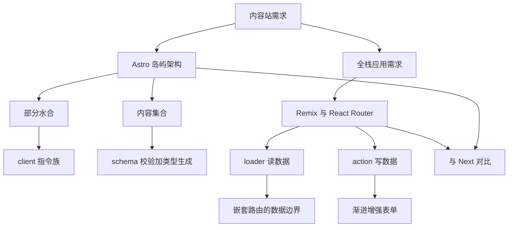
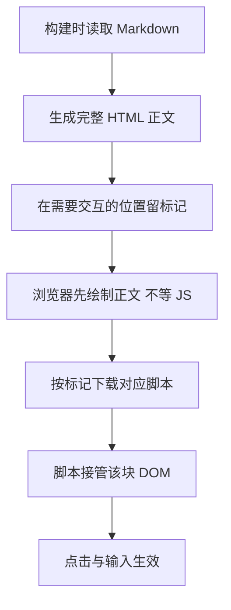
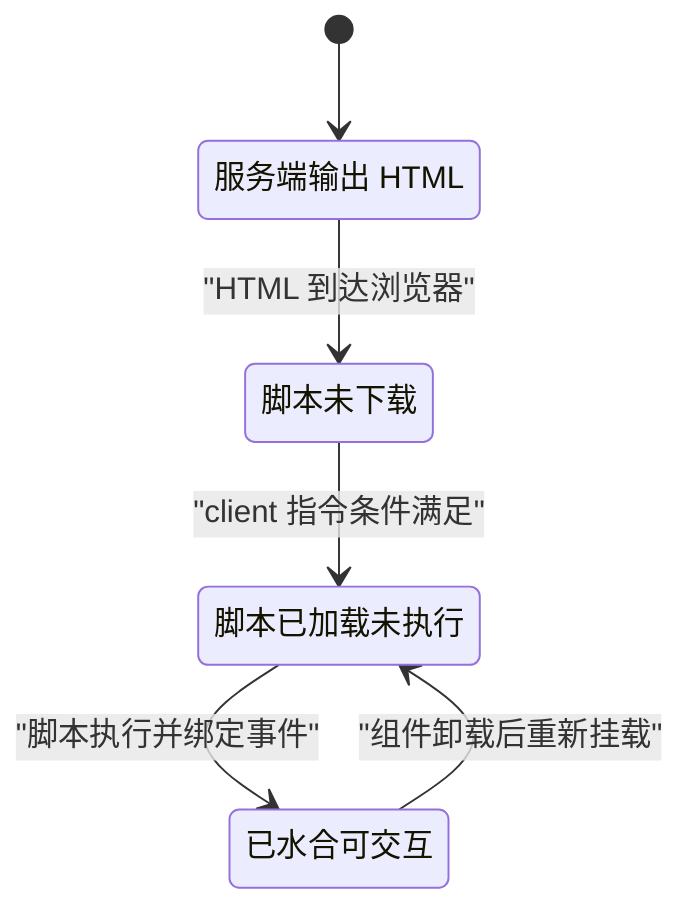
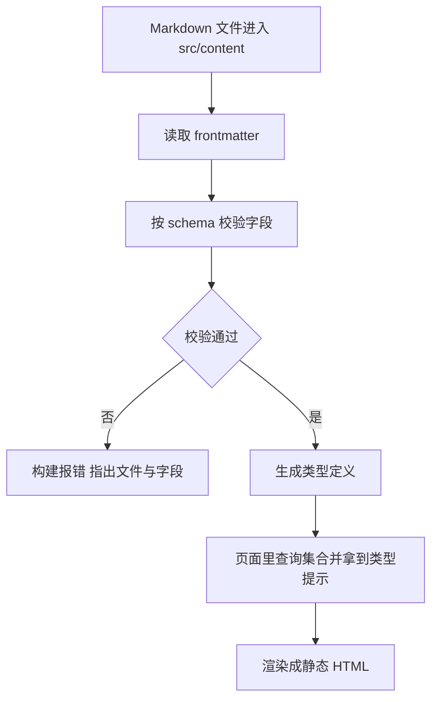
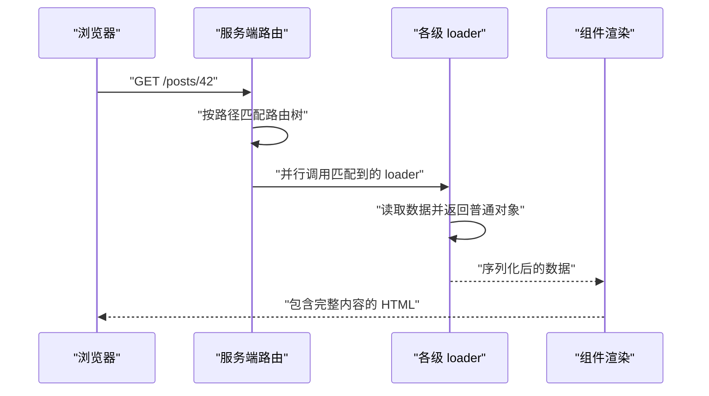
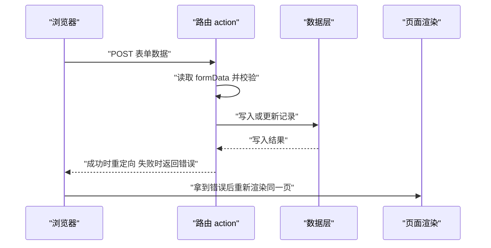
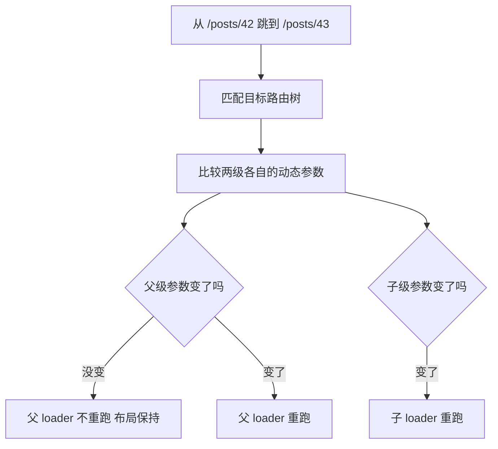
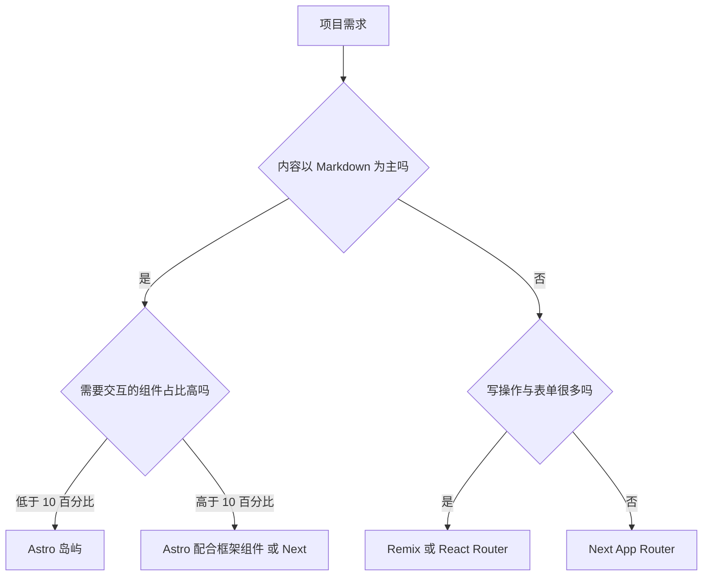

# Astro 岛屿架构与 Remix/React Router

!!! abstract "学完这一页你能"
    - 说清岛屿架构里哪几段代码会被下载到浏览器，并用手写脚本算出体积。
    - 按交互时机为 Astro 组件挑选 client 指令，写出对应的部分水合代码。
    - 用内容集合给 Markdown 定义 schema，在构建阶段拦下格式错误的数据。
    - 写出带 loader 与 action 的路由模块，并指出嵌套路由里哪一级 loader 会重跑。

## 0. 知识地图



先读第 1 到第 3 节，把"哪些代码进浏览器"和"内容怎么变成有类型的数据"这两件事定下来。
再读第 4 到第 6 节，把请求进来之后数据从哪来、写到哪去、哪一级会重跑理清。
最后读第 7 节与综合对比，用同一套维度去比较 Next。

## 1. 岛屿架构：页面先静态，交互按需挂载

**先想一个问题**

一个博客详情页，正文 5000 字，右上角有一个点赞按钮。
如果页面由客户端渲染的单页应用生成，用户要等包含渲染库与全部组件的 JS 下载并执行完，才能看到正文。
正文其实不需要 JS，这段等待能不能省掉？

**心智模型**

!!! tip "心智模型"
    一句话模型：页面是一张印好的海报，需要交互的部件是贴上去的岛，每座岛自己带电。
    日常类比：纸质地图上贴了 3 张电子贴纸，只有贴纸要充电，地图本身不用。
    哪里不成立：纸质贴纸互不通信没问题，可组件之间常有状态牵连，跨岛传状态要额外桥接。

!!! note "术语：岛屿架构"
    定义：页面大部分内容在构建时或请求时输出为 HTML，只有需要交互的组件单独打包成脚本并在浏览器接管自己那块 DOM。
    例：文章正文是 HTML，点赞按钮是一个岛，它自己带 12 KB 脚本。

**图解**



1. 构建阶段把 Markdown 转成 HTML 字符串，这一步不涉及浏览器。
2. 生成的 HTML 里，正文是普通标签，没有任何事件绑定。
3. 需要交互的组件位置会留下标记与一条脚本引用。
4. 浏览器拿到 HTML 就开始排版绘制，正文的可见时间只取决于网络与解析。
5. 每条标记对应一个独立脚本文件，文件内容只含这个组件的代码。
6. 脚本执行后把该块 DOM 交给框架接管，此时点击才产生状态变化。

**一步一步来**

**第 1 步：让页面默认零 JS**

这一步要做什么：写出一个只有静态正文的 Astro 页面，确认它不产生任何脚本标签。

```astro

// 页面顶部的代码块在构建时执行，变量不会进入浏览器
const post = {
  title: "从多页应用到岛屿",
  body: "<p>正文第一段</p><p>正文第二段</p>",
};

<article>
  <h1>{post.title}</h1>
  <!-- set:html 表示这段内容是已生成的 HTML，直接插入 -->
  <div set:html={post.body}></div>
</article>
```

**这段代码在做什么**

- 顶部代码块属于构建期，只在 Node 里跑一次。
- `set:html` 插入的字符串按 HTML 解析，不再做转义。
- 页面没有导入任何框架组件，因此不会生成组件脚本。
- 正文标签可被爬虫直接读到，不需要等待 JS 执行。

**运行结果**：构建产物里 `h1` 与两个 `p` 都在源码中，正文区间没有 `script` 标签。

**第 2 步：只给点赞按钮加交互**

这一步要做什么：导入一个 React 组件，用 client 指令声明它是一座岛。

```astro

import LikeButton from "../components/LikeButton.jsx";
const post = { id: "islands-101", title: "从多页应用到岛屿" };

<article>
  <h1>{post.title}</h1>
  <div set:html={post.body}></div>
  <!-- client:visible 表示该组件滚入视口才下载并执行脚本 -->
  <LikeButton client:visible postId={post.id} />
</article>
```

**这段代码在做什么**

- Astro 默认不发送组件脚本，写了 client 指令才打包。
- `client:visible` 把脚本的下载时机推迟到元素进入视口。
- `postId` 会被序列化进 HTML，岛屿启动时再读回来。
- 因此 props 必须是可序列化的值，函数与类实例传不过去。

**运行结果**：产物 HTML 底部多出一条指向按钮脚本的模块引用，正文区间仍无脚本。

**动手验证**

这段脚本不依赖 Astro，它把"哪块代码会进浏览器"的判断抽成纯函数，用 Node 直接跑。

```js
// 依赖：仅 Node 20+ 内置模块，无第三方包
import assert from "node:assert/strict";

// 页面组成：name 是组件名，kb 是该组件打包后的体积，island 表示是否带 client 指令
const page = [
  { name: "ArticleBody", kb: 0, island: false },
  { name: "LikeButton", kb: 12, island: true },
  { name: "CommentList", kb: 40, island: false },
  { name: "SearchBox", kb: 18, island: true },
];

// 只有带 client 指令的组件才会把脚本送到浏览器
const islands = page.filter((c) => c.island);
const shippedKb = islands.reduce((sum, c) => sum + c.kb, 0);
const allKb = page.reduce((sum, c) => sum + c.kb, 0);

assert.equal(islands.length, 2);
assert.equal(shippedKb, 30);
assert.ok(shippedKb < allKb);

console.log("岛屿数量:", islands.length);
console.log("送到浏览器的 KB:", shippedKb);
console.log("全部组件体积合计 KB:", allKb);
```

预期输出：

```text
岛屿数量: 2
送到浏览器的 KB: 30
全部组件体积合计 KB: 70
```

**常见坑**

| 现象 | 原因 | 怎么修 |
| --- | --- | --- |
| 给组件写了 client 指令但体积没变 | 该组件里没有用到状态或事件，打包器把它优化掉了 | 确认组件内确实用到 `useState` 或事件处理器 |
| 岛屿之间共享状态失败 | 每个岛独立启动，不共享同一棵组件树 | 把共享状态放到 URL 查询参数或一个放在父层的岛里 |
| 传给岛的 props 变成 `undefined` | 传了函数或类实例，序列化时丢掉 | 只传字符串、数字、布尔、数组与普通对象 |

**小结**

- 岛屿架构把"静态内容"与"交互部件"分开处理，静态部分的下载量可以是 0 字节脚本。
- 岛屿的边界由 client 指令划出，边界两侧的数据必须可序列化。
- 跨岛通信是这个模型的代价，遇到共享状态先考虑改层级或改 URL。

## 2. 部分水合：什么时候把静态 HTML 变成可交互

**先想一个问题**

同一篇文章里有一个搜索框和一个页脚图表。
搜索框用户一进来就可能用，页脚图表要滚到最底部才看见。
两个组件的脚本都在页面加载时下载并执行，合适吗？

**心智模型**

!!! tip "心智模型"
    一句话模型：水合是给已经画好的 HTML 接上事件与状态，部分水合是分批接、按条件接。
    日常类比：房子已经建好，水合是通水电；可以先给客厅通电，卧室晚点再说。
    哪里不成立：通水电不用对齐墙面的每一块砖，水合要求 DOM 结构与组件输出逐节点对应。

!!! note "术语：水合"
    定义：浏览器执行组件代码，把服务端输出的静态 DOM 与组件内部状态绑定，使元素可以响应事件。
    例：HTML 里已有一个 `button`，水合后点击它会触发 `onClick`。

**图解**



1. 服务端输出的 HTML 到达浏览器时，元素还没有事件。
2. 脚本未下载的岛屿保持静态，点击不会有任何反应。
3. client 指令的条件满足后才开始下载脚本。
4. 脚本下载完成但还没执行时，界面仍然不可交互。
5. 脚本执行并把状态挂到 DOM 上，这座岛进入可交互状态。
6. 组件被移除再挂载时，会回到已加载未执行的状态。

**一步一步来**

**第 1 步：认识 5 个 client 指令的触发条件**

这一步要做什么：把每个指令对应的时机与适用场景列清楚，写代码时按条件挑。

```astro

import SearchBox from "../components/SearchBox.jsx";
import FooterChart from "../components/FooterChart.jsx";
import MapView from "../components/MapView.jsx";

<!-- 首屏就要用的交互，立即下载并执行 -->
<SearchBox client:load />

<!-- 不着急的交互，等浏览器空闲再执行 -->
<FooterChart client:idle />

<!-- 只有滚到可视区域才需要脚本的交互 -->
<MapView client:visible />

<!-- 只有匹配到媒体查询条件时才水合 -->
<SearchBox client:media="(max-width: 600px)" />

<!-- 跳过服务端渲染，只在浏览器里渲染 -->
<MapView client:only="react" />
```

**这段代码在做什么**

- `client:load` 优先级最高，适合首屏立刻要用的输入框。
- `client:idle` 等主线程空闲，适合次要的图表与统计。
- `client:visible` 用视口检测触发，适合长页面下方的内容。
- `client:media` 把水合条件交给媒体查询，适合只在窄屏出现的手势组件。
- `client:only` 不做服务端输出，适合依赖 `window` 的组件。

**运行结果**：5 个组件都会输出 HTML 占位，但脚本下载时间点不同。

**第 2 步：给同一个页面排出水合顺序**

这一步要做什么：用一个小的调度模型，把"谁先水合"写成可断言的函数。

```js
// 依赖：仅 Node 20+ 内置模块
import assert from "node:assert/strict";

// 队列里的每一项代表一座岛：rule 是指令类型，ready 表示触发条件是否已经满足
const queue = [
  { name: "Header", rule: "load", ready: true },
  { name: "SearchBox", rule: "idle", ready: true },
  { name: "FooterChart", rule: "visible", ready: false },
];

// 指令优先级：数字越小越先执行
const rank = { load: 0, idle: 1, visible: 2 };

// 条件已满足的排前面；同组内按优先级排
const ordered = [...queue].sort((a, b) => {
  if (a.ready !== b.ready) return a.ready ? -1 : 1;
  return rank[a.rule] - rank[b.rule];
});

assert.deepEqual(
  ordered.map((c) => c.name),
  ["Header", "SearchBox", "FooterChart"],
);

console.log("水合顺序:", ordered.map((c) => c.name).join(" -> "));
```

**这段代码在做什么**

- 把"什么时候能水合"抽象成一个 `ready` 布尔值。
- 排序规则有两条：先看条件是否满足，再看指令优先级。
- 条件不满足的岛排在最后，所以页脚图表不会挡住输入框。
- 断言把顺序固定下来，改排序逻辑时测试会立刻报错。

**运行结果**：

```text
水合顺序: Header -> SearchBox -> FooterChart
```

**动手验证**

把上面两段合并成一个可运行文件，并补一条断言：条件满足后页脚图表会前进。

```js
// 依赖：仅 Node 20+ 内置模块
import assert from "node:assert/strict";

const rank = { load: 0, idle: 1, visible: 2 };

// 排序函数：条件未满足的一律排后面
function schedule(queue) {
  return [...queue].sort((a, b) => {
    if (a.ready !== b.ready) return a.ready ? -1 : 1;
    return rank[a.rule] - rank[b.rule];
  });
}

const queue = [
  { name: "Header", rule: "load", ready: true },
  { name: "SearchBox", rule: "idle", ready: true },
  { name: "FooterChart", rule: "visible", ready: false },
];

assert.deepEqual(
  schedule(queue).map((c) => c.name),
  ["Header", "SearchBox", "FooterChart"],
);

// 模拟滚动到底部，页脚图表条件变为满足
queue[2].ready = true;

assert.deepEqual(
  schedule(queue).map((c) => c.name),
  ["Header", "SearchBox", "FooterChart"],
);

// 换成页脚是 load、头部是 visible 的情况，顺序应当反转
const swapped = [
  { name: "FooterChart", rule: "load", ready: true },
  { name: "Hero", rule: "visible", ready: false },
];
assert.deepEqual(
  schedule(swapped).map((c) => c.name),
  ["FooterChart", "Hero"],
);

console.log("第一次排序:", schedule(queue).map((c) => c.name).join(" -> "));
console.log("条件满足后:", schedule(swapped).map((c) => c.name).join(" -> "));
```

预期输出：

```text
第一次排序: Header -> SearchBox -> FooterChart
条件满足后: FooterChart -> Hero
```

**常见坑**

| 现象 | 原因 | 怎么修 |
| --- | --- | --- |
| 首屏输入框点击无反应 | 用了 `client:visible`，元素还在视口外 | 首屏交互组件改用 `client:load` |
| 页面滚动时卡顿一下 | `client:idle` 的组件体积大，空闲回调里同步执行太久 | 把大组件拆成两个小岛，或改用 `client:visible` |
| 服务端渲染的组件上报 `window is not defined` | 组件在渲染期访问了浏览器全局变量 | 改用 `client:only`，或在 `useEffect` 内访问 |

**小结**

- 部分水合的回答是"什么时候水合"，5 个 client 指令就是 5 组触发条件。
- 选择顺序先问"用户多快会用到"，再问"这段脚本多大"。
- 条件越晚满足，首屏要解析的脚本越少，但可交互时间越晚。

## 3. 内容集合：把 Markdown 变成有类型的数据

**先想一个问题**

一个站点有 120 篇 Markdown，frontmatter 里的日期有人写 `2024-03-01`，有人写 `2024/03/01`。
如果在渲染时才发现格式不对，是 120 个页面里坏掉 1 个，还是构建直接失败好？

**心智模型**

!!! tip "心智模型"
    一句话模型：内容集合是给一个文件夹下的 Markdown 建一张带列类型的表，构建前先校验再取用。
    日常类比：把散页笔记先录进一张表格，列是什么类型提前定好，格式错的当场退回。
    哪里不成立：表的列由代码里的 schema 定义，改列要改代码并重新构建，不是点几下表格就改完。

!!! note "术语：内容集合"
    定义：Astro 中把 `src/content` 下某个目录的文件集合按统一 schema 校验，并生成可带类型查询接口的机制。
    例：`blog` 集合规定每篇必须有 `title` 与 `date`，查询时 `entry.data.date` 就是日期字符串。

**图解**



1. 文件放进内容目录后，集合会在构建阶段被扫描。
2. 每个文件的 frontmatter 被解析成键值对。
3. schema 逐个字段检查类型与必填项。
4. 校验不通过时构建中断，错误里带文件名与字段名。
5. 校验通过后生成类型定义，编辑器能给出补全提示。
6. 页面通过查询接口取条目，交给模板输出 HTML。

**一步一步来**

**第 1 步：写一个 schema 描述约束**

这一步要做什么：用 Astro 官方文档里的 schema 写法，给博客集合定下必填字段与类型。

```ts
// 文件位置与配置入口随 Astro 大版本变化
// 需核对官方文档：当前版本是用 src/content.config.ts 还是 src/content/config.ts
import { defineCollection, z } from "astro:content";

// 每篇博客必须提供 title、date、draft 三个字段
const blog = defineCollection({
  type: "content",
  schema: z.object({
    title: z.string().min(1),          // 标题非空字符串
    date: z.coerce.date(),             // 允许字符串输入，转成日期对象
    draft: z.boolean().default(false), // 缺省时按 false 处理
  }),
});

export const collections = { blog };
```

**这段代码在做什么**

- `defineCollection` 把目录与一个 schema 绑定。
- schema 里每个字段的规则就是校验规则，构建时按它检查。
- `z.coerce.date()` 负责把字符串转成日期，格式非法会抛错。
- `default` 让字段可省略，避免每篇都写 `draft`。
- 集合名称 `blog` 之后在查询时会用到。

**运行结果**：日期写成 `2024/03/01` 的文件在构建时报错，并指出是哪一篇。

**第 2 步：查询并渲染**

这一步要做什么：在列表页取回全部条目，按日期排序后输出链接。

```astro

import { getCollection } from "astro:content";

// 过滤草稿，返回的条目带有 data 与 slug 两个属性
const posts = await getCollection("blog", ({ data }) => data.draft !== true);

// 按日期从新到旧排列
posts.sort((a, b) => b.data.date.valueOf() - a.data.date.valueOf());

<ul>
  {posts.map((entry) => (
    <!-- 每条链接指向按 slug 生成的详情页 -->
    <li><a href={`/blog/${entry.slug}`}>{entry.data.title}</a></li>
  ))}
</ul>
```

**这段代码在做什么**

- `getCollection` 的第二个参数是过滤函数，草稿在这里被排除。
- 返回值的 `data` 已经过 schema 校验，字段名拼错会在类型检查阶段暴露。
- `entry.data.date` 是日期对象，可以直接比较大小。
- 排序发生在构建期，产物只是一段排好序的 HTML。

**运行结果**：列表页 HTML 中的链接顺序与构建日期一致，草稿不出现在页面里。

**动手验证**

Astro 的 schema 依赖构建流程，这里用一段不依赖第三方库的脚本模拟"解析加校验"两步。

```js
// 依赖：仅 Node 20+ 内置模块
import assert from "node:assert/strict";

// 极简 frontmatter 解析：只处理 key: value 形式的行
function parseFrontmatter(raw) {
  const parts = raw.split("---");
  const block = parts[1] ?? "";
  const data = {};
  for (const line of block.split("\n")) {
    const t = line.trim();
    if (!t) continue;
    const i = t.indexOf(":");
    data[t.slice(0, i).trim()] = t.slice(i + 1).trim();
  }
  return { data, body: (parts[2] ?? "").trim() };
}

// schema：字段名到校验函数的映射
const schema = {
  title: (v) => typeof v === "string" && v.length > 0,
  date: (v) => /^\d{4}-\d{2}-\d{2}$/.test(v),
  draft: (v) => v === "true" || v === "false",
};

function validate(data) {
  const errors = [];
  for (const [key, check] of Object.entries(schema)) {
    if (!(key in data)) errors.push(`缺少字段 ${key}`);
    else if (!check(data[key])) errors.push(`字段 ${key} 格式不对: ${data[key]}`);
  }
  return errors;
}

const good = "---\ntitle: 岛屿入门\ndate: 2024-03-01\ndraft: false\n---\n正文";
const bad = "---\ntitle: 岛屿入门\ndate: 2024/03/01\ndraft: false\n---\n正文";

assert.deepEqual(validate(parseFrontmatter(good).data), []);
assert.equal(validate(parseFrontmatter(bad).data).length, 1);
assert.match(parseFrontmatter(good).body, /正文/);

console.log("合格文件:", validate(parseFrontmatter(good).data));
console.log("问题文件:", validate(parseFrontmatter(bad).data));
```

预期输出：

```text
合格文件: []
问题文件: [ '字段 date 格式不对: 2024/03/01' ]
```

**常见坑**

| 现象 | 原因 | 怎么修 |
| --- | --- | --- |
| 构建报错说找不到集合配置 | 配置文件名随大版本变化 | 需核对官方文档：当前版本读取的配置路径与文件扩展名 |
| 编辑器没有字段补全 | 构建还没跑过一次，类型文件未生成 | 先执行一次构建或开发服务器生成类型 |
| 日期排序结果不对 | 把日期当字符串比较，`2024/03/01` 与 `2024-03-01` 混排 | 用 `z.coerce.date()`，比较时取日期对象的毫秒值 |

**小结**

- 内容集合的价值在构建阶段把数据错误暴露出来，而不是等用户打开页面。
- schema 同时提供两样东西：校验规则与类型提示。
- 查询接口让页面只关心"取哪些条目"，校验细节留在 schema 里。

## 4. Remix 与 React Router：loader 读数据

**先想一个问题**

一个订单详情页要在挂载后请求接口拿数据。
用 `useEffect` 里的 `fetch`，用户会先看到空壳，再看到内容闪一下。
能不能在渲染组件之前就把数据准备好？

**心智模型**

!!! tip "心智模型"
    一句话模型：loader 是挂在路由上的数据读取函数，框架在渲染组件前调用它，组件直接拿返回值。
    日常类比：后厨先把菜做好，服务员端上桌，客人不会先看到空盘。
    哪里不成立：客户端跳转时 loader 在浏览器里执行并发出请求，它并非总在服务端运行。

!!! note "术语：loader"
    定义：路由模块导出的数据读取函数，接收请求与路由参数，返回的值经序列化后交给该路由的组件。
    例：`/posts/:id` 的 loader 读取 `params.id`，返回对应文章的标题与正文。

**图解**



1. 浏览器发出一个普通的页面请求。
2. 服务端按路径匹配路由树，得到从根到叶的一条链。
3. 链上所有 loader 被调用，同级之间并行执行。
4. 每个 loader 返回普通对象或响应，函数与类实例会被剥掉。
5. 数据交给组件渲染，组件通过 `useLoaderData` 读取。
6. 返回的 HTML 里已经有内容，首屏不出现空壳闪烁。

**一步一步来**

**第 1 步：写一个 loader**

这一步要做什么：在路由模块里导出 loader，用参数查出一条记录。

```js
// 路由模块：同一个文件里导出 loader 与默认组件
export async function loader({ params }) {
  // params 来自路径中的动态段
  const post = await db.post.findUnique({ where: { id: params.id } });
  if (!post) {
    // 抛出响应让框架直接返回 404，不进入组件
    throw new Response("没有这篇文章", { status: 404 });
  }
  // 返回值必须是可序列化的普通对象
  return { title: post.title, body: post.body };
}

export default function Post() {
  // 读取上一步 loader 的返回值
  const data = useLoaderData();
  return <article><h1>{data.title}</h1><p>{data.body}</p></article>;
}
```

**这段代码在做什么**

- `params.id` 由路径 `/posts/:id` 的匹配结果填充。
- 数据不存在时抛 `Response`，渲染阶段被跳过。
- 返回值只包含页面需要的字段，减少序列化体积。
- 组件内没有 `useEffect`，也没有加载中状态。
- `useLoaderData` 的类型依赖框架生成，需核对官方文档：当前版本类型注入的具体写法。

**运行结果**：请求 `/posts/42` 返回的 HTML 里已有标题与正文。

**第 2 步：让嵌套路由的 loader 并行**

这一步要做什么：父路由与子路由各写一个 loader，观察它们的执行时机。

```js
// 父路由：负责当前登录用户，子路由依赖它显示作者信息
export async function loader() {
  const user = await db.user.current();
  return { user };
}

export default function Root() {
  return (
    <div>
      <Header />
      {/* 子路由在这里渲染，它的 loader 与父 loader 并行执行 */}
      <Outlet />
    </div>
  );
}
```

**这段代码在做什么**

- 父 loader 只取与自己和所有子路由都相关的数据。
- 子路由的 loader 不会等父 loader 结束才发起，它们并行。
- `Outlet` 是子路由的渲染出口。
- 把慢请求放在父 loader 会让所有子路由一起等，需按数据用途分层。

**运行结果**：两个 loader 的总耗时接近二者中较慢的那个，而不是两者之和。

**动手验证**

下面这段脚本实现一个迷你路由：按路径匹配、并行执行 loader、汇总数据。

```js
// 依赖：仅 Node 20+ 内置模块
// 保存为 router.mjs 后执行：node router.mjs
import assert from "node:assert/strict";

const routes = [
  { id: "root", path: "/", loader: async () => ({ user: "ann" }) },
  {
    id: "post",
    path: "/posts/:id",
    // 动态段从路径里取，返回给组件
    loader: async ({ params }) => ({ id: params.id, title: `文章 ${params.id}` }),
  },
];

// 把模式与路径都切成段，段数必须一致，:name 形式表示动态段
function match(pattern, pathname) {
  const p = pattern.split("/").filter(Boolean);
  const u = pathname.split("/").filter(Boolean);
  if (p.length !== u.length) return null;
  const params = {};
  for (let i = 0; i < p.length; i++) {
    if (p[i].startsWith(":")) params[p[i].slice(1)] = u[i];
    else if (p[i] !== u[i]) return null;
  }
  return params;
}

async function handle(pathname) {
  const matched = routes
    .map((r) => ({ ...r, params: match(r.path, pathname) }))
    .filter((r) => r.params !== null);

  assert.ok(matched.length > 0, `没有路由匹配 ${pathname}`);

  // 并行执行，而不是串行累加耗时
  const results = await Promise.all(matched.map((r) => r.loader({ params: r.params })));
  return Object.fromEntries(matched.map((r, i) => [r.id, results[i]]));
}

const data = await handle("/posts/42");
assert.equal(data.post.id, "42");
assert.equal(data.post.title, "文章 42");
assert.equal(data.root.user, "ann");

console.log("匹配到的数据:", JSON.stringify(data));
```

预期输出：

```text
匹配到的数据: {"root":{"user":"ann"},"post":{"id":"42","title":"文章 42"}}
```

**常见坑**

| 现象 | 原因 | 怎么修 |
| --- | --- | --- |
| loader 返回后组件里字段是 `undefined` | 返回了函数或类实例，序列化时被剥掉 | 返回值只放可序列化的数据 |
| 页面报 `useLoaderData 必须在路由内使用` | 组件不在该路由的渲染树里 | 把组件放进对应的路由模块或它的子路由 |
| 404 场景仍进入组件 | loader 里返回了 `null` 而没有抛响应 | 数据缺失时抛带状态码的 `Response` |

**小结**

- loader 把取数时机提前到渲染之前，首屏因此不出现空壳。
- loader 的返回值有序列化要求，返回值越干净越省传输。
- 嵌套路由的 loader 并行执行，数据放在哪一层决定了谁一起等。

## 5. action 与渐进增强：表单先走后端

**先想一个问题**

一个登录表单，用户点了提交。
如果脚本还没加载完，或者浏览器禁用了 JS，这个表单还能完成登录吗？

**心智模型**

!!! tip "心智模型"
    一句话模型：action 处理写操作，表单先以原生方式提交到服务端，脚本加载后同一套逻辑再接管为无刷新提交。
    日常类比：柜台交表格，柜台自己处理，你有没有手机都能交。
    哪里不成立：如果 action 里只做了浏览器端校验，没有 JS 时这段校验不会执行。

!!! note "术语：渐进增强"
    定义：先让页面用浏览器原生能力完成核心功能，再在此基础上用脚本增加更顺滑的交互。
    例：登录表单先用 `method="post"` 提交，脚本就绪后改为局部刷新并显示行内错误。

**图解**



1. 浏览器按表单原生行为发出一个 POST 请求。
2. action 读取 `formData`，逐字段校验。
3. 校验通过后写入数据层。
4. 写入失败或校验失败时不重定向，返回错误信息。
5. 返回错误时页面重新渲染，组件能读到 action 的返回值。
6. 脚本加载完成后，同一套 action 通过无刷新方式提交，界面不整页刷新。

**一步一步来**

**第 1 步：写 action 处理写操作**

这一步要做什么：导出一个 action，读取表单字段，校验并返回结果。

```js
export async function action({ request }) {
  // formData 来自原生表单提交，无需脚本参与
  const form = await request.formData();
  const name = String(form.get("name") ?? "");
  const password = String(form.get("password") ?? "");

  if (!name || !password) {
    // 返回普通对象代表校验失败，页面不跳转
    return { error: "账号和密码都要填" };
  }
  if (!(await verify(name, password))) {
    return { error: "账号或密码不对" };
  }
  // 抛出重定向响应，浏览器地址栏会跟着变化
  return redirect("/dashboard");
}
```

**这段代码在做什么**

- `request.formData()` 解析原生表单提交的内容。
- 返回普通对象时，当前页面重新渲染并把对象交给组件。
- 抛 `redirect` 时地址栏改变，历史记录里留下一条。
- 校验与写入都在服务端执行，客户端无法跳过。

**运行结果**：没有 JS 时提交空表单，页面重新渲染并显示"账号和密码都要填"。

**第 2 步：组件读取 action 的返回值**

这一步要做什么：用同一个数据钩子读取 action 的结果，把错误显示在表单上方。

```jsx
import { Form, useActionData } from "react-router";

export default function Login() {
  // action 返回的对象在这里读到，没有提交过时为 undefined
  const data = useActionData();

  return (
    {/* Form 组件在脚本就绪后接管提交，未就绪时按原生表单提交 */}
    <Form method="post">
      <input name="name" />
      <input name="password" type="password" />
      {data?.error ? <p role="alert">{data.error}</p> : null}
      <button type="submit">登录</button>
    </Form>
  );
}
```

**这段代码在做什么**

- `useActionData` 与 `useLoaderData` 是同一套数据流的两个方向。
- `Form` 在脚本未加载时退化为原生表单，提交行为不变。
- 错误节点用同一份数据渲染，不需要额外的本地状态。
- 输入框里的值在重新渲染后仍由浏览器保留。

**运行结果**：脚本就绪时提交不刷新页面，脚本未就绪时整页刷新且功能不变。

**动手验证**

下面用纯函数模拟 action 的两个分支，并用断言固定行为。

```js
// 依赖：仅 Node 20+ 内置模块
import assert from "node:assert/strict";

// 模拟 formData 的最小接口
function formData(entries) {
  return { get: (k) => entries[k] ?? null };
}

const users = new Map([["ann", "123456"]]);

// action 的职责：读表单、校验、写数据、返回结果或重定向目标
async function loginAction(fd) {
  const name = String(fd.get("name") ?? "");
  const password = String(fd.get("password") ?? "");
  if (!name || !password) return { ok: false, error: "账号和密码都要填" };
  if (users.get(name) !== password) return { ok: false, error: "账号或密码不对" };
  return { ok: true, redirectTo: "/dashboard" };
}

const empty = await loginAction(formData({}));
const fail = await loginAction(formData({ name: "ann", password: "wrong" }));
const pass = await loginAction(formData({ name: "ann", password: "123456" }));

assert.equal(empty.error, "账号和密码都要填");
assert.equal(fail.ok, false);
assert.equal(pass.ok, true);
assert.equal(pass.redirectTo, "/dashboard");

console.log("空表单:", JSON.stringify(empty));
console.log("密码错:", JSON.stringify(fail));
console.log("成功:", JSON.stringify(pass));
```

预期输出：

```text
空表单: {"ok":false,"error":"账号和密码都要填"}
密码错: {"ok":false,"error":"账号或密码不对"}
成功: {"ok":true,"redirectTo":"/dashboard"}
```

**常见坑**

| 现象 | 原因 | 怎么修 |
| --- | --- | --- |
| action 返回的对象读不到 | 返回了 `Response` 而不是普通对象 | 失败分支返回普通对象，成功分支才抛重定向 |
| 关闭 JS 后表单提交报 405 | 表单没有写 `method="post"`，退化成 GET | 表单上显式声明提交方法 |
| 提交后输入框被清空 | 用了受控组件并把值存在本地状态里 | 改用非受控输入，让浏览器保留值 |

**小结**

- action 与 loader 是同一套数据流的写方向与读方向。
- 渐进增强的关键是让原生表单先能工作，脚本只负责把体验改顺。
- 服务端校验必须在 action 里做，客户端校验只作为提示。

## 6. 嵌套路由与数据边界：哪一级会重跑

**先想一个问题**

页面顶部是导航栏，中间是文章列表，点一篇文章进入详情。
从 `/posts/42` 跳到 `/posts/43`，导航栏的数据还需要重新请求一次吗？

**心智模型**

!!! tip "心智模型"
    一句话模型：路由树同时是渲染树和数据边界树，每一级只管自己那一段参数对应的数据。
    日常类比：一本书换一页只需重印那一页，封面与目录不用重印。
    哪里不成立：如果父级数据被标记为需要随每次导航刷新，父级照样会重跑。

!!! note "术语：嵌套路由"
    定义：把 URL 按段拆成父子关系的路由结构，父路由渲染公共布局，子路由渲染变化的部分。
    例：`/posts` 渲染列表布局，`/posts/:id` 在其中渲染详情。

**图解**



1. 导航发生时，先按目标 URL 匹配出新的路由树。
2. 框架把新树与旧树逐级比对。
3. 父级路径段的动态参数相同，父 loader 被跳过。
4. 布局组件不重新创建，页面上的滚动位置与输入状态得以保留。
5. 子级参数从 42 变成 43，子 loader 重新执行。
6. 只有子级渲染输出改变，父级部分不动。

**一步一步来**

**第 1 步：写出带参数的层级**

这一步要做什么：声明两级路由，父级负责文章外壳，子级负责正文。

```js
// 路由配置：路由树的结构决定了 loader 的层级
const routes = [
  {
    path: "/",
    // 只在会话变化时才有新数据，普通导航命中缓存
    loader: () => readCurrentUser(),
    element: <Root />,
    children: [
      // 父级参数是文章列表的筛选条件，不是某一篇的 id
      { path: "posts", loader: () => readPostList(), element: <PostList /> },
    ],
  },
];
```

**这段代码在做什么**

- 根路由的 loader 取会话数据，参数里没有文章 id，所以跳文章时不重跑。
- `posts` 这一级的 loader 取列表，参数不变时同样被跳过。
- 详情页这一级参数是 `id`，它变化时会重跑。
- 层级划得越贴近数据，重复请求越少。

**第 2 步：观察重跑条件**

这一步要做什么：用一段可断言的函数算出一次导航里哪些 loader 会重跑。

```js
// 判定规则：目标路由里存在该级，且这一级的动态参数与导航前不同
function revalidated(tree, from, to) {
  const a = paramOf(tree, from);
  const b = paramOf(tree, to);
  return tree.filter((p) => {
    if (!(p in b)) return false;                              // 目标里没有这一级
    if (!(p in a)) return true;                               // 新进入的这一级要跑
    return JSON.stringify(a[p]) !== JSON.stringify(b[p]);      // 参数变了才跑
  });
}
```

**这段代码在做什么**

- 先算出导航前后每一级匹配到的参数对象。
- 目标路由里不存在的层级被排除。
- 新出现的层级必须执行 loader。
- 参数相同则跳过，这是节省请求的来源。

**运行结果**：`/posts/42` 跳到 `/posts/43` 时，只有子级 loader 重跑。

**动手验证**

把匹配、取参、判定重跑三件事合成一个可运行脚本。

```js
// 依赖：仅 Node 20+ 内置模块
import assert from "node:assert/strict";

const tree = ["/", "/posts", "/posts/:id", "/posts/:id/comments"];

function match(pattern, pathname) {
  const p = pattern.split("/").filter(Boolean);
  const u = pathname.split("/").filter(Boolean);
  if (p.length !== u.length) return null;
  const params = {};
  for (let i = 0; i < p.length; i++) {
    if (p[i].startsWith(":")) params[p[i].slice(1)] = u[i];
    else if (p[i] !== u[i]) return null;
  }
  return params;
}

// 收集本次 URL 命中的每一级及其参数
function paramOf(pathname) {
  const out = {};
  for (const p of tree) {
    const m = match(p, pathname);
    if (m) out[p] = m;
  }
  return out;
}

function revalidated(from, to) {
  const a = paramOf(from);
  const b = paramOf(to);
  return tree.filter((p) => {
    if (!(p in b)) return false;
    if (!(p in a)) return true;
    return JSON.stringify(a[p]) !== JSON.stringify(b[p]);
  });
}

// 同一篇文章的两个 id：只有带 id 的那一级需要重跑
assert.deepEqual(revalidated("/posts/42", "/posts/43"), ["/posts/:id"]);
// 进入评论子路由：新增的一级需要跑
assert.deepEqual(revalidated("/posts/42", "/posts/42/comments"), ["/posts/:id/comments"]);
// 同一个 URL 重复访问：没有一级需要重跑
assert.deepEqual(revalidated("/posts/42", "/posts/42"), []);

console.log("切 id:", revalidated("/posts/42", "/posts/43"));
console.log("进评论:", revalidated("/posts/42", "/posts/42/comments"));
console.log("原地访问:", revalidated("/posts/42", "/posts/42"));
```

预期输出：

```text
切 id: [ '/posts/:id' ]
进评论: [ '/posts/:id/comments' ]
原地访问: []
```

**常见坑**

| 现象 | 原因 | 怎么修 |
| --- | --- | --- |
| 每次切换都重新拉全量数据 | 把列表数据放在根 loader 里，而根 loader 被配置为每次导航都跑 | 把列表数据下移到 `posts` 这一级 |
| 父布局在导航后重建 | 父级 loader 每次返回新对象，组件被重新挂载 | 检查父级参数是否真的变化，必要时缓存返回值 |
| 提交表单后整页数据全刷新 | action 完成后同层级 loader 会重新执行 | 把不相关的 loader 下移到子级，减少连带刷新 |

**小结**

- 路由树就是数据边界树，loader 的层级决定了重复请求的数量。
- 判定重跑的依据是这一级的动态参数是否变化。
- 把慢数据放在层级低的 loader 里，可以减少连带刷新的范围。

## 7. 与 Next 对比：同一道题的不同解法

**先想一个问题**

同样要做"服务端输出加数据获取"，Astro、Remix/React Router、Next 都能做。
选型时该拿哪几个维度去比，而不是比谁的介绍页写得好？

**心智模型**

!!! tip "心智模型"
    一句话模型：三者的差别在"默认给浏览器发多少脚本"和"数据入口放在哪里"这两个默认值上。
    日常类比：三家餐厅都做同一道菜，区别在下单后哪部分现做、哪部分提前备好。
    哪里不成立：默认值都能改，Astro 可以加更多岛，Next 可以减少客户端组件，改完之后的差别要看具体配置。

**图解**



1. 先看内容形态：Markdown 为主的项目，构建期校验与静态输出占比大。
2. 再看交互比例：交互组件少时，岛屿模型的默认开销低。
3. 交互比例高时，岛屿之间的桥接成本上升，改用统一的应用模型。
4. 没有大量 Markdown，但表单与写操作多，loader 与 action 的模型贴合需求。
5. 两者都不突出时，Next 的生态与部署选项覆盖面广。
6. 这些判断是启发式规则，最终的体积与耗时要在真实页面上测量。

**一步一步来**

**第 1 步：固定比较维度**

这一步要做什么：把对比收拢到 5 个可观测的维度，避免泛泛而谈。

```js
// 用一张表描述三条路线的默认行为，便于逐项核对
const matrix = {
  "Astro 岛屿": {
    defaultClientJs: "只有带 client 指令的组件产生脚本",
    dataEntry: "构建期查询内容集合 或 页面顶部取数",
    writeEntry: "接口路由 或 表单提交到服务端接口",
    cacheControl: "以静态产物与增量构建为主",
    contentModel: "内容集合加 schema",
  },
  "Remix 或 React Router": {
    defaultClientJs: "整棵路由树的应用脚本",
    dataEntry: "每个路由的 loader",
    writeEntry: "每个路由的 action",
    cacheControl: "以响应头与 loader 返回值控制",
    contentModel: "内容以数据层为主 需自行接 Markdown 流程",
  },
  "Next App Router": {
    defaultClientJs: "服务端组件不发脚本 客户端组件发",
    dataEntry: "服务端组件里直接读取 或 路由处理器",
    writeEntry: "Server Actions 或 路由处理器",
    cacheControl: "需核对官方文档：当前大版本的请求缓存与路由缓存默认值",
    contentModel: "内容以数据层或文件读取为主",
  },
};
```

**这段代码在做什么**

- 每个维度都对应一个可以在产物里核对的事实，而不是评价词。
- `defaultClientJs` 决定了首屏要解析多少脚本。
- `dataEntry` 与 `writeEntry` 决定了团队要学哪一套约定。
- 缓存那一项标了核对提醒，是因为默认值随大版本变化过。

**运行结果**：能拿着这张表去查每个框架的官方文档并逐项确认。

**第 2 步：把选择写成可测试的规则**

这一步要做什么：把启发式规则写成函数，用断言把边界情况固定住。

```js
// 输入是项目特征，输出是建议路线；规则明确写出便于复核
function pick({ markdownHeavy, interactiveRatio, formMutations }) {
  if (markdownHeavy && interactiveRatio < 0.1) return "Astro 岛屿";
  if (markdownHeavy) return "Astro 配合框架组件";
  if (formMutations) return "Remix 或 React Router";
  return "Next App Router";
}
```

**这段代码在做什么**

- `interactiveRatio` 是"需要交互的组件数 除 组件总数"。
- 阈值 0.1 是这条规则里的假设值，改它不需要改函数结构。
- 判断顺序从内容形态开始，再进入交互比例与写操作。
- 规则可测试，团队可以按自己的阈值替换。

**运行结果**：三种输入分别得到三条不同路线。

**动手验证**

```js
// 依赖：仅 Node 20+ 内置模块
import assert from "node:assert/strict";

function pick({ markdownHeavy, interactiveRatio, formMutations }) {
  if (markdownHeavy && interactiveRatio < 0.1) return "Astro 岛屿";
  if (markdownHeavy) return "Astro 配合框架组件";
  if (formMutations) return "Remix 或 React Router";
  return "Next App Router";
}

const cases = [
  [{ markdownHeavy: true, interactiveRatio: 0.05, formMutations: false }, "Astro 岛屿"],
  [{ markdownHeavy: true, interactiveRatio: 0.4, formMutations: false }, "Astro 配合框架组件"],
  [{ markdownHeavy: false, interactiveRatio: 0.6, formMutations: true }, "Remix 或 React Router"],
  [{ markdownHeavy: false, interactiveRatio: 0.6, formMutations: false }, "Next App Router"],
];

for (const [input, expected] of cases) {
  assert.equal(pick(input), expected, `输入 ${JSON.stringify(input)} 的判断不一致`);
}

// 阈值本身也要验证：刚好等于 0.1 时走第二条分支
assert.equal(pick({ markdownHeavy: true, interactiveRatio: 0.1, formMutations: false }), "Astro 配合框架组件");

console.log("四个场景全部通过");
console.log(cases.map(([i, r]) => `${JSON.stringify(i)} 对应 ${r}`).join("\n"));
```

预期输出：

```text
四个场景全部通过
{"markdownHeavy":true,"interactiveRatio":0.05,"formMutations":false} 对应 Astro 岛屿
{"markdownHeavy":true,"interactiveRatio":0.4,"formMutations":false} 对应 Astro 配合框架组件
{"markdownHeavy":false,"interactiveRatio":0.6,"formMutations":true} 对应 Remix 或 React Router
{"markdownHeavy":false,"interactiveRatio":0.6,"formMutations":false} 对应 Next App Router
```

**常见坑**

| 现象 | 原因 | 怎么修 |
| --- | --- | --- |
| 拿框架宣传页的体积数字做决策 | 那些数字对应的是特定示例页面 | 用自己项目的首个页面测量产物体积 |
| 把 Next 的缓存行为按旧版本记忆使用 | 请求缓存与路由缓存的默认值随大版本变过 | 需核对官方文档：当前版本的请求缓存与路由缓存默认策略 |
| 选了 Astro 却发现全站都要交互 | 交互比例估低了，岛屿间桥接变多 | 先统计交互组件占比，再决定是否换统一应用模型 |

**小结**

- 对比要落在默认脚本量、数据入口、写入口、缓存控制、内容模型这 5 个维度上。
- 三个框架的默认值不同，改动默认值之后要重新测量。
- 把选型规则写成可断言的函数，团队评审时有据可依。

## 综合对比

| 维度 | Astro 岛屿 | Remix 或 React Router | Next App Router |
| --- | --- | --- | --- |
| 默认送到浏览器的脚本 | 只有带 client 指令的组件 | 整棵路由树的应用脚本 | 服务端组件不发，客户端组件发 |
| 交互声明方式 | 在组件上写 client 指令 | 组件默认可交互 | 在文件顶部写 `"use client"` |
| 数据读取入口 | 构建期查询内容集合，或页面顶部取数 | 每级路由的 loader | 服务端组件内直接读取，或路由处理器 |
| 写操作入口 | 表单提交到服务端接口 | 每级路由的 action | Server Actions 或路由处理器 |
| 表单无 JS 时的行为 | 取决于是否用了原生表单 | 原生提交可用，脚本就绪后接管 | 需核对官方文档：当前版本 Server Actions 的降级行为 |
| 缓存控制位置 | 静态产物与增量构建策略 | 响应头与 loader 返回值 | 需核对官方文档：当前版本的请求缓存与路由缓存默认值 |
| 内容管理 | 内容集合加 schema 校验 | 需自行接入 Markdown 流程 | 需自行接入或读取文件 |
| 路由与布局 | 文件路由，布局组件可嵌套 | 嵌套路由，loader 与布局同级 | 文件路由，布局文件嵌套 |
| 适合的首屏场景 | Markdown 为主、交互集中在几处的站点 | 表单与写操作密集的应用 | 需要服务端组件与统一全栈模型的项目 |

## 应用与行业实践

这一章把前面的知识放进业务现场：先看哪些场景该用哪一招，再看三个拆解、行业做法与落地路线。每个场景都给出可复现的测量方法，而不是结论式口号。

### 应用场景地图

| 场景 | 用到本页哪个知识点 | 典型技术选型 | 注意事项 |
|----------|----------|----------|----------|
| 后台管理的万行表格 | 岛屿边界与 client 指令 | Astro + React 表格岛屿 | 行渲染留静态，只有筛选器水合 |
| 低端安卓的营销落地页首屏 | 岛屿体积手算脚本 | Astro + client:visible | 埋点与地图组件延后到可见时加载 |
| 多人协作白板 | 综合对比的结论 | Remix / React Router 全栈路由 | 协同状态需要长连接，静态外壳帮助有限 |
| 商品详情页加购 | loader 读数据 + action 提交 | React Router / Remix 路由模块 | 价格与库存必须服务端取值，不能静态化 |
| 文档站搜索与目录 | 内容集合 schema | Astro 内容集合 + Zod | 构建期拦住缺字段的 Markdown |
| 客服工单列表与详情 | 嵌套路由的数据边界 | React Router 嵌套路由 | 明确哪一级 loader 会重跑 |
| 会议官网日程页 | 部分水合 + 内容集合 | Astro + client:idle | 时区字段与收藏按钮分开处理 |
| 报名表单（无 JS 也要能用） | action 与渐进增强 | `<Form method="post">` | 关掉 JavaScript 后全流程仍要走通 |

### 三个场景拆解

#### 场景 1：后台管理的万行表格

**业务背景**

运营每天在这张表上筛订单，页面一次渲染上千行，输入筛选词时输入框有可感知的延迟。规模量级用可复现的方式描述：同一份数据把行数从 100 调到 2000，在 DevTools Performance 面板里对比长任务数量与总时长。

**怎么用本页知识解决**

思路是让行渲染停在服务端，只把决定「看到哪些行」的工具栏做成岛屿。首屏要立刻可点的筛选器用 `client:load`，需要滚动才用到的按钮用 `client:visible`。

```astro
---
// 列表页：表格行由服务端输出 HTML，只有工具栏会下载 JS
import FilterBar from '../components/FilterBar.tsx';
const page = Number(Astro.url.searchParams.get('page') ?? '1');
const rows = await listOrders({ page, size: 50 }); // 自建取数函数，每页 50 行
---
<FilterBar client:load page={page} />   {/* 首屏就要点的筛选器：立即水合 */}
<table>
  {rows.map((row) => (
    <tr><td>{row.id}</td><td>{row.status}</td></tr>  {/* 纯 HTML，不产生组件 JS */}
  ))}
</table>
<ExportButton client:visible />          {/* 滚动到才用的导出按钮：可见再水合 */}
```

- 表格行由 Astro 模板输出，浏览器收到的是 HTML，不下载行组件代码。
- `FilterBar` 用 `client:load`，因为它决定首屏能看到哪些数据。
- `ExportButton` 用 `client:visible`，用户不滚动就不发出这个 chunk 的请求。
- 翻页参数从 URL 读，翻页是整页导航，客户端状态只剩筛选条件。
- 构建后到 `dist` 里查行组件是否被打进某个 chunk，确认它没被任何岛屿入口引用。

**怎么度量收益**

- DevTools Network 面板按 JS 过滤，看 transferred 一列的首屏总量，对比改指令前后。
- Lighthouse 报告里的 Total Blocking Time，以及 Reduce unused JavaScript 审计项。
- DevTools Performance 面板录制从导航到输入框可响应，数长任务条数。
- 固定 CPU 6x 节流与 Slow 4G，同一台设备重复 5 次，取中位数记录。

**什么时候不该用**

- 需要跨页保持选中行并在页面间跳转时，静态行加小岛要自己同步状态，代价高于整表水合。
- 需要列宽拖拽、列宽记忆、键盘全表导航时，交给一个完整表格组件更省事。
- 数据每分钟都在变且用户依赖实时数字时，静态 HTML 会显示过期值。

#### 场景 2：低端安卓的首屏加载

**业务背景**

营销落地页的主要流量来自中低端安卓机，多数在 4G 下打开，团队说不清首屏究竟下载了哪几段 JS。规模量级用构建产物的 gzip 字节数作为可比指标，同一页面改指令前后各测一次。

**怎么用本页知识解决**

先算出「所有组件都水合」的字节上限，再用指令决定首屏实际下载多少。下面的脚本只需要构建产物目录，不依赖任何插件。

```bash
# 统计构建产物里所有 JS 的原始字节，作为"全部水合"的上限
find dist/_astro -name '*.js' -printf '%s\n' | awk '{s+=$1} END {print s}'

# macOS 的 find 没有 -printf，改用 stat 取每个文件大小再相加
stat -f %z dist/_astro/*.js | awk '{s+=$1} END {print s}'

# 估算传输体积：逐个 gzip 后累加字节数
find dist/_astro -name '*.js' -exec sh -c 'gzip -c "$1" | wc -c' _ {} \; | awk '{s+=$1} END {print s}'

# 核对实际下载：打开页面，DevTools Network 过滤 JS，看 transferred 一列
```

- 前两条命令给出上限，它不是首屏下载量，而是每个组件都水合时的字节数。
- 第三条按单个文件分别 gzip 后累加，与每个 chunk 单独传输的情况接近。
- 首屏实际下载量等于该页面匹配到的岛屿 chunk 加对应框架运行时，用 Network 面板核对。
- 把 `client:load` 改成 `client:visible` 后重跑这三条命令，对比总和与 Network 数字。
- 静态组件的代码不会出现在这些 chunk 里，这是岛屿架构能减少首屏字节的前提。

**怎么度量收益**

- Network 面板里 JS 的 transferred 总量，与构建脚本给出的上限一起记录。
- Lighthouse 的 Largest Contentful Paint 与 Total Blocking Time。
- 用 web-vitals 库上报 LCP 与 INP，按机型分组看分位数。
- DevTools Performance 面板开 CPU 4x 与 6x 节流，各测 5 次取中位数。

**什么时候不该用**

- 首屏就要显示用户所在城市的实时库存或价格，静态输出会给过期数字。
- 页面主体是画布或地图，静态 HTML 首屏没有任何可用内容，延后水合只会让白屏变长。
- 按钮必须在首屏立刻响应点击（例如防重复提交的支付按钮），延后到可见时水合会漏掉点击。

#### 场景 3：活动报名的表单与嵌套筛选

**业务背景**

报名页要能在关闭 JavaScript 的环境里提交，运营用脚本批量访问时经常碰到这种环境；同时筛选切换希望只重跑列表数据。规模量级用一次提交触发的 loader 次数衡量，在数据层打点计数即可。

**怎么用本页知识解决**

用路由模块的 `loader` 读数据、`action` 处理提交，表单用 `Form method="post"`，无 JS 时浏览器原生提交。嵌套路由里，子级 `loader` 只看自己的参数。

```tsx
// app/routes/events.$eventId.tsx
export async function loader({ params }: LoaderFunctionArgs) {
  return { event: await getEvent(params.eventId) }; // 父级参数变化才重跑
}

export async function action({ request }: ActionFunctionArgs) {
  const fd = await request.formData();              // 表单先走后端，无 JS 也能提交
  const result = parseSignup(fd);                   // 自建校验函数
  if (!result.ok) return { errors: result.errors }; // 校验失败原地回显，不跳转
  await saveSignup(result.value);
  return redirect(`/events/${fd.get('eventId')}/done`);
}

export default function EventRoute() {
  const { event } = useLoaderData<typeof loader>();
  return (
    <Form method="post">          {/* 浏览器原生提交，action 照常执行 */}
      <input name="email" />
      <button type="submit">报名</button>
    </Form>
  );
}
```

- `loader` 在服务端取数，组件用 `useLoaderData` 读，不写 useEffect 发请求。
- `action` 读 `request.formData()`，校验失败就 `return` 错误对象，页面原地回显。
- 表单用 `Form method="post"`，禁用 JavaScript 后浏览器仍按 `action` 提交。
- 嵌套路由里，父级 `loader` 在父级参数或父级提交后重跑，子级 `loader` 只看子级参数。
- 提交后框架会重新执行当前匹配路由树上的 `loader`，范围细节以官方文档为准。

**怎么度量收益**

- 在数据层打点，统计一次提交触发的 `loader` 执行次数与数据库查询次数。
- DevTools Network 里看 document 请求与数据请求各自的字节数。
- 在 DevTools 里禁用 JavaScript，走完报名到成功页的完整流程。
- DevTools Performance 面板记录从点击提交到页面更新的耗时。

**什么时候不该用**

- 每输入一个字符都要校验可用性并即时提示时，每次走 `action` 往返的体验差，应加客户端预校验。
- 拖拽排序、画布绘制这类只有客户端状态的操作，不该由 `action` 承担。
- 上传大文件时，直接在 `action` 里接收会占用请求体带宽，通常改为直传对象存储再回传地址。

### 行业先进实践

指令式水合（出处：Astro 官方文档 On-demand Hydration 与 client directives）

做法是用 `client:visible`、`client:idle`、`client:media` 决定组件何时下载并激活。首屏以下的组件不再参与初始加载，主线程在首屏要处理的任务随之减少。借鉴方式：把首屏以下的交互组件统一改成 visible 或 idle，只把影响首屏内容的组件留在 `client:load`。

构建期 schema 校验（出处：Astro 官方文档 Content Collections 与 Zod 官方文档）

做法是给每个集合定义 schema，字段类型不符时构建直接失败。错误在 CI 暴露，不会等到线上页面报错。借鉴方式：给每篇 Markdown 的 frontmatter 定义必填字段与类型，把构建失败当成发布前置条件。

渐进增强表单（出处：Remix 官方文档 Progressive Enhancement 与 React Router 官方文档 Form 组件）

先写能用的 `<Form method="post">`，再叠加客户端校验与 pending 状态。无 JS 时流程完整，有 JS 时体验叠加，不需要两套代码。借鉴方式：把报名、下单这类关键表单先按原生提交打通，再逐项加交互。

性能预算与 CI 拦截（出处：web.dev Performance budgets 与开源项目 Lighthouse CI）

给 JS 体积与关键指标设预算，超出阈值就让 CI 失败。退化在合并前被挡住，比上线后排查更省成本。借鉴方式：在 CI 里跑本页的场景 2 脚本，与上一次构建的基线比对。

岛屿运行时的重复引入（需核对官方文档：核对同一页面上同一框架的多个岛屿是否复用同一份运行时 chunk，以及不同框架的岛屿是否各自引入运行时）

这一点直接影响首屏字节的估算方式，也决定多框架混用时的取舍。借鉴方式：先在项目里做一次构建，用场景 2 的脚本按 chunk 名归类，再对照官方文档确认归类是否符合预期。

### 从学到用：落地路线

第 1 步：选一个首屏以下带交互的页面试点，把其中一个组件从 `client:load` 改成 `client:visible`。验收标准：Network 面板里该组件的 JS 请求只在滚动到它时出现。

第 2 步：用场景 2 的脚本算全量 JS 上限，再用 Network 记录首屏实际下载量，同一设备与节流档位各测 5 次。验收标准：两次测量都有留档数字，换人复现能得到同一量级的结果。

第 3 步：把内容集合 schema 与指令选择规则写进仓库模板和 PR 检查清单，新页面按模板起步。验收标准：新增 Markdown 缺必填字段时，本地构建直接失败并指出文件名。

第 4 步：在 CI 里跑体积脚本并与基线比对，同时保留禁用 JavaScript 的报名流程冒烟测试。验收标准：人为引入一个大依赖后 CI 报红，禁用 JS 的流程仍能通过。

### 动手作业

**目标**

做一个「活动日程 + 报名」小站：日程列表页首屏静态，收藏按钮按需水合，报名表单在关闭 JavaScript 时也能走通。

**步骤**

1. 用 Astro 建日程列表页与详情页，日程数据放进内容集合。
2. 给集合定义 schema：`title`、`start`、`timezone`、`location`、`signupUrl` 必填，`start` 用日期类型。
3. 故意写一篇缺 `location` 的 Markdown，运行构建，把报错信息贴进笔记。
4. 把收藏按钮做成 React 组件，先 `client:load`，再改 `client:visible`，每次改完跑一次本页的体积脚本。
5. 用 React Router 或 Remix 写报名路由：`loader` 读活动信息，`action` 处理表单，表单用 `Form method="post"`。
6. 在 DevTools 里禁用 JavaScript，走一遍报名流程到成功页。
7. 在 Network 面板记录两次（load 与 visible）的首屏 JS transferred 字节数，写进 README。

**验收标准**

- 缺字段的 Markdown 会让构建失败，报错里能看到文件名与缺失字段名。
- 滚动到收藏按钮之前，Network 面板中没有它的 JS 请求；滚动之后该请求出现。
- 禁用 JavaScript 后仍能完成报名并到达成功页。
- README 里的两组 JS 字节数与 Network 面板记录一致。
- 报名提交后的数据层日志显示，只有报名相关 `loader` 重跑，重跑次数被记录下来。

## 深入阅读与参考

!!! tip "怎么用这些资料"
    先读「官方文档与规范」建立准确的概念，再读「源码与示例」核对细节，最后用「教程、书籍与视频」换一种讲法加深理解。每条都写明了读哪一节、带着什么问题读。

### 官方文档与规范

| 资源 | 为什么读 | 怎么读 |
|---|---|---|
| [Astro 文档](https://docs.astro.build/zh-cn/getting-started/) | Islands 与内容集合的官方定义，本页大部分概念的权威来源。 | 读 Islands 与 Content Collections 两节，建一个含交互组件的页面并检查构建产物。 |
| [Remix 文档](https://remix.run/docs/en/main) | 嵌套路由与表单 action 的一手文档，直接对应数据边界章节。 | 读 Routing 与 Form 部分，写一个无 JS 也能提交的表单，再核对各级重跑范围。 |
| [React Router 文档](https://reactrouter.com/home) | loader 读数据、action 写数据在 React Router 中的标准写法。 | 读 Data Loading 与 Actions，实现一个带 loader 的路由并观察导航时哪些 loader 重跑。 |
| [Next.js App Router 文档](https://nextjs.org/docs/app) | 与 Astro、Remix 对照的同一道题，看清路由与缓存的取舍。 | 读 Routing、Data Fetching、Caching 三节，各做一例后与 Astro 页面对照。 |
| [React Server Components 参考](https://react.dev/reference/rsc/server-components) | 界定服务端与客户端组件，对应部分水合的切分边界。 | 读完在 Next 项目各写一个服务端与客户端组件，查看构建产物差异。 |
| [useActionState](https://react.dev/reference/react/useActionState) | 表单 action 的官方 API，渐进增强在 React 侧的落点。 | 读签名与示例，把页面表单改成 action 提交，并保留无 JS 回退路径。 |
| [Using HTML form validation and the Constraint Validation API](https://developer.mozilla.org/en-US/docs/Web/HTML/Guides/Constraint_validation) | 原生表单校验的规范级说明，是渐进增强的地基。 | 读校验流程与约束 API，给示例表单加原生校验后再叠加服务端 action。 |
| [Author fast-loading HTML pages](https://developer.mozilla.org/en-US/docs/Web/HTML/How_to/Author_fast-loading_HTML_pages) | 静态 HTML 优先的性能清单，呼应岛屿架构的出发点。 | 通读建议清单，挑三条应用到本页示例页面，测量前后加载差异。 |

### 源码与示例

| 资源 | 为什么读 | 怎么读 |
|---|---|---|
| [Astro 博客教程](https://docs.astro.build/en/tutorial/0-introduction/) | 端到端示例，能亲手验证零 JS 产出与按需水合。 | 做完整个博客教程，在产物里找出零 JS 页面与水合脚本的位置。 |
| [Astro 博客](https://astro.build/blog/) | 官方示例站点，可参考内容集合与群岛的真实组织方式。 | 翻看文章源码与目录结构，对照自己的内容集合定义做调整。 |

### 教程、书籍与视频

| 资源 | 为什么读 | 怎么读 |
|---|---|---|
| [Josh Comeau：Server Components](https://www.joshwcomeau.com/react/server-components/) | 把服务端与客户端组件边界讲得很透，适合补齐概念。 | 读完后画一张组件边界图，再对照自己项目里的组件划分。 |

## 自测题

??? question "岛屿架构里两个岛要共享同一份状态，有哪几种做法？"
    - 把共享状态上移到包含两个岛的父级，让父级成为一个更大的岛。
    - 把状态放进 URL 查询参数，两个岛各自从地址栏读取。
    - 用一个轻量的事件总线或全局 store，在岛屿启动时注册。
    - 先评估是否真的需要共享，很多场景改成父子关系后问题消失。
    - 跨岛传值必须可序列化，函数与类实例会在边界处丢失。

??? question "client:visible 与 client:idle 该在什么情况下互换？"
    - `client:visible` 的触发条件是元素进入视口，适合长页面下方的内容。
    - `client:idle` 的触发条件是主线程空闲，适合位置在首屏但优先级低的组件。
    - 首屏必须立刻可用的输入类组件应当用 `client:load`。
    - 从 idle 换成 visible 之前，先确认该组件确实在首屏之外。
    - 两者都会推迟水合，区别只在触发条件，不在脚本体积。

??? question "内容集合的 schema 校验发生在哪个阶段，为什么放在那里？"
    - 发生在构建或开发服务器启动时的内容扫描阶段。
    - 放在这里的理由是错误能在部署前暴露，而不是等用户打开页面。
    - 校验同时生成类型定义，编辑器可对 `entry.data` 给出补全。
    - schema 改动后需要重新构建才能反映到类型上。
    - 校验规则写在代码里，评审时可以随代码一起审。

??? question "loader 和组件里用 useEffect 取数，用户体验上的差别在哪？"
    - loader 在渲染组件前完成取数，首屏 HTML 里已有内容。
    - `useEffect` 取数发生在组件挂载之后，会出现空壳到内容的切换。
    - loader 的数据在客户端跳转时仍在浏览器里请求，只是时机提前。
    - loader 的返回值有序列化要求，`useEffect` 里没有这条限制。
    - 需要依赖浏览器 API 的数据仍然只能放在 `useEffect` 里。

??? question "action 与 loader 的分工是什么？"
    - loader 负责读，在导航到该路由时执行。
    - action 负责写，在向该路由提交表单或发起提交请求时执行。
    - 两者返回的普通对象都会被组件通过对应钩子读到。
    - action 成功后通常抛重定向，失败则返回普通对象留在当前页。
    - 没有 JS 时表单走原生提交，action 的校验依然执行。

??? question "从 /posts/42 跳到 /posts/43，根路由的 loader 会重跑吗？"
    - 判定依据是这一级匹配到的动态参数是否变化。
    - 根路由路径段里没有 `id`，参数对象在两次导航里相同，因此跳过。
    - 带 `:id` 的那一级参数从 42 变成 43，会重新执行。
    - 如果根 loader 依赖了查询参数，而查询参数变了，它就会重跑。
    - 把与子级无关的数据下移，可以减少连带刷新的范围。

??? question "渐进增强表单在浏览器禁用 JS 时怎么工作？"
    - 表单带 `method="post"`，浏览器按原生行为提交到同一路径。
    - 服务端由 action 读取 `formData`，校验与写入照常执行。
    - 失败时返回普通对象，页面整页重新渲染并显示错误。
    - 成功时抛重定向响应，浏览器跟随跳转。
    - 脚本就绪后 `Form` 组件接管提交，行为与结果保持一致。

??? question "为什么不能直接引用某个框架文档里的客户端体积数字做选型？"
    - 那些数字对应特定示例页面，与你的页面组成不同。
    - 页面里各组件是否被标记为交互组件，决定脚本是否发送。
    - 打包器的代码分割与压缩配置也会改变最终体积。
    - 正确做法是在自己的首个页面上测量产物并记录。
    - 需要比较时就给具体测量条件：页面路径、构建命令、产物文件。

## 延伸阅读

- Astro 官方文档：Islands 一节，讲清岛屿与 client 指令族
- Astro 官方文档：Framework Components 一节，讲清各框架组件如何接入
- Astro 官方文档：Content Collections 一节，讲清 schema 与查询接口
- Astro 官方文档：On-demand Rendering 一节，讲清静态输出与按需输出的取舍
- React Router 官方文档：Framework Mode 一节，讲清路由模块与配置文件
- React Router 官方文档：Data Loading 与 Actions 两节，讲清 loader 与 action
- React Router 官方文档：Revalidation 一节，讲清导航后哪些 loader 会重跑
- Remix 官方文档：Route Module 一节，讲清路由模块导出的各个函数
- Remix 官方文档：Progressive Enhancement 一节，讲清表单的降级行为
- Next.js 官方文档：App Router 一节，讲清文件路由与布局嵌套
- Next.js 官方文档：Server Components 与 Caching 两节，核对默认缓存策略
- MDN Web 文档：Progressive Enhancement 一节，讲清渐进增强的定义
