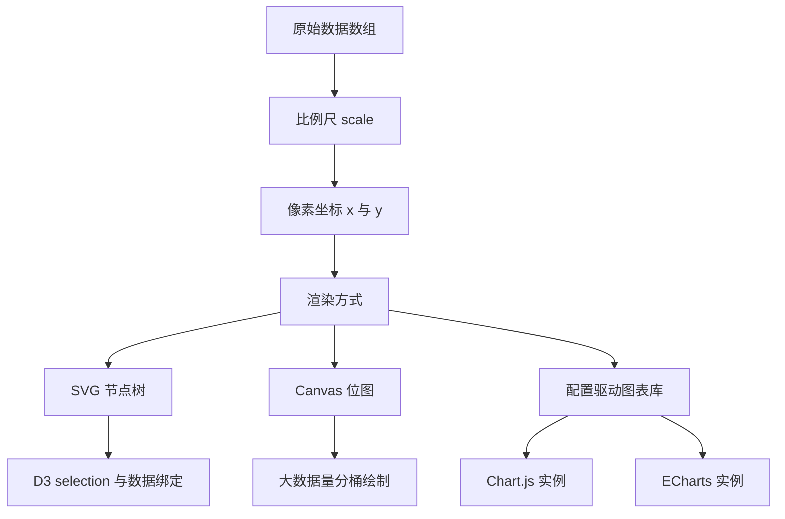
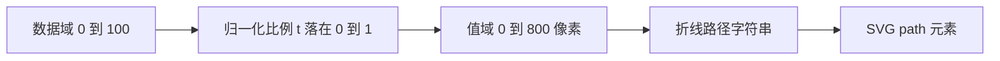
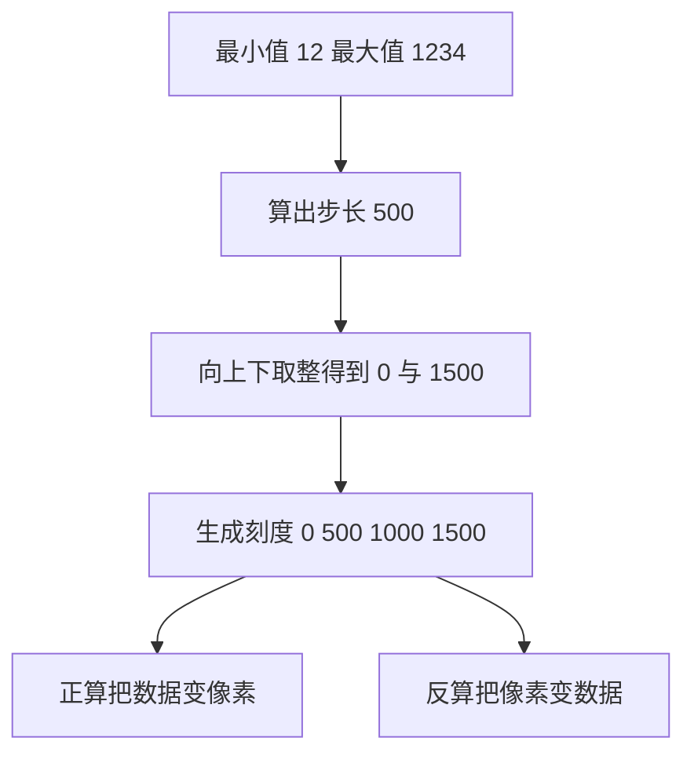
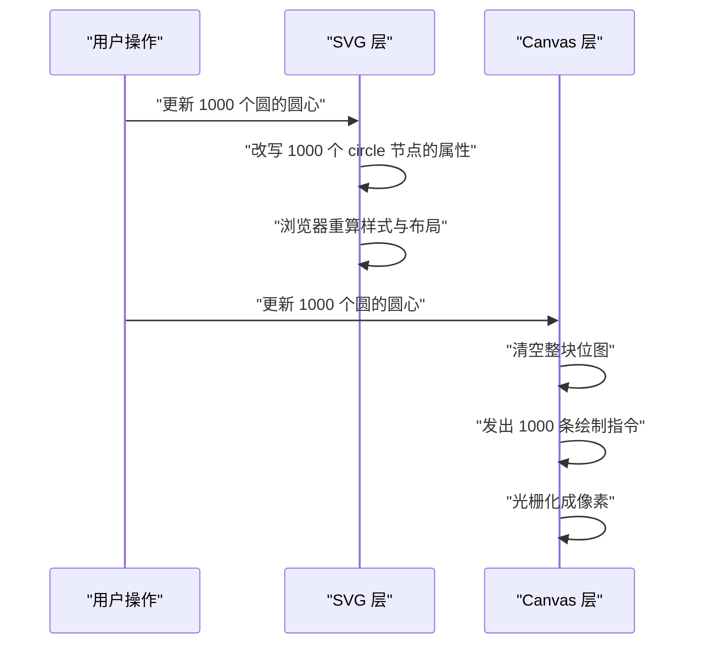
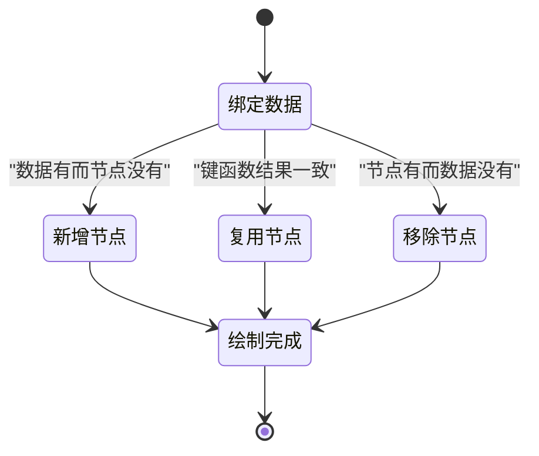
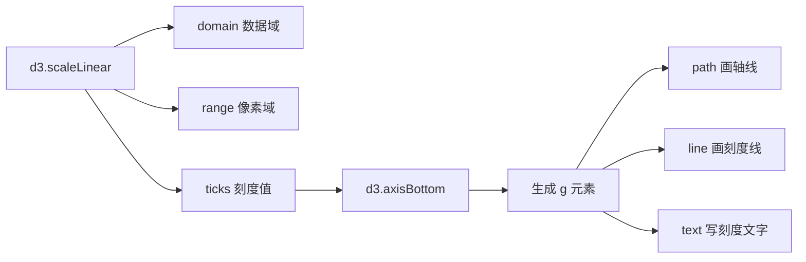
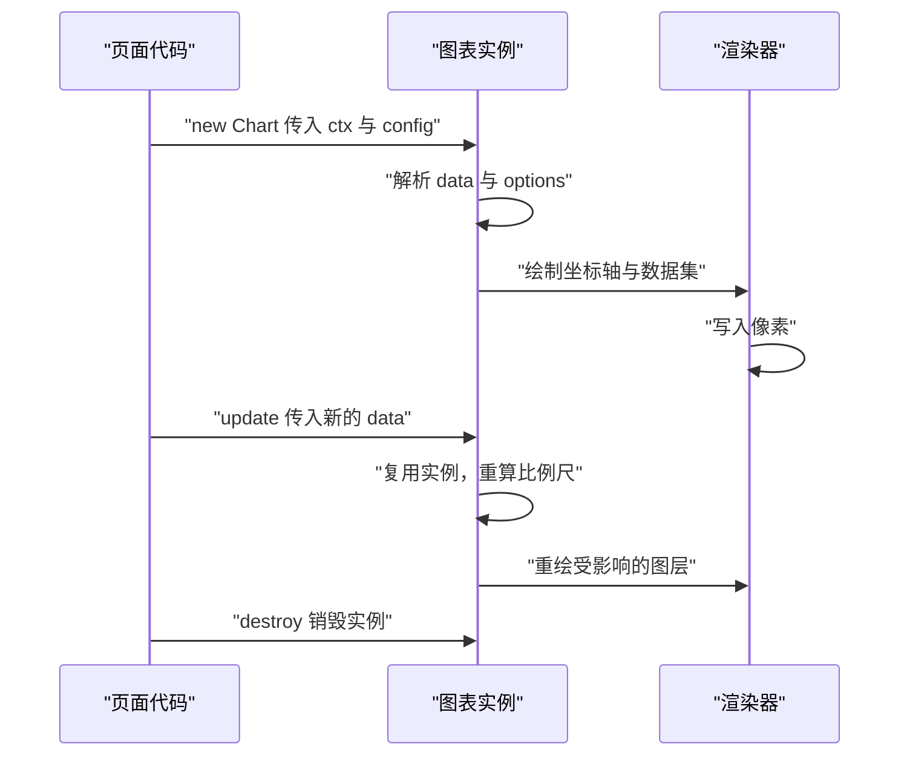
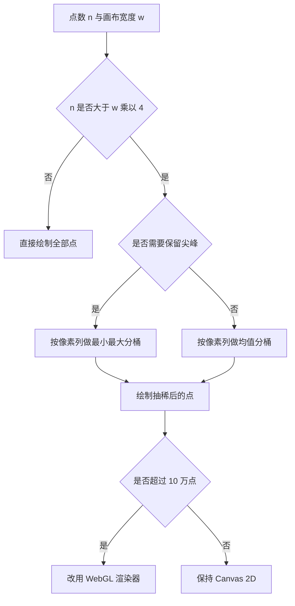
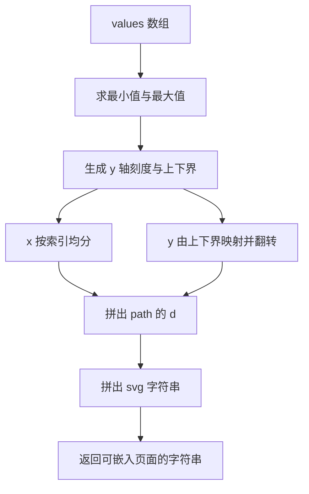

# 数据可视化：D3、ECharts、Chart.js 与 Canvas/SVG 选择

!!! abstract "学完这一页你能"
    1. 手写一个线性比例尺，把任意数据区间映射到像素区间，并生成步长为 1、2、5、10 的好看刻度。
    2. 说清 D3 数据绑定里 enter、update、exit 三堆节点各代表什么，以及 key 函数改变了什么。
    3. 按数据量、交互需求和包体积要求，在 Canvas 与 SVG 之间做出可解释的选择。
    4. 写出一个返回 SVG 字符串的折线图函数，并用 node:assert 断言路径与刻度都正确。

## 0. 知识地图



建议这样读：先把第 1、2 节的比例尺吃透，因为它是所有图表库内部都在做的事情。
接着读第 3、4、5 节，理解 D3 的三块积木：selection、scale、axis，以及 Canvas 与 SVG 的取舍。
第 6、7、8 节解决工程问题：什么时候用现成库、超大数据怎么办、怎样自己写一个可测试的折线图。

## 1. 从数据到像素

**先想一个问题**

你有一组销量数据，范围是 0 到 100。画布宽 800 像素、高 300 像素。
要让 0 落在最左、100 落在最右、销量越大点越高，你需要算出每个点该画在哪里。

!!! note "术语：数据域与值域"
    数据域（domain）是数据本身的取值范围，例如销量 0 到 100。
    值域（range）是屏幕坐标的取值范围，例如横向 0 到 800 像素。

!!! tip "心智模型"
    一句话模型：可视化就是两次映射，先把数据域压成 0 到 1 的比例，再把比例铺到像素通道上。
    日常类比：地图上的比例尺，1 厘米代表 10 公里，尺子量出的长度按固定倍数换成真实距离。
    类比不成立的地方：对数轴、时间轴、分类轴不是固定倍数关系，它们的映射函数不是一次函数。

**图解**



1. 数据域给出允许出现的最大值与最小值，超出范围的值不会被裁掉，只是映射到值域之外。
2. 归一化比例 t 把任意区间的值统一压到 0 到 1，这一步让映射与单位无关。
3. 值域决定输出：横向用 0 到 800，纵向用 300 到 0，因为屏幕 y 轴向下增长。
4. 路径字符串把一串像素坐标串成 SVG 能读懂的 M 与 L 命令。
5. 浏览器读取 path 元素，把它光栅化成画布上的线段。

**一步一步来**

第 1 步要做什么：先把数据域和值域分开写成两个对象，避免后面把两类数字混用。

```js
// 数据域：真实世界的取值范围
const domain = { min: 0, max: 100 };  // 销量从 0 到 100
// 值域：屏幕上的像素取值范围
const range = { min: 0, max: 800 };   // 画布宽 800 像素
// 纵向单独一份：像素 y 轴向下增长，所以端点顺序反过来
const yRange = { min: 300, max: 0 };  // 高 300 像素，取值 0 时落在底部
```

**这段代码在做什么**

- `domain` 只描述数据，不描述屏幕，改画布尺寸时它不变。
- `range` 只描述屏幕，改数据范围时它不变。
- `yRange` 把 min 写成 300、max 写成 0，是为了让数据里的最大值对应屏幕上方。
- 三份配置分开写，后面换画布宽度只需要改 `range`。

第 2 步要做什么：写一个线性映射函数，输入一个值，输出它对应的像素。

```js
// 把 value 从数据域区间线性映射到值域区间
function linearScale(value, dMin, dMax, rMin, rMax) {
  // 先算 value 在数据域中的位置 t，t 落在 0 到 1
  const t = (value - dMin) / (dMax - dMin);
  // 再把 t 铺到值域上，得到最终像素
  return rMin + t * (rMax - rMin);
}
console.log(linearScale(0, 0, 100, 0, 800));   // 0
console.log(linearScale(50, 0, 100, 0, 800));  // 400
console.log(linearScale(100, 0, 100, 0, 800)); // 800
```

**这段代码在做什么**

- 第一行算出 t，它是 value 在区间里的相对位置。
- value 等于 dMin 时 t 为 0，等于 dMax 时 t 为 1。
- 第二行把 t 乘以值域跨度，再加上值域起点。
- 当 rMin 大于 rMax 时结果自动反转，纵向坐标就靠这个反转。
- 函数只做乘除，调用一百万次也不会有性能问题。

运行结果：`0`、`400`、`800`。

第 3 步要做什么：把五个数据点转成 SVG 的路径命令字符串。

```js
const points = [12, 40, 88, 30, 65];      // 五个数据点
const stepX = 800 / (points.length - 1);  // 点与点的横向间距，结果是 200
// 每个点生成一条 M 或 L 命令，拼成 path 的 d 属性
const d = points.map((v, i) => {
  const x = i * stepX;                       // 第 i 个点的横坐标
  const y = linearScale(v, 0, 100, 300, 0);  // 值越大，y 越小
  return `${i === 0 ? 'M' : 'L'}${x} ${y}`;  // 首点用 M，其余用 L
}).join(' ');
console.log(d);
```

**这段代码在做什么**

- `stepX` 用总宽度除以间隔数，五个点只有四段间隔，所以除数是 4。
- `M` 是移动画笔，`L` 是从当前位置画直线到新位置。
- 第一个点必须用 `M`，否则 SVG 不知道从哪里起笔。
- 纵向传的是 `(300, 0)` 而不是 `(0, 300)`，这一步完成坐标翻转。
- 每个点号之间用空格连接，这正是 `d` 属性要求的格式。

运行结果：`M0 264 L200 180 L400 36 L600 210 L800 105`。

**动手验证**

依赖：无，Node 20+ 直接运行。

```js
import assert from 'node:assert/strict';

// 线性比例尺：把数据域中的值映射到值域
function linearScale(value, dMin, dMax, rMin, rMax) {
  const t = (value - dMin) / (dMax - dMin); // 归一化到 0 到 1
  return rMin + t * (rMax - rMin);          // 铺开到值域
}

// 横向三个关键点必须落在值域端点和正中间
assert.equal(linearScale(0, 0, 100, 0, 800), 0);
assert.equal(linearScale(100, 0, 100, 0, 800), 800);
assert.equal(linearScale(50, 0, 100, 0, 800), 400);

// 纵向像素：数据最大值对应 y 等于 0
assert.equal(linearScale(0, 0, 100, 300, 0), 300);
assert.equal(linearScale(100, 0, 100, 300, 0), 0);

// 生成折线路径字符串
const values = [12, 40, 88, 30, 65];
const stepX = 800 / (values.length - 1);
const d = values
  .map((v, i) => `${i === 0 ? 'M' : 'L'}${i * stepX} ${linearScale(v, 0, 100, 300, 0)}`)
  .join(' ');

assert.equal(d, 'M0 264 L200 180 L400 36 L600 210 L800 105');
console.log('path d =', d);
```

预期输出：`path d = M0 264 L200 180 L400 36 L600 210 L800 105`。

**常见坑**

| 现象 | 原因 | 怎么修 |
|:---|:---|:---|
| 折线上下颠倒 | 纵向值域写成 0 到 300 | 传 `(300, 0)`，让数据最大值落在屏幕上方 |
| 最后一个点超出画布 | 除数写成 `points.length` | 除数改为 `points.length - 1`，因为间隔数比点数少 1 |
| 第一个点没有起点 | 所有点都用 `L` 命令 | 首点用 `M`，判断条件写成 `i === 0` |
| 只有一个数据点时坐标为 NaN | 除以 `length - 1` 得到 0 | 数据点数小于 2 时直接返回单点圆，不做折线 |

**小结**

- 映射分两步：先归一化到 0 到 1，再铺到像素区间。
- 纵向值域反转是屏幕坐标系的硬性要求。
- 路径字符串里首点用 M，其余点用 L。

## 2. 手写比例尺：从数据区间到好看刻度

**先想一个问题**

数据最小值是 12，最大值是 1234。如果直接按这两个数画轴，刻度会变成 12、317.5、623、928.5。
这组数字没人愿意读，你希望看到的是 0、500、1000、1500。

!!! note "术语：nice domain"
    nice domain 指把原始数据区间向外扩展到 1、2、5、10 乘以 10 的幂这类步长的整数倍。
    例子：区间 12 到 1234 会被扩成 0 到 1500，步长 500。

!!! tip "心智模型"
    一句话模型：比例尺是一本双向字典，正着查把数据变像素，反着查把像素变数据。
    日常类比：家里的体重秤，刻度按 1 公斤一格排好，指针位置就是数据到屏幕的映射。
    类比不成立的地方：时间比例尺下每个月的天数不同，映射函数要分段，不能只靠一个倍数。

**图解**



1. 先算出原始跨度 1234 减 12 等于 1222。
2. 把 1222 向上取到一个 1、2、5、10 系列的数，得到 2000。
3. 用 2000 除以刻度间隔数 4，得到 500，再对 500 取一次 nice 值，仍是 500。
4. 用步长 500 向下取整最小值、向上取整最大值，得到 0 与 1500。
5. 在 0 到 1500 之间按 500 递增，得到四个刻度值。
6. 用同一个 lo 与 hi 构造正算与反算两个函数，两者互为逆运算。

**一步一步来**

第 1 步要做什么：写一个把任意跨度吸附到 1、2、5、10 乘以 10 的幂的函数。

```js
// 把 range 吸附到 1、2、5、10 乘以 10 的幂
function niceNum(range, round) {
  const exp = Math.floor(Math.log10(range)); // 求数量级，1222 得到 3
  const f = range / 10 ** exp;               // 求尾数，1222 得到 1.222
  let nf;
  if (round) {
    // 已确定数量级，尾数向上取到 1、2、5、10
    nf = f < 1.5 ? 1 : f < 3 ? 2 : f < 7 ? 5 : 10;
  } else {
    // 还在估计阶段，尾数取不超过它的最大档
    nf = f <= 1 ? 1 : f <= 2 ? 2 : f <= 5 ? 5 : 10;
  }
  return nf * 10 ** exp;
}
console.log(niceNum(1222, false)); // 2000
console.log(niceNum(500, true));   // 500
```

**这段代码在做什么**

- `exp` 用对数取下整，把数量级从跨度里分离出来。
- `f` 是去掉数量级后的尾数，它永远落在 1 到 10 之间。
- `round` 为 false 时做保守估计，用于先定数量级。
- `round` 为 true 时做向上取档，用于最终步长。
- 两个分支合起来保证结果只可能是 1、2、5、10 乘以 10 的幂。

运行结果：`2000`、`500`。

第 2 步要做什么：用 nice 值把数据区间扩成刻度覆盖的区间。

```js
// 把数据区间扩成 p 个刻度能整齐覆盖的区间
function niceDomain(min, max, tickCount = 5) {
  const span = niceNum(max - min, false);          // 先定刻度间距的数量级
  const step = niceNum(span / (tickCount - 1), true); // 再定实际步长
  return {
    step,
    min: Math.floor(min / step) * step,            // 向左扩到步长整数倍
    max: Math.ceil(max / step) * step,             // 向右扩到步长整数倍
  };
}
console.log(niceDomain(12, 1234, 5));
```

**这段代码在做什么**

- `tickCount - 1` 是刻度之间的间隔段数，五个刻度有四段。
- 先用大跨度估计数量级，再用小跨度确定步长，两步分开避免尾数被压太小。
- `Math.floor` 与 `Math.ceil` 保证原始数据一定被区间包住。
- 返回值里的 min 与 max 是扩过的，不是原始数据的最值。

运行结果：`{ step: 500, min: 0, max: 1500 }`。

第 3 步要做什么：用扩展后的区间生成刻度值，并构造正算与反算。

```js
// 按步长在区间内生成刻度值
function tickValues(min, max, step) {
  const out = [];
  for (let v = min; v <= max + 1e-9; v += step) out.push(Number(v.toFixed(6)));
  return out;
}
// 正算：数据值变像素
const toPixel = (v, lo, hi, width) => ((v - lo) / (hi - lo)) * width;
// 反算：像素变数据值
const toValue = (px, lo, hi, width) => lo + (px / width) * (hi - lo);

const t = niceDomain(12, 1234, 5);
console.log(tickValues(t.min, t.max, t.step)); // [0, 500, 1000, 1500]
console.log(toPixel(1500, t.min, t.max, 800)); // 800
console.log(toValue(400, t.min, t.max, 800));  // 750
```

**这段代码在做什么**

- 循环里加 `1e-9` 是为了抵消浮点累加的误差，避免漏掉最后一个刻度。
- `toFixed(6)` 再转回数字，把 0.30000000000000004 这类值清理干净。
- `toPixel` 与 `toValue` 互为逆函数，鼠标交互时要用反算求数据值。
- 两个函数都显式接收 lo、hi、width，不依赖外部变量，方便单测。

运行结果：`[0, 500, 1000, 1500]`、`800`、`750`。

**动手验证**

依赖：无，Node 20+ 直接运行。

```js
import assert from 'node:assert/strict';

// 把跨度吸附到 1、2、5、10 乘以 10 的幂
function niceNum(range, round) {
  const exp = Math.floor(Math.log10(range));
  const f = range / 10 ** exp;
  const nf = round
    ? (f < 1.5 ? 1 : f < 3 ? 2 : f < 7 ? 5 : 10)
    : (f <= 1 ? 1 : f <= 2 ? 2 : f <= 5 ? 5 : 10);
  return nf * 10 ** exp;
}

// 把数据区间扩成好看刻度覆盖的区间
function niceDomain(min, max, tickCount = 5) {
  const span = niceNum(max - min, false);
  const step = niceNum(span / (tickCount - 1), true);
  return {
    step,
    min: Math.floor(min / step) * step,
    max: Math.ceil(max / step) * step,
  };
}

// 按步长生成刻度
function tickValues(min, max, step) {
  const out = [];
  for (let v = min; v <= max + 1e-9; v += step) out.push(Number(v.toFixed(6)));
  return out;
}

const t = niceDomain(12, 1234, 5);
assert.deepEqual(t, { step: 500, min: 0, max: 1500 });
assert.deepEqual(tickValues(t.min, t.max, t.step), [0, 500, 1000, 1500]);

// 正算与反算必须互为逆运算
const toPixel = (v) => ((v - t.min) / (t.max - t.min)) * 800;
const toValue = (px) => t.min + (px / 800) * (t.max - t.min);
assert.equal(toPixel(1500), 800);
assert.ok(Math.abs(toValue(400) - 750) < 1e-9);
console.log('step =', t.step, 'ticks =', tickValues(t.min, t.max, t.step));
```

预期输出：`step = 500 ticks = [ 0, 500, 1000, 1500 ]`。

**常见坑**

| 现象 | 原因 | 怎么修 |
|:---|:---|:---|
| 刻度出现 317.5 这类小数 | 直接拿原始区间除以间隔数 | 先对步长做 niceNum 取档 |
| 最后一个刻度丢失 | 浮点累加导致 1500.0000000000002 大于 1500 | 比较时加 1e-9 容差 |
| 数据点跑到轴外 | 只扩了一侧区间 | min 用 Math.floor，max 用 Math.ceil |
| 鼠标提示的数值对不上 | 只写了正算没写反算 | 补一个 toValue，与 toPixel 共用 lo 与 hi |

**小结**

- nice 步长只能取 1、2、5、10 乘以 10 的幂，这样刻度才整齐。
- 扩展区间要同时向两侧取整，保证数据被包住。
- 正算与反算必须是彼此的逆运算，交互功能依赖这一点。

## 3. Canvas 与 SVG 的取舍

**先想一个问题**

你要画 5000 个散点，并支持点击某个点弹出详情。
用 SVG 写，页面里会有 5000 个 circle 节点，拖动时明显掉帧。
用 Canvas 写，帧率稳定，但每个点没有独立节点，点击事件也收不到。

!!! note "术语：Canvas 与 SVG"
    Canvas 是一块位图画布，你调用绘图命令，浏览器把结果写成像素，画完后图形不再是对象。
    SVG 是矢量图形，每个图形都是 DOM 节点，浏览器按节点属性和 CSS 重新计算与重绘。

!!! tip "心智模型"
    一句话模型：SVG 是放在 DOM 里的图形对象清单，Canvas 是一张你要负责清空和重画的位图。
    日常类比：SVG 像把一张张便利贴贴到墙上，想挪哪张就揭下来挪；Canvas 像拿笔在纸上画，改动就要擦掉重画。
    类比不成立的地方：Canvas 也能做命中测试，只要自己写距离判断；SVG 也能转成图片导出，只要序列化节点。

**图解**



1. SVG 路径下，浏览器要为每个节点维护样式、布局与绘制树。
2. 节点数量上升时，样式重算的次数与节点数同阶增长。
3. Canvas 路径下，图形不进入 DOM，节点数量对布局没有影响。
4. 每次更新都要先清空整块画布，因为上一次的像素还留在位图上。
5. 绘制指令只写像素，浏览器不需要为图形建树，帧时间与指令数成比例。

**一步一步来**

第 1 步要做什么：用绘图指令把点画到 Canvas 上，写出最小编译循环。

```js
// 用数组记录指令，替代真实 Canvas 上下文
function createFakeCtx() {
  const ops = [];
  return {
    ops,
    clearRect: (...a) => ops.push(['clearRect', ...a]), // 清空一块矩形
    beginPath: () => ops.push(['beginPath']),           // 开始一条新路径
    arc: (...a) => ops.push(['arc', ...a]),             // 追加一个圆
    fill: () => ops.push(['fill']),                     // 填充当前路径
  };
}
const points = [{ x: 10, y: 20, r: 4 }, { x: 100, y: 80, r: 4 }];
const ctx = createFakeCtx();
ctx.clearRect(0, 0, 300, 100); // 每帧先清空
for (const p of points) {
  ctx.beginPath();                              // 每个点单独起路径
  ctx.arc(p.x, p.y, p.r, 0, Math.PI * 2);       // 画整圆
  ctx.fill();                                   // 填充
}
console.log(ctx.ops.length); // 7
```

**这段代码在做什么**

- `createFakeCtx` 把绘制指令存进数组，方便在 Node 里断言。
- `clearRect` 必须每帧调用，否则旧像素会叠在新像素上。
- `beginPath` 在每次 `arc` 前调用，否则多个圆会被连成一条路径。
- 真实环境里 `ctx` 来自 `canvas.getContext('2d')`。
- 指令总数是 1 加 3 乘以点数，点数越多，指令越多。

运行结果：`7`。

第 2 步要做什么：给 Canvas 上的点补上命中测试，替代 DOM 事件。

```js
// 返回被点中的点在数组中的下标，没点中返回 -1
function hitTest(points, x, y) {
  // 从后往前找，后画的点显示在上层，优先命中
  for (let i = points.length - 1; i >= 0; i--) {
    const p = points[i];
    // 比较距离平方，避免开方
    if ((p.x - x) ** 2 + (p.y - y) ** 2 <= p.r ** 2) return i;
  }
  return -1;
}
// 命中后需要手动触发重绘，Canvas 不会自动更新
function redraw(ctx, points, activeIndex) {
  ctx.clearRect(0, 0, 300, 100);
  points.forEach((p, i) => {
    ctx.beginPath();
    ctx.arc(p.x, p.y, i === activeIndex ? p.r + 2 : p.r, 0, Math.PI * 2);
    ctx.fill();
  });
}
```

**这段代码在做什么**

- 倒序遍历是为了让绘制顺序靠后的点先被命中，符合看到的层级。
- 比较距离的平方可以省掉 `Math.sqrt`，结果等价。
- `-1` 表示点在空白处，调用方据此隐藏提示框。
- `redraw` 里根据 `activeIndex` 放大半径，做出选中效果。
- Canvas 不会自动重绘，任何状态变化都要自己再画一次。

第 3 步要做什么：处理高分屏，避免图形发虚。

```js
// 让位图分辨率跟上设备像素比
function resizeCanvas(canvas, cssWidth, cssHeight) {
  const dpr = globalThis.devicePixelRatio || 1; // 高分屏常见取值为 2
  canvas.width = cssWidth * dpr;                // 位图真实宽度
  canvas.height = cssHeight * dpr;              // 位图真实高度
  canvas.style.width = `${cssWidth}px`;         // 显示尺寸保持 CSS 像素
  canvas.style.height = `${cssHeight}px`;
  const ctx = canvas.getContext('2d');
  ctx.setTransform(dpr, 0, 0, dpr, 0, 0);       // 之后按 CSS 像素坐标绘制
}
```

**这段代码在做什么**

- 位图尺寸乘以 `devicePixelRatio`，物理像素数量跟上屏幕密度。
- CSS 尺寸保持原值，元素在页面上的占位不变。
- `setTransform` 把绘图坐标系整体缩放，代码里仍用 CSS 像素坐标。
- 缺少这一步时，在像素比为 2 的屏幕上图形边缘会出现锯齿。
- 窗口尺寸变化后必须重新调用，并再次重绘。

**动手验证**

依赖：无，Node 20+ 直接运行，用数组模拟绘图指令。

```js
import assert from 'node:assert/strict';

// 用数组记录绘制指令，替代真实 Canvas 上下文
function createFakeCtx() {
  const ops = [];
  return {
    ops,
    clearRect: (...a) => ops.push(['clearRect', ...a]),
    beginPath: () => ops.push(['beginPath']),
    arc: (...a) => ops.push(['arc', ...a]),
    fill: () => ops.push(['fill']),
  };
}

// 三个散点
const points = [
  { x: 10, y: 20, r: 4 },
  { x: 100, y: 80, r: 4 },
  { x: 200, y: 40, r: 4 },
];

const ctx = createFakeCtx();
ctx.clearRect(0, 0, 300, 100); // 每帧先清空位图
for (const p of points) {
  ctx.beginPath();
  ctx.arc(p.x, p.y, p.r, 0, Math.PI * 2);
  ctx.fill();
}
assert.equal(ctx.ops.filter((o) => o[0] === 'arc').length, 3);
assert.equal(ctx.ops.length, 10); // 1 次清空加 3 组三连指令

// 命中测试：用距离公式，不需要 DOM 事件
function hitTest(list, x, y) {
  for (let i = list.length - 1; i >= 0; i--) {
    const p = list[i];
    if ((p.x - x) ** 2 + (p.y - y) ** 2 <= p.r ** 2) return i;
  }
  return -1;
}
assert.equal(hitTest(points, 12, 22), 0);   // 落在第一个圆内
assert.equal(hitTest(points, 150, 60), -1); // 空白处
assert.equal(hitTest(points, 202, 38), 2);  // 落在第三个圆内
console.log('指令数 =', ctx.ops.length, '命中下标 =', hitTest(points, 12, 22));
```

预期输出：`指令数 = 10 命中下标 = 0`。

**常见坑**

| 现象 | 原因 | 怎么修 |
|:---|:---|:---|
| 图形越画越糊、拖影 | 每帧没有清空画布 | 循环开始前调用 `clearRect` 覆盖整块画布 |
| 所有圆被一条线连起来 | 多次 `arc` 之前只调用了一次 `beginPath` | 每个图形前都调用 `beginPath` |
| 高分屏上线条发虚 | 位图尺寸等于 CSS 尺寸 | 位图尺寸乘以 `devicePixelRatio`，再用 `setTransform` 缩放 |
| Canvas 上点击没反应 | 坐标系是像素，不是 DOM 节点 | 在容器的点击事件里取相对坐标，再做距离判断 |

**小结**

- SVG 把图形交给 DOM，节点数直接决定样式与布局开销。
- Canvas 把图形交给指令流，重绘时机与命中测试都要自己管。
- 高分屏必须处理设备像素比，否则边缘出现锯齿。

## 4. D3 的 selection 与数据绑定模型

**先想一个问题**

页面上已经有三根柱子，数据从三条变成五条。你只想新增两根柱子，不想把五根全部删掉重建。
如果用 `innerHTML` 重写，三根已有柱子的过渡动画会全部丢失。

!!! note "术语：selection 与数据绑定"
    selection 是 D3 对一组 DOM 节点的封装，可以批量设置属性、样式与事件。
    数据绑定是把一个数据数组和一份 selection 按位置或按 key 配对，配对结果分成三组。

!!! tip "心智模型"
    一句话模型：数据绑定是一次点名，点完名后数据分成新来的、在座的、要走的。
    日常类比：班级点名，新转来的同学要加凳子，一直在座的同学不用动，转走的同学要把凳子撤掉。
    类比不成立的地方：谁和谁配对由 key 函数决定，key 相同才算同一个人，否则按数组下标硬配。

**图解**



1. 起点是把数据数组传进 selection 的 `data` 方法。
2. 数据里有、节点里没有的条目进入新增组，需要创建节点。
3. 键函数结果一致的条目进入复用组，直接改写已有节点的属性。
4. 节点里有、数据里没有的条目进入移除组，需要删除节点。
5. 三组都处理完后，页面节点数量与数据条数一致。
6. 如果没有提供键函数，D3 默认按数组下标配对，中间插入数据会导致大片错位。

**一步一步来**

第 1 步要做什么：先在最简环境下实现配对逻辑，理解三组节点怎么来的。

```js
// 模拟 DOM 节点：只保留 key
function makeNodes(keys) {
  return keys.map((k) => ({ key: k }));
}
// 最小数据绑定：按 key 配对
function join(nodes, data, keyOf) {
  const byKey = new Map(nodes.map((n) => [n.key, n]));
  const used = new Set();
  const enter = [];  // 数据有、节点没有
  const update = []; // 两边都有
  data.forEach((d) => {
    const k = keyOf(d);
    if (byKey.has(k)) {
      update.push([byKey.get(k), d]);
      used.add(k);
    } else {
      enter.push(d);
    }
  });
  const exit = nodes.filter((n) => !used.has(n.key)); // 节点有、数据没有
  return { enter, update, exit };
}
```

**这段代码在做什么**

- `byKey` 让查找已有节点的时间从线性降到常数级。
- `used` 记录哪些 key 已经配过对，供移除组做差集。
- `enter` 与 `update` 在遍历数据时一次填好。
- `exit` 用过滤补出来，条件是没有被任何数据用上。
- 三组数量加起来满足：节点数加 enter 数减去 exit 数等于数据数。

第 2 步要做什么：用真实 D3 语法写下同样的逻辑，看清方法调用顺序。

```js
// 依赖：浏览器环境加载 d3 v7，具体版本号需核对官方文档
const svg = d3.select('svg#chart');       // 选中容器
const bars = svg.selectAll('rect.bar');   // 选出一批已有节点

bars.data(data, (d) => d.id)              // 按 id 配对，不用下标
  .join(
    (enter) => enter.append('rect')       // 新增：创建节点并设初始属性
      .attr('class', 'bar')
      .attr('x', (d) => x(d.id))
      .attr('width', 20),
    (update) => update                   // 复用：基于已有节点做过渡
      .transition().duration(300)
      .attr('x', (d) => x(d.id))
      .attr('height', (d) => y(d.value)),
    (exit) => exit.remove()              // 移除：直接删掉节点
  );
```

**这段代码在做什么**

- `selectAll` 返回空选择也能正常工作，首次渲染时三组里只有新增组有内容。
- `data` 的第二个参数是键函数，返回 `d.id` 表示按业务 id 配对。
- `join` 把三组处理集中在一处，避免手写 `enter` 与 `exit` 两次调用。
- `transition` 只用在复用组，已有节点才有起点可以做动画。
- 新增节点需要显式设初始属性，否则会以 0 宽 0 高出现。
- `exit.remove()` 立即删除节点，需要淡出时先过渡再移除。

第 3 步要做什么：为柱状图准备比例尺与高度映射。

```js
// 分类轴：把类目映射到横向像素
const x = d3.scaleBand()
  .domain(data.map((d) => d.id))             // 类目顺序来自数据
  .range([0, width])                         // 横向 0 到 width
  .paddingInner(0.15);                       // 柱间留出 15 百分比空隙

// 数值轴：0 值要落在底部
const y = d3.scaleLinear()
  .domain([0, d3.max(data, (d) => d.value)]) // 上界取数据最大值
  .nice()                                    // 把上界扩成好看刻度
  .range([height, 0]);                       // 纵向翻转
```

**这段代码在做什么**

- `scaleBand` 是分类比例尺，输出的是每个类目占用的区间起点，不是单个点。
- `paddingInner` 只影响柱与柱之间的空隙，两端不留白。
- `d3.max` 取出数据最大值，`nice` 把上界扩成整齐刻度。
- 数值轴值域写成 `[height, 0]`，值越大柱子越高，与屏幕坐标一致。
- 两个比例尺都基于同一份数据，键函数与 domain 里的 id 必须来自同一字段。

**动手验证**

依赖：无，Node 20+ 直接运行，用普通对象模拟节点。

```js
import assert from 'node:assert/strict';

// 模拟 DOM 节点：只保留 key
function makeNodes(keys) {
  return keys.map((k) => ({ key: k }));
}

// 最小数据绑定：按 key 配对，返回三堆节点
function join(nodes, data, keyOf) {
  const byKey = new Map(nodes.map((n) => [n.key, n]));
  const used = new Set();
  const enter = [];
  const update = [];
  data.forEach((d) => {
    const k = keyOf(d);
    if (byKey.has(k)) {
      update.push([byKey.get(k), d]);
      used.add(k);
    } else {
      enter.push(d);
    }
  });
  const exit = nodes.filter((n) => !used.has(n.key));
  return { enter, update, exit };
}

const nodes = makeNodes(['a', 'b', 'c']);
const data = [{ id: 'b' }, { id: 'c' }, { id: 'd' }, { id: 'e' }];
const r = join(nodes, data, (d) => d.id);

assert.equal(r.enter.length, 2);  // d 与 e 需要新建
assert.equal(r.update.length, 2); // b 与 c 复用
assert.equal(r.exit.length, 1);   // a 需要移除
assert.deepEqual(r.enter.map((d) => d.id), ['d', 'e']);
assert.equal(nodes.length + r.enter.length - r.exit.length, data.length);
console.log('enter', r.enter.length, 'update', r.update.length, 'exit', r.exit.length);
```

预期输出：`enter 2 update 2 exit 1`。

**常见坑**

| 现象 | 原因 | 怎么修 |
|:---|:---|:---|
| 数据中间插入一条后全部错位 | 没有提供键函数，按数组下标配对 | 传入键函数，返回稳定的业务 id |
| 首次渲染报错 | 假设 `selectAll` 一定选到了节点 | 空选择是正常情况，全部逻辑写在 `join` 里 |
| 新增柱子没有动画 | 新增组也调用了 `transition` | 过渡只放在复用组，新增组先设初始属性 |
| 删除后节点越积越多 | 忘了处理移除组 | 在 `join` 的第三个回调里调用 `remove` |

**小结**

- 数据绑定按 key 把数据与节点分成新增、复用、移除三组。
- 键函数决定配对规则，缺省按下标配对会让中间插入出问题。
- `join` 把三组处理集中写在一起，是 D3 v6 之后推荐的写法。

## 5. D3 的 scale 与 axis

**先想一个问题**

第 2 节你已经能手算刻度了。每张图都要重写一遍 niceNum、生成刻度、画轴线、写文字，重复劳动量很大。
D3 把这些打包成两个函数：一个管数值映射，一个管把映射画成 SVG。

!!! note "术语：axis"
    axis 是 D3 的坐标轴生成器，接收一个比例尺，输出一组 SVG 节点，包含轴线、刻度线、刻度文字。
    axis 只负责生成节点结构，样式仍然由 CSS 控制。

!!! tip "心智模型"
    一句话模型：scale 负责算数字，axis 负责把算好的数字变成 SVG 节点。
    日常类比：scale 是计算器，axis 是刻字机，计算器算出刻度位置，刻字机把刻度刻到尺子上。
    类比不成立的地方：axis 生成的是 SVG 节点，切换到 Canvas 渲染时它完全用不上，要自己写文字绘制。

**图解**



1. `scaleLinear` 同时接收 domain 与 range，得到正算函数。
2. `ticks` 用 nice 算法算出刻度值，内部逻辑与第 2 节手写的一致。
3. `axisBottom` 把刻度值转成像素位置，并生成对应的节点类型。
4. 轴线用一条 path 表示，不是多个小线段。
5. 每根刻度线是一个 line 元素，文字是一个 text 元素。
6. 所有节点放在一个 g 元素里，便于整体平移与样式控制。

**一步一步来**

第 1 步要做什么：配置比例尺，并取出刻度值。

```js
// 依赖：浏览器环境加载 d3 v7，具体版本号需核对官方文档
const scale = d3.scaleLinear()
  .domain([0, 1500])       // 数据域直接给扩展后的区间
  .range([0, 800]);        // 横向 0 到 800 像素

const values = scale.ticks(5); // 让 D3 用 nice 算法给刻度
console.log(scale(750));       // 400，正算到像素
console.log(scale.invert(400));// 750，反算回数据
```

**这段代码在做什么**

- `domain` 与 `range` 都是两个元素的数组，顺序决定方向。
- `ticks(5)` 是建议值，D3 返回的刻度数量可能与 5 不同，会调整到整齐。
- 直接调用 `scale(750)` 就是正算，返回像素。
- `scale.invert(400)` 是反算，鼠标位置转数据值靠它。
- 与第 2 节的手写函数对比，`ticks` 内部封装了 niceNum 的两步逻辑。

第 2 步要做什么：把比例尺交给坐标轴生成器，并把结果挂到 SVG 上。

```js
const svg = d3.select('svg#chart');
// 创建一个 g 容器并平移到绘图区左下角
const gx = svg.append('g')
  .attr('transform', 'translate(40, 260)'); // 左边留 40，顶部留 260

// 用底部轴生成器，刻度朝下
gx.call(d3.axisBottom(scale).ticks(5));
```

**这段代码在做什么**

- `append('g')` 建立分组，后续生成的节点都挂在这个组里。
- `transform` 的 translate 决定轴的起点，通常是绘图区左下角。
- `call` 是 D3 的惯用法，把 selection 交给生成器去填充内容。
- `axisBottom` 表示刻度在轴的下方，纵向轴要换成 `axisLeft`。
- 重新渲染时再次调用 `call` 即可，生成器会更新已有节点而不是无限追加。

第 3 步要做什么：接管刻度文字的格式，比如加上单位或换成百分比。

```js
// 把刻度值显示成带单位的字符串
gx.call(
  d3.axisBottom(scale)
    .ticks(5)
    .tickFormat((v) => `${v} 万元`) // 自定义文字格式
    .tickSizeOuter(0)               // 去掉轴线两端的伸出段
);
```

**这段代码在做什么**

- `tickFormat` 接收刻度值，返回要显示的文字，返回值必须是字符串。
- `tickSizeOuter(0)` 去掉轴线左右两头多出来的小竖线。
- 这两个方法都返回生成器本身，可以链式继续调用。
- 格式化结果不会影响比例尺，位置仍然由原始数值决定。
- 想统一控制样式时，在 CSS 里写 `.tick text` 选择器。

**动手验证**

依赖：无，Node 20+ 直接运行，自己生成轴线与刻度位置。

```js
import assert from 'node:assert/strict';

// 线性比例尺
const linear = (v, a, b, c, d) => c + ((v - a) / (b - a)) * (d - c);

// 按步长生成刻度值
function tickValues(min, max, step) {
  const out = [];
  for (let v = min; v <= max + 1e-9; v += step) out.push(Number(v.toFixed(6)));
  return out;
}

// 生成底部轴：返回轴线 path 与每根刻度的像素位置
function axisBottom({ min, max, step, width, height }) {
  const x = (v) => linear(v, min, max, 0, width);
  const values = tickValues(min, max, step);
  return {
    path: `M0 ${height} H${width}`,                       // 轴线
    ticks: values.map((v) => ({ v, x: x(v) })),           // 刻度值与位置
  };
}

const axis = axisBottom({ min: 0, max: 1500, step: 500, width: 800, height: 30 });
assert.equal(axis.path, 'M0 30 H800');
assert.deepEqual(axis.ticks.map((t) => Math.round(t.x)), [0, 267, 533, 800]);
assert.deepEqual(axis.ticks.map((t) => t.v), [0, 500, 1000, 1500]);
console.log(axis.path, axis.ticks.map((t) => t.x.toFixed(1)).join(' '));
```

预期输出：`M0 30 H800 0.0 266.7 533.3 800.0`。

**常见坑**

| 现象 | 原因 | 怎么修 |
|:---|:---|:---|
| 坐标轴跑到画布左上角外 | 没有给 g 元素设置 transform | 用 `translate` 把轴移到绘图区左下角 |
| 重新渲染后刻度越积越多 | 手写 append 而没有复用生成器 | 用 `call` 让生成器更新已有节点 |
| 刻度文字显示 `[object Object]` | `tickFormat` 返回的不是字符串 | 返回模板字符串或调用 `toString` |
| 改用 Canvas 后坐标轴消失 | axis 只能生成 SVG 节点 | Canvas 下自己绘制文字与线段 |

**小结**

- scale 负责数值映射，ticks 负责给出整齐刻度。
- axis 接收 scale，生成一组 SVG 节点，用 g 元素包裹。
- 重新渲染时用 `call` 复用生成器，避免节点重复堆积。

## 6. Chart.js 与 ECharts：配置驱动

**先想一个问题**

产品要求两天上线一个带折线、柱状、饼图的看板。
你从零用 D3 写，光坐标轴、图例、提示框、响应式就要花掉两天，还要自己处理浏览器差异。
换成配置驱动的图表库，一份配置对象就能出图。

!!! note "术语：配置驱动"
    配置驱动指你把数据、系列、坐标轴、交互选项写成一个普通对象，交给库去解析和渲染。
    例子：`new Chart(ctx, { type: 'line', data, options })` 就没有一行绘图命令。

!!! tip "心智模型"
    一句话模型：配置驱动库是填表下单，命令式绘图是自己下厨。
    日常类比：点外卖套餐，选好口味就能送到；想吃到菜单上没有的菜，就得自己做。
    类比不成立的地方：套餐也能改，多数库提供插件与渲染器钩子，只是改动成本比手写更高。

**图解**



1. 页面代码把 canvas 上下文和配置对象交给库。
2. 实例解析配置，把数据数组转成内部的绘图结构。
3. 渲染器画坐标轴、网格线、数据系列与图例。
4. 写入像素后，一次渲染结束。
5. 数据变化时调用 `update`，实例复用，只重算比例尺与路径。
6. 组件卸载时调用 `destroy`，释放事件监听与动画帧。

**一步一步来**

第 1 步要做什么：把业务数据整理成库能读的配置结构。

```js
// 把简化输入展开成 Chart.js 风格的配置对象
function toLineConfig(input) {
  const { labels, series, color = '#2563eb' } = input;
  return {
    type: 'line',                                   // 图表类型
    data: {
      labels,                                       // 类目轴文字
      datasets: series.map((s) => ({
        label: s.name,                              // 系列名，用于图例
        data: s.values,                             // 数值数组
        borderColor: s.color ?? color,              // 线色，缺省用默认色
        pointRadius: 0,                             // 点密集时关闭圆点
      })),
    },
    options: { responsive: true, animation: false }, // 关闭动画便于批量刷新
  };
}
console.log(JSON.stringify(toLineConfig({
  labels: ['1月', '2月', '3月'],
  series: [{ name: '销量', values: [12, 40, 88] }],
}).data.datasets[0]));
```

**这段代码在做什么**

- 把业务字段名与库字段名解耦，业务侧只关心 labels 与 series。
- `color` 用解构默认值给出，单个系列仍可用 `s.color` 覆盖。
- `pointRadius: 0` 让密集数据不画圆点，减少绘制量。
- `animation: false` 在数据频繁刷新时避免动画排队。
- 输出是纯对象，可以序列化，方便在服务端预计算。

运行结果：`{"label":"销量","data":[12,40,88],"borderColor":"#2563eb","pointRadius":0}`。

第 2 步要做什么：实例只创建一次，后续数据变化走 update 通道。

```js
// 依赖：浏览器环境加载 chart.js v4，具体版本号需核对官方文档
const chart = new Chart(canvas.getContext('2d'), toLineConfig(initial));

// 数据刷新时复用实例
function refresh(next) {
  const cfg = toLineConfig(next);
  chart.data.labels = cfg.data.labels;         // 替换类目
  chart.data.datasets = cfg.data.datasets;     // 替换系列
  chart.update('none');                        // 不播动画的重绘
}

// 组件卸载时释放资源
function dispose() {
  chart.destroy();                             // 去掉事件与动画帧
}
```

**这段代码在做什么**

- `new Chart` 只调用一次，重复调用会在同一画布上叠加实例。
- `refresh` 直接改 `chart.data`，再调用 `update`，复用内部比例尺与图层。
- `update('none')` 关闭本次更新的动画，适合轮询刷新。
- `dispose` 在单页应用路由切走时必须调用，否则监听器留在内存里。
- 想换图表类型时改 `chart.config.type` 再调用 `update`。

第 3 步要做什么：处理容器尺寸变化。

```js
// 容器尺寸变化时重算画布尺寸
const ro = new ResizeObserver((entries) => {
  for (const entry of entries) {
    const { width } = entry.contentRect; // 当前 CSS 宽
    if (width > 0) chart.resize(width, undefined); // 宽变化时重绘
  }
});

// 开始监听容器
ro.observe(canvas.parentElement);
// 销毁时同时断开监听
function disposeAll() {
  ro.disconnect(); // 先断观察
  chart.destroy(); // 再销毁实例
}
```

**这段代码在做什么**

- `ResizeObserver` 能在容器变化时立刻回调，不依赖窗口尺寸变化。
- 宽度为 0 时跳过，元素被隐藏时重绘会算出无效比例。
- `chart.resize` 重算内部比例尺与画布像素尺寸。
- 监听器必须与实例一起释放，否则元素移除后回调仍会执行。
- 销毁顺序是先断监听再销毁实例，避免回调访问已销毁对象。

**动手验证**

依赖：无，Node 20+ 直接运行，只验证配置生成逻辑。

```js
import assert from 'node:assert/strict';

// 把简化配置展开成 Chart.js 风格的配置对象
function toLineConfig(input) {
  const { labels, series, color = '#2563eb' } = input;
  return {
    type: 'line',
    data: {
      labels,
      datasets: series.map((s) => ({
        label: s.name,
        data: s.values,
        borderColor: s.color ?? color,
        pointRadius: 0, // 数据点多时关闭圆点，减少绘制量
      })),
    },
    options: { responsive: true, animation: false },
  };
}

const cfg = toLineConfig({
  labels: ['1月', '2月', '3月'],
  series: [{ name: '销量', values: [12, 40, 88] }],
});

assert.equal(cfg.type, 'line');
assert.equal(cfg.data.datasets.length, 1);
assert.equal(cfg.data.datasets[0].borderColor, '#2563eb');
assert.equal(cfg.data.labels.length, 3);
assert.equal(cfg.data.datasets[0].data.length, cfg.data.labels.length);

// 系列单独给色时不能被默认色覆盖
const cfg2 = toLineConfig({ labels: ['a'], series: [{ name: 'x', values: [1], color: '#dc2626' }] });
assert.equal(cfg2.data.datasets[0].borderColor, '#dc2626');
console.log(JSON.stringify(cfg.data.datasets[0]));
```

预期输出：`{"label":"销量","data":[12,40,88],"borderColor":"#2563eb","pointRadius":0}`。

**常见坑**

| 现象 | 原因 | 怎么修 |
|:---|:---|:---|
| 同一画布上图形重叠 | 组件重渲染时重复 `new Chart` | 实例存在时只调用 `update` |
| 切换路由后内存持续增长 | 没有调用 `destroy` | 卸载生命周期里调用 `destroy` 并断开观察器 |
| 容器变化后图被拉伸变形 | 只改了容器尺寸没有通知库 | 用 `ResizeObserver` 调用 `resize` |
| 数据点极多时刷新卡顿 | 每个点都绘制圆点并播动画 | 设置 `pointRadius: 0`，更新时用 `update('none')` |

**小结**

- 配置驱动把绘图细节交给库，业务代码只维护一份配置对象。
- 实例要复用，数据变化走 `update`，卸载走 `destroy`。
- 容器尺寸变化用 `ResizeObserver` 通知库重算。

## 7. 大数据量方案

**先想一个问题**

你要画一条 100 万个点的分钟级折线，画布宽度只有 800 像素。
每个像素列平均挤进 1250 个点，屏幕上根本分辨不出这些点。

!!! note "术语：抽稀"
    抽稀（downsampling）指在保留图形轮廓的前提下减少绘制点数。
    例子：100 万个点按 800 个像素列分桶，每桶只保留最小值和最大值两个点。

!!! tip "心智模型"
    一句话模型：屏幕只有 800 列像素，超过 800 列分辨率的数据必须合并。
    日常类比：把 100 万个数字塞进 800 个格子，每个格子记录格内最小与最大。
    类比不成立的地方：均值合并会把尖峰抹平，看趋势可以，看告警阈值不行。

**图解**



1. 先比较点数与画布宽度的四倍，两者接近时直接画全部点。
2. 差距大时判断业务是否需要保留极值。
3. 需要保留尖峰时用最小最大分桶，每桶输出两个点。
4. 只看趋势时用均值分桶，每桶输出一个点。
5. 抽稀后点数降到 1600 以内，Canvas 2D 足够应对。
6. 抽稀后仍然超过 10 万点时，改用 WebGL 渲染器把绘制放到 GPU。

**一步一步来**

第 1 步要做什么：按桶保留最小值和最大值，写一个纯函数。

```js
// 把 values 压进 buckets 个桶，每桶保留最小值与最大值
function bucketMinMax(values, buckets) {
  const size = values.length / buckets; // 每桶平均容纳的点数
  const out = [];
  for (let b = 0; b < buckets; b++) {
    const start = Math.floor(b * size);
    const end = Math.max(start + 1, Math.floor((b + 1) * size));
    let min = Infinity;
    let max = -Infinity;
    for (let i = start; i < end && i < values.length; i++) {
      if (values[i] < min) min = values[i];
      if (values[i] > max) max = values[i];
    }
    out.push(min, max); // 每桶两个数字，尖峰不会被平均掉
  }
  return out;
}
```

**这段代码在做什么**

- `size` 可能不是整数，所以起止下标都要向下取整。
- `Math.max(start + 1, ...)` 保证每桶至少取一个点，避免空桶。
- `i < values.length` 兜住最后一个桶的越界访问。
- 每桶输出两个数，所以结果长度是桶数的两倍。
- 全局最大值与最小值一定落在某个桶里，因此不会被丢掉。

第 2 步要做什么：把大数组切块，分帧绘制，避免主线程长时间阻塞。

```js
// 把任务切成若干块，每帧处理一块
function chunkedRun(items, sizePerFrame, onChunk, done) {
  let i = 0;
  function step() {
    const end = Math.min(i + sizePerFrame, items.length);
    onChunk(items.slice(i, end)); // 处理当前块
    i = end;
    if (i < items.length) {
      requestAnimationFrame(step); // 让出主线程，下一帧继续
    } else if (done) {
      done();
    }
  }
  requestAnimationFrame(step);
}
```

**这段代码在做什么**

- `requestAnimationFrame` 让浏览器在两帧之间有机会处理输入与渲染。
- `sizePerFrame` 决定每帧处理量，取值过大就退回成一次长任务。
- `onChunk` 接收切片后的子数组，可以做绘制或计算。
- `i` 在闭包里推进，每次调用只处理一段。
- 全部处理完后执行 `done`，用于收尾。

第 3 步要做什么：拖动与缩放时只重算比例尺，不重新抽稀。

```js
// 缓存抽稀结果，视图变化时只重算映射
function makeView(values, buckets) {
  const octx = bucketMinMax(values, buckets); // 抽稀只算一次
  return {
    octx,
    // 视图窗口变化时只改比例尺
    render(scale) {
      const path = [];
      for (let i = 0; i < octx.length; i++) {
        path.push(`${i === 0 ? 'M' : 'L'}${scale.x(i)} ${scale.y(octx[i])}`);
      }
      return path.join(' ');
    },
  };
}
```

**这段代码在做什么**

- 抽稀是最贵的一步，放在视图之外只做一次。
- 视图变化只改 `scale.x` 与 `scale.y`，计算量正比于抽稀后的点数。
- 返回的路径字符串直接给 SVG 或 Canvas 使用。
- 纵向缩放时如果关心局部极值，需要按当前窗口重新分桶。
- 缓存失效条件是窗口跨度变化到需要重新分桶的粒度。

**动手验证**

依赖：无，Node 20+ 直接运行。

```js
import assert from 'node:assert/strict';

// 把 values 压进 buckets 个桶，每桶保留最小值和最大值
function bucketMinMax(values, buckets) {
  const size = values.length / buckets;
  const out = [];
  for (let b = 0; b < buckets; b++) {
    const start = Math.floor(b * size);
    const end = Math.max(start + 1, Math.floor((b + 1) * size));
    let min = Infinity;
    let max = -Infinity;
    for (let i = start; i < end && i < values.length; i++) {
      if (values[i] < min) min = values[i];
      if (values[i] > max) max = values[i];
    }
    out.push(min, max);
  }
  return out;
}

const raw = Array.from({ length: 1000 }, (_, i) => Math.sin(i / 10));
const squeezed = bucketMinMax(raw, 100);

assert.equal(squeezed.length, 200);                      // 100 桶乘以 2
assert.equal(Math.max(...squeezed), Math.max(...raw));   // 全局最大值保留
assert.equal(Math.min(...squeezed), Math.min(...raw));   // 全局最小值保留
assert.ok(squeezed.length < raw.length);                 // 点数确实下降

const before = raw.length;
const after = squeezed.length;
console.log('原始点数', before, '抽稀后点数', after, '压缩比', (before / after).toFixed(1));
```

预期输出：`原始点数 1000 抽稀后点数 200 压缩比 5.0`。

**常见坑**

| 现象 | 原因 | 怎么修 |
|:---|:---|:---|
| 折线上的尖峰消失 | 用均值分桶把极值平掉了 | 改用最小最大分桶，保留每桶两端 |
| 最后一个桶读到越界下标 | 起止取整后 end 超过数组长度 | 循环条件加上 `i < values.length` |
| 拖动时画面卡住 | 每帧都重新抽稀 | 抽稀结果缓存，拖动只重算比例尺 |
| 首屏长时间白屏 | 一次性处理全部数据 | 用分帧切块，每帧处理固定条数 |

**小结**

- 点数超过画布宽度的四倍时就该抽稀。
- 需要保留尖峰时用最小最大分桶，只看趋势时用均值分桶。
- 抽稀结果要缓存，视图变化只重算比例尺。

## 8. 手写折线图：比例尺加路径加坐标系翻转

**先想一个问题**

你需要一个能在 Node 里做单元测试的渲染函数。
它接收一个数字数组，返回一段 SVG 字符串，尺寸与留白都可以指定。

!!! note "术语：viewBox"
    viewBox 是 SVG 的坐标系统声明，四个数字依次表示起点 x、起点 y、宽度、高度。
    例子：`viewBox="0 0 800 300"` 表示内部坐标从 0 到 800、从 0 到 300。

!!! tip "心智模型"
    一句话模型：折线图等于一把比例尺加一段路径字符串，再加坐标系翻转。
    日常类比：在带刻度的方格纸上描点，先按格子定位置，再把点连起来。
    类比不成立的地方：viewBox 让图形随容器缩放，方格纸的物理尺寸是固定的。

**图解**



1. 先扫描数组求最小值与最大值，这是纵向比例尺的输入。
2. 用 nice 步长把区间扩成整齐的上下界，并生成刻度列表。
3. 横向按索引均分，起点与终点各留一段内边距。
4. 纵向用扩过的上下界做映射，并加内边距，同时翻转方向。
5. 每个点生成一条 M 或 L 命令，用空格拼成 d 属性。
6. 把网格线与路径放进 svg 标签，配上 viewBox 返回。

**一步一步来**

第 1 步要做什么：求出纵向的整齐上下界与刻度列表。

```js
// 把原始步长吸附到 1、2、5、10 乘以 10 的幂
function niceStep(rawStep) {
  const exp = Math.floor(Math.log10(rawStep)); // 数量级
  const f = rawStep / 10 ** exp;               // 尾数
  const nf = f <= 1 ? 1 : f <= 2 ? 2 : f <= 5 ? 5 : 10;
  return nf * 10 ** exp;
}
// 生成纵向刻度，并返回扩展后的上下界
function yTicks(min, max, count) {
  const step = niceStep((max - min) / (count - 1));
  const lo = Math.floor(min / step) * step; // 向下取到步长整数倍
  const hi = Math.ceil(max / step) * step;  // 向上取到步长整数倍
  const values = [];
  for (let v = lo; v <= hi + 1e-9; v += step) values.push(Number(v.toFixed(6)));
  return { lo, hi, values };
}
```

**这段代码在做什么**

- `niceStep` 只保留取档逻辑，比第 2 节的两步版本更短。
- `count - 1` 是刻度间隔段数。
- `lo` 与 `hi` 必须能被步长整除，刻度才会落在整齐的位置。
- 生成刻度时加 1e-9 容差，防止浮点累加漏掉最后一根。
- `toFixed(6)` 清掉浮点尾巴，例如 0.30000000000000004。

第 2 步要做什么：建立横向与纵向映射，注意纵向翻转与内边距。

```js
const width = 800;
const height = 300;
const pad = 40; // 四周留白
// 横向：按索引均分到内边距之间
const x = (i, n) => pad + (i * (width - pad * 2)) / (n - 1);
// 纵向：先线性映射，再翻转并加内边距
const linear = (v, a, b, c, d) => c + ((v - a) / (b - a)) * (d - c);
const y = (v, lo, hi) => height - pad - linear(v, lo, hi, 0, height - pad * 2);
```

**这段代码在做什么**

- 横向除数用 `n - 1`，因为间隔数比点数少一。
- 纵向用 `height - pad - ...` 完成翻转，值越大越靠上。
- 内边距同时作用在横向与纵向，保证图形不贴边。
- `linear` 抽成独立函数，便于单独测试。
- 三个函数都是纯函数，不依赖外部状态。

第 3 步要做什么：拼出网格线、路径与 svg 字符串。

```js
// 生成折线图 SVG 字符串
function lineChart(values, opts = {}) {
  const w = opts.width ?? 800;
  const h = opts.height ?? 300;
  const p = opts.pad ?? 40;
  const t = yTicks(Math.min(...values), Math.max(...values), 5);
  const sx = (i) => p + (i * (w - p * 2)) / (values.length - 1);
  const sy = (v) => h - p - linear(v, t.lo, t.hi, 0, h - p * 2);
  // 每根刻度画一条横向网格线
  const grid = t.values.map((v) =>
    `<line x1="${p}" y1="${sy(v).toFixed(1)}" x2="${w - p}" y2="${sy(v).toFixed(1)}" stroke="#e5e7eb"/>`
  ).join('');
  // 折线路径
  const d = values.map((v, i) => `${i ? 'L' : 'M'}${sx(i).toFixed(1)} ${sy(v).toFixed(1)}`).join(' ');
  return `<svg xmlns="http://www.w3.org/2000/svg" viewBox="0 0 ${w} ${h}">${grid}<path d="${d}" fill="none" stroke="#2563eb" stroke-width="2"/></svg>`;
}
```

**这段代码在做什么**

- 选项用 `??` 给默认值，传 `undefined` 时仍取默认。
- `Math.min(...values)` 用展开传参，数据量极大时要改成 reduce 避免爆栈。
- 网格线每条一个 line 元素，颜色用浅灰，不与折线抢视线。
- 路径首点用 M，其余用 L，坐标保留一位小数减少字符串长度。
- 返回的字符串可以直接赋值给容器的 `innerHTML`。

**动手验证**

依赖：无，Node 20+ 直接运行。

```js
import assert from 'node:assert/strict';

// 线性映射
function linear(v, a, b, c, d) {
  return c + ((v - a) / (b - a)) * (d - c);
}

// 把原始步长吸附到 1、2、5、10 乘以 10 的幂
function niceStep(rawStep) {
  const exp = Math.floor(Math.log10(rawStep));
  const f = rawStep / 10 ** exp;
  const nf = f <= 1 ? 1 : f <= 2 ? 2 : f <= 5 ? 5 : 10;
  return nf * 10 ** exp;
}

// 生成纵向刻度与扩展后的上下界
function yTicks(min, max, count) {
  const step = niceStep((max - min) / (count - 1));
  const lo = Math.floor(min / step) * step;
  const hi = Math.ceil(max / step) * step;
  const values = [];
  for (let v = lo; v <= hi + 1e-9; v += step) values.push(Number(v.toFixed(6)));
  return { lo, hi, values };
}

// 生成折线图 SVG 字符串
function lineChart(values, opts = {}) {
  const w = opts.width ?? 800;
  const h = opts.height ?? 300;
  const p = opts.pad ?? 40;
  const t = yTicks(Math.min(...values), Math.max(...values), 5);
  const sx = (i) => p + (i * (w - p * 2)) / (values.length - 1);
  const sy = (v) => h - p - linear(v, t.lo, t.hi, 0, h - p * 2);
  const grid = t.values
    .map((v) => `<line x1="${p}" y1="${sy(v).toFixed(1)}" x2="${w - p}" y2="${sy(v).toFixed(1)}" stroke="#e5e7eb"/>`)
    .join('');
  const d = values.map((v, i) => `${i ? 'L' : 'M'}${sx(i).toFixed(1)} ${sy(v).toFixed(1)}`).join(' ');
  return `<svg xmlns="http://www.w3.org/2000/svg" viewBox="0 0 ${w} ${h}">${grid}<path d="${d}" fill="none" stroke="#2563eb" stroke-width="2"/></svg>`;
}

const svg = lineChart([12, 40, 88, 30, 65]);

assert.ok(svg.startsWith('<svg xmlns='));           // 必须是完整 svg 文档片段
assert.ok(svg.includes('viewBox="0 0 800 300"'));   // 坐标系统正确
assert.ok(svg.includes('stroke-width="2"'));        // 折线样式存在
assert.ok(svg.includes('M40.0'));                   // 起点落在左内边距上
assert.equal((svg.match(/<line /g) ?? []).length, 6); // 12 到 88 扩成 0 到 100 共 6 根刻度

// 上下界必须包住原始数据
const t = yTicks(12, 88, 5);
assert.equal(t.lo, 0);
assert.equal(t.hi, 100);
console.log(svg.slice(0, 72));
```

预期输出：`<svg xmlns="http://www.w3.org/2000/svg" viewBox="0 0 800 300"><line x1=`

**常见坑**

| 现象 | 原因 | 怎么修 |
|:---|:---|:---|
| 图形贴着画布边缘 | 没有预留内边距 | 起止都加上 pad，宽度减去两倍 pad |
| 折线方向反了 | 纵向没有翻转 | 写成 `h - p - linear(...)` |
| 刻度数量比预期多一根 | 上下界扩展后正好整除出现额外刻度 | 断言数量时按实际区间计算，不要硬编码 |
| 数据量极大时调用 `Math.min` 报栈溢出 | 展开运算符一次传入全部参数 | 改用 `reduce` 遍历求最值 |

**小结**

- 手写折线图由三块组成：整齐刻度、双轴映射、路径字符串。
- 纵向翻转与内边距要一起处理，否则图形贴边或上下颠倒。
- 渲染函数做成纯函数，返回字符串，就能在 Node 里用断言测试。

## 综合对比

| 维度 | D3 | Chart.js | ECharts | 手写 SVG 或 Canvas |
|:---|:---|:---|:---|:---|
| 渲染方式 | 不内置渲染器，由你操作 DOM 或调用 Canvas | 默认 Canvas 2D，具体渲染器选项需核对官方文档 | 默认 Canvas，可切换 SVG 渲染器 | 自己决定，两种都要写 |
| 数据绑定 | selection 的 data 与 join | 传入 data 与 datasets 数组 | 传入 option 的 series 数组 | 无，自己管理节点与指令 |
| 学习投入 | 要分别学 scale、axis、selection、shape | 学一份配置结构即可 | 学配置项手册，条目数量大 | 学 SVG 或 Canvas 绘图接口 |
| 定制自由度 | 每个节点属性都可控 | 受配置项范围限制，超出要走插件 | 受配置项范围限制，超出要写自定义系列 | 完全可控 |
| 交互 | 自己绑事件与命中测试 | 内置提示框、图例点击 | 内置提示框、图例、缩放、框选 | 自己实现全部交互 |
| 大数据量 | 取决于你选的渲染方式 | 需要抽稀，Canvas 下 1 万点量级需实测 | 内置大数据量模式，具体阈值需核对官方文档 | 抽稀加 WebGL 可到百万点 |
| 包体积 | 按子包拆分安装，可按需引 | 体积需按官方打包数据核对 | 体积需按官方打包数据核对 | 零依赖 |
| 导出图片 | 自己序列化 SVG 或调用 Canvas 接口 | Canvas 可直接转 dataURL | 提供实例方法导出 | 自己实现 |
| 适合场景 | 高度定制的可视化与图表库开发 | 常规看板，快速上线 | 复杂看板与地图类图表 | 教学、极小体积、特殊渲染 |

## 应用与行业实践

### 应用场景地图

| 场景 | 用到本页哪个知识点 | 典型技术选型 | 注意事项 |
| --- | --- | --- | --- |
| 后台管理的万行表格，每行一个行内迷你趋势线 | 手写线性比例尺、Canvas 与 SVG 取舍 | 单张覆盖表格的 Canvas，或每行一个 SVG | 每行点数设上限；只画可视行 |
| 低端安卓的首屏加载，页面要显示一张折线图 | 包体积与渲染器取舍 | 按需 import，首屏只留绘制函数 | 首屏不引入整包图表库；用包体积工具核对 |
| 多人协作白板，多人同时画线并互相看到 | Canvas 重绘、比例尺做数据到屏幕的换算 | Canvas 分层加 OffscreenCanvas | 命中检测要自己算；笔迹数据与像素解耦 |
| 监控大屏，折线图每秒刷新一次 | 比例尺、Canvas 重绘、requestAnimationFrame | Canvas | 每帧不重建 DOM；脏数据放进队列再画 |
| 十万点传感器时序回放 | 大数据量方案、抽稀 | Canvas 或 WebGL | 先抽稀再画；时间轴用比例尺逆映射定位 |
| 服务端定时导出报表缩略图 | 返回 SVG 字符串、比例尺与好看刻度 | Node 里拼接 SVG 字符串 | 不依赖 DOM；用 node:assert 断言路径与刻度 |
| 静态站点里的统计图，构建后不再变化 | D3 scale 与 axis、构建期渲染 | 构建期生成 SVG 文件写进产物 | 无交互需求时不引入运行时库 |
| 教学演示比例尺与刻度算法 | 手写比例尺、1/2/5/10 步长 | 纯函数加控制台断言 | 把区间反转、单点数据写进用例 |

### 三个场景拆解

#### 场景 1：后台管理万行表格的行内趋势线

**业务背景**：表格有上万行，每行要显示一条几十个点的指标趋势线。滚动时若为每个单元格建 DOM 节点，帧率掉到肉眼可辨的卡顿。

**怎么用本页知识解决**：先用线性比例尺把每行数值区间映射到迷你图高度，再只画可视行。渲染上选单张 Canvas 覆盖表格，通过行高与滚动偏移换算每行线段的落点。

```js
// 数据区间到像素区间的线性映射，返回一个纯函数
function linearScale([d0, d1], [r0, r1]) {
  const k = (r1 - r0) / (d1 - d0);   // 斜率：一个数据单位换多少像素
  return (v) => r0 + (v - d0) * k;   // 正向映射
}
// 迷你趋势线：只取最近 30 个点，输出 SVG path 的 d 属性
function sparkline(values, width, height) {
  const sub = values.slice(-30);     // 每行点数设上限，总点数随可视行数收敛
  const y = linearScale([Math.min(...sub), Math.max(...sub)], [height, 0]); // range 反写即 y 轴翻转
  const x = linearScale([0, sub.length - 1], [0, width]);
  return sub.map((v, i) => `${i ? 'L' : 'M'}${x(i)},${y(v)}`).join(' ');
}
```

- 每行只画可视行，绘制量由窗口高度决定，不随总行数增长。
- 每行点数固定上限，避免单行数据长度失控拖慢整帧。
- `range` 写成 `[height, 0]`，屏幕 y 向下而数值 y 向上，翻转在比例尺这一层完成。
- 比例尺是纯函数，同一份数据可在测试里断言输出像素值。

**怎么度量收益**：看滚动期间的主线程长任务数量与总阻塞时间。用 Chrome DevTools 的 Performance 面板录 10 秒滚动，对比开启与关闭行内图两种配置；再用 requestAnimationFrame 打点统计帧间隔中位数。测试数据用脚本生成的固定行数表格，保证可复现。

**什么时候不该用**：

- 每行需要独立 tooltip、键盘焦点或屏幕阅读器朗读时，单张 Canvas 不提供逐元素节点，改用每行一个 SVG 或把数值放进表格列。
- 行数只有几百行且要逐行导出图片时，SVG 可直接序列化，不需要维护命中检测代码。

#### 场景 2：低端安卓的首屏加载

**业务背景**：落地页首屏要显示一张折线图，设备多为入门安卓机，网络在 3G 与 4G 之间波动。首屏 JS 体积越大，解析与执行占用的时间越长。

**怎么用本页知识解决**：把渲染器选择写成一个按点数与交互需求决定的函数，图表库走动态 import，首屏只保留比例尺与绘制函数。

```js
// 按点数与交互需求选渲染器，阈值来自本项目可复现的基准测试
function pickRenderer(pointCount, needPerElementEvent) {
  if (needPerElementEvent && pointCount <= 2000) return 'svg'; // 需要逐元素事件
  return 'canvas';                                             // 其余情况用单画布
}
// 首屏只加载绘制函数，图表库延后到真正需要时再取
async function mountChart(el, data) {
  const r = pickRenderer(data.length, false);
  if (r === 'canvas') return drawCanvas(el, data); // 首屏路径不含库
  const { drawSvg } = await import('./chart-lib.js'); // 动态分包，不进首屏 chunk
  return drawSvg(el, data);
}
```

- 渲染器判断用点数与事件需求两个输入，避免靠主观印象选型。
- 阈值必须用本项目设备与数据跑出来，写进注释说明来源。
- 动态 import 把库拆成独立 chunk，首屏只付绘制函数的成本。
- `mountChart` 返回 Promise，调用方要处理加载失败时的降级。

**怎么度量收益**：看 Lighthouse 的 JavaScript execution time 与 Total Blocking Time，同机同节流档位各跑 5 次取中位数。包体积用 webpack-bundle-analyzer 或 rollup-plugin-visualizer 看首屏 chunk 的解析体积与 gzip 体积。

**什么时候不该用**：

- 需要屏幕阅读器逐点朗读数据时，Canvas 不产出可访问节点，改用 SVG 或在图旁补一张数据表。
- 图表是首屏唯一内容且点数很少时，动态 import 多一次网络往返，直接静态引入。

#### 场景 3：服务端导出报表缩略图

**业务背景**：定时任务要为每份报表生成缩略图，运行在 Node 环境中，没有 DOM 可用。生成后要立刻校验图形是否正确，避免坏图进入 CDN。

**怎么用本页知识解决**：把绘制写成纯函数，返回 SVG 字符串；比例尺与刻度算法都不依赖浏览器，可直接用 node:assert 断言。

```js
// 线性比例尺：数据区间 -> 像素区间
const scale = (d0, d1, r0, r1) => (v) => r0 + ((v - d0) * (r1 - r0)) / (d1 - d0);
// 生成步长为 1、2、5、10 的刻度值
function ticks(min, max, count) {
  const raw = (max - min) / count;               // 每格占的数据宽度
  const mag = 10 ** Math.floor(Math.log10(raw)); // 取量级
  const norm = raw / mag;                        // 归一到 1..10
  const step = (norm <= 1 ? 1 : norm <= 2 ? 2 : norm <= 5 ? 5 : 10) * mag;
  const out = [];
  for (let v = Math.ceil(min / step) * step; v <= max; v += step) out.push(+v.toFixed(10));
  return out;
}
// 返回 SVG 字符串的折线图，纯函数，便于服务端渲染与断言
function lineChart(values, w, h) {
  const x = scale(0, values.length - 1, 0, w);
  const y = scale(Math.min(...values), Math.max(...values), h, 0);
  const d = values.map((v, i) => `${i ? 'L' : 'M'}${x(i)},${y(v)}`).join(' ');
  return `<svg viewBox="0 0 ${w} ${h}"><path d="${d}" fill="none" stroke="currentColor"/></svg>`;
}
```

- 入参只有数组与宽高，输出字符串，无 DOM、无全局状态，可在 CI 里直接跑。
- 归一化后只允许 1、2、5、10 四个步长，刻度读数不会被小数点淹没。
- `toFixed(10)` 消掉浮点累加误差，断言字符串时不会因尾差失败。
- `viewBox` 让同一字符串在缩略图与放大预览两处复用。

**怎么度量收益**：指标是缩略图生成失败率与边界用例覆盖数。用 node:test 跑断言并统计失败用例，用 `process.hrtime` 记录单图生成耗时，把字符串字节数一起记进回归数据。

**什么时候不该用**：

- 目标格式必须是 PNG 或 JPEG 时，SVG 字符串不够，需要接 resvg 或 headless 浏览器渲染。
- 单图点数达到十万级时，字符串拼接的内存峰值上升，改为边抽稀边流式写入。

### 行业先进实践

**比例尺与坐标轴分离（出处：D3 官方文档 d3-scale 与 d3-axis）**

D3 把 domain 到 range 的映射放在 scale，把刻度生成放在 axis，`scale.ticks()` 默认给出 1、2、5、10 这类步长。分离后换图表类型不必重算映射，改刻度样式也不碰数据。借鉴：手写层先固定这两个接口，将来迁到库时配置能对应上。

**General Update Pattern（出处：D3 官方文档 d3-selection 的 selection.join，以及 Observable 上的 General Update Pattern 示例）**

`join` 把 enter、update、exit 三堆节点在一个调用里写完，退出节点自动移除。它把"数据变了要改哪些 DOM"变成声明式描述，避免手写三套分支。借鉴：先手写三堆节点体会差异，再用 join 收敛代码。

**ECharts 的 progressive 渐进渲染（出处：Apache ECharts 官方文档配置项 series-line.large 与 progressive、progressiveThreshold）**

ECharts 提供 large 模式与渐进渲染开关，把一次绘制拆到多帧完成。这样单帧不会长期占用主线程，交互仍能响应。借鉴：先量本项目的长任务分布，再决定是否开启，不要默认打开。

**Chart.js 的 Decimation 插件（出处：Chart.js 官方文档 Decimation）**

该插件在绘制前按 samples 或 lttb 算法抽稀数据点，点数超过画布像素宽度时收益明显。抽稀发生在渲染管线内，业务数据不用改。借鉴：折线点数超过画布可用像素宽度时，先抽稀再画。

**Canvas 分层与离屏渲染（出处：MDN Canvas 教程的 Optimizing canvas 页面与 OffscreenCanvas 文档）**

静态背景画一次留在独立层，每帧只清动态层，减少重复绘制面积。OffscreenCanvas 让绘制可移出主线程，滚动与缩放期间不掉帧。借鉴：白板把网格底图与笔迹分成两层，笔迹层按笔画数决定是否分块重绘。

### 从学到用：落地路线

1. **先在纯函数模块试点**：把比例尺、刻度、折线路径抽成不依赖 DOM 的代码，配 node:assert 用例。验收：CI 中该模块用例全绿，且覆盖区间反转与单点数据两种情况。
2. **在一个图表页面验证**：同页用 SVG 与 Canvas 各渲染一份相同数据，按场景 1 的方法录制性能。验收：产出一份长任务数与帧间隔中位数的对照记录，并写明阈值取值依据。
3. **推广到同类页面**：把比例尺模块与渲染器选择函数发布为内部包，按场景 2 的方式接入。验收：3 个页面接入，每页提供一次开启前后的录制对比。
4. **防止回退**：把首屏 chunk 体积与渲染帧间隔写进 CI 门禁。验收：PR 中首屏体积超过设定值或帧间隔中位数劣化超过设定比例时，构建失败并给出对比数据。

### 动手作业

**目标**：写一个模块，输入一维数值数组，输出一张折线图的 SVG 字符串；同时输出该图的刻度数组，并用 node:assert 校验。

**步骤**：

1. 实现 `linearScale(domain, range)`，对 `domain` 反转、上下界相等两种输入给出确定行为。
2. 实现 `ticks(min, max, count)`，只输出 1、2、5、10 步长的刻度，去掉浮点尾差。
3. 实现 `lineChart(values, width, height)`，用 `M`、`L` 拼路径，返回 SVG 字符串。
4. 用固定数据写断言：路径首尾坐标、刻度数组、空数组输入的处理。
5. 打开产出的 SVG 文件核对视觉结果，与断言中的坐标逐点对照。
6. 把同一份数据点数调到画布宽度的 10 倍，记录生成耗时与字符串字节数。
7. 把上述指标写进一个 `npm test` 脚本，保证每次改动都能重跑。

**验收标准**：

- `npm test` 通过，且断言覆盖区间反转、单点数据、空数组三种输入。
- 刻度数组中的任意相邻差值只取 1、2、5、10 乘以 10 的整数次幂。
- 路径首点与末点的坐标等于比例尺对首末数据值的输出，误差为 0。
- 产出的 SVG 在浏览器中打开，折线形状与输入数据的升降趋势一致。
- 点数放大到画布宽度的 10 倍后，生成耗时与字节数被记录成一条可重跑的数据。

## 深入阅读与参考

!!! tip "怎么用这些资料"
    先读「官方文档与规范」建立准确的概念，再读「源码与示例」核对细节，最后用「教程、书籍与视频」换一种讲法加深理解。每条都写明了读哪一节、带着什么问题读。

### 官方文档与规范

| 资源 | 为什么读 | 怎么读 |
|---|---|---|
| [MDN Canvas API](https://developer.mozilla.org/en-US/docs/Web/API/Canvas_API) | 讲清 2D 上下文与 OffscreenCanvas，与大数据量离屏渲染相关。 | 重点读 OffscreenCanvas 与 worker 部分；把一次重绘放到 worker 里试试。 |
| [Use cross-origin images in a canvas](https://developer.mozilla.org/en-US/docs/Web/HTML/How_to/CORS_enabled_image) | 读像素、导出图片时会遇到跨域污染，属易踩的实践坑。 | 读 CORS 与 tainted canvas 部分，带着“何时 getImageData 会抛错”读；亲手复现一次报错。 |
| [`<canvas>` HTML graphics canvas element](https://developer.mozilla.org/en-US/docs/Web/HTML/Reference/Elements/canvas) | canvas 元素的宽高与位图尺寸区别常被误用，是必读规范页。 | 读 width/height 属性与 CSS 尺寸的差异；写两个不同缩放的例子对比清晰度。 |

### 教程、书籍与视频

| 资源 | 为什么读 | 怎么读 |
|---|---|---|
| [MDN Canvas 教程](https://developer.mozilla.org/en-US/docs/Web/API/Canvas_API/Tutorial) | 路径与动画章节由浅入深，适合打手写绘图的基础。 | 按路径、变换、动画顺序做完示例，最后用 canvas 画一条折线。 |

## 自测题

??? question "纵向比例尺为什么写成 range 从 300 到 0，而不是 0 到 300？"
    屏幕坐标系的 y 轴向下增长，值 0 在顶部。
    数据里的最大值应该出现在图形上方，对应较小的 y。
    把值域起点写成 300、终点写成 0，映射函数自然完成翻转。
    如果写反，折线会上下颠倒，数值越大点越低。

??? question "nice domain 的作用是什么？给定 min 等于 12、max 等于 1234，步长怎么算出来？"
    作用是把原始区间扩成尺度整齐、人眼易读的刻度区间。
    跨度 1222 先取到 2000，再用 2000 除以间隔数 4 得到 500。
    500 再做一次取档仍是 500，就是最终步长。
    上下界用 500 取整得到 0 与 1500，刻度为 0、500、1000、1500。

??? question "D3 数据绑定里的 enter、update、exit 分别代表什么？"
    enter 表示数据里有、节点里没有的条目，需要创建节点。
    update 表示数据与节点按 key 配对成功的条目，直接改写属性。
    exit 表示节点里有、数据里没有的条目，需要删除节点。
    数量关系是节点数加 enter 数减 exit 数等于数据数。

??? question "键函数在数据绑定里改变了什么？不给键函数会怎样？"
    键函数决定一条数据和一个节点算不算配对成功。
    给了键函数就按业务 id 配对，中间插入数据只影响相关节点。
    不给键函数时按数组下标配对，在数组头部插入一条会让后面全部错位。
    结果是已有节点的过渡动画丢失，属性被整批改写。

??? question "5000 个散点，Canvas 与 SVG 该怎么选？给出判断依据。"
    先看是否需要给单个元素绑事件和使用 CSS 状态样式。
    数量达到 5000 时，SVG 会产生 5000 个节点，样式与布局开销随节点数增长。
    Canvas 只需要 1 个节点，绘制时间与指令数成比例。
    需要频繁交互时用 Canvas 加数学距离命中测试，或者用 SVG 但把点数降到千级以内。

??? question "Canvas 上怎么做命中测试？为什么不用 click 事件？"
    Canvas 里的图形不是 DOM 节点，click 事件只会落在 canvas 元素本身。
    做法是在 canvas 的点击事件里取相对坐标，再用距离公式和每个图形的圆心比较。
    比较距离的平方可以省掉开方。
    倒序遍历可以让后画的图形优先命中，与视觉层级一致。

??? question "100 万个点的折线，怎么降低绘制量？为什么用最小最大分桶而不是均值？"
    先按画布像素列数分桶，每列一个桶。
    每桶只保留最小值和最大值两个点，其余点丢弃。
    均值会把同一桶里的高低变化压成一个中间值，尖峰被抹平。
    最小最大分桶保证全局极值一定保留，告警阈值场景下必须用这种。

??? question "手写折线图时，viewBox 与 width、height 属性各起什么作用？"
    viewBox 声明内部坐标系，四个数字是起点 x、起点 y、宽度、高度。
    内部所有坐标都按 viewBox 的坐标系书写。
    width 与 height 属性决定元素在页面上的实际占位大小。
    只写 viewBox 而把宽高交给 CSS 时，图形会随容器等比缩放。

## 延伸阅读

- D3 官方文档，d3-scale 模块章节：Continuous scales、Time scales、Ordinal scales
- D3 官方文档，d3-axis 模块章节：Axis 生成器的调用方式与 tick 相关方法
- D3 官方文档，d3-selection 模块章节：Joining data、Handling events、Local variables
- D3 官方文档，d3-shape 模块章节：Lines 与 Curves
- MDN Web 文档，Canvas API 教程：Drawing shapes、Applying styles and colors、Optimizing canvas
- MDN Web 文档，SVG 教程：Basic shapes、Paths、Coordinate systems
- Chart.js 官方文档：Configuration、Updating Charts、Responsive Charts、Performance
- Apache ECharts 官方文档：配置项手册 option、使用 Canvas 或 SVG 渲染、大数据量优化
- 需核对官方文档：以上各库当前主版本号、按需引入方式与打包后体积
