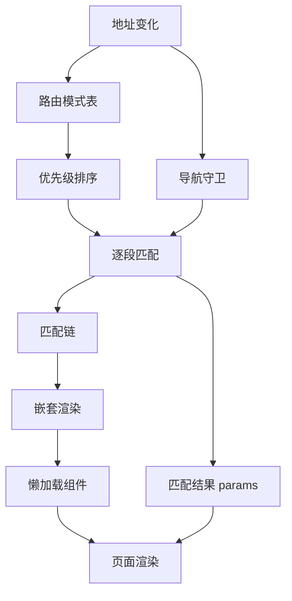
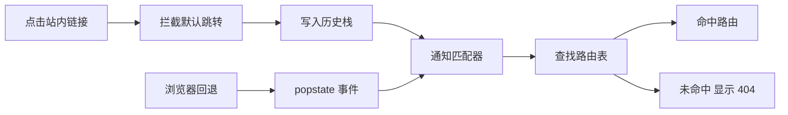
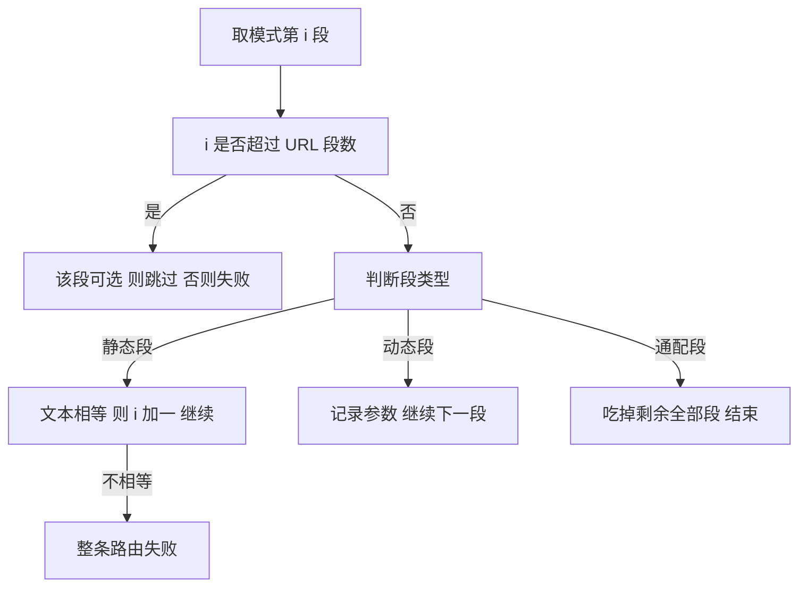
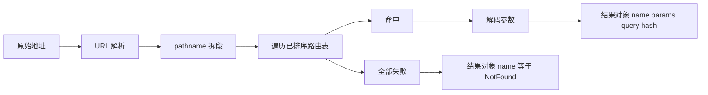
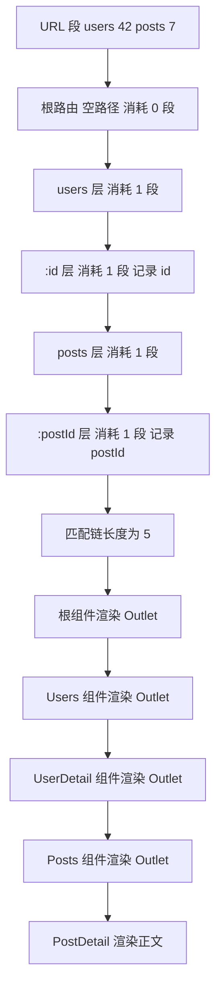
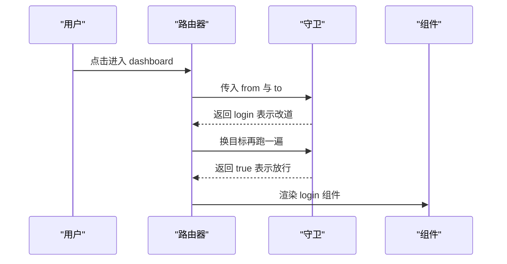
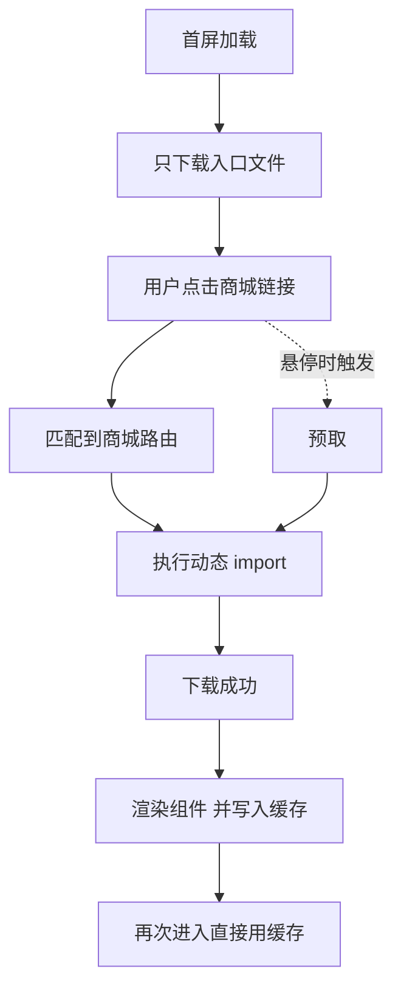
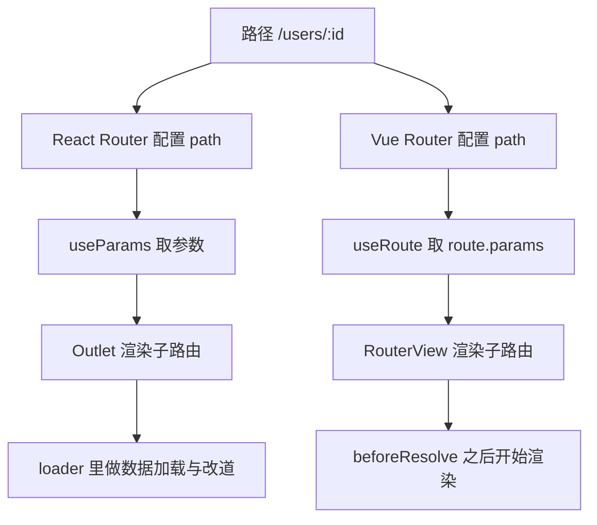

# 客户端路由原理：React Router 与 Vue Router 怎么匹配路径

!!! abstract "学完这一页你能"
    - 说清一次链接点击到组件渲染之间，地址栏与匹配器各做了什么。
    - 解释动态段、通配段、可选段的匹配过程，并说出优先级由什么决定。
    - 手写一个带优先级排序的路由匹配器，用断言验证六种输入。
    - 说明嵌套匹配链、导航守卫、懒加载分别插在导航的哪一步。

## 0. 知识地图



读法建议：先读第 1 到第 3 节，把匹配算法完整走一遍。第 4 到第 6 节讲匹配结果如何被渲染、拦截、按需下载。第 7 节做横向对照，适合放在最后当复习清单。

## 1. 地址栏变化怎么变成一次路由匹配

**先想一个问题**
用户在列表页点了一条 `href="/users/42"` 的链接，浏览器默认会整页刷新。前端路由要做的第一件事，就是拦住这次刷新。

**心智模型**
!!! tip "心智模型"
    一句话模型：客户端路由等于拦截地址变化，加上在内存里查表，再替换页面局部。
    日常类比：酒店前台改了登记本，客人还住在同一间房里。
    类比不成立处：地址栏背后是浏览器真实的历史栈，用户按回退键时你的代码必须响应 `popstate`，无法当作没发生。

**图解**



1. 点击链接后先判断是否站内跳转，是站内才接管。
2. 接管后写入历史栈，地址栏变了但页面没刷新。
3. 写入历史不会派发 `popstate`，所以要主动通知匹配器。
4. 匹配器查表，命中就渲染对应组件，没命中就渲染 404。
5. 用户按回退键时浏览器派发 `popstate`，代码重新读取当前地址并再匹配一次。

!!! note "术语：History API"
    浏览器提供的地址控制接口，`history.pushState` 写入历史记录，`popstate` 事件在回退与前进时触发。例如 `history.pushState({}, '', '/users/42')` 只改地址栏。

**一步一步来**

1. 这一步要做的是：准备一个内存历史栈，让 Node 环境也能模拟浏览器前进后退。

```js
// 用数组加下标模拟浏览器历史栈，Node 里没有 window 也能跑
function createMemoryHistory(initial) {
  const entries = [initial]
  let index = 0
  return {
    get location() { return entries[index] },      // 当前地址
    push(to) {
      entries.splice(index + 1)                    // 新导航会砍掉前进栈
      entries.push(to)
      index++
    },
    back() { if (index > 0) index-- },             // 回退一格
    forward() { if (index < entries.length - 1) index++ },
  }
}
```

**这段代码在做什么**
- `entries` 保存整条历史栈，`index` 指向当前项。
- `push` 前先 `splice`，这是浏览器真实行为：从中间发起新导航会丢弃前进记录。
- `location` 用 getter 暴露，调用方每次读到的都是当前地址。
- `back` 与 `forward` 只移动下标，不涉及网络请求。

2. 这一步要做的是：写一个极小路由器，订阅地址变化并回调渲染。

```js
// 路由实例：把地址变化转成一次查表，并把结果交给渲染层
function createRouter({ history, routes, onChange }) {
  let current = null
  function resolve() {
    const pathname = history.location
    // 这里先用字符串相等，第 2 节会换成真正的匹配算法
    current = routes.find((r) => r.path === pathname) ?? { name: 'NotFound' }
    onChange(current, pathname)
  }
  return {
    get current() { return current },
    push(to) { history.push(to); resolve() },   // pushState 不会派发事件，手动通知
    back() { history.back(); resolve() },       // 回退同样要重新匹配
  }
}
```

**这段代码在做什么**
- `resolve` 把当前地址和路由表做比对，得到要渲染的路由。
- `onChange` 是渲染入口，真实库这里是更新组件树。
- `push` 里先写历史再匹配，顺序不能反：匹配器读的是历史栈里的地址。
- `?? { name: 'NotFound' }` 提供兜底，避免 `current` 为 `undefined`。

3. 这一步要做的是：跑一次导航，观察日志顺序。

**运行结果**

```text
/users -> Users
/ -> Home
```

**动手验证**
下面这个脚本把历史栈和路由器合成一个文件，用断言锁定行为。依赖只有 Node 20+ 内置模块，保存为 `router-step1.mjs`。

```js
import assert from 'node:assert/strict'

function createMemoryHistory(initial) {
  const entries = [initial]
  let index = 0
  return {
    get location() { return entries[index] },
    push(to) { entries.splice(index + 1); entries.push(to); index++ },
    back() { if (index > 0) index-- },
  }
}

function createRouter({ history, routes, onChange }) {
  let current = null
  function resolve() {
    const pathname = history.location
    current = routes.find((r) => r.path === pathname) ?? { name: 'NotFound' }
    onChange(current, pathname)
  }
  return {
    get current() { return current },
    push(to) { history.push(to); resolve() },
    back() { history.back(); resolve() },
  }
}

const log = []
const history = createMemoryHistory('/')
const router = createRouter({
  history,
  routes: [{ path: '/', name: 'Home' }, { path: '/users', name: 'Users' }],
  onChange: (route, pathname) => log.push(`${pathname} -> ${route.name}`),
})

router.push('/users')
assert.equal(router.current.name, 'Users')
assert.equal(history.location, '/users')

router.back()
assert.equal(router.current.name, 'Home')
assert.deepEqual(log, ['/users -> Users', '/ -> Home'])

router.push('/missing')
assert.equal(router.current.name, 'NotFound')   // 兜底路由必须生效

console.log(log.join('\n'))
console.log('ok')
```

断言覆盖三件事：push 后匹配正确、back 后重新匹配、未知路径落到兜底。预期输出为两行日志加一行 `ok`。

**常见坑**

| 现象 | 原因 | 怎么修 |
| --- | --- | --- |
| 刷新页面出现 404 | 服务器没有把未知路径回退到入口 HTML | 配置服务端 history fallback |
| 写入历史后页面没变 | `pushState` 不派发 `popstate` | 写入后手动调用一次匹配函数 |
| 回退后组件还是旧的 | 只监听点击，没有监听 `popstate` | 在 `popstate` 里重新读取地址并匹配 |

**小结**
- 客户端路由等于拦截地址变化，再在内存里查表。
- `pushState` 只改地址，不触发事件，通知匹配器要自己做。
- 回退与前进靠 `popstate`，两条入口都要走同一个匹配函数。

## 2. 路径匹配算法：动态段、通配段、优先级

**先想一个问题**
路由表里同时有 `/users/new` 和 `/users/:id`，访问 `/users/new` 时先命中谁？如果按声明顺序取第一条，答案会随书写顺序改变。

**心智模型**
!!! tip "心智模型"
    一句话模型：匹配等于逐段比对，再加按段打分排序，先排序再取第一条。
    日常类比：机场安检分普通通道、人工通道、异常通道，规则规定优先走普通通道。
    类比不成立处：模式可以带参数，把 URL 里的文本复制进结果对象，通道不会抄走旅客姓名。

!!! note "术语：动态段"
    用冒号开头的路径片段，匹配任意一段文本并写入参数对象。例如 `/users/:id` 匹配 `/users/42`，得到 `{ id: '42' }`。

**图解**



1. 每次循环只处理模式里的第 `i` 段，状态只有指针 `i` 和参数对象。
2. 静态段要求文本逐字相等，不相等就返回失败。
3. 动态段把 URL 当前段存进参数对象，再前进一格。
4. 通配段直接把剩余段拼起来交给参数 `*`，随后结束。
5. 循环结束时若指针没有覆盖全部 URL 段，说明模式比地址短，判定失败。

**一步一步来**

1. 这一步要做的是：把路径字符串拆成段对象，供后续比对。

```js
// 把 /users/:id 这类模板拆成段数组，段类型决定后续比对方式
function parsePattern(pattern) {
  return pattern
    .split('/')
    .filter(Boolean)                                   // 去掉首尾斜杠产生的空串
    .map((raw) => {
      if (raw === '*') return { type: 'splat' }        // 通配段，吃掉剩余路径
      if (raw.startsWith(':')) {                       // 形如 :id 或 :id?
        const optional = raw.endsWith('?')
        const name = raw.slice(1, optional ? -1 : undefined)
        return { type: 'dynamic', name, optional }
      }
      return { type: 'static', value: raw }            // 静态段，文本必须相等
    })
}
```

**这段代码在做什么**
- `filter(Boolean)` 让 `/` 解析成空数组，也让 `/users/` 与 `/users` 得到同一种段数组。
- 通配段单独标记，它在循环里会提前结束比对。
- `:id?` 的可选标记在解析阶段就拆出来，比对阶段不用再判断字符串。
- 返回值是纯数据，可以缓存，避免每次导航重复解析。

2. 这一步要做的是：逐段比对，成功返回参数对象，失败返回 `null`。

```js
// 逐段比对，静态段要相等，动态段写参数，通配段收尾
function matchSegments(segments, urlSegs) {
  const params = {}
  let i = 0
  for (const seg of segments) {
    if (seg.type === 'splat') {                    // 通配段把剩余段全部收下
      params['*'] = urlSegs.slice(i).join('/')
      return params
    }
    if (i >= urlSegs.length) {                     // URL 比模式短
      if (seg.optional && seg === segments.at(-1)) continue  // 只允许末尾可选段缺失
      return null
    }
    if (seg.type === 'static') {
      if (seg.value !== urlSegs[i]) return null    // 静态段必须逐字相等
    } else {
      params[seg.name] = urlSegs[i]                // 动态段把当前段存进参数
    }
    i++
  }
  return i === urlSegs.length ? params : null      // 模式比 URL 短则失败
}
```

**这段代码在做什么**
- 通配段一旦出现就立即结束循环，因此它只能当兜底。
- 可选段限定在末尾，避免出现「中间段缺失后后续段左移」的歧义。
- 静态段比对失败直接返回 `null`，不做回溯。
- 结尾的 `i === urlSegs.length` 检查防止 `/users` 匹配上 `/users/42`。

**运行结果**

```text
/users/new -> 静态段命中
/users/42 -> 动态段命中 参数 id=42
/files/a/b -> 通配段命中 参数 *=a/b
```

3. 这一步要做的是：给每条路由打分，注册时排序，查询时取第一条。

```js
// 段权重：静态段最高，动态段次之，通配段最低，可选段再降一档
const WEIGHT = { static: 100, dynamic: 10, optionalDynamic: 5, splat: -100 }

function scoreOf(segments) {
  return segments.map((seg) => {
    if (seg.type === 'static') return WEIGHT.static
    if (seg.type === 'splat') return WEIGHT.splat
    return seg.optional ? WEIGHT.optionalDynamic : WEIGHT.dynamic
  })
}

// 按段依次比较，第一个不同的段决定胜负，缺少的段按最低分补齐
function compareScore(a, b) {
  const len = Math.max(a.length, b.length)
  for (let i = 0; i < len; i++) {
    const diff = (a[i] ?? -100) - (b[i] ?? -100)
    if (diff !== 0) return diff
  }
  return 0
}

function sortRoutes(routes) {
  return [...routes].sort((x, y) => compareScore(y.score, x.score))  // 高分在前
}
```

**这段代码在做什么**
- 评分是逐段的数组，不是单个数字，这样 `/users/new` 与 `/users/:id` 能在第二段分出胜负。
- 缺失段按 `-100` 补齐，让更长的模式在公共前缀相同时排在前面。
- `sort` 在注册阶段执行一次，查询阶段只做线性扫描。
- 权重数值是本页自定义，真实库的实现与数值需核对官方文档：核对源码中排序函数的权重常量。

**动手验证**
脚本把解析、比对、打分、排序串起来，用打乱顺序的路由表验证排序是否生效。保存为 `matcher-step2.mjs`。

```js
import assert from 'node:assert/strict'

function parsePattern(pattern) {
  return pattern.split('/').filter(Boolean).map((raw) => {
    if (raw === '*') return { type: 'splat' }
    if (raw.startsWith(':')) {
      const optional = raw.endsWith('?')
      return { type: 'dynamic', name: raw.slice(1, optional ? -1 : undefined), optional }
    }
    return { type: 'static', value: raw }
  })
}

function matchSegments(segments, urlSegs) {
  const params = {}
  let i = 0
  for (const seg of segments) {
    if (seg.type === 'splat') { params['*'] = urlSegs.slice(i).join('/'); return params }
    if (i >= urlSegs.length) {
      if (seg.optional && seg === segments.at(-1)) continue
      return null
    }
    if (seg.type === 'static') { if (seg.value !== urlSegs[i]) return null }
    else { params[seg.name] = urlSegs[i] }
    i++
  }
  return i === urlSegs.length ? params : null
}

const WEIGHT = { static: 100, dynamic: 10, optionalDynamic: 5, splat: -100 }
const scoreOf = (segs) => segs.map((s) => (s.type === 'static' ? WEIGHT.static
  : s.type === 'splat' ? WEIGHT.splat : s.optional ? WEIGHT.optionalDynamic : WEIGHT.dynamic))
const compareScore = (a, b) => {
  const len = Math.max(a.length, b.length)
  for (let i = 0; i < len; i++) {
    const diff = (a[i] ?? -100) - (b[i] ?? -100)
    if (diff !== 0) return diff
  }
  return 0
}

// 故意把通配路由写在最前，验证排序与书写顺序无关
const raw = [
  { path: '/files/*', name: 'Files' },
  { path: '/users/:id', name: 'UserDetail' },
  { path: '/users/new', name: 'UsersNew' },
  { path: '/settings/:tab?', name: 'Settings' },
]
const table = raw
  .map((r) => { const segments = parsePattern(r.path); return { ...r, segments, score: scoreOf(segments) } })
  .sort((x, y) => compareScore(y.score, x.score))

function resolve(pathname) {
  const urlSegs = pathname.split('/').filter(Boolean)
  for (const route of table) {
    const params = matchSegments(route.segments, urlSegs)
    if (params) return { name: route.name, params }
  }
  return { name: 'NotFound', params: null }
}

assert.equal(resolve('/users/new').name, 'UsersNew')           // 静态段赢动态段
assert.equal(resolve('/users/42').params.id, '42')             // 动态段写参数
assert.equal(resolve('/files/a/b/c').params['*'], 'a/b/c')     // 通配段收尾
assert.deepEqual(resolve('/settings').params, {})              // 可选段缺失也命中
assert.equal(resolve('/settings/profile').params.tab, 'profile')
assert.equal(resolve('/users/42/extra').name, 'NotFound')      // 多余段不放过

console.log(table.map((r) => r.name).join(' > '))
console.log(resolve('/users/42'))
console.log('ok')
```

预期输出第一行是排序后的路由名顺序，`UsersNew` 与 `UserDetail` 必须排在 `Files` 前面。第二行打印命中详情，最后输出 `ok`。

**常见坑**

| 现象 | 原因 | 怎么修 |
| --- | --- | --- |
| `/users/new` 渲染成详情页 | 动态段排在静态段前面被先命中 | 注册后按分数排序，静态段权重最高 |
| 通配路由后面的规则永不生效 | 通配段吃掉剩余全部段 | 只在最后保留一条通配兜底 |
| `/settings` 匹配不上 `/settings/:tab?` | 可选段写成了必填 | 用 `:id?` 语法，并在匹配器里允许缺段 |

**小结**
- 匹配是逐段比对加上按段打分，先排序再取第一条。
- 静态段赢动态段，动态段赢通配段，更长的模式在公共前缀相同时优先。
- 可选段限制在末尾，能消掉「中间缺段」的歧义。

## 3. 手写路由匹配器：从模式表到匹配结果

**先想一个问题**
匹配结果里除了组件名，还需要哪些东西？地址 `/users/42?tab=posts#top` 里，查询串和锚点也很重要，而路径里的中文是转义过的。

**心智模型**
!!! tip "心智模型"
    一句话模型：匹配器等于一张预排序的路由表，加一次线性扫描，再加一份统一形状的结果对象。
    日常类比：字典按拼音排好序，用户报一个字，翻一次就能找到。
    类比不成立处：路由表里可能有嵌套结构，匹配结果是一串路由，字典一次只返回一个词条。

**图解**



1. `new URL` 一次解析出路径、查询串、锚点三部分。
2. 路径按斜杠拆段，拆段规则与模式解析保持一致。
3. 遍历时按排序好的顺序比对，第一条命中的直接返回。
4. 参数值先解码再写入结果，锚点与查询串原样带上。
5. 全部失败时返回同形状的兜底结果，渲染层不需要分支判断。

**一步一步来**

1. 这一步要做的是：用内置 URL 解析地址，并统一尾部斜杠。

```js
// 用 WHATWG URL 解析地址，浏览器与 Node 20 都内置这个全局类
function parseUrl(input, base = 'http://localhost') {
  const url = new URL(input, base)
  return {
    pathname: url.pathname.replace(/\/+$/, '') || '/',   // 尾部斜杠统一去掉，根路径保留一条
    query: Object.fromEntries(url.searchParams),         // ?tab=posts 变成 { tab: 'posts' }
    hash: url.hash,
  }
}
```

**这段代码在做什么**
- `new URL` 会处理百分号转义，但 `pathname` 里的转义序列仍然保留。
- `replace` 加 `|| '/'` 让 `/users/` 与 `/users` 得到同一结果，同时保住根路径。
- `searchParams` 自带多次出现的键处理，`Object.fromEntries` 只保留最后一个值。
- 传入 `base` 让相对地址也能解析，测试里可以直接写 `'/users/42'`。

2. 这一步要做的是：把排序写进构造函数，查询时只扫描一次。

```js
// 匹配器对象：注册时排序，查询时线性扫描，命中即返回
class PathMatcher {
  constructor(routes) {
    this.routes = routes.map((route) => {
      const segments = parsePattern(route.path)
      return { ...route, segments, score: scoreOf(segments) }
    }).sort((a, b) => compareScore(b.score, a.score))   // 只排序一次
  }
  resolve(pathname) {
    const urlSegs = pathname.split('/').filter(Boolean)
    for (const route of this.routes) {
      const params = matchSegments(route.segments, urlSegs)
      if (params) return { route, params }              // 第一条命中的就是答案
    }
    return { route: null, params: null }
  }
}
```

**这段代码在做什么**
- 构造函数里同时算好 `segments` 与 `score`，查询阶段不做重复解析。
- `sort` 放在构造函数，每次导航都省下一次排序开销。
- `resolve` 直接返回第一条命中的路由，依赖前面的排序保证正确性。
- 失败时返回 `null`，把 404 决策交给调用方。

3. 这一步要做的是：解码参数并解析查询串，遇到坏转义不抛错。

```js
// URL 里 %E4%B8%AD 这样的转义要先解码，坏序列原样返回
function safeDecode(value) {
  try {
    return decodeURIComponent(value)
  } catch {
    return value                       // 避免一个坏参数让整次导航崩溃
  }
}

// 统一出口：命中与未命中都返回同形状的结果
function resolveWithMeta(matcher, input) {
  const { pathname, query, hash } = parseUrl(input)
  const { route, params } = matcher.resolve(pathname)
  const decoded = Object.fromEntries(
    Object.entries(params ?? {}).map(([k, v]) => [k, safeDecode(v)]),
  )
  return { path: pathname, query, hash, params: decoded, name: route ? route.name : 'NotFound' }
}
```

**这段代码在做什么**
- `safeDecode` 包住 `try`，防止 `%E4%B8` 这种截断转义让导航抛出异常。
- 解码放在统一出口，匹配函数里不需要关心编码。
- 结果对象同时带 `path`、`query`、`hash`，渲染层与守卫共用一份数据。
- `name` 在未命中时是 `NotFound`，让上层用同一个字段做渲染决策。

**运行结果**

```text
命中 UserDetail params 的 id 为 42 query 的 tab 为 posts hash 为 #top
/users/%E4%B8%AD 解码后 id 为 中
/files/a/b/c 的星号参数为 a/b/c
/unknown 得到 NotFound
```

**动手验证**
下面的脚本把前三步合成一个文件，路由表故意打乱顺序，用来同时验证排序与解码。

```js
import assert from 'node:assert/strict'

function parsePattern(pattern) {
  return pattern.split('/').filter(Boolean).map((raw) => {
    if (raw === '*') return { type: 'splat' }
    if (raw.startsWith(':')) {
      const optional = raw.endsWith('?')
      return { type: 'dynamic', name: raw.slice(1, optional ? -1 : undefined), optional }
    }
    return { type: 'static', value: raw }
  })
}

function matchSegments(segments, urlSegs) {
  const params = {}
  let i = 0
  for (const seg of segments) {
    if (seg.type === 'splat') { params['*'] = urlSegs.slice(i).join('/'); return params }
    if (i >= urlSegs.length) {
      if (seg.optional && seg === segments.at(-1)) continue
      return null
    }
    if (seg.type === 'static') { if (seg.value !== urlSegs[i]) return null }
    else { params[seg.name] = urlSegs[i] }
    i++
  }
  return i === urlSegs.length ? params : null
}

const WEIGHT = { static: 100, dynamic: 10, optionalDynamic: 5, splat: -100 }
const scoreOf = (segs) => segs.map((s) => (s.type === 'static' ? WEIGHT.static
  : s.type === 'splat' ? WEIGHT.splat : s.optional ? WEIGHT.optionalDynamic : WEIGHT.dynamic))
const compareScore = (a, b) => {
  const len = Math.max(a.length, b.length)
  for (let i = 0; i < len; i++) {
    const diff = (a[i] ?? -100) - (b[i] ?? -100)
    if (diff !== 0) return diff
  }
  return 0
}

class PathMatcher {
  constructor(routes) {
    this.routes = routes.map((route) => {
      const segments = parsePattern(route.path)
      return { ...route, segments, score: scoreOf(segments) }
    }).sort((a, b) => compareScore(b.score, a.score))
  }
  resolve(pathname) {
    const urlSegs = pathname.split('/').filter(Boolean)
    for (const route of this.routes) {
      const params = matchSegments(route.segments, urlSegs)
      if (params) return { route, params }
    }
    return { route: null, params: null }
  }
}

function parseUrl(input, base = 'http://localhost') {
  const url = new URL(input, base)
  return {
    pathname: url.pathname.replace(/\/+$/, '') || '/',
    query: Object.fromEntries(url.searchParams),
    hash: url.hash,
  }
}

function safeDecode(value) {
  try { return decodeURIComponent(value) } catch { return value }
}

function resolveWithMeta(matcher, input) {
  const { pathname, query, hash } = parseUrl(input)
  const { route, params } = matcher.resolve(pathname)
  const decoded = Object.fromEntries(
    Object.entries(params ?? {}).map(([k, v]) => [k, safeDecode(v)]),
  )
  return { path: pathname, query, hash, params: decoded, name: route ? route.name : 'NotFound' }
}

const matcher = new PathMatcher([
  { path: '/files/*', name: 'Files' },          // 通配放在最前也能被排序压到后面
  { path: '/users/:id', name: 'UserDetail' },
  { path: '/users/new', name: 'UsersNew' },
  { path: '/', name: 'Home' },
])

const hit = resolveWithMeta(matcher, '/users/42?tab=posts#top')
assert.equal(hit.name, 'UserDetail')
assert.equal(hit.params.id, '42')
assert.equal(hit.query.tab, 'posts')
assert.equal(hit.hash, '#top')

assert.equal(resolveWithMeta(matcher, '/users/%E4%B8%AD').params.id, '中')
assert.equal(resolveWithMeta(matcher, '/files/a/b/c').params['*'], 'a/b/c')
assert.equal(resolveWithMeta(matcher, '/users/new').name, 'UsersNew')
assert.equal(resolveWithMeta(matcher, '/unknown').name, 'NotFound')
assert.equal(resolveWithMeta(matcher, '/users/').params.id, 'users')   // 尾部斜杠被统一

console.log(hit)
console.log('ok')
```

脚本断言了八种输入，覆盖命中、解码、通配、静态优先、兜底、尾部斜杠。

**常见坑**

| 现象 | 原因 | 怎么修 |
| --- | --- | --- |
| 参数里的中文显示为乱码 | 没有调用 `decodeURIComponent` | 在统一出口解码，并用 `try` 包住 |
| `/users/` 匹配失败 | 尾部斜杠让段数组多出一项 | 解析时去掉尾部斜杠，根路径保留 |
| 每次导航耗时抖动 | 排序写在 `resolve` 里 | 排序放进构造函数，只执行一次 |

**小结**
- 解析、比对、排序三件事分开写，每一步都能单独测试。
- 排序只做一次，查询阶段保持简单。
- 参数解码放在统一出口，坏输入用 `try` 兜住。

## 4. 嵌套路由渲染

**先想一个问题**
页面地址是 `/users/42/posts/7`，其中用户头像栏和帖子正文分别由谁渲染？切换帖子时，头像栏要不要重新创建？

**心智模型**
!!! tip "心智模型"
    一句话模型：嵌套路由把一次匹配变成一条匹配链，链上每层只渲染自己负责的那一段。
    日常类比：剥洋葱，外层始终在，只更换内层。
    类比不成立处：链上每层都能否决整条链，守卫或改道会换掉链尾。

**图解**



1. 匹配从根路由开始，根路由消耗 0 段，把全部 URL 段留给子级。
2. 每层只拿自己那几段做比对，剩余段继续往下传。
3. 每层把命中结果压入链，得到从外到内的路由数组。
4. 渲染时从外层开始，父层在自己的模板里留一个出口，把子层放进去。
5. 只有最内层渲染真正的页面内容，外层保持不变。

**一步一步来**

1. 这一步要做的是：把嵌套配置写成树，子级路径用相对片段。

```js
// 嵌套路由表：children 里的 path 是相对父级的片段，不带前导斜杠
const routes = [{
  path: '/',
  name: 'Root',
  children: [{
    path: 'users',
    name: 'Users',
    children: [{ path: ':id', name: 'UserDetail' }],
  }],
}]
```

**这段代码在做什么**
- 根路由 `path` 是 `/`，解析后为空段数组，表示它不消耗任何 URL 段。
- `users` 与 `:id` 都是相对片段，拼接后分别是 `/users` 与 `/users/:id`。
- 树形结构让「父组件包住子组件」这件事在配置层面就确定了。
- 子级写成 `/:id` 会被当作绝对路径，父层就包不住它。

2. 这一步要做的是：递归匹配树，消耗段数并产出匹配链。

```js
// 前缀匹配：只要求模式前几段对上，剩余段留给子路由
function matchPrefix(segments, urlSegs) {
  const params = {}
  for (let i = 0; i < segments.length; i++) {
    const seg = segments[i]
    if (seg.type === 'static' && seg.value !== urlSegs[i]) return null
    if (seg.type === 'dynamic') params[seg.name] = urlSegs[i]
  }
  return { params, consumed: segments.length }
}

// 递归匹配：本级命中后把剩余段交给子级，命中链按层压入
function matchTree(route, urlSegs) {
  const hit = matchPrefix(parsePattern(route.path), urlSegs)
  if (!hit) return null
  const rest = urlSegs.slice(hit.consumed)
  for (const child of route.children ?? []) {
    const childHit = matchTree(child, rest)
    if (childHit) {
      return { chain: [route, ...childHit.chain], params: { ...hit.params, ...childHit.params } }
    }
  }
  return rest.length === 0 ? { chain: [route], params: hit.params } : null
}
```

**这段代码在做什么**
- `matchPrefix` 不检查剩余段，把「URL 没走完」这件事交给子级处理。
- `consumed` 记录本级消耗的段数，用于切出剩余段。
- 子级全部失败且仍有剩余段时返回 `null`，表示这条链不完整。
- 参数在递归返回时合并，内层参数覆盖外层同名参数。

3. 这一步要做的是：从外到内渲染，父层包住子层。

```js
// 从最内层开始拼接，父层依次包裹子层，对应 Outlet 的插入位置
function renderChain(chain) {
  let html = chain.at(-1).name
  for (let i = chain.length - 2; i >= 0; i--) {
    html = `${chain[i].name}[${html}]`
  }
  return html
}
```

**这段代码在做什么**
- 从链尾开始，先渲染最内层的正文。
- 每次循环用一个外层名字包住当前结果，对应父组件的出口。
- 链上层的顺序就是组件的嵌套顺序。
- 真实框架里这一步由 `Outlet` 或 `RouterView` 完成，父组件重渲染时子组件默认保留。

**运行结果**

```text
/users/42 的链为 Root > Users > UserDetail
/users/42 的参数为 { id: '42' }
渲染结果为 Root[Users[UserDetail]]
/users/42/unknown 无匹配
```

**动手验证**
脚本用树形配置匹配两个地址，断言链长度、参数合并与渲染字符串。

```js
import assert from 'node:assert/strict'

function parsePattern(pattern) {
  return pattern.split('/').filter(Boolean).map((raw) => (
    raw.startsWith(':')
      ? { type: 'dynamic', name: raw.slice(1) }
      : { type: 'static', value: raw }
  ))
}

function matchPrefix(segments, urlSegs) {
  const params = {}
  for (let i = 0; i < segments.length; i++) {
    const seg = segments[i]
    if (seg.type === 'static' && seg.value !== urlSegs[i]) return null
    if (seg.type === 'dynamic') params[seg.name] = urlSegs[i]
  }
  return { params, consumed: segments.length }
}

function matchTree(route, urlSegs) {
  const hit = matchPrefix(parsePattern(route.path), urlSegs)
  if (!hit) return null
  const rest = urlSegs.slice(hit.consumed)
  for (const child of route.children ?? []) {
    const childHit = matchTree(child, rest)
    if (childHit) {
      return { chain: [route, ...childHit.chain], params: { ...hit.params, ...childHit.params } }
    }
  }
  return rest.length === 0 ? { chain: [route], params: hit.params } : null
}

function renderChain(chain) {
  let html = chain.at(-1).name
  for (let i = chain.length - 2; i >= 0; i--) html = `${chain[i].name}[${html}]`
  return html
}

const routes = [{
  path: '/', name: 'Root',
  children: [{ path: 'users', name: 'Users', children: [{ path: ':id', name: 'UserDetail' }] }],
}]

const segs = (p) => p.split('/').filter(Boolean)
const hit = matchTree(routes[0], segs('/users/42'))

assert.deepEqual(hit.chain.map((r) => r.name), ['Root', 'Users', 'UserDetail'])
assert.deepEqual(hit.params, { id: '42' })
assert.equal(renderChain(hit.chain), 'Root[Users[UserDetail]]')
assert.equal(matchTree(routes[0], segs('/users/42/unknown')), null)   // 剩余段无人接管

console.log(hit.chain.map((r) => r.name).join(' > '))
console.log(renderChain(hit.chain))
console.log('ok')
```

预期输出三行：匹配链、渲染字符串、`ok`。

**常见坑**

| 现象 | 原因 | 怎么修 |
| --- | --- | --- |
| 子路由内容不显示 | 父组件模板里没有出口 | 在父层放 `Outlet` 或 `RouterView` |
| 子路由跳到了错误层级 | 子级路径加了前导斜杠，被当作绝对路径 | 子级写成相对片段，例如 `:id` |
| 切换子路由时父组件重新挂载 | 父组件定义写在渲染函数内部，每次都是新引用 | 把组件定义提到模块顶层 |

**小结**
- 嵌套路由的匹配结果是一条从外到内的链。
- 每层只消耗自己那几段，剩余段传给子级。
- 父层靠出口把子层插进模板，父层实例在子路由切换时保留。

## 5. 导航守卫

**先想一个问题**
用户没有登录，直接点进 `/dashboard`。理想结果是先跳到登录页，而不是先渲染仪表盘再跳走。

**心智模型**
!!! tip "心智模型"
    一句话模型：守卫是插在「匹配成功」和「真正渲染」之间的一道检查流水线。
    日常类比：登机前的安检，结果只有通过、改签、拒绝三种。
    类比不成立处：守卫可以异步等待网络请求，等待期间队列停在原地，不会自动放行。

!!! note "术语：导航守卫"
    在导航过程中按顺序调用的函数，返回值决定放行、改道或取消。例如 Vue Router 的 `beforeEach` 是全局守卫。

!!! note "术语：重定向"
    把当前导航目标换成另一个地址，然后从第一个守卫重新开始。例如未登录访问后台时改道到 `/login`。

**图解**



1. 点击发生后，路由器先匹配出目标路由，但不立刻渲染。
2. 路由器把来源地址与目标地址交给第一个守卫。
3. 守卫返回一个地址字符串，表示改道，路由被替换。
4. 改道后从第一个守卫重新开始，之前的结果作废。
5. 所有守卫都放行后，才把控制权交给渲染层。

**一步一步来**

1. 这一步要做的是：约定守卫的返回协议，三种结果对应三种动作。

```js
// 守卫返回 true 放行、false 取消、字符串表示改道
const requireLogin = ({ to, isLoggedIn }) => {
  if (to === '/dashboard' && !isLoggedIn) return '/login'   // 改道
  return true                                               // 放行
}

const confirmLeave = ({ to }) => (to === '/exit' ? false : true)  // 取消本次导航
```

**这段代码在做什么**
- 守卫是普通函数，接收一个上下文对象 `{ to, isLoggedIn }`。
- 返回 `true` 表示继续，返回 `false` 表示整次导航作废。
- 返回字符串表示改道，字符串就是新的目标地址。
- 上下文对象让守卫拿到判断所需的数据，不直接读全局状态。

2. 这一步要做的是：顺序执行守卫，遇到取消或改道就停下。

```js
// 顺序跑守卫：只要有一个返回 false，整次导航就取消
async function runBeforeEach(guards, ctx) {
  for (const guard of guards) {
    const result = await guard(ctx)        // 守卫可以是异步函数，必须 await
    if (result === false) return { ok: false, reason: 'cancelled' }
    if (typeof result === 'string') return { ok: false, redirect: result }
  }
  return { ok: true }
}
```

**这段代码在做什么**
- 顺序执行保证结果可预测，前一个守卫的副作用会影响后一个。
- `await` 让异步守卫也能拦住导航。
- 返回值不是 `false` 也不是字符串时按放行处理。
- 函数只负责判定，改道后的重跑交给外层。

3. 这一步要做的是：处理改道重跑，并加上次数上限。

```js
// 外层循环处理改道：每次改道都从第一个守卫重新开始，超过上限就报错
const MAX_REDIRECTS = 10

async function navigateTo(target, guards, ctx) {
  let to = target
  for (let hop = 0; hop <= MAX_REDIRECTS; hop++) {
    const res = await runBeforeEach(guards, { ...ctx, to })
    if (res.ok) return { to, hops: hop }
    if (res.redirect) { to = res.redirect; continue }     // 换目标重跑
    return { to: null, hops: hop, reason: 'cancelled' }   // 被守卫拒绝
  }
  throw new Error(`改道次数超过 ${MAX_REDIRECTS}，疑似死循环`)
}
```

**这段代码在做什么**
- 每次循环都重新构造上下文，`to` 是最新目标。
- `hops` 记录改道次数，返回值里能看出跳了几次。
- 超过上限直接抛错，把死循环暴露在开发阶段。
- 取消的结果里 `to` 是 `null`，调用方据此保留原页面。

**运行结果**

```text
未登录访问 /dashboard 得到 /login 共 1 跳
已登录访问 /dashboard 得到 /dashboard 共 0 跳
访问 /exit 被取消
死循环守卫触发异常
```

**动手验证**
脚本实现完整守卫流水线，包含一个总会改道的守卫用于验证上限。

```js
import assert from 'node:assert/strict'

async function runBeforeEach(guards, ctx) {
  for (const guard of guards) {
    const result = await guard(ctx)
    if (result === false) return { ok: false, reason: 'cancelled' }
    if (typeof result === 'string') return { ok: false, redirect: result }
  }
  return { ok: true }
}

const MAX_REDIRECTS = 10

async function navigateTo(target, guards, ctx) {
  let to = target
  for (let hop = 0; hop <= MAX_REDIRECTS; hop++) {
    const res = await runBeforeEach(guards, { ...ctx, to })
    if (res.ok) return { to, hops: hop }
    if (res.redirect) { to = res.redirect; continue }
    return { to: null, hops: hop, reason: 'cancelled' }
  }
  throw new Error(`改道次数超过 ${MAX_REDIRECTS}，疑似死循环`)
}

const requireLogin = ({ to, isLoggedIn }) =>
  (to === '/dashboard' && !isLoggedIn ? '/login' : true)
const rejectExit = ({ to }) => (to === '/exit' ? false : true)

const guards = [requireLogin, rejectExit]

const anon = await navigateTo('/dashboard', guards, { isLoggedIn: false })
assert.deepEqual(anon, { to: '/login', hops: 1 })

const user = await navigateTo('/dashboard', guards, { isLoggedIn: true })
assert.deepEqual(user, { to: '/dashboard', hops: 0 })

const blocked = await navigateTo('/exit', guards, { isLoggedIn: true })
assert.equal(blocked.reason, 'cancelled')

const loopGuards = [({ to }) => (to === '/a' ? '/b' : '/a')]   // 必然来回改道
await assert.rejects(() => navigateTo('/a', loopGuards, {}), /疑似死循环/)

console.log('anon ->', anon)
console.log('user ->', user)
console.log('blocked ->', blocked.reason)
console.log('ok')
```

预期输出四行，最后一行是 `ok`。断言覆盖改道、放行、取消、死循环四类结果。

**常见坑**

| 现象 | 原因 | 怎么修 |
| --- | --- | --- |
| 守卫里的异步请求看不出效果 | 忘记 `await` 守卫返回值 | 守卫声明为 `async`，每个都 `await` |
| 页面在守卫里来回跳 | 守卫无条件改道到自身 | 加终止条件，并设置改道上限 |
| 离开页面时数据被覆盖 | 只实现了进入检查 | 分开实现进入、离开、更新三类钩子 |

**小结**
- 守卫插在匹配之后、渲染之前，返回值决定放行、取消、改道。
- 改道要从第一个守卫重新执行，并限制跳转次数。
- 异步守卫必须 `await`，否则拦截会失效。

## 6. 懒加载与预取

**先想一个问题**
首页只展示一张列表，却把商城和后台管理两个页面的代码一起下载，首屏时间被这两块无关代码拖长。

**心智模型**
!!! tip "心智模型"
    一句话模型：懒加载把路由表里的组件换成获取组件的函数，导航时才执行这个函数。
    日常类比：货架只摆样品，下单之后仓库才配送。
    类比不成立处：浏览器会缓存下载结果，第二次导航不会再请求同一个文件。

!!! note "术语：动态导入"
    写法是 `import('./x.js')` 的语法，返回一个 Promise，成功时给出模块对象。例如 `const m = await import('./shop.js')`。

!!! note "术语：代码分割"
    打包工具按动态导入的边界把产物拆成多个文件，实现按需下载。例如首页入口一个文件，商城页一个文件。

**图解**



1. 首屏只加载入口文件，其他路由的代码还躺在服务器上。
2. 导航发生时，匹配器给出目标路由，渲染层发现组件是函数而不是组件。
3. 执行这个函数得到 Promise，等待下载完成。
4. 下载成功后渲染组件，并把 Promise 存进缓存。
5. 再次进入同一路由时直接读取缓存，不再发起请求。
6. 鼠标悬停可以提前触发同一个函数，把下载时间挪到等待之前。

**一步一步来**

1. 这一步要做的是：路由表里存工厂函数，而不是组件本身。

```js
// 懒加载路由：component 是返回 Promise 的函数，不是已经加载的组件
const routes = [
  { path: '/', name: 'Home', component: () => import('./home.js') },
  { path: '/shop', name: 'Shop', component: () => import('./shop.js') },
]
```

**这段代码在做什么**
- `component` 字段保存函数，路由表构建阶段不会下载任何模块。
- `import()` 在打包工具里形成分割边界，产出独立文件。
- 加载时机推迟到导航那一刻，首屏只付入口文件的成本。
- 函数每次调用都返回新的 Promise，缓存要做在调用层。

2. 这一步要做的是：缓存 Promise，让并发导航只下载一次。

```js
// 组件缓存：同一个路由只执行一次工厂函数，存的是 Promise
const componentCache = new Map()

async function loadComponent(route) {
  if (!componentCache.has(route.path)) {
    componentCache.set(route.path, route.component())   // 先存 Promise，再 await
  }
  const mod = await componentCache.get(route.path)
  return mod.default ?? mod                             // 兼容默认导出与具名导出
}
```

**这段代码在做什么**
- 先 `set` 再 `await`，两次并发导航会命中同一个 Promise。
- 缓存键用 `route.path`，同一路由的不同参数共用一份组件代码。
- `mod.default ?? mod` 让两种模块导出形式都能取到组件。
- 失败时缓存里留下一个 rejected Promise，需要额外处理，见下一步。

3. 这一步要做的是：预取并处理失败，失败后允许重试。

```js
// 预取：悬停时提前执行工厂函数，失败就从缓存删除，等真正导航时重试
function prefetch(route) {
  loadComponent(route).catch(() => componentCache.delete(route.path))
}

function bindPrefetch(link, route) {
  link.addEventListener('mouseenter', () => prefetch(route), { once: true })
}
```

**这段代码在做什么**
- `prefetch` 与真正导航走同一个 `loadComponent`，天然去重。
- 失败时删除缓存，下一次调用会重新下载。
- `once: true` 保证每个链接只预取一次，避免反复触发。
- 预取失败不通知用户，真正导航时失败再显示错误。

**运行结果**

```text
calls = 1
badCalls = 2
ok
```

**动手验证**
脚本用假的异步工厂函数统计调用次数，验证去重与失败重试。

```js
import assert from 'node:assert/strict'

const componentCache = new Map()
let calls = 0
let badCalls = 0

async function loadComponent(route) {
  if (!componentCache.has(route.path)) {
    componentCache.set(route.path, route.component())
  }
  const mod = await componentCache.get(route.path)
  return mod.default ?? mod
}

function prefetch(route) {
  loadComponent(route).catch(() => componentCache.delete(route.path))
}

const shop = {
  path: '/shop',
  component: async () => { calls++; return { default: 'ShopComponent' } },
}
const broken = {
  path: '/broken',
  component: async () => { badCalls++; throw new Error('下载失败') },
}

await prefetch(shop)                              // 悬停预取
assert.equal(calls, 1)

const comp = await loadComponent(shop)            // 真正导航命中缓存
assert.equal(calls, 1)
assert.equal(comp, 'ShopComponent')

await prefetch(broken)                            // 预取失败会清缓存
assert.equal(badCalls, 1)

await assert.rejects(() => loadComponent(broken), /下载失败/)   // 失败后重新下载
assert.equal(badCalls, 2)

await loadComponent(shop)
assert.equal(calls, 1)                            // 成功结果一直留在缓存

console.log('calls =', calls)
console.log('badCalls =', badCalls)
console.log('ok')
```

预期输出三行。断言证明成功结果只下载一次，失败结果可以重试。

**常见坑**

| 现象 | 原因 | 怎么修 |
| --- | --- | --- |
| 切换路由时短暂白屏 | 组件还在下载，没有占位内容 | 用 Suspense 或组件内 loading 状态 |
| 预取了全部路由，首屏变慢 | 在根组件遍历所有路由调用预取 | 只在悬停或浏览器空闲时预取指向的路由 |
| 下载失败后无法进入该页 | 失败的 Promise 被永久缓存 | 失败时从缓存删除，允许下次重试 |

**小结**
- 懒加载把组件换成工厂函数，导航时才执行。
- 缓存存 Promise，能同时解决重复下载与并发导航。
- 预取与导航共用同一份缓存，失败时要清掉缓存才能重试。

## 7. React Router 与 Vue Router 怎么落地这套原理

**先想一个问题**
同一张路由表，换成另一家的 API 要改哪几行？如果先理解了模式表、排序、匹配链、守卫这四件事，迁移就是把字段名换一遍。

**心智模型**
!!! tip "心智模型"
    一句话模型：两家库都实现了模式表、优先级排序、匹配链、守卫这四件事，差别在 API 名字与配置写法。
    日常类比：同一套交通规则，两国的路牌颜色不同，含义一致。
    类比不成立处：子路由路径的绝对与相对规则不同，迁移时必须逐条检查。

**图解**



1. 两家的 `path` 字段写法一致，动态段都用冒号。
2. 取参数的方法不同，React Router 用 `useParams`，Vue Router 从 `route.params` 读。
3. 嵌套出口不同，React Router 用 `Outlet`，Vue Router 用 `RouterView`。
4. 数据加载的挂载点不同，React Router 放在 `loader`，Vue Router 放在守卫或组件内。

**一步一步来**

1. 这一步要做的是：对照两家的路由表写法，注意子级路径规则。

```js
// React Router v6 的对象式配置，element 是组件元素，children 表示嵌套
const reactRoutes = [{
  path: '/users',
  element: 'UsersElement',                         // 父层负责渲染 Outlet
  children: [{ path: ':id', element: 'UserDetailElement' }],
}]

// Vue Router 4 的等价配置，component 可以是懒加载函数
const vueRoutes = [{
  path: '/users',
  component: () => import('./Users.vue'),
  children: [{ path: ':id', component: () => import('./UserDetail.vue') }],
}]
```

**这段代码在做什么**
- 两边子级 `path` 都写成相对片段 `:id`，不能加前导斜杠。
- React Router 用 `element` 字段放组件元素，Vue Router 用 `component` 字段。
- Vue Router 的 `component` 直接写函数就实现懒加载，React Router 需要在 `element` 外层包懒加载机制或使用数据路由的 `lazy`。
- 两边的嵌套都靠父组件里的出口完成，配置本身不描述出口位置。

2. 这一步要做的是：统一取参数和查询串，把差异收在一层适配里。

```js
// React Router 侧：hook 只能在组件函数里调用
// const { id } = useParams()
// const [search] = useSearchParams()

// Vue Router 侧：从当前路由对象读
// const route = useRoute()
// const id = route.params.id
// const tab = route.query.tab
```

**这段代码在做什么**
- 两边的查询串都是键值对象，值可能是字符串或字符串数组。
- React Router 的 `useParams` 在组件渲染期间调用，返回当前匹配参数。
- Vue Router 的 `route.params` 是响应式对象，模板里可直接读取。
- 适配层把两边结果统一成 `{ id, tab }`，业务组件只认这份数据。

3. 这一步要做的是：用适配器比对两家的匹配结果，确认迁移等价。

```js
// 把内部匹配结果转成两家风格的形状，用来检查迁移后参数与组件是否一致
function toReactStyle(match) {
  return { params: match.params, elementKey: match.chain.at(-1).name }
}

function toVueStyle(match) {
  return { params: match.params, componentKey: match.chain.at(-1).name, matched: match.chain }
}
```

**这段代码在做什么**
- 两份结果共享同一份 `params`，迁移时只需要替换取值方式。
- `elementKey` 与 `componentKey` 对应各自配置里的组件字段。
- `matched` 数组对应 Vue Router 的 `route.matched`，长度就是嵌套层数。
- 适配层能写单测，把「迁移后行为是否一致」变成可断言的问题。

**运行结果**

```text
两家的 params.id 都是 42
层级都是 UserDetail
matched 长度为 2
未知路径都落到 NotFound
```

**动手验证**
脚本共用第 4 节的树形匹配器，再包一层两家风格的适配器，断言结果等价。

```js
import assert from 'node:assert/strict'

function parsePattern(pattern) {
  return pattern.split('/').filter(Boolean).map((raw) => (
    raw === '*' ? { type: 'splat' }
      : raw.startsWith(':') ? { type: 'dynamic', name: raw.slice(1) }
        : { type: 'static', value: raw }
  ))
}

function matchPrefix(segments, urlSegs) {
  const params = {}
  for (let i = 0; i < segments.length; i++) {
    const seg = segments[i]
    if (seg.type === 'static' && seg.value !== urlSegs[i]) return null
    if (seg.type === 'dynamic') params[seg.name] = urlSegs[i]
  }
  return { params, consumed: segments.length }
}

function matchTree(route, urlSegs) {
  const hit = matchPrefix(parsePattern(route.path), urlSegs)
  if (!hit) return null
  const rest = urlSegs.slice(hit.consumed)
  for (const child of route.children ?? []) {
    const childHit = matchTree(child, rest)
    if (childHit) {
      return { chain: [route, ...childHit.chain], params: { ...hit.params, ...childHit.params } }
    }
  }
  return rest.length === 0 ? { chain: [route], params: hit.params } : null
}

const toReactStyle = (m) => ({ params: m.params, elementKey: m.chain.at(-1).name })
const toVueStyle = (m) => ({ params: m.params, componentKey: m.chain.at(-1).name, matched: m.chain })

// 共享路由表：React 侧与 Vue 侧都从这里生成配置
const shared = [{
  path: '/', name: 'Root',
  children: [{ path: 'users', name: 'Users', children: [{ path: ':id', name: 'UserDetail' }] }],
}]

const segs = (p) => p.split('/').filter(Boolean)
const match = matchTree(shared[0], segs('/users/42'))
assert.ok(match)

const reactLike = toReactStyle(match)
const vueLike = toVueStyle(match)
assert.equal(reactLike.params.id, '42')
assert.equal(vueLike.params.id, '42')
assert.equal(reactLike.elementKey, vueLike.componentKey)
assert.equal(vueLike.matched.length, 2)                       // Users 与 UserDetail 两层

const miss = matchTree(shared[0], segs('/nope'))
assert.equal(miss, null)                                      // 兜底交给各自的通配路由

console.log('两家的 params.id 都是', reactLike.params.id)
console.log('层级都是', reactLike.elementKey)
console.log('matched 长度为', vueLike.matched.length)
console.log('ok')
```

预期输出四行，最后一行是 `ok`。断言证明同一张表在两边得到相同参数与相同最内层组件。

**常见坑**

| 现象 | 原因 | 怎么修 |
| --- | --- | --- |
| Vue Router 4 里通配路由不生效 | 4.x 不再使用单独的星号路径 | 用 `/:pathMatch(.*)*` 形式的兜底路由 |
| React Router 子路由写成了绝对路径 | `path: '/:id'` 被当作根级路由 | 子级写成 `path: ':id'` |
| 迁移后参数总是 undefined | 取值 API 换掉了，读取位置没换 | 在适配层统一取参数再传给业务组件 |

**小结**
- 两家的路径匹配原理相同，差异集中在字段名与取值 API。
- 子级路径一律写相对片段，通配兜底写法需要按版本核对官方文档。
- 把差异收在适配层，迁移前后可以用断言比对结果。

## 综合对比

| 维度 | React Router v6 | Vue Router 4 | 说明 |
| --- | --- | --- | --- |
| 路由表声明 | 对象数组，组件放 `element` | 对象数组，组件放 `component` | 结构都能表达嵌套 |
| 动态段 | `:id` | `:id` | 匹配后写入参数对象 |
| 通配段 | `*`，参数键是 `*` | 用 `/:pathMatch(.*)*` | 具体写法需核对官方文档与版本 |
| 可选段 | `:id?` | `:id?` | 本页匹配器只允许放在末尾 |
| 优先级 | 注册后排序，取第一条命中 | 注册后排序，取第一条命中 | 排序算法与权重数值需核对官方文档源码 |
| 参数获取 | `useParams` | `route.params` | 都在组件渲染期间读取 |
| 查询串 | `useSearchParams` | `route.query` | 值类型可能是字符串数组 |
| 嵌套出口 | `Outlet` | `RouterView` | 位置由父组件模板决定 |
| 懒加载 | 数据路由的 `lazy` 或外层包懒加载 | `component` 直接写函数 | 都依赖动态 `import()` |
| 全局守卫 | 没有同名 API，数据路由在 `loader` 里改道 | `beforeEach` 与 `beforeResolve` | React Router 的版本要求需核对官方文档 |
| 路由级守卫 | 没有同名 API | `beforeEnter` | 组件内还有进入与离开钩子 |
| 数据加载 | `loader` 与 `useLoaderData` | 守卫里请求或组件内请求 | 数据路由是 React Router 6.4 起的 API |
| 重定向 | `redirect` 或 `Navigate` | 路由配置的 `redirect` 或守卫返回地址 | 都表示改道后重新匹配 |

## 应用与行业实践

### 应用场景地图

| 场景 | 用到本页哪个知识点 | 典型技术选型 | 注意事项 |
| --- | --- | --- | --- |
| 后台管理的万行订单表格：翻页后点进单条详情 | 动态段与参数提取、模式优先级排序 | React Router 的 `useParams`；Vue Router 的 `route.params` | `/orders/new` 这类静态段必须排在 `:id` 之前，否则新建页被当成 id 为 new 的详情 |
| 低端安卓机的首屏：列表页要尽早可点 | 懒加载、视口内预取 | 路由级动态 `import`；`IntersectionObserver` | 首屏路由不拆包，预取只在元素进入视口时触发 |
| 多人协作白板的分享链接：未登录访客只读 | 导航守卫、嵌套匹配链 | Vue Router 的 `beforeEach`；React Router 的数据加载与重定向 | 守卫只拦展示层，写操作仍要服务端再校验一次 |
| 电商多级分类：手机 > 平板 > 第 2 页 | 动态段、可选段、段数影响排序 | Vue Router 的可重复参数；TanStack Router | 筛选条件组合多时放查询参数，路径段只承载层级 |
| 文档站的侧边栏层级页面 | 嵌套路由与子路由出口 | React Router 的 `Outlet`；Vue Router 的 `router-view` | 父路由写无参数路径，子路由写相对路径 |
| 多租户 SaaS 的 `/:tenant/...` 前缀 | 前缀段、通配兜底 | 各框架的布局路由与 404 路由 | 租户段放首位，兜底路由放最后一条 |
| 移动端 Tab 切换后保留滚动位置 | 嵌套路由、父组件保活 | Vue Router 的 `KeepAlive` 包裹 `router-view` | 保活组件要在离开时清理定时器与订阅 |
| 权限后台登录过期后的回跳 | 导航守卫与重定向 | Vue Router 守卫返回路由地址；React Router 的 `Navigate` | 原地址写进查询参数，登录后跳回，并加计数上限防循环 |

### 三个场景拆解

#### 场景 1：后台管理的订单列表到详情

**业务背景**：列表页有翻页与筛选，运营人员每天在列表与详情之间来回切几十次。整页刷新会丢掉筛选状态，操作节奏被打断。路由表长到几十条后，靠书写顺序决定匹配，调整一条路径就可能让另一条失效。

**怎么用本页知识解决**：把模式表从组件里抽出，改成按分数排序，动态段名由匹配器返回给组件。

```js
// 模式表按分数从高到低排：静态段 > 动态段 > 通配段
const patterns = [
  { path: '/orders/new', score: 300 },      // 静态段，优先于详情页
  { path: '/orders/:id/edit', score: 210 }, // 段数多，排在详情页之前
  { path: '/orders/:id', score: 200 },      // 动态段，取出 id
  { path: '/orders/*', score: 100 },        // 通配段兜底，渲染 404
];
function match(pathname) {
  for (const { path } of patterns) {        // 按分数降序尝试
    const names = [];                       // 收集动态段名
    const source = path.split('/').map((seg) => {
      if (seg.startsWith(':')) { names.push(seg.slice(1)); return '([^/]+)'; }
      if (seg === '*') return '(.*)';       // 通配段吞掉剩余路径
      return seg;                           // 静态段原样比较
    }).join('/');
    const hit = new RegExp(`^${source}/?$`).exec(pathname);
    if (hit) return { pattern: path, params: Object.fromEntries(names.map((n, i) => [n, hit[i + 1]])) };
  }
  return null;
}
```

- 静态段分数高于动态段，`/orders/new` 不会被当成 id 为 `new` 的详情。
- `/orders/:id/edit` 段数多于 `/orders/:id`，分数排在前面，编辑页优先命中。
- `params` 由匹配器统一返回，组件不再自己切字符串。
- 通配段兜底渲染 404，未命中时不留白屏。
- 调整模式表顺序后跑同一组断言，结果不变。

**怎么度量收益**：点击时和组件挂载后各调一次 `performance.mark`，用 `performance.measure` 取这段耗时，看 P75。用 React Profiler 或 Vue Devtools 看该次导航的渲染耗时。用 `PerformanceObserver` 订阅 `longtask`，确认切换期间没有超过 50 毫秒的主线程阻塞。

**什么时候不该用**：列表与详情要在宽屏同屏双栏展示时，切换到详情不必改地址，用局部状态即可。筛选条件组合多且要分享时，路径段会膨胀，应改用查询参数。只有两个固定页面时，直接比较 `pathname` 就够，引入排序匹配器没有收益。

#### 场景 2：低端安卓机的首屏加载

**业务背景**：目标机型是入门安卓机，网络是 4G。首屏路由与全部二级页面打进同一个包时，下载与解析时间被拉长。先用构建分析工具看每个 chunk 的组成，再决定拆哪些路由。

**怎么用本页知识解决**：首屏路由同步引入，二级路由用动态 `import`；首屏可见的列表项进入视口后再预取它指向的 chunk。

```js
// 首屏路由同步引入，详情路由在点击前才需要下载
const routes = [
  { path: '/', element: Home },                        // 首屏必需，进主包
  { path: '/detail/:id', component: () => import('./Detail.js') }, // 独立 chunk
];

// 列表项进入视口后再触发下载，避免与首屏资源抢带宽
const io = new IntersectionObserver((entries) => {
  for (const entry of entries) {
    if (!entry.isIntersecting) continue;   // 屏幕外的链接不处理
    import('./Detail.js');                 // 浏览器缓存这次结果，点击时命中
    io.unobserve(entry.target);            // 触发一次后停止观察
  }
});
document.querySelectorAll('[data-prefetch]').forEach((el) => io.observe(el));
```

- 动态 `import` 让构建工具把二级页面拆成独立 chunk，首屏包不含它。
- 预取只在元素进入视口时触发，屏幕外的链接不下载。
- 触发一次后取消观察，滚动来回不会反复下载。
- 浏览器缓存这次下载结果，点击时从缓存读取。
- 首屏关键路由不做懒加载，否则多一次请求往返。

**怎么度量收益**：用 web-vitals 采集 LCP 与 INP，在目标机型上跑 Lighthouse 看 TBT。用 Network 面板的 waterfall 记录首屏 chunk 数量与下载顺序。用 `performance.getEntriesByType('resource')` 列出预取过的地址，再核对点击时是否走缓存。

**什么时候不该用**：应用只有两个路由且构建产物很小，拆包只增加请求次数，先看分析结果再决定。流量多数来自搜索跳转、单页停留几秒就离开时，预取浪费带宽，先测点击率。首屏必须立即显示的路由不能懒加载。

#### 场景 3：白板分享链接与只读权限

**业务背景**：白板链接会发给未登录访客，访客进入只能看。登录用户在不同团队的白板之间切换，越权访问要在进入页面前拦住。校验逻辑要在多个入口复用，不能写在每个页面的 `mounted` 里。

**怎么用本页知识解决**：把白板放进嵌套路由，`/board/:id` 作为父路由承载校验，子路由分别渲染只读与编辑视图。全局前置守卫在匹配完成、组件渲染前执行校验。

```js
// 全局前置守卫：匹配完成后、组件渲染前执行校验
router.beforeEach(async (to) => {
  if (!to.meta.requiresAuth) return true;        // 公开页面直接放行
  const cached = memberCache.get(to.params.id);  // 先查缓存，避免重复请求
  if (cached === true) return true;              // 已确认是成员，继续导航
  const ok = await store.checkMember(to.params.id); // 用路由参数做校验
  if (ok) {
    memberCache.set(to.params.id, true);         // 结果写入缓存
    return true;
  }
  return { name: 'board-login', params: { id: to.params.id } }; // 重定向到登录
});
```

- 守卫在匹配拿到 `params` 之后执行，能读到 `id`。
- 返回 `true` 放行，返回路由地址则替换当前导航。
- 校验结果按 `id` 缓存，同一白板只请求一次。
- 只读与编辑是同一父路由下的两个子路由，切换不重建父组件。
- 重定向目标带上原 `id`，登录后能跳回原白板。

**怎么度量收益**：在守卫入口与 `next` 之后各打一次 `performance.now`，记录每次导航的等待时间，看 P75。用 Network 面板统计守卫触发的请求次数，确认同一 `id` 只请求一次。给重定向加计数上限并打日志，确认没有循环跳转。

**什么时候不该用**：匿名就应可访问的公开页面不要挂进守卫链，会拖慢每次导航。守卫里不要串联多次请求，把结果缓存到内存或 store。前端守卫不能替代服务端鉴权，写操作必须由接口再校验一次。

### 行业先进实践

路由评分排序（出处：React Router 官方文档中关于路由匹配排序的章节，章节名请以所用版本文档为准）

框架按静态段、动态段、通配段、段数给每条路由打分再排序，模式表怎么排都不影响命中结果。这样路径定义可以靠业务模块就近书写，不必迁就匹配顺序。你的项目可以把模式表与分数算法收进一个模块，用断言覆盖排序结果。

文件系统即路由（出处：Next.js 官方文档 App Router、Nuxt 官方文档）

目录结构直接决定路径与嵌套层级，模式表在构建期生成，运行时不手写路径字符串。这样路径与组件位置天然一致，移动目录就等于改路径。你的项目可以先用脚本从目录生成模式表，再逐步替换手写清单。

视口内链接预取（出处：GoogleChromeLabs/quicklink 开源项目）

用 `IntersectionObserver` 检测链接进入视口，在浏览器空闲时预取对应资源。它把预取范围限制在用户可能点到的区域，避免整页预热带来的带宽浪费。你的列表页可以先对首屏可见条目开启预取，再用资源条目统计命中情况。

声明式预取与预渲染（出处：Chrome 官方文档的 Speculation Rules 说明；需核对官方文档：浏览器支持范围、预渲染对登录态与埋点的影响）

用一段 JSON 规则声明哪些链接可以预取或预渲染，浏览器自行调度。它把调度放到浏览器侧，页面代码不用维护定时器。你的项目可以先在静态内容页试用，登录后页面要核对是否会带上旧会话。

路由级代码分割（出处：Vue Router 官方文档的 Lazy Loading Routes 章节、React Router 官方文档的 `lazy` 说明）

路由配置里用动态 `import` 声明组件，构建工具为每条路由产出独立 chunk。它把下载时机推迟到真正进入该路由，首屏只需要主包。你的项目可以先拆分访问频次低的二级页，再核对首屏关键路由是否留在主包。

### 从学到用：落地路线

第 1 步，选一个二级页面做试点，把它的路径抽成模式表并加分数排序。验收：模式表覆盖该页全部路径，配套断言覆盖 6 组输入。

第 2 步，在目标设备上跑这组断言并记录耗时基线。验收：断言全绿，切页耗时与首屏指标各有一份可复现的测量记录。

第 3 步，把模式表与断言模板复制到其他业务模块，并接入 CI。验收：故意加入一条冲突路径时，CI 构建失败并指出冲突的两条模式。

第 4 步，在代码评审清单里加上一条：新增或修改路由必须同时更新断言。验收：抽查最近 10 次涉及路由的合并，断言文件都有对应改动。

### 动手作业

**目标**：写一个 40 行以内的匹配器，配一个两页面的迷你应用，验证优先级排序、参数提取、嵌套渲染与懒加载。

**步骤**：

1. 定义 6 条模式，覆盖静态段、动态段、可选段、通配段。
2. 写分数函数与 `match` 函数，按分数降序返回首个命中结果。
3. 用 `node --test` 或断言库写 6 组用例，包含 `/orders/new` 与 `/orders/:id` 的冲突。
4. 用 History API 写客户端跳转，点击链接时不触发文档级请求。
5. 加一层嵌套渲染，父路由渲染外壳，子匹配结果填进出口。
6. 对子页面用动态 `import`，在 DevTools 里观察 chunk 下载时机。
7. 每次导航前后打一次 `performance.mark`，把耗时打到控制台。

**验收标准**：

- 6 组断言全部通过，`/orders/new` 命中静态段而非 `:id`。
- 打乱模式表书写顺序后重跑断言，结果不变。
- 点击链接时地址栏变化，Network 面板没有新的文档请求。
- 父子路由切换时，父组件实例与滚动位置都保留。
- 首次进入子页面时能在 Network 面板看到对应 chunk 下载，再次进入走缓存。

## 深入阅读与参考

!!! tip "怎么用这些资料"
    先读「官方文档与规范」建立准确的概念，再读「源码与示例」核对细节，最后用「教程、书籍与视频」换一种讲法加深理解。每条都写明了读哪一节、带着什么问题读。

### 官方文档与规范

| 资源 | 为什么读 | 怎么读 |
|---|---|---|
| [Vue Router 文档](https://router.vuejs.org/zh/) | Vue Router 官方文档，嵌套路由与导航守卫的直接权威来源。 | 精读 Nested Routes 与 Navigation Guards 两节，跟着写一个二级路由加全局前置守卫的 demo。 |
| [React Router 文档](https://reactrouter.com/home) | React Router 官方文档，讲清 loader/action 与路由数据的配合。 | 读 data loading 与 actions 章节，实现一个带 loader 的路由并观察加载时序。 |
| [TanStack Router 文档](https://tanstack.com/router/latest/docs/framework/react/overview) | TanStack Router 文档，展示类型安全的路由匹配与参数推导。 | 重点看类型安全路由与路径参数推导，把小项目的一条动态路由迁过来试试。 |
| [Nuxt 文档](https://nuxt.com/docs) | Nuxt 官方文档，文件式路由与嵌套路由的工程化落地参考。 | 读 pages 目录约定与嵌套路由一节，对照本页匹配算法理解文件到模式的映射。 |
| [Client React DOM APIs](https://react.dev/reference/react-dom/client) | React DOM client API 文档，hydrateRoot 是客户端接管路由的前提。 | 读 createRoot 与 hydrateRoot 的差异，带着“首屏后谁接管路由”这个问题读。 |
| [React Server Components 参考](https://react.dev/reference/rsc/server-components) | 服务端/客户端组件边界，决定路由层级在何处渲染。 | 读组件边界一节，写一个服务端组件加客户端组件，观察产物与渲染位置。 |

### 源码与示例

| 资源 | 为什么读 | 怎么读 |
|---|---|---|
| [Solid](https://github.com/solidjs/solid) | Solid 源码，展示不用虚拟 DOM 的细粒度更新如何驱动视图切换。 | 读 README 与 packages/solid 目录，思考路由切换时它更新的是哪部分节点。 |
| [Build Your Own React](https://pomb.us/build-your-own-react/) | 手写简化版 React，从协调与调度角度理解路由渲染的开销。 | 跟着实现 Fiber 渲染流程，重点看 diff 阶段，再回头评估路由切换的实际代价。 |

### 教程、书籍与视频

| 资源 | 为什么读 | 怎么读 |
|---|---|---|
| [Vue 渲染机制](https://cn.vuejs.org/guide/extras/rendering-mechanism.html) | 讲透虚拟 DOM 与编译优化，解释嵌套路由重渲染的底层成本。 | 读静态提升与 patch 部分，在模板编译器演示站对照输出，再分析嵌套路由更新。 |
| [Josh Comeau：Server Components](https://www.joshwcomeau.com/react/server-components/) | 用边界图讲清服务端与客户端组件，贴合 App Router 的路由渲染。 | 读完画一张组件边界图，对照自己项目里的路由层级标注哪些是客户端组件。 |
| [TkDodo 博客](https://tkdodo.eu/blog) | React Query 与路由数据加载实践，补充守卫后的异步取数环节。 | 挑数据加载与缓存系列，带着“路由进入后何时取数、如何预取”读并写一个示例。 |
| [Solid 交互式教程](https://www.solidjs.com/tutorial/introduction_basics) | 交互式教程的 Reactivity 小节，可动手对比不同更新模型的匹配与渲染差异。 | 做完 Reactivity 小节，把同一段条件渲染在 Solid 与 React 里各写一遍做对比。 |

## 自测题

??? question "为什么 pushState 之后要手动触发匹配？"
    因为 `pushState` 只修改地址栏与历史栈，不会派发 `popstate` 事件。
    浏览器只在用户回退或前进时才派发 `popstate`。
    所以代码层写入历史后，要自己调用一次匹配函数并渲染。
    如果漏掉这一步，点击链接后地址变了、页面不动。

??? question "为什么静态路由必须排在动态路由前面？"
    静态段能提供的区分度高于动态段。
    如果 `/users/:id` 排在 `/users/new` 前面，`/users/new` 会被当成 `id` 等于 `new` 的详情页。
    两家库都在注册阶段重新排序，让静态段权重最高。
    因此不要依赖书写顺序，要靠排序算法保证结果稳定。

??? question "通配段放在路由表中间会发生什么？"
    通配段在比对时会吃掉剩余全部路径，循环随即结束。
    排在它后面的路由永远没有机会被扫描到。
    通配路由应该只有一条，用来处理其他规则都没命中的地址。
    排序时它的权重最低，自然会被压到最后。

??? question "嵌套路由的匹配结果为什么是数组？"
    因为每一层都要渲染自己的组件，出口再把子层插进去。
    数组的顺序是从最外层到最内层，长度就是嵌套层数。
    Vue Router 把它暴露为 `route.matched`，React Router 通过 `Outlet` 逐层渲染。
    数组里任何一层都可能被守卫否决或替换，所以它同时是渲染依据和拦截依据。

??? question "守卫可以是异步函数吗？需要注意什么？"
    可以，浏览器路由的守卫常见写法就是 `async` 函数。
    调用方必须 `await` 每一个守卫的返回值，否则拦截会失效。
    React Router 的数据路由在 `loader` 里做同样的事，用异步函数加改道。
    还要给改道设置次数上限，防止两个守卫互相改道形成死循环。

??? question "懒加载失败后为什么要把缓存删掉？"
    缓存里存的是工厂函数返回的 Promise。
    失败的 Promise 一旦进入缓存，后续每次读取都会立刻抛出同一个错误。
    删除缓存后，下一次导航会重新执行工厂函数并发起新请求。
    成功的结果要保留，避免同一路由重复下载。

??? question "React Router 与 Vue Router 在守卫 API 上的主要差别是什么？"
    Vue Router 4 提供 `beforeEach`、`beforeResolve`、`afterEach` 这类全局钩子。
    React Router v6 没有同名的全局守卫，数据路由在 `loader` 里判断并改道。
    组件级钩子两边都有，能力范围不同，路由级守卫 Vue Router 用 `beforeEnter`。
    回答具体行为时需核对官方文档：核对目标版本是否存在同名 API。

??? question "参数解码为什么要包一层 try？"
    `decodeURIComponent` 遇到不完整的转义序列会抛错。
    地址里出现 `%E4%B8` 这种截断内容时，不处理会让整次导航崩溃。
    包一层 `try` 后原样返回，页面仍然能渲染，只是参数值保持转义形态。
    解码位置统一放在匹配出口，业务代码不需要各自处理编码。

## 延伸阅读

- React Router 官方文档：《Route objects》《matchPath》《Outlet》《Navigation》《Data loading》
- Vue Router 官方文档：《Dynamic Route Matching》《Nested Routes》《Navigation Guards》《Lazy Loading Routes》《Route Matching Syntax》
- MDN Web Docs：《History API》《Manipulating the browser history》《URL》《decodeURIComponent》
