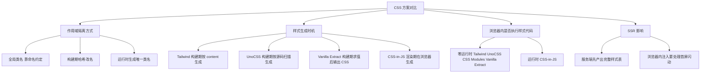
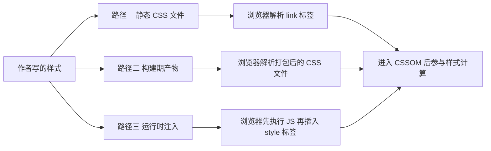
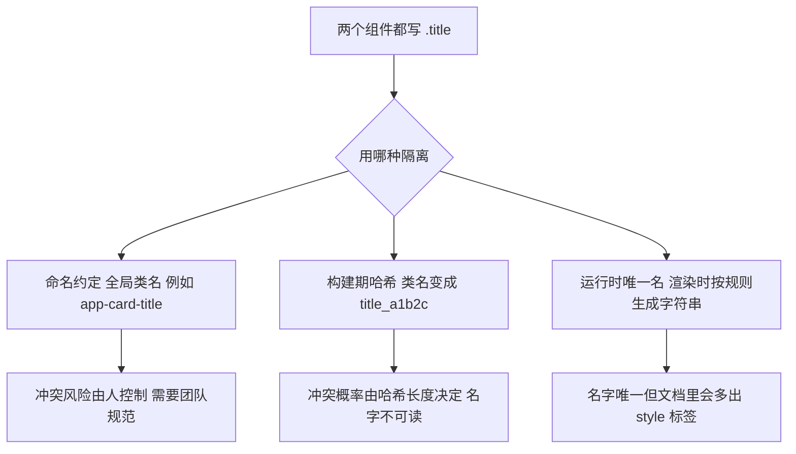
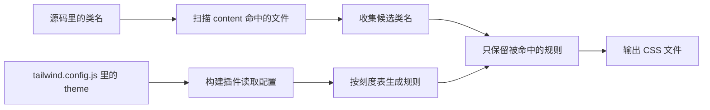
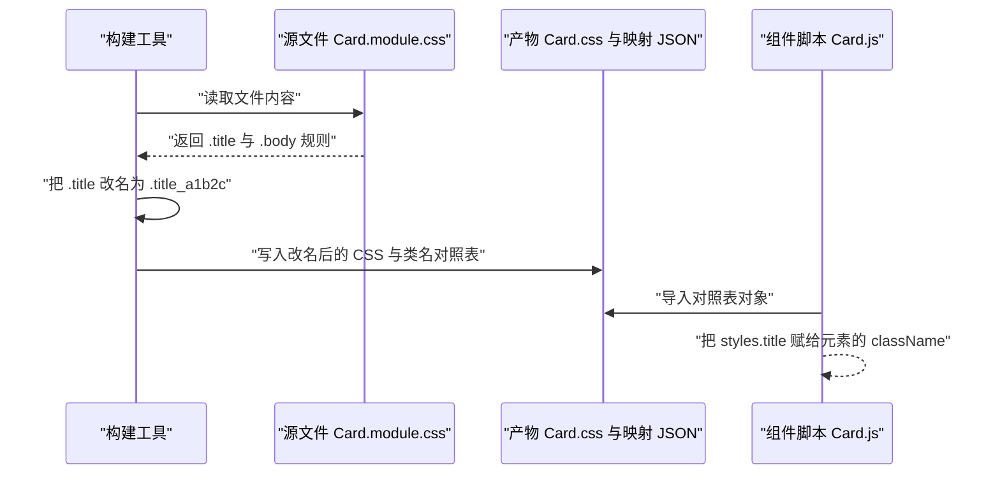
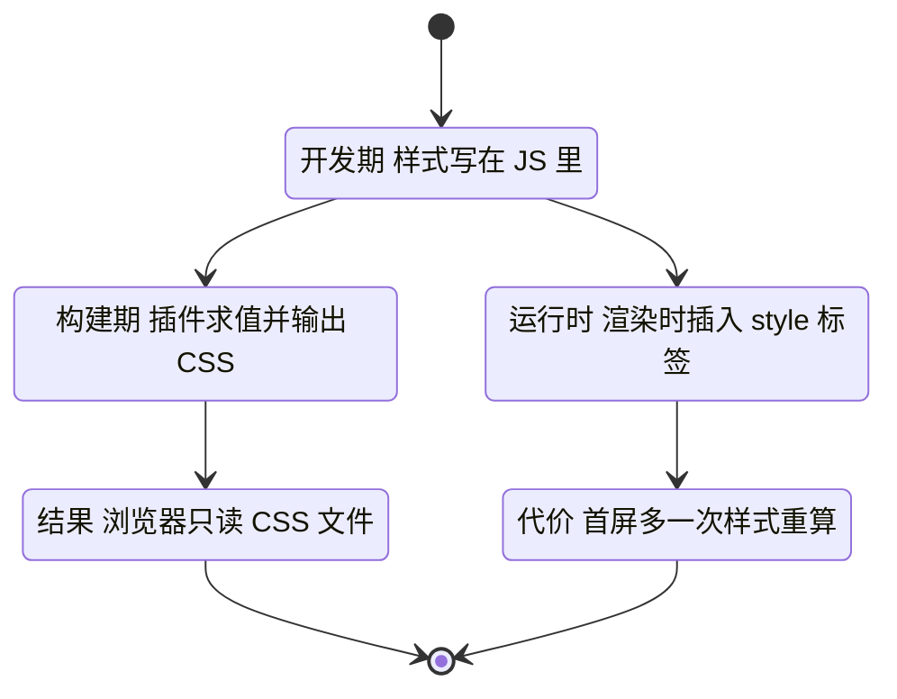
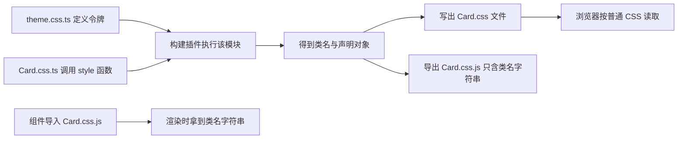
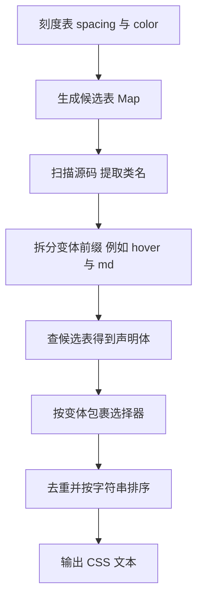
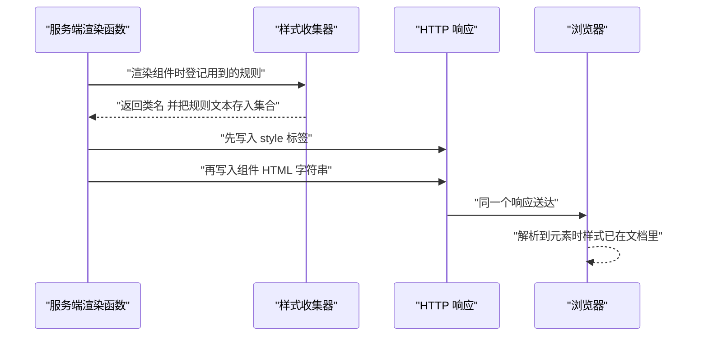

# CSS 方案对比：Tailwind、CSS Modules、CSS-in-JS、UnoCSS、Vanilla Extract

!!! abstract "学完这一页你能"
    - 说清 Tailwind、UnoCSS、CSS Modules、Vanilla Extract、CSS-in-JS 这五类方案把样式送到浏览器的具体时机与路径。
    - 用一句话判断一个方案是不是零运行时，并指出它在 SSR 场景下需要额外做哪一步。
    - 从零写出一个能扫描 HTML、生成原子类、支持 hover 与 md 变体的原子化 CSS 生成器。
    - 拿到一个真实项目需求时，按作用域隔离方式、动态值需求、SSR 要求三条线索选出方案并说出理由。

## 0. 知识地图



建议按编号顺序读。第 1 到第 2 节建立判断标准，第 3 到第 7 节逐个方案对照这套标准。第 8 节把所有机制压缩成一个可运行的生成器，第 9 节回到 SSR 把结论收拢。

## 1. 样式到达浏览器的三条路径

**先想一个问题**

你在组件文件里写了 `.card { color: red }`。这个文件不会自己跑进浏览器，浏览器到底在哪个时刻读到这条规则？

**心智模型**

!!! tip "心智模型"
    一句话模型：样式要生效，必须变成一段浏览器能解析的 CSS 文本，并进入文档。
    日常类比：把菜端上桌，可以提前装盘冷藏，也可以食堂统一备餐，还可以客人坐下后现场下锅。
    类比不成立处：现场下锅只影响这一桌，运行时注入样式会让文档里多出 style 标签，浏览器要重算样式，代价能用毫秒量出来。

!!! note "术语：CSSOM"
    CSSOM 是浏览器把 CSS 文本解析成的对象模型，全称 CSS Object Model。例子：你写的 `.p-2 { padding: 8px }` 会被解析成一条带选择器与声明的规则节点，浏览器再拿它与 DOM 匹配。

**图解**



1. 作者写的样式先被记下来，形式可能是 `.css` 文件、JS 对象、模板字符串。
2. 路径一：文件原样发布，浏览器读到 link 标签就去下载。
3. 路径二：构建工具先把源样式合并、改名、压缩，浏览器读到的已经是产物。
4. 路径三：浏览器必须先下载并执行一段 JS，再由这段 JS 创建 style 标签。
5. 三条路径最后都汇到同一步：规则进入 CSSOM，浏览器才能算出每个元素的最终样式。

**一步一步来**

第一步，把三种路径写成可比较的数字。

```js
// 按固定假设做算术比较：每行代表一条交付路径
const RUNTIME_ENGINE_BYTES = 12000; // 假设运行时引擎脚本为 12 KB
const ONE_RULE_BYTES = 28;          // 假设一条类规则约 28 字节
const rows = [
  { name: '静态 CSS 文件',     rules: 4000, jsBytes: 0,                  styleTags: 1 },
  { name: '按需原子化 CSS',    rules: 120,  jsBytes: 0,                  styleTags: 1 },
  { name: '运行时 CSS-in-JS',  rules: 120,  jsBytes: RUNTIME_ENGINE_BYTES, styleTags: 60 },
];
// 首屏必须到达的字节 = CSS 字节加必须执行的 JS 字节
const firstPaintBytes = (row) => row.rules * ONE_RULE_BYTES + row.jsBytes;
```

**这段代码在做什么**

- `rows` 把三种路径量化成三个字段：规则条数、必须执行的 JS 字节、style 标签数量。
- `ONE_RULE_BYTES` 与 `RUNTIME_ENGINE_BYTES` 是显式声明的假设，改动它们不改变比较方法。
- `firstPaintBytes` 只做一件事：把 CSS 字节和 JS 字节相加。
- 相加的理由是这两类字节都在首屏之前必须到达浏览器。
- `styleTags` 单独记录，因为它影响的是样式重算次数，不进入字节公式。

运行结果：静态文件 112000 字节，按需原子化 3360 字节，运行时 15360 字节。

第二步，读取比较结果，落到结论上。

```js
// 打印三条路径的首屏字节，便于肉眼核对
for (const row of rows) {
  console.log(row.name, firstPaintBytes(row), 'style 标签数', row.styleTags);
}
```

**这段代码在做什么**

- 遍历三行数据，输出路径名称与首屏字节。
- 同时输出 style 标签数量，方便后面讨论样式重算。
- 输出顺序与 `rows` 声明顺序一致，结果可复现。

运行结果：

```
静态 CSS 文件 112000 style 标签数 1
按需原子化 CSS 3360 style 标签数 1
运行时 CSS-in-JS 15360 style 标签数 60
```

**动手验证**

```js
// 依赖：无。Node 20 以上直接运行：node path-model.mjs
import assert from 'node:assert/strict';

const RUNTIME_ENGINE_BYTES = 12000;
const ONE_RULE_BYTES = 28;
const rows = [
  { name: '静态 CSS 文件',    rules: 4000, jsBytes: 0,                  styleTags: 1 },
  { name: '按需原子化 CSS',   rules: 120,  jsBytes: 0,                  styleTags: 1 },
  { name: '运行时 CSS-in-JS', rules: 120,  jsBytes: RUNTIME_ENGINE_BYTES, styleTags: 60 },
];

const firstPaintBytes = (row) => row.rules * ONE_RULE_BYTES + row.jsBytes;

const staticBytes = firstPaintBytes(rows[0]);
const atomicBytes = firstPaintBytes(rows[1]);
const runtimeRow = rows[2];

assert.equal(staticBytes, 112000);
assert.equal(atomicBytes, 3360);
assert.ok(atomicBytes < staticBytes, '按需原子化应低于静态全量');
assert.ok(runtimeRow.jsBytes > 0, '运行时路径必须执行 JS');
assert.ok(runtimeRow.styleTags > 1, '运行时路径会插入多个 style 标签');

console.log('静态', staticBytes, '原子化', atomicBytes, '运行时', firstPaintBytes(runtimeRow));
console.log('断言全部通过');
```

预期输出：先打印三个数字，再打印 `断言全部通过`。

**常见坑**

| 现象 | 原因 | 怎么修 |
| --- | --- | --- |
| 首屏出现无样式内容 | 样式在 HTML 之后才到达 | 把样式表放进 HTML 头部，或服务端内联关键样式 |
| 页面滚动卡顿 | 滚动过程中脚本仍在插入 style 标签 | 把插入时机提前到首次渲染前，或改为构建期输出 |
| 本地很快，线上变慢 | 本地磁盘读取 CSS 快，线上多一次网络往返 | 用真实网络限速在 DevTools 里复测 |

**小结**

- 样式必须变成 CSS 文本并进入 CSSOM，三种路径的区别只在文本生成的时刻。
- 首屏字节可以用规则条数乘单条字节加脚本字节算出粗略上界。
- 运行时路径多出的成本是必须执行的 JS 与多次样式重算。

## 2. 作用域隔离方式：命名约定、哈希、运行时唯一名

**先想一个问题**

两个组件各自写了 `.title`，一个想红色一个想蓝色。它们同时出现在一个页面上，谁会赢？

**心智模型**

!!! tip "心智模型"
    一句话模型：类名是全局字典里的键，隔离就是给键加命名空间。
    日常类比：同一栋楼里两家公司都叫前台，寄快递时必须写甲公司前台。
    类比不成立处：类名没有目录层级，加了哈希之后就不可读，排查只能靠源映射回原文件。

!!! note "术语：源映射"
    源映射是一份把产物位置映射回源码位置的对照文件，英文 source map。例子：产物里出现 `title_a1b2c`，源映射能告诉你它来自 `Card.module.css` 第 3 行。

**图解**



1. 两个组件都写了 `.title`，这是冲突的起点。
2. 三种隔离手段分别从人为约定、构建期改名、运行时生成三个方向解决它。
3. 命名约定把责任交给团队，好处是名字可读。
4. 构建期哈希把责任交给哈希函数，好处是自动化。
5. 运行时唯一名把责任交给渲染过程，代价是文档里多出 style 标签。

**一步一步来**

第一步，写一个不需要任何依赖的短哈希函数。

```js
// 32 位 FNV-1a 哈希，输入字符串，输出 36 进制短名
function fnv1a(input) {
  let hash = 0x811c9dc5;                      // 32 位偏移基数
  for (let i = 0; i < input.length; i++) {
    hash ^= input.charCodeAt(i);              // 逐字符异或
    hash = Math.imul(hash, 0x01000193);       // 32 位乘法，避免浮点丢位
  }
  return (hash >>> 0).toString(36);           // 转无符号整数再转 36 进制
}
```

**这段代码在做什么**

- 初始值 `0x811c9dc5` 是 32 位 FNV-1a 标准偏移基数。
- `charCodeAt` 取字符编码，异或把它混进当前哈希值。
- `Math.imul` 保证乘法结果按 32 位整数截断，用普通 `*` 会因为超过 2 的 53 次方而丢精度。
- `hash >>> 0` 把结果看成无符号整数，负数不会出现。
- `toString(36)` 用 0 到 9 加 a 到 z 表示，字符集比十六进制密。

第二步，把文件名与本地类名拼起来再哈希，得到隔离名。

```js
// 把文件路径与本地类名拼成输入，生成稳定且唯一的隔离名
function scopedName(file, local) {
  return `${local}_${fnv1a(`${file}:${local}`)}`;
}
console.log(scopedName('src/Card.module.css', 'title'));
console.log(scopedName('src/Panel.module.css', 'title'));
```

**这段代码在做什么**

- 输入里带文件路径，保证同名类名在不同文件里得到不同结果。
- 中间加冒号分隔，降低两段文本拼接后撞车的概率。
- 输出格式是 `本地名_哈希`，保留前缀便于在 DevTools 里搜索。

运行结果（具体哈希值由上面的算法确定）：

```
title_1q2w3e
title_5t6y7u
```

**动手验证**

```js
// 依赖：无。Node 20 以上直接运行：node scope-model.mjs
import assert from 'node:assert/strict';

function fnv1a(input) {
  let hash = 0x811c9dc5;
  for (let i = 0; i < input.length; i++) {
    hash ^= input.charCodeAt(i);
    hash = Math.imul(hash, 0x01000193);
  }
  return (hash >>> 0).toString(36);
}

function scopedName(file, local) {
  return `${local}_${fnv1a(`${file}:${local}`)}`;
}

const a = scopedName('src/Card.module.css', 'title');
const b = scopedName('src/Card.module.css', 'title');
const c = scopedName('src/Panel.module.css', 'title');

assert.equal(a, b, '同输入必须得到同输出');
assert.notEqual(a, c, '不同文件必须得到不同输出');
assert.match(a, /^title_[0-9a-z]+$/);
assert.ok(a.length <= 12, '隔离名长度控制在 12 个字符以内');

console.log(a, c);
console.log('断言全部通过');
```

预期输出：两行隔离名，再打印 `断言全部通过`。

**常见坑**

| 现象 | 原因 | 怎么修 |
| --- | --- | --- |
| 打包后类名在 JS 里取不到 | 直接写了字符串 `.title` 而不是映射对象 | 一律通过 `styles.title` 取值，不要手写类名 |
| 哈希名在两次构建后变化 | 输入包含了时间戳或行号 | 让输入只含文件路径与类名 |
| 全局样式被一起改名 | 选择器匹配到了不打算改名的规则 | 用 `:global` 或把全局样式放进独立文件 |

**小结**

- 隔离只是给全局键加命名空间，手段有三种：人为前缀、构建期哈希、运行时生成。
- 哈希函数的输入必须只包含稳定信息，否则缓存会失效。
- 哈希名可读性差，排查问题要靠源映射或保留类名前缀。

## 3. Tailwind：构建期把刻度表展开成工具类

**先想一个问题**

产品要求卡片间距 8 像素。你是回到组件 CSS 里改一行，还是在 HTML 里把 `p-1` 换成 `p-2`？

**心智模型**

!!! tip "心智模型"
    一句话模型：把设计系统里每个刻度提前写成一条类规则，写页面时只挑类名。
    日常类比：零件盒里零件提前做好，你只挑不造。
    类比不成立处：零件盒有固定格数，Tailwind 的类目由配置文件生成，改刻度要重新构建一次。

!!! note "术语：原子化 CSS"
    原子化 CSS 指每条类规则只承载一条样式声明，英文 atomic CSS。例子：`.p-2 { padding: 8px }` 只做一件事，而 `.card { padding: 8px; color: red }` 承载两条。

**图解**



1. 配置文件先声明刻度表，例如间距 0、4、8、16 像素。
2. 构建插件读取配置，按刻度表算出全部候选规则。
3. 同时扫描 content 指定的源码文件，收集里面出现过的类名。
4. 用候选规则与命中的类名取交集，未使用的规则不进入输出。
5. 交集写进最终的 CSS 文件，浏览器只读这个文件。

**一步一步来**

第一步，把刻度表展开成候选规则。

```js
// 刻度表 -> 候选类规则。key 是刻度名，value 是像素值
const spacing = { 0: '0px', 1: '4px', 2: '8px', 4: '16px' };
const rules = [];
for (const [step, value] of Object.entries(spacing)) {
  rules.push({ cls: `p-${step}`, body: `padding:${value}` });
  rules.push({ cls: `m-${step}`, body: `margin:${value}` });
}
console.log(rules.length); // 4 个刻度乘 2 个属性
```

**这段代码在做什么**

- `spacing` 用对象表达刻度，键是要写进类名的部分。
- 循环同时生成 padding 与 margin 两组规则。
- 每条规则保存类名与声明体两个字段，后面拼 CSS 时直接取用。
- 输出条数是刻度数乘属性数，改动刻度表条数自动变化。

运行结果：`8`。

第二步，只保留源码里真正用到的类名。

```js
// 从源码文本里提取类名，再与候选规则取交集
const source = '<div class="p-2 m-1 p-2"></div>';
const used = new Set(source.match(/class="([^"]*)"/)[1].split(/\s+/));
const css = rules
  .filter((r) => used.has(r.cls))
  .map((r) => `.${r.cls}{${r.body}}`)
  .join('');
console.log(css);
```

**这段代码在做什么**

- 正则从 `class` 属性里取出全部类名文本。
- `split` 按空白切分，`new Set` 自动去掉重复的 `p-2`。
- `filter` 做交集，只留下命中的规则。
- `map` 把规则拼成 CSS 文本，每条规则保持独立，不合并声明。

运行结果：`.p-2{padding:8px}.m-1{margin:4px}`。

**动手验证**

```js
// 依赖：无。Node 20 以上直接运行：node tailwind-model.mjs
import assert from 'node:assert/strict';

const spacing = { 0: '0px', 1: '4px', 2: '8px', 4: '16px' };
const rules = [];
for (const [step, value] of Object.entries(spacing)) {
  rules.push({ cls: `p-${step}`, body: `padding:${value}` });
  rules.push({ cls: `m-${step}`, body: `margin:${value}` });
}

function build(source) {
  const used = new Set(source.match(/class="([^"]*)"/)[1].split(/\s+/));
  return rules.filter((r) => used.has(r.cls)).map((r) => `.${r.cls}{${r.body}}`).join('');
}

const html = '<div class="p-2 m-1 p-2"></div>';
const css = build(html);

assert.equal(rules.length, 8);
assert.equal(css, '.p-2{padding:8px}.m-1{margin:4px}');
assert.ok(!css.includes('.p-4'), '未使用的刻度不应出现');
assert.equal(build('<div class=""></div>'), '', '没有类名时输出空串');

console.log(css);
console.log('断言全部通过');
```

预期输出：一行 CSS，再打印 `断言全部通过`。

**常见坑**

| 现象 | 原因 | 怎么修 |
| --- | --- | --- |
| 类名写了但样式没生成 | content 的 glob 没覆盖这个文件 | 核对官方文档：`content` 数组的 glob 写法与相对路径基准 |
| 动态拼出的类名不生效 | 扫描是文本匹配，拼出来的字符串不在源码里 | 把完整类名写进源码，或改用 CSS 变量 |
| 类名顺序影响结果 | 两条工具类写了同一个属性 | 明确属性优先级，避免同一元素写两条冲突工具类 |

**小结**

- Tailwind 的产物等于刻度表与源码命中类名的交集。
- 生成阶段在构建期，浏览器里没有样式计算代码。
- 动态值超出刻度表时需要另想办法，例如 CSS 变量或自定义类。

## 4. CSS Modules：构建期把类名改写成哈希

**先想一个问题**

打包之后 `styles.title` 到底等于什么？为什么同一个类名在两个模块里不会打架？

**心智模型**

!!! tip "心智模型"
    一句话模型：源文件里的类名相当于局部变量，构建工具把它改名并导出一张对照表。
    日常类比：函数里的变量 `x` 编译后被改名，你在函数外面引用不到它。
    类比不成立处：CSS 没有真正的块级作用域，这套隔离完全靠构建工具约定，`:global` 一句就能穿透。

**图解**



1. 构建工具读入 `.module.css` 文件，拿到原始规则文本。
2. 它找出文件里所有本地类选择器，逐个生成隔离名。
3. 改名后的 CSS 写进产物文件，对照表以 JSON 或 JS 对象形式导出。
4. 组件脚本导入对照表，渲染时取 `styles.title` 得到真实类名。
5. 浏览器只看到隔离名，不知道源文件里写过 `.title`。

**一步一步来**

第一步，扫描规则文本，把本地类名换成隔离名。

```js
import { createHash } from 'node:crypto';

// 用文件路径加本地类名做输入，取前 5 个 base64url 字符作为后缀
function shortHash(file, local) {
  return createHash('sha256').update(`${file}:${local}`).digest('base64url').slice(0, 5);
}

// 把 CSS 文本里的本地类选择器改名，同时记录对照关系
function transform(file, cssText) {
  const mapping = {};
  const out = cssText.replace(/\.([A-Za-z_][\w-]*)/g, (full, local) => {
    const scoped = `${local}_${shortHash(file, local)}`;
    mapping[local] = scoped;
    return `.${scoped}`;
  });
  return { css: out, mapping };
}
```

**这段代码在做什么**

- `shortHash` 把路径与类名拼起来做 sha256，再截取 5 个字符。
- 截取长度决定碰撞概率，5 个 base64url 字符约 30 位信息。
- 正则只匹配以字母或下划线开头的类选择器，避开 `.5rem` 这类数字。
- `replace` 的回调里同时写入对照表，改名与导出一步完成。
- 返回对象包含改名后的 CSS 与对照表两份数据。

第二步，用同样的函数处理两份源文件，验证隔离效果。

```js
// 两个模块都写了 .title，检查产物里的类名是否不同
const a = transform('Card.module.css', '.title{color:red}');
const b = transform('Panel.module.css', '.title{color:blue}');
console.log(a.mapping.title, a.css);
console.log(b.mapping.title, b.css);
console.log(a.mapping.title === b.mapping.title);
```

**这段代码在做什么**

- 两次调用的文件名不同，因此哈希后缀不同。
- 每个返回值里的 `mapping` 只包含本文件的类名。
- 最后一行的比较直接给出隔离结论：两个类名是否相等。

运行结果：

```
title_1a2b3 .title_1a2b3{color:red}
title_x9y8z .title_x9y8z{color:blue}
false
```

**动手验证**

```js
// 依赖：无（使用 node:crypto）。Node 20 以上直接运行：node css-modules-model.mjs
import assert from 'node:assert/strict';
import { createHash } from 'node:crypto';

function shortHash(file, local) {
  return createHash('sha256').update(`${file}:${local}`).digest('base64url').slice(0, 5);
}

function transform(file, cssText) {
  const mapping = {};
  const out = cssText.replace(/\.([A-Za-z_][\w-]*)/g, (full, local) => {
    const scoped = `${local}_${shortHash(file, local)}`;
    mapping[local] = scoped;
    return `.${scoped}`;
  });
  return { css: out, mapping };
}

const a = transform('Card.module.css', '.title{color:red}.body{margin:0}');
const b = transform('Panel.module.css', '.title{color:blue}');

assert.notEqual(a.mapping.title, b.mapping.title, '不同文件的同名类必须不同');
assert.equal(Object.keys(a.mapping).length, 2);
assert.ok(a.css.includes(a.mapping.title), '产物里必须使用隔离名');
assert.ok(!/\.title\{/.test(a.css), '不应残留未改名的 .title');

console.log(a.css);
console.log(b.css);
console.log('断言全部通过');
```

预期输出：两行改名后的 CSS，再打印 `断言全部通过`。

**常见坑**

| 现象 | 原因 | 怎么修 |
| --- | --- | --- |
| `styles.title` 为 undefined | 类名写错，或用了连字符写成了点语法 | 用 `styles['my-title']` 方括号取值 |
| 全局样式被打包改名 | 文件里写了要给第三方用的类名 | 用 `:global(.ant-btn)` 包住，或拆到独立全局文件 |
| 组合样式没生效 | `composes` 只在同一处理链里生效 | 核对官方文档：`composes` 支持的写法与顺序约束 |

**小结**

- CSS Modules 的核心动作是构建期改名加导出对照表，浏览器里没有额外脚本。
- 隔离名由文件路径与本地类名共同决定，输入稳定则产物稳定。
- 组件里一律通过映射对象取值，不手写类名字符串。

## 5. CSS-in-JS：运行时模式与零运行时模式

**先想一个问题**

按钮颜色来自接口返回的十六进制值，无法提前写进 CSS 文件。这时候样式放在哪里最合适？

**心智模型**

!!! tip "心智模型"
    一句话模型：样式是 JS 里的值，可以在渲染时算出来，再决定何时变成 CSS 文本。
    日常类比：客人点的口味决定放多少盐，厨师现场调味。
    类比不成立处：现场调味只影响一条规则，运行时注入会触发浏览器重新计算样式，低端机上能用帧时间测出来。

!!! note "术语：运行时"
    运行时指代码在浏览器里执行的阶段，英文 runtime。例子：`document.head.appendChild(style)` 这行代码只有在浏览器里才会执行。

!!! note "术语：零运行时"
    零运行时指组件样式在构建阶段已经变成 CSS 文件，浏览器里不存在样式计算代码。例子：Vanilla Extract 输出的 `.css` 文件与手写 CSS 文件在浏览器里没有区别。

**图解**



1. 起点相同：样式写在 JS 文件里，可以读取 props 与主题变量。
2. 运行时模式在组件渲染时算出规则文本，调用 DOM 接口插入 style 标签。
3. 这条路径的代价是首屏多一次样式重算，服务端渲染时还要把标签搬到响应里。
4. 零运行时模式改在构建期执行同一段样式代码，把结果写成 `.css` 文件。
5. 浏览器读到的就是普通 CSS 文件，与手写 CSS 没有差别。

**一步一步来**

第一步，写一个极简的运行时收集器。

```js
// 极简运行时：收集规则文本，返回生成的类名
const sheet = [];
function css(strings, ...values) {
  // 把模板里的插值替换成实际值，拼成一条完整规则
  return strings.reduce((acc, part, i) => acc + part + (values[i] ?? ''), '');
}
function inject(rule) {
  sheet.push(rule);
  return `sc-${sheet.length}`; // 类名与插入顺序绑定
}
function getStyleTag() {
  return `<style>${sheet.join('')}</style>`;
}
```

**这段代码在做什么**

- `css` 是标签模板函数，把静态片段与插值拼成一个字符串。
- `values[i] ?? ''` 用空串兜住 undefined，避免拼出 `undefined`。
- `inject` 把规则推进数组，并返回一个按顺序编号的类名。
- `getStyleTag` 把所有规则拼成一个 style 标签字符串，供服务端内联或客户端插入。
- 整个过程没有用到 DOM，方便在 Node 里先跑通逻辑。

第二步，模拟按 props 生成样式，并检查插入顺序。

```js
// 颜色来自入参，类名与规则一起进入收集器
function button(color) {
  const cls = inject(css`.${'x'}{color:${color}}`);
  return { cls, html: `<button class="${cls}">ok</button>` };
}
const one = button('#2563eb');
const two = button('#e11d48');
console.log(one.cls, two.cls);
console.log(getStyleTag());
```

**这段代码在做什么**

- `button` 每次调用都会产生一条新规则，因为颜色是运行时才知道的。
- 返回对象里同时包含类名与元素 HTML，模拟组件渲染结果。
- 两次调用得到两个不同类名，规则没有复用。
- 最后打印 style 标签，可以看到两条规则按调用顺序排列。

运行结果：

```
sc-1 sc-2
<style>.x{color:#2563eb}.x{color:#e11d48}</style>
```

**动手验证**

```js
// 依赖：无。Node 20 以上直接运行：node css-in-js-model.mjs
import assert from 'node:assert/strict';

const sheet = [];
function css(strings, ...values) {
  return strings.reduce((acc, part, i) => acc + part + (values[i] ?? ''), '');
}
function inject(rule) {
  sheet.push(rule);
  return `sc-${sheet.length}`;
}
function getStyleTag() {
  return `<style>${sheet.join('')}</style>`;
}
function button(color) {
  const cls = inject(css`.v${sheet.length + 1}{color:${color}}`);
  return { cls, html: `<button class="${cls}">ok</button>` };
}

const one = button('#2563eb');
const two = button('#e11d48');

assert.equal(one.cls, 'sc-1');
assert.equal(two.cls, 'sc-2');
assert.ok(getStyleTag().startsWith('<style>'));
assert.ok(getStyleTag().endsWith('</style>'));
assert.equal(sheet.length, 2, '两次调用产生两条规则');

console.log(one.html);
console.log(getStyleTag());
console.log('断言全部通过');
```

预期输出：一行按钮 HTML，一个 style 标签，再打印 `断言全部通过`。

**常见坑**

| 现象 | 原因 | 怎么修 |
| --- | --- | --- |
| 服务端渲染时样式丢失 | 服务端没有 DOM，插入操作没执行 | 收集规则字符串，渲染完成后拼进响应头部 |
| 客户端水合后样式重复 | 服务端与客户端各插入了一份 | 按规则内容去重，或使用同一份类名编号策略 |
| 列表渲染后样式标签暴涨 | 每条数据都生成新规则 | 把可变部分改成 CSS 变量，规则只留一份 |

**小结**

- 运行时模式的价值在于样式可以读取任意 JS 值，代价是执行与样式重算。
- 零运行时模式把同一段样式代码挪到构建期执行，浏览器里只剩 CSS 文件。
- 服务端渲染时必须先收集规则再输出 HTML，否则首屏会闪动。

## 6. UnoCSS：先扫描源码，再按需生成

**先想一个问题**

Tailwind 需要提前知道自己要支持哪些刻度。如果我想写 `p-13px` 这种刻度表里没有的值，怎么办？

**心智模型**

!!! tip "心智模型"
    一句话模型：先看源码里出现过哪些类名，再为这些类名现场生成规则。
    日常类比：先去工地看材料清单，再去市场买对应数量。
    类比不成立处：扫描只做文本匹配，运行时拼出来的类名不在源码文本里，扫不到就不会生成。

**图解**


1. 扫描器读入源码文件，把文本切成候选字符串。
2. 分词器按空白与符号切分，得到一个个类名候选。
3. 匹配器先查静态表，`flex`、`block` 这类直接命中。
4. 静态表命中失败时，再按正则尝试动态规则，`p-13px` 这类当场算出结果。
5. 生成器把命中的规则拼成文本，合并去重后输出。

**一步一步来**

第一步，准备静态表与动态规则两种匹配来源。

```js
// 静态表：固定类名到声明
const staticRules = { flex: 'display:flex', block: 'display:block' };
// 动态规则：正则匹配后由回调算出声明
const dynamicRules = [
  { test: /^p-(\d+)px$/, build: (m) => `padding:${m[1]}px` },
  { test: /^text-\[(.+)\]$/, build: (m) => `color:${m[1]}` },
];
function match(token) {
  if (staticRules[token]) return staticRules[token]; // 先查静态表
  for (const rule of dynamicRules) {
    const m = token.match(rule.test);                 // 再逐个试动态规则
    if (m) return rule.build(m);                      // 命中就返回声明文本
  }
  return null;                                        // 都不命中视为无效类名
}
```

**这段代码在做什么**

- `staticRules` 是对象表，键是完整类名，查表是常数时间。
- `dynamicRules` 是数组，因为顺序会影响同名匹配结果。
- `match` 先查静态表，再按数组顺序试动态规则。
- 返回 `null` 表示这个类名不生成任何规则，不会进产物。
- 动态规则用捕获组把数值取出来，灵活性来自回调而不是穷举刻度。

第二步，扫描一段 HTML 并输出 CSS。

```js
// 从 class 属性提取类名，依次匹配后拼成 CSS
function generate(source) {
  const tokens = new Set(source.match(/class="([^"]*)"/)[1].split(/\s+/));
  const out = [];
  for (const token of tokens) {
    if (!token) continue;
    const body = match(token);
    if (body) out.push(`.${token}{${body}}`);
  }
  return out.join('');
}
console.log(generate('<div class="flex p-13px text-[#2563eb] nope"></div>'));
```

**这段代码在做什么**

- `new Set` 去重，同一类名只生成一次规则。
- 空字符串直接跳过，避免生成 `.{}` 这种坏规则。
- 只有 `match` 返回非空时才写入输出，`nope` 被丢弃。
- 输出顺序与 Set 的插入顺序一致，结果可复现。

运行结果：`.flex{display:flex}.p-13px{padding:13px}.text-[#2563eb]{color:#2563eb}`。

**动手验证**

```js
// 依赖：无。Node 20 以上直接运行：node unocss-model.mjs
import assert from 'node:assert/strict';

const staticRules = { flex: 'display:flex', block: 'display:block' };
const dynamicRules = [
  { test: /^p-(\d+)px$/, build: (m) => `padding:${m[1]}px` },
  { test: /^text-\[(.+)\]$/, build: (m) => `color:${m[1]}` },
];
function match(token) {
  if (staticRules[token]) return staticRules[token];
  for (const rule of dynamicRules) {
    const m = token.match(rule.test);
    if (m) return rule.build(m);
  }
  return null;
}
function generate(source) {
  const tokens = new Set(source.match(/class="([^"]*)"/)[1].split(/\s+/));
  const out = [];
  for (const token of tokens) {
    if (!token) continue;
    const body = match(token);
    if (body) out.push(`.${token}{${body}}`);
  }
  return out.join('');
}

const css = generate('<div class="flex p-13px text-[#2563eb] nope flex"></div>');

assert.equal(match('p-13px'), 'padding:13px');
assert.equal(match('p-abc'), null);
assert.equal((css.match(/\.flex\{/g) || []).length, 1, '重复类名只生成一次');
assert.ok(!css.includes('nope'), '未命中的类名不进入产物');

console.log(css);
console.log('断言全部通过');
```

预期输出：一行 CSS，再打印 `断言全部通过`。

**常见坑**

| 现象 | 原因 | 怎么修 |
| --- | --- | --- |
| 拼接出的类名不生成样式 | 扫描看源码文本，拼接结果不在文本里 | 写成完整字面量，或用 safelist 白名单 |
| 动态规则顺序导致结果不符 | 先命中的规则被采用 | 把更具体的正则排在前面 |
| 规则输出顺序在两次构建间变化 | 源码扫描顺序随文件系统变化 | 生成后按选择器排序，保证输出稳定 |

**小结**

- 按需生成先用扫描缩小范围，再为命中的类名生成规则。
- 动态规则让刻度表之外的数值也能用，代价是正则要写得足够严格。
- 输出排序是产物可复现的前提。

## 7. Vanilla Extract：TypeScript 里写样式，构建期产出 CSS

**先想一个问题**

你想要类名的类型提示与重命名重构，又不想在浏览器里跑样式代码。这两件事能同时满足吗？

**心智模型**

!!! tip "心智模型"
    一句话模型：把 `.css.ts` 当源码，插件在构建期执行它，输出 `.css` 文件与类名导出。
    日常类比：TypeScript 编译成 JavaScript 之后，类型信息在运行时消失。
    类比不成立处：这里不只是删类型，`createTheme` 这类函数会真的被执行，结果被序列化成 CSS 文本。

**图解**



1. 令牌文件与被样式文件都是普通 TypeScript 模块，可以在里面写循环与计算。
2. 构建插件执行这些模块，得到类名与声明的结构。
3. 声明结构被序列化成 `.css` 文件，交给打包器处理。
4. 类名字符串被写进一个同名 JS 模块，供组件导入。
5. 浏览器只读 `.css` 文件，组件里拿到的是常量字符串。

**一步一步来**

第一步，把声明对象序列化成 CSS 文本。

```js
// 把驼峰属性名转成短横线写法的 CSS 属性名
function kebab(prop) {
  return prop.replace(/[A-Z]/g, (c) => `-${c.toLowerCase()}`);
}
// 把值里的 $token 引用替换成令牌表里的真实值
function resolveValue(value, tokens) {
  return typeof value === 'string' && value.startsWith('$')
    ? tokens[value.slice(1)]
    : String(value);
}
// 把一个声明对象转成声明体文本
function serialize(decls, tokens) {
  return Object.entries(decls)
    .map(([prop, value]) => `${kebab(prop)}:${resolveValue(value, tokens)}`)
    .join(';');
}
```

**这段代码在做什么**

- `kebab` 只处理大写字母，`backgroundColor` 变成 `background-color`。
- `resolveValue` 用 `$` 前缀区分令牌引用与字面量，前者查表。
- `serialize` 保持对象键的插入顺序，输出结果因此可复现。
- 三条函数各自只做一件事，方便单独断言。

第二步，模拟一次样式调用并检查输出。

```js
// 令牌表由主题文件提供，样式文件只引用令牌名
const tokens = { spaceMd: '8px', colorBrand: '#2563eb' };
const result = serialize({ padding: '$spaceMd', color: '$colorBrand' }, tokens);
console.log(`.card{${result}}`);
console.log(serialize({ marginTop: '4px' }, tokens));
```

**这段代码在做什么**

- 令牌表把设计值集中在一个文件里，样式文件不再出现魔法数字。
- 第一次调用返回两条声明，令牌已替换成真实值。
- 第二次调用验证纯字面量路径，不查令牌表。

运行结果：

```
.card{padding:8px;color:#2563eb}
margin-top:4px
```

**动手验证**

```js
// 依赖：无。Node 20 以上直接运行：node vanilla-extract-model.mjs
import assert from 'node:assert/strict';

function kebab(prop) {
  return prop.replace(/[A-Z]/g, (c) => `-${c.toLowerCase()}`);
}
function resolveValue(value, tokens) {
  return typeof value === 'string' && value.startsWith('$')
    ? tokens[value.slice(1)]
    : String(value);
}
function serialize(decls, tokens) {
  return Object.entries(decls)
    .map(([prop, value]) => `${kebab(prop)}:${resolveValue(value, tokens)}`)
    .join(';');
}

const tokens = { spaceMd: '8px', colorBrand: '#2563eb' };
const card = serialize({ padding: '$spaceMd', color: '$colorBrand' }, tokens);

assert.equal(kebab('backgroundColor'), 'background-color');
assert.equal(resolveValue('$spaceMd', tokens), '8px');
assert.equal(resolveValue('12px', tokens), '12px');
assert.equal(card, 'padding:8px;color:#2563eb');
assert.match(card, /^[a-z-]+:[^;]+;[a-z-]+:[^;]+$/);

console.log(`.card{${card}}`);
console.log('断言全部通过');
```

预期输出：一行 `.card{padding:8px;color:#2563eb}`，再打印 `断言全部通过`。

**常见坑**

| 现象 | 原因 | 怎么修 |
| --- | --- | --- |
| 样式文件里出现运行时报错 | 模块在构建期执行，不能访问浏览器变量 | 把它当成纯函数文件，只读取入参与环境变量 |
| 类名在组件里拼装后失效 | 类名是常量字符串，运行时拼装不参与类型检查 | 用导出好的类名做组合，不要用模板串拼 |
| 令牌改名后样式没跟着变 | 令牌名写成了字面量字符串 | 用令牌对象取值，让重命名能被编译器捕获 |

**小结**

- Vanilla Extract 把样式代码的执行提前到构建期，浏览器里只留 CSS 文件。
- 类型提示来自标准 TypeScript，不需要额外声明文件。
- 样式模块必须当作纯函数对待，不能触碰浏览器 API。

## 8. 手写一个原子化 CSS 生成器

**先想一个问题**

前面几节把扫描、匹配、变体、输出拆开讲过。把这些零件装成一台能跑的小机器，需要注意哪些顺序问题？

**心智模型**

!!! tip "心智模型"
    一句话模型：生成器是一条流水线，输入是源码文本与刻度表，输出是一段 CSS 字符串。
    日常类比：流水线上先分拣原料，再按图纸加工，最后打包贴标。
    类比不成立处：流水线的顺序不能随意交换，先输出再扫描就必须把整份 CSS 重写一次。

!!! note "术语：变体"
    变体指加在原子类前面的条件前缀，英文 variant。例子：`hover:p-4` 表示鼠标悬停时才应用 `padding:16px`。

**图解**



1. 刻度表先展开成候选表，键是基础类名，值是声明体。
2. 扫描源码的 class 属性，得到候选类名集合。
3. 每个类名按冒号拆成变体前缀与基础类名两部分。
4. 基础类名查候选表，查不到就丢弃这个类名。
5. 按变体顺序从内到外包裹选择器，`md` 变成媒体查询，`hover` 变成伪类。
6. 去重后按字符串排序，保证两次构建输出一致。

**一步一步来**

第一步，建候选表，并处理变体前缀的包裹。

```js
// 刻度表展开成候选表
const spacing = { 0: '0px', 1: '4px', 2: '8px', 4: '16px' };
const color = { red: '#e11d48', blue: '#2563eb' };
const candidates = new Map();
for (const [k, v] of Object.entries(spacing)) {
  candidates.set(`p-${k}`, `padding:${v}`);
  candidates.set(`m-${k}`, `margin:${v}`);
}
for (const [k, v] of Object.entries(color)) candidates.set(`text-${k}`, `color:${v}`);

// 变体表：前缀名 -> 把选择器与声明体包一层
const variants = {
  hover: (sel, body) => `${sel}:hover{${body}}`,
  md: (sel, body) => `@media (min-width:768px){${sel}{${body}}}`,
};
```

**这段代码在做什么**

- 候选表的键里带刻度部分，`p-2` 与 `m-2` 是两条独立规则。
- 用 `Map` 而不是普通对象，避免 `constructor` 这类键名造成意外命中。
- 变体表的值是函数，输入选择器与声明体，输出包裹后的规则。
- `hover` 产出伪类规则，`md` 产出媒体查询规则，两者结构不同但接口一致。

第二步，扫描源码并把类名解析成规则文本。

```js
// 提取 class 属性里的全部类名
function extract(source) {
  const found = new Set();
  for (const m of source.matchAll(/class="([^"]+)"/g)) {
    for (const token of m[1].split(/\s+/)) if (token) found.add(token);
  }
  return found;
}

// 解析单个类名：拆变体、查表、包裹、必要时转义冒号
function resolve(token) {
  const parts = token.split(':');
  const base = parts.pop();
  const body = candidates.get(base);
  if (!body) return null;
  const selector = `.${token.replace(/:/g, '\\:')}`; // 类名里的冒号要转义
  let rule = `${selector}{${body}}`;
  for (let i = parts.length - 1; i >= 0; i--) {
    const wrap = variants[parts[i]];
    if (!wrap) return null;
    rule = wrap(selector, body);
  }
  return rule;
}
```

**这段代码在做什么**

- `extract` 用 `matchAll` 遍历所有 class 属性，不限于第一个。
- `resolve` 用 `pop` 取走最后一段作为基础类名，剩下的都是变体前缀。
- 选择器里的冒号必须转义成 `\:`，否则 `.hover:p-4` 会被解析成伪类。
- 变体从右向左包裹，先加的变体在里层，后加的在外层。
- 遇到不认识的变体返回 `null`，整个类名被丢弃。

第三步，生成最终文本并排序去重。

```js
// 生成入口：扫描、解析、去重、排序、拼接
function generate(source) {
  const rules = [];
  for (const token of extract(source)) {
    const rule = resolve(token);
    if (rule) rules.push(rule);
  }
  return [...new Set(rules)].sort().join('\n');
}
const html = '<div class="p-2 text-red hover:p-4 md:m-1 unknown-1"></div>';
console.log(generate(html));
```

**这段代码在做什么**

- `new Set` 去掉完全相同的规则文本，重复类名只留一条。
- `sort` 用默认字符串排序，输出顺序与扫描顺序无关。
- `join('\n')` 每条规则一行，便于肉眼检查与 diff 比较。
- `unknown-1` 查不到候选，不会出现在结果里。

运行结果：

```
.hover\:p-4:hover{padding:16px}
.md\:m-1{margin:4px}
.p-2{padding:8px}
.text-red{color:#e11d48}
```

**动手验证**

```js
// 依赖：无。Node 20 以上直接运行：node atomic-generator.mjs
import assert from 'node:assert/strict';

const spacing = { 0: '0px', 1: '4px', 2: '8px', 4: '16px' };
const color = { red: '#e11d48', blue: '#2563eb' };
const candidates = new Map();
for (const [k, v] of Object.entries(spacing)) {
  candidates.set(`p-${k}`, `padding:${v}`);
  candidates.set(`m-${k}`, `margin:${v}`);
}
for (const [k, v] of Object.entries(color)) candidates.set(`text-${k}`, `color:${v}`);
const variants = {
  hover: (sel, body) => `${sel}:hover{${body}}`,
  md: (sel, body) => `@media (min-width:768px){${sel}{${body}}}`,
};
function extract(source) {
  const found = new Set();
  for (const m of source.matchAll(/class="([^"]+)"/g)) {
    for (const token of m[1].split(/\s+/)) if (token) found.add(token);
  }
  return found;
}
function resolve(token) {
  const parts = token.split(':');
  const base = parts.pop();
  const body = candidates.get(base);
  if (!body) return null;
  const selector = `.${token.replace(/:/g, '\\:')}`;
  let rule = `${selector}{${body}}`;
  for (let i = parts.length - 1; i >= 0; i--) {
    const wrap = variants[parts[i]];
    if (!wrap) return null;
    rule = wrap(selector, body);
  }
  return rule;
}
function generate(source) {
  const rules = [];
  for (const token of extract(source)) {
    const rule = resolve(token);
    if (rule) rules.push(rule);
  }
  return [...new Set(rules)].sort().join('\n');
}

const html = '<div class="p-2 text-red hover:p-4 md:m-1 unknown-1 p-2"></div>';
const css = generate(html);
const lines = css.split('\n');

assert.equal(resolve('p-2'), '.p-2{padding:8px}');
assert.equal(resolve('hover:p-4'), '.hover\\:p-4:hover{padding:16px}');
assert.equal(resolve('md:m-1'), '@media (min-width:768px){.md\\:m-1{margin:4px}}');
assert.equal(resolve('unknown-1'), null);
assert.ok(!css.includes('unknown-1'));
assert.equal(lines.length, 4, '重复与无效类名不增加规则数');
assert.deepEqual([...lines].sort(), lines, '输出必须已排序');

console.log(css);
console.log('断言全部通过');
```

预期输出：四行 CSS，再打印 `断言全部通过`。

**常见坑**

| 现象 | 原因 | 怎么修 |
| --- | --- | --- |
| `hover:p-4` 被当成伪类解析失败 | 类名里的冒号没有转义 | 生成选择器时把 `:` 替换成 `\:` |
| 两条规则互相覆盖但结果随机 | 输出顺序随扫描顺序变化 | 生成后统一排序，让顺序可预测 |
| 变体嵌套后包裹顺序反了 | 从左向右包裹，外层变体被套在里层之外 | 从右向左包裹，最后加的变体在最外层 |
| 媒体查询里出现重复规则 | 每个类名各自生成媒体查询块 | 按变体分组，同一媒体条件只写一次 |

**小结**

- 生成器分成四段：建表、扫描、解析变体、去重排序。
- 类名里的冒号必须转义，否则选择器语义会变。
- 排序是产物可复现的关键一步，不能省略。

## 9. SSR 影响：谁能把样式在首屏之前送到

**先想一个问题**

服务端返回的 HTML 里按钮已经是蓝色了，但浏览器还没下载到 CSS。用户会先看到什么？

**心智模型**

!!! tip "心智模型"
    一句话模型：首屏是否稳定，取决于样式文本是否与 HTML 在同一个响应里到达。
    日常类比：快递同时送到家具与说明书，你才装得起来。
    类比不成立处：说明书晚到可以等一下，样式晚到页面会先按默认样式画一遍，再把内容重画。

!!! note "术语：SSR"
    SSR 是服务端渲染，全称 Server-Side Rendering。例子：Node 进程把组件渲染成 HTML 字符串，直接写进响应体。

!!! note "术语：FOUC"
    FOUC 是无样式内容闪烁，全称 Flash Of Unstyled Content。例子：页面先显示成默认衬线字体与黑色小字，半秒后突然变成设计稿。

**图解**



1. 服务端开始渲染组件，每用到一条样式就向收集器登记。
2. 收集器把规则文本存进集合，同时返回类名给组件。
3. 渲染结束后，先把集合拼成 style 标签写进响应头部。
4. 再把组件 HTML 字符串写进响应体。
5. 浏览器收到同一个响应，解析到元素时样式已经可用。

**一步一步来**

第一步，写一个只收集不输出的渲染过程。

```js
// 收集器：键去重，值保存规则文本
const collected = new Map();
function ssrStyle(key, text) {
  if (!collected.has(key)) collected.set(key, text); // 同一规则只存一次
  return `cls_${key}`;                                // 返回稳定类名
}
function renderButton() {
  const cls = ssrStyle('btn', '.cls_btn{color:#2563eb}');
  return `<button class="${cls}">提交</button>`;
}
```

**这段代码在做什么**

- `Map` 的键是规则标识，重复登记同一规则不会产生重复 CSS。
- 返回值 `cls_btn` 是稳定字符串，服务端与客户端渲染能得到同一个类名。
- `renderButton` 只在渲染时登记，不关心最终怎么输出。
- 收集与输出分离，是 SSR 场景下最关键的结构决定。

第二步，渲染结束后拼出完整响应。

```js
// 渲染完成后一次性拼出 style 标签与 HTML
function renderPage(renderBody) {
  const body = renderBody();                                  // 第一遍先渲染并收集
  const styleTag = `<style>${[...collected.values()].join('')}</style>`;
  return styleTag + body;                                     // style 写在 body 之前
}
const html = renderPage(() => `<div id="app">${renderButton()}</div>`);
console.log(html);
console.log(html.indexOf('<style>') < html.indexOf('<div id="app">'));
```

**这段代码在做什么**

- `renderBody` 先执行一次，把规则收集齐。
- 收集完再拼 style 标签，顺序上必然在 HTML 之前。
- 最后一行比较两个下标，直接验证样式先于内容。
- 返回的字符串是完整响应体，浏览器按顺序解析。

运行结果：

```
<style>.cls_btn{color:#2563eb}</style><div id="app"><button class="cls_btn">提交</button></div>
true
```

**动手验证**

```js
// 依赖：无。Node 20 以上直接运行：node ssr-model.mjs
import assert from 'node:assert/strict';

const collected = new Map();
function ssrStyle(key, text) {
  if (!collected.has(key)) collected.set(key, text);
  return `cls_${key}`;
}
function renderButton(label) {
  const cls = ssrStyle('btn', '.cls_btn{color:#2563eb;border-radius:6px}');
  return `<button class="${cls}">${label}</button>`;
}
function renderPage(renderBody) {
  const body = renderBody();
  const styleTag = `<style>${[...collected.values()].join('')}</style>`;
  return styleTag + body;
}

const html = renderPage(() => `<div id="app">${renderButton('提交')}${renderButton('取消')}</div>`);

assert.equal(collected.size, 1, '同一规则只收集一次');
assert.ok(html.indexOf('<style>') < html.indexOf('<div id="app">'));
assert.ok(html.indexOf('<style>') === 0, 'style 标签位于响应最前面');
assert.equal((html.match(/cls_btn/g) || []).length, 3, '类名出现一次定义加两次使用');
assert.ok(!html.includes('undefined'));

console.log(html);
console.log('断言全部通过');
```

预期输出：一行完整 HTML，再打印 `断言全部通过`。

**常见坑**

| 现象 | 原因 | 怎么修 |
| --- | --- | --- |
| 首屏闪一下才变好看 | style 标签写在 HTML 之后 | 收集完成后把 style 拼在 body 之前 |
| 水合后样式重复 | 服务端与客户端各输出一份 | 两端共用同一套类名生成规则，客户端按标识去重 |
| 服务端内存持续增长 | 收集器是模块级变量，跨请求不清理 | 按请求创建收集器实例，响应结束后丢弃 |

**小结**

- SSR 稳定的前提是样式文本与 HTML 在同一个响应里到达。
- 收集与输出必须分成两步，先渲染收集，再拼响应。
- 收集器要按请求隔离，避免请求之间互相污染。

## 综合对比

| 维度 | Tailwind CSS | UnoCSS | CSS Modules | Vanilla Extract | CSS-in-JS 运行时模式 |
| --- | --- | --- | --- | --- | --- |
| 样式生成时机 | 构建期按 content 扫描生成 | 构建期按源码扫描生成 | 构建期改名，规则文本不变 | 构建期执行样式模块后输出 | 渲染期在浏览器里生成 |
| 浏览器内是否执行样式代码 | 否 | 否 | 否 | 否 | 是 |
| 作用域隔离方式 | 全局类名，靠命名约定 | 全局类名，靠命名约定 | 构建期哈希改名 | 构建期哈希改名 | 运行时生成唯一类名 |
| 动态值支持 | 需借助 CSS 变量 | 需借助 CSS 变量 | 需借助 CSS 变量 | 需借助 CSS 变量 | 直接读取任意 JS 值 |
| 类型提示 | 需编辑器插件 | 需编辑器插件 | 需额外类型声明 | 原生 TypeScript | 依具体库而定 |
| SSR 处理 | 直接引入生成的 CSS 文件 | 直接引入生成的 CSS 文件 | 构建期已确定，直接引入 | 构建期已确定，直接引入 | 需收集规则并内联到响应头部 |
| 产物条数由什么决定 | content 命中的类名数量 | 源码扫描命中的类名数量 | 每个模块的全部规则 | 每个样式模块引用的规则 | 每次渲染实际用到的规则 |
| 类名可读性 | 可读，类名即样式含义 | 可读，类名即样式含义 | 前缀可读，后缀是哈希 | 前缀可读，后缀是哈希 | 不可读，是内部编号 |
| 新增样式的成本 | 从刻度表挑类名 | 从刻度表挑类名，或写动态值 | 新开一条本地类名 | 新写一段声明对象 | 在组件里直接写规则 |

## 应用与行业实践

前面几章解决了"样式怎么到浏览器"。这一章解决的问题是：拿到真实需求时，选哪条路，怎么证明选的没错，怎么防止团队走回头路。

### 应用场景地图

| 场景 | 用到本页哪个知识点 | 典型技术选型 | 注意事项 |
| --- | --- | --- | --- |
| 后台管理的万行表格，200 列可配置 | 作用域隔离方式：哈希改写 | CSS Modules + Tailwind 工具类 | 列宽若由后端下发像素值，别拼成类名，改写内联变量 |
| 低端安卓机上的首屏加载 | 构建期按需生成、SSR 首屏内联 | UnoCSS 构建期扫描 | 扫描范围要排除 dist 与旧产物，否则带上废规则 |
| 多人协作白板，元素几百个且颜色由远端推 | 运行时唯一名、CSS 变量 | Vanilla Extract 出静态类 + CSS 变量承载动态值 | 别让每个元素触发一次样式插入 |
| 组件库发布到 npm 供多方消费 | 零运行时判断 | Vanilla Extract 或 CSS Modules | 产物里不能残留运行时插入样式的代码 |
| 营销落地页，配色随投放活动变 | 构建期展开刻度表 | Tailwind + CSS 变量做主题 | 活动色走变量，不要为每个活动重新编译 |
| 微前端：主应用与子应用互相污染 | 作用域隔离方式对比 | 子应用 CSS Modules，主应用 Tailwind | 重置样式与 `:root` 变量要在边界处定好归属 |
| 邮件模板与静态站点导出 | 运行时与零运行时的差别 | 构建期产出静态 CSS | 收件端不执行 JS，运行时方案直接出局 |
| 深色模式与品牌换肤 | CSS 变量 + 构建期类 | Tailwind 的 dark 变体加变量 | 变量作用域要落在容器上，方便局部换肤 |

### 三个场景拆解

#### 场景 1：后台管理的万行表格

**业务背景**：表格有 200 列、每屏渲染 50 行，冻结列、斑马纹、选中态互相叠加，类名撞车会让表头错位。用本地 5 万行假数据跑滚动，就能复现问题。

**怎么用本页知识解决**：壳层类名交给 CSS Modules 在构建期改写成哈希，单元格间距与对齐交给 Tailwind 工具类，两套机制各管一层。

```tsx
// Table.tsx
import styles from './Table.module.css'; // 构建期把类名改写成哈希，避免与页面其他样式撞车

export function Row({ selected, cell }: { selected: boolean; cell: string }) {
  return (
    <div className={selected ? `${styles.row} ${styles.selected}` : styles.row}>
      {/* 间距与对齐用工具类，命中刻度表后由构建期展开 */}
      <div className="px-2 py-1 text-left truncate">{cell}</div>
    </div>
  );
}
```

- 状态类（选中、禁用、冻结）由 CSS Modules 管，类名哈希后不会与业务页面的 `.row` 冲突。
- 间距、字号、对齐由工具类管，取值来自刻度表，不会出现 `padding: 7px` 这种孤值。
- 列宽来自后端数据，用内联 `style` 写入，不参与类名拼接。
- 冻结列用 `position: sticky` 加 `:global` 覆盖第三方表头组件，改写点集中在一个文件。

**怎么度量收益**：用 Chrome DevTools Performance 面板录制 10 秒连续滚动，看 Scripting 与 Rendering 的占比，以及 `Recalculate Style` 的调用次数。用 Playwright 截图对比做视觉回归，记录表头错位的失败用例数。用 Lighthouse 看首屏的 FCP。

**什么时候不该用**：列配置在运行时由用户拖拽生成、列宽全是不定值时，工具类覆盖不到，改用内联变量或 `<colgroup>`。表格壳层要被外部主题整体覆盖时，CSS Modules 的哈希类名会成为障碍，壳层要留出稳定的全局类名。

#### 场景 2：低端安卓机上的首屏加载

**业务背景**：投放页要在弱网低端机上让首屏文字先出现，CSS 文件越大，渲染阻塞越久。用 Chrome DevTools 的 CPU 6 倍降速加 Slow 4G 网络就能复现，不需要真机。

**怎么用本页知识解决**：构建期扫描 HTML 里真正出现的类名，只产出命中的规则，再把这段 CSS 内联进 `head`，省掉一次网络往返。

```js
// build-critical.mjs：扫描 HTML 里的原子类，生成 CSS 并内联到 head
import { readFileSync, writeFileSync } from 'node:fs';

const scale = { 'mt-2': 'margin-top:8px', 'text-sm': 'font-size:14px' }; // 刻度表，构建期展开
const html = readFileSync('dist/index.html', 'utf8');
// 只保留真的写在 class 属性里的类名，扫不到的类名不产出规则
const used = new Set((html.match(/class="([^"]+)"/g) ?? []).flatMap((m) => m.slice(7, -1).split(/\s+/)));
const css = [...used].filter((c) => scale[c]).map((c) => `.${c}{${scale[c]}}`).join('');
// 内联进 head，浏览器解析到 HTML 时就拿到样式，不再等外部 CSS 文件
writeFileSync('dist/index.html', html.replace('</head>', `<style>${css}</style></head>`));
```

- 扫描源是构建产物 HTML，类名集合与实际渲染结果对齐，不会带上下线页面遗留的规则。
- 规则来自刻度表，同一刻度只产出一条 CSS，多个页面复用同一份。
- 内联放在 `head` 末尾，`body` 之前，首屏元素命中样式不需要额外请求。
- 把脚本接到打包命令之后，产物每次都重新生成，避免手工维护关键 CSS。

**怎么度量收益**：Lighthouse 里看 FCP 与 LCP。Chrome DevTools Coverage 面板看未使用 CSS 的字节占比。Network 面板看 CSS 请求数是否为 0。文件体积用 gzip 后的字节数记录，不用源码行数。

**什么时候不该用**：类名在运行时拼接（例如 `` `mt-${n}` ``）时，扫描器看不到这种字符串，方案失效。页面里存在用户实时改样式的低代码编辑器时，样式集合随时变化，构建期扫描覆盖不到。

#### 场景 3：多人协作白板

**业务背景**：画布上有几百个图形，位置、颜色、旋转角度都由远端数据推过来，样式值只有运行时才知道。本地开两个浏览器标签页模拟双人编辑就能观察卡顿。

**怎么用本页知识解决**：静态规则在构建期生成一次，动态值收进 CSS 变量，只改 `style` 属性，不新增 CSS 规则。

```tsx
// element.tsx：动态值走 CSS 变量，静态规则走构建期生成的类
export function Element({ x, y, color }: { x: number; y: number; color: string }) {
  return (
    <div
      className="board-el"
      // 运行期才知道的值放进自定义属性，避免为每个元素生成一条新规则
      style={{ '--x': `${x}px`, '--y': `${y}px`, '--c': color } as React.CSSProperties}
    />
  );
}
```

配套的 `.board-el` 规则在构建期产出：

```css
.board-el { transform: translate(var(--x), var(--y)); background: var(--c); }
```

- `transform` 与 `background` 是静态声明，只有一条规则，元素数量增加时规则数不变。
- 拖动元素只改自定义属性，浏览器走合成与重绘，不触发样式表的插入。
- 颜色值由远端下发时直接写进 `--c`，不需要为每种颜色预先枚举类名。
- 选中态、连线态这类有限状态用固定类名切换，不占用变量通道。

**怎么度量收益**：Chrome DevTools Performance 面板看拖动时的 FPS 与 `Recalculate Style` 次数。在控制台读 `document.styleSheets` 的长度和各表的 `cssRules.length`，检查规则总数是否随元素数量线性增长。用 `performance.now()` 包住一次拖动操作，记录耗时分布。

**什么时候不该用**：需要按元素生成唯一类名并做选择器匹配的运行时 CSS-in-JS，元素到几百个时插入开销会显现，拖动帧率掉下来。纯静态的海报页没有动态值，引入 CSS 变量通道只会增加一层间接。

### 行业先进实践

Tailwind CSS 的内容扫描与按需生成（出处：Tailwind CSS 官方文档 Content configuration）。做法是构建期扫描模板文件里出现的类名字符串，只生成命中的工具类。有效原因是产出的 CSS 只包含用到的规则，浏览器不必下载全量工具类。你的项目借鉴时，把扫描 glob 精确到模板文件后缀，别把整个 `node_modules` 纳入。

CSS Modules 的 `composes` 与 `:global`（出处：css-loader 官方文档、CSS Modules 官方仓库文档）。`composes` 让一个类从另一个文件组合样式，`:global` 让指定选择器保持原名不被哈希。有效原因是作用域隔离留在构建期，同时给第三方库留出覆盖出口。你的项目借鉴时，把对外部组件的覆盖集中写在一处 `:global` 块里。

Vanilla Extract 的静态产物（出处：Vanilla Extract 官方文档）。做法是在 `.css.ts` 文件里写样式对象，构建期输出静态 `.css` 文件，JS 侧只导出哈希后的类名。判断方法：检查构建产物里是否还有插入 `<style>` 标签的代码。你的项目借鉴时，把这条检查加进 CI。

StyleX 的原子类编译（出处：Meta 开源项目 StyleX 的官方文档）。做法是编译期把样式对象拆成原子类，动态值通过组合已有的预设类表达，而不是新建规则。有效原因是规则总数被枚举空间限制住。你的项目借鉴时，把动态值收敛成有限枚举，枚举外的值走 CSS 变量。

Ant Design 5 的 CSS-in-JS 与 SSR 样式抽取（出处：Ant Design 官方文档 5.x 关于 CSS-in-JS 的章节）。做法是组件样式在运行时按需生成，并带缓存与优先级处理。需核对官方文档：SSR 场景下样式抽取函数的导出名与调用时机，以及是否会随版本变化。

### 从学到用：落地路线

第 1 步，试点：挑一个全新页面，不接入旧样式体系，用选定方案从头写完。验收标准是页面里没有全局选择器，且在 CPU 4 倍降速下渲染正常。

第 2 步，验证：把新旧方案的产物放在一起量，记录 CSS 的 gzip 字节数、Lighthouse 的 FCP 与 LCP、Coverage 的未使用比例。验收标准是这三项数据写进评审文档，并注明测量环境。

第 3 步，推广：把方案写进脚手架模板和代码规范，配上 lint 规则（例如禁止在 JSX 里拼类名字符串）。验收标准是新建页面默认走新方案，CI 上有对应检查项并且能拦住违规写法。

第 4 步，防回退：在 CI 里加产物检查脚本，扫描构建产物里是否出现运行时插入样式的调用、未使用规则、以及超阈值的 CSS 体积。验收标准是提交违规代码时 CI 失败，并打印出具体文件与行号。

### 动手作业

目标：写一个原子化 CSS 生成器 CLI，输入 HTML，输出只含有用到类名的 CSS，支持 `hover` 伪类与 `md` 媒体查询两个变体。

步骤：

1. 定义三张刻度表：间距、字号、颜色，键是类名后缀，值是 CSS 声明。
2. 写类名解析器，把 `md:hover:mt-2` 拆成 `{ media: 'md', state: 'hover', util: 'mt-2' }`。
3. 写扫描器，读入 HTML 文件，取 `class` 属性按空白拆开，收集去重后的类名集合。
4. 写生成器，按媒体查询、伪类、基础规则的顺序拼出 CSS 字符串，对 `:` 做反斜杠转义。
5. 写 CLI，接收输入文件与输出文件两个参数，写出 CSS。
6. 写演示页，放一个带 `md:hover:mt-2` 的按钮，在浏览器里缩窗口验证断点生效。
7. 与前一章手写的生成器对照，列出你新增处理的边界情况。

验收标准：

- 输入含 `hover:mt-2` 时，产出 `.hover\:mt-2:hover{margin-top:8px}`，转义正确。
- 输入含 `md:mt-2` 时，产出规则被 `@media` 块包住，断点值由你自己在配置里指定。
- 输入 HTML 里没出现的类名，产出 CSS 里一行都不出现。
- 不依赖任何第三方 CSS 框架，用 Node 内置模块，一条命令跑通。
- 连续运行两次，输出文件字节完全一致。

## 深入阅读与参考

!!! tip "怎么用这些资料"
    先读「官方文档与规范」建立准确的概念，再读「源码与示例」核对细节，最后用「教程、书籍与视频」换一种讲法加深理解。每条都写明了读哪一节、带着什么问题读。

### 官方文档与规范

| 资源 | 为什么读 | 怎么读 |
|---|---|---|
| [Tailwind CSS 文档](https://tailwindcss.com/docs) | 工具类的权威定义，对照本页讲的构建期展开机制最直接。 | 按左侧目录走 Utility、Responsive、Arbitrary values 三节，边读边想生成器如何产出等价类名。 |
| [PostCSS 文档](https://postcss.org/docs/) | 理解构建期如何遍历 CSS AST 并插入原子类，是手写生成器的前置。 | 先读插件与 AST 部分，再写一个最小插件，把 margin 刻度展开成工具类。 |
| [MDN 层叠与继承](https://developer.mozilla.org/en-US/docs/Web/CSS/CSS_cascade) | 弄清特异性与继承，才能解释哈希类名为何能稳赢全局样式。 | 读层叠、继承、初始值三篇，用同一选择器做冲突实验，写出胜出规则。 |
| [MDN @layer](https://developer.mozilla.org/en-US/docs/Web/CSS/@layer) | 层叠层是理解 Tailwind 分层与作用域隔离顺序的关键机制。 | 读 @layer 语法与优先级规则，把 reset、组件、工具类分三层验证顺序。 |
| [Vite：功能（中文）](https://cn.vitejs.dev/guide/features.html) | 内置 CSS Modules 与 CSS 处理配置，是本地验证各方案的统一平台。 | 试 CSS、CSS Modules（.module.css）与 glob 导入三节，各写一个最小例子。 |
| [MDN CSS 嵌套](https://developer.mozilla.org/en-US/docs/Web/CSS/CSS_nesting) | 原生嵌套把作用域交回选择器层面，可与哈希方案对照。 | 读嵌套与 & 部分，把一份 BEM 样式改写为嵌套，记录与预处理器的语义差异。 |
| [Using CSS custom properties (variables)](https://developer.mozilla.org/en-US/docs/Web/CSS/Guides/Cascading_variables/Using_custom_properties) | CSS-in-JS 与 Vanilla Extract 的主题能力本质是自定义属性。 | 读继承与回退值两节，用变量实现一套主题色并挂在 :root 上验证。 |

### 教程、书籍与视频

| 资源 | 为什么读 | 怎么读 |
|---|---|---|
| [fe-interview（haizlin）](https://github.com/haizlin/fe-interview) | 按分类刷题可检验对作用域、层叠与构建工具的理解。 | 从 CSS 与浏览器分类各取 10 题自测，标出不会的，回到本页对应小节补读。 |
| [CSS in Depth（Manning）](https://www.manning.com/books/css-in-depth-second-edition) | 把层叠与布局讲透的书，补齐方案对比背后的 CSS 基础。 | 先读层叠与布局章节，每章配一个实验页，验证本页提到的各种隔离手段。 |
| [CUBE CSS](https://cube.fyi/) | 另一套完整的样式组织方法论，可当作原子化的对照面。 | 通读后用 Composition 与 Utility 重组一个页面，再与 Tailwind 写法对比。 |
| [Josh Comeau：The Perils of Rehydration](https://www.joshwcomeau.com/react/the-perils-of-rehydration/) | 直击运行时 CSS-in-JS 在 SSR 下的 hydration 风险。 | 读失败案例与修复思路，在自己 SSR 项目里故意复现 mismatch 再修好。 |

## 自测题

??? question "原子化 CSS 与普通的组件类 CSS 有什么区别？"
    - 原子化 CSS 每条类只承载一条声明，例如 `.p-2 { padding: 8px }`。
    - 组件类 CSS 一条类承载多条声明，例如 `.card { padding: 8px; color: red }`。
    - 差别在于复用粒度：原子类跨组件复用，组件类只在组件内复用。
    - 产物条数由用到的类名数量决定，不由组件数量决定。

??? question "Tailwind 为什么需要 content 配置？"
    - 刻度表能算出全部候选规则，但不知道项目里真正用了哪几条。
    - content 指定要扫描的文件范围，扫描结果是过滤依据。
    - 范围写小了会漏生成，写大了会多扫描文件、拖慢构建。
    - 需核对官方文档：content 数组的 glob 写法与路径基准。

??? question "CSS Modules 的类名在运行时还能拼出来吗？"
    - 不能。真实类名里带哈希后缀，源码里看不到这个后缀。
    - 唯一可靠来源是导入的映射对象，例如 `styles.title`。
    - 用模板串拼 `title-active` 只会得到不存在的类名。
    - 需要拼装时改用映射对象组合，例如 `${styles.title} ${styles.active}`。

??? question "运行时 CSS-in-JS 在 SSR 下会遇到什么问题？"
    - 服务端没有 DOM，插入 style 标签的那一步不会执行。
    - 若直接输出 HTML，首屏会先无样式渲染，出现 FOUC。
    - 修法是渲染期间把规则文本收集到字符串，再拼进响应头部。
    - 客户端水合时还要按标识去重，避免同一规则出现两份。

??? question "零运行时具体指什么？"
    - 指浏览器里不存在生成样式的代码，样式来自静态 CSS 文件。
    - Tailwind、UnoCSS、CSS Modules、Vanilla Extract 都属于这一类。
    - 判断方法：查看产物里是否有为样式服务的 JS 执行。
    - 零运行时并不等于没有构建期步骤，它只是把成本挪到构建期。

??? question "UnoCSS 扫描不到类名的两种情况是什么？"
    - 运行时拼接出来的类名，源码文本里不存在完整字符串。
    - 类名写在 content 未覆盖的文件里，扫描器读不到。
    - 前者的修法是写成完整字面量或加入白名单。
    - 后者的修法是调整扫描范围，并核对官方文档的配置项名称。

??? question "Vanilla Extract 的 .css.ts 文件在浏览器里会执行吗？"
    - 不会。它在构建期由插件执行一次，产物是 .css 与类名模块。
    - 组件导入到的是类名字符串常量，不是样式函数。
    - 因此文件里不能访问 window、document 这类浏览器变量。
    - 依赖外部环境的值要通过构建期参数或 CSS 变量传入。

??? question "手写原子化生成器时，为什么最后要排序？"
    - 扫描顺序受文件系统影响，两次构建可能得到不同顺序。
    - 顺序变化会让产物 diff 每次都不同，缓存与审查都受影响。
    - 排序后同一输入必然得到同一输出。
    - 排序还能让相同属性冲突时的胜出规则可预测。

## 延伸阅读

- Tailwind CSS 官方文档：Core Concepts 章节、Adding Custom Styles 章节、Optimizing for Production 章节。
- UnoCSS 官方文档：Configuring UnoCSS 章节、Presets 章节、Extracting 章节。
- CSS Modules 官方仓库文档：CSS Modules 规范说明、Composition 章节。
- Vanilla Extract 官方文档：Styling 章节、Theming 章节、Recipes 章节。
- styled-components 官方文档：Basics 章节、Server-Side Rendering 章节、Babel Plugin 章节。
- Emotion 官方文档：Server-Side Rendering 章节、Zero Config 章节。
- Linaria 官方文档：How it works 章节。
- Next.js 官方文档：CSS 支持相关章节，需核对官方文档：当前版本对 CSS Modules、全局 CSS 与 CSS-in-JS 的接入说明。
