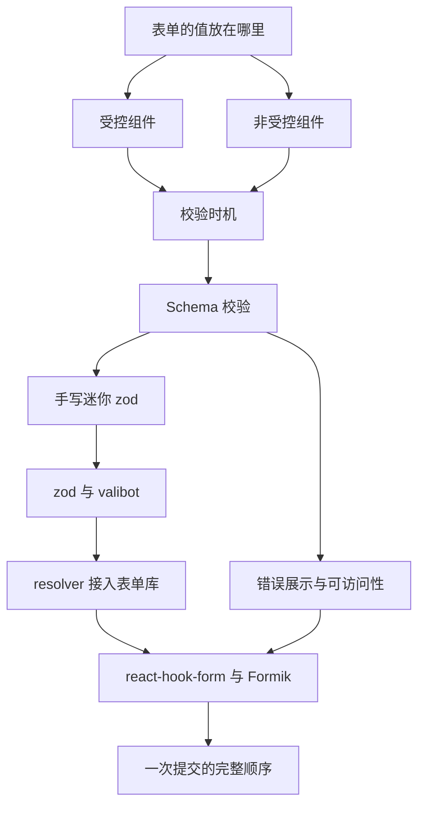
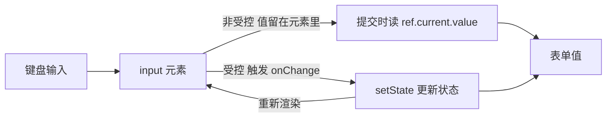
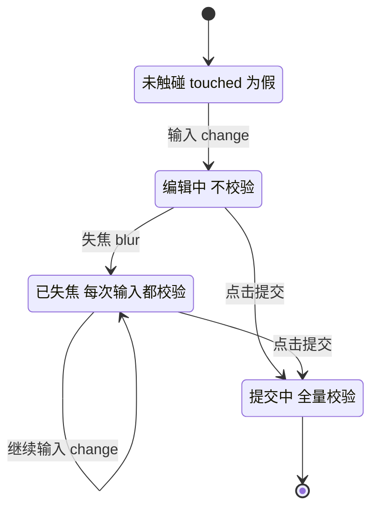
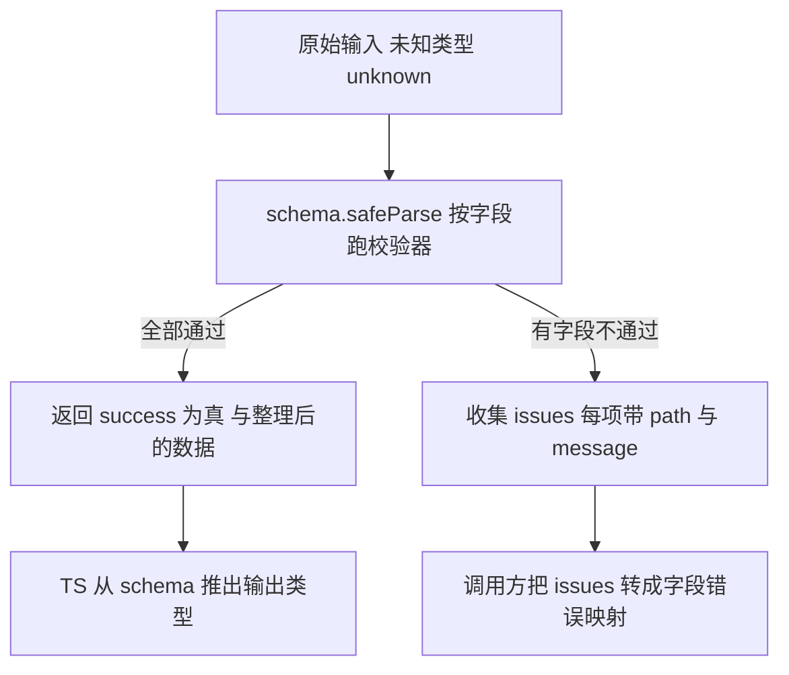
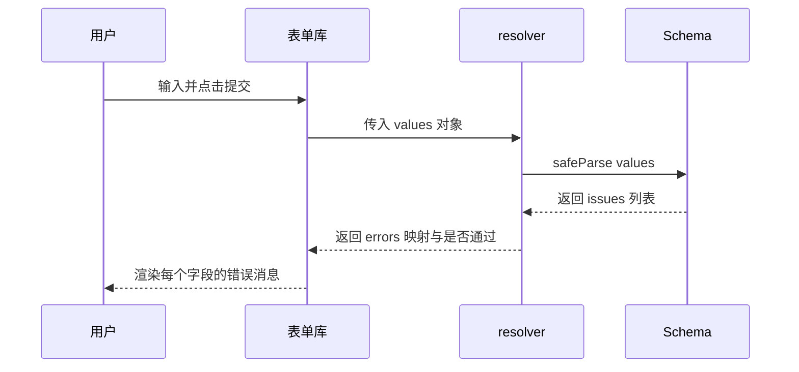
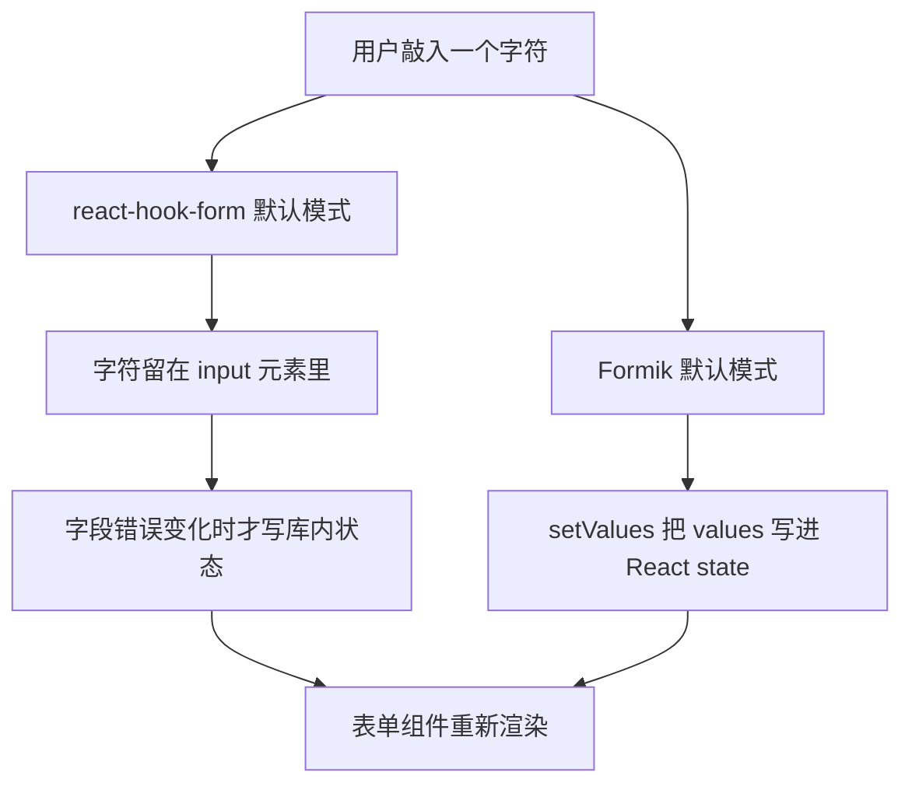
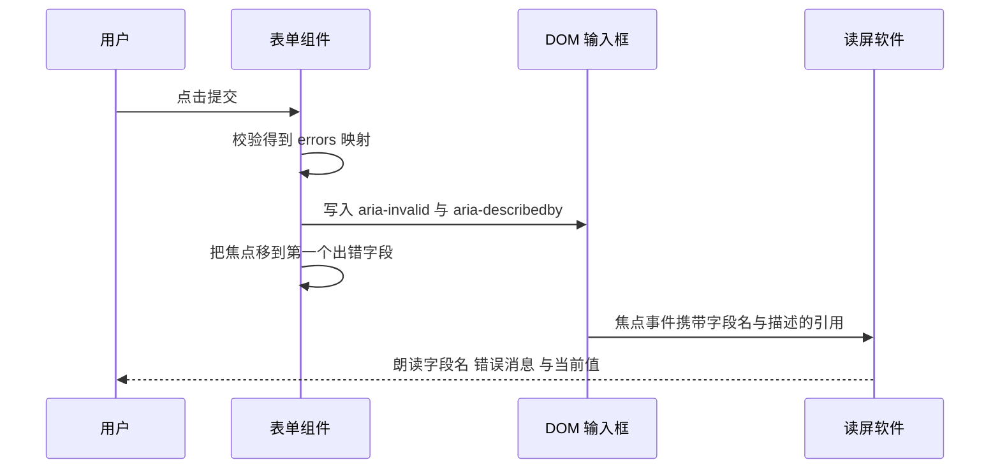

# 表单与校验：受控、非受控与 Schema 校验

!!! abstract "学完这一页你能"

- 说清受控与非受控各自把表单值存到哪里，并按字段数量选一种写法。
- 按 change、blur、submit 三个事件写出"先失焦再实时"的校验时机策略。
- 手写一个支持 string 与 object 的迷你 zod，并说明错误路径是怎么拼出来的。
- 用 Schema 定义规则、通过 resolver 映射错误，并补齐无障碍属性。

## 0. 知识地图



建议读法：

1. 先读第 1 节，把"值放在哪"这个问题定下来，后面所有讨论都依赖它。
2. 再读第 2、3 节，先定校验时机，再把规则写成 Schema。
3. 最后读第 4、5、6 节，把 Schema 接进表单库，并处理错误展示与读屏播报。

## 1. 受控与非受控：值到底存在哪里

**先想一个问题**

一个搜索框要在每次输入时过滤列表。另一个场景是文件上传，表单只需要在提交时拿到那个 File 对象。两次输入的取值方式不一样，选错了会出现"值取不到"或者"没必要的重渲染"。

!!! tip "心智模型"

    - 一句话：受控把值抄一份放进状态，输入框只负责显示；非受控把值留在输入框自己身上，要用的时候再去取。
    - 日常类比：受控像记账本，每花一笔先记到本子上再看余额；非受控像钱包，钱在钱包里，用时打开看。
    - 类比不成立：React 的状态更新是异步批量处理的，记账本是同步写完的；连续敲键时多次写状态可能合并成一次渲染。

!!! note "术语：受控组件"

    由 props 提供 value，并通过 onChange 把新值写回状态的输入元素。例如 `<input value={name} onChange={e => setName(e.target.value)} />`。

**图解**



1. 键盘事件先作用在 input 元素上，这时元素内部已经持有最新字符。
2. 非受控路径到此结束：值一直在元素里，表单只在需要时读一次。
3. 受控路径多了一步：onChange 把字符写进组件状态。
4. 状态变化后组件重新渲染，把新的 value 传回元素。
5. 两条路径最终都能拿到表单值，差别在于"谁持有值"和"写几次状态"。

**一步一步来**

第 1 步：先用非受控模型取值，看看值停在哪里。

```js
// 用普通对象模拟真实的 input 元素：值由元素自己保存
function createInput() {
  return {
    value: "",
    setValue(next) { this.value = next; }, // 模拟敲键，值写进元素
  };
}

const email = createInput(); // 表单不复制值，只持有这个元素
email.setValue("ada@example.com"); // 用户输入
console.log(email.value); // 提交时读取
```

**这段代码在做什么**

- createInput 返回一个带 value 字段的对象，value 就是"值存放的位置"。
- setValue 只改元素自己的 value，没有触碰任何表单状态。
- 表单拿到的 email 是一个引用，读取时机由调用方决定。
- 如果中途卸载并重建了元素，元素里的值就丢了，这是非受控的代价。

运行结果：

```
ada@example.com
```

第 2 步：再写受控模型，每次输入都写状态并重新渲染。

```js
function createControlledInput(render) {
  let value = ""; // 值放在状态里，不在元素上
  return {
    get value() { return value; },
    type(next) {
      value = next; // 每次输入都写状态
      render(value); // 写完立刻重新渲染
    },
  };
}

let renderCount = 0;
const input = createControlledInput(() => { renderCount += 1; });
input.type("a");
input.type("ab");
console.log(input.value, renderCount);
```

**这段代码在做什么**

- value 变量在闭包里，代表组件状态，元素不再持有值。
- type 方法把"输入事件"和"状态写入"绑在一起，输入一次写一次。
- render 回调用来统计重新渲染次数，这里 2 次输入得到 2 次渲染。
- 如果想做"输入时强制转大写"，在 type 里改 value 就可以，输入框一定会跟着变。

运行结果：

```
ab 2
```

第 3 步：把两条路径的写入次数放在一起测量。

```js
function measure(mode, keys) {
  let stateWrites = 0;
  let renders = 0;
  let value = "";
  for (const key of keys) {
    value += key;
    if (mode === "controlled") { stateWrites += 1; renders += 1; }
  }
  return { value, stateWrites, renders };
}
console.log(measure("controlled", ["a", "b", "c"]));
console.log(measure("uncontrolled", ["a", "b", "c"]));
```

**这段代码在做什么**

- controlled 分支每加一个字符就记一次状态写入与一次渲染。
- uncontrolled 分支只拼字符串，状态写入次数保持 0。
- 同样的 3 次输入，受控路径多出 3 次状态写入。
- 字段越多，这个差值越大，这就是"大表单默认用非受控库"的原因之一。

运行结果：

```
{ value: 'abc', stateWrites: 3, renders: 3 }
{ value: 'abc', stateWrites: 0, renders: 0 }
```

**动手验证**

```js
// 运行环境：Node 20+，无第三方依赖
// Node 没有 DOM，这里用普通对象模拟 input 元素与渲染次数
import assert from "node:assert/strict";

// 受控模型：值放在组件状态里，每次输入写一次状态并渲染一次
function controlled(keys) {
  let value = "";
  let stateWrites = 0;
  let renders = 0;
  for (const k of keys) {
    value += k;      // 写状态
    stateWrites += 1;
    renders += 1;    // 状态变化触发重新渲染
  }
  return { value, stateWrites, renders };
}

// 非受控模型：值放在元素上，表单状态不写入
function uncontrolled(keys) {
  const el = { value: "" };
  let stateWrites = 0;
  let renders = 0;
  for (const k of keys) {
    el.value += k;   // 只改元素，不动组件状态
  }
  return { value: el.value, stateWrites, renders, readAt: "submit" };
}

const keys = ["a", "d", "a"];
const c = controlled(keys);
const u = uncontrolled(keys);

assert.equal(c.value, "ada");
assert.equal(u.value, "ada");
assert.equal(c.stateWrites, 3);    // 三次输入三次写状态
assert.equal(c.renders, 3);       // 三次输入三次渲染
assert.equal(u.stateWrites, 0);   // 表单状态一次都没写
assert.equal(u.renders, 0);       // 取值本身不引发渲染
assert.equal(u.readAt, "submit"); // 值在提交时才读

console.log("受控：", c);
console.log("非受控：", u);
console.log("断言全部通过");
```

预期输出：

```
受控： { value: 'ada', stateWrites: 3, renders: 3 }
非受控： { value: 'ada', stateWrites: 0, renders: 0, readAt: 'submit' }
断言全部通过
```

**常见坑**

| 现象 | 原因 | 怎么修 |
| :--- | :--- | :--- |
| 输入框打不进字 | 写了 value 属性却没写 onChange，value 永远不变 | 补上 onChange 回写状态，或改回 defaultValue |
| 切换到另一个记录时输入框还显示旧值 | 非受控元素只在首次挂载时读 defaultValue | 给元素加 key，或改用受控 |
| 提交时某个字段是空字符串 | 读值时机错了，在渲染前读了 ref | 把读值放到 handleSubmit 回调里 |

**小结**

- 受控：值在状态，读取随时可行，输入触发渲染。
- 非受控：值在元素，读取靠 ref，输入不触发表单渲染。
- 判断标准是"输入过程中要不要实时用这个值"，不是字段多少。

## 2. 校验时机：什么时候告诉用户他错了

**先想一个问题**

用户在邮箱框里刚敲下第一个字母 "a"，界面立刻红字提示"邮箱格式错误"。另一种做法是一直不提示，等他点提交才一次性冒出五条错误。两种做法用户都不好受。

!!! tip "心智模型"

    - 一句话：第一次报错推迟到"失焦"，之后改成每次输入都报，提交时再全量检查一次。
    - 日常类比：老师不会盯着你写第一行就判错，先等你写完这一题，再逐字批改。
    - 类比不成立：表单没有"写完这一题"的天然信号，用户可能不离开输入框直接点提交，所以 submit 必须补一次全量校验。

!!! note "术语：校验时机"

    决定校验函数在哪个事件之后运行的规则。常见取值是 change、blur、submit，例如只在 blur 时跑校验。

**图解**



1. 初始状态是"未触碰"：用户还没碰过这个字段，任何输入都不报错。
2. 一旦输入，进入"编辑中"，此时仍然不写错误。
3. 失焦把字段标记为已触碰，此时才第一次计算并显示错误。
4. 已失焦之后再输入，每次 change 都重新计算，错误能实时消失和出现。
5. 提交从任何状态都能进入，并且对全部字段跑一次校验，不依赖 touched。

**一步一步来**

第 1 步：用一个 Set 记录哪些字段已经被触碰过。

```js
const form = {
  touched: new Set(),   // 已失焦的字段名
  values: {},           // 当前值
  errors: {},           // 当前错误消息
};

function markTouched(name) {
  form.touched.add(name); // 只记录状态，不在这里算错误
}

markTouched("email");
console.log(form.touched.has("email"), form.touched.has("name"));
```

**这段代码在做什么**

- touched 是判断"要不要现在报错"的唯一依据。
- markTouched 只做标记，把"什么时候校验"和"怎么校验"拆开。
- 未触碰的字段即使值非法，errors 里也不会有内容。

运行结果：

```
true false
```

第 2 步：把校验规则写成函数表，按事件决定调用。

```js
const rules = {
  email(value) {
    if (!value) return "邮箱不能为空";
    if (!value.includes("@")) return "邮箱需要包含 @";
    return "";
  },
};

function validateField(name, value) {
  const message = rules[name](value ?? ""); // 规则统一收口到这张表
  form.errors[name] = message;
  return message;
}

form.values.email = "ab";
console.log(form.touched.has("email") ? validateField("email", "ab") : "先不校验");
```

**这段代码在做什么**

- rules 把每个字段的规则集中在一处，新增字段只改这一张表。
- validateField 的入参是名字和值，返回第一条错误消息。
- 三元表达式体现了"未触碰就不校验"的分支。
- 错误消息为空字符串表示通过，这样可以统一用 truthy 判断显示与否。

运行结果：

```
先不校验
```

第 3 步：接上事件，让 change、blur、submit 各自调用合适的分支。

```js
function onChange(name, value) {
  form.values[name] = value;
  if (form.touched.has(name)) validateField(name, value); // 已触碰才实时校验
}

function onBlur(name) {
  form.touched.add(name);
  validateField(name, form.values[name]); // 失焦必校验
}

function onSubmit(fields) {
  for (const name of fields) {
    form.touched.add(name);
    validateField(name, form.values[name]);
  }
  return Object.values(form.errors).every((m) => m === "");
}
```

**这段代码在做什么**

- onChange 里那行 if 就是"首次失焦前不报错"的全部实现。
- onBlur 无条件校验，这是用户第一次看到错误的时刻。
- onSubmit 遍历全部字段，保证未触碰的字段也被检查。
- 返回值是"整个表单是否通过"，供提交按钮决定要不要发请求。

**动手验证**

```js
// 运行环境：Node 20+，无第三方依赖
import assert from "node:assert/strict";

const rules = {
  email(value) {
    if (!value) return "邮箱不能为空";
    if (!value.includes("@")) return "邮箱需要包含 @";
    return "";
  },
};

// 策略：失焦前不报错，失焦后每次输入都校验，提交时全量校验
function createForm(fields) {
  const touched = new Set();
  const values = {};
  const errors = {};
  return {
    change(name, value) {
      values[name] = value;
      if (touched.has(name)) errors[name] = rules[name](value); // 已失焦才写错误
    },
    blur(name) {
      touched.add(name);
      errors[name] = rules[name](values[name] ?? "");
    },
    submit() {
      for (const name of fields) {
        touched.add(name);
        errors[name] = rules[name](values[name] ?? "");
      }
      return Object.values(errors).every((m) => m === "");
    },
    errorOf: (name) => errors[name] ?? "",
  };
}

const form = createForm(["email"]);
form.change("email", "a");
assert.equal(form.errorOf("email"), "");      // 还没失焦，不报错
form.change("email", "ab");
assert.equal(form.errorOf("email"), "");
form.blur("email");                          // 失焦，开始校验
assert.equal(form.errorOf("email"), "邮箱需要包含 @");
form.change("email", "ab@");                 // 已失焦，实时更新
assert.equal(form.errorOf("email"), "");
assert.equal(form.submit(), true);

console.log("失焦前无错误，失焦后出现错误，修正后错误清空");
console.log("断言全部通过");
```

预期输出：

```
失焦前无错误，失焦后出现错误，修正后错误清空
断言全部通过
```

**常见坑**

| 现象 | 原因 | 怎么修 |
| :--- | :--- | :--- |
| 错误提示在用户还没打完就出现 | 在第一次 change 就写 errors | 用 touched 拦截，失焦后才写入 |
| 用户不离开输入框直接提交，提交被拦但看不到错误 | submit 只校验已触碰字段 | 提交时把全部字段加入 touched |
| 修正后红字不消失 | 只在校验失败时写 errors，成功时没写空串 | 失败和成功都覆盖 errors 的同一键 |

**小结**

- 校验时机是一套事件到分支的映射，不是一句"实时校验"。
- touched 集合是"首次报错时机"的开关。
- submit 必须独立跑一次全量校验，不受 touched 限制。

## 3. 手写迷你 zod：Schema 校验的原理

**先想一个问题**

如果校验规则写成散落的 if：邮箱规则在组件里、手机号规则在提交函数里、日期规则在另一个文件里。改一条规则要翻三处，而且前端和后端各写一遍。

!!! tip "心智模型"

    - 一句话：Schema 是描述"数据长什么样"的普通对象，parse 拿数据跑一遍，要么返回数据，要么返回错误清单。
    - 日常类比：机场安检的检查清单，行李过检时逐条对照，清单本身不搬行李。
    - 类比不成立：Schema 只判断数据结构与格式，管不了"这个邮箱是否已注册"这种要查数据库的规则。

!!! note "术语：Schema"

    描述数据结构与约束的可复用对象。例如 `z.object({ email: z.string().min(3) })` 描述了"一个对象，其中 email 是长度不小于 3 的字符串"。

**图解**



1. 入口是 unknown 类型的原始数据，可能来自表单、也可能来自接口返回。
2. safeParse 逐个字段调用对应的校验器，报错不抛异常，而是收集起来。
3. 全部通过时返回 success 为真和数据本体，data 是校验器整理过的结果。
4. 有失败时返回 issues 数组，每项带 path 数组和 message 字符串。
5. 第 5 步在后两节展开：TS 编译期从 schema 的类型参数推出输出类型，调用方把 issues 变成字段错误。

**一步一步来**

第 1 步：写一个字符串校验器，定下返回值的形状。

```js
function string({ min = 0 } = {}) {
  return {
    safeParse(input) {
      if (typeof input !== "string") {
        return { success: false, issues: [{ path: [], message: "需要字符串" }] };
      }
      if (input.length < min) {
        return { success: false, issues: [{ path: [], message: `至少 ${min} 个字符` }] };
      }
      return { success: true, data: input, issues: [] };
    },
  };
}

const email = string({ min: 3 });
console.log(email.safeParse(42));
console.log(email.safeParse("ab"));
console.log(email.safeParse("abc"));
```

**这段代码在做什么**

- 校验器就是一个对象，唯一约定是具备 safeParse 方法。
- path 用数组表示位置，空数组表示"就在当前这一层"。
- 失败时不抛异常，调用方可以一次收齐全部错误。
- 成功时也返回 issues 空数组，调用方不用判断字段是否存在。

运行结果：

```
{ success: false, issues: [ { path: [], message: '需要字符串' } ] }
{ success: false, issues: [ { path: [], message: '至少 3 个字符' } ] }
{ success: true, data: 'abc', issues: [] }
```

第 2 步：加一个 object 校验器，把子校验器的错误路径拼上字段名。

```js
function object(shape) {
  return {
    safeParse(input) {
      const data = {};
      const issues = [];
      for (const key of Object.keys(shape)) {
        const result = shape[key].safeParse(input?.[key]);
        if (result.success) {
          data[key] = result.data;
        } else {
          // 把当前字段名放到 path 最前面，形成完整位置
          issues.push(...result.issues.map((i) => ({ ...i, path: [key, ...i.path] })));
        }
      }
      return issues.length ? { success: false, issues } : { success: true, data, issues: [] };
    },
  };
}

const schema = object({ email: string({ min: 3 }), name: string({ min: 1 }) });
console.log(schema.safeParse({ email: "ab", name: "Ada" }).issues);
```

**这段代码在做什么**

- shape 是一张"字段名到校验器"的映射表，新增字段只改这张表。
- `input?.[key]` 保证 input 为 undefined 或 null 时不崩。
- path 拼接让外层能知道错误属于哪个字段，这是错误展示的依据。
- 只要 issues 非空就返回失败，但 data 里仍然保留了已通过的字段值。

运行结果：

```
[ { path: [ 'email' ], message: '至少 3 个字符' } ]
```

第 3 步：在 TS 里从 schema 推出类型，避免手写两份定义。

```ts
// 下面这段是 TS 类型代码，不在 Node 里运行，只说明类型来源
import { z } from "zod"; // 需核对官方文档：所用 zod 主版本的导入写法

const RegisterSchema = z.object({
  email: z.string().min(3),
  name: z.string().min(1),
});

type RegisterValues = z.infer<typeof RegisterSchema>; // 从 schema 取输出类型
const values: RegisterValues = { email: "ada@x.io", name: "Ada" };
```

**这段代码在做什么**

- z.infer 是条件类型，从 schema 的类型参数里把输出类型取出来。
- 运行时对象不含类型信息，类型只在编译期存在，所以运行时零成本。
- Schema 变了，RegisterValues 跟着变，不会出现"定义改成必填而类型还是可选"的错位。
- 需核对官方文档：z.input 与 z.infer 在所用版本中对可选字段与默认值的差异。

**动手验证**

```js
// 运行环境：Node 20+，无第三方依赖
import assert from "node:assert/strict";

function string({ min = 0 } = {}) {
  return {
    safeParse(input) {
      if (typeof input !== "string") return { success: false, issues: [{ path: [], message: "需要字符串" }] };
      if (input.length < min) return { success: false, issues: [{ path: [], message: `至少 ${min} 个字符` }] };
      return { success: true, data: input.trim(), issues: [] }; // 通过时顺手整理数据
    },
  };
}

function object(shape) {
  return {
    safeParse(input) {
      const data = {};
      const issues = [];
      for (const key of Object.keys(shape)) {
        const result = shape[key].safeParse(input?.[key] ?? undefined);
        if (result.success) data[key] = result.data;
        else issues.push(...result.issues.map((i) => ({ ...i, path: [key, ...i.path] })));
      }
      return issues.length ? { success: false, issues } : { success: true, data, issues: [] };
    },
  };
}

const schema = object({ email: string({ min: 3 }), name: string({ min: 1 }) });

const bad = schema.safeParse({ email: "ab", name: "" });
assert.equal(bad.success, false);
assert.deepEqual(bad.issues.map((i) => i.path[0]), ["email", "name"]); // 两个字段都报
assert.equal(bad.issues.length, 2);                                    // 一次收齐

const good = schema.safeParse({ email: " ada@x.io ", name: "Ada" });
assert.equal(good.success, true);
assert.equal(good.data.email, "ada@x.io"); // 整理后的值

console.log("失败时 path：", bad.issues.map((i) => i.path));
console.log("成功时数据：", good.data);
console.log("断言全部通过");
```

预期输出：

```
失败时 path： [ [ 'email' ], [ 'name' ] ]
成功时数据： { email: 'ada@x.io', name: 'Ada' }
断言全部通过
```

**常见坑**

| 现象 | 原因 | 怎么修 |
| :--- | :--- | :--- |
| 只报第一个字段的错误 | 校验器遇到失败就 return，跳过了后面的字段 | 收集 issues 后统一 return，不在循环里退出 |
| 错误消息不知道属于哪个字段 | 子校验器返回的 path 是空数组，外层没拼 key | 在 object 里把 key 放到 path 最前面 |
| 校验通过后数据里多了空格 | 校验器只判断格式，没有返回整理后的值 | 通过分支返回 trim 后的 data，并让调用方用 data |

**小结**

- Schema 是一棵由校验器对象拼成的树，唯一约定是 safeParse。
- path 数组是"错误属于哪个字段"的答案，靠逐层拼接得到。
- 运行时校验和编译期类型来自同一份定义，这是类型推断的价值。

## 4. 把 Schema 接进表单：zod 与 valibot

**先想一个问题**

Schema 写好了，但表单库不知道什么时候调它，也不知道 `issues` 数组该怎么变回"字段名到错误消息"的映射。中间少了一根转接线。

!!! tip "心智模型"

    - 一句话：resolver 是一根转接线，入口是表单的 values，出口是"字段名到第一条错误消息"的表，外加是否通过。
    - 日常类比：旅行转换插头，两端接口形状不同，中间只做形状转换，不改变电压。
    - 类比不成立：如果 resolver 里发起了异步请求，返回的错误可能已经过期——用户在等待期间又改了输入，所以异步校验要额外处理竞态。

!!! note "术语：resolver"

    表单库调用的校验适配函数，接收表单值，返回错误映射。示例形状是 `{ values, errors }`，其中 errors 以字段名为键。

**图解**



1. 用户点击提交，表单库先把当前 values 组装成一个普通对象。
2. 表单库调用 resolver，把 values 作为唯一入参传进去。
3. resolver 调用 schema.safeParse，把校验工作全部交给 Schema。
4. Schema 返回 issues，每项带 path 和 message。
5. resolver 把 issues 压成以字段名为键的映射，同一个字段只留第一条。
6. 表单库用这份映射更新错误状态，组件按字段名取出消息渲染。

**一步一步来**

第 1 步：用一个迷你 zod 定义注册表单的 Schema。

```js
function string({ min = 0 } = {}) {
  return {
    safeParse(input) {
      if (typeof input !== "string") return { success: false, issues: [{ path: [], message: "需要字符串" }] };
      if (input.length < min) return { success: false, issues: [{ path: [], message: `至少 ${min} 个字符` }] };
      return { success: true, data: input, issues: [] };
    },
  };
}
function object(shape) {
  return {
    safeParse(input) {
      const data = {}; const issues = [];
      for (const key of Object.keys(shape)) {
        const r = shape[key].safeParse(input?.[key]);
        if (r.success) data[key] = r.data;
        else issues.push(...r.issues.map((i) => ({ ...i, path: [key, ...i.path] })));
      }
      return issues.length ? { success: false, issues } : { success: true, data, issues: [] };
    },
  };
}

const registerSchema = object({ email: string({ min: 3 }), name: string({ min: 1 }) });
console.log(registerSchema.safeParse({ email: "a", name: "" }).issues.length);
```

**这段代码在做什么**

- 两个校验器合起来构成一棵树，根是对象，叶子是字符串。
- 校验一次就能拿到全部字段的错误，不需要为每个字段单独调用。
- Schema 是纯数据，可以放在单独文件里被表单和接口共用。

运行结果：

```
2
```

第 2 步：把 issues 数组压成字段名到消息的映射。

```js
function toErrorMap(issues) {
  const errors = {};
  for (const issue of issues) {
    const field = issue.path[0] ?? "form"; // path 第一段就是字段名
    if (!errors[field]) errors[field] = issue.message; // 只留第一条
  }
  return errors;
}

const result = registerSchema.safeParse({ email: "a", name: "" });
console.log(toErrorMap(result.issues));
```

**这段代码在做什么**

- `path[0] ?? "form"` 处理表单级错误，这类错误没有具体字段。
- `if (!errors[field])` 保证每个字段只显示一条，UI 不会挤成一团。
- 输出的键与表单字段名一致，组件可以直接按名字取值。

运行结果：

```
{ email: '至少 3 个字符', name: '至少 1 个字符' }
```

第 3 步：包成 resolver，作为表单库与 Schema 之间的唯一接口。

```js
function makeResolver(schema) {
  return function resolver(values) {
    const result = schema.safeParse(values);
    if (result.success) return { values: result.data, errors: {} }; // 通过时用整理后的值
    return { values, errors: toErrorMap(result.issues) };           // 失败时保留原值
  };
}

const resolver = makeResolver(registerSchema);
console.log(resolver({ email: "ada@x.io", name: "Ada" }));
console.log(resolver({ email: "a", name: "Ada" }));
```

**这段代码在做什么**

- makeResolver 是柯里化函数，先绑定 Schema，再接收 values。
- 成功分支返回 result.data，把 trim 之类的整理结果传回表单。
- 失败分支返回原始 values，避免把半整理的数据写回输入框。
- errors 为空对象表示通过，表单库据此判断能不能继续提交。

运行结果：

```
{ values: { email: 'ada@x.io', name: 'Ada' }, errors: {} }
{ values: { email: 'a', name: 'Ada' }, errors: { email: '至少 3 个字符' } }
```

**动手验证**

```js
// 运行环境：Node 20+，无第三方依赖
// 迷你 zod 加 resolver，验证错误映射与通过分支
import assert from "node:assert/strict";

function string({ min = 0 } = {}) {
  return {
    safeParse(input) {
      if (typeof input !== "string") return { success: false, issues: [{ path: [], message: "需要字符串" }] };
      if (input.length < min) return { success: false, issues: [{ path: [], message: `至少 ${min} 个字符` }] };
      return { success: true, data: input, issues: [] };
    },
  };
}

function object(shape) {
  return {
    safeParse(input) {
      const data = {};
      const issues = [];
      for (const key of Object.keys(shape)) {
        const result = shape[key].safeParse(input?.[key]);
        if (result.success) data[key] = result.data;
        else issues.push(...result.issues.map((i) => ({ ...i, path: [key, ...i.path] })));
      }
      return issues.length ? { success: false, issues } : { success: true, data, issues: [] };
    },
  };
}

const registerSchema = object({ email: string({ min: 3 }), name: string({ min: 1 }) });

function makeResolver(schema) {
  return function resolver(values) {
    const result = schema.safeParse(values);
    if (result.success) return { values: result.data, errors: {} };
    const errors = {};
    for (const issue of result.issues) {
      const field = issue.path[0] ?? "form";
      if (!errors[field]) errors[field] = issue.message;
    }
    return { values, errors };
  };
}

const resolver = makeResolver(registerSchema);

const bad = resolver({ email: "a", name: "" });
assert.equal(bad.errors.email, "至少 3 个字符");
assert.equal(bad.errors.name, "至少 1 个字符");
assert.equal(Object.keys(bad.errors).length, 2);

const good = resolver({ email: "ada@x.io", name: "Ada" });
assert.deepEqual(good.errors, {});
assert.equal(good.values.email, "ada@x.io");

console.log("失败映射：", bad.errors);
console.log("通过结果：", good);
console.log("断言全部通过");
```

预期输出：

```
失败映射： { email: '至少 3 个字符', name: '至少 1 个字符' }
通过结果： { values: { email: 'ada@x.io', name: 'Ada' }, errors: {} }
断言全部通过
```

真实库的差异：

- zod：`schema.safeParse` 返回 success 与 data 或 error，错误明细在 `error.issues` 里带 `path` 与 `message`。需核对官方文档：`flatten` 与 `format` 在所用主版本中是否仍存在。
- valibot：校验函数与 Schema 分离，形如 `v.safeParse(schema, data)`，返回值里是 `issues` 与 `output`。需核对官方文档：issues 的路径条目结构与消息字段名。
- react-hook-form：需核对官方文档：resolver 函数签名与返回对象中 errors 的字段名。

**常见坑**

| 现象 | 原因 | 怎么修 |
| :--- | :--- | :--- |
| 一个字段下面显示多条错误 | 直接把 issues 数组按字段渲染 | 每个字段只保留第一条，写进映射 |
| 校验通过后输入框被写成 undefined | 通过分支返回了 schema 里没有的键 | 只用 result.data 覆盖同一个字段，不做整体替换 |
| 表单级错误渲染不出来 | 这类 issue 的 path 是空数组 | 用 `path[0] ?? "form"` 兜底成表单级键 |

**小结**

- resolver 是纯函数，输入 values，输出 errors 映射与整理后的 values。
- issues 到 errors 的压缩规则由你决定，同一个字段留几条要提前定。
- 异步校验会引入竞态，需要给请求打标记或取消上一次请求。

## 5. react-hook-form 与 Formik：两种表单状态方案

**先想一个问题**

一个后台表单有 30 个字段。用受控写法时，用户在第 1 个字段每敲一个字符，整个 30 字段的组件都会重新执行一次。如果这些字段只在提交时才需要，这次渲染花得没有必要。

!!! tip "心智模型"

    - 一句话：react-hook-form 把值放在输入元素里，只在错误或提交时同步；Formik 把 values 放在 React state 里，每次输入都写状态。
    - 日常类比：一种做法是把草稿写在草稿纸上，交卷时抄到答题卡；另一种是每写一个字就同步抄到答题卡。
    - 类比不成立：react-hook-form 也会因为错误、isSubmitting 这些状态变化触发渲染，不等于零渲染。

!!! note "术语：非受控表单库"

    表单值由 DOM 元素持有，库通过 ref 读取值的表单库。注册字段后，库拿到的是一次性读取入口，而不是每次输入的副本。

**图解**



1. 同一次键盘输入分出两条路径，差别发生在第二行。
2. RHF 路径把字符留在元素里，库不复制值。
3. RHF 只在错误、提交中标志等状态变化时写入库内状态。
4. Formik 路径每次都调用 setValues，把整个 values 对象换成新对象。
5. 两条路径最后都会让表单组件重新渲染，但触发次数不同。

两种写法的代码对照，下面是 RHF 风格：

```tsx
// 需要在 React 项目中运行，Node 无法直接执行 tsx
import { useForm } from "react-hook-form"; // 需核对官方文档：当前主版本的导入写法

type Values = { email: string; name: string };

export function Register() {
  const { register, handleSubmit, formState } = useForm<Values>({ mode: "onTouched" });
  const onSubmit = (values: Values) => console.log(values); // 提交时才读值
  return (
    <form onSubmit={handleSubmit(onSubmit)}>
      <input {...register("email", { required: "邮箱不能为空" })} />
      {formState.errors.email && <p>{formState.errors.email.message}</p>}
      <input {...register("name", { required: "姓名不能为空" })} />
      <button type="submit">提交</button>
    </form>
  );
}
```

**这段代码在做什么**

- register 返回的展开内容把 onBlur、onChange、name 与 ref 一起绑到元素上。
- mode 决定何时校验，onTouched 的含义与第 2 节的策略一致。
- 值通过 ref 读取，组件不会因为每次输入重新执行。
- formState.errors 变化时才触发渲染，错误消息从 message 字段取。
- 需核对官方文档：mode 与 reValidateMode 的默认取值。

另一种是 Formik 风格：

```tsx
// 需要在 React 项目中运行
import { Formik, Field, Form, ErrorMessage } from "formik"; // 需核对官方文档：当前主版本导出名

type Values = { email: string; name: string };

export function Register() {
  return (
    <Formik
      initialValues={{ email: "", name: "" }}
      onSubmit={(values: Values) => console.log(values)}
    >
      <Form>
        <Field name="email" />
        <ErrorMessage name="email" component="p" />
        <Field name="name" />
        <button type="submit">提交</button>
      </Form>
    </Formik>
  );
}
```

**这段代码在做什么**

- Formik 组件内部用一个 values state 保存全部字段。
- 每次输入都通过 setValues 写入，订阅 values 的组件重新渲染。
- Field 的双向绑定由 Formik 处理，不需要手写 value 与 onChange。
- ErrorMessage 按字段名取出错误消息，路由到指定元素上。
- 需核对官方文档：Formik 是否仍推荐使用 FastField 做字段级渲染隔离。

**动手验证**

```js
// 运行环境：Node 20+，无第三方依赖
// Node 没有 React，这里只统计两条路径写状态的次数
import assert from "node:assert/strict";

// react-hook-form 风格：值由输入元素持有，敲键不写库内状态
function rhfStyle(keys) {
  const dom = { email: "" };   // 值放在元素里
  let stateWrites = 0;
  let renders = 0;
  for (const k of keys) {
    dom.email += k;            // 只改元素
  }
  stateWrites += 1;            // 提交时同步一次
  renders += 1;
  return { value: dom.email, stateWrites, renders };
}

// Formik 风格：每次输入都 setValues，换来一次渲染
function formikStyle(keys) {
  let values = { email: "" };
  let stateWrites = 0;
  let renders = 0;
  for (const k of keys) {
    values = { ...values, email: values.email + k }; // 每次输入都换新对象
    stateWrites += 1;
    renders += 1;
  }
  return { value: values.email, stateWrites, renders };
}

const keys = ["a", "d", "a"];
const rhf = rhfStyle(keys);
const formik = formikStyle(keys);

assert.equal(rhf.value, "ada");
assert.equal(formik.value, "ada");
assert.equal(rhf.stateWrites, 1);    // 只在提交时写一次
assert.equal(formik.stateWrites, 3); // 三次输入三次写
assert.equal(formik.renders, 3);

console.log("RHF 风格", rhf);
console.log("Formik 风格", formik);
console.log("断言全部通过");
```

预期输出：

```
RHF 风格 { value: 'ada', stateWrites: 1, renders: 1 }
Formik 风格 { value: 'ada', stateWrites: 3, renders: 3 }
断言全部通过
```

注意：这个脚本是对状态写入次数的模型化统计，不是真实库的运行结果，也不包含错误状态引发的渲染。

**常见坑**

| 现象 | 原因 | 怎么修 |
| :--- | :--- | :--- |
| 受控组件用 register 后输入框打不进字 | 元素同时被 value 与 register 的 ref 控制 | 二选一，受控字段改用 Controller 包一层 |
| 想让某个字段随输入实时变化，RHF 里读不到 | 值在元素里，组件没有订阅这个字段 | 用 watch 显式订阅该字段 |
| 30 个字段用受控写法输入卡顿 | 每个字符都重建全部字段的 props | 拆分字段组件，或改用非受控库 |

**小结**

- 差别只在"谁持有值"，由此决定输入时的状态写入次数。
- 需要输入时实时派生数据的字段，受控写法更直接。
- 选择依据是字段数量、是否需要实时值、校验时机三件事。

## 6. 错误展示与可访问性：让读屏也能听懂

**先想一个问题**

错误文字显示在输入框下方，看得见的用户能读到。使用读屏软件的用户聚焦到输入框时，只能听到"邮箱，编辑框"，听不到下面那行红字，因为元素之间没有建立关联。

!!! tip "心智模型"

    - 一句话：错误展示要做两件事，给眼睛一行文字，给读屏软件一条从输入框指向这行文字的引用。
    - 日常类比：给房间贴标签，标签贴在门上是给人看的，门牌号与标签的对应关系要登记在手册里，访客才能查到。
    - 类比不成立：加了引用也不会自动朗读，还要靠 aria-live 或把焦点移到出错字段才能让读屏软件念出来。

!!! note "术语：无障碍名称"

    读屏软件聚焦控件时读出的名称。例如 `label` 的 `for` 指向输入框 `id` 时，标签文本就成为该输入框的无障碍名称。

**图解**



1. 用户提交，组件得到 errors 映射，这一步与前面几节相同。
2. 组件给每个出错字段写 aria-invalid，标记这个控件当前值无效。
3. 同时写 aria-describedby，值是错误节点的 id，建立引用关系。
4. 组件把焦点移到第一个出错字段，读屏软件的朗读位置随之改变。
5. 读屏软件读出新控件的无障碍名称、关联的描述文本和当前值。
6. 用户听到"邮箱，至少 3 个字符，编辑框"，知道该改哪一个。

**一步一步来**

第 1 步：把错误消息的 id 引用写到输入框属性上。

```js
function inputA11y({ name, error }) {
  const hasError = Boolean(error); // 空字符串表示通过
  return {
    id: `${name}-input`,
    "aria-invalid": hasError ? "true" : "false",       // 标记控件值无效
    "aria-describedby": hasError ? `${name}-error` : undefined, // 指向错误文本
  };
}

console.log(inputA11y({ name: "email", error: "" }));
console.log(inputA11y({ name: "email", error: "至少 3 个字符" }));
```

**这段代码在做什么**

- id 命名统一用字段名加后缀，避免多个表单实例撞 id。
- aria-invalid 用字符串 "true" 与 "false"，这是 HTML 属性的取值形式。
- aria-describedby 通过时设为 undefined，属性不会渲染出来。
- 错误节点的 id 必须与这个引用值逐字符一致。

运行结果：

```
{ id: 'email-input', 'aria-invalid': 'false', 'aria-describedby': undefined }
{ id: 'email-input', 'aria-invalid': 'true', 'aria-describedby': 'email-error' }
```

第 2 步：错误节点自身带上 id 与 role，让消息出现时被播报。

```js
function errorNode({ name, error }) {
  if (!error) return null; // 没有错误就不渲染节点
  return {
    id: `${name}-error`,
    role: "alert",            // 内容出现时读屏软件主动播报
    textContent: error,
  };
}

console.log(errorNode({ name: "email", error: "至少 3 个字符" }));
```

**这段代码在做什么**

- 通过时返回 null，DOM 里不留空节点，读屏软件不会读到空文本。
- role 为 alert 的元素内容变化时会被播报，不需要用户移动焦点。
- id 与第一步的引用值配对，形成双向可追溯的关系。
- 消息文本应当是完整句子，读屏软件不会帮你补上下文。

运行结果：

```
{ id: 'email-error', role: 'alert', textContent: '至少 3 个字符' }
```

第 3 步：提交失败后把焦点移到第一个出错字段。

```js
function focusFirstError(fields, errors, focus) {
  const first = fields.find((name) => errors[name]); // 按字段顺序找第一个
  if (!first) return null;
  focus(`${first}-input`); // 移动焦点到该字段
  return first;
}

const focused = [];
const first = focusFirstError(["email", "name"], { name: "姓名不能为空" }, (id) => focused.push(id));
console.log(first, focused);
```

**这段代码在做什么**

- 字段顺序由页面顺序决定，find 返回页面里最靠上的出错字段。
- 焦点移动让读屏软件朗读位置回到出错位置。
- 焦点移动与 role 为 alert 的摘要可以同时用，也可以只选一种。
- 如果没有错误，函数返回 null 且不移动焦点，避免用户被打断。

运行结果：

```
name [ 'name-input' ]
```

**动手验证**

```js
// 运行环境：Node 20+，无第三方依赖
// 生成输入框与错误节点的属性，并断言两者互相指向
import assert from "node:assert/strict";

function buildField({ name, label, value, error }) {
  const inputId = `${name}-input`;
  const errorId = `${name}-error`;
  return {
    label: { htmlFor: inputId, text: label },
    input: {
      id: inputId,
      value,
      "aria-invalid": error ? "true" : "false",
      "aria-describedby": error ? errorId : undefined,
    },
    errorNode: error ? { id: errorId, role: "alert", textContent: error } : null,
  };
}

function focusFirstError(fields, errors, focus) {
  const first = fields.find((name) => errors[name]);
  if (!first) return null;
  focus(`${first}-input`);
  return first;
}

const ok = buildField({ name: "email", label: "邮箱", value: "ada@x.io", error: "" });
const bad = buildField({ name: "email", label: "邮箱", value: "a", error: "至少 3 个字符" });

assert.equal(ok.input["aria-invalid"], "false");
assert.equal(ok.input["aria-describedby"], undefined);
assert.equal(ok.errorNode, null);
assert.equal(bad.input["aria-invalid"], "true");
assert.equal(bad.errorNode.id, bad.input["aria-describedby"]); // 引用一致
assert.equal(bad.errorNode.role, "alert");
assert.equal(ok.label.htmlFor, ok.input.id);                   // 标签指向输入框

const focused = [];
const first = focusFirstError(["email", "name"], { name: "姓名不能为空" }, (id) => focused.push(id));
assert.equal(first, "name");
assert.deepEqual(focused, ["name-input"]);

console.log("正常字段", ok.input);
console.log("出错字段", bad.input, bad.errorNode);
console.log("焦点落到", focused[0]);
console.log("断言全部通过");
```

预期输出：

```
正常字段 { id: 'email-input', value: 'ada@x.io', 'aria-invalid': 'false', 'aria-describedby': undefined }
出错字段 { id: 'email-input', value: 'a', 'aria-invalid': 'true', 'aria-describedby': 'email-error' } { id: 'email-error', role: 'alert', textContent: '至少 3 个字符' }
焦点落到 name-input
断言全部通过
```

**常见坑**

| 现象 | 原因 | 怎么修 |
| :--- | :--- | :--- |
| 读屏软件只念字段不念错误 | 输入框与错误节点没有 id 引用关系 | 补 aria-describedby 指向错误节点 id |
| 错误消息被念两遍 | 同一段文本同时挂在 aria-describedby 与 aria-live 容器里 | 选一种：要么描述，要么播报摘要 |
| 提交后屏幕没有滚到出错位置 | 只移动了焦点，元素在可视区域外 | 焦点移动后调用 scrollIntoView，或先滚再聚焦 |

**小结**

- 三件套是 label 的 for、输入框的 aria-invalid 与 aria-describedby。
- 错误节点用 role 为 alert 可以让消息出现时被播报。
- 提交失败时移动焦点，能同时解决"听不到"和"看不到"两个问题。

## 综合对比

| 维度 | 手写受控 | 手写非受控 | react-hook-form 默认 | Formik 默认 |
| :--- | :--- | :--- | :--- | :--- |
| 值存放位置 | 组件 state | DOM 元素 | DOM 元素，错误在库内状态 | 库内 values state |
| 每次输入写状态次数 | 每字符 1 次 | 0 次 | 0 次，错误变化时才写 | 每字符 1 次 |
| 输入时的表单渲染 | 每字符 1 次 | 0 次 | 错误或标志变化时 1 次 | 每字符 1 次 |
| 读取值的时机 | 任意时刻 | 提交或按 ref 读 | 提交或 watch 订阅 | 任意时刻 |
| 校验时机默认值 | 由你决定 | 由你决定 | 需核对官方文档：mode 与 reValidateMode 默认值 | 需核对官方文档：validateOnChange 默认值 |
| 接入 Schema | 自己调用 | 自己调用 | 通过 resolver 接入 | 通过 validate 回调接入 |
| 适合场景 | 需要实时派生值的少量字段 | 文件、富文本、第三方 DOM 控件 | 字段数量多的表单 | 字段数量中等、需要随时读值的表单 |

补充说明：

- 中间两列的"次数"指用户输入一个字符引起的状态写入与表单渲染次数，不含错误状态变化。
- 表格里的默认值是常见配置，具体版本行为需核对官方文档。

## 应用与行业实践

### 应用场景地图

| 场景 | 用到本页哪个知识点 | 典型技术选型 | 注意事项 |
| --- | --- | --- | --- |
| 后台订单表格行内编辑，单页千行、每行 3 个输入 | 非受控把值留在 DOM；Schema 错误按 path 定位 | 原生 FormData 读取 + zod safeParse | 行内输入不进 React state，错误 key 要与单元格 name 对齐 |
| 低端安卓机上的注册首屏，表单 6 个字段 | 受控与非受控的取舍；change/blur/submit 三种时机 | 受控值 + blur 校验 | 首屏不跑规则，用户开始输入后再按需加载校验逻辑 |
| 多人协作白板的图形属性面板 | Schema 作为数据入口守卫 | zod discriminatedUnion 收消息 | 非法消息丢弃并上报 path，不写进共享状态 |
| 跨境结算表单，含金额、币种、收款人 | 提交时校验；错误展示与可访问性 | Angular Reactive Forms，updateOn 设为 blur | 金额输入中途不报错，跨字段规则放到提交时跑 |
| 分步医疗问卷，每步 5 到 8 题 | 三个校验事件的组合策略 | react-hook-form + zod resolver | 每步离开时校验当步字段，最后一步做整表校验 |
| 客服工单 CSV 批量导入 | Schema 校验与错误路径拼接 | zod 逐行 safeParse | 错误要带行号与列名，先全量校验再写库 |
| 无障碍合规的内部审批表单 | 错误展示与可访问性 | aria-invalid、aria-describedby、role="alert" | 错误文本 id 要与字段关联，提交失败把焦点移到首条错误 |
| 电商地址簿新增收货地址，4 个字段 | 按字段数量选受控或非受控 | useState 受控 + submit 校验 | 字段少时受控便于联动省市区下拉 |

### 三个场景拆解

#### 场景 1：后台管理的万行表格行内编辑

**业务背景**：订单表格支持行内改数量和备注，单页渲染一千行左右，每行 3 个输入。运营常常一次改几十行再提交，报错必须落到具体单元格。

**怎么用本页知识解决**：思路是值不进 React state，提交时用 FormData 一次性读取，再交给 schema 校验。

```tsx
function Grid({ rows }: { rows: Row[] }) {
  const formRef = useRef<HTMLFormElement>(null)
  const [errs, setErrs] = useState<Record<string, string>>({})

  function handleSubmit(e: React.FormEvent<HTMLFormElement>) {
    e.preventDefault()
    const fd = new FormData(formRef.current!)        // 提交时才读 DOM 里的值
    const raw = toRows(fd)                           // name="0.qty" 拼回二维数组
    const result = rowSchema.safeParse(raw)
    if (!result.success) {
      setErrs(byPath(result.error.issues))           // issues[].path 拼出单元格 key
      return
    }
    save(result.data)                                // 写库的数据已过 schema
  }
  return <form ref={formRef} onSubmit={handleSubmit}>{/* 每格一个非受控 input */}</form>
}
```

- FormData 只在提交时构造，输入过程不触发 React 更新，按键不引起重渲染。
- 每个 input 的 name 用 `行号.字段名`，错误路径拼出来就是单元格坐标。
- safeParse 返回 issues，每条 issue 的 path 与 message 一起转成 `{ 单元格 key: 提示 }`。
- 校验通过后直接把 result.data 写库，不需要再判空和转型。

**怎么度量收益**：看连续输入时的 commit 次数与提交耗时。用 React DevTools Profiler 录同一段输入，比较受控与非受控两条记录；再用 Performance 面板看长任务与总阻塞时间。

**什么时候不该用**：

- 数量改动要立刻刷新汇率换算时，值必须进 state 才能驱动联动。
- 侧边栏和表格要同时消费当前值时，DOM 作唯一数据源读不到。
- 输入要做即时千分位格式化时，需要受控改写才能控制光标位置。

#### 场景 2：低端安卓机上的注册首屏

**业务背景**：注册页要在低端安卓机上打开，6 个字段逐个跑正则会让键盘响应变慢。用户最怕的是输入中间就冒出红色报错。

**怎么用本页知识解决**：值仍用受控，但把校验从 change 挪到 blur，再用 aria 属性把错误挂回字段。

```tsx
const [phone, setPhone] = useState('')
const [touched, setTouched] = useState(false)
const [error, setError] = useState('')

function handleBlur() {
  setTouched(true)                                 // 失焦才标记已访问
  const r = phoneSchema.safeParse(phone)
  setError(r.success ? '' : r.error.issues[0].message)
}

<input
  value={phone}
  onChange={e => setPhone(e.target.value)}          // 输入过程只更新值
  onBlur={handleBlur}
  aria-invalid={touched && !!error}
  aria-describedby="phone-err"
/>
{touched && error && <p id="phone-err" role="alert">{error}</p>}
```

- change 只做 setPhone，不跑正则，输入过程不产生错误状态。
- blur 时置 touched 并跑一次 safeParse，错误只在这一刻出现。
- 错误段落通过 aria-describedby 与输入框绑定，role="alert" 触发播报。
- 校验规则用动态 import，等用户聚焦第一个字段再加载，首屏不付这份开销。

**怎么度量收益**：指标是 INP、LCP 与输入回调执行时长。用 web-vitals 上报加 Chrome Performance 面板，在同一台低端安卓设备上录改动前后两条记录。

**什么时候不该用**：

- 密码强度条需要随输入逐步反馈，blur 才校验会让界面没有反馈。
- 用户名是否被占用要在提交前给结论，blur 时发异步请求还要处理乱序响应。
- 用户粘贴内容后直接点提交，blur 顺序不确定，必须靠 submit 校验兜底。

#### 场景 3：多人协作白板的图形属性面板

**业务背景**：白板支持多人同时拖拽图形，客户端把变更消息发给服务端再广播。任意客户端都可能发出结构错误的 payload，处理时抛异常会让整块画布卡死。

**怎么用本页知识解决**：把所有进入共享状态的远程消息先过一遍 schema，校验不过就丢弃并上报路径。

```ts
const msgSchema = z.discriminatedUnion('type', [
  z.object({ type: z.literal('move'), shape: shapeSchema }),
  z.object({ type: z.literal('delete'), id: z.string() }),
])

socket.on('message', raw => {
  const r = msgSchema.safeParse(raw)        // 远程消息先过 schema
  if (!r.success) {
    report(r.error.issues)                  // issues[].path 指出错在哪个字段
    return                                  // 非法消息丢弃，不进共享状态
  }
  apply(r.data)                             // 只有已校验的数据能落到画布
})
```

- schema 放共享目录，客户端与服务端引用同一份，两端规则不会漂移。
- discriminatedUnion 按 type 分派，错误 path 能指到具体字段。
- 上报时带上 path，能定位是哪个客户端的哪个字段发错。
- 拒绝的消息直接 return，画布状态只接受已校验数据。

**怎么度量收益**：指标是 schema 拒绝率与画布卡死次数。用 Sentry 看异常分组，再用自定义埋点按 path 计数，找出最常发错的字段。

**什么时候不该用**：

- 每帧上报的光标位置这类高频消息，同步 schema 解析会占主线程。
- 纯本地单人编辑的临时状态，没有跨端输入，schema 没有拦截对象。

### 行业先进实践

`用 register 注册非受控字段（出处：react-hook-form 官方文档 Register 一节）`
register 返回 name、ref、onChange、onBlur，值留在 DOM，提交或订阅时才读取。它把重渲染范围压到需要显示的字段。借鉴方式：字段超过 10 个的表单直接用 register，不为每个字段建 state。

`用 safeParse 替代 try/catch（出处：zod 官方文档）`
safeParse 返回 `{ success, data }` 或 `{ success, error }`，error.issues 带 path 与 message。校验失败变成数据而不是异常，能直接映射成字段错误。借鉴方式：所有表单校验入口只调 safeParse。

`把控件更新时机设为 blur（出处：Angular 官方文档 Reactive Forms 的 updateOn 选项）`
FormControl 的 updateOn 可设为 change、blur、submit，配成 blur 后输入过程不触发校验。借鉴方式：把"先失焦再实时"的策略交给表单库，少写手搓的 touched 判断。

`用 aria-invalid 与 aria-describedby 关联错误（出处：W3C WAI-ARIA Authoring Practices Guide）`
APG 给出用 aria-invalid 标记字段状态、用 aria-describedby 指向错误文本的写法。需核对官方文档：该模式所在示例页的名称，以及 role="alert" 与 aria-describedby 的推荐组合。

`按需引入校验规则（出处：valibot 官方文档）`
valibot 把每条规则做成独立函数，打包工具可以移除未用到的规则。需核对官方文档：官方对 tree-shaking 的表述与 bundler 配置要求。借鉴方式：包体积敏感的项目同时构建 zod 与 valibot 两版产物再比较。

### 从学到用：落地路线

第 1 步，试点。挑一个字段少于 5 的表单模块，把 change 校验挪到 blur，补上 aria-invalid 与 aria-describedby。验收标准：错误只在失焦后出现，读屏能完整播报字段与错误文本。

第 2 步，验证。用 React DevTools Profiler 与 web-vitals 各录一次改动前后的数据，字段级错误率用埋点记录。验收标准：同一设备同一操作路径下两组指标可对比，且无新增未处理异常。

第 3 步，推广。把 schema 提到共享目录，客户端 resolver 与服务端校验引用同一份，新表单必须带 schema 测试用例。验收标准：仓库里每个表单只有一份规则定义，CI 全部跑通。

第 4 步，防回退。把校验时机与无障碍属性写进 code review 清单，用 lint 或测试拦住缺 schema 的新表单。验收标准：故意删掉某个表单的 schema 后，CI 会失败。

### 动手作业

**目标**：做一个"团队邀请"表单，含邮箱、角色、备注三个字段，要求 blur 校验、schema 校验、无障碍错误展示、提交时整体校验。

**步骤**：

1. 用 zod 定义 inviteSchema：email 用 z.string().email()，role 用 z.enum 限定取值，note 设长度上限。
2. 邮箱字段用受控写法，角色字段用非受控写法，同一段输入各录一次 Profiler 记录。
3. 用 touched 对象记录已访问字段：change 只更新值，blur 才标记并跑该字段校验。
4. 调 safeParse 拿 issues，按 issues[].path 拼 key，映射到对应字段的错误文本。
5. 给每个字段加 aria-invalid 与 aria-describedby，错误文本用 role="alert"。
6. 提交时对整表跑一次 safeParse，失败则把焦点移到第一个错误字段。
7. 用浏览器自带读屏或 Accessibility Insights 检查错误提示的播报顺序。

**验收标准**：

- 输入过程中不出现错误提示，失焦后才出现，改成合法值后提示消失。
- 错误文本的 id 与字段 aria-describedby 一致，有错时 aria-invalid 为 true。
- 提交失败时焦点落在第一个错误字段。
- 同一份 inviteSchema 能在 Node 脚本里拒绝一次非法请求。
- 能给出受控与非受控两次 Profiler 记录，并指出 commit 列表的差别。

## 深入阅读与参考

!!! tip "怎么用这些资料"
    先读「官方文档与规范」建立准确的概念，再读「源码与示例」核对细节，最后用「教程、书籍与视频」换一种讲法加深理解。每条都写明了读哪一节、带着什么问题读。

### 官方文档与规范

| 资源 | 为什么读 | 怎么读 |
|---|---|---|
| [Claude Tool Use 概览](https://docs.claude.com/en/docs/agents-and-tools/tool-use/overview) | 官方讲清 JSON schema 如何约束模型输出，与表单校验同源 | 读工具定义与参数校验章节，对照 zod，为自己的表单字段写等价 JSON schema |
| [OpenAI Structured Outputs 指南](https://platform.openai.com/docs/guides/structured-outputs) | 用 schema 保证输出合法，理解 schema 校验的边界与限制 | 读支持的 JSON schema 子集一节，思考哪些约束无法映射成用户可读错误 |
| [MCP Tools 概念](https://modelcontextprotocol.io/docs/concepts/tools) | 工具输入 schema 的描述与校验，可迁移到表单字段设计 | 为一个小 API 写 tool schema，再改写成 zod schema 做字段级校验 |
| [Prisma 文档](https://www.prisma.io/docs) | 看 schema 作为数据模型单一来源，理解校验与类型的绑定 | 读 schema 定义与迁移章节，想清前后端共享 schema 时校验该放哪一层 |

### 源码与示例

| 资源 | 为什么读 | 怎么读 |
|---|---|---|
| [Fastify 文档](https://fastify.dev/docs/latest/) | 官方示例展示用 JSON schema 直接做请求校验，可与 zod 对照 | 读 Validation and Serialization 一节，跑通示例，比较手写 schema 与 zod 写法 |

### 教程、书籍与视频

| 资源 | 为什么读 | 怎么读 |
|---|---|---|
| [Principled GraphQL](https://principledgraphql.com/) | 十条 schema 设计原则，帮你反思字段命名与结构是否合理 | 通读十条原则，对照自己的表单 schema 列出三处问题并改写 |

## 自测题

??? question "第 1 题：受控与非受控在值存放位置上的差别是什么"

    - 受控：值存在组件状态里，元素通过 value 显示这份状态。
    - 非受控：值存在 DOM 元素内部，表单通过 ref 读取。
    - 由此推导：受控每次输入写一次状态并重新渲染，非受控不写。
    - 判断时先问"输入过程中要不要实时用这个值"。

??? question "第 2 题：为什么不能在第一次 change 时就报错"

    - 用户刚开始输入，还没来得及打完整，此时格式必然不合法。
    - 立刻报错会让用户在每个字段都看到红色，无法区分真正的错误。
    - 做法是用 touched 集合记录失焦，失焦后才开始写错误。
    - 提交时必须绕过 touched，对全部字段跑一次校验。

??? question "第 3 题：Schema 库的类型推断是怎么来的"

    - Schema 对象在运行时是普通对象，只有 safeParse 这样的方法。
    - TS 通过条件类型从 schema 的类型参数里取出输出类型，例如 z.infer。
    - 所以一份定义同时产出运行时校验和编译期类型，不会出现两份定义不一致。
    - 运行时没有额外开销，因为类型信息在编译后消失。

??? question "第 4 题：object 校验器为什么要给子错误拼上字段名"

    - 子校验器只知道自己这一层的位置，path 是空数组。
    - 外层知道当前在遍历哪个键，把这个键放到 path 最前面。
    - 最终 path 形如 ["email"]，误差定位到具体字段。
    - 嵌套层数增加时，每层各拼一段，形成完整路径。

??? question "第 5 题：resolver 的输入与输出分别是什么"

    - 输入是表单当前值组成的普通对象。
    - 内部调用 schema.safeParse，拿到 issues 列表。
    - 输出是 errors 映射，键是字段名，值是第一条错误消息。
    - 通过时输出空对象，失败时空字符串不算错误这一点要在映射规则里说清。

??? question "第 6 题：react-hook-form 默认模式下，一次输入会触发几次表单渲染"

    - 值写在输入元素里，输入本身不写库内状态，所以这次输入不触发取值引起的渲染。
    - 如果校验结果发生变化，错误状态写入库内状态，触发 1 次渲染。
    - 因此渲染次数取决于校验时机配置，而不是取决于输入次数。
    - 具体默认配置需核对官方文档的 mode 与 reValidateMode。

??? question "第 7 题：错误消息除了显示，还要做哪两件可访问性的事"

    - 给输入框写 aria-invalid，声明当前值无效。
    - 用 aria-describedby 指向错误节点 id，建立输入框与文本的引用。
    - 错误节点加 role 为 alert，内容出现时被播报。
    - 提交失败后把焦点移到第一个出错字段，让朗读位置回到问题处。

??? question "第 8 题：异步校验会带来什么竞态问题"

    - 用户在请求返回前又改了输入，旧请求的结果回来时已经过期。
    - 如果直接写入错误状态，界面会显示与当前值不匹配的消息。
    - 做法一：给每次请求编号，只接受最新编号的结果。
    - 做法二：发新请求前取消上一个，并用 AbortController 处理中止。

## 延伸阅读

- React 官方文档：React DOM Components 章节中表单元素与受控组件小节。
- React 官方文档：Hooks 章节中 useRef 与 useState 小节。
- react-hook-form 官方文档：Get Started 章节，以及 API 章节中 register、handleSubmit、formState、resolver 小节。
- Formik 官方文档：Tutorial 章节，以及 API Reference 章节中 Formik、Field、ErrorMessage 小节。
- zod 官方文档：Basic usage 章节与 Defining schemas 章节，重点看 safeParse 与类型推断小节。
- valibot 官方文档：Guides 章节中 schema 定义与 parse 方法小节。
- MDN Web Docs：Web/HTML/Element/input 章节，以及 Web/Accessibility/ARIA/Attributes 中的 aria-describedby 与 aria-invalid 小节。
- WAI-ARIA Authoring Practices Guide：Forms 相关章节中的错误提示模式。
