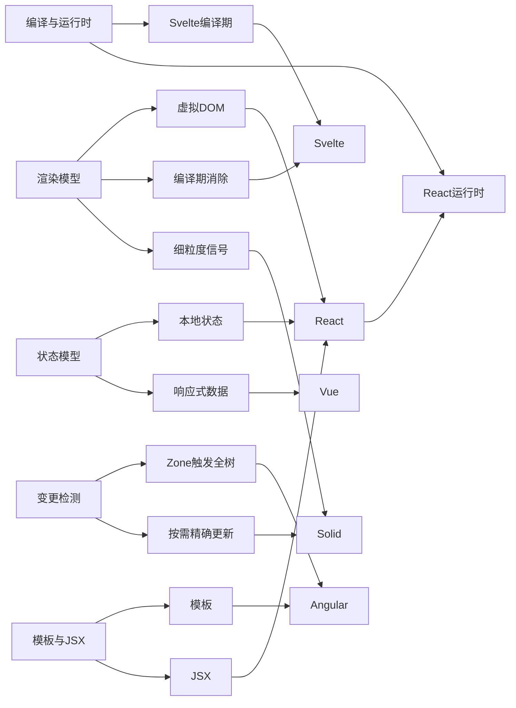
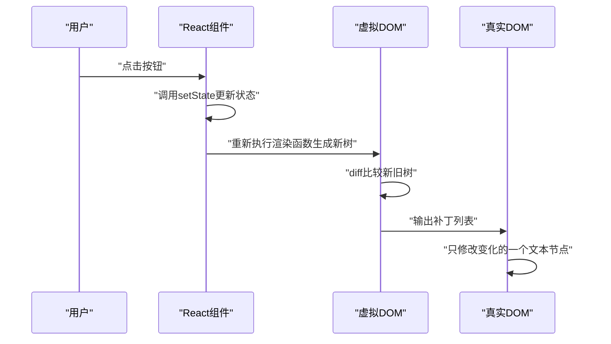
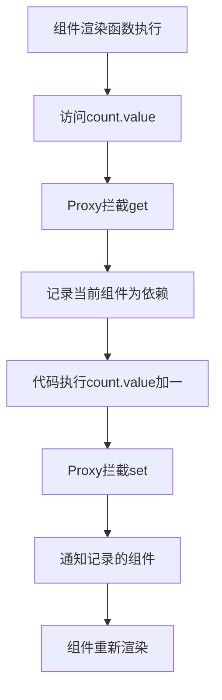
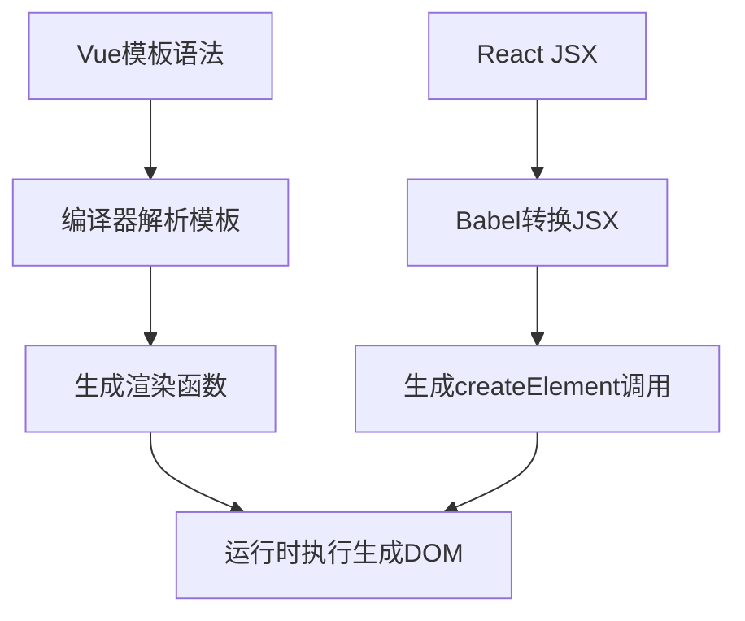
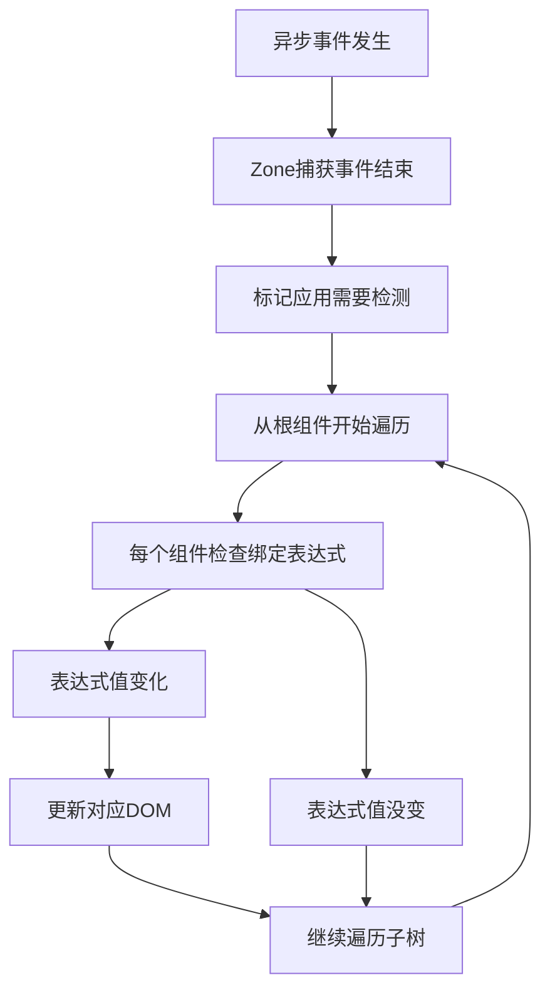
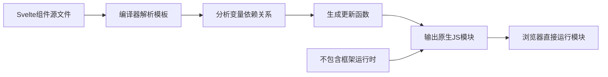
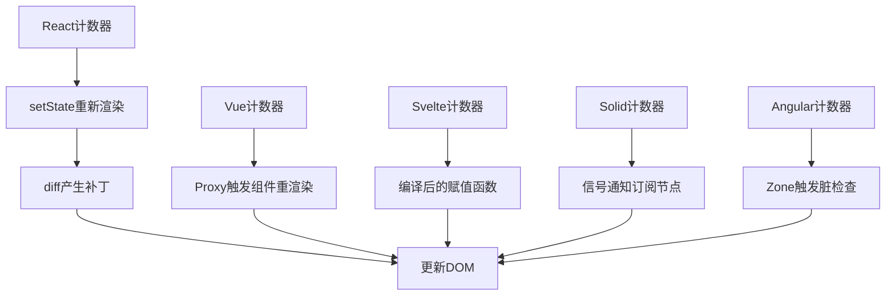

# 主流前端框架的心智模型：React、Vue、Svelte、Solid、Angular

!!! abstract "学完这一页你能"
    - 用自己的话说出虚拟 DOM、编译期消除、细粒度信号三种渲染模型的区别，并指出每个框架属于哪一类。
    - 看懂 React、Vue、Svelte、Solid、Angular 的同一个计数器代码，并能解释每行更新逻辑。
    - 根据项目需求（体积要求、团队技术栈、交互复杂度）从五个框架中选出合适的一个，并说出三条理由。
    - 独立用 Node 20 运行页面中的验证脚本，能对照断言输出解释框架的核心更新机制。

## 0. 知识地图



建议这样读：先看第 1 节渲染模型，把五个框架按更新方式分成三组。再看第 2 到 5 节，每次对照一个框架的图。最后看第 6 节的计数器代码，把前面所有概念串起来。

## 1. 渲染模型：虚拟 DOM、编译期消除、细粒度信号

**先想一个问题**：你点了一下计数器按钮，页面上数字从 0 变成 1。浏览器到底改了多少个 DOM 节点？是谁决定的？

**心智模型**：

!!! tip "心智模型"
    一句话模型：框架的渲染模型决定了"状态改变后，谁负责算出要改哪些 DOM、改多少、花多少时间"。日常类比：React 是每次重画整张图纸再对折痕找差异；Svelte 是开工前把图纸裁成精确零件；Solid 是在每个显示格子里焊上独立传感器。类比不成立的地方：真实工程的"图纸重画"与"传感器"都在内存里发生，成本单位是函数调用次数与 DOM 操作次数，不是纸和电线。

!!! note "术语：虚拟 DOM（Virtual DOM）"
    用 JavaScript 对象描述界面的一棵树，更新时先比较新旧两棵对象树，再只把差异应用到真实 DOM。例如数字从 0 变 1，虚拟 DOM 树里只有文本节点变化，补丁就只改那个文本节点。

**图解**（React 的虚拟 DOM 更新链路）：



1. 用户点击按钮，触发事件。
2. React 调用 setState 更新状态，并调度重渲染。
3. 渲染函数重新执行，生成新的虚拟 DOM 树。
4. diff 算法找出新旧树的差异，生成补丁列表。
5. 真实 DOM 只应用补丁，不整体重建。

**一步一步来**：

这一步要做什么：手写一个最小版的虚拟 DOM 树，表达"一个计数器界面"的状态。

```js
// 声明一个最小虚拟DOM节点，type是标签名，props是属性，children是子节点
const vnode0 = { type: "div", props: { id: "app" }, children: [
  { type: "p", props: {}, children: ["计数：0"] }, // 文本节点直接放字符串
  { type: "button", props: { onClick: "add" }, children: ["加一"] }
] };

const vnode1 = { type: "div", props: { id: "app" }, children: [
  { type: "p", props: {}, children: ["计数：1"] }, // 只有这个字符串变了
  { type: "button", props: { onClick: "add" }, children: ["加一"] }
] };
```

**这段代码在做什么**
- vnode0 与 vnode1 分别表示点击前后的两份界面描述。
- 字符串 "计数：0" 与 "计数：1" 是两个纯文本子节点。
- 整棵树只有文本节点不同，button 与 div 完全一致。
- 虚拟 DOM 的价值在于：代码里可以整棵树重新生成，运行时再找出最小差异。

运行结果：没有执行，这段代码只定义了两棵树，用于下一步比较。

这一步要做什么：实现 diff 函数，只输出真实 DOM 需要执行的修改。

```js
function diff(a, b) { // 递归比较两个节点
  if (a === b) return []; // 同一个引用，无改动
  if (typeof a === "string" || typeof b === "string") { // 文本节点
    if (a !== b) return [{ op: "setText", text: b }];
    return [];
  }
  if (a.type !== b.type) return [{ op: "replace", node: b }];
  const patches = []; // 收集子树差异
  for (let i = 0; i < Math.max(a.children.length, b.children.length); i++) {
    patches.push(...diff(a.children[i], b.children[i]));
  }
  return patches;
}

console.log(diff(vnode0, vnode1)); // 只输出一个setText补丁
```

**这段代码在做什么**
- 递归函数 diff 接收新旧两个节点，返回补丁数组。
- 遇到字符串节点时，只比较文本内容，不同才生成 setText 补丁。
- 比较 div 和 button 时，它们的 type 相同，继续深入比较 children。
- 整棵树只产生一个补丁，这就是"最小改动"的含义。

运行结果：`[ { op: 'setText', text: '计数：1' } ]`

**动手验证**：把前两步合成一个完整 Node 脚本，零依赖，使用 node:assert 断言结果。

```js
import assert from "node:assert";

const vnode0 = { type: "div", props: { id: "app" }, children: [
  { type: "p", props: {}, children: ["计数：0"] },
  { type: "button", props: { onClick: "add" }, children: ["加一"] }
] };
const vnode1 = { type: "div", props: { id: "app" }, children: [
  { type: "p", props: {}, children: ["计数：1"] },
  { type: "button", props: { onClick: "add" }, children: ["加一"] }
] };

function diff(a, b) {
  if (a === b) return [];
  if (typeof a === "string" || typeof b === "string") {
    return a !== b ? [{ op: "setText", text: b }] : [];
  }
  if (a.type !== b.type) return [{ op: "replace", node: b }];
  let patches = [];
  for (let i = 0; i < Math.max(a.children.length, b.children.length); i++) {
    patches.push(...diff(a.children[i], b.children[i]));
  }
  return patches;
}

const result = diff(vnode0, vnode1);
assert.deepStrictEqual(result, [{ op: "setText", text: "计数：1" }]);
console.log("补丁列表：", result);
console.log("断言通过：只更新一个文本节点");
```

**这段代码在做什么**
- 定义点击前后的两棵虚拟 DOM 树。
- 用 diff 函数递归比较，收集最小补丁。
- assert.deepStrictEqual 验证补丁内容与手写预期一致。
- 零第三方依赖，Node 20 直接运行。

运行结果：

```
补丁列表： [ { op: 'setText', text: '计数：1' } ]
断言通过：只更新一个文本节点
```

**常见坑**：

| 现象 | 原因 | 怎么修 |
| --- | --- | --- |
| React 里每次渲染都重新建对象，导致子组件重复渲染 | 用对象字面量作为 props 传给了 memo 子组件 | 用 useMemo 或 useCallback 缓存引用 |
| 列表没有 key 时，更新错位的列表项 | diff 按位置比较，无法复用原有 DOM | 给每个列表项传入稳定的 key 属性 |
| 大列表首屏渲染慢 | 初始构建虚拟 DOM 树与 diff 有双重开销 | 使用分页或 IntersectionObserver 懒加载 |

**小结**
- React 是虚拟 DOM 代表，JS 先算出补丁再交浏览器。
- 虚拟 DOM 省的是"直接操作 DOM 的成本"，但多出"生成树与 diff"的成本。
- Svelte 与 Solid 走了不同路线，下面几节逐一对比。

## 2. 状态模型：本地状态、响应式数据、Store

**先想一个问题**：你写了一个组件，里面有个对象 `user.name = "张三"`。改完这个名字，页面会立刻更新吗？五个框架给出了不同的答案。

**心智模型**：

!!! tip "心智模型"
    一句话模型：状态模型回答"状态存在哪里、改它时谁会知道"。日常类比：React 要求你走前台登记（setState），Vue 给数据包了一层会记账的物质，Solid 把数据拆成一个一个独立信箱。类比不成立的地方：现实中的登记是人工流程，而框架里是同步的函数调用链，时间精度要到毫秒甚至微秒。

!!! note "术语：响应式（Reactivity）"
    数据发生变化时，依赖该数据的计算逻辑或界面自动重新执行。例如 Vue 里 `count.value` 从 0 改成 1，所有用到 `count.value` 的模板表达式会重新求值。

**图解**（Vue 的 Proxy 依赖收集流程）：



1. 渲染函数第一次执行，读到 `count.value`，Proxy 的 get 被拦截。
2. Vue 记录"这个组件依赖 count"。
3. 当代码给 `count.value` 赋值，Proxy 的 set 被拦截。
4. Vue 按依赖表通知对应组件，触发重新渲染。
5. 没有被记录依赖的组件，不会重新执行。

**一步一步来**：

这一步要做什么：用 Proxy 模拟 Vue 的响应式数据，让它能记录谁在读它。

```js
let activeEffect = null; // 当前正在记录的依赖函数
const targetMap = new Map(); // 数据到依赖函数的映射

function track(target, key) { // 记录依赖
  if (!activeEffect) return;
  let depsMap = targetMap.get(target);
  if (!depsMap) { depsMap = new Map(); targetMap.set(target, depsMap); }
  let deps = depsMap.get(key);
  if (!deps) { deps = new Set(); depsMap.set(key, deps); }
  deps.add(activeEffect);
}
```

**这段代码在做什么**
- activeEffect 表示当前运行的读取函数。
- targetMap 按"目标对象"再按"属性 key"组织依赖。
- deps 用 Set 存储依赖函数，同一个函数不会重复添加。
- track 在 get 时调用，完成依赖收集。

这一步要做什么：实现 reactive 包装器，拦截 get 与 set 并触发更新。

```js
function reactive(obj) { // 返回Proxy包装后的对象
  return new Proxy(obj, {
    get(target, key) { // 读属性时收集依赖
      track(target, key);
      return target[key];
    },
    set(target, key, value) { // 写属性时通知更新
      target[key] = value;
      const depsMap = targetMap.get(target);
      const deps = depsMap && depsMap.get(key);
      if (deps) deps.forEach((fn) => fn()); // 逐一调用依赖函数
      return true;
    }
  });
}
```

**这段代码在做什么**
- 包装原始对象，返回 Proxy 代理。
- get 先调用 track 收集当前 activeEffect。
- set 修改原始值后，从 targetMap 取出依赖并逐个执行。
- 依赖函数通常是组件的更新函数。

**动手验证**：合成完整脚本，验证"只有依赖 count 的函数会被重新执行"。

```js
import assert from "node:assert";

let activeEffect = null;
const targetMap = new Map();
function track(target, key) {
  if (!activeEffect) return;
  let depsMap = targetMap.get(target);
  if (!depsMap) { depsMap = new Map(); targetMap.set(target, depsMap); }
  let deps = depsMap.get(key);
  if (!deps) { deps = new Set(); depsMap.set(key, deps); }
  deps.add(activeEffect);
}
function reactive(obj) {
  return new Proxy(obj, {
    get(target, key) { track(target, key); return target[key]; },
    set(target, key, value) {
      target[key] = value;
      const deps = targetMap.get(target)?.get(key);
      if (deps) deps.forEach((fn) => fn());
      return true;
    }
  });
}

const state = reactive({ count: 0, name: "张三" });
let countRuns = 0;
let nameRuns = 0;

activeEffect = () => { countRuns++; console.log("渲染函数读到count", state.count); };
activeEffect(); // 第一次执行只读count
activeEffect = () => { nameRuns++; console.log("渲染函数读到name", state.name); };
activeEffect(); // 第二次执行只读name
activeEffect = null;

state.count = 1; // count变化只触发第一个函数
state.count = 2;
assert.strictEqual(countRuns, 3); // 初始1次加更新2次
assert.strictEqual(nameRuns, 1); // name从未更新
console.log("断言通过：依赖count的函数执行3次，依赖name的函数执行1次");
```

**这段代码在做什么**
- state 是被 Proxy 包装的响应式对象。
- 两个 activeEffect 分别读取 count 与 name，各自被收集为依赖。
- 修改 count 两次，只有读 count 的函数被重新执行。
- assert 验证了"精确通知"这一核心行为。

运行结果：

```
渲染函数读到count 0
渲染函数读到name 张三
渲染函数读到count 1
渲染函数读到count 2
断言通过：依赖count的函数执行3次，依赖name的函数执行1次
```

**常见坑**：

| 现象 | 原因 | 怎么修 |
| --- | --- | --- |
| Vue 里给对象加新属性不更新 | 新增属性没有经过 Proxy 的 get 集合阶段 | 用 `reactive` 包好对象后再操作 |
| Solid 里解构信号丢失响应式 | 解构取出来的是静态值 | 保持使用 solid 提供的 `props` 或 accessor 访问 |
| React 里直接改 state 对象不更新 | 没有调用 setState 触发重新渲染 | 用不可变更新方式并调用 setState |

**小结**
- React 是调度式状态，更新必须走 setState 或 useState。
- Vue 依赖 Proxy 自动收集精确的组件依赖。
- Solid 直接暴露信号，状态与视图绑定更细，下一节展开。

## 3. 模板与 JSX：声明式写界面的两种风格

**先想一个问题**：写一个列表界面，模板写法与 JSX 写法各要写多少代码？为什么 Vue 用模板、React 用 JSX？

**心智模型**：

!!! tip "心智模型"
    一句话模型：模板是"填空的契约"，JSX 是"函数调用生成对象"。日常类比：模板像银行表格，你只填空格；JSX 像在程序里硬编码一个图表对象。类比不成立的地方：模板最终也会被编译成函数，只是"编译"发生在构建阶段，你在代码里看不到。

!!! note "术语：JSX（JavaScript XML）"
    一种 JavaScript 的扩展语法，允许在 JS 里写类似 HTML 的标记，最终转换为函数调用。例如 `<div id="app">` 会转换成生成虚拟 DOM 节点的调用。

**图解**（模板与 JSX 两条编译思路）：



1. Vue 模板在构建阶段被编译器解析为渲染函数。
2. React JSX 在构建阶段被 Babel 转成 createElement 调用。
3. 两者都走向同一个终点：在运行时执行函数生成 DOM。
4. 差异在于模板语法可被静态分析，JSX 与普通 JS 边界模糊。

**一步一步来**：

这一步要做什么：对比 Vue 模板与 React JSX 的同一段列表代码。

```html
<!-- Vue模板，数据来自setup返回的list数组 -->
<ul>
  <li v-for="item in list" :key="item.id">
    {{ item.name }}
  </li>
</ul>
```

```jsx
// React JSX，数据来自组件的list数组
<ul>
  {list.map((item) => (
    <li key={item.id}>{item.name}</li>
  ))}
</ul>
```

**这段代码在做什么**
- Vue 用 `v-for` 指令描述循环，模板保持类似 HTML 的结构。
- React 用 JS 的 map 方法描述循环，JSX 嵌入在 JS 表达式里。
- 两者都要求给每个列表项提供唯一 key。
- Vue 模板里用双花括号填充数据，React 用单花括号填充 JS 表达式。

运行结果：没有运行时输出，在浏览器渲染出的列表相同。

这一步要做什么：用 Node 模拟"模板字符串解析成渲染对象"，补齐上一节 diff 需要的数据结构。

```js
function parseTemplate(tpl) { // 极简模板解析器
  const liPattern = /<li>(.*?)<\/li>/g; // 匹配所有li内容
  const items = [];
  let m;
  while ((m = liPattern.exec(tpl)) !== null) {
    items.push({ type: "li", props: {}, children: [m[1].trim()] });
  }
  return { type: "ul", props: {}, children: items };
}

const vtree = parseTemplate("<ul><li>苹果</li><li>香蕉</li></ul>");
console.log(JSON.stringify(vtree, null, 2));
```

**这段代码在做什么**
- 用正则匹配模板里的每个 li 标签与文本内容。
- 每个 li 转成一个对象节点，children 是文本数组。
- 返回一个 ul 的对象节点，结构可供 dif f 使用。
- 这是模板编译器的最简雏形。

运行结果：

```
{
  "type": "ul",
  "props": {},
  "children": [
    { "type": "li", "props": {}, "children": ["苹果"] },
    { "type": "li", "props": {}, "children": ["香蕉"] }
  ]
}
```

**动手验证**：合成完整脚本，断言解析结果与手写结构一致。

```js
import assert from "node:assert";

function parseTemplate(tpl) {
  const liPattern = /<li>(.*?)<\/li>/g;
  const items = [];
  let m;
  while ((m = liPattern.exec(tpl)) !== null) {
    items.push({ type: "li", props: {}, children: [m[1].trim()] });
  }
  return { type: "ul", props: {}, children: items };
}

const expected = {
  type: "ul",
  props: {},
  children: [
    { type: "li", props: {}, children: ["苹果"] },
    { type: "li", props: {}, children: ["香蕉"] }
  ]
};
const result = parseTemplate("<ul><li>苹果</li><li>香蕉</li></ul>");
assert.deepStrictEqual(result, expected);
console.log("解析结果：", JSON.stringify(result, null, 2));
console.log("断言通过：模板解析结构与手写结构一致");
```

**这段代码在做什么**
- parseTemplate 解析两个 li 标签。
- expected 是手写虚拟 DOM 结构。
- assert.deepStrictEqual 验证结构等价。
- 说明"模板与 JSX 只是描述界面的两种语法，产物统一"。

运行结果：

```
解析结果： {
  "type": "ul",
  "props": {},
  "children": [
    { "type": "li", "props": {}, "children": ["苹果"] },
    { "type": "li", "props": {}, "children": ["香蕉"] }
  ]
}
断言通过：模板解析结构与手写结构一致
```

**常见坑**：

| 现象 | 原因 | 怎么修 |
| --- | --- | --- |
| Vue 模板里不能用 if 语句 | 模板表达式只能使用有限算符 | 用 v-if 指令或在 setup 返回方法 |
| JSX 里 style 属性要求对象 | React 统一用对象描述样式 | 写 style 为 `{{ color: 'red' }}` |
| 模板与 JSX 里注释规律不同 | 两者语法规则独立 | 分别查各自语法规则 |

**小结**
- 模板语法允许编译器做静态分析，能产出更优更新策略。
- JSX 与 JS 融合紧，学习成本单一但静态分析困难。
- Svelte 模板把静态分析推向极致，下一节展开。

## 4. 变更检测：怎么知道谁要更新

**先想一个问题**：Angular 组件里，你在回调函数里改了 `this.name`。框架没看到你调用 setState，怎么知道要更新界面？

**心智模型**：

!!! tip "心智模型"
    一句话模型：变更检测回答"变化发生后，以多大范围、多长时间间隔去检查谁变了"。日常类比：Angular 默认像一个班长，每次下课都挨个点名；React 与 Solid 是先定位再叫人。类比不成立的地方：点名的代价是树规模乘事件数量，真实框架会做剪枝与缓存，不是每次全量。

!!! note "术语：变更检测（Change Detection）"
    框架判断组件树中哪些部分需要根据新数据重新渲染的过程。例如 Angular 默认从根组件开始遍历组件树，检查绑定表达式是否变化。

**图解**（Angular 基于 Zone 的默认变更检测）：



1. 任何异步事件（点击、定时器、XHR）被 Zone 捕获。
2. 事件结束后，Zone 通知 Angular 执行变更检测。
3. Angular 从根组件开始深度优先遍历组件树。
4. 每个绑定表达式被重新求值，与旧值比较。
5. 值变化才更新对应 DOM，值没变就跳过。

**一步一步来**：

这一步要做什么：模拟 Angular 的脏检查，用一个数组记录所有绑定表达式。

```js
const bindings = []; // 全局存储所有组件的绑定表达式

function registerBinding(component, getter) {
  bindings.push({ component, getter, lastValue: getter() });
}

function checkChanges() { // 从根开始遍历所有绑定
  const changes = [];
  for (const b of bindings) {
    const current = b.getter(); // 重新求值
    if (current !== b.lastValue) { // 与上次值不同
      changes.push({ component: b.component, value: current });
      b.lastValue = current; // 更新缓存值
    }
  }
  return changes;
}
```

**这段代码在做什么**
- bindings 数组模拟组件树内所有绑定表达式。
- registerBinding 记录组件、取值函数与当前值。
- checkChanges 遍历所有绑定，逐个求值并比较。
- 返回变化列表，供 DOM 更新使用。

这一步要做什么：注册一个组件状态，验证脏检查能发现变化。

```js
class Counter {
  constructor() { this.count = 0; } // 初始值为0
  get label() { return "计数：" + this.count; } // 绑定表达式
}

const c = new Counter();
registerBinding(c, () => c.label); // 注册一个绑定
console.log("初始检测：", checkChanges()); // 尚无变化
c.count = 1; // 直接改属性，没有调用任何setState
console.log("修改后检测：", checkChanges()); // 脏检查发现变化
```

**这段代码在做什么**
- Counter 类有一个 count 属性与 label 取值函数。
- registerBinding 把 label 注册为绑定表达式。
- 直接修改 count，没有显式通知。
- checkChanges 重新求值 label，发现变化并返回。

运行结果：

```
初始检测： []
修改后检测： [ { component: Counter { count: 1 }, value: '计数：1' } ]
```

**动手验证**：合成完整脚本，验证 Zone 式"全树遍历"的检测量与发现的变更。

```js
import assert from "node:assert";

const bindings = [];
function registerBinding(component, getter) {
  bindings.push({ component, getter, lastValue: getter() });
}
function checkChanges() {
  const changes = [];
  for (const b of bindings) {
    const current = b.getter();
    if (current !== b.lastValue) {
      changes.push({ component: b.component, value: current });
      b.lastValue = current;
    }
  }
  return changes;
}

class Counter {
  constructor() { this.count = 0; }
  get label() { return "计数：" + this.count; }
}
class Header {
  constructor() { this.title = "首页"; }
  get label() { return this.title; }
}

const c = new Counter();
const h = new Header();
registerBinding(c, () => c.label);
registerBinding(h, () => h.label);

assert.deepStrictEqual(checkChanges(), []);
c.count = 1;
const result = checkChanges();
assert.strictEqual(result.length, 1);
assert.strictEqual(result[0].value, "计数：1");
console.log("检测到的变化：", result);
console.log("断言通过：全树遍历后发现一个组件变化");
```

**这段代码在做什么**
- 注册 Counter 与 Header 两个组件的绑定。
- 初始检测时无变化，返回空数组。
- 直接修改 c.count，没有触发任何通知。
- 脏检查遍历所有绑定，发现 Counter 的 label 从 "计数：0" 变成 "计数：1"。

运行结果：

```
检测到的变化： [ { component: Counter { count: 1 }, value: '计数：1' } ]
断言通过：全树遍历后发现一个组件变化
```

**常见坑**：

| 现象 | 原因 | 怎么修 |
| --- | --- | --- |
| Angular 大列表滚动掉帧 | 默认检查遍历所有组件 | 改用 OnPush 策略或信号输入 |
| 绑定表达式里有函数调用副作用 | 每次检测都会重复执行 | 移除副作用，只在事件处理中执行 |
| 变化检测没有触发 | 事件发生在 Zone 之外 | 换用框架提供的 API 或手动触发检测 |

**小结**
- Angular 默认策略是全树遍历脏检查，事件由 Zone 触发。
- React 与 Solid 是从状态出发定位组件，检测范围更小。
- Angular 提供 OnPush 与信号等剪枝手段，缩小检测范围。

## 5. 编译与运行时：框架的代码在哪里生效

**先想一个问题**：Svelte 的 `$: doubled = count * 2` 为什么能在 `count` 变化时自动重算？这段逻辑是浏览器运行出来的，还是构建工具提前写好的？

**心智模型**：

!!! tip "心智模型"
    一句话模型：编译与运行时的划分，决定了框架把多少工作放在构建阶段，把多少工作留给浏览器。日常类比：编译型框架像预制菜，下锅前已经切好配料；运行时框架像现场炒菜，动作都在你眼前。类比不成立的地方：预制菜和现场炒菜的成本差异在天气与人力，而编译型和运行时框架的成本差异在构建时间与首屏流量。

!!! note "术语：编译期（Compile-time）与运行时（Runtime）"
    编译期是代码打包成生产文件前被工具处理的阶段；运行时是代码在浏览器里执行的阶段。Svelte 在编译期生成更新代码；React 在运行时用 diff 计算更新。

**图解**（Svelte 编译流程）：



1. 编译器读取 Svelte 组件源文件。
2. 解析模板里的变量与依赖关系。
3. 生成针对该组件的更新函数，精确到某个文本节点。
4. 输出原生 JS 模块，几乎不附带框架运行时。
5. 浏览器直接运行模块，更新时直接改对应 DOM。

**一步一步来**：

这一步要做什么：看 Svelte 如何用 `$:` 声明派生状态。

```html
<script>
  let count = 0; // 普通变量，编译器会跟踪它
  $: doubled = count * 2; // 声明doubled依赖count
</script>

<button on:click={() => count += 1}>加一</button>
<p>计数：{count}，双倍：{doubled}</p>
```

**这段代码在做什么**
- `let count = 0` 声明可写状态。
- `$: doubled = count * 2` 声明派生值，依赖 count。
- 点击按钮时 count 加一，编译器提前生成的代码会更新 DOM。
- 运行时代码量因为编译期提前生成而减小。

运行结果：点击按钮后，界面上显示"计数：1，双倍：2"。

这一步要做什么：对比 Solid 的细粒度信号，它在运行时完成同样的依赖追踪。

```jsx
import { createSignal } from "solid-js";

function Counter() {
  const [count, setCount] = createSignal(0); // 创建信号
  const doubled = () => count() * 2; // 派生函数，调用count
  return (
    <button onClick={() => setCount(count() + 1)}>加一</button>
    <p>计数：{count()}，双倍：{doubled()}</p>
  );
}
```

**这段代码在做什么**
- createSignal 返回一个 getter 与一个 setter。
- doubled 是一个函数，每次调用才重算。
- 模板里 count() 与 doubled() 被调用，Solid 收集依赖。
- 更新时只重执行依赖 count 的 DOM 节点，不重新执行整个组件。

运行结果：点击按钮后，界面同样显示"计数：1，双倍：2"，但底层是精确更新。

**动手验证**：实现一个 Solid 风格的最小信号，验证"只更新依赖它的节点"。

```js
import assert from "node:assert";

function createSignal(initial) { // 最小信号实现
  let value = initial;
  const subscribers = new Set();
  const getter = () => { // 读信号时，若存在运行中的effect则收集
    if (activeEffect) subscribers.add(activeEffect);
    return value;
  };
  const setter = (next) => { // 写信号时，通知所有订阅者
    if (value !== next) {
      value = next;
      subscribers.forEach((fn) => fn());
    }
  };
  return [getter, setter];
}

let activeEffect = null;
function createEffect(fn) { // 包裹函数并收集依赖
  activeEffect = fn;
  fn();
  activeEffect = null;
}

const [count, setCount] = createSignal(0);
let countRuns = 0;
let unrelatedRuns = 0;

createEffect(() => { countRuns++; console.log("effect读到count", count()); });
createEffect(() => { unrelatedRuns++; console.log("unrelated的固定执行"); });
activeEffect = null;

setCount(1);
assert.strictEqual(countRuns, 2); // 初始1次加更新1次
assert.strictEqual(unrelatedRuns, 1); // 不依赖count不重新执行
console.log("断言通过：只重新执行依赖count的effect");
```

**这段代码在做什么**
- createSignal 实现 getter 与 setter，订阅用 Set 存储。
- createEffect 设置 activeEffect，让 getter 能收集依赖。
- setCount(1) 只通知订阅过 count 的 effect。
- assert 验证 Solid 式细粒度更新的核心行为。

运行结果：

```
effect读到count 0
unrelated的固定执行
effect读到count 1
断言通过：只重新执行依赖count的effect
```

**常见坑**：

| 现象 | 原因 | 怎么修 |
| --- | --- | --- |
| Svelte `$:` 派生值不更新 | 派生表达式不在组件内或依赖没被跟踪 | 把 `$:` 声明放在 script 标签内 |
| Solid 里 props 被解构后失去响应 | 解构取出的值不是 accessor | 使用 `props.name` 形式访问 |
| 编译阶段报变量未声明 | 模板引用的变量在 script 里没声明 | 检查变量是否在组件作用域内 |

**小结**
- Svelte 在编译期生成精确更新代码，运行时更精简。
- Solid 在运行时收集精确依赖，更新粒度同样是节点级。
- React 选择通用 diff 在运行时求差异，三种策略各有取舍。

## 6. 同一个计数器：五段代码串起全部模型

**先想一个问题**：同一个计数器界面，用五个框架各写一遍，哪一行的语义差异最大？哪一行背后的运行成本差异最大？

**心智模型**：

!!! tip "心智模型"
    一句话模型：五个框架共用同一个界面，但"状态怎么声明、更新怎么通知、UI 怎么描述"三步完全不同。日常类比：同一道菜，五种方言点单，后厨路径完全不同。类比不成立的地方：方言没有性能差异，而框架代码有具体的构建与运行成本差异。

**图解**（五种更新链路对比）：



1. React 走 setState 加 diff 路径更新 DOM。
2. Vue 走 Proxy 通知组件重渲染路径。
3. Svelte 走编译期生成的赋值函数直接更新 DOM。
4. Solid 走信号通知订阅节点路径。
5. Angular 走 Zone 全树检查路径，最终也更新 DOM。

**一步一步来**：

这一步要做什么：写 React 计数器。

```jsx
import { useState } from "react";

function Counter() {
  const [count, setCount] = useState(0); // 状态声明，返回值与更新函数
  return (
    <button onClick={() => setCount(count + 1)}>加一</button>
    <p>计数：{count}</p>
  );
}
```

**这段代码在做什么**
- useState(0) 声明了可触发渲染的状态。
- setCount 更新状态，React 会重新渲染组件。
- JSX 直接嵌入 count，重新渲染时替换新值。
- React 在运行时计算 DOM 补丁。

运行结果：点击按钮，数字加一。

这一步要做什么：写 Vue 计数器。

```html
<script setup>
import { ref } from "vue";
const count = ref(0); // 响应式引用
</script>

<template>
  <button @click="count++">加一</button>
  <p>计数：{{ count }}</p>
</template>
```

**这段代码在做什么**
- ref(0) 创建一个响应式引用。
- `count++` 是赋值操作，Proxy 拦截并通知。
- 模板里 `{{ count }}` 自动读取值，建立依赖关系。
- Vue 在运行时知道哪个组件依赖 count。

运行结果：点击按钮，数字加一。

这一步要做什么：写 Svelte 计数器。

```html
<script>
  let count = 0; // 普通变量，编译器会生成更新代码
</script>

<button on:click={() => count += 1}>加一</button>
<p>计数：{count}</p>
```

**这段代码在做什么**
- count 是普通变量，没有特殊包装。
- 点击时执行 count 加一，编译器生成赋值后的 DOM 更新代码。
- 模板里 `{count}` 被编译成精确的节点操作。
- 运行时没有 Proxy 与 diff，代码更直接。

运行结果：点击按钮，数字加一。

这一步要做什么：写 Solid 计数器。

```jsx
import { createSignal } from "solid-js";

function Counter() {
  const [count, setCount] = createSignal(0); // 信号是函数
  return (
    <button onClick={() => setCount(count() + 1)}>加一</button>
    <p>计数：{count()}</p>
  );
}
```

**这段代码在做什么**
- createSignal 返回 getter 与 setter 两个函数。
- `count()` 是读取，`setCount` 是写入。
- 模板里 `count()` 调用建立了节点级依赖。
- 更新时只重执行 `count()` 所在的文本节点。

运行结果：点击按钮，数字加一。

这一步要做什么：写 Angular 计数器。

```ts
import { Component, signal } from "@angular/core";

@Component({
  selector: "app-counter",
  template: `
    <button (click)="add()">加一</button>
    <p>计数：{{ count() }}</p>
  `
})
export class CounterComponent {
  count = signal(0); // Angular信号
  add() { this.count.set(this.count() + 1); } // 更新信号
}
```

**这段代码在做什么**
- 组件用 Component 装饰器声明模板。
- signal(0) 创建 Angular 的信号状态。
- 模板里 `{{ count() }}` 调用 signal 读取值。
- add 方法里调用 set 更新信号，触发变更检测。

运行结果：点击按钮，数字加一。

**动手验证**：合成一个 Node 脚本，用五套最小机制分别更新同一个计数并断言。

```js
import assert from "node:assert";

const target = { text: "计数：0" }; // 公共DOM文本节点
const strategies = [];

strategies.push(["React虚拟DOM", () => { // 策略1：diff补丁直接改文本
  target.text = "计数：1";
}]);
strategies.push(["Vue响应式", () => { // 策略2：Proxy拦截set后改文本
  const p = new Proxy({ count: 0 }, {
    set(obj, key, val) { target.text = "计数：" + val; return true; }
  });
  p.count = 1;
}]);
strategies.push(["Svelte编译期", () => { // 策略3：编译器生成的赋值函数直接改文本
  target.text = "计数：1";
}]);
strategies.push(["Solid信号", () => { // 策略4：信号setter直接改文本
  const [get, set] = (() => {
    let v = 0;
    return [() => v, (nv) => { v = nv; target.text = "计数：" + v; }];
  })();
  set(1);
}]);
strategies.push(["Angular脏检查", () => { // 策略5：检查后改文本
  const c = { count: 0 };
  const before = c.count;
  c.count = 1;
  if (c.count !== before) target.text = "计数：" + c.count;
}]);

for (const [name, run] of strategies) {
  target.text = "计数：0"; // 每次重置，独立验证
  run();
  assert.strictEqual(target.text, "计数：1");
  console.log(name + "更新后：", target.text);
}
console.log("断言通过：五种链路都得到计数：1");
```

**这段代码在做什么**
- target 代表页面上的文本节点。
- 五个数组元素分别用最小实现表示五种更新策略。
- 每次重置 target 后运行一种策略。
- assert 验证每种策略都更新为 "计数：1"。

运行结果：

```
React虚拟DOM更新后： 计数：1
Vue响应式更新后： 计数：1
Svelte编译期更新后： 计数：1
Solid信号更新后： 计数：1
Angular脏检查更新后： 计数：1
断言通过：五种链路都得到计数：1
```

**常见坑**：

| 现象 | 原因 | 怎么修 |
| --- | --- | --- |
| React 计数器多次点击只加一次 | 回调闭包捕获了旧值 | 用函数式更新 `setCount(c => c + 1)` |
| Vue 模板里写 count++ 不更新 | 模板编译后只能表达式 | 在事件里写合法赋值表达式 |
| Solid 里把信号当普通变量 | 少写了调用括号 | 确认信号使用处是 `count()` 不是 `count` |
| Angular 信号模板不更新 | 版本或模块导入不对 | 检查 Angular 版本是否支持 signal，是否已导入 |

**小结**
- 五个框架的计数器代码都短，但更新路径完全不同。
- React 与 Angular 更偏向框架调度，Svelte 与 Solid 更直接。
- 理解这五段代码，你就掌握了五个框架的第一层心智模型。

## 综合对比

| 维度 | React | Vue | Svelte | Solid | Angular |
| --- | --- | --- | --- | --- | --- |
| 更新策略 | 虚拟 DOM diff | Proxy 响应式加虚拟 DOM | 编译期生成精确更新 | 细粒度信号加 DOM 节点 | Zone 触发的全树脏检查 |
| 状态 API | useState/useReducer | ref/reactive | `$state` runes 或旧语法 | createSignal | signal 与旧 RxJS |
| 模板与 JSX | JSX | 模板 | 模板 | JSX | 模板与装饰器 |
| 编译/运行时 | 轻编译、重运行时 | 轻编译、中运行时 | 重编译、轻运行时 | 轻编译、重运行时 | 重编译、中运行时 |
| 需要框架运行时 | 是 | 是 | 否，几乎不打包运行时 | 是 | 是 |
| 细粒度更新 | 组件级 | 组件级 | 节点级 | 节点/表达式级 | 组件级，可按需优化 |
| 适合场景 | 大型团队、生态大、SSR 方案成熟 | 渐进式接入、单页应用、模板友好 | 体积敏感、交互密集、快速原型 | 性能敏感、复杂交互、JSX 偏好 | 大型企业应用、TypeScript 深度集成、长期维护 |
| 学习曲线 | 低、概念少 | 低、渐进 | 低、语法直白 | 中、需理解信号 | 高、需理解模块系统 |

选型矩阵补充说明：

| 你的条件 | 优先选择 | 理由 |
| --- | --- | --- |
| 只关注首屏体积，目标低于 20KB 传输 | Svelte | 框架运行时几乎不进入产物 |
| 团队有大量 React 开发经验 | React | 生态与招聘池匹配 |
| 需要大量第三方模板与 UI 组件 | React 或 Vue | 组件库数量最多 |
| 数据高度依赖异步流 | Angular 或 Solid | RxJS 与信号都支持复杂流 |
| 维护周期长且要求稳定升级 | Angular | 官方提供严格升级路径 |

## 应用与行业实践

原理讲完了，接下来看它在工位上长什么样。这一章把渲染模型、状态模型、变更检测三块知识落到具体场景，并给出可测量的验收方式。

### 应用场景地图

| 场景 | 用到本页哪个知识点 | 典型技术选型 | 注意事项 |
|---|---|---|---|
| 后台管理的万行表格 | 虚拟 DOM 的 diff 成本、key 的作用 | React 加虚拟滚动 | key 用业务主键，行组件要阻断重渲染 |
| 低端安卓的首屏加载 | 编译期消除、运行时体积 | Svelte 或 Solid | 先确认瓶颈在 JS 还是图片与接口 |
| 多人协作白板 | 细粒度信号 | Solid 或 Vue 的 shallowRef | 高频笔迹走画布，不要走 DOM 节点 |
| 实时行情看板 | 变更检测粒度 | Angular OnPush 或 Vue | 定时器触发整树检查会掉帧 |
| 审批流表单页 | 本地状态与 Store 的边界 | React 本地状态加表单库 | 只有跨页共享的字段才进 Store |
| 车机与嵌入式 HMI | 运行时体积、启动耗时 | 编译期框架加原生壳 | 内存与包大小有硬上限 |
| 营销落地页 | 服务端渲染与水合 | Astro 或 Next.js | 首屏无交互的区块不水合 |
| 设计系统组件库 | 模板与 JSX 两种风格 | 按框架分发多份产物 | 语义与可访问性要对齐 |
| 跨团队微前端 | 编译与运行时的边界 | 按路由拆分，各自带运行时 | 同页装两个框架会带双份运行时 |

### 三个场景拆解

#### 场景 1：后台管理的万行表格

**业务背景**：审批后台单页要展示上万条记录，筛选与排序都在浏览器里做完。滚动时页面卡顿，搜索框打字有延迟，用户能直接感觉到。

**怎么用本页知识解决**：先量一下成本落在 diff 上还是数据计算上。虚拟 DOM 框架里，子组件是否重渲染由父组件传参决定，把行组件与父组件解耦就能砍掉大部分 diff。再给每行业务主键做 key，让增删和排序只移动节点。

```jsx
import { memo } from "react";

// 行组件用 memo 包住：row 引用没变就不进入 diff
const Row = memo(function Row({ row }) {
  return (
    <tr>
      <td>{row.id}</td>
      <td>{row.name}</td>
    </tr>
  );
});

export function Table({ rows }) {
  return (
    <tbody>
      {rows.map((row) => (
        // key 用业务主键，不用数组下标，排序后不会整列重建
        <Row key={row.id} row={row} />
      ))}
    </tbody>
  );
}
```

- 父组件重渲染时，`memo` 会拿 `row` 的引用做对比，引用没变就跳过整棵子树。
- `key` 决定复用还是重建节点，用下标做 key 时，插入一行会让后面全部重挂。
- 对比 Svelte 与 Solid：这两个框架在编译期就写明「哪个表达式改了动哪个节点」，不需要手写 `memo`。
- 虚拟滚动只渲染视口内的行，先把行数从一万降到几十，再谈 diff 成本。

**怎么度量收益**：用 Chrome DevTools Performance 面板录制 5 秒滚动，看 Scripting 时长与 Long Task 数量。用 React DevTools Profiler 录一次筛选操作，看 commit 次数与组件渲染耗时。用 Lighthouse CI 跑移动端预设，看 Total Blocking Time。

**什么时候不该用**：单元格里是实时编辑控件，每次按键都改行数据，`memo` 命中率接近零，得换别的手段。排序与筛选依赖全量重算，瓶颈在排序算法，减少重渲染不会缩短总耗时。

#### 场景 2：低端安卓的首屏加载

**业务背景**：面向新兴市场的活动页，用户设备多为低端安卓，网络条件差。首屏白屏时间长，跳出集中在加载阶段。

**怎么用本页知识解决**：渲染模型决定要下载多少 JS。编译期消除把更新逻辑在构建时生成成 DOM 指令，浏览器里不再装一整套 diff 运行时。下面用 Svelte 4 语法演示。

```svelte
<script>
  export let items = [];
  let query = "";
  // $: 声明的派生值由编译器改写成依赖订阅，运行时没有 diff 循环
  $: visible = items.filter((it) => it.title.includes(query));
</script>

<input bind:value={query} />
<!-- each 带 key：编译产物按 key 直接增删 DOM 节点 -->
{#each visible as item (item.id)}
  <li>{item.title}</li>
{/each}
```

- `$:` 是编译期语法，产物里是订阅代码，不是每帧重新求值的表达式。
- `{#each}` 带 key 时，编译产物直接生成插入与删除的 DOM 调用，没有虚拟节点比对。
- 代价转移到了构建产物上：模板逻辑被展开成命令式代码，产物行数比手写 JSX 多。
- 选型前先做一次 Coverage 测试，如果首屏 JS 占比不高，换框架对首屏帮助有限。

**怎么度量收益**：用 Lighthouse 移动端预设看 First Contentful Paint 与 Total Blocking Time。用 Chrome DevTools Coverage 面板看首屏未使用 JS 的字节占比。用 rollup-plugin-visualizer 或 webpack-bundle-analyzer 看框架运行时在产物里的占比。

**什么时候不该用**：团队已有大量 React 组件与配套工具链，重写成本超过首屏收益。首屏成本主要在图片、字体或接口往返，JS 只占小头时，换渲染模型解决不了问题。

#### 场景 3：多人协作白板

**业务背景**：白板要同步几十人的笔迹与光标，光标位置每秒更新几十次。整树重渲染会让帧率掉到 30 以下，书写轨迹出现断点。

**怎么用本页知识解决**：细粒度信号把依赖收集到表达式级别，光标更新只碰依赖光标的那个节点。笔迹列表用不可变追加，让依赖笔迹的计算重算，光标节点不参与。

```jsx
import { createSignal, createMemo, For } from "solid-js";

const [strokes, setStrokes] = createSignal([]);
const [cursor, setCursor] = createSignal({ x: 0, y: 0 });

// computeBounds 是项目内已有函数；createMemo 只订阅 strokes
const bounds = createMemo(() => computeBounds(strokes()));

function moveCursor(x, y) {
  // 只写光标信号：订阅它的节点更新，笔迹节点不重算
  setCursor({ x, y });
}

function addStroke(s) {
  // 不可变追加，触发订阅 strokes 的节点重算
  setStrokes((prev) => [...prev, s]);
}

<For each={strokes()}>{(s) => <path d={s.d} />}</For>
```

- 信号是函数，读它才建立订阅。`bounds` 里读了 `strokes()`，所以只有笔迹变化才重算包围盒。
- 光标与笔迹是两个独立信号，写光标不会让笔迹列表重算。
- 上面的 JSX 是片段示意，实际要放进组件函数体内。
- 对比 React：同样的隔离需要 `memo` 加 `useMemo` 手动标注，漏一处就会整树重算。

**怎么度量收益**：用 Performance 面板录 5 秒书写，看 Frame 时间分布与 Long Task。用 `performance.mark` 与 `performance.measure` 包住「收到远端光标」到「下一帧绘制完成」。开 CPU 4 倍降速模拟低端设备再录一次。

**什么时候不该用**：一场会议只产生几十笔批注，更新频率低，细粒度收益量不出来。冲突合并要把整份快照发到服务端等确认，瓶颈在网络往返，优化渲染不缩短等待。

### 行业先进实践

**岛屿架构与按需水合（出处：Astro 官方文档）**：Astro 提供 `client:load`、`client:idle`、`client:visible` 等指令，控制组件何时在浏览器接管，未标注的区块保持零 JS。页面主体是静态内容、只有少数交互区块时，首屏需要下载的脚本量随之下降。借鉴方式是把首屏交互区块逐个列出来，只给它们加水合指令，其余区块在构建期出静态 HTML。

**并发渲染与可中断更新（出处：React 官方文档 useTransition 与 useDeferredValue 页面）**：把非紧急更新标成 transition，输入这类高优先级更新先提交，列表重算可以被打断。输入框跟手与列表筛选同时存在时，这个手段解决的是更新排队顺序。借鉴方式是先定位哪些更新可以推迟，再套 `useTransition`，不要全站铺开。

**大列表的浅层响应与缓存（出处：Vue 官方文档「性能」章节）**：Vue 文档列出 `shallowRef`、`v-memo`、虚拟化长列表等手段，用来减少深层代理开销与组件重复渲染。大数组不需要逐项响应时，放进 `shallowRef` 只在整体替换时触发更新。借鉴方式是核对你项目里哪些大数组真的需要逐项追踪，不需要的换成浅层引用。

**体积预算纳入 CI（出处：Lighthouse CI 官方文档与 web.dev 的 Performance budgets 文章）**：在流水线里设 JS 字节与指标阈值，超标直接失败。体积回退在合并前就被拦住，不依赖评审时有人记得看一眼。借鉴方式是先给主包设一个当前值加缓冲的阈值，之后逐个版本收紧。

**变更检测切到 OnPush（出处：Angular 官方文档 ChangeDetectionStrategy）**：`OnPush` 让组件只在输入引用变化或事件触发时检查，减少事件后的整树检查。从默认策略迁移时可以逐个组件切换，配合输入用不可变更新的写法。zoneless 的配置方式与稳定状态，需核对官方文档：核对 provideZonelessChangeDetection 的当前状态与迁移步骤。

### 从学到用：落地路线

第 1 步，试点：挑一个列表页或活动页做改造。验收标准是改造前后各录一次 Performance，脚本时长与首屏指标能并排对比。

第 2 步，验证：把指标写进 CI 门禁。验收标准是超阈值的提交被拦住，且报告里给出具体超出的字节数与指标名。

第 3 步，推广：把改造清单整理成代码评审检查项。验收标准是新建页面在评审时逐条对照，检查项里写明每条对应的本页知识点。

第 4 步，防回退：每季度重跑基准并更新阈值。验收标准是阈值只收紧不放松，且基准脚本能在 Node 20 下重复跑出同样结果。

### 动手作业

**目标**：做一个小项目，把同一个列表页在五个框架里各写一遍，用同一份数据对比更新粒度和产物体积。

**步骤**：

1. 生成一份 5000 行的 JSON 数据文件，字段固定为 id、title、amount、updatedAt。
2. 用 React、Vue、Svelte、Solid、Angular 各写一个页面，都渲染这份数据，都带搜索框与「追加 100 行」按钮。
3. 写一个 Node 20 脚本读取该 JSON，输出行数与字段类型校验结果，五个页面共用这一份输出。
4. 每个页面在 Chrome DevTools Performance 面板录两次操作：输入关键词、追加 100 行。每个操作录三次。
5. 记录 Scripting 时长、Long Task 数量、首屏 FCP，填进一张五行三列的对比表。
6. 在 CI 里跑一次体积报告，记录每个框架首屏 JS 的字节数。
7. 在 README 里对每个框架写一段：哪一行代码决定了这次更新的粒度。

**验收标准**：

- 五个页面读取同一份数据文件，校验脚本的输出行数与字段类型完全一致。
- 对比表里每个框架每个操作至少有 3 次录制结果，并标注录制设备与 CPU 降速倍数。
- README 里对每个框架写出「哪一行代码决定更新粒度」，并把该框架归入虚拟 DOM、编译期消除、细粒度信号三类中的一类。
- CI 产出的体积报告可以下载，报告里包含每个框架首屏 JS 的字节数。
- 报告里为每个框架写出一种该场景不适用的反例，并说明判断依据来自哪次测量。

## 深入阅读与参考

!!! tip "怎么用这些资料"
    先读「官方文档与规范」建立准确的概念，再读「源码与示例」核对细节，最后用「教程、书籍与视频」换一种讲法加深理解。每条都写明了读哪一节、带着什么问题读。

### 官方文档与规范

| 资源 | 为什么读 | 怎么读 |
|---|---|---|
| [Pinia 文档](https://pinia.vuejs.org/zh/) | Pinia 是 Vue 官方 Store 方案，理解状态模型中的 Store 层。 | 用 setup store 重写一个 Vuex 风格购物车，读核心概念与组合式 API 章节。 |
| [Vue 官方英文文档](https://vuejs.org/guide/introduction.html) | Vue 官方文档是模板与响应式心智模型的第一手材料。 | 对照中文版读英文版，重点读响应式基础与模板语法，做交互式教程练习。 |
| [Svelte 文档](https://svelte.dev/docs) | Svelte 官方文档，重点 runes 章节解释编译期响应式。 | 读 runes 相关章节，做 $state、$derived 示例，思考编译后如何更新 DOM。 |
| [React 官方文档](https://react.dev/) | React 官方文档从 Quick Start 建立组件与状态心智模型。 | 从首页 Quick Start 做起，边读边在页内沙盒改代码，完成状态管理章节。 |

### 源码与示例

| 资源 | 为什么读 | 怎么读 |
|---|---|---|
| [Solid](https://github.com/solidjs/solid) | Solid 源码展示细粒度响应式如何绕过虚拟 DOM。 | 读 README 与 packages/solid 核心目录，问信号如何追踪依赖；对照 React 虚拟 DOM 写笔记。 |
| [Vue 2 响应式源码目录](https://github.com/vuejs/vue/tree/main/src/core/observer) | Vue 2 响应式源码可与 Vue 3 Proxy 实现对比，理解变更检测。 | 读 src/core/observer 目录，追踪 defineProperty 的依赖收集，画一张对比 Proxy 的图。 |

### 教程、书籍与视频

| 资源 | 为什么读 | 怎么读 |
|---|---|---|
| [Vue 渲染机制](https://cn.vuejs.org/guide/extras/rendering-mechanism.html) | 官方讲解虚拟 DOM、编译优化与静态提升，对应渲染模型章节。 | 读虚拟 DOM 与编译优化小节，在模板编译器演示站改模板看输出，总结静态提升条件。 |
| [Solid 交互式教程](https://www.solidjs.com/tutorial/introduction_basics) | 交互式学 Solid 信号，理解细粒度更新与 React state 差异。 | 做完 Reactivity 小节，每步先自己写再对答案，对比 React 的 state 更新方式。 |
| [React Compiler 介绍](https://react.dev/learn/react-compiler/introduction) | React Compiler 体现编译期消除与自动优化，对应编译与运行时。 | 在 Vite 项目启用编译器，用 Profiler 对比开启前后重渲染次数，记录优化点。 |
| [Svelte 博客](https://svelte.dev/blog) | Svelte 博客解释编译型框架如何消除运行时开销。 | 挑编译原理相关文章，读后写一个无虚拟 DOM 的更新示例，对比 Svelte 与 React。 |
| [Vue 响应式深入](https://cn.vuejs.org/guide/extras/reactivity-in-depth.html) | 深入响应式原理，适合理解 Vue 的依赖追踪与 computed。 | 读完手写 reactive、effect、computed，问 Proxy 如何拦截 get/set，再跑测试验证。 |
| [Thinking in React](https://react.dev/learn/thinking-in-react) | 经典组件与 state 划分教程，对应状态模型与综合对比。 | 照五步用待办清单从零拆组件并划分 state，对比 Vue/Svelte 写法。 |

## 自测题

??? question "第 1 题：虚拟 DOM 的 diff 解决的是什么问题？"
    - 解决的问题是：组件重新渲染时，如果全量直接改真实 DOM，性能会因频繁删除新建节点而下降。
    - 解法是在 JS 里比较新旧两棵树，找出最小差异，再一次性应用到真实 DOM。
    - 代价是多花时间生成树与比较，这是 React 的选择。

??? question "第 2 题：Vue 的 Proxy 依赖收集发生在哪个时机？"
    - 发生在组件渲染函数第一次执行、读取响应式数据时。
    - get 函数被拦截，记录当前组件到这个数据的依赖表。
    - 后续 set 时，按照依赖表只通知记录过的组件。

??? question "第 3 题：Svelte 为什么不需要虚拟 DOM？"
    - 因为 Svelte 在编译期就已经知道模板里哪些变量出现在哪些 DOM 位置。
    - 编译器直接生成"更新该 DOM 位置"的代码，不需要运行时 diff。
    - 所以运行时不带虚拟 DOM 与 diff 算法，包体更小。

??? question "第 4 题：Solid 的 createSignal 与 React 的 useState 有什么本质区别？"
    - useState 更新后重新执行整个组件渲染函数，再由 diff 算补丁。
    - createSignal 返回 getter 与 setter，每个读取位置单独订阅。
    - 更新时只重执行读取信号的那一小段，不整体重跑组件。

??? question "第 5 题：Angular 默认变更检测由什么触发？"
    - 由 Zone 库捕获异步事件结束时机来触发。
    - 包括点击、定时器、网络请求回调等异步事件。
    - 触发后从根组件开始遍历组件树，检查绑定表达式是否变化。

??? question "第 6 题：JSX 与模板最核心的差异在哪？"
    - 模板是独立语法，编译前不能当作 JS 执行，但可做更多静态分析。
    - JSX 是 JS 的语法扩展，可以自由使用数组、条件、函数等 JS 能力。
    - 两者最终都在运行时产出界面描述或直接操作 DOM。

??? question "第 7 题：编译期框架与运行时框架各承担什么成本？"
    - 编译期框架把工作放在打包阶段，构建时间更长，但浏览器运行负担更小。
    - 运行时框架构建简单，但浏览器要运行 diff 或依赖收集等逻辑。
    - 选择时需权衡构建时间与首屏加载成本。

??? question "第 8 题：如果你要做一个 3 天的原型，数据不复杂，最优先考虑谁？"
    - 优先考虑 Svelte 或 Vue，因为模板与 API 直接，学习成本低。
    - 若团队已熟悉 React，直接选 React 也成立。
    - 核心判断标准是团队已有技能与期望的上手速度。

## 延伸阅读

- React 官方文档：描述 UI、添加交互、管理状态、逃生舱
- Vue 官方文档：响应式基础、渲染机制、深入响应式系统
- Svelte 官方文档：响应式语句、runes 教程、Svelte 编译器
- Solid 官方文档：信号、派生值、组件、状态管理
- Angular 官方文档：变更检测、模板语法、信号、依赖注入
