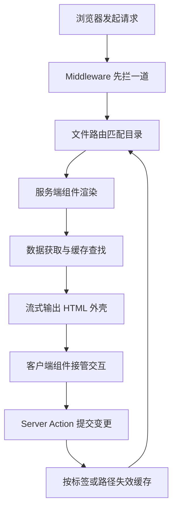
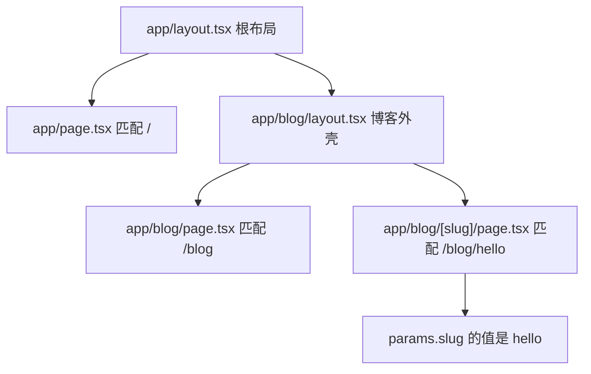
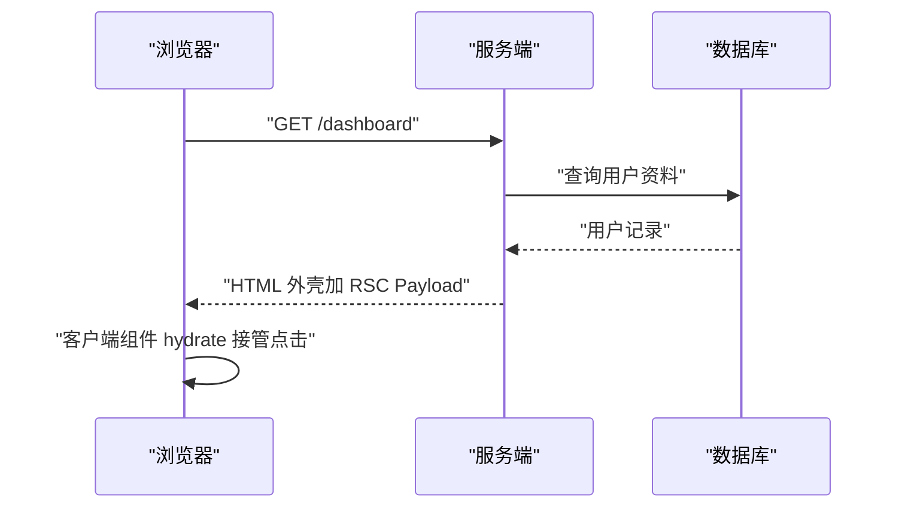
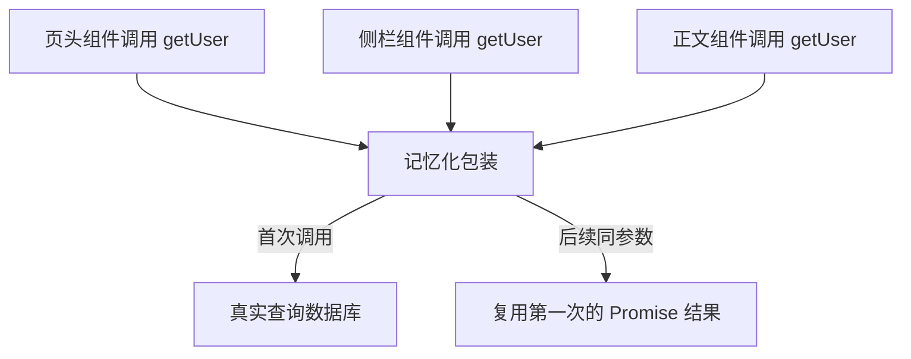
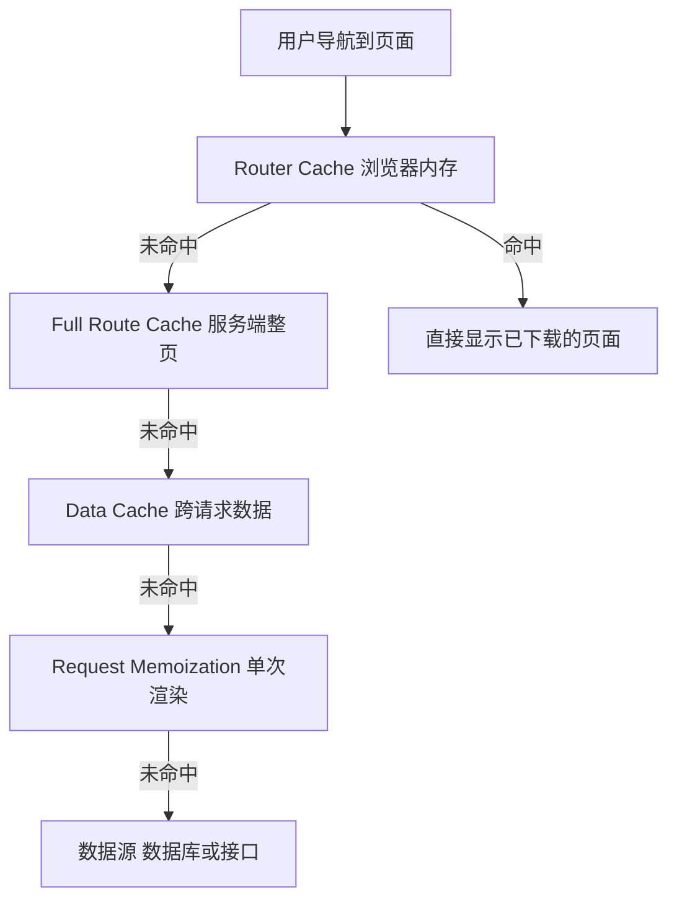
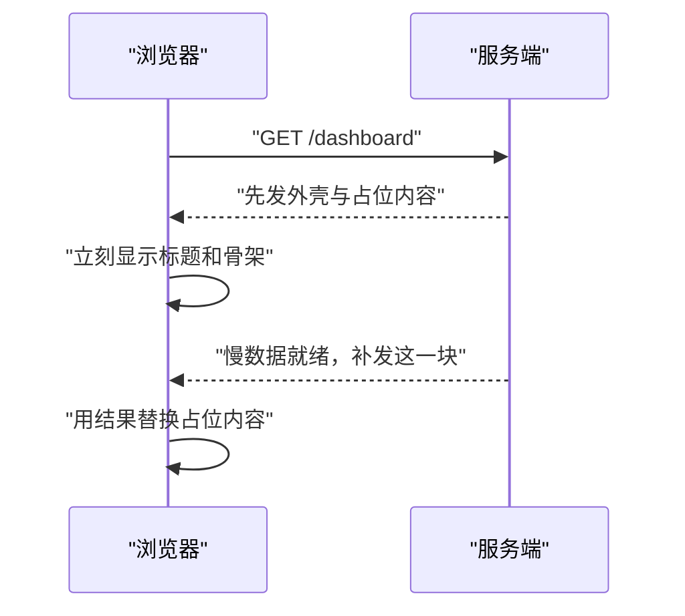
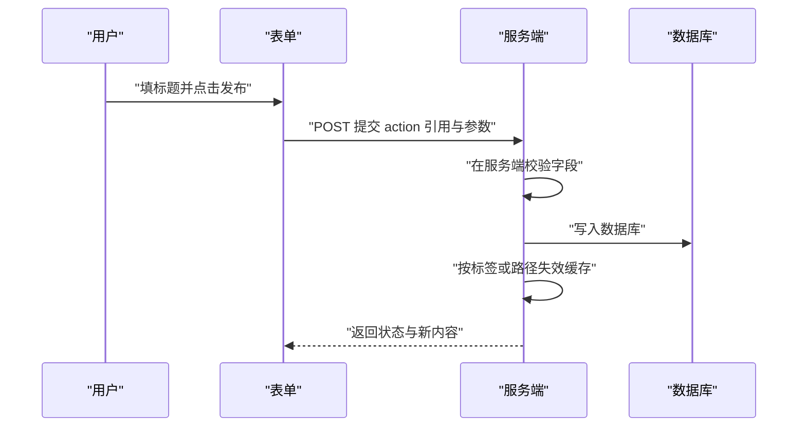
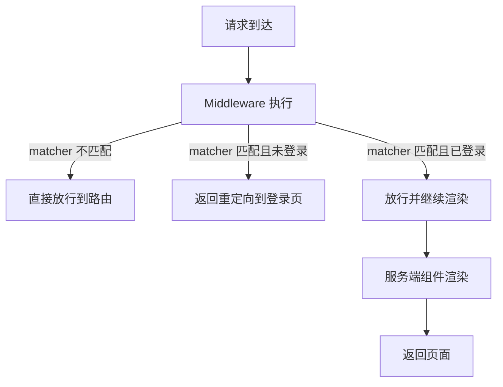

# Next.js App Router：服务端组件、缓存与路由

!!! abstract "学完这一页你能"

    - 拿到一条 URL，说出它在 `app/` 目录里对应哪个文件，以及 `params` 里会有什么。
    - 判断一个组件该留在服务端还是标上 `'use client'`，并写出这条边界。
    - 画出一次请求经过四层缓存时的命中顺序，说清每层为什么存在。
    - 写一个 Server Action 表单，并说明它和传统接口提交的差别。

## 0. 知识地图



建议按图的顺序读：先看请求怎么进站，再看组件在哪一端跑，最后看数据怎么取、怎么存、怎么失效。

第 1 到第 3 节是地基，第 4 到第 7 节都建立在这三节之上，所以别跳过。

每节末尾的「动手验证」脚本用纯 Node 复刻机制，不依赖 next 包，你可以直接跑。

!!! note "术语：App Router"
    定义：Next.js 从 13 版起提供的路由系统，以 `app/` 目录为入口，默认使用 React 服务端组件。
    例子：`app/blog/[slug]/page.tsx` 这一条路径就同时表达了 URL 规则和页面 UI。

## 1. 文件路由：目录结构就是 URL 表

**先想一个问题**

你新加入一个团队，产品经理说 `/blog/hello` 打不开。
你打开仓库，第一件事是问：这条 URL 对应哪个文件？

**心智模型**

!!! tip "心智模型"
    一句话模型：`app/` 里每一层文件夹，是一次 URL 路径的分段；只有 `page.tsx` 才是那一段对外的出口。
    日常类比：把 `app/` 想成一栋楼的编号走廊，文件夹是走廊，`page.tsx` 是走廊尽头那扇能推开的门。
    不成立的地方：走廊可以没有门，也就是文件夹只放 `layout.tsx` 时，这条路径不产出页面，只提供外壳。

!!! note "术语：Route Segment（路由段）"
    定义：URL 中被 `/` 分开的一段，与 `app/` 下的一层文件夹对应。
    例子：`/blog/hello` 有两段，分别是 `blog` 和 `hello`。

**图解**



1. `app/layout.tsx` 是最外层布局，所有页面都被它包住一次。
2. `app/page.tsx` 与根目录对应，所以它匹配 `/`。
3. `app/blog/` 这层文件夹给路径加上 `blog` 这一段。
4. `[slug]` 用方括号写成变量，`/blog/hello` 里的 `hello` 会进入 `params`。
5. `layout.tsx` 在子路由之间切换时不重新挂载，导航栏因此能保持状态。

**一步一步来**

第一步：先写出一个最小可访问的静态页面。

```tsx
// app/page.tsx
export default function HomePage() {
  return <h1>首页</h1>; // 默认导出就是这个路由的 UI
}

// app/about/page.tsx
export default function AboutPage() {
  return <h1>关于</h1>; // 多一层文件夹，URL 就多一段
}
```

**这段代码在做什么**

- 文件名必须叫 `page.tsx`，换成别的名字不会生成路由。
- 路由表只认默认导出，具名导出不会被当成页面。
- 这两个组件都没有写 `'use client'`，默认在服务端渲染。
- 返回的 JSX 会被渲染成 HTML，再发给浏览器。

运行结果：访问 `/` 得到 `首页`，访问 `/about` 得到 `关于`。

第二步：加一个动态段，让同一条规则吃下所有文章。

```tsx
// app/blog/[slug]/page.tsx
type Props = { params: Promise<{ slug: string }> }; // Next.js 15 起 params 是 Promise

export default async function BlogPost({ params }: Props) {
  const { slug } = await params; // 必须先 await，否则拿到的是 Promise 对象
  return <h1>文章：{slug}</h1>;
}
```

**这段代码在做什么**

- 方括号表示这一段是变量，文件夹名就是变量名。
- 变量值来自真实 URL，`/blog/hello` 传进来就是 `hello`。
- 组件声明为 `async`，可以在里面直接 `await` 数据。
- 在 Next.js 15 中 `params` 是 Promise，需要先 `await` 再读字段。
- 需核对官方文档：核对所用版本里 `params` 与 `searchParams` 是否已经是 Promise。

运行结果：访问 `/blog/hello` 返回 `文章：hello`。

**动手验证**

下面的脚本用纯 Node 复刻「文件夹变成正则」这一步，并断言匹配结果。

```js
// router-demo.mjs   运行：node router-demo.mjs
import assert from 'node:assert/strict';

const files = [ // 只列 page 文件，路径已去掉 app/ 前缀
  'page.tsx',
  'blog/page.tsx',
  'blog/[slug]/page.tsx',
  'shop/[...rest]/page.tsx',
];

function toPattern(file) {
  const segs = file === 'page.tsx' ? [] : file.replace(/\/page\.tsx$/, '').split('/');
  const names = []; // 收集动态段名字
  const parts = segs.map((s) => {
    if (/^\[\.\.\..+\]$/.test(s)) { names.push(s.slice(4, -1)); return '(.*)'; } // 吃掉剩余所有段
    if (/^\[.+\]$/.test(s)) { names.push(s.slice(1, -1)); return '([^/]+)'; }    // 只吃一段
    return s.replace(/[.*+?^${}()|[\]\\]/g, '\\$&');                            // 静态段转义
  });
  const body = parts.length ? '/' + parts.join('/') : '';
  return { re: new RegExp('^' + body + '/?$'), names };
}

const routes = files.map((f) => ({ file: f, ...toPattern(f) }));

function match(url) {
  for (const r of routes) {
    const m = url.match(r.re);
    if (!m) continue;
    const params = Object.fromEntries(r.names.map((n, i) => [n, m[i + 1]]));
    return { file: r.file, params };
  }
  return null;
}

assert.deepEqual(match('/'), { file: 'page.tsx', params: {} });
assert.deepEqual(match('/blog'), { file: 'blog/page.tsx', params: {} });
assert.deepEqual(match('/blog/hello'), { file: 'blog/[slug]/page.tsx', params: { slug: 'hello' } });
assert.deepEqual(match('/shop/a/b'), { file: 'shop/[...rest]/page.tsx', params: { rest: 'a/b' } });
assert.equal(match('/nope'), null);

console.log(match('/blog/hello'));
console.log(match('/shop/a/b'));
console.log('全部断言通过');
```

预期输出：

```text
{ file: 'blog/[slug]/page.tsx', params: { slug: 'hello' } }
{ file: 'shop/[...rest]/page.tsx', params: { rest: 'a/b' } }
全部断言通过
```

**常见坑**

| 现象 | 原因 | 怎么修 |
| --- | --- | --- |
| 新建 `app/about/page.tsx` 后访问 404 | 文件不在 `app/` 下，或名字写成了 `About.tsx` | 确认完整路径是 `app/about/page.tsx`，再重启 `next dev` |
| 页面里读 `params.slug` 打印出 `undefined` | 把 `params` 当成普通对象同步读 | 改成 `const { slug } = await params` |
| 想给所有页面加导航栏，却在每个页面写一遍 | 没用 `layout.tsx` | 在 `app/layout.tsx` 写导航，子路由自动继承 |
| `loading.tsx` 放了却没生效 | 它只对同一层的 `page.tsx` 生效 | 把 `loading.tsx` 放到与目标 `page.tsx` 同一个文件夹 |

**小结**

- `app/` 下文件夹的层数决定 URL 的段数，`page.tsx` 决定哪一层可见。
- `[slug]` 吃单段，`[...slug]` 吃剩余全部段，两者都会出现在 `params` 里。
- `layout.tsx` 负责共享外壳，子路由切换时它不重新挂载。

## 2. 服务端组件与客户端组件

**先想一个问题**

页面要显示一份用户资料，还要一个切换主题的按钮。
这两块分别该在服务端跑还是客户端跑？

**心智模型**

!!! tip "心智模型"
    一句话模型：默认一切都在服务端跑，只有在文件顶部写 `'use client'`，这个文件才被打包到浏览器。
    日常类比：服务端组件像厨房，客户端组件像餐桌上的调味瓶，菜在厨房做好端出来，调味瓶留在桌上随手用。
    不成立的地方：调味瓶不能回厨房拿原料，也就是客户端组件不能 import 服务端组件，只能靠 props 接数据。

!!! note "术语：Server Component（服务端组件）与 Client Component（客户端组件）"
    定义：服务端组件只在服务器上执行并渲染，客户端组件会被打包成 JS 送到浏览器执行。
    例子：读数据库的列表是服务端组件，带 `onClick` 的按钮是客户端组件。

!!! note "术语：RSC Payload"
    定义：服务端组件渲染后生成的一种描述数据，告诉客户端每个位置该放什么内容。
    例子：一段服务端渲染结果加上客户端组件的引用标识，就是一条 RSC Payload。

**图解**



1. 浏览器发出 `GET /dashboard`，此时还没有任何业务 JS 需要下载。
2. 服务端组件在服务器上执行，直连数据库拿到用户记录。
3. 数据库返回记录，密钥与连接串全程留在服务端。
4. 服务端把 HTML 外壳和 RSC Payload 一起发回浏览器。
5. 浏览器下载客户端组件的 JS，绑定点击事件，这一步叫 hydrate。
6. 之后用户点按钮，交互由客户端组件自己处理，不用回服务端。

**一步一步来**

第一步：写一个直接在服务端取数的页面。

```tsx
// app/dashboard/page.tsx
async function getUser() {
  return { name: '阿岚' }; // 真实项目里换成数据库查询或接口调用
}

export default async function Dashboard() {
  const user = await getUser(); // 取值发生在服务端，密钥不进入浏览器
  return <p>当前用户：{user.name}</p>;
}
```

**这段代码在做什么**

- 文件顶部没有 `'use client'`，所以它是服务端组件。
- 组件是 `async` 的，可以直接 `await` 取数，不用写 `useEffect`。
- 数据库连接串这类敏感信息只出现在服务端代码里。
- 渲染结果只有 HTML，浏览器拿不到这段取数逻辑。

运行结果：页面显示 `当前用户：阿岚`，响应里没有这段 JS。

第二步：拆出一个客户端组件，专门管交互。

```tsx
// app/dashboard/theme-toggle.tsx
'use client'; // 这一行是模块边界，本文件会打包到浏览器

import { useState } from 'react';

export default function ThemeToggle() {
  const [dark, setDark] = useState(false); // 状态要靠浏览器内存保存
  return (
    <button onClick={() => setDark(!dark)}>
      {dark ? '切换到亮色' : '切换到暗色'}
    </button>
  );
}
```

**这段代码在做什么**

- `'use client'` 必须写在文件最前面，前面只能有空行或注释。
- `useState`、`onClick` 这类浏览器端能力只能出现在客户端组件里。
- 客户端组件不能再写成 `async` 组件。
- 服务端组件可以 import 客户端组件，反过来不行。
- 从服务端传进客户端组件的 props 必须可序列化。

运行结果：点击按钮后文案在两种状态之间切换，页面不刷新。

**动手验证**

下面用一张模块图模拟打包边界，断言跨边界的非法导入会报错。

```js
// boundary-demo.mjs   运行：node boundary-demo.mjs
import assert from 'node:assert/strict';

const modules = { // 每个模块声明自己的类型与被它导入的模块
  'page.server': { kind: 'server', imports: ['toggle.client'] },
  'toggle.client': { kind: 'client', imports: ['chart.client'] },
  'chart.client': { kind: 'client', imports: [] },
  'db.server': { kind: 'server', imports: [] },
  'bad.client': { kind: 'client', imports: ['db.server'] }, // 故意违规
};

function walk(start) {
  const seen = new Set();
  const stack = [start];
  while (stack.length) {
    const id = stack.pop();
    const mod = modules[id];
    for (const dep of mod.imports) {
      if (mod.kind === 'client' && modules[dep].kind === 'server') {
        throw new Error('客户端模块 ' + id + ' 不能导入服务端模块 ' + dep);
      }
      if (!seen.has(dep)) { seen.add(dep); stack.push(dep); }
    }
  }
  return [...seen].sort();
}

assert.deepEqual(walk('page.server'), ['chart.client', 'toggle.client']);
assert.throws(() => walk('bad.client'), /不能导入服务端模块 db.server/);

console.log('前端要下载的模块：', walk('page.server').join('、'));
console.log('全部断言通过');
```

预期输出：

```text
前端要下载的模块： chart.client、toggle.client
全部断言通过
```

**常见坑**

| 现象 | 原因 | 怎么修 |
| --- | --- | --- |
| `'use client'` 写了却仍报服务端错误 | 指令写在 import 之后，被当成普通字符串 | 把它移到文件第一行 |
| 打包报错说模块不能在客户端运行 | 客户端组件 import 了带密钥的服务端模块 | 把取数留在服务端，只用 props 传结果 |
| 服务端组件里用 `useState` 直接报错 | 服务端组件没有浏览器状态 | 把带状态的片段拆成独立的客户端组件 |
| 给客户端组件传函数后报序列化错误 | 函数不能跨边界传递 | 传纯数据，需要写操作就改成 Server Action |

**小结**

- 默认是服务端组件，`'use client'` 只在需要交互或浏览器 API 时加。
- 边界是模块级而不是组件级：一个文件标了，它导入的模块也进浏览器包。
- 数据往下流，事件往上走：服务端给 props，客户端通过 Action 触发写操作。

## 3. 数据获取：把请求放在需要它的地方

**先想一个问题**

一次请求里，页头、侧栏、正文三处都要读同一个用户信息。
这会查三次数据库吗？

**心智模型**

!!! tip "心智模型"
    一句话模型：同一次渲染请求内，相同参数的取数函数只真正执行一次，后面的调用复用第一次的结果。
    日常类比：一次采购清单里重复出现的菜只买一份，回家再按需要分给几道菜。
    不成立的地方：记忆化只在这一次请求内有效，请求一结束就丢弃，所以不能当成跨用户缓存。

!!! note "术语：Request Memoization（请求级记忆化）"
    定义：在一次渲染请求内，缓存相同输入的函数调用结果，避免重复取数。
    例子：三个组件都调用 `getUser(7)`，数据库只被查一次。

**图解**



1. 三个组件在同一次请求里都要用户数据。
2. 它们调用的都是同一个被包装过的函数。
3. 第一次调用时，包装函数发起真实查询，并把返回的 Promise 存下来。
4. 第二次、第三次调用直接拿回同一个 Promise，不产生新查询。
5. 请求结束后这份记录被丢弃，下一次请求重新开始。

**一步一步来**

第一步：用 `cache` 包一层，并让互不依赖的取数并行。

```tsx
// app/post/[id]/page.tsx
import { cache } from 'react';

const getPost = cache(async (id: string) => {
  return { id, title: '文章 ' + id }; // 真实项目里换成数据库查询
});

const getAuthor = cache(async (id: string) => {
  return { id, name: '作者 ' + id };
});

export default async function Post({ params }: { params: Promise<{ id: string }> }) {
  const { id } = await params;
  const [post, author] = await Promise.all([getPost(id), getAuthor(id)]); // 两个请求并行
  return <h1>{post.title} 与 {author.name}</h1>;
}
```

**这段代码在做什么**

- `cache()` 把普通函数变成「同请求同参数只执行一次」的函数。
- `Promise.all` 让两个取数同时开始，总耗时接近两者中较慢的那个。
- 如果写成两个连续的 `await`，总耗时变成两者相加。
- 记忆化范围只限当前这次渲染请求。
- 需核对官方文档：核对 `cache` 的导出位置在所用版本中是否变化。

运行结果：访问 `/post/7` 显示 `文章 7 与 作者 7`。

第二步：让并行的收益可以被量化。

```tsx
// app/slow/page.tsx
const delay = (ms: number) => new Promise((r) => setTimeout(r, ms));

export default async function SlowPage() {
  const start = Date.now();

  // 串行写法：两次各 80 毫秒，总耗时约 160 毫秒
  await delay(80);
  await delay(80);
  const serial = Date.now() - start;

  // 并行写法：两个 80 毫秒同时开始，总耗时约 80 毫秒
  const parallelStart = Date.now();
  await Promise.all([delay(80), delay(80)]);
  const parallel = Date.now() - parallelStart;

  return <p>串行 {serial} 毫秒，并行 {parallel} 毫秒</p>;
}
```

**这段代码在做什么**

- 串行两段 80 毫秒，总耗时接近 160 毫秒。
- 并行两段 80 毫秒同时起跑，总耗时接近 80 毫秒。
- 页面输出真实数字，便于你在浏览器里直接对比。
- 这个组件是服务端组件，计时逻辑不进入浏览器。
- 实际项目里换成两个互不依赖的取数调用即可。

运行结果：页面显示 `串行 160 毫秒，并行 81 毫秒`，具体数值随机器浮动。

**动手验证**

下面的脚本复刻请求级记忆化，断言同参数只查一次库。

```js
// memo-demo.mjs   运行：node memo-demo.mjs
import assert from 'node:assert/strict';

let queries = 0;
const query = (id) => new Promise((r) => setTimeout(() => { queries++; r('data-' + id); }, 30));

function memo(fn) {
  const store = new Map(); // 请求级缓存，请求结束就丢弃
  return (arg) => {
    if (!store.has(arg)) store.set(arg, fn(arg)); // 首次调用才真正查询
    return store.get(arg);                        // 后续同参数直接复用 Promise
  };
}

const getData = memo(query);

const t0 = Date.now();
const [a, b] = await Promise.all([getData(1), getData(1)]); // 同参数并发两次
assert.equal(a, 'data-1');
assert.equal(b, 'data-1');
assert.equal(queries, 1);            // 只查了一次库
assert.ok(Date.now() - t0 < 50);     // 并发，不是两个 30 毫秒相加

await getData(2);
const before = queries;
await getData(2);
assert.equal(queries, before);       // 同参数第二次被缓存，没有新增查询
assert.equal(queries, 2);

console.log('总查询次数：', queries);
console.log('并发耗时：', Date.now() - t0, '毫秒');
console.log('全部断言通过');
```

预期输出（耗时数值会浮动）：

```text
总查询次数： 2
并发耗时： 31 毫秒
全部断言通过
```

**常见坑**

| 现象 | 原因 | 怎么修 |
| --- | --- | --- |
| 页面加载要两三秒 | 多个 `await` 顺序写成了瀑布 | 互不依赖的取数改成 `Promise.all` 并行 |
| 取数失败导致整页白屏 | 没有同层的错误边界 | 在与 `page.tsx` 同层加 `error.tsx` |
| 记忆化完全没生效 | `cache()` 写在组件内部，每次渲染都新建一份 | 在模块顶层创建一次并导出 |
| 环境变量出现在浏览器源码里 | 在客户端组件里读取了服务端变量 | 只在服务端读，只把计算结果往下传 |

**小结**

- 取值尽量靠近使用它的组件，服务端组件的 `async/await` 就是取数入口。
- 同请求同参数的重复调用会被记忆化吃掉，跨请求不会。
- 并行与串行的差别是相加与取较大值，改一行 `Promise.all` 就能省一半时间。

## 4. 缓存层次：四道闸门依次放行

**先想一个问题**

同一个新闻页被一千个人访问，代码要跑一千次吗？
如果每次都重算，钱花在谁身上？

**心智模型**

!!! tip "心智模型"
    一句话模型：缓存分四层，越靠近用户的那层命中，后面所有工作都省掉。
    日常类比：四道闸门，有人已经在最外层闸门里了，就不必再往里走。
    不成立的地方：闸门会过期，过期那一刻请求会一直走到最里面，重新算一遍再逐层回填。

!!! note "术语：Data Cache 与 Full Route Cache"
    定义：Data Cache 缓存一次数据请求的结果，Full Route Cache 缓存整条路由渲染出的 HTML 与 RSC Payload。
    例子：新闻接口结果存 60 秒是 Data Cache，整个 `/news` 页面 HTML 存 60 秒是 Full Route Cache。

**图解**



1. 用户点导航，浏览器先看自己的 Router Cache，命中就不再发请求。
2. 没命中才到服务端，先看 Full Route Cache 里有没有现成的整页结果。
3. 整页也没有时，开始渲染，渲染中每个取数先查 Data Cache。
4. 同一轮渲染里的重复调用被 Request Memoization 合并成一次。
5. 全都落空才真正打到数据库或外部接口。
6. 结果会逐层回填，下一批用户就更可能命中靠前的闸门。

**一步一步来**

第一步：给一个路由段和数据请求分别设置有效期。

```tsx
// app/news/page.tsx
export const revalidate = 60; // 这个路由段最多每 60 秒重新生成一次

async function getNews() {
  const res = await fetch('https://api.example.com/news', {
    next: { revalidate: 60, tags: ['news'] }, // 数据缓存 60 秒，并登记 news 这个名字
  });
  return res.json() as Promise<{ id: number; title: string }[]>;
}

export default async function NewsPage() {
  const news = await getNews();
  return <ul>{news.map((n) => <li key={n.id}>{n.title}</li>)}</ul>;
}
```

**这段代码在做什么**

- `revalidate = 60` 是路由段配置，控制整页缓存的重新生成周期。
- `next.tags` 给这次请求登记一个名字，方便之后按名字清缓存。
- 命中缓存时页面不执行取数，直接返回上次生成的结果。
- 缓存默认是否开启随版本变化，需核对官方文档：核对所用版本的 `fetch` 默认 `cache` 取值。

运行结果：60 秒内连续刷新，页面内容与时间戳保持不变。

第二步：数据写完后，只让受影响的部分失效。

```tsx
// app/actions/publish.ts
'use server';

import { revalidateTag, revalidatePath } from 'next/cache';

async function saveToDb(title: string) {
  console.log('写入', title); // 真实项目里换成数据库写入
}

export async function publishNews(formData: FormData) {
  await saveToDb(String(formData.get('title')));
  revalidateTag('news');      // 只失效带 news 标签的数据请求
  revalidatePath('/news');    // 让 /news 这条路由重新生成
}
```

**这段代码在做什么**

- `revalidateTag('news')` 清掉 Data Cache 里打了这个名字的条目。
- `revalidatePath('/news')` 清掉这条路径的 Full Route Cache。
- 两者作用范围不同，写数据后通常一起调用。
- 调用后下一次访问会重新取数并重新渲染。
- 精确失效只重算受影响的部分，比整站清空少做很多无用功。

**动手验证**

下面的脚本用三层 Map 复刻闸门顺序，逐层删缓存观察命中位置。

```js
// cache-demo.mjs   运行：node cache-demo.mjs
import assert from 'node:assert/strict';

const LAYERS = ['路由缓存', '整页缓存', '数据缓存']; // 从最靠近用户的一层开始
const store = new Map(LAYERS.map((l) => [l, new Map()]));
const hits = Object.fromEntries(LAYERS.map((l) => [l, 0]));
hits['数据源'] = 0;

function request(key) {
  for (const layer of LAYERS) {
    if (store.get(layer).has(key)) { hits[layer]++; return layer; }
  }
  hits['数据源']++;
  for (const layer of LAYERS) store.get(layer).set(key, true); // 回填全部层
  return '数据源';
}

assert.equal(request('/news'), '数据源');
assert.equal(hits['数据源'], 1);
assert.equal(request('/news'), '路由缓存');        // 第二次被最外层挡住
store.get('路由缓存').delete('/news');             // 模拟路由缓存过期
assert.equal(request('/news'), '整页缓存');
store.get('整页缓存').delete('/news');             // 模拟整页重新生成
assert.equal(request('/news'), '数据缓存');
store.get('数据缓存').delete('/news');             // 模拟数据缓存失效
assert.equal(request('/news'), '数据源');
assert.equal(hits['数据源'], 2);

console.log('各层命中次数：', hits);
console.log('全部断言通过');
```

预期输出：

```text
各层命中次数： { 路由缓存: 1, 整页缓存: 1, 数据缓存: 1, 数据源: 2 }
全部断言通过
```

**常见坑**

| 现象 | 原因 | 怎么修 |
| --- | --- | --- |
| 后台改了数据，页面还是旧的 | 写完没告诉框架要失效 | 在 Server Action 里调用 `revalidateTag` 或 `revalidatePath` |
| 页面本该静态却每次都重新算 | 组件里读了 `cookies()` 或请求头，路由变成动态 | 把动态读取下移到最小的子组件 |
| 缓存规则在升级后突然变了 | 默认缓存行为随版本调整 | 需核对官方文档：核对升级指南里 `fetch` 默认值与缓存指令的改动 |

**小结**

- 四层缓存按由外到内的顺序查找，命中越早省下的工作越多。
- 缓存不是全开或全关，每一层有各自的开关与失效手段。
- 写数据后要显式失效，标签失效比路径失效更精确。

## 5. 流式渲染：先给外壳，再补内容

**先想一个问题**

首页顶部是一行标题，下面是需要两秒的榜单查询。
用户要盯着白屏两秒吗？

**心智模型**

!!! tip "心智模型"
    一句话模型：把慢的部分包进一个边界，外壳先发出去，慢的部分好了再补发。
    日常类比：餐厅先上凉菜和餐具，热菜出锅再端上来，不等所有菜齐了才一起上桌。
    不成立的地方：补发的前提是浏览器支持流式解析，分块顺序不能出错。

!!! note "术语：Streaming（流式渲染）"
    定义：服务端把 HTML 分成多个块陆续发给浏览器，而不是等整页渲染完再一次性发出。
    例子：`loading.tsx` 先发占位内容，慢组件完成后再发那一块 HTML。

**图解**



1. 浏览器发出请求，服务端先渲染不需要等待的部分。
2. 外壳和占位内容立刻发出去，用户马上看到页面结构。
3. 慢组件还在取数，这段时间浏览器不空着，骨架屏已经可见。
4. 慢组件完成时，服务端把这一块的结果作为新的 HTML 片段补发。
5. 浏览器把占位内容替换成真实内容，整个过程页面没有整页刷新。

**一步一步来**

第一步：用 `loading.tsx` 给整段路由加占位。

```tsx
// app/dashboard/loading.tsx
export default function Loading() {
  return <p>加载中…</p>; // 与同层 page.tsx 配对，取数期间显示
}

// app/dashboard/page.tsx
async function getStats() {
  await new Promise((r) => setTimeout(r, 2000)); // 模拟慢查询
  return { visits: 42 };
}

export default async function Dashboard() {
  const stats = await getStats();
  return <p>今日访问：{stats.visits}</p>;
}
```

**这段代码在做什么**

- `loading.tsx` 自动把同层的 `page.tsx` 包进一个 Suspense 边界。
- 取数期间用户看到 `加载中…`，而不是空白页。
- 取数完成后，服务端把这一段结果补发给浏览器。
- 不需要写 `isLoading` 状态，也不需要客户端 `useEffect`。

运行结果：进入页面先看到 `加载中…`，约两秒后变成 `今日访问：42`。

第二步：把边界收紧，只包住慢的那一块。

```tsx
// app/dashboard/page.tsx
import { Suspense } from 'react';

async function Ranking() {
  await new Promise((r) => setTimeout(r, 1500)); // 只让这一块慢
  return <ol><li>榜单数据</li></ol>;
}

export default function Dashboard() {
  return (
    <>
      <h1>仪表盘</h1>
      <Suspense fallback={<p>榜单加载中…</p>}> {/* 只包住慢子树 */}
        <Ranking />
      </Suspense>
    </>
  );
}
```

**这段代码在做什么**

- `Suspense` 的 `fallback` 只覆盖它包住的子树，标题不受影响。
- 标题和外壳一起立刻发出，用户先看到有意义的文字。
- 慢组件完成时只替换它那一段，页面其他部分不动。
- 边界切得越细，首屏可见内容出现得越早。
- 需核对官方文档：核对开启部分预渲染后 `Suspense` 与 `loading.tsx` 的行为差异。

运行结果：标题几乎立刻出现，约 1.5 秒后榜单替换掉 `榜单加载中…`。

**动手验证**

下面的脚本用异步生成器模拟分块发送，断言第一块远早于最后一块。

```js
// stream-demo.mjs   运行：node stream-demo.mjs
import assert from 'node:assert/strict';
import { setTimeout as sleep } from 'node:timers/promises';

async function* renderPage() {
  yield '外壳：标题';      // 立刻产出，不等待慢数据
  await sleep(80);         // 模拟慢查询
  yield '补发：榜单';      // 慢数据就绪后产出
}

const t0 = Date.now();
const chunks = [];
const times = [];

for await (const chunk of renderPage()) {
  chunks.push(chunk);
  times.push(Date.now() - t0);
}

assert.equal(chunks.length, 2);
assert.equal(chunks[0], '外壳：标题');
assert.equal(chunks[1], '补发：榜单');
assert.ok(times[0] < 30);        // 第一块几乎立刻到达
assert.ok(times[1] >= 70);       // 第二块等慢数据就绪
assert.ok(times[0] < times[1]);  // 先到的一定是外壳

console.log('第一块到达：', times[0], '毫秒');
console.log('第二块到达：', times[1], '毫秒');
console.log('全部断言通过');
```

预期输出：

```text
第一块到达： 0 毫秒
第二块到达： 81 毫秒
全部断言通过
```

**常见坑**

| 现象 | 原因 | 怎么修 |
| --- | --- | --- |
| 加了 `loading.tsx` 但还是全白 | 慢逻辑写在边界外面，整页一起等 | 把慢取的 `await` 移进被 `Suspense` 包住的子组件 |
| 骨架屏一闪而过 | 占位内容高度与真实内容差太多 | 调整 `fallback` 高度，让它贴近真实内容 |
| 自己在客户端组件里写 loading 状态 | 首屏发出的 HTML 里没有内容 | 优先用服务端 `Suspense`，客户端只处理交互 |

**小结**

- 流式的核心是把慢的部分切出去，外壳先到，内容后补。
- `loading.tsx` 是整段粒度的开关，`Suspense` 是任意粒度的开关。
- 边界位置决定首屏可见内容出现的时刻，切得越细通常越早。

## 6. Server Actions：表单提交不必单开接口

**先想一个问题**

一个发布表单要写数据库。
你不想为一个字段单开一个 `POST /api/posts` 文件，还能怎么办？

**心智模型**

!!! tip "心智模型"
    一句话模型：写一个标了 `'use server'` 的异步函数，把它直接交给表单当提交地址。
    日常类比：把服务台窗口直接开在表单旁边，用户填完就往窗口递，不必先找到另一个部门。
    不成立的地方：函数本身不会进浏览器，浏览器拿到的只是一个引用标识，调用要走一次 POST。

!!! note "术语：Server Action"
    定义：用 `'use server'` 标记的服务端异步函数，浏览器可以像本地函数一样调用它。
    例子：`createPost(formData)` 既能在表单里当 `action`，也能在事件处理里被调用。

**图解**



1. 用户填完标题点击发布，浏览器不刷新页面。
2. 表单把 action 的引用标识和序列化后的参数发到服务端。
3. 服务端在真正执行前先做字段校验，非法输入直接返回错误。
4. 校验通过后写数据库。
5. 写完之后失效相关缓存，保证下一次访问拿到新内容。
6. 返回的状态被客户端接收，用来显示错误或清空表单。

**一步一步来**

第一步：定义 action，并在里面做服务端校验。

```tsx
// app/actions/create-post.ts
'use server'; // 文件顶部声明：导出的函数都在服务端执行

import { revalidatePath } from 'next/cache';

async function savePost(title: string) {
  console.log('保存', title); // 真实项目里换成数据库写入
}

export async function createPost(formData: FormData) {
  const title = String(formData.get('title') ?? '').trim(); // 表单字段进来是字符串
  if (title.length === 0) return { error: '标题不能为空' };   // 返回给客户端的状态
  await savePost(title);
  revalidatePath('/posts');                                 // 让列表页重新生成
  return { error: null };
}
```

**这段代码在做什么**

- `'use server'` 让这个文件只保留服务端实现，浏览器只拿到引用标识。
- 参数必须可序列化，`FormData` 是表单场景的常用入口。
- 校验必须放在这里，因为客户端的校验可以被绕过。
- `revalidatePath` 保证列表页下一次访问拿到新数据。
- 需核对官方文档：核对 action 引用标识在请求中的传递方式与安全说明。

运行结果：提交空标题返回 `{ error: '标题不能为空' }`，不会写库。

第二步：把 action 接到表单上，并读取进行中状态。

```tsx
// app/posts/new-post-form.tsx
'use client';
import { useActionState } from 'react';
import { createPost } from '../actions/create-post';

export default function NewPostForm() {
  const [state, formAction, pending] = useActionState(createPost, { error: null });
  return (
    <form action={formAction}> {/* 直接把包装后的 action 交给表单 */}
      <input name="title" />   {/* name 决定 FormData 中的键名 */}
      <button disabled={pending}>发布</button>
      {state.error ? <p role="alert">{state.error}</p> : null}
    </form>
  );
}
```

**这段代码在做什么**

- `useActionState` 返回当前状态、包装后的 action、进行中标记三件东西。
- `<form action={formAction}>` 让表单在 JS 未加载完时也能提交。
- `pending` 直接驱动按钮禁用，不用自己维护 `isSubmitting`。
- 返回的 `state.error` 用于展示服务端校验结果。
- 需核对官方文档：核对 `useActionState` 在所用 React 版本中的导出位置与更名情况。

运行结果：输入内容点发布，按钮短暂禁用，提交成功后错误行为空。

**动手验证**

下面的脚本模拟 action 的注册与调用，断言非法参数到不了服务端。

```js
// action-demo.mjs   运行：node action-demo.mjs
import assert from 'node:assert/strict';

function createActionServer() {
  const registry = new Map(); // 服务端保存真实函数，只把 id 交给客户端
  return {
    register(fn) { const id = 'action-' + registry.size; registry.set(id, fn); return id; },
    invoke(id, argsJson) { return registry.get(id)(...JSON.parse(argsJson)); },
  };
}

const stored = [];
const server = createActionServer();
const actionId = server.register(async (title) => {
  if (!title) return { error: '标题不能为空' };  // 服务端校验
  stored.push(title);                            // 写库
  return { error: null, count: stored.length };
});

const client = {
  call(id, args) {
    if (args.some((a) => typeof a === 'function')) throw new TypeError('函数不能跨边界传递');
    return server.invoke(id, JSON.stringify(args));
  },
};

assert.deepEqual(await client.call(actionId, ['第一篇']), { error: null, count: 1 });
assert.deepEqual(await client.call(actionId, ['']), { error: '标题不能为空' });
assert.deepEqual(stored, ['第一篇']);                                  // 脏数据没入库
assert.throws(() => client.call(actionId, [() => {}]), /函数不能跨边界传递/);

console.log('入库内容：', stored);
console.log('全部断言通过');
```

预期输出：

```text
入库内容： [ '第一篇' ]
全部断言通过
```

**常见坑**

| 现象 | 原因 | 怎么修 |
| --- | --- | --- |
| 打包时报数据库模块不可用 | 客户端组件直接 import 了服务端数据模块 | 只 import 标了 `'use server'` 的 action |
| 提交后页面数据没变化 | 忘了失效缓存 | 在 action 内调用 `revalidatePath` 或 `revalidateTag` |
| 报参数序列化失败 | 传了函数、类实例或 `Date` 之外的复杂对象 | 只传纯数据，把逻辑留在服务端 |
| 只有客户端校验，脏数据仍入库 | 校验写在 `onClick` 里 | 在 action 内再校验一次，以服务端为准 |

**小结**

- Server Action 把写操作放在离数据最近的地方，省掉一层接口文件。
- 校验必须在服务端做，客户端校验只是体验优化。
- 写完之后立刻失效缓存，才能让下一次读取看到新结果。

## 7. Middleware：在路由匹配之前拦一道

**先想一个问题**

未登录用户访问 `/dashboard`，你希望在他看到页面之前就送去登录页。

**心智模型**

!!! tip "心智模型"
    一句话模型：Middleware 在路由匹配和渲染之前执行，可以放行、改道或改写路径。
    日常类比：大门口的保安，检查完证件才决定让不让人进楼。
    不成立的地方：保安只看证件表面，真正的权限校验还得进楼后由业务系统再做一次。

!!! note "术语：Middleware（中间件）"
    定义：在请求进入路由处理之前运行的一段函数，可以读取请求并返回放行、重定向或重写的响应。
    例子：检查 cookie 后把 `/dashboard` 请求改送到 `/login`。

**图解**



1. 请求先进入 Middleware，而不是先进入路由匹配。
2. 如果路径不在 `matcher` 里，函数根本不会执行，请求直接放行。
3. 在范围内的请求会读取 cookie 判断登录状态。
4. 未登录时返回重定向响应，浏览器换地址请求登录页。
5. 已登录时调用放行，请求继续走正常的渲染流程。

**一步一步来**

第一步：写出中间件和它的路径范围。

```tsx
// middleware.ts 放在项目根目录，与 app 同级
import { NextResponse } from 'next/server';
import type { NextRequest } from 'next/server';

export function middleware(request: NextRequest) {
  const token = request.cookies.get('session')?.value; // 读取浏览器带来的 cookie
  if (!token && request.nextUrl.pathname.startsWith('/dashboard')) {
    return NextResponse.redirect(new URL('/login', request.url)); // 改道登录页
  }
  return NextResponse.next(); // 放行，继续走路由匹配
}

export const config = {
  matcher: ['/dashboard/:path*'], // 只对匹配的路径执行，减少无用开销
};
```

**这段代码在做什么**

- 函数在路由匹配与页面渲染之前执行。
- `NextResponse.next()` 表示放行，`NextResponse.redirect` 返回重定向响应。
- `matcher` 限定执行范围，未匹配的静态资源请求不会进入这个函数。
- cookie 值只能做粗判，用户身份还需要在数据层校验。
- 需核对官方文档：核对 Middleware 默认运行环境与可用模块的变化。

运行结果：未登录访问 `/dashboard` 得到重定向，浏览器地址变为 `/login`。

第二步：把权限校验下沉到真正读数据的地方。

```tsx
// app/dashboard/page.tsx
import { cookies } from 'next/headers';

async function loadUser(session: string | undefined) {
  if (!session) return null;                     // 兜底：cookie 可能被伪造
  return { name: '阿岚', role: 'admin' };         // 真实项目里换成服务端校验
}

export default async function Dashboard() {
  const session = (await cookies()).get('session')?.value; // 服务端读 cookie
  const user = await loadUser(session);
  if (!user) return <p>没有权限</p>;              // 渲染层再挡一次
  return <p>{user.name} 的仪表盘</p>;
}
```

**这段代码在做什么**

- Middleware 负责快，页面负责准，两层各做一次判断。
- 读取 cookie 会让这条路由走动态渲染，不再复用整页缓存。
- 用户身份从服务端取，不依赖浏览器传上来的字段。
- 渲染层兜底能挡住直接被访问的路径。
- 需核对官方文档：核对 `cookies()` 在所用版本中是同步还是异步返回。

运行结果：没有 cookie 时显示 `没有权限`，有 cookie 时显示用户名。

**动手验证**

下面的脚本复刻 `matcher` 匹配与放行、重定向两种结果。

```js
// middleware-demo.mjs   运行：node middleware-demo.mjs
import assert from 'node:assert/strict';

function matches(pattern, pathname) {
  const p = pattern.split('/').filter(Boolean);
  const u = pathname.split('/').filter(Boolean);
  for (let i = 0; i < p.length; i++) {
    if (p[i] === ':path*') return true;  // 通配，接受剩余所有段
    if (p[i] !== u[i]) return false;     // 静态段必须逐字相等
  }
  return p.length === u.length;          // 长度一致才算完全匹配
}

const config = { matcher: ['/dashboard/:path*'] };

function middleware(request) {
  const guarded = config.matcher.some((m) => matches(m, request.pathname));
  if (!guarded) return { type: 'next' };                       // 不在范围内，放行
  if (!request.cookies.session) return { type: 'redirect', to: '/login' };
  return { type: 'next' };
}

assert.deepEqual(middleware({ pathname: '/', cookies: {} }), { type: 'next' });
assert.deepEqual(middleware({ pathname: '/dashboard', cookies: {} }), { type: 'redirect', to: '/login' });
assert.deepEqual(middleware({ pathname: '/dashboard/settings', cookies: {} }), { type: 'redirect', to: '/login' });
assert.deepEqual(middleware({ pathname: '/dashboard', cookies: { session: 'abc' } }), { type: 'next' });

console.log('已登录访问 /dashboard：', middleware({ pathname: '/dashboard', cookies: { session: 'abc' } }));
console.log('全部断言通过');
```

预期输出：

```text
已登录访问 /dashboard： { type: 'next' }
全部断言通过
```

**常见坑**

| 现象 | 原因 | 怎么修 |
| --- | --- | --- |
| `/dashboard/x` 没被保护 | `matcher` 只写了 `/dashboard` | 改成 `/dashboard/:path*` |
| Middleware 里连数据库报错 | 默认运行环境对 Node 数据库客户端的支持有限 | 把数据校验放到路由或 action 里 |
| 想改响应内容改不动 | Middleware 拿不到渲染好的页面 | 只用它做跳转、改请求头、改写路径 |
| 只靠 cookie 判断权限 | cookie 可以被伪造 | 在服务端数据层再校验一次身份 |

**小结**

- Middleware 的位置在路由之前，适合做跳转与请求改写。
- `matcher` 决定它跑不跑，范围越窄对整体延迟影响越小。
- 它只做快速判断，真正的权限校验留在数据访问处。

## 综合对比

| 能力 | 执行位置 | 生效时机 | 失效手段 | 版本敏感度 |
| --- | --- | --- | --- | --- |
| 文件路由 | 构建时建立映射 | 请求匹配 URL 时 | 增删文件 | 低 |
| 服务端组件 | 服务端 | 每次渲染 | 不涉及 | 中 |
| 客户端组件 | 浏览器 | hydrate 之后 | 不涉及 | 中 |
| Request Memoization | 服务端 | 单次渲染内 | 请求结束自动失效 | 中 |
| Data Cache | 服务端 | 跨请求 | `revalidate`、`revalidateTag` | 高，需核对默认值 |
| Full Route Cache | 服务端 | 跨请求 | `revalidate`、`revalidatePath` | 高 |
| Router Cache | 浏览器内存 | 会话内导航 | 时间到期或失效调用 | 高 |
| 流式渲染 | 服务端与浏览器 | 首块出发时 | 不涉及 | 中 |
| Server Action | 服务端 | 表单或事件触发 | 手动失效缓存 | 中 |
| Middleware | 请求入口 | 路由匹配之前 | 改配置重新部署 | 高，需核对运行环境 |

按需求选型：

| 需求 | 先看哪个能力 | 配套动作 |
| --- | --- | --- |
| 新增一个页面地址 | 文件路由 | 建文件夹与 `page.tsx` |
| 表单写入并立刻看到新数据 | Server Action | 写完调用 `revalidatePath` |
| 首屏有慢查询 | 流式渲染 | 用 `Suspense` 或 `loading.tsx` 切边界 |
| 未登录用户拦在门外 | Middleware | 配 `matcher`，数据层再校验一次 |
| 同一数据被多组件读取 | Request Memoization | 用 `cache` 包一层 |

## 应用与行业实践

### 应用场景地图

| 场景 | 用到本页哪个知识点 | 典型技术选型 | 注意事项 |
| --- | --- | --- | --- |
| 后台管理的万行数据表格 | 服务端组件取数、URL 即状态、Suspense 分区 | 服务端分页 + `searchParams` 驱动筛选 | 查询必须带 LIMIT，筛选条件写进 URL 才能分享 |
| 低端安卓的首屏加载 | 流式渲染、客户端组件边界 | `loading.js` + 组件级 Suspense + 叶子标 `'use client'` | 用 `next build` 的 First Load JS 列做回归 |
| 多人协作白板 | 客户端组件边界、动态路由 `params` | 画布标 `'use client'` + WebSocket | 画布状态留在服务端没有意义 |
| 内容站的文章详情页 | 动态路由、静态参数、按标签失效 | 构建期预渲染 + `revalidateTag` | 编辑发布要秒级生效，就配按需失效 |
| 电商下单表单 | Server Actions | 表单 `action` 指向 Server Action | 重放与幂等要自己处理，失败要有可见提示 |
| 多租户 SaaS 的登录拦截 | Middleware | `middleware.ts` + `matcher` 限定路径 | 中间件只做粗筛，细粒度鉴权放数据层 |
| 仪表盘首屏 | 缓存层次、流式渲染 | 静态外壳 + Suspense 分区 + `fetch` 缓存选项 | 逐层确认命中，用户私有数据不进共享缓存 |
| 营销落地页分流 | 缓存层次、Middleware | 中间件按 cookie 分流 + 静态外壳 | 缓存键要包含分流维度，否则串流量 |

### 三个场景拆解

#### 场景 1：后台管理的万行表格

**业务背景**：运营同学改一次筛选条件，整页白屏重刷；翻到第 10 页要点两次才能看到数据。规模按可复现方式准备：单表 10 万行测试数据，页大小 50。

**怎么用本页知识解决**：先想清楚状态放哪。分页与筛选属于 URL，行数据属于服务端，只有操作按钮属于客户端。

```tsx
// app/orders/page.tsx
import { Suspense } from 'react'

type Props = {
  searchParams: Promise<{ page?: string; q?: string }> // 分页与筛选写进 URL，可分享
}

export default async function Page({ searchParams }: Props) {
  const { page = '1', q = '' } = await searchParams // 服务端读取，不进客户端 bundle
  return (
    <section>
      <FilterForm />                    {/* 客户端组件：只把条件写回 URL */}
      <Suspense fallback={<TableSkeleton />}>
        <OrderTable page={Number(page)} q={q} /> {/* 服务端组件：按需查库 */}
      </Suspense>
    </section>
  )
}
```

- URL 里有 `page` 与 `q`，同事复制链接就能看到的和你一样的一页。
- 查询在服务端执行，返回的是行数据，不是查询语句和全表。
- `<Suspense>` 让骨架先上屏，慢查询不再阻塞筛选框可用。
- `FilterForm` 是唯一标 `'use client'` 的组件，它只负责改 URL。
- 需核对官方文档：你所用版本的 `searchParams` 是同步对象还是 Promise，写法不同。

**怎么度量收益**：看三个指标。`next build` 输出里该路由的 Size 与 First Load JS；Chrome DevTools Network 面板勾选 Doc 后的响应传输体积；Performance 面板录一次筛选操作，读 LCP 与主线程阻塞时长。

**什么时候不该用**：

- 表格要求前端整表排序、分组、导出 Excel，数据必须到客户端，服务端分页会挡住需求。
- 数据每几秒变一次（排队看板），每次筛选都重新查库，不如客户端订阅推送。

#### 场景 2：低端安卓的首屏加载

**业务背景**：商品列表页在低端安卓加上慢网下，白屏时间长，滚动时掉帧。可复现方式：Lighthouse 移动端默认节流，或在 DevTools 手动设 4 倍 CPU 降速。

**怎么用本页知识解决**：先给外壳，再补内容。把每块数据单独包一层 Suspense，让慢的那块不拖住整页。

```tsx
// app/products/page.tsx
import { Suspense } from 'react'

export default function Page() {
  return (
    <>
      <Header />                      {/* 服务端组件：不产出客户端 JS */}
      <Suspense fallback={<GridSkeleton />}>
        <RecommendGrid />             {/* 慢数据：先骨架，后内容 */}
      </Suspense>
      <Suspense fallback={<GridSkeleton />}>
        <AllProducts />               {/* 与上一块并行，互不阻塞 */}
      </Suspense>
    </>
  )
}
// app/products/add-to-cart.tsx
'use client'                          // 只有这个文件进客户端 bundle
export function AddToCart({ id }: { id: string }) { /* 交互按钮 */ }
```

- `Header` 不产出客户端 JS，低端机不用解析它。
- 两块数据各自流式到达，先到的那块先可交互。
- 客户端组件只有一个加购按钮，bundle 不随列表长度增长。
- 骨架屏尺寸要和真实内容一致，否则内容到达时布局会跳。

**怎么度量收益**：Lighthouse 移动端跑三次取中位数，看 LCP、TBT、INP。DevTools Performance 面板看主线程阻塞时长，Coverage 面板看未使用 JS 占比。

**什么时候不该用**：

- 首屏必须一次拿到全部数据才能排版（打印预览、对账报表），分块会让布局抖动。
- 瓶颈在图片体积时，先做尺寸与格式优化，加 Suspense 看不出变化。

#### 场景 3：多人协作白板

**业务背景**：白板上多人同时画，笔迹和光标要实时同步；同一页面还有标题、成员列表这类变化慢的内容。可复现方式：本地起两个浏览器窗口，同账号不同标签页同时绘制。

**怎么用本页知识解决**：按变化频率切边界。变化慢的元信息留在服务端，变化快的画布标 `'use client'` 并自带连接。

```tsx
// app/board/[id]/page.tsx
import Canvas from './canvas'        // 客户端组件：内部建 WebSocket 连接

export default async function Board({
  params,
}: {
  params: Promise<{ id: string }>
}) {
  const { id } = await params        // URL 的动态段落在 params 上
  const board = await getBoard(id)   // 服务端读元信息，不进客户端 bundle
  return (
    <>
      <h1>{board.title}</h1>
      <MemberList members={board.members} />  {/* 服务端组件 */}
      <Canvas boardId={id} />                 {/* 只有这棵子树是客户端组件 */}
    </>
  )
}
```

- 访问 `/board/abc` 时，文件是 `app/board/[id]/page.tsx`，`params` 里是 `{ id: 'abc' }`。
- 标题与成员列表走服务端，不参与每秒重渲染。
- 传给客户端的只有可序列化值，函数不能当 prop 传（Server Action 除外）。
- 需核对官方文档：你所用版本的 `params` 是同步对象还是 Promise。

**怎么度量收益**：指标是输入到笔迹上屏的延迟、画布组件重渲染次数、并发连接数。方法：Performance 面板录一次绘制读 Event Timing 与 INP；React DevTools Profiler 看 `Canvas` 渲染次数；服务端日志统计连接数。

**什么时候不该用**：

- 页面要被搜索引擎索引画布内容，服务端拿不到客户端画布状态。
- 元信息随每次笔迹变化，留在服务端会触发高频重新请求，应和画布一起放客户端。

### 行业先进实践

**按标签精确失效缓存（出处：Next.js 官方文档 Caching 与 `revalidateTag` API 参考）**
做法是取数时给缓存打标签，写入后按标签失效，而不是整站重新生成。只失效受影响的数据片，其他页面继续用已有缓存。你的项目可以先定义一套标签命名规则，例如按实体加列表页两级。

**把客户端组件下沉到叶子（出处：Next.js 官方文档 Server and Client Components）**
官方给出的是"Moving Client Components Down the Tree"，把 `'use client'` 放到真正需要交互的叶子。整棵子树不会被拉进客户端 bundle，省下的是解析与执行时间。你可以用 `next build` 的 First Load JS 列做 PR 对比。

**给每块数据单独配 Suspense 兜底（出处：Next.js 官方文档 Loading UI and Streaming；React 官方文档 Suspense）**
路由级兜底交给 `loading.js`，组件级慢数据用 `<Suspense>` 单独包。这样最快的那块先可交互，不被最慢的拖住。借鉴方式是先量一遍每块数据的耗时排序，再决定切几刀。

**可回滚的乐观更新（出处：React 官方文档 `useOptimistic` 与 `useTransition`；Next.js 官方文档 Server Actions）**
提交时先按预期结果更新界面，等 Server Action 返回再校正。等待感下降，但界面状态要能回滚。只在失败可撤销的操作上用，并且必须给出可见的失败提示。

**Partial Prerendering（出处：Next.js 官方文档 Partial Prerendering）**
思路是同一路由先发静态外壳，动态部分用 Suspense 流式补上。需核对官方文档：该特性的稳定性标记、开启配置与版本限制，以及它与你现有缓存策略的配合方式。

### 从学到用：落地路线

1. 试点：挑一个筛选条件已经写在 URL 里的列表页，只把取数搬到服务端组件。验收标准是 `next build` 里该路由的 First Load JS 不随行数增长。
2. 验证：用 Lighthouse 移动端与 Performance 面板，改造前后各采三次。验收标准是 LCP 与 TBT 的中位数不劣于改造前，且文档请求体积下降。
3. 推广：把同一结构套到同类页面，先在文档里列出待改路由清单。验收标准是清单每条都有构建输出记录，且都跑过同一份采集步骤。
4. 防回退：在 CI 里加体积阈值检查，超阈值就失败。验收标准是这条检查至少被触发过一次失败，并能在 PR 里复现。

### 动手作业

**目标**：把一个客户端分页列表页改成"URL 即状态 + 服务端组件取数 + Suspense 分区"，留下可复现的前后对比数据。

**步骤**：

1. 选一个列表页，把分页与筛选参数写进 URL 查询串，刷新后参数要还在。
2. 把取数逻辑搬进服务端组件，关键行写中文注释说明数据来源。
3. 行渲染留在服务端，只把行内操作按钮抽成标 `'use client'` 的叶子组件。
4. 用 `<Suspense>` 包住表格并写骨架屏，再给统计卡片单独包一层。
5. 跑一次 `next build`，记录该路由的 Size 与 First Load JS。
6. 用 Network 面板比前后文档请求体积，用 Lighthouse 移动端跑三次。
7. 写一段 README，说明某条 URL 对应哪个文件、`params` 里会有什么。

**验收标准**：

- 把 URL 粘到新标签页，能还原同一页与同一筛选条件。
- 行数从 50 改到 200 各测一次，该路由 First Load JS 两次读数不随行数增长。
- Lighthouse 移动端三次读数的 LCP 与 TBT 中位数不劣于改造前，README 里贴出两组数据。
- 仓库内搜索 `'use client'`，结果只出现在叶子按钮一类组件里。
- README 里给出的 URL 与文件对应关系，抽查三条全部正确。

## 深入阅读与参考

!!! tip "怎么用这些资料"
    先读「官方文档与规范」建立准确的概念，再读「源码与示例」核对细节，最后用「教程、书籍与视频」换一种讲法加深理解。每条都写明了读哪一节、带着什么问题读。

### 官方文档与规范

| 资源 | 为什么读 | 怎么读 |
|---|---|---|
| [Next.js 文档](https://nextjs.org/docs) | Next.js 官方总入口，覆盖 App Router、缓存与 Server Actions。 | 通读 App Router 章节，重点查 Middleware 与缓存配置，在项目里验证。 |
| [Next.js App Router 文档](https://nextjs.org/docs/app) | 路由、数据获取与缓存三节正是本页核心章节的官方依据。 | 按 Routing→Data Fetching→Caching 顺序读，每节写一个最小示例。 |
| [React Server Components 参考](https://react.dev/reference/rsc/server-components) | RSC 的官方参考，讲清服务端与客户端组件边界及限制。 | 读概览与限制一节，在项目里写两个组件观察打包产物差异。 |
| [renderToReadableStream](https://react.dev/reference/react-dom/server/renderToReadableStream) | 流式 SSR 的官方 API，理解 App Router 流式渲染底层。 | 读参数与 Suspense 配合示例，跑通一个小 demo 观察分块输出。 |
| [React Working Group 与 RFC](https://github.com/reactjs/rfcs) | RFC 的 Motivation 解释 RSC 设计动机，适合深入原理。 | 挑 Server Components RFC 读 Motivation 与方案对比，写摘要。 |

### 源码与示例

| 资源 | 为什么读 | 怎么读 |
|---|---|---|
| [React 19 发布博客](https://react.dev/blog/2024/12/05/react-19) | Actions、use、ref 等示例可直接运行，对照 Server Actions。 | 逐个运行文中示例，整理与 Next.js Server Actions 的异同表。 |

### 教程、书籍与视频

| 资源 | 为什么读 | 怎么读 |
|---|---|---|
| [Next.js Learn](https://nextjs.org/learn) | 官方实战教程，完整走一遍 App Router 数据获取与缓存。 | 按章节完成 Dashboard 应用，重点做数据获取与流式加载部分。 |
| [Josh Comeau：Server Components](https://www.joshwcomeau.com/react/server-components/) | 用图解讲清服务端与客户端组件边界，适合建立直觉。 | 读完画边界图，对照项目代码标出每个组件的运行环境。 |
| [Overreacted：The Two Reacts](https://overreacted.io/the-two-reacts/) | 从心智模型切入 RSC，帮助理解两类组件的职责划分。 | 读完后用一段话说明客户端与服务端组件分别负责什么。 |
| [TanStack Query 文档](https://tanstack.com/query/latest) | 服务端状态缓存的经典方案，对比理解 Next.js 缓存层次。 | 读缓存、失效与请求去重章节，与 Next.js 缓存机制做对比。 |
| [Inside look 第 2 部分：导航](https://developer.chrome.com/blog/inside-browser-part2) | 详解从输入 URL 到提交导航的浏览器流程，补全路由认知。 | 读完后写出导航步骤，标注 Next.js 客户端路由在何处介入。 |

## 自测题

??? question "1. `/blog/hello` 对应哪个文件？params 里有什么？"
    对应 `app/blog/[slug]/page.tsx`。
    文件夹层级决定 URL 段数，`page.tsx` 才是可见出口。
    `[slug]` 是动态段名，`params` 里是 `{ slug: 'hello' }`。
    在 Next.js 15 中 `params` 是 Promise，需要先 `await`。

??? question "2. 一个组件需要 onclick，该放哪一端？为什么？"
    放客户端，在文件第一行写 `'use client'`。
    服务端组件没有浏览器事件系统，`onClick` 无处绑定。
    边界是模块级的，这个文件导入的模块也会一起进浏览器包。
    数据仍然可以从服务端组件通过可序列化的 props 传进来。

??? question "3. 为什么客户端组件不能 import 服务端组件？"
    服务端组件可能包含数据库客户端和密钥，不能进浏览器包。
    允许这种导入会把敏感代码打进产物。
    正确方向是服务端组件 import 客户端组件，再通过 props 传数据。
    需要反向通信就用 Server Action。

??? question "4. 同一次请求里三个组件调用同一个取数函数，会查几次？"
    默认只查一次，前提是函数被记忆化包装。
    用 `react` 的 `cache` 包一层即可。
    记忆化只在那一次渲染请求内有效。
    请求结束记录被丢弃，下一次请求重新开始。

??? question "5. 四层缓存分别是什么？顺序如何？"
    由外到内是 Router Cache、Full Route Cache、Data Cache、Request Memoization。
    查到哪一层命中，后面的工作全部省掉。
    全部落空才访问数据源。
    各层失效手段不同，写数据后通常要显式失效。

??? question "6. `revalidatePath` 和 `revalidateTag` 有什么区别？"
    `revalidatePath` 针对一条路由的整页缓存，按地址失效。
    `revalidateTag` 针对打过标签的数据请求，可以跨多条路由生效。
    标签失效范围更精确，只重算用到这份数据的地方。
    写完数据后两者常常一起调用。

??? question "7. `loading.tsx` 为什么有时看不到效果？"
    它只对同一层的 `page.tsx` 生效。
    如果慢逻辑写在 Suspense 边界之外，整页仍然一起等。
    把慢取的 `await` 移进被边界包住的子组件。
    也可以改用 `Suspense` 手动把边界切得更细。

??? question "8. Middleware 适合做什么，不适合做什么？"
    适合跳转、改写请求路径与请求头、做粗粒度的登录判断。
    不适合查数据库、改动已经渲染好的页面内容。
    `matcher` 决定它跑不跑，范围越窄越好。
    权限的真正确认要放在服务端数据访问处，cookie 可以被伪造。

## 延伸阅读

- Next.js 官方文档《App Router》章节：Layouts and Pages、Dynamic Routes、Route Groups、Linking and Navigating
- Next.js 官方文档《Rendering》章节：Server Components、Client Components、Composition Patterns、Partial Prerendering
- Next.js 官方文档《Data Fetching and Caching》章节：Fetching Data、Caching、Revalidating、Request Memoization
- Next.js 官方文档《Server Actions and Mutations》章节：Forms、useActionState、Revalidating、Security
- Next.js 官方文档《Middleware》章节：Matcher、NextResponse、Runtime
- Next.js 官方文档《Loading UI and Streaming》章节：loading.js、Suspense、Streaming with Suspense
- Next.js 官方文档《Upgrading》章节：核对每个版本中 fetch 默认缓存值、params 类型、缓存指令的改动
- React 官方文档《Suspense》与《useActionState》章节：核对两个 API 的当前签名与导出位置
