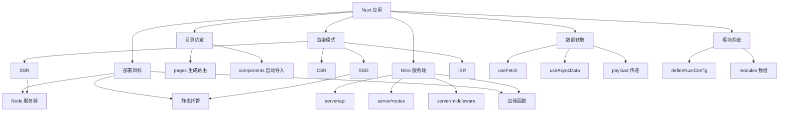
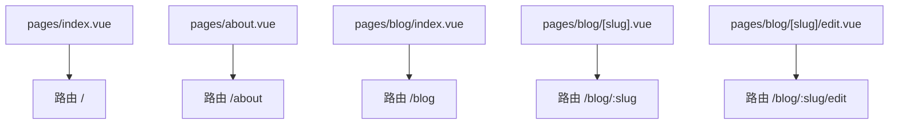
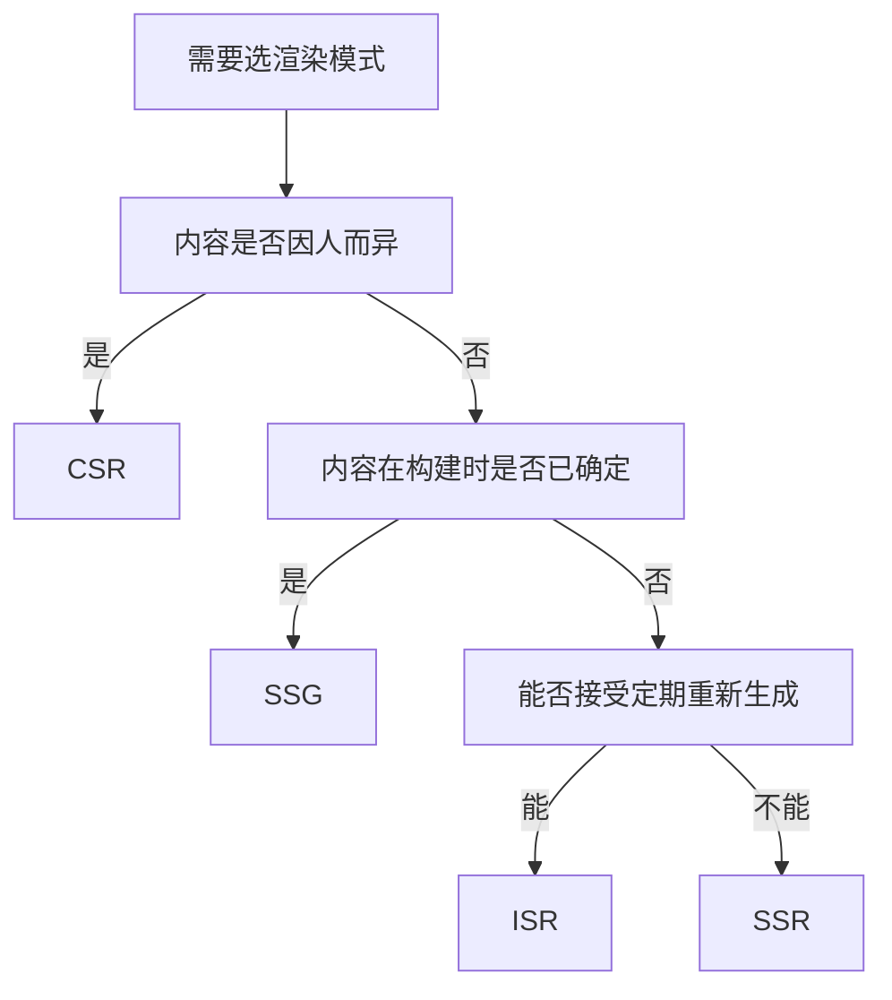
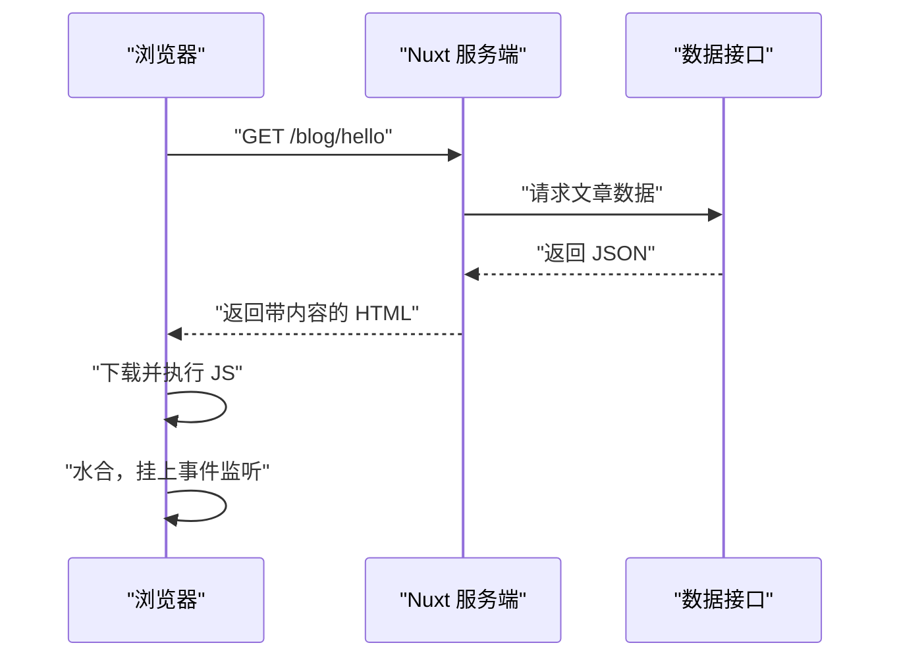
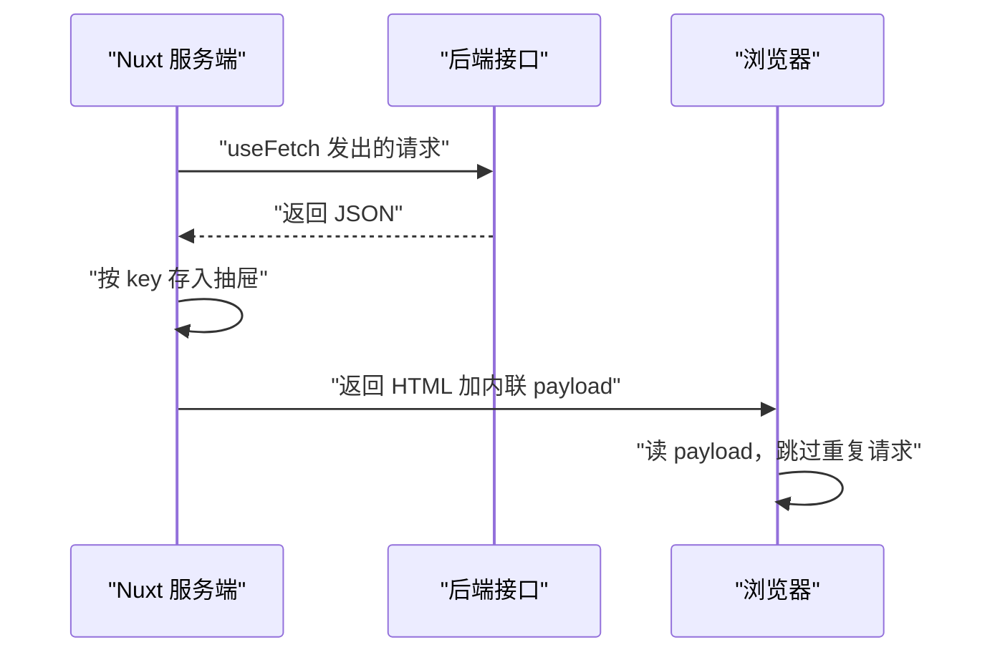
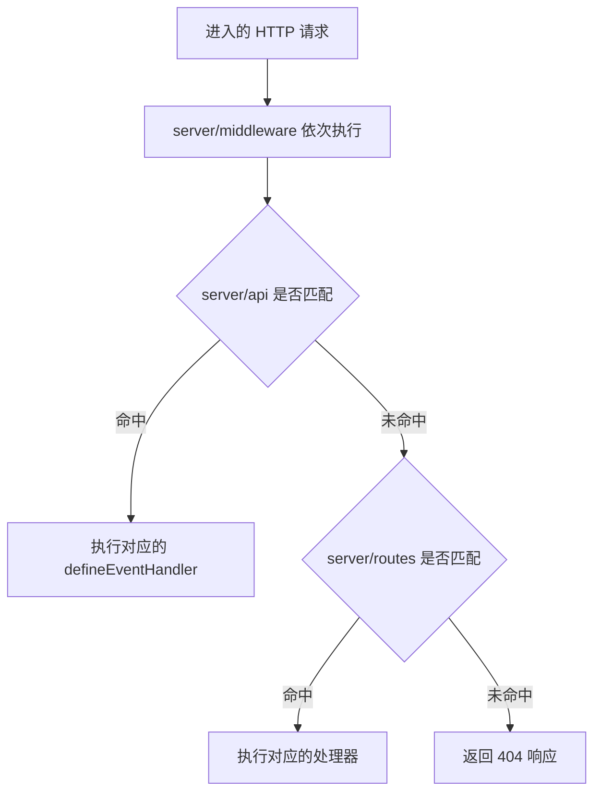
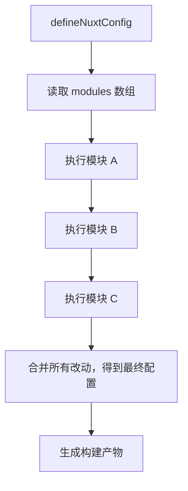
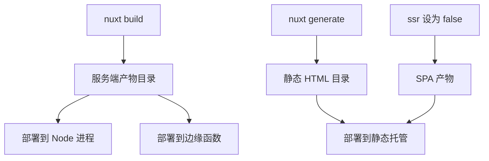

# Nuxt：Vue 的全栈框架

!!! abstract "学完这一页你能"
    - 说出 pages 目录里任意一个 .vue 文件对应哪条路由，并手写出三层嵌套路由的目录结构。
    - 在 CSR、SSR、SSG、ISR 四种渲染模式中为给定页面挑出一种，并说出它换来了什么代价。
    - 用 useFetch 与 useAsyncData 取数据，并讲清 key、payload、水合三者的关系。
    - 在 server/api 下写一个接口，并说出模块系统在项目启动时改了哪些配置。

## 0. 知识地图



建议这样读：

1. 先读第 1 节和第 2 节，弄清文件放哪里、页面在哪里渲染。
2. 再读第 3 节和第 4 节，把数据从服务端流到浏览器的链路补全。
3. 最后读第 5 节和第 6 节，理解配置如何注入、产物如何上线。

## 1. 目录约定：文件名就是路由

**先想一个问题**

同事让你加一个文章详情页，路径是 /blog/hello。他没有给你路由配置文件，只给了你一个 pages 目录。
你该新建几个文件、文件叫什么名字？

**心智模型**

!!! tip "心智模型"
    **一句话模型**：pages 目录是一张路由表，目录名是路径段，文件名是最后一段。
    **日常类比**：写字楼楼层指引牌，你走到 3 楼第 2 个房间，牌子上写的就是 302。
    **类比不成立处**：房间号由物业固定，路由文件改名后旧地址立刻返回 404，没有过渡期。

!!! note "术语：文件路由"
    把磁盘上的文件路径直接映射成 URL 路径的机制。例：`pages/blog/[slug].vue` 对应 `/blog/任意值`。

**图解**



逐条解读：

1. `pages/index.vue` 的 index 表示这一段路径为空，所以它是根路由 `/`。
2. `pages/about.vue` 去掉后缀得到 about，所以它是 `/about`。
3. `pages/blog/index.vue` 去掉结尾的 index，得到目录本身 `/blog`。
4. `[slug]` 用方括号包裹，代表这一段是变量，匹配 `/blog/hello` 或 `/blog/world`。
5. 目录继续往下嵌套，就得到更长的路径 `/blog/:slug/edit`。

**一步一步来**

第 1 步，先跑通最短的一条路由。

```vue
<!-- pages/index.vue -->
<template>
  <!-- 访问根路径 / 时渲染这里 -->
  <h1>首页</h1>
</template>
```

**这段代码在做什么**

- 文件放在 pages 目录下，构建时被扫描。
- 文件名 index 对应空路径段，拼出来就是 `/`。
- template 里只有一个 h1，页面没有脚本逻辑。
- 没有 `<script setup>` 时，页面就是纯静态结构。

运行结果：浏览器访问 `/` 显示"首页"。

第 2 步，加上动态段，让同一个文件服务任意文章。

```vue
<!-- pages/blog/[slug].vue -->
<script setup>
// useRoute 由 Nuxt 自动导入，不需要手写 import 语句
const route = useRoute()
// route.params.slug 保存动态段实际的值
const slug = route.params.slug
</script>

<template>
  <!-- 把 slug 显示出来，确认路由匹配正确 -->
  <h1>文章：{{ slug }}</h1>
</template>
```

**这段代码在做什么**

- 方括号表示这一段是变量，不是固定字符串。
- `useRoute()` 返回当前路由对象。
- `route.params.slug` 里放的是 URL 中那一段的真实值。
- 自动导入机制省去了手写 import，但变量名必须写对。

运行结果：访问 `/blog/hello` 显示"文章：hello"。

第 3 步，父级页面用 `<NuxtPage />` 渲染子路由。

```vue
<!-- pages/blog/[slug].vue -->
<template>
  <div>
    <!-- 父级外壳：所有子页面都会显示这一行 -->
    <h1>文章 {{ $route.params.slug }}</h1>
    <!-- 子路由的内容渲染在这个位置 -->
    <NuxtPage />
  </div>
</template>
```

**这段代码在做什么**

- `<NuxtPage />` 是子路由的出口占位符。
- 父级 template 里的其他内容在所有子页面都保留。
- 访问 `/blog/hello/edit` 时，父级显示标题，出口显示 edit 页面。
- 子路由文件放在同名目录下，例如 `pages/blog/[slug]/edit.vue`。

运行结果：访问 `/blog/hello/edit` 同时看到标题行和编辑页内容。

**动手验证**

依赖：无，只用 Node 20+ 内置模块。把下面内容存为 `route-demo.mjs`。

```js
// route-demo.mjs
// 依赖：无，只用 Node 20+ 内置模块
import assert from 'node:assert/strict'

// 把文件路径转成路由路径，规则与 pages 目录约定一致
function fileToRoute(filePath) {
  let route = filePath
    .replace(/^pages\//, '')      // 去掉 pages 前缀
    .replace(/\.vue$/, '')        // 去掉 .vue 后缀
    .replace(/\/index$/, '')      // 去掉结尾的 index 段
  if (route === 'index') route = '' // 根路由是空串
  return '/' + route
}

// 把 [slug] 这类动态段转成 :slug
function toPattern(route) {
  return route.replace(/\[([^\]]+)\]/g, ':$1')
}

const cases = [
  ['pages/index.vue', '/'],
  ['pages/about.vue', '/about'],
  ['pages/blog/index.vue', '/blog'],
  ['pages/blog/[slug].vue', '/blog/:slug'],
  ['pages/blog/[slug]/edit.vue', '/blog/:slug/edit'],
]

for (const [file, expected] of cases) {
  const got = toPattern(fileToRoute(file))
  assert.equal(got, expected)
  console.log(file, '->', got)
}
```

预期输出：

```
pages/index.vue -> /
pages/about.vue -> /about
pages/blog/index.vue -> /blog
pages/blog/[slug].vue -> /blog/:slug
pages/blog/[slug]/edit.vue -> /blog/:slug/edit
```

**常见坑**

| 现象 | 原因 | 怎么修 |
| --- | --- | --- |
| 新建页面后访问 404 | 文件放到了 pages 之外的目录 | 把文件移到 pages 目录下，重启开发服务 |
| 子路由内容不显示 | 父页面忘了写 `<NuxtPage />` | 在父页面 template 里补上出口标签 |
| 访问 `/blog` 报错 | 只建了 `[slug].vue`，没建 `index.vue` | 补一个 `pages/blog/index.vue` 处理列表页 |

**小结**

1. pages 目录的文件路径直接决定 URL，不需要单独写路由配置。
2. 方括号包裹的段是动态变量，通过 `route.params` 读出。
3. 父页面用 `<NuxtPage />` 给子路由留出口，嵌套层数没有上限。

## 2. 渲染模式：HTML 在哪里生成

**先想一个问题**

你的商品详情页需要被搜索引擎收录，同时首屏要在一秒内看到内容。
如果只发一个空 div，再让浏览器下载 JS 去渲染，收录和首屏都做不到。

**心智模型**

!!! tip "心智模型"
    **一句话模型**：渲染模式决定 HTML 字符串在哪个时间点、哪台机器上被拼出来。
    **日常类比**：点外卖，可以在店里做好送到家，也可以把半成品和锅一起送上门。
    **类比不成立处**：外卖只能选一次，Nuxt 可以对不同路由分别指定模式。

!!! note "术语：SSR"
    服务端渲染（Server-Side Rendering）。服务器把页面渲染成完整 HTML 字符串返回给浏览器。

!!! note "术语：水合"
    浏览器拿到服务端 HTML 后，下载并执行 JS，把事件监听挂到已有 DOM 上的过程。

**图解**



逐条解读：

1. 先问内容是否因人而异。登录后的仪表盘每个人不同，适合 CSR。
2. 内容对所有人相同且在构建时就确定，适合 SSG。
3. 内容相同但会更新，比如商品价格，适合 ISR 定期重新生成。
4. 内容相同且必须每次都是实时值，比如库存，适合 SSR。
5. 四种模式不是互斥的，同一站点可以对不同路由分别设定。

再看一次 SSR 请求的时序：



逐条解读：

1. 浏览器发出的是普通页面请求，不是接口请求。
2. Nuxt 服务端替浏览器去取数据，这一步没有跨域问题。
3. 取到数据后，服务端把 HTML 拼完整再返回。
4. 浏览器先看到内容，此时页面还不能点击。
5. JS 下载完成并执行后，点击事件才生效。

!!! note "术语：CSR"
    客户端渲染（Client-Side Rendering）。服务器只返回空壳 HTML，内容由浏览器执行 JS 后生成。

!!! note "术语：SSG"
    静态站点生成（Static Site Generation）。构建阶段就把 HTML 文件写好，直接托管。

!!! note "术语：ISR"
    增量静态再生成（Incremental Static Regeneration）。先给静态文件，过期后在后台重新生成。

**一步一步来**

第 1 步，先看清服务端返回的 HTML 长什么样。

```js
// render-html.mjs
// 依赖：无，只用 Node 20+ 内置模块

// 模拟一个页面组件，输入数据返回 HTML 片段
function renderPage(data) {
  // 把数据填进模板，得到最终字符串
  return '<h1>' + data.title + '</h1>'
}

const html = renderPage({ title: '你好' })
// 服务端返回的响应体就是这段字符串
console.log(html)
```

**这段代码在做什么**

- `renderPage` 接收数据，返回一段 HTML 字符串。
- 服务端渲染的核心动作就是这一步字符串拼接。
- 打印出来的是浏览器最初收到的内容。
- 此时还没有任何 JS 逻辑，页面不能交互。

运行结果：`<h1>你好</h1>`

第 2 步，把数据随 HTML 一起发到浏览器，供水合复用。

```js
import assert from 'node:assert/strict'

function renderWithPayload(data) {
  // 把数据序列化，塞进页面里的 script 标签
  const payload = JSON.stringify(data)
  return {
    html: '<h1>' + data.title + '</h1>',
    // 真实实现里这段会写成 window.__NUXT__ 赋值
    inlineScript: 'window.__NUXT__=' + payload,
  }
}

const out = renderWithPayload({ title: '你好', id: 7 })
assert.match(out.html, /你好/)
assert.match(out.inlineScript, /"id":7/)
console.log(out.inlineScript)
```

**这段代码在做什么**

- 服务端取到的数据被序列化成字符串。
- 序列化结果被内联进返回的 HTML。
- 浏览器执行 JS 时直接读这个对象，不再发一次请求。
- 少了这一步，客户端会重复请求同样的数据。

运行结果：`window.__NUXT__={"title":"你好","id":7}`

第 3 步，让浏览器接管，绑定事件。

```js
// 模拟水合：把事件监听挂到已存在的 DOM 节点上
function hydrate(vnode, domNode) {
  // 真实实现会比对虚拟节点与 DOM，这里只挂监听
  vnode.el = domNode
  domNode.onclick = vnode.onClick
  return vnode.el
}

const fakeDom = { onclick: null }
hydrate({ onClick: () => console.log('被点击') }, fakeDom)
// 手动触发一次，确认监听已生效
fakeDom.onclick()
```

**这段代码在做什么**

- 服务端已经生成了 DOM，客户端不重建节点，只补监听。
- 水合比对的是虚拟节点与现有 DOM 是否一致。
- 一致时只挂事件；不一致时控制台会提示水合不一致。
- 水合完成前，页面看得到但点不动。

运行结果：`被点击`

**动手验证**

依赖：无，只用 Node 20+ 内置模块。把下面内容存为 `modes-demo.mjs`。

```js
// modes-demo.mjs
// 依赖：无，只用 Node 20+ 内置模块
import assert from 'node:assert/strict'

// 用两个条件为页面选出渲染模式
function pickMode({ personalized, buildTimeFixed, realTime }) {
  if (personalized) return 'CSR'
  if (buildTimeFixed) return 'SSG'
  if (!realTime) return 'ISR'
  return 'SSR'
}

const rules = [
  [{ personalized: true, buildTimeFixed: false, realTime: false }, 'CSR'],
  [{ personalized: false, buildTimeFixed: true, realTime: false }, 'SSG'],
  [{ personalized: false, buildTimeFixed: false, realTime: false }, 'ISR'],
  [{ personalized: false, buildTimeFixed: false, realTime: true }, 'SSR'],
]

for (const [input, expected] of rules) {
  const got = pickMode(input)
  assert.equal(got, expected)
  console.log(JSON.stringify(input), '->', got)
}
```

预期输出：

```
{"personalized":true,"buildTimeFixed":false,"realTime":false} -> CSR
{"personalized":false,"buildTimeFixed":true,"realTime":false} -> SSG
{"personalized":false,"buildTimeFixed":false,"realTime":false} -> ISR
{"personalized":false,"buildTimeFixed":false,"realTime":true} -> SSR
```

**常见坑**

| 现象 | 原因 | 怎么修 |
| --- | --- | --- |
| 控制台报水合不一致 | 服务端与客户端首次渲染结果不同 | 把随机值、当前时间放进 onMounted 里再算 |
| 首屏白屏时间长然后整页跳出 | 用了纯 CSR 却期望首屏可见 | 对首屏关键路由改用 SSR 或 SSG |
| 静态站点数据不更新 | 选了 SSG 但数据每天变 | 改用 ISR，或构建时重新拉数据 |

**小结**

1. 渲染模式决定 HTML 生成的时间点和机器，不是代码写法。
2. 服务端取到的数据会被序列化进 payload，客户端靠它跳过重复请求。
3. 水合负责补上事件监听，水合完成前页面能看不能点。

## 3. 数据获取：useFetch 与 useAsyncData

**先想一个问题**

你在 `pages/blog/[slug].vue` 里想拿到文章详情。直接在 `<script setup>` 顶层写 `await fetch(...)`。
这段代码在服务端会跑一次，在客户端水合时可能再跑一次，浏览器里就出现两次请求。

**心智模型**

!!! tip "心智模型"
    **一句话模型**：useAsyncData 把一次异步取数的结果存进一个按 key 索引的抽屉，服务端填一次，客户端直接取。
    **日常类比**：出差的同事带回一份文件放进共享柜，办公室的人按编号直接取，不用再跑一趟。
    **类比不成立处**：共享柜只对本次页面请求有效，刷新页面后抽屉是空的，要重新填。

!!! note "术语：payload"
    服务端取到的数据被序列化后，随 HTML 一起发到浏览器的部分。客户端水合时读它来填充状态。

**图解**



逐条解读：

1. 服务端先执行 `useFetch`，此时它真的发了一次网络请求。
2. 返回的 JSON 被写进以 key 命名的缓存槽。
3. 渲染 HTML 时，这些缓存内容一起被序列化成 payload。
4. 浏览器拿到 HTML 和 payload，执行 JS 时发现相同 key 已有值。
5. 于是客户端不再发第二次请求，直接用缓存渲染。

**一步一步来**

第 1 步，用 useFetch 取一个接口。

```vue
<!-- pages/blog/[slug].vue -->
<script setup>
const route = useRoute()
// useFetch 返回 data、pending、error 三个响应式引用
const { data, pending, error } = await useFetch(
  // 接口路径随动态段变化
  () => `/api/posts/${route.params.slug}`,
  // key 用来在服务端与客户端之间复用同一份结果
  { key: () => `post-${route.params.slug}` }
)
</script>
```

**这段代码在做什么**

- 第一个参数用函数形式，路由变化时接口路径跟着变。
- `key` 用函数形式，保证不同文章用不同缓存槽。
- `pending` 表示请求是否还在进行。
- `error` 保存失败信息，不写的话出错会静默。
- 顶层 await 让服务端等数据到位再渲染 HTML。

运行结果：`/blog/hello` 渲染时页面已有文章内容。

第 2 步，需要自定义逻辑时换成 useAsyncData。

```vue
<script setup>
// 当取数逻辑不止一次 fetch 时，用 useAsyncData 包住整段逻辑
const { data } = await useAsyncData('catalog', async () => {
  // 先取分类，再取分类下的商品
  const cats = await $fetch('/api/categories')
  const items = await $fetch('/api/items', {
    query: { cat: cats[0].id },
  })
  // 返回的对象就是 data.value
  return { cats, items }
})
</script>
```

**这段代码在做什么**

- 第一个参数是字符串 key，全局唯一。
- 第二个参数是异步函数，返回值成为 `data.value`。
- `$fetch` 在服务端直接调用处理函数，不经过真实 HTTP 往返。
- 在客户端 `$fetch` 才发出真实的网络请求。
- 两次请求被包在同一个 key 下，payload 只序列化一次。

运行结果：`data.value` 里同时有 `cats` 和 `items`。

第 3 步，控制阻塞行为。

```vue
<script setup>
// lazy 为真时，导航不等待数据，先跳到页面再填充
const { data, status } = await useFetch('/api/slow', {
  lazy: true,
})
</script>

<template>
  <!-- status 为 pending 时显示占位内容 -->
  <p v-if="status === 'pending'">加载中</p>
  <p v-else>{{ data }}</p>
</template>
```

**这段代码在做什么**

- 默认情况下导航会等到数据就绪才完成。
- 打开 `lazy` 后导航立刻完成，数据稍后填充。
- `status` 是字符串状态，比布尔 `pending` 表达更多阶段。
- 选择哪种取决于你更在意导航响应速度还是内容完整性。

运行结果：点击链接后页面立即切换，慢接口的数据随后替换占位文本。

!!! note "术语：key"
    useAsyncData 与 useFetch 用来标识一份缓存结果的字符串。例：`'post-hello'` 与 `'post-world'` 是两份不同缓存。

**动手验证**

依赖：无，只用 Node 20+ 内置模块。把下面内容存为 `fetch-demo.mjs`。

```js
// fetch-demo.mjs
// 依赖：无，只用 Node 20+ 内置模块
import assert from 'node:assert/strict'

// 模拟一次取数：key 相同则命中缓存，不再调用 loader
function createStore() {
  const slots = new Map()
  let calls = 0
  async function useAsyncData(key, loader) {
    if (slots.has(key)) {
      return { data: slots.get(key), cached: true }
    }
    calls += 1
    const data = await loader()
    slots.set(key, data)
    return { data, cached: false }
  }
  return { useAsyncData, calls: () => calls }
}

const store = createStore()
const loader = async () => ({ title: '你好' })

// 第一次：真正执行 loader，计入一次调用
const first = await store.useAsyncData('post-hello', loader)
assert.equal(first.cached, false)
assert.equal(store.calls(), 1)

// 第二次：key 命中，不再执行 loader
const second = await store.useAsyncData('post-hello', loader)
assert.equal(second.cached, true)
assert.equal(store.calls(), 1)

// 换 key：重新执行 loader
await store.useAsyncData('post-world', loader)
assert.equal(store.calls(), 2)

console.log('loader 调用次数', store.calls())
```

预期输出：

```
loader 调用次数 2
```

**常见坑**

| 现象 | 原因 | 怎么修 |
| --- | --- | --- |
| 浏览器网络面板出现两次同样的请求 | 在顶层直接写 await fetch，没走 useFetch | 改用 useFetch，并显式传 key |
| 切换文章时页面显示上一篇的内容 | key 写成固定字符串 | 把 key 写成函数，把路由参数拼进去 |
| 数据接口返回 500 但页面正常显示空 | 没有读取 error 引用 | 在 template 里加 error 分支提示 |

**小结**

1. useFetch 是 useAsyncData 包住一次 `$fetch` 的写法，自定义逻辑时直接用 useAsyncData。
2. key 决定缓存复用的粒度，相同 key 意味着同一份结果。
3. 服务端取到的结果会进 payload，客户端靠它避免重复请求。

## 4. Nitro 服务端：接口写在同一个项目里

**先想一个问题**

页面需要一个"点赞"接口，不希望另起一个后端仓库。
你希望接口和页面共享类型定义，也希望本地开发只启动一个进程。

**心智模型**

!!! tip "心智模型"
    **一句话模型**：server 目录是后端代码的落脚点，文件名决定接口路径，Nitro 是运行它的服务器。
    **日常类比**：餐厅前台和后厨在同一栋楼，客人只看到一个门，点单后传菜口直接递进去。
    **类比不成立处**：后厨只有一间，Nitro 的产物可以搬到 Node 进程，也可以搬到边缘函数里跑。

!!! note "术语：Nitro"
    Nuxt 内置的服务端引擎，负责把 server 目录里的处理函数注册成 HTTP 路由，并打包出可部署的产物。

**图解**



逐条解读：

1. 每个请求先经过 `server/middleware` 下的中间件，按文件名排序执行。
2. 中间件可以选择继续传递，也可以直接返回响应。
3. 接着匹配 `server/api` 下的文件，路径自动带 `/api` 前缀。
4. 没命中就继续匹配 `server/routes`，这里的路径不带前缀。
5. 两处都没命中，Nitro 返回 404。

!!! note "术语：事件处理器"
    Nitro 对每个 HTTP 请求调用的函数，签名固定，用 `defineEventHandler` 定义，返回内容即响应体。

**一步一步来**

第 1 步，写一个 GET 接口。

```ts
// server/api/posts/[slug].get.ts
// 文件名里的 .get 限定只处理 GET 方法
export default defineEventHandler((event) => {
  // 从路径参数里取出动态段
  const slug = getRouterParam(event, 'slug')
  // 返回值会被自动序列化成 JSON
  return { slug, title: '文章 ' + slug }
})
```

**这段代码在做什么**

- `server/api` 下的文件路径决定接口路径，自动加上 `/api` 前缀。
- 文件名里的 `.get` 表示只接受 GET 请求。
- `defineEventHandler` 是固定的入口签名。
- `getRouterParam` 读取路径里的动态段。
- 返回值自动序列化成 JSON，不用手写响应头。

运行结果：`GET /api/posts/hello` 返回 `{"slug":"hello","title":"文章 hello"}`。

第 2 步，接收请求体并做校验。

```ts
// server/api/likes.post.ts
export default defineEventHandler(async (event) => {
  // 读取请求体，需要显式 await
  const body = await readBody(event)
  if (typeof body?.slug !== 'string') {
    // 主动抛出错误，Nitro 会转成错误响应
    throw createError({ statusCode: 400, statusMessage: 'slug 必填' })
  }
  return { ok: true, slug: body.slug }
})
```

**这段代码在做什么**

- `readBody` 解析请求体并返回可等待的结果。
- 校验失败时用 `createError` 抛错，比手动设置状态码清楚。
- 抛出的错误会被 Nitro 统一转成 HTTP 错误响应。
- 校验通过才继续，返回结构固定。

运行结果：合法请求返回 `{"ok":true,"slug":"hello"}`，非法请求返回 400。

第 3 步，读取运行时配置而不是硬编码密钥。

```ts
// server/api/secret.get.ts
export default defineEventHandler((event) => {
  // useRuntimeConfig 读取环境相关的配置
  const config = useRuntimeConfig(event)
  // 只返回是否存在，不把密钥本身发出去
  return { hasToken: Boolean(config.apiToken) }
})
```

**这段代码在做什么**

- 运行时配置通过 `useRuntimeConfig` 读取。
- 同一份代码在不同环境读到不同值。
- 传入 `event` 能拿到与当前请求关联的配置。
- 只返回布尔值，避免把密钥写到响应体里。

运行结果：`{"hasToken":true}` 或 `{"hasToken":false}`。

**动手验证**

依赖：无，只用 Node 20+ 内置模块。把下面内容存为 `nitro-demo.mjs`。

```js
// nitro-demo.mjs
// 依赖：无，只用 Node 20+ 内置模块
import assert from 'node:assert/strict'

// 把 server/api 下的文件路径转成带 /api 前缀的接口路径
function apiPath(file) {
  return '/' + file
    .replace(/\.(get|post|put|delete)\.ts$/, '') // 去掉方法后缀与扩展名
    .replace(/\[([^\]]+)\]/g, ':$1')             // 动态段转成冒号形式
}

const files = [
  'api/posts/[slug].get.ts',
  'api/likes.post.ts',
]
const expected = [
  '/api/posts/:slug',
  '/api/likes',
]

for (let i = 0; i < files.length; i += 1) {
  const got = apiPath(files[i])
  assert.equal(got, expected[i])
  console.log(files[i], '->', got)
}
```

预期输出：

```
api/posts/[slug].get.ts -> /api/posts/:slug
api/likes.post.ts -> /api/likes
```

**常见坑**

| 现象 | 原因 | 怎么修 |
| --- | --- | --- |
| 接口返回 405 方法不允许 | 文件名后缀与实际请求方法不一致 | 检查 `.get`、`.post` 后缀是否写错 |
| 读取请求体得到 undefined | 忘了 await readBody | 在 `readBody` 前加上 await |
| 生产环境读不到环境变量 | 用了 `process.env` 读取且未在运行时透传 | 改用 `useRuntimeConfig`，并在配置里声明字段 |

**小结**

1. `server/api` 的文件路径决定接口路径，自动带 `/api` 前缀。
2. 事件处理器用 `defineEventHandler` 定义，返回值即响应体。
3. 涉及密钥的配置走 `useRuntimeConfig`，不要写进客户端代码。

## 5. 模块系统：把一套约定打包分发

**先想一个问题**

你们有三个项目，每个都要接同一套埋点、同一套图标自动导入。
如果每次都复制一遍配置文件，改一处就要改三遍。

**心智模型**

!!! tip "心智模型"
    **一句话模型**：模块是一个函数，启动时被依次调用，每次调用都可以改动最终配置和构建过程。
    **日常类比**：装修前先开一次协调会，水电、木工、油漆各自提出改动，最后汇总成一张施工图。
    **类比不成立处**：协调会开完就结束，模块的改动会一直生效到构建产物生成。

!!! note "术语：Nuxt 模块"
    在构建启动阶段被调用的函数或对象，用来扩展配置、注册插件、添加服务端路由或改动打包过程。

**图解**



逐条解读：

1. 配置文件先被解析，`modules` 数组被读出来。
2. 数组里的模块按顺序依次执行。
3. 每个模块都能拿到当前配置，并返回改动后的配置。
4. 全部执行完后，改动被合并成最终配置。
5. 构建过程基于最终配置产生产物。

**一步一步来**

第 1 步，在配置里注册模块。

```ts
// nuxt.config.ts
export default defineNuxtConfig({
  // 数组顺序就是模块执行顺序
  modules: [
    '@nuxtjs/tailwindcss', // 需要先安装，名称需核对官方文档
    './modules/analytics', // 本地模块用相对路径引入
  ],
  // 模块可以读取这里的自定义键
  analytics: { siteId: 'demo' },
})
```

**这段代码在做什么**

- `modules` 数组是注册入口，写进去就会执行。
- 数组顺序决定执行顺序，有依赖关系的模块不能随意换位。
- 本地模块用相对路径引入，和 npm 包写法一致。
- 自定义配置键由模块自己声明并读取。

运行结果：启动时两个模块依次执行，控制台可以看到各自的执行日志。

第 2 步，写一个最小模块，向配置注入值。

```ts
// modules/analytics.ts
import { defineNuxtModule } from '@nuxt/kit'

export default defineNuxtModule({
  // meta 描述模块自身信息
  meta: { name: 'analytics' },
  // setup 在构建启动时执行一次
  setup(options, nuxt) {
    // 把配置写入运行时配置，客户端可读
    nuxt.options.runtimeConfig.public.analyticsId = options.siteId
  },
})
```

**这段代码在做什么**

- `defineNuxtModule` 提供类型提示与默认值合并。
- `meta.name` 用于日志与去重。
- `setup` 在启动阶段被调用一次，参数是模块选项和 Nuxt 实例。
- 写进 `runtimeConfig.public` 的值客户端能读到。

运行结果：应用里 `useRuntimeConfig().public.analyticsId` 等于 `'demo'`。

第 3 步，用模块注册一个插件。

```ts
// modules/analytics.ts
import { defineNuxtModule, addPlugin, createResolver } from '@nuxt/kit'

export default defineNuxtModule({
  meta: { name: 'analytics' },
  setup(options, nuxt) {
    // createResolver 基于当前文件位置解析路径
    const { resolve } = createResolver(import.meta.url)
    // 把插件文件加入构建，客户端会加载它
    addPlugin(resolve('./runtime/plugin.client.ts'))
    nuxt.options.runtimeConfig.public.analyticsId = options.siteId
  },
})
```

**这段代码在做什么**

- `createResolver` 把相对路径转成绝对路径，避免路径解析出错。
- `addPlugin` 把插件文件登记进构建流程。
- 文件名里的 `client` 表示只在浏览器侧加载。
- 模块因此能同时改动配置和运行时代码。

运行结果：浏览器控制台能看到插件初始化日志。

**动手验证**

依赖：无，只用 Node 20+ 内置模块。把下面内容存为 `modules-demo.mjs`。

```js
// modules-demo.mjs
// 依赖：无，只用 Node 20+ 内置模块
import assert from 'node:assert/strict'

// 每个模块接收当前配置，返回改动后的新配置
const modules = [
  {
    name: 'router',
    setup(config) {
      return { ...config, pages: true }
    },
  },
  {
    name: 'analytics',
    setup(config) {
      // 能读到前一个模块写下的值
      return { ...config, analyticsId: config.pages ? 'demo' : null }
    },
  },
]

function runModules(initial) {
  let config = { ...initial }
  const order = []
  for (const mod of modules) {
    config = mod.setup(config)
    order.push(mod.name)
  }
  return { config, order }
}

const { config, order } = runModules({})
assert.deepEqual(order, ['router', 'analytics'])
assert.equal(config.pages, true)
// analytics 读到了 router 写下的 pages 字段
assert.equal(config.analyticsId, 'demo')

console.log('执行顺序', order.join(' -> '))
console.log('最终配置', JSON.stringify(config))
```

预期输出：

```
执行顺序 router -> analytics
最终配置 {"pages":true,"analyticsId":"demo"}
```

**常见坑**

| 现象 | 原因 | 怎么修 |
| --- | --- | --- |
| 模块读到的配置缺字段 | 依赖的模块排在它后面 | 调整 modules 数组顺序，把被依赖的放前面 |
| 客户端读到 undefined | 写进了 `runtimeConfig` 而非 `runtimeConfig.public` | 把客户端要用的键放进 `public` 子对象 |
| 模块重复执行两次 | 在配置和依赖里各注册了一次 | 只在一个位置注册，检查依赖的 preset |

**小结**

1. 模块是一个启动期函数，输入当前配置，输出改动后的配置。
2. `modules` 数组的顺序就是执行顺序，有依赖时必须排好。
3. 模块既能改配置，也能用 `addPlugin` 之类的能力把代码注入构建。

## 6. 部署目标：产物形状决定托管方式

**先想一个问题**

本地 `npm run dev` 一切正常，你把整个项目目录上传到静态托管，访问页面却只剩一个白屏。
原因通常不是代码，而是产物形状和托管方式不匹配。

**心智模型**

!!! tip "心智模型"
    **一句话模型**：先决定页面在哪里渲染，再决定把什么东西放到服务器上，这两步不能颠倒。
    **日常类比**：先决定是做堂食还是打包，再决定租店面还是只租一个取餐窗口。
    **类比不成立处**：餐饮只能选一种形态，同一个项目可以对部分路由预渲染、部分路由走服务端。

!!! note "术语：预渲染"
    在构建阶段提前把某些路由的 HTML 生成成文件，部署后由静态服务器直接返回这些文件。

**图解**



逐条解读：

1. `nuxt build` 产出服务端可运行的产物，包含处理请求的入口。
2. `nuxt generate` 产出静态 HTML 文件，不需要 Node 进程。
3. 把 `ssr` 设为 `false` 时，页面壳仍然生成，内容由浏览器渲染。
4. 服务端产物可以跑在 Node 进程里，也可以打包进边缘函数。
5. 静态目录和 SPA 产物都可以直接交给静态托管，无需服务端逻辑。

**一步一步来**

第 1 步，用路由规则给不同路径指定模式。

```ts
// nuxt.config.ts
export default defineNuxtConfig({
  routeRules: {
    // 首页在构建时预渲染成静态文件
    '/': { prerender: true },
    // 商品页缓存 60 秒后再重新生成
    '/products/**': { swr: 60 },
    // 后台页面改为仅浏览器渲染
    '/admin/**': { ssr: false },
  },
})
```

**这段代码在做什么**

- `routeRules` 的键是路径匹配模式，支持通配。
- `prerender` 让该路由在构建阶段生成 HTML 文件。
- `swr` 让结果缓存指定秒数后重新生成。
- `ssr: false` 让该路由不走服务端渲染。
- 一个项目可以对不同路径用不同模式。

运行结果：构建日志里首页被标记为预渲染，后台路由被标记为仅客户端。

第 2 步，选择部署预设。

```ts
// nuxt.config.ts
export default defineNuxtConfig({
  nitro: {
    // 预设名决定产物结构，具体可用名称需核对官方文档
    preset: 'node-server',
  },
})
```

**这段代码在做什么**

- `nitro.preset` 决定产物目录结构与入口形式。
- 选 `node-server` 时产出一个 Node 可执行入口。
- 选静态托管方向的预设时产物是一组文件。
- 部署平台的可用预设名称会随版本调整，使用前需核对官方文档：具体要核对当前版本支持的 preset 列表与对应部署说明。

运行结果：构建结束后产物目录结构与所选预设一致。

第 3 步，把运行时配置交给部署环境。

```bash
# 启动服务端产物，端口通过环境变量传入
PORT=3000 NUXT_API_TOKEN=abc123 node .output/server/index.mjs
```

**这段代码在做什么**

- 服务端产物需要一个 Node 进程来承载。
- `PORT` 控制监听端口，多数平台会自动注入。
- 以 `NUXT_` 开头的环境变量会覆盖同名的运行时配置。
- `apiToken` 对应 `NUXT_API_TOKEN`，命名规则要核对官方文档。

运行结果：进程启动并打印监听端口，访问对应地址能拿到页面。

**动手验证**

依赖：无，只用 Node 20+ 内置模块。把下面内容存为 `deploy-demo.mjs`。

```js
// deploy-demo.mjs
// 依赖：无，只用 Node 20+ 内置模块
import assert from 'node:assert/strict'

// 根据构建命令与渲染模式推导产物形状
function resolveOutput({ command, ssr }) {
  if (command === 'generate') return 'static'
  if (ssr === false) return 'spa'
  return 'server'
}

// 把产物形状映射到可用的托管方式
function targetsFor(shape) {
  if (shape === 'server') return ['node-server', 'edge-function']
  return ['static-hosting']
}

const cases = [
  [{ command: 'build', ssr: true }, 'server'],
  [{ command: 'generate', ssr: true }, 'static'],
  [{ command: 'build', ssr: false }, 'spa'],
]

for (const [input, expected] of cases) {
  const shape = resolveOutput(input)
  assert.equal(shape, expected)
  const targets = targetsFor(shape)
  console.log(JSON.stringify(input), '->', shape, '->', targets.join(','))
}
```

预期输出：

```
{"command":"build","ssr":true} -> server -> node-server,edge-function
{"command":"generate","ssr":true} -> static -> static-hosting
{"command":"build","ssr":false} -> spa -> static-hosting
```

**常见坑**

| 现象 | 原因 | 怎么修 |
| --- | --- | --- |
| 静态托管上页面白屏 | 把服务端产物当成静态文件上传 | 改用 `nuxt generate`，或换支持 Node 的托管 |
| 环境变量在生产环境为空 | 构建期读取，而不是运行时读取 | 运行时通过 `NUXT_` 前缀变量注入，字段需在配置里声明 |
| 预渲染路由拿到过期数据 | 构建时数据被写死进 HTML | 该路由改用 `swr` 规则，或每次构建重新拉取 |

**小结**

1. 先定渲染模式，再定产物形状，最后才是托管方式。
2. `routeRules` 能让同一个项目里不同路径使用不同模式。
3. 服务端产物必须有进程承载，静态目录才能交给纯静态托管。

## 综合对比

| 维度 | CSR | SSR | SSG | ISR |
| --- | --- | --- | --- | --- |
| HTML 生成位置 | 浏览器 | 请求时的服务端 | 构建机器 | 构建机器加后台再生 |
| 首屏可见时间 | 需等 JS 下载执行 | 首个响应即含内容 | 首个响应即含内容 | 首个响应即含内容 |
| 数据新鲜度 | 每次请求实时 | 每次请求实时 | 构建时刻的快照 | 过期后再生 |
| 服务端进程 | 不需要 | 需要 | 不需要 | 需要一个能再生并写缓存的运行环境 |
| SEO 支持 | 需额外处理 | 直接可读 | 直接可读 | 直接可读 |
| 典型路径 | 登录后仪表盘 | 实时库存页 | 帮助文档 | 商品列表 |

| 维度 | 文件路由 | 模块系统 | Nitro |
| --- | --- | --- | --- |
| 作用范围 | 页面与 URL 映射 | 启动期配置与代码注入 | 请求期处理 |
| 生效时间 | 构建时扫描 | 启动时执行一次 | 每次请求 |
| 典型目录 | pages | modules 与配置文件 | server |
| 出错表现 | 访问 404 或页面不显示 | 配置缺字段或重复执行 | 接口 4xx 或 5xx |

## 应用与行业实践

### 应用场景地图

| 场景 | 用到本页哪个知识点 | 典型技术选型 | 注意事项 |
| --- | --- | --- | --- |
| 后台管理的万行表格 | 渲染模式取舍、useAsyncData 的 key | routeRules 设 ssr: false，配虚拟滚动 | 该路由不再输出 HTML，收录与分享预览都会失效 |
| 帮助中心的三层文档路由 | pages 目录约定、嵌套动态段 | pages/docs/[product]/[version]/[slug].vue | 目录层级就是 URL 层级，改目录等于改链接 |
| 低端安卓上的活动落地页 | payload 体积、客户端插件取舍 | 预渲染产物加 CDN | 首屏 JS 体积决定可交互时间 |
| 多人协作白板的房间页 | CSR 与 server/api | ssr: false，服务端签发连接令牌 | 画布初始化只能放在 onMounted 之后 |
| 电商商品列表与筛选 | useFetch 的 query 参数、路由 | SSR 加 HTTP 缓存头 | 筛选状态要写进 URL，刷新后能还原 |
| 登录后的企业仪表盘 | 路由中间件、server/api | SSR 加服务端会话校验 | 鉴权判断留在服务端，客户端守卫只管跳转 |
| 多子站共用的后台模板 | 模块系统 | 本地模块加 Nuxt Layers | 模块在启动时改的配置要写进版本说明 |
| 静态营销页的分发 | 部署目标 | 预渲染产物放对象存储加 CDN | 产物形状决定托管方式，换平台前先看产物 |

### 三个场景拆解

#### 场景 1：后台管理的万行表格

**业务背景**：运营后台的供应商列表单表有数万行，操作员按筛选条件来回翻页。每换一次筛选整页重新请求 HTML，滚动位置和已展开的行都会丢。

**怎么用本页知识解决**：这段路由不要求搜索引擎收录，也不要求首屏就有数据，把渲染放到客户端能省下服务端渲染开销。用 routeRules 给 `/admin/**` 设 `ssr: false`，再让页面自己取数。

```vue
<script setup lang="ts">
// key 用固定字符串，同一个 key 在客户端导航之间复用缓存条目
const page = ref(1)
const { data, pending } = useAsyncData(
  'vendors-list',
  () => $fetch('/api/vendors', { params: { page: page.value } }),
  // watch 只盯住 page，其他响应式变化不会带动请求
  { watch: [page] },
)
// 取到数据前给空数组，模板里不用再判空
const rows = computed(() => data.value?.rows ?? [])
</script>

<template>
  <!-- pending 驱动骨架屏，避免表格闪现 -->
  <TableSkeleton v-if="pending" />
  <VendorTable v-else :rows="rows" />
</template>
```

- `/admin/**` 设 `ssr: false` 后，这条路由不再生成 HTML，服务端不执行组件渲染。
- `useAsyncData` 的第一个参数是 key，客户端导航回这个页面时会命中同一份缓存。
- `watch: [page]` 让翻页触发重新取数，其他状态变化不会发请求。
- 页面在客户端渲染，没有服务端水合这一步，这份表格数据也不会写进 payload。
- 查询接口放在 `server/api` 下由浏览器直接调用，鉴权必须在接口内部做。

**怎么度量收益**：看 INP 与首屏 JS 传输体积。用 DevTools Performance 面板录制一次筛选操作读 INP，在 Network 面板按 JS 过滤看传输字节数。

**什么时候不该用**：

- 这个列表需要被搜索引擎收录时，SPA 模式拿不到渲染好的 HTML。
- 页面落在低端机上、首屏又必须立刻显示数据时，客户端取数会先出现骨架屏。
- 筛选结果需要发链接给别人、打开即要看到内容时，首屏等待时间由客户端取数决定。

#### 场景 2：帮助中心的三层文档路由

**业务背景**：帮助中心有几千篇文章，按产品、版本、章节三层组织，流量集中在发版当天。整站重建一次耗时长，峰值请求全部落到源站。

**怎么用本页知识解决**：让目录层级直接决定 URL 层级，再用 routeRules 把详情页预渲染、列表页按小时重新生成。

```text
pages/
  docs/
    [product]/          → /docs/nuxt
      [version]/        → /docs/nuxt/3
        [slug].vue      → /docs/nuxt/3/installation
```

- `pages/docs/[product]/[version]/[slug].vue` 对应 `/docs/nuxt/3/installation`，方括号段是路由参数。
- 目录嵌套几层，路由就带几段；`docs.vue` 存在时，它会成为这些页面的父布局。
- `routeRules` 给 `/docs/**` 设 `prerender: true`，构建阶段把这些页面写成 HTML 文件。
- 详情页用 `useAsyncData`，key 里带上 product、version、slug，客户端跳转时按文章缓存。
- 预渲染时取到的数据写进 payload，浏览器水合时直接读，不再发同样的请求。

**怎么度量收益**：看 TTFB 与构建耗时。用 `curl -s -o /dev/null -w '%{time_starttransfer}\n'` 对同一篇文章连续请求十次读首末差值；构建耗时读 `nuxi build` 的输出。

**什么时候不该用**：

- 价格、库存这类按秒变化的字段不要走预渲染，产物会给出过期值。
- 需要登录才可见的内部文档不要整段预渲染，静态文件可能被直接下载。
- 每篇文章都要插入按用户变化的推荐位时，静态产物给不出逐人不同的内容。

#### 场景 3：多人协作白板的房间页

**业务背景**：白板房间页要撑住几十人同时在线，画布内容随每个人的操作实时变化。页面本身不含需要收录的内容，痛点是进房间到能落笔之间的等待。

**怎么用本页知识解决**：房间页走客户端渲染，画布和实时连接放到挂载之后。服务端只签发连接令牌，不参与画面渲染。

```ts
// server/api/rooms/[id]/token.get.ts
import { signRoomToken } from '~/server/utils/room' // 项目内的签名函数

export default defineEventHandler(async (event) => {
  // [id] 由 Nitro 从路径解析，用 getRouterParam 取出来
  const id = getRouterParam(event, 'id')
  // 密钥只从服务端运行时配置读取，不进客户端包
  const { roomSecret } = useRuntimeConfig(event)
  return { id, token: await signRoomToken(id!, roomSecret) }
})
```

- 文件名里的 `get` 决定这个处理函数只响应 GET，路径里的 `[id]` 由 Nitro 解析。
- `getRouterParam(event, 'id')` 取出房间号，`useRuntimeConfig(event)` 读服务端运行时配置。
- 签名函数放在自己的 server/utils 里，浏览器只拿到短时令牌。
- 页面用 `useFetch` 拿令牌，`onMounted` 之后再建 WebSocket，服务端渲染阶段不会碰到浏览器 API。
- 房间页在 `routeRules` 里设 `ssr: false`，产物只有客户端入口。

**怎么度量收益**：看 INP、WebSocket 握手耗时与首帧绘制。用 DevTools Performance 录制进入房间后的 5 秒，在 Network 面板按 WS 过滤读握手时间。

**什么时候不该用**：

- 房间内容需要公开分享并希望被收录时，纯 CSR 页面给不出可读内容。
- 只读的看板快照没有实时操作，走预渲染可以省掉一条常驻连接。

### 行业先进实践

**路由级混合渲染（出处：Nuxt 官方文档 Hybrid Rendering）**：在 `nuxt.config` 的 `routeRules` 里按路径分配渲染方式，后台走 SPA、文档站走预渲染、首页走 ISR 可以同时存在。原因是渲染方式属于路由属性，不必为整站做一次取舍。你的项目可以先给 `/admin/**` 与 `/docs/**` 两条规则，对照构建产物的差别。

**Payload 提取（出处：Nuxt 官方文档 Payload Extraction）**：该行为由 `payloadExtraction` 控制，开启后预渲染页面在站内跳转时读静态 JSON，而不是重新发一次数据请求。原因是数据在构建时已经写进产物。你可以对同一篇文章做硬刷新与站内跳转两次测量，比较 Network 面板里的请求条数。

**Nuxt Layers 复用目录约定（出处：Nuxt 官方文档 Layers）**：把 pages、server、模块配置放进一个可继承的目录，多个站点用 `extends` 复用。原因是约定本身可以当代码分发，改一处就改掉所有下游。你的项目可以先抽出一个只含 server 中间件与基础布局的 layer。

**模块封装启动期配置（出处：Nuxt 官方文档 Module Author Guide）**：模块在启动阶段用 `nuxt.options` 改配置、注册组件与插件，把一套约定打包分发。原因是这些改动发生在构建之前，使用者不必逐条抄配置。你的项目可以把 routeRules 与中间件收进一个本地模块，新站点通过 `modules` 数组引入。

**路由级 ISR 的平台差异（出处：需核对官方文档：核对 Nuxt 文档 routeRules 的 `isr` 选项与所选托管平台的 ISR 文档，确认重新验证的触发条件与缓存键算法）**：Nitro 提供 `isr` 配置，但过期后由谁触发重新生成、缓存键怎么算，取决于托管平台。上线前按平台缓存文档逐条核对，再用同一 URL 连续请求观察命中情况。

### 从学到用：落地路线

**第 1 步 试点**：选一个不承担 SEO 的后台列表页，加 `routeRules` 的 `ssr: false`，并给它写一条 `server/api` 查询接口。验收标准：该路由的构建产物里没有对应的预渲染 HTML，接口在本地能返回数据。

**第 2 步 验证**：给文档类详情页加 `prerender: true`，用 `curl` 连续请求同一 URL 读 TTFB，并在 Network 面板观察 payload 请求。验收标准：连续请求的读数稳定，站内跳转时出现 payload 请求且没有重复的数据接口请求。

**第 3 步 推广**：把试点用到的 routeRules、key 命名规范和 server 目录结构收进一个本地模块，新页面通过 `modules` 引入。验收标准：新建一个页面只改页面文件与模块配置，不再逐条抄 routeRules。

**第 4 步 防回退**：在 CI 里跑构建并检查产物形状，routeRules 的每次改动都要在提交信息里说明原因。验收标准：产物缺少预渲染 HTML 或多余输出客户端入口时，CI 步骤失败并给出文件名。

### 动手作业

**目标**：做一个三页小站，覆盖列表、详情与一个写接口的交互页，把 pages 约定、routeRules、useAsyncData、server/api 四条线跑通。

**步骤**：

1. 新建 Nuxt 项目，在 `pages` 下建 `index.vue` 与 `notes/[id].vue`，在 `server/api` 下建 `notes.get.ts`。
2. 在 `nuxt.config.ts` 的 `routeRules` 里给 `/notes/**` 设 `prerender`，给 `/dashboard` 设 `ssr: false`。
3. 列表页用 `useAsyncData` 取 `/api/notes`，key 写成固定字符串 `'notes-list'`。
4. 详情页把 id 拼进 key，打开构建产物检查 payload 里有没有这篇文章的数据。
5. 在 `server/api` 下加一个 POST 接口，用 `readBody(event)` 取提交内容。
6. 跑 `nuxi build`，到 `.output/public` 里找出预渲染出来的 HTML 文件。
7. 用 `curl` 对同一详情页连续请求十次，把 TTFB 读数记进 README。

**验收标准**：

- `nuxi build` 成功，`.output/public` 下能找到 `/notes/1` 对应的 HTML 文件。
- `/dashboard` 不在预渲染 HTML 列表里，产物只有客户端入口。
- 站内从列表跳到详情时，Network 面板出现 `_payload.json` 请求，且没有重复的数据接口请求。
- POST 接口在页面里调用成功，返回体里能看到提交的内容。
- README 里的十次 TTFB 读数有首末对比，并能说出读数差异来自预渲染产物还是源站。

## 深入阅读与参考

!!! tip "怎么用这些资料"
    先读「官方文档与规范」建立准确的概念，再读「源码与示例」核对细节，最后用「教程、书籍与视频」换一种讲法加深理解。每条都写明了读哪一节、带着什么问题读。

### 官方文档与规范

| 资源 | 为什么读 | 怎么读 |
|---|---|---|
| [Nuxt 文档](https://nuxt.com/docs) | Nuxt 官方文档，渲染模式、数据获取与部署的权威出处。 | 读「渲染模式」与「数据获取」两章，带着“这段代码在服务端还是客户端跑”的问题读，读完改造项目首页。 |
| [Vue DevTools 文档](https://devtools.vuejs.org/) | 官方工具文档，可观察服务端渲染与水合前后的状态差异。 | 安装后在自己项目里用时间线定位一次状态问题，读完成文记录排查步骤。 |
| [Vue Router 文档](https://router.vuejs.org/zh/) | 官方路由文档，文件即路由的约定最终落到这套 API 上。 | 实现嵌套路由与导航守卫两个功能，读完对比 Nuxt 目录约定的差异。 |
| [React Server Components 参考](https://react.dev/reference/rsc/server-components) | 官方参考，帮助厘清服务端组件与 SSR 的边界与取舍。 | 读后在同一项目里各写一个服务端与客户端组件，观察构建产物差异。 |
| [Vue 官方文档](https://cn.vuejs.org/) | Vue 官方中文文档，是理解 Nuxt 全栈能力的前置基础。 | 先读「快速上手」与「基础」，读完再回看 Nuxt 的数据获取与自动导入。 |

### 源码与示例

| 资源 | 为什么读 | 怎么读 |
|---|---|---|
| [Vue 2 响应式源码目录](https://github.com/vuejs/vue/tree/main/src/core/observer) | 真实响应式源码，能直接看到依赖收集与派发更新的实现细节。 | 读 defineReactive 与 Dep 相关文件，带着“何时触发重渲染”的问题读，读完记下调用链。 |
| [Solid](https://github.com/solidjs/solid) | 可读源码示例，用于对比细粒度响应式与 Vue 编译优化的取舍。 | 读 README 与 packages/solid 目录，问“为何无需虚拟 DOM”，读完写一页对比笔记。 |

### 教程、书籍与视频

| 资源 | 为什么读 | 怎么读 |
|---|---|---|
| [Nuxt 入门](https://nuxt.com/docs/getting-started/introduction) | 官方入门教程，目录约定与自动导入正是本页的知识地图起点。 | 跟着「目录结构」与「自动导入」两节建一个项目，读完对照本页目录清单逐条自查。 |
| [Vue 渲染机制](https://cn.vuejs.org/guide/extras/rendering-mechanism.html) | 讲透虚拟 DOM、编译优化与静态提升，对应渲染模式章节。 | 重点读静态提升一节，在模板编译器演示站对照输出，读完回看 SSR 产物形状。 |
| [Vue Mastery](https://www.vuemastery.com/) | 系统视频课程，适合跟着项目补齐 Vue 全栈开发基础。 | 先看免费课程并跟做配套项目，读完回到本页逐节核对知识点。 |
| [MDN 元编程](https://developer.mozilla.org/en-US/docs/Web/JavaScript/Guide/Meta_programming) | MDN 指南，用 Proxy 与 Reflect 动手复现响应式核心原理。 | 实现一个带校验的对象，读完用它解释 Vue 3 为何从 defineProperty 换到 Proxy。 |

## 自测题

??? question "pages/blog/[slug].vue 和 pages/blog/[slug]/index.vue 能同时存在吗？"
    - 两者都会解析到 `/blog/:slug` 这条路径，属于同一路径的两个来源。
    - 同时存在时构建会给出冲突提示，实际只保留其中一条。
    - 常见做法是保留 `[slug].vue` 作为详情页。
    - 需要列表页时改用 `pages/blog/index.vue`。
    - 具体冲突处理方式需核对官方文档：状态是报错还是警告。

??? question "为什么在 script setup 顶层直接 await fetch 会导致重复请求？"
    - 顶层代码在服务端执行一次，拿到数据并渲染 HTML。
    - 客户端水合时同一段代码再执行一次，又发一次请求。
    - 这次请求的结果没有进入 payload，服务端那次等于白做。
    - `useAsyncData` 会把结果按 key 存入 payload，客户端读到就直接跳过。
    - 所以取数要用 useFetch 或 useAsyncData 这类带缓存的封装。

??? question "水合不一致的水合报错通常由什么引起？"
    - 服务端与客户端首次渲染的输出内容不同。
    - 常见来源是随机数、当前时间、浏览器专属 API。
    - 服务端没有 `window`，这些值在两边的计算结果会不一样。
    - 修法是把这类计算挪进 `onMounted`，只在客户端执行。
    - 也可以用 `ClientOnly` 包裹只在浏览器渲染的部分。

??? question "routeRules 里 prerender 与 swr 的区别是什么？"
    - `prerender` 在构建阶段一次性生成 HTML 文件，之后不再变化。
    - `swr` 也是先给静态结果，但缓存过期后会在后台重新生成。
    - 数据完全不变的页面用 `prerender`，会小幅更新的用 `swr`。
    - `swr` 需要一个能写缓存的运行环境，纯静态托管做不到。
    - 具体配置字段名需核对官方文档：要核对 seconds 与 group 参数。

??? question "server/api 与 server/routes 有什么区别？"
    - `server/api` 下的文件路径会自动加上 `/api` 前缀。
    - `server/routes` 下的文件路径原样使用，不带前缀。
    - 两者都用 `defineEventHandler` 定义入口。
    - 需要给外部调用的接口放 `server/api`，其余放 `server/routes`。
    - 中间件放在 `server/middleware`，对所有请求都生效。

??? question "为什么模块的注册顺序不能随便调换？"
    - 每个模块读取的是它前面所有模块改动后的配置。
    - 后面的模块依赖前面模块写下的字段时，顺序颠倒会读到 undefined。
    - 例如先注册路由模块，统计模块才能读到路由相关开关。
    - 排查方法是给每个模块打日志，观察配置在每一步的变化。
    - 具体依赖关系要看各模块自己的文档说明。

??? question "什么是 payload，它解决了什么问题？"
    - payload 是服务端取到的数据被序列化后的结果。
    - 它随 HTML 一起返回，内联在页面里的脚本中。
    - 客户端水合时优先读 payload，命中就不发重复请求。
    - 少了 payload，服务端那次取数对客户端没有任何帮助。
    - payload 只对当前页面请求有效，刷新后会重新取。

??? question "为什么把 SSR 产物上传到静态托管会白屏？"
    - SSR 产物需要一个进程来接收请求、执行渲染。
    - 静态托管只按路径返回文件，不会执行代码。
    - 缺少进程时，请求拿不到渲染结果，页面只剩空壳。
    - 解决办法是改用 `nuxt generate` 产出静态文件。
    - 或者换成支持 Node 进程、或支持边缘函数的托管方式。

## 延伸阅读

- Nuxt 官方文档：Getting Started
- Nuxt 官方文档：Directory Structure
- Nuxt 官方文档：Rendering Modes
- Nuxt 官方文档：Data Fetching
- Nuxt 官方文档：Server
- Nuxt 官方文档：Modules
- Nuxt 官方文档：Deployment
- Vue 官方文档：Server-Side Rendering
