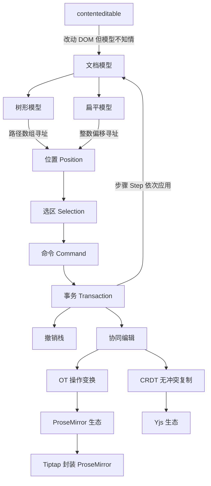
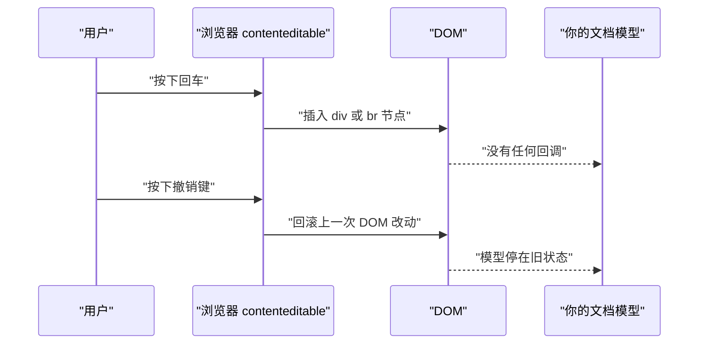
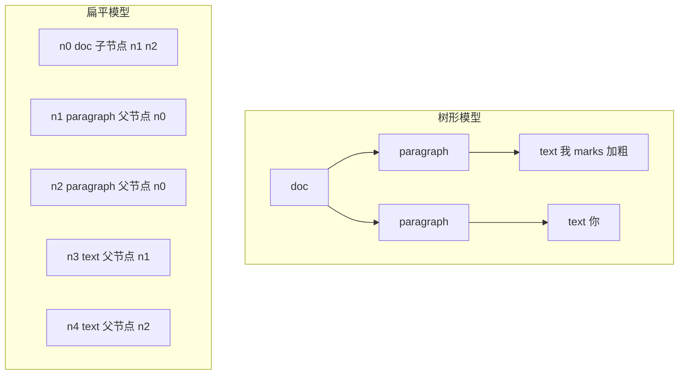
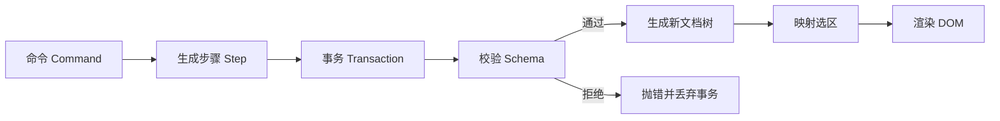
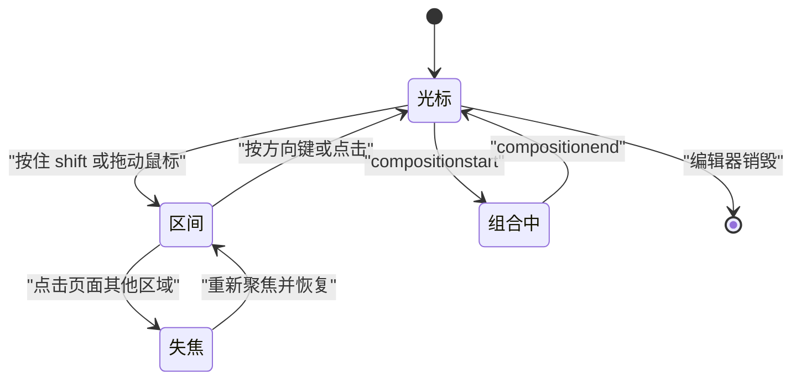
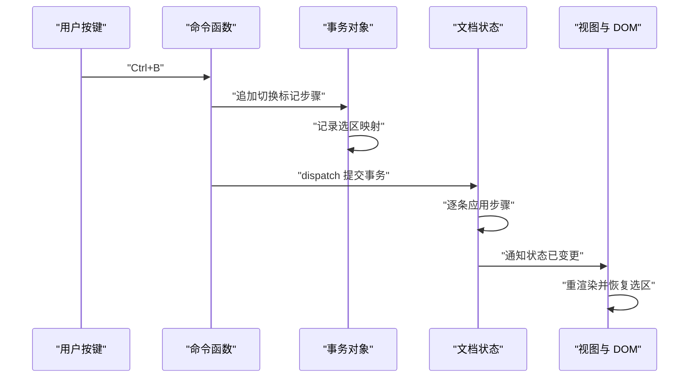
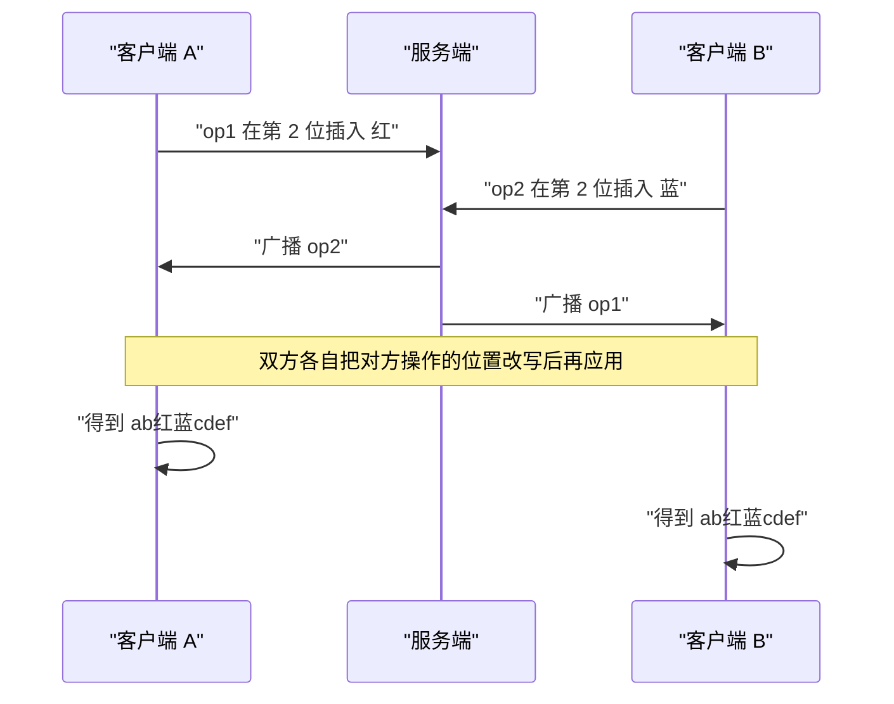
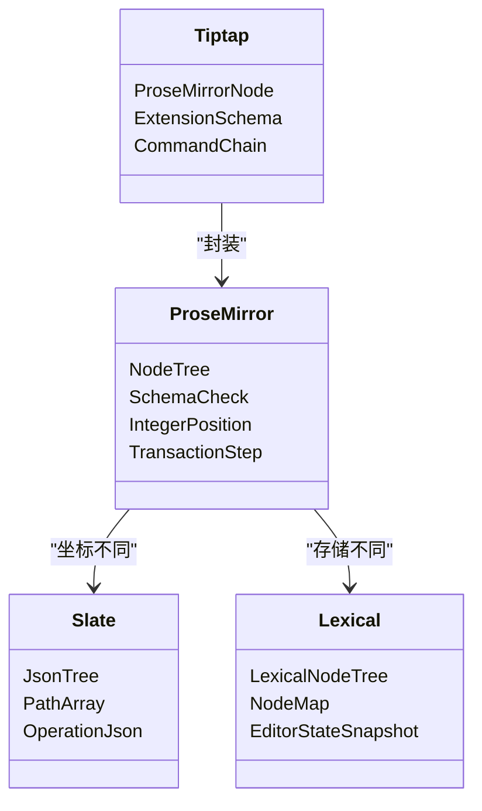

# 富文本编辑器：ProseMirror、Slate、Lexical、Tiptap 的数据模型

!!! abstract "学完这一页你能"

- 说出 contenteditable 在选区、输入法、撤销三处会出现的具体故障，并写出绕开它的方案。
- 用树形与扁平两种结构描述同一段富文本，算出各自寻址要比较几次。
- 手写一个迷你文档模型，支持插入、删除、按路径读取，并在整数位置与路径偏移之间来回换算。
- 写出一次事务从命令到应用再到选区更新的调用顺序，并说出 OT 与 CRDT 合并冲突时的差别。

## 0. 知识地图



建议怎么读：第 1 节讲清为什么要自己建文档模型，先读它，读到痛处再往下。第 2 到第 5 节是数据模型、选区、事务三块骨架，按顺序读一遍就能看懂第 7 节的库对比。第 6 节协同编辑可以单独跳读，读的时候回头看第 3 节和第 5 节的两段代码。

## 1. contenteditable 到底哪里不好用

**先想一个问题**：你给一个 div 加上 contenteditable，敲三个字，再把光标移到中间按回车。浏览器交给你的 HTML 是什么结构？在 Chrome、Firefox、Safari 上，这个结构并不一样。

**心智模型**

!!! tip "心智模型"
    一句话模型：contenteditable 让浏览器把 DOM 当成可编辑文本去改，而你要的是把它当成结构化数据去改。
    日常类比：拿记事本的查找替换去维护一份带合并单元格的报表。
    类比不成立的地方：浏览器还会同时接管光标、输入法与撤销键，这三件事在记事本里没有对应物。

**图解**



解读：

1. 用户按回车，浏览器自己决定插入 div、p 还是 br。
2. DOM 被改动，你的数据结构没有收到任何通知。
3. 你的模型与 DOM 从此不一致，下一次重渲染会互相覆盖。
4. 浏览器撤销栈回滚的是 DOM 操作，不是你的模型操作。
5. 两条撤销栈各自记录，用户看到的撤销结果与模型对不上。

**一步一步来**

这一步要做什么：先看浏览器生成的 HTML 不是唯一的，说明"解析 HTML 反推语义"这条路走不通。

```js
// 同一段视觉内容，浏览器可以给出两种不同 HTML
const a = '<div>标题</div><div><br></div><div>正文</div>';
const b = '<div>标题</div><p>正文</p>';
// 去掉标签后文本一样，结构却不同
const textOf = (html) => html.replace(/<[^>]+>/g, '');
console.log(textOf(a) === textOf(b)); // 文本层相同
console.log(a === b);                 // 结构层不同
```

**这段代码在做什么**

- `a` 与 `b` 都表示"标题加正文"两段内容。
- `a` 中间多出一个只含 br 的空块，`b` 用 p 表示正文。
- 去掉标签后两者文本相同，说明字符串层看不出块级语义。
- 直接比较字符串又返回 false，说明结构层不稳定。
- 结论：不能把 HTML 字符串当作真身。

运行结果：`true` 与 `false`。

这一步要做什么：看输入法组合期间重渲染会发生什么。中文输入要先经过拼音缓冲，浏览器在此期间派发组合事件。

!!! note "术语：IME"
    IME（Input Method Editor，输入法编辑器）是操作系统里把按键序列转成字符的程序，例如把 ni 转成"你"。它在组合期间只给预览文本，用户按空格后才提交。

```js
// 模拟组合期间渲染的情况
const log = [];
let composing = false;
let domText = '';
function renderFromModel(text) {
  if (composing) { log.push('skip'); return; } // 组合期间跳过渲染
  domText = text;
  log.push('render:' + text);
}
renderFromModel('ni');   // 组合开始前的预览
composing = true;
renderFromModel('你');   // 模型变了，但跳过
composing = false;
renderFromModel('你');   // 组合结束，正式渲染
console.log(log.join(' | '));
```

**这段代码在做什么**

- `composing` 标记当前是否处在 IME 组合期间。
- 组合期间调用渲染只记录 skip，不写 DOM。
- 组合结束后再渲染一次，DOM 才拿到最终文本。
- 少了这层判断，拼音预览会被中途替换，光标跳到行首或行尾。
- 这条规则与具体库无关，四家都实现了自己的组合事件处理。

运行结果：`render:ni | skip | render:你`。

这一步要做什么：看两条撤销栈为什么对不齐。浏览器记 DOM 操作，你记模型操作。

```js
// 浏览器栈记录 DOM 操作，你的栈记录模型操作
const browserStack = ['insert-div', 'insert-text', 'delete-div'];
const modelStack = ['insertText'];  // 只记了提交后的文本
console.log(browserStack.length !== modelStack.length); // 长度不同
browserStack.pop();
browserStack.pop();
console.log(browserStack.length, modelStack.length);    // 撤销两次后的长度
```

**这段代码在做什么**

- 浏览器为一次中文输入可能压入三条 DOM 操作。
- 你的模型只在提交后压入一条文本插入。
- 两个栈长度不同，撤销次数就无法对齐。
- 做法是接管撤销：忽略浏览器栈，自己记录模型操作。
- ProseMirror 与 Slate 都提供了跳过浏览器撤销并自建历史的接口，具体名称需核对官方文档。

运行结果：`true` 与 `1 0`。

**动手验证**

把上面三个现象合成一个脚本。依赖：无。

```js
// 文件：ce-problem.mjs  运行：node ce-problem.mjs  需要 Node 20+
import assert from 'node:assert/strict';

// 现象一：同一内容对应多种 HTML
const a = '<div>标题</div><div><br></div><div>正文</div>';
const b = '<div>标题</div><p>正文</p>';
const textOf = (html) => html.replace(/<[^>]+>/g, '');
assert.equal(textOf(a), textOf(b), '文本层应相同');
assert.notEqual(a, b, '结构层应不同');

// 现象二：组合期间必须跳过渲染
const log = [];
let composing = false;
const render = (text) => { log.push(composing ? 'skip' : 'render:' + text); };
render('ni');
composing = true;
render('你');
composing = false;
render('你');
assert.deepEqual(log, ['render:ni', 'skip', 'render:你']);

// 现象三：两条撤销栈长度不一致
const browserStack = ['insert-div', 'insert-text', 'delete-div'];
const modelStack = ['insertText'];
assert.notEqual(browserStack.length, modelStack.length);
browserStack.pop();
browserStack.pop();
assert.deepEqual([browserStack.length, modelStack.length], [1, 0]);

console.log('ce-problem 全部断言通过');
```

预期输出：`ce-problem 全部断言通过`。

**常见坑**

| 现象 | 原因 | 怎么修 |
|:--|:--|:--|
| 输入中文时光标跳到行首 | 组合期间用模型文本重写了 DOM | 监听组合开始与结束事件，期间挂起渲染 |
| 按一次撤销，文字回退两次 | 浏览器栈与模型栈各回滚一次 | 关掉浏览器撤销，自建模型历史 |
| 粘贴后带进来一堆内联样式 | 直接插入剪贴板 HTML | 只读剪贴板纯文本或结构化片段，再转成自己的节点 |

**小结**

1. contenteditable 的输出不唯一，不能当作真身。
2. IME 组合期间必须暂停渲染，否则光标丢失。
3. 撤销要自己接管，否则两条栈对不齐。

## 2. 文档模型：树形与扁平两种

**先想一个问题**：一段内容是"第一段是加粗的我，第二段是普通的你"。你要把它存起来，存成嵌套对象还是存成一个数组？

**心智模型**

!!! tip "心智模型"
    一句话模型：树形按容器嵌套组织节点，扁平把所有节点放进一张表，用父子编号记录层级。
    日常类比：树形像文件夹里放文件夹，扁平像一张通讯录，每人写一行并注明上级是谁。
    类比不成立的地方：扁平模型还要给每个节点一个稳定编号，文件夹不需要编号。

**图解**



解读：

1. 树形用嵌套表示归属，读子节点走一层属性访问。
2. 扁平用 children 与 parent 两个字段表示同样的归属。
3. 树形取第 2 段要走两次索引，扁平要先从 n0 读出 n2 的编号。
4. 扁平模型插入节点只往表里追加，不改动已有对象。
5. 追加式改动让协同编辑更容易判断"谁先来"，第 6 节会用到。

**一步一步来**

这一步要做什么：构造树形文档并按路径寻址，数一数比较了几次。

```js
// 用嵌套对象表示同一段内容
const treeDoc = {
  type: 'doc',
  children: [
    { type: 'paragraph', children: [{ type: 'text', text: '我', marks: ['bold'] }] },
    { type: 'paragraph', children: [{ type: 'text', text: '你', marks: [] }] },
  ],
};
// 路径 [1] 表示第二个段落
const byPath = (node, path) => path.reduce((cur, i) => cur.children[i], node);
console.log(byPath(treeDoc, [1]).children[0].text);                     // 你
console.log(byPath(treeDoc, [0, 0]).marks.includes('bold'));            // true
```

**这段代码在做什么**

- 顶层是 doc，下面挂两个 paragraph。
- `byPath` 按路径数组逐层走 children 属性。
- 路径长度是 1 时只走一次，长度是 2 时走两次。
- 比较次数等于路径长度，深度越大寻址越贵。
- 深嵌套是树形模型的主要成本来源。

运行结果：`你` 与 `true`。

这一步要做什么：把同一内容改成扁平表，对比寻址方式。

```js
// 每个节点一行，用 id 指父子
const flatDoc = {
  root: 'n0',
  nodes: {
    n0: { id: 'n0', type: 'doc', children: ['n1', 'n2'], parent: null },
    n1: { id: 'n1', type: 'paragraph', children: ['n3'], parent: 'n0' },
    n2: { id: 'n2', type: 'paragraph', children: ['n4'], parent: 'n0' },
    n3: { id: 'n3', type: 'text', text: '我', marks: ['bold'], parent: 'n1' },
    n4: { id: 'n4', type: 'text', text: '你', marks: [], parent: 'n2' },
  },
};
const textOf = (doc, id) => {
  const node = doc.nodes[id];
  return node.text ?? node.children.map((c) => textOf(doc, c)).join('');
};
console.log(textOf(flatDoc, 'n2'));              // 你
console.log(Object.keys(flatDoc.nodes).length);  // 5
```

**这段代码在做什么**

- `flatDoc.nodes` 是一张表，键是节点编号。
- children 存子节点编号，parent 存父节点编号。
- 取文本要递归，走的是编号查表，不是属性嵌套。
- 节点总数可以直接用 `Object.keys` 数出来，便于做增量同步。
- 每个节点多存 id 与 parent 两个字段，这是扁平模型的额外开销。

运行结果：`你` 与 `5`。

**动手验证**

同一内容两种表示，从树形转扁平，再断言文本一致。依赖：无。

```js
// 文件：two-models.mjs  运行：node two-models.mjs  需要 Node 20+
import assert from 'node:assert/strict';

const treeDoc = {
  type: 'doc',
  children: [
    { type: 'paragraph', children: [{ type: 'text', text: '我', marks: ['bold'] }] },
    { type: 'paragraph', children: [{ type: 'text', text: '你', marks: [] }] },
  ],
};

const nodes = {};
let seq = 0;

// 树形转扁平：先建自己，再递归子节点
const toFlat = (node, parentId) => {
  const id = 'n' + seq++;
  const flat = { id, type: node.type, parent: parentId, children: [] };
  if (node.text !== undefined) flat.text = node.text;
  if (node.marks) flat.marks = node.marks;
  nodes[id] = flat;
  flat.children = (node.children || []).map((child) => toFlat(child, id));
  return id;
};
const root = toFlat(treeDoc, null);

// 扁平转文本
const textOf = (id) => {
  const n = nodes[id];
  return n.text !== undefined ? n.text : n.children.map(textOf).join('');
};

assert.equal(nodes[root].type, 'doc');
assert.equal(Object.keys(nodes).length, 5);
assert.equal(textOf(root), '我你');
assert.equal(nodes[nodes[root].children[1]].text, undefined);
assert.deepEqual(nodes[nodes[nodes[root].children[0]].children[0]].marks, ['bold']);
console.log('two-models 断言通过，节点数', Object.keys(nodes).length);
```

预期输出：`two-models 断言通过，节点数 5`。

**常见坑**

| 现象 | 原因 | 怎么修 |
|:--|:--|:--|
| 树形改动后旧引用失效 | 直接改了嵌套对象，引用被两处共享 | 改动时复制路径上的节点，保持不可变 |
| 扁平表删除节点后出现孤儿 | 只删了表项，没改父节点的 children | 删除时同步清理父的 children 和子的 parent |
| 两处文本对不上 | 同一份数据有两个来源 | 指定其中一个为真身，另一个由它派生 |

**小结**

1. 树形靠嵌套寻址，比较次数等于路径长度。
2. 扁平靠编号查表，每个节点多带 id 与 parent 两个字段。
3. 选哪种要看场景，后面用寻址次数来比较。

## 3. 手写迷你文档模型

**先想一个问题**：你要给编辑器加一个"选中第 2 段并把它变粗"的功能。没有模型，你只能去改 DOM，改完还得回头猜文档结构。有了模型，你改的是数据。

**心智模型**

!!! tip "心智模型"
    一句话模型：文档模型是一棵受 schema 白名单约束的树，所有编辑先改树，再由树渲染出 DOM。
    日常类比：像数据库表结构，插入前先校验字段类型。
    类比不成立的地方：数据库有事务日志，这棵树的历史要你在事务层自己维护。

!!! note "术语：Schema"
    Schema（模式）是对文档结构的白名单声明，规定每种节点能包含哪些子节点、能带哪些属性。"段落只能包含文本与图片，文本只能带加粗与斜体两种标记"就是一例。

**图解**



解读：

1. 命令描述意图，例如"在第 1 段插入文字"。
2. 命令产出一个或多个步骤，步骤是可序列化的最小改动。
3. 事务把一批步骤打包，一次性提交。
4. 提交前用 schema 校验，越界就整批丢弃。
5. 通过后生成新树，并把旧选区映射到新位置。
6. 最后一步才渲染 DOM，DOM 是产物而不是真身。

**一步一步来**

这一步要做什么：先定义节点类型与校验规则，保证后面的改动不会破坏结构。

```js
// 迷你 schema：类型到允许子类型的映射
const SCHEMA = {
  doc: { children: ['paragraph'] },
  paragraph: { children: ['text'] },
  text: { children: [], leaf: true, marks: ['bold', 'italic'] },
};
const validMarks = new Set(SCHEMA.text.marks);

function checkNode(node) {
  const spec = SCHEMA[node.type];
  if (!spec) throw new Error('未知节点类型 ' + node.type);
  for (const child of node.children || []) {
    if (!spec.children.includes(child.type)) {
      throw new Error(node.type + ' 不能包含 ' + child.type);
    }
  }
  if (spec.leaf && (node.marks || []).some((m) => !validMarks.has(m))) {
    throw new Error('非法标记 ' + node.marks.join(','));
  }
  (node.children || []).forEach(checkNode);
  return true;
}
```

**这段代码在做什么**

- SCHEMA 用普通对象描述每种节点允许的子节点。
- validMarks 提前做成 Set，判断标记只查一次。
- checkNode 先查类型是否注册，再逐个检查子节点类型。
- 叶子节点额外检查标记白名单。
- 递归检查整棵树，任何一处不合法就抛错。
- 这一步是后面所有改动的前置闸门。

这一步要做什么：实现按路径的不可变插入与删除，返回新树而不改旧树。

```js
// 按路径替换：只复制路径上的节点
function replaceAt(node, path, fn) {
  if (path.length === 0) return fn(node);
  const [i, ...rest] = path;
  const children = node.children.map((child, idx) =>
    idx === i ? replaceAt(child, rest, fn) : child);
  return { ...node, children };
}
function insertText(doc, path, text) {
  return replaceAt(doc, path, (leaf) => ({ ...leaf, text: (leaf.text || '') + text }));
}
function deleteRange(doc, path, start, end) {
  return replaceAt(doc, path, (leaf) => ({
    ...leaf,
    text: leaf.text.slice(0, start) + leaf.text.slice(end),
  }));
}
```

**这段代码在做什么**

- replaceAt 沿着路径复制每一层的 children 数组。
- fn 只在路径终点调用，其余节点原样复用。
- insertText 把文字追加到叶子节点。
- deleteRange 按起止下标切掉一段文字。
- 旧树没有被改动，前后两棵树可以同时存在。
- 撤销就是换回旧树，不需要反向操作。

这一步要做什么：把树渲染成 HTML，说明 DOM 只是模型的派生物。

```js
// 树转 HTML 字符串，只做教学演示
const esc = (s) => s.replace(/&/g, '&amp;').replace(/</g, '&lt;');
function toHTML(node) {
  if (node.type === 'text') {
    let out = esc(node.text || '');
    for (const mark of node.marks || []) {
      out = mark === 'bold' ? '<strong>' + out + '</strong>' : '<em>' + out + '</em>';
    }
    return out;
  }
  const inner = (node.children || []).map(toHTML).join('');
  const tag = node.type === 'doc' ? '' : node.type === 'paragraph' ? 'p' : 'span';
  return tag ? '<' + tag + '>' + inner + '</' + tag + '>' : inner;
}
console.log(toHTML({ type: 'doc', children: [
  { type: 'paragraph', children: [{ type: 'text', text: '我', marks: ['bold'] }] },
]}));
```

**这段代码在做什么**

- 遇到文本节点先做 HTML 转义，避免把尖括号当标签。
- 标记从内到外包裹，加粗变成 strong 标签。
- 容器节点递归拼子节点，doc 本身不产出标签。
- 段落渲染成 p，其它容器渲染成 span。
- 渲染函数是纯函数，同样的树永远产出同样的 HTML。
- 这一层可以整体替换成给框架用的虚拟节点，模型层不用动。

运行结果：`<p><strong>我</strong></p>`。

**动手验证**

把校验、插入、删除、渲染串起来。依赖：无。

```js
// 文件：mini-doc.mjs  运行：node mini-doc.mjs  需要 Node 20+
import assert from 'node:assert/strict';

const SCHEMA = {
  doc: { children: ['paragraph'] },
  paragraph: { children: ['text'] },
  text: { children: [], leaf: true, marks: ['bold', 'italic'] },
};
const validMarks = new Set(SCHEMA.text.marks);

function checkNode(node) {
  const spec = SCHEMA[node.type];
  if (!spec) throw new Error('未知节点类型 ' + node.type);
  for (const child of node.children || []) {
    if (!spec.children.includes(child.type)) throw new Error('非法子节点 ' + child.type);
  }
  if (spec.leaf && (node.marks || []).some((m) => !validMarks.has(m))) {
    throw new Error('非法标记');
  }
  (node.children || []).forEach(checkNode);
  return true;
}

function replaceAt(node, path, fn) {
  if (path.length === 0) return fn(node);
  const [i, ...rest] = path;
  return {
    ...node,
    children: node.children.map((c, k) => (k === i ? replaceAt(c, rest, fn) : c)),
  };
}
const insertText = (doc, path, text) =>
  replaceAt(doc, path, (leaf) => ({ ...leaf, text: (leaf.text || '') + text }));
const deleteRange = (doc, path, start, end) =>
  replaceAt(doc, path, (leaf) => ({
    ...leaf,
    text: leaf.text.slice(0, start) + leaf.text.slice(end),
  }));
const toggleMark = (doc, path, mark) =>
  replaceAt(doc, path, (leaf) => {
    const marks = new Set(leaf.marks || []);
    if (marks.has(mark)) marks.delete(mark); else marks.add(mark);
    return { ...leaf, marks: [...marks] };
  });

const textOf = (node) =>
  node.type === 'text'
    ? node.text
    : (node.children || []).map(textOf).join('');

const esc = (s) => s.replace(/&/g, '&amp;').replace(/</g, '&lt;');
function toHTML(node) {
  if (node.type === 'text') {
    let out = esc(node.text || '');
    for (const mark of node.marks || []) {
      out = mark === 'bold' ? '<strong>' + out + '</strong>' : '<em>' + out + '</em>';
    }
    return out;
  }
  const inner = (node.children || []).map(toHTML).join('');
  const tag = node.type === 'doc' ? '' : node.type === 'paragraph' ? 'p' : 'span';
  return tag ? '<' + tag + '>' + inner + '</' + tag + '>' : inner;
}

const empty = { type: 'doc', children: [
  { type: 'paragraph', children: [{ type: 'text', text: '', marks: [] }] }] };
assert.equal(checkNode(empty), true);

const t1 = insertText(empty, [0, 0], '你');
const t2 = insertText(t1, [0, 0], '好');
assert.equal(textOf(t2), '你好');
assert.equal(textOf(t1), '你', '旧树不能被改动');

const t3 = toggleMark(t2, [0, 0], 'bold');
assert.deepEqual(t3.children[0].children[0].marks, ['bold']);
assert.equal(toHTML(t3), '<p><strong>你好</strong></p>');

const t4 = deleteRange(t2, [0, 0], 0, 1);
assert.equal(textOf(t4), '好');

const bad = { type: 'doc', children: [{ type: 'text', text: 'x', marks: [] }] };
assert.throws(() => checkNode(bad), /不能包含/, '段落外不允许直接放文本');
assert.throws(
  () => checkNode({ type: 'doc', children: [
    { type: 'paragraph', children: [{ type: 'text', text: 'x', marks: ['under'] }] }] }),
  /非法标记/);

console.log('mini-doc 断言通过：', toHTML(t3));
```

预期输出：`mini-doc 断言通过： <p><strong>你好</strong></p>`。

**常见坑**

| 现象 | 原因 | 怎么修 |
|:--|:--|:--|
| 改一处文字，别处也变了 | 复用对象时改到了共享引用 | 用展开语法复制路径上的节点，不改原对象 |
| 路径越界时报错难懂 | 只在终点做了检查 | 每层进入前先确认子节点存在，越界时给出路径 |
| 标记重复叠加 | 用数组直接 push | 用 Set 去重，再转回数组 |

**小结**

1. schema 校验放在改动入口，越界时整批丢弃。
2. 不可变改动让撤销只需换回旧树。
3. DOM 由模型渲染出来，模型是唯一真身。

## 4. 选区模型

**先想一个问题**：用户从第 1 段第 2 个字拖到第 2 段第 1 个字。你收到的是一对 DOM 节点加偏移，还是两个整数？换一个浏览器，这对值还成立吗？

**心智模型**

!!! tip "心智模型"
    一句话模型：选区要存成文档坐标里的位置，不能存 DOM 节点引用，因为每次重渲染 DOM 都会换成新节点。
    日常类比：书签夹在"第 37 页第 4 行"，而不是夹在印刷厂印的那张纸上。
    类比不成立的地方：文档插入文字后页码会变，选区需要一个映射函数跟着一起变。

!!! note "术语：Selection"
    Selection（选区）是编辑器里的一段区间，由起点与终点两个位置构成，两个位置相同时表示光标。"从第 3 个字符到第 8 个字符"就是一例。

!!! note "术语：位置"
    位置（Position）是文档里的整数偏移，取值从 0 到文本总长度，表示第几个字符之前。"长度 5 的文档有 0 到 5 共 6 个位置"就是一例。

**图解**



解读：

1. 初始只有一个光标位置。
2. 拖动或按住 shift 后变成区间，区间有方向。
3. 点一下或按方向键又把区间收回成光标。
4. IME 组合期间选区由浏览器暂管，你要挂起自己的选区同步。
5. 失焦时把最后一个有效选区存下来，重新聚焦时恢复。
6. 编辑器销毁时释放选区，避免它指向已经作废的旧文档。

**一步一步来**

这一步要做什么：把树压平成字符串，并记录每个字符落在哪条路径上。

```js
// 深度优先遍历，收集文字与反查表
function flatten(doc) {
  const chars = [];
  const map = [];   // map[k] 对应第 k 个字符
  const walk = (node, path) => {
    if (node.type === 'text') {
      for (let i = 0; i < node.text.length; i++) {
        chars.push(node.text[i]);
        map.push({ path, offset: i });
      }
      return;
    }
    (node.children || []).forEach((child, i) => walk(child, path.concat(i)));
  };
  walk(doc, []);
  map.push({ path: null, offset: 0 }); // 末尾多出一个位置
  return { text: chars.join(''), map };
}
const doc = { type: 'doc', children: [
  { type: 'paragraph', children: [{ type: 'text', text: 'AB', marks: [] }] },
  { type: 'paragraph', children: [{ type: 'text', text: 'C', marks: [] }] },
]};
const { text, map } = flatten(doc);
console.log(text, map.length); // 文本与位置个数
```

**这段代码在做什么**

- walk 按深度优先顺序遍历，只收集叶子文字。
- map 与字符一一对应，记下路径与该节点内的下标。
- 末尾额外压入一个空位，表示最后一个字符之后。
- 长度 3 的文档因此得到 4 个位置。
- 有了这张表，整数位置与路径偏移就能互相换算。

运行结果：`ABC 4`。

这一步要做什么：实现两个方向的换算，并观察两边代价不一样。

```js
// 整数位置转路径加偏移
const posToPath = (map, pos) => map[pos];
// 路径加偏移转整数位置
const pathToPos = (map, path, offset) => {
  for (let k = 0; k < map.length; k++) {
    const m = map[k];
    if (m.path && m.offset === offset && m.path.join(',') === path.join(',')) return k;
  }
  return -1;
};
console.log(JSON.stringify(posToPath(map, 2)));
console.log(pathToPos(map, [1, 0], 0));
console.log(pathToPos(map, [0, 0], 1));
```

**这段代码在做什么**

- posToPath 直接查表，成本与文档长度无关。
- pathToPos 逐个比较，比较次数最多等于文档长度。
- 两个方向代价不对称，所以多数库只在需要时才建反查表。
- 反查表要随每次编辑重建，重建成本与文档长度成正比。
- 这就是长文档编辑器要做增量位置更新的原因。

运行结果：`{"path":[1,0],"offset":0}`，`2`，`1`。

**动手验证**

把压平、双向换算、编辑后的位置映射合起来。依赖：无。

```js
// 文件：selection-pos.mjs  运行：node selection-pos.mjs  需要 Node 20+
import assert from 'node:assert/strict';

function flatten(doc) {
  const chars = [];
  const map = [];
  const walk = (node, path) => {
    if (node.type === 'text') {
      for (let i = 0; i < node.text.length; i++) {
        chars.push(node.text[i]);
        map.push({ path, offset: i });
      }
      return;
    }
    (node.children || []).forEach((child, i) => walk(child, path.concat(i)));
  };
  walk(doc, []);
  map.push({ path: null, offset: 0 });
  return { text: chars.join(''), map };
}

const doc = { type: 'doc', children: [
  { type: 'paragraph', children: [{ type: 'text', text: 'AB', marks: [] }] },
  { type: 'paragraph', children: [{ type: 'text', text: 'C', marks: [] }] },
]};
const { text, map } = flatten(doc);

assert.equal(text, 'ABC');
assert.equal(map.length, 4, '长度 3 的文档有 4 个位置');
assert.deepEqual(map[0], { path: [0, 0], offset: 0 });
assert.deepEqual(map[2], { path: [1, 0], offset: 0 });
assert.deepEqual(map[3], { path: null, offset: 0 });

// 在位置 1 之前插入 X，原位置 2 要映射到 3
const mapPosition = (pos, insertAt, len) => (pos >= insertAt ? pos + len : pos);
const mapped = [0, 1, 2, 3].map((p) => mapPosition(p, 1, 1));
assert.deepEqual(mapped, [0, 2, 3, 4]);
assert.equal(mapPosition(2, 1, 1), 3);

// 选区整体右移
const sel = { from: 1, to: 2 };
const shifted = { from: mapPosition(sel.from, 0, 1), to: mapPosition(sel.to, 0, 1) };
assert.deepEqual(shifted, { from: 2, to: 3 });

console.log('selection-pos 断言通过');
```

预期输出：`selection-pos 断言通过`。

**常见坑**

| 现象 | 原因 | 怎么修 |
|:--|:--|:--|
| 渲染后光标跳到开头 | 选区存的是 DOM 节点引用，节点已被替换 | 存整数位置或路径偏移，渲染后重新解析 |
| 选区落在换行符里 | 位置按 DOM 文本节点算，没有按模型算 | 统一用模型位置，渲染时再转 DOM 范围 |
| 两人同时编辑后选区错位 | 选区没跟着操作映射 | 每次应用步骤时同步映射选区，不要重新解析 |

**小结**

1. 选区必须存在模型坐标里，不能挂在 DOM 上。
2. 整数位置与路径偏移可以互转，两个方向代价不对称。
3. 每次编辑都要映射选区，而不是重新解析。

## 5. 命令与事务

**先想一个问题**：用户按下 Ctrl+B。你要改哪些东西？只改选区的加粗标记，还是也要改选区本身、撤销栈，以及工具栏按钮的按下状态？

**心智模型**

!!! tip "心智模型"
    一句话模型：命令是一次意图，事务是一次打包提交，步骤是事务里最小粒度的可序列化改动。
    日常类比：点外卖是意图，订单是可提交的记录，订单里的每样菜是步骤。
    类比不成立的地方：订单提交后不能改，事务在应用前还能继续追加或撤回步骤。

!!! note "术语：Transaction"
    Transaction（事务）是把一组步骤打包后一次性应用的对象，它同时携带选区映射与元信息。"插入文字加把选区右移一格放在同一个事务里"就是一例。

**图解**



解读：

1. 按键触发命令，命令函数不直接改文档。
2. 命令把改动写成步骤，追加到事务。
3. 事务记录选区怎么随改动移动，这一步容易被漏掉。
4. dispatch 提交事务，按顺序应用每一条步骤。
5. 应用完成后通知视图，视图重渲染 DOM。
6. 渲染完把选区恢复到映射之后的位置。

**一步一步来**

这一步要做什么：定义步骤类型与分发函数，把命令翻译成数据。

```js
// 三种步骤：插入文字、删除区间、切换标记
const applyStep = (doc, step) => {
  switch (step.type) {
    case 'insertText':
      return insertText(doc, step.path, step.text);
    case 'deleteRange':
      return deleteRange(doc, step.path, step.start, step.end);
    case 'toggleMark':
      return replaceAt(doc, step.path, (leaf) => {
        const marks = new Set(leaf.marks || []);
        if (marks.has(step.mark)) marks.delete(step.mark); else marks.add(step.mark);
        return { ...leaf, marks: [...marks] };
      });
    default:
      throw new Error('未知步骤 ' + step.type);
  }
};
```

**这段代码在做什么**

- 步骤是普通对象，字段固定，可以直接 JSON.stringify。
- applyStep 用一个 switch 分派到第 3 节写的三个函数。
- 切换标记用 Set 做增删，保证同一个标记不重复。
- 未知类型直接抛错，避免静默忽略造成数据丢失。
- 步骤不改旧文档，返回新文档，所以可以重放。

这一步要做什么：把状态、历史与提交动作组合起来。

```js
// 状态对象：文档、选区、历史
function createState(doc, selection) {
  return { doc, selection, history: [] };
}
function dispatch(state, steps, mapSelection) {
  let doc = state.doc;
  for (const step of steps) doc = applyStep(doc, step);
  const selection = mapSelection(state.selection);
  return { doc, selection, history: [...state.history, steps] };
}
```

**这段代码在做什么**

- createState 把文档、选区、历史打成一个状态对象。
- dispatch 逐条应用步骤，前一步的输出是后一步的输入。
- mapSelection 由调用方传入，因为不同步骤对选区的影响不同。
- 新状态带一份新的历史数组，旧状态没有被改动。
- 撤销就是把历史弹出后重放剩余的步骤。

这一步要做什么：写选区映射规则，并验证插入点在选区不同位置时的结果。

```js
// 在 pos 之前插入 n 个字符时选区怎么动
function mapPosition(pos, insertAt, insertLength) {
  return pos >= insertAt ? pos + insertLength : pos;
}
const mapRange = (sel, insertAt, len) => ({
  from: mapPosition(sel.from, insertAt, len),
  to: mapPosition(sel.to, insertAt, len),
});
console.log(JSON.stringify(mapRange({ from: 2, to: 4 }, 1, 1))); // 插入点在左边
console.log(JSON.stringify(mapRange({ from: 2, to: 4 }, 3, 1))); // 插入点在区间中间
console.log(JSON.stringify(mapRange({ from: 2, to: 4 }, 9, 1))); // 插入点在右边
```

**这段代码在做什么**

- 插入点在选区左边时，两个端点都加插入长度。
- 插入点在选区右边时，端点不动。
- 插入点在区间中间时，起点不动、终点右移。
- 这条规则必须与步骤一一对应，漏掉一个就会出现光标错位。
- ProseMirror 把它抽象成选区映射方法，Slate 有对应的区间变换函数，具体签名需核对官方文档。

运行结果：`{"from":3,"to":5}`，`{"from":2,"to":5}`，`{"from":2,"to":4}`。

**动手验证**

最小事务系统，含历史回退与选区映射断言。依赖：无。

```js
// 文件：mini-tx.mjs  运行：node mini-tx.mjs  需要 Node 20+
import assert from 'node:assert/strict';

const replaceAt = (node, path, fn) => {
  if (path.length === 0) return fn(node);
  const [i, ...rest] = path;
  return {
    ...node,
    children: node.children.map((c, k) => (k === i ? replaceAt(c, rest, fn) : c)),
  };
};
const insertText = (doc, path, text) =>
  replaceAt(doc, path, (leaf) => ({ ...leaf, text: (leaf.text || '') + text }));
const toggleMark = (doc, path, mark) =>
  replaceAt(doc, path, (leaf) => {
    const marks = new Set(leaf.marks || []);
    if (marks.has(mark)) marks.delete(mark); else marks.add(mark);
    return { ...leaf, marks: [...marks] };
  });
const textOf = (node) =>
  node.type === 'text' ? node.text : (node.children || []).map(textOf).join('');

const applyStep = (doc, step) => {
  if (step.type === 'insertText') return insertText(doc, step.path, step.text);
  if (step.type === 'toggleMark') return toggleMark(doc, step.path, step.mark);
  throw new Error('未知步骤 ' + step.type);
};

const mapPosition = (pos, at, len) => (pos >= at ? pos + len : pos);
const dispatch = (state, steps, mapper) => {
  let doc = state.doc;
  for (const step of steps) doc = applyStep(doc, step);
  return { doc, selection: mapper(state.selection), history: [...state.history, steps] };
};

const mapFor = (steps) => (sel) => {
  let out = { ...sel };
  for (const s of steps) {
    if (s.type === 'insertText') {
      const at = s.offset;
      out = { from: mapPosition(out.from, at, s.text.length),
              to: mapPosition(out.to, at, s.text.length) };
    }
  }
  return out;
};

const empty = { type: 'doc', children: [
  { type: 'paragraph', children: [{ type: 'text', text: '', marks: [] }] }] };

let state = { doc: empty, selection: { from: 0, to: 0 }, history: [] };

const steps1 = [{ type: 'insertText', path: [0, 0], text: '你', offset: 0 }];
state = dispatch(state, steps1, mapFor(steps1));
assert.equal(textOf(state.doc), '你');
assert.deepEqual(state.selection, { from: 1, to: 1 }, '插入点之后选区右移');

const steps2 = [{ type: 'toggleMark', path: [0, 0], mark: 'bold' }];
state = dispatch(state, steps2, mapFor(steps2));
assert.deepEqual(state.doc.children[0].children[0].marks, ['bold']);
assert.deepEqual(state.selection, { from: 1, to: 1 }, '标记不移动选区');

const steps3 = [{ type: 'toggleMark', path: [0, 0], mark: 'bold' }];
state = dispatch(state, steps3, mapFor(steps3));
assert.deepEqual(state.doc.children[0].children[0].marks, [], '再切一次回到无标记');

assert.equal(state.history.length, 3);
const undone = state.history.slice(0, -1).reduce(
  (acc, steps) => dispatch(acc, steps, mapFor(steps)),
  { doc: empty, selection: { from: 0, to: 0 }, history: [] });
assert.deepEqual(undone.doc.children[0].children[0].marks, ['bold'], '回退一步后仍有加粗');

console.log('mini-tx 断言通过，历史长度', state.history.length);
```

预期输出：`mini-tx 断言通过，历史长度 3`。

**常见坑**

| 现象 | 原因 | 怎么修 |
|:--|:--|:--|
| 按一次加粗，光标跳到最后 | 事务改了文档但没有映射选区 | 每个步骤配一条选区映射规则 |
| 撤销后工具栏状态不对 | 只回滚了文档，没回滚派生状态 | 把按钮状态写成文档的纯函数，由文档算出 |
| 连续输入后历史很长 | 每个字符一个事务 | 按时间窗或按输入批次合并事务 |

**小结**

1. 命令产出步骤，事务打包步骤，视图消费事务。
2. 步骤必须是可序列化对象，否则无法协同与重放。
3. 选区映射与步骤成对出现，不能只写一半。

## 6. 协同编辑：OT 与 CRDT 基础

**先想一个问题**：两台电脑同时在"ab"后面插入文字。A 插入"红"，B 插入"蓝"。两边各收到对方操作后，文本应该是什么？如果两边算出来不一样，文档就永久分叉了。

**心智模型**

!!! tip "心智模型"
    一句话模型：OT 在应用对方操作前先把它的位置改写，CRDT 给每个字符编一个全序编号，靠编号决定次序。
    日常类比：OT 像两个人同时改同一份稿子后互相划改行号；CRDT 像给每个字贴一张带时间戳和作者号的标签，谁先谁后按标签排。
    类比不成立的地方：划改行号在操作堆积时会连环触发；CRDT 的标签会永久留在文档里，文字删掉后标签也不消失。

!!! note "术语：OT"
    OT（Operational Transformation，操作变换）是一类协同算法，它把并发的两个操作改写成能在对方结果上安全应用的版本。"A 与 B 都在第 2 位插入，则 B 的插入位置改成第 3 位"就是一例。

!!! note "术语：CRDT"
    CRDT（Conflict-free Replicated Data Type，无冲突复制数据类型）是一类数据结构，它的合并满足交换律与结合律，任意到达顺序都得到同一结果。"给每个字符一个编号，合并时按编号排序"就是一例。

**图解**



解读：

1. 两个客户端先在本地应用自己的操作，界面立刻响应。
2. 服务端收到两个操作，按到达顺序排成一条序列。
3. 服务端把 op1 广播给 B，把 op2 广播给 A。
4. A 已知自己发过 op1，收到 op2 时要先把 op2 的位置按 op1 改写。
5. 改写规则要保证两边最终位置一致，否则文本分叉。
6. 同位置插入必须有一个确定性兜底规则，本例用站点编号比大小。

**一步一步来**

这一步要做什么：实现插入对插入的变换函数，并验证两边结果一致。

```js
// 插入与插入并发时的变换：同位置时站点编号小的排在前面
function transform(op, against) {
  if (op.type !== 'insert' || against.type !== 'insert') return op;
  if (op.pos > against.pos) return { ...op, pos: op.pos + against.text.length };
  if (op.pos < against.pos) return op;
  return op.site < against.site ? op : { ...op, pos: op.pos + against.text.length };
}
const base = ['a', 'b', 'c', 'd', 'e', 'f'];
const opA = { type: 'insert', pos: 2, text: '红', site: 1 };
const opB = { type: 'insert', pos: 2, text: '蓝', site: 2 };
// A 本地先应用 opA，再应用变换后的 opB
const aLocal = base.slice(); aLocal.splice(opA.pos, 0, opA.text);
const bOnA = transform(opB, opA);
aLocal.splice(bOnA.pos, 0, bOnA.text);
// B 本地先应用 opB，再应用变换后的 opA
const bLocal = base.slice(); bLocal.splice(opB.pos, 0, opB.text);
const aOnB = transform(opA, opB);
bLocal.splice(aOnB.pos, 0, aOnB.text);
console.log(aLocal.join(''), bLocal.join(''));
```

**这段代码在做什么**

- transform 只处理插入对插入这一种并发情况。
- 对方插入点在左边时，自己的插入点整体右移。
- 对方插入点在右边时，自己的位置不动。
- 位置相同时比站点编号，编号小的排在前面。
- A 收到 opB 后把位置从 2 改成 3，B 收到 opA 后位置保持 2。
- 两边最终得到同一段文本，说明这次变换是收敛的。

运行结果：`ab红蓝cdef ab红蓝cdef`。

这一步要做什么：用带编号的字符列表做一次 CRDT 合并，验证到达顺序不影响结果。

```js
// 合并操作：按 id 覆盖或追加
function merge(items, ops) {
  const map = new Map(items.map((it) => [it.id, it]));
  for (const op of ops) {
    const old = map.get(op.id);
    map.set(op.id, old ? { ...old, ...op } : { ...op });
  }
  return [...map.values()];
}
// 排成线性文本：同一父节点下按 id 升序
function materialize(items) {
  const byAfter = new Map();
  for (const it of items) {
    const key = it.after === null ? 'ROOT' : it.after;
    if (!byAfter.has(key)) byAfter.set(key, []);
    byAfter.get(key).push(it);
  }
  for (const list of byAfter.values()) {
    list.sort((a, b) => (a.id < b.id ? -1 : a.id > b.id ? 1 : 0));
  }
  let out = '';
  const walk = (key) => {
    for (const it of byAfter.get(key) || []) {
      if (!it.deleted) out += it.ch;
      walk(it.id);
    }
  };
  walk('ROOT');
  return out;
}
```

**这段代码在做什么**

- 每个字符是一条记录，字段有 id、after、ch、deleted。
- merge 按 id 做覆盖式合并，同一 id 收到两次也只有一个结果。
- materialize 先按 after 分组，同一父节点下按 id 升序排列。
- 遍历时跳过 deleted 为真的记录，这就是墓碑机制。
- 因为排序只依赖 id，与记录到达顺序无关，所以两边结果一致。

这一步要做什么：让两个副本以相反顺序接收同一批操作，断言结果相同。

```js
const base = [{ id: '1:0001', after: null, ch: 'a', deleted: false }];
const fromA = [
  { id: '1:0002', after: '1:0001', ch: '红', deleted: false },
];
const fromB = [
  { id: '2:0002', after: '1:0001', ch: '蓝', deleted: false },
];
const replicaA = merge(merge(base, fromA), fromB); // 先自己的，再对方的
const replicaB = merge(merge(base, fromB), fromA); // 顺序相反
console.log(materialize(replicaA), materialize(replicaB));
console.log(materialize(replicaA) === materialize(replicaB));
```

Hmm, correction: the code above should be checked. Siblings after "1:0001" are "1:0002" and "2:0002"; sorted ascending gives "1:0002" then "2:0002", so text is "a红蓝". Good.

**这段代码在做什么**

- base 是双方共同的起点，只有一个字符 a。
- fromA 与 fromB 是并发产生的两条插入记录。
- replicaA 与 replicaB 以相反顺序合并同样的记录集合。
- 因为排序只看 id，两边得到的顺序一致。
- 断言输出 true，说明合并满足交换律。

运行结果：`a红蓝 a红蓝` 与 `true`。

**动手验证**

把 OT 变换与 CRDT 合并放进一个脚本，并加一次删除。依赖：无。

```js
// 文件：collab-basic.mjs  运行：node collab-basic.mjs  需要 Node 20+
import assert from 'node:assert/strict';

// ===== 第一部分：OT 变换 =====
function transform(op, against) {
  if (op.type !== 'insert' || against.type !== 'insert') return op;
  if (op.pos > against.pos) return { ...op, pos: op.pos + against.text.length };
  if (op.pos < against.pos) return op;
  return op.site < against.site ? op : { ...op, pos: op.pos + against.text.length };
}
const base = ['a', 'b', 'c', 'd', 'e', 'f'];
const opA = { type: 'insert', pos: 2, text: '红', site: 1 };
const opB = { type: 'insert', pos: 2, text: '蓝', site: 2 };

const aSide = base.slice();
aSide.splice(opA.pos, 0, opA.text);
const bOnA = transform(opB, opA);
aSide.splice(bOnA.pos, 0, bOnA.text);

const bSide = base.slice();
bSide.splice(opB.pos, 0, opB.text);
const aOnB = transform(opA, opB);
bSide.splice(aOnB.pos, 0, aOnB.text);

assert.equal(aSide.join(''), bSide.join(''), 'OT 两边必须收敛');
assert.equal(aSide.join(''), 'ab红蓝cdef');

// ===== 第二部分：CRDT 合并 =====
function merge(items, ops) {
  const map = new Map(items.map((it) => [it.id, it]));
  for (const op of ops) {
    const old = map.get(op.id);
    map.set(op.id, old ? { ...old, ...op } : { ...op });
  }
  return [...map.values()];
}
function materialize(items) {
  const byAfter = new Map();
  for (const it of items) {
    const key = it.after === null ? 'ROOT' : it.after;
    if (!byAfter.has(key)) byAfter.set(key, []);
    byAfter.get(key).push(it);
  }
  for (const list of byAfter.values()) {
    list.sort((a, b) => (a.id < b.id ? -1 : a.id > b.id ? 1 : 0));
  }
  let out = '';
  const walk = (key) => {
    for (const it of byAfter.get(key) || []) {
      if (!it.deleted) out += it.ch;
      walk(it.id);
    }
  };
  walk('ROOT');
  return out;
}

const seed = [{ id: '1:0001', after: null, ch: 'a', deleted: false }];
const fromA = [{ id: '1:0002', after: '1:0001', ch: '红', deleted: false }];
const fromB = [{ id: '2:0002', after: '1:0001', ch: '蓝', deleted: false }];

const rA = merge(merge(seed, fromA), fromB);
const rB = merge(merge(seed, fromB), fromA);
assert.equal(materialize(rA), 'a红蓝');
assert.equal(materialize(rA), materialize(rB), '到达顺序不能影响结果');

// 并发删除：A 删掉 a，B 同时在 a 后面插入
const delFromA = [{ id: '1:0001', deleted: true }];
const rA2 = merge(rA, delFromA);
const rB2 = merge(rB, delFromA);
assert.equal(materialize(rA2), '红蓝');
assert.equal(materialize(rA2), materialize(rB2));
assert.equal(rA2.find((it) => it.id === '1:0001').deleted, true, '删除是墓碑');

console.log('collab-basic 断言通过，最终文本', materialize(rA2));
```

预期输出：`collab-basic 断言通过，最终文本 红蓝`。

**常见坑**

| 现象 | 原因 | 怎么修 |
|:--|:--|:--|
| 两边文本永久分叉 | 变换规则漏了一种并发组合 | 为每种操作对写变换函数，并加收敛性测试 |
| 后到的插入记录挂不上位置 | 它引用的前驱还没到达 | 先存进待处理队列，等前驱到达再挂上 |
| 删掉的文字又出现 | 删除操作被新插入覆盖 | 删除写成墓碑，合并时用覆盖而不是替换整条 |
| 文档越长越卡 | 每次改动都重新压平整篇 | 只重算受影响子树，位置索引做增量更新 |

**小结**

1. OT 靠改写位置收敛，需要为每种操作组合写规则。
2. CRDT 靠编号排序收敛，合并与到达顺序无关。
3. 删除在 CRDT 里是墓碑，数据不会真的消失。

## 7. 四个库的数据模型对照

**先想一个问题**：同一句"你好"，在 ProseMirror 的 JSON、Slate 的 JSON、Lexical 的节点表里分别长什么样？知道形状差异，看文档才不迷路。

**心智模型**

!!! tip "心智模型"
    一句话模型：四家都用不可变状态加事务提交，差别在节点寻址坐标与变更对象的名字。
    日常类比：四座城市的地铁图，站名不同，换乘逻辑一样。
    类比不成立的地方：地铁图不会因为一次修改就整体重建，这四家每次提交都会新建一份状态对象。

**图解**



解读：

1. ProseMirror 的真身是 Node 树，用 Schema 约束结构。
2. ProseMirror 用整数位置表示落点，一次改动叫 Step，打包成 Transaction。
3. Slate 的真身是带 children 字段的 JSON 树，落点用路径数组加偏移表示。
4. Slate 的改动是普通 JSON 对象，官方叫 Operation，由变换函数生成。
5. Lexical 的真身是 LexicalNode 树，另外维护一张键到节点的表，每次改动产出新的 EditorState。
6. Tiptap 在 ProseMirror 外面包一层，用扩展注册 schema 与命令链，文档结构仍是 ProseMirror 的。

**一步一步来**

这一步要做什么：把同一句"你好"写成三种 JSON 形状。

```js
// ProseMirror 风格：content 字段
const pm = { type: 'doc', content: [
  { type: 'paragraph', content: [{ type: 'text', text: '你好' }] },
] };
// Slate 风格：children 字段
const slate = { children: [
  { type: 'paragraph', children: [{ text: '你好' }] },
] };
// Lexical 风格：root 下 children，文本节点带格式字段
const lexical = { root: { type: 'root', children: [
  { type: 'paragraph', children: [
    { type: 'text', detail: 0, format: 0, mode: 'normal', style: '', text: '你好', version: 1 },
  ] },
] } };
console.log(JSON.stringify(pm.content[0].content[0].text));
console.log(JSON.stringify(slate.children[0].children[0].text));
console.log(JSON.stringify(lexical.root.children[0].children[0].text));
```

**这段代码在做什么**

- ProseMirror 用 content 装子节点，文本节点只有 type 与 text。
- Slate 用 children 装子节点，文本节点是没有 type 字段的叶子对象。
- Lexical 的根节点 type 是 root，文本节点带 detail、format、mode、style、version 等字段。
- 三者的叶子文本都能用一条取值路径读到。
- Lexical 的具体字段名以 toJSON 的输出为准，需核对官方文档。

运行结果：三行都是 `"你好"`，注意这里用 JSON.stringify 后带引号。

刚才的 console.log 用的是 JSON.stringify，所以输出确实是带引号的 `"你好"`。为免混淆，动手验证脚本里改成直接打印文本。

这一步要做什么：算出同一棵树在 ProseMirror 与 Slate 两种坐标下的落点。

```js
// 每种节点的跨度：叶子是文本长度，容器是子节点跨度之和加 2
const size = (node) => node.type === 'text'
  ? node.text.length
  : (node.children || []).reduce((s, c) => s + size(c), 0) + 2;

function positions(doc) {
  const out = [];
  let cursor = 0;
  for (let pi = 0; pi < doc.children.length; pi++) {
    const p = doc.children[pi];
    let pm = cursor + 1;              // 跳过段落开启占位
    for (let ti = 0; ti < p.children.length; ti++) {
      const t = p.children[ti];
      for (let i = 0; i < t.text.length; i++) {
        out.push({ ch: t.text[i], pm: pm + i, slate: [pi, ti, i] });
      }
      pm += t.text.length;
    }
    cursor += size(p);                // 段落总跨度
  }
  return out;
}
const doc = { type: 'doc', children: [
  { type: 'paragraph', children: [{ type: 'text', text: '你好', marks: [] }] },
]};
console.log(JSON.stringify(positions(doc)));
```

**这段代码在做什么**

- size 给容器节点加 2，代表开启与关闭两个占位。
- 段落里文字的整数位置从"段落起点加 1"开始。
- Slate 的路径由段落下标、子节点下标、字符下标三段组成。
- 两个字的一段因此得到位置 1 与 2，段落总跨度为 4。
- 这个换算就是两个库之间做迁移时最容易出错的地方。

运行结果：`[{"ch":"你","pm":1,"slate":[0,0,0]},{"ch":"好","pm":2,"slate":[0,0,1]}]`。

这一步要做什么：把同一意图写成可序列化的变更对象，并验证两种坐标落在同一位置。

```js
// ProseMirror 风格：整数范围
const applyPM = (chars, step) => {
  const next = chars.slice();
  next.splice(step.from - 1, step.to - step.from, step.text);
  return next;
};
// Slate 风格：路径加偏移，这里只处理单段落
const applySlate = (chars, op) => {
  const next = chars.slice();
  next.splice(op.path[2] + op.offset, 0, op.text);
  return next;
};
const base = ['你', '好'];
const pmResult = applyPM(base, { from: 1, to: 1, text: '早' });
const slateResult = applySlate(base, { path: [0, 0, 0], offset: 0, text: '早' });
console.log(pmResult.join(''), slateResult.join(''));
```

**这段代码在做什么**

- ProseMirror 的 from 与 to 是整数，比文字下标多 1，所以减 1 再切。
- Slate 用路径定位到文本节点，再加偏移得到数组下标。
- 两种坐标写的是同一个落点，结果文本应当一致。
- Slate 的插入操作对象字段名以官方文档为准，需核对 type 字段的取值。
- Lexical 不用这类可序列化对象描述改动，它通过 update 回调直接改节点，具体事件负载字段需核对官方文档。

运行结果：`早你好 早你好`。

**动手验证**

把三种 JSON 形状与两种坐标换算合起来。依赖：无。

```js
// 文件：four-models.mjs  运行：node four-models.mjs  需要 Node 20+
import assert from 'node:assert/strict';

// ===== 三种 JSON 形状，表示同一句 你好 =====
const pm = { type: 'doc', content: [
  { type: 'paragraph', content: [{ type: 'text', text: '你好' }] },
] };
const slate = { children: [
  { type: 'paragraph', children: [{ text: '你好' }] },
] };
const lexical = { root: { type: 'root', children: [
  { type: 'paragraph', children: [
    { type: 'text', detail: 0, format: 0, mode: 'normal', style: '', text: '你好', version: 1 },
  ] },
] } };

const pmText = pm.content[0].content[0].text;
const slateText = slate.children[0].children[0].text;
const lexText = lexical.root.children[0].children[0].text;
assert.equal(pmText, '你好');
assert.equal(slateText, '你好');
assert.equal(lexText, '你好');

// ===== 两种坐标换算 =====
const size = (node) => node.type === 'text'
  ? node.text.length
  : (node.children || []).reduce((s, c) => s + size(c), 0) + 2;

function positions(doc) {
  const out = [];
  let cursor = 0;
  for (let pi = 0; pi < doc.children.length; pi++) {
    const p = doc.children[pi];
    let pmPos = cursor + 1;
    for (let ti = 0; ti < p.children.length; ti++) {
      const t = p.children[ti];
      for (let i = 0; i < t.text.length; i++) {
        out.push({ ch: t.text[i], pm: pmPos + i, slate: [pi, ti, i] });
      }
      pmPos += t.text.length;
    }
    cursor += size(p);
  }
  return out;
}

const doc = { type: 'doc', children: [
  { type: 'paragraph', children: [{ type: 'text', text: '你好', marks: [] }] },
]};
const table = positions(doc);
assert.equal(size(doc.children[0]), 4, '两个字一段跨度为 4');
assert.deepEqual(table.map((r) => r.pm), [1, 2]);
assert.deepEqual(table.map((r) => r.slate), [[0, 0, 0], [0, 0, 1]]);

// ===== 同一意图，两种写法落在同一位置 =====
const applyPM = (chars, step) => {
  const next = chars.slice();
  next.splice(step.from - 1, step.to - step.from, step.text);
  return next;
};
const applySlate = (chars, op) => {
  const next = chars.slice();
  next.splice(op.path[2] + op.offset, 0, op.text);
  return next;
};
const base = ['你', '好'];
const a = applyPM(base, { from: 1, to: 1, text: '早' });
const b = applySlate(base, { path: [0, 0, 0], offset: 0, text: '早' });
assert.deepEqual(a, b);
assert.equal(a.join(''), '早你好');
assert.equal(base.join(''), '你好', '原数组不能被改动');

console.log('four-models 断言通过，位置表', JSON.stringify(table));
```

预期输出：`four-models 断言通过，位置表 [{"ch":"你","pm":1,"slate":[0,0,0]},{"ch":"好","pm":2,"slate":[0,0,1]}]`。

**常见坑**

| 现象 | 原因 | 怎么修 |
|:--|:--|:--|
| 迁移时文字位置整体差 1 | ProseMirror 位置比字符下标多 1 | 换算时减 1，并为容器留出两个占位 |
| 改了 Slate 节点后别处也变 | 直接改了共享的 JSON 引用 | 走官方的变换函数，不要手改对象 |
| 把 Lexical 的节点键当持久 id | 键由内部生成，重新加载后会变 | 需要持久标识时自己写 attrs，需核对官方文档 |
| Tiptap 里取不到扩展加的字段 | 取的是 ProseMirror 文档，attrs 在节点上 | 读节点 attrs 而不是文本，需核对官方文档 |

**小结**

1. ProseMirror 与 Slate 的差异主要在落点坐标，一个是整数，一个是路径加偏移。
2. Lexical 的文本节点自带格式字段，结构信息写在节点上。
3. Tiptap 的文档仍是 ProseMirror 文档，扩展只是注册 schema 与命令。

## 综合对比

| 维度 | ProseMirror | Slate | Lexical | Tiptap |
|:--|:--|:--|:--|:--|
| 文档模型形态 | Node 树，容器用 content 字段 | JSON 树，容器用 children 字段 | LexicalNode 树，另有一张键到节点的表 | 与 ProseMirror 相同 |
| 结构约束 | Schema 显式声明并校验 | 规范化函数在应用操作时修正 | 节点类与注册表约束 | 由扩展注册的 schema 决定 |
| 落点坐标 | 整数位置 | 路径数组加偏移 | 节点键加偏移 | 与 ProseMirror 相同 |
| 选区表示 | 选区对象加解析后的位置 | 带锚点与焦点的区间 | 区间选区与节点选区两类 | 与 ProseMirror 相同 |
| 变更对象 | Step，打包进 Transaction | JSON 操作对象 | update 回调加状态快照 | 与 ProseMirror 相同 |
| 撤销 | prosemirror-history 插件 | 内置历史 | 内置历史 | 由 ProseMirror 历史插件提供 |
| 协同配套 | 官方协作文档模块，基于步骤变换 | 需要第三方绑定，需核对官方文档 | 需要官方或第三方绑定，需核对官方文档 | 需要协作扩展，需核对官方文档 |
| 序列化 | 节点转 JSON，字段为 type 与 content | 节点转 JSON，字段为 type 与 children | 状态转 JSON，根节点 type 为 root | 与 ProseMirror 相同 |
| 需要自己写的东西 | 每个节点类型的 toDOM 与 parseDOM | 元素渲染与规范化函数 | 自定义节点类与命令 | 扩展里的 schema 与命令 |

再补一张成本对照表，数字来自本页第 4 节的实验设定：文档长度记为 N。

| 操作 | ProseMirror 风格整数位置 | Slate 风格路径加偏移 |
|:--|:--|:--|
| 位置转坐标 | 直接算，步骤数固定 | 按路径逐层取值，步骤数等于路径长度 |
| 坐标转位置 | 需要反查表，最坏比较 N 次 | 需要反查表，最坏比较 N 次 |
| 插入后更新 | 大于插入点的位置整体加长度 | 路径不变，同节点内偏移变化 |

## 应用与行业实践

### 应用场景地图

| 场景 | 用到本页哪个知识点 | 典型技术选型 | 注意事项 |
|---|---|---|---|
| 后台管理页的万行表格单元格内联编辑 | 树形与扁平模型的寻址成本、事务与选区更新 | 扁平行数组 + 单元格内局部富文本 | 不要整表挂一个 contenteditable |
| 低端安卓打开长文档详情页 | contenteditable 初始化成本、按路径读取 | 模型到 DOM 一次映射 + 分段渲染 | 首屏不进入可编辑态 |
| 多人协作白板里的文字批注 | CRDT 合并、相对位置 | CRDT 文档 + 相对位置锚点 | 锚点不存绝对偏移 |
| 在线文档里两人同时打字 | OT 与 CRDT 的差别、事务 | 服务端 OT 或端到端 CRDT | 远端删除要带走本端光标 |
| 富文本邮件模板编辑器 | 模型到 HTML 的序列化、路径寻址 | 树形模型 + 标签白名单 | 粘贴内容必须先清洗 |
| 移动端 IM 输入框的 @ 提及 | 选区模型、整数位置与路径偏移换算 | 扁平模型 + 装饰标记 | 输入法合成期间不提交事务 |
| 低代码平台的表单字段描述编辑 | 命令与事务、撤销栈 | 树形模型，每字段一个事务边界 | 撤销粒度按字段而非按键 |
| 报表公式编辑框 | 整数位置与路径换算、寻址比较次数 | 扁平单元格模型 + 独立求值 | 求值结果不写回模型 |

### 三个场景拆解

#### 场景 1：后台管理的万行表格内联编辑

**业务背景**：运营后台的订单表常在几千到几万行之间，用户一次只改一个单元格。若把整张表交给一个 contenteditable，按键后浏览器要重算整棵 DOM 的选区与撤销栈，输入延迟随行数增长。

**怎么用本页知识解决**：整表用扁平模型，一行一个对象。只给获得焦点的单元格挂 contenteditable，失焦时把该单元格内容作为一次事务提交。寻址写成 `[行索引, 列键]`，读取只做两次取值。

```js
// 扁平模型：行数组，每行一个字段字典，寻址 = 行索引 + 列键
const rows = [
  { id: "r1", cells: { name: "<b>圆珠笔</b>", qty: "12" } }, // 一行数据
];

// 按路径读取，不碰 DOM
function readAt(path) {
  const [rowIndex, colKey] = path;       // 路径拆成两段
  return rows[rowIndex].cells[colKey];   // 两次取值拿到内容
}

// 只给聚焦的单元格开 contenteditable，失焦立刻关掉
function mountCell(td, path) {
  td.contentEditable = "true";           // 打开可编辑
  td.innerHTML = readAt(path);           // 模型写回 DOM
  td.addEventListener("blur", () => {
    td.contentEditable = "false";        // 关掉可编辑
    commit(setCell(path, td.innerHTML)); // 作为一次事务提交给模型
  });
}
```

- 扁平模型的寻址是两次数组取值：一次行索引，一次列键。行数增长不改变单次寻址的比较次数。
- contenteditable 只在聚焦期间存在，浏览器重算的范围被限制在一个单元格的 DOM 子树内。
- 失焦提交把 DOM 内容写回模型。DOM 只当输入设备，真值始终在 `rows` 里。
- 路径写进 `data-path` 属性后，事件处理只需读一个属性，不必从 DOM 结构反推位置。

**怎么度量收益**：用 `performance.mark` 与 `performance.measure` 在聚焦和失焦处打点，取 `cell-edit` 耗时的 P75。再用 Chrome DevTools 的 Performance 面板录制一次编辑，比较主线程 Long Task 的条数与总时长。

**什么时候不该用**：
- 需要在表格上做跨单元格区域选择与整块复制：只有聚焦单元格可编辑时，浏览器原生的表格选区行为不生效。
- 单元格内要嵌可编辑的嵌套表格或图片拖拽：局部 contenteditable 无法把 DOM 与撤销栈跨单元格统一起来。

#### 场景 2：低端安卓上的长文档首屏

**业务背景**：审批详情、公告正文这类页面要在低端安卓上尽快看到正文，正文长度按字符数从几千到几万。若首屏就挂 contenteditable，浏览器还要额外建立编辑上下文与撤销栈。

**怎么用本页知识解决**：首屏只读，走模型到 DOM 的一次映射。把文档按块切段，用路径寻址只渲染可视区。用户点编辑时才挂 contenteditable，并把当前块作为事务起点。

```js
// 模型切成块数组，路径就是块索引
const blocks = splitIntoBlocks(model);            // 按段落切块，切一次存下来

// 只渲染可视区间的块，其余留占位元素
function renderVisible(scrollTop, height) {       // 传入滚动位置与容器高度
  const [from, to] = blockRange(scrollTop, height); // 用块高度估出区间
  for (let i = from; i < to; i++) {
    placeholderOf(i).replaceWith(renderBlock(blocks[i])); // 只替换可视块
  }
}

// 进入编辑态才挂 contenteditable，且只挂当前块
function enterEdit(blockIndex) {
  const el = blockElement(blockIndex);
  el.contentEditable = "true";                    // 单块可编辑
  el.focus();                                     // 焦点交给该块
}
```

- 块数组把整篇文档拆成可单独渲染的单位，路径就是块索引，读取不做遍历。
- 只替换可视区间内的占位元素，DOM 节点数与可视长度相关，与文档总长无关。
- 编辑态延后到用户点击，首屏不创建编辑上下文，也不生成撤销栈。
- 退出编辑时把块的 HTML 序列化回模型，块索引不变，路径不需要重算。

**怎么度量收益**：用 `performance.getEntriesByName("first-contentful-paint")` 读首屏时间，用 Lighthouse 读 LCP 与 TBT。再用 DevTools Performance 面板统计主线程忙碌时长。

**什么时候不该用**：
- 需要整篇查找替换并高亮全部命中：分段渲染时只有可视块在 DOM 里，命中统计要在模型上算。
- 需要一次选中跨越大量段落的范围：这些节点不在 DOM 里，原生选区无法建立。

#### 场景 3：多人协作白板里的文字批注

**业务背景**：白板上的文本框会被多人同时编辑和移动，批注线要跟着文字走。两人几乎同时改同一段文字时，绝对偏移会立刻失效。

**怎么用本页知识解决**：文本用 CRDT 合并并发编辑，批注锚点存它前面那个字符的 id，不存偏移量。需要画批注时按 id 重新算偏移，远端在锚点前插入字符，锚点会跟着后移。

```js
// 字符 id 由生成端写入后固定，插入与删除不改变其他字符的 id
function makeAnchor(text, offset) {
  const before = text.charAt(offset - 1);          // 取锚点前一个字符
  return { beforeId: before ? before.id : null };  // 只记 id，不记偏移
}

function resolveAnchor(anchor, text) {
  if (anchor.beforeId === null) return 0;          // 无前置字符就落在开头
  return text.indexOfId(anchor.beforeId) + 1;      // 按 id 重算偏移
}

// 只在远端改动后重画批注
text.onRemoteChange(() => {                        // 本端提交不触发
  paintComment(resolveAnchor(anchor, text));       // 用新偏移画下划线
});
```

- 锚点只存前置字符的 id，远端在它前面插入时，重算出的偏移自动后移。
- 只有远端改动才重画，本端输入直接走本地事务，避免自触发重画。
- 批注区间用两个锚点表示：起点记前置字符，终点记后置字符。
- 整段被删除后锚点解析返回空，需要单独定义"批注失去挂载点"的处理。

**怎么度量收益**：写一段随机操作脚本，跑插入与删除序列后断言锚点解析到的仍是同一字符，统计漂移次数。协作延迟用 `performance.measure` 打点，从本地提交到收到远端确认。

**什么时候不该用**：
- 批注只允许一个人写、其余人只读：用服务端带版本号的覆盖写即可，不需要 CRDT。
- 文本只在一个客户端被编辑、其他端只做展示：直接广播最终文本，锚点用固定偏移。

### 行业先进实践

`Step 与 rebase 把操作和位置分开（出处：ProseMirror 官方文档）`
ProseMirror 把每次编辑描述为 Step，Step 既能 invert，也能 map 到新文档位置。协同插件收到远端步骤时，对本地未确认的步骤做 rebase。借鉴方式：先给自己的迷你模型定义 step 结构，实现 invert，再实现 map。

`用相对位置代替绝对偏移（出处：Yjs 官方文档）`
Yjs 提供 RelativePosition，把位置绑定到字符本身，文档被远端改动后能重新算出绝对偏移。光标与批注锚点不会因为前面的插入而错位。借鉴方式：在迷你模型里给每个字符发稳定 id，锚点只存 id。

`节点级变更传播（出处：Lexical 官方文档）`
Lexical 在一次更新后标记被改动的节点，把变更通知限定在受影响的订阅者上，大文档里改一个段落不必让整棵视图重算。需核对官方文档：核对脏标记的字段名、提交阶段回调的执行顺序。

`Operation 与路径寻址配合 Transforms（出处：Slate 官方文档）`
Slate 用 path 指向节点、point 指向文本内偏移，编辑通过 operation 描述，Transforms 提供基于路径的高层操作。路径寻址让"在某节点后插入"变成一次数组比较。借鉴方式：路径每段从 0 开始编号，方便复用与断言。

`把数据模型与命令打包成扩展（出处：Tiptap 官方文档）`
Tiptap 把节点、标记、命令打包成 Extension，编辑器只加载声明过的扩展，协作能力以独立扩展接入。借鉴方式：把自家模型能力也按扩展注册，核心代码不写场景分支。

### 从学到用：落地路线

1. **试点**：选一个单人在单区域编辑的页面，例如后台表格单元格，把整页 contenteditable 改成局部 contenteditable 加扁平模型。验收标准：该区域所有编辑都经由事务提交函数，模型能序列化成 JSON 并从 JSON 恢复。
2. **验证**：为模型补三组测试——路径读取、整数位置与路径偏移互换、撤销重做。验收标准：撤销 20 步再重做 20 步后模型与初始 JSON 快照相等，随机插入删除的往返换算不抛错。
3. **推广**：把事务边界抽象成 API，其他页面按同一套命令接入，从单机切到协同时只替换合并层。验收标准：新页面接入只改模型定义与命令注册，不碰渲染层；协同开关关闭时行为与单机一致。
4. **防回退**：把关键指标接进 CI，包括输入延迟打点、撤销栈深度、模型序列化快照。验收标准：快照不一致即阻断合并；浏览器升级后重跑一次 contenteditable 行为清单。

### 动手作业

**目标**：做一个"迷你富文本字段"组件，能在单元格里编辑加粗文字，支持撤销，并能把光标在整数偏移与路径之间来回换算，耗时指标可导出。

**步骤**：
1. 定义扁平模型：字符数组，每个字符带 id 与 bold 标记，给出 `readAt(path)`。
2. 实现 `insert`、`delete`、`toggleBold` 三个命令，每个命令返回带 invert 的 step 对象。
3. 写事务函数 `commit(steps)`：依次应用 step、压入撤销栈、重算选区。
4. 实现整数偏移到路径、路径到整数偏移两个互换函数，并写往返测试。
5. 用一个 contenteditable 元素渲染，`compositionstart` 期间不提交事务，`compositionend` 后提交一次。
6. 用 `performance.mark` 与 `performance.measure` 在每次 commit 打点，脚本导出 P75。

**验收标准**：
- 撤销 20 次再重做 20 次后，模型 JSON 快照与初始快照相等。
- 在文档中间插入 10 个字符后，之前记录的光标路径仍指向同一字符。
- 中文输入法候选阶段模型不变，一次上屏只产生一条撤销记录。
- commit 耗时的 P75 能被脚本导出为可读文本，且与 DevTools Performance 录制结果对得上。

## 自测题

??? question "contenteditable 生成的 HTML 为什么不能当作文档真身？"
    - 同一段视觉内容在不同浏览器上对应的标签组合不同，字符串层无法区分块级语义。
    - 空段落与换行可以写成 br、div 或 p，去掉标签后文本相同而结构信息已经丢了。
    - 浏览器改动 DOM 时不会通知你的数据结构，两边会各自演化。
    - 结论是把树结构自己存起来，DOM 只作为渲染产物。

??? question "输入法组合期间为什么必须挂起渲染？写出关键判断。"
    - 组合期间浏览器给出的是拼音预览，还不是最终字符。
    - 如果此时用模型文本重写 DOM，预览会被替换，光标跳位。
    - 做法是用一个布尔量标记组合状态，组合期间只记录不渲染。
    - 组合结束后再渲染一次，DOM 才拿到提交后的文本。
    - 组合开始与结束事件名需核对官方文档，浏览器实现有差异。

??? question "树形模型与扁平模型各自的寻址成本是多少？"
    - 树形按路径逐层走子节点，比较次数等于路径长度。
    - 扁平按节点编号查表，取一次子节点是一次映射查找。
    - 扁平模型每个节点多存 id 与 parent 两个字段。
    - 位置转坐标这一方向，两种模型都需要一张反查表。
    - 长文档要配合增量更新，否则每次改动都要重建反查表。

??? question "为什么选区不能存 DOM 节点引用？"
    - 每次重渲染都会创建新 DOM 节点，旧引用指向已经脱离文档的节点。
    - 用旧引用恢复选区会失败或落到错误位置。
    - 正确做法是存模型坐标，渲染完成后再转成 DOM 范围。
    - 编辑发生后还要用映射函数更新坐标，而不是重新解析。

??? question "一次 Ctrl+B 从按键到屏幕更新，中间经过哪些步骤？"
    - 按键触发命令函数，命令只描述意图，不改文档。
    - 命令把改动写成步骤，追加到一个事务对象里。
    - 事务记录选区映射规则，这一步容易被漏掉。
    - 提交时逐条应用步骤，生成新文档状态。
    - 状态变更通知视图，视图重渲染并把选区恢复到映射后的位置。

??? question "OT 与 CRDT 在合并冲突上的差别是什么？"
    - OT 需要为每种并发操作组合写变换规则，规则漏一种就分叉。
    - OT 的变换结果依赖已知的本地操作序列，服务端要维护序号。
    - CRDT 给数据单元编全序编号，合并只看编号，与到达顺序无关。
    - 代价是编号与删除墓碑会长期留在文档里，占用额外空间。
    - 两者都要处理前驱未到达的情况，通常用待处理队列。

??? question "为什么删除在 CRDT 里要写成墓碑？"
    - 如果直接把记录从列表里拿掉，并发插入会失去它引用的前驱。
    - 墓碑是保留记录但把删除标记置为真，遍历时跳过输出。
    - 这样任意到达顺序都能算出同一结果。
    - 代价是内存里保留已删除内容，需要定期做垃圾回收。
    - 回收要确认所有副本都已收到删除操作，否则会重现文字。

??? question "ProseMirror 的整数位置与 Slate 的路径加偏移，换算时最容易错在哪？"
    - ProseMirror 的容器节点在用开启与关闭两个占位包住内容，位置比字符下标多 1。
    - 两个字的一段跨度为 4，文字的整数位置是 1 与 2。
    - Slate 的路径是段落下标、子节点下标、字符下标三段组成的数组。
    - 只处理单段落时路径第三段就是字符下标，跨段落时要带上父级下标。
    - 迁移时应写一个双向换算函数并用断言覆盖边界情况。

## 延伸阅读

- ProseMirror 官方指南：Document 章节、Schema 章节、Transform 章节、Collaborative Editing 章节
- ProseMirror 官方参考：Node、ResolvedPos、Selection、Step 条目
- Slate 官方文档：Concepts 下的 Nodes、Locations、Transforms、Operations 章节
- Lexical 官方文档：Concepts 下的 Editor State、Nodes、Commands、Transforms 章节
- Lexical 官方文档：Serialization 与 Collaboration 相关页面，核对文本节点字段清单
- Tiptap 官方文档：Guide 下的 Schema、Commands、Collaborative Editing 章节
- Yjs 官方文档：Introduction、Shared Types、Document Updates 章节
- ShareDB 官方文档：Operational Transformation 相关章节，核对变换规则的实现说明
- MDN：contenteditable 属性、CompositionEvent 接口、Selection API 条目
